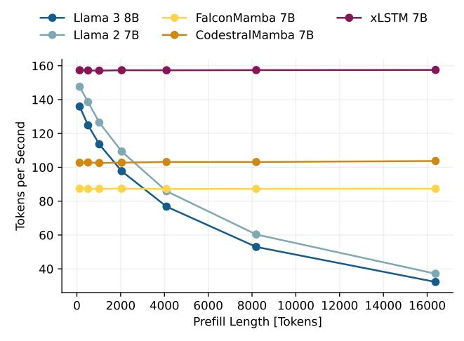
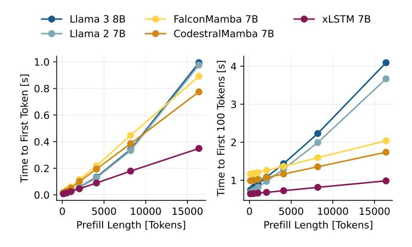
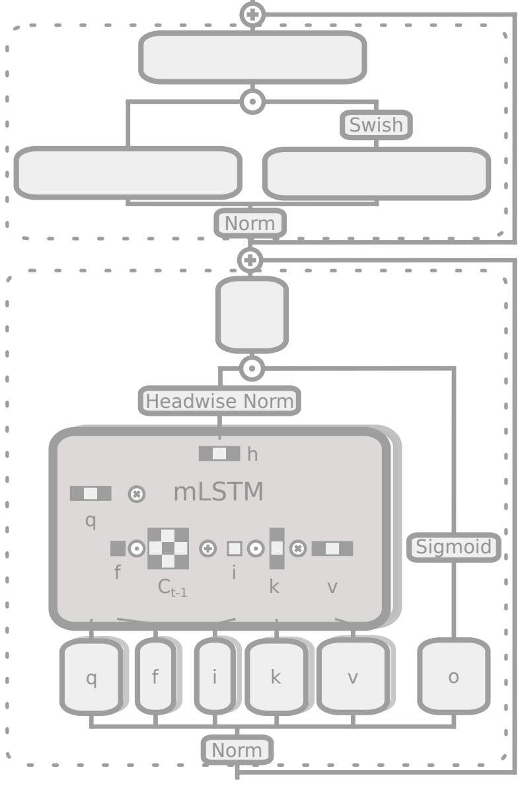
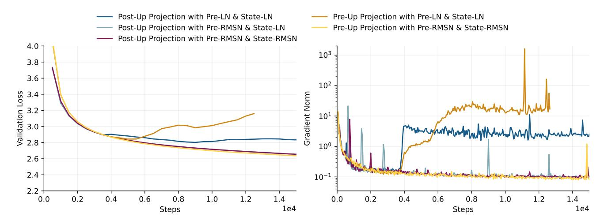

# xLSTM 7B: A Recurrent LLM for Fast and Efficient Inference

Maximilian Beck \* 1 2 Korbinian Poppel ¨ \* 1 2 Phillip Lippe \* 1 3 Richard Kurle <sup>1</sup> Patrick M. Blies <sup>1</sup> Gunter Klambauer ¨ 1 2 Sebastian Bock ¨ <sup>1</sup> Sepp Hochreiter 1 2

# Abstract

Recent breakthroughs in solving reasoning, math and coding problems with Large Language Models (LLMs) have been enabled by investing substantial computation budgets at inference time. Therefore, inference speed is one of the most critical properties of LLM architectures, and there is a growing need for LLMs that are efficient and fast at inference. Recently, LLMs built on the xLSTM architecture have emerged as a powerful alternative to Transformers, offering linear compute scaling with sequence length and constant memory usage, both highly desirable properties for efficient inference. However, such xLSTMbased LLMs have yet to be scaled to larger models and assessed and compared with respect to inference speed and efficiency. In this work, we introduce xLSTM 7B, a 7-billion-parameter LLM that combines xLSTM's architectural benefits with targeted optimizations for fast and efficient inference. Our experiments demonstrate that xLSTM 7B achieves performance on downstream tasks comparable to other similar-sized LLMs, while providing significantly faster inference speeds and greater efficiency compared to Llama- and Mamba-based LLMs. These results establish xLSTM 7B as the fastest and most efficient 7B LLM, offering a solution for tasks that require large amounts of test-time computation. Our work highlights xLSTM's potential as a foundational architecture for methods building on heavy use of LLM inference. Our model weights, model code and training code are open-source.

Model: <https://huggingface.co/NX-AI/xLSTM-7b> Code: <https://github.com/NX-AI/xlstm> and <https://github.com/NX-AI/xlstm-jax>.

# 1. Introduction

Recent breakthroughs in test-time compute scaling have unlocked significant improvements in solving complex reasoning and math problems. By sampling multiple promising solutions, the best answers can be provided to the user or used as training targets [\(Yao et al.,](#page-12-0) [2023;](#page-12-0) [Hao et al.,](#page-10-0) [2023;](#page-10-0) [Guan et al.,](#page-10-1) [2025\)](#page-10-1). However, as state-of-the-art models such as OpenAI o1[1](#page-0-0) and DeepSeek-R1 [\(DeepSeek-AI et al.,](#page-9-0) [2025\)](#page-9-0) leverage these methods to push the capabilities of language models to new heights, the significantly increased computational overhead of test-time compute methods requires more efficient architectures that provide greater inference speeds. A promising path involves linear recurrent neural networks with gating mechanisms, including GLA [\(Yang et al.,](#page-12-1) [2024b\)](#page-12-1), Mamba [\(Gu & Dao,](#page-10-2) [2024;](#page-10-2) [Dao & Gu,](#page-9-1) [2024\)](#page-9-1), RWKV [\(Peng et al.,](#page-11-0) [2023;](#page-11-0) [2024\)](#page-11-1), RetNet [\(Sun et al.,](#page-11-2) [2023\)](#page-11-2), and xLSTM [\(Beck et al.,](#page-9-2) [2024\)](#page-9-2). Compared to Transformers, these models offer a parallel mode for efficient training (e.g. [Yang et al.,](#page-12-1) [2024b\)](#page-12-1) and a recurrent generation mode that both scale linearly with context length. The increased compute efficiency combined with constant memory usage during inference allows spending more compute at test-time, but also enables running models locally on edge devices acting as an interface to the user with fast response times.

xLSTM has shown competitive performance compared to alternative recurrent models and even Transformers in a controlled experimental setting using the same data and similar parameter counts [\(Beck et al.,](#page-9-2) [2024\)](#page-9-2). Moreover, this architecture also excelled in other domains, such as computer vision [\(Alkin et al.,](#page-9-3) [2025\)](#page-9-3), robotics [\(Schmied et al.,](#page-11-3) [2024\)](#page-11-3), molecular biology [\(Schmidinger et al.,](#page-11-4) [2025\)](#page-11-4), and time series [\(Kraus et al.,](#page-10-3) [2024\)](#page-10-3). However, so far, xLSTM has not been scaled to datasets beyond 300B tokens and 1.3B parameters. It therefore remains uncertain whether this architecture can match the Transformer's ability to scale effectively with larger model sizes and extract meaningful patterns from ever-larger datasets.

In this work, we scale the xLSTM to 7B parameters and present our xLSTM 7B, a large language model trained on 2.3T tokens from the DCLM dataset [\(Li et al.,](#page-11-5) [2024\)](#page-11-5) with

<sup>\*</sup>Equal contribution <sup>1</sup>NXAI GmbH, Linz, Austria JKU, Johannes Kepler University, Linz, Austria <sup>3</sup>Now at Google Deepmind. Correspondence to: Maximilian Beck <[maximilian.beck@nx-ai.com](mailto:maximilian.beck@nx-ai.com)>, Korbinian Poppel ¨ <[korbinian.poeppel@nx-ai.com](mailto:korbinian.poeppel@nx-ai.com)>, Sebastian Bock ¨ <[sebastian.boeck@nx-ai.com](mailto:sebastian.boeck@nx-ai.com)>.

<span id="page-0-0"></span><https://openai.com/index/introducing-openai-o1-preview/>

context length 8192 using 128 H100 GPUs. To achieve this, we improve and optimize the initial xLSTM architecture from Beck et al. (2024) for optimal training efficiency and stability, without sacrificing performance in downstream tasks. Our new architecture fully relies on mLSTM cells with parallel training mode to achieve maximum speed at high language modeling performance. We further optimize the throughput by modifying the surrounding block architecture. By operating the mLSTM in a lower dimensional space and adding position-wise feedforward MLP layers similar to the default Transformer blocks, we increase the amount of compute spent for highly optimized linear layers. Additionally, we discard components such as channel-wise convolutions or learnable skip connections to increase the GPU utilization during training. We find that this optimized block architecture has a  $2\times$  to  $4\times$  higher token throughput compared to the previous xLSTM architecture of Beck et al. (2024), while achieving similar performance on language modeling. In addition to the efficiency optimizations, we optimize the new xLSTM architecture for improved training stability, focusing specifically on the gating mechanism of the mLSTM cell. By introducing soft-capping for input and forget gates and improved initializations for the input gate we effectively mitigate high gradient norm spikes and variance, and improve the performance of our xLSTM 7B.

In our evaluations on language downstream and long-context tasks, xLSTM 7B shows comparable performance to Transformers and Mamba models of the same size, but with our optimized block architecture it achieves the highest prefill and generation throughput with the lowest GPU memory footprint on our inference efficiency benchmarks.

To summarize, in this work we present targeted modifications to the xLSTM architecture in order to (i) improve training and inference efficiency, and (ii) ensure training stability at large scales. (iii) We introduce a new language model with 7B parameters based on the xLSTM architecture trained on 2.3 T tokens with 8k context length demonstrating the highest inference speed and efficiency in our benchmarks.

We release the pre-trained model xLSTM 7B on Huggingface<sup>2</sup> and provide the model implementation and training code <sup>3</sup> including optimized triton kernels <sup>4</sup> for fast training and inference.

## 2. Background: xLSTM with Matrix Memory

In this section, we reassess the mLSTM (Beck et al., 2024), on which we build our xLSTM 7B. The mLSTM cell is fully parallelizable, and, therefore, enables highly efficient

large-scale model training while maintaining fast recurrent inference with constant memory.

Generation Mode. During inference, when generating tokens, the mLSTM cell processes the series of input vectors  $\boldsymbol{x}_t \in \mathbb{R}^d$  for time steps  $t \in \{1, \dots, T\}$  in a recurrent manner, mapping a state  $(\boldsymbol{h}_{t-1}, \boldsymbol{C}_{t-1}, \boldsymbol{n}_{t-1}, m_{t-1})$  to a successor state  $(\boldsymbol{h}_t, \boldsymbol{C}_t, \boldsymbol{n}_t, m_t)$  given an input  $\boldsymbol{x}_t$ . Here,  $\boldsymbol{h}_t \in \mathbb{R}^{d_{hv}}$  denotes the hidden state,  $\boldsymbol{C}_t \in \mathbb{R}^{d_{qk} \times d_{hv}}$  denotes the cell state responsible for long-term memory,  $\boldsymbol{n}_t \in \mathbb{R}^{d_{qk}}$  denotes the normalizer state, and  $m_t \in \mathbb{R}$  denotes the max state controlling the magnitude of the exponential input gate.

In the recurrent mode (generation), the mLSTM cell

<span id="page-1-6"></span>
$$h_t = \text{mLSTMCell}(x_t, h_{t-1}, C_{t-1}, n_{t-1}, m_{t-1}),$$
 (1)

is defined by the following state update equations:

<span id="page-1-4"></span>
$$m_t = \max\left\{\log\sigma(\tilde{\mathbf{f}}_t) + m_{t-1}, \ \tilde{\mathbf{i}}_t\right\},\tag{2}$$

$$C_t = f_t C_{t-1} + i_t k_t v_t^{\top}, \qquad (3)$$

$$\boldsymbol{n}_t = f_t \, \boldsymbol{n}_{t-1} + i_t \, \boldsymbol{k}_t, \tag{4}$$

$$\widetilde{\boldsymbol{h}}_{t} = \frac{\boldsymbol{C}_{t}^{\top} \left( \boldsymbol{q}_{t} / \sqrt{d_{qk}} \right)}{\max \left\{ \left| \boldsymbol{n}_{t}^{\top} \left( \boldsymbol{q}_{t} / \sqrt{d_{qk}} \right) \right|, \exp(-m_{t}) \right\}}, \quad (5)$$

$$\mathbf{h}_t = \mathbf{o}_t \odot \operatorname{Norm}(\widetilde{\mathbf{h}}_t).$$
 (6)

The gate activations are computed as:

<span id="page-1-7"></span><span id="page-1-3"></span>
$$f_t = \exp\left(\log \sigma(\tilde{f}_t) + m_{t-1} - m_t\right),\tag{7}$$

<span id="page-1-5"></span>
$$i_t = \exp(\tilde{i}_t - m_t), \tag{8}$$

$$\mathbf{o}_t = \sigma\left(\tilde{\mathbf{o}}_t\right). \tag{9}$$

The query, key, and value vectors  $q_t, k_t \in \mathbb{R}^{d_{qk}}, v_t \in \mathbb{R}^{d_{hv}}$  are computed as  $\{q_t, k_t, v_t\} = W_{\{q,k,v\}} x_t + b_{\{q,k,v\}}$ . The scalar input and forget gates  $\mathbf{i}_t, \mathbf{f}_t \in \mathbb{R}$  are computed from the pre-activations  $\{\tilde{\mathbf{i}}_t, \tilde{\mathbf{f}}_t\} = w_{\{\mathbf{i},f\}}^{\top} x_t + b_{\{\mathbf{i},f\}}$  and the vector output gate  $\mathbf{o}_t \in \mathbb{R}^{d_{hv}}$  is computed from the pre-activation  $\tilde{\mathbf{o}}_t = W_{\mathbf{o}} x_t + b_{\mathbf{o}}$  with the sigmoid function  $\sigma$ . The normalization layer Norm in (6) can be either RMSNorm (Zhang & Sennrich, 2019) or LayerNorm (Ba et al., 2016).

**Training Mode.** In training, the mLSTM cell processes a full sequence of input vectors  $\boldsymbol{X} \in \mathbb{R}^{T \times d}$  and computes the hidden states  $\boldsymbol{H} \in \mathbb{R}^{T \times d_{hv}}$  for all time steps T in parallel. We denote the mLSTM cell in parallel mode (training) as

$$H = \text{mLSTMCell}(X).$$
 (10)

Due to the linear nature of the recurrence in equations (2)-(9), the hidden states H can be computed in chunks without materializing the intermediate memory states  $(C_t, n_t, m_t)$ .

<span id="page-1-0"></span><sup>2</sup>https://huggingface.co/NX-AI/xLSTM-7b

<span id="page-1-1"></span><sup>3</sup>https://github.com/NX-AI/xlstm-jax

<span id="page-1-2"></span><sup>4</sup>https://github.com/NX-AI/mlstm\_kernels

<span id="page-2-3"></span>

Figure 1. Sketch of the updated xLSTM Block. The lower part is an output-gated sequence-mix layer with the mLSTM at its core, whereas the upper part is a gated MLP (SwiGLU) as a feature/channel-mix layer. See Fig. 8 for details.

This *chunkwise-parallel* form enables highly efficient training kernels, analogous to FlashLinearAttention (Yang et al., 2024b; Yang & Zhang, 2024), surpassing the training speeds of FlashAttention (Dao, 2024; Shah et al., 2024). For details on the chunkwise-parallel training kernels for the mLSTM cell, we refer to Anonymous (2025).

**Multi-Head mLSTM.** Similar to multi-head attention in Transformers (Vaswani et al., 2017), the xLSTM has  $N_{\text{head}} = d/d_{hv}$  different mLSTM cells mLSTMCell<sup>(i)</sup>. The hidden states  $\boldsymbol{H}^{(i)}$  of every head are then concatenated and once again projected, resulting in the mLSTM layer

$$\mathrm{mLSTM}(\boldsymbol{X}) = \mathrm{Concat}(\boldsymbol{H}^{(1)}, \dots, \boldsymbol{H}^{(N_{\mathsf{head}})}) \; \boldsymbol{W}_{\mathsf{proj}}^{\top}, \; (11)$$

where  $H^{(i)} = \text{mLSTMCell}^{(i)}(X)$ . We discuss key considerations for choosing the number of parallel heads or in other words the head dimension  $d_{hv}$  in Sec. 3.1.

## <span id="page-2-4"></span>3. Optimized xLSTM 7B Architecture

The emerging paradigm of increasing test-time computation necessitates i) the development of novel architectures optimized for *efficient inference*. Additionally, new architectures must ii) be viable in large-scale pre-training setups, thus be *highly efficient during training*, and iii) exhibit *stable convergence*. Our xLSTM 7B is designed to meet these three challenges by offering an architecture that can be trained efficiently and with stable convergence and is also highly efficient at inference. In Sec. 3.1, we detail our optimization of the xLSTM architecture for *efficiency* during both inference and training. We then describe in Sec. 3.2 our actions to improve and ensure *stable convergence* for training large xLSTM models, focusing specifically on the gating mechanism of the mLSTM cell.

### <span id="page-2-0"></span>3.1. Optimizing for Efficiency

The core of the xLSTM 7B architecture, the mLSTM cell, with its recurrent and parallel mode enable efficient inference and training. To leverage its full potential, we revisit the design of the surrounding block structures.

Previous mLSTM Block. Similarly to other linear RNNs like Mamba (Gu & Dao, 2024; Hua et al., 2022), the previous xLSTM architecture places the mLSTM cell combined with channel-wise convolutions in between a linear up-projection and down-projection, which is referred to as pre up-projection block (Beck et al., 2024). These blocks combine sequence mixing and channel mixing in one block and are therefore stacked homogeneously without interleaving position-wise feed-forward MLP layers. Although the pre up-projection block architecture has proven competitive language modeling performance for the xLSTM up to 1.4B parameters, it comes with a substantial trade-off in computational efficiency for the following reasons:

- 1. Within the pre up-projection block, the mLSTM operates in a significantly higher dimension than the embedding dimension of the model. This leads to a substantially higher computational cost and GPU memory usage for the mLSTM operation.
- 2. Omitting position-wise feed-forward MLP layers results in a *decreased proportion of highly efficient linear layer FLOPs* in the model.
- <span id="page-2-2"></span>3. The previous xLSTM architecture uses several additional components such as learnable skip connections, channel-wise convolutions, and small (block-diagonal) projection layers to compute queries, keys and values. Without custom kernel fusion, these small operations result in multiple short kernel calls on the GPU, which cannot effectively utilize tensor cores<sup>5</sup> and, consequently, significantly *reduce GPU utilization*.
- 4. Previously, the input and forget gate pre-activations were computed from concatenated query, key and value projections. In a large-scale tensor-parallel training setup this requires an additional all-reduce operation per mLSTM block, which increases the overall communication cost.

These limitations prevent efficient scaling of the xLSTM architecture as introduced by Beck et al. (2024) beyond 1.4B parameters. To scale the xLSTM to even larger model sizes, we optimize the mLSTM block for maximal efficiency by addressing these four limitations.

**Optimizing the mLSTM Block.** To begin, we operate the mLSTM cell in the models' embedding dimension, in-

<span id="page-2-1"></span><sup>&</sup>lt;sup>5</sup>Tensor cores are specialized compute units that accelerate matrix multiplications on GPUs.

stead of a higher dimensional space and place position-wise feed-forward MLP layers after each mLSTM layer. This modification increases the proportion of highly optimized linear layer (i.e. matrix multiplication) FLOPs and reduces the computation cost of the mLSTM operation (see App. [D](#page-18-0) for details on the FLOP computation). The significantly reduced GPU memory usage enables larger batch sizes during training, which also increases training efficiency. The result is the default dense Transformer block configuration referred to as *post up-projection block* by [Beck et al.](#page-9-2) [\(2024\)](#page-9-2):

$$z = x + \text{mLSTM}(\text{Norm}(x)),$$
 (12a)

$$y = z + MLP(Norm(z)),$$
 (12b)

<span id="page-3-1"></span>where x is the input to the block, z is the intermediate output of the mLSTM layer defined in [\(11\)](#page-2-2), and y is the block output. The MLP is a SwiGLU [\(Shazeer,](#page-11-7) [2020\)](#page-11-7) (see Fig. [1\)](#page-2-3).

Moreover, we discard operations like the channel-wise convolution and the learnable skip-connection, and replace the block-wise query, key and value projections by dense linear layers. This again increases linear layer FLOPs and ensures effective usage of tensor cores within the mLSTM layer.

Finally, we ensure that the gate pre-activations for every head are computed independently as outlined in [\(11\)](#page-2-2). This allows us to apply the model parallelization strategies optimized for Transformers with self-attention [\(Shoeybi et al.,](#page-11-8) [2020\)](#page-11-8) to our xLSTM 7B architecture and therefore minimize additional communication cost.

These optimizations result in our optimized mLSTM block described in Fig. [1](#page-2-3) and Fig. [8](#page-13-0) in the appendix, of which we stack 32 in our xLSTM 7B architecture. We observe that our optimizations achieve a 3.5× speedup in training for 1.4B models, with a slight trade-off in validation perplexity that can be mitigated by a few more training steps (see Tab. [2\)](#page-8-0). Although the modified block structure reduces the size of the mLSTM cell memory states C, we find that it does not compromise the language modeling quality of our model.

Optimizing the Memory Capacity. The overall memory capacity of the xLSTM, i.e. the amount of information that can be stored from an input sequence, is related to the physical size of its memory cell states C of shape dqk × dhv in GPU memory. By choosing either the number of heads or the head dimension dhv, the other is given by the relation to the embedding dimension d = #heads × dhv. For the xLSTM 7B we set dqk = dhv/2 similar to [Sun et al.](#page-11-2) [\(2023\)](#page-11-2). We can then compute the total memory state size by #blocks × #heads × dqk × dhv × 4 bytes, assuming that the state is stored in float32 format. In Tab. [3](#page-8-1) we show the memory state size for different number of heads as well as their trade-offs with language modeling performance and training efficiency. We use a larger memory state size and

a slightly longer train step time to make sure the model is not constrained by a lack of memory. We elaborate further on this in Sec. [5.](#page-5-0) We choose 8 heads with head dimension dhv = 512 for xLSTM 7B.

Fused Generation Kernels for the mLSTM Cell. During autoregressive generation, the hidden state outputs of the mLSTM cell are computed, with its recurrent formulation given by [\(1\)](#page-1-6) – [\(9\)](#page-1-5). The recurrent formulation consists of a combination of an outer-product, dot-products and several pointwise operations, which translates to individual consecutive GPU kernels. Since each kernel loads its inputs from and stores its outputs to GPU memory, this increases the amount of slow memory operations. To ensure that intermediate results of equations [\(2\)](#page-1-4)–[\(5\)](#page-1-7) are not unnecessarily transferred to GPU memory, but instead remain on the GPU's compute chips, we write fused GPU kernels for the mLSTM generation mode. This results in significantly faster generation as shown in speed benchmarks in Sec. [5.2.](#page-6-0)

## <span id="page-3-0"></span>3.2. Optimizing for Stability

We find that the previous xLSTM architecture at the 7B parameter scale often becomes unstable in early stages of training. In particular, we noticed that training at higher learning rates leads to large spikes in the gradient magnitude and loss value, similar to reports from previous works on Mamba-based models [\(Lieber et al.,](#page-11-9) [2024;](#page-11-9) [Dao & Gu,](#page-9-1) [2024;](#page-9-1) [Zuo et al.,](#page-12-5) [2024\)](#page-12-5). We further observed and attribute these spikes to very large outlier features, i.e. individual feature values that are significantly larger than the average feature value [\(He et al.\)](#page-10-5). We address these stability issues by (i) the use of RMSNorm instead of LayerNorm, (ii) soft-capping of the input and forget gates, and (iii) a negative initialization of the input gate bias.

Pre-Norm with RMSNorm. Many works report that replacing the LayerNorm by RMSNorm at the input of each layer (e.g. in the pre-norm setting [\(Xiong et al.,](#page-12-6) [2020\)](#page-12-6)) improves training stability for Transformers [\(OLMo et al.,](#page-11-10) [2025;](#page-11-10) [Touvron et al.,](#page-12-7) [2023;](#page-12-7) [Gemma Team,](#page-10-6) [2024a;](#page-10-6) [Yang](#page-12-8) [et al.,](#page-12-8) [2024a\)](#page-12-8) and Mamba models [\(Zuo et al.,](#page-12-5) [2024\)](#page-12-5). Our experiments in App. [C.2,](#page-15-0) Fig. [9](#page-15-1) confirm that this also applies to the *pre-norm* normalization layers in [\(12\)](#page-3-1) in our xLSTM architecture. Therefore, we replace the LayerNorm by RMSNorm in our xLSTM architecture.

Gate Soft-Capping. To reduce potential large outlier features and related loss spikes, we apply soft-capping to the input and forget gate pre-activations˜i<sup>t</sup> and ˜ft, such that their values stay between −a and a for a specific cap value a. We cap the gates using a = 15 with the function

<span id="page-3-2"></span>
$$\operatorname{softcap}_a(\boldsymbol{x}) = a \cdot \tanh(\boldsymbol{x}/a).$$
 (13)

In Sec. [5.3](#page-7-0) and App. Sec. [C.2,](#page-15-0) we confirm that this significantly improves the stability and performance of our

<span id="page-4-0"></span>

Figure 2. Loss and Gradient Norm during Pretraining of xLSTM 7B. We show the mean and maximum value over 50 steps. Our enhanced architecture and initialization enable stable pretraining of xLSTM 7B, exhibiting only two brief loss spikes early in training, both of which were rapidly recovered.

Table 1. Model Performance on Huggingface Leaderboard v2. ↑ indicates larger values are better.

<span id="page-4-1"></span>

| Model                        | ВВН↑  | MMLU-Pro↑ | Матн ↑ | MuSR↑ | GPQA↑ | IFEval↑ | Average ↑ |
|------------------------------|-------|-----------|--------|-------|-------|---------|-----------|
| TRANSFORMERS                 |       |           |        |       |       |         |           |
| Llama-3.1-8B                 | 0.465 | 0.325     | 0.042  | 0.379 | 0.312 | 0.125   | 0.275     |
| Llama-2-7B-hf                | 0.349 | 0.186     | 0.013  | 0.363 | 0.269 | 0.264   | 0.241     |
| OLMo-7B-hf                   | 0.330 | 0.118     | 0.010  | 0.357 | 0.257 | 0.280   | 0.225     |
| Gemma-7B                     | 0.426 | 0.293     | 0.061  | 0.408 | 0.295 | 0.272   | 0.292     |
| Ministral-8B-Instruct-2410   | 0.496 | 0.350     | 0.151  | 0.430 | 0.319 | 0.322   | 0.345     |
| Bloom-7B1                    | 0.311 | 0.111     | 0.000  | 0.354 | 0.264 | 0.138   | 0.196     |
| Gpt-j-6B                     | 0.321 | 0.125     | 0.009  | 0.363 | 0.261 | 0.250   | 0.222     |
| Pythia-6.9B                  | 0.326 | 0.116     | 0.006  | 0.355 | 0.270 | 0.232   | 0.217     |
| Qwen2.5-7B                   | 0.541 | 0.435     | 0.165  | 0.446 | 0.329 | 0.359   | 0.379     |
| Gemma-2-9B                   | 0.543 | 0.414     | 0.117  | 0.453 | 0.334 | 0.217   | 0.346     |
| DCLM-7B                      | 0.426 | 0.312     | 0.030  | 0.392 | 0.303 | 0.228   | 0.282     |
| TRANSFORMER-RECURRENT HYBRID | S     |           |        |       |       |         |           |
| Zamba2-7B                    | 0.489 | 0.319     | 0.114  | 0.402 | 0.318 | 0.375   | 0.336     |
| RECURRENT MODELS             |       |           |        |       |       |         |           |
| Falcon-Mamba-7B (pre-decay)  | 0.373 | 0.177     | 0.024  | 0.387 | 0.275 | 0.252   | 0.248     |
| Falcon-Mamba-7B              | 0.429 | 0.229     | 0.039  | 0.412 | 0.299 | 0.335   | 0.290     |
| MambaCodestral-7B (v0.1)     | 0.405 | 0.191     | 0.023  | 0.359 | 0.266 | 0.322   | 0.261     |
| RKWV-v5-Eagle-7B             | 0.325 | 0.121     | 0.007  | 0.322 | 0.243 | 0.266   | 0.214     |
| RWKV-v6-Finch-7B             | 0.342 | 0.154     | 0.014  | 0.338 | 0.265 | 0.264   | 0.230     |
| xLSTM 7B                     | 0.381 | 0.242     | 0.036  | 0.379 | 0.280 | 0.244   | 0.260     |
| xLSTM 7B LCTX                | 0.390 | 0.252     | 0.040  | 0.374 | 0.253 | 0.234   | 0.257     |

xLSTM architecture. Additionally, we apply soft-capping with a = 30 to the final layer logits, similar to [Gemma](#page-10-7) [Team](#page-10-7) [\(2024b\)](#page-10-7).

Negative Input Gate Bias Initialization. We observe that early on in training our xLSTM models experience large gradient norm spikes, which affect the final performance of our model (see Fig. [11](#page-16-0) in App. [C.2\)](#page-15-0). Initializing the input gate at large negative values (e.g. -10) effectively mitigates these gradient norm spikes and improves performance. We analyze the impact of the input gate further in Sec. [5.3.](#page-7-0)

In summary, our optimizations enable remarkably stable pretraining of xLSTM 7B, as we show in Figure [2.](#page-4-0)

We outline the detailed block architecture of our xLSTM 7B in Appendix [A](#page-13-1) and our training recipe in Appendix [B.](#page-14-0)

# 4. Related Work

Although the largest language models to date have predominantly relied on Transformer-based architectures, recurrent LLMs and hybrid models have recently gained traction as alternative architectures due to their enhanced efficiency in processing long contexts. Many recent efforts have targeted the 7B parameter scale (or nearby), striking a balance between model capacity and resource constraints. Griffin [\(De](#page-9-7) [et al.,](#page-9-7) [2024\)](#page-9-7) is one of the first hybrid recurrent models that was trained with up to 14B parameters. Later, the same architecture was used to train RecurrentGemma with 9B parameters [\(Botev et al.,](#page-9-8) [2024\)](#page-9-8). The Griffin architecture uses a 1D temporal convolution of size 4 before the sequence mixing part, similar to H3 [\(Fu et al.,](#page-10-8) [2023\)](#page-10-8) and Mamba [\(Gu & Dao,](#page-10-2) [2024\)](#page-10-2), but the hidden state is vector valued with independent updates per each (scalar) dimension. In contrast, Eagle-7B [\(Peng et al.,](#page-11-1) [2024\)](#page-11-1) builds on the RWKV architecture and uses a matrix-valued hidden state similar to linear attention and gated linear attention [\(Katharopoulos](#page-10-9) [et al.,](#page-10-9) [2020;](#page-10-9) [Yang et al.,](#page-12-1) [2024b\)](#page-12-1).

Among the Mamba models at the 7B parameter scale, [Wal](#page-12-9)[effe et al.](#page-12-9) [\(2024\)](#page-12-9) provided the first comparative analysis of Mamba 1, Mamba 2, and a hybrid Mamba architecture. In their experiments, the performance of both Mamba 1 and Mamba 2 significantly lagged behind Transformers, while the hybrid architecture was shown to surpass the performance of Transformers. Aligned with this finding, several new hybrid Mamba architectures have been proposed, including Samba (3.8B) [\(Ren et al.,](#page-11-11) [2024\)](#page-11-11), Zamba (7B) [\(Glorioso et al.,](#page-10-10) [2024\)](#page-10-10), and the 12B parameter mixtureof-experts-model Jamba [\(Lieber et al.,](#page-11-9) [2024\)](#page-11-9). More recently, FalconMamba [\(Zuo et al.,](#page-12-5) [2024\)](#page-12-5) based on Mamba 1 and Codestral Mamba [\(Mistral AI Team,](#page-11-12) [2024\)](#page-11-12) based on Mamba 2 have shown that a purely recurrent architecture is capable of exceeding the performance of both hybrid Mamba models and Transformers.

# <span id="page-5-0"></span>5. Experiments

### 5.1. Language Modeling Performance

Huggingface Leaderboard. We start by benchmarking xLSTM 7B against state-of-the-art Transformer and recurrent LLMs on the 7B parameter scale. To this end, we evaluate the performance on the Open LLM Leaderboard v2 using the LM Evaluation Harness [\(Gao et al.,](#page-10-11) [2024;](#page-10-11) [Fourrier](#page-10-12) [et al.,](#page-10-12) [2024\)](#page-10-12). The results are summarized in Tab. [1,](#page-4-1) showing that xLSTM 7B ranks in the mid-range among 7B-scale models, several of which benefited from substantially larger training datasets. We believe that with a larger and better curated training dataset, including a greater emphasis on math and code data in earlier training phases, xLSTM 7B could match the performance of the strongest 7B models.

Long-Context Evaluation and Fine-Tuning. To evaluate long-context capabilities, we use the RULER benchmark [\(Hsieh et al.,](#page-10-13) [2024\)](#page-10-13), which consists of a set of synthetic needle-in-a-haystack, question-answering and variable tracking tasks, with varying context length from 4K to 131K tokens. For this benchmark, we consider both our standard xLSTM 7B and a long-context version (xLSTM 7B LCTX), where we replace the standard cool-down phase described in App. [B](#page-14-0) with a long-context variant. For the long-context cool-down phase, we add long-context data (see App. Tab. [5\)](#page-14-1) to the training corpus and train the model with a context length of 32K, while adjusting the batch size to maintain the number of tokens per batch. We compare to Llama 2 7B (not long-context fine-tuned) and Llama 3.1 8B (long-context fine-tuned up to 131K tokens) as Transformer baselines, CodestralMamba and FalconMamba as State Space Model baselines, and RWKV-5/6 as additional RNN baselines.

The results on RULER are shown in Fig. [3.](#page-6-1) As expected, Llama 3 provides the strongest baseline, since it is heavily fine-tuned on very long contexts and with a more advanced and optimized approach [\(Grattafiori et al.,](#page-10-14) [2024\)](#page-10-14). On the other hand, Llama 2 fails entirely for context lengths beyond 4k, for which it has not been trained. For xLSTM 7B, the long-context cool-down stage in pre-training largely improves long-context capabilities, resulting in competitive performance compared to state-space models and outperforming RWKV-5/6. Notably, the long-context xLSTM 7B achieves 20% average accuracy at a context length 131k, although it was trained only with a context length up to 32k during the cool-down phase. This is particularly remarkable given that, unlike Transformers with a growing KV cache, xLSTM 7B must store information from the entire sequence in a fixed-size memory with limited capacity (see Tab. [3\)](#page-8-1). We assume that xLSTM 7B's performance could be pushed further by explicitly training on even longer sequences and with a more advanced fine-tuning protocol as it was used in the training of Llama 3 [\(Grattafiori et al.,](#page-10-14) [2024\)](#page-10-14).

<span id="page-6-1"></span>


In Sec. 5.3, we further investigate the effect of the memory state size and the input gate on the long context capabilities of xLSTM 7B.

### <span id="page-6-0"></span>5.2. Speed Benchmarks

The constant memory size and linear compute scaling with context length of our xLSTM architecture enable highly efficient generative inference in large scale-inference serving environments as well as local inference running on edge devices.

We focus on the local single user inference setting, which is common when models are deployed on edge devices. Therefore, we benchmark generative inference with our xLSTM 7B model on a single NVIDIA H100 GPU with batch size 1, unless specified otherwise. We compare our xLSTM 7B to Llama 2 and Llama 3 models as Transformer baselines and Falcon Mamba (Mamba 1 architecture) and Codestral Mamba (Mamba 2 architecture) as Mamba baselines. We use model implementations from Huggingface transformers library and optimize each with torch.compile <sup>6</sup> and PyTorch CUDA Graphs (Nguyen et al., 2021).

Generation Throughput. The generation throughput measures the generation speed in tokens per second at varying prefill lengths, i.e., varying length of documents the model gets to read before it starts to generate text. In Fig. 4, we observe that due to the quadratic scaling with input context length of the attention mechanism, the speed at which the Transformer models can generate text significantly drops for longer prefill lengths. In contrast, recurrent architectures

<span id="page-6-3"></span>

*Figure 4.* Throughput for generating 100 tokens with batch size 1 at varying prefill lengths.

with constant cost per generated token have a constant generation speed independent of the input context length.

We find that xLSTM 7B is about 50% faster in text generation than Mamba, which we attribute mostly to our optimized block design (see Sec. 3), and even faster than Llamabased Transformer models with a similar block design at prefill length 0.

Generation Time and Memory Consumption. We measure the token generation time and GPU memory usage (without pre-fill) for different generation lengths. Fig. 5 (left) demonstrates the linear scaling of recurrent models vs. the quadratic scaling of Transformers in compute (runtime), while Fig. 5 (right) shows the constant memory size of recurrent models compared to the linear growth of the Transformer KV-cache. Since Llama 3 uses grouped query attention (Ainslie et al., 2023) the memory usage grows slower compared to Llama 2, which uses default multi-head attention.

With our optimized block design, we operate the mLSTM in a lower dimensional space. This results in a significantly lower memory footprint (Fig. 5 (right)) and lower generation times (Fig. 5 (left)) of our xLSTM 7B model compared to the Mamba models.

**Time To First Token.** In applications, where the language model operates as interface to the user (potentially on edge devices), it is important to have short response times. In Fig. 6, we measure this response time or latency as the time the model takes to generate 1 or 100 token after consuming varying prefill lengths. Our xLSTM 7B achieves the fastest response times for all prefill lengths.

<span id="page-6-2"></span><sup>6</sup>https://github.com/huggingface/transformers

<span id="page-7-1"></span>

Figure 5. Time and GPU memory used for generation of a single sequence of varying lengths for generation without prefill.

<span id="page-7-2"></span>

Figure 6. Time to first (1) token and time to first 100 tokens at varying prefill lengths for batch size 1.

**Prefill Throughput.** Finally, we measure the prefill throughput in tokens per second for 65,536 tokens at varying batch size and context length. Due to the quadratic scaling with context length, the throughput of the Llama models decreases with longer contexts. In contrast, our xLSTM 7B achieves the highest throughput (about 70% higher than Codestral Mamba) independent of the context length.

#### <span id="page-7-0"></span>5.3. Ablation Studies

Finally, we validate our design choices to optimize the training stability and efficiency of our xLSTM 7B architecture.

**Pre-Up vs. Post-Up Projection Block.** We compare the pre-up projection block architecture against our optimized mLSTM block in terms of validation perplexity and training step time for three model sizes. For both block architectures, we apply gate soft-capping and the input gate bias initialization described in Sec. 3. The results in Tab. 2 show only a slight performance difference in terms of validation perplexity at the largest model size. However, the  $3.5\times$  speedup in training step time confirms our choice for the


Figure 7. Prefill throughput varying batch size and context length.

post-up projection block in xLSTM 7B, deviating from the pre-up projection of Mamba (Gu & Dao, 2024; Dao & Gu, 2024) and the previous xLSTM architecture (Beck et al., 2024).

**Memory State Size.** The memory state size as well as the training step time is directly influenced by the number of heads (see Sec. 3.1 and Tab. 3). In this experiment we investigate how the memory state size affects the performance of the xLSTM in validation perplexity, on downstream tasks as well as on long context tasks. To do so, we train xLSTM models with 7B parameters and different number of heads on 160B tokens of our pre-training dataset. In our evaluations in perplexity (Tab. 3) and on downstream tasks (Tab. 7 and 8), we find that the performance remains stable across different the number of heads, i.e., memory state sizes, with a slight improvement for more heads (e.g. 16). In contrast, our long context evaluation in Fig. 13 suggests that at very long contexts 4 and 8 heads (i.e., larger memory states) seem to perform better. While this is in line with our intuition that larger memory state size corresponds to better long-context capabilities, we believe that an even larger study (e.g., training on more tokens) than our ablation at 7B parameters and 160B tokens would be necessary to fully explore this connection.

Norm Layer Types. Our update on the xLSTM block architecture has two normalization layers, a pre-norm at the block entry and a head-wise norm layer after the mLSTM cell. In this ablation, we test the effect of the types of these normalization layers on training stability and performance, with LayerNorm (Ba et al., 2016) and RMSNorm (Zhang & Sennrich, 2019) as the options. In Fig. 9 in App. C.2 we confirm that, for the pre-norm the RMSNorm type has a strong stabilizing effect, whereas for the mLSTM cell state norm there is no impact on stability and performance.

<span id="page-8-0"></span>Table 2. Comparison between the previous xLSTM architecture (Beck et al., 2024) and our xLSTM 7B architecture in terms of step time and perplexity for different number of parameters. Models of size 160M and 400M use batch size 128 distributed over 16 GPUs, and 1.4B parameter models use batch size 256 (32 GPUs). For the 7B parameter model, our new architecture uses batch size 512 (128 GPUs), whereas the previous architecture uses only batch size 256 (128 GPUs) because of the architecture's increased GPU memory requirements. Due to the expensive computational costs, we only compute the token throughput and did not fully train the 7B parameter models for this ablation.

↑/↓ indicates larger / smaller values are better.

| MODEL |                  | THROUGHPUT ↑ 1K TOKENS/SEC | Speedup ↑ | PPL ↓          | $\Delta$ PPL |
|-------|------------------|----------------------------|-----------|----------------|--------------|
| 160M  | Previous<br>Ours | 76.20<br>225.99            | ×2.97     | 20.43<br>21.34 | +0.91        |
| 400M  | PREVIOUS<br>OURS | 28.13<br>102.40            | ×3.64     | 15.26<br>15.74 | +0.48        |
| 1.4B  | PREVIOUS<br>OURS | 10.57<br>37.03             | ×3.50     | 12.46<br>12.68 | +0.22        |
| 7B    | PREVIOUS<br>OURS | 3.46<br>9.15               | × 2.64    | -              |              |

<span id="page-8-1"></span>Table 3. Head dimension ablation for a 7B parameter xLSTM model with 32 blocks, embedding dimension 4096 and training context length 8192. KV Cache in Tokens shows how many tokens in a similar sized Transformer correspond to our state size. FLOPs forward are the mLSTM cell forward FLOPs for a full sequence. ↓ indicates smaller values are better.

| #Heads | $d_{hv}$ | Total Memory<br>State in MB | KV Cache<br>in Tokens | $_{\text{forward}}^{\text{FLOPs}}\downarrow$ | $_{\mathrm{PPL}}^{\mathrm{Val}}\downarrow$ | $\begin{array}{c} \text{Train Step} \\ \text{Time in s} \end{array} \downarrow$ |
|--------|----------|-----------------------------|-----------------------|----------------------------------------------|--------------------------------------------|---------------------------------------------------------------------------------|
| 4      | 1024     | 268.4                       | 256                   | 7.6e11                                       | 9.58                                       | 3.97                                                                            |
| 8      | 512      | 134.2                       | 128                   | 4.1e10                                       | 9.52                                       | 3.63                                                                            |
| 16     | 256      | 67.1                        | 64                    | 2.4e10                                       | 9.52                                       | 3.51                                                                            |
| 32     | 128      | 33.6                        | 32                    | 1.5e10                                       | 9.55                                       | 3.41                                                                            |

**Soft-capping.** Soft-capping (Eq. (13)) of the output logits and the input and forget gate pre-activations, is important for training stability. In Fig. 10 of the appendix, we visualize the validation loss and gradient norms during training on 160B tokens with and without soft-capping. The run without soft-capping shows a higher variance in the gradient norms and an overall worse validation loss.

**Input Gate.** We initialize the input gate with larger negative values (e.g. -10) to mitigate large gradient norm spikes and variance (see Sec. 3.2). This suggests that the input gate is important for the performance of the xLSTM architecture. Therefore, in App. C.2 we test the effect of having the input gate non-trainable. We compare a version with fixed input gate at one (i.e. setting weights and biases to zero) with a version, where the input gate bias is fixed at our low default initialization value of -10. We find that, while the learnable input gate only slightly improves performance of our xLSTM over the fixed input gate versions on our standard downstream tasks (App. C.2, Tab. 7 and 8), it significantly improves performance on long-context evaluations (App. C.2, Fig. 13).

#### 6. Conclusion

In this work, we demonstrate how our targeted modifications enable the xLSTM architecture to scale to models with 7B parameters, trained on 2.3 T tokens. By switching to a post-up-projection structure, gate soft-capping and proper initialization, we largely improve training stability and token throughput, making the xLSTM the fastest RNN-based architecture at the 7B scale, while competitive in performance with Transformers and other recurrent models. We believe that xLSTM's very high decoding speeds in combination with its good performance highlight its potential as foundational architecture for methods investing substantial compute at inference time.

## **Impact Statement**

This paper presents a novel architecture for fast and efficient language modeling, reducing computational costs and energy consumption without sacrificing performance. By making high-quality language models more accessible, our approach helps bridge the digital divide, enabling equitable AI deployment in low-resource settings. Additionally, the efficiency gains contribute to environmental sustainability by lowering the carbon footprint of large-scale NLP systems. However, there might be both positive and negative societal impacts. We are aware of the risks, but believe that our and the overall advancements in the field of machine learning technology provide a net benefit to society and the world.

# References

- <span id="page-9-9"></span>Ainslie, J., Lee-Thorp, J., de Jong, M., Zemlyanskiy, Y., Lebron, F., and Sanghai, S. GQA: Training generalized ´ multi-query transformer models from multi-head checkpoints, 2023. URL [https://arxiv.org/abs/](https://arxiv.org/abs/2305.13245) [2305.13245](https://arxiv.org/abs/2305.13245).
- <span id="page-9-3"></span>Alkin, B., Beck, M., Poppel, K., Hochreiter, S., and Brand- ¨ stetter, J. Vision-LSTM: xLSTM as generic vision backbone. In *Proceedings of the International Conference on Learning Representations (ICLR)*, 2025. URL [https:](https://openreview.net/forum?id=SiH7DwNKZZ) [//openreview.net/forum?id=SiH7DwNKZZ](https://openreview.net/forum?id=SiH7DwNKZZ).
- <span id="page-9-12"></span>Allal, L. B., Lozhkov, A., Bakouch, E., Blazquez, G. M., ´ Tunstall, L., Piqueres, A., Marafioti, A., Zakka, C., von Werra, L., and Wolf, T. SmolLM2 - with great data, comes great performance, 2024.
- <span id="page-9-6"></span>Anonymous. Tiled flash linear attention: More efficient linear RNN and xLSTM kernels. In *Submitted to the International Conference on Machine Learning (ICML)*, 2025. under review.
- <span id="page-9-16"></span>Azerbayev, Z., Schoelkopf, H., Paster, K., Santos, M. D., McAleer, S., Jiang, A. Q., Deng, J., Biderman, S., and Welleck, S. Llemma: An open language model for mathematics, 2023.
- <span id="page-9-4"></span>Ba, L. J., Kiros, J. R., and Hinton, G. E. Layer normalization. *CoRR*, abs/1607.06450, 2016.
- <span id="page-9-13"></span>Bai, Y., Lv, X., Zhang, J., He, Y., Qi, J., Hou, L., Tang, J., Dong, Y., and Li, J. LongAlign: A recipe for long context alignment of large language models. In *Findings of the Association for Computational Linguistics: EMNLP 2024*, pp. 1376–1395, Miami, Florida, USA, November 2024. Association for Computational Linguistics. doi: 10.18653/v1/2024.findings-emnlp. 74. URL [https://aclanthology.org/2024.](https://aclanthology.org/2024.findings-emnlp.74) [findings-emnlp.74](https://aclanthology.org/2024.findings-emnlp.74).
- <span id="page-9-2"></span>Beck, M., Poppel, K., Spanring, M., Auer, A., Prudnikova, ¨ O., Kopp, M., Klambauer, G., Brandstetter, J., and Hochreiter, S. xLSTM: Extended long short-term memory. In *Proceedings of the Conference on Neural Information Processing Systems (NeurIPS)*, 2024. URL <https://arxiv.org/abs/2405.04517>.
- <span id="page-9-17"></span>Beeching, E., Fourrier, C., Habib, N., Han, S., Lambert, N., Rajani, N., Sanseviero, O., Tunstall, L., and Wolf, T. Open LLM Leaderboard. [https://huggingface.](https://huggingface.co/spaces/open-llm-leaderboard-old/open_llm_leaderboard) [co/spaces/open-llm-leaderboard-old/](https://huggingface.co/spaces/open-llm-leaderboard-old/open_llm_leaderboard) [open\\_llm\\_leaderboard](https://huggingface.co/spaces/open-llm-leaderboard-old/open_llm_leaderboard), 2023.
- <span id="page-9-15"></span>Ben Allal, L., Lozhkov, A., Penedo, G., Wolf, T., and von Werra, L. Cosmopedia, February 2024. URL [https://huggingface.co/](https://huggingface.co/datasets/HuggingFaceTB/cosmopedia) [datasets/HuggingFaceTB/cosmopedia](https://huggingface.co/datasets/HuggingFaceTB/cosmopedia).

- <span id="page-9-10"></span>Black, S., Biderman, S., Hallahan, E., Anthony, Q., Gao, L., Golding, L., He, H., Leahy, C., McDonell, K., Phang, J., Pieler, M., Prashanth, U. S., Purohit, S., Reynolds, L., Tow, J., Wang, B., and Weinbach, S. GPT-NeoX-20B: An open-source autoregressive language model. In *ACL Workshop on Challenges & Perspectives in Creating Large Language Models*, 2022. URL [https://arxiv.](https://arxiv.org/abs/2204.06745) [org/abs/2204.06745](https://arxiv.org/abs/2204.06745).
- <span id="page-9-8"></span>Botev, A., De, S., Smith, S. L., Fernando, A., Muraru, G.- C., Haroun, R., Berrada, L., Pascanu, R., Sessa, P. G., Dadashi, R., and et al. RecurrentGemma: Moving past transformers for efficient open language models, 2024. URL <https://arxiv.org/abs/2404.07839>.
- <span id="page-9-14"></span>Chen, Y., Qian, S., Tang, H., Lai, X., Liu, Z., Han, S., and Jia, J. Longlora: Efficient fine-tuning of long-context large language models. In *Proceedings of the International Conference on Learning Representations (ICLR)*, 2024.
- <span id="page-9-11"></span>Cobbe, K., Kosaraju, V., Bavarian, M., Chen, M., Jun, H., Kaiser, L., Plappert, M., Tworek, J., Hilton, J., Nakano, R., Hesse, C., and Schulman, J. Training verifiers to solve math word problems. *arXiv preprint arXiv:2110.14168*, 2021.
- <span id="page-9-5"></span>Dao, T. FlashAttention-2: Faster attention with better parallelism and work partitioning. In *Proceedings of the International Conference on Learning Representations (ICLR)*, 2024. URL [https://openreview.net/](https://openreview.net/forum?id=mZn2Xyh9Ec) [forum?id=mZn2Xyh9Ec](https://openreview.net/forum?id=mZn2Xyh9Ec).
- <span id="page-9-1"></span>Dao, T. and Gu, A. Transformers are SSMs: Generalized models and efficient algorithms through structured state space duality. In *Proceedings of the International Conference on Machine Learning (ICML)*, 2024. URL [https:](https://openreview.net/forum?id=ztn8FCR1td) [//openreview.net/forum?id=ztn8FCR1td](https://openreview.net/forum?id=ztn8FCR1td).
- <span id="page-9-7"></span>De, S., Smith, S. L., Fernando, A., Botev, A., Cristian-Muraru, G., Gu, A., Haroun, R., Berrada, L., Chen, Y., Srinivasan, S., Desjardins, G., Doucet, A., Budden, D., Teh, Y. W., Pascanu, R., Freitas, N. D., and Gulcehre, C. Griffin: Mixing gated linear recurrences with local attention for efficient language models, 2024.
- <span id="page-9-0"></span>DeepSeek-AI, Guo, D., Yang, D., Zhang, H., Song, J., Zhang, R., Xu, R., Zhu, Q., Ma, S., Wang, P., Bi, X., and et al. DeepSeek-R1: Incentivizing reasoning capability in LLMs via reinforcement learning, January 2025. URL [http://arxiv.org/abs/2501.](http://arxiv.org/abs/2501.12948) [12948](http://arxiv.org/abs/2501.12948). arXiv:2501.12948 [cs].
- <span id="page-9-18"></span>Fourrier, C., Habib, N., Wolf, T., and Tunstall, L. Lighteval: A lightweight framework for llm evaluation, 2023. URL [https://github.com/](https://github.com/huggingface/lighteval) [huggingface/lighteval](https://github.com/huggingface/lighteval).

- <span id="page-10-12"></span>Fourrier, C., Habib, N., Lozovskaya, A., Szafer, K., and Wolf, T. Open llm leaderboard v2. [https://huggingface.co/spaces/](https://huggingface.co/spaces/open-llm-leaderboard/open_llm_leaderboard) [open-llm-leaderboard/open\\_llm\\_](https://huggingface.co/spaces/open-llm-leaderboard/open_llm_leaderboard) [leaderboard](https://huggingface.co/spaces/open-llm-leaderboard/open_llm_leaderboard), 2024.
- <span id="page-10-8"></span>Fu, D. Y., Dao, T., Saab, K. K., Thomas, A. W., Rudra, A., and Re, C. Hungry hungry hippos: Towards language modeling with state space models. In *Proceedings of the International Conference on Learning Representations (ICLR)*, 2023. URL [https://openreview.net/](https://openreview.net/forum?id=COZDy0WYGg) [forum?id=COZDy0WYGg](https://openreview.net/forum?id=COZDy0WYGg).
- <span id="page-10-11"></span>Gao, L., Tow, J., Abbasi, B., Biderman, S., Black, S., DiPofi, A., Foster, C., Golding, L., Hsu, J., Le Noac'h, A., Li, H., McDonell, K., Muennighoff, N., Ociepa, C., Phang, J., Reynolds, L., Schoelkopf, H., Skowron, A., Sutawika, L., Tang, E., Thite, A., Wang, B., Wang, K., and Zou, A. A framework for few-shot language model evaluation, 07 2024. URL [https://zenodo.org/records/](https://zenodo.org/records/12608602) [12608602](https://zenodo.org/records/12608602).
- <span id="page-10-6"></span>Gemma Team. Gemma: Open models based on gemini research and technology. 2024a. URL [https:](https://arxiv.org/abs/2403.08295) [//arxiv.org/abs/2403.08295](https://arxiv.org/abs/2403.08295).
- <span id="page-10-7"></span>Gemma Team. Gemma 2: Improving open language models at a practical size, 2024b. URL [https://arxiv.](https://arxiv.org/abs/2408.00118) [org/abs/2408.00118](https://arxiv.org/abs/2408.00118).
- <span id="page-10-10"></span>Glorioso, P., Anthony, Q., Tokpanov, Y., Whittington, J., Pilault, J., Ibrahim, A., and Millidge, B. Zamba: A compact 7b ssm hybrid model. *arXiv preprint arXiv:2405.16712*, 2024.
- <span id="page-10-14"></span>Grattafiori, A., Dubey, A., Jauhri, A., Pandey, A., Kadian, A., Al-Dahle, A., Letman, A., Mathur, A., Schelten, A., Vaughan, A., and et al. The Llama 3 herd of models. 2024. URL <https://arxiv.org/abs/2407.21783>.
- <span id="page-10-2"></span>Gu, A. and Dao, T. Mamba: Linear-time sequence modeling with selective state spaces. In *First Conference on Language Modeling*, 2024. URL [https://openreview.](https://openreview.net/forum?id=tEYskw1VY2) [net/forum?id=tEYskw1VY2](https://openreview.net/forum?id=tEYskw1VY2).
- <span id="page-10-1"></span>Guan, X., Zhang, L. L., Liu, Y., Shang, N., Sun, Y., Zhu, Y., Yang, F., and Yang, M. rStar-Math: Small LLMs can master math reasoning with self-evolved deep thinking, 2025.
- <span id="page-10-0"></span>Hao, S., Gu, Y., Ma, H., Hong, J., Wang, Z., Wang, D., and Hu, Z. Reasoning with language model is planning with world model. In *Proceedings of the 2023 Conference on Empirical Methods in Natural Language Processing*, pp. 8154–8173, 2023.

- <span id="page-10-5"></span>He, B., Noci, L., Paliotta, D., Schlag, I., and Hofmann, T. Understanding and minimising outlier features in transformer training. In *Proceedings of the Conference on Neural Information Processing Systems (NeurIPS)*.
- <span id="page-10-18"></span>Hoffmann, J., Borgeaud, S., Mensch, A., Buchatskaya, E., Cai, T., Rutherford, E., de las Casas, D., Hendricks, L. A., Welbl, J., Clark, A., Hennigan, T., Noland, E., Millican, K., van den Driessche, G., Damoc, B., Guy, A., Osindero, S., Simonyan, K., Elsen, E., Vinyals, O., Rae, J. W., and Sifre, L. An empirical analysis of compute-optimal large language model training. In Oh, A. H., Agarwal, A., Belgrave, D., and Cho, K. (eds.), *Advances in Neural Information Processing Systems*, 2022. URL [https:](https://openreview.net/forum?id=iBBcRUlOAPR) [//openreview.net/forum?id=iBBcRUlOAPR](https://openreview.net/forum?id=iBBcRUlOAPR).
- <span id="page-10-13"></span>Hsieh, C.-P., Sun, S., Kriman, S., Acharya, S., Rekesh, D., Jia, F., Zhang, Y., and Ginsburg, B. Ruler: What's the real context size of your long-context language models? *arXiv preprint arXiv:2404.06654*, 2024.
- <span id="page-10-4"></span>Hua, W., Dai, Z., Liu, H., and Le, Q. Transformer quality in linear time. In Chaudhuri, K., Jegelka, S., Song, L., Szepesvari, C., Niu, G., and Sabato, S. (eds.), *Proceedings of the International Conference on Machine Learning (ICML)*, volume 162, pp. 9099–9117. PMLR, 17–23 Jul 2022. URL [https://proceedings.mlr.](https://proceedings.mlr.press/v162/hua22a.html) [press/v162/hua22a.html](https://proceedings.mlr.press/v162/hua22a.html).
- <span id="page-10-9"></span>Katharopoulos, A., Vyas, A., Pappas, N., and Fleuret, F. Transformers are RNNs: fast autoregressive transformers with linear attention. In *Proceedings of the International Conference on Machine Learning (ICML)*, 2020.
- <span id="page-10-17"></span>Kocetkov, D., Li, R., allal, L. B., LI, J., Mou, C., Jernite, Y., Mitchell, M., Ferrandis, C. M., Hughes, S., Wolf, T., Bahdanau, D., Werra, L. V., and de Vries, H. The Stack: 3 TB of permissively licensed source code. *Transactions on Machine Learning Research*, 2023. ISSN 2835- 8856. URL [https://openreview.net/forum?](https://openreview.net/forum?id=pxpbTdUEpD) [id=pxpbTdUEpD](https://openreview.net/forum?id=pxpbTdUEpD).
- <span id="page-10-3"></span>Kraus, M., Divo, F., Dhami, D. S., and Kersting, K. xLSTM-Mixer: Multivariate time series forecasting by mixing via scalar memories. *arXiv preprint*, 2024. URL [https:](https://arxiv.org/abs/2410.16928) [//arxiv.org/abs/2410.16928](https://arxiv.org/abs/2410.16928).
- <span id="page-10-16"></span>Lambert, N., Morrison, J., Pyatkin, V., Huang, S., Ivison, H., Brahman, F., Miranda, L. J. V., Liu, A., Dziri, N., Lyu, S., and et al. Tulu 3: Pushing frontiers in open language ¨ model post-training. 2024.
- <span id="page-10-15"></span>LI, J., Beeching, E., Tunstall, L., Lipkin, B., Soletskyi, R., Huang, S. C., Rasul, K., Yu, L., Jiang, A., Shen, Z., Qin, Z., Dong, B., Zhou, L., Fleureau, Y., Lample, G., and Polu, S. NuminaMath. [https://github.com/](https://github.com/project-numina/aimo-progress-prize/blob/main/report/numina_dataset.pdf) [project-numina/aimo-progress-prize/](https://github.com/project-numina/aimo-progress-prize/blob/main/report/numina_dataset.pdf)

- [blob/main/report/numina\\_dataset.pdf](https://github.com/project-numina/aimo-progress-prize/blob/main/report/numina_dataset.pdf), 2024.
- <span id="page-11-5"></span>Li, J., Fang, A., Smyrnis, G., Ivgi, M., Jordan, M., Gadre, S., Bansal, H., Guha, E., Keh, S., Arora, K., and et al. Datacomp-lm: In search of the next generation of training sets for language models. *arXiv preprint arXiv:2406.11794*, 2024.
- <span id="page-11-9"></span>Lieber, O., Lenz, B., Bata, H., Cohen, G., Osin, J., Dalmedigos, I., Safahi, E., Meirom, S., Belinkov, Y., Shalev-Shwartz, S., Abend, O., Alon, R., Asida, T., Bergman, A., Glozman, R., Gokhman, M., Manevich, A., Ratner, N., Rozen, N., Shwartz, E., Zusman, M., and Shoham, Y. Jamba: A hybrid transformer-mamba language model, 2024. URL [https://arxiv.org/](https://arxiv.org/abs/2403.19887) [abs/2403.19887](https://arxiv.org/abs/2403.19887).
- <span id="page-11-14"></span>Loshchilov, I. and Hutter, F. Decoupled weight decay regularization. In *Proceedings of the International Conference on Learning Representations (ICLR)*, 2019. URL [https://openreview.net/forum?](https://openreview.net/forum?id=Bkg6RiCqY7) [id=Bkg6RiCqY7](https://openreview.net/forum?id=Bkg6RiCqY7).
- <span id="page-11-16"></span>Lozhkov, A., Ben Allal, L., von Werra, L., and Wolf, T. FineWeb-Edu: the finest collection of educational content, 2024. URL [https://huggingface.co/](https://huggingface.co/datasets/HuggingFaceFW/fineweb-edu) [datasets/HuggingFaceFW/fineweb-edu](https://huggingface.co/datasets/HuggingFaceFW/fineweb-edu).
- <span id="page-11-12"></span>Mistral AI Team. Codestral Mamba. [https://mistral.](https://mistral.ai/news/codestral-mamba/) [ai/news/codestral-mamba/](https://mistral.ai/news/codestral-mamba/), 2024. Accessed: 2025-01-30.
- <span id="page-11-13"></span>Nguyen, V., Carilli, M., Eryilmaz, S. B., Singh, V., Lin, M., Gimelshein, N., Desmaison, A., and Yang, E. Accelerating PyTorch with CUDA graphs, October 2021. URL [https://pytorch.org/blog/](https://pytorch.org/blog/accelerating-pytorch-with-cuda-graphs/) [accelerating-pytorch-with-cuda-graphs/](https://pytorch.org/blog/accelerating-pytorch-with-cuda-graphs/). Accessed: 2025-01-30.
- <span id="page-11-10"></span>OLMo, T., Walsh, P., Soldaini, L., Groeneveld, D., Lo, K., Arora, S., Bhagia, A., Gu, Y., Huang, S., Jordan, M., Lambert, N., Schwenk, D., Tafjord, O., Anderson, T., Atkinson, D., Brahman, F., Clark, C., Dasigi, P., Dziri, N., Guerquin, M., Ivison, H., Koh, P. W., Liu, J., Malik, S., Merrill, W., Miranda, L. J. V., Morrison, J., Murray, T., Nam, C., Pyatkin, V., Rangapur, A., Schmitz, M., Skjonsberg, S., Wadden, D., Wilhelm, C., Wilson, M., Zettlemoyer, L., Farhadi, A., Smith, N. A., and Hajishirzi, H. 2 OLMo 2 furious, 2025. URL [https://arxiv.](https://arxiv.org/abs/2501.00656) [org/abs/2501.00656](https://arxiv.org/abs/2501.00656).
- <span id="page-11-15"></span>Pan, B. Anti-Haystack, February 2024. URL [https://huggingface.co/datasets/](https://huggingface.co/datasets/wenbopan/anti-haystack) [wenbopan/anti-haystack](https://huggingface.co/datasets/wenbopan/anti-haystack).

- <span id="page-11-0"></span>Peng, B., Alcaide, E., Anthony, Q., Albalak, A., Arcadinho, S., Biderman, S., Cao, H., Cheng, X., Chung, M., Derczynski, L., and et al. RWKV: Reinventing RNNs for the transformer era. In Bouamor, H., Pino, J., and Bali, K. (eds.), *Findings of the Association for Computational Linguistics: EMNLP 2023*, pp. 14048–14077, Singapore, December 2023. Association for Computational Linguistics. doi: 10.18653/v1/2023.findings-emnlp. 936. URL [https://aclanthology.org/2023.](https://aclanthology.org/2023.findings-emnlp.936) [findings-emnlp.936](https://aclanthology.org/2023.findings-emnlp.936).
- <span id="page-11-1"></span>Peng, B., Goldstein, D., Anthony, Q. G., Albalak, A., Alcaide, E., Biderman, S., Cheah, E., Ferdinan, T., GV, K. K., Hou, H., Krishna, S., Jr., R. M., Muennighoff, N., Obeid, F., Saito, A., Song, G., Tu, H., Zhang, R., Zhao, B., Zhao, Q., Zhu, J., and Zhu, R.-J. Eagle and finch: RWKV with matrix-valued states and dynamic recurrence. In *First Conference on Language Modeling*, 2024. URL [https://openreview.net/forum?](https://openreview.net/forum?id=soz1SEiPeq) [id=soz1SEiPeq](https://openreview.net/forum?id=soz1SEiPeq).
- <span id="page-11-11"></span>Ren, L., Liu, Y., Lu, Y., Shen, Y., Liang, C., and Chen, W. Samba: Simple hybrid state space models for efficient unlimited context language modeling, 2024. URL <https://arxiv.org/abs/2406.07522>.
- <span id="page-11-4"></span>Schmidinger, N., Schneckenreiter, L., Seidl, P., Schimunek, J., Hoedt, P.-J., Brandstetter, J., Mayr, A., Luukkonen, S., Hochreiter, S., and Klambauer, G. Bio-xLSTM: Generative modeling, representation and in-context learning of biological and chemical sequences. In *Proceedings of the International Conference on Learning Representations (ICLR)*, 2025. URL [https://openreview.net/](https://openreview.net/forum?id=IjbXZdugdj) [forum?id=IjbXZdugdj](https://openreview.net/forum?id=IjbXZdugdj).
- <span id="page-11-3"></span>Schmied, T., Adler, T., Patil, V., Beck, M., Poppel, K., ¨ Brandstetter, J., Klambauer, G., Pascanu, R., and Hochreiter, S. A large recurrent action model: xLSTM enables fast inference for robotics tasks, 2024. URL <https://arxiv.org/abs/2410.22391>.
- <span id="page-11-6"></span>Shah, J., Bikshandi, G., Zhang, Y., Thakkar, V., Ramani, P., and Dao, T. FlashAttention-3: Fast and accurate attention with asynchrony and low-precision, 2024. URL <https://arxiv.org/abs/2407.08608>.
- <span id="page-11-7"></span>Shazeer, N. Glu variants improve transformer, 2020. URL <https://arxiv.org/abs/2002.05202>.
- <span id="page-11-8"></span>Shoeybi, M., Patwary, M., Puri, R., LeGresley, P., Casper, J., and Catanzaro, B. Megatron-LM: Training multibillion parameter language models using model parallelism, 2020. URL [https://arxiv.org/abs/](https://arxiv.org/abs/1909.08053) [1909.08053](https://arxiv.org/abs/1909.08053).
- <span id="page-11-2"></span>Sun, Y., Dong, L., Huang, S., Ma, S., Xia, Y., Xue, J., Wang, J., and Wei, F. Retentive network: A successor to transformer for large language models. *ArXiv*, abs/2307.08621,

- 2023. URL [https://api.semanticscholar.](https://api.semanticscholar.org/CorpusID:259937453) [org/CorpusID:259937453](https://api.semanticscholar.org/CorpusID:259937453).
- <span id="page-12-11"></span>Teknium. Openhermes 2.5: An open dataset of synthetic data for generalist llm assistants, 2023. URL [https://huggingface.co/datasets/](https://huggingface.co/datasets/teknium/OpenHermes-2.5) [teknium/OpenHermes-2.5](https://huggingface.co/datasets/teknium/OpenHermes-2.5).
- <span id="page-12-12"></span>TogetherCompute. LongDataCollections, October 2023. URL [https://huggingface.](https://huggingface.co/datasets/togethercomputer/Long-Data-Collections) [co/datasets/togethercomputer/](https://huggingface.co/datasets/togethercomputer/Long-Data-Collections) [Long-Data-Collections](https://huggingface.co/datasets/togethercomputer/Long-Data-Collections).
- <span id="page-12-7"></span>Touvron, H., Martin, L., Stone, K., Albert, P., Almahairi, A., Babaei, Y., Bashlykov, N., Batra, S., Bhargava, P., Bhosale, S., and et al. Llama 2: Open foundation and fine-tuned chat models. *CoRR*, abs/2307.09288, 2023. doi: 10.48550/ARXIV.2307.09288. URL [https://](https://doi.org/10.48550/arXiv.2307.09288) [doi.org/10.48550/arXiv.2307.09288](https://doi.org/10.48550/arXiv.2307.09288).
- <span id="page-12-4"></span>Vaswani, A., Shazeer, N., Parmar, N., Uszkoreit, J., Jones, L., Gomez, A. N., Kaiser, L., and Polosukhin, I. Attention is all you need. In *Advances in Neural Information Processing Systems (NeurIPS)*, volume 30, pp. 5998–6008. Curran Associates, Inc., 2017.
- <span id="page-12-9"></span>Waleffe, R., Byeon, W., Riach, D., Norick, B., Korthikanti, V. A., Dao, T., Gu, A., Hatamizadeh, A., Singh, S., Narayanan, D., Kulshreshtha, G., Singh, V., Casper, J., Kautz, J., Shoeybi, M., and Catanzaro, B. An empirical study of Mambabased language models. *ArXiv*, abs/2406.07887, 2024. URL [https://api.semanticscholar.](https://api.semanticscholar.org/CorpusID:270391285) [org/CorpusID:270391285](https://api.semanticscholar.org/CorpusID:270391285).
- <span id="page-12-6"></span>Xiong, R., Yang, Y., He, D., Zheng, K., Zheng, S., Xing, C., Zhang, H., Lan, Y., Wang, L., and Liu, T. On layer normalization in the Transformer architecture. In III, H. D. and Singh, A. (eds.), *Proceedings of the International Conference on Machine Learning (ICML)*, volume 119 of *Proceedings of Machine Learning Research*, pp. 10524–10533. PMLR, 13–18 Jul 2020. URL [https://proceedings.mlr.press/](https://proceedings.mlr.press/v119/xiong20b.html) [v119/xiong20b.html](https://proceedings.mlr.press/v119/xiong20b.html).
- <span id="page-12-8"></span>Yang, A., Yang, B., Hui, B., Zheng, B., Yu, B., Zhou, C., Li, C., Li, C., Liu, D., Huang, F., and et al. Qwen2 technical report. 2024a. URL [https://arxiv.org/](https://arxiv.org/abs/2407.10671) [abs/2407.10671](https://arxiv.org/abs/2407.10671).
- <span id="page-12-3"></span>Yang, S. and Zhang, Y. FLA: A triton-based library for hardware-efficient implementations of linear attention mechanism, January 2024. URL [https://github.](https://github.com/fla-org/flash-linear-attention) [com/fla-org/flash-linear-attention](https://github.com/fla-org/flash-linear-attention).
- <span id="page-12-1"></span>Yang, S., Wang, B., Shen, Y., Panda, R., and Kim, Y. Gated linear attention transformers with hardware-efficient training. In *Proceedings of the International Conference*

- *on Machine Learning (ICML)*, 2024b. URL [https:](https://openreview.net/forum?id=ia5XvxFUJT) [//openreview.net/forum?id=ia5XvxFUJT](https://openreview.net/forum?id=ia5XvxFUJT).
- <span id="page-12-0"></span>Yao, S., Yu, D., Zhao, J., Shafran, I., Griffiths, T., Cao, Y., and Narasimhan, K. Tree of thoughts: Deliberate problem solving with large language models. In Oh, A., Naumann, T., Globerson, A., Saenko, K., Hardt, M., and Levine, S. (eds.), *Advances in Neural Information Processing Systems*, volume 36, pp. 11809–11822. Curran Associates, Inc., 2023. URL [https://openreview.](https://openreview.net/forum?id=5Xc1ecxO1h) [net/forum?id=5Xc1ecxO1h](https://openreview.net/forum?id=5Xc1ecxO1h).
- <span id="page-12-10"></span>Yu, L., Jiang, W., Shi, H., Yu, J., Liu, Z., Zhang, Y., Kwok, J. T., Li, Z., Weller, A., and Liu, W. Metamath: Bootstrap your own mathematical questions for large language models. *arXiv preprint arXiv:2309.12284*, 2023.
- <span id="page-12-2"></span>Zhang, B. and Sennrich, R. Root Mean Square Layer Normalization. In *Advances in Neural Information Processing Systems 32*, Vancouver, Canada, 2019. URL [https://openreview.net/references/](https://openreview.net/references/pdf?id=S1qBAf6rr) [pdf?id=S1qBAf6rr](https://openreview.net/references/pdf?id=S1qBAf6rr).
- <span id="page-12-5"></span>Zuo, J., Velikanov, M., Rhaiem, D. E., Chahed, I., Belkada, Y., Kunsch, G., and Hacid, H. Falcon Mamba: The first competitive attention-free 7b language model. 2024. URL <https://arxiv.org/abs/2410.05355>.

# <span id="page-13-1"></span>A. xLSTM 7B Architecture Summary

<span id="page-13-2"></span>The xLSTM 7B architecture consists of 32 post-up projection blocks and is described in Fig. 1 and Tab. 4. We use the GPT-NeoX-20B tokenizer (Black et al., 2022) with vocabulary size 50257 and do not tie the weights for input layers (embedding) and output layers (logits).

Table 4. Hyperparameters of xLSTM 7B.

| NUM           | VOCAB | NUM    | Model | NUM   |
|---------------|-------|--------|-------|-------|
| PARAMS        | SIZE  | BLOCKS | Dim   | HEADS |
| 6,865,424,896 | 50257 | 32     | 4096  | 8     |

<span id="page-13-0"></span>

Figure 8. Improved xLSTM Block. The lower part is a output-gated sequence-mix layer with the mLSTM at its core, whereas the upper part is a Gated MLP (SwiGLU) as a feature/channel-mix layer. Multiple Heads are shown in depth, larger light gray boxes without are linear layers. For the SwiGLU we use a projection factor of 2.66 matching common Transformers. For the query/key dimension we use a factor of 0.5. The Norm layers are RMS norms (Zhang & Sennrich, 2019), the Headwise Norm is a Layernorm (Ba et al., 2016).

# <span id="page-14-0"></span>B. Training Recipe

Optimization. Pre-training was conducted on a high-performance computing cluster comprising 128 NVIDIA H100 GPUs. We use Fully Sharded Data Parallel (FSDP) and activation checkpointing to reduce the parameter and activation memory footprint. We pre-train xLSTM 7B for a total of 550K (thousand) training steps with batch size 512 and context length 8192, encompassing a total of 2.3T (trillion) training tokens. We apply batch size ramp-up with batch size 128 for the first 2000 steps, 256 for the next 2000 steps, and the full batch size (512) afterward. We use the AdamW optimizer [\(Loshchilov & Hutter,](#page-11-14) [2019\)](#page-11-14) with (peak) α = 5 × 10−<sup>4</sup> , β<sup>1</sup> = 0.99, β<sup>2</sup> = 0.95, ϵ = 10−<sup>8</sup> , weight decay 0.1 and gradient clipping norm 0.5. The learning rate schedule comprises a linear warm-up over 3000 training steps, an exponential decay phase that spans 540,000 steps, and a linear cool-down lasting 7000 steps. The exponential decay factor is chosen so that 0.1 × α is reached after 500,000 steps.

Sequence packing. Language datasets come with documents of highly varying lengths. To efficiently train a model by processing fixed sequence length sequences (e.g. 8192 tokens), multiple shorter documents are typically packed into a sequence, and the different documents are separated by an end-of-document (EOD) token. In order to avoid leaking information between independent documents that are packed into the same sequence, we reset the memory states of each mLSTM cell at the document borders signified by the EOD token. This can be easily achieved by explicitly setting the forget gate value to zero, resetting the memory state to the zero matrix.

Dataset selection. We only use publicly available high-quality datasets for pre-training. The dataset selection is divided into two training stages: In the first stage lasting 500K (thousand) training steps, we train exclusively on the DCLM dataset [\(Li et al.,](#page-11-5) [2024\)](#page-11-5). In the second stage (50K steps) towards the end of the training, we use a combination of datasets that prioritizes math, coding, and question-and-answer (Q&A) data. The dataset proportions for the second stage are listed in the second column of Tab. [5.](#page-14-1)

Similarly to [Zuo et al.](#page-12-5) [\(2024\)](#page-12-5), the second training stage includes a collection of small supervised fine-tuning (SFT) Q&A datasets to improve the model's understanding of texts involving questions and answers. These SFT datasets are all publicly available and consist of NuminaMath CoT [\(LI et al.,](#page-10-15) [2024\)](#page-10-15), MetaMathQA [\(Yu et al.,](#page-12-10) [2023\)](#page-12-10), Tulu v3.1 [\(Lambert et al.,](#page-10-16) [2024\)](#page-10-16), OpenHermes 2.5 [\(Teknium,](#page-12-11) [2023\)](#page-12-11), GSM8K [\(Cobbe et al.,](#page-9-11) [2021\)](#page-9-11), and Smoltalk (subsets magpie-ultra, longalign, and self-oss-instruct) [\(Allal et al.,](#page-9-12) [2024\)](#page-9-12).

For longer context training we replace the high-quality data cool-down by a longer context version keeping the number of tokens per step and the number of steps fixed. The batch size is reduced from 512 to 128, while increasing the context length to 32768. We replace a large share of the DCLM dataset part with long context text collections, namely LongDataCollections [\(TogetherCompute,](#page-12-12) [2023\)](#page-12-12), LongAlign10k [\(Bai et al.,](#page-9-13) [2024\)](#page-9-13), AntiHayStack [\(Pan,](#page-11-15) [2024\)](#page-11-15) and LongAlpaca12k [\(Chen](#page-9-14) [et al.,](#page-9-14) [2024\)](#page-9-14), see third column of Tab. [5.](#page-14-1)

<span id="page-14-1"></span>

| DATASET NAME                                | PROPORTION STANDARD | PROPORTION LONGCTX |
|---------------------------------------------|---------------------|--------------------|
| DCLM (Li et al., 2024)                      | 40%                 | 20 %               |
| FineWeb-Edu (Lozhkov et al., 2024)          | 15%                 | 15%                |
| Cosmopedia (Ben Allal et al., 2024)         | 10%                 | 10%                |
| ProofPile-2 (Azerbayev et al., 2023)        | 15%                 | 15%                |
| TheStack (Kocetkov et al., 2023)            | 15%                 | 15%                |
| SFT datasets (see Sec. B)                   | 5%                  | 5%                 |
| LongDataCollections (TogetherCompute, 2023) | -                   | 15%                |
| LongAlign10k (Bai et al., 2024)             | -                   | 1%                 |
| AntiHayStack (Pan, 2024)                    | -                   | 1%                 |

Table 5. Dataset Proportions for second training stage in standard and longer context mode.

Ablation Training For hyperparameter tuning and ablation trainings ("-abl") at the 7B scale, we use a shorter training cycle with 76,000 training steps at context length 8192 and batch size 256, resulting in 160B tokens. We use a linear warmup of 3000 steps, cosine decay to 10% of the peak learning rate at 75,000 steps and a linear cooldown of 1,000 steps to learning rate 0 at the end. Here, we only train on a subset of the DCLM dataset, without high-quality data in the late phase of pre-training. Peak learning rate and other training hyperparameters are the same as for the main training.

LongAlpaca12k [\(Chen et al.,](#page-9-14) [2024\)](#page-9-14) - 2%

## C. Experiments

#### C.1. Extended Evaluation

To enable comparability to older models, we evaluate our models on the task selection from the first version of the HuggingFace leaderboard using HuggingFace's lighteval (Beeching et al., 2023; Fourrier et al., 2023). The results in Tab. 6 show that there is a trend upwards in metrics from older (e.g. Llama 2) to newer models (e.g. Llama 3.1), but that the differences and ordering between models vary across the tasks.

<span id="page-15-2"></span>

| MODEL                       | ARC-C↑ | MMLU↑ | HELLASWAG↑ | Winogrande ↑ | TruthfulQA↑ | OPENBOOKQA↑ | PiQA ↑ | AVERAGE ↑ |
|-----------------------------|--------|-------|------------|--------------|-------------|-------------|--------|-----------|
| Transformers                |        |       |            |              |             |             |        |           |
| Llama-3.1-8B                | 0.562  | 0.663 | 0.720      | 0.745        | 0.362       | 0.447       | 0.818  | 0.617     |
| Llama-2-7B-hf               | 0.511  | 0.468 | 0.687      | 0.706        | 0.318       | 0.412       | 0.786  | 0.555     |
| OLMo-7B-hf                  | 0.443  | 0.286 | 0.673      | 0.661        | 0.301       | 0.383       | 0.801  | 0.507     |
| Qwen2.5-7B                  | 0.617  | 0.753 | 0.700      | 0.717        | 0.478       | 0.458       | 0.804  | 0.647     |
| Gemma-7B                    | 0.593  | 0.640 | 0.721      | 0.740        | 0.381       | 0.436       | 0.813  | 0.618     |
| HYBRID MODELS               |        |       |            |              |             |             |        |           |
| Zamba2-7B                   | 0.672  | 0.683 | 0.740      | 0.801        | 0.479       | 0.468       | 0.802  | 0.664     |
| RECURRENT MODELS            |        |       |            |              |             |             |        |           |
| Falcon-Mamba-7B             | 0.599  | 0.622 | 0.709      | 0.743        | 0.459       | 0.460       | 0.822  | 0.631     |
| Falcon-Mamba-7B (pre-decay) | 0.520  | 0.573 | 0.699      | 0.719        | 0.312       | 0.430       | 0.801  | 0.579     |
| Mamba-Codestral-7B (v0.1)   | 0.486  | 0.501 | 0.626      | 0.618        | 0.358       | 0.380       | 0.771  | 0.534     |
| RWKV-v5-Eagle-7B            | 0.449  | 0.313 | 0.622      | 0.663        | 0.330       | 0.393       | 0.772  | 0.506     |
| RWKV-v6-Finch-7B            | 0.471  | 0.442 | 0.656      | 0.696        | 0.347       | 0.399       | 0.792  | 0.543     |
| xLSTM 7B                    | 0.574  | 0.578 | 0.714      | 0.738        | 0.419       | 0.448       | 0.819  | 0.613     |
| xLSTM 7B LCTX               | 0.516  | 0.588 | 0.715      | 0.740        | 0.374       | 0.429       | 0.819  | 0.597     |

### <span id="page-15-0"></span>C.2. Ablation Experiments

Effect of the Pre-norm Layer Choice (Fig. 9). Here we asses the effect of different normalization layer choices for the pre-norm in (12) and the state-norm in (6), both for the xLSTM with a pre-up projection block of Beck et al. (2024) and our new post-up projection architecture used for xLSTM 7B. We use soft-capping and the negative input bias initialization (see Sec. 3.2 and 5.3) for both architectures. For this experiment, we train models with 1.4B parameters for 31,000 steps using context length 8192 and batch size 256. Fig. 9 shows the validation loss and gradient norm for the different architectures and normalization layer choices over the course of training (only the 15,000 steps are shown). As can be seen, using LayerNorm as the pre-norm layer leads to very large gradient norms and diverging validation loss after a few training steps, whereas models with RMSNorm train stably. For the state-norm layer, the norm type has no impact on the training dynamics.

<span id="page-15-1"></span>

Figure 9. Comparison of pre-up projection and post-up projection blocks with different combinations of RMSNorm and LayerNorm. At each step, the plot shows the maximum gradient norm observed within the previous 50 steps.

**Effect of Soft-Capping (Fig. 10).** The two runs in Fig. 10 show the effect of soft-capping for two 7B sized xLSTM models trained for 76,000 steps at batch size 256 and context length 8192, for an effective 160B tokens.

<span id="page-16-1"></span>

Figure 10. Effect of softcapping. Two 7B sized xLSTM models are trained with and without soft-capping for 160B tokens. The lower gradient norm noise on the right is a clear indicator for better model performance on the left of the model trained with softcapping. At each step, the plot shows the maximum gradient norm observed within the previous 50 steps.

Effect of Negative Input Gate Bias Init (Fig. 11). In this experiment we train 160M parameter models with batch size 128 and context length 4096 and vary the input gate bias initialization [0, -2, -5, -10]. The weights of the input gates are initialized to 0.

In Figure 11 we observe that initializing the input gate biases at -10 effectively mitigates gradient norm spikes and reduces gradient norm variance during training. In our experiments up to 7B parameters we observed this behavior transfers across model scales.

We therefore initialize the input gate biases to -10. For an extensive discussion of this behavior we refer to concurrent work by Anonymous (2025).

<span id="page-16-0"></span>

Figure 11. Effect of the Bias Initialization. We conduct experiments with four different input gate biases at the 160M parameter scale, with validation loss on depicted to left and gradient norm on the right, along the training steps. The higher input gate bias initializations show large gradient norm spikes, which results in worse training results. Only the lowest initialization can maintain smooth and low gradient norms with at the best validation perplexities. The reason for this behavior is studied in more detail in (Anonymous, 2025). At each step, the plot shows the maximum gradient norm observed within the previous 50 steps.

**Effect of the Learning Rate Scheduler (Fig. 12).** In our largest experiments, we choose a linear warmup followed by an exponential decay as a learning rate schedule in order to enable a continued pre-training with more tokens and without an additional warmup. However, smaller-scale experiments in Fig. 12 show the benefit of a cosine schedule over an exponential one.

<span id="page-17-1"></span>

Figure 12. Effect of Learning Rate Scheduler. The tested learning rate schedules are shown on the left, with the corresponding training perplexities on the right. While the exponential learning rate schedule can be continued trivially, the cosine schedule actually works slightly better given a fixed number of iterations. The learning rate cooldown to zero at the end gives a similar and significant benefit in both cases.

<span id="page-17-0"></span>Effect of Memory State Size and Input Gate on Long Context Evaluations (Fig. 13, Tab. 7 and 8). In order to test the influence of the head numbers (cell dimensions) and input gate on long context abilities, we test the ablation models trained in Sec. 5.3 for their performance in the RULER benchmark (Hsieh et al., 2024). The results in Fig. 13 show that, while the effect of the head number and equivalently the recurrent memory is inconclusive, the models strongly benefit from the learnable, exponential input gate for the long context performance.


Figure 13. RULER average accuracies for different number of heads/cell dimensions, and fixed input gate. The ablations are trained on 160B tokens at 8k context.

Additionally, we evaluate our ablation versions trained for 160B tokens and evaluated on the current and old HuggingFace LLM Leaderboard as in Tab. 1 and 6, respectively. Results in Tab. 7, 8 show only slight influence of the head dimensions or fixing input gate. Only fixing the input gate to the very small value of its standard bias initialization has a stronger impact on the Leaderboard v1.

<span id="page-18-1"></span>Table 7. Model Performance for different number of heads and non-trainable input gate on the Huggingface Leaderboard v2 tasks. ↑ indicates larger values are better.

| Model                           | ВВН↑  | MMLU-Pro↑ | Матн ↑ | MuSR↑ | GPQA↑ | IFEval ↑ | AVERAGE ↑ |
|---------------------------------|-------|-----------|--------|-------|-------|----------|-----------|
| xLSTM 7B abl NH4                | 0.306 | 0.114     | 0.004  | 0.363 | 0.253 | 0.160    | 0.200     |
| xLSTM 7B abl NH8                | 0.304 | 0.115     | 0.002  | 0.363 | 0.248 | 0.173    | 0.201     |
| xLSTM 7B abl NH16               | 0.317 | 0.119     | 0.002  | 0.390 | 0.258 | 0.161    | 0.208     |
| xLSTM 7B abl NH32               | 0.327 | 0.120     | 0.001  | 0.379 | 0.256 | 0.171    | 0.209     |
| xLSTM 7B abl NH8 IGateFixed 0   | 0.303 | 0.117     | 0.004  | 0.381 | 0.229 | 0.149    | 0.197     |
| xLSTM 7B abl NH8 IGateFixed -10 | 0.308 | 0.109     | 0.000  | 0.357 | 0.253 | 0.165    | 0.199     |
| xLSTM 7B                        | 0.381 | 0.242     | 0.036  | 0.379 | 0.280 | 0.244    | 0.260     |
| xLSTM 7B LCTX                   | 0.390 | 0.252     | 0.040  | 0.374 | 0.253 | 0.234    | 0.257     |

<span id="page-18-2"></span>Table 8. Model Performance for different number of heads and non-trainable input gate on the Huggingface Leaderboard v1 tasks. ↑ indicates larger values are better.

| MODEL                           | ARC-C↑ | $MMLU \uparrow$ | $HellaSwag\uparrow$ | $Winogrande \uparrow$ | TruthfulQA $\uparrow$ | OpenBookQA $\uparrow$ | PiQA ↑ | Average ↑ |
|---------------------------------|--------|-----------------|---------------------|-----------------------|-----------------------|-----------------------|--------|-----------|
| xLSTM 7B abl NH4                | 0.492  | 0.296           | 0.665               | 0.672                 | 0.282                 | 0.405                 | 0.798  | 0.516     |
| xLSTM 7B abl NH8                | 0.487  | 0.292           | 0.669               | 0.680                 | 0.302                 | 0.426                 | 0.791  | 0.521     |
| xLSTM 7B abl NH16               | 0.505  | 0.351           | 0.668               | 0.701                 | 0.294                 | 0.409                 | 0.796  | 0.532     |
| xLSTM 7B abl NH32               | 0.500  | 0.378           | 0.666               | 0.676                 | 0.325                 | 0.411                 | 0.799  | 0.536     |
| xLSTM 7B abl NH8 IGateFixed 0   | 0.464  | 0.292           | 0.658               | 0.672                 | 0.280                 | 0.415                 | 0.788  | 0.510     |
| xLSTM 7B abl NH8 IGateFixed -10 | 0.241  | 0.250           | 0.340               | 0.519                 | 0.286                 | 0.226                 | 0.681  | 0.363     |
| xLSTM 7B                        | 0.574  | 0.578           | 0.714               | 0.738                 | 0.419                 | 0.448                 | 0.819  | 0.613     |
| xLSTM 7B LCTX                   | 0.516  | 0.588           | 0.715               | 0.740                 | 0.374                 | 0.429                 | 0.819  | 0.597     |

# <span id="page-18-0"></span>**D. FLOP Counting**

We count the number of FLOPs in a forward pass of the mLSTM. We use a factor of 2 to describe the multiply accumulate cost.

We use factors denoted as  $F_X$  to describe the number of FLOPs for operation X (e.g.  $F_exp$  for the exponential function). By default we set all of these factors to 1.

### D.1. FLOPs for the mLSTM Operation

- Inter-chunk recurrent:
  - Chunkwise gates: num\_heads × num\_chunks
    - $\times$  (0.5×chunk\_size  $\times$  (chunk\_size + 1) + 2×chunk\_size)
  - Gates & max state: num\_heads × num\_chunks
    - $\times$  (3 + F\_max + F\_exp + chunk\_size  $\times$  (3 + 2  $\times$  F\_exp))
  - **Numerator:** num\_heads × num\_chunks
    - $\times (2 \times d_q k \times d_v + 4 \times chunk\_size \times d_q k \times d_v + 3 \times chunk\_size \times d_q k)$
  - **Denominator:** num\_heads  $\times$  num\_chunks  $\times$  ( d\_qk + 4 $\times$ chunk\_size  $\times$  d\_qk )
- Intra-chunk parallel:
  - Gate matrix: num\_heads × num\_chunks
    - $\times$  (0.5  $\times$  chunk\_size  $\times$  (chunk\_size + 1)
    - + chunk\_size  $\times$  chunk\_size  $\times$  (3 + F\_mask + F\_max + F\_exp)
    - + chunk\_size  $\times$  (1 + F\_max))
  - Gated Attn logits: num\_heads × num\_chunks
    - $\times 2 \times \text{chunk\_size} \times \text{chunk\_size} \times (1 + d_{qk})$
  - **Numerator:** num\_heads × num\_chunks
    - $\times$  2×chunk\_size × chunk\_size × d\_v

- Denominator: num heads × num chunks × 2 × chunk size × chunk size
- Output combination: num heads × num chunks × ( chunk size × ( 1 + F max )
  - + chunk size × ( 2 + F abs + F exp + F max + 2×d v ) )

### D.2. FLOPs for the mLSTM in a Transformer Backbone

For computing the number of FLOPs we follow the procedure from [Hoffmann et al.](#page-10-18) [\(2022\)](#page-10-18). We include the FLOPs contributed by the embedding matrices. We do not include RMS- or Layer-Norm and skip connection FLOPs We assume that the backward pass has 2 times the number of FLOPs of the forward pass. For the forward pass, the number of FLOPs of the mLSTM for a single sequence can be approximated by:

- Embeddings
  - 2 × seq len × vocab size × d model
- mLSTM (single layer)
  - Query, key, value, input and forget gate projections:
    - 2 × seq len × d model × num heads × (2 × d qk + d v + 2)
  - Output gate and projection:
    - 4 × seq len × d model × num heads × d v
    - + seq len × num heads × d v × F sig
  - mLSTM cell: See above.
- Gated Feedforward (single layer)
  - 6 × seq len × d model × d model × proj factor ff + 2 × seq len × d model × F swish
- Final Logits
  - 2 × seq len × d model × vocab size
- Total forward pass FLOPs:

embeddings + num layers × (mLSTM + feedforward) + final logits

## D.3. FLOPs for the Transformer with Self-Attention

We use the FLOP computations from [Hoffmann et al.](#page-10-18) [\(2022\)](#page-10-18), with the difference that we use gated feedforward blocks.

- Embeddings
  - 2 × seq len × vocab size × d model
- Attention (single layer)
  - Key, query and value projections:

```
2 × seq len × d model × num heads × (2 × d qk + d v)
```

- Key @ query logits: 2 × seq len × seq len × (d qk × num heads)
- Softmax: 3 × seq len × seq len × num heads
- Softmax @ query reductions: 2 × seq len × seq len × (num heads × d qk)
- Final linear: 2 × seq len × d model × (num heads × d v)
- Gated Feedforward (single layer)
  - 6 × seq len × d model × d model × proj factor ff
    - + 2 × seq len × d model × F swish

- Final Logits
  - 2 × seq len × d model × vocab size
- Total forward pass FLOPs:

embeddings + num layers × (attention + feedforward) + final logits

# E. Parameter Counting

In this section we count the number of paramters in the mLSTM and compare it to the number of parameters in a Transformer with self-attention. We assume that the model does not use weight tying and omits biases.

### E.1. Parameter Counting for the mLSTM

- Embeddings
  - vocab size × d model
- mLSTM (single layer)
  - qkv: d model × num heads × (2 × d qk + d v)
  - Input and forget gate: 2 × d model × num heads + 2 × num heads
  - Output gate: d model × d model
  - Output projection: d model × d model
  - Norm: d model
- Gated Feedforward (single layer)
  - 3 × d model × d model × proj factor ff
- Norm (single layer)
  - d model
- Final Logits:
  - d model × vocab size
- Total number of parameters:

embeddings + num layers × (mLSTM + feedforward + 2 × norm) + norm + final logits

### E.2. Parameter Counting for the Transformer with Self-Attention

- Embeddings
  - vocab size × d model
- Attention (single layer)
  - qkv: d model × num heads × (2 × d qk + d v)
  - Output projection: d model × d model
- Gated Feedforward (single layer)
  - 3 × d model × d model × proj factor ff
- Norm (single layer)
  - d model
- Final Logits:
  - d model × vocab size

## • Total number of parameters:

embeddings + num layers × (attention + feedforward + 2 × norm) + norm + final logits