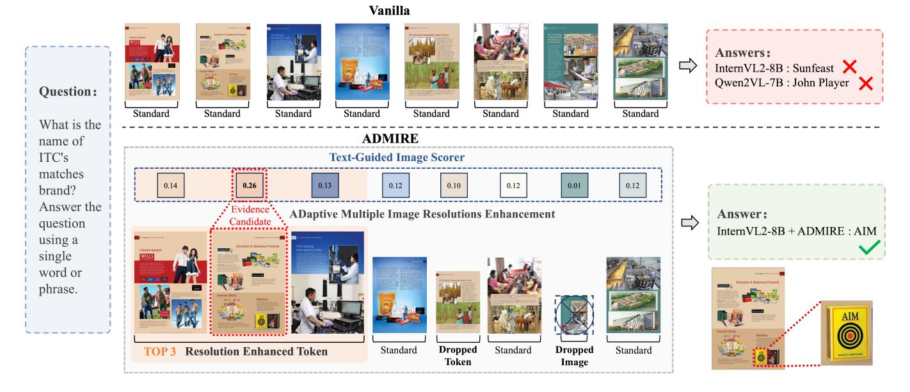
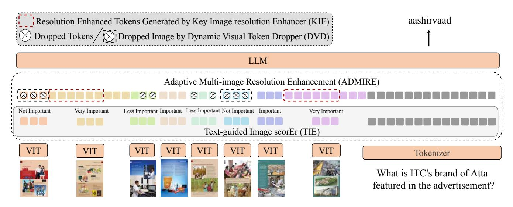
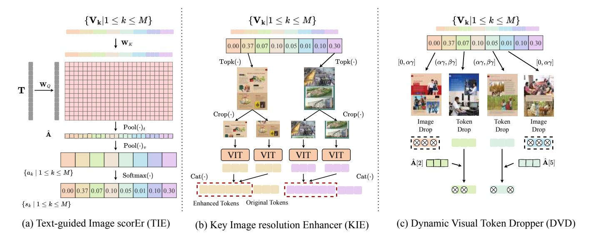
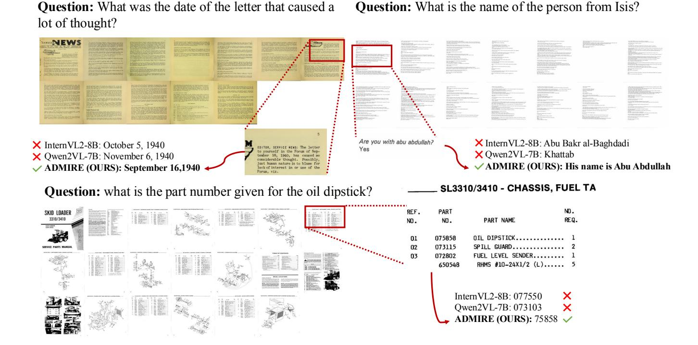

# ADMIRE: ADaptive method to enhance Multiple Image Resolutions in text-rich multi-image understanding

[Qipeng Zhu](https://orcid.org/0000-0002-4189-9636)∗† Fudan University Shanghai, China qpzhu23@m.fudan.edu.cn

[Jiangwei Lao](https://orcid.org/0009-0003-7519-7899) Ant Group Shanghai, China wenshuo.ljw@antgroup.com

[Yingzhe Peng](https://orcid.org/0009-0008-6077-6704) Southeast University Nanjing, China majorjadeforest@gmail.com

[Jiajia Liu](https://orcid.org/0000-0003-3020-2677) Ant Group Hangzhou, China lekun.ljj@antgroup.com

[Xiong Wang](https://orcid.org/0009-0009-5835-2256)∗ Ant Group Shanghai, China huoluo.wx@antgroup.com

[Congyun Jin](https://orcid.org/0009-0008-1180-5513) Ant Group Shanghai, China jincongyun.jcy@antgroup.com

[Qi Zhu](https://orcid.org/0000-0002-1545-1854) Ant Group Hangzhou, China zqcrafts@mail.ustc.edu.cn

[Peng Wei](https://orcid.org/0009-0000-1220-4527) Ant Group Hangzhou, China peng.wei@alipay.com

[Zhihong Lu](https://orcid.org/0009-0004-5773-9065) Ant Group Hangzhou, China qianli.lzh@antgroup.com

[Jie Chen](https://orcid.org/0000-0002-5625-5729) Fudan University Shanghai, China chenj19@fudan.edu.cn

[Lianzhen Zhong](https://orcid.org/0000-0002-8426-5289) Ant Group Hangzhou, China zhonglianzhen.zlz@antgroup.com

[Jian Wang](https://orcid.org/0000-0003-4144-1753)‡ Ant Group Hangzhou, China bobblair.wj@antgroup.com

Figure 1: Our proposed ADMIRE utilizes a train-free text-guided scorer to evaluate the relevance of each image to a text query, thereby identifying the image most relevant to the answer, referred to as the evidence candidate, and achieving enhanced performance. Vanilla means not applying any special processing to the image resolution.

Jian Wang is the corresponding author (bobblair.wj@antgroup.com).

[This work is licensed under a Creative Commons Attribution 4.0 International License.](https://creativecommons.org/licenses/by/4.0)

KDD '25, Toronto, ON, Canada © 2025 Copyright held by the owner/author(s). ACM ISBN 979-8-4007-1454-2/2025/08 <https://doi.org/10.1145/3711896.3737187>

∗Equal Contribution.

†Work done during an internship at Ant Group.

# Abstract

Recent advancements in multi-image understanding have been significant, yet methods that treat all images equally face challenges when handling dense visual OCR information and ultra-long sequences. This results in difficulty focusing on the relevant pages, leading to redundancy and limited effectiveness. To address these issues, we propose an effcient and effective method that enhances multi-image document understanding by dynamically adjusting image resolutions based on attention from large visual language models. This approach enhances both performance and efficiency without modifying the underlying model architecture. Firstly, we propose Text-Guided Key Image Selector to focus on important images. Secondly, we sort visual information by importance score, adaptively increasing the tokens for important images while compressing or dropping the tokens for less important or irrelevant visual inputs. Experimental results across four open datasets and one closed industry dataset, using two mainstream models, demonstrate the efficacy of our approach. We achieve state-of-the-art performance for OCR-free methods, with scores of 82.78 on MP-DocVQA and 56.05 on DUDE (a 7.42-point improvement), using the Qwen2vl-7B model. Despite a slight increase in inference time, our model still shows notable improvements of 4.78 points on MP-DocVQA and 3.28 points on DUDE. Our code will be publicly available for noncommercial use at https://github.com/Alipay-Med/admire.git

## CCS Concepts

• Computing methodologies → Natural language generation; Computer vision; Artificial intelligence.

## Keywords

Large Visual Language Model, Multi-model Representation Learning, Multi-image Understanding, Text-rich Image Understanding

#### ACM Reference Format:

Qipeng Zhu, Xiong Wang, Zhihong Lu, Jiangwei Lao, Congyun Jin, Jie Chen, Yingzhe Peng, Qi Zhu, Lianzhen Zhong, Jiajia Liu, Peng Wei, and Jian Wang. 2025. ADMIRE: ADaptive method to enhance Multiple Image Resolutions in text-rich multi-image understanding. In Proceedings of the 31st ACM SIGKDD Conference on Knowledge Discovery and Data Mining V.2 (KDD '25), August 3–7, 2025, Toronto, ON, Canada. ACM, New York, NY, USA, [12](#page-11-0) pages. <https://doi.org/10.1145/3711896.3737187>

## 1 Introduction

The ability to understand high-resolution text-rich multi-image content is essential for a variety of activities, including the analysis of multi-page documents, the interpretation of news videos, and the evaluation of presentation slides. Recently, large visual language models (LVLMs) [\[5,](#page-9-0) [18,](#page-9-1) [24\]](#page-9-2) have demonstrated remarkable abilities in text-rich multi-image comprehension [\[7\]](#page-9-3). However, to achieve greater performance, LVLMs need to accurately recognize all texts and layouts, unlike natural images where each image's composition is relatively straightforward. Efficiently understanding multiple text-rich images without relying on OCR tools [\[19\]](#page-9-4) remains a challenge for LVLMs.

Recent researches [\[6,](#page-9-5) [9\]](#page-9-6) demonstrate inputing images with high resolution improves the performance of LVLMs in text-rich understanding. Despite they achieve certain advancements in text-rich

multi-image understanding, they merely enhance resolution of all images and feed them uniformly into LVLM [\[5,](#page-9-0) [15,](#page-9-7) [24\]](#page-9-2). In real-world scenarios, questions about text-rich multi-image tasks often target only a portion of the content. For example, as shown in Figure [1,](#page-0-0) to answer the question "What is the name of ITC's matches brand? Answer the question using a single word or phrase". Only one image in the provided set is needed to obtain the correct answer.

Existing methods, such as InternVL2, crop 8 high-resolution images into 16 low-resolution sub-images, then resize the original images and sub-images to a fixed 448×448 resolution, resulting in nearly 6.2k visual tokens. As shown in Figure [1,](#page-0-0) only 12.5% of these visual tokens are relevant for generating the correct answer. The remaining tokens are unrelated to the question, which unnecessarily increases computational effort.

Our approach is based on the observation that while upscaling all images can improve prediction accuracy, it may also lead to exceeding the model's token limit. We find that by upscaling only the images related to the answers (Evidence Candidates) and downscaling the others to maintain a balanced token count, we can achieve enhanced prediction accuracy. As shown in Table [1,](#page-1-0) directly doubling the resolution of images related to the answers (evidence candidates) and halving the resolution of irrelevant images leads to an efficient performance boost for Qwen2VL in the MP-DocVQA task. Recent studies [\[25,](#page-9-8) [30,](#page-9-9) [32\]](#page-9-10) have demonstrated that attention maps from pretrained language models capture rich information, making them valuable for identifying critical tokens. Motivated by this insight, we propose a text-guided image scorer that evaluates images based on the attention maps of pretrained LVLMs. By utilizing this scorer, the model can identify evidence candidates and dynamically adjust visual tokens, thus improving model performance while maintaining efficiency.

Table 1: Comparison between upscaling resolution of all images and evidence images as two times. "Vanilla" refers to the model's direct output, "All" means that all images are upscaled, "Evidence" indicates that only the Evidence images are upscaled and the other images are downscaled, respectively.

|          | InternVL2-8B |       | Qwen2VL-7B |       |  |  |
|----------|--------------|-------|------------|-------|--|--|
|          | VTokens      | ANLS  | VTokens    | ANLS  |  |  |
| Vanilla  | 1509         | 51.53 | 1448       | 72.55 |  |  |
| All      | 2235         | 55.37 | 2738       | 81.59 |  |  |
| Evidence | 1619         | 56.23 | 1688       | 82.88 |  |  |

We propose ADMIRE, a novel method for LVLMs that ADaptively enhances the REsolution of Multiple Images. This approach leverages high-resolution enhancement and token sparsity while addressing their respective challenges. ADMIRE incorporates three modules for adaptive image processing: the Text-Guided Image Scorer (TIE), the Key Image Resolution Enhancer (KIE), and the Dynamic Visual Token Dropper (DVD). The TIE module utilizes attention weights from the first layer of the LVLM to automatically classify images into four categories based on their importance: very important, important, less important, and not important. This

enables the model to focus on crucial information and minimize the generation of redundant tokens. The KIE module upscales the resolution of *very important* images, ensuring that the model's input retains detailed information, thereby generating more accurate answers. Since KIE increases the number of visual tokens, the DVD module compresses these tokens at multiple levels. By dynamically dropping irrelevant visual tokens and compressing less important ones based on their importance scores, our method optimizes token usage efficiency. Finally, all visual tokens are reorganized, concatenated with text tokens and special tokens, and passed into large language models (LLMs). Our approach is plug-and-play compatible with any commonly used pretrained LVLM, offering both efficiency and effectiveness in text-rich multi-image understanding scenarios through its multi-level importance scoring system.

Our contributions are summarized as follows:

- We propose an adaptive resolution enhancement method for multi-image understanding that significantly boosts the performance of multimodal models without the need for additional training.
- We design a multi-level token compression technique that dynamically compresses irrelevant visual tokens or images, effectively balancing performance with computational overhead.
- We perform extensive experiments on four multi-image understanding benchmarks and two widely-used models to assess the efficiency and effectiveness of our approach, achieving state-of-the-art results for OCR-free methods, with scores of 82.78 on MP-DocVQA and 56.05 on DUDE, 69.29 on NewsVideoVQA and 60.54 on SlideVQA.
- Additionally, we applied this method to real-world multipage medical report QA scenarios and achieved a performance improvement of 3.99 points without additional training.

#### 2 Related Work

#### 2.1 OCR-free Visual Document Understanding

Visual document understanding [16, 20, 26] focuses on processing high-resolution, text-rich images, including charts, documents, slides, table images, and news videos. Recent studies have introduced Large Vision-Language Models (LVLMs) for visual understanding in an OCR-free manner. Some approaches crop highresolution images into low-resolution sub-images, resize them to a fixed resolution, and employ a uniform low-resolution visual encoder to process both sub-images and the global image. Notable examples include UReader [28], Monkey [17], LLaVA-Next [15], and InternVL2 [5]. In these cases, Large Language Models (LLMs) are used to understand the relationships between the sub-images. Other methods employ specialized techniques to process either high-resolution or low-resolution images, such as HIRI-VIT [27] and Qwen2VL [24]. However, these approaches tend to consume a large number of visual tokens when applied to multi-image tasks, leading to higher GPU memory usage and longer inference times. Our method strikes a balance between performance and overhead, adaptively applying resolution-enhancement techniques in multiimage scenarios.

### 2.2 Multi-image Understanding

With the advancement of LVLMs [1, 10, 14, 29, 31], some researchers introduce LVLMs to multi-image understanding tasks. They utilize large-scale interleaved image-text copora to train LVLMs. For example, InternVL2 [5] and Qwen2VL [24] demonstrate outstanding results in various multi-image tasks. ADMIRE effectively boosts the performance of pretrained LVLMs in multi-image scenarios without any training.

### 2.3 Visual Token Pruning

Visual token pruning [3, 11, 13, 23] enables Large Vision-Language Models (LVLMs) to process high-resolution images with limited resources by pruning less important or irrelevant visual tokens, thereby reducing the total number of visual tokens. Methods like MniMonkey [8] and SparseVLM [33] focus on pruning visual tokens from a single image, using attention scores computed by pre-trained LVLMs. In contrast, our approach introduces a multi-level visual token pruning strategy, designed specifically for text-rich multi-image understanding, which effectively balances performance with computational efficiency.

#### 3 Preliminaries

LVLMs process images using a visual encoder and decode them through a language model. Let  $\{\mathbf{I}_i \mid 0 \leq i \leq M\}$  represent a sequence of M images. The corresponding visual tokens are encoded as  $\{\mathbf{V}_i \mid 0 \leq i \leq M \land \mathbf{V}_i \in \mathbb{R}^{L_v \times D}\}$ , where  $L_v$  is the length of the visual sequence and D is the dimension of the visual tokens. The text input is tokenized and embedded as  $\mathbf{T} = \{\mathbf{t}_i \mid 0 \leq i \leq L_t\}$ , with  $L_t$  denoting the length of the text sequence. The visual tokens from all M images, along with the text tokens, are concatenated with special tokens to form a unified sequence  $\mathbf{X} = \{\mathbf{x}_1, \dots, \mathbf{x}_L\}$ , where L is the total sequence length. The positions of the text and visual tokens are denoted as  $\mathbf{p}_t$  and  $\mathbf{p}_v^i$ , respectively, as shown in Equation (1).

$$\mathbf{p}_t = \{ j \mid x_j \in T \}, \quad \mathbf{p}_v^i = \{ j \mid x_j \in V_i \}.$$
 (1)

The organized token sequence X is fed into LLM to generate the corresponding output as described in Equation (2).

$$\hat{y} = LLM(X). \tag{2}$$

Each layer of LLM can be described by the following equations:

$$Z_l = Atten(Norm(H_{l-1})) + H_{l-1},$$
(3)

$$\mathbf{H}_{l} = \mathrm{MLP}(\mathrm{Norm}(\mathbf{Z}_{l})) + \mathbf{Z}_{l},\tag{4}$$

where Atten(·), Norm and MLP(·) represent the attention block, normalization block, and multi-layer perceptron, respectively.  $\mathbf{H}_l$  denotes the hidden states of the l-th layer of the LLM. For the base layer (l=0),  $\mathbf{H}_0=\mathbf{X}+\mathrm{PE}(\mathbf{X})$ , where  $\mathrm{PE}(\cdot)$  refers to the position encoding layer.

#### 4 Method

#### 4.1 Overview

In text-rich multi-image understanding scenarios, LVLMs enhance fine-grained image perception by upscaling the resolution of all images without prior knowledge, which significantly increases the number of visual tokens and inference latency. In real-world,

Figure 2: ADMIRE adaptively adjusts visual tokens to enhance the performance of pretrained large visual language models in text-rich, multi-image understanding scenarios. Given an input image sequence and a text query, it assesses the importance of each image. Based on this evaluation, the resolution of the images is adaptively adjusted and then concatenated into the large language model (LLM) to generate the corresponding response.

however, images containing critical information to help LVLMs generate accurate answers are often sparse, as shown in Figure 1. A more intuitive and efficient approach would involve identifying and upscaling only those key images that contain the essential information. Motivated by it, we propose a training-free, **AD**aptive method to enhance **Multiple Image RE**solutions, called **ADMIRE**.

ADMIRE comprises three modules: a training-free Text-guided Image scorEr (TIE), a Key Image resolution Enhancer (KIE), and a Dynamic Visual token Dropper (DVD). The overview of the ADMIRE framework is illustrated in Figure 2. First, an input image sequence  $\{I_i \mid 0 \le i \le M\}$  and a text query  $T = \{t_i \mid 0 \le i \le L_t\}$  are fed into TIE to obtain the importance of each image related to the question. We categorize each image into four groups: *very important*, *important*, *less important*, and *not important* based on the their scores. KIE is designed to upscale the resolution of *very important* images. The DVD then compresses those considered *less important*, and discards those considered *not important*.

The processing of images in different important groups can be modeled using Equation (5), where  $\hat{\mathbf{V}}_{i}$  denotes the visual tokens of images processed by ADMIRE. KIE(·) denotes upscaling the resolution of images,  $\mathrm{DVD}_{I}(\cdot)$  and  $\mathrm{DVD}_{V}(\cdot)$ , respectively, denotes drop partial visual tokens of *less important* images and *not important* images. The indexes  $\mathbf{p}_{\mathrm{kie}}$ ,  $\mathbf{p}_{\mathrm{Vdvd}}$ , and  $\mathbf{p}_{\mathrm{Idvd}}$  represent the *very important*, *less important*, and *not important* images, respectively.

$$\hat{\mathbf{V}}_{i} = \begin{cases}
KIE(\mathbf{V}_{i}), & i \in \mathbf{p}_{kie} \\
DVD_{V}(\mathbf{V}_{i}), & i \in \mathbf{p}_{Vdvd} \\
DVD_{I}(\mathbf{V}_{i}), & i \in \mathbf{p}_{Idvd}, \\
\mathbf{V}_{i}, & others
\end{cases}$$
(5)

We concatenate these visual tokens and the text tokens with special tokens and feed them into LLM to generate the corresponding response.

## 4.2 Text-Guided Image Scorer (TIE)

Designing an efficient image scorer is important for LVLMs to achieve adaptive adjustment of visual tokens, since ADMIRE requires understanding each image's importance to the given question. Recent studies [25, 32] have demonstrated that text and image data can be used to perform token-level compression on a single image via attention maps generated by pretrained language or visual language models. Inspired by this, we discovered that in multi-image scenarios, this approach is not only applicable for compression but also effective for token importance ranking. Therefore, we effectively score multiple images based on the attention weights of LVLMs by calculating their relevance to the given text query. Therefore, we design a training-free Text-guided Image scorEr (TIE) by reusing the attention weights from the first layer of pretrained LVLMs as described in Figure 3(a).

We consider the input tensor, to efficiently extract the attention score of each image first layer of LLM as X,  $W_Q$  and  $W_K$ , respectively, allowing the query and key matrices to be computed as shown in Equation (6):

$$Q = W_O(X + PE(X)), \quad K = W_K(X + PE(X)), \tag{6}$$

where  $PE(\cdot)$  is the position encoder. The attention weight **A** is then computed using the following function:

$$A = Attn(Q, K) = Softmax(\frac{QK^{T}}{\sqrt{D}}).$$
 (7)

We utilize text pooler,  $\operatorname{Pool}_t(\cdot)$  and visual pooler,  $\operatorname{Pool}_v(\cdot)$  to efficiently extract the attention score of each image as shown in Equation (8). Specifically, the attention map  $\mathbf{A}[\mathbf{p}_t]$  corresponding to the text tokens is fed into  $\operatorname{Pool}_t(\cdot)$  to get the text-guided attention score for each visual token, denoted as  $\hat{\mathbf{A}}$ . Then the visual pooler processes it to gain the attention score of each image. For efficient computation of attention scores across all images, we select either

Figure 3: Details of ADMIRE. ADMIRE is consist of three modules, including (a) Text-guided Image Scorer (TIE), (b) Key Image Resolution Enhancer (KIE) and (c) Dynamic Visual Dropper (DVD). ADMIRE utilizes TIE to score each image and adaptively adjust visual tokens through KIE and DVD.

mean pooling or max pooling for these two pooling functions.

$$\hat{\mathbf{A}} = \text{Pool}_t(\mathbf{A}[\mathbf{p}_t]), \quad \hat{\mathbf{A}}_i = \text{Pool}_v(\hat{\mathbf{A}}[\mathbf{p}_v^i]).$$
 (8)

In Equation (9), we normalize the attention score of each image to gain their importance score.

$$S = \text{Softmax}\left(\{\hat{\mathbf{A}}_i \mid 0 \le i \le M\}\right). \tag{9}$$

Text-guided Image Scorer utilizes the importance score S to rate each image within a sequence in multi-page document and news video. Guided by the scores, we classify images into different groups. We use  $\mathbf{p}_{\text{kie}}$ ,  $\mathbf{p}_{\text{comp}}$  and  $\mathbf{p}_{\text{drop}}$  to respectively record indices of *very important*, *less important* and *not important* images.

#### 4.3 Key Image Resolution Enhancer (KIE)

In high-resolution text-rich multi-image understanding, upscaling resolution of images relevant to answers, denoted as *very important* images, helps LVLMs to generate correct answers. Most methods [5, 15, 24] increase the resolution of all images to boost the perception of images largely increasing the number of visual tokens. However, lots of visual tokens are not necessary due to the sparsity of *very important* images as shown in Figure 1. Motivated by it, we design an adaptive **Key Image** resolution **Enhancer** (**KIE**), which is easy to apply in the main stream LVLMs to efficiently upscale the resolution of *very important* images.

Due to the sparsity of *very important* images, we set the number of such images as k as shown in Figure 3 (b). To prevent amplifying redundant information, k is set to 3 or 5. Specifically, we employ the Topk(·) method to select those *very important* images with a higher importance score. Their indices are recorded as the set  $\mathbf{p}_{kie}$ . For j in  $\mathbf{p}_{kie}$ , we upscale resolution of the image  $\mathbf{I}_j$  and feed it into a pretrained ViT to generate new visual tokens. These tokens are concatenated with the original visual tokens by being specifically

added before the original, ensuring that the order of the visual tokens remains unchanged.

## 4.4 Dynamic Visual Token Dropper (DVD)

Since very important images are sparse among all images, most of them provide limited help in generating correct answers for LVLMs and merely increase the number of visual tokens. Recent researches [2, 4] compress visual tokens of a single image through selection of visual tokens with high attention score. In multi-image understanding, eliminating irrelevant images to the answers can be more efficient in saving visual tokens compared to relying solely on token selection. By considering both methods, we can significantly reduce computational overhead. Therefore, we propose the Dynamic Visual token Dropper (DVD) to lower the overhead of LVLMs in a multi-level manner as depicted in Figure 3 (c). Different from KIE, we use soft threshold to control the number of not important images and less important images. We use pIdvd to record the indices of not important images, which are then dropped to reduce the total number of tokens. Additionally,  $p_{Vdvd}$  represents the indices of less important images, which are downscaled to retain only half of their visual tokens.

We define *less important* images as  $\{\mathbf{I}_j \mid j \notin \mathbf{p}_{kie}\}$ , with their importance scores given by  $\{s_j \mid j \notin \mathbf{p}_{kie} \land s_j \in S\}$ . To ensure that we do not exclude images containing crucial information, we apply varying thresholds to categorize these images. As described in Equation (10), we set the expected importance score,  $\alpha \gamma$ , as the initial threshold to distinguish between important and non-important images.

$$\gamma = \mathbb{E}\left(\left\{s_{i} \mid j \notin \mathbf{p}_{kie} \land s_{i} \in \mathbf{S}\right\}\right),\tag{10}$$

$$\mathbf{p}_{\mathrm{Idvd}} = \{k \mid s_j \le \alpha \gamma\},\tag{11}$$

where the hyperparameter  $\alpha$  is set to 0.5 to prevent excessive image filtering. To minimize the overhead of visual language models, we

Table 2: Comparison KIE with State-of-the-Arts OCR-free Models. "/w. KIE-Topk-XN" using KIE to select the top k images and upscale maximum pixel count for *very important* images by a factor of N. "ANLS" is considered as the measures of performance. The bold font indicates the best performance.

| Model                         | MP-DocVOA | DUDE  | NewsVideoVOA | SlideVOA |
|-------------------------------|-----------|-------|--------------|----------|
| LayoutLMv3 [10]               | 55.1      | 20.3  | ~            |          |
| DocFormerv2 [1]               | 76.4      | 48.4  | _            | -        |
| GPT4(v)                       | -         | 53.9  | _            | _        |
| LongVA-7B [31]                | 60.80     | 38.37 | 50.61        | -        |
| Idefics3-8B [14]              | 67.15     | 38.65 | 60.16        | -        |
| LLaVA-next-interleave-7B [15] | 44.87     | 28.03 | 56.66        | -        |
| DocOwl2-8B [7]                | 69.42     | 46.77 | 64.09        | -        |
| InternVL2-8B [5]              | 51.53     | 37.37 | 65.02        | 54.92    |
| /w. KIE-Top3-X4               | 72.98     | 49.01 | 67.21        | 55.91    |
| /w. KIE-Top5-X4               | 74.59     | 50.12 | 67.13        | 56.91    |
| Qwen2VL-7B [24]               | 72.55     | 48.63 | 68.72        | 58.40    |
| /w. KIE-Top3-X4               | 81.64     | 55.19 | 69.18        | 59.84    |
| /w. KIE-Top5-X4               | 82.78     | 56.05 | 69.29        | 60.54    |

compress these *less important* images. As shown in Equation (12), when  $s_j$  falls in the range of  $\alpha \gamma$  to  $\beta \gamma$ ,  $I_j$  is considered *less important* and is subsequently compressed.

$$\mathbf{p}_{\text{Vdvd}} = \{ j \mid \alpha \gamma < s_j \le \beta \gamma \}, \tag{12}$$

where  $\beta$  is the hyper parameter, we set it as 1.5. And the left images are unchanged.

For *less important* images  $\{I_j \mid j \in p_{Vdvd}\}$ , we retain only half of their visual tokens. Considering the knowledge in the attention map, we use the attention score  $\{\hat{\mathbf{A}}_j \mid j \in p_{Vdvd}\}$  to select meaningful visual tokens. As shown in Equation (13), we preserve half of the visual tokens with higher attention scores.

$$\hat{\mathbf{V}}_j = \mathbf{V}_j[\operatorname{argsort}(\hat{\mathbf{A}}_j)[:L/2]]. \tag{13}$$

#### 5 Discussion of Efficiency

ADMIRE is a training-free method designed to enhance the performance in high-resolution text-rich multi-image understanding. Its straightforward approach allows for easy application to any visual language model. During inference, ADMIRE leverages the pretrained weights of the first layer of LLMs to assign adaptive importance scores to all images. It upscales the resolution of the very important images, compresses the less important ones, and discards irrelevant ones. The primary computational overhead arises from the scoring process, which has a complexity of  $O((ML_v)^2D)$ . Since only one layer of attention is utilized for scoring, this overhead remains manageable. When employing the Topk( $\cdot$ ) (k = 5) method to select very important images, the maximum number of visual tokens excluding compression and discarding, can be calculated as  $5nL_v + (M-5)L_v$ . In contrast, the resolution enhancement of all images results in a total of  $MnL_v$  visual tokens, which is significantly greater than what our method requires.

# 6 Experiment

### 6.1 Experiment Setup

**Datasets.** MP-DocVQA [4] and DUDE [22] are two datasets designed for multi-image understanding in document contexts. Slide-VQA [21] focuses on slide content understanding. NewsVideoQA [12] is a question-answer dataset for news videos, featuring text-rich frames from a variety of English-language news channels world-wide. Additionally, the Physical Report Question and Answer (PRQA) dataset is used as an independent external validation set to evaluate ADMIRE's performance in real-world industrial scenarios.

Implementation Details We select InternVL2-8B [5] and Qwen2VL-7B [24] as our base models to evaluate the performance of our method across different resolution enhancement techniques, with an initial resolution set to 448x448. Most of the experiments in this paper are conducted without training to assess the effectiveness and generalization of our approach. In the ablation study, we present results from supervised fine-tuning experiments. AdamW is used as the optimizer with a learning rate of 1e-6, and the fine-tuning process is carried out for one epoch on an ensemble of the MP-DocVQA, DUDE, NewsVideoVQA, and SlideVQA training datasets.

**Evaluation** For validation, we adhere to the evaluation metrics specified in document understanding tasks [7] and utilize Average Normalized Levenshtein Similarity (ANLS) to assess the effectiveness of models. Furthermore, we evaluate different methods by measuring the average number of tokens (Total Tokens) and the average latency of the first token latency per second (FTL/s) as additional metrics.

### 6.2 Comparison Study

6.2.1 Comparison with State-of-the-Arts OCR-free Models. In this section, we evaluate how ADMIRE enhances the performance of LVLMs across four text-rich multi-image understanding benchmarks: MP-DocVQA, DUDE, NewsVideoVQA and SlideVQA. For a fair comparison, we do not fine-tune InternVL2-8B or Qwen2VL-7B on any training datasets. In Table 2, we compare our approach

Table 3: Ablation study of KIE and DVD in MP-DocVQA and DUDE. "Tokens" and "FTL/s" respectively denote the average of visual tokens and first token latency. "Avg." denotes the average performance of two datasets. We compare our methods with different selecting methods, including all images and 3 random images. "/w.o. DVD" denotes do not use "DVD" to lower the computing overhead.

| •            |        | Vanilla |       |        | All    |       |        | Random |       | ADMI   | RE / w.o. | DVD   |        | ADMIRE |       |
|--------------|--------|---------|-------|--------|--------|-------|--------|--------|-------|--------|-----------|-------|--------|--------|-------|
|              | Tokens | FTL/s   | ANLS  | Tokens | FTL/s  | ANLS  | Tokens | FTL/s  | ANLS  | Tokens | FTL/s     | ANLS  | Tokens | FTL/s  | ANLS  |
| InternVL2-8B |        |         |       |        |        |       |        |        |       |        |           |       |        |        |       |
| MP-DocVQA    | 1509   | 0.3356  | 51.53 | 2235   | 0.3839 | 55.37 | 1868   | 0.3488 | 52.23 | 1868   | 0.3487    | 54.98 | 1494   | 0.3118 | 53.37 |
| DUDE         | 1527   | 0.3621  | 37.37 | 2552   | 0.4190 | 41.13 | 2032   | 0.3910 | 38.04 | 2032   | 0.3912    | 40.53 | 1612   | 0.3512 | 39.47 |
| Avg.         | 1518   | 0.3489  | 44.45 | 2394   | 0.4015 | 48.25 | 1950   | 0.3699 | 45.14 | 1950   | 0.3700    | 47.76 | 1553   | 0.3315 | 46.42 |
| Qwen2vl-7B   |        |         |       |        |        |       |        |        |       |        |           |       |        |        |       |
| MP-DocVQA    | 1448   | 0.4588  | 72.55 | 2788   | 0.6044 | 81.59 | 1975   | 0.5550 | 62.23 | 1975   | 0.5552    | 79.36 | 1766   | 0.4933 | 77.33 |
| DUDE         | 1481   | 0.4599  | 48.63 | 2817   | 0.6453 | 54.55 | 2007   | 0.5565 | 49.07 | 2007   | 0.5560    | 52.87 | 1780   | 0.4911 | 51.91 |
| Avg.         | 1464.5 | 0.4594  | 60.59 | 2803   | 0.6249 | 68.07 | 1991   | 0.5558 | 55.65 | 1991   | 0.5556    | 66.12 | 1773   | 0.4922 | 64.62 |

with state-of-the-art OCR-free models and LVLMs. "/w. KIE-Topk-XN" refers to using KIE to select the top k images and upscale maximum pixel count for very important images by a factor of N. The factor of k for our method is variable. A larger k results in better performance. The vanilla InternVL2-8B achieves ANLS scores of 51.53 in MP-DocVQA and 37.37 in DUDE, both lower than those of current state-of-the-art OCR-free models. However, with the "KIE-Top5-X4" enhancement, InternVL2-8B improves by 23.06 ANLS in MP-DocVQA and 12.75 ANLS in DUDE. Notably, Qwen2VL-7B, with our proposed method, achieves state-of-theart results with scores of 82.78 on MP-DocVQA, 56.05 on DUDE, 69.29 on NewsVideoVQA and 60.54 on SlideVQA. Additionally, our method achieves a ANLS improvement of 13.36 points on MP-DocVQA benchmark compared to DocOwl2-8B [7] and 2.15 points on DUDE benchmark compared to GPT4(v) without requiring extra training. This highlights the generalization and effectiveness of our approach.

Figure 4: Comparison study of performance and overhead. "All" and "Random-Top5" denotes enhancing resolution of all images and 5 random images respectively. We use the squares with different sizes to demonstrate the enhancing ratios. "ANLS" is considered as the measures of performance. ADMIRE-Top5-X6 achieves an 77.58 ANLS with 5674 total tokens and 0.7947 FTL/s, compared to All-X4, which achieves 76.58 ANLS with 6500 total tokens and 0.9058 FTL/s.

6.2.2 Performance v.s. Efficiency. To evaluate how our method balances performance and efficiency, we conducted experiments using InternVL2-8B on the MP-DocVQA benchmark with Top5 important

images. As shown in Figure 4, we use squares of varying sizes to illustrate the enhancement ratios. "ANLS" is used as the performance measure. The terms "All" and "Random-Top5" denote enhancing resolution of all images and only 5 randomly selected images, respectively. We evaluate computing and memory overhead through the average number of tokens (Total Tokens) and the average number of the first token latency per second (FTL/s) of MP-DocVQA benchmark. Increasing the resolution of all images significantly boosts the ANLS performance of LVLMs, but also raises the total visual tokens and first token latency. There is a trade-off between the model's ANLS performance and computing and memory overhead. In light of this, we compare "ADMIRE-Top5", "All" and "Random-Top5" methods at different maximum pixel count upscaling factors of 2, 4, and 6. Given the maximum total token limit, enhancing all images multiple times is impractical. ADMIRE-Top5-X6 achieves an 77.58 ANLS with 5674 total tokens and 79.47 FTL/s, compared to All-X4, which achieves 76.58 ANLS with 6500 total tokens and 0.9058 FTL/s. ADMIRE delivers superior performance with lower overhead compared to "All" and "Random-Top5" methods.

#### 6.3 Ablation Study

6.3.1 Ablation of TIE. We quantitatively evaluate the performance of the text-guided scorer (TIE) by comparing it to a baseline method, which randomly selects k images to enhance their resolution. The Recall of evidence candidates, defined as the number of images identifying the most relevant image to the answer (which may span 1 to 3 pages), serves as the metric. TIE outperforms the random selection method, achieving a higher recall rate by leveraging knowledge embedded in the pretrained LVLM, as shown in Table 4. Notable improvements are observed with both InternVL2-8B and Qwen2VL-7B when utilizing Topk, where  $k \in \{3, 5\}$ . We observe a significant improvement in Recall on the MP-DocVQA and DUDE datasets when TIE is incorporated. For instance, with InternVL2-8B, the average Recall on MP-DocVQA and DUDE datasets is 84.58 and 83.21, compared to 63.27 and 54.33 for the random Top5 baseline.

6.3.2 Ablation of KIE and DVD. We examine the performance and efficiency of our proposed KIE and DVD modules across MP-DocVQA and DUDE, comparing them to "All" and "Random" methods, as shown in Table 3. For a fair comparison, "All", "Random",

Table 4: Comparison between Text-guided Scorer (TIE) and Random methods. "Recall" is considered as the measures of performance.

| Topk | Method               | MP-DocVQA | DUDE  |
|------|----------------------|-----------|-------|
|      | Baseline             | 43.32     | 39.44 |
| 3    | InternVL2-8B /w. TIE | 75.96     | 73.69 |
|      | Qwen2VL-7B /w. TIE   | 71.81     | 87.50 |
|      | Baseline             | 63.27     | 54.33 |
| 5    | InternVL2-8B /w. TIE | 84.58     | 83.21 |
|      | Qwen2VL-7B /w. TIE   | 83.03     | 92.75 |

"ADMIRE / w.o. DVD" and "ADMIRE" use the same maximumn upscaling ratio of 2, while "Vanilla" means feeding original images into LVLMs. Except "Vanilla" and "All", the other methods select 3 images to upscale. Though "All" improve the InternVL2-8B and Qwen2VL-7B largely, it respectively increases nearly 50% visual tokens and 100% visual tokens. In resource-limited scenarios, "ADMIRE" utilize "DVD" to strike the trade-off the performance and overhead, achieving improved performance and nearly computing overhead compared with "Vanilla". Specifically, using Qwen2VL-7B, "Vanilla" scores 72.55 and 48.63 on MP-DocVQA and DUDE respectively, whereas "ADMIRE" yields notably superior results of 77.33 (a 4.78-point improvement) on MP-DocVQA and 51.91 (a 3.28-point improvement) on DUDE.

## 6.4 Analysis Study

Figure 5: Results of different numbers of selected enhanced images. We demonstrate the results of ADMIRE with 1, 3, 5, 7, 10 enhanced images in MP-DocVQA and DUDE.

6.4.1 Analysis of the Number of Enhanced Images for KIE. In this section, we examine the effect of increasing the number of resolution-enhanced images on model performance. Figure 5 shows the overall trend of overall ANLS and the recall of images relevant to answers, plotted against the number of visual tokens. As the number of resolution-enhanced images grows, ADMIRE demonstrates consistent improvements in both ANLS and recall metrics. However,

these gains begin to plateau beyond a certain point. To balance performance improvements with computational efficiency, we select 3 and 5 resolution-enhanced images as optimal configurations.

Figure 6: Ablation results of our method across samples with varying image counts are presented. The range of image numbers is divided into five intervals: "[1,5)", "[5,10)", "[10,15)", "[15,20)" and "[20,)".

6.4.2 Performance among Different Numbers of Images. In this section, we evaluate the generalization ability of our proposed ADMIRE across samples with varying image quantities, as illustrated in Figure 6. The image count is divided into five intervals: "[1,5)", "[5,10)", "[10,15)", "[15,20)" and "[20,)". ADMIRE shows consistent improvement across all intervals for both InternVL2-8B and Qwen2VL-7B, primarily due to its effective resolution enhancement. When the number of images is fewer than 5, selecting the top 3 images for resolution enhancement is sufficient. As the number of images increases, "ADMIRE-Top5-X4" outperforms "ADMIRE-Top3-X4" due to the limited recall rate.

Table 5: Performance of ADMIRE based on supervised finetuned InternVL2-8B. The bold font indicates the best performance

| Method                 | MP-DocVQA | DUDE  | NewsVideoVQA | SlideVQA |
|------------------------|-----------|-------|--------------|----------|
| InternVL2-8B           | 51.53     | 37.37 | 65.02        | 54.92    |
| InternVL2-8B /w. sft   | 57.81     | 41.24 | 67.79        | 59.20    |
| ADMIRE-Top5-X2         | 53.37     | 39.47 | 67.21        | 55.43    |
| ADMIRE-Top5-X2 /w. sft | 60.03     | 42.50 | 68.68        | 60.29    |
| ADMIRE-Top5-X4         | 73.55     | 49.84 | 66.31        | 55.91    |
| ADMIRE-Top5-X4 /w. sft | 75.56     | 51.71 | 68.68        | 61.88    |

6.4.3 Results of Supervised Finetuning. In this section, we evaluate the applicability of our method to supervised fine-tuned models. We use InternVL2-8B as the base model, which is trained for one epoch on an ensemble of four multi-image understanding benchmark datasets. The testing setup follows the same protocol as the other training-free experiments. Our method, "ADMIRE-Top5-X4/w. sft" outperforms both "ADMIRE-Top5-X4" and "Vanilla /w. sft" by 1.99 ANLS and 17.75 ANLS, respectively, on the MP-DocVQA dataset, as presented in Table 5. All supervised fine-tuned models outperformed the baseline.

# **Question:** 平均红细胞体积是多少?

Figure 7: Case study of ADMIRE in PRQA.

6.4.4 Case Study. In this section, we visualize some cases of Qwen2VL-7B in PRQA as shown in Figure [7.](#page-8-0) More cases are depicted in Appendix [B.](#page-10-0)

## 6.5 Deployment

Our framework has been widely adopted in real-world scenarios at Alipay since October 2024. It enhances performance on complex text-rich multi-image understanding tasks based on mainstream Large Vision-Language Models (LVLMs) without requiring additional training, particularly excelling in multi-page medical report QA scenarios. ADMIRE is deployed in Alipay's medical report interpretation service, which accepts user-uploaded, anonymized multi-page medical document images to enable VQA functionality. The system is accessible to everyone via Alipay App (Medical Health → Health Manager → Upload Medical Examination Report File). Targeting end users, it is planned for future expansion to medical professionals. Our approach significantly improves the accuracy of medical VQA, enabling more reliable and precise answers to clinical questions while ensuring rapid inference speeds essential for real-time applications. Specifically, we assess our framework on the multi-page medical report QA scenarios. As shown in Table [6,](#page-8-1) demonstrate that our approach, ADMIRE, is more convincing compared to the baseline in PRQA. As shown in Figure [9,](#page-11-1) we illustrate the differences in the multi-page medical report QA scenarios before and after applying ADMIRE. We observe that ADMIRE produces more accurate and reliable responses compared to the baseline Qwen2VL-7B model.

Table 6: Performance of ADMIRE based on physical report task. The bold font indicates the best performance.

| Model              | PRQA  |
|--------------------|-------|
| Qwen2VL-7B [24]    | 29.05 |
| /w. ADMIRE-Top5-X4 | 33.04 |

## 7 Conclusion

In this work, we presented ADMIRE, an innovative approach for enhancing large visual language models (LVLMs) in high-resolution, text-rich multi-image comprehension tasks. By leveraging a textguided image scorer based on attention weights produced by the LVLM itself, ADMIRE dynamically adjusts the resolution of each image according to its relevance to the given question . We conduct extensive experiments to evaluate effectiveness of method and validated it in industrial multi-page medical document QA scenarios. Since our proposed approach primarily leverages the inherent capabilities of LVLMs, ADMIRE can achieve state-of-the-art results for OCR-free methods on mainstream multi-page image QA datasets without additional training.

# References

- [1] Srikar Appalaraju, Peng Tang, Qi Dong, Nishant Sankaran, Yichu Zhou, and R Manmatha. 2024. Docformerv2: Local features for document understanding. In Proceedings of the AAAI Conference on Artificial Intelligence, Vol. 38. 709–718.
- [2] Daniel Bolya, Cheng-Yang Fu, Xiaoliang Dai, Peizhao Zhang, Christoph Feichtenhofer, and Judy Hoffman. 2022. Token merging: Your vit but faster. arXiv preprint arXiv:2210.09461 (2022).
- [3] Jianjian Cao, Peng Ye, Shengze Li, Chong Yu, Yansong Tang, Jiwen Lu, and Tao Chen. 2024. MADTP: Multimodal Alignment-Guided Dynamic Token Pruning for Accelerating Vision-Language Transformer. In IEEE/CVF Conference on Computer Vision and Pattern Recognition, CVPR 2024, Seattle, WA, USA, June 16-22, 2024. 15710–15719.
- [4] Liang Chen, Haozhe Zhao, Tianyu Liu, Shuai Bai, Junyang Lin, Chang Zhou, and Baobao Chang. 2025. An image is worth 1/2 tokens after layer 2: Plug-and-play inference acceleration for large vision-language models. In European Conference on Computer Vision. Springer, 19–35.
- [5] Zhe Chen, Jiannan Wu, Wenhai Wang, Weijie Su, Guo Chen, Sen Xing, Muyan Zhong, Qinglong Zhang, Xizhou Zhu, Lewei Lu, et al. 2024. Internvl: Scaling up vision foundation models and aligning for generic visual-linguistic tasks. In Proceedings of the IEEE/CVF Conference on Computer Vision and Pattern Recognition. 24185–24198.
- [6] Xiaoyi Dong, Pan Zhang, Yuhang Zang, Yuhang Cao, Bin Wang, Linke Ouyang, Songyang Zhang, Haodong Duan, Wenwei Zhang, Yining Li, et al. 2024. Internlmxcomposer2-4khd: A pioneering large vision-language model handling resolutions from 336 pixels to 4k hd. arXiv preprint arXiv:2404.06512 (2024).
- [7] Anwen Hu, Haiyang Xu, Liang Zhang, Jiabo Ye, Ming Yan, Ji Zhang, Qin Jin, Fei Huang, and Jingren Zhou. 2024. mplug-docowl2: High-resolution compressing for ocr-free multi-page document understanding. arXiv preprint arXiv:2409.03420 (2024).
- [8] Mingxin Huang, Yuliang Liu, Dingkang Liang, Lianwen Jin, and Xiang Bai. 2024. Mini-monkey: Alleviate the sawtooth effect by multi-scale adaptive cropping. arXiv e-prints (2024), arXiv–2408.
- [9] Runhui Huang, Xinpeng Ding, Chunwei Wang, Jianhua Han, Yulong Liu, Hengshuang Zhao, Hang Xu, Lu Hou, Wei Zhang, and Xiaodan Liang. 2024. Hires-llava: Restoring fragmentation input in high-resolution large vision-language models. arXiv preprint arXiv:2407.08706 (2024).
- [10] Yupan Huang, Tengchao Lv, Lei Cui, Yutong Lu, and Furu Wei. 2022. Layoutlmv3: Pre-training for document ai with unified text and image masking. In Proceedings of the 30th ACM International Conference on Multimedia. 4083–4091.
- [11] Fatih Ilhan, Gong Su, Selim Furkan Tekin, Tiansheng Huang, Sihao Hu, and Ling Liu. 2024. Resource- Efficient Transformer Pruning for Finetuning of Large Models. In IEEE/CVF Conference on Computer Vision and Pattern Recognition, CVPR 2024, Seattle, WA, USA, June 16-22, 2024. 16206–16215.
- [12] Soumya Jahagirdar, Minesh Mathew, Dimosthenis Karatzas, and CV Jawahar. 2023. Watching the news: Towards videoqa models that can read. In Proceedings of the IEEE/CVF Winter Conference on Applications of Computer Vision. 4441–4450.
- [13] Minchul Kim, Shangqian Gao, Yen-Chang Hsu, Yilin Shen, and Hongxia Jin. 2024. Token Fusion: Bridging the Gap between Token Pruning and Token Merging. In IEEE/CVF Winter Conference on Applications of Computer Vision, WACV 2024, Waikoloa, HI, USA, January 3-8, 2024. 1372–1381.
- [14] Hugo Laurençon, Andrés Marafioti, Victor Sanh, and Léo Tronchon. 2024. Building and better understanding vision-language models: insights and future directions. CoRR abs/2408.12637 (2024).<https://doi.org/10.48550/arXiv.2408.12637>
- [15] Feng Li, Renrui Zhang, Hao Zhang, Yuanhan Zhang, Bo Li, Wei Li, Zejun Ma, and Chunyuan Li. 2024. Llava-next-interleave: Tackling multi-image, video, and 3d in large multimodal models. arXiv preprint arXiv:2407.07895 (2024).
- [16] Xin Li, Yunfei Wu, Xinghua Jiang, Zhihao Guo, Mingming Gong, Haoyu Cao, Yinsong Liu, Deqiang Jiang, and Xing Sun. 2024. Enhancing visual document understanding with contrastive learning in large visual-language models. In Proceedings of the IEEE/CVF Conference on Computer Vision and Pattern Recognition. 15546–15555.
- [17] Zhang Li, Biao Yang, Qiang Liu, Zhiyin Ma, Shuo Zhang, Jingxu Yang, Yabo Sun, Yuliang Liu, and Xiang Bai. 2024. Monkey: Image Resolution and Text Label are Important Things for Large Multi-Modal Models. In IEEE/CVF Conference

- on Computer Vision and Pattern Recognition, CVPR 2024, Seattle, WA, USA, June 16-22, 2024. 26753–26763.
- [18] Haotian Liu, Chunyuan Li, Qingyang Wu, and Yong Jae Lee. 2024. Visual instruction tuning. Advances in neural information processing systems 36 (2024).
- [19] Thi Tuyet Hai Nguyen, Adam Jatowt, Mickael Coustaty, and Antoine Doucet. 2021. Survey of post-OCR processing approaches. ACM Computing Surveys (CSUR) 54, 6 (2021), 1–37.
- [20] Ryota Tanaka, Taichi Iki, Kyosuke Nishida, Kuniko Saito, and Jun Suzuki. 2024. InstructDoc: A Dataset for Zero-Shot Generalization of Visual Document Understanding with Instructions. In Thirty-Eighth AAAI Conference on Artificial Intelligence, AAAI 2024, Thirty-Sixth Conference on Innovative Applications of Artificial Intelligence, IAAI 2024, Fourteenth Symposium on Educational Advances in Artificial Intelligence, EAAI 2014, February 20-27, 2024, Vancouver, Canada, Michael J. Wooldridge, Jennifer G. Dy, and Sriraam Natarajan (Eds.). 19071–19079.
- [21] Ryota Tanaka, Kyosuke Nishida, Kosuke Nishida, Taku Hasegawa, Itsumi Saito, and Kuniko Saito. 2023. Slidevqa: A dataset for document visual question answering on multiple images. In Proceedings of the AAAI Conference on Artificial Intelligence, Vol. 37. 13636–13645.
- [22] Jordy Van Landeghem, Rubèn Tito, Łukasz Borchmann, Michał Pietruszka, Pawel Joziak, Rafal Powalski, Dawid Jurkiewicz, Mickaël Coustaty, Bertrand Anckaert, Ernest Valveny, et al. 2023. Document understanding dataset and evaluation (dude). In Proceedings of the IEEE/CVF International Conference on Computer Vision. 19528–19540.
- [23] Hongjie Wang, Bhishma Dedhia, and Niraj K. Jha. 2024. Zero-TPrune: Zero-Shot Token Pruning Through Leveraging of the Attention Graph in Pre-Trained Transformers. In IEEE/CVF Conference on Computer Vision and Pattern Recognition, CVPR 2024, Seattle, WA, USA, June 16-22, 2024. 16070–16079.
- [24] Peng Wang, Shuai Bai, Sinan Tan, Shijie Wang, Zhihao Fan, Jinze Bai, Keqin Chen, Xuejing Liu, Jialin Wang, Wenbin Ge, et al. 2024. Qwen2-vl: Enhancing vision-language model's perception of the world at any resolution. arXiv preprint arXiv:2409.12191 (2024).
- [25] Tiannan Wang, Wangchunshu Zhou, Yan Zeng, and Xinsong Zhang. 2022. Efficientvlm: Fast and accurate vision-language models via knowledge distillation and modal-adaptive pruning. arXiv preprint arXiv:2210.07795 (2022).
- [26] Haoran Wei, Chenglong Liu, Jinyue Chen, Jia Wang, Lingyu Kong, Yanming Xu, Zheng Ge, Liang Zhao, Jianjian Sun, Yuang Peng, Chunrui Han, and Xiangyu Zhang. 2024. General OCR Theory: Towards OCR-2.0 via a Unified End-to-end Model. CoRR abs/2409.01704 (2024).
- [27] Ting Yao, Yehao Li, Yingwei Pan, and Tao Mei. 2024. Hiri-vit: Scaling vision transformer with high resolution inputs. IEEE Transactions on Pattern Analysis and Machine Intelligence (2024).
- [28] Jiabo Ye, Anwen Hu, Haiyang Xu, Qinghao Ye, Ming Yan, Guohai Xu, Chenliang Li, Junfeng Tian, Qi Qian, Ji Zhang, Qin Jin, Liang He, Xin Lin, and Fei Huang. 2023. UReader: Universal OCR-free Visually-situated Language Understanding with Multimodal Large Language Model. In Findings of the Association for Computational Linguistics: EMNLP 2023, Singapore, December 6-10, 2023. 2841–2858.
- [29] Jiabo Ye, Haiyang Xu, Haowei Liu, Anwen Hu, Ming Yan, Qi Qian, Ji Zhang, Fei Huang, and Jingren Zhou. 2024. mPLUG-Owl3: Towards Long Image-Sequence Understanding in Multi-Modal Large Language Models. CoRR abs/2408.04840 (2024).
- [30] Jiarui Zhang, Mahyar Khayatkhoei, Prateek Chhikara, and Filip Ilievski. 2025. MLLMs know where to look: Training-free perception of small visual details with multimodal LLMs. arXiv preprint arXiv:2502.17422 (2025).
- [31] Peiyuan Zhang, Kaichen Zhang, Bo Li, Guangtao Zeng, Jingkang Yang, Yuanhan Zhang, Ziyue Wang, Haoran Tan, Chunyuan Li, and Ziwei Liu. 2024. Long Context Transfer from Language to Vision. CoRR abs/2406.16852 (2024).
- [32] Yuan Zhang, Chun-Kai Fan, Junpeng Ma, Wenzhao Zheng, Tao Huang, Kuan Cheng, Denis Gudovskiy, Tomoyuki Okuno, Yohei Nakata, Kurt Keutzer, et al. 2024. Sparsevlm: Visual token sparsification for efficient vision-language model inference. arXiv preprint arXiv:2410.04417 (2024).
- [33] Yuan Zhang, Chun-Kai Fan, Junpeng Ma, Wenzhao Zheng, Tao Huang, Kuan Cheng, Denis Gudovskiy, Tomoyuki Okuno, Yohei Nakata, Kurt Keutzer, et al. 2024. Sparsevlm: Visual token sparsification for efficient vision-language model inference. arXiv preprint arXiv:2410.04417 (2024).

# A Details of Dataset

MP-DocVQA includes images scanned from 6,000 industry documents, containing a mix of pictures, diagrams, tables, and both handwritten and printed text. DUDE covers a broader range of domains—such as medical, legal, technical, and financial—posing greater challenges for visual language models due to its more complex imagery and longer answers. In application, we assess our framework on the multi-page medical report question and answer scenarios using the Physical Report Question Answering (PRQA) dataset. PRQA is a Chinese text-rich, multi-image dataset comprising 1,303 image-text pairs, with questions derived from common queries about anomalies in medical reports. Due to sensitive user privacy information, this dataset is currently not open-sourced. As shown in Table [7,](#page-10-1) MP-DocVQA contains up to 40 images, while DUDE contains up to 50. The first two datasets feature higher resolution images than the latter two. Additionally, the average

answer length in DUDE and SlideVQA is longer, suggesting that these datasets present a greater challenge for visual language models. Furthermore, the PRQA dataset is utilized as an independent external validation set to assess the performance improvements of ADMIRE in real-world industrial scenarios.

# B Case Study

In this section, we visualize some cases of InternVL2-8B and Qwen2VL-7B in MP-DocVQA, DUDE and PRQA. Limited to the low resolution of images containing key information, the original InternVL2-8B generate the incorrect answer. Our proposed ADMIRE utilizes the text-guided image scorer adaptively to select those images containing key information and enhance their resolution, which enables it to generate the correct answer. As shown in Figure [7,](#page-8-0) Figure [8](#page-10-2) and Figure [9,](#page-11-1) we respectively demonstrate results of InternVL2-8B, Qwen2VL-7B and ADMIRE.

Table 7: Details of datasets.

| Dataset     | Type       | Domain       | Number of Training Set | Number of Validation Set | Range Number of Images | Average Resolution of Images |
|-------------|------------|--------------|---------------------------|-----------------------------|---------------------------|---------------------------------|
| MP-DocVQA   | Document   | Industry     | 36k                       | 5k                          | [1,40]                    | 1811*2145                       |
| DUDE        | Document   | Multi-domain | 24k                       | 5k                          | [1,50]                    | 1743*2177                       |
| NewsVideoQA | Video News | Videos       | 8k                        | 0.7k                        | [3,41]                    | 1246*708                        |
| SlideVQA    | Slide      | Slide Decks  | 10k                       | 1.6k                        | [15,20]                   | 1026*727                        |
| PRQA        | Document   | Industry     | -                         | 1.3k                        | [6,26]                    | 1893*1339                       |

Figure 8: Case study of ADMIRE in MP-DocVQA.

Figure 9: Case study of ADMIRE in DUDE.