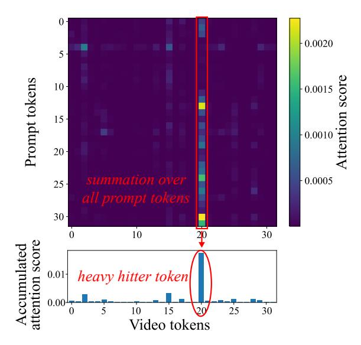
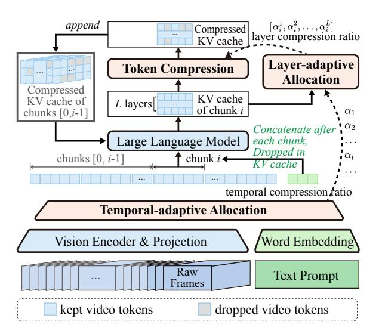

# AdaRETAKE: Adaptive Redundancy Reduction to Perceive Longer for Video-language Understanding

Xiao Wang1\*† Qingyi Si2\* Jianlong Wu1‡ Shiyu Zhu3 Li Cao2 Liqiang Nie1‡

1Harbin Institute of Technology, Shenzhen

2Huawei Technologies Co., Ltd. 3Shandong University

scz.wangxiao@gmail.com, siqingyi@huawei.com, wujianlong@hit.edu.cn

#### **Abstract**

Multimodal Large Language Models (MLLMs) have revolutionized video understanding, vet are still limited by context length when processing long videos. methods compress videos by leveraging visual redundancy uniformly, yielding promising Nevertheless, our quantitative results. analysis shows that redundancy varies significantly across time and model layers, necessitating a more flexible compression strategy. We propose AdaReTAKE, a training-free method that flexibly reduces visual redundancy by allocating compression ratios among time and layers with theoretical guarantees. AdaRETAKE can be seamlessly integrated into existing MLLMs as a plugand-play solution, extending their processing capacity from 256 to 2048 frames while preserving critical information. Experiments on VideoMME, MLVU, LongVideoBench, and LVBench datasets demonstrate that AdaRETAKE outperforms existing methods by 2.3% and 2.8% for 7B and 72B models, respectively, with even greater improvements of 5.9% and 6.0% on the longest LVBench. Our code is available at https://github.com/ SCZwangxiao/video-FlexReduc.git.

#### 1 Introduction

In pursuit of general intelligence, Multimodal Large Language Models (MLLMs) (Li et al., 2024b; Lin et al., 2024; Wang et al., 2025b,a) have revolutionized video understanding. However, current MLLMs require hundreds of tokens to represent a single image (Wang et al., 2024a; Li et al., 2024a; Wang et al., 2023), limiting video lengths to less than 10 minutes (Shen et al., 2024; Gan et al., 2023).

Efforts to extend MLLMs' capabilities for long videos include: agent systems (Zhang et al., 2024a)

Figure 1: AdaReTAKE enables MLLM to perceive longer with fixed context length for video-language understanding.

which retrieve and interpret pre-segmented videos but remain constrained by single-model abilities. Techniques like length extrapolation (Zhang et al., 2024c) and multi-modal sequence parallelism (Xue et al., 2024) enhance usable video context length but introduce more visual redundancy. Rather than extending context length, compression-based methods reduce video tokens into shorter sequences by leveraging visual redundancy (Bolya et al., 2022). Many approaches (He et al., 2024a; Fei et al., 2024) train Q-Former (Li et al., 2023a) to condense videos guided by language or learnable query tokens. Recent advancements (Shen et al., 2024; Wang et al., 2024c) integrate compression into MLLM prefilling, yielding promising results.

In this work, we push the boundaries of compression-based methods in two key ways: first, by optimizing the compression algorithm with insights from quantitative analysis; and second, by scaling the number of frames processed to capture more information from the video.

To dive deeper into compression-based methods, we quantitatively analyze visual redundancy by examining the distribution of influential tokens

\*Equal contribution.

&lt;sup>†Work done during an internship at Huawei.

&lt;sup>‡Corresponding author.

(more likely to be preserved during compression) during MLLM inference, revealing significant variations across video timestamps and LLM layers. These findings show that previous methods with fixed compression ratios fail to capture the dynamic nature of visual redundancy, underscoring the need for a more flexible compression strategy. In light of this, we propose AdaRETAKE, a training-free adaptive video redundancy reduction method. It features two modules: temporaladaptive allocation, which adjusts compression ratios for video sequence features over time, and layer-adaptive allocation, which manages KV cache states across layers. For temporal allocation, we divide a long video into chunks and allocate a compression ratio for each chunk based on the similarity scores between adjacent frames. For layer allocation, we adjust compression ratios across layers based on video-prompt attention scores. Our theoretical analysis demonstrates that this approach reduces the upper bound of L1 compression loss compared to uniform allocation. The combination of the above allocation determines a specific compression ratio for each chunk in each LLM layer. Finally, we apply chunked prefilling for all chunks and the prompt. During this process, the KV caches of each chunk are compressed iteratively based on the accumulated attention scores. AdaRETAKE compresses long videos into shorter sequences, allowing to perceive more informative frames within a fixed GPU memory budget, thereby enhancing long video understanding.

We integrate AdaRETAKE into cutting-edge MLLMs like QWen2-VL [\(Wang et al.,](#page-9-3) [2024a\)](#page-9-3) and LLaVA-Video [\(Zhang et al.,](#page-10-4) [2024e\)](#page-10-4), and conduct extensive experiments across various video understanding benchmarks, including VideoMME [\(Fu et al.,](#page-8-4) [2024\)](#page-8-4), MLVU [\(Zhou et al.,](#page-10-5) [2024\)](#page-10-5), LongVideoBench [\(Wu et al.,](#page-10-6) [2024\)](#page-10-6), and LVBench [\(Wang et al.,](#page-9-9) [2024b\)](#page-9-9). The results show that AdaRETAKE significantly outperforms existing methods, achieving an average improvement of 2.3% and 2.8% across datasets for 7B and 72B models, respectively. On LVBench, the dataset with the longest average video length, the gains are even more pronounced, with improvements of 5.9% and 6.0%, respectively. Additionally, the results on needle QA and temporal grounding tasks further demonstrate that our approach effectively preserves fine-grained temporal grounding capabilities. The ablation study validates the effectiveness of our

temporal and layer-adaptive budget allocation methods. Through comparison with other compression approaches, it further demonstrates the superiority of our method. In summary, our contributions are threefold:

- We identify uneven visual redundancy across time and MLLM layers and develop AdaRETAKE to adaptively reduce it, expanding MLLM capacity from 256 to 2048 frames for long video understanding.
- We design temporal- and layer-adaptive allocation modules to allocate compression ratios across time and MLLM layers, respectively. Theoretical analysis demonstrates that the layer-wise allocation effectively minimizes the upper bound of compression loss.
- Our approach achieves state-of-the-art performance, surpassing existing MLLMs by an average of 2.3% and 2.8% across 4 datasets for 7B and 72B models, respectively.

## 2 Related Work

#### 2.1 MLLM for Long Videos

Most existing multi-modal large language models struggle with extreme token lengths when applied directly to long videos. A commonly used and computationally manageable context length for multimodal training is 8k [\(Shen et al.,](#page-9-6) [2024\)](#page-9-6), which restricts video processing to a few minutes.

Early attempts developed *video agent systems* [\(Zhang et al.,](#page-10-1) [2024a;](#page-10-1) [Wang et al.,](#page-10-7) [2024d;](#page-10-7) [Luo et al.,](#page-9-10) [2024;](#page-9-10) [Liu et al.,](#page-9-11) [2018\)](#page-9-11) that segment videos into shorter clips and use MLLMs with open-source tools for retrieval, aggregation, and interpretation. However, a single model's capabilities remain limited, reducing overall effectiveness. *Length extrapolation methods* [\(Zhang et al.,](#page-10-2) [2024c;](#page-10-2) [Shang et al.,](#page-9-12) [2024;](#page-9-12) [Wei and Chen,](#page-10-8) [2024\)](#page-10-8) extend context windows beyond training lengths, but GPU memory still limits context size. To address this, [Xue et al.](#page-10-3) introduced LongVILA, a *multi-modal sequence parallelism system* that distributes computation across GPUs, but this adds communication overhead [\(Li et al.,](#page-9-13) [2023b\)](#page-9-13), affecting efficiency. In contrast, *compressionbased methods* condense video tokens into shorter sequences. Approaches [\(He et al.,](#page-8-2) [2024a;](#page-8-2) [Fei et al.,](#page-8-3) [2024;](#page-8-3) [Cheng et al.,](#page-8-5) [2024;](#page-8-5) [Zeng et al.,](#page-10-9) [2024a;](#page-10-9) [Man](#page-9-14) [et al.,](#page-9-14) [2024;](#page-9-14) [Han et al.,](#page-8-6) [2024\)](#page-8-6) use Q-Former [\(Li](#page-9-7)

[et al.,](#page-9-7) [2023a\)](#page-9-7) for token compression, reducing redundancy by leveraging language or query tokens. However, Q-Former, trained from scratch, lacks the world knowledge embedded in LLMs, making these methods suboptimal. Recent advances [\(Shu](#page-9-15) [et al.,](#page-9-15) [2024;](#page-9-15) [Shen et al.,](#page-9-6) [2024;](#page-9-6) [Liu et al.,](#page-9-16) [2024;](#page-9-16) [Wang et al.,](#page-9-8) [2024c\)](#page-9-8) integrate compression within the LLM, achieving promising results.

#### 2.2 Token Compression for MLLMs

Token compression methods for LLMs [\(Xiao et al.,](#page-10-10) [2024;](#page-10-10) [Zhang et al.,](#page-10-11) [2023;](#page-10-11) [Feng et al.,](#page-8-7) [2024\)](#page-8-7) reduce sequence length by evicting less important tokens, typically with some performance loss. Given the higher redundancy in visual tokens compared to language tokens [\(Bolya et al.,](#page-8-1) [2022\)](#page-8-1), these methods have been extended to MLLMs [\(Chen et al.,](#page-8-8) [2024;](#page-8-8) [Ye et al.,](#page-10-12) [2024;](#page-10-12) [He et al.,](#page-8-9) [2024b;](#page-8-9) [Zhu et al.,](#page-10-13) [2024\)](#page-10-13). Advancements include merging evicted tokens to reduce information loss [\(Wan et al.,](#page-9-17) [2024;](#page-9-17) [Zhang](#page-10-14) [et al.,](#page-10-14) [2024d\)](#page-10-14) and analyzing redundancy across layers [\(Xing et al.,](#page-10-15) [2024;](#page-10-15) [Tu et al.,](#page-9-18) [2024\)](#page-9-18). However, unlike our adaptive allocation approach, these methods fail to exploit temporal redundancy and allocate compression ratios either monotonically [\(Xing et al.,](#page-10-15) [2024\)](#page-10-15) or via heuristics [\(Tu et al.,](#page-9-18) [2024\)](#page-9-18), resulting in suboptimal performance.

In this paper, we advance token compression methods for MLLMs by adaptively adjusting the compression ratio across timestamps and layers to reduce redundancy more effectively.

## 3 Preliminary Analysis

In this section, we provide a quantitative analysis of the visual redundancy with MLLM for long video understanding. Intuitively, redundancy varies across dimensions: at the frame level, static scenes are more redundant than dynamic ones, and at the model level, deeper layers focus on more abstract features, leading to different attention patterns. To quantify this, we measure redundancy through the ratio of heavy-hitters [\(Zhang et al.,](#page-10-11) [2023\)](#page-10-11), a set of influential tokens essential for generation. By identifying these across dimensions, we validate the varying redundancy levels, providing a strong motivation for our approach to achieve more flexible and efficient compression.

Heavy-hitter ratio to measure redundancy. Denote the number of attention heads as h, length of prompt and video tokens as Lt and Lv, respectively, and the attention scores of them in

Figure 2: Illustrating example of a heavy hitter. We adopt the heavy hitter ratio to measure the redundancy

layer l is A (l) ∈ R h×Lt×Lv . We first calculate the prompt-accumulated head-average attention scores to measure the influence of each video token during generation a ∈ R Lv :

$$\mathbf{a}^{(l)} = \sum_{j=1}^{L_t} \frac{1}{h} \sum_{i=1}^h \mathbf{A}^{(l)}[i,j]. \tag{1}$$

We then calculate the *heavy-hitter ratio* λ (l) ∈ R:

$$\lambda^{(l)} = \frac{1}{L_v} \sum_{i=1}^{L_v} \mathbb{1}\left(\mathbf{a}^{(l)}[i] > p \max\left\{\mathbf{a}^{(l)}\right\}\right), \quad (2)$$

where ⊮(·) ∈ {0, 1} is the indicator function and p = 0.01 is a heuristic constant.A video token is considered important (called a *heavy-hitter*) if its accumulated attention a (l) [i] exceeds p times the maximum attention value in a (l) .

Redundancy among video timestamps. To explore the distribution of redundancy over time, we first split the video tokens into chunks of 10 seconds, and denote the heavy hitter ratio chunk t as λ (t,l) . We randomly sampled 64 videos from VideoMME [\(Fu et al.,](#page-8-4) [2024\)](#page-8-4) and plotted the layer-averaged heavy hitter ratio P k λ (t,l) across different chunks as a heatmap in [Figure 3.](#page-3-0) The temporal redundancy is unevenly distributed, with the heavy-hitter ratio varying up to 3x within a video, as highlighted by the red circle in [Figure 2.](#page-2-0) Redundancy among LLM layers. To investigate the distribution of redundancy across LLM layers in MLLM, we utilized all videos from VideoMME [\(Fu et al.,](#page-8-4) [2024\)](#page-8-4) and plotted heavy hitter ratio

Figure 3: Heavy-hitter ratio among timestamps, showing the unevenly distributed temporal redundancy. The horizontal shaded bars indicate timestamps where the video has ended.

Figure 4: Heavy-hitter ratio among layers, showing the unevenly distributed redundancy among LLM layers.

 $\sum_k \lambda^{(t,l)}$  across different layers as a boxplot in Figure 4. The redundancy is unevenly distributed among the LLM layers. Generally, the heavy hitter ratio is lower in the deeper layers, but significant fluctuations are observed, with local minima at layers 2, 14, and 21, and maxima at layers 7 and 18. This indicates that token compression methods that monotonically assign higher compression ratios to deeper layers, such as PyramidDrop (Xing et al., 2024), are suboptimal for video understanding.

To maximize the use of informative frames within a fixed GPU memory budget, we must design a video compression algorithm that adaptively adjusts the compression ratio across different timestamps and LLM layers.

#### 4 Methods

#### 4.1 Overview

The architecture of AdaRETAKE is shown in Figure 5. To flexibly reduce redundancy across timestamps, we divide video sequences into equal

Figure 5: Illustration of AdaReTAKE.

chunks and the **Temporal-adaptive Allocation** module dynamically applies distinct compression ratios to each chunk. For redundancy across layers, the **Layer-adaptive Allocation** module assigns varying compression ratios to LLM layers. Finally, the **Token Compression** module compresses the KV cache after each chunk's prefilling based on the compression ratios determined by the previous modules, reducing the video sequence length in an MLLM. The general pipeline and these three modules are detailed below.

## 4.2 General Pipeline

Denote T number of frames, N number of tokens in each frame,  $\tau$  number of frames in a chunk (can divide T), S prompt length, L number of LLM layers, and  $C_{max}$  is a refined maximal context length.

Given raw frames and a text prompt as input, the visual encoder and projection layer derive video features  $\mathbf{M} \in \mathbb{R}^{T \times N \times d}$ , and the word embedding layer derives prompt features  $\mathbf{P} \in \mathbb{R}^{S \times d}$ . We split visual features into chunks of  $\tau$  frames:

$$\mathcal{M} = \left[ \mathbf{M}_1, \mathbf{M}_2, ..., \mathbf{M}_{T/\tau} \right], \mathbf{M}_i \in \mathbb{R}^{\tau \times N \times d}.$$
(3)

The temporal-adaptive allocation module will produce a compression ratio (length after compression/original length) for each chunk based on the number of tokens in  $\mathcal{M}$  and  $C_{max}$ :

$$\left[\alpha_1, \alpha_2, \dots, \alpha_{T/\tau}\right], \quad \alpha_i \in \mathbb{R},$$
 (4)

s.t. 
$$\alpha_1 + \alpha_2 + \dots + \alpha_{T/\tau} = \frac{C_{\text{max}} - S}{TN}$$
. (5)

The above equation ensures the final total sequence length (in KV cache memory) is  $C_{max}$ . Note that we do not consider memory usage for other operations since for long sequence inference the KV cache occupies the most GPU memory (Hooper et al., 2024).

We employ chunk-based processing instead of single-frame processing to enhance the robustness of the allocation process and reduce memory overhead in temporal-adaptive allocation, as detailed in Section 4.4.

Due to the autoregressive nature of LLMs, chunked prefilling is applied to each chunk, which is functionally equivalent to standard prefilling (Zeng et al., 2024b). During the i-th iteration, chunk i is first prefilled. For each layer l, the query states of the prompt  $\mathbf{Q}_i^{(l)} \in \mathbb{R}^{S \times d}$  and the KV caches of chunk i  $\mathbf{K}_i^{(l)}, \mathbf{V}_i^{(l)} \in \mathbb{R}^{h \times \tau N \times d}$  are stored, where h is the number of heads. These, along with the chunk's compression ratio  $\alpha_i$ , are processed by the layer-adaptive allocation module to determine the compression ratio for each layer:

$$\left[\alpha_i^{(1)}, \alpha_i^{(2)}, \dots, \alpha_i^{(l)}\right], \quad \alpha_i^{(l)} \in \mathbb{R}, \quad (6)$$

s.t. 
$$\frac{\alpha_i^{(1)} + \alpha_i^{(2)} + \dots + \alpha_i^{(L)}}{L} = \alpha_i.$$
 (7)

Finally, token compression is applied to the visual KV caches of chunk i, deriving the compressed KV cache  $\hat{\mathbf{K}}_i^{(l)}, \hat{\mathbf{V}}_i^{(l)} \in \mathbb{R}^{\alpha_i^{(l)} \tau N \times d}$ . The prompt states are dropped except in the last chunk.

#### 4.3 Temporal-adaptive Allocation

Given chunked video frames  $\mathcal{M}$  and maximal context length  $C_{max}$ , this module calculates the compression ratio for each chunk.

For video features of the *i*-th chunk  $\mathbf{M}_i \in \mathbb{R}^{\tau \times N \times d}$ , we first calculate the distance between adjacent frames  $\mathbf{d}_i \in \mathbb{R}^{\tau-1}$ :

$$\mathbf{d}_{i}[t] = 1 - \sum_{i=1}^{N} \frac{\operatorname{Sim}(\mathbf{M}_{i}[t,j], \mathbf{M}_{i}[t+1,j])}{N}, (8)$$

where  $\mathrm{Sim}(\cdot)$  represents the cosine similarity. We then average  $\mathbf{d}_i$  among its  $\tau-1$  frames to get the averaged distance of i-th chunk  $\bar{d}_i \in \mathbb{R}$ , which reflects the temporal redundancy within the chunk. Finally, the compression ratio  $\alpha_i$  for each chunk is computed by allocating the maximal context length  $C_{\max}$  proportionally to the mean distances:

$$\alpha_i = \frac{C_{max} - S}{TN} \cdot \frac{\bar{d}_i}{\sum_{i=1}^{T/\tau} \bar{d}_i}.$$
 (9)

#### 4.4 Layer-adaptive Allocation

When prefilling chunk i in the l-th LLM layer, we store the query states of the prompt  $\mathbf{Q}_i^{(l)}$ , KV cache of chunk  $\mathbf{K}_i^{(l)}$ ,  $\mathbf{V}_i^{(l)}$ . This module calculates the compression ratio for chunk i in each layer.

In the l-th layer, we first calculate the attention score between prompt and the video tokens  $\mathbf{A}_i^{(l)} \in \mathbb{R}^{h \times S \times \tau N}$ . We then calculate the head-averaged accumulated scores along all prompt tokens to measure the significance score of each token to the prompt,  $\mathbf{a}_i^{(l)} \in \mathbb{R}^{\tau N}$ :

$$\mathbf{a}_{i}^{(l)} = \sum_{i=1}^{S} \frac{1}{h} \sum_{i=1}^{h} \mathbf{A}_{i}^{(l)}[i, j]. \tag{10}$$

To measure the significance of each layer, we calculate the number of tokens with large significance scores, denoted as  $s_i^{(l)} \in \mathbb{Z}$ :

$$s_i^{(l)} = \sum_{j=1}^{\tau N} \mathbb{1}\left(\mathbf{a}_i^{(l)}[j] > \hat{a}_i\right),\tag{11}$$

s.t. 
$$\hat{a}_i = \text{K-th}\left(\mathbf{a}_i^{(1)} \| \cdots \| \mathbf{a}_i^{(l)} \right),$$
 (12)

$$K = \alpha_i \tau N L. \tag{13}$$

where  $\mathbb{M}(\cdot) \in \{0,1\}$  is the indicator function,  $K\text{-th}(\cdot)$  denotes the K-th largest value in the vector, and || denotes vector concatenation operation. Finally, we allocate the compression ratio of each layer by re-weighting the total compression ratio of current  $\alpha_i$  in each layer:

$$\alpha_i^{(l)} = w_i^{(l)} \alpha_i, \tag{14}$$

$$w_i^{(l)} = \frac{s_i^{(l)}}{\sum_{k=1}^l s_i^{(k)}}.$$
 (15)

Note that sometimes the  $\hat{w}_i^{(k)}$  above might be too small. To ensure numerical stability, we introduce a minimal weight  $\epsilon=0.01$  and compute the renormalized re-weighting factor  $\hat{w}_i^{(l)}$ :

$$\hat{w}_i^{(l)} = \frac{\max(w_i^{(l)} - \epsilon, 0)}{\sum_{k=1}^{l} \max(w_i^{(k)} - \epsilon, 0)} (1 - L\epsilon) + \epsilon.$$
(16)

For memory-efficient implementation, we calculate Eqn. (10) after each layer.

### 4.5 Token Compression

After prefilling the *i*-th chunk, we first drop the prompt tokens in the KV cache (except the last

chunk). Based on the compression ratio derived from Eqn. 14, we then compress video tokens by selecting tokens with the top significant scores and then update the KV cache in each layer  $\mathbf{K}^{(l)}$ ,  $\mathbf{V}^{(l)}$ :

$$\mathcal{I} = \operatorname{ArgTopK}(\mathbf{a}_i^{(l)}), \quad K = \alpha_i^{(l)} \tau N, \quad (17)$$

$$\mathbf{K}^{(l)} \leftarrow \left[ \mathbf{K}^{(l)} \parallel \mathbf{K}_i^{(l)}[:, \mathcal{I}] \right], \tag{18}$$

$$\mathbf{V}^{(l)} \leftarrow \left[ \mathbf{V}^{(l)} \parallel \mathbf{V}_i^{(l)} [:, \mathcal{I}] \right]. \tag{19}$$

where  $ArgTopK(\cdot)$  denotes the indices of K elements with the largest value in the vector.

We also provide a theoretical guarantee for our layer-wise budget allocation method. See Appendix A for more details.

**Theorem 4.1.** Let  $I_i^{(l)} \in \{0,1\}$  denotes whether token i in layer l is kept during compression. Given the token sequence budget  $\sum_l \sum_i I_i^{(l)} = K$ , making token compression choices  $\left\{\mathbf{I}_*^{(l)}\right\}_{l=1}^L$  based on top K values in  $\left\{A_i^{(l)}\right\}$  can achieve a near-optimal minimization of the upper bound of token compression loss to  $\epsilon_*^{(l)}$ :

$$\epsilon_*^{(l)} \le 2C + 2C \left(\frac{\epsilon_{opt}^{(l)}}{2C} - 1\right)^{1 - \frac{1}{e}}, \quad (20)$$

where  $\epsilon_{opt}^{(l)}$  is the theoretical minimal of  $\epsilon^{(l)}$  and C is a constant.

#### 5 Experiments

## 5.1 Benchmarks and Implementations

**Video-MME.** Video Multi-Modal Evaluation (Fu et al., 2024) is a pioneering benchmark designed for evaluating video analysis, with diverse video types, and durations. It comprises 900 videos totaling 256 hours, with 2,700 manually labeled complex multiple-choice question-answer pairs across 30 subfields. It has three subsets of different durations: short (< 2min), medium ( $4min \sim 15min$ ), and long (30min  $\sim$  60min). MLVU. Multi-task Long Video Understanding Benchmark (MLVU) (Zhou et al., 2024) has the widest range of video length ranging from 3 minutes to 2 hours. MLVU includes nine evaluation tasks including topic reasoning, anomaly recognition, video summarization, and plot question-answering. LongVideoBench (Wu et al., 2024) is a benchmark for long-context video understanding, consisting of videos up to one hour in length. It includes 3,763 videos with

6,678 annotated multiple-choice questions across 17 categories, focusing on referring reasoning that requires retrieving and analyzing detailed multimodal information from specific temporal segments. **LVBench.** LVBench (Wang et al., 2024b) is a comprehensive benchmark for long video understanding, with an average video length of 4,101 seconds—4 times longer than VideoMME (Fu et al., 2024) and 5 times longer than MLVU (Zhou et al., 2024). It includes 1,549 annotated multiple-choice question-answer pairs covering a wide range of tasks, including entity recognition, event understanding, key information retrieval, temporal grounding, and reasoning.

Implementation Details. We integrated AdaRETAKE into various MLLMs, including LLaVA-Video-7B (Zhang et al., 2024e), QWen2VL-7B (Wang et al., 2024a), QWen2.5VL-7B, and QWen2.5VL-72B. We densely sampled the video at 2 frames per second (fps), with a maximum of 2048 and 1024 frames for 7B and 72B models, respectively. For our main results (Section 5.2), we chose the maximal context length  $C_{max}$  as 16K. In the ablation studies (Section 5.3), we reduced the maximum number of sampled frames to 1024 and the context length to 1K without specification. The evaluation is conducted using LMMs-Eval (Zhang et al., 2024b).

#### 5.2 Main Results

Comparision with SoTAs. We integrated AdaReTAKE with various MLLMs and compared their results with existing long video understanding methods in Table 1. The average improvements on the VideoMME, MLVU, and LVBench datasets are 1.2%, 2.8%, and 6.2%, respectively, with the most significant gains on LVBench. Given that LVBench has the longest average video duration (5x that of MLVU), we hypothesize that our method's ability to effectively compress visual tokens enables MLLMs to process longer and more informative visual sequences, leading to greater improvements with longer video content.

Generalization for various MLLMs. When integrated with different MLLMs of different sizes, AdaReTake brings consistent improvements, demonstrating its generality. With the help of AdaReTake, both the 7B and 72B variants of QWen2.5-VL achieve state-of-the-art results within their respective model sizes. The 7B model sees an average improvement of 2.3%, while the 72B model achieves a 1.5% gain, demonstrating the

| Model                 | LLM Size | VideoMME |         | MLVU | LongVideoBench | LVBench |
|-----------------------|----------|----------|---------|------|----------------|---------|
|                       |          | Long     | Overall | dev  | val            | val     |
| GLM-4V-Plus           | -        | -        | 70.8    | -    | -              | 58.7    |
| GPT-4o                | -        | 65.3     | 71.9    | 64.6 | 66.7           | 27.0    |
| Gemini-1.5-Pro        | -        | 67.4     | 75.0    | -    | 64.0           | 33.1    |
| VITA-1.5              | 7B       | 47.1     | 56.1    | -    | -              | -       |
| mPLUG-Owl3            | 7B       | 50.1     | 59.3    | 63.7 | 52.1           | -       |
| NVILA                 | 8B       | 54.8     | 64.2    | 70.1 | 57.7           | -       |
| ByteVideoLLM          | 14B      | 56.4     | 64.6    | 70.1 | -              | -       |
| TPO                   | 7B       | 55.4     | 65.6    | 71.1 | 60.1           | -       |
| VideoLLaMA3           | 7B       | -        | 66.2    | 73.0 | 59.8           | 45.3    |
| LLaVA-Video           | 7B       | 52.4     | 63.3    | 67.0 | 58.2           | 43.1    |
| LLaVA-Video+AdaRETAKE | 7B       | 53.9     | 64.0    | 70.6 | 59.6           | 49.6    |
| Qwen2-VL              | 7B       | 53.8     | 63.3    | 66.9 | 55.6           | 42.4    |
| QWen2-VL+AdaRETAKE    | 7B       | 56.4     | 64.2    | 72.0 | 57.2           | 48.9    |
| Qwen2.5-VL            | 7B       | 55.6     | 65.4    | 70.2 | 59.5           | 45.3    |
| QWen2.5-VL+AdaRETAKE  | 7B       | 58.3     | 67.7    | 75.0 | 62.6           | 51.2    |
| LLaVA-OneVision       | 72B      | 60.0     | 66.3    | 68.0 | 61.3           | -       |
| Oryx-1.5              | 32B      | 59.3     | 67.3    | 72.3 | 62.0           | 30.4    |
| Aria                  | 8x3.5B   | 58.8     | 67.6    | 70.6 | 65.3           | -       |
| LLaVA-Video           | 72B      | 61.5     | 70.6    | 74.4 | 61.9           | -       |
| Qwen2-VL              | 72B      | 62.2     | 71.2    | -    | 60.4           | 41.3    |
| InternVL2.5           | 72B      | 62.6     | 72.1    | 75.7 | 63.6           | 43.6    |
| Qwen2.5-VL            | 72B      | 63.9     | 72.6    | 74.6 | 65.9           | 47.3    |
| Qwen2.5-VL+AdaRETAKE  | 72B      | 65.0     | 73.5    | 78.1 | 67.0           | 53.3    |

Table 1: Performance comparison on long video understanding. AdaRETAKE achieves consistent gains when integrated into various MLLMs.

| Method      |      | VideoMME | MLVU | LVBench |  |
|-------------|------|----------|------|---------|--|
|             | Long | Overall  | val  | val     |  |
| FastV       | 53.5 | 61.2     | 63.2 | 42.3    |  |
| FitPrune    | 53.6 | 61.2     | 63.6 | 42.0    |  |
| LOOK-M      | 53.6 | 61.0     | 63.8 | 42.6    |  |
| SparseVLM   | 54.4 | 60.7     | 63.0 | 43.9    |  |
| PyramidDrop | 53.1 | 60.5     | 63.7 | 41.6    |  |
| VL-Cache    | 53.2 | 61.3     | 64.5 | 42.4    |  |
| AdaRETAKE   | 55.1 | 62.2     | 65.6 | 44.8    |  |

Table 2: Comparison with other token compression methods for MLLMs. AdaRETAKE outperforms existing approaches by employing a theoretically grounded budget distribution mechanism, in contrast to heuristic or suboptimal allocation strategies.

scaling ability of our method into larger size.

Comparison with other token compression methods. As shown in Table [2,](#page-6-2) AdaRETAKE demonstrates distinct advantages over existing MLLM token compression approaches.

Baseline methods FastV and FitPrune employ accumulated attention scores to evict tokens, while SparseVLM enhances this paradigm through partial token recycling.

PyramidDrop, VL-Cache, and our method address compression ratio allocation. However, PyramidDrop's layer-wise monotonic budget allocation contradicts our layer importance observations in Section [3,](#page-2-1) leading to suboptimal performance. While VL-Cache improves through heuristic-based dynamic allocation, our method is theoretically grounded, achieving superior results.

## 5.3 Ablation Studies

Ablation studies on temporal and layer-wise adaptive allocation. To identify the sources of performance improvements in our model, we conducted ablation studies, as summarized in Table [3.](#page-7-0) In the table, #0 represents the baseline model. In #1, we directly incorporates token compression into baseline model, and in #2, we increase the number of sampled frames while keeping the maximum context length fixed. In #3 and #4 we applly varying compression ratios across different layers and different frames respectively. Finally, #5 extends the context length. First, comparing rows 0,1 and 1,2 reveals that token compression introduces a slight performance drop (-0.8% on average). However, it enables the model to process more frames within the same context length, capturing richer information and ultimately yielding a net performance gain (2.5%

| Model                      | Max frames | Context length | VideoMME-L | MLVU | LVBench | ∆avg |
|----------------------------|------------|----------------|------------|------|---------|------|
| 0 QWen2VL-7B               | 128        | 9K             | 51.2       | 63.5 | 40.1    | -    |
| 1 +token compression       | 128        | 1K             | 50.6       | 62.7 | 39.2    | -0.8 |
| 2 +scale up frames         | 1024       | 1K             | 53.8       | 63.9 | 42.3    | +2.5 |
| 3 +layer-wise allocation   | 1024       | 1K             | 54.3       | 64.6 | 43.5    | +0.8 |
| 4 +temporal allocation     | 1024       | 1K             | 55.1       | 65.6 | 44.8    | +1.0 |
| 5 +scale up context length | 1024       | 16K            | 56.0       | 71.7 | 48.0    | +3.4 |
| 6 +scale up frames         | 2048       | 16K            | 56.4       | 72.0 | 48.9    | +0.6 |

Table 3: Ablation study on different components in our method. Token compression enables richer information capture, optimized compression allocation improves efficiency, and extended context length significantly enhances performance.

|                          |            |                    | MLVU |      | LVBench             |      |
|--------------------------|------------|--------------------|------|------|---------------------|------|
| Method                   | Max Frames | Max Context Length | NQA  | AO   | KIR 37.5 51.2 | TG   |
| LLaVA-Video-7B           | 128        | 25K                | 74.2 | 55.6 |                     | 36.8 |
| LLaVA-Video-7B+AdaRETAKE | 1024       | 16K                | 75.1 | 60.6 |                     | 43.2 |
| Qwen2-VL-7B              | 256        | 18K                | 81.9 | 49.0 | 44.3                | 40.5 |
| QWen2-VL-7B+AdaRETAKE    | 1024       | 16K                | 82.7 | 60.2 | 52.9                | 42.7 |

Table 4: Ablation studies on MLVU and LVBench datasets, evaluating fine-grained perception capabilities across Needle QA (NQA), Action Order (AO), Action Count (AC), Key Information Retrieval (KIR), and Temporal Grounding (TG).

on average versus -0.8%). 2) Comparing rows 2,3 and 3,4 shows that our strategy of distributing the compression ratio across frames and layers enhances performance (by 1.0% and 0.8% on average, respectively), confirming the effectiveness of our AdaRETAKE. 3) Comparing rows 4 and 5 demonstrates that scaling the context length to the typical upper limit of MLLMs [\(Shen et al.,](#page-9-6) [2024\)](#page-9-6) further improves performance significantly, with an average gain of 3.4%.

Perception ability on temporal details. To assess the effectiveness of token compression algorithms in preserving critical temporal details, we conducted ablation studies on the MLVU and LVBench datasets, focusing on Needle QA, Action Order, Key Information Retrieval, and Temporal Grounding. We compared baseline models LLaVA-Video-7B and QWen2-VL-7B, maximizing frame sampling within their constraints (128 and 256 frames, respectively). Results are shown in Table [4.](#page-7-1) Our analysis reveals three key findings: 1) Despite token compression via AdaRETAKE, increasing the maximum sampled frames improved grounding abilities (Needle QA and Temporal Grounding) without compromising temporal order perception (Action Order). This indicates that AdaRETAKE enhances model performance while strengthening fine-grained temporal capabilities. 2) The improvement in MLVU's Action Order

category was significantly higher than in Needle QA (8% vs. 0.8% on average). We attribute this to our method's ability to sample more frames through token compression, thus a denser frame sampling is enabled, which greatly enhances action understanding [\(Li et al.,](#page-9-0) [2024b\)](#page-9-0). 3) In LVBench, under similar baselines, Key Information Retrieval demonstrated a significantly higher improvement compared to Temporal Grounding, with average gains of 11.2% versus 4.3%. We hypothesize that token compression enhances information density, which strengthens comprehensive understanding. We believe this can explain why Key Information Retrieval, a task requiring deeper comprehension, benefits more than perceptual tasks like Temporal Grounding in our results.

# 6 Conclusion

We introduce AdaRETAKE, a training-free method for adaptive redundancy reduction in MLLMs. By dynamically allocating compression ratios across frames and model layers, AdaRETAKE achieves more efficient video token compression. This allows us to scale up to more frames and extract valuable information within the same computational budget. Integrated into state-ofthe-art MLLMs, AdaRETAKE enables processing of up to 2,048 frames and outperforms existing methods on benchmarks such as VideoMME,

MLVU, LongVideoBench, and LVBench by a large margin.

## 7 Limitations

While AdaRETAKE can be integrated into most MLLMs, it may also inherit their inherent limitations, such as factual inaccuracies, biases, and hallucinations.

## 8 Acknowledgment

This work was supported in part by the National Natural Science Foundation of China(Grant Nos. 62376069 and 62236003), in part by the Young Elite Scientists Sponsorship Program by CAST (Grant No. 2023QNRC001), in part by Guangdong Basic and Applied Basic Research Foundation (Grant No. 2024A1515012027), in part by Jiangsu Science and Technology Major Program (Grant No. BG2024041), and in part by the Shenzhen Science and Technology Program (Grant Nos. KQTD20240729102207002 and ZDSYS20230626091203008).

# References

- Daniel Bolya, Cheng-Yang Fu, Xiaoliang Dai, Peizhao Zhang, Christoph Feichtenhofer, and Judy Hoffman. 2022. Token merging: Your vit but faster. In *International Conference on Learning Representations*. OpenReview.net.
- Liang Chen, Haozhe Zhao, Tianyu Liu, Shuai Bai, Junyang Lin, Chang Zhou, and Baobao Chang. 2024. An Image is Worth 1/2 Tokens After Layer 2: Plug-and-Play Inference Acceleration for Large Vision-Language Models. In *European Conference on Computer Vision*, Lecture Notes in Computer Science, pages 19–35. Springer.
- Dingxin Cheng, Mingda Li, Jingyu Liu, Yongxin Guo, Bin Jiang, Qingbin Liu, Xi Chen, and Bo Zhao. 2024. Enhancing Long Video Understanding via Hierarchical Event-Based Memory. ArXiv:2409.06299.
- Jiajun Fei, Dian Li, Zhidong Deng, Zekun Wang, Gang Liu, and Hui Wang. 2024. Video-CCAM: Enhancing Video-Language Understanding with Causal Cross-Attention Masks for Short and Long Videos. ArXiv:2408.14023.
- Yuan Feng, Junlin Lv, Yukun Cao, Xike Xie, and S. Kevin Zhou. 2024. Ada-KV: Optimizing KV Cache Eviction by Adaptive Budget Allocation for Efficient LLM Inference. *arXiv preprint*. ArXiv:2407.11550.
- Chaoyou Fu, Yuhan Dai, Yondong Luo, Lei Li, Shuhuai Ren, Renrui Zhang, Zihan Wang, Chenyu Zhou, Yunhang Shen, Mengdan Zhang, Peixian Chen, Yanwei Li, Shaohui Lin, Sirui Zhao, Ke Li, Tong Xu, Xiawu Zheng, Enhong Chen, Rongrong Ji, and Xing Sun. 2024. Video-mme: The first-ever comprehensive evaluation benchmark of multi-modal llms in video analysis. *CoRR*, abs/2405.21075.
- Tian Gan, Xiao Wang, Yan Sun, Jianlong Wu, Qingpei Guo, and Liqiang Nie. 2023. Temporal sentence grounding in streaming videos. In *Proceedings of the 31st ACM International Conference on Multimedia*, pages 4637–4646.
- Yudong Han, Qingpei Guo, Liyuan Pan, Liu Liu, Yu Guan, and Ming Yang. 2024. DynFocus: Dynamic Cooperative Network Empowers LLMs with Video Understanding. ArXiv:2411.12355.
- Bo He, Hengduo Li, Young Kyun Jang, Menglin Jia, Xuefei Cao, Ashish Shah, Abhinav Shrivastava, and Ser-Nam Lim. 2024a. MA-LMM: Memory-Augmented Large Multimodal Model for Long-Term Video Understanding. In *Conference on Computer Vision and Pattern Recognition*, pages 13504–13514. IEEE.
- Yefei He, Feng Chen, Jing Liu, Wenqi Shao, Hong Zhou, Kaipeng Zhang, and Bohan Zhuang. 2024b. ZipVL: Efficient Large Vision-Language Models with Dynamic Token Sparsification and KV Cache Compression. ArXiv:2410.08584.

- Coleman Hooper, Sehoon Kim, Hiva Mohammadzadeh, Michael W. Mahoney, Yakun Sophia Shao, Kurt Keutzer, and Amir Gholami. 2024. Kvquant: Towards 10 million context length LLM inference with KV cache quantization. In *Advances in Neural Information Processing Systems*.
- Bo Li, Yuanhan Zhang, Dong Guo, Renrui Zhang, Feng Li, Hao Zhang, Kaichen Zhang, Yanwei Li, Ziwei Liu, and Chunyuan Li. 2024a. LLaVA-OneVision: Easy Visual Task Transfer. ArXiv:2408.03326.
- Junnan Li, Dongxu Li, Silvio Savarese, and Steven C. H. Hoi. 2023a. BLIP-2: Bootstrapping Language-Image Pre-training with Frozen Image Encoders and Large Language Models. In *International Conference on Machine Learning*, pages 19730–19742. PMLR.
- KunChang Li, Yinan He, Yi Wang, Yizhuo Li, Wenhai Wang, Ping Luo, Yali Wang, Limin Wang, and Yu Qiao. 2024b. Videochat: Chat-centric video understanding. ArXiv:2305.06355.
- Shenggui Li, Fuzhao Xue, Chaitanya Baranwal, Yongbin Li, and Yang You. 2023b. Sequence parallelism: Long sequence training from system perspective. In *Proceedings of the Annual Meeting of the Association for Computational Linguistics*, pages 2391–2404. Association for Computational Linguistics.
- Bin Lin, Yang Ye, Bin Zhu, Jiaxi Cui, Munan Ning, Peng Jin, and Li Yuan. 2024. Video-llava: Learning united visual representation by alignment before projection. In *Proceedings of the Conference on Empirical Methods in Natural Language Processing*, pages 5971–5984. Association for Computational Linguistics.
- Meng Liu, Xiang Wang, Liqiang Nie, Xiangnan He, Baoquan Chen, and Tat-Seng Chua. 2018. Attentive moment retrieval in videos. In *The 41st international ACM SIGIR conference on research & development in information retrieval*, pages 15–24.
- Ting Liu, Liangtao Shi, Richang Hong, Yue Hu, Quanjun Yin, and Linfeng Zhang. 2024. Multi-Stage Vision Token Dropping: Towards Efficient Multimodal Large Language Model. ArXiv:2411.10803.
- Yongdong Luo, Xiawu Zheng, Xiao Yang, Guilin Li, Haojia Lin, Jinfa Huang, Jiayi Ji, Fei Chao, Jiebo Luo, and Rongrong Ji. 2024. Video-RAG: Visually-aligned Retrieval-Augmented Long Video Comprehension. ArXiv:2411.13093.
- Yuanbin Man, Ying Huang, Chengming Zhang, Bingzhe Li, Wei Niu, and Miao Yin. 2024. AdaCM\$^2\$: On Understanding Extremely Long-Term Video with Adaptive Cross-Modality Memory Reduction. ArXiv:2411.12593.
- George L Nemhauser, Laurence A Wolsey, and Marshall L Fisher. 1978. An analysis of approximations for maximizing submodular set

- functions—i. *Mathematical programming*, 14:265– 294.
- Yuzhang Shang, Bingxin Xu, Weitai Kang, Mu Cai, Yuheng Li, Zehao Wen, Zhen Dong, Kurt Keutzer, Yong Jae Lee, and Yan Yan. 2024. Interpolating Video-LLMs: Toward Longer-sequence LMMs in a Training-free Manner. ArXiv:2409.12963.
- Xiaoqian Shen, Yunyang Xiong, Changsheng Zhao, Lemeng Wu, Jun Chen, Chenchen Zhu, Zechun Liu, Fanyi Xiao, Balakrishnan Varadarajan, Florian Bordes, Zhuang Liu, Hu Xu, Hyunwoo J. Kim, Bilge Soran, Raghuraman Krishnamoorthi, Mohamed Elhoseiny, and Vikas Chandra. 2024. LongVU: Spatiotemporal Adaptive Compression for Long Video-Language Understanding. ArXiv:2410.17434.
- Yan Shu, Peitian Zhang, Zheng Liu, Minghao Qin, Junjie Zhou, Tiejun Huang, and Bo Zhao. 2024. Video-XL: Extra-Long Vision Language Model for Hour-Scale Video Understanding. ArXiv:2409.14485.
- Dezhan Tu, Danylo Vashchilenko, Yuzhe Lu, and Panpan Xu. 2024. VL-Cache: Sparsity and Modality-Aware KV Cache Compression for Vision-Language Model Inference Acceleration. ArXiv:2410.23317.
- Zhongwei Wan, Ziang Wu, Che Liu, Jinfa Huang, Zhihong Zhu, Peng Jin, Longyue Wang, and Li Yuan. 2024. LOOK-M: Look-Once Optimization in KV Cache for Efficient Multimodal Long-Context Inference. ArXiv: 2406.18139.
- Peng Wang, Shuai Bai, Sinan Tan, Shijie Wang, Zhihao Fan, Jinze Bai, Keqin Chen, Xuejing Liu, Jialin Wang, Wenbin Ge, Yang Fan, Kai Dang, Mengfei Du, Xuancheng Ren, Rui Men, Dayiheng Liu, Chang Zhou, Jingren Zhou, and Junyang Lin. 2024a. Qwen2-vl: Enhancing vision-language model's perception of the world at any resolution. ArXiv:2409.12191.
- Weihan Wang, Zehai He, Wenyi Hong, Yean Cheng, Xiaohan Zhang, Ji Qi, Shiyu Huang, Bin Xu, Yuxiao Dong, Ming Ding, and Jie Tang. 2024b. Lvbench: An extreme long video understanding benchmark.
- Xiao Wang, Jingyun Hua, Weihong Lin, Yuanxing Zhang, Fuzheng Zhang, Jianlong Wu, Di Zhang, and Liqiang Nie. 2025a. Haic: Improving human action understanding and generation with better captions for multi-modal large language models. *arXiv preprint ArXiv:2502.20811*.
- Xiao Wang, Yaoyu Li, Tian Gan, Zheng Zhang, Jingjing Lv, and Liqiang Nie. 2023. Rtq: Rethinking video-language understanding based on image-text model. In *Proceedings of the 31st ACM International Conference on Multimedia*, pages 557–566.
- Xiao Wang, Qingyi Si, Jianlong Wu, Shiyu Zhu, Li Cao, and Liqiang Nie. 2024c. Retake: Reducing temporal and knowledge redundancy for long video understanding. ArXiv:2412.20504.

- Xiao Wang, Jianlong Wu, Zijia Lin, Fuzheng Zhang, Di Zhang, and Liqiang Nie. 2025b. Video dataflywheel: Resolving the impossible data trinity in video-language understanding. *IEEE Transactions on Pattern Analysis and Machine Intelligence*.
- Xiaohan Wang, Yuhui Zhang, Orr Zohar, and Serena Yeung-Levy. 2024d. VideoAgent: Long-Form Video Understanding with Large Language Model as Agent. In *European Conference on Computer Vision*, volume 15138, pages 58–76. Springer.
- Hongchen Wei and Zhenzhong Chen. 2024. Visual Context Window Extension: A New Perspective for Long Video Understanding. ArXiv:2409.20018.
- Haoning Wu, Dongxu Li, Bei Chen, and Junnan Li. 2024. Longvideobench: A benchmark for longcontext interleaved video-language understanding. *CoRR*, abs/2407.15754.
- Guangxuan Xiao, Yuandong Tian, Beidi Chen, Song Han, and Mike Lewis. 2024. Efficient streaming language models with attention sinks. In *International Conference on Learning Representations*. OpenReview.net.
- Long Xing, Qidong Huang, Xiaoyi Dong, Jiajie Lu, Pan Zhang, Yuhang Zang, Yuhang Cao, Conghui He, Jiaqi Wang, Feng Wu, and Dahua Lin. 2024. PyramidDrop: Accelerating Your Large Vision-Language Models via Pyramid Visual Redundancy Reduction. ArXiv:2410.17247.
- Fuzhao Xue, Yukang Chen, Dacheng Li, Qinghao Hu, Ligeng Zhu, Xiuyu Li, Yunhao Fang, Haotian Tang, Shang Yang, Zhijian Liu, Ethan He, Hongxu Yin, Pavlo Molchanov, Jan Kautz, Linxi Fan, Yuke Zhu, Yao Lu, and Song Han. 2024. LongVILA: Scaling Long-Context Visual Language Models for Long Videos. ArXiv:2408.10188.
- Weihao Ye, Qiong Wu, Wenhao Lin, and Yiyi Zhou. 2024. Fit and Prune: Fast and Training-free Visual Token Pruning for Multi-modal Large Language Models. ArXiv:2409.10197.
- Xiangyu Zeng, Kunchang Li, Chenting Wang, Xinhao Li, Tianxiang Jiang, Ziang Yan, Songze Li, Yansong Shi, Zhengrong Yue, Yi Wang, Yali Wang, Yu Qiao, and Limin Wang. 2024a. TimeSuite: Improving MLLMs for Long Video Understanding via Grounded Tuning. ArXiv:2410.19702.
- Zhiyuan Zeng, Qipeng Guo, Xiaoran Liu, Zhangyue Yin, Wentao Shu, Mianqiu Huang, Bo Wang, Yunhua Zhou, Linlin Li, Qun Liu, et al. 2024b. Memorize step by step: Efficient long-context prefilling with incremental memory and decremental chunk. In *Proceedings of the Conference on Empirical Methods in Natural Language Processing*, pages 21021– 21034. ACL.
- Ce Zhang, Taixi Lu, Md Mohaiminul Islam, Ziyang Wang, Shoubin Yu, Mohit Bansal, and Gedas Bertasius. 2024a. A Simple LLM Framework

- for Long-Range Video Question-Answering. In *Proceedings of the Conference on Empirical Methods in Natural Language Processing*, pages 21715– 21737. Association for Computational Linguistics.
- Kaichen Zhang, Bo Li, Peiyuan Zhang, Fanyi Pu, Joshua Adrian Cahyono, Kairui Hu, Shuai Liu, Yuanhan Zhang, Jingkang Yang, Chunyuan Li, and Ziwei Liu. 2024b. [Lmms-eval: Reality check on](https://arxiv.org/abs/2407.12772) [the evaluation of large multimodal models.](https://arxiv.org/abs/2407.12772) *Preprint*, arXiv:2407.12772.
- Peiyuan Zhang, Kaichen Zhang, Bo Li, Guangtao Zeng, Jingkang Yang, Yuanhan Zhang, Ziyue Wang, Haoran Tan, Chunyuan Li, and Ziwei Liu. 2024c. Long Context Transfer from Language to Vision. ArXiv:2406.16852.
- Yuan Zhang, Chun-Kai Fan, Junpeng Ma, Wenzhao Zheng, Tao Huang, Kuan Cheng, Denis Gudovskiy, Tomoyuki Okuno, Yohei Nakata, Kurt Keutzer, and Shanghang Zhang. 2024d. SparseVLM: Visual Token Sparsification for Efficient Vision-Language Model Inference. ArXiv:2410.04417.
- Yuanhan Zhang, Jinming Wu, Wei Li, Bo Li, Zejun Ma, Ziwei Liu, and Chunyuan Li. 2024e. Video Instruction Tuning With Synthetic Data. ArXiv:2410.02713.
- Zhenyu Zhang, Ying Sheng, Tianyi Zhou, Tianlong Chen, Lianmin Zheng, Ruisi Cai, Zhao Song, Yuandong Tian, Christopher Ré, Clark W. Barrett, Zhangyang Wang, and Beidi Chen. 2023. H2O: Heavy-Hitter Oracle for Efficient Generative Inference of Large Language Models. In *Advances in Neural Information Processing Systems3*.
- Junjie Zhou, Yan Shu, Bo Zhao, Boya Wu, Shitao Xiao, Xi Yang, Yongping Xiong, Bo Zhang, Tiejun Huang, and Zheng Liu. 2024. MLVU: A comprehensive benchmark for multi-task long video understanding. *CoRR*, abs/2406.04264.
- Yuke Zhu, Chi Xie, Shuang Liang, Bo Zheng, and Sheng Guo. 2024. FocusLLaVA: A Coarse-to-Fine Approach for Efficient and Effective Visual Token Compression. ArXiv:2411.14228.

## **Proof of Token Compression Loss**

#### A.1 Preliminaries

LLMs are characterized by an autoregressive generation mode, where each step involves using the last token to predict the next token. For a formal representation of our approach, we denote  $\mathbf{K}^{(l)} \cdot \mathbf{V}^{(l)} \in \mathbb{R}^{(n-1)\times d}, i = 1, 2, \dots, L$  as the video KV cache in and  $\mathbf{x}^{(l)} \in \mathbb{R}^d$  as the last token used as input at the current time step, where n-1 is the prefilled sequence length, L is the number of layers and d is the hidden state dimension. Note that we ignore the number of attention heads for simplification.

During attention forward in the l-th layer, the input token is first mapped into its query, key, and value states:

$$\mathbf{q}^{(l)} = \mathbf{x}^{(l)} \mathbf{W}_Q^{(l)}, \tag{21}$$

$$\begin{cases}
\mathbf{q}^{(l)} = \mathbf{x}^{(l)} \mathbf{W}_{Q}^{(l)}, & (21) \\
\mathbf{k}^{(l)} = \mathbf{x}^{(l)} \mathbf{W}_{K}^{(l)}, & (22) \\
\mathbf{v}^{(l)} = \mathbf{x}^{(l)} \mathbf{W}_{V}^{(l)}, & (23)
\end{cases}$$

$$\mathbf{v}^{(l)} = \mathbf{x}^{(l)} \mathbf{W}_V^{(l)}, \tag{23}$$

where  $\mathbf{W}_Q^{(l)}, \mathbf{W}_K^{(l)}, \mathbf{W}_V^{(l)} \in \mathbb{R}^{d \times d}$  are transformation matrices. Then, the previous KV Cache is updated:

$$\begin{cases} \mathbf{K}^{(l)} \leftarrow \left[ \mathbf{K}^{(l)} || \mathbf{k}^{(l)} \right], & (24) \\ \mathbf{V}^{(l)} \leftarrow \left[ \mathbf{V}^{(l)} || \mathbf{v}^{(l)} \right], & (25) \end{cases}$$

where || denotes vector concatenation. Finally, the output of the l-th layer  $\mathbf{y}^{(l)} \in \mathbb{R}^d$  is computed:

$$\begin{cases} \mathbf{y}^{(l)} = \mathbf{A}^{(l)} \mathbf{V}^{(l)} \mathbf{O}_{V}^{(l)}, & (26) \\ \mathbf{A}^{(l)} = \operatorname{Softmax} \left( \mathbf{q}^{(l)} (\mathbf{K}^{(l)})^{T} \right), & (27) \end{cases}$$

where  $\mathbf{O}_{V}^{(l)}$  is the transformation matrics,  $\mathbf{A}^{(l)}$  is the attention weights.

### A.2 Attention Output after Compression

We define token compression choice  $I^{(l)} \in$  $\{0,1\}^n$  to represent which token to preserve during compression, where the value of its i-th element

$$I_i^{(l)} = \begin{cases} 1, & \text{if } K_i^{(l)} \text{ and } V_i^{(l)} \text{ are retained,} \\ 0, & \text{if } K_i^{(l)} \text{ and } V_i^{(l)} \text{ are dropped,} \end{cases}$$
 (28)

where  $K_i^{(l)}$  and  $V_i^{(l)}$  is the i-th element in  $\mathbf{K}^{(l)}$ and  $\mathbf{V}^{(l)}$ , respectively. Based on this, the output of the l-th layer after compression  $\hat{\mathbf{y}}^{(l)} \in \mathbb{R}^d$  can be represented in a concise format according to the lemma below. Note that this lemma borrows insights from Theorem 1 in AdaKV (Feng et al., 2024), we extend it to the multi-layer scenario.

**Lemma A.1.** Given token compression choice  $I^{(l)}$ , the output of the l-th layer after compression  $\hat{u}^{(l)}$ can be rewritten as:

$$\hat{\mathbf{y}}^{(l)} = \frac{\hat{\mathbf{A}}^{(l)} \odot \mathbf{I}^{(l)}}{||\hat{\mathbf{A}}^{(l)} \odot \mathbf{I}^{(l)}||_{1}} V^{(l)} W_{O}^{(l)}, \qquad (29)$$

where  $\hat{\mathbf{A}}^{(l)} = \hat{\mathbf{q}}^{(l)}(\mathbf{K}^{(l)})^T$ ,  $\hat{\mathbf{q}}^{(l)}$  is the input of the l-th attention layer after KV cache in the (l-1)-th layer is compressed.

*Proof.* Considering that Softmax function is:

Softmax
$$(x)_j = \frac{\exp(x_j)}{\sum_j \exp(x+j)},$$
 (30)

we can use  $-\infty$  to represent a token that is dropped during softmax calculation. Thus, the attention weight in the *l*-th layer after token compression is:

$$\tilde{\mathbf{A}}^{(l)} = \operatorname{Softmax}\left(-\infty \odot (\mathbf{1} - \mathbf{I}^{(l)}) + \hat{\mathbf{s}}^{(l)}\right),$$
(31)

where  $\hat{\mathbf{s}}^{(l)}$  is the attention logits before compres-

$$\hat{\mathbf{s}}^{(l)} = \hat{\mathbf{q}}^{(l)} (\mathbf{K}^{(l)})^T. \tag{32}$$

The *i*-th element of  $\tilde{\mathbf{A}}^{(l)}$  is:

$$\tilde{A}_{i}^{(l)} = \frac{\exp(\hat{s}_{i}^{(l)} - \infty \odot (1 - I_{i}^{(l)}))}{\sum_{j} \exp(\hat{s}_{j}^{(l)} - \infty \odot (1 - I_{j}^{(l)}))}, \quad (33)$$

$$= \frac{I_i^{(l)} \exp(\hat{s}_i^{(l)})}{\sum_j I_j^{(l)} \exp(\hat{s}_j^{(l)})},$$
 (34)

$$= \frac{I_i^{(l)} \exp(\hat{s}_i^{(l)})}{\sum_j \exp(\hat{s}_j^{(l)})} \frac{\sum_j \exp(\hat{s}_j^{(l)})}{\sum_j I_j^{(l)} \exp(\hat{s}_j^{(l)})}, \quad (35)$$

where  $\hat{s}_i^{(l)}$  is the *i*-th element in  $\hat{\mathbf{s}}^{(l)}$ .

Denote  $\hat{\mathbf{A}}^{(l)} = \hat{\mathbf{q}}^{(l)}(\mathbf{K}^{(l)})^T$ , we can get further simplify  $\tilde{A}_{\cdot}^{(l)}$  above:

$$\tilde{A}_{i}^{(l)} = I_{i}^{(l)} \hat{A}_{i}^{(l)} \frac{\sum_{j} \exp(\hat{s}_{j}^{(l)})}{\sum_{j} I_{j}^{(l)} \exp(\hat{s}_{j}^{(l)})}, \quad (36)$$

$$=\frac{I_i^{(l)}\hat{A}_i^{(l)}}{||\hat{\mathbf{A}}^{(l)}\odot\mathbf{I}^{(l)}||_1},$$
(37)

where  $\hat{A}_{i}^{(l)}$  is the *i*-th element in  $\hat{\mathbf{A}}^{(l)}$ .

Then we can obtain the simplified form of the attention weight after token compression in Eqn. (31):

$$\tilde{\mathbf{A}}^{(l)} = \frac{\hat{\mathbf{A}}^{(l)} \odot \mathbf{I}^{(l)}}{||\hat{\mathbf{A}}^{(l)} \odot \mathbf{I}^{(l)}||_1}.$$
 (38)

Thus:

$$\hat{\mathbf{y}}^{(l)} = \frac{\hat{\mathbf{A}}^{(l)} \odot \mathbf{I}^{(l)}}{||\hat{\mathbf{A}}^{(l)} \odot \mathbf{I}^{(l)}||_1} \mathbf{V}^{(l)} \mathbf{W}_O^{(l)}.$$
 (39)

### A.3 Upper Bound of Token Compression Loss

We first study the compression error at each layer and then the compression error at the last layer, i.e., the token compression loss.

To measure the information loss during token compression, we study **layer compression error**, i.e., the  $L_1$  distance of the output in the l-th layer before and after compression  $\mathcal{D}^{(l)}$ :

$$\mathcal{D}^{(l)} = ||\mathbf{y}^{(l)} - \hat{\mathbf{y}}^{(l)}||_1. \tag{40}$$

The layer compression error in the 1st layer can be bounded by the following lemma:

**Lemma A.2.** Given token compression choice  $\mathbf{I}^{(1)}$ , the 1st layer compression error  $\mathcal{D}^{(1)}$  can be bounded by:

$$\mathcal{D}^{(1)} \le 2C^{(1)} - 2C^{(1)} \sum_{i=1}^{n} I_i^{(1)} A_i^{(1)}, \qquad (41)$$

where  $C^{(1)} = \|V^{(1)}W_O^{(1)}\|_{\infty}$  is a constant.

*Proof.* By expanding 1st layer compression error Eqn. (40) with Lemma A.1 and using  $\hat{\mathbf{A}}^{(1)} = \mathbf{A}^{(1)}$ , we can obtain:

$$\mathcal{D}^{(1)} = \left\| \left( \mathbf{1} - \frac{\mathbf{I}^{(1)}}{\|\mathbf{A}^{(1)} \odot \mathbf{I}^{(1)}\|_{1}} \right) \odot \mathbf{A}^{(1)} \mathbf{V}^{(1)} \mathbf{W}_{O}^{(1)} \right\|_{1}, \tag{42}$$

$$\leq \left\| \left( \mathbf{1} - \frac{\mathbf{I}^{(1)}}{\|\mathbf{A}^{(1)} \odot \mathbf{I}^{(1)}\|_{1}} \right) \odot \mathbf{A}^{(l)} \right\|_{1} \left\| \mathbf{V}^{(1)} \mathbf{W}_{O}^{(1)} \right\|_{\infty}, \tag{43}$$

$$\leq C^{(1)} \left\| \left( \mathbf{1} - \frac{\mathbf{I}^{(1)}}{\|\mathbf{A}^{(1)} \odot \mathbf{I}^{(1)}\|_{1}} \right) \odot \mathbf{A}^{(l)} \right\|_{1}.$$
 (44)

Denote  $C^{(1)} = ||\mathbf{V}^{(l)}\mathbf{W}_O^{(l)}||_{\infty}$ , and we apply Hölder's inequality to derive the first inequality.

Denote  $F^{(1)} = ||\mathbf{A}^{(1)} \odot \mathbf{I}^{(1)}||_1 \in (0,1]$ , and consider the definition of  $I_i^{(l)}$  in Eqn. (28), we can further simplify the compression error by expanding  $\mathbf{A}^{(1)}$ :

$$\mathcal{D}^{(1)} \le C^{(1)} \left\| \left( \mathbf{1} - \frac{\mathbf{I}^{(1)}}{\|\mathbf{A}^{(1)} \odot \mathbf{I}^{(1)}\|_{1}} \right) \odot \mathbf{A}^{(l)} \right\|_{1}, \tag{45}$$

$$= C^{(1)} \sum_{i=1}^{n} \frac{|F^{(1)} - I_{i}^{(1)}| A_{i}^{(1)}}{F^{(1)}}, \tag{46}$$

$$=C^{(1)}\sum_{\substack{i=1\\I_i^{(1)}=0}}^n A_i^{(1)}+C^{(1)}\sum_{\substack{i=1\\I_i^{(1)}=1}}^n \frac{(1-F^{(1)})A_i^{(1)}}{F^{(1)}},$$

$$=C^{(1)}\sum_{\substack{i=1\\I_i^{(1)}=0}}^nA_i^{(1)}+C^{(1)}\left(\frac{\sum_{\substack{i=1\\I_i^{(1)}=1}}^nA_i^{(1)}}{F^{(1)}}-\sum_{\substack{i=1\\I_i^{(1)}=1\\(48)}}^nA_i^{(1)}\right).$$

Considering that there exists the following relationship between  $I_i^{(1)}$  and  $A_i^{(1)}$ :

$$F^{(1)} = \sum_{i=1}^{n} A_i^{(1)} I_i^{(1)} = \sum_{\substack{i=1\\I_i^{(1)}=1}}^{n} A_i^{(1)}.$$
 (49)

The compression error can be further simplified:

$$\mathcal{D}^{(1)} \leq C^{(1)} \sum_{\substack{i=1\\I_i^{(1)}=0}}^n A_i^{(1)} + C^{(1)} \left(1 - \sum_{\substack{i=1\\I_i^{(1)}=1}}^n A_i^{(1)}\right),$$

$$= 2C^{(1)} \sum_{\substack{i=1\\I_i^{(1)}=0}}^n A_i^{(1)},$$

$$(51)$$

$$=2C^{(1)}\sum_{i=1}^{n}(1-I_{i}^{(1)})A_{i}^{(1)}, \qquad (52)$$

$$=2C^{(1)}-2C^{(1)}\sum_{j=1}^{n}I_{i}^{(1)}A_{i}^{(1)}.$$
 (53)

To figure out how layer compression error propagates through layers, we have the following lemma:

**Lemma A.3.** Let  $C^{(l)} = \|V^{(l)}W_O^{(l)}\|_{\infty}$  and assume  $4C^{(l)} > 1$  for l = 1, 2, ..., L. In the l-th layer,

given token compression choice  $\mathbf{I}^{(l)}$ , the layer compression error  $\mathcal{D}^{(l)}$  is bounded by  $\epsilon^{(l)}$ :

$$\mathcal{D}^{(l)} \le \epsilon^{(l)} = 2C^{(l)} - 2C^{(l)} \prod_{k=1}^{(l)} \sum_{i=1}^{n} I_i^{(k)} A_i^{(k)}.$$
(54)

*Proof.* Following the same logic with proof of Lemma A.2, the *l*-th layer compression error is bounded by:

$$\mathcal{D}^{(l)} \le 2C^{(l)} - 2C^{(l)} \sum_{i=1}^{n} I_i^{(l)} \hat{A}_i^{(l)}.$$
 (55)

Let  $\delta \mathbf{q}^{(l)} \in \mathbb{R}^n$  be the perturbation of the input of the *l*-th attention layer after video compression:

$$\hat{\mathbf{q}}^{(l)} = (\mathbf{q}^{(l)} + \delta \mathbf{q}^{(l)}). \tag{56}$$

Considering that  $\hat{\mathbf{q}}^{(l)}$  is obtained by applying an MLP followed by a linear layer to  $\hat{\mathbf{y}}^{(l-1)}$  and  $||\hat{\mathbf{y}}^{(l-1)} - \mathbf{y}^{(l-1)}||_1 \le \epsilon^{(l-1)}$ , the perturbation  $\delta \mathbf{q}^{(l)}$  is also bound by:

$$||\delta \mathbf{q}^{(l)}||_1 \le \epsilon^{(l-1)}. \tag{57}$$

Then,  $\hat{\mathbf{A}}^{(l)}$  can be calculated with:

$$\hat{\mathbf{A}}^{(l)} = \hat{\mathbf{q}}^{(l)} (\mathbf{K}^{(l)})^T = (\mathbf{q}^{(l)} + \delta \mathbf{q}^{(l)}) (\mathbf{K}^{(l)})^T.$$
(58)

The *i*-th element in  $\hat{\mathbf{A}}^{(l)}$  is:

$$\hat{A}_{i}^{(l)} = \frac{\exp\left[\left(\mathbf{q}^{(l)} + \delta\mathbf{q}^{(l)}\right)\left(\mathbf{K}_{i}^{(l)}\right)^{T}\right]}{\sum_{j=1}^{n} \exp\left[\left(\mathbf{q}^{(l)} + \delta\mathbf{q}^{(l)}\right)\left(\mathbf{K}_{j}^{(l)}\right)^{T}\right]},$$
(59)

where  $\mathbf{K}_{i}^{(l)}$  is the *i*-th row vector in  $\mathbf{K}^{(l)}$ .

Using the Hölder's inequality, we can bound the perturbation term:

$$\left| \delta \mathbf{q}^{(l)} \left( \mathbf{K}_j^{(l)} \right)^T \right| \le ||\delta \mathbf{q}^{(l)}||_1 ||\mathbf{K}_j^{(l)}||_{\infty}. \tag{60}$$

Based on Eqn. (57), we obtain:

$$\begin{cases}
\delta \mathbf{q}^{(l)} \left( \mathbf{K}_{j}^{(l)} \right)^{T} \ge -\epsilon^{(l-1)} ||\mathbf{K}_{j}^{(l)}||_{\infty}, \\
\delta \mathbf{q}^{(l)} \left( \mathbf{K}_{j}^{(l)} \right)^{T} \le \epsilon^{(l-1)} ||\mathbf{K}_{j}^{(l)}||_{\infty}.
\end{cases} (61)$$

And the exponent in Eqn. (59) satisfies:

$$\mathbf{q}^{(l)} \left( \mathbf{K}_{j}^{(l)} \right)^{T} - \epsilon^{(l-1)} || \mathbf{K}_{j}^{(l)} ||_{\infty} \leq \left( \mathbf{q}^{(l)} + \delta \mathbf{q}^{(l)} \right) \left( \mathbf{K}_{j}^{(l)} \right)^{T} \leq \left( 62 \right)$$

$$\mathbf{q}^{(l)} \left( \mathbf{K}_{j}^{(l)} \right)^{T} + \epsilon^{(l-1)} || \mathbf{K}_{j}^{(l)} ||_{\infty}.$$

Therefore, the i-th element in Eqn. (59) is bounded by:

$$\hat{A}_{i}^{(l)} = \frac{\exp\left[\left(\mathbf{q}^{(l)} + \delta\mathbf{q}^{(l)}\right)\left(\mathbf{K}_{i}^{(l)}\right)^{T}\right]}{\sum_{j=1}^{n} \exp\left[\left(\mathbf{q}^{(l)} + \delta\mathbf{q}^{(l)}\right)\left(\mathbf{K}_{j}^{(l)}\right)^{T}\right]},$$

$$(63)$$

$$\geq \frac{\exp\left[\mathbf{q}^{(l)}\left(\mathbf{K}_{i}^{(l)}\right)^{T} - \epsilon^{(l-1)}||\mathbf{K}_{i}^{(l)}||_{\infty}\right]}{\sum_{j=1}^{n} \exp\left[\mathbf{q}^{(l)}\left(\mathbf{K}_{j}^{(l)}\right)^{T} + \epsilon^{(l-1)}||\mathbf{K}_{j}^{(l)}||_{\infty}\right]},$$

$$(64)$$

$$\geq A_{i}^{(l)} \frac{\exp\left[-\epsilon^{(l-1)} \max\left\{||\mathbf{K}_{i}^{(l)}||_{\infty}\right\}\right]}{\exp\left[\epsilon^{(l-1)} \max\left\{||\mathbf{K}_{i}^{(l)}||_{\infty}\right\}\right]},$$

$$(65)$$

$$= A_{i}^{(l)} \exp\left[-2\epsilon^{(l-1)} \max\left\{||\mathbf{K}_{i}^{(l)}||_{\infty}\right\}\right],$$

$$\geq A_{i}^{(l)} \left[-2\epsilon^{(l-1)} + 1\right].$$

$$(68)$$

We do not know the exact form of  $\epsilon^{(l-1)}$  by now. But we can use mathematical induction to prove it. The base case l-1=1 has been proved in Lemma A.2. We hypothesize that the following inductive hypothesis holds:

$$\epsilon^{(l-1)} = 2C^{(l-1)} - 2C^{(l-1)} \prod_{k=1}^{(l-1)} \sum_{i=1}^{n} I_i^{(k)} A_i^{(k)}.$$
(69)

Combine Eqn. (55), Eqn. (68), and assumption  $4C^{(l-1)} > 1$ , we can prove the inductive step:

$$\mathcal{D}^{(l)} \le 2C^{(l)} - 2C^{(l)} \sum_{i=1}^{n} I_i^{(l)} \hat{A}_i^{(l)}, \quad (70)$$

$$\le 2C^{(l)} - 2C^{(l)} \left[ -2\epsilon^{(l-1)} + 1 \right] \sum_{i=1}^{n} I_i^{(l)} A_i^{(l)},$$

$$= 2C^{(l)} -$$

$$(61) 2C^{(l)} \left[ -4C^{(l-1)} + 4C^{(l-1)} \prod_{k=1}^{(l-1)} \sum_{i=1}^{n} I_i^{(k)} A_i^{(k)} + 1 \right]$$

$$\sum_{i=1}^{n} I_i^{(l)} A_i^{(l)}, \tag{72}$$

(62) 
$$\leq 2C^{(l)} - 2C^{(l)} \left[ \prod_{k=1}^{(l-1)} \sum_{i=1}^{n} I_i^{(k)} A_i^{(k)} \right] \sum_{i=1}^{n} I_i^{(l)} A_i^{(l)},$$
(73)

$$=2C^{(l)}-2C^{(l)}\left[\prod_{k=1}^{(l)}\sum_{i=1}^{n}I_{i}^{(k)}A_{i}^{(k)}\right]. \tag{74}$$

Finally,

$$\mathcal{D}^{(l)} \le 2C^{(l)} - 2C^{(l)} \prod_{k=1}^{(l)} \sum_{i=1}^{n} I_i^{(k)} A_i^{(k)} = \epsilon^{(l)}.$$
(75)

By the principle of mathematical induction, since the statement is true for the base case and the inductive step ensures it holds for all subsequent values, the statement is proven for all l in the domain. 

To measure the final information loss during token compression, we define the compression **loss**  $\mathcal{L}$  as the  $L_1$  distance of the output in the last (i.e., L-th) layer before and after compression:

$$\mathcal{L} = ||\mathbf{y}^{(l)} - \hat{\mathbf{y}}^{(l)}||_1. \tag{76}$$

By applying Lemma A.3 for l = L. The following theorem can characterize the upper bound of the compression loss.

**Theorem A.4.** Let  $C^{(l)} = \|\mathbf{V}^{(l)}\mathbf{W}_O^{(l)}\|_{\infty}$  and assume  $4C^{(l)} > 1$  for  $l = 1, 2, \ldots, L$ . Given token compression choices  $\{\mathbf{I}^{(l)}\}_{l=1}^{(L)}$ , the compression loss  $\mathcal{L}$  can be bounded by  $\epsilon^L$ :

$$\mathcal{L} \le \epsilon^{L} = 2C^{(L)} - 2C^{(L)} \prod_{l=1}^{L} \sum_{i=1}^{n} I_{i}^{(l)} A_{i}^{(l)}. \tag{77}$$

#### Minimizing the Upper Bound of Token **A.4 Compression Loss**

We can prove that by selecting tokens based on top  $C_{max}$  values in  $\{A_i^l\}$ , we can achieve a near near-optimal minimization of the upper bound of token compression loss in Lemma A.4.

Theorem A.5. Given the token sequence budget  $\sum_{l} \sum_{i} I_{i}^{(l)} = K, \text{ selecting token compression}$   $choices \left\{ \mathbf{I}_{*}^{(l)} \right\}_{l=1}^{(L)} \text{ based on top } K \text{ values in } \left\{ A_{i}^{l} \right\}$ can achieve a near-optimal minimization of the upper bound of token compression loss to  $\epsilon_*^L$ :

$$\epsilon_*^L \le 2C^{(L)} + 2C^{(L)} \left(\frac{\epsilon_{opt}^L}{2C^{(L)}} - 1\right)^{1 - \frac{1}{e}}, \quad (78)$$

where  $\epsilon_{opt}^L$  is the theoretical minimal of  $\epsilon^L$ .

*Proof.* To minimize  $\epsilon^L$ , we can maximize the product-sum within:

$$F(\mathcal{S}) = \prod_{l=1}^{L} \sum_{i \in \mathcal{S}_l} A_i^{(l)} = \exp\left(\sum_{l=1}^{L} \log\left(\sum_{i \in \mathcal{S}_l} A_i^{(l)}\right)\right),$$
(79)

where  $\mathcal{S} = \{\mathcal{S}_1, \mathcal{S}_2, \dots, \mathcal{S}_L\}$  denotes the sets of selected elements for each layer, with  $\sum_{l=1}^{L} |\mathcal{S}_l| =$ 

Maximizing F(S) is equivalent to maximizing the log-product f(S):

$$f(\mathcal{S}) = \sum_{l=1}^{L} \log \left( \sum_{i \in \mathcal{S}_l} A_i^{(l)} \right). \tag{80}$$

Next, we prove its submodular property for minimization. A set function f is submodular if it satisfies diminishing marginal returns:

$$f(\mathcal{S} \cup \{e\}) - f(\mathcal{S}) \ge f(\mathcal{T} \cup \{e\}) - f(\mathcal{T}), \quad \forall \mathcal{S} \subseteq \mathcal{T}.$$
(81)

For our problem, adding an element e (from layer l) to S increases f(S) by:

$$\Delta_f(e \mid \mathcal{S}) = \log\left(S_l + A_e^{(l)}\right) - \log(S_l), \quad (82)$$

where  $S_l = \sum_{i \in \mathcal{S}_l} A_i^{(l)}$ . Since  $\Delta_f(e \mid \mathcal{S})$  decreases as  $S_l$  grows (diminishing returns), f is monotone submodular.

Selecting top K values in  $\{A_i^l\}$  is equal to the greedy algorithm that iteratively selects the element e that maximizes  $\Delta_f(e \mid S)$ . For monotone submodular functions under a cardinality constraint K, the greedy algorithm achieves a (1-1/e)approximation of the optimal solution (Nemhauser et al., 1978). Formally, let  $f(S^*)$  be the optimal value and  $f(S_{greedy})$  the greedy solution. From submodularity theory:

$$f(\mathcal{S}_{\text{greedy}}) \ge \left(1 - \frac{1}{e}\right) f(\mathcal{S}^*).$$

For multiplicative objectives like  $F(S) = e^{f(S)}$ ,

$$F(\mathcal{S}_{\text{greedy}}) \ge e^{(1-1/e)\log F(\mathcal{S}^*)} = F(\mathcal{S}^*)^{1-1/e}.$$

Therefore,

$$\epsilon_*^L \leq 2C^{(L)} + 2C^{(L)} \left(\frac{\epsilon_{opt}^L}{2C^{(L)}} - 1\right)^{1 - \frac{1}{e}}, \quad (78) \qquad \prod_{l=1}^L \sum_{i=1}^n I_{*i}^{(l)} A_{*i}^{(l)} \geq \left(\prod_{l=1}^L \sum_{i=1}^n I_{opt_i}^{(l)} A_{opt_i}^{(l)}\right)^{1 - \frac{1}{e}}.$$
where  $\epsilon_{opt}^L$  is the theoretical minimal of  $\epsilon^L$ . 
$$(83)$$

Based on Eqn. (A.4), we can finally get:

$$\epsilon_*^L \le 2C^{(L)} + 2C^{(L)} \left(\frac{\epsilon_{opt}^L}{2C^{(L)}} - 1\right)^{1 - \frac{1}{e}}$$
 (84)