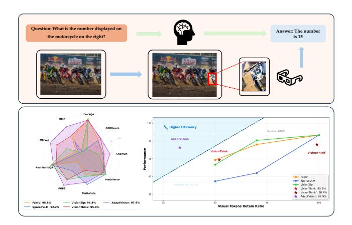
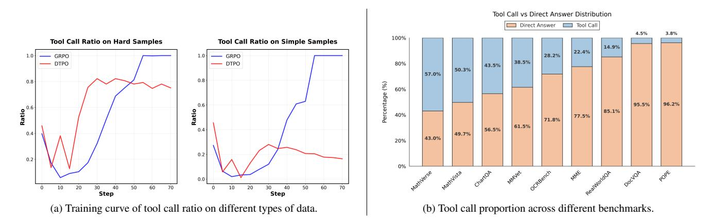
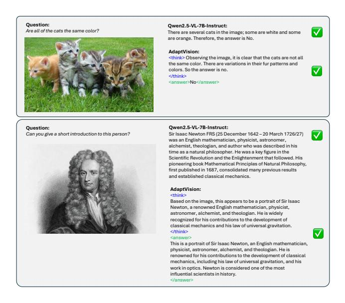
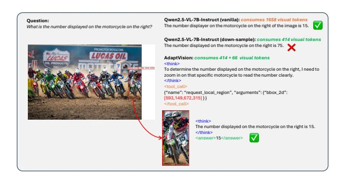

# <span id="page-0-1"></span>AdaptVision: Efficient Vision-Language Models via Adaptive Visual Acquisition

# Zichuan Lin∗† Yicheng Liu<sup>∗</sup> Yang Yang Lvfang Tao Deheng Ye‡ Tencent Hunyuan

lzcthu12@gmail.com, yichengliu.e@outlook.com, ydyl1991@gmail.com Code and models: [github.com/adaptvision/adaptvision](https://github.com/AdaptVision/AdaptVision)

# Abstract

*Vision-Language Models (VLMs) have achieved remarkable success in visual question answering tasks, but their reliance on large numbers of visual tokens introduces significant computational overhead. While existing efficient VLM approaches reduce visual tokens through fixed-ratio compression, they operate passively and lack the ability to adapt to varying task requirements. This motivates a fundamental question: Can VLMs autonomously determine the minimum number of visual tokens required for each sample? Inspired by human active vision mechanisms, we introduce AdaptVision, an efficient VLM paradigm that enables adaptive visual token acquisition through a coarseto-fine approach. Our model initially processes compressed visual tokens from low-resolution images and selectively acquires additional visual information by invoking a bounding box tool to crop key regions when necessary. We train AdaptVision using a reinforcement learning framework that carefully balances accuracy and efficiency. Central to our approach is Decoupled Turn Policy Optimization (DTPO), which decouples the learning objective into two components: (1) tool learning, which optimizes correct tool utilization, and (2) accuracy improvement, which refines the generated responses to improve answer correctness. Based on this formulation, we further decouple advantage estimation by computing separate advantages for tokens associated with each objective. This formulation enables more effective optimization for AdaptVision compared to vanilla GRPO. Comprehensive experiments across multiple VQA benchmarks demonstrate that AdaptVision achieves superior performance while consuming substantially fewer visual tokens than state-of-the-art efficient VLM methods.*

# 1. Introduction

Recently, Vision-Language Models (VLMs) [\[2,](#page-8-0) [4,](#page-8-1) [17\]](#page-8-2) have achieved significant breakthroughs in general visual ques-

<span id="page-0-0"></span>

Figure 1. Our key motivations and AdaptVision performance and efficiency. Top: Coarse-to-fine. Human visual attention mechanisms first guide the search for question-relevant regions in images, which are then subjected to detailed analysis. Down: AdaptVision achieves superior performance with significantly fewer visual tokens than previous efficient VLM methods.

tion answering (VQA) and diverse practical applications by projecting and adapting visual tokens into large language model (LLM) space [\[1,](#page-8-3) [2,](#page-8-0) [37,](#page-9-0) [51\]](#page-9-1). However, the promising performance of VLMs largely relies on the large amount of vision tokens, inevitably introducing a huge memory and computational overhead when compared to LLMs, particularly for high-resolution images. For instance, a 2048 × 1024 image yields 2,678 vision tokens in Qwen2.5-VL [\[3\]](#page-8-4). Therefore, it is crucial to avoid the excessive consumption of visual tokens.

Numerous studies have explored visual token compression to enhance VLM efficiency [\[5,](#page-8-5) [9,](#page-8-6) [13,](#page-8-7) [34,](#page-9-2) [39,](#page-9-3) [45,](#page-9-4) [46,](#page-9-5) [49\]](#page-9-6). Existing works can be categorized into two main research directions. The first prunes or merges a fixed number of visual tokens based on predetermined thresholds, according to the importance and similarity of vision tokens [\[5,](#page-8-5) [45,](#page-9-4) [49\]](#page-9-6). The second dynamically processes distinct samples, where the system adaptively switches between using 100% vision tokens for OCR-related tasks and 25%

<sup>∗</sup>Equal contribution. †Project lead. ‡Corresponding author.

<span id="page-1-0"></span>vision tokens for simpler tasks by selectively employing quarter-resolution images [\[46\]](#page-9-5). However, existing efficient VLM paradigms and methods are largely *passive*, as they can only reduce the number of vision tokens by predefined ratios. This leads to a natural question: *Can VLMs adaptively determine the minimum number of vision tokens for each sample according to different scenarios?*

Cognitive neuroscience reveals that our visual system operates through an active, sequential, and adaptive process known as *active vision* [\[6,](#page-8-8) [11\]](#page-8-9). It first captures coarse, lowspatial-frequency information to grasp the gist of a scene, then directs attention to salient regions for detailed analysis [\[27\]](#page-8-10). This *coarse-to-fine* processing mechanism enables humans to efficiently parse complex visual inputs with minimal cognitive load. Fig. [1](#page-0-0) provides an illustrative example.

The cognitive strategy of active vision is operationalized in recent VLMs through the "thinking-with-images" paradigm, such as invoking tools to zoom and crop specific regions [\[16,](#page-8-11) [50\]](#page-9-7) to advance fine-grained visual understanding. We argue that this active reasoning capability can be effectively applied to the critical task of visual token reduction, allowing the model to decide how few visual tokens are sufficient.

In this paper, we propose AdaptVision, a framework that leverages visual tool use to determine the minimum visual token usage while maintaining high accuracy. Our model initially processes compressed visual tokens from low-resolution images and adaptively acquires additional visual tokens by invoking a bounding box tool to crop key regions from the original high-resolution image when necessary. The model is trained via reinforcement learning [\[14,](#page-8-12) [19–](#page-8-13)[21,](#page-8-14) [30,](#page-9-8) [43\]](#page-9-9) to balance accuracy and efficiency.

However, training this dual-objective policy with standard RL algorithms like Group Relative Policy Optimization (GRPO) [\[31\]](#page-9-10) presents two key challenges: (1) *Ambiguous credit assignment*: Vanilla GRPO assigns a single sequence-level reward to all generated tokens, failing to distinguish the contribution of the decision to request additional visual tokens from that of generating the final answer; (2) *Imbalanced optimization*: Since vanilla GRPO normalizes all tokens uniformly in a sequence, it introduces an imbalance: compared to 1-turn direct-answer sequences, 2-turn tool-invoking sequences receive imbalanced gradient signals, causing the latter to be under-optimized.

To address these challenges, we propose Decoupled Turn Policy Optimization (DTPO). First, to mitigate optimization imbalance, we decouple the learning objective into two components based on the functional roles of response tokens: (1) *tool learning*, which encourages correct tool use, and (2) *accuracy improvement*, which refines the generated responses to improve answer correctness. Each objective is normalized separately to balance learning signals across different tokens. Second, to enable precise credit assignment, we decouple advantage estimation by computing distinct advantages for tokens associated with each objective, encouraging more efficient tool exploration. Experiments on multiple VQA benchmarks demonstrate that AdaptVision achieves superior performance with significantly fewer visual tokens than state-of-the-art efficient VLM methods, as shown in Fig. [1.](#page-0-0)

In summary, our contributions are:

- 1. We introduce AdaptVision, a VLM framework that leverages visual tool use for dynamic token reduction.
- 2. We propose a Decoupled Turn Policy Optimization (DTPO) algorithm alongside a tailored reward function to enable the effective training of AdaptVision.
- 3. Extensive evaluation on multiple VQA benchmarks shows that AdaptVision achieves superior performance with substantially reduced visual token consumption compared to existing efficient VLM methods.

# 2. Related work

Vision Language Model with Reasoning. Recent advances in reasoning LLMs such as OpenAI's o1 [\[12\]](#page-8-15) and DeepSeek R1 [\[8\]](#page-8-16) have accelerated the use of RL to enhance reasoning capabilities [\[44\]](#page-9-11). This trend has extended to VLMs [\[23,](#page-8-17) [28,](#page-9-12) [32,](#page-9-13) [36,](#page-9-14) [38\]](#page-9-15), where most work focuses on high-level semantic reasoning like tool use or chainof-thought explanation. A related direction explores active perception, equipping VLMs with fine-grained control mechanisms [\[10,](#page-8-18) [35,](#page-9-16) [40\]](#page-9-17). Recent systems such as Deep-Eyes [\[50\]](#page-9-7) and Mini-o3 [\[16\]](#page-8-11) support operations like zoom and crop, improving performance on detailed visual tasks. While these methods showcase the power of active visual reasoning for enhancing answer accuracy, how to apply this "thinking with images" paradigm to the goal of computational efficiency, specifically for visual token compression, remains less explored. Our method enables the VLM to autonomously determine the minimum number of visual tokens required for a given task, thereby achieving efficient inference while maintaining performance.

Efficient VLM with Vision Token Compression. Reducing VLM computational cost by vision token compression has become a popular research topic [\[15\]](#page-8-19). Existing methods rely on predefined rules or metrics to compress tokens. For instance, FastV [\[5\]](#page-8-5) prunes a fixed 50% of tokens based on attention scores after the second layer. Pyramid-Drop [\[42\]](#page-9-18) proposes progressive token compression to reduce information loss. Other works leverage cross-modal relevance for token selection, such as SparseVLM [\[49\]](#page-9-6) and VisionZip [\[45\]](#page-9-4), which retain semantically relevant visual tokens. A key limitation of these methods is their dependence on a fixed compression ratio, which lacks adaptability across tasks. VisionThink [\[46\]](#page-9-5) uses RL to decide whether

<span id="page-2-2"></span><span id="page-2-0"></span>

Figure 2. **FrameWork of AdaptVision.** AdaptVision first processes a 1/4-resolution image. The model then decides whether to answer directly or invoke the bounding box tool to crop a high-resolution region for further analysis before generating the final answer.

to use a low-resolution or the original image, offering limited adaptability but still restricting the model to coarse-grained decisions. In contrast, our approach enables the VLM to learn coarse-to-fine ability and adaptively determine the minimum number of visual tokens for each task.

#### 3. Preliminary

#### 3.1. Reinforcement Learning for LLMs

Recent studies [8, 12] have demonstrated RL effectively enhances the reasoning capabilities of large language models (LLMs). Recently, Group Relative Policy Optimization (GRPO) [31] has been widely used in LLM reasoning. Given a question x, GRPO generates G distinct responses  $\{o_i\}_{i=1}^G$  with sequence length  $N_i$  from the current policy  $\pi_{\theta_{old}}$  and obtains a group of rewards  $\{R_i\}_{i=1}^G$ . GRPO optimizes the policy model  $\pi_{\theta}$  by maximizing the following objective:

$$\mathcal{J}_{\text{GRPO}}(\theta) = \mathbb{E}_{x,o_i}$$

$$\left[ \frac{1}{G} \sum_{i=1}^{G} \left( \frac{1}{N_i} \sum_{t=1}^{N_i} \mathcal{L}_{i,t}(\theta) - \beta \mathbb{D}_{\text{KL}} \left[ \pi_{\theta}(\cdot|x) \mid\mid \pi_{\text{ref}}(\cdot|x) \right] \right) \right]$$
(1)

where  $\mathcal{L}_{i,t}(\theta)$  denotes the token-level loss given by:

$$\mathcal{L}_{i,t}(\theta) = \min\left(\frac{\pi_{\theta}(o_{i,t} \mid x, o_{i, < t})}{\pi_{\theta_{\text{old}}}(o_{i,t} \mid x, o_{i, < t})} A_{i,t}, \right.$$

$$\left. \text{clip}\left(\frac{\pi_{\theta}(o_{i,t} \mid x, o_{i, < t})}{\pi_{\theta_{\text{old}}}(o_{i,t} \mid x, o_{i, < t})}, 1 - \epsilon, 1 + \epsilon\right) A_{i,t}\right), \quad (2)$$

$$A_{i,t} = \frac{R_{i} - \text{mean}(\{R_{i}\}_{i=1}^{G})}{\text{std}(\{R_{i}\}_{i=1}^{G})}, \quad (3)$$

$$\mathbb{D}_{KL}(\pi_{\theta}||\pi_{ref}) = \frac{\pi_{ref}(o_i|q)}{\pi_{\theta}(o_i|q)} - \log \frac{\pi_{ref}(o_i|q)}{\pi_{\theta}(o_i|q)} - 1, \quad (4)$$

where  $\mathbb{D}_{KL}$  is the KL-divergence measure.  $\epsilon$  and  $\beta$  are hyperparameters. The advantage estimate  $A_{i,t}$  is computed using a group of rewards  $\{R_i\}_{i=1}^G$ .

#### 3.2. Vision Language Models

The VLM architectures generally consist of three components: a visual encoder, a modality projector, and a LLM. A commonly used approach for the visual encoder is to employ a pre-trained image encoder like CLIP-VIT [29] that converts input images into visual tokens. The modality projector adjusts the size of these visual tokens to match the embedding size of LLM and to achieve semantic alignment, enabling the LLM to process visual data effectively. The LLM then integrates the aligned visual and textual information to generate responses.

<span id="page-2-1"></span>Existing works have revealed that the computational complexity of VLM is strongly influenced by the sequence length [45], where the sequence length is defined as  $n=n_{sys}+n_{img}+n_{question}$ . In typical VLM tasks, the number of vision tokens  $n_{img}$  is often much larger than the other two, sometimes by a factor of 20. Therefore, reducing the number of vision tokens is the key for improving the efficiency of VLMs.

## <span id="page-3-1"></span>4. Methodology

# 4.1. Framework

We aim to develop an efficient VLM that minimizes visual token usage while maintaining high performance by adaptively acquiring visual information based on question and image complexity. As shown in Fig. [2,](#page-2-0) our method first processes a low-resolution image (Ilow), cutting visual token usage to 25% of the original. The VLM then autonomously decides whether to answer directly or crop key regions (Icrop) from the high-resolution image for more detail. As shown in Fig. [2,](#page-2-0) given a low-resolution image Ilow and the question q, the model can output a *direct answer* or invoke a *tool call* using <tool call>[x1, y1, x2, y2]</tool call> to obtain Icrop before reasoning further and answering.

However, the VLM lacks a mechanism for deciding which response style is most appropriate for a given input x = {xsys, Ilow, q}. We therefore frame this as a reinforcement learning problem to optimize the following policy:

$$\pi_{\theta}(o|x) = \begin{cases} \pi_{\theta}(o_{1:N} \mid x), & \text{direct answer} \\ \pi_{\theta}(o_{1:T} \mid x) \pi_{\theta}(o_{T+1:N} \mid x, o_{1:T}, I_{crop}), & \text{tool call}, \end{cases}$$

$$(5)$$

where N is the length of the entire generated sequence. In tool-call responses, o1:<sup>T</sup> represents *tool tokens* in the first turn, and o<sup>T</sup> +1:<sup>N</sup> represents *answer tokens* in the second turn, as illustrated in Fig. [2.](#page-2-0) Let nlow and ncrop be the number of visual tokens for Ilow and Icrop. 1tool is the indicator for tool-call responses. Thus, the total number of visual tokens for each sample is: nimg = nlow + 1toolncrop. Therefore, to minimize the number of visual tokens nimg, we aim to learn a policy πθ(o | x) that can: (1) invoke the tool to request additional visual tokens only when necessary, and (2) acquire the minimal additional visual information Icrop required to answer the question correctly.

#### 4.2. Reward Design

To learn a policy that can optimally balance efficiency and accuracy, we design a reward function that consists of two parts: (1) an Outcome Reward Roc that reflects answer correctness, response format adherence and tool call frequency; (2) a Tool Reward Rtool that incentivizes effective tool exploration to enhance coarse-to-fine visual reasoning. The reward function of AdaptVision is:

$$\mathcal{R} = \mathcal{R}_{oc} + \mathcal{R}_{tool}. \tag{6}$$

Outcome Reward Roc. The outcome reward is the sum of three components. (1) *Accuracy reward* Racc: Since VQA answers are typically open-ended, we use an LLM as judge to assign a binary reward (1 for correct, 0 for incorrect) for answer correctness. (2) *Format reward* Rform: To maintain instruction-following capability, we enforce formatting requirements: reasoning in <think> tags, answers in <answer> tags, and tool calls in <tool call> tags with valid JSON. The format reward is 0.5 for full compliance with all formatting requirements; otherwise, the reward is 0. (3) *Balance reward* Rbal: To prevent overreliance on tool calls, we introduce a balance reward. We apply a 0.1 penalty to correct answers that invoke tool calls. Additionally, to discourage "lucky guesses" [\[46\]](#page-9-5), we impose a 0.1 penalty on direct answers when the probability of correct response from low-resolution images is low, thereby encouraging appropriate tool usage. The design of this balance reward is as follows:

$$\mathcal{R}_{bal} = \begin{cases} -0.1 \cdot \mathbb{I}(r < \theta) \cdot \mathbb{I}(\mathcal{R}_{acc} = 1), & \text{direct answer,} \\ -0.1 \cdot \mathbb{I}(\mathcal{R}_{acc} = 1), & \text{tool call,} \end{cases}$$

$$r = \frac{C_{direct}}{C_{direct} + C_{tool}},\tag{8}$$

<span id="page-3-0"></span>where Cdirect and Ctool represent the count of correct answers for direct-answer and tool-call responses within a group, respectively. I is the indicator function. We set θ = 0.2 in this paper.

Tool Reward Rtool. When the model requests additional visual information via a tool call, the cropped region Icrop must be both informative for answering and minimal in area to reduce visual token usage. To achieve this balance, we introduce a tool reward Rtool, formulated as follows:

$$\mathcal{R}_{tool} = \mathcal{R}_{crop} - \alpha \cdot \mathcal{R}_{area}, \tag{9}$$

where Rcrop evaluates the correctness of the cropped region, Rarea denotes its relative area ratio, and α is a hyperparameter balancing the two terms. In this paper we set α = 2. (1) The *crop reward* Rcrop is determined by GPT-4o, which evaluates whether the cropped region Icrop contains relevant information to answer the question, returning 1 if correct and 0 otherwise. (2) The *relative area reward* Rarea penalizes oversized bounding boxes that contain irrelevant regions, formulated as follows:

$$\mathcal{R}_{area} = \mathbb{I}(\mathcal{R}_{acc} = 1) \cdot \mathbb{I}(\mathcal{R}_{crop} = 1) \cdot \text{clip}\left(\frac{r_a}{\mu_a} - 1, 0, 1\right)$$

$$r_a = \frac{(x_2 - x_1) \cdot (y_2 - y_1)}{H_{low} \cdot W_{low}}, \quad \mu_a = \mu_{area}(\mathcal{G}(a)), \quad (10)$$

where Hlow and Wlow denote the height and width of Ilow, and r<sup>a</sup> is the area ratio of the cropped region. Here, G(a) denotes a group of responses that yield both correct answers (Racc = 1) and correct cropped regions (Rcrop = 1), and <span id="page-4-2"></span> $\mu_{area}(\mathcal{G}(a))$  is the mean measurement of  $r_a$  within such a group. This area penalty incentivizes the model to select the smallest possible region that still ensures correctness, thereby minimizing visual token usage while maintaining performance.

# 4.3. Efficient Learning via Decoupled Turn Policy Optimization

Based on our reward design, we initially employ GRPO [31] for training. We aim to train a VLM that (1) achieves high answering accuracy and (2) minimizes the number of visual tokens used. However, training such a dual-objective policy with GRPO presents two key challenges.

Ambiguous credit assignment Vanilla GRPO provides a single, sequence-level reward to all generated tokens, failing to distinguish between the contributions of two distinct types of actions – the decision to request additional visual tokens and the generation of the final answer. This ambiguity limits effective exploitation and exploration during policy learning. For instance, when the VLM correctly generates bounding boxes while producing an incorrect answer, the model still receives a positive reward for the answer tokens. This may steer the model towards a suboptimal optimization direction. As we will show in the experiments, when training with GRPO, the model initially favors direct answers but then rapidly collapses to excessive tool call, resulting in an unstable training process.

**Imbalanced optimization** As defined in Eq. 5, the policy model generates either a one-turn or two-turn responses for each sample. Depending on their functional roles, the generated tokens can be categorized into two types: *Tool Tokens* and *Answer Tokens*, as shown in Fig. 2. Accordingly, the original GRPO objective in Eq. 2 can be decomposed into two components that separately optimize the tool and answer tokens:

$$\frac{1}{G} \sum_{t=1}^{G} \frac{1}{N_i} \sum_{t=1}^{N_i} \mathcal{L}_{i,t}(\theta) = \underbrace{\frac{1}{G} \sum_{t=1}^{G} \frac{1}{N_i} \sum_{t=1}^{T_i} \mathcal{L}_{i,t}(\theta)}_{\text{Tool Token}} + \underbrace{\frac{1}{G} \sum_{t=1}^{G} \frac{1}{N_i} \sum_{t=T_i+1}^{N_i} \mathcal{L}_{i,t}(\theta)}_{\text{Answer Token}}, \quad (11)$$

where  $T_i$  denotes the number of tool tokens generated in the first turn, and  $N_i-T_i$  represents the number of answer tokens in the second turn. If the model answers directly without tool calls,  $T_i$  is 0. A closer examination of Eq. 11 reveals an inherent optimization imbalance. In two-turn sequences that invoke tools, the gradient contributions from

<span id="page-4-1"></span>

Figure 3. **Demonstration of vanilla GRPO and our DTPO.** Our DTPO (1) decomposes the policy loss by turns to separately optimize tool and answer tokens, and (2) computes distinct advantages for tool and outcome rewards, enabling balanced optimization and precise credit assignment.

tool tokens are suppressed by the normalization factors  $\frac{1}{N_i}$  and  $\frac{1}{G}$ , causing tool tokens to be under-optimized compared to answer tokens.

To address these challenges, we propose Decoupled Turn Policy Optimization (DTPO). First, we decouple the policy loss by turns and normalize the contributions of tool and answer tokens separately. This adjustment effectively resolves the under-optimization problem of tool tokens.

$$\mathcal{J}_{\text{DTPO}}(\theta) = \mathbb{E}_{x,o_i} \left[ \underbrace{\frac{1}{\sum_{i=1}^{G} T_i} \sum_{i=1}^{G} \sum_{t=1}^{T_i} \mathcal{L}_{i,t}(\theta)}_{\text{Tool Token}} + \underbrace{\frac{1}{\sum_{i=1}^{G} (N_i - T_i)} \sum_{i=1}^{G} \sum_{t=T_i + 1}^{N_i} \mathcal{L}_{i,t}(\theta)}_{\text{Answer Token}} \right]. \quad (12)$$

Second, to enable precise credit assignment, DTPO decouples the advantage estimation by computing distinct advantages for tool and answer tokens, rather than using a single advantage for the entire sequence. Specifically, we compute the advantage for the t-th token as follows:

<span id="page-4-0"></span>
$$A_{i,t} = \begin{cases} A_{oc}^{(i)} + \lambda \cdot A_{tool}^{(i)}, & \text{direct answer,} \\ A_{oc}^{(i)} + \lambda \cdot A_{tool}^{(i)} \cdot \mathbb{I}(1 \le t \le T_i), & \text{tool call,} \end{cases}$$

$$A_{tool}^{(i)} = \frac{\mathcal{R}_{tool}^{(i)} - \text{mean}(\{\mathcal{R}_{tool}^{(i)}\}_{i=1}^{G})}{\text{std}(\{\mathcal{R}_{tool}^{(i)}\}_{i=1}^{G})}, \qquad (13)$$

$$A_{oc}^{(i)} = \frac{\mathcal{R}_{oc}^{(i)} - \text{mean}(\{\mathcal{R}_{oc}^{(i)}\}_{i=1}^{G})}{\text{std}(\{\mathcal{R}_{oc}^{(i)}\}_{i=1}^{G})}, \qquad (14)$$

where  $A_{tool}^{(i)}$  and  $A_{oc}^{(i)}$  are advantage estimates computed using tool reward and outcome reward respectively, and  $\lambda$  is a hyperparameter that trade-offs two advantages. We set

<span id="page-5-4"></span><span id="page-5-2"></span>Table 1. **Performance comparison with previous efficient VLM methods.** Vanilla denotes the Qwen2.5-VL-7B-Instruct model. Down-Sample uses a 1/4-resolution image as input to the Vanilla model. "#Token" indicates the visual token consumption ratio relative to the vanilla model across all benchmarks. "Avg." denotes the average performance relative to the vanilla model on all benchmarks.

| Method                   | ChartQA<br>test | OCRBench<br>test | DocVQA<br>val | MME<br>test    | MMVet<br>test  | RealWorldQA<br>test | POPE<br>test    | MathVista<br>testmini | MathVerse<br>testmini | #Token↓ | Avg.↑ |
|--------------------------|-----------------|------------------|---------------|----------------|----------------|---------------------|-----------------|-----------------------|-----------------------|---------|-------|
|                          |                 |                  | Retain        | 100% Visu      | al Tokens A    | cross All Benchma   | arks            |                       |                       |         |       |
| Vanilla                  | 79.8<br>100%    | 81.5<br>100%     | 95.1<br>100%  | 2316<br>100%   | 61.6<br>100%   | 68.6<br>100%        | 86.7<br>100%    | 68.2<br>100%          | 46.3<br>100%          | 100%    | 100%  |
|                          | '               |                  | Retain        | 25% Visuo      | al Tokens A    | cross All Benchma   | rks             |                       |                       | '       |       |
| Down-Sample              | 62.9<br>78.8%   | 68.8<br>84.4%    | 94.3<br>99.1% | 2270<br>98.0%  | 54.5<br>88.5%  | 68.8<br>100.3%      | 82.8<br>95.5%   | 62.2<br>91.2%         | 43.1<br>93.1%         | 25%     | 92.1% |
|                          |                 |                  | Retain        | 50% Visuo      | al Tokens A    | cross All Benchma   | rks             |                       |                       |         |       |
| SparseVLM                | 73.2<br>91.7%   | 75.6<br>92.7%    | 66.8<br>70.2% | 2282<br>98.5%  | 51.5<br>83.6%  | 68.4<br>99.7%       | 85.5<br>98.6%   | 66.6<br>97.6%         | 45.1<br>97.4%         | 50%     | 92.2% |
| FastV                    | 72.6<br>91.0%   | 75.8<br>93.0%    | 93.6<br>98.4% | 2308<br>99.6%  | 52.8<br>85.7%  | 68.8<br>100.3%      | 84.7<br>97.7%   | 63.7<br>93.4%         | 45.0<br>97.2%         | 50%     | 95.8% |
| VisionZip                | 71.5<br>89.6%   | 70.5<br>86.5%    | 93.8<br>98.6% | 2209<br>95.4%  | 57.0<br>92.5%  | 68.6<br>100%        | 86.3<br>99.5%   | 64.1<br>93.9%         | 45.1<br>97.4%         | 50%     | 94.8% |
|                          |                 |                  |               | L              | ynamic Me      | thods               |                 |                       |                       |         |       |
| VisionThink              | 73.6<br>92.2%   | 76.8<br>94.2%    | 92.9<br>97.7% | 2320<br>100.2% | 61.7<br>100.2% | 65.6<br>95.6%       | 86.3<br>99.5%   | 62.2<br>91.2%         | 42.5<br>91.8%         | 52%     | 95.8% |
| VisionThink <sup>†</sup> | 73.88<br>92.6%  | 80.8<br>99.1%    | 93.7<br>98.5% | 2392<br>103.3% | 60.18<br>97.7% | 68.37<br>99.7%      | 86.69<br>100.0% | 65.7<br>96.3%         | 45.68<br>98.7%        | 99%     | 98.4% |
| AdaptVision w/o DTPO     | 73.74<br>92.4%  | 75.9<br>93.1%    | 93.1<br>97.9% | 2354<br>101.6% | 61.28<br>99.5% | 65.7<br>95.8%       | 86.8<br>100.1%  | 64.4<br>94.4%         | 44.2<br>95.5%         | 57%     | 96.7% |
| AdaptVision              | 75.92<br>95.1%  | 76.9<br>94.4%    | 92.6<br>97.4% | 2379<br>102.7% | 64.8<br>105.2% | 67.32<br>98.1%      | 86.8<br>100.1%  | 65.9<br>96.6%         | 42.3<br>91.4%         | 33%     | 97.9% |

 $\lambda=0.3$  in this paper. Fig. 3 compares the design of GRPO and DTPO.

#### 5. Experiment

#### 5.1. Evaluation Setup

We conduct experiments on several general VQA benchmarks, including ChartQA [25], OCRBench [22], DocVQA [26], MME [7], MMVet [47], RealWorldQA [41], POPE [18], MathVista [24], MathVerse [48]. AdaptVision is based on Qwen2.5-VL-7B-Instruct [3]. We employ veRL [33] framework for RL training. During training, we set the batch size as 512 and the mini-batch size as 32. We drop the KL term during policy optimization. The initial learning rate of the policy model is 1e - 6. For each prompt, we sample 16 candidate responses using a temperature of 1.0. During inference, we use the vLLM framework and set the temperature to 0. We use training data from Yang et al. [46]\*, which contains VQA samples that can be answered directly using low-resolution images, as well as samples that require high-resolution images for accurate answering.

#### 5.2. Main Results

We compare AdaptVision with existing vision token compression methods, including FastV [5], SparseVLM [49],

<span id="page-5-3"></span>

Figure 4. **Comparison of Inference Time.** (1) Compared to the vanilla model and VisionThink<sup>†</sup>, AdaptVision demonstrates significantly reduced inference time due to reduced visual token usage. (2) While AdaptVision requires additional generated tokens for reasoning and tool calls compared to the down-sample model, the resulting increase in inference time remains acceptable.

VisionZip [45], and VisionThink [46]. FastV, Sparse-VLM, and VisionZip are static methods that operate with a pre-defined token retention ratio, while VisionThink and AdaptVision are dynamic methods that vary visual token usage for each sample. For fair comparison, static methods are set to 50% token retention. For VisionThink, we initially used the officially released model<sup>†</sup> but found it consumed substantially more visual tokens than our method,

<span id="page-5-0"></span><sup>\*</sup>https://huggingface.co/datasets/Senqiao/VisionThink-Smart-Train

<span id="page-5-1"></span><sup>†</sup>https://huggingface.co/Senqiao/VisionThink-Efficient

<span id="page-6-1"></span>

Figure 5. Policy-training comparison: (a) The influence of reward design. (b) GRPO vs. DTPO.

<span id="page-6-2"></span>

Figure 6. Tool call ratio analysis: (a) Training curves show that DTPO learns a stable and adaptive policy, increasing tool calls for hard samples while decreasing them for simple ones. (b) Across different benchmarks, AdaptVision demonstrates a well-balanced ability to invoke tools when necessary and answer directly when possible.

making the comparison unfair. We thus report two versions: "VisionThink† " for the released model and "Vision-Think" for our reproduction using the public code[‡](#page-6-0) . We also include the vanilla model (100% tokens, high-resolution) and the down-sample model (25% tokens, 1/4 resolution) based on Qwen2.5-VL-7B-Instruct. Results are shown in Table [1.](#page-5-2) Compared to previous vision token compression methods (including FastV, SparseVLM, VisionZip and VisionThink), AdaptVision achieves superior average performance across all benchmarks with significantly fewer visual tokens. Compared to the down-sample model, AdaptVision improves accuracy by 5.8% (92.1% → 97.9%) with only 7% (25% → 33%) more visual tokens, highlighting its effective coarse-to-fine visual reasoning.

Inference Latency We also compare inference time across multiple models: the vanilla model, the down-sample model, and VisionThink† . The end-to-end inference time measurements for each dataset are presented in Fig. [4.](#page-5-3) AdaptVision demonstrates significantly reduced inference time (1.67x overall speedup) compared to both the vanilla model and VisionThink† , primarily due to its more efficient visual token usage. While AdaptVision does require additional token generation for reasoning and tool calls compared to the down-sample model, the resulting increase in inference time remains within acceptable bounds.

#### 5.3. Analysis

Reward Design To investigate the impact of reward design on model behavior, we conduct an ablation study on balance and tool rewards. As shown in Fig. [5a,](#page-6-1) the absence of the balance reward causes the model to quickly collapse to excessive tool use. This occurs because the tool reward incentivizes correct tool use, which generally improves accuracy as training progresses. Conversely, with balance reward, the VLM learns to adaptively regulate tool usage based on the input. Furthermore, the ablation of the tool reward reveals its necessity for exploration: without it, the model collapses to direct answering and fails to invoke the tool after just 10 training steps. In contrast, with the tool reward, the model successfully explores and leverages the tool to enhance performance.

<span id="page-6-0"></span><sup>‡</sup>https://github.com/dvlab-research/VisionThink

<span id="page-7-0"></span>


Figure 7. Case study: (1) The vanilla model yields a correct answer but consumes a large number of visual tokens; (2) The down-sample model reduces token usage but fails to answer correctly; (3) AdaptVision smartly invokes the tool to produce a correct answer with minimal visual token cost.

GRPO vs. DTPO We compare the training processes of GRPO and DTPO in Fig. [5b.](#page-6-1) GRPO exhibits an unstable training dynamic: During the early training phase, it struggles to optimize either the tool or outcome reward, causing the tool call ratio to drop near zero and limiting exploration. After approximately 20 steps, both rewards and the tool call ratio surge rapidly, shifting the model from direct answering to excessive tool use, eventually collapsing to tool call. This instability stems from GRPO's ambiguous credit assignment and imbalanced optimization. In contrast, DTPO exhibits a stable and efficient optimization process. Both rewards rise steadily from the start, reflecting effective tool use exploration. The model subsequently converges to a reasonable tool call ratio, demonstrating the effectiveness of DTPO. In Table [1,](#page-5-2) we observe that the GRPO-trained model not only performs worse than DTPO, but it also uses far more visual tokens. This confirms that DTPO is critical for effectively learning the balance between tool use and direct answering. Furthermore, we compare the tool call ratios across different data types. Fig. [6a](#page-6-2) illustrates that our model learns to selectively invoke tools based on task difficulty, while the model trained with GRPO calls tools on all samples, resulting in a 100% tool call ratio.

Adaptive Tool-use We further investigate tool-use efficiency by measuring the proportion of tool call responses across various benchmarks. As shown in Fig. [6b,](#page-6-2) for complex visual tasks like MathVerse and ChartQA that require fine-grained details, the model frequently invokes the tool to better answer the question. For general understanding tasks like POPE, our model rarely calls the tool, thereby maintaining high efficiency. This shows our model has learned adaptive reasoning: it solves problems directly when tools are unnecessary while still leveraging them when beneficial.

#### 5.4. Case Study

In this section, we present a case study to illustrate the efficient visual reasoning process of AdaptVision. We compare AdaptVision with the vanilla model and the downsample model. As shown in Fig. [7,](#page-7-0) the down-sample model, while reducing visual token usage, fails to answer correctly due to insufficient information in the low-resolution image. The vanilla model, using the original high-resolution image, yields a correct answer but at the cost of a large number of visual tokens. In contrast, AdaptVision begins with the lowresolution image, analyzes the question and image, recognizes the informational inadequacy, and then intelligently invokes the tool to crop the most relevant region from the high-resolution image. By acquiring only this essential additional visual information, it produces an accurate answer while minimizing visual token consumption.

## 6. Conclusion

In this paper, we present AdaptVision, a novel paradigm that enables VLMs to autonomously determine the minimum number of visual tokens via adaptive, coarse-to-fine visual reasoning. We propose a Decoupled Turn Policy Optimization (DTPO) algorithm, which handles dual-objective policy learning by decoupling the learning objective and advantage estimation. This leads to a more balanced and effective training process than GRPO. Experiments on multiple VQA benchmarks show that AdaptVision achieves superior performance using significantly fewer visual tokens than previous efficient VLM methods. These results advance the development of computationally efficient and biologically inspired VLMs.

Despite its effectiveness, AdaptVision has several limitations that outline directions for future research. First, our framework currently relies on a single visual tool and a fixed initial compression ratio (1/4 resolution). Expanding the toolset and enabling dynamic resolution selection could further enhance adaptability. Second, the reasoning process is constrained to a maximum of two turns, which may limit deep visual reasoning for complex tasks. We hope that future research will address these limitations, further advancing the development of efficient VLMs.

# References

- <span id="page-8-3"></span>[1] Josh Achiam, Steven Adler, Sandhini Agarwal, Lama Ahmad, Ilge Akkaya, Florencia Leoni Aleman, Diogo Almeida, Janko Altenschmidt, Sam Altman, Shyamal Anadkat, et al. Gpt-4 technical report. *arXiv preprint arXiv:2303.08774*, 2023. [1](#page-0-1)
- <span id="page-8-0"></span>[2] Jinze Bai, Shuai Bai, Shusheng Yang, Shijie Wang, Sinan Tan, Peng Wang, Junyang Lin, Chang Zhou, and Jingren Zhou. Qwen-vl: A frontier large vision-language model with versatile abilities. *arXiv preprint arXiv:2308.12966*, 1(2):3, 2023. [1](#page-0-1)
- <span id="page-8-4"></span>[3] Shuai Bai, Keqin Chen, Xuejing Liu, Jialin Wang, Wenbin Ge, Sibo Song, Kai Dang, Peng Wang, Shijie Wang, Jun Tang, et al. Qwen2. 5-vl technical report. *arXiv preprint arXiv:2502.13923*, 2025. [1,](#page-0-1) [6,](#page-5-4) [11](#page-10-0)
- <span id="page-8-1"></span>[4] Lin Chen, Jinsong Li, Xiaoyi Dong, Pan Zhang, Conghui He, Jiaqi Wang, Feng Zhao, and Dahua Lin. Sharegpt4v: Improving large multi-modal models with better captions. In *European Conference on Computer Vision*, pages 370–387. Springer, 2024. [1](#page-0-1)
- <span id="page-8-5"></span>[5] Liang Chen, Haozhe Zhao, Tianyu Liu, Shuai Bai, Junyang Lin, Chang Zhou, and Baobao Chang. An image is worth 1/2 tokens after layer 2: Plug-and-play inference acceleration for large vision-language models. In *European Conference on Computer Vision*, pages 19–35. Springer, 2024. [1,](#page-0-1) [2,](#page-1-0) [6](#page-5-4)
- <span id="page-8-8"></span>[6] John M Findlay and Iain D Gilchrist. *Active vision: The psychology of looking and seeing*. Number 37. Oxford University Press, 2003. [2](#page-1-0)
- <span id="page-8-23"></span>[7] Chaoyou Fu, Peixian Chen, Yunhang Shen, Yulei Qin, Mengdan Zhang, Xu Lin, Jinrui Yang, Xiawu Zheng, Ke Li, Xing Sun, Yunsheng Wu, and Rongrong Ji. Mme: A comprehensive evaluation benchmark for multimodal large language models, 2024. [6](#page-5-4)
- <span id="page-8-16"></span>[8] Daya Guo, Dejian Yang, Haowei Zhang, Junxiao Song, Ruoyu Zhang, Runxin Xu, Qihao Zhu, Shirong Ma, Peiyi Wang, Xiao Bi, et al. Deepseek-r1: Incentivizing reasoning capability in llms via reinforcement learning. *arXiv preprint arXiv:2501.12948*, 2025. [2,](#page-1-0) [3](#page-2-2)
- <span id="page-8-6"></span>[9] Yefei He, Feng Chen, Jing Liu, Wenqi Shao, Hong Zhou, Kaipeng Zhang, and Bohan Zhuang. Zipvl: Efficient large vision-language models with dynamic token sparsification and kv cache compression. 2024. [1](#page-0-1)
- <span id="page-8-18"></span>[10] Xinyu Huang, Yuhao Dong, Weiwei Tian, Bo Li, Rui Feng, and Ziwei Liu. High-resolution visual reasoning via multiturn grounding-based reinforcement learning. *arXiv preprint arXiv:2507.05920*, 2025. [2](#page-1-0)
- <span id="page-8-9"></span>[11] Laurent Itti, Geraint Rees, and John K Tsotsos. *Neurobiology of attention*. Elsevier, 2005. [2](#page-1-0)
- <span id="page-8-15"></span>[12] Aaron Jaech, Adam Kalai, Adam Lerer, Adam Richardson, Ahmed El-Kishky, Aiden Low, Alec Helyar, Aleksander Madry, Alex Beutel, Alex Carney, et al. Openai o1 system card. *arXiv preprint arXiv:2412.16720*, 2024. [2,](#page-1-0) [3](#page-2-2)
- <span id="page-8-7"></span>[13] Yiren Jian, Tingkai Liu, Yunzhe Tao, Chunhui Zhang, Soroush Vosoughi, and Hongxia Yang. Expedited training of visual conditioned language generation via redundancy reduction. *arXiv preprint arXiv:2310.03291*, 2023. [1](#page-0-1)

- <span id="page-8-12"></span>[14] Tao Jiang, Zichuan Lin, Lihe Li, Yi-Chen Li, Cong Guan, Lei Yuan, Zongzhang Zhang, Yang Yu, and Deheng Ye. Multi-agent in-context coordination via decentralized memory retrieval. *arXiv preprint arXiv:2511.10030*, 2025. [2](#page-1-0)
- <span id="page-8-19"></span>[15] Zhenglun Kong, Yize Li, Fanhu Zeng, Lei Xin, Shvat Messica, Xue Lin, Pu Zhao, Manolis Kellis, Hao Tang, and Marinka Zitnik. Token reduction should go beyond efficiency in generative models–from vision, language to multimodality. *arXiv preprint arXiv:2505.18227*, 2025. [2](#page-1-0)
- <span id="page-8-11"></span>[16] Xin Lai, Junyi Li, Wei Li, Tao Liu, Tianjian Li, and Hengshuang Zhao. Mini-o3: Scaling up reasoning patterns and interaction turns for visual search. *arXiv preprint arXiv:2509.07969*, 2025. [2](#page-1-0)
- <span id="page-8-2"></span>[17] Junnan Li, Dongxu Li, Silvio Savarese, and Steven Hoi. Blip-2: Bootstrapping language-image pre-training with frozen image encoders and large language models. In *International conference on machine learning*, pages 19730– 19742. PMLR, 2023. [1](#page-0-1)
- <span id="page-8-24"></span>[18] Yifan Li, Yifan Du, Kun Zhou, Jinpeng Wang, Wayne Xin Zhao, and Ji-Rong Wen. Evaluating object hallucination in large vision-language models, 2023. [6](#page-5-4)
- <span id="page-8-13"></span>[19] Zichuan Lin, Tianqi Zhao, Guangwen Yang, and Lintao Zhang. Episodic memory deep q-networks. *arXiv preprint arXiv:1805.07603*, 2018. [2](#page-1-0)
- [20] Zichuan Lin, Li Zhao, Jiang Bian, Tao Qin, and Guangwen Yang. Unified policy optimization for robust reinforcement learning. In *Asian Conference on Machine Learning*, pages 395–410. PMLR, 2019.
- <span id="page-8-14"></span>[21] Zichuan Lin, Xiapeng Wu, Mingfei Sun, Deheng Ye, Qiang Fu, Wei Yang, and Wei Liu. Sample dropout: A simple yet effective variance reduction technique in deep policy optimization. *arXiv preprint arXiv:2302.02299*, 2023. [2](#page-1-0)
- <span id="page-8-21"></span>[22] Yuliang Liu, Zhang Li, Mingxin Huang, Biao Yang, Wenwen Yu, Chunyuan Li, Xu-Cheng Yin, Cheng-Lin Liu, Lianwen Jin, and Xiang Bai. Ocrbench: on the hidden mystery of ocr in large multimodal models. *Science China Information Sciences*, 67(12):220102, 2024. [6](#page-5-4)
- <span id="page-8-17"></span>[23] Ziyu Liu, Zeyi Sun, Yuhang Zang, Xiaoyi Dong, Yuhang Cao, Haodong Duan, Dahua Lin, and Jiaqi Wang. Visualrft: Visual reinforcement fine-tuning. *arXiv preprint arXiv:2503.01785*, 2025. [2](#page-1-0)
- <span id="page-8-25"></span>[24] Pan Lu, Hritik Bansal, Tony Xia, Jiacheng Liu, Chunyuan Li, Hannaneh Hajishirzi, Hao Cheng, Kai-Wei Chang, Michel Galley, and Jianfeng Gao. Mathvista: Evaluating mathematical reasoning of foundation models in visual contexts. *arXiv preprint arXiv:2310.02255*, 2023. [6](#page-5-4)
- <span id="page-8-20"></span>[25] Ahmed Masry, Do Xuan Long, Jia Qing Tan, Shafiq Joty, and Enamul Hoque. Chartqa: A benchmark for question answering about charts with visual and logical reasoning. *arXiv preprint arXiv:2203.10244*, 2022. [6](#page-5-4)
- <span id="page-8-22"></span>[26] Minesh Mathew, Dimosthenis Karatzas, and CV Jawahar. Docvqa: A dataset for vqa on document images. In *Proceedings of the IEEE/CVF winter conference on applications of computer vision*, pages 2200–2209, 2021. [6](#page-5-4)
- <span id="page-8-10"></span>[27] David Navon. Forest before trees: The precedence of global features in visual perception. *Cognitive psychology*, 9(3): 353–383, 1977. [2](#page-1-0)

- <span id="page-9-12"></span>[28] Yingzhe Peng, Gongrui Zhang, Miaosen Zhang, Zhiyuan You, Jie Liu, Qipeng Zhu, Kai Yang, Xingzhong Xu, Xin Geng, and Xu Yang. Lmm-r1: Empowering 3b lmms with strong reasoning abilities through two-stage rule-based rl. *arXiv preprint arXiv:2503.07536*, 2025. [2](#page-1-0)
- <span id="page-9-19"></span>[29] Alec Radford, Jong Wook Kim, Chris Hallacy, Aditya Ramesh, Gabriel Goh, Sandhini Agarwal, Girish Sastry, Amanda Askell, Pamela Mishkin, Jack Clark, et al. Learning transferable visual models from natural language supervision. In *International conference on machine learning*, pages 8748–8763. PmLR, 2021. [3](#page-2-2)
- <span id="page-9-8"></span>[30] John Schulman, Filip Wolski, Prafulla Dhariwal, Alec Radford, and Oleg Klimov. Proximal policy optimization algorithms. *arXiv preprint arXiv:1707.06347*, 2017. [2](#page-1-0)
- <span id="page-9-10"></span>[31] Zhihong Shao, Peiyi Wang, Qihao Zhu, Runxin Xu, Junxiao Song, Xiao Bi, Haowei Zhang, Mingchuan Zhang, YK Li, Yang Wu, et al. Deepseekmath: Pushing the limits of mathematical reasoning in open language models. *arXiv preprint arXiv:2402.03300*, 2024. [2,](#page-1-0) [3,](#page-2-2) [5](#page-4-2)
- <span id="page-9-13"></span>[32] Haozhan Shen, Peng Liu, Jingcheng Li, Chunxin Fang, Yibo Ma, Jiajia Liao, Qiaoli Shen, Zilun Zhang, Kangjia Zhao, Qianqian Zhang, et al. Vlm-r1: A stable and generalizable r1-style large vision-language model. *arXiv preprint arXiv:2504.07615*, 2025. [2](#page-1-0)
- <span id="page-9-23"></span>[33] Guangming Sheng, Chi Zhang, Zilingfeng Ye, Xibin Wu, Wang Zhang, Ru Zhang, Yanghua Peng, Haibin Lin, and Chuan Wu. Hybridflow: A flexible and efficient rlhf framework. In *Proceedings of the Twentieth European Conference on Computer Systems*, pages 1279–1297, 2025. [6,](#page-5-4) [11](#page-10-0)
- <span id="page-9-2"></span>[34] Dachuan Shi, Chaofan Tao, Ying Jin, Zhendong Yang, Chun Yuan, and Jiaqi Wang. Upop: Unified and progressive pruning for compressing vision-language transformers. In *International Conference on Machine Learning*, pages 31292– 31311. PMLR, 2023. [1](#page-0-1)
- <span id="page-9-16"></span>[35] Alex Su, Haozhe Wang, Weiming Ren, Fangzhen Lin, and Wenhu Chen. Pixel reasoner: Incentivizing pixel-space reasoning with curiosity-driven reinforcement learning. *arXiv preprint arXiv:2505.15966*, 2025. [2](#page-1-0)
- <span id="page-9-14"></span>[36] Huajie Tan, Yuheng Ji, Xiaoshuai Hao, Minglan Lin, Pengwei Wang, Zhongyuan Wang, and Shanghang Zhang. Reason-rft: Reinforcement fine-tuning for visual reasoning. *arXiv preprint arXiv:2503.20752*, 2025. [2](#page-1-0)
- <span id="page-9-0"></span>[37] Hugo Touvron, Thibaut Lavril, Gautier Izacard, Xavier Martinet, Marie-Anne Lachaux, Timothee Lacroix, Baptiste ´ Roziere, Naman Goyal, Eric Hambro, Faisal Azhar, et al. ` Llama: Open and efficient foundation language models. *arXiv preprint arXiv:2302.13971*, 2023. [1](#page-0-1)
- <span id="page-9-15"></span>[38] Zhengcheng Wang, Zichuan Lin, Yijun Yang, Haobo Fu, and Deheng Ye. Seenav-agent: Enhancing vision-language navigation with visual prompt and step-level policy optimization. *arXiv preprint arXiv:2512.02631*, 2025. [2](#page-1-0)
- <span id="page-9-3"></span>[39] Yuxin Wen, Qingqing Cao, Qichen Fu, Sachin Mehta, and Mahyar Najibi. Efficient vision-language models by summarizing visual tokens into compact registers. *arXiv preprint arXiv:2410.14072*, 2024. [1](#page-0-1)
- <span id="page-9-17"></span>[40] Penghao Wu and Saining Xie. V?: Guided visual search as a core mechanism in multimodal llms. In *Proceedings of*

- *the IEEE/CVF Conference on Computer Vision and Pattern Recognition*, pages 13084–13094, 2024. [2](#page-1-0)
- <span id="page-9-21"></span>[41] xAI Team. Grok-1.5 vision preview, 2024. [6](#page-5-4)
- <span id="page-9-18"></span>[42] Long Xing, Qidong Huang, Xiaoyi Dong, Jiajie Lu, Pan Zhang, Yuhang Zang, Yuhang Cao, Conghui He, Jiaqi Wang, Feng Wu, et al. Pyramiddrop: Accelerating your large vision-language models via pyramid visual redundancy reduction. *arXiv preprint arXiv:2410.17247*, 2024. [2](#page-1-0)
- <span id="page-9-9"></span>[43] Derek Yang, Li Zhao, Zichuan Lin, Tao Qin, Jiang Bian, and Tie-Yan Liu. Fully parameterized quantile function for distributional reinforcement learning. *Advances in neural information processing systems*, 32, 2019. [2](#page-1-0)
- <span id="page-9-11"></span>[44] Kai Yang, Xin Xu, Yangkun Chen, Weijie Liu, Jiafei Lyu, Zichuan Lin, Deheng Ye, and Saiyong Yang. Entropic: Towards stable long-term training of llms via entropy stabilization with proportional-integral control. *arXiv preprint arXiv:2511.15248*, 2025. [2](#page-1-0)
- <span id="page-9-4"></span>[45] Senqiao Yang, Yukang Chen, Zhuotao Tian, Chengyao Wang, Jingyao Li, Bei Yu, and Jiaya Jia. Visionzip: Longer is better but not necessary in vision language models. In *Proceedings of the Computer Vision and Pattern Recognition Conference*, pages 19792–19802, 2025. [1,](#page-0-1) [2,](#page-1-0) [3,](#page-2-2) [6](#page-5-4)
- <span id="page-9-5"></span>[46] Senqiao Yang, Junyi Li, Xin Lai, Bei Yu, Hengshuang Zhao, and Jiaya Jia. Visionthink: Smart and efficient vision language model via reinforcement learning. *arXiv preprint arXiv:2507.13348*, 2025. [1,](#page-0-1) [2,](#page-1-0) [4,](#page-3-1) [6,](#page-5-4) [11](#page-10-0)
- <span id="page-9-20"></span>[47] Weihao Yu, Zhengyuan Yang, Linjie Li, Jianfeng Wang, Kevin Lin, Zicheng Liu, Xinchao Wang, and Lijuan Wang. Mm-vet: Evaluating large multimodal models for integrated capabilities. *arXiv preprint arXiv:2308.02490*, 2023. [6](#page-5-4)
- <span id="page-9-22"></span>[48] Renrui Zhang, Dongzhi Jiang, Yichi Zhang, Haokun Lin, Ziyu Guo, Pengshuo Qiu, Aojun Zhou, Pan Lu, Kai-Wei Chang, Yu Qiao, et al. Mathverse: Does your multi-modal llm truly see the diagrams in visual math problems? In *European Conference on Computer Vision*, pages 169–186. Springer, 2024. [6](#page-5-4)
- <span id="page-9-6"></span>[49] Yuan Zhang, Chun-Kai Fan, Junpeng Ma, Wenzhao Zheng, Tao Huang, Kuan Cheng, Denis Gudovskiy, Tomoyuki Okuno, Yohei Nakata, Kurt Keutzer, et al. Sparsevlm: Visual token sparsification for efficient vision-language model inference. *arXiv preprint arXiv:2410.04417*, 2024. [1,](#page-0-1) [2,](#page-1-0) [6](#page-5-4)
- <span id="page-9-7"></span>[50] Ziwei Zheng, Michael Yang, Jack Hong, Chenxiao Zhao, Guohai Xu, Le Yang, Chao Shen, and Xing Yu. Deepeyes: Incentivizing" thinking with images" via reinforcement learning. *arXiv preprint arXiv:2505.14362*, 2025. [2](#page-1-0)
- <span id="page-9-1"></span>[51] Deyao Zhu, Jun Chen, Xiaoqian Shen, Xiang Li, and Mohamed Elhoseiny. Minigpt-4: Enhancing vision-language understanding with advanced large language models. *arXiv preprint arXiv:2304.10592*, 2023. [1](#page-0-1)

#### <span id="page-10-0"></span>A. Additional Details

#### A.1. Prompt Details

AdaptVision utilizes three types of prompts. First, to equip the VLM with basic tool-using capability, we follow the Qwen2.5-VL cookbook [3] to design prompts for the bounding box tool (Table 5). Second, since VQA tasks are typically diverse and open-ended, we adopt an LLM-asjudge approach to evaluate answer correctness. As shown in Table 6, following Yang et al. [46], we design a judging prompt for GPT-40 to produce binary evaluations (1 for correct, 0 for incorrect). Third, to encourage efficient tool exploration, we prompt GPT-40 to evaluate the relevance of cropped regions, producing a binary reward for region correctness (Table 7).

#### A.2. Training and Evaluation Details

AdaptVision is based on Qwen2.5-VL-7B-Instruct [3]. We employ veRL [33] framework for RL training. During training, we set the batch size as 512 with mixed-precision (FP16) training. The mini-batch size is 32. We drop the KL term during policy optimization. For each prompt, we sample 16 candidate responses (i.e., G=16) using a temperature of 1.0. The upper and lower clip ratios are 0.24 and 0.20, respectively. We set the maximum prompt length and the maximum response length as 8192. All experiments were conducted on 4 nodes, each with 8 H20 GPUs. The model was trained for 80 steps, using the AdamW optimizer with a learning rate of 1e-6,  $\beta=(0.9,0.999)$ , and a weight decay of 0.01. During inference, we use the vLLM framework and set the temperature to 0.

#### A.3. Additional Results

We further compare AdaptVision with previous efficient VLM methods with different visual token retention ratios. As shown in Table 4, while the performance of FastV, SparseVLM, and VisionZip degrades with reduced token ratios, AdaptVision maintains superior performance with significantly fewer visual tokens.

#### **B.** Qualitative Results

We provide further case studies to illustrate AdaptVision's adaptive token usage. As shown in Fig. 8, in scenarios where a low-resolution image provides enough information, AdaptVision correctly chooses to answer directly—matching the behavior of the Qwen2.5-VL Downsample model. Conversely, in cases where detailed visual information is essential (Fig. 9), the Down-sample model often fails due to recognition errors caused by insufficient resolution (e.g., misreading "15" as "75"). Under the same conditions, AdaptVision actively invokes the bounding box tool, accurately localizes informative regions, and produces

correct answers with only a marginal increase in visual token consumption relative to the Down-sample model. These examples validate AdaptVision's ability in coarse-to-fine visual reasoning and its capacity to autonomously tailor visual token usage to each input.

<span id="page-10-1"></span>

Figure 8. Case of direct answer in AdaptVision.

<span id="page-10-2"></span>

Figure 9. Case of tool call in AdaptVision.

Table 2. Sensitivity analysis on  $\lambda$  and  $\alpha$ .

<span id="page-11-0"></span>

|             | $\lambda = 0.2$ | $\lambda = 0.25$ | $\lambda = 0.3$ | $\lambda = 0.35$ | $\lambda = 0.4$ | $\alpha = 1$ | $\alpha = 2$ |
|-------------|-----------------|------------------|-----------------|------------------|-----------------|--------------|--------------|
| RealWorldQA | 64.81           | 66.27            | 67.32           | 66.84            | 66.43           | 66.91        | 67.32        |
| MME         | 2368            | 2398             | 2379            | 2378             | 2394            | 2400         | 2379         |

Table 3. Comparison of different reward models.

<span id="page-11-1"></span>

| Model                 | RealWorldQA | POPE | MME  | MathVista | MMVet | #Token↓ |
|-----------------------|-------------|------|------|-----------|-------|---------|
| VisionThink           | 65.6        | 86.3 | 2320 | 62.2      | 61.7  | 51.86%  |
| AdaptVision (GPT-40)  | 67.32       | 86.8 | 2379 | 65.9      | 64.8  | 30.66%  |
| AdaptVision (Qwen3VL) | 66.47       | 86.8 | 2313 | 64.7      | 62.5  | 34.18%  |

#### C. More Discussion on DTPO

To help readers to better understand DTPO, we summarize the core contributions of DTPO. First, DTPO decouples advantage estimation by computing distinct advantages for tool and outcome rewards, thereby preventing different rewards from interfering with each other and enabling accurate advantage estimation. By assigning different advantages to distinct tokens, it achieves more precise credit assignment. Second, DTPO decouples policy loss by turns and normalizes the contributions of tool and answer tokens separately, ensuring balanced optimization across tokens with distinct functions. The core contribution of DTPO lies in 1) better credit assignment across different turns and 2) resolving the imbalanced optimization problem across multiple turns. Consequently, DTPO is not limited to the visual reasoning scenario and can be adapted to other multi-turn RL scenarios.

#### D. Robustness of DTPO

The performance of models trained with different  $\lambda$  and  $\alpha$  are reported in Table 2. The results show that DTPO is robust to hyperparameters.

#### E. Reward Models for AdaptVision

AdaptVision uses GPT-4o to compute the  $R_{crop}$  reward. Here we investigate whether this  $R_{crop}$  reward can be computed using a smaller, open-source VLM instead of GPT-4o. We conducted an experiment using a smaller open-source VLM, Qwen3-VL-4B-Instruct, to replace GPT-4o as the judge model. From Table 3, we found that the model still achieves competitive performance and outperforms VisionThink.

#### F. Generalize with Other VLM Architectures

Our method is architecture-agnostic. It modifies the model's interaction logic and training methodology rather than the model backbone. Thus, it can be applied to other VLM architectures such as Qwen3-VL or InternVL. We chose Qwen2.5-VL-7B-Instruct as our base model because it is a popular and strong open-source VLM baseline at this

time. The modular design of AdaptVision ensures its broad applicability, and we encourage future research to extend AdaptVision to alternative VLM architectures.

#### G. Extension to Multi-round Tool Calls

Since our primary goal is to build an efficient VLM, we limit the interaction turns to minimize latency. While we believe that multi-turn tool-use could further improve accuracy by obtaining more fine-grained visual information, it comes at the cost of increased inference time. Nevertheless, we encourage future research to extend AdaptVision to multi-round tool calls to improve accuracy while preserving inference efficiency. For example, applying a deblurring module after zooming in on small objects can significantly improve clarity. This may improve performance in certain cases.

<span id="page-12-0"></span>Table 4. Performance comparison with previous efficient VLM methods. Vanilla denotes the Qwen2.5-VL-7B-Instruct model. Down-Sample uses a 1/4-resolution image as input to the Vanilla model. "#Token" indicates the visual token consumption ratio relative to the vanilla model across all benchmarks. "Avg." denotes the average performance relative to the vanilla model on all benchmarks. "Method (xx%)" denotes static methods retaining xx% visual tokens.

| Method          | ChartQA<br>test | OCRBench<br>test | DocVQA<br>val | MME<br>test    | MMVet<br>test   | RealWorldQA<br>test                             | POPE<br>test    | MathVista<br>testmini | MathVerse<br>testmini | #Token↓ | Avg.↑ |
|-----------------|-----------------|------------------|---------------|----------------|-----------------|-------------------------------------------------|-----------------|-----------------------|-----------------------|---------|-------|
|                 |                 |                  |               |                |                 | Retain 100% Visual Tokens Across All Benchmarks |                 |                       |                       |         |       |
| Vanilla         | 79.8<br>100%    | 81.5<br>100%     | 95.1<br>100%  | 2316<br>100%   | 61.6<br>100%    | 68.6<br>100%                                    | 86.7<br>100%    | 68.2<br>100%          | 46.3<br>100%          | 100%    | 100%  |
|                 |                 |                  |               |                |                 | Retain 25% Visual Tokens Across All Benchmarks  |                 |                       |                       |         |       |
| Down-Sample     | 62.9<br>78.8%   | 68.8<br>84.4%    | 94.3<br>99.1% | 2270<br>98.0%  | 54.5<br>88.5%   | 68.8<br>100.3%                                  | 82.8<br>95.5%   | 62.2<br>91.2%         | 43.1<br>93.1%         | 25%     | 92.1% |
|                 |                 |                  |               |                |                 | Retain 50% Visual Tokens Across All Benchmarks  |                 |                       |                       |         |       |
| SparseVLM (50%) | 73.2<br>91.7%   | 75.6<br>92.7%    | 66.8<br>70.2% | 2282<br>98.5%  | 51.5<br>83.6%   | 68.4<br>99.7%                                   | 85.5<br>98.6%   | 66.6<br>97.6%         | 45.1<br>97.4%         | 50%     | 92.2% |
| FastV (50%)     | 72.6<br>91.0%   | 75.8<br>93.0%    | 93.6<br>98.4% | 2308<br>99.6%  | 52.8<br>85.7%   | 68.8<br>100.3%                                  | 84.7<br>97.7%   | 63.7<br>93.4%         | 45.0<br>97.2%         | 50%     | 95.8% |
| VisionZip (50%) | 71.5<br>89.6%   | 70.5<br>86.5%    | 93.8<br>98.6% | 2209<br>95.4%  | 57.0<br>92.5%   | 68.6<br>100%                                    | 86.3<br>99.5%   | 64.1<br>93.9%         | 45.1<br>97.4%         | 50%     | 94.8% |
|                 |                 |                  |               |                |                 | Retain 70% Visual Tokens Across All Benchmarks  |                 |                       |                       |         |       |
| SparseVLM (70%) | 75.8<br>94.9%   | 79.3<br>97.3%    | 68.7<br>72.2% | 2276<br>98.3%  | 53.7<br>87.2%   | 68.5<br>99.8%                                   | 85.4<br>98.5%   | 66.3<br>97.2%         | 45.1<br>97.4%         | 70%     | 93.6% |
| FastV (70%)     | 71.2<br>96.7%   | 82.2<br>100.8%   | 94.4<br>99.3% | 2342<br>101.1% | 56.0<br>90.9%   | 68.6<br>100%                                    | 85.9<br>99.1%   | 65.9<br>96.6%         | 46.9<br>101.3%        | 70%     | 98.4% |
| VisionZip (70%) | 76.8<br>96.2%   | 80.9<br>99.3%    | 94.5<br>99.4% | 2334<br>100.8% | 60.0<br>97.4%   | 68.2<br>99.4%                                   | 86.4<br>99.7%   | 68.9<br>101.0%        | 45.8<br>98.9%         | 70%     | 99.1% |
|                 |                 |                  |               |                | Dynamic Methods |                                                 |                 |                       |                       |         |       |
| VisionThink     | 73.6<br>92.2%   | 76.8<br>94.2%    | 92.9<br>97.7% | 2320<br>100.2% | 61.7<br>100.2%  | 65.6<br>95.6%                                   | 86.3<br>99.5%   | 62.2<br>91.2%         | 42.5<br>91.8%         | 52%     | 95.8% |
| VisionThink†    | 73.88<br>92.6%  | 80.8<br>99.1%    | 93.7<br>98.5% | 2392<br>103.3% | 60.18<br>97.7%  | 68.37<br>99.7%                                  | 86.69<br>100.0% | 65.7<br>96.3%         | 45.68<br>98.7%        | 99%     | 98.4% |
| AdaptVision     | 75.92<br>95.1%  | 76.9<br>94.4%    | 92.6<br>97.4% | 2379<br>102.7% | 64.8<br>105.2%  | 67.32<br>98.1%                                  | 86.8<br>100.1%  | 65.9<br>96.6%         | 42.3<br>91.4%         | 33%     | 97.9% |

```
SYSTEM PROMPT:
You are a helpful assistant.
# Tools
You may call the function tool shown below to assist with the user query.
You are provided with the function signature within <tools></tools> XML tags:
<tools>
{
  "type": "function",
  "function":{
     "name for human": "request local region",
     "name": "request local region",
     "description": "Request a high-resolution local region of the current image and zoom
in",
       "parameters": {
       "properties": {
          "bbox 2d": {
            "type": "array",
            "items": {
              "type": "integer"
            }
            "minItems": 4,
            "maxItems": 4,
            "description":The bounding box of the region to crop, as [x1, y1, x2, y2], where
(x1, y1) is the top-left corner of the target region and (x2, y2) is the bottom-right corner of
the target region. The bounding box should be in the absolute pixel coordinates of the current
image.",
            }
          }
       "required": ["bbox 2d"],
       "type": "object",
     },
  "args format": "Format the arguments as a JSON object."
  }
}
</tools>
For each function call, return a json object with the function name and the corresponding
argument within <tool call></tool call> XML tags:
<tool call>
{"name":<function-name>, "arguments":<args-json-object>}
</tool call>
```

#### *USER PROMPT:*

Answer the question based on the image provided. You must conduct reasoning within <think> and </think> first in each of your reasoning steps. You may call ONE function tool per step to help you better solve the problem. Place the function tool within <tool call> and </tool call> at the end of each step to perform a function call. You should continue your reasoning process within <think> and </think> based on the content returned by the function tool. Once you confirm your final answer, place the final answer inside <answer> and </answer>. For mathematical or multiple-choice problem, wrap the answer value or choice with \boxed{}. Here is the image and question: Question. <span id="page-14-0"></span>Table 6. Prompt Template for LLM as Final Answer Judge. Question, Ground Truth and Prediction are dynamically replaced with the specific question, ground truth and model prediction during evaluation.

#### *SYSTEM PROMPT:*

You are an intelligent chatbot designed for evaluating the correctness of generative outputs for question-answer pairs.

Your task is to compare the predicted answer with the correct answer and determine if they match meaningfully. Here's how you can accomplish the task:

## INSTRUCTIONS:

- Focus on the meaningful match between the predicted answer and the correct answer.
- Consider synonyms or paraphrases as valid matches.
- Evaluate the correctness of the prediction compared to the answer.

#### *USER PROMPT:*

I will give you a question related to an image and the following text as inputs:

- 1. \*\*Question Related to the Image\*\*: Question
- 2. \*\*Ground Truth Answer\*\*: Ground Truth
- 3. \*\*Model Predicted Answer\*\*: Prediction

Your task is to evaluate the model's predicted answer against the ground truth answer, based on the context provided by the question related to the image. Consider the following criteria for evaluation:

- \*\*Relevance\*\*: Does the predicted answer directly address the question posed, considering the information provided by the given question?
- \*\*Accuracy\*\*: Compare the predicted answer to the ground truth answer. You need to evaluate from the following two perspectives:
- (1) If the ground truth answer is open-ended, consider whether the prediction accurately reflects the information given in the ground truth without introducing factual inaccuracies. If it does, the prediction should be considered correct.
- (2) If the ground truth answer is a definitive answer, strictly compare the model's prediction to the actual answer. Pay attention to unit conversions such as length and angle, etc. As long as the results are consistent, the model's prediction should be deemed correct.
- \*\*Output Format\*\*:

Your response should include an integer score indicating the correctness of the prediction: 1 for correct and 0 for incorrect. Note that 1 means the model's prediction strictly aligns with the ground truth, while 0 means it does not.

The format should be Score: 0 or 1

<span id="page-15-0"></span>Table 7. Prompt Template for Judging the Correctness of Bounding Box. Question are dynamically replaced with the specific question during evaluation.

#### *SYSTEM PROMPT:*

- \*\*Your Role:\*\* You are an AI agent that identifies relevant visual evidence.
- \*\*Your Goal:\*\* Determine if an image CROP contains the \*\*primary subject\*\* of a given question.
- \*\*Your Golden Rule:\*\* Your main task is to check for \*\*presence\*\*, not completeness. As long as the main object or area the question is asking about is clearly visible in the crop, it is considered relevant.
- \*\*Criteria for 'Score: 0' (Strictly Enforced):\*\*
- The core subject of the question is completely absent from the image.
- The image is so blurry or corrupted that the subject is \*\*unrecognizable\*\*.
- The image shows something completely unrelated (e.g. question is about a car, image shows a tree).
- \*\*Your Task:\*\*

Now, analyze the user-provided image and question following this exact process. Your response MUST only contain 'Score: 1' or 'Score: 0'.

## *USER PROMPT:*

Given a question and a cropped image region, answer with 'Score: 1' if the cropped region provide information to answer the question, otherwise answer 'Score: 0'. Question: Question."