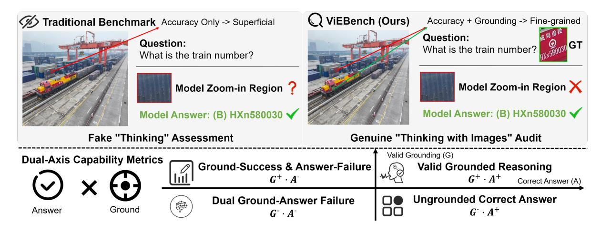
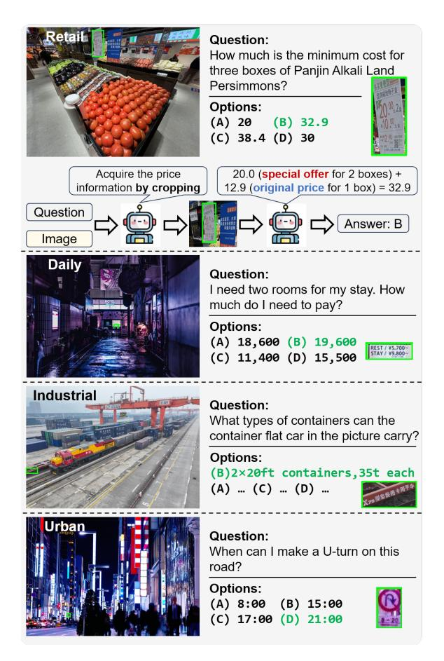
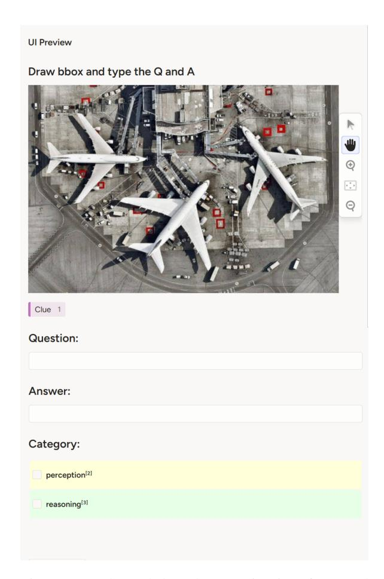
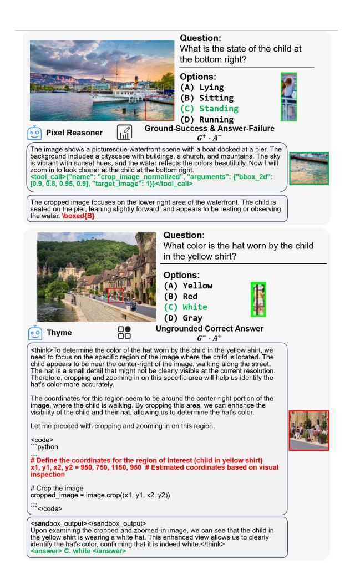

# Beyond Accuracy: Evaluating Grounded Visual Evidence in Thinking with Images

**Xuchen Li**1\* **Xuzhao Li**2\* **Renjie Pi**3† **Shiyu Hu**2 **Jian Zhao**1,5 **Jiahui Gao**4‡ 1ZGCA, 2NTU, 3HKUST, 4HKU, 5ZGCI

xuzhaoli2001@gmail.com, xuchenli1030@gmail.com, rpi@connect.ust.hk, ggaojiahui@gmail.com

#### Abstract

Despite the remarkable progress of Vision-Language Models (VLMs) in adopting "Thinking-with-Images" capabilities, accurately evaluating the authenticity of their reasoning process remains a critical challenge. Existing benchmarks mainly rely on outcomeoriented accuracy, lacking the capability to assess whether models can accurately leverage fine-grained visual cues for multi-step reasoning. To address these limitations, we propose ViEBench, a process-verifiable benchmark designed to evaluate faithful visual reasoning. Comprising 200 multi-scenario high-resolution images with expert-annotated visual evidence, ViEBench uniquely categorizes tasks by difficulty into perception and reasoning dimensions, where reasoning tasks require utilizing localized visual details with prior knowledge. To establish comprehensive evaluation criteria, we introduce a dual-axis matrix that provides fine-grained metrics through four diagnostic quadrants, enabling transparent diagnosis of model behavior across varying task complexities. Our experiments yield several interesting observations: (1) VLMs can sometimes produce correct final answers despite grounding on irrelevant regions, and (2) they may successfully locate the correct evidence but still fail to utilize it to reach accurate conclusions. Our findings demonstrate that ViEBench can serve as a more explainable and practical benchmark for comprehensively evaluating the effectiveness agentic VLMs. The codes will be released at: https://github.com/Xuchen-Li/ViEBench.

#### 1 Introduction

Recent advancements in Vision-Language Models (VLMs) (Bai et al., 2025a; Su et al., 2025a; Lai et al., 2025; Team et al., 2025b,a; MiniMax,

Table 1: Comparison of ViEBench with existing Multimodal Benchmarks. ViEBench is uniquely categorized into perception and reasoning tasks, and provides expertannotated bounding box (BBox) for visual evidence, enabling a precise process evaluation.

| Bench       | #QA Pairs | Percept      | Reason | BBox     | Process Evaluation |
|-------------|-----------|--------------|--------|----------|-----------------------|
| V* Bench    | 191       | ✓            | ×      | ×        | ×                     |
| HRBench     | 1600      | $\checkmark$ | ×      | ×        | ×                     |
| InfoVQA     | 2801      | $\checkmark$ | ×      | ×        | ×                     |
| VisualProbe | 515       | $\checkmark$ | ×      | ×        | ×                     |
| ViEBench    | 200       | ✓            | ✓      | <b>√</b> | ✓                     |

2025) have entered in a new era of "Thinking-with-Images," where models no longer perceive images as static inputs but instead actively interact with them through dynamic visual operations (Zheng et al., 2025). By adopting agentic behaviors such as autonomous zooming, state-of-the-art agentic models like the o3 (OpenAI, 2025) and Qwen3-VL (Bai et al., 2025a) have demonstrated an unprecedented ability to resolve fine-grained details within high-resolution scenes. This shift from passive perception to active visual reasoning has enabled VLMs to tackle complex tasks in real-world scenarios, ranging from industrial inspection to urban navigation (Su et al., 2025b; Zhang et al., 2023; Li et al., 2025c; Cao et al., 2025).

However, as VLMs gain the autonomy to manipulate their own visual input, a critical evaluation gap has emerged. As shown in Tab. 1, existing benchmarks (Wang et al., 2024; Wu and Xie, 2024; Lai et al., 2025; Mathew et al., 2022; Chen et al., 2024) are constrained by two fundamental limitations. First, their perception-oriented tasks can be addressed through fine-grained recognition alone, making them insufficient for evaluating tool-use capabilities in reasoning-intensive scenarios where models must integrate localized visual cues with prior knowledge. Second, these benchmarks rely solely on outcome-oriented metrics (Li et al., 2025d,e), treating models as "black

\*Equal contribution.

&lt;sup>†Project Leader.

&lt;sup>‡Corresponding Author.

boxes" and providing no diagnostic granularity to distinguish whether performance degradation results from grounding failures or from an inability to synthesize visual evidence into logical reasoning. Consequently, without fine-grained metrics to verify if a model's success relies on faithful reasoning or mere textual priors, it remains impossible to pinpoint specific weaknesses or guide targeted model improvements.

To bridge this gap, we introduce ViEBench, a novel diagnostic benchmark to evaluate the "Thinking-with-Images" capabilities of VLMs. First, we design ViEBench-R, a reasoning task that requires models to localize fine-grained visual cues, integrate them with prior knowledge, and perform multi-step logical reasoning. We also provide ViEBench-P, a perception task for comparable analysis. To ensure task quality and diversity, we curate 200 high-resolution images across four critical real-world scenarios: retail, urban, industry, and daily life. Crucially, we enforce extreme spatial sparsity, where critical visual evidence occupies less than 0.7% of the total image area on average. This strategic design ensures that essential visual cues remain sub-perceptual in global views, forcing models to execute precise local zooming operations.

Second, we introduce a dual-axis capability matrix based on the intersection over area (IoA) metric [\(Xiang et al.,](#page-9-9) [2023\)](#page-9-9). By comparing modelgenerated visual crops against expert-annotated gold BBox, we construct a grounding axis that quantifies localization accuracy, which is then crossed with the answer correctness axis to form four diagnostic quadrants (shown in Fig. [1\)](#page-2-0): *Valid Grounded Reasoning*, *Ground-Success Answer-Failure*, *Ungrounded Correct Answer*, and *Dual Ground-Answer Failure*. This decomposition enables us to evaluate whether performance degradation stems from grounding failures or reasoning deficiencies—a diagnostic capability completely absent in traditional accuracy-only metrics.

Our extensive evaluation of both end-to-end and agentic VLMs reveals several counter-intuitive findings. We identify a prevalent ungrounded correct answer phenomenon among agentic VLMs, suggesting that current benchmarks significantly overestimate model reliability. Furthermore, we uncover a ground-success and answer-failure bottleneck, where models successfully locate the required evidence but fail to synthesize it into a correct reasoning chain. These insights underscore

that the next frontier for VLMs lies not just in "where to look," but in how to deeply integrate cropped visual information into the reasoning chain. By providing a rigorous and transparent evaluation protocol, ViEBench serves as both a valuable benchmark for current models and a roadmap for the development of more robust and truly visual "thinking" agentic models.

This work makes three key contributions: 1) We introduce ViEBench across diverse real-world scenarios, uniquely featuring reasoning-oriented tasks with extreme spatial sparsity (avg. area < 0.7%), necessitating precise visual operations and faithful visual thinking. 2) We propose a process-verifiable evaluation paradigm that shifts from outcome-oriented metrics to a dual-axis capability matrix, enabling fine-grained analysis to differentiate grounding failures from reasoning deficiencies. 3) Our extensive evaluation of stateof-the-art agentic VLMs reveals several counterintuitive failure modes, offering actionable insights for developing more robust agentic vision models.

# 2 Related Work

## 2.1 Vision-Language Models

The landscape of Vision-Language Models (VLMs) has evolved from early alignment-based models to powerful large-scale multimodal systems. End-toend models, such as the GPT series [\(Hurst et al.,](#page-8-7) [2024\)](#page-8-7), Gemini series [\(Team et al.,](#page-9-10) [2024,](#page-9-10) [2023;](#page-9-11) [Co](#page-8-8)[manici et al.,](#page-8-8) [2025\)](#page-8-8) and open-source leaders like InternVL [\(Zhu et al.,](#page-10-2) [2025a;](#page-10-2) [Wang et al.,](#page-9-12) [2025\)](#page-9-12), LLaVA-OneVision [\(Li et al.,](#page-8-9) [2024a\)](#page-8-9) and Qwen-VL [\(Bai et al.,](#page-8-10) [2025b](#page-8-10)[,a\)](#page-8-0), typically process images through a fixed-resolution vision encoder. While these models have demonstrated remarkable zeroshot capabilities, they often suffer from "visual forgetting" when dealing with high-resolution images due to the information loss inherent in global downsampling [\(Wang et al.,](#page-9-6) [2024;](#page-9-6) [Li et al.,](#page-8-11) [2025a\)](#page-8-11). Recent efforts have attempted to mitigate this by scaling parameters or incorporating mixture-of-experts (MoE) architectures [\(Bai et al.,](#page-8-0) [2025a\)](#page-8-0), yet the underlying black-box nature of their perception remains a significant hurdle for verifiable reasoning.

## 2.2 Thinking-with-Images

To overcome the resolution bottleneck, a new paradigm [\(Zhang et al.,](#page-10-3) [2025a;](#page-10-3) [Zhu et al.,](#page-10-4) [2025b;](#page-10-4) [Li et al.,](#page-8-12) [2024b\)](#page-8-12) known as "Thinking-with-Images" has emerged, manifesting primarily through agen-

Figure 1: Traditional benchmarks provide a superficial thinking evaluation by relying solely on final answer accuracy, which fails to detect if a model correctly answers via irrelevant visual regions. In contrast, ViEBench performs a faithful "Thinking-with-Images" audit by cross-referencing answer accuracy with visual grounding alignment. Our dual-axis capability matrix deconstructs VLMs performance into four fine-grained quadrants to provide a diagnostic map that identifies whether correct predictions are rooted in sound visual evidence.

tic models. These systems, such as Pixel Reasoner [\(Su et al.,](#page-9-0) [2025a\)](#page-9-0) and the Qwen3-VL series [\(Bai](#page-8-0) [et al.,](#page-8-0) [2025a\)](#page-8-0), empower VLMs with the autonomy to dynamically interact with their visual input. By invoking external tools for zooming, these models can focus on task-relevant regions to capture finegrained details that are sub-perceptual in global views [\(Lai et al.,](#page-8-1) [2025;](#page-8-1) [Zheng et al.,](#page-10-0) [2025;](#page-10-0) [Zhang](#page-10-5) [et al.,](#page-10-5) [2025b\)](#page-10-5). While this active perception mimics human saccadic eye movements and enables superior performance in dense scenes, it also introduces a new layer of complexity: the need to verify whether the model's visual operations are logically aligned with its final conclusions [\(Li et al.,](#page-8-13) [2025b;](#page-8-13) [Hu et al.,](#page-8-14) [2024\)](#page-8-14).

## 2.3 Thinking-with-Images Evaluation

As the community shifts toward agentic vision, existing multimodal benchmarks [\(Yue et al.,](#page-10-6) [2024,](#page-10-6) [2025;](#page-10-7) [Li et al.,](#page-9-13) [2025f,](#page-9-13)[d\)](#page-8-5) have become increasingly inadequate for auditing the reasoning process. Traditional high-resolution benchmarks like InfoVQA [\(Mathew et al.,](#page-9-8) [2022\)](#page-9-8) and HRBench [\(Wang et al.,](#page-9-6) [2024\)](#page-9-6) focus predominantly on perception-heavy tasks (e.g., OCR or object counting) without evaluating complex logical reasoning. While recent efforts like Argus Inspection [\(Yao et al.,](#page-9-14) [2025\)](#page-9-14) attempt to bridge this gap by incorporating realworld commonsense for causal reasoning, these evaluations still largely focus on the final output. Although V\* Bench [\(Wu and Xie,](#page-9-7) [2024\)](#page-9-7) and VisualProbe [\(Lai et al.,](#page-8-1) [2025\)](#page-8-1) highlight the necessity of zooming, they rely solely on outcome-oriented metrics (accuracy), failing to account for cases where

a model arrives at the correct answer through lucky guesses rather than precise grounding. Furthermore, to our knowledge, none of the existing suites provide expert-annotated gold BBox to verify the accuracy of visual operations in the model's "thinking" process. By introducing fine-grained metrics, ViEBench provides the first comprehensive framework to ensure that the "Thinking-with-Images" process is both transparent and process-verifiable.

## 3 ViEBench

## 3.1 Overview

The core philosophy of ViEBench is to transition VLMs evaluation from an outcome-oriented black box to a process-verifiable diagnostic framework by isolating the interplay between visual localization and logical reasoning. This is achieved through a dual-axis capability audit that evaluates models along the orthogonal dimensions of reasoning integrity and grounding precision, allowing researchers to decouple a model's ability to locate evidence from its ability to interpret it. As shown in Fig. [2,](#page-3-0) by deconstructing performance into diagnostic quadrants, ViEBench identifies specific failure modes that standard accuracy metrics often mask. This structural approach is supported by a high-quality benchmark spanning four realworld scenarios where task-critical evidence is subperceptual and necessitates a verifiable "Thinkingwith-Images" process.

Figure 2: ViEBench audits the consistency between visual grounding and logical reasoning in agentic VLMs. By integrating expert-annotated BBox with a dual-axis evaluation protocol, we categorize model behaviors into four diagnostic metrics, providing a more rigorous assessment beyond accuracy only.

## 3.2 Dual-Axis Capability Matrix

To systematically audit the alignment between a model's reasoning and its visual operations, we propose the dual-axis capability matrix. This framework evaluates each task instance along two orthogonal dimensions: the correct answer axis, which measures the correctness of the final textual answer, and the valid grounding axis, which quantifies the precision of the model's generated visual crops. By mapping model performance into this two-dimensional space, we define a taxonomy of four functional quadrants. This matrix allows us to move beyond holistic accuracy and specifically isolate "hallucinatory reasoning," where a model arrives at a correct conclusion despite focusing on irrelevant or misleading image regions.

We define a set of metrics based on the Intersection-over-Area (IoA) (Xiang et al., 2023) between the model's generated crop ( $B_{pred}$ ) and the ground-truth gold BBox ( $B_{gt}$ ). Unlike the standard Intersection-over-Union (IoU) (Rezatofighi et al., 2019), the IoA metric provides a more nuanced measure of spatial inclusion. Specifically,

$$IoA(B_{pred}, B_{gt}) = \frac{Area(B_{pred}) \cap Area(B_{gt})}{Area(B_{gt})}$$

quantifies the extent to which the target evidence is covered by the model's crop, while the reverse formulation.

$$IoA(B_{gt}, B_{pred}) = \frac{Area(B_{pred}) \cap Area(B_{gt})}{Area(B_{pred})}$$

measures the concentration of the target within the crop area. To ensure a robust assessment that accounts for both precise tight crops and conservative expansive crops, we define the final IoA score as the maximum of these two directional metrics:

$$IoA = \max(IoA(B_{pred}, B_{gt}), IoA(B_{gt}, B_{pred})).$$

To facilitate a fine-grained analysis, we categorize the model's performance into four quadrants based on grounding (G) and answer (A) consistency:  $G^+$  and  $G^-$  denote successful (IoA>0.5) and failed  $(IoA\leq 0.5)$  grounding respectively, while  $A^+$  and  $A^-$  indicate correct and incorrect textual answers. As shown in Fig. 2, we propose the following metrics:

- Accuracy (Acc.): The percentage of queries where the final textual answer is correct, regardless of the grounding quality.
- **Grounded Score (GS):** The percentage of samples achieving successful grounding, representing the model's fundamental reliability in locating evidence.
- Valid Grounded Reasoning  $(G^+ \cdot A^+)$ : The ratio of samples where IoA > 0.5 and the answer is correct. This is the primary metric for verifiable reasoning.
- Ground-Success Answer-Failure  $(G^+ \cdot A^-)$ : The ratio of samples where IoA > 0.5 but the answer is incorrect.
- Ungrounded Correct Answer  $(G^- \cdot A^+)$ :

The ratio of samples where IoA ≤ 0.5 *but* the answer is correct, indicating a reliance on textual CoT or redundant crop.

- Dual Ground-Answer Failure (G− · A−): The ratio of samples where both the grounding (IoA ≤ 0.5) and the answer are incorrect.
- Tool Ratio (TR): The proportion of queries where the model invokes a zooming operation.

## 3.3 Data Collection

Tasks. To systematically evaluate the agentic capabilities of VLMs, we categorize our tasks into two distinct dimensions: *perception* and *reasoning*. *Perception tasks* focus on the model's fundamental ability to locate and identify fine-grained visual elements within high-resolution inputs. In contrast, *reasoning tasks*—a distinctive feature of ViEBench—require that the model not only identify visual details, but also integrate these visual cues with prior knowledge and execute multi-step logical reasoning to derive correct answers.

Image Sources and Scenarios. Our data collection process is designed to capture the complexity and diversity of real-world visual reasoning tasks by curating a representative set of images sourced from both extensive web searches and the Visual-Probe [\(Lai et al.,](#page-8-1) [2025\)](#page-8-1). These images are categorized into four distinct scenarios, including *retail, urban, industry* and *daily life,* selected primarily because they represent high-stakes environments where the reliability of a model's visual grounding is paramount. Furthermore, these scenarios provide a rich spectrum of visual scales, ranging from the cluttered, fine-grained environments of retail shelves to the expansive, multi-object scenes of urban landscapes, thereby offering a comprehensive testbed for spatial reasoning.

## 3.4 Annotation and Human Review

The annotation process for ViEBench involves a multi-stage pipeline to ensure the highest level of ground-truth reliability. For each selected image, professional annotators are tasked with identifying the "minimal indispensable evidence" required to answer the associated query. This evidence is enclosed in a precise gold BBox, which serves as the spatial reference for our IoA-based audit. In addition to spatial grounding, annotators provide the ground-truth answer and categorize the task as either perception-heavy (requiring fine-grained

Figure 3: Representative examples from ViEBench across four real-world scenarios. Each case illustrates a complex reasoning task where the critical evidence is spatially sparse and requires precise cropping to resolve.

identification) or reasoning-heavy (requiring multistep logical integration). To guarantee quality, a secondary team of senior reviewers performs a verification of every instance. Any sample where the gold BBox is ambiguous or the reasoning chain is deemed non-verifiable is either refined or discarded, ensuring that every task in ViEBench presents a clear and objective challenge for the model.

Figure 4: Scene distribution of the perception and reasoning categories in ViEBench.

Table 2: Performance of Models with Tools (Agentic Models). Inst. denotes Instruction-tuned models.

| Model                    | Accuracy Acc. ↑ | Grounded Score $GS \uparrow$ | Valid Grounded Reasoning $G^+\cdot A^+\uparrow$ | Ground-Success Answer-Failure $G^+\cdot A^-\downarrow$ | $\begin{array}{c} \textbf{Ungrounded} \\ \textbf{Correct Answer} \\ \textbf{G}^- \cdot \textbf{A}^+ \downarrow \end{array}$ | Dual Ground- Answer Failure $G^-\cdot A^-\downarrow$ | Tool Ratio TR |
|--------------------------|-----------------|------------------------------|-------------------------------------------------|--------------------------------------------------------|-----------------------------------------------------------------------------------------------------------------------------|---------------------------------------------------------|---------------------|
|                          |                 |                              | Perception                                      |                                                        |                                                                                                                             |                                                         |                     |
| Pixel Reasoner           | 77%             | 65%                          | 54%                                             | 12%                                                    | 24%                                                                                                                         | 11%                                                     | 95%                 |
| Thyme                    | 77%             | 38%                          | 38%                                             | 0%                                                     | 44%                                                                                                                         | 19%                                                     | 16%                 |
| DeepEyes                 | 79%             | 44%                          | 41%                                             | 3%                                                     | 38%                                                                                                                         | 18%                                                     | 100%                |
| Mini-o3                  | 73%             | 78%                          | 65%                                             | 10%                                                    | 8%                                                                                                                          | 17%                                                     | 97%                 |
| Qwen3-VL-8B-Inst.        | 74%             | 73%                          | 66%                                             | 7%                                                     | 9%                                                                                                                          | 17%                                                     | 98%                 |
| Qwen3-VL-235B-A22B-Inst. | 73%             | 69%                          | 62%                                             | 7%                                                     | 11%                                                                                                                         | 20%                                                     | 100%                |
| Qwen3-VL-32B-Inst.       | 81%             | 75%                          | 71%                                             | 4%                                                     | 9%                                                                                                                          | 16%                                                     | 93%                 |
|                          |                 |                              | Reasoning                                       |                                                        |                                                                                                                             |                                                         |                     |
| Pixel Reasoner           | 59%             | 64%                          | 40%                                             | 23%                                                    | 23%                                                                                                                         | 15%                                                     | 80%                 |
| Thyme                    | 69%             | 29%                          | 29%                                             | 0%                                                     | 57%                                                                                                                         | 14%                                                     | 7%                  |
| DeepEyes                 | 60%             | 40%                          | 27%                                             | 13%                                                    | 33%                                                                                                                         | 27%                                                     | 100%                |
| Mini-o3                  | 58%             | 78%                          | 47%                                             | 28%                                                    | 11%                                                                                                                         | 14%                                                     | 97%                 |
| Qwen3-VL-8B-Inst.        | 71%             | 67%                          | 57%                                             | 10%                                                    | 15%                                                                                                                         | 18%                                                     | 92%                 |
| Qwen3-VL-235B-A22B-Inst. | 71%             | 66%                          | 54%                                             | 13%                                                    | 18%                                                                                                                         | 16%                                                     | 95%                 |
| Qwen3-VL-32B-Inst.       | 74%             | 68%                          | 56%                                             | 13%                                                    | 17%                                                                                                                         | 15%                                                     | 95%                 |

#### 3.5 Statistics

The finalized ViEBench benchmark consists of 200 high-resolution multiple-choice QA pairs, meticulously curated to ensure a balanced distribution across scenarios and cognitive demands. Quantitatively, the dataset is perfectly bifurcated into perception (50%) and reasoning (50%) tasks, providing an even ground for evaluating both fine-grained recognition and complex logical reasoning across four key real-world scenarios: urban (32%), daily life (32%), industrial (19%) and retail (17%). We provide some representative examples in Fig. 3.

A defining characteristic of ViEBench is the extreme spatial sparsity of task-critical evidence, a design choice specifically intended to necessitate active "Thinking-with-Images" behaviors. The expert-annotated gold BBox occupies a very small proportion of the total image area, averaging only 0.32% for perception-based queries and 0.63% for reasoning-based ones. This deliberate concentration of information ensures that essential visual cues remain sub-perceptual in standard global downsamplings, thereby compelling models to execute precise local zooming and cropping to resolve the evidence. To ensure the integrity of the benchmark, every instance was produced through a rigorous pipeline involving exhaustive expert manual annotation, resulting in a diagnostic suite that is both empirically challenging and process-verifiable.

#### 4 Experiment

#### 4.1 Baselines

To provide a comprehensive benchmark of current VLM capabilities, we evaluate two distinct cate-

gories of models:

Models with Tools (Agentic Models). This category comprises agentic systems that utilize external tools for zooming operations. These include Pixel Reasoner (Su et al., 2025a), Thyme (Zhang et al., 2025b), DeepEyes (Zheng et al., 2025), Mini-o3 (Lai et al., 2025), Qwen3-VL-8B-Instruct, Qwen3-VL-235B-A22B-Instruct and Qwen3-VL-32B-Instruct (Bai et al., 2025a). These models are evaluated on their ability to strategically invoke tools to locate evidence before generating a final answer.

Models without Tools (End-to-end VLMs). This category includes state-of-the-art generalpurpose VLMs and models specifically optimized for CoT reasoning (Wei et al., 2022). We evaluate proprietary frontiers such as GPT-40 (Hurst et al., 2024) and o3 (OpenAI, 2025), alongside leading open-source models including Qwen2.5-VL-7B-Instruct (Bai et al., 2025b), InternVL3-8B (Zhu et al., 2025a), and LLaVA-OneVision (OV) (Li et al., 2024a). Specifically, for the LLaVA series, we include both the standard LLaVA-OV and its LLaVA-OV (SI) variant. We also incorporate specialized reasoning models such as LLaVA-CoT (Xu et al., 2025), Keye-VL-1.5-8B (Yang et al., 2025), and MiMo-VL-7B-RL (Xiaomi et al., 2025), which are designed to enhance the depth of reasoning.

## 4.2 Evaluation Protocol

We employ distinct evaluation pipelines and reporting scopes for the two categories of baselines. For models with tools (agentic models), we strictly adhere to the evaluation settings and environment configurations specified in their respective official

Table 3: Performance of Models without Tools (End-toend VLMs). (Inst. denotes Instruction-tuned)

| Model               | Accuracy   |           |  |  |
|---------------------|------------|-----------|--|--|
|                     | Perception | Reasoning |  |  |
| GPT4o               | 66%        | 64%       |  |  |
| o3                  | 71%        | 69%       |  |  |
| Qwen2.5-VL-7B-Inst. | 74%        | 58%       |  |  |
| InternVL3           | 75%        | 63%       |  |  |
| LLaVA-CoT           | 51%        | 49%       |  |  |
| LLaVA-OV (SI)       | 62%        | 63%       |  |  |
| LLaVA-OV            | 62%        | 56%       |  |  |
| Keye-VL-1.5-8B      | 72%        | 65%       |  |  |
| MiMo-VL-7B-RL       | 71%        | 60%       |  |  |

repositories to ensure tools are invoked as intended; for these models, we report the full set of seven metrics to perform a comprehensive process-level audit. In contrast, for models without tools (endto-end VLMs), we utilize the VLMEvalKit [\(Duan](#page-8-15) [et al.,](#page-8-15) [2024\)](#page-8-15) framework to ensure a fair comparison. Since these end-to-end models lack an explicit cropping mechanism to expose their internal focus, we report only their overall accuracy.

## 5 Main Results and Analysis

Tab. [2](#page-5-0) and Tab. [3](#page-6-0) provide a comprehensive evaluation of state-of-the-art VLMs. Due to the restricted accessibility of internal cropping results from proprietary closed-source models, our analysis primarily focuses on open-source agentic models; however, developers and model hosts can readily apply this auditing framework to diagnose and refine the reasoning behaviors of any specific model.

## 5.1 Necessity of Reasoning-centric Evaluation

The comparative results between perception and reasoning tasks in Tab. [2](#page-5-0) demonstrate the necessity of ViEBench, as conventional benchmarks measuring only final accuracy fail to capture the capability collapse that occurs when task complexity increases. On simpler perception-oriented tasks, the performance gap between models is relatively narrow, and accuracy remains high; for instance, Mini-o3 [\(Lai et al.,](#page-8-1) [2025\)](#page-8-1) achieves 73%. However, on complex reasoning queries, its Accuracy (Acc.) drops significantly to 58%. Crucially, this decline occurs despite the model maintaining an identical Grounded Score (GS) of 78% across both categories. This decoupling of localization success and final correctness suggests that while the model's perception remains stable, the reasoning demands of ViEBench expose a latent reasoning

bottleneck. Without a specialized reasoning-centric benchmark, such a significant drop in performance would be hidden within total accuracy scores, making ViEBench essential for identifying the limits of agentic models beyond basic recognition.

## 5.2 Fine-grained Audit via Capability Matrix

By deconstructing performance into four G/A quadrants, ViEBench enables a transparent audit of reasoning processes indistinguishable through accuracy alone. The Semantic Reasoning Bottleneck characterizes models with superior perception but deficient logic; for instance, in reasoning tasks, Mini-o3 [\(Lai et al.,](#page-8-1) [2025\)](#page-8-1) achieves the highest GS (78%) yet exhibits a peak Ground-Success and Answer-Failure (G+ · A−) rate (28%). This proves failure stems not from blind search, but from an inability to synthesize localized cues into correct conclusions. Conversely, Superficial Correctness exposes models like DeepEyes [\(Zheng et al.,](#page-10-0) [2025\)](#page-10-0) with high Ungrounded Correct Answer (G− · A+) rates, suggesting significant redundant cropping where correct answers are reached despite misplaced visual focus. Finally, Grounded Reasoning Integrity confirms the reliability of top-tier models like Qwen3-VL-32B-Instruct [\(Bai et al.,](#page-8-0) [2025a\)](#page-8-0), which achieves a high Valid Grounded Reasoning (G+ · A+) score (71% in perception) with minimal G− · A+ (9%), proving its success derives from faithful visual evidence. This mapping precisely identifies whether a model's bottleneck lies in perception or reasoning integration. This diagnostic depth enables ViEBench to expose failure modes that remain invisible to traditional benchmarks.

## 5.3 Adaptive Thinking and Tool Efficiency

A significant finding is the variation in adaptivity across models, particularly regarding the trade-off between tool efficiency and grounding precision. Thyme [\(Zhang et al.,](#page-10-5) [2025b\)](#page-10-5) achieves a competitive Acc. (77% in perception) while maintaining an exceptionally low Tool Ratio (TR) of 16%, suggesting an efficient adaptive mechanism that invokes "Thinking-with-Images" only for highly ambiguous samples. However, in reasoning categories, Thyme's GS remains limited, and its G− · A+ rate reaches 57%, indicating that its tool calls frequently result in redundant cropping. For such efficient models, the path to improvement lies in recalibrating tool-invocation triggers to ensure that limited crops are precisely aligned with task-critical evidence. By reducing these redundant or mis-

Figure 5: We visualize IoA(Bgt, Bpred) and IoA(Bpred, Bgt) across perception and reasoning tasks. The results reveal distinct strategies. (Inst. denotes Instruction-tuned)

aligned operations, models can further minimize per-instance inference time and avoid potential interference from irrelevant visual noise, ultimately strengthening the G+ · A+ path without sacrificing their computational advantage.

## 5.4 Grounding and Reasoning Alignment

We observe a core challenge in cognitive consistency, defined as the model's ability to maintain reasoning integrity once the correct evidence is localized. By comparing the GS and G+·A+, we find that Pixel Reasoner [\(Su et al.,](#page-9-0) [2025a\)](#page-9-0) exhibits robust consistency in perception tasks. In these cases, it achieves a GS of 65%, and a high proportion of these samples (54%) are successfully converted into G+ · A+. However, its performance decays significantly in reasoning tasks, where a similar GS of 64% only yields a G+ · A+ score of 40%. This decay indicates that while the model's spatial search capability is consistent across task types, its reasoning capability remains fragile when integrating visual evidence. Localization is a necessary but insufficient condition for reasoning; the substantial gap observed in reasoning tasks suggests that the model often identifies the correct evidence but fails to construct a reliable CoT for complex queries.

## 5.5 Spatial Alignment and Crop Strategies

The bidirectional IoA analysis in Fig. [5](#page-7-0) provides deeper insights into the specific "Thinking-with-Images" behaviors of different models, revealing that a tighter crop does not inherently guarantee superior reasoning. Models such as Mini-o3 [\(Lai](#page-8-1) [et al.,](#page-8-1) [2025\)](#page-8-1) and the Qwen3-VL series [\(Bai et al.,](#page-8-0) [2025a\)](#page-8-0) generally exhibit an expansive coverage strategy, characterized by high IoA(Bpred, Bgt) values results. This pattern indicates that while their generated crops are relatively large compared to the target evidence, they successfully encompass the entire gold BBox. Crucially, the Qwen3-VL

series demonstrates that such moderate spatial redundancy is not a hindrance; by effectively utilizing visual cues within these larger crops, Qwen3- VL-32B-Instruct achieves high G+ · A+ and low G+ · A− rates. Conversely, models like DeepEyes [\(Zheng et al.,](#page-10-0) [2025\)](#page-10-0) often generate more concentrated crops with higher IoA(Bgt, Bpred) levels, yet this tighter spatial focus does not translate into performance gains in reasoning accuracy. This divergence validates the design of our evaluation metric, which prioritizes the coverage of essential evidence over mere boundary precision. It further suggests that for agentic VLMs, over-optimizing for tight BBox coordinates during training may be counterproductive. Instead, the focus should remain on developing adaptive cropping mechanisms that allow models to determine an optimal viewing scale based on their reasoning capacity, ensuring that sufficient context is preserved to support the subsequent CoT.

## 6 Conclusion

In this paper, we address a critical gap in the evaluation of agentic VLMs by moving beyond simplistic outcome-oriented metrics toward a processverifiable paradigm. Through ViEBench, we provide a rigorous diagnostic framework that leverages fine-grained perception and complex reasoning tasks to evaluate the capabilities of agentic VLMs within high-resolution environments. Our dual-axis capability matrix uniquely decomposes performance into grounding accuracy and reasoning logic, revealing that current models frequently rely on "ungrounded correct answers" or struggle to synthesize evidence even after successful localization. These findings underscore that the next frontier for VLMs lies in achieving cognitive consistency between visual perception and logical inference.

# Limitations

While ViEBench provides a rigorous and processverifiable framework for auditing agentic VLMs, our current benchmark primarily focuses on cropping as the central visual operation for "Thinkingwith-Images," as it represents the most critical mechanism for resolving spatial sparsity and fine-grained perception. However, as the field evolves, agentic models are expected to perform a broader suite of complex visual operations. Since ViEBench is currently optimized for highresolution spatial perception and reasoning tasks, it does not fully account for the evaluation of these emerging diverse tool-use capabilities. We recognize this as a vital area for growth and plan to incorporate the assessment of more varied visual operations into our subsequent work to maintain a comprehensive diagnostic standard for future multimodal agents.

# References

- Shuai Bai, Yuxuan Cai, Ruizhe Chen, Keqin Chen, Xionghui Chen, Zesen Cheng, Lianghao Deng, Wei Ding, Chang Gao, Chunjiang Ge, Wenbin Ge, Zhifang Guo, Qidong Huang, Jie Huang, Fei Huang, Binyuan Hui, Shutong Jiang, Zhaohai Li, Mingsheng Li, and 45 others. 2025a. [Qwen3-vl technical report.](https://arxiv.org/abs/2511.21631) *Preprint*, arXiv:2511.21631.
- Shuai Bai, Keqin Chen, Xuejing Liu, Jialin Wang, Wenbin Ge, Sibo Song, Kai Dang, Peng Wang, Shijie Wang, Jun Tang, and 1 others. 2025b. Qwen2. 5-vl technical report. *arXiv preprint arXiv:2502.13923*.
- Pengfei Cao, Tianyi Men, Wencan Liu, Jingwen Zhang, Xuzhao Li, Xixun Lin, Dianbo Sui, Yanan Cao, Kang Liu, and Jun Zhao. 2025. Large language models for planning: A comprehensive and systematic survey. *arXiv preprint arXiv:2505.19683*.
- Lin Chen, Jinsong Li, Xiaoyi Dong, Pan Zhang, Yuhang Zang, Zehui Chen, Haodong Duan, Jiaqi Wang, Yu Qiao, Dahua Lin, and 1 others. 2024. Are we on the right way for evaluating large vision-language models? *Advances in Neural Information Processing Systems*, 37:27056–27087.
- Gheorghe Comanici, Eric Bieber, Mike Schaekermann, Ice Pasupat, Noveen Sachdeva, Inderjit Dhillon, Marcel Blistein, Ori Ram, Dan Zhang, Evan Rosen, and 1 others. 2025. Gemini 2.5: Pushing the frontier with advanced reasoning, multimodality, long context, and next generation agentic capabilities. *arXiv preprint arXiv:2507.06261*.
- Haodong Duan, Junming Yang, Yuxuan Qiao, Xinyu Fang, Lin Chen, Yuan Liu, Xiaoyi Dong, Yuhang Zang, Pan Zhang, Jiaqi Wang, and 1 others. 2024.

- Vlmevalkit: An open-source toolkit for evaluating large multi-modality models. In *Proceedings of the 32nd ACM International Conference on Multimedia*, pages 11198–11201.
- Shiyu Hu, Xuchen Li, Xuzhao Li, Jing Zhang, Yipei Wang, Xin Zhao, and Kang Hao Cheong. 2024. Fiova: A multi-annotator benchmark for human-aligned video captioning. *arXiv preprint arXiv:2410.15270*.
- Aaron Hurst, Adam Lerer, Adam P Goucher, Adam Perelman, Aditya Ramesh, Aidan Clark, AJ Ostrow, Akila Welihinda, Alan Hayes, Alec Radford, and 1 others. 2024. Gpt-4o system card. *arXiv preprint arXiv:2410.21276*.
- Xin Lai, Junyi Li, Wei Li, Tao Liu, Tianjian Li, and Hengshuang Zhao. 2025. Mini-o3: Scaling up reasoning patterns and interaction turns for visual search. *arXiv preprint arXiv:2509.07969*.
- Bo Li, Yuanhan Zhang, Dong Guo, Renrui Zhang, Feng Li, Hao Zhang, Kaichen Zhang, Peiyuan Zhang, Yanwei Li, Ziwei Liu, and 1 others. 2024a. Llavaonevision: Easy visual task transfer. *arXiv preprint arXiv:2408.03326*.
- Qian Li, Xuchen Li, Zongyu Chang, Yuzheng Zhang, Cheng Ji, and Shangguang Wang. 2025a. Multimodal knowledge retrieval-augmented iterative alignment for satellite commonsense conversation. In *Proceedings of the Thirty-Fourth International Joint Conference on Artificial Intelligence*, pages 8168– 8176.
- Xuchen Li, Xiaokun Feng, Shiyu Hu, Meiqi Wu, Dailing Zhang, Jing Zhang, and Kaiqi Huang. 2024b. Dtllm-vlt: Diverse text generation for visual language tracking based on llm. In *Proceedings of the IEEE/CVF Conference on Computer Vision and Pattern Recognition*, pages 7283–7292.
- Xuchen Li, Xuzhao Li, Jiahui Gao, Renjie Pi, Shiyu Hu, and Wentao Zhang. 2025b. Look less, reason more: Rollout-guided adaptive pixel-space reasoning. *arXiv preprint arXiv:2510.01681*.
- Xuchen Li, Xuzhao Li, Shiyu Hu, and Kaiqi Huang. 2025c. Select less, reason more: Prioritizing evidence purity for video reasoning. *arXiv preprint arXiv:2510.15440*.
- Xuchen Li, Xuzhao Li, Shiyu Hu, Kaiqi Huang, and Wentao Zhang. 2025d. Causalstep: A benchmark for explicit stepwise causal reasoning in videos. *arXiv preprint arXiv:2507.16878*.
- Xuchen Li, Ruitao Wu, Xuanbo Liu, Xukai Wang, Jinbo Hu, Zhixin Bai, Bohan Zeng, Hao Liang, Leheng Chen, Mingrui Chen, and 1 others. 2025e. Sciagent: A unified multi-agent system for generalistic scientific reasoning. *arXiv preprint arXiv:2511.08151*.

- Xuzhao Li, Xuchen Li, Shiyu Hu, Yongzhen Guo, and Wentao Zhang. 2025f. Verifybench: A systematic benchmark for evaluating reasoning verifiers across domains. *arXiv preprint arXiv:2507.09884*.
- Minesh Mathew, Viraj Bagal, Rubèn Tito, Dimosthenis Karatzas, Ernest Valveny, and CV Jawahar. 2022. Infographicvqa. In *Proceedings of the IEEE/CVF Winter Conference on Applications of Computer Vision*, pages 1697–1706.
- MiniMax. 2025. [Minimax-m1: Scaling test-time com](https://arxiv.org/abs/2506.13585)[pute efficiently with lightning attention.](https://arxiv.org/abs/2506.13585) *Preprint*, arXiv:2506.13585.
- OpenAI. 2025. [Introducing o3 and o4-mini.](https://openai.com/index/introducing-o3-and-o4-mini/)
- Hamid Rezatofighi, Nathan Tsoi, JunYoung Gwak, Amir Sadeghian, Ian Reid, and Silvio Savarese. 2019. Generalized intersection over union: A metric and a loss for bounding box regression. In *Proceedings of the IEEE/CVF conference on computer vision and pattern recognition*, pages 658–666.
- Alex Su, Haozhe Wang, Weiming Ren, Fangzhen Lin, and Wenhu Chen. 2025a. Pixel reasoner: Incentivizing pixel-space reasoning with curiositydriven reinforcement learning. *arXiv preprint arXiv:2505.15966*.
- Zhaochen Su, Peng Xia, Hangyu Guo, Zhenhua Liu, Yan Ma, Xiaoye Qu, Jiaqi Liu, Yanshu Li, Kaide Zeng, Zhengyuan Yang, and 1 others. 2025b. Thinking with images for multimodal reasoning: Foundations, methods, and future frontiers. *arXiv preprint arXiv:2506.23918*.
- Gemini Team, Rohan Anil, Sebastian Borgeaud, Jean-Baptiste Alayrac, Jiahui Yu, Radu Soricut, Johan Schalkwyk, Andrew M Dai, Anja Hauth, Katie Millican, and 1 others. 2023. Gemini: a family of highly capable multimodal models. *arXiv preprint arXiv:2312.11805*.
- Gemini Team, Petko Georgiev, Ving Ian Lei, Ryan Burnell, Libin Bai, Anmol Gulati, Garrett Tanzer, Damien Vincent, Zhufeng Pan, Shibo Wang, and 1 others. 2024. Gemini 1.5: Unlocking multimodal understanding across millions of tokens of context. *arXiv preprint arXiv:2403.05530*.
- Kimi Team, Yifan Bai, Yiping Bao, Guanduo Chen, Jiahao Chen, Ningxin Chen, Ruijue Chen, Yanru Chen, Yuankun Chen, Yutian Chen, Zhuofu Chen, Jialei Cui, Hao Ding, Mengnan Dong, Angang Du, Chenzhuang Du, Dikang Du, Yulun Du, Yu Fan, and 150 others. 2025a. [Kimi k2: Open agentic intelligence.](https://arxiv.org/abs/2507.20534) *Preprint*, arXiv:2507.20534.
- Kimi Team, Angang Du, Bofei Gao, Bowei Xing, Changjiu Jiang, Cheng Chen, Cheng Li, Chenjun Xiao, Chenzhuang Du, Chonghua Liao, Chuning Tang, Congcong Wang, Dehao Zhang, Enming Yuan, Enzhe Lu, Fengxiang Tang, Flood Sung, Guangda Wei, Guokun Lai, and 77 others. 2025b. [Kimi k1.5:](https://arxiv.org/abs/2501.12599) [Scaling reinforcement learning with llms.](https://arxiv.org/abs/2501.12599) *Preprint*, arXiv:2501.12599.

- Maxim Tkachenko, Mikhail Malyuk, Andrey Holmanyuk, and Nikolai Liubimov. 2020- 2025. [Label Studio: Data labeling soft](https://github.com/HumanSignal/label-studio)[ware.](https://github.com/HumanSignal/label-studio) Open source software available from https://github.com/HumanSignal/label-studio.
- Weiyun Wang, Zhangwei Gao, Lixin Gu, Hengjun Pu, Long Cui, Xingguang Wei, Zhaoyang Liu, Linglin Jing, Shenglong Ye, Jie Shao, and 1 others. 2025. Internvl3. 5: Advancing open-source multimodal models in versatility, reasoning, and efficiency. *arXiv preprint arXiv:2508.18265*.
- Wenbin Wang, Liang Ding, Minyan Zeng, Xiabin Zhou, Li Shen, Yong Luo, and Dacheng Tao. 2024. Divide, conquer and combine: A training-free framework for high-resolution image perception in multimodal large language models. *arXiv preprint*.
- Jason Wei, Xuezhi Wang, Dale Schuurmans, Maarten Bosma, Fei Xia, Ed Chi, Quoc V Le, Denny Zhou, and 1 others. 2022. Chain-of-thought prompting elicits reasoning in large language models. *Advances in neural information processing systems*, 35:24824– 24837.
- Penghao Wu and Saining Xie. 2024. V?: Guided visual search as a core mechanism in multimodal llms. In *Proceedings of the IEEE/CVF Conference on Computer Vision and Pattern Recognition*, pages 13084– 13094.
- Chong Xiang, Alexander Valtchanov, Saeed Mahloujifar, and Prateek Mittal. 2023. Objectseeker: Certifiably robust object detection against patch hiding attacks via patch-agnostic masking. In *2023 IEEE Symposium on Security and Privacy (SP)*, pages 1329– 1347. IEEE.
- LLM Xiaomi, Bingquan Xia, Bowen Shen, Dawei Zhu, Di Zhang, Gang Wang, Hailin Zhang, Huaqiu Liu, Jiebao Xiao, Jinhao Dong, and 1 others. 2025. Mimo: Unlocking the reasoning potential of language model– from pretraining to posttraining. *arXiv preprint arXiv:2505.07608*.
- Guowei Xu, Peng Jin, Ziang Wu, Hao Li, Yibing Song, Lichao Sun, and Li Yuan. 2025. Llava-cot: Let vision language models reason step-by-step. In *Proceedings of the IEEE/CVF International Conference on Computer Vision*, pages 2087–2098.
- Biao Yang, Bin Wen, Boyang Ding, Changyi Liu, Chenglong Chu, Chengru Song, Chongling Rao, Chuan Yi, Da Li, Dunju Zang, and 1 others. 2025. Kwai keye-vl 1.5 technical report. *arXiv preprint arXiv:2509.01563*.
- Yang Yao, Lingyu Li, Jiaxin Song, Chiyu Chen, Zhenqi He, Yixu Wang, Xin Wang, Tianle Gu, Jie Li, Yan Teng, and 1 others. 2025. Argus inspection: Do multimodal large language models possess the eye of panoptes? In *Proceedings of the 33rd ACM International Conference on Multimedia*, pages 13133– 13140.

- Xiang Yue, Yuansheng Ni, Kai Zhang, Tianyu Zheng, Ruoqi Liu, Ge Zhang, Samuel Stevens, Dongfu Jiang, Weiming Ren, Yuxuan Sun, and 1 others. 2024. Mmmu: A massive multi-discipline multimodal understanding and reasoning benchmark for expert agi. In *Proceedings of the IEEE/CVF Conference on Computer Vision and Pattern Recognition*, pages 9556– 9567.
- Xiang Yue, Tianyu Zheng, Yuansheng Ni, Yubo Wang, Kai Zhang, Shengbang Tong, Yuxuan Sun, Botao Yu, Ge Zhang, Huan Sun, and 1 others. 2025. Mmmupro: A more robust multi-discipline multimodal understanding benchmark. In *Proceedings of the 63rd Annual Meeting of the Association for Computational Linguistics (Volume 1: Long Papers)*, pages 15134– 15186.
- Ran Zhang, Guangbo Hao, Kong Zhang, and Zili Li. 2023. Unmanned aerial vehicle navigation in underground structure inspection: A review. *Geological Journal*, 58(6):2454–2472.
- Xintong Zhang, Zhi Gao, Bofei Zhang, Pengxiang Li, Xiaowen Zhang, Yang Liu, Tao Yuan, Yuwei Wu, Yunde Jia, Song-Chun Zhu, and 1 others. 2025a. Chain-of-focus: Adaptive visual search and zooming for multimodal reasoning via rl. *arXiv preprint arXiv:2505.15436*.
- Yi-Fan Zhang, Xingyu Lu, Shukang Yin, Chaoyou Fu, Wei Chen, Xiao Hu, Bin Wen, Kaiyu Jiang, Changyi Liu, Tianke Zhang, and 1 others. 2025b. Thyme: Think beyond images. *arXiv preprint arXiv:2508.11630*.
- Ziwei Zheng, Michael Yang, Jack Hong, Chenxiao Zhao, Guohai Xu, Le Yang, Chao Shen, and Xing Yu. 2025. Deepeyes: Incentivizing" thinking with images" via reinforcement learning. *arXiv preprint arXiv:2505.14362*.
- Jinguo Zhu, Weiyun Wang, Zhe Chen, Zhaoyang Liu, Shenglong Ye, Lixin Gu, Hao Tian, Yuchen Duan, Weijie Su, Jie Shao, and 1 others. 2025a. Internvl3: Exploring advanced training and test-time recipes for open-source multimodal models. *arXiv preprint arXiv:2504.10479*.
- Muzhi Zhu, Hao Zhong, Canyu Zhao, Zongze Du, Zheng Huang, Mingyu Liu, Hao Chen, Cheng Zou, Jingdong Chen, Ming Yang, and 1 others. 2025b. Active-o3: Empowering multimodal large language models with active perception via grpo. *arXiv preprint arXiv:2505.21457*.

# A Annotation and Data Collection

To ensure high-quality grounding and reasoning pairs, we developed a specialized web-based annotation platform based on Label Studio [\(Tkachenko](#page-9-20) [et al.,](#page-9-20) [2020-2025\)](#page-9-20) as shown in Fig. [A1.](#page-11-0) The interface is designed to facilitate the synchronized collection of visual bounding boxes, natural language queries, and logical categorizations.

The annotation pipeline consists of the following four key modules:

- Interactive Image Canvas: The core of the interface allows annotators to perform multilevel inspection. Supporting standard zooming and panning operations, it enables annotators to locate minuscule targets that require agentic "Thinking-with-Images" behavior.
- Bounding Box Grounding: Annotators are required to draw a precise gold bounding box (Bgt) around the visual evidence necessary to answer the question. This provides the ground-truth for calculating the Intersectionover-Area (IoA) metrics used in our evaluation.
- Q&A Annotation: Two dedicated text fields are provided for annotators to author the Question and the corresponding Answer. Annotators are instructed to ensure that the question cannot be answered confidently without referring to the fine-grained details within the specified bounding box.
- Task Categorization: Each sample is manually classified into one of two categories:
  - 1. Perception: Questions focusing on direct attribute recognition or simple object identification.
  - 2. Reasoning: Questions requiring multistep logical deduction, spatial relationship analysis, or the synthesis of internal knowledge with visual evidence.

## B Case Study

In our case studies (Fig. [A2\)](#page-12-0), Pixel Reasoner [\(Su et al.,](#page-9-0) [2025a\)](#page-9-0) demonstrates a representative instance of Ground-Success & Answer-Failure (G+ · A−). When tasked with a query requiring specific posture recognition, the model accurately identifies the need to focus on the "child at the bottom right" and generates a high-precision crop that perfectly encompasses the gold BBox. However,

Figure A1: The web-based annotation interface used for ViEBench data collection. It supports interactive bounding box drawing, Q&A entry, and fine-grained category selection.

it still misinterprets the child's posture as "sitting" rather than "standing." This instance serves as evidence that successful visual localization does not inherently guarantee logical understanding. It highlights a cognitive bottleneck where models struggle to synthesize fine-grained visual semantics into a correct reasoning chain, even when the relevant pixels are clearly in view.

Conversely, Thyme [\(Zhang et al.,](#page-10-5) [2025b\)](#page-10-5) illustrates Ungrounded Correct Answer (G− · A+) behavior when tasked to determine the "color of the hat worn by the child in the yellow shirt." Although its CoT correctly identifies the intent to zoom into the specific region, the actual executed crop coordinates are significantly shifted toward an irrelevant background area, missing the gold BBox entirely. Despite this localization failure, the model arrives at the correct answer. This phenomenon suggests that the model may be utilizing broader global context cues rather than specific grounded evidence. Such cases underscore the necessity of process-

Figure A2: (Top) Ground-Success and Answer-Failure: Pixel Reasoner achieves near-perfect spatial grounding on the target child but fails to correctly interpret the child's physical state from the high-resolution crop, leading to an incorrect final answer. (Bottom) Ungrounded Correct Answer: Thyme arrives at the correct answer despite focusing on an irrelevant background region far from the gold BBox. This exposes a redundant cropping behavior, where the model's tool-invocation process is functionally decoupled from its final decision.

level auditing provided by ViEBench to distinguish between faithful visual operations and results that lack grounded evidence.