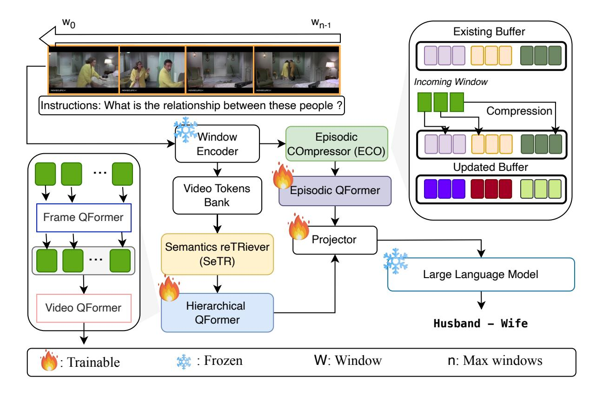
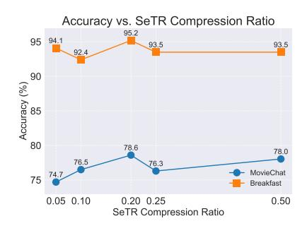
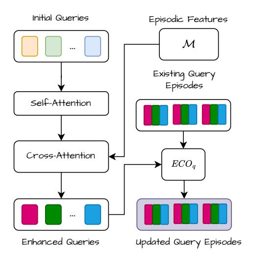
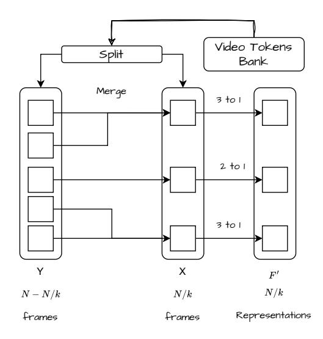
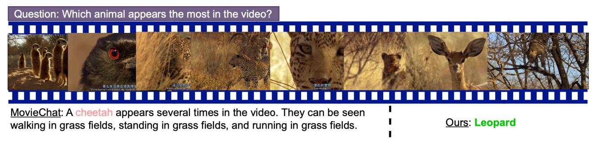
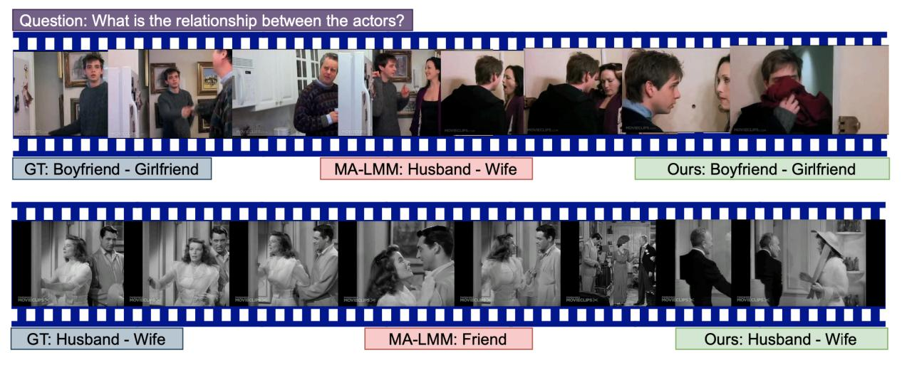
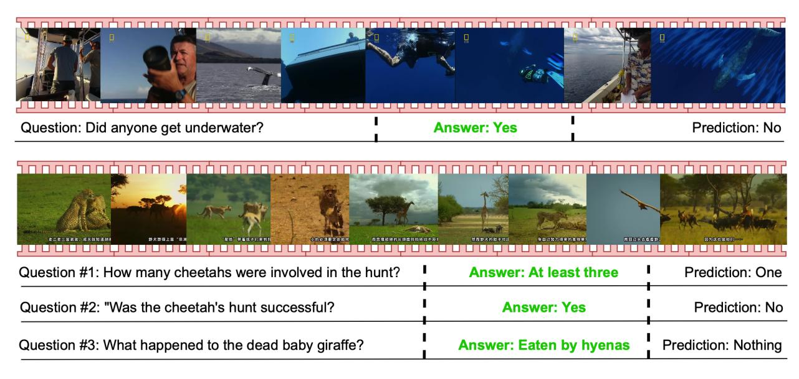

# HERMES: temporal-coHERent long-forM understanding with Episodes and Semantics

Gueter Josmy Faure1 Jia-Fong Yeh1 Min-Hung Chen2 Hung-Ting Su1 Shang-Hong Lai4 Winston H. Hsu1

1National Taiwan University 2NVIDIA 4National Tsing Hua University

Figure 1. Semantic Knowledge and Episodic Memory Aggregation: Our Episodic COmpressor (ECO) processes and aggregates temporal information across different scales: (I) Social interactions among adolescents in an outdoor setting, and (II) Complex family dynamics portrayed through parent-child interactions. Simultaneously, our Semantics reTRiever (SeTR) extracts high-level semantic information: (I) The contextual environment of a baseball game, and (II) The intersection of media consumption and domestic life through a news broadcast. This dual-level approach enables comprehensive video understanding by capturing both specific events and overarching concepts.

# Abstract

*Long-form video understanding presents unique challenges that extend beyond traditional short-video analysis approaches, particularly in capturing long-range dependencies, processing redundant information efficiently, and extracting high-level semantic concepts. To address these challenges, we propose a novel approach that more accurately reflects human cognition. This paper introduces HERMES: temporal-coHERent long-forM understanding with Episodes and Semantics, featuring two versatile modules that can enhance existing video-language models or operate as a standalone system. Our Episodic COmpressor (ECO) efficiently aggregates representations from micro to semi-macro levels, reducing computational overhead while preserving temporal dependencies. Our Semantics reTRiever (SeTR) enriches these representations with semantic information by focusing on broader context, dramatically reducing feature dimensionality while preserving relevant macro-level information. We demonstrate that these modules can be seamlessly integrated into existing SOTA models, consistently improving their performance while reducing inference latency by up to 43% and memory usage by 46%. As*

*a standalone system, HERMES achieves state-of-the-art performance across multiple long-video understanding benchmarks in both zero-shot and fully-supervised settings. Our project page and code can be found [here.](https://joslefaure.github.io/assets/html/hermes.html)*

# 1. Introduction

Video understanding reflects how humans perceive the world through one of our most essential senses, sight, and drives a wide range of visual and multimodal applications. Whether we want to create better video summarization tools, index and retrieve specifics from the vast and ever-expanding array of video content, or improve content moderation and copyright enforcement, we need models that excel at video understanding. This requirement extends beyond short videos with few frames — a task that image models can already handle adequately — to encompass the analysis of extended video content spanning minutes and comprising thousands of interrelated frames.

Long-form video understanding is challenging for several reasons. First and foremost is the *temporal complexity*, as it requires handling a large number of frames throughout the video. Second, it requires a *semantic understanding of highlevel concepts* as well as the narrative structure. The third challenge is the *memory and computational constraints*, making it non-trivial to solve the previous two challenges. Attempts to address these issues have been made by researchers who mainly borrow ideas from short videos [\[24,](#page-8-0) [43\]](#page-9-0), which is a more mature area of research encompassing action recognition and video classification, among others, and for which datasets are more abundant. However, these approaches, which adopt techniques such as pooling [\[11\]](#page-8-1), or 3D convolutions [\[12\]](#page-8-2), often do not fully account for the unique characteristics of long videos that distinguish them from a simple concatenation of short video segments. Some ideas about short-video modeling, especially for those at the spatial level, may also hold for longer ones, but when it comes to long-term modeling, macro-level representations should be extracted efficiently.

In video understanding, we can distinguish between two types of information: episodic and semantic[1](#page-1-0) . Episodic information refers to specific, sequential events that occur in a video, while semantic information encompasses overarching themes and concepts. To illustrate, consider the scene presented in Figure [1.](#page-0-0) Episodic information includes observing adolescents interacting at a baseball game, followed by tense exchanges between a mother and father. These are specific, time-bound events that unfold sequentially. In contrast, semantic information involves recognizing the broader context of youth sports culture and the backdrop of media's influence on domestic life. This high-level understanding concisely overviews the scene and actions, transcending specific moments.

Building on these concepts, we propose *temporalcoHERent long-forM understanding with Episodes and Semantics (HERMES)*, featuring two modular components that can either work together as a complete system or integrate into existing models. The Episodic COmpressor (ECO) aggregates key contiguous information as we process the video, shaping understanding sequentially while reducing computational overhead and the SEmantic reTRiever (SeTR) identifies and extracts high-level cues that provide a concise overview of the scene and actions. HER-MES achieves state-of-the-art performance on four longform video understanding benchmarks in both zero-shot and fully-supervised settings, outperforming the state-of-the-art by 7.3% on LVU[\[43\]](#page-9-0) and 14.9% on MovieChat-1k [\[32\]](#page-9-1).

Our key contributions are as follows:

- We develop a versatile framework for processing and understanding long-form videos that can either operate as a standalone system or enhance existing models through modular integration.
- We propose an Episodic COmpressor (ECO) that can replace or augment existing memory mechanisms, consis-

- tently improving model performance while reducing inference latency and GPU memory usage by up to 43% and 46%, respectively.
- We develop a Semantics reTRiever (SeTR) that enhances video understanding by distilling high-level semantic cues, providing substantial accuracy improvements with minimal computational overhead.

Through comprehensive evaluation across multiple benchmarks, detailed ablation studies, and extensive integration experiments with existing SOTA models, we validate the effectiveness of ECO and SeTR, demonstrating their complementary roles in enhancing long-form video understanding both as standalone components and as plug-in modules.

# 2. Related Work

Action recognition is an essential task in video understanding, primarily focusing on identifying specific actions within short video clips. Various approaches have been developed, with convolutional neural networks forming the core of many of them. Early work by [\[17\]](#page-8-3) utilized 3D convolutions, while [\[40\]](#page-9-2) employed temporal convolutions. 2D CNNs coupled with temporal modeling have also been explored, with representative works such as Temporal Difference Networks (TDN) [\[25\]](#page-8-4) and Event Adaptive Networks (EAN) [\[35\]](#page-9-3). More recently, transformer-based models have gained prominence with works such as [\[11\]](#page-8-1), [\[45\]](#page-9-4), and [\[48\]](#page-9-5).

Video question answering (VideoQA) aims to answer questions related to video content, requiring a deep understanding of both visual and textual information. Datasets such as ActivityNet-QA [\[46\]](#page-9-6) for short videos, and MovieChat-1k for long videos [\[32\]](#page-9-1) provide benchmarks for evaluating models in this field, allowing for several research endeavors on this subject [\[27,](#page-9-7) [50,](#page-9-8) [52\]](#page-9-9).

Long-form video understanding presents unique challenges due to the extended duration and complex narrative structures involved. Datasets with these properties include LVU [\[43\]](#page-9-0), COIN [\[34\]](#page-9-10), Breakfast [\[18\]](#page-8-5), and MovieChat-1k [\[32\]](#page-9-1). Traditional approaches to tackling such a task often extend methods designed for short videos to handle longer sequences, such as pooling over the temporal dimension [\[11,](#page-8-1) [33\]](#page-9-11). Other methods such as [\[14,](#page-8-6) [43,](#page-9-0) [44\]](#page-9-12) and [\[32\]](#page-9-1) explore memory techniques via token compression. Additionally, [\[36\]](#page-9-13) introduced a video semantic compression framework using low-level bitrate coding. [\[41\]](#page-9-14) introduced selective structured state-spaces for long-form videos, followed by others [\[15,](#page-8-7) [16\]](#page-8-8) exploiting the ability of state-space models to retain long-term context.

Video-Language Models: Recent advancements in large language models (LLMs) [\[6,](#page-8-9) [37\]](#page-9-15) have piqued researchers' curiosity regarding their use for video understanding [\[22\]](#page-8-10). It turns out to be a good match, as understanding videos often involves transforming their content into words, whether it's video captioning, video question answering, or even action

1We elaborate on this in Section [H.9](#page-14-0)

Figure 2. HERMES framework overview: We stream through a video window-by-window and extract features using a frozen ViT. Each window feature is processed by the Episodic COmpressor (ECO) in an online fashion, discarding redundancies along the way and retaining video episodes that are passed to an episodic Q-Former. The video token bank contains the concatenated features of every window, and SeTR selects only the high-level information to pass to a hierarchical frame-to-sequence Q-Former. The episodic and high-level representations are then concatenated before being fed to the frozen LLM, which outputs a text following the instructions.

classification. Frameworks such as [\[32\]](#page-9-1) and [\[14\]](#page-8-6) employ memory techniques to handle extensive video content while [\[29\]](#page-9-16) presents TimeChat, explicitly conditioning the model to manage time-dependent information.

# 3. Problem Statement

Given a long video V = {f1, f2, . . . , fN }, where fi represents the i-th frame and N is the total number of frames, our objective is to develop a model M that can efficiently process V and construct an internal understanding U of its content. This understanding should enable the model to answer queries Q or follow instructions I related to the video content. Formally, we aim to find an optimal function:

$$\mathbf{M}: (V, I) \to U \tag{1}$$

such that:

- U captures episodic and semantic information from V .
- U can be used to maximize the probability P(A|Q, U) of generating correct answers A to queries Q about the video.

The key challenges in this formulation are:

- Temporal Complexity: Efficiently processing N frames, where N can be very large.
- Semantic Understanding: Extracting high-level concepts and narrative structure from video content.
- Memory Constraints: Developing a method to maintain relevant information without exhausting computational resources.

Addressing these challenges requires an approach that can effectively compress temporal information while preserving both detailed episodic content and high-level semantic understanding. In the following section, we propose a cognitively inspired framework to tackle these challenges.

# 4. Proposed Framework: HERMES

Our goal is to enhance video understanding by loosely drawing inspiration from human visual processing, rather than developing a new LLM or fine-tuning existing ones. To

achieve this, we introduce a method that, given a video and a set of instructions, generates the specified output, such as video question answering (VQA) or video classification. Figure 2 provides a high-level overview of our framework.

Our approach addresses the challenges identified in Section 3 through two core principles of human perception:

 An Episodic COmpressor (ECO), which structures a video into meaningful segments:

$$ECO: \{f_1, f_2, \dots, f_N\} \to \{e_1, e_2, \dots, e_K\}$$
 (2)

where  $K \ll N$ , and  $e_i$  represents compressed episodes. 2. A **Semantics reTRiever (SeTR)**, which extracts highlevel semantic context:

$$SeTR: \{f_1, f_2, \dots, f_N\} \to \{s_1, s_2, \dots, s_L\}$$
 (3)

where  $L \ll N$ , and  $s_i$  represents extracted semantics. The final understanding U is generated by combining the outputs of ECO and SeTR:

$$U = G(ECO(V, I), SeTR(V))$$
(4)

where G is a function that integrates episodic and semantic information.

Details on ECO and SeTR are provided in Section 4.2 and Section 4.4, respectively. First, we describe our window encoder approach which serves as the foundation for both components.

## 4.1. Window Encoder

Our model takes as input a video of arbitrary length. To batch process the video, we first specify a number of frames N to extract, leading to  $\mathbf{v} = \{\mathbf{f}_1, \mathbf{f}_2, \dots, \mathbf{f}_N\}$ , where  $\mathbf{f}_t$  denotes the t-th frame. The ViT-G/14 encoder [10] progressively encodes non-overlapping windows of the video data. The window size w is a divisor of N and determines how many frames to encode at once. The features of the k-th window are denoted as  $\mathcal{W}_k \in \mathbb{R}^{B \times w \times T \times C}$ , where B is the batch size, T the number of visual tokens, and C the number of channels.  $\mathcal{W}_k$  are then passed on to the Episodic COmpressor (ECO) described in Section 4.2.

## 4.2. ECO: Episodic COmpressor

Long videos often contain redundant information, making it crucial to identify and consolidate key episodic elements efficiently. To address this, we propose ECO which maintains a memory buffer with a maximum number of episodes E. Upon receiving a window of frame features,  $\mathcal{W}_k$ , we first check whether the buffer  $\mathcal{M}$  has sufficient bandwidth to support the incoming features. If it does, we simply concatenate them to the buffer; otherwise, we proceed with the compression. At its core, ECO is a distribution process that

determines the episode to which a certain frame belongs. It can be summarized as:

$$\mathcal{M} = \begin{cases} \mathcal{M} \oplus \mathcal{W}_k & \text{if } ||\mathcal{M}|| + ||\mathcal{W}_k|| \le E \\ \text{ECO}(\mathcal{M}, \mathcal{W}_k) & \text{otherwise} \end{cases}$$
 (5)

where  $\oplus$  is the concatenation operation,  $\|\mathcal{M}\|$  and  $\|\mathcal{W}_k\|$  are the sizes of the buffer and the incoming features, respectively.

## Algorithm 1 ECO: Episodic COmpressor

1: 
$$\mathcal{A} \leftarrow \mathcal{M} \oplus \mathcal{W}_{k}$$
  
2: **while**  $\|\mathcal{A}\| > E$  **do**  
3:  $(i^{*}, j^{*}) \leftarrow \arg\max_{i \neq j} \frac{\mathcal{A}_{i} \cdot \mathcal{A}_{j}}{\|\mathcal{A}_{i}\| \|\mathcal{A}_{j}\|}$   
4:  $\mathcal{A}_{i^{*}} \leftarrow \frac{(\mathcal{A}_{i^{*}} + \mathcal{A}_{j^{*}})}{2}$   
5:  $\mathcal{A} \leftarrow \mathcal{A} \setminus \mathcal{A}_{j^{*}}$   
6: **end while**  
7:  $\mathcal{M} \leftarrow \mathcal{A}$ 

ECO works as Algorithm 1 where  $\mathcal{M}$  is the existing buffer,  $\mathcal{W}_k$  represents the incoming window of frame features,  $\mathcal{A}$  is the concatenated buffer and new window, and  $\|\mathcal{A}\|$  is the size of  $\mathcal{A}$ . To summarize ECO,  $\frac{\mathcal{A}_i \cdot \mathcal{A}_j}{\|\mathcal{A}_i\| \|\mathcal{A}_j\|}$  computes the cosine similarity between frame features  $\mathcal{A}_i$  and  $\mathcal{A}_j$ ,  $\arg\max_{i\neq j}$  finds the pair of frames with the highest cosine similarity,  $\frac{(\mathcal{A}_{i^*} + \mathcal{A}_{j^*})}{2}$  combines the most similar frames, and  $\mathcal{A} \setminus \mathcal{A}_{j^*}$  removes the frame  $\mathcal{A}_{j^*}$  from  $\mathcal{A}$  after merging. The process repeats until the size of  $\mathcal{A}$  is within the maximally allowed episodes E.

## 4.3. Episodic Q-Former

To aggregate learned queries into episodes as we did the video features, we integrate ECO as a pruning module within the Q-Former architecture (initialized with weights from [7]). Given initial queries and instructions, we perform self-attention on these queries followed by cross-attention between the queries and visual representations  $\mathcal{M}$ . The enhanced queries then undergo an ECO-like process, where we iteratively merge similar queries across video windows, effectively forming video query episodes of high information density. The following equation summarizes the process,

$$Q = ECO_{\mathfrak{q}} \left( CA \left( SA(Q_0), \mathcal{M} \right) \right) \tag{6}$$

where  $Q_0$  represents the initial queries,  $\mathcal{M}$  denotes the visual representations from the visual ECO,  $\mathrm{SA}(Q_0)$  applies self-attention on the initial queries, and  $\mathrm{CA}(\cdot,\mathcal{M})$  performs cross-attention between the self-attended queries and the visual representations. Finally,  $\mathrm{ECO}_{\mathfrak{q}}(\cdot)$  – note the  $\mathfrak{q}$  to differentiate it from the visual ECO – applies the iterative merging process similar to the compression detailed in Section 4.2 on the queries. The episodic Q-Former outputs  $Q \in \mathbb{R}^{B \times q \times C'}$  with B, q and C' alluding to the batch size, the number of queries and the channel dimension, respectively.

## 4.4. SeTR: Semantics reTRiever

To complement ECO and capture higher-level semantic information from the video, we develop a Semantics re-TRiever (SeTR). SeTR is designed to identify and consolidate important high-level information that may be scattered (contiguously or not) throughout the video. Given a video feature tensor  $F \in \mathbb{R}^{B \times N \times T \times C}$ , where B is the batch size, N the number of frames, T the number of tokens per frame and C the channel dimension, SeTR operates as follows: we first normalize F to ensure consistent scaling across features. Second, we apply a stride of k to create two groups, group K containing every K-th frame, resulting in K frames and group K with the remaining K frames. Third, we calculate dot product similarity scores between frames in K and K. Finally, for each frame in K, we merge it with its most similar frame in K, based on the computed scores by taking their mean.

This process effectively reduces the number of frames from N to  $\frac{N}{k}$ , consolidating semantic information while maintaining the most relevant features across the video timeline. The resulting semantic representations are denoted as  $F' \in \mathbb{R}^{B \times \frac{N}{k} \times T \times C}$ . We evaluate the effectiveness of this approach in Section 5.4. While ToMe [3] have explored token reduction in vision transformers, their approach and objectives differ significantly from ours. Their method focuses on minor token reductions within individual frames, specifically between different layers of a Vision Transformer. In contrast, SeTR retains the most salient frames while significantly reducing redundancies.

## 4.5. Hierarchical QFormer

Following our SeTR, is a hierarchical Q-Former composed of a frame Q-Former (fQFormer), a frame-to-sequence adapter and a video Q-Former (vQFormer). The frame Q-Former enhances each semantic piece of information, independently of the others, and the video Q-Former consolidates them. The resulting query  $Q_{sem} \in \mathbb{R}^{B \times q \times C'}$  contains the semantic representations of the entire video.

$$Q_{sem} = vQFormer(Linear(fQFormer(F')))$$
 (7)

## 4.6. From Representations to Natural Language

After obtaining the episodic representations Q and the semantic representations  $Q_{sem}$ , we prepare them for input into a Large Language Model (LLM). Specifically, we concatenate Q and  $Q_{sem}$  to form a unified representation vector. This concatenated vector is then projected into the input embedding space of the LLM using a learned linear transformation. In our implementation, we utilize a Vicuna-7B model [6] as the LLM. The model, conditioned on this projected representation and guided by task-specific instructions, generates the requested natural language output. This approach allows us to leverage the LLM's pretrained knowledge and

language generation capabilities while incorporating our task-specific episodic and semantic information. The process is summarized by the following equation:

$$\hat{Y} = \text{LLM}(U, I) \tag{8}$$

where  $U=W[Q;Q_{sem}]+b$  denotes the understanding stemming from the aggregation of semantic and episodic information,  $\hat{Y}$  is the generated output,  $[Q;Q_{sem}]$  the concatenation of Q and  $Q_{sem},W$  and b are the learned projection matrix and bias respectively, and I represents the task-specific instructions.

## 5. Experiments

## 5.1. Datasets and Evaluation Metrics

We evaluate our approach on two primary tasks: long-form video classification and long-form video question answering.

For long-form video classification, we utilize three datasets. The first, LVU [43], focuses on movie content, offering a rich source of narrative and thematic video data. The second, Breakfast [34], consists of instructional videos that emphasize procedural understanding. Lastly, COIN [18] is another instructional video dataset that covers a wider range of procedural activities compared to Breakfast. We report top-1 classification accuracy on these datasets.

For long-form video question answering, we employ the MovieChat-1k dataset [32] and report both zero-shot and fully-supervised results. As evaluation metrics, we follow the evaluation protocol developed by [22], employing GPT-3.5-turbo [4] to assess both accuracy and answer quality score. We also perform plug-and-play analysis of ECO and SeTR on three SOTA methods including MA-LMM [14], LongVA [51] and LLaVA-OneVision [19] and show enhanced performance on VideoMME [13] and MovieChat-1k.

#### **5.2.** Quantitative Results

For VQA, we evaluate on the MovieChat-1k dataset [32]. As shown in Table 1, HERMES surpasses recent LLM-based models including MovieChat [32], Video-ChatGPT

| Model                      | Gl         | obal | Breakpoint |       |  |
|----------------------------|------------|------|------------|-------|--|
| IVIOUEI                    | Acc. Score |      | Acc.       | Score |  |
| MovieChat [32]             | 63.7       | 3.15 | 48.1       | 2.46  |  |
| Video-ChatGPT [22]         | 58.7       | 2.89 | 47.8       | 2.43  |  |
| Video-LLaMA [49]           | 56.3       | 2.72 | 45.8       | 2.11  |  |
| VideoChat [20]             | 60.2       | 3.08 | 46.3       | 2.32  |  |
| HERMES (Ours)              | 78.6       | 4.23 | 57.3       | 3.29  |  |
| HERMES (Ours) ‡ | 84.9       | 4.40 | 65.8       | 3.65  |  |

Table 1. **Zero-shot performance on MovieChat-1k**. Our model significantly outperforms existing methods. The model marked with ‡ is fully supervised.

|                       |          |       |       | LVU      |       |        |      |      |           |      |
|-----------------------|----------|-------|-------|----------|-------|--------|------|------|-----------|------|
| Model                 | Content  |       |       | Metadata |       |        |      |      | Breakfast | COIN |
|                       | Relation | Speak | Scene | Director | Genre | Writer | Year | Avg  |           |      |
| FACT [21]             | -        | -     | -     | -        | -     | -      | -    | -    | 86.1      | -    |
| Obj. Transformer [43] | 53.1     | 39.4  | 56.9  | 52.1     | 54.6  | 34.5   | 39.1 | 47.1 | -         | -    |
| VIS4mer [15]          | 57.1     | 40.8  | 67.4  | 62.6     | 54.7  | 48.8   | 44.8 | 53.7 | 88.2      | 88.4 |
| TranS4mer [16]        | 59.5     | 39.2  | 70.9  | 63.9     | 55.9  | 46.9   | 45.5 | 54.5 | 90.3      | 89.2 |
| S5 [41]               | 67.1     | 42.1  | 73.5  | 67.3     | 65.4  | 51.3   | 48.0 | 59.2 | 90.7      | 90.8 |
| Movies2Scenes [5]     | 71.2     | 42.2  | 68.2  | 70.9     | 57.8  | 55.9   | 53.7 | 60.0 | -         | -    |
| MA-LMM [14]           | 58.2     | 44.8  | 80.3  | 74.6     | 61.0  | 70.4   | 51.9 | 63.0 | 93.0      | 93.2 |
| HERMES (Ours)         | 67.6     | 47.5  | 90.0  | 82.6     | 69.5  | 77.2   | 57.7 | 70.3 | 95.2      | 93.5 |

Table 2. SOTA Comparison on the LVU, Breakfast and COIN datasets: The table presents Top-1 accuracy for various models. Unlike the minor incremental improvements observed among other methods, our model demonstrates a significant performance leap, outperforming its nearest competitor by 7.3% on LVU and 2.2% on Breakfast. The highest score is highlighted in bold, and the second highest is underlined.

| Model       | Acc.  | Time         | Mem. (GB) |
|-------------|-------|--------------|-----------|
| LongVA (7B) | 54.11 | 1            | 42.5      |
| + ECO       | 54.19 | 0.700 (-30%) | 22.9      |
| + SeTR      | 54.56 | 0.726 (-27%) | 32.7      |

Table 3. Zero-shot performance comparison of LongVA with and without ECO and SeTR integration on VideoMME.

| Model           | Acc.         | Score        | Time                          | Mem. (GB)    |
|-----------------|--------------|--------------|-------------------------------|--------------|
| MA-LMM          | 73.3         | 4.05         | 1                             | 30.2         |
| + ECO + SeTR | 76.7 77.1 | 4.14 4.16 | 0.569 (-43%) 1.015 (+1.5%) | 30.2 32.5 |

Table 5. Zero-shot comparison of MA-LMM with and without ECO as memory manager and integrating SeTR on MovieChat-1k.

[\[22\]](#page-8-10), Video-LLaMA [\[49\]](#page-9-18), and VideoChat [\[20\]](#page-8-17), achieving a substantial 14.9% improvement over previous best results. On standard long-form video classification benchmarks including LVU [\[43\]](#page-9-0), Breakfast [\[18\]](#page-8-5), and COIN [\[34\]](#page-9-10), HER-MES consistently outperforms existing approaches (Table [2\)](#page-5-0). We compare our model against three categories of methods: transformer-based models [\[5,](#page-8-19) [21,](#page-8-18) [43\]](#page-9-0), hybrid architectures combining state-space and transformer approaches [\[15,](#page-8-7) [16,](#page-8-8) [41\]](#page-9-14), and the LLM-based model MA-LMM [\[14\]](#page-8-6). Notably, HERMES achieves a 7.3% improvement over the previous state-of-the-art on LVU.

# 5.3. Pilot Study: ECO and SeTR as plug-in modules

In this pilot study, we demonstrate the versatility and effectiveness of our Episodic COmpressor (ECO) and Semantics reTRiever (SeTR) by integrating them into three state-of-theart video-language models: MA-LMM [\[14\]](#page-8-6), LongVA [\[51\]](#page-9-17),

| Model         | Acc.  | Time         | Mem. (GB) |
|---------------|-------|--------------|-----------|
| LLaVA-OV (7B) | 58.26 | 1            | 40.6      |
| + ECO         | 58.93 | 0.650 (-35%) | 33.4      |
| + SeTR        | 59.30 | 0.673 (-33%) | 33.4      |

Table 4. Zero-shot performance comparison of LLaVA-OneVision with and without ECO and SeTR integration on VideoMME.

and LLaVA-OneVision [\[19\]](#page-8-15) and evaluate them on two challenging benchmarks: MovieChat-1k [\[32\]](#page-9-1) and VideoMME (w/o sub.) [\[13\]](#page-8-16). The results are reported in Tables [5,](#page-5-1) [3](#page-5-2) and [4.](#page-5-2) ECO: A Lightweight Episode Compressor. Integrating ECO, we notice consistent and substantial improvements across all models. Most notably, replacing MA-LMM's memory bank with ECO yields a significant 3.4% increase in accuracy while simultaneously reducing inference time[2](#page-5-3) by 43% and keeping memory usage constant. Similar efficiency gains are observed when integrated with LongVA [\[51\]](#page-9-17) and LLaVA-OneVision [\[19\]](#page-8-15), where ECO maintains or improves accuracy while reducing latency by 30% and 35%, respectively, and almost halving the GPU memory usage in the case of LongVA.

SeTR: An Efficient Semantics Retriever. To further validate the complementary nature of our modules, we integrate SeTRinto the same three models. As evidenced in Tables [5,](#page-5-1) [3,](#page-5-2) and [4,](#page-5-2) SeTR consistently enhances the models' performance. For MA-LMM, we observe a substantial 3.8% increase in accuracy and a 0.11 improvement in score, achieved with only a minimal 1.5% increase in inference time. This demonstrates SeTR's ability to extract rich semantic information while maintaining computational efficiency. When combined with ECO, the integration of SeTR into LongVA and LLaVA-OneVision yields further accuracy improvements

2 Inference time relative to the baseline

|       | Acc.        | Score |
|-------|-------------|-------|
| w/o   | 55.1        | 3.55  |
| Rand. | 76.9        | 4.13  |
| FIFO  | 77.1        | 4.15  |
| ECO   | <b>78.6</b> | 4.23  |

Table 6. Ablations on the memory update design of our Episodic COmpressor.

| 00                | Accuracy and Inference Time comparison |                |      |  |      |           |       |                   |
|-------------------|----------------------------------------|----------------|------|--|------|-----------|-------|-------------------|
| 80                | ToMe MA-LM                             | M ES (Ours) | 78.6 |  |      | 467       |       | 550               |
| 75 (%) <b>f</b> : |                                        | 73.3           |      |  |      |           |       | 450 (s) emil      |
| Accuracy (%)      |                                        |                |      |  | 259  |           | 250   | nference Time (s) |
| 65                | 64.8                                   |                |      |  |      |           | 250   | 250               |
| 60                | А                                      | ccuracy (      | %)   |  | Infe | rence Tim | e (s) | 150               |

Figure 3. Our method is 46% faster than MA-LMM while being 5.3% more accurate, and registers an absolute gain of 13.8% accuracy compared to ToMe.

|         | Acc.        | Score |
|---------|-------------|-------|
| w/o     | 73.3        | 4.09  |
| MaxPool | 70.4        | 3.99  |
| AvgPool | 73.3        | 4.04  |
| K-Means | 75.7        | 4.11  |
| SeTR    | <b>78.6</b> | 4.23  |

Table 7. Ablations on different semantic compression methods.

Figure 4. Effect of the number of ECO episodes on the model's accuracy on the MovieChat-1k and Breakfast datasets.

|          | Acc. |
|----------|------|
| fQFormer | 93.2 |
| vQFormer | 94.1 |
| HQFormer | 95.2 |

Table 8. Performance comparison between frame Q-Former, video Q-Former and our hierarchical Q-Former.

Figure 5. Effect of the SeTR 's keep ratio on the model's accuracy on the MovieChat-1k and Breakfast datasets.

of 0.37% for both models, while preserving the significant latency and memory usage reductions.

The consistent performance improvements achieved by both modules across different architectures and datasets underscore their effectiveness as plug-and-play solutions for enhancing video-language models. For MA-LMM, we evaluate SeTR in conjunction with their existing memory bank, demonstrating its ability to extract complementary semantic information. For LongVA and LLaVA-OneVision, we showcase the additive benefits of incorporating both modules sequentially, highlighting their synergistic relationship in improving model capabilities while maintaining efficiency.

#### 5.4. Ablation Studies

Ablations are conducted on the MovieChat-1k test set (global mode) using the zero-shot setting with additional ablations on the Breakfast dataset using the fully-supervised setting. These experiments focus on our two primary contributions, ECO and SeTR. For extended and more comprehensive ablations, please refer to Section H.4 (in the Supp.). We also visualize the features extracted by each module in Section H.7.1 How important is ECO? In Table 6, we demonstrate the critical role of ECO through several experiments. The results indicate that the absence of our ECO and the Episodic Q-Former leads to a significant degradation in model performance due to the model lacking micro-level continuous representations. We further explore alternative update strategies, including randomly selecting features to retain (Rand.)

and employing a first-in-first-out (FIFO) streaming approach. Our proposed update strategy outperforms both the Rand. and FIFO methods, highlighting its efficacy in retaining more relevant episodes.

How important is SeTR? SeTR is designed to complement the episodic knowledge of our model with semantic insights. In Table 7, we observe that removing SeTR results in a 5% drop in accuracy. Additionally, we show that naive methods such as max and average pooling are not as effective.

Do we need a hierachical Q-Former? Yes. We conducted an ablation study on the Breakfast dataset [18], to evaluate the efficacy of our proposed hierarchical Q-Former architecture. As shown in Table 8, our hierarchical Q-Former achieves superior performance with an accuracy of 95.2%, outperforming both flat frame-level (fQFormer) and videolevel (vQFormer). This improvement can be attributed to the hierarchical structure's ability to capture multi-scale features, effectively aggregating information from frame to video level. By first processing frame-level details and then aggregating them at the video level, our approach mitigates information loss that may occur in direct video-level processing while avoiding the computational intensity of processing every frame individually.

How effective and efficient is ECO compared to other memory compressors? To demonstrate the effectiveness and efficiency of our proposed ECO, we conduct a comparative analysis against two strong existing compression techniques: ToMe [3] and MA-LMM [14] in Figure 3. We calcu-

late the inference time for each model on the MovieChat-1k dataset. Powered by ECO, HERMES achieves the highest accuracy (78.6%) among all models, outperforming MA-LMM by 5.3% and ToMe by a substantial 13.8%. HERMES also achieves the highest inference speed among the compared models, while maintaining superior accuracy. It is slightly faster than ToMe and significantly outperforms MA-LMM, reducing inference time by 46% relative to the latter. These results demonstrate our model's ability to deliver state-ofthe-art accuracy without compromising on efficiency.

Hyperparameters for ECO and SeTR. Our experiments on the MovieChat-1k (zero-shot) and Breakfast (fullysupervised) datasets reveal compelling insights into the optimal configuration of ECO (Figure [4\)](#page-6-2) and SeTR (Figure [5\)](#page-6-2). For ECO, we discover that an episodic memory size of 20 consistently yields peak performance across both datasets, achieving a 78.6% accuracy on MovieChat-1k and a 95.2% on Breakfast. This sweet spot balances comprehensive video representation with computational efficiency, as larger memory sizes show diminishing returns. SeTR's performance proved equally intriguing, with a keep ratio of 20% (reducing representations by 80%) emerging as the optimal choice for both datasets. Such results demonstrate the resilience of *HERMES* to hyperparameter variations suggesting that it is suitable for deployment across diverse video understanding datasets with minimal hyperparameter tuning.

# 5.5. Qualitative Results

We present qualitative results on a challenging movie scene from the MovieChat-1k dataset (Figure [6\)](#page-7-0) to evaluate our model's capability in answering both fine-grained and general questions about an extended video (14k frames). To rigorously assess the models, we bypass the original Q&As from the dataset (e.g., Q: What's the time in the video? A: Day, ...) and ask questions that require a deeper understanding of the scene. Our model accurately responds to these questions while exhibiting a candid acknowledgment of its limitations (e.g., Q3). In contrast, MovieChat [\[32\]](#page-9-1) frequently generates hallucinated and incorrect answers. HERMES achieves this performance by processing only 100 out of the 14k frames (approximately 0.7%), whereas MovieChat processes 2,048 frames, more than 20 times the data utilized by HERMES. We provide additional qualitative results and failure cases in the supplemetary material, Section [H.7](#page-13-1) and Section [H.8.](#page-13-2)

# 6. Limitations

While HERMES demonstrates significant efficiency and performance gains, it relies on heuristics for both episodic compression and semantic retrieval, which may occasionally fail to capture subtle but important temporal details or contextual nuances. Furthermore, the episodic compressor and semantic retriever operate independently, potentially allowing redun-

Figure 6. Qualitative Results: We select a challenging video from the MovieChat-1k dataset and pose various difficult questions to both MovieChat [\[32\]](#page-9-1) and HERMES. The results demonstrate our model's superior ability to answer both fine-grained questions (Q1 and Q3) and general questions (Q2). Answers highlighted in blue denote tentative answers, red denote wrong answers, purple denote hallucinations, and green denote correct answers.

dancy. Due to computational constraints, we were unable to pretrain HERMES on large-scale video datasets, limiting direct comparisons with extensively pretrained models like LLaVA-OneVision on benchmarks such as VideoMME. Nevertheless, the substantial improvements achieved through our lightweight integration approach suggest promising directions when combined with more computational resources.

# 7. Conclusion

We present HERMES, a method for enhancing long-form video understanding through two powerful, modular components inspired by cognitive processes. The Episodic COmpressor (ECO) captures representations as sequences of continuous actions while significantly reducing computational overhead, and the Semantics reTRiever (SeTR) serves as an efficient semantic enrichment mechanism. As standalone components, these modules can be seamlessly integrated into existing video-language models, consistently improving their performance while reducing inference latency. As a complete system, HERMES achieves state-of-the-art results across several long-video datasets, significantly outperforming existing methods. Through extensive experiments on five datasets, and integration studies with three SOTA models, we have demonstrated the effectiveness, efficiency, and versatility of our approach. As model sizes continue to increase and inference efficiency becomes a critical bottleneck in video understanding, our work provides a timely and foundational approach for both enhancing existing LLM-based systems and developing more scalable standalone solutions.

# References

- [1] Valtteri Arstila, Dan Lloyd, W James, H Andersen, J Mensch, E Husserl, and I Phillips. Subjective time. *The Philosophy, Psychology, and*, 2014. [17](#page-16-0)
- [2] Jeffrey R Binder and Rutvik H Desai. The neurobiology of semantic memory. *Trends in cognitive sciences*, 15(11): 527–536, 2011. [17](#page-16-0)
- [3] Daniel Bolya, Cheng-Yang Fu, Xiaoliang Dai, Peizhao Zhang, Christoph Feichtenhofer, and Judy Hoffman. Token merging: Your vit but faster. *arXiv preprint arXiv:2210.09461*, 2022. [5,](#page-4-2) [7](#page-6-3)
- [4] Tom Brown, Benjamin Mann, Nick Ryder, Melanie Subbiah, Jared D Kaplan, Prafulla Dhariwal, Arvind Neelakantan, Pranav Shyam, Girish Sastry, Amanda Askell, et al. Language models are few-shot learners. *Advances in neural information processing systems*, 33:1877–1901, 2020. [5](#page-4-2)
- [5] Shixing Chen, Chun-Hao Liu, Xiang Hao, Xiaohan Nie, Maxim Arap, and Raffay Hamid. Movies2scenes: Using movie metadata to learn scene representation. In *Proceedings of the IEEE/CVF Conference on Computer Vision and Pattern Recognition (CVPR)*, pages 6535–6544, 2023. [6](#page-5-4)
- [6] Wei-Lin Chiang, Zhuohan Li, Zi Lin, Ying Sheng, Zhanghao Wu, Hao Zhang, Lianmin Zheng, Siyuan Zhuang, Yonghao Zhuang, Joseph E Gonzalez, et al. Vicuna: An open-source chatbot impressing gpt-4 with 90%\* chatgpt quality. *See https://vicuna. lmsys. org (accessed 14 April 2023)*, 2(3):6, 2023. [2,](#page-1-1) [5](#page-4-2)
- [7] Wenliang Dai, Junnan Li, Dongxu Li, Anthony Meng Huat Tiong, Junqi Zhao, Weisheng Wang, Boyang Li, Pascale Fung, and Steven Hoi. Instructblip: Towards general-purpose visionlanguage models with instruction tuning, 2023. [4](#page-3-2)
- [8] Zihang Dai, Zhilin Yang, Yiming Yang, Jaime Carbonell, Quoc V. Le, and Ruslan Salakhutdinov. Transformer-xl: Attentive language models beyond a fixed-length context, 2019. [11](#page-10-0)
- [9] Howard Eichenbaum. Hippocampus: cognitive processes and neural representations that underlie declarative memory. *Neuron*, 44(1):109–120, 2004. [17](#page-16-0)
- [10] Yuxin Fang, Wen Wang, Binhui Xie, Quan Sun, Ledell Wu, Xinggang Wang, Tiejun Huang, Xinlong Wang, and Yue Cao. Eva: Exploring the limits of masked visual representation learning at scale. In *Proceedings of the IEEE/CVF Conference on Computer Vision and Pattern Recognition*, pages 19358– 19369, 2023. [4](#page-3-2)
- [11] Gueter Josmy Faure, Min-Hung Chen, and Shang-Hong Lai. Holistic interaction transformer network for action detection. In *Proceedings of the IEEE/CVF Winter Conference on Applications of Computer Vision*, pages 3340–3350, 2023. [2](#page-1-1)
- [12] Christoph Feichtenhofer, Haoqi Fan, Jitendra Malik, and Kaiming He. Slowfast networks for video recognition. In *Proceedings of the IEEE/CVF international conference on computer vision*, pages 6202–6211, 2019. [2](#page-1-1)
- [13] Chaoyou Fu, Yuhan Dai, Yongdong Luo, Lei Li, Shuhuai Ren, Renrui Zhang, Zihan Wang, Chenyu Zhou, Yunhang Shen, Mengdan Zhang, et al. Video-mme: The first-ever comprehensive evaluation benchmark of multi-modal llms in video analysis. *arXiv preprint arXiv:2405.21075*, 2024. [5,](#page-4-2) [6](#page-5-4)

- [14] Bo He, Hengduo Li, Young Kyun Jang, Menglin Jia, Xuefei Cao, Ashish Shah, Abhinav Shrivastava, and Ser-Nam Lim. Ma-lmm: Memory-augmented large multimodal model for long-term video understanding. In *Proceedings of the IEEE/CVF Conference on Computer Vision and Pattern Recognition*, pages 13504–13514, 2024. [2,](#page-1-1) [3,](#page-2-2) [5,](#page-4-2) [6,](#page-5-4) [7](#page-6-3)
- [15] Md Mohaiminul Islam and Gedas Bertasius. Long movie clip classification with state-space video models. In *European Conference on Computer Vision*, pages 87–104. Springer, 2022. [2,](#page-1-1) [6](#page-5-4)
- [16] Md Mohaiminul Islam, Mahmudul Hasan, Kishan Shamsundar Athrey, Tony Braskich, and Gedas Bertasius. Efficient movie scene detection using state-space transformers. In *Proceedings of the IEEE/CVF Conference on Computer Vision and Pattern Recognition*, pages 18749–18758, 2023. [2,](#page-1-1) [6](#page-5-4)
- [17] Shuiwang Ji, Wei Xu, Ming Yang, and Kai Yu. 3d convolutional neural networks for human action recognition. *IEEE transactions on pattern analysis and machine intelligence*, 35 (1):221–231, 2012. [2](#page-1-1)
- [18] Hilde Kuehne, Ali Arslan, and Thomas Serre. The language of actions: Recovering the syntax and semantics of goal-directed human activities. In *Proceedings of the IEEE conference on computer vision and pattern recognition*, pages 780–787, 2014. [2,](#page-1-1) [5,](#page-4-2) [6,](#page-5-4) [7](#page-6-3)
- [19] Bo Li, Yuanhan Zhang, Dong Guo, Renrui Zhang, Feng Li, Hao Zhang, Kaichen Zhang, Peiyuan Zhang, Yanwei Li, Ziwei Liu, et al. Llava-onevision: Easy visual task transfer. *arXiv preprint arXiv:2408.03326*, 2024. [5,](#page-4-2) [6](#page-5-4)
- [20] KunChang Li, Yinan He, Yi Wang, Yizhuo Li, Wenhai Wang, Ping Luo, Yali Wang, Limin Wang, and Yu Qiao. Videochat: Chat-centric video understanding. *arXiv preprint arXiv:2305.06355*, 2023. [5,](#page-4-2) [6](#page-5-4)
- [21] Zijia Lu and Ehsan Elhamifar. Fact: Frame-action crossattention temporal modeling for efficient action segmentation. In *Proceedings of the IEEE/CVF Conference on Computer Vision and Pattern Recognition (CVPR)*, pages 18175–18185, 2024. [6](#page-5-4)
- [22] Muhammad Maaz, Hanoona Rasheed, Salman Khan, and Fahad Shahbaz Khan. Video-chatgpt: Towards detailed video understanding via large vision and language models. *arXiv preprint arXiv:2306.05424*, 2023. [2,](#page-1-1) [5,](#page-4-2) [6](#page-5-4)
- [23] James L McClelland, Bruce L McNaughton, and Randall C O'Reilly. Why there are complementary learning systems in the hippocampus and neocortex: insights from the successes and failures of connectionist models of learning and memory. *Psychological review*, 102(3):419, 1995. [17](#page-16-0)
- [24] Antoine Miech, Jean-Baptiste Alayrac, Lucas Smaira, Ivan Laptev, Josef Sivic, and Andrew Zisserman. End-to-end learning of visual representations from uncurated instructional videos. In *Proceedings of the IEEE/CVF conference on computer vision and pattern recognition*, pages 9879–9889, 2020. [2](#page-1-1)
- [25] Joe Yue-Hei Ng and Larry S Davis. Temporal difference networks for video action recognition. In *2018 IEEE Winter Conference on Applications of Computer Vision (WACV)*, pages 1587–1596. IEEE, 2018. [2](#page-1-1)
- [26] Aude Oliva. Gist of the scene. In *Neurobiology of attention*, pages 251–256. Elsevier, 2005. [17](#page-16-0)

- [27] Junting Pan, Ziyi Lin, Yuying Ge, Xiatian Zhu, Renrui Zhang, Yi Wang, Yu Qiao, and Hongsheng Li. Retrieving-to-answer: Zero-shot video question answering with frozen large language models. In *Proceedings of the IEEE/CVF International Conference on Computer Vision*, pages 272–283, 2023. [2](#page-1-1)
- [28] Jack W. Rae, Anna Potapenko, Siddhant M. Jayakumar, and Timothy P. Lillicrap. Compressive transformers for longrange sequence modelling, 2019. [11](#page-10-0)
- [29] Shuhuai Ren, Linli Yao, Shicheng Li, Xu Sun, and Lu Hou. Timechat: A time-sensitive multimodal large language model for long video understanding. In *Proceedings of the IEEE/CVF Conference on Computer Vision and Pattern Recognition*, pages 14313–14323, 2024. [3](#page-2-2)
- [30] Daniel L Schacter and Endel Tulving. Memory, amnesia, and the episodic/semantic distinction. In *The expression of knowledge: Neurobehavioral transformations of information into action*, pages 33–65. Springer, 1982. [15,](#page-14-1) [17](#page-16-0)
- [31] Karen Simonyan and Andrew Zisserman. Two-stream convolutional networks for action recognition in videos. *Advances in neural information processing systems*, 27, 2014. [12](#page-11-1)
- [32] Enxin Song, Wenhao Chai, Guanhong Wang, Yucheng Zhang, Haoyang Zhou, Feiyang Wu, Haozhe Chi, Xun Guo, Tian Ye, Yanting Zhang, et al. Moviechat: From dense token to sparse memory for long video understanding. In *Proceedings of the IEEE/CVF Conference on Computer Vision and Pattern Recognition*, pages 18221–18232, 2024. [2,](#page-1-1) [3,](#page-2-2) [5,](#page-4-2) [6,](#page-5-4) [8,](#page-7-1) [12](#page-11-1)
- [33] Jiajun Tang, Jin Xia, Xinzhi Mu, Bo Pang, and Cewu Lu. Asynchronous interaction aggregation for action detection. In *Proceedings of the European conference on computer vision (ECCV)*, 2020. [2](#page-1-1)
- [34] Yansong Tang, Dajun Ding, Yongming Rao, Yu Zheng, Danyang Zhang, Lili Zhao, Jiwen Lu, and Jie Zhou. Coin: A large-scale dataset for comprehensive instructional video analysis. In *Proceedings of the IEEE/CVF Conference on Computer Vision and Pattern Recognition*, pages 1207–1216, 2019. [2,](#page-1-1) [5,](#page-4-2) [6](#page-5-4)
- [35] Yuan Tian, Yichao Yan, Guangtao Zhai, Guodong Guo, and Zhiyong Gao. Ean: event adaptive network for enhanced action recognition. *International Journal of Computer Vision*, 130(10):2453–2471, 2022. [2](#page-1-1)
- [36] Yuan Tian, Guo Lu, Yichao Yan, Guangtao Zhai, Li Chen, and Zhiyong Gao. A coding framework and benchmark towards low-bitrate video understanding. *IEEE Transactions on Pattern Analysis and Machine Intelligence*, 2024. [2](#page-1-1)
- [37] Hugo Touvron, Thibaut Lavril, Gautier Izacard, Xavier Martinet, Marie-Anne Lachaux, Timothee Lacroix, Baptiste ´ Roziere, Naman Goyal, Eric Hambro, Faisal Azhar, et al. ` Llama: Open and efficient foundation language models. *arXiv preprint arXiv:2302.13971*, 2023. [2](#page-1-1)
- [38] Endel Tulving. Elements of episodic memory. *Oxford University Press*, 1983. [15](#page-14-1)
- [39] Endel Tulving et al. Episodic and semantic memory. *Organization of memory*, 1(381-403):1, 1972. [15](#page-14-1)
- [40] Gul Varol, Ivan Laptev, and Cordelia Schmid. Long-term ¨ temporal convolutions for action recognition. *IEEE transactions on pattern analysis and machine intelligence*, 40(6): 1510–1517, 2017. [2](#page-1-1)

- [41] Jue Wang, Wentao Zhu, Pichao Wang, Xiang Yu, Linda Liu, Mohamed Omar, and Raffay Hamid. Selective structured state-spaces for long-form video understanding. In *Proceedings of the IEEE/CVF Conference on Computer Vision and Pattern Recognition*, pages 6387–6397, 2023. [2,](#page-1-1) [6](#page-5-4)
- [42] Limin Wang, Yuanjun Xiong, Zhe Wang, Yu Qiao, Dahua Lin, Xiaoou Tang, and Luc Van Gool. Temporal segment networks: Towards good practices for deep action recognition. In *European conference on computer vision*, pages 20–36. Springer, 2016. [12](#page-11-1)
- [43] Chao-Yuan Wu and Philipp Krahenbuhl. Towards long-form video understanding. In *Proceedings of the IEEE/CVF Conference on Computer Vision and Pattern Recognition*, pages 1884–1894, 2021. [2,](#page-1-1) [5,](#page-4-2) [6](#page-5-4)
- [44] Chao-Yuan Wu, Yanghao Li, Karttikeya Mangalam, Haoqi Fan, Bo Xiong, Jitendra Malik, and Christoph Feichtenhofer. Memvit: Memory-augmented multiscale vision transformer for efficient long-term video recognition. In *Proceedings of the IEEE/CVF Conference on Computer Vision and Pattern Recognition*, pages 13587–13597, 2022. [2](#page-1-1)
- [45] Mingze Xu, Yuanjun Xiong, Hao Chen, Xinyu Li, Wei Xia, Zhuowen Tu, and Stefano Soatto. Long short-term transformer for online action detection. *Advances in Neural Information Processing Systems*, 34:1086–1099, 2021. [2](#page-1-1)
- [46] Zhou Yu, Dejing Xu, Jun Yu, Ting Yu, Zhou Zhao, Yueting Zhuang, and Dacheng Tao. Activitynet-qa: A dataset for understanding complex web videos via question answering. In *Proceedings of the AAAI Conference on Artificial Intelligence*, pages 9127–9134, 2019. [2](#page-1-1)
- [47] Jeffrey M Zacks, Nicole K Speer, Khena M Swallow, Todd S Braver, and Jeremy R Reynolds. Event perception: a mindbrain perspective. *Psychological bulletin*, 133(2):273, 2007. [17](#page-16-0)
- [48] Chen-Lin Zhang, Jianxin Wu, and Yin Li. Actionformer: Localizing moments of actions with transformers. In *European Conference on Computer Vision*, pages 492–510. Springer, 2022. [2](#page-1-1)
- [49] Hang Zhang, Xin Li, and Lidong Bing. Video-llama: An instruction-tuned audio-visual language model for video understanding. In *Proceedings of the 2023 Conference on Empirical Methods in Natural Language Processing: System Demonstrations*, pages 543–553, 2023. [5,](#page-4-2) [6](#page-5-4)
- [50] Jipeng Zhang, Jie Shao, Rui Cao, Lianli Gao, Xing Xu, and Heng Tao Shen. Action-centric relation transformer network for video question answering. *IEEE Transactions on Circuits and Systems for Video Technology*, 32(1):63–74, 2020. [2](#page-1-1)
- [51] Peiyuan Zhang, Kaichen Zhang, Bo Li, Guangtao Zeng, Jingkang Yang, Yuanhan Zhang, Ziyue Wang, Haoran Tan, Chunyuan Li, and Ziwei Liu. Long context transfer from language to vision. *arXiv preprint arXiv:2406.16852*, 2024. [5,](#page-4-2) [6](#page-5-4)
- [52] Yueting Zhuang, Dejing Xu, Xin Yan, Wenzhuo Cheng, Zhou Zhao, Shiliang Pu, and Jun Xiao. Multichannel attention refinement for video question answering. *ACM Transactions on Multimedia Computing, Communications, and Applications (TOMM)*, 16(1s):1–23, 2020. [2](#page-1-1)

# HERMES: temporal-coHERent long-forM understanding with Episodes and Semantics

# Supplementary Material

# H. Supplementary Material

This Supplementary document is organized as follows:

- A.1 [Reproducibility Statement](#page-10-1)
- A.2 [Implementation Details](#page-10-2)
- A.3 [Model Details](#page-10-3)
- A.4 [Extended Ablations](#page-11-0)
- A.5 [HERMES vs. MA-LMM vs. MovieChat](#page-12-0)
- A.6 [A Note on Latency](#page-13-3)
- A.7 [More Qualitative Results](#page-13-1)
- A.8 [Error Analysis: When does HERMES fail and why?](#page-13-2)
- A.9 [How is our approach related to cognitive processes?](#page-14-0)

## H.1. Reproducibility Statement

To facilitate the reproducibility of our work, we will make our code, pretrained models, default hyperparameters, and preprocessed annotations publicly available. Detailed hyperparameters for each dataset are also provided in Table [9.](#page-11-2) Our model demonstrates efficient performance, completing inference on the MovieChat-1k test set in 13 minutes (22 FPS) using a single V100 GPU (32 GB), and training on the MovieChat-1k dataset in less than 12 minutes with 8x 32 GB GPUs. In contrast to recent LLM-based approaches that necessitate extensive and costly multi-stage pretraining on increasingly large datasets, our model is designed for accessibility, thereby lowering the barrier for researchers without access to high-end computing resources. We achieve high performance while maintaining accessibility by leveraging existing pretrained weights and implementing our trainingfree ECO and SeTR, resulting in a model where finetuning is optional. We also demonstrate the applicability of our modules to existing video models, and are planning to submit pull requests to integrate our modules into these models.

For fully-supervised results, QFormers and adapter are fine-tuned on the respective dataset's training split. For plugin experiments, ECO and SeTR are inserted into target architectures at inference time, with zero additional training, demonstrating true plug-and-play capability.

## H.2. Implementation Details

To ensure the reproducibility of our results, we provide training and inference details in Table [9.](#page-11-2) These settings are mostly consistent across different datasets. In the table, LR is the learning rate, and Keep Ratio is the SeTR keep ratio. Episodes refer to the number of episodes to which we compress the input frames (i.e., the capacity of ECO). The number of frames (N) represents the quantity of frames retained from the original video to serve as input to the model. These frames are selected by applying a regular stride over the original video's frame sequence, where the stride length is determined by the ratio of original frame count to N. *Max Epoch = 20* means we run the program for 20 epochs, performing evaluation after each epoch, and then pick the model with the highest validation accuracy. MovieChat-1k (G) and MovieChat-1k (B) denote global and breakpoint modes, respectively. All models were trained on 8 V100 GPUs (32GB VRAM each). We test on VideoMME using the zero-shot setting by applying our modules to two different models, the same parameters were used across models for consistency.

# H.3. Model Details

# H.3.1. Details of our Episodic QFormer

The Episodic Q-Former, as visualized in Figure [7,](#page-11-3) extends the original QFormer architecture by inserting the Episodic COmpressor (ECO) described in Section [4.2.](#page-3-0) It begins with a set of initial queries that undergo a self-attention process, enhancing internal query representations. These queries then interact with episodic visual features through crossattention, allowing the incorporation of contextual visual information. The resulting enhanced queries are fed into our ECO module alongside existing query episodes, which represent previously processed queries grouped into episodes. ECO iteratively updates the query episodes, adding the new queries to the existing episodes. This Episodic QFormer allows the model to better handle long sequences or repeated queries by maintaining richer contextual knowledge across iterations.

To mitigate *temporal confusion* during merging, we apply positional encoding (PE) to frame features before ECO. This effectively discourages out-of-order merges by embedding temporal locality directly into similarity calculations. As an ablation, removing PE reduces MovieChat-1k accuracy from 78.6 to 77.3 on MovieChat-1k, indicating its effectiveness in preserving temporal coherence despite compression. Other studies such as Transformer-XL [\[8\]](#page-8-20) and Compressive Transformer [\[28\]](#page-9-19), also report performance drops when positional biases are removed from their compression modules.

ECO implicitly captures event frequency: frequent events naturally occur across multiple frames and thus have higher likelihoods of being retained or merged into reinforced prototypes within the memory bank. This selfreinforcing mechanism ensures high-importance (and often high-frequency) events remain well-represented. Explicit event frequency tracking is an idea worth exploring, however, we believe it would be more computationally intensive

| Dataset             | Max Epochs | LR   | Batch | Frames (N) | Episodes | Keep Ratio |
|---------------------|------------|------|-------|------------|----------|------------|
| MovieChat-1k (G)    | 1          | 1e-4 | 32    | 100        | 20       | 0.2        |
| MovieChat-1k (B)    | 1          | 1e-4 | 32    | 40         | 10       | 0.5        |
| LVU                 | 20         | 1e-4 | 32    | 100        | 20       | 0.2        |
| COIN                | 20         | 1e-4 | 32    | 100        | 20       | 0.2        |
| Breakfast           | 20         | 1e-4 | 32    | 100        | 20       | 0.2        |
| VideoMME (LongVA)   | -          | -    | 1     | 128        | 32       | 0.125      |
| VideoMME (Llava-OV) | -          | -    | 1     | 128        | 32       | 0.125      |

Table 9. Hyperparameters used for different datasets.

Figure 7. **Illustration of our Episodic QFormer:** We insert our ECO in the original QFormer to effectively and efficiently compute and aggregate queries across long video sequences. It returns query episodes representing the whole video.

and may force important but infrequent representations out of memory.

#### H.3.2. Details of SeTR

We design SeTR as an efficient tool to retrieve semantic information from a long video. Given tokens extracted from a long video sequence, we use a stride of size k, to form a group of  $\frac{N}{k}$  frames representing the number of semantics we want to extract. We then compress the remaining  $N-\frac{N}{k}$  frames into extracted  $\frac{N}{k}$  frames to obtain the semantic representations. SeTR is illustrated in Figure 8.

Figure 8. **Illustration of SeTR:** Our Semantics reTRiever uses a stride of k split the videos into groups X of N/k frames and Y of  $N-\frac{N}{k}$  frames, then merge each frame from Y to its most semantically similar in X.

### **H.4. Extended Ablations**

# H.4.1. How does the number of frames affect the model's accuracy and latency?

MovieChat [32] processes 2048 frames for each video, while we use only 100 frames, as previous studies have demonstrated how redundant video data is [31, 42]. Given that the MovieChat-1k dataset contains very long videos (some exceeding 14,000 frames), we conducted experiments to extend the number of frames our model processes. Specifically, we experiment with 40, 80, 100, 300, 500, and 1000 frames while keeping the number of episodes constant. As for the SeTR keep ratio, we decrease it in function of the number frames so that the number of semantic features we keep equals 20.

We observe a complex relationship between model accu-

Figure 9. Accuracy and latency as functions of the number of frames processed: This figure demonstrates the non-monotonic relationship between accuracy and frame count, with peak performance at 80 frames. Latency increases super-linearly with frame count while accuracy stalls, highlighting the redundancy of video data.

Figure 10. Accuracy and latency as functions of input window size: The graph illustrates the interplay between model accuracy, processing latency, and the window size. Notably, accuracy peaks at a window size of 10, while latency stabilizes for window sizes of 10 and above. In all cases the accuracy only slightly fluctuates.

racy, processing latency, and the number of frames analyzed. Figure 9 illustrates these relationships, providing insights into the performance trade-offs of our model. As evident from Figure 9, the relationship between accuracy and the number of frames is non-monotonic. Accuracy initially increases as the number of frames grows, reaching a peak of 79.4% at 80 frames with a modest latency (note that we use 100 frames as the default parameter in other experiments for consistency with other datasets). This suggests that up to this point, additional frames provide valuable context that enhances the model's understanding. However, beyond 80 frames, we observe a decline in accuracy, possibly due to the introduction of noise or irrelevant information from temporally distant parts of the video.

Latency, on the other hand, exhibits a near-linear increase with the number of frames up to 300 frames, after which it grows super-linearly. This rapid increase in latency for higher frame counts underscores the computational challenges of processing large numbers of frames, particularly in real-time or near-real-time applications.

Interestingly, the model's performance at 1000 frames (76.7% accuracy) is lower than its performance at 40 frames (77.6% accuracy), but with a significantly higher latency (2676s vs. 143s). This observation highlights the diminishing returns and potential drawbacks of simply increasing the number of processed frames. It also underscores the importance of thoughtful frame selection in video understanding tasks. Future work could explore adaptive frame selection techniques that dynamically adjust the number of frames based on video content, potentially optimizing both accuracy and efficiency.

# H.4.2. How does the window size affect the model's accuracy and latency?

Our analysis of our model's zero-shot performance on the MovieChat-1k test set reveals intriguing relationships between accuracy, latency, and input window size. Figure 10 illustrates these trade-offs. As evident from Figure 10, the relationship between accuracy and window size is non-monotonic. Accuracy initially increases with window size, reaching a peak of 78.6% at a window size of 10. This suggests that providing more context to the model improves its performance up to a certain point. However, beyond this optimal window size, accuracy begins to decline, possibly due to the introduction of irrelevant context.

Latency exhibits a sharp decrease from window size 1 to 5, after which it remains relatively stable. This indicates that while smaller window sizes may seem computationally advantageous, they incur higher latency, possibly due to the need for more frequent ECO call. The optimal trade-off occurs at a window size of 10, where we observe peak accuracy and stabilized latency suggesting that carefully tuned context windows can enhance long-form video understanding without incurring additional computational costs.

### H.5. HERMES vs. MA-LMM vs. MovieChat

**HERMES versus MA-LMM**: For each incoming frame, MA-LMM adds it to the memory bank by computing the similarities with adjacent frames and merging the incoming frame with its most similar in the memory bank. Below are our main differences.

HERMES takes a distributed approach. Our ECO, distributes the frames of the incoming window to the most appropriate episode. This approach is more intuitive and better mirrors human memory formation.

- Frames can be grouped into episodes regardless of temporal adjacency, unlike MA-LMM which only considers adjacent frames. This naturally handles scene transitions, flashbacks, and non-linear narratives.
- HERMES is vastly more efficient and accurate. As shown in Table [5](#page-5-1) in the main paper, our memory management system almost halves the inference time (-43%) when plugged into MA-LMM while being 3.4% more accurate.
- HERMES also captures semantics. Our Semantics Retriever (SeTR) complements the episodic memory and is shown in Table [5](#page-5-1) to increase the accuracy of MA-LMM by almost 4% with only a negligible increase in latency.

HERMES versus MovieChat: Moviechat's short-term memory uses a FIFO mechanism. Its long-term memory uses ToMe. Below are the main differences

- HERMES has episodes instead of short-term memory, and our update approach is based on similarity to a certain existing episode instead of FIFO. As shown in Table [6](#page-6-1) of the paper, FIFO's performance is inferior to ECO.
- HERMES's long-term memory is implicitly encoded in ECO. We consider SeTR as a semantics scanner that retrieves scattered semantics from the video.
- 22 FPS processing speed compared to MovieChat's 0.01 FPS (13 minutes vs 1 day on MovieChat-1k) using a V100 GPU (32 GB).
- HERMES achieves high performance with only 100 frames compared to MovieChat's 2048 frames.

# H.6. A Note on Latency

The MovieChat-1k test set comprises 170 videos, from each of which our model samples 100 frames. This results in a total of 17,000 frames to be processed. Our empirical measurements show that the model requires 774 seconds to complete end-to-end inference on this dataset using a single V100 GPUs (32GB VRAM). This translates to a processing speed of approximately 22 frames per second (FPS), which is very close to real-time performance. Such a result suggests that our approach is not only effective in terms of accuracy but also efficient enough for practical applications in video understanding tasks.

# H.7. Qualitative Results

Animal Identification. Figure [11a](#page-14-2) demonstrates our model's superior performance in animal identification compared to MovieChat. In this example, MovieChat incorrectly identifies a leopard as a cheetah, despite no cheetah being present in the video. This misidentification underscores the importance of accurate visual feature extraction and semantic understanding in long-form video analysis.

Animal Counting. Figure [11b](#page-14-2) showcases our model's ability to perform complex counting tasks, even with limited information. The task involves counting baby bears, which appear infrequently in the video. Despite analyzing only 100 frames

compared to MovieChat's 2048 frames, our model accurately locates and counts the baby bears. This demonstrates the efficiency of our ECO and SeTR modules in capturing and retaining crucial information from sparse appearances.

Determining People's Relationships. In Figure [11c,](#page-14-2) we compare our model's performance against MA-LMM in determining relationships between people over extended video sequences. Both models were trained on the LVU dataset. Our model's superior performance in this task can be attributed to the episodic memory compression technique, which allows for better retention and analysis of interactions across thousands of frames.

## H.7.1. Visualization of ECO and SeTR

Figure [12](#page-15-0) demonstrates the inner-workings of ECO and SeTR. The top row illustrates a curated summary of the video content, highlighting diverse scenes, such as landscapes, wildlife, and environmental features.

SeTR is responsible for extracting high-level semantic features and grouping frames with similar themes, as shown in the mid row. For instance, the module effectively captures thematic clusters such as "Landscape," "Various Birds," and "Reptiles," providing a concise overview of the video.

Meanwhile, ECO processes the video at a more granular level, segmenting it into coherent episodes that reflect the narrative flow. The bottom row showcases this segmentation, organizing the content into episodic units like "Arid Landscape," "Lake and Aquatic Bird," and "Flies." This twotiered approach ensures both thematic abstraction and temporal coherence, enabling a comprehensive understanding of the video.

# H.8. Error Analysis: When does HERMES fail and why?

Our model, while generally effective, demonstrates several notable failure cases that warrant further investigation and improvement. Figure [13](#page-15-1) illustrates examples where the model's predictions deviate from ground truth answers, revealing key limitations in contextual reasoning and temporal information integration. Figure [13](#page-15-1) presents two sets of video frame sequences that highlight shortcomings in our model's performance. In the top row, we observe a documentary on marine life. Despite clear visual cues of underwater scenes and diving equipment, the model incorrectly predicts that no one got underwater. The bottom row showcases a more complex scenario from a wildlife documentary. Here, the model exhibits multiple errors: It underestimates the number of cheetahs involved in the hunt, predicting only one when at least three are present. This indicates a weakness in quantitative reasoning across temporally distributed information. The model incorrectly predicts that the cheetah's hunt was unsuccessful, contradicting the visual evidence. This error points to difficulties in inferring outcomes from sequences of events. Lastly, the model fails to recognize the fate of

(a) Animal Identification: MovieChat mistakenly identifies a Leopard as a Cheetah, even though no Cheetah appears in the video.

(b) Animal Counting: This question is particularly challenging because the bears appear infrequently in the video, and the question specifically asks about "baby bears." Despite MovieChat analyzing 2048 frames and our model only analyzing 100 frames, our model was able to locate and count the baby bears accurately.

(c) Determining People's Relationships: We compare our results with those of MA-LMM, with both models trained on the LVU dataset. Thanks to our episodic memory compression, our model excels at determining people's relationships across thousands of frames of interactions.

Figure 11. Qualitative results demonstrating the capabilities of our model compared to MovieChat and MA-LMM across different tasks. (a) Animal identification shows MovieChat's confusion between Leopard and Cheetah. (b) Animal counting highlights the challenge of locating baby bears with limited appearances in the video, where our model outperforms despite fewer frames. (c) Relationship determination benefits from our episodic memory compression, enabling better identification of relationships over extended interactions.

a dead baby giraffe, predicting "nothing" when the correct answer is "eaten by hyenas".

These examples emphasize the need for improved mechanisms to aggregate and reason over long-range temporal dependencies, as well as enhanced capabilities in scene understanding and event inference.

# H.9. How is our approach related to cognitive processes?

Our approach to long-form video understanding is inspired by cognitive processes involving memory and comprehension. According to the literature on neuroscience [\[30,](#page-9-22) [38,](#page-9-23) [39\]](#page-9-24),

Figure 12. Visualization of ECO and SeTR: The top row presents a curated visual summary of the video, showcasing key scenes such as landscapes, wildlife, and environmental features. The middle row highlights the functionality of SeTR, which extracts semantic features and clusters frames into thematic groups, including "Landscape," "Various Birds," and "Reptiles." Finally, the bottom row illustrates the operation of ECO, which segments the video into coherent narrative episodes, such as "Arid Landscape," "Lake and Aquatic Bird," and "Flies." Together, these modules provide both high-level abstraction and detailed episodic structure for comprehensive video understanding.

Figure 13. Where and when HERMES fail: The top row shows a marine life video where the model fails to recognize underwater scenes. The bottom row depicts a wildlife documentary where the model struggles with quantitative reasoning and event inference across multiple frames. These cases highlight limitations in contextual understanding and temporal information integration.

human cognition involves two primary types of memory: episodic and semantic. Episodic memory is the ability to recall specific events or episodes, while semantic memory refers to the storage of general knowledge and concepts. These forms of memory are crucial for understanding longform narratives, where a coherent understanding arises from the integration of specific events and overarching themes.

The proposed HERMES model incorporates these cognitive processes through its two main components, ECO and SeTR. ECO, akin to the function of episodic memory, selectively retains and compresses key events from the video, allowing the model to form a structured representation of the narrative as it unfolds. This approach is an oversimplified abstraction of findings in cognitive neuroscience, which highlight the role of the hippocampus in the consolidation of episodic memories [\[9,](#page-8-21) [30\]](#page-9-22), and the concept of *subjective time* [\[1\]](#page-8-22) that sees a scene (or a video) not as a series of frames but as a series of experiences. The hippocampus enables the organization of temporally distinct experiences into a coherent memory trace, something that we aim to capture with ECO. Moreover, the sequential processing and aggregation of information in our model align with the concept of event segmentation in cognitive psychology [\[47\]](#page-9-25). Humans naturally segment continuous experiences into discrete events, which aids in memory formation and recall.

Meanwhile, SeTR functions similarly to semantic memory, extracting and reinforcing high-level semantic cues. This process mirrors how the brain integrates detailed episodic memories with broader semantic knowledge stored in the neocortex [\[2,](#page-8-23) [23\]](#page-8-24). Also related is the concept of gist extraction which involves rapidly comprehending the essence or overall meaning of a scene or situation [\[26\]](#page-8-25). This ability allows humans to quickly understand the context of a complex scene without processing every detail. Our SeTR operates similarly by identifying and extracting high-level semantic cues that provide a concise overview of the scene and actions.

The integration of these cognitive processes not only aligns with human-like comprehension but also offers a framework for efficiently handling the vast and diverse information present in long-form videos. Significant improvements over existing state-of-the-art models, underscore the effectiveness of this cognition-inspired approach. While our model is a oversimplified abstraction of human cognition, it provides a foundation for exploring more complex cognitive mechanisms in future work.