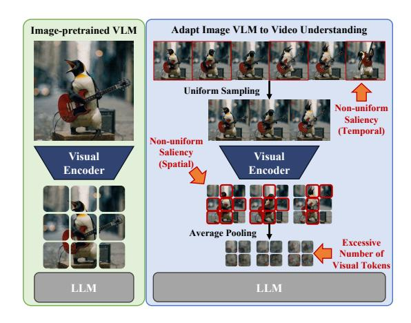
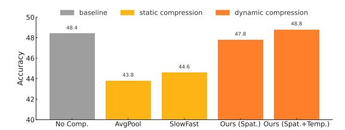
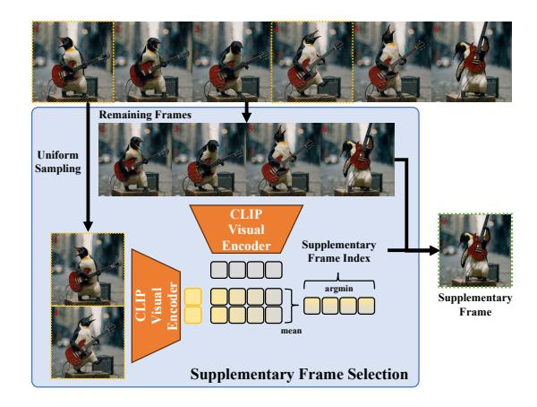
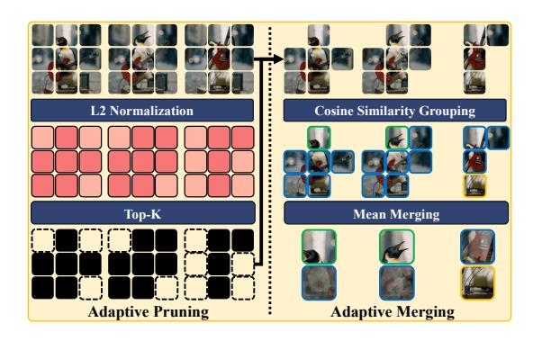

# D-CoDe: Scaling Image-Pretrained VLMs to Video via Dynamic Compression and Question Decomposition

### Yiyang Huang, Yizhou Wang, Yun Fu

Northeastern University huang.yiyan@northeastern.edu, yunfu@ece.neu.edu

### Abstract

Video large language models (Vid-LLMs), which excel in diverse video-language tasks, can be effectively constructed by adapting image-pretrained vision-language models (VLMs). However, this adaptation remains challenging, as it requires processing dense and temporally extended visual inputs that exceed the capacity of image-based models. This paper identifies the perception bottleneck and token overload as key challenges in extending image-based VLMs to the video domain. To address these issues, we propose D-CoDe, a training-free adaptation framework that incorporates dynamic compression and question decomposition. Specifically, dynamic compression alleviates the perception bottleneck through adaptive selection of representative frames and content-aware aggregation of spatial tokens, thereby reducing redundancy while preserving informative content. In parallel, question decomposition mitigates token overload by reformulating the original query into sub-questions, guiding the model to focus on distinct aspects of the video and enabling more comprehensive understanding. Experiments demonstrate that D-CoDe effectively improves video understanding across various benchmarks. Furthermore, strong performance on the challenging long-video benchmark highlights the potential of D-CoDe in handling complex video-language tasks. Code is available at <https://github.com/hukcc/D-CoDe>.

### 1 Introduction

Video large language models (Vid-LLMs) integrate video inputs with textual instructions and demonstrate strong performance across a wide range of video-language tasks. However, constructing Vid-LLMs directly from pre-trained large language models is constrained by the scarcity of high-quality video-text data [\(Zhao et al.,](#page-11-0) [2024\)](#page-11-0).

Figure 1: Adapting image-pretrained VLMs to video faces two major challenges: the perception bottleneck, in which salient information is unevenly distributed across spatial and temporal dimensions, limiting the effectiveness of static compression in preserving key visual cues; and token overload, where video inputs yield substantially more visual tokens than images, exceeding the model's capacity for comprehensive understanding.

A more data-efficient alternative is to adapt imagepretrained vision-language models (VLMs), leveraging the structural similarity between images and videos.

Approaches for adapting image-pretrained VLMs to video can be broadly divided into trainingrequired and training-free methods. Trainingrequired methods typically fine-tune the visual encoder or cross-modal connector [\(Li et al.,](#page-10-0) [2023c,](#page-10-0) [2024\)](#page-10-1), align visual features between images and videos [\(Lin et al.,](#page-10-2) [2024\)](#page-10-2), incorporate additional modalities to broaden task coverage [\(Zhang et al.,](#page-11-1) [2023;](#page-11-1) [Cheng et al.,](#page-9-0) [2024\)](#page-9-0), or apply techniques like Direct Preference Optimization (DPO) [\(Zhang](#page-11-2) [et al.,](#page-11-2) [2024\)](#page-11-2) and slow-fast architectures [\(Huang](#page-9-1) [et al.,](#page-9-1) [2024\)](#page-9-1) to enhance temporal modeling and factual consistency. Despite their effectiveness, these methods often incur high computational cost. In contrast, training-free methods leverage imagepretrained VLMs without additional tuning, yet

still achieve competitive performance. Representative examples include IG-VLM [\(Kim et al.,](#page-9-2) [2024\)](#page-9-2), which constructs a grid-view image from sampled frames; FreeVA [\(Wu,](#page-11-3) [2024a\)](#page-11-3), which performs frame-level temporal aggregation; SF-LLaVA [\(Xu](#page-11-4) [et al.,](#page-11-4) [2024\)](#page-11-4), which employs a slow-fast architecture; and TS-LLaVA [\(Qu et al.,](#page-10-3) [2024\)](#page-10-3), which adopts a thumbnail-and-sampling strategy to generate compact and informative visual prompts.

However, despite their efficiency, training-free methods face two key challenges that limit scalability: perception bottleneck and token overload, as shown in Figure [1.](#page-0-0) Perception bottleneck arises from static compression strategies such as uniform frame sampling and spatial average pooling, which treat all content equally and discard salient information unevenly distributed across temporal and spatial dimensions, thereby limiting the model's ability to capture fine-grained visual cues. Token overload, in turn, occurs when compressed video inputs still contain substantially more visual tokens than static images, exceeding the processing capacity of image-pretrained VLMs and hindering the modeling of long-range dependencies and complex spatio-temporal structures essential for comprehensive understanding.

To overcome these challenges, we propose D-CoDe, a training-free framework that extends image-pretrained VLMs to video understanding by integrating dynamic compression and question decomposition. Specifically, dynamic compression augments temporal uniform sampling by selecting supplementary frames from segments exhibiting greater semantic variation, then filters out uninformative spatial tokens and merges semantically similar ones, thereby reducing redundancy while preserving informative visual cues. In parallel, question decomposition enhances the model's capacity to interpret dense visual inputs by reformulating complex queries into focused sub-questions, guiding attention to distinct aspects of the video and enabling comprehensive understanding.

Experiments show that D-CoDe consistently improves performance across a range of video understanding benchmarks, including multiple-choice VideoQA (NExT-QA, EgoSchema, IntentQA) and open-ended VideoQA (MSVD-QA, MSRVTT-QA, TGIF-QA, ANet-QA), which cover diverse video types from first- and third-person perspectives and span durations from short clips to long-form content. Notably, D-CoDe is the first training-free method to surpass training-required models on

EgoSchema, a challenging benchmark involving long-form egocentric videos and schema-driven questions.

Our contributions are summarized as follows:

- We analyze the key challenges in adapting image-pretrained VLMs to video understanding, focusing on the perception bottleneck and token overload.
- We introduce D-CoDe, a training-free framework that addresses the perception bottleneck via content-aware dynamic compression and mitigates token overload through question decomposition.
- Extensive experiments across various benchmarks validate the effectiveness of D-CoDe. In particular, strong performance on the longvideo task highlights its potential for complex video-language understanding.

### 2 Related Work

# 2.1 Training-based Video-LLMs

Training-based Video-LLMs learn video understanding through fine-tuning image-pretrained VLMs on large-scale video datasets. Video-ChatGPT [\(Maaz et al.,](#page-10-4) [2024\)](#page-10-4) extends LLaVA [\(Liu](#page-10-5) [et al.,](#page-10-5) [2023\)](#page-10-5) with temporal and spatial pooling. VidF4 [\(Liang et al.,](#page-10-6) [2024\)](#page-10-6) enhances BLIP-2 with frame scoring for adaptive sampling. LongVU [\(Shen et al.,](#page-10-7) [2024\)](#page-10-7) applies query-guided frame selection and token merging across frames to compress videos. VideoChat [\(Li et al.,](#page-10-0) [2023c\)](#page-10-0) employs Q-Former for token compression, and VideoChat2 [\(Li et al.,](#page-10-1) [2024\)](#page-10-1) improves alignment and instruction tuning. Video-LLaVA [\(Lin et al.,](#page-10-2) [2024\)](#page-10-2) introduces a shared projector to unify image and video encoders. Video-LLaMA [\(Zhang et al.,](#page-11-1) [2023;](#page-11-1) [Cheng et al.,](#page-9-0) [2024\)](#page-9-0) integrates video, audio, and language for multimodal tasks. LLaVA-NeXT-Video [\(Zhang et al.,](#page-11-2) [2024\)](#page-11-2) fine-tunes LLaVA-NeXT [\(Liu et al.,](#page-10-8) [2024\)](#page-10-8) with DPO [\(Rafailov et al.,](#page-10-9) [2023\)](#page-10-9) to improve performance. LITA [\(Huang et al.,](#page-9-1) [2024\)](#page-9-1) adopts a slow-fast architecture [\(Feichten](#page-9-3)[hofer et al.,](#page-9-3) [2019;](#page-9-3) [Xiao et al.,](#page-11-5) [2020\)](#page-11-5) for spatiotemporal modeling. While effective, these methods are computationally expensive.

### 2.2 Training-free Video-LLMs

Training-free Video-LLMs, in contrast, extend image-pretrained VLMs to video without additional fine-tuning. IG-VLM [\(Kim et al.,](#page-9-2) [2024\)](#page-9-2) constructs a grid-view image from video frames

and feeds it into a frozen LLM with prompt-based adaptation. FreeVA (Wu, 2024a) explores temporal aggregation but relies on few frames. SF-LLaVA (Xu et al., 2024) applies a slow-fast design inspired by action recognition (Feichtenhofer et al., 2019; Xiao et al., 2020; Huang et al., 2024). TS-LLaVA (Qu et al., 2024) uses a thumbnail-and-sampling strategy to create compact visual prompts with supplementary tokens. While promising, few training-free approaches directly address the perception bottleneck caused by fixed compression strategies and the token overload resulting from the limited visual token capacity of image-pretrained VLMs, leaving a gap that this work aims to fill.

### 3 Method

### 3.1 Challenges in Image-to-Video Adaptation

Given that video inputs yield substantially more visual tokens than static images, effective token compression and comprehensive understanding of the resulting representations are crucial for adapting image-pretrained VLMs to video. However, the perception bottleneck hinders efficient compression with minimal information loss, while token overload limits comprehensive interpretation of the compressed tokens, as their number still exceeds the capacity of image-pretrained VLMs.

### 3.1.1 Perception Bottleneck

The perception bottleneck arises from static compression strategies such as uniform frame sampling and spatial average pooling, which, despite their efficiency, lack semantic adaptivity and tend to discard informative cues that are unevenly distributed across temporal and spatial dimensions. This limits the model's ability to capture fine-grained visual details. Figure 2a illustrates this issue by comparing the performance of the 7B LLaVA-NeXT model on the EgoSchema benchmark using 5 input frames under different compression strategies. Compared to the uncompressed baseline, static methods lead to notable performance degradation. In contrast, our dynamic compression alleviates this drop and even surpasses the baseline by reducing redundancy while preserving informative visual cues.

### 3.1.2 Token Overload

Token overload arises when video inputs, even after compression, contain substantially more visual tokens than static images, exceeding the processing capacity of image-pretrained VLMs. As a result, performance no longer improves with increas-

(a) Accuracy comparison on EgoSchema with 5 input frames. The X-axis denotes compression strategies; the Y-axis indicates accuracy.

(b) Accuracy of the baseline and its question decomposition variant on EgoSchema using 10 input frames, under varying visual token counts determined by different top-k activation retention ratios. The X-axis indicates the number of input tokens, and the Y-axis indicates accuracy.

Figure 2: (a) Static compression treats all content uniformly, discarding informative cues that are dynamically distributed across temporal and spatial dimensions, thereby limiting fine-grained perception. In contrast, dynamic compression better preserves key visual cues across both dimensions. (b) As the number of input tokens increases, the accuracy of the baseline saturates, indicating limited utility of excessive tokens. In contrast, question decomposition consistently expands the accuracy gap, demonstrating its ability to more effectively leverage large token inputs.

ing token count, as the model cannot effectively interpret the excess information. Figure 2b illustrates this effect by comparing the performance of the vanilla 7B LLaVA-NeXT and its question decomposition variant on EgoSchema using 10 input frames, under varying numbers of visual tokens determined by different top-k activation retention ratios. The vanilla model exhibits initial improvements followed by a performance plateau as the token count increases, indicating a typical token overload effect. In contrast, question decomposition consistently outperforms the baseline, with a widening accuracy gap that demonstrates superior scalability to larger token volumes.

# 3.2 D-CoDe: Dynamic Compression and Question Decomposition Adapting

Our observations suggest that the perception bottleneck and token overload hinder effective compression and interpretation of visual inputs, thus limiting the adaptation of image-pretrained VLMs

Figure 3: The D-CoDe pipeline consists of two components: dynamic compression and question decomposition. Dynamic compression augments temporal uniform sampling by selecting supplementary frames to retain informative segments, then discards uninformative spatial tokens and merges semantically similar ones to reduce redundancy while preserving essential visual information. Question decomposition reformulates complex queries into subquestions, guiding the model to attend to diverse aspects of the video and enabling comprehensive understanding.

to video understanding. To tackle these challenges, we introduce D-CoDe, a training-free framework that scales image-pretrained VLMs to video by integrating dynamic compression and question decomposition, as shown in Figure 3. The dynamic compression module augments uniform sampling with supplementary frames to retain informative segments, then filters out uninformative spatial tokens and merges semantically similar ones to balance semantic fidelity and token efficiency. The question decomposition module reformulates complex queries into focused sub-questions, guiding the model's attention to distinct aspects of the video and enabling comprehensive understanding.

### 3.2.1 Formulation of Video-LLM Inference

Let  $V = \{I_t\}_{t=1}^T$  denote a video consisting of T frames. For each frame  $I_t$ , visual features are extracted using a pretrained image encoder (e.g., CLIP (Radford et al., 2021)), yielding:

$$\mathbf{F}_t = \text{VisualEnc}(I_t).$$
 (1)

The resulting sequence of visual features is denoted as  $\mathbf{F}_{1:T} = \{\mathbf{F}_1, \mathbf{F}_2, \dots, \mathbf{F}_T\}$ . This visual representation, together with the query Q, is then provided to the LLM to generate the final answer:

$$A_{\text{final}} = \text{LLM}(\mathbf{F}_{1:T}, Q). \tag{2}$$

### 3.2.2 Dynamic Compression

As discussed in Section 3.1.1, the perception bottleneck stems from static compression strategies that fail to retain salient information unevenly distributed across temporal and spatial dimensions.

Figure 4: To mitigate the temporal perception bottleneck, that is, to avoid missing informative video content, supplementary frames are selected based on their semantic dissimilarity to uniformly sampled ones, where similarity is measured using global features extracted by the CLIP visual encoder.

To address this, we introduce dynamic compression, which integrates semantic-aware frame selection with adaptive spatial token pruning and merging, thereby enhancing fine-grained detail retention while reducing redundancy.

As illustrated in Figure 4, to adapt temporal granularity based on content complexity, a two-stage strategy is employed to select N representative frames from a video  $\mathcal V$  of T frames. In the first stage,  $\lfloor \alpha \cdot N \rfloor^1$  frames are uniformly sampled across the sequence, where  $\alpha \in (0,1)$  denotes the uniform sampling ratio, forming  $\mathcal V_{\text{uniform}}$  that provides coarse temporal coverage. To emphasize informative segments, the remaining  $(N-\lfloor \alpha \cdot N \rfloor)$  frames are iteratively selected from the unchosen candi-

dates. At each iteration, the frame with the lowest average semantic similarity to the current selected set  $V_{\text{selected}}$  is identified as the supplementary frame  $I^*$  and appended to  $V_{\text{selected}}$ :

$$I^* = \underset{I_m \in \mathcal{V} \setminus \mathcal{V}_{\text{selected}}}{\arg \min} \frac{1}{|\mathcal{V}_{\text{selected}}|} \sum_{I_n \in \mathcal{V}_{\text{selected}}} s_{m,n}. \quad (3)$$

Here,  $V_{\text{selected}}$  is initialized with  $V_{\text{uniform}}$ , and the similarity  $s_{m,n}$  between frames  $I_m$  and  $I_n$  is computed as the cosine similarity between their CLIP-based global features,  $\mathbf{g}_t = \text{CLIP}_{\mathbf{v}}(I_t)$ :

$$s_{t,t'} = \frac{\langle \mathbf{g}_t, \mathbf{g}_{t'} \rangle}{\|\mathbf{g}_t\|_2 \cdot \|\mathbf{g}_{t'}\|_2}, \quad \forall t, t' \in \{1, \dots, T\}.$$

The selection process continues until N frames are chosen, forming a frame set that balances temporal coverage and highlights informative segments.

Furthermore, to reduce spatial redundancy while preserving semantic information, token compression is applied to each selected frame, which involves pruning uninformative visual tokens based on their activation magnitudes and merging tokens according to their cosine similarity, as illustrated in Figure 5. Specifically, given a set of M visual tokens  $\mathbf{F} = \{\mathbf{f}_i\}_{i=1}^M$  extracted from a selected frame, the  $\ell_2$  norm of each token is computed as a proxy for salience, indicating its relative contribution to the overall visual representation:

$$a_i = \|\mathbf{f}_i\|_2. \tag{5}$$

The top- $\lfloor \beta \cdot M \rfloor$  tokens exhibiting the highest activation magnitudes are retained, where  $\beta \in (0,1)$  specifies the retention ratio:

$$\mathbf{F}_{\text{selected}} = \left\{ \mathbf{f}_j \mid j \in \text{TopK}\left( \{a_i\}_{i=1}^M, \lfloor \beta \cdot M \rfloor \right) \right\}.$$
(6)

To further eliminate redundancy within  $\mathbf{F}_{\text{selected}}$ , a greedy token merging algorithm is applied. Let  $\pi$  denote a permutation over the indices of  $\mathbf{F}_{\text{selected}}$  such that the tokens are sorted in descending order of activation magnitudes, i.e.,  $a_{\pi(1)} \geq a_{\pi(2)} \geq \cdots \geq a_{\pi(\lfloor \beta M \rfloor)}$ . The unmerged tokens are then traversed iteratively in the order defined by  $\pi$ , with each token considered as a potential anchor for redundancy merging. For each anchor token  $\mathbf{f}_{\pi(i)}$ , its cosine similarity with other unmerged tokens is computed as:

$$\operatorname{sim}(\mathbf{f}_{\pi(i)}, \mathbf{f}_j) = \frac{\langle \mathbf{f}_{\pi(i)}, \mathbf{f}_j \rangle}{\|\mathbf{f}_{\pi(i)}\|_2 \cdot \|\mathbf{f}_i\|_2}.$$
 (7)

Figure 5: To mitigate the spatial perception bottleneck, spatial tokens are first pruned based on their  $\ell_2$  activation magnitudes. The remaining informative tokens are then grouped according to cosine similarity and aggregated via mean pooling, thereby reducing redundancy while preserving semantic fidelity.

Based on the computed similarities, tokens whose similarity to the anchor exceeds a predefined threshold  $\tau \in (0,1)$  are deemed redundant and grouped with the anchor token  $\mathbf{f}_{\pi(i)}$  to form a redundancy cluster:

$$\mathcal{N}_{\pi(i)} = \left\{ j \neq \pi(i) \middle| \begin{array}{l} \sin(\mathbf{f}_{\pi(i)}, \mathbf{f}_j) \ge \tau, \\ \mathbf{f}_j \text{ is unmerged} \end{array} \right\}. \quad (8)$$

To consolidate the cluster, a representative token is obtained by averaging the anchor and its redundant counterparts:

$$\mathbf{f}_{\pi(i)}^{\text{rep}} = \frac{1}{1 + |\mathcal{N}_{\pi(i)}|} (\mathbf{f}_{\pi(i)} + \sum_{j \in \mathcal{N}_{\pi(i)}} \mathbf{f}_j). \quad (9)$$

After computing the representative token  $\mathbf{f}_{\pi(i)}^{\mathrm{rep}}$ , all tokens in the cluster  $\mathcal{N}_{\pi(i)}$  are marked as inactive and skipped in subsequent iterations. This process repeats until all tokens are either merged or selected as anchors, resulting in a compressed token set  $\mathbf{F}_{\mathrm{compressed}} = \{\mathbf{f}_{\pi(i)}^{\mathrm{rep}}\}$  for each selected frame.

To form the final visual representation, the compressed token sets from all N selected frames are concatenated as follows:

$$\mathbf{F}_{\text{final}} = \operatorname{Concat} \left( \mathbf{F}_{\text{compressed}}^{(k)} \right)_{k=1}^{N}.$$
 (10)

The resulting compact sequence is subsequently fed into the LLM for downstream processing.

### 3.2.3 Question Decomposition

Although dynamic compression reduces redundancy and preserves essential visual information, it still produces a number of visual tokens that exceed the capacity of image-pretrained VLMs. As

 $^1\lfloor \cdot \rfloor$  denotes the floor function, which rounds a value down to the nearest integer.

Table 1: Prompt Template for Question Decomposition

#### Question Decomposition Prompt

I am working on a video understanding task. Your job is to break down the given question into a series of subquestions that guide the model toward solving the problem. The subquestions should focus on temporal and dynamic aspects of the video, rather than just static information that could be answered from a single frame. I will provide a question, and you should output the corresponding subquestions in English.

Question: "{*user question here*}"

Output the subquestions as a Python list of strings.

a result, the model fails to comprehensively interpret the compressed tokens, a limitation known as token overload (Section [3.1.2\)](#page-2-2). To address this, we introduce question decomposition, which reformulates the original query into a sequence of focused sub-questions, directing the model's attention to distinct aspects of the video and enabling progressive understanding.

To implement this strategy, we construct a structured system prompt (Table [1\)](#page-5-0) to guide the generation of focused sub-questions. Given this prompt, a sequence of sub-questions is derived from the input query Q using a pretrained question decomposition LLM M with temperature t:

$$Q_1, Q_2, \dots, Q_n = \mathcal{M}(Q, t), \tag{11}$$

where each Qi targets a distinct aspect of the video, such as character location, actions, interactions, or scene transitions.

Subsequently, each sub-question Qi is independently processed by the LLM, conditioned on the shared visual input Ffinal:

$$A_i = \text{LLM}(\mathbf{F}_{\text{final}}, Q_i), \quad i = 1, 2, \dots, n. \quad (12)$$

Finally, the responses {A1, A2, . . . , An} are concatenated to form an auxiliary prompt segment. This aggregated textual input, together with the original query Q and the compressed visual token sequence Ffinal, is then fed into the LLM to generate the final answer:

$$A_{\text{final}} = \text{LLM}(\mathbf{F}_{\text{final}}, \text{Concat}(A_1, \dots, A_n), Q).$$
 (13)

### 4 Experiments

### 4.1 Benchmarks and Metrics

Multiple Choice VideoQA Benchmarks. The multiple choice setting tests model's ability to select the correct answer from a set of options. We

evaluate on three benchmarks: NExT-QA [\(Xiao](#page-11-6) [et al.,](#page-11-6) [2021\)](#page-11-6) for causal and temporal understanding, EgoSchema [\(Mangalam et al.,](#page-10-11) [2023\)](#page-10-11) for schemalevel interpretation in egocentric videos, and IntentQA [\(Li et al.,](#page-10-12) [2023a\)](#page-10-12) for intention recognition from subtle cues. Accuracy is used as the evaluation metric.

Open-Ended VideoQA Benchmarks. The open-ended setting requires generating natural language answers based on video content. We evaluate on four benchmarks: MSVD-QA [\(Chen and Dolan,](#page-9-4) [2011\)](#page-9-4), based on textual descriptions of short clips; MSRVTT-QA [\(Xu et al.,](#page-11-7) [2016\)](#page-11-7), featuring diverse web videos with complex scenes; TGIF-QA [\(Jang](#page-9-5) [et al.,](#page-9-5) [2019\)](#page-9-5), focusing on repetition counting and state transitions in GIFs; and ActivityNet-QA [\(Yu](#page-11-8) [et al.,](#page-11-8) [2019\)](#page-11-8) (abbreviated as ANet-QA), comprising long videos with rich activity semantics. Response quality is assessed using GPT-based metrics: GPT-Accuracy for factual correctness, and GPT-Score (0–5) for completeness and fluency. All evaluations use gpt-3.5-turbo-0125 for consistency [\(Wu,](#page-11-9) [2024b\)](#page-11-9).

### 4.2 Implementation Details

D-CoDe is built upon the image-pretrained LLaVA-NeXT [\(Liu et al.,](#page-10-8) [2024\)](#page-10-8) with 7B parameters. Following SF-LLaVA [\(Xu et al.,](#page-11-4) [2024\)](#page-11-4), we adopt rotary position embeddings (RoPE) [\(Su et al.,](#page-10-13) [2024\)](#page-10-13) with a scaling factor of 2 to extend the context length to 8192 tokens. For each input video, we sample N frames, where N is empirically determined based on the average video length of the corresponding dataset. All frames are uniformly resized to 336 × 336 to construct the visual input sequence. In the dynamic compression module, we use a uniform frame sampling ratio α = 0.85, retain salient tokens with a ratio β = 0.625, and merge semantically similar tokens using a cosine similarity threshold τ = 0.9. For question decomposition, we use gpt-3.5-turbo-0125 as the question decomposition LLM, with a temperature of t = 0.5 to balance diversity and consistency. The number of generated sub-questions n is not constrained. All experiments are conducted on a single NVIDIA RTX A6000 GPU.

### 4.3 Comparison on Multiple Choice VideoQA

Table [2](#page-6-0) summarizes the multiple choice VideoQA results. D-CoDe consistently outperforms all prior methods, including both training-free and trainingrequired models.

Table 2: Results on Multiple Choice Benchmarks

| Method                    | Multiple Choice VideoQA (Accuracy) NextQA EgoSchema |      | IntentQA |  |
|---------------------------|-----------------------------------------------------------|------|----------|--|
| Training-Required Methods |                                                           |      |          |  |
| Video-LLaVA               | 60.5                                                      | 37.0 | N/A      |  |
| Video-LLaMA2              | N/A                                                       | 51.7 | N/A      |  |
| MovieChat+                | 54.8                                                      | 56.4 | N/A      |  |
| Vista-LLaMA               | 60.7                                                      | N/A  | N/A      |  |
| Training-Free Methods     |                                                           |      |          |  |
| DeepStack-L               | 61.0                                                      | 38.4 | N/A      |  |
| M3                        | 63.1                                                      | 36.8 | 58.8     |  |
| IG-VLM                    | 63.1                                                      | 35.8 | 60.3     |  |
| SF-LLaVA                  | 64.2                                                      | 47.2 | 60.1     |  |
| TS-LLaVA                  | 66.5                                                      | 50.2 | 61.7     |  |
| D-CoDe (Ours)             | 68.3                                                      | 58.0 | 64.2     |  |

Notably, on EgoSchema, a challenging benchmark with long-form egocentric videos and schema-based questions where training-required models usually perform better, D-CoDe surpasses the second-best training-free method TS-LLaVA by 7.8%. It is also the first training-free model to outperform all training-required ones, exceeding the best of them, MovieChat+, by 1.6%. These results demonstrate the effectiveness of our question decomposition strategy for understanding complex video content.

### 4.4 Comparison on Open-Ended VideoQA

Table [3](#page-6-1) presents the open-ended VideoQA results. Compared to multiple-choice tasks, these benchmarks involve simpler questions, often asking what, who, or yes/no, which are less suitable for decomposition. Therefore, only the dynamic compression module is applied. Despite this, D-CoDe outperforms most existing methods, including both training-free and training-required models.

D-CoDe achieves the highest accuracy on MSVD-QA (80.0%) and TGIF-QA (79.1%), which focus on visual recognition and temporal reasoning, respectively. These results demonstrate its effectiveness in preserving fine-grained visual details. D-CoDe also performs well on the more challenging ActivityNet-QA, which consists of long videos with complex activities, reaching 56.4% accuracy and a GPT-Score of 3.4.

On MSRVTT-QA, D-CoDe performs slightly below SF-LLaVA and TS-LLaVA, likely due to the dataset's frequent scene transitions that favor models with slow-fast processing structures.

Table 3: Results on Open-Ended Benchmarks

| Method        | Open-Ended VideoQA (Accuracy/Score) |                       |          |          |  |  |
|---------------|-------------------------------------|-----------------------|----------|----------|--|--|
|               | MSVD                                | MSRVTT                | TGIF     | ANet     |  |  |
|               | Training-Required Methods           |                       |          |          |  |  |
| Video-LLaMA   | 51.6/2.5                            | 29.6/1.8              | N/A      | 12.4/1.1 |  |  |
| Video-LLaMA2  | 70.9/3.8                            | N/A                   | N/A      | 50.2/3.3 |  |  |
| Video-ChatGPT | 64.9/3.3                            | 49.3/2.8              | 51.4/3.0 | 35.2/2.7 |  |  |
| VideoGPT+     | 72.4/3.9                            | 60.6/3.6              | 74.6/4.1 | 50.6/3.6 |  |  |
| Video-LLaVA   | 70.7/3.9                            | 59.2/3.5              | 70.0/4.0 | 45.3/3.3 |  |  |
| MovieChat     | 75.2/3.8                            | 52.7/2.6              | N/A      | 45.7/3.4 |  |  |
| MovieChat+    | 76.5/3.9                            | 53.9/2.7              | N/A      | 48.1/3.4 |  |  |
| VideoChat     | 56.3/2.8                            | 45.0/2.5              | 34.4/2.3 | 26.5/2.2 |  |  |
| VideoChat2    | 70.0/3.9                            | 54.1/3.3              | N/A      | 49.1/3.3 |  |  |
| Vista-LLaMA   | 65.3/3.6                            | 60.5/3.3              | N/A      | 48.3/3.3 |  |  |
| LLaMA-VID     | 69.7/3.7                            | 57.7/3.2              | N/A      | 47.4/3.3 |  |  |
| PLLaVA        | 76.6/4.1                            | 62.0/3.5              | 77.5/4.1 | 56.3/3.5 |  |  |
|               |                                     | Training-Free Methods |          |          |  |  |
| FreeVA        | 73.8/4.1                            | 60.0/3.5              | N/A      | 51.2/3.5 |  |  |
| DeepStack-L   | 76.0/4.0                            | N/A                   | N/A      | 49.3/3.1 |  |  |
| IG-VLM        | 78.8/4.1                            | 63.7/3.5              | 73.0/4.0 | 54.3/3.4 |  |  |
| SF-LLaVA      | 79.1/4.1                            | 65.8/3.6              | 78.7/4.2 | 55.5/3.4 |  |  |
| TS-LLaVA      | 79.0/4.1                            | 65.1/3.6              | 77.7/4.1 | 56.7/3.4 |  |  |
| D-CoDe (Ours) | 80.0/4.1                            | 64.2/3.5              | 79.1/4.1 | 56.4/3.4 |  |  |

Table 4: Module Ablation on EgoSchema

| Module                              | Acc. (↑) |
|-------------------------------------|----------|
| Baseline                            | 44.8     |
| + dynamic spatial token compression | 50.6     |
| + dynamic temporal frame selection  | 51.8     |
| + question decomposition            | 58.0     |

### 4.5 Ablation Study

Module Ablation. We evaluate the contribution of each component in D-CoDe through ablation studies on the EgoSchema dataset using 15 input frames. As shown in Table [4,](#page-6-2) all modules contribute incremental performance gains. The baseline adopts the naive training-free extension of LLaVA-NeXT from [\(Zhang et al.,](#page-11-2) [2024\)](#page-11-2), which employs uniform frame sampling and spatial average pooling, yielding 44.8% accuracy. Introducing dynamic spatial token compression increases accuracy to 50.6% by removing redundancy while preserving salient visual cues. Incorporating dynamic temporal frame selection further improves performance to 51.8% by prioritizing semantically diverse frames. Finally, applying question decomposition raises accuracy to 58.0%, highlighting its effectiveness in guiding the model to focus on distinct semantic aspects of video.

Sampling Strategy Ablation. As shown in Table [5,](#page-7-0) we evaluate frame sampling strategies on EgoSchema with D-CoDe without question decomposition. Compared to uniform sampling, questionaware sampling [\(Wang et al.,](#page-11-10) [2023,](#page-11-10) [2024b\)](#page-10-14) yields

Table 5: Sampling Strategy Ablation on EgoSchema

| Key Frame Sampling Strategy          | Acc. (↑) |
|--------------------------------------|----------|
| Uniform Sampling                     | 50.6     |
| Question-aware Sampling              | 51.4     |
| Supplementary Frame Selection (Ours) | 51.8     |

Table 6: Compression Range Ablation on EgoSchema

| Spatial Mergeable Distance Constraint | Acc. (↑) |
|---------------------------------------|----------|
| ≤ 4 neighboring tokens                | 51.4     |
| ≤ 5 neighboring tokens                | 51.4     |
| ≤ 6 neighboring tokens                | 52.0     |
| no constraint (Ours)                  | 51.8     |

higher accuracy by selecting frames most semantically similar to the question using CLIP, but still performs worse than our diverse-based supplementary frame selection. This is because questionaware sampling overemphasizes query-relevant segments, limiting broader temporal modeling, whereas our method preserves more diverse visual information and thereby enhances video understanding.

Compression Range Ablation. We evaluate spatial compression range by introducing a patch distance constraint and testing on EgoSchema with D-CoDe without question decomposition. As shown in Table [6,](#page-7-1) restricting merges within 5 patches reduces accuracy, while relaxing the constraint to 6 patches improves performance. These results indicate that narrow merge ranges fail to compress redundant tokens effectively and hinder comprehension, whereas broader ranges reduce redundancy while preserving spatial structure, leading to improved video understanding.

Decomposition Prompt Ablation. As shown in Table [7,](#page-7-2) we evaluate prompt variants on EgoSchema. Removing task and background explanation drops accuracy, underscoring the value of contextual guidance. Excluding "temporal and dynamic aspects" lowers performance, confirming the importance of temporal cues. By contrast, rephrasing with different wording yields better accuracy, suggesting that performance is determined by semantic content and is robust to structural or wording variations.

Decomposed Content Ablation. Table [8](#page-7-3) evaluates the impact of decomposed content on EgoSchema. Compared with no question decomposition (None), sub-questions reduce accuracy, whereas sub-answers yield the best performance. These results indicate that the gain mainly derives

Table 7: Prompt Ablation on EgoSchema

| Prompt Variant                              | Acc. (↑) |
|---------------------------------------------|----------|
| Default (Ours, as shown in Table 1)         | 58.0     |
| No task/background explanation              | 53.2     |
| Removed "temporal and dynamic aspects"      | 54.8     |
| Rephrased (same meaning, different wording) | 58.4     |

Table 8: Decomposed Content Ablation on EgoSchema

| Decomposed Content                | Acc. (↑) |
|-----------------------------------|----------|
| None (w/o Question Decomposition) | 51.8     |
| Sub-Questions                     | 50.4     |
| Sub-Answers (Ours)                | 58.0     |

from intermediate answers rather than the structured thought process, as sub-answers provide more diverse supporting content for video understanding.

Visualization. Figure [6](#page-8-0) and Figure [7](#page-8-1) visualize the effect of D-CoDe's dynamic compression along the temporal and spatial dimensions, respectively. In the temporal dimension, supplementary frames (green), selected based on maximal semantic difference from uniformly sampled frames (yellow), enhance temporal diversity and reduce the risk of missing key actions due to fixed-interval sampling. In the spatial dimension, low-saliency tokens are discarded, while the remaining ones are clustered and merged based on semantic similarity, preserving essential content and significantly reducing redundancy. Figure [8](#page-8-2) presents a comparison of the baseline model's attention distribution over the same visual input when prompted with the original question and its decomposed sub-questions. The observed shift in attention peaks suggests that question decomposition effectively guides the model to focus on distinct aspects of the inputs.

# 5 Conclusion

In this paper, we investigate two key challenges in adapting image-pretrained VLMs to video understanding: the perception bottleneck, which arises from static compression strategies that uniformly process visual inputs and discard salient cues unevenly distributed across temporal and spatial dimensions; and token overload, which occurs when video inputs yield significantly more tokens than images, exceeding the model's capacity for comprehensive understanding. To address these challenges, we propose D-CoDe, a training-free adaptation framework that combines dynamic compression with question decomposition. Dynamic compression alleviates the perception bottleneck by

Figure 6: Dynamic Compression (Temporal): To complement uniform sampling (yellow), supplementary frames (green) are selected from the remaining video frames based on semantic dissimilarity, thereby enhancing temporal diversity in the visual input.

Figure 7: Dynamic Compression (Spatial): Tokens with low salience (black) are removed, and the remaining tokens are semantically clustered (indicated by color) and merged, minimizing redundancy while preserving essential visual information.

adaptively selecting representative frames and performing content-aware spatial token pruning and merging, thereby preserving detail while reducing redundancy. In parallel, question decomposition mitigates token overload by reformulating complex queries into focused sub-questions that guide the model to attend to distinct aspects of the video, enabling comprehensive understanding. Experiments demonstrate that D-CoDe significantly improves performance on VideoQA benchmarks and shows strong potential for complex video-language tasks.

### Limitations

The main limitation of D-CoDe lies in its relatively lower performance on videos with frequent scene transitions, compared to models employing slowfast structures. Although D-CoDe efficiently compresses visual input and preserves key information, it still faces a trade-off between temporal and spatial retention, a limitation less evident in models such as SF-LLaVA and TS-LLaVA. To address this, future work could explore integrating a slow-fast architecture into D-CoDe to better balance temporal and spatial modeling. Additionally, incorporating a memory bank, which is commonly used in Vid-LLMs to enhance temporal awareness and

Figure 8: Visualization of the impact of different queries on the attention distribution of the baseline model over the same visual input on IntentQA with 5 input frames. The baseline adopts the naive training-free extension of LLaVA-NeXT proposed in [\(Zhang et al.,](#page-11-2) [2024\)](#page-11-2).

maintain long-range context, may further improve the model's ability to handle complex video inputs.

Another limitation is the difficulty in understanding durations and timestamps, a common challenge for Vid-LLMs [\(Imam et al.,](#page-9-6) [2025\)](#page-9-6). While D-CoDe handles relative temporal reasoning well, precise temporal understanding remains difficult for these training-free frameworks. Addressing this may require task-specific training or architectural modifications, as shown in LLaVA-ST [\(Li et al.,](#page-10-15) [2025\)](#page-10-15).

### Ethics Statement

The outputs of D-CoDe may occasionally contain biased or inappropriate content, potentially due to underlying biases in the base model LLaVA-NeXT [\(Liu et al.,](#page-10-8) [2024\)](#page-10-8). These outputs do not reflect the authors' views. As with other generative AI systems, D-CoDe raises important ethical concerns related to content reliability and fairness. We encourage future work to implement safeguards such as dataset auditing, bias evaluation, and content attribution (e.g., watermarking), and to prioritize responsible deployment practices that balance innovation with societal impact.

### Acknowledgment

This material is based upon work supported by the Air Force Office of Scientific Research under award number FA9550-23-1-0290.

# References

- Jean-Baptiste Alayrac, Jeff Donahue, Pauline Luc, Antoine Miech, Iain Barr, Yana Hasson, Karel Lenc, Arthur Mensch, Katherine Millican, Malcolm Reynolds, Roman Ring, Eliza Rutherford, Serkan Cabi, Tengda Han, Zhitao Gong, Sina Samangooei, Marianne Monteiro, Jacob L. Menick, Sebastian Borgeaud, Andy Brock, Aida Nematzadeh, Sahand Sharifzadeh, Mikolaj Binkowski, Ricardo Barreira, Oriol Vinyals, Andrew Zisserman, and Karén Simonyan. 2022. Flamingo: a visual language model for few-shot learning. In *NeurIPS*.
- Jinze Bai, Shuai Bai, Yunfei Chu, Zeyu Cui, Kai Dang, Xiaodong Deng, Yang Fan, Wenbin Ge, Yu Han, Fei Huang, Binyuan Hui, Luo Ji, Mei Li, Junyang Lin, Runji Lin, Dayiheng Liu, Gao Liu, Chengqiang Lu, Keming Lu, Jianxin Ma, Rui Men, Xingzhang Ren, Xuancheng Ren, Chuanqi Tan, Sinan Tan, Jianhong Tu, Peng Wang, Shijie Wang, Wei Wang, Shengguang Wu, Benfeng Xu, Jin Xu, An Yang, Hao Yang, Jian Yang, Shusheng Yang, Yang Yao, Bowen Yu, Hongyi Yuan, Zheng Yuan, Jianwei Zhang, Xingxuan Zhang, Yichang Zhang, Zhenru Zhang, Chang Zhou, Jingren Zhou, Xiaohuan Zhou, and Tianhang Zhu. 2023a. Qwen technical report. *CoRR*, abs/2309.16609.
- Jinze Bai, Shuai Bai, Shusheng Yang, Shijie Wang, Sinan Tan, Peng Wang, Junyang Lin, Chang Zhou, and Jingren Zhou. 2023b. Qwen-vl: A frontier large vision-language model with versatile abilities. *CoRR*, abs/2308.12966.
- Shuai Bai, Keqin Chen, Xuejing Liu, Jialin Wang, Wenbin Ge, Sibo Song, Kai Dang, Peng Wang, Shijie Wang, Jun Tang, Humen Zhong, Yuanzhi Zhu, Ming-Hsuan Yang, Zhaohai Li, Jianqiang Wan, Pengfei Wang, Wei Ding, Zheren Fu, Yiheng Xu, Jiabo Ye, Xi Zhang, Tianbao Xie, Zesen Cheng, Hang Zhang, Zhibo Yang, Haiyang Xu, and Junyang Lin. 2025. Qwen2.5-vl technical report. *CoRR*, abs/2502.13923.
- Tom B. Brown, Benjamin Mann, Nick Ryder, Melanie Subbiah, Jared Kaplan, Prafulla Dhariwal, Arvind Neelakantan, Pranav Shyam, Girish Sastry, Amanda Askell, Sandhini Agarwal, Ariel Herbert-Voss, Gretchen Krueger, Tom Henighan, Rewon Child, Aditya Ramesh, Daniel M. Ziegler, Jeffrey Wu, Clemens Winter, Christopher Hesse, Mark Chen, Eric Sigler, Mateusz Litwin, Scott Gray, Benjamin Chess, Jack Clark, Christopher Berner, Sam McCandlish, Alec Radford, Ilya Sutskever, and Dario Amodei. 2020. Language models are few-shot learners. In *NeurIPS*.
- David Chen and William B Dolan. 2011. Collecting highly parallel data for paraphrase evaluation. In *Proceedings of the 49th annual meeting of the association for computational linguistics: human language technologies*, pages 190–200.
- Zesen Cheng, Sicong Leng, Hang Zhang, Yifei Xin, Xin Li, Guanzheng Chen, Yongxin Zhu, Wenqi Zhang, Ziyang Luo, Deli Zhao, and Lidong Bing. 2024.

- Videollama 2: Advancing spatial-temporal modeling and audio understanding in video-llms. *CoRR*, abs/2406.07476.
- Wei-Lin Chiang, Zhuohan Li, Zi Lin, Ying Sheng, Zhanghao Wu, Hao Zhang, Lianmin Zheng, Siyuan Zhuang, Yonghao Zhuang, Joseph E Gonzalez, et al. 2023. Vicuna: An open-source chatbot impressing gpt-4 with 90%\* chatgpt quality. *See https://vicuna. lmsys. org (accessed 14 April 2023)*, 2(3):6.
- Aakanksha Chowdhery, Sharan Narang, Jacob Devlin, Maarten Bosma, Gaurav Mishra, Adam Roberts, Paul Barham, Hyung Won Chung, Charles Sutton, Sebastian Gehrmann, Parker Schuh, Kensen Shi, Sasha Tsvyashchenko, Joshua Maynez, Abhishek Rao, Parker Barnes, Yi Tay, Noam Shazeer, Vinodkumar Prabhakaran, Emily Reif, Nan Du, Ben Hutchinson, Reiner Pope, James Bradbury, Jacob Austin, Michael Isard, Guy Gur-Ari, Pengcheng Yin, Toju Duke, Anselm Levskaya, Sanjay Ghemawat, Sunipa Dev, Henryk Michalewski, Xavier Garcia, Vedant Misra, Kevin Robinson, Liam Fedus, Denny Zhou, Daphne Ippolito, David Luan, Hyeontaek Lim, Barret Zoph, Alexander Spiridonov, Ryan Sepassi, David Dohan, Shivani Agrawal, Mark Omernick, Andrew M. Dai, Thanumalayan Sankaranarayana Pillai, Marie Pellat, Aitor Lewkowycz, Erica Moreira, Rewon Child, Oleksandr Polozov, Katherine Lee, Zongwei Zhou, Xuezhi Wang, Brennan Saeta, Mark Diaz, Orhan Firat, Michele Catasta, Jason Wei, Kathy Meier-Hellstern, Douglas Eck, Jeff Dean, Slav Petrov, and Noah Fiedel. 2023. Palm: Scaling language modeling with pathways. *J. Mach. Learn. Res.*, 24:240:1– 240:113.
- Christoph Feichtenhofer, Haoqi Fan, Jitendra Malik, and Kaiming He. 2019. Slowfast networks for video recognition. In *ICCV*, pages 6201–6210. IEEE.
- Fabrizio Gilardi, Meysam Alizadeh, and Maël Kubli. 2023. Chatgpt outperforms crowd-workers for textannotation tasks. *CoRR*, abs/2303.15056.
- De-An Huang, Shijia Liao, Subhashree Radhakrishnan, Hongxu Yin, Pavlo Molchanov, Zhiding Yu, and Jan Kautz. 2024. LITA: language instructed temporallocalization assistant. In *ECCV (64)*, volume 15122 of *Lecture Notes in Computer Science*, pages 202– 218. Springer.
- Mohamed Fazli Mohamed Imam, Chenyang Lyu, and Alham Fikri Aji. 2025. Can multimodal llms do visual temporal understanding and reasoning? the answer is no! *CoRR*, abs/2501.10674.
- Yunseok Jang, Yale Song, Chris Dongjoo Kim, Youngjae Yu, Youngjin Kim, and Gunhee Kim. 2019. Video question answering with spatio-temporal reasoning. *IJCV*, 127(10):1385–1412.
- Wonkyun Kim, Changin Choi, Wonseok Lee, and Wonjong Rhee. 2024. An image grid can be worth a video: Zero-shot video question answering using a VLM. *IEEE Access*, 12:193057–193075.

- Hongyu Li, Jinyu Chen, Ziyu Wei, Shaofei Huang, Tianrui Hui, Jialin Gao, Xiaoming Wei, and Si Liu. 2025. Llava-st: A multimodal large language model for finegrained spatial-temporal understanding. In *CVPR*, pages 8592–8603.
- Jiapeng Li, Ping Wei, Wenjuan Han, and Lifeng Fan. 2023a. Intentqa: Context-aware video intent reasoning. In *Proceedings of the IEEE/CVF international conference on computer vision*, pages 11963–11974.
- Junnan Li, Dongxu Li, Silvio Savarese, and Steven C. H. Hoi. 2023b. BLIP-2: bootstrapping language-image pre-training with frozen image encoders and large language models. In *ICML*, volume 202 of *Proceedings of Machine Learning Research*, pages 19730–19742. PMLR.
- Kunchang Li, Yinan He, Yi Wang, Yizhuo Li, Wenhai Wang, Ping Luo, Yali Wang, Limin Wang, and Yu Qiao. 2023c. Videochat: Chat-centric video understanding. *CoRR*, abs/2305.06355.
- Kunchang Li, Yali Wang, Yinan He, Yizhuo Li, Yi Wang, Yi Liu, Zun Wang, Jilan Xu, Guo Chen, Ping Lou, Limin Wang, and Yu Qiao. 2024. Mvbench: A comprehensive multi-modal video understanding benchmark. In *CVPR*, pages 22195– 22206. IEEE.
- Jianxin Liang, Xiaojun Meng, Yueqian Wang, Chang Liu, Qun Liu, and Dongyan Zhao. 2024. Endto-end video question answering with frame scoring mechanisms and adaptive sampling. *CoRR*, abs/2407.15047.
- Bin Lin, Yang Ye, Bin Zhu, Jiaxi Cui, Munan Ning, Peng Jin, and Li Yuan. 2024. Video-llava: Learning united visual representation by alignment before projection. In *EMNLP*, pages 5971–5984. Association for Computational Linguistics.
- Haotian Liu, Chunyuan Li, Yuheng Li, Bo Li, Yuanhan Zhang, Sheng Shen, and Yong Jae Lee. 2024. [Llava](https://llava-vl.github.io/blog/2024-01-30-llava-next/)[next: Improved reasoning, ocr, and world knowledge.](https://llava-vl.github.io/blog/2024-01-30-llava-next/)
- Haotian Liu, Chunyuan Li, Qingyang Wu, and Yong Jae Lee. 2023. Visual instruction tuning. In *NeurIPS*.
- Muhammad Maaz, Hanoona Abdul Rasheed, Salman Khan, and Fahad Khan. 2024. Video-chatgpt: Towards detailed video understanding via large vision and language models. In *ACL (1)*, pages 12585– 12602. Association for Computational Linguistics.
- Karttikeya Mangalam, Raiymbek Akshulakov, and Jitendra Malik. 2023. Egoschema: A diagnostic benchmark for very long-form video language understanding. *Advances in Neural Information Processing Systems*, 36:46212–46244.
- Brandon McKinzie, Zhe Gan, Jean-Philippe Fauconnier, Sam Dodge, Bowen Zhang, Philipp Dufter, Dhruti Shah, Xianzhi Du, Futang Peng, Anton Belyi, Haotian Zhang, Karanjeet Singh, Doug Kang, Hongyu

- Hè, Max Schwarzer, Tom Gunter, Xiang Kong, Aonan Zhang, Jianyu Wang, Chong Wang, Nan Du, Tao Lei, Sam Wiseman, Mark Lee, Zirui Wang, Ruoming Pang, Peter Grasch, Alexander Toshev, and Yinfei Yang. 2024. MM1: methods, analysis and insights from multimodal LLM pre-training. In *ECCV*, volume 15087, pages 304–323.
- Tingyu Qu, Mingxiao Li, Tinne Tuytelaars, and Marie-Francine Moens. 2024. Ts-llava: Constructing visual tokens through thumbnail-and-sampling for training-free video large language models. *CoRR*, abs/2411.11066.
- Alec Radford, Jong Wook Kim, Chris Hallacy, Aditya Ramesh, Gabriel Goh, Sandhini Agarwal, Girish Sastry, Amanda Askell, Pamela Mishkin, Jack Clark, Gretchen Krueger, and Ilya Sutskever. 2021. Learning transferable visual models from natural language supervision. In *ICML*, volume 139 of *Proceedings of Machine Learning Research*, pages 8748–8763. PMLR.
- Rafael Rafailov, Archit Sharma, Eric Mitchell, Christopher D. Manning, Stefano Ermon, and Chelsea Finn. 2023. Direct preference optimization: Your language model is secretly a reward model. In *NeurIPS*.
- Xiaoqian Shen, Yunyang Xiong, Changsheng Zhao, Lemeng Wu, Jun Chen, Chenchen Zhu, Zechun Liu, Fanyi Xiao, Balakrishnan Varadarajan, Florian Bordes, Zhuang Liu, Hu Xu, Hyunwoo J. Kim, Bilge Soran, Raghuraman Krishnamoorthi, Mohamed Elhoseiny, and Vikas Chandra. 2024. Longvu: Spatiotemporal adaptive compression for long video-language understanding. *CoRR*, abs/2410.17434.
- Jianlin Su, Murtadha H. M. Ahmed, Yu Lu, Shengfeng Pan, Wen Bo, and Yunfeng Liu. 2024. Roformer: Enhanced transformer with rotary position embedding. *Neurocomputing*, 568:127063.
- Hugo Touvron, Thibaut Lavril, Gautier Izacard, Xavier Martinet, Marie-Anne Lachaux, Timothée Lacroix, Baptiste Rozière, Naman Goyal, Eric Hambro, Faisal Azhar, Aurélien Rodriguez, Armand Joulin, Edouard Grave, and Guillaume Lample. 2023. Llama: Open and efficient foundation language models. *CoRR*, abs/2302.13971.
- Peng Wang, Shuai Bai, Sinan Tan, Shijie Wang, Zhihao Fan, Jinze Bai, Keqin Chen, Xuejing Liu, Jialin Wang, Wenbin Ge, Yang Fan, Kai Dang, Mengfei Du, Xuancheng Ren, Rui Men, Dayiheng Liu, Chang Zhou, Jingren Zhou, and Junyang Lin. 2024a. Qwen2-vl: Enhancing vision-language model's perception of the world at any resolution. *CoRR*, abs/2409.12191.
- Xiaohan Wang, Yuhui Zhang, Orr Zohar, and Serena Yeung-Levy. 2024b. Videoagent: Long-form video understanding with large language model as agent. In *ECCV (80)*, volume 15138 of *Lecture Notes in Computer Science*, pages 58–76. Springer.

- Yizhou Wang, Ruiyi Zhang, Haoliang Wang, Uttaran Bhattacharya, Yun Fu, and Gang Wu. 2023. Vaquita: Enhancing alignment in llm-assisted video understanding. *CoRR*, abs/2312.02310.
- Wenhao Wu. 2024a. Freeva: Offline MLLM as trainingfree video assistant. *CoRR*, abs/2405.07798.
- Wenhao Wu. 2024b. Freeva: Offline mllm as training-free video assistant. *arXiv preprint arXiv:2405.07798*.
- Fanyi Xiao, Yong Jae Lee, Kristen Grauman, Jitendra Malik, and Christoph Feichtenhofer. 2020. Audiovisual slowfast networks for video recognition. *CoRR*, abs/2001.08740.
- Junbin Xiao, Xindi Shang, Angela Yao, and Tat-Seng Chua. 2021. Next-qa: Next phase of questionanswering to explaining temporal actions. In *Proceedings of the IEEE/CVF conference on computer vision and pattern recognition*, pages 9777–9786.
- Jun Xu, Tao Mei, Ting Yao, and Yong Rui. 2016. Msrvtt: A large video description dataset for bridging video and language. In *Proceedings of the IEEE conference on computer vision and pattern recognition*, pages 5288–5296.
- Mingze Xu, Mingfei Gao, Zhe Gan, Hong-You Chen, Zhengfeng Lai, Haiming Gang, Kai Kang, and Afshin Dehghan. 2024. Slowfast-llava: A strong training-free baseline for video large language models. *CoRR*, abs/2407.15841.
- Zhou Yu, Dejing Xu, Jun Yu, Ting Yu, Zhou Zhao, Yueting Zhuang, and Dacheng Tao. 2019. Activitynetqa: A dataset for understanding complex web videos via question answering. In *AAAI*, pages 9127–9134. AAAI Press.
- Hang Zhang, Xin Li, and Lidong Bing. 2023. Videollama: An instruction-tuned audio-visual language model for video understanding. In *EMNLP (Demos)*, pages 543–553. Association for Computational Linguistics.
- Yuanhan Zhang, Bo Li, haotian Liu, Yong jae Lee, Liangke Gui, Di Fu, Jiashi Feng, Ziwei Liu, and Chunyuan Li. 2024. [Llava-next: A strong zero-shot](https://llava-vl.github.io/blog/2024-04-30-llava-next-video/) [video understanding model.](https://llava-vl.github.io/blog/2024-04-30-llava-next-video/)
- Yue Zhao, Long Zhao, Xingyi Zhou, Jialin Wu, Chun-Te Chu, Hui Miao, Florian Schroff, Hartwig Adam, Ting Liu, Boqing Gong, Philipp Krähenbühl, and Liangzhe Yuan. 2024. Distilling vision-language models on millions of videos. In *CVPR*, pages 13106– 13116. IEEE.

Table 9: Ablation of α

Table 10: Ablation of β

| α                    | Acc. (↑)             | β                       | Acc. (↑)             |
|----------------------|----------------------|-------------------------|----------------------|
| 0.80 0.85 0.90 | 57.2 58.0 57.0 | 0.575 0.600 0.625 | 56.6 56.4 58.0 |
| 0.95                 | 56.2                 | 0.650                   | 56.2                 |

Table 11: Ablation of τ

Table 12: Ablation of t

| τ    | Acc. (↑) | t   | Acc. (↑) |
|------|----------|-----|----------|
| 0.80 | 55.0     | 0.3 | 56.0     |
| 0.85 | 55.6     | 0.5 | 58.0     |
| 0.90 | 58.0     | 0.7 | 56.2     |
| 0.95 | 57.0     | 0.9 | 56.4     |

# A More Background

### A.1 Image-pretrained VLMs

Image-pretrained vision-language models (VLMs) combine large language models (LLMs)[\(Bai et al.,](#page-9-7) [2023a;](#page-9-7) [Brown et al.,](#page-9-8) [2020;](#page-9-8) [Chiang et al.,](#page-9-9) [2023;](#page-9-9) [Chowdhery et al.,](#page-9-10) [2023;](#page-9-10) [Gilardi et al.,](#page-9-11) [2023;](#page-9-11) [Tou](#page-10-16)[vron et al.,](#page-10-16) [2023\)](#page-10-16) with visual encoders such as CLIP[\(Radford et al.,](#page-10-10) [2021\)](#page-10-10), enabling effective image-text alignment and multimodal understanding. As a pioneer, Flamingo [\(Alayrac et al.,](#page-9-12) [2022\)](#page-9-12) introduces interleaved vision-language modeling for open-ended generation. BLIP-2 [\(Li et al.,](#page-10-17) [2023b\)](#page-10-17) employs Q-Former to align frozen vision and language models. LLaVA and its extensions [\(Liu et al.,](#page-10-5) [2023,](#page-10-5) [2024\)](#page-10-8) integrate lightweight connectors with instruction tuning to bridge modalities efficiently. Qwen-VL [\(Bai et al.,](#page-9-13) [2023b;](#page-9-13) [Wang](#page-10-18) [et al.,](#page-10-18) [2024a;](#page-10-18) [Bai et al.,](#page-9-14) [2025\)](#page-9-14) connects a visual encoder to the Qwen language model via crossattention, supporting high-resolution and multilingual reasoning. Most recently, MM1 [\(McK](#page-10-19)[inzie et al.,](#page-10-19) [2024\)](#page-10-19) provides a systematic analysis of model scaling and data design for efficient VLM training.

### B Hyper-Parameters Ablation

### B.1 Effect of α in Dynamic Compression

Table [9](#page-12-0) presents the results of an ablation study on α, which controls the uniform sampling ratio in temporal dynamic compression. The results show that accuracy on the EgoSchema benchmark increases significantly as α decreases from 0.95 to 0.85. This suggests that selecting supplementary key frames to emphasize informative segments enhances the video understanding ability of image-pretrained VLMs. However, when α continues to decrease, the number of uniformly sampled frames becomes insufficient, weakening the model's global perception of the video and leading to performance degradation.

### B.2 Effect of β in Dynamic Compression

Table [10](#page-12-0) presents the results of an ablation study on β, which controls the proportion of spatial tokens retained during pruning. A larger β corresponds to more aggressive pruning, keeping only highly activated tokens. As β increases, the accuracy on the EgoSchema benchmark first rises and then falls, indicating that retaining too few tokens harms the model's understanding of visual content, while retaining too many introduces redundant noise.

### B.3 Effect of τ in Dynamic Compression

Table [11](#page-12-0) presents the results of an ablation study on τ , the cosine similarity threshold used for token merging. A smaller τ results in more tokens being grouped and merged. As τ increases, accuracy on the EgoSchema benchmark follows a rise-then-fall trend. This is because merging low-similarity tokens can blur critical visual details, while merging only highly similar tokens leads to token redundancy, both of which hinder model performance.

### B.4 Effect of t in Question Decomposition

Table [12](#page-12-0) presents the results of an ablation study on t, which controls the diversity of sub-questions generated during question decomposition. A larger t results in more diverse sub-questions. Accuracy on the EgoSchema benchmark initially improves as t increases, but eventually declines. This indicates that both insufficient and excessive diversity can impair the model's ability to comprehensively interpret large volumes of visual tokens.

# C Additional Module Ablation

Table [13](#page-13-0) reports module-wise ablations on additional benchmarks, including NExT-QA, IntentQA, MSVD, MSRVTT, TGIF, and ANet. For multichoice VideoQA, all modules yield incremental gains. For open-ended VideoQA, where questions are generally simpler (Section [4.4\)](#page-6-3), question decomposition can mislead the model.

Table [14](#page-13-1) shows an MSVD case where decomposition, though semantically valid, overcomplicates a simple spatial query and lowers accuracy. This indicates that decomposition is most effective for complex or multi-step reasoning.

Table 13: Module Ablation on Other Benchmarks.

| Module                              | Multi-choice VideoQA (Acc., ↑) |          | Open-ended VideoQA (Acc./Score, ↑) |          |          |          |
|-------------------------------------|--------------------------------|----------|------------------------------------|----------|----------|----------|
|                                     | NExT-QA                        | IntentQA | MSVD                               | MSRVTT   | TGIF     | ANet     |
| Baseline                            | 65.4                           | 61.3     | 77.8/4.0                           | 62.8/3.5 | 76.9/4.0 | 54.2/3.3 |
| + Dynamic Spatial Token Compression | 66.7                           | 62.2     | 79.4/4.0                           | 63.6/3.5 | 78.9/4.1 | 55.4/3.3 |
| + Dynamic Temporal Frame Selection  | 67.0                           | 62.9     | 80.0/4.1                           | 64.2/3.5 | 79.1/4.1 | 56.4/3.4 |
| + Question Decomposition            | 68.3                           | 64.2     | 72.4/3.8                           | 62.2/3.5 | 75.7/4.0 | 53.8/3.3 |

Table 14: Question Decomposition Example on MSVD

| "What is a man sitting on?" |  |
|-----------------------------|--|
| Original Question:          |  |

- 1. Does the man change location during the video, or does he remain in one place?
- 2. At what point does he begin sitting down, and what happens before that?
- 3. What object does he touch when sitting down?
- 4. Does that object stay consistent across the video?
- 5. Do we observe interactions confirming it's a seat?
- 6. Do any video perspectives help reveal more detail?

Table 15: Error Analysis on MSRVTT-QA

| Method        | Full Set | Top-100 Scene Change Samples |
|---------------|----------|------------------------------|
| SF-LLaVA      | 65.8/3.6 | 64.0/3.5                     |
| D-CoDe (Ours) | 64.2/3.5 | 56.0/3.3                     |

### D Error Analysis

As noted in Section [4.4,](#page-6-3) D-CoDe performs worse on videos with frequent scene transitions. Table [15](#page-13-2) shows results on MSRVTT-QA using the full set and 100 samples with the most transitions. SF-LLaVA remains stable (65.8 vs. 64.0), whereas D-CoDe drops sharply (64.2 vs. 56.0), confirming its sensitivity to rapid scene changes.

# E Efficiency Analysis

Table [16](#page-13-3) shows latency and accuracy results on EgoSchema. Compared with the baseline, dynamic compression increases inference time slightly, whereas question decomposition causes a larger latency increase.

Although D-CoDe introduces additional inference overhead, the performance–cost trade-off can be adjusted through simple design choices. Table [17](#page-13-4) further evaluates lighter variants, showing that using a lightweight visual encoder (CLIP-ViT-B/32, 35% parameters) for supplementary frame selection or restricting the number of sub-questions reduces inference time substantially while maintaining competitive accuracy.

Table 16: Efficiency Analysis on EgoSchema

| Module                   | Acc. (↑) | s/sample (↓) |
|--------------------------|----------|--------------|
| Baseline                 | 44.8     | 3.927        |
| + Dynamic Compression    | 51.8     | 6.115        |
| + Question Decomposition | 58.0     | 37.395       |

Table 17: Trade-off Analysis on EgoSchema

| Module                          | Acc. (↑) | s/sample (↓) |
|---------------------------------|----------|--------------|
| D-CoDe                          | 58.0     | 37.395       |
| w/ smaller CLIP (35% params)    | 58.2     | 35.466       |
| w/ Limit sub-question count = 5 | 56.0     | 26.273       |
| w/ Limit sub-question count = 7 | 57.8     | 33.704       |

Table 18: Prompt Variant used in Table [7](#page-7-2)

#### No task/background explanation:

Your job is to break down the given question into a series of subquestions that guide the model toward solving the problem. The subquestions should focus on temporal and dynamic aspects of the video, rather than just static information.

Question: "{*user question here*}"

Output the subquestions as a Python list of strings.

#### Removed "temporal and dynamic aspects":

I am working on a video understanding task. Your job is to break down the given question into subquestions that guide the model toward solving the problem. I will provide a question, and you should output the corresponding subquestions in English.

Question: "{*user question here*}"

Output the subquestions as a Python list of strings.

#### Rephrased:

Your task is to break down the given video understanding question into a series of subquestions. These subquestions are crucial for guiding the model and \*\*must prioritize temporal and dynamic aspects\*\* of the video. Crucially, they should \*\*not rely on static information\*\* obtainable from a single frame.

Output the subquestions as a \*\*Python list of strings\*\*. Each subquestion should focus on the \*\*evolution, changes, and interactions over time\*\* within the video.

Question: "{*user question here*}"

Output:

# F Detailed Prompt Variants

Table [18](#page-13-5) lists the prompt variants used in the Decomposition Prompt Ablation (Table [7\)](#page-7-2).