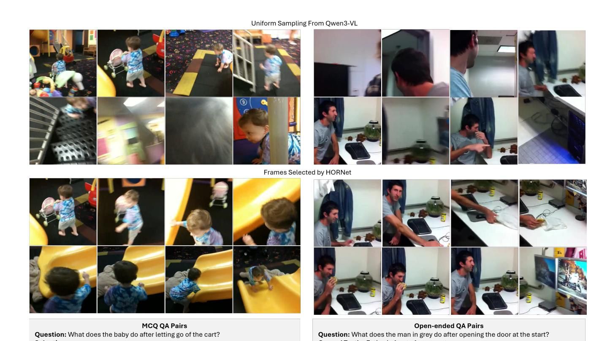

# HORNet: Task-Guided Frame Selection for Video Question Answering with Vision-Language Models

Xiangyu Bai∗ Bishoy Galoaa∗ Sarah Ostadabbas Northeastern University Boston, MA, USA

{bai.xiang, galoaa.b, s.ostadabbas}@northeastern.edu ∗These authors contributed equally to this work.

# Abstract

*Video question answering (VQA) with vision-language models (VLMs) depends critically on which frames are selected from the input video, yet most systems rely on uniform or heuristic sampling that cannot be optimized for downstream answering quality. We introduce HORNet, a lightweight frame selection policy trained with Group Relative Policy Optimization (GRPO) to learn which frames a frozen VLM needs to answer questions correctly. With fewer than 1M trainable parameters, HORNet reduces input frames by up to 99% and VLM processing time by up to 93%, while improving answer quality on short-form benchmarks (+1.7% F1 on MSVD-QA) and achieving strong performance on temporal reasoning tasks (+7.3 points over uniform sampling on NExT-QA). We formalize this as Select Any Frames (SAF), a task that decouples visual input curation from VLM reasoning, and show that GRPOtrained selection generalizes better out-of-distribution than supervised and PPO alternatives. HORNet's policy further transfers across VLM answerers without retraining, yielding an additional 8.5% relative gain when paired with a stronger model. Evaluated across six benchmarks spanning 341,877 QA pairs and 114.2 hours of video, our results demonstrate that optimizing* what *a VLM sees is a practical and complementary alternative to optimizing what it generates while improving efficiency. Code is available at* <https://github.com/ostadabbas/HORNet>*.*

# 1. Introduction

Existing state-of-the-art VLMs rely on scaling large visualtext data pairs to improve performance [\[8,](#page-8-0) [13,](#page-8-1) [23,](#page-8-2) [31\]](#page-9-0), and while these efforts have yielded measurable gains on VQA benchmarks, the underlying mechanism–a vision encoder tokenizes image patches, a projection layer maps them into the language model's embedding space, and an autoregressive LLM decodes the response–has remained largely unchanged. Videos are first sampled and transformed into visual tokens, which are then aligned with textual inputs through cross-attention mechanisms [\[12\]](#page-8-3). The data-hungry nature of such architecture brings significant downfalls in "Small Data" domains, where data collection is costly, inefficient and sometimes facing regulations, limiting the adopting in these situations [\[4,](#page-8-4) [27,](#page-8-5) [29\]](#page-9-1). Some approaches attempt to enhance spatial and temporal reasoning by applying LoRA-based [\[15\]](#page-8-6) fine-tuning on datasets specifically curated for reasoning tasks, thereby improving a model's ability to understand and interpret video content. Most other methods rely on minor modifications to the attention architecture to adapt the model to specific domains and applications [\[17\]](#page-8-7). VLMs for video largely inherit the architecture and biases of image-based models, with temporal reasoning added only superficially. Video-LLaVA [\[22\]](#page-8-8) samples eight frames through a shared frozen encoder with no temporal module, LLaVA-OneVision [\[20\]](#page-8-9) treats video frames as multiple images and shows that an image-only checkpoint already performs competitively on video benchmarks, and Video-ChatGPT [\[25\]](#page-8-10) reduces temporal reasoning to meanpooling of per-frame CLIP features. The resulting performance gap is stark: InternVL2.5-78B achieves 95.1% on DocVQA [\[26\]](#page-8-11) yet only 72.1% on Video-MME [\[8\]](#page-8-0); a 23 point drop that reflects the absence of genuine temporal reasoning rather than mere task difficulty. In practice, most systems rely on pragmatic frame-sampling strategies, effectively reducing videos to sets of isolated images, leading to unavoidable information loss while increasing signal-noise ratio. The frames with necessary information for VLM to reason might be discarded through this sampling procedures, degrading answers' quality. The broader question of how visual inputs should be structured, represented, and processed within VLMs to preserve key information while removing noise remains insufficiently examined. Although a few studies highlight the role of sampling as a form of

Figure 1. HORNet pipeline. Given a video V = {v1, v2, . . . , vT } with T uniformly sampled frames, our TimeSFormer-based video encoder E extracts per-frame features F ∈ R T ×D. A lightweight trainable MLP policy πθ scores each frame independently, producing keep probabilities pt ∈ [0, 1] and a binary selection mask b ∈ {0, 1} T . Only the frames selected by the mask (V′ ⊆ V) are passed to the frozen Qwen3-VL answerer. For example, to answer *"How does the boy in black react while the boy on the green disc goes down?"*, HORNet selects only the frames capturing the key interaction moment, discarding irrelevant context; correctly predicting *"Look at him"*. At training time, GRPO samples K candidate subsets, evaluates each via String F1 reward against the ground-truth answer, and updates πθ through group-normalized policy gradients. The VLM answerer remain frozen throughout while the encoder and MLP policy are trainable.

filtering [\[6,](#page-8-12) [30,](#page-9-2) [41\]](#page-9-3), its importance is largely overlooked.

Given that scaling data has improved image understanding far more than video understanding under this paradigm, we turn to a complementary axis of improvement: optimizing how models reason over their visual inputs through reinforcement-learning-based fine-tuning. Most existing VLMs requires supervised fine-tuning (SFT) to adapt to new domains, which are costly and inefficient with small data. The advent of Group Relative Policy Optimization (GRPO) [\[9,](#page-8-13) [28\]](#page-9-4) has opened a new avenue for end-to-end optimization of language model behavior via verifiable reward signals. Inspired by its success in guiding the gradients to improve the *outputs* of VLMs [\[1,](#page-8-14) [10,](#page-8-15) [39\]](#page-9-5), we ask a fundamentally different question: can GRPO be used to optimize *what a VLM sees (inputs)*, rather than what it says (gradients)? We formalize the problem as Select Any Frames (SAF): given a video and a question, select the subset of frames from the full temporal sequence that maximizes the downstream VLM's ability to produce the correct answer. SAF treats frame selection as a sequential decision problem amenable to reinforcement learning, with the VLM's QA accuracy providing a direct, task-grounded reward signal. This framing is intentionally simple and general; the SAF policy is modular and can be paired with any downstream VLM without any modifications to the architecture.

To address the issue, we present HORNet: Hindsight Optimization Reasoning, a three-stage SAF pipeline that optimize VLMs' performance by selecting optimal frames from video input (see Fig. [1\)](#page-1-0). First, a trainable lightweight video encoder extracts rich spatiotemporal features for each frame independently. Second, a lightweight trainable multilayer perceptron (MLP) policy consumes these features and outputs a per-frame keep probability. Third, GRPO trains the video encoder and MLP by sampling multiple candidate frame subsets per video, passing each to a frozen VLM model for answering and computing rewards. Only the MLP and video encoder are trained; the VLM remain frozen throughout. This design makes HORNet exceptionally parameter-efficient-suitable for small-data settings where full fine-tuning of large models is infeasiblewhile still benefiting from the representational capacity of pretrained video and language foundations. Operating at the frame-selection level rather than the token level allows HORNet to substantially reduce both the memory footprint and the inference latency of downstream VLM processing, with these gains becoming even more pronounced as model size increases.

We train HORNet on a diverse multi-dataset corpus spanning MSRVTT-QA [\[33\]](#page-9-6), MSVD-QA [\[34\]](#page-9-7), and NExT-QA [\[32\]](#page-9-8), totaling 17,350 videos, 341,877 QA pairs, and 114.2 hours of content. This breadth covers descriptive, causal, and temporal question types, pushing the policy to discover generalizable selection strategies rather than dataset-specific shortcuts. In short, our contributions are:

- We introduce SAF (Select Any Frames), a task formulation that decouples frame selection from VLM reasoning and enables direct reward-based optimization of visual inputs.
- We propose HORNet, a GRPO-trained frame selection policy built on frozen video and language foundations, trainable with minimal parameters.
- We demonstrate that GRPO can be redirected from opti-

Table 1. **Research gap.** Existing frame selection methods satisfy at most two of four desirable properties simultaneously. HORNet is the first to achieve all four: learned selection, reward-based optimization, a fully frozen VLM, and parameter efficiency (<1M parameters).  $\checkmark$  fully supported,  $\times$  not supported,  $\sim$  partial.

| Method             | Learned Selection | Reward Optimized | Frozen VLM | Param. Efficient |
|--------------------|----------------------|---------------------|---------------|---------------------|
| Uniform Sampling   | ×                    | ×                   | ✓             | <b>√</b>            |
| SeViLA [36]        | $\checkmark$         | ×                   | ×             | ×                   |
| Frame-Voyager [37] | $\checkmark$         | ×                   | ×             | ×                   |
| F2C [30]           | ×                    | ×                   | $\checkmark$  | ✓                   |
| ReFoCUS [19]       | $\checkmark$         | $\checkmark$        | ~             | ×                   |
| ViaRL [35]         | ✓                    | ✓                   | ×             | ×                   |
| HORNet (Ours)      | $\checkmark$         | $\checkmark$        | $\checkmark$  | ✓                   |

mizing VLM outputs to optimizing VLM inputs; a conceptual shift that is both more parameter-efficient and more generally applicable.

• We provide a large-scale training benchmark combining three VideoQA datasets (341,877 QA pairs, 114.2 hours) for evaluating frame selection methods.

#### 1.1. Small Data Statement

This work qualifies as small data research on two fronts. First, HORNet is designed for settings where annotated video-question-answer data is scarce or expensive to collect. Rather than fine-tuning a billion-parameter VLM; which typically requires hundreds of thousands of domainspecific examples, HORNet trains fewer than 1M parameters, meaning that the method can be deployed in domains where only a small number of labeled video QA pairs are available, such as medical procedures, surveillance, or industrial inspection, without risking catastrophic forgetting or overfitting of the foundation models. Second, HORNet's training strategy is explicitly chosen to maximize sample efficiency. GRPO generates multiple candidate frame selections per training example and computes rewards from the frozen VLM's own outputs, effectively amplifying each labeled sample by a factor of K = 8 without requiring any additional annotation. Our ablation study (Table 4) confirms this advantage. Furthermore, the trained policy transfers to a different VLM answerer without retraining (Table 6), eliminating the need to recollect data when the downstream model changes. Together, these design choices-frozen foundations, reward amplification, and transferable policies-make HORNet particularly suited to the data-scarce regimes that motivate this work.

#### 2. Related Work

We summarize the positioning of existing methods in Table 1 across four desirable properties: whether the method uses learned frame selection, whether it is optimized via downstream reward signals, whether the VLM remains frozen during training, and whether it is parameter-efficient. Existing approaches satisfy at most two of these properties simultaneously. HORNet is the first to satisfy all four.

Frame selection for video understanding. The importance of selecting the right frames, rather than sampling uniformly, has been recognized since Buch et al. [6] demonstrated that a single well-chosen frame, identified by a permutation-invariant attention module over frozen CLIP embeddings, suffices for many VideoQA benchmarks. This finding motivated a line of work on learned selection. SeViLA [36] chains a Localizer and Answerer fine-tuned from BLIP-2, using pseudo-labels from the Answerer to self-refine the Localizer. Frame-Voyager [37] enumerates frame combinations and trains a supervised selector by ranking subsets according to a Video-LLM's prediction loss. VidF4 [21] proposes differentiable frame scoring that jointly considers question relevance and inter-frame diversity. On the training-free side, F2C [30] segments videos into temporally coherent clips using watershed-based scoring and CLIP query relevance, demonstrating that clip-level temporal coherence can outperform isolated frame selection. A.I.R. [41] employs a VLM to iteratively decompose queries and evaluate small frame batches, trading inference cost for selection accuracy. BOLT [24] and Q-Frame [40] also use CLIP similarity with different sampling strategies to balance query relevance and coverage. These methods demonstrate that the when of frame selection matters as much as the how. HORNet differs from all of these in that it *learns* the selection policy end-to-end from downstream QA rewards, without heuristics, pseudo-labels, or combinatorial enumeration.

Reinforcement learning for frame selection. A concurrent wave of work applies RL specifically to visual input selection. ReFoCUS [19] trains an autoregressive frame selector using reward signals from a reference VLM's answer confidence margins. ViaRL [35] co-evolves a frame selector and answerer via iterated amplification RL, achieving strong results on temporal needle QA tasks. Frame-Mind [14] introduces Frame-Interleaved Chain-of-Thought with a GRPO variant for multi-turn dynamic resolution frame sampling. VideoBrain [2] trains an agent that decides when to invoke additional frame sampling using GRPO at the agent-invocation level. While these methods share our motivation, they differ in key respects: ReFoCUS uses autoregressive selection; ViaRL modifies both selector and answerer; FrameMind requires multi-turn agentic inference; and VideoBrain operates at the coarse sampling decision level rather than per-frame scoring. HORNet is simpler by design; a single forward pass through a frozen encoder followed by an MLP produces selection probabilities, and

GRPO training requires no modifications to either the encoder or the VLM. This simplicity makes it particularly suited to small-data and resource-constrained settings.

**GRPO for vision-language models.** Group Relative Policy Optimization [28] was introduced to train language models on verifiable rewards without a critic network, later scaled in DeepSeek-R1 [9] to incentivize emergent reasoning. Its application to vision-language models has since expanded rapidly: Video-R1 [10] applies temporal contrastive GRPO to video MLLMs; R1-VL [39] extends it to stepwise multimodal reasoning; DeepVideo-R1 [1] addresses the vanishing advantage problem specific to video GRPO; Vision-R1 [16] demonstrates data-efficient GRPO training for visual math reasoning; and GRPO-CARE [7] addresses reasoning consistency degradation. Critically, all of these works apply GRPO to improve what the VLM generates; optimizing output distributions. HORNet redirects GRPO toward optimizing what the VLM receives; a complementary direction that has not been explored prior to this work.

HORNet sits at the intersection of these three threads. It inherits the GRPO optimization framework from the reasoning literature, the select-then-answer pipeline from the frame selection literature, and the frozen foundation model paradigm from efficient video VLMs. The key novelty is using GRPO's group-relative advantage estimation-critic-free, scalable, and reward-agnostic-to directly maximize downstream QA performance through frame selection, with a parameter footprint small enough for low-data regimes.

#### 3. Method

In this section, we first formally define the Select Any Frames (SAF) problem. We then introduce the HORNet architecture and detail the GRPO-based training procedure.

#### 3.1. Problem Formulation

Let  $\mathbf{V} = \{v_1, v_2, \dots, v_T\}$  denote a video represented by T uniformly sampled frames, where  $v_t \in \mathbb{R}^{H \times W \times C}$  is the t-th RGB frame. Let q be a natural language question and a the corresponding ground-truth answer. We denote by  $\mathcal{D}$  a dataset of triplets  $(\mathbf{V}, q, a)$ . A video encoder E extracts spatiotemporal per-frame representations  $\mathbf{F} \in \mathbb{R}^{T \times D}$ , from which a lightweight policy selects a subset  $\mathbf{V}' \subseteq \mathbf{V}$ . A pretrained and frozen VLM  $\mathcal{M}$  then produces a predicted answer  $\hat{a} = \mathcal{M}(\mathbf{V}', q)$ .

The goal of SAF is to learn a parameterized policy  $\pi_{\theta}$  that selects a subset  $\mathbf{V}' = \pi_{\theta}(\mathbf{V}, q)$  maximizing downstream answering performance. Formally, we seek:

$$\theta^* = \arg\max_{\theta} \mathbb{E}_{(\mathbf{V},q,a) \sim \mathcal{D}} \left[ R(\mathcal{M}(\pi_{\theta}(\mathbf{V},q),q),a) \right], \quad (1)$$

where  $R(\hat{a}, a)$  is a task-specific reward function measuring the quality of the predicted answer  $\hat{a}$  relative to the ground-

Figure 2. **HORNet encoder** E. Input frames are patchified with a  $P \times P$  convolution, processed by spatial self-attention within each frame, and then by temporal self-attention across frames at each patch location. The resulting temporally contextualized patch tokens are pooled to yield per-frame video representations used by HORNet for frame selection. B is batch size, T is frame count and D is hidden dimension. We set P=16, T=32 and D=768 in our training.

truth a (e.g., exact match accuracy). The VLM  $\mathcal M$  remains frozen during training; only the policy parameters  $\theta$  are optimized.

**Policy parameterization.** We represent the policy output as a binary selection mask  $\mathbf{b} = (b_1, \dots, b_T) \in \{0, 1\}^T$ , where  $b_t = 1$  indicates that frame  $v_t$  is selected. The selected subset is therefore  $\mathbf{V}' = \{v_t \mid b_t = 1\}$ . The policy defines a distribution over binary masks:

$$\mathbf{b} \sim \pi_{\theta}(\mathbf{b} \mid \mathbf{V}, q),$$
 (2)

which factorizes over frames via independent Bernoulli decisions:

$$\pi_{\theta}(\mathbf{b} \mid \mathbf{V}, q) = \prod_{t=1}^{T} \text{Bernoulli}(b_t \mid p_t),$$
 (3)

where  $p_t \in [0,1]$  is the selection probability for frame  $v_t$ , predicted by the policy network.

This formulation imposes no temporal ordering or contiguity constraints on frame selection, hence the name Select Any Frames (SAF). The policy may therefore learn to select temporally sparse key events, short critical intervals, or dense motion segments, depending solely on what maximizes the task-driven reward.

## 3.2. Video Representation

We design HORNet to identify the most informative frames in a video while suppressing redundant or noisy content. This process is guided by learned video representations rather than raw pixels, enabling the model to focus on semantically meaningful cues that correlate with downstream performance. To balance representational strength with computational efficiency, HORNet employs a lightweight encoder E derived from the TimeSFormer [\[5\]](#page-8-23) architecture. The encoder decouples spatial and temporal reasoning into two separate transformer blocks to efficiently model video structure. In spatial blocks, we perform spatial selfattention independently on each of the frames to capture intra-frame relationships such as object appearance, local motion cues, and spatial layout. After spatial encoding, a second transformer stack performs temporal self-attention to capture motion patterns and temporal dependencies at each patch position. This factorized design (see Figure [2\)](#page-3-0) preserves temporal modeling capacity while avoiding the prohibitive cost of joint attention over all tokens.

# 3.3. HORNet Architecture

HORNet instantiates the SAF policy using three components: a video encoder, a lightweight trainable policy network, and a frozen VLM answerer (Fig. [1\)](#page-1-0).

Video encoder. Given a video V with T frames, we extract frame-level features using aforementioned enocder and obtain spatial token maps of shape T × P × P × D, where P = 16 denotes the spatial grid resolution and D = 768 the feature dimension. To obtain compact per-frame representations, we apply spatial average pooling over the P ×P grid:

$$\mathbf{F} = \operatorname{AvgPool}_{2D}(E(\mathbf{V})) \in \mathbb{R}^{T \times D}, \tag{4}$$

where F = [f1, . . . ,fT ] ⊤ and each ft ∈ R D corresponds to frame vt.

Policy network. The SAF policy is parameterized as a frame-wise multilayer perceptron (MLP) that maps each feature vector ft to a selection probability pt ∈ (0, 1). Specifically, the network applies three linear projections with Gaussian Error Linear Unit (GELU) nonlinearities followed by a sigmoid activation:

$$p_t = \sigma(\mathbf{W}_2 \, \phi(\mathbf{W}_1 \, \phi(\mathbf{W}_0 \mathbf{f}_t))), \qquad (5)$$

where ϕ(·) denotes GELU, σ(·) the sigmoid function, and the weight matrices project D → 512 → 256 → 1. Collectively, these weights define the learnable parameter set θ. The resulting probabilities p = (p1, . . . , pT ) define independent Bernoulli decisions over frames, as described in the SAF formulation. This MLP constitutes the only trainable component of HORNet.

Frozen VLM answerer. For a sampled mask b, the selected frames V′ are passed to a frozen Qwen3-VL model [\[3\]](#page-8-24) together with the question q. The model produces a predicted answer aˆ, which is used to compute rewards during training and for evaluation at test time.

## 3.4. Training with GRPO

Candidate generation. For each training instance, we generate K = 8 candidate masks {b (1) , . . . , b (K)}. Candidates are produced using a deterministic top-k sweep over sorted probabilities p, progressively reducing the number of selected frames, together with one stochastic Bernoulli sample to maintain exploration.

Reward computation. Each candidate mask yields a predicted answer aˆ (i) = M(V′(i) , q). We define a smooth scalar reward

$$r^{(i)} = 0.1 \cdot F_1^{\text{token}}(\hat{a}^{(i)}, a) + 0.9 \cdot \text{EditSim}(\hat{a}^{(i)}, a),$$
 (6)

where F token 1 denotes token-level F1 after lemmatization and EditSim is normalized edit similarity in [0, 1]. This formulation reduces brittleness to minor lexical variations.

GRPO objective. The log-probability of candidate mask b (i) under the current policy is

$$\log \pi_{\theta}(\mathbf{b}^{(i)} \mid \mathbf{F}) = \sum_{t=1}^{T} \left[ b_t^{(i)} \log p_t + (1 - b_t^{(i)}) \log(1 - p_t) \right].$$
(7)

Let r¯ and σr denote the mean and standard deviation of rewards within the group of K candidates. The normalized advantage is defined as

$$A^{(i)} = \frac{r^{(i)} - \bar{r}}{\sigma_r + \epsilon},\tag{8}$$

where ϵ is a small constant for numerical stability. The GRPO loss is then

$$\mathcal{L}_{GRPO} = -\frac{1}{K} \sum_{i=1}^{K} A^{(i)} \log \pi_{\theta}(\mathbf{b}^{(i)} \mid \mathbf{F}). \tag{9}$$

We optimize θ using Adam with learning rate 10−4 .

# 4. Results

In this section, we describe our training data and strategies, and present HORNet's performance and efficiency gains over the baseline model through both qualitative and quantitative analyses. We conduct ablation studies to examine alternative design choices in VLM architectures, training procedures, and sampling strategies. Overall, we demonstrate substantial efficiency improvements and highlight HOR-Net's potential when scaled to larger backbone models.

## 4.1. Training Data

HORNet is trained on a combined corpus spanning three VideoQA benchmarks: MSRVTT-QA [\[33\]](#page-9-6) (10,000 videos, 158,581 training QA pairs, mean 15.5s duration), MSVD-QA [\[34\]](#page-9-7) (1,161 training videos, 30,933 QA pairs, mean 9.6s), and NExT-QA [\[32\]](#page-9-8) (3,870 training videos, 34,132 QA pairs, mean 43.7s). In aggregate, the training set contains 223,646 QA pairs across 15,031 videos covering 114.2 hours of content, with question types spanning descriptive (what/who), temporal (when/how), and causal (why) reasoning. This breadth ensures the selection policy generalizes across diverse temporal structures rather than overfitting to a single question distribution.

# 4.2. Implementation Details

All experiments are conducted on a single NVIDIA A100 40GB GPU. Videos are decoded and uniformly sampled to T = 32 frames, each resized to 288 × 288 pixels. The TimeSFormer-Tiny encoder produces spatial feature maps of shape 16 × 16 × 768, which are spatially average-pooled to yield per-frame descriptors F ∈ R 16×768 .

The MLP policy πθ consists of a linear projection (768 → 512) followed by two hidden layers (512 → 1024 → 256) with GELU activations, and a final linear head (256 → 1) with sigmoid output. This amounts to fewer than 1M trainable parameters.

At each training step, K = 8 candidate frame subsets are sampled per video via a top-k sweep with step size ⌊k/K⌋. Training proceeds in two stages. In the first stage, we train on MSVD [\[34\]](#page-9-7) and MSRVTT [\[33\]](#page-9-6), which contain short videos (fewer than 100 frames) and one-word answers. Rewards are computed using an F1-Lev objective: a weighted combination of token-level F1 (w1=0.1) and normalized edit similarity (w2=0.9) applied to lemmatized predictions and ground-truth answers. In the second stage, we train on NExT-QA [\[32\]](#page-9-8), which features MCQstyle questions and long videos (around 1,000 frames), using a selection-accuracy reward tailored to the multiplechoice setting. The policy is optimized with Adam [\[18\]](#page-8-25) at a learning rate of 10−4 with batch size 8 on a total of 223,646 training QA pairs. Qwen3-VL-2B stays fully frozen during training, while the video encoder and the frame-selection policy are trained jointly.

# 4.3. Open-Ended QA Results

Table [2](#page-6-1) reports results on three open-ended VideoQA benchmarks. On MSVD-QA, HORNet improves F1-Lev from 0.3483 to 0.3543 (+1.7%) while reducing Qwen processing time by 64% and input frames by 66%. This shows that for short videos (∼10s), many frames are redundant or noisy, and selecting a compact subset actually helps the VLM focus on relevant content.

On MSRVTT-QA and NExT-QA open-ended, HORNet trades a modest drop in F1 for substantial efficiency gains. MSRVTT-QA loses 5.6% F1 but reduces processing time by 84% and frames by 92%. NExT-QA open-ended loses 10.1% but reduces processing time by 81% and frames by over 99%, compressing an average of 1,158 input frames down to 8. These results highlight a practical trade-off: HORNet enables deployment on resource-constrained settings where processing thousands of frames per video is infeasible, with a bounded cost in answer quality.

## 4.4. Multiple-Choice QA Results

Table [3](#page-6-2) presents results on three MCQ benchmarks. The pattern mirrors the open-ended setting: HORNet consistently reduces processing time (74–93%) and frame count (≥99%) across all datasets. On ActivityNet-QA, accuracy drops only 6.2% while inference becomes 93% faster. On NExT-QA MCQ, the gap narrows to 5.3% with 74% faster processing. VideoMME shows the largest accuracy gap (16.2%), which we attribute to its hour-scale videos where 8 frames may be insufficient to cover the question scope.

Across both open-ended and MCQ settings, the results support a consistent finding: HORNet provides a controllable efficiency–accuracy trade-off, achieving order-ofmagnitude reductions in computational cost with bounded quality loss. In certain cases, HORNet even improves the model's predictions by discarding distracting or noisy frames and retaining only the most informative moments, producing a better answer than using VLMs alone, as illustrated in Figure [3.](#page-7-1)

## 4.5. Ablation Studies

Training objective. Table [4](#page-6-0) compares three training strategies for the frame selection policy, all trained exclusively on MSVD-QA. On the in-distribution MSVD-QA evaluation, all three methods improve over the untrained baseline, with PPO achieving the highest F1 (0.3585) followed by GRPO (0.3543) and SFT (0.3495). However, the MSRVTT-QA column reveals a critical difference: since none of the methods were trained on MSRVTT-QA, this column measures out-of-distribution generalization. Here, all trained policies degrade relative to the untrained baseline (0.3209), but GRPO degrades the least (0.3029), retaining 94% of baseline performance compared to 92% for PPO and 90% for SFT. This suggests that GRPO's group-relative advantage estimation learns more transferable selection strategies, whereas PPO and SFT overfit more aggressively to the training distribution.

Frame selection strategy. Table [5](#page-6-3) compares random, uniform, and HORNet selection, all restricted to exactly 4

Table 2. Performance comparison across open-ended QA datasets. We adopt the aforementioned F1-Lev metric to measure model performance, which is a weighted combination of token-level F1 and normalized edit similarity on lemmatized texts. We also report efficiency measured in runtime and average frames passed to Qwen. Qwen's baseline processing time includes uniform sampling, video encoding, and answer generation. In our setup, frame selection replaces the sampling step and is reported separately. Even under this accounting, the combined runtime of HORNet still yields a notable overall speedup. Additionally, when comparing generation speed, we follow Qwen's default sampling rate (fps=2). Under the assumption of a 24-fps source video, the baseline effectively processes roughly 1/12 of all framesstill substantially more input than HORNet requires. We highlight best performance for each benchmark in bold and mark performance gain or loss as percentages.

| Dataset     | Model                     | F1-Lev↑       | Frame Sel. (s)↓ | Qwen Proc. (s)↓ | Avg. Frames↓ |
|-------------|---------------------------|---------------|-----------------|-----------------|--------------|
| MSVD [34]   | Qwen3-VL-2B (Baseline)    | 0.3483        | –               | 0.28            | 11.65        |
|             | HORNet+Qwen3-VL-2B (Ours) | 0.3543 +1.7%  | 0.12            | 0.10 ↓64%       | 4.00 ↓66%    |
| MSRVTT [33] | Qwen3-VL-2B (Baseline)    | 0.3209        | –               | 0.58            | 47.52        |
|             | HORNet+Qwen3-VL-2B (Ours) | 0.3029 -5.6%  | 0.09            | 0.09 ↓84%       | 4.00 ↓92%    |
| NextOE [32] | Qwen3-VL-2B (Baseline)    | 0.3045        | –               | 1.01            | 1157.88      |
|             | HORNet+Qwen3-VL-2B (Ours) | 0.2738 -10.1% | 0.52            | 0.19 ↓81%       | 8.00 ↓99%    |

Table 3. Performance comparison across selection-based MCQ datasets. We adopt selection-accuracy as our metric and report efficiency gain of HORNet similar to Table [2.](#page-6-1) For each of these dataset we randomly sampled 1,000 QA pairs.

| Dataset            | Model                     | Accuracy(%)↑ | Frame Sel. (s)↓ | Qwen Proc. (s)↓ | Avg. Frames↓ |
|--------------------|---------------------------|--------------|-----------------|-----------------|--------------|
| VideoMME [11]      | Qwen3-VL-2B (Baseline)    | 68.30        | –               | 2.53            | 3066.73      |
|                    | HORNet+Qwen3-VL-2B (Ours) | 52.10 -16.2% | 1.51            | 0.18 ↓93%       | 8.00 ↓99%    |
| ActivityNetQA [38] | Qwen3-VL-2B (Baseline)    | 75.00        | –               | 2.37            | 3152.49      |
|                    | HORNet+Qwen3-VL-2B (Ours) | 68.80 -6.2%  | 1.64            | 0.17 ↓93%       | 8.00 ↓99%    |
| NextQA [32]        | Qwen3-VL-2B (Baseline)    | 76.80        | –               | 0.98            | 1157.88      |
|                    | HORNet+Qwen3-VL-2B (Ours) | 71.50 -5.3%  | 0.53            | 0.25 ↓74%       | 8.00 ↓99%    |

Table 4. Training objective ablation. All variants use the same TimeSformer-Tiny encoder, MLP policy (<1M params), and frozen Qwen3-VL-2B answerer. Trained on MSVD-QA only. MSRVTT-QA results show out-of-distribution generalization.

| Training                | MSVD (F1-Lev↑) | MSRVTT (F1-Lev↑) |
|-------------------------|-------------------|---------------------|
| No training (baseline)  | 0.3483            | 0.3209              |
| SFT (weighted BCE)      | 0.3495            | 0.2882              |
| PPO (clipped surrogate) | 0.3585            | 0.2948              |
| GRPO (Ours)             | 0.3543            | 0.3029              |

Table 5. Frame selection strategy ablation. All methods select 4 frames and pass them to a frozen Qwen3-VL-2B answerer. MSVD-QA and MSRVTT-QA report F1-Lev; NExT-QA reports MCQ accuracy (%).

| Strategy | MSVD (F1-Lev↑) | MSRVTT (F1-Lev↑) | NExT-QA (Acc.↑) |
|----------|-------------------|---------------------|--------------------|
| Random   | 0.3527            | 0.3027              | 65.88              |
| Uniform  | 0.3493            | 0.3058              | 64.24              |
| HORNet   | 0.3543            | 0.3029              | 71.50              |

frames. On MSVD-QA and MSRVTT-QA, all three strate-

gies perform within 0.01 F1 of each other. This is expected: with average durations of 10s and 15s respectively, most frames in these videos carry similar visual content, and any 4-frame sample is likely to capture the relevant information. Notably, the fact that aggressive subsampling (4 out of 32 frames) does not substantially hurt performance reinforces our core premise: many frames are redundant or noisy, and discarding them does no harm.

The picture changes on NExT-QA, where videos average 44 seconds and questions require causal and temporal reasoning. Here, HORNet achieves 71.50% accuracy, outperforming random (65.88%) by 5.6 points and uniform (64.24%) by 7.3 points. When the temporal structure of the video matters, learned selection provides a clear advantage over blind sampling.

VLM answerer. Table [6](#page-7-0) swaps only the frozen VLM answerer while keeping the same HORNet policy. Replacing Qwen3-VL-2B with the larger Qwen2.5-VL-3B improves F1-Lev from 0.3543 to 0.3846, a 8.5% relative gain. This confirms that HORNet's frame selection transfers across VLM answerers without retraining, and that pairing the policy with a stronger answerer amplifies the benefit of intelligent frame selection.

Figure 3. Qualitative example of HORNet's frame-selection behavior on an MCQ and open-ended sample from the NExT-QA dataset [\[32\]](#page-9-8). Given fixed 8-frame input, uniform sampling in Qwen-VL captures frames of the child crawling instead of the slide following the discard of the cart (left), and a frame of a person working at a computer while missing the eating frames (right), leading the model to produce an incorrect answer. With a dense initial sampling (T=256 frames), HORNet selects the full 8-frame sequence of action-relevant frames while discarding distractors, enabling the model to recover the correct prediction.

Table 6. VLM answerer ablation on MSVD-QA. The same HORNet policy (trained with GRPO) selects frames. Only the frozen answerer is swapped; frame selection is identical.

| VLM Answerer                                               | Size     | F1-Lev↑          |
|------------------------------------------------------------|----------|------------------|
| Qwen3-VL-Instruct (baseline) Qwen3-VL-Instruct + HORNet | 2B 2B | 0.3483 0.3543 |
| Qwen2.5-VL-Instruct + HORNet                               | 3B       | 0.3846           |

# 5. Conclusion

We introduced HORNet, a lightweight frame selection policy trained with GRPO that optimizes what a frozen VLM sees rather than what it generates, requiring fewer than 1M trainable parameters. Our experiments show that aggressive frame reduction (to as few as 4 frames) causes no meaningful quality loss on short-form videos, while on longer videos with temporal and causal questions, learned selection outperforms uniform and random baselines by up to 7.3 percentage points. Across all benchmarks, HORNet reduces VLM processing time by 64–93% and input frames by up to 99%. Ablation studies further confirm that GRPO generalizes better out-of-distribution than PPO and SFT, and that the learned policy transfers across VLM answerers without retraining, yielding an 8.5% relative gain when paired with a stronger model.

HORNet's limitation is that the accuracy gap widens on hour-scale videos (e.g., VideoMME), where a fixed budget of 8 frames may be insufficient. Future work could address this through adaptive frame budgets that scale with video duration and hierarchical strategies that first localize relevant temporal segments before selecting frames within them. We also plan to incorporate visual reward signals that directly assess the perceptual quality and informativeness of selected frames, complementing the current text-based QA reward. Additionally, we aim to explore partially unfreezing the VLM answerer so that it can provide gradientbased feedback to the selection policy, enabling a tighter co-optimization loop between frame selection and answer generation.

# References

- [1] authors. DeepVideo-R1: Video reinforcement fine-tuning via difficulty-aware regressive GRPO. *arXiv preprint arXiv:2506.07464*, 2025. [2,](#page-1-1) [4](#page-3-1)
- [2] authors. VideoBrain: Learning adaptive frame sampling for long video understanding. *arXiv preprint arXiv:2602.04094*, 2025. [3](#page-2-1)
- [3] Shuai Bai, Keqin Chen, Xuejing Liu, Jialin Wang, Wenbin Ge, Sibo Song, Kai Tang, Zhenyu Wang, Peng Wang, et al. Qwen3-VL technical report. *arXiv preprint arXiv:2511.21631*, 2025. [5](#page-4-0)
- [4] Xiangyu Bai, Le Jiang, Yedi Luo, Aniket Gupta, Pushyami Kaveti, Hanumant Singh, and Sarah Ostadabbas. An evaluation platform to scope performance of synthetic environments in autonomous ground vehicles simulation. In *ICASSP 2023-2023 IEEE International Conference on Acoustics, Speech and Signal Processing (ICASSP)*, pages 1–5. IEEE, 2023. [1](#page-0-0)
- [5] Gedas Bertasius, Heng Wang, and Lorenzo Torresani. Is space-time attention all you need for video understanding? In *Icml*, page 4, 2021. [5](#page-4-0)
- [6] Shyamal Buch, Cristobal Eyzaguirre, Adrien Gaidon, Jiajun Wu, Li Fei-Fei, and Juan Carlos Niebles. Revisiting the "video" in video-language understanding. In *Proceedings of the IEEE/CVF Conference on Computer Vision and Pattern Recognition (CVPR)*, 2022. [2,](#page-1-1) [3](#page-2-1)
- [7] Yi Chen et al. GRPO-CARE: Consistency-aware reinforcement learning for multimodal reasoning. *arXiv preprint arXiv:2506.16141*, 2025. [4](#page-3-1)
- [8] Zhe Chen, Weiyun Wang, Yue Cao, Yangzhou Liu, Zhangwei Gao, Erfei Cui, Jinguo Zhu, Shenglong Ye, Hao Tian, Zhaoyang Liu, et al. Expanding performance boundaries of open-source multimodal models with model, data, and testtime scaling. *arXiv preprint arXiv:2412.05271*, 2024. [1](#page-0-0)
- [9] DeepSeek-AI. Deepseek-r1: Incentivizing reasoning capability in LLMs via reinforcement learning. *arXiv preprint arXiv:2501.12948*, 2025. [2,](#page-1-1) [4](#page-3-1)
- [10] Kaituo Feng, Kaixiong Li, Bohao Liu, Jiaming Li, Yueting Ge, Xiangyu Li, Lewei Lu, Kai Chen, and Xiangyu Wang. Video-R1: Reinforcing video reasoning in MLLMs. In *Advances in Neural Information Processing Systems (NeurIPS)*, 2025. [2,](#page-1-1) [4](#page-3-1)
- [11] Chaoyou Fu, Yuhan Dai, Yondong Luo, Lei Li, Shuhuai Ren, Renrui Zhang, Zihan Wang, Chenyu Zhou, Yunhang Shen, Mengdan Zhang, et al. Video-mme: The first-ever comprehensive evaluation benchmark of multi-modal llms in video analysis. *arXiv preprint arXiv:2405.21075*, 2024. [7](#page-6-4)
- [12] Bishoy Galoaa, Xiangyu Bai, and Sarah Ostadabbas. Lang2motion: Bridging language and motion through joint embedding spaces. *arXiv preprint arXiv:2512.10617*, 2025. [1](#page-0-0)
- [13] Bishoy Galoaa, Xiangyu Bai, and Sarah Ostadabbas. Structured over scale: Learning spatial reasoning from educational video. *arXiv preprint arXiv:2601.23251*, 2026. [1](#page-0-0)

- [14] Haonan Ge et al. FrameMind: Frame-interleaved video reasoning via reinforcement learning. *arXiv preprint arXiv:2509.24008*, 2025. [3](#page-2-1)
- [15] Edward J Hu, Yelong Shen, Phillip Wallis, Zeyuan Allen-Zhu, Yuanzhi Li, Shean Wang, Liang Wang, Weizhu Chen, et al. Lora: Low-rank adaptation of large language models. *Iclr*, 1(2):3, 2022. [1](#page-0-0)
- [16] Wenxuan Huang et al. Vision-R1: Incentivizing reasoning capability in multimodal large language models. *arXiv preprint arXiv:2503.06749*, 2025. [4](#page-3-1)
- [17] Xiaofei Huang, Lingfei Luan, Elaheh Hatamimajoumerd, Michael Wan, Pooria Daneshvar Kakhaki, Rita Obeid, and Sarah Ostadabbas. Posture-based infant action recognition in the wild with very limited data. In *Proceedings of the IEEE/CVF Conference on Computer Vision and Pattern Recognition*, pages 4912–4921, 2023. [1](#page-0-0)
- [18] Diederik P. Kingma and Jimmy Ba. Adam: A method for stochastic optimization. *arXiv preprint arXiv:1412.6980*, 2014. [6](#page-5-0)
- [19] Hosu Lee, Junho Kim, Hyunjun Kim, and Yong Man Ro. Re-FoCUS: Reinforcement-guided frame optimization for contextual understanding. *arXiv preprint arXiv:2506.01274*, 2025. [3](#page-2-1)
- [20] Bo Li, Yuanhan Zhang, Dong Guo, Renrui Zhang, Feng Li, Hao Zhang, Kaichen Zhang, Yanwei Li, Ziwei Liu, and Chunyuan Li. Llava-onevision: Easy visual task transfer. *arXiv preprint arXiv:2408.03326*, 2024. [1](#page-0-0)
- [21] Jianxin Liang et al. End-to-end video question answering with frame scoring mechanisms and adaptive sampling. *arXiv preprint arXiv:2407.15047*, 2024. [3](#page-2-1)
- [22] Bin Lin, Yang Ye, Bin Zhu, Jiaxi Cui, Munan Ning, Peng Jin, and Li Yuan. Video-LLaVA: Learning united visual representation by alignment before projection. In *Proceedings of the 2024 Conference on Empirical Methods in Natural Language Processing (EMNLP)*, 2024. [1](#page-0-0)
- [23] Haotian Liu, Chunyuan Li, Yuheng Li, and Yong Jae Lee. Improved baselines with visual instruction tuning. *arXiv preprint arXiv:2310.03744*, 2023. [1](#page-0-0)
- [24] Shuming Liu et al. BOLT: Boost large vision-language model without training for long-form video understanding. In *Proceedings of the IEEE/CVF Conference on Computer Vision and Pattern Recognition (CVPR)*, 2025. [3](#page-2-1)
- [25] Muhammad Maaz, Hanoona Rasheed, Salman Khan, and Fahad Shahbaz Khan. Video-ChatGPT: Towards detailed video understanding via large vision and language models. In *Proceedings of the 62nd Annual Meeting of the Association for Computational Linguistics (ACL)*, 2024. [1](#page-0-0)
- [26] Minesh Mathew, Dimosthenis Karatzas, and CV Jawahar. Docvqa: A dataset for vqa on document images. In *Proceedings of the IEEE/CVF winter conference on applications of computer vision*, pages 2200–2209, 2021. [1](#page-0-0)
- [27] Sarah Ostadabbas, Somaieh Amraee, Elaheh Hatamimajoumerd, and Michael Wan. Special issue 1251 editorial: computer vision with small data: a focus on human and animals transforming computer vision into equitable and impactful ai. *Multimedia Tools and Applications*, 84(21): 24515–24519, 2025. [1](#page-0-0)

- [28] Zhihong Shao, Peiyi Wang, Qihao Zhu, Runxin Xu, Junxiao Song, Xiao Bi, Haowei Zhang, Mingchuan Zhang, Y.K. Li, Y. Wu, and Daya Guo. Deepseekmath: Pushing the limits of mathematical reasoning in open language models. *arXiv preprint arXiv:2402.03300*, 2024. [2,](#page-1-1) [4](#page-3-1)
- [29] Liyang Song, Hardik Bishnoi, Sai Kumar Reddy Manne, Sarah Ostadabbas, Briana J Taylor, and Michael Wan. Overcoming small data limitations in video-based infant respiration estimation. In *Proceedings of the IEEE/CVF Winter Conference on Applications of Computer Vision*, pages 6340–6349, 2026. [1](#page-0-0)
- [30] Guangyu Sun, Archit Singhal, Burak Uzkent, Mubarak Shah, Chen Chen, and Garin Kessler. From frames to clips: Training-free adaptive key clip selection for long-form video understanding. *arXiv preprint arXiv:2510.02262*, 2025. [2,](#page-1-1) [3](#page-2-1)
- [31] Peng Wang, Shuai Bai, Sinan Tan, Shijie Wang, Zhihao Fan, Jinze Bai, Keqin Chen, Xuejing Liu, Jialin Wang, Wenbin Ge, Yang Fan, Kai Dang, Mengfei Du, Xuancheng Ren, Rui Men, Dayiheng Liu, Chang Zhou, Jingren Zhou, and Junyang Lin. Qwen2-vl: Enhancing vision-language model's perception of the world at any resolution. *arXiv preprint arXiv:2409.12191*, 2024. [1](#page-0-0)
- [32] Junbin Xiao, Xindi Shang, Angela Yao, and Tat-Seng Chua. NExT-QA: Next phase of question-answering to explaining temporal actions. In *Proceedings of the IEEE/CVF Conference on Computer Vision and Pattern Recognition (CVPR)*, 2021. [2,](#page-1-1) [6,](#page-5-0) [7,](#page-6-4) [8](#page-7-2)
- [33] Dejing Xu, Zhou Zhao, Jun Xiao, Fei Wu, Hanwang Zhang, Xiangnan He, and Yueting Zhuang. Video question answering via gradually refined attention over appearance and motion. In *Proceedings of the ACM International Conference on Multimedia (ACM-MM)*, 2017. [2,](#page-1-1) [6,](#page-5-0) [7](#page-6-4)
- [34] Dejing Xu, Zhou Zhao, Jun Xiao, Fei Wu, Hanwang Zhang, Xiangnan He, and Yueting Zhuang. Video question answering via gradually refined attention over appearance and motion. In *Proceedings of the ACM International Conference on Multimedia (ACM-MM)*, 2017. [2,](#page-1-1) [6,](#page-5-0) [7](#page-6-4)
- [35] Ziqiang Xu et al. ViaRL: Adaptive temporal grounding via visual iterated amplification reinforcement learning. *arXiv preprint arXiv:2505.15447*, 2025. [3](#page-2-1)
- [36] Shoubin Yu, Jaemin Cho, Prateek Yadav, and Mohit Bansal. Self-chained image-language model for video localization and question answering. In *Advances in Neural Information Processing Systems (NeurIPS)*, 2023. [3](#page-2-1)
- [37] Sicheng Yu et al. Frame-voyager: Learning to query frames for video large language models. In *International Conference on Learning Representations (ICLR)*, 2025. [3](#page-2-1)
- [38] Zhou Yu, Dejing Xu, Jun Yu, Ting Yu, Zhou Zhao, Yueting Zhuang, and Dacheng Tao. Activitynet-qa: A dataset for understanding complex web videos via question answering. In *AAAI*, pages 9127–9134, 2019. [7](#page-6-4)
- [39] Jingyi Zhang, Jiaxing Huang, Wenhao Jin, and Shijian Lu. R1-VL: Learning to reason with multimodal large language models via step-wise group relative policy optimization. In *Proceedings of the IEEE/CVF International Conference on Computer Vision (ICCV)*, 2025. [2,](#page-1-1) [4](#page-3-1)
- [40] Shaojie Zhang et al. Q-Frame: Query-aware frame selection and multi-resolution adaptation for video-LLMs. In

- *Proceedings of the IEEE/CVF International Conference on Computer Vision (ICCV)*, 2025. [3](#page-2-1)
- [41] Yuanhao Zou, Shengji Jin, Andong Deng, Youpeng Zhao, Jun Wang, and Chen Chen. A.I.R.: Enabling adaptive, iterative, and reasoning-based frame selection for video question answering. In *International Conference on Learning Representations (ICLR)*, 2026. [2,](#page-1-1) [3](#page-2-1)