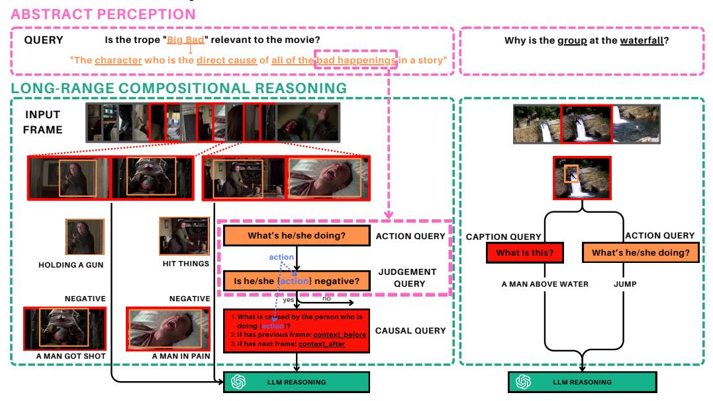
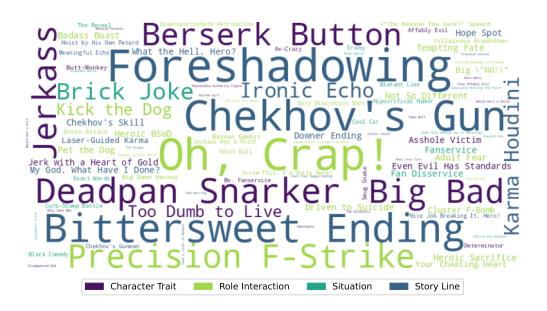

# Investigating Video Reasoning Capability of Large Language Models with Tropes in Movies

Hung-Ting Su<sup>1</sup> , Chun-Tong Chao<sup>1</sup> , Ya-Ching Hsu<sup>1</sup> , Xudong Lin<sup>2</sup> , Yulei Niu<sup>2</sup> , Hung-Yi Lee<sup>1</sup> , Winston H. Hsu1,<sup>3</sup>

<sup>1</sup>National Taiwan University <sup>2</sup>Columbia University <sup>3</sup>MobileDrive Technology

# Abstract

Large Language Models (LLMs) have demonstrated effectiveness not only in language tasks but also in video reasoning. This paper introduces a novel dataset, Tropes in Movies (TiM), designed as a testbed for exploring two critical yet previously overlooked video reasoning skills: (1) Abstract Perception: understanding and tokenizing abstract concepts in videos, and (2) Long-range Compositional Reasoning: planning and integrating intermediate reasoning steps for understanding long-range videos with numerous frames. Utilizing tropes from movie storytelling, TiM evaluates the reasoning capabilities of state-of-the-art LLM-based approaches. Our experiments show that current methods, including Captioner-Reasoner, Large Multimodal Model Instruction Fine-tuning, and Visual Programming, only marginally outperform a random baseline when tackling the challenges of Abstract Perception and Long-range Compositional Reasoning. To address these deficiencies, we propose Face-Enhanced Viper of Role Interactions (FEVoRI) and Context Query Reduction (ConQueR), which enhance Visual Programming by fostering role interaction awareness and progressively refining movie contexts and trope queries during reasoning processes, significantly improving performance by 15 F1 points. However, this performance still lags behind human levels (40 vs. 65 F1). Additionally, we introduce a new protocol to evaluate the necessity of Abstract Perception and Long-range Compositional Reasoning for task resolution. This is done by analyzing the code generated through Visual Programming using an Abstract Syntax Tree (AST), thereby confirming the increased complexity of TiM. The dataset and code are available at:<https://ander1119.github.io/TiM>

# 1 Introduction

Large Language Models (LLMs) [\[1](#page-8-0)[–4\]](#page-8-1) have not only dominated Natural Language Processing but also extended their reach into Computer Vision (CV) reasoning tasks. Leveraging LLMs as their foundation, various video reasoning models have been introduced. *Captioner-Reasoner (C-R)* [\[5](#page-8-2)[–9\]](#page-8-3) leverages visual language models (VLMs) to tokenize visual inputs into language tokens to feed into LLMs. While there may be potential information loss during captioning, C-R achieves remarkable performance on various video reasoning tasks such as NexT-QA [\[10\]](#page-8-4). *Large Multimodal Model Instruction Fine-tuning (LMM-IF)* [\[11](#page-9-0)[–13\]](#page-9-1) aligns visual inputs to LLMs' token space using projection layers, thereby avoiding information loss during captioning. *Visual Programming (VP)* [\[14,](#page-9-2) [15\]](#page-9-3) harnesses LLMs to generate programs that call visual perception modules and integrate their outputs. In contrast to the C-R and LMM-IF approaches, VP facilitates "System 2 style" stepwise reasoning [\[16\]](#page-9-4). It demonstrates the capability to address complex reasoning tasks that require external knowledge or commonsense such as [\[17,](#page-9-5) [18,](#page-9-6) [10\]](#page-8-4) in a stepwise and interpretable manner. While LLM-based methods demonstrate significant performance on existing benchmarks , several critical aspects remain underexplored in current models and datasets, as shown in Figure [1.](#page-1-0) First, Abstract Perception: While most queries in existing datasets target concrete elements like actions, objects,

# **Trope in Movies**

# **Prev/Conventional**



<span id="page-1-0"></span>Figure 1: Compared to previous datasets like NExT-QA [\[10\]](#page-8-4), Tropes in Movies (TiM) introduces the challenges of Abstract Perception (upper box) and Long-range Compositional Reasoning (lower box), offering a robust framework for evaluating and developing LLM-based methods. The blue text (action) indicates that the answer to the action query will affect the input of the judgment query and causal query, which means decomposing these complex elements necessitates multiple, nested queries that are interdependent.

or attributes—easily captured by vision models—abstract concepts such as emotion, motivation, humor, and judgment remain obscure and continue to challenge advanced VLMs. Second, Longrange Compositional Reasoning: Traditional datasets often assume that context and queries are straightforward, suitable for sparse sampling and simple decomposition. However, the reality is that contexts can span hour-long videos with thousands of frames, and queries may involve a wide range of complex elements. Decomposing these complex elements necessitates multiple, nested queries that are interdependent. Consequently, these prevailing approaches may overlook the nuanced interplay between visual cues and complex linguistic structures in longer, more dynamic sequences.

To evaluate these capabilities, we introduce a novel dataset, Tropes in Movies (TiM), designed to rigorously test existing and future LLM-based video reasoning models against the challenges identified as Abstract Perception and Long-range Compositional Reasoning. On TiM, the model has to determine whether a *trope* is present. *Tropes* are commonly employed narrative devices that enable storytellers to craft situations easily recognizable to audiences [\[19\]](#page-9-7). For instance, the trope "Big Bad" refers to an antagonist who is responsible for all the negative events in a story and drives the plot forward. Recognizing such a trope within varied narrative contexts demands Abstract Perception and Long-range Compositional Reasoning from a machine learning model. Abstract Perception allows the model to identify the essential characteristics of the "Big Bad" trope beyond specific instances, encompassing a range of characters, judgments, motivations, and actions that fit the trope's broad definition. Long-range Compositional Reasoning enables the model to process thousands of frames and decompose the concept of "Big Bad" into aspects such as evil characteristics, negative judgments, and the causation of terrible events. It also helps locate the relevant frames from among thousands to determine whether the trope is present.

We conducted comprehensive experiments on TiM using state-of-the-art (SOTA) LLM-based methods. These SOTA methods achieved a maximum F1 score of 25, only marginally surpassing the random baseline and significantly lagging behind human performance (65 F1 [\[19\]](#page-9-7)). Even Gemini-1.5 [\[4\]](#page-8-1), which is known for multimodal long-context abilities, only reaches 40 F1. This underscores that

advanced LLM-based video reasoning methods, including C-R [\[9\]](#page-8-3), LMM-IF [\[12,](#page-9-8) [13\]](#page-9-1), and VP [\[15\]](#page-9-3), struggle with the Abstract Perception and Long-range Compositional Reasoning challenges presented by TiM. Consequently, TiM could serve as an effective testbed for further developing and evaluating future LLMs. Additionally, we have enhanced ViperGPT [\[15\]](#page-9-3) by introducing a Face-Enhanced Viper of Role Interactions (FEVoRI) that fosters role awareness and a Context Query Reduction (ConQueR) that decouples context from query during reasoning, which improved the F1 score of base ViperGPT by 15 points. However, the performance still lags significantly behind human benchmarks (40 vs. 65 F1), indicating substantial room for improvement.

We conducted a comprehensive ablation study on FEVoRI to explore the impact of Abstract Perception and Long-range Compositional Reasoning. Our findings reveal that TiM: (1) requires a higher number of frames to achieve optimal performance, with a noticeable decrease (-2.8 F1) when sparse sampling methods—commonly employed in many models—are used; (2) sees a significant improvement (+4.5 F1) with the adoption of advanced VLM (replace BLIP-2 [\[20\]](#page-9-9) with Gemini [\[4\]](#page-8-1)) that bolster abstraction; and (3) shows that GPT-4 [\[2\]](#page-8-5) performs only marginally better (by 0.17 F1) than GPT-3.5.

To more accurately quantify the challenges of Abstract Perception and Long-range Compositional Reasoning in datasets, we examine the abstract syntax tree (AST) of code generated by (VP). We propose a novel framework, AST Based Code Dignosis (ABCD), which is AST-based, to evaluate the levels of Abstract Perception and Long-range Compositional Reasoning. ABCD quantifies Abstract Perception by counting VLM calls and token lengths, and examines Long-range Compositional Reasoning through the nodes and edges of the AST. ABCD reveals that TiM necessitates code with higher Abstract Perception and Long-range Compositional Reasoning. It also provides a useful tool for quantifying challenges in video reasoning for future tasks.

The contributions of this work are summarized as follows:

- We introduce a novel dataset, Tropes in Movies (TiM), designed to assess the Abstract Perception and Long-range Compositional Reasoning aspects of video reasoning.
- We demonstrate that SOTA LLM-based video reasoning methods, including Captioner-Reasoner [\[9\]](#page-8-3), Large Multimodal Model Instruction Fine-tuning [\[12,](#page-9-8) [13\]](#page-9-1), and Visual Programming [\[15\]](#page-9-3), face Abstract Perception and Long-range Compositional Reasoning challenges in effectively tackling TiM.
- We enhanced Viper [\[15\]](#page-9-3) by introducing FEVoRI and ConQueR. These enhancements respectively enable role awareness and the decoupling of context from the query, facilitating progressive reasoning. This approach improved the F1 score by 15 points, marking a significant step toward reaching human-level performance (40 vs. 65 F1).
- We have established a protocol, AST Based Code Dignosis (ABCD), which utilizes the abstract syntax tree (AST) of generated code to evaluate the levels of Abstract Perception and Long-range Compositional Reasoning in datasets. ABCD not only highlights the unique challenges presented by TiM compared to previous models but also provides a valuable tool for future research to analyze datasets.

# 2 Related Work

#### 2.1 Comparison to Existing Tasks

TiM presents a unique challenge in video reasoning, requiring Abstract Perception and Long-range Compositional Reasoning. Most existing benchmarks primarily focus on identifying specific objects, actions, or attributes in short video clips [\[21](#page-9-10)[–23\]](#page-9-11). TVQA [\[24,](#page-9-12) [25\]](#page-9-13), which leverages TV series similar to the movies used in our benchmark, creates a dataset centered on temporal relations. More recent datasets have advanced further to include causal relations [\[10,](#page-8-4) [26,](#page-9-14) [27\]](#page-9-15) and incorporate external knowledge [\[18\]](#page-9-6). While these tasks pose challenges for conventional end-to-end video QA models, LLM-based models significantly enhance performance in a training-free manner by tokenizing inputs and incorporating commonsense knowledge from LLMs. For instance, training-free LLM-based methods [\[9,](#page-8-3) [12,](#page-9-8) [15\]](#page-9-3) outperform previous supervised models [\[28,](#page-9-16) [29\]](#page-9-17) that were specifically trained for Video QA tasks. While several datasets [\[30,](#page-10-0) [31\]](#page-10-1) attempt to assess the model's capability to handle long-range videos, they do not incorporate the same levels of Abstract Perception and Long-range Compositional Reasoning. TrUMAn [\[32\]](#page-10-2) is another dataset that uses tropes in video clips to evaluate

machine learning models; however, it utilizes short clips featuring a single trope and does not involve the same depth of Long-range Compositional Reasoning. Therefore, we are optimistic that TiM will further advance the development of LLM reasoning capabilities.

#### 2.2 Tropes in Movies

Tropes are tools used in creative works and are leveraged for automatic content creation assistance [\[33,](#page-10-3) [34\]](#page-10-4), or to serve as a testbed for evaluating the reasoning skills of machine learning models [\[19,](#page-9-7) [32\]](#page-10-2). TiMoS [\[19\]](#page-9-7) compiles movie synopses from the IMDb dataset and associates these with trope annotations from the TVTropes database. TiMoS serves as a benchmark to test NLP models and demonstrates that supervised models (e.g., BERT [\[35\]](#page-10-5)) struggle to reason about tropes in movie synopses. Since these models access human-written synopses instead of the movie, simplifying the challenge of understanding visual inputs. In contrast, TrUMAn [\[32\]](#page-10-2) utilizes video clips annotated with tropes from TVTropes to create a video trope reasoning dataset. However, reasoning from short clips is considerably simpler than from full movies. TiM utilizes a subset of the TiMoS dataset and associates it with movies collected from the MovieNet dataset [\[36\]](#page-10-6), enabling the evaluation of video reasoning capabilities with long videos.

# 3 Trope in Movies (TiM) Dataset

Overview TiM comprises (1) 684 movies, each annotated with per-shot keyframes, subtitles, and trope labels, and (2) 95 trope identification queries accompanied by their definitions. The TiM dataset is specifically designed to pose more demanding and intricate reasoning tasks in video analysis, particularly focusing on extended content such as movies. The homepage of the TiM dataset[1](#page-3-0) offers a download link for the TiM data along with detailed explanations of the annotations. Additionally, we have provided a pre-processing script for our baseline models in Section [4](#page-4-0) to facilitate reproduction of our experimental results.

Trope Considering the broad diversity of tropes, we utilize a set of 95 tropes categorized into four groups as introduced by TiMoS [\[19\]](#page-9-7), depicted in Figure [2.](#page-3-1) Subsequent research could explore expanding the dataset by incorporating additional tropes. The categories used are Character Traits, Role Interaction, Situation, and Storyline. Character Traits analyze individual strengths and personalities, showing their impact on behavior and interactions within the story. Role Interaction explores the dynamics between characters and their influence on the film's development. Situation covers specific scene-level scenarios that drive the plot with abstract concepts and emotional dynamics. Storyline focuses on the overall narrative structure, guiding the flow and thematic elements through-



<span id="page-3-1"></span>Figure 2: Word cloud of trope occurrences in Fullset, size of the tropes in proportion to their frequency in Fullset and color of the tropes correspond to the category they belongs

out the film. Together, these categories offer a comprehensive framework for analyzing the complex interplay of tropes in cinematic narratives.

Task Definition We formulate the task considered here as binary classification: y = f(movie, trope), where y ∈ {True, False} indicates whether a given trope is present in the movie. This simplifies the task and enhances the focus on complex reasoning for single tropes in movies. Future research could consider revisiting the more challenging multi-label tasks [\[19\]](#page-9-7).

Evaluation We have selected the micro F1 score as the primary metric for global comparison within the chosen set in TiM.

<span id="page-3-0"></span><sup>1</sup> https://ander1119.github.io/TiM/

Data Collection We sourced trope occurrences in movies from the TiMoS dataset [\[19\]](#page-9-7), originally compiled from the TVTropes database. Movie frames and subtitles were gathered from the MovieNet dataset [\[36\]](#page-10-6). We aligned the movies with their corresponding tropes using their IMDb IDs. Future research could extend this dataset by collecting more movies.

<span id="page-4-1"></span>Table 1: Comparison between different experiment setups.

| Setting          | Movies    | Frames           | Subtitles<br>Line | Char       | Tropes        |  |
|------------------|-----------|------------------|-------------------|------------|---------------|--|
| Fullset          | 684       | 1545.7           | -                 | -          | 11.91         |  |
| VDset<br>Mainset | 246<br>50 | 1585.9<br>1699.6 | 1587.4<br>1822.2  | 56k<br>65k | 13.38<br>6.08 |  |

Data Statistics This benchmark is tailored for LLM-based methods, utilizing the entire dataset as the test set. Supervised learning evaluations are conducted using 5-fold cross-validation. To accommodate the absence of some subtitles in the MovieNet dataset, we offer the *VDset*, which includes subtitles. Additionally, the *Mainset*—a subset of 50 movies—is provided for more detailed analysis as experiments may require additional time or resources. Table [1](#page-4-1) presents a comparative analysis of different experimental setups.

# <span id="page-4-0"></span>4 Experiments

#### 4.1 Baselines

Captioner-Reasoner We tested LLoVi [\[37\]](#page-10-7), which addresses video reasoning by tokenizing frames using VLMs such as BLIP-2 [\[20\]](#page-9-9). This efficient approach allowed LLoVi to achieve an accuracy of 67.7 on NExT-QA [\[10\]](#page-8-4). Given its success, LLoVi shows potential for handling more complex, long-range video QA tasks by effectively summarizing captions.

Large Multimodal Model Instruction Fine-tuning SEVILA [\[12\]](#page-9-8) introduces a two-stage pipeline that utilizes fine-tuned large multimodal models to localize keyframes and apply reasoning to selected frames, achieving an accuracy of 73.8 on NExT-QA with only 4 frames used for sparse sampling as inputs. Considering that TiM might require more input frames, we also incorporate LLaMA-VID [\[13\]](#page-9-1), which adopts a different strategy by projecting frames into two tokens to efficiently handle long-range video inputs.

Visual Programming ViperGPT [\[15\]](#page-9-3) leverages LLMs as a code generator that dynamically allocates VLMs and vision models, such as object detection, to progressively derive reasoning results. Although Viper may not always outperform LLoVi and SEVILA in terms of performance, it offers superior interpretability because the generated code illustrates how LLMs decompose tasks and perform stepwise reasoning.

Gemini 1.5 To assess the limits of machine learning models, we tested Gemini 1.5 [\[4\]](#page-8-1), a trillionscale model that significantly surpasses the size of previously mentioned models. This serves as a benchmark for future research.

#### 4.2 Proposed Method

In our initial approach to TiM, we enhanced Viper [\[15\]](#page-9-3) with two novel features designed to address Abstract Perception and Long-range Compositional Reasoning respectively.

Face-Enhanced Viper of Role Interactions (FEVoRI) Previous datasets have primarily focused on short, simple clips rather than movies featuring numerous characters with rich interactions. Consequently, the original Viper design lacked tools specifically aimed at role identification. FEVoRI augments Viper by providing a face detection tool with examples in the prompts. FEVoRI enhances the fine-grained understanding of the "human" object to address Abstract Perception[2](#page-4-2) .

<span id="page-4-2"></span>Implementation details in Appendix [B.1](#page-11-0)

<span id="page-5-2"></span>Table 2: State-of-the-art performance on TiM. everyshot: the model takes one frame per shot. SeViLA $^{\dagger}$ : SeViLA that uses the zero-shot localizer. 120 $\rightarrow$  16: SeViLA localizer selects 16 keyframes from 120 frames. 16(seViLA): Viper uses 16 frames selected by SeViLA localizer. FEVoRI $^{*}$ : evaluate on *Mainset*. Human: human evaluation result from [19]. we select Mainset as multi-modality setting for fair comparison

|                            |                          |                              |       |       |       | Category F1 |       |       |       |
|----------------------------|--------------------------|------------------------------|-------|-------|-------|-------------|-------|-------|-------|
| Modality                   | Method                   | # Frames                     | Pre.  | Rec.  | F1    | CT          | RI    | ST    | SL    |
|                            | Random                   | -                            | 12.24 | 48.48 | 19.54 | 19.23       | 19.99 | 17.37 | 23.37 |
|                            | LLoVi [37]               | everyshot                    | 20.47 | 17.67 | 18.97 | 13.46       | 16,67 | 15.22 | 25.58 |
|                            | SeViLA <sup>†</sup> [12] | $120 \rightarrow 16$         | 12.35 | 96.71 | 21.90 | 25.12       | 19.02 | 22.38 | 20.96 |
| V(Fullset)                 | SeViLA [12]              | $120 \rightarrow 16$         | 15.29 | 51.75 | 23.61 | 23.46       | 23.43 | 17.81 | 27.58 |
|                            | Viper [38]               | $16~(\text{SeViLA}^\dagger)$ | 13.26 | 67.33 | 22.15 | 21.58       | 22.63 | 19.92 | 24.60 |
|                            | Viper [38]               | 16 (SeViLA)                  | 14.09 | 68.70 | 23.39 | 21.41       | 24.62 | 20.90 | 26.85 |
|                            | FEVoRI*                  | 120                          | 27.07 | 32.32 | 29.42 | 12.36       | 22.75 | 35.62 | 48.78 |
|                            | Gemini 1.5 [4]           | 120                          | 38.37 | 34.42 | 40.74 | 40.45       | 38.79 | 38.55 | 45.11 |
|                            | Random                   | -                            | 14.14 | 50.08 | 22.06 | 20.26       | 21.24 | 19.50 | 23.92 |
|                            | LLoVi [37]               | everyshot                    | 31.35 | 17.21 | 18.78 | 20.20       | 24.40 | 35.95 | 40.63 |
|                            | SeViLA <sup>†</sup> [12] | $120 \rightarrow 16$         | 17.30 | 89.33 | 28.98 | 22.64       | 24.76 | 32.83 | 35.79 |
| V+D(Mainset <sup>4</sup> ) | SeViLA [12]              | $120 \rightarrow 16$         | 22.98 | 58.18 | 28.54 | 28.92       | 25.00 | 37.50 | 42.86 |
|                            | LLaMA-VID [3]            | 240                          | 15.56 | 90.12 | 26.53 | 25.72       | 24.60 | 28.31 | 38.15 |
|                            | Viper [38]               | $16~(\text{SeViLA}^\dagger)$ | 14.58 | 37.87 | 21.05 | 18.15       | 14.35 | 20.58 | 31.56 |
|                            | Viper [38]               | 16 (SeViLA)                  | 14.38 | 38.79 | 20.98 | 24.39       | 15.22 | 18.02 | 24.76 |
|                            | Viper [38]               | 120                          | 27.78 | 21.74 | 24.39 | 22.91       | 19.59 | 40.43 | 48.78 |
|                            | FEVoRI                   | 120                          | 27.88 | 39.80 | 32.79 | 30.52       | 29.55 | 42.42 | 49.67 |
|                            | FEVoRI+ConQueR           | 120                          | 32.11 | 51.28 | 39.64 | 42.80       | 34.48 | 39.78 | 55.17 |
| Synopses                   | Human [19]               | -                            | 65.77 | 63.98 | 64.87 | -           | -     | -     | -     |

Table 3: Ablation study on FEVoRI framework on TiM *Mainset*.

<span id="page-5-3"></span>

|        |          |           |        |                |       |       |                  | Category F1 |       |       |       |
|--------|----------|-----------|--------|----------------|-------|-------|------------------|-------------|-------|-------|-------|
|        | Modality | # Frames  | VLM    | Coder          | Pre.  | Rec.  | F1               | CT          | RI    | ST    | SL    |
| FEVoRI | V+D      | 120       | BLIP-2 | GPT-4          | 27.88 | 39.80 | 32.79            | 30.52       | 29.55 | 42.42 | 49.67 |
|        | V        | 120       | BLIP-2 | GPT-4          | 27.07 | 32.23 | 29.42 ((-3.374)) | 12.36       | 22.75 | 35.62 | 48.00 |
|        | V+D      | everyshot | BLIP-2 | GPT-4          | 27.27 | 46.15 | 34.29 ((+1.50†)) | 33.30       | 30.12 | 44.68 | 50.00 |
|        | V+D      | 16        | BLIP-2 | GPT-4          | 25.71 | 40.72 | 31.52 ((-1.271)) | 23.74       | 25.56 | 38.83 | 47.54 |
|        | V+D      | 120       | Gemini | GPT-4          | 29.37 | 51.15 | 37.31 ((+4.52†)) | 28.71       | 29.49 | 47.17 | 53.23 |
|        | V+D      | 120       | BLIP-2 | <b>GPT-3.5</b> | 30.16 | 35.52 | 32.62 ((-0.171)) | 27.18       | 30.34 | 39.56 | 38.65 |

**Context Query Reduction (ConQueR)** Viper [15] processes NExT-QA [10] by temporally locating frames or objects and querying the VLM about them. This approach struggles with TiM due to the intricate narratives of movies and the complex definitions of tropes. ConQueR addresses the Long-range Compositional Reasoning challenge by progressively decomposing the narrative context and trope query. It systematically checks if the extracted context matches each dimension of a trope through the generated program<sup>3</sup>.

#### 4.3 Setup

Most models in our experiments are training-free, so the entire TiM dataset is used for testing. Additionally, we fine-tuned SeViLa on TiM in a supervised setting to evaluate its performance. For these experiments, we employed five-fold cross-validation and reported the average performance. For LLoVi [9], we employ the standard prompt with BLIP-2 [20] to generate captions for each frame in every shot of TiM. This is followed by a multi-round summarizing process to create a summary for each movie. These summaries, coupled with binary classification queries, are then inputted into an LLM to generate answers. In the multi-modality version, we enhance the summarization process by integrating captions with subtitles. For SeViLA [12], we use NExT-QA setting for both zero-shot and fine-tuned scenarios, enabling the Localizer to select 16 frames from a set of 120. These selected frames are used to address binary classification queries, with an enhancement in the multi-modality version where visual features are concatenated with subtitles before being processed by the LLM

<span id="page-5-1"></span><sup>&</sup>lt;sup>3</sup>Implementation details in Appendix B.2

<span id="page-5-0"></span><sup>&</sup>lt;sup>4</sup>Performance difference between Mainset and VDset in Appendix A

during both the localizer and answerer stages. For LLaMA-VID [\[3\]](#page-8-6), we use long-video-tuning model, which was tuned with QA pair from MovieNet [\[36\]](#page-10-6), to inference on binary classification query on TiM. For Viper and our proposed method, we have adapted the NExT-QA prompt on TiM and use GPT-4 as the code generator. For FEVoRI, we have integrated additional face identification tools into the Viper API, specifically employing DeepFace [\[39\]](#page-10-10) for face recognition.

#### 4.4 Existing LLM-based state-of-the-arts cannot reason on TiM

As shown in Table [2,](#page-5-2) all LLM-based baselines struggle with reasoning on TiM, achieving only random-level performance (first row of each block). This underscores that despite their significant achievements on various video reasoning benchmarks, state-of-the-art models are unable to overcome the challenges posed by TiM. Access to dialogues results in an F1 score improvement of 2-4 points. Captioner-Reasoner (LLoVi [\[9\]](#page-8-3)) records lower F1 scores, indicating that the loss of information or the abstraction gap during video captioning may lead to subpar performance on TiM. LLoVi also achieves relatively better performance in the Storyline (SL) category, which focuses on the overall plot rather than on fine-grained details. LMM-IF methods, including SeViLa [\[12\]](#page-9-8) which achieves significant performance on various benchmarks, and LLaMA-VID [\[13\]](#page-9-1) designed for long videos, often resort to blindly guessing "yes." This approach typically results in high recall but poor precision. Fine-tuning SeViLa enhances performance through supervised learning. Viper [\[15\]](#page-9-3) achieves decent performance without resorting to blindly guessing "yes," and maintains superior precision compared to SeViLa and LLaMA-VID. Gemini [\[4\]](#page-8-1) achieves a 41 F1 score, surpassing all previously mentioned methods due to its larger scale of parameters and training data. However, it still significantly trails human performance [\[19\]](#page-9-7), scoring 41 compared to 65 F1. Comprehensive experiments show that SOTA LLMs still struggle to address challenges in TiM.

#### 4.5 FEVoRI Analysis

FEVoRI significantly boosts the F1 score by 8.5. Comparing Viper and FEVoRI in the second block of Table [2,](#page-5-2) our augmentation allows the VP LLM to understand character interactions, leading to substantial performance improvements, particularly in the CT (Character Traits) and RI (Role Interaction) categories, where fine-grained role interactions are crucial. Remarkably, even the visualonly FEVoRI outperforms the supervised SeViLA [\[12\]](#page-9-8), demonstrating the superior design of our methodology. As the performance gain is primarily from an 18.00 improvement in recall, while precision improves by only 0.1, we hypothesize that FEVoRI improves by effectively identifying more relevant cases.

ConQueR further increases the F1 score by 6.9. In the second block of Table [2](#page-5-2) , comparing FEVoRI and FEVoRI+ConQueR, the modified ConQueR demonstrates how progressively decomposing the trope query and movie narrative context enhances understanding. ConQueR also effectively filters key signals to extract crucial information from long-range videos. The performance improvement highlights promising directions for future work in addressing Long-range Compositional Reasoning.

A higher frame rate consistently outperforms sparse sampling. Several tropes depend on fleeting, fine-grained details or a comprehensive understanding of the entire plot. We compared the density of frame sampling by evaluating every shot (approximately 1,000 frames) and 120 frames per video, alongside a sparse sampling method that uses only 16 frames per video, which is commonly used in many approaches. As shown in Table [3,](#page-5-3) a higher frame rate leads to marginal yet consistent improvements, with every-shot sampling boosting the F1 score by 2.8 points across all categories. This indicates that while sparse sampling is efficient, it may compromise performance.

Enhancing VLM Abstract Perception improves performance by 4.5. A core challenge of TiM is Abstract Perception, which involves tokenizing visual signals into coherent concepts. Table [3](#page-5-3) shows that replacing BLIP-2 [\[20\]](#page-9-9) with more advanced Gemini [\[4\]](#page-8-1), the F1 score is boosted by 4.5 as Gemini is capable to tackle more abstract queries.

GPT-4 shows a slight improvement over GPT-3.5 in program generation. When replacing GPT-4 with GPT-3.5, the F1 score drops by 0.2, as shown in Table [3,](#page-5-3) demonstrating that GPT-3.5 is capable to generate programs without ConQueR.

<span id="page-7-2"></span>Table 4: We propose an AST Based Code Dignosis (ABCD) to assess the levels of Abstract Perception and Long-range Compositional Reasoning in a dataset, using code generated by VP. A higher number indicates greater complexity and challenge. (Section [5\)](#page-7-0)

|                   |           | Abstract Perception | Long-range Compositional Reasoning |           |  |  |  |
|-------------------|-----------|---------------------|------------------------------------|-----------|--|--|--|
| Dataset           | VLM Calls | VLM Tokens          | AST Nodes                          | AST Edges |  |  |  |
| NExT-QA [10]      | 1.60      | 11.15               | 102.09                             | 146.32    |  |  |  |
| GQA [17]          | 1.34      | 12.69               | 42.16                              | 55.63     |  |  |  |
| OKVQA [18]        | 1.66      | 13.75               | 42.50                              | 58.46     |  |  |  |
| TiM (w/o ConQueR) | 1.77      | 14.11               | 123.19                             | 178.01    |  |  |  |
| TiM (w/ ConQueR)  | 1.97      | 20.67               | 141.81                             | 205.06    |  |  |  |

# <span id="page-7-0"></span>5 TiM Requires More Abstract Perception and Long-range Compositional Reasoning: Quantitative Evidence

#### 5.1 Abstract Syntax Tree (AST) for Visual Programming

While Section [4](#page-4-0) effectively highlights the challenges of Abstract Perception and Long-range Compositional Reasoning encountered with TiM, it is challenging to quantify the degree of the challenge. Hence, we propose an evaluation protocol to assess the degree of Abstract Perception and Long-range Compositional Reasoning, leveraging the Abstract Syntax Tree (AST) of VP code. AST is a tree structure that represents the syntactic structure of a code snippet, thereby reflecting the complexity of the reasoning task addressed by VP. By decomposing VP code into an AST, we can assess the level of Abstract Perception by measuring VLM calls and the level of Long-range Compositional Reasoning by analyzing the nodes and edges within the AST. More nodes indicate higher syntactic complexity, while more edges signify intricate relationships between code constructs. This detailed analysis provides insights into the sophistication of the logic used, making AST a valuable tool for evaluating the intricacies of VP tasks. Therefore, we propose a novel framework based on AST to analyze the Abstract Perception and Long-range Compositional Reasoning level of a VP task based on generated code[5](#page-7-1) .

#### 5.2 AST Based Code Diagnosis (ABCD)

Abstract Perception Level Analysis VLM calls serve as the primary interface for connecting visual inputs and transferring them to language representations. The frequency of VLM calls reflects the abstraction requirements for a visual programming task. VLM Tokens indicate the complexity of VLM calls, which can vary from simple questions like "What is it doing?" to more complex and abstract inquiries such as "What is caused by the person doing action?" Facing the challenge of directly assessing the Abstract Perception level of a VLM query, we have developed a proxy method. This approach estimates the token length of a VLM call, based on the premise that more abstract concepts generally require a greater number of tokens for explanation in VLM models.

Long-range Compositional Reasoning Level Analysis AST Nodes represent a construct like statements, expressions, or operators, which when analyzed collectively through the count of nodes, provides a quantitative measure of the code's structural complexity. Essentially, each node encapsulates a specific element or operation in the code, and more nodes typically indicate more constructs and interactions. Therefore, a higher count of nodes in visual programming often indicates a more complex and intricate codebase, filled with numerous functional components and logical constructs, necessitated by tasks that require a higher level of Long-range Compositional Reasoning. AST Edges denote the relationships between nodes, which are vital for understanding the structural and logical organization of code. Each edge connects nodes in a way that reflects the syntactic dependencies and execution order within the program, effectively mapping out the flow of control and data. A higher number of edges generally indicates a more complex interplay of these dependencies, suggesting more intricate code logic and increased interactions among the program's components. Thus, in VP, a dense network of AST edges usually points to sophisticated program constructs and a higher

<span id="page-7-1"></span><sup>5</sup> Implementation details in [B.3](#page-12-0)

degree of Long-range Compositional Reasoning, as tasks often necessitate nuanced combinations and sequences of operations to achieve desired functionalities and outcomes.

#### 5.3 Results

As shown in Table [4,](#page-7-2) it is clear that TiM requires a higher level of both Abstract Perception and Long-range Compositional Reasoning, even without ConQueR. Regarding Abstract Perception, TiM requires more VLM calls and a greater number of tokens to effectively process visual inputs from videos. As for Long-range Compositional Reasoning, this results in a higher number of AST nodes and edges. Furthermore, adopting ConQueR not only increases AST nodes and edges but also adds to the number of VLM calls and tokens. This analysis not only measures performance but also examines Abstract Perception and Long-range Compositional Reasoning based on the complexity of the generated programs.

# 6 Conclusion

We introduce a novel task, TiM, accompanied by a new dataset designed to test the challenges of Abstract Perception and Long-range Compositional Reasoning. Our findings reveal that SOTA LLM-based methods such as Captioner-Reasoner, Large Multimodal Model Instruction Fine-tuning, and Visual Programming, lack the capabilities to meet these challenges effectively. To enhance performance, we have augmented the VP model [\[15\]](#page-9-3) with FEVoRI and ConQueR, achieving a 15-point improvement in F1 score. Additionally, we propose a new protocol, ABCD, to assess the Abstract Perception and Long-range Compositional Reasoning levels of datasets using code generated by VP. We believe that TiM could serve as a valuable testbed for the development and refinement of novel LLM-based video reasoning methods.

# References

- <span id="page-8-0"></span>[1] Tom Brown, Benjamin Mann, Nick Ryder, Melanie Subbiah, Jared D Kaplan, Prafulla Dhariwal, Arvind Neelakantan, Pranav Shyam, Girish Sastry, Amanda Askell, et al. Language models are few-shot learners. *Advances in neural information processing systems*, 33:1877–1901, 2020.
- <span id="page-8-5"></span>[2] R OpenAI. Gpt-4 technical report. arxiv 2303.08774. *View in Article*, 2:3, 2023.
- <span id="page-8-6"></span>[3] Yanwei Li, Chengyao Wang, and Jiaya Jia. Llama-vid: An image is worth 2 tokens in large language models. *arXiv preprint arXiv:2311.17043*, 2023.
- <span id="page-8-1"></span>[4] Gemini Team, Rohan Anil, Sebastian Borgeaud, Yonghui Wu, Jean-Baptiste Alayrac, Jiahui Yu, Radu Soricut, Johan Schalkwyk, Andrew M Dai, Anja Hauth, et al. Gemini: a family of highly capable multimodal models. *arXiv preprint arXiv:2312.11805*, 2023.
- <span id="page-8-2"></span>[5] Xudong Lin, Gedas Bertasius, Jue Wang, Shih-Fu Chang, Devi Parikh, and Lorenzo Torresani. Vx2text: End-to-end learning of video-based text generation from multimodal inputs. In *Proceedings of the IEEE/CVF Conference on Computer Vision and Pattern Recognition*, pages 7005–7015, 2021.
- [6] Zhenhailong Wang, Manling Li, Ruochen Xu, Luowei Zhou, Jie Lei, Xudong Lin, Shuohang Wang, Ziyi Yang, Chenguang Zhu, Derek Hoiem, et al. Language models with image descriptors are strong few-shot video-language learners. *Advances in Neural Information Processing Systems*, 35:8483–8497, 2022.
- [7] Xudong Lin, Simran Tiwari, Shiyuan Huang, Manling Li, Mike Zheng Shou, Heng Ji, and Shih-Fu Chang. Towards fast adaptation of pretrained contrastive models for multi-channel video-language retrieval. In *Proceedings of the IEEE/CVF Conference on Computer Vision and Pattern Recognition*, pages 14846– 14855, 2023.
- [8] Jiwan Chung and Youngjae Yu. Long story short: a summarize-then-search method for long video question answering. 2023.
- <span id="page-8-3"></span>[9] Ce Zhang, Taixi Lu, Md Mohaiminul Islam, Ziyang Wang, Shoubin Yu, Mohit Bansal, and Gedas Bertasius. A simple llm framework for long-range video question-answering. *arXiv preprint arXiv:2312.17235*, 2023.
- <span id="page-8-4"></span>[10] Junbin Xiao, Xindi Shang, Angela Yao, and Tat-Seng Chua. Next-qa: Next phase of question-answering to explaining temporal actions. In *Proceedings of the IEEE/CVF conference on computer vision and pattern recognition*, pages 9777–9786, 2021.

- <span id="page-9-0"></span>[11] Hang Zhang, Xin Li, and Lidong Bing. Video-llama: An instruction-tuned audio-visual language model for video understanding. *arXiv preprint arXiv:2306.02858*, 2023.
- <span id="page-9-8"></span>[12] Shoubin Yu, Jaemin Cho, Prateek Yadav, and Mohit Bansal. Self-chained image-language model for video localization and question answering. In *NeurIPS*, 2023.
- <span id="page-9-1"></span>[13] Yanwei Li, Chengyao Wang, and Jiaya Jia. Llama-vid: An image is worth 2 tokens in large language models. *arXiv preprint arXiv:2311.17043*, 2023.
- <span id="page-9-2"></span>[14] Tanmay Gupta and Aniruddha Kembhavi. Visual programming: Compositional visual reasoning without training. In *Proceedings of the IEEE/CVF Conference on Computer Vision and Pattern Recognition*, pages 14953–14962, 2023.
- <span id="page-9-3"></span>[15] Dídac Surís, Sachit Menon, and Carl Vondrick. Vipergpt: Visual inference via python execution for reasoning. In *Proceedings of the IEEE/CVF International Conference on Computer Vision*, pages 11888– 11898, 2023.
- <span id="page-9-4"></span>[16] Jonathan St BT Evans. In two minds: dual-process accounts of reasoning. *Trends in cognitive sciences*, 7 (10):454–459, 2003.
- <span id="page-9-5"></span>[17] Drew A Hudson and Christopher D Manning. Gqa: A new dataset for real-world visual reasoning and compositional question answering. In *Proceedings of the IEEE/CVF conference on computer vision and pattern recognition*, pages 6700–6709, 2019.
- <span id="page-9-6"></span>[18] Kenneth Marino, Mohammad Rastegari, Ali Farhadi, and Roozbeh Mottaghi. Ok-vqa: A visual question answering benchmark requiring external knowledge. In *Proceedings of the IEEE/cvf conference on computer vision and pattern recognition*, pages 3195–3204, 2019.
- <span id="page-9-7"></span>[19] Chen-Hsi Chang, Hung-Ting Su, Jui-Heng Hsu, Yu-Siang Wang, Yu-Cheng Chang, Zhe Yu Liu, Ya-Liang Chang, Wen-Feng Cheng, Ke-Jyun Wang, and Winston H Hsu. Situation and behavior understanding by trope detection on films. In *Proceedings of the Web Conference 2021*, pages 3188–3198, 2021.
- <span id="page-9-9"></span>[20] Junnan Li, Dongxu Li, Silvio Savarese, and Steven Hoi. Blip-2: Bootstrapping language-image pre-training with frozen image encoders and large language models. In *International conference on machine learning*, pages 19730–19742. PMLR, 2023.
- <span id="page-9-10"></span>[21] Kuo-Hao Zeng, Tseng-Hung Chen, Ching-Yao Chuang, Yuan-Hong Liao, Juan Carlos Niebles, and Min Sun. Leveraging video descriptions to learn video question answering. In *Proceedings of the AAAI conference on artificial intelligence*, volume 31, 2017.
- [22] Dejing Xu, Zhou Zhao, Jun Xiao, Fei Wu, Hanwang Zhang, Xiangnan He, and Yueting Zhuang. Video question answering via gradually refined attention over appearance and motion. In *Proceedings of the 25th ACM international conference on Multimedia*, pages 1645–1653, 2017.
- <span id="page-9-11"></span>[23] Zhou Yu, Dejing Xu, Jun Yu, Ting Yu, Zhou Zhao, Yueting Zhuang, and Dacheng Tao. Activitynet-qa: A dataset for understanding complex web videos via question answering. In *Proceedings of the AAAI Conference on Artificial Intelligence*, volume 33, pages 9127–9134, 2019.
- <span id="page-9-12"></span>[24] Jie Lei, Licheng Yu, Mohit Bansal, and Tamara Berg. Tvqa: Localized, compositional video question answering. In *Proceedings of the 2018 Conference on Empirical Methods in Natural Language Processing*, pages 1369–1379, 2018.
- <span id="page-9-13"></span>[25] Jie Lei, Licheng Yu, Tamara Berg, and Mohit Bansal. Tvqa+: Spatio-temporal grounding for video question answering. In *Proceedings of the 58th Annual Meeting of the Association for Computational Linguistics*, pages 8211–8225, 2020.
- <span id="page-9-14"></span>[26] MIT BCS. Star: A benchmark for situated reasoning in real-world videos.
- <span id="page-9-15"></span>[27] Jiangtong Li, Li Niu, and Liqing Zhang. From representation to reasoning: Towards both evidence and commonsense reasoning for video question-answering. In *Proceedings of the IEEE/CVF conference on computer vision and pattern recognition*, pages 21273–21282, 2022.
- <span id="page-9-16"></span>[28] Junbin Xiao, Angela Yao, Zhiyuan Liu, Yicong Li, Wei Ji, and Tat-Seng Chua. Video as conditional graph hierarchy for multi-granular question answering. In *Proceedings of the AAAI Conference on Artificial Intelligence*, volume 36, pages 2804–2812, 2022.
- <span id="page-9-17"></span>[29] Junbin Xiao, Pan Zhou, Tat-Seng Chua, and Shuicheng Yan. Video graph transformer for video question answering. In *European Conference on Computer Vision*, pages 39–58. Springer, 2022.

- <span id="page-10-0"></span>[30] Hongjie Zhang, Yi Liu, Lu Dong, Yifei Huang, Zhen-Hua Ling, Yali Wang, Limin Wang, and Yu Qiao. Movqa: A benchmark of versatile question-answering for long-form movie understanding. arXiv preprint arXiv:2312.04817, 2023.
- <span id="page-10-1"></span>[31] Karttikeya Mangalam, Raiymbek Akshulakov, and Jitendra Malik. Egoschema: A diagnostic benchmark for very long-form video language understanding. Advances in Neural Information Processing Systems, 36, 2024.
- <span id="page-10-2"></span>[32] Hung-Ting Su, Po-Wei Shen, Bing-Chen Tsai, Wen-Feng Cheng, Ke-Jyun Wang, and Winston H Hsu. Truman: Trope understanding in movies and animations. In *Proceedings of the 30th ACM International Conference on Information & Knowledge Management*, pages 4594–4603, 2021.
- <span id="page-10-3"></span>[33] John R Smith, Dhiraj Joshi, Benoit Huet, Winston Hsu, and Jozef Cota. Harnessing ai for augmenting creativity: Application to movie trailer creation. In *Proceedings of the 25th ACM international conference on Multimedia*, pages 1799–1808, 2017.
- <span id="page-10-4"></span>[34] Jean-Peïc Chou, Alexa Fay Siu, Nedim Lipka, Ryan Rossi, Franck Dernoncourt, and Maneesh Agrawala. Talestream: Supporting story ideation with trope knowledge. In *Proceedings of the 36th Annual ACM Symposium on User Interface Software and Technology*, pages 1–12, 2023.
- <span id="page-10-5"></span>[35] Jacob Devlin, Ming-Wei Chang, Kenton Lee, and Kristina Toutanova. Bert: Pre-training of deep bidirectional transformers for language understanding. In *Proceedings of the 2019 Conference of the North American Chapter of the Association for Computational Linguistics: Human Language Technologies, NAACL-HLT 2019*, Minneapolis, MN, USA, 2019. Association for Computational Linguistics. URL https://aclanthology.org/N19-1423/.
- <span id="page-10-6"></span>[36] Qingqiu Huang, Yu Xiong, Anyi Rao, Jiaze Wang, and Dahua Lin. Movienet: A holistic dataset for movie understanding. In *Computer Vision–ECCV 2020: 16th European Conference, Glasgow, UK, August 23–28, 2020, Proceedings, Part IV 16*, pages 709–727. Springer, 2020.
- <span id="page-10-7"></span>[37] Ce Zhang, Taixi Lu, Md Mohaiminul Islam, Ziyang Wang, Shoubin Yu, Mohit Bansal, and Gedas Bertasius. A simple llm framework for long-range video question-answering. *arXiv preprint arXiv:2312.17235*, 2023.
- <span id="page-10-8"></span>[38] Dídac Surís, Sachit Menon, and Carl Vondrick. Vipergpt: Visual inference via python execution for reasoning. In ICCV, 2023.
- <span id="page-10-10"></span>[39] Sefik Ilkin Serengil and Alper Ozpinar. Hyperextended lightface: A facial attribute analysis framework. In 2021 International Conference on Engineering and Emerging Technologies (ICEET), pages 1–4. IEEE, 2021. doi: 10.1109/ICEET53442.2021.9659697. URL https://ieeexplore.ieee.org/document/ 9659697.

### <span id="page-10-9"></span>A Performance Comparison between Mainset and VDset

<span id="page-10-11"></span>Table 5: State-of-the-art performance on multi-modality settings (VDset and Mainset). everyshot: the model takes one frame per shot. SeViLA $^{\dagger}$ : SeViLA that uses the zero-shot localizer.  $120 \rightarrow 16$ : SeViLA localizer selects 16 keyframes from 120 frames.  $16_{\text{(SeViLA)}}$ : Viper uses 16 frames selected by SeViLA localizer.

|          |                          |                              | Pre.  |       |       | Category F1 |       |       |       |  |
|----------|--------------------------|------------------------------|-------|-------|-------|-------------|-------|-------|-------|--|
| Modality | Method                   | # Frames                     |       | Rec.  | F1    | CT          | RI    | ST    | SL    |  |
|          | LLoVi [37]               | everyshot                    | 19.23 | 21.73 | 20.40 | 20.85       | 24.87 | 19.49 | 31.62 |  |
|          | SeViLA <sup>†</sup> [12] | $120 \to 16$                 | 14.82 | 92.97 | 25.56 | 24.34       | 27.50 | 19.85 | 29.50 |  |
|          | SeViLA [12]              | $120 \to 16$                 | 16.32 | 65.21 | 26.11 | 26.08       | 28.89 | 18.29 | 28.57 |  |
| VDset    | LLaMA-VID [3]            | 240                          | 14.47 | 98.30 | 25.22 | 24.74       | 26.34 | 19.85 | 29.27 |  |
|          | Viper [38]               | $16~(\text{SeViLA}^\dagger)$ | 16.08 | 46.24 | 23.86 | 17.78       | 24.06 | 19.65 | 31.21 |  |
|          | Viper [38]               | 16 (SeViLA)                  | 16.48 | 44.41 | 24.04 | 21.01       | 27.30 | 19.72 | 27.79 |  |
|          | LLoVi [37]               | everyshot                    | 31.35 | 17.21 | 18.78 | 20.20       | 24.40 | 35.95 | 40.63 |  |
| Mainset  | SeViLA <sup>†</sup> [12] | $120 \to 16$                 | 17.30 | 89.33 | 28.98 | 22.64       | 24.76 | 32.83 | 35.79 |  |
|          | SeViLA [12]              | $120 \to 16$                 | 22.98 | 58.18 | 28.54 | 28.92       | 25.00 | 37.50 | 42.86 |  |
|          | LLaMA-VID [3]            | 240                          | 15.56 | 90.12 | 26.53 | 25.72       | 24.60 | 28.31 | 38.15 |  |
|          | Viper [38]               | $16~(\text{SeViLA}^\dagger)$ | 14.58 | 37.87 | 21.05 | 18.15       | 14.35 | 20.58 | 31.56 |  |
|          | Viper [38]               | 16 (SeViLA)                  | 14.38 | 38.79 | 20.98 | 24.39       | 15.22 | 18.02 | 24.76 |  |

Table [5](#page-10-11) displays the performance difference between the Mainset and VDset for the baseline models we selected. The gap is relatively small, and for a fair comparison, we have chosen Mainset as the multi-modality setting in Table [2.](#page-5-2)

# B Implementation Details

#### <span id="page-11-0"></span>B.1 FEVoRI

```
1 def execute_command ( video , annotation , possible_answers , query ):
2 # Trope : Big Bad
3 # Definition : The character who is the direct cause of all of the bad happenings in a story .
4 # Thought Process :
5 # 1. Frame Selection : Analyze each frame to identify key characters and their actions .
6 # 2. Character Analysis : Identify the main antagonist and their actions throughout the video .
7 # 3. Answer Selection : Determine if there is a single character causing most of the negative events .
8
9 video_segment = VideoSegment ( video , annotation )
10 info = {
11 " character_actions ": {} ,
12 " negative_impacts ": {}
13 }
14 for i , frame in enumerate ( video_segment . frame_iterator ()):
15 # Identify all characters in the frame
16 for character in frame . find (" person "):
17 character_id = video_segment . face_identify ( character )
18 if character_id is None :
19 continue
20 # Query the action of the character in the frame
21 action_query = frame . simple_query (" What is this person doing ?")
22 # Check if the action has a negative impact
23 negative_query = f" Does the action '{ action_query }' have a negative impact ?"
24 has_negative_impact = frame . llm_query ( negative_query , to_yesno = True )
25 # Store character actions and their impacts
26 if character_id not in info [" character_actions "]:
27 info [" character_actions "][ character_id ] = []
28 info [" character_actions "][ character_id ]. append ( action_query )
29 if " yes " in has_negative_impact . lower ():
30 if character_id not in info [" negative_impacts "]:
31 info [" negative_impacts "][ character_id ] = 0
32 info [" negative_impacts "][ character_id ] += 1
34 # After collecting information , use it to determine the presence of the trope
35 answer , reason = video_segment . select_answer ( info , query , possible_answers )
36 return answer , reason , info
```

Listing 1: FEVoRI ICL Example

We have integrated *face\_identify*, which utilizes DeepFace [\[39\]](#page-10-10) to assign a unique ID to each character. As shown in Line 17, FEVoRI enhances fine-grained tokenization, extending beyond the generic object "human" to more effectively address Abstract Perception.

#### <span id="page-11-1"></span>B.2 ConQueR

```
1 def execute_command ( video , annotation , possible_answers , query ) - >[str , str , dict ]:
2 # Trope : Big Bad
3 # Definition : The character who is the direct cause of all of the bad happenings in a story .
4 # Thought Process :
5 # 1. Character Identification : Identify characters and track their actions across frames .
6 # 2. Event Linking : Determine which negative events are directly caused by the actions of a character .
7 # 3. Consistency Check : Check for consistency in the character 's negative influence over the story arc .
8 video_segment = VideoSegment ( video , annotation )
9 # Initialize a dictionary to store information collected during analysis
10 info = {
11 " happened bad events ": {} ,
12 " character infos ": {}
13 }
14 for i , frame in enumerate ( video_segment . frame_iterator ()):
15 for person in frame . find (" person "):
16 # identify the person in the frame
17 person_id = video_segment . face_identify ( person )
18 if person_id is None :
19 continue
20 # query the character "s description and add into character_description
21 if person_id not in info [" character infos "]:
22 descriptino_query = " Please describe his / her appearance in 10 words "
23 character_description = person . simple_query ( descriptino_query )
24 info [" character infos "][ person_id ] = {
25 " description ": character_description ,
26 " actions ": {}
27 }
28 # query the character "s action in the frame
29 action = person . simple_query (" Please describe his / her action in the scene ")
30 info [" character infos "][ person_id ][" actions "][ f"{i} frame "] = action
31 # check if there is any negative event happening in the scene
32 check_negative_query = "Is there any negative event happening in the scene ?"
33 any_negative_event = frame . simple_query ( check_negative_query , to_yesno = True )
34 if " yes " in any_negative_event . lower ():
```

```
35 # query the negative events happening in the scene
36 event = frame . simple_query (" What 's happening in the scene ")
37 info [" happened bad events "][ f"{i} frame "] = {
38 " event ": event ,
39 " potential cause ": []
40 }
41 for pid , character_infos in info [" character infos "]. items ():
42 # check if the character is a potential cause of the negative event
43 character_description = character_infos [" description "]
44 for prev_i in range (i , max(i -5 , 0) , -1):
45 prev_action = character_infos [" actions "]. get (f"{ prev_i } frame ", None )
46 if prev_action is not None :
47 person_query = f"Is person with '{ character_description } ' a potential cause of '{ event } '?"
48 is_person_potential = frame . simple_query ( person_query , to_yesno = True )
49 action_query = f"Is action '{ prev_action } ' a potential cause of '{ event } '?"
50 is_action_potential = frame . simple_query ( action_query , to_yesno = True )
51 if " yes " in is_person_potential . lower () or "yes " in is_action_potential :
52 info [" happened bad events "][ f"{i} frame "][" potential cause "]. append ( pid )
53 break
54 # After collecting information , use it to determine the presence of the trope
55 answer , reason = video_segment . select_answer ( info , query , possible_answers )
56 return answer , reason , info
```

Listing 2: ConQueR ICL Example

ConQueR enhances the model's ability to tackle Long-range Compositional Reasoning by decomposing the movie narrative (context) and the trope (query). In this instance, ConQueR systematically breaks down the identified characters and actions to align with the "Big Bad" trope query, as demonstrated in Lines 33, 36, 48, and 50.

### <span id="page-12-0"></span>B.3 ABCD

We utilized all generated code from TiM and sampled 512 codes from NExT-QA [\[10\]](#page-8-4), OKVQA [\[18\]](#page-9-6), and GQA [\[17\]](#page-9-5). We constructed AST trees using the Python AST module and excluded codes that could not be parsed by AST (less than 3%) from our analysis. For VLM token analysis, we used NLTK's word\_tokenize to split the VLM queries into tokens. The implementation details can be found in the repository.