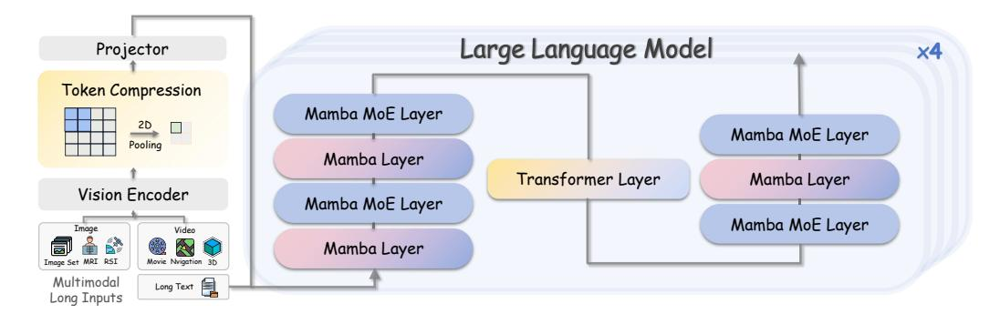
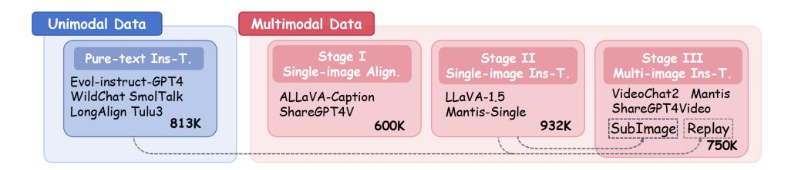
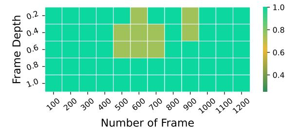
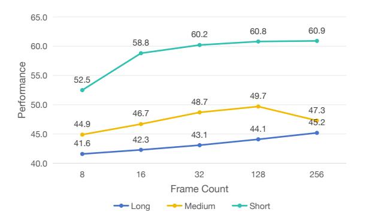
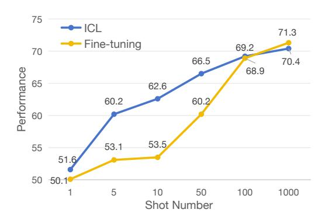
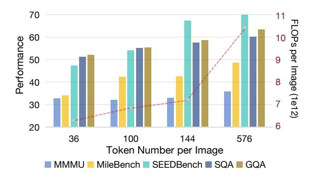
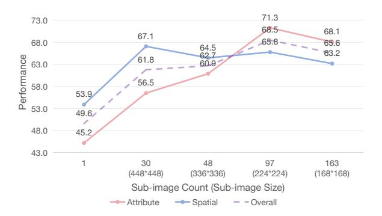
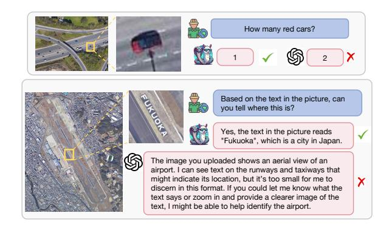

# LongLLaVA: Scaling Multi-modal LLMs to 1000 Images Efficiently via a Hybrid Architecture

Xidong Wang†1 , Dingjie Song†1,2 , Shunian Chen1 , Junyin Chen1 , Zhenyang Cai1 , Chen Zhang3 , Lichao Sun2 , Benyou Wang 1\*

> 1 The Chinese University of Hong Kong, Shenzhen 2 Lehigh University 3 Meituan

<https://github.com/FreedomIntelligence/LongLLaVA>

# Abstract

Expanding the long-context capabilities of Multi-modal Large Language Models (MLLMs) is critical for advancing video understanding and high-resolution image analysis. Achieving this requires systematic improvements in model architecture, data construction, and training strategies, particularly to address challenges such as performance degradation with increasing image counts and high computational costs. In this paper, we propose a hybrid architecture that integrates Mamba and Transformer blocks, introduce data construction methods that capture both temporal and spatial dependencies, and employ a progressive training strategy. Our released model, LongLLaVA (Long-Context Large Language and Vision Assistant), demonstrates an effective balance between efficiency and performance. LongLLaVA achieves competitive results across various benchmarks while maintaining high throughput and low memory consumption. Notably, it can process nearly one thousand images on a single A100 80GB GPU, underscoring its potential for a wide range of multi-modal applications.

# 1 Introduction

The rapid advancement of MLLMs [\(Liu et al.,](#page-11-0) [2024b,](#page-11-0) [2023a;](#page-11-1) [Dong et al.,](#page-10-0) [2024;](#page-10-0) [Chen et al.,](#page-9-0) [2024a\)](#page-9-0) has demonstrated their remarkable capabilities across various applications [\(Chu et al.,](#page-9-1) [2024;](#page-9-1) [Yang et al.,](#page-12-0) [2023;](#page-12-0) [Wu et al.,](#page-12-1) [2023;](#page-12-1) [Chen et al.,](#page-9-2) [2024b\)](#page-9-2). However, multi-image scenario remain an important yet to-be-explored aspect. In particular, expanding the context of MLLMs to understand longer videos [\(Zhang et al.,](#page-12-2) [2023;](#page-12-2) [Cheng et al.,](#page-9-3) [2024a\)](#page-9-3), higher-resolution images [\(Xu et al.,](#page-12-3) [2024b;](#page-12-3) [Wu and Xie,](#page-12-4) [2023a\)](#page-12-4), and make decisions based on more historical messages [\(Wang et al.,](#page-12-5) [2024b;](#page-12-5) [Liu et al.,](#page-11-2) [2024d\)](#page-11-2) is crucial for enhancing user experience [\(Li et al.,](#page-11-3) [2024b\)](#page-11-3) and further broadening MLLMs' application scope [\(Apple,](#page-9-4) [2024\)](#page-9-4).

However, extending the context length of MLLMs to improve their usability poses challenges related to degraded performance and high computational costs when processing more images. To maintain the performance in longer context, some studies [\(Zhang et al.,](#page-13-0) [2024a;](#page-13-0) [Zhao et al.,](#page-13-1) [2024a\)](#page-13-1) have concentrated on curating long-context training data involving multiple images to enhance performance. Additionally, other research efforts have explored new training strategies [\(Liu et al.,](#page-11-4) [2024a;](#page-11-4) [Zhang et al.,](#page-13-2) [2024b;](#page-13-2) [Li et al.,](#page-11-5) [2024a;](#page-11-5) [Zhang et al.,](#page-13-3) [2024c\)](#page-13-3) to mitigate performance declines. Regarding the issue of high computational costs, [Xue et al.](#page-12-6) [\(2024\)](#page-12-6) have made strides in improving multi-node efficiency by reducing communication costs. However, a significant gap persists in accelerating core on-node computation for long visual contexts without sacrificing performance. An integrated architectural solution addressing both performance and efficiency is thus needed.

To tackle these challenges, we propose LongLLaVA, featuring a hybrid architecture for efficient acceleration. Our solution focuses on three aspects: *Multi-modal Architecture*, *Data Construction*, and *Training Strategy*.

- Multi-modal Architecture: We use a hybrid Transformer-Mamba design and 2D pooling to compress image tokens, reducing computation while maintaining performance.
- Data Construction: We create task-specific formats to help the model distinguish temporal and spatial relationships between images.
- Training Strategy: We implement a threestage adaptation process to enhance model's multi-modal long-context capabilities.

\*Benyou is the corresponding author (*wangbenyou@cuhk.edu.cn*); † means contributing equally.

|                                | Model                          | Active     |        |   | #Few-shot of VL-ICL              |   |              | Compute                      | 100K Token (Efficiency) |                  |              |                      |
|--------------------------------|--------------------------------|------------|--------|---|----------------------------------|---|--------------|------------------------------|-------------------------|------------------|--------------|----------------------|
| Arch.                          |                                | Param. ICL |        | 1 | 2                                | 4 | 5            | Complexity                   | Prefill (s)          | TP (tokens/s) | Mem. (GB) | Max TP (tokens/s) |
| Mamba Transformer LLaVA-1.5 | Falcon-mamba-V                 | 7B 13B  | ✗ ✓ |   | 49.0 51.9 52.4 50.0 52.3 54.6 |   | 53.2 58.9 | Linear Quadratic          | 14.3 34.0            | 72.6 14.7     | 32.1 79.4 | 170.3 14.7        |
| Hybrid Hybrid               | LongLLaVA-9B LongLLaVA-A13B | 9B 13B  | ✓ ✓ |   | 51.6 57.8 58.4 52.3 59.0 59.0 |   | 60.2 61.3 | Quasi-Linear Quasi-Linear | 16.5 25.5            | 62.1 37.6     | 38.7 79.1 | 155.2 37.6        |

Table 1: Model Architectures Analysis: ICL Capability, and Efficiency. ICL performance is reported using VL-ICL [\(Zong et al.,](#page-13-4) [2024\)](#page-13-4) with varying numbers of examples. Efficiency metrics for processing 100K tokens include Prefill time (Prefill), Throughput (TP), Memory usage (Mem.). The Mamba architecture is represented by Falcon-mamba [\(Zuo et al.,](#page-13-5) [2024\)](#page-13-5), the largest publicly available pure Mamba LLM. Details are in Appendix [A.](#page-13-6)

Experiemntal results show that LongLLaVA excels in understanding multi-modal long contexts with high efficiency. It leads in retrieval, counting, and ordering tasks in VNBench [\(Zhao et al.,](#page-13-7) [2024d\)](#page-13-7) and achieves nearly 100% accuracy with 1,000 images on a single 80GB GPU for Needle-In-A-Haystack evaluation [\(Zhang et al.,](#page-13-2) [2024b\)](#page-13-2).

# 2 Background

# 2.1 The Computational Bottleneck in Multi-Image Architectures

While open-source Multimodal Large Language Models (MLLMs) have demonstrated impressive capabilities on single-image tasks, often matching their closed-source counterparts [\(Bai et al.,](#page-9-5) [2023;](#page-9-5) [Li et al.,](#page-11-5) [2024a;](#page-11-5) [Zhang et al.,](#page-13-0) [2024a;](#page-13-0) [OpenAI,](#page-11-6) [2024;](#page-11-6) [Google,](#page-10-1) [2024\)](#page-10-1), a significant performance disparity arises in multi-image scenarios [\(Song et al.,](#page-12-7) [2024\)](#page-12-7). This challenge stems from a fundamental computational bottleneck: the processing of excessively long visual token sequences. Standard visual encoders, such as CLIP [\(Radford et al.,](#page-12-8) [2021\)](#page-12-8), transform each image into a large set of tokens. As the number of input images scales, the length of this token sequence increases linearly, quickly overwhelming the fixed context window and computational budget of the language model. For instance, representing a mere three-minute video at one frame per second can generate a sequence exceeding 100,000 tokens, imposing prohibitive demands on both memory and processing power.

To address this scalability issue, prevailing strategies rely on visual compression [\(Chen et al.,](#page-9-6) [2023a;](#page-9-6) [Zhang et al.,](#page-13-2) [2024b;](#page-13-2) [Xu et al.,](#page-12-9) [2024a\)](#page-12-9). These techniques mitigate the computational load by reducing the token count before it is passed to the LLM. However, this approach introduces a critical tradeoff, as compression is inherently lossy. It sacrifices the fine-grained, high-frequency details within each

image that are essential for nuanced understanding. This forces existing architectures into a difficult dilemma of choosing between the unsustainable computational expense of full-fidelity processing and a performance ceiling imposed by irreversible information loss. This architectural impasse, the inability to achieve both scalability and high fidelity simultaneously, serves as the primary motivation for our work and compels the exploration of a new paradigm.

# 2.2 Motivation of Hybrid Architecture

Architectural Strengths and Limitations As shown in Table [1,](#page-1-0) Transformer architectures face significant computational challenges due to the quadratic complexity with sequence length. This inefficiency becomes a bottleneck in long-context scenarios, requiring high memory and computation resources. Mamba architectures address this issue with their linear computational complexity, making them significantly more efficient. However, they exhibit weaknesses in In-Context Learning (ICL) tasks, particularly those involving complex retrieval or reasoning [\(Park et al.,](#page-11-7) [2024\)](#page-11-7). These limitations may attributed to Mamba's reliance on reduced attention mechanisms [\(Olsson](#page-11-8) [et al.,](#page-11-8) [2022\)](#page-11-8), which constrain its ability to learn contextual patterns effectively. Although explicit training allows the Mamba model to execute basic ICL tasks, it falls short of leveraging the full potential of the parameter capacity and the available training data [\(Dao and Gu,](#page-10-2) [2024\)](#page-10-2).

### Synergistic Advantages of Hybrid Architecture

Recent advancements have demonstrated the potential of hybrid Mamba-Transformer architectures, which integrate Mamba's efficiency with the robust ICL capabilities of Transformers [\(Dao and](#page-10-2) [Gu,](#page-10-2) [2024;](#page-10-2) [Wang et al.,](#page-12-10) [2024a\)](#page-12-10). Comparative experiments show that these hybrids achieve superior

performance on ICL tasks and maintain computational efficiency. For instance, Jamba [\(Lieber](#page-11-9) [et al.,](#page-11-9) [2024\)](#page-11-9), a hybrid model, can process 256K tokens with only 4GB of KV-Cache memory, far surpassing the capabilities of Mixtral [\(Jiang et al.,](#page-10-3) [2024a\)](#page-10-3), which has the same activation parameters. As shown in Table [1,](#page-1-0) this balance between effectiveness and efficiency makes hybrid architectures an ideal solution for long-context multimodal tasks, addressing both computational and functional limitations. Experimental details are in Appendix [A.](#page-13-6)

### 2.3 Implementation for Hybrid Architecture

| Arch            | HellaSwag | NQ   | BoolQ | ARC-C |
|-----------------|-----------|------|-------|-------|
| Attention (1:0) | 62.4      | 14.5 | 60.9  | 34.6  |
| Hybrid (1:3)    | 65.1      | 16.5 | 60.6  | 36.8  |
| Hybrid (1:7)    | 65.1      | 16.0 | 64.4  | 34.8  |
| Mamba (0:1)     | 62.6      | 14.5 | 61.1  | 34.1  |

Table 2: Performance comparison of different hybrid architecture ratios on a 1.3B parameter model trained with 250B tokens. Details provided in Appendix [B.](#page-14-0)

Our hybrid architecture leverages established foundation model research. Its Mixture of Experts (MoE) configuration adopts the layer-wise pattern proposed by Jamba [\(Lieber et al.,](#page-11-9) [2024\)](#page-11-9), with expert layers integrated every two layers. For the Attention-Mamba blend ratio, previous work [\(Wang et al.,](#page-12-10) [2024a\)](#page-12-10) evaluated ratios such as 1:0, 1:1, 1:3, and 1:7, and found substantial performance gains when transitioning from pure Mamba (0:1 ratio) to a 1:7 blend, with diminishing returns as the transformer proportion increases further. This conclusion is further supported by [Lieber](#page-11-9) [et al.](#page-11-9) [\(2024\)](#page-11-9). Experiments on 1.3B parameter architectures trained on 250 billion tokens, with results presented in Table [2](#page-2-0) and details provided in Appendix [B,](#page-14-0) show only a marginal performance difference between the 1:7 and 1:3 ratios. Crucially, the 1:3 configuration is also significantly more computationally expensive. Thus, balancing empirical performance and computational efficiency, we selected the 1:7 configuration as optimal.

# 3 LongLLaVA

To address the aforementioned challenges and enhance the model's adaptability to long-context, multi-image scenarios, we introduce improvements from three perspectives: *multi-modal model architecture* (Sec. [3.1\)](#page-2-1), *data processing protocol* (Sec. [3.2\)](#page-2-2), and *training strategy* (Sec. [3.3\)](#page-3-0).

# 3.1 Multi-modal Architecture

The architecture consists of three core components inspired by LLaVA [\(Li et al.,](#page-11-5) [2024a\)](#page-11-5): the Vision Encoder, the Projector, and the LLM.

Vision Information Processing We employ CLIP[1](#page-2-3) as the vision encoder to encode visual information and a two-layer MLP as the projector to map vision features into the text embedding space suitable for the LLM. Prior to projection, bilinear pooling is applied, reducing the token representation of an image from 576 to 144 by aggregating 2×2 patch units into a single token. This approach effectively conserves training and inference time while maintaining essential spatial relationships between patches. In Section [4.3,](#page-5-0) we further discuss the impact of this token reduction on performance and explore strategies for its mitigation.

LLM Architecture Our model employs a hybrid LLM architecture comprising four stacks of hybrid layers, each integrates Transformer and Mamba layers in a 1:7 ratio, as depicted in Figure [1.](#page-3-1) It also features a Mixture of Experts (MoE) approach in every other layer, utilizing 16 experts and selecting the top-2 experts for each token. RMSNorm [\(Zhang](#page-12-11) [and Sennrich,](#page-12-11) [2019\)](#page-12-11) is used between layers to enhance normalization, although positional embeddings are omitted. The model incorporates Grouped Query Attention (GQA) [\(Ainslie et al.,](#page-9-7) [2023\)](#page-9-7) and SwiGLU activation functions [\(Shazeer,](#page-12-12) [2020\)](#page-12-12), similar to other large language models. The total parameter count of the model is 53B, with activation parameters during inference totaling 13B; we designate this model as LongLLaVA-A13B. In an effort to make the model more efficient, we have retained only the Expert-0 in the Mamba MoE Layer[2](#page-2-4) , thereby constructing LongLLaVA-9B.

# 3.2 Data Processing Protocol

To ensure the model can effectively distinguish temporal from spatial dependencies in multi-image inputs and perform robustly across diverse tasks, we have meticulously designed and differentiated special tokens for various scenarios. As illustrated in Figure [2,](#page-3-2) these tokens are tailored to represent the complex relationships between images in varying contexts, thereby enhancing the model's adaptability to a wide range of tasks.

1 openai/clip-vit-base-patch32

2We chose Expert-0 due to minimal performance differences, detailed in Appendix [C.](#page-14-1)

Figure 1: **Architecture of LongLLaVA.** The LongLLaVA model is capable of (1) accommodating a variety of multimodal inputs and efficiently processing image tokens via 2D token compression; (2) uniformly managing the preprocessed inputs within its hybrid LLM architecture.

# In the Following Statement: <Image>=...</img> For Single-image: "<Image>\n What is this?" For Multi-image: "<Image>\n This is a cat. <Image>\nThis is a:" For Video: "<vid><Image><\t\...<Image>\n What are they?" For Patched-image: "<Image>\n<Image>\n...<Image>\n What are they?"

Figure 2: **Data Processing Protocol for LongLLaVA**. We utilized different tokens to distinguish various modal information, and to identify the spatial and temporal relationships within images.

**Regular Single and Multiple Images** For regular single and multiple image inputs, we use  and </img> tokens to demarcate image-derived token sequences. This helps the model to differentiate these from textual tokens in the input stream.

**Video** For video inputs, to enable the model to comprehend the temporal relationships between frames, we enclose the entire sequence of frame tokens with <vid> and </vid>. Furthermore, the special token <t> is inserted between consecutive frames to signal their temporal dependency.

High Resolution Image For scenarios involving complex image understanding, such as high-resolution images segmented into multiple subimages, we utilize the \n token for structural organization. This token is first used to separate the representation of the global image from the block of its constituent sub-images. Additionally, when arranging these sub-images, which are typically ordered in a top-left to bottom-right raster scan, \n is inserted between the rows of sub-images. This approach preserves their relative spatial positions within the linearized input.

### 3.3 Training Strategy

Our training strategy employs both single-modal and multi-modal adaptations to transform a pretrained language model into a multimodal longcontext model.

Pure-text Instruction Tuning Initially, we enhance the pre-trained language model's capacity to follow instructions of varying lengths within pure-text contexts. This is accomplished using a comprehensive dataset of 813k pure-text entries, aggregated from Evol-instruct-GPT4 (Xu et al., 2023), WildChat (Zhao et al., 2024c), SmolTalk (Allal et al., 2025), and high-quality data sampled from Tulu3 (Lambert et al., 2025) via DEITA (Liu et al., 2024c), alongside LongAlign (Bai et al., 2024).

For multi-modal adaptation, we adopt a progressive training approach, which offers better variable control and increases model performance (Fu et al., 2024c). Building upon the *Single-image Alignment* and *Single-image Instruction-tuning* stages outlined in LLaVA (Li et al., 2024a), we introduce a *Multi-image Instruction-tuning* stage to systematically enhance the model's long-context capabilities. Details of dataset usage are provided in Figure 3.

**Stage I: Single-image Alignment** This initial multi-modal stage aims to align visual features with the textual modality. We utilize datasets such as ALLaVA-Caption (Chen et al., 2024a) and ShareGPT4V (Chen et al., 2023b), collectively comprising approximately 600K high-quality

Figure 3: Dataset Taxonomy of LongLLaVA. Replay refers to data sampled from former phase to maintain single-image and dialogue understanding ability. SubImage denotes a constructed dataset for understanding complex single images divided into sub-images. Ins-T. and Align. refer to instruction-tuning and alignment, respectively.

| Model             | PFLOPs | #P. | Temporal Semantic | MileBench                   | IR  |           |      | Video-MME w/o subs Avg. Short Medium Long Avg. |      |      |      | MVBench LongVideo* |
|-------------------|--------|-----|-------------------|-----------------------------|-----|-----------|------|---------------------------------------------------|------|------|------|--------------------|
|                   |        |     |                   | Proprietary Models          |     |           |      |                                                   |      |      |      |                    |
| GPT-4V            | -      | -   | 45.6              | 58.9                        |     | 86.7 63.7 | 70.5 | 55.8                                              | 53.5 | 59.9 | 43.5 | 59.1               |
| GPT-4o            | -      | -   | 56.2              | 63.5                        |     | 88.8 69.5 | 72.5 | 63.1                                              | 58.6 | 64.7 | -    | 66.7               |
| Gemini-1.5-Pro    | -      | -   | 50.2              | 58.3                        |     | 88.0 65.5 | 78.8 | 68.8                                              | 61.1 | 69.6 | -    | 64.0               |
| Claude3-Opus      | -      | -   | 37.4              | 48.1                        |     | 25.0 36.8 | 70.5 | 57.4                                              | 51.2 | 59.7 | -    | -                  |
| Open-source MLLMs |        |     |                   |                             |     |           |      |                                                   |      |      |      |                    |
| LongVA            | 4.90   | 8B  | -                 | -                           | -   | -         | 61.1 | 50.4                                              | 46.2 | 52.6 | -    | -                  |
| InternVL2         | 4.10   | 8B  | -                 | -                           | -   | -         | -    | -                                                 | -    | 56.3 | 65.8 | 54.6               |
| InternVL2.5       | 4.10   | 8B  | -                 | -                           | -   | -         | -    | -                                                 | -    | 64.2 | 72.0 | 60.0               |
| OmChat            | 3.90   | 8B  | 51.4              | 52.0                        |     | 34.2 45.9 | -    | -                                                 | -    | -    | 50.2 | -                  |
| LongVILA          | 3.90   | 8B  | -                 | -                           | -   | -         | 61.8 | 49.7                                              | 39.7 | 50.5 | -    | -                  |
| Qwen2-VL          | 3.80   | 7B  | -                 | -                           | -   | -         | -    | -                                                 | -    | 63.3 | 67.0 | -                  |
| Qwen2.5-VL        | -      | 7B  | -                 | -                           | -   | -         | -    | -                                                 | -    | 65.1 | 69.6 | 56.0               |
|                   |        |     |                   | Open-source Efficient MLLMs |     |           |      |                                                   |      |      |      |                    |
| VideoLLaMA2       | 3.71   | 7B  | 3.2               | 6.6                         | 4.5 | 5.0       | 55.9 | 45.4                                              | 42.1 | 47.8 | 34.1 | 40.3               |
| mPLUG-Owl3        | -      | 8B  | -                 | -                           | -   | -         | -    | -                                                 | -    | 53.5 | 54.5 | 52.1               |
| Phi-3-Vision      | 2.68   | 4B  | 46.9              | 50.0                        |     | 18.7 38.5 | -    | -                                                 | -    | -    | -    | 49.6               |
| Cobra             | 1.02   | 7B  | -                 | -                           | -   | -         | -    | -                                                 | -    | 49.5 | -    | -                  |
| VideoChat2        | 0.24   | 7B  | 25.5              | 25.5                        | 9.2 | 20.1      | 48.3 | 37.0                                              | 33.2 | 39.5 | 51.9 | 39.3               |
| LongLLaVA-9B      | 0.15   | 9B  | 54.2              | 52.4                        |     | 53.2 53.2 | 59.6 | 50.3                                              | 42.7 | 50.9 | 59.4 | 51.9               |
| LongLLaVA-A13B    | 0.22   | 53B | 56.2              | 58.6                        |     | 68.5 59.2 | 62.9 | 52.2                                              | 46.4 | 53.8 | 64.6 | 53.5               |

Table 3: Multi-image Evaluation Results: PFLOPs indicate floating-point operations per 128 images. LongVideo\* abbreviates LongVideoBench. All evaluations used FP16 precision.

image-caption pairs. During this phase, only the projector is trained, while the parameters of the Visual Encoder and the LLM remain frozen.

Stage II: Single-image Instruction Tuning The objective of this stage is to imbue the model with multimodal instruction-following capabilities. We employ datasets including LLaVA-1.5 [\(Liu et al.,](#page-11-11) [2023b\)](#page-11-11) and Mantis-Single [\(Jiang et al.,](#page-10-6) [2024b\)](#page-10-6), totaling 932K high-quality question-answer pairs. Only the Visual Encoder's parameters are frozen.

# Stage III: Multi-image Instruction Tuning This stage fine-tunes the model for instruction following in multi-image scenarios. Training data includes 200K instances from Mantis [\(Jiang](#page-10-6) [et al.,](#page-10-6) [2024b\)](#page-10-6), 200K from VideoChat2 [\(Li et al.,](#page-11-12) [2024c\)](#page-11-12), and 50K from ShareGPT4Video [\(Chen](#page-9-11) [et al.,](#page-9-11) [2024c\)](#page-9-11). The Replay component, incorporating 200K single-image and 50K pure-text

instruction-tuning instances, preserves established single-image comprehension and pure-text dialogue capabilities. Furthermore, the Sub-Image component enhances the interpretation of complex single images processed as segments; this is formed using 50K single-image instruction instances where original images are padded and segmented into subimages of size 336 × 336.

# 4 Experiments

### 4.1 Experimental Setup

To manage large-scale, diverse datasets during training, data items are randomly sampled and concatenated into sequences of 176K tokens, with individual items separated by the <eos> token. The model is trained for a single epoch on a distributed setup of 3 × 8 A800 GPUs. A cosine learning rate schedule is employed, with a

| Video MLLM        | PFLOPs | #P  | E E         | Retrieva I-1 | al I-2    | E            | Orderin I-1 | g I-2     | E-1  | Countin E-2 | 0            | Avg.      |
|-------------------|--------|-----|----------------|-----------------|--------------|--------------|----------------|--------------|------|----------------|--------------|-----------|
| GPT-40 GPT-4V  | -      | -   | 100.0 100.0 | 98.0 99.3    | 87.3 82.0 | 88.4 42.6 |                | 45.2 23.0 |      | 0.0            | 36.1 32.4 | 64.4 48.9 |
| Open-source MLLMs |        |     |                |                 |              |              |                |              |      |                |              |           |
| Qwen2-VL          | 0.87   | 7B  | 98.0           | 76.0            | 33.3         | 16.0         | 12.7           | 8.7          | 26.0 | 9.3            | 24.7         | 33.9      |
| VideoLLaMA2       | 0.85   | 7B  | 1.2            | 26.0            | 6.0          | 0.0          | 0.0            | 0.0          | 2.0  | 4.7            | 0.7          | 4.5       |
| LongLLaVA-9B      | 0.07   | 9B  | 98.3           | 57.2            | 96.3         | 24.2         | 57.2           | 24.3         | 24.5 | 21.0           | 26.0         | 44.4      |
| LongLLaVA-A13     | 0.09   | 53B | 100            | 73.3            | 100.0        | 37.5         | 35.3           | 34.8         | 36.0 | 23.7           | 28.0         | 52.1      |

Table 4: Long Context MLLMs' Atomic Capabilities Analysis using VNBench (Zhao et al., 2024d). PFLOPs refers to the number of floating-point operations required for inference on 54 images, which corresponds to the average number of frames extracted from the dataset videos at 1 FPS.

0.03 warm-up proportion and a peak learning rate of 1e-5. Detailed information on multi-image evaluation benchmarks and baselines is available in Appendix D. Unless otherwise noted, both LongLLaVA-9B and LongLLaVA-A13B models are evaluated using Int8 quantization to reduce computational costs while maintaining performance. Hereafter, LongLLaVA will refer to the LongLLaVA-A13B model. Information regarding the evaluation of fundamental single-image understanding capabilities is provided in Appendix E.

#### 4.2 Results

Main Results As detailed in Table 3, LongLLaVA exhibits strong performance among open-source models on the MileBench benchmark. It also demonstrates notable results in retrieval-oriented tasks, indicating its proficiency in processing multi-image inputs. Furthermore, its effectiveness is reflected in its performance on video benchmarks such as Video-MME (Fu et al., 2024a) and MVBench (Li et al., 2024c). A key aspect is its achievement of these results with a substantially lower computational cost, specifically an order of magnitude fewer FLOPs. This approach, therefore, presents a balance of enhanced performance relative to other architecture optimization methods while maintaining considerable operational efficiency in comparison to several SOTA models.

Diagnostic Evaluation of Long-Context To address limitations in evaluating long-context MLLMs, we conducted a diagnostic assessment using VNBench (Zhao et al., 2024d), a synthetic video framework evaluating atomic capabilities like retrieval, ordering, and counting. As detailed in Table 4, LongLLaVA's performance is on par with, and sometimes exceeds, leading closed-source models such as GPT-4V, while also outperforming other open-source counterparts in manag-

Figure 4: Video-NIAH (Zhang et al., 2024b) evaluated on one A800 80GB GPU.

| Model                  | MMLU             | BBH              | GQA  | MMMU                | $SEED^{v1}_{im}$                       | g Mile              |
|------------------------|------------------|------------------|------|---------------------|----------------------------------------|---------------------|
| Vicuna-13B Jamba-9B | <b>55.3</b> 54.3 | <b>40.5</b> 38.4 | 63.3 | 34.4 <b>36.2</b> | <b>A-1.5 Re</b> 68.2 <b>70.1</b> | 27.6 <b>28.2</b> |

Table 5: Ablation on MLLM Backbone Architectures.

ing extensive contexts. Further substantiating its retrieval strength, LongLLaVA also achieves nearly 100% accuracy on the 1200-image V-NIAH evaluation framework (Zhang et al., 2024b) without additional training, as depicted in Figure 4. These findings collectively indicate LongLLaVA's significant proficiency in long-context understanding and information retrieval.

### 4.3 Ablation Study

### **Ablation on MLLM Backbone Architectures**

To assess the impact of hybrid architectures on MLLM performance, we use Vicuna-13B (Chiang et al., 2023) and Jamba-9B (trained as described in Appendix C) as initial LLMs. As shown in Table 5, both models perform similarly before multimodal adaptation, with Vicuna-13B slightly ahead, ensuring a fair comparison. After training with the LLaVA-1.5 training recipe (Liu et al., 2024b), the hybrid architecture consistently achieves better results on most multimodal benchmarks, despite

| Method                        | #T                               | GQA  | MMMU      | SQA    | $SEED^{v1}_{img}$ | Mile |  |  |  |  |  |  |
|-------------------------------|----------------------------------|------|-----------|--------|-------------------|------|--|--|--|--|--|--|
| Ablation on Token Compression |                                  |      |           |        |                   |      |  |  |  |  |  |  |
| Jamba                         | 576                              | 63.2 | 41.4      | 75.4   | 69.8              | 38.2 |  |  |  |  |  |  |
| 1D Pooling                    | 144                              | 60.4 | 42.0      | 73.9   | 66.3              | 36.2 |  |  |  |  |  |  |
| 2D Pooling                    | 144                              | 61.3 | 42.1      | 75.2   | 67.4              | 37.7 |  |  |  |  |  |  |
| Abla                          | Ablation on Dataset Construction |      |           |        |                   |      |  |  |  |  |  |  |
| +S-image Data                 | 144                              | 62.2 | 42.1      | 75.9   | 68.9              | 50.0 |  |  |  |  |  |  |
| +M-image Data                 | 144                              | 59.9 | 39.2      | 73.4   | 65.3              | 57.4 |  |  |  |  |  |  |
| Abl                           | atio                             | on T | raining S | trateș | gies              |      |  |  |  |  |  |  |
| Stage1&2&3                    | 144                              | 56.9 | 32.8      | 67.2   | 66.9              | 42.2 |  |  |  |  |  |  |
| Stage1, 2&3                   | 144                              | 57.6 | 33.2      | 70.2   | 68.4              | 44.2 |  |  |  |  |  |  |
| Stage1, 2, 3                  | 144                              | 58.4 | 34.4      | 69.9   | 67.9              | 46.5 |  |  |  |  |  |  |

Table 6: Ablation on token compression, dataset construction and training strategies. 1D and 2D denote different pooling strategies. #T: the token count for one image. &: the combination of the stages. S-image: single-image. M-image: multiple-image.

slightly lower base LLM performance. This demonstrates that hybrid architecture is efficient and has no adverse effect on the multimodal adaptation.

**Ablation on other Methods** Ablation results for other methods are presented in Table 6. For token compression, pooling significantly reduces computational cost while keeping performance degradation within acceptable limits. Moreover, twodimensional pooling with a  $12 \times 12$  label arrangement offers clear advantages over one-dimensional pooling. Regarding dataset construction, the quality of our single-image training data surpasses that of LLaVA-1.5, and incorporating multi-image data substantially improves the model's performance on multi-image tasks. In terms of training strategies, progressive training is more effective than mix-training for multi-image tasks, while maintaining comparable results on single-image tasks. Due to space constraints, ablation results for replay data are provided in Appendix F.

### 5 Analysis

### 5.1 Scaling Law of Image Numbers

Processing more images enables models to handle additional video frames and provide more examples for few-shot learning. To investigate the effects of increasing the number of frames and examples, we evaluate LongLLaVA on the Video-MME (Fu et al., 2024a) and LongLLaVA-9B on the VL-ICL (Zong et al., 2024), respectively.

**Scaling Number of Frames** Video-MME evaluates a model's ability to extract information from videos. As shown in Figure 5, increasing the num-

Figure 5: Performance on the Video-MME benchmark as the number of sampled frames per video increases.

Figure 6: Performance comparison between Many-Shot ICL and fine-tuning on VL-ICL.

ber of sampled frames steadily improves performance, peaking at 256 frames. This indicates that the model effectively utilizes additional visual information from more frames.

Scaling Number of Shots Fine-tuning LLMs can be costly and impractical, especially with limited data or frequently changing tasks. In contrast, many-shot in-context learning (ICL) allows models to utilize more task-specific examples during inference without retraining (Agarwal et al., 2024). To evaluate this, we compare performance across different shot numbers and fine-tuning on the "Matching Image" task from VL-ICL, where each input is an image pair  $x = \{x_1, x_2\}$  and the output y indicates if a predefined relation r holds. As shown in Figure 6, ICL outperforms fine-tuning up to around 100 shots; however, when the number of examples exceeds 1,000, fine-tuning becomes more effective.

# 5.2 Impact and Mitigation of Token Compression

To quantify the impact of token compression on visual understanding and to evaluate corresponding mitigation strategies, we conduct a series of experiments. Our analysis leverages five general vision-

Figure 7: Performance and inference cost across five benchmarks with varying number of tokens per image.

Figure 8: Performance on V\* with different Sub-Image counts as Mitigating Token Compression Strategy.

language benchmarks alongside V\* Bench (Wu and Xie, 2023b), a specialized benchmark designed to assess the localization of small objects within large images, a task known to be particularly sensitive to information loss.

Impact of Token Compression As shown in Figure 7, setting the token count to 144 per image substantially reduces inference cost while incurring minimal degradation in overall performance. This effective trade-off is particularly evident on SEED-Bench, demonstrating that a significant reduction in computational overhead is achievable without compromising the model's general capabilities.

Mitigation through Image Partitioning To counteract the information loss inherent in token compression, we find that a simple strategy of partitioning the input image is highly effective for fine-grained tasks. This is clearly demonstrated in Figure 8, which shows that applying image partitioning on V\* Bench boosts the average accuracy to 68.5% from the 49.6% achieved when processing the image directly. The figure also illustrates a consistent performance improvement as the number of sub-images increases, confirming that this approach enhances the model's capacity for detailed

| Model         | Size | VQA-RAD | PathVQA |
|---------------|------|---------|---------|
| GPT-4V        | -    | 39.5    | -       |
| LLaVA         | 34B  | 58.6    | 59.1    |
| LLaVA-Med     | 7B   | 55.5    | 35.9    |
| HuatuoGPT-V   | 8B   | 63.8    | 59.9    |
| LongLLaVA-Med | 9B   | 68.5    | 55.0    |

Table 7: Comparison of model performance on pathology image understanding benchmarks.

| Model         | Acc.        | Rec.        | Prec.       | F1          |
|---------------|-------------|-------------|-------------|-------------|
| CT-CLIP       | 65.1        | 73.8        | 30.4        | 43.0        |
| LongLLaVA-Med | <b>86.7</b> | <b>77.6</b> | <b>35.5</b> | <b>48.5</b> |

Table 8: Model performance on the 3D CT image interpretation task. Acc., Rec., and Prec. denote Accuracy, Recall, and Precision, respectively.

visual analysis and effectively mitigates the performance degradation caused by token reduction on detail-oriented tasks

### 6 Applications

### 6.1 Applications in Healthcare

To showcase LongLLaVA's effectiveness in health-care, we introduce LongLLaVA-Med, a model derived by fine-tuning LongLLaVA-9B on the Pub-MedVision dataset (Chen et al., 2024b). This is a large-scale dataset comprising 1.3 million medical VQA samples, which was constructed by employing an "unblinded" Multimodal Large Language Model (MLLM) to denoise and reformat raw image-text pairs from biomedical literature. We evaluate the resulting model's capabilities in two critical tasks: pathology image analysis and 3D CT image interpretation.

**Pathology Image Understanding.** Pathology image analysis demands both fine-grained visual recognition and a deep understanding of medical knowledge. We evaluate LongLLaVA-Med on two benchmarks: VQA-RAD (Lau et al., 2018) and PathVQA (He et al., 2020). As shown in Table 7, our model achieves competitive performance compared to state-of-the-art approaches, despite being trained on less data.

**3D CT Image Interpretation.** To test its 3D vision capabilities, we apply LongLLaVA-Med to CT scan interpretation. Each 3D CT scan, consisting of multiple slices, is processed as a sequence of RGB images. We conduct zero-shot evaluation on the CT-RATE (Hamamci et al., 2024) validation

Figure 9: Comparative Study of Remote Sensing on the STAR Dataset.

| Model              | Score (%) |
|--------------------|-----------|
| Zero-shot Evalua   | tion      |
| LLaVA-1.5 (7B)     | 58.6      |
| GeoChat (7B)       | 53.5      |
| LongLLaVA (9B)     | 65.2      |
| Fine-tuned Evalua  | ation     |
| SkySenseGPT (7B)   | 79.8      |
| LongLLaVA-RS* (9B) | 82.3      |

Table 9: Results on FIT-RSFG-VQA. The best performance in each category is highlighted in **bold**.

set, which includes 1,304 samples with varying resolutions ( $512 \times 512$  to  $1024 \times 1024$ , average 690) and slice counts (100–984, average 300). As shown in Table 8, LongLLaVA-Med surpasses previous state-of-the-art results by 21.6%, setting a new benchmark for 3D CT image interpretation.

### 6.2 Applications in Science

In the scientific domain, we focus on geology and the interpretation of remote sensing imagery, which requires models to perform VQA on high-resolution satellite images (Zhou et al., 2024). Following the recent work of SkySenseGPT (Luo et al., 2024), a state-of-the-art MLLM for this field, we adopt the FIT-RSFG-VQA task (Luo et al., 2024) to evaluate models on fine-grained perception and instruction-following abilities.

As shown in Table 9, LongLLaVA exhibits strong performance among all evaluated models. Notably, after fine-tuning on only 27% of the Sky-SenseGPT data, LongLLaVA surpasses existing state-of-the-art models.

To address the resolution limitations of FIT-RSFG-VQA ( $512 \times 512$  pixels), we further evaluate on two high-resolution images from the STAR dataset (Li et al., 2024d), with resolutions of  $1024 \times 768$  and  $3327 \times 4083$ . This enables a more

comprehensive assessment of model capabilities. As illustrated in Figure 9, LongLLaVA effectively answers fine-grained VQA queries by segmenting large images into manageable subimages, consistently outperforming GPT-4V, especially on tasks requiring detailed visual analysis.

### 7 Conclusion

In this study, we introduce LongLLaVA, an innovative hybrid architecture model that excels in long-context multi-modal understanding. The model integrates Mamba and Transformer blocks, leveraging temporal and spatial dependencies between multiple images to construct data, and employs a progressive training strategy. LongLLaVA demonstrates competitive performance across various benchmarks while ensuring efficiency, setting a new standard for long-context MLLMs.

### Limitations

While our current model achieves a multimodal context length of 176K tokens, this is still limited compared to the ideal context range of 10–100 million tokens, which would enable more comprehensive understanding of large-scale inputs. Extending the context window to this scale remains a significant technical challenge, involving issues such as computational efficiency and memory constraints. Further research is needed to explore more effective architectures and optimization strategies to address these limitations.

### Acknowledgments

This work was supported by Major Frontier Exploration Program (Grant No. C10120250085) from the Shenzhen Medical Academy of Research and Translation (SMART), the Shenzhen Science and Technology Program (JCYJ20220818103001002), NSFC grant 72495131, Shenzhen Doctoral Startup Funding (RCBS20221008093330065), Tianyuan Fund for Mathematics of National Natural Science Foundation of China (NSFC) (12326608), Shenzhen Science and Technology Program (Shenzhen Key Laboratory Grant No. ZDSYS20230626091302006), and Shenzhen Stability Science Program 2023.

# References

- Rishabh Agarwal, Avi Singh, Lei M. Zhang, Bernd Bohnet, Luis Rosias, Stephanie Chan, Biao Zhang, Ankesh Anand, Zaheer Abbas, Azade Nova, John D. Co-Reyes, Eric Chu, Feryal Behbahani, Aleksandra Faust, and Hugo Larochelle. 2024. [Many-shot in](https://arxiv.org/abs/2404.11018)[context learning.](https://arxiv.org/abs/2404.11018) *Preprint*, arXiv:2404.11018.
- Joshua Ainslie, James Lee-Thorp, Michiel de Jong, Yury Zemlyanskiy, Federico Lebrón, and Sumit Sanghai. 2023. [Gqa: Training generalized multi-query](https://arxiv.org/abs/2305.13245) [transformer models from multi-head checkpoints.](https://arxiv.org/abs/2305.13245) *Preprint*, arXiv:2305.13245.
- Loubna Ben Allal, Anton Lozhkov, Elie Bakouch, Gabriel Martín Blázquez, Guilherme Penedo, Lewis Tunstall, Andrés Marafioti, Hynek Kydlícek, ˇ Agustín Piqueres Lajarín, Vaibhav Srivastav, Joshua Lochner, Caleb Fahlgren, Xuan-Son Nguyen, Clémentine Fourrier, Ben Burtenshaw, Hugo Larcher, Haojun Zhao, Cyril Zakka, Mathieu Morlon, Colin Raffel, Leandro von Werra, and Thomas Wolf. 2025. [Smollm2: When smol goes big – data](https://arxiv.org/abs/2502.02737)[centric training of a small language model.](https://arxiv.org/abs/2502.02737) *Preprint*, arXiv:2502.02737.
- Anthropic. 2024. [The claude 3 model family: Opus,](https://api.semanticscholar.org/CorpusID:268232499) [sonnet, haiku.](https://api.semanticscholar.org/CorpusID:268232499)
- Apple. 2024. [Apple intelligence foundation language](#page-0-0) [models.](#page-0-0)
- Jinze Bai, Shuai Bai, Shusheng Yang, Shijie Wang, Sinan Tan, Peng Wang, Junyang Lin, Chang Zhou, and Jingren Zhou. 2023. Qwen-vl: A frontier large vision-language model with versatile abilities. *arXiv preprint arXiv:2308.12966*.
- Shuai Bai, Keqin Chen, Xuejing Liu, Jialin Wang, Wenbin Ge, Sibo Song, Kai Dang, Peng Wang, Shijie Wang, Jun Tang, Humen Zhong, Yuanzhi Zhu, Mingkun Yang, Zhaohai Li, Jianqiang Wan, Pengfei Wang, Wei Ding, Zheren Fu, Yiheng Xu, Jiabo Ye, Xi Zhang, Tianbao Xie, Zesen Cheng, Hang Zhang, Zhibo Yang, Haiyang Xu, and Junyang Lin. 2025. [Qwen2.5-vl technical report.](https://arxiv.org/abs/2502.13923) *Preprint*, arXiv:2502.13923.
- Yushi Bai, Xin Lv, Jiajie Zhang, Yuze He, Ji Qi, Lei Hou, Jie Tang, Yuxiao Dong, and Juanzi Li. 2024. [Longalign: A recipe for long context alignment of](https://arxiv.org/abs/2401.18058) [large language models.](https://arxiv.org/abs/2401.18058) *Preprint*, arXiv:2401.18058.
- Guiming Hardy Chen, Shunian Chen, Ruifei Zhang, Junying Chen, Xiangbo Wu, Zhiyi Zhang, Zhihong Chen, Jianquan Li, Xiang Wan, and Benyou Wang. 2024a. Allava: Harnessing gpt4v-synthesized data for a lite vision-language model. *arXiv preprint arXiv:2402.11684*.
- Jun Chen, Deyao Zhu, Xiaoqian Shen, Xiang Li, Zechun Liu, Pengchuan Zhang, Raghuraman Krishnamoorthi, Vikas Chandra, Yunyang Xiong, and Mohamed Elhoseiny. 2023a. Minigpt-v2: large language model as a unified interface for vision-language multi-task learning. *arXiv preprint arXiv:2310.09478*.

- Junying Chen, Ruyi Ouyang, Anningzhe Gao, Shunian Chen, Guiming Hardy Chen, Xidong Wang, Ruifei Zhang, Zhenyang Cai, Ke Ji, Guangjun Yu, et al. 2024b. Huatuogpt-vision, towards injecting medical visual knowledge into multimodal llms at scale. *arXiv preprint arXiv:2406.19280*.
- Lin Chen, Jinsong Li, Xiaoyi Dong, Pan Zhang, Conghui He, Jiaqi Wang, Feng Zhao, and Dahua Lin. 2023b. [Sharegpt4v: Improving large multi](https://arxiv.org/abs/2311.12793)[modal models with better captions.](https://arxiv.org/abs/2311.12793) *Preprint*, arXiv:2311.12793.
- Lin Chen, Xilin Wei, Jinsong Li, Xiaoyi Dong, Pan Zhang, Yuhang Zang, Zehui Chen, Haodong Duan, Bin Lin, Zhenyu Tang, et al. 2024c. Sharegpt4video: Improving video understanding and generation with better captions. *arXiv preprint arXiv:2406.04325*.
- Zhe Chen, Weiyun Wang, Yue Cao, Yangzhou Liu, Zhangwei Gao, Erfei Cui, Jinguo Zhu, Shenglong Ye, Hao Tian, Zhaoyang Liu, et al. 2024d. Expanding performance boundaries of open-source multimodal models with model, data, and test-time scaling. *arXiv preprint arXiv:2412.05271*.
- Zhe Chen, Weiyun Wang, Hao Tian, Shenglong Ye, Zhangwei Gao, Erfei Cui, Wenwen Tong, Kongzhi Hu, Jiapeng Luo, Zheng Ma, et al. 2024e. How far are we to gpt-4v? closing the gap to commercial multimodal models with open-source suites. *arXiv preprint arXiv:2404.16821*.
- Zesen Cheng, Sicong Leng, Hang Zhang, Yifei Xin, Xin Li, Guanzheng Chen, Yongxin Zhu, Wenqi Zhang, Ziyang Luo, Deli Zhao, and Lidong Bing. 2024a. [Videollama 2: Advancing spatial-temporal model](https://arxiv.org/abs/2406.07476)[ing and audio understanding in video-llms.](https://arxiv.org/abs/2406.07476) *arXiv preprint arXiv:2406.07476*.
- Zesen Cheng, Sicong Leng, Hang Zhang, Yifei Xin, Xin Li, Guanzheng Chen, Yongxin Zhu, Wenqi Zhang, Ziyang Luo, Deli Zhao, and Lidong Bing. 2024b. [Videollama 2: Advancing spatial-temporal modeling](https://arxiv.org/abs/2406.07476) [and audio understanding in video-llms.](https://arxiv.org/abs/2406.07476) *Preprint*, arXiv:2406.07476.
- Wei-Lin Chiang, Zhuohan Li, Zi Lin, Ying Sheng, Zhanghao Wu, Hao Zhang, Lianmin Zheng, Siyuan Zhuang, Yonghao Zhuang, Joseph E. Gonzalez, Ion Stoica, and Eric P. Xing. 2023. [Vicuna: An open](https://lmsys.org/blog/2023-03-30-vicuna/)[source chatbot impressing gpt-4 with 90%\\* chatgpt](https://lmsys.org/blog/2023-03-30-vicuna/) [quality.](https://lmsys.org/blog/2023-03-30-vicuna/)
- Xiangxiang Chu, Limeng Qiao, Xinyu Zhang, Shuang Xu, Fei Wei, Yang Yang, Xiaofei Sun, Yiming Hu, Xinyang Lin, Bo Zhang, et al. 2024. Mobilevlm v2: Faster and stronger baseline for vision language model. *arXiv preprint arXiv:2402.03766*.
- Christopher Clark, Kenton Lee, Ming-Wei Chang, Tom Kwiatkowski, Michael Collins, and Kristina Toutanova. 2019. [Boolq: Exploring the surpris](https://arxiv.org/abs/1905.10044)[ing difficulty of natural yes/no questions.](https://arxiv.org/abs/1905.10044) *Preprint*, arXiv:1905.10044.

- Peter Clark, Isaac Cowhey, Oren Etzioni, Tushar Khot, Ashish Sabharwal, Carissa Schoenick, and Oyvind Tafjord. 2018. [Think you have solved question](https://arxiv.org/abs/1803.05457) [answering? try arc, the ai2 reasoning challenge.](https://arxiv.org/abs/1803.05457) *Preprint*, arXiv:1803.05457.
- Tri Dao and Albert Gu. 2024. [Transformers are](https://arxiv.org/abs/2405.21060) [ssms: Generalized models and efficient algorithms](https://arxiv.org/abs/2405.21060) [through structured state space duality.](https://arxiv.org/abs/2405.21060) *Preprint*, arXiv:2405.21060.
- Xiaoyi Dong, Pan Zhang, Yuhang Zang, Yuhang Cao, Bin Wang, Linke Ouyang, Xilin Wei, Songyang Zhang, Haodong Duan, Maosong Cao, Wenwei Zhang, Yining Li, Hang Yan, Yang Gao, Xinyue Zhang, Wei Li, Jingwen Li, Kai Chen, Conghui He, Xingcheng Zhang, Yu Qiao, Dahua Lin, and Jiaqi Wang. 2024. Internlm-xcomposer2: Mastering free-form text-image composition and comprehension in vision-language large model. *arXiv preprint arXiv:2401.16420*.
- Marah Abdin et al. 2024. [Phi-3 technical report: A](https://arxiv.org/abs/2404.14219) [highly capable language model locally on your phone.](https://arxiv.org/abs/2404.14219) *Preprint*, arXiv:2404.14219.
- Elias Frantar, Saleh Ashkboos, Torsten Hoefler, and Dan Alistarh. 2023. [Gptq: Accurate post-training](https://arxiv.org/abs/2210.17323) [quantization for generative pre-trained transformers.](https://arxiv.org/abs/2210.17323) *Preprint*, arXiv:2210.17323.
- Chaoyou Fu, Peixian Chen, Yunhang Shen, Yulei Qin, Mengdan Zhang, Xu Lin, Jinrui Yang, Xiawu Zheng, Ke Li, Xing Sun, Yunsheng Wu, and Rongrong Ji. 2023. [Mme: A comprehensive evaluation benchmark](https://arxiv.org/abs/2306.13394) [for multimodal large language models.](https://arxiv.org/abs/2306.13394) *Preprint*, arXiv:2306.13394.
- Chaoyou Fu, Yuhan Dai, Yondong Luo, Lei Li, Shuhuai Ren, Renrui Zhang, Zihan Wang, Chenyu Zhou, Yunhang Shen, Mengdan Zhang, et al. 2024a. Videomme: The first-ever comprehensive evaluation benchmark of multi-modal llms in video analysis. *arXiv preprint arXiv:2405.21075*.
- Xingyu Fu, Yushi Hu, Bangzheng Li, Yu Feng, Haoyu Wang, Xudong Lin, Dan Roth, Noah A. Smith, Wei-Chiu Ma, and Ranjay Krishna. 2024b. [Blink: Multi](https://arxiv.org/abs/2404.12390)[modal large language models can see but not perceive.](https://arxiv.org/abs/2404.12390) *Preprint*, arXiv:2404.12390.
- Yao Fu, Rameswar Panda, Xinyao Niu, Xiang Yue, Hannaneh Hajishirzi, Yoon Kim, and Hao Peng. 2024c. Data engineering for scaling language models to 128k context. *arXiv preprint arXiv:2402.10171*.
- Team Google. 2024. [Gemini 1.5: Unlocking multi](https://arxiv.org/abs/2403.05530)[modal understanding across millions of tokens of](https://arxiv.org/abs/2403.05530) [context.](https://arxiv.org/abs/2403.05530) *Preprint*, arXiv:2403.05530.
- Ibrahim Ethem Hamamci, Sezgin Er, Furkan Almas, Ayse Gulnihan Simsek, Sevval Nil Esirgun, Irem Dogan, Muhammed Furkan Dasdelen, Bastian Wittmann, Enis Simsar, Mehmet Simsar, et al.

- 2024. A foundation model utilizing chest ct volumes and radiology reports for supervised-level zeroshot detection of abnormalities. *arXiv preprint arXiv:2403.17834*.
- Xuehai He, Yichen Zhang, Luntian Mou, Eric Xing, and Pengtao Xie. 2020. Pathvqa: 30000+ questions for medical visual question answering. *arXiv preprint arXiv:2003.10286*.
- Dan Hendrycks, Collin Burns, Steven Basart, Andy Zou, Mantas Mazeika, Dawn Song, and Jacob Steinhardt. 2020. Measuring massive multitask language understanding. *arXiv preprint arXiv:2009.03300*.
- Drew A. Hudson and Christopher D. Manning. 2019. [Gqa: A new dataset for real-world visual reason](https://arxiv.org/abs/1902.09506)[ing and compositional question answering.](https://arxiv.org/abs/1902.09506) *Preprint*, arXiv:1902.09506.
- Albert Q. Jiang, Alexandre Sablayrolles, Antoine Roux, Arthur Mensch, Blanche Savary, Chris Bamford, Devendra Singh Chaplot, Diego de las Casas, Emma Bou Hanna, Florian Bressand, Gianna Lengyel, Guillaume Bour, Guillaume Lample, Lélio Renard Lavaud, Lucile Saulnier, Marie-Anne Lachaux, Pierre Stock, Sandeep Subramanian, Sophia Yang, Szymon Antoniak, Teven Le Scao, Théophile Gervet, Thibaut Lavril, Thomas Wang, Timothée Lacroix, and William El Sayed. 2024a. [Mixtral of experts.](https://arxiv.org/abs/2401.04088) *Preprint*, arXiv:2401.04088.
- Dongfu Jiang, Xuan He, Huaye Zeng, Cong Wei, Max Ku, Qian Liu, and Wenhu Chen. 2024b. [Mantis:](https://arxiv.org/abs/2405.01483) [Interleaved multi-image instruction tuning.](https://arxiv.org/abs/2405.01483) *Preprint*, arXiv:2405.01483.
- Tom Kwiatkowski, Jennimaria Palomaki, Olivia Redfield, Michael Collins, Ankur Parikh, Chris Alberti, Danielle Epstein, Illia Polosukhin, Jacob Devlin, Kenton Lee, Kristina Toutanova, Llion Jones, Matthew Kelcey, Ming-Wei Chang, Andrew M. Dai, Jakob Uszkoreit, Quoc Le, and Slav Petrov. 2019. [Natu](https://doi.org/10.1162/tacl_a_00276)[ral questions: A benchmark for question answering](https://doi.org/10.1162/tacl_a_00276) [research.](https://doi.org/10.1162/tacl_a_00276) *Transactions of the Association for Computational Linguistics*, 7:452–466.
- Woosuk Kwon, Zhuohan Li, Siyuan Zhuang, Ying Sheng, Lianmin Zheng, Cody Hao Yu, Joseph E. Gonzalez, Hao Zhang, and Ion Stoica. 2023. [Ef](https://arxiv.org/abs/2309.06180)[ficient memory management for large language](https://arxiv.org/abs/2309.06180) [model serving with pagedattention.](https://arxiv.org/abs/2309.06180) *Preprint*, arXiv:2309.06180.
- Nathan Lambert, Jacob Morrison, Valentina Pyatkin, Shengyi Huang, Hamish Ivison, Faeze Brahman, Lester James V. Miranda, Alisa Liu, Nouha Dziri, Shane Lyu, Yuling Gu, Saumya Malik, Victoria Graf, Jena D. Hwang, Jiangjiang Yang, Ronan Le Bras, Oyvind Tafjord, Chris Wilhelm, Luca Soldaini, Noah A. Smith, Yizhong Wang, Pradeep Dasigi, and Hannaneh Hajishirzi. 2025. [Tulu 3: Pushing fron](https://arxiv.org/abs/2411.15124)[tiers in open language model post-training.](https://arxiv.org/abs/2411.15124) *Preprint*, arXiv:2411.15124.

- Jason J Lau, Soumya Gayen, Asma Ben Abacha, and Dina Demner-Fushman. 2018. A dataset of clinically generated visual questions and answers about radiology images. *Scientific data*, 5(1):1–10.
- Bo Li, Yuanhan Zhang, Dong Guo, Renrui Zhang, Feng Li, Hao Zhang, Kaichen Zhang, Yanwei Li, Ziwei Liu, and Chunyuan Li. 2024a. Llavaonevision: Easy visual task transfer. *arXiv preprint arXiv:2408.03326*.
- Bohao Li, Rui Wang, Guangzhi Wang, Yuying Ge, Yixiao Ge, and Ying Shan. 2023. [Seed-bench: Bench](https://arxiv.org/abs/2307.16125)[marking multimodal llms with generative compre](https://arxiv.org/abs/2307.16125)[hension.](https://arxiv.org/abs/2307.16125) *Preprint*, arXiv:2307.16125.
- Chunyuan Li, Zhe Gan, Zhengyuan Yang, Jianwei Yang, Linjie Li, Lijuan Wang, Jianfeng Gao, et al. 2024b. Multimodal foundation models: From specialists to general-purpose assistants. *Foundations and Trends® in Computer Graphics and Vision*, 16(1- 2):1–214.
- Kunchang Li, Yali Wang, Yinan He, Yizhuo Li, Yi Wang, Yi Liu, Zun Wang, Jilan Xu, Guo Chen, Ping Luo, Limin Wang, and Yu Qiao. 2024c. [Mvbench: A comprehensive multi](https://arxiv.org/abs/2311.17005)[modal video understanding benchmark.](https://arxiv.org/abs/2311.17005) *Preprint*, arXiv:2311.17005.
- Yansheng Li, Linlin Wang, Tingzhu Wang, Xue Yang, Junwei Luo, Qi Wang, Youming Deng, Wenbin Wang, Xian Sun, Haifeng Li, et al. 2024d. Star: A first-ever dataset and a large-scale benchmark for scene graph generation in large-size satellite imagery. *arXiv preprint arXiv:2406.09410*.
- Yanwei Li, Yuechen Zhang, Chengyao Wang, Zhisheng Zhong, Yixin Chen, Ruihang Chu, Shaoteng Liu, and Jiaya Jia. 2024e. [Mini-gemini: Mining the potential](https://arxiv.org/abs/2403.18814) [of multi-modality vision language models.](https://arxiv.org/abs/2403.18814) *Preprint*, arXiv:2403.18814.
- Opher Lieber, Barak Lenz, Hofit Bata, Gal Cohen, Jhonathan Osin, Itay Dalmedigos, Erez Safahi, Shaked Meirom, Yonatan Belinkov, Shai Shalev-Shwartz, Omri Abend, Raz Alon, Tomer Asida, Amir Bergman, Roman Glozman, Michael Gokhman, Avashalom Manevich, Nir Ratner, Noam Rozen, Erez Shwartz, Mor Zusman, and Yoav Shoham. 2024. [Jamba: A hybrid transformer-mamba language](https://arxiv.org/abs/2403.19887) [model.](https://arxiv.org/abs/2403.19887) *Preprint*, arXiv:2403.19887.
- Hao Liu, Wilson Yan, Matei Zaharia, and Pieter Abbeel. 2024a. [World model on million-length video and](https://arxiv.org/abs/2402.08268) [language with blockwise ringattention.](https://arxiv.org/abs/2402.08268) *Preprint*, arXiv:2402.08268.
- Haotian Liu, Chunyuan Li, Yuheng Li, and Yong Jae Lee. 2023a. Improved baselines with visual instruction tuning.
- Haotian Liu, Chunyuan Li, Yuheng Li, Bo Li, Yuanhan Zhang, Sheng Shen, and Yong Jae Lee. 2024b. [Llava](https://llava-vl.github.io/blog/2024-01-30-llava-next/)[next: Improved reasoning, ocr, and world knowledge.](https://llava-vl.github.io/blog/2024-01-30-llava-next/)

- Haotian Liu, Chunyuan Li, Qingyang Wu, and Yong Jae Lee. 2023b. Visual instruction tuning.
- Wei Liu, Weihao Zeng, Keqing He, Yong Jiang, and Junxian He. 2024c. [What makes good data for align](https://openreview.net/forum?id=BTKAeLqLMw)[ment? a comprehensive study of automatic data se](https://openreview.net/forum?id=BTKAeLqLMw)[lection in instruction tuning.](https://openreview.net/forum?id=BTKAeLqLMw) In *The Twelfth International Conference on Learning Representations*.
- Xiao Liu, Tianjie Zhang, Yu Gu, Iat Long Iong, Yifan Xu, Xixuan Song, Shudan Zhang, Hanyu Lai, Xinyi Liu, Hanlin Zhao, Jiadai Sun, Xinyue Yang, Yu Yang, Zehan Qi, Shuntian Yao, Xueqiao Sun, Siyi Cheng, Qinkai Zheng, Hao Yu, Hanchen Zhang, Wenyi Hong, Ming Ding, Lihang Pan, Xiaotao Gu, Aohan Zeng, Zhengxiao Du, Chan Hee Song, Yu Su, Yuxiao Dong, and Jie Tang. 2024d. [Visualagentbench: Towards](https://arxiv.org/abs/2408.06327) [large multimodal models as visual foundation agents.](https://arxiv.org/abs/2408.06327) *Preprint*, arXiv:2408.06327.
- Yuan Liu, Haodong Duan, Yuanhan Zhang, Bo Li, Songyang Zhang, Wangbo Zhao, Yike Yuan, Jiaqi Wang, Conghui He, Ziwei Liu, Kai Chen, and Dahua Lin. 2023c. [Mmbench: Is your multi-modal model](https://arxiv.org/abs/2307.06281) [an all-around player?](https://arxiv.org/abs/2307.06281) *Preprint*, arXiv:2307.06281.
- Pan Lu, Swaroop Mishra, Tony Xia, Liang Qiu, Kai-Wei Chang, Song-Chun Zhu, Oyvind Tafjord, Peter Clark, and Ashwin Kalyan. 2022. [Learn to explain:](https://arxiv.org/abs/2209.09513) [Multimodal reasoning via thought chains for science](https://arxiv.org/abs/2209.09513) [question answering.](https://arxiv.org/abs/2209.09513) *Preprint*, arXiv:2209.09513.
- Junwei Luo, Zhen Pang, Yongjun Zhang, Tingzhu Wang, Linlin Wang, Bo Dang, Jiangwei Lao, Jian Wang, Jingdong Chen, Yihua Tan, et al. 2024. Skysensegpt: A fine-grained instruction tuning dataset and model for remote sensing vision-language understanding. *arXiv preprint arXiv:2406.10100*.
- Ahmed Masry, Do Xuan Long, Jia Qing Tan, Shafiq Joty, and Enamul Hoque. 2022. [Chartqa: A benchmark](https://arxiv.org/abs/2203.10244) [for question answering about charts with visual and](https://arxiv.org/abs/2203.10244) [logical reasoning.](https://arxiv.org/abs/2203.10244) *Preprint*, arXiv:2203.10244.
- Minesh Mathew, Dimosthenis Karatzas, and C. V. Jawahar. 2021. [Docvqa: A dataset for vqa on document](https://arxiv.org/abs/2007.00398) [images.](https://arxiv.org/abs/2007.00398) *Preprint*, arXiv:2007.00398.
- Catherine Olsson, Nelson Elhage, Neel Nanda, Nicholas Joseph, Nova DasSarma, Tom Henighan, Ben Mann, Amanda Askell, Yuntao Bai, Anna Chen, Tom Conerly, Dawn Drain, Deep Ganguli, Zac Hatfield-Dodds, Danny Hernandez, Scott Johnston, Andy Jones, Jackson Kernion, Liane Lovitt, Kamal Ndousse, Dario Amodei, Tom Brown, Jack Clark, Jared Kaplan, Sam McCandlish, and Chris Olah. 2022. [In](https://arxiv.org/abs/2209.11895)[context learning and induction heads.](https://arxiv.org/abs/2209.11895) *Preprint*, arXiv:2209.11895.
- OpenAI. 2024. [Gpt-4 technical report.](https://arxiv.org/abs/2303.08774) *Preprint*, arXiv:2303.08774.
- Jongho Park, Jaeseung Park, Zheyang Xiong, Nayoung Lee, Jaewoong Cho, Samet Oymak, Kangwook Lee, and Dimitris Papailiopoulos. 2024. [Can mamba learn](https://arxiv.org/abs/2402.04248) [how to learn? a comparative study on in-context](https://arxiv.org/abs/2402.04248) [learning tasks.](https://arxiv.org/abs/2402.04248) *Preprint*, arXiv:2402.04248.

- Guilherme Penedo, Hynek Kydlícek, Loubna Ben al- ˇ lal, Anton Lozhkov, Margaret Mitchell, Colin Raffel, Leandro Von Werra, and Thomas Wolf. 2024. [The](https://arxiv.org/abs/2406.17557) [fineweb datasets: Decanting the web for the finest](https://arxiv.org/abs/2406.17557) [text data at scale.](https://arxiv.org/abs/2406.17557) *Preprint*, arXiv:2406.17557.
- Alec Radford, Jong Wook Kim, Chris Hallacy, Aditya Ramesh, Gabriel Goh, Sandhini Agarwal, Girish Sastry, Amanda Askell, Pamela Mishkin, Jack Clark, Gretchen Krueger, and Ilya Sutskever. 2021. [Learn](https://arxiv.org/abs/2103.00020)[ing transferable visual models from natural language](https://arxiv.org/abs/2103.00020) [supervision.](https://arxiv.org/abs/2103.00020) *Preprint*, arXiv:2103.00020.
- Noam Shazeer. 2020. [Glu variants improve transformer.](https://arxiv.org/abs/2002.05202) *Preprint*, arXiv:2002.05202.
- Dingjie Song, Shunian Chen, Guiming Hardy Chen, Fei Yu, Xiang Wan, and Benyou Wang. 2024. [Milebench:](https://arxiv.org/abs/2404.18532) [Benchmarking mllms in long context.](https://arxiv.org/abs/2404.18532) *Preprint*, arXiv:2404.18532.
- Mirac Suzgun, Nathan Scales, Nathanael Schärli, Sebastian Gehrmann, Yi Tay, Hyung Won Chung, Aakanksha Chowdhery, Quoc V Le, Ed H Chi, Denny Zhou, et al. 2022. Challenging big-bench tasks and whether chain-of-thought can solve them. *arXiv preprint arXiv:2210.09261*.
- Junxiong Wang, Daniele Paliotta, Avner May, Alexander M. Rush, and Tri Dao. 2024a. [The mamba in](https://arxiv.org/abs/2408.15237) [the llama: Distilling and accelerating hybrid models.](https://arxiv.org/abs/2408.15237) *Preprint*, arXiv:2408.15237.
- Junyang Wang, Haiyang Xu, Haitao Jia, Xi Zhang, Ming Yan, Weizhou Shen, Ji Zhang, Fei Huang, and Jitao Sang. 2024b. Mobile-agent-v2: Mobile device operation assistant with effective navigation via multi-agent collaboration. *arXiv preprint arXiv:2406.01014*.
- Peng Wang, Shuai Bai, Sinan Tan, Shijie Wang, Zhihao Fan, Jinze Bai, Keqin Chen, Xuejing Liu, Jialin Wang, Wenbin Ge, Yang Fan, Kai Dang, Mengfei Du, Xuancheng Ren, Rui Men, Dayiheng Liu, Chang Zhou, Jingren Zhou, and Junyang Lin. 2024c. [Qwen2-vl: Enhancing vision-language model's per](https://arxiv.org/abs/2409.12191)[ception of the world at any resolution.](https://arxiv.org/abs/2409.12191) *Preprint*, arXiv:2409.12191.
- Haoning Wu, Dongxu Li, Bei Chen, and Junnan Li. 2024. [Longvideobench: A benchmark for long](https://arxiv.org/abs/2407.15754)[context interleaved video-language understanding.](https://arxiv.org/abs/2407.15754) *Preprint*, arXiv:2407.15754.
- Penghao Wu and Saining Xie. 2023a. [V\\*: Guided](https://arxiv.org/abs/2312.14135) [visual search as a core mechanism in multimodal](https://arxiv.org/abs/2312.14135) [llms.](https://arxiv.org/abs/2312.14135) *Preprint*, arXiv:2312.14135.
- Penghao Wu and Saining Xie. 2023b. V\*: Guided visual search as a core mechanism in multimodal llms. *arXiv preprint arXiv:2312.14135*.
- Shengqiong Wu, Hao Fei, Leigang Qu, Wei Ji, and Tat-Seng Chua. 2023. Next-gpt: Any-to-any multimodal llm. *arXiv preprint arXiv:2309.05519*.

- Can Xu, Qingfeng Sun, Kai Zheng, Xiubo Geng, Pu Zhao, Jiazhan Feng, Chongyang Tao, and Daxin Jiang. 2023. [Wizardlm: Empowering large language](https://arxiv.org/abs/2304.12244) [models to follow complex instructions.](https://arxiv.org/abs/2304.12244) *Preprint*, arXiv:2304.12244.
- Lin Xu, Yilin Zhao, Daquan Zhou, Zhijie Lin, See Kiong Ng, and Jiashi Feng. 2024a. Pllava: Parameter-free llava extension from images to videos for video dense captioning. *arXiv preprint arXiv:2404.16994*.
- Ruyi Xu, Yuan Yao, Zonghao Guo, Junbo Cui, Zanlin Ni, Chunjiang Ge, Tat-Seng Chua, Zhiyuan Liu, Maosong Sun, and Gao Huang. 2024b. [Llava-uhd: an](https://arxiv.org/abs/2403.11703) [lmm perceiving any aspect ratio and high-resolution](https://arxiv.org/abs/2403.11703) [images.](https://arxiv.org/abs/2403.11703) *Preprint*, arXiv:2403.11703.
- Fuzhao Xue, Yukang Chen, Dacheng Li, Qinghao Hu, Ligeng Zhu, Xiuyu Li, Yunhao Fang, Haotian Tang, Shang Yang, Zhijian Liu, Ethan He, Hongxu Yin, Pavlo Molchanov, Jan Kautz, Linxi Fan, Yuke Zhu, Yao Lu, and Song Han. 2024. [Longvila: Scaling](https://arxiv.org/abs/2408.10188) [long-context visual language models for long videos.](https://arxiv.org/abs/2408.10188) *Preprint*, arXiv:2408.10188.
- Zhao Yang, Jiaxuan Liu, Yucheng Han, Xin Chen, Zebiao Huang, Bin Fu, and Gang Yu. 2023. Appagent: Multimodal agents as smartphone users. *arXiv preprint arXiv:2312.13771*.
- Jiabo Ye, Haiyang Xu, Haowei Liu, Anwen Hu, Ming Yan, Qi Qian, Ji Zhang, Fei Huang, and Jingren Zhou. 2024. [mplug-owl3: Towards long image-sequence](https://arxiv.org/abs/2408.04840) [understanding in multi-modal large language models.](https://arxiv.org/abs/2408.04840) *Preprint*, arXiv:2408.04840.
- Weihao Yu, Zhengyuan Yang, Linjie Li, Jianfeng Wang, Kevin Lin, Zicheng Liu, Xinchao Wang, and Lijuan Wang. 2023. [Mm-vet: Evaluating large mul](https://arxiv.org/abs/2308.02490)[timodal models for integrated capabilities.](https://arxiv.org/abs/2308.02490) *Preprint*, arXiv:2308.02490.
- Xiang Yue, Yuansheng Ni, Kai Zhang, Tianyu Zheng, Ruoqi Liu, Ge Zhang, Samuel Stevens, Dongfu Jiang, Weiming Ren, Yuxuan Sun, Cong Wei, Botao Yu, Ruibin Yuan, Renliang Sun, Ming Yin, Boyuan Zheng, Zhenzhu Yang, Yibo Liu, Wenhao Huang, Huan Sun, Yu Su, and Wenhu Chen. 2024. [Mmmu:](https://arxiv.org/abs/2311.16502) [A massive multi-discipline multimodal understand](https://arxiv.org/abs/2311.16502)[ing and reasoning benchmark for expert agi.](https://arxiv.org/abs/2311.16502) *Preprint*, arXiv:2311.16502.
- Rowan Zellers, Ari Holtzman, Yonatan Bisk, Ali Farhadi, and Yejin Choi. 2019. [Hellaswag: Can](https://arxiv.org/abs/1905.07830) [a machine really finish your sentence?](https://arxiv.org/abs/1905.07830) *Preprint*, arXiv:1905.07830.
- Biao Zhang and Rico Sennrich. 2019. [Root mean square](https://arxiv.org/abs/1910.07467) [layer normalization.](https://arxiv.org/abs/1910.07467) *Preprint*, arXiv:1910.07467.
- Hang Zhang, Xin Li, and Lidong Bing. 2023. [Video](https://arxiv.org/abs/2306.02858)[llama: An instruction-tuned audio-visual language](https://arxiv.org/abs/2306.02858) [model for video understanding.](https://arxiv.org/abs/2306.02858) *arXiv preprint arXiv:2306.02858*.

Pan Zhang, Xiaoyi Dong, Yuhang Zang, Yuhang Cao, Rui Qian, Lin Chen, Qipeng Guo, Haodong Duan, Bin Wang, Linke Ouyang, Songyang Zhang, Wenwei Zhang, Yining Li, Yang Gao, Peng Sun, Xinyue Zhang, Wei Li, Jingwen Li, Wenhai Wang, Hang Yan, Conghui He, Xingcheng Zhang, Kai Chen, Jifeng Dai, Yu Qiao, Dahua Lin, and Jiaqi Wang. 2024a. [Internlm-xcomposer-2.5: A versatile large vision lan](https://arxiv.org/abs/2407.03320)[guage model supporting long-contextual input and](https://arxiv.org/abs/2407.03320) [output.](https://arxiv.org/abs/2407.03320) *Preprint*, arXiv:2407.03320.

Peiyuan Zhang, Kaichen Zhang, Bo Li, Guangtao Zeng, Jingkang Yang, Yuanhan Zhang, Ziyue Wang, Haoran Tan, Chunyuan Li, and Ziwei Liu. 2024b. [Long](https://arxiv.org/abs/2406.16852) [context transfer from language to vision.](https://arxiv.org/abs/2406.16852) *Preprint*, arXiv:2406.16852.

Yuanhan Zhang, Bo Li, haotian Liu, Yong jae Lee, Liangke Gui, Di Fu, Jiashi Feng, Ziwei Liu, and Chunyuan Li. 2024c. [Llava-next: A strong zero-shot](https://llava-vl.github.io/blog/2024-04-30-llava-next-video/) [video understanding model.](https://llava-vl.github.io/blog/2024-04-30-llava-next-video/)

Han Zhao, Min Zhang, Wei Zhao, Pengxiang Ding, Siteng Huang, and Donglin Wang. 2025. [Cobra: Ex](https://arxiv.org/abs/2403.14520)[tending mamba to multi-modal large language model](https://arxiv.org/abs/2403.14520) [for efficient inference.](https://arxiv.org/abs/2403.14520) *Preprint*, arXiv:2403.14520.

Tiancheng Zhao, Qianqian Zhang, Kyusong Lee, Peng Liu, Lu Zhang, Chunxin Fang, Jiajia Liao, Kelei Jiang, Yibo Ma, and Ruochen Xu. 2024a. [Om](https://arxiv.org/abs/2407.04923)[chat: A recipe to train multimodal language models](https://arxiv.org/abs/2407.04923) [with strong long context and video understanding.](https://arxiv.org/abs/2407.04923) *Preprint*, arXiv:2407.04923.

Tiancheng Zhao, Qianqian Zhang, Kyusong Lee, Peng Liu, Lu Zhang, Chunxin Fang, Jiajia Liao, Kelei Jiang, Yibo Ma, and Ruochen Xu. 2024b. Omchat: A recipe to train multimodal language models with strong long context and video understanding. *arXiv preprint arXiv:2407.04923*.

Wenting Zhao, Xiang Ren, Jack Hessel, Claire Cardie, Yejin Choi, and Yuntian Deng. 2024c. [Wildchat:](https://arxiv.org/abs/2405.01470) [1m chatgpt interaction logs in the wild.](https://arxiv.org/abs/2405.01470) *Preprint*, arXiv:2405.01470.

Zijia Zhao, Haoyu Lu, Yuqi Huo, Yifan Du, Tongtian Yue, Longteng Guo, Bingning Wang, Weipeng Chen, and Jing Liu. 2024d. [Needle in a video haystack:](https://arxiv.org/abs/2406.09367) [A scalable synthetic framework for benchmarking](https://arxiv.org/abs/2406.09367) [video mllms.](https://arxiv.org/abs/2406.09367) *Preprint*, arXiv:2406.09367.

Yue Zhou, Litong Feng, Yiping Ke, Xue Jiang, Junchi Yan, Xue Yang, and Wayne Zhang. 2024. Towards vision-language geo-foundation model: A survey. *arXiv preprint arXiv:2406.09385*.

Yongshuo Zong, Ondrej Bohdal, and Timothy Hospedales. 2024. [Vl-icl bench: The devil in the](https://arxiv.org/abs/2403.13164) [details of benchmarking multimodal in-context learn](https://arxiv.org/abs/2403.13164)[ing.](https://arxiv.org/abs/2403.13164) *Preprint*, arXiv:2403.13164.

Jingwei Zuo, Maksim Velikanov, Dhia Eddine Rhaiem, Ilyas Chahed, Younes Belkada, Guillaume Kunsch, and Hakim Hacid. 2024. Falcon mamba: The first competitive attention-free 7b language model. *arXiv preprint arXiv:2410.05355*.

# A Details about Hybrid Motivation

This section covers the details about investigating the respective strengths and limitations of various model architectures concerning in-context learning (ICL) capabilities and inference efficiency. Our analysis aims to underscore the advantages offered by hybrid architectures, which are designed to amalgamate the beneficial characteristics of their constituent architectural paradigms.

Baselines To assess the Mamba architecture, we employed the Falcon-mamba model [\(Zuo et al.,](#page-13-5) [2024\)](#page-13-5) featuring 7.3 billion parameters. This model was trained and evaluated under identical settings to our proposed model. Despite the inherent challenges in precisely aligning parameter counts across different Multimodal Large Language Models (MLLMs), Falcon-mamba represents the largest publicly available Mamba configuration suitable for this comparative analysis. For the Transformer architecture, we selected LLaVA-1.6 [\(Liu et al.,](#page-11-0) [2024b\)](#page-11-0) with 13B parameters. This choice was motivated by its inference parameter consistency with LongLLaVA, thereby facilitating a more equitable comparison of inference efficiency.

ICL Analysis Settings We conducted an evaluation of multimodal in-context learning performance using the "Matching Image" task from the VL-ICL benchmark [\(Zong et al.,](#page-13-4) [2024\)](#page-13-4). In this task, the input consists of an image pair, denoted as x = {x1, x2}. The corresponding output, y, signifies whether a predefined relation, r, is present between the two images. The objective for the MLLMs is to discern this underlying relation from a set of provided examples.

Efficiency Analysis Settings Our examination of inference efficiency encompasses four key metrics: Prefill Time (latency of the initial inference step), Throughput (measured as subsequent tokens generated per second), Memory Usage, and Maximum Throughput (defined as the throughput achieved under the maximum possible batch size). For these evaluations, we standardized the input text length to 100,000 tokens. We then measured the time taken and the peak memory consumption for generating outputs of 1 token and 1,000 tokens. Throughput was subsequently calculated using the formula: (1000−1)/(time1000−time1). To more accurately reflect real-world application scenarios, both Transformer and Hybrid architectures were benchmarked utilizing the vLLM framework [\(Kwon et al.,](#page-10-10) [2023\)](#page-10-10) and Int8 quantization [\(Frantar et al.,](#page-10-11) [2023\)](#page-10-11).

| Downcycling Strategy | Arithmetic Mean | Spherical Mean | Expert-0 | Expert-5 | Expert-12 | Expert-15 |
|----------------------|--------------------|-------------------|----------|----------|-----------|-----------|
| MMLU                 | 52.7               | 53.2              | 53.2     | 51.9     | 52.6      | 52.2      |
| Aft. Train           | 53.8               | 54.3              | 54.3     | 53.3     | 53.8      | 53.3      |
| BBH                  | 36.7               | 36.7              | 37.2     | 36.7     | 37.4      | 36.3      |
| Aft. Train           | 37.8               | 37.9              | 38.4     | 38.9     | 38.9      | 37.9      |

Table 10: Performance of Different Downcycling Strategies on MMLU and BBH

# B Experiments Settings for Hybrid Ratio

To investigate the optimal ratio of Attention to Mamba layers (denoted as a : m) within 1.3B parameter models, various model configurations were trained using 250B tokens randomly sampled from the FineWeb-Edu dataset [\(Penedo et al.,](#page-12-15) [2024\)](#page-12-15). The training utilized a global batch size of 512, a cosine learning rate schedule with a peak learning rate of 1 × 10−4 , and the AdamW optimizer (with β1 = 0.9, β2 = 0.95, and a weight decay of 0.1). Upon completion of training, model performance was evaluated on multiple benchmark datasets.

The evaluation benchmarks included:

- HellaSwag [\(Zellers et al.,](#page-12-16) [2019\)](#page-12-16): Evaluated using a 10-shot setting, this benchmark assesses commonsense inference by requiring models to choose the most plausible continuation of a given context from four options.
- ARC-Challenge [\(Clark et al.,](#page-10-12) [2018\)](#page-10-12): This benchmark was evaluated with a 25-shot methodology and tests complex questionanswering abilities, particularly the more difficult questions from the AI2 Reasoning Challenge (ARC) which often demand multi-step reasoning.
- Natural Questions (NQ) [\(Kwiatkowski et al.,](#page-10-13) [2019\)](#page-10-13): A 5-shot evaluation was used for this benchmark, which measures the model's capacity to answer real user questions from Google Search without access to external documents, relying on its internal knowledge.
- BoolQ [\(Clark et al.,](#page-9-14) [2019\)](#page-9-14): Evaluated in a 10-shot setup, this benchmark assesses reading comprehension through yes/no questions paired with short passages, where the model must determine the answer's veracity based on the text.

# C Preliminary Experiments on Expert Selection for LongLLaVA-9B

To determine the optimal expert selection method in the MoE layers we also conducted preliminary experiments. Using prevalent LLM benchmarks, MMLU [\(Hendrycks et al.,](#page-10-14) [2020\)](#page-10-14) and BBH [\(Suzgun](#page-12-17) [et al.,](#page-12-17) [2022\)](#page-12-17), we evaluated three expert selection strategies: numerical averaging, spherical averaging, and random expert selection.

These methods were compared both before and after Pure-text Instruction Tuning with dataset of 278k pure-text entries, aggregated from Evolinstruct-GPT4 [\(Xu et al.,](#page-12-13) [2023\)](#page-12-13), WildChat [\(Zhao](#page-13-8) [et al.,](#page-13-8) [2024c\)](#page-13-8), alongside LongAlign [\(Bai et al.,](#page-9-9) [2024\)](#page-9-9). As shown in Table [10,](#page-14-3) the differences in model performance were minimal across the selection methods. Therefore, for simplicity, we opted to use Expert-0.

# D Details of Multi-Image Evaluation

# D.1 Benchmarks

The multimodal long-context understanding capabilities of our model are primarily assessed using five multi-image benchmarks. These include MileBench [\(Song et al.,](#page-12-7) [2024\)](#page-12-7), selected for its focus on multimodal long-context scenarios. For video analysis, we additionally incorporate Video-MME [\(Fu et al.,](#page-10-7) [2024a\)](#page-10-7), MVBench [\(Li et al.,](#page-11-12) [2024c\)](#page-11-12), and LongVideoBench [\(Wu et al.,](#page-12-18) [2024\)](#page-12-18). Detailed descriptions of these benchmarks are provided subsequently.

Multi-image Benchmarks To evaluate multiimage understanding capabilities, the following benchmarks were employed:

- MileBench [\(Song et al.,](#page-12-7) [2024\)](#page-12-7): This benchmark evaluates performance in long-context scenarios, with a particular emphasis on its Temporal, Semantic, and Information Retrieval (IR) components.
- Video-MME [\(Fu et al.,](#page-10-7) [2024a\)](#page-10-7): This benchmark assesses video analysis capabilities

across 30 distinct sub-fields. The evaluation protocol typically involves processing 128 frames uniformly sampled from each video, without relying on subtitle information.

- MVBench [\(Li et al.,](#page-11-12) [2024c\)](#page-11-12): MVBench targets 20 challenging video understanding tasks that are intractable with single-frame analysis, thus requiring multi-frame reasoning.
- LongVideoBench [\(Wu et al.,](#page-12-18) [2024\)](#page-12-18): This benchmark provides a question-answering (QA) framework with interleaved videolanguage inputs, where video durations can extend up to one hour.

### D.2 Comparative Models

Our model is benchmarked against a comprehensive suite of existing models, encompassing three commercial and thirteen open-source counterparts. The commercial models include GPT-4V[3](#page-15-1) [\(OpenAI,](#page-11-6) [2024\)](#page-11-6), GPT-4o[4](#page-15-2) , Claude3-Opus [\(An](#page-9-15)[thropic,](#page-9-15) [2024\)](#page-9-15) and Gemini-1.5-Pro[5](#page-15-3) [\(Google,](#page-10-1) [2024\)](#page-10-1). The open-source models comprise Qwen2- VL2 [\(Wang et al.,](#page-12-19) [2024c\)](#page-12-19), Qwen2.5-VL [\(Bai](#page-9-16) [et al.,](#page-9-16) [2025\)](#page-9-16), InternVL2 [\(Chen et al.,](#page-9-17) [2024e\)](#page-9-17), InternVL2.5 [\(Chen et al.,](#page-9-18) [2024d\)](#page-9-18), Phi-3-Vision [\(et al.,](#page-10-15) [2024\)](#page-10-15), OmChat [\(Zhao et al.,](#page-13-10) [2024b\)](#page-13-10), LongVA, LongVILA [\(Xue et al.,](#page-12-6) [2024\)](#page-12-6), Video-LLaMA-2 [\(Cheng et al.,](#page-9-19) [2024b\)](#page-9-19), Cobra [\(Zhao et al.,](#page-13-11) [2025\)](#page-13-11), Mini-Gemini [\(Li et al.,](#page-11-16) [2024e\)](#page-11-16), mPLUG-Owl3 [\(Ye](#page-12-20) [et al.,](#page-12-20) [2024\)](#page-12-20), and VideoChat2 [\(Li et al.,](#page-11-12) [2024c\)](#page-11-12). For consistent and reproducible evaluations, the temperature parameter is set to 0.

# E Details of Single-Image Evaluation

The single-image evaluation is designed to investigate the model's fundamental capabilities and the impact of extended long-context training on singleimage understanding.

### E.1 Experimental Setup

We employed a comprehensive suite of benchmarks to assess various aspects of visual understanding and cognitive processing within a single-image context. These benchmarks include GQA [\(Hud](#page-10-16)[son and Manning,](#page-10-16) [2019\)](#page-10-16), MME [\(Fu et al.,](#page-10-17) [2023\)](#page-10-17), MM-Vet [\(Yu et al.,](#page-12-21) [2023\)](#page-12-21), ScienceQA [\(Lu et al.,](#page-11-17) [2022\)](#page-11-17), SEED-Bench-v1 [\(Li et al.,](#page-11-18) [2023\)](#page-11-18), MM-Bench [\(Liu et al.,](#page-11-19) [2023c\)](#page-11-19), MMMU [\(Yue et al.,](#page-12-22) [2024\)](#page-12-22), BLINK [\(Fu et al.,](#page-10-18) [2024b\)](#page-10-18), ChartQA [\(Masry](#page-11-20) [et al.,](#page-11-20) [2022\)](#page-11-20), and DocVQA [\(Mathew et al.,](#page-11-21) [2021\)](#page-11-21). Detailed descriptions are provided below.

Single-Image Benchmarks To evaluate the model's single-image understanding capabilities, we selected eight commonly utilized benchmarks. These are:

- GQA [\(Hudson and Manning,](#page-10-16) [2019\)](#page-10-16): A benchmark for real-world visual reasoning and compositional question answering.
- MME [\(Fu et al.,](#page-10-17) [2023\)](#page-10-17): A comprehensive benchmark for evaluating multimodal perception and cognition; the perception-focused subset was employed in this study.
- MM-Vet [\(Yu et al.,](#page-12-21) [2023\)](#page-12-21): Examines six core visual-linguistic (VL) capabilities alongside sixteen integrated tasks derived from these capabilities.
- ScienceQA [\(Lu et al.,](#page-11-17) [2022\)](#page-11-17): Comprises 4,210 questions on diverse science topics, featuring detailed annotations.
- SEED-Bench-v1 [\(Li et al.,](#page-11-18) [2023\)](#page-11-18): Evaluates multimodal comprehension across twelve dimensions in both image and video modalities; our analysis utilized the image-based subset.
- MMBench [\(Liu et al.,](#page-11-19) [2023c\)](#page-11-19): A systematically designed benchmark covering twenty distinct multimodal ability dimensions.
- MMMU [\(Yue et al.,](#page-12-22) [2024\)](#page-12-22): Assesses multimodal models on multidisciplinary tasks requiring university-level expertise, spanning 183 subfields and 30 types of images.
- BLINK [\(Fu et al.,](#page-10-18) [2024b\)](#page-10-18): A benchmark for multimodal LLMs that specifically targets core visual perception abilities not emphasized in existing evaluations.

Comparison Models Our model was benchmarked against a comprehensive suite of existing models, comprising four commercial and thirteen open-source alternatives. This set of comparison models is identical to that used in the Multi-Image evaluations. For consistent and reproducible evaluations, the temperature parameter is set to 0.

3 gpt-4-vision-preview

4 gpt-4o-2024-08-06

5 gemini-1.5-pro

| Model             | TFLOPs             | #P #T   | ChartQA | DocVQA    | GQA     | MM-Vet | MME P | MMB  | MMMU | SQA I | $SEED^{v1}_{img}$ | BLINK |  |  |
|-------------------|--------------------|---------|---------|-----------|---------|--------|------------------|------|------|------------------|-------------------|-------|--|--|
|                   | Proprietary Models |         |         |           |         |        |                  |      |      |                  |                   |       |  |  |
| GPT-4V            | -                  |         | 75.6    | -         | -       | 67.7   | 1926.5           | 81.3 | 56.8 | 82.1             | 69.1              |       |  |  |
| Gemini-1.5        | -                  |         | 81.3    | 90.9      | -       | 65.8   | 2148.9           | 73.6 | 48.9 | 81.4             | 62.9              |       |  |  |
| Claude3-Opus      | -                  |         | 80.8    | 89.3      | -       | 74.2   | 1586.8           | 63.3 | 54.9 | -                | 42.0              |       |  |  |
| Open-source MLLMs |                    |         |         |           |         |        |                  |      |      |                  |                   |       |  |  |
| InternVL2         | 5.45               | 8B 576  | 83.3    | 91.6      | -       | -      | 2210.3           | 82.9 | 52.6 | -                | -                 | 50.9  |  |  |
| InternVL2.5       | 5.45               | 8B 576  | 84.8    | 93.0      | -       | -      | 2344.1           | 83.8 | 56.0 | -                | -                 | 54.8  |  |  |
| OmChat            | 5.18               | 8B 576  | -       | -         | -       | 39.6   | -                | 78.8 | 45.9 | -                | -                 | -     |  |  |
| LongVILA          | 5.18               | 8B 576  | -       | -         | 65.4    | 51.7   | -                | 83.4 | -    | -                | 70.6              | -     |  |  |
| Qwen2-VL          | 5.05               | 7B 576  | 83.0    | 94.5      | -       | -      | 1872.0           |      | 54.1 | -                | -                 |       |  |  |
| Qwen2.5-VL        | -                  | 7B -    | 87.3    | 95.7      | -       | -      | 2347.0           | 83.5 | 58.6 | -                | -                 | 56.4  |  |  |
|                   |                    |         | Op      | en-source | Efficie | nt MLI | Ms               |      |      |                  |                   |       |  |  |
| Phi-3-Vision      | 3.56               | 4B 576  | 81.8    | 69.3      | -       | -      | -                | 80.5 | 40.4 | 90.8             | -                 | -     |  |  |
| Cobra             | 2.35               | 7B 768  | -       | -         | 63.9    | -      | 1496.5           | -    | 37.2 | -                | -                 |       |  |  |
| LongLLaVA-9B      | 0.58               | 9B 144  | 44.8    | 47.4      | 58.4    | 32.3   | 1504.6           | 65.6 | 34.4 | 69.9             | 67.9              | 50.2  |  |  |
| LongLLaVA-A13B    | 0.86               | 53B 144 | 46.3    | 51.2      | 59.9    | 35.2   | 1523.9           | 63.7 | 39.2 | 73.4             | 65.3              | 52.4  |  |  |
| LongLLaVA-9B*     | 4.86               | 9B -    | 72.3    | 83.6      | 72.3    | 42.6   | 1693.6           | 72.8 | 45.3 | 76.3             | 70.9              | 52.2  |  |  |
| LongLLaVA-A13B*   | 5.14               | 53B -   | 81.6    | 90.8      | 76.5    | 53.6   | 1823.9           | 79.4 | 52.5 | 80.4             | 72.4              | 55.2  |  |  |

Table 11: Single-image Evaluation. TFLOPs represents the number of floating-point operations required to infer 1 images. The highest scores for proprietary and open-source MLLMs are marked in bold. #Token refers to the token count for one image. \* means using Mitigating Token Compression Strategy mentioned in Section 5.2.

|                          | MMLU | ВВН  | GQA  | MMMU | $\mathbf{SQA}^{I}$ | $\mathbf{SEED}^{v1}_{img}$ | $\mathbf{Mile}^*_{avg}$ |
|--------------------------|------|------|------|------|--------------------|----------------------------|-------------------------|
| LongLLaVA-9B             | 53.9 | 38.8 | 58.4 | 34.4 | 69.9               | 67.9                       | 46.5                    |
| w/o Replay Data          | 52.3 | 36.2 | 57.5 | 31.2 | 53.5               | 64.3                       | 46.8                    |
| Replace with Multi-Image | 52.6 | 35.9 | 57.2 | 29.8 | 52.6               | 63.8                       | 47.2                    |

Table 12: Comparison of Model Performance With and Without Replay Data.

### E.2 Results Analysis

As shown in Table 11, for the single-image understanding task, the LongLLaVA series models, when using default inference settings, achieve performance comparable to other efficient multimodal models, while requiring fewer inference FLOPs. However, their performance still lags behind that of some leading multimodal models, primarily due to token compression.

To fully realize the potential of LongLLaVA in single-image understanding, we applied the token compression mitigation strategy described in Section 5.2. Specifically, we pad each image so that its height and width are multiples of 168, then partition it into sub-images of size  $168 \times 168$ . This approach effectively eliminates the adverse effects of token compression. Experimental results demonstrate that, with this mitigation strategy, the LongLLaVA series achieves performance on par with state-of-the-art multimodal models.

### F Replay Data Ablation Study

To assess the impact of replay data, we conducted three experiments as part of the Replay Data Abla-

|                                | MMLU | BBH  |
|--------------------------------|------|------|
| LongLLaVA-9B (w/o Replay Data) | 52.3 | 36.2 |
| with 10K                       | 52.9 | 37.3 |
| with 20K                       | 53.4 | 38.1 |
| with 50K                       | 53.9 | 38.8 |
| with 100K                      | 53.9 | 39.2 |
|                                |      |      |

Table 13: Impact of Text Replay Data Quantity.

tion Study.

### Comparison With and Without Replay Data.

We first conducted experiments comparing models trained with and without replay data. To isolate the effect of replay data from the impact of increased training data, we performed an ablation study by replacing replay data in the original training recipe with an equivalent amount of multimage data. The results, presented in Table 12, demonstrate that replay data is essential for preserving the model's original single-image understanding and text-following capabilities.

**Replay Data Quantity Ablation.** We also examined the impact of varying the quantity of replay data. For **text replay data**, the supplementary ex-

|                 | ~~ . | 3 53 53 53 |                  | annn 11                    |                |
|-----------------|------|------------|------------------|----------------------------|----------------|
|                 | GQA  | MMMU       | SQA 1 | $\mathbf{SEED}_{img}^{v1}$ | $Mile_{avg}^*$ |
| w/o Replay Data | 57.5 | 31.2       | 53.5             | 64.3                       | 46.8           |
| with 50K        | 57.9 | 32.3       | 58.2             | 66.2                       | 46.5           |
| with 100K       | 57.9 | 33.5       | 62.7             | 67.1                       | 46.5           |
| with 200K       | 58.2 | 34.5       | 67.1             | 67.9                       | 46.8           |
| with 400K       | 58.5 | 35.2       | 73.2             | 68.2                       | 46.4           |

Table 14: Impact of Single-Image Replay Data Quantity.

periments reveal that adding text replay data enhances the model's text-following ability, although the improvement eventually saturates, as shown in Table 13. For **single-image replay data**, the results in Table 14 indicate that the model's single-image capability continues to improve with increased data volume and has not yet reached saturation. However, the improvement in multi-image tasks is limited.