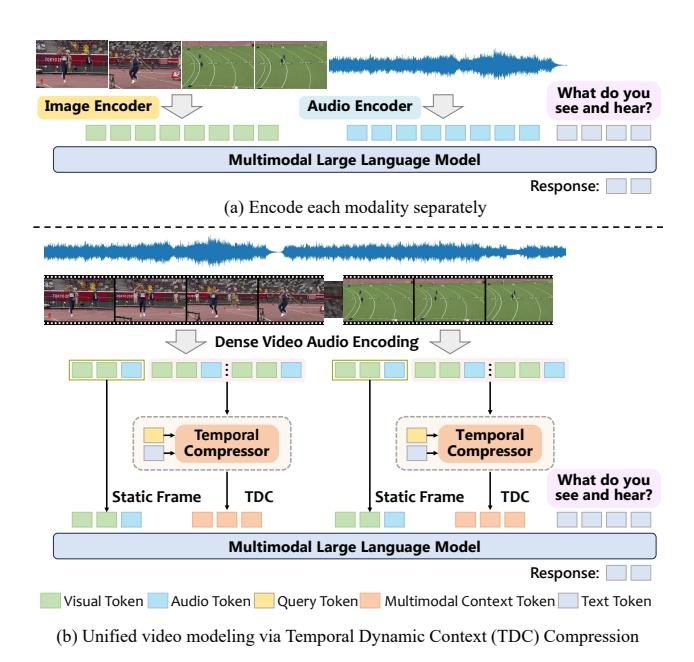
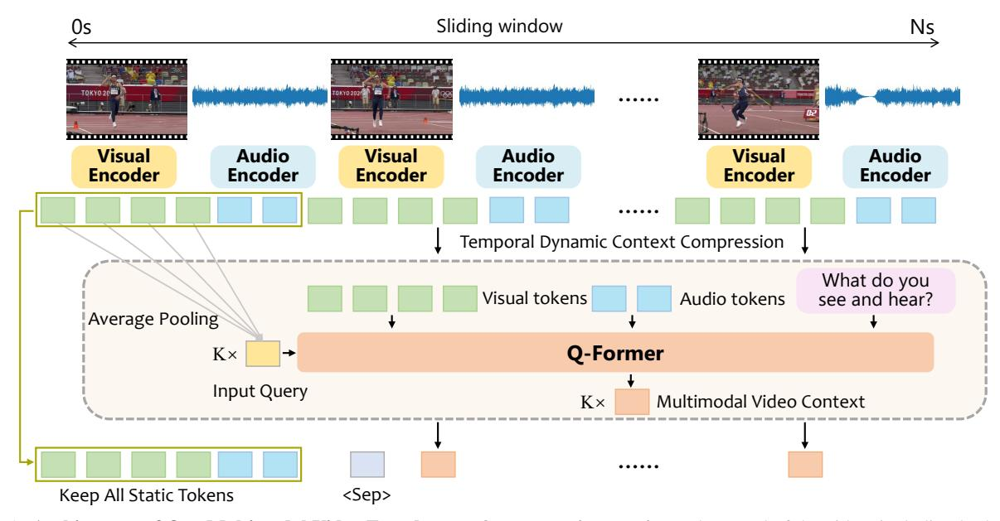
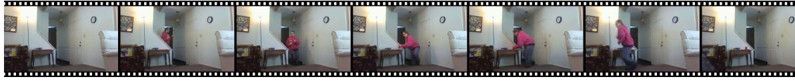

# Multimodal Long Video Modeling Based on Temporal Dynamic Context

Haoran Hao1,2\*, Jiaming Han1\*, Yiyuan Zhang1, Xiangyu Yue1†

1MMLab, The Chinese University of Hong Kong 2Nanjing University

#### **Abstract**

Recent advances in Large Language Models (LLMs) have led to significant breakthroughs in video understanding. However, existing models still struggle with long video processing due to the context length constraint of LLMs and the vast amount of information within the video. Although some recent methods are designed for long video understanding, they often lose crucial information during token compression and struggle with additional modality like audio. In this work, we propose a dynamic long video encoding method utilizing the temporal relationship between frames, named Temporal Dynamic Context (TDC). Firstly, we segment the video into semantically consistent scenes based on inter-frame similarities, then encode each frame into tokens using visual-audio encoders. **Secondly**, we propose a novel temporal context compressor to reduce the number of tokens within each segment. Specifically, we employ a querybased Transformer to aggregate video, audio, and instruction text tokens into a limited set of temporal context tokens. Finally, we feed the static frame tokens and the temporal context tokens into the LLM for video understanding. Furthermore, to handle extremely long videos, we propose a training-free chain-of-thought strategy that progressively extracts answers from multiple video segments. These intermediate answers serve as part of the reasoning process and contribute to the final answer. We conduct extensive experiments on general video understanding and audio-video understanding benchmarks, where our method demonstrates strong performance. The code and models are available at https://github.com/Hoar012/TDC-Video.

#### 1. Introduction

Recently, advances in large language models (LLMs) [2, 41, 49] have significantly improved their ability in language processing and generation. Researchers have extended these models to other modalities, such as vision [30, 33, 40, 81], audio [10, 17] and point clouds [22, 23],

Figure 1. Comparison of Visual and Audio Encoding in Video Modeling. (a) Existing methods encode each modality separately and then concatenate them, leading to inconsistencies and difficulties in handling long videos. (b) We propose Temporal Dynamic Context (TDC) compression, which incorporates both static visual features and dynamic video context to represent videos more effectively. This approach enables better multimodal integration and efficient compression for long videos.

leading to the development of powerful multimodal LLMs (MLLMs). These MLLMs achieve strong performance in various tasks, such as image captioning [6, 24] and question answering [40, 54]. However, video understanding remains a challenging problem due to the interplay of multiple modalities [10, 17] and the complexity of large-scale information [37, 52], especially in long videos.

A key challenge in long video processing is efficiently representing videos to minimize redundancy between frames while preserving crucial details. Some attempts have been made to address this challenge [35, 51, 59, 61], but they typically compress video tokens based

\* Equal contribution † Corresponding author

on visual similarity between frames, while overlooking high-level dynamic semantic information. This limits the model's ability to capture comprehensive video information within a fixed number of tokens, increasing the difficulty of understanding the content.

Another challenge lies in integrating multiple modalities for comprehensive video understanding. For instance, when watching a movie, humans naturally integrate speech, background music, visual scenes, and subtitles to grasp the full context. However, most existing video LLMs are limited to visual and textual modalities and struggle to tackle audio. Although some works [\[10,](#page-9-1) [17,](#page-9-2) [77\]](#page-12-1) represented by Video-LLaMA [\[77\]](#page-12-1) try to incorporate both audio and visual information, their approach of simply concatenating modality tokens often leads to suboptimal performance by treating different modalities separately (refer to Fig. [1](#page-0-0) (a)). Developing a unified representation method that effectively connects information between modalities is essential to improve multimodal video understanding.

To address these challenges, we propose a video representation model that integrates multiple modalities within a unified video context and achieves effective token compression. As shown in Fig. [1](#page-0-0) (b), (1) we segment the video into scenes based on the visual consistency between frames, which are then encoded separately. (2) Each video clip is represented using both static visual features of the key frame and dynamic video context of the video. We first extract per-second features using a visual encoder and an audio encoder. The feature of the first frame is fully retained as a static representation, while the features of subsequent frames are compressed by a Q-Former [\[12\]](#page-9-4), based on their temporal consistency and differences relative to the static frame. This approach enables effective token compression while integrating multiple modalities within the video context. (3) To enhance the effectiveness of the model on extremely long video, we introduce the Long Video Chain-of-Thought (LVCoT) strategy, which guides the model to process long videos step by step before integrating the whole video to generate the final output.

We train models of various sizes using a multi-stage strategy, progressively optimizing them for vision-language alignment, video instruction tuning, and audio-video instruction tuning. We evaluate our models on a range of video benchmarks, including MVBench [\[34\]](#page-10-9), PerceptionTest [\[47\]](#page-11-6), EgoSchema [\[43\]](#page-10-10), MLVU [\[86\]](#page-12-2), and Video-MME [\[16\]](#page-9-5). Furthermore, we assess their performance on audio-video question-answering benchmarks, such as Music-QA [\[31\]](#page-10-11) and AVSD [\[3\]](#page-9-6). Resuls show that our models achieve strong performance on both video and multimodal understanding tasks. Our main contributions include:

• We propose a framework for multimodal video modeling, which represents videos using both static visual features and dynamic multimodal context, effectively

- integrating visual and audio information within a unified video context.
- We introduce the Long Video Chain-of-Thought (LV-CoT), a training-free strategy that enables MLLMs to process and reason over long videos step by step, enhancing the performance of existing models.
- We conduct extensive experiments with MLLMs of various sizes and evaluate them on multiple benchmarks, including general video question answering, long video understanding, and audio-visual video comprehension. Our models achieve strong performance, advancing the field of multimodal long video understanding.

# 2. Related Work

Multimodal Large Language Models. Previously, multimodal models like CLIP [\[50\]](#page-11-7) primarily focused on specific tasks and modalities, including vision and language. Recently, the integration of LLMs and the scaling of data and model size have produced advanced MLLMs. These MLLMs [\[19,](#page-10-12) [40,](#page-10-3) [44,](#page-10-13) [45,](#page-11-8) [57,](#page-11-9) [79,](#page-12-3) [81\]](#page-12-0) possess powerful understanding, reasoning, and generation capabilities, enabling them to show brilliant performance on a wide range of multimodal tasks. This proficiency in vision-language understanding can be seamlessly extended to video understanding. For instance, Video-LLaVA [\[38\]](#page-10-14) and LLaMA-VID [\[37\]](#page-10-7) utilize LLMs as decoders to generate answers based on video content and input questions. Several works [\[10,](#page-9-1) [17,](#page-9-2) [19,](#page-10-12) [20,](#page-10-15) [22,](#page-10-4) [23,](#page-10-5) [23,](#page-10-5) [45,](#page-11-8) [57,](#page-11-9) [77,](#page-12-1) [78\]](#page-12-4) attempt to incorporate additional modalities, such as audio, into LLMs to enhance their perception of the complex world. In addition, some works [\[15,](#page-9-7) [39,](#page-10-16) [62,](#page-11-10) [76\]](#page-12-5) focus on developing a unified MLLM for both understanding and multimodal generation tasks. Vision, language and audio are core components of human perception. To enable models to effectively understand dynamic environments, video comprehension has gained increasing attention. However, it remains a field that requires further exploration.

Long Video Understanding. The rapid development of MLLMs has enabled researchers to extend their visionlanguage understanding ability to process videos. Video-LLaVA [\[38\]](#page-10-14) and VideoChat [\[33\]](#page-10-2) use video instruction data to train LLMs to generate language responses for input video and questions. However, early video LLMs typically represent a video using multiple images. While this simple representation shows some progress in short video processing, it struggles with longer videos due to significant information loss. Recently, some methods [\[29,](#page-10-17) [71,](#page-12-6) [82\]](#page-12-7) are proposed to compress tokens used for image representation, among which LLaVA-Mini [\[82\]](#page-12-7) utilizes modality prefusion to aggregate visual information into language tokens, which effectively reduces the number of tokens needed for an image. Similar approaches are employed to compress

Figure 2. Architecture of Our Multimodal Video Encoder. We first extract features for each second of the video, including both visual and corresponding audio tokens. The first frame is selected as the static frame, and a Q-Former is used to perform Temporal Dynamic Context compression based on its relationship with subsequent frames, resulting in K compressed tokens per frame. The final video representation consists of all static frame tokens and multimodal video context.

frame tokens in long-video LLMs [\[35,](#page-10-8) [37,](#page-10-7) [51,](#page-11-3) [59,](#page-11-4) [69,](#page-12-8) [83\]](#page-12-9). Specifically, LLaMA-VID [\[37\]](#page-10-7) uses context attention to extract video context relevant to the query. LongVU [\[51\]](#page-11-3) reduces redundant frames based on inter-frame similarity and relevance with text query. VideoChat-Flash [\[35\]](#page-10-8) compresses the visual representation of a video clip by exploiting inter-frame redundancies and semantic correlations. However, most existing methods focus primarily on vision-based video modeling, which overlook other common modalities, such as audio and speech, that are essential for comprehensive video understanding.

Multimodal Video Modeling. Advancements in MLLMs have made it possible to process videos with multiple modalities. VideoLLaMA2 [\[10\]](#page-9-1) integrates BEATs [\[8\]](#page-9-8) to encode audio for LLM understanding, while PandaGPT [\[53\]](#page-11-11) combines ImageBind [\[18\]](#page-10-18) and Vicuna [\[11\]](#page-9-9) to process six modalities, enabling audio-video-language conversation. NExT-GPT [\[62\]](#page-11-10) integrates an LLM with adaptors to perceive multimodal inputs, and uses different diffusion decoders to generate outputs in combinations of text, image, video, and audio. SAVEn-Vid [\[32\]](#page-10-19) introduces an audiovisual video dataset containing over 58,000 audio-visual instructions and uses it to train an audio-visual MLLM, SAVEnVideo. LongVALE [\[17\]](#page-9-2) develops an automatic pipeline for unified vision-audio-language-event video annotation and establishes a novel benchmark. However, previous methods typically rely on simple frame sampling for video representation, and straightforward concatenation of different modalities for MLLM understanding. These simplifications limit the effectiveness of long video processing and multimodal integration. In this work, we propose a unified video modeling approach to enhance multimodal long video understanding.

# 3. Methodology

In this section, we first introduce the preliminary concepts of LLM-based video understanding in Section [3.1.](#page-2-0) Next, we present a detailed explanation of our proposed video representation model, Temporal Dynamic Context, in Section [3.2.](#page-3-0) We then introduce our progressive training strategy to align video-audio information with LLMs in Section [3.3.](#page-3-1) Finally, we propose a training-free chain-of-thought approach to process extremely long videos in Section [3.4.](#page-4-0) The architecture of our model is shown in Figure [2.](#page-2-1)

### 3.1. Preliminaries

The common approach of LLM-based video representation starts by sampling a set of frames from a video and encoding each frame individually using a pretrained visual encoder [\[50\]](#page-11-7). We denote a video of T seconds at a rate of one frame per second as X = {x1, x2, . . . , xT }. Previous methods typically sample a fixed number of frames from X, regardless of the video length T, *e.g.*, only 8 frames for Video-LLaVA [\[38\]](#page-10-14). Each sampled frame is then encoded by the image encoder E as Fxt = E(xt) and projected into a space interpretable by the LLM. The resulting tokens from all sampled frames are concatenated with text tokens  $F_s$  as input to the LLM. However, a low sampling rate leads to sparse frame selection and significant information loss, while dense sampling results in an excessive number of tokens. This challenge stems from disregarding the temporal relations between frames, limiting the model's ability to process long videos efficiently.

#### 3.2. Temporal Dynamic Context

Humans process visual input holistically, rather than treating each frame as an independent image. We typically recognize the overall scene first and then focus on dynamic changes. Inspired by this observation, we propose to model video using both the static features of key frames and the temporal dynamics of the whole scene. Static features allow the model to capture fine-grained visual details, while temporal dynamics encode the evolution of the video over time. In the following section, we introduce a temporal dynamic context encoding method.

Video Scene Segmentation. For each video, we maintain the original 1 frame per second (fps) rate to preserve content consistency and prevent temporal information loss. Next, we segment the video into semantically consistent clips based on inter-frame similarities. In contrast, existing methods typically segment videos into fixed-duration clips and encode them separately, neglecting the temporal relations between frames. We employ the self-supervised vision encoder DINOv2 [46], which is proved to be effective in capturing visual details [51], to extract high-dimensional embeddings. We compute the cosine similarities between consecutive frame pairs and identify the S-1 points with the lowest frame consistency. Using these points, we segment the input video into S scenes, which enhances temporal coherence in subsequent video encoding.

Static Feature Encoding. For each segmented scene, we represent it using static features along with subsequent dynamic video context. For every second of video, we extract both visual and audio tokens using pretrained vision and audio encoders. Within a sliding window of length N, the first frame is selected as the static frame, where all visual and audio tokens are retained in their original form. The remaining frames are then compressed into a temporal dynamic context.

**Temporal Dynamic Context.** To encode the dynamic evolution of a video, we exploit the relationships between consecutive frames and the static reference frame. Previous methods typically compress videos based on visual similarity, overlooking the semantic relationships. This often results in suboptimal compression performance and makes it harder for MLLMs to accurately understand the full video. In contrast, we adopt a temporal difference-based strategy by computing the semantic differences between each frame and the static frame, aiming to better preserve meaning-

ful temporal dynamics. Specifically, we implement it with a Query Transformer [12] (Q-Former). We apply average pooling to the static features of the first frame,  $F_{x_1}$ , to obtain K query tokens  $Q \in \mathbb{R}^{K \times D}$  of dimension D:

$$Q = \operatorname{AvgPool}(F_{x_1}). \tag{1}$$

Note that learnable query tokens are another option, but our experiments (Section 4.4) show that average pooled tokens are more effective. For each subsequent frame, its visual tokens  $F_{x_i}$  and the corresponding audio tokens  $F_{a_i}$  are projected to the same dimension and fed to the Q-Former, which performs cross-attention between these tokens and the query tokens:

$$F_Q^i = \operatorname{QFormer}(Q, [F_{x_i} \cdot F_{a_i}]), \tag{2}$$

where  $[\cdot]$  denotes token concatenation. To make the compression more effective and adaptive to user instructions, we also feed the instruction text  $F_s$  into the Q-Former:

$$F_Q^i = \operatorname{QFormer}(Q, [F_{x_i} \cdot F_{a_i}], F_s). \tag{3}$$

The Q-Former's query output serves as the compressed representation for each frame. These are then concatenated to form the temporal dynamic context  $F_{\rm TDC}$  of the video clip, aggregating both visual and audio information:

$$F_{\text{TDC}} = [F_{x_1} \cdot F_{a_1} \cdot F_Q^2 \cdot F_Q^3 \cdot \dots \cdot F_Q^N]. \tag{4}$$

This strategy allows the model to selectively allocate attention to specific modalities when answering a given question. Additionally, to differentiate static tokens from dynamic context tokens, we introduce a learnable token, <Sep>, as the separator. Our model tightly integrates visual, audio, and language modalities, providing a promising solution for multimodal video modeling.

#### 3.3. Multimodal Training Strategy

Multi-stage training has been commonly used and demonstrated effective in previous work [10, 37, 69]. We train the model in three stages to progressively enhance its understanding of different modalities. In the first stage, we pretrain our model for vision-language alignment using the instruction tuning dataset, LLaVA-OneVision [30]. In the second stage, we train the model on a vision-focused videolanguage dataset without audio. Specifically, we construct the training dataset using LLaVA-Video [85], VideoChat2-IT [34] and MovieChat [52]. In the third stage, we train our model on an audio-visual video understanding dataset to enable the model to comprehend multiple modalities jointly. The data for this stage is collected from Music-AVQA [31], AVQA [70], AVSD [3], LongVALE [17] and AVInstruct [73]. We also sample a subset of the data used in stage 2 to retain the capabilities learned in previous stages.

### 3.4. Long Video Chain of Thought

While there have been some advancements in video modeling, processing extremely long videos as a whole is still challenging. Just like we cannot summarize an entire movie before watching it, MLLMs also need to process long videos progressively. To address this, we propose a method that allows MLLMs to watch and reason through long videos step by step.

Previous approaches [\[5,](#page-9-10) [48,](#page-11-13) [51\]](#page-11-3) often rely on key frame selection to answer questions, which disrupts the temporal continuity of the video and makes it more difficult for MLLMs to comprehend the content. Other methods [\[26,](#page-10-20) [60\]](#page-11-14) employ a hierarchical strategy, segmenting the video into smaller clips, generating captions for each clip, and then summarizing them to produce a final video description. However, these approaches are typically designed for specific tasks, such as video captioning, and struggle to generalize across different applications. VideoCoT [\[58\]](#page-11-15) introduces active annotation to generate CoT data for training reasoning abilities on videos, but it is limited to short videos. Developing a versatile strategy that can adapt to diverse scenarios remains a significant challenge.

To this end, we propose Long Video Chain-of-Thought (LVCoT), a training-free method that can be applied to various MLLMs for extremely long video understanding. We divide the video into multiple time-equivalent segments and query the model to summarize relevant information for answering the given question separately. During this process, the model identifies useful information within each segment and integrates it to generate the final answer. Once the model has processed the entire video, we concatenate all segment outputs along with their corresponding time intervals, representing the model's thought process. We then query the model to generate the final response based on the global video content. This approach effectively combines segment-level information with the overall context, enabling deeper reasoning.

# 4. Experiment

### 4.1. Experimental Setup

We mainly conduct experiments with two backbone LLMs: Qwen2-7B [\[49\]](#page-11-0) and LLaMA3.2-3B [\[41\]](#page-10-0). We sample 1 frame per second for each video. Following previous work [\[51,](#page-11-3) [54\]](#page-11-1), we use DINOv2 [\[46\]](#page-11-12) and SigLIP [\[75\]](#page-12-13) as visual encoders, and obtain 144 aggregated tokens per frame. For audio encoding, following the implementation in BEATs [\[8\]](#page-9-8), we resample the raw audio waveform to 16,000 Hz, and extract audio tokens using the pretrained BEATs encoder, resulting in about 50 tokens per second. We set the maximum number of scene segments to 24, and the number of query tokens to 16 by default. We use the pretrained BERT [\[13\]](#page-9-11) to initialize the Q-Former. More implementation details can be found in the Appendix [C.](#page-8-0)

# 4.2. General Video Understanding

First, we evaluate models on vision-focused video understanding benchmarks, including MVBench [\[34\]](#page-10-9), PerceptionTest [\[47\]](#page-11-6), EgoSchema [\[43\]](#page-10-10), MLVU [\[86\]](#page-12-2) and Video-MME [\[16\]](#page-9-5). The results are present in Table [1.](#page-5-0) From the results, in short video understanding benchmarks such as MVBench and PerceptionTest, most MLLMs perform well and achieve high accuracy. Longer videos pose greater challenges, leading to a performance drop in almost all models. Compared to existing audio-visual MLLMs, our model is the first to model dense frames and audios in a unified framework and consistently achieves the best results in video understanding. Notably, models that rely on sparsely sampled frames experience a significant decline in performance on long video benchmarks such as MLVU and VideoMME. In these cases, our model outperforms VideoLLaMA2 by 15.6% and 9.9%, respectively. Compared to vision-focused MLLMs, our model also shows competitive performance while being additionally capable of understanding audio within video inputs.

Smaller Model. In addition, we train a smaller model based on Llama3.2-3B [\[41\]](#page-10-0). For the sake of data and computational efficiency, we sample a subset of the original data for training, with details provided in Appendix [C.](#page-8-0) The results are presented in Table [2.](#page-6-0) At the parameter scale of 3B-4B, our model achieves the best performance in both short and long video understanding. Notably, with a similar amount of training data, our TDC model outperforms LongVU on MLVU by 7.4%, further demonstrating its effectiveness.

### 4.3. Audio-Visual Omni Video Understanding

We evaluate models on audio-visual joint video understanding benchmarks, including Music-AVQA [\[31\]](#page-10-11), audio-visual scene-aware dialog (AVSD) [\[3\]](#page-9-6). Music-AVQA contains 9129 samples for evaluating models with visual and audio understanding of musical performance. And AVSD includes 18630 samples of open-ended questions about visual and audio scenes in daily dialogue scenarios. The results are provided in Table [3.](#page-6-1) Our model achieves the best result on AVSD and shows compatible performance with VideoL-LaMA2 on Music-AVQA.

### 4.4. Ablation Study

Effects of Segmentation. To evaluate the impact of consistency-based segmentation on video understanding, we vary the maximum number of segments, train the model, and assess its performance. The results are shown in (a) of Table [4.](#page-6-2) When the maximum is set to one, it means the entire video is processed as a whole, the performance drops remarkably. This is because it incorrectly establishes relationships between non-contiguous video frames, mak-

| Model                  | Size | #Frames | #Tokens   | MVBench | PerceptionTest | EgoSchema | MLVU | VideoMME |
|------------------------|------|---------|-----------|---------|----------------|-----------|------|----------|
| Average duration (sec) |      |         | per Frame | 16      | 23             | 180       | 651  | 1010     |
| Commercial Models      |      |         |           |         |                |           |      |          |
| GPT4-V [44]            | -    | 1fps    | -         | 43.7    | -              | -         | 49.2 | 59.9     |
| GPT4-o [45]            | -    | 1fps    | -         | 64.6    | -              | 72.2      | 64.6 | 71.9     |
| Gemini-1.5-Pro [20]    | -    | 1fps    | -         | 60.5    | -              | 71.2      | -    | 75.0     |
| Vision-focused MLLMs   |      |         |           |         |                |           |      |          |
| InternVL2 [9]          | 8B   | 12      | 256       | 66.4    | -              | -         | -    | 54.0     |
| LLaVA-NeXT-Video [84]  | 7B   | 32      | 144       | 53.1    | 48.8           | -         | -    | 46.5     |
| LLaVA-OneVision [30]   | 7B   | 32      | 196       | 56.7    | 57.1           | 60.1      | 64.7 | 58.2     |
| LLaVA-OneVision [30]   | 72B  | 32      | 196       | 59.4    | 66.9           | -         | 68.0 | 66.2     |
| mPLUG-Owl3 [72]        | 7B   | 8       | -         | 54.5    | -              | -         | -    | 53.5     |
| Qwen2-VL [55]          | 7B   | 2fps    | -         | 67.0    | 62.3           | 66.7      | -    | 63.3     |
| VideoChat2-HD [34]     | 7B   | 16      | 72        | 62.3    | -              | -         | 47.9 | 45.3     |
| InternVideo2-HD [57]   | 7B   | 16      | 72        | 67.2    | 63.4           | 60.0      | -    | 49.4     |
| VideoChat-TPO [66]     | 7B   | 16      | 64        | 66.8    | -              | -         | 54.7 | -        |
| InternVL2.5 [59]       | 7B   | 12      | 256       | 72.0    | 68.2           | 51.5      | 68.9 | 64.2     |
| LLaMA-VID [37]         | 7B   | 1fps    | 2         | 41.9    | 44.6           | -         | 33.2 | 25.9     |
| LongVILA [65]          | 7B   | 2048    | 196       | -       | -              | 67.7      | -    | 57.5     |
| LongVA [80]            | 7B   | 128     | 144       | -       | -              | -         | 56.3 | 52.6     |
| LongLLaVA [56]         | 9B   | 128     | 144       | 49.1    | -              | -         | -    | 43.7     |
| LLaVA-Video [51]       | 7B   | -       | 169       | 58.6    | 67.9           | 57.3      | 70.8 | 63.3     |
| LongVU [51]            | 7B   | 1fps    | 144/64    | 66.9    | -              | 67.6      | 65.4 | -        |
| PVCInternVL2 [69]   | 8B   | 96      | 64        | 73.8    | 68.4           | 59.6      | 72.4 | 64.1     |
| MAmmoTH-VL [21]        | 8B   | 5       | 729       | 59.1    | 59.3           | 58.5      | 64.7 | 58.8     |
| Audio-visual MLLMs     |      |         |           |         |                |           |      |          |
| PandaGPT [53]          | 7B   | 10      | 196       | -       | -              | -         | -    | 43.5     |
| NExT-GPT [62]          | 7B   | 24      | 196       | -       | -              | -         | -    | 42.6     |
| VideoLLaMA2 [10]       | 7B   | 16      | 72        | 54.6    | 51.4           | 51.7      | 48.5 | 47.9     |
| VideoLLaMA2 [10]       | 72B  | 16      | 72        | 62.0    | 57.5           | 63.9      | -    | 61.4     |
| VideoLLaMA2.1[10]      | 7B   | 16      | 72        | 57.3    | 54.9           | 53.1      | -    | 54.9     |
| TDC (Ours)             | 7B   | 1fps    | 16        | 68.3    | 67.5           | 65.7      | 64.1 | 57.8     |

Table 1. Results on Video Question Answering Benchmarks, including short video and long video understanding. We compare our model with Vision-focused MLLMs and Audio-visual Omni MLLMs. We present the performance of our model with the proposed LVCoT. The best results among Audio-visual MLLMs are bold. Results on VideoMME are evaluated without subtitles.

ing it difficult for the context tokens to capture the complete video information. This effect is particularly evident in short videos with rapid scene changes. On the other hand, increasing the number of segments to 48 does not result in additional improvements, indicating that our choice of 24 is sufficient to divide the video into appropriate scenes.

Avg Pooling *vs.* Learned Queries. Learnable queries are commonly used in querying transformers to extract information from different modalities. We compare our model with a variant trained using learnable query tokens, and the results are shown in (b) of Table [4.](#page-6-2) While learnable queries achieve comparable performance in context compression, they introduce additional computational overhead. In contrast, tokens obtained through average pooling effectively represent the static reference frame, and help extract dynamic changes in subsequent frames. This approach also has the advantage of adaptively adjusting the number of context tokens for dynamic compression.

Number of Context Tokens. We conduct experiments with varying numbers of context tokens. The results, presented in (c) of Table [4,](#page-6-2) indicate that increasing context tokens does not necessarily improve performance. Although more context tokens can capture additional video information, they also increase the number of tokens per frame, thus restrict the number of frames processed and increasing the computational overhead for MLLM, This highlights a trade-

| Model Average duration (sec) | LLM            | Size | #Frames | #Tokens per Frame | MVBench 16 | EgoSchema 180 | MLVU 473 | VideoMME 1010 |
|---------------------------------|----------------|------|---------|----------------------|---------------|------------------|-------------|------------------|
| Vision-focused MLLMs            |                |      |         |                      |               |                  |             |                  |
| InternVL2 [9]                   | InternLM2 [79] | 1.8B | 16      | 256                  | 60.2          | -                | 47.3        | -                |
| VideoChat2 [34]                 | Phi-3-mini [1] | 4B   | 16      | 96                   | 55.1          | 56.7             | -           | -                |
| Phi-3.5-vision-instruct [1]     | Phi-3-mini [1] | 4B   | 16      | 256                  | -             | 50.8             | -           | -                |
| TinyLLaVA-Video [83]            | Qwen2.5 [68]   | 3B   | 16      | -                    | 42.5          | -                | 48.1        | -                |
| LongVU [51]                     | Llama3.2 [41]  | 3B   | 1fps    | 144/64               | 60.9          | 59.1             | 51.5        | 55.9             |
| Audio-visual MLLMs              |                |      |         |                      |               |                  |             |                  |
| TDC (Ours)                      | Llama3.2 [41]  | 3B   | 1fps    | 16                   | 62.7          | 61.0             | 58.9        | 59.5             |

Table 2. Results of Smaller Sized Models. We present the performance of our model with the proposed LVCoT. Results on VideoMME are evaluated with subtitles. The best results are bold.

| Model              |     |      |     |      | Size #Frames #Tokens AVSD Music-AVQA |
|--------------------|-----|------|-----|------|--------------------------------------|
| PandaGPT [53]      | 13B | 10   | 196 | 26.1 | 33.7                                 |
| NExT-GPT [62]      | 7B  | 24   | 196 | -    | 79.8                                 |
| VideoLLaMA2 [10]   | 7B  | 16   | 72  | 57.2 | 79.2                                 |
| VideoLLaMA2.1 [10] | 7B  | 16   | 72  | 57.2 | 80.9                                 |
| LongVALE [17]      | 7B  | 100  | 256 | 54.8 | 49.4                                 |
| TDC (Ours)         | 7B  | 1fps | 16  | 57.6 | 78.7                                 |

Table 3. Results on Audio-Visual Omni Video Understanding, including AVSD [\[3\]](#page-9-6) and Music-AVQA [\[31\]](#page-10-11).

off between retaining more information within each frame and encoding a greater number of frames.

Text Instruction in Context Compression. We evaluate the contribution of text instructions in video context compression, the results are shown in (d) of Table [4.](#page-6-2) From the results, we can see that the text instructions help to improve models performance on various dataset. This is because text instructions offer valuable guidance to the compressor in identifying essential information to answer the question, thereby enhancing the efficiency of context compression.

Effects of LVCoT. When processing the entire video as a whole, understanding and summarizing useful information in video can be challenging. As shown in Table [4](#page-6-2) (e), applying LVCoT to both 3B and 7B models improves performance on different video benchmarks. Notably, the improvements become more significant as video length increases, demonstrating LVCoT's effectiveness in long video understanding.

### 4.5. Qualitative Demonstrations

In Figure [3,](#page-7-0) we present several examples demonstrating our model's general video understanding capabilities. Specifically, Figure [3](#page-7-0) (a) shows how our model uniformly comprehends both audio and visual information, which enhances its ability as a personal assistant. Figure [3](#page-7-0) (b) showcases its performance in movie understanding, where it generates

| Dataset                       | MVBench                        | MLVU       |             | VideoMME    |  |  |  |  |
|-------------------------------|--------------------------------|------------|-------------|-------------|--|--|--|--|
|                               |                                |            | Overall     | Long        |  |  |  |  |
|                               | (a) Maximum Number of Segments |            |             |             |  |  |  |  |
| 1 (No Segment)                | 53.5 (-9.2)                    | 56.6(-1.7) | 58.7 (-0.9) | 53.2 (+0.5) |  |  |  |  |
| 24                            | 62.7                           | 58.3       | 59.6        | 52.7        |  |  |  |  |
| 48                            | 62.2 (-0.5)                    | 58.3       | 58.5(-1.1)  | 51.0 (-1.7) |  |  |  |  |
| (b) Query Type                |                                |            |             |             |  |  |  |  |
| Learned Query                 | 61.7(-1.0)                     | 58.2(-0.1) | 59.5(-0.1)  | 52.1(-0.6)  |  |  |  |  |
| AvgPooling                    | 62.7                           | 58.3       | 59.6        | 52.7        |  |  |  |  |
| (c) #Context Tokens per Frame |                                |            |             |             |  |  |  |  |
| 32                            | 61.7(-1.0)                     | 56.1(-2.2) | 58.4 (-1.2) | 52.1 (-0.6) |  |  |  |  |
| 16                            | 62.7                           | 58.3       | 59.6        | 52.7        |  |  |  |  |
| (d) Text Instruction          |                                |            |             |             |  |  |  |  |
| Without Text.                 | 62.3(-0.4)                     | 58.1(-0.2) | 58.0(-1.6)  | 51.5(-1.2)  |  |  |  |  |
| Text Input.                   | 62.7                           | 58.3       | 59.6        | 52.7        |  |  |  |  |
| (e) Effect of LVCoT           |                                |            |             |             |  |  |  |  |
| 3B                            | 62.7                           | 58.3       | 59.6        | 52.7        |  |  |  |  |
| 3B w/ LVCoT                   | 62.7                           | 58.9(+0.6) | 59.5(-0.1)  | 52.7        |  |  |  |  |
| 7B                            | 68.3                           | 63.9       | 65.9        | 61.3        |  |  |  |  |
| 7B w/ LVCoT                   | 68.3                           | 64.1(+0.2) | 66.2(+0.3)  | 61.8 (+0.5) |  |  |  |  |

Table 4. Results of Ablation Studies. We conduct ablation studies on: (a) the maximum number of scene segments in video encoding, (b) the type of query used for temporal context compression, (c) the number of context tokens for each frame, (d) the effect of text information in context compression, (e) the effect of LvCoT with 3B and 7B models. The row with a gray background indicates our default setting.

detailed descriptions of both the plot and visual elements. For extremely long videos, such as movies, our LVCoT processes them segment by segment, further improving the quality of the descriptions.

**User:** How many people are visible in the video?

**TDC:** One person is visible in the video.

**User:** Can you hear the glass being set down?

**TDC:** Yes, I can hear the glass being set down.

### (a) Audio-visual Omni Dialog

**User:** What can you see and hear from the movie? Describe them in detail.

**TDC:** A man in a suit is standing in a room, looking at something. He seems to be in a state of contemplation. Later, he sits down and starts reading a book. The scene then shifts to a woman in a bathrobe, who appears to be in distress. She is later seen sitting on a couch with a man in a suit. The man in the suit seems to be in a state of shock or despair. The scene then shifts to a man in a suit standing in a room with a woman in a fur coat. They seem to be having a conversation. The man in the suit then walks towards a woman in a dress, who appears to be in distress.

**TDC + LVCoT**: From 0s to 240s: In a room, a man in a suit stands before a Christmas tree, his face etched with a serious expression. He speaks to another man, who listens intently. The man in the suit then sits at a table, his hands resting on it as he speaks. He then lies on a couch, appearing distressed; From 240s to 480s: In a room, a man and a woman are sitting on a couch. The man is wearing a suit and the woman is wearing a dress. They are engaged in a conversation…

Final Output: The video begins with a man in a suit standing before a Christmas tree, his face etched with a serious expression. He speaks to another man, who listens intently. The man in the suit then sits at a table, his hands resting on it as he speaks. He then lies on a couch, appearing distressed. The scene shifts to a woman in a dress sitting on a couch, looking concerned. She stands up and walks towards a man in a suit, who is sitting on a chair. They engage in a conversation, with the woman expressing concern and the man responding seriously.

### (b) Movie Description

Figure 3. Qualitative Demonstrations of Our 7B Model. (a) Our model can uniformly comprehend both audio and visual information, demonstrating strong performance in audio-visual dialogue tasks. (b) In movie description tasks, it can generate detailed descriptions of both the plot and visual elements. For extremely long videos, our LVCoT processes them segment by segment. The generated segment information, along with the timeline, serves as part of the reasoning process, enriching the final output with more details.

# 5. Conclusion

In this paper, we introduce a novel multimodal long-video modeling framework named Temporal Dynamic Context (TDC). This framework represents a video using both static visual features and dynamic video context within each scene, which provide visual details and dynamic motions of the video, respectively. Our model integrates multiple modalities into a unified video context, enhancing multimodal joint long-video understanding. For extremely long video, we introduce the Long Video Chain-of-Thought (LVCoT) strategy, which guides the model to process long videos step by step before integrating the full video to generate the final output. This approach improves model performance and allows models with limited context windows to effectively handle longer videos. Extensive experiment demonstrate that our model achieves strong performance across general video understanding tasks and audio-visual omni video understanding benchmarks.

# A. Appendix Overview

- Section [B:](#page-8-2) Additional evaluations of our models.
- Section [C:](#page-8-0) More experimental details.
- Section [D:](#page-8-3) Analysis on limitations of our work.

# B. Additional evaluations

| Model                | Size | Frames | S    | M    | L    | Overall |
|----------------------|------|--------|------|------|------|---------|
| Video-LLaVA [38]     | 7B   | 8      | 46.1 | 40.7 | 38.1 | 41.6    |
| ShareGPT4Video [7]   | 8B   | 16     | 53.6 | 39.3 | 37.9 | 43.6    |
| Chat-Univi-v1.5 [27] | 7B   | 64     | 51.2 | 44.6 | 41.8 | 45.9    |
| VideoLLaMA2 [10]     | 7B   | 16     | 59.4 | 47.6 | 43.8 | 50.3    |
| VideoChat2 [34]      | 7B   | 16     | 52.8 | 39.4 | 39.2 | 43.8    |
| LongVA [80]          | 7B   | 128    | 61.6 | 50.4 | 47.6 | 54.3    |
| LLaVA-OneVision [30] | 7B   | 32     | 69.1 | 53.3 | 46.7 | 58.2    |
| LongVU [51]          | 7B   | 1fps   | 64.7 | 58.2 | 59.5 | 60.9    |
| TDC (Ours)           | 7B   | 1fps   | 70.0 | 66.2 | 61.3 | 65.9    |

Table 5. Detailed Results on VideoMME. The best results are bold. Subtitles of videos are provided in this evaluation. S: Short. M: Medium. L: Long.

In Table [5,](#page-8-4) we provide a more detailed comparison on the VideoMME [\[16\]](#page-9-5) dataset. In this evaluation, subtitles for each video are provided to the model. The results show that our model consistently achieves the best performance across both short and long video settings, which demonstrates its adaptability to a wide range of video scenarios.

# C. Experimental details

### C.1. Training data

Our training process contains three stage. In the first stage, we pretrain our model on vision-language alignment using the single image instruction tuning dataset, LLaVA-OneVision [\[30\]](#page-10-1). In the second stage, we train our model on a vision-focused video-language dataset without audio. Specifically, we construct the training dataset using LLaVA-Video [\[85\]](#page-12-10), VideoChat2-IT [\[34\]](#page-10-9) and MovieChat [\[52\]](#page-11-2). In the third stage, we train our model on an audio-visual video understanding dataset to enable the model to comprehend multiple modalities jointly. Our training data is collected from Music-AVQA [\[31\]](#page-10-11), AVQA [\[70\]](#page-12-11), AVSD [\[3\]](#page-9-6), Long-VALE [\[17\]](#page-9-2) and AVInstruct [\[73\]](#page-12-12). We also sample a subset from the data used in stage 2 to retain the capabilities learned in previous stages. The detailed data sources are listed in Table [7.](#page-9-14)

### C.2. Implementation details

We mainly conduct experiments with two backbone LLMs: Qwen2-7B [\[49\]](#page-11-0) and LLaMA3.2-3B [\[41\]](#page-10-0). We sample 1 frame per second for each video. Following previous work [\[51,](#page-11-3) [54\]](#page-11-1), we use DINOv2 [\[46\]](#page-11-12) and SigLIP [\[75\]](#page-12-13) as visual encoders, and obtain 144 aggregated tokens per frame. For audio encoding, following the implementation in BEATs [\[8\]](#page-9-8), we resample the raw audio waveform to 16,000 Hz, and extract audio tokens using the pretrained BEATs encoder, resulting in about 50 tokens per second. We set the maximum number of scene segments to 24, and the number of query tokens to 16 by default. We use the pretrained BERT [\[13\]](#page-9-11) to initialize the Q-Former.

The models are trained for one epoch in each stage. During training, the visual and audio encoders are kept frozen, while the temporal compressor and the MLLMs are trained. In the first two stages, we train the full model parameters. In the third stage, we apply Low-Rank Adaptation (LoRA) [\[25\]](#page-10-23) to reduce GPU memory consumption. The detailed hyperparameter settings used during model training are presented in Table [5.](#page-8-5)

| Training Stage             |      | Stage 1 Stage 2 Stage 3 |      |
|----------------------------|------|-------------------------|------|
| Max Sequence Length        |      | 8192                    |      |
| Number of Video Frames     |      | 1 fps                   |      |
| Number of Segmented Scenes |      | 24                      |      |
| Visual Tokens per Frame    |      | 144                     |      |
| Audio Tokens per Frame     | 50   |                         |      |
| Context Tokens per Frame   | 16   |                         |      |
| Optimizer                  |      | AdamW [42]              |      |
| Learning Rate              | 1e-5 | 1e-5                    | 2e-5 |
| Learning Rate Schedule     |      | Cosine Decay            |      |
| Warmup Ratio               |      | 0.03                    |      |
| Training Mode              | Full | Full                    | LoRA |

Table 5. Hyperparameters Used in Model Training.

### C.3. Evaluation setup

Following the approach in [\[10\]](#page-9-1), we adopt an LLM assisted evaluation for AVSD. We also provide an example as one shot. For LVCoT, we set the number of segments to 3 by default.

# D. Limitations

The effectiveness of LVCoT depends on the reasoning ability of the MLLM, since the model has not been trained on this task, the improvement is relatively small. In the future, we will explore training the model to better utilize this strategy. Additionally, processing videos multiple times incurs additional computational costs. It would be promising to explore new methods for establishing more efficient memory mechanisms in MLLMs to enhance long video understanding.

# References

[1] Marah Abdin, Sam Ade Jacobs, Ammar Ahmad Awan, Jyoti Aneja, Ahmed Awadallah, Hany Awadalla, Nguyen Bach,

| Training stage                         | # Samples                           | Data Sources                                                                                                                                                                              |
|----------------------------------------|-------------------------------------|-------------------------------------------------------------------------------------------------------------------------------------------------------------------------------------------|
| Stage1: Vision-Language Pre-training   | 3.2M                                | LLaVA-OneVision [30]                                                                                                                                                                      |
| Stage2: Video Instruction Tuning       | Qwen2-7B: 2M LLama3.2-3B: 540K   | LLaVA-Video [85], TextVR [63], YouCook2 [87], EgoQA [14], Kinetics-710 [28], NExTQA [64], CLEVRER [74], TGIF [36], WebVidQA [67], DiDeMo [4], ShareGPT4Video [7], MovieChat [52] |
| Stage3: Audio-Video Instruction Tuning | Qwen2-7B: 300K LLama3.2-3B: 120K | AVQA [70], Music-AVQA [31], AVSD [3], LongVALE [17], AVinstruct [73], subset from Stage 2                                                                                              |

Table 7. Datasets used in multi-stage multimodal training.

- Amit Bahree, Arash Bakhtiari, Harkirat Behl, et al. Phi-3 technical report: A highly capable language model locally on your phone. arXiv preprint arXiv:2404.14219, 2024. [7](#page-6-3)
- [2] Josh Achiam, Steven Adler, Sandhini Agarwal, Lama Ahmad, Ilge Akkaya, Florencia Leoni Aleman, Diogo Almeida, Janko Altenschmidt, Sam Altman, Shyamal Anadkat, et al. Gpt-4 technical report. arXiv preprint arXiv:2303.08774, 2023. [1](#page-0-1)
- [3] Huda Alamri, Vincent Cartillier, Abhishek Das, Jue Wang, Anoop Cherian, Irfan Essa, Dhruv Batra, Tim K Marks, Chiori Hori, Peter Anderson, et al. Audio visual sceneaware dialog. In Proceedings of the IEEE/CVF Conference on Computer Vision and Pattern Recognition, pages 7558– 7567, 2019. [2,](#page-1-0) [4,](#page-3-2) [5,](#page-4-2) [7,](#page-6-3) [9,](#page-8-6) [10](#page-9-17)
- [4] Lisa Anne Hendricks, Oliver Wang, Eli Shechtman, Josef Sivic, Trevor Darrell, and Bryan Russell. Localizing moments in video with natural language. In Proceedings of the IEEE international conference on computer vision, pages 5803–5812, 2017. [10](#page-9-17)
- [5] Kirolos Ataallah, Xiaoqian Shen, Eslam Abdelrahman, Essam Sleiman, Mingchen Zhuge, Jian Ding, Deyao Zhu, Jurgen Schmidhuber, and Mohamed Elhoseiny. Goldfish: ¨ Vision-language understanding of arbitrarily long videos, 2024. [5](#page-4-2)
- [6] Lin Chen, Jinsong Li, Xiaoyi Dong, Pan Zhang, Conghui He, Jiaqi Wang, Feng Zhao, and Dahua Lin. Sharegpt4v: Improving large multi-modal models with better captions. In European Conference on Computer Vision, pages 370–387. Springer, 2024. [1](#page-0-1)
- [7] Lin Chen, Xilin Wei, Jinsong Li, Xiaoyi Dong, Pan Zhang, Yuhang Zang, Zehui Chen, Haodong Duan, Bin Lin, Zhenyu Tang, et al. Sharegpt4video: Improving video understanding and generation with better captions. arXiv preprint arXiv:2406.04325, 2024. [9,](#page-8-6) [10](#page-9-17)
- [8] Sanyuan Chen, Yu Wu, Chengyi Wang, Shujie Liu, Daniel Tompkins, Zhuo Chen, Wanxiang Che, Xiangzhan Yu, and Furu Wei. BEATs: Audio pre-training with acoustic tokenizers. In Proceedings of the 40th International Conference on Machine Learning, pages 5178–5193. PMLR, 2023. [3,](#page-2-2) [5,](#page-4-2) [9](#page-8-6)
- [9] Zhe Chen, Weiyun Wang, Hao Tian, Shenglong Ye, Zhangwei Gao, Erfei Cui, Wenwen Tong, Kongzhi Hu, Jiapeng Luo, Zheng Ma, Ji Ma, Jiaqi Wang, Xiaoyi Dong, Hang Yan, Hewei Guo, Conghui He, Botian Shi, Zhenjiang Jin,

- Chao Xu, Bin Wang, Xingjian Wei, Wei Li, Wenjian Zhang, Bo Zhang, Pinlong Cai, Licheng Wen, Xiangchao Yan, Min Dou, Lewei Lu, Xizhou Zhu, Tong Lu, Dahua Lin, Yu Qiao, Jifeng Dai, and Wenhai Wang. How far are we to gpt-4v? closing the gap to commercial multimodal models with opensource suites. CoRR, abs/2404.16821, 2024. [6,](#page-5-1) [7](#page-6-3)
- [10] Zesen Cheng, Sicong Leng, Hang Zhang, Yifei Xin, Xin Li, Guanzheng Chen, Yongxin Zhu, Wenqi Zhang, Ziyang Luo, Deli Zhao, et al. Videollama 2: Advancing spatialtemporal modeling and audio understanding in video-llms. arXiv preprint arXiv:2406.07476, 2024. [1,](#page-0-1) [2,](#page-1-0) [3,](#page-2-2) [4,](#page-3-2) [6,](#page-5-1) [7,](#page-6-3) [9](#page-8-6)
- [11] Wei-Lin Chiang, Zhuohan Li, Zi Lin, Ying Sheng, Zhanghao Wu, Hao Zhang, Lianmin Zheng, Siyuan Zhuang, Yonghao Zhuang, Joseph E Gonzalez, et al. Vicuna: An open-source chatbot impressing gpt-4 with 90%\* chatgpt quality, 2023. [3](#page-2-2)
- [12] Wenliang Dai, Junnan Li, Dongxu Li, Anthony Meng Huat Tiong, Junqi Zhao, Weisheng Wang, Boyang Li, Pascale Fung, and Steven Hoi. Instructblip: Towards generalpurpose vision-language models with instruction tuning, 2023. [2,](#page-1-0) [4](#page-3-2)
- [13] Jacob Devlin, Ming-Wei Chang, Kenton Lee, and Kristina Toutanova. Bert: Pre-training of deep bidirectional transformers for language understanding. In Proceedings of the 2019 conference of the North American chapter of the association for computational linguistics: human language technologies, volume 1 (long and short papers), pages 4171– 4186, 2019. [5,](#page-4-2) [9](#page-8-6)
- [14] Chenyou Fan. Egovqa-an egocentric video question answering benchmark dataset. In Proceedings of the IEEE/CVF International Conference on Computer Vision Workshops, pages 0–0, 2019. [10](#page-9-17)
- [15] Hao Fei, Shengqiong Wu, Hanwang Zhang, Tat-Seng Chua, and Shuicheng Yan. Vitron: A unified pixel-level vision llm for understanding, generating, segmenting, editing. 2024. [2](#page-1-0)
- [16] Chaoyou Fu, Yuhan Dai, Yongdong Luo, Lei Li, Shuhuai Ren, Renrui Zhang, Zihan Wang, Chenyu Zhou, Yunhang Shen, Mengdan Zhang, et al. Video-mme: The first-ever comprehensive evaluation benchmark of multi-modal llms in video analysis. arXiv preprint arXiv:2405.21075, 2024. [2,](#page-1-0) [5,](#page-4-2) [9](#page-8-6)
- [17] Tiantian Geng, Jinrui Zhang, Qingni Wang, Teng Wang, Jinming Duan, and Feng Zheng. Longvale: Vision-audiolanguage-event benchmark towards time-aware omni-modal

- perception of long videos. arXiv preprint arXiv:2411.19772, 2024. [1,](#page-0-1) [2,](#page-1-0) [3,](#page-2-2) [4,](#page-3-2) [7,](#page-6-3) [9,](#page-8-6) [10](#page-9-17)
- [18] Rohit Girdhar, Alaaeldin El-Nouby, Zhuang Liu, Mannat Singh, Kalyan Vasudev Alwala, Armand Joulin, and Ishan Misra. Imagebind: One embedding space to bind them all. In CVPR, 2023. [3](#page-2-2)
- [19] Gemini Team Google. Gemini: a family of highly capable multimodal models. arXiv preprint arXiv:2312.11805, 2023. [2](#page-1-0)
- [20] Gemini Team Google. Gemini 1.5: Unlocking multimodal understanding across millions of tokens of context. arXiv preprint arXiv:2403.05530, 2024. [2,](#page-1-0) [6](#page-5-1)
- [21] Jarvis Guo, Tuney Zheng, Yuelin Bai, Bo Li, Yubo Wang, King Zhu, Yizhi Li, Graham Neubig, Wenhu Chen, and Xiang Yue. Mammoth-vl: Eliciting multimodal reasoning with instruction tuning at scale. 2024. [6](#page-5-1)
- [22] Jiaming Han, Renrui Zhang, Wenqi Shao, Peng Gao, Peng Xu, Han Xiao, Kaipeng Zhang, Chris Liu, Song Wen, Ziyu Guo, et al. Imagebind-llm: Multi-modality instruction tuning. arXiv preprint arXiv:2309.03905, 2023. [1,](#page-0-1) [2](#page-1-0)
- [23] Jiaming Han, Kaixiong Gong, Yiyuan Zhang, Jiaqi Wang, Kaipeng Zhang, Dahua Lin, Yu Qiao, Peng Gao, and Xiangyu Yue. Onellm: One framework to align all modalities with language. In Proceedings of the IEEE/CVF Conference on Computer Vision and Pattern Recognition, pages 26584– 26595, 2024. [1,](#page-0-1) [2](#page-1-0)
- [24] Haoran Hao, Jiaming Han, Changsheng Li, Yu-Feng Li, and Xiangyu Yue. Remember, retrieve and generate: Understanding infinite visual concepts as your personalized assistant. arXiv preprint arXiv:2410.13360, 2024. [1](#page-0-1)
- [25] Edward J. Hu, Yelong Shen, Phillip Wallis, Zeyuan Allen-Zhu, Yuanzhi Li, Shean Wang, Lu Wang, and Weizhu Chen. Lora: Low-rank adaptation of large language models. In The Tenth International Conference on Learning Representations, ICLR 2022, Virtual Event, April 25-29, 2022. OpenReview.net, 2022. [9](#page-8-6)
- [26] Md Mohaiminul Islam, Ngan Ho, Xitong Yang, Tushar Nagarajan, Lorenzo Torresani, and Gedas Bertasius. Video recap: Recursive captioning of hour-long videos. In Proceedings of the IEEE/CVF Conference on Computer Vision and Pattern Recognition, pages 18198–18208, 2024. [5](#page-4-2)
- [27] Peng Jin, Ryuichi Takanobu, Caiwan Zhang, Xiaochun Cao, and Li Yuan. Chat-univi: Unified visual representation empowers large language models with image and video understanding. arXiv preprint arXiv:2311.08046, 2023. [9](#page-8-6)
- [28] Will Kay, Joao Carreira, Karen Simonyan, Brian Zhang, Chloe Hillier, Sudheendra Vijayanarasimhan, Fabio Viola, Tim Green, Trevor Back, Paul Natsev, et al. The kinetics human action video dataset. arXiv preprint arXiv:1705.06950, 2017. [10](#page-9-17)
- [29] Rajat Koner, Gagan Jain, Prateek Jain, Volker Tresp, and Sujoy Paul. Lookupvit: Compressing visual information to a limited number of tokens. In European Conference on Computer Vision, pages 322–337. Springer, 2024. [2](#page-1-0)
- [30] Bo Li, Yuanhan Zhang, Dong Guo, Renrui Zhang, Feng Li, Hao Zhang, Kaichen Zhang, Yanwei Li, Ziwei Liu, and

- Chunyuan Li. Llava-onevision: Easy visual task transfer. CoRR, abs/2408.03326, 2024. [1,](#page-0-1) [4,](#page-3-2) [6,](#page-5-1) [9,](#page-8-6) [10](#page-9-17)
- [31] Guangyao Li, Yake Wei, Yapeng Tian, Chenliang Xu, Ji-Rong Wen, and Di Hu. Learning to answer questions in dynamic audio-visual scenarios. In Proceedings of the IEEE/CVF Conference on Computer Vision and Pattern Recognition, pages 19108–19118, 2022. [2,](#page-1-0) [4,](#page-3-2) [5,](#page-4-2) [7,](#page-6-3) [9,](#page-8-6) [10](#page-9-17)
- [32] Jungang Li, Sicheng Tao, Yibo Yan, Xiaojie Gu, Haodong Xu, Xu Zheng, Yuanhuiyi Lyu, Linfeng Zhang, and Xuming Hu. Saven-vid: Synergistic audio-visual integration for enhanced understanding in long video context. arXiv preprint arXiv:2411.16213, 2024. [3](#page-2-2)
- [33] KunChang Li, Yinan He, Yi Wang, Yizhuo Li, Wenhai Wang, Ping Luo, Yali Wang, Limin Wang, and Yu Qiao. Videochat: Chat-centric video understanding. arXiv preprint arXiv:2305.06355, 2023. [1,](#page-0-1) [2](#page-1-0)
- [34] Kunchang Li, Yali Wang, Yinan He, Yizhuo Li, Yi Wang, Yi Liu, Zun Wang, Jilan Xu, Guo Chen, Ping Luo, et al. Mvbench: A comprehensive multi-modal video understanding benchmark. In Proceedings of the IEEE/CVF Conference on Computer Vision and Pattern Recognition, pages 22195– 22206, 2024. [2,](#page-1-0) [4,](#page-3-2) [5,](#page-4-2) [6,](#page-5-1) [7,](#page-6-3) [9](#page-8-6)
- [35] Xinhao Li, Yi Wang, Jiashuo Yu, Xiangyu Zeng, Yuhan Zhu, Haian Huang, Jianfei Gao, Kunchang Li, Yinan He, Chenting Wang, et al. Videochat-flash: Hierarchical compression for long-context video modeling. arXiv preprint arXiv:2501.00574, 2024. [1,](#page-0-1) [3](#page-2-2)
- [36] Yuncheng Li, Yale Song, Liangliang Cao, Joel Tetreault, Larry Goldberg, Alejandro Jaimes, and Jiebo Luo. Tgif: A new dataset and benchmark on animated gif description. In Proceedings of the IEEE Conference on Computer Vision and Pattern Recognition, pages 4641–4650, 2016. [10](#page-9-17)
- [37] Yanwei Li, Chengyao Wang, and Jiaya Jia. Llama-vid: An image is worth 2 tokens in large language models. In European Conference on Computer Vision, pages 323–340. Springer, 2024. [1,](#page-0-1) [2,](#page-1-0) [3,](#page-2-2) [4,](#page-3-2) [6](#page-5-1)
- [38] Bin Lin, Bin Zhu, Yang Ye, Munan Ning, Peng Jin, and Li Yuan. Video-llava: Learning united visual representation by alignment before projection. arXiv preprint arXiv:2311.10122, 2023. [2,](#page-1-0) [3,](#page-2-2) [9](#page-8-6)
- [39] Xi Victoria Lin, Akshat Shrivastava, Liang Luo, Srinivasan Iyer, Mike Lewis, Gargi Ghosh, Luke Zettlemoyer, and Armen Aghajanyan. Moma: Efficient early-fusion pre-training with mixture of modality-aware experts. arXiv preprint arXiv:2407.21770, 2024. [2](#page-1-0)
- [40] Haotian Liu, Chunyuan Li, Qingyang Wu, and Yong Jae Lee. Visual instruction tuning, 2023. [1,](#page-0-1) [2](#page-1-0)
- [41] Meta Llama. Llama 3.2, 2024. [1,](#page-0-1) [5,](#page-4-2) [7,](#page-6-3) [9](#page-8-6)
- [42] I Loshchilov. Decoupled weight decay regularization. arXiv preprint arXiv:1711.05101, 2017. [9](#page-8-6)
- [43] Karttikeya Mangalam, Raiymbek Akshulakov, and Jitendra Malik. Egoschema: A diagnostic benchmark for very longform video language understanding. Advances in Neural Information Processing Systems, 36:46212–46244, 2023. [2,](#page-1-0) [5](#page-4-2)
- [44] OpenAI. GPT-4 technical report. CoRR, abs/2303.08774, 2023. [2,](#page-1-0) [6](#page-5-1)

- [45] OpenAI. Gpt-4o system card, 2024. [2,](#page-1-0) [6](#page-5-1)
- [46] Maxime Oquab, Timothee Darcet, Th ´ eo Moutakanni, Huy ´ Vo, Marc Szafraniec, Vasil Khalidov, Pierre Fernandez, Daniel Haziza, Francisco Massa, Alaaeldin El-Nouby, et al. Dinov2: Learning robust visual features without supervision. arXiv preprint arXiv:2304.07193, 2023. [4,](#page-3-2) [5,](#page-4-2) [9](#page-8-6)
- [47] Viorica Patraucean, Lucas Smaira, Ankush Gupta, Adria Recasens, Larisa Markeeva, Dylan Banarse, Skanda Koppula, Mateusz Malinowski, Yi Yang, Carl Doersch, et al. Perception test: A diagnostic benchmark for multimodal video models. Advances in Neural Information Processing Systems, 36:42748–42761, 2023. [2,](#page-1-0) [5](#page-4-2)
- [48] Rui Qian, Xiaoyi Dong, Pan Zhang, Yuhang Zang, Shuangrui Ding, Dahua Lin, and Jiaqi Wang. Streaming long video understanding with large language models. Advances in Neural Information Processing Systems, 37:119336– 119360, 2025. [5](#page-4-2)
- [49] Team Qwen. Qwen2 technical report, 2024. [1,](#page-0-1) [5,](#page-4-2) [9](#page-8-6)
- [50] Alec Radford, Jong Wook Kim, Chris Hallacy, Aditya Ramesh, Gabriel Goh, Sandhini Agarwal, Girish Sastry, Amanda Askell, Pamela Mishkin, Jack Clark, Gretchen Krueger, and Ilya Sutskever. Learning transferable visual models from natural language supervision. In Proceedings of the 38th International Conference on Machine Learning, ICML 2021, 18-24 July 2021, Virtual Event, pages 8748– 8763. PMLR, 2021. [2,](#page-1-0) [3](#page-2-2)
- [51] Xiaoqian Shen, Yunyang Xiong, Changsheng Zhao, Lemeng Wu, Jun Chen, Chenchen Zhu, Zechun Liu, Fanyi Xiao, Balakrishnan Varadarajan, Florian Bordes, et al. Longvu: Spatiotemporal adaptive compression for long video-language understanding. arXiv preprint arXiv:2410.17434, 2024. [1,](#page-0-1) [3,](#page-2-2) [4,](#page-3-2) [5,](#page-4-2) [6,](#page-5-1) [7,](#page-6-3) [9](#page-8-6)
- [52] Enxin Song, Wenhao Chai, Guanhong Wang, Yucheng Zhang, Haoyang Zhou, Feiyang Wu, Haozhe Chi, Xun Guo, Tian Ye, Yanting Zhang, et al. Moviechat: From dense token to sparse memory for long video understanding. In Proceedings of the IEEE/CVF Conference on Computer Vision and Pattern Recognition, pages 18221–18232, 2024. [1,](#page-0-1) [4,](#page-3-2) [9,](#page-8-6) [10](#page-9-17)
- [53] Yixuan Su, Tian Lan, Huayang Li, Jialu Xu, Yan Wang, and Deng Cai. Pandagpt: One model to instruction-follow them all. arXiv preprint arXiv:2305.16355, 2023. [3,](#page-2-2) [6,](#page-5-1) [7](#page-6-3)
- [54] Shengbang Tong, Ellis Brown, Penghao Wu, Sanghyun Woo, Manoj Middepogu, Sai Charitha Akula, Jihan Yang, Shusheng Yang, Adithya Iyer, Xichen Pan, Austin Wang, Rob Fergus, Yann LeCun, and Saining Xie. Cambrian-1: A fully open, vision-centric exploration of multimodal llms, 2024. [1,](#page-0-1) [5,](#page-4-2) [9](#page-8-6)
- [55] Peng Wang, Shuai Bai, Sinan Tan, Shijie Wang, Zhihao Fan, Jinze Bai, Keqin Chen, Xuejing Liu, Jialin Wang, Wenbin Ge, Yang Fan, Kai Dang, Mengfei Du, Xuancheng Ren, Rui Men, Dayiheng Liu, Chang Zhou, Jingren Zhou, and Junyang Lin. Qwen2-vl: Enhancing vision-language model's perception of the world at any resolution. arXiv preprint arXiv:2409.12191, 2024. [6](#page-5-1)
- [56] Xidong Wang, Dingjie Song, Shunian Chen, Chen Zhang, and Benyou Wang. Longllava: Scaling multi-modal llms

- to 1000 images efficiently via hybrid architecture. CoRR, abs/2409.02889, 2024. [6](#page-5-1)
- [57] Yi Wang, Kunchang Li, Xinhao Li, Jiashuo Yu, Yinan He, Guo Chen, Baoqi Pei, Rongkun Zheng, Zun Wang, Yansong Shi, et al. Internvideo2: Scaling foundation models for multimodal video understanding. In European Conference on Computer Vision, pages 396–416. Springer, 2024. [2,](#page-1-0) [6](#page-5-1)
- [58] Yan Wang, Yawen Zeng, Jingsheng Zheng, Xiaofen Xing, Jin Xu, and Xiangmin Xu. VideoCoT: A video chain-ofthought dataset with active annotation tool. In Proceedings of the 3rd Workshop on Advances in Language and Vision Research (ALVR), pages 92–101, 2024. [5](#page-4-2)
- [59] Yi Wang, Xinhao Li, Ziang Yan, Yinan He, Jiashuo Yu, Xiangyu Zeng, Chenting Wang, Changlian Ma, Haian Huang, Jianfei Gao, et al. Internvideo2. 5: Empowering video mllms with long and rich context modeling. arXiv preprint arXiv:2501.12386, 2025. [1,](#page-0-1) [3,](#page-2-2) [6](#page-5-1)
- [60] Hongchen Wei, Zhihong Tan, Yaosi Hu, Changwen Chen, and Zhenzhong Chen. Longcaptioning: Unlocking the power of long caption generation in large multimodal models. arXiv preprint arXiv:2502.15393, 2025. [5](#page-4-2)
- [61] Yuetian Weng, Mingfei Han, Haoyu He, Xiaojun Chang, and Bohan Zhuang. Longvlm: Efficient long video understanding via large language models. In European Conference on Computer Vision, pages 453–470. Springer, 2024. [1](#page-0-1)
- [62] Shengqiong Wu, Hao Fei, Leigang Qu, Wei Ji, and Tat-Seng Chua. NExT-GPT: Any-to-any multimodal LLM. In Proceedings of the International Conference on Machine Learning, pages 53366–53397, 2024. [2,](#page-1-0) [3,](#page-2-2) [6,](#page-5-1) [7](#page-6-3)
- [63] Weijia Wu, Yuzhong Zhao, Zhuang Li, Jiahong Li, Hong Zhou, Mike Zheng Shou, and Xiang Bai. A large crossmodal video retrieval dataset with reading comprehension. Pattern Recognition, 157:110818, 2025. [10](#page-9-17)
- [64] Junbin Xiao, Xindi Shang, Angela Yao, and Tat-Seng Chua. Next-qa: Next phase of question-answering to explaining temporal actions. In Proceedings of the IEEE/CVF conference on computer vision and pattern recognition, pages 9777–9786, 2021. [10](#page-9-17)
- [65] Fuzhao Xue, Yukang Chen, Dacheng Li, Qinghao Hu, Ligeng Zhu, Xiuyu Li, Yunhao Fang, Haotian Tang, Shang Yang, Zhijian Liu, et al. Longvila: Scaling long-context visual language models for long videos. arXiv preprint arXiv:2408.10188, 2024. [6](#page-5-1)
- [66] Ziang Yan, Zhilin Li, Yinan He, Chenting Wang, Kunchang Li, Xinhao Li, Xiangyu Zeng, Zilei Wang, Yali Wang, Yu Qiao, Limin Wang, and Yi Wang. Task preference optimization: Improving multimodal large language models with vision task alignment. arXiv preprint arXiv:2412.19326, 2024. [6](#page-5-1)
- [67] Antoine Yang, Antoine Miech, Josef Sivic, Ivan Laptev, and Cordelia Schmid. Just ask: Learning to answer questions from millions of narrated videos. In Proceedings of the IEEE/CVF international conference on computer vision, pages 1686–1697, 2021. [10](#page-9-17)
- [68] An Yang, Baosong Yang, Beichen Zhang, Binyuan Hui, Bo Zheng, Bowen Yu, Chengyuan Li, Dayiheng Liu, Fei Huang, Haoran Wei, Huan Lin, Jian Yang, Jianhong Tu, Jianwei

- Zhang, Jianxin Yang, Jiaxi Yang, Jingren Zhou, Junyang Lin, Kai Dang, Keming Lu, Keqin Bao, Kexin Yang, Le Yu, Mei Li, Mingfeng Xue, Pei Zhang, Qin Zhu, Rui Men, Runji Lin, Tianhao Li, Tingyu Xia, Xingzhang Ren, Xuancheng Ren, Yang Fan, Yang Su, Yichang Zhang, Yu Wan, Yuqiong Liu, Zeyu Cui, Zhenru Zhang, and Zihan Qiu. Qwen2.5 technical report. arXiv preprint arXiv:2412.15115, 2024. [7](#page-6-3)
- [69] Chenyu Yang, Xuan Dong, Xizhou Zhu, Weijie Su, Jiahao Wang, Hao Tian, Zhe Chen, Wenhai Wang, Lewei Lu, , and Jifeng Dai. Pvc: Progressive visual token compression for unified image and video processing in large vision-language models. arXiv preprint arXiv:2412.09613, 2024. [3,](#page-2-2) [4,](#page-3-2) [6](#page-5-1)
- [70] Pinci Yang, Xin Wang, Xuguang Duan, Hong Chen, Runze Hou, Cong Jin, and Wenwu Zhu. Avqa: A dataset for audiovisual question answering on videos. In Proceedings of the 30th ACM international conference on multimedia, pages 3480–3491, 2022. [4,](#page-3-2) [9,](#page-8-6) [10](#page-9-17)
- [71] Senqiao Yang, Yukang Chen, Zhuotao Tian, Chengyao Wang, Jingyao Li, Bei Yu, and Jiaya Jia. Visionzip: Longer is better but not necessary in vision language models. arXiv preprint arXiv:2412.04467, 2024. [2](#page-1-0)
- [72] Jiabo Ye, Haiyang Xu, Haowei Liu, Anwen Hu, Ming Yan, Qi Qian, Ji Zhang, Fei Huang, and Jingren Zhou. mplug-owl3: Towards long image-sequence understanding in multi-modal large language models. arXiv preprint arXiv:2408.04840, 2024. [6](#page-5-1)
- [73] Qilang Ye, Zitong Yu, Rui Shao, Xinyu Xie, Philip Torr, and Xiaochun Cao. Cat: Enhancing multimodal large language model to answer questions in dynamic audio-visual scenarios. In European Conference on Computer Vision, pages 146–164. Springer, 2024. [4,](#page-3-2) [9,](#page-8-6) [10](#page-9-17)
- [74] Kexin Yi, Chuang Gan, Yunzhu Li, Pushmeet Kohli, Jiajun Wu, Antonio Torralba, and Joshua B Tenenbaum. Clevrer: Collision events for video representation and reasoning. arXiv preprint arXiv:1910.01442, 2019. [10](#page-9-17)
- [75] Xiaohua Zhai, Basil Mustafa, Alexander Kolesnikov, and Lucas Beyer. Sigmoid loss for language image pre-training. In Proceedings of the IEEE/CVF International Conference on Computer Vision, pages 11975–11986, 2023. [5,](#page-4-2) [9](#page-8-6)
- [76] Jun Zhan, Junqi Dai, Jiasheng Ye, Yunhua Zhou, Dong Zhang, Zhigeng Liu, Xin Zhang, Ruibin Yuan, Ge Zhang, Linyang Li, et al. Anygpt: Unified multimodal llm with discrete sequence modeling. arXiv preprint arXiv:2402.12226, 2024. [2](#page-1-0)
- [77] Hang Zhang, Xin Li, and Lidong Bing. Video-llama: An instruction-tuned audio-visual language model for video understanding. arXiv preprint arXiv:2306.02858, 2023. [2](#page-1-0)
- [78] Pan Zhang, Xiaoyi Dong, Yuhang Cao, Yuhang Zang, Rui Qian, Xilin Wei, Lin Chen, Yifei Li, Junbo Niu, Shuangrui Ding, Qipeng Guo, Haodong Duan, Xin Chen, Han Lv, Zheng Nie, Min Zhang, Bin Wang, Wenwei Zhang, Xinyue Zhang, Jiaye Ge, Wei Li, Jingwen Li, Zhongying Tu, Conghui He, Xingcheng Zhang, Kai Chen, Yu Qiao, Dahua Lin, and Jiaqi Wang. Internlm-xcomposer2.5-omnilive: A comprehensive multimodal system for long-term streaming video and audio interactions. arXiv preprint arXiv:2412.09596, 2024. [2](#page-1-0)

- [79] Pan Zhang, Xiaoyi Dong, Yuhang Zang, Yuhang Cao, Rui Qian, Lin Chen, Qipeng Guo, Haodong Duan, Bin Wang, Linke Ouyang, et al. Internlm-xcomposer-2.5: A versatile large vision language model supporting long-contextual input and output. arXiv preprint arXiv:2407.03320, 2024. [2,](#page-1-0) [7](#page-6-3)
- [80] Peiyuan Zhang, Kaichen Zhang, Bo Li, Guangtao Zeng, Jingkang Yang, Yuanhan Zhang, Ziyue Wang, Haoran Tan, Chunyuan Li, and Ziwei Liu. Long context transfer from language to vision. CoRR, abs/2406.16852, 2024. [6,](#page-5-1) [9](#page-8-6)
- [81] Renrui Zhang, Jiaming Han, Chris Liu, Peng Gao, Aojun Zhou, Xiangfei Hu, Shilin Yan, Pan Lu, Hongsheng Li, and Yu Qiao. Llama-adapter: Efficient fine-tuning of language models with zero-init attention. arXiv preprint arXiv:2303.16199, 2023. [1,](#page-0-1) [2](#page-1-0)
- [82] Shaolei Zhang, Qingkai Fang, Zhe Yang, and Yang Feng. Llava-mini: Efficient image and video large multimodal models with one vision token, 2025. [2](#page-1-0)
- [83] Xingjian Zhang, Xi Weng, Yihao Yue, Zhaoxin Fan, Wenjun Wu, and Lei Huang. Tinyllava-video: A simple framework of small-scale large multimodal models for video understanding. arXiv preprint arXiv:2501.15513, 2025. [3,](#page-2-2) [7](#page-6-3)
- [84] Yuanhan Zhang, Bo Li, haotian Liu, Yong jae Lee, Liangke Gui, Di Fu, Jiashi Feng, Ziwei Liu, and Chunyuan Li. Llavanext: A strong zero-shot video understanding model, 2024. [6](#page-5-1)
- [85] Yuanhan Zhang, Jinming Wu, Wei Li, Bo Li, Zejun Ma, Ziwei Liu, and Chunyuan Li. Video instruction tuning with synthetic data, 2024. [4,](#page-3-2) [9,](#page-8-6) [10](#page-9-17)
- [86] Junjie Zhou, Yan Shu, Bo Zhao, Boya Wu, Shitao Xiao, Xi Yang, Yongping Xiong, Bo Zhang, Tiejun Huang, and Zheng Liu. Mlvu: A comprehensive benchmark for multi-task long video understanding. arXiv preprint arXiv:2406.04264, 2024. [2,](#page-1-0) [5](#page-4-2)
- [87] Luowei Zhou, Chenliang Xu, and Jason Corso. Towards automatic learning of procedures from web instructional videos. In Proceedings of the AAAI Conference on Artificial Intelligence, 2018. [10](#page-9-17)