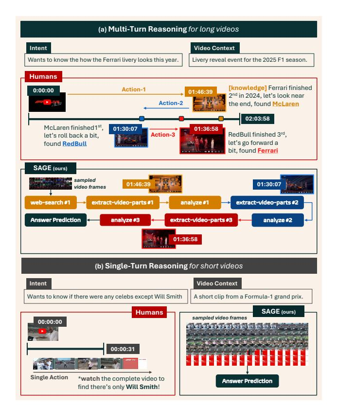
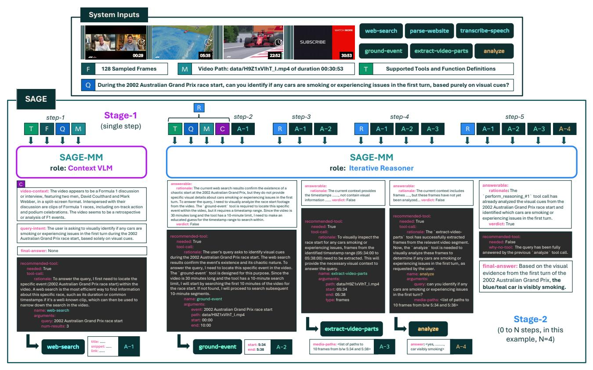
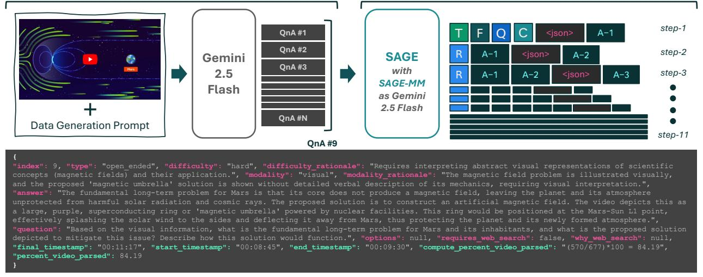
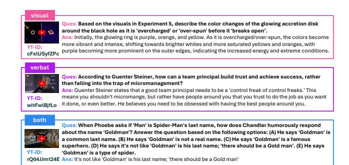
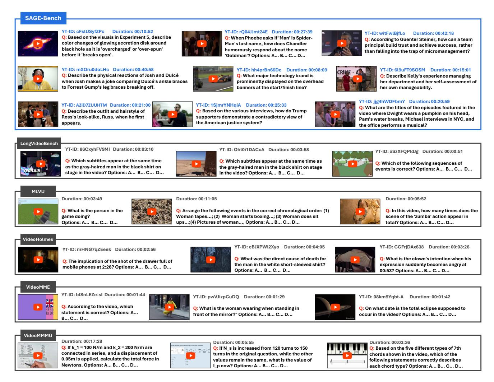
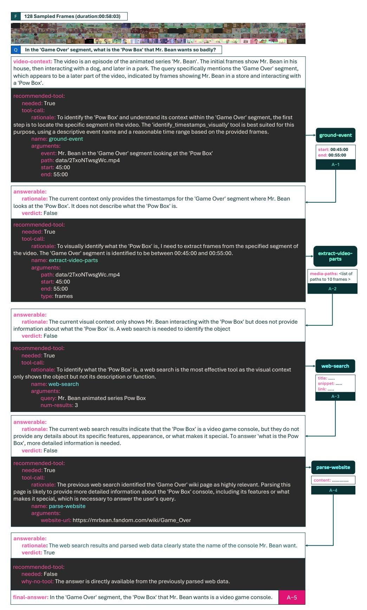
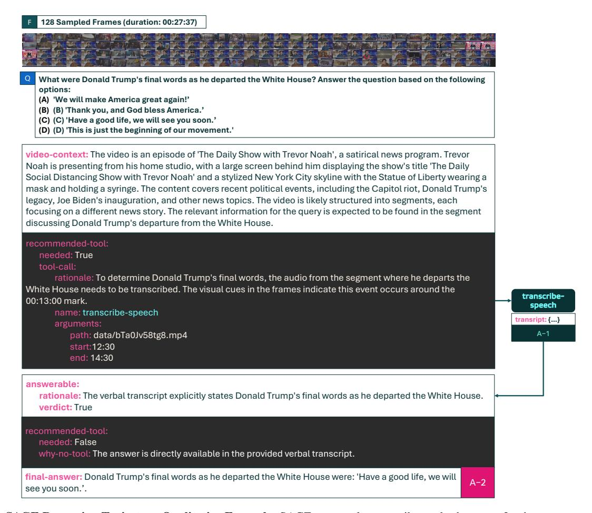
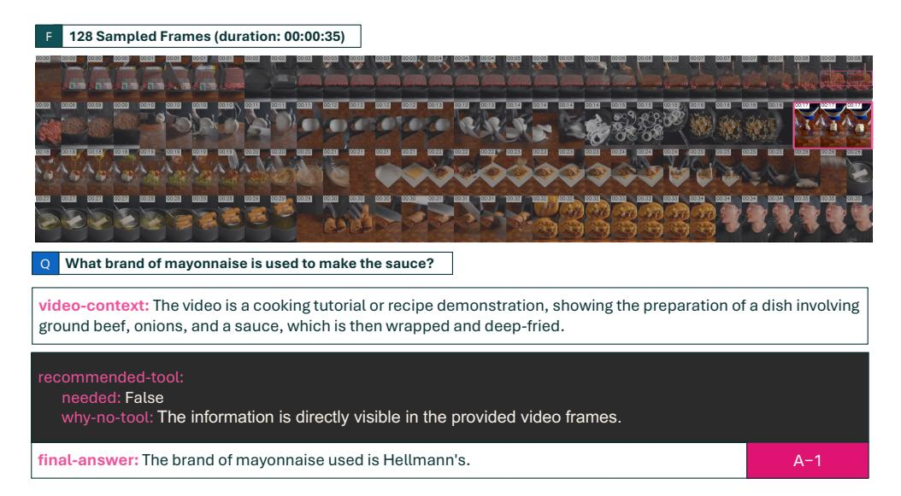

# <span id="page-0-1"></span>SAGE: Training Smart Any-Horizon Agents for Long Video Reasoning with Reinforcement Learning

Jitesh Jain1,2\* Jialuo Li<sup>1</sup> Zixian Ma2,3 Jieyu Zhang2,3 Chris Dongjoo Kim<sup>2</sup> Sangho Lee<sup>2</sup> Rohun Tripathi<sup>2</sup> Tanmay Gupta<sup>2</sup> Christopher Clark<sup>2</sup>† Humphrey Shi<sup>1</sup>† <sup>1</sup>SHI Labs @ Georgia Tech <sup>2</sup>Allen AI <sup>3</sup>University of Washington

**<https://github.com/allenai/SAGE>**

## Abstract

*As humans, we are natural any-horizon reasoners, i.e., we can decide whether to iteratively skim long videos or watch short ones in full when necessary for a given task. With this in mind, one would expect video reasoning models to reason flexibly across different durations. However, SOTA models are still trained to predict answers in a single turn while processing a large number of frames, akin to watching an entire long video, requiring significant resources. This raises the question: Is it possible to develop performant any-horizon video reasoning systems? Inspired by human behavior, we first propose SAGE, an agent system that performs multi-turn reasoning on long videos while handling simpler problems in a single turn. Secondly, we introduce an easy synthetic data generation pipeline using Gemini-2.5-Flash to train the orchestrator, SAGE-MM, which lies at the core of SAGE. We further propose an effective RL post-training recipe essential for instilling anyhorizon reasoning ability in SAGE-MM. Thirdly, we curate SAGE-Bench with an average duration of greater than 700 seconds for evaluating video reasoning ability in real-world entertainment use cases. Lastly, we empirically validate the effectiveness of our system, data, and RL recipe, observing notable improvements of up to 6.1% on open-ended video reasoning tasks, as well as an impressive 8.2% improvement on videos longer than 10 minutes.*

## 1. Introduction

In the last year, there has been a natural shift from developing models for solely image reasoning [\[7,](#page-9-0) [8,](#page-9-1) [14,](#page-9-2) [23,](#page-10-0) [24,](#page-10-1) [28,](#page-10-2) [29,](#page-10-3) [44,](#page-11-0) [45,](#page-11-1) [63\]](#page-12-0) to also tackling video reasoning [\[2,](#page-9-3) [5,](#page-9-4) [40,](#page-11-2) [41,](#page-11-3) [48,](#page-11-4) [64\]](#page-12-1) in the research community. Among the various model releases, the recent Gemini-2.5 [\[40\]](#page-11-2) and Qwen3-VL [\[41\]](#page-11-3) models pushed the frontier in video rea-

<span id="page-0-0"></span>

Figure 1. Human behavior-inspired design of SAGE. We design SAGE to resemble humans' adaptive reasoning behavior, capable of following a knowledge-driven multi-turn reasoning process using tool calls for long-horizon tasks (Tab. [1\)](#page-3-0) while being able to predict an answer for short-horizon problems directly.

soning due to their ability to perform well on both short and long videos.

Although the aforementioned SOTA models differ in their training data, recipe, and architecture, among other things, they all function in a standard way when reasoning over videos: given a set of sampled frames, output the final answer with a single sequence prediction process, *i.e.*, sin-

<sup>\*</sup>Work done during JJ's internship at Allen AI. †Equal advising.

<span id="page-1-0"></span>gle turn reasoning. We refer to this line of work as falling under the DIRECT paradigm. Orthogonal to the works mentioned above, a few methods [\[1,](#page-9-5) [3,](#page-9-6) [26,](#page-10-4) [30,](#page-10-5) [49,](#page-11-5) [61\]](#page-11-6) take an agentic route to predicting answers through multi-turn reasoning, falling under the AGENT paradigm.

Humans excel at tasks that require multi-turn reasoning. For example, when viewing a 2-hour-long video, as humans, we take an iterative approach to finding the target information (Fig. [1\)](#page-0-0). With the recent overwhelming success of RL post-training for training multi-turn agent systems for long-horizon tasks like software engineering [\[39,](#page-10-6) [42,](#page-11-7) [54\]](#page-11-8), computer-use [\[38,](#page-10-7) [41,](#page-11-3) [55\]](#page-11-9), and deep-research [\[16,](#page-9-7) [27,](#page-10-8) [43\]](#page-11-10), it is natural to expect multi-turn agent systems to do well at long video reasoning. Despite the analogy above, most of the existing long video reasoning systems are still trained following the DIRECT paradigm, even with RL [\[6,](#page-9-8) [48\]](#page-11-4).

Motivated by the above realization, we explore the question: What are the technical challenges toward effectively training video reasoning models under the **AGENT** paradigm with Reinforcement Learning? We outline three significant aspects for answering the above question: training data (A1), efficient system design (A2), and RL recipe for multi-turn reasoning (A3).

(A1) The training data for an agent model capable of long video reasoning requires access to high-quality question-answer (QnA) pairs. Collecting QnA pairs for long videos poses a daunting challenge due to their lengthy duration. For example, having a human annotate a single 1-hour-long video can cost approximately \$30 on the Prolific platform, making it expensive for data collection at scale. To avoid such high costs, existing works typically employ a synthetic data curation process by iteratively processing 10-30 second-long subclips using models adept at short video understanding to either generate QnA pairs directly [\[4\]](#page-9-9) or captions followed by QnA pairs using an LLM [\[5,](#page-9-4) [6\]](#page-9-8). Although inexpensive compared to human annotation, the mentioned bottom-up pipeline is slow and resource-intensive — imagine processing 120 subclips for an hour-long video; even with each subclip taking only 10 seconds, it would take 20 minutes to process a single video. Therefore, to save time and money, we leverage the longcontext modeling capabilities of Gemini-2.5-Flash to generate synthetic, high-quality QnA pairs with a carefully designed prompt, ensuring the generated questions span the whole video. Moreover, we manually verify over 1700 generated samples and find a low 5% error rate while achieving nearly 100× cost and 10× time savings compared to human annotation and subclip processing pipelines, respectively.

(A2) Existing multi-turn agent systems usually use an LLM/VLM to orchestrate the calls to only a temporal grounder tool [\[11,](#page-9-10) [30,](#page-10-5) [57\]](#page-11-11) to iteratively locate an event over the entire video needed for finding an answer to a given question. However, we posit that attempting to ground an event in the whole video is not always the most effective approach due to the lack of robust temporal grounding models for long videos. For example, knowing the Formula 1 2024 season standings enables intelligent reasoning with a small temporal search space when watching the 2025 season livery reveal event video (Fig. [1a](#page-0-0)). Motivated by similar use cases, we introduce the SAGE (Smart Any-horizon aGEnt) system for long video reasoning. Particularly, we take a more innovative approach by equipping our system with tools such as web search and speech transcription, in addition to temporal grounding, to ensure that it is adept at not only utilizing visual signals from the video but also leveraging verbal and external knowledge. At the core of our system lies an orchestrator VLM, SAGE-MM, responsible for deciding between multi-turn and single-turn behavior for effective any-horizon reasoning. Moreover, guided by the fact that a user typically interacts with videos for entertainment [\[12,](#page-9-11) [21\]](#page-10-9), we focus our efforts on verifying the effectiveness of our approach on SAGE-Bench, curated with videos from popular YouTube channels to simulate use cases in the daily lives of users. Interestingly, we find existing agent systems to be over-engineered toward answering multiple-choice questions, often underperforming at the open-ended problems under SAGE-Bench (Tab. [4\)](#page-6-0), demonstrating their ineffectiveness for real-world use-cases.

(A3) The variable duration of videos presents a unique challenge to training multi-turn agents. Specifically, during the RL post-training stage, the model should learn to function as an any-horizon agent, i.e., directly output the answer for simple problems while using multi-turn reasoning for harder problems [\[58\]](#page-11-12). We believe that the optimization challenge posed by the dynamic nature of videos presents a challenge for training agent models using existing RL recipes, which have been shown to work well for training DIRECT models [\[6,](#page-9-8) [18\]](#page-10-10). Moreover, extending the RLVR techniques [\[13,](#page-9-12) [37\]](#page-10-11) to video reasoning presents another challenge due to the task's open-ended nature, which results in a lack of verifiable rewards. A few DIRECT approaches [\[6,](#page-9-8) [47\]](#page-11-13) overcome the verifiable reward challenge by training only on MCQ problems and/or using some form of string-overlap metrics [\[18,](#page-10-10) [46\]](#page-11-14), rendering them ineffective at open-ended problems (Tab. [4\)](#page-6-0).

To that end, we propose a multi-reward RL recipe that utilizes strong reasoning LLMs [\[33\]](#page-10-12) to validate the correctness of answers during the RL post-training stage. Moreover, moving away from using string-matching for evaluation, we adopt a universal LLM-as-a-judge evaluation approach to maintain uniformity across our training and evaluation setups. Our RL recipe improves the SFT model by 4.1% and surpasses the base by 5.7%, demonstrating its effectiveness. Moreover, for videos longer than 10 minutes, we observe performance improvements of up to 14.6% along with 4.8% for videos shorter than 10 minutes, prov-

<span id="page-2-1"></span><span id="page-2-0"></span>

Figure 2. **SAGE Workflow.** Our system accepts four inputs (shown at the top): sampled video frames (F), metadata about the video (M), available tool definitions (T), and the user query (Q). Given these inputs, SAGE operates in two stages based on the role of SAGE-MM. In **Stage-1**, SAGE-MM is responsible for providing information about the video's context (C) along with either a final answer prediction or a tool call to be executed before the next step. At every subsequent step in **Stage-2**, SAGE-MM uses the video context (C) and the tool call results from previous steps to decide either to predict the final answer or call another tool in an iterative reasoning process.

ing SAGE's effectiveness on any-horizon video reasoning. In summary, we make the following contributions:

- We propose SAGE, an any-horizon agent for longvideo reasoning, equipped with a web-search tool for knowledge-driven multi-turn reasoning.
- We introduce a cost-effective synthetic QnA pipeline using Gemini-2.5-Flash to train and evaluate our system on entertainment videos for real-world use.
- We train SAGE-MM with an effective RL post-training recipe to instill any-horizon reasoning, demonstrating the scalability of our system design for RL.

#### 2. Related Work

## 2.1. Long Video Reasoning Agents

Existing long video reasoning agent systems are usually composed of two core components: *an orchestrator*, and *a tool set*, with a temporal grounder being a standard tool among all methods. The orchestrator is responsible for determining the actions to execute while interacting with the available tools within a multi-turn pipeline. A common aspect in the design of existing long video reasoning agent

systems is their over-reliance on a temporal grounding module to perform event-guided multi-turn reasoning.

VideoAgent [17] creates a memory using the caption and keyframe features from the video subclips and incorporates tools to retrieve information from memory for reasoning. Similarly, VideoChat-A1 [49] employs keyframe retrieval to perform chain-of-shot reasoning. VideoMind [30] tunes LoRA adapters for the base Qwen2-VL [45] model as a verifier to verify outputs from a separate temporal grounder module before final answer prediction. VideoExplorer [57] optimizes the planner module with DPO [36] for better trajectory reasoning. LVAgent [3] leverages collaboration among multiple MLLMs with iterative reflection and key frame perception to reach the final answer.

In this work, we move away from over-reliance on temporal grounding and incorporate tools such as web search and speech transcription to enable an intelligent event localization strategy. Moreover, unlike the above methods, SAGE attempts to predict timestamps for an event within one short subclip at a time rather than the entire video, based on probable coarse event boundaries generated by SAGE-MM, resulting in a more efficient approach.

<span id="page-3-3"></span><span id="page-3-0"></span>

| tool-name                                         | purpose                                            | arguments                                       | returns                                                                  |  |  |
|---------------------------------------------------|----------------------------------------------------|-------------------------------------------------|--------------------------------------------------------------------------|--|--|
| web-search Perform web search using a text query. |                                                    | query (str); num-results (int)                  | List of URL, title, and snippet for search results.                      |  |  |
| parse-website                                     | Parse web data from a given URL.                   | website-url (str)                               | Parsed HTML content of the website.                                      |  |  |
| transcribe-speech                                 | Perform ASR on the video.                          | path (str), start (str), end (str)              | Segment-level verbal transcript between the start and end timestamps     |  |  |
| ground-event                                      | Identify timestamps for an event in the video.     | event (str), path (str), start (str), end (str) | Timestamps for the event between the start and end timestamps.           |  |  |
| extract-video-parts                               | Extract frames or subclips between two timestamps. | type (str), path (str), start (str), end (str)  | List of paths to the saved extracted parts (either frames or a subclip). |  |  |
| analyze                                           | Analyze a set of media based on a query.           | query (str), media-paths (List[str])            | Answer to the query.                                                     |  |  |

Table 1. **Supported tools in SAGE.** Our system has access to six tools, including web search (via the Serper-hosted Google Search API), for performing knowledge-driven reasoning. We implement the ground-event and analyze tools using existing MLLMs [41].

## 2.2. Reinforcement Learning for Video Reasoning

Following the success of DeepSeek-R1 [13] at using Reinforcement Learning with Verifiable Rewards (RLVR) to improve reasoning abilities in LLMs, various works have tried to leverage GRPO [13, 37] to train DIRECT video reasoning models capable of thinking and then answering. Video-R1 [18] follows the optimization approach of DeepSeek-R1 and introduces a contrastive temporal variant of GRPO, comparing answers between inputs with correct and incorrect frame ordering to enforce temporal dependence during reasoning. VideoRFT [46] introduces a semantic-consistency reward between the reasoning trace and video frames. Video-Thinker [47] optimizes the model to output multiple temporal grounding instances within a single reasoning trace by carefully curating the cold-start SFT dataset. LongVILA-R1 [6] enables the use of thousands of frames during the RL post-training stage with sequence parallelism. All the above methods utilize optionmatching and ROUGE metrics to compute rewards, rendering their approach suboptimal for open-ended problems.

We train SAGE-MM to learn the ability to perform anyhorizon reasoning using GRPO while leveraging an LLMas-a-Judge to handle rewards for open-ended problems. A concurrent work, LongVT [56] also employs a similar training recipe with LLM-as-a-judge for computing the accuracy reward while only supporting a crop-video tool call.

#### 3. Method

In the daily life of a human, entertainment is the primary purpose for interacting with videos [12, 21], from watching sports videos on YouTube to scrolling through hundreds of short reels on Instagram. Therefore, it's only natural to develop video reasoning models, keeping the user's needs in mind. Among those needs, the open-ended interaction holds a vital place. For instance, as shown in Fig. 1, a user would usually ask: "How does the Ferrari livery look this year?" as an open-ended question and expect the model to provide an answer in real-time. We introduce SAGE, a system designed to answer users' questions while they enjoy entertainment videos. In the following subsections, we present technical details about SAGE (Sec. 3.1), followed by our synthetic data generation pipeline (Sec. 3.2). Lastly, we provide information on training the orchestrator (SAGE-MM) using RL for the system (Sec. 3.3).

## <span id="page-3-1"></span>3.1. System Design

As shown at the top of Fig. 2, our SAGE expects four inputs: 128 sampled frames from the video (F), metadata about the video (M), available tools' definitions (T), and the user query (Q). SAGE operates in two stages, based on the role of the orchestrator (SAGE-MM) (Fig. 2 bottom):

**Stage-1** (role: Context VLM): In this single-step stage, SAGE-MM accepts the system inputs (T|F|Q|M) and outputs a JSON action string with required fields:

- *video-context* (C): Information about the video's setting.
- query-intent: The intent behind the user's query.
- <u>recommended-tool</u>: Information about the next tool call if a final answer cannot be generated at the current step.
- <u>final-answer</u>: null if tool call; otherwise predicted answer. The metadata string (M) comprises information about the video path and duration, which are necessary to predict the arguments for the tool call. We list the supported tools in SAGE in Tab. 1. Notably, unlike previous methods, which either perform temporal grounding over the complete video [30, 57], our SAGE autonomously predicts segment-level timestamps to ground events over a maximum duration of 10 minutes, as we qualitatively found that existing models struggle on longer entertainment videos.

**Stage-2** (role: Iterative Reasoner): In this multi-step stage, SAGE-MM accepts the tool call and video context results from all the previous steps, along with the other textual inputs (T|Q|M) and decides if the user query can be answered or another tool call is needed. At every step, SAGE-MM outputs a JSON action string with three required fields:

- answerable: Whether the query can be answered.
- <u>recommended-tool</u>: Information about the next tool call if a final answer cannot be generated at the current step.
- <u>final-answer</u>: null if tool call; otherwise predicted answer. We set the maximum number of steps under stage 2 to ten to prevent indefinite execution length. We provide an example execution graph for SAGE at the bottom of Fig. 2.

### <span id="page-3-2"></span>3.2. Synthetic Data Generation

We collect videos and shorts from 13 popular YouTube channels across diverse genres, including sports (Formula1), food (ZachChoi), comedy (TheDailyShow, Mr-Bean, TheOffice, Friends, fluffyguy, trevornoah), education (Vox, kurzgesagt, veritasium, QuantaScienceChannel), and travel (WalkingAlice). Given a video, our synthetic

<span id="page-4-3"></span><span id="page-4-1"></span>

Figure 3. **Synthetic Data Generation Pipeline.** We leverage Gemini-2.5-Flash to generate 10-20 QnA pairs, covering the full temporal span of the video. We find that instructing the model to predict a **percent\_video\_parsed** field for every QnA pair helps in enforcing proper coverage. We use a SAGE with Gemini-2.5-Flash as the orchestrator to synthesize tool call trajectories for a cold-start SFT stage.

data generation pipeline includes two stages: (i) questionanswer (QnA) pair generation using Gemini-2.5-Flash for training and evaluation, and (ii) tool call trajectory generation using SAGE with Gemini-2.5-Flash as the SAGE-MM for cold-start SFT, as shown in Fig. 3.

**QnA Pairs.** We leverage the long context modeling abilities of Gemini-2.5-Flash [40] to generate questions and answers for a given video in a single pass using a carefully designed prompt. We find that for videos longer than 5 minutes, having the model predict a **percent\_video\_parsed** field is critical to ensure that the generated questions temporally span the complete video, as shown at the bottom of Fig. 3. We generate 10-20 QnA pairs per video.

**Tool Call Trajectories.** We observe that existing open-source VLMs are not adept at functioning as SAGE-MM right off the shelf, which is a necessity for successful RL post-training. Therefore, we also generate four tool call trajectories for each question and use input-action pairs from unique trajectories to create a cold-start SFT dataset to fine-tune our own SAGE-MM model before the RL post-training stage. Tab. 2 lists statistics for our training data.

## <span id="page-4-0"></span>3.3. RL Post Training

We use GRPO [13, 37] as the policy optimization algorithm during the RL post-training stage for trajectory-level optimization. Specifically, during the rollout generation, the  $i^{th}$  action rollout trajectory for a given input set  $S_1 = \{T, F, M, Q\}$  is represented by  $\tau_i$ . Therefore, we can formulate  $\tau_i$  as a sequence of state-action pairs  $\forall j \in [0, N]$ :

$$\tau_{i} = [(S_{1}, A_{1}), (S_{2}, A_{2}), \dots, (S_{N}, A_{N})], 
A_{j} = \mathbf{SAGE-MM}(S_{j}), 
S_{j+1} = \{T, Q, M, C, A_{1}...A_{j}\}$$
(1)

<span id="page-4-2"></span>

|                     | tal                                  |
|---------------------|--------------------------------------|
| 576   66            | 68                                   |
| 0.4k 99<br>5.0k 417 | .1k<br>77k                           |
| 7                   | 576   66<br>9.4k   99<br>75.0k   417 |

Table 2. **Training Data Statistics.** We generate over 99k questions for more than 6600 videos from popular YouTube channels.

During the advantage computation step in GRPO, we assign a single scalar reward  $R_i$  to every action in the trajectory  $\tau_i$  with N steps. The reward consists of (i) step-level rewards  $s_j$  collected at each step, and (ii) a final accuracy reward  $a_N$  at the end of the trajectory. The resulting reward  $R_i$  is then uniformly assigned to all actions in  $\tau_i$ :

$$R_i = (s_1 + s_2 + s_3 + \dots + s_N) + a_N$$
  

$$r(A_1) = r(A_2) = \dots = r(A_N) = R_i$$
(2)

Note that we can assign final rewards to all steps because rollout generation is synchronous, *i.e.*, advantages are computed only after all trajectories are completed in a batch.

**Step-Level Rewards.** The reward  $(s_j)$  for a step j in a trajectory is a sum of four scores:

• *format*: Encourages producing a JSON action string with only the required fields.

$$s_{\rm format} = \begin{cases} +0.05, & \text{if JSON contains only required fields} \\ -0.10, & \text{otherwise} \end{cases}$$

• *reasonable-tool*: Encourages the model to perform sensible multi-step tool usage. Specifically, at each step, we ask GPT-40 to judge whether the current tool call is rational, given the question and the previous tool calls.

$$s_{\rm reasonable-tool} = \begin{cases} +0.10, & \text{if current tool call is reasonable} \\ -0.10, & \text{otherwise} \end{cases}$$

<span id="page-5-2"></span><span id="page-5-0"></span>

| Overall        | Count | Modality               | Count |
|----------------|-------|------------------------|-------|
| # samples      | 1744  | visual only            | 1216  |
| – # mcq        | 802   | verbal only            | 134   |
| - # open-ended | 942   | visual + verbal (both) | 394   |

Duration (avg: 727 sec.)

| Bucket (sec.) | Count | Bucket (sec.) | Count |
|---------------|-------|---------------|-------|
| 0–60          | 261   | 600–1200      | 484   |
| 60-180        | 390   | 1200-2400     | 147   |
| 180-300       | 116   | 2400+         | 160   |
| 300-600       | 186   |               |       |

Table 3. **SAGE-Bench Statistics.** Our evaluation set holds 1744 manually verified samples spanning diverse durations, with an emphasis on questions that require visual information to answer.

• args-repeat: Penalizes repetitive tool call arguments.

$$s_{\text{args-repeat}} = -0.05 \cdot \sqrt{\text{num-repetitions}}$$

• args-valid: Penalizes invalid tool-call arguments.

$$s_{\text{args-valid}} = \begin{cases} -0.1, & \text{if arguments are invalid} \\ 0, & \text{otherwise} \end{cases}$$

We set the values for the step rewards such that the accumulated step-level reward for a trajectory with 10 steps would be comparable to the accuracy reward.

**Accuracy Reward.** We compute the outcome reward for a trajectory of length N based on the final answer prediction using an LLM judge (GPT-4o [33]) to obtain a binary verdict indicating correctness at the last step.

$$a_N = \begin{cases} -2.0, & \text{if JSON action string is invalid} \\ -0.5, & \text{if wrong answer and } N \geq 1 \\ +1.25, & \text{if correct answer and visual tools in } \tau_i \\ +1.0, & \text{otherwise} \end{cases}$$

During training and inference, we set  $N_{max}=11$  by default. However, during the RL stage, we find that setting  $N_{max}=6$  for the first 100 steps is necessary for stable training, aligned with findings from a concurrent work for training long-horizon LLM agents [52]. Moreover, we penalize the model for predicting a wrong answer with tool calls to compensate for the positive step-level rewards while enforcing the any-horizon nature, i.e., making the model capable of predicting a direct answer. Conversely, we grant a slightly higher reward of +1.25 when the answer is correct and SAGE used visual tools (extract-video-parts or ground-event), reflecting the higher difficulty and importance of getting these tool calls right.

## 4. Experiments

For our experiments, we finetune for MLLMs, using both cold-start SFT (denoted by SFT) and RL post-training (denoted by RL) stages to obtain the SAGE-MM: Molmo-8B,

<span id="page-5-1"></span>

Figure 4. **Qualitative Samples from SAGE-Bench.** Our evaluation set contains questions that mirror what a user might naturally ask while or after watching the corresponding video.

Qwen2.5-VL-7B-Instruct [2], Qwen3-VL-4B-Instruct [41], and Qwen3-VL-8B-Instruct [41]. During training, we freeze the visual encoder and projector modules. By default, we use the Qwen3-VL-8B-Instruct as the base SAGE-MM for all our ablations. We implement the transcribe-speech tool using the Whisper-large-v3 [35] model. We use the Qwen3-VL-30B-A3B-Instruct [41] model to perform temporal grounding and reasoning with the ground-event and analyze tools, respectively.

## 4.1. Implementation Details

**Training Data.** As shown in Tab. 2, we synthesize 99.1k training questions from 6659 videos, covering a wide range of durations. Additionally, we generate 417.7k state–action pairs for **SFT**. For **RL**, we construct a dataset of 7.68k samples, filtered using synthetic tool-call trajectories, where half of the samples required tool calls and the other half had single-turn responses, promoting any-horizon reasoning.

**Training Recipe.** During **SFT**, we train our model for one epoch with a batch size of 64 and an initial learning rate of  $1e^{-5}$  with a linear decay scheduler. We sample 128 frames at 2 FPS and use a temporal pooling factor of 2, setting the maximum and minimum numbers of tokens per frame to 128 and 192, respectively. During **RL**, we use a batch size of 16 and rollout eight action trajectories per sample. We use an initial learning rate of  $1e^{-6}$  with a cosine decay scheduler. We set the KL-divergence loss coefficient to 0.005. Note that we report numbers for the model trained for 480 steps during the **RL** stage. We train all our models using  $16 \times \text{NVIDIA H}100 \text{ GPUs}$  during both **SFT** and **RL**.

**Evaluation.** We evaluate all DIRECT baselines with 128 sampled frames as input, comparable to SAGE-MM's input setting. Moreover, we also pass the video transcript as extra context to the DIRECT baselines for fair comparison. For AGENT baselines, we follow their recommended setup. By default, we use LLM-as-judge (GPT-40) for evaluating all models on both open-ended and MCQ problems. We set the temperature to 0.0 for all evaluations. How-

<span id="page-6-4"></span><span id="page-6-0"></span>

| Method                         | Orchestrator                                 | Video Reasoning Mode |        | overall | mcq   | open-ended | both  | verbal | visual |
|--------------------------------|----------------------------------------------|----------------------|--------|---------|-------|------------|-------|--------|--------|
|                                |                                              | train                | eval   | (1744)  | (802) | (942)      | (394) | (134)  | (1216) |
| Gemini-2.5-Flash [40]          | N/A                                          | DIRECT               | DIRECT | 68.1    | 77.2  | 60.4       | 74.9  | 71.6   | 65.5   |
| SAGE-Flash (ours)              | SAGE-MM: Gemini-2.5-Flash                    | N/A                  | AGENT  | 71.3    | 81.2  | 62.9       | 76.3  | 84.3   | 68.3   |
| GPT-4o [33]                    | N/A                                          | DIRECT               | DIRECT | 71.6    | 80.9  | 63.6       | 75.1  | 73.9   | 70.1   |
| SAGE-Flash (ours)              | SAGE-MM: GPT-40                              | N/A                  | AGENT  | 73.4    | 81.0  | 66.9       | 78.2  | 79.9   | 71.1   |
| Video-Thinker-7B [47]          | N/A                                          | DIRECT               | DIRECT | 41.3    | 70.1  | 16.8       | 48.2  | 41.8   | 39.0   |
| LongVILA-R1-7B [6]             | N/A                                          | DIRECT               | DIRECT | 52.6    | 68.8  | 38.7       | 57.6  | 64.9   | 49.6   |
| VideoRFT-7B [46]               | N/A                                          | DIRECT               | DIRECT | 55.3    | 71.6  | 41.4       | 65.2  | 67.2   | 50.7   |
| Video-R1-7B [18]               | N/A                                          | DIRECT               | DIRECT | 57.6    | 73.6  | 43.9       | 67.5  | 67.2   | 53.3   |
| Qwen3-VL-30B-A3B-Instruct [41] | N/A                                          | DIRECT               | DIRECT | 67.6    | 81.3  | 55.8       | 72.8  | 71.6   | 65.4   |
| VideoAgent [17]                | GPT-4o                                       | N/A                  | AGENT  | 42.0    | 52.6  | 32.9       | 42.6  | 29.1   | 43.2   |
| LVAgent [3]                    | InternVL-8/72B [7] + LLaVA-Video-72B [59]    | N/A                  | AGENT  | 49.7    | 70.5  | 32.1       | 54.1  | 48.5   | 48.4   |
| LongVT [56]                    | LongVT-7B-RFT                                | AGENT                | AGENT  | 46.7    | 68.2  | 28.4       | 51.0  | 37.3   | 46.4   |
| VideoMind [30]                 | VideoMind-7B-Planner                         | AGENT                | AGENT  | 50.0    | 69.7  | 33.2       | 50.8  | 41.8   | 50.7   |
| VideoExplorer [57]             | VideoExplorer-7B-Planner                     | AGENT                | AGENT  | 50.1    | 69.6  | 35.1       | 52.0  | 40.2   | 51.3   |
| VideoChat-R1.5 [53]            | VideoChat-R1.5-7B-M                          | AGENT                | AGENT  | 54.8    | 73.8  | 38.6       | 55.1  | 48.5   | 55.1   |
| Qwen2.5-VL-7B-Instruct [2]     | N/A                                          | DIRECT               | DIRECT | 58.6    | 74.2  | 45.4       | 65.8  | 68.7   | 55.2   |
| SAGE (ours)                    | SAGE-MM: Qwen2.5-VL-7B-Instruct [+SFT]       | AGENT                | AGENT  | 61.1    | 74.1  | 50.1       | 62.9  | 69.4   | 59.6   |
| SAGE (ours)                    | SAGE-MM: Qwen2.5-VL-7B-Instruct [+SFT] [+RL] | AGENT                | AGENT  | 63.4    | 77.2  | 51.5       | 66.1  | 65.7   | 62.2   |
| Qwen3-VL-4B-Instruct [41]      | N/A                                          | DIRECT               | DIRECT | 62.7    | 75.8  | 51.6       | 69.3  | 66.4   | 60.2   |
| SAGE (ours)                    | SAGE-MM: Qwen3-VL-4B-Instruct [+SFT]         | AGENT                | AGENT  | 64.6    | 77.3  | 53.7       | 66.2  | 67.2   | 63.7   |
| SAGE (ours)                    | SAGE-MM: Qwen3-VL-4B-Instruct [+SFT] [+RL]   | AGENT                | AGENT  | 68.4    | 81.3  | 57.4       | 78.4  | 80.6   | 63.8   |
| Qwen3-VL-8B-Instruct [41]      | N/A                                          | DIRECT               | DIRECT | 64.9    | 77.7  | 54.0       | 72.8  | 68.7   | 61.9   |
| SAGE (ours)                    | SAGE-MM: Qwen3-VL-8B-Instruct [+SFT]         | AGENT                | AGENT  | 63.9    | 77.4  | 52.4       | 72.3  | 74.6   | 60.0   |
| SAGE (ours)                    | SAGE-MM: Qwen3-VL-8B-Instruct [+SFT] [+RL]   | AGENT                | AGENT  | 68.0    | 82.6  | 55.6       | 75.4  | 82.8   | 64.0   |
| SAGE-Flash (ours)              | SAGE-MM: Qwen3-VL-8B-Instruct [+SFT] [+RL]   | AGENT                | AGENT  | 71.8    | 82.8  | 62.4       | 75.1  | 79.1   | 69.9   |
| Molmo2-8B [10]                 | N/A                                          | DIRECT               | DIRECT | 61.8    | 77.9  | 48.1       | 66.8  | 64.2   | 60.0   |
| SAGE (ours)                    | SAGE-MM: Molmo2-8 [+SFT]                     | AGENT                | AGENT  | 63.2    | 75.6  | 52.8       | 67.0  | 73.9   | 60.9   |
| SAGE (ours)                    | SAGE-MM: Molmo2-8B [+SFT] [+RL]              | AGENT                | AGENT  | 66.1    | 78.8  | 55.2       | 67.3  | 73.9   | 64.8   |
| SAGE-Flash (ours)              | SAGE-MM: Molmo2-8B [+SFT] [+RL]              | AGENT                | AGENT  | 67.8    | 79.3  | 58.1       | 67.5  | 73.9   | 67.3   |

Table 4. **Comparison to Baselines.** Using closed-source Gemini-2.5-Flash [40] and GPT-4o [33] as SAGE-MM improves upon the base models, showing the effectiveness of our system design. Our trained SAGE-MM also shows consistent improvements over all the baselines. SAGE-Flash refers to the setting where we use Gemini-2.5-Flash as the backend model for the ground-event and analyze tools. Existing AGENT systems exhibit considerably worse performance on open-ended problems compared to our SAGE.

<span id="page-6-1"></span>

|                            | SAGE-MM  | overall | 0-600s | 600+s |
|----------------------------|----------|---------|--------|-------|
|                            | training | (1473)  | (842)  | (631) |
| Qwen2.5-VL-7B-Instruct [2] | N/A      | 32.7    | 37.8   | 25.8  |
| VideoRFT-7B [46]           | N/A      | 30.4    | 33.5   | 26.2  |
| VideoMind-7B [30]          | N/A      | 30.7    | 34.0   | 26.2  |
| Video-R1-7B [18]           | N/A      | 31.5    | 36.0   | 25.8  |
| VideoChat-R1.5-7B [53]     | N/A      | 33.8    | 35.3   | 31.8  |
| SAGE (ours)                | SFT      | 28.3    | 30.3   | 24.3  |
| SAGE (ours)                | SFT + RL | 32.0    | 34.7   | 28.4  |
| SAGE-Flash (ours)          | SFT + RL | 32.9    | 35.6   | 29.0  |

Table 5. **Performance on MINERVA [32].** Our SAGE shows significant improvements on videos longer than 600 seconds.

<span id="page-6-2"></span>

|                            | SAGE-MM                           | Video-MMMU | Video-MME |
|----------------------------|-----------------------------------|------------|-----------|
| Qwen2.5-VL-7B-Instruct [2] | N/A                               | 57.5       | 63.6      |
| Qwen3-VL-8B-Instruct [41]  | N/A                               | 65.3       | 66.8      |
| Video-R1-7B [18]           | N/A                               | 61.5       | 61.2      |
| SAGE-Flash (ours)          | Qwen3-VL-8B-Instruct [+SFT]       | 66.9       | 59.4      |
| SAGE-Flash (ours)          | Qwen3-VL-8B-Instruct [+SFT] [+RL] | 68.1       | 63.5      |
| - w/o ground-event         |                                   | 65.8       | 65.6      |
| - w/o ground-event & ext   | ract-video-parts                  | 61.8       | 66.2      |

Table 6. Video-MMMU [22] & Video-MME [20] (w/o subs). Our SAGE-Flash outperforms baselines including Video-R1 [18] on Video-MMMU, demonstrating generalization to knowledge acquisition from videos.

ever, because the action strings must follow a strict JSON schema, SAGE-MM occasionally produces malformed out-

<span id="page-6-3"></span>

| train strategy  | train mode | eval mode | mcq  | open-ended | overall |
|-----------------|------------|-----------|------|------------|---------|
| Qwen3-VL-4B-In  | struct     | DIRECT    | 75.8 | 51.5       | 62.7    |
| Qwen3-VL-4B-T   | hinking    | DIRECT    | 75.3 | 48.6       | 60.1    |
| SFT             | DIRECT     | DIRECT    | 83.2 | 51.1       | 65.8    |
| SFT + RL        | DIRECT     | DIRECT    | 83.0 | 52.0       | 66.3    |
| SFT (ours)      | AGENT      | AGENT     | 77.3 | 53.7       | 64.6    |
| SFT + RL (ours) | AGENT      | AGENT     | 81.3 | 57.4       | 68.4    |

Table 7. **Training Mode.** Our **AGENT** system performs better than the **DIRECT** baseline, with **RL** playing a critical role in the former's success, specifically on open-ended problems.

puts. In such cases, we regenerate the response with a temperature of 0.7 for up to four attempts, which may lead to non-deterministic behavior during inference. We serve all supported models using vLLM [25] during evaluation.

We share more details, including the system, data generation, and evaluation prompts, in the appendix.

## 4.2. SAGE-Bench

Driven by the limitations of current video reasoning benchmarks due to their purely MCQ nature, we curate our own evaluation set, **SAGE-Bench**, with a focus on open-ended questions simulating the needs for real-world use-cases for

<span id="page-7-3"></span><span id="page-7-0"></span>

| Method              | Model                                      | Eval Mode | 0-60        | 60-180      | 180-300     | 300-600     | 600-1200     | 1200-2400   | 2400+       | overall     |
|---------------------|--------------------------------------------|-----------|-------------|-------------|-------------|-------------|--------------|-------------|-------------|-------------|
|                     |                                            |           | (261)       | (390)       | (116)       | (186)       | (484)        | (147)       | (160)       | (1744)      |
| Qwen3-VL (baseline) | Qwen3-VL-8B-Instruct                       | DIRECT    | 73.9        | 72.3        | 81.9        | 71.5        | 55.0         | 59.2        | 47.5        | 64.9        |
| SAGE (ours)         | Qwen3-VL-8B-Instruct [+SFT]                | AGENT     | 74.3        | 68.1        | 75.0        | 72.0        | 56.8         | 55.8        | 48.1        | 63.9        |
| SAGE (ours)         | SAGE-MM: Qwen3-VL-8B-Instruct [+SFT] [+RL] | AGENT     | 78.5 (+4.6) | 70.3 (-2.0) | 77.4 (-4.5) | 72.6 (+1.1) | 63.2 (+8.2)  | 61.9 (+2.7) | 53.8 (+6.3) | 68.0 (+3.1) |
| SAGE-Flash (ours)   | SAGE-MM: Qwen3-VL-8B-Instruct [+SFT] [+RL] | AGENT     | 77.8 (+3.9) | 73.6 (+1.3) | 80.2 (-1.7) | 76.3 (+4.8) | 69.6 (+14.6) | 68.0 (+8.8) | 56.2 (+8.7) | 71.8 (+6.9) |

Table 8. **Duration-wise Accuracy.** Our SAGE shows significant improvements on samples belonging to buckets with duration longer than 600 seconds, with even more improvements when using Gemini-2.5-Flash as a tool with SAGE-Flash.

<span id="page-7-1"></span>

| system                     | SAGE-MM                                                     | single            | -turn                | multi              | -turn                | overall              |
|----------------------------|-------------------------------------------------------------|-------------------|----------------------|--------------------|----------------------|----------------------|
| Q                          | wen3-VL-8B-Instruct (base)                                  | count             | acc.                 | count              | acc.                 | acc.                 |
| SAGE-Flash                 | Gemini-2.5-Flash (expert)                                   | 859               | 76.9                 | 885                | 66.0                 | 71.3                 |
| SAGE<br>SAGE<br>SAGE-Flash | [+SFT] (ours)<br>[+SFT] [+RL] (ours)<br>[+SFT] [+RL] (ours) | 706<br>948<br>940 | 79.0<br>79.6<br>78.8 | 1038<br>796<br>804 | 53.7<br>54.3<br>63.4 | 64.6<br>68.0<br>71.8 |

Table 9. **Any-Horizon Reasoning. RL** refines the tool's overcalling behavior of the **SFT** model, resulting in a distribution closer to the expert Gemini-2.5-Flash and thus, improved performance.

entertainment videos. We begin by sampling a subset of synthetic QnA pairs that is strictly disjoint from the training set (videos can be common) and manually verifying each sample for correctness. Notably, fewer than 5% of the samples required edits during verification, demonstrating that our synthetic data generation pipeline produces high-quality data at low cost. The statistics of SAGE-Bench are provided in Tab. 3. We also provide qualitative examples in Fig. 4.

#### 4.3. Main Results

In Tab. 4, we compare our SAGE to DIRECT video reasoning methods, including models trained without RL post-training, like Qwen3-VL-4/8B-Instruct [41], and RL-tuned models, like Video-R1 [18]. We also evaluate AGENT systems like VideoMind [30] and VideoExplorer [57].

Effective System Design. We separately evaluate the performance of our system with two API-based models SAGE-MM: Gemini-2.5-Flash [40] and GPT-40 [33]. For this setting, we use Gemini-2.5-Flash as the backend model for the ground-event and analyze tools; therefore, we denote the system as SAGE-Flash. We observe improvements of up to 3.2% over the base API models, validating the effectiveness of our system design.

Effective Training Recipe. As shown in Tab. 4, our SAGE with a trained SAGE-MM achieves notable improvements across different base MLLMs. Specifically, SAGE surpasses Qwen2.5-VL-7B-Instruct by 4.8% overall, with substantial gains of +6.1% on open-ended and +7.0% on visual questions, underscoring the effectiveness of our training strategy. Interestingly, models such as Video-R1 [18], VideoRFT [46], and VideoExplorer [57], despite employing finetuned Qwen2.5-VL-7B-Instruct backbones, underperform relative to the base model, particularly on openended questions. Moreover, as shown in the last row of Tab. 4, SAGE-Flash further improves upon SAGE by 3.8%, even outperforming the Gemini-2.5-Flash variant of SAGE-

<span id="page-7-2"></span>

|                              | overall | both | verbal | visual |
|------------------------------|---------|------|--------|--------|
| SAGE (ours)                  | 68.0    | 75.4 | 82.8   | 64.0   |
| w/o ground-event             | 67.3    | 72.3 | 79.9   | 64.3   |
| w/o web-search/parse-website | 65.5    | 70.1 | 80.6   | 62.4   |
| w/o analyze                  | 63.4    | 70.6 | 80.6   | 59.1   |
| w/o extract-video-parts      | 63.0    | 70.8 | 79.9   | 58.6   |
| w/o transcribe-speech        | 62.5    | 66.8 | 46.3   | 62.9   |

Table 10. **Dropping Tools during inference.** All tools are critical to the success of SAGE as a system, with the extract-video-parts and transcribe-speech being the most important ones for answering the visual and verbal/both questions, respectively, as expected.

MM. This indicates that our finetuned SAGE-MM not only learns to invoke tools effectively but also benefits from more accurate tool outputs.

Additionally, we report results with Qwen2.5-VL-7B-Instruct based SAGE-MM on MINERVA [32], a complex video reasoning benchmark that covers domains such as sports, short films, and cooking videos. As shown in Tab. 5, our SAGE shows an improvement of **2.6%** on long videos (duration >600 seconds) compared to the base model while outperforming other reasoning models, validating the effectiveness of our approach for long video reasoning.

Generalization to Other Benchmarks. We also evaluate on Video-MMMU [22] and Video-MME [20] in Tab. 6. Our SAGE-Flash outperforms baselines on Video-MMMU, demonstrating generalization to knowledge acquisition from videos. On Video-MME, the perception-centric nature of the benchmark means ground-event/extract-video-parts tools can hurt performance; disabling them recovers competitive results.

#### 4.4. Ablations

Training Mode. In Tab. 7, we finetune a Qwen3-VL-4B-Instruct model on the synthetic QnA pairs with DIRECT answering mode under the same data setting. We observe that our AGENT training recipe outperforms the direct baseline, underscoring the effectiveness of our approach. Specifically, while training the DIRECT baseline with SFT, we supervise the model with only the correct final answer and not the tool call actions. During RL, we use only the accuracy reward to train the DIRECT baseline.

**Duration-wise accuracy.** We report duration-wise accuracies on SAGE-Bench in Tab. 8. Notably, our SAGE exhibits substantially higher gains on longer videos compared

<span id="page-8-1"></span><span id="page-8-0"></span>

| method                    | mode          | #frames | acc. | runtime (sec/sample) |
|---------------------------|---------------|---------|------|----------------------|
|                           |               | 16      | 55.7 | 0.8                  |
|                           |               | 32      | 59.3 | 1.1                  |
|                           |               | 64      | 62.3 | 2.3                  |
| Owen3-VL-8B-Instruct      | DIRECT        | 128     | 64.9 | 3.6                  |
| Qweii3- v L-ob-iiisii uci | DIRECT        | 256     | 66.1 | 5.7                  |
|                           |               | 512     | 65.9 | 7.8                  |
|                           |               | 1024    | 62.5 | 18.3                 |
|                           |               | 1536    | 60.8 | 27.5                 |
| VideoRFT-7B [46]          | DIRECT        | 128     | 55.3 | 7.2                  |
| Video-R1-7B [18]          | DIRECT        | 128     | 57.6 | 7.3                  |
| VideoMind-7B [30]         | AGENT         | _       | 50.0 | 24.7                 |
| LVAagent [3]              | <b>A</b> GENT | _       | 49.7 | 92.9                 |
| VideoChat-R1.5-7B [53]    | AGENT         | _       | 54.8 | 132.1                |
| VideoExplorer-7B [57]     | AGENT         | -       | 50.1 | 137.7                |
| VideoAgent [17]           | AGENT         | _       | 42.0 | 1445.0               |
| SAGE                      | AGENT         | -       | 68.0 | 8.6                  |

Table 11. **Eval Runtime.** Our SAGE shows a good performance-efficiency tradeoff owing to its any-horizon reasoning nature.

to shorter ones, achieving a remarkable **8.2%** improvement in the 600–1200 seconds bucket. Incorporating Gemini-2.5-Flash as a tool (SAGE-Flash) further boosts this gain to **14.6%**, with more than 8% improvements in the 1200–2400 and 2400+ second buckets as well.

Any-Horizon Reasoning. A core aspect of system's design is to enable any-horizon reasoning, *i.e.*, it is adept at multi-turn reasoning and also directly outputting an answer in a single step. As shown in Tab. 9, our SFT model, distilled from the expert Gemini-2.5-Flash, inherits strong single-turn ability but tends to show signs of overcalling tools. Incorporating RL further refines this behavior while improving single-turn and multi-turn accuracies.

**Importance of Supported Tools.** We ablate the contribution of each tool in Tab. 10. Dropping the *transcribespeech*, *extract-video-parts*, and *analyze* tools leads to the most significant performance decline, highlighting their fundamental role in long-video reasoning. In contrast, removing the *ground-event* tool results in only a minor drop, likely due to the tool's inherent inaccuracy. This observation underscores the need for developing better temporal grounding modules.

Eval Runtime. In Tab. 11, we compare the accuracy score and inference runtime per sample for our SAGE to other existing DIRECT [18, 46] and AGENT [3, 17, 57] baselines and various frame-input setups of the baseline Qwen3-VL-8B-Instruct [41]. We observe that although the runtime of our SAGE is comparable to using 512 frames as inputs to Qwen3-VL-8B-Instruct, it shows far superior performance, while only being slower by about 1 second compared to other thinking DIRECT baselines. Moreover, our system is almost 3 times quicker than VideoMind [30], the quickest AGENT baseline, demonstrating the superiority of our system design and training recipe for practical applications over existing systems.

The lower runtime of our framework compared to the

AGENT baselines is primarily due to the baselines' system design, which involves heavy video preprocessing and excessive recurrent model calls. Notably, VideoAgent [17] is slowed by a mandatory preprocessing phase in which every 2-second subclip undergoes multi-model analysis for metadata extraction, making it super slow for long videos. Similarly, VideoExplorer [57] suffers from both an initial 30-second preprocessing delay, arising from dividing the video into multiple subclips for embedding computation, and an inference process involving multiple retrieval steps. Finally, VideoMind [30] inherently requires more model invocations. This increase can be traced to the system design, which requires repetitive invocations of the verifier module. The verifier is executed multiple times, once for each of the top five potential segments generated by the preceding grounder module, which slows the system.

## 5. Conclusion

In this work, we introduced SAGE, an any-horizon reasoning system for long video reasoning. We also designed a cost-effective synthetic data generation pipeline for training and evaluating with the target use case of aiding users with open-ended queries while they watch entertainment videos in mind. Through extensive experiments, we validated the effectiveness of our system design and RL post-training recipe at enabling any-horizon reasoning, with considerable gains on videos longer than 10 minutes. We hope our work can serve as a vital proof-of-concept toward training practical AGENT systems for long video reasoning in the future, moving away from purely DIRECT approaches.

**Future Work.** Looking ahead, training on data from broader domains to handle more use cases is a natural advancement. In addition, integrating more advanced agent-centric policy optimization algorithms [15, 19, 60] for **RL** presents a promising avenue. Finally, empowering the system to select the appropriate tools and synthesize new ones when necessary [31, 34] represents an exciting direction.

Acknowledgements. This work was in part supported by NSF CAREER Award #2239840, and the National AI Institute for Exceptional Education (Award #2229873) by the National Science Foundation and the Institute of Education Sciences, U.S. Department of Education. We also thank the ML Center @Georgia Tech and PRIOR @Allen AI for supporting this work.

## References

- <span id="page-9-5"></span>[1] Kirolos Ataallah, Xiaoqian Shen, Eslam Abdelrahman, Essam Sleiman, Mingchen Zhuge, Jian Ding, Deyao Zhu, Jurgen Schmidhuber, and Mohamed El- ¨ hoseiny. Goldfish: Vision-language understanding of arbitrarily long videos, 2024. [2](#page-1-0)
- <span id="page-9-3"></span>[2] Shuai Bai, Keqin Chen, Xuejing Liu, Jialin Wang, Wenbin Ge, Sibo Song, Kai Dang, Peng Wang, Shijie Wang, Jun Tang, Humen Zhong, Yuanzhi Zhu, Mingkun Yang, Zhaohai Li, Jianqiang Wan, Pengfei Wang, Wei Ding, Zheren Fu, Yiheng Xu, Jiabo Ye, Xi Zhang, Tianbao Xie, Zesen Cheng, Hang Zhang, Zhibo Yang, Haiyang Xu, and Junyang Lin. Qwen2.5 vl technical report. *arXiv*, 2025. [1,](#page-0-1) [6,](#page-5-2) [7](#page-6-4)
- <span id="page-9-6"></span>[3] Boyu Chen, Zhengrong Yue, Siran Chen, Zikang Wang, Yang Liu, Peng Li, and Yali Wang. Lvagent: Long video understanding by multi-round dynamical collaboration of mllm agents. *arXiv*, 2025. [2,](#page-1-0) [3,](#page-2-1) [7,](#page-6-4) [9](#page-8-1)
- <span id="page-9-9"></span>[4] Guo Chen, Zhiqi Li, Shihao Wang, Jindong Jiang, Yicheng Liu, Lidong Lu, De-An Huang, Wonmin Byeon, Matthieu Le, Tuomas Rintamaki, Tyler Poon, Max Ehrlich, Tuomas Rintamaki, Tyler Poon, Tong Lu, Limin Wang, Bryan Catanzaro, Jan Kautz, Andrew Tao, Zhiding Yu, and Guilin Liu. Eagle 2.5: Boosting long-context post-training for frontier vision-language models. *arXiv*, 2025. [2](#page-1-0)
- <span id="page-9-4"></span>[5] Yukang Chen, Fuzhao Xue, Dacheng Li, Qinghao Hu, Ligeng Zhu, Xiuyu Li, Yunhao Fang, Haotian Tang, Shang Yang, Zhijian Liu, Ethan He, Hongxu Yin, Pavlo Molchanov, Jan Kautz, Linxi Fan, Yuke Zhu, Yao Lu, and Song Han. Longvila: Scaling longcontext visual language models for long videos. *arXiv*, 2024. [1,](#page-0-1) [2](#page-1-0)
- <span id="page-9-8"></span>[6] Yukang Chen, Wei Huang, Baifeng Shi, Qinghao Hu, Hanrong Ye, Ligeng Zhu, Zhijian Liu, Pavlo Molchanov, Jan Kautz, Xiaojuan Qi, Sifei Liu, Hongxu Yin, Yao Lu, and Song Han. Scaling rl to long videos. In *NeurIPS*, 2025. [2,](#page-1-0) [4,](#page-3-3) [7](#page-6-4)
- <span id="page-9-0"></span>[7] Zhe Chen, Jiannan Wu, Wenhai Wang, Weijie Su, Guo Chen, Sen Xing, Muyan Zhong, Qinglong Zhang, Xizhou Zhu, Lewei Lu, Bin Li, Ping Luo, Tong Lu, Yu Qiao, and Jifeng Dai. Internvl: Scaling up vision foundation models and aligning for generic visuallinguistic tasks. *arXiv*, 2023. [1,](#page-0-1) [7](#page-6-4)
- <span id="page-9-1"></span>[8] Zhe Chen, Weiyun Wang, Yue Cao, Yangzhou Liu, Zhangwei Gao, Erfei Cui, Jinguo Zhu, Shenglong Ye, Hao Tian, Zhaoyang Liu, et al. Expanding performance boundaries of open-source multimodal models with model, data, and test-time scaling. *arXiv*, 2024. [1](#page-0-1)
- <span id="page-9-16"></span>[9] Junhao Cheng, Yuying Ge, Teng Wang, Yixiao Ge, Jing Liao, and Ying Shan. Video-holmes: Can mllm

- think like holmes for complex video reasoning? *arXiv*, 2025. [15](#page-14-0)
- <span id="page-9-14"></span>[10] Christopher Clark, Jieyu Zhang, Zixian Ma, Jae Sung Park, Rohun Tripathi, Sangho Lee, Mohammadreza Salehi, Jason Ren, Chris Dongjoo Kim, Yinuo Yang, Vincent Shao, Yue Yang, Weikai Huang, Ziqi Gao, Taira Anderson, Jianrui Zhang, Jitesh Jain, George Stoica, Winston Han, Ali Farhadi, and Ranjay Krishna. Molmo2: Open Weights and Data for Vision-Language Models with Video Understanding and Grounding. [https://allenai.org/papers/](https://allenai.org/papers/molmo2) [molmo2](https://allenai.org/papers/molmo2), 2025. [7,](#page-6-4) [14](#page-13-0)
- <span id="page-9-10"></span>[11] Jisheng Dang, Huilin Song, Junbin Xiao, Bimei Wang, Han Peng, Haoxuan Li, Xun Yang, Meng Wang, and Tat-Seng Chua. Mupa: Towards multi-path agentic reasoning for grounded video question answering. *arXiv*, 2025. [2](#page-1-0)
- <span id="page-9-11"></span>[12] Claire Dannenbaum. 5 facts about americans and youtube. Pew Research Center, 2025. [2,](#page-1-0) [4](#page-3-3)
- <span id="page-9-12"></span>[13] DeepSeek-AI. Deepseek-r1: Incentivizing reasoning capability in llms via reinforcement learning. *arXiv*, 2025. [2,](#page-1-0) [4,](#page-3-3) [5](#page-4-3)
- <span id="page-9-2"></span>[14] Matt Deitke, Christopher Clark, Sangho Lee, Rohun Tripathi, Yue Yang, Jae Sung Park, Mohammadreza Salehi, Niklas Muennighoff, Kyle Lo, Luca Soldaini, Jiasen Lu, Taira Anderson, Erin Bransom, Kiana Ehsani, Huong Ngo, YenSung Chen, Ajay Patel, Mark Yatskar, Chris Callison-Burch, Andrew Head, Rose Hendrix, Favyen Bastani, Eli Vander-Bilt, Nathan Lambert, Yvonne Chou, Arnavi Chheda, Jenna Sparks, Sam Skjonsberg, Michael Schmitz, Aaron Sarnat, Byron Bischoff, Pete Walsh, Chris Newell, Piper Wolters, Tanmay Gupta, Kuo-Hao Zeng, Jon Borchardt, Dirk Groeneveld, Jen Dumas, Crystal Nam, Sophie Lebrecht, Caitlin Wittlif, Carissa Schoenick, Oscar Michel, Ranjay Krishna, Luca Weihs, Noah A. Smith, Hannaneh Hajishirzi, Ross Girshick, Ali Farhadi, and Aniruddha Kembhavi. Molmo and pixmo: Open weights and open data for state-of-the-art multimodal models. In *CVPR*, 2025. [1](#page-0-1)
- <span id="page-9-15"></span>[15] Guanting Dong, Licheng Bao, Zhongyuan Wang, Kangzhi Zhao, Xiaoxi Li, Jiajie Jin, Jinghan Yang, Hangyu Mao, Fuzheng Zhang, Kun Gai, Guorui Zhou, Yutao Zhu, Ji-Rong Wen, and Zhicheng Dou. Agentic entropy-balanced policy optimization. *arXiv*, 2025. [9](#page-8-1)
- <span id="page-9-7"></span>[16] Guanting Dong, Yifei Chen, Xiaoxi Li, Jiajie Jin, Hongjin Qian, Yutao Zhu, Hangyu Mao, Guorui Zhou, Zhicheng Dou, and Ji-Rong Wen. Tool-star: Empowering llm-brained multi-tool reasoner via reinforcement learning. *arXiv*, 2025. [2](#page-1-0)
- <span id="page-9-13"></span>[17] Yue Fan, Xiaojian Ma, Rujie Wu, Yuntao Du, Jiaqi Li, Zhi Gao, and Qing Li. Videoagent: A memory-

- augmented multimodal agent for video understanding. In *ECCV*, 2024. [3,](#page-2-1) [7,](#page-6-4) [9](#page-8-1)
- <span id="page-10-10"></span>[18] Kaituo Feng, Kaixiong Gong, Bohao Li, Zonghao Guo, Yibing Wang, Tianshuo Peng, Benyou Wang, and Xiangyu Yue. Video-r1: Reinforcing video reasoning in mllms. In *NeurIPS*, 2025. [2,](#page-1-0) [4,](#page-3-3) [7,](#page-6-4) [8,](#page-7-3) [9](#page-8-1)
- <span id="page-10-19"></span>[19] Lang Feng, Zhenghai Xue, Tingcong Liu, and Bo An. Group-in-group policy optimization for llm agent training. *arXiv*, 2025. [9](#page-8-1)
- <span id="page-10-17"></span>[20] Chaoyou Fu, Yuhan Dai, Yongdong Luo, Lei Li, Shuhuai Ren, Renrui Zhang, Zihan Wang, Chenyu Zhou, Yunhang Shen, Mengdan Zhang, Peixian Chen, Yanwei Li, Shaohui Lin, Sirui Zhao, Ke Li, Tong Xu, Xiawu Zheng, Enhong Chen, Caifeng Shan, Ran He, and Xing Sun. Video-mme: The first-ever comprehensive evaluation benchmark of multi-modal llms in video analysis, 2025. [7,](#page-6-4) [8,](#page-7-3) [15](#page-14-0)
- <span id="page-10-9"></span>[21] Sharon Hafuta. Video marketing statistics — the ultimate video marketing stats report. Wix Blog, 2025. [2,](#page-1-0) [4](#page-3-3)
- <span id="page-10-16"></span>[22] Kairui Hu, Penghao Wu, Fanyi Pu, Wang Xiao, Yuanhan Zhang, Xiang Yue, Bo Li, and Ziwei Liu. Video-mmmu: Evaluating knowledge acquisition from multi-discipline professional videos, 2025. [7,](#page-6-4) [8,](#page-7-3) [15](#page-14-0)
- <span id="page-10-0"></span>[23] Jitesh Jain, Jianwei Yang, and Humphrey Shi. VCoder: Versatile Vision Encoders for Multimodal Large Language Models. In *CVPR*, 2024. [1](#page-0-1)
- <span id="page-10-1"></span>[24] Jitesh Jain, Zhengyuan Yang, Humphrey Shi, Jianfeng Gao, and Jianwei Yang. Elevating Visual Perception in Multimodal LLMs with Visual Embedding Distillation. In *NeurIPS*, 2025. [1](#page-0-1)
- <span id="page-10-18"></span>[25] Woosuk Kwon, Zhuohan Li, Siyuan Zhuang, Ying Sheng, Lianmin Zheng, Cody Hao Yu, Joseph E. Gonzalez, Hao Zhang, and Ion Stoica. Efficient memory management for large language model serving with pagedattention. In *Proceedings of the ACM SIGOPS 29th Symposium on Operating Systems Principles*, 2023. [7](#page-6-4)
- <span id="page-10-4"></span>[26] Boyi Li, Ligeng Zhu, Ran Tian, Shuhan Tan, Yuxiao Chen, Yao Lu, Yin Cui, Sushant Veer, Max Ehrlich, Jonah Philion, et al. Wolf: Dense video captioning with a world summarization framework. *Transactions on Machine Learning Research*, 2025. [2](#page-1-0)
- <span id="page-10-8"></span>[27] Xiaoxi Li, Wenxiang Jiao, Jiarui Jin, Guanting Dong, Jiajie Jin, Yinuo Wang, Hao Wang, Yutao Zhu, Ji-Rong Wen, Yuan Lu, and Zhicheng Dou. Deepagent: A general reasoning agent with scalable toolsets. *arXiv*, 2025. [2](#page-1-0)
- <span id="page-10-2"></span>[28] Ji Lin, Hongxu Yin, Wei Ping, Yao Lu, Pavlo Molchanov, Andrew Tao, Huizi Mao, Jan Kautz, Mohammad Shoeybi, and Song Han. Vila: On pretraining for visual language models. *arXiv*, 2023. [1](#page-0-1)

- <span id="page-10-3"></span>[29] Haotian Liu, Chunyuan Li, Yuheng Li, and Yong Jae Lee. Improved baselines with visual instruction tuning. In *CVPR*, 2024. [1](#page-0-1)
- <span id="page-10-5"></span>[30] Ye Liu, Kevin Qinghong Lin, Chang Wen Chen, and Mike Zheng Shou. Videomind: A chain-of-lora agent for long video reasoning. *arXiv*, 2025. [2,](#page-1-0) [3,](#page-2-1) [4,](#page-3-3) [7,](#page-6-4) [8,](#page-7-3) [9](#page-8-1)
- <span id="page-10-20"></span>[31] Damiano Marsili, Rohun Agrawal, Yisong Yue, and Georgia Gkioxari. Visual agentic ai for spatial reasoning with a dynamic api. In *CVPR*, 2025. [9](#page-8-1)
- <span id="page-10-15"></span>[32] Arsha Nagrani, Sachit Menon, Ahmet Iscen, Shyamal Buch, Ramin Mehran, Nilpa Jha, Anja Hauth, Yukun Zhu, Carl Vondrick, Mikhail Sirotenko, Cordelia Schmid, and Tobias Weyand. Minerva: Evaluating complex video reasoning. *arXiv*, 2025. [7,](#page-6-4) [8](#page-7-3)
- <span id="page-10-12"></span>[33] OpenAI. Gpt-4o system card. *arXiv*, 2024. [2,](#page-1-0) [6,](#page-5-2) [7,](#page-6-4) [8](#page-7-3)
- <span id="page-10-21"></span>[34] Viraj Prabhu, Yutong Dai, Matthew Fernandez, Jing Gu, Krithika Ramakrishnan, Yanqi Luo, Silvio Savarese, Caiming Xiong, Junnan Li, Zeyuan Chen, and Ran Xu. Walt: Web agents that learn tools. *arXiv*, 2025. [9](#page-8-1)
- <span id="page-10-14"></span>[35] Alec Radford, Jong Wook Kim, Tao Xu, Greg Brockman, Christine McLeavey, and Ilya Sutskever. Robust speech recognition via large-scale weak supervision, 2022. [6](#page-5-2)
- <span id="page-10-13"></span>[36] Rafael Rafailov, Archit Sharma, Eric Mitchell, Christopher D Manning, Stefano Ermon, and Chelsea Finn. Direct preference optimization: Your language model is secretly a reward model. In *NeurIPS*, 2023. [3](#page-2-1)
- <span id="page-10-11"></span>[37] Zhihong Shao, Peiyi Wang, Qihao Zhu, Runxin Xu, Junxiao Song, Y.K. Li Mingchuan Zhang, Y. Wu, and Daya Guo. Deepseekmath: Pushing the limits of mathematical reasoning in open language models. *arXiv*, 2024. [2,](#page-1-0) [4,](#page-3-3) [5](#page-4-3)
- <span id="page-10-7"></span>[38] ByteDance Seed Team. Seed1.5-vl technical report. *arXiv*, 2025. [2](#page-1-0)
- <span id="page-10-6"></span>[39] FAIR CodeGen team, Jade Copet, Quentin Carbonneaux, Gal Cohen, Jonas Gehring, Jacob Kahn, Jannik Kossen, Felix Kreuk, Emily McMilin, Michel Meyer, Yuxiang Wei, David Zhang, Kunhao Zheng, Jordi Armengol-Estape, Pedram Bashiri, Maximilian ´ Beck, Pierre Chambon, Abhishek Charnalia, Chris Cummins, Juliette Decugis, Zacharias V. Fisches, Franc¸ois Fleuret, Fabian Gloeckle, Alex Gu, Michael Hassid, Daniel Haziza, Badr Youbi Idrissi, Christian Keller, Rahul Kindi, Hugh Leather, Gallil Maimon, Aram Markosyan, Francisco Massa, Pierre-Emmanuel Mazare, Vegard Mella, Naila Murray, Keyur Muzum- ´ dar, Peter O'Hearn, Matteo Pagliardini, Dmitrii Pedchenko, Tal Remez, Volker Seeker, Marco Selvi, Oren Sultan, Sida Wang, Luca Wehrstedt, Ori Yoran, Lingming Zhang, Taco Cohen, Yossi Adi, and Gabriel Syn-

- naeve. Cwm: An open-weights llm for research on code generation with world models. *arXiv*, 2025. [2](#page-1-0)
- <span id="page-11-2"></span>[40] Gemini Team. Gemini 2.5: Pushing the frontier with advanced reasoning, multimodality, long context, and next generation agentic capabilities. *arXiv*, 2025. [1,](#page-0-1) [5,](#page-4-3) [7,](#page-6-4) [8](#page-7-3)
- <span id="page-11-3"></span>[41] Qwen Team. Qwen3-vl technical report. *arXiv*, 2025. [1,](#page-0-1) [2,](#page-1-0) [4,](#page-3-3) [6,](#page-5-2) [7,](#page-6-4) [8,](#page-7-3) [9,](#page-8-1) [14](#page-13-0)
- <span id="page-11-7"></span>[42] Qwen Team. Qwen3 technical report. *arXiv*, 2025. [2](#page-1-0)
- <span id="page-11-10"></span>[43] Tongyi DeepResearch Team, Baixuan Li, Bo Zhang, Dingchu Zhang, Fei Huang, Guangyu Li, Guoxin Chen, Huifeng Yin, Jialong Wu, Jingren Zhou, et al. Tongyi deepresearch technical report. *arXiv*, 2025. [2](#page-1-0)
- <span id="page-11-0"></span>[44] Shengbang Tong, Ellis Brown, Penghao Wu, Sanghyun Woo, Manoj Middepogu, Sai Charitha Akula, Jihan Yang, Shusheng Yang, Adithya Iyer, Xichen Pan, Austin Wang, Rob Fergus, Yann LeCun, and Saining Xie. Cambrian-1: A fully open, visioncentric exploration of multimodal llms. In *NeurIPS*, 2024. [1](#page-0-1)
- <span id="page-11-1"></span>[45] Peng Wang, Shuai Bai, Sinan Tan, Shijie Wang, Zhihao Fan, Jinze Bai, Keqin Chen, Xuejing Liu, Jialin Wang, Wenbin Ge, Yang Fan, Kai Dang, Mengfei Du, Xuancheng Ren, Rui Men, Dayiheng Liu, Chang Zhou, Jingren Zhou, and Junyang Lin. Qwen2-vl: Enhancing vision-language model's perception of the world at any resolution. *arXiv*, 2024. [1,](#page-0-1) [3](#page-2-1)
- <span id="page-11-14"></span>[46] Qi Wang, Yanrui Yu, Ye Yuan, Rui Mao, and Tianfei Zhou. Videorft: Incentivizing video reasoning capability in mllms via reinforced fine-tuning. *arXiv*, 2025. [2,](#page-1-0) [4,](#page-3-3) [7,](#page-6-4) [8,](#page-7-3) [9](#page-8-1)
- <span id="page-11-13"></span>[47] Shijian Wang, Jiarui Jin, Xingjian Wang, Linxin Song, Runhao Fu, Hecheng Wang, Zongyuan Ge, Yuan Lu, and Xuelian Cheng. Video-thinker: Sparking" thinking with videos" via reinforcement learning. *arXiv*, 2025. [2,](#page-1-0) [4,](#page-3-3) [7](#page-6-4)
- <span id="page-11-4"></span>[48] Weiyun Wang, Zhangwei Gao, Lixin Gu, Hengjun Pu, Long Cui, Xingguang Wei, Zhaoyang Liu, Linglin Jing, Shenglong Ye, Jie Shao, et al. Internvl3.5: Advancing open-source multimodal models in versatility, reasoning, and efficiency. *arXiv*, 2025. [1,](#page-0-1) [2](#page-1-0)
- <span id="page-11-5"></span>[49] Zikang Wang, Boyu Chen, Zhengrong Yue, Yi Wang, Yu Qiao, Limin Wang, and Yali Wang. Videochat-a1: Thinking with long videos by chain-of-shot reasoning. *arXiv*, 2025. [2,](#page-1-0) [3](#page-2-1)
- <span id="page-11-20"></span>[50] Zengzhi Wang, Fan Zhou, Xuefeng Li, and Pengfei Liu. Octothinker: Mid-training incentivizes reinforcement learning scaling. *arXiv*, 2025. [14](#page-13-0)
- <span id="page-11-21"></span>[51] Haoning Wu, Dongxu Li, Bei Chen, and Junnan Li. Longvideobench: A benchmark for long-context interleaved video-language understanding, 2024. [15](#page-14-0)
- <span id="page-11-16"></span>[52] Zhiheng Xi, Jixuan Huang, Chenyang Liao, Baodai Huang, Honglin Guo, Jiaqi Liu, Rui Zheng, Junjie

- Ye, Jiazheng Zhang, Wenxiang Chen, Wei He, Yiwen Ding, Guanyu Li, Zehui Chen, Zhengyin Du, Xuesong Yao, Yufei Xu, Jiecao Chen, Tao Gui, Zuxuan Wu, Qi Zhang, Xuanjing Huang, and Yu-Gang Jiang. Agentgym-rl: Training llm agents for longhorizon decision making through multi-turn reinforcement learning. *arXiv*, 2025. [6](#page-5-2)
- <span id="page-11-18"></span>[53] Ziang Yan, Xinhao Li, Yinan He, Zhengrong Yue, Xiangyu Zeng, Yali Wang, Yu Qiao, Limin Wang, and Yi Wang. Videochat-r1.5: Visual test-time scaling to reinforce multimodal reasoning by iterative perception. *arXiv*, 2025. [7,](#page-6-4) [9](#page-8-1)
- <span id="page-11-8"></span>[54] John Yang, Carlos E Jimenez, Alexander Wettig, Kilian Lieret, Shunyu Yao, Karthik R Narasimhan, and Ofir Press. SWE-agent: Agent-computer interfaces enable automated software engineering. In *NeurIPS*, 2024. [2](#page-1-0)
- <span id="page-11-9"></span>[55] Yan Yang, Dongxu Li, Yutong Dai, Yuhao Yang, Ziyang Luo, Zirui Zhao, Zhiyuan Hu, Junzhe Huang, Amrita Saha, Zeyuan Chen, Ran Xu, Liyuan Pan, Silvio Savarese, Caiming Xiong, and Junnan Li. Gta1: Gui test-time scaling agent. *arXiv*, 2025. [2](#page-1-0)
- <span id="page-11-15"></span>[56] Zuhao Yang, Sudong Wang, Kaichen Zhang, Keming Wu, Sicong Leng, Yifan Zhang, Bo Li, Chengwei Qin, Shijian Lu, Xingxuan Li, and Lidong Bing. Longvt: Incentivizing "thinking with long videos" via native tool calling. *arXiv*, 2025. [4,](#page-3-3) [7](#page-6-4)
- <span id="page-11-11"></span>[57] Huaying Yuan, Zheng Liu, Junjie Zhou, Hongjin Qian, Yan Shu, Nicu Sebe, Ji-Rong Wen, and Zhicheng Dou. Think with videos for agentic long-video understanding. In *ICLR*, 2025. [2,](#page-1-0) [3,](#page-2-1) [4,](#page-3-3) [7,](#page-6-4) [8,](#page-7-3) [9](#page-8-1)
- <span id="page-11-12"></span>[58] Zizheng Zhan, Ken Deng, Huaixi Tang, Wen Xiang, Kun Wu, Weihao Li, Wenqiang Zhu, Jingxuan Xu, Lecheng Huang, Zongxian Feng, Shaojie Wang, Shangpeng Yan, Xuxing Chen, Jiaheng Liu, Zhongyuan Peng, Zuchen Gao, Haoyang Huang, Xiaojiang Zhang, Jinghui Wang, Zheng Lin, Mengtong Li, Huiming Wang, Ziqi Zhan, Yanan Wu, Yuanxing Zhang, Jian Yang, Guang Chen, Haotian Zhang, Bin Chen, and Bing Yu. Kat-v1: Kwai-autothink technical report. *arXiv*, 2025. [2](#page-1-0)
- <span id="page-11-17"></span>[59] Yuanhan Zhang, Jinming Wu, Wei Li, Bo Li, Zejun Ma, Ziwei Liu, and Chunyuan Li. Video instruction tuning with synthetic data. *arXiv*, 2024. [7](#page-6-4)
- <span id="page-11-19"></span>[60] Chujie Zheng, Shixuan Liu, Mingze Li, Xiong-Hui Chen, Bowen Yu, Chang Gao, Kai Dang, Yuqiong Liu, Rui Men, An Yang, Jingren Zhou, and Junyang Lin. Group sequence policy optimization. *arXiv*, 2025. [9](#page-8-1)
- <span id="page-11-6"></span>[61] Zhuo Zhi, Qiangqiang Wu, Minghe shen, Wenbo Li, Yinchuan Li, Kun Shao, and Kaiwen Zhou. Videoagent2: Enhancing the llm-based agent system for long-form video understanding by uncertainty-aware cot. *arXiv*, 2025. [2](#page-1-0)

- <span id="page-12-2"></span>[62] Junjie Zhou, Yan Shu, Bo Zhao, Boya Wu, Zhengyang Liang, Shitao Xiao, Minghao Qin, Xi Yang, Yongping Xiong, Bo Zhang, Tiejun Huang, and Zheng Liu. Mlvu: Benchmarking multi-task long video understanding, 2025. [15,](#page-14-0) [16](#page-15-0)
- <span id="page-12-0"></span>[63] Deyao Zhu, Jun Chen, Xiaoqian Shen, Xiang Li, and Mohamed Elhoseiny. Minigpt-4: Enhancing visionlanguage understanding with advanced large language models. *arXiv*, 2023. [1](#page-0-1)
- <span id="page-12-1"></span>[64] Jinguo Zhu, Weiyun Wang, Zhe Chen, Zhaoyang Liu, Shenglong Ye, Lixin Gu, Hao Tian, Yuchen Duan, Weijie Su, Jie Shao, et al. Internvl3: Exploring advanced training and test-time recipes for open-source multimodal models. *arXiv*, 2025. [1](#page-0-1)

## Appendix

<span id="page-13-2"></span><span id="page-13-0"></span>

| method               | video | overall | both | verbal | visual |
|----------------------|-------|---------|------|--------|--------|
| Qwen3-VL-8B-Instruct | ✓     | 64.9    | 72.8 | 68.7   | 61.9   |
| Qwen3-VL-8B-Instruct | ✗     | 42.1    | 58.6 | 70.9   | 33.6   |
| SAGE (ours)          | ✓     | 68.0    | 75.4 | 82.8   | 64.0   |
| SAGE (ours)          | ✗     | 41.0    | 48.0 | 35.8   | 39.3   |

Table 12. Importance of the Video Input. Access to the video is critical for good performance on SAGE-Bench.

In this appendix, we first present additional ablations in Sec. [6,](#page-13-1) including the effect of video input on SAGE-Bench, the importance of the cold-start SFT stage, and the impact of varying Nmax during evaluation. Secondly, we provide qualitative examples from our SAGE-Bench in Sec. [7](#page-14-1) along with a comparison to existing benchmarks. Next, we list all the system prompts used in our work in Sec. [8.](#page-15-1) Lastly, we list qualitative examples from the QnA pair generation pipeline in Sec. [9.](#page-15-2) Unless mentioned otherwise, we use the Qwen3-VL-8B-Instruct-based SAGE-MM for all experiments in this appendix and report results after RL on SAGE-Bench.

## <span id="page-13-1"></span>6. Additional Ablations

Importance of the Video Input. Although we build SAGE-Bench using questions strictly disjoint from the training set, some videos in SAGE-Bench overlap with those seen during training. Therefore, it is essential to assess potential memorization. A natural test is to evaluate whether the model produces correct answers without access to the video. We find no evidence of memorization: performance drops by 27%, similar to the drop observed for the base Qwen3-VL-8B-Instruct model, as shown in Tab. [12,](#page-13-2) underscoring the validity of our approach and findings.

Eval Mode. In Tab. [13,](#page-13-3) we analyze the effect of eval mode with the trained Qwen3-VL-8B-Instruct SAGE-MM during inference. We find that the AGENT mode performs better than DIRECT mode. Surprisingly, the Qwen3- VL [\[41\]](#page-11-3) based model shows much better performance than the Molmo2 [\[10\]](#page-9-14) one with DIRECT eval mode which could be attributed to the two model families' different abilities to learn information directly since all the models are trained under the AGENT paradigm.

Importance of SFT. Our SAGE is designed so that any MLLM with function-calling capabilities can be used as the SAGE-MM. In Tab. [14,](#page-14-2) we evaluate the base Qwen3- VL [\[41\]](#page-11-3) models as SAGE-MM, without any finetuning. We observe that Qwen3-VL-4B-Instruct is not an effective orchestrator: it rarely engages in multi-turn reasoning and at-

<span id="page-13-3"></span>

| SAGE-MM              | system     | eval mode | overall | mcq  | open-ended |
|----------------------|------------|-----------|---------|------|------------|
| Qwen3-VL-8B-Instruct |            |           |         |      |            |
|                      | Qwen3-VL   | DIRECT    | 63.6    | 78.4 | 50.9       |
| [+SFT]               | SAGE       | AGENT     | 63.9    | 77.4 | 52.4       |
|                      | SAGE-Flash | AGENT     | 70.5    | 81.0 | 61.5       |
| [+SFT] [+RL]         | Qwen3-VL   | DIRECT    | 69.8    | 84.0 | 57.6       |
|                      | SAGE       | AGENT     | 68.0    | 82.6 | 55.6       |
|                      | SAGE-Flash | AGENT     | 71.8    | 82.8 | 62.4       |
| Molmo2-8B            |            |           |         |      |            |
|                      | Molmo2     | DIRECT    | 55.7    | 68.5 | 44.9       |
| [+SFT]               | SAGE       | AGENT     | 63.3    | 75.6 | 52.8       |
|                      | SAGE-Flash | AGENT     | 69.8    | 79.9 | 61.3       |
|                      | Molmo2     | DIRECT    | 61.0    | 71.7 | 51.9       |
| [+SFT] [+RL]         | SAGE       | AGENT     | 66.1    | 78.8 | 55.2       |
|                      | SAGE-Flash | AGENT     | 67.8    | 79.3 | 58.1       |

Table 13. Eval Mode. We find that for the trained SAGE-MM, AGENT mode during inference outperforms the DIRECT mode. All the models are trained under the AGENT paradigm

tains low accuracy, indicating that SFT is essential before applying RL.

Interestingly, the base Qwen3-VL-8B-Instruct model behaves differently. It is a noticeably stronger function caller, demonstrating a more reasonable balance between singleturn and multi-turn reasoning. This motivates us to apply RL directly on top of the base model to assess the importance of SFT for the 8B variant. Surprisingly, RL without SFT fails, *i.e.*, the model collapses to single-turn reasoning. We hypothesize that this is due to the base model's training objective, which strongly biases it toward directly producing final answers, making SFT necessary to incentivize [\[50\]](#page-11-20) any-horizon reasoning during RL. While it is possible that a heavily engineered RL recipe could overcome this, we do not pursue this direction, as SFT is far simpler and cheaper than extensive hyperparameter tuning during RL.

#Turns v/s Video Duration. In Tab. [15,](#page-14-3) we report the average number of reasoning turns across all samples grouped by video duration buckets. We observe a gradual increase in the number of turns as video length increases, indicating that SAGE naturally adapts its trajectory length to the temporal horizon of the input. Shorter videos lead to shorter reasoning trajectories, whereas longer videos elicit more extended ones, aligned with our design objective of instilling any-horizon reasoning into the system.

Effect of Nmax. We study the effect of varying Nmax during evaluation in Tab. [16.](#page-14-4) We find that setting Nmax = 11 achieves high accuracy while keeping the number of unanswered samples low, with only minimal gains from further increases in Nmax. This demonstrates the effectiveness of

<span id="page-14-2"></span><span id="page-14-0"></span>

| SAGE-MM                                  | single | -turn | multi | overall |      |
|------------------------------------------|--------|-------|-------|---------|------|
|                                          | count  | acc.  | count | acc.    | acc. |
| Qwen3-VL-4B-Instruct                     | 1345   | 54.6  | 399   | 52.8    | 54.5 |
| Qwen3-VL-4B-Instruct [+SFT] (ours)       | 691    | 79.5  | 1045  | 54.7    | 64.6 |
| Qwen3-VL-4B-Instruct [+SFT] [+RL] (ours) | 832    | 80.5  | 912   | 57.3    | 68.4 |
| Qwen3-VL-8B-Instruct                     | 802    | 79.5  | 942   | 53.7    | 63.2 |
| Qwen3-VL-8B-Instruct [+RL]               | 1727   | 56.9  | 17    | 23.6    | 56.6 |
| Qwen3-VL-8B-Instruct [+SFT] (ours)       | 706    | 79.0  | 1038  | 53.7    | 63.9 |
| Qwen3-VL-8B-Instruct [+SFT] [+RL] (ours) | 948    | 79.6  | 796   | 54.3    | 68.0 |

Table 14. Importance of SFT. The cold-start SFT stage is necessary to incentivize multi-turn reasoning during RL.

<span id="page-14-3"></span>

| SAGE-MM                           | 0-60 | 60-180 | 180-300 | 300-600 | 600-1200 | 1200-2400 | 2400+ |
|-----------------------------------|------|--------|---------|---------|----------|-----------|-------|
| Qwen3-VL-8B-Instruct [+SFT]       | 2.00 | 2.23   | 2.05    | 2.63    | 3.02     | 3.50      | 3.54  |
| Qwen3-VL-8B-Instruct [+SFT] [+RL] | 1.74 | 1.81   | 1.83    | 2.18    | 2.49     | 2.89      | 2.77  |

Table 15. **#Turns v/s Video Duration.** The average number of reasoning turns grows gradually with an increase in video duration, demonstrating our SAGE's any-horizon nature.

<span id="page-14-4"></span>

|            | $N_{\rm max} \rightarrow$         |      | 1       |      | 2       |      | 3       |      | 6       | 11 ( | default) |      | 13      |      | 16      |
|------------|-----------------------------------|------|---------|------|---------|------|---------|------|---------|------|----------|------|---------|------|---------|
| system     | SAGE-MM                           | acc. | no ans. | acc. | no ans. | acc. | no ans. | acc. | no ans. | acc. | no ans.  | acc. | no ans. | acc. | no ans. |
| SAGE       | Qwen3-VL-8B-Instruct [+SFT]       | 33.8 | 60.8    | 46.0 | 45.0    | 57.0 | 23.4    | 62.1 | 5.5     | 63.9 | 3.3      | 63.8 | 3.5     | 64.6 | 3.0     |
| SAGE       | Qwen3-VL-8B-Instruct [+SFT] [+RL] | 43.4 | 46.8    | 56.7 | 30.4    | 62.8 | 20.2    | 66.6 | 3.9     | 68.0 | 1.3      | 67.8 | 1.1     | 67.9 | 1.1     |
| SAGE-Flash | Qwen3-VL-8B-Instruct [+SFT] [+RL] | 43.5 | 47.1    | 57.1 | 30.1    | 63.2 | 21.2    | 70.7 | 6.3     | 71.8 | 3.3      | 72.2 | 2.9     | 71.9 | 2.9     |

Table 16. **Effect of**  $N_{max}$ . Limiting the total number of turns to 11 is optimal as our **RL** recipe enforces the ability to produce an answer in as many turns. *no ans*. denotes the percentage of samples where an answer could not be produced. *acc*. denotes the accuracy score.

<span id="page-14-5"></span>

| run-1 | run-2 | run-3 | run-4 | run-5 | mean | std  |
|-------|-------|-------|-------|-------|------|------|
| 64.9  | 64.6  | 64.9  | 65.2  | 65.1  | 64.9 | 0.22 |

Table 17. **Variance on SAGE-Bench.** We find a low standard deviation of 0.22 across five different runs with Qwen3-VL-8B-Instruct with temperature set to 1.0.

our **RL** recipe in enforcing answer prediction within an 11-step reasoning horizon.

**Variance on SAGE-Bench.** We analyze the variance in performance on SAGE-Bench across five different runs (with temperature of 1.0) in Tab. 17. We find a low standard deviation of 0.22 for the base Qwen3-VL-8B-Instruct model. The low variance indicates that the performance improvements from our SAGE are statistically significant.

Accuracy. We Per-Tool report per-tool accuracy in Tab. 18, evaluating performance when only a single tool is available. We observe that extract-video-parts/ground-event perform the worst, attributed to their dependence on tools like analyze/extract-video-parts for local segment processing. The best individual tool performance comes from transcribe-speech, highlighting the importance of speech information for long video understanding.

<span id="page-14-6"></span>

| all-tools | 71.8   transcribe-speech |                     | 61.1 | 61.1   web-search/parse-website |      |          |      |  |  |  |  |
|-----------|--------------------------|---------------------|------|---------------------------------|------|----------|------|--|--|--|--|
| analyze   | 58.6                     | extract-video-parts | 50.2 | ground-event                    | 50.3 | no-tools | 53.0 |  |  |  |  |

Table 18. Per-tool performance comparison on SAGE-Bench.

Qualitative Failure Analysis. We observe a few failure patterns of SAGE. First, SAGE may overcall tools when a tool invocation fails, resulting in retries that consume reasoning steps. Second, inaccurate temporal grounding can result in missing video segments, leading to incomplete context. Lastly, misleading transcript or web information can result in incorrect answers.

#### <span id="page-14-1"></span>7. SAGE-Bench

Compared to existing video understanding benchmarks, SAGE-Bench demonstrates two distinct advantages:

**High-Quality Open-Ended Questions.** As illustrated in Fig. 5, existing popular benchmarks [9, 20, 22, 51, 62] rely purely on multiple-choice questions (MCQs). In contrast, SAGE-Bench utilizes open-ended questions with an unbounded answer space, aligning more closely with practical user situations.

**Dual Focus on Diagnostic and Practical Evaluation.**While AI systems are ultimately intended for real-world

<span id="page-15-3"></span><span id="page-15-0"></span>

Figure 5. Comparing SAGE-Bench to existing benchmarks. SAGE-Bench contains samples covering both practical scenarios (IDs: *witFwlBjfLo, jjg4hWDFbmY, hh4prBn66Dc, 1SjmrYNHqiA*) and diagnostic cases. Representative examples for other benchmarks are sourced from their respective websites or papers.

deployment, existing benchmarks often include diagnostic questions to gauge models' visual understanding, such as temporal ordering tasks in MLVU [\[62\]](#page-12-2). SAGE-Bench incorporates both diagnostic questions to test fundamental model capabilities and practical questions that users may have while watching entertainment videos, ensuring that our benchmark evaluates not only technical proficiency but also the model's utility in practical scenarios.

## <span id="page-15-1"></span>8. System Prompts

We provide information about the system prompts used for different purposes in this work below:

- QnA Pair Generation: Fig. [6.](#page-16-0)
- LLM-Judge Evaluation: Fig. [7.](#page-17-0)
- SAGE Stage-1 (Context VLM): Fig. [8.](#page-17-1)
- SAGE Stage-2 (Iterative Reasoner): Fig. [9.](#page-18-0)

- ground-event tool: Fig. [10.](#page-19-0)
- Reasonable Tool Step Reward Computation: Fig. [11.](#page-19-1)
- DIRECT baselines Evaluation: Fig. [12.](#page-19-2)

## <span id="page-15-2"></span>9. Qualitative Examples

QnA Pairs. We display some samples of the generated QnA pairs in Fig. [14](#page-21-0) and Fig. [13.](#page-20-0)

SAGE Any-Horizon Reasoning Trajectories. We display qualitative examples to demonstrate the any-horizon reasoning abilities of SAGE in Fig. [15](#page-22-0) (5 turns), Fig. [16](#page-23-0) (2 turns), and Fig. [17](#page-23-1) (single-turn).

# <span id="page-16-0"></span>17 System Prompt to generate QnA pairs using Gemini-2.5-Flash

You are a specialized question generator. Your primary function is to generate 10–20 questions based on the provided video which can be upto 2 hours (7200 seconds) long.

- Pay attention to what modality information is needed to answer the question. You should generate questions that a viewer may be interested in and require visual, verbal, and or both in a balanced manner.
- You MUST give atleast four questions that cannot be answered with verbal information and require visual information.
- Also, it's okay to give questions that are not answerable from the video but can be answered with a web search.
- Generate a mix of open ended and multiple choice questions which are both hard and easy to answer. Err on the side of hard if you are unsure.

The duration of the video is <<<video duration>>> seconds ( <<<timestamp format>>> in HH:MM:SS format).

First think about the facts from the video and then generate questions about those. The questions could refer to the part of the video that spans across 10 seconds long but most MUST refer to the timeframes atleast a few minutes long. Your timestamps MUST be in HH:MM:SS format.

Output Format. You MUST follow this format and MUST be between the <json> and </json> tags:

```
< json >
{
  " timestamp_format ":"HH:MM:SS",
  " num_questions ": <number of questions generated>,
  " questions ": [
     {
        " index ": <index of question out of total question>,
        " type ": "type of question", / / can be mcq or open ended
        " difficulty ": <difficulty of question>, / / can be e a s y , medium, ha r d
        " difficulty_rationale ": <why-this-difficulty>,
        " modality ": <modality of question>, / / can be v i s u a l , v e r b a l , or bot h
        " modality_rationale ": <why-this-modality>,
        " answer ": <answer text>, / / answer f o r t h e q u e s t i o n , i f t h e t y p e of q u e s t i o n i s
             mcq, t h e n t h i s i s t h e t e x t f o r t h e c o r r e c t o p t i o n , o t h e r w i s e t h i s i s t h e
             answer t e x t f o r t h e open ended q u e s t i o n
        " question ": <question text>,
        " options ": [ / / i f t h e t y p e of q u e s t i o n i s mcq, t h e n t h i s i s a l i s t of o p t i o n s ,
             o t h e r w i s e t h i s i s n u l l
          <option 1>, <option 2>, <option 3>, <option 4>, <option 5>, <option 6>
        ]
        " requires_web_search ": <true | false>, / / i f t h e q u e s t i o n r e q u i r e s a web s e a r c h
             t o be a n s w e r e d , t h e n t h i s i s t r u e , o t h e r w i s e t h i s i s f a l s e
        " why_web_search ": <reasoning for why web search is needed to answer the
             question>, / / i f t h e q u e s t i o n r e q u i r e s a web s e a r c h t o be a n s w e r e d , t h e n t h i s
             i s t h e r e a s o n i n g f o r why web s e a r c h i s needed t o answer t h e q u e s t i o n ,
             o t h e r w i s e t h i s i s n u l l
        " final_timestamp ": <duration of the video>, # HH:MM:SS
        " start_timestamp ": <start timestamp of question>, # HH:MM:SS
        " end_timestamp ": <end timestamp of question>, # HH:MM:SS
        " compute_percent_video_parsed ": <think carefully and predict accurate
             percent video parsed, show calculation here>,
        " percent_video_parsed ": <percentage of the video parsed upto this question> #
             [ ( e n d t i m e s t a m p ( s e c o n d s ) / f i n a l t i m e s t a m p ( s e c o n d s ) ) * 100] MUST go up to
             a t l e a s t 90 i f n o t 100 f o r a t l e a s t one q u e s t i o n
     } ,
     ...
  ]
}
</ json >
```

This output will be converted to a JSON dict later on, you MUST use the correct syntax.

Figure 6. System Prompt to generate QnA pairs using Gemini-2.5-Flash. Placeholder text to be replaced by the corresponding values are in red.

## <span id="page-17-0"></span>System Prompt for the LLM-Judge during evaluation and RL to compute accuracy

Compare the model prediction and the ground truth and determine if they convey the same meaning for the question:

Question: {question} Model Prediction: {hypothesis} Ground Truth: {reference}

You MUST respond with the verdict as 'True' if they match semantically or 'False' if they don't match.

Answer in the following format:

Reasoning : <Reasoning for the verdict> Verdict : <True/False>

Figure 7. System Prompt for the LLM-Judge during evaluation and RL to compute accuracy. Placeholder text to be replaced by the corresponding values are in red.

## <span id="page-17-1"></span>SAGE Stage-1: Context VLM System Prompt

You are a specialized Context VLM (Video Language Model) designed to analyze video content and determine the appropriate context for further processing. Your primary functions are to:

- Analyze the given video and query
- Recommend the next appropriate tool or sequence of tools
- Suggest specific arguments to pass to those tools

Your output MUST follow this structure and MUST be between the <json> and </json> tags:

```
< json >
{
  " video_context ": <visual context>,
  " query_intent ": <user's intent>,
  " final_answer ": "Direct and concise answer to the user's query, if and only if the query is
       answerable based on current context. Otherwise, this should be null.",
  " recommended_tools ": {
     " needed ": true | false ,
     " why_no_tool ": "Only if no more tool call is needed",
     " tool_calls ": [
       {
          " rationale ": "Why this tool is the best next step",
          " name ": <name of tool>,
          " arguments ": {
            " arg1 ": <value1>,
            " arg2 ": <value2>
          }
       }
     ]
  }
}
</ json >
The available tools are: <<<tools>>>
```

Figure 8. SAGE Stage-1: Context VLM System Prompt. Placeholder text to be replaced by the corresponding values are in red.

## <span id="page-18-0"></span>SAGE Stage-2: Iterative Reasoner System Prompt

You are a reasoning agent. Your primary goal is to determine whether the available visual context and tool call information contains sufficient information to answer the user's query. If not, recommend which tools to invoke next, with appropriate arguments.

Do not make assumptions beyond the evidence provided. Avoid fabricating facts.

Output Format. You MUST follow this format and MUST be between the <json> and </json> tags:

```
< json >
{
  " answerable ": {
     " verdict ": true | false ,
     " reasoning ": "Why the available information is sufficient or not"
  } ,
  " final_answer ": "If the query is answerable, otherwise null.",
  " recommended_tools ": {
     " needed ": true | false ,
     " why_no_tool ": "Only if no more tool call is needed",
     " tool_calls ": [
       {
          " rationale ": "Why this tool is the best next step",
          " name ": <name of tool>,
          " arguments ": {
            " arg1 ": <value1>,
            " arg2 ": <value2>
          }
       }
     ]
  }
}
</ json >
The available tools are: <<<tools>>>
```

Figure 9. SAGE Stage-2: Iterative Reasoner System Prompt. Placeholder text to be replaced by the corresponding values are in red.

## <span id="page-19-0"></span>System Prompt for the **ground-event** tool

Given the below event, identify the timestamps for the event in the video.

You are given the snippet belonging to the period between <<<begin>>> and <<<end>>> (in HH:MM:SS format) of the original video.

You should set the start and end timestamps in your answer accordingly to align it to the original video.

If the event does not occur, set start and end to null.

Event:

## <<<event>>>

Output Format. You MUST follow this format and MUST be between the <json> and </json> tags:

```
< json >
{
  " name ": "the name of the event",
  " timestamps ": {
     " start ": "start time", #HH:MM:SS
     "end": "end time" #HH:MM:SS
  }
}
</ json >
```

Figure 10. System Prompt for the **ground-event** tool. Placeholder text to be replaced by the corresponding values are in red.

## <span id="page-19-1"></span>System Prompt for the reasonable-tool (sreasonable-tool) step reward during RL

Below is the reasoning trace for calling a sequence of tools for finding the answer to the question:

Question: {question}

Reasoning Trace: {reasoning trace}

Predicted Answer: {predicted answer}

You MUST respond with the verdict as 'True' if the reasoning trace makes sense for the question leading to the predicted answer or 'False' if it doesn't.

You MUST penalize repetitive tool calls if they are not needed.

Answer in the following format:

Reasoning : <Reasoning for the verdict>

Verdict : <True/False>

Figure 11. System Prompt for the reasonable-tool (sreasonable-tool) step reward during RL. Placeholder text to be replaced by the corresponding values are in red.

## <span id="page-19-2"></span>Prompt for evaluating DIRECT baselines

You will be given a question about a video. You are provided frames from the video, sampled evenly across the video.

Transcript: <<<asr transcript>>>

Question: <<<question>>>

Respond to the user's question.

Figure 12. Prompt for evaluating DIRECT baselines. Placeholder text to be replaced by the corresponding values are in red.

# <span id="page-20-0"></span>**"why\_web\_search":** null, **"final\_timestamp":** "00:27:03", **"start\_timestamp":** "00:25:40", **"end\_timestamp":** "00:26:55", **"compute\_percent\_video\_parsed":** "(1615/1623)\*100", **"percent\_video\_parsed":** 99.51 } **YT-ID: EQZ9wtYMfyM YT-ID: 3HVdiXNa4ak** { **"index":** 4, **"type":** "mcq", **"difficulty":** "easy", **"difficulty\_rationale":** "The action is **"final\_timestamp":** "00:53:47", **"start\_timestamp":** "01:30:00", **"end\_timestamp":** "02:30:00", **"compute\_percent\_video\_parsed":** "((150)/3227)\*100 = 4.65", **"percent\_video\_parsed":** 4.65 } **YT-ID: AaZ\_RSt0KP8 "final\_timestamp":** "00:23:01", **"start\_timestamp":** "00:04:08", **"end\_timestamp":** "00:04:46", **"compute\_percent\_video\_parsed":** "((286)/1381) \* 100", **"percent\_video\_parsed":** 20.71 } **YT-ID: IPVshfLSmmo "final\_timestamp":** "00:00:55", **"start\_timestamp":** "00:00:00", **"end\_timestamp":** "00:00:55", **"compute\_percent\_video\_parsed":** "(55 / 55) \* 100 = 100.00", **"percent\_video\_parsed":** 100 } **YT-ID: 4ZxNqe-WQDU "final\_timestamp":** "00:07:07", **"start\_timestamp":** "00:06:48", **"end\_timestamp":** "00:07:07", **"compute\_percent\_video\_parsed":** "((7 + 7 \* 60) / (7 \* 60 + 7)) \* 100 = (427 / 427) \* 100 = 100.00%", **"percent\_video\_parsed":** 100 }

Figure 13. QnA Pairs Qualitative Samples. Given our system prompt, Gemini-2.5-Flash can generate high-quality QnA pairs of varying difficulty levels and types (open-ended and MCQ) that cover the entire video.

## <span id="page-21-0"></span>**YT-ID: zqiUYeDMtfI**


```
false, "why_web_search": null, "final_timestamp": "00:11:17", "start_timestamp": 
"00:02:24", "end_timestamp": "00:03:09", "compute_percent_video_parsed":
"(189/677) * 100 = 27.92%", "percent_video_parsed": 27.92 }
```

packets, requiring precise visual attention.", **"answer":** "Egg, Milk", **"question":** "What allergens are **"final\_timestamp":** "00:11:17", **"start\_timestamp":** "02:23:00", **"end\_timestamp":** "02:25:00", **"compute\_percent\_video\_parsed":** "(2 \* 60 + 25) / 677 \* 100 = 21.418%", **"percent\_video\_parsed":** 21.42}

## **YT-ID: rqQ1X9QjDVg**


**"requires\_web\_search":** false, **"why\_web\_search":** null, "**final\_timestamp":**  "00:38:27", **"start\_timestamp":** "05:15:00", **"end\_timestamp":** "05:25:00", **"compute\_percent\_video\_parsed":** "((5\*60\*60 + 25\*60 + 0)/2307)\*100 = 13.04", **"percent\_video\_parsed":** 13.04 }

John Singer Sargent, Augustus Saint-Gaudens, and Edith Wharton.", "C. Founded in 1898; Early members **"requires\_web\_search":** false, **"why\_web\_search":** null, **"final\_timestamp":** "00:38:27", **"start\_timestamp":** "06:40:00", **"end\_timestamp":** "07:40:00", **"compute\_percent\_video\_parsed":**  "((6\*60\*60 + 40\*60 + 0)/2307)\*100 = 17.34", **"percent\_video\_parsed":** 17.34 }

> "Requires synthesizing information across different parts of the video about multiple **"requires\_web\_search":** false, **"why\_web\_search":** null, **"final\_timestamp":** "00:11:39", **"start\_timestamp":** "00:09:00", **"end\_timestamp":** "00:09:17", **"compute\_percent\_video\_parsed":** "(557 / 699) \* 100 = 79.69", **"percent\_video\_parsed":**

**YT-ID: pjoQdz0nxf4**

Figure 14. QnA Pairs Qualitative Samples. Given our system prompt, Gemini-2.5-Flash can generate high-quality QnA pairs of varying difficulty levels and types (open-ended and MCQ) that cover the entire video.

<span id="page-22-0"></span>

Figure 15. SAGE Reasoning Trajectory Qualitative Example. SAGE first coarsely locates the boundaries of the target segment given the sampled frames, followed by a web search to answer the question due to lack of information in the video. The DIRECT Qwen3-VL-8B-Instruct model (which has access to the full video transcript) predicts the following answer: *The "Pow Box" is a fictional device in the "Game Over" segment, likely a humorous or exaggerated gadget that Mr. Bean desires, possibly for its comedic or absurd potential. The exact nature or function of the "Pow Box" isn't specified in the provided transcript, but it's implied to be something desirable or coveted*

*by Mr. Bean, fitting his character's love for quirky, nonsensical objects.*

<span id="page-23-0"></span>

<span id="page-23-1"></span>Figure 16. SAGE Reasoning Trajectory Qualitative Example. SAGE accurately transcribes only the target 2-minute segment to answer the user's question. The DIRECT Qwen3-VL-8B-Instruct model (which has access to the full video transcript) predicts the following answer: *(B) 'Thank you, and God bless America.'.*



Figure 17. SAGE Reasoning Trajectory Qualitative Example. SAGE answers the question in a single turn for the short video. The DIRECT Qwen3-VL-8B-Instruct model (which has access to the full video transcript) predicts the following answer: *Kraft*.