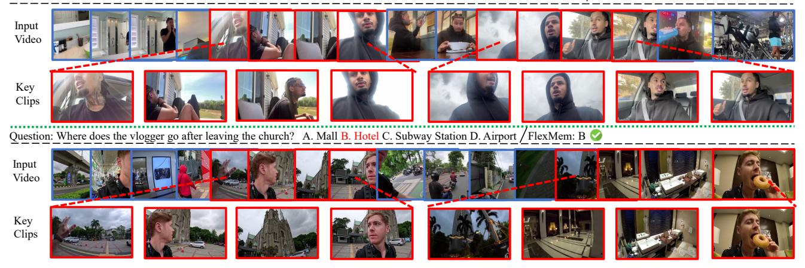

# Scaling the Long Video Understanding of Multimodal Large Language Models via Visual Memory Mechanism

Tao Chen1 Kun Zhang1 Qiong Wu1 Xiao Chen1 Chao Chang2 Xiaoshuai Sun1 Yiyi Zhou1† Rongrong Ji1 1Key Laboratory of Multimedia Trusted Perception and Efficient Computing, Ministry of Education of China, Xiamen University, 361005, P.R. China. 2National University of Defense Technology, 230000, P.R. China.

# Abstract

*Long video understanding is a key challenge that plagues the advancement of* Multimodal Large language Models *(MLLMs). In this paper, we study this problem from the perspective of visual memory mechanism, and proposed a novel and training-free approach, termed* Flexible Memory *(FlexMem). In principle, FlexMem aims to mimic human behavior of video watching,* i.e.*, continually watching video content and recalling the most relevant memory fragments to answer the question. In this way, FlexMem can help MLLMs achieve video understanding of infinite lengths, unlike previous methods that process all video information at once and have input upper-limit. Concretely, FlexMem first consider the visual KV caches as the memory sources, and realize the effective memory transfer and writing via a dualpathway compression design. Afterwards, FlexMem also explores different memory reading strategies for the diverse video understanding tasks, including the popular streaming one. To validate FlexMem, we apply it to two popular video-MLLMs, and conduct extensive experiments on five long video and one streaming video task. The experimental results show that on a single 3090 GPU, our FlexMem can achieve obvious improvements than existing efficient video understanding methods and process more than 1k frames, which also helps the base MLLMs achieve comparable or even better performance than SOTA MLLMs on some benchmarks,* e.g. *, GPT-4o and Gemini-1.5 Pro. Our code is released at: [FlexMem.](https://github.com/city1517/FlexMem)*

# 1. Introduction

Recent years have witnessed the remarkable progress made by *Multimodal Large Language Models* (MLLMs) [\[28,](#page-9-0) [43,](#page-9-1) [55,](#page-10-0) [67–](#page-11-0)[69\]](#page-11-1) towards effective vision-language understanding. Despite the great success, long video understand-

Performance Comparison of Different Methods on the RTX 3090 GPU Figure 1. Comparison between FlexMem (ours) and existing efficient video understanding methods for MLLMs on five benchmarks. All methods are run on the same device of one 3090 GPU, and our FlexMem presents obvious performance gains.

ing is still a main obstacle for existing MLLMs mainly due to the difficulty of processing excessive long video frames [\[14,](#page-8-0) [34\]](#page-9-2). In addition to high computation complexity, the large number of visual tokens from long videos can easily exceed the upper limit of the sequence length of existing MLLMs [\[13,](#page-8-1) [36,](#page-9-3) [52\]](#page-10-1), *e.g.*, more than 200k for 1024 video frames [\[18\]](#page-8-2), resulting in both performance degradation and expensive memory overhead [\[7,](#page-8-3) [18\]](#page-8-2).

To tackle this issue, recent efforts [\[11,](#page-8-4) [14,](#page-8-0) [42,](#page-9-4) [53\]](#page-10-2) are devoted to efficient long video understanding for MLLMs. One popular solution is to adopt *retrieval augmentation generation* (RAG) based strategies to select key video information for MLLMs [\[29,](#page-9-5) [42\]](#page-9-4), drawing on the successful experience of LLMs [\[2,](#page-8-5) [38\]](#page-9-6). Concretely, RAG methods regard the whole video as a knowledge base, and then find out the question-related key frames (or clips) as the input of MLLMs, thereby avoiding the processing of all frames. Although effective in video tasks like *needle-in-*

†Corresponding author: zhouyiyi@xmu.edu.cn.

*a-haystack* [\[65\]](#page-11-2), which requires evident localization from thousands of video frames, RAG methods are still inferior in mastering continual and overall understanding of videos [\[22,](#page-9-7) [35\]](#page-9-8). In this case, they are still sensitive to memory overhead for more keyframe inputs [\[4,](#page-8-6) [17\]](#page-8-7). The other viable solution is to use visual feature compression for the longer input of video frames [\[9,](#page-8-8) [50,](#page-10-3) [61\]](#page-10-4). For instance, Wang *et al.* [\[50\]](#page-10-3) apply visual *Key-Value* (KV) caches compression to reduce the per-clip footprint, thereby increasing the number of input frames. However, visual compression methods [\[39,](#page-9-9) [49,](#page-10-5) [50\]](#page-10-3) still require MLLMs to input all compressed visual features for the final answering, still yielding obvious computation bottlenecks. Overall, existing methods are still hard to strike a trade-off between efficient video understanding and optimal performance.

In this paper, we study the long video understanding of MLLMs from the perspective of visual memory mechanism [\[11,](#page-8-4) [14,](#page-8-0) [62\]](#page-10-6). Specifically, we aim to help MLLMs to be able to watch videos continuously, form visual memories and answer questions based on relevant memory fragments, just like a human. In this way, MLLMs can answer the question without having to using all information, *i.e.*, breaking the input limit of the final prediction, while also being capable of handling different question types, *e.g.*, the global and general ones. More ideally, this memory mechanism should be also independent to MLLMs' structure and training, and can be a plug-and-play component that directly applied to MLLMs without great structure tweaks.

However, achieving the above target still encounters several key challenges. The first one is how to effectively encode memory fragments. While some recent works use KV caches as the viable representations [\[15,](#page-8-9) [16,](#page-8-10) [50\]](#page-10-3), we think that the memories for video MLLMs should not be only highly compressed but also transferable and continuous, thereby handling different types of video tasks, as discussed above. Secondly, the effective reading of memory is also critical. One intuitive solution is to leverage the MLLM's cross-modal attention during encoding to judge the relevance of memories. However, in scenarios with multiple questions or streaming QA [\[21,](#page-9-10) [32\]](#page-9-11), the repeated encoding of video clips and answers will incur excessive computation overhead. In this case, the design of effective and efficient visual memory mechanism for MLLMs is still a intractable problem.

To address these challenges, we propose a novel and training-free visual memory mechanism for video-MLLMs, termed *Flexible Memory* (FlexMem). Concretely, FlexMem resorts to *Key-Value* caches of visual tokens as the MLLM's memory representations, similar to some existing compression-based works [\[31,](#page-9-12) [49\]](#page-10-5). In practice, we also introduce a novel *dual-pathway compression* design that can greatly reduce the memory sizes while ensuring the continuity of each memory snippet. In terms of memory reading, FlexMem is also equipped with a novel and fast indexing approach in addition to the aforementioned encoding-based one, called *MemIndex*. Via statistically fitting the encodingbased retrieval, MemIndex adaptively select the representative cache layers and tokens to form a much smaller memory index tensor, supporting the fast and flexible memory retrieval. With these innovative designs, the proposed FlexMem can scale the input frames of MLLMs, thereby significantly enhancing their long video understanding.

To validate FlexMem, we apply it to two representative video MLLMs, namely LLaVA-OneVision [\[18\]](#page-8-2) and LLaVA-Video [\[64\]](#page-10-7), and conduct extensive experiments on a bunch of highly competitive benchmarks. The experimental results not only show the great improvement to video MLLMs, *e.g.*, +32.2% on TimeScope for LLaVA-Video, but also validate its merits than existing methods for efficient video understanding. For instance, under the same setting of one 3090 GPU, our FlexMem can outperforms the SOTA methods such as AKS [\[42\]](#page-9-4) and AdaRETAKE [\[50\]](#page-10-3) by 3.9% and 5.2% on average for LLaVA-Video, respectively.

Overall, our contributions are two-fold:

- We study the long video understanding of MLLMs from the perspective of visual memory mechanism, and propose a novel approached termed FlexMem to scale up the input of video frames.
- On a set of benchmarks, our FlexMem can greatly improve the capabilities of base MLLMs and outperform a set of SOTA methods using only one 3090 GPU.

# 2. Related Work

# 2.1. Video Multimodal Large Language Models

The rapid advancement of Large Language Models (LLMs) has catalyzed significant breakthroughs in multimodal understanding [\[25](#page-9-13)[–27\]](#page-9-14), leading to the emergence of Video Multimodal Large Language Models (Video-MLLMs) [\[1,](#page-8-11) [19,](#page-8-12) [20,](#page-9-15) [30\]](#page-9-16). Early pioneering works like Flamingo [\[1\]](#page-8-11) and VideoChat [\[19\]](#page-8-12) laid the foundation by extending imagebased multimodal models with temporal modeling modules, enabling basic video comprehension capabilities. Subsequent works such as Video-LLaVA [\[20\]](#page-9-15) and Video-ChatGPT [\[30\]](#page-9-16) improve temporal reasoning through unified visual representations and joint image-video training. More recent state-of-the-art models like Qwen3-VL [\[3\]](#page-8-13) and InternVL3.5 [\[48\]](#page-10-8) have achieved remarkable performance improvements by scaling both model parameters and training data. However, despite their impressive capabilities, these methods are fundamentally constrained by computational resources and typically process only a limited number of frames, which significantly restricts their applicability to long video understanding scenarios.

Figure 2. Illustration of the proposed FlexMem method. (a) FlexMem is an iterative method, and it encodes two types of compressed memories for each video clip Vi, namely *Context Memory* Ci and *Local Memory* Mi, based on the metrics of aggregation score Si and local saliency score Sˆi, respectively. Mi is then stored in the *visual memory bank* Mbank, while the context memory C are used in the iterative encoding step for information propagation. Besides, we can also retrieval some stored Ml as the long-term memory for encoding, while it is optional as well as the text instruction Tq. (b) The stored memories Ma will be recalled from the memory bank for the decoding of answers Y . (c) One intuitive and effective indexing for FlexMem is the *Encoding-based* one, which uses the cross-attention during memory encoding with Tq (a) to reflect the relevance of memories. (d) We also investigate the other fast index method, termed *MemIndex*, based on the compact index tensors for both question and visual memories, of which process is independent to the encoding of memories. Its selection of cache layers and tokens stems from the fitting results of the encoding-based index.

### 2.2. Long Video Understanding

To tackle the above challenge, some efforts resort to Retrieval-Augmented Generation (RAG) strategies derived from LLMs [\[2,](#page-8-5) [38\]](#page-9-6) to long video understanding. Video-RAG methods [\[29,](#page-9-5) [35,](#page-9-8) [37,](#page-9-17) [42,](#page-9-4) [59\]](#page-10-9) typically employ a twostage pipeline, *i.e.*, first retrieving keyframes based on query similarity, then processing them for answer generation. For instance, AKS [\[42\]](#page-9-4) uses vision-language embedding Models for similarity-based retrieval, while VideoAgent [\[11\]](#page-8-4) employs an iterative refinement process with LLM-based planning. However, such retrieval methods face inherent limitations in maintaining temporal coherence and capturing long-range dependencies. These methods often lack important contextual information that spans multiple segments and struggle with queries requiring holistic video understanding. Recently, visual compression methods have been extensively studied [\[39,](#page-9-9) [49,](#page-10-5) [50\]](#page-10-3), which maintain compressed features of historical context for comprehensive understanding. For instance, AdaRETAKE [\[50\]](#page-10-3) designs adaptive allocation modules to determine compression ratios across temporal dimensions and MLLM layers. Video-XL [\[39\]](#page-9-9) introduces special tokens to summarize the visual information within video fragments. Despite these advances, their input context length grows linearly with video duration, limiting their scalability. FlexMem combines the benefits of both paradigms, *i.e.*, maintaining comprehensive visual memories with constant footprint through iterative processing, and reading the most relevant information for answer generation via memory recall mechanism.

# 3. Method

# 3.1. Overview

In this paper, we study the long video understanding of MLLMs from the perspective of visual memory mechanism, and propose a novel and *training-free* approach termed *Flexible Memory* (FlexMem), as depicted in Fig. [2.](#page-2-0)

In principle, FlexMem aims to mimic the human behaviors of video watching, *i.e.*, continually browsing video content, forming memories and answering questions based on memory recall. Via this iterative paradigm, FlexMem can help MLLMs break the upper-limit of input length.

In particular, given a long video V and a text instruction Tq, existing MLLMs [\[46,](#page-10-10) [48,](#page-10-8) [64\]](#page-10-7) normally sample a subset of frames as the visual input, denoted as V ′ = {I1, · · · , IM}, due to the limit of input sequence length and memory overhead. The prediction Y is generated according to all input frames and the text instruction:

$$MLLM(I_1, \dots, I_M, T_q) \to Y.$$
 (1)

In terms of long video understanding, this solution is greatly limited by the number of input frames, leading to suboptimal performance [\[54,](#page-10-11) [71\]](#page-11-3). To address this challenge, FlexMem considers the visual KV caches as the memory sources, and realizes the effective memory transfer and writing via a dual-pathway compression design.

Specifically, we first divide the video into N clips V = {V1, · · · , VN }. Then, FlexMem lets MLLMs to read video clips iteratively, and its first step is defined by

$$MLLM(V_1, \langle T_q \rangle) \to M_1, C_1.$$
 (2)

where  $\langle \cdot \rangle$  is an optional input.  $M_1, C_1$  are the compressed local memory and context memory respectively, which are processed by our *Dual-Pathway Compression* (DPC) design. In particular,  $M_1$  is written into the visual memory bank  $M_{bank}$  for the following memory recall, while  $C_1$  is used for the historical video information propagation in the iterative steps. Thus, they are processed by differently.

After the first step, FlexMem will extend the inputs of MLLMs, which can be defined by

$$MLLM(\langle M_l \rangle, C_{k-n_s}, ..., C_{k-1}, V_k, \langle T_q \rangle) \rightarrow M_k, C_k.$$
 (3)

Here k denotes the current step of memory processing, and  $n_s$  is the number of retained context memories. In Eq. 3, we give a certain interval of previous context memories to MLLM, thereby achieving the transfer of video information and building the continuity of stored memories. Besides, we also recall some stored  $M_l$  from the memory bank as the long-term memory for the better understanding of long historical information.

After watching the whole video, FlexMem will recall the most relevant memory pieces from  $M_{bank}$ :

$$Recall(M_{bank}, T_q) \to M_i, ..., M_{i+n_a-1}. \tag{4}$$

where  $M_i$  is the recalled memory, and  $n_a$  is the number of recalled pieces. Lastly, MLLM will use these recalled memories for the final answer prediction:

$$MLLM(M_i, ..., M_{i+n_q-1}, T_q) \to Y \tag{5}$$

In particular, the memory encoding with  $T_q$  in Eq. 3 is optional. According to the *uni-directional attention mechanism* of MLLMs [44, 56], the encoding of  $T_q$  will not affect the visual memory compression, but can help to record the video-question relevance for the following memory recall. In this paper, we also explore the fast indexing of video memories, *i.e.*, not using  $T_q$  during the encoding of visual memories. Besides, FlexMem is an iterative approach, *i.e.*, Eq. 3, which can theoretically process infinite-long videos.

#### 3.2. Dual-Pathway Compression

To scale long video understanding, FlexMem is equipped with a novel *dual-pathway compression* design for memory compression and transmission. In particular, FlexMem also regards the encoded *Key-Value* caches of visual tokens as the memory source, and effectively compresses them for memory writing and reading. Compared with existing KV cache compression methods [39, 49, 50], which progressively encode clips and have input upper-limit, our FlexMem consider visual memory encoding as a iterative process that focuses on information transfer.

Concretely, at the *i*-st step of FlexMem, we will include the recent context memory  $C = \{C_{i-k}\}_{k=1}^{n_s}$  into the encoding of current clips, and return the attention matrix  $A^l$ :

$$\mathbf{A}_{v}^{l} = \text{Attention}([\mathbf{Q}_{V_{i}}, \langle \mathbf{Q}_{T_{a}} \rangle], [\hat{\mathbf{K}}_{C}, \mathbf{K}_{V_{i}}, \langle \mathbf{K}_{T_{a}} \rangle]), \quad (6)$$

where  $\mathbf{Q}_{V_i}$  and  $\mathbf{K}_{V_i}$  are the query and key vectors of  $V_i$  at each layer, and  $\mathbf{Q}_{T_q}$  and  $\mathbf{K}_{T_q}$  are those of  $T_q$ .

Recognizing that the role of the visual memory differs between the prefill and decoding stages, we strategically prunes unimportant KVs of  $V_i$  based on two attention-based metrics. For the prefill stage, the objective is to encode the current clip with a rich understanding of its historical context, i.e., context memory C.

To approach this target, we measure the importance of a token whether it effectively aggregates information from past context and propagates its own information to subsequent tokens within its clip. We define the context aggregation score  $s_j^l$  for the j-th token in clip  $V_i$  as the metric for obtaining its context features  $\mathbf{c}_i^l$ :

$$\mathbf{c}_{i}^{l} = \{\mathbf{k}_{j}^{l}, \mathbf{v}_{j}^{l} | s_{j}^{l} \in \underset{j \in V_{i}}{\operatorname{arg\,max}} s_{j}^{l} \},$$
where 
$$s_{j}^{l} = \sum_{k \in C} a_{jk}^{l} + \sum_{h \in V_{i}} a_{hj}^{l}.$$
(7)

where  $a_{jk}^l$  is attention weight of  $A_v^l$  from j-th token in current clip to k-th token in the historical context.  $k_j^l, v_j^l$  are the key and value vectors of the j-th token at the l-th layer.  $\alpha_c$  denotes the compression ratio for context features, and  $|V_i|$  is the number of tokens in clip  $V_i$ . The context memory  $C_i$  of clip  $V_i$  is consisted of its KVs from all cache layers, i.e.,  $C_i = \{\mathbf{c}_i^1, \dots, \mathbf{c}_i^L\}$ .

For the decoding stage, the MLLMs aim to answer the text instruction based on the most salient visual evidence. Therefore, the priority at this time is to eliminate redundancy within each clip to retain its most distinctive information. We thus define a local saliency score  $\hat{s}_j^l$  to measure the overall influence of a token within its own clip, and use it to obtain compressed visual features  $\mathbf{m}_i^l$ :

$$\mathbf{m}_{i}^{l} = \{\mathbf{k}_{j}^{l}, \mathbf{v}_{j}^{l} | \hat{s}_{j}^{l} \in \underset{j \in V_{i}}{\operatorname{arg \, max}} \, \hat{s}_{j}^{l} \},$$
where 
$$\hat{s}_{j}^{l} = \sum_{k \in V_{i}} a_{kj}^{l}.$$
(8)

where  $\alpha_s$  is the compression ratio for the stored memory  $M_i$ , and it includes the compressed caches  $\mathbf{m}_i^l$  of all layers of the clip  $V_i$ , i.e.,  $M_i = \{\mathbf{m}_i^1, \dots, \mathbf{m}_i^L\}$ .

Overall, FlexMem can iteratively process extra long videos with limited memory overhead, and obtain the stored memory bank  $M_{bank}$  for prediction, of which features are rich in visual information and continual in video semantics.

#### 3.3. Memory Reading

#### 3.3.1. Question Encoding based Memory Reading

In terms of memory reading, one effective solution is to directly uses the cross-modal attention encoded during memory compression, *i.e.*, Eq. 6. Based on the superior *visionlangauge* (VL) alignment capability of MLLMs, we can directly use the cross-modal attentions between video clips and question as the metric for memory reading.

Specifically, we compute this relevance score  $g_i$  by summing the attention weights from the instruction tokens to the tokens of clip  $V_i$  at the prefill stage:

$$g_{i} = \sum_{l=3}^{L} \sum_{j \in T_{q}} \sum_{k \in V_{i}} a_{jk}^{l},$$

$$\operatorname{Recall}(M_{bank}, T_{q}) = \{M_{i} | g_{i} \in \underset{i \in M_{bank}}{\operatorname{arg}} \underset{i \in M_{bank}}{\operatorname{max}} g_{i}\}.$$
(9)

Since the attention scores received by visual tokens are generally uniform in shallow layers [51, 58], we only leverage the attention weights from deeper layers to calculate relevance scores in practice, *e.g.*, after the 2-th layer.

#### 3.3.2. Fast Memory Indexing

Although the encoding-based reading solution can accurately capture the video-question similarity based on MLLMs, its practical use is still limited due to the repeated MLLM inference for new questions. In this case, we also explore the fast memory index method, termed *MemIndex*.

In terms of fast and flexible memory retrieval, we assume that MemIndex should has the following properties. First, MemIndex should be independent to the encoding of visual memory, thus they can efficiently handle multiple questions or streaming cases [21, 32]. Second, the index features of MemIndex should be compact enough, either for the visual or the question ones, thereby further reducing the cost of cross-modal matching.

Achieving the above target is still intractable. For instance, the offline memory caches and the question ones still have a certain semantic gap [24], although they are encoded by the same MLLMs. Besides, the computation of retrieval is still expensive, even using the compressed cache tokens, *i.e.*, 21k cache tokens of 25 layers.

To this end, we first consider the encoding-based reading as the upper-bound of MemIndex, and then the objective of MemIndex is defined by

$$\arg\min_{\sigma} \sum_{i=1}^{D} \|\sigma(R_i) - g_i\|_2, \text{ where } \sigma(R_i) = \sum_{l=3}^{L} \alpha^l r_i^l. \quad (10)$$

Here, D is the number of training data used for optimization, and  $r_i^l$  is the relevance score of clip  $V_i$  in the l-th layer obtained from MemIndex. We aim to find a linear regression function  $\sigma(\cdot)$  that minimizes the L2 distance to the "target" score  $g_i$  in Eq. 9.

Specifically, given the input question  $T_q$ , we first encode its features via the MLLM, denoted as  $\mathbf{Q}_{T_q}$ . Then, the basic VL matching can be defined by

$$\mathbf{A}_{c}^{l} = \operatorname{Attention}(\mathbf{Q}_{T_{q}}, \hat{\mathbf{K}}_{V_{i}}),$$

$$r_{i} = \sum_{l=3}^{L} \sum_{j \in T_{q}} \sum_{k \in V_{i}} r_{jk}^{l}.$$
(11)

where  $\hat{\mathbf{K}}_{V_i}$  is the compressed key vectors of clip  $V_i$  in the stored memory  $M_i$ .

Although feasible, this basic solution still involves excessive visual and text tokens of all layers. In this case, we first conduct the selection of visual cache layers according to the fitted regression function  $\sigma(\cdot)$  in Eq. 10:

$$\mathcal{H} = \{l | \alpha^l \in \text{top-}K(\{\alpha^l\}_{l=3}^L)\},\tag{12}$$

where K is the number of selected representative cache layers. We identify these cache layers with highest learned weights  $\alpha^l$ , which naturally indicate each layer's importance for relevance computation.

Besides, we also revise FlexMem during the memory encoding, using a higher-ratio of compression to obtain more compact local memories as the visual index tensor, e.g., the size can be changed from  $|I_i| \times \frac{M}{N} \times d$  to  $k \times d$ . In terms of the question tokens, we empirically select the last token as the index feature [40, 57]. In this case, the index of FlexMem can be defined by

$$\mathbf{q} = \mathbf{Q}_{T_q}[-1], \ \mathbf{K}_{V_i}^* = \{\mathbf{k}_j^l | \hat{s}_j^l \in \underset{j \in V_i}{\arg \max} \hat{s}_j^l \},$$

$$\hat{\mathbf{A}}_c^l = \text{Attention}(\mathbf{q}, \mathbf{K}_{V_i}^*),$$

$$\hat{r}_i = \sum_{l \in \mathcal{H}} \sum_{j \in V_i^*} \hat{r}_j^l.$$
(13)

Here k is the number of key vectors selected as the representative visual indexes.

## 4. Experiment

#### 4.1. Benchmarks and Metrics

To validate FlexMem, we conduct extensive experiments on five benchmarks for long video understanding, including MLVU [66], LongVideoBench [54], LVBench [47], Video-MME [12] and TimeScope [70]. MLVU includes videos ranging from 3 minutes to 2 hours that require comprehensive temporal understanding. Video-MME covers videos of diverse genres and durations, including short, medium, and long-form content. LongVideoBench is designed for tasks requiring precise retrieval and reasoning over detailed multimodal information within extended temporal contexts, containing videos up to an hour in length. LVBench challenges MLLMs to demonstrate long-term memory retention

Table 1. A comparison of FlexMem with SOTA methods based on two recent MLLMs across five long VideoQA benchmarks. *Sampled Frames* denote the number of frames sampled from the video used for compression or selection, and *Input Tokens* denote the number of tokens used for question answering. The best and second-best results are shown in **bold** and <u>underlined</u> respectively. \*Tested on one A800.

| Method                                                                                | Sampled                                          | Input                                  |                                               |                                            |                                                    |                                |                                 | LongVideoBench                                  |                                                    |                                     |                                       |                           |                                     |
|---------------------------------------------------------------------------------------|--------------------------------------------------|----------------------------------------|-----------------------------------------------|--------------------------------------------|----------------------------------------------------|--------------------------------|---------------------------------|-------------------------------------------------|----------------------------------------------------|-------------------------------------|---------------------------------------|---------------------------|-------------------------------------|
|                                                                                       | Frames                                           | Tokens                                 | Test                                          | Val                                        | M-avg                                              | Short                          | Medium                          | Long                                            | All                                                | Short                               | Medium                                | Long                      | All                                 |
| LLaVA-Video 7B                                                                        | 64frm                                            | 13k                                    | 65.0                                          | 42.6                                       | 71.2                                               | 76.1                           | 61.0                            | 52.4                                            | 63.2                                               | 71.5                                | 60.7                                  | 52.1                      | 60.0                                |
| AKS [42] Panels [10] DToMA [61] Video-RAG [29] AdaRETAKE [50] FlexMem* | 1fps 1fps - - 1024frm 512/1024frm | 13k 13k 12k 15k 40k 13k | 85.4 79.2 - - <b>86.2</b> 85.9 | 47.4 - - - 49.6 <b>51.0</b> | 72.0 71.7 <b>72.4</b> 71.7 <b>72.4</b> | 77.2 - - 75.8 76.3 | 64.8 62.2 - 62 63.3 | 53.9 <u>54.0</u> - 52.9 <b>54.4</b> | 65.3 64.4 65.0 63.6 64.7               | 72.3 - - - 69.7 71.5 | 62.1 - - 59.2 <b>65.5</b> | 57.4 - 52.8 57.3 | 59.6 58.7 59.4 <b>63.6</b> |
| LLaVA-OV 7B                                                                           | 32frm                                            | 7k                                     | 56.3                                          | 38.4                                       | 63.4                                               | <u>70.6</u>                    | 54.8                            | 48.2                                            | 57.8                                               | 69.5                                | 53.4                                  | 49.8                      | 56.2                                |
| AKS [42] Panels [10] BOLT [23] AdaRETAKE [50] FlexMem*                                | 1fps 1fps 1fps 1024frm 512/1024frm   | 7k 7k 7k 7k 20k 7k      | 69.5 - 75.8 <b>80.5</b>              | 43.5 - 42.1 46.2                  | 68.3 65.8 64.4 <b>68.9</b>                | 69.2 <b>72.1</b> 70.0    | 56.2 56.8 53.6 57.3    | 50.2 47.3 <b>51.4</b> 49.8             | 58.4 58.9 57.8 <b>59.0</b> <b>59.0</b> | 65.9 - - - 68.5 67.9 | 58.9 - 51.0 58.0             | 54.3 - 47.2 55.0 | 58.9 57.0 54.2 <b>59.4</b> |

Table 2. Performance comparison of FlexMem against representative video RAG method (AKS) and visual compression methods based on LLaVA-Video across five long VideoQA benchmarks. All methods runs on a single 3090 with the fully use of memory overhead.

| Method                             | Sampled                       | Input            | TimeScope                   | L | VBench                      | MLVU                        |                             | Video-M                     | IME                         |                             |                             | LongVideo                   | Bench                       |                             |
|------------------------------------|-------------------------------|------------------|-----------------------------|---|-----------------------------|-----------------------------|-----------------------------|-----------------------------|-----------------------------|-----------------------------|-----------------------------|-----------------------------|-----------------------------|-----------------------------|
| Frames Tol                         |                               | Tokens           | Test                        | 1 | Val                         | M-avg                       | Short                       | Medium                      | Long                        | All                         | Short                       | Medium                      | Long                        | All                         |
| LLaVA-Video 7B                     | 32frm                         | 7k               | 58.3                        | 1 | 41.4                        | 68.5                        | 74.8                        | 58.4                        | 52.0                        | 61.7                        | <u>70.6</u>                 | 59.0                        | 50.5                        | 58.6                        |
| AKS AdaRETAKE <b>FlexMem</b> | 1fps 384frm 512/1024frm | 7k 40k 13k | 84.6 78.2 <b>85.6</b> |   | 46.6 46.8 <b>50.2</b> | 70.8 71.7 <b>72.3</b> | 74.7 74.7 <b>76.2</b> | 61.9 61.8 <b>62.7</b> | 51.7 54.3 <b>55.0</b> | 62.8 63.6 <b>64.6</b> | 68.1 69.0 <b>71.5</b> | 60.0 60.4 <b>63.6</b> | 54.1 53.5 <b>57.2</b> | 59.7 59.8 <b>63.0</b> |

and extended comprehension capabilities, with an average video duration of approximately 68.4 minutes. TimeScope probes the limits of long video capabilities with videos ranging from 1 minute to 8 hours.

#### 4.2. Implementation Details

FlexMem is designed as a training-free approach that can be seamlessly integrated with existing MLLMs without requiring additional fine-tuning. We validate FlexMem using two recent MLLMs: LLaVA-Video [64] and LLaVA-OneVision [18]. we evaluate the effectiveness of FlexMem on long VideoQA tasks through encoding-based reading, and equip FlexMem with MemIndex in streaming QA tasks. We uniformly sample 512 frames on TimeScope, LVBench, and MLVU, while sampling 1024 frames on Video-MME and LongVideoBench. The input token counts for final decoding are 13k and 7k for LLaVA-Video and LLaVA-OneVision respectively, maintaining consistency with their corresponding baselines using sparse uniform sampling strategies. For our MemIndex implementation, we select K=3 visual cache layers and k=5 visual index features to enable efficient memory indexing while preserving representative information.

#### 4.3. Quantitative Analysis

Comparison with existing methods. Tab. 1 presents a comprehensive comparison of FlexMem against representative VideoRAG and visual compression methods across two recent MLLMs, *i.e.*, LLaVA-Video [64] and LLaVA-OneVision [18]. From Tab. 1, we can first observe that

existing methods typically require dense frame sampling and numerous token inputs for final decoding. VideoRAG methods like AKS excel at visual evidence localization on LongVideoBench, and visual compression methods like AdaRETAKE demonstrate strong holistic video understanding on Video-MME. In contrast, FlexMem consistently enhances the performance of both base models, achieving SOTA results against other methods built upon the same MLLMs across most benchmarks. This demonstrates FlexMem's effectiveness in comprehensive memory construction through iterative processing and precise backward tracing via memory recall. For instance, FlexMem enables LLaVA-Video to surpass its baseline by 32.2% on TimeScope and 19.7% on LVBench. These results conclusively validate the effects of FlexMem in advancing long video comprehension capabilities of MLLMs.

Comparison with limited memory overhead. We evaluate the scalability and performance gains of FlexMem compared to two representative methods on a single 3090 GPU, i.e., AdaRETAKE [50], which exemplifies visual compression approaches, and AKS [42], representing VideoRAG methods. As shown in Tab. 2, we first observe that AdaRETAKE and AKS experience considerable degradation compared to their unrestricted performance in Table 1. For instance, when GPU memory budget is limited to 24GB, the input capacity of AdaRETAKE is reduced from 1024 to 384 frames, and its performance drops by an average of 3.3% across all benchmarks. In contrast, FlexMem consistently maintains superior performance under resource constraints,

| Method            | LLM | TimeScope | LVBench | MLVU  |       | Video-N     | <b>IME</b>  |      | LongV  | /ideoBer | nch  |
|-------------------|-----|-----------|---------|-------|-------|-------------|-------------|------|--------|----------|------|
|                   |     | Test      | Val     | M-avg | Short | Medium      | Long        | All  | Medium | Long     | All  |
| GPT-5             | -   | -         | _       | 77.3  | -     | -           | -           | 81.8 | -      | -        | 72.6 |
| GPT-40            | -   | -         | 27.0    | 64.6  | 80.0  | 70.3        | 65.3        | 71.9 | 69.1   | 60.9     | 66.7 |
| Gemini-1.5-Pro    | -   | -         | 33.1    | -     | 81.7  | 74.3        | 67.4        | 75.0 | 65.3   | 58.6     | 64.0 |
| Video-XL [39]     | 7B  | -         | -       | 64.9  | 62.0  | 53.2        | 49.2        | 55.5 | 49     | 45.2     | 50.5 |
| mPLUG-Owl3 [60]   | 7B  | -         | 43.5    | 63.7  | 70.0  | 57.7        | 50.1        | 59.3 | -      | -        | 52.1 |
| Qwen2.5-VL [3]    | 7B  | 81.0      | 45.3    | 70.2  | _     | -           | -           | 65.1 | -      | -        | 56.0 |
| TimeMarker [6]    | 8B  |           | 41.3    | 63.9  | 71.0  | 54.4        | 46.4        | 57.3 | _      | -        | 56.3 |
| LongVU [36]       | 7B  | _         | _       | 65.4  | _     | _           | 59.5        | 60.6 | -      | -        | -    |
| TSPO [41]         | 7B  | -         | 45.3    | 76.3  | _     | -           | 54.7        | 65.5 | -      | -        | 63.9 |
| LongVA [63]       | 7B  | 55.9      |         | 56.3  | 61.1  | 50.4        | 46.2        | 52.6 | _      | -        | -    |
| ByteVideoLLM [45] | 14B | _         | -       | 70.1  | 74.4  | <u>62.9</u> | <u>56.4</u> | 64.6 | -      | -        | -    |
| LLaVA-Video       | 7B  | 65.0      | 42.1    | 71.2  | 76.1  | 61.0        | 52.4        | 63.2 | 60.7   | 52.1     | 60.0 |

72.4

**76.3** 

63.3

Table 3. Comparison between SOTA Video-MLLMs and LLaVA-Video with FlexMem on five long VideoQA benchmarks.

Table 4. Comparison of our method, LLaVA-Video integrated with FlexMem and MemIndex, with SOTA online and offline models on backward tracing task of OVOBench. EPM, ASI and HLD denote *EPisodic Memory*, *Action Sequence Identification* and *HaLlucination Detection*, respectively.

85.9

51.0

7B

+ FlexMem

| Methods                              | LLM           | # Frames     | Backward Tracing    |                  |                     |                     |  |  |  |  |  |
|--------------------------------------|---------------|--------------|---------------------|------------------|---------------------|---------------------|--|--|--|--|--|
| Tribulous .                          |               |              | EPM                 | ASI              | HLD                 | Average             |  |  |  |  |  |
| Offline Models                       |               |              |                     |                  |                     |                     |  |  |  |  |  |
| Gemini-1.5-Pro                       | -             | -            | 58.6                | 76.4             | 52.6                | 62.5                |  |  |  |  |  |
| InternVL-V2 [8] LongVU [36]       | 8B 7B      | 64 1fps   | $\frac{48.2}{40.7}$ | 57.4 59.5     | $\frac{24.7}{4.8}$  | $\frac{43.4}{35.0}$ |  |  |  |  |  |
|                                      | Online Models |              |                     |                  |                     |                     |  |  |  |  |  |
| Flash-VStream [62]                   | 7B 8B      | 1fps         | 39.1                | 37.2 18.8     | 5.9 12.2         | 27.4 17.7        |  |  |  |  |  |
| VideoLLM-online [5] Dispider [33] | 7B            | 2fps 1fps | 48.5                | 55.4             | $\frac{12.2}{4.3}$  | 36.1                |  |  |  |  |  |
| LLaVA-Video +FlexMem w. MemIndex  | 7B 7B      | 64 1fps   | 55.2 <b>57.6</b> | <b>60.8</b> 54.1 | 42.5 <b>49.5</b> | 52.8 <b>54.4</b> |  |  |  |  |  |

and retains 99.5% of its full performance. Overall, these results demonstrating FlexMem's ability to flexibly manage visual memories while preserving essential information.

Comparison with SOTA Video-MLLMs. We further compare FlexMem with existing SOTA Video-MLLMs on five benchmarks in Tab. 3. As shown in Tab. 3, when employing the uniform sampling strategy, short Video-MLLMs such as Qwen2.5-VL exhibit superior performance on Video-MME requiring global understanding capabilities. However, this straightforward solution significantly underperforms compared to visual compression methods like TSPO on LongVideoBench, which requires fine-grained detail reasoning over extended video durations. We can also see that FlexMem consistently achieves competitive or superior performance compared to other methods with comparable model sizes. Notably, FlexMem improves LLaVA-Video to the level of Gemini-1.5-Pro, while significantly surpassing it by 54.1% on LVBench. Overall, these results well confirm the effectiveness of our FlexMem in improving long video understanding of MLLMs.

Results of FlexMem + MemIndex on streaming QA task. Tab. 4 compares the performance of FlexMem integrated with MemIndex against existing SOTA online and offline

Table 5. Ablation studies on different designs of FlexMem under the encoding-based reading setting across two benchmarks. Methods marked with ‡ indicate our chosen settings.

64.7

54.4

**65.5** 

57.3

<u>63.6</u>

|                                  |          | LongVideoBench |      |      |      |  |  |  |  |
|----------------------------------|----------|----------------|------|------|------|--|--|--|--|
| Choices                          | Short    | Medium         | Long | All  | Val  |  |  |  |  |
| Co                               | mpress   | ion Strateg    | y    |      |      |  |  |  |  |
| Context Compression Only         | 70.1     | 64.3           | 56.2 | 62.5 | 49.9 |  |  |  |  |
| Local Compression Only           | 70.9     | 64.6           | 55.9 | 62.6 | 49.7 |  |  |  |  |
| Dual-Pathway ‡        | 71.5     | 65.5           | 57.3 | 63.6 | 51.0 |  |  |  |  |
| Context during Prefill           |          |                |      |      |      |  |  |  |  |
| Context Memory Only              | 71.2     | 65.0           | 53.5 | 61.9 | 50.5 |  |  |  |  |
| Local Memory Only                | 71.2     | 63.3           | 54.6 | 61.8 | 50.0 |  |  |  |  |
| Combination of both ‡ | 71.5     | 65.5           | 57.3 | 63.6 | 51.0 |  |  |  |  |
| Con                              | text dur | ing Decodi     | ng   |      |      |  |  |  |  |
| All M bank            | 71.5     | 58.7           | 53.2 | 59.8 | 49.3 |  |  |  |  |
| Memory Reading ‡      | 71.5     | 65.5           | 57.3 | 63.6 | 51.0 |  |  |  |  |
| Number of Frames in Each Clip    |          |                |      |      |      |  |  |  |  |
| 8 ‡                   | 71.5     | 65.5           | 57.3 | 63.6 | 51.0 |  |  |  |  |
| 16                               | 71.5     | 64.8           | 57.1 | 63.4 | 50.1 |  |  |  |  |
| 32                               | 70.1     | 62.6           | 55.7 | 61.7 | 49.3 |  |  |  |  |

Table 6. Ablation studies on index token designs of FlexMem with MemIndex on two benchmarks. *Single* and *Multi* denote the Single-Detail and Multi-Detail tasks on MLVU, respectively. *At-tEnc* means token selection based on local saliency score.

| Layers | Text           | Vision |        | LVBench |          |       |      |
|--------|----------------|--------|--------|---------|----------|-------|------|
|        | Text           | VISION | Single | Multi   | Holistic | M-avg | Val  |
| Enc    | oding-based Ir | ndex   | 77.1   | 54.8    | 77.3     | 72.4  | 51.0 |
| All    | All            | All    | 76.9   | 54.0    | 77.1     | 72.0  | 46.3 |
| 3      | All            | All    | 77.2   | 53.3    | 77.5     | 72.2  | 46.6 |
| 3      | Last-Token     | All    | 77.4   | 53.3    | 77.3     | 72.3  | 46.8 |
| 3      | Last-Token     | AttEnc | 77.1   | 53.1    | 77.5     | 72.1  | 45.7 |

models in streaming QA tasks. As shown in Tab. 4, we can see that while offline models such as LongVU exhibit superior holistic comprehension capabilities compared to online methods like Dispider on ASI, their performance degraded on EPM that requires historical memory localization. After equipped with FlexMem and MemIndex, LLaVA-Video exceeds its common version by 3% on average, demonstrating the capacity of our method to effective memory recall and flexible context management. Overall, these results show

Figure 3. Qualitative evaluation of FlexMem. Input Video denote the sampled frames, and Key Fragments are the selected clips for answer generation via memory recall mechanism. These results demonstrate FlexMem's capacity in comprehensive and fine-grained visual understanding.

the merits of MemIndex in historical information tracing.

**Ablation Study.** Here, we first ablate the key designs choices of FlexMem in Tab. 5. In the first block of Tab. 5, we examine the effects of our dual-pathway compression strategy. *Context Compression Only* and *Local Compression Only* denote memory compression using only  $s_j^l$  in Eq. 7 and  $\hat{s}_j^l$  in Eq. 8, respectively. The results show that the context features can transfer historical information for long video understanding, while local features effectively compress memories on short videos. Notably, the performance gains of our *Dual-Pathway* become more pronounced with longer video durations, validating its ability to effectively exploit the distinct roles of MLLMs during prefill and decoding phases, *i.e.*, encoding clips with contextual memories and generating predictions with stored memories.

In the second block of Tab. 5, we validate the effectiveness of context memory and local memory during the prefill stage. We observe that while employing either context memory or local memory alone during clip encoding yields reasonable performance, their combination results in significantly enhanced performance. This finding indicates that the two memory types are complementary, i.e., context memory maintains temporal continuity while local memory preserves long-range dependencies. The third block examines the benefits of our memory reading strategy compared to indiscriminate loading of all memory. The results demonstrate that our memory recall can effectively identify and prioritize a small subset of key clips from extended videos. In the last block of Tab. 5, we analyze performance across different block sizes. The results indicate that MLLMs consistently require detailed visual information through smaller block sizes, regardless of video duration. Overall, these results further confirm the effectiveness of our proposed designs choices for FlexMem.

Next, we further ablate the effectiveness of our fast memory indexing discussed in Sec. 3.3.2, as shown in Tab. 6. The most simple solution is computing relevance scores across all cache layers for all visual KVs, which inevitably introduces substantial computational overhead and information redundancy. In contrast, our MemIndex achieves comparable or even superior performance on MLVU compared to encoding-based index while significantly reducing computational complexity. Overall, the results demonstrate that our MemIndex substantially reduces computational costs with minimal performance degradation.

### 4.4. Qualitative Analysis

In Fig. 3, we visualize the comprehensive long video understanding and precise memory recall capabilities of FlexMem. As observed, FlexMem can significantly improve the baseline MLLM for long video understanding through precise visual evident localization. While sparse uniform sampling strategies typically lead to poor performance in long video comprehension, FlexMem empowers MLLMs to iteratively process entire videos and generate accurate answers via precise memory recall.

#### 5. Conclusion

In this paper, we presented FlexMem, a novel training-free approach that enables MLLMs to understand videos of infinite lengths via a flexible visual memory mechanism. FlexMem iteratively processes video content and recalls key memory fragments for question answering, breaking the input length limitations of MLLMs. Notably, FlexMem achieves substantial performance gains over two representative methods on a single 3090, and enables MLLMs to achieve comparable or superior performance to SOTA models like GPT-40 on several benchmarks.

# 6. Acknowledgments

This work is supported by the National Key Research and Development Program of China (No. 2025YFE0113500), the National Science Fund for Distinguished Young Scholars (No. 62525605), the National Natural Science Foundation of China (No. U25B2066, No. U22B2051, No.62572407) , Fujian Province Special Science and Technology Program (No. 2025H0041).

# References

- [1] Jean-Baptiste Alayrac, Jeff Donahue, Pauline Luc, Antoine Miech, Iain Barr, Yana Hasson, Karel Lenc, Arthur Mensch, Katherine Millican, Malcolm Reynolds, Roman Ring, Eliza Rutherford, Serkan Cabi, Tengda Han, Zhitao Gong, Sina Samangooei, Marianne Monteiro, Jacob L. Menick, Sebastian Borgeaud, Andy Brock, Aida Nematzadeh, Sahand Sharifzadeh, Mikolaj Binkowski, Ricardo Barreira, Oriol Vinyals, Andrew Zisserman, and Karen Simonyan. ´ Flamingo: a visual language model for few-shot learning. In *NeurIPS*, 2022. [2](#page-1-0)
- [2] Akari Asai, Zeqiu Wu, Yizhong Wang, Avirup Sil, and Hannaneh Hajishirzi. Self-rag: Learning to retrieve, generate, and critique through self-reflection. In *ICLR*, 2024. [1,](#page-0-0) [3](#page-2-1)
- [3] Shuai Bai, Keqin Chen, Xuejing Liu, Jialin Wang, Wenbin Ge, Sibo Song, Kai Dang, Peng Wang, Shijie Wang, Jun Tang, Humen Zhong, Yuanzhi Zhu, Mingkun Yang, Zhaohai Li, Jianqiang Wan, Pengfei Wang, Wei Ding, Zheren Fu, Yiheng Xu, Jiabo Ye, Xi Zhang, Tianbao Xie, Zesen Cheng, Hang Zhang, Zhibo Yang, Haiyang Xu, and Junyang Lin. Qwen2.5-vl technical report. *arXiv preprint arXiv:2502.13923*, 2025. [2,](#page-1-0) [7](#page-6-4)
- [4] Zongsheng Cao, Yangfan He, Anran Liu, Jun Xie, Feng Chen, and Zhepeng Wang. Tv-rag: A temporal-aware and semantic entropy-weighted framework for long video retrieval and understanding. In *Proceedings of the 33rd ACM International Conference on Multimedia*, page 9071–9079. ACM, 2025. [2](#page-1-0)
- [5] Joya Chen, Zhaoyang Lv, Shiwei Wu, Kevin Qinghong Lin, Chenan Song, Difei Gao, Jia-Wei Liu, Ziteng Gao, Dongxing Mao, and Mike Zheng Shou. Videollm-online: Online video large language model for streaming video. In *CVPR*, pages 18407–18418, 2024. [7](#page-6-4)
- [6] Shimin Chen, Xiaohan Lan, Yitian Yuan, Zequn Jie, and Lin Ma. Timemarker: A versatile video-llm for long and short video understanding with superior temporal localization ability. *arXiv Preprint*, 2024. [https://arxiv.](https://arxiv.org/abs/2411.18211) [org/abs/2411.18211](https://arxiv.org/abs/2411.18211). [7](#page-6-4)
- [7] Yukang Chen, Fuzhao Xue, Dacheng Li, Qinghao Hu, Ligeng Zhu, Xiuyu Li, Yunhao Fang, Haotian Tang, Shang Yang, Zhijian Liu, Yihui He, Hongxu Yin, Pavlo Molchanov, Jan Kautz, Linxi Fan, Yuke Zhu, Yao Lu, and Song Han. Longvila: Scaling long-context visual language models for long videos. In *ICLR*, 2025. [1](#page-0-0)
- [8] Zhe Chen, Weiyun Wang, Yue Cao, Yangzhou Liu, Zhangwei Gao, Erfei Cui, Jinguo Zhu, Shenglong Ye, Hao Tian, Zhaoyang Liu, Lixin Gu, Xuehui Wang, Qingyun Li, Yimin

- Ren, Zixuan Chen, Jiapeng Luo, Jiahao Wang, Tan Jiang, Bo Wang, Conghui He, Botian Shi, Xingcheng Zhang, Han Lv, Yi Wang, Wenqi Shao, Pei Chu, Zhongying Tu, Tong He, Zhiyong Wu, Huipeng Deng, Jiaye Ge, Kai Chen, Min Dou, Lewei Lu, Xizhou Zhu, Tong Lu, Dahua Lin, Yu Qiao, Jifeng Dai, and Wenhai Wang. Expanding performance boundaries of open-source multimodal models with model, data, and test-time scaling. *arXiv Preprint*, 2024. <https://arxiv.org/abs/2412.05271>. [7](#page-6-4)
- [9] Shangzhe Di, Zhelun Yu, Guanghao Zhang, Haoyuan Li, Tao Zhong, Hao Cheng, Bolin Li, Wanggui He, Fangxun Shu, and Hao Jiang. Streaming video question-answering with in-context video kv-cache retrieval. In *ICLR*, 2025. [2](#page-1-0)
- [10] Lars Doorenbos, Federico Spurio, and Juergen Gall. Video panels for long video understanding. *arXiv Preprint*, 2025. <https://arxiv.org/abs/2509.23724>. [6](#page-5-2)
- [11] Yue Fan, Xiaojian Ma, Rujie Wu, Yuntao Du, Jiaqi Li, Zhi Gao, and Qing Li. [inline-graphic not available: see fulltext]videoagent: A memory-augmented multimodal agent for video understanding. In *ECCV*, pages 75–92, 2024. [1,](#page-0-0) [2,](#page-1-0) [3](#page-2-1)
- [12] Chaoyou Fu, Yuhan Dai, Yongdong Luo, Lei Li, Shuhuai Ren, Renrui Zhang, Zihan Wang, Chenyu Zhou, Yunhang Shen, Mengdan Zhang, Peixian Chen, Yanwei Li, Shaohui Lin, Sirui Zhao, Ke Li, Tong Xu, Xiawu Zheng, Enhong Chen, Caifeng Shan, Ran He, and Xing Sun. Video-mme: The first-ever comprehensive evaluation benchmark of multimodal llms in video analysis. In *CVPR*, pages 24108–24118, 2025. [5](#page-4-3)
- [13] Tian Gan, Xiao Wang, Yan Sun, Jianlong Wu, Qingpei Guo, and Liqiang Nie. Temporal sentence grounding in streaming videos. In *ACM Multimedia*, pages 4637–4646, 2023. [1](#page-0-0)
- [14] Bo He, Hengduo Li, Young Kyun Jang, Menglin Jia, Xuefei Cao, Ashish Shah, Abhinav Shrivastava, and Ser-Nam Lim. MA-LMM: memory-augmented large multimodal model for long-term video understanding. In *CVPR*, pages 13504– 13514, 2024. [1,](#page-0-0) [2](#page-1-0)
- [15] Jie Hu, Shengnan Wang, Yutong He, Ping Gong, Jiawei Yi, Juncheng Zhang, Youhui Bai, Renhai Chen, Gong Zhang, Cheng Li, and Kun Yuan. Efficient long-context LLM inference via KV cache clustering. *arXiv Preprint*, 2025. <https://arxiv.org/abs/2506.11418>. [2](#page-1-0)
- [16] Dongwon Jo, Jiwon Song, Yulhwa Kim, and Jae-Joon Kim. Fastkv: KV cache compression for fast long-context processing with token-selective propagation. *arXiv Preprint*, 2025. <https://arxiv.org/abs/2502.01068>. [2](#page-1-0)
- [17] Mahesh Kandhare and Thibault Gisselbrecht. An empirical comparison of video frame sampling methods for multimodal RAG retrieval. *arXiv Preprint*, 2024. [https:](https://arxiv.org/abs/2408.03340) [//arxiv.org/abs/2408.03340](https://arxiv.org/abs/2408.03340). [2](#page-1-0)
- [18] Bo Li, Yuanhan Zhang, Dong Guo, Renrui Zhang, Feng Li, Hao Zhang, Kaichen Zhang, Peiyuan Zhang, Yanwei Li, Ziwei Liu, and Chunyuan Li. Llava-onevision: Easy visual task transfer. *Trans. Mach. Learn. Res.*, 2025, 2025. [1,](#page-0-0) [2,](#page-1-0) [6](#page-5-2)
- [19] Kunchang Li, Yinan He, Yi Wang, Yizhuo Li, Wenhai Wang, Ping Luo, Yali Wang, Limin Wang, and Yu Qiao. Videochat: Chat-centric video understanding. *arXiv Preprint*, 2023. <https://arxiv.org/abs/2305.06355>. [2](#page-1-0)

- [20] Bin Lin, Yang Ye, Bin Zhu, Jiaxi Cui, Munan Ning, Peng Jin, and Li Yuan. Video-llava: Learning united visual representation by alignment before projection. In *EMNLP*, pages 5971–5984, 2024. [2](#page-1-0)
- [21] Junming Lin, Zheng Fang, Chi Chen, Zihao Wan, Fuwen Luo, Peng Li, Yang Liu, and Maosong Sun. Streamingbench: Assessing the gap for mllms to achieve streaming video understanding. *arXiv Preprint*, 2024. [https://arxiv.](https://arxiv.org/abs/2411.03628) [org/abs/2411.03628](https://arxiv.org/abs/2411.03628). [2,](#page-1-0) [5](#page-4-3)
- [22] Heng Liu, Siru Jiang, Fangyun Duan, Yongzhe Lyu, Xiusong Wang, Hanlin Ge, and Chao Liang. Cadencerag: Contextaware and dependency-enhanced retrieval augmented generation for holistic video understanding. In *CVPR Workshops*, pages 3679–3688, 2025. [2](#page-1-0)
- [23] Shuming Liu, Chen Zhao, Tianqi Xu, and Bernard Ghanem. BOLT: boost large vision-language model without training for long-form video understanding. In *CVPR*, pages 3318– 3327, 2025. [6](#page-5-2)
- [24] Xutong Liu, Baran Atalar, Xiangxiang Dai, Jinhang Zuo, Siwei Wang, John C. S. Lui, Wei Chen, and Carlee Joe-Wong. Semantic caching for low-cost LLM serving: From offline learning to online adaptation. *arXiv Preprint*, 2025. <https://arxiv.org/abs/2508.07675>. [5](#page-4-3)
- [25] Gen Luo, Yiyi Zhou, Xiaoshuai Sun, Yan Wang, Liujuan Cao, Yongjian Wu, Feiyue Huang, and Rongrong Ji. Towards lightweight transformer via group-wise transformation for vision-and-language tasks. *IEEE Transactions on Image Processing*, 31:3386–3398, 2022. [2](#page-1-0)
- [26] Gen Luo, Yiyi Zhou, Minglang Huang, Tianhe Ren, Xiaoshuai Sun, and Rongrong Ji. Moil: Momentum imitation learning for efficient vision-language adaptation. *IEEE Transactions on Pattern Analysis and Machine Intelligence*, 47(7):5192–5204, 2024.
- [27] Gen Luo, Yiyi Zhou, Xiaoshuai Sun, Yongjian Wu, Yue Gao, and Rongrong Ji. Towards language-guided visual recognition via dynamic convolutions. *International Journal of Computer Vision*, 132(1):1–19, 2024. [2](#page-1-0)
- [28] Gen Luo, Yiyi Zhou, Yuxin Zhang, Xiawu Zheng, Xiaoshuai Sun, and Rongrong Ji. Feast your eyes: Mixture-ofresolution adaptation for multimodal large language models. In *ICLR*, 2025. [1](#page-0-0)
- [29] Yongdong Luo, Xiawu Zheng, Xiao Yang, Guilin Li, Haojia Lin, Jinfa Huang, Jiayi Ji, Fei Chao, Jiebo Luo, and Rongrong Ji. Video-rag: Visually-aligned retrieval-augmented long video comprehension. *arXiv Preprint*, 2024. [https:](https://arxiv.org/abs/2411.13093) [//arxiv.org/abs/2411.13093](https://arxiv.org/abs/2411.13093). [1,](#page-0-0) [3,](#page-2-1) [6](#page-5-2)
- [30] Muhammad Maaz, Hanoona Abdul Rasheed, Salman Khan, and Fahad Khan. Video-chatgpt: Towards detailed video understanding via large vision and language models. In *ACL*, pages 12585–12602, 2024. [2](#page-1-0)
- [31] Zhenyu Ning, Guangda Liu, Qihao Jin, Wenchao Ding, Minyi Guo, and Jieru Zhao. Livevlm: Efficient online video understanding via streaming-oriented KV cache and retrieval. *arXiv Preprint*, 2025. [https://arxiv.org/](https://arxiv.org/abs/2505.15269) [abs/2505.15269](https://arxiv.org/abs/2505.15269). [2](#page-1-0)
- [32] Junbo Niu, Yifei Li, Ziyang Miao, Chunjiang Ge, Yuanhang Zhou, Qihao He, Xiaoyi Dong, Haodong Duan, Shuangrui

- Ding, Rui Qian, Pan Zhang, Yuhang Zang, Yuhang Cao, Conghui He, and Jiaqi Wang. Ovo-bench: How far is your video-llms from real-world online video understanding? In *CVPR*, pages 18902–18913, 2025. [2,](#page-1-0) [5](#page-4-3)
- [33] Rui Qian, Shuangrui Ding, Xiaoyi Dong, Pan Zhang, Yuhang Zang, Yuhang Cao, Dahua Lin, and Jiaqi Wang. Dispider: Enabling video llms with active real-time interaction via disentangled perception, decision, and reaction. In *CVPR*, pages 24045–24055, 2025. [7](#page-6-4)
- [34] Shuhuai Ren, Linli Yao, Shicheng Li, Xu Sun, and Lu Hou. Timechat: A time-sensitive multimodal large language model for long video understanding. In *CVPR*, pages 14313– 14323, 2024. [1](#page-0-0)
- [35] Xubin Ren, Lingrui Xu, Long Xia, Shuaiqiang Wang, Dawei Yin, and Chao Huang. Videorag: Retrieval-augmented generation with extreme long-context videos. *arXiv Preprint*, 2025. <https://arxiv.org/abs/2502.01549>. [2,](#page-1-0) [3](#page-2-1)
- [36] Xiaoqian Shen, Yunyang Xiong, Changsheng Zhao, Lemeng Wu, Jun Chen, Chenchen Zhu, Zechun Liu, Fanyi Xiao, Balakrishnan Varadarajan, Florian Bordes, Zhuang Liu, Hu Xu, Hyunwoo J. Kim, Bilge Soran, Raghuraman Krishnamoorthi, Mohamed Elhoseiny, and Vikas Chandra. Longvu: Spatiotemporal adaptive compression for long video-language understanding. *arXiv Preprint*, 2024. [https://arxiv.](https://arxiv.org/abs/2410.17434) [org/abs/2410.17434](https://arxiv.org/abs/2410.17434). [1,](#page-0-0) [7](#page-6-4)
- [37] Xiaoqian Shen, Wenxuan Zhang, Jun Chen, and Mohamed Elhoseiny. Vgent: Graph-based retrieval-reasoningaugmented generation for long video understanding. *arXiv Preprint*, 2025. [https://arxiv.org/abs/2510.](https://arxiv.org/abs/2510.14032) [14032](https://arxiv.org/abs/2510.14032). [3](#page-2-1)
- [38] Weijia Shi, Sewon Min, Michihiro Yasunaga, Minjoon Seo, Richard James, Mike Lewis, Luke Zettlemoyer, and Wentau Yih. REPLUG: retrieval-augmented black-box language models. In *NAACL-HLT*, pages 8371–8384, 2024. [1,](#page-0-0) [3](#page-2-1)
- [39] Yan Shu, Zheng Liu, Peitian Zhang, Minghao Qin, Junjie Zhou, Zhengyang Liang, Tiejun Huang, and Bo Zhao. Video-xl: Extra-long vision language model for hour-scale video understanding. In *CVPR*, pages 26160–26169, 2025. [2,](#page-1-0) [3,](#page-2-1) [4,](#page-3-4) [7](#page-6-4)
- [40] Paul Suganthan, Fedor Moiseev, Le Yan, Junru Wu, Jianmo Ni, Jay Han, Imed Zitouni, Enrique Alfonseca, Xuanhui Wang, and Zhe Dong. Adapting decoder-based language models for diverse encoder downstream tasks. *arXiv Preprint*, 2025. [https://arxiv.org/abs/2503.](https://arxiv.org/abs/2503.02656) [02656](https://arxiv.org/abs/2503.02656). [5](#page-4-3)
- [41] Canhui Tang, Zifan Han, Hongbo Sun, Sanping Zhou, Xuchong Zhang, Xin Wei, Ye Yuan, Huayu Zhang, Jinglin Xu, and Hao Sun. TSPO: temporal sampling policy optimization for long-form video language understanding. *arXiv Preprint*, 2025. <https://arxiv.org/abs/2508.04369>. [7](#page-6-4)
- [42] Xi Tang, Jihao Qiu, Lingxi Xie, Yunjie Tian, Jianbin Jiao, and Qixiang Ye. Adaptive keyframe sampling for long video understanding. In *CVPR*, pages 29118–29128, 2025. [1,](#page-0-0) [2,](#page-1-0) [3,](#page-2-1) [6](#page-5-2)
- [43] Bo Tong, Bokai Lai, Yiyi Zhou, Gen Luo, Yunhang Shen, Ke Li, Xiaoshuai Sun, and Rongrong Ji. Flashsloth : Lightning multimodal large language models via embedded visual compression. In *CVPR*, pages 14570–14581, 2025. [1](#page-0-0)

- [44] Ashish Vaswani, Noam Shazeer, Niki Parmar, Jakob Uszkoreit, Llion Jones, Aidan N. Gomez, Lukasz Kaiser, and Illia Polosukhin. Attention is all you need. In *NIPS*, pages 5998– 6008, 2017. [4](#page-3-4)
- [45] Han Wang, Yuxiang Nie, Yongjie Ye, Guanyu Deng, Yanjie Wang, Shuai Li, Haiyang Yu, Jinghui Lu, and Can Huang. Dynamic-vlm: Simple dynamic visual token compression for videollm. *arXiv Preprint*, 2024. [https://arxiv.](https://arxiv.org/abs/2412.09530) [org/abs/2412.09530](https://arxiv.org/abs/2412.09530). [7](#page-6-4)
- [46] Peng Wang, Shuai Bai, Sinan Tan, Shijie Wang, Zhihao Fan, Jinze Bai, Keqin Chen, Xuejing Liu, Jialin Wang, Wenbin Ge, Yang Fan, Kai Dang, Mengfei Du, Xuancheng Ren, Rui Men, Dayiheng Liu, Chang Zhou, Jingren Zhou, and Junyang Lin. Qwen2-vl: Enhancing vision-language model's perception of the world at any resolution. *arXiv Preprint*, 2024. <https://arxiv.org/abs/2409.12191>. [3](#page-2-1)
- [47] Weihan Wang, Zehai He, Wenyi Hong, Yean Cheng, Xiaohan Zhang, Ji Qi, Shiyu Huang, Bin Xu, Yuxiao Dong, Ming Ding, and Jie Tang. Lvbench: An extreme long video understanding benchmark. *arXiv Preprint*, 2024. [https:](https://arxiv.org/abs/2406.08035) [//arxiv.org/abs/2406.08035](https://arxiv.org/abs/2406.08035). [5](#page-4-3)
- [48] Weiyun Wang, Zhangwei Gao, Lixin Gu, Hengjun Pu, Long Cui, Xingguang Wei, Zhaoyang Liu, Linglin Jing, Shenglong Ye, Jie Shao, Zhaokai Wang, Zhe Chen, Hongjie Zhang, Ganlin Yang, Haomin Wang, Qi Wei, Jinhui Yin, Wenhao Li, Erfei Cui, Guanzhou Chen, Zichen Ding, Changyao Tian, Zhenyu Wu, JingJing Xie, Zehao Li, Bowen Yang, Yuchen Duan, Xuehui Wang, Zhi Hou, Haoran Hao, Tianyi Zhang, Songze Li, Xiangyu Zhao, Haodong Duan, Nianchen Deng, Bin Fu, Yinan He, Yi Wang, Conghui He, Botian Shi, Junjun He, Yingtong Xiong, Han Lv, Lijun Wu, Wenqi Shao, Kaipeng Zhang, Huipeng Deng, Biqing Qi, Jiaye Ge, Qipeng Guo, Wenwei Zhang, Songyang Zhang, Maosong Cao, Junyao Lin, Kexian Tang, Jianfei Gao, Haian Huang, Yuzhe Gu, Chengqi Lyu, Huanze Tang, Rui Wang, Haijun Lv, Wanli Ouyang, Limin Wang, Min Dou, Xizhou Zhu, Tong Lu, Dahua Lin, Jifeng Dai, Weijie Su, Bowen Zhou, Kai Chen, Yu Qiao, Wenhai Wang, and Gen Luo. Internvl3.5: Advancing open-source multimodal models in versatility, reasoning, and efficiency. *arXiv Preprint*, 2025. [https:](https://arxiv.org/abs/2508.18265) [//arxiv.org/abs/2508.18265](https://arxiv.org/abs/2508.18265). [2,](#page-1-0) [3](#page-2-1)
- [49] Xiao Wang, Qingyi Si, Jianlong Wu, Shiyu Zhu, Li Cao, and Liqiang Nie. Retake: Reducing temporal and knowledge redundancy for long video understanding. *arXiv Preprint*, 2024. <https://arxiv.org/abs/2412.20504>. [2,](#page-1-0) [3,](#page-2-1) [4](#page-3-4)
- [50] Xiao Wang, Qingyi Si, Shiyu Zhu, Jianlong Wu, Li Cao, and Liqiang Nie. Adaretake: Adaptive redundancy reduction to perceive longer for video-language understanding. In *ACL (Findings)*, pages 5417–5432, 2025. [2,](#page-1-0) [3,](#page-2-1) [4,](#page-3-4) [6](#page-5-2)
- [51] Yi Wang, Xinhao Li, Ziang Yan, Yinan He, Jiashuo Yu, Xiangyu Zeng, Chenting Wang, Changlian Ma, Haian Huang, Jianfei Gao, Min Dou, Kai Chen, Wenhai Wang, Yu Qiao, Yali Wang, and Limin Wang. Internvideo2.5: Empowering video mllms with long and rich context modeling. *arXiv Preprint*, 2025. [https://arxiv.org/abs/2501.](https://arxiv.org/abs/2501.12386) [12386](https://arxiv.org/abs/2501.12386). [5](#page-4-3)

- [52] Ziyi Wang, Haoran Wu, Yiming Rong, Deyang Jiang, Yixin Zhang, Yunlong Zhao, Shuang Xu, and Bo Xu. LVC: A lightweight compression framework for enhancing vlms in long video understanding. *arXiv Preprint*, 2025. [https:](https://arxiv.org/abs/2504.06835) [//arxiv.org/abs/2504.06835](https://arxiv.org/abs/2504.06835). [1](#page-0-0)
- [53] Yuetian Weng, Mingfei Han, Haoyu He, Xiaojun Chang, and Bohan Zhuang. Longvlm: Efficient long video understanding via large language models. In *ECCV*, pages 453–470, 2024. [1](#page-0-0)
- [54] Haoning Wu, Dongxu Li, Bei Chen, and Junnan Li. Longvideobench: A benchmark for long-context interleaved video-language understanding. In *NeurIPS*, 2024. [3,](#page-2-1) [5](#page-4-3)
- [55] Qiong Wu, Wenhao Lin, Weihao Ye, Yiyi Zhou, Xiaoshuai Sun, and Rongrong Ji. Accelerating multimodal large language models via dynamic visual-token exit and the empirical findings. *arXiv Preprint*, 2024. [https://arxiv.](https://arxiv.org/abs/2411.19628) [org/abs/2411.19628](https://arxiv.org/abs/2411.19628). [1](#page-0-0)
- [56] Qiong Wu, Yiyi Zhou, Weihao Ye, Xiaoshuai Sun, and Rongrong Ji. Not all attention is needed: Parameter and computation efficient tuning for multi-modal large language models via effective attention skipping. *International Journal of Computer Vision*, 134(3):128, 2026. [4](#page-3-4)
- [57] Long Xing, Qidong Huang, Xiaoyi Dong, Jiajie Lu, Pan Zhang, Yuhang Zang, Yuhang Cao, Conghui He, Jiaqi Wang, Feng Wu, and Dahua Lin. Pyramiddrop: Accelerating your large vision-language models via pyramid visual redundancy reduction. *arXiv Preprint*, 2024. [https://arxiv.org/](https://arxiv.org/abs/2410.17247) [abs/2410.17247](https://arxiv.org/abs/2410.17247). [5](#page-4-3)
- [58] Long Xing, Qidong Huang, Xiaoyi Dong, Jiajie Lu, Pan Zhang, Yuhang Zang, Yuhang Cao, Conghui He, Jiaqi Wang, Feng Wu, and Dahua Lin. Conical visual concentration for efficient large vision-language models. In *CVPR*, pages 14593–14603, 2025. [5](#page-4-3)
- [59] Zeyu Xu, Junkang Zhang, Qiang Wang, and Yi Liu. E-VRAG: enhancing long video understanding with resourceefficient retrieval augmented generation. *arXiv Preprint*, 2025. <https://arxiv.org/abs/2508.01546>. [3](#page-2-1)
- [60] Jiabo Ye, Haiyang Xu, Haowei Liu, Anwen Hu, Ming Yan, Qi Qian, Ji Zhang, Fei Huang, and Jingren Zhou. mplugowl3: Towards long image-sequence understanding in multimodal large language models. In *ICLR*, 2025. [7](#page-6-4)
- [61] Bowen Yuan, Sisi You, and Bing-Kun Bao. Dtoma: Training-free dynamic token manipulation for long video understanding. In *IJCAI*, pages 2314–2322, 2025. [2,](#page-1-0) [6](#page-5-2)
- [62] Haoji Zhang, Yiqin Wang, Yansong Tang, Yong Liu, Jiashi Feng, Jifeng Dai, and Xiaojie Jin. Flash-vstream: Memorybased real-time understanding for long video streams. *arXiv Preprint*, 2024. [https://arxiv.org/abs/2406.](https://arxiv.org/abs/2406.08085) [08085](https://arxiv.org/abs/2406.08085). [2,](#page-1-0) [7](#page-6-4)
- [63] Peiyuan Zhang, Kaichen Zhang, Bo Li, Guangtao Zeng, Jingkang Yang, Yuanhan Zhang, Ziyue Wang, Haoran Tan, Chunyuan Li, and Ziwei Liu. Long context transfer from language to vision. *Trans. Mach. Learn. Res.*, 2025, 2025. [7](#page-6-4)
- [64] Yuanhan Zhang, Jinming Wu, Wei Li, Bo Li, Zejun Ma, Ziwei Liu, and Chunyuan Li. Llava-video: Video instruction tuning with synthetic data. *Trans. Mach. Learn. Res.*, 2025, 2025. [2,](#page-1-0) [3,](#page-2-1) [6](#page-5-2)

- [65] Zijia Zhao, Haoyu Lu, Yuqi Huo, Yifan Du, Tongtian Yue, Longteng Guo, Bingning Wang, Weipeng Chen, and Jing Liu. Needle in A video haystack: A scalable synthetic evaluator for video mllms. In *ICLR*, 2025. [2](#page-1-0)
- [66] Junjie Zhou, Yan Shu, Bo Zhao, Boya Wu, Shitao Xiao, Xi Yang, Yongping Xiong, Bo Zhang, Tiejun Huang, and Zheng Liu. MLVU: A comprehensive benchmark for multi-task long video understanding. *arXiv Preprint*, 2024. [https:](https://arxiv.org/abs/2406.04264) [//arxiv.org/abs/2406.04264](https://arxiv.org/abs/2406.04264). [5](#page-4-3)
- [67] Yiyi Zhou, Rongrong Ji, Xiaoshuai Sun, Jinsong Su, Deyu Meng, Yue Gao, and Chunhua Shen. Plenty is plague: Finegrained learning for visual question answering. *IEEE transactions on pattern analysis and machine intelligence*, 44(2): 697–709, 2019. [1](#page-0-0)
- [68] Yiyi Zhou, Tianhe Ren, Chaoyang Zhu, Xiaoshuai Sun, Jianzhuang Liu, Xinghao Ding, Mingliang Xu, and Rongrong Ji. Trar: Routing the attention spans in transformer for visual question answering. In *Proceedings of the IEEE/CVF International Conference on Computer Vision*, pages 2074– 2084, 2021.
- [69] Deyao Zhu, Jun Chen, Xiaoqian Shen, Xiang Li, and Mohamed Elhoseiny. Minigpt-4: Enhancing vision-language understanding with advanced large language models. In *ICLR*. OpenReview.net, 2024. [1](#page-0-0)
- [70] Orr Zohar, Xiaohan Wang, Yann Dubois, Nikhil Mehta, Tong Xiao, Philippe Hansen-Estruch, Licheng Yu, Xiaofang Wang, Felix Juefei-Xu, Ning Zhang, Serena Yeung-Levy, and Xide Xia. Apollo: An exploration of video understanding in large multimodal models. In *CVPR*, pages 18891– 18901, 2025. [5](#page-4-3)
- [71] Heqing Zou, Tianze Luo, Guiyang Xie, Victor Zhang, Fengmao Lv, Guangcong Wang, Juanyang Chen, Zhuochen Wang, Hansheng Zhang, and Huaijian Zhang. From seconds to hours: Reviewing multimodal large language models on comprehensive long video understanding. *arXiv Preprint*, 2024. <https://arxiv.org/abs/2409.18938>. [3](#page-2-1)