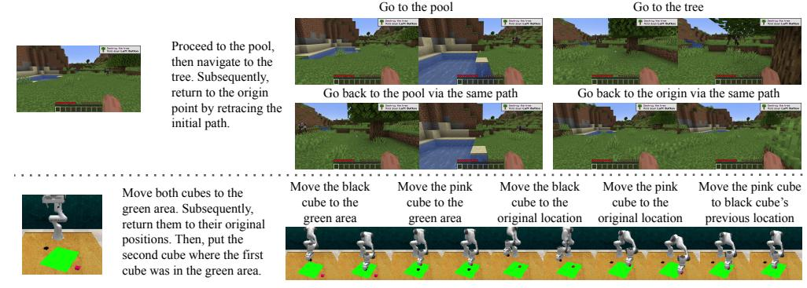
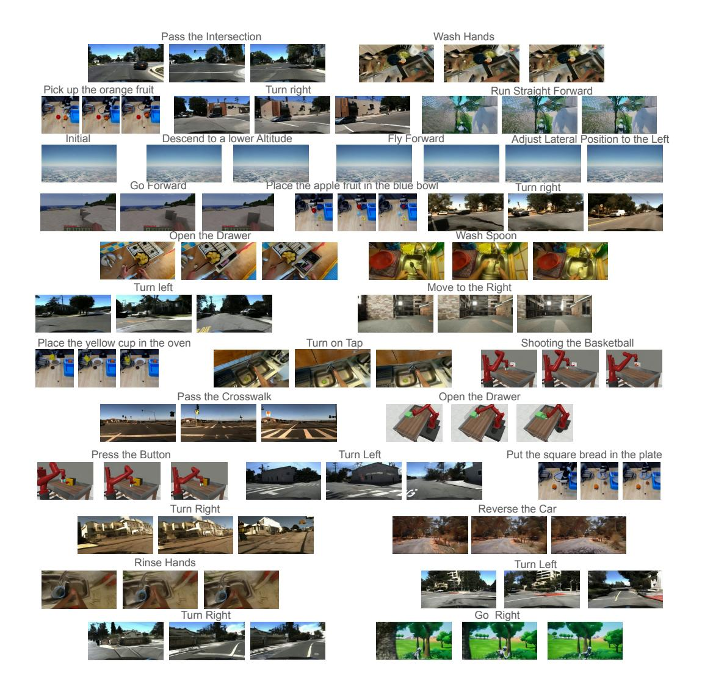
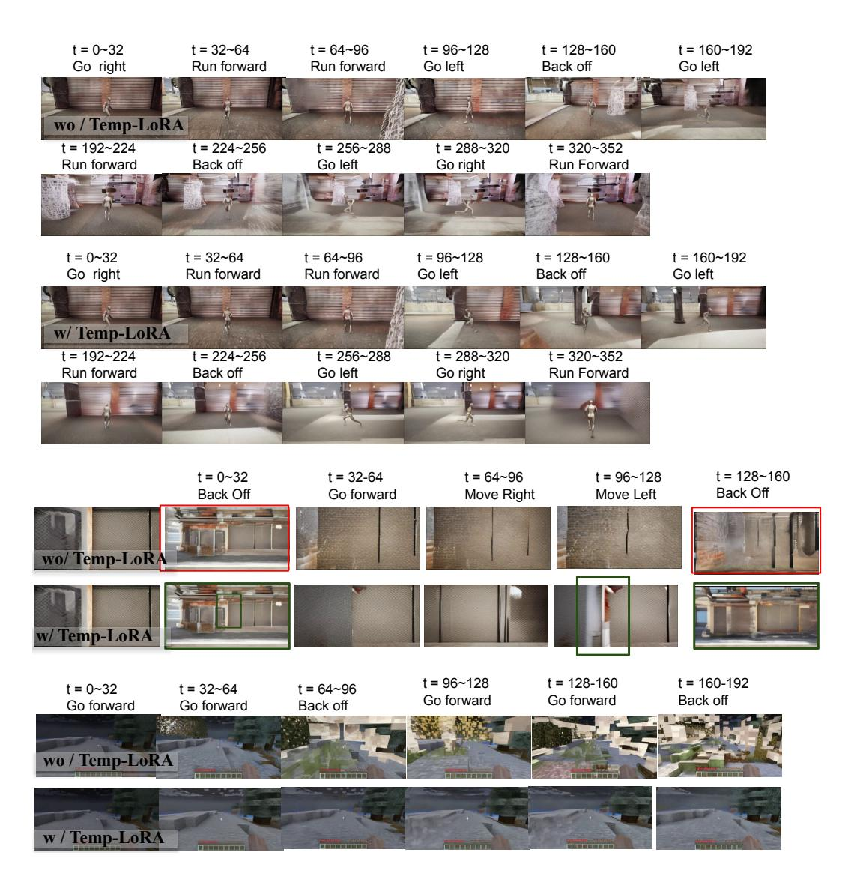
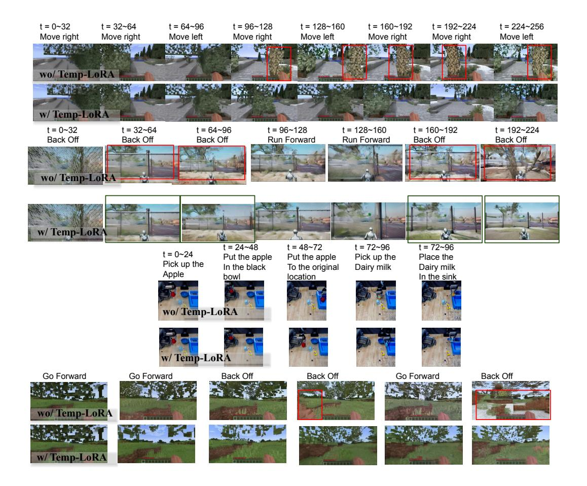

# SLOWFAST-VGEN: SLOW-FAST LEARNING FOR ACTION-DRIVEN LONG VIDEO GENERATION

Yining Hong<sup>1</sup> , Beide Liu<sup>1</sup> †, Maxine Wu<sup>1</sup> †, Yuanhao Zhai<sup>3</sup> , Kai-Wei Chang<sup>1</sup> , Linjie Li<sup>2</sup> , Kevin Lin<sup>2</sup> , Chung-Ching Lin<sup>2</sup> , Jianfeng Wang<sup>2</sup> , Zhengyuan Yang2,†† , Yingnian Wu1,††, Lijuan Wang2,††

<sup>1</sup> UCLA, <sup>2</sup> Microsoft Research, <sup>3</sup> State University of New York at Buffalo

<sup>†</sup> Co-second Contribution, †† Equal Advising


Figure 1: We propose SLOWFAST-VGEN, a dual-speed action-driven video generation system that mimics the complementary learning system in human brains. The slow learning phase (a) learns an approximate world model that simulates general dynamics across a diverse set of scenarios. The fast learning phase (b) stores episodic memory for consistent long video generation, *e.g.,* generating the same scene for "Loc1" after traveling across different locations. Slow-fast learning also facilitates long-horizon planning tasks (c) that require the efficient storage of long-term episodic memories.

# <span id="page-0-0"></span>ABSTRACT

Human beings are endowed with a complementary learning system, which bridges the slow learning of general world dynamics with fast storage of episodic memory from a new experience. Previous video generation models, however, primarily focus on slow learning by pre-training on vast amounts of data, overlooking the fast learning phase crucial for episodic memory storage. This oversight leads to inconsistencies across temporally distant frames when generating longer videos, as these frames fall beyond the model's context window. To this end, we introduce SLOWFAST-VGEN, a novel dual-speed learning system for action-driven long video generation. Our approach incorporates a masked conditional video diffusion model for the slow learning of world dynamics, alongside an inferencetime fast learning strategy based on a temporal LoRA module. Specifically, the fast learning process updates its temporal LoRA parameters based on local inputs and outputs, thereby efficiently storing episodic memory in its parameters. We further propose a slow-fast learning loop algorithm that seamlessly integrates the inner fast learning loop into the outer slow learning loop, enabling the recall of prior multi-episode experiences for context-aware skill learning. To facilitate the slow learning of an approximate world model, we collect a large-scale dataset of 200k videos with language action annotations, covering a wide range of scenarios. Extensive experiments show that SLOWFAST-VGEN outperforms baselines across various metrics for action-driven video generation, achieving an FVD score of 514 compared to 782, and maintaining consistency in longer videos, with an average of 0.37 scene cuts versus 0.89. The slow-fast learning loop algorithm significantly enhances performances on long-horizon planning tasks as well. Project Website: <https://slowfast-vgen.github.io>

# <span id="page-1-0"></span>1 INTRODUCTION

Human beings are endowed with a complementary learning system [\(McClelland et al., 1995\)](#page-13-0). The slow learning paradigm, facilitated by the neocortex, carves out a world model from encyclopedic scenarios we have encountered, enabling us to make decisions by anticipating potential outcomes of actions [\(Schwesinger, 1955\)](#page-13-1), as shown in Figure [1](#page-0-0) (a). Complementing this, the hippocampus supports fast learning, allowing for rapid adaptation to new environments and efficient storage of episodic memory [\(Tulving, 1983\)](#page-13-2), ensuring that long-horizon simulations remain consistent (*e.g.,* in Figure [1](#page-0-0) (b), when we travel across locations 1 to 6 and return, the scene remains unchanged.)

Recently, riding the wave of success in video generation [\(Blattmann et al., 2023a\)](#page-10-0), researchers have introduced action-driven video generation that could generate future frames conditioned on actions [\(Yang et al., 2024;](#page-14-0) [Wang et al., 2024a;](#page-13-3) [Hu et al., 2023;](#page-12-0) [Wu et al., 2024\)](#page-14-1), mimicking the slow learning paradigm for building the world model. However, these models often generate videos of constrained lengths (*e.g.,* 16 frames for 4 secs [\(Xiang et al., 2024;](#page-14-2) [Wu et al., 2024\)](#page-14-1)), limiting their ability to foresee far into the future. Several works focus on long video generation, using the outputs of one step as inputs to the next [\(Harvey et al., 2022;](#page-12-1) [Villegas et al., 2022;](#page-13-4) [Chen et al., 2023;](#page-10-1) [Guo et al.,](#page-12-2) [2023a;](#page-12-2) [Henschel et al., 2024\)](#page-12-3). Due to the lack of fast learning, these models often do not memorize trajectories prior to the current context window, leading to inconsistencies in long-term videos.

In this paper, we propose SLOWFAST-VGEN, which seamlessly integrates slow and fast learning in a dual-speed learning system for action-driven long video generation. For the slow learning process, we introduce a masked conditional video diffusion model that conditions on language inputs denoting actions and the preceding video chunk, to generate the subsequent chunk. In the inference time, long video generation can be achieved in a stream-in fashion, where we consecutively input our actions for the current context window, and the succeeding chunk can be generated. To enable the model to memorize beyond the previous chunk, we further propose a fast learning strategy, which rapidly adapts to new contexts and stores episodic memory, enabling the model to maintain coherence over extended sequences. By combining slow learning and fast learning, SLOWFAST-VGEN can generate consistent, action-responsive long videos, as shown in Figure [1](#page-0-0) (a) and (b).

A key challenge for fast learning in long video generation resides in maintaining consistency across long sequences, while avoiding computationally intensive or memory-inefficient strategies for storing lengthy video sequences. To address this, we propose a novel inference-time fast learning strategy that stores episodic memory in Low-Rank Adaptation (LoRA) parameters. Specifically, we draw inspiration from Temporary LoRA [\(Wang et al., 2024b\)](#page-13-5), originally developed for long text generation, and extend this concept for fast learning in video generation. In its original form, TEMP-LORA embeds contextual information in a temporary LoRA module for language modeling by progressively generating new text chunks based on inputs and training on these input-output pairs. Our approach modifies the update mechanism of TEMP-LORA parameters by discarding the input-to-output format. At each context window, our TEMP-LORA for fast learning operates as follows: we generate a new video chunk conditioned on both the input chunk and the corresponding action, then concatenate the input and output into a seamless temporal continuum. This sequence undergoes a noise injection process, creating a temporally coherent learning signal. We then train the denoising UNet on this noise-augmented, action-agnostic sequence. This method emphasizes memorizing entire trajectories rather than focusing on immediate input-output streams or transitions. By leveraging the forward diffusion and reverse denoising processes over the concatenated sequence, we effectively consolidate sequential episodic memory in the TEMP-LORA parameters of the UNet, enabling it to maintain coherence across extended video sequences. Qualitative examples in Figure [4](#page-9-0) and supplementary materials demonstrate that fast learning enhances the consistency, smoothness, and quality of long videos, as well as enabling the fast adaptation to test scenes.

While our fast learning module excels at rapidly adapting to new contexts and storing episodic memory, there exist specific context-aware tasks that require learning from all previous long-term episodes rather than just memorizing individual ones. For instance, in the planning section of Figure [1](#page-0-0) (c), the task requires not only recalling the long-term trajectory within each episode, but also leveraging prior experiences across multiple episodes to develop the general skill of returning the cubes. Therefore, we introduce the slow-fast learning loop by integrating TEMP-LORA into the slow learning process. The inner fast learning loop uses TEMP-LORA to swiftly adapt to each episode, preparing a dataset of inputs, outputs, and corresponding TEMP-LORA parameters for the slow learning process. The outer slow learning loop then leverages the multi-episode data to update the model's core weights with frozen TEMP-LORA parameters.

To further boost slow learning and enable action-driven generation with massive data about world knowledge, we collect a large-scale video dataset comprising 200k videos paired with language action annotations. This dataset covers a myriad of tasks, including Games, Unreal Simulations, Human Activities, Driving, and Robotics. Experiments show that our SLOWFAST-VGEN outperforms baseline models on a series of metrics with regard to both slow learning and fast learning, including FVD, PSNR, SSIM, LPIPS, Scene Cuts, and our newly-proposed Scene Return Consistency (SRC). Furthermore, results on two carefully-designed long-horizon video planning tasks demonstrate that the slow-fast learning loop enables both efficient episodic memory storage and skill learning.

To sum up, our contributions are listed as below:

- We introduce SLOWFAST-VGEN, a dual-speed learning system for action-driven long video generation, which incorporates episodic memory from fast learning into an approximate world model, enabling consistent and coherent action-responsive long video generation.
- We develop an inference-time fast learning strategy that enables the storage of long-term episodic memory within LoRA parameters for long video generation. We also introduce a slow-fast learning loop that integrates the fast learning module into the slow learning process for context-aware skill learning on multi-episode data.
- We develop a masked conditional video diffusion model for slow learning and create a large-scale dataset with 200k videos paired with language action annotations, covering diverse categories.
- Experiments show that SLOWFAST-VGEN outperforms various baselines, achieving an FVD score of 514 versus 782, and averaging 0.37 scene cuts compared with 0.89. Qualitative results highlight the enhanced consistency, smoothness and quality in generated long videos. Additionally, results on long-horizon planning tasks prove that the slow-fast learning loop can effectively store episodic memory for skill learning.

# <span id="page-2-0"></span>2 RELATED WORKS

Text-to-Video Generation Nowadays, research on text-conditioned video generation has been evolving fast [\(Ho et al., 2022b](#page-12-4)[;a;](#page-12-5) [Singer et al., 2022;](#page-13-6) [Luo et al., 2023;](#page-12-6) [Esser et al., 2023;](#page-11-0) [Blattmann](#page-10-2) [et al., 2023b;](#page-10-2) [Zhou et al., 2023;](#page-14-3) [Khachatryan et al., 2023;](#page-12-7) [Wang et al., 2023\)](#page-13-7), enabling the generation of short videos based on text inputs. Recently, several studies have introduced world models capable of generating videos conditioned on free-text actions [\(Wang et al., 2024a;](#page-13-3) [Xiang et al., 2024;](#page-14-2) [Yang](#page-14-0) [et al., 2024\)](#page-14-0). While these papers claim that a general world model is pretrained, they often struggle to simulate dynamics beyond the context window, thus unable to generate consistent long videos. There are also several works that formulate robot planning as a text-to-video generation problem [\(Du et al., 2023;](#page-11-1) [Ko et al., 2023\)](#page-12-8). Specifically, [Du et al.](#page-11-1) [\(2023\)](#page-11-1) trains a video diffusion model to predict future frames and gets actions with inverse dynamic policy, which is followed by this paper.

Long Video Generation A primary challenge in long video generation lies in the limited number of frames that can be processed simultaneously due to memory constraints. Existing techniques often condition on the last chunk to generate the next chunk[\(Harvey et al., 2022;](#page-12-1) [Villegas et al., 2022;](#page-13-4) [Chen et al., 2023;](#page-10-1) [Guo et al., 2023a;](#page-12-2) [Henschel et al., 2024;](#page-12-3) [Zeng et al., 2023;](#page-14-4) [Ren et al., 2024\)](#page-13-8), which hinders the model's ability to retain information beyond the most recent chunk, leading to inconsistencies when revisiting earlier scenes. Some approaches use an anchor frame [\(Yang et al.,](#page-14-5) [2023;](#page-14-5) [Henschel et al., 2024\)](#page-12-3) to capture global context, but this is often insufficient for memorizing the whole trajectory. Other methods generate key frames and interpolate between them [\(He et al.,](#page-12-9) [2023;](#page-12-9) [Ge et al., 2022;](#page-11-2) [Harvey et al., 2022;](#page-12-1) [Yin et al., 2023\)](#page-14-6), diverging from how world models simulate future states through sequential actions, limiting their suitability for real-time action streaming, such as in gaming contexts. Additionally, these methods require long training videos, which are hard to obtain due to frequent shot changes in online content. In this paper, we propose storing episodic memory of the entire generated sequence in LoRA parameters during inference-time fast learning, enabling rapid adaptation to new scenes while retaining consistency with a limited set of parameters.

**Low-Rank Adaptation** LoRA (Hu et al., 2021) addresses the computational challenges of fine-tuning large pretrained language models by using low-rank matrices to approximate weight changes, reducing parameter training and hardware demands. It enables efficient task-switching and personalization without additional inference costs, as the trainable matrices integrate seamlessly with frozen weights. In this work, we develop a TEMP-LORA module, which adapts quickly to new scenes during inference and stores long-context memory in its parameters.

#### <span id="page-3-1"></span>3 SLOWFAST-VGEN

In this section, we introduce our SLOWFAST-VGEN framework. We first present the masked diffusion model for slow learning and the dataset we collected (Sec 3.1). Slow learning enables the generation of new chunks based on previous ones and input actions, while lacking memory retention beyond the most recent chunk. To address this, we introduce a fast learning strategy, which can store episodic memory in LoRA parameters (Sec 3.2). Moving forward, we propose a slow-fast learning loop algorithm (Sec 3.3) that integrates TEMP-LORA into the slow learning process for context-aware tasks that require knowledge from multiple episodes, such as long-horizon planning. We also illustrate how to apply this framework for video planning (Sec 4.2) and conduct a thorough investigation and comparison between our model and complementary learning system in cognitive science, highlighting parallels between artificial and biological learning mechanisms (Sec 3.5).


Figure 2: SLOWFAST-VGEN Architecture. The left side illustrates the slow learning process, pretraining on all data with a masked conditional video diffusion model. The right side depicts the fast learning process, where TEMP-LORA stores episodic memory during inference. Streamin actions guide the generation of video chunks, with TEMP-LORA parameters updated after each chunk. In our slow-fast learning loop algorithm, the inner loop performs fast learning, supplying TEMP-LORA parameters from multiple episodes to the slow learning process, which updates slow learning parameters  $\Phi$  based on frozen fast learning parameters.

### <span id="page-3-0"></span>3.1 SLOW LEARNING

#### <span id="page-3-2"></span>3.1.1 Masked Conditional Video Diffusion

We develop our slow learning model based on the pre-trained ModelScopeT2V model (Wang et al., 2023), which generates videos from text prompts using a latent video diffusion approach. It encodes training videos into a latent space z, gradually adding Gaussian noise to the latent via  $z_t = \sqrt{\bar{\alpha}_t} z_0 + \sqrt{1-\bar{\alpha}_t} \epsilon$ . A Unet architecture, augmented with spatial-temporal blocks, is responsible for denoising. Text prompts are encoded by the CLIP encoder (Radford et al., 2021).

To better condition on the previous chunk, we follow Voleti et al. (2022) for masked conditional video diffusion, conditioning on past frames in the last video chunk to generate frames for the subsequent chunk, while applying masks on past frames for loss calculation. Given  $f_p$  past frames and  $f_q$  frames to be generated, we revise the Gaussian diffusion process to:

$$z_{t,:f_p} = z_{0,:f_p} z_{t,f_p:(f_p+f_g)} = \sqrt{\bar{\alpha}_t} z_{0,f_p:(f_p+f_g)} + \sqrt{1-\bar{\alpha}_t} \epsilon z_t = z_{t,:f_p} \oplus z_{t,f_p:(f_p+f_g)}$$
(1)

where  $z_{t,:f_p}$  is the latent of the first  $f_p$  frames at diffusion step t, which is clean as we do not add noise to the conditional frames.  $z_{t,f_p:(f_p+f_g)}$  corresponds to the latent of the ground-truth output frames, which we add noise to for conditional generation of the diffusion process. We concatenate  $(\oplus)$  them together and send them all into the UNet. We then get the noise predictions out of the UNet, and apply masks to the losses corresponding to the first  $f_p$  frames. Thus, only the last  $f_g$  frames are used for calculating loss. The final loss is:

$$L(\Phi) = \mathbb{E}_{t, z_0 \sim p_{\text{data}}, \epsilon \sim \mathcal{N}(0, 1), c} \left[ ||\epsilon - \epsilon_{\Phi}(z_t[f_p : (f_p + f_g)], t, c)||_2^2 \right]$$
 (2)

Here, c represents the conditioning (e.g., text), and  $\Phi$  denotes the UNet parameters. Our model is able to handle videos of arbitrary lengths smaller than the context window size (i.e., arbitrary  $f_p$  and  $f_q$ ). For the first frame image input,  $f_p$  equals 1.

### <span id="page-4-1"></span>3.1.2 Dataset Collection

Our slow learning dataset consists of 200k data, with each data point in the format of (input video chunk, input free-text action, output video chunk). The dataset can be categorized into 4 domains:

- Unreal. We utilize the Unreal Game Engine (Epic Games) for data collection, incorporating environments such as Google 3D Tiles, Unreal City Sample, and various assets purchased online. We introduce different agent types (e.g., human agents and droids) and use a Python script to automate action control. We record videos from both first-person and third-person perspectives, capturing keyboard and mouse inputs as actions and translating them into text (e.g., "go left").
- Game. We manually play Minecraft, recording keyboard and mouse inputs and capturing videos.
- Human Activities. We include the EPIC-KITCHENS (Damen et al., 2018; 2022) dataset, which
  comprises extensive first-person (egocentric) vision recordings of daily activities in the kitchen.
- **Robot**. We use several datasets from OpenX-Embodiment (Collaboration et al., 2024), as well as tasks from Metaworld (Yu et al., 2021) and RLBench (James et al., 2019). As most robot datasets consist of short episodes (where each episode is linked with one language instruction) rather than long videos with sequential language inputs, we set  $f_p$  to 1 for these datasets.
- Driving. We utilize the HRI Driving Dataset (HDD) (Ramanishka et al., 2018), which includes 104 hours of real human driving. We also include driving videos generated in the Unreal Engine.

#### <span id="page-4-0"></span>3.2 FAST LEARNING

The slow learning process enables the generation of new video chunks based on action descriptions. A complete episode can thus be generated by sequentially conditioning on previous outputs. However, this method does not ensure the retention of memory beyond the most recent chunk, potentially leading to inconsistencies among temporally distant segments. In this section, we introduce the novel fast learning strategy, which can store episodic memory of all generated chunks. We begin by briefly outlining the generation process of our video diffusion model. Subsequently, we introduce a temporary LoRA module, TEMP-LORA, for storing episodic memory.

Generation Each iteration i consists of T denoising steps ( $t=T\dots 1$ ). We initialize new chunks with random noise at  $z_T^i$ . During each step, we combine the previous iteration's clean output  $z_0^{i-1}$  with the current noisy latent  $z_t^i$ . This combined input is fed into a UNet to predict and remove noise, producing a less noisy version for the next step. We focus only on the newly generated frames, masking out previous-iteration outputs. This process repeats until the iteration's final step, yielding a clean latent  $z_0^i$ . The resulting  $z_0^i$  becomes input for the next iteration. The generation process works directly with the latent representation, progressively extending the video without decoding and re-encoding from pixel space between iterations.

**TEMP-LORA** Inspired by Wang et al. (2024b), we utilize a temporary LoRA module that embeds the episodic memory in its parameters. TEMP-LORA was initially designed for long text generation, progressively generating new text chunks based on inputs, and use the generated chunk as ground-truth to train the model conditioned on the input chunk. We improve TEMP-LORA for video generation to focus on memorizing entire trajectories rather than focusing on immediate input-output

### Algorithm 1 SLOWFAST-VGEN Algorithm

```
frozen pretrained weights \Phi and LoRA parameters \Theta_0, fast learning learning rate \alpha
    Output: Long Video Sequence \mathcal{Y}
1: \mathcal{X}_0 = \text{VAE\_ENCODE}(\mathcal{X}_0); \mathcal{Y} \leftarrow X_0
                                                                                                                          {Encode into latents}
2: for i in 0 to \mathcal{I} - 1 do
              // Generate the sequence in the current context window
4:
        if i \neq 0 then
5:
            \mathcal{X}_i \leftarrow \mathcal{Y}_{i-1}
        end if
6:
7:
        C_i \leftarrow \text{User\_Input}(i)
                                                                    {Action conditioning acquired through user interface input}
        \mathcal{Y}_i = (\Phi + \Theta_i)(\mathcal{X}_i, C_i)
8:
9:
        \mathcal{Y} = \mathcal{Y} \oplus \mathcal{Y}_i
```

First frame of video sequence  $\mathcal{X}_0$ , total generating iterations  $\mathcal{I}$ , video diffusion model with

{Concatenate the output latents to the final sequence latents} 10: // Use the input and output in the context window to train TEMP-LORA

11:  $\mathcal{X}_i = \mathcal{X}_i \oplus \mathcal{Y}_i$ {Concatenate input and output to prepare TEMP-LORA training data}

12: Sample Noise  $\mathcal{N}$  on the whole  $\mathcal{X}_i$  sequence

13: Calculate Loss on the whole  $\mathcal{X}_i$  sequence

 $\Theta_{i+1} \leftarrow \Theta_i - \alpha \cdot \nabla_{\theta} \text{Loss}$ 15: end for

(a) Fast Learning

16:  $\mathcal{Y} = VAE\_DECODE(\mathcal{Y})$ 

{Decode into video}

17: return  $\mathcal{Y}$ 

<span id="page-5-0"></span>17:

end for 18: end while

### (b) Slow-Fast Learning Loop

**Definition:** task-specific slow learning weights  $\Phi$ , task-specific dataset D, LoRA parameters of all episodes  $\Theta$ , slow learning learning rate  $\beta$ , slow-learning dataset  $D_s$ 

```
// Slow Learning Loop
 1: while not converged do
        D_s \leftarrow \emptyset //prepare dataset for slow learning
        for each sample (x, episode) in D do
 3:
 4:
            // Fast Learning Loop
 5:
            Suppose episode could be divided into \mathcal{I} short sequences: \mathcal{X}_i^e for i in 0 to \mathcal{I}-1
 6:
            Initialize TEMP-LORA parameters for this episode \Theta_0^e
 7:
            for i in 0 to \mathcal{I}-1 do
 8:
               D_s = D_s \cup \{X_i^e, X_{i+1}^e, \Theta_i^e\}
                                                                              \{X_{i+1}^e \text{ is the ground-truth output of input } X_i^e\}
 9:
               Fix \Phi and update \Theta_i^e using fast learning algorithm
10:
            end for
11:
        end for
12:
        // Use the D_s dataset for slow learning update
13:
        for \{X_i^e, X_{i+1}^e, \Theta_i^e\} in D_s do
14:
            \Phi_i^e = \Phi + \Theta_i^e
15:
            Calculate Loss based on the model output of input X_i^e, and ground-truth output X_{i+1}^e
16:
            Fix \Theta_i^e and update \Phi only: \Phi \leftarrow \Phi - \beta \cdot \nabla_{\Phi} \text{Loss}
```

streams. Specifically, after the generation process of iteration i, we use the concatenation of the input latent and output latent at this iteration to update the TEMP-LORA parameters.

<span id="page-5-1"></span>
$$z_0^{i'} = z_0^{i-1} \oplus z_0^{i}; \quad z_t^{i'} = \sqrt{\bar{\alpha}_t} z_0^{i'} + \sqrt{1 - \bar{\alpha}_t} \epsilon$$

$$L(\Theta_i | \Phi) = \mathbb{E}_{t, z_0^{i'}, \epsilon \sim \mathcal{N}(0, 1)} \left[ ||\epsilon - \epsilon_{\Phi + \Theta_i}(z_t^{i'}, t)||_2^2 \right]$$
(3)

Specifically, we concatenate the clean output from the last iteration  $z_0^{i-1}$  (which is also the input of the current iteration) and the clean output from the current iteration  $z_0^i$  to construct a temporal continuum  $z_0^{i'}$ . Then, we add noise to the whole  $z_0^{i'}$  sequence, which results in  $z_t^{i'}$  at noise diffusion step t. Note that here we do not condition on clean  $z_0^{i-1}$  anymore, and exclude text conditioning to focus on remembering full trajectories rather than conditions. Then, we update the TEMP-LORA parameters of the UNet  $\Theta_i$  using the concatenated noise-augmented, action-agnostic  $z_0^{i'}$ . Through forward diffusion and reverse denoising, we effectively consolidate sequential episodic memory in the TEMP-LORA parameters. The fast learning algorithm is illustrated in Algorithm 1 (a).

### <span id="page-6-0"></span>3.3 SLOW-FAST LEARNING LOOP WITH TEMP-LORA

Previously, we develop TEMP-LORA for inference-time training, allowing for rapid adaptation to new contexts and the storage of per-episode memory in the LoRA parameters. However, some specific context-aware tasks require learning from all collected long-term episodes rather than just memorizing individual ones. For instance, solving a maze involves not only recalling the long-term trajectory within each maze, but also leveraging prior experiences to generalize the ability to navigate and solve different mazes effectively. Therefore, to enhance our framework's ability to solve various tasks that require learning over long-term episodes, we propose the slow-fast learning loop algorithm, which integrates the TEMP-LORA modules into a dual-speed learning process.

We detail our slow-fast learning loop algorithm in Algorithm 1 (b). Our slow-fast learning loop consists of two primary loops: an inner loop for fast learning and an outer loop for slow learning. The inner loop, representing the fast learning component, utilizes TEMP-LORA for quick adaptation to each episode. It inherits the fast learning algorithm in Algorithm 1 (a) and updates the memory in the TEMP-LORA throughout the long video generation process. Crucially, the inner loop not only generates long video outputs and updates the TEMP-LORA parameters, but also prepares training data for the slow learning process. It aggregates inputs, ground-truth outputs, and corresponding TEMP-LORA parameters in individual episodes into a dataset  $D_s$ . The outer loop implements the slow learning process. It leverages the learned frozen TEMP-LORA parameters in different episodes to capture the long-term information of the input data. Specifically, it utilizes the data collected from multiple episodes by the inner loop, which consists of the inputs and ground-truth outputs of each iteration in the episodes, together with the memory saved in TEMP-LORA up to this iteration.

While the slow-fast learning loop may be intensive for full pre-training of the approximate world model, it can be effectively used in finetuning for specific domains or tasks requiring long-horizon planning or experience consolidation. A key application is in robot planning, where slow accumulation of task-solving strategies across environments can enhance the robot's ability to generalize to complex, multi-step challenges in new settings, as illustrated in our experiment (Sec 4.2).

#### <span id="page-6-2"></span>3.4 VIDEO PLANNING

We follow Du et al. (2023), formulating task planning as a text-conditioned video generation problem using Unified Predictive Decision Process (UPDP). We define a UPDP as  $G = \langle X, C, H, \phi \rangle$ , where X is the space of image observations, C denotes textual task descriptions,  $H \in \mathcal{T}$  is a finite horizon length, and  $\phi(\cdot|x_0,c): X\times C \to \Delta(X^{T-1})$  is our proposed conditional video generator.  $\phi$  synthesizes a video sequence given an initial observation  $x_0$  and text description c. To transform synthesized videos into executable actions, we use a trajectory-task conditioned policy  $\pi(\cdot|x_{t_{t=0}}^{T-1},c): X^T\times C \to \Delta(A^{T-1})$ . Decision-making is reduced to learning  $\phi$ , which generates future image states based on language instructions. Action execution translates the synthesized video plan  $[x_1,...,x^T]$  to actions. We employ an inverse dynamics model to infer necessary actions for realizing the video plan. This policy determines appropriate actions by taking two consecutive image observations from the synthesized video. For long-horizon planning, ChatGPT decomposes tasks into subgoals, each realized as a UPDP process. After generating a video chunk for a subgoal, we use the inverse dynamics model to execute actions. We sequentially generate video chunks for subgoals, updating TEMP-LORA throughout the long-horizon video generation process.

# <span id="page-6-1"></span>3.5 RETHINKING SLOW-FAST LEARNING IN THE CONTEXT OF COMPLEMENTARY LEARNING SYSTEMS

### Slow-Fast Learning as in Brain Structures

In neuroscience, the neocortex is associated with slow learning, while the hippocampus facilitates fast learning and memory formation, thus forming a complementary learning system where the two learning mechanisms complement each other. While slow learning involves gradual knowledge acquisition, fast learning enables rapid formation of new memories from single experiences for quick adaptation to new situations through one-shot contextual learning. However, current pre-training paradigms (*e.g.*, LLMs or diffusion models) primarily emulate slow learning, akin to procedural memory in cognitive science. In our setting, TEMP-LORA serves as an analogy to the hippocampus.

### **TEMP-LORA** as Local Learning Rule

It's long believed that fast learning is achieved by local learning rule (Palm, 2013). Specifically, given pairs of patterns  $(x^{\mu}, y^{\mu})$  to be stored in the matrix C, the process of storage could be formulated by the following equation:

$$c = \sum_{\mu} x^{\mu} y^{\mu} \tag{4}$$

Consider a sequential memory storage process where learning steps involve adding input-output pairs  $(x^{\mu}, y^{\mu})$  to memory, the change  $\Delta c_{ij}$  in each memory entry depends only on local input-output interactions (Palm, 2013):

$$\Delta c(t) = x^{\mu}(t) \cdot y^{\mu}(t) \tag{5}$$

This local learning rule bears a striking resemblance to LoRA's update mechanism.

$$W' = W + \Delta W = W_{\text{slow}} + W_{\text{fast}} = \Phi + \Theta \tag{6}$$

Where  $W_{\text{fast}}$  is achieved by the matrix change, updated based on the current-iteration input and output locally as in Equation 3 ( $\Delta W \leftarrow z_{0,i-1} \oplus z_{0,i}$ ).

### Slow-Fast Learning Loop as a Computational Analogue to Hippocampus-Neocortex Interplay

The relationship between TEMP-LORA and slow learning weights mirrors the interplay between hippocampus and neocortex in complementary learning systems. This involves rapid encoding of new experiences by the hippocampus, followed by gradual integration into neocortical networks (McClelland et al., 1995). As in Klinzing et al. (2019), memory consolidation is the process where hippocampal memories are abstracted and integrated into neocortical structures, forming general knowledge via offline phases, particularly during sleep. This bidirectional interaction allows for both quick adaptation and long-term retention (Kumaran et al., 2016). Our slow-fast learning loop emulates this process, where  $W' = W + \Delta W = W_{\rm slow} + W_{\rm fast}$ . Here,  $W_{\rm fast}$  (TEMP-LORA) rapidly adapts to new experiences, analogous to hippocampal encoding, while  $W_{\rm slow}$  gradually incorporates this information, mirroring neocortical consolidation.

### <span id="page-7-0"></span>4 EXPERIMENT

For our experimental evaluation, we will focus on assessing the capabilities of our proposed approach with regard to two perspectives: video generation and video planning. We will detail our baseline models, datasets, evaluation metrics, results, and qualitative examples for each component. Please refer to the supplementary material for experimental setup, implementation details, human evaluation details, computational costs, more ablative studies and more qualitative examples.

#### <span id="page-7-1"></span>4.1 EVALUATION ON VIDEO GENERATION

Baseline Models and Evaluation Metrics We compare our SLOWFASTVGEN with several baselines. AVDC (Ko et al., 2023) is a video generation model that uses action descriptions for training video policies in image space. Streaming-T2V (Henschel et al., 2024) is a state-of-the-art text-to-long-video generation model featuring a conditional attention module and video enhancer. We also evaluate Runway (Runway) in an off-the-shelf manner to assess commercial text-to-video generation models. Additionally, AnimateDiff (Guo et al., 2023b) animates personalized T2I models. SEINE (Chen et al., 2023) is a short-to-long video generation method that generates transitions based on text descriptions. iVideoGPT (Wu et al., 2024) is an interactive autoregressive transformer framework. We tune these models (except for Runway) on our proposed dataset for a fair comparison.

We first evaluate the slow learning process, which takes in a previous video together with an input action, and outputs the new video chunk. We include a series of evaluation metrics, including: Fréchet Video Distance (FVD), Peak Signal-to-Noise Ratio (PSNR), Structural Similarity Index (SSIM) and Learned Perceptual Image Patch Similarity (LPIPS). We reserved a portion of our collected dataset as the test set, ensuring no scene overlap with the training set. We evaluate the model's ability to generate consistent long videos through an iterative process. Starting with an initial image and action sequence, the model sequentially generates video chunks by conditioning on the previous chunk and the next action. To assess the consistency of the generated sequence, we use Short-term Content Consistency (SCuts) Henschel et al. (2024), which measures temporal coherence between adjacent frames. We utilize PySceneDetect (PySceneDetect) to detect scene cuts and report their number.

|                      | FVD ↓ | PSNR ↑ | SSIM ↑ | LPIPS ↓ | SCuts ↓ | SRC ↑ | Human |
|----------------------|-------|--------|--------|---------|---------|-------|-------|
| AVDC                 | 1408  | 16.96  | 52.63  | 20.65   | 3.13    | 83.89 | 0.478 |
| Streaming-T2V        | 990   | 14.87  | 48.33  | 33.00   | 0.89    | 91.02 | 0.814 |
| Runway Gen-3 Turbo   | 1763  | 11.15  | 47.29  | 52.71   | 2.46    | 80.26 | 0.205 |
| AnimateDiff          | 782   | 17.89  | 52.34  | 33.41   | 2.94    | 90.12 | 0.872 |
| SEINE                | 919   | 18.04  | 54.15  | 35.72   | 1.03    | 88.95 | 0.843 |
| iVideoGPT            | 1303  | 13.08  | 31.37  | 27.22   | 1.32    | 82.19 | 0.536 |
| Ours (wo/ Temp-LoRA) | /     | /      | /      | /       | 1.88    | 89.04 | 0.869 |
| Ours SLOWFAST-VGEN   | 514   | 19.21  | 60.53  | 25.06   | 0.37    | 93.71 | 0.897 |

Table 1: Video Generation Results. SLOWFAST-VGEN outperforms baselines both in slow learning and long video generation, while achieving good scores in human evaluation.

We also introduce Scene Revisit Consistency (SRC), a new metric that quantifies how consistently a video represents the same location when revisited via reverse actions (e.g., moving forward and then back). SRC is computed by measuring the cosine similarities between visual features (using ResNet-18 [\(He et al., 2015\)](#page-12-15)) of the first visit and subsequent visits. We construct an SRC benchmark in Minecraft and Unreal, automating a script to generate specific navigation paths that involve revisiting the same locations multiple times during the course of a long video sequence. Finally, we conduct Human Evaluation, where human raters assess video quality, coherence, and adherence to actions, with each sample rated by at least three individuals on a scale from 0 to 1.

Result Analysis In Table [4,](#page-19-0) we include the experimental results of video generation, where the left part focuses on slow learning for action-conditioned video generation, and the right part evaluates the ability to generate consistent long videos. From the table, we can see that our model outperforms others with regard to both slow learning and long video generation. Specifically, our method achieves a notable FVD score of 514, significantly lower than those of other methods, such as AVDC (1408) and Runway Gen-3 Turbo (1763), demonstrating its capability to capture the underlying dynamics of video content. The high PSNR and SSIM scores also indicate that our model achieves high visual fidelity and similarity with ground-truth videos. Runway produces less satisfactory results and could not comprehend text inputs, suggesting that state-of-the-art commercial models still struggle to serve as action-conditioned world models. From the long video generation perspective, we can see that our model and Streaming-T2V outperform other models by a large margin, with fewer scene changes (indicated by SCuts) and better scene revisit consistency. We attribute the notable improvement in performance to the mechanisms of the two models specially designed to handle short- and long-term memory. However, Streaming-T2V is still inferior to our model, since the appearance preservation module it uses only takes in one anchor frame, neglecting the full episode memory along the generation process. On the other hand, our TEMP-LORA module takes into account the full trajectory, therefore achieving better consistency. We also observe that AVDC suffers from incoherence and ambiguity in output videos, which might be blamed to the image-space diffusion, which results in instability and low quality compared with latent-space diffusion models.

Qualitative Study Figure [3](#page-9-2) shows the results of slow learning. Our model is able to encompass a variety of scenarios in action-conditioned video generation, including driving scenes, robotics, human avatars, droid scenes *etc*. The model is able to condition on and conform to various actions (*e.g.*, in the third row, it manages to go in different directions given different prompts). We also observe that our model adheres to physical constraints. For instance, in the last action for row three, it knows to come to a halt and bring the hands to a resting position. In Figure [4,](#page-9-0) we compare our model's results with and without the TEMP-LORA module. The TEMP-LORA improves quality and consistency in long video generation, demonstrating more smoothness across frames. In the first example, the scene generated without TEMP-LORA begins to morph at t = 96, and becomes completely distorted and irrelevant at t = 864. The scene generated with TEMP-LORA almost remains unchanged for the first 400 frames, exhibiting only minor inconsistencies by t = 896. Our model is able to generate up to 1000 frames without significant distortion and degradation. Additionally, the model lacking TEMP-LORA suffers from severe hallucinations for the second example, such as generating an extra bread at t = 48, changing the apple's color at t = 144, and adding a yellow cup at t = 168. Although the robotics data does not involve long-term videos with sequential instructions, but rather short episodes of single executions, our model still performs well by conditioning on previous frames. With TEMP-LORA, our model also produces less noise in later frames (*e.g.*, t = 216). As the scene is unseen in training, our model also demonstrates strong adaptation ability.


Figure 3: Qualitative Examples of Video Generation with Regard to Slow Learning. Our SLOWFAST-VGEN is able to conduct action-conditioned video generation in diverse scenarios.

<span id="page-9-2"></span>

<span id="page-9-0"></span>Figure 4: Qualitative Examples of Fast Learning for Video Generation. t means frame number. Red boxes denote objects inconsistent with before. TEMP-LORA boosts consistency in long videos.

### <span id="page-9-1"></span>4.2 EVALUATION ON LONG-HORIZON PLANNING

In this section, we show how SLOWFAST-VGEN could benefit long-horizon planning. We carefully design two tasks which emphasize the memorization of previous trajectories, in the domains of robot manipulation and game navigation respectively. We follow the steps in Section [4.2](#page-9-1) for task execution and employ the slow-fast learning loop for these two specific tasks separately. We report the distance to pre-defined waypoints as well as the FVD of the generated long videos.

|           | AVDC  |      |       | StreamingT2V |       | Ours wo Temp-LORA |       | Ours wo Loop | Ours  |      |
|-----------|-------|------|-------|--------------|-------|-------------------|-------|--------------|-------|------|
|           | Dist  | FVD  | Dist  | FVD          | Dist  | FVD               | Dist  | FVD          | Dist  | FVD  |
| RLBench   | 0.078 | 81.4 | 0.022 | 68.2         | 0.080 | 70.3              | 0.055 | 69.8         | 0.013 | 65.9 |
| Minecraft | 5.57  | 526  | 2.18  | 497          | 6.31  | 513               | 2.23  | 501          | 1.51  | 446  |

Table 2: Long-horizon Planning Results. Our model outperforms baselines in both tasks.

Robot Manipulation We build a new task from scratch in the RLBench [\(James et al., 2019\)](#page-12-11) environment. The task focuses on moving objects and then returning them to previous locations. We record the distance to the previous locations of the cubes. Table [4.2](#page-9-1) shows that our model and Streaming-T2V outperform models without memories. Streaming-T2V has satisfying results since the appearance preservation module takes an anchor image as input, yet is still inferior to our model. Ablative results of "Ours wo Loop" also demonstrate the importance of the slow-fast learning loop.

Game Navigation We develop a task in Minecraft that requires the gamer to retrace the initial path to return to a point. We define a set of waypoints along the way, and measure the closest distance to these waypoints. From Table [4.2](#page-9-1) and Figure [5,](#page-10-4) we can see that our model achieves superior results.



<span id="page-10-4"></span>Figure 5: Qualitative Example of Planning. SLOWFAST-VGEN can retain long-term memory.

# <span id="page-10-5"></span>5 CONCLUSION AND LIMITATIONS

In this paper, we present SLOWFAST-VGEN, a dual-speed learning system for action-driven long video generation. Our approach combines slow learning for building comprehensive world knowledge with fast learning for rapid adaptation and maintaining consistency in extended videos. Through experiments, we demonstrate SLOWFAST-VGEN's capability to generate coherent, actionresponsive videos and perform long-horizon planning. One limitation is that our model could not suffice as an almighty world model as many scenarios are not covered in the dataset. Our method also introduces additional computation during inference as specified in the Supplementary Material.

# ACKNOWLEDGEMENT

The work was done when Yining Hong was an intern at Microsoft Research. The work was also partially supported by NSF DMS-2015577, NSF DMS-2415226, and a gift fund from Amazon. We would like to thank Yan Wang and Dongyang Ma for insights into TEMP-LORA for text generation. We would also like to thank Siyuan Zhou, Xiaowen Qiu, Xingcheng Yao and Johnson Lin for insights into video diffusion models. We would like to thank PLUSLab paper clinic for proofreading.

# REFERENCES

<span id="page-10-0"></span>Andreas Blattmann, Tim Dockhorn, Sumith Kulal, Daniel Mendelevitch, Maciej Kilian, Dominik Lorenz, Yam Levi, Zion English, Vikram Voleti, Adam Letts, and et al. Stable video diffusion: Scaling latent video diffusion models to large datasets. *arXiv preprint arXiv:2311.15127*, 2023a.

<span id="page-10-2"></span>Andreas Blattmann, Robin Rombach, Huan Ling, Tim Dockhorn, Seung Wook Kim, Sanja Fidler, and Karsten Kreis. Align your latents: High-resolution video synthesis with latent diffusion models, 2023b. URL <https://arxiv.org/abs/2304.08818>.

<span id="page-10-1"></span>Xinyuan Chen, Yaohui Wang, Lingjun Zhang, Shaobin Zhuang, Xin Ma, Jiashuo Yu, Yali Wang, Dahua Lin, Yu Qiao, and Ziwei Liu. Seine: Short-to-long video diffusion model for generative transition and prediction, 2023. URL <https://arxiv.org/abs/2310.20700>.

<span id="page-10-3"></span>Embodiment Collaboration, Abby O'Neill, Abdul Rehman, Abhinav Gupta, Abhiram Maddukuri, Abhishek Gupta, Abhishek Padalkar, Abraham Lee, Acorn Pooley, Agrim Gupta, Ajay Mandlekar, Ajinkya Jain, Albert Tung, Alex Bewley, Alex Herzog, Alex Irpan, Alexander Khazatsky, Anant Rai, Anchit Gupta, Andrew Wang, Andrey Kolobov, Anikait Singh, Animesh Garg, Aniruddha Kembhavi, Annie Xie, Anthony Brohan, Antonin Raffin, Archit Sharma, Arefeh Yavary, Arhan Jain, Ashwin Balakrishna, Ayzaan Wahid, Ben Burgess-Limerick, Beomjoon Kim, Bernhard Scholkopf, Blake Wulfe, Brian Ichter, Cewu Lu, Charles Xu, Charlotte Le, Chelsea ¨ Finn, Chen Wang, Chenfeng Xu, Cheng Chi, Chenguang Huang, Christine Chan, Christopher Agia, Chuer Pan, Chuyuan Fu, Coline Devin, Danfei Xu, Daniel Morton, Danny Driess, Daphne Chen, Deepak Pathak, Dhruv Shah, Dieter Buchler, Dinesh Jayaraman, Dmitry Kalashnikov, ¨ Dorsa Sadigh, Edward Johns, Ethan Foster, Fangchen Liu, Federico Ceola, Fei Xia, Feiyu Zhao, Felipe Vieira Frujeri, Freek Stulp, Gaoyue Zhou, Gaurav S. Sukhatme, Gautam Salhotra, Ge Yan, Gilbert Feng, Giulio Schiavi, Glen Berseth, Gregory Kahn, Guangwen Yang, Guanzhi Wang, Hao Su, Hao-Shu Fang, Haochen Shi, Henghui Bao, Heni Ben Amor, Henrik I Christensen, Hiroki Furuta, Homanga Bharadhwaj, Homer Walke, Hongjie Fang, Huy Ha, Igor Mordatch, Ilija Radosavovic, Isabel Leal, Jacky Liang, Jad Abou-Chakra, Jaehyung Kim, Jaimyn Drake, Jan Peters, Jan Schneider, Jasmine Hsu, Jay Vakil, Jeannette Bohg, Jeffrey Bingham, Jeffrey Wu, Jensen Gao, Jiaheng Hu, Jiajun Wu, Jialin Wu, Jiankai Sun, Jianlan Luo, Jiayuan Gu, Jie Tan, Jihoon Oh, Jimmy Wu, Jingpei Lu, Jingyun Yang, Jitendra Malik, Joao Silv ˜ erio, Joey Hejna, Jonathan ´ Booher, Jonathan Tompson, Jonathan Yang, Jordi Salvador, Joseph J. Lim, Junhyek Han, Kaiyuan Wang, Kanishka Rao, Karl Pertsch, Karol Hausman, Keegan Go, Keerthana Gopalakrishnan, Ken Goldberg, Kendra Byrne, Kenneth Oslund, Kento Kawaharazuka, Kevin Black, Kevin Lin, Kevin Zhang, Kiana Ehsani, Kiran Lekkala, Kirsty Ellis, Krishan Rana, Krishnan Srinivasan, Kuan Fang, Kunal Pratap Singh, Kuo-Hao Zeng, Kyle Hatch, Kyle Hsu, Laurent Itti, Lawrence Yunliang Chen, Lerrel Pinto, Li Fei-Fei, Liam Tan, Linxi "Jim" Fan, Lionel Ott, Lisa Lee, Luca Weihs, Magnum Chen, Marion Lepert, Marius Memmel, Masayoshi Tomizuka, Masha Itkina, Mateo Guaman Castro, Max Spero, Maximilian Du, Michael Ahn, Michael C. Yip, Mingtong Zhang, Mingyu Ding, Minho Heo, Mohan Kumar Srirama, Mohit Sharma, Moo Jin Kim, Naoaki Kanazawa, Nicklas Hansen, Nicolas Heess, Nikhil J Joshi, Niko Suenderhauf, Ning Liu, Norman Di Palo, Nur Muhammad Mahi Shafiullah, Oier Mees, Oliver Kroemer, Osbert Bastani, Pannag R Sanketi, Patrick "Tree" Miller, Patrick Yin, Paul Wohlhart, Peng Xu, Peter David Fagan, Peter Mitrano, Pierre Sermanet, Pieter Abbeel, Priya Sundaresan, Qiuyu Chen, Quan Vuong, Rafael Rafailov, Ran Tian, Ria Doshi, Roberto Mart'in-Mart'in, Rohan Baijal, Rosario Scalise, Rose Hendrix, Roy Lin, Runjia Qian, Ruohan Zhang, Russell Mendonca, Rutav Shah, Ryan Hoque, Ryan Julian, Samuel Bustamante, Sean Kirmani, Sergey Levine, Shan Lin, Sherry Moore, Shikhar Bahl, Shivin Dass, Shubham Sonawani, Shubham Tulsiani, Shuran Song, Sichun Xu, Siddhant Haldar, Siddharth Karamcheti, Simeon Adebola, Simon Guist, Soroush Nasiriany, Stefan Schaal, Stefan Welker, Stephen Tian, Subramanian Ramamoorthy, Sudeep Dasari, Suneel Belkhale, Sungjae Park, Suraj Nair, Suvir Mirchandani, Takayuki Osa, Tanmay Gupta, Tatsuya Harada, Tatsuya Matsushima, Ted Xiao, Thomas Kollar, Tianhe Yu, Tianli Ding, Todor Davchev, Tony Z. Zhao, Travis Armstrong, Trevor Darrell, Trinity Chung, Vidhi Jain, Vikash Kumar, Vincent Vanhoucke, Wei Zhan, Wenxuan Zhou, Wolfram Burgard, Xi Chen, Xiangyu Chen, Xiaolong Wang, Xinghao Zhu, Xinyang Geng, Xiyuan Liu, Xu Liangwei, Xuanlin Li, Yansong Pang, Yao Lu, Yecheng Jason Ma, Yejin Kim, Yevgen Chebotar, Yifan Zhou, Yifeng Zhu, Yilin Wu, Ying Xu, Yixuan Wang, Yonatan Bisk, Yongqiang Dou, Yoonyoung Cho, Youngwoon Lee, Yuchen Cui, Yue Cao, Yueh-Hua Wu, Yujin Tang, Yuke Zhu, Yunchu Zhang, Yunfan Jiang, Yunshuang Li, Yunzhu Li, Yusuke Iwasawa, Yutaka Matsuo, Zehan Ma, Zhuo Xu, Zichen Jeff Cui, Zichen Zhang, Zipeng Fu, and Zipeng Lin. Open x-embodiment: Robotic learning datasets and rt-x models, 2024. URL <https://arxiv.org/abs/2310.08864>.

<span id="page-11-4"></span>Dima Damen, Hazel Doughty, Giovanni Maria Farinella, Sanja Fidler, Antonino Furnari, Evangelos Kazakos, Davide Moltisanti, Jonathan Munro, Toby Perrett, Will Price, and Michael Wray. Scaling egocentric vision: The epic-kitchens dataset. In *European Conference on Computer Vision (ECCV)*, 2018.

<span id="page-11-5"></span>Dima Damen, Hazel Doughty, Giovanni Maria Farinella, Antonino Furnari, Jian Ma, Evangelos Kazakos, Davide Moltisanti, Jonathan Munro, Toby Perrett, Will Price, and Michael Wray. Rescaling egocentric vision: Collection, pipeline and challenges for epic-kitchens-100. *International Journal of Computer Vision (IJCV)*, 130:33–55, 2022. URL [https://doi.org/10.](https://doi.org/10.1007/s11263-021-01531-2) [1007/s11263-021-01531-2](https://doi.org/10.1007/s11263-021-01531-2).

<span id="page-11-1"></span>Yilun Du, Mengjiao Yang, Bo Dai, Hanjun Dai, Ofir Nachum, Joshua B. Tenenbaum, Dale Schuurmans, and Pieter Abbeel. Learning universal policies via text-guided video generation, 2023. URL <https://arxiv.org/abs/2302.00111>.

<span id="page-11-3"></span>Epic Games. Unreal engine. URL <https://www.unrealengine.com>.

<span id="page-11-0"></span>Patrick Esser, Johnathan Chiu, Parmida Atighehchian, Jonathan Granskog, and Anastasis Germanidis. Structure and content-guided video synthesis with diffusion models, 2023. URL <https://arxiv.org/abs/2302.03011>.

<span id="page-11-2"></span>Songwei Ge, Thomas Hayes, Harry Yang, Xi Yin, Guan Pang, David Jacobs, Jia-Bin Huang, and Devi Parikh. Long video generation with time-agnostic vqgan and time-sensitive transformer, 2022. URL <https://arxiv.org/abs/2204.03638>.

- <span id="page-12-2"></span>Yuwei Guo, Ceyuan Yang, Anyi Rao, Maneesh Agrawala, Dahua Lin, and Bo Dai. Sparsectrl: Adding sparse controls to text-to-video diffusion models, 2023a. URL [https://arxiv.org/](https://arxiv.org/abs/2311.16933) [abs/2311.16933](https://arxiv.org/abs/2311.16933).
- <span id="page-12-14"></span>Yuwei Guo, Ceyuan Yang, Anyi Rao, Zhengyang Liang, Yaohui Wang, Yu Qiao, Maneesh Agrawala, Dahua Lin, and Bo Dai. Animatediff: Animate your personalized text-to-image diffusion models without specific tuning, 2023b.
- <span id="page-12-1"></span>William Harvey, Saeid Naderiparizi, Vaden Masrani, Christian Weilbach, and Frank Wood. Flexible diffusion modeling of long videos, 2022. URL <https://arxiv.org/abs/2205.11495>.
- <span id="page-12-15"></span>Kaiming He, Xiangyu Zhang, Shaoqing Ren, and Jian Sun. Deep residual learning for image recognition, 2015. URL <https://arxiv.org/abs/1512.03385>.
- <span id="page-12-9"></span>Yingqing He, Tianyu Yang, Yong Zhang, Ying Shan, and Qifeng Chen. Latent video diffusion models for high-fidelity long video generation, 2023. URL [https://arxiv.org/abs/2211.](https://arxiv.org/abs/2211.13221) [13221](https://arxiv.org/abs/2211.13221).
- <span id="page-12-3"></span>Roberto Henschel, Levon Khachatryan, Daniil Hayrapetyan, Hayk Poghosyan, Vahram Tadevosyan, Zhangyang Wang, Shant Navasardyan, and Humphrey Shi. Streamingt2v: Consistent, dynamic, and extendable long video generation from text, 2024. URL [https://arxiv.org/abs/](https://arxiv.org/abs/2403.14773) [2403.14773](https://arxiv.org/abs/2403.14773).
- <span id="page-12-5"></span>Jonathan Ho, William Chan, Chitwan Saharia, Jay Whang, Ruiqi Gao, Alexey Gritsenko, Diederik P. Kingma, Ben Poole, Mohammad Norouzi, David J. Fleet, and Tim Salimans. Imagen video: High definition video generation with diffusion models, 2022a. URL [https://arxiv.org/abs/](https://arxiv.org/abs/2210.02303) [2210.02303](https://arxiv.org/abs/2210.02303).
- <span id="page-12-4"></span>Jonathan Ho, Tim Salimans, Alexey Gritsenko, William Chan, Mohammad Norouzi, and David J. Fleet. Video diffusion models, 2022b. URL <https://arxiv.org/abs/2204.03458>.
- <span id="page-12-0"></span>Anthony Hu, Lloyd Russell, Hudson Yeo, Zak Murez, George Fedoseev, Alex Kendall, Jamie Shotton, and Gianluca Corrado. Gaia-1: A generative world model for autonomous driving, 2023. URL <https://arxiv.org/abs/2309.17080>.
- <span id="page-12-10"></span>Edward J. Hu, Yelong Shen, Phillip Wallis, Zeyuan Allen-Zhu, Yuanzhi Li, Shean Wang, Lu Wang, and Weizhu Chen. Lora: Low-rank adaptation of large language models, 2021. URL [https:](https://arxiv.org/abs/2106.09685) [//arxiv.org/abs/2106.09685](https://arxiv.org/abs/2106.09685).
- <span id="page-12-11"></span>Stephen James, Zicong Ma, David Rovick Arrojo, and Andrew J. Davison. Rlbench: The robot learning benchmark and learning environment, 2019. URL [https://arxiv.org/abs/](https://arxiv.org/abs/1909.12271) [1909.12271](https://arxiv.org/abs/1909.12271).
- <span id="page-12-7"></span>Levon Khachatryan, Andranik Movsisyan, Vahram Tadevosyan, Roberto Henschel, Zhangyang Wang, Shant Navasardyan, and Humphrey Shi. Text2video-zero: Text-to-image diffusion models are zero-shot video generators, 2023. URL <https://arxiv.org/abs/2303.13439>.
- <span id="page-12-12"></span>J. G. Klinzing, N. Niethard, and J. Born. Mechanisms of systems memory consolidation during sleep. *Nature Neuroscience*, 22:1598–1610, October 2019. doi: 10.1038/s41593-019-0467-3. Received 18 February 2019; Accepted 12 July 2019; Published 26 August 2019.
- <span id="page-12-8"></span>Po-Chen Ko, Jiayuan Mao, Yilun Du, Shao-Hua Sun, and Joshua B. Tenenbaum. Learning to act from actionless videos through dense correspondences, 2023. URL [https://arxiv.org/](https://arxiv.org/abs/2310.08576) [abs/2310.08576](https://arxiv.org/abs/2310.08576).
- <span id="page-12-13"></span>Dharshan Kumaran, Demis Hassabis, and James L. McClelland. What learning systems do intelligent agents need? complementary learning systems theory updated. *Trends in Cognitive Sciences*, 20(7):512–534, July 2016. doi: 10.1016/j.tics.2016.05.004.
- <span id="page-12-6"></span>Zhengxiong Luo, Dayou Chen, Yingya Zhang, Yan Huang, Liang Wang, Yujun Shen, Deli Zhao, Jingren Zhou, and Tieniu Tan. Videofusion: Decomposed diffusion models for high-quality video generation, 2023. URL <https://arxiv.org/abs/2303.08320>.

- <span id="page-13-0"></span>James L. McClelland, Bruce L. McNaughton, and Randall C. O'Reilly. Why there are complementary learning systems in the hippocampus and neocortex: insights from the successes and failures of connectionist models of learning and memory. *Psychological Review*, 102(3):419–457, July 1995. doi: 10.1037/0033-295X.102.3.419.
- <span id="page-13-12"></span>Gunther Palm. Neural associative memories and sparse coding. ¨ *Neural Networks*, 37:165–171, 2013.
- <span id="page-13-14"></span>PySceneDetect. Pyscenedetect. URL <https://www.scenedetect.com/>. Accessed: 2024- 03-03.
- <span id="page-13-9"></span>Alec Radford, Jong Wook Kim, Chris Hallacy, Aditya Ramesh, Gabriel Goh, Sandhini Agarwal, Girish Sastry, Amanda Askell, Pamela Mishkin, Jack Clark, Gretchen Krueger, and Ilya Sutskever. Learning transferable visual models from natural language supervision, 2021. URL <https://arxiv.org/abs/2103.00020>.
- <span id="page-13-11"></span>Vasili Ramanishka, Yi-Ting Chen, Teruhisa Misu, and Kate Saenko. Toward driving scene understanding: A dataset for learning driver behavior and causal reasoning. In *Conference on Computer Vision and Pattern Recognition (CVPR)*, 2018.
- <span id="page-13-8"></span>Weiming Ren, Huan Yang, Ge Zhang, Cong Wei, Xinrun Du, Wenhao Huang, and Wenhu Chen. Consisti2v: Enhancing visual consistency for image-to-video generation, 2024. URL [https:](https://arxiv.org/abs/2402.04324) [//arxiv.org/abs/2402.04324](https://arxiv.org/abs/2402.04324).
- <span id="page-13-15"></span>Robin Rombach, Andreas Blattmann, Dominik Lorenz, Patrick Esser, and Bjorn Ommer. High- ¨ resolution image synthesis with latent diffusion models. In *Proceedings of the IEEE/CVF conference on computer vision and pattern recognition*, pp. 10684–10695, 2022.
- <span id="page-13-16"></span>Olaf Ronneberger, Philipp Fischer, and Thomas Brox. U-net: Convolutional networks for biomedical image segmentation, 2015. URL <https://arxiv.org/abs/1505.04597>.
- <span id="page-13-13"></span>Runway. Runway. URL <https://runwayml.com/>. Accessed: 2024-03-03.
- <span id="page-13-1"></span>Gladys C. Schwesinger. Review of "psychological development" by norman l. munn. *Pedagogical Seminary and Journal of Genetic Psychology*, 55:xxx–xxx, 1955.
- <span id="page-13-6"></span>Uriel Singer, Adam Polyak, Thomas Hayes, Xi Yin, Jie An, Songyang Zhang, Qiyuan Hu, Harry Yang, Oron Ashual, Oran Gafni, Devi Parikh, Sonal Gupta, and Yaniv Taigman. Make-a-video: Text-to-video generation without text-video data, 2022. URL [https://arxiv.org/abs/](https://arxiv.org/abs/2209.14792) [2209.14792](https://arxiv.org/abs/2209.14792).
- <span id="page-13-2"></span>Endel Tulving. *Elements of Episodic Memory*. Oxford University Press, 1983.
- <span id="page-13-4"></span>Ruben Villegas, Mohammad Babaeizadeh, Pieter-Jan Kindermans, Hernan Moraldo, Han Zhang, Mohammad Taghi Saffar, Santiago Castro, Julius Kunze, and Dumitru Erhan. Phenaki: Variable length video generation from open domain textual description, 2022. URL [https://arxiv.](https://arxiv.org/abs/2210.02399) [org/abs/2210.02399](https://arxiv.org/abs/2210.02399).
- <span id="page-13-10"></span>Vikram Voleti, Alexia Jolicoeur-Martineau, and Christopher Pal. Mcvd: Masked conditional video diffusion for prediction, generation, and interpolation, 2022. URL [https://arxiv.org/](https://arxiv.org/abs/2205.09853) [abs/2205.09853](https://arxiv.org/abs/2205.09853).
- <span id="page-13-7"></span>Jiuniu Wang, Hangjie Yuan, Dayou Chen, Yingya Zhang, Xiang Wang, and Shiwei Zhang. Modelscope text-to-video technical report, 2023. URL [https://arxiv.org/abs/2308.](https://arxiv.org/abs/2308.06571) [06571](https://arxiv.org/abs/2308.06571).
- <span id="page-13-3"></span>Xiaofeng Wang, Zheng Zhu, Guan Huang, Boyuan Wang, Xinze Chen, and Jiwen Lu. Worlddreamer: Towards general world models for video generation via predicting masked tokens, 2024a. URL <https://arxiv.org/abs/2401.09985>.
- <span id="page-13-5"></span>Y. Wang, D. Ma, and D. Cai. With greater text comes greater necessity: Inference-time training helps long text generation, 2024b. URL <https://arxiv.org/abs/2401.11504>.

- <span id="page-14-1"></span>Jialong Wu, Shaofeng Yin, Ningya Feng, Xu He, Dong Li, Jianye Hao, and Mingsheng Long. ivideogpt: Interactive videogpts are scalable world models, 2024. URL [https://arxiv.](https://arxiv.org/abs/2405.15223) [org/abs/2405.15223](https://arxiv.org/abs/2405.15223).
- <span id="page-14-2"></span>Jiannan Xiang, Guangyi Liu, Yi Gu, Qiyue Gao, Yuting Ning, Yuheng Zha, Zeyu Feng, Tianhua Tao, Shibo Hao, Yemin Shi, Zhengzhong Liu, Eric P. Xing, and Zhiting Hu. Pandora: Towards general world model with natural language actions and video states, 2024. URL [https://](https://arxiv.org/abs/2406.09455) [arxiv.org/abs/2406.09455](https://arxiv.org/abs/2406.09455).
- <span id="page-14-0"></span>Sherry Yang, Yilun Du, Kamyar Ghasemipour, Jonathan Tompson, Leslie Kaelbling, Dale Schuurmans, and Pieter Abbeel. Learning interactive real-world simulators, 2024. URL [https:](https://arxiv.org/abs/2310.06114) [//arxiv.org/abs/2310.06114](https://arxiv.org/abs/2310.06114).
- <span id="page-14-5"></span>Shuai Yang, Yifan Zhou, Ziwei Liu, and Chen Change Loy. Rerender a video: Zero-shot text-guided video-to-video translation, 2023. URL <https://arxiv.org/abs/2306.07954>.
- <span id="page-14-6"></span>Shengming Yin, Chenfei Wu, Huan Yang, Jianfeng Wang, Xiaodong Wang, Minheng Ni, Zhengyuan Yang, Linjie Li, Shuguang Liu, Fan Yang, Jianlong Fu, Gong Ming, Lijuan Wang, Zicheng Liu, Houqiang Li, and Nan Duan. Nuwa-xl: Diffusion over diffusion for extremely long video generation, 2023. URL <https://arxiv.org/abs/2303.12346>.
- <span id="page-14-7"></span>Tianhe Yu, Deirdre Quillen, Zhanpeng He, Ryan Julian, Avnish Narayan, Hayden Shively, Adithya Bellathur, Karol Hausman, Chelsea Finn, and Sergey Levine. Meta-world: A benchmark and evaluation for multi-task and meta reinforcement learning, 2021. URL [https://arxiv.org/](https://arxiv.org/abs/1910.10897) [abs/1910.10897](https://arxiv.org/abs/1910.10897).
- <span id="page-14-4"></span>Yan Zeng, Guoqiang Wei, Jiani Zheng, Jiaxin Zou, Yang Wei, Yuchen Zhang, and Hang Li. Make pixels dance: High-dynamic video generation, 2023. URL [https://arxiv.org/abs/](https://arxiv.org/abs/2311.10982) [2311.10982](https://arxiv.org/abs/2311.10982).
- <span id="page-14-3"></span>Daquan Zhou, Weimin Wang, Hanshu Yan, Weiwei Lv, Yizhe Zhu, and Jiashi Feng. Magicvideo: Efficient video generation with latent diffusion models, 2023. URL [https://arxiv.org/](https://arxiv.org/abs/2211.11018) [abs/2211.11018](https://arxiv.org/abs/2211.11018).

# CONTENTS

| 1 | Introduction  |                                                                                |    |  |  |  |  |  |
|---|---------------|--------------------------------------------------------------------------------|----|--|--|--|--|--|
| 2 |               | Related Works                                                                  | 3  |  |  |  |  |  |
| 3 | SlowFast-VGen |                                                                                |    |  |  |  |  |  |
|   | 3.1           | Slow Learning                                                                  | 4  |  |  |  |  |  |
|   |               | 3.1.1<br>Masked Conditional Video Diffusion<br>                                | 4  |  |  |  |  |  |
|   |               | 3.1.2<br>Dataset Collection<br>                                                | 5  |  |  |  |  |  |
|   | 3.2           | Fast Learning<br>                                                              | 5  |  |  |  |  |  |
|   | 3.3           | Slow-Fast Learning Loop with Temp-LoRA                                         | 7  |  |  |  |  |  |
|   | 3.4           | Video Planning<br>                                                             | 7  |  |  |  |  |  |
|   | 3.5           | Rethinking Slow-Fast Learning in the Context of Complementary Learning Systems | 7  |  |  |  |  |  |
| 4 |               | Experiment                                                                     |    |  |  |  |  |  |
|   | 4.1           | Evaluation on Video Generation<br>                                             | 8  |  |  |  |  |  |
|   | 4.2           | Evaluation on Long-Horizon Planning<br>                                        | 10 |  |  |  |  |  |
| 5 |               | Conclusion and Limitations                                                     | 11 |  |  |  |  |  |
| A |               | Contribution Statement<br>17                                                   |    |  |  |  |  |  |
| B |               | More Details about the Method                                                  | 17 |  |  |  |  |  |
|   | B.1           | Preliminaries on Latent Diffusion Models<br>                                   | 17 |  |  |  |  |  |
|   | B.2           | Preliminaries on Low-Rank Adaptation (LoRA)                                    | 17 |  |  |  |  |  |
|   | B.3           | ModelscopeT2V Details<br>                                                      | 18 |  |  |  |  |  |
| C |               | Dataset Statistics                                                             | 18 |  |  |  |  |  |
| D |               | More Experimental Details                                                      | 18 |  |  |  |  |  |
|   | D.1           | Experimental Setup and Implementation Details                                  | 18 |  |  |  |  |  |
|   | D.2           | Computation Costs<br>                                                          | 19 |  |  |  |  |  |
|   | D.3           | Human Evaluation Details<br>                                                   | 19 |  |  |  |  |  |
| E |               | Experiments on Ablations and Variations of SLOWFAST-VGEN                       | 19 |  |  |  |  |  |
| F |               | More Qualitative Examples                                                      | 20 |  |  |  |  |  |
|   | F.1           | More Qualitative Examples of Slow Learning<br>                                 | 20 |  |  |  |  |  |
|   | F.2           | More Qualitative Examples of Fast Learning                                     | 20 |  |  |  |  |  |

### <span id="page-16-0"></span>A CONTRIBUTION STATEMENT

**Yining Hong** was responsible for all of the code development, paper writing, and experiments. She also collected the data for Minecraft.

**Beide Liu** contributed to most of the data collection with regard to Unreal data. He was in charge of setting up the Unreal Engine, purchasing assets online, writing the Python scripts for automate agent control, and recording first-person and third-person videos of Unreal data.

**Maxine Wu** collected the data of Google 3D Tiles. She was also responsible for the task setup of RLBench and the data collection of RLBench. She also curated part of the driving data.

Yuanhao Zhai wrote the codes for AnimateDiff, which was one of the baseline models.

The other people took on the advising roles, contributing extensively to the project by offering innovative ideas, providing detailed technical recommendations, assisting with troubleshooting code issues, and conducting multiple rounds of thorough paper reviews. They provided valuable expertise on video diffusion models. **Zhengyuan Yang, Yingnian Wu and Lijuan Wang** were involved in brainstorming and critical review throughout the project. Specifically, **Zhengyuan Yang** provided much technical support. **Yingnian Wu** came up with the idea of TEMP-LORA for modelling episodic memory as well as the masked video diffusion model. **Lijuan Wang** provided valuable insights throughout the project.

### <span id="page-16-1"></span>B More Details about the Method

#### <span id="page-16-2"></span>B.1 Preliminaries on Latent Diffusion Models

Stable Diffusion (Rombach et al., 2022), operates in the compressed latent space of an autoencoder obtained by a pre-trained VAE. Given an input  $x_0$ , the process begins by encoding it into a latent representation:  $z_0 = E(x_0)$  where E is the VAE encoder function. Noise is then progressively added to the latent codes through a Gaussian diffusion process:

$$q(z_t|z_{t-1}) = \mathcal{N}(z_t; \sqrt{1 - \beta_t} z_{t-1}, \beta_t \mathbf{I})$$
(7)

for t = 1, ..., T, where T is the total number of diffusion steps and  $\beta_t$  are noise schedule parameters. This iterative process can be expressed in a simpler form:

$$z_t = \sqrt{\bar{\alpha}_t} z_0 + \sqrt{1 - \bar{\alpha}_t} \epsilon \tag{8}$$

where  $\epsilon \sim \mathcal{N}(0, \mathbf{I})$ ,  $\bar{\alpha}_t = \prod_{i=1}^t \alpha_i$ , and  $\alpha_i = 1 - \beta_i$ . Stable Diffusion employs an  $\epsilon$ -prediction approach, training a neural network  $\epsilon_{\theta}$  to predict the noise added to the latent representation. The loss function is defined as:

$$L = \mathbb{E}_{t, z_0 \sim p_{\text{data}}, \epsilon \sim \mathcal{N}(0, 1), c} \left[ ||\epsilon - \epsilon_{\theta}(z_t, t, c)||_2^2 \right]$$
(9)

Here, c represents the conditioning (e.g., text), and  $\theta$  denotes the neural network parameters, typically implemented as a U-Net (Ronneberger et al., 2015).

During inference, the model iteratively denoises random Gaussian noise, guided by the learned  $\epsilon_{\theta}$ , to generate latent representations. These are then decoded to produce high-quality images consistent with the given textual descriptions.

Video diffusion models (Ho et al., 2022b) typically build upon LDMs by utilizing a 3D U-Net architecture, which enhances the standard 2D structure by adding temporal convolutions after each spatial convolution and temporal attention blocks following spatial attention blocks.

### <span id="page-16-3"></span>B.2 PRELIMINARIES ON LOW-RANK ADAPTATION (LORA)

LoRA Hu et al. (2021) transforms the fine-tuning process for large-scale models by avoiding the need to adjust all parameters. Instead, it utilizes compact, low-rank matrices to modify only a subset of the model's weights. This approach keeps the original model parameters fixed, addressing the problem of catastrophic forgetting, where new learning can overwrite existing knowledge. LoRA

utilizes compact, low-rank matrices to modify only a subset of the model's weights, therefore avoiding the need to adjust all parameters. In LoRA, the weight matrix  $W \in \mathbb{R}^{m \times n}$  is updated by adding a learnable residual. The modified weight matrix W' is:

$$W' = W + \Delta W = W + AB^T$$

where  $A \in \mathbb{R}^{m \times r}$  and  $B \in \mathbb{R}^{n \times r}$  are low-rank matrices, and r is the rank parameter that determines their size. In this paper, we denote the LoRA finetuning as the fast learning process and the pretraining as slow learning process. The equation then becomes:

$$W' = W + \Delta W = W_{\text{slow}} + W_{\text{fast}} = \Phi + \Theta \tag{10}$$

where  $\Phi$  corresponds to the pre-trained slow-learning weights, and  $\Theta$  corresponds to the LoRA paraemters in the fast learning phase.

#### <span id="page-17-0"></span>B.3 MODELSCOPET2V DETAILS

We base our slow learning model on ModelscopeT2V (Wang et al., 2023). Here, we introduce the details of this model.

Given a text prompt p, the model generates a video  $v_{pr}$  through a latent video diffusion model that aligns with the semantic meaning of the prompt. The architecture is composed of a visual space where the training video  $v_{gt}$  and generated video  $v_{pr}$  reside, while the diffusion process and denoising UNet  $\epsilon_{\theta}$  operate in a latent space. Utilizing VQGAN, which facilitates data conversion between visual and latent spaces, the model encodes a training video  $v_{gt} = [f_1, \ldots, f_F]$  into its latent representation  $Z_{gt} = [E(f_1), \ldots, E(f_F)]$ . During the training phase, the diffusion process introduces Gaussian noise to the latent variable, ultimately allowing the model to predict and denoise these latent representations during inference.

To ensure that ModelScopeT2V generates videos that adhere to given text prompts, it incorporates a text conditioning mechanism that effectively injects textual information into the generative process. Inspired by Stable Diffusion, the model augments the UNet structure with a cross-attention mechanism that allows for conditioning of visual content based on textual input. The text embedding c derived from the prompt p is utilized as the key and value in the multi-head attention layer, enabling the intermediate UNet features to integrate text features. The text encoder from the pre-trained CLIP ViT-H/14 converts the prompt into a text embedding, ensuring a strong alignment between language and vision embeddings.

The core of the latent video diffusion model lies in the denoising UNet, which encompasses various blocks, including the initial block, downsampling block, spatio-temporal block, and upsampling block. Most of the model's parameters are concentrated in the denoising UNet  $\epsilon_{\theta}$ , which is tasked with the diffusion process in the latent space. The model aims to minimize the discrepancy between the predicted noise and the ground-truth noise, thereby achieving effective video synthesis through denoising. ModelScopeT2V's architecture also includes a spatio-temporal block, which captures complex spatial and temporal dependencies to enhance video synthesis quality. The spatio-temporal block is comprised of spatial convolutions, temporal convolutions, and attention mechanisms. By effectively synthesizing videos through this structure, ModelScopeT2V learns comprehensive spatio-temporal representations, allowing it to generate high-quality videos. The model implements a combination of self-attention and cross-attention mechanisms, facilitating both cross-modal interactions and spatial modeling to capture correlations across frames effectively.

### <span id="page-17-1"></span>C DATASET STATISTICS

We provide the dataset statistics in Figure 6.

### <span id="page-17-2"></span>D More Experimental Details

### <span id="page-17-3"></span>D.1 EXPERIMENTAL SETUP AND IMPLEMENTATION DETAILS

We utilize approximately 64 V100 GPUs for the pre-training of SLOWFAST-VGEN, with a batch size of 128. The slow learning rate is set to 5e-6, while the fast learning rate is 1e-4. Training


<span id="page-18-4"></span><span id="page-18-3"></span>Figure 6: Statistics of our Training Dataset.

videos of mixed lengths are used, all within the context window of 32 frames. During training, we freeze the VAE and CLIP Encoder, allowing only the UNet to be trained. For inference and fast learning, we employ a single V100 GPU. For TEMP-LORA, a LoRA rank of 32 is used, and the Adam optimizer is employed in both learning phases.

### <span id="page-18-0"></span>D.2 COMPUTATION COSTS

In Table [3,](#page-18-4) we show the computation costs with and without TEMP-LORA. While the inclusion of TEMP-LORA does introduce some additional computation during the inference process, the difference is relatively minor and remains within acceptable limit.

|                                             | Ours wo TEMP-LORA | Ours w TEMP-LORA |
|---------------------------------------------|-------------------|------------------|
| Average Inference Time per Sample (seconds) | 12.9305           | 13.8066          |
| Inference Memory Usage (MB)                 | 9579              | 9931             |

Table 3: Comparison of Computation Costs with and without TEMP-LORA

### <span id="page-18-1"></span>D.3 HUMAN EVALUATION DETAILS

In our human evaluation session for action-conditioned long video generation, 30 participants assessed the generated video samples (50 videos per person) based on three criteria:

- Video Quality (0 to 1): Participants evaluated the overall visual quality, considering aspects such as resolution, clarity, and aesthetic appeal.
- Coherence (0 to 1): They examined the logical flow of actions and whether the events progressed seamlessly throughout the video, ensuring there were no abrupt changes or disconnections.
- Adherence to Actions (0 to 1): Participants judged how accurately the generated videos reflected the specified action prompts, assessing whether the actions were effectively depicted.

Each video was rated by at least three different individuals to ensure reliability. The collected ratings were then compiled for analysis, with average scores calculated to assess performance across the different criteria.

# <span id="page-18-2"></span>E EXPERIMENTS ON ABLATIONS AND VARIATIONS OF SLOWFAST-VGEN

We introduce several variations of SLOWFAST-VGEN, including:

<span id="page-19-0"></span>

|                               | SCuts ↓ | SRC ↑ |
|-------------------------------|---------|-------|
| Our (w original TEMP-LORA)    | 0.55    | 92.24 |
| Ours (wo Local Learning Rule) | 0.36    | 90.27 |
| Ours (wo Chunk Input)         | 1.24    | 90.01 |
| Ours (wo/ Temp-LoRA)          | 1.88    | 89.04 |
| Ours SLOWFAST-VGEN            | 0.37    | 93.71 |

Table 4: Scene Cuts and SRC Scores. Comparison of scene cuts and SRC scores for our method with and without Temp-LoRA.

- Ours wo Chunk Input that only conditions on single-frame images instead of previous chunk
- Ours wo Local Learning Rule that samples over the whole generated sequence for training TEMP-LORA, instead of using local inputs and outputs to train.
- Ours w original TEMP-LORA that uses the original TEMP-LORA structure that were designed for long text generation.

We show the results below. From the table, we can see that SLOWFAST-VGEN trained over sampled full sequence also shows good performances. However, our observation indicates that this method tends to over-smooth the generated sequences, leading to blurry videos for later frames.

# <span id="page-19-1"></span>F MORE QUALITATIVE EXAMPLES

### <span id="page-19-2"></span>F.1 MORE QUALITATIVE EXAMPLES OF SLOW LEARNING

In Figure [7](#page-20-0) and Figure [8,](#page-21-0) we include more qualitative examples with regard to slow learning.

### <span id="page-19-3"></span>F.2 MORE QUALITATIVE EXAMPLES OF FAST LEARNING

In Figure [9](#page-22-0) and Figure [10,](#page-23-0) we include more qualitative examples with regard to fast learning.


<span id="page-20-0"></span>Figure 7: Qualitative Examples on Slow Learning. Part 1.



<span id="page-21-0"></span>Figure 8: Qualitative Examples on Slow Learning. Part 2.



<span id="page-22-0"></span>Figure 9: Qualitative Examples on Fast Learning. Part 1. We mark consistent objects / frames in green bounding boxes and inconsistent ones in red.



<span id="page-23-0"></span>Figure 10: Qualitative Examples on Fast Learning. Part 2. We mark consistent objects / frames in green bounding boxes and inconsistent ones in red.