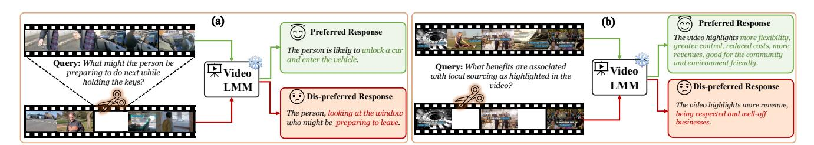
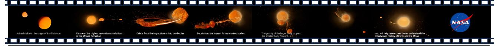
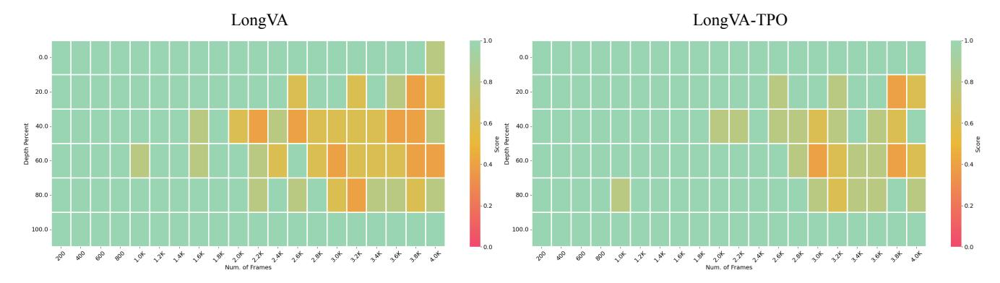
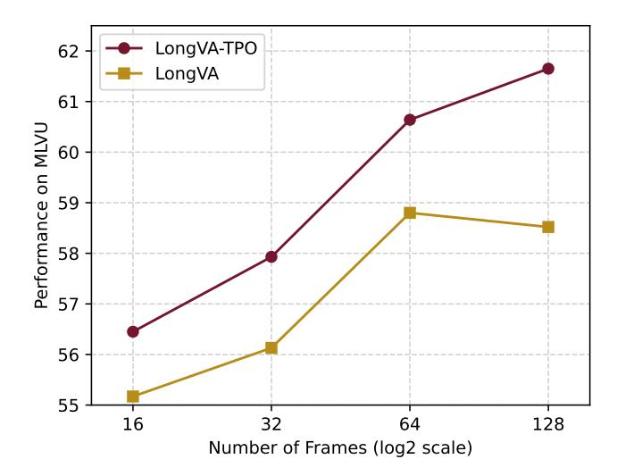
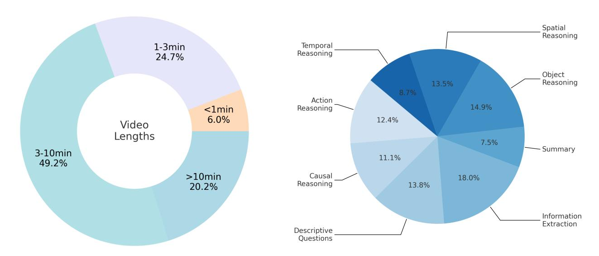
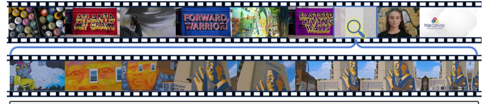
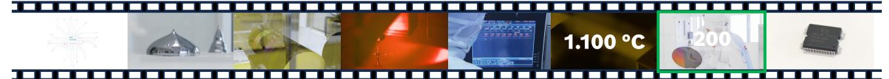

# **Temporal Preference Optimization of Large Multimodal Models**

**Rui Li**\* **Xiaohan Wang**\* **Yuhui Zhang Orr Zohar Zeyu Wang Serena Yeung-Levy**

Stanford University

Link: [Project Page](https://ruili33.github.io/tpo_website) | [Code](https://github.com/ruili33/TPO) | [Dataset & Checkpoints](https://huggingface.co/collections/ruili0/temporal-preference-optimization-67874b451f65db189fa35e10)

<span id="page-0-0"></span>

**Figure** 1: **Temporal Preference Optimization (TPO).** TPO is a post-training algorithm designed to enhance temporal comprehension in video-LMMs. In TPO, (a) preference data is generated by prompting the video-LMM with both well-grounded and manipulated (irrelevant or incomplete) video clips to collect contrastive response pairs. (b) These pairs undergo an LLM-based post-filtering process to remove noisy or misaligned samples. The generated preference data is then used in the preference optimization process, which improves the model's temporal reasoning by prioritizing preferred responses, ultimately enhancing overall video understanding.

**Abstract:** Despite recent advancements in video Large Multimodal Models (video-LMMs), accurate temporal grounding remains a key challenge. In this work, we introduce **Temporal Preference Optimization** (**TPO**)—a post-training framework that unlocks superior temporal reasoning in video-LMMs without requiring human annotations. TPO enables preference modeling by manipulating video inputs to generate contrastive responses, ensuring that preferred responses are more temporally grounded than dis-preferred ones. Through preference learning, TPO enhances the model's capability to distinguish and localize events with better temporal reasoning. Extensive experiments on LongVideoBench, MLVU, and Video-MME demonstrate that TPO significantly improves temporal grounding across multiple video-LMMs. Notably, LLaVA-Video-TPO achieves state-of-the-art performance among 7B models on Video-MME, establishing TPO as a scalable and effective solution for advancing temporal understanding in video analysis.

## **1. Introduction**

Recent advancements in video Large Multimodal Models (video-LMMs) [\[2,](#page-12-0) [45,](#page-14-0) [52\]](#page-15-0) have marked a significant step forward for generalizable video understanding. While image-based LMMs [\[5,](#page-12-1) [19,](#page-13-0) [39\]](#page-14-1) primarily focus on spatial reasoning, video-LMMs face the additional complexity of modeling temporal dependencies—a critical aspect for capturing the dynamic nature of video content.

<sup>\*</sup> Equal Contributions.

Most existing video-LMMs acquire temporal grounding implicitly during supervised finetuning by leveraging weak correspondences between input videos and textual responses [\[6,](#page-12-2) [67\]](#page-16-0). While some responses may reference specific segments of a video, they lack explicit temporal alignment under next-token prediction training, limiting the model's ability to learn precise temporal grounding. Recently, alternative approaches [\[7,](#page-12-3) [20,](#page-13-1) [29,](#page-13-2) [46,](#page-14-2) [51\]](#page-15-1) have emerged that incorporate explicit temporal annotations into training, enriching textual responses with structured temporal information as supervision. However, these methods rely on additional temporal annotations, which are costly to obtain and scale to large training datasets.

In this work, we introduce Temporal Preference Optimization (TPO), a post-training framework designed to enhance the temporal grounding capabilities of video-LMMs. TPO systematically refines the pretrained video-LMMs' ability to distinguish temporally relevant content by leveraging contrastive responses from manipulated video inputs. As shown in Fig. [1,](#page-0-0) TPO first prompts a video-LMM with the same question on both the original and the corrupted video. Questions are formulated based on a set of video frames, with preferred responses generated using these frames. In contrast, dis-preferred responses are produced using the same question but paired with irrelevant or incomplete frame sets. This pipeline ensures that preferred responses contain richer and more temporally relevant information than dis-preferred ones, thereby establishing a clear preference hierarchy. By dynamically manipulating video inputs based on the query, TPO automatically injects temporal preferences into the preference dataset through simple input transformations. To further refine the dataset, a post-filtering process is applied to remove imperfect samples caused by errors from the pretrained video-LMMs and ambiguous preference data. The resulting preference dataset is then used to optimize the model's temporal grounding capabilities via Direct Preference Optimization (DPO) [\[44\]](#page-14-3), chosen for its flexibility and stability. This structured pipeline enables TPO to enhance the temporal reasoning capabilities of the base video-LMM using a curated post-training dataset, while preserving its pre-trained knowledge. This makes TPO a scalable and robust solution for advancing video understanding tasks.

We conducted extensive experiments on three challenging multimodal video understanding benchmarks, and the results clearly demonstrate that TPO significantly enhances the temporal grounding capabilities of video-LMMs. Specifically, TPO achieves performance gains of 2.9% on LongVideoBench [\[55\]](#page-15-2), 3.1% on MLVU [\[70\]](#page-16-1), and 2.5% on Video-MME [\[14\]](#page-12-4), when applied to the strong base model LongVA-7B [\[65\]](#page-16-2). Furthermore, even when integrated with the state-of-the-art large-scale pretrained video-LMM, LLaVA-Video, TPO still delivers a 2.3% improvement, establishing LLaVA-Video-TPO as the best-performing 7B model on the Video-MME benchmark.

## **2. Preliminaries**

**Preference learning** [\[41,](#page-14-4) [49,](#page-15-3) [72\]](#page-16-3) focuses on modeling human preferences to align model behavior with user expectations. In LLMs and image-LMMs, this involves training models to generate responses favored by users. This is typically achieved by collecting human feedback on pairs of model-generated outputs and learning a function that predicts which output is preferred. Formally, given an input x and two outputs + (preferred) and <sup>−</sup> (dispreferred), the model aims to satisfy:

$$\pi_{\theta}(y^+|x) > \pi_{\theta}(y^-|x) \tag{1}$$

where (|) is the model's probability of generating output given input with parameters . In the context of video-LMMs, a preference dataset is constructed as a collection of tuples (, , +, −), where denotes a video, represents a query, <sup>+</sup> is the preferred temporally grounded response, and <sup>−</sup> is the dispreferred response.

**Direct Preference Optimization** (DPO) [\[44\]](#page-14-3) is a methodology that directly integrates human preference data into the optimization of model parameters. Compared to Proximal Policy Optimization (PPO) [\[41,](#page-14-4) [49,](#page-15-3) [72\]](#page-16-3), another popular preference learning implementation, DPO eliminates the need for explicit reward models or complex reinforcement learning algorithms. By leveraging human preference data as a guiding signal during optimization, DPO enhances the model's ability to generate outputs that are better aligned with human values and expectations.

# **3. Temporal Preference Optimization**

While prior works focus primarily on aligning LLM outputs with human preferences, our approach uniquely aligns model outputs with intrinsic temporal preferences in videos. To achieve this, we propose Temporal Preference Optimization (TPO), illustrated in Fig. [2,](#page-2-0) which significantly enhances the video reasoning capabilities of video-LMMs. TPO systematically incorporates temporal grounding into the optimization process through creating preference pairs from the contrast between meticulously manipulated video inputs (Sec. [3.1\)](#page-2-1). To further enhance the quality of these preference data, we introduce a rule-based post-filtering step (Sec. [3.2\)](#page-3-0). Finally, Direct Preference Optimization (Sec. [3.3\)](#page-3-1) is leveraged to optimize the model towards temporally preferred outputs without compromising its original pretrained capabilities.

#### <span id="page-2-1"></span>**3.1. Temporal Preference Modeling**

**Query Generation.** Given a video V, we first sample a segment containing a set of frames , which may be a subset of the video or the entire sequence of frames. To generate descriptive context, we employ an image-based vision-language model (CogVLM2 [\[19\]](#page-13-0)) to generate captions for each frame in . These captions serve as the foundation for constructing targeted questions. To ensure diversity and relevance, we design multiple question types and use a structured question-generation prompt, as shown in Fig. [8](#page-19-0) (Appendix), incorporating the generated captions. This prompt is then processed by a large language model (GPT-4o-mini) to produce a set of candidate questions specifically tailored to the sampled video frames, resulting in a set of questions . This approach ensures that the generated questions are contextually relevant that allows precise control over subsequent response generation.

<span id="page-2-0"></span>

**Figure** 2: In TPO, we introduce two approaches for temporal preference data generation. Preferred responses are generated using questions and their corresponding frames for strong temporal grounding. For dispreferred responses, we introduce: (a) **Generation with Irrelevant Information**, where all relevant frames are excluded. (b) **Generation with Incomplete Information**, where only a partial subset of relevant frames is used. These manipulated clips create contrastive response pairs, highlighting differences between well-grounded and manipulated video content. This contrast serves as a learning signal to enhance the model's temporal reasoning.

**Preferred Response Generation.** Preferred responses in the curated dataset are expected to be strongly grounded in the corresponding temporal content. To achieve this, we use the question set along with their corresponding frame set as input to the video-LMM. By ensuring that the provided video frames are highly relevant to the query, we create conditions that maximize the likelihood of the model generating a high-quality, temporally grounded response. This process guarantees that the preferred responses align with the ideal characteristics for effective temporal grounding in video-LMMs.

**Dis-Preferred Response Generation.** The dis-preferred responses in the preference dataset represent the type of outputs the model aims to discourage, specifically those where it fails to localize relevant information in the video. These responses expose shortcomings in temporal reasoning by highlighting cases where the model struggles to align its predictions with the actual video content. To generate these dis-preferred responses, we manipulate the video inputs to simulate imperfect temporal grounding. As illustrated in Fig. [2,](#page-2-0) we introduce two strategies for constructing the input frame set used in dis-preferred response generation:

- **(a) Generation with Irrelevant Information**: To simulate an extreme failure case where the model misses all relevant frames, we construct by excluding the relevant frame set and instead sampling from the remaining frames of the video. This ensures that contains only irrelevant content, forcing the model to generate a response based on unrelated visual information.
- **(b) Generation with Incomplete Information**: To mimic scenarios where the model has access to only partial relevant information, we construct by randomly sampling a subset of . This setup introduces gaps in the temporal context, making it harder for the model to fully comprehend the event described in the query.

Unlike preferred responses, which are grounded in fully relevant video segments, these manipulated setups significantly increase ambiguity and noise by partially or completely omitting critical visual content. As a result, the model is forced to rely on incomplete or misleading information, making temporal reasoning errors and hallucinations more likely. This intentional contrast between preferred and dis-preferred responses serves as a strong learning signal, helping refine the model's ability to distinguish and accurately localize events in time, ultimately enhancing its temporal reasoning capabilities.

#### <span id="page-3-0"></span>**3.2. LLM-based Post-Filtering**

Although we design the preferred responses to be of higher quality than the dis-preferred responses, this distinction is not always guaranteed due to the imperfect video understanding capabilities of the base video-LMMs. In some cases, errors in response generation may lead to misaligned preference pairs, where the preferred response contains noise or the dis-preferred response is of better quality than expected.

<span id="page-3-1"></span>To enhance data quality and reduce noise, we introduce a post-filtering pipeline leveraging an LLM (GPT-4omini). Specifically, we provide the model with the key frame captions of , along with their corresponding queries and preference data pairs, and instruct it to filter out samples that meet predefined criteria (detailed prompts are shown in Fig. [9](#page-20-0) in the Appendix). The filtering rules target cases where: 1) The dis-preferred response is of higher quality than the preferred response. 2) The preferred response is factually incorrect or misaligned with the video content. 3) The query itself is ambiguous, making preference ranking unreliable. By incorporating this post-filtering step, we effectively eliminate problematic cases that could introduce noise into training, resulting in a refined, higher-quality dataset that better supports effective model optimization and improves temporal grounding performance.

#### 3.3. Training Objective

The generated preference dataset is leveraged to optimize the temporal grounding capabilities of video-LMMs using Direct Preference Optimization (DPO) [44], selected for its robustness and effectiveness in preference-based learning.

Given the preference dataset D  $(V, q, r^+, r^-)$  and the video-LMM  $\pi_\theta$ , the DPO loss function is defined as:

$$L_{DPO}(\pi_{\theta}; \pi_{ref}) = -E_{(V,q,r^+,r^-) \sim \mathcal{D}}$$

$$\left[ log \sigma(\beta(\log \frac{\pi_{\theta}(r^+|V,q)}{\pi_{ref}(r^+|V,q)} - \log \frac{\pi_{\theta}(r^-|V,q)}{\pi_{ref}(r^-|V,q)})) \right]$$
(2)

where  $\sigma$  is the sigmoid function. This objective drives the model to assign higher probabilities to preferred outputs, aligning its behavior more closely with human judgments, while preventing the model from deviating too much from its pretrained distribution.

To better align the model with the preferred responses, we incorporate a supervised fine-tuning objective into the DPO training framework. This combined objective is controlled by the hyperparameter  $\alpha$ , following [8, 11, 12].

$$L_{SFT}(\pi_{\theta}) = -E_{(V,q,r^+,r^-)\sim \mathcal{D}} \log \pi_{\theta}(r^+|V,q)$$
(3)

$$L(\pi_{\theta}; \pi_{ref}) = L_{DPO} + \alpha L_{SFT} \tag{4}$$

## 4. Experiments

#### 4.1. Experimental Settings

**Evaluation Benchmarks** We evaluate TPO and baselines on three widely recognized benchmarks in multimodal video understanding.

- Video-MME [14] offers a comprehensive multi-modal evaluation across diverse video lengths, spanning from 11 seconds to 1 hour.
- LongVideoBench [55] emphasizes reasoning tasks within extended video contexts.
- MLVU [70] supports multitask evaluation specifically designed for long-form video understanding.

**Models** We test the effectiveness of TPO on two popular video-LMMs, LongVA-7B [65] and LLaVA-Video-7B [68], deriving the following models:

- 1. LongVA-TPO: optimized based on LongVA-7B [65], a capable video-LMM with the long-context video understanding capability transferred from language.
- 2. LLaVA-Video-TPO: optimized based on LLaVA-Video-7B [68], the current state-of-the-art 7B video-LMM.

Without other states, our ablation study and analysis utilize LongVA-TPO by default.

**Implementation Details** For the video source of preference dataset generation, we manually curated 200 keywords, which we used to retrieve 8k videos from the internet to curate a diverse and comprehensive dataset. From these crawled videos, we created 10k preference data pairs for LongVA-TPO using our

<span id="page-5-1"></span>

| Model                     | Size | LongVideo<br>Bench | MLVU<br>(M-avg) | Video-MME |          |          |          |
|---------------------------|------|--------------------|-----------------|-----------|----------|----------|----------|
|                           |      |                    |                 | Short     | Medium   | Long     | Average  |
| GPT-4o [2]                | -    | 66.7               | 64.6            | 80.082.8  | 70.376.6 | 65.372.1 | 71.977.2 |
| Video-LLaVA [31]          | 7B   | 39.1               | 47.3            | 45.346.1  | 38.040.7 | 36.238.1 | 39.941.6 |
| LLaVA-1.5 [33]            | 7B   | 40.3               | -               | -         | -        | -        | -        |
| PLLaVA [57]               | 7B   | 40.2               | -               | -         | -        | -        | -        |
| Qwen-VL-Max [5]           | -    | -                  | 42.2            | 55.857.6  | 49.248.9 | 48.947.0 | 51.351.2 |
| ShareGPT4Video [6]        | 8B   | 39.7               | 46.4            | 48.353.6  | 36.339.3 | 35.037.9 | 39.943.6 |
| InternVL-Chat-V1.5 [9]    | 20B  | 51.2               | 50.4            | 50.752.4  | 60.261.7 | 46.449.1 | 45.646.6 |
| VideoChat2 [28]           | 7B   | 39.3               | 47.9            | 48.352.8  | 37.039.4 | 33.239.2 | 39.543.8 |
| LongLLaVA [61]            | 7B   | -                  | 56.3            | 61.966.2  | 51.454.7 | 45.450.3 | 52.957.1 |
| Video-CCAM [13]           | 14B  | -                  | 63.1            | 62.266.0  | 50.656.3 | 46.749.9 | 53.257.4 |
| NVILA [36]                | 7B   | 57.7               | 70.1            | 75.777.6  | 62.269.0 | 54.863.3 | 64.270.0 |
| Qwen2-VL [52]             | 7B   | 55.6               | -               | -         | -        | -        | 63.369.0 |
| Apollo [74]               | 7B   | 58.5               | 70.9            | -         | -        | -        | 61.363.3 |
| LongVA-7B [65]            | 7B   | 51.3               | 58.8            | 61.161.6  | 50.453.6 | 46.247.6 | 52.654.3 |
| LLaVA-Video-7B [68]       | 7B   | 58.2               | 70.8            | -         | -        | -        | 63.369.7 |
| LongVA-TPO<br>(ours)      | 7B   | 54.2               | 61.7            | 63.166.6  | 54.855.3 | 47.447.9 | 55.156.6 |
| LLaVA-Video-TPO<br>(ours) | 7B   | 60.1               | 71.1            | 76.878.7  | 64.669.4 | 55.466.4 | 65.671.5 |

Table 1: Results on LongVideoBench [\[55\]](#page-15-2), MLVU [\[70\]](#page-16-1) and Video-MME [\[14\]](#page-12-4) compared with state-of-the-art models. The Video-MME results are presented in the format w/o subs/.

established pipeline. For LLaVA-Video-TPO, we employ a subset of the original LLaVA-Video-178K dataset, which was used for supervised fine-tuning (SFT), to generate TPO data, resulting in a total of 10K preference data pairs.

The model is trained on 8 Nvidia A100 80GB GPUs, with a batch size of 64. For the preference optimization on LongVA, we set the KL-divergence weight = 0.3 and the SFT loss weight = 0.5, while for LLaVA-Video, we set the KL-divergence weight = 0.2 and the SFT loss weight = 1. We train the model on our curated data for 1 epoch. It takes about 4 hours for TPO to perform on LongVA-7B with a learning rate of 4 <sup>−</sup><sup>6</sup> and also about 4 hours for LLaVA-Video-7B with a learning rate of 3 −7 . During data preparation, we employ the GPT-4o-mini language model (text-only input) for question curation and post-filtering. This choice balances cost-effectiveness with efficiency, facilitating a streamlined and scalable data processing workflow.

## <span id="page-5-0"></span>**4.2. Results**

We conducted comprehensive experiments across three established datasets to rigorously assess the effectiveness of TPO in long-form video understanding tasks. We first compare TPO with three different training strategies:

- SFTSelf: Supervised fine-tuning using the self-generated data. For a fair comparison, we utilize the same preferred response in our curated preference dataset to optimize LongVA.
- SFTLLM: Supervised fine-tuning using the LLM-generated data. Following the commonly used data curation pipeline [\[6,](#page-12-2) [67\]](#page-16-0). We employ LLM (GPT-4o-mini) to generate responses given the query and

<span id="page-6-0"></span>

| Model                          | LongVideoBench | MLVU<br>(M-avg) | Video-MME |          |          |          |
|--------------------------------|----------------|-----------------|-----------|----------|----------|----------|
|                                |                |                 | Short     | Medium   | Long     | Average  |
| LongVA-7B [65]                 | 51.3           | 58.8            | 61.161.6  | 50.453.6 | 46.247.6 | 52.654.3 |
| +<br>SFTSelf                   | 52.7           | 58.9            | 62.667.7  | 52.452.7 | 46.847.4 | 53.955.9 |
| +<br>SFTLLM                    | 53.1           | 59.9            | 63.764.9  | 52.654.3 | 46.347.9 | 54.255.7 |
| Hound-DPO†<br>+<br>[65,<br>66] | 52.8           | 59.1            | 62.265.8  | 52.454.8 | 46.146.3 | 53.655.6 |
| Hound-DPO*<br>+<br>[65,<br>66] | 52.6           | 59.3            | 63.165.9  | 50.854.7 | 47.247.0 | 53.755.9 |
| LongVA-TPO<br>(ours)           | 54.2           | 61.7            | 63.166.6  | 54.855.3 | 47.447.9 | 55.156.6 |

Table 2: Results of LongVA-TPO on LongVideoBench [\[55\]](#page-15-2), MLVU [\[70\]](#page-16-1) and Video-MME [\[14\]](#page-12-4) benchmarks compared to 3 baseline methods mentioned in [4.2.](#page-5-0) The Video-MME results are presented in the format "w/o subs / w/ subs". The results for LongVA and LongVA+Hound-DPO† are based on publicly available checkpoints, and for LongVA+Hound-DPO\* are based on our implementation on our collected video datasets, while the other results are evaluated using our trained model.

the video captions, which are subsequently used to perform supervised fine-tuning on LongVA. We use the same video data as TPO for fair comparison.

• Hound-DPO [\[66\]](#page-16-6) is a previous method that applies Direct Preference Optimization (DPO) [\[44\]](#page-14-3) on video-LMMs. Their approach leverages ChatGPT [\[2\]](#page-12-0) to generate ratings for preference data, resulting in a dataset of 17k samples. In contrast, TPO employs a smaller preference dataset generated through a self-generation pipeline, offering a more streamlined alternative. Besides, to ablate the data source's effect, we also implement Hound-DPO based on our collected dataset with the same data scale.

The primary experimental results, presented in Table [2,](#page-6-0) compare TPO against the baseline methods on LongVA. The results consistently indicate that LongVA-TPO achieves superior performance, with improvements of 2.9%, 3.1%, and 2.5% on LongVideoBench [\[55\]](#page-15-2), MLVU [\[70\]](#page-16-1), and Video-MME [\[14\]](#page-12-4), respectively. These findings underscore TPO's capacity to enhance the general video understanding capabilities of a pre-trained video-LMM.

Compared to SFTSelf, LongVA-TPO achieves a consistent performance gain of 1.2% to 2.8% by utilizing a carefully designed temporal dis-preferred response to contrast with the preferred response. Furthermore, LongVA-TPO outperforms SFTLLM, demonstrating the effectiveness and stability of our self-training paradigm. When compared to Hound-DPO [\[66\]](#page-16-6), LongVA-TPO achieves a significant performance improvement by injecting temporal preference priors into the dataset. However, LongVA-TPO underperforms SFT methods on the Video-MME-short subset, which is expected since LongVA-TPO primarily focuses on optimizing temporal reasoning for video understanding.

In addition, the comparisons between TPO and current state-of-the-art video-LMMs are presented in Table [1.](#page-5-1) With the introduction of TPO, both the LongVA-TPO and LLaVA-Video-TPO models significantly outperform their corresponding baselines 2.5% and 2.3% on the video-MME benchmark, demonstrating the efficacy of our TPO pipeline. After TPO on LLaVA-Video-7B, our LLaVA-Video-TPO model outperforms all 16 baseline models in the table, including the concurrent work, NVILA [\[36\]](#page-14-5), as well as several 14B and 20B models, achieving state-of-the-art results on video understanding. The original LongVA model performed worse than Video-CCAM [\[13\]](#page-12-9) and LongLLaVA [\[61\]](#page-15-5) on the Video-MME benchmark. However, after incorporating TPO, it successfully outperformed these competitive baselines on Video-MME. Overall, LLaVA-Video-TPO achieves the strongest 7B model on Video-MME, setting a new state-of-the-art performance on video comprehension.

<span id="page-7-0"></span>

Query: How much did sales increase at Dunkin' Donuts locations situated near the scent marketing dispensers?

LongVA: There is no specific information provided about the sales increase at Dunkin' Donuts locations near scent marketing dispensers. The text on the board does not mention any figures or percentages related to sales increases.

LongVA-TPO: …sales increased by 29% at Dunkin' Donuts locations near scent marketing dispensers.



Query: Describe the video in detail.

LongVA: … It features a series of images and text that seem to illustrate the process of celestial bodies colliding and forming into larger bodies, possibly leading to the formation of planets like Earth. The text suggests that new supercomputer simulations are being used to better understand the history of Earth and the Moon. …

LongVA-TPO: The video discusses the use of supercomputer simulations to study the formation and evolution of celestial bodies, specifically focusing on the Moon's formation. It highlights how these simulations can help researchers better understand the history of Earth and the Moon by modeling the gravitational interactions between various bodies in space over time. …

**Figure** 3: Qualitative comparison between LongVA-TPO model and LongVA on two videos from VideoMME benchmark.

### **4.3. Ablation Study**

#### *4.3.1. Performance with Different Input Frame Count*

We evaluate the performance of both our LongVA-TPO model and the original LongVA model across varying input lengths, ranging from 16 to 128 frames, as shown in Fig. [5.](#page-10-0) The results indicate that the LongVA model experiences performance degradation with 128 frames compared to 64 frames. In contrast, our LongVA-TPO model consistently benefits from longer input sequences, leveraging the additional information effectively. This demonstrates the LongVA-TPO model's robustness in handling extended inputs and its capacity to localize relevant information within long sequences, further validating the efficacy of TPO.

<span id="page-8-1"></span>

**Figure** 4: Performance comparison of LongVA and LongVA-TPO on the needle-in-a-haystack task across varying input video lengths (horizontal axis) and temporal depths (vertical axis). Heatmaps indicate improved temporal grounding capability of LongVA-TPO.

#### <span id="page-8-0"></span>*4.3.2. Effect of Dataset Sizes*

| Model  | LongVideoBench | MLVU | VideoMME |
|--------|----------------|------|----------|
| LongVA | 51.3           | 58.8 | 52.6     |
| TPO2k  | 52.5           | 57.8 | 52.8     |
| TPO5k  | 53.7           | 59.5 | 53.6     |
| TPO10k | 54.2           | 61.7 | 55.1     |

Table 3: Results of LongVA-TPO (TPO) trained on different data scales. TPO achieves consistent performance improvements as the data scale increases. The performance on the VideoMME benchmark is evaluated without subtitles.

Scalability is a critical metric in the evaluation of algorithms in the era of large-scale models, reflecting an algorithm's performance as data volume expands. To examine the scalability of the TPO algorithm, we conduct experiments with LongVA-TPO across incremental sizes of 2k, 5k, and 10k (the complete preference dataset). The results, presented in Table [3,](#page-8-0) highlight the impact of dataset scaling. Our findings reveal that LongVA-TPO demonstrates superior scalability, achieving consistent performance gains with increasing dataset size across all three benchmarks. This pattern highlights TPO's robustness and adaptability in larger data contexts, suggesting its potential to deliver enhanced results when scaled to larger datasets.

#### *4.3.3. Effect of Post-Filtering*

<span id="page-9-0"></span>As a critical component of the TPO framework, post-filtering effectively reduces noise and enhances data quality. To further assess its impact, we conducted experiments comparing the performance of LongVA-TPO with and without post-filtering. The results, presented in Table [4,](#page-9-0) demonstrate that post-filtering consistently improves performance across multiple benchmarks.

| Model                 | LongVideoBench | MLVU | VideoMME |
|-----------------------|----------------|------|----------|
| LongVA                | 51.3           | 58.8 | 52.6     |
| TPOw/o Post-Filtering | 52.5           | 60.1 | 53.6     |
| TPOw/ Post-Filtering  | 54.2           | 61.7 | 55.1     |

<span id="page-9-1"></span>Table 4: Results of LongVA-TPO (TPO) with and without post-filtering. Post-filtering consistently improves performance across multiple benchmarks.

| Ratio                | LongVideoBench | MLVU | VideoMME |
|----------------------|----------------|------|----------|
| 10:0                 | 53.5           | 58.7 | 54.0     |
| 8:2                  | 53.8           | 59.9 | 54.0     |
| 5:5<br>(final model) | 54.2           | 61.7 | 55.1     |
| 2:8                  | 53.4           | 59.1 | 54.2     |
| 0:10                 | 53.4           | 58.5 | 53.8     |

Table 5: Performance of TPO across different training data mix ratios, varying the proportion of negative responses generated from incomplete versus irrelevant video segments.

## *4.3.4. Effect of Different Data Mix Ratio*

In TPO, we design two different kinds of manipulated schema for the dis-preferred response generation, including creating incomplete and irrelevant videos. To evaluate the individual capabilities, limitations, and necessity of combining incomplete and irrelevant videos, we conducted an ablation study. In this study, we maintained the same overall dataset size as the full TPO and assessed the performance of our TPO model under various data mixing ratios between the negative responses generated from incomplete and irrelevant videos. The evaluated ratios included 10:0, 8:2, 5:5, 2:8, and 0:10. The experimental results, summarized in Table [5,](#page-9-1) clearly demonstrate that the model achieves optimal performance on general video understanding tasks when an equal proportion of negative responses generated from incomplete and irrelevant videos. This balanced data distribution effectively integrates different type of temporal information, leading to superior overall model performance.

#### *4.3.5. Needle-in-a-Haystack*

The Needle-in-a-Haystack task refers to the challenge of identifying a rare or specific event within a large volume of unstructured video data. Building on the work of Zhang et al. [\[65\]](#page-16-2), we frame the task using image-based question answering (QA), where images are embedded within a 3-hour-long video, and the model is tasked with answering the corresponding image QA questions. In our experiments, we adopt the same five image QAs as Zhang et al. [\[65\]](#page-16-2), and present the results in Fig. [4.](#page-8-1) While LongVA, optimized for long-context processing, significantly outperforms LLaVA-NeXT-Video [\[67\]](#page-16-0) on the Needle-in-a-Haystack task

<span id="page-10-0"></span>

**Figure** 5: Performance comparison between LongVA-TPO and LongVA on MLVU across varying input lengths. LongVA-TPO consistently benefits from increased input length, whereas LongVA's performance declines when inputs exceed 64 frames.

(refer to Fig. 4 in [65]), our LongVA-TPO model still demonstrates superior performance, achieving even better results in long-context temporal localization.

#### 4.4. Qualitative Analysis

The qualitative analysis of our LongVA-TPO model and the LongVA model on two videos from the Video-MME benchmark is provided in Fig. 3. In the first example, which involves a temporal localization and OCR task, our LongVA-TPO model demonstrates superior performance by accurately localizing the relevant information within the video and providing the correct answer to the OCR question. In the second example, a video discussing the Moon's formation, LongVA misinterprets the video content by relating it to the Earth's formation. In contrast, our LongVA-TPO model successfully comprehends and captures the key details of the video's content.

#### 5. Related Work

**Video Large Multimodal Models** Recently, significant efforts have been devoted to extending the capabilities of large language models (LLMs) [2, 45] into the visual domain, developing various video large multimodal models (video-LMMs), including both proprietary [2, 45] and open-source models [1, 10, 15, 23, 26, 31, 34, 47, 52, 59]. Early approaches focused on curating high-quality video-text instruction-tuning datasets [6, 33, 42, 67, 68], to equip LLMs with video comprehension capabilities. However, these datasets often rely on synthetic data derived from video captions, which limits their effectiveness in capturing visual-temporal dynamics. Other studies have focused on extending pretrained video-LMMs to handle longer video contexts [22, 35–37, 48, 61, 65], while multimodal interleaved datasets [27, 32] and mixed training strategies [25, 74] have been explored to enhance video-LMM performance. Despite these advancements, the post-training stage for video-LMMs remains underexplored. Recent efforts like LLaVA-Hound [66] utilize ChatGPT to rank model outputs and create preference datasets but fall short in leveraging the temporal information inherent in video data. In contrast, our work pioneers post-training

strategies that explicitly incorporate temporal priors to address these limitations.

Temporal grounding is crucial for comprehending the video modality, particularly in long-form videos. Various efforts have been made to enhance temporal localization, including dense captioning [\[53,](#page-15-7) [58,](#page-15-8) [60\]](#page-15-9), highlight detection [\[24,](#page-13-13) [40\]](#page-14-11), and temporal video grounding [\[16,](#page-12-12) [56,](#page-15-10) [62\]](#page-15-11), among others. Recent advancements have introduced temporal-aware designs in video-LMMs [\[7,](#page-12-3) [20,](#page-13-1) [29,](#page-13-2) [46,](#page-14-2) [51\]](#page-15-1) and have explored the development of agentic systems with temporal grounding capabilities [\[54\]](#page-15-12). Unlike these existing approaches, our work focuses on temporal preference optimization during the post-training stage, offering a complementary enhancement to current methods.

Proximal Policy Optimization (PPO) [\[41,](#page-14-4) [49,](#page-15-3) [72\]](#page-16-3) and Direct Preference Optimization (DPO) [\[44\]](#page-14-3) are two widely used implementations of Reinforcement Learning from Human Feedback (RLHF) [\[41,](#page-14-4) [72\]](#page-16-3), serving as key algorithms in preference learning and post-training. In the image-LMM domain, Sun et al. [\[50\]](#page-15-13) enhanced model visual capabilities by incorporating image captions into the reward modeling process within RLHF. Similarly, Ahn et al. [\[4\]](#page-12-13) fine-tuned multimodal foundation models using Reinforcement Learning from AI Feedback (RLAIF). Other approaches, such as those proposed by Li et al. [\[30\]](#page-13-14) and Gunjal et al. [\[17\]](#page-13-15), directly distilled GPT-4V's preferences from sampled model responses. A notable strategy involves using text as an intermediate modality, leveraging captions and other descriptive information to extract and distill LLMs preferences for both images [\[69\]](#page-16-7) and videos [\[66\]](#page-16-6). Furthermore, Pi et al. [\[43\]](#page-14-12), Zhou et al. [\[71\]](#page-16-8), and Deng et al. [\[12\]](#page-12-7) advanced preference learning in image-LMMs by curating preference data through image input manipulation.

**Self-Training in Foundation Models** To address the challenge of scaling up annotated datasets, several works have explored self-improvement and self-training methods [\[18,](#page-13-16) [21\]](#page-13-17). Zelikman et al. [\[63\]](#page-15-14) introduced Self-Taught Reasoners (Star), which leverage generated chain-of-thought rationales to enhance LLMs' complex reasoning capabilities. In the image domain, BPO [\[43\]](#page-14-12) STIC [\[12\]](#page-12-7) and POVID [\[71\]](#page-16-8) improve image-LMMs responses by incorporating visual priors. In the video domain, Video-STaR [\[73\]](#page-16-9) uses existing labels as weak supervision to guide model self-improvement while Ahn et al. [\[3\]](#page-12-14) explores iterative self-improvement in preference optimization.

## **6. Conclusion**

We introduced Temporal Preference Optimization (TPO), a scalable post-training framework that enhances temporal grounding in video-LMMs. By contrasting between the preference responses from the well-grounded and manipulated video clips, TPO effectively captures the intricate temporal dependencies required for video understanding. Extensive experiments across three challenging benchmarks—LongVideoBench, MLVU, and Video-MME—demonstrated TPO's robust improvements, achieving state-of-the-art performance. By integrating multi-granularity temporal preferences, TPO offers a robust and efficient solution for advancing temporal reasoning in multimodal tasks. One future direction is scaling the preference data to improve coverage and diversity, thereby enhancing TPO's generalizability. Additionally, while this work focuses on LongVA-7B and LLaVA-Video-7B as representative Video-LMMs, applying TPO to a broader range and larger scale of Video-LMMs would provide insights into its adaptability and performance across different architectures.

## **References**

<span id="page-11-0"></span>[1] Marah Abdin, Jyoti Aneja, Hany Awadalla, Ahmed Awadallah, Ammar Ahmad Awan, Nguyen Bach, Amit Bahree, Arash Bakhtiari, Jianmin Bao, Harkirat Behl, et al. Phi-3 technical report: A highly capable language model

- locally on your phone. *arXiv preprint arXiv:2404.14219*, 2024.
- <span id="page-12-0"></span>[2] Josh Achiam, Steven Adler, Sandhini Agarwal, Lama Ahmad, Ilge Akkaya, Florencia Leoni Aleman, Diogo Almeida, Janko Altenschmidt, Sam Altman, Shyamal Anadkat, et al. Gpt-4 technical report. *arXiv preprint arXiv:2303.08774*, 2023.
- <span id="page-12-14"></span>[3] Daechul Ahn, Yura Choi, San Kim, Youngjae Yu, Dongyeop Kang, and Jonghyun Choi. i-srt: Aligning large multimodal models for videos by iterative self-retrospective judgment. *arXiv preprint arXiv:2406.11280*, 2024.
- <span id="page-12-13"></span>[4] Daechul Ahn, Yura Choi, Youngjae Yu, Dongyeop Kang, and Jonghyun Choi. Tuning large multimodal models for videos using reinforcement learning from ai feedback. *arXiv preprint arXiv:2402.03746*, 2024.
- <span id="page-12-1"></span>[5] Jinze Bai, Shuai Bai, Shusheng Yang, Shijie Wang, Sinan Tan, Peng Wang, Junyang Lin, Chang Zhou, and Jingren Zhou. Qwen-vl: A versatile vision-language model for understanding, localization, text reading, and beyond. *arXiv preprint arXiv:2308.12966*, 2023.
- <span id="page-12-2"></span>[6] Lin Chen, Xilin Wei, Jinsong Li, Xiaoyi Dong, Pan Zhang, Yuhang Zang, Zehui Chen, Haodong Duan, Bin Lin, Zhenyu Tang, Li Yuan, Yu Qiao, Dahua Lin, Feng Zhao, and Jiaqi Wang. Sharegpt4video: Improving video understanding and generation with better captions. *arXiv preprint arXiv:2406.04325*, 2024.
- <span id="page-12-3"></span>[7] Shimin Chen, Xiaohan Lan, Yitian Yuan, Zequn Jie, and Lin Ma. Timemarker: A versatile video-llm for long and short video understanding with superior temporal localization ability. *arXiv preprint arXiv:2411.18211*, 2024.
- <span id="page-12-5"></span>[8] Shuo Chen, Gang Niu, Chen Gong, Jun Li, Jian Yang, and Masashi Sugiyama. Large-margin contrastive learning with distance polarization regularizer. In *International Conference on Machine Learning*, pages 1673–1683. PMLR, 2021.
- <span id="page-12-8"></span>[9] Zhe Chen, Jiannan Wu, Wenhai Wang, Weijie Su, Guo Chen, Sen Xing, Muyan Zhong, Qinglong Zhang, Xizhou Zhu, Lewei Lu, Bin Li, Ping Luo, Tong Lu, Yu Qiao, and Jifeng Dai. Internvl: Scaling up vision foundation models and aligning for generic visual-linguistic tasks. *arXiv preprint arXiv:2312.14238*, 2023.
- <span id="page-12-10"></span>[10] Zhe Chen, Jiannan Wu, Wenhai Wang, Weijie Su, Guo Chen, Sen Xing, Muyan Zhong, Qinglong Zhang, Xizhou Zhu, Lewei Lu, et al. Internvl: Scaling up vision foundation models and aligning for generic visual-linguistic tasks. In *Proceedings of the IEEE/CVF Conference on Computer Vision and Pattern Recognition*, pages 24185–24198, 2024.
- <span id="page-12-6"></span>[11] Zixiang Chen, Yihe Deng, Yuanzhi Li, and Quanquan Gu. Understanding transferable representation learning and zero-shot transfer in clip. *arXiv preprint arXiv:2310.00927*, 2023.
- <span id="page-12-7"></span>[12] Yihe Deng, Pan Lu, Fan Yin, Ziniu Hu, Sheng Shen, Quanquan Gu, James Zou, Kai-Wei Chang, and Wei Wang. Enhancing large vision language models with self-training on image comprehension. In *The Thirty-eighth Annual Conference on Neural Information Processing Systems*, 2024. URL [https://openreview.net/forum?](https://openreview.net/forum?id=FZW7Ctyjm3) [id=FZW7Ctyjm3](https://openreview.net/forum?id=FZW7Ctyjm3).
- <span id="page-12-9"></span>[13] Jiajun Fei, Dian Li, Zhidong Deng, Zekun Wang, Gang Liu, and Hui Wang. Video-ccam: Enhancing video-language understanding with causal cross-attention masks for short and long videos. *arXiv preprint arXiv:2408.14023*, 2024.
- <span id="page-12-4"></span>[14] Chaoyou Fu, Yuhan Dai, Yondong Luo, Lei Li, Shuhuai Ren, Renrui Zhang, Zihan Wang, Chenyu Zhou, Yunhang Shen, Mengdan Zhang, et al. Video-mme: The first-ever comprehensive evaluation benchmark of multi-modal llms in video analysis. *arXiv preprint arXiv:2405.21075*, 2024.
- <span id="page-12-11"></span>[15] Chaoyou Fu, Haojia Lin, Xiong Wang, Yi-Fan Zhang, Yunhang Shen, Xiaoyu Liu, Yangze Li, Zuwei Long, Heting Gao, Ke Li, et al. Vita-1.5: Towards gpt-4o level real-time vision and speech interaction. *arXiv preprint arXiv:2501.01957*, 2025.
- <span id="page-12-12"></span>[16] Jiyang Gao, Chen Sun, Zhenheng Yang, and Ram Nevatia. Tall: Temporal activity localization via language query. In *Proceedings of the IEEE international conference on computer vision*, pages 5267–5275, 2017.

- <span id="page-13-15"></span>[17] Anisha Gunjal, Jihan Yin, and Erhan Bas. Detecting and preventing hallucinations in large vision language models. In *Proceedings of the AAAI Conference on Artificial Intelligence*, volume 38, pages 18135–18143, 2024.
- <span id="page-13-16"></span>[18] Namgyu Ho, Laura Schmid, and Se-Young Yun. Large language models are reasoning teachers. *arXiv preprint arXiv:2212.10071*, 2022.
- <span id="page-13-0"></span>[19] Wenyi Hong, Weihan Wang, Ming Ding, Wenmeng Yu, Qingsong Lv, Yan Wang, Yean Cheng, Shiyu Huang, Junhui Ji, Zhao Xue, et al. Cogvlm2: Visual language models for image and video understanding. *arXiv preprint arXiv:2408.16500*, 2024.
- <span id="page-13-1"></span>[20] De-An Huang, Shijia Liao, Subhashree Radhakrishnan, Hongxu Yin, Pavlo Molchanov, Zhiding Yu, and Jan Kautz. Lita: Language instructed temporal-localization assistant. In *ECCV*, 2024.
- <span id="page-13-17"></span>[21] Jiaxin Huang, Shixiang Shane Gu, Le Hou, Yuexin Wu, Xuezhi Wang, Hongkun Yu, and Jiawei Han. Large language models can self-improve. *arXiv preprint arXiv:2210.11610*, 2022.
- <span id="page-13-9"></span>[22] Md Mohaiminul Islam, Tushar Nagarajan, Huiyu Wang, Gedas Bertasius, and Lorenzo Torresani. Bimba: Selective-scan compression for long-range video question answering. In *Proceedings of the Computer Vision and Pattern Recognition Conference*, pages 29096–29107, 2025.
- <span id="page-13-6"></span>[23] Hugo Laurençon, Léo Tronchon, Matthieu Cord, and Victor Sanh. What matters when building vision-language models?, 2024.
- <span id="page-13-13"></span>[24] Jie Lei, Tamara L Berg, and Mohit Bansal. Detecting moments and highlights in videos via natural language queries. *Advances in Neural Information Processing Systems*, 34:11846–11858, 2021.
- <span id="page-13-12"></span>[25] Bo Li, Yuanhan Zhang, Dong Guo, Renrui Zhang, Feng Li, Hao Zhang, Kaichen Zhang, Yanwei Li, Ziwei Liu, and Chunyuan Li. Llava-onevision: Easy visual task transfer. *arXiv preprint arXiv:2408.03326*, 2024.
- <span id="page-13-7"></span>[26] Dongxu Li, Yudong Liu, Haoning Wu, Yue Wang, Zhiqi Shen, Bowen Qu, Xinyao Niu, Guoyin Wang, Bei Chen, and Junnan Li. Aria: An open multimodal native mixture-of-experts model. *arXiv preprint arXiv:2410.05993*, 2024.
- <span id="page-13-10"></span>[27] Feng Li, Renrui Zhang, Hao Zhang, Yuanhan Zhang, Bo Li, Wei Li, Zejun Ma, and Chunyuan Li. Llava-next: Tackling multi-image, video, and 3d in large multimodal models, June 2024. URL [https://llava-vl.](https://llava-vl.github.io/blog/2024-06-16-llava-next-interleave/) [github.io/blog/2024-06-16-llava-next-interleave/](https://llava-vl.github.io/blog/2024-06-16-llava-next-interleave/).
- <span id="page-13-5"></span>[28] KunChang Li, Yinan He, Yi Wang, Yizhuo Li, Wenhai Wang, Ping Luo, Yali Wang, Limin Wang, and Yu Qiao. Videochat: Chat-centric video understanding. *arXiv preprint arXiv:2305.06355*, 2023.
- <span id="page-13-2"></span>[29] KunChang Li, Yinan He, Yi Wang, Yizhuo Li, Wenhai Wang, Ping Luo, Yali Wang, Limin Wang, and Yu Qiao. Videochat: Chat-centric video understanding. *arXiv preprint arXiv:2305.06355*, 2023.
- <span id="page-13-14"></span>[30] Lei Li, Zhihui Xie, Mukai Li, Shunian Chen, Peiyi Wang, Liang Chen, Yazheng Yang, Benyou Wang, and Lingpeng Kong. Silkie: Preference distillation for large visual language models. *arXiv preprint arXiv:2312.10665*, 2023.
- <span id="page-13-3"></span>[31] Bin Lin, Bin Zhu, Yang Ye, Munan Ning, Peng Jin, and Li Yuan. Video-llava: Learning united visual representation by alignment before projection. *arXiv preprint arXiv:2311.10122*, 2023.
- <span id="page-13-11"></span>[32] Ji Lin, Hongxu Yin, Wei Ping, Pavlo Molchanov, Mohammad Shoeybi, and Song Han. Vila: On pre-training for visual language models. In *Proceedings of the IEEE/CVF Conference on Computer Vision and Pattern Recognition*, pages 26689–26699, 2024.
- <span id="page-13-4"></span>[33] Haotian Liu, Chunyuan Li, Qingyang Wu, and Yong Jae Lee. Visual instruction tuning. In *NeurIPS*, 2023.
- <span id="page-13-8"></span>[34] Haotian Liu, Chunyuan Li, Qingyang Wu, and Yong Jae Lee. Visual instruction tuning. *Advances in neural information processing systems*, 36, 2024.

- <span id="page-14-8"></span>[35] Jiajun Liu, Yibing Wang, Hanghang Ma, Xiaoping Wu, Xiaoqi Ma, xiaoming Wei, Jianbin Jiao, Enhua Wu, and Jie Hu. Kangaroo: A powerful video-language model supporting long-context video input. *arXiv preprint arXiv:2408.15542*, 2024.
- <span id="page-14-5"></span>[36] Zhijian Liu, Ligeng Zhu, Baifeng Shi, Zhuoyang Zhang, Yuming Lou, Shang Yang, Haocheng Xi, Shiyi Cao, Yuxian Gu, Dacheng Li, Xiuyu Li, Yunhao Fang, Yukang Chen, Cheng-Yu Hsieh, De-An Huang, An-Chieh Cheng, Vishwesh Nath, Jinyi Hu, Sifei Liu, Ranjay Krishna, Daguang Xu, Xiaolong Wang, Pavlo Molchanov, Jan Kautz, Hongxu Yin, Song Han, and Yao Lu. Nvila: Efficient frontier visual language models, 2024. URL <https://arxiv.org/abs/2412.04468>.
- <span id="page-14-9"></span>[37] Zuyan Liu, Yuhao Dong, Ziwei Liu, Winston Hu, Jiwen Lu, and Yongming Rao. Oryx mllm: On-demand spatial-temporal understanding at arbitrary resolution. *arXiv preprint arXiv:2409.12961*, 2024.
- <span id="page-14-13"></span>[38] Ilya Loshchilov and Frank Hutter. Sgdr: Stochastic gradient descent with warm restarts. *arXiv preprint arXiv:1608.03983*, 2016.
- <span id="page-14-1"></span>[39] Haoyu Lu, Wen Liu, Bo Zhang, Bingxuan Wang, Kai Dong, Bo Liu, Jingxiang Sun, Tongzheng Ren, Zhuoshu Li, Yaofeng Sun, Chengqi Deng, Hanwei Xu, Zhenda Xie, and Chong Ruan. Deepseek-vl: Towards real-world vision-language understanding, 2024.
- <span id="page-14-11"></span>[40] WonJun Moon, Sangeek Hyun, SangUk Park, Dongchan Park, and Jae-Pil Heo. Query-dependent video representation for moment retrieval and highlight detection. In *Proceedings of the IEEE/CVF Conference on Computer Vision and Pattern Recognition*, pages 23023–23033, 2023.
- <span id="page-14-4"></span>[41] Long Ouyang, Jeffrey Wu, Xu Jiang, Diogo Almeida, Carroll Wainwright, Pamela Mishkin, Chong Zhang, Sandhini Agarwal, Katarina Slama, Alex Ray, et al. Training language models to follow instructions with human feedback. *Advances in neural information processing systems*, 35:27730–27744, 2022.
- <span id="page-14-7"></span>[42] Joon Sung Park, Joseph O'Brien, Carrie Jun Cai, Meredith Ringel Morris, Percy Liang, and Michael S Bernstein. Generative agents: Interactive simulacra of human behavior. In *Proceedings of the 36th annual acm symposium on user interface software and technology*, pages 1–22, 2023.
- <span id="page-14-12"></span>[43] Renjie Pi, Tianyang Han, Wei Xiong, Jipeng Zhang, Runtao Liu, Rui Pan, and Tong Zhang. Strengthening multimodal large language model with bootstrapped preference optimization. *arXiv preprint arXiv:2403.08730*, 2024.
- <span id="page-14-3"></span>[44] Rafael Rafailov, Archit Sharma, Eric Mitchell, Christopher D Manning, Stefano Ermon, and Chelsea Finn. Direct preference optimization: Your language model is secretly a reward model. *Advances in Neural Information Processing Systems*, 36, 2024.
- <span id="page-14-0"></span>[45] Machel Reid, Nikolay Savinov, Denis Teplyashin, Dmitry Lepikhin, Timothy Lillicrap, Jean-baptiste Alayrac, Radu Soricut, Angeliki Lazaridou, Orhan Firat, Julian Schrittwieser, et al. Gemini 1.5: Unlocking multimodal understanding across millions of tokens of context. *arXiv preprint arXiv:2403.05530*, 2024.
- <span id="page-14-2"></span>[46] Shuhuai Ren, Linli Yao, Shicheng Li, Xu Sun, and Lu Hou. Timechat: A time-sensitive multimodal large language model for long video understanding. In *Proceedings of the IEEE/CVF Conference on Computer Vision and Pattern Recognition*, pages 14313–14323, 2024.
- <span id="page-14-6"></span>[47] Xiaoqian Shen, Yunyang Xiong, Changsheng Zhao, Lemeng Wu, Jun Chen, Chenchen Zhu, Zechun Liu, Fanyi Xiao, Balakrishnan Varadarajan, Florian Bordes, Zhuang Liu, Hu Xu, Hyunwoo J. Kim, Bilge Soran, Raghuraman Krishnamoorthi, Mohamed Elhoseiny, and Vikas Chandra. Longvu: Spatiotemporal adaptive compression for long video-language understanding. *arXiv:2410.17434*, 2024.
- <span id="page-14-10"></span>[48] Yan Shu, Peitian Zhang, Zheng Liu, Minghao Qin, Junjie Zhou, Tiejun Huang, and Bo Zhao. Video-xl: Extra-long vision language model for hour-scale video understanding. *arXiv preprint arXiv:2409.14485*, 2024.

- <span id="page-15-3"></span>[49] Nisan Stiennon, Long Ouyang, Jeffrey Wu, Daniel Ziegler, Ryan Lowe, Chelsea Voss, Alec Radford, Dario Amodei, and Paul F Christiano. Learning to summarize with human feedback. *Advances in Neural Information Processing Systems*, 33:3008–3021, 2020.
- <span id="page-15-13"></span>[50] Zhiqing Sun, Sheng Shen, Shengcao Cao, Haotian Liu, Chunyuan Li, Yikang Shen, Chuang Gan, Liang-Yan Gui, Yu-Xiong Wang, Yiming Yang, et al. Aligning large multimodal models with factually augmented rlhf. *arXiv preprint arXiv:2309.14525*, 2023.
- <span id="page-15-1"></span>[51] Haibo Wang, Zhiyang Xu, Yu Cheng, Shizhe Diao, Yufan Zhou, Yixin Cao, Qifan Wang, Weifeng Ge, and Lifu Huang. Grounded-videollm: Sharpening fine-grained temporal grounding in video large language models. *arXiv preprint arXiv:2410.03290*, 2024.
- <span id="page-15-0"></span>[52] Peng Wang, Shuai Bai, Sinan Tan, Shijie Wang, Zhihao Fan, Jinze Bai, Keqin Chen, Xuejing Liu, Jialin Wang, Wenbin Ge, Yang Fan, Kai Dang, Mengfei Du, Xuancheng Ren, Rui Men, Dayiheng Liu, Chang Zhou, Jingren Zhou, and Junyang Lin. Qwen2-vl: Enhancing vision-language model's perception of the world at any resolution. *arXiv preprint arXiv:2409.12191*, 2024.
- <span id="page-15-7"></span>[53] Teng Wang, Ruimao Zhang, Zhichao Lu, Feng Zheng, Ran Cheng, and Ping Luo. End-to-end dense video captioning with parallel decoding. In *Proceedings of the IEEE/CVF international conference on computer vision*, pages 6847–6857, 2021.
- <span id="page-15-12"></span>[54] Xiaohan Wang, Yuhui Zhang, Orr Zohar, and Serena Yeung-Levy. Videoagent: Long-form video understanding with large language model as agent. In *European Conference on Computer Vision*, pages 58–76. Springer, 2025.
- <span id="page-15-2"></span>[55] Haoning Wu, Dongxu Li, Bei Chen, and Junnan Li. Longvideobench: A benchmark for long-context interleaved video-language understanding, 2024. URL <https://arxiv.org/abs/2407.15754>.
- <span id="page-15-10"></span>[56] Junbin Xiao, Angela Yao, Yicong Li, and Tat-Seng Chua. Can i trust your answer? visually grounded video question answering. In *Proceedings of the IEEE/CVF Conference on Computer Vision and Pattern Recognition*, pages 13204–13214, 2024.
- <span id="page-15-4"></span>[57] Lin Xu, Yilin Zhao, Daquan Zhou, Zhijie Lin, See Kiong Ng, and Jiashi Feng. Pllava : Parameter-free llava extension from images to videos for video dense captioning, 2024.
- <span id="page-15-8"></span>[58] Antoine Yang, Arsha Nagrani, Paul Hongsuck Seo, Antoine Miech, Jordi Pont-Tuset, Ivan Laptev, Josef Sivic, and Cordelia Schmid. Vid2seq: Large-scale pretraining of a visual language model for dense video captioning. In *Proceedings of the IEEE/CVF Conference on Computer Vision and Pattern Recognition*, pages 10714–10726, 2023.
- <span id="page-15-6"></span>[59] Yuan Yao, Tianyu Yu, Ao Zhang, Chongyi Wang, Junbo Cui, Hongji Zhu, Tianchi Cai, Haoyu Li, Weilin Zhao, Zhihui He, et al. Minicpm-v: A gpt-4v level mllm on your phone. *arXiv preprint arXiv:2408.01800*, 2024.
- <span id="page-15-9"></span>[60] Serena Yeung, Olga Russakovsky, Ning Jin, Mykhaylo Andriluka, Greg Mori, and Li Fei-Fei. Every moment counts: Dense detailed labeling of actions in complex videos. *International Journal of Computer Vision*, 126: 375–389, 2018.
- <span id="page-15-5"></span>[61] Yin Song and Chen Wu and Eden Duthie. aws-prototyping/long-llava-qwen2-7b, 2024. URL [https://](https://huggingface.co/aws-prototyping/long-llava-qwen2-7b) [huggingface.co/aws-prototyping/long-llava-qwen2-7b](https://huggingface.co/aws-prototyping/long-llava-qwen2-7b).
- <span id="page-15-11"></span>[62] Yitian Yuan, Lin Ma, Jingwen Wang, Wei Liu, and Wenwu Zhu. Semantic conditioned dynamic modulation for temporal sentence grounding in videos. *Advances in Neural Information Processing Systems*, 32, 2019.
- <span id="page-15-14"></span>[63] Eric Zelikman, Yuhuai Wu, Jesse Mu, and Noah Goodman. Star: Bootstrapping reasoning with reasoning. *Advances in Neural Information Processing Systems*, 35:15476–15488, 2022.
- <span id="page-15-15"></span>[64] Kaichen Zhang, Bo Li, Peiyuan Zhang, Fanyi Pu, Joshua Adrian Cahyono, Kairui Hu, Shuai Liu, Yuanhan Zhang, Jingkang Yang, Chunyuan Li, and Ziwei Liu. Lmms-eval: Reality check on the evaluation of large multimodal models, 2024. URL <https://arxiv.org/abs/2407.12772>.

- <span id="page-16-2"></span>[65] Peiyuan Zhang, Kaichen Zhang, Bo Li, Guangtao Zeng, Jingkang Yang, Yuanhan Zhang, Ziyue Wang, Haoran Tan, Chunyuan Li, and Ziwei Liu. Long context transfer from language to vision. *arXiv preprint arXiv:2406.16852*, 2024.
- <span id="page-16-6"></span>[66] Ruohong Zhang, Liangke Gui, Zhiqing Sun, Yihao Feng, Keyang Xu, Yuanhan Zhang, Di Fu, Chunyuan Li, Alexander Hauptmann, Yonatan Bisk, et al. Direct preference optimization of video large multimodal models from language model reward. *arXiv preprint arXiv:2404.01258*, 2024.
- <span id="page-16-0"></span>[67] Yuanhan Zhang, Bo Li, haotian Liu, Yong jae Lee, Liangke Gui, Di Fu, Jiashi Feng, Ziwei Liu, and Chunyuan Li. Llava-next: A strong zero-shot video understanding model, April 2024. URL [https://llava-vl.github.](https://llava-vl.github.io/blog/2024-04-30-llava-next-video/) [io/blog/2024-04-30-llava-next-video/](https://llava-vl.github.io/blog/2024-04-30-llava-next-video/).
- <span id="page-16-4"></span>[68] Yuanhan Zhang, Jinming Wu, Wei Li, Bo Li, Zejun Ma, Ziwei Liu, and Chunyuan Li. Video instruction tuning with synthetic data, 2024. URL <https://arxiv.org/abs/2410.02713>.
- <span id="page-16-7"></span>[69] Zhiyuan Zhao, Bin Wang, Linke Ouyang, Xiaoyi Dong, Jiaqi Wang, and Conghui He. Beyond hallucinations: Enhancing lvlms through hallucination-aware direct preference optimization. *arXiv preprint arXiv:2311.16839*, 2023.
- <span id="page-16-1"></span>[70] Junjie Zhou, Yan Shu, Bo Zhao, Boya Wu, Shitao Xiao, Xi Yang, Yongping Xiong, Bo Zhang, Tiejun Huang, and Zheng Liu. Mlvu: A comprehensive benchmark for multi-task long video understanding. *arXiv preprint arXiv:2406.04264*, 2024.
- <span id="page-16-8"></span>[71] Yiyang Zhou, Chenhang Cui, Rafael Rafailov, Chelsea Finn, and Huaxiu Yao. Aligning modalities in vision large language models via preference fine-tuning. *arXiv preprint arXiv:2402.11411*, 2024.
- <span id="page-16-3"></span>[72] Daniel M Ziegler, Nisan Stiennon, Jeffrey Wu, Tom B Brown, Alec Radford, Dario Amodei, Paul Christiano, and Geoffrey Irving. Fine-tuning language models from human preferences. *arXiv preprint arXiv:1909.08593*, 2019.
- <span id="page-16-9"></span>[73] Orr Zohar, Xiaohan Wang, Yonatan Bitton, Idan Szpektor, and Serena Yeung-Levy. Video-star: Self-training enables video instruction tuning with any supervision. *arXiv preprint arXiv:2407.06189*, 2024.
- <span id="page-16-5"></span>[74] Orr Zohar, Xiaohan Wang, Yann Dubois, Nikhil Mehta, Tong Xiao, Philippe Hansen-Estruch, Licheng Yu, Xiaofang Wang, Felix Juefei-Xu, Ning Zhang, Serena Yeung-Levy, and Xide Xia. Apollo: An exploration of video understanding in large multimodal models. *arXiv preprint arXiv:2412.10360*, 2024.

## A. Reproducibility Statement

To ensure reproducibility, we have released the full scripts and source code of the TPO pipeline, accompanied by the curated preference dataset, which includes videos, associated queries, and corresponding preference responses, as well as the trained model weights. This release will include detailed implementations of all steps involved in the preference dataset curation and the preference optimization process. By providing these resources, we aim to facilitate the replication of our results and support further advancements in this area of research.

## B. Appendix overview

This document provides more details of our approach and additional experimental results, organized as follows:

- § C More Implementation Details of TPO.
- § D More Details of the Preference Dataset Curation.
- § E More Examples in the Preference Dataset.
- § F More Qualitative Examples.

## <span id="page-17-0"></span>C. Implementation Details

We conduct Temporal Preference Optimization (TPO) on LongVA [65] and LLaVA-Video [68], two state-of-the-art video-LMMs. The two TPO models are trained using 8 Nvidia A100 80GB GPUs, with a batch size of 64. For preference optimization, we set the KL-divergence weight ( $\beta$ ) to 0.3 and the supervised fine-tuning (SFT) loss weight ( $\alpha$ ) to 0.5 for LongVA-TPO and we set the KL-divergence weight ( $\beta$ ) to 0.2 and the supervised fine-tuning (SFT) loss weight ( $\alpha$ ) to 1 for LLaVA-Video-TPO. We employ full fine-tuning for both the multimodal projector and the language model while keeping the visual encoder frozen, using a learning rate of  $4 \times 10^{-6}$  for LongVA-TPO and  $3 \times 10^{-7}$  for LLaVA-Video-TPO. The training is performed on a curated dataset of 10k samples for one epoch for LongVA-TPO and 10k samples for one epoch for LLaVA-Video-TPO. A cosine learning rate scheduler with a warm-up ratio of 0.1 is utilized [38]. The entire TPO fine-tuning process takes approximately 4 hours on both two models.

For evaluation, we adopt the protocol outlined by LongVA [65] and LLaVA-Video [68], leveraging the official lmms-eval repository [64] to assess our model's performance on three benchmarks. For LongVA-TPO, we set the parameter  $max\_frames\_num = 128$  across all three benchmarks. For LLaVA-Video-TPO, we set the parameter  $max\_frames\_num = 96$  for the Video-MME benchmark and  $max\_frames\_num = 128$  for the rest of the benchmarks.

#### <span id="page-17-1"></span>D. Preference Dataset Curation

We manually curated a set of 200 keywords assisted with GPT-4o-mini [2], which were utilized to retrieve 8,000 videos from the internet, forming a diverse and comprehensive dataset. Using this dataset, we further developed 10,000 queries paired with their corresponding preference responses, covering a broad range of tasks. The detailed prompts for preference dataset curation are provided in Fig. 8 and Fig. 9. For LLaVA-Video, we sampled a subset of 10k QA pairs from the LLaVA-Video-178k dataset with the negative responses only curated by incomplete videos.

The distribution of video lengths in our collected dataset is presented in Fig. 6. The distribution of tasks is illustrated in Fig. 7, encompassing Temporal Reasoning (8.7%), Action Reasoning (12.4%), Causal Reasoning

<span id="page-18-2"></span>

**Figure** 6: The distribution of lengths for 8K crawled videos. **Figure** 7: The distribution of question types for 10K curated preference dataset for LongVA-TPO.

(11.1%), Information Extraction (18.0%), Descriptive Questions (12.8%), Summarization (7.5%), Object Reasoning (14.9%), and Spatial Reasoning (13.5%).

## <span id="page-18-0"></span>**E. Preference Dataset Examples**

We provide three additional examples of preference datasets, as illustrated in Fig. [10.](#page-21-0) For instance, in Example (a), the task involves an OCR-based query aimed at retrieving the quote located beneath a mural. The dis-preferred response incorrectly identifies the relevant frame, failing to locate the quote below the mural and instead referencing another frame containing the phrase "Forward, Warrior." In contrast, the preferred response accurately identifies the corresponding frame based on the question. This is achieved by leveraging the highly relevant sub-video segment provided to the video-LMM, enabling the correct extraction of both the quote and its attribution.

For Example (b), the task involves summarizing information by identifying the four levels depicted in a pyramid diagram. The dis-preferred response, based on irrelevant video clips, provides incorrect names and an incorrect order for the four levels. In contrast, the preferred response accurately identifies both the correct names and the proper order of the four levels, demonstrating a better understanding of the context and alignment with the video content.

For Example (c), the task involves a high-level descriptive query requiring a summary of the exercise routine depicted in the video. The dis-preferred response, relying only on down-sampled frames, omits significant key information and provides an incomplete summary. In contrast, the preferred response accurately summarizes the entire exercise routine, offering both detailed and correctly ordered information, thereby demonstrating a comprehensive understanding of the video content.

# <span id="page-18-1"></span>**F. Qualitative Analysis Examples**

We provide three additional qualitative analysis examples from the Video-MME dataset [\[14\]](#page-12-4), as illustrated in Fig. [11.](#page-22-0) Example (a) involves an information extraction and optical character recognition (OCR) task, where the question asks for the total number of measurements involved in chip manufacturing. The original LongVA model failed to accurately locate the relevant frame containing the necessary information, resulting in an incorrect response. In contrast, our LongVA-TPO model, enhanced through temporal preference optimization, successfully identified the pertinent frame within the lengthy input and provided the correct answer to the question.

Example (b) involves a high-level video understanding and information extraction task, where the question asks for the main topic introduced in the video. The original LongVA model failed to capture the overarching theme, instead responding with an unrelated term, "Criminal Trial," mentioned elsewhere in the video. In contrast, our LongVA-TPO model effectively identified the video's central theme and accurately provided the correct topic introduced in the content.

Example (c) involves an object reasoning task, where the question asks what the three curved lines extending from the bottom upward symbolize. The original LongVA model failed to interpret the representation accurately, erroneously stating that the lines represent three stages of the water cycle, which was a hallucination. In contrast, our LongVA-TPO model successfully understood the symbolic meaning of the three curved lines as representing evaporation, providing a correct and detailed response.

```
< Video Caption >
Using the caption of a video , create a question - answer pair that focuses on < Task
   ˓→ Prompt >.
Please generate a question tailored to the given caption . If it 's inappropriate to
   ˓→ generate such question , please output None .
Output format :
Q: < question >
A: < answer >
```

**Figure** 8: **Detailed prompt for the query generation given the video captions.**

```
< Video Caption >
Question : < Query >
Answer1 : < Preferred Answer >
Answer2 : <Dis - Preferred Answer >
Task1 : You are given a question , the golden answer and related captions . Is answer1
   ˓→ better than answer2 ? Please answer with Yes or No or Equally .
Task2 : Please check if this question and Answer1 contradicts to any part of the golden
   ˓→ caption or this question might have another answer different from the given
   ˓→ answer . Please respond with Yes or No .
Task3 : Is the Answer1 is correct given the question and golden caption ? Please respond
   ˓→ with Yes or No .
```

**Figure** 9: **Detailed prompt for the post-filtering process for the preference data pairs.**

<span id="page-21-0"></span>

Query: What quote is featured below the mural in the video, and who is it attributed to?

Dis-preferred Response: The quote below the mural is "Forward, Warrior!" and it is attributed to a woman.

Preferred Response: The quote below the mural in the video is "I appeal to all of you to get into this great revolution that's sweeping this nation. Get in and stay in the streets of every city, every village and hamlet of this nation until true freedom comes, until the revolution of 1776 is complete." This quote is attributed to John Lewis.

(a)

Query: What are the four levels represented in the pyramid diagram of the wine tasting guide, and how do they classify wine quality?

Dis-preferred Response: The pyramid diagram in the wine tasting guide represents four levels of wine quality classification: AOC, IGP, Vin de Pays, and Vins. These levels are arranged in a descending order of quality …

Preferred Response: The pyramid diagram in the wine tasting guide represents four levels of wine quality classification: AOC, VDQS, IGP, and Vin. The pyramid structure indicates that each level is a subset of the one above it, with AOC being the highest and Vin being the lowest. …

(b)

Query: Describe the exercise routine depicted in the video, including the name of the exercises, the number of repetitions, and any additional instructions provided.

Dis-preferred Response: The video shows a man performing a mountain climber exercise, which involves kicking the feet back as the hands touch the floor. He also does a walkout push-up, which involves lifting the body off the ground and then returning to the starting position. The video provides the number of repetitions for each exercise, which are 10 to 12 reps.

Preferred Response: The video shows a man performing a variety of exercises in a gym. He starts by lifting a dumbbell over his head, then proceeds to do mountain climbers, burpees, kettlebell swings, and push-ups. The video also includes a summary of the workout, which includes the following exercises and repetitions: 1. Dumbbell Squat Press (10-12 reps) 2. Mountain Climbers (10-12 reps) 3. Burpees (10-12 reps) 4. Kettlebell Swings (10-12 reps) 5. Walkout Push-ups (10-12 reps). The man is wearing a black shirt and shorts, and he appears to be in good physical shape.

(c)

**Figure** 10: Examples from the preference dataset.

<span id="page-22-0"></span>

Query: Based on the video, what is the total number of measurements involved in chip manufacturing?

LongVA: The video shows a sequence of images with the text \"270 measures\" at different stages of chip manufacturing. This suggests that there are 270 measurements involved in the process of chip manufacturing as depicted in the video.

LongVA-TPO: The video states that there are 200 measurements involved in chip manufacturing.

(a)


Query: What topic is introduced in the video?

LongVA: The video introduces the topic of \"Criminal Trial\" with a humorous and animated approach. It features a courtroom setting … The characters are drawn in a cartoonish style, which adds to the comedic effect.

LongVA-TPO: The video introduces the topic of the roles of different people in a courtroom.

(b)


Query: According to the video, what do the three curved lines extending from bottom up symbolize?

LongVA: The three curved lines extending from bottom up in the image are likely representing the three main stages of the water cycle: evaporation, condensation, and precipitation. These stages are typically depicted in educational materials to illustrate how water changes state and moves through the environment.

LongVA-TPO: The three curved lines extending from bottom up in the image symbolize the process of evaporation. They represent the upward movement of water vapor as it transitions from a liquid state to a gaseous state, rising into the atmosphere. This is a key part of the water cycle and demonstrates the concept visually.

(c)

**Figure** 11: Additional qualitative examples from Video-MME [\[14\]](#page-12-4).