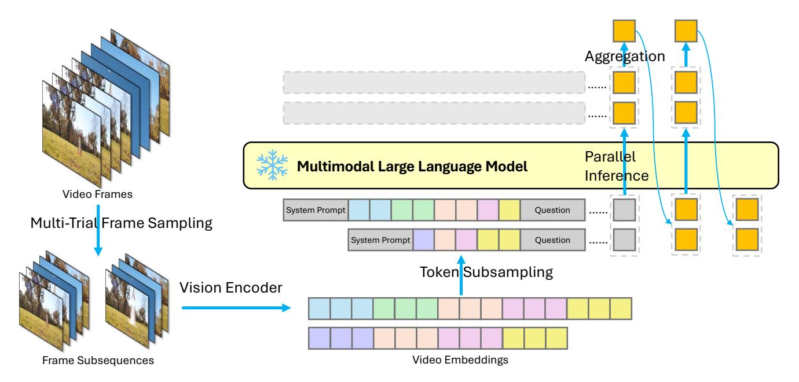
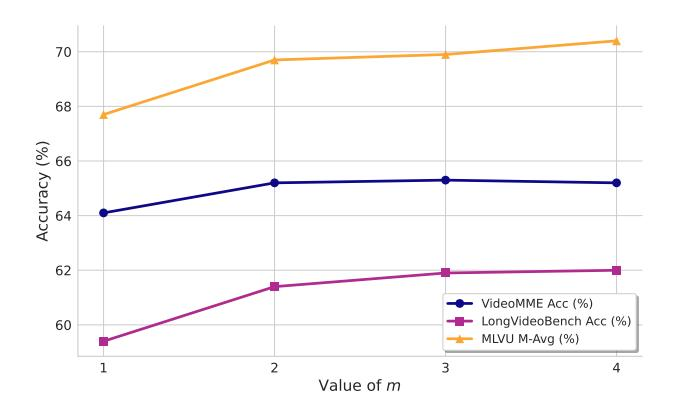
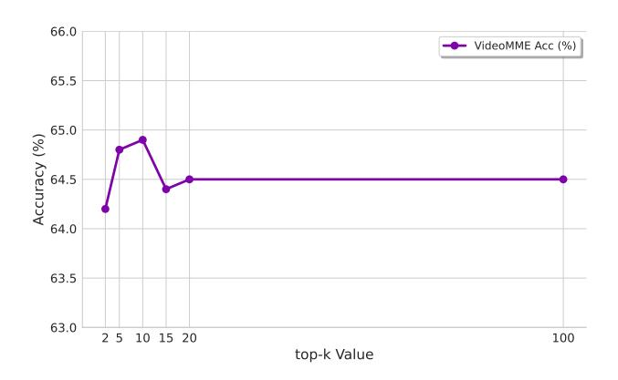

# <span id="page-0-0"></span>Test-Time Temporal Sampling for Efficient MLLM Video Understanding

# Kaibin Wang SenseTime, China

21s003086@stu.hit.edu.cn

# Mingbao Lin\* Rakuten, Singapore

linmb001@outlook.com

#### **Abstract**

Processing long videos with multimodal large language models (MLLMs) poses a significant computational challenge, as the model's self-attention mechanism scales quadratically with the number of video tokens, resulting in high computational demand and slow inference speed. Current solutions, such as rule-based sub-sampling, learned frame selector, or memory-based summarization, often introduce their own trade-offs: they compromise accuracy, necessitate additional training, or decrease inference speed. In this paper, we propose Test-Time Temporal Sampling (T3S), a training-free, plug-and-play inference wrapper that enables MLLMs to process long videos both efficiently and effectively. T3S exploits spatiotemporal redundancy by generating multiple short and diverse subsequences of video tokens at inference time, packing them within a single forward pass, and aggregating their predictions. This multi-subsequence formulation broadens visual coverage while reducing the computational cost of self-attention from  $\mathcal{O}(L^2)$  to  $\mathcal{O}(\sum_{i=1}^m \alpha_i^2 L^2)$ , where  $\sum_{i=1}^{m} \alpha_i^2 < 1$ . Extensive experiments on long video understanding benchmarks demonstrate that T3S improves accuracy by up to 3.1% and reduces first token delay by  $2.04\times$ , all with minimal integration effort. Our approach operates entirely at inference time, requires no model modifications or fine-tuning, and is compatible with a wide range of pretrained MLLMs. T3S turns video redundancy into a computational advantage, offering a scalable solution for long-video understanding. The code is available at https://github.com/kaibinwang3/T3S.

### 1. Introduction

Video, as one of the richest visual modalities, presents the greatest scalability challenge for multimodal large language models (MLLMs) [16]. Treating a video as "many independent images" causes the token count to grow rapidly with the number of frames, resulting in a self-attention

cost of  $\mathcal{O}(L^2)$ . For long-form content, this quickly exceeds (i) the context-window limitation and (ii) practical latency constraints, leading to two challenges: (1) Needle-in-a-haystack retrieval: Many downstream tasks depend on identifying a handful of pivotal frames hidden within a vast amount of irrelevant footage. (2) Whole-video comprehension: Aggressive frame dropping, imposed by memory constraints, prevents models from capturing global events.

Existing throttling strategies fall short. (i) Rule-based sub-sampling. Methods such as uniform frame sampling and dynamic resolution control are widely adopted to constrain the overall token budget during multimodal input processing, as exemplified by LLaVA-1.5 [11] and Qwen2.5-VL [1]. They typically regulate spatial or temporal density by evenly sampling visual frames or adaptively adjusting the resolution based on global heuristics. More recent work, such as VideoLLaMA3 [23], introduces a more aggressive reduction strategy by discarding image patches with small  $\ell_1$  distances, thereby minimizing redundancy at the patch level. Since these methods operate without semantic awareness, they may eliminate fine-grained details, subtle textures, or small but pivotal objects. Thus, downstream performance can be degraded despite apparent efficiency gains.

(ii) Learned sub-sampling. Recent methods such as FRAME-VOYAGER [22], GenS [21], M-LLM selectors [8], and Long VU [15] seek to overcome the limitations of rule-based sub-sampling by learning to prioritize frames or spatial regions that are most informative for downstream tasks. These approaches typically employ auxiliary neural modules, such as frame selectors, patch selectors, or adaptive compressors. However, this reliance increases data requirements, as training these modules often necessitates extensive human-annotated labels or large-scale pseudo-annotations. Furthermore, at inference time, all frames must still be processed before selection, leading to ongoing computational and latency overhead.

(iii) Memory-based summarization. MA-LMM [7] addresses long video sequences by progressively compressing each incoming frame into a compact, rolling memory bank that can be efficiently queried later. Similarly, LLaMA-VID [9] condenses each frame into a minimal two-token

<sup>\*</sup>Corresponding Author

<span id="page-1-0"></span>textual "gist" before any downstream reasoning occurs. Both techniques effectively reduce the per-frame memory footprint, enabling scalable processing of longer videos. However, despite these improvements in scalability, their reliance on custom modules and additional training significantly limits compatibility with off-the-shelf MLLMs, hindering broader adoption.

**Key insight.** Natural videos exhibit significant temporal and spatial redundancy, with consecutive frames and neighboring patches often containing similar information. Conventional MLLM pipelines disregard this, encoding every frame and patch in full, which wastes tokens and inflates the quadratic cost of self-attention. Our approach leverages this redundancy: rather than processing a single long, densely tokenized sequence, we extract several short, mutually diverse subsequences that collectively span the entire video timeline. Each subsequence is sufficiently compact to fit within the model's context window, while the ensemble of subsequences ensures comprehensive coverage of the entire video. Thus, the model can inspect a broader range of visual evidence while each attention computation operates on a shorter token list, yielding substantial savings in memory and latency without sacrificing informational completeness. Unlike prior sampling or compression schemes, this design treats efficiency as an ensemble approximation problem—aggregating multiple partial but diverse observations to approximate full-context reasoning. Such a perspective provides both theoretical grounding and empirical robustness, well distinguishing our method from conventional frame-sampling heuristics.

Test-Time Temporal Sampling (T3S). To that effect, we propose T3S in this paper, a training-free, plug-and-play wrapper that leverages video redundancy to accelerate any pretrained MLLM at inference time. T3S conducts m independent sampling trials. In each trial, it (i) randomly selects N frames and (ii) further sub-samples a fration of their visual tokens. These m subsequences are then packed into a single long sequence and processed in one forward pass. Next-token predictions are aggregated via averaging or confidence-weighted fusion.

Because transformer latency is dominated by the  $\mathcal{O}(L^2)$  self-attention mechanism, replacing one long sequence of length L with m shorter sequences of length  $\alpha_i L$  reduces the total cost from  $L^2$  to  $\sum_{i=1}^m \alpha_i^2 L^2$ —a substantial saving when  $\sum_{i=1}^m \alpha_i^2 < 1$ . Moreover, the diversity among sampled subsequences compensates for dropped tokens and often *improves* accuracy. More importantly, our random sampling here is not arbitrary: across multiple subsequences, it statistically covers key temporal segments, allowing T3S to maintain performance even on videos with sparse or uneven event distributions.

In conclusion, the major contributions we have made in this paper include:

- Universal, zero-training test-time sampling. T3S requires no extra data or fine-tuning and can be dropped into any pretrained MLLM.
- Joint exploitation of frame- and token-level redundancy. T3S jointly samples frames and visual tokens in order to maximize information coverage under a fixed token budget.
- Multi-subsequence inference. T3S infers several shorter subsequences and aggregates their outputs, yielding more robust predictions without added latency.
- Extensive empirical validation. T3S demonstrates consistent accuracy improvements of up to 3.1% and 2.04× acceleration on Qwen2.5-VL-7B when evaluated on the LongVideoBench dataset, and remains robust across different models, hardware, and video distributions.

In short, T3S turns the inherent redundancy of video into a computational advantage, enabling existing MLLMs to ingest longer, more complex videos *faster and more accurately*—all without a single gradient update.

#### 2. Related Work

#### 2.1. Long Video Understanding for MLLMs

Current approaches for MLLMs to process long videos can be categorized into three main groups: rule-based subsampling, learned sub-sampling, and memory-based summarization. Rule-based sub-sampling methods, adopted by models such as LLaVA-1.5 [11] and Qwen2.5-VL [1], reduce the input size by uniformly or heuristically sampling frames from videos. While simple and efficient, these methods are not content-aware and may miss important information. Learned sub-sampling approaches, including FRAME-VOYAGER [22], GenS [21], M-LLM selectors [8], and LongVU [15], use trainable modules to select the most informative frames or segments. These methods can better preserve essential content but require additional training data and introduce extra computational overhead. Memory-based summarization methods, as seen in MA-LMM [7] and LLaMA-VID [9], condense video information into compact summaries or textual gists, enabling efficient downstream processing. However, they often rely on specialized components and extra training, making them less compatible with existing pre-trained MLLMs. Despite progress in all three directions, there remains a strong need for a training-free and widely applicable solution for efficient long video understanding.

### 2.2. Training-Free Token Reduction for MLLMs

Various training-free approaches have been proposed to reduce the number of visual tokens in MLLMs by retaining only the most informative ones. Leveraging the attention sink phenomenon [19], methods such as FastV [2] and VTW [10] discard a proportion of visual tokens after a spe-

<span id="page-2-1"></span><span id="page-2-0"></span>

Figure 1. Framework overview for Test-Time Temporal Sampling (T3S). The process begins by applying multi-trial frame sampling to a long input video, creating several shorter frame subsequences. These subsequences are then processed by a vision encoder to produce video embeddings. To manage sequence length, token subsampling is applied to these embeddings. The resulting shorter sequences are combined with textual inputs, and fed into the MLLM for parallel inference. Finally, the multiple outputs generated in parallel are combined through an aggregation step to produce the final prediction. This process is repeated autoregressively, feeding the aggregated output back into the model to generate subsequent tokens.

cific layer. MagicPIG [\[3\]](#page-8-13) utilizes locality-sensitive hashing to select representative tokens, while TopV [\[20\]](#page-8-14) and AdaRe-Take [\[17\]](#page-8-15) dynamically allocate token budgets to different image regions and retain tokens accordingly. The recent FrameFusion [\[6\]](#page-8-16) reduces visual tokens by merging similar corresponding tokens across adjacent frames in early layers and pruning by importance in deeper layers. On the Video-MME benchmark, this method yielded a 70% token reduction for LLaVA-Video-7B with only 1.9% performance loss. While these techniques enhance either efficiency or efficacy, developing a solution that simultaneously balances both remains an open challenge.

# 3. Methodology

We begin by revisiting the canonical video-oriented MLLM pipeline and pinpointing its O(L 2 ) attention bottleneck. Building on this diagnosis, we formally introduce *Test-Time Temporal Sampling (T3S)*, a training-free wrapper that exploits temporal and spatial redundancy simultaneously to *reduce the attention cost while expanding effective temporal coverage*—without requiring any additional training or architectural modification.

## 3.1. Problem Formulation

Let a video be represented as V = ⟨f1, f2, ..., f<sup>F</sup> ⟩, in which f<sup>i</sup> denotes the i-th frame and F shows the total number of frames. In conventional pipelines, a frame sampler S selects a set of N ≪ F frames, each of which is encoded by a vision encoder E<sup>v</sup> into M patch (or region) tokens. These are then concatenated to form the visual token sequence:

$$\mathbf{v} = E_v \circ S(\mathcal{V}) = \langle \mathbf{v}_1, \mathbf{v}_2, \dots, \mathbf{v}_N \rangle. \tag{1}$$

The total length of this sequence is |v| = L = NM. In order to manage the computational demands in MLLM, an optional token subsampler or compressor C is applied to shorten the sequence:

$$\hat{\mathbf{v}} = C(\mathbf{v}) = \langle \hat{\mathbf{v}}_1, \hat{\mathbf{v}}_2, \cdots, \hat{\mathbf{v}}_N \rangle, \quad |\hat{\mathbf{v}}| < L.$$
 (2)

Finally, the processed visual tokens vˆ are concatenated with the input text tokens t and fed into the MLLM for autoregressive decoding:

$$\mathbf{o} = \mathrm{MLLM}(\langle \hat{\mathbf{v}}, \mathbf{t} \rangle). \tag{3}$$

Two main inefficiencies arise in this process: (i) insufficient temporal coverage—sampling only N frames risks missing important events elsewhere in the video; and (ii) spatial redundancy—adjacent frames and patches often share highly overlapping content, which lowers the effective information density while still incurring the quadratic attention cost. Although increasing the quantity of image samples N could improve coverage, it quickly exhausts the <span id="page-3-1"></span>model's context window and increases latency. Our goal in this paper is to *maximize temporal diversity and coverage under a fixed or smaller attention budget*. This is realized by a Test-Time Temporal Sampling (T3S) strategy.

#### 3.2. Overview of T3S

As illustrated in Figure 1, T3S departs from conventional single-sequence pipelines. Instead, it performs m independent inference trials. In each trial i, a unique subsequence of N frames is encoded, and only a fraction  $\alpha_i$  of its tokens is retained. These m subsequences are then processed jointly by the MLLM, avoiding the quadratic growth in attention cost with sequence length:

Baseline Cost 
$$\propto L^2 \Longrightarrow \text{T3S Cost} \propto \sum_{i=1}^{m} (\alpha_i L)^2$$
, (4)

which yields savings (<  $L^2$ ) whenever  $\sum_{i=1}^{m} \alpha_i^2 < 1$ .

The final prediction is generated by aggregating the logits from each trial. By processing multiple short and diverse sub-sequences, T3S approximates full-context reasoning while keeping each attention computation compact—thus achieving both *robustness and efficiency*. This "multisequence ensemble" formulation is key: it converts temporal redundancy into a statistical advantage, rather than discarding it as noise. Algorithm 1 summarizes the operations of our T3S and we delve into details in the following.

# 3.3. Stage 1: Multi-Trial Frame Sampling (Maximizing Visual Coverage)

For each trial  $i \in \{1,..,m\}$ , we first sample a set of N frame indices

$$P_i = \{j_1^{(i)}, j_2^{(i)}, ..., j_N^{(i)}\} \subset \{1, ..., F\},\tag{5}$$

via uniform random sampling. This operation produces  $\boldsymbol{m}$  distinct sub-sequences:

$$\hat{\mathcal{V}}_i = \langle f_{j_1^{(i)}}, ..., f_{j_N^{(i)}} \rangle. \tag{6}$$

$$\mathbf{v}^{(i)} = E_v(\hat{\mathcal{V}}_i), \ |\mathbf{v}^{(i)}| = L.$$
 (7)

It is crucial to stress that the random sampling in this paper is not arbitrary here—it ensures unbiased coverage of the temporal space across trials. Over multiple runs, these diverse subsequences statistically capture both frequent and rare events, mitigating the "missed key-frame" issue common to deterministic samplers.

# 3.4. Stage 2: Token Subsampling (Eliminating Spatial Redundancy)

Each  $\mathbf{v}^{(i)}$  is processed by a token selector  $C(\cdot, \alpha_i)$  that retains only a fraction  $\alpha_i \in (0, 1]$  of tokens:

$$\hat{\mathbf{v}}^{(i)} = C(\mathbf{v}^{(i)}, \alpha_i), \ |\hat{\mathbf{v}}^{(i)}| = \lfloor \alpha_i L \rfloor.$$
 (8)

#### **Algorithm 1:** Test-Time Temporal Sampling (T3S)

```
Input: video \mathcal{V}: text tokens t:
frames per trial N; number of trials m;
token–retention ratios \{\alpha_i\}_{i=1}^m; top-k value k
Output: next output token t^*
for i \leftarrow 1 to m do
                                                                     // multi-trial
  sampling
       P_i \leftarrow \text{random sample frame indices};
     \begin{split} \hat{\mathcal{V}}_i &\leftarrow \mathcal{V}[P_i]; \\ \mathbf{v}^{(i)} &\leftarrow E_v(\hat{\mathcal{V}}_i); \\ \hat{\mathbf{v}}^{(i)} &\leftarrow C(\mathbf{v}^{(i)}, \alpha_i) \\ \text{subsampling} \end{split}
                                                                                         // token
Pack all \hat{\mathbf{v}}^{(i)} and process them simultaneously.
\begin{aligned} \{o_i\}_{i=1}^m \leftarrow \text{MLLM}\big(\langle \hat{\mathbf{v}}^{(i)}, \mathbf{t} \rangle \big), \ i=1,\cdots,m; \\ \text{if} \ m=2 \ \text{then} \end{aligned}
       \mathcal{K} \leftarrow \text{TopK}(o_1, k);
       t^* \leftarrow \arg\max_{t \in \mathcal{K}} o_2[t];
 \begin{array}{c} o_{\text{avg}} \leftarrow \frac{1}{m} \sum_{i=1}^{m} o_i; \\ t^* \leftarrow \arg \max_t o_{\text{avg}}[t]; \end{array}
return t^*;
```

Many existing subsampling methods rely on computationally intensive importance scores, such as FastV [2] and LLaVA-PruMerge [14]. In contrast, we adopt uniform random patch-level sampling as the default, which is unbiased and training-free, effectively reducing sequence length while preserving expected spatial coverage. Alternative selection strategies are analyzed in Table 5.

# 3.5. Stage 3: Multi-Subsequence Inference & Logit Aggregation

Using sequence packing, the resulting subsequences  $\hat{\mathbf{v}}^{(i)}$  are concatenated into a single long sequence. The MLLM then processes the packed sequence, concatenated with the text prompt t, in a single forward pass using a block-diagonal attention mask:

$$o_i = \text{MLLM}(\langle \hat{\mathbf{v}}^{(i)}, \mathbf{t} \rangle), i = 1, ..., m,$$
 (9)

yielding logits  $o_i \in \mathbb{R}^D$  (D vocabulary size). By inferring on multiple short subsequences instead of a single long sequence, T3S significantly reduces inference time while maintaining comprehensive content coverage.

Let  $\pi(o)$  denote the softmax distribution derived from logit vector o. We aggregate the logits from the m trials using one of the following methods.

**(A) Mean logits (default).** We average the logits across trials:

$$o_{\text{avg}} = \frac{1}{m} \sum_{i=1}^{m} o_i, \quad t^* = \arg\max_{t} o_{\text{avg}}[t].$$
 (10)

<span id="page-4-0"></span>

Figure 2. Empirical speedup w.r.t.  $\alpha_1$  and  $\alpha_2$ .

This strategy is parameter-free yet we find it surprisingly robust in practice.

**(B) Confidence-weighted aggregation.** Each trial is weighted by the inverse entropy of its predictive distribution:

$$w_i \propto \frac{1}{H(\pi(o_i))}, \quad o_{\text{weighted}} = \sum_i w_i o_i,$$
 (11)  
 $t^* = \arg\max_t o_{\text{weighted}}[t].$ 

(C) Two-trial cross-refinement (m = 2). When using just two trials (m = 2), we observe empirical gains from an asymmetric verification scheme. Let  $o_1, o_2$  be the two logits. Trial 1 proposes the top-k:

$$\mathcal{K} = \text{top-}k(o_1, k), \tag{12}$$

and trial 2 re-rank them:

$$t^* = \arg\max_{t \in \mathcal{K}} o_2[t]. \tag{13}$$

The intuition is that trial 1 generates high-confidence hypotheses, while trial 2 acts as a lightweight verifier—without ever computing expensive cross-trial attention. In Table 6, we conduct a detailed analysis on how the aggregation affects the performance.

#### 3.6. Time Complexity Analysis

We analyze the computational cost of our proposed T3S method in comparison to a standard single-trial baseline. This analysis considers both the theoretical complexity based on dominant operations and the practical performance observed empirically, as presented in Figure 2.

**Single-trial baseline.** For a sequence of length L, the computational cost per layer in a standard transformer is dominated by the self-attention mechanism. This results in a time complexity of:

$$C_{\text{base}} = \mathcal{O}(L^2). \tag{14}$$

This model disregards lower-order terms, such as those from MLP and layer normalization operations, which scale linearly with the sequence length  $(\mathcal{O}(L))$ .

Multi-trial cost and empirical performance. In our multi-trial approach, using m trials with respective subsampling rates  $\{\alpha_i\}_{i=1}^m$ , the theoretical complexity is the sum of costs for each trial:

$$C_{\text{multi}} = \mathcal{O}\left(L^2 \sum_{i=1}^m \alpha_i^2\right).$$
 (15)

This suggests a theoretical speedup is achievable whenever  $\sum_{i=1}^{m} \alpha_i^2 < 1$ .

In our practical implementation, the m subsequences are packed into a long sequence and processed together in one forward pass. While this packing-based strategy differs from the simplified theoretical model that assumes idealized batching, our empirical results show the theoretical trend still holds. For example, with  $\alpha_1=\alpha_2=0.6$  (so that  $\sum \alpha_i^2=0.72$ ), we observe a modest yet meaningful  $1.22\times$  speedup in Figure 2. This demonstrates that, despite the practical overheads, the essential efficiency benefits of the T3S approach are retained.

Note that in the region where  $\alpha_1 + \alpha_2 \ge 1.3$ , processing the packed long sequence results in an out-of-memory error. In this case, we report the time for two serial forward passes instead.

### 3.7. Design Rationale: Why T3S Wins

Randomness is a feature, not a concession. Stochastic sampling remains *provably* unbiased across domains, frame-rates, and resolutions. In contrast, deterministic or learned selectors embed hidden priors and require retraining as distributions shift. Random sampling offers broad coverage of rare events at zero cost—no parameters, tuning, or engineering overhead.

**Temporal breadth over spatial depth.** Rather than densely sampling one long sequence, we spread the token budget across *uncorrelated* temporal windows. Each trial has a new chance to catch key frames, reducing the chance of missing important moments. The cost grows linearly with trials but is amortized by packing, while recall improves exponentially.

**Multi-subsequence inference.** In contrast to performing inference on a single long sequence, our method processes a batch of m shorter subsequences. This approach mitigates the quadratic time complexity of the attention mechanism, resulting in a significant speedup.

**Summary.** T3S trades a single fragile trajectory for multiple lightweight probes. This shift yields a system that is faster, more efficient, and more robust—outperforming any single-sequence baseline.

<span id="page-5-3"></span><span id="page-5-0"></span>Table 1. Accuracy (%) and speedup comparison on VideoMME.

| Model          | Short | Medium | Long | Overall | Speedup |
|----------------|-------|--------|------|---------|---------|
| Qwen2.5-VL-7B  | 74.6  | 63.7   | 53.6 | 63.9    | –       |
| + T3S          | 76.6  | 64.4   | 54.6 | 65.2    | 2.03×   |
| LLaVA-Video-7B | 75.8  | 62.7   | 53.6 | 64.0    | –       |
| + T3S          | 77.4  | 63.3   | 54.5 | 65.1    | 1.69×   |
| Oryx-1.5-7B    | 71.1  | 55.9   | 51.6 | 59.5    | –       |
| + T3S          | 71.7  | 56.1   | 52.6 | 60.1    | 1.32×   |

# 4. Experiments

## 4.1. Benchmarks

We evaluate our T3S on three challenging long-vodeo understanding benchmarks, each targeting different aspects of multimodal reasoning. VideoMME [\[5\]](#page-8-18) contains 900 videos (11s-1h) with 2,700 human-annotated QA pairs requiring integration of visual, audio, and textual cues. We use the "w/o subs" version for our evaluation. LongVideoBench [\[18\]](#page-8-19) has 3,763 web videos (up to 1h) and 6,678 multiple-choice questions focused on "referring reasoning", where models must localize relevant segments to anser detailed queries. MLVU [\[25\]](#page-9-0) spans diverse domains (*e.g.*, movies, surveillance, gaming) and covers a wide range of tasks for comprehensive long-video understanding.

We report accuracy (%) for VideoMME and LongVideoBench, and M-Avg (%) for MLVU.

# 4.2. Implementation Details

We adopt the VLMEvalKit toolkit [\[4\]](#page-8-20) to evaluate three topperforming open-source MLLMs: Qwen2.5-VL-7B [\[1\]](#page-8-2), LLaVA-Video-7B [\[24\]](#page-9-1), and Oryx-1.5-7B [\[12\]](#page-8-21). Evaluations are conducted on VideoMME [\[5\]](#page-8-18) (w/o subs), LongVideoBench [\[18\]](#page-8-19), and MLVU [\[25\]](#page-9-0). We follow standard VLMEvalKit protocols for the first two benchmarks. For MLVU, we adopt the video-FlexReduc reference implementation [\[13\]](#page-8-22) to ensure consistency due to observed result deviations. We compare our T3S against some advanced methods including FastV [\[2\]](#page-8-11), VTW [\[10\]](#page-8-12), and AdaReTake [\[17\]](#page-8-15). FastV and VTW are re-implemented as lightweight VLMEvalKit plug-ins while AdaReTake is evaluated using its official codebase.

Hyper-parameters are chosen to balance speed and accuracy. We set m = 2 (frame sequences), with N = 256 frames for Qwen2.5-VL-7B and Oryx-1.5-7B, and N = 128 for LLaVA-Video-7B to fit context limits. We use topk = 2, and tune α<sup>i</sup> to optimize speedup without accuracy loss. Runtime is measured from post-sampling to first-token emission. Speedup is defined as τ1/τ2, where τ<sup>1</sup> is the baseline latency and τ<sup>2</sup> is the latency with token reduction.

<span id="page-5-1"></span>Table 2. Accuracy (%) and speedup comparison on LongVideoBench.

| Model          | 15   | 60   | 600  | 3600 | Overall | Speedup |
|----------------|------|------|------|------|---------|---------|
| Qwen2.5-VL-7B  | 72.0 | 75.0 | 57.8 | 51.2 | 59.2    | –       |
| + T3S          | 75.1 | 76.2 | 63.1 | 53.5 | 62.3    | 2.04×   |
| LLaVA-Video-7B | 67.2 | 72.1 | 56.1 | 47.9 | 56.2    | –       |
| + T3S          | 69.3 | 72.7 | 60.4 | 50.5 | 59.1    | 1.50×   |
| Oryx-1.5-7B    | 61.4 | 70.3 | 56.6 | 51.8 | 57.0    | –       |
| + T3S          | 64.6 | 70.3 | 57.8 | 53.5 | 58.6    | 1.31×   |

<span id="page-5-2"></span>Table 3. M-Avg (%) and speedup comparison on MLVU.

| Model          | PQA  | NQA  | ER   | AC   | AO   | AR   | TR   | M-Avg | Speedup |
|----------------|------|------|------|------|------|------|------|-------|---------|
| Qwen2.5-VL-7B  | 72.9 | 80.8 | 60.8 | 34.0 | 51.4 | 77.0 | 89.0 | 68.3  | –       |
| + T3S          | 74.0 | 79.4 | 61.6 | 35.3 | 60.2 | 76.5 | 89.0 | 69.7  | 2.01×   |
| LLaVA-Video-7B | 77.5 | 80.8 | 65.6 | 39.3 | 62.5 | 68.5 | 87.4 | 68.8  | –       |
| + T3S          | 77.7 | 74.9 | 62.2 | 46.1 | 60.6 | 70.5 | 86.3 | 70.1  | 1.72×   |
| Oryx-1.5-7B    | 77.0 | 80.3 | 64.5 | 41.3 | 48.3 | 70.0 | 86.7 | 69.2  | –       |
| + T3S          | 77.6 | 80.2 | 63.1 | 37.9 | 49.4 | 68.5 | 88.2 | 69.0  | 1.23×   |

### 4.3. Main Results

Comparison with baselines. We integrate our method T3S with Qwen2.5-VL-7B [\[1\]](#page-8-2), LLaVA-Video-7B [\[24\]](#page-9-1), and Oryx-1.5-7B [\[12\]](#page-8-21). The accuracy and speedup across VideoMME, LongVideoBench, and MLVU are summarized in Table [1,](#page-5-0) Table [2](#page-5-1) and Table [3.](#page-5-2)

*Qwen2.5-VL-7B* sees the greatest benefit from T3S. On VideoMME, accuracy improves from 63.9% to 65.2%, with gains across all clip lengths: +2.0% (short), +0.7% (medium), and +1.0% (long). On LongVideoBench, T3S boosts the 600s and 3600s splits by +5.3% and +2.3%, raising overall accuracy by +3.1%. On MLVU, the M-Avg increases from 68.3% to 69.7%, with strong gains in Action Order (+8.8%) and stable or improved results on most subtasks. Inference speed improves by 2.0×, reducing latency by over 50% without accuracy loss.

*LLaVA-Video-7B* shows consistent gains from the proposed T3S. On VideoMME, accuracy rises by +1.1%, with improvements in short and medium clips. On LongVideoBench, T3S enhances all durations, including a +4.3% boost on 600s videos, leading to a +2.0% overall gain. On MLVU, the average score improves from 68.8% to 70.1%, with a notable +6.8% in Action Count. T3S also delivers more than a 1.5× speedup, offering significant efficiency without accuracy loss.

*Oryx-1.5-7B* exhibits the smallest accuracy improvement among the three models; however, it achieves a modest speedup. T3S delivers its largest accuracy gain on LongVideoBench (+1.6%) while providing moderate speedups on VideoMME (1.3×), LongVideoBench (1.3×), and MLVU (1.2×), demonstrating improved efficiency

<span id="page-6-3"></span><span id="page-6-2"></span>Table 4. Accuracy (%) and speedup comparison. All methods receive the same number of visual tokens, and token compression is configured with their respective recommended hyperparameters.

| Model         | VideoMME |                | Long | VideoBench     | MLVU  |               |  |
|---------------|----------|----------------|------|----------------|-------|---------------|--|
| Wiodei        | Acc      | Speedup        | Acc  | Speedup        | M-Avg | Speedup       |  |
| Qwen2.5-VL-7B | 63.9     | _              | 59.2 | -              | 68.3  | -             |  |
| + T3S (Ours)  | 65.2     | $2.03\times$   | 62.3 | $2.04\times$   | 69.7  | $2.01\times$  |  |
| + AdaReTake   | 65.9     | $0.334 \times$ | 59.0 | $0.307 \times$ | 68.7  | $0.213\times$ |  |
| + FastV       | 64.0     | $2.59\times$   | 58.2 | $2.60\times$   | 66.0  | $2.63\times$  |  |
| + VTW         | 53.7     | $2.13\times$   | 48.2 | $2.13\times$   | 58.5  | $2.16\times$  |  |

without compromising performance.

Summary. Our T3S offer a general, robust, and plugand-play solution for long video understanding. It accelerates inference across diverse models while maintaining or improving accuracy. With no model changes required, T3S ensures broad compatibility and practical efficiency gains for real-world video-language applications.

Comparison with existing methods. We compare our T3S, with representative training-free token reduction techniques, including FastV [2], VTW [10], and AdaRe-Take [17]. Notably, Qwen2.5-VL equipped with AdaRe-Take is the current training-free, open-source state-of-the-art on the VideoMME leaderboard. For a fair comparison, we ensure that all methods receive the same number of visual token inputs by setting the frame sampling accordingly: T3S samples 256 frames twice, and all other methods sample 512 frames uniformly. FastV is configured to discard half of the visual tokens after layer 2, while VTW discards all visual tokens after half of the layers, following their recommended configurations.

As shown in Table 4, T3S consistently achieves higher accuracy than FastV and VTW across all three benchmarks (VideoMME, LongVideoBench, and MLVU), while also providing a substantial inference speedup ( $\sim 2.0\times$ ). FastV attains even greater speedup ( $\sim 2.6\times$ ), but this comes at the expense of noticeably lower accuracy, especially on MLVU. VTW achieves a considerable speedup as well, but its accuracy lags behind both T3S and FastV on all benchmarks.

AdaReTake slightly outperforms T3S *w.r.t.* accuracy on VideoMME (65.9% *vs.* 65.2%), but does so with a significant increase in inference time, as indicated by speedup values well below 1.0×. In contrast, T3S strikes a favorable balance between efficiency and performance, delivering competitive accuracy improvements while significantly reducing computational overhead. These results demonstrate the practical advantage of T3S for scalable video understanding.

#### 4.4. Ablation Studies

**Ablation studies on sampling strategies.** We investigate the impact of different sampling strategies on model per-

<span id="page-6-0"></span>Table 5. Accuracy (%) comparison of different sampling strategies.

| Setting      | VideoMME Acc | LongVideoBench Acc | MLVU M-Avg |
|--------------|--------------|--------------------|------------|
| rand-tok-m2  | 65.2         | 62.3               | 69.7       |
| rand-tok-m1  | 63.9         | 62.0               | 68.9       |
| uni-tok-m2   | 65.1         | 61.4               | 69.5       |
| uni-tok-m1   | 65.0         | 61.6               | 69.4       |
| rand-frm-m2  | 64.5         | 60.5               | 65.5       |
| rand-attn-m2 | 65.9         | 62.0               | 69.2       |

<span id="page-6-1"></span>Table 6. Comparison of different aggregation strategies.

| Setting                    | VideoMME Acc | LongVideoBench Acc | MLVU M-Avg |
|----------------------------|--------------|--------------------|------------|
| Mean Logits                | 65.1         | 62.0               | 69.0       |
| Confidence-Weighted        | 64.7         | 61.0               | 69.5       |
| Two-Trial Cross-Refinement | 65.2         | 62.3               | 69.7       |

formance using Qwen2.5-VL-7B, with k=2, m=2,  $\alpha_1=0.5$ , and  $\alpha_2=0.3$ , consistent with the configuration in our main experiments. Our analysis is three-fold:

- (1) **Frame sampling method:** whether frames are sampled randomly (**rand**) or uniformly (**uni**);
- (2) **Token subsampling strategy:** whether tokens are sampled randomly across all frames (**tok**), sampled at the frame level such that all tokens from a frame are kept or discarded together (**frm**), or selected based on the top  $\alpha_i$  attention scores averaged across all layers and attention heads (**attn**).
- (3) Frame sequence reuse: whether the second set of frame sequences reuses the first (m1) or is independently resampled (m2).

In Table 5, our findings show that token-level random sampling with independent resampling (**rand-tok-m2**) is the most effective strategy among those evaluated. This approach combines fine-grained spatial selection with enhanced temporal diversity, leading to consistently strong performance across all benchmarks. While the attention-based sampling setting (**rand-attn-m2**) achieves superior results on certain benchmarks, it is computationally expensive and impractical for real-world deployment. Thus, random sampling serves as a reliable and efficient alternative.

Ablation studies on aggregation strategies. We next dissect how the choice of aggregation strategy influences overall model performance. Table 6 reveals that a plain logit average already lifts accuracy above the single-trial baseline, confirming the benefit of leveraging multi-trial evidence. Yet when exactly two sampling trials are used (m=2), the cross-refinement scheme systematically outperforms both simple averaging and confidence-weighted aggregation. This suggests that the asymmetric, iterative verification step is uniquely capable of distilling complementary cues from the two views, translating into markedly more robust and precise predictions.

Scaling with the batch size m. We investigate the rela-

<span id="page-7-0"></span>

Figure 3. Accuracy (%) as a function of the number of trials (m).

tionship between model accuracy and the number of trials, denoted by m. For all m = 1, 2, 3, 4, we employ the mean logits aggregation strategy and use a constant sampling ratio,  $\alpha_i = 0.5, \forall i$ , for simplicity. The performance across three benchmarks for different values of m is summarized in Figure 3. It reveal a clear pattern of diminishing returns. The accuracy curve shows a notable rise when moving from m=1 to m=2, while subsequent increments to m=3and m=4 result in only marginal gains, with performance eventually plateauing or even slightly decreasing, as seen with VideoMME. This pattern highlights that the primary benefit of multiple trials is realized early on, and additional trials contribute progressively less to overall accuracy. Considering that computational cost scales with m, our findings strongly suggest that m=2 offers the most effective tradeoff between accuracy and inference efficiency.

Ablation studies on the top-k value. We investigate the sensitivity of the model to the top-k sampling parameter k, using a Chain-of-Thought (CoT) prompt to generate longer responses. To assess its impact, we vary k and evaluate accuracy on the VideoMME benchmark. As shown in Figure 4, adjusting k within the range of 2 to 100 results in less than 1% fluctuation in accuracy. While performance peaks at k=10, the overall stability across the full range indicates that model accuracy is largely insensitive to this hyperparameter. This robustness simplifies deployment and reduces the need for extensive tuning.

#### 4.5. Limitation and Future Work

Throughout this paper, both in our theoretical discussion and practical time-complexity analysis, we sum the costs of all subsequences rather than assume full parallelization and take only the maximum. This approach aligns with our experimental findings: on a single GPU, computing a chunk of tokens in parallel already fully saturates the hardware, leaving no resources for true sequence-level parallelism. Given our inability to redesign the implementation on a single-

<span id="page-7-1"></span>

Figure 4. Accuracy (%) as a function of the number of trials (m).

GPU node, we note that a simple remedy in a multi-GPU setting is to replicate the model on each device and assign each device to process one sequence independently.

A second caveat of T3S is the per-step emission of m distinct next-token candidates. As generation proceeds, the memory footprint increases slowly and throughput diminishes, eroding the very efficiency T3S is designed to provide. We anticipate that this can be alleviated by (i) deduplicating the m identical tokens once they are generated and (ii) engineering attention masks that allow the model to treat the shared prefix once while still maintaining pertrial branching. We leave the design and validation of these optimizations to future work, and we also call for more researchers to pay attention to this interesting topic.

#### 5. Conclusion

We have introduced **Test-Time Temporal Sampling** (**T3S**), a training-free, plug-and-play wrapper that rethinks how video inputs are processed by large multimodal language models. Instead of relying on the traditional "longsequence" paradigm, T3S leverages multiple short and diverse views that are processed jointly in batch. This design (i) substantially reduces the quadratic attention cost, (ii) expands effective temporal coverage through diverse subsequences, and (iii) preserves full compatibility with existing inference pipelines. Extensive experiments across three long-video understanding benchmarks demonstrate that T3S achieves up to  $2.0\times$  wall-clock speedup while matching or surpassing the accuracy of dense-sampling baselines and strong prior methods. Because it is entirely model-agnostic and introduces no additional parameters or retraining, T3S can be seamlessly integrated into existing systems—turning video redundancy into a direct computational advantage and providing a scalable path toward efficient long-video reasoning.

# References

- <span id="page-8-2"></span>[1] Shuai Bai, Keqin Chen, Xuejing Liu, Jialin Wang, Wenbin Ge, Sibo Song, Kai Dang, Peng Wang, Shijie Wang, Jun Tang, et al. Qwen2. 5-vl technical report. *arXiv preprint arXiv:2502.13923*, 2025. [1,](#page-0-0) [2,](#page-1-0) [6](#page-5-3)
- <span id="page-8-11"></span>[2] Liang Chen, Haozhe Zhao, Tianyu Liu, Shuai Bai, Junyang Lin, Chang Zhou, and Baobao Chang. An image is worth 1/2 tokens after layer 2: Plug-and-play inference acceleration for large vision-language models. In *European Conference on Computer Vision*, pages 19–35. Springer, 2024. [2,](#page-1-0) [4,](#page-3-1) [6,](#page-5-3) [7](#page-6-3)
- <span id="page-8-13"></span>[3] Zhuoming Chen, Ranajoy Sadhukhan, Zihao Ye, Yang Zhou, Jianyu Zhang, Niklas Nolte, Yuandong Tian, Matthijs Douze, Leon Bottou, Zhihao Jia, et al. Magicpig: Lsh sampling for efficient llm generation. *arXiv preprint arXiv:2410.16179*, 2024. [3](#page-2-1)
- <span id="page-8-20"></span>[4] Haodong Duan, Junming Yang, Yuxuan Qiao, Xinyu Fang, Lin Chen, Yuan Liu, Xiaoyi Dong, Yuhang Zang, Pan Zhang, Jiaqi Wang, et al. Vlmevalkit: An open-source toolkit for evaluating large multi-modality models. In *Proceedings of the 32nd ACM International Conference on Multimedia*, pages 11198–11201, 2024. [6](#page-5-3)
- <span id="page-8-18"></span>[5] Chaoyou Fu, Yuhan Dai, Yongdong Luo, Lei Li, Shuhuai Ren, Renrui Zhang, Zihan Wang, Chenyu Zhou, Yunhang Shen, Mengdan Zhang, et al. Video-mme: The first-ever comprehensive evaluation benchmark of multi-modal llms in video analysis. In *Proceedings of the Computer Vision and Pattern Recognition Conference*, pages 24108–24118, 2025. [6](#page-5-3)
- <span id="page-8-16"></span>[6] Tianyu Fu, Tengxuan Liu, Qinghao Han, Guohao Dai, Shengen Yan, Huazhong Yang, Xuefei Ning, and Yu Wang. Framefusion: Combining similarity and importance for video token reduction on large vision language models. In *Proceedings of the IEEE/CVF International Conference on Computer Vision*, pages 22654–22663, 2025. [3](#page-2-1)
- <span id="page-8-8"></span>[7] Bo He, Hengduo Li, Young Kyun Jang, Menglin Jia, Xuefei Cao, Ashish Shah, Abhinav Shrivastava, and Ser-Nam Lim. Ma-lmm: Memory-augmented large multimodal model for long-term video understanding. In *Proceedings of the IEEE/CVF Conference on Computer Vision and Pattern Recognition*, pages 13504–13514, 2024. [1,](#page-0-0) [2](#page-1-0)
- <span id="page-8-6"></span>[8] Kai Hu, Feng Gao, Xiaohan Nie, Peng Zhou, Son Tran, Tal Neiman, Lingyun Wang, Mubarak Shah, Raffay Hamid, Bing Yin, et al. M-llm based video frame selection for efficient video understanding. In *Proceedings of the Computer Vision and Pattern Recognition Conference*, pages 13702– 13712, 2025. [1,](#page-0-0) [2](#page-1-0)
- <span id="page-8-9"></span>[9] Yanwei Li, Chengyao Wang, and Jiaya Jia. Llama-vid: An image is worth 2 tokens in large language models. In *European Conference on Computer Vision*, pages 323–340. Springer, 2024. [1,](#page-0-0) [2](#page-1-0)
- <span id="page-8-12"></span>[10] Zhihang Lin, Mingbao Lin, Luxi Lin, and Rongrong Ji. Boosting multimodal large language models with visual tokens withdrawal for rapid inference. In *Proceedings of the AAAI Conference on Artificial Intelligence*, pages 5334– 5342, 2025. [2,](#page-1-0) [6,](#page-5-3) [7](#page-6-3)
- <span id="page-8-1"></span>[11] Haotian Liu, Chunyuan Li, Yuheng Li, and Yong Jae Lee. Improved baselines with visual instruction tuning. In *Pro-*

- *ceedings of the IEEE/CVF conference on computer vision and pattern recognition*, pages 26296–26306, 2024. [1,](#page-0-0) [2](#page-1-0)
- <span id="page-8-21"></span>[12] Zuyan Liu, Yuhao Dong, Ziwei Liu, Winston Hu, Jiwen Lu, and Yongming Rao. Oryx mllm: On-demand spatial-temporal understanding at arbitrary resolution. *arXiv preprint arXiv:2409.12961*, 2024. [6](#page-5-3)
- <span id="page-8-22"></span>[13] SCZwangxiao. video-flexreduc. [https://github.](https://github.com/SCZwangxiao/video-FlexReduc) [com/SCZwangxiao/video-FlexReduc](https://github.com/SCZwangxiao/video-FlexReduc), 2025. Accessed: 2025-07-17. [6](#page-5-3)
- <span id="page-8-17"></span>[14] Yuzhang Shang, Mu Cai, Bingxin Xu, Yong Jae Lee, and Yan Yan. Llava-prumerge: Adaptive token reduction for efficient large multimodal models. In *Proceedings of the IEEE/CVF International Conference on Computer Vision*, pages 22857– 22867, 2025. [4](#page-3-1)
- <span id="page-8-7"></span>[15] Xiaoqian Shen, Yunyang Xiong, Changsheng Zhao, Lemeng Wu, Jun Chen, Chenchen Zhu, Zechun Liu, Fanyi Xiao, Balakrishnan Varadarajan, Florian Bordes, et al. Longvu: Spatiotemporal adaptive compression for long video-language understanding. *arXiv preprint arXiv:2410.17434*, 2024. [1,](#page-0-0) [2](#page-1-0)
- <span id="page-8-0"></span>[16] Yunlong Tang, Jing Bi, Siting Xu, Luchuan Song, Susan Liang, Teng Wang, Daoan Zhang, Jie An, Jingyang Lin, Rongyi Zhu, et al. Video understanding with large language models: A survey. *IEEE Transactions on Circuits and Systems for Video Technology*, 2025. [1](#page-0-0)
- <span id="page-8-15"></span>[17] Xiao Wang, Qingyi Si, Jianlong Wu, Shiyu Zhu, Li Cao, and Liqiang Nie. Adaretake: Adaptive redundancy reduction to perceive longer for video-language understanding. *arXiv preprint arXiv:2503.12559*, 2025. [3,](#page-2-1) [6,](#page-5-3) [7](#page-6-3)
- <span id="page-8-19"></span>[18] Haoning Wu, Dongxu Li, Bei Chen, and Junnan Li. Longvideobench: A benchmark for long-context interleaved video-language understanding. *Advances in Neural Information Processing Systems*, 37:28828–28857, 2024. [6](#page-5-3)
- <span id="page-8-10"></span>[19] Guangxuan Xiao, Yuandong Tian, Beidi Chen, Song Han, and Mike Lewis. Efficient streaming language models with attention sinks. *arXiv preprint arXiv:2309.17453*, 2023. [2](#page-1-0)
- <span id="page-8-14"></span>[20] Cheng Yang, Yang Sui, Jinqi Xiao, Lingyi Huang, Yu Gong, Chendi Li, Jinghua Yan, Yu Bai, Ponnuswamy Sadayappan, Xia Hu, et al. Topv: Compatible token pruning with inference time optimization for fast and low-memory multimodal vision language model. In *Proceedings of the Computer Vision and Pattern Recognition Conference*, pages 19803– 19813, 2025. [3](#page-2-1)
- <span id="page-8-5"></span>[21] Linli Yao, Haoning Wu, Kun Ouyang, Yuanxing Zhang, Caiming Xiong, Bei Chen, Xu Sun, and Junnan Li. Generative frame sampler for long video understanding. *arXiv preprint arXiv:2503.09146*, 2025. [1,](#page-0-0) [2](#page-1-0)
- <span id="page-8-4"></span>[22] Sicheng Yu, Chengkai Jin, Huanyu Wang, Zhenghao Chen, Sheng Jin, Zhongrong Zuo, Xiaolei Xu, Zhenbang Sun, Bingni Zhang, Jiawei Wu, et al. Frame-voyager: Learning to query frames for video large language models. *arXiv preprint arXiv:2410.03226*, 2024. [1,](#page-0-0) [2](#page-1-0)
- <span id="page-8-3"></span>[23] Boqiang Zhang, Kehan Li, Zesen Cheng, Zhiqiang Hu, Yuqian Yuan, Guanzheng Chen, Sicong Leng, Yuming Jiang, Hang Zhang, Xin Li, et al. Videollama 3: Frontier multimodal foundation models for image and video understanding. *arXiv preprint arXiv:2501.13106*, 2025. [1](#page-0-0)

- <span id="page-9-1"></span>[24] Yuanhan Zhang, Jinming Wu, Wei Li, Bo Li, Zejun Ma, Ziwei Liu, and Chunyuan Li. Video instruction tuning with synthetic data. *arXiv preprint arXiv:2410.02713*, 2024. [6](#page-5-3)
- <span id="page-9-0"></span>[25] Junjie Zhou, Yan Shu, Bo Zhao, Boya Wu, Zhengyang Liang, Shitao Xiao, Minghao Qin, Xi Yang, Yongping Xiong, Bo Zhang, et al. Mlvu: Benchmarking multi-task long video understanding. In *Proceedings of the Computer Vision and Pattern Recognition Conference*, pages 13691– 13701, 2025. [6](#page-5-3)