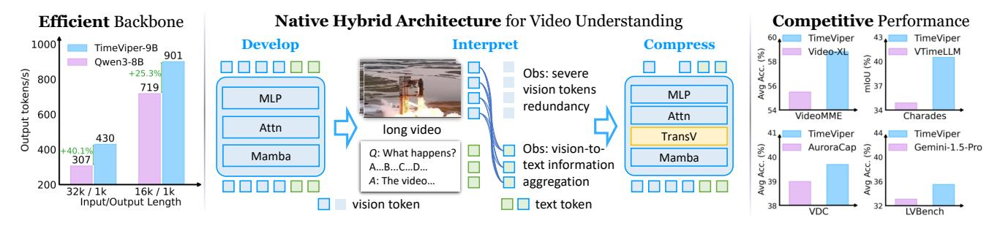
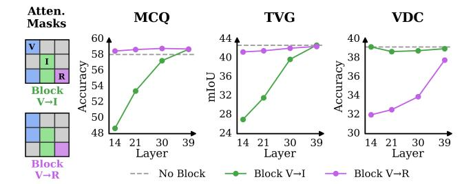
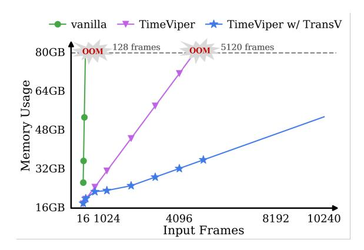
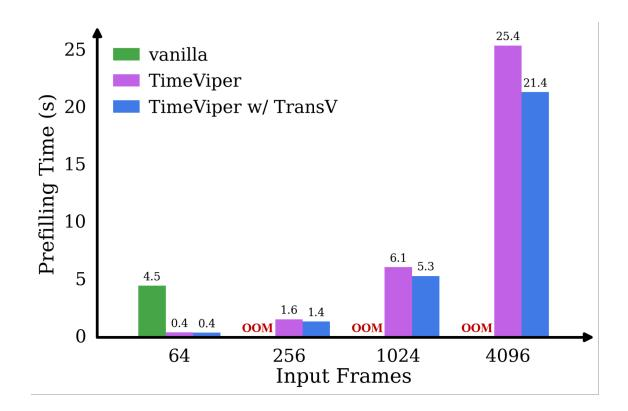
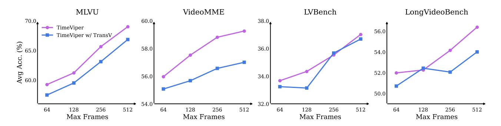
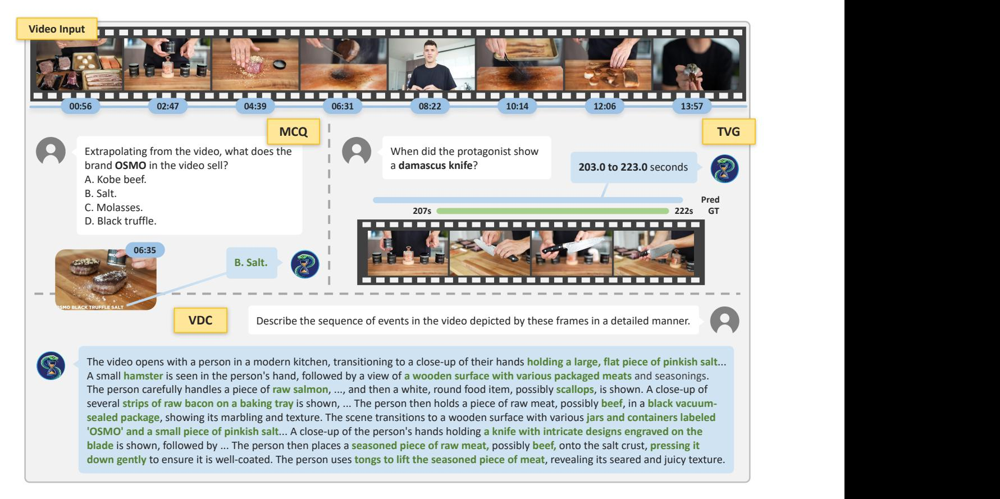
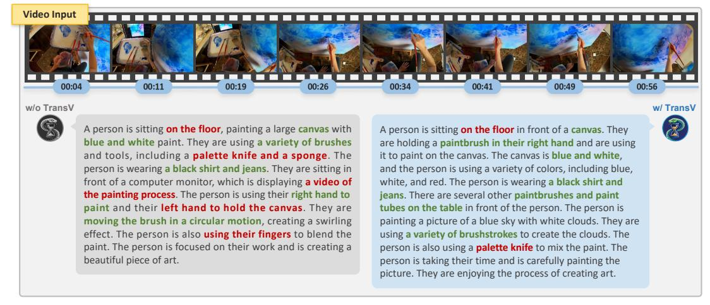
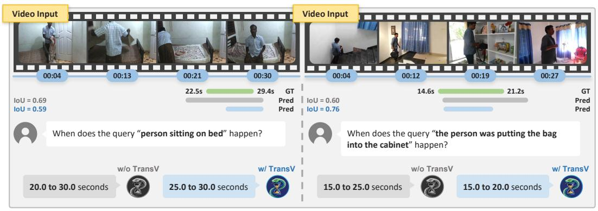
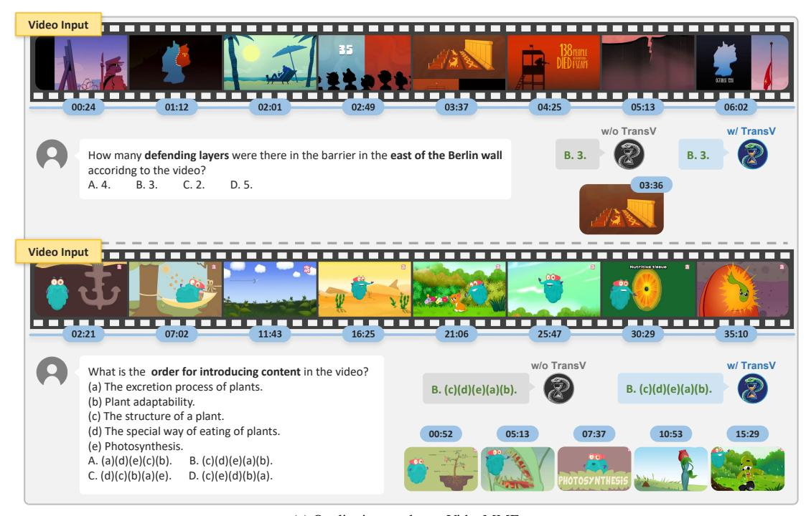

# TimeViper: A Hybrid Mamba-Transformer Vision-Language Model for Efficient Long Video Understanding

Boshen Xu1∗‡ Zihan Xiao1∗ Jiaze Li2 Jianzhong Ju2 Zhenbo Luo2 Jian Luan2 Qin Jin1† 1 AIM3 Lab, Renmin University of China 2 MiLM Plus, Xiaomi Inc.

Project Page: <https://xuboshen.github.io/TimeViper/>

Figure 1. We present TimeViper, a hybrid Mamba-Transformer vision-language model for efficient long video understanding. We reveal the severe vision token redundancy and a vision-to-text information aggregation phenomenon in hybrid models. To this end, we introduce TransV, the first token-transfer module that compresses vision tokens into text tokens inside the LLM, enabling the model to process over 10,000 frames. Benefitting from the Mamba layers' O(n) computation and O(1) cache cost, TimeViper generates 40.1% more tokens per second than Qwen3 [\[97\]](#page-17-0) when processing 32k input tokens (approximately 2k frames at 16 tokens per frame) and producing 1k output tokens with batch size 32. TimeViper delivers performance competitive with Transformer-based MLLMs on public benchmarks, including multi-choice QA on VideoMME [\[29\]](#page-13-0) (vs. Video-XL [\[73\]](#page-16-0)), temporal video grounding on Charades [\[74\]](#page-16-1) (vs. VTimeLLM [\[36\]](#page-13-1)), video detailed captioning on VDC [\[14\]](#page-12-0) (vs. AuroraCap [\[14\]](#page-12-0)), and hour-long video understanding on LVBench [\[85\]](#page-16-2) (vs. Gemini-1.5-Pro [\[80\]](#page-16-3)).

# Abstract

*We introduce TimeViper, a hybrid vision-language model designed to tackle challenges of long video understanding. Processing long videos demands both an efficient model architecture and an effective mechanism for handling extended temporal contexts. To this end, TimeViper adopts a hybrid Mamba-Transformer backbone that combines the efficiency of state-space models with the expressivity of attention mechanisms. Through this hybrid design, we reveal the vision-to-text information aggregation phenomenon, where information progressively flows from vision tokens to text tokens across increasing LLM depth, resulting in severe vision token redundancy. Motivated by this observation, we propose TransV, a token information transfer module that transfers and compresses vision tokens into instruction tokens while maintaining multimodal understanding capabilities. This design enables TimeViper to process hour-long videos exceeding 10,000 frames. Extensive experiments across multiple benchmarks demonstrate that TimeViper competes with state-of-the-art models while* *extending frame numbers. We further analyze attention behaviors of both Mamba and Transformer layers, offering new insights into hybrid model interpretability. This work represents an initial step towards developing, interpreting, and compressing hybrid Mamba-Transformer architectures.*

# 1. Introduction

Understanding long videos is an essential yet long-standing challenge in computer vision, holding great potential for applications across video platforms [\[79,](#page-16-4) [94\]](#page-17-1), household scenarios [\[32,](#page-13-2) [66,](#page-15-0) [98\]](#page-17-2), and embodied agents [\[10,](#page-12-1) [109\]](#page-18-0). Recent advances in multimodal large language models (MLLMs) [\[21\]](#page-13-3) have made general long video understanding increasingly feasible. Nevertheless, existing models still struggle to achieve a balance between effectiveness and efficiency when dealing with extended video contexts. We argue that building a truly capable long-video understanding model requires addressing two key challenges: *constructing an efficient MLLM backbone*, and *handling redundancy in long-context processing*.

Most prior works [\[50,](#page-14-0) [73\]](#page-16-0) adopt Transformer-based

† Corresponding author; ‡ Project lead; ∗ Equal contribution.

spac∗This work was done during their internship at Xiaomi.

LLMs as the backbone, owing to their strong reasoning and language understanding capabilities. However, the quadratic computational complexity of attention makes them inherently inefficient for long-context modeling. To improve efficiency, recent efforts have explored linearized architectures such as Mamba [\[23,](#page-13-4) [33\]](#page-13-5), which replace attention with state-space models for linear-time inference. Despite their efficiency advantages, these models often depend heavily on distillation from Transformer-based models [\[52,](#page-14-1) [53\]](#page-14-2) or suffer from limited performance on complex multimodal tasks [\[86,](#page-16-5) [115\]](#page-18-1). Encouragingly, a new generation of hybrid Mamba-Transformer LLMs [\[9,](#page-12-2) [25,](#page-13-6) [44,](#page-14-3) [45,](#page-14-4) [68,](#page-15-1) [122\]](#page-18-2) have recently emerged, combining the efficiency of statespace models with the expressivity of attention. Inspired by these developments, we explore a hybrid architecture tailored for long video understanding that inherits the complementary strengths of both model families.

Another major bottleneck arises from the redundancy in long video sequences. For example, a one-hour video sampled at 1 frame per second, with each frame encoded into 768 vision tokens [\[107\]](#page-17-3), produces approximately 2.7 million tokens, exceeding even the million-token context limit of Gemini [\[21\]](#page-13-3). Thus, reducing contextual length is crucial for scalable long-video modeling. Most prior works [\[20,](#page-13-7) [39,](#page-14-5) [51,](#page-14-6) [58,](#page-15-2) [72,](#page-15-3) [93\]](#page-17-4) address this issue by performing vision token compression and merging at the projection layer before feeding the tokens into the LLM, leveraging redundancy within ViT representations [\[11\]](#page-12-3). However, for long videos, the LLM itself remains the primary computational bottleneck of an MLLM, as it processes the compressed sequences through billions of parameters. Recent works have attempted to alleviate this by internal token dropping [\[18,](#page-12-4) [76,](#page-16-6) [92,](#page-17-5) [112\]](#page-18-3) or compression [\[70,](#page-15-4) [73\]](#page-16-0) within the LLM, typically guided by attention scores to identify redundant vision tokens. Yet, developing such strategies for hybrid architectures remains largely unexplored and challenging, where the mechanism for storing token information could differ fundamentally from Transformers.

In this work, we propose TimeViper, an efficient hybrid MLLM designed for long video understanding. Through information exchange analysis within the LLM, we identify a vision-to-text information aggregation phenomenon. As layer depth increases, information from vision tokens progressively converges into text tokens, across both instruction-centric tasks (e.g., video QA) and vision-centric tasks (e.g.,video captioning). At deeper layers, even removing all vision tokens causes no performance degradation, suggesting severe token redundancy within the model. Motivated by this observation, we introduce TransV, a token compression mechanism within the LLM. TransV progressively shortens the context length by transferring partial vision tokens into instruction tokens via gated cross-attention, preserving critical visual information while eliminating redundancy. Extensive experiments demonstrate that TimeViper achieves promising performance to Transformer-based MLLMs across long video understanding benchmarks, including multi-choice video QA, temporal video grounding, and detailed video captioning.

Our main contributions are summarized as follows:

- We introduce TimeViper, a hybrid Mamba-Transformer vision-language model for efficient long video understanding, featuring internal LLM token compression that enables processing over 10,000 frames.
- We discover the phenomenon of vision-to-text aggregation and vision token redundancy in hybrid architectures, and propose TransV, a mechanism that eliminates visual redundancy through explicit token information transfer.
- Extensive experiments demonstrate that TimeViper achieves comparable performance to Transformer-based MLLMs while accelerating inference speed.

# 2. Related Works

MLLM for long video understanding. Long video understanding [\[29,](#page-13-0) [43,](#page-14-7) [60,](#page-15-5) [87,](#page-16-7) [104,](#page-17-6) [108\]](#page-18-4) has long been a challenging problem in computer vision. Towards this goal, MLLMs emerge as a promising approach, but they struggle to process long videos while comprehending content. Existing methods aim to balance computational efficiency and performance, typically categorized into subsampling or compression strategies. Subsampling strategies [\[28,](#page-13-8) [31,](#page-13-9) [35,](#page-13-10) [63,](#page-15-6) [100,](#page-17-7) [101\]](#page-17-8) shorten video length by using language queries to retrieve the most relevant video segments. For instance, VideoAgent [\[87\]](#page-16-7) iteratively selects frames and generates captions for them using vision-language models, which are then provided to an LLM to answer the question. Meanwhile, compression strategies condense redundant video embeddings into more compact representations. Most works [\[20,](#page-13-7) [22,](#page-13-11) [39](#page-14-5)[–41,](#page-14-8) [47,](#page-14-9) [51,](#page-14-6) [58,](#page-15-2) [69,](#page-15-7) [72,](#page-15-3) [93,](#page-17-4) [99,](#page-17-9) [120\]](#page-18-5) merge visual features before feeding them into the LLM. For instance, LLaMA-VID [\[51\]](#page-14-6) employs a dual-token strategy that compresses each frame into two tokens. However, these methods fail to resolve the computational bottleneck of LLM. To further improve efficiency, another line of work drops [\[18,](#page-12-4) [50,](#page-14-0) [92\]](#page-17-5) or compresses [\[3,](#page-12-5) [70,](#page-15-4) [73,](#page-16-0) [102,](#page-17-10) [112\]](#page-18-3) tokens within LLMs. For example, PDrop [\[92\]](#page-17-5) progressively prunes vision tokens across LLM layers. Although efficient, dropping tokens based on attention scores [\[5,](#page-12-6) [121\]](#page-18-6) can cause irreversible information loss. While token dropping is convenient and can be applied in a training-free manner, token compression avoids information loss. VoCo-LLaMA [\[102\]](#page-17-10) and Video-XL [\[73\]](#page-16-0) suggest compressing vision tokens into new special tokens. Nevertheless, as existing methods rely heavily on Transformers, the token compression approaches in hybrid MLLM remain unexplored. In this work, we pioneer this direction by introducing TimeViper, a hybrid MLLM with a token information

Figure 2. Illustration of TimeViper, our proposed hybrid MLLM for long video understanding. The model consists of a ViT visual encoder, a projector with token merging, and a hybrid Mamba-Transformer LLM equipped with TransV. The token merging [11] compresses each frame into 16 vision tokens. Inside the LLM, TransV transfers information from redundant vision tokens to instruction tokens to reduce the number of vision tokens. Specifically, TransV uniformly drops vision tokens in shallow layers and removes low-attention vision tokens in deeper layers. The compression module is implemented through a Gated Cross-Attention mechanism [3] with adaptive learnable weights. Note that TransV is illustrated before the attention layer for clarity, though it may be applied before any layer in practice.

transfer module within LLM named TransV to compress vision tokens into instruction tokens.

State-space model for visual perception. Transformers' attention with quadratic computational cost remains a fundamental bottleneck for efficiency. Linearized architectures [33, 64] have evolved again in NLP community, aiming to reduce complexity to linear time and eliminate the need for KV-cache during inference. recent efforts are pushing LLMs with linearized modules or Mamba-Transformer hybrid architectures, such as Nemotron-Nano [9], Samba [68], and Hymba [25]. Inspired by these works, researchers have begun to explore linearized architectures for computer vision tasks like image [27, 103, 118], video [48], and 3D [56] understanding. The rise of linearized LLM has also inspired efficient multimodal models [53, 67, 70, 86, 93, 115]. However, since images and short clips involve relatively limited sequence lengths, the advantage from linearized architectures is still a controversial problem [103]. In contrast, long video understanding naturally demands models capable of processing extremely long contexts, posing far stricter efficiency requirements. Recently, AuroraLong [93] combines a ViT with RWKV6 [65] and employs token merging in a projector to compress vision tokens. In this work, TimeViper is the first hybrid MLLM that performs token compression within the hybrid LLM, achieving promising performance among 7B-sized MLLMs while maintaining high efficiency.

### 3. Method

We propose TimeViper, a hybrid Mamba-Transformer vision-language model equipped with an internal LLM

compression module, Trans V, for long video understanding. Our method is built upon two key ideas: 1) hybrid MLLM construction, which integrate the efficiency of state-space models with the expressivity of attention mechanisms, and 2) performing LLM token compression through vision-to-text information transfer. We first introduce the hybrid model structure in Section 3.1. Next, in Section 3.2, we analyze the token information exchange between vision and text tokens and present our compression module Trans V. Finally, we describe the training strategy in Section 3.3.

## 3.1. Model Architecture

Our model follows the standard multimodal design [54] and consists of three components: a visual encoder (ViT) [107], a projector, and a hybrid Mamba-Transformer LLM [9]. The LLM backbone includes 27 Mamba-2 [23] layers, 4 self-attention layers, and 25 MLP layers. Following prior work [50, 120], we apply token merging (ToMe) [11] in the projection layer to reduce intra-frame redundancy. Given a long video with a corresponding textual instruction, the ViT encodes video frames, and the projector with ToMe produces a sequence of compressed vision tokens  $X_0 \in \mathbb{R}^{T_0 \times D}$ , while the instruction is tokenized into text instruction tokens  $X_1 \in \mathbb{R}^{T_1 \times D}$ , where typically  $T_0 \gg T_1$ , and D is the hidden dimension. The LLM processes the concatenated multimodal input  $X = [X_0, X_1] \in \mathbb{R}^{T \times D}$  of sequence length T and generates response tokens Y.

The hybrid backbone integrates Mamba-2 and selfattention layers, each contributing complementary capabilities: the Mamba-2 layer is mainly responsible for sequence position modeling, encoding historical sequence in-

Figure 3. Comparison of information blocking to illustrate the vision-to-text information aggregation phenomenon in hybrid MLLMs. For instruction-centric tasks (e.g., multi-choice video QA), information is first aggregated from vision tokens to instruction tokens, which are then used for response generation. In contrast, for vision-centric tasks (e.g., detailed video captioning), vision tokens directly contribute to response generation.

formation into a fixed-size implicit hidden memory through forgetting and memorization mechanisms, while the selfattention layer preserves the entire history of the sequence and performs retrieval and querying based on the importance of the tokens.

**Mamba-2 Layer.** A Mamba-2 layer is built around a core state-space model (SSM) block, which recurrently maintains a compact hidden state summarizing past information. Let  $x_t$  denote the input at step t, and  $h_t \in \mathbb{R}^{N \times D}$  the hidden memory. The SSM update is defined as:

$$h_t = A_t h_{t-1} + B_t x_t$$
  

$$y_t = C_t^T h_t$$
(1)

where  $A_t$ ,  $B_t$ , and  $C_t$  are discretized SSM parameters [23]. This mechanism encodes temporal dependencies via learnable decay and gating dynamics, enabling efficient information propagation over long sequences.

**Self-Attention Layer.** In contrast, the self-attention layer directly models token interactions:

$$y = \operatorname{SoftMax}(L \odot \frac{QK^T}{\sqrt{D}}) \cdot V$$
 (2)

where  $[Q, K, V] = [W_Q, W_K, W_V]X$ , and  $W_Q, W_K, W_V$  are learnable parameters. L is the causal attention mask.

By integrating these two mechanisms, the hybrid LLM retains the contextual expressivity of attention while benefiting from the efficiency of SSMs.

#### 3.2. Token Information Transfer

To analyze information dynamics within hybrid MLLMs, given the lack of hybrid MLLMs, we first train a hybrid model on open-source datasets for subsequent experiments and analyses. To ensure the generalizability of our experiments on downstream tasks, we conduct the following analyses on high-quality and widely used benchmarks, including *instruction-centric tasks* such as multi-choice video QA

(MCQ) on VideoMME [29] and temporal video grounding (TVG) on Charades [74], and *vision-centric tasks* such as video detailed captioning (VDC) on VDC [14]. We employ standard evaluation metrics for each task, *i.e.*, accuracy for VQA, mIoU for TVG, and LLM-judged scores for VDC.

Vision-to-text information aggregation phenomenon. To understand the pattern of information flow within the hybrid model, we investigate the mechanism of information exchange among vision, instruction, and response tokens in attention layers during autoregressive generation, following the methodology of [42]. We apply attention masks L and set the corresponding matrix values to 0 to block information exchange among different types of tokens. For clarity, we illustrate our two information-blocking configurations, *i.e.*, vision-to-instruction (V2I) and vision-to-response (V2R), by assuming that  $X_0$ ,  $X_1$ , and Y each contain only a single token at the l-th layer:

• block the information from vision to instruction tokens:

$$[X_0^{l+1}, X_1^{l+1}, Y_{:t}^{l+1}] = \begin{bmatrix} 1 & 0 & 0 \\ 0 & 1 & 0 \\ 1 & 1 & 1 \end{bmatrix} \cdot [X_0^l, X_1^l, Y_{:t}^l]$$
 (3)

• block the information from vision to response tokens:

$$\left[ X_0^{l+1}, X_1^{l+1}, Y_{:t}^{l+1} \right] = \begin{bmatrix} 1 & 0 & 0 \\ 1 & 1 & 0 \\ 0 & 1 & 1 \end{bmatrix} \cdot \left[ X_0^l, X_1^l, Y_{:t}^l \right]$$
 (4)

As shown in Figure 3, we observe a consistent vision-to-text aggregation phenomenon: in instruction-centric tasks, visual information is progressively absorbed into instruction tokens until deeper layers, whereas in vision-centric tasks, vision tokens directly contribute to response generation. Blocking V2I drastically degrades performance in early layers for MCQ and TVG, but has negligible impact in later layers, confirming that instruction tokens eventually internalize visual cues. Conversely, in VDC, blocking V2R causes a sharp drop in shallow layers, highlighting the dominant role of vision tokens in direct response generation.

Vision token redundancy in hybrid MLLM. While many previous studies have shown vision token redundancy in Transformers [11, 18, 92], it remains unclear how such visual redundancy manifests in hybrid models. To investigate this, we drop vision tokens at different layers to observe performance changes on benchmarks. Specifically, we use two vision token dropping strategies: uniform dropping (uni) and attention-guided dropping (attn), which keeps the top-k vision tokens most attended by the last instruction token  $X_{T_1}$ . Let p denote the token dropping rate,  $T_d = pT_0$  be the number of tokens to be dropped. We define the dropping operator  $\mathrm{TD}(\cdot)$  as:

$$TD(X) = \begin{cases} Uniform(X, T_d) & uni \\ Topk(X, -Attn(X_{T_1}, X), T_d) & attn \end{cases}$$
 (5)

Figure 4. Illustration of token redundancy. We compare performance under different vision-token dropping rates *p* using uniform dropping and attention-guided dropping strategies. In the hybrid MLLM, vision token redundancy increases progressively with layer depth, allowing more aggressive token removal in deeper layers with minimal performance loss.

where  $\operatorname{Uniform}(X, k)$  uniformly drops k tokens from  $X \in$  $\mathbb{R}^N$ , TopK(X, S, k) discards k tokens with the highest scores in X according to  $S \in \mathbb{R}^N$ , and  $Attn(\cdot, \cdot)$  computes the attention scores using the first argument as the query and the second as the key. Results in Figure 4 show that redundancy increases with depth. For MCQ and VDC, tokens can be uniformly dropped at all layers, but attention-guided dropping is reliable only in deeper layers. In TVG, excessive token dropping before the first attention layer, i.e., the 14-th layer, harms performance, but the drop ratio can increase in later layers. Vision tokens are critical in shallow layers but become nearly 100% redundant in deep layers across our testbeds. For all tasks, even discarding all vision tokens in deep layers, the model can still achieve high performance by relying solely on the instruction tokens, which is surprisingly similar to observations from previous Transformer-based image MLLMs [18, 111, 114].

**Token information transfer via TransV.** Motivated by these findings that information implicitly transfers from vision to text tokens and vision token redundancy is severe for all tasks, we propose TransV, a lightweight in-LLM compression module that explicitly transfers visual information into instruction tokens, reducing redundant computation while preserving task performance. At the *l*-th layer, the token information transfer from vision to instruction tokens is formulated as:

$$\tilde{X}_1^l = \operatorname{CrossAttn}_l(X_1^l, \operatorname{TD}_l(X_0^l)) 
X_1^{l+1} = X_1^l + \tanh(\alpha_l)(\tilde{X}_1^l)$$
(6)

where the  $\operatorname{CrossAttn}(\cdot,\cdot)$  computes the attention with the first term as the query and the second as both the key and value.  $\alpha_l$  is a learnable scalar controlling the degree of information aggregation, and its value is normalized to the range [-1,1] via  $\tanh(\cdot)$ .  $\alpha_l$  is initialized to zero to ensure instruction understanding.

#### 3.3. Training Procedure

To effectively adapt TimeViper for long video understanding, we divide the training process into two stages and train the model using fully open-source data: (1) Imagetext alignment stage: We first pretrain the projector to align the ViT and LLM modalities using 3M high-quality image-text pairs sampled from CC12M [15] and Pixel-Prose [75]. Token compression is disabled during this stage. (2) Visual instruction tuning: We then fine-tune the projector and LLM, including the compression modules, on approximately 4.8M multimodal instruction pairs, consisting of 1.8M video instruction data [8, 13, 17, 50, 71, 76, 113] primarily sourced from LLaVA-Video, 2.8M singleimage instruction data [46] from LLaVA-OneVision, and diverse downstream task-specific datasets including 26K dense video captioning samples [12, 37, 78, 105, 117] and 250K temporal video grounding samples [2, 6, 34, 57, 61, 62, 69, 88, 89, 95, 106]. This stage adapts TimeViper for instruction-following and video understanding while learning effective internal compression through TransV.

### 4. Experiments

We first describe the experimental setups in Section 4.1, followed by the ablation studies in Section 4.2 and main results in Section 4.3. Finally, in Section 4.4, we provide a qualitative analysis illustrating how hybrid models and Transformers interpret visual content through attention visualizations.

#### 4.1. Experimental Setup

Downstream benchmarks. We evaluate TimeViper across a diverse suite of video understanding benchmarks: (1) *VideoMME* [29]: A comprehensive video QA benchmark covering multiple domains. It includes 2.7K QA samples over videos ranging from 11 seconds to 1 hour. We evaluate models without textual subtitles. (2) LVBench [85]: A benchmark on hour-long video understanding across six dimensions, comprising 2094 multiple-choice QA samples. (3) MLVU [116]: Designed for minute-level video understanding, with 2174 QA samples spanning diverse domains. We evaluate the average performance of multiple-choice tasks (M-Avg), where videos have an average duration of 653 seconds. (4) LongVideoBench [90]: Targets long-form referring reasoning that requires retrieval-based QA, with videos averaging 473 seconds. (5) MVBench [49]: A shortterm video QA benchmark emphasizing temporal reasoning, containing 4K QA pairs over 20 task categories. (6) Charades [74]: A temporal video grounding benchmark containing 6672 minute-level indoor activity videos paired with natural language queries. (7) VDC [14]: An efficient and high-fidelity video captioning benchmark evaluated via query-conditioned scoring using LLaMA3-8B [26]. It consists of 1027 videos and we evaluate on the "detailed" split.

Table 1. Ablation of TransV choices. The "uni\_7\_0.5-attn\_39\_0.9" denotes applying uniform TranV at the 7th layer with a dropping rate of p=50% and attention-guided TransV at the 39th layer with p=90%. "TDuni" denotes uniform token dropping.

|   | Method                | max frame | VideoMME | VDC  | Charades |
|---|-----------------------|-----------|----------|------|----------|
| 1 | none                  | 5k        | 58.8     | 39.8 | 40.5     |
| 2 | TDuni_7_0.5           | 8k        | 57.3     | 39.0 | 26.1     |
| 3 | uni_7_0.5             | 8k        | 56.7     | 38.9 | 38.1     |
| 4 | uni_2_0.5             | 9k        | 56.1     | 39.7 | 38.2     |
| 5 | uni_7_0.9             | >10k      | 53.4     | 37.9 | 34.6     |
| 6 | uni_7_0.5-uni_39_0.9  | >10k      | 56.2     | 39.4 | 37.9     |
| 7 | uni_7_0.5-attn_39_0.9 | >10k      | 56.6     | 39.1 | 37.9     |

Figure 5. Comparison of GPU memory usage during inference. While ToMe extends the context window to about 5K frames, TransV efficiently scales beyond 10K frames.

Implementation details. Our data are organized in the order of system prompt tokens, video tokens, and instruction token as the LLM inputs. For all training and evaluation processes, videos are sampled at 1 frame per second. During training, videos longer than 256 frames are uniformly sampled to 256 frames; during evaluation, we use at most the first 256 frames. Each input frame is resized to 384×384 and initially encoded into 768 vision tokens. After being projected with ToMe, each frame is compressed into 16 tokens [50, 120]. We apply TransV at the 7th shallow LLM layer with token dropping rate p = 50%, and the 39th deep LLM layer where TransV is applied using an attentionguided strategy with p = 90%. Introducing TransV adds approximately 100M parameters to the model. To accelerate training, we implement training with data packing [16] that supports training with varied sequence length caused by TransV. Across all training stages, the model uses a learning rate of 1e-5, AdamW optimizer with weight decay of 0.01, warmup rate of 0.03, and cosine annealing scheduler. For TransV modules, we adopt a higher learning rate of 5e-5.

#### 4.2. Ablation Study

For representation simplicity, each TransV is denoted as "type\_layer\_ratio-...", for example, "uni\_7\_0.5-

Figure 6. Comparison of prefilling time. TransV incurs no additional latency at low frame inputs (e.g., 64 frames) while significantly reducing prefilling time at high frame inputs. For instance, at 4,096 frames, TransV reduces prefilling time by 15.7% compared to the ToMe baseline.

attn\_39\_0.9" represents applying uniform TransV in the 7th layer with a ratio of 50% and attention-guided TransV in the 39th layer with ratio of 90%.

Impact of compression components on GPU memory We apply ToMe in the projector and consumption. TransV in the LLM. Benefiting from the hybrid Mamba-Transformer backbone, both memory usage and prefilling time generally grow approximately linearly with input length. Figure 5 reports memory usage as the number of frames increases. The vanilla model runs "Out of Memory" error at merely 128 frames. TimeViper applying ToMe in the projector alleviates the initial token burden, extending the limit to approximately 5K frames. TimeViper with TransV further enables better scalability: at 4,096 frames, it reduces memory consumption by 54.8% compared to TimeViper, and can handle 10K+ frames with ample margin. This highlights the complementary roles of token compression in the projector and within the LLM.

Impact of compression components on prefilling time. As shown in Figure 6,the vanilla model already incurs 4.5s latency at 64 frames. TimeViper drastically reduces this to 0.4s, and TransV further decreases prefilling time, with the effect becoming more pronounced as the number of frames increases. Notably, at 4,096 frames, TransV reduces prefilling time by 15.7% compared to TimeViper.

**TransV placement in shallow layers.** As shown in Table 1, the TimeViper baseline can process approximately 5K input frames. By comparing rows 1, 2, and 3, we observe that introducing token dropping or token compression enables the model to handle over 8K frames. Comparing rows 2 and 3, using TransV effectively mitigates the Charades performance drop, from 26.1 to 38.1, indicating that it successfully facilitates token transfer. Comparing rows 3 and 4, compressing at the 7th layer does not necessarily outperform compression at the 2nd layer on the VDC or TVG

Table 2. Comparison with state-of-the-art models. Our work differs from previous studies both the choice of LLM backbone and the design of token compression strategy, while achieving competitive performance across benchmarks. Most existing methods fine-tune the ViT (indicated with \*), whereas we do not due to computational constraints. Additionally, while the concurrent work Nanov2-VL [24] is trained on 46.7M samples, we uses only 7.8M, making Nanov2-VL a reasonable upper bound for hybrid models.

| Model                         | LLM                 | >10K frame input | MVBench      | LongVideoBench | MLVU  | VideoN  | ИМЕ  | LVBench | Charades-STA | VDC     |
|-------------------------------|---------------------|------------------|--------------|----------------|-------|---------|------|---------|--------------|---------|
| Nodel                         |                     |                  | avg.acc      | val            | M-Avg | overall | long | avg.acc | mIoU         | avg.acc |
| Proprietary Models            |                     |                  |              |                |       |         |      |         |              |         |
| GPT-4V [1]                    | -                   | -                | 43.7         | 59.1           | 49.2  | 59.9    | 53.5 | -       | -            | -       |
| GPT-4o [38]                   | -                   | -                | 64.6         | 66.7           | 64.6  | 71.9    | 65.3 | 30.8    | 35.7         | -       |
| Gemini-1.5-Pro [80]           | -                   | -                | 60.5         | 64.0           | -     | 75.0    | 67.4 | 33.1    | -            | 43.1    |
|                               |                     | Trans            | former-based | Video MLLMs    |       |         |      |         |              |         |
| LLaMA-VID [51]                | Vicuna-1.5-7B [82]  | Х                | 41.9         | -              | 33.2  | 25.9    | -    | 23.9    | -            | 25.6    |
| LongVA [110]                  | Qwen2-7B [81]       | X                | -            | -              | 56.3  | 52.6    | 46.2 | -       | -            | 27.9    |
| LongVU [72]                   | Qwen2-7B [81]       | X                | 66.9         | -              | 65.4  | 60.6    | 59.5 | -       | -            | -       |
| VILA1.5-7B [30]               | Qwen2-7B [81]       | X                | 56.8         | -              | 56.8  | 58.8    | -    | -       | -            | -       |
| LLaVA-OneVision* [46]         | Qwen2-7B [81]       | Х                | 56.7         | 56.3           | 64.7  | 58.2    | -    | -       | 13.5         | 41.2    |
| LLaVA-Video* [113]            | Qwen2-7B [81]       | X                | 58.6         | 58.2           | 70.8  | 63.3    | -    | -       | -            | -       |
| Qwen2-7B-VL* [84]             | Qwen2-7B [81]       | X                | 67.0         | -              | -     | 63.3    | -    | -       | -            | 41.6    |
| Qwen2.5-VL* [7]               | Qwen2.5-7B [96]     | Х                | 69.6         | 56.0           | 70.2  | 65.1    | -    | 45.3    | 43.6         | -       |
| LongVILA* [19]                | Qwen2-7B [81]       | X                | 67.1         | 57.1           | -     | 60.1    | 47.0 | -       | -            | -       |
| Kangaroo* [55]                | LLaMA3-8B [26]      | X                | 61.0         | 54.8           | 61.0  | 56.0    | 46.7 | 39.4    | -            | -       |
| Video-XL* [73]                | Qwen2-7B [81]       | X                | 55.3         | 50.7           | 64.9  | 55.5    | -    | -       | -            | -       |
| Vamba* [70]                   | Qwen2-VL-7B [81]    | X                | 60.4         | 55.9           | 65.9  | 57.8    | -    | -       | -            | -       |
| VideoChat-Flash* [50]         | Qwen2-7B [81]       | ✓                | 73.2         | 64.2           | 74.5  | 64.0    | 53.6 | 47.2    | 48.4         | -       |
| VTimeLLM [73]                 | Vicuna-1.5-13B [82] | Х                | -            | -              | -     | -       | -    | -       | 34.6         | -       |
| AuroraCap* [73]               | Vicuna-1.5-7B [82]  | X                | -            | -              | -     | -       | -    | -       | -            | 39.0    |
| Qwen2.5-7B (ours)             | Qwen2.5-7B [96]     | X                | 57.6         | 55.4           | 64.9  | 56.6    | 48.7 | 36.6    | 40.8         | 42.0    |
|                               |                     | Linea            | rized/Hybrid | Video MLLMs    |       |         |      |         |              |         |
| LongLLaVA* [86]               | Jamba-52B [44]      | Х                | 64.6         | 53.5           | -     | 53.8    | 46.4 | -       | -            | -       |
| AuroraLong* [93]              | RWKV6-2B [65]       | ✓                | 53.2         | -              | 52.7  | -       | -    | -       | -            | 42.5    |
| Nanov2-VL* (upper bound) [24] | Nanov2-12B [9]      | Х                | -            | 63.6           | 73.6  | 66.0    | -    | -       | -            | -       |
| TimeViper (ours)              | Nanov2-9B [9]       | X                | 57.2         | 54.1           | 65.6  | 58.8    | 48.8 | 35.5    | 40.5         | 39.7    |
| TimeViper (ours w/ TransV)    | Nanov2-9B [9]       | ✓                | 56.2         | 52.0           | 63.1  | 56.9    | 48.2 | 35.6    | 37.9         | 39.1    |

Figure 7. Comparison of performance as the number of input frames increases on long-video understanding benchmarks. We train our models with 256 frames as inputs, and sample 1 frame per second during evaluation. The x-axis here denotes the maximum number of frames. If a video exceeds this length, we take only the first max frames for inference.

benchmarks. For example, compression at the 7th layer outperforms the 2nd layer by 0.6 points on MCQ, but performs 0.8 points worse on VDC.

**TransV placement in deep layers.** From rows 6 and 7 in Table 1, attention-guided TransV yields higher MCQ performance of 56.6 than uniform TransV's 56.2, with minor differences on VDC and Charades. Moreover, transferring token information in deeper layers significantly increases the model's long-context capacity: comparing rows 1 and 3, the model handles tens of thousands of frames with only a 0.1 drop on VideoMME.

Compression rate for TransV in shallow layers. We eval-

uate a higher compression rate of p=90% at the 7th layer in Table 1. Larger compression rate allows the model to process more frames, but it comes with a significant performance drop. Comparing rows 4 and 5, after increasing compression rate from 50% to 90%, the accuracy on VideoMME decreases from 56.7 to 53.4.

**Impact of different LLM backbones under identical training recipe.** To isolate the effect of model architecture from scaling up, we train a Transformer-based baseline using Qwen2.5 following exactly the same training recipe as our hybrid model. As shown in Table 2, Qwen2.5 performs on par with TimeViper when trained on our dataset, suggest-

Figure 8. Illustration of attention score matrices in Nanov2 [9] and Qwen2.5 [96] at shallow and deep layers. White lines divide the input sequence into four distinct segments: system prompt, vision tokens, user instruction, and the generated response.

ing that purely Transformer-based architectures do not offer a clear advantage under comparable training conditions. Notably, the concurrent work Nanov2-VL, which adopts a standard MLLM architecture but is trained on 46.7M samples, substantially larger than our 7.8M, achieves state-of-the-art performance. This indicates that hybrid MLLMs can benefit significantly from scaling.

#### 4.3. Main Results

TimeViper achieves competitive performance with current models across video understanding benchmarks. For MCO tasks, as shown in Table 2, despite not finetuning ViT, TimeViper with TransV achieves an average accuracy of 56.2 on VideoMME, +0.7 points higher than Video-XL (55.5), which compresses tokens into new ones within Qwen2. For VDC task, TimeViper achieves strong performance with an accuracy of 39.7, exceeding the taskspecific model Auroracap by +0.7 points. For TVG task, TimeViper establishes a surprisingly strong baseline with an mIoU of 40.5 on Charades, significantly outperforming the task-specific model VTimeLLM-13B with an mIoU of 34.6. This is particularly notable because TimeViper uses only SigLIP positional embedding for vision tokens and relies on the implicit temporal modeling of Mamba layers. Yet the model learns robust temporal alignments between videos and language query, matching or exceeding prior models such as Qwen2.5-VL-7B that explicitly employ MRoPE for fine-grained timestamp modeling. These results collectively demonstrate that hybrid Mamba-Transformer architectures are highly competitive for long video understanding.

Effect of increasing the number of inference frames. Since the model is trained with 256 frames, we evaluate test-time scalability by varying the number of input frames. As shown in Figure 7, TimeViper scales robustly with longer contexts across four long video understanding benchmarks. For example, when increasing the input frames from 256 to 512 frames, MLVU improves from

65.64 to 69.00, and LVBench increases from 35.53 to 37.0.

## 4.4. Qualitative Analysis

To better understand how hybrid MLLMs differ from Transformer-based MLLMs in processing multimodal inputs, we first formalize the definitions of attention scores used in both Mamba-2 and self-attention layers and then analyze attention behaviors across layers. For Mamba layers, we follow [4] to define the attention pattern, while for Transformer layers, we use the attention weights.

**Definition of attention score.** For self-attention (Equation (2)), the attention score  $M_{j,i} \in \mathbb{R}$  from  $x_j$  to  $x_i$  is:

$$y_i = \operatorname{Softmax}\left(\frac{Q_i K_{\leq i}^T}{\sqrt{D}}\right) \cdot V_{\leq i} = \sum_{j=1}^i M_{i,j} V_j \qquad (7)$$

For the SSM block, we rewrite Equation (1) to express its attention pattern as the weighted sum from inputs  $[x_1, \ldots, x_i]$  to the output  $y_i$ :

$$y_i = \sum_{j=1}^{i} C_i^T \left( \prod_{k=j+1}^{i} A_k \right) B_j x_j = \sum_{j=1}^{i} M'_{i,j} x_j \qquad (8)$$

Here,  $|M'_{i,j}| \in \mathbb{R}^+$  serves as the "attention score" [4, 119] from  $x_j$  to  $x_i$  within the SSM block. Although both the self-attention and Mamba mechanisms employ a multi-head design [23, 83] along the hidden dimension, we omit this detail in the equations for simplicity.

**Diverse and specialized attention patterns in Mamba layers.** Figure 8 visualizes the attention score matrices of Nano (hybrid) and Qwen (Transformer) from shallow to deep layers. Mamba layers exhibit diverse attention patterns, ranging from sparsity, locality to globality, suggesting that different layers and heads specialize in modeling different types of dependencies. For example, Layer 0, Head 8 of Mamba layer (ML0) exhibits sparsity, where only a

Figure 9. Qualitative results of TimeViper on three long video understanding tasks. (1) MCQ: The model demonstrates reasoning capability by correctly answering a multi-choice question about the video's content. (2) TVG: It accurately localizes the temporal boundaries for a specific event, reaching an IoU of 0.75. (3) VDC: The model generates a detailed description that showcases its fine-grained comprehension. Green text highlights accurate detailed descriptions. Some output in the middle is omitted for brevity.

few tokens receive dominant attention from the following tokens, revealing Mamba's capability to selectively highlight salient tokens. In contrast, ML20 exhibits globality, where all tokens attend uniformly to preceding tokens, reflecting its effective integration of prior information. ML52 displays locality, focusing primarily on neighboring tokens. This diversity highlights the complementary strengths of state-space modeling within hybrid architectures.

Attention sink in self-attention layer of hybrid MLLM. The "attention sink" [\[77,](#page-16-17) [91\]](#page-17-16) is clearly observed in the selfattention layers of Nano, as shown in Figure [8,](#page-7-2) where the majority of attention scores are concentrated on the initial few tokens. This behavior aligns with observations in traditional Transformer models, as exemplified by Qwen's attention maps such as AL24 and AL27.

Decrease of attention to vision tokens across layers. Comparing the second row with the first row in Figure [8,](#page-7-2) we observe a clear downward trend in attention scores assigned to vision tokens as the layers deepen. This phenomenon is consistent with our broader findings: as the model processes more layers, visual information becomes increasingly redundant and is subsequently deprioritized by instruction and response tokens.

Qualitative results. Figure [9](#page-8-0) illustrates qualitative examples from MCQ, TVG, and VDC tasks. TimeViper accurately answers complex multi-choice video questions, localizes temporal boundaries with an IoU of 0.75, and produces rich, fine-grained video descriptions.

# 5. Conclusion

This work takes an initial step toward understanding and compressing hybrid vision-language models for long videos. We introduce TimeViper, a Mamba-Transformer hybrid model equipped with TransV, an internal LLM token transfer module that compresses vision information into text tokens. We reveal that visual information gradually shifts into text tokens as depth of hybrid LLM layer increases, resulting in substantial redundancy among vision tokens in deep layers. TimeViper can efficiently process hour-long videos while maintaining strong multimodal understanding. TimeViper achieves promising performance for long video understanding across multi-choice video QA, temporal video grounding, and detailed video captioning.

## **Appendix**

#### A. Limitations

First, our current performance still falls short of the SOTA models due to limited training data and insufficient model training. Second, while TransV enables processing over 10,000 frames, the model has not been trained on videos of such duration.

Implementation details. When training attention-based

## **B.** Experimental Setups

dropping in multi-turn dialogue scenarios, the attention distribution is computed using the last token of the final instruction as the query. For temporal video grounding data, we incorporate a time-aware prompt [50]: "The video lasts for {} seconds, and {} frames are uniformly sampled from it." During training, we randomly sample one instruction from a pool of 15 manually constructed task prompts, such as: "From the video, locate the portion that aligns with the textual query, and output the start and end timestamps in seconds. The output format of the predicted timestamp should be like: 'start to end' seconds. A specific example is : 12.0 to 20.0 seconds". We do not use a system prompt, but we retain the BOS token to act as an attention sink [91]. **Training data summary.** Our training pipeline adopts a two-stage strategy. We summarize the training data in Table 3. Specifically, in the first image-text alignment stage, we utilize 3 million images randomly sampled from the CC12M dataset [15], paired with captions sourced from PixelProse [75]. In the second video instruction tuning stage, we assemble a composite dataset to enhance MLLM's video understanding and timestamp prediction capabilities, comprising: (1) 1.3M samples from LLaVA-Video [113]; (2) 253K data from Kinetics400 [13] and WebVid [8] that are recaptioned with GPT-40 or Gemini by ShareGemini [71] and ShareGPT-4 [17]; (3) 100K samples from ET-Instruct [57]; (4) 112K samples from VideoGPT-Plus [59]; (5) 11K samples from LongVid [50] and MovieChat [76]; (6) 26K dense video captioning (DVC) samples aggregated from ActivityNet [12], COIN [78], HiREST [105], ViTT [37], and YouCook2 [117]; and (7) 250K temporal video grounding (TVG) samples [89] from YT-Temporal [95], DiDeMo [6], QuerYD [62], Intern-Vid [88], and HowTo100M [61]. We obtain grounding data with annotations from VTG-IT [34], TimeIT [69], Time-Pro [106], HTStep [2], and LongVid [50]. This data collection process yields 339K temporal grounding samples. To ensure data quality, we apply a simple cleaning protocol to the TVG data. Specifically, we filter out coarsegrained samples where the ground truth duration exceeds 30 seconds or spans more than one-third of the total video length. We also discard invalid entries containing out-of-

Figure 10. Comparison of average attention scores across all layers in Nanov2 and Qwen2.5. The visualization shows both attention and Mamba layers for Nano, and attention layers for Qwen. For Mamba layers, we normalize each row of the attention scores using the  $L_1$  norm so that all values fall within the range [0, 1].

bound timestamps. Consequently, our TVG training data remains 250K.

#### C. Main Results

**TransV** can be also applied to Qwen2.5. Qwen can also use TransV to handle ultra-long sequences, as shown in Table 4. We observe that on LVBench, this even brings a +0.4 improvement. However, the performance drop on VDC is more severe for Qwen than for Nano. For example, Qwen drops from 42.0 to 40.7 (a decrease of 1.3 points), whereas Nano drops from 39.7 to 39.1 (a decrease of 0.6 points).

## **D.** Qualitative Results

We define average attention scores used in both Mamba-2 and self-attention layers to analyze attentions received by different types of tokens.

Average attention score computation. We adopt the category-level attention score definition from LLaVA-Mini [111]. Tokens are grouped into instruction, vision, and response categories:  $\mathcal{T}_{ins}$ ,  $\mathcal{T}_{vis}$ , and  $\mathcal{T}_{res}$ . Let  $a_{ij}$  denote the attention score from token  $t_i$  to token  $t_j$ , averaged over all attention heads. For two token categories  $\mathcal{A}, \mathcal{B} \in \{\mathcal{T}_{ins}, \mathcal{T}_{vis}, \mathcal{T}_{res}\}$ , we define their category-level attention score as:

$$Attn(\mathcal{A} \to \mathcal{B}) = \frac{\sum_{t_i \in \mathcal{A}} \sum_{t_j \in \mathcal{B}} a_{ij}}{\left| \left\{ t_i \in \mathcal{A} \mid \sum_{t_j \in \mathcal{B}} a_{ij} > 0 \right\} \right|}.$$
 (9)

The denominator counts the number of tokens in  $\mathcal{A}$  that attend to any token in  $\mathcal{B}$  with non-zero weight, ensuring that tokens masked by the causal attention mask are excluded.

In Figure 10, we analyze the overall attention scores from the entire sequence  $\mathcal{T} = \mathcal{T}_{ins} \cup \mathcal{T}_{vis} \cup \mathcal{T}_{res}$  to a target category

Table 3. Data recipe. Overview of the datasets used in our two-stage training pipeline.

| Stage 1: Projector Alignment      |                                                                                                                                                                                                                    |  |  |  |  |  |  |
|-----------------------------------|--------------------------------------------------------------------------------------------------------------------------------------------------------------------------------------------------------------------|--|--|--|--|--|--|
| Image caption data (3M)           | CC12M (3M) [15] with PixelProse captions [75]                                                                                                                                                                      |  |  |  |  |  |  |
| Stage 2: Video Instruction-Tuning |                                                                                                                                                                                                                    |  |  |  |  |  |  |
| Image instruction data (2.8M)     | LLaVA-OneVision (2.8M) [46];                                                                                                                                                                                       |  |  |  |  |  |  |
| Video instruction data (1.8M)     | LLaVA-Video (1.3M) [113]; Kinetics400 & WebVid (253K) [8, 13] (recaptioned via ShareGem ini [71] & ShareGPT-4 [17]); VideoGPT-Plus (112K) [59]; ET-Instruct (100K) [57]; LongVid [50] & MovieChat (11K) [76] |  |  |  |  |  |  |
| Dense video captioning (26K)      | ActivityNet [12], COIN [78], HiREST [105], ViTT [37], YouCook2 [117]                                                                                                                                               |  |  |  |  |  |  |
| Temporal video grounding (250K)   | YT-Temporal [95], DiDeMo [6], QuerYD [62], InternVid [88], HowTo100M [61] (Annotated by VTG-IT [34], TimeIT [69], TimePro [106], HTStep [2], LongVid [50])                                                      |  |  |  |  |  |  |

Table 4. Performance of applying TransV to Qwen2.5 and Nano.

| Model                       | LLM             | >10K frame input | MVBench | LongVideoBench | MLVU  | VideoMME |      | LVBench | Charades-STA | VDC     |
|-----------------------------|-----------------|------------------|---------|----------------|-------|----------|------|---------|--------------|---------|
|                             |                 |                  | avg.acc | val            | M-Avg | overall  | long | avg.acc | mIoU         | avg.acc |
| Qwen2.5-7B (ours)           | Qwen2.5-7B [96] | ✗                | 57.6    | 55.4           | 64.9  | 56.6     | 48.7 | 36.6    | 40.8         | 42.0    |
| Qwen2.5-7B (ours w/ TransV) | Qwen2.5-7B [96] | ✓                | 55.7    | 53.7           | 63.3  | 55.7     | 47.4 | 37.0    | 38.7         | 40.7    |
| TimeViper (ours)            | Nanov2-9B [9]   | ✗                | 57.2    | 54.1           | 65.6  | 58.8     | 48.8 | 35.5    | 40.5         | 39.7    |
| TimeViper (ours w/ TransV)  | Nanov2-9B [9]   | ✓                | 56.2    | 52.0           | 63.1  | 56.9     | 48.2 | 35.6    | 37.9         | 39.1    |

B. To ensure equal contribution from each category, we compute the arithmetic mean of the scores:

$$Attn(\mathcal{T} \to \mathcal{B}) = \frac{1}{3} \left( Attn(\mathcal{T}_{ins} \to \mathcal{B}) + Attn(\mathcal{T}_{vis} \to \mathcal{B}) + Attn(\mathcal{T}_{res} \to \mathcal{B}) \right).$$
(10)

Hybrid MLLMs preserve stronger attention to vision tokens. To quantify model behavior, we compute the average attention received by instruction, vision, and response tokens across all layers. As shown in Figure [10,](#page-9-0) Qwen rapidly down-weights vision tokens after the early layers, instead favoring instruction and response tokens. In contrast, Nano maintains noticeably higher attention to vision tokens throughout the network. These findings suggest that the hybrid model is more effective at attending to visual information than the Transformer-based architecture.

Qualitative results on VideoMME. Figure [11c](#page-11-0) provides qualitative examples illustrating the effectiveness of TransV on the MCQ task. In the first case (top row), the query requires retrieving fine-grained visual information, specifically, the defending layers about the Berlin Wall. The compressed model, TimeViper w/ TransV, successfully attends to the critical frame at 03:36, which clearly depicts the structure of the wall, enabling it to select the correct answer. This example highlights TransV's capability to identify and attend to key visual cues within long videos. In the second case (bottom row), the query requires long-term temporal reasoning to infer the chronological order of topics in a biology lecture. The correct answer relies on aggregating information across the entire video duration. In this case, a model must accurately align the textual concepts (e.g., structure, photosynthesis) with their corresponding temporal segments (00:52, 07:37, etc.), As shown in the visual evidence, TimeViper w/ TransV correctly deduces the sequence (c)-(d)-(e)-(a)-(b), demonstrating its capability in modeling global temporal dependencies and understanding narrative structure.

Qualitative results on Charades. For temporal video grounding results shown in Figure [11b,](#page-11-0) we observe that incorporating the compression module yields only minimal changes. Both the original and compressed models correctly interpret timestamps and successfully localize video segments that correspond to the natural language query.

Qualitative results on VDC. Figure [11a](#page-11-0) presents the qualitative comparison for the video detailed captioning task. In the generated captions, green text denotes accurate visual details, while red text indicates hallucinations or factual errors. In the first example showing a person painting (top row), the baseline model suffers from severe object hallucination, fabricating elements such as a "sponge" which are absent in the video. Surprisingly, TimeViper w/ TransV generates more faithful description, accurately recognizing specific objects like "paintbrushes". This suggests that compression may help reduce hallucination by filtering out irrelevant or misleading visual information. In the second example (bottom row), the compression module TransV largely retains the original model behavior where there are both correct and incorrect captions.

(a) Qualitative results on VDC.

(b) Qualitative results on Charades.

(c) Qualitative results on VideoMME.

Figure 11. Qualitative results on three benchmarks.

# References

- [1] Josh Achiam, Steven Adler, Sandhini Agarwal, Lama Ahmad, Ilge Akkaya, Florencia Leoni Aleman, Diogo Almeida, Janko Altenschmidt, Sam Altman, Shyamal Anadkat, et al. Gpt-4 technical report. *arXiv preprint arXiv:2303.08774*, 2023. [7](#page-6-2)
- [2] Triantafyllos Afouras, Effrosyni Mavroudi, Tushar Nagarajan, Huiyu Wang, and Lorenzo Torresani. Ht-step: Aligning instructional articles with how-to videos. *Advances in Neural Information Processing Systems*, 36:50310–50326, 2023. [5,](#page-4-3) [10,](#page-9-1) [11](#page-10-2)
- [3] Jean-Baptiste Alayrac, Jeff Donahue, Pauline Luc, Antoine Miech, Iain Barr, Yana Hasson, Karel Lenc, Arthur Mensch, Katherine Millican, Malcolm Reynolds, et al. Flamingo: a visual language model for few-shot learning. *Advances in neural information processing systems*, 35:23716–23736, 2022. [2,](#page-1-0) [3](#page-2-1)
- [4] Ameen Ali Ali, Itamar Zimerman, and Lior Wolf. The hidden attention of mamba models. In *Proceedings of the 63rd Annual Meeting of the Association for Computational Linguistics (Volume 1: Long Papers)*, pages 1516–1534, Vienna, Austria, 2025. Association for Computational Linguistics. [8](#page-7-3)
- [5] Saeed Ranjbar Alvar, Gursimran Singh, Mohammad Akbari, and Yong Zhang. Divprune: Diversity-based visual token pruning for large multimodal models. In *Proceedings of the Computer Vision and Pattern Recognition Conference*, pages 9392–9401, 2025. [2](#page-1-0)
- [6] Lisa Anne Hendricks, Oliver Wang, Eli Shechtman, Josef Sivic, Trevor Darrell, and Bryan Russell. Localizing moments in video with natural language. In *Proceedings of the IEEE international conference on computer vision*, pages 5803–5812, 2017. [5,](#page-4-3) [10,](#page-9-1) [11](#page-10-2)
- [7] Shuai Bai, Keqin Chen, Xuejing Liu, Jialin Wang, Wenbin Ge, Sibo Song, Kai Dang, Peng Wang, Shijie Wang, Jun Tang, et al. Qwen2. 5-vl technical report. *arXiv preprint arXiv:2502.13923*, 2025. [7](#page-6-2)
- [8] Max Bain, Arsha Nagrani, Gul Varol, and Andrew ¨ Zisserman. Frozen in time: A joint video and image encoder for end-to-end retrieval. In *Proceedings of the IEEE/CVF international conference on computer vision*, pages 1728–1738, 2021. [5,](#page-4-3) [10,](#page-9-1) [11](#page-10-2)
- [9] Aarti Basant, Abhijit Khairnar, Abhijit Paithankar, Abhinav Khattar, Adithya Renduchintala, Aditya Malte, Akhiad Bercovich, Akshay Hazare, Alejandra Rico, Aleksander Ficek, et al. Nvidia nemotron nano 2: An accurate and efficient hybrid mamba-transformer reasoning model. *arXiv preprint arXiv:2508.14444*, 2025. [2,](#page-1-0) [3,](#page-2-1) [7,](#page-6-2) [8,](#page-7-3) [11](#page-10-2)
- [10] Kevin Black, Noah Brown, Danny Driess, Adnan Esmail, Michael Equi, Chelsea Finn, Niccolo Fusai,

- Lachy Groom, Karol Hausman, Brian Ichter, et al. π0: A vision-language-action flow model for general robot control. *arXiv preprint arXiv:2410.24164*, 2024. [1](#page-0-0)
- [11] Daniel Bolya, Cheng-Yang Fu, Xiaoliang Dai, Peizhao Zhang, Christoph Feichtenhofer, and Judy Hoffman. Token merging: Your vit but faster. In *The Eleventh International Conference on Learning Representations*, 2023. [2,](#page-1-0) [3,](#page-2-1) [4](#page-3-4)
- [12] Fabian Caba Heilbron, Victor Escorcia, Bernard Ghanem, and Juan Carlos Niebles. Activitynet: A large-scale video benchmark for human activity understanding. In *Proceedings of the ieee conference on computer vision and pattern recognition*, pages 961–970, 2015. [5,](#page-4-3) [10,](#page-9-1) [11](#page-10-2)
- [13] Joao Carreira and Andrew Zisserman. Quo vadis, action recognition? a new model and the kinetics dataset. In *proceedings of the IEEE Conference on Computer Vision and Pattern Recognition*, pages 6299–6308, 2017. [5,](#page-4-3) [10,](#page-9-1) [11](#page-10-2)
- [14] Wenhao Chai, Enxin Song, Yilun Du, Chenlin Meng, Vashisht Madhavan, Omer Bar-Tal, Jenq-Neng Hwang, Saining Xie, and Christopher D Manning. Auroracap: Efficient, performant video detailed captioning and a new benchmark. In *The Thirteenth International Conference on Learning Representations*, 2025. [1,](#page-0-0) [4,](#page-3-4) [5](#page-4-3)
- [15] Soravit Changpinyo, Piyush Sharma, Nan Ding, and Radu Soricut. Conceptual 12m: Pushing web-scale image-text pre-training to recognize long-tail visual concepts. In *Proceedings of the IEEE/CVF conference on computer vision and pattern recognition*, pages 3558–3568, 2021. [5,](#page-4-3) [10,](#page-9-1) [11](#page-10-2)
- [16] Guo Chen, Zhiqi Li, Shihao Wang, Jindong Jiang, Yicheng Liu, Lidong Lu, De-An Huang, Wonmin Byeon, Matthieu Le, Max Ehrlich, Tong Lu, Limin Wang, Bryan Catanzaro, Jan Kautz, Andrew Tao, Zhiding Yu, and Guilin Liu. Eagle 2.5: Boosting long-context post-training for frontier visionlanguage models, 2025. [6](#page-5-4)
- [17] Lin Chen, Xilin Wei, Jinsong Li, Xiaoyi Dong, Pan Zhang, Yuhang Zang, Zehui Chen, Haodong Duan, Zhenyu Tang, Li Yuan, et al. Sharegpt4video: Improving video understanding and generation with better captions. *Advances in Neural Information Processing Systems*, 37:19472–19495, 2024. [5,](#page-4-3) [10,](#page-9-1) [11](#page-10-2)
- [18] Liang Chen, Haozhe Zhao, Tianyu Liu, Shuai Bai, Junyang Lin, Chang Zhou, and Baobao Chang. An image is worth 1/2 tokens after layer 2: Plug-andplay inference acceleration for large vision-language models. In *European Conference on Computer Vision*, pages 19–35. Springer, 2024. [2,](#page-1-0) [4,](#page-3-4) [5](#page-4-3)
- [19] Yukang Chen, Fuzhao Xue, Dacheng Li, Qinghao

- Hu, Ligeng Zhu, Xiuyu Li, Yunhao Fang, Haotian Tang, Shang Yang, Zhijian Liu, Ethan He, Hongxu Yin, Pavlo Molchanov, Jan Kautz, Jim Fan, Yuke Zhu, Yao Lu, and Song Han. Longvila: Scaling longcontext visual language models for long videos. In *International Conference on Representation Learning*, pages 18227–18246, 2025. [7](#page-6-2)
- [20] Zhe Chen, Jiannan Wu, Wenhai Wang, Weijie Su, Guo Chen, Sen Xing, Muyan Zhong, Qinglong Zhang, Xizhou Zhu, Lewei Lu, et al. Internvl: Scaling up vision foundation models and aligning for generic visual-linguistic tasks. In *Proceedings of the IEEE/CVF Conference on Computer Vision and Pattern Recognition*, pages 24185–24198, 2024. [2](#page-1-0)
- [21] Gheorghe Comanici, Eric Bieber, Mike Schaekermann, Ice Pasupat, Noveen Sachdeva, Inderjit Dhillon, Marcel Blistein, Ori Ram, Dan Zhang, Evan Rosen, et al. Gemini 2.5: Pushing the frontier with advanced reasoning, multimodality, long context, and next generation agentic capabilities. *arXiv preprint arXiv:2507.06261*, 2025. [1,](#page-0-0) [2](#page-1-0)
- [22] Wenliang Dai, Junnan Li, Dongxu Li, Anthony Tiong, Junqi Zhao, Weisheng Wang, Boyang Li, Pascale N Fung, and Steven Hoi. Instructblip: Towards general-purpose vision-language models with instruction tuning. *Advances in neural information processing systems*, 36:49250–49267, 2023. [2](#page-1-0)
- [23] Tri Dao and Albert Gu. Transformers are ssms: generalized models and efficient algorithms through structured state space duality. In *Proceedings of the 41st International Conference on Machine Learning*. JMLR.org, 2024. [2,](#page-1-0) [3,](#page-2-1) [4,](#page-3-4) [8](#page-7-3)
- [24] Amala Sanjay Deshmukh, Kateryna Chumachenko, Tuomas Rintamaki, Matthieu Le, Tyler Poon, Danial Mohseni Taheri, Ilia Karmanov, Guilin Liu, Jarno Seppanen, Guo Chen, et al. Nvidia nemotron nano v2 vl. *arXiv preprint arXiv:2511.03929*, 2025. [7](#page-6-2)
- [25] Xin Dong, Yonggan Fu, Shizhe Diao, Wonmin Byeon, ZIJIA CHEN, Ameya Sunil Mahabaleshwarkar, Shih-Yang Liu, Matthijs Van keirsbilck, Min-Hung Chen, Yoshi Suhara, Yingyan Celine Lin, Jan Kautz, and Pavlo Molchanov. Hymba: A hybridhead architecture for small language models. In *The Thirteenth International Conference on Learning Representations*, 2025. [2,](#page-1-0) [3](#page-2-1)
- [26] Abhimanyu Dubey, Abhinav Jauhri, Abhinav Pandey, Abhishek Kadian, Ahmad Al-Dahle, Aiesha Letman, Akhil Mathur, Alan Schelten, Amy Yang, Angela Fan, et al. The llama 3 herd of models. *arXiv e-prints*, pages arXiv–2407, 2024. [5,](#page-4-3) [7](#page-6-2)
- [27] Qihang Fan, Huaibo Huang, Yuang Ai, and Ran He.

- Rectifying magnitude neglect in linear attention. In *ICCV*, 2025. [3](#page-2-1)
- [28] Yue Fan, Xiaojian Ma, Rujie Wu, Yuntao Du, Jiaqi Li, Zhi Gao, and Qing Li. Videoagent: A memoryaugmented multimodal agent for video understanding. In *European Conference on Computer Vision*, pages 75–92. Springer, 2024. [2](#page-1-0)
- [29] Chaoyou Fu, Yuhan Dai, Yongdong Luo, Lei Li, Shuhuai Ren, Renrui Zhang, Zihan Wang, Chenyu Zhou, Yunhang Shen, Mengdan Zhang, et al. Video-mme: The first-ever comprehensive evaluation benchmark of multi-modal llms in video analysis. In *Proceedings of the Computer Vision and Pattern Recognition Conference*, pages 24108–24118, 2025. [1,](#page-0-0) [2,](#page-1-0) [4,](#page-3-4) [5](#page-4-3)
- [30] Chaoyou Fu, Haojia Lin, Xiong Wang, YiFan Zhang, Yunhang Shen, Xiaoyu Liu, Haoyu Cao, Zuwei Long, Heting Gao, Ke Li, Long MA, Xiawu Zheng, Rongrong Ji, Xing Sun, Caifeng Shan, and Ran He. VITA-1.5: Towards GPT-4o level real-time vision and speech interaction. In *The Thirty-ninth Annual Conference on Neural Information Processing Systems*, 2025. [7](#page-6-2)
- [31] Gabriele Goletto, Tushar Nagarajan, Giuseppe Averta, and Dima Damen. Amego: Active memory from long egocentric videos. In *European Conference on Computer Vision*, pages 92–110. Springer, 2024. [2](#page-1-0)
- [32] Kristen Grauman, Andrew Westbury, Eugene Byrne, Zachary Chavis, Antonino Furnari, Rohit Girdhar, Jackson Hamburger, Hao Jiang, Miao Liu, Xingyu Liu, et al. Ego4d: Around the world in 3,000 hours of egocentric video. In *Proceedings of the IEEE/CVF conference on computer vision and pattern recognition*, pages 18995–19012, 2022. [1](#page-0-0)
- [33] Albert Gu and Tri Dao. Mamba: Linear-time sequence modeling with selective state spaces. In *First Conference on Language Modeling*, 2024. [2,](#page-1-0) [3](#page-2-1)
- [34] Yongxin Guo, Jingyu Liu, Mingda Li, Dingxin Cheng, Xiaoying Tang, Dianbo Sui, Qingbin Liu, Xi Chen, and Kevin Zhao. Vtg-llm: Integrating timestamp knowledge into video llms for enhanced video temporal grounding. In *Proceedings of the AAAI Conference on Artificial Intelligence*, pages 3302– 3310, 2025. [5,](#page-4-3) [10,](#page-9-1) [11](#page-10-2)
- [35] Wei Han, Hui Chen, Min-Yen Kan, and Soujanya Poria. Self-adaptive sampling for accurate video question answering on image text models. In *Findings of the Association for Computational Linguistics: NAACL 2024*, pages 2522–2534, 2024. [2](#page-1-0)
- [36] Bin Huang, Xin Wang, Hong Chen, Zihan Song, and Wenwu Zhu. Vtimellm: Empower llm to grasp video moments. In *Proceedings of the IEEE/CVF Confer-*

- *ence on Computer Vision and Pattern Recognition*, pages 14271–14280, 2024. [1](#page-0-0)
- [37] Gabriel Huang, Bo Pang, Zhenhai Zhu, Clara Rivera, and Radu Soricut. Multimodal pretraining for dense video captioning. In *Proceedings of the 1st Conference of the Asia-Pacific Chapter of the Association for Computational Linguistics and the 10th International Joint Conference on Natural Language Processing*, pages 470–490, Suzhou, China, 2020. Association for Computational Linguistics. [5,](#page-4-3) [10,](#page-9-1) [11](#page-10-2)
- [38] Aaron Hurst, Adam Lerer, Adam P Goucher, Adam Perelman, Aditya Ramesh, Aidan Clark, AJ Ostrow, Akila Welihinda, Alan Hayes, Alec Radford, et al. Gpt-4o system card. *arXiv preprint arXiv:2410.21276*, 2024. [7](#page-6-2)
- [39] Md Mohaiminul Islam, Tushar Nagarajan, Huiyu Wang, Gedas Bertasius, and Lorenzo Torresani. Bimba: Selective-scan compression for long-range video question answering. In *Proceedings of the Computer Vision and Pattern Recognition Conference*, pages 29096–29107, 2025. [2](#page-1-0)
- [40] Jindong Jiang, Xiuyu Li, Zhijian Liu, Muyang Li, Guo Chen, Zhiqi Li, De-An Huang, Guilin Liu, Zhiding Yu, Kurt Keutzer, et al. Storm: Token-efficient long video understanding for multimodal llms. In *Proceedings of the IEEE/CVF International Conference on Computer Vision*, pages 5830–5841, 2025.
- [41] Peng Jin, Ryuichi Takanobu, Wancai Zhang, Xiaochun Cao, and Li Yuan. Chat-univi: Unified visual representation empowers large language models with image and video understanding. In *Proceedings of the IEEE/CVF Conference on Computer Vision and Pattern Recognition*, pages 13700–13710, 2024. [2](#page-1-0)
- [42] Omri Kaduri, Shai Bagon, and Tali Dekel. What's in the image? a deep-dive into the vision of vision language models. In *Proceedings of the Computer Vision and Pattern Recognition Conference*, pages 14549–14558, 2025. [4](#page-3-4)
- [43] Kumara Kahatapitiya, Kanchana Ranasinghe, Jongwoo Park, and Michael S Ryoo. Language repository for long video understanding. In *Findings of the Association for Computational Linguistics: ACL 2025*, pages 5627–5646, Vienna, Austria, 2025. Association for Computational Linguistics. [2](#page-1-0)
- [44] Barak Lenz, Opher Lieber, Alan Arazi, Amir Bergman, Avshalom Manevich, Barak Peleg, Ben Aviram, Chen Almagor, Clara Fridman, Dan Padnos, et al. Jamba: Hybrid transformer-mamba language models. In *The Thirteenth International Conference on Learning Representations*, 2025. [2,](#page-1-0) [7](#page-6-2)
- [45] Aonian Li, Bangwei Gong, Bo Yang, Boji Shan, Chang Liu, Cheng Zhu, Chunhao Zhang, Congchao Guo, Da Chen, Dong Li, et al. Minimax-01: Scal-

- ing foundation models with lightning attention. *arXiv preprint arXiv:2501.08313*, 2025. [2](#page-1-0)
- [46] Bo Li, Yuanhan Zhang, Dong Guo, Renrui Zhang, Feng Li, Hao Zhang, Kaichen Zhang, Peiyuan Zhang, Yanwei Li, Ziwei Liu, and Chunyuan Li. Llava-onevision: Easy visual task transfer. *Transactions on Machine Learning Research*, 2024. [5,](#page-4-3) [7,](#page-6-2) [11](#page-10-2)
- [47] Jiaze Li, Yaya Shi, Zongyang Ma, Haoran Xu, Yandong.bai Yandong.bai, Huihui Xiao, Ruiwen Kang, Fan Yang, Tingting Gao, and Di Zhang. iMOVE : Instance-motion-aware video understanding. In *Findings of the Association for Computational Linguistics: ACL 2025*, pages 23959–23975, Vienna, Austria, 2025. Association for Computational Linguistics. [2](#page-1-0)
- [48] Kunchang Li, Xinhao Li, Yi Wang, Yinan He, Yali Wang, Limin Wang, and Yu Qiao. Videomamba: State space model for efficient video understanding. In *European conference on computer vision*, pages 237–255. Springer, 2024. [3](#page-2-1)
- [49] Kunchang Li, Yali Wang, Yinan He, Yizhuo Li, Yi Wang, Yi Liu, Zun Wang, Jilan Xu, Guo Chen, Ping Luo, et al. Mvbench: A comprehensive multi-modal video understanding benchmark. In *Proceedings of the IEEE/CVF Conference on Computer Vision and Pattern Recognition*, pages 22195–22206, 2024. [5](#page-4-3)
- [50] Xinhao Li, Yi Wang, Jiashuo Yu, Xiangyu Zeng, Yuhan Zhu, Haian Huang, Jianfei Gao, Kunchang Li, Yinan He, Chenting Wang, et al. Videochatflash: Hierarchical compression for long-context video modeling. *arXiv preprint arXiv:2501.00574*, 2024. [1,](#page-0-0) [2,](#page-1-0) [3,](#page-2-1) [5,](#page-4-3) [6,](#page-5-4) [7,](#page-6-2) [10,](#page-9-1) [11](#page-10-2)
- [51] Yanwei Li, Chengyao Wang, and Jiaya Jia. Llamavid: An image is worth 2 tokens in large language models. In *European Conference on Computer Vision*. Springer, 2024. [2,](#page-1-0) [7](#page-6-2)
- [52] Yingyue Li, Bencheng Liao, Wenyu Liu, and Xinggang Wang. Matvlm: Hybrid mamba-transformer for efficient vision-language modeling. In *Proceedings of the IEEE/CVF International Conference on Computer Vision*, pages 20878–20888, 2025. [2](#page-1-0)
- [53] Bencheng Liao, Hongyuan Tao, Qian Zhang, Tianheng Cheng, Yingyue Li, Haoran Yin, Wenyu Liu, and Xinggang Wang. Multimodal mamba: Decoderonly multimodal state space model via quadratic to linear distillation. *arXiv preprint arXiv:2502.13145*, 2025. [2,](#page-1-0) [3](#page-2-1)
- [54] Haotian Liu, Chunyuan Li, Qingyang Wu, and Yong Jae Lee. Visual instruction tuning. *Advances in neural information processing systems*, 36:34892– 34916, 2023. [3](#page-2-1)

- [55] Jiajun Liu, Yibing Wang, Hanghang Ma, Xiaoping Wu, Xiaoqi Ma, xiaoming Wei, Jianbin Jiao, Enhua Wu, and Jie Hu. Kangaroo: A powerful videolanguage model supporting long-context video input. *arXiv preprint arXiv:2408.15542*, 2024. [7](#page-6-2)
- [56] Yunze Liu and Li Yi. Map: Unleashing hybrid mamba-transformer vision backbone's potential with masked autoregressive pretraining. In *Proceedings of the Computer Vision and Pattern Recognition Conference*, pages 9676–9685, 2025. [3](#page-2-1)
- [57] Ye Liu, Zongyang Ma, Zhongang Qi, Yang Wu, Chang Wen Chen, and Ying Shan. E.t. bench: Towards open-ended event-level video-language understanding. In *Neural Information Processing Systems (NeurIPS)*, 2024. [5,](#page-4-3) [10,](#page-9-1) [11](#page-10-2)
- [58] Zhijian Liu, Ligeng Zhu, Baifeng Shi, Zhuoyang Zhang, Yuming Lou, Shang Yang, Haocheng Xi, Shiyi Cao, Yuxian Gu, Dacheng Li, Xiuyu Li, Yunhao Fang, Yukang Chen, Cheng-Yu Hsieh, De-An Huang, An-Chieh Cheng, Vishwesh Nath, Jinyi Hu, Sifei Liu, Ranjay Krishna, Daguang Xu, Xiaolong Wang, Pavlo Molchanov, Jan Kautz, Hongxu Yin, Song Han, and Yao Lu. Nvila: Efficient frontier visual language models. *arXiv preprint arXiv:2412.04468*, 2024. [2](#page-1-0)
- [59] Muhammad Maaz, Hanoona Rasheed, Salman Khan, and Fahad Shahbaz Khan. Videogpt+: Integrating image and video encoders for enhanced video understanding. *arxiv*, 2024. [10,](#page-9-1) [11](#page-10-2)
- [60] Karttikeya Mangalam, Raiymbek Akshulakov, and Jitendra Malik. Egoschema: A diagnostic benchmark for very long-form video language understanding. *Advances in Neural Information Processing Systems*, 36:46212–46244, 2023. [2](#page-1-0)
- [61] Antoine Miech, Dimitri Zhukov, Jean-Baptiste Alayrac, Makarand Tapaswi, Ivan Laptev, and Josef Sivic. Howto100m: Learning a text-video embedding by watching hundred million narrated video clips. In *Proceedings of the IEEE/CVF international conference on computer vision*, pages 2630–2640, 2019. [5,](#page-4-3) [10,](#page-9-1) [11](#page-10-2)
- [62] Andreea-Maria Oncescu, Joao F Henriques, Yang Liu, Andrew Zisserman, and Samuel Albanie. Queryd: A video dataset with high-quality text and audio narrations. In *ICASSP 2021-2021 IEEE International Conference on Acoustics, Speech and Signal Processing (ICASSP)*, pages 2265–2269. IEEE, 2021. [5,](#page-4-3) [10,](#page-9-1) [11](#page-10-2)
- [63] Junting Pan, Ziyi Lin, Yuying Ge, Xiatian Zhu, Renrui Zhang, Yi Wang, Yu Qiao, and Hongsheng Li. Retrieving-to-answer: Zero-shot video question answering with frozen large language models. In *Pro-*

- *ceedings of the IEEE/CVF International Conference on Computer Vision*, pages 272–283, 2023. [2](#page-1-0)
- [64] Bo Peng, Eric Alcaide, Quentin Anthony, Alon Albalak, Samuel Arcadinho, Stella Biderman, Huanqi Cao, Xin Cheng, Michael Chung, Matteo Grella, et al. Rwkv: Reinventing rnns for the transformer era. *arXiv preprint arXiv:2305.13048*, 2023. [3](#page-2-1)
- [65] Bo Peng, Daniel Goldstein, Quentin Anthony, Alon Albalak, Eric Alcaide, Stella Biderman, Eugene Cheah, Xingjian Du, Teddy Ferdinan, Haowen Hou, et al. Eagle and finch: Rwkv with matrix-valued states and dynamic recurrence. *arXiv preprint arXiv:2404.05892*, 2024. [3,](#page-2-1) [7](#page-6-2)
- [66] Toby Perrett, Ahmad Darkhalil, Saptarshi Sinha, Omar Emara, Sam Pollard, Kranti Kumar Parida, Kaiting Liu, Prajwal Gatti, Siddhant Bansal, Kevin Flanagan, et al. Hd-epic: A highly-detailed egocentric video dataset. In *Proceedings of the Computer Vision and Pattern Recognition Conference*, pages 23901–23913, 2025. [1](#page-0-0)
- [67] Yanyuan Qiao, Zheng Yu, Longteng Guo, Sihan Chen, Zijia Zhao, Mingzhen Sun, Qi Wu, and Jing Liu. Vl-mamba: Exploring state space models for multimodal learning. *arXiv preprint arXiv:2403.13600*, 2024. [3](#page-2-1)
- [68] Liliang Ren, Yang Liu, Yadong Lu, yelong shen, Chen Liang, and Weizhu Chen. Samba: Simple hybrid state space models for efficient unlimited context language modeling. In *International Conference on Representation Learning*, pages 53551–53575, 2025. [2,](#page-1-0) [3](#page-2-1)
- [69] Shuhuai Ren, Linli Yao, Shicheng Li, Xu Sun, and Lu Hou. Timechat: A time-sensitive multimodal large language model for long video understanding. In *Proceedings of the IEEE/CVF Conference on Computer Vision and Pattern Recognition*, pages 14313–14323, 2024. [2,](#page-1-0) [5,](#page-4-3) [10,](#page-9-1) [11](#page-10-2)
- [70] Weiming Ren, Wentao Ma, Huan Yang, Cong Wei, Ge Zhang, and Wenhu Chen. Vamba: Understanding hour-long videos with hybrid mamba-transformers. In *Proceedings of the IEEE/CVF International Conference on Computer Vision (ICCV)*, pages 21197– 21208, 2025. [2,](#page-1-0) [3,](#page-2-1) [7](#page-6-2)
- [71] Share. Sharegemini: Scaling up video caption data for multimodal large language models, 2024. [5,](#page-4-3) [10,](#page-9-1) [11](#page-10-2)
- [72] Xiaoqian Shen, Yunyang Xiong, Changsheng Zhao, Lemeng Wu, Jun Chen, Chenchen Zhu, Zechun Liu, Fanyi Xiao, Balakrishnan Varadarajan, Florian Bordes, Zhuang Liu, Hu Xu, Hyunwoo J. Kim, Bilge Soran, Raghuraman Krishnamoorthi, Mohamed Elhoseiny, and Vikas Chandra. LongVU: Spatiotemporal adaptive compression for long video-language

- understanding. In *Forty-second International Conference on Machine Learning*, 2025. [2,](#page-1-0) [7](#page-6-2)
- [73] Yan Shu, Zheng Liu, Peitian Zhang, Minghao Qin, Junjie Zhou, Zhengyang Liang, Tiejun Huang, and Bo Zhao. Video-xl: Extra-long vision language model for hour-scale video understanding. In *Proceedings of the Computer Vision and Pattern Recognition Conference*, pages 26160–26169, 2025. [1,](#page-0-0) [2,](#page-1-0) [7](#page-6-2)
- [74] Gunnar A Sigurdsson, Abhinav Gupta, Cordelia Schmid, Ali Farhadi, and Karteek Alahari. Charadesego: A large-scale dataset of paired third and first person videos. *arXiv preprint arXiv:1804.09626*, 2018. [1,](#page-0-0) [4,](#page-3-4) [5](#page-4-3)
- [75] Vasu Singla, Kaiyu Yue, Sukriti Paul, Reza Shirkavand, Mayuka Jayawardhana, Alireza Ganjdanesh, Heng Huang, Abhinav Bhatele, Gowthami Somepalli, and Tom Goldstein. From pixels to prose: A large dataset of dense image captions. *arXiv preprint arXiv:2406.10328*, 2024. [5,](#page-4-3) [10,](#page-9-1) [11](#page-10-2)
- [76] Enxin Song, Wenhao Chai, Guanhong Wang, Yucheng Zhang, Haoyang Zhou, Feiyang Wu, Haozhe Chi, Xun Guo, Tian Ye, Yanting Zhang, et al. Moviechat: From dense token to sparse memory for long video understanding. In *Proceedings of the IEEE/CVF Conference on Computer Vision and Pattern Recognition*, pages 18221–18232, 2024. [2,](#page-1-0) [5,](#page-4-3) [10,](#page-9-1) [11](#page-10-2)
- [77] Mingjie Sun, Xinlei Chen, J Zico Kolter, and Zhuang Liu. Massive activations in large language models. In *First Conference on Language Modeling*, 2024. [9](#page-8-1)
- [78] Yansong Tang, Dajun Ding, Yongming Rao, Yu Zheng, Danyang Zhang, Lili Zhao, Jiwen Lu, and Jie Zhou. Coin: A large-scale dataset for comprehensive instructional video analysis. In *Proceedings of the IEEE/CVF Conference on Computer Vision and Pattern Recognition*, pages 1207–1216, 2019. [5,](#page-4-3) [10,](#page-9-1) [11](#page-10-2)
- [79] Makarand Tapaswi, Yukun Zhu, Rainer Stiefelhagen, Antonio Torralba, Raquel Urtasun, and Sanja Fidler. Movieqa: Understanding stories in movies through question-answering. In *Proceedings of the IEEE conference on computer vision and pattern recognition*, pages 4631–4640, 2016. [1](#page-0-0)
- [80] Gemini Team, Petko Georgiev, Ving Ian Lei, Ryan Burnell, Libin Bai, Anmol Gulati, Garrett Tanzer, Damien Vincent, Zhufeng Pan, Shibo Wang, et al. Gemini 1.5: Unlocking multimodal understanding across millions of tokens of context. *arXiv preprint arXiv:2403.05530*, 2024. [1,](#page-0-0) [7](#page-6-2)
- [81] Qwen Team et al. Qwen2 technical report. *arXiv preprint arXiv:2407.10671*, 2(3), 2024. [7](#page-6-2)

- [82] Hugo Touvron, Louis Martin, Kevin Stone, Peter Albert, Amjad Almahairi, Yasmine Babaei, Nikolay Bashlykov, Soumya Batra, Prajjwal Bhargava, Shruti Bhosale, et al. Llama 2: Open foundation and finetuned chat models. *arXiv preprint arXiv:2307.09288*, 2023. [7](#page-6-2)
- [83] Ashish Vaswani, Noam Shazeer, Niki Parmar, Jakob Uszkoreit, Llion Jones, Aidan N Gomez, Łukasz Kaiser, and Illia Polosukhin. Attention is all you need. *Advances in neural information processing systems*, 30, 2017. [8](#page-7-3)
- [84] Peng Wang, Shuai Bai, Sinan Tan, Shijie Wang, Zhihao Fan, Jinze Bai, Keqin Chen, Xuejing Liu, Jialin Wang, Wenbin Ge, et al. Qwen2-vl: Enhancing vision-language model's perception of the world at any resolution. *arXiv preprint arXiv:2409.12191*, 2024. [7](#page-6-2)
- [85] Weihan Wang, Zehai He, Wenyi Hong, Yean Cheng, Xiaohan Zhang, Ji Qi, Ming Ding, Xiaotao Gu, Shiyu Huang, Bin Xu, et al. Lvbench: An extreme long video understanding benchmark. In *Proceedings of the IEEE/CVF International Conference on Computer Vision*, pages 22958–22967, 2025. [1,](#page-0-0) [5](#page-4-3)
- [86] Xidong Wang, Dingjie Song, Shunian Chen, Chen Zhang, and Benyou Wang. Longllava: Scaling multimodal llms to 1000 images efficiently via hybrid architecture. *arXiv preprint arXiv:2409.02889*, 2024. [2,](#page-1-0) [3,](#page-2-1) [7](#page-6-2)
- [87] Xiaohan Wang, Yuhui Zhang, Orr Zohar, and Serena Yeung-Levy. Videoagent: Long-form video understanding with large language model as agent. In *European Conference on Computer Vision*, pages 58– 76. Springer, 2024. [2](#page-1-0)
- [88] Yi Wang, Yinan He, Yizhuo Li, Kunchang Li, Jiashuo Yu, Xin Ma, Xinhao Li, Guo Chen, Xinyuan Chen, Yaohui Wang, Ping Luo, Ziwei Liu, Yali Wang, Limin Wang, and Yu Qiao. Internvid: A large-scale video-text dataset for multimodal understanding and generation. In *The Twelfth International Conference on Learning Representations*, 2024. [5,](#page-4-3) [10,](#page-9-1) [11](#page-10-2)
- [89] Ye Wang, Ziheng Wang, Boshen Xu, Yang Du, Kejun Lin, Zihan Xiao, Zihao Yue, Jianzhong Ju, Liang Zhang, Dingyi Yang, Xiangnan Fang, Zewen He, Zhenbo Luo, Wenxuan Wang, Junqi Lin, Jian Luan, and Qin Jin. Time-r1: Post-training large vision language model for temporal video grounding. In *The Thirty-ninth Annual Conference on Neural Information Processing Systems*, 2025. [5,](#page-4-3) [10](#page-9-1)
- [90] Haoning Wu, Dongxu Li, Bei Chen, and Junnan Li. Longvideobench: A benchmark for longcontext interleaved video-language understanding.

- *Advances in Neural Information Processing Systems*, 37:28828–28857, 2024. [5](#page-4-3)
- [91] Guangxuan Xiao, Yuandong Tian, Beidi Chen, Song Han, and Mike Lewis. Efficient streaming language models with attention sinks. In *The Twelfth International Conference on Learning Representations*, 2024. [9,](#page-8-1) [10](#page-9-1)
- [92] Long Xing, Qidong Huang, Xiaoyi Dong, Jiajie Lu, Pan Zhang, Yuhang Zang, Yuhang Cao, Conghui He, Jiaqi Wang, Feng Wu, et al. Pyramiddrop: Accelerating your large vision-language models via pyramid visual redundancy reduction. In *Proceedings of the Computer Vision and Pattern Recognition Conference*, 2025. [2,](#page-1-0) [4](#page-3-4)
- [93] Weili Xu, Enxin Song, Wenhao Chai, Xuexiang Wen, Tian Ye, and Gaoang Wang. Bringing rnns back to efficient open-ended video understanding. In *Proceedings of the IEEE/CVF International Conference on Computer Vision*, pages 23453–23465, 2025. [2,](#page-1-0) [3,](#page-2-1) [7](#page-6-2)
- [94] Antoine Yang, Arsha Nagrani, Ivan Laptev, Josef Sivic, and Cordelia Schmid. Vidchapters-7m: Video chapters at scale. *Advances in Neural Information Processing Systems*, 36:49428–49444, 2023. [1](#page-0-0)
- [95] Antoine Yang, Arsha Nagrani, Paul Hongsuck Seo, Antoine Miech, Jordi Pont-Tuset, Ivan Laptev, Josef Sivic, and Cordelia Schmid. Vid2seq: Large-scale pretraining of a visual language model for dense video captioning. In *Proceedings of the IEEE/CVF conference on computer vision and pattern recognition*, pages 10714–10726, 2023. [5,](#page-4-3) [10,](#page-9-1) [11](#page-10-2)
- [96] An Yang, Baosong Yang, Beichen Zhang, Binyuan Hui, Bo Zheng, Bowen Yu, Chengyuan Li, Dayiheng Liu, Fei Huang, Haoran Wei, Huan Lin, Jian Yang, Jianhong Tu, Jianwei Zhang, Jianxin Yang, Jiaxi Yang, Jingren Zhou, Junyang Lin, Kai Dang, Keming Lu, Keqin Bao, Kexin Yang, Le Yu, Mei Li, Mingfeng Xue, Pei Zhang, Qin Zhu, Rui Men, Runji Lin, Tianhao Li, Tingyu Xia, Xingzhang Ren, Xuancheng Ren, Yang Fan, Yang Su, Yichang Zhang, Yu Wan, Yuqiong Liu, Zeyu Cui, Zhenru Zhang, and Zihan Qiu. Qwen2.5 technical report. *arXiv preprint arXiv:2412.15115*, 2024. [7,](#page-6-2) [8,](#page-7-3) [11](#page-10-2)
- [97] An Yang, Anfeng Li, Baosong Yang, Beichen Zhang, Binyuan Hui, Bo Zheng, Bowen Yu, Chang Gao, Chengen Huang, Chenxu Lv, et al. Qwen3 technical report. *arXiv preprint arXiv:2505.09388*, 2025. [1](#page-0-0)
- [98] Jingkang Yang, Shuai Liu, Hongming Guo, Yuhao Dong, Xiamengwei Zhang, Sicheng Zhang, Pengyun Wang, Zitang Zhou, Binzhu Xie, Ziyue Wang, et al. Egolife: Towards egocentric life assistant. In *Pro-*

- *ceedings of the Computer Vision and Pattern Recognition Conference*, pages 28885–28900, 2025. [1](#page-0-0)
- [99] Senqiao Yang, Yukang Chen, Zhuotao Tian, Chengyao Wang, Jingyao Li, Bei Yu, and Jiaya Jia. Visionzip: Longer is better but not necessary in vision language models. In *Proceedings of the Computer Vision and Pattern Recognition Conference*, pages 19792–19802, 2025. [2](#page-1-0)
- [100] Linli Yao, Haoning Wu, Kun Ouyang, Yuanxing Zhang, Caiming Xiong, Bei Chen, Xu Sun, and Junnan Li. Generative frame sampler for long video understanding. In *Findings of the Association for Computational Linguistics: ACL 2025*, pages 17900– 17917, Vienna, Austria, 2025. Association for Computational Linguistics. [2](#page-1-0)
- [101] Jinhui Ye, Zihan Wang, Haosen Sun, Keshigeyan Chandrasegaran, Zane Durante, Cristobal Eyzaguirre, Yonatan Bisk, Juan Carlos Niebles, Ehsan Adeli, Li Fei-Fei, et al. Re-thinking temporal search for long-form video understanding. In *Proceedings of the Computer Vision and Pattern Recognition Conference*, pages 8579–8591, 2025. [2](#page-1-0)
- [102] Xubing Ye, Yukang Gan, Xiaoke Huang, Yixiao Ge, and Yansong Tang. Voco-llama: Towards vision compression with large language models. In *Proceedings of the Computer Vision and Pattern Recognition Conference*, pages 29836–29846, 2025. [2](#page-1-0)
- [103] Weihao Yu and Xinchao Wang. Mambaout: Do we really need mamba for vision? In *Proceedings of the Computer Vision and Pattern Recognition Conference*, pages 4484–4496, 2025. [3](#page-2-1)
- [104] Zihao Yue, Qi Zhang, Anwen Hu, Liang Zhang, Ziheng Wang, and Qin Jin. Movie101: A new movie understanding benchmark. In *Proceedings of the 61st Annual Meeting of the Association for Computational Linguistics (Volume 1: Long Papers)*, pages 4669–4684, Toronto, Canada, 2023. Association for Computational Linguistics. [2](#page-1-0)
- [105] Abhay Zala, Jaemin Cho, Satwik Kottur, Xilun Chen, Barlas Oguz, Yashar Mehdad, and Mohit Bansal. Hierarchical video-moment retrieval and step-captioning. In *Proceedings of the IEEE/CVF Conference on Computer Vision and Pattern Recognition*, pages 23056–23065, 2023. [5,](#page-4-3) [10,](#page-9-1) [11](#page-10-2)
- [106] Xiangyu Zeng, Kunchang Li, Chenting Wang, Xinhao Li, Tianxiang Jiang, Ziang Yan, Songze Li, Yansong Shi, Zhengrong Yue, Yi Wang, Yali Wang, Yu Qiao, and Limin Wang. Timesuite: Improving MLLMs for long video understanding via grounded tuning. In *The Thirteenth International Conference on Learning Representations*, 2025. [5,](#page-4-3) [10,](#page-9-1) [11](#page-10-2)
- [107] Xiaohua Zhai, Basil Mustafa, Alexander Kolesnikov, and Lucas Beyer. Sigmoid loss for language im-

- age pre-training. In *Proceedings of the IEEE/CVF international conference on computer vision*, pages 11975–11986, 2023. [2,](#page-1-0) [3](#page-2-1)
- [108] Ce Zhang, Taixi Lu, Md Mohaiminul Islam, Ziyang Wang, Shoubin Yu, Mohit Bansal, and Gedas Bertasius. A simple LLM framework for long-range video question-answering. In *Proceedings of the 2024 Conference on Empirical Methods in Natural Language Processing*, pages 21715–21737, Miami, Florida, USA, 2024. Association for Computational Linguistics. [2](#page-1-0)
- [109] Jiazhao Zhang, Kunyu Wang, Shaoan Wang, Minghan Li, Haoran Liu, Songlin Wei, Zhongyuan Wang, Zhizheng Zhang, and He Wang. Uni-navid: A videobased vision-language-action model for unifying embodied navigation tasks. *Robotics: Science and Systems*, 2025. [1](#page-0-0)
- [110] Peiyuan Zhang, Kaichen Zhang, Bo Li, Guangtao Zeng, Jingkang Yang, Yuanhan Zhang, Ziyue Wang, Haoran Tan, Chunyuan Li, and Ziwei Liu. Long context transfer from language to vision. *arXiv preprint arXiv:2406.16852*, 2024. [7](#page-6-2)
- [111] Shaolei Zhang, Qingkai Fang, Zhe Yang, and Yang Feng. LLaVA-mini: Efficient image and video large multimodal models with one vision token. In *The Thirteenth International Conference on Learning Representations*, 2025. [5,](#page-4-3) [10](#page-9-1)
- [112] Yuan Zhang, Chun-Kai Fan, Junpeng Ma, Wenzhao Zheng, Tao Huang, Kuan Cheng, Denis Gudovskiy, Tomoyuki Okuno, Yohei Nakata, Kurt Keutzer, et al. Sparsevlm: Visual token sparsification for efficient vision-language model inference. In *International Conference on Machine Learning*, 2025. [2](#page-1-0)
- [113] Yuanhan Zhang, Jinming Wu, Wei Li, Bo Li, Zejun MA, Ziwei Liu, and Chunyuan Li. LLaVA-video: Video instruction tuning with synthetic data. *Transactions on Machine Learning Research*, 2025. [5,](#page-4-3) [7,](#page-6-2) [10,](#page-9-1) [11](#page-10-2)
- [114] Zhi Zhang, Srishti Yadav, Fengze Han, and Ekaterina Shutova. Cross-modal information flow in multimodal large language models. In *Proceedings of the Computer Vision and Pattern Recognition Conference*, pages 19781–19791, 2025. [5](#page-4-3)
- [115] Han Zhao, Min Zhang, Wei Zhao, Pengxiang Ding, Siteng Huang, and Donglin Wang. Cobra: Extending mamba to multi-modal large language model for efficient inference. In *Proceedings of the AAAI Conference on Artificial Intelligence*, pages 10421–10429, 2025. [2,](#page-1-0) [3](#page-2-1)
- [116] Junjie Zhou, Yan Shu, Bo Zhao, Boya Wu, Zhengyang Liang, Shitao Xiao, Minghao Qin, Xi Yang, Yongping Xiong, Bo Zhang, et al. Mlvu: Benchmarking multi-task long video understanding.

- In *Proceedings of the Computer Vision and Pattern Recognition Conference*, pages 13691–13701, 2025. [5](#page-4-3)
- [117] Luowei Zhou, Chenliang Xu, and Jason Corso. Towards automatic learning of procedures from web instructional videos. In *Proceedings of the AAAI conference on artificial intelligence*, 2018. [5,](#page-4-3) [10,](#page-9-1) [11](#page-10-2)
- [118] Lianghui Zhu, Bencheng Liao, Qian Zhang, Xinlong Wang, Wenyu Liu, and Xinggang Wang. Vision mamba: Efficient visual representation learning with bidirectional state space model. In *Forty-first International Conference on Machine Learning*, 2024. [3](#page-2-1)
- [119] Itamar Zimerman, Ameen Ali, and Lior Wolf. Explaining modern gated-linear rnns via a unified implicit attention formulation. In *ICLR*, 2025. [8](#page-7-3)
- [120] Orr Zohar, Xiaohan Wang, Yann Dubois, Nikhil Mehta, Tong Xiao, Philippe Hansen-Estruch, Licheng Yu, Xiaofang Wang, Felix Juefei-Xu, Ning Zhang, et al. Apollo: An exploration of video understanding in large multimodal models. In *Proceedings of the Computer Vision and Pattern Recognition Conference*, pages 18891–18901, 2025. [2,](#page-1-0) [3,](#page-2-1) [6](#page-5-4)
- [121] Xin Zou, Di Lu, Yizhou Wang, Yibo Yan, Yuanhuiyi Lyu, Xu Zheng, Linfeng Zhang, and Xuming Hu. Don't just chase" highlighted tokens" in mllms: Revisiting visual holistic context retention. *Advances in Neural Information Processing Systems*, 2025. [2](#page-1-0)
- [122] Jingwei Zuo, Maksim Velikanov, Ilyas Chahed, Younes Belkada, Dhia Eddine Rhayem, Guillaume Kunsch, Hakim Hacid, Hamza Yous, Brahim Farhat, Ibrahim Khadraoui, et al. Falcon-h1: A family of hybrid-head language models redefining efficiency and performance. *arXiv preprint arXiv:2507.22448*, 2025. [2](#page-1-0)