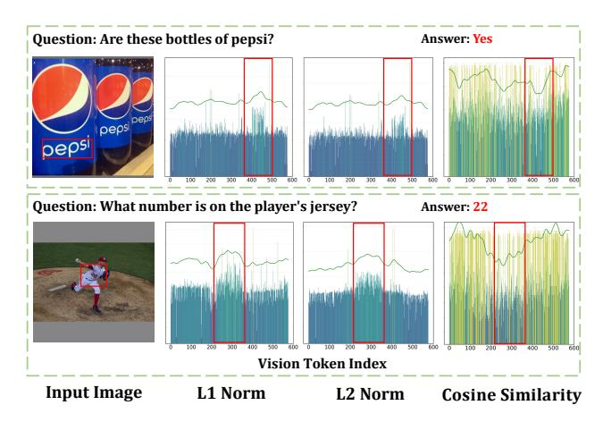
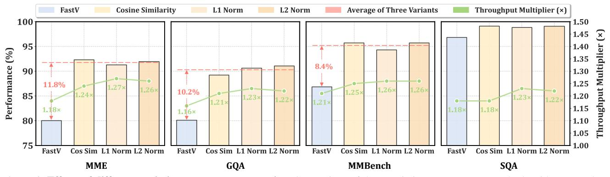
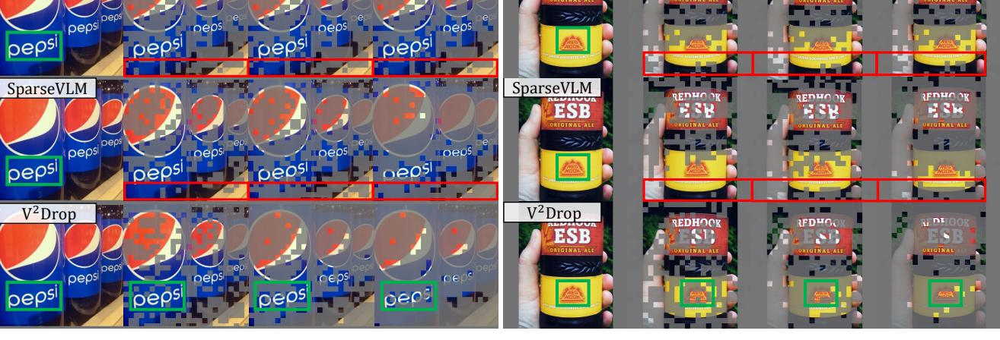
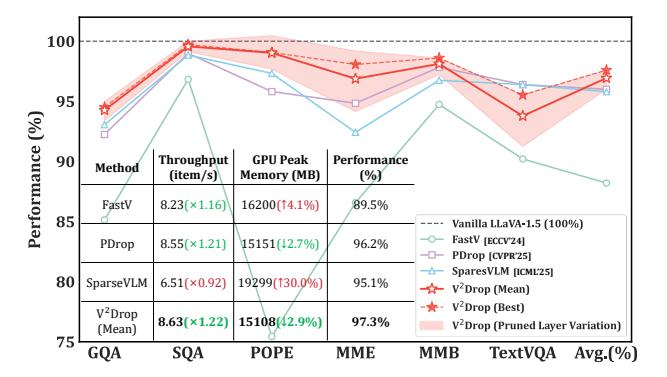
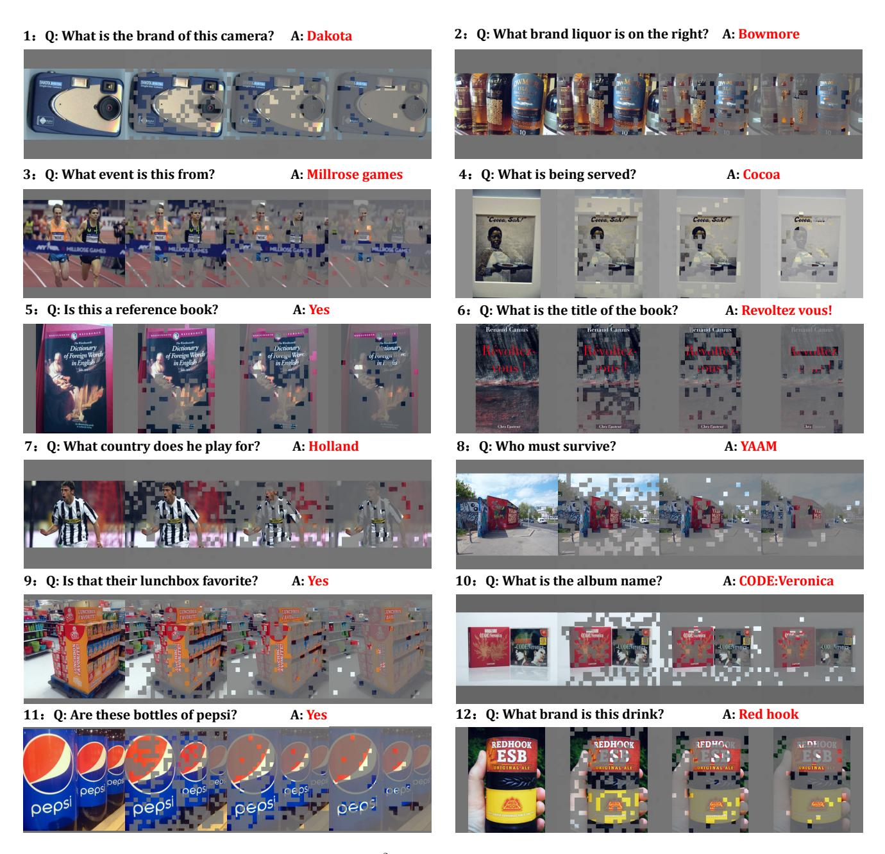

# Variation-aware Vision Token Dropping for Faster Large Vision-Language Models

<span id="page-0-1"></span>Junjie Chen<sup>1</sup><sup>∗</sup> , Xuyang Liu<sup>1</sup>∗,† , Zichen Wen<sup>2</sup> , Yiyu Wang<sup>2</sup> , Siteng Huang<sup>3</sup> , Honggang Chen<sup>1</sup>

<sup>1</sup> Sichuan University, <sup>2</sup> EPIC Lab, Shanghai Jiao Tong University, <sup>3</sup> Zhejiang University Code: <https://github.com/xuyang-liu16/V2Drop>

# Abstract

*Large vision-language models (LVLMs) have demonstrated remarkable capabilities in multimodal understanding tasks. However, the increasing demand for highresolution image and long-video understanding results in substantial token counts, consequently leading to reduced inference efficiency. Token compression offers a direct solution by reducing the number of tokens to be processed, thereby improving computational efficiency without architectural changes. Through extensive analysis, we identify two critical limitations in existing inner-LLM token compression methods: positional bias and incompatibility with efficient operators, which critically hinder their practical deployment for LVLM acceleration. This paper presents the first approach from a dynamic token variation perspective, revealing that visual token variations within LLMs exhibit task-agnostic properties. We propose Variationaware Vision Token Dropping (i.e., V* <sup>2</sup>*Drop), which progressively removes visual tokens with minimal variation during LVLM inference, thereby enhancing computational efficiency. Extensive experiments across multiple models and benchmarks consistently demonstrate that V*2*Drop maintains 94.0% and 98.6% of the original performance for image and video understanding tasks respectively, while reducing LLM generation latency by 31.5% and 74.2%.*

# 1. Introduction

Large vision-language models (LVLMs) have demonstrated remarkable capabilities in visual understanding and reasoning [\[17,](#page-8-0) [23,](#page-8-1) [36,](#page-9-0) [41\]](#page-9-1), excelling across diverse visionlanguage tasks. However, high-resolution image understanding [\[8,](#page-8-2) [13\]](#page-8-3) and long video comprehension [\[6,](#page-8-4) [45\]](#page-9-2) intro-

<span id="page-0-0"></span>

Figure 1. Performance-Efficiency trade-offs comparison. V <sup>2</sup>Drop achieves superior performance-efficiency trade-offs across both image and video understanding tasks.

duce substantial visual tokens that significantly reduce computational efficiency and hinder practical deployment [\[28\]](#page-9-3).

To address this challenge, numerous token compression methods have emerged to eliminate redundant visual tokens, enhancing LVLM efficiency while preserving performance [\[1,](#page-8-5) [5,](#page-8-6) [7,](#page-8-7) [39\]](#page-9-4). Methods that compress visual tokens within LLMs have gained particular attention due to their architecture-agnostic and plug-and-play nature [\[14,](#page-8-8) [24,](#page-9-5) [42,](#page-9-6) [46\]](#page-9-7). These approaches leverage LLM attention weights to selectively retain important visual tokens while pruning less significant ones, thereby accelerating inference. However, despite promising results, these methods face fundamental challenges that limit their practical deployment.

To investigate this phenomenon, we analyzed visual tokens retained by attention-guided methods (*e.g.*, FastV [\[5\]](#page-8-6), SparseVLM [\[46\]](#page-9-7)) and variation-aware evalu-

<sup>∗</sup> Equal contributions.  Corresponding author: Honggang Chen (honggang chen@scu.edu.cn). † Project leader: Xuyang Liu (seanleo666@gmail.com).

<span id="page-1-2"></span><span id="page-1-0"></span>

Figure 2. Attention-guided token evaluation vs. variation-aware token evaluation. Attention-guided methods (e.g., FastV [5], PDrop [42], SparseVLM [46]) exhibit information-agnostic positional bias, assigning high importance to later positions regardless of content (red arrows and boxes), and are incompatible with efficient operators. In contrast, measuring token-wise variation (e.g., L2 Norm) intuitively reflects token importance (green boxes) while maintaining compatibility with efficient operators. The red and green curves show the trends of attention scores and variation scores, respectively.

<span id="page-1-1"></span>

Figure 3. Analysis of the distribution of retained visual tokens with respect to token index positions. Visual tokens with larger indexes are located at the bottom of images. The probability denotes the chance of each token being retained during pruning.

ation (L2 Norm) using LLaVA-1.5-7B and Qwen2-VL-7B on TextVQA, POPE, and MME. Figure 2 illustrates this through a representative example, while Figure 3 provides quantitative evidence: attention-guided methods exhibit strong bias toward retaining tokens at the end of visual sequences regardless of content, while variation-aware evaluation produces naturally uniform spatial distributions.

This analysis reveals that existing attention-guided compression methods [42, 46] suffer from a fundamental flaw: relying on external attention signals rather than intrinsic token properties, leading to two critical issues: (i) Information-agnostic positional bias: These methods systematically assign high importance to later-positioned tokens regardless of visual content, retaining irrelevant information while discarding important tokens, thereby exacerbating multi-modal hallucinations. (ii) Incompatibility with efficient operators: Computing attention weights conflicts with efficient mechanisms attention (e.g., FlashAttention [10]), resulting in peak memory usage exceeding uncompressed models (Table 5). This raises a fundamental

question: Instead of relying on indirect attention signals, can we directly assess token importance through their intrinsic behavioral patterns within the model?.

To address this fundamental challenge, we propose a paradigm shift from external signal dependence to intrinsic property analysis. We present the **first** study from a **token variation** perspective, revealing that visual token variations within LLMs naturally encode importance information. Our key insight is that *lazy tokens*—those showing minimal variation across LLM layers—less likely to impact final predictions and can be safely removed without performance degradation. Based on this finding, we propose Variationaware Vision Token **Drop**ping (*i.e.*, V<sup>2</sup>**Drop**), which naturally avoids positional bias by focusing on intrinsic token dynamics and maintains full compatibility with efficient operators by eliminating attention weight computation.

Consequently,  $V^2$ Drop demonstrates outstanding performance and efficiency across both image and video understanding tasks, achieving  $1.30 \times$  and  $1.87 \times$  acceleration for image and video understanding, as shown in Figure 1. The main contributions are summarized as follows:

- Systematic Analysis of Token Variation Patterns: We conduct the first comprehensive analysis of visual token evolution within LVLMs, revealing that token-wise variation magnitudes correlate with task relevance and effectively reflect token importance, pioneering token compression from the variation perspective.
- Variation-aware Token Dropping: We propose V<sup>2</sup>Drop, a variation-aware compression method that identifies and progressively drops tokens based on their intrinsic behavioral patterns, eliminating positional bias while maintaining compatibility with efficient operators.
- Comprehensive Performance-Efficiency Trade-offs: Extensive experiments demonstrate that V<sup>2</sup>Drop achieves

<span id="page-2-2"></span><span id="page-2-1"></span>

Figure 4. Quantifying vision token variation with different metrics. Regions corresponding to the answer exhibit significant variation magnitudes (red boxes). The green curve shows the trends of variation scores.

exceptional performance across diverse LVLMs and VideoLLMs, with comprehensive analyses validating its robustness in balancing accuracy and efficiency.

#### 2. Related Work

Large Vision-Language Models. Large vision-language models (LVLMs) integrate a vision encoder (*i.e.*, ViT), projection module, and LLM for multi-modal comprehension [2, 8, 9, 22]. Recent work introduces higher-resolution inputs through dynamic cropping (*e.g.*, InternVL-3 [47], LLaVA-OneVision [17]) and native resolution methods (*e.g.*, Qwen2-VL [36], Seed1.5-VL [13]). Similarly, VideoLLMs process increasingly longer sequences (*e.g.*, LLaVA-Video [45], VideoLLaMA3 [44]), with VideoXL-Pro [25] achieving multi-hour frame-level understanding. However, this substantially increases visual tokens, introducing quadratic computational complexity, severely constraining scalability and practical deployment.

Token Compression for LVLMs. Token compression directly reduces sequence length to improve model efficiency [28, 33], evolving from training-aware paradigms [19, 40] to training-free methods [5] that enable plug-and-play LVLM inference acceleration. They can be categorized into two paradigms: (i) Pre-LLM compression [27, 31, 43], which compresses visual tokens before LLM, and (ii) Inner-LLM compression [42, 46], which performs compression during LLM forward propagation. However, most Inner-LLM methods rely on attention weights, making them incompatible with efficient operators like FlashAttention [10] and causing substantial memory increases for VideoLLMs [26, 32, 35, 37]. Additionally, they exhibit positional bias, favoring tokens near final positions regardless of semantic relevance [27, 38, 39].

In this work, we explore progressively dropping low-

variation vision tokens during LLM inference, maintaining compatibility with efficient operators while eliminating positional bias for training-free LVLM acceleration.

# 3. Methodology

### 3.1. Preliminary: LVLMs

**LVLM Architecture.** Most current LVLMs adopt the "ViT-Projector-LLM" paradigm [23, 36] comprising three key components. Given an image  $\mathbf{I} \in \mathbb{R}^{H \times W \times 3}$  or video  $\mathbf{V} = \left\{\mathbf{v}_i\right\}_{i=1}^T \in \mathbb{R}^{T \times H \times W \times 3}$ : (i) A visual encoder (ViT) first encodes the input into visual embeddings  $\mathbf{E} \in \mathbb{R}^{N \times D}$  for images or  $\mathbf{E} = \left\{\mathbf{e}_i\right\}_{i=1}^T \in \mathbb{R}^{T \times N \times D}$  for videos; (ii) A projector (typically a 2-layer MLP) transforms these embeddings into vision tokens  $\mathbf{F}^v \in \mathbb{R}^{M \times D'}$  for images or  $\mathbf{F}^v = \left\{\mathbf{f}_i^v\right\}_{i=1}^T \in \mathbb{R}^{T \times M \times D'}$  for videos, where  $M \leq N^1$ ; and (iii) An LLM decoder processes all visual and textual tokens  $\mathbf{F}^t$  during prefilling, then autoregressively generates response tokens during decoding:

$$p\left(\mathbf{Y} \mid \mathbf{F}^{v}, \mathbf{F}^{t}\right) = \prod_{j=1}^{L} p\left(\mathbf{y}_{j} \mid \mathbf{F}^{v}, \mathbf{F}^{t}, \mathbf{Y}_{1:j-1}\right), \quad (1)$$

where  $\mathbf{Y} = {\{\mathbf{y}_j\}}_{j=1}^L$  denotes the generated tokens.

#### 3.2. Token Variation in LVLMs

To overcome attention-guided limitations, we shift from external signals to intrinsic token properties. These fundamental limitations prompt us to reconsider the essence of token importance: what makes a vision token genuinely crucial for LLM visual understanding? Our key insight is that: tokens genuinely participating in LLM computation exhibit significant representational changes across layers, while less important tokens remain relatively static. We analyze the relationship between token variation magnitude and token importance to validate this hypothesis.

**Token Variation Metrics.** We measure token variation between consecutive LLM transformer layers using three metrics (*i.e.*, L1 Distance, L2 Distance, and Cosine Similarity):

$$\operatorname{Var}(\mathbf{f}_{i}^{(l-1)}, \mathbf{f}_{i}^{(l)}) = \begin{cases} \|\mathbf{f}_{i}^{(l)} - \mathbf{f}_{i}^{(l-1)}\|_{1} & \text{(L1 Distance)} \\ \|\mathbf{f}_{i}^{(l)} - \mathbf{f}_{i}^{(l-1)}\|_{2} & \text{(L2 Distance)} \\ 1 - \frac{\mathbf{f}_{i}^{(l)} \cdot \mathbf{f}_{i}^{(l-1)}}{\|\mathbf{f}_{i}^{(l)}\|_{2} \|\mathbf{f}_{i}^{(l-1)}\|_{2}} & \text{(Similarity)}, \end{cases}$$

where  $\mathbf{f}_i^{(l)}$  denotes the *i*-th vision token at layer *l*, and higher variation values indicate greater representational changes. Each metric captures distinct transformation patterns: L1 distance measures sparse changes, L2 distance

<span id="page-2-0"></span> $<sup>^{1}\</sup>mathrm{Some}$  LVLMs like LLaVA-1.5 maintain the same number of tokens (M=N) during projection, while others, particularly VideoLLMs, reduce the token count (M< N) for efficiency.

# **Large Language Model**

<span id="page-3-0"></span>

Figure 5. Overall framework of  $V^2$ Drop.  $V^2$ Drop measures token-wise variation across adjacent LLM layers and progressively drops vision tokens with minimal variation (*i.e.*, lazy tokens), thereby achieving plug-and-play LVLM inference acceleration.

captures overall magnitude, and cosine similarity reflects directional changes in the representation space.

Variation-Relevance Relationship. Figure 4 demonstrates token variation quantification across three metrics for visual tokens in the third transformer layer of LLaVA-1.5-7B. We observe a **consistent and crucial pattern**: tokens exhibiting significant variation (high L1/L2 distances, low cosine similarity) consistently correspond to question-relevant regions (red boxes), encoding rich semantic information essential for task completion. Conversely, tokens with minimal variation—termed *lazy tokens*—correspond to task-irrelevant regions with limited impact to final predictions

Importantly, Figure 4 presents two distinct cases where question-relevant regions appear in different spatial locations (bottom and center), corresponding to middle and posterior token positions. All three variation metrics accurately capture these semantically important regions regardless of spatial position, demonstrating the robustness of using token variation to measure token importance against positional bias. This spatial-agnostic detection capability represents a fundamental advantage over attentionguided approaches that suffer from positional bias.

These findings validate our core hypothesis: high-variation vision tokens actively participate in reasoning processes, encoding semantically crucial information that must be preserved for optimal performance. Conversely, lazy tokens maintain stable representations throughout LLM pro-

cessing, indicating limited contribution to final predictions.

#### 3.3. Variation-aware Vision Token Dropping

Building on this key insight, we propose Variation-aware Vision Token **Drop**ping ( $V^2$ **Drop**), a novel approach that progressively identify and efficiently drop lazy tokens by measuring vision token variation magnitudes in LLMs while preserving semantically important ones.

Given a sequence of vision tokens  $\mathbf{F}^v \in \mathbb{R}^{M \times D'}$  in the LLM, we adopt a *multi-stage progressive dropping* strategy as illustrated in Figure 5. We perform pruning at three strategically selected layers  $\mathcal L$  spanning shallow, middle, and deep stages of the LLM to balance compression efficiency and performance preservation across model depth. At each pruning layer  $l_k \in \mathcal L$ , our framework performs three key operations:

(i) Variation Computation: For each vision token  $\mathbf{f}_i^{(l_k)}$  at layer  $l_k$ , we compute variation scores by measuring representational changes from the previous layer  $l_k - 1$ :

$$\mathbf{S}^{(l_k)} = \{ \text{Var}(\mathbf{f}_i^{(l_k-1)}, \mathbf{f}_i^{(l_k)}) \}_{i=1}^{M_{l_k}},$$
(3)

where  $M_{l_k}$  is the number of vision tokens at layer  $l_k$ , where we empirically use L2 distance by default (ablation study of variation metrics is in Figure 6). This efficiently captures token evolution without attention weight re-computation.

(ii) Token Ranking and Selection: Vision tokens are ranked by variation scores in descending order, and we re-

tain the top- $K_{l_k}$  tokens with highest scores:

$$\hat{\mathbf{F}}_{l_k}^v = \text{TopK}(\mathbf{F}_{l_k}^v, \mathbf{S}^{(l_k)}, K_{l_k}). \tag{4}$$

This naturally filters out lazy tokens while preserving semantically important ones, avoiding positional bias.

(iii) Token Reorganization: The selected vision tokens are reorganized for subsequent layers, where  $K_{l_k} < M_{l_k}$  ensures progressive visual token dropping.

The dropping process follows a pre-defined schedule:

$$M \to K_a \to K_b \to K_c,$$
 (5)

where  $K_a$ ,  $K_b$ , and  $K_c$  are predefined compression targets adjustable for performance-efficiency trade-offs. Ablation studies show that V<sup>2</sup>Drop is robust to layer selection (Figure 8) and that progressive dropping significantly outperforms one-time dropping (Figure 9). Detailed experimental configurations are provided in the Appendix.

## 3.4. Theoretical Analysis

To validate our variation-aware token dropping strategy, we establish a theoretical connection between token variation magnitude and model output through first-order analysis.

#### 3.4.1. Problem Formulation

Let  $X^{(t)} = \{x_1^{(t)}, \dots, x_n^{(t)}\} \subset \mathbb{R}^d$  denote token representations at layer t. We define the **inter-layer variation** of token j as:

$$\Delta x_j^{(t)} = x_j^{(t+1)} - x_j^{(t)}. (6)$$

Let  $f:\mathbb{R}^{n\times d}\to\mathbb{R}^k$  map layer (t+1) representations to the final output. The Jacobian with respect to token j is:

$$J_j = \frac{\partial f}{\partial x_j^{(t+1)}} \in \mathbb{R}^{k \times d}.$$
 (7)

#### 3.4.2. Variation-Impact Theorem

**Theorem 1.** Under mild smoothness assumptions on f, the output change induced by token j satisfies:

$$\|\Delta f_j\| \approx \|J_j\|_{\text{op}} \cdot \|\Delta x_j^{(t)}\|, \tag{8}$$

where  $\Delta f_j$  denotes the output change when only token j varies from layer t to t+1, and  $\|\cdot\|_{\text{op}}$  is the operator norm.

**Proof.** By first-order Taylor expansion around  $x_j^{(t)}$ :

$$f(\dots, x_j^{(t+1)}, \dots) = f_j^{(t)} + J_j \, \Delta x_j^{(t)} + \mathcal{O}(\|\Delta x_j^{(t)}\|^2)$$
  
=  $f_j^{(t)} + J_j \, \Delta x_j^{(t)} + R_j$ , (9)

where  $f_j^{(t)} = f(\dots, x_j^{(t)}, \dots)$  and  $R_j$  denotes the higher-order remainder term satisfying  $||R_j|| = \mathcal{O}(||\Delta x_j^{(t)}||^2)$ .

Taking norms on both sides and applying the triangle inequality:

$$\|\Delta f_j\| = \|f(\dots, x_j^{(t+1)}, \dots) - f(\dots, x_j^{(t)}, \dots)\|$$

$$\leq \|J_j \cdot \Delta x_j^{(t)}\| + \|R_j\|. \tag{10}$$

By the definition of operator norm:

$$||J_j \cdot \Delta x_j^{(t)}|| \le ||J_j||_{\text{op}} \cdot ||\Delta x_j^{(t)}||.$$
 (11)

For sufficiently small  $\|\Delta x_j^{(t)}\|$  (typically satisfied in deep networks with residual connections where layer-wise changes are bounded), the quadratic term  $\|R_j\|$  is negligible compared to the linear term. Thus:

$$\|\Delta f_j\| \approx \|J_j\|_{\text{op}} \cdot \|\Delta x_j^{(t)}\|. \tag{12}$$

(Appendix for full proof.)

#### 3.4.3. Implications

**Corollary.** Under the assumptions of Theorem 1, larger variation  $\|\Delta x_j^{(t)}\|$  implies greater output influence, providing a computationally efficient proxy for token importance.

**Proof.** For tokens with  $||J_j||_{op} \ge \mu > 0$ , substituting into the theorem yields:

$$\|\Delta f_j\| \gtrsim \mu \cdot \|\Delta x_j^{(t)}\|. \tag{13}$$

Therefore, tokens with larger  $\|\Delta x_j^{(t)}\|$  induce proportionally larger output changes. (Appendix for full proof.)

## 4. Experiments

**Experiment Setting.** We conduct comprehensive on various LVLMs and VideoLLMs across ten diverse benchmarks, with implementation details in the Appendix.

Computational Overhead. We prune at three layers. Computing L2 distances for M tokens of dimension D' requires 3MD' FLOPs ( $\sim$ 7M for M=576, D'=4096 in LLaVA-1.5), only 0.022% of a single attention layer (32B FLOPs). The total overhead across three layers ( $\sim$ 21M FLOPs) is merely 0.002% of the full forward pass. Table 5 confirms this negligible cost:  $V^2$ Drop and random dropping achieve nearly identical throughput (9.01 vs 9.08 items/s).

## 4.1. Main Comparisons

**Image Understanding.** Table 1 compares V<sup>2</sup>Drop with existing methods across multiple benchmarks using LLaVA-1.5-7B at different retention ratios. The upper section of Table 5 presents the inference efficiency of V<sup>2</sup>Drop on LLaVA-1.5-7B. Considering both performance and efficiency, our analysis reveals three key findings: (i) **State-of-the-art Performance:** With only 192 tokens retained

<span id="page-5-4"></span><span id="page-5-0"></span>

| Methods                           | GQA                                       | SQA  | TextVQA     | POPE        | MME  | MMBench | Average |  |  |  |
|-----------------------------------|-------------------------------------------|------|-------------|-------------|------|---------|---------|--|--|--|
| Upper Bound, 576 Tokens (1        | 00%)                                      |      |             |             |      |         |         |  |  |  |
| LLaVA-1.5-7B [21]                 | 61.9                                      | 69.5 | 58.2        | 85.9        | 1862 | 64.6    | 100.0%  |  |  |  |
|                                   | Average Retain 192 Tokens (\\dot 66.7\%)  |      |             |             |      |         |         |  |  |  |
| ToMe[ICLR'23]                     | 54.3                                      | 65.2 | 52.1        | 72.4        | 1563 | 60.5    | 88.8%   |  |  |  |
| FastV [ECCV'24]                   | 52.7                                      | 67.3 | 52.5        | 64.8        | 1612 | 61.2    | 88.2%   |  |  |  |
| HiRED[AAAI'25]                    | 58.7                                      | 68.4 | 47.4        | 82.8        | 1737 | 62.8    | 93.6%   |  |  |  |
| LLaVA-PruMerge [ICCV'25]          | 54.3                                      | 67.9 | 54.3        | 71.3        | 1632 | 59.6    | 90.3%   |  |  |  |
| SparseVLM[ICML'25]                | 57.6                                      | 69.1 | <b>56.1</b> | 83.6        | 1721 | 62.5    | 95.9%   |  |  |  |
| PDrop[CVPR'25]                    | 57.1                                      | 68.8 | 56.1        | 82.3        | 1766 | 63.2    | 96.0%   |  |  |  |
| ${\bf V}^2{\bf Drop}$             | 58.5                                      | 69.3 | 55.6        | 85.1        | 1826 | 63.7    | 97.6%   |  |  |  |
|                                   | Average Retain 128 Tokens (\$\psi 77.8\%) |      |             |             |      |         |         |  |  |  |
| ToMe[ICLR'23]                     | 52.4                                      | 59.6 | 49.1        | 62.8        | 1343 | 53.3    | 80.4%   |  |  |  |
| FastV [ECCV'24]                   | 49.6                                      | 60.2 | 50.6        | 59.6        | 1490 | 56.1    | 81.7%   |  |  |  |
| HiRED[AAAI'25]                    | 57.2                                      | 68.1 | 46.1        | 79.8        | 1710 | 61.5    | 91.6%   |  |  |  |
| LLaVA-PruMerge[ICCV'25]           | 53.3                                      | 67.1 | 54.3        | 67.2        | 1554 | 58.1    | 87.9%   |  |  |  |
| SparseVLM[ICML'25]                | 56.0                                      | 67.1 | 54.9        | 80.5        | 1696 | 60.0    | 93.2%   |  |  |  |
| PDrop[cvpr'25]                    | 56.0                                      | 68.3 | 54.8        | 82.3        | 1644 | 61.1    | 93.6%   |  |  |  |
| ${\bf V}^2{\bf Drop}$             | 56.3                                      | 68.8 | 53.8        | 80.9        | 1712 | 61.8    | 94.0%   |  |  |  |
| Average Retain 64 Tokens (↓88.9%) |                                           |      |             |             |      |         |         |  |  |  |
| ToMe[ICLR'23]                     | 48.6                                      | 50.0 | 45.3        | 52.5        | 1138 | 43.7    | 69.7%   |  |  |  |
| FastV [ECCV'24]                   | 46.1                                      | 51.1 | 47.8        | 48.0        | 1256 | 48.0    | 71.3%   |  |  |  |
| LLaVA-PruMerge[ICCV'25]           | 51.9                                      | 68.1 | 54.0        | 65.3        | 1549 | 55.2    | 86.5%   |  |  |  |
| SparseVLM[ICML'25]                | 52.7                                      | 62.2 | 51.8        | <b>75.1</b> | 1505 | 56.2    | 86.5%   |  |  |  |
| PDrop[CVPR'25]                    | 41.9                                      | 68.6 | 45.9        | 55.9        | 1092 | 33.3    | 70.1%   |  |  |  |
| ${\bf V}^2{\bf Drop}$             | 50.5                                      | 68.9 | 51.8        | 75.1        | 1470 | 55.2    | 86.9%   |  |  |  |

Table 1. Comparison with other token compression methods with LLaVA-1.5-7B across image understanding benchmarks. "Average" shows the mean performance across benchmarks at different retention ratios, with best results highlighted.

<span id="page-5-1"></span>

| Methods                                                   | AI2D                        | MMStar                      | SQA                         | POPE                        | MME                         | MMB                         | Avg.                           |  |  |  |
|-----------------------------------------------------------|-----------------------------|-----------------------------|-----------------------------|-----------------------------|-----------------------------|-----------------------------|--------------------------------|--|--|--|
| Upper Bound, All To<br>Qwen2-VL-7B [36]                   |                             |                             | 84.7                        | 86.1                        | 2317                        | 80.5                        | 100.0%                         |  |  |  |
|                                                           | Token Reduction (↓66.7%)    |                             |                             |                             |                             |                             |                                |  |  |  |
| FastV[ECCV'24]<br>DART[EMNLP'25]<br>V <sup>2</sup> Drop   | 76.1<br>78.0<br><b>78.0</b> | 52.8<br>53.4<br><b>53.5</b> | 80.0<br>81.4<br><b>81.6</b> | 82.1<br>83.9<br><b>87.2</b> | 2130<br><b>2245</b><br>2224 | 76.1<br><b>78.9</b><br>78.7 | 92.9%<br>95.5%<br><b>96.0%</b> |  |  |  |
| Token Reduction(↓77.8%)                                   |                             |                             |                             |                             |                             |                             |                                |  |  |  |
| FastV [ECCV'24]<br>DART [EMNLP'25]<br>V <sup>2</sup> Drop | 73.8<br>74.4<br><b>75.6</b> | <b>49.3</b> 48.5 48.7       | 78.3<br><b>79.6</b><br>78.9 | 79.2<br>82.1<br><b>85.1</b> | 2031<br><b>2175</b><br>2173 | 74.1<br>77.3<br><b>75.8</b> | 89.5%<br>91.8%<br><b>92.3%</b> |  |  |  |

Table 2. Comparison with Qwen2-VL-7B across multiple image understanding benchmarks.

<span id="page-5-2"></span>

| Methods                                                   | MVBench                     |                             | Avg.                        |                             |                             |                                |  |  |
|-----------------------------------------------------------|-----------------------------|-----------------------------|-----------------------------|-----------------------------|-----------------------------|--------------------------------|--|--|
|                                                           |                             | Overall                     | Short                       | Medium                      | Long                        |                                |  |  |
| Upper Bound, All To<br>Qwen2-VL-7B [36]                   | kens (100%)<br>66.1         | 57.7                        | 70.4                        | 54.6                        | 48.0                        | 100.0%                         |  |  |
| Average Retention Ratio = 20%                             |                             |                             |                             |                             |                             |                                |  |  |
| FastV [ECCV'24]<br>DART [EMNLP'25]<br>V <sup>2</sup> Drop | 50.9<br>58.9<br><b>62.1</b> | 49.4<br>53.0<br><b>53.5</b> | 58.2<br><b>64.1</b><br>63.7 | 45.7<br>49.4<br><b>51.0</b> | 44.4<br>45.4<br><b>45.9</b> | 81.3%<br>90.5%<br><b>93.3%</b> |  |  |

Table 3. Performance comparison with Qwen2-VL-7B across video understanding benchmarks.

(66.7% reduction),  $V^2Drop$  achieves an impressive average performance of **97.6%**, substantially outperforming the second-best method PDrop by **1.6%**. Even under more aggressive reduction ratios,  $V^2Drop$  maintains competi-

<span id="page-5-3"></span>

| Methods                                                                                               | MVBench                                     |                                             | VideoMME                                    |                                             |                                             |                                                  |  |  |  |
|-------------------------------------------------------------------------------------------------------|---------------------------------------------|---------------------------------------------|---------------------------------------------|---------------------------------------------|---------------------------------------------|--------------------------------------------------|--|--|--|
|                                                                                                       |                                             | Overall                                     | Short                                       | Medium                                      | Long                                        | Avg.                                             |  |  |  |
| Upper Bound, All Token<br>LLaVA-OV-7B [17]                                                            | ns (100%)<br>56.9                           | 58.5                                        | 70.0                                        | 56.6                                        | 48.9                                        | 100.0%                                           |  |  |  |
|                                                                                                       | Average Rete                                | ntion Ra                                    | tio = 30                                    | 0%                                          |                                             |                                                  |  |  |  |
| DyCoke[CVPR'25]                                                                                       | 56.6                                        | 56.1                                        | 67.1                                        | 54.6                                        | 46.6                                        | 97.7%                                            |  |  |  |
| Average Retention Ratio = 25%                                                                         |                                             |                                             |                                             |                                             |                                             |                                                  |  |  |  |
| FastV [ECCV'24]<br>Sparse VLM [ICML'25]<br>PDrop [CVPR'25]<br>DyCoke [CVPR'25]<br>V <sup>2</sup> Drop | 55.5<br>56.3<br>55.3<br>49.5<br><b>56.4</b> | 55.3<br>57.3<br>55.5<br>51.0<br><b>57.4</b> | 65.0<br>68.4<br>64.7<br>61.1<br><b>68.2</b> | 53.8<br>55.2<br>53.1<br>48.6<br><b>54.6</b> | 47.0<br>48.1<br>48.7<br>43.2<br><b>49.6</b> | 96.0%<br>98.4%<br>96.0%<br>87.1%<br><b>98.6%</b> |  |  |  |
|                                                                                                       | Average Retention Ratio = 15%               |                                             |                                             |                                             |                                             |                                                  |  |  |  |
| FastV[ECCV'24]<br>SparseVLM[ICML'25]<br>PDrop[CVPR'25]<br><b>V</b> <sup>2</sup> <b>Drop</b>           | 51.6<br>52.9<br>53.2<br><b>53.9</b>         | 48.1<br>53.4<br>50.1<br><b>54.4</b>         | 51.4<br>61.0<br>58.7<br><b>64.1</b>         | 49.4<br>52.1<br>48.7<br><b>51.4</b>         | 43.3<br>47.0<br>45.0<br><b>47.7</b>         | 86.5%<br>92.1%<br>89.6%<br><b>93.9</b> %         |  |  |  |

Table 4. Performance comparison with LLaVA-OV-7B across video understanding benchmarks.

tive performance. (ii) Efficient Operator Compatibility:  $V^2Drop$  eliminates explicit attention score computation, enabling seamless integration with Flash Attention [10]. Without introducing additional memory overhead,  $V^2Drop$  achieves peak memory usage and total latency comparable to random token dropping. (iii) Seamless Scalability to Advanced Models: As shown in Table 2,  $V^2Drop$  consistently outperforms FastV and DART across nearly all

<span id="page-6-1"></span><span id="page-6-0"></span>

| Methods                                                                                              | LLM Generation↓<br>Latency (s)                                                            | Model Generation↓<br>Latency (s)                                                                      | Total Latency↓<br>(min:sec)                                                                                        | GPU Peak↓<br>Memory (MB)                                                                    | Throughput↑ (item/s)                                                                 | Performance <sup>↑</sup>                                                            |
|------------------------------------------------------------------------------------------------------|-------------------------------------------------------------------------------------------|-------------------------------------------------------------------------------------------------------|--------------------------------------------------------------------------------------------------------------------|---------------------------------------------------------------------------------------------|--------------------------------------------------------------------------------------|-------------------------------------------------------------------------------------|
| Upper Bound, 576 To<br>LLaVA-1.5-7B [21]                                                             | <b>kens (100%)</b><br>400                                                                 | 558                                                                                                   | 10:14                                                                                                              | 15566                                                                                       | 7.13                                                                                 | 64.6                                                                                |
| Random                                                                                               | 270.4(\132.4%)                                                                            | 425.9(\\23.7\%)                                                                                       | 8:02(\121.5%)                                                                                                      | 15045 (\$\dagger 3.3\%)                                                                     | 9.08 (↑1.27×)                                                                        | 59.1 (91.5%)                                                                        |
| FastV [ECCV'24]<br>Sparse VLM [ICML'25]<br>PDrop [CVPR'25]<br>V <sup>2</sup> Drop                    | 294.0(\(\pm26.5\%)\) 288.2(\(\pm28.0\%)\) 279.6(\(\pm30.1\%)\) 273.9(\(\pm30.5\%)\)       | 449.7 (\pm 19.4%)<br>443.5 (\pm 20.5%)<br>429.7 (\pm 23.0%)<br><b>429.3</b> (\pm 23.1%)               | 8:26(\pmu17.6%)<br>8:20(\pmu18.6%)<br>8:09(\pmu20.3%)<br>8:06(\pmu20.8%)                                           | 16139(†3.7%)<br>19229(†23.5%)<br>15197(↓2.3%)<br><b>15046</b> (↓3.3%)                       | 8.65 (†1.21×)<br>8.75 (†1.23×)<br>8.95 (†1.25×)<br><b>9.01</b> (†1.26×)              | 56.1 (86.8%)<br>60.0 (92.9%)<br>61.1 (94.6%)<br><b>61.8</b> (95.7%)                 |
| Upper Bound, All Tok<br>LLaVA-OV-7B [17]                                                             | ens (100%)<br>752.2                                                                       | 1201.6                                                                                                | 32:02                                                                                                              | 17686                                                                                       | 0.52                                                                                 | 56.9                                                                                |
| Random                                                                                               | 190.9(\174.6%)                                                                            | 639.0(\.46.8%)                                                                                        | 23:09(\\27.7%)                                                                                                     | 16298 (\$\psi.8\%)                                                                          | 0.72(\pm1.38\times)                                                                  | 54.6(96.0%)                                                                         |
| FastV [ECCV'24]<br>SparseVLM [ICML'25]<br>PDrop [CVPR'25]<br>DyCoke [CVPR'25]<br>V <sup>2</sup> Drop | 315.9(↓58.0%)<br>493.8(↓34.4%)<br>256.3(↓65.9%)<br>249.2(↓66.7%)<br><b>193.8</b> (↓74.2%) | 781.1 (\pm 35.0%)<br>960.9 (\pm 20.0%)<br>719.0 (\pm 40.2%)<br>713.5 (\pm 40.6%)<br>642.4 (\pm 46.5%) | 25:05(\\dagger1.7%)<br>30:12(\\dagger5.7%)<br>23:18(\\dagger27.3%)<br>23:25(\\dagger26.9%)<br>23:13(\\dagger27.5%) | 24619 (†39.2%)<br>27378 (†54.8%)<br>24371 (†37.8%)<br>16298 (↓7.8%)<br><b>16298</b> (↓7.8%) | 0.67(†1.29×)<br>0.55(†1.06×)<br>0.71(†1.36×)<br>0.71(†1.36×)<br><b>0.72</b> (†1.38×) | 55.5 (97.5%)<br>56.4 (99.1%)<br>55.3 (97.2%)<br>49.5 (87.0%)<br><b>56.4</b> (99.1%) |

Table 5. **Efficiency comparison on image/video understanding.** We measure: (1) LLM Generation Latency: LLM-only response time; (2) Model Generation Latency: full model response time; (3) Total Latency: time to complete MMBench/MVBench on LLaVA-1.5-7B/LLaVA-OV-7B; (4) Throughput: samples processed per second.

benchmarks on Qwen2-VL [36] under different configurations, demonstrating effectiveness at high resolutions and compatibility with variable-resolution inputs.

**Video Understanding.** We further extend V<sup>2</sup>Drop to video understanding using LLaVA-OV-7B and Qwen2-VL-7B. Table 3 and Table 4 compare V<sup>2</sup>Drop with state-of-the-art token compression methods across multiple benchmarks, while the lower section of Table 5 reports inference efficiency. Our analysis reveals three key findings: (i) Superior **Performance:** V<sup>2</sup>Drop outperforms all competing methods across all benchmarks on LLaVA-OV and Qwen2-VL, achieving 98.6% of original performance with only 25% token retention, surpassing DyCoke (97.7% with 30% tokens). At aggressive compression (R = 15%), V<sup>2</sup>Drop maintains exceptional robustness while baseline methods degrade significantly. (ii) Excellence in Long Video Un**derstanding:** V<sup>2</sup>Drop significantly outperforms baselines on long video tasks such as VideoMME (Long) by mitigating positional bias problem, where VideoLLMs disproportionately focus on later-frame tokens. (iii) Superior Inference Efficiency: V<sup>2</sup>Drop maintains high throughput while reducing GPU peak memory. In contrast, we surprisingly find that SparseVLM increases peak memory by 54.8% on MVBench due to its merging strategy and explicit attention computation, greatly elevating computational costs, while our V<sup>2</sup>Drop inherently avoids such operations.

# 4.2. Ablation Study

**Effects of Variation Metric.** Figure 6 presents a analysis of three variation metrics against FastV across multiple benchmarks. All three metrics—Cosine Similarity, L1 Norm, and L2 Norm—outperform FastV in average performance, validating the robustness of variation-based dropping strategies.

Furthermore, all metrics demonstrate notable improvements in inference throughput, with L2 Norm achieving the optimal balance between performance and efficiency.

Effects of Token Dropping across Different Layers. We investigate the effects of token dropping across different LLM transformer layers. As shown in Figure 8, V<sup>2</sup>Drop achieves 97.3% of vanilla performance on average across all benchmarks and consistently outperforms FastV and SparseVLM under varying dropping layers. Furthermore, V<sup>2</sup>Drop exhibits superior inference efficiency, delivering substantial throughput improvements and GPU peak memory reduction while maintaining competitive performance.

Effects of Progressive Token Dropping. We investigate the impact of two token pruning strategies on V<sup>2</sup>Drop: progressive dropping and one-time dropping. As shown in Figure 9, progressive dropping outperforms one-time dropping, achieving gains of 5.9% and 9.3% on MME and POPE, respectively. These results validate that progressive dropping more effectively preserves visual information through gradual selection, mitigating the risk of prematurely discarding important features while reducing computational overhead.

#### 4.3. Visualizations

Figure 7 illustrates token compression effects on TextVQA. From left to right, we visualize results after pruning at different layers. FastV employs one-time dropping, retaining redundant tokens in subsequent layers. SparseVLM adopts progressive dropping but exhibits positional bias, preferentially retaining later-sequence tokens and causing information loss. In contrast, V<sup>2</sup>Drop preserves critical tokens based on variation, progressively selecting semantically important regions while avoiding positional bias.

<span id="page-7-0"></span>

Figure 6. Effects of different variation measurement metrics. Comparison of three variation measurement methods with FastV when retaining 128 tokens on LLaVA-1.5-7B across different datasets. The red line represents the average performance gap between the three strategies and FastV, while the green line shows throughput.

<span id="page-7-3"></span>Question1: "Are these bottles of pepsi?"

FastV

Answer1: "**Yes**"

Answer2: "**REDHOOK**" SparseVLM FastV

Question2: "What brand is this drink?"



Figure 7. Visualization of token compression. Rows 1, Rows 2 and Rows 3 present compressed results from FastV, SparseVLM and our V <sup>2</sup>Drop respectively, where grey masks indicate discarded tokens.

<span id="page-7-1"></span>

Figure 8. Effects of token dropping across layers. Performance with 192 retained tokens on LLaVA-1.5-7B across datasets, and efficiency analysis on MMB.

<span id="page-7-2"></span>

Figure 9. Effects of progressive token dropping. Performance with 192 retained tokens on LLaVA-1.5-7B.

# 5. Conclusion

Large vision-language models (LVLMs) require substantial computational resources due to extensive visual tokens during inference. Existing compression methods often rely on attention weights or introduce positional bias, limiting their effectiveness and compatibility with efficient operators. We present V2Drop, a novel method addressing these limitations through a token variation perspective. We reveal that visual token variations exhibit task-agnostic properties, enabling compression without attention weights or positional bias. V2Drop progressively removes minimalvariation tokens, maintaining compatibility with efficient operators while achieving significant computational savings. Experiments demonstrate V2Drop effectively balances performance and efficiency across benchmarks.

# References

- <span id="page-8-5"></span>[1] Kazi Hasan Ibn Arif, JinYi Yoon, Dimitrios S Nikolopoulos, Hans Vandierendonck, Deepu John, and Bo Ji. Hired: Attention-guided token dropping for efficient inference of high-resolution vision-language models in resourceconstrained environments. In *AAAI*, 2025. [1](#page-0-1)
- <span id="page-8-10"></span>[2] Jinze Bai, Shuai Bai, Shusheng Yang, Shijie Wang, Sinan Tan, Peng Wang, Junyang Lin, Chang Zhou, and Jingren Zhou. Qwen-VL: A frontier large vision-language model with versatile abilities. *arXiv preprint arXiv:2308.12966*, 2023. [3](#page-2-2)
- <span id="page-8-22"></span>[3] Daniel Bolya, Cheng-Yang Fu, Xiaoliang Dai, Peizhao Zhang, Christoph Feichtenhofer, and Judy Hoffman. Token merging: Your ViT but faster. In *ICLR*, 2023. [1](#page-0-1)
- <span id="page-8-19"></span>[4] Lin Chen, Jinsong Li, Xiaoyi Dong, Pan Zhang, Yuhang Zang, Zehui Chen, Haodong Duan, Jiaqi Wang, Yu Qiao, Dahua Lin, and Feng Zhao. Are we on the right way for evaluating large vision-language models? In *NeurIPS*, 2024. [1](#page-0-1)
- <span id="page-8-6"></span>[5] Liang Chen, Haozhe Zhao, Tianyu Liu, Shuai Bai, Junyang Lin, Chang Zhou, and Baobao Chang. An image is worth 1/2 tokens after layer 2: Plug-and-play inference acceleration for large vision-language models. In *ECCV*, 2024. [1,](#page-0-1) [2,](#page-1-2) [3](#page-2-2)
- <span id="page-8-4"></span>[6] Yukang Chen, Fuzhao Xue, Dacheng Li, Qinghao Hu, Ligeng Zhu, Xiuyu Li, Yunhao Fang, Haotian Tang, Shang Yang, Zhijian Liu, et al. Longvila: Scaling long-context visual language models for long videos. *arXiv preprint arXiv:2408.10188*, 2024. [1](#page-0-1)
- <span id="page-8-7"></span>[7] Yuan Chen, Zichen Wen, Yuzhou Wu, Xuyang Liu, Shuang Chen, Junpeng Ma, Weijia Li, Conghui He, and Linfeng Zhang. Ipcv: Information-preserving compression for mllm visual encoders. *arXiv preprint arXiv:2512.18747*, 2025. [1](#page-0-1)
- <span id="page-8-2"></span>[8] Zhe Chen, Weiyun Wang, Hao Tian, Shenglong Ye, Zhangwei Gao, Erfei Cui, Wenwen Tong, Kongzhi Hu, Jiapeng Luo, Zheng Ma, Ji Ma, Jiaqi Wang, Xiaoyi Dong, Hang Yan, Hewei Guo, Conghui He, Botian Shi, Zhenjiang Jin, Chao Xu, Bin Wang, Xingjian Wei, Wei Li, Wenjian Zhang, Bo Zhang, Pinlong Cai, Licheng Wen, Xiangchao Yan, Min Dou, Lewei Lu, Xizhou Zhu, Tong Lu, Dahua Lin, Yu Qiao, Jifeng Dai, and Wenhai Wang. How far are we to gpt-4v? closing the gap to commercial multimodal models with opensource suites. *arXiv preprint arXiv:2404.16821*, 2024. [1,](#page-0-1) [3](#page-2-2)

- <span id="page-8-11"></span>[9] Wenliang Dai, Junnan Li, Dongxu Li, Anthony Meng Huat Tiong, Junqi Zhao, Weisheng Wang, Boyang Li, Pascale Fung, and Steven C. H. Hoi. InstructBLIP: Towards generalpurpose vision-language models with instruction tuning. In *NeurIPS*, 2023. [3](#page-2-2)
- <span id="page-8-9"></span>[10] Tri Dao. Flashattention-2: Faster attention with better parallelism and work partitioning. In *ICLR*, 2024. [2,](#page-1-2) [3,](#page-2-2) [6](#page-5-4)
- <span id="page-8-16"></span>[11] Chaoyou Fu, Peixian Chen, Yunhang Shen, Yulei Qin, Mengdan Zhang, Xu Lin, Zhenyu Qiu, Wei Lin, Jinrui Yang, Xiawu Zheng, Ke Li, Xing Sun, and Rongrong Ji. MME: A comprehensive evaluation benchmark for multimodal large language models. *arXiv preprint arXiv:2306.13394*, 2023. [1](#page-0-1)
- <span id="page-8-21"></span>[12] Chaoyou Fu, Yuhan Dai, Yongdong Luo, Lei Li, Shuhuai Ren, Renrui Zhang, Zihan Wang, Chenyu Zhou, Yunhang Shen, Mengdan Zhang, et al. Video-mme: The first-ever comprehensive evaluation benchmark of multi-modal llms in video analysis. *arXiv preprint arXiv:2405.21075*, 2024. [1](#page-0-1)
- <span id="page-8-3"></span>[13] Dong Guo, Faming Wu, Feida Zhu, Fuxing Leng, Guang Shi, Haobin Chen, Haoqi Fan, Jian Wang, Jianyu Jiang, Jiawei Wang, et al. Seed1. 5-vl technical report. *arXiv preprint arXiv:2505.07062*, 2025. [1,](#page-0-1) [3](#page-2-2)
- <span id="page-8-8"></span>[14] Yuhang Han, Xuyang Liu, Zihan Zhang, Pengxiang Ding, Junjie Chen, Donglin Wang, Honggang Chen, Qingsen Yan, and Siteng Huang. Filter, correlate, compress: Trainingfree token reduction for mllm acceleration. *arXiv preprint arXiv:2411.17686*, 2024. [1](#page-0-1)
- <span id="page-8-15"></span>[15] Drew A. Hudson and Christopher D. Manning. GQA: A new dataset for real-world visual reasoning and compositional question answering. In *CVPR*, pages 6700–6709, 2019. [1](#page-0-1)
- <span id="page-8-18"></span>[16] Aniruddha Kembhavi, Mike Salvato, Eric Kolve, Minjoon Seo, Hannaneh Hajishirzi, and Ali Farhadi. A diagram is worth a dozen images. In *Computer Vision–ECCV 2016: 14th European Conference, Amsterdam, The Netherlands, October 11–14, 2016, Proceedings, Part IV 14*, pages 235– 251. Springer, 2016. [1](#page-0-1)
- <span id="page-8-0"></span>[17] Bo Li, Yuanhan Zhang, Dong Guo, Renrui Zhang, Feng Li, Hao Zhang, Kaichen Zhang, Yanwei Li, Ziwei Liu, and Chunyuan Li. Llava-onevision: Easy visual task transfer. *arXiv preprint arXiv:2408.03326*, 2024. [1,](#page-0-1) [3,](#page-2-2) [6,](#page-5-4) [7](#page-6-1)
- <span id="page-8-20"></span>[18] Kunchang Li, Yali Wang, Yinan He, Yizhuo Li, Yi Wang, Yi Liu, Zun Wang, Jilan Xu, Guo Chen, Ping Luo, et al. Mvbench: A comprehensive multi-modal video understanding benchmark. In *CVPR*, pages 22195–22206, 2024. [1](#page-0-1)
- <span id="page-8-13"></span>[19] Wentong Li, Yuqian Yuan, Jian Liu, Dongqi Tang, Song Wang, Jianke Zhu, and Lei Zhang. TokenPacker: Efficient visual projector for multimodal LLM. *arXiv preprint arXiv:2407.02392*, 2024. [3](#page-2-2)
- <span id="page-8-17"></span>[20] Yifan Li, Yifan Du, Kun Zhou, Jinpeng Wang, Wayne Xin Zhao, and Ji-Rong Wen. Evaluating object hallucination in large vision-language models. pages 292–305, 2023. [1](#page-0-1)
- <span id="page-8-14"></span>[21] Haotian Liu, Chunyuan Li, Qingyang Wu, and Yong Jae Lee. Visual instruction tuning. 2023. [6,](#page-5-4) [7](#page-6-1)
- <span id="page-8-12"></span>[22] Haotian Liu, Chunyuan Li, Qingyang Wu, and Yong Jae Lee. Visual instruction tuning. In *NeurIPS*, pages 34892–34916, 2023. [3](#page-2-2)
- <span id="page-8-1"></span>[23] Haotian Liu, Chunyuan Li, Yuheng Li, and Yong Jae Lee. Improved baselines with visual instruction tuning. In *CVPR*, pages 26286–26296, 2024. [1,](#page-0-1) [3](#page-2-2)

- <span id="page-9-5"></span>[24] Xuyang Liu, Xiyan Gui, Yuchao Zhang, and Linfeng Zhang. Mixing importance with diversity: Joint optimization for kv cache compression in large vision-language models. *arXiv preprint arXiv:2510.20707*, 2025. [1](#page-0-1)
- <span id="page-9-10"></span>[25] Xiangrui Liu, Yan Shu, Zheng Liu, Ao Li, Yang Tian, and Bo Zhao. Video-xl-pro: Reconstructive token compression for extremely long video understanding. *arXiv preprint arXiv:2503.18478*, 2025. [3](#page-2-2)
- <span id="page-9-16"></span>[26] Xuyang Liu, Yiyu Wang, Junpeng Ma, and Linfeng Zhang. Video compression commander: Plug-and-play inference acceleration for video large language models. *arXiv preprint arXiv:2505.14454*, 2025. [3](#page-2-2)
- <span id="page-9-13"></span>[27] Xuyang Liu, Ziming Wang, Junjie Chen, Yuhang Han, Yingyao Wang, Jiale Yuan, Jun Song, Linfeng Zhang, Siteng Huang, and Honggang Chen. Global compression commander: Plug-and-play inference acceleration for highresolution large vision-language models. *arXiv preprint arXiv:2501.05179*, 2025. [3](#page-2-2)
- <span id="page-9-3"></span>[28] Xuyang Liu, Zichen Wen, Shaobo Wang, Junjie Chen, Zhishan Tao, Yubo Wang, Xiangqi Jin, Chang Zou, Yiyu Wang, Chenfei Liao, et al. Shifting ai efficiency from model-centric to data-centric compression. *arXiv preprint arXiv:2505.19147*, 2025. [1,](#page-0-1) [3](#page-2-2)
- <span id="page-9-21"></span>[29] Yuan Liu, Haodong Duan, Yuanhan Zhang, Bo Li, Songyang Zhang, Wangbo Zhao, Yike Yuan, Jiaqi Wang, Conghui He, Ziwei Liu, Kai Chen, and Dahua Lin. MMBench: Is your multi-modal model an all-around player? In *ECCV*, pages 216–233, 2024. [1](#page-0-1)
- <span id="page-9-22"></span>[30] Pan Lu, Swaroop Mishra, Tanglin Xia, Liang Qiu, Kai-Wei Chang, Song-Chun Zhu, Oyvind Tafjord, Peter Clark, and Ashwin Kalyan. Learn to explain: Multimodal reasoning via thought chains for science question answering. In *NeurIPS*, pages 2507–2521, 2022. [1](#page-0-1)
- <span id="page-9-14"></span>[31] Yuzhang Shang, Mu Cai, Bingxin Xu, Yong Jae Lee, and Yan Yan. LLaVA-PruMerge: Adaptive token reduction for efficient large multimodal models. In *ICCV*, 2025. [3,](#page-2-2) [1](#page-0-1)
- <span id="page-9-17"></span>[32] Kele Shao, Keda Tao, Can Qin, Haoxuan You, Yang Sui, and Huan Wang. Holitom: Holistic token merging for fast video large language models. In *NeurIPS*, 2025. [3](#page-2-2)
- <span id="page-9-11"></span>[33] Kele Shao, Keda TAO, Kejia Zhang, Sicheng Feng, Mu Cai, Yuzhang Shang, Haoxuan You, Can Qin, Yang Sui, and Huan Wang. A survey of token compression for efficient multimodal large language models. *Transactions on Machine Learning Research*, 2026. [3](#page-2-2)
- <span id="page-9-23"></span>[34] Amanpreet Singh, Vivek Natarajan, Meet Shah, Yu Jiang, Xinlei Chen, Dhruv Batra, Devi Parikh, and Marcus Rohrbach. Towards VQA models that can read. In *CVPR*, pages 8317–8326, 2019. [1](#page-0-1)
- <span id="page-9-18"></span>[35] Keda Tao, Can Qin, Haoxuan You, Yang Sui, and Huan Wang. Dycoke: Dynamic compression of tokens for fast video large language models. In *CVPR*, 2025. [3,](#page-2-2) [2](#page-1-2)
- <span id="page-9-0"></span>[36] Peng Wang, Shuai Bai, Sinan Tan, Shijie Wang, Zhihao Fan, Jinze Bai, Keqin Chen, Xuejing Liu, Jialin Wang, Wenbin Ge, Yang Fan, Kai Dang, Mengfei Du, Xuancheng Ren, Rui Men, Dayiheng Liu, Chang Zhou, Jingren Zhou, and Junyang Lin. Qwen2-VL: Enhancing vision-language model's perception of the world at any resolution. *arXiv preprint arXiv:2409.12191*, 2024. [1,](#page-0-1) [3,](#page-2-2) [6,](#page-5-4) [7](#page-6-1)

- <span id="page-9-19"></span>[37] Yiyu Wang, Xuyang Liu, Xiyan Gui, Xinying Lin, Boxue Yang, Chenfei Liao, Tailai Chen, and Linfeng Zhang. Accelerating streaming video large language models via hierarchical token compression. *arXiv preprint arXiv:2512.00891*, 2025. [3](#page-2-2)
- <span id="page-9-20"></span>[38] Zichen Wen, Yifeng Gao, Weijia Li, Conghui He, and Linfeng Zhang. Token pruning in multimodal large language models: Are we solving the right problem? In *Findings of the Association for Computational Linguistics: ACL 2025*, pages 15537–15549, 2025. [3](#page-2-2)
- <span id="page-9-4"></span>[39] Zichen Wen, Yifeng Gao, Shaobo Wang, Junyuan Zhang, Qintong Zhang, Weijia Li, Conghui He, and Linfeng Zhang. Stop looking for important tokens in multimodal language models: Duplication matters more. *arXiv preprint arXiv:2502.11494*, 2025. [1,](#page-0-1) [3](#page-2-2)
- <span id="page-9-12"></span>[40] Zichen Wen, Shaobo Wang, Yufa Zhou, Junyuan Zhang, Qintong Zhang, Yifeng Gao, Zhaorun Chen, Bin Wang, Weijia Li, Conghui He, et al. Efficient multi-modal large language models via progressive consistency distillation. *arXiv preprint arXiv:2510.00515*, 2025. [3](#page-2-2)
- <span id="page-9-1"></span>[41] Zichen Wen, Boxue Yang, Shuang Chen, Yaojie Zhang, Yuhang Han, Junlong Ke, Cong Wang, et al. Innovator-vl: A multimodal large language model for scientific discovery. *arXiv preprint arXiv:2601.19325*, 2026. [1](#page-0-1)
- <span id="page-9-6"></span>[42] Long Xing, Qidong Huang, Xiaoyi Dong, Jiajie Lu, Pan Zhang, Yuhang Zang, Yuhang Cao, Conghui He, Jiaqi Wang, Feng Wu, et al. Pyramiddrop: Accelerating your large vision-language models via pyramid visual redundancy reduction. In *CVPR*, 2025. [1,](#page-0-1) [2,](#page-1-2) [3](#page-2-2)
- <span id="page-9-15"></span>[43] Senqiao Yang, Yukang Chen, Zhuotao Tian, Chengyao Wang, Jingyao Li, Bei Yu, and Jiaya Jia. Visionzip: Longer is better but not necessary in vision language models. In *CVPR*, 2025. [3](#page-2-2)
- <span id="page-9-9"></span>[44] Boqiang Zhang, Kehan Li, Zesen Cheng, Zhiqiang Hu, Yuqian Yuan, Guanzheng Chen, Sicong Leng, Yuming Jiang, Hang Zhang, Xin Li, et al. Videollama 3: Frontier multimodal foundation models for image and video understanding. *arXiv preprint arXiv:2501.13106*, 2025. [3](#page-2-2)
- <span id="page-9-2"></span>[45] Yuanhan Zhang, Jinming Wu, Wei Li, Bo Li, Zejun Ma, Ziwei Liu, and Chunyuan Li. Video instruction tuning with synthetic data. *arXiv preprint arXiv:2410.02713*, 2024. [1,](#page-0-1) [3](#page-2-2)
- <span id="page-9-7"></span>[46] Yuan Zhang, Chun-Kai Fan, Junpeng Ma, Wenzhao Zheng, Tao Huang, Kuan Cheng, Denis Gudovskiy, Tomoyuki Okuno, Yohei Nakata, Kurt Keutzer, and Shanghang Zhang. SparseVLM: Visual token sparsification for efficient visionlanguage model inference. 2025. [1,](#page-0-1) [2,](#page-1-2) [3](#page-2-2)
- <span id="page-9-8"></span>[47] Jinguo Zhu, Weiyun Wang, Zhe Chen, Zhaoyang Liu, Shenglong Ye, Lixin Gu, Hao Tian, Yuchen Duan, Weijie Su, Jie Shao, et al. Internvl3: Exploring advanced training and test-time recipes for open-source multimodal models. *arXiv preprint arXiv:2504.10479*, 2025. [3](#page-2-2)

# Variation-aware Vision Token Dropping for Faster Large Vision-Language Models

# Supplementary Material

In the appendix, we provide detailed experimental settings in Section [A,](#page-10-0) additional experimental results in Section [B,](#page-11-0) algorithmic descriptions in Section [C,](#page-12-0) further discussion on content-agnostic positional bias in Section [D,](#page-12-1) and detailed theoretical analysis in Section [E.](#page-12-2)

# <span id="page-10-0"></span>A. Detailed Experimental Settings

Benchmark Details. We evaluate V2Drop on various multi-modal understanding benchmarks detailed as follows:

- GQA [\[15\]](#page-8-15) comprises scene graphs, questions, and images, designed to test visual scene understanding and multi-aspect image reasoning capabilities.
- MMBench [\[29\]](#page-9-21) evaluates models through a three-level hierarchical structure with 20 specific ability dimensions, enabling comprehensive assessment of perception and reasoning capabilities.
- MME [\[11\]](#page-8-16) comprises 14 subtasks evaluating perceptual and cognitive abilities through manually constructed instruction-answer pairs, mitigating data leakage issues.
- POPE [\[20\]](#page-8-17) evaluates object hallucination through binary questions about object presence, using accuracy, recall, precision, and F1 metrics across three sampling strategies.
- ScienceQA [\[30\]](#page-9-22) spans natural, language, and social sciences with hierarchical categorization, evaluating multimodal understanding and multi-step reasoning capabilities.
- TextVQA [\[34\]](#page-9-23) evaluates models' ability to read and reason about text within images through visual questionanswering tasks requiring integrated textual understanding.
- AI2D [\[16\]](#page-8-18)comprises 5,000 scientific diagrams with accompanying questions that test visual-spatial reasoning capabilities across educational content.
- MMStar [\[4\]](#page-8-19)provides 12,000 high-resolution images designed to evaluate spatial, temporal, and commonsense reasoning across multimodal understanding tasks.
- MVBench [\[18\]](#page-8-20) defines 20 video understanding tasks that require deep comprehension of temporal dimensions, beyond single-frame analysis.
- VideoMME [\[12\]](#page-8-21) comprises 900 videos and 2,700 multiple-choice questions across six domains, with durations from 11 seconds to 1 hour, categorized into short, medium, and long subsets.

Baseline Models. The baseline LVLMs, as follows:

- LLaVA-1.5 [\[23\]](#page-8-1) enhances multimodal understanding by scaling visual instruction tuning with academic-taskoriented datasets and improved training recipes. It incorporates a two-stage training approach that first aligns vision and language representations, then fine-tunes on diverse instruction-following data, achieving strong performance on visual reasoning, OCR, and multimodal dialogue tasks across various benchmarks.
- Qwen2-VL [\[36\]](#page-9-0) enhances multimodal perception by investigating scaling laws for vision-language models. By scaling model size (2B, 8B, and 72B parameters) and training data, it achieves competitive performance across diverse tasks. It supports any resolution input, enabling superior performance on document parsing, OCR, visual reasoning, and video understanding while maintaining strong text-image alignment.
- LLaVA-OneVision [\[17\]](#page-8-0) unifies single-image, multiimage, and video tasks in a single model. It represents videos as long visual token sequences in the same "interleaved" format used for images, enabling smooth task transfer from images to videos and facilitating strong zero-shot video understanding capabilities.

Comparison Methods. We provide detailed introductions and comparisons of existing token compression methods mentioned in the main text, as follows:

- ToMe [\[3\]](#page-8-22) merges similar tokens in visual transformer layers through lightweight matching techniques, achieving acceleration without requiring additional training.
- LLaVA-PruMerge [\[31\]](#page-9-14) combines pruning and merging strategies by dynamically removing less important tokens using CLS-patch attention and clustering retained tokens based on key similarity.
- FastV [\[5\]](#page-8-6) focuses on early-stage token pruning by leveraging attention maps, effectively reducing computational overhead in the initial layers.
- DART [\[39\]](#page-9-4) introduces a duplication-aware token pruning approach that selects tokens based on their redundancy relative to pivot tokens rather than importance scores.
- HiRED [\[1\]](#page-8-5) allocates token budgets across image partitions based on CLS token attention, followed by the selection of the most informative tokens within each partition, ensuring spatially aware token reduction.
- PDrop [\[42\]](#page-9-6) adopts a progressive token-dropping strategy across model stages, forming a pyramid-like token structure that balances efficiency and performance.

<span id="page-11-3"></span>

| Benchmark        | Vanilla | Pruned Layers Selection |           |           |           |           |           |       | Other Methods |       |  |
|------------------|---------|-------------------------|-----------|-----------|-----------|-----------|-----------|-------|---------------|-------|--|
| Denemial K vaima | Vanna   | (4,14,30)               | (3,14,29) | (3,15,27) | (3,16,24) | (3,17,22) | (2,16,21) | FastV | SparseVLM     | PDrop |  |
| GQA              | 61.9    | 57.8                    | 58.6      | 58.5      | 58.8      | 58.5      | 57.9      | 52.7  | 57.1          | 57.6  |  |
| SQA              | 69.5    | 68.9                    | 69.1      | 69.3      | 69.1      | 69.3      | 69.5      | 67.3  | 68.8          | 68.7  |  |
| POPE             | 85.9    | 86.3                    | 85.0      | 85.1      | 85.0      | 85.1      | 83.9      | 64.8  | 82.3          | 83.6  |  |
| MME              | 1862    | 1753                    | 1826      | 1847      | 1813      | 1826      | 1759      | 1612  | 1766          | 1721  |  |
| MMB              | 64.6    | 63.2                    | 63.4      | 63.7      | 63.5      | 63.7      | 62.8      | 61.2  | 63.2          | 62.5  |  |
| TextVQA          | 58.2    | 53.1                    | 54.0      | 54.8      | 55.2      | 55.6      | 54.8      | 52.5  | 56.1          | 56.1  |  |
| Avg. (%)         | 100.0%  | 96.0%                   | 97.0%     | 97.5%     | 97.3%     | 97.6%     | 96.2%     | 88.2% | 96.0%         | 95.8% |  |

Table 6. **Supplementary results on pruned layers selection.** Performance with 192 retained tokens on LLaVA-1.5-7B across datasets. The notation (a, b, c) represents a three-stage pruning strategy with token reduction applied at the a-th, b-th, and c-th layers, respectively.

<span id="page-11-1"></span>

| Methods           | Throughput (item/s) |                     |                     |                     |  |  |  |  |
|-------------------|---------------------|---------------------|---------------------|---------------------|--|--|--|--|
| Wicthods          | MME                 | GQA                 | MMBench             | SQA                 |  |  |  |  |
| LLaVA-1.5-7B      | 8.02                | 7.5                 | 7.13                | 6.9                 |  |  |  |  |
| FastV             | 9.46(1.18×)         | 8.68(1.16×)         | 8.65(1.21×)         | 8.14(1.18×)         |  |  |  |  |
| Cosine Similarity | $9.95(1.24 \times)$ | $9.13(1.21\times)$  | $8.90(1.25 \times)$ | $8.14(1.18 \times)$ |  |  |  |  |
| L1 Norm           | 10.16 (1.27×)       | $9.23(1.23\times)$  | $9.01(1.26 \times)$ | $8.49(1.23 \times)$ |  |  |  |  |
| L2 Norm           | 10.11(1.26×)        | $9.18(1.22 \times)$ | $9.01(1.26 \times)$ | $8.42(1.22 \times)$ |  |  |  |  |

Table 7. Supplementary results on variation metric selection. Throughput with 128 retained tokens on LLaVA-1.5-7B across datasets. The notation (N $\times$ ) represents an N-fold throughput improvement compared to the baseline model LLaVA-1.5-7B.

<span id="page-11-4"></span>

| Methods              | Performance |      |         |      |         |  |  |
|----------------------|-------------|------|---------|------|---------|--|--|
| Methods              | MME         | POPE | MMBench | GQA  | TextVQA |  |  |
| LLaVA-1.5-7B         | 1862        | 85.9 | 64.6    | 61.9 | 58.2    |  |  |
| One-time dropping    | 1717        | 77.1 | 60.6    | 57.1 | 55.2    |  |  |
| Progressive dropping | 1826        | 85.1 | 63.7    | 58.5 | 55.9    |  |  |

Table 8. **Supplementary results on effects of progressive token dropping.** Performance with 192 retained tokens on LLaVA-1.5-7B across datasets.

- SparseVLM [46] ranks token importance using crossmodal attention and introduces adaptive sparsity ratios, complemented by a novel token recycling mechanism. Based on the abstract, here's a one-sentence summary without numbers:
- DyCoke [35] is a two-stage VideoLLM method that
  prunes similar tokens temporally and compresses lessattended visual tokens in KV cache using LLM attention
  weights. Its reliance on frame-set division and similaritybased compression limits aggressive token compression,
  and while compatible with Flash Attention [10], it requires explicit attention weights making it incompatible
  with efficient attention operators.

**Implementation Details.** Our experiments are conducted on NVIDIA A100-PCIe-80GB GPUs. The implementation was carried out in Python 3.10, utilizing PyTorch 2.1.2 and CUDA 12.1. All baseline settings follow the original paper.

<span id="page-11-2"></span>

| Methods           | Performance |      |         |      |  |  |  |
|-------------------|-------------|------|---------|------|--|--|--|
| wicthods          | MME         | GQA  | MMBench | SQA  |  |  |  |
| LLaVA-1.5-7B      | 1862        | 61.9 | 64.6    | 69.5 |  |  |  |
| FastV             | 1490        | 49.6 | 56.1    | 67.3 |  |  |  |
| Cosine Similarity | 1718        | 55.2 | 61.8    | 69.2 |  |  |  |
| L1 Norm           | 1698        | 56.1 | 60.9    | 68.7 |  |  |  |
| L2 Norm           | 1712        | 56.3 | 61.8    | 68.8 |  |  |  |

Table 9. **Supplementary results on variation metric selection.** Performance with 128 retained tokens on LLaVA-1.5-7B across datasets.

Experimental parameter details for  $V^2$ Drop. On LLaVA-1.5-7B, we conduct three-stage pruning at layers 3, 17, and 22. When retaining 192 tokens, we prune 50%, 70%, and 100% of Vision tokens at layers 3, 17, and 22. When retaining 128 tokens, we prune 72%, 75%, and 100% of Vision tokens at layers 3, 17, and 22, respectively. When retaining 64 tokens, we prune 95%, 95%, and 100% of Vision tokens at layers 3, 17, and 22, respectively.

## <span id="page-11-0"></span>**B.** Additional Experimental Results

# Supplementary Results on Variation Metric Selection.

This section presents detailed results of V<sup>2</sup>Drop from the ablation study on the Effects of Variation Metric. Table 7 and Table 9 respectively report the throughput and performance data of three variation metrics across multiple datasets. The experiments demonstrate that variation-based pruning strategies outperform attention-score-based pruning methods such as FastV in both performance and efficiency, validating the robustness of variation-based dropping strategies. For more intuitive visualizations, please refer to the main discussion in §4.3.

# Supplementary Results on Pruned Layers Selection.

This section presents comprehensive experimental results on LLaVA-1.5-7B, providing a detailed analysis of the pruning layer selection strategies of V<sup>2</sup>Drop. Table 6 comprehensively lists performance metrics across multiple benchmarks, including GQA, SQA, POPE, MME, MMB, and TextVQA, with all experiments retaining 192 visual tokens. These findings further validate the robustness of

V<sup>2</sup>Drop under various pruning layer combinations. The table also includes comparisons with baseline methods such as FastV, SparseVLM, and PDrop, highlighting the consistent superiority of V<sup>2</sup>Drop across different configurations. For more intuitive visualizations, please refer to the main discussion in §4.3.

Supplementary Results on Effects of Progressive Token Dropping. This section presents detailed results of V<sup>2</sup>Drop from the ablation study on the Effects of Progressive Token Dropping. Table 8 shows the performance of two token pruning strategies in V<sup>2</sup>Drop: progressive token dropping and one-time dropping, evaluated on LLaVA-1.5-7B. The experiments demonstrate that progressive token dropping significantly outperforms one-time dropping across all datasets, proving that progressive token dropping more effectively preserves critical visual information through its gradual selection mechanism. For more intuitive visualizations, please refer to the main discussion in §4.3.

More Visualizations of Token Compression. In Figure 10, we present additional token compression visualization results of V<sup>2</sup>Drop across diverse scenarios. The visualizations demonstrate that by preserving key tokens based on visual token variation information, V<sup>2</sup>Drop progressively selects core tokens from images and focuses on semantically critical regions. This indicates that our token variation metric can effectively localize important regions. As illustrated in the figure, across various real-world scenarios where critical regions are located at different positions within the image—such as the bottom-left (case 11), top-right (case 5), and top-left (case 1)—our method consistently establishes accurate correspondence between token importance and semantic relevance.

# <span id="page-12-0"></span>C. Algorithm Details of V<sup>2</sup>Drop

Algorithm 1 presents the algorithm workflow of our  $V^2Drop$  method. This algorithm details the step-by-step process of our token compression approach, illustrating how  $V^2Drop$  dynamically compresses visual tokens based on variation analysis.

# <span id="page-12-1"></span>D. More Discussions about Content-agnostic Positional Bias.

Figures 2 and 3 reveal the inherent content-agnostic positional bias of LLM attention-guided methods such as SparseVLM and FastV. Figure 2 illustrates how these methods, despite assigning higher scores to critical regions, disproportionately favor later-positioned tokens regardless of content relevance, leading to the discarding of informative earlier tokens and triggering multimodal hallucinations. In contrast, measuring token-wise variation (*e.g.*, L2 Norm)

<span id="page-12-3"></span>**Algorithm 1** V<sup>2</sup>Drop: Variation-aware Vision Token Dropping

```
Require: Vision tokens \mathbf{F}^v \in \mathbb{R}^{M \times D'}, Dropping lay-
         ers \mathcal{L} = \{l_1, l_2, \dots, l_K\}, Compression Targets
         \{K_{l_1}, K_{l_2}, \dots, K_{l_K}\}
Ensure: Compressed vision tokens
   1: Current token count M_{\text{curr}} \leftarrow M
   2: for l = 1, 2, \dots, L do
                if l \in \mathcal{L} then
   3:
   4:
                        Step 1: Variation Computation
                       \begin{aligned} & \textbf{for } i = 1 \text{ to } M_{\text{curr}} \textbf{ do} \\ & s_i^{(l)} \leftarrow \| \mathbf{f}_i^{(l)} - \mathbf{f}_i^{(l-1)} \|_2 \\ & \textbf{end for} \\ & \mathbf{S}^{(l)} = \{s_1^{(l)}, s_2^{(l)}, \dots, s_{M_{\text{curr}}}^{(l)} \} \end{aligned}
   5:
   6:
   7:
                        Step 2: Token Ranking and Selection
   9:
                        indices \leftarrow \operatorname{argsort}(\mathbf{S}^{(l)}, \operatorname{descending})
 10:
                        \hat{\mathbf{F}}_{l}^{v} \leftarrow \{\mathbf{f}_{\text{indices}[j]}^{(l)} : j = 1, \dots, K_{l}\}
 11:
                        \mathbf{F}_{\mathrm{curr}}^v \leftarrow \hat{\mathbf{F}}_l^v, M_{\mathrm{curr}} \leftarrow K_l
 12:
 13:
                        \mathbf{F}_{\text{curr}}^v \leftarrow \text{TransformerLayer}(\mathbf{F}_{\text{curr}}^v)
 14:
 15:
 16: end for
 17: return \mathbf{F}_{\text{curr}}^{v}
```

intuitively reflects token importance and selectively retains semantically critical tokens. To quantify this bias, Figure 3 analyzes LLaVA-1.5-7B and Qwen2-VL-7B across three datasets (TextVQA, POPE, and MME), partitioning tokens into 10 equal intervals and calculating retention probabilities after pruning 50% of tokens at the third layer. Results demonstrate that attention-guided methods exhibit strong end-of-sequence bias, while variation-aware evaluation produces naturally uniform spatial distributions. Below, we provide a detailed theoretical analysis to establish the relationship between token variation and model output.

# <span id="page-12-2"></span>E. Suppleymentary Theoretical Analysis

Here, we present the complete theoretical proof that rigorously establishes the connection between token variation and model output through first-order analysis.

### E.1. Smoothness Assumption

We assume the model f has sufficient local smoothness in the representation space, such that the second-order remainder term in the Taylor expansion is bounded, satisfies:

$$||R_j|| = \mathcal{O}(||\Delta x_j^{(t)}||^2).$$
 (14)

This assumption is well- justified in Transformer-based LVLMs due to three architectural properties:

- Residual connections limit layer-wise changes, ensuring  $\|\Delta x_j^{(t)}\|$  remains small relative to  $\|x_j^{(t)}\|$ ;
- Layer normalization constrains the range of token representations, bounding higher-order derivatives;
- Smooth activations (e.g., GELU, SiLU) provide continuous second derivatives, ensuring Taylor expansion validity.

Under this assumption, for sufficiently small  $\|\Delta x_j^{(t)}\|$ , the quadratic term is negligible compared to the linear term, yielding:

$$\|\Delta f_i\| \approx \|J_i\|_{\text{op}} \cdot \|\Delta x_i^{(t)}\| \tag{15}$$

#### E.2. Justification of Bounded Jacobian Assumption

In the proof of Corollary, we assume that for all tokens j, the Jacobian operator norm is bounded below:  $||J_j||_{\text{op}} \ge \mu > 0$  for some constant  $\mu$ . Here is the proof for this assumption.

**Assumption (Non-degenerate Gradients).** The function f has non-degenerate gradients with respect to token representations, i.e., there exists  $\mu > 0$  such that:

$$||J_j||_{\text{op}} = \left\| \frac{\partial f}{\partial x_j^{(t+1)}} \right\|_{\text{op}} \ge \mu, \quad \forall j \in [n]$$
 (16)

This assumption is reasonable for the following reasons:

1. Information Flow in Transformers. In Transformer architectures, each token contributes to the final output through multi-head attention and feed-forward layers. The attention mechanism ensures that:

$$\frac{\partial \text{Output}}{\partial x_j} = \sum_{i=1}^n \frac{\partial \text{Output}}{\partial h_i} \cdot \frac{\partial h_i}{\partial x_j}$$
 (17)

where  $h_i$  are intermediate representations. Due to the soft-max normalization in attention, each token  $x_j$  receives non-zero attention weights from at least some positions, ensuring  $\|\frac{\partial \text{Output}}{\partial x_j}\| > 0$ .

**2. Residual Connections Preserve Gradients.** The residual structure  $x^{(t+1)} = x^{(t)} + \operatorname{Block}(x^{(t)})$  ensures that gradients flow directly through identity mappings:

$$\frac{\partial f}{\partial x_{j}^{(t)}} = \frac{\partial f}{\partial x_{j}^{(t+1)}} \cdot \left( I + \frac{\partial \text{Block}}{\partial x_{j}^{(t)}} \right) \tag{18}$$

The identity component I guarantees that gradients do not vanish, thus  $||J_j||_{\text{op}} \ge \mu$  for some  $\mu$  related to the minimum singular value of the identity component.

3. Layer Normalization Stabilizes Gradients. Layer normalization prevents gradient explosion and vanishing by maintaining bounded gradient norms across layers, ensuring  $\|J_j\|_{\text{op}} \in [\mu, M]$  for constants  $0 < \mu < M < \infty$ .

**Discussion:** What if  $||J_j||_{op} \to 0$ ?

What if some tokens have  $||J_j||_{op} \approx 0$ ? This would indicate that these tokens have negligible influence on the output. In such cases:

- These tokens can be safely dropped regardless of their variation magnitude
- Our method naturally handles this case: if  $\|J_j\|_{\text{op}} \approx 0$ , then  $\|\Delta f_j\| \approx 0$  regardless of  $\|\Delta x_j^{(t)}\|$ , so dropping them causes minimal performance degradation

Therefore, Assumption ( $||J_j||_{\text{op}} \ge \mu > 0$ ) is theoretically justified for vast majority of vision tokens in LVLMs.

# E.3. Connection to V<sup>2</sup>Drop Algorithm

**Proposition 1 (Dropping Strategy Justification).** Given n tokens at layer t, we aim to select  $|\mathcal{S}_{drop}| = \alpha n$  tokens to drop while minimizing total output perturbation:

$$S_{\text{drop}}^* = \underset{\substack{S \subseteq [n] \\ |S| = \alpha n}}{\operatorname{arg \, min}} \sum_{j \in S} \|\Delta f_j\| \tag{19}$$

**Proof.** By Theorem 1,  $\|\Delta f_j\| \approx \|J_j\|_{\text{op}} \cdot \|\Delta x_j^{(t)}\|$ . Under Assumption 2 ( $\mu \leq \|J_j\|_{\text{op}} \leq M$ ), we have:

$$\sum_{j \in \mathcal{S}} \|\Delta f_j\| \approx \sum_{j \in \mathcal{S}} \|J_j\|_{\text{op}} \cdot \|\Delta x_j^{(t)}\|$$

$$\in \left[\mu \sum_{j \in \mathcal{S}} \|\Delta x_j^{(t)}\|, M \sum_{j \in \mathcal{S}} \|\Delta x_j^{(t)}\|\right]$$
(20)

Since  $||J_j||_{\text{op}}$  varies within a bounded range, minimizing  $\sum_{j \in \mathcal{S}} ||\Delta f_j||$  is approximately equivalent to:

$$S_{\text{drop}}^* \approx \underset{\substack{S \subseteq [n] \\ |S| = \alpha n}}{\operatorname{arg\,min}} \sum_{j \in S} \|\Delta x_j^{(t)}\| \tag{21}$$

Therefore, V<sup>2</sup>Drop's strategy of selecting tokens with minimal variation  $\|\Delta x_j^{(t)}\|$  for dropping approximately minimizes total output perturbation, while computationally efficient (only requiring simple L2 norm computation).

#### **E.4.** Connection to information flow

In Transformer layers with residual connections:

$$x_{j}^{(t+1)} = x_{j}^{(t)} + \operatorname{Attn}(x_{j}^{(t)}) + \operatorname{FFN}(x_{j}^{(t)}), \tag{22}$$

the variation  $\Delta x_j^{(t)} = \operatorname{Attn}(x_j^{(t)}) + \operatorname{FFN}(x_j^{(t)})$  represents the *effective update* applied by the layer. Tokens with large  $\|\Delta x_j^{(t)}\|$  are those being actively refined by the network, indicating they carry task-relevant information being extracted and propagated to subsequent layers.

<span id="page-14-0"></span>

Figure 10. More visualization of token compression by V<sup>2</sup>Drop. The presented examples are from TextVQA, where grey masks indicate discarded visual tokens.