# VideoAuto-R1: Video Auto Reasoning via Thinking Once, Answering Twice

Shuming Liu1,2,<sup>∗</sup> , Mingchen Zhuge1,<sup>2</sup> , Changsheng Zhao<sup>1</sup> , Jun Chen<sup>1</sup> , Lemeng Wu<sup>1</sup> , Zechun Liu<sup>1</sup> , Chenchen Zhu<sup>1</sup> , Zhipeng Cai<sup>1</sup> , Chong Zhou<sup>1</sup> , Haozhe Liu1,<sup>2</sup> , Ernie Chang<sup>1</sup> , Saksham Suri<sup>1</sup> , Hongyu Xu<sup>1</sup> , Qi Qian<sup>1</sup> , Wei Wen<sup>1</sup> , Balakrishnan Varadarajan<sup>1</sup> , Zhuang Liu<sup>3</sup> , Hu Xu<sup>1</sup> , Florian Bordes<sup>1</sup> , Raghuraman Krishnamoorthi<sup>1</sup> , Bernard Ghanem2,† , Vikas Chandra1,† , Yunyang Xiong1,†

<sup>1</sup>Meta AI, <sup>2</sup>King Abdullah University of Science and Technology (KAUST), <sup>3</sup>Princeton University <sup>∗</sup>Work done at Meta, †Project lead

Chain-of-thought (CoT) reasoning has emerged as a powerful tool for multimodal large language models on video understanding tasks. However, its necessity and advantages over direct answering remain underexplored. In this paper, we first demonstrate that for RL-trained video models, direct answering often matches or even surpasses CoT performance, despite CoT producing step-by-step analyses at a higher computational cost. Motivated by this, we propose VideoAuto-R1, a video understanding framework that adopts a "reason-when-necessary" strategy. During training, our approach follows a Thinking Once, Answering Twice paradigm: the model first generates an initial answer, then performs reasoning, and finally outputs a reviewed answer. Both answers are supervised via verifiable rewards. During inference, the model uses the confidence score of the initial answer to determine whether to proceed with reasoning. Across video QA and grounding benchmarks, VideoAuto-R1 achieves state-of-the-art accuracy with significantly improved efficiency, reducing the average response length by ∼3.3x, e.g., from 149 to just 44 tokens. Moreover, we observe a low rate of thinking-mode activation on perception-oriented tasks, but a higher rate on reasoning-intensive tasks. This suggests that explicit language-based reasoning is generally beneficial but not always necessary.

Correspondence: [shuming.liu@kaust.edu.sa](mailto:shuming.liu@kaust.edu.sa), [yunyang@meta.com](mailto:yunyang@meta.com) Project & Demo: <https://ivul-kaust.github.io/projects/videoauto-r1>

# 1 Introduction

Recent advances in explicit reasoning, most notably chain-of-thought (CoT) [\(Sahoo et al.,](#page-15-0) [2024\)](#page-15-0), have pushed large language models (LLMs) and multimodal LLMs to new heights [\(Team et al.,](#page-15-1) [2023;](#page-15-1) [Jaech et al.,](#page-14-0) [2024;](#page-14-0) [Guo et al.,](#page-14-1) [2025;](#page-14-1) [Xu et al.,](#page-16-0) [2025\)](#page-16-0). These models often operate in a thinking-mode, which generates an explicit, step-by-step CoT to analyze the problem, verify intermediate conclusions, and revise them as necessary. On text-only tasks such as mathematics and coding, reasoning models markedly improve problem-solving capabilities [\(Shao et al.,](#page-15-2) [2024;](#page-15-2) [Guo et al.,](#page-14-1) [2025\)](#page-14-1). In the image domain, many works also aim to enhance both perceptual understanding and complex visual reasoning [\(Yang et al.,](#page-16-1) [2025c;](#page-16-1) [Wang et al.,](#page-15-3) [2025a,](#page-15-3)[c;](#page-16-2) [Zheng](#page-17-0) [et al.,](#page-17-0) [2025\)](#page-17-0). Recently, video reasoning has also drawn substantial attention [\(Chen et al.,](#page-13-0) [2025e;](#page-13-0) [Li et al.,](#page-14-2) [2025e](#page-14-2)[,c;](#page-14-3) [Fu et al.,](#page-13-1) [2025b\)](#page-13-1). These methods encourage extended thinking traces that analyze frames and events in detail [\(Wang et al.,](#page-16-3) [2025d;](#page-16-3) [Ghazanfari et al.,](#page-14-4) [2025\)](#page-14-4), retrieve relevant spatial objects [\(Gong et al.,](#page-14-5) [2025\)](#page-14-5), reason about temporal order [\(Feng et al.,](#page-13-2) [2025;](#page-13-2) [Dang et al.,](#page-13-3) [2025\)](#page-13-3), and call external tools [\(Zhang et al.,](#page-16-4) [2025a;](#page-16-4) [Xie et al.,](#page-16-5) [2025b\)](#page-16-5), substantially improving models' performance on video QA and temporal grounding tasks.

However, unlike math problems where inputs are symbolic and noise-free, video understanding naturally focuses more on visual perception than on explicit step-by-step thinking. Once the perception is accurate or confirmed, the remaining symbolic reasoning tends to be shallow. This raises an important question: Is complex reasoning always necessary for general video understanding? To investigate, we analyze existing models and uncover a surprising pattern: for RL-trained video reasoning models, a direct-answer strategy, i.e., providing a final answer without explanations, often matches, and sometimes even outperforms, thinking-mode inference (see Table [1\)](#page-4-0). Only on benchmarks that explicitly demand multi-step reasoning, e.g., VideoMMMU [\(Hu et al.,](#page-14-6)

<span id="page-1-0"></span>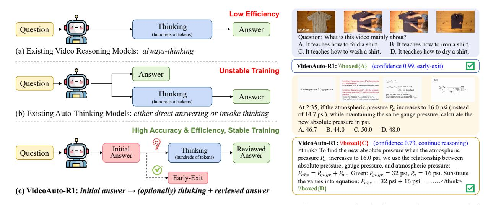

Figure 1 VideoAuto-R1 follows a thinking once, answering twice paradigm. In training, both the initial answer and the reviewed answer are supervised with verifiable rewards. During inference, an early-exit mechanism is adopted to dynamically determine whether to proceed with CoT reasoning. Robot icon from Flaticon (2025).

2025), CoT shows a consistent advantage. This finding suggests that long reasoning traces for video tasks **do not** inherently improve accuracy and may even cause overthinking that degrades performance. Similar phenomena have also been observed in the text and image domains (Sui et al., 2025; Kumar et al., 2025).

Another issue of the always-thinking strategy is lower efficiency (Chen et al., 2024; Qu et al., 2025; Li et al., 2025a). Thinking-only models typically generate long responses with hundreds of tokens, while direct answering often requires much fewer tokens. Given the autoregressive nature of LLMs, these longer traces substantially increase latency and inference cost. Therefore, an efficient and effective approach to video reasoning is to reason only when necessary, that is, to employ **auto-thinking**.

Auto-thinking, or adaptive reasoning, allows a model to decide whether to answer directly or to invoke CoT reasoning based on input complexity (Yang et al., 2025a; Cheng et al., 2025; Lou et al., 2025). Prior work has focused on text and images, typically learning a switching policy via supervised fine-tuning (SFT) or reinforcement learning (RL) to dynamically select the thinking mode (Zhang et al., 2025b; Yang et al., 2025b; Xie et al., 2025a). Extending these strategies directly to video is non-trivial: the correlation between explicit reasoning and accuracy is weak in video due to visual ambiguity and long-range temporal noise. Moreover, truly must-think video samples are relatively rare, which necessitates careful data curation during training (Zhan et al., 2025). In our early experiments (Table 7), rigidly enforcing think/no-think decisions during training often led to model collapse (always think or no-think) and poor generalization at test time.

To enable video auto-thinking that reasons only when necessary, we propose a thinking once, answering twice mechanism. Instead of optimizing a binary objective (think or no-think) for each sample, we introduce a new response template:  $answer \rightarrow think \rightarrow answer$  (see Table 2 for the full prompt). During training, the model first provides an initial answer, then performs explicit reasoning, and finally outputs a reviewed answer. Both answers are supervised with verifiable rewards, with a larger weight assigned to the final answer to encourage the model to refine or confirm its initial answer. Notably, this paradigm eliminates the need for manual think/no-think labeling during training; the model simply learns to make both answers correct. As a result, the response can always begin with a short, direct answer, followed by a step-by-step explanation.

At inference time, rather than relying on an additional mode switch token or head, we employ a simple rule-based early-exit strategy. After the model outputs the first answer, we compute the length-normalized mean log probability of those answer tokens as the confidence score. If it exceeds a threshold, we treat the initial answer as sufficiently reliable and terminate the decoding early, equivalent to direct answering (Yue et al., 2025a). Otherwise, the model continues to generate the reasoning trace and the reviewed answer. Thus, the thinking-mode activation is solely determined at test time. Empirically, as shown in Table 8, the confidence score correlates well with mode-switch accuracy, allowing us to precisely determine which samples require reasoning. We refer to the resulting training and inference framework as VideoAuto-R1 (see Figure 1).

Evaluations across benchmarks reveal two key advantages of VideoAuto-R1. (1) Accuracy: for challenging inputs that benefit from step-by-step reasoning, the model reliably activates thinking mode, refines its initial answer, and achieves state-of-the-art performance; (2) Efficiency: for inputs that do not require reasoning, early-exit suppresses unnecessary token generation, reducing latency and inference cost compared to standard video reasoning models. Notably, on perception-oriented benchmarks such as MVBench [\(Li et al.,](#page-14-9) [2024\)](#page-14-9), the think-mode activation rate is low (25%), while on reasoning-intensive benchmarks such as VideoMMMU [\(Hu](#page-14-6) [et al.,](#page-14-6) [2025\)](#page-14-6), it rises to 51%. Overall, VideoAuto-R1 reduces the average response length from 149 to just 44 tokens while preserving accuracy. We summarize our contributions as follows:

- 1. To the best of our knowledge, we present the first systematic study showing that existing video reasoning models perform comparably in direct and CoT modes, cautioning against unconditional reliance on CoT given its high computation cost and modest gains.
- 2. We propose VideoAuto-R1, which couples a thinking once, answering twice training paradigm with a confidence-based early-exit inference strategy. It eliminates the need for per-sample think/no-think labels, yielding a simple yet effective adaptive reasoning model.
- 3. Through extensive experiments and ablations, we show that VideoAuto-R1 achieves state-of-the-art accuracy while substantially improving efficiency across video QA and temporal grounding tasks.

# 2 Related Work

## 2.1 Chain-of-Thought Reasoning

Chain-of-thought prompting elicits explicit multi-step rationales from LLMs through guided instructions [\(Kah](#page-14-10)[neman,](#page-14-10) [2011;](#page-14-10) [Sahoo et al.,](#page-15-0) [2024\)](#page-15-0). It has proven effective across diverse domains, including mathematics, scientific problem solving, and code generation, driving gains in accuracy and robustness [\(Team et al.,](#page-15-1) [2023\)](#page-15-1). For instance, OpenAI's o1 employs reinforcement learning to cultivate complex reasoning abilities, showing improvements under both training-time and test-time scaling [\(Jaech et al.,](#page-14-0) [2024\)](#page-14-0). Similarly, DeepSeek-R1 [\(Guo](#page-14-1) [et al.,](#page-14-1) [2025\)](#page-14-1) and QwQ [\(Team,](#page-15-7) [2025\)](#page-15-7) demonstrate substantial benefits from CoT-based reasoning.

Notably, DeepSeek-R1 introduces GRPO, an RL framework that replaces learned critics with rule-based rewards, stabilizing post-training and enabling scaling to longer CoT. Extending CoT to the visual domain has also attracted increasing attention [\(Team et al.,](#page-15-8) [2025;](#page-15-8) [Zhou et al.,](#page-17-2) [2025;](#page-17-2) [Yang et al.,](#page-16-1) [2025c;](#page-16-1) [Wang et al.,](#page-15-3) [2025a;](#page-15-3) [Zheng et al.,](#page-17-0) [2025;](#page-17-0) [Peng et al.,](#page-15-9) [2025\)](#page-15-9). For example, Visual-RFT [\(Liu et al.,](#page-14-11) [2025\)](#page-14-11) applies GRPO to detection, grounding, and classification tasks, while Vision-R1 [\(Huang et al.,](#page-14-12) [2025\)](#page-14-12) curates a large-scale image CoT dataset to train an R1-style visual reasoner.

Although CoT improves robustness on compositional and symbol-intensive tasks, it is not generally beneficial. Several studies report overthinking when tasks are primarily perceptual or intuitive [\(Sui et al.,](#page-15-4) [2025;](#page-15-4) [Kumar](#page-14-7) [et al.,](#page-14-7) [2025;](#page-14-7) [Xie et al.,](#page-16-8) [2025a;](#page-16-8) [Chen et al.,](#page-13-5) [2024\)](#page-13-5). Our analysis reveals a similar phenomenon in the video domain and motivates a reason-when-necessary strategy to mitigate unnecessary complexity and improve efficiency in video understanding.

### 2.2 Video Reasoning Models

Early work on video reasoning adapts R1-style reinforcement learning techniques from images to videos, such as Video-R1 [\(Feng et al.,](#page-13-2) [2025\)](#page-13-2) and VideoChat-R1 [\(Li et al.,](#page-14-3) [2025c\)](#page-14-3). Beyond QA, some approaches extend reasoning to temporal grounding tasks, e.g., Time-R1 [\(Wang et al.,](#page-16-3) [2025d\)](#page-16-3) shows that explicit reasoning can benefit temporal localization. Other efforts target specific designs such as relational reasoning over objects [\(Gong et al.,](#page-14-5) [2025\)](#page-14-5), narrative reasoning across long videos [\(Ghazanfari et al.,](#page-14-4) [2025\)](#page-14-4), and scalable training [\(Chen et al.,](#page-13-0) [2025e;](#page-13-0) [Li et al.,](#page-14-2) [2025e;](#page-14-2) [Fu et al.,](#page-13-1) [2025b\)](#page-13-1).

Recent works further explore interleaved video-text reasoning, also known as "thinking with frames". These methods employ progressive perception strategies similar to "thinking with images" in the image domain, where the model first reasons to select salient frames or segments, then revisits them at higher resolution or frame rate to produce more accurate answers [\(Zhang et al.,](#page-16-4) [2025a;](#page-16-4) [Xie et al.,](#page-16-5) [2025b\)](#page-16-5).

Despite these advances, prior methods enforce an always-thinking paradigm for videos [\(Wang et al.,](#page-15-10) [2025b;](#page-15-10) [Feng et al.,](#page-13-2) [2025;](#page-13-2) [Chen et al.,](#page-13-7) [2025d;](#page-13-7) [Zhang et al.,](#page-17-3) [2025c;](#page-17-3) [Li et al.,](#page-14-2) [2025e;](#page-14-2) [Luo et al.,](#page-15-11) [2025;](#page-15-11) [Li et al.,](#page-14-13) [2025b;](#page-14-13) [Park et al.,](#page-15-12) [2025\)](#page-15-12). Our analysis shows that on perception-oriented QA tasks, direct answering often matches CoT performance. This motivates a more adaptive approach: apply direct answering when it suffices and reserve CoT reasoning for cases where it yields tangible gains.

# 2.3 Auto-Thinking

To improve reasoning efficiency, auto-thinking methods aim to determine when to invoke CoT, typically by training a switching policy via SFT or RL [\(Cheng et al.,](#page-13-6) [2025;](#page-13-6) [Lou et al.,](#page-15-6) [2025;](#page-15-6) [Kang et al.,](#page-14-14) [2025;](#page-14-14) [Xie et al.,](#page-16-8) [2025a;](#page-16-8) [Ma et al.,](#page-15-13) [2025;](#page-15-13) [Sui et al.,](#page-15-4) [2025;](#page-15-4) [Qu et al.,](#page-15-5) [2025;](#page-15-5) [Chen et al.,](#page-13-8) [2025b;](#page-13-8) [Shen et al.,](#page-15-14) [2025;](#page-15-14) [Chen et al.,](#page-13-9) [2025c;](#page-13-9) [Li et al.,](#page-14-15) [2025f\)](#page-14-15). Among them, AdaptThink [\(Zhang et al.,](#page-17-1) [2025b\)](#page-17-1) emphasizes the importance of balanced data sampling between think and no-think samples during on-policy training and achieves competitive performance on math tasks. In the image domain, R-4B [\(Yang et al.,](#page-16-7) [2025b\)](#page-16-7) adopts bi-mode policy optimization, using SFT for initialization and then refining the model via RL to enhance the decision accuracy of whether to activate CoT. However, directly extending these strategies to video is non-trivial, as genuinely "must-think" samples are relatively rare in videos [\(Zhan et al.,](#page-16-9) [2025\)](#page-16-9), which makes mode-switching supervision less stable during training.

Our VideoAuto-R1 departs from prior auto-thinking approaches in two aspects: (1) During training, instead of supervising a binary mode for each sample, we train the model with both direct and CoT answers. This eliminates the need for think/no-think labels, switch tokens, or cold-start SFT. Empirically, this training strategy reduces mode collapse and improves generalization. (2) At inference, we compute the mean log probability of the first answer to determine whether to proceed with CoT, enabling controllable and efficient thinking-mode selection.

# 3 Preliminaries

In this section, we first briefly introduce our training framework and then analyze CoT inference versus direct inference in existing video reasoning models, revealing that indiscriminately enabling step-by-step reasoning is often redundant for video understanding.

### <span id="page-3-0"></span>3.1 Training Framework

GRPO Training. As a recent RL method, Group Relative Policy Optimization (GRPO) replaces a learned critic with group-normalized, rule-based verifiable rewards, offering a simplified and scalable RL training pipeline with strong empirical performance [\(Guo et al.,](#page-14-1) [2025\)](#page-14-1).

Formally, given a prompt q, the behavior policy πθold samples G candidate outputs {o1, . . . , oG}. For each output, a verifiable reward r<sup>i</sup> , such as answer accuracy, temporal IoU, or format correctness, is computed. GRPO then normalizes these rewards using the group-wise mean µ and standard deviation σ to obtain relative advantages A<sup>i</sup> = ri−µ σ+ε . Then with the importance ratio ρ<sup>i</sup> = πθ(oi|q) πθold (oi|q) , the training objective becomes:

$$\mathcal{L}_{GRPO}(\theta) = -\frac{1}{G} \sum_{i=1}^{G} \min \left( \rho_i A_i, \operatorname{clip}(\rho_i, 1 - \epsilon, 1 + \epsilon) A_i \right) + \beta D_{KL}(\pi_\theta \parallel \pi_{ref})$$
(1)

where DKL regularizes the policy against a reference policy πref via a KL penalty, and β ≥ 0 controls the strength of this regularization.

Reward Function. Standard GRPO employs verifiable, rule-based rewards consisting of a task-accuracy term Rtask and a format correctness term Rfmt. The final per-sample reward is defined as a weighted sum:

$$R_i = w R_{\text{task}}(o_i) + \lambda R_{\text{fmt}}(o_i), \quad w, \lambda \ge 0.$$

In this paper, we consider three video task types: QA, temporal grounding, and grounding QA. The detailed reward for each task can be found in Appendix [B.](#page-19-0)

<span id="page-4-0"></span>Table 1 Comparison of Direct and CoT Inference for Video Reasoning Models. Direct inference means answering without explanations. CoT inference follows each model's default prompt to elicit step-by-step reasoning and then generate the final answer. All models are re-evaluated with the same inputs, i.e., maximum 256 frames and 16K total video tokens. We report the accuracy and the response length (in tokens). Surprisingly, CoT inference shows worse accuracy than direct inference while using more tokens on several benchmarks.

| Model        | Inference<br>Strategy | Response<br>Length | VideoMME   | LongVideoBench | MMVU       | VideoMMMU  | Charades-STA |
|--------------|-----------------------|--------------------|------------|----------------|------------|------------|--------------|
| Qwen2.5-VL   | Direct                | 10.2               | 66.0       | 60.9           | 65.7       | 52.7       | 52.9         |
| Video-R1     | Direct                | 17.6               | 64.6       | 59.5           | 65.6       | 51.4       | 42.0         |
|              | CoT                   | 386                | 64.3(−0.3) | 59.4(−0.1)     | 65.4(−0.2) | 52.4(+1.0) | 34.9(−7.1)   |
| Time-R1      | Direct                | 9.2                | 65.9       | 60.0           | 65.1       | 53.0       | 56.6         |
|              | CoT                   | 138                | 63.8(−2.1) | 58.3(−1.7)     | 64.7(−0.4) | 54.1(+1.1) | 58.8(+2.2)   |
| VideoChat-R1 | Direct                | 4.3                | 65.7       | 60.1           | 65.6       | 52.3       | 58.5         |
|              | CoT                   | 126                | 63.9(−1.8) | 58.2(−1.9)     | 65.4(−0.2) | 55.7(+3.4) | 59.9(+1.4)   |

Training Data. While traditional video reasoning models are trained primarily on videos, raw video data is inherently noisy and non-symbolic, often biasing models toward perception rather than reasoning. To enhance the model's long-chain reasoning capabilities, we augment the training corpus with high-quality text [\(Yu et al.,](#page-16-11) [2025\)](#page-16-11) and image sources [\(Wang et al.,](#page-15-3) [2025a,](#page-15-3)[c\)](#page-16-2) that cover math and scientific problems. We also include video QA data [\(Feng et al.,](#page-13-2) [2025;](#page-13-2) [Cores et al.,](#page-13-10) [2024;](#page-13-10) [Li et al.,](#page-14-16) [2025d;](#page-14-16) [Zhu et al.,](#page-17-4) [2025\)](#page-17-4) and temporal grounding data [\(Gao et al.,](#page-13-11) [2017;](#page-13-11) [Fabian et al.,](#page-13-12) [2015;](#page-13-12) [Wang et al.,](#page-16-3) [2025d;](#page-16-3) [Xiao et al.,](#page-16-12) [2024\)](#page-16-12). After filtering, we obtain 83K samples. The detailed training data can be found in Appendix [A.](#page-18-0)

Direct RL without Cold-Start. Notably, we conduct RL directly on the curated data without relying on a cold-start SFT stage. Collecting large-scale, high-quality multimodal CoT traces is expensive and often noisy. In early experiments, SFT on Video-R1-CoT data [\(Feng et al.,](#page-13-2) [2025\)](#page-13-2), which has both the intermediate reasoning traces and final answer, degraded the Qwen2.5-VL baseline [\(Bai et al.,](#page-13-13) [2025b\)](#page-13-13). We therefore focus on directly incentivizing the base model's reasoning via reinforcement learning. The detailed ablations can be found in Appendix [F.3.](#page-23-0)

### 3.2 Analysis of Existing Video Reasoning Models

Before building our own reasoning model, we pose the following question:

When is video chain-of-thought actually necessary, and how does it compare with direct answering?

To investigate, we re-evaluate existing video reasoning models, i.e., Video-R1 [\(Feng et al.,](#page-13-2) [2025\)](#page-13-2), Time-R1 [\(Wang et al.,](#page-16-3) [2025d\)](#page-16-3), and VideoChat-R1 [\(Li et al.,](#page-14-3) [2025c\)](#page-14-3), which are all based on Qwen2.5-VL. We compare two inference strategies: direct inference and CoT inference. Results are summarized in Table [1.](#page-4-0)

Surprisingly, direct inference often matches, or even outperforms, CoT inference on several benchmarks such as VideoMME [\(Fu et al.,](#page-13-14) [2025a\)](#page-13-14) and LongVideoBench [\(Wu et al.,](#page-16-13) [2024\)](#page-16-13), while generating significantly fewer tokens (see Figure [7\)](#page-26-0). Consistent CoT gains are primarily observed on Video-MMMU [\(Hu et al.,](#page-14-6) [2025\)](#page-14-6). We further examine the samples where CoT succeeds but direct inference fails (see Figure [8\)](#page-27-0). These cases are typically math- or physics-oriented (e.g., physics instructional videos with blackboard derivations): the questions or answer options contain symbolic inputs, the visual signal is relatively clean, and multi-step deduction is genuinely necessary. Under these conditions, CoT provides a tangible advantage.

By contrast, in perception-oriented queries (e.g., object or action recognition, simple attribute identification), CoT often redundantly describes the video or compares answer options step by step, yet ultimately arrives at the same conclusion as direct inference. Given the autoregressive nature of LLMs, such verbose traces substantially increase end-to-end latency and inference cost. Considering that most QA samples do not benefit from additional reasoning, we believe an effective and efficient policy is to reason only when necessary, that is, employ auto-thinking. Accordingly, in this paper, we focus on building an auto-thinking video model.

<span id="page-5-0"></span>

Figure 2 Overview of VideoAuto-R1. (a) Training: The response follows the  $answer \to think \to answer$  template, jointly optimizing both the initial and reviewed answers. Specifically, a fallback reward is introduced to avoid a spurious initial guess. (b) Inference: The model first produces an initial answer. If its length-normalized confidence exceeds a threshold  $\tau$ , decoding terminates as direct answering; otherwise, the model continues with CoT reasoning and outputs a reviewed answer, enabling adaptive, confidence-based early exit.

# 4 VideoAuto-R1

In this section, we present **VideoAuto-R1**, a simple yet effective framework that reasons only when necessary, as illustrated in Figure 2. During training, we adopt an  $answer \rightarrow think \rightarrow answer$  template. At inference time, an early-exit mechanism determines whether to continue reasoning after the first answer.

### 4.1 Thinking Once, Answering Twice

A common approach to auto-thinking involves learning a mode-switching policy during training, e.g., randomly dropping CoT traces in SFT so the model alternates between direct and CoT outputs (Zhang et al., 2025b). While effective on text, it depends on careful data balancing and is sensitive to training hyperparameters. In video, the scarcity of high-quality reasoning examples further exacerbates instability.

We adopt a different perspective: genuine CoT should be built on top of an initial answer. For easy questions, the initial answer should suffice; for harder ones, the model should verify and revise its response within the same generation. Accordingly, we do not train separate "think" and "direct" modes. Instead, the model always learns to generate a concise first answer and a reasoned second answer. This design avoids the need for per-sample mode labels, specialized switch tokens or heads, or other artifacts. The distinction between direct and thinking modes is made solely at test time through a confidence-based early-exit mechanism.

**Output Format.** Given a prompt q, each training response o follows a strict, verifiable format:

$$\ \ \ \ \ \ \ \ \ \ \ \ \ \ \ \ \ \ \$$

Here,  $a_1$  and  $a_2$  are short, verifiable answers, and r is a free-form rationale. We enforce exactly two \boxed{...} blocks and one <think>...</think> block, with no extra text before/after. To achieve such an output format, a system prompt (Table 2) is carefully designed, enabling generation without cold-start SFT.

**Fallback Tolerance.** For mathematically or symbolically complex problems, the model may be unable to produce a correct  $a_1$  without intermediate reasoning (Yue et al., 2025a). To prevent low-confidence guesses, we provide a designated fallback string. When immediate answering is infeasible, the model outputs "Let's analyze the problem step by step" in the first box, then proceeds to reasoning and produces the final answer  $a_2$ . This design preserves the output grammar, avoids spurious guesses, and ensures the early-exit mechanism remains unambiguous and interpretable.

Why "answer-think-answer"? This template decouples when to think, handled at test time by our early-exit rule, from how to think, namely the reasoning behavior learned during RL training. Empirically, this design yields more stable training for videos with less data effort than traditional mode-switching approaches (Zhang et al., 2025b). It also makes inference easy to control: with ample compute, one can always use the reviewed answer, while under tight budgets the model can fall back to the initial direct answer and still benefit from RL training. Overall, this decoupling of the training objective and inference policy gives users flexible control over the trade-off between accuracy and efficiency.

<span id="page-6-0"></span>**Table 2 System Prompt for VideoAuto-R1.** The prompt follows an  $answer \rightarrow think \rightarrow answer$  template, enabling both direct and CoT outputs in one generation.

#### SYSTEM PROMPT

You are a helpful assistant.

FIRST: Output your initial answer inside the first \\boxed{...} without any analysis or explanations. If you cannot determine the answer without reasoning, output \\boxed{Let's analyze the problem step by step.} instead.

THEN: Think through the reasoning as an internal monologue enclosed within <think>...</think>...

AT LAST: Output the final answer again inside \\boxed{...}. If you believe the previous answer was correct, repeat it; otherwise, correct it.

Output format: \\boxed{...}<\think>...</think>\\boxed{...}

### 4.2 Training: Dual-Answer Reward with GRPO

We follow the GRPO framework described in Section 3.1, but introduce a new *dual-answer* reward that supervises both the initial and reviewed answers. Let  $a_1$  and  $a_2$  denote the first and second boxed answers, respectively. The total reward is given by:

$$R = w_1 R_{\text{task}}^{(1)}(a_1) + w_2 R_{\text{task}}^{(2)}(a_2) + \lambda R_{\text{fmt}} + \alpha R_{\text{fallback}}$$

where  $w_2 > w_1 \ge 0$ , and  $\lambda, \alpha \ge 0$  are weight coefficients.

The task rewards  $R_{\rm task}$  follow the previous definitions. Notably, we assign a higher weight  $w_2$  to the final answer  $a_2$  to encourage more accurate reviewed responses while still incentivizing good initial answers. This design also penalizes cases where the first answer is correct but the second is incorrect, pushing the model to improve overall reliability. The term  $R_{\rm fmt}$  ensures that the output format adheres to the required  $answer \rightarrow think \rightarrow answer$  template.

Particularly, the last term  $R_{\text{fallback}} \in \{0,1\}$  is a fallback bonus when  $a_1$  is the designated string "Let's analyze the problem step by step" and  $a_2$  is correct. This discourages low-confidence guesses in  $a_1$  for difficult problems and rewards honest deferral followed by accurate reasoning. It is particularly helpful for math and symbol-heavy questions, where premature guesses are often wrong. Further analysis of the reward design is discussed in Appendix B.

During training, we observe consistent increases in total reward. Notably,  $R_{\text{task}}^{(2)}$  typically exceeds  $R_{\text{task}}^{(1)}$ , confirming the benefit of explicit reasoning for more challenging instances while still retaining fast, correct first answers when appropriate.

# 4.3 Inference: Confidence-Based Early Exit

To enable adaptive and controllable reasoning, we adopt a simple yet effective *early-exit* mechanism, where a rule-based check determines whether the first boxed answer has sufficient confidence to justify skipping the rest of the generation. Prior study (Liao et al., 2025) also shows that token-level confidence correlates strongly with answer correctness in modern LLMs. We leverage this finding to score the model's own output directly, without relying on external calibrators.

At inference, we first decode only up to the closing delimiter of the first boxed answer. Let  $a_1 = (t_1, \dots, t_L)$  denote the tokens within the first box. We compute the following length-normalized confidence score:

$$s(a_1) = \frac{1}{L} \sum_{\ell=1}^{L} \log p_{\theta}(t_{\ell} \mid t_{<\ell}, q), \qquad (2)$$

where  $p_{\theta}$  is the model's next-token distribution under the chosen decoding policy. If  $a_1$  is the fallback string, we set  $s(a_1) = -\infty$ , forcing continuation of the CoT and final answer generation.

Given a confidence threshold  $\tau$ , we accept  $a_1$  and terminate decoding if  $s(a_1) \ge \log \tau$ ; otherwise, we continue to generate the rationale r and second answer  $a_2$ . The threshold  $\tau$  controls the accuracy–efficiency trade-off and can be determined on a held-out set. In practice, a single fixed threshold works well across diverse video QA benchmarks. Besides, since  $a_1$  typically consists of fewer than ten tokens, the confidence score is fast to compute. In many cases, early exit avoids generating hundreds of additional tokens, substantially reducing latency and inference cost.

# 5 Experiments

# 5.1 Experiment Details

Implementation Details. Our models are fine-tuned from Qwen2.5-VL-7B-Instruct [\(Bai et al.,](#page-13-13) [2025b\)](#page-13-13) and Qwen3-VL-8B-Instruct [\(Bai et al.,](#page-13-15) [2025a\)](#page-13-15). During training, the maximum number of total video tokens is set to 4,096, and the maximum number of frames is set to 256. We use AdamW as the optimizer, with a learning rate of 1×10−<sup>6</sup> , weight decay of 0.01, and a maximum gradient norm of 1.0. A constant learning rate schedule without warm-up is employed. The KL penalty coefficient β is set to 0.01. Task reward weight w<sup>1</sup> is 0.9 and w<sup>2</sup> is 1.1; the format reward weight λfmt is 1; and the fallback reward weight α is 0.3. The global batch size is set to 256, and we train the model for one epoch. The visual encoder remains frozen; only the projector and the LLM are fine-tuned. We leverage DeepSpeed [\(Rasley et al.,](#page-15-15) [2020\)](#page-15-15) and vLLM [\(Kwon et al.,](#page-14-18) [2023\)](#page-14-18) to accelerate the training. For GRPO rollout generation, we set the rollout size G to 16 and use a temperature of 1.0 to encourage exploration. Our training is conducted on 32 H100 GPUs for approximately 35 hours.

During testing, all evaluations are performed using lmms-eval [\(Zhang et al.,](#page-17-5) [2024a\)](#page-17-5) with greedy decoding (temperature 0). The maximum response length is set to 4,096 tokens, ensuring that no truncation occurs during evaluation. The early-exit confidence threshold τ is set to 0.97, which is tuned on a small held-out subset of the validation data and generalizes well to unseen evaluation benchmarks. For the Qwen2.5-VL model, we allow up to 16K total video tokens and vary the maximum number of frames among {64, 128, 256}. For the Qwen3-VL model, we allow up to 128K total video tokens and sweep over {64, 256, 2048} frames. Following [Bai et al.](#page-13-13) [\(2025b\)](#page-13-13) and [Bai et al.](#page-13-15) [\(2025a\)](#page-13-15), we report the highest performance across these settings.

Evaluation Benchmarks. We evaluate on both video QA and temporal grounding benchmarks. For perceptionoriented QA, we report accuracy on VideoMME (without subtitles) [\(Fu et al.,](#page-13-14) [2025a\)](#page-13-14), MVBench [\(Li et al.,](#page-14-9) [2024\)](#page-14-9), LongVideoBench [\(Wu et al.,](#page-16-13) [2024\)](#page-16-13), and MMVU (multi-choice) [\(Zhao et al.,](#page-17-6) [2025\)](#page-17-6). To assess reasoningintensive tasks, we evaluate on VideoMMMU [\(Hu et al.,](#page-14-6) [2025\)](#page-14-6) and Minimal Video Pairs (MVP) [\(Krojer et al.,](#page-14-19) [2025\)](#page-14-19). Particularly, for MVP, visually similar videos are paired with identical questions but opposing answers. Models must answer both correctly, and we report pairwise accuracy on the MVP-mini subset. For temporal grounding, we report recall and mean IoU on Charades-STA [\(Gao et al.,](#page-13-11) [2017\)](#page-13-11) and ActivityNet [\(Fabian et al.,](#page-13-12) [2015\)](#page-13-12). Finally, we use NExT-GQA [\(Xiao et al.,](#page-16-12) [2024\)](#page-16-12) to evaluate grounding QA performance.

Additionally, we evaluate our model on image reasoning benchmarks, such as MathVista [\(Lu et al.,](#page-15-16) [2023\)](#page-15-16), MathVision [\(Wang et al.,](#page-15-17) [2024\)](#page-15-17), MathVerse [\(Zhang et al.,](#page-17-7) [2024b\)](#page-17-7), MMMU [\(Yue et al.,](#page-16-14) [2024\)](#page-16-14), MMMU-Pro [\(Yue](#page-16-15) [et al.,](#page-16-15) [2025b\)](#page-16-15), and MM-Vet [\(Yu et al.,](#page-16-16) [2023\)](#page-16-16).

### 5.2 Main Results

Video QA Benchmarks. As shown in Table [3,](#page-8-0) our VideoAuto-R1 achieves state-of-the-art results on both perception and reasoning benchmarks. Concretely, VideoAuto-R1 achieves 67.3% accuracy on VideoMME with a Qwen2.5-VL base, surpassing previous reasoning models such as Video-R1 [\(Feng et al.,](#page-13-2) [2025\)](#page-13-2), VITAL [\(Zhang](#page-16-4) [et al.,](#page-16-4) [2025a\)](#page-16-4), and VideoChat-R1.5 [\(Yan et al.,](#page-16-17) [2025\)](#page-16-17) by 5.5%, 3.2%, and 2.1% respectively. On the reasoningintensive VideoMMMU benchmark, VideoAuto-R1 improves accuracy from 54.7% to 58.6% (+3.9%), and on the harder MVP benchmark, it increases pairwise accuracy from 36.5% to 39.4%, consistently outperforming existing reasoning models such as Video-R1 by a large margin of ∼6% accuracy. When built on Qwen3-VL, our VideoAuto-R1 further improves performance and achieves a remarkable 65.0% on VideoMMMU. These results demonstrate that our auto-thinking is effective for video understanding.

Beyond accuracy, VideoAuto-R1 also substantially improves inference efficiency. Compared to Video-R1's 386-token responses, our model generates only 44 tokens on average. Moreover, the model adaptively triggers reasoning depending on task complexity: the think-mode activation ratio is only 25% on perception-oriented MVBench, while it rises to 51% on the reasoning-heavy Video-MMMU. This indicates that our model can invoke CoT for genuinely challenging queries, highlighting the inference efficiency of our auto-thinking.

Temporal Grounding Benchmarks. Results on temporal grounding benchmarks are summarized in Table [4.](#page-8-1) Notably, after dual-answer GRPO training, the initial boxed prediction is already sufficient for accurate localization. The subsequent CoT trace mainly provides explanatory interpretation without improving

<span id="page-8-0"></span>Table 3 Evaluation Results on Video QA Benchmarks. We compare VideoAuto-R1 with thinking-only video reasoning models on both perception-oriented and reasoning-heavy benchmarks, and also report the average response length (in tokens). † means reproduced results. We also report the think ratio, defined as the proportion of samples on which the model triggers CoT reasoning. Relative to the Qwen baseline, VideoAuto-R1 yields consistent and more pronounced gains on the reasoning benchmarks. We further observe that the thinking ratio is low on perception-oriented benchmarks but substantially higher on reasoning-heavy ones.

|                              | Reasoning  | Response | Video Perception Benchmark<br>Video Reasoning Benchmark |       |                                                |       |       |       |
|------------------------------|------------|----------|---------------------------------------------------------|-------|------------------------------------------------|-------|-------|-------|
| Model                        | Mode       | Length   |                                                         |       | VideoMME MVBench LongVideoBench MMVU VideoMMMU |       |       | MVP   |
| Qwen2.5-VL-7B†               | ✗          | 3.0      | 66.0                                                    | 67.1  | 60.9                                           | 66.2  | 54.7  | 36.5  |
| Qwen3-VL-8B†                 | ✗          | 2.2      | 72.5                                                    | 69.4  | 67.6                                           | 69.9  | 61.0  | 40.5  |
| Temporal-RLT                 | Think-Only | -        | 57.6                                                    | 68.1  | -                                              | 65.0  | -     | -     |
| Video-RFT                    | Think-Only | -        | 59.8                                                    | 62.1  | -                                              | 68.5  | 51.1  | -     |
| Video-R1                     | Think-Only | 386      | 61.8                                                    | 65.5  | -                                              | 65.0  | 51.4  | 33.0  |
| Video-RTS                    | Think-Only | -        | 63.0                                                    | -     | 56.6                                           | 66.4  | 52.7  | -     |
| VITAL                        | Think-Only | -        | 64.1                                                    | -     | -                                              | 68.7  | 54.2  | -     |
| LongVILA-R1                  | Think-Only | -        | 65.1                                                    | 67.6  | 58.0                                           | -     | -     | -     |
| LOVE-R1                      | Think-Only | -        | 66.2                                                    | 66.6  | 60.1                                           | -     | -     | -     |
| VideoChat-R1.5               | Think-Only | 133      | 65.2                                                    | 70.6  | 61.4                                           | -     | 49.6  | 38.6  |
| VideoAuto-R1 (Qwen2.5-VL-7B) | AutoThink  | 44       | 67.3                                                    | 71.0  | 60.5                                           | 69.7  | 58.6  | 39.4  |
| (think ratio)                |            |          | (40%)                                                   | (25%) | (39%)                                          | (28%) | (51%) | (44%) |
| VideoAuto-R1 (Qwen3-VL-8B)   | AutoThink  | 52       | 71.7                                                    | 72.0  | 67.4                                           | 71.1  | 65.0  | 43.0  |
| (think ratio)                |            |          | (11%)                                                   | (31%) | (20%)                                          | (38%) | (53%) | (56%) |

<span id="page-8-1"></span>Table 4 Evaluation Results on Temporal Grounding Benchmarks. † means reproduced results. We observe that on grounding benchmark, the initial boxed answer is sufficient, so we early-exit without further reasoning to save computation.

|                                                            |              | Temporal Grounding Benchmark |              |              |              |              |              |              |              |              |
|------------------------------------------------------------|--------------|------------------------------|--------------|--------------|--------------|--------------|--------------|--------------|--------------|--------------|
| Model                                                      |              |                              | Charades-STA |              |              | ActivityNet  |              |              | NExT-GQA     |              |
|                                                            | 0.3          | 0.5                          | 0.7          | mIoU         | 0.3          | 0.5          | 0.7          | mIoU         | Acc          | mIoU         |
| Qwen2.5-VL-7B†                                             | 77.7         | 59.6                         | 34.8         | 52.9         | 37.9         | 22.6         | 10.6         | 26.9         | 53.3         | 20.2         |
| TimeChat                                                   | 51.0         | 27.5                         | 11.4         | 31.2         | 44.0         | 27.8         | 14.3         | 30.4         | 28.8         | 17.4         |
| TimeSuite                                                  | 79.4         | 67.1                         | 43.0         | -            | -            | -            | -            | -            | -            | -            |
| TimeMarker                                                 | 73.5         | 51.9                         | 26.9         | 48.4         | 67.4         | 50.7         | 33.0         | 49.5         | -            | -            |
| Temporal-RLT                                               | 79.6         | 67.9                         | 44.1         | 57.0         | 56.9         | 38.4         | 20.2         | 39.0         | 78.7         | 37.3         |
| Time-R1                                                    | 82.8         | 72.2                         | 50.1         | 58.8         | 73.3         | 55.6         | 34.0         | 52.1         | -            | -            |
| VITAL                                                      | 83.1         | 72.0                         | 46.7         | 59.9         | 70.9         | 50.8         | 31.6         | 49.8         | 78.7         | 43.0         |
| VideoChat-R1.5                                             | 82.8         | 71.6                         | 48.3         | 60.6         | 52.4         | 32.3         | 16.8         | 35.3         | -            | -            |
| VideoAuto-R1 (Qwen2.5-VL-7B)<br>VideoAuto-R1 (Qwen3-VL-8B) | 82.9<br>85.1 | 70.8<br>74.9                 | 46.0<br>53.7 | 60.0<br>63.7 | 69.2<br>74.1 | 48.5<br>54.3 | 27.3<br>32.4 | 47.6<br>51.9 | 80.6<br>81.1 | 36.7<br>44.2 |

localization performance. We therefore adopt early exit by default to improve inference efficiency. More discussion can be found in Appendix [F.2.](#page-22-0)

Overall, VideoAuto-R1 improves mIoU from 52.9% to 60.0% on Charades-STA and from 26.9% to 47.6% on ActivityNet, surpassing Time-R1 [\(Wang et al.,](#page-16-3) [2025d\)](#page-16-3) and VideoChat-R1.5 [\(Yan et al.,](#page-16-17) [2025\)](#page-16-17). On NExT-GQA, QA accuracy is also improved from 53.3% to 80.6%, and mIoU is improved from 20.2% to 36.7%. With Qwen3-VL, all grounding metrics further increase, setting new state-of-the-art results. These experiments validate the effectiveness of our models for temporal grounding.

Image Understanding Benchmarks. Although VideoAuto-R1 is primarily designed for video understanding, we also evaluate its performance on several image reasoning benchmarks. As shown in Table [5,](#page-9-0) VideoAuto-R1 consistently outperforms the Qwen baseline. These improvements are largely attributable to the inclusion of image-centric math and reasoning data during training, which strengthens the model's visual reasoning skills beyond the video domain. At the same time, the thinking once, answering twice design and dual-answer reward transfer naturally to static images, where the model can still benefit from an internal reasoning stage before giving a reviewed answer. Together, the results demonstrate that VideoAuto-R1 is not only effective for video understanding, but also exhibits strong generalization to challenging image benchmarks.

<span id="page-9-0"></span>Table 5 Evaluation Results on Image Benchmarks. The Qwen and VideoAuto-R1 are evaluated under the same settings.

| Model                       | MathVista | MathVision | MathVerse | MMMU | MMMU-Pro | MM-Vet |
|-----------------------------|-----------|------------|-----------|------|----------|--------|
|                             | testmini  | testmini   | testmini  | val  | overall  | test   |
| Qwen2.5-VL-7B               | 69.4      | 26.3       | 44.8      | 51.3 | 36.1     | 60.0   |
| VideoAuto-R1(Qwen2.5-VL-7B) | 73.7      | 29.6       | 46.9      | 53.8 | 39.8     | 61.9   |

<span id="page-9-1"></span>Table 6 Comparison between Different Training Strategies. VideoAuto-R1 delivers stronger performance than SFT on reasoning and grounding benchmarks, and surpasses standard RL with CoT while reducing response length, achieving efficiency and efficacy.

| Training                                | Inference     | Response Length | VideoMME     | MMVU         | VideoMMMU    | Charades-STA |
|-----------------------------------------|---------------|-----------------|--------------|--------------|--------------|--------------|
| Qwen2.5-VL-7B                           | Direct        | 3.0             | 66.0         | 66.2         | 54.7         | 52.9         |
| SFT                                     | Direct        | 2.3             | 67.0         | 65.9         | 56.5         | 56.3         |
| RL without Thinking<br>RL with Thinking | Direct<br>CoT | 2.5<br>149      | 66.0<br>66.1 | 66.4<br>67.5 | 54.4<br>56.4 | 58.8<br>59.8 |
| VideoAuto-R1                            | Direct/CoT    | 44              | 67.3(+1.3)   | 69.7(+3.5)   | 58.6(+3.9)   | 60.0(+7.1)   |

## 5.3 Analyses and Ablations

To verify the effectiveness of different design choices, we conduct the following analyses and ablations. Unless specified, all experiments use models built on Qwen2.5-VL.

Comparison between Different Training Strategies. To clearly demonstrate the advantages of RL and autothinking, we compare four training strategies on the same data: (1) SFT, which directly predicts an answer; (2) RL without thinking, which applies GRPO on direct answers without prefix reasoning; (3) RL with thinking, which generates CoT then an answer optimized with standard GRPO; and (4) our auto-thinking, which adaptively chooses direct/CoT. The results are summarized in Table [6,](#page-9-1) and the prompt templates used are provided in Appendix [C.](#page-20-0)

Several key observations emerge. First, direct answering methods (SFT and RL without thinking) bring only mild gains over the baseline; RL without thinking performs better on format-sensitive tasks such as Charades-STA, indicating improved robustness. Second, RL with thinking substantially boosts reasoning-heavy benchmarks like VideoMMMU, but inflates the average response length from 2.5 to 149 tokens and offers limited benefits on perception-oriented tasks such as VideoMME and MMVU, suggesting that chain-of-thought reasoning is redundant for simpler tasks. In contrast, VideoAuto-R1 outperforms all variants (e.g., +3.9% on VideoMMMU, +1.3% on VideoMME) while cutting the average response length to 44 tokens by invoking CoT only when necessary. In particular, compared with RL with thinking, VideoAuto-R1 achieves higher accuracy since both the initial and reviewed answers are explicitly supervised and jointly optimized during reinforcement learning.

Comparison with Other Adaptive Reasoning Strategies. To further evaluate the effectiveness of our inferencebased thinking-mode selection, we compare VideoAuto-R1 with a training-based strategy inspired by Adapt-Think [\(Zhang et al.,](#page-17-1) [2025b\)](#page-17-1). In the training-based variant, each sample is labeled as think or no-think by comparing the average accuracy over 8 rollouts, and the model is then trained to either output a direct answer or produce a CoT followed by a final answer. To avoid collapse into a single mode, we maintain the think/no-think ratio close to 1:1.

However, this approach brings limited gains. As shown in Table [7,](#page-10-0) the auto mode of the training-based variant underperforms the no-think baseline on MVBench (70.5% vs 71.1%), and it behaves more similarly to no-think on reasoning benchmarks. It also suffers from mode collapse, defaulting to almost no thinking on VideoMME, and only a 31% think ratio on VideoMMMU.

In contrast, VideoAuto-R1 applies confidence-based early-exit at inference time. It typically surpasses the no-think baseline, approaches the accuracy of always-think with much shorter responses, and consistently outperforms the training-based auto-thinking variant without extra labels or balancing, indicating that inference-time selection is stable and effective for adaptive video reasoning.

<span id="page-10-0"></span>Table 7 Comparison with Other Adaptive Reasoning Strategies. For comparison, we reproduce a training-based auto-thinking baseline following [Zhang et al.](#page-17-1) [\(2025b\)](#page-17-1) that assigns think labels during RL. Results show that our inference-based selection yields higher and more stable accuracy across benchmarks. In contrast, the training-based approach can even underperform direct answering.

| Inference Setting                                            | Think Ratio | Response Length | VideoMME | MVBench | MMVU  | VideoMMMU | MVP   |
|--------------------------------------------------------------|-------------|-----------------|----------|---------|-------|-----------|-------|
| Training-Based Thinking-Mode Selection (Zhang et al., 2025b) |             |                 |          |         |       |           |       |
| No-Think                                                     | 0%          | 23              | 67.1     | 71.1    | 65.3  | 55.4      | 36.5  |
| Always-Think                                                 | 100%        | 166             | 66.3     | 70.3    | 68.0  | 54.8      | 39.3  |
| Auto                                                         | 14%         | 31              | 67.1     | 70.5    | 67.2  | 55.7      | 36.8  |
| (think ratio)                                                |             |                 | (1%)     | (0%)    | (9%)  | (31%)     | (18%) |
| Inference-Based Thinking-Mode Selection (Ours)               |             |                 |          |         |       |           |       |
| Use 1st answer (no-think)                                    | 0%          | 8               | 67.3     | 70.9    | 69.3  | 54.6      | 39.0  |
| Use 2nd answer (always-think)                                | 100%        | 91              | 67.3     | 71.0    | 69.8  | 58.7      | 39.8  |
| VideoAuto-R1                                                 | 41%         | 44              | 67.3     | 71.0    | 69.7  | 58.6      | 39.4  |
| (think ratio)                                                |             |                 | (40%)    | (25%)   | (39%) | (51%)     | (44%) |

<span id="page-10-1"></span>Table 8 Initial Answer's Confidence Separates Think-Needed Samples. VideoMMMU shows markedly lower probability than MVBench and MMVU, indicating greater uncertainty. Accordingly, our confidence-based early exit triggers thinking more often on Video-MMMU, yielding a +4% accuracy gain.

| Setting                                                           |                      |                      | MVBench MMVU VideoMMMU |
|-------------------------------------------------------------------|----------------------|----------------------|------------------------|
| Probability of Initial Answer<br>Think Ratio<br>Performance Gains | 0.948<br>25%<br>+0.1 | 0.933<br>39%<br>+0.4 | 0.874<br>51%<br>+4.0   |
| Recall of Think-Needed Samples                                    | 100%                 | 100%                 | 94%                    |

Table 9 Ablations on Reward Design. Emphasizing the reviewed answer by setting w<sup>2</sup> > w<sup>1</sup> outperforms equal weighting. Adding a small fallback reward α further improves accuracy.

|         |   |      |      |      | w1 : w2 α VideoMME VideoMMMU MVP Charades-STA |
|---------|---|------|------|------|-----------------------------------------------|
| 1:1     | ✗ | 66.1 | 56.1 | 38.3 | 58.3                                          |
| 0.9:1.1 | ✗ | 66.0 | 56.4 | 37.2 | 59.1                                          |
| 0.9:1.1 | ✓ | 67.3 | 58.6 | 39.4 | 60.0                                          |
| 0.8:1.2 | ✗ | 65.8 | 56.9 | 38.1 | 58.7                                          |
| 0.8:1.2 | ✓ | 66.3 | 57.9 | 38.8 | 59.3                                          |

Analysis of Confidence-Based Early Exit Mechanism. In our inference strategy, we employ a confidence-based early exit mechanism to decide whether to invoke CoT reasoning after the initial answer. We hypothesize that the model's token-level confidence in the first answer correlates with the need for further reasoning, which we empirically validate in Table [8.](#page-10-1)

On perception-oriented benchmarks such as MVBench and MMVU, the average confidence of the initial answer (mean probability) exceeds 0.93, the think ratio remains around 25%, and CoT yields only marginal gains, indicating that direct answers are sufficient. In contrast, on the reasoning-heavy benchmark VideoMMMU, average confidence drops to approximately 0.87, the think ratio increases to 51%, and we observe a clear 4% accuracy gain, showing that the mechanism successfully allocates more reasoning budget to harder tasks where CoT provides a tangible advantage.

We further examine whether this confidence signal captures truly think-needed cases by measuring the recall of the predicted thinking mode on samples where a<sup>1</sup> is wrong but a<sup>2</sup> is correct. The resulting recall is consistently high, implying that most think-needed samples are successfully routed into the reasoning mode. Together, these findings demonstrate that the confidence of the initial answer provides a stable and reliable criterion for adaptive reasoning.

Ablation Study of Dual-Answer Reward Design. We ablate the dual-answer reward, a key component of our training framework, in Table [9.](#page-10-1) Since the model receives two verifiable rewards—one for the initial answer and one for the reviewed answer—their relative weighting is crucial. If w<sup>1</sup> =w2, the model may allow a correct a<sup>1</sup> to be overwritten by an incorrect a2, so we assign w<sup>2</sup> >w<sup>1</sup> to favor correctness in the final reviewed answer, especially when computation allows CoT reasoning. Empirically, asymmetric weights such as 0.9 : 1.1 or 0.8: 1.2 outperform the uniform 1: 1 setting across multiple benchmarks.

We also study the fallback-tolerant reward, which discourages low-confidence guesses in a<sup>1</sup> and instead rewards honest deferral. As shown in the ablation, adding the fallback reward α consistently improves performance on reasoning benchmarks and achieves state-of-the-art results.

<span id="page-11-0"></span>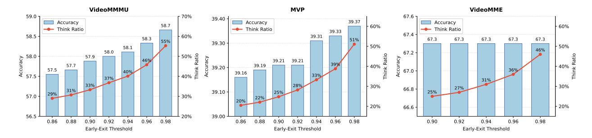

Figure 3 Effect of the Early-Exit Threshold on Accuracy and Think Ratio. In practice, we set  $\tau = 0.97$  for all datasets.

Analysis of the Early-Exit Threshold. Figure 3 further studies the impact of the early-exit threshold  $\tau$  on accuracy and think ratio under our confidence-based routing. As  $\tau$  increases, early exit becomes more conservative, leading to a monotonic rise in the think ratio. Therefore,  $\tau$  provides a direct and continuous control knob to trade efficiency for accuracy within a unified inference rule.

On reasoning-intensive benchmarks, higher  $\tau$  consistently improves accuracy alongside increased reasoning usage. For VideoMMMU, rising  $\tau$  from 0.86 to 0.98 improves accuracy from 57.5% to 58.7% while increasing the think ratio from 29% to 55%. Similarly on MVP, accuracy increases from 39.16% to 39.37% as the think ratio rises from 20% to 51%. These trends indicate that when the initial answer is less reliable, the reviewed-answer stage offers meaningful corrective benefits for these reasoning samples.

In contrast, on perception-oriented VideoMME, accuracy remains essentially unchanged across thresholds, whereas the think ratio still increases. This suggests diminishing returns from additional reasoning for easy perceptual queries. Based on these observations, we set  $\tau=0.97$  as a robust default that preserves satisfied accuracy on reasoning-heavy tasks while limiting unnecessary CoT invocation on perception-heavy data, without requiring dataset-specific tuning.

Qualitative Result. Figure 4 illustrates how VideoAuto-R1 leverages confidence-based early-exit to invoke reasoning only when needed. In this example, the model does not early-exit after the initial answer and instead performs advanced mathematical deduction, where it learns from the video to apply probability theory and integration. Although the initial prediction is D, the reviewed answer is revised to C after step-by-step reasoning, demonstrating the corrective value of the reasoning stage. More examples are provided in Appendix H, further highlighting VideoAuto-R1's accuracy-efficiency balance.

# 6 Conclusion

We presented VideoAuto-R1, an adaptive video reasoning framework that reasons only when necessary. Motivated by the observation that long CoT does not reliably improve video understanding and can even degrade accuracy through overthinking, we proposed a thinking once, answering twice scheme to enable video auto-thinking. Experiments on various video understanding benchmarks, such as perception, reasoning, and temporal grounding, consistently validate the advantages of our model. Our method is easy to formulate and implement, serving as an alternative to the standard reasoning framework. Our preliminary work suggests that VideoAuto-R1 has potential applications beyond video understanding.

<span id="page-12-0"></span>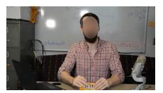

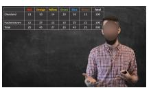


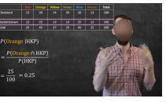


The data that follow are the square footage (in 1,000 feet squared) of 28 homes. The sample mean = 2.50 and the sample standard deviation = 0.8302. The distribution can be written as  $X \sim U(1.5, 4.5)$ . What is  $P(x < 3.5 \mid x < 4)$ ?

Options:

A. 0.875 B. 0.55 C. 0.8 D.0.75 E.0.7 F. 0.625 G. 0.95 H. 0.9 I. 0.5 J. 0.85

Put your final answer in \\boxed{}.

GT: C

VideoAuto-R1 : \boxed{D} (confidence 0.92, continue CoT reasoning)
<think>

To find  $P(x < 3.5 \mid x < 4)$ , we need to use the concept of conditional probability. The formula for conditional probability is:  $P(A \mid B) = \frac{P(A \cap B)}{P(B)}$ .

In this context, let A be the event x < 3.5 and B be the event x < 4. Since A is a subset of B,  $P(A \cap B) = P(A)$ .

First, we need to find P(x < 3.5) and P(x < 4). The distribution is uniform from 1.5 to 4.5, so the probability density function f(x) is:

$$f(x) = \frac{1}{4.5 - 1.5} = \frac{1}{3}$$

The cumulative distribution function F(x) is:

$$F(x) = \int_{1.5}^{x} \frac{1}{3} dt = \frac{x - 1.5}{3}$$

Now, we calculate P(x < 3.5):

$$P(x < 3.5) = F(3.5) = \frac{3.5 - 1.5}{3} = \frac{2}{3}$$

Next, we calculate P(x < 4):

$$P(x < 4) = F(4) = \frac{4 - 1.5}{3} = \frac{2.5}{3}.$$

Now, we can find the conditional probability:

$$P(x < 3.5 \mid x < 4) = \frac{P(x < 3.5)}{P(x < 4)} = \frac{\frac{2}{3}}{\frac{2.5}{3}} = \frac{2}{2.5} = \frac{4}{5} = 0.8.$$

Therefore, the correct answer is: C. 0.8.

</think>

\\boxed{C}


Figure 4 VideoAuto-R1 Performing Complex Math Reasoning. The model applies probability and integration, revising an incorrect initial answer to the correct one through structured reasoning.

# References

- <span id="page-13-15"></span>Shuai Bai, Yuxuan Cai, Ruizhe Chen, Keqin Chen, Xionghui Chen, Zesen Cheng, Lianghao Deng, Wei Ding, Chang Gao, Chunjiang Ge, Wenbin Ge, Zhifang Guo, Qidong Huang, Jie Huang, Fei Huang, Binyuan Hui, Shutong Jiang, Zhaohai Li, Mingsheng Li, Mei Li, Kaixin Li, Zicheng Lin, Junyang Lin, Xuejing Liu, Jiawei Liu, Chenglong Liu, Yang Liu, Dayiheng Liu, Shixuan Liu, Dunjie Lu, Ruilin Luo, Chenxu Lv, Rui Men, Lingchen Meng, Xuancheng Ren, Xingzhang Ren, Sibo Song, Yuchong Sun, Jun Tang, Jianhong Tu, Jianqiang Wan, Peng Wang, Pengfei Wang, Qiuyue Wang, Yuxuan Wang, Tianbao Xie, Yiheng Xu, Haiyang Xu, Jin Xu, Zhibo Yang, Mingkun Yang, Jianxin Yang, An Yang, Bowen Yu, Fei Zhang, Hang Zhang, Xi Zhang, Bo Zheng, Humen Zhong, Jingren Zhou, Fan Zhou, Jing Zhou, Yuanzhi Zhu, and Ke Zhu. Qwen3-vl technical report, 2025a. <https://arxiv.org/abs/2511.21631>.
- <span id="page-13-13"></span>Shuai Bai, Keqin Chen, Xuejing Liu, Jialin Wang, Wenbin Ge, Sibo Song, Kai Dang, Peng Wang, Shijie Wang, Jun Tang, et al. Qwen2. 5-vl technical report. arXiv preprint arXiv:2502.13923, 2025b.
- <span id="page-13-16"></span>Hardy Chen, Haoqin Tu, Fali Wang, Hui Liu, Xianfeng Tang, Xinya Du, Yuyin Zhou, and Cihang Xie. Sft or rl? an early investigation into training r1-like reasoning large vision-language models. arXiv preprint arXiv:2504.11468, 2025a.
- <span id="page-13-8"></span>Qiguang Chen, Dengyun Peng, Jinhao Liu, HuiKang Su, Jiannan Guan, Libo Qin, and Wanxiang Che. Aware first, think less: Dynamic boundary self-awareness drives extreme reasoning efficiency in large language models. arXiv preprint arXiv:2508.11582, 2025b.
- <span id="page-13-9"></span>Qiguang Chen, Libo Qin, Jinhao Liu, Dengyun Peng, Jiannan Guan, Peng Wang, Mengkang Hu, Yuhang Zhou, Te Gao, and Wanxiang Che. Towards reasoning era: A survey of long chain-of-thought for reasoning large language models. arXiv preprint arXiv:2503.09567, 2025c.
- <span id="page-13-5"></span>Xingyu Chen, Jiahao Xu, Tian Liang, Zhiwei He, Jianhui Pang, Dian Yu, Linfeng Song, Qiuzhi Liu, Mengfei Zhou, Zhuosheng Zhang, et al. Do not think that much for 2+ 3=? on the overthinking of o1-like llms. arXiv preprint arXiv:2412.21187, 2024.
- <span id="page-13-7"></span>Yi Chen, Yuying Ge, Rui Wang, Yixiao Ge, Lu Qiu, Ying Shan, and Xihui Liu. Exploring the effect of reinforcement learning on video understanding: Insights from seed-bench-r1. arXiv preprint arXiv:2503.24376, 2025d.
- <span id="page-13-0"></span>Yukang Chen, Wei Huang, Baifeng Shi, Qinghao Hu, Hanrong Ye, Ligeng Zhu, Zhijian Liu, Pavlo Molchanov, Jan Kautz, Xiaojuan Qi, et al. Scaling rl to long videos. arXiv preprint arXiv:2507.07966, 2025e.
- <span id="page-13-6"></span>Xiaoxue Cheng, Junyi Li, Zhenduo Zhang, Xinyu Tang, Wayne Xin Zhao, Xinyu Kong, and Zhiqiang Zhang. Incentivizing dual process thinking for efficient large language model reasoning. arXiv preprint arXiv:2505.16315, 2025.
- <span id="page-13-10"></span>Daniel Cores, Michael Dorkenwald, Manuel Mucientes, Cees GM Snoek, and Yuki M Asano. Lost in time: A new temporal benchmark for videollms. arXiv preprint arXiv:2410.07752, 2024.
- <span id="page-13-3"></span>Jisheng Dang, Jingze Wu, Teng Wang, Xuanhui Lin, Nannan Zhu, Hongbo Chen, Wei-Shi Zheng, Meng Wang, and Tat-Seng Chua. Reinforcing video reasoning with focused thinking. arXiv preprint arXiv:2505.24718, 2025.
- <span id="page-13-12"></span>Caba Heilbron Fabian, Victor Escorcia, Bernard Ghanem, and Juan Carlos Niebles. Activitynet: A large-scale video benchmark for human activity understanding. In Proceedings of the ieee conference on computer vision and pattern recognition, pages 961–970, 2015.
- <span id="page-13-2"></span>Kaituo Feng, Kaixiong Gong, Bohao Li, Zonghao Guo, Yibing Wang, Tianshuo Peng, Junfei Wu, Xiaoying Zhang, Benyou Wang, and Xiangyu Yue. Video-r1: Reinforcing video reasoning in mllms. arXiv preprint arXiv:2503.21776, 2025.
- <span id="page-13-4"></span>Flaticon. Robot icon. Online, 2025. [https://www.flaticon.com/free-icon/robot\\_6134346](https://www.flaticon.com/free-icon/robot_6134346).
- <span id="page-13-14"></span>Chaoyou Fu, Yuhan Dai, Yongdong Luo, Lei Li, Shuhuai Ren, Renrui Zhang, Zihan Wang, Chenyu Zhou, Yunhang Shen, Mengdan Zhang, et al. Video-mme: The first-ever comprehensive evaluation benchmark of multi-modal llms in video analysis. In Proceedings of the Computer Vision and Pattern Recognition Conference, pages 24108–24118, 2025a.
- <span id="page-13-1"></span>Shenghao Fu, Qize Yang, Yuan-Ming Li, Xihan Wei, Xiaohua Xie, and Wei-Shi Zheng. Love-r1: Advancing long video understanding with an adaptive zoom-in mechanism via multi-step reasoning. arXiv preprint arXiv:2509.24786, 2025b.
- <span id="page-13-11"></span>Jiyang Gao, Chen Sun, Zhenheng Yang, and Ram Nevatia. Tall: Temporal activity localization via language query. In Proceedings of the IEEE international conference on computer vision, pages 5267–5275, 2017.

- <span id="page-14-4"></span>Sara Ghazanfari, Francesco Croce, Nicolas Flammarion, Prashanth Krishnamurthy, Farshad Khorrami, and Siddharth Garg. Chain-of-frames: Advancing video understanding in multimodal llms via frame-aware reasoning. arXiv preprint arXiv:2506.00318, 2025.
- <span id="page-14-5"></span>Sitong Gong, Lu Zhang, Yunzhi Zhuge, Xu Jia, Pingping Zhang, and Huchuan Lu. Reinforcing video reasoning segmentation to think before it segments. arXiv preprint arXiv:2508.11538, 2025.
- <span id="page-14-1"></span>Daya Guo, Dejian Yang, Haowei Zhang, Junxiao Song, Ruoyu Zhang, Runxin Xu, Qihao Zhu, Shirong Ma, Peiyi Wang, Xiao Bi, et al. Deepseek-r1: Incentivizing reasoning capability in llms via reinforcement learning. arXiv preprint arXiv:2501.12948, 2025.
- <span id="page-14-6"></span>Kairui Hu, Penghao Wu, Fanyi Pu, Wang Xiao, Yuanhan Zhang, Xiang Yue, Bo Li, and Ziwei Liu. Video-mmmu: Evaluating knowledge acquisition from multi-discipline professional videos. arXiv preprint arXiv:2501.13826, 2025.
- <span id="page-14-12"></span>Wenxuan Huang, Bohan Jia, Zijie Zhai, Shaosheng Cao, Zheyu Ye, Fei Zhao, Zhe Xu, Yao Hu, and Shaohui Lin. Vision-r1: Incentivizing reasoning capability in multimodal large language models. arXiv preprint arXiv:2503.06749, 2025.
- <span id="page-14-0"></span>Aaron Jaech, Adam Kalai, Adam Lerer, Adam Richardson, Ahmed El-Kishky, Aiden Low, Alec Helyar, Aleksander Madry, Alex Beutel, Alex Carney, et al. Openai o1 system card. arXiv preprint arXiv:2412.16720, 2024.
- <span id="page-14-10"></span>Daniel Kahneman. Thinking, fast and slow. Farrar, Straus and Giroux, 2011.
- <span id="page-14-14"></span>Yu Kang, Xianghui Sun, Liangyu Chen, and Wei Zou. C3ot: Generating shorter chain-of-thought without compromising effectiveness. In Proceedings of the AAAI Conference on Artificial Intelligence, volume 39, pages 24312–24320, 2025.
- <span id="page-14-19"></span>Benno Krojer, Mojtaba Komeili, Candace Ross, Quentin Garrido, Koustuv Sinha, Nicolas Ballas, and Mahmoud Assran. A shortcut-aware video-qa benchmark for physical understanding via minimal video pairs. arXiv preprint arXiv:2506.09987, 2025.
- <span id="page-14-7"></span>Abhinav Kumar, Jaechul Roh, Ali Naseh, Marzena Karpinska, Mohit Iyyer, Amir Houmansadr, and Eugene Bagdasarian. Overthink: Slowdown attacks on reasoning llms. arXiv preprint arXiv:2502.02542, 2025.
- <span id="page-14-18"></span>Woosuk Kwon, Zhuohan Li, Siyuan Zhuang, Ying Sheng, Lianmin Zheng, Cody Hao Yu, Joseph E. Gonzalez, Hao Zhang, and Ion Stoica. Efficient memory management for large language model serving with pagedattention. In Proceedings of the ACM SIGOPS 29th Symposium on Operating Systems Principles, 2023.
- <span id="page-14-8"></span>Chenglin Li, Feng Han, Ruilin Li, Qianglong Chen, Jingqi Tong, Yin Zhang, Jiaqi Wang, et al. Adaptive fast-and-slow visual program reasoning for long-form videoqa. 2025a.
- <span id="page-14-13"></span>Hongyu Li, Songhao Han, Yue Liao, Junfeng Luo, Jialin Gao, Shuicheng Yan, and Si Liu. Reinforcement learning tuning for videollms: Reward design and data efficiency. arXiv preprint arXiv:2506.01908, 2025b.
- <span id="page-14-9"></span>Kunchang Li, Yali Wang, Yinan He, Yizhuo Li, Yi Wang, Yi Liu, Zun Wang, Jilan Xu, Guo Chen, Ping Luo, et al. Mvbench: A comprehensive multi-modal video understanding benchmark. In Proceedings of the IEEE/CVF Conference on Computer Vision and Pattern Recognition, pages 22195–22206, 2024.
- <span id="page-14-3"></span>Xinhao Li, Ziang Yan, Desen Meng, Lu Dong, Xiangyu Zeng, Yinan He, Yali Wang, Yu Qiao, Yi Wang, and Limin Wang. Videochat-r1: Enhancing spatio-temporal perception via reinforcement fine-tuning. arXiv preprint arXiv:2504.06958, 2025c.
- <span id="page-14-16"></span>Yun Li, Yiming Zhang, Tao Lin, XiangRui Liu, Wenxiao Cai, Zheng Liu, and Bo Zhao. Sti-bench: Are mllms ready for precise spatial-temporal world understanding? arXiv preprint arXiv:2503.23765, 2025d.
- <span id="page-14-2"></span>Yunxin Li, Xinyu Chen, Zitao Li, Zhenyu Liu, Longyue Wang, Wenhan Luo, Baotian Hu, and Min Zhang. Veripo: Cultivating long reasoning in video-llms via verifier-guided iterative policy optimization. arXiv preprint arXiv:2505.19000, 2025e.
- <span id="page-14-15"></span>Zhong-Zhi Li, Duzhen Zhang, Ming-Liang Zhang, Jiaxin Zhang, Zengyan Liu, Yuxuan Yao, Haotian Xu, Junhao Zheng, Pei-Jie Wang, Xiuyi Chen, et al. From system 1 to system 2: A survey of reasoning large language models. arXiv preprint arXiv:2502.17419, 2025f.
- <span id="page-14-17"></span>Baohao Liao, Hanze Dong, Yuhui Xu, Doyen Sahoo, Christof Monz, Junnan Li, and Caiming Xiong. Fractured chain-of-thought reasoning. arXiv preprint arXiv:2505.12992, 2025.
- <span id="page-14-11"></span>Ziyu Liu, Zeyi Sun, Yuhang Zang, Xiaoyi Dong, Yuhang Cao, Haodong Duan, Dahua Lin, and Jiaqi Wang. Visual-rft: Visual reinforcement fine-tuning. arXiv preprint arXiv:2503.01785, 2025.

- <span id="page-15-6"></span>Chenwei Lou, Zewei Sun, Xinnian Liang, Meng Qu, Wei Shen, Wenqi Wang, Yuntao Li, Qingping Yang, and Shuangzhi Wu. Adacot: Pareto-optimal adaptive chain-of-thought triggering via reinforcement learning. arXiv preprint arXiv:2505.11896, 2025.
- <span id="page-15-16"></span>Pan Lu, Hritik Bansal, Tony Xia, Jiacheng Liu, Chunyuan Li, Hannaneh Hajishirzi, Hao Cheng, Kai-Wei Chang, Michel Galley, and Jianfeng Gao. Mathvista: Evaluating mathematical reasoning of foundation models in visual contexts. arXiv preprint arXiv:2310.02255, 2023.
- <span id="page-15-11"></span>Fuwen Luo, Shengfeng Lou, Chi Chen, Ziyue Wang, Chenliang Li, Weizhou Shen, Jiyue Guo, Peng Li, Ming Yan, Ji Zhang, et al. Museg: Reinforcing video temporal understanding via timestamp-aware multi-segment grounding. arXiv preprint arXiv:2505.20715, 2025.
- <span id="page-15-13"></span>Wenjie Ma, Jingxuan He, Charlie Snell, Tyler Griggs, Sewon Min, and Matei Zaharia. Reasoning models can be effective without thinking. arXiv preprint arXiv:2504.09858, 2025.
- <span id="page-15-12"></span>Jinyoung Park, Jeehye Na, Jinyoung Kim, and Hyunwoo J Kim. Deepvideo-r1: Video reinforcement fine-tuning via difficulty-aware regressive grpo. arXiv preprint arXiv:2506.07464, 2025.
- <span id="page-15-9"></span>Yi Peng, Peiyu Wang, Xiaokun Wang, Yichen Wei, Jiangbo Pei, Weijie Qiu, Ai Jian, Yunzhuo Hao, Jiachun Pan, Tianyidan Xie, et al. Skywork r1v: Pioneering multimodal reasoning with chain-of-thought. arXiv preprint arXiv:2504.05599, 2025.
- <span id="page-15-5"></span>Xiaoye Qu, Yafu Li, Zhaochen Su, Weigao Sun, Jianhao Yan, Dongrui Liu, Ganqu Cui, Daizong Liu, Shuxian Liang, Junxian He, et al. A survey of efficient reasoning for large reasoning models: Language, multimodality, and beyond. arXiv preprint arXiv:2503.21614, 2025.
- <span id="page-15-15"></span>Jeff Rasley, Samyam Rajbhandari, Olatunji Ruwase, and Yuxiong He. Deepspeed: System optimizations enable training deep learning models with over 100 billion parameters. In Proceedings of the 26th ACM SIGKDD international conference on knowledge discovery & data mining, pages 3505–3506, 2020.
- <span id="page-15-0"></span>Pranab Sahoo, Ayush Kumar Singh, Sriparna Saha, Vinija Jain, Samrat Mondal, and Aman Chadha. A systematic survey of prompt engineering in large language models: Techniques and applications. arXiv preprint arXiv:2402.07927, 2024.
- <span id="page-15-2"></span>Zhihong Shao, Peiyi Wang, Qihao Zhu, Runxin Xu, Junxiao Song, Xiao Bi, Haowei Zhang, Mingchuan Zhang, YK Li, Yang Wu, et al. Deepseekmath: Pushing the limits of mathematical reasoning in open language models. arXiv preprint arXiv:2402.03300, 2024.
- <span id="page-15-14"></span>Yi Shen, Jian Zhang, Jieyun Huang, Shuming Shi, Wenjing Zhang, Jiangze Yan, Ning Wang, Kai Wang, and Shiguo Lian. Dast: Difficulty-adaptive slow-thinking for large reasoning models, 2025. URL https://arxiv. org/abs/2503.04472, 2025.
- <span id="page-15-4"></span>Yang Sui, Yu-Neng Chuang, Guanchu Wang, Jiamu Zhang, Tianyi Zhang, Jiayi Yuan, Hongyi Liu, Andrew Wen, Shaochen Zhong, Na Zou, et al. Stop overthinking: A survey on efficient reasoning for large language models. arXiv preprint arXiv:2503.16419, 2025.
- <span id="page-15-1"></span>Gemini Team, Rohan Anil, Sebastian Borgeaud, Jean-Baptiste Alayrac, Jiahui Yu, Radu Soricut, Johan Schalkwyk, Andrew M Dai, Anja Hauth, Katie Millican, et al. Gemini: a family of highly capable multimodal models. arXiv preprint arXiv:2312.11805, 2023.
- <span id="page-15-8"></span>Kimi Team, Angang Du, Bofei Gao, Bowei Xing, Changjiu Jiang, Cheng Chen, Cheng Li, Chenjun Xiao, Chenzhuang Du, Chonghua Liao, et al. Kimi k1. 5: Scaling reinforcement learning with llms. arXiv preprint arXiv:2501.12599, 2025.
- <span id="page-15-7"></span>Qwen Team. Qwq, 2025. <https://qwenlm.github.io/blog/qwq-32b-preview/.>
- <span id="page-15-3"></span>Haozhe Wang, Chao Qu, Zuming Huang, Wei Chu, Fangzhen Lin, and Wenhu Chen. Vl-rethinker: Incentivizing self-reflection of vision-language models with reinforcement learning. arXiv preprint arXiv:2504.08837, 2025a.
- <span id="page-15-17"></span>Ke Wang, Junting Pan, Weikang Shi, Zimu Lu, Houxing Ren, Aojun Zhou, Mingjie Zhan, and Hongsheng Li. Measuring multimodal mathematical reasoning with math-vision dataset. In The Thirty-eight Conference on Neural Information Processing Systems Datasets and Benchmarks Track, 2024. <https://openreview.net/forum?id=QWTCcxMpPA>.
- <span id="page-15-10"></span>Qi Wang, Yanrui Yu, Ye Yuan, Rui Mao, and Tianfei Zhou. Videorft: Incentivizing video reasoning capability in mllms via reinforced fine-tuning. arXiv preprint arXiv:2505.12434, 2025b.

- <span id="page-16-2"></span>Xiyao Wang, Zhengyuan Yang, Chao Feng, Hongjin Lu, Linjie Li, Chung-Ching Lin, Kevin Lin, Furong Huang, and Lijuan Wang. Sota with less: Mcts-guided sample selection for data-efficient visual reasoning self-improvement. arXiv preprint arXiv:2504.07934, 2025c.
- <span id="page-16-3"></span>Ye Wang, Ziheng Wang, Boshen Xu, Yang Du, Kejun Lin, Zihan Xiao, Zihao Yue, Jianzhong Ju, Liang Zhang, Dingyi Yang, et al. Time-r1: Post-training large vision language model for temporal video grounding. arXiv preprint arXiv:2503.13377, 2025d.
- <span id="page-16-13"></span>Haoning Wu, Dongxu Li, Bei Chen, and Junnan Li. Longvideobench: A benchmark for long-context interleaved video-language understanding. Advances in Neural Information Processing Systems, 37:28828–28857, 2024.
- <span id="page-16-12"></span>Junbin Xiao, Angela Yao, Yicong Li, and Tat-Seng Chua. Can i trust your answer? visually grounded video question answering. In Proceedings of the IEEE/CVF Conference on Computer Vision and Pattern Recognition, pages 13204–13214, 2024.
- <span id="page-16-8"></span>Jian Xie, Zhendong Chu, Aoxiao Zhong, Kai Zhang, Mingzhe Han, Xin Fang, Jialie Shen, and Qingsong Wen. Arm2: Adaptive reasoning model with vision understanding and executable code. arXiv preprint arXiv:2510.08163, 2025a.
- <span id="page-16-5"></span>Yuan Xie, Tianshui Chen, Zheng Ge, and Lionel Ni. Video-mtr: Reinforced multi-turn reasoning for long video understanding. arXiv preprint arXiv:2508.20478, 2025b.
- <span id="page-16-0"></span>Fengli Xu, Qianyue Hao, Chenyang Shao, Zefang Zong, Yu Li, Jingwei Wang, Yunke Zhang, Jingyi Wang, Xiaochong Lan, Jiahui Gong, et al. Toward large reasoning models: A survey of reinforced reasoning with large language models. Patterns, 6(10), 2025.
- <span id="page-16-17"></span>Ziang Yan, Xinhao Li, Yinan He, Zhengrong Yue, Xiangyu Zeng, Yali Wang, Yu Qiao, Limin Wang, and Yi Wang. Videochat-r1. 5: Visual test-time scaling to reinforce multimodal reasoning by iterative perception. arXiv preprint arXiv:2509.21100, 2025.
- <span id="page-16-6"></span>An Yang, Anfeng Li, Baosong Yang, Beichen Zhang, Binyuan Hui, Bo Zheng, Bowen Yu, Chang Gao, Chengen Huang, Chenxu Lv, et al. Qwen3 technical report. arXiv preprint arXiv:2505.09388, 2025a.
- <span id="page-16-7"></span>Qi Yang, Bolin Ni, Shiming Xiang, Han Hu, Houwen Peng, and Jie Jiang. R-4b: Incentivizing general-purpose auto-thinking capability in mllms via bi-mode annealing and reinforce learning. arXiv preprint arXiv:2508.21113, 2025b.
- <span id="page-16-1"></span>Yi Yang, Xiaoxuan He, Hongkun Pan, Xiyan Jiang, Yan Deng, Xingtao Yang, Haoyu Lu, Dacheng Yin, Fengyun Rao, Minfeng Zhu, et al. R1-onevision: Advancing generalized multimodal reasoning through cross-modal formalization. arXiv preprint arXiv:2503.10615, 2025c.
- <span id="page-16-11"></span>Qiying Yu, Zheng Zhang, Ruofei Zhu, Yufeng Yuan, Xiaochen Zuo, Yu Yue, Weinan Dai, Tiantian Fan, Gaohong Liu, Lingjun Liu, et al. Dapo: An open-source llm reinforcement learning system at scale. arXiv preprint arXiv:2503.14476, 2025.
- <span id="page-16-16"></span>Weihao Yu, Zhengyuan Yang, Linjie Li, Jianfeng Wang, Kevin Lin, Zicheng Liu, Xinchao Wang, and Lijuan Wang. Mm-vet: Evaluating large multimodal models for integrated capabilities. arXiv preprint arXiv:2308.02490, 2023.
- <span id="page-16-10"></span>Linan Yue, Yichao Du, Yizhi Wang, Weibo Gao, Fangzhou Yao, Li Wang, Ye Liu, Ziyu Xu, Qi Liu, Shimin Di, et al. Don't overthink it: A survey of efficient r1-style large reasoning models. arXiv preprint arXiv:2508.02120, 2025a.
- <span id="page-16-14"></span>Xiang Yue, Yuansheng Ni, Kai Zhang, Tianyu Zheng, Ruoqi Liu, Ge Zhang, Samuel Stevens, Dongfu Jiang, Weiming Ren, Yuxuan Sun, et al. Mmmu: A massive multi-discipline multimodal understanding and reasoning benchmark for expert agi. In Proceedings of the IEEE/CVF Conference on Computer Vision and Pattern Recognition, pages 9556–9567, 2024.
- <span id="page-16-15"></span>Xiang Yue, Tianyu Zheng, Yuansheng Ni, Yubo Wang, Kai Zhang, Shengbang Tong, Yuxuan Sun, Botao Yu, Ge Zhang, Huan Sun, et al. Mmmu-pro: A more robust multi-discipline multimodal understanding benchmark. In Proceedings of the 63rd Annual Meeting of the Association for Computational Linguistics (Volume 1: Long Papers), pages 15134–15186, 2025b.
- <span id="page-16-9"></span>Zizheng Zhan, Ken Deng, Huaixi Tang, Wen Xiang, Kun Wu, Weihao Li, Wenqiang Zhu, Jingxuan Xu, Lecheng Huang, Zongxian Feng, et al. Kat-v1: Kwai-autothink technical report. arXiv preprint arXiv:2507.08297, 2025.
- <span id="page-16-4"></span>Haoji Zhang, Xin Gu, Jiawen Li, Chixiang Ma, Sule Bai, Chubin Zhang, Bowen Zhang, Zhichao Zhou, Dongliang He, and Yansong Tang. Thinking with videos: Multimodal tool-augmented reinforcement learning for long video reasoning. arXiv preprint arXiv:2508.04416, 2025a.

- <span id="page-17-1"></span>Jiajie Zhang, Nianyi Lin, Lei Hou, Ling Feng, and Juanzi Li. Adaptthink: Reasoning models can learn when to think. arXiv preprint arXiv:2505.13417, 2025b.
- <span id="page-17-5"></span>Kaichen Zhang, Bo Li, Peiyuan Zhang, Fanyi Pu, Joshua Adrian Cahyono, Kairui Hu, Shuai Liu, Yuanhan Zhang, Jingkang Yang, Chunyuan Li, and Ziwei Liu. Lmms-eval: Reality check on the evaluation of large multimodal models, 2024a. <https://arxiv.org/abs/2407.12772>.
- <span id="page-17-7"></span>Renrui Zhang, Dongzhi Jiang, Yichi Zhang, Haokun Lin, Ziyu Guo, Pengshuo Qiu, Aojun Zhou, Pan Lu, Kai-Wei Chang, Yu Qiao, et al. Mathverse: Does your multi-modal llm truly see the diagrams in visual math problems? In European Conference on Computer Vision, pages 169–186. Springer, 2024b.
- <span id="page-17-3"></span>Xingjian Zhang, Siwei Wen, Wenjun Wu, and Lei Huang. Tinyllava-video-r1: Towards smaller lmms for video reasoning. arXiv preprint arXiv:2504.09641, 2025c.
- <span id="page-17-6"></span>Yilun Zhao, Haowei Zhang, Lujing Xie, Tongyan Hu, Guo Gan, Yitao Long, Zhiyuan Hu, Weiyuan Chen, Chuhan Li, Zhijian Xu, et al. Mmvu: Measuring expert-level multi-discipline video understanding. In Proceedings of the Computer Vision and Pattern Recognition Conference, pages 8475–8489, 2025.
- <span id="page-17-0"></span>Ziwei Zheng, Michael Yang, Jack Hong, Chenxiao Zhao, Guohai Xu, Le Yang, Chao Shen, and Xing Yu. Deepeyes: Incentivizing" thinking with images" via reinforcement learning. arXiv preprint arXiv:2505.14362, 2025.
- <span id="page-17-2"></span>Hengguang Zhou, Xirui Li, Ruochen Wang, Minhao Cheng, Tianyi Zhou, and Cho-Jui Hsieh. R1-zero's" aha moment" in visual reasoning on a 2b non-sft model. arXiv preprint arXiv:2503.05132, 2025.
- <span id="page-17-4"></span>Kejian Zhu, Zhuoran Jin, Hongbang Yuan, Jiachun Li, Shangqing Tu, Pengfei Cao, Yubo Chen, Kang Liu, and Jun Zhao. Mmr-v: What's left unsaid? a benchmark for multimodal deep reasoning in videos. arXiv preprint arXiv:2506.04141, 2025.

# **Appendix**

In this appendix, we provide more details of our method and present more experimental results. Specifically, we present the training data and its ablations in Section A. Next, we introduce the details of our reward design and related analysis in Section B. After this, we present the prompt template used in our ablation experiments in Section C, as well as the training curve in Section D. We also provide the algorithm details of our inference strategy in Section E. Then, we show additional experiments and further analysis in Section F. Next, we discuss our limitations in Section G. Finally, we provide more examples for visualization and discussion in Section H.

# <span id="page-18-0"></span>A Training Data

Data Composition. As described in the main paper, our training data consists of text, image, and video modalities. For text-based reasoning, we incorporate DAPO-Math (Yu et al., 2025); for image-based reasoning, we include ViRL (Wang et al., 2025a) and ThinkLite-Hard (Wang et al., 2025c). For video QA, we draw from several sources including Video-R1 (Feng et al., 2025), TVBench (Cores et al., 2024), STI-Bench (Li et al., 2025d), and MMR-VBench (Zhu et al., 2025). To enhance temporal grounding and grounding-based QA capabilities, we additionally include Charades-STA (Gao et al., 2017), ActivityNet (Fabian et al., 2015), Time-R1 (Wang et al., 2025d), and NExT-GQA (Xiao et al., 2024). All test samples from our evaluation benchmarks are manually excluded to prevent data leakage. The resulting training pool comprises approximately 137K samples.

<span id="page-18-2"></span>

| Table 10 Training Dataset. | We include text, | image, and video | data during training, | with a total of 83K samples. |
|----------------------------|------------------|------------------|-----------------------|------------------------------|
|                            |                  |                  |                       |                              |

| Туре  | Size  | Details                                                                                                                        |
|-------|-------|--------------------------------------------------------------------------------------------------------------------------------|
| Text  | 6.4K  | DAPO-Math (Yu et al., 2025)                                                                                                    |
| Image | 27.5K | ViRL (Wang et al., 2025a), ThinkLite-Hard (Wang et al., 2025c)                                                                 |
| Video | 49.4K | Video-R1 (Feng et al., 2025), TVBench (Cores et al., 2024),<br>STI-Bench (Li et al., 2025d), MMR-VBench (Zhu et al., 2025),    |
| video | 49.4K | Charades-STA (Gao et al., 2017), ActivityNet (Fabian et al., 2015), Time-R1 (Wang et al., 2025d), NExT-GQA (Xiao et al., 2024) |

Filtering Pipeline. We further curate a smaller, higherquality subset from the initial data pool. we remove samples with invalid ground-truth (using math-verify for math problems and rule-based checks for QA problems). Next, for each remaining sample, we generate 8 responses using the base model (i.e., Qwen2.5-VL-7B-Instruct (Bai et al., 2025b)) with a high temperature. A smaller LLM (i.e., Qwen3-30B-A3B-Instruct (Yang et al., 2025a)) evaluates each response against the ground truth and assigns correct/incorrect labels. Samples for which all 8 responses are correct (too easy) or all are incorrect (too hard) are discarded, as they contribute little to GRPO-based reinforcement learning, as illustrated in Figure 5. This difficulty-based filtering is applied only to QA tasks; for temporal grounding, we retain all samples to mitigate the base model's grounding weakness. After filtering, we finally obtain 83K samples. The detailed composition is listed in Table 10.

<span id="page-18-1"></span>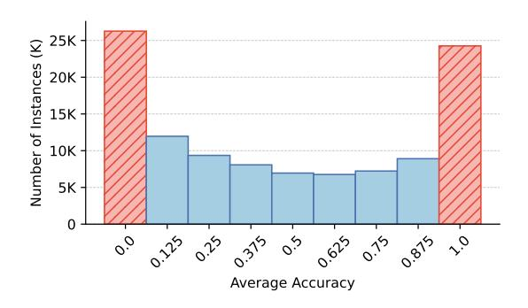

Figure 5 Distribution of per-sample accuracy in the initial training pool, estimated by evaluating 8 diverse responses per sample. Samples with all responses correct or all incorrect are considered too easy or too hard and are excluded from QA-based data.

Effectiveness of Data Filtering. To evaluate the effective-

ness of our data filtering pipeline, we analyze the results presented in Table 11. Two key observations emerge from this analysis. **First**, training solely on text data leads to a noticeable drop in performance on

video tasks compared to the Qwen baseline, suggesting a domain shift and poor generalization. Adding image data significantly improves video QA performance, particularly on VideoMMMU, highlighting the importance of image-based math and reasoning data. However, due to the absence of temporal grounding data, performance on the Charades-STA benchmark remains low. When combining text, image, and video data, the model achieves the best overall performance under both filtered and unfiltered settings. Second, in both the text+image and text+image+video configurations, removing overly easy or difficult samples leads to consistent performance gains. Additionally, this filtering reduces the number of training samples, thereby improving training efficiency. These findings validate the effectiveness of our data filtering strategy for GRPO-based reinforcement learning.

<span id="page-19-1"></span>Table 11 Performance Comparison across Different Training Data and Filtering Strategy. Note that we report the results under the RL with CoT setting. Combining text, image, and video data yields the best overall performance. Filtering out overly easy and hard samples consistently improves results while reducing dataset size, validating the effectiveness of our data curation pipeline.

| Training Data        | Filtered | Size | VideoMME | MVBench | VideoMMMU | Charades-STA |
|----------------------|----------|------|----------|---------|-----------|--------------|
| Text                 | ✗        | 17K  | 63.3     | 62.6    | 45.8      | 38.6         |
| Image                | ✗        | 50K  | 65.6     | 66.8    | 52.8      | 40.1         |
| Video                | ✗        | 70K  | 64.7     | 71.0    | 55.1      | 59.0         |
|                      | ✗        | 67K  | 66.1     | 67.4    | 53.3      | 41.6         |
| Text + Image         | ✓        | 34K  | 67.0     | 68.5    | 56.4      | 42.0         |
| Text + Image + Video | ✗        | 138K | 65.4     | 71.0    | 55.4      | 59.7         |
|                      | ✓        | 83K  | 66.1     | 71.2    | 56.4      | 59.8         |

# <span id="page-19-0"></span>B Reward Designs

To complement the reward description in the main paper, we provide the details below. Our overall reward is defined as a weighted sum of the task reward and the format reward.

Task Reward. We consider three task types for computing task rewards: QA, temporal grounding, and grounding QA.

• Question Answering. For math problems, we use math-verify to compare the prediction with the ground truth; otherwise we compare normalized strings (e.g., case-folded, whitespace stripped). This yields a binary reward

$$R_{\text{QA}}(o_i) \in \{0, 1\}.$$

• Temporal Grounding. Let the ground-truth segments be G = {[s<sup>j</sup> , e<sup>j</sup> ]}<sup>j</sup> and the predicted segments be <sup>G</sup><sup>b</sup> <sup>=</sup> {[sˆk, <sup>e</sup>ˆk]}<sup>k</sup> (either set may contain one or multiple segments). We compute the temporal IoU and take the best matching pair with the largest tIoU. If no valid segment can be parsed, we assign RTG(oi) = 0.

$$R_{\mathrm{TG}}(o_i) = \max_{[\hat{s}, \hat{e}] \in \widehat{\mathcal{G}}, [s, e] \in \mathcal{G}} \mathrm{tIoU}([\hat{s}, \hat{e}], [s, e]) \in [0, 1],$$

• Grounding QA. We parse the textual answer and the predicted segments from the model output, compute RQA(oi) and RTG(oi) as above, and sum them:

$$R_{\text{GQA}}(o_i) = R_{\text{QA}}(o_i) + R_{\text{TG}}(o_i) \in [0, 2].$$

Format Reward. In addition to task correctness, we use a binary format reward Rfmt(oi) ∈ {0, 1} enforced via strict regex checks. For VideoAuto-R1, we require exactly two \\boxed{...} answers, and in between one <think>...</think> block, with no additional text before, between, or after.

Analysis of the Dual-Answer Reward Design. In Section 4.2 of the main paper, we introduce the dual-answer reward design used during training. The key components of this design are the weight coefficients w<sup>1</sup> and w<sup>2</sup>

assigned to the initial and reviewed answers, respectively, as well as the fallback bonus weight α. Table [12](#page-20-2) summarizes the effects of different choices for these coefficients.

First, when w<sup>1</sup> = w2, the model assigns identical rewards to two distinct cases: (i) the first answer is correct but the second is wrong, and (ii) the first answer is wrong but the second is correct. However, our intention is to prioritize the correctness of the reviewed answer, since users who permit step-by-step reasoning with a sufficient compute budget expect the final answer to be reliable. Therefore, equal weighting fails to distinguish these two scenarios. By choosing w<sup>1</sup> <w<sup>2</sup> (e.g., 0.9: 1.1), the total reward becomes 0.9 for a "correct → wrong" pattern, but 1.1 for "wrong → correct", thereby encouraging the model to produce accurate reviewed answers during RL.

<span id="page-20-2"></span>Table 12 Effects of Dual-Answer Reward Coefficients.

| First<br>Answer | Second<br>Answer | w1<br>= 1,<br>w2<br>= 1,<br>α= 0 | w1<br>= 0.9,<br>w2<br>= 1.1,<br>α= 0 | w1<br>= 0.9,<br>w2<br>= 1.1,<br>α= 0.3 |
|-----------------|------------------|----------------------------------|--------------------------------------|----------------------------------------|
| ✗               | ✗                | 0                                | 0                                    | 0                                      |
| Let's analyze   | ✗                | 0                                | 0                                    | 0                                      |
| ✓               | ✗                | 1                                | 0.9                                  | 0.9                                    |
| ✗               | ✓                | 1                                | 1.1                                  | 1.1                                    |
| Let's analyze   | ✓                | 1                                | 1.1                                  | 1.4                                    |
| ✓               | ✓                | 2                                | 2                                    | 2                                      |

Second, even with w<sup>1</sup> < w2, the model still assigns the same reward when the first output is an incorrect guess or a fallback string "Let's analyze the problem step-by-step." The fallback string is not a wrong prediction; rather, it is an explicit and honest signal that the model identifies the task as difficult and intentionally defers reasoning to the next stage. Such behavior should be incentivized. By introducing the fallback bonus α, as shown in the last column of Table [12,](#page-20-2) the model is able to clearly differentiate between an incorrect guess and a fallback indicator.

<span id="page-20-0"></span>Finally, when both the initial and reviewed answers are correct, the model receives the highest possible reward, which aligns with our design goal.

# C Prompt Template

In the main paper, we introduce the system prompt used in VideoAuto-R1, which adopts an answer → think → answer format. This prompt design avoids a cold-start stage and facilitates stable training with promising performance. Additionally, in Table 5 of the main paper, we explore alternative reinforcement learning settings.

RL without Thinking. As shown in Table [13,](#page-20-3) this variant directly applies GRPO without requiring any intermediate explanation. The model is prompted to provide only the final answer enclosed in a \\boxed{} command.

RL with Thinking. As shown in Table [14,](#page-20-4) this is the standard prompt for GRPO training. The model first generates a reasoning trace within <think> </think> tags, followed by the final answer enclosed in \\boxed{}. This prompt format aligns with previous R1-style approaches such as Video-R1 [\(Feng et al.,](#page-13-2) [2025\)](#page-13-2) and VideoChat-R1 [\(Li et al.,](#page-14-3) [2025c\)](#page-14-3).

<span id="page-20-3"></span>Table 13 System Prompt for RL without Thinking.

#### SYSTEM PROMPT

You are a helpful assistant. Put your final answer in \\boxed{}.

#### <span id="page-20-4"></span>Table 14 System Prompt for RL with Thinking.

### SYSTEM PROMPT

You are a helpful assistant.

<span id="page-20-1"></span>FIRST, think through the reasoning process as an internal monologue, and THEN provide the final answer. The reasoning process MUST be enclosed within <think> </think> tags, and the final answer MUST be wrapped in \\boxed{}.

<span id="page-21-2"></span>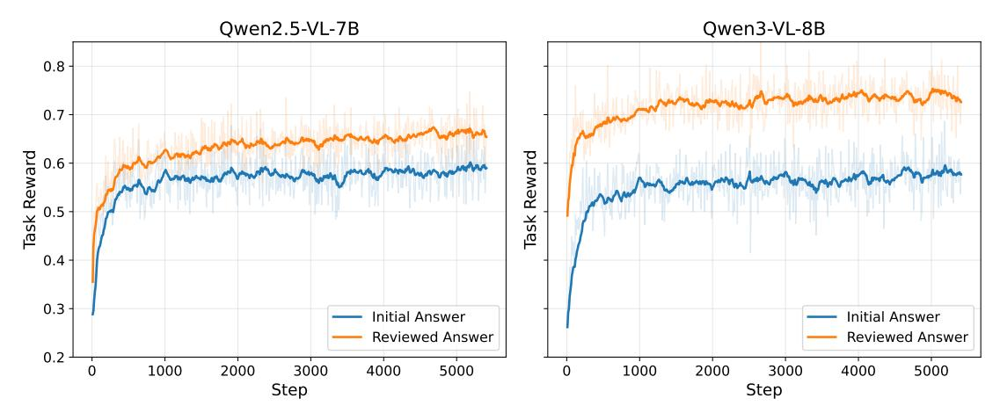

Figure 6 Training Curves of VideoAuto-R1. We show the average task reward for both initial and reviewed answers during GRPO training.

# **D** Training Curve

To better understand the behavior of VideoAuto-R1, we visualize the training curves of the task rewards for both the initial and reviewed answers during training, as shown in Figure 6. We highlight three key observations below.

Reviewed Answer vs. Initial Answer. For both Qwen2.5-VL-7B and Qwen3-VL-8B, the reviewed answer consistently achieves a higher task reward than the initial answer during training. This performance gap remains stable after convergence, indicating that the answer-think-answer paradigm effectively leverages intermediate reasoning to refine predictions. Moreover, this confirms that the dual-answer reward design (with  $w_2 > w_1$ ) can encourage the model to treat the second answer as a meaningful revision rather than a naive re-sampling of the first.

**Training Dynamics.** As training progresses, the task rewards for both answers increase. In the early stages, we observe a rapid improvement, followed by a slower but steady rise until convergence. This pattern suggests that GRPO quickly captures coarse task structure and gradually optimizes finer-grained reasoning capabilities over time.

Impact of Backbone Capacity. Throughout training, Qwen3-VL-8B consistently outperforms Qwen2.5-VL-7B in both answers. The stronger backbone benefits from better initialization and sustains a higher reward margin after convergence. These results demonstrate that VideoAuto-R1 scales effectively with model capacity: larger base models can more fully exploit dual-answer supervision and confidence-based reasoning, resulting in higher final results.

# <span id="page-21-0"></span>**E** Inference Strategy

At test time, VideoAuto-R1 employs a confidence-based early-exit mechanism to determine whether to stop after generating the initial direct answer or to proceed with a full chain-of-thought rationale followed by a reviewed answer. Algorithm 1 summarizes this procedure, which consists of three main steps: (1) generate the initial answer, (2) compute its confidence score, and (3) decide whether to exit early or continue reasoning.

<span id="page-21-1"></span>For implementation simplicity, we terminate generation early by detecting the appearance of the opening <think> tag during greedy decoding. We then extract the token sequence enclosed in the first  $\$ block, which always precedes the <think> tag. Since the initial answer  $a_1$  typically consists of only a few tokens, this strategy enables low-overhead confidence computation while providing substantial savings in decoding latency and token budget whenever early exit is triggered.

### <span id="page-22-1"></span>Algorithm 1 Inference Strategy of VideoAuto-R1

```
Require: Trained model p_{\theta}, video v, question q, confidence threshold \tau, fallback string f
Ensure: Predicted answer \hat{a}
 1: Given input (v,q), perform greedy decoding until the first <think> tag is generated.
 2: Let a_1 = (t_1, \dots, t_L) be the tokens inside the first box, and let y_{<\ell_0} denote the prefix up to (and including)
    the opening of a_1
 a_1 = f then
                                                                                                   ▶ designated fallback string
        s(a_1) \leftarrow -1e6
 5: else
        Compute length-normalized confidence s(a_1) \leftarrow \frac{1}{L} \sum_{\ell=1}^{L} \log p_{\theta}(t_{\ell} \mid y_{\leq \ell_0 + \ell - 1}, x)
 6:
 7: end if
    if s(a_1) \geq \log \tau then
                                                                                                                       ▶ early exit
 8:
         Accept the initial answer
        return \hat{a} \leftarrow a_1
10:
11: else

        Resume decoding from the current prefix
12:
        Generate rationale r enclosed in <think>... </think> and the second boxed answer a_2
13:
        return \hat{a} \leftarrow a_2
14:
15: end if
```

# F Additional Experiments

In this section, we present additional experiments and analyses to complement the findings reported in the main paper.

#### F.1 Performance with Different Frames

In the main paper, we report the best-performing configurations of our model. Here, we present the complete results in Table 15 and analyze how the number of input frames affects performance on both perception and reasoning benchmarks.

Under a 16K video-token budget using Qwen2.5-VL, increasing the number of frames from 64 to 256 yields noticeable improvements on most perception benchmarks for both the Qwen baseline and VideoAuto-R1. For example, accuracy on VideoMME improves from 63.1% to 66.0%, and on LongVideoBench from 59.7% to 60.9%. However, the reasoning-oriented benchmark VideoMMMU shows weaker dependence on frame count, where performance slightly decreases with additional frames. This trend persists when switching to Qwen3-VL, which supports a larger 128K video-token budget and up to 2,048 frames.

Moreover, VideoAuto-R1 achieves consistent improvements compared to the Qwen baseline. For instance, even under a 64-frame budget, VideoAuto-R1 improves upon the baseline performance from 63.1% to 64.6% on VideoMME, and from 66.2% to 69.7% on MMVU, demonstrating the effectiveness of our proposed approach across both low and high frame regimes.

# <span id="page-22-0"></span>F.2 Analysis on Temporal Grounding Benchmarks

In the main paper, we emphasize that for grounding benchmarks, the initial answer is typically sufficient, so we exit early by default to save computation. In Table 16, we report the detailed grounding results when using the first boxed answer, the second boxed answer, and the confidence-based auto strategy.

Initial vs. Reviewed Answer. Unlike video QA benchmarks, temporal grounding shows almost no gap between the first and reviewed answers. For VideoAuto-R1, mIoU is the same for ActivityNet and NExT-GQA when comparing the first and second boxed answers. On NExT-GQA, the grounding QA accuracy also remains the same.

<span id="page-23-1"></span>Table 15 Evaluation Results on Video QA Benchmarks with Different Frames. For the Qwen2.5-VL models, we allow up to 16K total video tokens. For the Qwen3-VL models, we allow up to 128K total video tokens.

| Model                       | Frames | Video Perception Benchmark |      |                                      |      | Video Reasoning Benchmark |      |
|-----------------------------|--------|----------------------------|------|--------------------------------------|------|---------------------------|------|
|                             |        |                            |      | VideoMME MVBench LongVideoBench MMVU |      | VideoMMMU                 | MVP  |
| Qwen2.5-VL-7B               | 64     | 63.1                       | 67.0 | 59.7                                 | 66.2 | 54.6                      | 35.8 |
| Qwen2.5-VL-7B               | 128    | 65.9                       | 67.0 | 60.6                                 | 66.2 | 54.7                      | 35.8 |
| Qwen2.5-VL-7B               | 256    | 66.0                       | 67.1 | 60.9                                 | 65.7 | 52.7                      | 36.5 |
| VideoAuto-R1(Qwen2.5-VL-7B) | 64     | 64.6                       | 71.0 | 60.0                                 | 69.7 | 58.7                      | 39.2 |
| VideoAuto-R1(Qwen2.5-VL-7B) | 128    | 66.7                       | 71.0 | 60.4                                 | 69.1 | 56.6                      | 39.3 |
| VideoAuto-R1(Qwen2.5-VL-7B) | 256    | 67.3                       | 71.0 | 60.5                                 | 68.6 | 56.7                      | 39.4 |
| Qwen3-VL-8B                 | 64     | 67.3                       | 69.4 | 63.4                                 | 69.9 | 61.0                      | 40.4 |
| Qwen3-VL-8B                 | 256    | 70.9                       | 69.4 | 66.0                                 | 69.6 | 59.9                      | 40.5 |
| Qwen3-VL-8B                 | 2048   | 72.5                       | 69.4 | 67.6                                 | 69.9 | 59.8                      | 40.5 |
| VideoAuto-R1(Qwen3-VL-8B)   | 64     | 67.9                       | 71.8 | 63.9                                 | 71.0 | 65.0                      | 42.7 |
| VideoAuto-R1(Qwen3-VL-8B)   | 256    | 70.4                       | 72.0 | 67.1                                 | 71.0 | 63.8                      | 42.9 |
| VideoAuto-R1(Qwen3-VL-8B)   | 2048   | 71.7                       | 72.0 | 67.4                                 | 71.1 | 64.0                      | 43.0 |

<span id="page-23-2"></span>Table 16 Comparison of Different Inference Strategies on Temporal Grounding Benchmarks. We compare the results using the first boxed answer, the second boxed answer, or the confidence-based early-exit answer. We observe that on grounding benchmark, the first boxed answer is typically sufficient, so we early-exit without further reasoning to save computation.

| Model                           | Inference Strategy | ActivityNet |      |      |      | NExT-GQA |      |
|---------------------------------|--------------------|-------------|------|------|------|----------|------|
|                                 |                    | 0.3         | 0.5  | 0.7  | mIoU | Acc      | mIoU |
| VideoAuto-R1<br>(Qwen2.5-VL-7B) | First Answer       | 69.2        | 48.5 | 27.3 | 47.6 | 80.6     | 36.7 |
|                                 | Second Answer      | 69.2        | 48.5 | 27.3 | 47.6 | 80.6     | 36.7 |
|                                 | Auto               | 69.2        | 48.5 | 27.3 | 47.6 | 80.6     | 36.7 |

We hypothesize two reasons for this phenomenon. First, since the grounding procedure does not require multi-step logical deduction, the model can map the queried event to a time span directly from perception. Once the model has localized a segment in the first answer, additional textual reasoning has limited room to further improve the IoU. Second, since we lack the SFT stage to teach the model how to explicitly reason on the grounding task, the model cannot easily refine the predicted segments. Consequently, the reasoning stage rarely corrects localization errors, leading to nearly identical scores. In practice, this suggests that for grounding tasks, RL still shows significant improvements compared to baseline or SFT, but it is often unnecessary to rely on long and language-based thinking rationales.

Reasoning Traces on QA vs. Grounding. To better understand this behavior, we examine representative reasoning traces of VideoAuto-R1 between grounding and QA tasks, as shown in Figure [9,](#page-28-0) [10,](#page-29-0) and [4.](#page-12-0) On video QA benchmarks, the thinking rationale usually contains multi-step analysis: enumerating visual evidence, performing arithmetic, or checking answer options. In contrast, grounding traces are much shorter. The model typically identifies the relevant event or shot, notes when it appears and disappears in the video, and then outputs the corresponding timestamps or intervals.

These qualitative observations align with the quantitative results in Table [4:](#page-8-1) for temporal grounding benchmarks, explicit reasoning provides limited additional benefit over the direct localization. Therefore, we use the direct answering results on grounding benchmarks for VideoAuto-R1.

### <span id="page-23-0"></span>F.3 Analysis of the Impact of Cold-Start SFT

In our training framework, we deliberately omit chain-of-thought SFT and proceed directly to RL. Traditionally, SFT is used to (1) teach the CoT output format, (2) imitate the CoT reasoning process, and (3) acquire

general knowledge from newly collected data. However, with modern base models that are already trained on massive corpora, the marginal benefit for (1) and (3) is limited. Moreover, collecting large-scale, high-quality CoT traces for (2) is expensive and often noisy.

<span id="page-24-2"></span>Table 17 Ablation on Cold-Start CoT SFT.

| Setting                    | VideoMME | MVBench | VideoMMMU |
|----------------------------|----------|---------|-----------|
| Qwen2.5-VL baseline        | 66.0     | 67.1    | 54.7      |
| SFT with Video-R1-CoT data | 60.1     | 64.0    | 53.8      |
| RL with thinking           | 66.1     | 71.2    | 56.4      |
| SFT → RL with thinking     | 61.7     | 64.3    | 53.5      |

In early experiments, SFT on Video-R1-CoT data [\(Feng et al.,](#page-13-2) [2025\)](#page-13-2), which has both the intermediate reasoning traces and final answer, not only failed to improve performance, but actually degraded the Qwen2.5- VL baseline, a phenomenon also observed in prior work [\(Li et al.,](#page-14-2) [2025e;](#page-14-2) [Chen et al.,](#page-13-16) [2025a\)](#page-13-16). Table [17](#page-24-2) summarizes this effect. Pure SFT substantially hurts performance across all three benchmarks. When we apply GRPO starting from the SFT checkpoint ("SFT → RL with thinking"), the final model remains significantly worse than RL applied directly on the base model.

These results suggest that low-quality CoT supervision can distort the behavior of a strong base model and create a poor initialization for RL. We therefore focus on directly incentivizing the base model's reasoning via GRPO-style reinforcement learning.

# <span id="page-24-1"></span>G Limitations

In this section, we mainly discuss three limitations of our work and leave them as future work.

First, our distinction between direct answering and reasoning is currently made purely at test time via a confidence-based early-exit rule on the first boxed answer. While this mechanism is simple and effective, it does not explicitly shape the confidence distribution during training. A natural extension would be to incorporate the probability of the first boxed answer into the training objective itself: for simple questions, the model should be encouraged to assign high confidence to a correct direct answer, whereas for genuinely hard questions it should learn to keep the initial confidence low and defer to the reasoning stage. Jointly optimizing both accuracy and calibrated confidence could further improve the reliability of the early-exit policy.

Second, our current reasoning mechanism relies strictly on language-based chain-of-thought. While effective for symbolic and logical tasks, we observe that such textual reasoning yields limited improvements on perception-oriented QA and temporal grounding benchmarks compared to direct answering. This suggests that purely semantic rationales may be insufficient to correct fine-grained visual perception errors or refine precise temporal boundaries once the initial visual encoding is fixed. Future work could explore interleaved multimodal reasoning paradigms, such as "thinking with frames", where the model explicitly revisits video segments or visual features during the reasoning to enhance perceptual precision and grounding accuracy.

Third, the existing video reasoning benchmarks are still limited in scope and difficulty. Many datasets contain relatively short clips and perception-oriented questions. More advanced benchmarks that stress long-range temporal dependencies, compositional logic, and counterfactual reasoning, rather than just math or symbolic-heavy problems, are needed to more faithfully evaluate and compare the reasoning capabilities of MLLMs.

<span id="page-24-0"></span>Fourth, truly "must-think" video data, where multi-step reasoning is indispensable rather than merely helpful, remains scarce. Constructing high-quality, large-scale video datasets that explicitly require deep reasoning (for example, multi-event causal chains, non-trivial temporal puzzles, or physically challenging scenarios) is therefore an urgent and valuable direction for future work. In the meantime, exploring the advanced reasoning pattern for the grounding task is also an interesting direction.

# H Qualitative Examples

In this section, we provide additional qualitative results to support our analysis.

In Figure [7,](#page-26-0) we first present a failure case of VideoChat-R1 [\(Li et al.,](#page-14-3) [2025c\)](#page-14-3), where the direct answer is correct but the CoT-reasoned result is incorrect. Although the model generates a seemingly reasonable step-by-step rationale, it suffers from hallucinations. For example, it mistakenly describes dancing details that are not present at the end of the video. These errors often stem from a single step of misperception or flawed reasoning, yet they ultimately lead to incorrect final answers. In contrast, the direct answer provides an accurate and concise response for such perception-oriented tasks.

In Figure [8,](#page-27-0) we also show a success case of VideoChat-R1 on VideoMMMU. Unlike perception-oriented examples, this question involves a science problem based on an instructional video. In this context, the chain-of-thought reasoning process demonstrates a clear advantage: the model performs step-by-step deduction, correctly computes equations, and arrives at the final numerical result, which would be challenging via direct answering alone.

Next, we present qualitative results from VideoAuto-R1 across different benchmark types. In Figure [9,](#page-28-0) we illustrate the model's outputs on temporal grounding tasks. For these examples, the reasoning trace is typically straightforward—often limited to identifying when the action begins and ends. In many cases, the initial and reviewed answers are identical. Based on this observation, we apply early-exit directly on temporal grounding tasks without invoking further reasoning, which leads to reduced computation without sacrificing accuracy.

In Figure [10,](#page-29-0) we show results on perception-oriented QA benchmarks. For these relatively simple visual questions, VideoAuto-R1 consistently provides accurate responses in the initial answer, often accompanied by a high confidence score (e.g., over 99%). These examples trigger early-exit behavior, allowing the model to maintain strong accuracy while improving inference efficiency.

In Figures [11,](#page-30-0) we showcase examples from reasoning-intensive QA benchmarks. Compared to perceptionoriented tasks, the reasoning traces here are significantly longer, with more detailed deduction steps. Notably, the model's confidence in the initial answer is relatively low in such cases, allowing our confidence-based inference mechanism to trigger reasoning effectively.

<span id="page-26-0"></span>


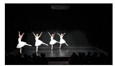


What are the moves in the last scene of this dance?

- A. Kneel down on one knee and lean back. B. Passe and then chasse.

- C. Releve and then pirouette. D. Passe and then Grand jete.

# **GT: A**

# **VideoChat-R1-Thinking (Direct-Answering) : A**


# **VideoChat-R1-Thinking (CoT Reasoning) :**

<think>

The video shows a ballet performance where the dancers are executing a series of movements. The last scene involves the dancers performing a sequence that includes a combination of steps and poses. The movements appear to be fluid and coordinated, typical of a ballet piece.

- At 0:10 to 1:50, the dancers perform a series of steps that involve passing their arms and legs in a synchronized manner.
- At 1:50 to 2:00, the dancers execute a grand jete, which is a leap where the dancer jumps into the air and extends their body horizontally before landing gracefully.

Given these observations, the correct answer should reflect the final movement performed by the dancers in the last scene.

</think>

**<answer>D</answer>**


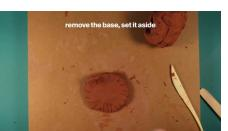

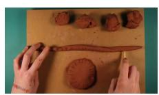


There are two images here. One shows a girl in green clothing with braided hair, holding a clay container in front of a solid color background wall. The other shows a girl in black and white floral clothing with loose hair. According to the video, which character appears first?

- A. Boy with short hair and green stripes B. Boy with golden hair
- **GT: D**

- C. Girl in green clothing with loose hair D. Girl in green clothing with braided hair
- E. Girl in black and white floral clothing with loose hair

### **VideoChat-R1-Thinking (Direct-Answering) : D**


# **VideoChat-R1-Thinking (CoT Reasoning) :**

<think>

The video starts with a title card for \"metkids\" and then transitions to a scene where hands are shown kneading clay on a surface. After this, there is a cut to a girl in green clothing with braided hair holding a clay container. This sequence suggests that the girl in green clothing with braided hair appears after the initial clay preparation scenes.

The question asks which character appears first. Since the video begins with the clay preparation and then cuts to the girl in green clothing with braided hair, it's clear she is not the first character to appear. Therefore, the correct answer should be related to the girl in black and white floral clothing with loose hair, as she is the only one mentioned before the girl in green clothing with braided hair.

</think>

**<answer>E</answer>**


Figure 7 Failure case of VideoChat-R1. The model hallucinates visual content in its reasoning trace, leading to an incorrect answer. Direct answering performs better in this perception-oriented task.

<span id="page-27-0"></span>

A wind tunnel draws in sea-level standard air from the room and accelerates it into a 1-m by 1-m test section. A pressure transducer in the test section wall measures ∆=45 mm water between inside and outside. Estimate the absolute pressure at the nose of the model. Options:

A. 112000 Pa B. 101350 Pa C. 98000 Pa D. 99000 Pa E. 95280 Pa F. 110000 Pa G. 107000 Pa H. 94000 Pa I. 105000 Pa **GT: B**

## **VideoChat-R1-Thinking (Direct-Answering) : E**


### **VideoChat-R1-Thinking (CoT Reasoning) :**

<think>

To estimate the absolute pressure at the nose of the model, we need to understand the relationship between gauge pressure, absolute pressure, and atmospheric pressure.

From the video, we know that:

- Absolute pressure !"# is the pressure measured relative to a vacuum (0 Pa).
- Gauge pressure \$!\$% is the pressure measured relative to the ambient pressure !, which is usually the local atmospheric pressure.
- The formula for gauge pressure is: \$!\$% = !"# − !.

Given:

We can use the conversion factor between mm water and psi to find the gauge pressure in psi:

1 mm water = 
$$0.002316$$
 psi

45 mm water = 
$$45 \times 0.002316 \approx 0.10422$$
 psi

Now, using the formula \$!\$% = !"# − !:

$$P_{abs} = 0.10422 \text{ psi} + 14.7 \text{ psi} \approx 14.80422 \text{ psi} 0.10422 \text{ psi} = P_{abs} - 14.7 \text{ psi}$$

Since 1 psi is approximately equal to 6894.757293 Pa, we convert the absolute pressure to pascals:

$$P_{abs} \approx 14.80422 \times 6894.757293 \approx 102,000 \text{ Pa}$$

The closest option to this value is 101350 Pa.

</think>

**<answer>B</answer>**


Figure 8 Success Case of VideoChat-R1 on VideoMMMU. The question involves scientific analysis with equations. Chainof-thought reasoning leads to the correct answer, whereas direct answering would likely fail.

<span id="page-28-0"></span>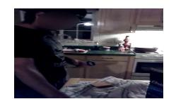


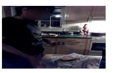

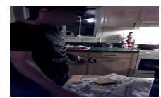

Locate the start and end timestamps of the video segment corresponding to the description: *the person was pouring a bottle of beer.* Please provide the start and end timestamps (in seconds, precise to one decimal place) in the format \\boxed{[start, end]}.

# **VideoAuto-R1 : \\boxed{[3.2, 10.8]}**

<think>At 3.2 seconds, the person is seen holding a bottle and tilting it towards their mouth, which suggests they are pouring something into their mouth. At 10.8 seconds, they finish pouring and put the bottle down. This action aligns with the described behavior of pouring a bottle of beer.</think> **\\boxed{[3.2, 10.8]} GT: [1.1, 9.4]**


Locate the start and end timestamps of the video segment corresponding to the description: *Another man is shown being pulled back onto the raft.* Please provide the start and end timestamps (in seconds, precise to one decimal place) in the format \\boxed{[start, end]}.

### **VideoAuto-R1 : \\boxed{[42.5, 58.3]}**

<think>At 42.5 seconds, we see another individual who has fallen into the river. The rafters work together to pull him back onto the raft, ensuring everyone's safety. This action demonstrates teamwork and coordination among the group.</think>

**\\boxed{[42.5, 58.3]}**

**GT: [70, 73]**


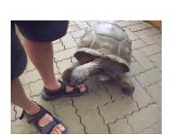


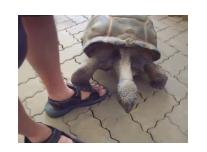


Question: *what did the person do after the turtle finished eating the leaf?*

Options: A. drink B. look to his left C. smiled D. look backwards E. walk away Please answer the question and then provide the video segment that best supports your answer. The start and end timestamps must be in seconds with exactly one decimal place.

Output format: \\boxed{answer <> [start, end]}. For example: \\boxed{A <> [20.3, 30.8]}

# **VideoAuto-R1 : \\boxed{E <> [31.5, 46.9]}**

<think>At 31.5 seconds, the person is seen walking away from the turtle, which indicates they have finished interacting with it. This action aligns with the option E, \"walk away.\" The other options do not fit the observed behavior in the video.</think>

**\\boxed{E <> [31.5, 46.9]}**

**GT: E <> [34.3, 45.8]**

Figure 9 VideoAuto-R1 on Temporal Grounding Tasks. The reasoning trace is simple and redundant with the initial answer, enabling effective early-exit without full CoT reasoning.

<span id="page-29-0"></span>

Question: What is the action performed by the person in the video?

Options:

(A) boiling (B) putting (C) stirring (D) cooking

Put your final answer in \\boxed{}.

**GT: C**

**VideoAuto-R1 : \\boxed{C}** (confidence 0.99, early-exit)

<think>

The person in the video is actively engaged in cooking, specifically stirring food in a pan with a spatula. This action aligns with the option C, stirring.

The other options do not fit the observed activity:

- Boiling (A) involves heating water to a boil, which is not what is happening here.
- Putting (B) implies placing something into the pan, but the person is not doing that; they are stirring.
- Cooking (D) is too broad and includes all cooking activities, including stirring, so it is not the specific action being performed here.

</think>

**\\boxed{C}**


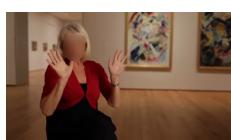

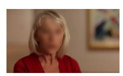


A woman is sitting inside a gallery. She is wearing a red coat and black clothes. Her hair is blond, and she has a watch on her wrist. There are two paintings hanging on the wall behind her. When she mentions 'his work is incredibly worked out and um,' what change occurs to the woman onscreen? Options:

A. The woman walks to admire four artworks. B. The woman starts introducing the artworks.

C. The woman changed her clothes. D. The woman sits down to admire four artworks.

E. The woman's hair was tied up.

Put your final answer in \\boxed{}.

**GT: A**

**VideoAuto-R1 : \\boxed{A}** (confidence 0.99, early-exit)

<think>

The woman is initially seen sitting, but as she mentions \"his work is incredibly worked out and um,\" she stands up and walks towards the wall where four artworks are displayed. This action aligns with the option A, which states that she walks to admire four artworks.

The other options do not fit the sequence of events shown in the video. The woman does not change her clothes, nor does she sit down to admire the artworks after standing up. The mention of her hair being tied up is not relevant to the actions taken in the video.

</think>

**\\boxed{A}**


Figure 10 VideoAuto-R1 on Perception-Oriented QA Tasks. High-confidence initial answers trigger early exit, improving inference efficiency.

<span id="page-30-0"></span>

A team member consistently generates innovative ideas but struggles to follow through with implementation and often overlooks practical details. According to Belbin's model, which role most likely describes this individual, and what is a potential weakness they might exhibit?

### Options:

- A. Implementer; Inflexible and close-minded
- B. Plant; Might ignore incidentals and might be too pre-occupied to communicate properly
- C. Shaper; Easily provoked and may offend others
- D. Completer-Finisher; Excessively worried and reluctant to delegate work
- E. Coordinator; Seen as manipulative and work-shy
- F. Team Worker; Indecisive and tends to avoid confrontation
- G. Resource Investigator; Overly optimistic and can lose interest quickly
- H. Monitor Evaluator; Lacks drive and ability to inspire, overly critical
- I. Specialist; Contributes only on a narrow front and dwells on technicalities

Put your final answer in \\boxed{}.

**GT: B**

# **VideoAuto-R1 : \\boxed{B}** (confidence 0.94, continue CoT reasoning) <think>

The individual who consistently generates innovative ideas but struggles to follow through with implementation and often overlooks practical details aligns with the characteristics of a \"Plant\" role. The Plant role is described as innovative, creative, problem-solving, and free-thinking, which matches the description of generating ideas. However, the potential weakness mentioned for the Plant role is that they might ignore incidentals and might be too pre-occupied to communicate properly, which fits the scenario of overlooking practical details and possibly not communicating effectively.

Therefore, the correct answer is B. Plant; Might ignore incidentals and might be too pre-occupied to communicate properly.

</think>

**\\boxed{B}**


Figure 11 VideoAuto-R1 on Reasoning-Oriented QA Tasks. The reasoning trace is longer and more detailed, with clear step-by-step deductions.