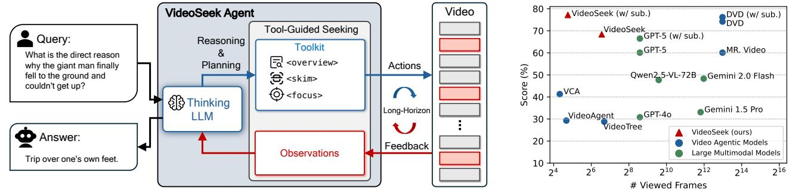
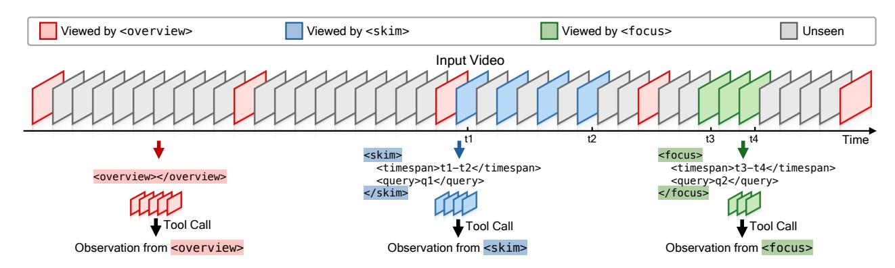
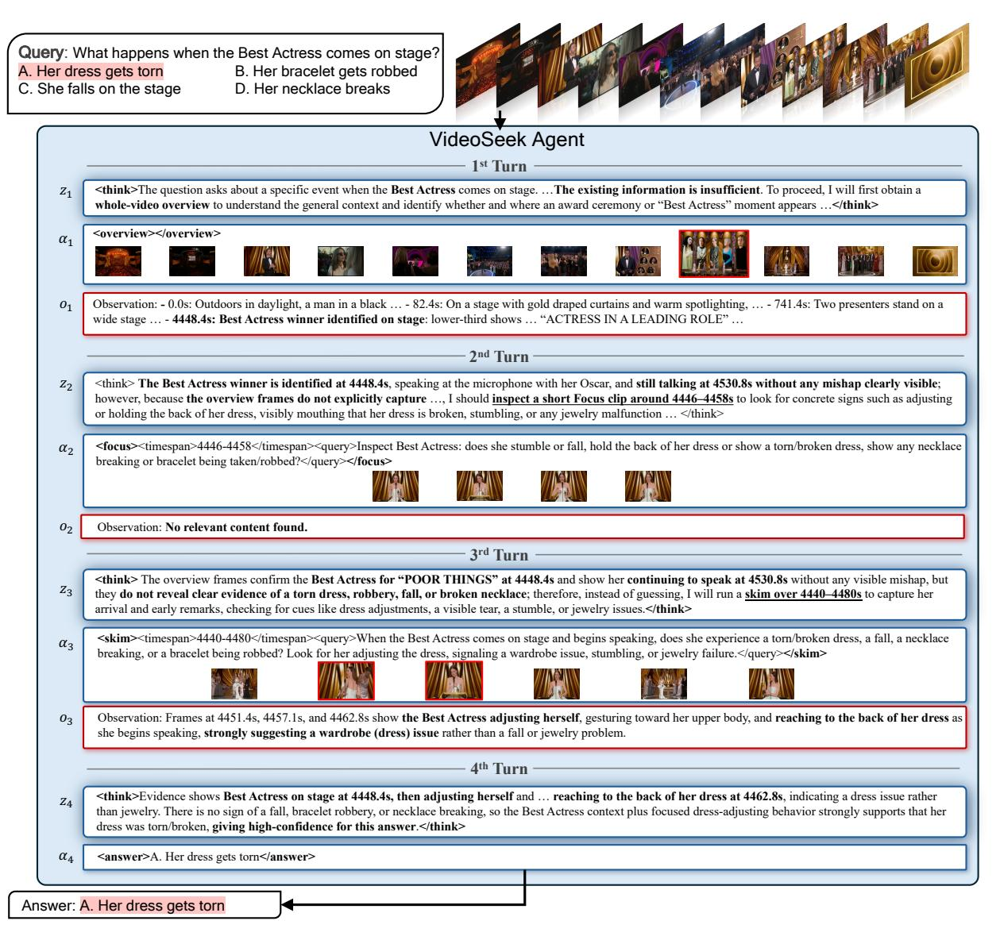
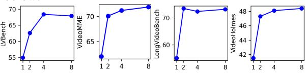

# <span id="page-0-1"></span>VideoSeek: Long-Horizon Video Agent with Tool-Guided Seeking

Jingyang Lin<sup>1,2\*</sup> Jialian Wu<sup>1</sup> ⊠ Jiang Liu<sup>1</sup> Ximeng Sun<sup>1</sup> Ze Wang<sup>1</sup> Xiaodong Yu<sup>1</sup> Jiebo Luo<sup>2</sup> Zicheng Liu<sup>1</sup> Emad Barsoum<sup>1</sup> <sup>1</sup>AMD <sup>2</sup>University of Rochester

Code: github.com/jylins/videoseek



<span id="page-0-0"></span>Figure 1. **Overview of VideoSeek**. *Left*: VideoSeek is a long-horizon video agent that actively seeks answer-critical evidence, guided by video logic flow. Given a query and a video, a thinking LLM reasons over accumulated observations, plans the next step, and selects a tool from the toolkit. The selected tool gathers new evidence from the video (:: viewed frames; :: unseen frames), which is fed back to the thinking LLM in a think-act-observe loop until sufficient evidence is collected to produce the final answer. *Right*: Accuracy *vs.* number of viewed frames on LVBench [56]. • denote video agentic models and • denote standalone LMMs. • VideoSeek (*w/ subtitles*) achieves the best performance while processing only about 1/300 as many frames as the second-best video agent.

#### **Abstract**

Video agentic models have advanced challenging videolanguage tasks. However, most agentic approaches still heavily rely on greedy parsing over densely sampled video frames, resulting in high computational cost. We present VideoSeek, a long-horizon video agent that leverages video logic flow to actively seek answer-critical evidence instead of exhaustively parsing the full video. This insight allows the model to use far fewer frames while maintaining, or even improving, its video understanding capability. VideoSeek operates in a think-act-observe loop with a welldesigned toolkit for collecting multi-granular video observations. This design enables query-aware exploration over accumulated observations and supports practical video understanding and reasoning. Experiments on four challenging video understanding and reasoning benchmarks demonstrate that VideoSeek achieves strong accuracy while using far fewer frames than prior video agents and standalone LMMs. Notably, VideoSeek achieves a 10.2 absolute points improvement on LVBench over its base model, GPT-5, while using 93% fewer frames. Further analysis highlights the significance of leveraging video logic flow, strong reasoning capability, and the complementary roles of toolkit design.

#### 1. Introduction

Video-language understanding [4, 22, 34, 63] requires perceiving and reasoning over the video streams and the natural-language instructions to interpret user intent. Its practical impact spans a wide range of applications, including multimodal assistants [42, 59], autonomous driving [20, 52], and vision-guided robotics [48, 74]. Recent advancements in large language models (LLMs) [1, 3, 40, 53] and large multimodal models (LMMs) [23, 31, 55] have successfully pushed the limits of video-language understanding, encouraging a surge of Video-LMMs [27, 30, 47, 50, 65, 72, 75] that achieve promising performance on standard video-language tasks [6, 21, 28, 44, 49, 63]. However, these methods mostly follow a single-pass paradigm, which is often insufficient for more challenging settings, such as long-form video understanding [5, 12, 56, 62] and complex video reasoning [9, 12]. Attributed to the development of agentic LLMs with stronger reasoning capabilities [29, 46, 54, 60, 68], recent video agentic approaches [33, 57, 58, 71] treat video understanding as a long-horizon task [13, 25, 61], which demand a long sequence of reasoning, planning, and evidence gathering.

<sup>\*</sup>Work was done during the internship at AMD.  $^{\boxtimes}$  Corresponding author: Jialian.Wu@amd.com.

<span id="page-1-0"></span>Despite advancements in video agentic models, most existing video agents [\[33,](#page-9-18) [41,](#page-9-21) [71\]](#page-10-8) still rely on heavy and expensive video preprocessing. In particular, they densely parse videos at nontrivial frame rates (*e.g*., 0.2 - 2 FPS) and translate visual content into detailed textual descriptions or structured memories. For example, DrVideo [\[33\]](#page-9-18) converts a long video into a long document at 0.2 FPS, while DVD agent [\[71\]](#page-10-8) and MR. Video [\[41\]](#page-9-21) build multi-granular video descriptions at 2 FPS. Although such preprocessing can improve accuracy, its cost scales poorly with video length, especially for long videos. More importantly, this heavy preprocessing is often unnecessary: on LVBench [\[56\]](#page-9-0), over 80% of questions can be answered by inspecting less than 5% of the original video. It suggests that exhaustively annotating multi-granular information is inefficient and unnecessary. Instead of exhaustive parsing, this work therefore explores a more efficient agentic paradigm that solves complex video-language tasks.

Humans rarely solve video QA by watching every frame from beginning to end. Instead, they typically use the video's temporal and causal structure [\[69,](#page-10-10) [73\]](#page-10-11) to infer where useful evidence is likely to appear, quickly build a rough storyline, inspect promising intervals, and zoom in only when fine-grained details are needed. This observation motivates a different agentic paradigm: rather than greedily parsing the full video, a model should actively seek informative evidence by leveraging video logic flow.

Motivated by this intuition, we propose VideoSeek, a long-horizon video agent that leverages the video logic flow to actively seek answer-critical evidence throughout the video, as shown in Figure [1](#page-0-0) (*left*). Concretely, VideoSeek follows a *think–act–observe* loop [\[68\]](#page-10-7). At each step, the agent reasons over the query and accumulated observations, plans the next action to invoke an appropriate tool, and incorporates the returned observations into subsequent reasoning. To support efficient navigation, we design a lightweight multi-granular toolkit consisting of three tools: (i) <overview> rapidly scans the video to form a coarse storyline; (ii) <skim> probes candidate intervals at low cost; (iii) <focus> closely inspects short clips for answercritical details. Together, these tools enable VideoSeek to watch a video at multiple granularities, exhibiting humanlike seeking and reasoning behaviors.

Compared to the prior video agents, a key innovation of this work is that VideoSeek executes *long-horizon reasoning and exploration* over the accumulating observations in the *full* conversation history, rather than relying on a prebuilt video database [\[33,](#page-9-18) [71\]](#page-10-8) or a carefully maintained memory buffer [\[67\]](#page-10-12). Based on the evolving observations, this design adaptively adjusts tool-calling strategies to make exploration more flexible, more targeted, and more efficient. As a result, VideoSeek processes far fewer frames while maintaining, and even improving performance.

Empirically, we evaluate the proposed VideoSeek agent on four challenging benchmarks spanning both longform video understanding and complex video reasoning, including LVBench [\[56\]](#page-9-0), Video-MME [\[12\]](#page-8-11), LongVideoBench [\[62\]](#page-10-5), and Video-Holmes [\[9\]](#page-8-12). VideoSeek consistently achieves strong accuracy under a sparse visual budget. As shown in Figure [1](#page-0-0) (*right*), VideoSeek achieves the best score while using far fewer frames than other strong peer video agents. Furthermore, we conduct comprehensive analysis, which highlights the importance of leveraging logic flow, strong reasoning capability, and comprehensive toolkit design for video agentic models.

To summarize, our main contributions are three-fold:

- We propose the VideoSeek, a long-horizon video agent that actively seeks informative evidence by exploiting video logic flow, instead of exhaustively parsing densely sampled frames.
- Extensive experiments on long-form video understanding and complex reasoning benchmarks demonstrate that VideoSeek achieves state-of-the-art performance while using far fewer frames than prior video agents, highlighting its efficiency and applicability.
- Our comprehensive analysis underscores the importance of leveraging video logic flows, strong reasoning capability, and a well-designed toolkit in developing effective and efficient video agentic models.

## 2. Related Work

Video-Language Models. The rapid advances of LLMs [\[1,](#page-8-3) [3,](#page-8-4) [40,](#page-9-6) [53\]](#page-9-7) and LMMs [\[23,](#page-8-5) [31,](#page-9-8) [55\]](#page-9-9) have substantially accelerated progress in video-language models, particularly video large multimodal models. Early attempts [\[10,](#page-8-15) [64,](#page-10-13) [70\]](#page-10-14) extend image-language architectures to videos through videospecific adapters between the vision encoder and language decoder. Inspired by the success of synthetic instructionfollowing data in the image-language domain [\[31\]](#page-9-8), subsequent work then shifts its attention to constructing highquality synthetic video instruction-following data. Followup works [\[18,](#page-8-16) [24\]](#page-8-17) adopt template-based QA generation on existing video captioning datasets. By leveraging powerful LMMs [\[35,](#page-9-22) [36\]](#page-9-23), recent works [\[7,](#page-8-18) [72\]](#page-10-3) produce highquality video captions and diverse QA pairs. Apollo [\[75\]](#page-10-4) further highlights the significance of text, image, and video data mixtures during training. As video-language models begin to saturate performance on basic video-language tasks [\[6,](#page-8-7) [21,](#page-8-8) [63\]](#page-10-0), long-form video-language understanding [\[5,](#page-8-10) [30,](#page-9-10) [45,](#page-9-24) [47,](#page-9-11) [56,](#page-9-0) [65,](#page-10-2) [66\]](#page-10-15) has attracted increasing attention, which demands parsing hour-scale videos while maintaining token efficiency. Meanwhile, the strong reasoning capabilities of recent LLMs [\[19,](#page-8-19) [39\]](#page-9-25) have motivated exploration of complex video reasoning [\[9,](#page-8-12) [11\]](#page-8-20). However, these methods still largely follow a single-pass paradigm, in which a fixed set of frames is processed before directly pro-

<span id="page-2-2"></span><span id="page-2-0"></span>

Figure 2. Toolkit of the VideoSeek agent, including <overview>, <skim>, and <focus> tools. *Left*: <overview> rapidly scans the entire video to build a coarse storyline and highlight promising intervals. *Middle*: <skim> takes a quick glance at these candidate intervals (*i.e*., t<sup>1</sup> to t2) at low cost to check whether query-relevant evidence is nearby. *Right*: <focus> zooms in on a fine-grained clip (*i.e*., t<sup>3</sup> to t4) with dense inspection to obtain answer-critical observations. Red, blue, and green boxes denote frames viewed by <overview>, <skim>, and <focus>, respectively, while gray boxes indicate unseen frames.

ducing an answer. Such a formulation is often insufficient for challenging scenarios that require iterative evidence gathering and long-horizon reasoning. Beyond single-pass paradigm, this work regards video-language tasks as longhorizon problems requiring iterative planning, targeted evidence gathering, and continual evaluation of whether the collected evidence is sufficient to answer.

Video Agentic Models. Early video agentic approaches rely on manually designed and human-crafted workflows. VideoAgent [\[57\]](#page-9-19) pioneers using an LLM as a central agent that iteratively inspects key video frames and then retrieves query-relevant frames via CLIP [\[43\]](#page-9-26). Subsequent works [\[58,](#page-9-20) [67\]](#page-10-12) refine this idea by performing a coarse-tofine, tree-structured search over video segments to identify informative frames. Beyond pure search, later studies [\[32,](#page-9-27) [33,](#page-9-18) [41\]](#page-9-21) construct a comprehensive video database for query-relevant information retrieval. Instead of relying on predefined workflows, recent studies [\[51,](#page-9-28) [71\]](#page-10-8) develop autonomous and adaptive agentic paradigms with tool use for diverse and real-world scenarios. Built on search-centric toolkits and multi-granular video databases, DVD [\[71\]](#page-10-8) proactively discovers and extracts crucial evidence from the given video. Ego-R1 Agent [\[51\]](#page-9-28) proposes chain-oftool-thought reasoning to iteratively decompose complex video reasoning tasks and invoke specialized tools to resolve them. However, most video agentic approaches either depend on a prebuilt video database [\[32,](#page-9-27) [33,](#page-9-18) [41,](#page-9-21) [51,](#page-9-28) [71\]](#page-10-8) or greedily scan the entire video [\[57,](#page-9-19) [58\]](#page-9-20). Although such paradigms can capture detailed video content, their expensive preprocessing cost limits practicality in real-world settings and hinders scaling to long-form videos. In contrast, VideoSeek leverages the inherent logic flows within videos and actively seeks informative frames based on the accumulating observations over the long-horizon conversation history, thereby avoiding densely parsing the full video.

## 3. Methodology

### 3.1. Problem Formulation

Conventional video-language tasks require a model to generate an answer Y given a query Q and a video X, by modeling the conditional probability:

$$p(\mathbf{Y} \mid \mathbf{X}, \mathbf{Q}). \tag{1}$$

In this work, we instead treat video-language tasks as longhorizon problems, where the model iteratively *think*, *act*, and *observe* before producing a final answer. At each reasoning step t, the video agent produces a *think–act–observe* triplet ⟨zt, at, ot⟩, where z<sup>t</sup> denotes the internal reasoning trace, a<sup>t</sup> indicates the selected action (*i.e*., a specific tool calling), and o<sup>t</sup> refers to the resulting observation. Over n reasoning steps, these triplets forms a trajectory τ :

$$\tau = (\langle z_1, a_1, o_1 \rangle, \dots, \langle z_t, a_t, o_t \rangle, \dots, \langle z_n, a_n, o_n \rangle), \quad (2)$$

where n is the total number of reasoning turns used for the given query. From this long-horizon perspective, solving a video-language task amounts to predicting both the full reasoning trajectory τ and the final answer Y conditioned on the video X and query Q:

$$p(\tau, \mathbf{Y} \mid \mathbf{X}, \mathbf{Q}). \tag{3}$$

Intuitively, the agent first explores the video and builds a trajectory τ , and then uses the accumulated evidence to generate the final answer. This process can be factorized as:

<span id="page-2-1"></span>
$$p(\tau, \mathbf{Y} \mid \mathbf{X}, \mathbf{Q}) = p(\tau \mid \mathbf{X}, \mathbf{Q}) \cdot p(\mathbf{Y} \mid \mathbf{X}, \mathbf{Q}, \tau), \quad (4)$$

where p(τ | X, Q) captures long-horizon reasoning and evidence seeking, and p(Y | X, Q, τ ) models answer generation conditioned on the accumulated trajectory.

## <span id="page-3-1"></span>3.2. Toolkit Design

To support efficient long-horizon reasoning under a limited visual budget, VideoSeek is equipped with a lightweight but effective toolkit of three specialized video-analytic tools, as shown in Figure [2.](#page-2-0) Inspired by human behaviors, each tool operates at a different temporal granularity of the video, allowing the agent to strategically trade off between global coverage and fine-grained details. The agent invokes these tools on demand during reasoning, progressively narrowing the search space from the full video to answer-critical clips.

Overview Tool. The <overview> tool provides a coarse global summary of the full video to establish a brief storyline for subsequent exploration. It uniformly samples a fixed number of frames across the entire timeline and produces brief descriptions. This summary gives the agent an initial map of the video structure (*e.g*., storyline, key characters, and locations) without exhaustively watching the full video. Such global information is crucial for long-horizon reasoning, as it helps the agent form an initial plan and pinpoint query-relevant regions, while keeping the observation cost low. The overview is primarily used at the beginning to identify promising regions for further exploration.

Skim Tool. The <skim> tool performs a coarse-grained scan of a candidate segment that is still too long for dense analysis. This tool provides a coarse-grained scan of a selected video segment that is still too long for frame-byframe inspection. Once the agent has inferred a broad candidate region of interest, it can call the <skim> tool on this segment. Given a selected interval, the tool uniformly samples a small number of frames and highlights those most relevant to the current query. Instead of inspecting every frame, this step significantly narrows down the search space. In this way, the <skim> tool supports long-horizon reasoning by zooming in gradually: it bridges the gap between a global overview and fine-grained frame-level inspection, helping the agent decide which timespans of a long segment deserve deeper analysis. The agent may invoke <skim> multiple times on different candidate segments to progressively narrow the search space.

Focus Tool. The <focus> tool enables fine-grained analysis of a short video clip at a higher frame rate and serves as the final"close-up" examination step. When the agent needs to verify or extract precise information that coarser tools cannot provide, it invokes the <focus> tool on a specific temporal interval at a high frame rate (*i.e*., 1 FPS), along with an agent-formulated query. By operating at this level, the agent can capture subtle details, such as reading text on a sign, recognizing a character's face, counting objects, or confirming an action that occurs within a brief moment. As a result, the <focus> tool plays a key role in ensuring the accuracy of the final answer and in preventing errors introduced by coarse-grained tools.

#### <span id="page-3-0"></span>Algorithm 1 VideoSeek Agent Workflow

Require: User query Q; video X; system instruction I; thinking model θthink; toolkit T ; max turn limit N.

```
Ensure: Answer Y.
 1: Initialize reasoning trajectory τ ← ⟨I, Q⟩
 2: Initialize toolkit T ← T ∪ <answer>
 3: Y ← ∅
 4: for t = 1 to N do
 5: (zt, αt) ← θthink(τ ) ▷ reasoning and tool-planning
 6: if |αt| = 1 and αt = <answer> then
 7: Y ← PARSEANSWER(αt)
 8: break
 9: end if
10: ot ← CALLTOOLS(αt, X, T )
11: τ ← τ ∪ ⟨zt, αt, ot⟩ ▷ append to trajectory
12: end for
13: if Y = ∅ then
14: τ ← τ ∪ Ianswer ▷ add direct-answer instruction
15: Y ← θthink(τ )
16: end if
17: return Y
```

## 3.3. Agentic Workflow of VideoSeek

Building on the above toolkit, VideoSeek operates in a ReAct-style [\[68\]](#page-10-7) workflow, where reasoning and tool use are interleaved. As illustrated in Figure [1](#page-0-0) (*left*), the core of this workflow is a loop in which the agent iteratively thinks, acts, and observes, progressively gathering and accumulating evidence until it is confident enough to answer a given query. At each turn, the VideoSeek agent executes the *thinkact-observe* workflow:

- Thought. The thinking LLM first reasons over the user query and the current trajectory, assessing what observations has already been collected, what remains uncertain, and whether the existing evidence is sufficient to answer the question.
- Action. Based on the above reasoning, the agent either decides to invoke an <answer> action or selects one of video tools with an appropriate interval and query to gather the most informative next piece of evidence.
- Observation. The selected tool returns new evidence, which is appended to the trajectory and used in the next round of reasoning.

The resulting *think-act-observe* triplet is then added to the trajectory and used in the next turn. If uncertainty remains, the agent actively seeks clues via tool using, repeating until the agent decides that sufficient evidence has been gathered or the maximum turn limit is reached.

Formally, we elaborate the agentic workflow of VideoSeek in Algorithm [1.](#page-3-0) Given a user query Q and its corresponding video X, the agent maintains a reasoning trajectory τ , initialized with the system instruction I and the <span id="page-4-1"></span>user query Q. The agent is powered by a thinking model θthink and a toolkit T that consists of three multi-granular view tools (<overview>, <skim>, <focus>) and the <answer> tool. At each turn t, the thinking model reads the previous trajectory τ (including all past thoughts, actions, and observations) and outputs a reasoning trace z<sup>t</sup> together with a concrete tool plan αt. If α<sup>t</sup> contains only a single <answer> call, the agent parses this output with PARSEANSWER(·) and stops. Otherwise, the agent executes the planned tools on the video via CALLTOOLS(·), obtaining the corresponding observations o<sup>t</sup> from X. The new triplet ⟨zt, αt, ot⟩ is then appended to τ and becomes part of the context for the next turn. If no answer is produced within the turn limit N, we add a direct-answer instruction Ianswer to the trajectory and invoke θthink once more to synthesize the final answer Y from the accumulated evidence.

Humans rarely inspect every single frame to understand a video. Instead, they quickly form a rough understanding of the storyline, then jump to segments where the answer is likely to appear, and only re-watch short clips carefully when details matter. VideoSeek explicitly mirrors this pattern through its *think–act–observe* loop: each new observation is used to refine the agent's belief about where the answer might lie, which in turn guides subsequent tool calls. As a result, the model can process substantially fewer frames while maintaining, and even surpassing, the videolanguage comprehension capability of dense-parsing baselines (See Section [4\)](#page-4-0). In our formulation in Eq. [\(4\)](#page-2-1), this advantage appears as a more efficient, query-aware estimation of p(τ | X, Q), where the trajectory focuses on a few highly informative observations rather than exhaustive coverage. This compact yet informative trajectory, in turn, makes it easier for p(Y | X, Q, τ ) to generate accurate answers.

## <span id="page-4-0"></span>4. Experiments

### 4.1. Experimental Setting

Evaluation Benchmarks. We evaluate VideoSeek on four video-language benchmarks spanning both long-form video understanding and complex video reasoning:

- LongVideoBench [\[62\]](#page-10-5) contains web videos of varying lengths up to one hour, together with subtitles, covering diverse themes and evaluating detailed retrieval and reasoning over long videos. We report results on its *long* split, which comprises 564 questions from 188 videos with durations between 900 and 3600 seconds.
- Video-MME [\[12\]](#page-8-11) is a comprehensive multimodal benchmark for long video understanding across diverse video types and temporal ranges. We evaluate on its *long* subset, which includes 900 questions from 300 videos with an average duration of 2,466 seconds.
- LVBench [\[56\]](#page-9-0) focuses on long-term memory and extended comprehension over multimodal inputs, consist-

- ing of 1,549 multiple-choice questions constructed from 103 hour-long videos.
- Video-Holmes [\[9\]](#page-8-12) is a complex video reasoning benchmark built from 270 manually annotated suspense short films, containing 1,837 questions across seven tasks that require models to actively locate, connect, and interpret multiple visual clues scattered throughout the video.

Base Models. We adopt GPT-5 [\[37\]](#page-9-29) as the default thinking LLM in the VideoSeek agent due to its strong *reasoning and tool using* capability. To analyze the role of the underlying reasoning model, we further replace GPT-5 with other alternative LLMs (*e.g*., o4-mini [\[39\]](#page-9-25) and GPT-4.1 [\[38\]](#page-9-30)) in the ablation study. In addition, we employ GPT-5 to interpret visual content when invoking the view tools in the VideoSeek toolkit.

Implementation Details. VideoSeek is a model-agnostic agentic framework, meaning it can be paired with any LMM as the underlying reasoning engine. In this paper, we use GPT-5 as the default LMM within the VideoSeek agent. The toolkit of VideoSeek consists of three tools, each with task-specific hyperparameters:

- <overview> tool uniformly samples 16α frames from the entire video to construct a coarse storyline.
- <skim> tool operates on relatively long video segments to quickly localize answer-relevant moments. It processes segments of at least 4α seconds and samples 4α frames.
- <focus> tool performs fine-grained analysis on short clips. We set its sampling rate to 1 FPS and cap the clip length at 4α seconds.

We analyze the effect of α in the Appendix [A.2.](#page-11-0) We select the optimal α that achieves best tradeoff between performance and efficiency. Specifically, we set α = 4 for LVBench and α = 2 for the other three benchmarks.

For the reasoning trajectory, we set the maximum turn limit N to 20. In addition, the official results of GPT-5 on those four video-language benchmarks are not available from public leaderboards or reports; we thereby evaluate GPT-5 on these video-language benchmarks as a reference baseline for our VideoSeek agent. Specifically, we uniformly sample 384 frames per video.

### 4.2. Main Results

Results on Long-form Video Benchmarks. Table [1](#page-5-0) reports results on LVBench, Video-MME, and LongVideoBench. Across all three benchmarks, VideoSeek consistently improves over its base model GPT-5 while processing far fewer frames, showing that active evidence seeking is substantially more efficient than dense uniform parsing.

• LVBench. We evaluate VideoSeek under both subtitle and non-subtitle settings. Without subtitles, VideoSeek achieves 68.4% accuracy using only 92.3 frames on average, ranking second overall and clearly surpassing all

<span id="page-5-1"></span><span id="page-5-0"></span>Table 1. Comparison on long-form video benchmarks, including LVBench, VideoMME, and LongVideoBench. #Frames denotes the number of processed frames. For LVBench and VideoMME, we report results both with and without subtitles. Bold marks the best performance, and underline marks the second-best.

| Method                  | LVBench (w/o sub) |      | LVBench (w/ sub) |      | VideoMME (w/o sub) |      | VideoMME (w/ sub) |      | LongVideoBench |            |
|-------------------------|-------------------|------|------------------|------|--------------------|------|-------------------|------|----------------|------------|
|                         | #Frames           | Test | #Frames          | Test | #Frames            | Long | #Frames           | Long | #Frames        | Long (val) |
| Large Multimodal Models |                   |      |                  |      |                    |      |                   |      |                |            |
| Qwen2.5-VL-72B [2]      | 768               | 47.3 | -                | -    | 256                | 53.2 | 256               | 64.4 | -              | -          |
| GPT-4o [36]             | 384               | 30.8 | -                | -    | 384                | 65.3 | 384               | 72.1 | 256            | 60.9       |
| Gemini 1.5 Pro [14]     | 3,600             | 33.1 | -                | -    | 1,233              | 67.4 | 1,233             | 77.4 | 256            | 58.6       |
| Gemini 2.0 Flash [15]   | 4,037             | 48.3 | -                | -    | 1,233              | 63.0 | -                 | -    | 256            | 45.7       |
| GPT-5 [37] (Base)       | 384               | 60.1 | 384              | 66.5 | 384                | 67.9 | 384               | 78.1 | 384            | 64.5       |
| Video Agentic Models    |                   |      |                  |      |                    |      |                   |      |                |            |
| VideoAgent [57]         | 25.5              | 29.3 | -                | -    | 24.6               | 46.4 | -                 | -    | -              | -          |
| VideoTree [58]          | 103.2             | 28.8 | -                | -    | 98.0               | 53.1 | -                 | -    | -              | -          |
| DrVideo [33]            | -                 | -    | -                | -    | 493.2              | 51.7 | 493.2             | 71.7 | -              | -          |
| VCA [67]                | 20.0              | 41.3 | -                | -    | 18.1               | 54.2 | -                 | -    | -              | -          |
| MR. Video [41]          | 8,074             | 60.8 | -                | -    | 4,932              | 61.8 | 4,932             | -    | 2,816          | 61.6       |
| DVD [71]                | 8,074             | 74.2 | 8,074            | 76.0 | 4,932              | 67.3 | 4,932             | -    | 2,816          | 68.6       |
| VideoSeek (ours)        | 92.3              | 68.4 | 27.2             | 76.7 | 60.9               | 70.1 | 15.9              | 81.2 | 29.6           | 73.5       |

standalone LMMs and most video agents. It improves over its base model GPT-5 by +8.3 points while using only ∼24% of its frames, and reaches a performance comparable to the strongest peer agent DVD (74.2% with 8,074 frames) while consuming only about 1% of its frame budget. With subtitles, VideoSeek obtains a significant improvement and achieves the best performance among all methods, reaching 76.7% with fewer frame usage (from 92.3 to 27.2 frames). It not only surpasses GPT-5 with subtitles (66.5% with 384 frames, +10.2 points) but also outperforms the DVD using only 0.3% of frames. These results demonstrate that VideoSeek can fully exploit subtitle signals while operating under an extremely sparse visual budget.

- VideoMME (*long* subset). On the VideoMME (*long* subset) without subtitles, VideoSeek achieves 70.1% accuracy using only 60.9 frames, outperforming all LMMs and video agents. It improves over GPT-5 (67.9% with 384 frames) by +2.2 points while using 84% fewer of the frames. Compared with Gemini 1.5 Pro (67.4% with 1,233 frames) and DVD (67.3% with 4,932 frames), VideoSeek not only yields higher accuracy but also reduces the frame usage to about 1–5% of these methods. With subtitles, VideoSeek further widens the gap, reaching 81.2% using only 15.9 frames. This is substantially higher than GPT-5 (78.1% with 384 frames) and Gemini 1.5 Pro (77.4% with 1,233 frames), while using around 4% of GPT-5's frames and close to 1% of Gemini's. Compared to DrVideo (71.7% with 493.2 frames), VideoSeek gains nearly 10 points with 96% fewer frame usage.
- LongVideoBench (*long* subset). On LongVideoBench, VideoSeek again delivers the state-of-the-art perfor-

mance, achieving 73.5% accuracy with 29.6 frames on average. This significantly outperforms GPT-5 (64.5% with 384 frames, +9.0 points) while using about 8% of the frames. Compared with strong peer video agents, VideoSeek surpasses DVD (68.6% with 2,816 frames) and MR. Video (61.6% with 2,816 frames) by +4.9 and +11.9 points, respectively, using only around 1% of their frames. These results suggest that VideoSeek is effective and efficient on long-form videos, where the cost of exhaustive parsing becomes extremely expensive.

Overall, VideoSeek consistently improves over its base model GPT-5 across all three benchmarks and both with and without subtitles, while reducing the number of processed frames by 76–96%. It demonstrates that actively seeking informative content via tool use enables a more efficient utilization of visual evidence, promoting state-of-theart performance on long-form video understanding at a low computational cost.

Results on Complex Video Reasoning Benchmark. Table [2](#page-6-0) presents the evaluation on Video-Holmes [\[9\]](#page-8-12), VideoSeek achieves the best overall accuracy of 47.3% while using only 42.7 frames on average, surpassing strong LMMs and proprietary models such as Gemini 2.5 Pro (45.0% with 185.1 frames) and its own base model GPT-5 (44.1% with 384 frames), thus improving performance while cutting frame usage by nearly an order of magnitude. More specifically, VideoSeek excels in several reasoning skills that require integrating long-range narrative evidence: it achieves the highest accuracy on SR (56.1%), TA (54.5%), MHR (46.6%), and CTI (41.8%), and ranks second on TCI (45.0%), all while consistently outperforming GPT-5 across almost all dimensions. Overall, these re-

<span id="page-6-3"></span><span id="page-6-0"></span>Table 2. Comparison on the Video-Holmes. #Frames denotes the frame usage. Symbol † indicates that we adopt 1 FPS (default setting of Gemini 1.5 Pro) to estimate the number of viewed frames. **Bold** marks the best performance, and <u>underline</u> marks the second-best. Abbreviations: SR (Social Reasoning), IMC (Intention & Motive Chaining), TCI (Temporal Causal Inference), TA (Timeline Analysis), MHR (Multimodal Hint Reasoning), PAR (Physical Anomaly Reasoning), and CTI (Core Theme Inference).

| Method                         | #Frames            | SR          | IMC         | TCI         | TA          | MHR         | PAR         | CTI         | Overall     |
|--------------------------------|--------------------|-------------|-------------|-------------|-------------|-------------|-------------|-------------|-------------|
| Qwen2.5-VL-32B [2]             | 32                 | 43.2        | 44.2        | 31.5        | 51.0        | 36.4        | 31.4        | 32.2        | 38.4        |
| SEED-Bench-R1 [8]              | 32                 | 42.8        | 35.1        | 25.6        | 40.5        | 29.2        | 29.9        | 32.6        | 33.5        |
| VideoChat-R1 [26]              | 32                 | 42.1        | 38.8        | 24.5        | 39.5        | 29.5        | 27.8        | 29.3        | 33.0        |
| Video-R1 [11]                  | 32                 | <u>48.6</u> | 41.7        | 28.9        | 34.5        | 31.0        | 33.5        | 35.9        | 36.5        |
| GPT-4o [36]                    | 32                 | 50.0        | 49.6        | 38.8        | 30.0        | 44.0        | 39.2        | 37.0        | 42.0        |
| Gemini 1.5 Pro [14]            | 185.1 <sup>†</sup> | 52.1        | 48.2        | 34.4        | 26.0        | 39.2        | 46.4        | 38.9        | 41.2        |
| Gemini 2.5 Pro [17]            | $185.1^{\dagger}$  | 46.6        | <u>49.3</u> | 46.9        | 53.0        | 40.1        | <u>44.3</u> | 37.4        | <u>45.0</u> |
| Gemini 2.0 Flash [15]          | 185.1 <sup>†</sup> | 41.8        | 33.7        | 23.1        | 20.5        | 30.1        | 26.8        | 33.7        | 30.6        |
| Gemini 2.0 Flash Thinking [16] | $185.1^{\dagger}$  | 43.4        | 46.9        | 43.1        | 51.0        | 37.9        | 43.6        | 39.3        | 43.1        |
| GPT-5 [37] (Base)              | 384                | 47.2        | 43.4        | 40.6        | <u>53.5</u> | <u>46.3</u> | 38.1        | <u>39.6</u> | 44.1        |
| VideoSeek (ours)               | 42.7               | 56.1        | 43.8        | <u>45.0</u> | 54.5        | 46.6        | 43.3        | 41.8        | 47.3        |

<span id="page-6-1"></span>Table 3. Comparison of different thinking models used in the VideoSeek agent on LVBench. #Frames denotes the frame usage. #Turns indicates the number of *think-act-observe* turns used for obtaining the final answer.

| Thinking LLM $\theta_{\mathrm{think}}$ | #Frames | #Turns | LVBench              |
|----------------------------------------|---------|--------|----------------------|
| GPT-5 [37]                             | 92.3    | 4.42   | 68.4                 |
| o4-mini [39]                           | 112.6   | 5.08   | 58.5 ( <b>-9.9</b> ) |
| GPT-4.1 [38]                           | 74.2    | 2.99   | 53.0 (-15.4)         |

<span id="page-6-2"></span>Table 4. Ablation study on different toolkit configurations. We leave one tool out to validate the significance of earch tool.

| Too                   |               | LVBench         |                      |
|-----------------------|---------------|-----------------|----------------------|
| <overview></overview> | <skim></skim> | <focus></focus> | (w/o sub)            |
| ✓                     | ✓             | ✓               | 68.4                 |
| Х                     | 1             | 1               | 55.1 (-13.3)         |
| ✓                     | X             | ✓               | 62.4 ( <b>-6.0</b> ) |
| ✓                     | 1             | ×               | 63.7 (-4.7)          |

sults demonstrate that even in scenarios demanding complex reasoning, VideoSeek supports effective long-horizon inference under a sparse visual budget.

#### 4.3. Empirical Analysis

Effect of Video Logic Flow. As shown in Table 1, once subtitles are involved, VideoSeek obtains substantial performance gains on both LVBench and VideoMME while its frame usage drops dramatically. This trend suggests that subtitles provide a concrete textual storyline of the video, explicitly revealing the underlying logic flows across scenes. With these logic flows already exposed in the subtitle stream, VideoSeek can more easily localize answer-critical segments and avoid scanning redundant content, thereby navigating to informative regions with far fewer frame usage but achieving even better performance. This phenomenon directly supports our earlier assumption that leveraging the logical flow of videos allows models to use fewer frames while maintaining, or even improving, their video understanding capability.

**Effect of Reasoning Capability**. This analysis is conducted on LVBench (w/o subtitles). Table 3 reveals two key findings. First, replacing GPT-5 with GPT-4.1 substantially reduces accuracy from 68.4% to 53.0%, while the agent also consumes fewer frames (92.3 vs. 74.2) and performs fewer reasoning turns (4.42 vs. 2.99), indicating that

a non-thinking model tends to be over-confident and stops early without sufficient evidence. Second, when GPT-5 is replaced by o4-mini, accuracy drops to 58.5% despite the agent processing more frames and taking more *think-act-observe* turns, suggesting that reduced reasoning capability damages judgment so that additional computation does not translate into better performance.

Effect of Tool Configurations. Table 4 presents the evaluation on LVBench (w/o subtitles). The full toolkit reaches 68.4%, while removing <code><overview></code> causes the largest drop -13.3 points, excluding <code><skim></code> yields -6.0 points, and omitting <code><focus></code> gives the smallest drop -4.7 points. The performance degradation highlights the importance of all three tools. <code><overview></code> is the most crucial since it provides a global pass over the entire timeline, capturing logic flows throughout the video.

Case Study. Figure 3 presents a case study that illustrates the long-horizon reasoning process of VideoSeek. In this case, the agent first invokes <overview> to obtain a global storyline of the video and roughly localize potentially relevant moments. It then calls <focus> to inspect a short interval, and finally expands the search with <skim> when the initial evidence is insufficient. This example illustrates the intended behavior of VideoSeek: progressively refine the search space and gather just enough evidence to answer confidently, rather than densely parsing the full video.

<span id="page-7-1"></span><span id="page-7-0"></span>

Figure 3. Case study from LVBench [\[56\]](#page-9-0) (uid: 1671) when applying VideoSeek agent. The example illustrates how the VideoSeek follows a *think–act–observe* loop, reasoning over accumulating observations, then actively invoking <overview>, <skim>, and <focus> tools to inspect only a small subset of frames that are most relevant to the query.

Moreover, it also demonstrates that VideoSeek focuses on long-horizon active evidence seeking, where the agent flexibly selects tools to seek useful evidence based on its current state, instead of a predefined "coarse-to-fine" rule.

## 5. Conclusion

We present VideoSeek, a long-horizon video agent that leverages video logic flow to actively seek answer-critical evidence instead of exhaustively parsing the full video. Through a lightweight multi-granular toolkit and a think– act–observe loop, VideoSeek adaptively navigates to informative video segments by reasoning over accumulated observations. Experiments on four challenging benchmarks spanning both long-form video understanding and complex video reasoning show that VideoSeek achieves strong accuracy while using far fewer frames than prior video agents and standalone LMMs. Further analysis highlights the importance of video logic flow, strong reasoning capability, and the complementary design of the toolkit. However, despite its efficiency, VideoSeek may be less suitable for tasks involving unexpected or highly localized surprising moments, such as anomaly detection, where decisive evidence is difficult to anticipate through logic-driven navigation. Overall, our results suggest that logic-aware, tool-guided seeking is a promising direction for building efficient and scalable video agents, while future work may explore how to better handle rare and unexpected events.

## References

- <span id="page-8-3"></span>[1] Jinze Bai, Shuai Bai, Yunfei Chu, Zeyu Cui, Kai Dang, Xiaodong Deng, Yang Fan, Wenbin Ge, Yu Han, Fei Huang, et al. Qwen technical report. *arXiv:2309.16609*, 2023. [1,](#page-0-1) [2](#page-1-0)
- <span id="page-8-21"></span>[2] Shuai Bai, Keqin Chen, Xuejing Liu, Jialin Wang, Wenbin Ge, Sibo Song, Kai Dang, Peng Wang, Shijie Wang, Jun Tang, et al. Qwen2. 5-vl technical report. *arXiv:2502.13923*, 2025. [6,](#page-5-1) [7](#page-6-3)
- <span id="page-8-4"></span>[3] Tom Brown, Benjamin Mann, Nick Ryder, Melanie Subbiah, Jared D Kaplan, Prafulla Dhariwal, Arvind Neelakantan, Pranav Shyam, Girish Sastry, Amanda Askell, et al. Language models are few-shot learners. In *NeurIPS*, 2020. [1,](#page-0-1) [2](#page-1-0)
- <span id="page-8-0"></span>[4] Fabian Caba Heilbron, Victor Escorcia, Bernard Ghanem, and Juan Carlos Niebles. Activitynet: A large-scale video benchmark for human activity understanding. In *CVPR*, 2015. [1](#page-0-1)
- <span id="page-8-10"></span>[5] Keshigeyan Chandrasegaran, Agrim Gupta, Lea M Hadzic, Taran Kota, Jimming He, Cristobal Eyzaguirre, Zane Du- ´ rante, Manling Li, Jiajun Wu, and Li Fei-Fei. Hourvideo: 1-hour video-language understanding. In *NeurIPS*, 2024. [1,](#page-0-1) [2](#page-1-0)
- <span id="page-8-7"></span>[6] David Chen and William B Dolan. Collecting highly parallel data for paraphrase evaluation. In *ACL*, 2011. [1,](#page-0-1) [2](#page-1-0)
- <span id="page-8-18"></span>[7] Lin Chen, Xilin Wei, Jinsong Li, Xiaoyi Dong, Pan Zhang, Yuhang Zang, Zehui Chen, Haodong Duan, Bin Lin, Zhenyu Tang, et al. Sharegpt4video: Improving video understanding and generation with better captions. In *NeurIPS*, 2024. [2](#page-1-0)
- <span id="page-8-24"></span>[8] Yi Chen, Yuying Ge, Rui Wang, Yixiao Ge, Lu Qiu, Ying Shan, and Xihui Liu. Exploring the effect of reinforcement learning on video understanding: Insights from seed-benchr1. *arXiv:2503.24376*, 2025. [7](#page-6-3)
- <span id="page-8-12"></span>[9] Junhao Cheng, Yuying Ge, Teng Wang, Yixiao Ge, Jing Liao, and Ying Shan. Video-holmes: Can mllm think like holmes for complex video reasoning? *arXiv:2505.21374*, 2025. [1,](#page-0-1) [2,](#page-1-0) [5,](#page-4-1) [6](#page-5-1)
- <span id="page-8-15"></span>[10] Zesen Cheng, Sicong Leng, Hang Zhang, Yifei Xin, Xin Li, Guanzheng Chen, Yongxin Zhu, Wenqi Zhang, Ziyang Luo, Deli Zhao, and Lidong Bing. Videollama 2: Advancing spatial-temporal modeling and audio understanding in videollms. *arXiv:2406.07476*, 2024. [2](#page-1-0)
- <span id="page-8-20"></span>[11] Kaituo Feng, Kaixiong Gong, Bohao Li, Zonghao Guo, Yibing Wang, Tianshuo Peng, Junfei Wu, Xiaoying Zhang, Benyou Wang, and Xiangyu Yue. Video-r1: Reinforcing video reasoning in mllms. In *NeurIPS*, 2025. [2,](#page-1-0) [7](#page-6-3)
- <span id="page-8-11"></span>[12] Chaoyou Fu, Yuhan Dai, Yongdong Luo, Lei Li, Shuhuai Ren, Renrui Zhang, Zihan Wang, Chenyu Zhou, Yunhang Shen, Mengdan Zhang, et al. Video-mme: The first-ever comprehensive evaluation benchmark of multi-modal llms in video analysis. In *CVPR*, 2025. [1,](#page-0-1) [2,](#page-1-0) [5](#page-4-1)
- <span id="page-8-13"></span>[13] Xinyu Geng, Peng Xia, Zhen Zhang, Xinyu Wang, Qiuchen Wang, Ruixue Ding, Chenxi Wang, Jialong Wu, Yida Zhao, Kuan Li, et al. Webwatcher: Breaking new frontier of visionlanguage deep research agent. *arXiv:2508.05748*, 2025. [1](#page-0-1)
- <span id="page-8-22"></span>[14] Google DeepMind. Introducing gemini 1.5, google's nextgeneration ai model. [https : / / blog . google /](https://blog.google/technology/ai/google-gemini-next-generation-model-february-2024/) [technology / ai / google - gemini - next -](https://blog.google/technology/ai/google-gemini-next-generation-model-february-2024/)

- [generation model february 2024/](https://blog.google/technology/ai/google-gemini-next-generation-model-february-2024/), 2024. [6,](#page-5-1) [7](#page-6-3)
- <span id="page-8-23"></span>[15] Google DeepMind. Introducing gemini 2.0: our new ai model for the agentic era. [https : / /](https://blog.google/technology/google-deepmind/google-gemini-ai-update-december-2024/) [blog.google/technology/google- deepmind/](https://blog.google/technology/google-deepmind/google-gemini-ai-update-december-2024/) [google- gemini- ai- update- december- 2024/](https://blog.google/technology/google-deepmind/google-gemini-ai-update-december-2024/), 2024. [6,](#page-5-1) [7](#page-6-3)
- <span id="page-8-27"></span>[16] Google DeepMind. Gemini 2.0: Flash, flash-lite and pro. [https://developers.googleblog.com/en/](https://developers.googleblog.com/en/gemini-2-family-expands/) [gemini-2-family-expands/](https://developers.googleblog.com/en/gemini-2-family-expands/), 2025. [7](#page-6-3)
- <span id="page-8-26"></span>[17] Google DeepMind. Gemini 2.5: Our most intelligent ai model. [https://blog.google/technology/](https://blog.google/technology/google-deepmind/gemini-model-thinking-updates-march-2025/) [google - deepmind / gemini - model - thinking](https://blog.google/technology/google-deepmind/gemini-model-thinking-updates-march-2025/)  [updates-march-2025/](https://blog.google/technology/google-deepmind/gemini-model-thinking-updates-march-2025/), 2025. [7](#page-6-3)
- <span id="page-8-16"></span>[18] Madeleine Grunde-McLaughlin, Ranjay Krishna, and Maneesh Agrawala. Agqa: A benchmark for compositional spatio-temporal reasoning. In *CVPR*, 2021. [2](#page-1-0)
- <span id="page-8-19"></span>[19] Daya Guo, Dejian Yang, Haowei Zhang, Junxiao Song, Ruoyu Zhang, Runxin Xu, Qihao Zhu, Shirong Ma, Peiyi Wang, Xiao Bi, et al. Deepseek-r1: Incentivizing reasoning capability in llms via reinforcement learning. *arXiv:2501.12948*, 2025. [2](#page-1-0)
- <span id="page-8-2"></span>[20] Sicong Jiang, Zilin Huang, Kangan Qian, Ziang Luo, Tianze Zhu, Yang Zhong, Yihong Tang, Menglin Kong, Yunlong Wang, Siwen Jiao, et al. A survey on vision-language-action models for autonomous driving. *arXiv:2506.24044*, 2025. [1](#page-0-1)
- <span id="page-8-8"></span>[21] Ranjay Krishna, Kenji Hata, Frederic Ren, Li Fei-Fei, and Juan Carlos Niebles. Dense-captioning events in videos. In *ICCV*, 2017. [1,](#page-0-1) [2](#page-1-0)
- <span id="page-8-1"></span>[22] Arnold A Lazarus. Multimodal behavior therapy: Treating the "basic id". *The Journal of nervous and mental disease*, 1973. [1](#page-0-1)
- <span id="page-8-5"></span>[23] Bo Li, Yuanhan Zhang, Dong Guo, Renrui Zhang, Feng Li, Hao Zhang, Kaichen Zhang, Peiyuan Zhang, Yanwei Li, Ziwei Liu, et al. Llava-onevision: Easy visual task transfer. *arXiv:2408.03326*, 2024. [1,](#page-0-1) [2](#page-1-0)
- <span id="page-8-17"></span>[24] KunChang Li, Yinan He, Yi Wang, Yizhuo Li, Wenhai Wang, Ping Luo, Yali Wang, Limin Wang, and Yu Qiao. Videochat: Chat-centric video understanding. *arXiv:2305.06355*, 2023. [2](#page-1-0)
- <span id="page-8-14"></span>[25] Shilong Li, Xingyuan Bu, Wenjie Wang, Jiaheng Liu, Jun Dong, Haoyang He, Hao Lu, Haozhe Zhang, Chenchen Jing, Zhen Li, et al. Mm-browsecomp: A comprehensive benchmark for multimodal browsing agents. *arXiv:2508.13186*, 2025. [1](#page-0-1)
- <span id="page-8-25"></span>[26] Xinhao Li, Ziang Yan, Desen Meng, Lu Dong, Xiangyu Zeng, Yinan He, Yali Wang, Yu Qiao, Yi Wang, and Limin Wang. Videochat-r1: Enhancing spatio-temporal perception via reinforcement fine-tuning. *arXiv:2504.06958*, 2025. [7](#page-6-3)
- <span id="page-8-6"></span>[27] Bin Lin, Yang Ye, Bin Zhu, Jiaxi Cui, Munan Ning, Peng Jin, and Li Yuan. Video-llava: Learning united visual representation by alignment before projection. In *CVPR*, 2024. [1](#page-0-1)
- <span id="page-8-9"></span>[28] Jingyang Lin, Hang Hua, Ming Chen, Yikang Li, Jenhao Hsiao, Chiuman Ho, and Jiebo Luo. Videoxum: Crossmodal visual and textural summarization of videos. *IEEE Transactions on Multimedia*, 2023. [1](#page-0-1)

- <span id="page-9-15"></span>[29] Jingyang Lin, Andy Wong, Tian Xia, Shenghua He, Hui Wei, Mei Han, and Jiebo Luo. Facilitating long context understanding via supervised chain-of-thought reasoning. In *EMNLP*, 2025. [1](#page-0-1)
- <span id="page-9-10"></span>[30] Jingyang Lin, Jialian Wu, Ximeng Sun, Ze Wang, Jiang Liu, Yusheng Su, Xiaodong Yu, Hao Chen, Jiebo Luo, Zicheng Liu, et al. Unleashing hour-scale video training for long video-language understanding. In *NeurIPS*, 2025. [1,](#page-0-1) [2](#page-1-0)
- <span id="page-9-8"></span>[31] Haotian Liu, Chunyuan Li, Qingyang Wu, and Yong Jae Lee. Visual instruction tuning. In *NeurIPS*, 2023. [1,](#page-0-1) [2](#page-1-0)
- <span id="page-9-27"></span>[32] Yongdong Luo, Xiawu Zheng, Xiao Yang, Guilin Li, Haojia Lin, Jinfa Huang, Jiayi Ji, Fei Chao, Jiebo Luo, and Rongrong Ji. Video-rag: Visually-aligned retrieval-augmented long video comprehension. In *NeurIPS*, 2025. [3](#page-2-2)
- <span id="page-9-18"></span>[33] Ziyu Ma, Chenhui Gou, Hengcan Shi, Bin Sun, Shutao Li, Hamid Rezatofighi, and Jianfei Cai. Drvideo: Document retrieval based long video understanding. In *CVPR*, 2025. [1,](#page-0-1) [2,](#page-1-0) [3,](#page-2-2) [6](#page-5-1)
- <span id="page-9-1"></span>[34] Harry McGurk and John MacDonald. Hearing lips and seeing voices. *Nature*, 1976. [1](#page-0-1)
- <span id="page-9-22"></span>[35] OpenAI. Gpt-4v. [https://openai.com/index/](https://openai.com/index/gpt-4v-system-card/) [gpt-4v-system-card/](https://openai.com/index/gpt-4v-system-card/), 2023. [2](#page-1-0)
- <span id="page-9-23"></span>[36] OpenAI. Hello gpt-4o. [https : / / openai . com /](https://openai.com/index/hello-gpt-4o/) [index/hello-gpt-4o/](https://openai.com/index/hello-gpt-4o/), 2024. [2,](#page-1-0) [6,](#page-5-1) [7](#page-6-3)
- <span id="page-9-29"></span>[37] OpenAI. Gpt-5 system card. [https://openai.com/](https://openai.com/index/gpt-5-system-card/) [index/gpt-5-system-card/](https://openai.com/index/gpt-5-system-card/), 2025. [5,](#page-4-1) [6,](#page-5-1) [7](#page-6-3)
- <span id="page-9-30"></span>[38] OpenAI. Introducing gpt-4.1 in the api. [https://](https://openai.com/index/gpt-4-1/) [openai.com/index/gpt-4-1/](https://openai.com/index/gpt-4-1/), 2025. [5,](#page-4-1) [7](#page-6-3)
- <span id="page-9-25"></span>[39] OpenAI. Openai o3 and o4-mini system card. [https:](https://openai.com/index/o3-o4-mini-system-card/) [//openai.com/index/o3- o4- mini- system](https://openai.com/index/o3-o4-mini-system-card/)[card/](https://openai.com/index/o3-o4-mini-system-card/), 2025. [2,](#page-1-0) [5,](#page-4-1) [7](#page-6-3)
- <span id="page-9-6"></span>[40] Long Ouyang, Jeffrey Wu, Xu Jiang, Diogo Almeida, Carroll Wainwright, Pamela Mishkin, Chong Zhang, Sandhini Agarwal, Katarina Slama, Alex Ray, et al. Training language models to follow instructions with human feedback. In *NeurIPS*, 2022. [1,](#page-0-1) [2](#page-1-0)
- <span id="page-9-21"></span>[41] Ziqi Pang and Yu-Xiong Wang. Mr. video:" mapreduce" is the principle for long video understanding. *arXiv:2504.16082*, 2025. [2,](#page-1-0) [3,](#page-2-2) [6](#page-5-1)
- <span id="page-9-2"></span>[42] Rui Qian, Shuangrui Ding, Xiaoyi Dong, Pan Zhang, Yuhang Zang, Yuhang Cao, Dahua Lin, and Jiaqi Wang. Dispider: Enabling video llms with active real-time interaction via disentangled perception, decision, and reaction. In *CVPR*, 2025. [1](#page-0-1)
- <span id="page-9-26"></span>[43] Alec Radford, Jong Wook Kim, Chris Hallacy, Aditya Ramesh, Gabriel Goh, Sandhini Agarwal, Girish Sastry, Amanda Askell, Pamela Mishkin, Jack Clark, et al. Learning transferable visual models from natural language supervision. In *ICML*, 2021. [3](#page-2-2)
- <span id="page-9-13"></span>[44] Kate Sanders, Reno Kriz, David Etter, Hannah Recknor, Alexander Martin, Cameron Carpenter, Jingyang Lin, and Benjamin Van Durme. Grounding partially-defined events in multimodal data. In *Findings of EMNLP*, 2024. [1](#page-0-1)
- <span id="page-9-24"></span>[45] Xiaoqian Shen, Yunyang Xiong, Changsheng Zhao, Lemeng Wu, Jun Chen, Chenchen Zhu, Zechun Liu, Fanyi Xiao, Balakrishnan Varadarajan, Florian Bordes, et al. Longvu: Spatiotemporal adaptive compression for long video-language understanding. *arXiv:2410.17434*, 2024. [2](#page-1-0)

- <span id="page-9-16"></span>[46] Noah Shinn, Federico Cassano, Ashwin Gopinath, Karthik Narasimhan, and Shunyu Yao. Reflexion: Language agents with verbal reinforcement learning. In *NeurIPS*, 2023. [1](#page-0-1)
- <span id="page-9-11"></span>[47] Yan Shu, Peitian Zhang, Zheng Liu, Minghao Qin, Junjie Zhou, Tiejun Huang, and Bo Zhao. Video-xl: Extra-long vision language model for hour-scale video understanding. In *CVPR*, 2025. [1,](#page-0-1) [2](#page-1-0)
- <span id="page-9-5"></span>[48] Chan Hee Song, Valts Blukis, Jonathan Tremblay, Stephen Tyree, Yu Su, and Stan Birchfield. Robospatial: Teaching spatial understanding to 2d and 3d vision-language models for robotics. In *CVPR*, 2025. [1](#page-0-1)
- <span id="page-9-14"></span>[49] Yale Song, Jordi Vallmitjana, Amanda Stent, and Alejandro Jaimes. Tvsum: Summarizing web videos using titles. In *CVPR*, 2015. [1](#page-0-1)
- <span id="page-9-12"></span>[50] Yunlong Tang, Jing Bi, Siting Xu, Luchuan Song, Susan Liang, Teng Wang, Daoan Zhang, Jie An, Jingyang Lin, Rongyi Zhu, et al. Video understanding with large language models: A survey. *IEEE Transactions on Circuits and Systems for Video Technology*, 2025. [1](#page-0-1)
- <span id="page-9-28"></span>[51] Shulin Tian, Ruiqi Wang, Hongming Guo, Penghao Wu, Yuhao Dong, Xiuying Wang, Jingkang Yang, Hao Zhang, Hongyuan Zhu, and Ziwei Liu. Ego-r1: Chain-oftool-thought for ultra-long egocentric video reasoning. *arXiv:2506.13654*, 2025. [3](#page-2-2)
- <span id="page-9-4"></span>[52] Xiaoyu Tian, Junru Gu, Bailin Li, Yicheng Liu, Yang Wang, Zhiyong Zhao, Kun Zhan, Peng Jia, Xianpeng Lang, and Hang Zhao. Drivevlm: The convergence of autonomous driving and large vision-language models. *CoRL*, 2024. [1](#page-0-1)
- <span id="page-9-7"></span>[53] Hugo Touvron, Thibaut Lavril, Gautier Izacard, Xavier Martinet, Marie-Anne Lachaux, Timothee Lacroix, Baptiste ´ Roziere, Naman Goyal, Eric Hambro, Faisal Azhar, et al. ` Llama: Open and efficient foundation language models. *arXiv:2302.13971*, 2023. [1,](#page-0-1) [2](#page-1-0)
- <span id="page-9-17"></span>[54] Lei Wang, Wanyu Xu, Yihuai Lan, Zhiqiang Hu, Yunshi Lan, Roy Ka-Wei Lee, and Ee-Peng Lim. Plan-and-solve prompting: Improving zero-shot chain-of-thought reasoning by large language models. In *ACL*, 2023. [1](#page-0-1)
- <span id="page-9-9"></span>[55] Peng Wang, Shuai Bai, Sinan Tan, Shijie Wang, Zhihao Fan, Jinze Bai, Keqin Chen, Xuejing Liu, Jialin Wang, Wenbin Ge, et al. Qwen2-vl: Enhancing vision-language model's perception of the world at any resolution. *arXiv:2409.12191*, 2024. [1,](#page-0-1) [2](#page-1-0)
- <span id="page-9-0"></span>[56] Weihan Wang, Zehai He, Wenyi Hong, Yean Cheng, Xiaohan Zhang, Ji Qi, Ming Ding, Xiaotao Gu, Shiyu Huang, Bin Xu, et al. Lvbench: An extreme long video understanding benchmark. In *ICCV*, 2025. [1,](#page-0-1) [2,](#page-1-0) [5,](#page-4-1) [8,](#page-7-1) [16,](#page-15-0) [17,](#page-16-0) [18](#page-17-0)
- <span id="page-9-19"></span>[57] Xiaohan Wang, Yuhui Zhang, Orr Zohar, and Serena Yeung-Levy. Videoagent: Long-form video understanding with large language model as agent. In *ECCV*, 2024. [1,](#page-0-1) [3,](#page-2-2) [6](#page-5-1)
- <span id="page-9-20"></span>[58] Ziyang Wang, Shoubin Yu, Elias Stengel-Eskin, Jaehong Yoon, Feng Cheng, Gedas Bertasius, and Mohit Bansal. Videotree: Adaptive tree-based video representation for llm reasoning on long videos. In *CVPR*, 2025. [1,](#page-0-1) [3,](#page-2-2) [6](#page-5-1)
- <span id="page-9-3"></span>[59] Keshara Weerasinghe, Saahith Janapati, Xueren Ge, Sion Kim, Sneha Iyer, John A Stankovic, and Homa Alemzadeh. Real-time multimodal cognitive assistant for emergency medical services. *arXiv:2403.06734*, 2024. [1](#page-0-1)

- <span id="page-10-6"></span>[60] Jason Wei, Xuezhi Wang, Dale Schuurmans, Maarten Bosma, Fei Xia, Ed Chi, Quoc V Le, Denny Zhou, et al. Chain-of-thought prompting elicits reasoning in large language models. In *NeurIPS*, 2022. [1](#page-0-1)
- <span id="page-10-9"></span>[61] Jason Wei, Zhiqing Sun, Spencer Papay, Scott McKinney, Jeffrey Han, Isa Fulford, Hyung Won Chung, Alex Tachard Passos, William Fedus, and Amelia Glaese. Browsecomp: A simple yet challenging benchmark for browsing agents. *arXiv:2504.12516*, 2025. [1](#page-0-1)
- <span id="page-10-5"></span>[62] Haoning Wu, Dongxu Li, Bei Chen, and Junnan Li. Longvideobench: A benchmark for long-context interleaved video-language understanding. In *NeurIPS*, 2024. [1,](#page-0-1) [2,](#page-1-0) [5](#page-4-1)
- <span id="page-10-0"></span>[63] Jun Xu, Tao Mei, Ting Yao, and Yong Rui. Msr-vtt: A large video description dataset for bridging video and language. In *CVPR*, 2016. [1,](#page-0-1) [2](#page-1-0)
- <span id="page-10-13"></span>[64] Lin Xu, Yilin Zhao, Daquan Zhou, Zhijie Lin, See Kiong Ng, and Jiashi Feng. Pllava: Parameter-free llava extension from images to videos for video dense captioning. *arXiv:2404.16994*, 2024. [2](#page-1-0)
- <span id="page-10-2"></span>[65] Mingze Xu, Mingfei Gao, Shiyu Li, Jiasen Lu, Zhe Gan, Zhengfeng Lai, Meng Cao, Kai Kang, Yinfei Yang, and Afshin Dehghan. Slowfast-llava-1.5: A family of tokenefficient video large language models for long-form video understanding. In *COLM*, 2025. [1,](#page-0-1) [2](#page-1-0)
- <span id="page-10-15"></span>[66] Fuzhao Xue, Yukang Chen, Dacheng Li, Qinghao Hu, Ligeng Zhu, Xiuyu Li, Yunhao Fang, Haotian Tang, Shang Yang, Zhijian Liu, et al. Longvila: Scaling long-context visual language models for long videos. *arXiv:2408.10188*, 2024. [2](#page-1-0)
- <span id="page-10-12"></span>[67] Zeyuan Yang, Delin Chen, Xueyang Yu, Maohao Shen, and Chuang Gan. Vca: Video curious agent for long video understanding. In *ICCV*, 2025. [2,](#page-1-0) [3,](#page-2-2) [6](#page-5-1)
- <span id="page-10-7"></span>[68] Shunyu Yao, Jeffrey Zhao, Dian Yu, Nan Du, Izhak Shafran, Karthik R Narasimhan, and Yuan Cao. React: Synergizing reasoning and acting in language models. In *ICLR*, 2022. [1,](#page-0-1) [2,](#page-1-0) [4](#page-3-1)
- <span id="page-10-10"></span>[69] Kexin Yi, Chuang Gan, Yunzhu Li, Pushmeet Kohli, Jiajun Wu, Antonio Torralba, and Joshua B. Tenenbaum. CLEVRER: collision events for video representation and reasoning. In *ICLR*, 2020. [2](#page-1-0)
- <span id="page-10-14"></span>[70] Hang Zhang, Xin Li, and Lidong Bing. Video-llama: An instruction-tuned audio-visual language model for video understanding. *arXiv:2306.02858*, 2023. [2](#page-1-0)
- <span id="page-10-8"></span>[71] Xiaoyi Zhang, Zhaoyang Jia, Zongyu Guo, Jiahao Li, Bin Li, Houqiang Li, and Yan Lu. Deep video discovery: Agentic search with tool use for long-form video understanding. In *NeurIPS*, 2025. [1,](#page-0-1) [2,](#page-1-0) [3,](#page-2-2) [6](#page-5-1)
- <span id="page-10-3"></span>[72] Yuanhan Zhang, Jinming Wu, Wei Li, Bo Li, Zejun Ma, Ziwei Liu, and Chunyuan Li. Video instruction tuning with synthetic data. *Transactions on Machine Learning Research*, 2025. [1,](#page-0-1) [2](#page-1-0)
- <span id="page-10-11"></span>[73] Bolei Zhou, Alex Andonian, Aude Oliva, and Antonio Torralba. Temporal relational reasoning in videos. In *ECCV*, 2018. [2](#page-1-0)
- <span id="page-10-1"></span>[74] Brianna Zitkovich, Tianhe Yu, Sichun Xu, Peng Xu, Ted Xiao, Fei Xia, Jialin Wu, Paul Wohlhart, Stefan Welker, Ayzaan Wahid, et al. Rt-2: Vision-language-action models transfer web knowledge to robotic control. In *CoRL*, 2023. [1](#page-0-1)

<span id="page-10-4"></span>[75] Orr Zohar, Xiaohan Wang, Yann Dubois, Nikhil Mehta, Tong Xiao, Philippe Hansen-Estruch, Licheng Yu, Xiaofang Wang, Felix Juefei-Xu, Ning Zhang, et al. Apollo: An exploration of video understanding in large multimodal models. In *CVPR*, 2025. [1,](#page-0-1) [2](#page-1-0)

## A. Appendix

This document provides additional empirial analysis and more implementation details of the VideoSeek agent, organized as follows:

- Token Consumption and Runtime (Section [A.1\)](#page-11-1).
- Effect of Tool Frame Budget α (Section [A.2\)](#page-11-0).
- Effect of Intermediate Reasoning (Section [A.3\)](#page-11-2).
- Prompts (Section [A.4\)](#page-11-3).
- Additional Case Study (Section [A.5\)](#page-12-0).

### <span id="page-11-1"></span>A.1. Token Consumption and Runtime

we report the average frame usage, token consumption, and runtime of GPT-5 and our VideoSeek in Table below:

| Method       |      | w/o subtitles |                                                 | w/ subtitles |     |       |  |
|--------------|------|---------------|-------------------------------------------------|--------------|-----|-------|--|
|              |      |               | #Frames #Tokens Runtime #Frames #Tokens Runtime |              |     |       |  |
| GPT-5 (Base) | 384  | 83K           | 66.1s                                           | 384          | 97K | 71.3s |  |
| VideoSeek    | 92.3 | 49K           | 135.9s                                          | 27.2         | 57K | 89.7s |  |

Compared with the GPT-5 base model, VideoSeek costs substantially fewer frames and fewer tokens, demonstrating that active evidence seeking can improve efficiency. We note that runtime is affected by several hard-to-control factors (*e.g*., network latency, backend GPU type, API scheduling, and differences in vision/language tokenization and batching). Therefore, we report runtime for completeness, but do not treat it as a fully reliable efficiency metric.

### <span id="page-11-0"></span>A.2. Effect of Tool Frame Budget α

Videos on LVBench are substantially longer than those in other benchmarks (LVBench: 67 min; VideoMME-long: 44 min; LongVideoBench-long: 27 min; VideoHolmes: 3 min). To study how the tool frame budget affects the performance–efficiency tradeoff, we define a base configuration controlled by a single scale factor α. Specifically, <overview> samples 16α frames, <skim> operates on segments of at least 4α seconds by uniformly sampling 4α frames, and <focus> analyzes clips of at most 4α seconds. We then vary α across benchmarks, as shown in Figure below:



On VideoMME, LongVideoBench, and Video-Holmes, α = 2 provides a strong tradeoff between accuracy and efficiency, as most of the gains come from increasing α from 1 to 2. On LVBench, we observe a similar dominant gain when increasing α from 1 to 4, which is consistent with its substantially longer videos. Based on this trend, we set α = 4 for LVBench and α = 2 for other three benchmarks.

<span id="page-11-4"></span>Table 5. Analysis on effect of intermediate reasoning.

| Method       | # Frames | LVBench |  |  |
|--------------|----------|---------|--|--|
| GPT-5 (Base) | 384      | 60.1    |  |  |
| GPT-5*       | 92.4     | 63.9    |  |  |
| VideoSeek    | 92.4     | 68.4    |  |  |

## <span id="page-11-2"></span>A.3. Effect of Intermediate Reasoning

We report the results of GPT-5\* on LVBench, where GPT-5\* is evaluated using the same frames selected by VideoSeek. As shown in Table [5,](#page-11-4) GPT-5\* outperforms vanilla GPT-5 while using substantially fewer frames, indicating that VideoSeek's evidence selection provides more informative visual observations. Notably, a clear gap remains between GPT-5\* and VideoSeek. This gap suggests that the gains of VideoSeek are not solely due to *additional visual evidence*, but also come from the agent's *intermediate reasoning* over the long-horizon interaction.

### <span id="page-11-3"></span>A.4. Prompts

System Instruction I. In Figure [7](#page-13-0) and [8,](#page-14-0) we provide the exact prompt of the system instruction I used in Algorithm [1.](#page-3-0) This instruction is structured into six parts: Role, Environment, State, Workflow, Toolkit, and Operational Rules. Each part defines a different aspect of how the video agent should behave:

- Role section specifies that the agent should act as an efficient video-understanding system that reasons like a careful human watcher, answering multiple-choice or openended questions from partial observations and the logical structure of the video, rather than exhaustively parsing every frame.
- Environment section defines the available inputs to the agent, including the video, optional subtitles, and the question to be answered.
- State section specifies the memory available to the agent as a previous trajectory, represented as a list of thought– action–observation tuples that record prior reasoning, tool usage, and collected evidence.
- Workflow section describes an iterative *Thought* → *Action* → *Observation* loop, in which the agent first evaluates whether the existing trajectory is sufficient to answer the question, then selects appropriate tools to gather missing evidence, and finally incorporates the resulting observations into subsequent reasoning until sufficient support is obtained or the maximum number of steps is reached.
- Toolkit section defines four tools with complementary roles: an overview tool for obtaining a coarse wholevideo summary, a skim tool for quickly scanning long video segments to localize potentially relevant moments, a focus tool for densely inspecting short clips to verify fine-grained details, and an answer tool for producing the final response once sufficient evidence has been collected.

# <span id="page-12-1"></span>**Initial User Query**

Video Duration: {VIDEO\_DURATION}

Video Subtitles (Optional): {VIDEO\_SUBTITLES}

Question:

{USER\_QUESTION}

Figure 4. Prompt for the initial user query. Blue text denotes variables.

#### <span id="page-12-2"></span>**Instruction at Beginning of Each Step**

Step [{CURRENT\_STEP}/ {MAX\_STEP}]:

Please follow the Thinking Policy to do **\*\*reasoning over the current state\*\***, and **\*\*plan the next action(s) to take\*\***  following the Tool Calling Policy and the Final Answer Policy. No observation is needed to be provided in the response.

Figure 5. Instruction at the beginning of each step. Blue text denotes variables.

• Operational Rules section provides practical guidance on how the agent should operate, including collecting timestamped supporting evidence, explicitly checking sufficiency before answering, handling uncertainty without guessing, following disciplined tool-calling constraints, using temporal and causal video logic to guide exploration, and separating intermediate reasoning from the final answer.

Initial User Query. For each Video-QA sample, we first construct an initial user query to trigger the VideoSeek agent's workflow, as shown in Figure [4.](#page-12-1) This prompt consists of the video meta information (*i.e*., video duration and subtitles if available), the user's question in Figure [8.](#page-14-0)

Instruction at the beginning of each round. We provide a brief instruction requiring the agent to follow the predefined policies in Figure [5.](#page-12-2)

Tool Calling. The tool-calling prompt are presented in Figure [6.](#page-12-3) For a given video span, the prompt contains its starting and ending points, the corresponding sampled timestamps, and subtitles (if available), followed by a toolspecific instruction.

### <span id="page-12-0"></span>A.5. Additional Case Study

We present additional case studies showing the representative agentic behavior of VideoSeek, as shown in Figures [9,](#page-15-1) [10,](#page-16-1) and [11.](#page-17-1) These examples highlight its key innovation of VideoSeek: *reasoning before observing*, following the video's logical flow to *actively seek* answer-critical evidence, and executing *long-horizon reasoning* over the accumulating observations.

#### **Overview Tool**

<span id="page-12-3"></span>The video segment is located at {START\_TIME}s-{END\_TIME}s. The video frames are uniformly sampled.

{VIDEO\_FRAMES}

Video Subtitles (Optional): {VIDEO\_SUBTITLES}

Please generate descriptions for each frame in the video. The descriptions should be concise and detailed (~50 words each).

Ensure every timestamp value exactly matches a timestamp from the provided timestamp matrices (same values and formatting): [{TIMESTAMP\_LIST}].

Return ONLY valid JSON. Use this exact schema: {\"frames\": [{\"timestamp\": \"1.0s\", \"description\": \"FRAME\_DESCRIPTION\_1\"}, ...]}

(a) Prompt for calling <overview> tool.

#### **Skim Tool**

The video segment ({START\_TIME}s-{END\_TIME}s): {VIDEO\_FRAMES}

Video Subtitles (Optional): {VIDEO\_SUBTITLES}

Question:

{QUERY}

Please describe the content of the viewed video frames in detail with their timestamps (each frame with ~25 words). If query related content is found, please highlight the timestamps of the video frames that are relevant to the question and explain why (each timestamp with additional ~50 words). Do not answer the question directly.

(b) Prompt for calling <skim> tool.

#### **Focus Tool**

```
The video clip ({START_TIME}s-{END_TIME}s):
{VIDEO_FRAMES}
```

Video Subtitles (Optional): {VIDEO\_SUBTITLES}

Question: {QUERY}

Please answer the question based on the given video clip. If the clip is not related to the question, please return 'No relevant content found.'

(c) Prompt for calling <focus> tool.

Figure 6. Prompts for tool calling. Blue text denotes variables.

# **System Instruction (1/2)**

#### <span id="page-13-0"></span>**# Role**

You are an efficient video-understanding agent that reasons like a careful human watcher. You answer multiple-choice or open-ended questions using partial observations and the logical structure of the video (temporal order, causality), rather than exhaustively parsing every frame.

#### **# Environment**

- Video
- Subtitles (optional)
- Question

#### **# State**

- Previous Trajectory: A list of tuples, each tuple contains a thought, a list of actions, and a list of observations.

#### **# Workflow**

Basic workflow at each round should be: Thought -> Action -> Observation, repeated until sufficient evidence is gathered.

- Thought: Given the previous trajectory and the question, determine whether the previous trajectory is sufficient to answer the question. If so, call `answer` tool to generate the final answer. If not, analyze the missing information, and then determine the next action to take.
- Action: Call the tools mentioned in the thought step.
- Observation: Output the observation from each called tool.

**Note**: You must provide the final answer when reaching the maximum number of steps.

#### **# Toolkit**

#### **## `overview`: whole-video summary**

- When: No prior information is available or for global questions (theme/structure).
- How: Sampling {OVERVIEW\_NUM\_FRAMES} frames from the video.

#### **## `skim`: coarse scan of a long segment (>** {SKIM\_NUM\_FRAMES}**s)**

- When: To localize moments related to the query.
- How:
- 1. Determine the start and end time of the interested video segment, sample {SKIM\_NUM\_FRAMES} frames from the video segment.
- 2. Provide a concise query to this video segment.
- Constraints:
- Do not call this tool if the video segment is less than {SKIM\_NUM\_FRAMES} seconds.

Figure 7. Prompt for the system instruction I (*part 1*) used in Algorithm 1. Blue text denotes variables.

# <span id="page-14-0"></span>**System Instruction (2/2)**

#### **## `focus`: dense inspection of a short clip (<=** {FOCUS\_NUM\_FRAMES}**s, 1 FPS)**

- When: To verify fine visual details to the given query.
- How:
- 1. Determine the start and end time of the interested video clip.
- 2. Provide a concise query to this video clip.
- Constraints:
- The selected video clip must be less than {FOCUS\_NUM\_FRAMES} seconds.

### **## `answer`: finish the trajectory and generate the final answer**

- When: The collected evidence is sufficient to answer the question.
- How: Generate the final answer.

#### **# Operational Rules**

#### **## Evidence & Sufficiency & Uncertainty**

- Before answering, list supporting evidence + timestamps for each sub-question/option.
- If evidence is insufficient, collect more; otherwise state "insufficient evidence".
- Never guess or treat uncertain observations as evidence.

### **## Thinking Policy**

- Step-by-step reasoning: summarize timestamped evidence → assess sufficiency → if insufficient, identify gaps and plan tool calls; do not invent observations.
- Prefer internal video logic (temporal order/causality) over visual-only cues; use it to target relevant segments when frames are uninformative.
- **\*\*Do not provide the answer during the thinking process.\*\***

#### **## Tool Calling Policy**

- Call \*\*ONLY ONE\*\* tool per turn. Please select the most appropriate tool based on the current state.
- `overview`: be careful to use it; only call it when starting from zero context / answering global questions.
- Example for calling `overview` tool: There is no prior information available or for global questions (theme/structure), so the `overview` tool is called to get the whole-video summary.
- `skim`: use to quickly narrow long time ranges (the gap between the start time and end time must be no less than {SKIM\_NUM\_FRAMES} seconds); treat results as tentative and follow up with `focus` for verification.
- Example for calling `skim` tool: I am going to call the `skim` tool to verify a query "Does the person in the video wear a hat?" from the video segment (2400s - 2468s) by sampling {SKIM\_NUM\_FRAMES} frames from the video segment.
- `focus`: use to confirm fine-grained visual details within a short, evidence-based time window (the selected video clip must be less than {FOCUS\_NUM\_FRAMES} seconds).
- Example for calling `focus` tool: I am going to call the `focus` tool to verify a query "What is the color of the person's shirt?" from the video clip (500s - 508s).
- `answer`: use to generate the final answer.
- Example for calling `answer` tool: The current collected evidence is sufficient to answer the question "What is the main topic of the video?", so I call the `answer` tool to finish the trajectory and generate the final answer.

#### **## Final Answer Policy**

- Never call the `answer` tool if you have already called any other tools to gather more evidence.
- If more than one option can be selected, never guess the answer and never select the **\*\*best\*\*** option. Please call more tools to exclude the incorrect options.
- You must provide the final answer when reaching the maximum number of steps.

Figure 8. Prompt for the system instruction I (*part 2*) used in Algorithm 1.

the tribe? A. Boat B. Bike C. Motorcycle D. Car VideoSeek Agent ! ! ! **<think>** To efficiently localize this event **without exhaustively parsing the entire 52-minute video**, the best approach is to **skim the final portion** where the departure is likely to occur … If the skim yields clear visual evidence, it will be sufficient to answer; if ambiguous, we would plan a follow-up <focus> on the exact moment. **Proceeding to skim the last ~6 minutes to capture the departure moment. </think>** Answer: D. Car **1st Turn 2nd Turn 3rd Turn** " " " <**think**>Current evidence: The prior <skim> (2800–3148s) shows **people riding on the back of a vehicle at 3048.6s as they leave the village**, but the vehicle type is unclear, so we cannot reliably choose among boat, bike, motorcycle, or car. **Missing info: precise vehicle identification around 3048.6s**. Plan: use **<focus> on 3044– 3056s to closely inspect the vehicle and determine its type** for a confident answer. </**think**> # # <**skim**><timespan>2800-3148</timespan><query>Find the moment when the reporter departs/leaves the tribe and identify the mode of transportation (boat, bike, motorcycle, or car).</query></**skim**> **Observation**: The frame at **3048.6s shows the reporter and companions traveling away from the settlement on a vehicle**, capturing the moment of leaving and revealing the transport type. The subsequent title card at 3098.3s supports that the departure has occurred and the segment is concluding. <**focus**><timespan>3044-3056</timespan><query>Identify the exact type of vehicle the reporter is on while leaving the tribe (car/pickup vs motorcycle vs bicycle vs boat). Look for body shape (truck bed, four wheels, cabin) and number of wheels.</query></**focus**> **Observation**: Pickup. **<think>**Evidence summary:\n- 3048.6s (skim): Group of people riding on the back of a vehicle leaving the village, indicating the departure moment.\n- 3044–3056s (focus): **Clear identification of the vehicle as a pickup truck**.\n\nSufficiency:\n- The focused inspection confirms the vehicle is a pickup, which falls under option D (Car). No conflicting evidence observed. Therefore, evidence is sufficient to answer with high confidence.**</think> <answer>**D. Car**</answer> 3048.6s 3098.3s .. .. .. .. .. .. .. .. .. .. .. ..**

<span id="page-15-1"></span><span id="page-15-0"></span>Query: What kind of transportation does the reporter use to leave

Figure 9. Case study from LVBench [\[56\]](#page-9-0) (uid: 860) when applying VideoSeek agent.

C. "Welcome to Shenzhen and have a good time" in Chinese D. "Happy Chinese New Year to all the people in the city" in Chinese VideoSeek Agent ! ! ! **<think>…** the evidence is insufficient. I will first use the **whole-video overview to identify where the \"B1\" sign and the talking-to-camera scene occur** and to locate the subsequent turn toward the building with the text. From there, I can narrow the time window in subsequent steps. **</think> 1st Turn 2nd Turn 3rd Turn** " " " <**think**>We need to find the segment where they talk to the camera next to a B1 sign, and immediately after, the camera turns to a high-rise building with Chinese text. The overview suggests a likely talking-to-camera moment at **1480.2s near a station exit sign**, so I should **skim around 1465–1510s to verify the presence of a B1 sign** and the subsequent turn to the high-rise and read its text. The current evidence is insufficient without inspecting that segment.</**think**> # # # **<overview></overview> Observation**: … - **1480.2s:** Outdoors at night near a modern mall entrance, two people stand side by side under bright signage and warm architectural lighting. A tall column with geometric wood-like pattern rises behind them; **a sign at left includes Chinese characters and "Park Sta. C."** Shoppers pass in the background … <**skim**><timespan>1465-1510</timespan><query>Find the moment where two people are talking to the camera near a B1 sign, then the camera turns to a high-rise building; read the Chinese text on the building.</query></**skim**> **Observation**: Relevant timestamps: **-1465.0–1497.2s: Two people speak to the camera near the "B1" sign**. **-1503.6s: Camera turns to a red-lit high-rise with visible Chinese text**. -1510.0s: Continued exterior shot of the high-rise/mall area. Explanation: These frames first show the conversation near the B1 sign, then the camera shift to the tall building where the Chinese text appears. **<think>**The **overview** shows that **at 1480.2s two people are at a mall entrance with signage** ("Park Sta. C"), likely near the B1 sign. The **skim over 1465– 1510s confirms the two people talking beside the "B1" sign (1465–1497s)** and the camera turning at **1503.6s to a red-lit high-rise with Chinese text visible**, … Therefore, … we should **run a focused inspection around 1500–1506s to read the building's text** precisely.**</think>** <**focus**><timespan>1499-1507</timespan><query>Read the Chinese text displayed on the high-rise building after the camera turns from the B1 sign conversation. Determine if it says a New Year greeting or a welcome to Dongguan or Shenzhen.</query></**focus**> **Observation**: A New Year greeting. **4th Turn** \$ \$ **<think>From 1465–1497s, two people talk to the camera beside the "B1" sign**, matching the question setup; **at 1503.6s, the camera turns to a red-lit high-rise with Chinese text**; a **1499–1507s focus shows it is a New Year greeting**, but the exact phrasing (whether "to everyone" or "to all the people in the city") remains unclear. **Evidence is therefore insufficient to distinguish between options (A) and (D)**, so I will use a more **targeted focus on 1502–1510s** to read the precise wording.**</think>** <**focus**><timespan>1502-1510</timespan><query>Read the exact Chinese text displayed on the high-rise building after the camera turns from the B1 sign conversation, distinguishing between "Happy Chinese New Year to everyone" and "Happy Chinese New Year to all the people in the city".</query></**focus**> **1480.2s 1465.0s 1471.4s 1477.8s 1484.2s 1490.7s 1497.2s 1503.6s 1510.0s** \$ **Observation**: "祝全市⼈民新春快乐" (Happy Chinese New Year to all the people in the city). **5th Turn** % % **<think>**Evidence summary:\n- 1465.0–1497.2s: Two people are speaking to the camera beside **the "B1" sign** (skim).\n- 1503.6s: The camera **turns to a high-rise building** illuminated in red with Chinese text (skim).\n- **1502.0–1510.0s: The exact text on the building reads "祝全市⼈民新春快乐," which translates to "Happy Chinese New Year to all the people in the city" (focus)**.\n\nAssessment:\nThis precisely matches option (D). The evidence is sufficient and unambiguous.</**think>** <**answer**>D. "Happy Chinese New Year to all the people in the city" in Chinese</**answer**>

<span id="page-16-1"></span><span id="page-16-0"></span>Query: After they finish talking to the camera next to the B1 sign, what is

Answer: D. "Happy Chinese New Year to all the people in the city" in Chinese

written on the high-rise building where the camera turns to? A. "Happy Chinese New Year to everyone" in Chinese B. "Welcome to Dongguan and have a good time" in Chinese

Figure 10. Case study from LVBench [\[56\]](#page-9-0) (uid: 3105) when applying VideoSeek agent.

<span id="page-17-1"></span><span id="page-17-0"></span>

Figure 11. Case study from LVBench [\[56\]](#page-9-0) (uid: 4490) when applying VideoSeek agent.