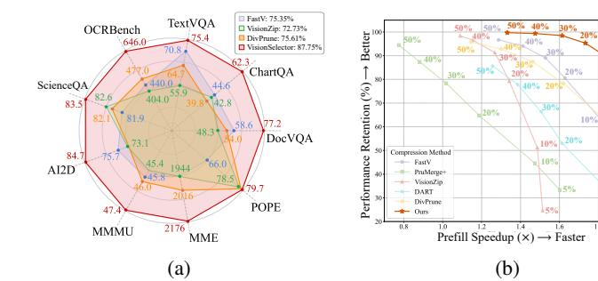
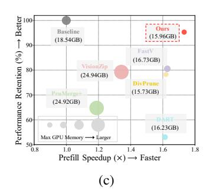
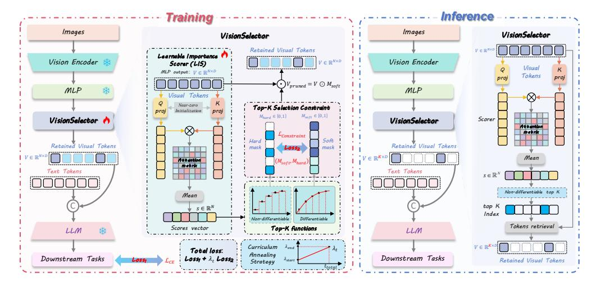
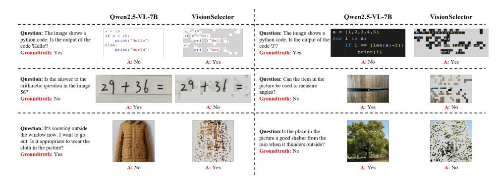
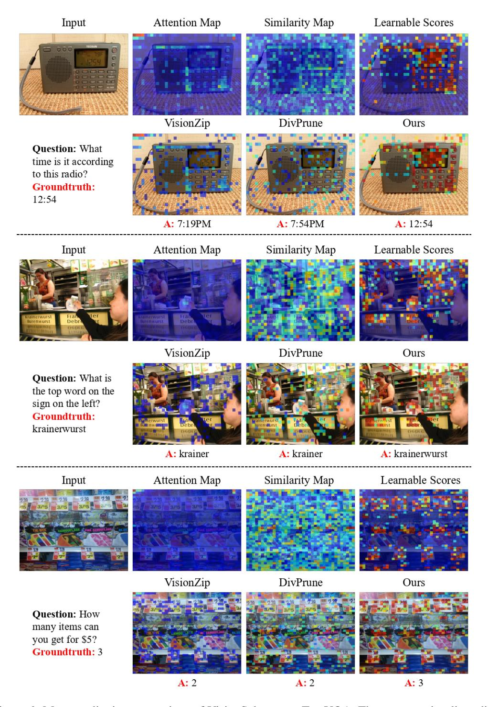
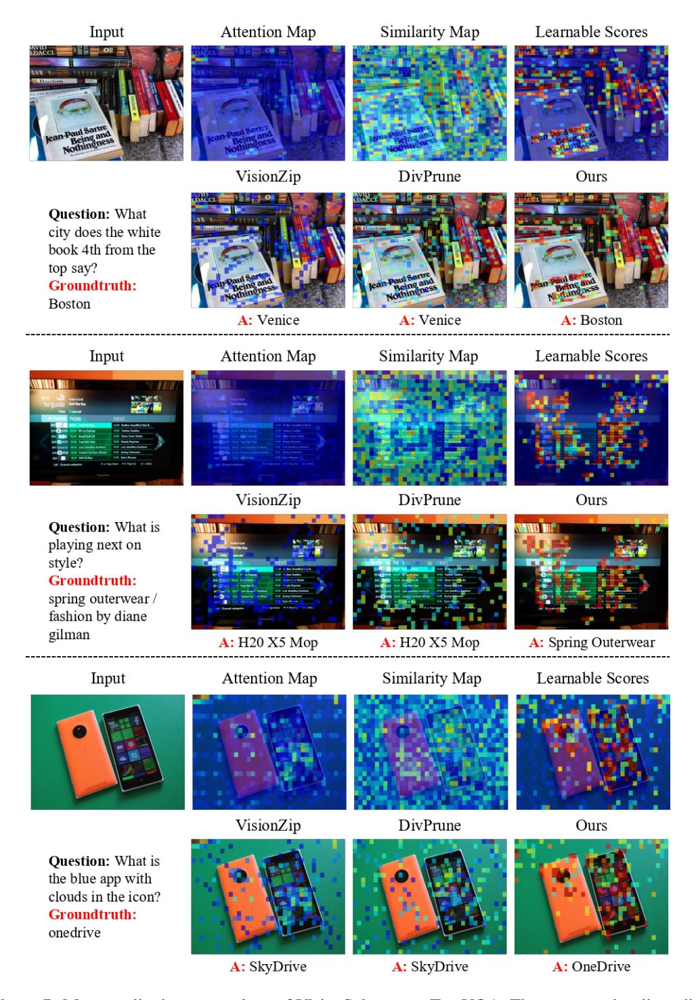
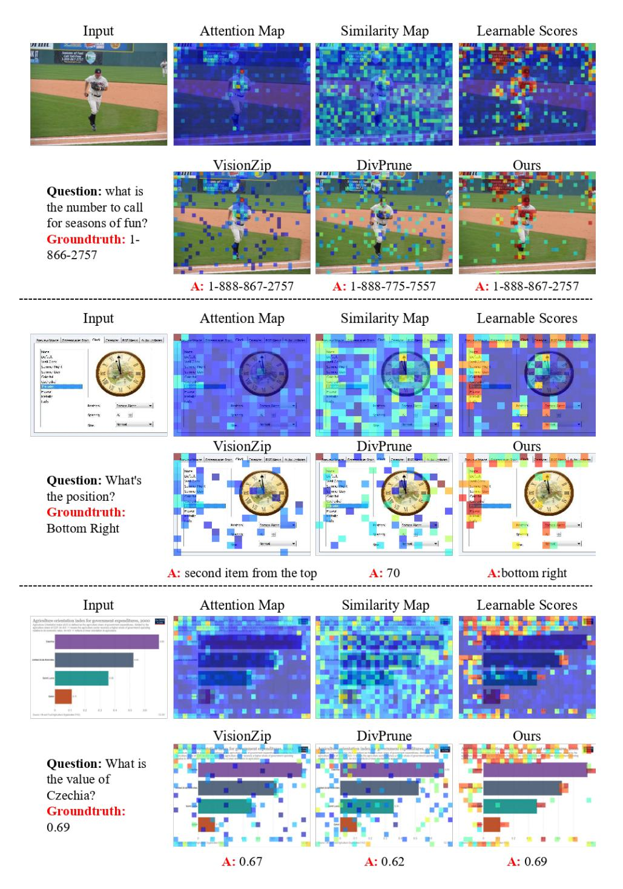

# VISIONSELECTOR: END-TO-END LEARNABLE VI-SUAL TOKEN COMPRESSION FOR EFFICIENT MULTI-MODAL LLMS

Jiaying Zhu1∗ Yurui Zhu2† Xin Lu1 Wenrui Yan2 Dong Li1 Kunlin Liu2 Xueyang Fu1† Zheng-Jun Zha1 1University of Science and Technology of China 2ZTE Corporation zhujy53@mail.ustc.edu.cn,xyfu@ustc.edu.cn

# ABSTRACT

Multimodal Large Language Models (MLLMs) encounter significant computational and memory bottlenecks from the massive number of visual tokens generated by high-resolution images or multi-image inputs. Previous token compression techniques are often constrained by heuristic rules that risk discarding critical information. They may suffer from biases, such as attention sinks, that lead to sharp performance drops under aggressive compression ratios. To address these limitations, we reformulate token compression as a lightweight plug-and-play framework that reformulates token compression into an end-toend learnable decision process. To be specific, we propose VisionSelector, a scorer module decoupled from the MLLM backbone that incorporates a differentiable Top-K mechanism and a curriculum annealing strategy to bridge the training-inference gap, enabling efficient and adaptive token selection various arbitrary compression rates. Remarkably lightweight with only 12.85M trainable parameters, VisionSelector demonstrates generalization across various compression rates and adaptively identifying critical tokens. This leads to superior performance across all compression budgets, evidenced by preserving 100% accuracy on MME with 30% retention budget, outperforming prior methods by 12.14% at 10% retention budget, and doubling prefill speed. Our code is available at <https://github.com/JulietChoo/VisionSelector>.

# 1 INTRODUCTION

Multimodal Large Language Models (MLLMs) [\(Liu et al., 2023;](#page-10-0) [Bai et al., 2025;](#page-9-0) [Wang et al.,](#page-12-0) [2025b\)](#page-12-0) exhibit remarkable capabilities in complex vision-language tasks. However, their superior performance hinges on effectively handling high-information-density visual inputs, such as highresolution images, multi-image sequences, and videos. This inevitably results in an explosion of visual tokens, exacerbating computational and memory bottlenecks during training and inference. Recent studies reveal significant redundancy in visual information, suggesting that effective token compression [\(Wang et al., 2025c;](#page-12-1) [Shao et al., 2025\)](#page-11-0) could alleviate these bottlenecks. Consequently, visual token compression has emerged as a critical research frontier in MLLMs, aiming to enhance efficiency while preserving critical information.

Current token compression methods for vision models exhibit inherent structural trade-offs that constrain their effectiveness. Transformation-based approaches [\(Li et al., 2025\)](#page-10-1), while preserving structural cues, enforce fixed compression ratios, lack flexibility, and demand separate training. Similarity-based methods [\(Wen et al., 2025;](#page-12-2) [Alvar et al., 2025\)](#page-9-1) prioritize token diversity but often discard fine-grained, task-critical signals, compromising performance. Attention-based techniques [\(Chen et al., 2024a;](#page-9-2) [Yang et al., 2025b\)](#page-12-3), though intuitive, are vulnerable to biases such as attention sink [\(Zhang et al., 2024b;](#page-12-4) [Xiao et al., 2023;](#page-12-5) [Yang et al., 2025b;](#page-12-3) [Weng et al., 2024\)](#page-12-6), which can significantly degrade performance under aggressive compression. Compounding these issues, the

∗ Work done during internship at ZTE Corporation.

† Corresponding author.

Figure 1: **Performance and Efficiency of VisionSelector.** (a) VisionSelector outperforms prior SOTA under a 10% token budget on Qwen2.5-VL-7B, retaining 87.75% performance on average. (b) Performance–speedup trade-off on DocVQA across 6 retention budgets. VisionSelector is optimal across all ratios, achieving a  $2\times$  prefill speedup with only 5% tokens. (c) DocVQA with a 20% token budget: comparison of accuracy, GPU memory, and speedup. VisionSelector delivers a leading three-way trade-off.

reliance on model-specific feature statistics limits generalization (Shao et al., 2025), underscoring the need for a more robust, adaptable compression framework.

To overcome these limitations, we propose a paradigm shift from heuristic-based post-processing to an end-to-end, optimization-driven token selection process. Our approach, VisionSelector, addresses the limitations of prior methods by introducing a lightweight, plug-and-play framework that seamlessly integrates with existing vision-language models and supports adaptive compression. VisionSelector comprises three key components: (1) a Differentiable Top-K Selection Mechanism that employs continuous relaxation to preserve end-to-end gradients while maintaining compatibility with high-performance kernels such as FlashAttention (Dao et al., 2022; Dao, 2023); (2) a Curriculum Annealing Strategy paired with the composite loss, which bridges the train–inference gap by progressively transitioning from soft to hard selection for robust importance learning; and (3) a backbone-decoupled Learnable Importance Scorer (LIS) that computes global token importance within a single forward pass, enabling a model trained at a fixed compression rate to generalize to various compression budgets at inference time.

Requiring only 12.85M trainable parameters and approximately 40 minutes of training on 8 A800 NVIDIA GPUs, VisionSelector is both lightweight and cost-efficient.

As shown in Figure 1, VisionSelector delivers substantial advancements. Specifically, at a 10% token retention, it improves overall performance by 12.14 percentage points. At 20% retention, it accelerates the prefill phase by a factor of  $1.73\times$  while simultaneously reducing memory consumption to 86.08%. The contributions of this paper could be summarized as:

- We propose VisionSelector, a novel framework that reformulates visual token compression from heuristic-based post-processing to an end-to-end learnable decision process, optimized directly by downstream losses.
- We design a lightweight, plug-and-play, and training-efficient module (12.85M parameters) that seamlessly integrates with existing MLLMs. It requires no backbone modification, maintains compatibility with various acceleration techniques(e.g., FlashAttention), and its learned mechanism effectively alleviates heuristic-driven biases such as sink attention.
- Trained at a single fixed compression rate, our approach demonstrates exceptional adaptability by generalizing to various compression budgets during inference. Our method significantly reduces memory usage and prefill time while maintaining superior accuracy, outperforming baselines across various compression budgets on 13 image and video understanding benchmark.

#### 2 RELATED WORK

High-resolution images, multiple images, and video inputs significantly increase visual token counts in multimodal large language models (MLLMs), imposing substantial computational and memory

burdens on Transformer-based models. Therefore, visual token compression is crucial for efficient MLLM deployment (Wan et al., 2024; Tu et al., 2024). Existing training-free heuristics fall into three categories: transformation-based (Zhu et al., 2024), attention-based (Chen et al., 2024a; Shang et al., 2024; Arif et al., 2025; Yang et al., 2025b; Zhang et al.), and similarity-based methods (Bolya et al.; Alvar et al., 2025; Wen et al., 2025; Wang et al., 2025a; Yang et al., 2025a).

Transformation-based (Zhu et al., 2024) methods preserve structural information using operations such as pixel shuffle and pooling, but they have fixed compression ratios, limited flexibility, and may require additional training. Attention-based methods compress tokens by removing those with low attention scores. For example, FastV (Chen et al., 2024a) utilizes vision-text attention scores as a pruning criterion. However, these methods exhibit performance issues due to attention sink and attention dispersion (Zhang et al., 2024b). Similarity-based methods achieve compression through clustering or merging similar tokens. DART (Wen et al., 2025) compresses by identifying highly similar duplicate token groups, while DivPrune (Alvar et al., 2025) selects tokens by preserving diversity. However, these similarity-based methods may lose important fine-grained information.

Heuristic approaches depend on model-specific feature distributions and have generalization issues. Consequently, some approaches (Jiang et al., 2025; Huang et al.) use Gumbel-Softmax to address the non-differentiability of token selection during training. However, they exhibit an inherent mismatch between stochastic sampling during training and deterministic selection at inference and often require additional procedures such as LoRA (Hu et al., 2021) or instruct tuning (Liu et al., 2023), increasing complexity.

We reformulate token compression as a learnable decision. Specifically, We introduce a lightweight, learnable importance scorer and update only this module during training, enabling the model to retain key tokens and effectively mitigate sink attention. In addition, we adopt a deterministic, differentiable Top-K mechanism with a curriculum annealing strategy, bridges the train–inference gap, and maintains stable behavior under arbitrary compression budgets.

## 3 Method

To overcome the limitations of current visual token compression techniques, we propose VisionS-elector, a framework that recasts token compression as an end-to-end, task-oriented, and learnable decision process. The framework is built upon three key components: a lightweight Learnable Importance Scorer (LIS) for evaluating global token significance, a Differentiable Top-K Selection (DTS) mechanism that enables gradient backpropagation, and a Curriculum Annealing Strategy (CAS) to align training and inference. This integrated design achieves efficient, flexible token compression while maintaining full compatibility with modern acceleration libraries like FlashAttention.

### 3.1 OVERALL FRAMEWORK

Our method, VisionSelector, is designed as a plug-and-play solution for seamless integration into advanced MLLMs such as Qwen2.5-VL (Bai et al., 2025). We deploy it between the modality interface and the large language model. The overall process, as illustrated in Figure 2, can be divided into the following steps: First, the modality interface projects the features from the visual encoder into visual tokens,  $V \in \mathbb{R}^{N \times D}$ , required by the LLM, where N is the number of tokens and D is the feature dimension. This set of features, V, is then fed into our proposed LIS, which generates an importance score for each token, yielding a score vector  $s \in \mathbb{R}^N$ . Based on a predefined compression budget b, the DTS utilizes the score vector s to generate a soft mask,  $M_{soft} \in [0,1]^N$ . This soft mask is applied to the original visual token features via element-wise multiplication to suppress the expression of non-critical tokens:  $V_{pruned} = M_{soft} \odot V$ . Finally, the pruned visual features,  $V_{pruned}$ , are concatenated with the text token embeddings and fed into the LLM for subsequent processing. The entire model is trained end-to-end using the loss from the downstream task and a constraint loss designed to optimize the selection process.

# 3.2 LEARNABLE IMPORTANCE SCORER

As illustrated in Figure 2, our lightweight Learnable Importance Scorer is designed to capture each token's relative importance in the global visual context. It uses two linear layers to project the input token features V into a Query (Q) and a Key (K):

Figure 2: **Overview of our VisionSelector.** The framework introduces a lightweight, learnable importance scorer to evaluate token importance. During training, the Differentiable Top-K Selection produces a soft mask for gradient propagation, while a constraint loss integrated with a Curriculum Annealing Strategy progressively transforms it into a hard mask. At inference, the standard Top-K operation is applied for efficient token selection.

$$Q = VW_q, K = VW_k, \tag{1}$$

where  $W_k, W_k \in \mathbb{R}^{D \times d}$  are learnable projection matrices, and d is the hidden dimension.

We then compute the matrix product of Q and K to obtain a simplified self-attention score matrix  $A \in \mathbb{R}^{N \times N}$ . The final importance score  $s_i$  for each token i is the average of its interaction scores with all other tokens:

$$A = \frac{QK^{T}}{\sqrt{d}}, s_{i} = \frac{1}{N} \sum_{j=1}^{N} A_{ij}.$$
 (2)

This design enables the scorer to perceive global context while remaining computationally efficient. To ensure a smooth integration of the LIS module with the frozen pre-trained model and to maintain stability during the initial training phase, we adopt a near-zero initialization strategy for its weights.

#### 3.3 DIFFERENTIABLE TOP-K SELECTION MECHANISM

The standard Top-K operator is discrete and non-differentiable, which prevents end-to-end gradient flow to the LIS module. We adopt a continuous relaxation of Top-K to produce a soft mask during training (Ahle, 2023),  $M_{soft} = \text{DiffTopK}(s) \in (0,1)^{B \times N}$ , where DiffTopK denotes the differentiable Top-K operator. The procedure is summarized in Algorithm1.

### 3.3.1 FORWARD PASS

Given a score vector  $s \in \mathbb{R}^{B \times N}$  and the desired number of retained tokens  $k = N \times b$ , we search for a scalar threshold t via bisection such that:

$$M = \text{DiffTopK}(s) = \sigma(s+t), \sum_{i=1}^{N} M_i \approx k,$$
 (3)

where  $\sigma(\cdot)$  is the sigmoid function. The resulting soft mask  $M_{soft}$  can be interpreted as per-token selection probabilities. Unlike Gumbel-Softmax, which introduces stochastic perturbations during training and lacks strict monotonicity, the operator  $s \to M = \mathrm{DiffTopK}(s)$  inherits the monotonicity of the sigmoid. Specifically, for any indices  $i, j \in \{1, 2, ..., N\}$ ,

$$[\text{DiffTopK}(s)]_i > [\text{DiffTopK}(s)]_j \Leftrightarrow s_i > s_j, \tag{4}$$

so high-score tokens are promoted by the soft mask and low-score tokens are suppressed.

# 3.3.2 BACKWARD PASS VIA IMPLICIT DIFFERENTIATION

We differentiate M = σ(s + t) under the implicit constraint PN i=1 σ(si + t) = k. Let

$$v = \sigma'(s+t), v_i = M_i(1-M_i).$$
 (5)

From the constraint, we obtain

$$\frac{\partial t}{\partial s_j} = -\frac{v_j}{\sum_i v_i},\tag{6}$$

which yields the Jacobian of the output with respect to the input:

$$\frac{\partial M}{\partial s} = diag(v) - \frac{vv^T}{\sum_i v_i}.$$
 (7)

Therefore, for any upstream gradient g = ∂L ∂s ,

$$\frac{\partial L}{\partial s} = v \odot g - \frac{v^T g}{\sum_i v_i} v,\tag{8}$$

enabling end-to-end gradient propagation. The bisection is used only to solve for the threshold t in the forward pass. Gradients are provided by implicit differentiation rather than backpropagating through the search.

### 3.3.3 INFERENCE

This continuous relaxation is used only during training for gradient propagation. At inference time, we apply the standard Top-K operator directly to the score vector to obtain a hard binary mask that selects the top k tokens.

# 3.4 TRAINING OBJECTIVE WITH CURRICULUM ANNEALING STRATEGY

To effectively train the LIS and bridge the discrepancy between soft selection during training and hard selection during inference, we design a composite loss function and introduce a curriculum learning-based weight scheduling strategy. The total loss function Ltotal is defined as:

$$L_{total} = L_{CE} + \lambda_t L_{constraint}, \tag{9}$$

where LCE is the cross-entropy loss for the downstream task, Lconstraint is a constraint loss to regularize the selection process, and λt is a dynamic weighting coefficient that is adjusted with the training step t.

The objective of Lconstraint is to guide the soft mask Msof t used during training, to approximate the ideal hard mask Mhard used at inference. We employ a binary cross-entropy loss to measure the discrepancy between them:

$$M_{hard} = TopK(s), (10)$$

$$L_{constraint} = BCE(M_{soft}, M_{hard}). (11)$$

The Lconstraint incentivizes the output values of the soft mask Msof t to polarize towards either 0 or 1, thereby enabling the score distribution learned by the LIS to be directly and effectively applied for hard selection during inference.

The weighting coefficient λt is adjusted using a Curriculum Annealing Strategy. Early in training, λt is set to a small initial value λstart, allowing the model to primarily focus on learning the downstream task itself. As training progresses, λt linearly increases to a predefined maximum value λend, according to the schedule:

$$\lambda_t = \lambda_{start} + (\lambda_{end} - \lambda_{start}) \times min(\frac{t_{current}}{t_{total}}, 1.0), \tag{12}$$

where tcurrent is the current training step, and ttotal is the total number of training steps.

This Curriculum Annealing Strategy ensures that the model first masters the fundamentals of the task before gradually strengthening the regularization constraint on the token selection process, thereby achieving a more stable and effective joint optimization.

# 4 EXPERIMENTS

To validate the effectiveness of VisionSelector, we conduct a series of experiments. This section details our experimental setup, implementation specifics, and the evaluation benchmarks used.

# 4.1 EXPERIMENTAL SETTING

Models, Training Data and Hardware. All our experiments are based on the Qwen2.5-VL-7B[\(Bai](#page-9-0) [et al., 2025\)](#page-9-0), a powerful open-source MLLM that serves as a high-performance baseline for our study. We conduct supervised training by integrating our proposed LIS module into this model. For training, we employ a mixed-dataset strategy. Our training data is a composite of several datasets from Cambrian-737K [\(Tong et al., 2024\)](#page-11-5), totaling approximately 144K samples. It primarily includes ChartQA [\(Masry et al., 2022\)](#page-11-6), OCRVQA [\(Mishra et al., 2019\)](#page-11-7), and a 10% random sample of the COCO [\(Lin et al., 2014\)](#page-10-5) dataset. This composition exposes the model to diverse visual scenarios, including chart understanding, document OCR, and natural images, which enhances its generalization capability. All experiments are conducted on 8 NVIDIA A800 GPUs (80GB). We utilized a distributed data-parallel strategy and leveraged DeepSpeed ZeRO Stage 3 [\(Rasley et al., 2020\)](#page-11-8) to optimize the training process for efficient management of memory and computational resources.

Comparison Methods, Evaluation Framework, Datasets, and Tasks. We select the attentionbased methods FastV [\(Chen et al., 2024a\)](#page-9-2), PruMerge+ [\(Shang et al., 2024\)](#page-11-3) and VisionZip [\(Yang](#page-12-3) [et al., 2025b\)](#page-12-3), as well as the non-attention-based methods DART [\(Wen et al., 2025\)](#page-12-2) and DivPrune [\(Alvar et al., 2025\)](#page-9-1) as our baselines. See the Appendix [A.2](#page-14-0) for more details. To ensure fairness and reproducibility, we conduct a comprehensive evaluation of our method and the comparison methods under the same LMMs-Eval [\(Zhang et al., 2024a\)](#page-12-8) framework. Our evaluation covers both image and video modalities, utilizing 9 image-language datasets and 4 video-language datasets. For imagelanguage understanding, we focus on assessing performance in information-dense visual tasks. We select a suite of OCR and text-centric VQA datasets, including TextVQA [\(Singh et al., 2019\)](#page-11-9), DocVQA [\(Mathew et al., 2021\)](#page-11-10), OCRBench [\(Liu et al., 2024b\)](#page-11-11), and ChartQA [\(Masry et al., 2022\)](#page-11-6), to test the model's ability to recognize and comprehend embedded text. To measure complex reasoning about object relationships, attributes, and spatial layouts, we employ the AI2D [\(Kembhavi](#page-10-6) [et al., 2016\)](#page-10-6) and ScienceQA [\(Lu et al., 2022\)](#page-11-12) datasets. Furthermore, we test cross-domain knowledge and expert-level reasoning using two challenging comprehensive benchmarks: MME [\(Fu et al.,](#page-10-7) [2024\)](#page-10-7) and MMMU [\(Yue et al., 2024\)](#page-12-9). Finally, we used the POPE [\(Li et al., 2023b\)](#page-10-8) benchmark to quantify the model's hallucination levels and ensure content faithfulness. For video-language understanding, we utilized MVBench [\(Li et al., 2024\)](#page-10-9), SEEDBench [\(Li et al., 2023a\)](#page-10-10), VideoMME [\(Fu et al., 2025\)](#page-10-11), and NeXT-QA [\(Xiao et al., 2021\)](#page-12-10). These benchmarks collectively form a comprehensive evaluation suite designed to measure performance on advanced tasks such as temporal event understanding, dynamic relationship reasoning, and causal question-answering over video content.

### 4.2 IMPLEMENTATION DETAILS

Model Configuration and Training Strategy. We seamlessly integrate the LIS module following the modality interface of the baseline model. During training, we adopt a parameter-efficient approach, exclusively updating the parameters of the LIS module while keeping all pre-trained weights frozen. This strategy not only preserves the powerful pre-trained knowledge of the baseline model and is suitable for scenarios with proprietary training sets, but also significantly reduces the computational overhead of training.

Hyperparameter Settings. We train the model for 1 epoch on the mixed dataset. The projection dimension d for Wq and Wk is set to 1792. We use the AdamW optimizer with a cosine annealing learning rate scheduler, setting the initial learning rate to 5e − 5 with a linear warm-up for the first 0.03 epochs. The per-device batch size is 16, and we use 4 steps of gradient accumulation, resulting in an effective global batch size of 256. The retention budget for visual tokens is set to 20%. For the constraint loss weight, λt, we adopt a Curriculum Annealing Strategy, linearly increasing it from an initial value of 0.1 to a final value of 2.0 over the course of training.

# 4.3 IMAGE-LANGUAGE UNDERSTANDING EVALUATION

To evaluate VisionSelector, we compare a model trained with a 20% budget against multiple baselines across varying budgets, and the results in Table [1](#page-7-0) validate the effectiveness of our method while highlighting the advantage of an end-to-end learning paradigm over fixed, heuristic rules.

The experimental data clearly indicate that across all compression ratios, the overall performance of VisionSelector significantly surpasses that of all baseline methods. At a 20% budget, VisionSelector maintains 94.83% of the baseline model's average performance, outperforming the next-best method by over 7 percentage points. Under an extreme compression budget of 10%, this performance gap widens to more than 12 percentage points. Particularly noteworthy is the behavior when the budget tightens from 20% to 10%: attention-based baselines show a sharp performance drop, with VisionZip decreasing by approximately 14 percentage points, whereas VisionSelector's performance declines more gracefully by about 6 percentage points. We hypothesize that the severe performance drop in baseline methods is attributable to their reliance on pre-trained attention maps. When the budget is extremely limited, inherent biases such as attention sink may force these models to retain tokens that are positionally early but semantically irrelevant, leading to a performance collapse. In contrast, the learnable mechanism of VisionSelector demonstrates superior robustness.

A surprising finding is that in certain scenarios, VisionSelector not only enhances efficiency but can also improve performance beyond the 100% token baseline by filtering out noisy information. With a 30% budget, VisionSelector achieves 100.07% relative performance on the MME benchmark, demonstrating lossless and even gainful compression. This phenomenon indicates that our learned importance scores enable VisionSelector to effectively prune task-irrelevant and potentially distracting visual noise. Consequently, the model can better focus on critical information, leading to improved reasoning accuracy.

# 4.4 VIDEO-LANGUAGE UNDERSTANDING EVALUATION

To further validate the generalization capability of VisionSelector, we evaluate it on video–language understanding tasks. Specifically, we take the model trained exclusively on image data with a 20% budget and directly apply it to four representative video benchmarks: MVBench, SEED-Bench, VideoMME, and NeXT-QA.

In selecting baselines, we note that VisionZip and PruMerge+ cause out-of-memory (OOM) errors when integrated with the Qwen2.5-VL architecture, owing to their operational placement. Qwen2.5- VL utilizes a PatchMerger module for initial token compression after the visual encoder. Since both VisionZip and PruMerge+ compute attention at the direct output of the visual encoder, they incur prohibitive computational and memory costs. Consequently, we select FastV, DART, and DivPrune as baselines for this evaluation.

The results in Table [2](#page-7-1) show that VisionSelector outperforms FastV, DART and DivPrune across most video datasets. On MVBench, VisionSelector achieves 66.55% accuracy, significantly higher than the baselines. Overall, VisionSelector attains a 98.13% performance retention rate on these video tasks. This demonstrates that importance criteria learned through an end-to-end process generalize more effectively to temporal data and enable the precise identification of key video tokens compared to fixed heuristic rules.

# 4.5 EFFICIENCY ANALYSIS

This section quantifies the computational efficiency advantages of our method. We analyze efficiency on video tasks across three key metrics: max memory usage, prefill time, and end-to-end (E2E) latency.

As detailed in Table [2,](#page-7-1) we analyze this using the MVBench dataset, which has a high average token count of 6,828. VisionSelector's prefill time is only 760.82 ms and its end-to-end latency is 924.57 ms, achieving 1.86× and 1.74× speedups over the baseline model, respectively, and is significantly faster than all comparison methods. Our method matches DivPrune in memory efficiency by lowering peak memory usage to 17.57 GB, a 32.3% reduction from the baseline model. This implies that under the same hardware constraints, our method can process longer visual contexts than competing methods, which is crucial for advancing the application of MLLMs in real-world scenarios like long-video understanding.

Table 1: Comparison results with different methods on Image-Language benchmarks. Note that our method, trained with a fixed 20% retention budget, exhibits adaptability to varying compression budgets during inference. Evaluation is conducted with LMMs-Eval (Zhang et al., 2024a).

| Method                   | DocVQA Anls | ChartQA Relaxed | TextVQA EM | OCRBench Acc     | ScienceQA EM | AI2D EM | MMMU Acc | MME Score | POPE F1 | Avg     |
|--------------------------|----------------|--------------------|---------------|---------------------|-----------------|------------|-------------|--------------|------------|---------|
| Dyn                      | amic Reso      | ution(MinF         | ix=256×2      | 8×28, <i>MaxPix</i> | =2048×28×       | 28),Upp    | er Bound (  | 100%)        |            |         |
| Avg. Visual Tokens       | 1951.61        | 596.06             | 976.58        | 652.82              | 323.05          | 510.19     | 601.15      | 867.67       | 359.55     |         |
| Qwen-2.5-VL-7B           | 94.33          | 83.40              | 82.84         | 838                 | 87.26           | 93.59      | 50.78       | 2342.15      | 86.19      | 100%    |
|                          |                | Reta               | in 30% Tok    | ens (70% Cor        | mpression Re    | atio)      |             |              |            |         |
| E AL EGGERAGO            | 84.01          | 67.64              | 80.22         | 687                 | 83.06           | 86.92      | 49.44       | 2263.58      | 80.47      | 01.616  |
| FastV (ECCV2024)         | 89.06%         | 81.10%             | 96.84%        | 81.98%              | 95.22%          | 92.87%     |             | 96.65%       |            | 91.61%  |
|                          | 73.95          | 62.24              | 73.71         | 648                 | 85.22           | 82.77      | 47.67       | 2239.64      | 83.69      |         |
| PruMerge+ (ICCV2025)     | 78.39%         | 74.63%             | 88.98%        | 77.33%              | 97.66%          | 88.44%     | 93.88%      | 95.62%       | 97.10%     | 88.00%  |
| Ar : 7: (CMPD2025)       | 86.11          | 72.28              | 77.30         | 711                 | 86.61           | 87.86      | 49.44       | 2276.04      | 84.73      | 02.576  |
| VisionZip (CVPR2025)     | 91.29%         | 86.67%             | 93.31%        | 84.84%              | 99.26%          | 93.88%     | 97.36%      | 97.18%       | 98.31%     | 93.57%  |
| DARE (EMBI PAGAS)        | 62.60          | 56.88              | 74.45         | 629                 | 84.33           | 75.94      | 47.89       | 2218.83      | 83.43      | 04.700  |
| DART (EMNLP2025)         | 66.36%         | 68.20%             | 89.87%        | 75.06%              | 96.64%          | 81.14%     | 94.31%      | 94.73%       | 96.80%     | 84.79%  |
| D:P (CV/DD2025)          | 82.51          | 67.52              | 78.52         | 720                 | 86.01           | 88.28      | 48.33       | 2224.06      | 84.68      | 02 270  |
| DivPrune (CVPR2025)      | 87.47%         | 80.96%             | 94.79%        | 85.92%              | 98.57%          | 94.33%     | 95.18%      | 94.96%       | 98.25%     | 92.27%  |
| ¥7:-:                    | 92.89          | 72.96              | 81.45         | 809                 | 85.77           | 92.00      | 50.11       | 2343.77      | 85.05      | 97.20%  |
| VisionSelector           | 98.47%         | 87.48%             | 98.32%        | 96.54%              | 98.29%          | 98.30%     | 98.68%      | 100.07%      | 98.68%     | 97.20%  |
|                          |                | Reta               | in 20% Tok    | ens (80% Cor        | npression Re    | itio)      |             |              |            |         |
| FastV (ECCV2024)         | 75.99          | 60.48              | 78.01         | 597                 | 82.75           | 82.35      | 49.00       | 2152.74      | 76.12      | 86.45%  |
|                          | 80.56%         | 72.52%             | 94.17%        | 71.24%              | 94.83%          | 87.99%     | 96.49%      | 91.91%       | 88.32%     | 86.45%  |
| PruMerge+ (ICCV2025)     | 61.09          | 52.56              | 68.72         | 562                 | 83.79           | 77.62      | 46.11       | 2219.3       | 81.74      | 81.91%  |
|                          | 64.76%         | 63.02%             | 82.96%        | 67.06%              | 96.02%          | 82.94%     | 90.80%      | 94.75%       | 94.84%     | 81.91%  |
| V:-:7:- (CVPD2025)       | 74.75          | 62.04              | 72.03         | 591                 | 84.68           | 82.32      | 47.00       | 2168.86      | 83.23      | 06 120  |
| VisionZip (CVPR2025)     | 79.24%         | 74.39%             | 86.95%        | 70.53%              | 97.04%          | 87.96%     | 92.56%      | 92.60%       | 96.57%     | 86.43%  |
| DART (EMNLP2025)         | 50.03          | 47.16              | 67.53         | 537                 | 83.34           | 71.04      | 47.00       | 2138.61      | 80.16      | 78.16%  |
| DARI (EMINLP2023)        | 53.04%         | 56.55%             | 81.52%        | 64.08%              | 95.51%          | 75.91%     | 92.56%      | 91.31%       | 93.00%     | /8.10%  |
| DivPrune (CVPR2025)      | 73.81          | 57.88              | 73.86         | 648                 | 84.33           | 82.29      | 46.33       | 2198.82      | 83.55      | 86.75%  |
| Divirule (CVFK2023)      | 78.25%         | 69.40%             | 89.16%        | 77.33%              | 96.64%          | 87.93%     |             | 93.88%       | 96.94%     | 80.75%  |
| VisionSelector           | 89.91          | 68.84              | 80.05         | 770                 | 85.67           | 90.15      | 49.22       | 2293.54      | 84.27      | 94.83%  |
| visionselector           | 95.31%         | 82.54%             | 96.63%        | 91.89%              | 98.18%          | 96.32%     | 96.93%      | 97.92%       | 97.77%     | 94.83%  |
|                          |                | Reta               | in 10% Tok    | ens (90% Cor        | npression Re    | itio)      |             |              |            |         |
| FastV (ECCV2024)         | 58.64          | 44.64              | 70.83         | 440                 | 81.95           | 75.74      | 45.78       | 1940.91      | 65.99      | 75.35%  |
| Fast v (ECC v 2024)      | 62.16%         | 53.53%             | 85.50%        | 52.51%              | 93.91%          | 80.93%     | 90.15%      | 82.87%       | 76.56%     | 13.33%  |
| PruMerge+ (ICCV2025)     | 42.08          | 41.56              | 56.87         | 417                 | 81.56           | 71.08      | 45.22       | 1948.58      | 76.52      | 71.48%  |
| Fluivierge+ (ICC v 2023) | 44.61%         | 49.83%             | 68.65%        | 49.76%              | 93.47%          | 75.95%     | 89.05%      | 83.20%       | 88.78%     | /1.46%  |
| V:-:7:- (CVPD2025)       | 48.29          | 42.84              | 55.94         | 404                 | 82.60           | 73.09      | 45.44       | 1944.04      | 78.46      | 72.73%  |
| VisionZip (CVPR2025)     | 51.19%         | 51.37%             | 67.53%        | 48.21%              | 94.66%          | 78.10%     | 89.48%      | 83.00%       | 91.03%     | 12.13%  |
| DART (EMNLP2025)         | 33.13          | 34.00              | 53.97         | 415                 | 81.85           | 67.10      | 46.44       | 1980.7       | 71.91      | 68.39%  |
| DAKI (EMINLE 2023)       | 35.12%         | 40.77%             | 65.15%        | 49.52%              | 93.80%          | 71.70%     | 91.45%      | 84.57%       | 83.43%     | 00.39%  |
| DivPrune (CVPR2025)      | 54.04          | 39.80              | 64.65         | 477                 | 82.15           | 72.80      | 46.00       | 2015.66      | 79.27      | 75.61%  |
| DIVITUIE (CVFK2023)      | 57.29%         | 47.72%             | 78.04%        | 56.92%              | 94.14%          | 77.79%     | 90.59%      | 86.06%       | 91.97%     | 15.01%  |
| VisionSelector           | 77.25          | 62.28              | 75.37         | 646                 | 83.54           | 84.72      | 47.44       | 2175.75      | 79.73      | 87.75%  |
| VISIONSCIECTOL           | 81.89%         | 74.68%             | 90.98%        | 77.09%              | 95.74%          | 90.52%     | 93.42%      | 92.90%       | 92.50%     | 01.15 % |

Table 2: Performance and efficiency comparisons. Task performance is evaluated across various video-language benchmarks, while efficiency metrics are benchmarked on MVBench.

| Method              | MVBench Acc | SEEDBench Acc | VideoMME Score | NextQA WUPS | Performance (%) | Max GPU mem (GB) | Prefill Time (ms) (ms) | E2E Latency (ms) |
|---------------------|----------------|------------------|-------------------|----------------|--------------------|---------------------|---------------------------|---------------------|
| Qwen2.5-VL-7B       | 68.10          | 60.48            | 60.67             | 27.58          | 100%               | 25.97               | 1413.34                   | 1605.31             |
| FastV (ECCV2024)    | 65.75          | oom              | 59.15             | 27.00          | 97.31%             | 24.63               | 851.76                    | 1021.83             |
| DART (EMNLP2025)    | 65.80          | 61.00            | 57.74             | 26.84          | 97.49%             | 18.93               | 832.58                    | 996.55              |
| Divprune (CVPR2025) | 65.85          | 59.79            | 57.78             | 27.00          | 97.17%             | 17.55               | 1184.00                   | 1345.24             |
| Ours                | 66.55          | 59.82            | 59.22             | 27.10          | 98.13%             | 17.57               | 760.82                    | 924.57              |

#### 4.6 ABLATION STUDY

We conduct a series of comprehensive ablation studies to validate the effectiveness of VisionSelector's key components and to determine the optimal hyperparameter settings. All experiments are performed on the Qwen2.5-VL-7B model, and we evaluate the results across several benchmarks spanning multiple dimensions: document understanding (DocVQA, OCRBench), scientific reasoning (ScienceQA, MMMU), and hallucination evaluation (MME, POPE). The detailed configurations and results are presented in Table 3.

Impact on training data composition. As detailed in configurations 1, 2, and 3, we progressively enrich the training data. The results reveal a clear trend: a more diverse training set leads to significant performance gains. Notably, with the inclusion of the general-purpose COCO dataset (Config 3 vs. Config 2), the model's performance on OCR-related tasks improves substantially: the ANLS score on DocVQA increases from 87.59 to 89.34, and the OCRBench score jumps from 701 to 763. This indicates that exposure to diverse natural images enhances the model's general visual representation capabilities, which in turn benefits its performance on domain-specific tasks. Furthermore,

Table 3: Ablation study on the impact of training data composition and curriculum annealing strategy  $(\lambda_t)$  on model performance.

|                |          | Dataset |         |              |           | LearningRate |      |       | OCRBench | MMMU  | MME     | POPE  |        |
|----------------|----------|---------|---------|--------------|-----------|--------------|------|-------|----------|-------|---------|-------|--------|
| Config         | OCRVQA   | ChartQA | 10%COCO | $\lambda_t$  | BatchSize |              | Dim  | Anls  | Acc      | Acc   | Score   | F1    | Avg    |
| 1              | <b> </b> |         |         | 0.1~3        | 8         | 1e-4         | 1024 | 86.85 | 700      | 48.78 | 2238.43 | 81.58 | 92.38% |
| 2              | ✓        | ✓       |         | $0.1 \sim 3$ | 8         | 1e-4         | 1024 | 87.59 | 701      | 48.78 | 2270.09 | 81.84 | 92.89% |
| 3              | ✓        | ✓       | ✓       | $0.1 \sim 3$ | 8         | 1e-4         | 1024 | 89.34 | 763      | 48.89 | 2282.37 | 83.93 | 95.37% |
| 4              | <b>√</b> | ✓       | ✓       | 3            | 8         | 1e-4         | 1024 | 83.69 | 613      | 47.22 | 2172.38 | 83.70 | 88.94% |
| 5              | ✓        | ✓       | ✓       | $0.1 \sim 2$ | 8         | 1e-4         | 1024 | 89.54 | 779      | 49.00 | 2272.71 | 83.90 | 95.75% |
| VisionSelector | ✓        | ✓       | ✓       | $0.1\sim2$   | 16        | 5e-5         | 1792 | 89.91 | 770      | 49.22 | 2293.54 | 84.27 | 95.96% |

the increase in the F1-score on the POPE dataset suggests that diverse training data also helps to suppress model hallucinations.

Impact of the Curriculum Annealing Strategy for  $\lambda_t$ . To validate CAS's importance, we compare it against a constant weighting strategy. The resulting performance difference is stark: the model's average score drops sharply from 95.37% (Config 3) to 88.94% (Config 4). This finding strongly confirms our hypothesis that an excessively high initial constraint loss forces the model to prematurely focus on polarizing token scores rather than on learning the downstream task itself. In contrast, the annealing strategy allows the model to first grasp task-relevant features and then gradually strengthen the binarization constraint on the selection mask, resulting in a more stable and effective optimization process. We also find that a slightly gentler annealing range (from 0.1 to 2, Config 5) yields a minor performance improvement, boosting the average score to 95.96%.

#### 4.7 VISUALIZATION OF TOKEN SELECTION RESULTS

As illustrated in Figure 3, heuristic-based pruning methods exhibit clear limitations. VisionZip is prone to issues like attention sink and dispersion, which obscure salient tokens. DivPrune tends to drop semantically rich tokens, such as the logo. Both methods incorrectly preserve low-information background tokens, highlighting their dependence on model-specific feature distributions. In contrast, VisionSelector pinpoints and retains the critical tokens containing the phone number to answer correctly, demonstrating the superiority of its learned selection mechanism.

Figure 3: Qualitative results of VisionSelector on TextVQA. The top row compares three methods for scoring token importance, where **warmer colors (red) correspond to higher importance scores**. The bottom row illustrates the tokens selected by each method and the corresponding model predictions at a 20% compression budget.

# 5 LIMITATIONS

While our study demonstrates the significant potential of token compression for MLLM inference acceleration, it shares an inherent limitation with current selection-based paradigms: it operates on a 'hard selection' (i.e., keep-or-discard) principle. This mechanism, while effective, inevitably results in the complete loss of information from discarded tokens. This limitation points toward a key direction for future research: exploring new token compression paradigms to achieve lossless performance.

# 6 CONCLUSION

In this study, we present VisionSelector, a learnable token pruning method based on a differentiable Top-K mechanism. During training, the model assigns importance scores to visual tokens via a learnable scorer, applies a differentiable Top-K to produce a soft mask, and uses a hard-mask constraint with curriculum annealing to bridge the train–inference gap. At inference, we revert to a standard and efficient Top-K selection. Driven by downstream objectives, the model autonomously discovers critical visual tokens.

Comprehensive evaluations on various image and video benchmarks demonstrate that VisionSelector sets a new state-of-the-art. It provides a superior balance of inference speed, memory footprint, and model accuracy across various compression budgets.

# REPRODUCIBILITY STATEMENT

Data preparation appears in Section [4.1,](#page-5-0) and to ensure reproducible sampling on the COCO dataset, we fix the random seed at 42 during training. Implementation details appear in Section [4.2.](#page-5-1) Code and models will be publicly available.

# REFERENCES

- Thomas Ahle. Differentiable top-k function. Mathematics Stack Exchange, 2023. URL <https://math.stackexchange.com/q/4506773>. URL:https://math.stackexchange.com/q/4506773 (version: 2023-10-16).
- Saeed Ranjbar Alvar, Gursimran Singh, Mohammad Akbari, and Yong Zhang. Divprune: Diversitybased visual token pruning for large multimodal models. In *Proceedings of the Computer Vision and Pattern Recognition Conference*, pp. 9392–9401, 2025.
- Xiang An, Yin Xie, Kaicheng Yang, Wenkang Zhang, Xiuwei Zhao, Zheng Cheng, Yirui Wang, Songcen Xu, Changrui Chen, Chunsheng Wu, et al. Llava-onevision-1.5: Fully open framework for democratized multimodal training. *arXiv preprint arXiv:2509.23661*, 2025.
- Kazi Hasan Ibn Arif, JinYi Yoon, Dimitrios S Nikolopoulos, Hans Vandierendonck, Deepu John, and Bo Ji. Hired: Attention-guided token dropping for efficient inference of high-resolution visionlanguage models. In *Proceedings of the AAAI Conference on Artificial Intelligence*, volume 39, pp. 1773–1781, 2025.
- Shuai Bai, Keqin Chen, Xuejing Liu, Jialin Wang, Wenbin Ge, Sibo Song, Kai Dang, Peng Wang, Shijie Wang, Jun Tang, et al. Qwen2. 5-vl technical report. *arXiv preprint arXiv:2502.13923*, 2025.
- Daniel Bolya, Cheng-Yang Fu, Xiaoliang Dai, Peizhao Zhang, Christoph Feichtenhofer, and Judy Hoffman. Token merging: Your vit but faster. In *The Eleventh International Conference on Learning Representations*.
- Liang Chen, Haozhe Zhao, Tianyu Liu, Shuai Bai, Junyang Lin, Chang Zhou, and Baobao Chang. An image is worth 1/2 tokens after layer 2: Plug-and-play inference acceleration for large visionlanguage models. In *European Conference on Computer Vision*, pp. 19–35. Springer, 2024a.
- Lin Chen, Jinsong Li, Xiaoyi Dong, Pan Zhang, Yuhang Zang, Zehui Chen, Haodong Duan, Jiaqi Wang, Yu Qiao, Dahua Lin, et al. Are we on the right way for evaluating large vision-language models? *Advances in Neural Information Processing Systems*, 37:27056–27087, 2024b.
- Tri Dao. Flashattention-2: Faster attention with better parallelism and work partitioning. *arXiv preprint arXiv:2307.08691*, 2023.
- Tri Dao, Dan Fu, Stefano Ermon, Atri Rudra, and Christopher Re. Flashattention: Fast and memory- ´ efficient exact attention with io-awareness. *Advances in neural information processing systems*, 35:16344–16359, 2022.

- Chaoyou Fu, Peixian Chen, Yunhang Shen, Yulei Qin, Mengdan Zhang, Xu Lin, Jinrui Yang, Xiawu Zheng, Ke Li, Xing Sun, Yunsheng Wu, and Rongrong Ji. Mme: A comprehensive evaluation benchmark for multimodal large language models, 2024. URL [https://arxiv.org/abs/](https://arxiv.org/abs/2306.13394) [2306.13394](https://arxiv.org/abs/2306.13394).
- Chaoyou Fu, Yuhan Dai, Yongdong Luo, Lei Li, Shuhuai Ren, Renrui Zhang, Zihan Wang, Chenyu Zhou, Yunhang Shen, Mengdan Zhang, et al. Video-mme: The first-ever comprehensive evaluation benchmark of multi-modal llms in video analysis. In *Proceedings of the Computer Vision and Pattern Recognition Conference*, pp. 24108–24118, 2025.
- Danna Gurari, Qing Li, Abigale J Stangl, Anhong Guo, Chi Lin, Kristen Grauman, Jiebo Luo, and Jeffrey P Bigham. Vizwiz grand challenge: Answering visual questions from blind people. In *Proceedings of the IEEE conference on computer vision and pattern recognition*, pp. 3608–3617, 2018.
- Edward J. Hu, Yelong Shen, Phillip Wallis, Zeyuan Allen-Zhu, Yuanzhi Li, Shean Wang, Lu Wang, and Weizhu Chen. Lora: Low-rank adaptation of large language models, 2021. URL [https:](https://arxiv.org/abs/2106.09685) [//arxiv.org/abs/2106.09685](https://arxiv.org/abs/2106.09685).
- Wenxuan Huang, Zijie Zhai, Yunhang Shen, Shaosheng Cao, Fei Zhao, Xiangfeng Xu, Zheyu Ye, and Shaohui Lin. Dynamic-llava: Efficient multimodal large language models via dynamic visionlanguage context sparsification. In *The Thirteenth International Conference on Learning Representations*.
- Titong Jiang, Xuefeng Jiang, Yuan Ma, Xin Wen, Bailin Li, Kun Zhan, Peng Jia, Yahui Liu, Sheng Sun, and Xianpeng Lang. The better you learn, the smarter you prune: Towards efficient visionlanguage-action models via differentiable token pruning. *arXiv preprint arXiv:2509.12594*, 2025.
- Aniruddha Kembhavi, Mike Salvato, Eric Kolve, Minjoon Seo, Hannaneh Hajishirzi, and Ali Farhadi. A diagram is worth a dozen images. In *European conference on computer vision*, pp. 235–251. Springer, 2016.
- Bohao Li, Rui Wang, Guangzhi Wang, Yuying Ge, Yixiao Ge, and Ying Shan. Seed-bench: Benchmarking multimodal llms with generative comprehension. *arXiv preprint arXiv:2307.16125*, 2023a.
- Kunchang Li, Yali Wang, Yinan He, Yizhuo Li, Yi Wang, Yi Liu, Zun Wang, Jilan Xu, Guo Chen, Ping Luo, et al. Mvbench: A comprehensive multi-modal video understanding benchmark. In *Proceedings of the IEEE/CVF Conference on Computer Vision and Pattern Recognition*, pp. 22195–22206, 2024.
- Wentong Li, Yuqian Yuan, Jian Liu, Dongqi Tang, Song Wang, Jie Qin, Jianke Zhu, and Lei Zhang. Tokenpacker: Efficient visual projector for multimodal llm. *International Journal of Computer Vision*, pp. 1–19, 2025.
- Yifan Li, Yifan Du, Kun Zhou, Jinpeng Wang, Wayne Xin Zhao, and Ji-Rong Wen. Evaluating object hallucination in large vision-language models. *arXiv preprint arXiv:2305.10355*, 2023b.
- Tsung-Yi Lin, Michael Maire, Serge Belongie, James Hays, Pietro Perona, Deva Ramanan, Piotr Dollar, and C Lawrence Zitnick. Microsoft coco: Common objects in context. In ´ *European conference on computer vision*, pp. 740–755. Springer, 2014.
- Haotian Liu, Chunyuan Li, Qingyang Wu, and Yong Jae Lee. Visual instruction tuning. *Advances in neural information processing systems*, 36:34892–34916, 2023.
- Juntao Liu, Liqiang Niu, Wenchao Chen, Jie Zhou, and Fandong Meng. Laco: Efficient layerwise compression of visual tokens for multimodal large language models, 2025. URL [https:](https://arxiv.org/abs/2507.02279) [//arxiv.org/abs/2507.02279](https://arxiv.org/abs/2507.02279).
- Yuan Liu, Haodong Duan, Yuanhan Zhang, Bo Li, Songyang Zhang, Wangbo Zhao, Yike Yuan, Jiaqi Wang, Conghui He, Ziwei Liu, et al. Mmbench: Is your multi-modal model an all-around player? In *European conference on computer vision*, pp. 216–233. Springer, 2024a.

- Yuliang Liu, Zhang Li, Mingxin Huang, Biao Yang, Wenwen Yu, Chunyuan Li, Xu-Cheng Yin, Cheng-Lin Liu, Lianwen Jin, and Xiang Bai. Ocrbench: on the hidden mystery of ocr in large multimodal models. *Science China Information Sciences*, 67(12), December 2024b. ISSN 1869-1919. doi: 10.1007/s11432-024-4235-6. URL [http://dx.doi.org/10.1007/](http://dx.doi.org/10.1007/s11432-024-4235-6) [s11432-024-4235-6](http://dx.doi.org/10.1007/s11432-024-4235-6).
- Pan Lu, Swaroop Mishra, Tanglin Xia, Liang Qiu, Kai-Wei Chang, Song-Chun Zhu, Oyvind Tafjord, Peter Clark, and Ashwin Kalyan. Learn to explain: Multimodal reasoning via thought chains for science question answering. *Advances in Neural Information Processing Systems*, 35:2507–2521, 2022.
- Ahmed Masry, Do Xuan Long, Jia Qing Tan, Shafiq Joty, and Enamul Hoque. Chartqa: A benchmark for question answering about charts with visual and logical reasoning. *arXiv preprint arXiv:2203.10244*, 2022.
- Minesh Mathew, Dimosthenis Karatzas, and CV Jawahar. Docvqa: A dataset for vqa on document images. In *Proceedings of the IEEE/CVF winter conference on applications of computer vision*, pp. 2200–2209, 2021.
- Anand Mishra, Shashank Shekhar, Ajeet Kumar Singh, and Anirban Chakraborty. Ocr-vqa: Visual question answering by reading text in images. In *2019 international conference on document analysis and recognition (ICDAR)*, pp. 947–952. IEEE, 2019.
- Jeff Rasley, Samyam Rajbhandari, Olatunji Ruwase, and Yuxiong He. Deepspeed: System optimizations enable training deep learning models with over 100 billion parameters. In *Proceedings of the 26th ACM SIGKDD international conference on knowledge discovery & data mining*, pp. 3505–3506, 2020.
- Yuzhang Shang, Mu Cai, Bingxin Xu, Yong Jae Lee, and Yan Yan. Llava-prumerge: Adaptive token reduction for efficient large multimodal models. *arXiv preprint arXiv:2403.15388*, 2024.
- Kele Shao, Keda Tao, Kejia Zhang, Sicheng Feng, Mu Cai, Yuzhang Shang, Haoxuan You, Can Qin, Yang Sui, and Huan Wang. When tokens talk too much: A survey of multimodal long-context token compression across images, videos, and audios. *arXiv preprint arXiv:2507.20198*, 2025.
- Amanpreet Singh, Vivek Natarajan, Meet Shah, Yu Jiang, Xinlei Chen, Dhruv Batra, Devi Parikh, and Marcus Rohrbach. Towards vqa models that can read. In *Proceedings of the IEEE/CVF conference on computer vision and pattern recognition*, pp. 8317–8326, 2019.
- Peter Tong, Ellis Brown, Penghao Wu, Sanghyun Woo, Adithya Jairam Vedagiri IYER, Sai Charitha Akula, Shusheng Yang, Jihan Yang, Manoj Middepogu, Ziteng Wang, et al. Cambrian-1: A fully open, vision-centric exploration of multimodal llms. *Advances in Neural Information Processing Systems*, 37:87310–87356, 2024.
- Dezhan Tu, Danylo Vashchilenko, Yuzhe Lu, and Panpan Xu. Vl-cache: Sparsity and modalityaware kv cache compression for vision-language model inference acceleration. *arXiv preprint arXiv:2410.23317*, 2024.
- Pavan Kumar Anasosalu Vasu, Fartash Faghri, Chun-Liang Li, Cem Koc, Nate True, Albert Antony, Gokula Santhanam, James Gabriel, Peter Grasch, Oncel Tuzel, et al. Fastvlm: Efficient vision encoding for vision language models. In *Proceedings of the Computer Vision and Pattern Recognition Conference*, pp. 19769–19780, 2025.
- Zhongwei Wan, Ziang Wu, Che Liu, Jinfa Huang, Zhihong Zhu, Peng Jin, Longyue Wang, and Li Yuan. Look-m: Look-once optimization in kv cache for efficient multimodal long-context inference. *arXiv preprint arXiv:2406.18139*, 2024.
- Haicheng Wang, Zhemeng Yu, Gabriele Spadaro, Chen Ju, Victor Quetu, Shuai Xiao, and Enzo ´ Tartaglione. Folder: Accelerating multi-modal large language models with enhanced performance, 2025a. URL <https://arxiv.org/abs/2501.02430>.

- Weiyun Wang, Zhangwei Gao, Lixin Gu, Hengjun Pu, Long Cui, Xingguang Wei, Zhaoyang Liu, Linglin Jing, Shenglong Ye, Jie Shao, Zhaokai Wang, Zhe Chen, Hongjie Zhang, Ganlin Yang, Haomin Wang, Qi Wei, Jinhui Yin, Wenhao Li, Erfei Cui, Guanzhou Chen, Zichen Ding, Changyao Tian, Zhenyu Wu, Jingjing Xie, Zehao Li, Bowen Yang, Yuchen Duan, Xuehui Wang, Zhi Hou, Haoran Hao, Tianyi Zhang, Songze Li, Xiangyu Zhao, Haodong Duan, Nianchen Deng, Bin Fu, Yinan He, Yi Wang, Conghui He, Botian Shi, Junjun He, Yingtong Xiong, Han Lv, Lijun Wu, Wenqi Shao, Kaipeng Zhang, Huipeng Deng, Biqing Qi, Jiaye Ge, Qipeng Guo, Wenwei Zhang, Songyang Zhang, Maosong Cao, Junyao Lin, Kexian Tang, Jianfei Gao, Haian Huang, Yuzhe Gu, Chengqi Lyu, Huanze Tang, Rui Wang, Haijun Lv, Wanli Ouyang, Limin Wang, Min Dou, Xizhou Zhu, Tong Lu, Dahua Lin, Jifeng Dai, Weijie Su, Bowen Zhou, Kai Chen, Yu Qiao, Wenhai Wang, and Gen Luo. Internvl3.5: Advancing open-source multimodal models in versatility, reasoning, and efficiency, 2025b. URL <https://arxiv.org/abs/2508.18265>.
- Zekun Wang, Minghua Ma, Zexin Wang, Rongchuan Mu, Liping Shan, Ming Liu, and Bing Qin. Effivlm-bench: A comprehensive benchmark for evaluating training-free acceleration in large vision-language models. *arXiv preprint arXiv:2506.00479*, 2025c.
- Zichen Wen, Yifeng Gao, Shaobo Wang, Junyuan Zhang, Qintong Zhang, Weijia Li, Conghui He, and Linfeng Zhang. Stop looking for important tokens in multimodal language models: Duplication matters more. *arXiv preprint arXiv:2502.11494*, 2025.
- Yuetian Weng, Mingfei Han, Haoyu He, Xiaojun Chang, and Bohan Zhuang. Longvlm: Efficient long video understanding via large language models. In *European Conference on Computer Vision*, pp. 453–470. Springer, 2024.
- x.ai. Grok-1.5 vision preview, 2024. URL <https://x.ai/blog/grok-1.5v>.
- Guangxuan Xiao, Yuandong Tian, Beidi Chen, Song Han, and Mike Lewis. Efficient streaming language models with attention sinks. *arXiv preprint arXiv:2309.17453*, 2023.
- Junbin Xiao, Xindi Shang, Angela Yao, and Tat-Seng Chua. Next-qa: Next phase of questionanswering to explaining temporal actions. In *Proceedings of the IEEE/CVF conference on computer vision and pattern recognition*, pp. 9777–9786, 2021.
- Yujia Xie, Hanjun Dai, Minshuo Chen, Bo Dai, Tuo Zhao, Hongyuan Zha, Wei Wei, and Tomas Pfister. Differentiable top-k with optimal transport. In H. Larochelle, M. Ranzato, R. Hadsell, M.F. Balcan, and H. Lin (eds.), *Advances in Neural Information Processing Systems*, volume 33, pp. 20520–20531. Curran Associates, Inc., 2020.
- Cheng Yang, Yang Sui, Jinqi Xiao, Lingyi Huang, Yu Gong, Chendi Li, Jinghua Yan, Yu Bai, Ponnuswamy Sadayappan, Xia Hu, et al. Topv: Compatible token pruning with inference time optimization for fast and low-memory multimodal vision language model. In *Proceedings of the Computer Vision and Pattern Recognition Conference*, pp. 19803–19813, 2025a.
- Senqiao Yang, Yukang Chen, Zhuotao Tian, Chengyao Wang, Jingyao Li, Bei Yu, and Jiaya Jia. Visionzip: Longer is better but not necessary in vision language models. In *Proceedings of the Computer Vision and Pattern Recognition Conference*, pp. 19792–19802, 2025b.
- Linli Yao, Lei Li, Shuhuai Ren, Lean Wang, Yuanxin Liu, Xu Sun, and Lu Hou. Deco: Decoupling token compression from semantic abstraction in multimodal large language models, 2024. URL <https://arxiv.org/abs/2405.20985>.
- Xiang Yue, Yuansheng Ni, Kai Zhang, Tianyu Zheng, Ruoqi Liu, Ge Zhang, Samuel Stevens, Dongfu Jiang, Weiming Ren, Yuxuan Sun, et al. Mmmu: A massive multi-discipline multimodal understanding and reasoning benchmark for expert agi. In *Proceedings of the IEEE/CVF Conference on Computer Vision and Pattern Recognition*, pp. 9556–9567, 2024.
- Kaichen Zhang, Bo Li, Peiyuan Zhang, Fanyi Pu, Joshua Adrian Cahyono, Kairui Hu, Shuai Liu, Yuanhan Zhang, Jingkang Yang, Chunyuan Li, et al. Lmms-eval: Reality check on the evaluation of large multimodal models. *arXiv preprint arXiv:2407.12772*, 2024a.
- Qizhe Zhang, Aosong Cheng, Ming Lu, Zhiyong Zhuo, Minqi Wang, Jiajun Cao, Shaobo Guo, Qi She, and Shanghang Zhang. [cls] attention is all you need for training-free visual token pruning: Make vlm inference faster. *arXiv e-prints*, pp. arXiv–2412, 2024b.

Yuan Zhang, Chun-Kai Fan, Junpeng Ma, Wenzhao Zheng, Tao Huang, Kuan Cheng, Denis A Gudovskiy, Tomoyuki Okuno, Yohei Nakata, Kurt Keutzer, et al. Sparsevlm: Visual token sparsification for efficient vision-language model inference. In *Forty-second International Conference on Machine Learning*.

Yuke Zhu, Chi Xie, Shuang Liang, Bo Zheng, and Sheng Guo. Focusllava: A coarse-to-fine approach for efficient and effective visual token compression. *arXiv preprint arXiv:2411.14228*, 2024.

#### A APPENDIX

# A.1 COMPARISON WITH DYNAMIC-LLAVA ON QWEN2.5-VL-7B

To ensure a fair comparison and validate the effectiveness of our approach, we re-implemented the trainable image predictor module from Dynamic-LLaVA (Huang et al.) (referred to as Dynamic) on Qwen2.5-VL-7B. During training, only the parameters of the image predictor are updated, while all other components remain frozen. The training configuration strictly follows the settings described in the original paper: the temperature of the Gumbel Softmax is annealed from  $\tau_{start}=1.0$  to  $\tau_{end}=0.1$ , the learning rate of the image predictor is set to 2e-4, and the batch size is 8. The model is trained for 1 epoch on the same datasets used by our method, including OCRVQA, TextVQA, and 10% randomly sampled COCO images.

The results are summarized in Table 1 and Table 4. Compared with training-free methods, Dynamic demonstrates strong capability on text-oriented benchmarks (e.g., DocVQA, ChartQA, TextVQA, and OCRBench), though its generalization to broader visual reasoning datasets such as MMMU and POPE is somewhat reduced. In contrast, VisionSelector consistently surpasses Dynamic across all benchmarks and also outperforms training-free methods in most cases. Remarkably, it maintains strong robustness and generalization even under severe compression (retaining only 20% or 10% of tokens), demonstrating its superior capability in adaptive visual token selection.

Table 4: Comparison results of our method and Dynamic on image-language understanding datasets under Qwen2.5-VL-7B.

| Method                                    | DocVQA ChartQA Anls Relaxed                                            |        | TextVQA OCRBench S EM Acc |             | ScienceQA EM | -      |        | MME Score | POPE F1 | Avg     |  |  |  |
|-------------------------------------------|---------------------------------------------------------------------------|--------|------------------------------|-------------|-----------------|--------|--------|--------------|------------|---------|--|--|--|
| Dyi                                       | Dynamic Resolution(MinPix=256×28×28,MaxPix=2048×28×28),Upper Bound (100%) |        |                              |             |                 |        |        |              |            |         |  |  |  |
| Avg. Visual Tokens                        | 1951.61                                                                   | 596.06 | 976.58                       | 652.82      | 323.05          | 510.19 | 601.15 | 867.67       | 359.55     |         |  |  |  |
| Qwen2.5-VL-7B                             | 94.33                                                                     | 83.40  | 82.84                        | 838         | 87.26           | 93.59  | 50.78  | 2342.15      | 86.19      | 100%    |  |  |  |
| Retain 30% Tokens (70% Compression Ratio) |                                                                           |        |                              |             |                 |        |        |              |            |         |  |  |  |
| Dynamic (ICLR2025)                        | 86.32                                                                     | 68.88  | 73.56                        | 750         | 78.78           | 83.29  | 41.78  | 2180.42      | 80.87      | 88.99%  |  |  |  |
|                                           | 91.51%                                                                    | 82.59% | 88.80%                       | 89.50%      | 90.28%          | 88.99% | 82.28% | 93.09%       | 93.83%     | 88.99%  |  |  |  |
| VisionSelector                            | 92.89                                                                     | 72.96  | 81.45                        | 809         | 85.77           | 92.00  | 50.11  | 2343.77      | 85.05      | 97.20%  |  |  |  |
|                                           | 98.47%                                                                    | 87.48% | 98.32%                       | 96.54%      | 98.29%          | 98.30% | 98.68% | 100.07%      | 98.68%     | 91.20%  |  |  |  |
| Retain 20% Tokens (80% Compression Ratio) |                                                                           |        |                              |             |                 |        |        |              |            |         |  |  |  |
| Dynamic (ICLR2025)                        | 79.21                                                                     | 65.92  | 71.73                        | 674         | 77.00           | 81.87  | 42.56  | 2117.37      | 77.22      | 85.51%  |  |  |  |
| Dynamic (ICLK2023)                        | 83.97%                                                                    | 79.04% | 86.59%                       | 80.43%      | 88.24%          | 87.48% | 83.81% | 90.40%       | 89.59%     | 03.3170 |  |  |  |
| VisionSelector                            | 89.91                                                                     | 68.84  | 80.05                        | 770         | 85.67           | 90.15  | 49.22  | 2293.54      | 84.27      | 94.83%  |  |  |  |
| VISIONSEIECTOF                            | 95.31%                                                                    | 82.54% | 96.63%                       | 91.89%      | 98.18%          | 96.32% | 96.93% | 97.92%       | 97.77%     | 94.05%  |  |  |  |
|                                           |                                                                           | Ret    | ain 10% To                   | kens (90% C | ompression F    | (atio  |        |              |            |         |  |  |  |
| Dynamic (ICLR2025)                        | 61.17                                                                     | 59.96  | 68.25                        | 557         | 75.71           | 76.10  | 43.11  | 1977.58      | 70.80      | 78.35%  |  |  |  |
| Dynamic (ICLR2023)                        | 64.85%                                                                    | 71.89% | 82.39%                       | 66.47%      | 86.76%          | 81.31% | 84.90% | 84.43%       | 82.14%     | 18.33%  |  |  |  |
| VisionSelector                            | 77.25                                                                     | 62.28  | 75.37                        | 646         | 83.54           | 84.72  | 47.44  | 2175.75      | 79.73      | 87.75%  |  |  |  |
| visionSelector                            | 81.89%                                                                    | 74.68% | 90.98%                       | 77.09%      | 95.74%          | 90.52% | 93.42% | 92.90%       | 92.50%     | 01.15%  |  |  |  |

#### A.2 DETAILS ABOUT COMPARISON METHOD

We select five representative visual token compression methods for comparison, covering several mainstream technical approaches. FastV (Chen et al., 2024a) is an attention-based pruning method that operates after the second layer of the MLLM. It selects visual tokens based on the attention scores they receive from text tokens. PruMerge+ (Shang et al., 2024) also leverages attention mechanisms but at the visual encoder stage. It identifies key tokens via attention sparsity and then merges the remaining tokens using K-Nearest Neighbors (KNN) clustering. VisionZip (Yang et al., 2025b) is a text-agnostic compression method. It selects "dominant tokens" based on the attention map from the final visual encoder layer and merges the remaining "contextual tokens" according to semantic similarity. DART (Wen et al., 2025) identifies groups of near-duplicate tokens by computing the cosine similarity between all visual tokens. It then retains only one representative token from each group, achieving efficient compression while preserving key information. DivPrune (Alvar et al., 2025) models the token pruning task as a Max-Min Diversity Problem, aiming to maximize the informational diversity of the preserved subset of tokens.

#### A.3 ADDITIONAL EXPERIMENTS ON ABLATION STUDY

To investigate the impact of hyperparameters (batch size, learning rate) and the score projector dimension d, we provide a detailed ablation study in Table 5.

Impact of Hyperparameters. As we increase the batch size from 8 (Config 5) to 16 (Config 6), we observe a modest but consistent performance improvement. However, a further increase to 32 (Config 7) leads to a slight performance decline. This indicates that a batch size of 16 is optimal for our setup, likely due to more stable gradient estimation. Subsequently, we adjust the learning rate. Lowering the learning rate from 1e-4 to 5e-5 (Config 8 vs. Config 9) yields further performance gains, especially on complex reasoning benchmarks such as ScienceQA and MMMU. This suggests that a smaller learning rate facilitates better model convergence for our complex, joint optimization objective.

Impact of Scorer Projection Dimension d. We increase d from 1024 (Config 7) to 1792 (Config 8), which corresponds to half of the model's hidden dimension. This adjustment leads the model to achieve its best performance across all configurations, reaching a peak average score of 96.33%. The performance gain is particularly pronounced on the POPE benchmark, where the F1-score peaks at 84.27. This indicates that a larger-capacity scorer can more finely model complex inter-token relationships, leading to more accurate identification of critical visual information and more effective suppression of object-level hallucinations.

Table 5: Ablation study on the impact of training data composition, curriculum annealing strategy ( $\lambda_t$ ), and hyperparameters on model performance, implemented on the Qwen2.5-VL-7B model.

|                    | Dataset |         |         |              |           |              |      | DocVQA | OCRBench | ScienceQA | MMMU  | MME     | POPE  | l      |
|--------------------|---------|---------|---------|--------------|-----------|--------------|------|--------|----------|-----------|-------|---------|-------|--------|
| Config             | OCRVQA  | ChartQA | 10%COCO | $\lambda_t$  | BatchSize | LearningRate | Dim  | Anls   | Acc      | EM        | Acc   | Score   | F1    | Avg    |
| 1                  | ✓       |         |         | 0.1~3        | 8         | 1e-4         | 1024 | 86.85  | 700      | 85.47     | 48.78 | 2238.43 | 81.58 | 93.31% |
| 2                  | ✓       | ✓       |         | $0.1 \sim 3$ | 8         | 1e-4         | 1024 | 87.59  | 701      | 84.78     | 48.78 | 2270.09 | 81.84 | 93.60% |
| 3                  | ✓       | ✓       | ✓       | $0.1 \sim 3$ | 8         | 1e-4         | 1024 | 89.34  | 763      | 85.52     | 48.89 | 2282.37 | 83.93 | 95.81% |
| 4                  | ✓       | ✓       | ✓       | 3            | 8         | 1e-4         | 1024 | 83.69  | 613      | 84.48     | 47.22 | 2172.38 | 83.70 | 90.26% |
| 5                  | ✓       | ✓       | ✓       | $0.1 \sim 2$ | 8         | 1e-4         | 1024 | 89.54  | 779      | 84.68     | 49.00 | 2272.71 | 83.90 | 95.97% |
| 6                  | ✓       | ✓       | ✓       | $0.1 \sim 2$ | 16        | 1e-4         | 1024 | 89.98  | 772      | 84.88     | 49.22 | 2279.07 | 83.94 | 96.07% |
| 7                  | ✓       | ✓       | ✓       | $0.1 \sim 2$ | 32        | 1e-4         | 1024 | 88.51  | 730      | 85.13     | 48.56 | 2247.40 | 82.89 | 94.38% |
| 8                  | ✓       | ✓       | ✓       | $0.1 \sim 2$ | 16        | 5e-5         | 1024 | 89.95  | 756      | 85.57     | 49.67 | 2303.66 | 83.56 | 96.13% |
| 9 (VisionSelector) | ✓       | ✓       | ✓       | $0.1\sim2$   | 16        | 5e-5         | 1792 | 89.91  | 770      | 85.57     | 49.22 | 2293.54 | 84.27 | 96.33% |

#### A.4 ANALYSIS OF MODEL PERFORMANCE UNDER DIFFERENT COMPRESSION BUDGETS

We analyze model performance under different compression budgets. Figure 4 plots the average performance retention rate across the nine image understanding datasets detailed in Table 1, comparing models trained and evaluated under different compression budgets. The analysis reveals three key findings: First, a model performs robustly when the testing compression budget is equal to or higher than its training budget. This shows that our method has learned the most critical tokens under different training compression budgets. Second, performance degrades significantly when a model is tested at a compression rate stricter than its training condition. This implies that a loose training compression rate weakens the model's ability to discriminate among critical visual tokens. Third, training with a moderate compression rate (e.g., 20%) enhances overall robustness. The model trained at a 20% budget maintains high performance across most tested budgets. Its consistently strong performance across all budgets makes it more versatile for practical deployments where testing constraints may vary.

Although its performance fluctuates with the training budget, our method's overall effectiveness surpasses most heuristic-based approaches, highlighting the superiority of a learnable compression strategy over rule-based ones.

#### A.5 ADDITIONAL EXPERIMENTS ON QWEN2.5-VL-3B

Implementation Details We utilize the Qwen2.5-VL-3B (Bai et al., 2025) model as its foundation. We perform all training and inference on a platform consisting of 8 NVIDIA A800 (80G) GPUs. The consolidated training data includes the OCRVQA, ChartQA, and a randomly sampled 10% subset of the COCO dataset, creating a total of 144K training examples. Regarding hyperparameters, the hidden layer dimension of Qwen2.5-VL-3B is 2048, so we define our parameter d as 1024. The

Figure 4: The impact of training and testing compression budgets on performance retention. The plot illustrates the model's performance robustness when trained under one compression budget (x-axis) and evaluated under another (each colored line). A key observation is that models generalize well to less strict compression budgets but suffer a significant performance degradation when subjected to stricter compression than they were trained on.

learning rate is set to 5e-5 with a batchsize of 8. We also define  $\lambda_{start}=0.1, \lambda_{end}=2$ , and b=20%. The total number of trainable parameters in our experiment is 4.00M.

**Quantitative Results.** Table 6 presents the quantitative results of our experiments on Qwen2.5-VL-3B. Our proposed method demonstrates superior performance over state-of-the-art approaches across the majority of datasets and achieves a competitive result on the ScienceQA.

Table 6: Comparison results of our method and different baselines on image-language understanding datasets under Qwen2.5-VL-3B.

| Method                 | DocVQA Anls      | ChartQA Relaxed  | TextVQA EM          | OCRBench Acc      | ScienceQA EM     | AI2D EM          | MMMU Acc     | MME Score      | POPE F1          | Avg    |
|------------------------|---------------------|---------------------|------------------------|----------------------|---------------------|---------------------|-----------------|-------------------|---------------------|--------|
| Dyn                    | amic Reso           | lution(Min1         | Pix=256×2              | 8×28,MaxPix          | =2048×28×           | 28),Upp             | er Bound (      | (100%)            |                     |        |
| Avg. Visual Tokens     | 1951.61             | 596.06              | 976.58                 | 652.82               | 323.05              | 510.19              | 601.15          | 867.67            | 359.55              |        |
| Qwen2.5-VL-3B          | 92.76               | 83.40               | 77.87                  | 788                  | 80.37               | 90.84               | 46.78           | 2168.46           | 86.94               | 100%   |
|                        |                     | Reta                | in 30% Tok             | ens (70% Co          | mpression Re        | atio)               |                 |                   |                     |        |
| E AL (EGGLIANAL)       | 81.66               | 70.04               | 74.02                  | 629                  | 78.63               | 86.40               | 46.00           | 2048.53           | 82.94               | 02.020 |
| FastV (ECCV2024)       | 88.03%              | 83.98%              | 95.06%                 | 79.82%               | 97.96%              | 95.11%              | 98.33%          | 94.47%            | 95.40%              | 92.02% |
| n 14                   | 65.43               | 63.88               | 64.29                  | 553                  | 78.93               | 79.24               | 46.00           | 2051.01           | 84.78               |        |
| PruMerge+ (ICCV2025)   | 70.54%              | 76.59%              | 82.56%                 | 70.18%               | 98.33%              | 87.23%              |                 | 94.58%            | 97.52%              | 86.21% |
|                        | 81.38               | 75.40               | 67.71                  | 635                  | 79.47               | 84.88               | 45.44           | 2065.69           | 86.00               |        |
| VisionZip (CVPR2025)   | 87.73%              | 90.41%              | 86.95%                 | 80.58%               | 99.00%              | 93,44%              | 97.14%          | 95.26%            | 98.92%              | 92.16% |
|                        | 65.96               | 64.80               | 63.64                  | 541                  | 79.72               | 72.28               | 45.44           | 1996.75           | 84.85               |        |
| DART (EMNLP2025)       | 71.11%              | 77.70%              | 81.73%                 | 68.65%               | 99.31%              | 79.57%              |                 | 92.08%            | 97.60%              | 84.99% |
|                        | 73.99               | 66.48               | 70.34                  | 631                  | 78.18               | 83.42               | 45.44           | 2010.72           | 86.38               |        |
| DivPrune (CVPR2025)    | 79.76%              | 79.71%              | 90.33%                 | 80.08%               | 97.40%              | 91.83%              |                 | 92.73%            | 99.36%              | 89.81% |
|                        | 88.87               | 75.60               | 76.28                  | 752                  | 80.22               | 88.63               | 46.11           | 2095.06           | 85.95               |        |
| VisionSelector         | 95.81%              | 90.65%              | 97.96%                 | 95.43%               | 99.94%              |                     | 98.57%          | 96.62%            | 98.86%              | 96.28% |
|                        |                     | Rata                | in 20% Tol             | ens (80% Co          | mpraccion P         | atio)               |                 |                   |                     |        |
|                        | 72.90               | 62.00               | 71.41                  | 560                  | 78.88               | 83.29               | 45.11           | 1992.58           | 80.01               |        |
| FastV (ECCV2024)       | 78.59%              | 74.34%              | 91.70%                 | 71.07%               | 98.27%              | 91.69%              |                 | 91.89%            | 92.03%              | 87.33% |
|                        | 52.58               | 54.76               | 58.44                  | 484                  | 79.97               | 74.06               | 44.89           | 1977.90           | 83.23               |        |
| PruMerge+ (ICCV2025)   | 56.68%              | 65.66%              | 75.05%                 | 61.42%               | 99.63%              | 81.53%              |                 | 91.21%            | 95.73%              | 80.32% |
| -                      | 69.62               | 65.76               | 59.97                  | 506                  | 79.97               | 78.79               | 45.67           | 1892.24           | 84.17               |        |
| VisionZip (CVPR2025)   | 75.05%              | 78.85%              | 77.01%                 | 64.21%               | 99.63%              | 86.73%              |                 | 87.26%            | 96.81%              | 84.80% |
| * '                    |                     |                     |                        |                      |                     |                     |                 |                   |                     |        |
| DART (EMNLP2025)       | 51.01               | 54.24               | 56.44                  | 537                  | 80.96               | 69.07               | 45.33           | 1925.04           | 81.93               | 79.72% |
|                        | 54.99%              | 65.04%              | 72.48%                 | 68.15%               | 100.86%             | 76.03%              |                 | 88.77%            |                     |        |
| DivPrune (CVPR2025)    | 63.82               | 57.64               | 66.76                  | 535                  | 80.46               | 77.59               | 45.56           | 1955.53           | 85.47               | 84.79% |
| (                      | 68.80%              | 69.11%              | 85.73%                 | 67.89%               | 100.24%             | 85.41%              |                 | 90.18%            |                     |        |
| VisionSelector         | 84.32               | 73.48               | 74.97                  | 705                  | 79.82               | 86.59               | 46.56           | 2055.00           | 84.87               | 94.60% |
|                        | 90.90%              | 88.11%              | 96.28%                 | 89.47%               | 99.44%              | 95.32%              | 99.53%          | 94.77%            | 97.62%              |        |
|                        |                     |                     | in 10% Tok             | ens (90% Co          | mpression Re        | atio)               |                 |                   |                     |        |
| FastV (ECCV2024)       | 54.62               | 46.96               | 65.58                  | 411                  | 79.33               | 77.07               | 45.11           | 1815.70           | 70.28               | 77.36% |
| rast v (ECC v2024)     | 58.88%              | 56.31%              | 84.22%                 | 52.16%               | 98.83%              | 84.84%              | 96.43%          | 83.73%            | 80.84%              | 11.30% |
| PruMerge+ (ICCV2025)   | 37.51               | 46.68               | 46.43                  | 350                  | 78.93               | 68.43               | 44.56           | 1777.60           | 77.55               | 71.17% |
| PruMerge+ (ICC v 2025) | 40.44%              | 55.97%              | 59.63%                 | 44.42%               | 98.33%              | 75.33%              | 95.25%          | 81.98%            | 89.20%              | /1.1/% |
| AT : CT (CTUDD 2025)   | 41.67               | 46.84               | 43.83                  | 321                  | 79.47               | 69.43               | 45.22           | 1725.49           | 78.60               | 71 120 |
| VisionZip (CVPR2025)   | 44.92%              | 56.16%              | 56.29%                 | 40.74%               | 99.00%              | 76.43%              | 96.67%          | 79.57%            | 90.41%              | 71.13% |
| DADT (EMAIL DOOSE)     | 32.32               | 39.44               | 44.39                  | 315                  | 79.72               | 65.54               | 44.33           | 1733.77           | 75.41               | CO 00~ |
| DART (EMNLP2025)       | 34.84%              | 47.29%              | 57.01%                 | 39.97%               | 99.31%              | 72.15%              | 94.76%          | 79.95%            | 86.74%              | 68.00% |
| ni n                   | 47.13               | 44.36               | 57.80                  | 394                  | 78.19               | 70.14               | 44.67           | 1782.737          |                     |        |
| DivPrune (CVPR2025)    | 50.81%              | 53.19%              | 74.23%                 | 50.00%               | 97.41%              | 77.21%              |                 | 82.21%            | 92.59%              | 74.79% |
|                        |                     |                     |                        |                      |                     |                     |                 |                   |                     |        |
| VisionSelector         |                     |                     |                        |                      |                     |                     |                 |                   |                     | 87.05% |
| VisionSelector         | <b>68.36</b> 73.70% | <b>65.04</b> 77.99% | <b>69.92</b> 89.79% | <b>587</b> 74.49% | <b>80.12</b> 99.81% | <b>81.09</b> 89.27% | 44.67 95.49% | 1928.75 88.95% | <b>81.72</b> 94.00% | 87.059 |

#### A.6 ADDITIONAL EXPERIMENTS ON LLAVA-ONEVISION-1.5-8B

To evaluate the effectiveness of our method across different model architectures, we conduct additional experiments on LLaVA-OneVision-1.5-8B (An et al., 2025). We use a batch size of 16, a learning rate of 5e-5, and set the hyperparameters to  $\lambda_{start}=0.1$  and  $\lambda_{end}=3$ . The projection

dimension d for  $W_q$  and  $W_k$  is set to 2048. The retention budget for visual tokens is set to 20%. For the constraint loss weight,  $\lambda_t$ , we adopt a Curriculum Annealing Strategy, linearly increasing it from an initial value of 0.1 to a final value of 3.0 over the course of training. The training data consist of the OCRVQA and TextVQA datasets, containing approximately 101K samples. The model trains for 1 epoch on 8 NVIDIA A800 (80GB) GPUs, which takes about 2 hours. The number of trainable parameters is 16.87M, accounting for 0.20% of the total parameters.

We evaluate our method on 13 image-language understanding benchmarks, as summarized in Table 7, including the previously discussed datasets as well as MMBench (Liu et al., 2024a), Real-WorldQA (x.ai, 2024), MMStar (Chen et al., 2024b), and VizWiz-VQA (Gurari et al., 2018).

The results show that the performance of FastV on LLaVA-OneVision-1.5-8B is relatively lower compared with its results on Qwen2.5-VL, suggesting that training-free methods are influenced by the internal feature distribution of the underlying model and may exhibit varying behaviors across different architectures. VisionZip encounters CUDA out-of-memory (OOM) issues on high-resolution datasets such as DocVQA and multi-image datasets such as MMMU, which is likely related to the specific layers where its attention operations are applied. This observation indicates that further optimization may be needed to enhance its scalability in real-world deployment. DivPrune achieves competitive results in general scenarios, while its performance on fine-grained semantic understanding tasks (e.g., DocVQA, ChartQA, and OCRBench) is relatively reduced, likely because the diversity preservation process filters out some fine-grained semantic tokens.

Table 7: Comparison results of our method and different baselines on image-language understanding datasets under LLaVA-OneVision-1.5-8B.

| Method                                    | DocVQA Anls      | ChartQA Relaxed  | TextVQA EM          | OCRBench Acc      | ScienceQA EM        | AI2D EM          | MMMU Acc         | MME Score          | POPE Fl | MMB Score        | RealWord EM      | MMStar EM        | VizWiz EM        | Avg      |
|-------------------------------------------|---------------------|---------------------|------------------------|----------------------|------------------------|---------------------|---------------------|-----------------------|------------|---------------------|---------------------|---------------------|---------------------|----------|
|                                           |                     | Dynami              | c Resolutio            | n(MinPix=25          | 6×28×28.M              | laxPix=2            | 2048×28×            | 28),Uppe              | r Bound    | (100%)              |                     |                     |                     |          |
| Avg. Visual Tokens                        | 3795.45             | 595.92              | 978.56                 | 830.65               | 320.4                  | 523.27              | 670.11              | 1154.48               | 359.75     | 278.28              | 1734.37             | 376.6               | 2000.28             |          |
| LLaVA-OneVision-1.5-8B                    | 97.87               | 86.72               | 79.51                  | 830                  | 98.56                  | 94.01               | 56.44               | 2271.32               | 88.46      | 85.31               | 67.97               | 68.18               | 66.02               | 100%     |
| Retain 30% Tokens (70% Compression Ratio) |                     |                     |                        |                      |                        |                     |                     |                       |            |                     |                     |                     |                     |          |
| E AL (EGGLIOCO)                           | 86.51               | 68.64               | 72.27                  | 596                  | 91.22                  | 83.52               | 53.67               | 2019.84               | 70.41      | 79.64               | 54.25               | 53.16               | 64.11               | 06 126   |
| FastV (ECCV2024)                          | 88.39%              | 79.15%              | 90.89%                 | 71.81%               | 92.55%                 | 88.84%              | 95.09%              | 88.93%                | 79.60%     | 93.35%              | 79.81%              | 77.97%              | 97.11%              | 86.42%   |
|                                           | oom                 | 78.04               | 73.25                  | oom                  | 96.23                  | 85.33               | oom                 | oom                   | 87.09      | 83.33               | 66.54               | 60.88               | 64.74               | ,        |
| VisionZip (CVPR2025)                      | /                   | 89.99%              | 92.13%                 | /                    | 97.64%                 | 90.77%              | /                   | /                     | 98.45%     | 97.68%              | 97.90%              | 89.29%              | 98.06%              | /        |
| DivPrune (CVPR2025)                       | 85.23               | 70.64               | 76.03                  | 645                  | 94.65                  | 89.35               | 54.11               | 2104.77               | 88.23      | 82.90               | 64.97               | 61.13               | 64.33               | 92.39%   |
| Divertine (CVPR2023)                      | 87.08%              | 81.46%              | 95.62%                 | 77.71%               | 96.03%                 | 95.04%              | 95.87%              | 92.67%                | 99.74%     | 97.18%              | 95.59%              | 89.66%              | 97.44%              | 92.39%   |
| VisionSelector                            | 95.46               | 79.68               | 78.12                  | 755                  | 97.27                  | 91.77               | 55.00               | 2241.82               |            | 83.42               | 66.41               | 61.80               | 65.02               | 96.35%   |
| visionselector                            | 97.54%              | 91.88%              | 98.25%                 | 90.96%               | 98.69%                 | 97.62%              | 97.45%              | 98.70%                | 96.89%     | 97.78%              | 97.70%              | 90.64%              | 98.49%              | 90.33%   |
| Retain 20% Tokens (80% Compression Ratio) |                     |                     |                        |                      |                        |                     |                     |                       |            |                     |                     |                     |                     |          |
| E+V (ECCV2024)                            | 76.64               | 59.08               | 67.33                  | 489                  | 87.95                  | 78.89               | 51.33               | 1918.66               | 67.08      | 76.29               | 52.15               | 48.12               | 62.92               | 90 500   |
| FastV (ECCV2024)                          | 78.31%              | 68.13%              | 84.68%                 | 58.92%               | 89.23%                 | 83.92%              | 90.95%              | 84.47%                | 75.83%     | 89.43%              | 76.73%              | 70.58%              | 95.30%              | 80.50%   |
| VisionZip (CVPR2025)                      | oom                 | 67.56               | 66.28                  | oom                  | 91.87                  | 79.18               | oom                 | oom                   | 84.81      | 80.07               | 65.75               | 55.83               | 63.37               | ,        |
| VISIONZIP (CVPR2023)                      | /                   | 77.91%              | 83.36%                 | /                    | 93.21%                 | 84.23%              | /                   | /                     | 95.87%     | 93.86%              | 96.73%              | 81.89%              | 95.99%              | ,        |
| DivPrune (CVPR2025)                       | 75.90               | 58.64               | 72.73                  | 556                  | 92.46                  | 84.26               | 52.56               | 2057.83               | 87.17      | 80.67               | 62.75               | 56.61               | 63.49               | 87.34%   |
| Divirune (C VI R2023)                     | 77.55%              | 67.62%              | 91.47%                 | 66.99%               | 93.81%                 | 89.63%              | 93.13%              | 90.60%                |            |                     | 92.32%              | 83.03%              | 96.17%              | 07.5470  |
| VisionSelector                            | 90.51               | 74.72               | 76.02                  | 677                  | 95.79                  | 90.45               | 55.11               | 2182.84               |            | 81.27               | 66.41               | 58.25               | 64.25               | 93,37%   |
| Visionociector                            | 92.48%              | 86.16%              | 95.61%                 | 81.57%               | 97.19%                 | 96.21%              | 97.64%              | 96.10%                | 95.07%     | 95.26%              | 97.70%              | 85.44%              | 97.32%              | 75.51 /6 |
|                                           |                     |                     |                        | Retain 109           | 6 Tokens (90           | % Comp              | ression Re          | atio)                 |            |                     |                     |                     |                     |          |
| FastV (ECCV2024)                          | 54.43               | 38.08               | 56.47                  | 374                  | 81.51                  | 73.15               | 49.56               | 1800.00               | 62.89      | 71.05               | 49.28               | 42.65               | 60.94               | 71.15%   |
| rastv (ECC v 2024)                        | 55.61%              | 43.91%              | 71.02%                 | 45.06%               | 82.70%                 | 77.81%              | 87.81%              | 79.25%                | 71.09%     | 83.28%              | 72.50%              | 62.56%              | 92.31%              | /1.15%   |
| VisionZip (CVPR2025)                      | oom                 | 43.12               | 47.17                  | oom                  | 88.70                  | 71.83               | oom                 | oom                   | 79.25      | 73.28               | 61.04               | 48.11               | 59.84               | ,        |
| VISIOIIZIP (CVFK2023)                     | /                   | 49.72%              | 59.33%                 | /                    | 90.00%                 | 76.41%              | /                   | /                     | 89.59%     |                     | 89.80%              | 70.56%              | 90.64%              | ,        |
| DivPrune (CVPR2025)                       | 56.48               | 38.24               | 65.48                  | 419                  | 88.20                  | 76.85               | 51.33               | 1897.29               | 83.92      | 76.89               | 60.13               | 51.26               | 61.05               | 78.57%   |
| Divirune (CVFK2023)                       | 57.71%              | 44.10%              | 82.35%                 | 50.48%               | 89.49%                 | 81.75%              | 90.95%              | 83.53%                |            |                     | 88.47%              | 75.18%              | 92.47%              | 10.3170  |
| VisionSelector                            | <b>71.92</b> 73.49% | <b>62.12</b> 71.63% | <b>67.40</b> 84.77% | <b>456</b> 54.94% | <b>89.89</b> 91.20% | <b>84.29</b> 89.66% | <b>51.33</b> 90.95% | <b>2002.44</b> 88.16% |            | <b>77.58</b> 90.94% | <b>62.88</b> 92.51% | <b>51.71</b> 75.84% | <b>61.57</b> 93.26% | 83.72%   |

# A.7 ALGORITHMIC PROCEDURE OF DiffTopK

Following Equation 3, Differentiable Top-K solves the sigmoid threshold t during the forward pass via the method of undetermined coefficients and obtains t by binary search, yielding a smooth approximation to Top-K so that each probability  $M_i$  lies in [0,1]. Owing to the strict monotonicity of  $\sigma(\cdot)$ , its compensability under global shifts (via adjusting t), and its saturation behavior in the low-temperature or extreme-threshold limit, the mapping  $s \to M_{soft} = \sigma(s+t)$  satisfies monotonicity, invariance to global shifts, and convergence toward standard Top-K.

During backpropagation, the threshold t varies with s but they satisfy an implicit constraint. Differentiating this implicit equation yields a closed-form gradient, and the resulting backward computation appears in Algorithm 1.

# Algorithm 1: Differentiable Top-K Input: $s \in \mathbb{R}^{B \times N}$ (scores), $k \in \mathbb{Z}^+$ (select count) Output: $M \in [0,1]^{B \times N}$ (soft mask) Function FindThresh (s, k) $lower \leftarrow -\max(s, \dim = 1) - 10$ $upper \leftarrow -\min(s, \dim = 1) + 10$ for $i \leftarrow 1$ to 64 do $mid \leftarrow (lower + upper)/2$ $m\_sum \leftarrow \sum \sigma(s + mid)$ $mask \leftarrow m\_sum < k$ $lower[mask] \leftarrow mid[mask]$ $upper[\neg mask] \leftarrow mid[\neg mask]$ **return** (lower + upper)/2**Procedure** Forward (s, k) $t \leftarrow \text{FindThresh}(s, k)$ **return** $\sigma(s+t)$ **Procedure** Backward (grad) $v \leftarrow \sigma'(s+t)$ $s_{sum} \leftarrow \sum v$ $uv \leftarrow grad \odot v$ $uv\_sum \leftarrow \sum uv$ $grad\_s \leftarrow uv - (uv\_sum/s_{sum}) \odot v$ return grad\_s

#### A.8 USE OF LLMS

We use LLMs for grammar checking and text polishing to improve the readability of the paper.

### A.9 MORE VISULIZATIONS

In Figure 5, we present examples on the MME dataset under a 30% retention budget where our method outperforms Qwen2.5-VL-7B. This effect likely arises because our method guides attention: it does not discard information at random but precisely removes "noise" tokens that interfere with the model's response. This observation suggests that in MLLMs, the quality of visual tokens is more important than their quantity.

Figure 5: Qualitative examples on the MME dataset under a 30% retention budget: our method preserves informative regions and removes distracting "noise" tokens, yielding clearer attention and better answers than Qwen2.5-VL-7B across code reasoning, numerical calculation, and commonsense reasoning.

And We provide additional visualizations. In Figure 6 and Figure 7, we present qualitative comparisons on the TextVQA dataset under a 20% budget. In Figure 8, we present qualitative comparisons on the OCRBench dataset under a 20% budget. The results show that our method identifies the most critical visual tokens and produces accurate answers for both natural images and charts.

Figure 6: More qualitative comparison of VisionSelector on TextVQA. The top row visualizes different token scoring criteria: standard attention, a similarity map, and our learned importance scores. The bottom row shows the resulting token selections and model predictions at a 20% budget.

Figure 7: More qualitative comparison of VisionSelector on TextVQA. The top row visualizes different token scoring criteria: standard attention, a similarity map, and our learned importance scores. The bottom row shows the resulting token selections and model predictions at a 20% budget.

Figure 8: Qualitative comparison of VisionSelector on OCRBench. The top row visualizes different token scoring criteria: standard attention, a similarity map, and our learned importance scores. The bottom row shows the resulting token selections and model predictions at a 20% budget.