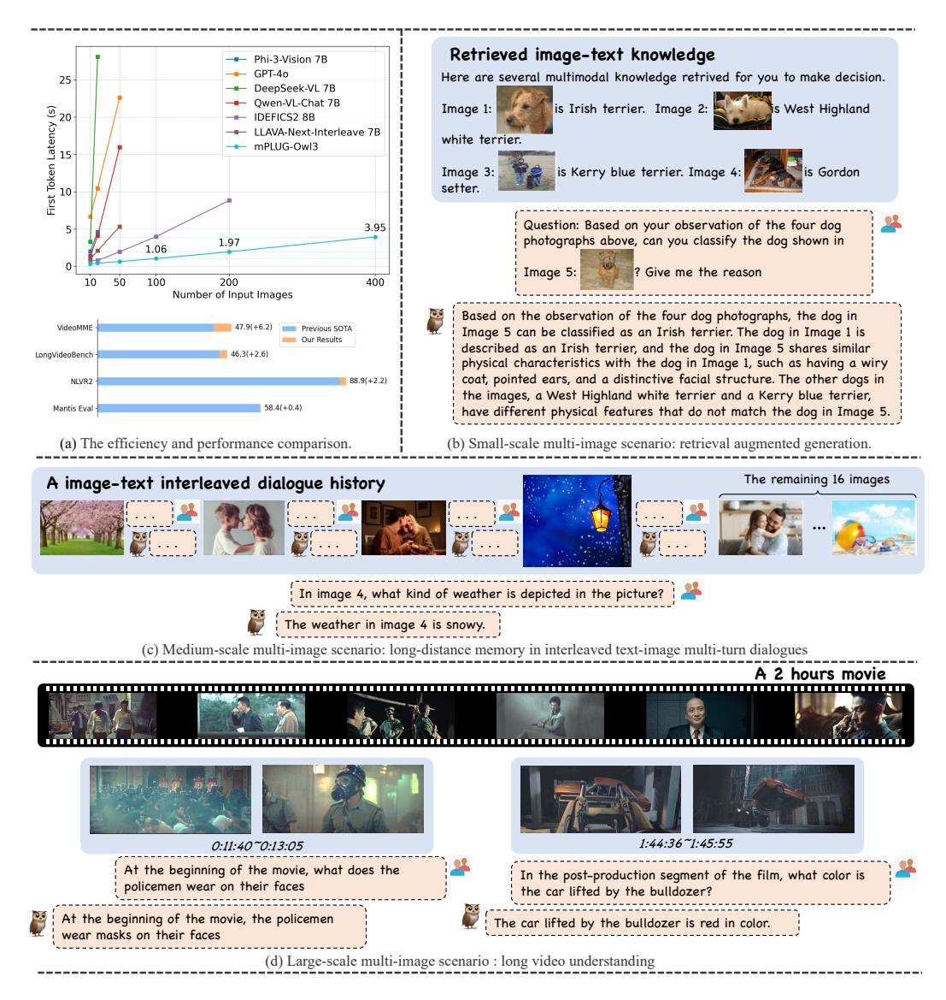
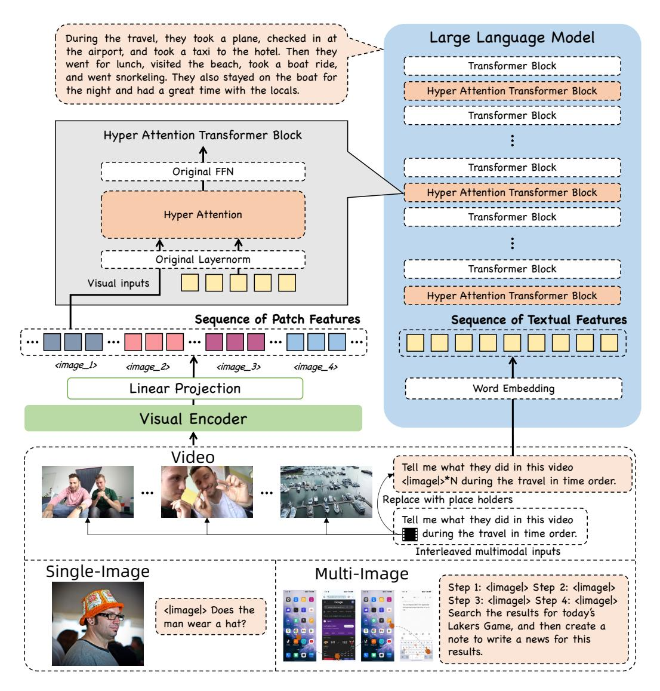
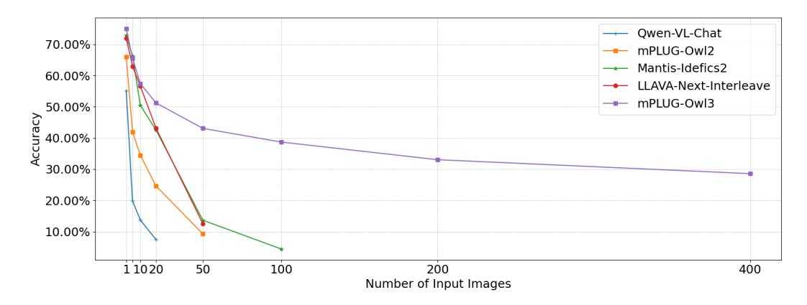
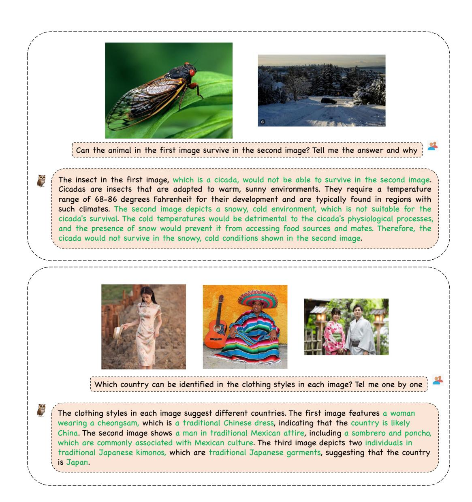

# MPLUG-Owl3: Towards Long Image-Sequence Understanding in Multi-Modal Large Language Models

Jiabo Ye1 Haiyang Xu1 Haowei Liu Anwen Hu Ming Yan2 Qi Qian Ji Zhang Fei Huang Jingren Zhou Alibaba Group

{yejiabo.yjb, shuofeng.xhy, ym119608}@alibaba-inc.com

https://github.com/X-PLUG/mPLUG-Owl

Figure 1: (a) mPLUG-Owl3 demonstrates leading performance on video and multi-image understanding. (b,c,d) Examples of mPLUG-Owl3 on handling different scale of multi-image scenarios.

&lt;sup>1Equal contribution

&lt;sup>2Corresponding author

# Abstract

Multi-modal Large Language Models (MLLMs) have demonstrated remarkable capabilities in executing instructions for a variety of single-image tasks. Despite this progress, significant challenges remain in modeling long image sequences. In this work, we introduce the versatile multi-modal large language model, mPLUG-Owl3, which enhances the capability for long image-sequence understanding in scenarios that incorporate retrieved image-text knowledge, interleaved image-text, and lengthy videos. Specifically, we propose novel hyper attention blocks to efficiently integrate vision and language into a common language-guided semantic space, thereby facilitating the processing of extended multi-image scenarios. Extensive experimental results suggest that mPLUG-Owl3 achieves state-of-the-art performance among models with a similar size on single-image, multi-image, and video benchmarks. Moreover, we propose a challenging long visual sequence evaluation named Distractor Resistance to assess the ability of models to maintain focus amidst distractions. Finally, with the proposed architecture, mPLUG-Owl3 demonstrates outstanding performance on ultra-long visual sequence inputs. We hope that mPLUG-Owl3 can contribute to the development of more efficient and powerful multimodal large language models.

# 1 Introduction

Recently, Multimodal Large Languages Models (MLLMs) [\(Liu et al.,](#page-20-0) [2023a;](#page-20-0) [Ye et al.,](#page-22-0) [2023b;](#page-22-0) [Liu](#page-20-1) [et al.,](#page-20-1) [2024a;](#page-20-1) [Ye et al.,](#page-22-1) [2024;](#page-22-1) [Chen et al.,](#page-18-0) [2024d\)](#page-18-0) have achieved rapid advancements, demonstrating strong single-image understanding capabilities. The current approaches primarily rely on vast amounts of image and text data to align Large Language Models (LLMs) [\(Zheng et al.,](#page-23-0) [2023;](#page-23-0) [Touvron et al.,](#page-21-0) [2023a;](#page-21-0)[b\)](#page-21-1) with visual encoders, thereby extending multimodal capabilities.

More advanced image-sequence understanding capabilities are required in practical applications, such as Multi-Image Reasoning [\(Suhr et al.,](#page-21-2) [2018;](#page-21-2) [Lu et al.,](#page-20-2) [2021;](#page-20-2) [Jiang et al.,](#page-19-0) [2024\)](#page-19-0), Multimodal RAG [\(Chen et al.,](#page-18-1) [2022;](#page-18-1) [Lin et al.,](#page-20-3) [2024\)](#page-20-3), Video Understanding [\(Xiao et al.,](#page-21-3) [2021;](#page-21-3) [Li et al.,](#page-19-1) [2023c;](#page-19-1) [Fu et al.,](#page-18-2) [2024a;](#page-18-2) [Wu et al.,](#page-21-4) [2024\)](#page-21-4), Multi-modal Agents [\(Wang et al.,](#page-21-5) [2024a;](#page-21-5) [Zhang et al.,](#page-22-2) [2024a\)](#page-22-2), and Multi-Doc QA [\(Tito et al.,](#page-21-6) [2023;](#page-21-6) [Van Landeghem et al.,](#page-21-7) [2023\)](#page-21-7). The existing methods are primarily based on interleaved image-text web data for pre-training [\(Laurençon et al.,](#page-19-2) [2023;](#page-19-2) [Laurençon et al.,](#page-19-3) [2024\)](#page-19-3) to extend multi-image capabilities or focused on the in-context abilities [\(Alayrac et al.,](#page-17-0) [2022;](#page-17-0) [Awadalla et al.,](#page-17-1) [2023;](#page-17-1) [Zhao et al.,](#page-23-1) [2023\)](#page-23-1) within multi-image scenarios. However, these methods have not explored the in-depth comprehension or the efficiency of multi-images sufficiently, which makes it hard to support long image sequences.

For example, LLAVA-Next-Interleave [\(Li et al.,](#page-19-4) [2024a\)](#page-19-4) and Mantis [\(Jiang et al.,](#page-19-0) [2024\)](#page-19-0) directly insert visual features into textual sequences. As shown in Figure [1,](#page-0-2) the inference latency and memory usage is dramatically increase. Flamingo [\(Alayrac et al.,](#page-17-0) [2022\)](#page-17-0) simply uses a Perceiver and cross-attention layers to reduce computational overhead. This results in the loss of visual fine-grained information and leads to poor performance in both single and multi-image scenarios.

To address this challenge, we introduce mPLUG-Owl3, a new general-purpose multi-modal foundation model. mPLUG-Owl3 is designed to handle long image sequences both effectively and efficiently. mPLUG-Owl3 integrates innovative hyper attention blocks in the language model to achieve efficient interleaved vision-language semantic alignment. Specifically, Hyper Attention introduces cross-attention parallel to the self-attention in the transformer block. The language query is reused to select and extract visual features from a lengthy visual sequence, allowing for adaptively obtaining complementary visual information that the language model lacks, based on textual semantics.

We evaluate mPLUG-Owl3 with a total of twenty benchmarks, which include single-image, multiimage, and video. Specifically, experiments encompass five visual question answering tasks, five multimodal large language model tasks, four video tasks, and six multi-image tasks. Among models of the same size, mPLUG-Owl3 achieves state-of-the-art results in 14 out of 20 benchmarks. Besides existing benchmarks, we also propose a challenging long visual sequence evaluation named Distractor Resistance. It is designed to assess the ability of models to maintain focus amidst distractions. We can observe that mPLUG-Owl3 demonstrates outstanding performance in handling ultra-long visual sequence inputs while also maintaining extremely high execution efficiency. The superior performance of the new architecture in mPLUG-Owl3 implies a trend for future multimodal large language models.

## 2 мPLUG-Owl3

As illustrated in Figure 2, mPLUG-Owl3 comprises a visual encoder, a linear projection layer, and a decoder-only language model. This architecture is commonly employed in recently proposed Multi-modal Large Language Models. Unless specified otherwise, we use Siglip-400m (Zhai et al., 2023) as the visual encoder and Qwen2 (Yang et al., 2024) as the language model. First, we provide detailed information about our efficient architecture and its handling of various lengths of visual inputs in Section 2.1. Additionally, we introduce the Hyper Attention module in Section 2.2. It is a lightweight extension designed to enhance the transformer blocks of the language model by enabling cross-attention capabilities for adaptive visual sequence utilization.

#### 2.1 Cross-Attention based Architecture

Popular MLLMs (e.g., LLAVA-Interleave (Li et al., 2024a), InternVL (Chen et al., 2024d)) insert visual features into the sequence of embeddings, which can easily exhaust the language model's context window, resulting in significant memory and computational overhead. This kind of disadvantage hinders these MLLMs to modeling the long vision input such as multiple images, videos and multiple pieces high-resolution images. Moreover, visual details can be lost, when going through the language model.

Therefore, mPLUG-Owl3 consider use cross-attention for feeding the visual information into the language model. Specifically, given a interleaved multimodal input  $S = [T_1, I_1, T_2, I_2, T_3]$  (the format can be adapted to various text-image organizational structures), mPLUG-Owl3 first extract visual features of the input images and use a linear projection to align the dimensions of visual features to be the same of the language model. The projected visual features are denoted by  $\mathbf{H_{img}} = [I_1^t, I_2^t] \in \mathbb{R}^{L \times D_t}$ . The text sequence are  $S_{text} = [T_1, T_{img}, T_2, T_{img}, T_3] \in \mathbb{R}^{L \times D_t}$ , where  $T_{img}$  is a plain text <|image|> to indicate the original place of the image. We feed the sequence into the word embedding to obtain text feature  $\mathbf{H_{text}}$ .

In the language model, we fuse the visual features  $\mathbf{H_{img}}$  into the text features  $\mathbf{H_{text}}^i \in \mathbb{R}^{L \times D_t}$  of the  $i^{th}$  layer through cross-attention operator. Different from Flamingo (Alayrac et al., 2022) and EVLM (Chen et al., 2024b) that insert an additional layer into each layer of transformer layer, we sparsely extend a small number of transformer blocks in the network to perform cross attention parallel with self-attention. We name the Hyper Attention Transformer Block (HATB). We discuss the design of HATB in detail in Section 2.2. HABT can significantly reduces the number of additional training parameters and facilitates model convergence. Besides, we observe that having fewer HATBs does not degrade the model's performance; instead, it offers the advantages of low memory consumption and high inference efficiency during inference. For a language model consisting of N layers, we start from layer 0 and uniformly extend K layers to HATB. Specifically, for Qwen2, we select layers [0, 9, 17, 25].

#### 2.2 Hyper Attention Transformer Block

In this section, we specifically introduce the Hyper Attention Transformer Block used in mPLUG-Owl3. The cross-attention structure employed in Flamingo, as shown in Figure 3 (a), has been widely utilized in constructing MLLMs (e.g., IDEFICS (Laurençon et al., 2023), EVLM (Chen et al., 2024b)). However, this structure presents three main drawbacks: it introduces a large number of additional parameters, which results in significant memory and computational overhead; the knowledge learned by the language model cannot benefit the understanding of visual inputs; the cross attention does not fully take into account the original positions of images in the interleaved sequence, which limits the performance of these models in multi-image scenarios. In response to these issues, we propose a lightweight Hyper Attention Transformer Block, illustrated in Figure 3 (b). This block introduces a small number of parameters and extends self-attention capabilities to perform both intra-text self-attention and inter-modal cross-attention between text and images

Figure 2: An overview of mPLUG-Owl3.

in parallel. It also introduces a Multimodal-Interleaved Rotary Position Embedding (MI-Rope) to maintain the position information of images. The extended modifications are detailed below:

**Shared Input Layernorm.** The visual feature  $\mathbf{H_{img}}$  and the  $i^{th}$  layer's text features  $\mathbf{H_{text}^i}$ , although sharing the same dimensionality, originate from different distributions. Hence, both sets of features are initially normalized using a LayerNorm module. Our findings indicate that employing the LayerNorm module already integrated within the transformer block results in better convergence compared to training a separate layer normalization module specifically for the visual features. This improvement is attributed to the compatibility of the mean and variance of the outputs from the integrated LayerNorm module with the distribution characteristics of the pre-trained language model.

**Modality-Specific Key-Value Projection.** In cross-attention, the **Query** is derived from textual data, while the **Key** and **Value** are extracted from visual features. Inspired by Ye et al. (2024), we construct a weight matrix  $\mathbf{W}_{img}^{K\&V} \in \mathbb{R}^{2D \times D}$  to generate the **Key** and **Value** for the visual features. This matrix is initialized using the weights from the language model's KV (Key-Value) projection. Furthermore, the query vector from the self-attention mechanism is repurposed as the **Query** in the

Figure 3: Comparison between Flamingo Transformer Block (a) and Hyper Attention Transformer Block (b). Pink indicates that the module is additionally introduced. (c) presents the causal attention mask strategy of cross attention in Hyper Attention in a image-text interleaved scenario. The gray block denotes the attention score is ignored.  $T_{img}$  denotes the token of plain text < | image|>.

cross-attention. The computation procedure for self-attention remains unchanged. This design is beneficial as it preserves more specific visual information and allows for the adaptive supplementation of visual information that the language model lacks, based on textual semantics.

**Visual Position Modeling in Attention.** For models that process multiple images, positional encoding is essential to correctly understanding interleaved image-text input. Existing cross-attention models, such as Flamingo (Alayrac et al., 2022) and IDEFICS (Laurençon et al., 2023), do not assign position embeddings to visual inputs, leading to suboptimal performance in scenarios involving multiple images. To accurately represent the original positions of images in interleaved sequences, we develope a Multimodal-Interleaved Rotary Position Embedding, which we name MI-Rope. Specifically, for each visual feature  $I_n$  of image n, we pre-record the position index of its placeholder  $T_{img}$  in the interleaved sequence  $S_{text}$ . All patches of  $I_n$  share  $T_n$ 's positional encoding to obtain the rotary embedding. This ensures that the positional encoding of the image not only reflects the order among images but also reveals its position in the textual context. We also use a causal attention mask in cross attention. As shown in Figure 3 (c), for a text sequence  $S = [T_1, T_{img}, T_2, T_{img}, T_3]$ , each text token can only attend the visual features that precede it. Then, HATB simultaneously performs cross-attention and self-attention, denoting the resulting hidden states as  $\bar{\mathbf{H}}^i$  and  $\hat{\mathbf{H}}^i$ .

**Adaptive Gating** Existing implementations of cross-attention utilize a learnable scale to regulate the extent of information transfer from the image to the language model. However, the semantics of language are ignored. Consequently, we introduce an adaptive gate that obtains the gate value based on the textual features:

$$\mathbf{g} = \operatorname{Sigmoid}(\mathbf{W}_{gate}^T \hat{\mathbf{H}}^{\mathbf{i}}) \tag{1}$$

$$\mathbf{H}_{\mathbf{fused}}^{\mathbf{i}} = \mathbf{\bar{H}}_{\mathbf{text}}^{\mathbf{i}} * \mathbf{g} + \mathbf{\hat{H}}_{\mathbf{text}}^{\mathbf{i}} * (1 - \mathbf{g})$$
 (2)

The  $\mathbf{H}_{\mathrm{fused}}^{i}$  is passed to the FFN and fed to the next layer of transformer.

#### 3 IMPLEMENT DETAILS

#### 3.1 Training Paradigm

We adopt a three-stage training approach for mPLUG-Owl3. Initially, we pre-train mPLUG-Owl3 using image-text pairs to achieve robust multimodal alignment. In the second stage, we leverage diverse datasets that include image and video captions to enhance the model's ability to understand

multiple images. Finally, we fine-tune mPLUG-Owl3 using a mixture of supervised data, encompassing tasks involving both single and multiple images, to ensure comprehensive performance. The statistics of the datasets we used are presented in Table 1, and the training settings are detailed in Table 2.

| Stage 1: Pretraining |            | Stage 2: Multi-Ima  | ge Training | Stage 3: Self-Supervised Fintuning |            |  |
|----------------------|------------|---------------------|-------------|------------------------------------|------------|--|
| Dataset Name         | Percentage | Dataset Name        | Percentage  | Dataset Name                       | Percentage |  |
| DataComp-1B          | 35.22%     | ShareGPTVideo       | 34.63%      | LLAVA-SFT                          | 57.95%     |  |
| LAION-en             | 26.07%     | Selective Caption   | 19.29%      | The Cauldron                       | 12.50%     |  |
| COYO-700M            | 14.47%     | LLAVA-Interleave    | 16.69%      | Mantis                             | 10.41%     |  |
| COYO-700M-OCR        | 9.60%      | VATEX               | 15.77%      | LLAVA-Interleave                   | 9.26%      |  |
| LAION-zh             | 7.73%      | Text Reading        | 7.36%       | ALLAVA                             | 6.95%      |  |
| Wukong               | 5.64%      | Interleaved Caption | 5.25%       | ShareGPTVideo-QA 240K              | 2.02%      |  |
| CC12M                | 0.81%      | MMDU                | 1.01%       | Video Instruct 100K                | 0.84%      |  |
| Others               | 0.46%      | -                   | -           | MSRTT/MSVD Caption                 | 0.06%      |  |

Table 1: Dataset percentages used in Pretraining, Multi-Image Training, and Self-Supervised Fintuning. Others include CC3M, OCR-CC, COCO and SBU.

| Setting      |                          | Stage 1: Pretraining                                 | Stage 2: Multi-Image Training            | Stage 3: Self-Supervised Fintuning       |
|--------------|--------------------------|------------------------------------------------------|------------------------------------------|------------------------------------------|
|              | Learning Rate (Max, Min) | (1e-3, 1e-5)                                         | (2e-5, 1e-7)                             | (2e-5, 1e-7)                             |
| Training     | Global Batch Size        | 2048                                                 | 1024                                     | 1024                                     |
| Training     | Training Steps           | 20K                                                  | 3K                                       | 11K                                      |
|              | Warmup ratio             |                                                      | 0.03                                     |                                          |
|              | Trainable Modules        | Linear Projection Visual KV Projection Adaptive Gate | Linear Projection Full Language Model | Linear Projection Full Language Model |
| Model        | Resolution               | 3842                                                 | up to $384^2 \times 6$                   | up to $384^2 \times 6$                   |
| Model        | Sequence Length          | 768                                                  | 4096                                     | 4096                                     |
|              | Precision                |                                                      | Mixed-precision FP16/B                   | F16                                      |
| Accelerating | ZeRO Optimization        |                                                      | Zero-1                                   |                                          |
|              | Gradient Checkpointing   | No.                                                  | Yes.                                     | Yes.                                     |
|              | Model Parallel           | TP=1                                                 | TP=4                                     | TP=4                                     |

Table 2: The training settings across three stages: Pretraining, Multi-Image Training, and Self-Supervised Finetuning.

#### 3.1.1 Pre-training

We collect image-text pairs from public datasets, including Conceptual Captions (CC3M/CC12M) (Changpinyo et al., 2021), COCO (Lin et al., 2014), Laion (Schuhmann et al., 2022), COYO (Byeon et al., 2022), DataComp (Gadre et al., 2023), Wukong (Gu et al., 2022), ImageNet (Deng et al., 2009), OCR-CC (Yang et al., 2021) and SBU (Ordonez et al., 2011). We randomly sample a subset consists of 41 million image-text pairs for pre-training. During pre-training, only the newly introduced modules are trainable, which include the linear layer following the vision encoder, the visual KV projection, and the Adaptive Gate in the Hyper Attention Transformer Block.

## 3.1.2 Multi-image Pre-training

In the multi-image pre-training stage, we collected three types of data to enhance the model's multi-image understanding capabilities:

- Interleaved data: We utilize sources such as MMDU (Liu et al., 2024d) and LLaVA-Interleave (Li et al., 2024a) for multi-image data. Additionally, from LLaVA-Recap 558K, we randomly sample 3 to 6 images and combine their image-caption pairs into an interleaved format to create Interleaved Captions. We also consider sampling 4 images and requiring a description of one among them to form Selective Captions.
- Text-rich data: We use text reading and key point generation data proposed by UReader (Ye et al., 2023a), enabling the model to reconstruct the text contained within text-rich images

and TO extract key points. These data help the model learn the original text structure from the pieces of high-resolution images.

• Video data: We adopt annotated data from ShareGPTVideo [\(Zhang et al.,](#page-22-7) [2024c\)](#page-22-7), which includes 900K caption entries and 240K question-answering instances. We also incorporate Chinese and English video caption data from VATEX [\(Wang et al.,](#page-21-8) [2019\)](#page-21-8). For training with video data, we consistently sample 8 frames per video.

Both linear projection and the full language model are trainable. With the help of tensor parallelism, the model is spilted into four parts, effectively reducing the memory usage on a single GPU to between 32 and 40 GB.

## 3.1.3 Supervised-Finetuning

In Supervised-Finetuning stage, mPLUG-Owl3 is trained with an extensive and diverse assembly of instruction tuning datasets aimed at enhancing its instruction-following capability. The datasets include LLaVA-SFT-665K [\(Liu et al.,](#page-20-1) [2024a\)](#page-20-1), The Cauldron [\(Laurençon et al.,](#page-19-3) [2024\)](#page-19-3), Mantis [\(Jiang](#page-19-0) [et al.,](#page-19-0) [2024\)](#page-19-0), LLaVA-Interleave [\(Li et al.,](#page-19-4) [2024a\)](#page-19-4), ALLaVA [\(Chen et al.,](#page-18-8) [2024a\)](#page-18-8), ShareGPTVideo-QA 240K [\(Zhang et al.,](#page-22-7) [2024c\)](#page-22-7), Video Instruct 100K [\(Maaz et al.,](#page-20-8) [2023\)](#page-20-8), MSR-VTT [\(Xu et al.,](#page-22-8) [2016\)](#page-22-8) and MSVD Caption [\(Chen & Dolan,](#page-18-9) [2011\)](#page-18-9). We keep the same training setting as the Multi-image Pre-training stage.

## 3.2 High-resolution Image Processing

Inspired by UReader [\(Ye et al.,](#page-22-6) [2023a\)](#page-22-6), we introduce a similar adaptive method for image cropping. For a given image, we select from the cropping grids (2,2), (1,3), (1,4), (3,1), (4,1), (2,3), and (3,2) that most closely matches the shape of the input image. Additionally, we retain a global version of the original image. During the Supervised-Finetuning stage, for datasets rich in text, we perform cropping with a probability of 100%. For datasets containing a single image without text, we apply cropping with a probability of 20%. For datasets containing multiple images or videos, we do not perform cropping. During evaluation, cropping is enabled only for single-image tasks.

## 3.3 Video Processing

For videos, we sample 8 frames per video by default. Meanwhile, we replace the video markers in the text with multiple *<|image|>* placeholders corresponding to the number of sampled frames.

# 4 Experiments

## 4.1 Visual Question Answering Benchmarks

We conduct experiments on a diverse set of visual question answering benchmarks, including VQAv2 [\(Goyal et al.,](#page-19-6) [2016\)](#page-19-6), OK-VQA [\(Marino et al.,](#page-20-9) [2019\)](#page-20-9), GQA [\(Hudson & Manning,](#page-19-7) [2019\)](#page-19-7), VizWizQA [\(Bigham et al.,](#page-17-2) [2010\)](#page-17-2), and TextVQA [\(Singh et al.,](#page-20-10) [2019\)](#page-20-10). The VQAv2 dataset is currently the largest visual question answering dataset available. OK-VQA involves questions that require external knowledge beyond multimodal inputs. GQA is designed to validate the model's reasoning capabilities. VizWizQA is constructed from question-answer pairs sourced from visually impaired users. TextVQA focuses more on evaluating the model's ability to understand text in natural scenes. These datasets are strategically selected to thoroughly evaluate our model's ability to understand and reason across various visual contexts and knowledge domains. Table [3](#page-7-0) presents the comparison results between mPLUG-Owl3 and State-of-the-Art multimodal large language models, including CogVLM [\(Wang et al.,](#page-21-9) [2023\)](#page-21-9), EVLM-Chat [\(Chen et al.,](#page-18-3) [2024b\)](#page-18-3), flamingo [\(Alayrac et al.,](#page-17-0) [2022\)](#page-17-0), Qwen-VL-Chat [\(Bai et al.,](#page-17-3) [2023\)](#page-17-3), Idefics [\(Laurençon et al.,](#page-19-2) [2023\)](#page-19-2), InstructBLIP [\(Dai et al.,](#page-18-10) [2023\)](#page-18-10), mPLUG-Owl2 [\(Ye et al.,](#page-22-1) [2024\)](#page-22-1), LLaVA-1.5 [\(Liu et al.,](#page-20-1) [2024a\)](#page-20-1), LLaVA-Next [\(Liu et al.,](#page-20-11) [2024b\)](#page-20-11), VILA-1.5 [\(Lin et al.,](#page-20-12) [2023b\)](#page-20-12), Idefics2 [\(Laurençon et al.,](#page-19-3) [2024\)](#page-19-3), Mantis-SigLIP [\(Jiang et al.,](#page-19-0) [2024\)](#page-19-0).

| Model         | # Param | VQAv2 | OK-VQA | GQA               | VizWizQA | TextVQA     |
|---------------|---------|-------|--------|-------------------|----------|-------------|
| CogVLM        | 17B     | 82.3  | 64.8   | -                 | _        | 70.4        |
| EVLM-Chat     | 32B     | 81.9  | -      | 64.4              | 47.3     | 67.5        |
| Flamingo      | 80B     | 81.3  | 50.6   | -                 | 57.2     | 54.7        |
| 8B-level MLMM | Is      |       |        |                   |          |             |
| Qwen-VL-Chat  | 9B      | 78.2  | 56.6   | 57.5              | 38.9     | 63.8        |
| Idefics1      | 9B      | 68.8  | 50.4   | -                 | -        | 39.3        |
| Flamingo      | 9B      | 51.8  | 44.7   | -                 | -        | 46.3        |
| InstructBLIP  | 7B      | 75.2  | 45.2   | 49.2              | 34.5     | 33.6        |
| mPLUG-Owl2    | 8B      | 79.4  | 57.7   | 56.1              | 54.5     | 58.2        |
| LLAVA-1.5     | 8B      | 78.5  | -      | 62.0              | 50.0     | 58.2        |
| LLAVA-Next    | 8B      | 81.8  | -      | 64.2              | 57.6     | 64.9        |
| VILA-1.5      | 8B      | 80.9  | -      | $\overline{61.9}$ | 58.7     | 66.3        |
| Idefics2      | 8B      | 80.8  | 53.5   | -                 | -        | 70.4        |
| Mantis-SigLIP | 8B      | 74.9  | 55.4   | -                 | -        | 59.2        |
| mPLUG-Owl3    | 8B      | 82.1  | 60.1   | 65.0              | 63.5     | <u>69.0</u> |

Table 3: **Performance comparison on visual question answering.** The accuracy is reported. We use **bold** to mark the highest score and underline to mark the second highest of 8B-level MLLMs.

mPLUG-Owl3 outperforms 8B-level language models in VQAv2, OK-VQA, GQA, and VizWizQA. Furthermore, it surpasses the 32B-parameter EVLM³ in GQA and VizWizQA. In TextVQA, although mPLUG-Owl3's performance is slightly lower than that of Idefics2, it still exceeds that of other 8B models. It is noteworthy that, despite having 8B parameters, mPLUG-Owl3 exhibits superior inference speed and memory efficiency compared to models of the same scale, thanks to the introduction of Hyper Attention.

#### 4.2 General MLLM Benchmarks

We evaluate mPLUG-Owl3 on various single-image general multimodal large language model benchmarks including MMBench-EN/CN (Liu et al., 2023b), MM-Vet (Yu et al., 2023), POPE (Li et al., 2023d) and AI2D (Kembhavi et al., 2016). MMBench provides a comprehensive evaluation of a model's multimodal capabilities in both Chinese and English contexts. MM-Vet assesses the multimodal conversational abilities of a model using GPT-4 evaluation. POPE can evaluate the extent of multimodal hallucinations in a model. AI2D assesses a model's ability to understand science diagrams inputs.

Table 4 shows that mPLUG-Owl3 achieves state-of-the-art performance on MMBench-EN, MMBench-CN, MM-Vet and POPE across 8B-level models such as OpenFlamingo (Awadalla et al., 2023), Cambrian (Tong et al., 2024) and MiniCPM-Llama3-V2.5 (Yao et al., 2024). It also matches or surpasses the performance of larger models such as CogVLM (Wang et al., 2023) and EVLM-Chat (Chen et al., 2024b). mPLUG-Owl3 does not achieve state-of-the-art performance on the AI2D dataset. Due to limited training resources, we do not fine-tune the vision encoder, which restricts its performance in scenarios rich in text.

### 4.3 Multi-image and Video Benchmark

We also evaluate the performance of mPLUG-Owl3 on video and multi-image benchmarks, as it is capable of processing multiple images with an interleaved format. we include VideoChat2 (Li et al., 2023c), Video-LLaMA2 (Cheng et al., 2024), Video-ChatGPT (Maaz et al., 2023), ShareGPT4Video (Chen et al., 2024c), PLLaVA (Xu et al., 2024), Idefics2 (Laurenccon et al., 2024), Mantis-SigLIP (Jiang et al., 2024) and LLAVA-Interleave (Li et al., 2024a).

The results of video evaluation is shown in Table 5. The NextQA (Xiao et al., 2021) and MVBench (Li et al., 2023c) are short video benchmarks, with video durations all less than one

&lt;sup>3EVLM does not provide the number of parameters for its cross module. The parameter count in this table is estimated based on its model architecture.

| Model               | # Param | MMB-EN | MMB-CN | MM-Vet | POPE | AI2D        |
|---------------------|---------|--------|--------|--------|------|-------------|
| CogVLM              | 17B     | 65.8   | 69.8   | 52.8   | 88.0 | 63.3        |
| EVLM-Chat           | 32B     | 76.9   | 76.9   | -      | 89.7 | 76.0        |
| InstructBLIP        | 13B     | 38.3   | -      |        | 81.5 | -           |
| 8B-level MLMMs      |         |        |        |        |      |             |
| LLAVA-1.5           | 8B      | 64.3   | 58.3   | 31.1   | 85.9 | 55.5        |
| OpenFlamingo        | 9B      | 32.4   | 14.4   | 24.8   | -    | 31.7        |
| mPLUG-Owl2          | 8B      | 64.5   | -      | 36.2   | -    | 55.7        |
| LLAVA-Next          | 8B      | 67.4   | 60.6   | 43.9   | 86.5 | 66.6        |
| LLAVA-Interleave    | 8B      | -      | -      | -      | 86.8 | 73.9        |
| VILA1.5             | 8B      | 72.3   | 66.2   | 38.3   | 84.4 | -           |
| Idefics2            | 8B      | 75.7   | 68.6   | 34.0   | 86.2 | 72.3        |
| Cambrian            | 8B      | 74.6   | 67.9   | -      | -    | 74.6        |
| MiniCPM-Llama3-V2.5 | 8B      | 77.6   | 73.8   | -      | -    | <b>78.4</b> |
| Mantis-SigLIP       | 8B      | 68.7   | -      | -      | -    | -           |
| mPLUG-Owl3          | 8B      | 77.6   | 74.3   | 40.1   | 88.2 | 73.4        |

Table 4: **Zero-shot multi-modal evaluation on multi-modal benchmarks.** The overall scores are reported for evaluation. We use **bold** to mark the highest score and <u>underline</u> to mark the second highest of 8B-level MLLMs.

| Model            | # Param | NextQA      | MVBench | VideoMME w/o sub | LongVideoBench-val |
|------------------|---------|-------------|---------|------------------|--------------------|
| VideoChat2       | 8B      | 68.6        | 51.9    | 43.8             | 36.0               |
| Video-LLaMA2     | 8B      | _           | 54.6    | 47.9             | -                  |
| Video-ChatGPT    | 8B      | _           | 32.7    | -                | -                  |
| ShareGPT4Video   | 8B      | _           | -       | 39.9             | 39.7               |
| PLLaVA           | 8B      | _           | 46.6    | -                | 40.2               |
| Idefics2         | 8B      | _           | 29.7    | -                | 49.7               |
| Mantis-SigLIP    | 8B      | _           | 50.2    | -                | $\overline{47.0}$  |
| LLAVA-Interleave | 8B      | <u>78.2</u> | 53.1    | -                | -                  |
| mPLUG-Owl3       | 8B      | 78.6        | 54.5    | 53.5             | 52.1               |

Table 5: **Multi-modal evaluation on video understanding benchmarks.** The overall scores are reported for evaluation. We use **bold** to mark the highest score and <u>underline</u> to mark the second highest.

minute. mPLUG-Owl3 achieves performance comparable to state-of-the-art models. For benchmarks like VideoMME (Fu et al., 2024a) and LongVideoBench (Wu et al., 2024), with longer video durations up to one hour, mPLUG-Owl3 significantly outperforms existing models. It demonstrates that mPLUG-Owl3 is highly suitable for understanding videos with various durations.

Table 6 presents the the evaluation results on multi-image understanding. NLVR2 (Suhr et al., 2018) and Mantis-Eval (Jiang et al., 2024) test the model's ability to perform logical reasoning based on the content of multiple images. MathVerse-mv (Li et al., 2024a) and SciVerse-mv (Li et al., 2024a) evaluate the model's multi-image mathematical and scientific capabilities. We use the version released by llava-next-interleave for comparison with its reported results. BLINK (Fu et al., 2024b) and Q-Bench2 (Zhang et al., 2024d) test the model's multi-image question answering ability based on low-level visual perception. We compare mPLUG-Owl3 with models support image-text interleaved inputs such as Qwen-VL-Chat (Bai et al., 2023), InstructBLIP (Dai et al., 2023), CogVLM (Wang et al., 2023), VideoLLaVA (Lin et al., 2023a), VILA (Lin et al., 2023b), Idefics2 (Laurenccon et al., 2024), Mantis-SigLIP (Jiang et al., 2024) and LLAVA-Interleave (Li et al., 2024a).

mPLUG-Owl3 surpasses existing models in both NLVR2 and Mantis-Eval. On MathVerse-mv and SciVerse-mv, it can be observed that mPLUG-Owl3 significantly outperforms LLaVA-Interleave. However, on BLINK, mPLUG-Owl3 performs weaker than LLaVA-Interleave. We note that this dataset requires models to possess low-level visual perception capabilities for fine details in images, and mPLUG-Owl3's ability may be limited due to the vision encoder being frozen during training.

On the Q-Bench2, which evaluates a model's ability to discern low-level visual differences across multiple images globally, mPLUG-Owl3 achieves performance comparable to the state-of-the-art.

| Model            | # Param | NLVR2 | Mantis-Eval | MathVerse-mv | SciVerse-mv | BLINK       | Q-Bench2 |
|------------------|---------|-------|-------------|--------------|-------------|-------------|----------|
| Qwen-VL-Chat     | 8B      | 58.7  | 39.2        | -            | -           | 31.2        | 45.9     |
| InstructBLIP     | 8B      | 60.3  | 45.6        | -            | _           | 42.2        | 44.3     |
| CogVLM           | 17B     | 58.6  | 45.2        | -            | -           | 41.5        | 53.2     |
| VideoLLaVA       | 8B      | 56.5  | 35.9        | -            | _           | 38.9        | 45.7     |
| VILA             | 8B      | 76.5  | 51.2        | -            | -           | 39.3        | 45.7     |
| Idefics2         | 8B      | 86.9  | 48.9        | -            | _           | 45.2        | 57.0     |
| Mantis-SigLIP    | 8B      | 87.4  | 59.5        | -            | _           | 46.4        | 69.9     |
| LLAVA-Interleave | 8B      | 88.8  | <u>62.7</u> | 32.8         | <u>31.6</u> | <b>52.6</b> | 74.2     |
| mPLUG-Owl3       | 8B      | 90.8  | 63.1        | 65.0         | 86.2        | 50.3        | 74.0     |

Table 6: **Multi-modal evaluation on multi-image understanding benchmarks.** The overall scores are reported for evaluation. We use **bold** to mark the highest score and <u>underline</u> to mark the second highest.

To more comprehensively investigate the fine-grained abilities of mPLUG-Owl3 in multi-image scenarios, we conduct experiments on MI-Bench (Liu et al., 2024c), a recently proposed multi-image benchmark. We exclude Fine-Grained Visual Recognition from evaluation because it consists of images from mini-ImageNet that may have been seen by existing models.

Table 7 shown that mPLUG-Owl3 achieves state-of-the-art performance on aspects of General Comparison, Subtle Difference, Temporal Reasoning, Logical Reasoning and Text-Rich Images across popular open-sourced MLLMs. It also outperform GPT-4V and GPT-40 on General Comparison. The results demonstrates that our model possesses robust capabilities in various multi-image input scenarios. The Hyper Attention structure of mPLUG-Owl3 better preserves the original visual features, enabling it to excel in single-image tasks as well. And this type of multimodal knowledge also assists it in more accurately completing multi-image tasks.

#### 4.4 Ablation Studies

We adopt the training methods of LLaVA-1.5 (Liu et al., 2024a) using the same datasets to conduct our ablation study. Additionally, we employ the Qwen1.5 7B as our language model. To validate the single-image understanding capabilities of our structures, we use datasets such as GQA and TextVQA (with OCR). Furthermore, we examine the generalization capabilities of our structures in multi-image understanding and video comprehension by conducting zero-shot evaluations on benchmarks including MvBench, VideoMME, NLVR2, and Mantis-Eval.

#### 4.4.1 Cross Attention Integration

There are two primary methods to integrate Cross-Attention into the transformer block: one method positions it prior to the self-attention (referred to as Pre-Cross-Attention), while the other places it subsequent to the self-attention (referred to as Post-Cross-Attention). We analyze both configurations and compare them to the concatenate-based method and our novel Hyper Attention in mPLUG-Owl3. Specifically, for Pre-Cross-Attention, it is positioned before the layer normalization at the input stage of the Transformer block. Conversely, for Post-Cross-Attention, it is positioned after the layer normalization that follows the self-attention stage. Both attention mechanisms employ a gating mechanism to fuse the multimodal representations effectively.

Table 8 shows that the concatenate-based model which directly embeds image features into the input sequence of the language model, has the best performance in single-image understanding. On the other hand, utilizing Post-Cross-Attention results in the worst performance. Comparatively, Pre-Cross-Attention performs better but still incurs some performance loss. Hyper Attention, however, achieves comparable performance with concatenate-based model.

In evaluations involving videos and multiple images, we observe that the concatenate-based model may not follow textual instructions as accurately, leading to a significant performance degradation in multi-image scenarios. This is attributed to the inadequate training of inter-image attention, which

| Model                                       | GC                           | SD                           | VR                           | TR                           | LR                           | TRI                          | VTK                          | TVK                          |  |  |
|---------------------------------------------|------------------------------|------------------------------|------------------------------|------------------------------|------------------------------|------------------------------|------------------------------|------------------------------|--|--|
| Closed-source MLLMs                         |                              |                              |                              |                              |                              |                              |                              |                              |  |  |
| GPT-4o GPT-4V                            | 80.7 72.8                 | 90.5 79.2                 | 46.8 45.8                 | 68.0 61.8                 | 69.8 66.3                 | 74.8 71.0                 | 54.7 52.0                 | 63.3 56.0                 |  |  |
| Open-source MLLMs                           |                              |                              |                              |                              |                              |                              |                              |                              |  |  |
| mPLUG-Owl2 MMICL Idefics2-I Mantis | 64.2 53.7 83.1 83.0 | 40.1 46.4 49.7 54.1 | 35.6 41.1 32.6 37.6 | 30.7 47.0 44.8 45.5 | 41.3 59.6 56.4 63.4 | 39.0 27.6 43.9 37.7 | 17.0 22.1 25.6 26.4 | 25.6 35.9 39.0 41.7 |  |  |
| mPLUG-Owl3                                  | 86.4                         | 70.1                         | 33.0                         | 46.8                         | 67.2                         | 50.1                         | 31.1                         | 48.8                         |  |  |

Table 7: **Multi-image evaluation on MI-Bench [\(Liu et al.,](#page-20-14) [2024c\)](#page-20-14)**. We use **bold** to mark the highest score of open-sourced multimodel large language models. The evaluation consists of the following tasks: General Comparison (GC), Subtle Difference (SD), Visual Referring (VR), Temporal Reasoning (TR), Logical Reasoning (LR), Text-Rich Images (TRI), and Vision-linked Textual Knowledge (VTK).

| Attention Structure  | GQA  | TextVQA | MvBench | VideoMME | NLVR2 | Mantis-Eval |
|----------------------|------|---------|---------|----------|-------|-------------|
| Concatenate          | 59.0 | 51.6    | 22.4    | 25.1     | 55.7  | 38.7        |
| Pre-Cross-Attention  | 53.8 | 45.2    | 43.0    | 38.9     | 55.3  | 44.7        |
| Post-Cross-Attention | 48.9 | 40.9    | 38.3    | 37.0     | 54.0  | 47.0        |
| Hyper Attention      | 57.6 | 50.0    | 42.8    | 39.4     | 59.5  | 51.6        |

Table 8: Comparison between different attention structure. Concatenate means direct concatenate visual and text feature sequences. We use **bold** to mark the highest score.

significantly disrupts the model's hidden states. Conversely, both single images and multiple images share the same paradigm when performing cross attention with text, which allows its multi-image capability to be better generalized from single-image training. the Hyper Attention design stands out as particularly effective in balancing the model's capabilities for handling both single and multiple images, showcasing superior generalizability

We also explore the integration position of the hyper attention. As shown in Table [9.](#page-10-2) The results indicate that even with just two layers of Hyper Attention, the model achieves impressive performance on single-image benchmarks, while also demonstrating generalization capabilities for videos and multiple images. However, when we apply a denser integration strategy by introducing eight layers of Hyper Attention, we find that it does not yield improved single-image performance at this scale of training data, and its zero-shot generalization is even worse. Therefore, we ultimately integrate only four layers into the entire model.

## 4.4.2 Design of Hyper Attention

To further investigate the impact of the structural design of Hyper Attention on model performance, we start with a basic hyper attention model and gradually introduce adaptive gating, shared layernorm, and MI-Rope. The Table [10](#page-11-0) shows that, when incorporate adaptive gating, the single-image

| Hyper Attention Layers Indices | GQA  | TextVQA | MvBench | VideoMME | NLVR2 | Mantis-Eval |
|--------------------------------|------|---------|---------|----------|-------|-------------|
| [9, 27]                        | 55.1 | 51.3    | 42.2    | 38.2     | 58.3  | 48.4        |
| [1, 5, 9, 13, 17, 21, 25, 29]  | 56.2 | 48.3    | 41.5    | 39.5     | 52.4  | 47.5        |
| [1, 9, 17, 25]                 | 57.6 | 50.0    | 42.8    | 39.4     | 59.5  | 51.6        |

Table 9: Comparison between different layers for integrating hyper attention structures. We use **bold** to mark the highest score.

| Adaptive Gating | Shared LayerNorm | MI-Rope | GQA  | TextVQA | MvBench | VideoMME | NLVR2 | Mantis |
|-----------------|------------------|---------|------|---------|---------|----------|-------|--------|
|                 |                  |         | 53.3 | 44.6    | 40.2    | 38.1     | 52.7  | 41.9   |
| ✓               |                  |         | 55.7 | 49.3    | 43.2    | 40.1     | 53.4  | 47.9   |
| ✓               | $\checkmark$     |         | 58.1 | 49.7    | 42.8    | 38.4     | 54.9  | 46.1   |
| $\checkmark$    | ✓                | ✓       | 57.6 | 50.0    | 42.8    | 39.4     | 59.5  | 51.6   |

Table 10: Ablation on the Adaptive Gating, Shared LayerNorm and MI-Rope.

understanding performance is significantly improved. And if we use a shared layernorm, performance is further improved. In video scenario, we notice that even without any inter-image position encoding, the performance of video understanding is also improved, suggesting the temporality inherent in visual content can also be implicitly modeled by the model with the help of adaptive gating. However, when evaluating models with multiple images, the contextual position of the images is crucial and cannot be implicitly modeled. Therefore, it can be observed that incorporating adaptive gating and shared layernorm does not lead to performance improvement on multi-image benchmarks. However, with the introduction of MI-Rope, the metrics for various multi-image benchmarks have demonstrated significant improvement.

#### 4.5 DISTRACTOR RESISTANCE IN LONG VISUAL CONTEXTS

Recent works adopt the multimodal needle in a haystack (Wang et al., 2024b) approach to evaluate the understanding of long sequences. However, we notice that multimodal models, when understanding multiple images, are susceptible to interference from surrounding images, leading to visual illusions. The multimodal needle in a haystack evaluation cannot detect such errors. Therefore, we develop a challenge evaluation method to assess the distractor resistance of multimodal models in long visual contexts.

Specifically, we take samples from the MMBench dev set. For each test sample, we randomly select N-1 images from the original MMBench dev set as distractor and construct the model input in the format of  $Image\ 1$ :  $<|image|>Image\ 2$ :  $<|image|>...\ Image\ N$ :  $<|image|>...\ Image\ N$ :  $<|image|>...\ Image\ X$ ,  $\{question\}$ , where N=1,5,10,20,50,100,200,400 and X denotes the index of the image corresponding to the question. We use the CircularEval to measure the accuracy scores. For each question, we construct test samples with different orders of options and varying distractor images. The model needs to answer all test samples for a given question correctly for it to be counted as correct. Consequently, as the number of distractor images increases, the evaluation becomes significantly more challenging.

We compare mPLUG-Owl3 with LLaVA-Next-Interleave 7B (Li et al., 2024a), Mantis-Idefics2 (Jiang et al., 2024), Qwen-VL (Bai et al., 2023) and mPLUG-Owl2 (Ye et al., 2024). LLaVA-Interleave-7B can handle approximately 20 images given 80GB of VRAM. By utilizing model parallelism, we extend its capacity for images to 50 images. However, LLaVA-Next-Interleave is unable to handle settings with more images. Mantis-Idefics2 can handle up to 100 images but costs 9 hours to finish the evaluation.

The results are shown in Figure 4. It can be observed that the introduction of distractor images results in a certain degree of performance loss for all the models. When the number of images reaches 20 and 50, the performance of LLaVA-Next-Interleave dramatically drops to 43.18% and 12.52%, respectively. We observe that when the number of images reaches 50, LLaVA struggles to consistently answer the questions accurately when different distractor images are present, resulting in a low accuracy rate. And when the number of images reaches 100, Mantis-Idefics2 fails to solve most of the problems correctly. In contrast, mPLUG-Owl3 only drops to a performance level of 43.09% when processing 50 images. As the number of images increases to 400, the performance of mPLUG-Owl3 decreases to 28.58%. Since our multi-image training data consists of only about 6-8 images, this also presents a challenge for our model. Nonetheless, mPLUG-Owl3 can serve as a baseline for future research.

#### 4.6 Qualitative Results

mPLUG-Owl3 can handle various number of images and videos as inputs. In this section, we further investigate the ability of mPLUG-Owl3 in real-world dialogue scenarios.

Figure 4: The performance of interference resistance with long visual context across LLaVA-Next-Interleave 7B [\(Li et al.,](#page-19-4) [2024a\)](#page-19-4), Mantis-Idefics2 [\(Jiang et al.,](#page-19-0) [2024\)](#page-19-0), Qwen-VL [\(Bai et al.,](#page-17-3) [2023\)](#page-17-3) mPLUG-Owl2 [\(Ye et al.,](#page-22-1) [2024\)](#page-22-1)) and mPLUG-Owl3.

# 4.6.1 Multi-Image Understanding

mPLUG-Owl3 demonstrate state-of-the-art performance on multi-image understanding benchmarks. In this section, we present multi-image dialogue examples in real-world. In the first example shown in Figure [5,](#page-13-0) it can be observed that mPLUG-Owl3 can activate the knowledge it learned based on the content of the images and perform cross-image reasoning. The second example demonstrates that the model can accurately distinguish the content of multiple images and respond appropriately based on cultural knowledge.

Figure [6](#page-14-0) shows a multi-turn dialogue example. mPLUG-Owl3 can find the differences between two images in various views. Besides, it can describe the correlations between images.

# 4.6.2 Video Understanding

We showcase the video understanding capabilities of mPLUG-Owl3. First, we compare it with LLaVA-Next-Interleave in Short Video Question Answering, Long Video Fine-grained Question Answering, and Long Video Comprehensive Understanding. For LLaVA-Next-Interleave, we input 8 frames, while for mPLUG-Owl3, we input 128 frames, which are the maximum numbers of images that can be accommodated by the two models on a V100-32G. The samples are shown in Figure [7.](#page-15-0)

In the short video tests, both LLaVA and mPLUG-Owl3 can provide correct answers. mPLUG-Owl3 tends to describe the attributes of objects based on the actual content seen. In long video lasting more than 40 minutes, when we ask about a specific detail, LLaVA fails to handle the long sequence and loses fine-grained information, rendering it unable to provide accurate information. On the other hand, mPLUG-Owl3 accurately captures key segment information within a long video. Additional, we have both models summarize the content of a longer video. mPLUG-Owl3's response is very detailed, not only providing an overall summary but also introducing the process in order. LLaVA-Next-Interleave's response, however, is more general and lacks detail. The comparative results indicate that mPLUG-Owl3 not only efficiently encodes long visual sequences but also captures and effectively utilizes both global and local information.

We also test mPLUG-Owl3 in multiple rounds using a long video that featuring many scenes. For clarity, we place the relevant segments beside the dialogue in the figure. During the test, we input only the complete video to the model. The dialogue is shown in Figure [8.](#page-16-0)

First, we ask a question with a temporal constraint, and mPLUG-Owl3 accurately understands the concept of "at first" and correctly describes the detail of "sitting in a room and discussing something on their laptops." However, the response incorrectly counts the number of people. The segment has only two people. We find that the model is confused by a later scene involving more people. We also notice that the visual content of this segment does not involve Australia as a destination, but the model can infer this from some diagrams later in the video, which makes the response more detailed. Then, we ask about the camera brand in a frame that briefly appears, and mPLUG-Owl3 accurately

Figure 5: Examples for Multi-Image Understanding. We highlight the correct answers in green.

notices the "Canon" logo in the image and provides the correct answer. Finally, we ask the model to describe the travel in order of time. We use the same color to identify the content described by the model and the corresponding video segments. Since the video involves many scenes and events, this poses a great challenge to the model. It can be observed that mPLUG-Owl3 accurately details the travel according to the timeline of the video. However, we also notice that mPLUG-Owl3 exhibits some hallucinations, incorrectly interpreting the reefs captured in the video as a beach. Additionally, while the activities on the boat happen during the day, mPLUG-Owl3, influenced by other nighttime scenes, makes an incorrect statement.

Figure 6: Examples for Multi-turn Multi-Image Dialogue. We highlight the correct answers in green.

# 5 Related Work

## 5.1 Multimodal Large Language Models

With the development of large language models (LLMs), researchers are exploring the integration of vision and other modalities into LLMs. These multimodal large language models (MLLMs) can perceive visual contents, conduct visual reasoning, and engage in multimodal dialogue with humans.

Based on the way visual features are integrated into language models, MLLMs can be divided into three categories:

- Models like LLaVA [\(Liu et al.,](#page-20-0) [2023a\)](#page-20-0) and CogVLM [\(Wang et al.,](#page-21-9) [2023\)](#page-21-9) use an MLP to map visual features into the representation space of the language model, and directly concatenate them with the text sequence. DeepSeek-VL [\(Lu et al.,](#page-20-15) [2024\)](#page-20-15) employs multiple visual encoders to obtain richer visual representations. While these methods can preserve fine-grained visual information, they consume a large number of tokens which slows down both training and inference.
- To reduce the number of tokens, Mini-GPT4 [\(Zhu et al.,](#page-23-3) [2023\)](#page-23-3), mPLUG-Owl [\(Ye et al.,](#page-22-0) [2023b\)](#page-22-0), and Qwen-VL [\(Bai et al.,](#page-17-3) [2023\)](#page-17-3) adopt a structure similar to Q-Former [\(Li](#page-19-12) [et al.,](#page-19-12) [2023a\)](#page-19-12), compressing the token count to a fixed size through learnable queries and cross-attention with visual features. InternLM-XComposer [\(Zhang et al.,](#page-22-12) [2023\)](#page-22-12) and IDEFICS2 [\(Laurençon et al.,](#page-19-3) [2024\)](#page-19-3) also use the similar method. Models like InternVL [\(Chen et al.,](#page-18-0) [2024d\)](#page-18-0) and InternLM-XComposer-2.5 [\(Zhang et al.,](#page-22-13) [2024b\)](#page-22-13) use patch merge to compress visual tokens by several times. MiniGemini [\(Li et al.,](#page-19-13) [2024b\)](#page-19-13) uses a low-resolution visual representation as a query to compress and aggregate high-resolution

Figure 7: Comparison between mPLUG-Owl3 and LLaVA-Interleave across Short Video Question Answering, Long Video Fine-grained Question Answering, and Long Video Comprehensive Understanding. We highlight the correct and relevant parts of the answers in green, while the parts that fail to answer the question correctly are marked in red. Additionally, the segments of the video that are relevant to the questions are highlighted with a green background.

visual features through cross-attention. These methods can reduce the number of tokens but all suffer from information loss.

• Flamingo [\(Alayrac et al.,](#page-17-0) [2022\)](#page-17-0) first proposed embedding cross-attention layers into the language model, integrating visual features into the intermediate representations of the language model. IDEFICS [\(Laurençon et al.,](#page-19-2) [2023\)](#page-19-2) and EVLM [\(Chen et al.,](#page-18-3) [2024b\)](#page-18-3) have also trained MLLMs based on this structure. This method avoids occupying the

Figure 8: Examples of mPLUG-Owl3's understanding of complex video content

context window of the LLM, saving computational overhead. However, it introduces more parameters and may interfere with the intermediate representations of the pre-trained language models, making the performance of such models often sub-optimal compared to mainstream models.

mPLUG-Owl3 maintains the raw visual features during the multimodal fusion to prevent the information losing. Besides, we propose a light weight module named Hyper Attention to perform cross-attention and self-attention in parallel inside the language models. By sparsely replacing several of the transformer blocks in the Large Language Model with Hyper attention blocks, mPLUG-Owl3 can balance model performance and inference efficiency, achieving state-of-the-art performance in single-image, multi-image, and video understanding, and its inference efficiency far exceeds that of existing models.

## 5.2 Multimodal Models with Interleaved Support

Early-stage models, trained exclusively on single-image inputs, exhibit limitations in image-text interleaved scenario. Recent research are expanding the capabilities of multimodal models to process multiple images inputs.

- Video is a special form of multi-image existence, and MLLMs related to video understanding treat frames as multiple images with temporal correlation as input. VideoChat2 [\(Li et al.,](#page-19-14) [2023b\)](#page-19-14) propose a Global Multi-Head Relation Aggregator to perform temporal message passing and use a Q-former to adapt the feature of video frames into language model. VideoLLaMA2 [\(Cheng et al.,](#page-18-11) [2024\)](#page-18-11) not only reads images but also expands the model's audio comprehension capabilities, ensuring that the information in the video is fully utilized. ShareGPT4Video [\(Chen et al.,](#page-18-12) [2024c\)](#page-18-12) propose to improve the video understanding by introducing GPT-4 annotated video caption as pretrain data.
- In general multimodal dialogue, the model needs to have a more general multi-image understanding capability, including in-context learning, cross image reference, comparison, and reasoning. Flamingo [\(Alayrac et al.,](#page-17-0) [2022\)](#page-17-0) demonstrates limited in-context learning capabilities, while Idefics2 [\(Laurençon et al.,](#page-19-3) [2024\)](#page-19-3) has acquired a broader multi-image understanding ability through multi-image training data. Mantis [\(Jiang et al.,](#page-19-0) [2024\)](#page-19-0) and LLAVA-Interleave [\(Li et al.,](#page-19-4) [2024a\)](#page-19-4) further enhance the model's multi-image understanding capabilities by constructing more refined multi-image understanding datasets.

mPLUG-Owl3 abandons the approach of concatenate visual features to text sequences and instead employs efficient Hyper Attention for multimodal interaction. This not only enhances its capability for understanding multiple images and videos, but also enables it to handle very long visual sequence inputs with low resource overhead.

# 6 Conclusion

In this paper, we present mPLUG-Owl3, a multi-modal large language model that significantly advances the state-of-the-art in handling both single-image, multi-image and video tasks. The introduction of novel Hyper Attention enables the mPLUG-Owl3 to maintain the fine-grained visual input and effectively fuse visual and textual information, leading to superior performance across various benchmarks. We also propose a challenging long visual sequence evaluation named Distractor Resistance. Notably, mPLUG-Owl3 excels in managing ultra-long visual sequences and demonstrates a strong performance in evaluation. We believe that mPLUG-Owl3 reveals a direction for building an efficient and effective multi-modal large language model. We hope it can become the foundation for future research.

# References

Jean-Baptiste Alayrac, Jeff Donahue, Pauline Luc, Antoine Miech, Iain Barr, Yana Hasson, Karel Lenc, Arthur Mensch, Katherine Millican, Malcolm Reynolds, et al. Flamingo: a visual language model for few-shot learning. *Advances in Neural Information Processing Systems*, 35:23716– 23736, 2022. [2,](#page-1-0) [3,](#page-2-2) [5,](#page-4-1) [7,](#page-6-0) [16,](#page-15-1) [18](#page-17-4)

Anas Awadalla, Irena Gao, Josh Gardner, Jack Hessel, Yusuf Hanafy, Wanrong Zhu, Kalyani Marathe, Yonatan Bitton, Samir Gadre, Shiori Sagawa, et al. Openflamingo: An open-source framework for training large autoregressive vision-language models. *arXiv preprint arXiv:2308.01390*, 2023. [2,](#page-1-0) [8](#page-7-2)

Jinze Bai, Shuai Bai, Shusheng Yang, Shijie Wang, Sinan Tan, Peng Wang, Junyang Lin, Chang Zhou, and Jingren Zhou. Qwen-vl: A frontier large vision-language model with versatile abilities. *ArXiv*, abs/2308.12966, 2023. URL <https://api.semanticscholar.org/CorpusID:263875678>. [7,](#page-6-0) [9,](#page-8-2) [12,](#page-11-1) [13,](#page-12-1) [15](#page-14-1)

Jeffrey P Bigham, Chandrika Jayant, Hanjie Ji, Greg Little, Andrew Miller, Robert C Miller, Robin Miller, Aubrey Tatarowicz, Brandyn White, Samual White, et al. Vizwiz: nearly real-time answers

- to visual questions. In *Proceedings of the 23nd annual ACM symposium on User interface software and technology*, pp. 333–342, 2010. [7](#page-6-0)
- Minwoo Byeon, Beomhee Park, Haecheon Kim, Sungjun Lee, Woonhyuk Baek, and Saehoon Kim. Coyo-700m: Image-text pair dataset. <https://github.com/kakaobrain/coyo-dataset>, 2022. [6](#page-5-2)
- Soravit Changpinyo, Piyush Sharma, Nan Ding, and Radu Soricut. Conceptual 12m: Pushing web-scale image-text pre-training to recognize long-tail visual concepts. In *Proceedings of the IEEE/CVF Conference on Computer Vision and Pattern Recognition*, pp. 3558–3568, 2021. [6](#page-5-2)
- David Chen and William B Dolan. Collecting highly parallel data for paraphrase evaluation. In *Proceedings of the 49th annual meeting of the association for computational linguistics: human language technologies*, pp. 190–200, 2011. [7](#page-6-0)
- Guiming Hardy Chen, Shunian Chen, Ruifei Zhang, Junying Chen, Xiangbo Wu, Zhiyi Zhang, Zhihong Chen, Jianquan Li, Xiang Wan, and Benyou Wang. Allava: Harnessing gpt4v-synthesized data for a lite vision-language model. *arXiv preprint arXiv:2402.11684*, 2024a. [7](#page-6-0)
- Kaibing Chen, Dong Shen, Hanwen Zhong, Huasong Zhong, Kui Xia, Di Xu, Wei Yuan, Yifei Hu, Bin Wen, Tianke Zhang, et al. Evlm: An efficient vision-language model for visual understanding. *arXiv preprint arXiv:2407.14177*, 2024b. [3,](#page-2-2) [7,](#page-6-0) [8,](#page-7-2) [16](#page-15-1)
- Lin Chen, Xilin Wei, Jinsong Li, Xiaoyi Dong, Pan Zhang, Yuhang Zang, Zehui Chen, Haodong Duan, Bin Lin, Zhenyu Tang, et al. Sharegpt4video: Improving video understanding and generation with better captions. *arXiv preprint arXiv:2406.04325*, 2024c. [8,](#page-7-2) [18](#page-17-4)
- Wenhu Chen, Hexiang Hu, Xi Chen, Pat Verga, and William W Cohen. Murag: Multimodal retrieval-augmented generator for open question answering over images and text. *arXiv preprint arXiv:2210.02928*, 2022. [2](#page-1-0)
- Zhe Chen, Jiannan Wu, Wenhai Wang, Weijie Su, Guo Chen, Sen Xing, Muyan Zhong, Qinglong Zhang, Xizhou Zhu, Lewei Lu, et al. Internvl: Scaling up vision foundation models and aligning for generic visual-linguistic tasks. In *Proceedings of the IEEE/CVF Conference on Computer Vision and Pattern Recognition*, pp. 24185–24198, 2024d. [2,](#page-1-0) [3,](#page-2-2) [15](#page-14-1)
- Zesen Cheng, Sicong Leng, Hang Zhang, Yifei Xin, Xin Li, Guanzheng Chen, Yongxin Zhu, Wenqi Zhang, Ziyang Luo, Deli Zhao, et al. Videollama 2: Advancing spatial-temporal modeling and audio understanding in video-llms. *arXiv preprint arXiv:2406.07476*, 2024. [8,](#page-7-2) [18](#page-17-4)
- Wenliang Dai, Junnan Li, Dongxu Li, Anthony Meng Huat Tiong, Junqi Zhao, Weisheng Wang, Boyang Albert Li, Pascale Fung, and Steven C. H. Hoi. Instructblip: Towards general-purpose vision-language models with instruction tuning. *ArXiv*, abs/2305.06500, 2023. URL [https:](https://api.semanticscholar.org/CorpusID:258615266) [//api.semanticscholar.org/CorpusID:258615266](https://api.semanticscholar.org/CorpusID:258615266). [7,](#page-6-0) [9](#page-8-2)
- Jia Deng, Wei Dong, Richard Socher, Li-Jia Li, Kai Li, and Li Fei-Fei. Imagenet: A large-scale hierarchical image database. In *2009 IEEE conference on computer vision and pattern recognition*, pp. 248–255. Ieee, 2009. [6](#page-5-2)
- Chaoyou Fu, Yuhan Dai, Yondong Luo, Lei Li, Shuhuai Ren, Renrui Zhang, Zihan Wang, Chenyu Zhou, Yunhang Shen, Mengdan Zhang, et al. Video-mme: The first-ever comprehensive evaluation benchmark of multi-modal llms in video analysis. *arXiv preprint arXiv:2405.21075*, 2024a. [2,](#page-1-0) [9](#page-8-2)
- Xingyu Fu, Yushi Hu, Bangzheng Li, Yu Feng, Haoyu Wang, Xudong Lin, Dan Roth, Noah A. Smith, Wei-Chiu Ma, and Ranjay Krishna. Blink: Multimodal large language models can see but not perceive, 2024b. [9](#page-8-2)
- Samir Yitzhak Gadre, Gabriel Ilharco, Alex Fang, Jonathan Hayase, Georgios Smyrnis, Thao Nguyen, Ryan Marten, Mitchell Wortsman, Dhruba Ghosh, Jieyu Zhang, et al. Datacomp: In search of the next generation of multimodal datasets. *arXiv preprint arXiv:2304.14108*, 2023. [6](#page-5-2)

- Yash Goyal, Tejas Khot, Douglas Summers-Stay, Dhruv Batra, and Devi Parikh. Making the v in vqa matter: Elevating the role of image understanding in visual question answering. *International Journal of Computer Vision*, 127:398 – 414, 2016. URL [https://api.semanticscholar.](https://api.semanticscholar.org/CorpusID:8081284) [org/CorpusID:8081284](https://api.semanticscholar.org/CorpusID:8081284). [7](#page-6-0)
- Jiaxi Gu, Xiaojun Meng, Guansong Lu, Lu Hou, Niu Minzhe, Xiaodan Liang, Lewei Yao, Runhui Huang, Wei Zhang, Xin Jiang, et al. Wukong: A 100 million large-scale chinese cross-modal pre-training benchmark. *Advances in Neural Information Processing Systems*, 35:26418–26431, 2022. [6](#page-5-2)
- Drew A Hudson and Christopher D Manning. Gqa: A new dataset for real-world visual reasoning and compositional question answering. In *Proceedings of the IEEE/CVF conference on computer vision and pattern recognition*, pp. 6700–6709, 2019. [7](#page-6-0)
- Dongfu Jiang, Xuan He, Huaye Zeng, Cong Wei, Max Ku, Qian Liu, and Wenhu Chen. Mantis: Interleaved multi-image instruction tuning. *arXiv preprint arXiv:2405.01483*, 2024. [2,](#page-1-0) [7,](#page-6-0) [8,](#page-7-2) [9,](#page-8-2) [12,](#page-11-1) [13,](#page-12-1) [18](#page-17-4)
- Aniruddha Kembhavi, Mike Salvato, Eric Kolve, Minjoon Seo, Hannaneh Hajishirzi, and Ali Farhadi. A diagram is worth a dozen images. In *Computer Vision–ECCV 2016: 14th European Conference, Amsterdam, The Netherlands, October 11–14, 2016, Proceedings, Part IV 14*, pp. 235–251. Springer, 2016. [8](#page-7-2)
- Hugo Laurenccon, Léo Tronchon, Matthieu Cord, and Victor Sanh. What matters when building vision-language models? 2024. URL [https://api.semanticscholar.org/CorpusID:](https://api.semanticscholar.org/CorpusID:269587869) [269587869](https://api.semanticscholar.org/CorpusID:269587869). [8,](#page-7-2) [9](#page-8-2)
- Hugo Laurençon, Léo Tronchon, Matthieu Cord, and Victor Sanh. What matters when building vision-language models? *arXiv preprint arXiv:2405.02246*, 2024. [2,](#page-1-0) [7,](#page-6-0) [15,](#page-14-1) [18](#page-17-4)
- Hugo Laurençon, Lucile Saulnier, Léo Tronchon, Stas Bekman, Amanpreet Singh, Anton Lozhkov, Thomas Wang, Siddharth Karamcheti, Alexander M. Rush, Douwe Kiela, Matthieu Cord, and Victor Sanh. Obelics: An open web-scale filtered dataset of interleaved image-text documents, 2023. [2,](#page-1-0) [3,](#page-2-2) [5,](#page-4-1) [7,](#page-6-0) [16](#page-15-1)
- Feng Li, Renrui Zhang, Hao Zhang, Yuanhan Zhang, Bo Li, Wei Li, Zejun Ma, and Chunyuan Li. Llava-next-interleave: Tackling multi-image, video, and 3d in large multimodal models. *arXiv preprint arXiv:2407.07895*, 2024a. [2,](#page-1-0) [3,](#page-2-2) [6,](#page-5-2) [7,](#page-6-0) [8,](#page-7-2) [9,](#page-8-2) [12,](#page-11-1) [13,](#page-12-1) [18](#page-17-4)
- Junnan Li, Dongxu Li, Silvio Savarese, and Steven C. H. Hoi. Blip-2: Bootstrapping language-image pre-training with frozen image encoders and large language models. *ArXiv*, abs/2301.12597, 2023a. URL <https://api.semanticscholar.org/CorpusID:256390509>. [15](#page-14-1)
- KunChang Li, Yinan He, Yi Wang, Yizhuo Li, Wenhai Wang, Ping Luo, Yali Wang, Limin Wang, and Yu Qiao. Videochat: Chat-centric video understanding. *arXiv preprint arXiv:2305.06355*, 2023b. [18](#page-17-4)
- Kunchang Li, Yali Wang, Yinan He, Yizhuo Li, Yi Wang, Yi Liu, Zun Wang, Jilan Xu, Guo Chen, Ping Luo, Limin Wang, and Yu Qiao. Mvbench: A comprehensive multi-modal video understanding benchmark. *ArXiv*, abs/2311.17005, 2023c. URL [https://api.semanticscholar.org/](https://api.semanticscholar.org/CorpusID:265466214) [CorpusID:265466214](https://api.semanticscholar.org/CorpusID:265466214). [2,](#page-1-0) [8](#page-7-2)
- Yanwei Li, Yuechen Zhang, Chengyao Wang, Zhisheng Zhong, Yixin Chen, Ruihang Chu, Shaoteng Liu, and Jiaya Jia. Mini-gemini: Mining the potential of multi-modality vision language models. *arXiv preprint arXiv:2403.18814*, 2024b. [15](#page-14-1)
- Yifan Li, Yifan Du, Kun Zhou, Jinpeng Wang, Wayne Xin Zhao, and Ji rong Wen. Evaluating object hallucination in large vision-language models. *ArXiv*, abs/2305.10355, 2023d. URL <https://api.semanticscholar.org/CorpusID:258740697>. [8](#page-7-2)
- Bin Lin, Bin Zhu, Yang Ye, Munan Ning, Peng Jin, and Li Yuan. Video-llava: Learning united visual representation by alignment before projection. *ArXiv*, abs/2311.10122, 2023a. URL <https://api.semanticscholar.org/CorpusID:265281544>. [9](#page-8-2)

- Ji Lin, Hongxu Yin, Wei Ping, Yao Lu, Pavlo Molchanov, Andrew Tao, Huizi Mao, Jan Kautz, Mohammad Shoeybi, and Song Han. Vila: On pre-training for visual language models. *arXiv preprint arXiv:2312.07533*, 2023b. [7,](#page-6-0) [9](#page-8-2)
- Tsung-Yi Lin, Michael Maire, Serge Belongie, James Hays, Pietro Perona, Deva Ramanan, Piotr Dollár, and C Lawrence Zitnick. Microsoft coco: Common objects in context. In *Computer Vision–ECCV 2014: 13th European Conference, Zurich, Switzerland, September 6-12, 2014, Proceedings, Part V 13*, pp. 740–755. Springer, 2014. [6](#page-5-2)
- Weizhe Lin, Jinghong Chen, Jingbiao Mei, Alexandru Coca, and Bill Byrne. Fine-grained lateinteraction multi-modal retrieval for retrieval augmented visual question answering. *Advances in Neural Information Processing Systems*, 36, 2024. [2](#page-1-0)
- Haotian Liu, Chunyuan Li, Qingyang Wu, and Yong Jae Lee. Visual instruction tuning. *ArXiv*, abs/2304.08485, 2023a. URL <https://api.semanticscholar.org/CorpusID:258179774>. [2,](#page-1-0) [15](#page-14-1)
- Haotian Liu, Chunyuan Li, Yuheng Li, and Yong Jae Lee. Improved baselines with visual instruction tuning. In *Proceedings of the IEEE/CVF Conference on Computer Vision and Pattern Recognition*, pp. 26296–26306, 2024a. [2,](#page-1-0) [7,](#page-6-0) [10](#page-9-1)
- Haotian Liu, Chunyuan Li, Yuheng Li, Bo Li, Yuanhan Zhang, Sheng Shen, and Yong Jae Lee. Llava-next: Improved reasoning, ocr, and world knowledge, January 2024b. URL [https://](https://llava-vl.github.io/blog/2024-01-30-llava-next/) [llava-vl.github.io/blog/2024-01-30-llava-next/](https://llava-vl.github.io/blog/2024-01-30-llava-next/). [7](#page-6-0)
- Haowei Liu, Xi Zhang, Haiyang Xu, Yaya Shi, Chaoya Jiang, Ming Yan, Ji Zhang, Fei Huang, Chunfeng Yuan, Bing Li, et al. Mibench: Evaluating multimodal large language models over multiple images. *arXiv preprint arXiv:2407.15272*, 2024c. [10,](#page-9-1) [11](#page-10-3)
- Yuan Liu, Haodong Duan, Yuanhan Zhang, Bo Li, Songyang Zhang, Wangbo Zhao, Yike Yuan, Jiaqi Wang, Conghui He, Ziwei Liu, et al. Mmbench: Is your multi-modal model an all-around player? *arXiv preprint arXiv:2307.06281*, 2023b. [8](#page-7-2)
- Ziyu Liu, Tao Chu, Yuhang Zang, Xilin Wei, Xiaoyi Dong, Pan Zhang, Zijian Liang, Yuanjun Xiong, Yu Qiao, Dahua Lin, et al. Mmdu: A multi-turn multi-image dialog understanding benchmark and instruction-tuning dataset for lvlms. *arXiv preprint arXiv:2406.11833*, 2024d. [6](#page-5-2)
- Haoyu Lu, Wen Liu, Bo Zhang, Bingxuan Wang, Kai Dong, Bo Liu, Jingxiang Sun, Tongzheng Ren, Zhuoshu Li, Yaofeng Sun, et al. Deepseek-vl: towards real-world vision-language understanding. *arXiv preprint arXiv:2403.05525*, 2024. [15](#page-14-1)
- Pan Lu, Liang Qiu, Jiaqi Chen, Tony Xia, Yizhou Zhao, Wei Zhang, Zhou Yu, Xiaodan Liang, and Song-Chun Zhu. Iconqa: A new benchmark for abstract diagram understanding and visual language reasoning. *arXiv preprint arXiv:2110.13214*, 2021. [2](#page-1-0)
- Muhammad Maaz, Hanoona Rasheed, Salman Khan, and Fahad Shahbaz Khan. Video-chatgpt: Towards detailed video understanding via large vision and language models. *ArXiv*, abs/2306.05424, 2023. URL <https://api.semanticscholar.org/CorpusID:259108333>. [7,](#page-6-0) [8](#page-7-2)
- Kenneth Marino, Mohammad Rastegari, Ali Farhadi, and Roozbeh Mottaghi. Ok-vqa: A visual question answering benchmark requiring external knowledge. In *Proceedings of the IEEE/cvf conference on computer vision and pattern recognition*, pp. 3195–3204, 2019. [7](#page-6-0)
- Vicente Ordonez, Girish Kulkarni, and Tamara Berg. Im2text: Describing images using 1 million captioned photographs. *Advances in neural information processing systems*, 24, 2011. [6](#page-5-2)
- Christoph Schuhmann, Romain Beaumont, Richard Vencu, Cade Gordon, Ross Wightman, Mehdi Cherti, Theo Coombes, Aarush Katta, Clayton Mullis, Mitchell Wortsman, et al. Laion-5b: An open large-scale dataset for training next generation image-text models. *Advances in Neural Information Processing Systems*, 35:25278–25294, 2022. [6](#page-5-2)
- Amanpreet Singh, Vivek Natarajan, Meet Shah, Yu Jiang, Xinlei Chen, Dhruv Batra, Devi Parikh, and Marcus Rohrbach. Towards vqa models that can read. In *Proceedings of the IEEE/CVF conference on computer vision and pattern recognition*, pp. 8317–8326, 2019. [7](#page-6-0)

- Alane Suhr, Stephanie Zhou, Iris Zhang, Huajun Bai, and Yoav Artzi. A corpus for reasoning about natural language grounded in photographs. *ArXiv*, abs/1811.00491, 2018. URL [https:](https://api.semanticscholar.org/CorpusID:53178856) [//api.semanticscholar.org/CorpusID:53178856](https://api.semanticscholar.org/CorpusID:53178856). [2,](#page-1-0) [9](#page-8-2)
- Rubèn Tito, Dimosthenis Karatzas, and Ernest Valveny. Hierarchical multimodal transformers for multipage docvqa. *Pattern Recognition*, 144:109834, 2023. [2](#page-1-0)
- Shengbang Tong, Ellis Brown, Penghao Wu, Sanghyun Woo, Manoj Middepogu, Sai Charitha Akula, Jihan Yang, Shusheng Yang, Adithya Iyer, Xichen Pan, et al. Cambrian-1: A fully open, vision-centric exploration of multimodal llms. *arXiv preprint arXiv:2406.16860*, 2024. [8](#page-7-2)
- Hugo Touvron, Thibaut Lavril, Gautier Izacard, Xavier Martinet, Marie-Anne Lachaux, Timothée Lacroix, Baptiste Rozière, Naman Goyal, Eric Hambro, Faisal Azhar, Aurelien Rodriguez, Armand Joulin, Edouard Grave, and Guillaume Lample. Llama: Open and efficient foundation language models. *ArXiv*, abs/2302.13971, 2023a. URL [https://api.semanticscholar.org/](https://api.semanticscholar.org/CorpusID:257219404) [CorpusID:257219404](https://api.semanticscholar.org/CorpusID:257219404). [2](#page-1-0)
- Hugo Touvron, Louis Martin, Kevin R. Stone, Peter Albert, Amjad Almahairi, Yasmine Babaei, Nikolay Bashlykov, Soumya Batra, Prajjwal Bhargava, Shruti Bhosale, Daniel M. Bikel, Lukas Blecher, Cristian Cantón Ferrer, Moya Chen, Guillem Cucurull, David Esiobu, Jude Fernandes, Jeremy Fu, Wenyin Fu, Brian Fuller, Cynthia Gao, Vedanuj Goswami, Naman Goyal, Anthony S. Hartshorn, Saghar Hosseini, Rui Hou, Hakan Inan, Marcin Kardas, Viktor Kerkez, Madian Khabsa, Isabel M. Kloumann, A. V. Korenev, Punit Singh Koura, Marie-Anne Lachaux, Thibaut Lavril, Jenya Lee, Diana Liskovich, Yinghai Lu, Yuning Mao, Xavier Martinet, Todor Mihaylov, Pushkar Mishra, Igor Molybog, Yixin Nie, Andrew Poulton, Jeremy Reizenstein, Rashi Rungta, Kalyan Saladi, Alan Schelten, Ruan Silva, Eric Michael Smith, R. Subramanian, Xia Tan, Binh Tang, Ross Taylor, Adina Williams, Jian Xiang Kuan, Puxin Xu, Zhengxu Yan, Iliyan Zarov, Yuchen Zhang, Angela Fan, Melanie Kambadur, Sharan Narang, Aurelien Rodriguez, Robert Stojnic, Sergey Edunov, and Thomas Scialom. Llama 2: Open foundation and fine-tuned chat models. *ArXiv*, abs/2307.09288, 2023b. URL <https://api.semanticscholar.org/CorpusID:259950998>. [2](#page-1-0)
- Jordy Van Landeghem, Rubèn Tito, Łukasz Borchmann, Michał Pietruszka, Pawel Joziak, Rafal Powalski, Dawid Jurkiewicz, Mickaël Coustaty, Bertrand Anckaert, Ernest Valveny, et al. Document understanding dataset and evaluation (dude). In *Proceedings of the IEEE/CVF International Conference on Computer Vision*, pp. 19528–19540, 2023. [2](#page-1-0)
- Junyang Wang, Haiyang Xu, Haitao Jia, Xi Zhang, Ming Yan, Weizhou Shen, Ji Zhang, Fei Huang, and Jitao Sang. Mobile-agent-v2: Mobile device operation assistant with effective navigation via multi-agent collaboration. *arXiv preprint arXiv:2406.01014*, 2024a. [2](#page-1-0)
- Weihan Wang, Qingsong Lv, Wenmeng Yu, Wenyi Hong, Ji Qi, Yan Wang, Junhui Ji, Zhuoyi Yang, Lei Zhao, Xixuan Song, Jiazheng Xu, Bin Xu, Juanzi Li, Yuxiao Dong, Ming Ding, and Jie Tang. Cogvlm: Visual expert for pretrained language models. *ArXiv*, abs/2311.03079, 2023. URL <https://api.semanticscholar.org/CorpusID:265034288>. [7,](#page-6-0) [8,](#page-7-2) [9,](#page-8-2) [15](#page-14-1)
- Weiyun Wang, Shuibo Zhang, Yiming Ren, Yuchen Duan, Tiantong Li, Shuo Liu, Mengkang Hu, Zhe Chen, Kaipeng Zhang, Lewei Lu, et al. Needle in a multimodal haystack. *arXiv preprint arXiv:2406.07230*, 2024b. [12](#page-11-1)
- Xin Wang, Jiawei Wu, Junkun Chen, Lei Li, Yuan-Fang Wang, and William Yang Wang. Vatex: A large-scale, high-quality multilingual dataset for video-and-language research. In *Proceedings of the IEEE/CVF international conference on computer vision*, pp. 4581–4591, 2019. [7](#page-6-0)
- Haoning Wu, Dongxu Li, Bei Chen, and Junnan Li. Longvideobench: A benchmark for long-context interleaved video-language understanding. *arXiv preprint arXiv:2407.15754*, 2024. [2,](#page-1-0) [9](#page-8-2)
- Junbin Xiao, Xindi Shang, Angela Yao, and Tat seng Chua. Next-qa: Next phase of questionanswering to explaining temporal actions. *2021 IEEE/CVF Conference on Computer Vision and Pattern Recognition (CVPR)*, pp. 9772–9781, 2021. URL [https://api.semanticscholar.](https://api.semanticscholar.org/CorpusID:234763093) [org/CorpusID:234763093](https://api.semanticscholar.org/CorpusID:234763093). [2,](#page-1-0) [8](#page-7-2)

- Jun Xu, Tao Mei, Ting Yao, and Yong Rui. Msr-vtt: A large video description dataset for bridging video and language. In *Proceedings of the IEEE conference on computer vision and pattern recognition*, pp. 5288–5296, 2016. [7](#page-6-0)
- Lin Xu, Yilin Zhao, Daquan Zhou, Zhijie Lin, See Kiong Ng, and Jiashi Feng. Pllava: Parameter-free llava extension from images to videos for video dense captioning. *arXiv preprint arXiv:2404.16994*, 2024. [8](#page-7-2)
- An Yang, Baosong Yang, Binyuan Hui, Bo Zheng, Bowen Yu, Chang Zhou, Chengpeng Li, Chengyuan Li, Dayiheng Liu, Fei Huang, et al. Qwen2 technical report. *arXiv preprint arXiv:2407.10671*, 2024. [3](#page-2-2)
- Zhengyuan Yang, Yijuan Lu, Jianfeng Wang, Xi Yin, Dinei Florencio, Lijuan Wang, Cha Zhang, Lei Zhang, and Jiebo Luo. Tap: Text-aware pre-training for text-vqa and text-caption. In *Proceedings of the IEEE/CVF conference on computer vision and pattern recognition*, pp. 8751–8761, 2021. [6](#page-5-2)
- Yuan Yao, Tianyu Yu, Ao Zhang, Chongyi Wang, Junbo Cui, Hongji Zhu, Tianchi Cai, Haoyu Li, Weilin Zhao, Zhihui He, Qianyu Chen, Huarong Zhou, Zhensheng Zou, Haoye Zhang, Shengding Hu, Zhi Zheng, Jie Zhou, Jie Cai, Xu Han, Guoyang Zeng, Dahai Li, Zhiyuan Liu, and Maosong Sun. Minicpm-v: A gpt-4v level mllm on your phone. *arXiv preprint arXiv:2408.01800*, 2024. URL <https://arxiv.org/abs/2408.01800>. [8](#page-7-2)
- Jiabo Ye, Anwen Hu, Haiyang Xu, Qinghao Ye, Ming Yan, Guohai Xu, Chenliang Li, Junfeng Tian, Qi Qian, Ji Zhang, et al. Ureader: Universal ocr-free visually-situated language understanding with multimodal large language model. In *The 2023 Conference on Empirical Methods in Natural Language Processing*, 2023a. [6,](#page-5-2) [7](#page-6-0)
- Qinghao Ye, Haiyang Xu, Guohai Xu, Jiabo Ye, Ming Yan, Yiyang Zhou, Junyang Wang, Anwen Hu, Pengcheng Shi, Yaya Shi, et al. mplug-owl: Modularization empowers large language models with multimodality. *arXiv preprint arXiv:2304.14178*, 2023b. [2,](#page-1-0) [15](#page-14-1)
- Qinghao Ye, Haiyang Xu, Jiabo Ye, Ming Yan, Anwen Hu, Haowei Liu, Qi Qian, Ji Zhang, and Fei Huang. mplug-owl2: Revolutionizing multi-modal large language model with modality collaboration. In *Proceedings of the IEEE/CVF Conference on Computer Vision and Pattern Recognition*, pp. 13040–13051, 2024. [2,](#page-1-0) [4,](#page-3-1) [7,](#page-6-0) [12,](#page-11-1) [13](#page-12-1)
- Weihao Yu, Zhengyuan Yang, Linjie Li, Jianfeng Wang, Kevin Lin, Zicheng Liu, Xinchao Wang, and Lijuan Wang. Mm-vet: Evaluating large multimodal models for integrated capabilities. *arXiv preprint arXiv:2308.02490*, 2023. [8](#page-7-2)
- Xiaohua Zhai, Basil Mustafa, Alexander Kolesnikov, and Lucas Beyer. Sigmoid loss for language image pre-training. In *Proceedings of the IEEE/CVF International Conference on Computer Vision*, pp. 11975–11986, 2023. [3](#page-2-2)
- Chaoyun Zhang, Liqun Li, Shilin He, Xu Zhang, Bo Qiao, Si Qin, Minghua Ma, Yu Kang, Qingwei Lin, Saravan Rajmohan, et al. Ufo: A ui-focused agent for windows os interaction. *arXiv preprint arXiv:2402.07939*, 2024a. [2](#page-1-0)
- Pan Zhang, Xiaoyi Dong Bin Wang, Yuhang Cao, Chao Xu, Linke Ouyang, Zhiyuan Zhao, Shuangrui Ding, Songyang Zhang, Haodong Duan, Hang Yan, et al. Internlm-xcomposer: A visionlanguage large model for advanced text-image comprehension and composition. *arXiv preprint arXiv:2309.15112*, 2023. [15](#page-14-1)
- Pan Zhang, Xiaoyi Dong, Yuhang Zang, Yuhang Cao, Rui Qian, Lin Chen, Qipeng Guo, Haodong Duan, Bin Wang, Linke Ouyang, et al. Internlm-xcomposer-2.5: A versatile large vision language model supporting long-contextual input and output. *arXiv preprint arXiv:2407.03320*, 2024b. [15](#page-14-1)
- Ruohong Zhang, Liangke Gui, Zhiqing Sun, Yihao Feng, Keyang Xu, Yuanhan Zhang, Di Fu, Chunyuan Li, Alexander Hauptmann, Yonatan Bisk, et al. Direct preference optimization of video large multimodal models from language model reward. *arXiv preprint arXiv:2404.01258*, 2024c. [7](#page-6-0)

- Zicheng Zhang, Haoning Wu, Erli Zhang, Guangtao Zhai, and Weisi Lin. A benchmark for multimodal foundation models on low-level vision: from single images to pairs. *arXiv preprint arXiv:2402.07116*, 2024d. [9](#page-8-2)
- Haozhe Zhao, Zefan Cai, Shuzheng Si, Xiaojian Ma, Kaikai An, Liang Chen, Zixuan Liu, Sheng Wang, Wenjuan Han, and Baobao Chang. Mmicl: Empowering vision-language model with multi-modal in-context learning. *arXiv preprint arXiv:2309.07915*, 2023. [2](#page-1-0)
- Lianmin Zheng, Wei-Lin Chiang, Ying Sheng, Siyuan Zhuang, Zhanghao Wu, Yonghao Zhuang, Zi Lin, Zhuohan Li, Dacheng Li, Eric. P Xing, Hao Zhang, Joseph E. Gonzalez, and Ion Stoica. Judging llm-as-a-judge with mt-bench and chatbot arena, 2023. [2](#page-1-0)
- Deyao Zhu, Jun Chen, Xiaoqian Shen, Xiang Li, and Mohamed Elhoseiny. Minigpt-4: Enhancing vision-language understanding with advanced large language models. *ArXiv*, abs/2304.10592, 2023. URL <https://api.semanticscholar.org/CorpusID:258291930>. [15](#page-14-1)