### Towards Understanding, Analyzing, and Optimizing **Agentic AI Execution: A CPU-Centric Perspective**

Ritik Raj\* Georgia Institute of Technology USA

Agentic AI serving converts monolithic LLM-based inference

to autonomous problem-solvers that can plan, call tools, perform reasoning, and adapt on the fly. Due to diverse task

execution need, such serving heavily rely on heterogeneous

CPU-GPU systems with majority of the external tools re-

sponsible for agentic capability, either run on or are orches-

trated by the CPU. Towards having a deeper understanding

of its role, this paper aims to characterize and analyze the system bottlenecks introduced by agentic AI workloads from a

largely overlooked CPU-centric perspective. We first present

a compile-time characterization of agentic AI execution and choose representative workloads to capture the algorithmic diversity. We then perform runtime characterization of the

representative workloads analyzing the end-to-end latency

and throughput on two different hardware systems to isolate respective architectural bottlenecks. Based on the insights on the bottlenecks, we finally present two scheduling optimizations, namely, **1** CPU-Aware Overlapped Micro-Batching (COMB) and **②** Mixed Agentic Scheduling (MAS) on homogeneous and heterogeneous agentic workloads<sup>1</sup>, respectively. In specific, these methods optimize for improved CPU-GPU concurrent utilization while reducing skewed re-

source allocation for heterogeneous execution. Experimental evaluations on the two hardware systems demonstrate the

efficacy of COMB in yielding up to 1.7× lower P50 latency in standalone homogeneous workload execution and up to

3.9×/1.8× lower service/total latency under homogeneous

open-loop load. Additionally, for heterogeneous open-loop load, MAS can reduce the total latency for minority request-

type by up to  $2.37 \times /2.49 \times$  at P50/P90 percentile.

**Abstract** 

Souvik Kundu\* Intel **USA** 

Ishita Vohra Georgia Institute of Technology USA

Hong Wang Intel **USA** 

Tushar Krishna Georgia Institute of Technology USA

<span id="page-0-1"></span>> **[图片提取文字 (无描述)]:**
> Tool 1 Tool 2 Tool 3 LLM LLM Action: Tool Output LLM Final output Final output Orchestrator running on CPU Python code (Host)-orchestrated LLM orchestrated (a) Orchestrator Tool 1 Final Tool 2-Tool 3 Static Path Dynamic Path (b) Agentic Path Final Tool → LLM → Tool → LLM output Final LLM Tool Single Step Multi Step (c) Repetitiveness
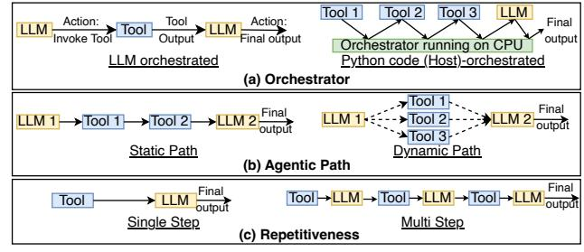

the basis of (a) Orchestrator (LLM/Host) (b) Agentic Path (Static/Dynamic) and (c) Repetitiveness (Single/Multi-step).

<span id="page-0-2"></span>Table 1. CPU, GPU and memory specifications of two different systems used for characterization and evaluation.

| Component  | Sys 1: HP CPU, LP GPU | Sys 2: HP CPU, HP GPU |
|------------|-----------------------|-----------------------|
| CPU        | 64-core Intel GNR     | 72-core Nvidia Grace  |
| CPU Memory | DDR5 512 GB           | LPDDR5 480 GB         |
| GPU        | Nvidia-RTX-Pro 6000   | Nvidia H200           |
| GPU Memory | GDDR7 96 GB           | HBM3e 96 GB           |
| -          |                       |                       |

## Figure 1. Compile-time Characterization of agentic AI on

#### Introduction

Large Language Models (LLMs) have spearheaded the advancements in Artificial Intelligence (AI) for a plethora of applications, including vision [70, 84], healthcare [7, 65], science [29, 64], and education [19, 69]. However, they face

challenges including context-agnosticism [9], hallucinations [44] and the lack of real-time information [34, 52]. These challenges have fueled the emergence of agentic AI systems, where LLMs interact with external tools to gain agency beyond the standalone intelligence of monolithic LLMs.

Agentic AI frameworks [59, 62] orchestrate multiple components including tool use, memory modules, and iterative reasoning loops to achieve superior performance compared to monolithic LLMs. Recent benchmarks reveal that agentic frameworks such as ReAct [78] achieve 34% higher success rates on ALFWorld [61] tasks and 10% improvement on Web-Shop [77] compared to equivalent-sized monolithic models, while AutoGPT [74] and BabyAGI [48] demonstrate up to 3× better performance on long-horizon planning tasks despite using smaller base models. The performance advantages are particularly pronounced for domains requiring external knowledge integration and iterative refinement. For example, WebGPT [49] shows that 7B parameter models can match or outperform 70B monolithic models on knowledge-intensive

<sup>\*</sup>Corresponding authors: Ritik Raj (ritik.raj@gatech.edu) and Souvik Kundu (souvikk.kundu@intel.com)

<span id="page-0-0"></span><sup>&</sup>lt;sup>1</sup>In this work, we refer to homogeneous agentic workload as single agentic workload type (e.g., CPU-heavy) while heterogeneous workload refers to a mix of two agentic workload types (CPU-heavy and GPU-heavy).

| Agentic Workload      | Compile-time Characterization |         | Tools       | Annliastion                           |                            |
|-----------------------|-------------------------------|---------|-------------|---------------------------------------|----------------------------|
|                       | Orchestrator                  | Path    | Flow        | 10015                                 | Application                |
| Toolformer [59]       | LLM                           | Dynamic | Single-step | Calculator API, Calendar              | MLQA, Math                 |
| SWE-Agent [75]        | LLM                           | Static  | Multi-step  | Bash (File I/O and Python Execution)  | <u>SDE</u> , Data analysis |
| RAG (Haystack [14])   | Python code (Host)            | Static  | Single-step | Web search, <u>Document Retrieval</u> | RAG QA                     |
| ChemCrow [10]         | LLM                           | Dynamic | Multi-step  | Conformer Gen tool, Reaction Tools    | Chemistry Research         |
| Web-Augmented         | Python code (Host)            | Static  | Single-step | Web search, summarizer                | Web-based QA,              |
| Agent (LangChain[43]) | rython code (riost)           | Static  | Single-step | web search, summarizer                | DevOps                     |

<span id="page-1-1"></span>Table 2. Compile-time characterization of representative workloads. Tools/Application considered for profiling are underlined.

tasks, while achieving 64.1% accuracy on TruthfulQA [41] compared to 59.3% for GPT-3 [11] despite being 25× smaller.

Although AI models run mostly on GPUs, CPUs are used in tool processing including Bash execution, web search, lexical summarization [18], and Exact Nearest Neighbor Search (ENNS) on large databases. While prior approaches on AI efficiency aggressively focused on GPU kernels and KVcache management [36], they become ineffective for the CPU-centric tool execution of the agentic AI workloads. A recent work [55] shows that ENNS accounts for more than 75% of the end-to-end (E2E) latency on a 200 GB document corpus for a Retrieval Augmented Generation (RAG) workload with a Llama-3-70B [17]. Furthermore, [54] argued that web agent benchmarks like WebArena [85] are computationally intensive due to latency from real-time web interactions, where LLM actions can't be batched. [73] shows that partial tool execution can cut request latency by up to 38.8%, highlighting tool execution as a major source of E2E latency. Our Contributions. To address this emergent CPU bottleneck, this work presents a two-fold contribution. Firstly, we present a compile-time and runtime characterization to understand the system implications of CPU-centric (or toolcentric) agentic workloads. Secondly, we present scheduling optimization solutions to essentially improve concurrent CPU-GPU utilization in agentic AI serving systems.

Compile-time and Runtime Characterization: We first introduce a compile-time characterization (Section 2) by selecting representative workloads to comprehensively capture the algorithmic and computational diversity of agentic AI. To benchmark, we categorize based on three metrics, namely, orchestration, agentic path type, and task repetitiveness as shown in Figure 1. We then conduct an in-depth runtime characterization on different hardware systems through endto-end latency (Section 3.2), batch throughput (Section 3.3) and energy profiling (Section 5.4.2) to isolate the major hardware bottlenecks (CPU, GPU or I/O) specific to the system. In specific, we perform the experiments on two different CPU-GPU settings as shown in Table 1 with relative highperformance (HP) and low-performance (LP) GPU counterparts. Interestingly, we find that tool dominated agentic AI workloads are significantly bottle-necked by tool processing on the CPU consuming up to 88% of the end-to-end latency. With better quality of GPUs, the bottleneck can swiftly shift

more towards CPUs. More importantly, CPU-parallelization strategies often exhibit lower efficiency than their GPU counterparts, prematurely saturating the throughput that can reduce the GPU utilization. This necessitates the CPU execution to be carefully optimized to improve the execution latency for agentic workloads.

Scheduling Optimizations: Based on the throughput saturation insights, we present two scheduling optimizations for agentic workloads. In particular, for homogeneous workloads, to avoid premature saturation of throughput, we present CPU-Aware Overlapped Micro-Batching (COMB - Section 4.1). On the other hand, for heterogeneous workloads, we propose a novel scheduling policy dubbed as Mixed Agentic Scheduling (MAS - Section 4.2) to maintain fair utilization of both CPU-GPU resources and improve performance during real-server-like bursty arrival patterns. In specific, these methods optimize for improved CPU-GPU concurrent utilization while reducing skewed resource allocation for heterogeneous execution. We showcase the generalization of the proposed optimizations on two different hardware platforms. COMB shapes homogeneous request-type concurrency and improves CPU-GPU utilization, yielding up to 3.9× lower service latency, 1.8× lower total latency, and 1.7× higher throughput under open-loop load. MAS, on the other hand, protects the minority request-type under mixed CPU/GPU workloads, improving P50/P90 latency by up to  $2.37 \times /2.49 \times$ . To the best of our knowledge, this is the first work to quantify and analyze end-to-end latency, throughput, and energy bottlenecks in agentic AI execution for heterogeneous CPU-GPU systems. We believe this work will inspire the nextfrontier of agentic AI serving systems to have the optimal concurrent CPU-GPU utilization as a key design principle.

#### <span id="page-1-0"></span>2 Compile-time Characterization

Prior work has largely categorized agentic AI through the lens of agent capabilities. For instance, a recent study [58] contrasts agentic AI systems, characterized by distributed cognition, persistent memory, and coordinated planning, with traditional single-agent systems oriented toward task-specific automation. On the contrary, we introduce three orthogonal bases as shown in Figure 1 for classifying agentic AI that directly influence algorithmic and system-level metrics.

This taxonomy is intended to serve as a priori, compile-time platform-agnostic characterization.

#### 2.1 Three Orthogonal Classification of Agentic AI

First, on the basis of the orchestrator, we divide agentic AI systems into LLM-orchestrated and host-orchestrated (through Python code). In the LLM-orchestrated agentic AI workloads, the LLM controls the end-to-end execution flow. In the pipeline, the LLM, working as an orchestrator, decides whether to invoke the tool or emit final output. On the other hand, host orchestrated workloads call host/python code to determine the next agent (tool/LLM) in the pipeline. Second, on the basis of the agentic path, we divide agentic AI systems as static-path and dynamic-path systems. Static-path agentic systems follow a predetermined path while dynamic-path systems determine the path during runtime based on the orchestrator. In other words, the orchestrator has path decision making capability for dynamic-path agentic systems. For static-path systems, the orchestrator is only responsible for communication between different agents in the pipeline. Third, on the basis of the repetitiveness, we divide agentic AI into single-step and multi-step systems. Single-step agentic systems are more prevalent in standalone web-based or RAGbased retrieval execution where single call to these tools is sufficient to complete the task. while multi-step systems are more prevalent in gaming, robotics or similar applications that require multiple interactions to execute the task.

**2.1.1** Orchestrator-based Classification. This dimension characterizes systems based on where the primary orchestration logic resides. LLM-orchestrated systems delegate control flow decisions to the language model itself, leveraging its reasoning capabilities for task decomposition and execution planning. In contrast, Python code (host)-orchestrated systems employ traditional programmatic control structures, with the CPU managing task scheduling, tool invocation, and result aggregation while treating the LLM as a stateless inference engine. Examples are as follows:

**LLM-orchestrated**: ReAct [78], AutoGPT [74], BabyAGI [48], AgentGPT [1], CAMEL [40], MetaGPT [27]

**Python code (Host)-orchestrated**: LangChain [43], Semantic Kernel [47], Haystack [14], LlamaIndex [2]

**2.1.2 Path-based Classification.** This dimension distinguishes between predetermined and adaptive execution strategies. Static-path agents follow predefined workflows with deterministic tool invocations. Dynamic-path agents adaptively construct execution graphs based on intermediate results, environmental feedback, and emergent task requirements.

**Static-Path:** Haystack [14], LlamaIndex [2] **Dynamic-Path:** Reflexion [60], LATS [83]

**2.1.3** Flow/Repetitiveness-based Classification. This taxonomy captures the iterative nature of agent-environment interactions. Single-step agents complete tasks in a single

inference pass without environmental feedback. Multi-step repetitive agents engage in iterative refinement cycles for complex tasks requiring extensive exploration.

**Single-step:** CoT prompting systems, Zero-shot tool use, Single-turn QA agents, RAG [39]

Multi-step: WebArena [85], Balrog [53], AgentBench [42]

#### 2.2 Representative Workloads

2.2.1 Workload Overview. We select five agentic AI workloads for profiling analysis as detailed in Table 2. We evaluate Toolformer [59] on math benchmarks using WolframAlpha API [71], SWE-Agent [75] on coding benchmarks using Bash execution tool, ChemCrow [10] on molecular benchmarks using RDKit conformer generation tool [37], RAG implemented via Haystack [14] on Question Answering (QA) benchmarks using ENNS retrieval tool on 115 GB C4 document corpus [15], and Web-Augmented Agent implemented via LangChain [43] on QA benchmarks leveraging web search and lexical summarization tools. Notably, the Web-Augmented Agent task (web search  $\rightarrow$  summarization  $\rightarrow$  LLM inference) is formulated inspired by the web search feature of popular chatbots [22, 51]. In our experiments, we chose a CPU-based lexical summarizer (LexRank [18]) instead of an LLM-based summarizer. The lexical summarizer helps reduce hallucination [44] while improving the domain accuracy [21]. Refer to Appendix A for more workload details.

We select these agentic AI workloads because they are representative of different categories of compile-time characterization as well as applications and tools. *Firstly, challenging applications*: they target factual, coding, and scientific tasks as well as live-data queries where standard LLMs underperform. *Secondly, diverse computational patterns*: these models span a wide range of model sizes, orchestration patterns and tool integration strategies that are representative of broader agentic AI systems. *Finally*, these tools are representative of general processing aspects of the CPU. For example, Python execution pipeline of compute-intensive benchmarks in the SWE-Agent tests out the execution units of the CPU.

2.2.2 SLMs for Representative Workloads. Small Language Models (SLMs) are a good fit for agentic AI [8] because agents thrive on fast, iterative perceive-plan-act loops, and privacy-preserving local execution. Many agent competencies are externalized: tool use and retrieval can offload computation and factual recall, reducing reliance on parametric capacity while preserving task performance, a setting in which SLMs including GPT-J 6B [68] can outperform larger monolithic LLMs including OPT 66B [79] and GPT-3 175B [11] as shown in [59]. Furthermore, recent studies [3, 23] show sub-10B models achieving competitive capability on MMLU [26] and MT-bench [81] benchmarks as compared to GPT-3.5 when trained with high-quality data and efficient architectures. Therefore, in this work, we focus on models having up to 32 B parameters.

<span id="page-3-2"></span>> **[图片提取文字 (无描述)]:**
> (a)RAG (b)Toolformer (c)Web-Augmented Agent (d)SWE-Agent (e)ChemCrow 8.8 33.7 34.2 LLM Inference (GPU) 6.4 35 8.3 GPT-OSS-20B (vLLM) 10 6 4.9 GPT-I-6B (vLLM) 1.37.3 10.8 4.9 Owen2.5-Coder-32B (vLLM) 10.0 4.4 Tools (CPU) **ENNS Retrieval** 23 20 4.3 WolframAlpha API 0.61.2 10.7 28.8 30.2 URL Fetch 7.1<sub>6.5</sub> 10.0 6.9<sub>6.5</sub> LexRank Summarization 3.3 10 8.0 Bash/Python Execution 10 4.8 Conformer Gen (RDKit) 4.6 4.0 3.3 3.2 12.0 11.8 5.3 Hardware System 2 System 1 BigCodeBench HotpotQA \_. MAWPS freshQA OASC APPS Medium ASDIV Heavy Math Benchmarks **QA Benchmarks** Molecule Benchmarks **OA Benchmarks** Coding Benchmarks
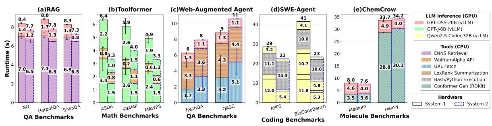

**Figure 2.** (a) End-to-end (E2E) latency for RAG (Haystack); (b) Toolformer; (c) Web-Augmented Agent (LangChain); (d) Mini-SWE-Agent; and (e) ChemCrow on the two different hardware systems (refer to Table 1).

#### 3 Profiling

#### 3.1 System and Software Setup

The experiments are performed on two hardware platforms with asymmetric GPUs to isolate CPU-centric architectural bottlenecks. The first system (Sys 1) consists of Intel 6th generation Xeon Granite Rapids (GNR) CPU (HP) and Nvidia RTX-Pro 6000 Blackwell GPU (LP). On the other hand, the second system (Sys 2) is a GH200 gracehopper system with Nvidia Grace CPU (HP) and H200 GPU (HP). The specifications are summarized in Table 1. Our software environment includes PyTorch (version 2.8.0) and a local vLLM server (version 0.14.0) for LLM inference. We run each workload five times to account for statistical variance.

#### <span id="page-3-0"></span>3.2 End-to-End (E2E) Latency Analysis

Figure 2 profiles E2E runtime latency for the five representative agentic workloads, on the two hardware systems to isolate the architectural bottleneck.

#### **3.2.1 Runtime Characterization.** For OA with RAG

(Haystack), ENNS retrieval is the main bottleneck consuming 83%, 81% and 82% of total latency for NQ [35], HotpotQA [76], and TriviaOA [31], respectively, on Sys 1. On the other hand, ENNS retrieval consumes up to 89% of total latency on Sys 2. For Toolformer, LLM inference is the main bottleneck consuming ~88% of total latency for Sys 1. Due to better GPU, LLM inference is much faster on Sys 2 reducing the inference delay to 77% of the total latency. Web-Augmented Agent (LangChain) shows huge variation in the URL fetch stage due to the network usage. LexRank summarization tool execution accounts for 55% and 48% for freshQA [67] and QASC [32] benchmarks, respectively, on Sys 1. Similarly, it takes 40-45% on Sys 2 as well. Without web I/O variance during URL fetching, if we just consider the summarization and inference stages, the E2E latency of Sys 1 remains similar to that with Sys 2. These results highlight that constraining the number of websites to fetch can yield faster E2E latency as opposed to optimizing the inference model. For ChemCrow workload, we see the conformer generation using RDKit tool dominating E2E latency for heavy molecules (85% and 88% on Sys 1 and Sys 2, respectively) resulting in similar performance for both the systems. On

the other hand, for medium molecules, LLM inference part dominates (58% and 53% on Sys 1 and Sys 2, respectively).

**Key Takeaway 1:** Tool processing on CPUs can take significant chunk of E2E latency, motivating a CPU-centric optimization strategy. Moreover, a system with HP CPU and LP GPU can match a system with HP GPU in E2E latency on such tool-dominated agentic AI workloads motivating cost-effective agentic AI deployments.

For SWE-Agent, Bash/Python execution accounts for 38% and 25% of E2E latency for APPS [25] and BigCodeBench [86] benchmarks, respectively, on Sys 1. On the other hand, they account for up to 65% of the E2E latency on Sys 2. This hints at the highly optimized LLM inference on HP GPU of Sys 2 that forces the bottleneck more towards tool execution on the CPU. This is further affirmed by the LLM execution latency reduction from Sys 1 to Sys 2. For example, LLM inference bottleneck reduced from 88% to 77% in Toolformer workload as we move to Sys 2.

**Key Takeaway 2:** HP GPU system can shift the bottleneck from GPU to CPU when tool execution latency is comparable to LLM inference latency, making them more CPU-bounded than systems with LP GPU, motivating system-aware optimization strategies.

#### <span id="page-3-1"></span>3.3 Throughput Analysis

**3.3.1 GPU Throughput Analysis.** We first assume a hypothetical scenario of GPU-only LLM inference, to disentangle the throughput performance of the GPU. We measure the vLLM GPU throughput as  $((BS \times (T_{in} + T_{out}))/t_{sec})$ , where BS represents the batch-size, with  $T_{in}$  and  $T_{out}$  representing the total input and output tokens, respectively.  $t_{sec}$  represents the total time in generating all the tokens across batches. As shown in Figure 3a, the throughput increases steadily with increase in BS, confirming that the GPU efficiently exploits the additional parallelism exposed by larger batches. The gains are especially pronounced at moderate batch sizes, where batching improves device utilization and amortizes execution overheads. On the other hand, for large BS, the rate of increase of throughput reduces and begins to saturate, particularly, for longer input/output sequences. This

trend is consistent with a memory-system bottleneck: as batch size grows, the KV cache footprint scales with the total number of processed tokens, increasing pressure on GPU memory capacity and bandwidth. Notably, although mechanisms such as PagedAttention [36] reduce memory fragmentation and improve serving efficiency, they do not eliminate the underlying capacity and bandwidth limits of GPU memory.

#### 3.3.2 Workload Throughput Analysis.

CPU Parallelism Choice for Agentic Workloads. We analyze the tradeoff between multi-processing (MP) and multi-threading (MT) CPU parallelism strategies. MT has lower memory usage as all the threads share the same memory. On the other hand, MP requires independent memory for each process. Since ENNS retrieval has very high memory usage, we use MT for the RAG (Haystack) workload. MT approach is lightweight and incurs lower creation and switching overhead compared to that with MP. As a result, MT approach works better for I/O workloads. Therefore, we select MT for Toolformer as it contains an I/O tool, i.e. the Wolfram Alpha API. For CPU-compute intensive tools including LexRank Summarization, Bash/Python execution, and RDKit Conformer generation, MT is ineffective due to Python Global Interpreter Lock (GIL) limitation and could not attain true multi-core performance. Therefore, we choose MP approach for Web-Augmented Agent (LangChain), SWE-Agent, and ChemCrow workloads. We further quantify the GIL bottleneck of MT by comparing it with MP approach for Web-Augmented Agent on Sys 2 in Appendix B. Notably, the CPU throughput on multi-core systems can saturate well before all cores are busy. For instance, a study [6] shows that a dual-socket Haswell node reaches >80% of peak bandwidth on the STREAM benchmark [45] with only four processes per socket. If we increase the number of parallel processes beyond the available cores (over-subscription [28]), OS scheduler contention and context switching overheads dominate. Runtime Throughput Analysis. We define the throughput of the system on agentic workload as  $BS/t_{sec}$ . Figure 3b demonstrates the throughput variation of representative workloads with batch size (BS) scaling. We parallelize each component of the agentic workload including LLM inference on GPU using vLLM and tool processing on CPU using either MP or MT. We showcase different scenarios of throughput boundedness on the five workloads with MAWPS, NQ, QASC, APPS, and large molecule benchmarks, respectively, on the two systems. From this point onward, for the Web-Augmented Agent, we consider only the web independent components (summarization and LLM inference) by substituting URL fetching by on-device cached HTML files.

For Toolformer, we see the rate of throughput improvement keeps slowing down from  $1.9 \times$  to  $1.4 \times$  as we move

from  $BS: 1 \rightarrow 2$  to  $BS: 64 \rightarrow 128$ , for Sys 2. The WolframAlpha API calls are parallelized with nearly zero latency overheads. However, the increased KV cache adds to the throughput saturation of the GPU. For Haystack RAG workload, retrieval is bottle-necked beyond BS = 16/32, for both the systems due to LLC pressure and disk I/O contention arising out of the huge size of the C4 documents. For Web-Augmented Agent (LangChain), SWE-Agent and ChemCrow workloads, the throughput saturates at BS = 128, due to core over-subscription for CPU-heavy tools. Figure 3c further shows that the impact of over-subscription in Web-Augmented Agent (LangChain) and SWE-Agent workloads using average, minimum and maximum time per tool call and LLM inference. The H200 GPU outperforms RTX-6000 Pro Blackwell GPU by 1.9× and 2.8×, respectively for Web-Augmented Agent and SWE-Agent workloads at BS =128. Moreover, the average latency of summarization stage increases by 2.0× and 1.9× respectively for Sys 1 and Sys 2 from BS = 64-128. On the other hand, the average LLM inference latency remained relatively similar for both the hardware platforms from BS = 64-128. In terms of parallelization efficiency, LLM inference on the H200 GPU outperforms the RTX-6000 Pro Blackwell GPU, and both are significantly more efficient than CPU-based parallelization (multi-processing) of the LexRank summarizer. We observe a very similar trend for SWE-Agent workload going from BS = 64-128, where LLM inference parallelization on H200 is the most effective (1.06× increase in average latency), followed by LLM inference parallelization on RTX-6000 Pro Blackwell GPU (1.18× increase in average latency), followed by Bash multiprocessing on Intel GNR CPU (1.53× increase in average latency), followed by Bash multiprocessing on Grace CPU (1.94× increase in average latency).

**Key Takeaway 3:** CPU-parallelization strategies fundamentally exhibit lower efficiency compared to GPU. In agentic AI workloads, they prematurely saturate the throughput, subsequently bottle-necking the system and degrading the utilization of costly GPU resources.

#### 4 Proposed Optimizations

Based on throughput saturation insights (Section 3.3), we present two scheduling optimizations- ① CPU-Aware Overlapped Micro-Batching (COMB- Section 4.1) and ② Mixed Agentic Scheduling (MAS- Section 4.2) for both homogeneous and heterogeneous agentic execution scenarios. We consider a practical serving scenario, namely the open-loop arrival system. In open-loop arrival system, requests are injected by an external arrival process, independent of the system state and prior completion information, thereby exposing the effects of queuing, resource contention, and scheduling decisions under sustained load. We benchmark the performance of COMB and MAS under this system assumption to analyze their E2E performance efficacy. We measure request

<span id="page-5-1"></span>> **[图片提取文字 (无描述)]:**
> Web-Augmented Agent Input: 100 Output: 100 System 1 Summarization — System 1 — Input: 200 Output: 200 ---- System 2 → LLM Inference ---- System 2 Input: 400 Output: 400 Output: 800 Input: 800 Output: 1600 Input: 1600 🔻 40k 20k GPU: Sys 1 SWE-Agent ---- GPU: Sys 2 → Bash Execution — System 1 SWE-Agent 🖺 20 LLM Inference ---- System 2 LangChain — Haystack → Toolformer → ChemCrow 64 128 128 64 **Batch Size Batch Size Batch Size**
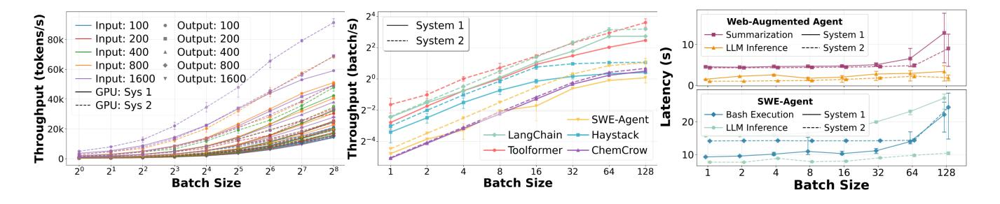

**Figure 3.** (a) vLLM throughput analysis for GPT-OSS-20B across different batch-sizes with different input-output token lengths; (b) Throughput saturation analysis for various agentic workloads; (c) Average time taken by Web-Augmented Agent and SWE-Agent workload components reveals a critical CPU over-subscription bottleneck at batch size 128 for both the systems.

latency using percentile statistics: P50 denoting the 50th percentile or the median latency distribution; and P90 denoting the 90th percentile, i.e., the latency below which 90% of requests get completed. Our objective is to reduce both P50 and P90, thereby improving not only median performance but also tail behavior, which is often the more critical metric in latency-sensitive serving systems.

#### <span id="page-5-0"></span>4.1 CPU-Aware Overlapped Micro-Batching (COMB)

On the CPU side, prior work [20] shows that micro-batch granularity critically shapes the throughput-latency tradeoff in stream processing. In particular, micro-batch size and input frequency materially affect multi-core performance, with larger batches improving throughput only until CPU-side parallel efficiency degrades. LMStream [38] extends this idea to heterogeneous CPU-GPU streaming by dynamically controlling micro-batch admission to bound latency. In contrast, we focus on agentic pipelines that dynamically alternate between CPU-resident tool execution and GPU-resident model inference. Alternately, Avo [63] adopts stage-local microbatching, whereas we consider end-to-end micro-batching together with overlap across successive CPU and GPU stages. Finally, while [57] introduces micro-batching for LLM inference, it targets GPU-centric execution. Our setting is different: we optimize CPU-induced micro-batches in agentic pipelines, whose preferred size is often smaller than GPUinduced LLM micro-batches. This is consistent with our observation of the fact that GPUs are fundamentally more efficient at parallelization than CPUs (refer Section 3.3).

CPU-Aware Overlapped Micro-Batching (COMB) builds on prior work in micro-batching, but differs in both objective and mechanism. Specifically, rather than optimizing batching within an individual stage or device, COMB coordinates CPU-induced micro-batches across successive stages of an agentic pipeline to reduce inefficient CPU parallelization and temporal imbalance between CPU and GPU execution. As shown in Figure 3b, CPU throughput saturates as BS increases, and at BS =128, the median and tail latencies of the CPU-bound summarization stage both increase by  $\sim$  2×.

In addition, Figure 4a shows that CPU and GPU are heavily utilized in largely disjoint phases: CPU-intensive tool execution leaves the GPU idle, while GPU-intensive inference leaves the CPU only lightly occupied for orchestration and runtime storage. To tackle these inefficiencies, COMB first partitions a large incoming batch into a sequence of capped micro-batches of size at most  $B_{cap}$ . Based on empirical results,  $B_{cap} \simeq 1 - 2 \times \#$  CPUs based on the parallelization efficiency of the specific CPU. This avoids over-subscription of CPUs and results in optimal CPU parallelism while preserving sufficient work to sustain GPU utilization. This design improves median and tail latency for large-batch execution by replacing the baseline's monolithic batch of size  $B_{max}$  ( $B_{max} > B_{cap}$ ), chosen to maximize GPU utilization. Micro-batching reduces CPU core oversubscription while yielding efficient CPU utilization. It also lowers instantaneous KV-cache demand, and preserves headroom for lightweight I/O-driven tools such as web search. In addition to micro-batch capping, COMB incorporates overlapping of adjacent micro-batches, to mitigate device-level phase imbalance. As illustrated in Figure 4c, after an overlap interval s, once the CPU stage of micro-batch i completes (e.g.: microbatch 1 in Figure 4c, its GPU stage can execute concurrently with the CPU stage of micro-batch i + 1 (e.g.: micro-batch 2 in Figure 4c. The result is a pipelined execution pattern that increases simultaneous CPU-GPU utilization, rather than optimizing micro-batch size alone.

Figure 4 shows an example of COMB for  $B_{cap}=64$  and  $B_{max}=128$  for a single-step agentic AI workload assuming throughput of individual stages (tool execution on CPU and LLM inference on GPU) saturate around  $B_{cap}$ . In case of micro-batching, the first micro-batch will finish around half of the total latency as the CPU contention is relieved while trading off the E2E tail latency. This is beneficial in cases of tiered serving system where different users are tiered differently based on amount of money they spend. Using COMB, the top 50% of users can get  $\sim 2\times$  better service while maintaining the same service for the bottom 50% tier of users compared to the baseline. The overlapping trades-off utilization for some of the P50 gains observed during micro-batching.

<span id="page-6-1"></span>> **[图片提取文字 (无描述)]:**
> s=COMB overlap interval Latency 2x Methods P50 P90 Latency MP 2x 2x CPU 0-128 CPU 0-31 Micro-batching 1x CPU 31-63 COMB 1.2x 1.8x (a) Multi-processing (MP) CPU 64-95 CPU 96-128 Batch Tool CPU 0-31 Processing (CPU) Batch LLM CPU 32-64 Inference (GPU) (c) COMB (b) Micro-batching
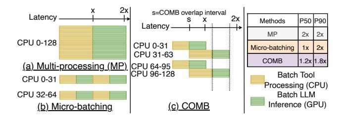

**Figure 4.** Timeline of batched agentic AI inference for (a) Multi-processing, (b) Microbatching, and (c) COMB.

<span id="page-6-2"></span>**Table 3.** Throughput gain ratios for Web-Augmented Agent and SWE-Agent workloads on both the systems.

| Workload                           | Sys 1 |           | Sys 2 |        |
|------------------------------------|-------|-----------|-------|--------|
| Workloau                           | r(64) | 128r(128) | r(64) | r(128) |
| Web-Augmented<br>Agent (LangChain) | 1.94  | 1.00      | 1.76  | 1.05   |
| SWE-Agent                          | 1.43  | 1.18      | 1.45  | 1.15   |

Micro-batching is highly effective when we observe complete throughput saturation going from  $B_{cap}$  to  $2 \times B_{cap}$ . However, overlapped micro-batching helps in optimizing more general agentic workloads which can have partial throughput saturation profile due to concurrent CPU-GPU utilization. For such workloads, compared to MP, COMB trades a modest increase in tail latency for substantial reductions in P50 latency. Additionally, varying the overlap duration s can yield a P50–P90 latency Pareto frontier.

4.1.1 Throughput Gain and COMB Effectiveness. Let T(BS) denote the throughput  $(\frac{BS}{t_{sec}})$ . In our example, we define the throughput gain ratio as  $r(BS) = \frac{T(BS=2^n)}{T(\frac{BS}{2^n}=2^{n-1})}$  which captures the speedup achieved by halving the batch size. Here, n represents the batch multiplicative factor. Table 3 shows the value of r(64) and r(128) for Web-Augmented Agent and SWE-agent on the two hardware platforms. For micro-batching, the optimal  $B_{cap}$  should maximize resource efficiency while avoiding the saturation regime where additional parallelism yields negligible improvements. If the gain ratio  $r(BS) \simeq 1$ , micro-batching will be highly effective and save ~ 2× P50 latency while preserving similar P90 latency. On the other hand, for r(BS) > 1.5, there is little or no throughput saturation and micro-batching will be ineffective. If 1 < r(BS) < 1.5, overlapped micro-batching with different overlap durations will result in a P50-P90 Pareto frontier and will be more effective than just micro-batching due to better CPU-GPU utilization. The effectiveness of COMB is inversely proportional to the gain ratio as we will see later during the empirical evaluation.

## **4.1.2 COMB in Open-Loop Agentic Serving Systems.** In open-loop arrival systems, we do not impose explicit overlapping due to probabilistic arrivals and variation in request

service times. Instead, we employ concurrency cap  $(N_{cap})$  as a practical online approximation to the COMB principle. By limiting concurrency of CPU-heavy work, the scheduler naturally interleaves CPU-dominant and GPU-dominant phases across requests without rigid overlap. This prevents over (or under)-utilization of one of the CPU or GPU resources compared to the server-induced higher concurrency cap  $(N_{max})$ and ensures better CPU-GPU concurrent utilization. Let us assume, user request arrival rate to be  $\lambda$  with mean service time across requests being  $\mathbb{E}[S]$  under m number of hardware resources. We define the utilization  $\rho$  as,  $\rho = \frac{\lambda \mathbb{E}[S]}{m}$ . If we derive  $N_{max}$  to extract optimum performance out of the costly GPU resource in a datacenter server, the GPU utilization is close to 1 ( $\rho_{GPU} = 1$ ). This in turn results in a large  $N_{max}$  that creates over-utilization of CPU ( $\rho_{CPU} > 1.5$ ) in agentic workloads having significant tool execution stage. Although, the high concurrency cap was chosen to extract optimum GPU utilization, the CPU over-utilization starves the GPU and results in GPU under-utilization. In utilization terminology, COMB-induced  $N_{cap}$  reduces  $\rho_{CPU}$  and increases  $\rho_{GPU}$ , thereby balancing CPU-GPU utilization.

#### <span id="page-6-0"></span>4.2 Mixed Agentic Scheduling (MAS)

As discussed in Section 3.2, agentic workloads are inherently heterogeneous: some requests are *CPU-heavy*, dominated by tool execution on the host, while others are *GPU-heavy*, purely LLM inference on the GPU. COMB optimization targets the CPU-heavy regime, where the critical path contains substantial host-side tool execution. However, many practical deployments must also serve GPU-heavy requests with no tool use. For example, even within a single chatbot service, some requests invoke external tools while others are handled largely by direct LLM inference.

Prior serving systems such as vLLM [36] and SGLang [82] optimize homogeneous LLM inference, where scheduling is driven primarily by GPU throughput. For example, vLLM increases throughput through paged attention and continuous batching. These designs are highly effective when requests contend for essentially the same hardware resource. They are less well matched to heterogeneous agentic serving, where CPU-heavy and GPU-heavy requests stress different bottlenecks and can interfere with one another if admitted through a single queue. In such settings, a request mix skewed toward one request-type can monopolize admission, causing the other request-type to experience inflated wait time despite having a different resource bottleneck.

Mixed Agentic Scheduler (MAS) is built around two complementary policies. First, it performs request-type-aware concurrent admission for CPU- and GPU-heavy requests using separate execution queue caps,  $E_{\rm cap,CPU}$  and  $E_{\rm cap,GPU}$ , respectively for CPU-heavy requests and GPU-heavy requests. This policy allows the system to exploit both resource domains at the same time instead of serializing them through a single

queue. Concretely, CPU-heavy requests are admitted to an execution queue bounded by  $E_{\text{cap, CPU}}$ , while GPU-heavy requests are admitted to a separate execution queue bounded by  $E_{\text{cap, GPU}}$ . Requests that exceed these request-type specific caps are placed into a shared reserved execution queue of size  $E_{\text{cap, shared}}$  providing the elasticity in concurrency of either of the request-type beyond the request-specific execution queue caps. On the CPU side, we derive  $E_{\text{cap, CPU}} = N_{cap}$ from COMB evaluation in the open-loop arrival settings to improve host-side concurrency for CPU-heavy requests. On the GPU side, we allocate the remaining concurrency budget for  $E_{\text{cap, GPU}}$  out of  $N_{max}$  as large as possible for effective GPU utilization. These elastic caps for requests preserve work conservation while preventing one request-type from fully monopolizing admission under asymmetric (one request-type dominate the other) open-loop arrivals. For example, the dominant request-type will occupy most of the concurrency slots out of  $N_{max}$  in the baseline and the minority requesttype will suffer long queuing delays due to limited concurrency available. MAS protects the minority request-type by allotting a minimum concurrency of  $E_{\text{cap, CPU}}$  for CPUheavy request type or  $E_{\text{cap, GPU}}$  for GPU-heavy request type (whichever is the minority request-type). Together, these two policies allow MAS to reduce cross-request interference, sustain concurrent CPU-GPU utilization, and improve performance for heterogeneous open-loop arrivals. The MAS algorithm is detailed in Appendix C.

#### 5 Experimental Evaluations

We first include a single-batch experiment to illustrate how COMB improves concurrent CPU-GPU utilization without inter-request interference. In this standalone setting, we also visualize the P50–P90 Pareto frontier to characterize the tradeoff between median and tail latency. We then evaluate our optimizations in the open-loop arrival setting and sweep arrival rates to study performance under sustained load. We then present an ablation study on a resource-constrained system having limited CPU cores to demonstrate the generality of the proposed optimizations under tighter host-side bottlenecks. Additionally, we present a detailed energy profiling that reveals the substantial dynamic energy overhead of CPUs in CPU-centric agentic AI.

#### 5.1 COMB: Analysis

In Figure 5, we conduct an experiment to evaluate COMB in a standalone concurrent processing with BS = 128 requests. The baseline strategy is to perform multi-processing on all the 128 requests, while COMB uses a  $B_{cap}$  of 64 derived from the throughput gain ratio analysis in Table 3. We observe that the P50/P90 gains (Figure 5c) from COMB is inversely proportional to the throughput gain ratio, r(BS). For SWE-Agent workload, r(128) = 1.15 and 1.18 for Sys 1 and Sys 2, respectively, while  $r(128) \simeq 1$  for Web-Augmented Agent on both the systems. As a result, micro-batching is highly

effective for Web-Augmented Agent workload resulting in 1.65× speedup in P50 latency while slowing down the P90 latency by a factor of 0.86× on Sys 2. On the other hand, micro-batching is not effective for SWE-Agent resulting in slow-down by a factor of 0.72× and 0.69× in P90 latencies on Sys 1 and Sys 2, respectively, significantly worsening the tail performance. In Figure 5c, we further plot the Pareto frontier for different overlap values, s for COMB. We choose the optimal s to represent the best P50-P90 trade-off close to the knee of the Pareto frontier. For example, with Web-Augmented Agent on Sys 2, we observe that at s = 8s, COMB yields moderately accelerated latency compared to microbatching by 1.03× and 1.05× for P50 and P90, respectively. On the other hand, for SWE-Agent on Sys 1, we observe that for s = 15s, COMB yields 1.40× improved P90 latency while achieving similar P50 latency compared to micro-batching.

#### <span id="page-7-1"></span>5.2 Open-Loop COMB: Analysis

For the baseline, we set the concurrency cap  $(N_{max})$  to maximize GPU utilization while avoiding diminishing returns. Thus,  $N_{max}$  is chosen to be the knee of the throughput-batch size curve where the increase in throughput saturate under a 2× increase in batch size. As shown in Table 4, this condition is met at batch size 256 on both RTX-6000 Pro Blackwell and H200 GPU for the LLM inference stage of the LangChain workload. Accordingly, we set  $N_{max} = 256$  for the baseline. COMB is evaluated under the open-loop arrival setting as shown in Figure 6 on Sys 2. As shown in the figure, the baseline becomes increasingly CPU-overloaded as the Poisson arrival rate increases, with  $\rho_{CPU} = 1.54, 1.66, 3.09,$  and 3.18 for  $\lambda$  = 11, 12, 13, and 14 req/s, respectively. In contrast, for COMB with  $N_{cap} = 64$ ,  $\rho_{CPU}$  remains in the narrower range of 0.89 - 1.13 over  $\lambda = 11 - 14$  req/s, yielding the best service latency among other concurrency cap configurations. The strongest gains over the baseline appear at higher loads. At  $\lambda = 13$  req/s, COMB reduces service latency by 2.9× and 3.9× at the P50 and P90 percentiles, respectively. On the other hand, total latency<sup>2</sup> also drops by  $1.6 \times$  and  $1.8 \times$  at the P50 and P90 percentiles, respectively, compared to the baseline. Consequently, the COMB-induced  $N_{cap} = 64$  results in a throughput improvement of 1.7× compared to the baseline. More aggressive concurrency capping with  $(N_{cap} = 48)$ lowers the service time, however, sharply increases queuing delay. On the other hand, larger  $N_{cap}$  of 82 and 96 provide comparable throughput with worse service latency than that with  $N_{cap} = 64$ . This supports the choice of  $N_{cap} = 64$  in yielding a balance between utilization and queuing delay.

<span id="page-7-0"></span><sup>&</sup>lt;sup>2</sup>Here, total latency is computed by averaging the net latency over all the requests during a specific period, with net latency for each serving request is its service latency + wait latency.

<span id="page-8-0"></span>> **[图片提取文字 (无描述)]:**
> ■ CPU / tool execution ■■ LLM inference → ±1σ across run ■■ CPU / tool execution ■■ LLM inference → ±1σ across runs → Sys 1 ····· Sys 2 Best tradeoff (a) SWE-Agent (a) SWE-Agent (a) SWE-Agent 50 22.6s 27.2s --------------------------------------Baseline 28.8s 61.4s Baseline Baseline Micro-batching B1 B1 12.7s 10.7s 13.9s 21.6s COMB-5 ⊶71.4s Micro-batching ⊣55.9s Micro-batching 12.3s COMB-10 21.1s 15.2s B2 B1 B2 COMB-15 **B1** 25.4s H 12.75 H 18.3s 10.3s COMB-20 COMB (15s) H45.1s ₽53.3s COMB (15s) COMB-25 25.8s 18.2s 11.9s **B2 B2** 40 50 60 COMB-30 50 60 10 30 70 10 20 Web-Augmented Agent (b) Web-Augmented Agent (b) Web-Augmented Agent Baseline 18.25 -- 20.3s 12.1s ₩ 14.2s Baseline Baseline Micro-batching B1 B1 COMB-4 9.5s 5.1s →21.45 Micro-batching \_\_-16.5s Micro-batching COMB-6 6.95 5.2s COMB-8 B2 B2 B1 B1 COMB-10 2.7s 13.25 5.35 \_\_\_\_121.1s → 15.6s COMB (8s) COMB (8s) ■ COMB-12 10.9s 5.2s 14 20 **B2** B2 20 2.5 10.0 12.5 15.0 17.5 P90 Latency (seconds) 10 15 0.0 5.0 Time (seconds) Time (seconds) (a) COMB evaluation on Sys 1 (b) COMB evaluation on Sys 2 (c) COMB P50-P90 pareto-frontier
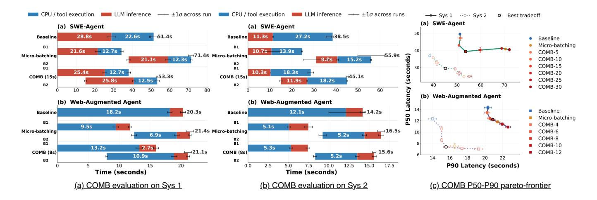

**Figure 5.** COMB evaluation for standalone batch processing of *BS*=128 showing better CPU-GPU utilization for Web-Augmented Agent and SWE-Agent workloads on (a) Sys 1 and (b) Sys 2 with (c) P50-P90 Pareto frontier for different overlap intervals.

<span id="page-8-1"></span>**Table 4.** vLLM TPS (Token/s) for LLM part of LangChain workload on both systems shows that B=256 gives the best GPU utilization at the knee of the throughput-batch curve.

| BS | Sys 1<br>TPS | Sys 2<br>TPS | BS  | Sys 1<br>TPS | Sys 2<br>TPS |
|----|--------------|--------------|-----|--------------|--------------|
| 1  | 1313.27      | 1566.13      | 32  | 12500.29     | 13846.48     |
| 2  | 2089.84      | 2547.38      | 64  | 15264.86     | 19664.15     |
| 4  | 3950.28      | 4615.84      | 128 | 17326.58     | 23504.65     |
| 8  | 6458.83      | 7051.94      | 256 | 18779.70     | 29138.36     |
| 16 | 8960.46      | 9846.26      | 512 | 19468.49     | 32860.12     |

<span id="page-8-2"></span>> **[图片提取文字 (无描述)]:**
> $N_{cap}=48$  $N_{cap}=96$ Total Latency (s)  $N_{cap}=64$  $N_{cap} = 82$ Baseline N<sub>max</sub>=256  $\lambda = 9$  $\lambda = 13$ 12.5  $\lambda = 10$  $\lambda = 14$ 10  $\lambda = 11$ P50 7.5  $\lambda = 12$ P90 7.5 22.5 10.0 12.5 15.0 17.5 20.0 Service Latency (s)
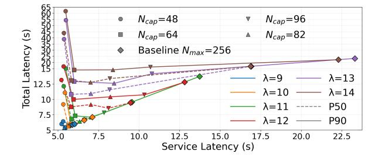

**Figure 6.** In open-loop serving system with  $\lambda = 9 - 15$  req/s arrival-rate for Web-Augmented Agent on Sys 2.

#### 5.3 MAS: Analysis

On both Sys 1 and Sys 2, we set a common iso-concurrency budget of  $N_{\rm max}=224$  for both FCFS and MAS. We chose this value of  $N_{\rm max}$  as it is close to the knee of GPU saturation for both the systems (refer to Table 4). For MAS, we partition this budget into a CPU-heavy admission cap of  $E_{\rm cap,CPU}=N_{cap}=64$ , derived from the open-loop COMB study (Section 5.2), a shared reserved queue of size  $E_{\rm cap,shared}=32$ , and the remaining budget is allocated to GPU-heavy requests, yielding  $E_{\rm cap,GPU}=128$ . We evaluate MAS under three request mixes of GPU-heavy request arrival probabilities  $p_{\rm LLM}$ . We choose  $p_{\rm LLM}\in\{0.25,0.50,0.75\}$ , each value denoting

the probability of an arriving request being GPU-heavy (i.e., pure LLM inference), with  $1-p_{\rm LLM}$  denoting probability of a request being CPU-heavy. In MAS analysis of Figure 7 and Figure 8, we plot the total latency of each request type during a steady-state period of 400 requests over a total of 1500 requests. If steady-state is not reached, we consider 400 requests at the center across the total 1500 requests. To stress-test scheduling under bursty load, we drive the system with a Poisson arrival process of rate  $\lambda$  whose request-type mix follows a two-state ON/OFF model [24], where ON/OFF phase changes after every 32 requests.

MAS improves fairness by aligning admission with each request type bottleneck: the CPU-heavy elastic cap,  $E_{\text{cap,CPU}} =$ 64 avoids oversubscribing host cores, the GPU-heavy cap keeps the GPU well utilized, and the reserved queue limits burst-induced head-of-line blocking. This request-aware admission policy consistently protects the minority request under skewed mixes on both systems. When  $p_{LLM} = 0.25$ , both systems primarily benefit the minority GPU-heavy requests. On Sys 2, MAS improves GPU-heavy latency by up to  $1.82 \times /1.78 \times$  at P50/P90 percentiles. On Sys 1, the improvement is even larger, reaching up to  $2.37 \times /2.49 \times$ , with CPU-heavy request total latency remaining largely unchanged. At  $p_{LLM} = 0.50$ , the gains become more balanced on Sys 2, reaching  $1.39 \times /1.18 \times$  for GPU-heavy P50/P90latencies, with roughly 1.1× improvement for CPU-heavy requests. When  $p_{LLM} = 0.75$ , MAS instead protects the minority CPU-heavy requests against an LLM-dominated arrival load. On Sys 2, it keeps GPU-heavy latency nearly flat across the sweep and yields  $2.09 \times$  and  $2.15 \times$  improvements in CPU-heavy P50 and P90 latencies, respectively, at  $\lambda = 24$ . In terms of total latency benefit, for instance, in Sys 1 at  $p_{LLM} = 0.50$ , MAS yields an average (over all requests) speed up of  $1.62 \times /1.30 \times$  in P50/P90 latency. Overall, MAS

<span id="page-9-0"></span>> **[图片提取文字 (无描述)]:**
> FCFS P50 FCFS P90 MAS P50 MAS P90 LLM-heavy CPU-heavy latency(s) (a) Request type probability,  $p_{LLM} = 0.25$ latency(s) **(b)** Request type probability,  $p_{LLM} = 0.50$ latency(s) Lambda (req/s) Lambda (req/s) (c) Request type probability,  $p_{LLM} = 0.75$
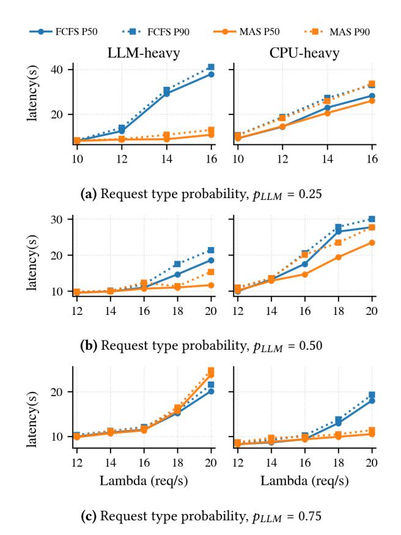

**Figure 7.** Iso-concurrency evaluation of MAS relative to the FCFS baseline for heterogenous requests under bursty arrival patterns for different  $p_{LLM}$  on Sys 1.

prevents the dominant request-type from monopolizing the systems, improving both total latency and the fairness of CPU and GPU utilization under heterogeneous open-loop load.

#### 5.4 Ablation Studies

#### 5.4.1 Ablation on a CPU-Core Constrained Platform.

To evaluate the effectiveness of our optimizations beyond Sys 1 and Sys 2, we perform ablation on a third platform consisting of a 16-core Intel Emerald Rapids CPU paired with the same RTX-6000 Pro Blackwell GPU (similar to in Sys 1). Relative to the 64-core and 72-core hosts in the first two systems, this platform provides roughly one quarter of the CPU capacity while keeping the accelerator unchanged, thereby isolating a substantially tighter host-side bottleneck. COMB. In Figure 9, we present results on the CPU- constrained system. We use the same Web-Augmented Agent workload and standalone batch processing setup with  $B_{max} =$ 64 for baseline and  $B_{cap} = 32$  for COMB. We observe that micro-batching is highly effective as the gain ratio  $r(64) \simeq 1$ , however, the benefit of overlap becomes more sensitive to CPU availability. On this system, micro-batching reduces the first-batch completion time from 51.5s to 26.4s, yielding a 1.95× improvement, while leaving the tail latency nearly the same at 51.7s. In contrast, COMB with overlap duration

<span id="page-9-1"></span>> **[图片提取文字 (无描述)]:**
> FCFS P50 FCFS P90 MAS P50 MAS P90 CPU-heavy LLM-heavy latency(s) (a) Request type probability,  $p_{LLM} = 0.25$ latency(s) **(b)** Request type probability,  $p_{LLM} = 0.50$ latency(s) Lambda (req/s) Lambda (req/s) (c) Request type probability,  $p_{LLM} = 0.75$
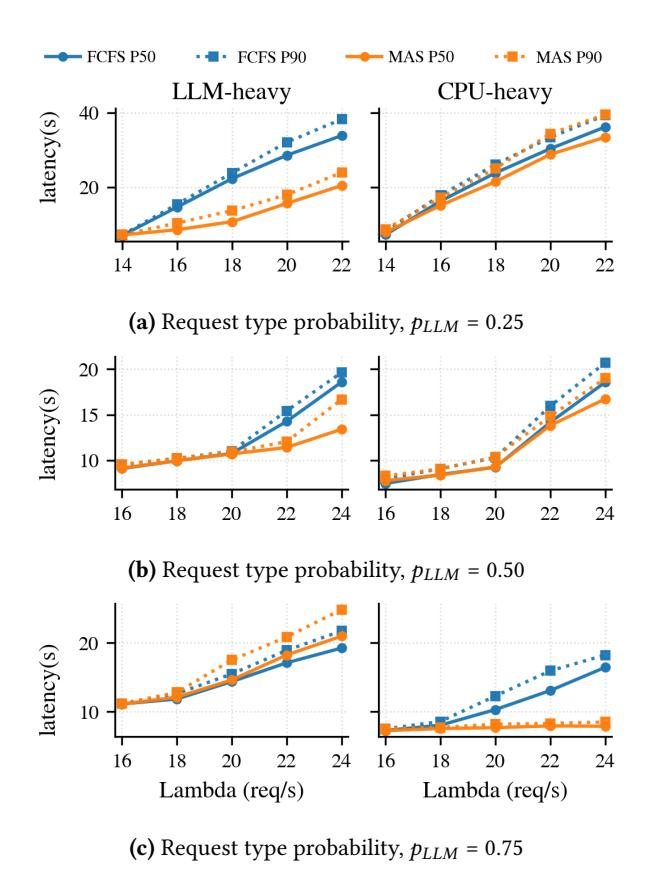

**Figure 8.** Iso-concurrency evaluation of MAS relative to the FCFS baseline for heterogenous requests under bursty arrival patterns for different  $p_{LLM}$  on Sys 2.

<span id="page-9-2"></span>> **[图片提取文字 (无描述)]:**
> CPU / tool execution LLM inference — ±1σ across runs Web-Augmented Agent 16.1s 51.5s 35.4s Baseline 17.6s 8.8s R1 Micro-batching 51.7s17.6s 8.0s 23.7s 16.45 **B1** COMB (16s) 54.2s 29.7s 8.6s 10 20 30 40 50 Time (seconds)
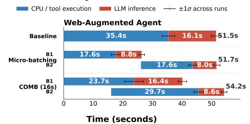

**Figure 9.** Ablation: COMB evaluation on 16-core CPU system for Web-Augmented Agent.

s =16s increases the first-batch completion time to 40.1s due to higher CPU-side contention. Overall, this shows relative ineffectiveness of COMB on a CPU-core limited system, as micro-batching alone can improve P50 and P90 latency by 1.52× and 1.05×, respectively when the gain ratio  $r(BS) \simeq 1$ . **MAS.** For this setting, we retain the same admission cap for GPU-heavy requests used for Sys 1 (as it has the same GPU), but reduce the CPU-heavy cap to  $E_{\rm cap,CPU} = 32$  based on empirical evaluation on the third platform. This setup tests whether the same request-aware admission principle continues to hold under a much more CPU-constrained regime. Figure 10 shows that under the representative skewed mix with  $p_{\rm LLM} = 0.25$ , MAS continues to protect the GPU-heavy minority request without sacrificing throughput, despite the

<span id="page-10-1"></span>> **[图片提取文字 (无描述)]:**
> FCFS P50 • - FCFS P90 MAS P50 MAS P90 LLM-heavy CPU-heavy latency(s) 100 3.2 3.6 2.8 3.2 2.8 Lambda (req/s) Lambda (req/s)
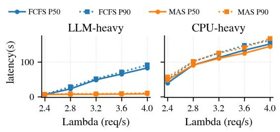

**Figure 10.** Ablation: MAS evaluation on 16-core CPU for GPU-heavy request-type probability,  $p_{LLM}$ =0.25

<span id="page-10-2"></span>> **[图片提取文字 (无描述)]:**
> ■ LangChain ■ Haystack ■ Toolformer ■ SWE-Agent ■ ChemCrow CPU (light) GPU (dark) 3 8k 25k-6k 25k \_30k **Dynamic Energy** 01234567 01234567 01234567 01234567 01234567 Batch Size (log<sub>2</sub>)
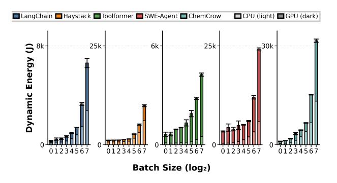

Figure 11. CPU and GPU dynamic energy consumption.

much smaller CPU budget. At light load, FCFS and MAS behave similarly, but as load increases, the benefit of separating CPU-heavy and GPU-heavy admissions becomes pronounced. In particular, GPU-heavy request total latency improves by up to 10.1× at P50 and 8.8× at P90, while throughput remains essentially unchanged at low load and improves by up to 1.06× near the high-load end of the sweep. At the same time, CPU-heavy latency changes only modestly, indicating that these gains do not come from starving the CPU-heavy majority, but from preventing it from monopolizing the total concurrency budget. Moreover, MAS results in  $\sim 1.20 \times$  P50/P90 speedup across all the requests. Overall, this ablation strengthens the main conclusion of our design: MAS is not tied to the larger CPU budgets of Sys 1 and Sys 2, but generalizes to systems with substantially smaller CPU-GPU ratios, where request-type-aware admission becomes even more important for preserving latency isolation while maintaining throughput.

# <span id="page-10-0"></span>**5.4.2 Ablation on Dynamic CPU-GPU Energy Profiling.** For Sys 2, both CPU and GPU energy were obtained via *nvidia-smi*. *Nvidia-smi* reads module power and we get CPU energy by subtracting GPU power from module power. In the quiescent (idle) state, for Sys 2, the Grace CPU drew 140 W while the H200 GPU drew 142 W. We run each of the workloads five times to account for statistical variance.

Figure 11 shows that across all batch sizes, RAG (Haystack) exhibits a uniform CPU dynamic energy contribution of 61% to total system dynamic energy. For Web-Augmented Agent

(LangChain), CPU accounts for 43-52% of total dynamic energy for small BS = 1 - 8. As BS increases to 16 and 32, CPU dynamic energy share rises to 50% and 57%. However, CPU dynamic energy share decreases to 42% at BS = 128. ChemCrow shows a similar rising-then-falling pattern, with CPU contributing 35-40% of total dynamic energy for small BS = 1 - 8, climbing to 55% (BS = 16) and peaking at 60% (BS = 32), before dropping to 42% (BS = 128). On the other hand, Toolformer workload exhibits a consistently low and slightly decreasing CPU dynamic energy utilization as the batch size increases. CPU contributes 11-18% dynamic energy at BS = 1 - 8 and the contribution settles to 11-12 at large batch sizes since the workload is primarily GPU-heavy. For SWE-agent workload, CPU contributes only 10-16% to total dynamic energy at lower batch sizes BS = 1 - 8, but the contribution increases sharply as the batch size goes up with 25% at BS = 64 and 33% at BS = 128 respectively. CPU dynamic energy share becomes significant (up to 61%) for CPU-centric agentic AI workloads, motivating CPU-centric energy optimization policies in future agentic AI data-centers.

#### 6 Related Works

Agentic AI Characterization. A recent work [58] characterized agentic AI based on agentic capabilities. In contrast, we characterize agentic AI from compile-time algorithmic point of view. Another work [66] performed runtime characterization based on kernel launch delay while our runtime characterization is based on E2E latency and throughput.

Agentic AI Profiling. A recent work [33] profiled agentic workloads from a GPU-centric perspective without exposing the CPU bottleneck due to tool processing. Most of the tools they used are API calls (WolframAlpha and Wikipedia) and can easily be parallelized. Another work [5] profiled agentic AI workloads and optimized the orchestration framework but focused solely on external tool calls. Therefore, the work was based on nearly zero local CPU overhead, lacking a comprehensive CPU-centric perspective.

Scheduling Optimizations. Prior work has studied microbatching from several complementary perspectives. On the CPU side, LMStream [38] and [20] show that micro-batch granularity affects the throughput-latency tradeoff in streaming systems. Ayo [63] adopts stage-local micro-batching. In contrast, COMB introduces end-to-end micro-batching for agentic workloads, coordinating CPU-induced micro-batches across successive CPU and GPU stages to reduce inefficient CPU parallelization and cross-device imbalance. vLLM [36] and SGLang [82] optimize scheduling for GPU-only serving systems. Our approach orthogonally use continuous batching for LLM inference like vLLM and SGLang with elastic queuing for heterogeneous agentic requests along with a reserved queue to sustain bursty traffic.

#### 7 Conclusions

Agentic AI shifts the system bottleneck from monolithic LLM inference toward CPU-resident tool execution and orchestration. In this work, we characterize representative agentic workloads from a CPU-centric perspective and show that these workloads exhibit CPU latency and throughput bottlenecks. To tackle these bottlenecks, we introduce *COMB* and *MAS*, two scheduling techniques for homogeneous and heterogeneous agentic workloads, respectively. Together, these optimizations yield improved CPU-GPU concurrent utilization while reducing skewed resource allocation for heterogeneous execution.

#### Acknowledgments

We thank Sarbartha Banerjee, Zishen Wan, Akshat Ramachandran and Shubham Jain for thoughtful discussions and valuable feedback that helped improve this work.

#### References

- <span id="page-11-9"></span>[1] [n.d.]. AgentGPT. https://agentgpt.reworkd.ai/.
- <span id="page-11-11"></span>[2] [n. d.]. LlamaIndex - Build Knowledge Assistants over your Enterprise Data. https://www.llamaindex.ai/,.
- <span id="page-11-16"></span>[3] Marah Abdin, Jyoti Aneja, Harkirat Behl, Sébastien Bubeck, Ronen Eldan, Suriya Gunasekar, Michael Harrison, Russell J Hewett, Mojan Javaheripi, Piero Kauffmann, et al. 2024. Phi-4 technical report. arXiv preprint arXiv:2412.08905 (2024).
- <span id="page-11-28"></span>[4] Anthropic. [n. d.]. Claude Code. https://www.claude.com/product/ claude-code.
- <span id="page-11-25"></span>[5] Zain Asgar, Michelle Nguyen, and Sachin Katti. 2025. Efficient and Scalable Agentic AI with Heterogeneous Systems. arXiv preprint arXiv:2507.19635 (2025).
- <span id="page-11-21"></span>[6] Satish Balay, Shrirang Abhyankar, Mark Adams, Jed Brown, Peter Brune, Kris Buschelman, Lisandro Dalcin, Alp Dener, Victor Eijkhout, William Gropp, et al. 2019. PETSc users manual. (2019).
- <span id="page-11-0"></span>[7] Suhana Bedi, Yutong Liu, Lucy Orr-Ewing, Dev Dash, Sanmi Koyejo, Alison Callahan, Jason A Fries, Michael Wornow, Akshay Swaminathan, Lisa Soleymani Lehmann, et al. 2025. Testing and evaluation of health care applications of large language models: a systematic review. Jama (2025).
- <span id="page-11-15"></span>[8] Peter Belcak, Greg Heinrich, Shizhe Diao, Yonggan Fu, Xin Dong, Saurav Muralidharan, Yingyan Celine Lin, and Pavlo Molchanov. 2025. Small Language Models are the Future of Agentic AI. arXiv:2506.02153 [cs.AI] https://arxiv.org/abs/2506.02153
- <span id="page-11-3"></span>[9] Lukas Berglund, Asa Cooper Stickland, Mikita Balesni, Max Kaufmann, Meg Tong, Tomasz Korbak, Daniel Kokotajlo, and Owain Evans. 2023. Taken out of context: On measuring situational awareness in llms. arXiv preprint arXiv:2309.00667 (2023).
- <span id="page-11-5"></span>[10] Andres M Bran, Sam Cox, Oliver Schilter, Carlo Baldassari, Andrew D White, and Philippe Schwaller. 2023. ChemCrow: Augmenting large-language models with chemistry tools. (2023). arXiv:2304.05376 [physics.chem-ph]
- <span id="page-11-6"></span>[11] Tom Brown, Benjamin Mann, Nick Ryder, Melanie Subbiah, Jared D Kaplan, Prafulla Dhariwal, Arvind Neelakantan, Pranav Shyam, Girish Sastry, Amanda Askell, et al. 2020. Language models are few-shot learners. Advances in neural information processing systems 33 (2020), 1877–1901.
- <span id="page-11-27"></span>[12] Cognition. [n. d.]. Devin: The AI Software Engineer. https://devin.ai/.
- <span id="page-11-30"></span>[13] CrewAI. 2025. Fast and Flexible Multi-Agent Automation Framework. crewAI Inc. https://github.com/crewAIInc/crewAI Open-source multiagent orchestration framework for collaborative AI agents.

- <span id="page-11-4"></span>[14] Deepset-Ai. [n. d.]. haystack. https://github.com/deepset-ai/haystack.
- <span id="page-11-12"></span>[15] Jesse Dodge, Maarten Sap, Ana Marasović, William Agnew, Gabriel Ilharco, Dirk Groeneveld, Margaret Mitchell, and Matt Gardner. 2021. Documenting large webtext corpora: A case study on the colossal clean crawled corpus. arXiv preprint arXiv:2104.08758 (2021).
- <span id="page-11-29"></span>[16] Matthijs Douze, Alexandr Guzhva, Chengqi Deng, Jeff Johnson, Gergely Szilvasy, Pierre-Emmanuel Mazaré, Maria Lomeli, Lucas Hosseini, and Hervé Jégou. 2024. The faiss library. arXiv preprint arXiv:2401.08281 (2024).
- <span id="page-11-8"></span>[17] Abhimanyu Dubey, Abhinav Jauhri, Abhinav Pandey, Abhishek Kadian, Ahmad Al-Dahle, Aiesha Letman, Akhil Mathur, Alan Schelten, Amy Yang, Angela Fan, et al. 2024. The llama 3 herd of models. arXiv e-prints (2024), arXiv-2407.
- <span id="page-11-7"></span>[18] Günes Erkan and Dragomir R Radev. 2004. Lexrank: Graph-based lexical centrality as salience in text summarization. *Journal of artificial intelligence research* 22 (2004), 457–479.
- <span id="page-11-2"></span>[19] Wensheng Gan, Zhenlian Qi, Jiayang Wu, and Jerry Chun-Wei Lin. 2023. Large language models in education: Vision and opportunities. In 2023 IEEE international conference on big data (BigData). IEEE, 4776–4785
- <span id="page-11-23"></span>[20] Adriano Marques Garcia, Dalvan Griebler, Claudio Schepke, and Luiz Gustavo L Fernandes. 2022. Evaluating micro-batch and data frequency for stream processing applications on multi-cores. In 2022 30th Euromicro International Conference on Parallel, Distributed and Network-based Processing (PDP). IEEE, 10–17.
- <span id="page-11-14"></span>[21] Nikolaos Giarelis, Charalampos Mastrokostas, and Nikos Karacapilidis. 2023. Abstractive vs. extractive summarization: An experimental review. Applied Sciences 13, 13 (2023), 7620.
- <span id="page-11-13"></span>[22] Google. 2026. Gemini. https://gemini.google.com/. Accessed: 2026-04-07.
- <span id="page-11-17"></span>[23] Suriya Gunasekar, Yi Zhang, Jyoti Aneja, Caio César Teodoro Mendes, Allie Del Giorno, Sivakanth Gopi, Mojan Javaheripi, Piero Kauffmann, Gustavo de Rosa, Olli Saarikivi, et al. 2023. Textbooks are all you need. arXiv preprint arXiv:2306.11644 (2023).
- <span id="page-11-24"></span>[24] Harry Heffes and David Lucantoni. 1986. A Markov modulated characterization of packetized voice and data traffic and related statistical multiplexer performance. IEEE Journal on selected areas in communications 4, 6 (1986), 856–868.
- <span id="page-11-20"></span>[25] Dan Hendrycks, Steven Basart, Saurav Kadavath, Mantas Mazeika, Akul Arora, Ethan Guo, Collin Burns, Samir Puranik, Horace He, Dawn Song, et al. 2021. Measuring coding challenge competence with apps. arXiv preprint arXiv:2105.09938 (2021).
- <span id="page-11-18"></span>[26] Dan Hendrycks, Collin Burns, Steven Basart, Andy Zou, Mantas Mazeika, Dawn Song, and Jacob Steinhardt. 2020. Measuring massive multitask language understanding. arXiv preprint arXiv:2009.03300 (2020).
- <span id="page-11-10"></span>[27] Sirui Hong, Mingchen Zhuge, Jonathan Chen, Xiawu Zheng, Yuheng Cheng, Ceyao Zhang, Jinlin Wang, Zili Wang, Steven Ka Shing Yau, Zijuan Lin, et al. 2024. MetaGPT: Meta programming for a multiagent collaborative framework. International Conference on Learning Representations, ICLR.
- <span id="page-11-22"></span>[28] Costin Iancu, Steven Hofmeyr, Filip Blagojević, and Yili Zheng. 2010. Oversubscription on multicore processors. In 2010 IEEE International Symposium on Parallel & Distributed Processing (IPDPS). IEEE, 1–11.
- <span id="page-11-1"></span>[29] Kevin Maik Jablonka, Philippe Schwaller, Andres Ortega-Guerrero, and Berend Smit. 2024. Leveraging large language models for predictive chemistry. Nature Machine Intelligence 6, 2 (2024), 161–169.
- <span id="page-11-26"></span>[30] Carlos E Jimenez, John Yang, Alexander Wettig, Shunyu Yao, Kexin Pei, Ofir Press, and Karthik Narasimhan. 2023. Swe-bench: Can language models resolve real-world github issues? arXiv preprint arXiv:2310.06770 (2023).
- <span id="page-11-19"></span>[31] Mandar Joshi, Eunsol Choi, Daniel S Weld, and Luke Zettlemoyer. 2017. Triviaqa: A large scale distantly supervised challenge dataset for reading comprehension. arXiv preprint arXiv:1705.03551 (2017).

- <span id="page-12-25"></span>[32] Tushar Khot, Peter Clark, Michal Guerquin, Peter Jansen, and Ashish Sabharwal. 2020. Qasc: A dataset for question answering via sentence composition. In Proceedings of the AAAI Conference on Artificial Intelligence, Vol. 34. 8082–8090.
- <span id="page-12-30"></span>[33] Jiin Kim, Byeongjun Shin, Jinha Chung, and Minsoo Rhu. 2025. The Cost of Dynamic Reasoning: Demystifying AI Agents and Test-Time Scaling from an AI Infrastructure Perspective. arXiv preprint arXiv:2506.04301 (2025).
- <span id="page-12-3"></span>[34] Mojtaba Komeili, Kurt Shuster, and Jason Weston. 2021. Internetaugmented dialogue generation. arXiv preprint arXiv:2107.07566 (2021).
- <span id="page-12-24"></span>[35] Tom Kwiatkowski, Jennimaria Palomaki, Olivia Redfield, Michael Collins, Ankur Parikh, Chris Alberti, Danielle Epstein, Illia Polosukhin, Jacob Devlin, Kenton Lee, et al. 2019. Natural questions: a benchmark for question answering research. *Transactions of the Association for Computational Linguistics* 7 (2019), 453–466.
- <span id="page-12-12"></span>[36] Woosuk Kwon, Zhuohan Li, Siyuan Zhuang, Ying Sheng, Lianmin Zheng, Cody Hao Yu, Joseph Gonzalez, Hao Zhang, and Ion Stoica. 2023. Efficient memory management for large language model serving with pagedattention. In Proceedings of the 29th symposium on operating systems principles. 611–626.
- <span id="page-12-22"></span>[37] Greg Landrum, Paolo Tosco, Brian Kelley, Ricardo Rodriguez, David Cosgrove, Riccardo Vianello, sriniker, Peter Gedeck, Gareth Jones, Eisuke Kawashima, NadineSchneider, Dan Nealschneider, tadhurst cdd, Andrew Dalke, Matt Swain, Brian Cole, Samo Turk, Aleksandr Savelev, Niels Maeder, Rachel Walker, Alain Vaucher, Maciej Wójcikowski, Hussein Faara, Ichiru Take, Vincent F. Scalfani, Yakov Pechersky, Kazuya Ujihara, Daniel Probst, Jeremy Monat, and Juuso Lehtivarjo. 2026. rdkit/rdkit: 2026\_03\_1 (Q1 2026) Release. doi:10.5281/ zenodo.19250388
- <span id="page-12-27"></span>[38] Suyeon Lee and Sungyong Park. 2021. LMStream: When distributed micro-batch stream processing systems meet GPU. arXiv preprint arXiv:2111.04289 (2021).
- <span id="page-12-19"></span>[39] Patrick Lewis, Ethan Perez, Aleksandra Piktus, Fabio Petroni, Vladimir Karpukhin, Naman Goyal, Heinrich Küttler, Mike Lewis, Wen-tau Yih, Tim Rocktäschel, et al. 2020. Retrieval-augmented generation for knowledge-intensive nlp tasks. Advances in neural information processing systems 33 (2020), 9459–9474.
- <span id="page-12-16"></span>[40] Guohao Li, Hasan Hammoud, Hani Itani, Dmitrii Khizbullin, and Bernard Ghanem. 2023. Camel: Communicative agents for "mind" exploration of large language model society. Advances in Neural Information Processing Systems 36 (2023), 51991–52008.
- <span id="page-12-11"></span>[41] Stephanie Lin, Jacob Hilton, and Owain Evans. 2021. Truthfulqa: Measuring how models mimic human falsehoods. arXiv preprint arXiv:2109.07958 (2021).
- <span id="page-12-21"></span>[42] Xiao Liu, Hao Yu, Hanchen Zhang, Yifan Xu, Xuanyu Lei, Hanyu Lai, Yu Gu, Hangliang Ding, Kaiwen Men, Kejuan Yang, et al. 2023. Agentbench: Evaluating Ilms as agents. arXiv preprint arXiv:2308.03688 (2023).
- <span id="page-12-10"></span>[43] Vasilios Mavroudis. 2024. LangChain. (2024).
- <span id="page-12-2"></span>[44] Joshua Maynez, Shashi Narayan, Bernd Bohnet, and Ryan McDonald. 2020. On faithfulness and factuality in abstractive summarization. arXiv preprint arXiv:2005.00661 (2020).
- <span id="page-12-26"></span>[45] John McCalpin. 2006. STREAM: Sustainable memory bandwidth in high performance computers. http://www.cs. virginia. edu/stream/ (2006)
- <span id="page-12-31"></span>[46] Shen-Yun Miao, Chao-Chun Liang, and Keh-Yih Su. 2021. A diverse corpus for evaluating and developing English math word problem solvers. arXiv preprint arXiv:2106.15772 (2021).
- <span id="page-12-17"></span>[47] microsoft. [n. d.]. GitHub - microsoft/semantic-kernel: Integrate cutting-edge LLM technology quickly and easily into your apps. https://github.com/microsoft/semantic-kernel.
- <span id="page-12-8"></span>[48] Yohei Nakajima. [n. d.]. Babyagi, 2023. ([n. d.]). https://github.com/ yoheinakajima/babyagi.

- <span id="page-12-9"></span>[49] Reiichiro Nakano, Jacob Hilton, Suchir Balaji, Jeff Wu, Long Ouyang, Christina Kim, Christopher Hesse, Shantanu Jain, Vineet Kosaraju, William Saunders, et al. 2021. Webgpt: Browser-assisted questionanswering with human feedback. arXiv preprint arXiv:2112.09332 (2021)
- <span id="page-12-33"></span>[50] Shashi Narayan, Shay B Cohen, and Mirella Lapata. 2018. Don't give me the details, just the summary! topic-aware convolutional neural networks for extreme summarization. arXiv preprint arXiv:1808.08745 (2018).
- <span id="page-12-23"></span>[51] OpenAI. 2026. ChatGPT. https://openai.com/chatgpt/. Accessed: 2026-04-07.
- <span id="page-12-4"></span>[52] Qian Ouyang, Shiyu Wang, and Bing Wang. 2023. Enhancing accuracy in large language models through dynamic real-time information injection. (2023).
- <span id="page-12-20"></span>[53] Davide Paglieri, Bartłomiej Cupiał, Samuel Coward, Ulyana Piterbarg, Maciej Wolczyk, Akbir Khan, Eduardo Pignatelli, Łukasz Kuciński, Lerrel Pinto, Rob Fergus, et al. 2024. Balrog: Benchmarking agentic Ilm and vlm reasoning on games. arXiv preprint arXiv:2411.13543 (2024).
- <span id="page-12-14"></span>[54] Ajay Patel, Markus Hofmarcher, Claudiu Leoveanu-Condrei, Marius-Constantin Dinu, Chris Callison-Burch, and Sepp Hochreiter. 2024. Large language models can self-improve at web agent tasks. arXiv preprint arXiv:2405.20309 (2024).
- <span id="page-12-13"></span>[55] Derrick Quinn, Mohammad Nouri, Neel Patel, John Salihu, Alireza Salemi, Sukhan Lee, Hamed Zamani, and Mohammad Alian. 2025. Accelerating retrieval-augmented generation. In Proceedings of the 30th ACM International Conference on Architectural Support for Programming Languages and Operating Systems, Volume 1. 15–32.
- <span id="page-12-32"></span>[56] Pranav Rajpurkar, Robin Jia, and Percy Liang. 2018. Know what you don't know: Unanswerable questions for SQuAD. arXiv preprint arXiv:1806.03822 (2018).
- <span id="page-12-29"></span>[57] Pol G Recasens, Ferran Agullo, Yue Zhu, Chen Wang, Eun Kyung Lee, Olivier Tardieu, Jordi Torres, and Josep Ll Berral. 2025. Mind the memory gap: Unveiling gpu bottlenecks in large-batch llm inference. arXiv preprint arXiv:2503.08311 (2025).
- <span id="page-12-15"></span>[58] Ranjan Sapkota, Konstantinos I Roumeliotis, and Manoj Karkee. 2025. Ai agents vs. agentic ai: A conceptual taxonomy, applications and challenges. arXiv preprint arXiv:2505.10468 (2025).
- <span id="page-12-5"></span>[59] Timo Schick, Jane Dwivedi-Yu, Roberto Dessì, Roberta Raileanu, Maria Lomeli, Eric Hambro, Luke Zettlemoyer, Nicola Cancedda, and Thomas Scialom. 2023. Toolformer: Language models can teach themselves to use tools. Advances in Neural Information Processing Systems 36 (2023), 68539–68551.
- <span id="page-12-18"></span>[60] Noah Shinn, Federico Cassano, Ashwin Gopinath, Karthik Narasimhan, and Shunyu Yao. 2023. Reflexion: Language agents with verbal reinforcement learning. Advances in Neural Information Processing Systems 36 (2023), 8634–8652.
- <span id="page-12-7"></span>[61] Mohit Shridhar, Xingdi Yuan, Marc-Alexandre Côté, Yonatan Bisk, Adam Trischler, and Matthew Hausknecht. 2020. Alfworld: Aligning text and embodied environments for interactive learning. arXiv preprint arXiv:2010.03768 (2020).
- <span id="page-12-6"></span>[62] Joykirat Singh, Raghav Magazine, Yash Pandya, and Akshay Nambi. 2025. Agentic reasoning and tool integration for llms via reinforcement learning. arXiv preprint arXiv:2505.01441 (2025).
- <span id="page-12-28"></span>[63] Xin Tan, Yimin Jiang, Yitao Yang, and Hong Xu. 2025. Towards end-to-end optimization of llm-based applications with ayo. In Proceedings of the 30th ACM International Conference on Architectural Support for Programming Languages and Operating Systems, Volume 2. 1302–1316.
- <span id="page-12-1"></span>[64] Amalio Telenti, Michael Auli, Brian L Hie, Cyrus Maher, Suchi Saria, and John PA Ioannidis. 2024. Large language models for science and medicine. European journal of clinical investigation 54, 6 (2024), e14183.
- <span id="page-12-0"></span>[65] Arun James Thirunavukarasu, Darren Shu Jeng Ting, Kabilan Elangovan, Laura Gutierrez, Ting Fang Tan, and Daniel Shu Wei Ting. 2023. Large language models in medicine. *Nature medicine* 29, 8 (2023), 1930–1940.

- <span id="page-13-19"></span>[66] Prabhu Vellaisamy, Thomas Labonte, Sourav Chakraborty, Matt Turner, Samantika Sury, and John Paul Shen. 2025. Characterizing and Optimizing LLM Inference Workloads on CPU-GPU Coupled Architectures. arXiv:2504.11750 [cs.DC] https://arxiv.org/abs/2504.11750
- <span id="page-13-16"></span>[67] Tu Vu, Mohit Iyyer, Xuezhi Wang, Noah Constant, Jerry Wei, Jason Wei, Chris Tar, Yun-Hsuan Sung, Denny Zhou, Quoc Le, et al. 2023. Freshllms: Refreshing large language models with search engine augmentation. arXiv preprint arXiv:2310.03214 (2023).
- <span id="page-13-12"></span>[68] Ben Wang and Aran Komatsuzaki. 2021. GPT-J-6B: A 6 Billion Parameter Autoregressive Language Model. https://github.com/kingoflolz/mesh-transformer-jax.
- <span id="page-13-2"></span>[69] Shen Wang, Tianlong Xu, Hang Li, Chaoli Zhang, Joleen Liang, Jiliang Tang, Philip S Yu, and Qingsong Wen. 2024. Large language models for education: A survey and outlook. arXiv preprint arXiv:2403.18105 (2024).
- <span id="page-13-0"></span>[70] Wenhai Wang, Zhe Chen, Xiaokang Chen, Jiannan Wu, Xizhou Zhu, Gang Zeng, Ping Luo, Tong Lu, Jie Zhou, Yu Qiao, et al. 2023. Visionllm: Large language model is also an open-ended decoder for vision-centric tasks. Advances in Neural Information Processing Systems 36 (2023), 61501–61513
- <span id="page-13-10"></span>[71] Wolfram|Alpha. [n. d.]. Wolfram|Alpha Instant Calculators API: Reference & Documentation. https://products.wolframalpha.com/instant-calculators-api/documentation.
- <span id="page-13-21"></span>[72] Qingyun Wu, Gagan Bansal, Jieyu Zhang, Yiran Wu, Beibin Li, Erkang Zhu, Li Jiang, Xiaoyun Zhang, Shaokun Zhang, Jiale Liu, et al. 2024. Autogen: Enabling next-gen LLM applications via multi-agent conversations. In First Conference on Language Modeling.
- <span id="page-13-8"></span>[73] Yechen Xu, Xinhao Kong, Tingjun Chen, and Danyang Zhuo. 2024. Conveyor: Efficient tool-aware llm serving with tool partial execution. arXiv preprint arXiv:2406.00059 (2024).
- <span id="page-13-5"></span>[74] Hui Yang, Sifu Yue, and Yunzhong He. 2023. Auto-gpt for online decision making: Benchmarks and additional opinions. arXiv preprint arXiv:2306.02224 (2023).
- <span id="page-13-6"></span>[75] John Yang, Carlos E Jimenez, Alexander Wettig, Kilian Lieret, Shunyu Yao, Karthik Narasimhan, and Ofir Press. 2024. Swe-agent: Agentcomputer interfaces enable automated software engineering. Advances in Neural Information Processing Systems 37 (2024), 50528–50652.
- <span id="page-13-15"></span>[76] Zhilin Yang, Peng Qi, Saizheng Zhang, Yoshua Bengio, William W Cohen, Ruslan Salakhutdinov, and Christopher D Manning. 2018. HotpotQA: A dataset for diverse, explainable multi-hop question answering. arXiv preprint arXiv:1809.09600 (2018).
- <span id="page-13-4"></span>[77] Shunyu Yao, Howard Chen, John Yang, and Karthik Narasimhan. 2022. Webshop: Towards scalable real-world web interaction with grounded language agents. Advances in Neural Information Processing Systems 35 (2022), 20744–20757.
- <span id="page-13-3"></span>[78] Shunyu Yao, Jeffrey Zhao, Dian Yu, Nan Du, Izhak Shafran, Karthik Narasimhan, and Yuan Cao. 2023. React: Synergizing reasoning and acting in language models. In *International Conference on Learning Representations (ICLR)*.
- <span id="page-13-13"></span>[79] Susan Zhang, Stephen Roller, Naman Goyal, Mikel Artetxe, Moya Chen, Shuohui Chen, Christopher Dewan, Mona Diab, Xian Li, Xi Victoria Lin, et al. 2022. Opt: Open pre-trained transformer language models. arXiv preprint arXiv:2205.01068 (2022).
- <span id="page-13-20"></span>[80] Yifan Zhang, Cheng Wei, Shangyou Wu, Zhengting He, and Wenhao Yu. 2023. Geogpt: Understanding and processing geospatial tasks through an autonomous gpt. arXiv preprint arXiv:2307.07930 (2023).
- <span id="page-13-14"></span>[81] Lianmin Zheng, Wei-Lin Chiang, Ying Sheng, Siyuan Zhuang, Zhanghao Wu, Yonghao Zhuang, Zi Lin, Zhuohan Li, Dacheng Li, Eric Xing, et al. 2023. Judging llm-as-a-judge with mt-bench and chatbot arena. Advances in neural information processing systems 36 (2023), 46595–46623.
- <span id="page-13-18"></span>[82] Lianmin Zheng, Liangsheng Yin, Zhiqiang Xie, Chuyue Sun, Jeff Huang, Cody H Yu, Shiyi Cao, Christos Kozyrakis, Ion Stoica, Joseph E

- Gonzalez, et al. 2024. Sglang: Efficient execution of structured language model programs. *Advances in neural information processing systems* 37 (2024), 62557–62583.
- <span id="page-13-9"></span>[83] Andy Zhou, Kai Yan, Michal Shlapentokh-Rothman, Haohan Wang, and Yu-Xiong Wang. 2023. Language agent tree search unifies reasoning acting and planning in language models. arXiv preprint arXiv:2310.04406 (2023).
- <span id="page-13-1"></span>[84] Gengze Zhou, Yicong Hong, and Qi Wu. 2024. Navgpt: Explicit reasoning in vision-and-language navigation with large language models. In Proceedings of the AAAI Conference on Artificial Intelligence, Vol. 38. 7641–7649.
- <span id="page-13-7"></span>[85] Shuyan Zhou, Frank F Xu, Hao Zhu, Xuhui Zhou, Robert Lo, Abishek Sridhar, Xianyi Cheng, Tianyue Ou, Yonatan Bisk, Daniel Fried, et al. 2023. Webarena: A realistic web environment for building autonomous agents. arXiv preprint arXiv:2307.13854 (2023).
- <span id="page-13-17"></span>[86] Terry Yue Zhuo, Minh Chien Vu, Jenny Chim, Han Hu, Wenhao Yu, Ratnadira Widyasari, Imam Nur Bani Yusuf, Haolan Zhan, Junda He, Indraneil Paul, et al. 2024. Bigcodebench: Benchmarking code generation with diverse function calls and complex instructions. arXiv preprint arXiv:2406.15877 (2024).

#### <span id="page-13-11"></span>A Representative Workloads

#### A.1 Toolformer

Toolformer teaches language models to use external tools through self-supervised learning [59]. It teaches the GPT-J 6B [68] model to decide when and how to call tools like calculators, QA systems, and search engines. It achieves 40.4% accuracy on ASDiv math problems [46], outperforming the GPT-3 175B model.

#### A.2 SWE-Agent

SWE-Agent integrates LLM-based reasoning with specialized Agent-Computer Interfaces for automated software engineering [75]. It provides custom commands for code editing, searching, and navigation optimized for LLM comprehension, achieving 12.5% resolution rate on SWE-bench [30] benchmarks (3.3× improvement over baselines). The computation pattern of SWE-Agent primarily involves iterative code refinement and specialized interfaces, which appear in Devin [12] and Claude code [4] as well.

#### A.3 RAG (Haystack)

We implement ENNS retrieval from C4 [15] document corpus (115 GB english variant). In a controlled QA-RAG study [55], ENNS outperform Approximate Nearest Neighbor Search (ANNS) in generation accuracy by 22.6–53.4% at K=1 (document count) and 13.6-45.2% at K=16 across FiDT5, Llama-3-8B, and Llama-3-70B models. Moreover, the study also concluded that ENNS dominates the throughput-accuracy pareto-frontier as compared to ANNS. Following the same setting used in the study, we choose CPU-based FAISS [16] retrieval due to large document size, far exceeding the GPU memory.

We implement this RAG workload using Haystack [\[14\]](#page-11-4) which provides a production-ready framework for building RAG pipelines and question-answering systems. It implements directed multigraph architectures with modular components for retrieval (BM25, dense embeddings) and generation, achieving F1=82.91 on SQuAD 2.0 [\[56\]](#page-12-32) benchmarks. Haystack computation pattern primarily involves pipeline orchestration and hybrid retrieval, which appear in LlamaIndex [\[2\]](#page-11-11) and Semantic Kernel [\[47\]](#page-12-17) as well.

#### A.4 ChemCrow

ChemCrow [\[10\]](#page-11-5) augments LLMs with specialized chemistry tools for scientific research automation. ChemCrow integrates 18 expert-designed tools spanning reaction prediction, molecular analysis, and safety assessment, using ReAct-style reasoning chains. It outperforms GPT-4 by 4.4/10 points in expert evaluations and achieves 100% success rate on synthesis tasks. The computation pattern of ChemCrow primarily involves domain-specific tool integration and ReAct reasoning, which also appear in GeoGPT [\[80\]](#page-13-20).

#### A.5 Web-Augmented Agent (LangChain)

We choose a web-augmented agentic pipeline (web search → summarization → LLM inference) inspired by the web search feature of popular chatbots [\[22,](#page-11-13) [51\]](#page-12-23). The summarizer reduces the prompt length and parses factual information from web documents. We chose a CPU-based LexRank summarizer [\[18\]](#page-11-7) compared to an LLM-based summarizer because of two reasons. First, Hallucinations: A study [\[44\]](#page-12-2) shows that on the XSum benchmark [\[50\]](#page-12-33), 73–79% of model summaries contained at least one hallucination and the best system still had 64% extrinsic hallucinations. Second, Domain Accuracy: The accuracy of LexRank-based summarizer is within 0.05 ROUGE-1 of LLM-based summarizer for DUC-2004 benchmark and even surpasses for legal benchmark, such as Bill-Sum [\[21\]](#page-11-14).

We implement this agent using a popular framework called LangChain [\[43\]](#page-12-10) which facilitates composable agent development through modular chains and graph-based orchestration. LangChain consists of core abstractions for tool calling, memory management, and stateful multi-agent coordination. The computation pattern of LangChain primarily involves chain composition and stateful orchestration, that appear in CrewAI [\[13\]](#page-11-30) and AutoGen [\[72\]](#page-13-21) as well.

#### <span id="page-14-0"></span>B Multi-processing and Multi-threading

We compare the latency of multi-processing and multi-threading for the LangChain workload across varying batch sizes in [Figure 12.](#page-14-2) LangChain's built-in Runnable.batch API processes multiple inputs concurrently within one process implemented via a thread pool (multi-threading). Multi-processing launches N independent Python processes (each serving batch size 1) using the shell background operator '&', thereby achieving

<span id="page-14-2"></span>> **[图片提取文字 (无描述)]:**
> 95.5 100 80 70 60 multithreading multiprocessing 53.1 52.4 50 40 32.9 30.6 30 26.3 21.8 21.1 20.6 18.19.6 19.18.2 20 10 16 32 64 128 **Batch Size**
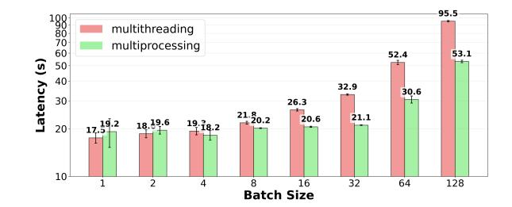

Figure 12. Comparison of multi-processing and multithreading with single core baseline for Web-Augmented workload on Sys 2.

coarse-grained parallelism across CPU cores and sidestepping single-process Global Interpreter Lock (GIL) limitations. Moreover, multi-processing also mitigates the synchronization overheads incurred by multi-threading. As observed, performance between the two approaches is relatively comparable at low batch sizes (≤ 4). However, as the batch size scales, the synchronization overheads and GIL bottleneck associated with multi-threading severely degrade performance. Consequently, at a batch size of 128, multi-processing achieves an approximate 1.8× speedup over multi-threading (53.1s compared to 95.5s).

#### <span id="page-14-1"></span>C MAS Algorithm

[Algorithm 1](#page-15-0) summarizes the admission logic of MAS. MAS maintains two execution queues, CPU and GPU, which hold CPU-heavy and GPU-heavy requests that have already been admitted and are allowed to make progress in the system. The number of requests that can be placed in these queues is limited by the request-type-specific concurrency caps cap,CPU and cap,GPU. It also maintains a shared reserve execution queue res with capacity cap,shared, which absorbs overflow from either request-type when its corresponding execution queue is full. On arrival, a request is first classified as CPU-heavy or GPU-heavy and is admitted to its matching execution queue whenever capacity is available; otherwise MAS attempts reserve admission. If both options are full, the request is placed into a per-request waiting queue, CPU or GPU, each of which preserves FCFS order within that request-type. Upon every completion, MAS revisits the waiting queues and attempts admission from their heads, always prioritizing the request-type-specific execution queues before the shared reserve queue. To avoid cross-request head-ofline blocking while preserving a simple and race-free policy, MAS drainsCPU andGPU in round-robin order rather than in parallel: this allows a blocked CPU-heavy request to no longer stall a GPU-heavy request behind it, while also avoiding unsynchronized concurrent access to shared admission state, particularly the shared reserve queue res and its cap cap,shared. Overall, this design preserves request-type-aware elasticity under normal load, uses the shared reserve only

<span id="page-15-0"></span>**Algorithm 1** Mixed Agentic Scheduler (MAS): type-aware elastic admission with per-class waiting queues

```
1: Active concurrency queues: execution queues Q_{CPU},
    Q_{\rm GPU}; shared reserve queue Q_{\rm res}
   Waiting queues: per-class FCFS queues W_{CPU}, W_{GPU}
   Concurrency caps: E_{\text{cap,CPU}}, E_{\text{cap,GPU}}, E_{\text{cap,shared}}
4: Round-robin pointer: next \in \{CPU, GPU\}
   procedure TryAdmit(r)
       if r is CPU-heavy and |Q_{CPU}| < E_{cap,CPU} then
6:
 7:
           enqueue r into Q_{CPU}
           return true
8:
       else if r is GPU-heavy and |Q_{GPU}| < E_{cap,GPU} then
 9:
           enqueue r into Q_{\rm GPU}
10:
           return true
11:
       else if |Q_{res}| < E_{cap,shared} then
12:
13:
           enqueue r into Q_{res}
                                     ▶ shared overflow queue
           return true
       else
15:
           return false
16:
       end if
17:
18: end procedure
   procedure OnArrival(r)
19.
       if TRYADMIT(r) = false then
20:
           if r is CPU-heavy then
21.
                enqueue r into W_{CPU}
22:
           else
23:
               enqueue r into W_{GPU}
24:
           end if
25:
       end if
26:
   end procedure
   procedure DrainWaiting
28:
       if next = CPU then
29:
           first \leftarrow CPU; second \leftarrow GPU
30:
31:
       else
           first \leftarrow GPU; second \leftarrow CPU
32:
33:
       if W_{first} is not empty and TryAdmit(head of W_{first})
34:
   then
           dequeue head of W_{first}
35.
36:
           next \leftarrow second
37.
38:
       if W_{second} is not empty and TryAdmit(head of
    W_{second}) then
           dequeue head of W_{second}
39:
           next \leftarrow first
40:
       end if
41:
   end procedure
   procedure OnCompletion
43:
       DrainWaiting()
44:
45: end procedure
   Dispatch policy:
   CPU-heavy requests are served from Q_{CPU}.
   GPU-heavy requests are served from Q_{GPU}.
                                                                  16
   Requests in Q_{res} are served in FCFS order.
   Waiting queues are FCFS within class and are drained
   in round-robin order on each completion.
```

Elastic admission is always attempted before reserve

admission.

for overflow, and reduces cross-request interference while maintaining fair and work-conserving admission.