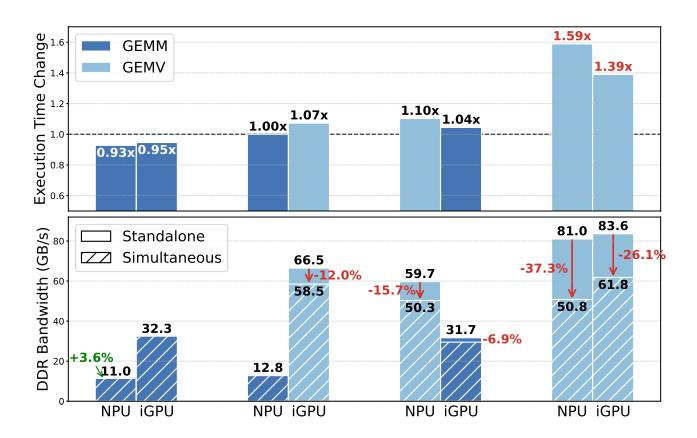
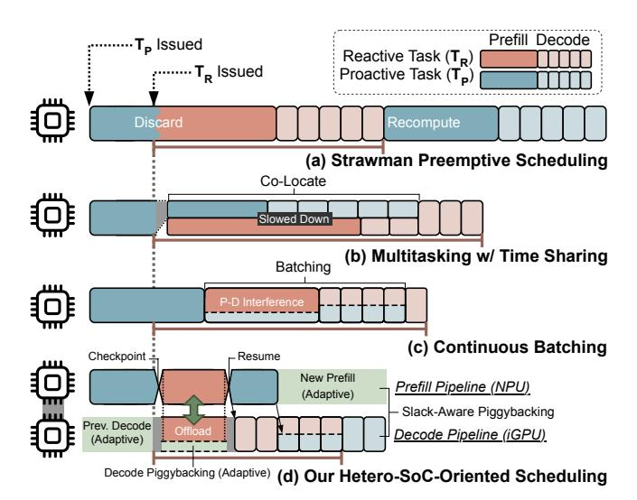
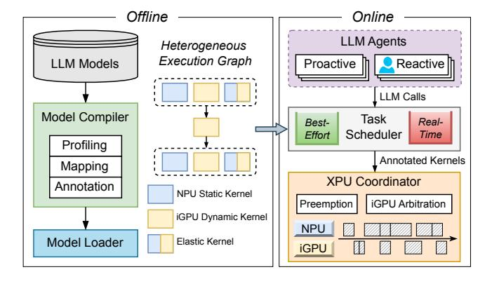
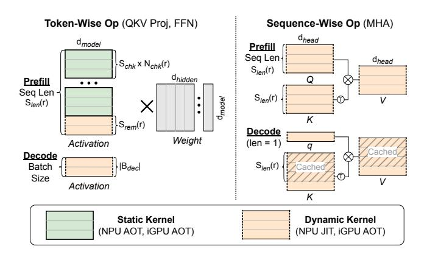
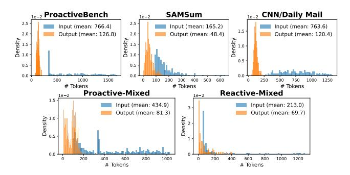
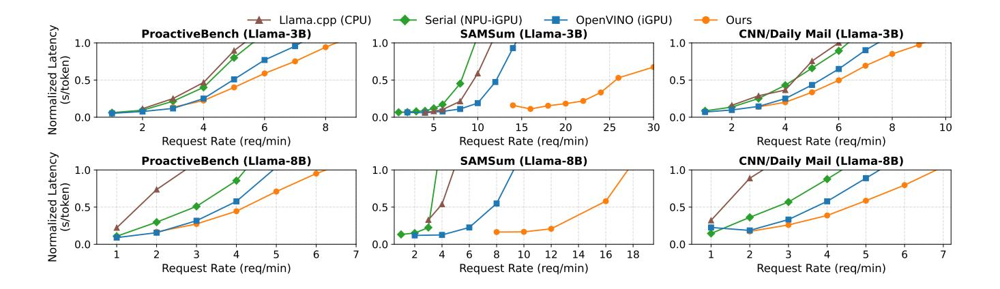
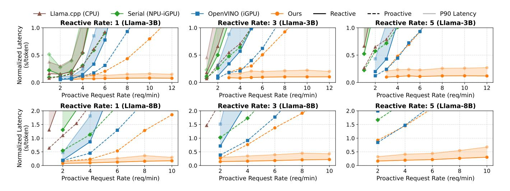
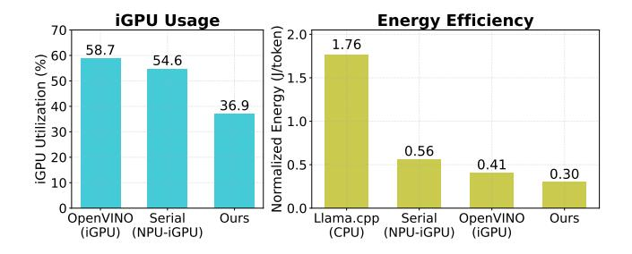

# Agent.xpu: Efficient Scheduling of Agentic LLM Workloads on Heterogeneous SoC

Xinming Wei<sup>1</sup> Jiahao Zhang<sup>1</sup> Haoran Li<sup>1</sup> Jiayu Chen<sup>1</sup> Haoning Guan<sup>2</sup> Rui Qu<sup>1</sup> Maoliang Li<sup>1</sup> Xiang Chen<sup>1</sup> Guojie Luo<sup>1,3</sup>

<sup>1</sup>School of Computer Science, Peking University <sup>2</sup>The University of Hong Kong <sup>3</sup>National Key Laboratory for Multimedia Information Processing, Peking University

#### **Abstract**

Personal LLM agents increasingly combine foreground reactive interactions with background proactive monitoring, forming long-lived, stateful LLM flows that interleave prefill and token-by-token decode. While modern heterogeneous SoCs integrate CPUs, iGPUs, and NPUs to support on-device intelligence, existing LLM engines assume static, single-shot inference and lack mechanisms for flow-level concurrency, prioritization, and efficient accelerator coordination. As a result, commodity SoCs remain poorly matched to the dynamic, mixed-criticality execution patterns of personal agents.

This paper presents Agent.xpu, the first LLM engine that orchestrates concurrent reactive and proactive LLM flows on commodity SoCs. Extensive profiling uncovers unique SoC characteristics of operator-accelerator affinity, asymmetric DDR contention, and stage-divergent batching behaviors distinct from cloud-serving assumptions. Agent.xpu introduces three key techniques: a heterogeneous execution graph (HEG) capturing NPU/iGPU affinity and elastic operator binding; flow-aware NPU-iGPU coordination with stage elasticity, decoupling prefill and decode to reduce bandwidth contention and enforce priorities; and fine-grained preemption with slack-aware piggybacking to guarantee reactive responsiveness without starving proactive work. Across realistic personal-agent workloads, Agent.xpu delivers 1.2-4.9× proactive throughput and reduces reactive latency by at least 91%, compared with both industrial iGPU-only serving engine and NPU-iGPU static inference with optimal tensor-partitioning schemes. Agent.xpu also minimizes energy consumption and graphics interference via controlled iGPU usage.

#### 1 Introduction

Large Language Models (LLMs) have revolutionized intelligent personal assistants [14], powering autonomous agentic workflows that combine answering, planning, and tool interaction [36,63,70]. Personal agents operate through two complementary modes [14,15,34,38,41]. As shown in Fig. 1, reactive agents respond to user-initiated queries in the foreground.

> **[图片提取文字 (无描述)]:**
> Reactive Proactive Event Human Agents Agents Initiation Stream 烤 User modified Agent.xpu code` "Commit changes in Agent.xpu repo." Three files updated & pushed." Re-indexing the project. John's invitation email arrived. "Reply to John's dinner invite." " Want me to accept or decline?" Drafting reply options. User booked an early flight. "Set an alarm for tomorrow's flight." "Got it. I'll wake you up at 6 a.m. Recommending an alarm. Personal ((•)) Sensors Tools Structured Agentic LLM Flows Heterogeneous SoC data exchange **iGPU** Agent.xpu Middleware API Kernels Scheduler Shared Local LLM Memory


<span id="page-0-0"></span>Figure 1: **Personal LLM Agent System.** Agent.xpu bridges the agent applications and heterogeneous SoC, orchestrating stateful on-device LLM flows from both foreground *reactive* agents and background *proactive* agents.

Meanwhile, *proactive agents* continuously monitor event signals and perform speculative analysis without explicit user triggers. The agentic execution paths intersect at *LLM flows*, i.e., structured, stateful LLM invocations punctuated by stalls of human thinking or tool calling. Since LLM flows frequently manipulate personal data and involve interactive steps, ondevice deployment is preferable for privacy, responsiveness, and cost efficiency [67,72,74]. Emerging 0.6B-8B lightweight LLMs [24,44,45,69] finetuned for agentic behaviors increasingly act as on-device controllers for function calls [20], with complex reasoning tasks selectively routed to cloud LLMs for effective edge-cloud collaboration [55].

Modern heterogeneous system-on-chip (hetero-SoC) across laptops and mobile phones comprises CPU, integrated

GPU (iGPU), and NPU, to support local generative AI. While recent studies of on-device LLM acceleration [\[6,](#page-12-0) [7,](#page-12-1) [66,](#page-16-5) [68\]](#page-16-6) exploit hetero-SoC via quantization or NPU offloading, they basically target *static inference*, assuming isolated, singleshot model executions with one-off prompts, non-overlapping scheduling, and uniform latency goals. In contrast, agentic LLM flows break these assumptions: they require *flowlevel concurrency, coordination, and prioritization*. Reactive flows contain real-time, bursty requests that demand timeliness; proactive flows comprise long-running, best-effort background tasks; and flow stages interleave unpredictably as agents reason or stall on external events. Current hetero-SoC hardware-software stacks offer no native support for such dynamic, flow-oriented execution, widening their mismatch with real-world personal agents.

We identify three fundamental gaps between efficient agentic LLM flows and current hetero-SoC ecosystems ([§2.3\)](#page-2-0).

- *Flexibility-efficiency trade-off.* NPUs deliver high performance for static-shaped input and ahead-of-time-compiled computation graphs, yet they are ill-suited for variable sequence lengths, dynamic batch sizes, and irregular control flow inherent to agentic LLM workloads. Conversely, more flexible iGPUs suffer from lower energy efficiency and potential interference with graphics responsibilities.
- *Shared-memory contention.* Concurrent agentic flows often emit overlapping NPU and iGPU kernel executions, which intensify contention for the limited DDR bandwidth of modern shared-memory SoCs, potentially degrading the latency of each individual task.
- *Absence of flow-aware runtime abstractions.* Most ondevice LLM engines lack mechanisms such as in-flight batching, prioritized scheduling, and coordinated NPUiGPU control, which are essential for launching concurrent reactive and proactive flows while meeting their distinct latency or throughput requirements.

Despite the above constraints, our in-depth hetero-SoC profiling ([§3\)](#page-3-0) reveals concrete opportunities to accommodate agentic LLM flows efficiently on commodity SoCs. These insights are distinct from cloud-centric LLM serving assumptions, motivating the design of our system.

- *Operator-accelerator affinity.* We observe distinct efficiency trade-offs between NPU and iGPU handling static versus dynamic LLM operators during prefill or decode, two LLM inference stages. This motivates both pre-run static placement and runtime elastic binding to map operators to their most efficient hardware backend.
- *Asymmetric contention pattern.* Memory-bound kernels are significantly more sensitive to, and more likely to saturate, shared DDR bandwidth than compute-bound kernels. This suggests that contention-aware kernel dispatching can

maximize aggregate throughput by preventing concurrent memory-heavy accesses.

- *Stage-decoupled scheduling.* Co-locating all inference stages inevitably causes interference between reactive and proactive flows. However, distributing workloads based on distinct characteristics of prefill and decode across NPU and iGPU enables prioritized scheduling for reactive responsiveness while preserving proactive throughput.
- *Stage-divergent batching effects.* Prefill gains little from batching because it saturates compute regardless of batch size; decode batching improves multi-flow throughput, yet the individual latency of each flow is sensitive to total batch size and input length of all flows. This necessitates adaptive batching strategies for mixed reactive-proactive flows.

Agent.xpu Framework. We present Agent.xpu, the first LLM engine that orchestrates agentic flows on commodity hetero-SoCs (Fig. [1\)](#page-0-0). Agent.xpu not only fills the vacuum of fully on-device concurrent serving, but aligns heterogeneous accelerators with agentic objectives by jointly optimizing reactive timeliness, proactive throughput, and energy efficiency. Its design combines profiling-driven graph construction with online, flow-aware NPU-iGPU co-scheduling to balance these competing goals ([§4.1\)](#page-5-0).

Key Techniques. First, Agent.xpu introduces a heterogeneous execution graph (HEG) that abstracts NPU/iGPU operator behavior in LLM flows, encoding affinity-guided placement constraints, elastic chunked kernel binding, and predictive performance annotations for runtime scheduling (§[4.2\)](#page-6-0). Second, Agent.xpu deploys flow-aware NPU-iGPU coordination with stage elasticity: prefill flows opportunistically interleave NPU and iGPU executions, while decode flows remain iGPU-resident and continuously batched. This decoupled scheduling mitigates bandwidth contention. Dedicated iGPU arbitration, prefill compute partitioning, and on-the-fly NPU kernel warm-up dynamically redistribute work under fluctuating flow concurrency ([§4.3\)](#page-6-1). Third, Agent.xpu provides fine-grained preemption for reactive queries across both stages, leveraging unified memory space for copy-free context switching ([§4.4\)](#page-7-0). Agent.xpu also utilizes slack-aware piggybacking with adaptive decode batching to prevent proactive starvation while preserving reactive responsiveness (§[4.5\)](#page-8-0).

Implementation and Evaluations. We implement both the agent interface and the LLM backend from scratch on Intel Core Ultra SoCs [\[12\]](#page-13-4), representative of mainstream heteo-SoC architecture (§[5\)](#page-8-1). Agent.xpu builds atop Intel Open-VINO [\[48\]](#page-15-2) for efficient NPU/iGPU kernel implementations and hardware-native asynchronous APIs. Agent.xpu is orthogonal to low-bit quantization or sparse attention and therefore preserves model accuracy.

Agent.xpu substantially outperforms existing on-device LLM engines (§[6\)](#page-8-2) across realistic personal-agent workloads (e.g., event handling, function calling, retrieval-augmented generation), using Llama3-3B/8B [\[44\]](#page-14-4) as representative ondevice LLM backbones. Baselines comprise (a) OpenVINO iGPU *serving* [\[48\]](#page-15-2), (b) Llama.cpp CPU *serving* [\[22\]](#page-13-5), and (c) customized *serial* NPU-iGPU inference [\[6,](#page-12-0) [7\]](#page-12-1) with tuned tensor partitions for the target platform ([§6.1\)](#page-8-3). Under proactiveonly workloads, Agent.xpu yields 1.2-2.4× throughput over OpenVINO (iGPU) and 1.4-4.9× over serial NPU-iGPU inference. For mixed reactive-proactive flows with diverse combinations of request heaviness, Agent.xpu reduces reactive query latency by 91-97% while improving proactive throughput by 0.3-58% relative to OpenVINO (iGPU), with even larger gains over other baselines. The speedups are generally more pronounced on 8B than 3B model, indicating robust scalability ([§6.2\)](#page-9-0). Agent.xpu further reduces energy consumption by 26.8% and iGPU utilization by 32.5% compared with iGPU serving and NPU-iGPU serial baselines, respectively ([§6.4\)](#page-11-0).

### 2 Background

This section presents an overview of personal LLM agents (§[2.1\)](#page-2-1), the basics of LLM inference ([§2.2\)](#page-2-2), together with the landscape of hardware/software for on-device LLM, and their gaps towards smooth agentic flows ([§2.3\)](#page-2-0).

### <span id="page-2-1"></span>2.1 Personal LLM Agents

In this work, we focus on *personal* LLM agents deeply coupled with personal data, personal devices, and personal applications [\[36\]](#page-14-0). Analogous to the kernel in a traditional OS, the foundational LLM serves as the core execution engine of a personal LLM agent system, handling diverse queries issued by both reactive and proactive agents. Reactive agents are instantiated in direct response to explicit human requests. In contrast, proactive agents operate in a "human-in-the-loop" [\[47\]](#page-14-6) manner, initiating actions autonomously based on contextual cues from the user's environment, yet seeking human feedback or approval before execution. Mainstream LLM agent orchestration frameworks, such as LangChain [\[10\]](#page-13-6), LlamaIndex [\[11\]](#page-13-7), and AutoGen [\[64\]](#page-15-3), are equipped to customize both proactive and reactive agentic workflows.

## <span id="page-2-2"></span>2.2 LLM Inference Primer

LLM inference is typically based on decoder-only Transformers, comprising a *prefill* stage, which encodes the prompt and generates the first token, and an auto-regressive *decode* stage to produce subsequent tokens one by one. Intermediate states (known as *KV cache* [\[52\]](#page-15-4)) are updated after each step. The end-to-end latency of LLM inference consists of *time to first token (TTFT)*, i.e., the prefill phase, and *time per output token (TPOT)* multiplied by the number of decoded tokens after the first. In both prefill and decode, each Transformer

> **[图片提取文字 (无描述)]:**
> CPU **iGPU** Compute Unit Core ALU, FPU, Ctrl. EU EU EU L2 \$ L1 L1 \$ L2 \$ EU EU EU EU EU EU L3 \$ On-Chip Interconnect NPU Controller Tile Scratchpad RAM Data Buffer MACs Load/Store **DDR Memory** Controller (Off-Chip) Nonlinear MMU Unit DMA


<span id="page-2-4"></span>Figure 2: Shared-Memory Hetero-SoC. iGPU builds upon thread-level execution unit (EU), while NPU adopts multiplyaccumulate (MAC) array for efficient tensor operations.

layer constitutes three major blocks: *1) QKV projection*, *2) multi-head attention (MHA)*[1](#page-2-3) , and *3) feed-forward network (FFN)*. QKV projection and FFN operate independently on each *token*, while attention attends over the entire *sequence*. This distinction underlines differences in data dependencies and parallelism between the two types of operations.

Cloud-based LLM inference is dedicated to serving user queries at high throughput while meeting service level objectives (SLOs). Established techniques include kernel optimization [\[13,](#page-13-8) [65\]](#page-15-5), continuous batching [\[33,](#page-14-7) [73\]](#page-16-7) with chunked prefill [\[2\]](#page-12-2), prefill-decode disaggregation [\[50,](#page-15-6) [77\]](#page-16-8), KV cache reuse [\[1,](#page-12-3) [60,](#page-15-7) [76\]](#page-16-9) or defragmentation [\[33\]](#page-14-7), and improved tensor or pipeline parallelism [\[37,](#page-14-8) [58\]](#page-15-8). For resource-constrained conditions where GPU memory is limited, existing solutions propose CPU memory/disk offloading by leveraging weight locality [\[59\]](#page-15-9) or I/O-aware scheduling [\[57\]](#page-15-10).

## <span id="page-2-0"></span>2.3 On-Device LLM

Heterogeneous SoC. As illustrated in Fig. [2,](#page-2-4) hetero-SoCs exhibit a unified memory architecture distinct from heterogeneous systems with discrete accelerators: CPU, iGPU, and NPU share the same physical memory. This eliminates costly host-device data transfers but can introduce bandwidth contention caused by concurrent DDR access. Compared with cloud-hosted accelerators, commodity NPUs and iGPUs have smaller on-chip SRAM and depend heavily on shared, bandwidth-limited DRAM, requiring dedicated tuning of kernel chunking, batch dimension, and execution ordering.

From the compute angle, iGPU adopts a SIMT execution model akin to discrete GPUs, while the NPU is purpose-built

<span id="page-2-3"></span><sup>1</sup>We use MHA as a unified term to denote attention variants such as grouped-query attention (GQA) [\[3\]](#page-12-4) and multi-latent attention (MLA) [\[40\]](#page-14-9).

<span id="page-3-1"></span>

| Table 1: Comparison of On-Device LLM Engine | Table | 1: | Compariso | on of O | n-Device | LLM | Engines |
|---------------------------------------------|-------|----|-----------|---------|----------|-----|---------|
|---------------------------------------------|-------|----|-----------|---------|----------|-----|---------|

| Framework         | iGPU    | NPU    | Hetero.<br>Execution | Model<br>Serving | Preempt.<br>Support |
|-------------------|---------|--------|----------------------|------------------|---------------------|
| Llama.cpp [22]    | W4A16   | /      | CPU-iGPU             | Cont. Batching   | /                   |
| ONNX Runtime [18] | FP16/32 | INT8   | /                    | N/A (Offline)    | /                   |
| IPEX-LLM [9]      | W8A16   | INT4   | /                    | N/A (Offline)    | /                   |
| MNN [43]          | W4A16   | /      | /                    | N/A (Offline)    | /                   |
| MLLM [66,71]      | /       | INT4   | /                    | N/A (Offline)    | /                   |
| HeteroInfer [6,7] | W4A16   | W4A16  | NPU-iGPU             | N/A (Offline)    | /                   |
| Qualcomm AI [53]  | W4A16   | INT4/8 | /                    | N/A (Offline)    | /                   |
| OpenVINO [48]     | W8A16   | INT4   | /                    | Cont. Batching   | /                   |
| Agent.xpu         | W8A16   | W8A16  | NPU-iGPU             | Flow-Aware       | Stage-Aware         |
|                   |         |        |                      | Decoupling       | Preemption          |

The listed iGPU/NPU quantization methods represent the most common configurations for each framework; CPU is omitted as typically supported by default. Both W8A16 and INT8 store weights in INT8, but use FP16 and INT activation/arithmetic, respectively; similarly for W4A16 and INT4.

for specific tensor operations, offering similar levels of parallelism but with higher energy efficiency. Nevertheless, LLMs process arbitrarily sized user inputs via dynamic-shape operators along the sequence or batch dimension, but NPUs are optimized for static-shaped operations. NPUs depend on costly compilation of fixed computational graphs to pre-allocate resources and optimize dataflows (e.g., tiling GEMMs onto fixed-size MAC arrays), making cold-start compilation at runtime infeasible. These trade-offs require NPU-iGPU collaboration to fully leverage the NPU's compute efficiency and minimize iGPU overhead.

On-Device Inference Engines. Driven by increasing demands for privacy, responsiveness, and energy efficiency, a range of industrial on-device LLM inference engines have emerged, including Llama.cpp [22], OpenVINO [48], ONNX Runtime [18], IPEX-LLM [9], MNN [43], QNN [19], Core ML [16], LiteRT [17], and MLLM [66, 71]. These frameworks facilitate out-of-the-box LLM deployment on vendorspecific CPUs, GPUs, or NPUs. Table 1 summarizes mainstream frameworks in comparison to Agent.xpu. Agent.xpu implements W8A16 quantization on both NPUs and GPUs to balance inference efficiency and accuracy precision, and supports stage-elastic NPU-iGPU hybrid inference. In contrast, Llama.cpp [22] enables layer-wise CPU-iGPU pipelining without temporal overlapping. Llama.cpp and Open-VINO [48] support server-client-based LLM serving with continuous batching, which is limited on singular accelerator (§ 3.2). Only Agent.xpu supports preemptive scheduling during each inference stage, tailored for reactive flows with sub-100 ms wait time. Recent research has explored iGPU-NPU (or CPU-NPU) co-execution via activation outlier isolation [66, 68], as well as tensor parallelism through activation or weight partitioning [6,7]. However, these techniques primarily target reducing the end-to-end latency of monolithic inferences, whereas future on-device agentic applications demand broader support for concurrency, state dependency, and real-time interactivity.

> **[图片提取文字 (无描述)]:**
> Memory Compute Operators Bound Bound Performance (TFLOPS) NPU + iGPU QKV Proj. MHA NPU (Static Shape) FFN **iGPU** Inference Stage NPU (Dynamic Shape) Prefill (Dark) Decode (Bright) Arithmetic Intensity (FLOPS/byte)


<span id="page-3-3"></span>Figure 3: Schematic Roofline Illustration of LLM Ops.

> **[图片提取文字 (无描述)]:**
> 1.59x Execution Time Change **GEMM GEMV** 1.39x 1.10x 1.04x 1.07x 1.00x 0.93x 0.95x000 Bandwidth (GB/s) 40 +3.6% 83.6 81.0 Standalone -26.1% Simultaneous 66.5 -37.3% 59.7 V-12.0% 61.8 -15.7% 58.5 50.8 50.3 32.3 31.7 -6.9% 12.8 11.0 NPU iGPU NPU iGPU NPU iGPU NPU iGPU


<span id="page-3-5"></span>Figure 4: **Memory Contention Analysis.** Changes of execution time (upper) and DDR bandwidth (lower) from standalone NPU/iGPU kernel running to simultaneous co-execution. Memory-bound GEMV kernels are more sensitive to NPU/iGPU parallelism than compute-bound GEMM.

### <span id="page-3-0"></span>3 Hetero-SoC Analysis and Opportunities

We conduct a comprehensive hetero-SoC analysis to guide the design of Agent.xpu. Operator-level analysis (§ 3.1) characterizes the compute and memory demands of representative LLM operators (ops), while task-level analysis (§ 3.2) examines runtime behavior in end-to-end agentic LLM flows. Profiling experiments are conducted on an Intel Core Ultra processor [12] with DDR5 DRAM.

#### <span id="page-3-2"></span>3.1 Operator-Level Analysis

**Operator-Accelerator Affinity.** To illustrate the affinity between LLM ops and hetero-SoC accelerators, we construct a schematic roofline model (Fig. 3) derived from our profiling results of Llama 3B/8B models<sup>2</sup>. Static-shaped NPU kernels

<span id="page-3-4"></span><sup>&</sup>lt;sup>2</sup>Simplifications include: arithmetic intensity of each operator varies with prompt length (here is a moderate 512 tokens); roofline curves of different ops may actually diverge and are merged here; relative NPU/iGPU peak performance are vendor-dependent; memory bandwidth slope for each curve differs by factors such as L2 or scratchpad memory size; and NPU+iGPU

> **[图片提取文字 (无描述)]:**
> Prefill Decode 0.8 iGPU (prompt len: 128) iGPU (prompt len: 128) iGPU (prompt len: 512) iGPU (prompt len: 512) 6-NPU (prompt len: 128) 0.6 Slowdown II 5 NPU (prompt len: 512) (prompt length) S 4 (s) D 0.4 NPU/iGPU Batching Overhead Saturate > Slowdown I 2 · (batch size) 0.2 10 Batch Size Batch Size


<span id="page-4-1"></span>Figure 5: **Individual Task Latency in Batching.** Distinctive batching effects of prefill and decode on Llama-3B model.

can be ahead-of-time (AOT) compiled, whereas dynamicshaped kernels require expensive just-in-time (JIT) compilation. In contrast, iGPU natively supports AOT kernels with variable-shaped inputs. For dynamic prefill kernels on NPUs, we amortize JIT compilation cost by LLM layers across which they can be reused; nevertheless, this overhead remains prohibitive for on-demand runtime compilation. By comparison, static-shaped NPU kernels achieve higher energy efficiency (TFLOPS/W) while delivering throughput comparable to iG-PUs. *Opportunity:* Pre-compile chunked NPU kernels for token-wise prefill ops, while offloading dynamic prefill and all decode ops to iGPU, which better handles growing dimensions and avoids NPU underutilization (§4.2). At runtime, warm up variable-shaped kernels on NPU for queued requests on-the-fly to hide compilation latency and opportunistically shift prefill from iGPU (§4.3).

Memory Access Pattern and Contention. Discrete GPUs with dedicated VRAM exhibit bulk transfer and decoupled compute, moving data between host DRAM and VRAM before or after execution. In contrast, we observe that NPUs and iGPUs with limited SRAM and DMA capacity adopt streaming access and coupled compute, consuming data progressively during execution, which underscores NPU-iGPU contention management under heavy DDR traffic. As shown in Fig. 4, we measure latency and bandwidth changes between separate and simultaneous GEMM/GEMV executions with Intel VTune [30]. GEMM and GEMV dominate prefill and decode stages, respectively. Co-executing memorybound GEMV degrades both latency and bandwidth, whereas compute-bound GEMM is largely unaffected. Opportunity: Contention can be largely mitigated through stage decoupling of prefill and decode to NPU and iGPU (§ 3.2), complemented by adaptive kernel dispatching with deferral (§4.3).

#### <span id="page-4-0"></span>3.2 Task-Level Analysis

**Batching Effects on Hetero-SoC.** Batching intuitively improves throughput, while the individual latency is more sensi-

parallelism can slightly boost bandwidth when memory-bound (Fig. 4, [6]).

> **[图片提取文字 (无描述)]:**
> Prefill Decode T<sub>p</sub> Issued Reactive Task (T<sub>P</sub>) ···· T<sub>p</sub> Issued Proactive Task (Tp) Discard Recompute (a) Strawman Preemptive Scheduling Co-Locate Slowed Down (b) Multitasking w/ Time Sharing Batching P-D Interference (c) Continuous Batching Checkpoint. Resume New Prefill Prefill Pipeline (NPU) (Adaptive) Slack-Aware Piggybacking Prev. Decode Decode Pipeline (iGPU) (Adaptive) Decode Piggybacking (Adaptive) (d) Our Hetero-SoC-Oriented Scheduling


Figure 6: **Proactive-Reactive Co-Scheduling.** (a)(b)(c) target single accelerator, while (d) uses NPU and iGPU primarily for prefill and decode, respectively.

<span id="page-4-3"></span>tive to batch size on resource-constrained SoCs. As shown in Fig. 5, we analyze prefill and decode batching across varying batch sizes, prompt lengths, and accelerators<sup>3</sup>. Prefill latency scales nearly linearly with batch size, saturating the NPU or iGPU without performance gain. Decode latency rises gradually with larger batches or longer prompts, since each task's MHA operates on its own KV cache with unchanged arithmetic intensity, limiting batching efficiency. This effect is amplified by constrained memory bandwidth and quadratic MHA complexity in sequence length. Furthermore, the latency gap between prefill and decode reflects decode degradation when batched with prefill. *Opportunity:* To trade-off latency and throughput in batching, we can disaggregate prefill and decode across NPU and iGPU (§ 4.3), and employ adaptive decode batching tailored to flow priorities (§ 4.5).

Proactive-Reactive Interference. Agentic LLM serves interleave proactive flows with real-time reactive flows, creating conflicting throughput-latency demands. Fig. 6 compares four co-scheduling schemes. Single-accelerator approaches, including (a) instant preemption without context saving, (b) time-sharing via multi-stream or virtualization, and (c) continuous batching, all suffer inefficiencies: (a) recomputation and idle time, (b) slowdowns and duplicated intermediate buffers, and (c) prefill-decode interference, which lengthens decode and is exacerbated on resource-constrained SoCs with longer prefill times. By co-locating heterogeneous stages on the same accelerator with coupled resource allocation, these methods cannot simultaneously satisfy the objectives of agentic workloads. Our hetero-SoC scheme (d) principally partitions pre-

<span id="page-4-2"></span><sup>&</sup>lt;sup>3</sup>NPU decode is omitted since per-iteration kernel compilation is infeasible under growing sequence length and varying batch size.

Table 2: Key Notations

<span id="page-5-1"></span>

| Qreact ,Qproact | Global request queues containing reactive/proactive tasks         |
|-----------------|-------------------------------------------------------------------|
| Slen(r)         | Input sequence length of request r                                |
| Schk            | Fixed sequence length of a given AOT chunk kernel                 |
| Nchk (r)        | Total number of chunks for a request (Nchk (r) = ⌊Slen(r)/Schk ⌋) |
| nnpu            | Number of chunks dispatched to NPU                                |
| Srem(r)         | Remainder dynamic length (Srem(r) = Slen(r) (mod Schk ))          |
| bu fp           | Prefill buffer with shape (max_context_len,dmodel)                |
| bu fd           | Decode buffer with shape (max_decode_batch_size,dmodel)           |
| Bdec            | Decode batch containing reactive or proactive requests            |
| Dstatus         | Status of iGPU Decode pipeline (IDLE or BUSY)                     |
| Top(sz,dev)     | Latency of a specific operator op of input size sz on device dev  |

> **[图片提取文字 (无描述)]:**
> Offline Online **LLM Agents** Heterogeneous Execution Graph Proactive Reactive I LLM Models LLM Calls Model Compiler Task Best-Real-Scheduler Time Effort Profiling Annotated Kernels Mapping XPU Coordinator Annotation NPU Static Kernel Preemption iGPU Arbitration iGPU Dynamic Kernel NPU Model Loader Flastic Kernel **iGPU**


<span id="page-5-2"></span>Figure 7: Agent.xpu System Design.

fill to the NPU and decode to the iGPU, with the iGPU also handling reactive prefill and dynamic prefill kernels. In this way, we achieve lowest reactive flow makespan and highest overall throughput. *Opportunity:* Minimize reactive-proactive interference via efficient preemption for reactive tasks, plus recomputation-free resumption [\(4.4\)](#page-7-0) and slack-aware piggybacking ([§4.5\)](#page-8-0) guided by batching and contention profiles for proactive tasks.

### <span id="page-5-3"></span>4 Agent.xpu Design

We first summarize the objectives, workload assumptions, and essential components of our system (§[4.1\)](#page-5-0). Then we introduce the offline HEG (§[4.2\)](#page-6-0) and online NPU-iGPU coordination guidelines ([§4.3\)](#page-6-1). Finally, we elaborate on the reactive preemption ([§4.4\)](#page-7-0) and proactive piggybacking (§[4.5\)](#page-8-0) mechanisms. Table [2](#page-5-1) shows key notations used in this section.

### <span id="page-5-0"></span>4.1 Contextualization and System Overview

Role of Agent.xpu. Agent.xpu serves concurrent LLM flows from personal agents, rather than handling standalone LLM inferences. It supposes one local LLM as the core of the agentic system. Operating in a non-clairvoyant manner, Agent.xpu does not rely on knowledge of the agentic workflow or task arrival times. It is informed only of task priorities (proactive

or reactive) at the time of issuance. Agent.xpu is designed with the following primary *objectives*: 1) prioritizing the reduction of end-to-end latency for LLM requests originating from reactive agents to enhance user experience, 2) increasing the overall throughput for background LLM flows from proactive agents, and 3) optimizing compute and memory resource utilization in hetero-SoC to achieve improved performance and energy efficiency.

Workload Characteristics. On resource-limited hetero-SoCs, we anticipate a typical LLM request rate from personal agents of 1 to 30 requests per minute. Calls from proactive and reactive agents are assumed to be independently distributed. LLM inferences are separate from other agentic sub-tasks, such as human interaction or tool engagement, which are assumed to be primarily CPU- or I/O-bound. Within Agent.xpu, iGPU usage is intentionally limited to ensure graphics availability and energy efficiency.

System Design. As depicted in Fig. [7,](#page-5-2) the system comprises offline and online components. 1) *Offline*: it maintains model weights and a heterogeneous execution graph (HEG; §[4.2\)](#page-6-0) with pre-compiled NPU kernels and dynamic iGPU kernels. Each HEG node carries profiling-guided annotations (latency and bandwidth hints, as a function of batch/sequence size). An elastic-kernel abstraction enables late binding of each operator to NPU or iGPU at dispatch time. 2) *Online*: Agent.xpu dynamically schedules agentic LLM flows across the SoC on the basis of the following modules or data layouts:

- *Request Manager.* This module interfaces with the agent frontend to asynchronously admit LLM calls. It maintains a global request table, where each entry records the request UUID, lifecycle, KV cache allocation, prompt tokens, and inference progress (phase, layer, current kernel, generated tokens). This fine-grained tracking enables task checkpointing and resuming without recomputation. The manager handles lightweight admission and moves requests across task queues.
- *Dual Task Queues.* For both prefill and decode, Agent.xpu maintains a real-time queue (reactive) and a best-effort queue (proactive). The queues feed the corresponding event loops, enabling efficient scheduling and immediate preemption.
- *Prefill/Decode Event Loops.* Two dedicated loops busy-poll their queues for low-latency dispatch. They decompose tasks into NPU, iGPU, or elastic kernels and submit them to the XPU coordinator. Compute-bound prefill is run singly for each request, while decode loop adopts in-flight request batching ([§4.3\)](#page-6-1). The prefill loop supports sub-100 ms preemption for reactive requests at kernel boundaries (§[4.4\)](#page-7-0), while the decode loop dynamically adjusts batch size based on request priority and latency budgets (§[4.5\)](#page-8-0).
- *XPU Coordinator.* This module orchestrates concurrent execution across NPU, iGPU, and related CPU activities (e.g., NPU kernel compilation). It operates on NPU/iGPU FIFO queues of submitted kernels, binding elastic kernels to accelerators and processing kernel-level preemption based on HEG annotations, task priority, and current load. The coor-

> **[图片提取文字 (无描述)]:**
> Token-Wise Op (QKV Proj, FFN) Sequence-Wise Op (MHA) dhead d<sub>model</sub> Prefill Seq Lendhead S<sub>chk</sub> x N<sub>chk</sub>(r) S<sub>len</sub>(r) dhidden Q Prefill . . . Seg Len -S<sub>len</sub>(r) d<sub>model</sub> S<sub>len</sub>(r) K S<sub>rem</sub>(r) Decode Weight Activation (len = 1)Decode -|B<sub>dec</sub>| Batch Size Activation K Static Kernel Dynamic Kernel (NPU JIT, iGPU AOT) (NPU AOT, iGPU AOT)


<span id="page-6-2"></span>Figure 8: HEG Op Decomposition and Elastic Binding.

dinator also arbitrates simultaneous iGPU requests under a prefill-prioritized policy (§[4.3:](#page-6-1) 3 ).

- *Recurrent Activation Double Buffer.* Agent.xpu maintains a single-layer activation buffer, which can be reused recurrently through layers. Prefill and decode buffers are sized by max context length (set as 4096) and maximum batch size (set as 32), respectively, with the same hidden dimension. Agent.xpu adopts a reactive-proactive double buffer to enable copy-free context switching for preemption ([§4.4\)](#page-7-0).
- *Memory Manager.* To fully utilize on-device memory, Agent.xpu employs a background garbage collector that reclaims KV caches and on-demand NPU kernels once completed. We assume moderate request density typical of personal agents without memory overflow. Should an out-ofmemory condition arise, application-directed tiering is preferred over blind paging: selectively offloading cold KV cache or weight shards to flash storage. Such offloading policies are orthogonal to our core design and can be seamlessly integrated [\[57\]](#page-15-10).

### <span id="page-6-0"></span>4.2 Heterogeneous Execution Graph

Graph Representation. Agent.xpu models LLM execution as a heterogeneous execution graph (HEG): a parametric, accelerator-aware multigraph where nodes denote operator variants and edges capture intra- or inter-accelerator data transfers. The HEG consists of a one-shot prefill DAG and a recurrent decode micro-DAG invoked per token. As illustrated in Fig. [8,](#page-6-2) token-wise QKV projection and FFN can be chunked during prefill or batched during decode with shared weights, while sequence-wise MHA operates per request over the individual KV cache.

Operator Mapping. To map operators onto specific accelerators while enabling runtime elasticity, we balance computational efficiency, data locality, and resource utilization:

• *Computation Affinity.* Ops are placed based on roofline characteristics (§[3.1\)](#page-3-2) and micro-architectural fit. For prefill, QKV projection and FFN use chunked NPU kernels or dynamic iGPU kernels; chunk sizes are tuned to saturate the NPU. Prefill MHA defaults to iGPU, though on-demand NPU warm-up can be employed. During decode, all kernels run on iGPU due to dynamic batch sizes, growing sequence lengths, and request heterogeneity. The CPU is reserved for control flow, toking sampling, and kernel compilation.

- *Runtime Elasticity.* Prefill ops along the sequence dimension can be partitioned into chunked and dynamic parts. The coordinator adaptively chooses NPU or iGPU for each, depending on request priority, accelerator load, and bandwidth pressure. On-demand NPU kernels, if compiled in time, may also replace iGPU execution for dynamic ops.
- *Memory Awareness.* To minimize costly DDR transfers, we fuse consecutive ops into three core kernels, exploiting NPU/iGPU SRAM with data locality. Unlike prior approaches [\[6,](#page-12-0) [7,](#page-12-1) [66\]](#page-16-5) that split linear and nonlinear ops across accelerators, our fused kernels exploit modern NPUs' nonlinear units to avoid cross-accelerator transfer. For decode, we similarly fuse ops into three iGPU kernels, and further optimize by collapsing an entire decode layer into a single iGPU kernel for single-batch decode iteration.

Predictive Kernel Annotation. Combining our roofline profiling (§[3.1\)](#page-3-2) and analytical model (detailed in [§A\)](#page-17-0), we can predict kernel latency and bandwidth utilization as a function of sequence length or batch size, given accelerator choice. LLM ops are idempotent with fixed FLOPs, and we find that kernel execution times on NPU/iGPU are stable across invocations. This allows the scheduler to estimate TTFT for individual tasks and TPOT for batched decode, enabling adaptive kernel dispatching.

# <span id="page-6-1"></span>4.3 Flow-Aware NPU-iGPU Coordination with Stage-Elasticity

Agent.xpu principally decouples prefill and decode into specialized scheduling pipelines, facilitating the effective coordination of agentic flows. Prefill primarily leverages the NPU for compute-intensive token-wise ops, while decode resides on the iGPU to support dynamic batching and sequence growth. Such heterogeneous disaggregation is elastic to fit the real-time states of on-going reactive and proactive flows. 1 Prefill Pipeline. For reactive requests, we minimize TTFT by partitioning token-wise ops across NPU and iGPU with elastic tensor parallelism (details in 4 ). For proactive requests, token-wise ops run mainly on NPU, while dynamic ops (e.g., MHA) and residual fragments alongside chunked kernels run on iGPU. Because a single request already saturates either accelerator, prefill avoids batching and processes requests serially. This pipeline also serves as the substrate for the preemption mechanism of reactive requests ([§4.4\)](#page-7-0).

- 2 Decode Pipeline. The decode pipeline adopts continuous batching decoupled from prefill, scheduling requests at iteration granularity. Reactive and proactive requests can be co-batched under adaptive strategies ([§4.5\)](#page-8-0). Executing all decode kernels on the iGPU naturally accommodates dynamic sequence lengths and fluctuating batch composition.
- 3 Pipeline Coordination and iGPU Arbitration. On shared memory SoCs, prefill and decode share the in-place KV cache without costly cross-accelerator transfers. However, both stages may contend for the iGPU due to common dynamic operators, necessitating arbitration mechanisms. Agent.xpu adopts a *prefill-first* arbitration policy: iGPU kernels from prefill always take precedence over decode, regardless of request type. This design is motivated by: 1) decode is memory-bound and generally longer than prefill, and 2) prefill requires only a small fraction of iGPU kernels, with the bulk of computation offloaded to the NPU. Prioritizing prefill ensures that short bursts of iGPU work complete promptly, avoiding long stalls that would otherwise block the entire prefill pipeline and inflate TTFT. Decode jobs can then efficiently utilize the wide gaps between prefill bursts.
- 4 Elastic NPU-iGPU Tensor Parallelism. To reduce TTFT for reactive requests while mitigating interference with ongoing decode, Agent.xpu elastically partitions reactive prefill kernels across NPU and iGPU at runtime. Decisions are made *layer-wise* by the XPU coordinator in real-time. As detailed in Algorithm [1,](#page-7-1) if decode pipeline is idle, the coordinator solves for *nnpu* such that the NPU execution time for chunks aligns with the iGPU's execution time (assigned chunks + dynamic remainder), minimizing the makespan. Otherwise, the coordinator assigns all chunks to NPU to protect the latencysensitive decode stream on iGPU. The remainder iGPU kernel is deferred to complete no earlier than their parallel NPU counterparts, increasing the chance that decode finishes mid-layer with interference alleviated.
- 5 On-the-Fly NPU Kernel Warm-Up. At runtime, Agent.xpu opportunistically prepares dynamic NPU kernels (e.g., MHA) once a request is queued or preempted, thereby hiding compilation latency and reducing iGPU prefill load. Since prompt length is known at enqueue time, the CPU can start compiling static NPU kernels immediately; if compilation completes before prefill begins, the request switches to pure-NPU prefill, mitigating iGPU interference with decode. Compiled kernels are reclaimed once unused or expired. To eliminate potential contention introduced by NPU-iGPU co-execution, when NPU prefill kernels become memorybound (e.g., MHA with short prompt length) and overlap with memory-intensive iGPU decode, the coordinator prioritizes reactive tasks: if both pipelines share the same priority (all-reactive or all-proactive), they proceed concurrently; otherwise, work with lower priority is deferred until the higherpriority side completes for reactive latency preservation.

#### Algorithm 1 Elastic Kernel Dispatch for Reactive Prefill

```
Require: Reactive request r with input tokens x (shape: Slen(r)×dmodel),
  layer l, prefill buffer bu fp and decode status Dstatus
Ensure: Completed execution of layer l during prefill of r.
  if l is the first layer then ▷ Fill prefill buffer with r's input
     memcpy(bu fp, x, Slen(r)· dmodel ·sizeof(x.dtype))
  end if
  for each op ∈ GetOperators(l) do
     if op is token-wise (QKV Proj, FFN) then
        if Dstatus == IDLE then ▷ Scenario 1: Maximize parallelism
           nnpu ← argmin0≤i≤Nchk (r)
                                 |i·Top(Schk,NPU)−
                   (Nchk(r)−i)·Top(Schk,iGPU)−Top(Srem(r),iGPU)|
        else ▷ Scenario 2: Conservative iGPU usage
           nnpu ← Nchk(r)
           tde f er ← nnpu ·Top(Schk,NPU)−Top(Srem(r),iGPU)
        end if
        for i = 0,...,nnpu −1 do ▷ Non-blocking
           LaunchKernelAsync(op,bu fp[i · Schk : (i+1)· Schk],NPU)
        end for
        for i = nnpu,...,Nchk(r)−1 do ▷ Non-blocking
           LaunchKernelAsync(op,bu fp[i · Schk : (i+1)· Schk],iGPU)
        end for
        Sleep(tde f er) ▷ Defer iGPU kernel
        LaunchKernel(op,bu fp[Nchk(r)· Schk : Slen(r)],iGPU,
               preempt = true) ▷ Preempt (probable) decode kernels
        SyncExecution(op,NPU,iGPU)
     else ▷ Sequence-wise (MHA)
        LaunchKernel(op,bu fp[0 : Slen(r)],iGPU,preempt = True)
     end if
  end for
```

# <span id="page-7-0"></span>4.4 Fine-Grained Preemption

Prioritized scheduling of reactive flows is critical for user experience. However, preemption mechanism tailored to agentic LLM workloads is absent on commodity hetero-SoCs. We exploit the unified memory and our double activation buffer design to achieve lightweight context switching. Considering fine-grained, short-lived prefill kernels and moderate reactive request frequency, we adopt lazy preemption at kernel or layer boundaries without user-perceptible delay, which avoids recompute overhead in kill-based approaches [\[26\]](#page-13-15).

- 1 Copy-Free Context Switching. An inference context comprises the KV cache, progress metadata (stage, current layer, finished kernels, generated tokens), and intermediate activations. Shared memory address eliminates the need to swap the KV cache when a reactive request arrives. Our double activation buffer separates proactive and reactive activations of prefill, enabling low-latency preemption and instant restoration without data copying.
- 2 Kernel-Level Prefill Preemption. During prefill, we employ wait-then-execute preemption at kernel boundaries. Each kernel is registered with a lightweight completion callback. Upon finishing, the callback efficiently probes the reactive queue; if non-empty, it signals the prefill event loop to immediately dequeue and decompose the reactive job into kernels, thereby preempting the current proactive task. Reactive tasks do not preempt each other and run sequentially like proactive ones. Because token-wise ops are chunked, kernel execution

time is tightly bounded. For an 8B model, chunked kernels (size 256) complete within 38 ms on NPU/iGPU, while MHA with sequence length 2048 completes within 97 ms. This ensures sub-100 ms preemption latency—nearly imperceptible to users with negligible TTFT impact.

3 Iteration-Level Decode Preemption. For decode, reactive requests wait until the current iteration completes, then immediately join the next batch. Proactive jobs may be evicted under adaptive batching policies (§[4.5\)](#page-8-0) to preserve reactive latency. Since iteration-level preemption is bounded by TPOT and the only per-request context is the localized KV cache and generated tokens, it avoids expensive swapping while still guaranteeing fast response.

### <span id="page-8-0"></span>4.5 Slack-Aware Piggybacking

To preserve reactive responsiveness while preventing starvation of proactive flows, Agent.xpu employs slack-aware piggybacking, where proactive work opportunistically fills pipeline slack in prefill and decode with negligible impact on reactive task latency.

- 1 Slack Identification. The scheduler detects two forms of slack during reactive-proactive coexistence: 1) *Compute slack*, arising from idle accelerator resources. Proactive prefill can overlap with the decode pipeline whenever no reactive prefill is pending. 2) *Bandwidth slack*, during memory-bound decode stage. Proactive requests can be co-batched with reactive ones under elaborate batching rules that bound the additional latency seen by reactive tasks, as 2 .
- 2 Adaptive Decode Batching. Agent.xpu implements *reactive-first* batching (Algorithm [2\)](#page-8-4) to govern the admission of proactive tasks into the next decode iteration. Since decode latency scales with both batch size and sequence length, blind mixing of requests can violate reactive latency targets. The scheduler updates the decode batch *Bdec* by unconditionally admitting all surviving and newly arrived reactive requests. Proactive requests are then opportunistically piggybacked into the remaining slots up to a threshold *Bcap* (set as 3). Crucially, when the candidate set exceeds capacity, Agent.xpu evicts "bottleneck" proactive requests with the longest sequence lengths to preserve TPOT of the entire batch.
- 3 Starvation Prevention. While reactive requests receive priority, the scheduler implements aging mechanisms to prevent indefinite postponement of proactive requests. Proactive requests that exceed a threshold age are promoted to prevent starvation. They obtain two privileges without suspending reactive execution: 1) the scheduler reallocates iGPU to manage the overdue proactive prefill, while retaining reactive prefill (except MHA) solely on NPU, and 2) after prefill, the aged request can immediately join the decode batch, bypassing the batch size cap for a reactive-first batch.

#### Algorithm 2 Reactive-First Adaptive Decode Batching

```
Require: Current batch Bdec, new arrivals Qreact ,Qproact , threshold Bcap
Ensure: Updated Bdec for the next decode iteration
  Rreact ← {r ∈ Bdec | r.type == REACTIVE} ∪PopAll(Qreact)
  Rproact ← {r ∈ Bdec | r.type == PROACTIVE} ∪PopAll(Qproact)
  Bdec ← Rreact ▷ Unconditionally admit reactive requests
  SortDescending(r ∈ Rproact ,key = Slen(r))
  for r ∈ Rproact do
     if |Bdec| < Bcap or Rreact == ∅ then
         Bdec ← Bdec ∪ {r} ▷ Piggyback proactive requests
     else
         PushBackToQueue(r,Qproact) ▷ Evict to prevent TPOT inflation
     end if
  end for
```

# <span id="page-8-1"></span>5 Implementation

Agent.xpu exposes a RESTful API frontend (2.3K lines of Python code) for prioritized query submission in a serverclient manner. The LLM backend is written in 6K lines of C++ with custom abstractions for tensors, compute graphs, and model loading, eschewing third-party dependencies (e.g., PyTorch [\[49\]](#page-15-12), GGML [\[21\]](#page-13-16)). This lightweight design allows Agent.xpu to natively embed the scheduling mechanisms introduced in §[4,](#page-5-3) while keeping kernel interfaces modular to accommodate diverse SoC platforms.

Our prototype targets Intel Core Ultra SoCs [\[12\]](#page-13-4), implementing NPU and iGPU kernels using the low-level APIs of OpenVINO 2025.2 [\[48\]](#page-15-2). Request- and kernel-level scheduling is based on two-tier asynchronous interfaces: 1) *Inter-op parallelism* leverages thread-level prefill and decode event loops, coordinated via thread-safe task queues; 2) *Intra-op parallelism* exploits elastic NPU-iGPU tensor partitioning, fulfilled by the XPU coordinator with hardware-specific coroutines (start\_async/wait in OpenVINO). The offline HEG and online scheduler jointly enable seamless adaptation to different LLM models, agent workflows, and SoC platforms.

# <span id="page-8-2"></span>6 Evaluation

We evaluate Agent.xpu on diverse agentic flow against industrial baselines ([§6.1\)](#page-8-3). Overall, Agent.xpu improves proactive throughput by up to 2.4× over iGPU serving baseline, while reducing reactive latency by up to 97% under load ([§6.2\)](#page-9-0). Detailed breakdowns further attribute these gains to efficient heterogeneous co-scheduling (§[6.3\)](#page-11-1). We also examine the overhead management ([§6.4\)](#page-11-0).

### <span id="page-8-3"></span>6.1 Experimental Setup

Hetero-SoC Testbed and Models. We deploy Agent.xpu on an ASUS NUC 14 Pro+ mini-PC equipped with an Intel Core Ultra 5 125H processor [\[12\]](#page-13-4) and 64GB DDR5 DRAM, running Ubuntu 24.04. The processor integrates an Intel Arc iGPU and Intel AI Boost NPU, with NPU driver v1.19.0, Intel

> **[图片提取文字 (无描述)]:**
> <sub>1e-2</sub> ProactiveBench 1e-2 CNN/Daily Mail SAMSum 1e-2 2.5 2.5 -Input (mean: 766.4) Input (mean: 165.2) Input (mean: 763.6) 1.5 -2.0 Output (mean: 126.8) 2.0 Output (mean: 48.4) Output (mean: 120.4) Density Density Density 1.5 1.5 1.0 1.0 1.0 0.5 -0.5 0.5 0.0 0.0 0.0 1000 1500 100 200 500 600 500 n 300 400 250 500 1250 # Tokens # Tokens # Tokens Proactive-Mixed Reactive-Mixed 1e-2 1e-2 1.5 Input (mean: 434.9) Input (mean: 213.0) 3 Output (mean: 81.3) Output (mean: 69.7) Density 0.5 Density 0.5 0.0 200 400 600 800 1000 200 400 600 800 1000 1200 # Tokens # Tokens


<span id="page-9-1"></span>Figure 9: **Composition of Agentic Workloads.** Input/output length distributions of three proactive datasets and two proactive- or reactive-mixed datasets.

iGPU Compute Runtime 24.39.31294.12, and performance power mode. We evaluate Llama-3.1-8B-Instruct and Llama-3.2-3B-Instruct [44] as central LLM, covering representative model architecture (GQA, dense FFN) and sizes for on-device deployment. We adopt W8A16 channel-wise quantization, incurring negligible accuracy loss [29].

Agentic Workloads. To approximate realistic personal agent behavior, we construct both proactive and reactive workloads: *Proactive:* 1) ProactiveBench [41] with real user events such as keyboard, clipboard, and browser activity; 2) SAM-Sum [23], modeling group chat reply drafting; and 3) CNN/DailyMail [28], for news summarization. *Reactive:* 1) LMSyschat-1M [75], covering diverse one-on-one conversations; 2) MTRAG [31], a multi-turn retrieval-augmented generation benchmark; and 3) Berkeley Function Call Leaderboard [51], which produces structured API calls.

We evaluate two regimes: 1) proactive-only: each proactive benchmark is run individually; 2) mixed flows: proactive and reactive requests coexist. To synthesize mixed workloads, we uniformly sample from all proactive or reactive benchmarks to form proactive- or reactive-mixed datasets. As shown in Fig. 9, the datasets exhibit remarkably different input-length distributions, reflecting the wide variation in prefill intensity across agentic tasks. Output lengths follow a long-tailed pattern, with outliers reaching up to 1.6k tokens—consistent with on-device agents producing summarized responses or compact function-call instructions, while more verbose reasoning tasks remain predominantly cloud-served.

Since the original datasets lack timestamps, we synthesize the arrival times using a Poisson process with request rates varying between 1-30 requests per minute (req/min), matching observed densities for personal agents. Proactive and reactive arrivals are generated independently. For each dataset, we evaluate the baselines and Agent.xpu with 15-minute traces, corresponding to increasing request rates.

**Baselines.** We compare against industrial on-device LLM engines with *concurrent-serving* support and optimizations for the underlying Intel SoC, as well as a customized NPU-

iGPU *static-inference* baseline. All baselines use the same W8A16 precision as Agent.xpu.

- Llama.cpp (CPU) [22], a widely used inference engine optimized for multi-core CPUs. We evaluate its serving mode with continuous batching.
- OpenVINO (iGPU) [48], Intel's deployment stack for Core Ultra SoCs. Since Agent.xpu also builds on OpenVINO's low-level APIs, single-batch performance is nearly identical. For serving, OpenVINO supports continuous batching only on iGPUs, which we use as the iGPU-serving baseline.
- Serial (NPU-iGPU). To generalize static tensor-parallel acceleration across NPU and iGPU [6,7], we craft a serial pipeline that partitions prefill prompts into optimal NPU-iGPU ratios tuned for various lengths, and executes decode fully on the iGPU as NPU-iGPU parallelism barely yields decode benefit on our evaluated SoC.

**Metrics.** We measure both performance and efficiency metrics under varying proactive and reactive request densities: 1) *Normalized Latency*, calculated as the average request end-to-end latency divided by combined input and output lengths, gauging throughput under high request rates. We also measure P90 latency of reactive requests to highlight user-facing responsiveness; 2) *iGPU Utilization*, the weighted sum of stable utilization percentage measured under distinctive loads or stages, averaged by the corresponding active execution periods; 3) *Energy per Token*, measured as the energy consumed (J/token), normalized by the processed token count.

#### <span id="page-9-0"></span>**6.2** End-to-End Performance

Proactive-Only Workloads. We first examine proactive-only workloads, where throughput is the primary metric. In this regime, Agent.xpu assigns uniform priority without preemption or adaptive batching. Although designed for mixed workloads, Agent.xpu already outperforms other single- or dual-accelerator baselines in throughput (Fig. 10). OpenVINO (iGPU) ranks second, benefitting from throughput-oriented continuous batching. Llama.cpp (CPU) excels in decode but is bottlenecked by slow prefill, while serial NPU-iGPU execution is limited by non-overlapping execution. Agent.xpu shares low-level kernels with OpenVINO with similar single-batch inference speed, but it achieves lower iGPU utilization (§ 6.4) by leveraging NPU-iGPU co-execution.

The performance advantage of Agent.xpu is further amplified under higher request rates or larger models. On SAMSum, where prompts and outputs are relatively short, all systems sustain higher rates before saturation. With Llama-3B, Agent.xpu achieves 2.0-2.4× throughput over OpenVINO (iGPU), and delivers  $\sim$ 20% more requests at 1.0 s/token latency on ProactiveBench and CNN/DailyMail. Gains are even larger with Llama-8B, as a heavier load amplifies the benefit of heterogeneous scheduling. Compared with Llama.cpp (CPU) and

> **[图片提取文字 (无描述)]:**
> → Llama.cpp (CPU) Serial (NPU-iGPU) OpenVINO (iGPU) Ours Normalized Latency (s/token) 0.0 CNN/Daily Mail (Llama-3B) ProactiveBench (Llama-3B) SAMSum (Llama-3B) 1.0 0.5 0.5 0.0 30 Request Rate (reg/min) Request Rate (reg/min) Request Rate (reg/min) Normalized Latency (s/token) 0.0 - 0.1 ProactiveBench (Llama-8B) CNN/Daily Mail (Llama-8B) SAMSum (Llama-8B) 1.0 0.5 0.5 0.0 0.0 18 16 Request Rate (reg/min) Request Rate (reg/min) Request Rate (reg/min)


<span id="page-10-0"></span>Figure 10: Proactive-Only Workloads. End-to-end results with Llama-3B/8B models on three proactive datasets.

> **[图片提取文字 (无描述)]:**
> → Llama.cpp (CPU) Serial (NPU-iGPU) OpenVINO (iGPU) Ours Reactive Proactive P90 Latency Reactive Rate: 1 (Llama-3B) Reactive Rate: 3 (Llama-3B) Reactive Rate: 5 (Llama-3B) 1.0 Normalized Latency (s/token) 0.5 0.5 0.0 0.0 12 10 10 12 Proactive Request Rate (reg/min) Proactive Request Rate (reg/min) Proactive Request Rate (reg/min) Reactive Rate: 1 (Llama-8B) Reactive Rate: 3 (Llama-8B) Reactive Rate: 5 (Llama-8B) 2.0 2.0 2.0 Normalized Latency (s/token) 1.5 1.5 1.0 1.0 1.0 0.5 0.5 0.0 0.0 0.0 10 10 Proactive Request Rate (reg/min) Proactive Request Rate (reg/min) Proactive Request Rate (reg/min)


Figure 11: **Reactive-Proactive Mixed Workloads.** End-to-end results with Llama-3B/8B models on mixed datasets with varying reactive/proactive rate combinations. P90 latencies of reactive requests are displayed alongside mean latencies.

Serial (NPU-iGPU), Agent.xpu achieves up to  $3.9 \times$  and  $4.9 \times$  throughput, respectively.

**Reactive-Proactive Mixed Workloads.** We next evaluate mixed workloads, where proactive throughput and reactive latency must be balanced. Baselines lack request prioritization, so they treat proactive and reactive inputs equally. In contrast, Agent.xpu enforces reactive-first scheduling with adaptive batching. Fig. 11 reports mean and P90 latencies to capture both responsiveness and tail behavior.

Agent.xpu consistently achieves much lower reactive latencies while sustaining higher proactive throughput. For Llama-3B at 6 proactive req/min, Agent.xpu reduces mean reactive latency by 91.61%, 93.84%, and 96.01% at 1, 3, and 5 reactive req/min, respectively, compared to OpenVINO (iGPU). With Llama-8B, the reductions are 96.23%, 96.01%, and 96.70%. Tail (P90) latency reductions are even larger, underscoring

<span id="page-10-1"></span>improved user experience. On the proactive side, mean latency improvements reach 34.4%-0.3% for Llama-3B and 58.7%-6.1% for Llama-8B.

Reactive latency in Agent.xpu grows slowly with increasing proactive rates by only 19% (3B) and 49% (8B) from 4 to 10 proactive req/min, thanks to adaptive batching that caps batch sizes for reactive-first scheduling. Moreover, the gap between P90 and mean latency remains narrow, showing stable performance without outliers. In contrast, baselines degrade quickly under higher load: latencies inflate, tails widen, and responsiveness collapses. In baselines, reactive latencies consistently exceed proactive ones, as independent and irregular arrival patterns increase queuing delays under concurrency, and the absence of priority scheduling exacerbates delays for reactive requests. These results confirm the effectiveness of our co-scheduling policies.

> **[图片提取文字 (无描述)]:**
> Pending Time (Prefill) Pending Time (Decode) 0.50 Ours 0.4 32.9 382.5 0.45 0.3 0.2 0.2 Time (s) Proactive 0.40 Reactive 0.35 0.1 0.30 0.0 Serial OpenVINO Ours 10 12 Llama.cpp (NPU-iGPU) Proactive Request Rate (reg/min) (CPU) (iGPU) Active Prefill Latency Active Decode Latency Normalized Latency (s/token) 0.000 0.000 0.000 0.000 2.0 Normalized Latency (s/token) Proactive Proactive Reactive Reactive 1.5 1.0 0.5 0.000 Llama.cpp Serial OpenVINO Serial OpenVINO Ours Llama.cpp Ours (CPU) (CPU) (NPU-iGPU) (iGPU) (NPU-iGPU) (iGPU)


<span id="page-11-2"></span>Figure 12: **Breakdown of Agentic Serving Latencies.** Most measured under mixed workloads (3 reactive and 6 proactive req/min), except the decode pending time with varying proactive rates on Agent.xpu, which is zero on baselines with serial scheduling or continuous batching.

#### <span id="page-11-1"></span>6.3 Latency Breakdown

To explain the end-to-end gains, we decompose the inference latency of each request into prefill/decode pending time, active prefill latency, and active decode latency (Fig. 12). The results are normalized within either proactive or reactive agentic flows. This breakdown also serves as a compact ablation.

Baselines suffer from long prefill pending times: CPU serving is delayed by slow prefill, and static NPU-iGPU inference is stalled by serial scheduling. OpenVINO (iGPU) shows significantly longer reactive pending time than Agent.xpu due to the absence of effective prioritized scheduling. In contrast, Agent.xpu keeps reactive prefill pending time to 0.048s on average, enabled by kernel-level sub-100 ms preemption. Decode pending appears only in Agent.xpu due to its unique decoupled scheduling, and grows with proactive load until saturated by the maximum reactive-first batch size.

Active prefill speeds of Agent.xpu and OpenVINO (iGPU) are similar, but Agent.xpu accelerates reactive prefill via NPU-iGPU parallelism. Serial (iGPU-NPU) has uniformly better performance than Agent.xpu with optimal workload partition for both reactive and proactive inputs, despite its limitation to static inference. Decode shows different trends: CPU benefits from multithreading and large caches, while Serial (NPU-iGPU) reflects fast single-batch iGPU decoding. iGPU decode latencies increase due to co-batching with long prefills, but Agent.xpu reduces reactive decode interference through reactive-first batching and fine-grained iGPU arbitration. This demonstrates why reactive requests consistently outperform proactive ones under our design.

> **[图片提取文字 (无描述)]:**
> iGPU Usage Energy Efficiency 70 ()/token) 1.76 58.7 iGPU Utilization (%) 10-20-20-20-20-20-20-20-20-20-20-20-20-20 54.6 Energy 36.9 1.0 Normalized 0.0 0.0 0.56 0.5 0.41 0.30 OpenVINO Serial Llama.cpp Serial OpenVINO Ours Ours (iGPU) (NPU-iGPU) (CPU) (NPU-iGPU) (iGPU)


<span id="page-11-3"></span>Figure 13: **Overhead Analysis.** iGPU usage and energy efficiency under the same mixed workloads as Fig. 12.

#### <span id="page-11-0"></span>**6.4** Overhead Analysis

**iGPU Utilization.** We measure iGPU utilization across inference stages on the same mini PC running Windows 11, using the system resource monitor. Pure-iGPU prefill can strike 100% utilization, while decode averages 46%. The higher-than-expected decode utilization (relative to FLOPS) arises from memory traffic and synchronization overheads. We account only for active prefill and decode time, excluding duplicated computation from batching. As shown in Fig. 13, Agent.xpu reduces overall iGPU utilization by 32.5% and 37.1% compared with Serial (NPU-iGPU) and OpenVINO (iGPU). Although NPU offloading reduces iGPU occupation in NPU-iGPU baseline, the serial execution without decode batching increases accumulative iGPU usage over all requests. **Energy Efficiency.** Using Intel VTune [30], we measure that NPU power remains stable around 10W for chunked prompt length. iGPU power grows from 25W (decode) to 31W (prefill), with little sensitivity to batch size ( $\leq$ 32). CPU workloads consume 12W during single-threaded NPU kernel compilation and up to 58W under multi-threaded inference. Fig. 13 compares per-token energy: Llama.cpp (CPU) is the least efficient, followed by Serial (NPU-iGPU) with deficient singlebatch iGPU decode. Agent.xpu achieves 26.8% lower energy consumption than OpenVINO (iGPU) by offloading prefill to the NPU and employing efficient batching.

#### 7 Related Work

Stateful LLM Serving. Recent systems address stateful and agentic LLM serving with caching or workflow optimizations. InferCept [1] intercepts intermediate states to avoid recomputation, while Parrot [39] and Ayo [62] expose application-level dataflows or primitive graphs for coordinated execution. Autellix [42] and SGLang [76] generalize LLM agents into program-like structures with specialized runtimes. These systems target multi-tenant cloud settings with abundant resources, whereas our focus is on single-device agents operating under tight SoC constraints.

On-Device LLM Inference. On-device inference efforts have

explored heterogeneous accelerator use and architectural specialization. HeteroInfer [\[6,](#page-12-0)[7\]](#page-12-1) and LLM.npu [\[66\]](#page-16-5) exploit NPU-GPU (or CPU) parallelism, while PowerInfer-2 [\[68\]](#page-16-6) adopts neuron-cluster decomposition for polymorphic execution on smartphones. These works primarily optimize isolated inference latency relying on accuracy-reducing 4-bit quantization, and lack support for stateful workloads. Orthogonal researches include 1) hybrid execution among server-grade accelerators [\[5,](#page-12-5) [32,](#page-14-14) [46\]](#page-14-15), which has different assumptions from on-device scenarios, and 2) co-design with novel memory architecture [\[27,](#page-13-20) [35,](#page-14-16) [54\]](#page-15-15) or in-storage computing [\[61\]](#page-15-16), which requires specialized hardware and limits deployability on personal devices.

Preemptive Scheduling of DNN Workloads. Preemption mechanisms improve responsiveness under concurrent deep learning workloads. PipeSwitch [\[4\]](#page-12-6) pipelines GPU context switching, PREMA [\[8\]](#page-12-7) predicts phases for NPU preemption, REEF [\[26\]](#page-13-15) achieves microsecond-scale preemption via GPU reset. Pantheon [\[25\]](#page-13-21) enables fine-grained preemption through sliced execution and early exits. XSched [\[56\]](#page-15-17) proposes unified abstractions for XPU-based preemption. While effective for traditional DNN tasks on high-end GPUs or customized NPUs, these techniques are not applicable to the unique challenges of scheduling reactive and proactive agentic LLM flows on hetero-SoC.

# 8 Conclusion

The rise of personal LLM agents demands efficient ondevice execution, yet the interplay of proactive and reactive workloads remains challenging for heterogeneous SoCs. Agent.xpu effectively bridges the three fundamental gaps hindering current ecosystems: it reconciles the flexibilityefficiency trade-off via a Heterogeneous Execution Graph that enables affinity-guided, elastic kernel mapping; it mitigates shared-memory contention through stage-decoupled scheduling that orchestrates NPU-iGPU memory access patterns; and it fills the void of flow-aware runtime abstractions by introducing prioritized coordination mechanisms, including fine-grained preemption and slack-aware piggybacking. By strictly aligning heterogeneous acceleration with agentic flow characteristics, our work paves the way for future edge platforms to serve diverse agentic LLM flows under tight resource constraints.

## References

- <span id="page-12-3"></span>[1] Reyna Abhyankar, Zijian He, Vikranth Srivatsa, Hao Zhang, and Yiying Zhang. Infercept: Efficient intercept support for augmented large language model inference. In *International Conference on Machine Learning*, pages 81–95, Vienna, Austria, 2024. JMLR.org.
- <span id="page-12-2"></span>[2] Amey Agrawal, Nitin Kedia, Ashish Panwar, Jayashree Mohan, Nipun Kwatra, Bhargav Gulavani, Alexey Tumanov, and Ramachandran Ramjee. Taming Throughput-Latency tradeoff in LLM inference with Sarathi-Serve. In *18th USENIX Symposium on Operating Systems Design and Implementation (OSDI 24)*, pages 117–134, Santa Clara, CA, USA, 2024. USENIX Association.
- <span id="page-12-4"></span>[3] Joshua Ainslie, James Lee-Thorp, Michiel de Jong, Yury Zemlyanskiy, Federico Lebron, and Sumit Sanghai. Gqa: Training generalized multi-query transformer models from multi-head checkpoints. In *Proceedings of the 2023 Conference on Empirical Methods in Natural Language Processing*, pages 4895–4901, 2023.
- <span id="page-12-6"></span>[4] Zhihao Bai, Zhen Zhang, Yibo Zhu, and Xin Jin. {PipeSwitch}: Fast pipelined context switching for deep learning applications. In *14th USENIX Symposium on Operating Systems Design and Implementation (OSDI 20)*, pages 499–514, 2020.
- <span id="page-12-5"></span>[5] Hongtao Chen, Weiyu Xie, Boxin Zhang, Jingqi Tang, Jiahao Wang, Jianwei Dong, Shaoyuan Chen, Ziwei Yuan, Chen Lin, Chengyu Qiu, et al. Ktransformers: Unleashing the full potential of cpu/gpu hybrid inference for moe models. In *Proceedings of the ACM SIGOPS 31st Symposium on Operating Systems Principles (SOSP)*, pages 1014–1029, 2025.
- <span id="page-12-0"></span>[6] Le Chen, Dahu Feng, Erhu Feng, Yingrui Wang, Rong Zhao, Yubin Xia, Pinjie Xu, and Haibo Chen. Characterizing mobile soc for accelerating heterogeneous llm inference. In *Proceedings of the ACM SIGOPS 31st Symposium on Operating Systems Principles (SOSP)*, pages 359–374, 2025.
- <span id="page-12-1"></span>[7] Le Chen, Dahu Feng, Erhu Feng, Rong Zhao, Yingrui Wang, Yubin Xia, Haibo Chen, and Pinjie Xu. Heterollm: Accelerating large language model inference on mobile socs platform with heterogeneous ai accelerators. *arXiv preprint arXiv:2501.14794*, 2025.
- <span id="page-12-7"></span>[8] Yujeong Choi and Minsoo Rhu. Prema: A predictive multi-task scheduling algorithm for preemptible neural processing units. In *2020 IEEE International Symposium on High Performance Computer Architecture (HPCA)*, pages 220–233. IEEE, 2020.

- <span id="page-13-10"></span>[9] IPEX-LLM contributors. Ipex-llm toolkit. [https://](https://github.com/intel/ipex-llm) [github.com/intel/ipex-llm](https://github.com/intel/ipex-llm), 2024.
- <span id="page-13-6"></span>[10] LangChain contributors. Langchain: A composable framework to build with llms. [https://www.](https://www.langchain.com) [langchain.com](https://www.langchain.com), 2023.
- <span id="page-13-7"></span>[11] LlamaIndex contributors. Llamaindex: Build ai knowledge assistants over your enterprise data. [https://www.](https://www.llamaindex.ai) [llamaindex.ai](https://www.llamaindex.ai), 2023.
- <span id="page-13-4"></span>[12] Intel Corporation. Intel core ultra processors. [https:](https://www.intel.com/content/www/us/en/products/details/processors/core-ultra.html) [//www.intel.com/content/www/us/en/products/](https://www.intel.com/content/www/us/en/products/details/processors/core-ultra.html) [details/processors/core-ultra.html](https://www.intel.com/content/www/us/en/products/details/processors/core-ultra.html), 2024.
- <span id="page-13-8"></span>[13] Tri Dao, Dan Fu, Stefano Ermon, Atri Rudra, and Christopher Ré. Flashattention: Fast and memoryefficient exact attention with io-awareness. *Advances in neural information processing systems*, 35:16344– 16359, 2022.
- <span id="page-13-0"></span>[14] Allan de Barcelos Silva, Marcio Miguel Gomes, Cristiano André Da Costa, Rodrigo da Rosa Righi, Jorge Luis Victoria Barbosa, Gustavo Pessin, Geert De Doncker, and Gustavo Federizzi. Intelligent personal assistants: A systematic literature review. *Expert Systems with Applications*, 147:113193, 2020.
- <span id="page-13-1"></span>[15] Yang Deng, Lizi Liao, Zhonghua Zheng, Grace Hui Yang, and Tat-Seng Chua. Towards human-centered proactive conversational agents. In *Proceedings of the 47th International ACM SIGIR Conference on Research and Development in Information Retrieval*, pages 807– 818, Washington DC USA, 2024. ACM.
- <span id="page-13-12"></span>[16] Core ML developers. Core ml - integrate machine learning models into your app. [https://developer.apple.](https://developer.apple.com/documentation/coreml/) [com/documentation/coreml/](https://developer.apple.com/documentation/coreml/), 2023.
- <span id="page-13-13"></span>[17] LiteRT developers. Google litert overview. [https:](https://ai.google.dev/edge/litert) [//ai.google.dev/edge/litert](https://ai.google.dev/edge/litert), 2025.
- <span id="page-13-9"></span>[18] ONNX Runtime developers. Onnx runtime. [https:](https://onnxruntime.ai/) [//onnxruntime.ai/](https://onnxruntime.ai/), 2021.
- <span id="page-13-11"></span>[19] QNN developers. Qualcomm ai engine direct (qnn). [https://docs.qualcomm.com/bundle/](https://docs.qualcomm.com/bundle/publicresource/topics/80-63442-50/overview.html) [publicresource/topics/80-63442-50/overview.](https://docs.qualcomm.com/bundle/publicresource/topics/80-63442-50/overview.html) [html](https://docs.qualcomm.com/bundle/publicresource/topics/80-63442-50/overview.html), 2025.
- <span id="page-13-3"></span>[20] Lutfi Erdogan, Nicholas Lee, Siddharth Jha, Sehoon Kim, Ryan Tabrizi, Suhong Moon, Coleman Hooper, Gopala Anumanchipalli, Kurt Keutzer, and Amir Gholami. Tinyagent: Function calling at the edge. In *Proceedings of the 2024 Conference on Empirical Methods in Natural Language Processing: System Demonstrations*, pages 80–88, Miami, Florida, USA, 2024. ACL.

- <span id="page-13-16"></span>[21] Georgi Gerganov. Ggml tensor library for machine learning. <https://github.com/ggml-org/ggml>, 2023.
- <span id="page-13-5"></span>[22] Georgi Gerganov. llama.cpp - inference of meta's llama model (and others) in pure c/c++. [https://github.](https://github.com/ggml-org/llama.cpp) [com/ggml-org/llama.cpp](https://github.com/ggml-org/llama.cpp), 2023.
- <span id="page-13-18"></span>[23] Bogdan Gliwa, Iwona Mochol, Maciej Biesek, and Aleksander Wawer. Samsum corpus: A human-annotated dialogue dataset for abstractive summarization. In *Proceedings of the 2nd Workshop on New Frontiers in Summarization*, pages 70–79, Hong Kong, China, 2019. Association for Computational Linguistics.
- <span id="page-13-2"></span>[24] Daya Guo, Dejian Yang, Haowei Zhang, Junxiao Song, Ruoyu Zhang, Runxin Xu, Qihao Zhu, Shirong Ma, Peiyi Wang, Xiao Bi, et al. Deepseek-r1: Incentivizing reasoning capability in llms via reinforcement learning. *arXiv preprint arXiv:2501.12948*, 2025.
- <span id="page-13-21"></span>[25] Lixiang Han, Zimu Zhou, and Zhenjiang Li. Pantheon: Preemptible multi-dnn inference on mobile edge gpus. In *Proceedings of the 22nd Annual International Conference on Mobile Systems, Applications and Services*, pages 465–478, 2024.
- <span id="page-13-15"></span>[26] Mingcong Han, Hanze Zhang, Rong Chen, and Haibo Chen. Microsecond-scale preemption for concurrent {GPU-accelerated}{DNN} inferences. In *16th USENIX Symposium on Operating Systems Design and Implementation (OSDI 22)*, pages 539–558, 2022.
- <span id="page-13-20"></span>[27] Guseul Heo, Sangyeop Lee, Jaehong Cho, Hyunmin Choi, Sanghyeon Lee, Hyungkyu Ham, Gwangsun Kim, Divya Mahajan, and Jongse Park. Neupims: Npu-pim heterogeneous acceleration for batched llm inferencing. In *Proceedings of the 29th ACM International Conference on Architectural Support for Programming Languages and Operating Systems, Volume 3*, pages 722– 737, 2024.
- <span id="page-13-19"></span>[28] Karl Moritz Hermann, Tomáš Kociský, Edward Grefen- ˇ stette, Lasse Espeholt, Will Kay, Mustafa Suleyman, and Phil Blunsom. Teaching machines to read and comprehend, 2015.
- <span id="page-13-17"></span>[29] Wei Huang, Xingyu Zheng, Xudong Ma, Haotong Qin, Chengtao Lv, Hong Chen, Jie Luo, Xiaojuan Qi, Xianglong Liu, and Michele Magno. An empirical study of llama3 quantization: from llms to mllms. *Visual Intelligence*, 2(1):36:1–36:13, December 2024.
- <span id="page-13-14"></span>[30] Intel. Intel® vtune™ profiler. [https://www.intel.](https://www.intel.com/content/www/us/en/developer/tools/oneapi/vtune-profiler.html#gs.i6xhgk) [com/content/www/us/en/developer/tools/](https://www.intel.com/content/www/us/en/developer/tools/oneapi/vtune-profiler.html#gs.i6xhgk) [oneapi/vtune-profiler.html#gs.i6xhgk](https://www.intel.com/content/www/us/en/developer/tools/oneapi/vtune-profiler.html#gs.i6xhgk), 2025.

- <span id="page-14-11"></span>[31] Yannis Katsis, Sara Rosenthal, Kshitij Fadnis, Chulaka Gunasekara, Young-Suk Lee, Lucian Popa, Vraj Shah, Huaiyu Zhu, Danish Contractor, and Marina Danilevsky. Mtrag: A multi-turn conversational benchmark for evaluating retrieval-augmented generation systems. *Transactions of the Association for Computational Linguistics*, 13:784–808, 2025.
- <span id="page-14-14"></span>[32] Hyungyo Kim, Nachuan Wang, Qirong Xia, Jinghan Huang, Amir Yazdanbakhsh, and Nam Sung Kim. Lia: A single-gpu llm inference acceleration with cooperative amx-enabled cpu-gpu computation and cxl offloading. In *Proceedings of the 52nd Annual International Symposium on Computer Architecture (ISCA)*, pages 544–558, 2025.
- <span id="page-14-7"></span>[33] Woosuk Kwon, Zhuohan Li, Siyuan Zhuang, Ying Sheng, Lianmin Zheng, Cody Hao Yu, Joseph Gonzalez, Hao Zhang, and Ion Stoica. Efficient memory management for large language model serving with pagedattention. In *Proceedings of the 29th Symposium on Operating Systems Principles (SOSP)*, pages 611–626, Koblenz Germany, 2023. ACM.
- <span id="page-14-1"></span>[34] LangChain. Introducing ambient agents. [https://blog.langchain.dev/](https://blog.langchain.dev/introducing-ambient-agents/) [introducing-ambient-agents/](https://blog.langchain.dev/introducing-ambient-agents/), 2025.
- <span id="page-14-16"></span>[35] Cong Li, Yihan Yin, Xintong Wu, Jingchen Zhu, Zhutianya Gao, Dimin Niu, Qiang Wu, Xin Si, Yuan Xie, Chen Zhang, et al. H2-llm: Hardware-dataflow co-exploration for heterogeneous hybrid-bonding-based low-batch llm inference. In *Proceedings of the 52nd Annual International Symposium on Computer Architecture (ISCA)*, pages 194–210, 2025.
- <span id="page-14-0"></span>[36] Yuanchun Li, Hao Wen, Weijun Wang, Xiangyu Li, Yizhen Yuan, Guohong Liu, Jiacheng Liu, Wenxing Xu, Xiang Wang, Yi Sun, et al. Personal llm agents: Insights and survey about the capability, efficiency and security. *arXiv preprint arXiv:2401.05459*, 2024.
- <span id="page-14-8"></span>[37] Zhuohan Li, Lianmin Zheng, Yinmin Zhong, Vincent Liu, Ying Sheng, Xin Jin, Yanping Huang, Zhifeng Chen, Hao Zhang, Joseph E Gonzalez, et al. AlpaServe: Statistical multiplexing with model parallelism for deep learning serving. In *17th USENIX Symposium on Operating Systems Design and Implementation (OSDI 23)*, pages 663–679, Boston, MA, 2023. USENIX Association.
- <span id="page-14-2"></span>[38] Lizi Liao, Grace Hui Yang, and Chirag Shah. Proactive conversational agents in the post-chatgpt world. In *Proceedings of the 46th international ACM SIGIR conference on research and development in information retrieval*, pages 3452–3455, 2023.

- <span id="page-14-12"></span>[39] Chaofan Lin, Zhenhua Han, Chengruidong Zhang, Yuqing Yang, Fan Yang, Chen Chen, and Lili Qiu. Parrot: Efficient serving of LLM-based applications with semantic variable. In *18th USENIX Symposium on Operating Systems Design and Implementation (OSDI 24)*, pages 929–945, Santa Clara, CA, USA, 2024. USENIX Association.
- <span id="page-14-9"></span>[40] Aixin Liu, Bei Feng, Bin Wang, Bingxuan Wang, Bo Liu, Chenggang Zhao, Chengqi Dengr, Chong Ruan, Damai Dai, Daya Guo, et al. Deepseek-v2: A strong, economical, and efficient mixture-of-experts language model. *arXiv preprint arXiv:2405.04434*, 2024.
- <span id="page-14-3"></span>[41] Yaxi Lu, Shenzhi Yang, Cheng Qian, Guirong Chen, Qinyu Luo, Yesai Wu, Huadong Wang, Xin Cong, Zhong Zhang, Yankai Lin, et al. Proactive agent: Shifting llm agents from reactive responses to active assistance. In *The Thirteenth International Conference on Learning Representations*, 2024.
- <span id="page-14-13"></span>[42] Michael Luo, Xiaoxiang Shi, Colin Cai, Tianjun Zhang, Justin Wong, Yichuan Wang, Chi Wang, Yanping Huang, Zhifeng Chen, Joseph E Gonzalez, et al. Autellix: An efficient serving engine for llm agents as general programs. *arXiv preprint arXiv:2502.13965*, 2025.
- <span id="page-14-10"></span>[43] Chengfei Lv, Chaoyue Niu, Renjie Gu, Xiaotang Jiang, Zhaode Wang, Bin Liu, Ziqi Wu, Qiulin Yao, Congyu Huang, Panos Huang, et al. Walle: An End-to-End, General-Purpose, and Large-Scale production system for Device-Cloud collaborative machine learning. In *16th USENIX Symposium on Operating Systems Design and Implementation (OSDI 22)*, pages 249–265, 2022.
- <span id="page-14-4"></span>[44] Meta. Llama 3.2. [https://ai.meta.com/blog/](https://ai.meta.com/blog/llama-3-2-connect-2024-vision-edge-mobile-devices/) [llama-3-2-connect-2024-vision-edge-mobile-devices/](https://ai.meta.com/blog/llama-3-2-connect-2024-vision-edge-mobile-devices/), 2024.
- <span id="page-14-5"></span>[45] Microsoft. Phi-4-mini-instruct. [https:](https://github.com/marketplace/models/azureml/Phi-4-mini-instruct) [//github.com/marketplace/models/azureml/](https://github.com/marketplace/models/azureml/Phi-4-mini-instruct) [Phi-4-mini-instruct](https://github.com/marketplace/models/azureml/Phi-4-mini-instruct), 2024.
- <span id="page-14-15"></span>[46] Seungjae Moon, Junseo Cha, Hyunjun Park, and Joo-Young Kim. Hybe: Gpu-npu hybrid system for efficient llm inference with million-token context window. In *Proceedings of the 52nd Annual International Symposium on Computer Architecture (ISCA)*, pages 808–820, 2025.
- <span id="page-14-6"></span>[47] Eduardo Mosqueira-Rey, Elena Hernández-Pereira, David Alonso-Ríos, José Bobes-Bascarán, and Ángel Fernández-Leal. Human-in-the-loop machine learning: a state of the art. *Artificial Intelligence Review*, 56(4):3005–3054, 2023.

- <span id="page-15-2"></span>[48] OpenVINO. Open-source toolkit for deploying performant ai solutions in the cloud, on-prem, and on the edge alike. [https://docs.openvino.ai/2025/](https://docs.openvino.ai/2025/index.html) [index.html](https://docs.openvino.ai/2025/index.html), 2018.
- <span id="page-15-12"></span>[49] Adam Paszke, Sam Gross, Francisco Massa, Adam Lerer, James Bradbury, Gregory Chanan, Trevor Killeen, Zeming Lin, Natalia Gimelshein, Luca Antiga, et al. Pytorch: An imperative style, high-performance deep learning library. *Advances in Neural Information Processing Systems*, 32, 2019.
- <span id="page-15-6"></span>[50] Pratyush Patel, Esha Choukse, Chaojie Zhang, Aashaka Shah, Íñigo Goiri, Saeed Maleki, and Ricardo Bianchini. Splitwise: Efficient generative llm inference using phase splitting. In *2024 ACM/IEEE 51st Annual International Symposium on Computer Architecture (ISCA)*, pages 118–132, Buenos Aires, Argentina, 2024. IEEE.
- <span id="page-15-13"></span>[51] Shishir G Patil, Tianjun Zhang, Xin Wang, and Joseph E Gonzalez. Gorilla: Large language model connected with massive apis. *Advances in Neural Information Processing Systems*, 37:126544–126565, 2024.
- <span id="page-15-4"></span>[52] Reiner Pope, Sholto Douglas, Aakanksha Chowdhery, Jacob Devlin, James Bradbury, Jonathan Heek, Kefan Xiao, Shivani Agrawal, and Jeff Dean. Efficiently scaling transformer inference. *Proceedings of Machine Learning and Systems*, 5:606–624, 2023.
- <span id="page-15-11"></span>[53] Qualcomm. Deploy llama-v3.2-3b-instruct on snapdragon 8 elite mobile. [https://aihub.qualcomm.](https://aihub.qualcomm.com/mobile/models/llama_v3_2_3b_instruct) [com/mobile/models/llama\\_v3\\_2\\_3b\\_instruct](https://aihub.qualcomm.com/mobile/models/llama_v3_2_3b_instruct), 2024.
- <span id="page-15-15"></span>[54] Seong Hoon Seo, Junghoon Kim, Donghyun Lee, Seonah Yoo, Seokwon Moon, Yeonhong Park, and Jae W Lee. Facil: Flexible dram address mapping for soc-pim cooperative on-device llm inference. In *2025 IEEE International Symposium on High Performance Computer Architecture (HPCA)*, pages 1720–1733, Las Vegas, NV, USA, 2025. IEEE.
- <span id="page-15-1"></span>[55] Chenyang Shao, Xinyuan Hu, Yutang Lin, and Fengli Xu. Division-of-thoughts: Harnessing hybrid language model synergy for efficient on-device agents. In *Proceedings of the ACM on Web Conference 2025*, pages 1822–1833, 2025.
- <span id="page-15-17"></span>[56] Weihang Shen, Mingcong Han, Jialong Liu, Rong Chen, and Haibo Chen. {XSched}: Preemptive scheduling for diverse {XPUs}. In *19th USENIX Symposium on Operating Systems Design and Implementation (OSDI 25)*, pages 671–692, 2025.

- <span id="page-15-10"></span>[57] Ying Sheng, Lianmin Zheng, Binhang Yuan, Zhuohan Li, Max Ryabinin, Beidi Chen, Percy Liang, Christopher Ré, Ion Stoica, and Ce Zhang. Flexgen: Highthroughput generative inference of large language models with a single gpu. In *International Conference on Machine Learning*, pages 31094–31116, Honolulu, HI, USA, 2023. PMLR.
- <span id="page-15-8"></span>[58] Mohammad Shoeybi, Mostofa Patwary, Raul Puri, Patrick LeGresley, Jared Casper, and Bryan Catanzaro. Megatron-lm: Training multi-billion parameter language models using model parallelism. *arXiv preprint arXiv:1909.08053*, 2019.
- <span id="page-15-9"></span>[59] Yixin Song, Zeyu Mi, Haotong Xie, and Haibo Chen. Powerinfer: Fast large language model serving with a consumer-grade gpu. In *Proceedings of the ACM SIGOPS 30th Symposium on Operating Systems Principles (SOSP)*, pages 590–606, Austin, TX, USA, 2024. ACM.
- <span id="page-15-7"></span>[60] Vikranth Srivatsa, Zijian He, Reyna Abhyankar, Dongming Li, and Yiying Zhang. Preble: Efficient distributed prompt scheduling for LLM serving. In *The Thirteenth International Conference on Learning Representations*, Singapore, 2025. openreview.net.
- <span id="page-15-16"></span>[61] Weiyi Sun, Mingyu Gao, Zhaoshi Li, Aoyang Zhang, Iris Ying Chou, Jianfeng Zhu, Shaojun Wei, and Leibo Liu. Lincoln: Real-time 50˜100b llm inference on consumer devices with lpddr-interfaced, compute-enabled flash memory. In *2025 IEEE International Symposium on High Performance Computer Architecture (HPCA)*, pages 1734–1750, Las Vegas, NV, USA, 2025. IEEE.
- <span id="page-15-14"></span>[62] Xin Tan, Yimin Jiang, Yitao Yang, and Hong Xu. Towards end-to-end optimization of llm-based applications with ayo. In *Proceedings of the 30th ACM International Conference on Architectural Support for Programming Languages and Operating Systems, Volume 2*, pages 1302–1316, Rotterdam, Netherlands, 2025. ACM.
- <span id="page-15-0"></span>[63] Lei Wang, Chen Ma, Xueyang Feng, Zeyu Zhang, Hao Yang, Jingsen Zhang, Zhiyuan Chen, Jiakai Tang, Xu Chen, Yankai Lin, et al. A survey on large language model based autonomous agents. *Frontiers of Computer Science*, 18(6):186345, 2024.
- <span id="page-15-3"></span>[64] Qingyun Wu, Gagan Bansal, Jieyu Zhang, Yiran Wu, Beibin Li, Erkang Zhu, Li Jiang, Xiaoyun Zhang, Shaokun Zhang, Jiale Liu, et al. Autogen: Enabling next-gen llm applications via multi-agent conversations. In *First Conference on Language Modeling*, 2024.
- <span id="page-15-5"></span>[65] Guangxuan Xiao, Ji Lin, Mickael Seznec, Hao Wu, Julien Demouth, and Song Han. Smoothquant: Accurate and efficient post-training quantization for large

- language models. In *International Conference on Machine Learning*, pages 38087–38099, Honolulu, HI, USA, 2023. PMLR, JMLR.org.
- <span id="page-16-5"></span>[66] Daliang Xu, Hao Zhang, Liming Yang, Ruiqi Liu, Gang Huang, Mengwei Xu, and Xuanzhe Liu. Fast on-device llm inference with npus. In *Proceedings of the 30th ACM International Conference on Architectural Support for Programming Languages and Operating Systems, Volume 1*, pages 445–462, Rotterdam, Netherlands, 2025. ACM.
- <span id="page-16-1"></span>[67] Jiajun Xu, Zhiyuan Li, Wei Chen, Qun Wang, Xin Gao, Qi Cai, and Ziyuan Ling. On-device language models: A comprehensive review. *arXiv preprint arXiv:2409.00088*, 2024.
- <span id="page-16-6"></span>[68] Zhenliang Xue, Yixin Song, Zeyu Mi, Xinrui Zheng, Yubin Xia, and Haibo Chen. Powerinfer-2: Fast large language model inference on a smartphone. *arXiv preprint arXiv:2406.06282*, 2024.
- <span id="page-16-4"></span>[69] An Yang, Anfeng Li, Baosong Yang, Beichen Zhang, Binyuan Hui, Bo Zheng, Bowen Yu, Chang Gao, Chengen Huang, Chenxu Lv, et al. Qwen3 technical report. *arXiv preprint arXiv:2505.09388*, 2025.
- <span id="page-16-0"></span>[70] Ke Yang, Jiateng Liu, John Wu, Chaoqi Yang, Yi R Fung, Sha Li, Zixuan Huang, Xu Cao, Xingyao Wang, Yiquan Wang, et al. If llm is the wizard, then code is the wand: A survey on how code empowers large language models to serve as intelligent agents. *arXiv preprint arXiv:2401.00812*, 2024.
- <span id="page-16-10"></span>[71] Rongjie Yi, Xiang Li, Zhenyan Lu, Hao Zhang, Daliang Xu, Liming Yang, Weikai Xie, Chenghua Wang, Xuanzhe Liu, and Mengwei Xu. mllm: fast and lightweight multimodal llm inference engine for mobile and edge devices. [https://github.com/UbiquitousLearning/](https://github.com/UbiquitousLearning/mllm) [mllm](https://github.com/UbiquitousLearning/mllm), 2023.
- <span id="page-16-2"></span>[72] Wangsong Yin, Mengwei Xu, Yuanchun Li, and Xuanzhe Liu. Llm as a system service on mobile devices. *arXiv preprint arXiv:2403.11805*, 2024.
- <span id="page-16-7"></span>[73] Gyeong-In Yu, Joo Seong Jeong, Geon-Woo Kim, Soojeong Kim, and Byung-Gon Chun. ORCA: A distributed serving system for transformer-based generative models. In *16th USENIX Symposium on Operating Systems Design and Implementation (OSDI 22)*, pages 521–538, Carlsbad, CA, USA, 2022. USENIX Association.
- <span id="page-16-3"></span>[74] Jinliang Yuan, Chen Yang, Dongqi Cai, Shihe Wang, Xin Yuan, Zeling Zhang, Xiang Li, Dingge Zhang, Hanzi Mei, Xianqing Jia, et al. Mobile foundation model as

- firmware. In *Proceedings of the 30th Annual International Conference on Mobile Computing and Networking*, pages 279–295, Washington D.C., DC, USA, 2024. ACM.
- <span id="page-16-11"></span>[75] Lianmin Zheng, Wei-Lin Chiang, Ying Sheng, Tianle Li, Siyuan Zhuang, Zhanghao Wu, Yonghao Zhuang, Zhuohan Li, Zi Lin, Eric P Xing, et al. Lmsys-chat-1m: A large-scale real-world llm conversation dataset. *arXiv preprint arXiv:2309.11998*, 2023.
- <span id="page-16-9"></span>[76] Lianmin Zheng, Liangsheng Yin, Zhiqiang Xie, Chuyue Livia Sun, Jeff Huang, Cody Hao Yu, Shiyi Cao, Christos Kozyrakis, Ion Stoica, Joseph E Gonzalez, et al. Sglang: Efficient execution of structured language model programs. *Advances in Neural Information Processing Systems*, 37:62557–62583, 2024.
- <span id="page-16-8"></span>[77] Yinmin Zhong, Shengyu Liu, Junda Chen, Jianbo Hu, Yibo Zhu, Xuanzhe Liu, Xin Jin, and Hao Zhang. Dist-Serve: Disaggregating prefill and decoding for goodputoptimized large language model serving. In *18th USENIX Symposium on Operating Systems Design and Implementation (OSDI 24)*, pages 193–210, Santa Clara, CA, USA, 2024. USENIX Association.

#### <span id="page-17-0"></span>**A Analytical Modeling of Kernel Metrics**

In Agent.xpu, the HEG models LLM execution as a parametric, accelerator-aware multigraph with static NPU kernels and dynamic iGPU kernels. Each HEG node carries profiling-guided annotations (latency and bandwidth hints, as a function of batch/sequence), enabling the Agent.xpu coordinator to bind elastic kernels to accelerators based on computation affinity, runtime elasticity, and memory awareness. To support these annotations, we model a hetero-SoC accelerator kernel by its total floating-point work W [FLOPs], total data movement Q [Bytes], and arithmetic intensity  $I \equiv W/Q$  [FLOP-s/Byte]. Let the target accelerator (NPU or iGPU) provide a peak compute throughput  $P_{\rm pk}$  [FLOP/s] and a peak off-chip memory bandwidth  $B_{\rm pk}$  [B/s]. The classical roofline bound on achievable performance is

$$P(I) < \min(P_{\rm pk}, B_{\rm pk}I). \quad (1)$$

To capture non-idealities in operator mapping, we calibrate effective ceilings using two empirical anchor measurements that bracket the operating regimes: (i) a most memory-bound case at intensity  $I_{\rm m}$  with measured bandwidth utilization  $u_{\rm m} \in (0,1]$  (achieved bandwidth divided by  $B_{\rm pk}$ ), and (ii) a most compute-bound case at intensity  $I_{\rm c}$  with measured bandwidth utilization  $u_{\rm c} \in (0,1]$ . From these we define

$$B_{\rm eff} \equiv u_{\rm m} B_{\rm pk}, \quad (2)$$

$$P_{\text{eff}} \equiv \min(P_{\text{pk}}, u_{\text{c}}B_{\text{pk}}I_{\text{c}}), \quad (3)$$

which are the calibrated memory and compute ceilings, respectively. Equation (2) reflects that in the memory-bound anchor the achieved bandwidth is  $u_{\rm m}B_{\rm pk}$ . Equation (3) follows because, in the compute-bound regime, achieved bandwidth equals P/I; hence  $u_{\rm c}=(P/I)/B_{\rm pk}$  implies  $P_{\rm eff}\approx u_{\rm c}B_{\rm pk}I_{\rm c}$ , clipped by  $P_{\rm pk}$ . Define the knee (transition) intensity

$$I_{\star} \equiv \frac{P_{\text{eff}}}{B_{\text{eff}}} = \frac{P_{\text{eff}}}{u_{\text{m}}B_{\text{pk}}} = \frac{u_{\text{c}}}{u_{\text{m}}}I_{\text{c}} \quad \text{if } P_{\text{eff}} = u_{\text{c}}B_{\text{pk}}I_{\text{c}}. \quad (4)$$

#### Latency

The performance P(I) and bandwidth b(I) metrics, formally defined in the subsequent section, are used here to model latency. Let T(I) denote the runtime (latency). Under the roofline assumption that runtime is governed by the slower of compute or memory,

$$T(I) = \max\left(\frac{W}{P_{\text{eff}}}, \frac{Q}{B_{\text{eff}}}\right) = \frac{W}{P(I)} = \frac{Q}{b(I)}.$$
 (5)

A convenient unified expression is

$$T(I) = \frac{Q}{B_{\rm pk}u(I)} = \frac{W}{B_{\rm pk}u(I)I}. \quad (6)$$

Then  $b(I) = B_{pk}u(I)$  and  $P(I) = Ib(I) = B_{pk}u(I)I$ . Piecewise forms. Explicitly,

$$T(I) = \begin{cases} \frac{Q}{u_{\rm m}B_{\rm pk}} & I \le I_{\star} \quad \text{(memory-bound)} \\ \frac{W}{P_{\rm eff}} & I \ge I_{\star} \quad \text{(compute-bound)} \end{cases}$$
(7)

$$u(I) = \begin{cases} u_{\rm m} & I \le I_{\star} \\ \frac{u_{\rm c}I_{\rm c}}{I} & I \ge I_{\star} \end{cases}$$
 (8)

#### **Performance and Bandwidth**

Achieved performance and bandwidth are derived as:

$$P(I) = \min(P_{\text{eff}}, B_{\text{eff}}I), \quad (9)$$

$$b(I) = \min(B_{\text{eff}}, P_{\text{eff}}/I).$$
 (10)

Equivalently, using only the two anchor utilizations  $(u_{\rm m}, u_{\rm c})$  and  $I_{\rm c}$ , the achieved bandwidth utilization has a closed-form expression:

$$u(I) \equiv \frac{b(I)}{B_{\rm pk}} = \min\left(u_{\rm m}, \frac{u_{\rm c}I_{\rm c}}{I}\right).$$
 (11)

Remarks and assumptions. (i) This model assumes a single dominant off-chip memory roof. If multiple memory levels matter, take  $B_{\rm eff}$  as the active ceiling for the kernel at the given I. (ii) The compute-bound anchor ( $I_{\rm c}$ ,  $u_{\rm c}$ ) should be sufficiently high intensity so that  $P(I_{\rm c}) \approx P_{\rm eff}$ ; otherwise  $P_{\rm eff}$  inferred by (3) will be conservative. (iii) The clipping in (3) enforces  $P_{\rm eff} \leq P_{\rm pk}$ . (iv) Equations (7)–(11) provide closed-form latency and bandwidth utilization predictions at arbitrary I, requiring only the two measured utilizations ( $u_{\rm m}$ ,  $u_{\rm c}$ ), their associated intensity  $I_{\rm c}$ , and the problem size through (W, Q) or I = W/Q. These predictions guide runtime elasticity in prefill ops, such as partitioning into chunked NPU kernels and dynamic iGPU kernels, depending on request priority, accelerator load, and bandwidth pressure.