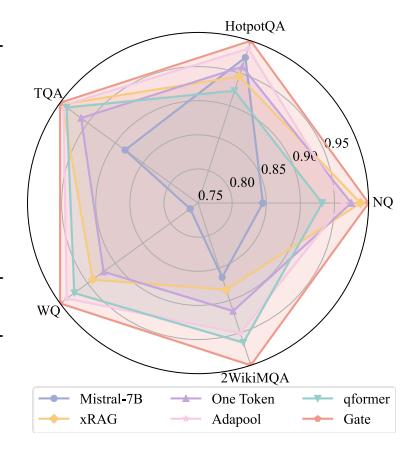
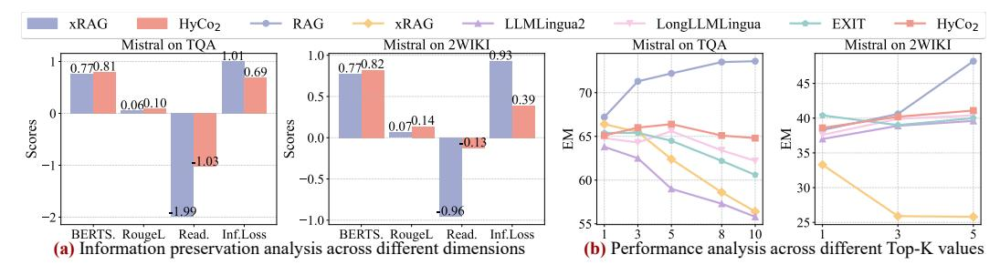

# Beyond Hard and Soft: Hybrid Context Compression for Balancing Local and Global Information Retention

Huanxuan Liao♠♣, Wen Hu♢, Yao Xu♠♣, Shizhu He♠♣∗, Jun Zhao♠♣, Kang Liu♠♣ ♠Institute of Automation, Chinese Academy of Sciences ♣University of Chinese Academy of Sciences ♢Ant Group liaohuanxuan2023@ia.ac.cn

# Abstract

Large Language Models (LLMs) encounter significant challenges in long-sequence inference due to computational inefficiency and redundant processing, driving interest in context compression techniques. Existing methods often rely on token importance to perform hard local compression or encode context into latent representations for soft global compression. However, the uneven distribution of textual content relevance and the diversity of demands for user instructions mean these approaches frequently lead to the loss of potentially valuable information. To address this, we propose Hybrid Context Compression (HyCo2) for LLMs, which integrates both global and local perspectives to guide context compression while retaining both the essential semantics and critical details for task completion. Specifically, we employ a hybrid adapter to refine global semantics with the global view, based on the observation that different adapters excel at different tasks. Then we incorporate a classification layer that assigns a retention probability to each context token based on the local view, determining whether it should be retained or discarded. To foster a balanced integration of global and local compression, we introduce auxiliary paraphrasing and completion pretraining before instruction tuning. This promotes a synergistic integration that emphasizes instruction-relevant information while preserving essential local details, ultimately balancing local and global information retention in context compression. Experiments show that our HyCo2 method significantly enhances long-text reasoning while reducing token usage. It improves the performance of various LLM series by an average of 13.1% across seven knowledge-intensive QA benchmarks. Moreover, HyCo2 matches the performance of uncompressed methods while reducing token consumption by 88.8%. Our code will be available at <https://github.com/Xnhyacinth/HyCo2>.

# 1 Introduction

Large Language Models (LLMs) [\[1,](#page-9-0) [14,](#page-9-1) [67\]](#page-13-0) demonstrate strong performance across diverse real-world tasks, particularly those requiring the processing of extensive text inputs [\[43\]](#page-11-0), such as documents and literature [\[12,](#page-9-2) [66,](#page-13-1) [70\]](#page-13-2). Handling extended context is essential for advanced applications like retrieval-augmented generation (RAG) [\[19,](#page-10-0) [73\]](#page-13-3), long-term memory systems [\[21,](#page-10-1) [59\]](#page-12-0), and complex reasoning frameworks [\[39,](#page-11-1) [41\]](#page-11-2). However, supporting such capabilities often requires processing prompts (including instruction, documents, examples, thought process, etc.) containing tens of thousands of tokens [\[40\]](#page-11-3), which presents significant challenges. Primarily, the quadratic complexity of the attention mechanism [\[65\]](#page-13-4) leads to escalating computational and financial costs. It also weakens the model's capacity to provide relevant information when addressing specific tasks, particularly in the presence of noisy or overly lengthy inputs [\[44,](#page-11-4) [56,](#page-12-1) [64\]](#page-13-5). Furthermore, LLM architectures typically enforce strict context window limitations, imposing explicit upper bounds on input size.

∗Corresponding author

> **[图片提取文字 (无描述)]:**
> Original **Hard Compress Soft Compress Hybrid Compress**  $HyCo_2$ xRAGLLMLingua AutoCom. LLM LLM Selective **ICAE** Selection-p UniICL LLM LLM Hybrid Adapter MLP Classfic Layer LLM / SLM / LoRA LLM (LoRA) / MLP **Embedding Model** LLM LLM Local Details Global Semantics Inference Cost Embedding Context Instruction Trainable Compressed Token Frozen

Figure 1: Different paradigms for processing long-text inputs: (a) original input, (b) hard compression, (c) soft compression and (d) our hybrid compression. We categorize representative methods under each paradigm and evaluate them based on three criteria: local details (whether retains important local details), global semantics (whether facilitates understanding of overall context), and inference cost (whether reduces memory usage and inference latency).

Context compression alleviates the difficulties of processing long contexts and reduces computational demands by selectively preserving critical information from extensive texts [\[5,](#page-9-3) [36\]](#page-11-5). However, retaining sufficient information in long-context scenarios remains a substantial challenge. As shown in Figure [2](#page-3-0) and Appendix [A,](#page-13-6) the *George Rankin* example highlights the importance of preserving both global semantics (distinguishing two individuals) and local details like names and roles (Sir George Claus Rankin, a British judge vs. Major General George James Rankin, an Australian soldier and politician). Losing either compromises the quality of reasoning and downstream task performance. Therefore, achieving a balance among several critical information remains a key challenge: (1) Local Detail Preservation, which requires accurately retaining important information units without introducing redundancy; (2) Global Semantic Completeness, demanding the compressed text capture the core meaning, maintain contextual coherence, and avoid omitting critical semantics; and (3) Inference Efficiency, requiring minimizing computational resources while maintaining high information density.

Current context compression research primarily focuses on hard compression and soft compression, each involving inherent trade-offs among efficiency, detail, and semantic preservation (Figure [1\)](#page-1-0). Hard compression selects natural language segments based on metrics like logits or perplexity [\[26,](#page-10-2) [35,](#page-11-6) [48\]](#page-12-2), but often sacrifices fluency, coherence, and the handling of removed context [\[52,](#page-12-3) [55\]](#page-12-4), while its reliance on chunking increases time complexity [\[9,](#page-9-4) [27,](#page-10-3) [71\]](#page-13-7). Conversely, soft compression encodes text into dense latent representations for higher compression rates and scalability [\[8,](#page-9-5) [47,](#page-12-5) [74\]](#page-13-8). However, this approach disrupts sequential structure, neglects local details, reduces interpretability, and complicates information tracing [\[12,](#page-9-2) [33\]](#page-11-7). Given these limitations, a key research question arises: *Can we combine the specificity of explicit tokens with the abstraction of latent representations to achieve a balance between local detail and global information retention in context compression?*

To answer the above question, we propose Hybrid Context Compression (HyCo2) to achieve effective information retention from both global and local perspectives. As shown in Figure [1](#page-1-0) right, drawing inspiration from how humans process information from a coarse global understanding to fine local details, HyCo2 employs a dual-level compression framework designed to retain both global semantics and local details. Global Compression leverages a hybrid adapter, combining the strengths of MLPs [\[42\]](#page-11-8), Q-Former [\[34\]](#page-11-9), and Resampler [\[2\]](#page-9-6), which captures overarching contextual information through joint local and global attention mechanisms: *Local attention* segments the input context into groups and compresses each group into a single token, maintaining structural coherence and emphasizing subregions. *Global attention* utilizes learnable tokens that interact with both the instruction and the entire context to extract key global semantics. Local Compression employs an auxiliary classification layer trained to identify and retain critical tokens [\[10\]](#page-9-7), ensuring fine-grained details necessary for accurate reasoning are preserved. The outputs of local and global attention are then softly fused, producing a rich, instruction-aware representation that is subsequently passed to the frozen LLM.

At the same time, we find that it is challenging to train the global and local compression simultaneously. To fully leverage HyCo2's potential, we propose pretraining the global and the local compression module using paraphrase and completion tasks respectively before instruction tuning. This alternating training strategy enables effective learning and utilization of both global and local representations. Extensive empirical studies validate the effectiveness of our HyCo2. Remarkably, our approach achieves leading performance across various models on 7 datasets with significantly fewer costs, even matching the performance of the original context. Our main contributions are listed as follows:

- We propose HyCo2, a hybrid context compression method for LLMs that balances hard and soft compression using a dual-level compression strategy. HyCo2 effectively reduces computational costs while enabling efficient understanding of long context.
- HyCo2 is designed for minimal parameter updates without relying on additional compressors or external embedding models, which ensures that both the training and inference are lightweight.
- We propose an alternating pretraining strategy for global and local compression modules using paraphrase and completion tasks respectively to further enhance the effectiveness of HyCo2.
- Extensive experiments on multiple benchmarks show that HyCo2 achieves superior performance compared to existing methods with significantly lower computational overhead, thereby offering valuable insights into designing effective hybrid context compression strategies for LLMs.

# 2 Related Work

Context compression aims to reduce the input length of LLMs while preserving essential information. Existing methods typically fall into two paradigms: *hard compression* and *soft compression*.

Hard compression acts as a filtering mechanism, reducing input length by retaining natural language tokens or paraphrasing text while aiming to preserve task-relevant information [\[22\]](#page-10-4). However, this approach can lead to reduced fluency, grammatical errors, and limited generalizability across LLMs with varying embedding configurations. Hard compression methods typically fall into two categories: Filtering methods such as SelectiveContext [\[35\]](#page-11-6) and LLMLingua [\[26\]](#page-10-2), use metrics like self-information or external language models to identify and remove low-utility tokens. While effective in basic scenarios, they may lack syntactic robustness and cross-model compatibility. Advanced variants like LongLLMLingua [\[27\]](#page-10-3) and RL-driven TACO-RL [\[55\]](#page-12-4) extend filtering to long contexts and task-specific optimization. Paraphrasing approaches like Nano-Capsulator [\[9\]](#page-9-4) employ fine-tuned models to generate concise rephrased prompts. While achieving condensation, these methods generally incur higher computational costs for the generation process [\[38\]](#page-11-10).

Soft compression encodes context into compact continuous representations (e.g., embeddings or K-V pairs) to reduce computational costs and preserve task performance. These methods achieve higher compression rates and scalability than hard compression by discarding natural language structure. However, this often leads to substantial information loss, structural disruption, neglected local details, reduced interpretability, and complicated information tracing [\[12,](#page-9-2) [33\]](#page-11-7). Architecturally, soft compression approaches vary, including methods based on contrastive conditioning [\[62\]](#page-12-6), attention modification like GIST tokens [\[47\]](#page-12-5), recursive compression such as AutoCompressor [\[8\]](#page-9-5), and memory slot encoding (e.g., ICAE [\[16\]](#page-10-5), 500xCompressor [\[37\]](#page-11-11)). Inspired by multimodal techniques, some methods (e.g., xRAG [\[7\]](#page-9-8), UniICL [\[15\]](#page-9-9)) use MLPs to project the final token embeddings, which often results in significant information loss. Furthermore, methods like xRAG require loading additional embedding models, increasing memory overhead [\[24,](#page-10-6) [36\]](#page-11-5). To address the limitations inherent in purely soft methods, particularly the loss of local detail and interpretability, our approach integrates hard compression. Unlike a recent soft-only hybrid method [\[45\]](#page-11-12), our method (HyCo2) preserves critical local details and textual structure. By leveraging instruction-aware grouped pooling and Q-Former mechanisms for soft fusion, our approach enhances the preservation of global semantics and instruction-relevant information. Crucially, HyCo2 maintains high efficiency and scalability by introducing only a small number of additional parameters , avoiding the need for extra models.

# 3 Methodology

This section begins with an overview of foundational concepts in LLM-based context compression (Section [3.1\)](#page-3-1). We then detail our Hybrid Context Compression framework (Section [3.2\)](#page-3-2), which inte-

> **[图片提取文字 (无描述)]:**
> He is a politician. (1) Paraphrase Pretraining Decoder LLM  $L_{nll}$ Context Hybrid output George Claus ... Adapter Global Compressed Tokens Local Compressed Tokens Instruction Instruction Concat Paraphrase the text Hybrid Adapter (2) Completion Pretraining Instruction instruction **Attention** Classfic mask: Global Local Lall Split : Laver Context Attention Attention output Hybrid 📆 George Claus . Adapter Classfic Instruction Concat Write next context Pool Laver Learnable Tokens Group Tokens (3) Instruction Tuning Tokens RAG Distribution Our Distribution Local MLP Global QFormer Router Instruction What is George... Encoder LLM Concat Classfic Context Layer Instruction Context George Claus Rankin Sir George Claus Rankin PC (12 August 1877 output Hybrid George Claus ... \u2013 8 April 1946) was a British judge in India... George Rankin What is George Adapter Rankin's occupation? Major General George James Rankin, (1 May 1887 \u2013 28  $L_{nH}$ December 1957) was an Australian soldier and politician. He Instruction Concat served in both the House of Representatives ... Answer What is George... (a) Framework of Proposed HyCo, (b) Three Stage Training for Compression

Figure 2: (a) **Hybrid Context Compression Framework.** We employ a classification layer for local tokens selection and use a hybrid adapter to extract instruction-relevant representation. Additionally, a router optimizes the global context through soft integration, thereby optimizing overall context representation. (b) **Alternating Training Method.** (1) Refining the hybrid adapter with paraphrase pretraining, (2) optimizing the classification layer with completion pretraining and (3) instruction tuning for both the hybrid adapter and the classification layer.

grates global context refinement through a soft mixture-of-experts (MoE) mechanism, complemented by a classification layer to address hard compression of local features. Section 3.3 introduces an alternating training strategy to align compressed textual representations with the LLM's semantic space. Figure 2 shows the model architecture and training workflow of the proposed methodology.

### 3.1 Preliminaries

Context compression aims to reduce the length of input context while preserving its functional utility in guiding LLMs to perform downstream tasks effectively. This is particularly important as the complexity of tasks increases, necessitating longer context that can lead to higher memory usage and slower inference speeds. Formally, given a context represented as a sequence of tokens  $\mathbf{x} = (x_1, x_2, \dots, x_N)$ , where  $N = |\mathbf{x}|$  denotes the sequence length, the objective of context compression is to identify a shorter sequence  $\hat{\mathbf{x}}$  such that:

$$\min_{\hat{\boldsymbol{x}}} \mathcal{D}(f(\cdot|\boldsymbol{x}), f(\cdot|\hat{\boldsymbol{x}})), \quad \text{s.t. } |\hat{\boldsymbol{x}}| \le |\boldsymbol{x}|$$
 (1)

where  $f(\cdot|x)$  represents the conditional distribution over the original context x,  $f(\cdot|\hat{x})$  represents the conditional distribution over the compressed context  $\hat{x}$ , and  $\mathcal{D}$  is a divergence metric (e.g., Kullback-Leibler divergence) that quantifies the difference between the two distributions. The goal is to minimize  $\mathcal{D}$ , ensuring that the compressed  $\hat{x}$  retains essential information from the original x.

### 3.2 Hybrid Context Compression

Human cognition processes inputs holistically, prioritizing integrated perception before attending to granular details. Inspired by this mechanism, we propose a hybrid context compression framework that unifies hard compressed local features (capturing fine-grained textual variations) with soft gated global semantics (encoding high-level contextual understanding).

Why Soft Mixture of Experts? Our methodology is informed by empirical insights consistent with prior multimodal research: while Query Transformer (QFormer) 2 offer superior flexibility and expressive power for contextual compression compared to multilayer perceptrons (MLPs), they demand meticulous hyperparameter optimization to match the performance of structurally simpler MLPs. As shown in Figure 3, substituting MLPs (Adapool) with QFormer under fixed query tokens constraints leads to marked performance degradation across most tasks.

&lt;sup>2In this context, the abbreviation 'QFormer' refers to query former, where we utilize learnable query embeddings as described in previous works [45, 72], rather than employing the QFormer [34] approach.

This suggests that a simpler structure may facilitate more effective assimilation of compressed context by LLMs. However, in specific tasks, such as multi-document reasoning on 2WIKI, the QFormer demonstrates an advantage. Through learnable query tokens and attention mechanisms, it can dynamically prioritize task-relevant features, thereby enhancing context awareness and reasoning capabilities. Notably, even employing a single learnable token (One Token) can yield performance comparable to the xRAG [7], which demonstrates that single token projection with MLPs causes severe information loss, particularly in reasoning tasks. These observations underscore the inherent limitations of relying on a single compression mechanism and motivate the investigation of hybrid approaches for more effective refinement of semantic representations.

# **Soft Global Context Refinement within Hybrid Adapter.** Building on the insights from our analysis, we propose a novel method that optimizes global semantics by synergistically leveraging the strengths of MLPs and QFormer. Specifically, we employ a noisy mixture-of-experts (MoE) framework to unify

> **[图片提取文字 (无描述)]:**
> HotpotQA TQA 0.95 0.90 0.85 0.80 0.75 NQ WQ 2WikiMQA qformer Mistral-7B One Token xRAG Adapool Gate

Figure 3: Significance of Soft MoE. The reported values represent the performance ratio of baselines to the best one: Gate.

these two architectural paradigms [72]. In this framework, for feature  $\mathbf{V} \in \mathbb{R}^{S \times D}$  derived from Encoder (i.e., final hidden states of Encoder), where S denotes the input length and D the embedding dimension, a learned gating network  $\mathcal{G}$  dynamically determines the fusion weights for the two adapters:  $\mathcal{G}(\mathbf{V})_0 \cdot f_m(\mathbf{V}) + \mathcal{G}(\mathbf{V})_1 \cdot f_q(\mathbf{V})$ , where  $f_m(\cdot)$  and  $f_q(\cdot)$  denote the MLPs and QFormer branches, respectively. We inject learnable noise during training to mitigate the gating network's tendency to favor a single adapter disproportionately. This is formalized with a standard normal distribution  $\mathcal{N}(0,1)$ , router weight matrix  $\mathbf{W}_g$  and noise weight matrix  $\mathbf{W}_{\text{noise}}$ :

$$\mathcal{G}(\mathbf{V}) = \operatorname{Softmax} \left( \left\{ (\mathbf{V} \cdot \mathbf{W}_g)_i + \mathcal{N}(0, 1) \cdot \operatorname{Softplus} \left( \mathbf{V} \cdot \mathbf{W}_{\operatorname{noise}} \right)_i \right\}_{i=1}^2 \right)$$
(2)

To enhance instruction awareness, we integrate cross-attention mechanisms with instruction embedding C into both the MLP  $(f_m(\cdot))$  and QFormer  $(f_q(\cdot))$  branches. For local attention in the MLP branch, we first segment the input features into  $\boldsymbol{n}$  distinct groups, where  $\boldsymbol{n}$  corresponds to the number of learnable tokens in the QFormer. Each group  $\boldsymbol{V^i}$  (where  $0 \le i < n$ ) contains  $\lceil S/n \rceil$  tokens, which are condensed through average pooling into a single representative token  $\boldsymbol{V_p^i}$  for instruction interaction. Then the local attention within each group is defined as follows:

$$f_m(\mathbf{V}) = \bigoplus_{i=0}^{n-1} \text{MLP}(\text{Attn}(\underbrace{\text{CrossAttn}(\mathbf{V}_p^i, \mathbf{C})}_{\text{Query}}, \underbrace{\mathbf{V}^i}_{\text{Key}}, \underbrace{\mathbf{V}^i}_{\text{Value}}))$$
(3)

where  $\mathrm{Attn}(\cdot)$  denotes the standard attention mechanism, parameterized by query, key, and value matrices, while  $\mathrm{CrossAttn}(\cdot)$  denotes instruction-context fusion. While local attention mechanisms preserve textual structure by restricting focus to localized sub-regions, this approach risks incorporating instructionally irrelevant content within partitioned regions. To mitigate this limitation, we employ the QFormer to dynamically identify and emphasize portions of the context most critical to the given instruction. Specifically, we introduce a learnable token set  $\mathbf{L} \in \mathbb{R}^{N_L \times D}$ , where  $N_L$  denotes the token count. This token set interacts with the instruction embedding  $\mathbf{C}$  through cross-attention, augmented by positional embeddings  $\mathrm{Pos}(\cdot)$ . The resulting global attention is computed as:

$$f_q(\mathbf{V}) = \text{Attn}\left(\text{CrossAttn}(\mathbf{L}, \mathbf{C}), \mathbf{V} + \text{Pos}(\mathbf{V}), \mathbf{V}\right)$$
 (4)

Hard Selective Local Context Mining through Classification Layer. The information content of each token  $x_i$  is quantified by a retention probability  $p_i \in [0,1]$ , with higher values indicating greater significance. Consistent with previous research [10], we avoid designing a separate deep network for this estimation. Instead, we leverage the feature  $V = \{v_1, v_2, \dots, v_n\}$ , where  $v_i$  corresponds to the token  $x_i$ . A linear projection layer processes these feature to compute the vector of retention probabilities  $p = [p_1, \dots, p_n]$  via  $p = \sigma(\mathbf{W}V + b)$ , where  $\sigma$  represents the Sigmoid function, ensuring outputs lie within [0,1]. W and b are the linear layer's weight matrix and bias vector, respectively, which are learned parameters mapping feature to probabilities. Based on a target compression ratio (e.g., keeping the Top-k%), tokens associated with the highest  $p_i$  values are retained. Furthermore, the generation of p can be integrated into a single forward pass shared with the previously described global compression strategy, thereby reducing computational overhead.

### 3.3 Alternating Training Strategy

We designed a three-stage training strategy for the classification layer and hybrid adapter (Figure [2](#page-3-0) (b)), motivated by challenges in achieving optimal convergence when training both simultaneously (akin to a bilinear problem [\[72\]](#page-13-9)). Stage 1: The hybrid adapter is pre-trained via a paraphrase task to reconstruct context using G(V ) by minimizing the negative log-likelihood loss Lnll. Stage 2: With the hybrid adapter frozen, the local compression classification layer undergoes further pre-training using a completion task, also optimizing Lnll. Stage 3: Global and local compression are fine-tuned together with instruction tuning, balancing interaction for better information preservation. This involves minimizing both language modeling loss Lnll and a KL divergence term Lkl (Equation [1\)](#page-3-4) against a teacher RAG paradigm on a hybrid open-source dataset. The final loss is the linear combination controlled by a hyperparameter: Lnll + αLkl. We observed experimentally that single-stage training of the adapter and local compression yields inferior results, likely because the model prioritizes learning easier global features. Therefore, training the local compression components is restricted to Stage 2, enforcing a sequence of feature projection followed by local compression. The detailed training strategy and modeling objectives are provided in Appendix [B.](#page-14-0)

# 4 Experiments

# 4.1 Experimental Setup

Datasets. We follow the settings of [\[7\]](#page-9-8), utilizing 17 datasets from reading comprehension, summarization, and open-domain QA for instruction tuning. The retrieval corpus is based on the December 2021 Wikipedia dump, with Contriever [\[23\]](#page-10-7) as the default retriever. By default, the instruction tuning stage uses the *top-5* retrieved documents, while the downstream evaluation phase uses the *top-3*. For completion pertaining (Stage 2), we use the "2023-06" snapshot from RedPajama-Data-V2 [\[61\]](#page-12-7). We evaluate our method on 7 QA datasets, including 5 open-domain QA datasets: NaturalQuestions (NQ) [\[32\]](#page-11-13), TriviaQA (TQA) [\[30\]](#page-11-14), WebQuestions (WQ) [\[4\]](#page-9-10), PopQA (PQA) [\[46\]](#page-12-8), and ComplexWebQuestions (CWQ) [\[57\]](#page-12-9), which cover a broad range of topics, as well as 2 multi-hop QA datasets: HotpotQA (HQA) [\[69\]](#page-13-10) and 2WikiMultihopQA (2WIKI) [\[20\]](#page-10-8), which require multi-step reasoning for answer generation. In line with prior work, we use the Exact Match (EM) metric to assess performance. We provide detailed information about these datasets in the Appendix [C.1.](#page-15-0)

Implementation Details. Evaluations of HyCo2 are conducted using LLaMA3.1-8B-Instruct [\[14\]](#page-9-1), Qwen2.5-7B-Instruct [\[67\]](#page-13-0), and Mistral-7B-Instruct-v0.2 [\[25\]](#page-10-9), with the base LLM kept frozen during training. The hybrid adapter and classification layer are randomly initialized. We set the number of query tokens (NL) to 16 and the keeping ratio (k%) to 10% by default. We use the learning rate of 1e-4 at the pretraining stage and 2e-5 in the instruction tuning stage. We train 1 epoch for all stages on 8×NVIDIA A100 GPUs (80GB). More implementation details are in the Appendix [C.2.](#page-16-0)

Baselines. Since the LLM in our method remains frozen, the selected baselines must support plug-and-play functionality without requiring any alteration to the LLM's parameters [\[47,](#page-12-5) [60\]](#page-12-10). Accordingly, we focus on three categories of baselines: 1) Uncompressed : Vanilla: Represents the original LLM, which generates answers directly without utilizing any external information. RAG: Appends the top retrieved documents to the LLM's input prompts, explicitly instructing the model to reference them when generating answers. 2) Hard Compression : TF-IDF: Performs topic-based discrete compression using term frequency-inverse document frequency. LongLLMLingua [\[27\]](#page-10-3) uses LLaMA2-7B-chat for token-level extraction with a 0.4 dynamic compression rate. LLMLingua2 [\[48\]](#page-12-2): A RoBERTa model trained on compressed data distilled from GPT-4. EXIT [\[22\]](#page-10-4): Adaptively classifies and extracts contextually dependent sentences from retrieved documents. Soft Compression : xRAG [\[7\]](#page-9-8): Uses MLPs to project the last token representation of the *top-1* document.

# 4.2 Main Results

We present a comprehensive performance comparison between our proposed method HyCo2 and other state-of-the-art (SOTA) techniques across 7 downstream tasks in Table [1.](#page-6-0) The RAG baseline, which utilizes full retrieved context without compression, significantly improves the average EM compared to the Vanilla non-retrieval setting across all LLMs (e.g., achieving a 31.7% relative improvement for Mistral-7B, 9.5% for LLaMA3.1-8B and 24.9% for Qwen2.5-7B). Among the compression methods

Table 1: Performance comparison between our  $HyCo_2$  and other methods (Uncompressed , Hard and Soft compression) on seven downstream tasks. Percentages in brackets denote the relative improvement over the non-retrieval (Vanilla) setting in average performance (Avg.) and RAG setting in context length. The best results are in **bold** and the <u>underline</u> indicates the dataset is IID. LLMs are frozen during the experiments and retrieved documents are set the same for different methods.

|                    |                          | Addit.            | # Context             | Open-Domain QA (EM↑) |      | Multiho | p QA (EM↑) |      |      |       |                          |
|--------------------|--------------------------|-------------------|-----------------------|----------------------|------|---------|------------|------|------|-------|--------------------------|
|                    | Methods                  | Size $\downarrow$ | Length $\downarrow$   | NQ                   | TQA  | WQ      | PQA        | CWQ  | HQA  | 2WIKI | Avg.                     |
| Mistral-7B-Insv0.2 | Vanilla                  | -                 | 0 (\100%)             | 34.4                 | 59.4 | 42.2    | 21.3       | 48.0 | 26.4 | 36.7  | 38.34 (0.0%)             |
|                    | RAG                      |                   | 466.9 (100%)          | 54.4                 | 71.3 | 45.1    | 67.0       | 45.7 | 29.5 | 40.6  | 50.51 († 31.7%)          |
|                    | TF-IDF                   |                   | 64 (\ 86.3%)          | 34.4                 | 60.6 | 38.8    | 30.7       | 43.3 | 23.0 | 39.6  | 38.63 († 0.8%)           |
| 3-II               | LongLLMLingua [27]       | 7B                | 131.2 (\psi 71.9%)    | 39.5                 | 64.3 | 39.3    | 44.3       | 49.0 | 24.9 | 39.0  | 42.90 († 11.9%)          |
| 1-7                | LLMLingua2 [48]          | 561M              | 114.2 (\psi 75.5%)    | 38.1                 | 62.5 | 41.1    | 43.7       | 45.0 | 25.5 | 38.9  | 42.11 († 9.8%)           |
| stra               | EXIT [22]                | 4B                | 83.7 (\psi 82.0%)     | 41.9                 | 65.4 | 43.0    | 47.3       | 49.0 | 27.2 | 39.9  | 44.81 († 16.8%)          |
| Ξ                  | xRAG [7]                 | 7B + 35M          | <b>3</b> (↓ 99.4%)    | 37.2                 | 65.5 | 43.4    | 39.3       | 47.7 | 22.0 | 25.9  | 40.14 († 4.7%)           |
|                    | HyCo 2 (ours) | 168M              | 50.7 (\psi 89.1%)     | 39.6                 | 66.0 | 45.4    | 45.7       | 50.3 | 27.5 | 40.2  | <b>44.96</b> († 17.3%)   |
|                    | Vanilla                  | -                 | 0 (\100%)             | 38.0                 | 67.0 | 50.6    | 33.0       | 49.0 | 27.7 | 31.9  | 42.46 (0.0%)             |
| Ins.               | RAG                      |                   | 466.9 (100%)          | 52.6                 | 71.0 | 40.4    | 60.3       | 40.0 | 27.3 | 34.0  | 46.51 († 9.5%)           |
| - 8B               | TF-IDF                   |                   | 64 (\ 86.3%)          | 37.0                 | 64.7 | 35.4    | 27.0       | 41.3 | 23.0 | 31.3  | 37.10 (\( \pm 12.6\%)    |
| -1.                | LongLLMLingua [27]       | 7B                | 131.2 (\psi 71.9%)    | 38.1                 | 66.4 | 34.3    | 40.3       | 49.0 | 25.7 | 32.4  | 40.89 (\( \psi 3.7\%)    |
| LLaMA-3.1-8B-Ins.  | LLMLingua2 [48]          | 561M              | 114.2 (\psi 75.5%)    | 37.4                 | 65.2 | 35.8    | 39.7       | 42.0 | 24.9 | 31.5  | 39.50 (\psi 7.0%)        |
| Ψ                  | EXIT [22]                | 4B                | 83.7 (\psi 82.0%)     | 41.5                 | 66.5 | 40.1    | 47.3       | 48.7 | 29.9 | 33.1  | 43.87 († 3.3%)           |
| $\exists$          | xRAG [7]                 | 7B + 35M          | <b>3</b> (↓ 99.4%)    | 35.6                 | 64.8 | 40.0    | 34.7       | 49.0 | 24.1 | 28.1  | 39.47 (\psi 7.0%)        |
|                    | HyCo 2 (ours) | 168M              | 52.1 (\( \psi 88.8\%) | 39.3                 | 67.1 | 40.8    | 46.7       | 49.7 | 30.5 | 33.6  | <b>43.96</b> († 3.5%)    |
|                    | Vanilla                  | -                 | 0 (\100%)             | 29.6                 | 55.1 | 39.1    | 23.7       | 44.7 | 25.5 | 31.2  | 35.56 (0.0%)             |
| Qwen-2.5-7B-Ins.   | RAG                      |                   | 466.9 (100%)          | 51.9                 | 69.6 | 40.9    | 56.0       | 35.7 | 21.3 | 35.5  | 44.41 († 24.9%)          |
|                    | TF-IDF                   | -                 | 64 (\ 86.3%)          | 28.9                 | 56.2 | 35.3    | 11.7       | 37.3 | 20.0 | 31.8  | 31.60 (\( \psi \) 11.1%) |
|                    | LongLLMLingua [27]       | 7B                | 131.2 (\psi 71.9%)    | 33.4                 | 59.8 | 35.3    | 43.7       | 38.7 | 21.3 | 31.7  | 37.70 († 6.0%)           |
|                    | LLMLingua2 [48]          | 561M              | 114.2 (\psi 75.5%)    | 30.9                 | 55.6 | 34.2    | 12.7       | 35.0 | 20.2 | 31.2  | 31.40 (\psi 11.7%)       |
|                    | EXIT [22]                | 4B                | 83.7 (\psi 82.0%)     | 37.2                 | 59.4 | 40.3    | 51.7       | 45.3 | 26.7 | 32.7  | 41.90 († 17.8%)          |
|                    | xRAG [7]                 | 7B + 35M          | <b>3</b> (↓ 99.4%)    | 27.9                 | 53.7 | 39.7    | 23.7       | 46.0 | 23.1 | 27.9  | 34.57 (\psi 2.8%)        |
|                    | HyCo 2 (ours) | 168M              | 53.4 (\psi 88.6%)     | 34.6                 | 60.2 | 43.1    | 50.7       | 46.3 | 26.2 | 33.8  | <b>42.11</b> († 18.4%)   |

evaluated, our proposed HyCo2 consistently achieves the highest average EM score across all three language models, demonstrating superior effectiveness in retaining relevant information compared to other techniques like EXIT and xRAG. Notably, HyCo2 requires only 168M parameters for the additional model components during inference (excluding the reader LLM), significantly lower than xRAG's 7B and EXIT's 4B. HyCo2 also drastically reduces token usage by an average reduction of 88.8% while maintaining strong performance. In some instances, HyCo2 either matches or exceeds the performance of the uncompressed method. Specifically, with Mistral-7B, HyCo2 achieves an average EM of 44.96, outperforming EXIT by 0.7% while using 7.1% fewer tokens. For datasets like WQ and CWQ, HyCo2 surpasses the uncompressed RAG 0.7% and 10%, saving 89.1% of tokens. Similar trends are observed with LLaMA3.1 and Qwen2.5.

Our experiments also reveal that for more powerful modern models, such as LLaMA3.1 and Qwen2.5, RAG underperforms compared to vanilla LLMs on certain document understanding tasks (e.g., WQ and CWQ) and multi-hop document reasoning tasks (e.g., HQA). This may be due to these tasks relying heavily on Wikipedia, whose knowledge has already been extensively absorbed during the LLM's pretraining phase, leading to potential conflicts in knowledge. Moreover, some of the retrieved documents may contain outdated or redundant information, which could further reduce performance. This hypothesis is reinforced by the fact that most compression methods outperform RAG. Additionally, HyCo2 addresses the issue of poor multi-document reasoning performance (e.g., HQA and 2WIKI) observed in xRAG's single-token soft compression approach [7].

### 4.3 Analysis

**Information Preservation.** To evaluate the information preservation capabilities, we prompt the target LLM to reconstruct the original context from the compressed representations (prompts refer to the Appendix E). This evaluation focuses specifically on xRAG, excluding hard compression methods, as the latter do not introduce new content and are inherently fully interpretable. We use four metrics BERTScore, Information Loss, ROUGE, and Readability for assessment. Detailed metrics

> **[图片提取文字 (无描述)]:**
> xRAG HyCo2 → RAG → xRAG → LLMLingua2 LongLLMLingua - EXIT - HyCo2 Mistral on TQA Mistral on 2WIKI Mistral on TOA Mistral on 2WIKI 1.0 f 0.770.820.770.81 0.69 45 70 -0.5 0.39 0.060.10 40  $0.07^{0.14}$ Scores ¥ 65 € 0.0 -0.1335 -1.03-0.560 30 --1.99-2 -1.025 BERTS. RougeL Read. Inf.Loss BERTS. RougeL Read. Inf.Los
> 
> (a) Information preservation analysis across different dimensions BERTS. RougeL Read. Inf.Loss (b) Performance analysis across different Top-K values

Figure 4: We employ Mistral-7B to investigate two aspects: (a) a four-dimensional comparison of information preservation between HyCo2 and xRAG following context compression and reconstruction, and (b) the performance trends of various compression methods as context length increases. BERTScore measures semantic similarity, Information Loss measures the entropy value of discarded information, while Readability and ROUGE-L evaluate the quality of the reconstructed context.

calculations are provided in Appendix [C.3.](#page-17-0) As Figure [4](#page-7-0) (a) illustrates, HyCo2 demonstrates superior reconstruction performance compared to xRAG on TQA and 2Wiki. Specifically, we observed an average BERTScore F1 improvement of 0.05, 0.5 lower information loss, and higher scores for both readability and ROUGE-L, which demonstrates that HyCo2, through its combination of global and local mechanisms, effectively retains more information and preserves critical details.

Robustness. To assess the robustness and effectiveness of HyCo2 in handling longer texts, we gradually increase the number of retrieved documents (K ∈ {1, 3, 5, 8, 10}), as shown in Figure [4](#page-7-0) (b). When K ≤ 5 (i.e., text length less than 1k), HyCo2 performs as steadily as the RAG baseline, consistently improving EM scores. In contrast, other compression methods begin to show performance degradation when K ≥ 3. This trend is particularly evident for xRAG, which exhibits optimal performance only with a top-1 document, consistent with the results and settings reported by [\[7\]](#page-9-8). While all compression methods experience performance decline at higher K, HyCo2's degradation is notably slower compared to others. For instance, at K = 10, HyCo2's EM score drops by only 1.2 points, demonstrating superior robustness in handling longer contexts. This underscores the inherent challenges current compression methods face with longer texts, where substantial information loss persists and significant room for improvement remains.

Efficiency and Memory. We utilize *Torch Profiler*[3](#page-7-1) to evaluate the efficiency across different methods on various datasets, measuring CPU time (s), CUDA time (s), computations (GFLOPs), and peak GPU memory usage (GB). All experiments are conducted using Mistral-7B and LLaMA3.1-8B in BFloat16 inference mode on a single A100 GPU, with a batch size of 1 and a fixed output length of 30. As shown in Table [2,](#page-8-0) HyCo2 achieves the best performance in terms of CPU time (0.572 s) and CUDA time (0.187 s). It also attains the lowest peak memory usage (14.56 GB), saving approximately 50% GPU memory compared to xRAG, which is consistent with the additional memory overhead from xRAG's embedding model. In terms of GFLOPs (312.73), HyCo2 outperforms xRAG and LLMLingua2, while remaining significantly more efficient than EXIT. Notably, although xRAG has the lowest GFLOPs, it exhibited the highest memory consumption. In contrast, EXIT incurres the highest computational and time costs among all methods.

# 4.4 Ablation Studies

Components Analysis. Table [3](#page-8-1) presents a comprehensive analysis of the effectiveness of various components within HyCo2. Removing the instruction-conditioned cross-attention leads to a notable drop in performance, highlighting that instructions provide valuable guidance for the compressor to identify key information for QA. Regarding loss functions, Lkl (self-distillation) outperforms Lnll (language modeling), as it better aligns the compressor with richer teacher representations and facilitates the learning of more salient features. Additionally, both the pretraining and instruction tuning stages are essential, each contributing substantially to overall performance and validating the effectiveness of the proposed training strategy.

3<https://docs.pytorch.org/docs/stable/profiler.html>

methods about efficiency and memory usage.

| Method                        | CPU Time (s) | CUDA Time (s) | GFLOPs  | Peak Mem. (GB) |  |  |
|-------------------------------|-----------------|------------------|---------|-------------------|--|--|
| Mistral-7B-Instr              | uct-v0.2 on TQA |                  |         |                   |  |  |
| xRAG                          | 0.716           | 0.249            | 253.25  | 27.05             |  |  |
| LLMLingua2                    | 1.037           | 0.418            | 264.77  | 16.60             |  |  |
| EXIT                          | 2.495           | 0.820            | 1624.37 | 20.43             |  |  |
| HyCo 2 (ours)      | 0.572           | 0.187            | 312.73  | 14.56             |  |  |
| Mistral-7B-Instr              | uct-v0.2 on 2WI | KI               |         |                   |  |  |
| xRAG                          | 0.787           | 0.252            | 181.89  | 27.06             |  |  |
| LLMLingua2                    | 1.031           | 0.408            | 192.58  | 16.60             |  |  |
| EXIT                          | 1.639           | 0.626            | 1142.99 | 20.41             |  |  |
| HyCo 2 (ours)      | 0.672           | 0.197            | 228.50  | 14.78             |  |  |
| LLaMA3.1-8B-Instruct on TQA   |                 |                  |         |                   |  |  |
| xRAG                          | 0.591           | 0.248            | 251.99  | 28.52             |  |  |
| LLMLingua2                    | 0.656           | 0.178            | 242.95  | 18.50             |  |  |
| EXIT                          | 1.456           | 0.665            | 1602.54 | 21.90             |  |  |
| HyCo 2 (ours)      | 0.324           | 0.136            | 288.05  | 16.92             |  |  |
| LLaMA3.1-8B-Instruct on 2WIKI |                 |                  |         |                   |  |  |
| xRAG                          | 0.575           | 0.228            | 180.02  | 28.53             |  |  |
| LLMLingua2                    | 0.854           | 0.234            | 188.04  | 18.80             |  |  |
| EXIT                          | 0.916           | 0.395            | 962.47  | 21.88             |  |  |
| HyCo 2 (ours)      | 0.334           | 0.126            | 211.53  | 17.38             |  |  |

Table 2: Comparison of context compression Table 3: Results of Ablation Studies. The row with a gray background indicates our default setting. The backbone model is Mistral-7B.

| Method                           | NQ                  | TQA          | HQA         | 2WIKI       |  |  |
|----------------------------------|---------------------|--------------|-------------|-------------|--|--|
| HyCo 2                | 39.6                | 66.0         | 27.5        | 40.2        |  |  |
| w/o Ins.                         | 38.8 (-0.8)         | 65.5 (-0.5)  | 26.1 (-1.4) | 38.6 (-1.6) |  |  |
| w/o $\mathcal{L}_{\mathrm{nll}}$ | 37.7 (-1.9)         | 63.9 (-2.1)  | 26.7 (-0.8) | 41.4 (+1.2) |  |  |
| w/o $\mathcal{L}_{kl}$           | 35.2 (-4.4)         | 62.6 (-3.4)  | 26.4 (-1.1) | 38.8 (-1.4) |  |  |
| w/o Pretrain                     | 34.2 (-5.4)         | 59.4 (-6.6)  | 25.0 (-2.5) | 38.2 (-2.0) |  |  |
| w/o Finetune                     | 33.1 (-6.5)         | 60.7 (-5.3)  | 25.6 (-1.9) | 39.4 (-0.8) |  |  |
| Query Type                       |                     |              |             |             |  |  |
| One Token                        | 33.5 (-6.1)         | 60.0 (-6.0)  | 25.4 (-2.1) | 37.1 (-3.1) |  |  |
| AdaPool                          | 36.4 (-3.2)         | 63.0 (-3.0)  | 28.0 (+0.5) | 38.9 (-1.3) |  |  |
| QFormer                          | 34.7 (-4.9)         | 63.9 (-2.1)  | 26.8 (-0.7) | 37.7 (-2.5) |  |  |
| Hybrid                           | 39.6                | 66.0         | 27.5        | 40.2        |  |  |
| Training strateg                 | Training strategies |              |             |             |  |  |
| E2E                              | 36.8 (-2.8)         | 62.8 (-3.2)  | 26.4 (-1.1) | 38.3 (-1.9) |  |  |
| w/o Stage 2                      | 36.3 (-3.3)         | 62.0 (-4.0)  | 25.6 (-1.9) | 37.8 (-2.4) |  |  |
| w/o Global                       | 29.7 (-9.9)         | 55.7 (-10.3) | 22.4 (-5.1) | 35.0 (-5.2) |  |  |
| w/o Local                        | 33.6 (-6.0)         | 60.5 (-5.5)  | 24.8 (-2.7) | 37.9 (-2.3) |  |  |
| Alternating                      | 39.6                | 66.0         | 27.5        | 40.2        |  |  |
| w/o Stage 2                      | 37.8 (-1.8)         | 64.1 (-1.9)  | 27.1 (-0.4) | 39.3 (-0.9) |  |  |
| w/o Global                       | 33.2 (-6.4)         | 58.8 (-7.2)  | 24.7 (-2.8) | 37.3 (-2.9) |  |  |
| w/o Local                        | 35.4 (-4.2)         | 63.6 (-2.4)  | 26.6 (-0.9) | 38.9 (-1.3) |  |  |

Effects of Hybrid Adapter for Global Compression. Learnable queries are commonly used in query-based Transformers to extract salient information, whereas pooling-based projections aim to uniformly preserve information across input segments. We compared HyCo2 with baseline variants incorporating these representation strategies: learnable query tokens (QFormer), pooling projection (AdaPool), and a single learnable token (One Token). The results are shown in Table 3 (Query Type section). Compared to a single learnable token, pooling projection demonstrates superior capacity for information retention and downstream inference. Although QFormer offers a theoretical advantage in facilitating instruction interaction, its practical performance was suboptimal. Our results suggest that combining pooling and learnable queries leads to further performance gains [72].

**Impact of Alternating Training.** We further investigate the impact of the alternating training strategy on model performance. We first compare the alternating training strategy against direct end-to-end (E2E) training, observing a notable average performance drop of 2%. Building on this, omitting Stage 2 pretraining leads to further performance degradation, indicating that pretraining the local compression module is essential for learning token importance effectively. To better understand this discrepancy, we conduct ablation experiments isolating global and local compression components. Training only the local compression module results in poor performance under both E2E and alternating settings, likely due to the severe semantic loss caused by retaining only 10% of the context. In contrast, using only the global compression module yielded relatively better results, underscoring the importance of capturing global semantics during compression. These findings collectively highlight the necessity and effectiveness of the alternating training strategy.

### Conclusion 5

In this paper, we introduce HyCo2 (Hybrid Context Compression), a novel approach for balancing local and global information retention in large language models (LLMs). HyCo2 addresses the significant challenges of long-context inference, such as computational inefficiency and redundant processing of extended input sequences. By integrating both hard compression (retaining fine-grained local details) and soft compression (capturing high-level global semantics), HyCo2 achieves a harmonious trade-off between preserving instruction-relevant content and reducing token consumption. Moreover, we use an alternating training strategy that pretrains the global and local compression modules using paraphrasing and completion tasks, respectively, followed by instruction tuning to align with downstream tasks. Our experimental results demonstrate that HyCo2 significantly enhances performance across various knowledge-intensive tasks, including open-domain question answering and multi-hop reasoning. HyCo2 represents a significant step forward in context compression for LLMs, offering a hybrid, lightweight, efficient, and effective solution for long-text reasoning.

# References

- [1] Josh Achiam, Steven Adler, Sandhini Agarwal, Lama Ahmad, Ilge Akkaya, Florencia Leoni Aleman, Diogo Almeida, Janko Altenschmidt, Sam Altman, Shyamal Anadkat, et al. Gpt-4 technical report. *arXiv preprint arXiv:2303.08774*, 2023.
- [2] Jean-Baptiste Alayrac, Jeff Donahue, Pauline Luc, Antoine Miech, Iain Barr, Yana Hasson, Karel Lenc, Arthur Mensch, Katherine Millican, Malcolm Reynolds, et al. Flamingo: a visual language model for few-shot learning. *Advances in neural information processing systems*, 35:23716–23736, 2022.
- [3] Payal Bajaj, Daniel Campos, Nick Craswell, Li Deng, Jianfeng Gao, Xiaodong Liu, Rangan Majumder, Andrew McNamara, Bhaskar Mitra, Tri Nguyen, Mir Rosenberg, Xia Song, Alina Stoica, Saurabh Tiwary, and Tong Wang. Ms marco: A human generated machine reading comprehension dataset, 2018.
- [4] Jonathan Berant, Andrew Chou, Roy Frostig, and Percy Liang. Semantic parsing on freebase from question-answer pairs. In *Proceedings of the 2013 conference on empirical methods in natural language processing*, pages 1533–1544, 2013.
- [5] Kaiyan Chang, Songcheng Xu, Chenglong Wang, Yingfeng Luo, Xiaoqian Liu, Tong Xiao, and Jingbo Zhu. Efficient prompting methods for large language models: A survey. *arXiv preprint arXiv:2404.01077*, 2024.
- [6] Yulong Chen, Yang Liu, Liang Chen, and Yue Zhang. Dialogsum: A real-life scenario dialogue summarization dataset, 2021.
- [7] Xin Cheng, Xun Wang, Xingxing Zhang, Tao Ge, Si-Qing Chen, Furu Wei, Huishuai Zhang, and Dongyan Zhao. xrag: Extreme context compression for retrieval-augmented generation with one token. *arXiv preprint arXiv:2405.13792*, 2024.
- [8] Alexis Chevalier, Alexander Wettig, Anirudh Ajith, and Danqi Chen. Adapting language models to compress contexts. In *Proceedings of the 2023 Conference on Empirical Methods in Natural Language Processing*, pages 3829–3846, 2023.
- [9] Yu-Neng Chuang, Tianwei Xing, Chia-Yuan Chang, Zirui Liu, Xun Chen, and Xia Hu. Learning to compress prompt in natural language formats. In *Proceedings of the 2024 Conference of the North American Chapter of the Association for Computational Linguistics: Human Language Technologies (Volume 1: Long Papers)*, pages 7749–7760, 2024.
- [10] Tsz Ting Chung, Leyang Cui, Lemao Liu, Xinting Huang, Shuming Shi, and Dit-Yan Yeung. Selection-p: Self-supervised task-agnostic prompt compression for faithfulness and transferability. In *Findings of the Association for Computational Linguistics: EMNLP 2024*, pages 11057–11070, 2024.
- [11] Chengwei Dai, Kun Li, Wei Zhou, and Songlin Hu. Improve student's reasoning generalizability through cascading decomposed cots distillation. *arXiv preprint arXiv:2405.19842*, 2024.
- [12] Chenlong Deng, Zhisong Zhang, Kelong Mao, Shuaiyi Li, Xinting Huang, Dong Yu, and Zhicheng Dou. A silver bullet or a compromise for full attention? a comprehensive study of gist token-based context compression. *arXiv preprint arXiv:2412.17483*, 2024.
- [13] Dheeru Dua, Yizhong Wang, Pradeep Dasigi, Gabriel Stanovsky, Sameer Singh, and Matt Gardner. Drop: A reading comprehension benchmark requiring discrete reasoning over paragraphs, 2019.
- [14] Abhimanyu Dubey, Abhinav Jauhri, Abhinav Pandey, Abhishek Kadian, Ahmad Al-Dahle, Aiesha Letman, Akhil Mathur, Alan Schelten, Amy Yang, Angela Fan, Anirudh Goyal, Anthony S. Hartshorn, Aobo Yang, Archi Mitra, Archie Sravankumar, Artem Korenev, Arthur Hinsvark, Arun Rao, Aston Zhang, and et al. The llama 3 herd of models. *ArXiv*, abs/2407.21783, 2024.
- [15] Jun Gao, Ziqiang Cao, and Wenjie Li. Unifying demonstration selection and compression for in-context learning. *arXiv preprint arXiv:2405.17062*, 2024.

- [16] Tao Ge, Jing Hu, Lei Wang, Xun Wang, Si-Qing Chen, and Furu Wei. In-context autoencoder for context compression in a large language model. *arXiv preprint arXiv:2307.06945*, 2023.
- [17] Tao Ge, Jing Hu, Lei Wang, Xun Wang, Si-Qing Chen, and Furu Wei. In-context autoencoder for context compression in a large language model, 2023.
- [18] Bogdan Gliwa, Iwona Mochol, Maciej Biesek, and Aleksander Wawer. Samsum corpus: A human-annotated dialogue dataset for abstractive summarization. In *Proceedings of the 2nd Workshop on New Frontiers in Summarization*. Association for Computational Linguistics, 2019.
- [19] Bernal Jiménez Gutiérrez, Yiheng Shu, Yu Gu, Michihiro Yasunaga, and Yu Su. Hipporag: Neurobiologically inspired long-term memory for large language models. In *The Thirty-eighth Annual Conference on Neural Information Processing Systems*, 2024.
- [20] Xanh Ho, Anh-Khoa Duong Nguyen, Saku Sugawara, and Akiko Aizawa. Constructing a multi-hop qa dataset for comprehensive evaluation of reasoning steps. In *Proceedings of the 28th International Conference on Computational Linguistics*, pages 6609–6625, 2020.
- [21] Mengkang Hu, Tianxing Chen, Qiguang Chen, Yao Mu, Wenqi Shao, and Ping Luo. Hiagent: Hierarchical working memory management for solving long-horizon agent tasks with large language model. *arXiv preprint arXiv:2408.09559*, 2024.
- [22] Taeho Hwang, Sukmin Cho, Soyeong Jeong, Hoyun Song, SeungYoon Han, and Jong C Park. Exit: Context-aware extractive compression for enhancing retrieval-augmented generation. *arXiv preprint arXiv:2412.12559*, 2024.
- [23] Gautier Izacard, Mathilde Caron, Lucas Hosseini, Sebastian Riedel, Piotr Bojanowski, Armand Joulin, and Edouard Grave. Unsupervised dense information retrieval with contrastive learning, 2021.
- [24] Siddharth Jha, Lutfi Eren Erdogan, Sehoon Kim, Kurt Keutzer, and Amir Gholami. Characterizing prompt compression methods for long context inference. *arXiv preprint arXiv:2407.08892*, 2024.
- [25] Albert Qiaochu Jiang, Alexandre Sablayrolles, Arthur Mensch, Chris Bamford, Devendra Singh Chaplot, Diego de Las Casas, Florian Bressand, Gianna Lengyel, Guillaume Lample, Lucile Saulnier, L'elio Renard Lavaud, Marie-Anne Lachaux, Pierre Stock, Teven Le Scao, Thibaut Lavril, Thomas Wang, Timothée Lacroix, and William El Sayed. Mistral 7b. *ArXiv*, abs/2310.06825, 2023.
- [26] Huiqiang Jiang, Qianhui Wu, Chin-Yew Lin, Yuqing Yang, and Lili Qiu. Llmlingua: Compressing prompts for accelerated inference of large language models. In *Proceedings of the 2023 Conference on Empirical Methods in Natural Language Processing*, pages 13358–13376, 2023.
- [27] Huiqiang Jiang, Qianhui Wu, Xufang Luo, Dongsheng Li, Chin-Yew Lin, Yuqing Yang, and Lili Qiu. Longllmlingua: Accelerating and enhancing llms in long context scenarios via prompt compression. In *Proceedings of the 62nd Annual Meeting of the Association for Computational Linguistics (Volume 1: Long Papers)*, pages 1658–1677, 2024.
- [28] Kelvin Jiang, Dekun Wu, and Hui Jiang. FreebaseQA: A new factoid QA data set matching triviastyle question-answer pairs with Freebase. In Jill Burstein, Christy Doran, and Thamar Solorio, editors, *Proceedings of the 2019 Conference of the North American Chapter of the Association for Computational Linguistics: Human Language Technologies, Volume 1 (Long and Short Papers)*, pages 318–323, Minneapolis, Minnesota, June 2019. Association for Computational Linguistics.
- [29] Qiao Jin, Bhuwan Dhingra, Zhengping Liu, William Cohen, and Xinghua Lu. PubMedQA: A dataset for biomedical research question answering. In Kentaro Inui, Jing Jiang, Vincent Ng, and Xiaojun Wan, editors, *Proceedings of the 2019 Conference on Empirical Methods in Natural Language Processing and the 9th International Joint Conference on Natural Language Processing (EMNLP-IJCNLP)*, pages 2567–2577, Hong Kong, China, November 2019. Association for Computational Linguistics.

- [30] Mandar Joshi, Eunsol Choi, Daniel S Weld, and Luke Zettlemoyer. Triviaqa: A large scale distantly supervised challenge dataset for reading comprehension. In *Proceedings of the 55th Annual Meeting of the Association for Computational Linguistics (Volume 1: Long Papers)*, pages 1601–1611, 2017.
- [31] Tomáš Kociský, Jonathan Schwarz, Phil Blunsom, Chris Dyer, Karl Moritz Hermann, Gábor ˇ Melis, and Edward Grefenstette. The narrativeqa reading comprehension challenge, 2017.
- [32] Tom Kwiatkowski, Jennimaria Palomaki, Olivia Redfield, Michael Collins, Ankur Parikh, Chris Alberti, Danielle Epstein, Illia Polosukhin, Jacob Devlin, Kenton Lee, et al. Natural questions: A benchmark for question answering research. *Transactions of the Association for Computational Linguistics*, 7:452–466, 2019.
- [33] Weronika Łajewska, Momchil Hardalov, Laura Aina, Neha Anna John, Hang Su, and Lluís Màrquez. Understanding and improving information preservation in prompt compression for llms. *arXiv preprint arXiv:2503.19114*, 2025.
- [34] Junnan Li, Dongxu Li, Silvio Savarese, and Steven Hoi. Blip-2: Bootstrapping language-image pre-training with frozen image encoders and large language models. In *International conference on machine learning*, pages 19730–19742. PMLR, 2023.
- [35] Yucheng Li, Bo Dong, Frank Guerin, and Chenghua Lin. Compressing context to enhance inference efficiency of large language models. In *Proceedings of the 2023 Conference on Empirical Methods in Natural Language Processing*, pages 6342–6353, 2023.
- [36] Zongqian Li, Yinhong Liu, Yixuan Su, and Nigel Collier. Prompt compression for large language models: A survey. *arXiv preprint arXiv:2410.12388*, 2024.
- [37] Zongqian Li, Yixuan Su, and Nigel Collier. 500xcompressor: Generalized prompt compression for large language models. *arXiv preprint arXiv:2408.03094*, 2024.
- [38] Huanxuan Liao, Shizhu He, Yupu Hao, Xiang Li, Yuanzhe Zhang, Jun Zhao, and Kang Liu. Skintern: Internalizing symbolic knowledge for distilling better cot capabilities into small language models. In *Proceedings of the 31st International Conference on Computational Linguistics*, pages 3203–3221, 2025.
- [39] Huanxuan Liao, Shizhu He, Yao Xu, Yuanzhe Zhang, Kang Liu, and Jun Zhao. Neural-symbolic collaborative distillation: Advancing small language models for complex reasoning tasks. In *Proceedings of the AAAI Conference on Artificial Intelligence*, volume 39, pages 24567–24575, 2025.
- [40] Huanxuan Liao, Shizhu He, Yao Xu, Yuanzhe Zhang, Shengping Liu, Kang Liu, and Jun Zhao. Awakening augmented generation: Learning to awaken internal knowledge of large language models for question answering. In *Proceedings of the 31st International Conference on Computational Linguistics*, pages 1333–1352, 2025.
- [41] Hunter Lightman, Vineet Kosaraju, Yuri Burda, Harrison Edwards, Bowen Baker, Teddy Lee, Jan Leike, John Schulman, Ilya Sutskever, and Karl Cobbe. Let's verify step by step. In *The Twelfth International Conference on Learning Representations*, 2023.
- [42] Haotian Liu, Chunyuan Li, Qingyang Wu, and Yong Jae Lee. Visual instruction tuning. *Advances in neural information processing systems*, 36:34892–34916, 2023.
- [43] Jiaheng Liu, Dawei Zhu, Zhiqi Bai, Yancheng He, Huanxuan Liao, Haoran Que, Zekun Wang, Chenchen Zhang, Ge Zhang, Jiebin Zhang, et al. A comprehensive survey on long context language modeling. *arXiv preprint arXiv:2503.17407*, 2025.
- [44] Nelson F Liu, Kevin Lin, John Hewitt, Ashwin Paranjape, Michele Bevilacqua, Fabio Petroni, and Percy Liang. Lost in the middle: How language models use long contexts. *Transactions of the Association for Computational Linguistics*, 12:157–173, 2024.
- [45] Zhihang Liu, Chen-Wei Xie, Pandeng Li, Liming Zhao, Longxiang Tang, Yun Zheng, Chuanbin Liu, and Hongtao Xie. Hybrid-level instruction injection for video token compression in multi-modal large language models. *arXiv preprint arXiv:2503.16036*, 2025.

- [46] Alex Mallen, Akari Asai, Victor Zhong, Rajarshi Das, Daniel Khashabi, and Hannaneh Hajishirzi. When not to trust language models: Investigating effectiveness of parametric and non-parametric memories. In *Proceedings of the 61st Annual Meeting of the Association for Computational Linguistics (Volume 1: Long Papers)*, pages 9802–9822, 2023.
- [47] Jesse Mu, Xiang Li, and Noah Goodman. Learning to compress prompts with gist tokens. *Advances in Neural Information Processing Systems*, 36:19327–19352, 2023.
- [48] Zhuoshi Pan, Qianhui Wu, Huiqiang Jiang, Menglin Xia, Xufang Luo, Jue Zhang, Qingwei Lin, Victor Rühle, Yuqing Yang, Chin-Yew Lin, et al. Llmlingua-2: Data distillation for efficient and faithful task-agnostic prompt compression. *arXiv preprint arXiv:2403.12968*, 2024.
- [49] A Paszke. Pytorch: An imperative style, high-performance deep learning library. *arXiv preprint arXiv:1912.01703*, 2019.
- [50] Pranav Rajpurkar, Robin Jia, and Percy Liang. Know what you don't know: Unanswerable questions for squad, 2018.
- [51] Siva Reddy, Danqi Chen, and Christopher D. Manning. Coqa: A conversational question answering challenge, 2019.
- [52] Laria Reynolds and Kyle McDonell. Prompt programming for large language models: Beyond the few-shot paradigm. In *Extended abstracts of the 2021 CHI conference on human factors in computing systems*, pages 1–7, 2021.
- [53] Anna Rogers, Olga Kovaleva, Matthew Downey, and Anna Rumshisky. Getting closer to ai complete question answering: A set of prerequisite real tasks. In *Proceedings of the AAAI conference on artificial intelligence*, volume 34, pages 8722–8731, 2020.
- [54] Abigail See, Peter J. Liu, and Christopher D. Manning. Get to the point: Summarization with pointer-generator networks, 2017.
- [55] Shivam Shandilya, Menglin Xia, Supriyo Ghosh, Huiqiang Jiang, Jue Zhang, Qianhui Wu, and Victor Rühle. Taco-rl: Task aware prompt compression optimization with reinforcement learning. *arXiv preprint arXiv:2409.13035*, 2024.
- [56] Freda Shi, Xinyun Chen, Kanishka Misra, Nathan Scales, David Dohan, Ed H Chi, Nathanael Schärli, and Denny Zhou. Large language models can be easily distracted by irrelevant context. In *International Conference on Machine Learning*, pages 31210–31227. PMLR, 2023.
- [57] Alon Talmor and Jonathan Berant. The web as a knowledge-base for answering complex questions. In *Proceedings of the 2018 Conference of the North American Chapter of the Association for Computational Linguistics: Human Language Technologies, Volume 1 (Long Papers)*, pages 641–651, 2018.
- [58] Alon Talmor, Jonathan Herzig, Nicholas Lourie, and Jonathan Berant. Commonsenseqa: A question answering challenge targeting commonsense knowledge, 2019.
- [59] Yu Wang, Yifan Gao, Xiusi Chen, Haoming Jiang, Shiyang Li, Jingfeng Yang, Qingyu Yin, Zheng Li, Xian Li, Bing Yin, et al. Memoryllm: Towards self-updatable large language models. *arXiv preprint arXiv:2402.04624*, 2024.
- [60] Zhiruo Wang, Jun Araki, Zhengbao Jiang, Md Rizwan Parvez, and Graham Neubig. Learning to filter context for retrieval-augmented generation. *arXiv preprint arXiv:2311.08377*, 2023.
- [61] Maurice Weber, Daniel Y. Fu, Quentin Anthony, Yonatan Oren, Shane Adams, Anton Alexandrov, Xiaozhong Lyu, Huu Nguyen, Xiaozhe Yao, Virginia Adams, Ben Athiwaratkun, Rahul Chalamala, Kezhen Chen, Max Ryabinin, Tri Dao, Percy Liang, Christopher Ré, Irina Rish, and Ce Zhang. Redpajama: an open dataset for training large language models. *NeurIPS Datasets and Benchmarks Track*, 2024.
- [62] David Wingate, Mohammad Shoeybi, and Taylor Sorensen. Prompt compression and contrastive conditioning for controllability and toxicity reduction in language models. In *Findings of the Association for Computational Linguistics: EMNLP 2022*, pages 5621–5634, 2022.

- [63] Thomas Wolf, Lysandre Debut, Victor Sanh, Julien Chaumond, Clement Delangue, Anthony Moi, Pierric Cistac, Tim Rault, Remi Louf, Morgan Funtowicz, Joe Davison, Sam Shleifer, Patrick von Platen, Clara Ma, Yacine Jernite, Julien Plu, Canwen Xu, Teven Le Scao, Sylvain Gugger, Mariama Drame, Quentin Lhoest, and Alexander Rush. Transformers: State-of-the-art natural language processing. In Qun Liu and David Schlangen, editors, *Proceedings of the 2020 Conference on Empirical Methods in Natural Language Processing: System Demonstrations*, pages 38–45, Online, October 2020. Association for Computational Linguistics.
- [64] Zhenyu Wu, Chao Shen, and Meng Jiang. Instructing large language models to identify and ignore irrelevant conditions. In *North American Chapter of the Association for Computational Linguistics*, 2024.
- [65] Heming Xia, Zhe Yang, Qingxiu Dong, Peiyi Wang, Yongqi Li, Tao Ge, Tianyu Liu, Wenjie Li, and Zhifang Sui. Unlocking efficiency in large language model inference: A comprehensive survey of speculative decoding. In Lun-Wei Ku, Andre Martins, and Vivek Srikumar, editors, *Findings of the Association for Computational Linguistics: ACL 2024*, pages 7655–7671, Bangkok, Thailand, August 2024. Association for Computational Linguistics.
- [66] Chejian Xu, Wei Ping, Peng Xu, Zihan Liu, Boxin Wang, Mohammad Shoeybi, Bo Li, and Bryan Catanzaro. From 128k to 4m: Efficient training of ultra-long context large language models. *arXiv preprint arXiv:2504.06214*, 2025.
- [67] An Yang, Baosong Yang, Beichen Zhang, Binyuan Hui, Bo Zheng, Bowen Yu, Chengyuan Li, Dayiheng Liu, Fei Huang, Haoran Wei, et al. Qwen2. 5 technical report. *arXiv preprint arXiv:2412.15115*, 2024.
- [68] Yi Yang, Wen-tau Yih, and Christopher Meek. WikiQA: A challenge dataset for open-domain question answering. In Lluís Màrquez, Chris Callison-Burch, and Jian Su, editors, *Proceedings of the 2015 Conference on Empirical Methods in Natural Language Processing*, pages 2013– 2018, Lisbon, Portugal, September 2015. Association for Computational Linguistics.
- [69] Zhilin Yang, Peng Qi, Saizheng Zhang, Yoshua Bengio, William Cohen, Ruslan Salakhutdinov, and Christopher D Manning. Hotpotqa: A dataset for diverse, explainable multi-hop question answering. In *Proceedings of the 2018 Conference on Empirical Methods in Natural Language Processing*, pages 2369–2380, 2018.
- [70] Peitian Zhang, Ninglu Shao, Zheng Liu, Shitao Xiao, Hongjin Qian, Qiwei Ye, and Zhicheng Dou. Extending llama-3's context ten-fold overnight. *arXiv preprint arXiv:2404.19553*, 2024.
- [71] Qianchi Zhang, Hainan Zhang, Liang Pang, Hongwei Zheng, and Zhiming Zheng. Adacomp: Extractive context compression with adaptive predictor for retrieval-augmented large language models. *arXiv preprint arXiv:2409.01579*, 2024.
- [72] Yi-Fan Zhang, Qingsong Wen, Chaoyou Fu, Xue Wang, Zhang Zhang, Liang Wang, and Rong Jin. Beyond llava-hd: Diving into high-resolution large multimodal models. *arXiv preprint arXiv:2406.08487*, 2024.
- [73] Qingfei Zhao, Ruobing Wang, Yukuo Cen, Daren Zha, Shicheng Tan, Yuxiao Dong, and Jie Tang. Longrag: A dual-perspective retrieval-augmented generation paradigm for long-context question answering. *arXiv preprint arXiv:2410.18050*, 2024.
- [74] Wenbo Zhao, Arpit Gupta, Tagyoung Chung, and Jing Huang. Spc: Soft prompt construction for cross domain generalization. In *Proceedings of the 8th Workshop on Representation Learning for NLP (RepL4NLP 2023)*, pages 118–130, 2023.

# A Case Study for Critical Interplay between Local Detail Preservation and Global Semantic Completeness

Consider a document containing the following entries:

Global Semantic Completeness is essential for accurate query interpretation in this context. It entails recognizing that the document discusses two distinct individuals named *George Rankin*, " George Claus Rankin Sir George Claus Rankin PC (12 August 1877 – 8 April 1946) was a British judge in India. . . "

" George Rankin Major General George James Rankin , (1 May 1887 – 28 December 1957) was an Australian soldier and politician. He served in both the House of Representatives. . . "

Question: "What is George Rankin 's occupation?"

rather than a single person. A compression method that conflates these entities or represents only the first instance fails to preserve the document's overarching semantic structure. Specifically, it would neglect the ambiguity inherent in the term "George Rankin," omitting the fact that multiple, disambiguated profiles are present. The compressed representation must therefore retain the core semantic meaning: that "George Rankin" refers to more than one person, each associated with a unique set of attributes.

Local Detail Preservation, by contrast, concerns the retention of fine-grained, entity-specific information. For *Sir George Claus Rankin*, this includes his full name, honorific title ("Sir"), professional role ("British judge in India"), and lifespan. For *Major General George James Rankin*, the critical local details include his full name, military rank ("Major General"), professional roles ("Australian soldier and politician"), and service record. If the compression process omits these elements, such as the occupations or titles, it undermines the factual integrity of the representation, even if the presence of multiple entities is correctly preserved.

Accordingly, an effective compression method must satisfy both criteria. It must maintain global semantic completeness by encoding the presence of multiple individuals named "George Rankin," and simultaneously ensure local detail preservation by retaining the specific identifiers that distinguish them. A compressed output that enables a system to generate the response, "The document refers to two individuals: *Sir George Claus Rankin, a British judge in India, and Major General George James Rankin, an Australian soldier and politician*," would exemplify successful integration of these principles. This case underscores that failure in either global disambiguation or local specificity significantly compromises the utility of compressed representations for downstream reasoning and information retrieval tasks.

# B Alternating Training Strategy

# B.1 Paraphrase Pretraining

In Stage 1, the objective is to train the hybrid compressor to align the soft-gated global token with the original context x's global semantics. Specifically, the LLM utilizes natural language instructions Xparaphrase [4](#page-14-1) to generate context, aiming to reconstruct the original context. The optimization objective is defined by the following formula:

$$\mathcal{L}_{\text{nll}} = -\sum_{i=1} \log p_{\phi}(x_i | \mathcal{G}(\mathcal{F}_{\phi}(\mathbf{x})), \mathbf{X}_{\text{paraphrase}}, x_{< i})$$
 (5)

where pϕ is given by the softmax distribution of LLM Fϕ, Fϕ(x) is the context feature encoded by Encoder (LLM itself), G is a learned gating network and x<i denotes the context token before current prediction token xi , achieved by casual attention mask in auto-regressive LMs.

### B.2 Completion Pretraining

In Stage 2, the context x from RedPajama-Data-V2 is randomly partitioned into two segments: a and b. Segment a functions as the context, while segment b is the target for prediction. By minimizing the negative log-likelihood Lnll of predicting segment b given the compressed context of a (formed using the local classification layer), the model is trained to preserve the key information from context

4To maintain diversity, we sample from an instruction pool, which could be found in Appendix [E.1.](#page-18-1)

a necessary to generate b using instructions Xcompletion. The optimization objective is:

$$\mathcal{L}_{\text{nll}} = -\sum_{i=1} \log p_{\phi}(b_i | \mathcal{H}(\mathcal{F}_{\phi}(a)), \mathcal{G}(\mathcal{F}_{\phi}(a)), \mathbf{X}_{\text{completion}}, b_{< i})$$
(6)

where H is the local classification layer for keeping top k% tokens.

# B.3 Instruction Tuning

In Stage 3, we utilize triplets (q, x, y) where q is the question, x is the context (retrieved documents or long input), and y is the output answer. On one hand, we employ a language modeling objective, consistent with the first two stages, to train the model to generate the correct output y based on task-specific instructions and the provided context x:

$$\mathcal{L}_{\text{nll}} = -\sum_{i=1} \log p_{\phi}(\mathbf{y}_i | \mathcal{H}(\mathcal{F}_{\phi}(\mathbf{x})), \mathcal{G}(\mathcal{F}_{\phi}(\mathbf{x})), \mathbf{q}, \mathbf{y}_{< i})$$
(7)

On the other hand, we incorporate self-distillation [\[7\]](#page-9-8), treating the RAG model as the teacher and HyCo2 as the student to transfer knowledge. This process trains HyCo2 to simulate the RAG model's proficiency in handling complete, uncompressed documents, thereby facilitating the learning of more effective compressed representations. Specifically, for the base language model Fϕ, which receives either the uncompressed context x (from the teacher RAG model) or the compressed representation (H(Fϕ(x)), G(Fϕ(x))) (from HyCo2), the objective is to minimize the divergence between the two resulting output distributions. This divergence is measured using the Kullback-Leibler (KL) divergence:

$$\mathcal{L}_{kl} = \mathcal{D}_{KL}(p_{\phi}(\boldsymbol{y}|\boldsymbol{x}, \boldsymbol{q}) \mid\mid p_{\phi}(\boldsymbol{y}|\mathcal{H}(\boldsymbol{\mathcal{F}}_{\phi}(\boldsymbol{x})), \mathcal{G}(\boldsymbol{\mathcal{F}}_{\phi}(\boldsymbol{x})), \boldsymbol{q}))$$
(8)

The final loss is the linear combination controlled by a hyperparameter: Lnll + αLkl.

# C Experimantal Settings

### C.1 Datasets

### C.1.1 Details for Pretraining Dataset

For Paraphrase Pretraining, we construct training instances derived from the retrieval corpus D. Each instance involves employing natural language instructions to prompt the LLM to generate a paraphrase or description [\[7\]](#page-9-8).

For Completion Pretraining, we randomly split documents from the RedPajama-Data-V2 [\[61\]](#page-12-7) "2023- 06" snapshot into two segments, where the length of the second segment is randomly sampled from the range [5, 100] to simulate realistic generation lengths.

### C.1.2 Details for Instruction Tuning Dataset

We utilize the same instruction fine-tuning dataset as xRAG [\[7\]](#page-9-8). Table [4](#page-15-1) provides a summary, and Table [5](#page-16-1) offers detailed information about each subtask within the dataset. For question-answering tasks originally lacking explicit context, we employ Contriever [\[23\]](#page-10-7) to perform retrieval on the corpus D, selecting the top-10 documents to serve as context.

Table 4: Overall statistics of Instruction Tuning dataset.

| Task Type             | # Involved datasets | # Train | # Prompt | # Label |
|-----------------------|---------------------|---------|----------|---------|
| Reading Comprehension | 7                   | 488,344 | 447.62   | 30.34   |
| Summarization         | 3                   | 81,821  | 483.49   | 53.29   |
| Open Domain QA        | 7                   | 385,173 | 203.55   | 20.09   |

Table 5: Detailed data statistics for our Context-aware Instruction Tuning Dataset.

| Task Type     | Dataset            | # Train | # Prompt Len | # Label Len |
|---------------|--------------------|---------|--------------|-------------|
|               | CoQA [51]          | 7101    | 617.98       | 77.75       |
|               | DROP [13]          | 76098   | 356.06       | 3.86        |
|               | NarrativeQA [31]   | 32747   | 702.39       | 7.86        |
| Reading       | PubMedQA [29]      | 1000    | 397.91       | 65.4        |
| Comprehension | QuAIL [53]         | 10246   | 512.9        | 2.0         |
|               | SQuAD v2 [50]      | 130319  | 214.54       | 6.87        |
|               | PwC [17]           | 241564  | 571.35       | 53.07       |
|               | NQ [32]            | 87925   | 203.62       | 5.976       |
|               | TriviaQA [30]      | 78785   | 216.1        | 6.49        |
|               | CommonsenseQA [58] | 9741    | 223.64       | 2.0         |
| Open Domain   | WikiQA [68]        | 1040    | 192.89       | 40.79       |
| QA            | YahooQA            | 87358   | 196.56       | 56.7        |
|               | FreebaseQA [28]    | 20353   | 218.49       | 4.87        |
|               | MSMarco [3]        | 99994   | 194.82       | 15.91       |
|               | CNN/DM [54]        | 100000  | 616.99       | 63.37       |
| Summarization | SamSum [18]        | 14731   | 187.87       | 29.12       |
|               | DialogSum [6]      | 12460   | 247          | 37.61       |

# C.1.3 Evaluation Dataset

To ensure a comprehensive evaluation, we assess our method using the following 5 Open-Domain QA and 2 multihop QA:

- NaturalQuestions (NQ) [\[32\]](#page-11-13) contains questions corresponding to Google search queries. The open-domain version of this dataset is obtained by discarding answers with more than 5 tokens, each accompanied by a Wikipedia article containing the answer.
- TriviaQA (TQA) [\[30\]](#page-11-14) contains questions gathered from trivia and quiz-league websites. The unfiltered version of TriviaQA is used for open-domain question answering, each question is accompanied by pages from web and Wikipedia searches that may contain the answer.
- WebQuestions (WQ) [\[4\]](#page-9-10) contains questions from web queries matched to corresponding entries in FreeBase.
- PopQA (PQA) [\[46\]](#page-12-8) focuses on factual question answering, posing challenges that test the model's ability to recall precise knowledge and navigate ambiguities in entity representation.
- ComplexWebQuestions (CWQ) [\[57\]](#page-12-9) entails answering complex, multi-step questions sourced from the web, further challenging the model's capacity to retrieve and reason over extensive web content.
- 2WikiMultihopQA (2WIKI) [\[20\]](#page-10-8) is designed to evaluate a model's capability in multi-hop reasoning by synthesizing information from multiple Wikipedia passages.
- HotpotQA (HQA) [\[69\]](#page-13-10) similarly targets multi-hop reasoning, requiring models to amalgamate information from various contexts to answer a single query.

### C.2 Implementations

Our implementations are based on Huggingface Transformers v4.45.2 [\[63\]](#page-13-12) using PyTorch v2.3.0 [\[49\]](#page-12-16) and deepspeed[5](#page-16-2) v0.14.0. All experiments were conducted on 8 A100 NVIDIA GPUs, each equipped with 80GB of memory. In Table [6](#page-17-1) and Table [7,](#page-17-2) we list the hyperparameters for Pretraining and Instruction Tuning.

5<https://github.com/microsoft/DeepSpeed>

Table 6: Hyperparameters for Pretraining.

| Hyperparameter              | Assignment |  |  |  |
|-----------------------------|------------|--|--|--|
| query tokens number         | 16         |  |  |  |
| k%                          | 10%        |  |  |  |
| optimizer                   | AdamW      |  |  |  |
| learning rate               | 1e-4       |  |  |  |
| lr scheduler type           | linear     |  |  |  |
| warmup ratio                | 0.03       |  |  |  |
| weight decay                | 0.0        |  |  |  |
| epochs                      | 1          |  |  |  |
| flash attention             | True       |  |  |  |
| batch size                  | 4          |  |  |  |
| gradient accumulation steps | 4          |  |  |  |
| num GPUs                    | 8          |  |  |  |
| max sequence length         | 2048       |  |  |  |
| max train samples           | 1,000,000  |  |  |  |

Table 7: Hyperparameters for Instruction Tuning.

| Hyperparameter              | Assignment |
|-----------------------------|------------|
| query tokens number         | 16         |
| k%                          | 10%        |
| optimizer                   | AdamW      |
| learning rate               | 2e-5       |
| lr scheduler type           | linear     |
| warmup ratio                | 0.03       |
| weight decay                | 0.0        |
| epochs                      | 1          |
| KL α                        | 2.0        |
| KL temperature              | 1.0        |
| flash attention             | True       |
| batch size                  | 4          |
| gradient accumulation steps | 4          |
| num GPUs                    | 8          |
| max sequence length         | 4096       |
| max train samples           | 955,338    |

# C.3 Information Preservation Metrics

BERTScore is a metric used to evaluate the semantic similarity between a compressed text and its source. Unlike traditional metrics that rely on surface-level n-gram matching, BERTScore leverages contextual embeddings from models like BERT to compute similarity at the semantic level.

Information Loss quantifies the amount of information from the original text that is not successfully retained in the compressed text. A lower information loss indicates a more effective compression method in terms of preserving content. Information quantity can be measured using the concept of Entropy (H). Higher entropy generally corresponds to higher information content. The information loss is defined as the difference between the information content of the original text x and the compressed text xˆ, i.e., Hx − Hxˆ.

ROUGE is a widely used set of metrics for evaluating the quality of automatically generated text summaries by comparing them to reference summaries (in this context, comparing the compressed text to the source or a gold standard summary derived from it). It primarily measures the overlap of units like n-grams or sequences between the compressed text and the original.

Readability assesses how easy a text is to read and understand. For compressed text, it measures the linguistic fluency and naturalness of the resulting output. Readability can be estimated using automated readability formulas, such as the Flesch Reading Ease score. These formulas typically consider factors like sentence length and the number of syllables per word to produce a score indicating reading difficulty.

# D Limitations

While our proposed HyCo2 demonstrates significant improvements in balancing local and global information retention for large language models (LLMs), several limitations warrant further investigation.

Performance on Minimal Contexts (Top-1 Document): When processing only the top-1 retrieved document, particularly on certain IID datasets such as Natural Questions (NQ) and TriviaQA (TQA), HyCo2's performance may not consistently surpass xRAG. The hybrid architecture of HyCo2, designed to balance information from richer and more extensive contexts (e.g., top-3 or more documents), might be less optimized for these minimal input scenarios compared to approaches specifically tailored for single-document compression.

Domain-Specific Generalization. The current experiments primarily focus on knowledge-intensive question answering tasks, which limits the evaluation scope of HyCo2 to specific domains. Future work should assess the framework's effectiveness across a broader range of applications such as code generation, legal document summarization, or technical report analysis, where context structure and relevance may differ significantly.

Compression Granularity. HyCo2 retains approximately 10% of input tokens by default through its classification layer, but this threshold is static and does not dynamically adapt based on content complexity or task-specific requirements. In some cases, particularly with highly nuanced or domainspecific texts, this fixed ratio might discard critical details essential for downstream reasoning.

Latency in Long-Context Scenarios. While HyCo2 reduces token usage by an average of 88.8%, the compression process itself introduces additional computational overhead due to the alternating training strategy and dual-path architecture. This can lead to increased latency during inference when dealing with extremely long contexts, potentially offsetting some efficiency gains.

Scalability with Larger Models. The current implementation has been tested on LLMs with parameter sizes up to 8B (e.g., LLaMA3.1-8B-Instruct). However, scaling HyCo2 to handle ultralarge models (e.g., those exceeding 13B parameters) or multi-modal architectures could present new challenges in terms of memory footprint, adapter integration, and training convergence.

Loss of Semantic Nuances. Despite improved information preservation compared to existing methods like xRAG, soft compression via the hybrid adapter still risks losing subtle semantic nuances embedded in the original text. This limitation becomes more pronounced in contexts requiring deep inferencing, idiomatic understanding, or culturally specific interpretations.

Dependency on Pretrained Components. The effectiveness of HyCo2 relies on the quality of underlying pretrained LLMs and their alignment with the hybrid adapter design. Performance may vary significantly when applied to less mature or low-resource language models, particularly for non-English or domain-specific architectures.

# E Prompts Used in the Experiments

### E.1 Training

To ensure consistency and clarity in pertraining and instruction tuning, we used several prompt templates as shown in Table [8,](#page-18-2) [9](#page-19-0) and [10.](#page-19-1)

Table 8: Instructions used for Paraphrase Pretraining where [X] and [D] are placeholders for projected feature V and document D like [\[7\]](#page-9-8).

- "Background: [X] means the same as [D] "
- "Background: [X] Can you put the above sentences in your own terms? [D] "
- "[X] Please provide a reinterpretation of the preceding background text. [D] "
- "These two expressions are equivalent in essence:(1) [X] (2) [D] "
- "Background: [X] is a paraphrase of what? [D] "
- "[X] Could you give me a different version of the background sentences above? [D] "
- "In other words, background: [X] is just another way of saying: [D] "
- "You're getting across the same point whether you say background: [X] or [D] "
- "[X] After unpacking the ideas in the background information above, we got: [D] "
- "[X] Please offer a restatement of the background sentences I've just read. [D] "
- "Background: [X] , which also means: [D] "
- "Strip away the mystery, and you'll find [X] is simply another rendition of: [D] "
- "The essence of background: [X] is captured again in the following statement: [D] "

Table 9: Instructions used for Completion Pretraining.

- "Using the background [X] , generate a logical and coherent continuation paragraph.",
- "Consider the background [X] . Write the next paragraph that fits the context.",
- "Based on the background [X] , draft a suitable continuation paragraph.",
- "Referencing the background [X] , create a seamless continuation.",
- "Incorporate the background [X] to generate the next segment of the text.",
- "Leverage the background [X] to produce the next logical section.",
- "Using [X] as the background, write the next paragraph.",
- "Generate a follow-up paragraph that incorporates the background [X] .",
- "From the given background [X] , create a continuation paragraph.",
- "Background: [X] ",
- "To provide accurate answers, it's essential to consider the background information presented here. Contextual Background: [X] ",
- "Background: [X] You might find the above background documents helpful.",
- "The following background will help you understand the context for the questions. Please read it carefully before
- responding. Background: [X] ",

Table 10: Instructions used for Instruction Tuning.

• "Refer to the background document and answer the question. Provide only a short answer. Background: [X] Question: {question}"

# E.2 Reconstruct

We use various prompting strategies to reconstruct original context from compressed representations [\[11\]](#page-9-14). As shown in Table [11,](#page-19-2) these prompts aim to encourage models to rephrase or expand latent semantic representations into natural language text.

Table 11: Prompts used for reconstructing contexts encoded by soft prompt compression method.

- "These two expressions are equivalent in essence: (1) [X] (2)"
- "In other words, background: [X] is just another way of saying:"
- "Background: [X] means the same as"
- "[X] After unpacking the ideas in the background information above, we got:"
- "[X] Please offer a restatement of the background sentences I've just read."

# F Ethical Considerations and AI writing statement

Our approach does not introduce ethical concerns. The datasets we used are public, and there are no privacy issues.

This paper utilized AI assistance for language polishing of the manuscript, including vocabulary correction and spell checking.

# NeurIPS Paper Checklist

# 1. Claims

Question: Do the main claims made in the abstract and introduction accurately reflect the paper's contributions and scope?

Answer: [Yes]

Justification: The abstract and introduction accurately reflect the paper's contributions and scope.

# Guidelines:

- The answer NA means that the abstract and introduction do not include the claims made in the paper.
- The abstract and/or introduction should clearly state the claims made, including the contributions made in the paper and important assumptions and limitations. A No or NA answer to this question will not be perceived well by the reviewers.
- The claims made should match theoretical and experimental results, and reflect how much the results can be expected to generalize to other settings.
- It is fine to include aspirational goals as motivation as long as it is clear that these goals are not attained by the paper.

### 2. Limitations

Question: Does the paper discuss the limitations of the work performed by the authors?

Answer: [Yes]

Justification: We can find the limitations in [D.](#page-17-3)

# Guidelines:

- The answer NA means that the paper has no limitation while the answer No means that the paper has limitations, but those are not discussed in the paper.
- The authors are encouraged to create a separate "Limitations" section in their paper.
- The paper should point out any strong assumptions and how robust the results are to violations of these assumptions (e.g., independence assumptions, noiseless settings, model well-specification, asymptotic approximations only holding locally). The authors should reflect on how these assumptions might be violated in practice and what the implications would be.
- The authors should reflect on the scope of the claims made, e.g., if the approach was only tested on a few datasets or with a few runs. In general, empirical results often depend on implicit assumptions, which should be articulated.
- The authors should reflect on the factors that influence the performance of the approach. For example, a facial recognition algorithm may perform poorly when image resolution is low or images are taken in low lighting. Or a speech-to-text system might not be used reliably to provide closed captions for online lectures because it fails to handle technical jargon.
- The authors should discuss the computational efficiency of the proposed algorithms and how they scale with dataset size.
- If applicable, the authors should discuss possible limitations of their approach to address problems of privacy and fairness.
- While the authors might fear that complete honesty about limitations might be used by reviewers as grounds for rejection, a worse outcome might be that reviewers discover limitations that aren't acknowledged in the paper. The authors should use their best judgment and recognize that individual actions in favor of transparency play an important role in developing norms that preserve the integrity of the community. Reviewers will be specifically instructed to not penalize honesty concerning limitations.

### 3. Theory Assumptions and Proofs

Question: For each theoretical result, does the paper provide the full set of assumptions and a complete (and correct) proof?

Answer: [NA]

Justification: Our paper does not include theoretical results.

# Guidelines:

- The answer NA means that the paper does not include theoretical results.
- All the theorems, formulas, and proofs in the paper should be numbered and crossreferenced.
- All assumptions should be clearly stated or referenced in the statement of any theorems.
- The proofs can either appear in the main paper or the supplemental material, but if they appear in the supplemental material, the authors are encouraged to provide a short proof sketch to provide intuition.
- Inversely, any informal proof provided in the core of the paper should be complemented by formal proofs provided in appendix or supplemental material.
- Theorems and Lemmas that the proof relies upon should be properly referenced.

### 4. Experimental Result Reproducibility

Question: Does the paper fully disclose all the information needed to reproduce the main experimental results of the paper to the extent that it affects the main claims and/or conclusions of the paper (regardless of whether the code and data are provided or not)?

Answer: [Yes]

Justification: We can reproduce the main experimental results following our settings in [C](#page-15-2) and [4.](#page-5-1)

### Guidelines:

- The answer NA means that the paper does not include experiments.
- If the paper includes experiments, a No answer to this question will not be perceived well by the reviewers: Making the paper reproducible is important, regardless of whether the code and data are provided or not.
- If the contribution is a dataset and/or model, the authors should describe the steps taken to make their results reproducible or verifiable.
- Depending on the contribution, reproducibility can be accomplished in various ways. For example, if the contribution is a novel architecture, describing the architecture fully might suffice, or if the contribution is a specific model and empirical evaluation, it may be necessary to either make it possible for others to replicate the model with the same dataset, or provide access to the model. In general. releasing code and data is often one good way to accomplish this, but reproducibility can also be provided via detailed instructions for how to replicate the results, access to a hosted model (e.g., in the case of a large language model), releasing of a model checkpoint, or other means that are appropriate to the research performed.
- While NeurIPS does not require releasing code, the conference does require all submissions to provide some reasonable avenue for reproducibility, which may depend on the nature of the contribution. For example
  - (a) If the contribution is primarily a new algorithm, the paper should make it clear how to reproduce that algorithm.
  - (b) If the contribution is primarily a new model architecture, the paper should describe the architecture clearly and fully.
  - (c) If the contribution is a new model (e.g., a large language model), then there should either be a way to access this model for reproducing the results or a way to reproduce the model (e.g., with an open-source dataset or instructions for how to construct the dataset).
- (d) We recognize that reproducibility may be tricky in some cases, in which case authors are welcome to describe the particular way they provide for reproducibility. In the case of closed-source models, it may be that access to the model is limited in some way (e.g., to registered users), but it should be possible for other researchers to have some path to reproducing or verifying the results.

### 5. Open access to data and code

Question: Does the paper provide open access to the data and code, with sufficient instructions to faithfully reproduce the main experimental results, as described in supplemental material?

Answer: [Yes]

Justification: We'll open source the code to an anonymous site [https://anonymous.](https://anonymous.4open.science/r/HyCo2) [4open.science/r/HyCo2](https://anonymous.4open.science/r/HyCo2) and put it on github after review.

# Guidelines:

- The answer NA means that paper does not include experiments requiring code.
- Please see the NeurIPS code and data submission guidelines ([https://nips.cc/](https://nips.cc/public/guides/CodeSubmissionPolicy) [public/guides/CodeSubmissionPolicy](https://nips.cc/public/guides/CodeSubmissionPolicy)) for more details.
- While we encourage the release of code and data, we understand that this might not be possible, so "No" is an acceptable answer. Papers cannot be rejected simply for not including code, unless this is central to the contribution (e.g., for a new open-source benchmark).
- The instructions should contain the exact command and environment needed to run to reproduce the results. See the NeurIPS code and data submission guidelines ([https:](https://nips.cc/public/guides/CodeSubmissionPolicy) [//nips.cc/public/guides/CodeSubmissionPolicy](https://nips.cc/public/guides/CodeSubmissionPolicy)) for more details.
- The authors should provide instructions on data access and preparation, including how to access the raw data, preprocessed data, intermediate data, and generated data, etc.
- The authors should provide scripts to reproduce all experimental results for the new proposed method and baselines. If only a subset of experiments are reproducible, they should state which ones are omitted from the script and why.
- At submission time, to preserve anonymity, the authors should release anonymized versions (if applicable).
- Providing as much information as possible in supplemental material (appended to the paper) is recommended, but including URLs to data and code is permitted.

### 6. Experimental Setting/Details

Question: Does the paper specify all the training and test details (e.g., data splits, hyperparameters, how they were chosen, type of optimizer, etc.) necessary to understand the results?

Answer: [Yes]

Justification: We can find the experimental settings (hyperparameters and datasets) in [4.1](#page-5-2) and [C.](#page-15-2)

# Guidelines:

- The answer NA means that the paper does not include experiments.
- The experimental setting should be presented in the core of the paper to a level of detail that is necessary to appreciate the results and make sense of them.
- The full details can be provided either with the code, in appendix, or as supplemental material.

# 7. Experiment Statistical Significance

Question: Does the paper report error bars suitably and correctly defined or other appropriate information about the statistical significance of the experiments?

Answer: [Yes]

Justification: We examined the effect of different hyperparameters on results in [4.4.](#page-7-2)

- The answer NA means that the paper does not include experiments.
- The authors should answer "Yes" if the results are accompanied by error bars, confidence intervals, or statistical significance tests, at least for the experiments that support the main claims of the paper.
- The factors of variability that the error bars are capturing should be clearly stated (for example, train/test split, initialization, random drawing of some parameter, or overall run with given experimental conditions).
- The method for calculating the error bars should be explained (closed form formula, call to a library function, bootstrap, etc.)
- The assumptions made should be given (e.g., Normally distributed errors).

- It should be clear whether the error bar is the standard deviation or the standard error of the mean.
- It is OK to report 1-sigma error bars, but one should state it. The authors should preferably report a 2-sigma error bar than state that they have a 96% CI, if the hypothesis of Normality of errors is not verified.
- For asymmetric distributions, the authors should be careful not to show in tables or figures symmetric error bars that would yield results that are out of range (e.g. negative error rates).
- If error bars are reported in tables or plots, The authors should explain in the text how they were calculated and reference the corresponding figures or tables in the text.

# 8. Experiments Compute Resources

Question: For each experiment, does the paper provide sufficient information on the computer resources (type of compute workers, memory, time of execution) needed to reproduce the experiments?

Answer: [Yes]

Justification: We can find it in [4.3](#page-6-1) and [C.](#page-15-2)

# Guidelines:

- The answer NA means that the paper does not include experiments.
- The paper should indicate the type of compute workers CPU or GPU, internal cluster, or cloud provider, including relevant memory and storage.
- The paper should provide the amount of compute required for each of the individual experimental runs as well as estimate the total compute.
- The paper should disclose whether the full research project required more compute than the experiments reported in the paper (e.g., preliminary or failed experiments that didn't make it into the paper).

# 9. Code Of Ethics

Question: Does the research conducted in the paper conform, in every respect, with the NeurIPS Code of Ethics <https://neurips.cc/public/EthicsGuidelines>?

Answer: [Yes]

Justification: All of our studies follow the NeurIPS Code of Ethics.

# Guidelines:

- The answer NA means that the authors have not reviewed the NeurIPS Code of Ethics.
- If the authors answer No, they should explain the special circumstances that require a deviation from the Code of Ethics.
- The authors should make sure to preserve anonymity (e.g., if there is a special consideration due to laws or regulations in their jurisdiction).

### 10. Broader Impacts

Question: Does the paper discuss both potential positive societal impacts and negative societal impacts of the work performed?

Answer: [NA]

Justification: There is no societal impact of the work performed.

- The answer NA means that there is no societal impact of the work performed.
- If the authors answer NA or No, they should explain why their work has no societal impact or why the paper does not address societal impact.
- Examples of negative societal impacts include potential malicious or unintended uses (e.g., disinformation, generating fake profiles, surveillance), fairness considerations (e.g., deployment of technologies that could make decisions that unfairly impact specific groups), privacy considerations, and security considerations.

- The conference expects that many papers will be foundational research and not tied to particular applications, let alone deployments. However, if there is a direct path to any negative applications, the authors should point it out. For example, it is legitimate to point out that an improvement in the quality of generative models could be used to generate deepfakes for disinformation. On the other hand, it is not needed to point out that a generic algorithm for optimizing neural networks could enable people to train models that generate Deepfakes faster.
- The authors should consider possible harms that could arise when the technology is being used as intended and functioning correctly, harms that could arise when the technology is being used as intended but gives incorrect results, and harms following from (intentional or unintentional) misuse of the technology.
- If there are negative societal impacts, the authors could also discuss possible mitigation strategies (e.g., gated release of models, providing defenses in addition to attacks, mechanisms for monitoring misuse, mechanisms to monitor how a system learns from feedback over time, improving the efficiency and accessibility of ML).

### 11. Safeguards

Question: Does the paper describe safeguards that have been put in place for responsible release of data or models that have a high risk for misuse (e.g., pretrained language models, image generators, or scraped datasets)?

Answer: [NA]

Justification: The paper poses no such risks.

### Guidelines:

- The answer NA means that the paper poses no such risks.
- Released models that have a high risk for misuse or dual-use should be released with necessary safeguards to allow for controlled use of the model, for example by requiring that users adhere to usage guidelines or restrictions to access the model or implementing safety filters.
- Datasets that have been scraped from the Internet could pose safety risks. The authors should describe how they avoided releasing unsafe images.
- We recognize that providing effective safeguards is challenging, and many papers do not require this, but we encourage authors to take this into account and make a best faith effort.

### 12. Licenses for existing assets

Question: Are the creators or original owners of assets (e.g., code, data, models), used in the paper, properly credited and are the license and terms of use explicitly mentioned and properly respected?

Answer: [Yes]

Justification: We follow their open-source protocols in all our uses.

- The answer NA means that the paper does not use existing assets.
- The authors should cite the original paper that produced the code package or dataset.
- The authors should state which version of the asset is used and, if possible, include a URL.
- The name of the license (e.g., CC-BY 4.0) should be included for each asset.
- For scraped data from a particular source (e.g., website), the copyright and terms of service of that source should be provided.
- If assets are released, the license, copyright information, and terms of use in the package should be provided. For popular datasets, <paperswithcode.com/datasets> has curated licenses for some datasets. Their licensing guide can help determine the license of a dataset.
- For existing datasets that are re-packaged, both the original license and the license of the derived asset (if it has changed) should be provided.

• If this information is not available online, the authors are encouraged to reach out to the asset's creators.

# 13. New Assets

Question: Are new assets introduced in the paper well documented and is the documentation provided alongside the assets?

Answer: [NA]

Justification: This paper does not release new assets.

# Guidelines:

- The answer NA means that the paper does not release new assets.
- Researchers should communicate the details of the dataset/code/model as part of their submissions via structured templates. This includes details about training, license, limitations, etc.
- The paper should discuss whether and how consent was obtained from people whose asset is used.
- At submission time, remember to anonymize your assets (if applicable). You can either create an anonymized URL or include an anonymized zip file.

### 14. Crowdsourcing and Research with Human Subjects

Question: For crowdsourcing experiments and research with human subjects, does the paper include the full text of instructions given to participants and screenshots, if applicable, as well as details about compensation (if any)?

Answer: [NA]

Justification: This paper does not involve crowdsourcing nor research with human subjects. Guidelines:

- The answer NA means that the paper does not involve crowdsourcing nor research with human subjects.
- Including this information in the supplemental material is fine, but if the main contribution of the paper involves human subjects, then as much detail as possible should be included in the main paper.
- According to the NeurIPS Code of Ethics, workers involved in data collection, curation, or other labor should be paid at least the minimum wage in the country of the data collector.

# 15. Institutional Review Board (IRB) Approvals or Equivalent for Research with Human Subjects

Question: Does the paper describe potential risks incurred by study participants, whether such risks were disclosed to the subjects, and whether Institutional Review Board (IRB) approvals (or an equivalent approval/review based on the requirements of your country or institution) were obtained?

Answer: [NA]

Justification: This paper does not involve crowdsourcing nor research with human subjects. Guidelines:

- The answer NA means that the paper does not involve crowdsourcing nor research with human subjects.
- Depending on the country in which research is conducted, IRB approval (or equivalent) may be required for any human subjects research. If you obtained IRB approval, you should clearly state this in the paper.
- We recognize that the procedures for this may vary significantly between institutions and locations, and we expect authors to adhere to the NeurIPS Code of Ethics and the guidelines for their institution.
- For initial submissions, do not include any information that would break anonymity (if applicable), such as the institution conducting the review.

### 16. Declaration of LLM usage

Question: Does the paper describe the usage of LLMs if it is an important, original, or non-standard component of the core methods in this research? Note that if the LLM is used only for writing, editing, or formatting purposes and does not impact the core methodology, scientific rigorousness, or originality of the research, declaration is not required.

Answer: [NA]

Justification: LLM is only used for writing and does not involve method implementation and innovation.

- The answer NA means that the core method development in this research does not involve LLMs as any important, original, or non-standard components.
- Please refer to our LLM policy ([https://neurips.cc/Conferences/2025/](https://neurips.cc/Conferences/2025/LLM) [LLM](https://neurips.cc/Conferences/2025/LLM)) for what should or should not be described.