# ByteScale: Efficient Scaling of LLM Training with a 2048K Context Length on More Than 12,000 GPUs

Hao Ge\* gehao@stu.pku.edu.cn Peking University

Fangcheng Fu<sup>†</sup> ccchengff@pku.edu.cn Peking University

Haibin Lin<sup>†</sup> haibin.lin@bytedance.com ByteDance Seed Junda Feng\* fengjunda.aml@bytedance.com ByteDance Seed

Xiaonan Nie niexiaonan@bytedance.com ByteDance Seed

> Bin Cui<sup>†</sup> bin.cui@pku.edu.cn Peking University

Qi Huang\* huangqi.lucky@bytedance.com ByteDance Seed

> Lei Zuo zuo.lei@bytedance.com ByteDance Seed

Xin Liu<sup>†</sup> liuxin.ai@bytedance.com ByteDance Seed

# **Abstract**

Scaling long-context ability is essential for Large Language Models (LLMs). To amortize the memory consumption across multiple devices in long-context training, inter-data partitioning (a.k.a. Data Parallelism) and intra-data partitioning (a.k.a. Context Parallelism) are commonly used. Current training frameworks predominantly treat the two techniques as orthogonal, and establish static communication groups to organize the devices as a static mesh (e.g., a 2D mesh). However, the sequences for LLM training typically vary in lengths, no matter for texts, multi-modalities or reinforcement learning. The mismatch between data heterogeneity and static mesh causes redundant communication and imbalanced computation, degrading the training efficiency.

In this work, we introduce ByteScale, an efficient, flexible, and scalable LLM training framework for large-scale mixed training of long and short sequences. The core of ByteScale is a novel parallelism strategy, namely Hybrid Data Parallelism (HDP), which unifies the inter- and intra-data partitioning with a dynamic mesh design. In particular, we build a communication optimizer, which eliminates the redundant communication for short sequences by data-aware sharding and dynamic communication, and further compresses the communication cost for long sequences by selective offloading. Besides, we also develop a balance scheduler to mitigate the imbalanced computation by parallelism-aware data assignment. We evaluate ByteScale with the model sizes ranging from 7B to 141B, context lengths from 256K to 2048K, on a production cluster with more than 12,000 GPUs. Experiment results show that ByteScale outperforms the state-of-the-art training system by up to 7.89×.

# <span id="page-0-0"></span>1 Introduction

In recent years, large language models (LLMs) have achieved remarkable success across various domains. The impressive performance of LLMs is attributed to increased model sizes, larger volumes of training data, and longer context windows, all in accordance with the scaling law [20]. The demand for long-context capabilities of LLMs has increased rapidly, as modern LLM applications like documents summarization [19], video understanding [41, 42], agent interaction [1] and code completion [27], require the model to understand long-range dependencies. It has driven many organizations to extend their models' context lengths. For instance, Meta's LLaMA3 [11] and OpenAI's GPT-40 [33] support 128K contexts, Anthropic's Claude3 [3] supports 200K, and Google's Gemini-1.5 Pro [13] supports up to 2M contexts.

A fundamental challenge in scaling to a long context is the quadratic scaling of memory and computation for selfattention. Flash Attention [7, 8] has been proposed to reduce the memory complexity from  $O(S^2)$  to O(S), where S is the sequence length. To further scale the context length, it's necessary to partition the sequences across multiple devices. There are broadly two categories: inter-data partitioning (a.k.a. Data Parallelism, DP [9, 24, 37]) distributes different sequences across the devices, while intra-data partitioning (a.k.a. Context Parallelism, CP [4, 23, 25, 31]) scatter a single sequence. Both categories evenly reduce the memory consumption on each device, while inevitably incurring extra communication overhead. Existing LLM training frameworks, such as Megatron-LM [21, 30, 38], DeepSpeed [17, 36] and MegaScale [18], treat the two categories as individual parallelism strategies, and establish DP×CP communication groups to organize the devices as a static mesh (e.g., a 2D mesh), where the size of each CP group is dependent on the maximum sequence length (i.e., context length). Undoubtedly, it requires the sequences to be of the same length so that the training workloads across devices are uniform.

Nevertheless, the sequences for LLM training usually vary in lengths. For one thing, sequence lengths typically exhibit skewed distribution in real-world datasets, no matter the text

<sup>\*</sup>Equal Contribution.

<sup>&</sup>lt;sup>†</sup>Corresponding Authors.

or multi-modal data. For another thing, inference-time scaling (e.g. OpenAI's o1 [34], DeepSeek-R1 [10]) increases the length of the Chain-of-Thought reasoning process, further exacerbates length heterogeneity for reinforcement learning. When facing the sequences with variable lengths, existing frameworks can only configure the size of CP groups to be large enough to handle the longest sequences (yielding a small DP size), and each sample needs to be evenly partitioned across the entire CP group, regardless of sequence length, degrading the overall training efficiency.

In particular, the mismatch between data heterogeneity and static system design causes two main challenges (detailed in §3). (1) **Redundant Communication**: It is common practice to pack [22] shorter sequences into a single one up to the context length and configure a sufficient CP size to prevent out-of-memory (OOM) errors. However, all short sequences have to undergo the same partitioning and communication process as long sequences, even if it is unnecessary. Worse yet, CP requires  $O(S^2)$  computation to overlap O(S)communication, which is challenging for short sequences. (2) **Imbalanced Computation**: Although tokens are evenly partitioned across devices by CP and memory is balanced, execution times still vary. This is because the computational complexity of each token is related to the original sequence length, which is  $O(S^2)$ . The imbalanced computation causes some devices to fall into idle time for synchronization.

**Summary of Contributions.** To address the aforementioned challenges, we propose ByteScale, an efficient, flexible, and scalable training framework designed for large-scale mixed training of long and short sequences. The main contributions are as follows:

C1: Proposal of Hybrid Data Parallelism. We propose a novel parallelism strategy, namely Hybrid Data Parallelism (HDP), which unifies both inter-data (DP) and intra-data partitioning (CP), and is defined to evenly distributing <u>tokens</u> across devices. It utilizes devices in the range of [1, DP×CP] to flexibly process variable-length sequences.

C2: Communication Optimizations. To eliminate redundant communication for short sequences, HDP provides the ability of data-aware sharding, where dynamic communication groups are automatically built and each sequence will be processed with a minimal number of devices individually. Besides, HDP also provides selective offloading to further compress the communication cost for long sequences.

C3: Balance Strategy. To mitigate the imbalanced computation, we design a heuristic algorithm that reorganizes data assignment based on the characteristics of data and pipeline parallelism. Furthermore, for those devices with shorter execution times, we assign more micro batches, rather than the same number under the static system design.

*C4: Evaluation.* We conduct experiments on a production cluster with more than 12,000 GPUs, scaling the model size from 7B to 141B, and context length from 256K to 2048K. The

<span id="page-1-0"></span>> **[图片提取文字 (无描述)]:**
> token-wise cross-tokens Attention Module FFN Module


Figure 1. the Architecture of Transformer layer

<span id="page-1-1"></span>> **[图片提取文字 (无描述)]:**
> time mem x 4 x4 (d) attn mask & time (c) packing (a) origin batch (b) padding
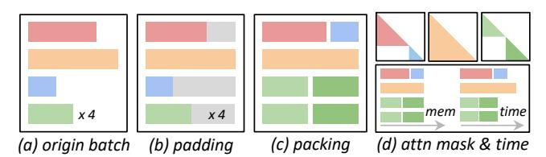

Figure 2. Sequence Padding and Packing

results demonstrate that ByteScale achieves up to 7.89× of speedup compared to existing training approaches.

# 2 Background

# 2.1 Transformers and Large Language Models

The transformer architecture [40] has become the most popular and widely used foundational architecture for large language models (LLMs) [5, 14, 32, 39] nowadays. It typically consists of a series of transformer layers, each comprising an attention module and a feed-forward network (FFN) module.

As shown in Figure 1, self-attention captures contextual information throughout the entire text, necessitating all tokens in the full sequence to participate in computation. In contrast, other operations like normalization, linear projection, and activation functions perform token-wise computations, allowing each token to be processed independently.

#### 2.2 Distributed LLM Training

As model sizes and training data continue to scale, distributed training techniques are indispensable in LLM training.

**Data Parallelism.** Data parallelism (DP) [9, 24, 37] distributes the training data evenly across devices, while each device holds a replica of the model. During each training step, devices process their local data individually, and synchronize gradients globally to update the model. ZeRO series [35] methods further enhance the scalability of DP.

Model Parallelism. Model parallelism distributes the model across devices, including tensor parallelism (TP) [38] and pipeline parallelism (PP) [16, 28, 29]. TP performs intraoperation partitioning, dividing operations and parameters within a layer across devices (e.g. Row- and Col-Parallel Linear in Megatron-LM [38]). It requires communication of intermediate results (activations), and is typically used within a single node. PP employs inter-operation partitioning, segmenting the model layers into different stages. It requires only the exchange of activations between consecutive stages via peer-to-peer (P2P) communication, enabling model partitioning across multiple nodes.

<span id="page-2-1"></span>> **[图片提取文字 (无描述)]:**
> mb#0 mb#1 mb#0 mb#1 mb#0 mb#1 mb#0 mb#1 mb#0 mb#1 mb#0 mb#1 DP0 DP0 GPU 1/2 GPU থ্ৰ (×, rank0 rank0 🔼 I rank2 🔍 I mb#0 mb#1 mb#0 mb#1 DP1 comm bubble bubble 1/2 GPU GPU GPU GPU <del>Juneary</del> rank1 rank3 rank2 rank3 time (a) data & context parallelism (b) redundant communication (c) imbalance computation
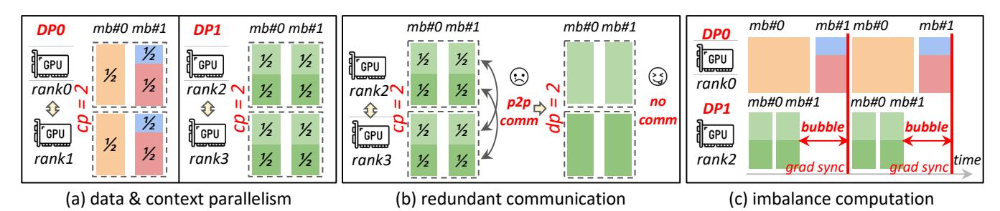

Figure 3. Context Parallelism with Packing

<span id="page-2-2"></span>> **[图片提取文字 (无描述)]:**
> 72% 0.8 Byted 256k 128k GitHub 1M 2M 64k 512k 4.5%6.4% 12.1%<sup>9.7%</sup>7.3% 1M 2M 60.00 0.6 8.8% 32k 256k 10.2% Sample Ratio 2k 7.6% 14.2% 7.6% 10.7% 128k 16k 34.0% 0.4 11.4% 7.6% 2k 10.4% 4k 64k 7.6% 7.6% 9.5% 7.6% 8k 32k Token Ratio 16k 4k 0.2 0.0 4k 8k 128k 256k 512k 2M 2k 16k 32k 64k 1M
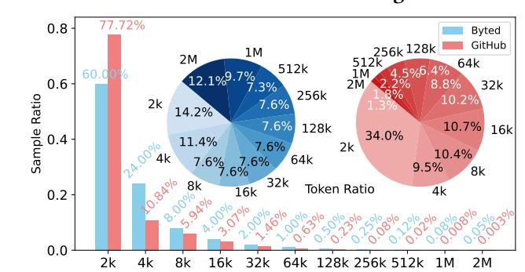

Figure 4. Sample and Token Distribution in two Datasets

*Hybrid Parallelism.* Hybrid parallelism combines various parallel strategies to enhance training efficiency. Particularly, Megatron-LM employs the 3D parallelism strategy [21, 30, 38] by integrating DP, TP, and PP, making it a mainstream approach for large-scale model training today.

Gradient Accumulation. To improve the efficiency and convergence, LLMs typically require large batch size [6, 15, 39] (e.g. it is common practice to apply nearly 30~80M tokens per batch for LLM training in the cluster with 10K GPUs). Constrained by hardware memory, processing the entire large batch at once is infeasible. Gradient accumulation divides each global batch (i.e., the sampled data in each training step) into multiple micro-batches. The gradients from these micro-batches are accumulated to equal the gradient as if the entire global batch were processed in a single pass.

# <span id="page-2-3"></span>2.3 Padding and Packing

To support variable-length sequences in current static parallelism strategies, techniques such as padding and packing are necessary. As illustrated in Figure 2, padding pads the sequences in the same batch to be of the same length, but causes wasted computation. Packing [22] concatenates multiple sequences into a single one without padded tokens. It employs a special segmented attention mask to ensure that each sequence is processed independently by self-attention.

#### <span id="page-2-4"></span>2.4 Long Context Training

As self-attention exhibits both time and memory complexity of  $O(S^2)$ , when the context length scales, this quadratic complexity becomes a bottleneck. Flash Attention [7, 8] optimizes memory I/O and employs the tiling technique

to reduce memory complexity from  $O(S^2)$  to O(S), while still maintaining  $O(S^2)$  time complexity. Context Parallelism (CP) [4, 23, 25, 31] further partitions the sequence across N devices, reducing the memory from O(S) to  $O(\frac{S}{N})$ . Following Figure 1, CP shards QKV along the sequence dimension, and cross-tokens operations require KV slices to be exchanged across devices using a ring-style P2P communication, which overlaps with computation. This technique is also applicable to packed sequences, and we will detail its implementation in §7. Notably, each subsequence must also be sharded across all CP ranks, as illustrated in Figure 2(c) and 3(a).

# <span id="page-2-0"></span>3 Obervation & Motivation

# <span id="page-2-5"></span>3.1 Data Heterogeneity

LLMs are trained on sequences data. As mentioned in §1, the training data typically consists of variable-length sequences. There exist two observations and one significant challenge:

Observation 1: sequence lengths exhibit skewed distribution in real-world datasets. As shown in Figure 4, we profiled the sample and token distribution of two datasets: an open-source dataset *GitHub* and a productive dataset *Byted* for long-context training. We observed that both of them exhibit a skewed distribution in sequence lengths. For instance, in the *Byted* dataset, if we randomly sample a global batch, nearly 80% of the samples are 4K tokens or shorter, while only 0.05% of the samples can reach 2M tokens. However, from the perspective of token distribution, those 0.05% of the samples (>=2M) contribute 12.1% of the tokens in the global batch, and 1% of the samples (>=128K) contribute 44.3%. Although the *GitHub* dataset has a lower proportion of long sequences, 16.2% of its tokens come from sequences exceeding 128K, demonstrating significant data heterogeneity.

Observation 2: mixing long and short sequences enhances model performance. The existing work [12] has demonstrated that training exclusively on long-context data can lead to a decline in short-context performance. LLaMA3 report [11] indicates that when training a model with 128K context, mixing 0.1% of long data with the original short data optimizes the performance across both short-context and long-context benchmarks. DeepSeek-R1 [10] presents the average response length on the training set during the RL process, demonstrating that gradually increasing and diverse response lengths help improve model performance.

<span id="page-3-3"></span>> **[图片提取文字 (无描述)]:**
> 6 3 4 pipeline (a) pp bubble pp bubble 0 dp bubble wait 3 16 6 grad sync & model update pipeline (b) pp bubble sync


Figure 5. Imbalanced Data and Pipeline Parallelism

<span id="page-3-2"></span>> **[图片提取文字 (无描述)]:**
> 1e12 attn mlp 60 DP 0 62 54 45 30 18 0.8 ms 0.9 ms 4k 50 DP 1 62 62 30 1.8 ms 8k 1.8 ms DP 2 44 -40 6.5 36 18 16k 4.8 ms 3.6 ms DP 3 7.5 ms 43 32k 62 42 14.1 ms 20 30 -30 DP 4 15.1 64k 48.2 ms 60 14 31 19 31 62 -20 175.5 ms 28.2 128k DP 5 19 42 15 32 41 -10 0% 25% 50% 75% 100% MB#0 MB#1 MB#2 MB#3 MB#4 MB#5 (a) execution time of attention and mlp (b) imbalanced FLOPs


Figure 6. Imbalanced Computation

Challenge: data heterogeneity leads to efficiency degradation. Although mixed training of long and short sequences is common and beneficial for model performance, it introduces new challenges. The static parallelism strategies used in existing systems are not well-suited to handle dynamic workloads. This causes issues of redundant communication (§3.2) and imbalanced computation (§3.3), which we will discuss in more detail below.

#### <span id="page-3-0"></span>3.2 Redundant Communication

Existing systems apply static parallelism strategies throughout the training process. Typically, they assume that all (packed) sequences are of the same length and set a fixed CP degree to amortize them across enough devices, thereby avoiding OOM errors. As mentioned in §2.3, to handle variable-length sequences, it is common to pack sequences up to the context length. However, as depicted in Figure 3(a)-(b), all sequences have to be partitioned across the entire CP group, even if it is unnecessary for shorter ones.

For instance, assuming that each device has a capacity of 8K tokens, to train an LLM with a context length of 1M tokens, a CP degree of 128 is required. This configuration necessitates 128 individual devices to process a sequence of 1M tokens. Concurrently, a large number of shorter sequences, such as those with lengths of 4K, 8K, and 16K tokens, are packed up to 1M tokens and processed in a CP group with 128 devices. As depicted in Figure 14, each subsequence within the packed sequence needs to be partitioned into 128 chunks across CP ranks, performing ring-P2P communication. In fact, it is unnecessary to perform cross-device partitioning and communication for sequences with lengths under 8K. For those sequences with 16K tokens, only two CP ranks are

<span id="page-3-4"></span>> **[图片提取文字 (无描述)]:**
> Balance **HDP Profiler** Scheduler model Communication DP PP Optimizer Balance Balance origin batch §6. Balance Scheduler §5. Communication Optimizer GPU dp x 1 GPU GPU sync & update GPII model cp x 2 cp x 4 HDP size=4 time line


Figure 7. ByteScale Overview

required. Using the same CP degree as for the maximum sequence length leads to excessive redundant communication for these shorter sequences. This issue is exacerbated when sequence lengths are highly skewed.

# <span id="page-3-1"></span>3.3 Imbalanced Computation

Imbalanced FLOPs. Although Flash Attention enables linear packing with O(S) memory complexity, the computational complexity for each subsequence remains  $O(S^2)$ . As depicted in Figures 2(d) and 3(c), even if two packed sequences contain the same number of tokens, their actual computational workloads differ, which are proportional to the areas of attention mask. As shown in Figure 6(a), when the context length is shorter than 8K tokens, the  $O(S^2)$  term is relatively insignificant, allowing packing to effectively balance workloads for both memory and computation. However, for long-context training tasks, the  $O(S^2)$  term becomes the predominant component of the computation, leading to significant time imbalances across different packed sequences.

To provide an intuitive explanation, we sampled a global batch of 1.2M tokens from the *GitHub* dataset and randomly packed them into micro-batches of up to 32K tokens, aligning with the model's context length. As shown in Figure 6(b), we recorded the FLOPs (Floating Point Operations) for each micro-batch and observed significant variability, indicating that the execution time for each micro-batch also differs.

*Imbalanced Data and Pipeline Parallelism.* The imbalanced execution times across micro-batches further degrade

<span id="page-4-0"></span>> **[图片提取文字 (无描述)]:**
> MB#1 MB#2 GPU grad acc grad (c) case2: comm\_groups = 2, (d) case3: comm\_groups = 3, (b) case1: comm\_groups = 1, (a) optimizer & update acc size = (2, 2)size = (1, 2, 1)size = (4)states


Figure 8. Illustration of HDP

the efficiency of data and pipeline parallelism. In data parallelism, all DP ranks must execute the same number of micro-batches, and then synchronize gradients before the model update. As illustrated in Figure 3(c), rank-2 processes tokens with fewer FLOPs than rank-0, leading to idle time (i.e. DP Bubble) as it waits for synchronization. In pipeline parallelism, there are two types of "bubbles": the PP bubble occurs within a single pipeline, and the DP bubble occurs across different pipelines (different DP groups). Aside from PP bubbles during the warmup and cooldown phases, imbalanced FLOPs between micro-batches prevent the execution time on different devices from overlapping as they would in an ideal pipeline. This leads to extra PP bubbles caused by inter-stage waiting, as shown in Figure 5. Additionally, since each micro-batch is executed sequentially across  $d_{pp}$  different stages in the pipeline, any DP bubble will be magnified by a factor of  $d_{\rm pp}$ . For example, consider two pipelines illustrated in Figure 5, the micro-batches 0 and 7 in the pipeline (a) have a longer forward and backward execution time compared to those in the pipeline (b). Under  $d_{pp} = 4$ , this time gap is magnified fourfold. Consequently, after executing 8 micro-batches, the pipeline (b) falls into a prolonged idle period, waiting for gradient synchronization. This causes the DP bubble to account for over 30% of the total execution time, far exceeding the normal pipeline bubble time.

# 4 ByteScale Overview

We present ByteScale to address these challenges. As shown in Figure 7, it consists of three main components. Profiler is to profile the environment, model configuration, data distribution, and build cost models for other components. Communication Optimizer is to improve the communication efficiency for both short and long sequences by data-aware sharding, dynamic communication, and selective offloading. Balance Scheduler is to solve the imbalanced computation by parallelism-aware data assignment.

# <span id="page-4-1"></span>5 Communication Optimizer

This section describes how ByteScale optimizes communication overhead. First, it reduces redundant communication

for short sequences by dynamic sequence sharding and communication. Second, it further compresses the communication cost for long sequences by selective offloading.

#### <span id="page-4-2"></span>5.1 Data-Aware Sharding and Communication

*Hybrid Data Parallelism.* To begin with, we introduce a novel parallelism strategy, namely Hybrid Data Parallelism (HDP), to enable efficient training for different levels of sequence lengths. Both DP and CP partition training data across devices. DP performs inter-data partitioning by distributing different samples evenly across devices, while CP performs intra-data partitioning by sharding a single sample across devices. HDP unifies both inter-data and intra-data partitioning and is defined to evenly distribute *tokens* across devices. It can replace traditional DP and CP, with the parallel degree of HDP equivalent to the product of the degrees of DP and CP (i.e.  $d_{\rm hdp} = d_{\rm dp} \times d_{\rm cp}$ ).

Unlike DP and CP, which require all DP/CP ranks to perform consistent behavior in computation or communication (e.g. CP requires all CP ranks to participate in homogeneous ring-P2P communication), HDP allows for heterogeneous behavior among HDP ranks. It has two key characteristics:

- ① More Flexible Communication: HDP only requires that different HDP ranks handle an equal number of tokens. This means that some HDP ranks may be assigned complete sequences (short sequences), as illustrated by  $S_3$  and  $S_5$  in Figure 8(d), while some other ranks may only handle the partial slice of a sequence (long sequences), as shown with  $S_4$  in Figure 8(d). This necessitates establishing more flexible communication groups. For instance, in Figure 8(d), a communication group of size 2 is created only between rank-[1~2] to compute the distributed attention for  $S_4$ , while rank-0 and 3 can perform local computation without cross-device communication. In Figure 8(b), sequence  $S_0$  is sharded into four slices, and a communication group of size 4 is created among rank-[0~3].
- ② More Finer-Grained Communication: Static parallel strategies require that the product of the parallel degrees equals the number of devices in the cluster, i.e.  $d_{\rm dp} \times d_{\rm cp} \times d_{\rm tp} \times d_{\rm pp} = N_{\rm cluster}$ , where  $d_{\rm tp}$  and  $d_{\rm pp}$  are actually fixed based on model size. To utilize all the devices and maintain

<span id="page-5-0"></span>> **[图片提取文字 (无描述)]:**
> tokens param out forward Token-level Loss backward tokens<sup>™</sup> param


Figure 9. Token-Level Gradient

<span id="page-5-3"></span>> **[图片提取文字 (无描述)]:**
> CPU \_\_\_\_ ıme Compute: O(N²) vs D2H & H2D: O(N) compute Cartivation31 D2H seglen compute activation30 activation overlap activation1 D2H activation 0,1,...,30 activation0 activation0 0,1,...,29 layer31 layer0 layer1 layer30 layer0 layer30 layer31 layer1 compute overlap compute activation31 compute activation30 H2D H<sub>2</sub>D activation1 activation activation 0,1,...,30 activation0 activation0 0,1,...,29
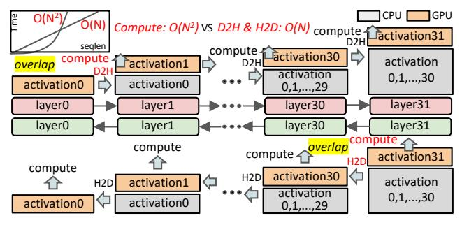

Figure 10. Per-Layer Activation Offloading

this divisibility,  $d_{\rm dp}$  and  $d_{\rm cp}$  can only be scaled by a limited factor, resulting in coarse granularity (e.g. assume each rank can handle 8K tokens, 512K can use  $< d_{\rm dp} = 2$ ,  $d_{\rm cp} = 64>$ , while 768K needs  $d_{\rm cp} = 96$  but must use  $< d_{\rm dp} = 1$ ,  $d_{\rm cp} = 128>$ ). Meanwhile, HDP can use any amount of ranks in  $[1, d_{\rm hdp}]$  to handle a sequence without considering the divisibility constraints (e.g. with  $d_{\rm hdp} = d_{\rm dp} \times d_{\rm cp} = 128$ , HDP can use 96 ranks to handle a 768K sequence while use rest 32 ranks to handle  $32 \times 8$ K sequences individually).

NCCL Buffer Optimization. Creating NCCL communication groups incurs extra overhead. Firstly, the process of establishing a communication group is inherently slow, and dynamically creating new groups for each sequence can significantly reduce training efficiency. Secondly, creating an excessive number of communication groups can consume an additional 5~10GB of memory per GPU for NCCL buffers, further reducing the available memory. Fortunately, distributed attention utilizes P2P communication. With a global communication group across all HDP ranks, P2P communication between any two devices can directly reuse the existing group, thereby alleviating the time and memory pressure associated with creating temporary communication groups.

*Optimizer States Sharding.* HDP evenly partitions tokens across devices, and will shard neither model parameters nor gradients. This means that HDP ranks replicate the model states like DP. Consequently, the ZeRO series technique is also suitable to HDP, as shown in Figure 8(a), HDP utilizes ZeRO-1 across all the HDP ranks to maximally shards the optimizer states, minimizing the memory usage.

Loss and Model Update. Even though HDP ranks may perform different heterogeneous communications across different micro-batches, the final gradient for a parameter is equivalent to that obtained in standard DP. As shown in Figure 9, each token contributes a gradient to the parameter  $\theta_n$ , and the final gradient, denoted as  $G_{\theta_n}$ , is the sum over

<span id="page-5-4"></span>> **[图片提取文字 (无描述)]:**
> forward graph Devices Mapping graph ctx GPU A GPU A GPU A GPU pack hook gpu tensor activation parameter cur layer D2H pop push tensor tag = {layer id, act id} activations offload CPU Memory prev layer reload tensor tag = {layer id, act id} pop 🔻 activations H2D push activation parameter < gpu tensor unpack hook **Devices Mapping** graph ctx GPU ' A GPU backward graph (a) selective offloading (b) activation offloading
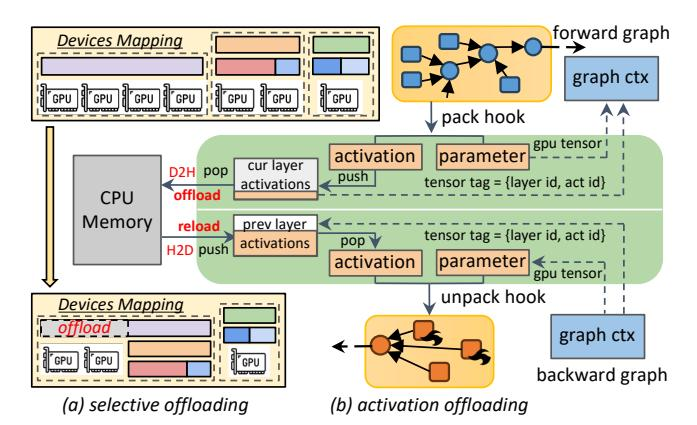

Figure 11. Data-Aware Selective Offloading

gradients from all tokens in global batch (denoted as  $\mathbb{B}$ ). Let grad $(j, \theta_n)$  represent the gradient from the token j to the parameter  $\theta_n$ . Then  $G_{\theta_n}$  can be presented as:

<span id="page-5-2"></span>
$$G_{\theta_n} = \sum_{S_i \in \mathbb{B}} \left( \sum_{j \in S_i} \operatorname{grad}(j, \theta_n) \right) \tag{1}$$

Since parameters are replicated and tokens are evenly distributed across HDP ranks (denoted as  $\mathbb{R}$ ), the local accumulated gradient corresponds to the partial sum of gradients from tokens assigned to each rank (denoted as  $\mathbb{B}^r$ , i.e. microbatches in rank r). Consequently, similar to DP, a global collective communication like All-Reduce or Reduce-Scatter will be performed across all HDP ranks to aggregate partial gradients. This also yields the gradient  $G_{\theta_n}$  from all tokens:

<span id="page-5-1"></span>
$$G_{\theta_n} = \sum_{r \in \mathbb{R}, \ \mathbb{B}^r \in \mathbb{B}} \left( \sum_{m \in \mathbb{B}^r} \left( \sum_{j \in m} \operatorname{grad}(j, \theta_n) \right) \right) \tag{2}$$

The Eq.(2) is equivalent to Eq.(1), and ensures that the result of gradient accumulation in HDP is equivalent to that in standard DP. Moreover, since we calculate the gradient  $G_{\theta_n}$  over all tokens in the global batch, it also needs to be scaled by the total amount of tokens, as we implement this by the *token-level loss*, which scales the loss by the token amount rather than sample amount.

#### 5.2 Data-Aware Selective Offloading

Activation Offloading. The activation size is proportional to the sequence length. Constrained by GPU memory, longer sequences require more HDP ranks to distribute the activation. For example, processing a sequence with 1M tokens requires 128 ranks if each rank can handle 8K tokens, which is usually unaffordable with today's expensive GPU resources. In practice, modern GPU servers are typically equipped with CPU memory that far exceeds GPU memory. Therefore, an alternative approach is to offload activations to the CPU, thereby reducing the required amount of ranks. There are two characteristics to support the feasibility of this approach:

① **Activation is first-in-last-out**: As shown in Figure 10, given any sequence, during the forward propagation, it will

be processed sequentially by transformer layers, and activations will be gradually accumulated until reaching a peak after the final layer. Subsequently, during the backward propagation, these activations will be consumed from the last layer to the first one. Since the activations produced by earlier layers are used more later (i.e. FILO), it is promising to offload these activations to the CPU during the forward propagation and reload them back into GPU when needed in the backward propagation.

②  $O(N^2)$  computation can overlap O(N) offloading: It is well-known that transferring data between GPU and CPU is typically inefficient due to the limited PCIe bandwidth. The offloading time usually far exceeds the computation time, making it impractical. Fortunately, as mentioned in §2.4, the computational complexity of attention is  $O(S^2)$ , while the memory complexity is O(S). Therefore, for sufficiently long sequences, the  $O(S^2)$  computation time will inevitably surpass the O(S) data transfer time, allowing the offloading to be perfectly masked under computation.

As illustrated in Figure 11(b), we designed a general component named act\_ctx (Listing 1) to support activation offloading. This component maintains two cuda streams for D2H (Device-to-Host) and H2D (Host-to-Device) separately. It automatically captures activation tensors from the computation graph and offloads them to the CPU (use async-CudaMemcpy API) at appropriate times during the forward propagation, and establishes asynchronous dependencies between the D2H stream and the computation stream. The original tensor in the computation graph is replaced with the metadata {layer id, act id}. Similarly, during the backward propagation, the metadata stored in the computation graph is used to index and reload corresponding activations in the H2D stream. Figure 10 illustrates the whole process. The act\_ctx also supports a parameter named offload\_ratio, providing token-level fine-grained control over the proportion of activations offloaded to the CPU. This capability balances GPU memory savings with optimal overlap of computation.

```
# Separate offload_ratio to each micro-batch
act_ctx = get_act_ctx(num_micro_batch, offload_ratios)
# forward of micro-batch-i
act_ctx.update_micro_batch_id(i)
with act_ctx:
forward_func(...)
# backward of micro-batch-j
act_ctx.update_micro_batch_id(j)
with act_ctx:
backward_func(...)
```

**Listing 1.** usage of act\_ctx

Selective Offloading. Activation offloading leverages CPU memory to alleviate the burden on GPU memory. However, only for long sequences the computation can perfectly overlap with offloading. This means we cannot offload all tokens assigned to each rank indiscriminately. Instead, we must selectively offload each token based on the FLOPs.

# **Algorithm 1:** Naive HDP Solution

```
Input: Global Batch \mathbb{B} = \{s_1, s_2, \dots, s_n\}, Rank Capacity C
   for each sequence s_i \in \mathbb{B} do
       Determine offload ratio r and minimum required
 2
        number of HDP ranks D(s_i) using Eq.(3);
       if d_i == 0 then
3
          Add s_i to pack list;
 5
          Update map^r[s_i] \leftarrow r and map^d[s_i] \leftarrow D(s_i);
7 while pack list is not empty do
       Pack subset by best-fit strategy to fill capacity C;
       Update map^r[subset] \leftarrow 0, map^d[subset] \leftarrow 1;
10 Assign sequences to d_{hdp} HDP ranks based on map^d;
11 Initialize act ctx for each micro-batch using map^r;
12 Return micro-batches, act_ctx for each HDP rank
```

Assume the number of layers per rank as l, the token capacity per rank as C. Given a sequence with length  $s_i \geq C$ , we define the computation time and activation size for each layer as  $T(s_i)$  and  $Act(s_i)$ , respectively. The bandwidths of D2H and H2D are profiled as  $B_{\rm d2h}$  and  $B_{\rm h2d}$ . We aim to find the offload ratio r that minimizes the required number of HDP ranks  $D(s_i)$  for  $s_i$  by Eq. (3), where  $\alpha_1$ ,  $\beta_1$ ,  $\alpha_2$ ,  $\beta_2$  and  $\gamma$  are coefficients we profiled for the cost model.

<span id="page-6-1"></span>
$$\arg \min_{r} D(s_i),$$
s.t. 
$$T(s_i) = \alpha_1 s_i^2 + \beta_1 s_i + \gamma, \ \operatorname{Act}(s_i) = \alpha_2 s_i + \beta_2,$$

$$D(s_i) = \lceil \frac{2 \times \operatorname{Act}(s_i) + (1 - r) \times (l - 2) \times \operatorname{Act}(s_i)}{l \times \operatorname{Act}(C)} \rceil,$$

$$T(s_i) \ge \frac{\operatorname{Act}(s_i) \times r}{\min(B_{d2h}, B_{h2d})},$$

$$1 \ge r \ge \min(1, \frac{l \times \operatorname{Act}(C)}{(l - 2) \times \operatorname{Act}(s_i)}).$$
(3)

Since different micro-batches have mutual independent forward and backward propagation, in Listing 1 we assign a separate *offload\_ratio* derived from Eq. (3) to each microbatch. This method effectively compresses the number of ranks required for long sequences from  $\frac{s_i}{C}$  to  $D(s_i)$ , as shown in Figure 11(a). It not only significantly reduces communication overhead but also enables the more available HDP ranks to process data, thereby improving efficiency.

Overlap Efficiency Discussion. As we know, the NCCL communication needs to occupy a portion of streaming multiprocessors (SMs), to reach the peak bandwidth over Infini-Band and NVLink. Consequently, even with communication-computation overlap, the computation kernels cannot fully utilize all the tensor cores, resulting in inefficiencies. Fortunately, the D2H and H2D kernel use the DMA engine rather than SMs, making it overlap perfectly with both computation and communication. Moreover, we use cached pinned host

<span id="page-7-1"></span>> **[图片提取文字 (无描述)]:**
> 6 pp bubble pp bubble (a) Pipeline0: CP=1,2,3,4, micro batches=8 9 13 10 14 11 15 12 15 16 9 12 10 13 11 14 12 15 13 16 14 17 15 16 181 11 10 12 11 13 12 14 13 15 14 16 15 17 17 10 10 11 11 12 12 13 13 14 14 15 15 16 16 17 17 9 grad sync & model update pp bubble pp bubble (b) Pipeline1: CP=1, micro batches=18


Figure 12. Balanced Data and Pipeline Parallelism

memory to further reduce the overhead of CPU memory allocation and speed up the data exchange between the device and host. Since pipeline parallelism interleaves the forward and backward propagation of different micro-batches, the D2H and H2D kernels could execute simultaneously, thereby maximizing the bidirectional bandwidth of PCIe.

#### 5.3 Overall Routine

The overall routine of ByteScale is outlined in Alg. 1. Briefly speaking, the algorithm traverses each sequence  $s_i$  in the global batch. For long sequences, it derives the offload ratio r and determines the required number of ranks  $D(s_i)$  (lines 1-6). For short sequences, it packs them to fill each rank's capacity C (lines 7-9). The processed sequences are then assigned to  $d_{\rm hdp}$  ranks, and the algorithm returns the microbatches and  $act\_ctx$ , for execution (lines 10-12).

#### 6 Balance Scheduler

In this section, we introduce the balance scheduler to address both the DP and PP imbalance issues. By carefully orchestrating data assignment (instead of line 10 in Alg. 1), it mitigates these imbalances while keeping the minimum communication as §5 performs. We will first outline several key insights and then propose our heuristic solution.

#### 6.1 Redefine micro-batch

Gradient accumulation requires that different DP ranks execute the same number of micro-batches, based on the assumption that all micro-batches have the same computational load. However, as mentioned in §3.3, execution times for different micro-batches can significantly vary. In ByteScale, we redefine a more flexible strategy, which enables different HDP ranks to process different numbers of micro-batches (same size but differ in workloads), to mitigate the imbalance issue. As shown in Figure 13, it makes all the ranks finish computation at the same time. More importantly, this strategy does not affect model convergence. Regardless of how sequences are assigned to HDP ranks, we finally calculate the sum of gradients from all tokens in the global batch, as discussed in §5.1, which ensures the mathematical equivalence.

<span id="page-7-0"></span>> **[图片提取文字 (无描述)]:**
> seglen seq0 seq1 seq2 seq3 seq4 seq5 GPU GPU GPU GPU GPU GPU sealen timeliné (a) DP Balance pipeline stages timeline (b) PP Balance
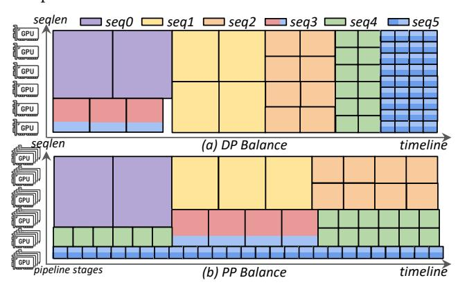

Figure 13. Balance Strategy

#### 6.2 Solve PP Imbalance

Insight 1: PP bubbles are less when sequences of different length levels are assigned to separate pipelines.

It is crucial to ensure that the pipeline processes microbatches with similar execution times. As illustrated in Figure 13(b), when  $d_{pp}=4$ , any 4 consecutive micro-batches on the timeline will be executed by 4 PP stages at the same time. If their execution times differ significantly, extra PP bubbles occur. Due to the limited number of long sequences in the global batch, some pipelines have to be assigned sequences of multiple length levels. Fortunately, only during transition phases (e.g., when 4 consecutive micro-batches belong to different length levels) will cause extra PP bubbles.

We assign more micro-batches to those pipelines with less average execution times. As illustrated in Figure 12(a)-(b), pipeline-0 handles micro-batches with larger average execution times and is therefore assigned only 8 micro-batches. In contrast, pipeline-1 is assigned 18 micro-batches to synchronize with pipeline-0. Additionally, due to more micro-batches, the bubble rate is further reduced.

# 6.3 Solve DP Imbalance

Insight 2: It is only necessary to maintain load balance at each time step when pipeline parallelism is not applied.

If only apply DP without PP, achieving load balance only requires that, at any given time, the micro-batches executed

# <span id="page-8-2"></span>Algorithm 2: Balance Strategy for HDP **Input:** Global Batch $\mathbb{B} = \{s_0, s_1, \dots, s_n\}$ , Rank Capacity C, HDP Degree $d_{hdp}$ , Delta $\delta$ Output: micro-batches for HDP Ranks 1 Initialize micro\_batches = $[] \times d_{hdp}$ ; 2 Initialize exec\_times = $[0] \times d_{hdp}$ ; 3 # Step 1: Sort and Bucketize

- 4 Sort B by sequence length in descending order;
- 5 Divide B into buckets such that each bucket has an approximately equal sum of FLOPs;

```
6 while buckets is not empty do
       # Step 2: Identify Target Ranks
       Calculate max_time = max(exec_times);
      Determine target ranks = \{i \mid
       \max_{time} - \exp_{times}[i] > \delta;
       # Step 3: Assign Sequences
10
       while Exist (max time – exec times[i] > \delta) do
11
          if using DP-Balance strategy then
12
              Select seqs from the first bucket;
13
          else if using PP-Balance strategy then
14
              Select segs sequentially from all buckets;
15
          Assign seqs to target_ranks;
16
          Update micro_batches and exec_times;
17
          Update target_ranks based on exec_times;
18
          if exist bucket is empty then
19
              Remove bucket from buckets;
20
```

21 Return micro\_batches

by different HDP ranks have similar execution times. There is no need to consider the workload imbalance between micro-batches across different time steps on the timeline.

A straightforward method is to assign sequences of the same length level across different HDP ranks at the same time, as shown in Figure 13(a). Moreover, we still assign more micro-batches to those ranks that process shorter sequences than others at the same time. Finally, it ensures that all HDP ranks synchronize gradients nearly simultaneously.

# **Balance Strategy**

Alg. 2 describes the balance strategy. Firstly, we sort the sequences in the global batch  $\mathbb{B}$  by length in descending order. These ordered sequences are then divided into buckets with approximately equal sum of FLOPs, and thus the buckets with longer average lengths contain fewer sequences (lines 3-5). Secondly, we determine those ranks that have shorter execution times for later assignments (lines 7-9). Thirdly, if using the DP-Balance strategy, we select sequences from the same bucket. Otherwise, if using the PP-Balance strategy, we select the sequences sequentially from all buckets. In practice, ranks with shorter execution times are assigned

<span id="page-8-1"></span>> **[图片提取文字 (无描述)]:**
> GPU0 GPU1 GPU2 GPU3 seq0 seq1 seq2 GPU 0 0 (a) standard causal mask (b) segmented causal mask (c) heterogeneous communication KVO KV1 KV2 KV3 GPU Q0 Н GPU Φ Q1  $\blacksquare$ GPU Q2 0 GPU Q3 (f) homogeneous (d) balanced segmented causal mask (e) balanced dist-attn with packing communication
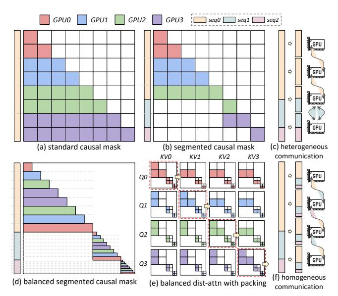

Figure 14. Dist-attn Optimized for Packed Sequences

with more sequences (lines 12-15). Finally, we repeat the second and third steps until all the buckets are empty.

# <span id="page-8-0"></span>**Implementation**

ByteScale is implemented in approximately 16K lines of code based on Python, C++, and CUDA. It has been integrated with MegaScale [18], a high-performance framework for LLM training. To support large-scale training and communication, we also apply the following optimizations.

**GQA.** Group Query Attention (GQA) has become an indispensable feature in modern LLMs (e.g. LlaMA3 and Mistral), it helps reduce the number of KV heads, thereby decreasing the communication volume for dist-attn. All systems mentioned in this paper apply the GQA technique.

Dist-attn with Packing. As workload is proportional to the area of the attention mask, sequentially partitioning the sequence across devices causes workload imbalance. Several techniques [4, 23, 31] have been proposed to solve this issue. However, they are not suitable for the special segmented causal attention mask for packed sequences. As illustrated in Figure 14, to avoid heterogeneous computation and communication within the CP group, we optimize the current dist-attn. Each subsequence of the packed sequences is uniformly divided into 2N parts and symmetrically assigned to the N devices. It ensures that each device holds  $\frac{1}{N}$  of all the subsequences and covers  $\frac{1}{N}$  of the attention mask area. All devices participate in the same ring-P2P communication, with the same data exchange volume.

Remote Dataloader. ByteScale requires global batch information at each training step to schedule data assignment. However, existing dataloader solutions typically follow SPMD (Single Program, Multiple Data) mode, where each rank reads only partial data of the batch. To maintain the global information, all HDP ranks have to read the entire

<span id="page-9-0"></span>> **[图片提取文字 (无描述)]:**
> server (worker0) server (worker1) data data meta meta single scheduler (worker0) controller ray loading plan head client client client client (worker0) worker1) (worker0) (worker1) data slice#0 data slice#1
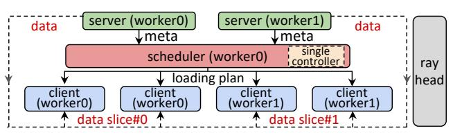

Figure 15. Remote Dataloader

<span id="page-9-1"></span>> **[图片提取文字 (无描述)]:**
> parallel logits fused fw fused bw (= 0.78 ms 0.91 ms max to fp32 sub exp div to bf16 sum mul memory-bound 5.03 ms 2.12 ms
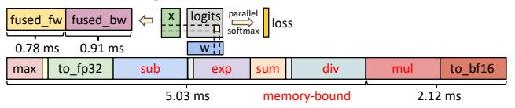

Figure 16. Fused SoftmaxCrossEntropy

global batch simultaneously, which imposes significant pressure on both network communication and CPU memory. To address this issue, we implement a remote dataloader using Ray [26], which provides real-time scheduling and planning capabilities in a global view. As shown in Figure 15, consider a setup with two GPU nodes, worker-0 and worker-1, and one CPU node as the Ray head, there exist three types of roles encapsulated by ray actors. The Server Roles are CPU processes in worker nodes, which fetch and preprocess raw data from HDFS and generate metadata. The Scheduler Role, as the single controller, is a CPU process in worker-0, which collects the global metadata from all servers, deduces the loading plan, and broadcasts it to clients. The Client Roles are GPU processes in worker nodes, which read the partial data from servers based on the loading plan.

Fused SoftmaxCrossEntropy. Modern LLMs typically use tokenizers with a large vocabulary size (e.g. 128K in LLaMA3 [11], 130K in Mistral [2] and over 150K in Qwen2.5 [43]). To stabilize precision, current methods (e.g. VocabParallel in Megatron-LM) convert the logits variable from BF16 to FP32 before calculating the SoftmaxCrossEntropyLoss. However, FP32 logits consume significant memory. For instance, with a context length of 256K and a vocabulary size of 128K, it requires 16GB under TP=8. Besides, the kernels are memory-bound and inefficient. As illustrated in Figure 16, we develop FusedSoftmaxCrossEntropy, which fuses numerous operations into a single kernel, takes BF16 inputs, and still performs online computations in FP32 precision. It saves both time and memory compared to existing methods.

# 8 Experiments

# 8.1 Experimental Setup

**Environments.** Our experiments are conducted on a large-scale productive GPU cluster with more than 12,000 GPUs. (The specific information regarding the productive cluster, such as the number and type of GPUs, is hidden due to business and confidential concerns.)

**Baselines.** Our system is built on MegaScale, a productive LLM training framework for large-scale GPU clusters, which has demonstrated superior performance to DeepSpeed and Megatron-LM. Thus, we present the advantages of ByteScale

Table 1. Models for evaluation.

<span id="page-9-2"></span>

| Model         | #Layers | #Heads | #Groups | Hidden Dim    |
|---------------|---------|--------|---------|---------------|
| LLaMA-7B      | 32      | 32     | 8       | 4096          |
| LLaMA-13B     | 40      | 40     | 8       | 5120          |
| LLaMA-30B     | 60      | 56     | 8       | 6656          |
| LLaMA-70B     | 80      | 64     | 8       | 8192          |
| Mistral-8×7B  | 32      | 32     | 8       | 4096 (topk=2) |
| Mistral-8×22B | 56      | 48     | 8       | 6144 (topk=2) |

by comparison in three cases: ① MegaScale with static parallelism strategies (DP, TP, PP and CP), along with the dist-attn optimization shown in Figure 14 for packed sequences; ② MegaScale with naive HDP, as described in Alg. 1, which only applies communication optimizations; ③ MegaScale with balanced HDP, as described in Alg. 2, which applies optimizations for both communication and balance. To achieve a fair comparison, we set the same  $d_{tp}$  and  $d_{pp}$  for all three cases and set the  $d_{hdp}$  in ② ③ equal to  $d_{dp} \times d_{cp}$  in ①, where the  $d_{cp}$  corresponds the minimum required number of ranks to support the context length of model.

Models and Datasets. We evaluate our work with both dense and sparse LLMs, as detailed in Table 1. For the dense model, we choose the LLaMA-series LLMs with four different sizes, LLaMA-7B, LLaMA-13B, LLaMA-30B, and LLaMA-70B. For the sparse model, we choose the Mistral-series LLMs (MoE) with two different sizes, Mistral-8x7B (active parameters = 13B/47B) and Mistral-8×22B (active parameters = 39B/141B). Two datasets are used in our experiments, i.e., GitHub and Byted, as we have introduced in §3.1. Figure 4 illustrates the data distribution for these two datasets.

Workloads and Metrics. For different types and sizes of models, we scale the context length from 256K to 2M, and the cluster size from 1024 GPUs to more than 12,000 GPUs to assess the performance of ByteScale more comprehensively. The global batch for each training step is fixed to 32M tokens, as it's a common practice in large-scale clusters. We use the throughput (tokens per second) as the primary metric to evaluate the performance. All results are averaged over 200 iterations after a 20-iteration warmup.

#### 8.2 End-to-End Evaluation

We first assess the end-to-end performance of three methods by measuring the average throughput at each training step, the overall results are shown in Figure 17. It turns out that both the HDP naive and balance solutions outperform the baseline, achieving a maximum speedup of 7.89×.

Difference in Scalability. As context length increases, the baseline with static strategies must increase the CP degree to avoid OOM errors. For shorter sequences within the global batch, we have to pack them and apply the dist-attn shown in Figure 14, which suffers from inefficient and redundant communication. For instance, only 9.8% of the tokens in a global batch are longer than 256K for *GitHub* dataset,

<span id="page-10-0"></span>> **[图片提取文字 (无描述)]:**
> HDP naive HDP balance Baseline 1K GPUs, LLaMA 7B, GitHub 1K GPUs, LLaMA 7B, Byted 2K GPUs, LLaMA 13B, GitHub 2K GPUs, LLaMA 13B, Byted  $\times 10^{6}$  $\times 10^{5}$  $\times 10^{6}$  $\times 10^{5}$ 1.68x 1.73x1.65x1.53x 2.49x 1.0 2.22x 4.56x 4.15x 1.98x 7.89x1.26x 6.88<sub>X</sub> 1.69x 1.23x5.0 2.28x 1.50x 2.34x 4.13x 4.26x 0.5 3.67x 3.96x 2.5 256k 256k 256k 512k 512k 1M 256k 512k 2M 1M 4K GPUs, LLaMA 30B, GitHub 4K GPUs, LLaMA 30B, Byted 8K GPUs, LLaMA 70B, GitHub 8K GPUs, LLaMA 70B, Byted ×105 ×105 ×105 ×105 1.41x 1.52x 1.54x1.49x 2.07x 1.89<sub>X</sub> tokens/sec v 3.05x3.48x 4.28x 6.21x 1.58x 1.70x 5.0 -1.18x 5.0 1.41x 2.06x 1.98x 1.93x3.80x 2.45x 3.39x 2.84x 2.5 2.5 256k 512k 2M 256k 512k 1M 2M 256k 512k 1M 256k 512k 2M 8K GPUs, Mistral 8x7B, GitHub 8K GPUs, Mistral 8x7B, Byted ×106 >12K GPUs, Mistral 8x22B, GitHub ×106 >12K GPUs, Mistral 8x22B, Byted  $\times 10^{6}$  $\times 10^{6}$ 1.28x 1.34x1.46x 1.45x1.52x 1.59x tokens/sec 1.84x 2.72x3.42x 1.63x 4.13x 1.0 -.86x .98x 2.18x 0.5 -0 256k 512k 2M 256k 512k 2M 256k 512k 1M 256k 512k 1M 1M 1M 2M
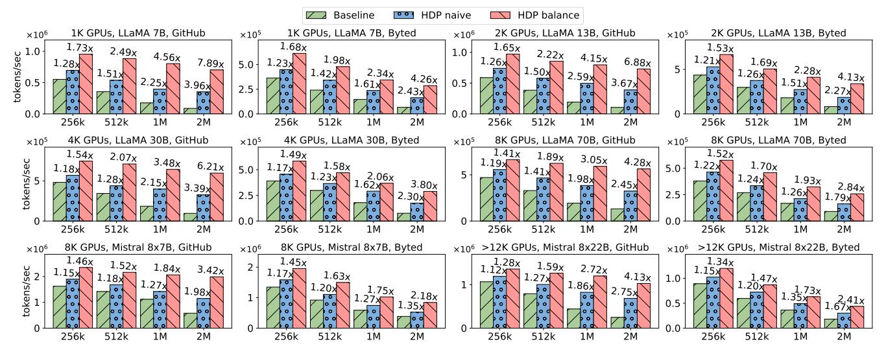

Figure 17. End-to-end evaluation (measured in tokens per second).

<span id="page-10-1"></span>> **[图片提取文字 (无描述)]:**
> 423 305 us us 411 307 us us 406 304 us us compute 4.4 ms 4.4 ms 2.8 ms 4.3 ms 4.4 ms 2.8 ms 2.8 ms 2.8 ms 1.9 ms 1.9 ms p2p comm 1.5 ms 1.4 ms 1.5 ms 1.6 ms 1.9 ms 1.9 ms mlp: 9ms mlp: 10ms attn (39 ranks): 110ms attn (256 raňks): 405ms 4 random ranks (a) CP vs HDP: overlap for dist-attn 15s 36s 25s 63s 20s 435 20s 18s **41s 44s** 19s 46s 19s 41s 48s 20s Baseline 18s 19s 415 **15s** 36s 25s 63s 20s 43s 20s 48s 41s 20s 44s 19s 46s 8m40s 19s 20s 18s 415 **15s** 36s 25s 63s 20s 43s 48s 41s 20s 445 19s 46s 43s 20s 48s 20s 19s 41s 15s 36s 25s 63s 20s **18s** 41s 445 19s 46s Naive backward forward 4m32s 54s 20s 20s 52s 14s 34s 12s 30s 225 56s 21s 54s 175 445 3m48s Forward & Backword Time in a Single Step 렆 1m41s 18s 47s Baseline HDP Naive 2m9s 20s 52s 14s **HDP Balance** Balance **22s** 56s 2m36s 115 21s 54s 105 2m37s £ 200 2m36s 185 47s **12s** 30s 요 17s 425 145 **34s** 2m36s 200 400 600 800 1000 HDP Rank ID timeline (b) Time profile for 4 ranks in a single step (c) Valid computation time for all hdp ranks in a single step
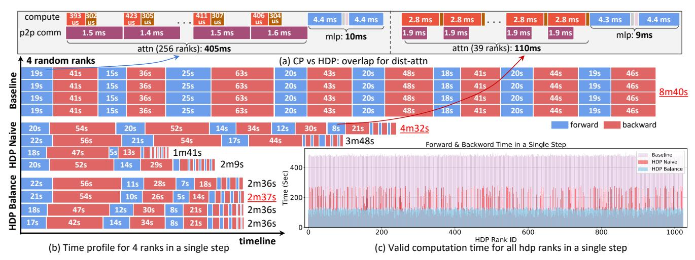

Figure 18. Case Study

and scaling the context length from 256K to 2M, we can observe that the throughput of the baseline decreases nearly 2× whenever context length increases 2×. In contrast, under the same conditions, the throughput of the HDP naive solution decreases by 1.23× on average and the throughput of the HDP balance solution decreases by only 1.08× on average. The HDP naive solution reduces communication overhead but leaves some ranks idle due to imbalance. Meanwhile, the HDP balance solution eliminates these bubble times and fully releases the performance enabled by flexible and dynamic communication. Consequently, ByteScale outperforms the baseline by up to 7.89× on the *GitHub* dataset.

**Difference in Datasets.** The *Byted* dataset contains more long sequences than the *GitHub* dataset, and there exist 37% of the tokens in a global batch are longer than 256K. As a result, the average throughput and speedup are lower than that on the *GitHub* dataset. However, because ByteScale

provides communication optimizations for both long and short sequences, the speedup can still achieve up to 4.26×.

Difference in Parallelism Strategies. Models like LLaMA-7B, 13B and 30B use parallelism strategies including HDP and TP, thus applying the DP-Balance strategy. In contrast, models like LLaMA-70B, Mistral-8×7B and Mistral-8×22B employ HDP, TP and PP, and we apply the PP-Balance strategy. It can be observed that HDP with DP-Balance achieves a higher speedup, compared to the PP-Balance. For instance, with the GitHub dataset and a context length of 2M, the speedup of HDP with DP-Balance is between 6.21×-7.89×, while the speedup of HDP with PP-Balance is only between 3.42×-4.28×. As shown in Figure 13, the DP-Balance strategy only needs to balance computation at each time step, which is easier to achieve than balance computation across all time steps, as required by the PP-Balance strategy.

<span id="page-11-2"></span>> **[图片提取文字 (无描述)]:**
> RDMA Out Traffic for Baseline RDMA Out Traffic for HDP Naive RDMA Out Traffic for HDP Balance (S) 100 (\$/q9) 75 - 50 - 50 - 50 - 50 - 50 - 50 - 50 - 75 75 Throughput 50 25 25 25 30 90 120 30 60 90 120 30 60 90 120 GPU Tensor Core Activity for Baseline GPU Tensor Core Activity for HDP Naive GPU Tensor Core Activity for HDP Balance 00 (%) 00 00 01 01 00 02 % 30 · ~ 30 · ation atio 20 Tiliz 10 iii 10 30 30 60 90 120 30 60 90 120 60 90 120 Time (min) Time (min) Time (min)
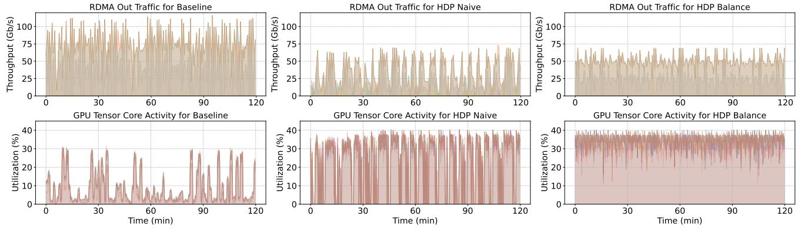

Figure 19. Network Traffic and Tensor Core Utilization

<span id="page-11-1"></span>> **[图片提取文字 (无描述)]:**
> ×105 3.0 3.89x MegaScale 3.69x + Dynamic Communication 2.5 -++ Selective Offloading 2.0 +++ Balance Strategy ++++ Remote Dataloader 2.01x 1.5 1.59x 1.00x (a) (d) (e)
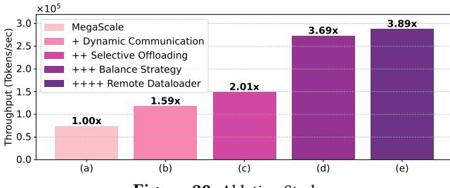

Figure 20. Ablation Study

#### <span id="page-11-0"></span>8.3 Case Studies

To anatomize the super performance of ByteScale more indeep, we choose the *Byted* dataset and conduct experiments by training LLaMA-7B with 2M context length on a cluster with 1024 GPUs. Figure 18 presents the detailed runtime status of different ranks during a single training step.

Communication-Bound Case. Firstly, we randomly select 4 ranks from the cluster, and record their forward and backward times within the training step for each method. As illustrated in Figure 18(b), for the baseline, the number of micro-batches is set as 8, and we have to set  $d_{cp} = 256$  to support the sequence length of 2M. It can be observed that these 4 ranks exhibit similar execution times. This is because most micro-batches (except the third one) do not have the computational complexity of  $O((2M)^2)$ , but have to handle the communication volume for 2M. As shown in Figure 18(a), the P2P communication time far exceeds the computation time, causing the execution time of a micro-batch almost determined by communication (97.6% of the total time).

Computation-Imbalance Case. Under the HDP naive solution, sequences within a global batch are sharded by the minimal required number of ranks. As illustrated in Figure 18(a), a 312K sequence is sharded by only 39 HDP ranks to serve as micro-batches, and thus the computation time can overlap the communication overhead. However, the training inefficiency still exists due to the imbalance across ranks. As shown in Figure 18(b), although the third rank completes its 8 micro-batches in 1m41s, it has to wait for the first rank to finish at 4m32s, leading to 171s of idle time. Even so, the HDP naive solution saves 4m8s compared to the baseline.

<span id="page-11-3"></span>> **[图片提取文字 (无描述)]:**
> 6.70 s 6.49 s 5.93 s © 7.5  $(\uparrow -31.7\%)$ 5.38 s $(\uparrow -27.7\%)$ 5.08 s $(\uparrow -16.5\%)$ 0.5 Time ( (1 - 5.8%)(10.0%)5.08 s0.0 offload=1.0 offload=0.8 offload=0.6 recompute offload=0.5normal (GB) 59 GB 60 40 GB Memory Usage 37 GB 33 GB (1 32.2%)(1 37.3%)27 GB 27 GB 40 ( 44.1%) (154.2%)(154.2%)20 offload=1.0 offload=0.8 offload=0.6 offload=0.5 recompute normal
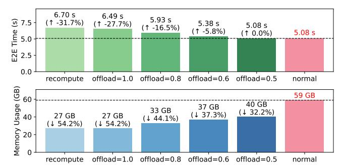

**Figure 21.** Effectiveness of Activation Offloading

Balance Case. Under the HDP balance solution, all ranks finish execution nearly at the same time. As shown in Figure 18(b), at any time step, each rank is assigned microbatches with similar FLOPs, and ranks with shorter execution times (e.g. the third and fourth ranks) will be assigned more batches. Consequently, the total time of this step is further reduced to 2m37s, saving 6m3s compared to the baseline.

Overall Comparison. As shown in Figure 18(c), we record the valid computation time in a single step for all the 1024 GPUs. It can be found that the HDP naive solution reduces the peak execution time by 1.7× compared to the baseline, but suffers from significant time variance across ranks, with a 4.7× difference between the maximum and the minimum value (min=60s, max=279s, std=68s). The HDP balance solution eliminates the time variance, thereby further reducing execution time by 2.3× compared to the naive solution.

# 8.4 Ablation Studies

To dive into the effectiveness of each component within ByteScale, we further conduct ablation experiments using the same configuration as §8.3, as shown in Figure 20.

Effectiveness of Dynamic Communication. While Figure 18 provides a snapshot of runtime during a single training step, we further profile the network traffic and tensor core utilization over two hours, as shown in Figure 19. It can be observed that the baseline exhibits very heavy RDMA traffic, yet the corresponding tensor core utilization is low. This is because most ranks are communication-bound, and

the computational units remain idle most of the time due to waiting for redundant communication. This observation is consistent with the situation depicted in Figure [18\(](#page-10-1)a). When we apply the HDP naive solution, the peak RDMA traffic is nearly halved, indicating that a significant amount of unnecessary communication has been eliminated. Besides, the tensor core utilization also increases from 10% to 40%. Thus it achieves a speedup of 1.59× compared to baseline. However, due to the imbalance issue, these improvements are not stable, and both communication and computation hardware units occasionally experience stalls or idle periods.

Effectiveness of Selective Offloading. Selective offloading serves as a complement to the HDP naive solution. As shown in Figure [21,](#page-11-3) activation offloading with ratio = 1.0 saves the same memory as recomputation. As the context length is set to 64K, the computation cannot fully overlap with offloading. However, as we reduce the ratio to = 0.5, it can save 32.3% of memory without compromising throughput. Furthermore, the offload ratio is automatically derived from Eq [3,](#page-6-1) as the context length increases, a higher ratio can be set to save more memory (e.g. set = 1.0 for 256K will not decrease throughput). This method reduces the number of ranks for longer sequences, enabling more sequences to be processed simultaneously with the same number of ranks, thereby improving speedup from 1.59× to 2.01×.

Effectiveness of Balance Strategy. As illustrated in Figure [19,](#page-11-2) the balance strategy stables the RDMA traffic and makes the tensor core utilization consistently around 40%. This indicates that the hardware units of both computation and communication continuously work at full load for over two hours without idling. Consequently, the HDP Balance solution achieves a speedup from 2.01× to 3.69×, surpassing the improvements by any other strategy.

Effectiveness of Remote Dataloader. We employ the remote loader depicted in Figure [15](#page-9-0) and use CPU prefetching to overlap data reading with computation. This approach further improves the speedup from 3.69× to 3.89×.

# 9 Conclusion

We proposed ByteScale, an efficient, flexible and scalable distributed LLM training framework for large-scale mixed training of long and short sequences. We develop the communication optimizer to eliminate redundant communication and build the balance scheduler to mitigate the imbalanced computation. We evaluate ByteScale on a production cluster with more than 12,000 GPUs, and scale the model size from 7B to 141B and the context length from 256K to 2M, experiment results show that it outperforms MegaScale by up to 7.89×.

# References

<span id="page-12-0"></span>[1] Sahar Abdelnabi, Amr Gomaa, Sarath Sivaprasad, Lea Schönherr, and Mario Fritz. 2023. LLM-Deliberation: Evaluating LLMs with Interactive Multi-Agent Negotiation Games. CoRR (2023).

- <span id="page-12-14"></span>[2] Mistral AI. 2024. Mistral: Tokenization. [https://docs.mistral.ai/guides/](https://docs.mistral.ai/guides/tokenization/) [tokenization/](https://docs.mistral.ai/guides/tokenization/).
- <span id="page-12-2"></span>[3] Anthropic. 2024. Introducing the next generation of Claude. [https:](https://www.anthropic.com/news/claude-3-family) [//www.anthropic.com/news/claude-3-family](https://www.anthropic.com/news/claude-3-family).
- <span id="page-12-7"></span>[4] William Brandon, Aniruddha Nrusimha, Kevin Qian, Zachary Ankner, Tian Jin, Zhiye Song, and Jonathan Ragan-Kelley. 2023. Striped Attention: Faster Ring Attention for Causal Transformers. CoRR abs/2311.09431 (2023).
- <span id="page-12-9"></span>[5] Tom B. Brown, Benjamin Mann, Nick Ryder, Melanie Subbiah, Jared Kaplan, Prafulla Dhariwal, Arvind Neelakantan, Pranav Shyam, Girish Sastry, Amanda Askell, Sandhini Agarwal, Ariel Herbert-Voss, Gretchen Krueger, Tom Henighan, Rewon Child, Aditya Ramesh, Daniel M. Ziegler, Jeffrey Wu, Clemens Winter, Christopher Hesse, Mark Chen, Eric Sigler, Mateusz Litwin, Scott Gray, Benjamin Chess, Jack Clark, Christopher Berner, Sam McCandlish, Alec Radford, Ilya Sutskever, and Dario Amodei. 2020. Language Models are Few-Shot Learners. In Annual Conference on Neural Information Processing Systems 2020 (NeurIPS 2020).
- <span id="page-12-11"></span>[6] Aakanksha Chowdhery, Sharan Narang, Jacob Devlin, Maarten Bosma, Gaurav Mishra, Adam Roberts, Paul Barham, Hyung Won Chung, Charles Sutton, Sebastian Gehrmann, Parker Schuh, Kensen Shi, Sasha Tsvyashchenko, Joshua Maynez, Abhishek Rao, Parker Barnes, Yi Tay, Noam Shazeer, Vinodkumar Prabhakaran, Emily Reif, Nan Du, Ben Hutchinson, Reiner Pope, James Bradbury, Jacob Austin, Michael Isard, Guy Gur-Ari, Pengcheng Yin, Toju Duke, Anselm Levskaya, Sanjay Ghemawat, Sunipa Dev, Henryk Michalewski, Xavier Garcia, Vedant Misra, Kevin Robinson, Liam Fedus, Denny Zhou, Daphne Ippolito, David Luan, Hyeontaek Lim, Barret Zoph, Alexander Spiridonov, Ryan Sepassi, David Dohan, Shivani Agrawal, Mark Omernick, Andrew M. Dai, Thanumalayan Sankaranarayana Pillai, Marie Pellat, Aitor Lewkowycz, Erica Moreira, Rewon Child, Oleksandr Polozov, Katherine Lee, Zongwei Zhou, Xuezhi Wang, Brennan Saeta, Mark Diaz, Orhan Firat, Michele Catasta, Jason Wei, Kathy Meier-Hellstern, Douglas Eck, Jeff Dean, Slav Petrov, and Noah Fiedel. 2023. PaLM: Scaling Language Modeling with Pathways. Journal of Machine Learning Research (JMLR) 24 (2023), 240:1–240:113.
- <span id="page-12-4"></span>[7] Tri Dao. 2023. FlashAttention-2: Faster Attention with Better Parallelism and Work Partitioning. CoRR abs/2307.08691 (2023).
- <span id="page-12-5"></span>[8] Tri Dao, Daniel Y. Fu, Stefano Ermon, Atri Rudra, and Christopher Ré. 2022. FlashAttention: Fast and Memory-Efficient Exact Attention with IO-Awareness. In Annual Conference on Neural Information Processing Systems 2022 (NeurIPS 2022).
- <span id="page-12-6"></span>[9] Jeffrey Dean, Greg Corrado, Rajat Monga, Kai Chen, Matthieu Devin, Quoc V. Le, Mark Z. Mao, Marc'Aurelio Ranzato, Andrew W. Senior, Paul A. Tucker, Ke Yang, and Andrew Y. Ng. 2012. Large Scale Distributed Deep Networks. In 26th Annual Conference on Neural Information Processing Systems 2012 (NeurIPS 2022). 1232–1240.
- <span id="page-12-8"></span>[10] DeepSeek-AI. 2025. DeepSeek-R1: Incentivizing Reasoning Capability in LLMs via Reinforcement Learning. CoRR abs/2501.12948 (2025).
- <span id="page-12-1"></span>[11] Abhimanyu Dubey, Abhinav Jauhri, Abhinav Pandey, Abhishek Kadian, et al. 2024. The Llama 3 Herd of Models. CoRR (2024).
- <span id="page-12-13"></span>[12] Tianyu Gao, Alexander Wettig, Howard Yen, and Danqi Chen. 2024. How to Train Long-Context Language Models (Effectively). CoRR (2024).
- <span id="page-12-3"></span>[13] Google. 2024. Gemini 1.5 Pro 2M context window, code execution capabilities, and Gemma 2 are available today. [https://developers.googleblog.com/en/new-features-for-the-gemini](https://developers.googleblog.com/en/new-features-for-the-gemini-api-and-google-ai-studio/)[api-and-google-ai-studio/](https://developers.googleblog.com/en/new-features-for-the-gemini-api-and-google-ai-studio/).
- <span id="page-12-10"></span>[14] Google. 2024. Introducing Gemini: our largest and most capable AI model. <https://blog.google/technology/ai/google-gemini-ai/>.
- <span id="page-12-12"></span>[15] Jordan Hoffmann, Sebastian Borgeaud, Arthur Mensch, Elena Buchatskaya, Trevor Cai, Eliza Rutherford, Diego de Las Casas, Lisa Anne Hendricks, Johannes Welbl, Aidan Clark, Tom Hennigan, Eric Noland, Katie Millican, George van den Driessche, Bogdan Damoc,

- Aurelia Guy, Simon Osindero, Karen Simonyan, Erich Elsen, Jack W. Rae, Oriol Vinyals, and Laurent Sifre. 2022. Training Compute-Optimal Large Language Models. CoRR abs/2203.15556 (2022).
- <span id="page-13-23"></span>[16] Yanping Huang, Youlong Cheng, Ankur Bapna, Orhan Firat, Dehao Chen, Mia Xu Chen, HyoukJoong Lee, Jiquan Ngiam, Quoc V. Le, Yonghui Wu, and Zhifeng Chen. 2019. GPipe: Efficient Training of Giant Neural Networks using Pipeline Parallelism. In Annual Conference on Neural Information Processing Systems 2019 (NeurIPS 2019). 103–112.
- <span id="page-13-14"></span>[17] Sam Ade Jacobs, Masahiro Tanaka, Chengming Zhang, Minjia Zhang, Shuaiwen Leon Song, Samyam Rajbhandari, and Yuxiong He. 2023. DeepSpeed Ulysses: System Optimizations for Enabling Training of Extreme Long Sequence Transformer Models. CoRR abs/2309.14509 (2023).
- <span id="page-13-16"></span>[18] Ziheng Jiang, Haibin Lin, et al. 2024. MegaScale: scaling large language model training to more than 10,000 GPUs. In Proceedings of the 21st USENIX Symposium on Networked Systems Design and Implementation (NSDI'24). USENIX Association, USA, Article 41, 16 pages.
- <span id="page-13-1"></span>[19] Hanlei Jin, Yang Zhang, Dan Meng, Jun Wang, and Jinghua Tan. 2024. A Comprehensive Survey on Process-Oriented Automatic Text Summarization with Exploration of LLM-Based Methods. CoRR abs/2403.02901 (2024).
- <span id="page-13-0"></span>[20] Jared Kaplan, Sam McCandlish, Tom Henighan, Tom B. Brown, Benjamin Chess, Rewon Child, Scott Gray, Alec Radford, Jeffrey Wu, and Dario Amodei. 2020. Scaling Laws for Neural Language Models. CoRR abs/2001.08361 (2020).
- <span id="page-13-11"></span>[21] Vijay Korthikanti, Jared Casper, Sangkug Lym, Lawrence McAfee, Michael Andersch, Mohammad Shoeybi, and Bryan Catanzaro. 2022. Reducing Activation Recomputation in Large Transformer Models. CoRR abs/2205.05198 (2022).
- <span id="page-13-18"></span>[22] Mario Michael Krell, Matej Kosec, Sergio P Perez, and Andrew Fitzgibbon. 2021. Efficient sequence packing without cross-contamination: Accelerating large language models without impacting performance. CoRR abs/2107.02027 (2021).
- <span id="page-13-8"></span>[23] Dacheng Li, Rulin Shao, Anze Xie, Eric P. Xing, Joseph E. Gonzalez, Ion Stoica, Xuezhe Ma, and Hao Zhang. 2023. LightSeq: Sequence Level Parallelism for Distributed Training of Long Context Transformers. CoRR abs/2310.03294 (2023).
- <span id="page-13-6"></span>[24] Shen Li, Yanli Zhao, Rohan Varma, Omkar Salpekar, Pieter Noordhuis, Teng Li, Adam Paszke, Jeff Smith, Brian Vaughan, Pritam Damania, and Soumith Chintala. 2020. PyTorch Distributed: Experiences on Accelerating Data Parallel Training. Proc. VLDB Endow. 13, 12 (2020), 3005–3018.
- <span id="page-13-9"></span>[25] Hao Liu, Matei Zaharia, and Pieter Abbeel. 2023. Ring Attention with Blockwise Transformers for Near-Infinite Context. CoRR abs/2310.01889 (2023).
- <span id="page-13-26"></span>[26] Philipp Moritz, Robert Nishihara, Stephanie Wang, Alexey Tumanov, Richard Liaw, Eric Liang, Melih Elibol, Zongheng Yang, William Paul, Michael I. Jordan, and Ion Stoica. 2018. Ray: a distributed framework for emerging AI applications. In Proceedings of the 13th USENIX Conference on Operating Systems Design and Implementation (OSDI'18). USENIX Association, USA, 561–577.
- <span id="page-13-4"></span>[27] Daye Nam, Andrew Macvean, Vincent Hellendoorn, Bogdan Vasilescu, and Brad Myers. 2024. Using an llm to help with code understanding. In Proceedings of the IEEE/ACM 46th International Conference on Software Engineering. 1–13.
- <span id="page-13-24"></span>[28] Deepak Narayanan, Aaron Harlap, Amar Phanishayee, Vivek Seshadri, Nikhil R. Devanur, Gregory R. Ganger, Phillip B. Gibbons, and Matei Zaharia. 2019. PipeDream: generalized pipeline parallelism for DNN training. In Proceedings of the 27th ACM Symposium on Operating Systems Principles (SOSP 2019). 1–15.
- <span id="page-13-25"></span>[29] Deepak Narayanan, Amar Phanishayee, Kaiyu Shi, Xie Chen, and Matei Zaharia. 2021. Memory-Efficient Pipeline-Parallel DNN Training. In International Conference on Machine Learning 2021 (ICML 2021),

- Vol. 139. 7937–7947.
- <span id="page-13-12"></span>[30] Deepak Narayanan, Mohammad Shoeybi, Jared Casper, Patrick LeGresley, Mostofa Patwary, Vijay Korthikanti, Dmitri Vainbrand, Prethvi Kashinkunti, Julie Bernauer, Bryan Catanzaro, Amar Phanishayee, and Matei Zaharia. 2021. Efficient large-scale language model training on GPU clusters using megatron-LM. In International Conference for High Performance Computing, Networking 2021 (SC 2021). 58.
- <span id="page-13-10"></span>[31] NVIDIA. 2024. NVIDIA: Context Parallelism. [https:](https://docs.nvidia.com/megatron-core/developer-guide/latest/api-guide/context_parallel.html) [//docs.nvidia.com/megatron-core/developer-guide/latest/api](https://docs.nvidia.com/megatron-core/developer-guide/latest/api-guide/context_parallel.html)[guide/context\\_parallel.html](https://docs.nvidia.com/megatron-core/developer-guide/latest/api-guide/context_parallel.html).
- <span id="page-13-20"></span>[32] OpenAI. 2023. GPT-4 Technical Report. CoRR abs/2303.08774 (2023).
- <span id="page-13-5"></span>[33] OpenAI. 2024. Hello GPT-4o. <https://openai.com/index/hello-gpt-4o/>.
- <span id="page-13-17"></span>[34] OpenAI. 2024. Introducing OpenAI o1. <https://openai.com/o1/>.
- <span id="page-13-22"></span>[35] Samyam Rajbhandari, Jeff Rasley, Olatunji Ruwase, and Yuxiong He. 2020. ZeRO: memory optimizations toward training trillion parameter models. In Proceedings of the International Conference for High Performance Computing, Networking, Storage and Analysis (SC 2020). 20.
- <span id="page-13-15"></span>[36] Jeff Rasley, Samyam Rajbhandari, Olatunji Ruwase, and Yuxiong He. 2020. DeepSpeed: System Optimizations Enable Training Deep Learning Models with Over 100 Billion Parameters. In The 26th ACM SIGKDD Conference on Knowledge Discovery and Data Mining (KDD 2020). 3505– 3506.
- <span id="page-13-7"></span>[37] Alexander Sergeev and Mike Del Balso. 2018. Horovod: fast and easy distributed deep learning in TensorFlow. CoRR abs/1802.05799 (2018).
- <span id="page-13-13"></span>[38] Mohammad Shoeybi, Mostofa Patwary, Raul Puri, Patrick LeGresley, Jared Casper, and Bryan Catanzaro. 2019. Megatron-LM: Training Multi-Billion Parameter Language Models Using Model Parallelism. CoRR abs/1909.08053 (2019).
- <span id="page-13-21"></span>[39] Hugo Touvron, Louis Martin, Kevin Stone, Peter Albert, Amjad Almahairi, Yasmine Babaei, Nikolay Bashlykov, Soumya Batra, Prajjwal Bhargava, Shruti Bhosale, Dan Bikel, Lukas Blecher, Cristian Canton-Ferrer, Moya Chen, Guillem Cucurull, David Esiobu, Jude Fernandes, Jeremy Fu, Wenyin Fu, Brian Fuller, Cynthia Gao, Vedanuj Goswami, Naman Goyal, Anthony Hartshorn, Saghar Hosseini, Rui Hou, Hakan Inan, Marcin Kardas, Viktor Kerkez, Madian Khabsa, Isabel Kloumann, Artem Korenev, Punit Singh Koura, Marie-Anne Lachaux, Thibaut Lavril, Jenya Lee, Diana Liskovich, Yinghai Lu, Yuning Mao, Xavier Martinet, Todor Mihaylov, Pushkar Mishra, Igor Molybog, Yixin Nie, Andrew Poulton, Jeremy Reizenstein, Rashi Rungta, Kalyan Saladi, Alan Schelten, Ruan Silva, Eric Michael Smith, Ranjan Subramanian, Xiaoqing Ellen Tan, Binh Tang, Ross Taylor, Adina Williams, Jian Xiang Kuan, Puxin Xu, Zheng Yan, Iliyan Zarov, Yuchen Zhang, Angela Fan, Melanie Kambadur, Sharan Narang, Aurélien Rodriguez, Robert Stojnic, Sergey Edunov, and Thomas Scialom. 2023. Llama 2: Open Foundation and Fine-Tuned Chat Models. CoRR abs/2307.09288 (2023).
- <span id="page-13-19"></span>[40] Ashish Vaswani, Noam Shazeer, Niki Parmar, Jakob Uszkoreit, Llion Jones, Aidan N. Gomez, Lukasz Kaiser, and Illia Polosukhin. 2017. Attention is All you Need. In Annual Conference on Neural Information Processing Systems 2017 (NeurIPS 2017). 5998–6008.
- <span id="page-13-2"></span>[41] Xiaohan Wang, Yuhui Zhang, Orr Zohar, and Serena Yeung-Levy. 2025. Videoagent: Long-form video understanding with large language model as agent. In European Conference on Computer Vision. Springer, 58–76.
- <span id="page-13-3"></span>[42] Yuetian Weng, Mingfei Han, Haoyu He, Xiaojun Chang, and Bohan Zhuang. 2024. LongVLM: Efficient Long Video Understanding via Large Language Models. In Computer Vision – ECCV 2024: 18th European Conference, Milan, Italy, September 29–October 4, 2024, Proceedings, Part XXXIII.
- <span id="page-13-27"></span>[43] An Yang, Baosong Yang, Beichen Zhang, Binyuan Hui, Bo Zheng, Bowen Yu, Chengyuan Li, Dayiheng Liu, Fei Huang, Haoran Wei, Huan Lin, Jian Yang, Jianhong Tu, Jianwei Zhang, Jianxin Yang, Jiaxi Yang, Jingren Zhou, Junyang Lin, et al. 2025. Qwen2.5 Technical Report. CoRR abs/2412.15115 (2025).