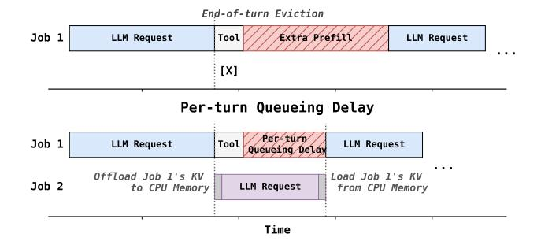
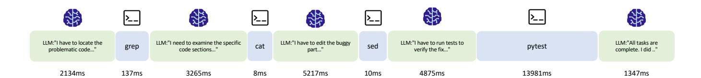
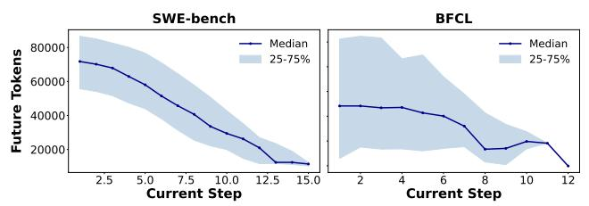
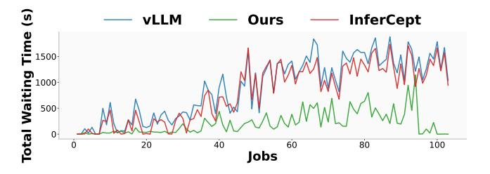
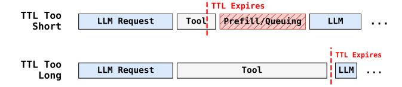
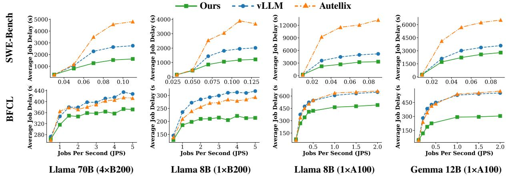
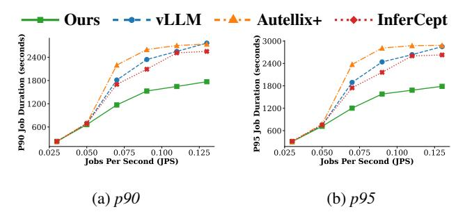
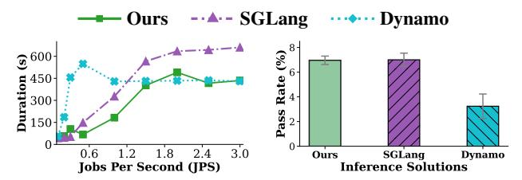
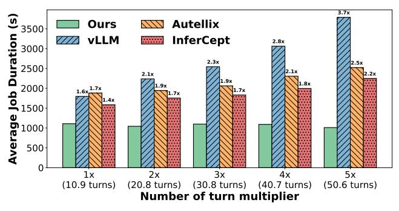
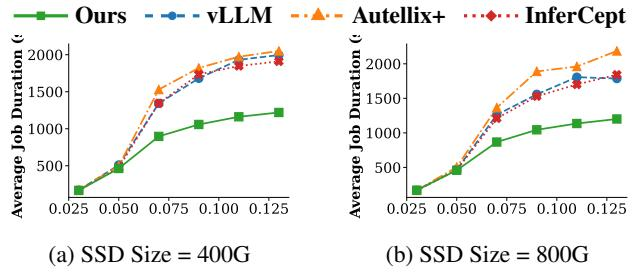

# <span id="page-0-1"></span>Continuum: Efficient and Robust Multi-Turn LLM Agent Scheduling with KV Cache Time-to-Live

Hanchen Li∗<sup>1</sup> , Runyuan He∗<sup>1</sup> , Qiuyang Mang<sup>1</sup> , Qizheng Zhang<sup>2</sup> , Huanzhi Mao<sup>1</sup> , Xiaokun Chen<sup>3</sup> , Hangrui Zhou<sup>4</sup> , Alvin Cheung<sup>1</sup> , Joseph Gonzalez<sup>1</sup> , Ion Stoica<sup>1</sup>

# Abstract

KV cache management is essential for efficient LLM inference. To maximize utilization, existing inference engines evict finished requests' KV cache if new requests are waiting. This policy breaks for agentic workloads, which interleave LLM calls with tools, introducing pauses that prevent effective KV reuse across turns. Since many tool calls have much shorter durations than human response multi-turn chatbot, it would be promising to retain the KV cache in during these tools. However, many challenges remain. First, we need to consider both the potential cost of recomputation or reloading (if offloading enabled) as well as the increasing queueing delays after eviction from GPU. Second, due to the internal variance of tool call durations, the method needs to remain robust under limited predictability of tool call durations.

We present Continuum, a serving system to optimize job completion time for multi-turn agent workloads by introducing time-to-live mechanism for KV cache retention. For requests that generate tool calls, Continuum selectively pins the KV cache in GPU memory with a time-to-live value determined by the reload cost and potential queueing delay induced by eviction. When the TTL expires, the KV cache can be automatically evicted to free up GPU memory, providing robust performance under edge cases. When combined with programlevel first-come-first-serve, Continuum preserves multi-turn continuity, and reduces delay for agentic workflows. Evaluations on real-world agents (SWE-Bench, BFCL, OpenHand) with Llama-3.1 8B/70B, Gemma-3 12B, and GLM-4.5 355B shows that Continuum improves the average job completion times by over 8x while improving throughput.

# 1 Introduction

KV Cache management is key to large language model inference, impacting both the input processing (prefill) and output generation (decoding) stages [\[15,](#page-12-0) [40,](#page-13-0) [85\]](#page-15-0). A critical component of KV cache management is the eviction policy. Ideally, the system should avoid evicting tokens that will be referenced in the immediate future. Similar to traditional caching systems, Existing inference engines assumes that KV caches are less important once decoding is finished. This means that they will be discarded if other new requests in the waiting queue to maximize utilization. We refer to this type of policy end-of-turn eviction.

While end-of-turn eviction works well for multi-turn chat applications, it can significantly degrade the performance of

<sup>1</sup>UC Berkeley <sup>2</sup>Stanford University <sup>3</sup>Tensormesh <sup>4</sup>Tsinghua University

#### **End-of-turn KV Cache Eviction**

<span id="page-0-0"></span>> **[图片提取文字 (无描述)]:**
> End-of-turn Eviction Job 1 LLM Request Tool Extra Prefill LLM Request [X] Per-turn Queueing Delay Per-turn Job 1 LLM Request Tool LLM Request Queueing Delay . . . Offload Job 1's KV Load Job 1's KV Job 2 LLM Request to CPU Memory from CPU Memory Time


Figure 1: *Two main failure modes of prior agent-serving systems. Red blocks represent overhead from suboptimal scheduling and KV-cache management: even with CPU offloading, agents still suffer queueing delay after KV-cache eviction.*

modern agentic workloads, particularly those involving tool calling. These agentic applications have become increasingly popular across domains such as software engineering [\[75\]](#page-15-1), computer use [\[7\]](#page-12-1), and scientific research [\[61\]](#page-14-0). These workloads characteristically interleave (a) inference steps to derive the next action, and (b) execution steps where the agent calls an external tool. The output of the tool is subsequently appended to the request context, and a new inference step is initiated in the inference engine. Since the tool call can be much faster (*i.e.,* ≤ 2s) than human typing speed, this new workload requires changes to end-of-turn eviction.

The core issue arises after the request's KV cache is evicted when the agent transforms from inference step to tool call. If the KV cache was evicted for this step, the engine must recompute the prefix (prefill) or reload from CPU (if CPU offloading is enabled [\[15\]](#page-12-0)) when the tool execution completes and the next inference step begins. This repetitive prefill introduces substantial delays and reduces overall system throughput. More importantly, even when CPU offloading is enabled to reuse KV cache, eviction causes another problem: perturn queueing delay. When the next inference step has its KV cache evicted from GPU memory, even if the KV cache can be reloaded from CPU, it will also have to wait in the waiting queue for other requests to free up GPU memory before starting inference. This per-turn queueing delay can accumulate and result in increasing delay for each agentic program as illustrated in Figure [1.](#page-0-0) Since this delay is not measurable by offline profiling, we need to design a new model to include its impact. Moreover, since tool calls can be inherently variable, we need to set a maximum KV cache retention time to prevent infinitely long waiting. However, if this time expires just before the tool call, the previous waiting time will be wasted. Thus, we need to carefully set the KV cache retention time to best adapt to the workload.

Previous work fails to address these challenges. Infer-Cept [\[2\]](#page-12-2) makes its KV preserve decision based solely on the reload cost. But it does not model the per-turn queueing delay that accumulates over turns, nor have a robust mechanism to handle variable tool call durations. This makes it impractical for real-world deployment. As we show later in Section [6,](#page-8-0) InferCept accumulates the queueing penalty over turns, resulting in suboptimal performance. Autellix [\[51\]](#page-14-1) uses end-of-turn eviction and ignores the importance of KV cache retention in multi-turn agent scheduling. Pie [\[25\]](#page-13-1) exposes interfaces but provides no policy for KV cache retention decisions. Ayo [\[66\]](#page-15-2), Alto [\[62\]](#page-14-2), and Parrot [\[46\]](#page-14-3) assume static workflows and do not apply to dynamic agents.

To provide an efficient and robust solution, we present Continuum, a serving system that utilizes KV cache time-to-live technique to improve job completion time for multi-turn agent workloads. Inspired by previous caching papers, Continuum introduces a KV cache time-to-live (TTL) mechanism to retain KV cache inside GPU after request finishes to over-ride original end-of-turn evictions. For each LLM request that generates a tool call during the inference step, Continuum models both the prefill/reload cost and the per-turn queueing delay reduction brought retaining KV cache. After obtaining the benefits of a potential hit based on the above two factors and tool call distributions, Continuum compares this with the cost of occupying GPU memory space during the TTL time to decide how long the KV cache can stay in GPU memory before being automatically evicted. This allows the next request to immediately resume if the tool call returns within the TTL window to save prefill and queueing delay. When the tool call prediction is inaccurate and the tool call takes longer than expected, Continuum can correct the mistake robustly by evicting the KV cache after the TTL expires, preventing severe memory pressure or deadlocks. Furthermore, Continuum combines the TTL mechanism with program-level first-comefirst-serve scheduling. This enforces better request ordering and simplifies scheduling for complex agentic workflows.

We implemented Continuum on top of vLLM with a modular design that can be easily maintained or integrated into other inference engines. Continuum implemented a tool call handler that is called each time a request enters or leaves the serving engine. It identifies the tool call, predicts the duration, and decides the timeout of the KV cache pin based on both throughput and request ordering concerns. This modular design adds minimal change to the original scheduling logic of the inference engine and allows for future extension to tool-call aware scheduling.

To evaluate Continuum's performance, we conduct extensive experiment on real agentic workloads in function calling [\[54\]](#page-14-4) and coding agents [\[45\]](#page-13-2). Across three hardware and

model setups, we show that Continuum reduces delay by 1.12x to 3.66x and improves throughput by 1.10x to 3.22x on multi-turn agentic workloads. Moreover, we evaluated Continuum on Tensormesh's internal testbed and show it can reduce delay for real SWE-agent workloads by up to 8.18x. We will open-source our traces, code, and the agent serving testbed to foster future agent serving research.

In summary, our contributions are the following:

- We identify the key cache KV retention problem in agent serving and motivates the need for better solution.
- We design Continuum, a efficient and robust serving system with KV cache time-to-live mechanism to reduce turnbased eviction cost and per-turn queueing delay.
- We demonstrate that Continuum achieves up to 8.18x improvements in both latency and throughput over previous methods in both emulated and real cases.
- We will open-source our collected agent inference traces, code, and agent serving testbed upon publication.

# 2 Background

# 2.1 ReAct Paradigm for Agents

Most modern agentic workloads follow the *ReAct*-agent loop [\[79\]](#page-15-3), alternating between a reasoning step where the LLM interprets context and outputs thoughts, and an action step where it invokes external tools. This paradigm has become the de facto standard: coding agents such as Claude Code [\[8\]](#page-12-3) and Cursor [\[19\]](#page-12-4) adopt it for its clarity and performance, frameworks like LangChain [\[42\]](#page-13-3) and LangGraph [\[43\]](#page-13-4) make the pattern broadly accessible, and recent open-weight models including GPT-OSS [\[3\]](#page-12-5) and Kimi-K2 [\[1\]](#page-12-6) bake toolcall ability directly into the base model.

An important trend is that agentic applications increasingly scale this loop into *long-horizon, multi-turn* iterations, repeatedly interleaving thought, tool call, and context update across dozens or even hundreds of turns. This is reflected in recent benchmarks such as τ-bench for tool-agent-user interaction [\[78\]](#page-15-4), MINT for multi-turn tool-augmented interaction [\[69\]](#page-15-5), and AgentBench for multi-turn decision-making and tool-use scenarios [\[48\]](#page-14-5).

# 2.2 Limitations of Existing Methods

Previous works fail to handle this emerging complex workload due to three main reasons:

Fixed Workflow: One line of work focused on scheduling agentic workflows with pre-defined, static computation graphs. Teola [\[66\]](#page-15-2) decomposes applications into primitivelevel dataflow graphs and then applies graph-level optimizations. Alto [\[62\]](#page-14-2) focuses on streaming and pipelined execution across distributed components. Parrot [\[46\]](#page-14-3) exposes

<span id="page-2-0"></span>> **[图片提取文字 (无描述)]:**
> LLM:"I have to locate the LLM:"I need to examine the specific LLM:"I have to edit the buggy LLM:"I have to run tests to LLM: "All tasks are pytest grep problematic code..." code sections..." verify the fix..." complete. I did .." 2134ms 137ms 3265ms 8ms 5217ms 10ms 4875ms 13981ms 1347ms


Figure 2: Illustrative example of a SWE-Agent. The agent resolves a software engineering bug step by step with tool calls in the middle. These tool calls have different durations and breaks the continuity of the LLM inference.

application-level context to LLM services through Semantic Variables, enabling the engine to infer data dependencies across consecutive LLM requests. One shared limitation of Teola, Parrot, and Alto is that they all assume static or deterministically defined DAGs and **could not work with dynamic agent workloads** like ReAct-styled ones whose dependency graphs evolve at runtime. This limits these work from optimizing for the wide variety of agents in practice [9, 45, 74].

No Consideration for Tool Calls: Autellix [51] introduces Program-Level Attained Service (PLAS) scheduling that prioritizes requests with less cumulative service time of the agentic program. Tempo [84] proposes a scheduler to satisfy the SLOs when facing different types of requests (chat, agent, reasoning), while our focus is particularly on agentic workloads with many-turn and variable tool calls. These work fail to consider the unique characteristics of tool calls in agentic workloads, such as their variable durations and the impact on KV cache management. This oversight can lead to suboptimal scheduling decisions and increased latency, as we demonstrate later in Sec 3.2.

**Insufficient KV Cache Retention Strategies:** Some previous work observed the challenge of KV cache reuse for agent workloads. InferCept [2] introduces a "preserve" operation that pins the KV cache between tool calls. However, their policy overlooks the multi-turn nature of requests. When KV cache is evicted between turn, this will cause additional queueing time per turn for the program when they come back. In multi-turn scenarios, the queueing time can accumulate for each turn. Ignoring such effects makes them not preserve KV cache in GPU even when there are significant benefits. Moreover, their preserve operation is fixed and could not adapt to tool use in real time. If the actual tool call time is much longer than predicted, blindly "preserving" the KV cache can cause significant inefficiency. This makes it impractical for real-world deployment. Pie [25] introduces a programmable serving system that decomposes the generation loop into finegrained handlers. It delegates control to user programs, allowing for custom tool call handling. However, it requires developers to manually design scheduling for each agent. and provides no actual method to adapt to dynamic tool-call latencies or multi-turn dependencies.

| Method    | Retains<br>KV Cache | Includes Per-Turn<br>Queueing Delay | Bounds<br>Retention Time |  |
|-----------|---------------------|-------------------------------------|--------------------------|--|
| vLLM      | Х                   | Х                                   | Х                        |  |
| Autellix  | X                   | ×                                   | ×                        |  |
| Pie       | ✓                   | ×                                   | ×                        |  |
| InferCept | ✓                   | ×                                   | ×                        |  |
| Continuum | ✓                   | ✓                                   | ✓                        |  |

Table 1: Continuum comparison with representative baselines.

<span id="page-2-1"></span>> **[图片提取文字 (无描述)]:**
> SWE-bench BFCL Median Median 80000 25-75% 25-75% 60000 40000 20000 2.5 12.5 15.0 10.0 10 **Current Step Current Step**


Figure 3: Workload characteristics of agentic workloads SWE-Bench and BFCL as used in Sec 6. As the number of steps increase, the requests are closer to finish.

#### 3 Motivation

## 3.1 Agentic Traces

We begin by analyzing the characteristics of modern agentic workloads. We collect and analyze 100 traces from mini-sweagent [45] running SWE-Bench [33] and 100 traces from BFCL V4 Web Search [53], both running GPT-5 as the base model. Figure 2 presents an illustrative shortened example trace from SWE-Bench, demonstrating how the agent solves a software engineering task step by step.

The takeway is three-fold. First, there are many turns for these novel agentic programs. This increase in turn numbers adds additional scheduling difficulty. Second, the tool call times have varying time distribution, but many are short. Although the request will be considered finished after these short tool calls are generated, the next request will arrive soon after the tool call completes, reusing the KV cache.

Last but not least, as shown in Figure 3, the program approaches completion, the expected number of future tokens overall reduces for both worloads. This indicates that later turns have shorter expected finish time. This suggests that prioritizing requests that came earlier (program-level FCFS) or

| Dataset   | No. of Turns | Tool Time(ms)  | Token Per Program |
|-----------|--------------|----------------|-------------------|
| SWE-Bench | (10.9, 2.1)  | (925, 3,550)   | (70,126, 19,732)  |
| BFCL v4   | (6.3, 2.3)   | (1,923, 2,133) | (93,256, 68,687)  |

Table 2: Statistics from two collected datasets. Reported numbers are in format of (mean, standard deviation).

<span id="page-3-1"></span>> **[图片提取文字 (无描述)]:**
> InferCept **VLLM** Ours 1500 1000 Waiti 500 0. 40 20 60 80 100 Jobs


Figure 4: Per-program queueing delay under CPU offloading. InferCept's preserve decision ignores queueing cost, so evicted programs still accumulate substantial waiting time across turns—comparable to vanilla vLLM despite InferCept's reload savings.

have executed more turns could be a good approximation for the theoretically optimal but clairvoyant shortest remaining time first (SRTF) scheduling policy. But it is non-trivial to maintain such ordering when tool calls are involved, as we will discuss later in 3.2.

### <span id="page-3-0"></span>3.2 Challenges for Agentic Workloads

**Turn-based Eviction:** Although these tool calls can be short, inference engines treat them as homogeneous gaps between LLM requests. vLLM or SGLang will evict a request's KV cache as soon as decoding finishes, implicitly assuming the request is complete. However, if the KV cache has been evicted, the engine must either redo the full prefill or reload the KV cache from DRAM when offloading is enabled, incurring additional delay. Most systems fall short in handling these scenarios efficiently.

Figure 1 illustrates this effect: the tool call creates a pause that triggers KV cache eviction, leading to prefill or KV reload on return. Thus, it is important to have a KV cache retention policy that considers tool calls to avoid such overheads.

**Per-Turn Queueing Delay:** The multi-turn nature agent programs also introduces a new challenge for scheduler that prior work have critically overlooked. While the current agent program is waiting on the tool, if the scheduler allocates the GPU memory to other requests to maximize throughput, the KV cache for the current program will be removed from GPU memory. When the program's tool call returns and the following LLM request is sent to the scheduler, it must wait behind ongoing prefill/decoding of other requests for free GPU space.

<span id="page-3-2"></span>> **[图片提取文字 (无描述)]:**
> 10<sup>2</sup> 1003 Frequency  $_{10_1}$ 80 Frequency 101 10<sup>0</sup> 10<sup>0</sup> 20 10 10 15 **Execution Time (seconds) Execution Time (seconds)** (a) BFCL: fetch\_url (b) SWE-Bench: cd


Figure 5: Functions' execution time can be extremely long-tailed. Slowest 10% of fetch\_url account for 52.5% of the total delay, while slowest 10% of cd account for 94.1%.

This waiting period produces a gap in the execution of the agent program regardless whether the KV cache is stored in a CPU DRAM location. As shown by Figure 1, this gap also contributes to the delay induced by the tool call besides the previous prefill/loading cost, accumulating over turns and causing substantial delays for each program. Moreover, it also breaks the continuity of the program execution and schedules requests with earlier arrival times after later ones. Notice that even if we give the highest priority to the new request in the waiting queue, it still will be blocked by the ongoing computation of the other requests already in GPU.

Existing works do not consider per-turn queueing delay in their retention policies. InferCept [2]'s KV "preserve" operation is invoked only when the CPU offloading cost exceeds the estimated GPU occupation cost during the tool call. Crucially, this decision only accounts for the reload cost of the immediate next turn—it entirely ignores the queueing delay that an evicted program will experience when it re-enters the waiting queue behind other active requests. With fast asynchronous CPU offloading provided by engines like LMCache [15], the reload cost becomes small, so InferCept's preserve operation is rarely invoked. Yet the queueing delay persists regardless of offloading speed: even with instant KV reload, the returning request must still wait for GPU memory occupied by other requests to be freed. Since this queueing cost is incurred at every turn, the total accumulated delay grows proportionally with the number of turns per program—precisely the regime where agentic workloads operate.

We demonstrate the performance degradation brought by this lack of consideration for multi-turn scheduling in Figure 4. We profile the total eviction overhead experienced by each request for vanilla vLLM and the InferCept algorithm. The x-axis represents each agentic program in order of arrival time, while the y-axis denotes the total bubble time for each agentic job — the total idle period a request experiences in the waiting queue before execution. Even with InferCept's KV retention, bubbles still persist and causes delay increase despite its throughput improvement over vLLM.

**Variable Tool Call:** Current KV cache retention policy also fail under greatly varying tool calls. For example, InferCept's approach pins the KV cache in GPU memory until

<span id="page-4-0"></span>> **[图片提取文字 (无描述)]:**
> ! TTL Expires TTL Too Tool Prefill/Queuing LLM Request LLM Short TTL Expires TTL Too LLM Request Tool . . . Long


Figure 6: *Time-to-live needs to be well set to balance between memory usage and the prefill plus per-turn queueing delay.*

the next request arrives after a tool call. This methods works fine under stable tool call latencies. However, as shown in Figure [5,](#page-3-2) many tool calls exhibit high variability in execution time. When the tool call takes much longer than expected, the pinned KV cache could occupy GPU memory for a long time. Similar patterns are observed in database agents, as external tool calls are more complex. This leads to inefficient memory usage and even potential deadlocks when retained KV cache fully occupies the GPU. Thus, a static retention policy lacks robustness in practical scenarios.

# 4 Continuum Scheduling Algorithm

Given the failure of previous work, we identify the key question in serving agentic workloads: How to efficiently and robustly retain KV cache in multi-turn scenarios?

An optimal KV cache retention policy should include the following features:

- It should retain KV cache for requests that will reuse them soon after tool calls, minimizing prefill/loading overheads.
- It should consider the multi-turn continuity of agent programs, reducing waiting and preserving program order.
- It should be robust to varying tool call latencies.

In order to achieve the robustness guarantee, we propose to borrow the idea of Time-to-live (TTL) from traditional systems: for each request's KV cache, we give a TTL value to define the maximum duration for it to remain in GPU memory. This prevents long-running or failed tool calls from blocking GPU resources indefinitely while retaining KV cache.

However, setting appropriate TTL values for each KV cache entry is challenging compared with static preserve operations. First, the TTL value should not be too large. If the timeout duration is too long as shown in Figure [6,](#page-4-0) the pinned KV cache occupies GPU memory unnecessarily, blocking other requests and reducing overall system throughput. On the other hand, if the pin time for the specific KV cache is too short, the KV cache is evicted before the tool call completes, still causing expensive recomputation or scheduling bubble despite wasted GPU occupation time.

Given these tradeoffs, the TTL value should be set carefully. Only if we can set appropriate TTL values based on based on tool call durations, prefill/loading costs, and the measurement to program continuity, we can balance the benefit of cache

Algorithm 1: Continuum's Scheduling Algorithm

<span id="page-4-1"></span>Global state :waiting queue *Q*; TTL map *P* (records pinned programs and their TTLs); historical tool-call records *S*, where *S*[ *f* ] denotes the recorded tool-call information for tool *f*

```
1 Function OnRequestArrive(request r):
2 Q ← Q∪ {r}, id ← Program ID of r;
3 If id is a seen program then
4 (f,t) ← Tool-call information from r;
5 S[ f ] ← S[ f ]∪ {t};
6 Function OnRequestFinish(request r):
7 If r is the last request of its program then
8 Free KV cache used by r;
9 else
10 f ← Next tool to be called after finishing r;
11 id ← Program ID of r;
12 P[id] ← CalcTTL(r,S[ f ]);
13 Function Schedule():
14 While Q is not empty do
15 For each id in P.keys do
16 If current time > P[id] and id ∈/ Q.programs
             then
17 Free KV cache used by id's last request;
18 P ← P\ (id,P[id]);
19 r ← argmaxr
                   ′∈Q CalcPriority(r
                                  ′
                                  ,P);
20 If r cannot fit into memory then
21 break;
22 else
23 Q ← Q\ {r};
24 Issue r to running;
25 id ← Program ID of r;
26 If id ∈ P.keys then P ← P\ (id,P[id]) ;
```

reuse against the need to maintain system throughput for other requests to achieve good performance.

# <span id="page-4-3"></span>4.1 Utility Model

To set an effective TTL value (in seconds) for pinning a request's KV cache, Continuum must choose the value that best balances the benefit of potential reuse against its cost. Both the benefit and the cost are measured in units of time, since they ultimately translate into changes in the total job completion latency across all programs. Mathematically, given a request *r* and a TTL value τ, Continuum estimates Cost(τ,*r*) and Benefit(*r*) for pinning the KV cache of request *r* for τ. For simplicity, Benefit(*r*) assumes that the next request arrives within the TTL window. The case where TTL expires before the tool call returns is addressed in Sec. [4.2.](#page-5-0)

Cost Estimation. The cost of pinning a request's KV cache comes from the opportunity cost of occupying GPU memory

| Notation             | Description                                     |  |
|----------------------|-------------------------------------------------|--|
| τ                    | TTL                                             |  |
| MemUsage(r)          | GPU memory occupied by r                        |  |
| $\mathcal{M}$        | Average memory occupied by the seen requests    |  |
| CacheMissCost(r)     | Cost of reloading <i>r</i>                      |  |
| Prefill-Reload $(r)$ | Time for reconstructing KV cache in GPU         |  |
| OutofOrderCost(r)    | Cost of out-of-order for request r              |  |
| η                    | Memoryfulness factor of the workload            |  |
| $\mathcal{T}$        | Average waiting time                            |  |
| $\mathcal{P}(t,f)$   | Estimated finish-within-TTL probability for $f$ |  |

Table 3: Key notations in Continuum's cost model for a request r and its associated tool-call f.

that could otherwise be used to serve other requests:

$$\mathsf{Cost}(\tau,r) = \frac{\mathsf{MemUsage}(r)}{\mathcal{M}} \times \tau,$$

where  $\mathsf{MemUsage}(r)$  is the amount of GPU memory used by the KV cache of request r,  $\mathcal{M}$  is the average GPU memory footprint of active requests, and  $\tau$  is the TTL value.

The ratio  $\frac{\text{MemUsage}(r)}{\mathcal{M}}$  represents how many average requests are blocked when r is pinned. In other words, if pinning r occupies the same memory as k requests, then pinning r adds  $\tau$  latency to approximately k other requests. We assume that the waiting queue always contains enough requests for this blocking effect to occur when KV retention is necessary.

**Benefit Estimation.** The benefit of pinning a request's KV cache is realized when the request is re-issued within the TTL period, allowing it to avoid the overhead of reloading or prefilling the KV cache from *r*'s program while saving the per-turn queueing delay:

$$Benefit(r) = CacheMissCost(r) + OutofOrderCost(r)$$

Here, CacheMissCost(r) measures the cost of reloading or prefilling the KV cache for request r and OutofOrderCost(r) measures the expected queueing delay for the request due to waiting for other requests to free GPU memory. We use the sum of cost prevented as the benefit.

Similar to  $\mathsf{Cost}(\tau, r)$ , we can measure  $\mathsf{CacheMissCost}(r)$  by (1) the context reconstruct overhead  $\mathsf{Prefill}\text{-Reload}(r)$ ; and (2) the approximate number of requests will experience the additional latency overhead  $\frac{\mathsf{MemUsage}(r)}{\mathcal{M}}$ . The cost is formally defined as follows:

$$\mathsf{CacheMissCost}(r) = \frac{\mathsf{MemUsage}(r) \times \mathsf{Prefill-Reload}(r)}{\mathcal{M}}$$

Prefill-Reload(r) is the time cost for prefill or reloading depending on whether CPU offloading is turned on. This is based on a quick offline profiling described in Sec 5.2.

**Measuring the expected queuing delay:** As discussed in Sec. 3.2, retaining KV cache also eliminates the queueing delay that a returning program would experience if evicted—even when CPU offloading makes reload itself fast. This

OutofOrderCost component is the key term absent from prior retention policies such as InferCept [2], which only considers the reload cost. By modeling this term, Continuum can justify retaining KV cache even when reload is cheap, as long as the queueing delay savings outweigh the GPU memory occupation cost. Note that the queueing delay benefit is closely tied to the memoryfulness of the workload, *i.e.*, whether the number of remaining steps reduces predictably as the program progresses.

For example, if the number of requests issued by each program follows a geometric distribution, then the expected number of remaining requests is constant regardless of how many have already been served; in this case, pinning provides no benefit for the queueing delay since keeping the order does not accelerate finishing short jobs first. In contrast, if each program issues a fixed number of requests, then the TTL can eliminate the queueing cost by approximating Shortest Job First.

Let N be the total number of requests in a program and k the number of requests that have already been served. We define the following *memoryfulness factor* 

$$\eta = -Corr(k, N - k)$$

We can see this factor models the degree of memoryfulness in the workload well: when the workload is fully memoryless, we have that k is independent to N-k, leading to  $\eta=0$ . Conversely, when the workload is fully memoryful, *i.e.*, all programs have the same fixed number of requests, we have  $\operatorname{Corr}(k,N-k)=\operatorname{Corr}(k,-k)=-1$ , resulting in  $\eta=1$ . Note that, in some cases  $\eta$  may be less than zero (extremely longtail turn distribution), indicating an *anti-memoryful* pattern in which making progress on a program appears to reveal even more remaining work. We did not observe such patterns but Continuum is designed with such extreme workloads in mind: it would be preferable to serve each program only briefly and switch frequently to adapt to the long-tail turn distribution.

Now, we are ready to define the  $\mathsf{OutofOrderCost}(r)$  based on the  $\eta$  above. When  $\eta=1$ , the delay is exactly the waiting time when the program of r returns back to the waiting queue. To match this, we record the average waiting time per unit context size for the historical requests in this workload as  $\frac{T}{M}$ , where T is the average queueing delay for previous requests. In this case, the delay can be well measured by  $\frac{T}{M} \times \mathsf{MemUsage}(r)$ . Here, we consider  $\mathsf{MemUsage}(r)$  since large-context requests are harder to schedule (they must wait for enough contiguous memory to be freed). For the general cases, we define the out-of-order cost as follows:

$$\mathsf{OutofOrderCost}(r) = \frac{\mathcal{T}}{\mathcal{M}} \times \mathsf{MemUsage}(r) \times \eta.$$

## <span id="page-5-0"></span>4.2 Setting the TTL Value

In this part, we describe how Continuum sets the TTL value for KV cache based on the cost-benefit model above and historical tool-call information. As in Algorithm [1](#page-4-1) (line [12\)](#page-4-2), Continuum determines the optimal TTL value τ ∗ to maximize the expected net benefit of retaining the KV cache:

$$\mathbf{\tau}^* = \operatorname{argmax}_{\mathbf{\tau}} \, \boldsymbol{\mathcal{P}}(\mathbf{\tau}, f) \times \mathsf{Benefit}(r) - \mathsf{Cost}(\mathbf{\tau}, r), \quad \ (1)$$

where *P*(τ, *f*) estimates the probability that the tool call *f* completes within time τ. This formula captures the expected net benefit, in terms of total job latency, of retaining the KV cache of *r* for a duration of τ By eliminating the shared MemUsage(r) *M* , the formula above can be transformed to

$$\operatorname{argmax}_{\tau} \mathcal{P}(\tau, f) \times (\mathcal{T} \cdot \eta + \operatorname{Prefill-Reload}(r)) - \tau,$$
 (2)

indicating that we only need to additionally compute *T* and *P*(τ, *f*) in our implementation. *T* can be estimated as the sliding window average for queueing delay experienced by requests who was evicted. Since we cannot fully predict the duration of the next tool call, we estimate *P*(τ, *f*) using the empirical CDF derived from historical tool-call records *S*[ *f* ]. Specifically, we calculate it as the following:

$$\mathcal{P}(\tau, f) = \frac{1}{|S[f]|} \cdot \sum_{t \in S[f]} \mathbb{I}[t \le \tau]$$

, where I[·] is the indicator function. Finally, we solve Equation [\(2\)](#page-6-0) by enumerating all unique tool-call durations recorded in *S*[ *f* ] as candidates (including τ = 0) and selecting the one with the highest expected reward.

Cold-start Handling. When the number of historical records in *S*[ *f* ] is small, the empirical CDF estimation may be unreliable. In this case, we first try to use the global tool-call information to estimate *P*(τ, *f*any), which can be computed as ∑*t*∈*S* I[*t* ≤ τ]/|*S*|.

Moreover, at the very beginning of engine serving, even the global records might not be reliable. To address this, we design a minimal version of Continuum that uses a fixed TTL threshold *T*default, derived from the same cost model by assuming that the tool-call duration follows an exponential distribution with unit mean, *i.e.,* ToolCallDuration ∼ Exp(1); and the workload is fully memoryful, *i.e.,* η = 1. *T*default is then set to the optimal τ <sup>∗</sup> under this scenario.

In practice, we set a threshold *M* to decide whether to use fixed TTL, global records, or the fine-grained estimation above based on *S*[ *f* ]. That is, we use *T*default when |*S*| ≤ *K*; otherwise, we use the global records when |*S*[ *f* ]| ≤ *K*, and use the fine-grained TTL setting for the remaining cases. In our implementation, we set *K* = 100 and initialize *T* as zero.

Moreover, since agents are usually post-trained with the tools before production [\[12,](#page-12-8) [14,](#page-12-9) [50\]](#page-14-7), users can also obtain these cost-model statistics during training .

# 4.3 Scheduling Priority

In order to keep the scheduling compatible with the TTL algorithm, we need to re-define the request priority in inference

> **[图片提取文字 (无描述)]:**
> Agent Continuum System Context Tool Call Handler **GPU Memory** LM Request TTL Active Tokens & Tool Call Tool Info Prediction Blocks: Scheduler & TTL Logic TTL TTL Expired LLM Tool Unpin TTL Estimation Priority Queue Response


Figure 7: *System Overview of Continuum*

<span id="page-6-0"></span>engines. Continuum introduces a TTL-aware priority that elevates pinned requests within TTL to preserve continuity while still preserving program-level FCFS ordering. Specifically, the scheduler assigns each request *r* in the waiting queue *Q* a multi-key priority tuple and ranks requests according to the following criteria (in order):

- Preempted status: Same as the original engine, preempted requests (due to running queue contention) are prioritized over non-preempted ones.
- TTL status: In other requests, requests retained within the TTL window are prioritized over unpinned ones.
- Program-level arrival order: Finally, within each category, requests are ordered by their program-level arrival time to maintain FCFS fairness.

# 5 Continuum System Design

In Continuum, our design goal is a modular architecture that requires minimal changes to the core inference-engine scheduler loop. On the client side, we attach a program identifier (program\_id) to every inference request so the system can recognize multi-turn agent programs and reason about tool calls across steps.

Upon arrival at the serving engine, requests enter the existing scheduler loop. Continuum adds a thin Tool-Call Handler that is invoked on request arrival and completion. The handler parses tool calls from LLM outputs, tracks per-tool latency using observed inter-request intervals within the same program\_id, and returns TTL to the scheduler. The scheduler uses this hint to pin the request's KV cache for potential reuse by the next step, and later unpins it either when the TTL value expires or when the program terminates.

# 5.1 Tool Call Handler

The tool call handler is a separate class invoked by the main scheduler after the arrival or at the finish of a request. This decoupled structure ensures that tool handling logic remains isolated from the core scheduling loop, ensuring extensibility for future parsers or tool-aware policies.

Identifying the Tool Call: When the scheduler completes request, it forwards the response to the tool-call handler, which

determines whether the response includes a tool invocation. The handler parses the message according to the function call schema, as the LLM outputs frequently adopt a standardized tool call structure such as the OpenAI schema:

```
{
  "id": "fc_0",
  "call_id": "call_0",
  "type": "function_call",
  "name": "get_weather",
  "arguments": {"location": "Paris"}
}
```

For this example schema, the handler checks each returned message block's type; if it indicates a function/tool call, the handler extracts the call's name and uses this as the tool call type. In SWE-Bench, it is guaranteed that each LLM's response containing a function call will include exactly one bash function call. We extract the string within the bash block and use the first word afterwards as the tool call name.

More function call format examples for different LLMs [47, 60] can be found in Appendix B. Continuum can be easily extended to these with a parser similar to Appendix A.

**Recording the tool finish time:** For each LLM request i in a program identified by a program ID p, the handler records a server-side completion timestamp  $t_{\rm finish}^{p,i}$  along with tool call name when scheduler records a finished request with tool call output. When the next request i+1 with the same p arrives, we observe its server-side arrival timestamp  $t_{\rm arrive}^{p,i+1}$  and compute the inter-request interval  $t_{\rm arrive}^{p,i+1} - t_{\rm finish}^{p,i}$ . We record this interval as the execution time of the tool call this time to store for TTL computation in the future.

#### <span id="page-7-0"></span>5.2 Efficient Pin with TTL in Scheduler

After the tool call handler gives the TTL value, the scheduler will need to execute the pin operation.

Request Pining: If the step is not signified to be the last step (ex. parsed to contain a tool call), the scheduler calls the tool-call handler to obtain the TTL value  $\tau^*$  and, if not zero, invokes pin\_request (request,  $\tau^*$ ). This records a pair of request and its expiration time current\_timestamp +  $\tau^*$  in a dictionary pinned\_requests and deliberately skips freeing the request's KV blocks. The pinned\_requests will also be passed to the waiting queue to prioritize the scheduling of the next request in the same program.

Request Unpinning: At the beginning of every scheduling step, the scheduler runs unpin\_requests(). It scans pinned\_requests and unpins entries whose TTL have expired and whose program\_id does not currently appear in the waiting queue. This prevents premature eviction when a follow-up request has already arrived at the inference engine but scheduler has not been able to schedule it. Additionally,

when a program's last step finishes, the scheduler proactively unpins any remaining pins with the same program\_id, as no KV cache reuse is expected in the near future.

**Prevention of deadlocks:** Pinned requests can accumulate and potential deadlock could occur when all the GPU memory is occupied by the pinned requests. Since the pinned requests would be preserved if the next request of the same program is still in the waiting queue, the entire scheduling loop could be stuck and no new requests can be scheduled to run due to the lack of space.

Thus, we need a mechanism to unpin the requests when the such a deadlock occurs. In Continuum, when the scheduling logic fails to schedule a new request due to space contention, it will check if there are any pinned requests in pinned\_requests. If there are, we iteratively selects victims from pinned\_requests with the latest program arrival time to unpin and free the space until the first request can be scheduled to run. The chosen request will be removed from its queue, its KV cache is freed, and it is re-queued as needed, ensuring that subsequent allocations can proceed to run. This prevents deadlock even when many pins are present.

**Offline Profile:** In order to predict the prefill time and reloading time (Prefill-Reload(r)) based on context size as needed in Sec 4.1, we perform an offline profile on each hardware and model pair for online estimation. We profile for two purposese: (1) GPU-CPU bandwidth for CPU offloading cases. We measure by taking the average CPU offloading throughput. (2) Prefill vs context length curve for estimating prefill cost. We measure this by doing prefill for chunk sizes {1000, 2000, 4000, ...max\_context\_length} and fit a quadratic curve on the data. Admittedly, there could be some pages for the request remaining in GPU memory that does not need recomputation. But these remaining pages are usually small when memory is contended and we approximate by the full prefill time with little error. Profiling takes less than 10 minutes for each hardware model pair.

### 5.3 Implementation

We implemented Continuum on top of vLLM with about 1k lines of Python. Besides the above pinning operations added to the scheduler class, we use three functions from tool call handler in vLLM's original scheduler:

- func\_call\_finish(tool, timestamp): When request finishes and parsed to contain tool call, this function informs tool call handler to record the tool call starting time.
- update\_tool\_call\_time (program\_id, timestamp):
   When a new request arrives, it denotes the tool call from previous request finished so we record the time.
- set\_up\_ttl(request, tool): Based on previous tool call information and the system setup, give best TTL value for the scheduler to this finished request.

<span id="page-8-1"></span>> **[图片提取文字 (无描述)]:**
> ----- Autellix € 5000<sub>1</sub> @ 4000<sub>1</sub> 6000 4500 12000-**4**000 3000-4500-9000 3000-<u> 출</u>3000-2000-6000-2000-1500-1000-3000-000-0.025 0.050 0.075 0.100 0.125 0.04 0.06 0.08 0.10 0.02 0.02 0.04 0.06 0.08 0.04 0.08 S 4401 900 g 600 450 **Delay** 400-À 250 € 360-90 300 -150 -**9**<sub>200</sub>-호<sub>300</sub> ₹320-150-50 Jobs Per Second (JPS) Jobs Per Second (JPS) Jobs Per Second (JPS) Jobs Per Second (JPS) Llama 70B (4×B200) Llama 8B (1×B200) Llama 8B (1×A100) Gemma 12B (1×A100)


Figure 8: Continuum outperforms against baseline schedulers across different model sizes, hardware configurations, and datasets.

<span id="page-8-2"></span>> **[图片提取文字 (无描述)]:**
> Ours --- vLLM --- Autellix P95 Job Duration (seconds) 2000-Average Job Delay (s) 9000-6000 3000-0.05 0.05 0.01 0.03 0.04 0.01 0.04 0.02 0.02 0.03 Jobs Per Second (JPS) Jobs Per Second (JPS) (b) P95 (a) Average


Figure 9: Continuum achieves best performance on Open-Hands with Llama-8B on average and P95 delays with H100.

## <span id="page-8-0"></span>6 Evaluation

Our key takeaways from the evaluation are:

- **Delay Reduction:** Continuum achieves significant delay reduction improvements over baseline schedulers through intelligent KV cache pinning
- **Robust Improvement:** Continuum outperforms baselines across turn number and different offloading scenarios.
- Out of Box Usability: Continuum can be used to run real agent faster without quality drop.

### 6.1 Setup

**Model and Hardware:** We evaluate Continuum with Llama-3.1-8B, Llama-3.1-70B, and Gemma-3-12B. We use A100-SXM GPU from Runpod, H100 from AWS and Tensormesh, and B200 GPU from on-prem servers.

**Datasets:** For results other than the real SWE-Bench experiments in Figure 12, we evaluate on two collected workloads running GPT-5 <sup>1</sup> and using poisson distribution for the arrival

pattern of agent programs:

- SWE-Bench [34]: We run mini-swe-agent [45] <sup>2</sup> on SWE-Bench. We keep requests within the context window.
- Berkeley Function Calling Leaderboard [53]: We used the latest version of BFCL V4 (Web Search category). This includes agents answering questions with web browsing tools. We scaled down the workload by 0.4 to fit at least 100 request in the context window of llama-3.1 (128k tokens).
- OpenHand [68]: OpenHands is a popular open-source coding agent. We run the multi-SWE-bench [83] example in the official repo for the Go language.

### **Main Baselines:**

- *Vanilla vLLM* We use the stable release of vllm 0.10.2 with default setting, where chunk size is enabled with size 2048.
- *CPU DRAM offloading* We use vllm 0.10.2 with LMCache 0.3.7 [15]. For A100 GPUs, we set the DRAM size used in offloading to be 100GB; For B200 and H100 GPUs, we set the DRAM size used in offloading to be 200GB per GPU. We also apply this on top of algorithms below.
- Autellix We implemented the algorithm of PLAS from Autellix [51] on top of vllm. We extend Autellix to CPU offloading cases by enabling LMCache (Autellix+).
- *InferCept* We implemented the selectively preserve, swap, or evict algorithm of InferCept [2] on top of vllm + Imcache. Since the CPU offloading in LMCache is non-blocking (better than original InferCept), we update the cost estimation accordingly.
- Distributed Inference For real agent experiments, we compare with other open-source solutions including SGLang 0.5.5.post3 [63] with native cache-aware routing and Nvidia Dynamo 0.7.0.post1 [5] configured with 1P1D for PD Disaggregation.

<sup>&</sup>lt;sup>1</sup>We use GPT-5 for the better model capabilities to ensure that the work-flow generated are mostly correct. Base small models often fail to accomplish the task

<sup>&</sup>lt;sup>2</sup>SWE-bench official agent that rank #5 on leaderboard by Apr 13th

<span id="page-9-1"></span>> **[图片提取文字 (无描述)]:**
> ----- Autellix+ ··· • · · · InferCept  $\odot$ 4500-0 1200 **k** 4500-₹16000 12000 1200 3000-**3000** 8000 1500-1500 4000 0.025 0.050 0.075 0.100 0.125 0.02 0.06 0.08 ± 280. Delay (s 450 Delay 400-Delay 240-**2** 600-<u> 출</u> 200-**2**400-160-150 Jobs Per Second (JPS) Jobs Per Second (JPS) Jobs Per Second (JPS) Jobs Per Second (JPS) Llama 70B (4×B200) Gemma 12B (1×A100) Llama 8B (1×B200) Llama 8B (1×A100)


Figure 10: Continuum achieves consistent improvement when DRAM offloading is enabled. It improves over systems with smart DRAM offloading logic like InferCept by considering tool-call and multi-turn together.

<span id="page-9-2"></span>> **[图片提取文字 (无描述)]:**
> - - - vLLM - - Autellix+ ··· InferCept Ours (spuo<sub>2400</sub>) P90 Job Duration (seconds) 2400-1800 P95 Job Duration 1800 200 1200-600-600 0.125 0.1250.0250.050 0.075 0.100 0.025 0.050 0.075 0.100 Jobs Per Second (JPS) Jobs Per Second (JPS) (a) p90(b) p95


Figure 11: Continuum achieves better P90 and P95 latency for running SWE Bench trace with Llama-8B model.

<span id="page-9-0"></span>> **[图片提取文字 (无描述)]:**
> -- A-- SGLang --- Ours ···• Dynamo 8, 81 § 600 € 950-300-150-3.0 Ours SGLang Dynamo Jobs Per Second (JPS) Inference Solutions


Figure 12: Continuum improves delay under the pass rate for real SWE-agents in distributed settings.

# **6.2** End-to-End Experiments

We conduct the trace replay experiments for SWE-Bench, BFCL, and OpenHands workloads. Figure 8, Figure 10, and Figure 9 demonstrate the end-to-end improvement of Continuum. We show significant improvements in both average response time and throughput across both the BFCL and SWE-Bench workloads. For instance, with the Llama-3.1-8B model, Continuum achieves up to a 2x reduction in average response time compared to the vanilla vLLM baseline. The performance gains are consistent across different model sizes and hardware configurations, demonstrating the effectiveness of our approach in diverse scenarios. Although Autellix outperforms baselines in BFCL, it underperforms in SWE-Bench due to its false assumption that requests have longer expected

finish time if they execute for longer. Note that the job per second rates are less than job per second reported in previous LLM serving papers. This is because agentic workloads are much more complex and can often involve more than 10 LLM inferences requests, incurring higher computational load.

We also extended our evaluation to other practical agents. As demonstrated in Figure 9, we achieve better delay running OpenHands agent with Llama 8B on one H100 GPU from AWS. Since the average turn number count is higher, our improvement is even more significant due to the deterioration of baselines under high turn numbers.

Moreover, we observe that Continuum consistently outperforms CPU offloading baselines. On the other hand, PLAS's gain on CPU offloading diminished compared with baseline. This demonstrates Continuum's robust performance improvement on scheduling bubble reduction that is orthogonal to DRAM offloading techniques.

In Figure 11, we show that Continuum achieves better P90 and P95 latency due to its ability to reduce the per-turn queueing delay compared with baselines. The setup for each individual point is running Llama-8B model with a single B200 with CPU offloading set as 200GB per GPU.

Real SWE-Agent in Distributed Setting: In order to fully evaluate Continuum's performance in real-world deployment scenarios at scale. We test Continuum running real SWE agent for 500 tasks in SWE-Bench-Verified in Tensormesh's internal H100 testbed. We set up our agent client environment by adding a job distributor for the SWE-Bench platform that distributes agents in poisson distribution. We use a simple session aware routing for Continuum and compare against other distributed inference solutions. We measure the per-job finish time and collect the pass rate of each agent program for their generated results on SWE-bench after generation.

As demonstrated by Figure 12, Continuum consistently outperforms baselines in terms of average delay when pass rates are equal. Notice that Continuum actually has higher pass rate than baselines. This is due to SWE-Bench's time limit for

<span id="page-10-0"></span>> **[图片提取文字 (无描述)]:**
> VLLM 11111 Autellix \*\*\*\*\*\*\* InferCept Ours ® <sub>2500</sub> 1.8x 1.7x 1.9x 1.6x 1.6x 1.5x 1.5x 1.5x 1.5x 2000 1.8x 1.6x 2.0x Ճ 1500∤ **9** 1000-1.6x 1.5x 1.6x 1.5x 1.5x 500 4096 16 32 128 256 256 512 1024 2048 Max Batch Size **Chunk Size**


Figure 13: Continuum improves delay across different max batch-size and chunk-size configurations.

<span id="page-10-1"></span>> **[图片提取文字 (无描述)]:**
> 3.7x **⊙** 3500 **Autellix** Ours VLLM InferCept 2.8x 3000 2.3x 2500 2.1x 1.9x 2000 **§** 1500, 1000 500 2x 3x 5x 1x 4x (10.9 turns) (20.8 turns) (30.8 turns) (40.7 turns) (50.6 turns) Number of turn multiplier


Figure 14: Continuum shows higher improvement as the number of turns increases, while the delay time remains stable.

<span id="page-10-2"></span>> **[图片提取文字 (无描述)]:**
> - - - vLLM - - Autellix+ · · · · · InferCept Ours 2000-2000-1500-1500-1000-1000-500-500-0.025 0.050 0.075 0.100 0.125 0.025 0.050 0.075 0.100 0.125 (a) SSD Size = 400G(b) SSD Size = 800G


Figure 15: Continuum reduces delay when we extend offloading device to SSDs beyond CPU offloading.

environment dockers to prevent hanging. When the baseline's running time exceeds 15 minutes it will be preempted and treated as failure case. This proves Continuum's usability in real production settings.

## **6.3** Sensitivity Analysis

Varying Inference Engine Configuration: In order to show that Continuum is robust to varying inference engine configurations, we evaluate Continuum with different configurations of the inference engine. In Figure 13, we set the job per second to be 0.13 and vary the maximum batch size to compare Continuum with different baselines. As we can see, Continuum's improvement remains stable across different batch sizes. Moreover, in Figure 13, we vary the number of chunk size from 256 to 4096. We observe similar improvements across different chunk sizes. This demonstrates the robustness of our approach to different inference engine configurations.

<span id="page-10-3"></span>> **[图片提取文字 (无描述)]:**
> Ours - - - vLLM · · · · · · Program FCFS - · · · · Static TTL 2000+ 280 1600 240 1200-200-Average Job 800-Average 160 400-0.06 0.08 0.100.8 2.4 3.2 Jobs Per Second (JPS) Jobs Per Second (JPS) (a) SWE-Bench (b) BFCL


Figure 16: Contributions of individual ideas to Continuum. Program-level FCFS prioritize requests with earlier program arrival instead of request. Static TTL uses fixed TTL threshold calculated from cold start handling mechanism.

Scaling Law for Turn Numbers: Figure 14 evaluates our scheduler's robustness in multi-turn scenarios. We simulate more-turn scenarios on SWE-Bench by repeating the trace  $(1 \times to 5 \times)$  while inversely scaling the token lengths to emulate more turns but make total token fit within the context window. With a request rate of 0.13 JPS and 200 GB for DRAM offloading, the results show that the baseline methods degrade as the number of turns increases. This is because the increased number of turns leads to more tool calls and longer overall execution times, exacerbating the scheduling challenges faced by traditional methods. In contrast, our approach maintains stable, low-latency performance, demonstrating its effectiveness for complex, many-turn agentic interactions.

SSD Offloading: Similar to CPU offloading, SSD offloading offers bigger space but slower loading. We evaluate Continuum with extended SSD storage layer beyond CPU offloading using LMCache on SWE-bench workload with llama-8B on B200. As shown in Figure 15, Continuum consistently improves average delay compared with baselines when also utilizing disks of different sizes.

## 6.4 Ablation Studies and Microbenchmarking

**Ablation Study:** We conduct an ablation study to analyze the impact of our cost modeling on Continuum's overall performance. In Figure 16, we compare Continuum with baselines that only applies part of the optimizaions. Program-Level FCFS changes the original request-level FCFS in vLLM into

<span id="page-11-0"></span>

| System    | No CPU Offload | CPU Offload |
|-----------|----------------|-------------|
| vLLM      | 0.95 ms        | 2.33 ms     |
| Autellix  | 0.82 ms        | 2.18 ms     |
| InferCept | N/A            | 2.25 ms     |
| Ours      | 0.96 ms        | 2.30 ms     |

Table 4: Continuum introduces minor scheduling latency overhead comparison under different DRAM offloading settings.

<span id="page-11-1"></span>

|                            | vLLM | ThunderAgent | Continuum |
|----------------------------|------|--------------|-----------|
| Throughput (Steps Per Min) | 93.4 | 114.8        | 144.9     |

Table 5: Continuum achieves better performance on Open-Hands rollout than concurrent work.

priority based on program arrival. Static TTL builds upon program-level FCFS to utilize fixed TTL threshold estimated cold-start handling. As demonstrated, different ideas of Continuum gradually improves performance.

**Scheduler Overhead:** As shown in Table 4, our approach introduces a minor scheduling overhead compared to the baselines. However, this overhead is on the order of single-digit milliseconds, which is negligible compared to the GPU execution time for LLM inference. The significant end-to-end performance improvements from our scheduling strategy far outweigh this small increase in scheduling latency.

Application to Reinforcement Learning: We also conducted a micro-benchmark for potential reinforcement learning use of Continuum. We tested the OpenHands Agent with GLM-4.5-fp8 training on Multi-SWE bench [83] for rollout generation. The hardware setup is an 8xH100 node. We compared with the concurrent RL work ThunderAgent [36] on inference steps per minute, as reported by the original paper. As demonstrated by Table 5, Continuum achieves higher throughput for single node rollout.

### 7 Related Work

LLM Inference Systems: There have been many research papers on improving LLM inference. Serving engines including vLLM [40] and SGLang [85] achieves state of the art inference by adapting paged attention design and optimized kernels. Besides the wide range of kernel-level optimizations that improve GPU execution speed [20, 80, 87], researchers have also proposed many optimizations on resource management: continuous batching [81], chunked prefill [4], skip-join multi-level scheduling [70]. Many of them have been ported into the inference engine. Previous work have also explored efficient offloading to CPU DRAM and disks [15,22,49,73,77]. For distributed inference, people have adopted session aware routing [41,65], KV-cache aware routing [72], and prefill-decode disaggregation [86]. Building upon these work, Continuum extends LLM inference into long-horizon multi-turn

agentic workloads and improves resource management when resources are competed by different requests.

Time-to-live Mechanisms in Computer Systems: Timeto-live (TTL) is a longstanding abstraction in computer systems design, widely used in DNS resolvers, distributed caches, CDN edge nodes, and consistency protocols to bound staleness and prevent unbounded resource retention [10, 18, 31, 32, 35, 39, 44, 55, 56, 76]. In these settings, TTL acts as a coarse-grained validity window that balances freshness, load, and robustness under unpredictable update or fetch latencies. We build on this lineage but extend TTL to a new domain: fine-grained resource management inside LLM inference engines. Unlike traditional TTL uses, where entries are independent and correctness constraints are semantic rather than performance-critical, KV caches interact tightly with GPU memory pressure, prefill costs, and scheduling fairness in LLM serving engines. To our knowledge, Continuum is the first system to use TTL to regulate LLM KV cache as a function of predicted tool-call durations, scheduling-side delay propagation, and workload pattern.

Generality Beyond ReAct-Style Agents: The current design of Continuum are optimized for ReAct-style, tool-interleaving agents where each LLM step returns a clear tool invocation followed by a gap before the next step. Continuum naturally extends to parallel tool calls since it still follows the sequential "reason -> tool -> reason" rhythm. Some emerging agent frameworks, however, could involve non-linear control flows: speculative branches, asynchronous multi-agent coordination, and context folding. Although such workloads are mostly experimental and yet to be tested in real production workloads, their inference pattern may violate the sequential flow and requires future change. Extending Continuum to support such workloads is an important direction for future work. More discussions are available in Appendix C.1.

#### 8 Conclusion

Agentic workloads introduce new scheduling challenges for LLM serving systems due to frequent tool calls, highly variable inter-step delays, and the need to preserve multi-turn continuity. We present Continuum, a KV cache retention and scheduling system that balances both the benefit of cache reuse and the cost of blocking GPU memory through a timeto-live mechanism. By integrating TTL-based pinning with program-level FCFS, Continuum reduces unnecessary prefills, mitigates per-turn queueing delays, and robustly adapts to unpredictable tool-call latencies. Our implementation on top of vLLM shows consistent improvements in end-to-end job completion time across model sizes, hardware configurations, and real-world agent workloads. Continuum demonstrates that principled, tool-aware KV management is essential for efficient multi-turn agent serving. We hope it lays the groundwork for future systems to deeply integrate agent workload into LLM inference engines.

# References

- <span id="page-12-6"></span>[1] Kimi k2 tech blog. [https://kimi-k2.org/blog,](https://kimi-k2.org/blog) 2025. Accessed: 2025-12-08.
- <span id="page-12-2"></span>[2] Reyna Abhyankar, Zijian He, Vikranth Srivatsa, Hao Zhang, and Yiying Zhang. Infercept: Efficient intercept support for augmented large language model inference. In *Forty-first International Conference on Machine Learning*, Vienna, Austria, July 2024.
- <span id="page-12-5"></span>[3] Sandhini Agarwal, Lama Ahmad, Jason Ai, Sam Altman, Andy Applebaum, Edwin Arbus, Rahul K Arora, Yu Bai, Bowen Baker, Haiming Bao, et al. gpt-oss-120b & gptoss-20b model card. *arXiv preprint arXiv:2508.10925*, 2025.
- <span id="page-12-12"></span>[4] Amey Agrawal, Nitin Kedia, Ashish Panwar, Jayashree Mohan, Nipun Kwatra, Bhargav Gulavani, Alexey Tumanov, and Ramachandran Ramjee. Taming {Throughput-Latency} tradeoff in {LLM} inference with {Sarathi-Serve}. In *18th USENIX Symposium on Operating Systems Design and Implementation (OSDI 24)*, pages 117–134, 2024.
- <span id="page-12-10"></span>[5] ai dynamo. Dynamo. [https://github.com/ai-dynamo/dy](https://github.com/ai-dynamo/dynamo) [namo.](https://github.com/ai-dynamo/dynamo) Accessed: 2025-12-09.
- <span id="page-12-18"></span>[6] Anthropic. Parallel tool calling transforms speed and performance. [https://www.anthropic.com/engineering/](https://www.anthropic.com/engineering/built-multi-agent-research-system) [built-multi-agent-research-system.](https://www.anthropic.com/engineering/built-multi-agent-research-system)
- <span id="page-12-1"></span>[7] Anthropic. Introducing computer use, a new Claude 3.5 Sonnet, and Claude 3.5 Haiku. [https://www.anthropic.](https://www.anthropic.com/news/3-5-models-and-computer-use) [com/news/3-5-models-and-computer-use,](https://www.anthropic.com/news/3-5-models-and-computer-use) 2024.
- <span id="page-12-3"></span>[8] Anthropic / Claude. Claude code. [https://claude.com/p](https://claude.com/product/claude-code) [roduct/claude-code,](https://claude.com/product/claude-code) 2025. Accessed: 2025-12-11.
- <span id="page-12-7"></span>[9] Anysphere. Cursor: The ai code editor. [https://cursor.c](https://cursor.com) [om,](https://cursor.com) 2024.
- <span id="page-12-14"></span>[10] Soumya Basu, Aditya Sundarrajan, Javad Ghaderi, Sanjay Shakkottai, and Ramesh Sitaraman. Adaptive ttlbased caching for content delivery. *IEEE/ACM transactions on networking*, 26(3):1063–1077, 2018.
- <span id="page-12-21"></span>[11] Iz Beltagy, Matthew E Peters, and Arman Cohan. Longformer: The long-document transformer. *arXiv preprint arXiv:2004.05150*, 2020.
- <span id="page-12-8"></span>[12] Shiyi Cao, Dacheng Li, Fangzhou Zhao, Shuo Yuan, Sumanth R. Hegde, Connor Chen, Charlie Ruan, Tyler Griggs, Shu Liu, Eric Tang, Richard Liaw, Philipp Moritz, Matei Zaharia, Joseph E. Gonzalez, and Ion Stoica. Skyrl-agent: Efficient rl training for multi-turn llm agent, 2025.

- <span id="page-12-16"></span>[13] Zhipeng Chen, Kun Zhou, Beichen Zhang, Zheng Gong, Wayne Xin Zhao, and Ji-Rong Wen. Chatcot: Tool-augmented chain-of-thought reasoning on chat-based large language models. *arXiv preprint arXiv:2305.14323*, 2023.
- <span id="page-12-9"></span>[14] Mingyue Cheng, Jie Ouyang, Shuo Yu, Ruiran Yan, Yucong Luo, Zirui Liu, Daoyu Wang, Qi Liu, and Enhong Chen. Agent-r1: Training powerful llm agents with end-to-end reinforcement learning, 2025.
- <span id="page-12-0"></span>[15] Yihua Cheng, Yuhan Liu, Jiayi Yao, Yuwei An, Xiaokun Chen, Shaoting Feng, Yuyang Huang, Samuel Shen, Kuntai Du, and Junchen Jiang. Lmcache: An efficient kv cache layer for enterprise-scale llm inference. *arXiv preprint arXiv:2510.09665*, 2025.
- <span id="page-12-22"></span>[16] Krzysztof Choromanski, Valerii Likhosherstov, David Dohan, Xingyou Song, Andreea Gane, Tamas Sarlos, Peter Hawkins, Jared Davis, Afroz Mohiuddin, Lukasz Kaiser, et al. Rethinking attention with performers. *arXiv preprint arXiv:2009.14794*, 2020.
- <span id="page-12-19"></span>[17] Aakanksha Chowdhery, Sharan Narang, Jacob Devlin, Maarten Bosma, Gaurav Mishra, Adam Roberts, Paul Barham, Hyung Won Chung, Charles Sutton, Sebastian Gehrmann, et al. Palm: Scaling language modeling with pathways. *Journal of Machine Learning Research*, 24(240):1–113, 2023.
- <span id="page-12-15"></span>[18] Edith Cohen, Eran Halperin, and Haim Kaplan. Performance aspects of distributed caches using ttl-based consistency. *Theoretical computer science*, 331(1):73– 96, 2005.
- <span id="page-12-4"></span>[19] Cursor. Agents | cursor. [https://cursor.com/agents,](https://cursor.com/agents) 2025. Accessed: 2025-12-11.
- <span id="page-12-11"></span>[20] Tri Dao, Daniel Y. Fu, Stefano Ermon, Atri Rudra, and Christopher Ré. Flashattention: Fast and memoryefficient exact attention with io-awareness, 2022.
- <span id="page-12-20"></span>[21] William Fedus, Barret Zoph, and Noam Shazeer. Switch transformers: Scaling to trillion parameter models with simple and efficient sparsity. *Journal of Machine Learning Research*, 23(120):1–39, 2022.
- <span id="page-12-13"></span>[22] Bin Gao, Zhuomin He, Puru Sharma, Qingxuan Kang, Djordje Jevdjic, Junbo Deng, Xingkun Yang, Zhou Yu, and Pengfei Zuo. Attentionstore: Cost-effective attention reuse across multi-turn conversations in large language model serving. *arXiv preprint arXiv:2403.19708*, 52:20–38, 2024.
- <span id="page-12-17"></span>[23] Silin Gao, Jane Dwivedi-Yu, Ping Yu, Xiaoqing Ellen Tan, Ramakanth Pasunuru, Olga Golovneva, Koustuv Sinha, Asli Celikyilmaz, Antoine Bosselut, and Tianlu Wang. Efficient tool use with chain-of-abstraction reasoning. *arXiv preprint arXiv:2401.17464*, 2024.

- <span id="page-13-15"></span>[24] In Gim, Seung-seob Lee, and Lin Zhong. Asynchronous llm function calling. *arXiv preprint arXiv:2412.07017*, 2024.
- <span id="page-13-1"></span>[25] In Gim, Zhiyao Ma, Seung-seob Lee, and Lin Zhong. Pie: A programmable serving system for emerging llm applications. In *Proceedings of the ACM SIGOPS 31st Symposium on Operating Systems Principles*, SOSP '25, page 415–430, New York, NY, USA, 2025. Association for Computing Machinery.
- <span id="page-13-16"></span>[26] Antonio A Ginart, Naveen Kodali, Jason Lee, Caiming Xiong, Silvio Savarese, and John Emmons. Asynchronous tool usage for real-time agents. *arXiv preprint arXiv:2410.21620*, 2024.
- <span id="page-13-18"></span>[27] Albert Gu and Tri Dao. Mamba: Linear-time sequence modeling with selective state spaces. In *First Conference on Language Modeling*, 2024.
- [28] Albert Gu, Tri Dao, Stefano Ermon, Atri Rudra, and Christopher Ré. Hippo: Recurrent memory with optimal polynomial projections. *Advances in neural information processing systems*, 33:1474–1487, 2020.
- [29] Albert Gu, Karan Goel, and Christopher Ré. Efficiently modeling long sequences with structured state spaces. *arXiv preprint arXiv:2111.00396*, 2021.
- <span id="page-13-19"></span>[30] Albert Gu, Isys Johnson, Karan Goel, Khaled Saab, Tri Dao, Atri Rudra, and Christopher Ré. Combining recurrent, convolutional, and continuous-time models with linear state space layers. *Advances in neural information processing systems*, 34:572–585, 2021.
- <span id="page-13-9"></span>[31] Hendri Hendri, Rukmi Sari Hartati, Linawati Linawati, and Dewa Made Wiharta. Optimizing cdn modeling with api integration using time tolive (ttl) caching technique. *Jurnal Ekonomi Manajemen Sistem Informasi (JEMSI)*, 6(2), 2024.
- <span id="page-13-10"></span>[32] Tomas Hernandez-Quintanilla, Eduardo Magaña, Daniel Morató, and Mikel Izal. On the reduction of authoritative dns cache timeouts: Detection and implications for user privacy. *Journal of Network and Computer Applications*, 176:102941, 2021.
- <span id="page-13-5"></span>[33] Carlos E. Jimenez, John Yang, Kilian Lieret, Alex L. Zhang, and Ofir Press. Swe-bench: Can language models resolve real-world github issues? [https://github.com](https://github.com/SWE-bench/SWE-bench) [/SWE-bench/SWE-bench,](https://github.com/SWE-bench/SWE-bench) 2024.
- <span id="page-13-6"></span>[34] Carlos E Jimenez, John Yang, Alexander Wettig, Shunyu Yao, Kexin Pei, Ofir Press, and Karthik Narasimhan. Swe-bench: Can language models resolve real-world github issues? *arXiv preprint arXiv:2310.06770*, 2023.

- <span id="page-13-11"></span>[35] Jaeyeon Jung, Arthur W Berger, and Hari Balakrishnan. Modeling ttl-based internet caches. In *IEEE INFOCOM 2003. Twenty-second Annual Joint Conference of the IEEE Computer and Communications Societies (IEEE Cat. No. 03CH37428)*, volume 1, pages 417–426. IEEE, 2003.
- <span id="page-13-7"></span>[36] Hao Kang, Ziyang Li, Xinyu Yang, Weili Xu, Yinfang Chen, Junxiong Wang, Beidi Chen, Tushar Krishna, Chenfeng Xu, and Simran Arora. Thunderagent: A simple, fast and program-aware agentic inference system, 2026.
- <span id="page-13-17"></span>[37] Angelos Katharopoulos, Apoorv Vyas, Nikolaos Pappas, and François Fleuret. Transformers are rnns: Fast autoregressive transformers with linear attention. In *International conference on machine learning*, pages 5156–5165. PMLR, 2020.
- <span id="page-13-14"></span>[38] Sehoon Kim, Suhong Moon, Ryan Tabrizi, Nicholas Lee, Michael W Mahoney, Kurt Keutzer, and Amir Gholami. An llm compiler for parallel function calling. In *Fortyfirst International Conference on Machine Learning*, 2024.
- <span id="page-13-12"></span>[39] Balachander Krishnamurthy, Craig Wills, and Yin Zhang. On the use and performance of content distribution networks. In *Proceedings of the 1st ACM SIGCOMM Workshop on Internet Measurement*, pages 169–182, 2001.
- <span id="page-13-0"></span>[40] Woosuk Kwon, Zhuohan Li, Siyuan Zhuang, Ying Sheng, Lianmin Zheng, Cody Hao Yu, Joseph Gonzalez, Hao Zhang, and Ion Stoica. Efficient memory management for large language model serving with pagedattention. In *Proceedings of the 29th symposium on operating systems principles*, pages 611–626, 2023.
- <span id="page-13-8"></span>[41] LMCache Lab and vLLM. vllm production stack, 2025.
- <span id="page-13-3"></span>[42] LangChain. React-style agents — langchain documentation. [https://python.langchain.com/api\\_reference/lan](https://python.langchain.com/api_reference/langchain/agents/langchain.agents.react.base.ReActChain.html) [gchain/agents/langchain.agents.react.base.ReActChain](https://python.langchain.com/api_reference/langchain/agents/langchain.agents.react.base.ReActChain.html) [.html,](https://python.langchain.com/api_reference/langchain/agents/langchain.agents.react.base.ReActChain.html) 2025.
- <span id="page-13-4"></span>[43] LangGraph. Stategraph and graph-based state machines — langgraph. [https://langchain-ai.github.io/langgraph/](https://langchain-ai.github.io/langgraph/concepts/agentic_concepts/) [concepts/agentic\\_concepts/,](https://langchain-ai.github.io/langgraph/concepts/agentic_concepts/) 2025.
- <span id="page-13-13"></span>[44] David Lawrence, Warren Kumari, and Puneet Sood. Serving stale data to improve dns resiliency. *(No Title)*, 2020.
- <span id="page-13-2"></span>[45] Kilian Lieret, John Yang, Carlos E. Jimenez, Alexander Wettig, Shunyu Yao, Karthik Narasimhan, and Ofir Press. mini-swe-agent: The 100-line ai agent that resolves github issues on swe-bench. [https://github.com](https://github.com/SWE-agent/mini-swe-agent) [/SWE-agent/mini-swe-agent,](https://github.com/SWE-agent/mini-swe-agent) 2025.

- <span id="page-14-3"></span>[46] Chaofan Lin, Zhenhua Han, Chengruidong Zhang, Yuqing Yang, Fan Yang, Chen Chen, and Lili Qiu. Parrot: Efficient serving of {LLM-based} applications with semantic variable. In *18th USENIX Symposium on Operating Systems Design and Implementation (OSDI 24)*, pages 929–945, 2024.
- <span id="page-14-8"></span>[47] Tim Lin. Overview of function calling in open-source models. [https://medium.com/%40c22647809/overview](https://medium.com/%40c22647809/overview-of-function-calling-in-open-source-models-cc23e9b13360) [-of-function-calling-in-open-source-models-cc23e9b](https://medium.com/%40c22647809/overview-of-function-calling-in-open-source-models-cc23e9b13360) [13360,](https://medium.com/%40c22647809/overview-of-function-calling-in-open-source-models-cc23e9b13360) 2025.
- <span id="page-14-5"></span>[48] Xiao Liu, Hao Yu, Hanchen Zhang, Yifan Xu, Xuanyu Lei, Hanyu Lai, Yu Gu, Hangliang Ding, Kaiwen Men, Kejuan Yang, et al. Agentbench: Evaluating llms as agents. *arXiv preprint arXiv:2308.03688*, 2023.
- <span id="page-14-11"></span>[49] Yuhan Liu, Hanchen Li, Yihua Cheng, Siddhant Ray, Yuyang Huang, Qizheng Zhang, Kuntai Du, Jiayi Yao, Shan Lu, Ganesh Ananthanarayanan, et al. Cachegen: Kv cache compression and streaming for fast large language model serving. In *Proceedings of the ACM SIG-COMM 2024 Conference*, pages 38–56, 2024.
- <span id="page-14-7"></span>[50] Michael Luo, Naman Jain, Jaskirat Singh, Sijun Tan, Ameen Patel, Qingyang Wu, Alpay Ariyak, Colin Cai, Tarun Venkat, Shang Zhu, Ben Athiwaratkun, Manan Roongta, Ce Zhang, Li Erran Li, Raluca Ada Popa, Koushik Sen, and Ion Stoica. Deepswe: Training a fully open-sourced, state-of-the-art coding agent by scaling rl. [https://www.together.ai/blog/deepswe,](https://www.together.ai/blog/deepswe) 2025. Together AI blog post, July 2, 2025.
- <span id="page-14-1"></span>[51] Michael Luo, Xiaoxiang Shi, Colin Cai, Tianjun Zhang, Justin Wong, Yichuan Wang, Chi Wang, Yanping Huang, Zhifeng Chen, Joseph E Gonzalez, et al. Autellix: An efficient serving engine for llm agents as general programs. *arXiv preprint arXiv:2502.13965*, 2025.
- <span id="page-14-15"></span>[52] Huanzhi Mao, Charlie Cheng-Jie Ji, Fanjia Yan, Tianjun Zhang, and Shishir G. Patil. Bfcl v2 • live dataset. [https:](https://gorilla.cs.berkeley.edu/blogs/12_bfcl_v2_live.html) [//gorilla.cs.berkeley.edu/blogs/12\\_bfcl\\_v2\\_live.html,](https://gorilla.cs.berkeley.edu/blogs/12_bfcl_v2_live.html) 2024.
- <span id="page-14-6"></span>[53] Huanzhi Mao, Raymond Tsao, Jingzhuo Zhou, Shishir G. Patil, and Joseph E. Gonzalez. Bfcl v4: Web search. [https://gorilla.cs.berkeley.edu/blogs/15\\_bfcl\\_v4](https://gorilla.cs.berkeley.edu/blogs/15_bfcl_v4_web_search.html) [\\_web\\_search.html,](https://gorilla.cs.berkeley.edu/blogs/15_bfcl_v4_web_search.html) 2025.
- <span id="page-14-4"></span>[54] Huanzhi Mao, Fanjia Yan, Charlie Cheng-Jie Ji, Jason Huang, Vishnu Suresh, Yixin Huang, Xiaowen Yu, Joseph E. Gonzalez, and Shishir G. Patil. Bfcl v3 • multi-turn & multi-step function calling evaluation. [https://gorilla.cs.berkeley.edu/blogs/13\\_bfcl\\_v3\\_multi](https://gorilla.cs.berkeley.edu/blogs/13_bfcl_v3_multi_turn.html) [\\_turn.html,](https://gorilla.cs.berkeley.edu/blogs/13_bfcl_v3_multi_turn.html) 2024.

- <span id="page-14-13"></span>[55] Giovane CM Moura, John Heidemann, Ricardo de O Schmidt, and Wes Hardaker. Cache me if you can: Effects of dns time-to-live. In *Proceedings of the Internet Measurement Conference*, pages 101–115, 2019.
- <span id="page-14-14"></span>[56] Rajesh Nishtala, Hans Fugal, Steven Grimm, Marc Kwiatkowski, Herman Lee, Harry C Li, Ryan McElroy, Mike Paleczny, Daniel Peek, Paul Saab, et al. Scaling memcache at facebook. In *10th USENIX Symposium on Networked Systems Design and Implementation (NSDI 13)*, pages 385–398, 2013.
- <span id="page-14-16"></span>[57] OpenAI. Parallel function calling in the openai api. [https://community.openai.com/t/parallel-function-calli](https://community.openai.com/t/parallel-function-calling-vs-routing-to-functions-yourself/597886) [ng-vs-routing-to-functions-yourself/597886,](https://community.openai.com/t/parallel-function-calling-vs-routing-to-functions-yourself/597886) 2024.
- <span id="page-14-18"></span>[58] OpenAI. Introducing gpt-realtime and realtime api updates: Long-running function calls will no longer disrupt the flow of a session. [https://openai.com/index/introdu](https://openai.com/index/introducing-gpt-realtime/) [cing-gpt-realtime/,](https://openai.com/index/introducing-gpt-realtime/) 2025.
- <span id="page-14-17"></span>[59] Shishir G. Patil, Huanzhi Mao, Charlie Cheng-Jie Ji, Fanjia Yan, Vishnu Suresh, Ion Stoica, and Joseph E. Gonzalez. The berkeley function calling leaderboard (bfcl): From tool use to agentic evaluation of large language models. In *Forty-second International Conference on Machine Learning*, 2025.
- <span id="page-14-9"></span>[60] Qwen. Function calling — qwen documentation. [https:](https://qwen.readthedocs.io/en/latest/framework/function_call.html) [//qwen.readthedocs.io/en/latest/framework/function\\_c](https://qwen.readthedocs.io/en/latest/framework/function_call.html) [all.html,](https://qwen.readthedocs.io/en/latest/framework/function_call.html) 2024.
- <span id="page-14-0"></span>[61] Shuo Ren, Pu Jian, Zhenjiang Ren, Chunlin Leng, Can Xie, and Jiajun Zhang. Towards scientific intelligence: A survey of llm-based scientific agents. *arXiv preprint arXiv:2503.24047*, 2025.
- <span id="page-14-2"></span>[62] Keshav Santhanam, Deepti Raghavan, Muhammad Shahir Rahman, Thejas Venkatesh, Neha Kunjal, Pratiksha Thaker, Philip Levis, and Matei Zaharia. Alto: An efficient network orchestrator for compound ai systems. In *Proceedings of the 4th Workshop on Machine Learning and Systems*, pages 117–125, 2024.
- <span id="page-14-10"></span>[63] sgl project. sglang. [https://github.com/sgl-project/sglan](https://github.com/sgl-project/sglang) [g.](https://github.com/sgl-project/sglang) Accessed: 2025-12-09.
- <span id="page-14-19"></span>[64] Noam Shazeer, Azalia Mirhoseini, Krzysztof Maziarz, Andy Davis, Quoc Le, Geoffrey Hinton, and Jeff Dean. Outrageously large neural networks: The sparsely-gated mixture-of-experts layer. *arXiv preprint arXiv:1701.06538*, 2017.
- <span id="page-14-12"></span>[65] Vikranth Srivatsa, Zijian He, Reyna Abhyankar, Dongming Li, and Yiying Zhang. Preble: Efficient distributed prompt scheduling for llm serving, 2024.

- <span id="page-15-2"></span>[66] Xin Tan, Yimin Jiang, Yitao Yang, and Hong Xu. Towards end-to-end optimization of llm-based applications with ayo. In *Proceedings of the 30th ACM International Conference on Architectural Support for Programming Languages and Operating Systems, Volume 2*, pages 1302–1316, 2025.
- <span id="page-15-19"></span>[67] Sinong Wang, Belinda Z Li, Madian Khabsa, Han Fang, and Hao Ma. Linformer: Self-attention with linear complexity. *arXiv preprint arXiv:2006.04768*, 2020.
- <span id="page-15-8"></span>[68] Xingyao Wang, Boxuan Li, Yufan Song, Frank F. Xu, Xiangru Tang, Mingchen Zhuge, Jiayi Pan, Yueqi Song, Bowen Li, Jaskirat Singh, Hoang H. Tran, Fuqiang Li, Ren Ma, Mingzhang Zheng, Bill Qian, Yanjun Shao, Niklas Muennighoff, Yizhe Zhang, Binyuan Hui, Junyang Lin, Robert Brennan, Hao Peng, Heng Ji, and Graham Neubig. Openhands: An open platform for ai software developers as generalist agents, 2025.
- <span id="page-15-5"></span>[69] Xingyao Wang, Zihan Wang, Jiateng Liu, Yangyi Chen, Lifan Yuan, Hao Peng, and Heng Ji. Mint: Evaluating llms in multi-turn interaction with tools and language feedback. *arXiv preprint arXiv:2309.10691*, 2023.
- <span id="page-15-12"></span>[70] Bingyang Wu, Yinmin Zhong, Zili Zhang, Shengyu Liu, Fangyue Liu, Yuanhang Sun, Gang Huang, Xuanzhe Liu, and Xin Jin. Fast distributed inference serving for large language models. *arXiv preprint arXiv:2305.05920*, 2023.
- <span id="page-15-17"></span>[71] Wenxun Wu, Yuanyang Li, Guhan Chen, Linyue Wang, and Hongyang Chen. Tool-augmented policy optimization: Synergizing reasoning and adaptive tool use with reinforcement learning. *arXiv preprint arXiv:2510.07038*, 2025.
- <span id="page-15-15"></span>[72] Tian Xia, Ziming Mao, Jamison Kerney, Ethan J. Jackson, Zhifei Li, Jiarong Xing, Scott Shenker, and Ion Stoica. Skywalker: A locality-aware cross-region load balancer for llm inference, 2025.
- <span id="page-15-13"></span>[73] Zhiqiang Xie. Sglang hicache: Fast hierarchical kv caching with your favorite storage backends, 2025.
- <span id="page-15-6"></span>[74] Fanjia Yan, Huanzhi Mao, Charlie Cheng-Jie Ji, Ion Stoica, Joseph E. Gonzalez, Tianjun Zhang, and Shishir G. Patil. Berkeley function-calling leaderboard. [https:](https://gorilla.cs.berkeley.edu/blogs/8_berkeley_function_calling_leaderboard.html) [//gorilla.cs.berkeley.edu/blogs/8\\_berkeley\\_function\\_ca](https://gorilla.cs.berkeley.edu/blogs/8_berkeley_function_calling_leaderboard.html) [lling\\_leaderboard.html,](https://gorilla.cs.berkeley.edu/blogs/8_berkeley_function_calling_leaderboard.html) 2024.
- <span id="page-15-1"></span>[75] John Yang, Carlos E. Jimenez, Alexander Wettig, Kilian Lieret, Shunyu Yao, Karthik Narasimhan, and Ofir Press. Swe-agent: Agent-computer interfaces enable automated software engineering, 2024.

- <span id="page-15-16"></span>[76] Juncheng Yang, Yao Yue, and KV Rashmi. A large-scale analysis of hundreds of in-memory key-value cache clusters at twitter. *ACM Transactions on Storage (TOS)*, 17(3):1–35, 2021.
- <span id="page-15-14"></span>[77] Jiayi Yao, Hanchen Li, Yuhan Liu, Siddhant Ray, Yihua Cheng, Qizheng Zhang, Kuntai Du, Shan Lu, and Junchen Jiang. Cacheblend: Fast large language model serving for rag with cached knowledge fusion. In *Proceedings of the Twentieth European Conference on Computer Systems*, pages 94–109, 2025.
- <span id="page-15-4"></span>[78] Shunyu Yao, Noah Shinn, Pedram Razavi, and Karthik Narasimhan. τ-bench: A benchmark for tool-agent-user interaction in real-world domains, 2024.
- <span id="page-15-3"></span>[79] Shunyu Yao, Jeffrey Zhao, Dian Yu, Nan Du, Izhak Shafran, Karthik R Narasimhan, and Yuan Cao. React: Synergizing reasoning and acting in language models. In *The eleventh international conference on learning representations*, 2022.
- <span id="page-15-10"></span>[80] Zihao Ye, Lequn Chen, Ruihang Lai, Wuwei Lin, Yineng Zhang, Stephanie Wang, Tianqi Chen, Baris Kasikci, Vinod Grover, Arvind Krishnamurthy, and Luis Ceze. Flashinfer: Efficient and customizable attention engine for llm inference serving, 2025.
- <span id="page-15-11"></span>[81] Gyeong-In Yu, Joo Seong Jeong, Geon-Woo Kim, Soojeong Kim, and Byung-Gon Chun. Orca: A distributed serving system for {Transformer-Based} generative models. In *16th USENIX Symposium on Operating Systems Design and Implementation (OSDI 22)*, pages 521–538, 2022.
- <span id="page-15-18"></span>[82] Manzil Zaheer, Guru Guruganesh, Kumar Avinava Dubey, Joshua Ainslie, Chris Alberti, Santiago Ontanon, Philip Pham, Anirudh Ravula, Qifan Wang, Li Yang, et al. Big bird: Transformers for longer sequences. *Advances in neural information processing systems*, 33:17283–17297, 2020.
- <span id="page-15-9"></span>[83] Daoguang Zan, Zhirong Huang, Wei Liu, Hanwu Chen, Linhao Zhang, Shulin Xin, Lu Chen, Qi Liu, Xiaojian Zhong, Aoyan Li, Siyao Liu, Yongsheng Xiao, Liangqiang Chen, Yuyu Zhang, Jing Su, Tianyu Liu, Rui Long, Kai Shen, and Liang Xiang. Multi-swe-bench: A multilingual benchmark for issue resolving, 2025.
- <span id="page-15-7"></span>[84] Wei Zhang, Zhiyu Wu, Yi Mu, Banruo Liu, Myungjin Lee, and Fan Lai. Tempo: Application-aware llm serving with mixed slo requirements. *arXiv preprint arXiv:2504.20068*, 2025.
- <span id="page-15-0"></span>[85] Lianmin Zheng, Liangsheng Yin, Zhiqiang Xie, Chuyue Livia Sun, Jeff Huang, Cody Hao Yu, Shiyi Cao, Christos Kozyrakis, Ion Stoica, Joseph E Gonzalez,

- et al. Sglang: Efficient execution of structured language model programs. *Advances in neural information processing systems*, 37:62557–62583, 2024.
- <span id="page-16-1"></span>[86] Yinmin Zhong, Shengyu Liu, Junda Chen, Jianbo Hu, Yibo Zhu, Xuanzhe Liu, Xin Jin, and Hao Zhang. {DistServe}: Disaggregating prefill and decoding for goodput-optimized large language model serving. In *18th USENIX Symposium on Operating Systems Design and Implementation (OSDI 24)*, pages 193–210, 2024.
- <span id="page-16-0"></span>[87] Kan Zhu, Yufei Gao, Yilong Zhao, Liangyu Zhao, Gefei Zuo, Yile Gu, Dedong Xie, Tian Tang, Qinyu Xu, Zihao Ye, Keisuke Kamahori, Chien-Yu Lin, Ziren Wang, Stephanie Wang, Arvind Krishnamurthy, and Baris Kasikci. Nanoflow: Towards optimal large language model serving throughput, 2025.

# <span id="page-17-1"></span>A Tool Call Parser Implementation Example

We attach the implementation for the tool parser for mini-SWE-agent here.

```
1 class ToolCallParser :
2 """Parser for extracting function calls from
     LLM output.
4 Uses the same parsing logic as mini -swe -agent
     to extract bash commands
5 from markdown code blocks and identify the
     function call.
7 This can be extended for other datasets with
     different parsing logic.
8 """
10 def parse ( self , text : str) -> Optional [str]:
11 """Parse LLM output and extract the
     function call name.
13 Args:
14 text: Output text from the LLM
16 Returns:
17 The function call name (e.g., "ls", "
     cd", "git"), or None if not found
18 """
19 # Same regex pattern as mini -swe -agent: r
     "'''bash\s*\n(.*?)\n' ' '"
20 actions = re . findall (r"'''bash\s*\n(.*?)\n
     '''", text , re . DOTALL )
22 if len( actions ) == 1:
23 bash_action = actions [0]. strip ()
24 # Extract the first word (command)
     from the action
25 words = bash_action . split ()
26 if words :
27 return words [0]
29 return None
```

Listing 1: Tool Call Parser Example

# <span id="page-17-0"></span>B More Function Call Examples

Under the hood, models differ in how they surface tool calls in their chat templates and generations. For instance, Llama-3 variants may emit a function-style string func\_name(

param\_1=val\_1, param\_2=val\_2, ...), whereas Qwen-3 variants use "name": "func\_name", "arguments": .... Regardless of format, serving engines (e.g., vLLM, SGLang) include model-specific, template-aware parsers that take in the generated long string, recover the function name and parameters, and normalize them into the OpenAI-style schema, enabling uniform downstream handling. Thus, if we are using the general function calling interface provided by the serving engines, we don't need to worry about model-specific parsing.

For other use cases where the application is not using the function calling interface, and instead ask the model to output structured bash command via the chat interface, it's also easy to parse out the function name and arguments.

For example, in SWE Bench, to extract the intended tool invocation, just locate the single bash code block, split the command string on && or ||, then parse each sub-command: the first token is the executable/function name (pytest, git, . . . ) and the rest are its arguments.

```
1 pytest -q && git add -A && git commit -m
      " fix : handle None case in parser "
```

In Terminal Bench, this is even easier, as their structured format already handles the command splitting for us.

```
1 {
2 " state_analysis ": " The tests are
     failing with a NameError ." ,
3 " explanation ": " Open the file , fix the
      missing import and rerun tests ." ,
4 " commands ": [
5 { " keystrokes ": "vim src / app / main . py
     \n", " is_blocking ": false , "
     timeout_sec ": 2.0 },
6 { " keystrokes ": "pytest -q\n",
        " is_blocking ": true , "
     timeout_sec ": 30.0 }
7 ],
8 " is_task_complete ": false
9 }
```

# C Extended Discussions of Related Work

# <span id="page-17-2"></span>C.1 Novel Tool-Calling Styles

Thinking with tools: This pattern interleaves planning with execution: the model emits a structured intermediate plan, calls tools, integrates their feedback, and continues its chain of thought [\[3,](#page-12-5) [13,](#page-12-16) [23,](#page-12-17) [71\]](#page-15-17). In Continuum, once a tool call is emitted, the current request is considered complete; after the tool finishes, a follow-up request is enqueued with the updated context. Continuum can be extended to this scenario by implementing a tool parser as shown in in .

Parallel tool calls: When sub-tasks are independent (e.g., ""How is the weather in US and UK?"), issuing multiple tool calls in parallel can shorten turn latency [\[6,](#page-12-18) [38,](#page-13-14) [52,](#page-14-15) [57,](#page-14-16) [59,](#page-14-17) [74\]](#page-15-6). By design, these calls are commutative: they may execute in any order, and their responses are appended to the context as they complete. Continuum can be extended through a function call predictor from client.

Asynchronous tools: Asynchronous tool calls make execution non-blocking: each call returns a handle (a *future*/promise) that the model can later await, allowing generation to continue while tools run in the background [\[24,](#page-13-15)[26,](#page-13-16)[58\]](#page-14-18). This is especially useful for breadth-first or tree-search behaviors (e.g., deep-research or browsing agents that fan out multiple probes concurrently). This workload suits Continuum well: because the model performs little active computation between awaits, KV-cache reuse is high as long as we avoid premature eviction.

# C.2 Model Architecture

People have been proposing new LLM model architectures beyond the traditional decode-only transformers. Mix-of-Experts (MoE) [\[17,](#page-12-19) [21,](#page-12-20) [64\]](#page-14-19) introduces sparsity into the model by activating only a subset of parameters for each input token, enabling larger models with lower inference cost. Sliding window transformers [\[11,](#page-12-21) [82\]](#page-15-18) limit the attention scope to a local window instead of the full context, reducing the memory footprint during inference. Hybrid Models combine full attention with more efficient attention mechanisms such as linear attention [\[16,](#page-12-22)[37\]](#page-13-17), SSMs [\[27](#page-13-18)[–30\]](#page-13-19) or low-rank attention [\[67\]](#page-15-19) to reduce memory footprint and improve inference speed. These architectures alleviate the memory bottleneck during inference to achieve higher throughput, but they still suffer from the scheduling issues discussed, especially the scheduling bubbles due to different jobs' perpetual contention for GPU space.

# D Limitations and Future Work

Sensitivity of the TTL Cost Model: Continuum relies on a cost–benefit model that combines empirical tool-call CDFs, memory-usage estimates, and a "memoryfulness" factor to derive optimal TTL values. While this design is principled, it assumes that tool-call distributions and workload characteristics are sufficiently stable for historical samples to be predictive. In highly volatile or adversarial workloads, such as agents whose tool latencies abruptly shift due to backend contention or external API variability, the model may produce suboptimal TTLs, temporarily degrading scheduling efficiency. Furthermore, key parameters such as the memoryfulness factor η and the approximations in CacheMissCost() and OutOfOrderCost() depend on observations made on past turns of the same workload, which may not generalize to unseen agent behaviors. Since agentic are mostly post-trained beforehand, Continuum can mitigate this by using the distribution during training for handling cold start. We leave handling sudden distribution shifts in agent as future work.