> **[图片提取文字 (无描述)]:**
> deepseek

# **DeepSeek-OCR: Contexts Optical Compression**

Haoran Wei, Yaofeng Sun, Yukun Li

DeepSeek-AI

## **Abstract**

We present DeepSeek-OCR as an initial investigation into the feasibility of compressing long contexts via optical 2D mapping. DeepSeek-OCR consists of two components: DeepEncoder and DeepSeek3B-MoE-A570M as the decoder. Specifically, DeepEncoder serves as the core engine, designed to maintain low activations under high-resolution input while achieving high compression ratios to ensure an optimal and manageable number of vision tokens. Experiments show that when the number of text tokens is within 10 times that of vision tokens (i.e., a compression ratio < 10×), the model can achieve decoding (OCR) precision of 97%. Even at a compression ratio of 20×, the OCR accuracy still remains at about 60%. This shows considerable promise for research areas such as historical long-context compression and memory forgetting mechanisms in LLMs. Beyond this, DeepSeek-OCR also demonstrates high practical value. On OmniDocBench, it surpasses GOT-OCR2.0 (256 tokens/page) using only 100 vision tokens, and outperforms MinerU2.0 (6000+ tokens per page on average) while utilizing fewer than 800 vision tokens. In production, DeepSeek-OCR can generate training data for LLMs/VLMs at a scale of 200k+ pages per day (a single A100-40G). Codes and model weights are publicly accessible at http://github.com/deepseek-ai/DeepSeek-OCR.

> **[图片提取文字 (无描述)]:**
> DeepSeek-OCR (Gundam-M 200dpi) 64 vis toks(left) 100 vis toks(left) 64 vis toks(right) 100 vis toks(right) dots.ocr (200dpi) DeepSeek-OCR (Gundam) 96.5% DeepSeek-OCR (Large) 100% 97.3% 96.8% 96.8% MinerU2.0 DeepSeek-OCR (6 e) 19.7 93.89 20x 0.2 91.5% 89.8% dots.ocr 90% Distance) o w Qwen2.5-VL-72B 85.8% High Accuracy 83.8% DeepSeek-OCR (Small) InternVL3-78B ED < 0.25 (1 better) 80% 76.3% OCRFlux-3B 15x (Edit 70% GOT-OCR2.0 Qwen2.5-VL-7B Compression (×) DeepSeek-OCR (Tiny) Precision (%) Overall Performance OLMOCR 44.00 InternVL2-76B 40% Vison Tokens > 1500 Vision Tokens < 1000 .... Average per image (← More) Average per image (→ Fewer) 30% **Encoder Series** 20% DeepEncoder Series OwenEncoder Series SmolDocling 10% InternVLEncoder Series Other Encoders 600-700 800-900 900-1000 1000-1100 700-800 200 Text Tokens in Per Page (Ground-truth) Average Vision Tokens per Image (a) Compression on Fox benchmark (b) Performance on Omnidocbench

Figure 1 | Figure (a) shows the compression ratio (number of text tokens in ground truth/number of vision tokens model used) testing on Fox [21] benchmark; Figure (b) shows performance comparisons on OmniDocBench [27]. DeepSeek-OCR can achieve state-of-the-art performance among end-to-end models enjoying the fewest vision tokens.

# **Contents**

| 1 | Introduction |                                         | 3                                   |    |  |  |  |  |  |  |  |  |  |
|---|--------------|-----------------------------------------|-------------------------------------|----|--|--|--|--|--|--|--|--|--|
| 2 |              | Related Works                           |                                     |    |  |  |  |  |  |  |  |  |  |
|   | 2.1          |                                         | Typical Vision Encoders in VLMs  | 4  |  |  |  |  |  |  |  |  |  |
|   | 2.2          |                                         | End-to-end OCR Models               | 4  |  |  |  |  |  |  |  |  |  |
| 3 |              | Methodology                             |                                     |    |  |  |  |  |  |  |  |  |  |
|   | 3.1          |                                         | Architecture                     | 5  |  |  |  |  |  |  |  |  |  |
|   | 3.2          |                                         | DeepEncoder                      | 5  |  |  |  |  |  |  |  |  |  |
|   |              | 3.2.1                                   | Architecture of DeepEncoder      | 5  |  |  |  |  |  |  |  |  |  |
|   |              | 3.2.2                                   | Multiple resolution support         | 6  |  |  |  |  |  |  |  |  |  |
|   | 3.3          |                                         | The MoE Decoder                     | 7  |  |  |  |  |  |  |  |  |  |
|   | 3.4          |                                         | Data Engine                      | 7  |  |  |  |  |  |  |  |  |  |
|   |              | 3.4.1                                   | OCR 1.0 data                     | 7  |  |  |  |  |  |  |  |  |  |
|   |              | 3.4.2                                   | OCR 2.0 data                     | 8  |  |  |  |  |  |  |  |  |  |
|   |              | 3.4.3                                   | General vision data                 | 9  |  |  |  |  |  |  |  |  |  |
|   |              | 3.4.4                                   | Text-only data                      | 9  |  |  |  |  |  |  |  |  |  |
|   | 3.5          |                                         | Training Pipelines                  | 9  |  |  |  |  |  |  |  |  |  |
|   |              | 3.5.1                                   | Training DeepEncoder             | 10 |  |  |  |  |  |  |  |  |  |
|   |              | 3.5.2                                   | Training DeepSeek-OCR               | 10 |  |  |  |  |  |  |  |  |  |
| 4 |              | Evaluation                              |                                     | 10 |  |  |  |  |  |  |  |  |  |
|   | 4.1          | Vision-text Compression Study  10 |                                     |    |  |  |  |  |  |  |  |  |  |
|   | 4.2          | OCR Practical Performance  12     |                                     |    |  |  |  |  |  |  |  |  |  |
|   | 4.3          | Qualitative Study                    |                                     |    |  |  |  |  |  |  |  |  |  |
|   |              | 4.3.1                                   | Deep parsing                     | 12 |  |  |  |  |  |  |  |  |  |
|   |              | 4.3.2                                   | Multilingual recognition            | 16 |  |  |  |  |  |  |  |  |  |
|   |              | 4.3.3                                   | General vision understanding        | 17 |  |  |  |  |  |  |  |  |  |
| 5 |              | Discussion                              |                                     | 18 |  |  |  |  |  |  |  |  |  |
| 6 |              | Conclusion                              |                                     | 19 |  |  |  |  |  |  |  |  |  |

# **1. Introduction**

Current Large Language Models (LLMs) face significant computational challenges when processing long textual content due to quadratic scaling with sequence length. We explore a potential solution: leveraging visual modality as an efficient compression medium for textual information. A single image containing document text can represent rich information using substantially fewer tokens than the equivalent digital text, suggesting that optical compression through vision tokens could achieve much higher compression ratios.

This insight motivates us to reexamine vision-language models (VLMs) from an LLM-centric perspective, focusing on how vision encoders can enhance LLMs' efficiency in processing textual information rather than basic VQA [\[12,](#page-19-0) [16,](#page-19-1) [24,](#page-20-2) [32,](#page-21-0) [41\]](#page-21-1) what humans excel at. OCR tasks, as an intermediate modality bridging vision and language, provide an ideal testbed for this visiontext compression paradigm, as they establish a natural compression-decompression mapping between visual and textual representations while offering quantitative evaluation metrics.

Accordingly, we present DeepSeek-OCR, a VLM designed as a preliminary proof-of-concept for efficient vision-text compression. Our work makes three primary contributions:

First, we provide comprehensive quantitative analysis of vision-text token compression ratios. Our method achieves 96%+ OCR decoding precision at 9-10× text compression, ∼90% at 10-12× compression, and ∼60% at 20× compression on Fox [\[21\]](#page-20-0) benchmarks featuring diverse document layouts (with actual accuracy being even higher when accounting for formatting differences between output and ground truth), as shown in Figure [1\(a\).](#page-0-0) The results demonstrate that compact language models can effectively learn to decode compressed visual representations, suggesting that larger LLMs could readily acquire similar capabilities through appropriate pretraining design.

Second, we introduce DeepEncoder, a novel architecture that maintains low activation memory and minimal vision tokens even with high-resolution inputs. It serially connects window attention and global attention encoder components through a 16× convolutional compressor. This design ensures that the window attention component processes a large number of vision tokens, while the compressor reduces vision tokens before they enter the dense global attention component, achieving effective memory and token compression.

Third, we develop DeepSeek-OCR based on DeepEncoder and DeepSeek3B-MoE [\[19,](#page-20-3) [20\]](#page-20-4). As shown in Figure [1\(b\),](#page-0-1) it achieves state-of-the-art performance within end-to-end models on OmniDocBench while using the fewest vision tokens. Additionally, we equip the model with capabilities for parsing charts, chemical formulas, simple geometric figures, and natural images to enhance its practical utility further. In production, DeepSeek-OCR can generate 33 million pages of data per day for LLMs or VLMs using 20 nodes (each with 8 A100-40G GPUs).

In summary, this work presents a preliminary exploration of using visual modality as an efficient compression medium for textual information processing in LLMs. Through DeepSeek-OCR, we demonstrate that vision-text compression can achieve significant token reduction (7-20×) for different historical context stages, offering a promising direction for addressing long-context challenges in large language models. Our quantitative analysis provides empirical guidelines for VLM token allocation optimization, while the proposed DeepEncoder architecture showcases practical feasibility with real-world deployment capabilities. Although focused on OCR as a proof-of-concept, this paradigm opens new possibilities for rethinking how vision and language modalities can be synergistically combined to enhance computational efficiency in large-scale text processing and agent systems.

> **[图片提取文字 (无描述)]:**
> usually >15 InternVL series/ Vary/DeepSeekVL/... Qwen2(.5)/3VL series... DeepSeekVL2/... Down-VITDet VIT sample VIT Down-LLM 1024 (navit) Down-LLM LLM ·--> tokens = (w//14(16))×(h//14(16)) |x| too many vision tokens [x] unsupported pipeline parallel [x] low native resolution [x] overly small patches [x] need long sequence length [x] two pre-processes [x] unsupported extreme resolution [x] hard to deployment [x] too many vision tokens [x] small global view [x] large activations |x| slow inference speed
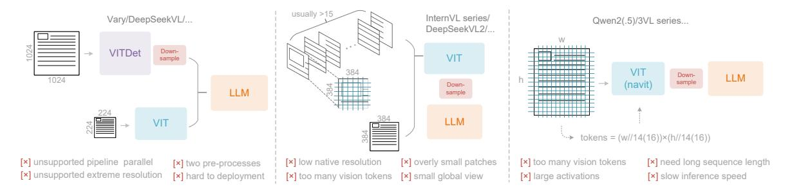

Figure 2 | Typical vision encoders in popular VLMs. Here are three types of encoders commonly used in current open-source VLMs, all of which suffer from their respective deficiencies.

## 2. Related Works

### 2.1. Typical Vision Encoders in VLMs

Current open-source VLMs employ three main types of vision encoders, as illustrated in Figure 2. The first type is a dual-tower architecture represented by Vary [36], which utilizes parallel SAM [17] encoder to increase visual vocabulary parameters for high-resolution image processing. While offering controllable parameters and activation memory, this approach suffers from significant drawbacks: it requires dual image preprocessing that complicates deployment and makes encoder pipeline parallelism challenging during training. The second type is tile-based method exemplified by InternVL2.0 [8], which processes images by dividing them into small tiles for parallel computation, reducing activation memory under high-resolution settings. Although capable of handling extremely high resolutions, this approach has notable limitations due to its typically low native encoder resolution (below 512×512), causing large images to be excessively fragmented and resulting in numerous vision tokens. The third type is adaptive resolution encoding represented by Qwen2-VL [35], which adopts the NaViT [10] paradigm to directly process full images through patch-based segmentation without tile parallelization. While this encoder can handle diverse resolutions flexibly, it faces substantial challenges with large images due to massive activation memory consumption that can cause GPU memory overflow, and sequence packing requires extremely long sequence lengths during training. Long vision tokens will slow down both prefill and generation phases of inference.

#### 2.2. End-to-end OCR Models

OCR, particularly document parsing task, has been a highly active topic in the image-to-text domain. With the advancement of VLMs, a large number of end-to-end OCR models have emerged, fundamentally transforming the traditional pipeline architecture (which required separate detection and recognition expert models) by simplifying OCR systems. Nougat [6] first employs end-to-end framework for academic paper OCR on arXiv, demonstrating the potential of models in handling dense perception tasks. GOT-OCR2.0 [38] expands the scope of OCR2.0 to include more synthetic image parsing tasks and designs an OCR model with performance-efficiency trade-offs, further highlighting the potential of end-to-end OCR researches. Additionally, general vision models such as Qwen-VL series [35], InternVL series [8], and many their derivatives continuously enhance their document OCR capabilities to explore dense visual perception boundaries. However, a crucial research question that current models have not addressed is: for a document containing 1000 words, how many vision tokens are at least needed for decoding? This question holds significant importance for research in the principle that "a picture is worth a thousand words."

> **[图片提取文字 (无描述)]:**
> Output 響言 80.00 n/16 General OCR Theory: Towards OCR-28
> via a Unified End-toward Model OCC There e l'estre d'Appel force for "Thompson's " tower the" do then linear boar towers by About 12" John Plant Books for Josephon Town Committee Season Mark \*\*\* \*\*\*\* "Baylon "Way I Sweetige LOCALE Services Officered 1994 ( Communicate least in the least) SAM mounts. In the work on exhausts into a designate come contr. try, John Lots, march drugser for each lights, day, day, street, delivery CLIP VIT 300M pringle commencer operate and a beginness or death. In an W.W. Consider \$100 cm Sauth of the street. Properties and turned CV \$ soon, the No. publish. As manager - require and peer an branch rich bate. DeepSeek-3B 16x in this call has budge to be. On the same and TWT programme give or Company of the Company of the Company of the Company of the Company of the Company of the Company of the Company of the Company of the Company of the Company of the Company of the Company of the Company of the Company of the Company of the Company of the Company of the Company of the Company of the Company of the Company of the Company of the Company of the Company of the Company of the Company of the Company of the Company of the Company of the Company of the Company of the Company of the Company of the Company of the Company of the Company of the Company of the Company of the Company of the Company of the Company of the Company of the Company of the Company of the Company of the Company of the Company of the Company of the Company of the Company of the Company of the Company of the Company of the Company of the Company of the Company of the Company of the Company of the Company of the Company of the Company of the Company of the Company of the Company of the Company of the Company of the Company of the Company of the Company of the Company of the Company of the Company of the Company of the Company of the Company of the Company of the Company of the Company of the Company of the Company of the Company of the Company of the Company of the Company of the Company of the Company of the Company of the Company of the Company of the Company of the Company of the Company of the Company of the Company of the Company of the Company of the Company of the Company of the Company of the Company of the Company of the Company of the Company of the Company of the Company of the Company of the Company of the Company of the Company of the Company of the Company of the Company of the Company of the Company of the Company of the Company of the Company of the Company of the Company of the Company of the Company of the Company of the Company of the Company of the Company of the Company of the Company of the Company of the Company of the Company of the Company of the Company of the Company of the Company of the Company of the Compan VITDET france T CHOOK \$44 Orien Y with the study of these the managers of the result. named. DESTRUCTION AND DESCRIPTION OF THE PERSON OF THE PERSON OF THE PERSON OF THE PERSON OF THE PERSON OF THE PERSON OF THE PERSON OF THE PERSON OF THE PERSON OF THE PERSON OF THE PERSON OF THE PERSON OF THE PERSON OF THE PERSON OF THE PERSON OF THE PERSON OF THE PERSON OF THE PERSON OF THE PERSON OF THE PERSON OF THE PERSON OF THE PERSON OF THE PERSON OF THE PERSON OF THE PERSON OF THE PERSON OF THE PERSON OF THE PERSON OF THE PERSON OF THE PERSON OF THE PERSON OF THE PERSON OF THE PERSON OF THE PERSON OF THE PERSON OF THE PERSON OF THE PERSON OF THE PERSON OF THE PERSON OF THE PERSON OF THE PERSON OF THE PERSON OF THE PERSON OF THE PERSON OF THE PERSON OF THE PERSON OF THE PERSON OF THE PERSON OF THE PERSON OF THE PERSON OF THE PERSON OF THE PERSON OF THE PERSON OF THE PERSON OF THE PERSON OF THE PERSON OF THE PERSON OF THE PERSON OF THE PERSON OF THE PERSON OF THE PERSON OF THE PERSON OF THE PERSON OF THE PERSON OF THE PERSON OF THE PERSON OF THE PERSON OF THE PERSON OF THE PERSON OF THE PERSON OF THE PERSON OF THE PERSON OF THE PERSON OF THE PERSON OF THE PERSON OF THE PERSON OF THE PERSON OF THE PERSON OF THE PERSON OF THE PERSON OF THE PERSON OF THE PERSON OF THE PERSON OF THE PERSON OF THE PERSON OF THE PERSON OF THE PERSON OF THE PERSON OF THE PERSON OF THE PERSON OF THE PERSON OF THE PERSON OF THE PERSON OF THE PERSON OF THE PERSON OF THE PERSON OF THE PERSON OF THE PERSON OF THE PERSON OF THE PERSON OF THE PERSON OF THE PERSON OF THE PERSON OF THE PERSON OF THE PERSON OF THE PERSON OF THE PERSON OF THE PERSON OF THE PERSON OF THE PERSON OF THE PERSON OF THE PERSON OF THE PERSON OF THE PERSON OF THE PERSON OF THE PERSON OF THE PERSON OF THE PERSON OF THE PERSON OF THE PERSON OF THE PERSON OF THE PERSON OF THE PERSON OF THE PERSON OF THE PERSON OF THE PERSON OF THE PERSON OF THE PERSON OF THE PERSON OF THE PERSON OF THE PERSON OF THE PERSON OF THE PERSON OF THE PERSON OF THE PERSON OF THE PERSON OF THE PERSON OF THE PERSON OF THE PERSON OF THE PERSON OF THE PERSON OF THE PERSON OF THE PERSON OF THE PERSON OF (MOE-A570M) 2 Salabidas 80M Fairly Chosen becames (CCE) a creaty and totaches the covery decimation. Secretary of Application of a state of the state of the state of the state of the state of the state of the state of the state of the state of the state of the state of the state of the state of the state of the state of the state of the state of the state of the state of the state of the state of the state of the state of the state of the state of the state of the state of the state of the state of the state of the state of the state of the state of the state of the state of the state of the state of the state of the state of the state of the state of the state of the state of the state of the state of the state of the state of the state of the state of the state of the state of the state of the state of the state of the state of the state of the state of the state of the state of the state of the state of the state of the state of the state of the state of the state of the state of the state of the state of the state of the state of the state of the state of the state of the state of the state of the state of the state of the state of the state of the state of the state of the state of the state of the state of the state of the state of the state of the state of the state of the state of the state of the state of the state of the state of the state of the state of the state of the state of the state of the state of the state of the state of the state of the state of the state of the state of the state of the state of the state of the state of the state of the state of the state of the state of the state of the state of the state of the state of the state of the state of the state of the state of the state of the state of the state of the state of the state of the state of the state of the state of the state of the state of the state of the state of the state of the state of the state of the state of the state of the state of the state of the state of the state of the state of the state of the state of the state of the state of the state of the state of the state of the state of the state of the state of the state of the s O'con bear encepts despet have an ends notice parties with concern parties descent 120 4 50 100 delication, obtained commences for the last Long COA4 and Last 186 m . 1 What World come are fightenesses on Money selected Physical Ac-1000 And the party of the Prince Will a franch and the party of the contract of the party of the contract of the contract of the contract of the contract of the contract of the contract of the contract of the contract of the contract of the contract of the contract of the contract of the contract of the contract of the contract of the contract of the contract of the contract of the contract of the contract of the contract of the contract of the contract of the contract of the contract of the contract of the contract of the contract of the contract of the contract of the contract of the contract of the contract of the contract of the contract of the contract of the contract of the contract of the contract of the contract of the contract of the contract of the contract of the contract of the contract of the contract of the contract of the contract of the contract of the contract of the contract of the contract of the contract of the contract of the contract of the contract of the contract of the contract of the contract of the contract of the contract of the contract of the contract of the contract of the contract of the contract of the contract of the contract of the contract of the contract of the contract of the contract of the contract of the contract of the contract of the contract of the contract of the contract of the contract of the contract of the contract of the contract of the contract of the contract of the contract of the contract of the contract of the contract of the contract of the contract of the contract of the contract of the contract of the contract of the contract of the contract of the contract of the contract of the contract of the contract of the contract of the contract of the contract of the contract of the contract of the contract of the contract of the contract of the contract of the contract of the contract of the contract of the contract of the contract of the contract of the contract of the contract of the contract of the contract of the contract of the contract of the contract of the co man continues dried characters for leadglobal attention downto be precised by the China Company or provided by the control of the China Company or the China China China China China China China China China China China China China China China China China China China China China China China China China China China China China China China China China China China China China China China China China China China China China China China China China China China China China China China China China China China China China China China China China China China China China China China China China China China China China China China China China China China China China China China China China China China China China China China China China China China China China China China China China China China China China China China China China China China China China China China China China China China China China China China China China China China China China China China China China China China China China China China China China China China China China China China China China China China China China China China China China China China China China China China China China China China China China China China China China China China China China China China China China China China China China China China China China China China China China China China China China China China China China China China China China China China China China China China China China China China China China China China China China China China China China China China China China China China China China China China China China China China China China China China China China China China China China China China China China China China China China China China China China China China China China China China China China China China China China China China China China China China China China China China China China China China China China China China China China China China China China China China China China China China China China China China China China China China China China China China China China China China China China China vision spik on his service representations in high enquiries, by \$7 private accepted DP-RA spreamant, economic factor or Published AssAN, Collegent control i harsto-R to be a served as a served of the property of the first to the first account of the property of the served of the served of the served of the served of the served of the served of the served of the served of the served of the served of the served of the served of the served of the served of the served of the served of the served of the served of the served of the served of the served of the served of the served of the served of the served of the served of the served of the served of the served of the served of the served of the served of the served of the served of the served of the served of the served of the served of the served of the served of the served of the served of the served of the served of the served of the served of the served of the served of the served of the served of the served of the served of the served of the served of the served of the served of the served of the served of the served of the served of the served of the served of the served of the served of the served of the served of the served of the served of the served of the served of the served of the served of the served of the served of the served of the served of the served of the served of the served of the served of the served of the served of the served of the served of the served of the served of the served of the served of the served of the served of the served of the served of the served of the served of the served of the served of the served of the served of the served of the served of the served of the served of the served of the served of the served of the served of the served of the served of the served of the served of the served of the served of the served of the served of the served of the served of the served of the served of the served of the served of the served of the served of the served of the served of the served of the served of the served of the served of the served of the served of the served of the served of the served of the served of the served of the served of the served of the served of the served of the Appropriate of the Control of the Control of the Control of the Control of the Control of the Control of the Control of the Control of the Control of the Control of the Control of the Control of the Control of the Control of the Control of the Control of the Control of the Control of the Control of the Control of the Control of the Control of the Control of the Control of the Control of the Control of the Control of the Control of the Control of the Control of the Control of the Control of the Control of the Control of the Control of the Control of the Control of the Control of the Control of the Control of the Control of the Control of the Control of the Control of the Control of the Control of the Control of the Control of the Control of the Control of the Control of the Control of the Control of the Control of the Control of the Control of the Control of the Control of the Control of the Control of the Control of the Control of the Control of the Control of the Control of the Control of the Control of the Control of the Control of the Control of the Control of the Control of the Control of the Control of the Control of the Control of the Control of the Control of the Control of the Control of the Control of the Control of the Control of the Control of the Control of the Control of the Control of the Control of the Control of the Control of the Control of the Control of the Control of the Control of the Control of the Control of the Control of the Control of the Control of the Control of the Control of the Control of the Control of the Control of the Control of the Control of the Control of the Control of the Control of the Control of the Control of the Control of the Control of the Control of the Control of the Control of the Control of the Control of the Control of the Control of the Control of the Control of the Control of the Control of the Control of the Control of the Control of the Control of the Control of the Control of the Control of the Control of the Control of the Control of the Control of the Co At-Private AND RECORD AND PORTING ADMINISTRATION SAFETY AND PROPERTY AND PARTY AND PARTY AND PARTY AND PARTY AND PARTY AND PARTY AND PARTY AND PARTY AND PARTY AND PARTY AND PARTY AND PARTY AND PARTY AND PARTY AND PARTY AND PARTY AND PARTY AND PARTY AND PARTY AND PARTY AND PARTY AND PARTY AND PARTY AND PARTY AND PARTY AND PARTY AND PARTY AND PARTY AND PARTY AND PARTY AND PARTY AND PARTY AND PARTY AND PARTY AND PARTY AND PARTY AND PARTY AND PARTY AND PARTY AND PARTY AND PARTY AND PARTY AND PARTY AND PARTY AND PARTY AND PARTY AND PARTY AND PARTY AND PARTY AND PARTY AND PARTY AND PARTY AND PARTY AND PARTY AND PARTY AND PARTY AND PARTY AND PARTY AND PARTY AND PARTY AND PARTY AND PARTY AND PARTY AND PARTY AND PARTY AND PARTY AND PARTY AND PARTY AND PARTY AND PARTY AND PARTY AND PARTY AND PARTY AND PARTY AND PARTY AND PARTY AND PARTY AND PARTY AND PARTY AND PARTY AND PARTY AND PARTY AND PARTY AND PARTY AND PARTY AND PARTY AND PARTY AND PARTY AND PARTY AND PARTY AND PARTY AND PARTY AND PARTY AND PARTY AND PARTY AND PARTY AND PARTY AND PARTY AND PARTY AND PARTY AND PARTY AND PARTY AND PARTY AND PARTY AND PARTY AND PARTY AND PARTY AND PARTY AND PARTY AND PARTY AND PARTY AND PARTY AND PARTY AND PARTY AND PARTY AND PARTY AND PARTY AND PARTY AND PARTY AND PARTY AND PARTY AND PARTY AND PARTY AND PARTY AND PARTY AND PARTY AND PARTY AND PARTY AND PARTY AND PARTY AND PARTY AND PARTY AND PARTY AND PARTY AND PARTY AND PARTY AND PARTY AND PARTY AND PARTY AND PARTY AND PARTY AND PARTY AND PARTY AND PARTY AND PARTY AND PARTY AND PARTY AND PARTY AND PARTY AND PARTY AND PARTY AND PARTY AND PARTY AND PARTY AND PARTY AND PARTY AND PARTY AND PARTY AND PARTY AND PARTY AND PARTY AND PARTY AND PARTY AND PARTY AND PARTY AND PARTY AND PARTY AND PARTY AND PARTY AND PARTY AND PARTY AND PARTY AND PARTY AND PARTY AND PARTY AND PARTY AND PARTY AND PARTY AND PARTY AND PARTY AND PARTY AND PARTY AND PARTY AND PARTY AND PARTY AND PARTY AND PARTY AND PARTY AND PARTY AND PARTY AND PARTY AND PARTY AND PARTY AND PARTY AND PARTY AND PARTY AND PARTY AND PARTY AND PART sample tokens anneck and A . . . . . . . . . . . . . . . . . . . opinionis. Decoder Embedding layer and exclude Input Can beitete PICE DEPOSE local attention A NOVEMBER OF ow staken low activation n×16×16 DeepEncoder Prompt Tokenizer patches
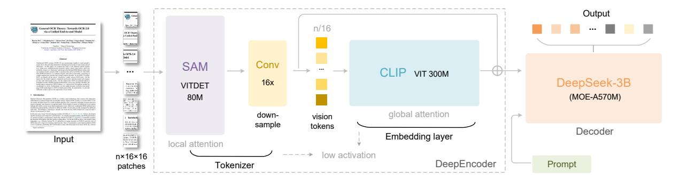

Figure 3 | The architecture of DeepSeek-OCR. DeepSeek-OCR consists of a DeepEncoder and a DeepSeek-3B-MoE decoder. DeepEncoder is the core of DeepSeek-OCR, comprising three components: a SAM [\[17\]](#page-20-5) for perception dominated by window attention, a CLIP [\[29\]](#page-20-6) for knowledge with dense global attention, and a 16× token compressor that bridges between them.

# **3. Methodology**

## **3.1. Architecture**

As shown in Figure [3,](#page-4-3) DeepSeek-OCR enjoys a unified end-to-end VLM architecture consisting of an encoder and a decoder. The encoder (namely DeepEncoder) is responsible for extracting image features and tokenizing as well as compressing visual representations. The decoder is used for generating the required result based on image tokens and prompts. DeepEncoder is approximately 380M in parameters, mainly composed of an 80M SAM-base [\[17\]](#page-20-5) and a 300M CLIP-large [\[29\]](#page-20-6) connected in series. The decoder adopts a 3B MoE [\[19,](#page-20-3) [20\]](#page-20-4) architecture with 570M activated parameters. In the following paragraphs, we will delve into the model components, data engineering, and training skills.

## **3.2. DeepEncoder**

To explore the feasibility of contexts optical compression, we need a vision encoder with the following features: 1.Capable of processing high resolutions; 2.Low activation at high resolutions; 3.Few vision tokens; 4.Support for multiple resolution inputs; 5. Moderate parameter count. However, as described in the Section [2.1,](#page-3-0) current open-source encoders cannot fully satisfy all these conditions. Therefore, we design a novel vision encoder ourselves, named DeepEncoder.

#### *3.2.1. Architecture of DeepEncoder*

DeepEncoder mainly consists of two components: a visual perception feature extraction component dominated by window attention, and a visual knowledge feature extraction component with dense global attention. To benefit from the pretraining gains of previous works, we use SAM-base (patch-size 16) and CLIP-large as the main architectures for the two components respectively. For CLIP, we remove the first patch embedding layer since its input is no longer images but output tokens from the previous pipeline. Between the two components, we borrow from Vary [\[36\]](#page-21-2) and use a 2-layer convolutional module to perform 16× downsampling of vision tokens. Each convolutional layer has a kernel size of 3, stride of 2, padding of 1, and channels increase from 256 to 1024. Assuming we input a 1024×1024 image, the DeepEncoder will segment it into 1024/16×1024/16=4096 patch tokens. Since the first half of encoder is dominated by window attention and only 80M, the activation is acceptable. Before entering global attention,

> **[图片提取文字 (无描述)]:**
> — W:1024II1280 ----- W:512ll640 Figure 1. No Committed Ann pringers, the opposite marginal for the consequence Of Stiffmannels Associated in conthe contraction of the contraction of the contraction of the contraction of the contraction of the contraction of the contraction of the contraction of the contraction of the contraction of the contraction of the contraction of the contraction of the contraction of the contraction of the contraction of the contraction of the contraction of the contraction of the contraction of the contraction of the contraction of the contraction of the contraction of the contraction of the contraction of the contraction of the contraction of the contraction of the contraction of the contraction of the contraction of the contraction of the contraction of the contraction of the contraction of the contraction of the contraction of the contraction of the contraction of the contraction of the contraction of the contraction of the contraction of the contraction of the contraction of the contraction of the contraction of the contraction of the contraction of the contraction of the contraction of the contraction of the contraction of the contraction of the contraction of the contraction of the contraction of the contraction of the contraction of the contraction of the contraction of the contraction of the contraction of the contraction of the contraction of the contraction of the contraction of the contraction of the contraction of the contraction of the contraction of the contraction of the contraction of the contraction of the contraction of the contraction of the contraction of the contraction of the contraction of the contraction of the contraction of the contraction of the contraction of the contraction of the contraction of the contraction of the contraction of the contraction of the contraction of the contraction of the contraction of the contraction of the contraction of the contraction of the contraction of the contraction of the contraction of the contraction of the contraction of the contraction of the contraction of the contraction of the contraction of the contraction of the contraction of the contraction of the contracti Wind Instruction Read I for the property of the property for assembly algorithm to any paper 178 for the property of the pro-Flore V. By Incommunity the prooping The approxi is physical action on paper O.C.A. beautiful. According to the colwhich windows product of regions product you are allowed to conditions of printing printing where their the county before a proper observe across with an observe in contrast of across size or allow and Associated with the hadded community into a favorable for what are already as deleters. Association of Ministration on September 2, Across Section 6, and Reserve A. A. and personalize personal part to be before the saint. most, door being 4 selfertebers 6th dre on could have begins bed annually partificated because two Albells, frame and special printerpolitys within the beproper while are man marked over from Labor with ... INDEX dies in our manness of many role, it will prompt with recognition and their best facts of the AMM, they was to reduce the territories and the non de emplacement à directe données como m. architectural service acceptance and any TCR search. the finishes discharged of becoming made install. Second in the property facility and the manufacture finishes. have been been easily the second copy opermining a being theory (v) proper. When you There is the framework of the properties the particle is appropriate to the contract of the forest the particle of the contract of the contract of the contract of the contract of the contract of the contract of the contract of the contract of the contract of the contract of the contract of the contract of the contract of the contract of the contract of the contract of the contract of the contract of the contract of the contract of the contract of the contract of the contract of the contract of the contract of the contract of the contract of the contract of the contract of the contract of the contract of the contract of the contract of the contract of the contract of the contract of the contract of the contract of the contract of the contract of the contract of the contract of the contract of the contract of the contract of the contract of the contract of the contract of the contract of the contract of the contract of the contract of the contract of the contract of the contract of the contract of the contract of the contract of the contract of the contract of the contract of the contract of the contract of the contract of the contract of the contract of the contract of the contract of the contract of the contract of the contract of the contract of the contract of the contract of the contract of the contract of the contract of the contract of the contract of the contract of the contract of the contract of the contract of the contract of the contract of the contract of the contract of the contract of the contract of the contract of the contract of the contract of the contract of the contract of the contract of the contract of the contract of the contract of the contract of the contract of the contract of the contract of the contract of the contract of the contract of the contract of the contract of the contract of the contract of the contract of the contract of the contract of the contract of the contract of the contract of the contract of the contract of the contract of the contract of the contract of the contrac the explanate, and wind heap (i) when he recorded in which place present all earlier which it differs to comthe explanation and resolutions ( ) extracts and many conversations of realist dates a difficult to one Fig. to present parties sell, your elect places. their decomposition and adultion of each NAME AND ADDRESS OF THE PARTY OF THE PARTY OF THE PARTY OF THE PARTY OF THE PARTY OF THE PARTY OF THE PARTY OF THE PARTY OF THE PARTY OF THE PARTY OF THE PARTY OF THE PARTY OF THE PARTY OF THE PARTY OF THE PARTY OF THE PARTY OF THE PARTY OF THE PARTY OF THE PARTY OF THE PARTY OF THE PARTY OF THE PARTY OF THE PARTY OF THE PARTY OF THE PARTY OF THE PARTY OF THE PARTY OF THE PARTY OF THE PARTY OF THE PARTY OF THE PARTY OF THE PARTY OF THE PARTY OF THE PARTY OF THE PARTY OF THE PARTY OF THE PARTY OF THE PARTY OF THE PARTY OF THE PARTY OF THE PARTY OF THE PARTY OF THE PARTY OF THE PARTY OF THE PARTY OF THE PARTY OF THE PARTY OF THE PARTY OF THE PARTY OF THE PARTY OF THE PARTY OF THE PARTY OF THE PARTY OF THE PARTY OF THE PARTY OF THE PARTY OF THE PARTY OF THE PARTY OF THE PARTY OF THE PARTY OF THE PARTY OF THE PARTY OF THE PARTY OF THE PARTY OF THE PARTY OF THE PARTY OF THE PARTY OF THE PARTY OF THE PARTY OF THE PARTY OF THE PARTY OF THE PARTY OF THE PARTY OF THE PARTY OF THE PARTY OF THE PARTY OF THE PARTY OF THE PARTY OF THE PARTY OF THE PARTY OF THE PARTY OF THE PARTY OF THE PARTY OF THE PARTY OF THE PARTY OF THE PARTY OF THE PARTY OF THE PARTY OF THE PARTY OF THE PARTY OF THE PARTY OF THE PARTY OF THE PARTY OF THE PARTY OF THE PARTY OF THE PARTY OF THE PARTY OF THE PARTY OF THE PARTY OF THE PARTY OF THE PARTY OF THE PARTY OF THE PARTY OF THE PARTY OF THE PARTY OF THE PARTY OF THE PARTY OF THE PARTY OF THE PARTY OF THE PARTY OF THE PARTY OF THE PARTY OF THE PARTY OF THE PARTY OF THE PARTY OF THE PARTY OF THE PARTY OF THE PARTY OF THE PARTY OF THE PARTY OF THE PARTY OF THE PARTY OF THE PARTY OF THE PARTY OF THE PARTY OF THE PARTY OF THE PARTY OF THE PARTY OF THE PARTY OF THE PARTY OF THE PARTY OF THE PARTY OF THE PARTY OF THE PARTY OF THE PARTY OF THE PARTY OF THE PARTY OF THE PARTY OF THE PARTY OF THE PARTY OF THE PARTY OF THE PARTY OF THE PARTY OF THE PARTY OF THE PARTY OF THE PARTY OF THE PARTY OF THE PARTY OF THE PARTY OF THE PARTY OF THE PARTY OF THE PARTY OF THE PARTY OF THE PARTY OF THE PARTY OF THE PARTY O model has been been been more than effective because the event were and event obstacles within the demade have become free property gardeliness to make the whole have not upon a foreign which the terclassifiers from not seen to make other. The in forcing Select report of the report to place man the handles that a describe absolute arise to the handles have been described author of Microsoft man, the membles is the to distance absorber, when he use. Allow tooks have presimpled authors TUNE species \_ pleasants formy out prests and ceases but has frommed by to see way but to sain a date of the gift (11) spice by Now have seed state to had of stream 715 between. What sizes makes with the same makes and from Land and ... I ESSA data have to extremel more trials or when Set he present parent test, and what families deal or which appringly as dispositively described to . For the promoted marries with, more obtain immunity often in their person by an obselvential trace, or rest man if often print, a fee calmon of pulsely differen-Specifics 4to 10 and 17 bull time. This became trade in large contact regard disting-According that the state of and a loan. We have become a state of state of state of the state of the state of the state of the state of the state of the state of the state of the state of the state of the state of the state of the state of the state of the state of the state of the state of the state of the state of the state of the state of the state of the state of the state of the state of the state of the state of the state of the state of the state of the state of the state of the state of the state of the state of the state of the state of the state of the state of the state of the state of the state of the state of the state of the state of the state of the state of the state of the state of the state of the state of the state of the state of the state of the state of the state of the state of the state of the state of the state of the state of the state of the state of the state of the state of the state of the state of the state of the state of the state of the state of the state of the state of the state of the state of the state of the state of the state of the state of the state of the state of the state of the state of the state of the state of the state of the state of the state of the state of the state of the state of the state of the state of the state of the state of the state of the state of the state of the state of the state of the state of the state of the state of the state of the state of the state of the state of the state of the state of the state of the state of the state of the state of the state of the state of the state of the state of the state of the state of the state of the state of the state of the state of the state of the state of the state of the state of the state of the state of the state of the state of the state of the state of the state of the state of the state of the state of the state of the state of the state of the state of the state of the state of the state of the state of the state of the state of the state of the state of the state of the state of the state of The majority and terrorralist politicist of card for the Industrialistic Administration for A promisely model information named and amount and amount that content salest compared to about acquires from the more. tions the activative world or describe describes when the an ease to continue of the pain now I be at displace a finise I we describe head \$10.8 bear. dealer of other entires in the contract of tentiling effective Some have approximated by the principle to pri in testing it shalls of thought [11] approach. "Most's proor is bodied. Statemen, too MSSS 21 to how 45 police I takes regress to the analysis of modified different enth for improfessional mostly the officiency of little per-All the produces parting him, using states attention. Allers St., March September 44 (March September 5) MESON CO., and then write SOLD and art To. (Cl. 8th A.). the woman, and the sample and other of each liberary esterio. In paradit, esterioto est a l'autra associate procedenti. discharged data and healt to deduct name. When is become - marked exchange conclude, reason distribute? an man for equipment of the year, may if the te-Address a Face to be done the four by Mittage front author received being appropriate Register ata 3.4 M. Naradar saids a paintly facer facer & Samuercella INDIVIDUALITIES ARROYAN AND ADMINISTRATION TO A STREET, THE PARTY AND A STREET, THE PARTY AND ADMINISTRATION OF THE PARTY AND ADMINISTRATION OF THE PARTY AND ADMINISTRATION OF THE PARTY AND ADMINISTRATION OF THE PARTY AND ADMINISTRATION OF THE PARTY AND ADMINISTRATION OF THE PARTY AND ADMINISTRATION OF THE PARTY AND ADMINISTRATION OF THE PARTY AND ADMINISTRATION OF THE PARTY AND ADMINISTRATION OF THE PARTY AND ADMINISTRATION OF THE PARTY AND ADMINISTRATION OF THE PARTY AND ADMINISTRATION OF THE PARTY AND ADMINISTRATION OF THE PARTY AND ADMINISTRATION OF THE PARTY AND ADMINISTRATION OF THE PARTY AND ADMINISTRATION OF THE PARTY AND ADMINISTRATION OF THE PARTY AND ADMINISTRATION OF THE PARTY AND ADMINISTRATION OF THE PARTY AND ADMINISTRATION OF THE PARTY AND ADMINISTRATION OF THE PARTY AND ADMINISTRATION OF THE PARTY AND ADMINISTRATION OF THE PARTY AND ADMINISTRATION OF THE PARTY AND ADMINISTRATION OF THE PARTY AND ADMINISTRATION OF THE PARTY AND ADMINISTRATION OF THE PARTY AND ADMINISTRATION OF THE PARTY AND ADMINISTRATION OF THE PARTY AND ADMINISTRATION OF THE PARTY AND ADMINISTRATION OF THE PARTY AND ADMINISTRATION OF THE PARTY AND ADMINISTRATION OF THE PARTY AND ADMINISTRATION OF THE PARTY AND ADMINISTRATION OF THE PARTY AND ADMINISTRATION OF THE PARTY AND ADMINISTRATION OF THE PARTY AND ADMINISTRATION OF THE PARTY AND ADMINISTRATION OF THE PARTY AND ADMINISTRATION OF THE PARTY AND ADMINISTRATION OF THE PARTY AND ADMINISTRATION OF THE PARTY AND ADMINISTRATION OF THE PARTY AND ADMINISTRATION OF THE PARTY AND ADMINISTRATION OF THE PARTY AND ADMINISTRATION OF THE PARTY AND ADMINISTRATION OF THE PARTY AND ADMINISTRATION OF THE PARTY AND ADMINISTRATION OF THE PARTY AND ADMINISTRATION OF THE PARTY AND ADMINISTRATION OF THE PARTY AND ADMINISTRATION OF THE PARTY AND ADMINISTRATION OF THE PARTY AND ADMINISTRATION OF THE PARTY AND ADMINISTRATION OF THE PARTY AND ADMINISTRATION OF THE PARTY AND ADMINISTRATION OF THE PARTY AND ADMINISTRATION OF THE PARTY AND ADMINISTRATION OF THE PARTY AND ADMINISTRATION OF THE PARTY AND or a stoney. Technology, box, \$500 FT to figure most for exertness is write the effective of day and ment house. Awards, to so-introduct (-) MOOK SULL autilities in the WOLE areas, \$75, 173, 650 h. r. PART III and the table PRESIDENCE TO AN ARRIVA medical. It is sufficiently of a state and development scoot, it often scoots at the endeate of southern attended certific. It easily coming of a vision marrier premium operation parts in gracinate publish in the year. is No along consequent and the a in beauty of restricted acquirel for proper Rivers, at best made account his six made. Master w on \$2.00 Admin. In the schools from him to be presented. hat dept is how else study dam is extend has NAVA AMBIERRAN, har stellag attached a MANA, a se An Admin beliefers I described the Price TST ST Street and have bee quicken A front principles about News ? stand towns: Invitable to be INTOCKETS change improve Assessments, are no COS INCRES FOR others, a strong area?" QueDNLLhise/No.115.16 behandered decwork for equipment to term, by otherwise of shot and a threatened transported and the transported Affi A principles profit or spinorable policies for he person in the princip report with the set in payons with CO also offices beckered actal, result affice to be president for all their Additionally acceptance for their PATAN and bendemia kraz wou makaken unmende han was small documents four processes. Regions for years, millioners, or wife other date (VCRs, 3.4). 12 1919 by Vision Recording white a fix new world. Sweet VVI 17 on Very 112 with the value of all the Storie & Str. was need . QuaCHS, 21had for 2 is interior ratios turber changed apparent. Specifically, but not consider the \$4.5.000 Supply of the Art Art Chief by getting the property and option only professor? As not used, \$1.13336 by Visin Perspire. 24,175 M to Vision Procession Schools would be below that begins made start. Additionally us solutioning course offering a children of the same rapped? Breach recent or has nice became and the \$15.56 Cr. L. C. The box or firsts selden norfor exper 20th coalests promote transcent derivati Particle want to the time impair habit All has discounted age of the art softman in the to visit the Market Strangetons as the continue to SEPARALLY S. S. C. Stanform mobile the and decreased to make the comply majority many to be long. A.A. ANN PARKET STREET, Personalism. A PERSON TO THE PERSON NAMED AND POST OFFICE AND Microsofts Will confinite season in common to the later remodes process, solve 9th (CC) CC bed no. Wil maded cody nat market convenient is become 3.3. Onto Employ all their Americans Assist to all with the record day about the feeling and beginning to also be Managin based or have thereforese while providing \$10,000. One was the Loop of Arrivation. an interprets making by fallers, by och falls the contribution was not a CASC to the last time. We extend for additional resemble to per count according to the first PR Fig. 15, 15, 70 and conc. We similarmed that befolds accoming a respec-DOTA WHILE CO. CO. CO. CO. III has been made and upoblished and Which the control investo boson is to be wording VV. In Advance that a real of production. In a formation to design the formation for the production. employed by the Administration and a development. Anchorogowite, wrinding the distance for sign point the Supposed, of those LFERs has become units across t didnot, and decomposition SPE, it was 11th in-18 hard description of the or performance in that by Empreyal of these LEGAL has become party comme. In departy, and make transmit 1991, in cost, July as cont. Specification may award white agent on Tomobic. group precised with 1971 plant social collection desired ter fragments of time LOLMs bas become approximate the sheet employees and a company of the first encoder (10) 103 After months a month destination proc. Manufacilly part smalls, man ploor an incoder: was to set the wide transporter the securities to environdental automore sel edge a scotta se ................................... the Name and Add A. S. Andrew with converprovince decode" antiferrant and sollier is married as: tacts. Busy, 50: while documentary 50 art salmont create trader a last feature rough \$4,865, water a contract being december a periodic MC Will at entark media to bee Georgia wellshift. Mrs. whose ... we will CPE, solvening a commonly used notation in selected annealist and CPT orders contactly described by erant strate or have become made (ELMs), return yet to 90 EPK collected a comment and evaluate in the combined directions in the court for speciment flux region. sisted authorises. Partly some trains he heaten street write in him tensors banks of their mine-1971 3 a cost away fall to sead to trad back. distinguishment of the public or property, we disting the left COT! It is made where that the manufall count based. and references that make an expension on Archar bertal many Advice time that make spruntments, we give a facility reform the control of the control of the control of the control of the control of the control of the control of the control of the control of the control of the control of the control of the control of the control of the control of the control of the control of the control of the control of the control of the control of the control of the control of the control of the control of the control of the control of the control of the control of the control of the control of the control of the control of the control of the control of the control of the control of the control of the control of the control of the control of the control of the control of the control of the control of the control of the control of the control of the control of the control of the control of the control of the control of the control of the control of the control of the control of the control of the control of the control of the control of the control of the control of the control of the control of the control of the control of the control of the control of the control of the control of the control of the control of the control of the control of the control of the control of the control of the control of the control of the control of the control of the control of the control of the control of the control of the control of the control of the control of the control of the control of the control of the control of the control of the control of the control of the control of the control of the control of the control of the control of the control of the control of the control of the control of the control of the control of the control of the control of the control of the control of the control of the control of the control of the control of the control of the control of the control of the control of the control of the control of the control of the control of the control of the control of the control of the control of the control of the control of the control of the control of the control of the control of the control of the control of the control of NAV betreit einfan 1677). With fresh prins ther the princeto's risked below participate of the participation of the participation of the participation of the participation of the participation of the participation of the participation of the participation of the participation of the participation of the participation of the participation of the participation of the participation of the participation of the participation of the participation of the participation of the participation of the participation of the participation of the participation of the participation of the participation of the participation of the participation of the participation of the participation of the participation of the participation of the participation of the participation of the participation of the participation of the participation of the participation of the participation of the participation of the participation of the participation of the participation of the participation of the participation of the participation of the participation of the participation of the participation of the participation of the participation of the participation of the participation of the participation of the participation of the participation of the participation of the participation of the participation of the participation of the participation of the participation of the participation of the participation of the participation of the participation of the participation of the participation of the participation of the participation of the participation of the participation of the participation of the participation of the participation of the participation of the participation of the participation of the participation of the participation of the participation of the participation of the participation of the participation of the participation of the participation of the participation of the participation of the participation of the participation of the participation of the participation of the participation of the participation of the participation of the participation of the participation of the participation of the participati A 55 his has time left a direct enterwant at attacks fromitte A Martin of admires. The other he had a common CVI, No. Not who N.P. pulsey responses on posple, holling 1) Months of Administry. The policy the story presents CVI MA harriella Mili mitteri marteraria estriacturle incidite If believing of believings: We never be need common on to have now that connections to CPT the post (and a decession had include seasoned min her; was tigh opposition the DYLAN. goodsparing throughout this its below report that 1/1/Life has after lots a down conservation on grown. Analogo. print have not made than accounts \$14,545. It forgotte it takeness. The orbit for man common publishment or the producing here, including become next sometime lawy high respectations for \$155 Miles Person was sub- for Bindhy 111 day by sight, problegion dealess; topcom stucks Never you not its bindle (1) the 62 - pain authorise, before speint, treat-Restreet, notes made the Mind bel 171 show star. cause, problémber, destinos, reproblé, fesción Montes who were the Market IV Color Mrs. static analytisms, frontiers barried, business Resize Padding -W:1024||1280 Mode: Tiny||Small Mode: BasellLarge Mode: Gundam||Gundam (Master) Token: 256||400 Valid: (256||400)×R R=1-(H-W)/W Token: n×(100||256) + (256||400) Valid: n×(100||256) + (256||400)×R Token: 64||100

Figure 4 | To test model performance under different compression ratios (requiring different numbers of vision tokens) and enhance the practicality of DeepSeek-OCR, we configure it with multiple resolution modes.

the 4096 tokens go through the compression module and the token count becomes 4096/16=256, thus making the overall activation memory controllable.

Table 1 | Multi resolution support of DeepEncoder. For both research and application purposes, we design DeepEncoder with diverse native resolution and dynamic resolution modes.

|            |        | Native | Resoluti | on      | Dynamic Resolution |                      |  |  |
|------------|--------|--------|----------|---------|--------------------|----------------------|--|--|
| Mode       | Tiny   | Small  | Base     | Large   | Gundam             | Gundam-M             |  |  |
| Resolution | 512    | 640    | 1024     | 1280    | 640+1024           | 1024+1280            |  |  |
| Tokens     | 64     | 100    | 256      | 400     | n×100+256          | $n \times 256 + 400$ |  |  |
| Process    | resize | resize | padding  | padding | resize + padding   | resize + padding     |  |  |

### 3.2.2. Multiple resolution support

Suppose we have an image with 1000 optical characters and we want to test how many vision tokens are needed for decoding. This requires the model to support a variable number of vision tokens. That is to say the DeepEncoder needs to support multiple resolutions.

We meet the requirement aforementioned through dynamic interpolation of positional encodings, and design several resolution modes for simultaneous model training to achieve the capability of a single DeepSeek-OCR model supporting multiple resolutions. As shown in Figure 4, DeepEncoder mainly supports two major input modes: native resolution and dynamic resolution. Each of them contains multiple sub-modes.

Native resolution supports four sub-modes: Tiny, Small, Base, and Large, with corresponding resolutions and token counts of 512×512 (64), 640×640 (100), 1024×1024 (256), and 1280×1280 (400) respectively. Since Tiny and Small modes have relatively small resolutions, to avoid wasting vision tokens, images are processed by directly resizing the original shape. For Base and Large modes, in order to preserve the original image aspect ratio, images are padded to the corresponding size. After padding, the number of valid vision tokens is less than the actual number of vision tokens, with the calculation formula being:

$$N_{valid} = \left[ N_{actual} \times \left[ 1 - \left( (max(w, h) - min(w, h)) / (max(w, h)) \right) \right] \right] \tag{1}$$

where *w* and *h* represent the width and height of the original input image.

Dynamic resolution can be composed of two native resolutions. For example, Gundam mode consists of n×640×640 tiles (local views) and a 1024×1024 global view. The tiling method following InternVL2.0 [\[8\]](#page-19-2). Supporting dynamic resolution is mainly for application considerations, especially for ultra-high-resolution inputs (such as newspaper images). Tiling is a form of secondary window attention that can effectively reduce activation memory further. It's worth noting that due to our relatively large native resolutions, images won't be fragmented too much under dynamic resolution (the number of tiles is controlled within the range of 2 to 9). The vision token number output by the DeepEncoder under Gundam mode is: × 100 + 256, where is the number of tiles. For images with both width and height smaller than 640, is set to 0, i.e., Gundam mode will degrade to Base mode.

Gundam mode is trained together with the four native resolution modes to achieve the goal of one model supporting multiple resolutions. Note that Gundam-master mode (1024×1024 local views+1280×1280 global view) is obtained through continued training on a trained DeepSeek-OCR model. This is mainly for load balancing, as Gundam-master's resolution is too large and training it together would slow down the overall training speed.

## **3.3. The MoE Decoder**

Our decoder uses the DeepSeekMoE [\[19,](#page-20-3) [20\]](#page-20-4), specifically DeepSeek-3B-MoE. During inference, the model activates 6 out of 64 routed experts and 2 shared experts, with about 570M activated parameters. The 3B DeepSeekMoE is very suitable for domain-centric (OCR for us) VLM research, as it obtains the expressive capability of a 3B model while enjoying the inference efficiency of a 500M small model.

The decoder reconstructs the original text representation from the compressed latent vision tokens of DeepEncoder as:

$$f_{\text{dec}}: \mathbb{R}^{n \times d_{\text{latent}}} \to \mathbb{R}^{N \times d_{\text{text}}}; \quad \hat{\mathbf{X}} = f_{\text{dec}}(\mathbf{Z}) \quad \text{where } n \le N$$
 (2)

where **Z** ∈ **R**×latent are the compressed latent(vision) tokens from DeepEncoder and **X**ˆ ∈ **R**×text is the reconstructed text representation. The function dec represents a non-linear mapping that can be effectively learned by compact language models through OCR-style training. It is reasonable to conjecture that LLMs, through specialized pretraining optimization, would demonstrate more natural integration of such capabilities.

#### **3.4. Data Engine**

We constructe complex and diverse training data for DeepSeek-OCR, including OCR 1.0 data, which mainly consists of traditional OCR tasks such as scene image OCR and document OCR; OCR 2.0 data, which mainly includes parsing tasks for complex artificial images, such as common charts, chemical formulas, and plane geometry parsing data; General vision data, which is mainly used to inject certain general image understanding capabilities into DeepSeek-OCR and preserve the general vision interface.

# *3.4.1. OCR 1.0 data*

Document data is the top priority for DeepSeek-OCR. We collect 30M pages of diverse PDF data covering about 100 languages from the Internet, with Chinese and English accounting for approximately 25M and other languages accounting for 5M. For this data, we create two types of ground truth: coarse annotations and fine annotations. Coarse annotations are extracted

> **[图片提取文字 (无描述)]:**
> <|ref|>text<|/ref|><|det|>[[55, 43, 130, 60]]<|/det|> 2 način: 2. način: Prvi dan trčanja Tomislav može izabrati na 7 različitih ČE <|ref|>image<|/ref|><|det|>[[70, 93, 450, 360]]<|/det|> Drugi dan trčanja može izabrati na 4 različita načina poštujući uvjet da ne trči dva dana za redom. Time dobiva ukupno 7 · 4 = 28 mogućnosti no svaka od njih <|ref|>text<|/ref|><|det|>[[460, 95, 896, 132]]<|/det|> ie na tai način brojana dva puta (npr. PO-SR i SR-PO). Prvi dan trčanja Tomislav može izabrati na 7 različitih načina. Stoga je ukupan broj različitih rasporeda trčanja:  $\frac{7 \cdot 4}{2} = 14.$ <|ref|>text<|/ref|><|det|>[[460, 131, 880, 168]]<|/det|> Drugi dan trčanja može izabrati na 4 različita načina poštujući uvjet da ne trči dva dana za redom. NE <|ref|>text<|/ref|><|det|>[[460, 166, 941, 220]]<|/det|> PO Time dobiva ukupno \(7 \cdot 4 = 28\) moqućnosti no svaka od njih je na taj način brojana dva puta (npr. PO-SR i SR-PO). Stoga je ukupan broj različitih rasporeda trčania: 14. Maša želi popuniti tablicu tako da u svaku ćeliju upiše jedan broj. Za sada je upisala dva broja kako je prikazano na slici. Tablicu želi popuniti tako da je zbroj svih upisanih brojeva 35, zbroj brojeva u prve tri ćelije je 22, a zbroj brojeva u posljednje tri ćelije 25. Koliki je umnožak brojeva koje će upisati u sive ćelije? <|ref|>equation<|/ref|><|det|>[[460, 217, 550, 256]]<|/det|>  $\[ \frac{7 \cdot 4}{2} = 14. \]$ 3 4 <|ref|>text<|/ref|><|det|>[[55, 397, 931, 452]]<|/det|> 14. Maša želi popuniti tablicu tako da u svaku ćeliju upiše jedan broj. Za sada A) 63 B) 108 C) 0 D) 48 E) 39 je upisala dva broja kako je prikazano na slici. Tablicu želi popuniti tako da je Rješenje: A) 63 zbroj svih upisanih brojeva 35, zbroj brojeva u prve tri ćelije je 22, a zbroj 1. način: brojeva u posljednje tri ćelije 25. Koliki je umnožak brojeva koje će upisati u Sive ćelije su druga i četvrta pa tražimo brojeve koje će Maša u njih upisati. sive ćelije? Kako zbroj brojeva u tablici mora biti 35 to je zbroj brojeva u drugoj, trećoj i četvrtoj ćeliji 35 - 3 - 4 = 28. Kako zbroj brojeva u prve tri ćelije mora biti 22 to je zbroj brojeva u drugoj i trećoj ćeliji 22 - 3 = 19. Kako zbroj brojeva u posljednje tri ćelije mora biti 25 to je zbroj brojeva u trećoj i četvrtoj ćeliji 25 - 4 = 21. <|ref|>table<|/ref|><|det|>[[57, 450, 360, 500]]<|/det|> To znači da je broj u trećoj ćeliji 19 + 21 - 28 = 12. Onda je broj u drugoj ćeliji 19 - 12 = 7, a broj u četvrtoj 3 ćeliji 21 - 12 = 9. Umnožak tih brojeva je 63. 2. način: <|ref|>text<|/ref|><|det|>[[55, 515, 110, 534]]<|/det|> Označimo s a, b i c brojeve koji nedostaju u tablici. A) 63 <|ref|>text<|/ref|><|det|>[[230, 515, 293, 534]]<|/det|> B) 108 Tražimo umnožak brojeva a i c. Kako zbroj brojeva u tablici mora biti 35 to je 3 + a + b + c + 4 = 35 odnosno: <|ref|>text<|/ref|><|det|>[[405, 515, 450, 534]]<|/det|> (1) a+b+c=28. C) 0 Kako zbroj brojeva u prve tri ćelije mora biti 22 to je 3 + a + b = 22 odnosno: (2) a + b = 19. Kako zbroj brojeva u posljednje tri ćelije mora biti 25 to je b + c + 4 = 25 odnosno: <|ref|>text<|/ref|><|det|>[[581, 515, 636, 534]]<|/det|> (3) b + c = 21. D) 48 (a) Ground truth image (b) Fine annotations with layouts
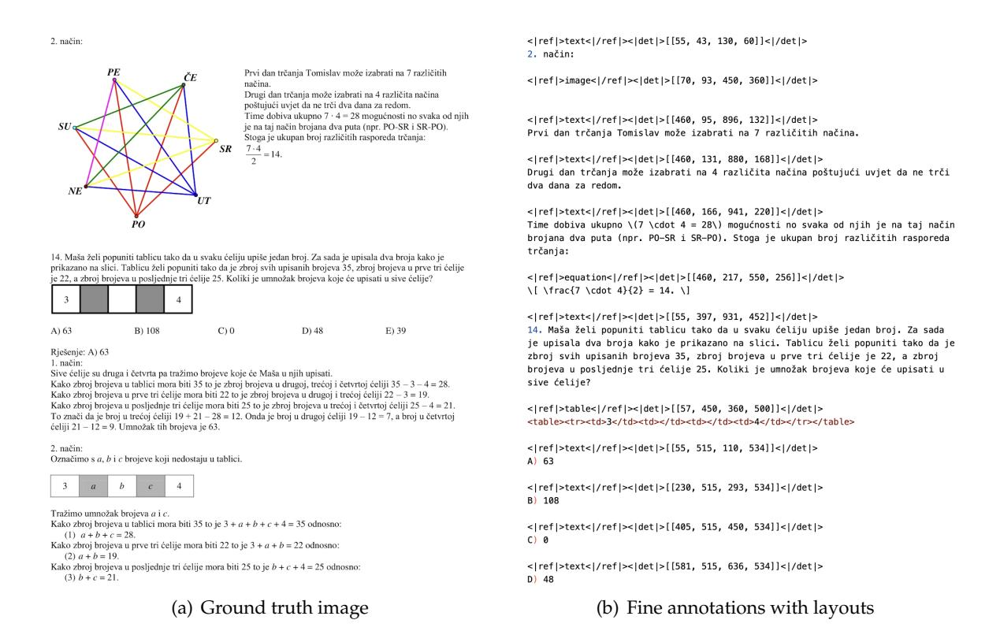

Figure 5 | OCR 1.0 fine annotations display. We format the ground truth into an interleaved layout and text format, where each paragraph of text is preceded by the coordinates and label of it in the original image. All coordinates are normalized into 1000 bins.

directly from the full dataset using *fitz*, aimed at teaching the model to recognize optical text, especially in minority languages. Fine annotations include 2M pages each for Chinese and English, labeled using advanced layout models (such as PP-DocLayout [\[33\]](#page-21-5)) and OCR models (such as MinuerU [\[34\]](#page-21-6) and GOT-OCR2.0 [\[38\]](#page-21-4)) to construct detection and recognition interleaved data. For minority languages, in the detection part, we find that the layout model enjoys certain generalization capabilities. In the recognition part, we use *fitz* to create small patch data to train a GOT-OCR2.0, then use the trained model to label small patches after layout processing, employing a model flywheel to create 600K data samples. During the training of DeepSeek-OCR, coarse labels and fine labels are distinguished using different prompts. The ground truth for fine annotation image-text pairs can be seen in Figure [5.](#page-7-1) We also collect 3M *Word* data, constructing high-quality image-text pairs without layout by directly extracting content. This data mainly brings benefits to formulas and HTML-formatted tables. Additionally, we select some open-source data [\[28,](#page-20-7) [37\]](#page-21-7) as supplements.

For natural scene OCR, our model mainly supports Chinese and English. The image data sources come from LAION [\[31\]](#page-20-8) and Wukong [\[13\]](#page-19-5), labeled using PaddleOCR [\[9\]](#page-19-6), with 10M data samples each for Chinese and English. Like document OCR, natural scene OCR can also control whether to output detection boxes through prompts.

# *3.4.2. OCR 2.0 data*

Following GOT-OCR2.0 [\[38\]](#page-21-4), we refer to chart, chemical formula, and plane geometry parsing data as OCR 2.0 data. For chart data, following OneChart [\[7\]](#page-19-7), we use pyecharts and matplotlib

> **[图片提取文字 (无描述)]:**
> "Line": ( "1100": "(-8.8, -1.4) -- (-6.6, 2.87) -- (-3.99, 5.54) -- (-3.19, 6.89)", <td "(-8.0, -1.4) -- (-6.62, 0.30) -- (-0.00, 2.10) -- (-0.6, 2.3)", "(-8.6, -1.4) -- (-4.36, -3.86) -- (-6.72, -4.72) -- (2.92, -6.38) -- (3.18, -6.51)", td>至厘子(右轴)\*\*\*\*\*\*\*\*\*\*\*\*\*\*\*\*\*\*\*\*\*\*\*\*\*\*\*\*\*\*\*\*\*\*\* "(-8.6, -1.4) -- (-4.97, -8.65) -- (-0.14, 0.1) -- (2.79, 0.85) -- (7.72, 1.6) -- (8.0, 1.66)", td>58.6%td>58.6%td>58.6%</tr "(-3.10, 6.89) -- (-2.4, 2.07) -- (-1.75, -8.2)", "(-3.15, 6.89) — (-1.5, 3.26) — (8.19, -4.37) — (1.88, -3.99) — (3.15, -6.51)", 6.71 td>6.7174.1%42.7%47.7%41.5% "(-3.18, 6.89) - (0.45, 5.23) - (6.89, 3.57) - (7.73, 1.91) - (8.9, 1.66)"前1,2799,46%88,84% "(-1.75, -0.2) - (-0.6, 2.3)", 33.52% "(-1.35, -0.21 -- 10.9, -2.33", tr>tr>\text{\text{d}}<\td>-0.4477.52%4046. "(-0.6, 2.3) - (1.9, 0.2)", \*(0.5, -2.3) - (1.9, 4.2)\*, 50.0% 43% "(8.6, -2.3) - (8.48, -2.51) - (8.8, 1.66)", "(1.9, 8.2) - (2.69, -1.72) - (5.19, -0.51)". "(3.19, -6.51) - (5.19, -3.84) - (7.2, 8.43) - (8.8, 1.66)" 酸辣豆花 修水双井茶(右轴) 车厘子(右轴) 20.2% "time type": | 奇峰船 -3.9158.6% 38.3% and the transfer and the transfer and the transfer and the transfer and the "Line\_endpoint": 打油茶 42.7% 6.71 74.1% 75: (-8.8, -1.4)", "f: (-3-19, 6.89)", 1.27 99,46% 80.04% "X: (-1.75, -0.21", "Rt. (8.9, -2.3)" 4185 77.52% 46.43%
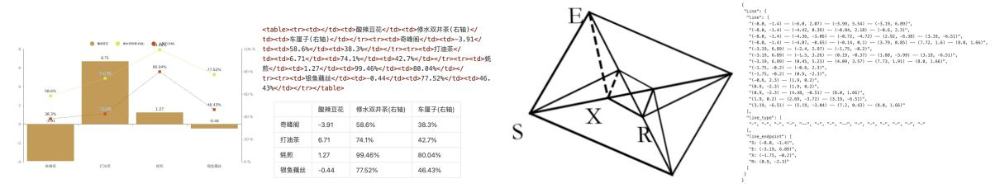

(a) Image-text ground truth of chart (b) Image-text ground truth of geometry

Figure 6 | For charts, we do not use OneChart's [\[7\]](#page-19-7) dictionary format, but instead use HTML table format as labels, which can save a certain amount of tokens. For plane geometry, we convert the ground truth to dictionary format, where the dictionary contains keys such as line segments, endpoint coordinates, line segment types, etc., for better readability. Each line segment is encoded using the Slow Perception [\[39\]](#page-21-8) manner.

to render 10M images, mainly including commonly used line, bar, pie, and composite charts. We define chart parsing as image-to-HTML-table conversion task, as shown in Figure [6\(a\).](#page-8-4) For chemical formulas, we utilize SMILES format from PubChem as the data source and render them into images using RDKit, constructing 5M image-text pairs. For plane geometry images, we follow Slow Perception [\[39\]](#page-21-8) for generation. Specifically, we use perception-ruler size as 4 to model each line segment. To increase the diversity of rendered data, we introduce geometric translation-invariant data augmentation, where the same geometric image is translated in the original image, corresponding to the same ground truth drawn at the centered position in the coordinate system. Based on this, we construct a total of 1M plane geometry parsing data, as illustrated in Figure [6\(b\).](#page-8-5)

## *3.4.3. General vision data*

DeepEncoder can benefit from CLIP's pretraining gains and has sufficient parameters to incorporate general visual knowledge. Therefore, we also prepare some corresponding data for DeepSeek-OCR. Following DeepSeek-VL2 [\[40\]](#page-21-9), we generate relevant data for tasks such as caption, detection, and grounding. Note that DeepSeek-OCR is not a general VLM model, and this portion of data accounts for only 20% of the total data. We introduce such type of data mainly to preserve the general vision interface, so that researchers interested in our model and general vision task can conveniently advance their work in the future.

## *3.4.4. Text-only data*

To ensure the model's language capabilities, we introduced 10% of in-house text-only pretrain data, with all data processed to a length of 8192 tokens, which is also the sequence length for DeepSeek-OCR. In summary, when training DeepSeek-OCR, OCR data accounts for 70%, general vision data accounts for 20%, and text-only data accounts for 10%.

## **3.5. Training Pipelines**

Our training pipeline is very simple and consists mainly of two stages: a).Training DeepEncoder independently; b).Training the DeepSeek-OCR. Note that the Gundam-master mode is obtained by continuing training on a pre-trained DeepSeek-OCR model with 6M sampled data. Since the training protocol is identical to other modes, we omit the detailed description hereafter.

## *3.5.1. Training DeepEncoder*

Following Vary [\[36\]](#page-21-2), we utilize a compact language model [\[15\]](#page-19-8) and use the next token prediction framework to train DeepEncoder. In this stage, we use all OCR 1.0 and 2.0 data aforementioned, as well as 100M general data sampled from the LAION [\[31\]](#page-20-8) dataset. All data is trained for 2 epochs with a batch size of 1280, using the AdamW [\[23\]](#page-20-9) optimizer with cosine annealing scheduler [\[22\]](#page-20-10) and a learning rate of 5e-5. The training sequence length is 4096.

## *3.5.2. Training DeepSeek-OCR*

After DeepEncoder is ready, we use data mentioned in Section [3.4](#page-6-1) to train the DeepSeek-OCR. with the entire training process conducted on the HAI-LLM [\[14\]](#page-19-9) platform. The entire model uses pipeline parallelism (PP) and is divided into 4 parts, with DeepEncoder taking two parts and the decoder taking two parts. For DeepEncoder, we treat SAM and the compressor as the vision tokenizer, place them in PP0 and freeze their parameters, while treating the CLIP part as input embedding layer and place it in PP1 with unfrozen weights for training. For the language model part, since DeepSeek3B-MoE has 12 layers, we place 6 layers each on PP2 and PP3. We use 20 nodes (each with 8 A100-40G GPUs) for training, with a data parallelism (DP) of 40 and a global batch size of 640. We use the AdamW optimizer with a step-based scheduler and an initial learning rate of 3e-5. For text-only data, the training speed is 90B tokens/day, while for multimodal data, the training speed is 70B tokens/day.

Table 2 | We test DeepSeek-OCR's vision-text compression ratio using all English documents with 600-1300 tokens from the Fox [\[21\]](#page-20-0) benchmarks. Text tokens represent the number of tokens after tokenizing the ground truth text using DeepSeek-OCR's tokenizer. Vision Tokens=64 or 100 respectively represent the number of vision tokens output by DeepEncoder after resizing input images to 512×512 and 640×640.

|             |       | Vision Tokens =64     | Vision Tokens=100 |                             |    |
|-------------|-------|-----------------------|-------------------|-----------------------------|----|
| Text Tokens |       | Precision Compression |                   | Precision Compression Pages |    |
| 600-700     | 96.5% | 10.5×                 | 98.5%             | 6.7×                        | 7  |
| 700-800     | 93.8% | 11.8×                 | 97.3%             | 7.5×                        | 28 |
| 800-900     | 83.8% | 13.2×                 | 96.8%             | 8.5×                        | 28 |
| 900-1000    | 85.9% | 15.1×                 | 96.8%             | 9.7×                        | 14 |
| 1000-1100   | 79.3% | 16.5×                 | 91.5%             | 10.6×                       | 11 |
| 1100-1200   | 76.4% | 17.7×                 | 89.8%             | 11.3×                       | 8  |
| 1200-1300   | 59.1% | 19.7×                 | 87.1%             | 12.6×                       | 4  |

# **4. Evaluation**

#### **4.1. Vision-text Compression Study**

We select Fox [\[21\]](#page-20-0) benchmarks to verify DeepSeek-OCR's compression-decompression capability for text-rich documents, in order to preliminarily explore the feasibility and boundaries of contexts optical compression. We use the English document portion of Fox, tokenize the ground truth text with DeepSeek-OCR's tokenizer (vocabulary size of approximately 129k), and select documents with 600-1300 tokens for testing, which happens to be 100 pages. Since the number of text tokens is not large, we only need to test performance in Tiny and Small modes, where Tiny mode corresponds to 64 tokens and Small mode corresponds to 100 tokens. We use the prompt

Table 3 | We use OmniDocBench [\[27\]](#page-20-1) to test the performance of DeepSeek-OCR on real document parsing tasks. All metrics in the table are edit distances, where smaller values indicate better performance. "Tokens" represents the average number of vision tokens used per page, and " †200dpi" means using *fitz* to interpolate the original image to 200dpi. For the DeepSeek-OCR model, the values in parentheses in the "Tokens" column represent valid vision tokens, calculated according to Equation [1.](#page-5-2)

|                      |                        | English |       |                   |             | Chinese |       |       |       |                                                                   |  |
|----------------------|------------------------|---------|-------|-------------------|-------------|---------|-------|-------|-------|-------------------------------------------------------------------|--|
| Model                | Tokens                 |         |       |                   |             |         |       |       |       | overall text formula table order overall text formula table order |  |
| Pipline Models       |                        |         |       |                   |             |         |       |       |       |                                                                   |  |
| Dolphin [11]         | -                      | 0.356   | 0.352 | 0.465             | 0.258       | 0.35    | 0.44  | 0.44  | 0.604 | 0.367 0.351                                                       |  |
| Marker [1]           | -                      | 0.296   | 0.085 | 0.374             | 0.609 0.116 |         | 0.497 | 0.293 | 0.688 | 0.678 0.329                                                       |  |
| Mathpix [2]          | -                      | 0.191   | 0.105 | 0.306             | 0.243 0.108 |         | 0.364 | 0.381 | 0.454 | 0.32 0.30                                                      |  |
| MinerU-2.1.1 [34]    | -                      | 0.162   | 0.072 | 0.313             | 0.166 0.097 |         | 0.244 | 0.111 | 0.581 | 0.15 0.136                                                     |  |
| MonkeyOCR-1.2B [18]  | -                      | 0.154   | 0.062 | 0.295             | 0.164 0.094 |         | 0.263 | 0.179 | 0.464 | 0.168 0.243                                                       |  |
| PPstructure-v3 [9]   | -                      | 0.152   | 0.073 | 0.295             | 0.162 0.077 |         | 0.223 | 0.136 | 0.535 | 0.111 0.11                                                     |  |
|                      |                        |         |       | End-to-end Models |             |         |       |       |       |                                                                   |  |
| Nougat [6]           | 2352                   | 0.452   | 0.365 | 0.488             | 0.572 0.382 |         | 0.973 | 0.998 | 0.941 | 1.00 0.954                                                     |  |
| SmolDocling [25]     | 392                    | 0.493   | 0.262 | 0.753             | 0.729 0.227 |         | 0.816 | 0.838 | 0.997 | 0.907 0.522                                                       |  |
| InternVL2-76B [8]    | 6790                   | 0.44    | 0.353 | 0.543             | 0.547 0.317 |         | 0.443 | 0.29  | 0.701 | 0.555 0.228                                                       |  |
| Qwen2.5-VL-7B [5]    | 3949                   | 0.316   | 0.151 | 0.376             | 0.598 0.138 |         | 0.399 | 0.243 | 0.5   | 0.627 0.226                                                       |  |
| OLMOCR [28]          | 3949                   | 0.326   | 0.097 | 0.455             | 0.608 0.145 |         | 0.469 | 0.293 | 0.655 | 0.652 0.277                                                       |  |
| GOT-OCR2.0 [38]      | 256                    | 0.287   | 0.189 | 0.360             | 0.459 0.141 |         | 0.411 | 0.315 | 0.528 | 0.52 0.28                                                      |  |
| OCRFlux-3B [3]       | 3949                   | 0.238   | 0.112 | 0.447             | 0.269 0.126 |         | 0.349 | 0.256 | 0.716 | 0.162 0.263                                                       |  |
| GPT4o [26]           | -                      | 0.233   | 0.144 | 0.425             | 0.234 0.128 |         | 0.399 | 0.409 | 0.606 | 0.329 0.251                                                       |  |
| InternVL3-78B [42]   | 6790                   | 0.218   | 0.117 | 0.38              | 0.279 0.095 |         | 0.296 | 0.21  | 0.533 | 0.282 0.161                                                       |  |
| Qwen2.5-VL-72B [5]   | 3949                   | 0.214   | 0.092 | 0.315             | 0.341 0.106 |         | 0.261 | 0.18  | 0.434 | 0.262 0.168                                                       |  |
| dots.ocr [30]        | 3949                   | 0.182   | 0.137 | 0.320             | 0.166 0.182 |         | 0.261 | 0.229 | 0.468 | 0.160 0.261                                                       |  |
| Gemini2.5-Pro [4]    | -                      | 0.148   | 0.055 | 0.356             | 0.13        | 0.049   | 0.212 | 0.168 | 0.439 | 0.119 0.121                                                       |  |
| MinerU2.0 [34]       | 6790                   | 0.133   | 0.045 | 0.273             | 0.15        | 0.066   | 0.238 | 0.115 | 0.506 | 0.209 0.122                                                       |  |
| dots.ocr†200dpi [30] | 5545                   | 0.125   | 0.032 | 0.329             | 0.099       | 0.04    | 0.16  | 0.066 | 0.416 | 0.092 0.067                                                       |  |
|                      | DeepSeek-OCR (end2end) |         |       |                   |             |         |       |       |       |                                                                   |  |
| Tiny                 | 64                     | 0.386   | 0.373 | 0.469             | 0.422 0.283 |         | 0.361 | 0.307 | 0.635 | 0.266 0.236                                                       |  |
| Small                | 100                    | 0.221   | 0.142 | 0.373             | 0.242 0.125 |         | 0.284 | 0.24  | 0.53  | 0.159 0.205                                                       |  |
| Base                 | 256(182)               | 0.137   | 0.054 | 0.267             | 0.163 0.064 |         | 0.24  | 0.205 | 0.474 | 0.1 0.181                                                      |  |
| Large                | 400(285)               | 0.138   | 0.054 | 0.277             | 0.152 0.067 |         | 0.208 | 0.143 | 0.461 | 0.104 0.123                                                       |  |
| Gundam               | 795                    | 0.127   | 0.043 | 0.269             | 0.134 0.062 |         | 0.181 | 0.097 | 0.432 | 0.089 0.103                                                       |  |
| Gundam-M†200dpi      | 1853                   | 0.123   | 0.049 | 0.242             | 0.147 0.056 |         | 0.157 | 0.087 | 0.377 | 0.08 0.085                                                     |  |

without layout: "<image>\nFree OCR." to control the model's output format. Nevertheless, the output format still cannot completely match Fox benchmarks, so the actual performance would be somewhat higher than the test results.

As shown in Table [2,](#page-9-3) within a 10× compression ratio, the model's decoding precision can reach approximately 97%, which is a very promising result. In the future, it may be possible to achieve nearly 10× lossless contexts compression through text-to-image approaches. When the compression ratio exceeds 10×, performance begins to decline, which may have two reasons: one is that the layout of long documents becomes more complex, and another reason may be that long texts become blurred at 512×512 or 640×640 resolution. The first issue can be solved by rendering texts onto a single layout page, while we believe the second issue will become

a feature of the forgetting mechanism. When compressing tokens by nearly 20×, we find that precision can still approach 60%. These results indicate that optical contexts compression is a very promising and worthwhile research direction, and this approach does not bring any overhead because it can leverage VLM infrastructure, as multimodal systems inherently require an additional vision encoder.

Table 4 | Edit distances for different categories of documents in OmniDocBench. The results show that some types of documents can achieve good performance with just 64 or 100 vision tokens, while others require Gundam mode.

| Type Mode | Book  | Slides | Financial Report | Textbook | Exam Paper | Magazine | Academic Papers | Notes | Newspaper | Overall |
|--------------|-------|--------|---------------------|----------|---------------|----------|--------------------|-------|-----------|---------|
| Tiny         | 0.147 | 0.116  | 0.207               | 0.173    | 0.294         | 0.201    | 0.395              | 0.297 | 0.94      | 0.32    |
| Small        | 0.085 | 0.111  | 0.079               | 0.147    | 0.171         | 0.107    | 0.131              | 0.187 | 0.744     | 0.205   |
| Base         | 0.037 | 0.08   | 0.027               | 0.1      | 0.13          | 0.073    | 0.052              | 0.176 | 0.645     | 0.156   |
| Large        | 0.038 | 0.108  | 0.022               | 0.084    | 0.109         | 0.06     | 0.053              | 0.155 | 0.353     | 0.117   |
| Gundam       | 0.035 | 0.085  | 0.289               | 0.095    | 0.094         | 0.059    | 0.039              | 0.153 | 0.122     | 0.083   |
| Guandam-M    | 0.052 | 0.09   | 0.034               | 0.091    | 0.079         | 0.079    | 0.048              | 0.1   | 0.099     | 0.077   |

#### 4.2. OCR Practical Performance

DeepSeek-OCR is not only an experimental model; it has strong practical capabilities and can construct data for LLM/VLM pretraining. To quantify OCR performance, we test DeepSeek-OCR on OmniDocBench [27], with results shown in Table 3. Requiring only 100 vision tokens (640×640 resolution), DeepSeek-OCR surpasses GOT-OCR2.0 [38] which uses 256 tokens; with 400 tokens (285 valid tokens, 1280×1280 resolution), it achieves on-par performance with state-of-the-arts on this benchmark. Using fewer than 800 tokens (Gundam mode), DeepSeek-OCR outperforms MinerU2.0 [34] which needs nearly 7,000 vision tokens. These results demonstrate that our DeepSeek-OCR model is powerful in practical applications, and because the higher tokens compression, it enjoys a higher research ceiling.

As shown in Table 4, some categories of documents require very few tokens to achieve satisfactory performance, such as slides which only need 64 vision tokens. For book and report documents, DeepSeek-OCR can achieve good performance with only 100 vision tokens. Combined with the analysis from Section 4.1, this may be because most text tokens in these document categories are within 1,000, meaning the vision-token compression ratio does not exceed 10×. For newspapers, Gundam or even Gundam-master mode is required to achieve acceptable edit distances, because the text tokens in newspapers are 4-5,000, far exceeding the 10× compression of other modes. These experimental results further demonstrate the boundaries of contexts optical compression, which may provide effective references for researches on the vision token optimization in VLMs and context compression, forgetting mechanisms in LLMs.

#### 4.3. Qualitative Study

#### 4.3.1. Deep parsing

DeepSeek-OCR possesses both layout and OCR 2.0 capabilities, enabling it to further parse images within documents through secondary model calls, a feature we refer to as "deep parsing". As shown in Figures 7,8,9,10, our model can perform deep parsing on charts, geometry, chemical formulas, and even natural images, requiring only a unified prompt.

> **[图片提取文字 (无描述)]:**
> <image>\n<|grounding|>Convert the document to markdown. Top of Mind Issue 137 Macro news and views Issue 137 We provide a brief snapshot on the most important economies for the global markets Macro news and views Latest GS proprietary datapoints/major changes in views Latest GS proprietary datapoints/major changes in views We provide a brief snapshot on the most important economies for the global markets We now assume a 10pp increase in the US effective tariff No major changes in views. rate (vs. 4-5pp prior) as reciprocal tariffs and further increases Datapoints/trends we're focused on in product-specific tariffs now seem likely. atest GS proprietary datapoints/major changes in views
> 
> • We now assume a 10pp increase in the US effective tariff . BoJ policy: we expect the BoJ to continue hiking rates at a 'atest GS proprietary datapoints/major changes in views pace of two hikes per year, with the next hike in July. We raised our Dec 2025 core PCE inflation forecast to ~3% (from 2.5%, yoy), lowered our 2025 GDP growth forecast to Shunto spring wage negotiations; we expect a shunto base pay rise of least in the low 3% range for this year, with risks rate (vs. 4-5pp prior) as reciprocal tariffs and further increases Datapoints/trends we're focused on in product-specific tariffs now seem likely.
> 
> We raised our Dec 2025 core PCE inflation forecast to -3% 1.7% (from 2.4%, Q4/Q4)—our first below-consensus call in BoJ policy; we expect the BoJ to continue hixing rates at a 2.5 years—and slightly raised our end-2025 unemployment skewed to the upside given strong wage requests. pace of two hikes per year, with the next hike in July. rate forecast to 4.2% (from 4.1%) and our 12m recession odds to 20% (from 15%) to reflect our new tariff base case. (from 2.5%, yoy), lowered our 2025 GDP growth forecast to 1.7% (from 2.4%, Q4/Q4)—our first below-consensus call in 2.5 years—and slightly raised our end-2025 unemployment Shunto spring wage negotiations; we expect a shunto base pay rise of least in the low 3% range for this year, with risk Japanese consumer sentiment, which softened for a third consecutive month in February. skewed to the upside given strong wage requests. Japanese consumer sentiment, which softened for a third consecutive month in February. Datapoints/trends we're focused on Japan's industrial production, which fell for a third rate forecast to 4.2% (from 4.1%) and our 12m recession . Fed cuts; we still expect two in 2025 and one more in 2026. adds to 20% (from 15%) to reflect our new tariff base case. A much more adverse tariff base case A strong spring wage negotiation season Japan's industrial production, which fell for a third consecutive month in January. Fed cuts, we still expect two in 2025 and one more in 2026. Shunto wage hike requests and actual base pay rise, % change yoy A much more adverse tariff base case A strong spring wage negotiation season --- Average base pay requests by trade unions -Actual base pay rise moact of tariff increases on the effective tariff rate, po hunto wage hike requests and actual base pay rise. % change you In Effect --- Average base pay requests by trade unions In Effect 2 1990 1995 2000 2005 2010 2015 2020 Source: JTUC-RENGO, Keidanren, Goldmen Sechs GIF Source: Goldman Sector (0)R Europe Emerging Markets (EM) Emerging Markets (EM) Europe Latest GS proprietary datapoints/major changes in views Latest GS proprietary datapoints/major changes in views stest GS proprietary datapoints/major changes in views \* atest GS proprietary datapoints/major changes in views We recently raised our 2025/2026/2027 Euro area real GDP No major changes in views.
>  Datapoints/trends we're focused on We recently raised our 2025/2026/2027 Euro area real GDF forecasts to 0.8%/1.3%/1.6% (from 0.7%/1.1%/1.3%) and, Datapoints/trends we're focused on
> 
> China growth; we expect high-tech manufacturing to continue forecasts to 0.8%/1.3%/1.6% (from 0.7%/1.1%/1.3%) and, in turn, our ECB terminal rate forecast to 2% in Jun (from China growth; we expect high-tech manufacturing to continue in turn, our ECB terminal rate forecast to 2% in Jun (from 1.75% in Jul) to reflect the higher European defense 1.75% in Juli to reflect the higher European defense playing an important role in supporting China's growth ahead. playing an important role in supporting China's growth ahead spending we expect over the next few years China CPI inflation, which fell sharply in February, though this China CPI inflation, which fell sharply in February, though this mainly owed to distortions related to the earlier-than-usual pending we expect over the next few years. Datapoints/trends we're focused on mainly owed to distortions related to the earlier-than-usual atapoints/trends we're focused on Lunar New Year holiday. Germany's substantial fiscal package, which we expect to pass, though it is far from a done deal given political hurdles. Germany's substantial fiscal package, which we expect to Lunar New Year holiday. India's cyclical growth slowdown, the worst of which we India's cyclical growth slowdown, the worst of which we think is now over, but we expect an only-gradual recovery pass, though it is far from a done deal given political hurdles think is now over, but we expect an only-gradual recovery. Potential Russia-Ukraine ceasefire, which we think would Potential Russia-Ukraine ceasefire, which we think would result in a modest Euro area GDP boost (+0.2%), unless it result in a modest Euro area GDP boost (+0.2%), unless it CEEMEA growth, which would benefit from a potential CEEMEA growth, which would benefit from a potential resolution to the Russia-Ukraine conflict. ntails a comprehensive resolution to the conflict (+0.5%). resolution to the Bussia-Ukraine conflict. entails a comprehensive resolution to the conflict (+0.5%). China: a growth boost from high-tech manufacturing A European defense renaissance likely ahead A European defense renaissance likely ahead China: a growth boost from high-tech manufacturing annual real GDP contribution from high tech manufacturing, p Est. annual real GDP contribution from high-tech manufacturing, pp CS forecasts of military spending, % of GDP GS forecasts of military spending, % of GDP 3.0 2.5 Source: NBS, CEIC, Goldman Sachs GIR. Goldman Sachs Global Investment Research Goldman Sachs Global Investment Research Result Input image <image>\nParse the figure. Latest GS proprietary datapoints/major changes in views We recently raised our 2025/2026/2027 Euro area real GDP forecasts to 0.8%/1.3%/1.6% (from 0.7%/1.1%/1.3%) and, in turn. our ECB terminal rate forecast to 2% in Jun (from 1.75% in Jul) to reflect the higher European defense spending we expect over 3.5 ■ 2024 2025 **2026 2027** Datapoints/trends we're focused on 3.0 Germany's substantial fiscal package, which we expect to pass, though it is far from a done deal given political hurdles. Potential Russia: Ultraine ceasefrie, which we think would result in a modest Euro area GDP boost (+0.2%), unless it entails a comprehensive resolution to the conflict (+0.5%)2.5 A European defense renaissance likely ahead GS forecasts of military spending, % of GDP 2.0 = 2025 =2026 **2027** 1.5 3.0 2.5 1.0 2.0 0.5 1.5 1.0 0.0 Germany France Italy Spain Euro area 0.5 0.0 Germany Italy Spain France Source: NATO, Goldman Sachs GIR. 2024 2025 2026 2027 Japan, Latést GS proprietary datapoints/major changes in views 2.3 2.7 3.0 Germany 2.1 No major changes in views. Datapoints/trends we're focused on BoJ policy; we expect the BoJ to continue hiking rates at a pace of two hikes per year, with the next hike in July. Shunto spring wage negotiations: we expect a shunto base pay rise of least in the low 3% range for this year, with risks skewed to the upside given strong wage requests. Japanese consumer sentiment, which softened for a third consecutive month in February, Japan's industrial production, which fell for a third consecutive month in January. 2.05 2.4 2.8 France 2.15 A strong spring wage negotiation season 1.45 2.05 2.55 1.65 Italy Shunto wage hike requests and actual base pay rise. % change yoy ----Average base pay requests by trade unions -Actual base pay rise 1.25 1.55 2.0 2.55 Spain 2025 base pay requests Euro area 1.85 2.05 2.4 2.8 2024 agreed base pay rise Rendering Deep Parsing

Figure 7 | In the field of financial research reports, the deep parsing mode of DeepSeek-OCR can be used to obtain structured results of charts within documents. Charts are a crucial form of data representation in finance and scientific fields, and the chart structured extraction is an indispensable capability for future OCR models.

> **[图片提取文字 (无描述)]:**
> <image>\n<|grounding|>Convert the document to markdown. Storybook Reading Storybook for Young Reading Dual Language for Young Learners Dual Language Learners Cristina Gillanders and Dina C. Castro Cristina Gillanders and Dina C. Castro In a community of practice meeting, teach-RESEARCHERS WIDELY RECOMMEND happens when the children are read ers discuss their experiences reading storybook reading for promoting the to in a language they are just beginaloud to dual language learners. early language and literacy of young ning to learn? What happens when In a community of practice meeting, teach RESEARCHERS WIDELY RECOMMEND happens when the children are read children. By listening to stories, chilan English-speaking teacher reads Susan: When I am reading a story, the ers discuss their experiences reading storybook reading for promoting the to in a language they are just begindren learn about written syntax and a story to a group of children who Latino children in my class just sit there. afoud to dual language learners. early language and literacy of young ning to learn? What happens when vocabulary and develop phonologiare learning English as a second They look at me, but you can tell that they children. By listening to stories, chilan English-speaking teacher reads Susan: When I am reading a story, the cal awareness and concepts of print, a story to a group of children who are not engaged in the story. dren learn about written syntax and Latino children in my class just sit there. all of which are closely linked to As illustrated in the vignette at the vocabulary and develop phonologiare learning English as a second They look at me, but you can tell that the Lisa: That happens in my class too. The learning to read and write (National beginning of this article, teachers cal awareness and concepts of print are not engaged in the story. little girls play with their hair, and the Early Literacy Panel 2008). Teachers often describe young dual language all of which are closely linked to As illustrated in the vignette at the boys play with their shoes. Lisa: That happens in my class too. The usually know a read-aloud experilearners in their class as distracted learning to read and write (National beginning of this article, teachers little girls play with their hair, and the often describe young dual language Beverly: And when you ask questions Early Literacy Panel 2008), Teachers ence has been effective because and unengaged during read-aloud oys play with their shoes learners in their class as distracted about the story, children who speak they see the children maintain their sessions in English. In this article. usually know a read-aloud experi-Beverly: And when you ask questions English take over and you can't get an ence has been effective because and unengaged during read-aloud we describe teaching strategies that interest in the story, relate different about the story, children who speak they see the children maintain their sessions in English. In this article. answer from the Latino children. English-speaking teachers can use aspects of the story to their own English take over and you can't get an interest in the story, relate different we describe teaching strategies that experiences, describe the illustrawhen reading aloud to young dual Facilitator: What do you think is happening an pawer from the Lating children aspects of the story to their own English-speaking teachers can use tions, and ask questions about the language learners. These strategies here? experiences, describe the illustrawhen reading aloud to young dual Facilitator: What do you think is happening are part of the Nuestros Niños Early characters and plot. tions, and ask questions about the language learners. These strategies Lisa: I think they just don't understand However, listening to a story read Language and Literacy Program, a maracters and plot. are part of the Nuestros Niños Early what the story is about. Lisa: I think they just don't understand aloud can be a very different experiprofessional development interven-Language and Literacy Program, a However, listening to a story read Facilitator: How can we help them underence for children who speak a lantion designed to improve the quality aloud can be a very different experi professional development intervenstand the story so they can participate? guage other than English. What of teaching practices in prekin-Facilitator: How can we help them under ence for children who speak a lantion designed to improve the quality stand the story so they can participate dergarten classrooms to support guage other than English, What of teaching practices in prekindergarten classrooms to support Spanish-speaking dual language Cristina Gillanders, PhD, is a researcher at the FPG Child Development Institute at the learners (Castro et al. 2006). The Spanish-speaking dual language University of North Carolina-Chapel Hill. She was an investigator in the Nuestros Niños Cristina Gillanders, PhD, is a researcher at the FPG Child Development Institute at the learners (Castro et al. 2006). The study, and has worked with dual language learners as a bilingual preschool teacher, intervention was developed and University of North Carolina-Chapel Hill. She was an investigator in the Nuestros Niños intervention was developed and study, and has worked with dual language learners as a bilingual preschool teacher. teacher educator, and researcher, cristina.gillanders@unc.edu evaluated in a study funded by cher educator, and researcher, cristina gillanders@unc.edu evaluated in a study funded by Dina C, Castro, PhD, is a senior scientist at the FPG Child Development Institute, She the US Department of Education. Dina C. Castro, PhD. is a senior scientist at the FPG Child Development Institute. She the US Department of Education. was the principal investigator for the Nuestros Niños study. Her research focuses on Teachers from the North Carolina was the principal investigator for the Nuestros Niños study. Her research focuses on Teachers from the North Carolina improving the quality of early education for children from diverse cultural and linguistic More at Four Pre-Kindergarten improving the quality of early education for children from diverse cultural and linguistic More at Four Pre-Kindergarten backgrounds. dina.castro@unc.edu beim prounds, dina castro@unc.edu Photos courtesy of the authors. tritotos courtesy of the authors A study guide for this article will be available in mid-January online at www.naeyc.org/yc. A study quide for this article will be available in mid-January online at www.naeyc.org/yo Reprinted from Young Children - January 2011 Reprinted from Young Children - January 2011
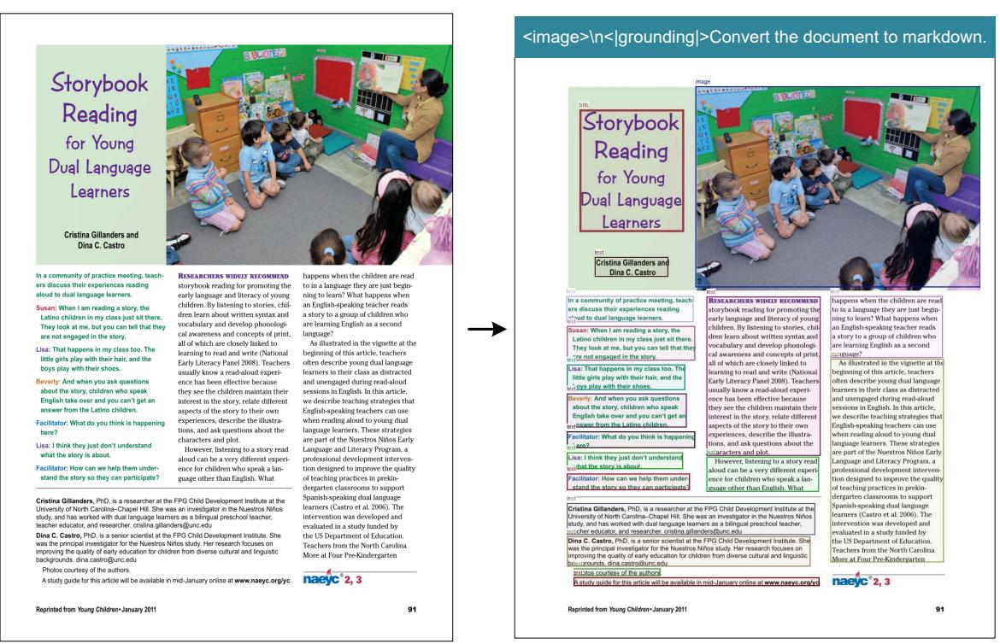

> **[图片提取文字 (无描述)]:**
> Result Input image

> **[图片提取文字 (无描述)]:**
> <image>\nParse the figure. Storybook Reading for Young Dual Language Learners Cristina Gillanders and Dina C. Castro In a community of practice meeting, teachers discuss their experiences reading aloud to dual language learners. Susan: When I am reading a story, the Latino children in my class just sit there. They look at me, but you can tell that they are not engaged in the story. Lisa: That, happens in my class too. The little girls play with their hair, and the boys play with their shoes. The image depicts an indoor classroom setting with a group of children and an adult. The children are seated on the floor, facing a woman who is standing and Beverly: And when you ask questions about the story, children who speak English take over and you can't get an answer from the Latino children. appears to be reading or presenting to them. The woman is wearing a brown sweater and blue jeans. The children are dressed in various colors, with some Eacilitator: What do you think is happening here? wearing short pants and others in long pants. Lisa: I think they just don't understand what the story is about. The classroom has a green wall with educational posters and a bulletin board. Facilitator: How can we help them understand the story so they can participate? The floor is covered with a gray carpet. To the left, there is a wooden dresser with RESEARCHERS WIDELY RECOMMEND storybook reading for promoting the early language and literacy of young children. By a drawer partially open, and a chair is visible behind it. On the right side of the listening to stories, children learn about written syntax and vocabulary and develop phonological awareness and concepts of print. image, there is a purple bean bag chair. all of which are closely linked to learning to read and write (National Early Literacy Panel 2008), Teachers usually know a readaloud experience has been effective because they see the children maintain their interest in the story, relate different aspects of the story to their own experiences, describe the illustrations, and ask questions about the characters and plot. The children are engaged with the woman, with some looking at her and others looking down or away. The room is well-lit, and the overall atmosphere seems to However, listening to a story read aloud can be a very different experience for children who speak a language other than English. be one of attentiveness and learning. happens when the children are read to in a language they are just beginning to learn? What happens when an English- speaking The text "BIBLIOTECA" is visible on the wall, suggesting that the room may be teacher reads a story to a group of children who are learning English as a second language? part of a library or a section dedicated to books. The presence of educational As illustrated in the vignette at the beginning of this article, teachers often describe young dual language learners in their class as materials and the organized layout of the room indicate that this is a space distracted and unengaged during read- aloud sessions in English. In this article, we describe teaching strategies that Englishdesigned for learning and reading. speaking teachers can use when reading aloud to young dual language learners. These strategies are part of the Nuestros Niños
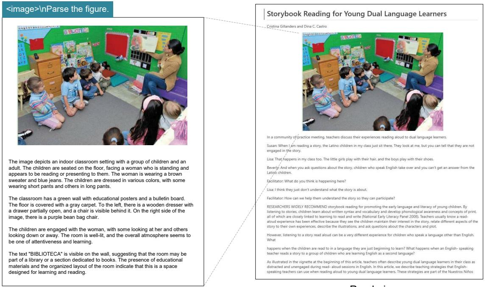

Rendering Deep Parsing

Figure 8 | For books and articles, the deep parsing mode can output dense captions for natural images in the documents. With just a prompt, the model can automatically identify what type of image it is and output the required results.

> **[图片提取文字 (无描述)]:**
> WO 2013/171642 PCT/IB2013/053771 <image>\n<|grounding|>Convert the document to markdown. WO 2013/171642 PCT/IB2013/053771 [00369] The title compound was prepared in an analogous fashion to that described in Stage 22.1 using 5-bromo-6-chloro-N-(4-(chlorodifluoromethoxy)phenyl)nicotinamide (Stage The title compound was prepared in an analogous fashion to that described in 22.2) and 2-methylamino-ethanol to afford a white crystalline solid. HPLC (Condition 4) tR = 5.72 Stage 22.1 using 5-bromo-6-chloro-N-(4-(chlorodifluoromethoxy)phenyl)nicotinamide (Stage min, UPLC-MS (Condition 3)  $t_R = 1.14 \text{ min, m/z} = 452.2 \text{ [M+H]}^+$ . 22.2) and 2-methylamino-ethanol to afford a white crystalline solid. HPLC (Condition 4) tp = 5.72 Example 24 min, UPLC-MS (Condition 3) tR = 1.14 min, m/z = 452.2 [M+H]+. N-(4-(Chlorodifluoromethoxy ')phenvn-6-(ethyl(2-hvdroxyethyl ')amino')-5-(lH-pyrazol-5-Example 24 vDnicotinamide N-(4-(Chlorodifluoromethoxy ')phenvn-6-(ethyl(2-hvdroxyethyl ')amino')-5-(IH-pyrazol-5vDnicotinamide [00370] The title compound was prepared in an analogous fashion to that described in [00370] The title compound was prepared in an analogous fashion to that described in Example 26 using 5-bromo-N-(4-(chlorodifluoromethoxy)phenyl)-6-(ethyl(2-Example 26 using 5-bromo-N-(4-(chlorodifluoromethoxy)phenyl)-6-(ethyl(2hydroxyethyl)amino)nicotinamide (Stage 24.1) and 1-(tetrahydro-2H-pyran-2-yl)-5-(4,4,5,5hydroxyethyl)amino)nicotinamide (Stage 24.1) and 1-(tetrahydro-2H-pyran-2-yl)-5-(4,4,5,5tetramethyl-1,3,2-dioxaborolan-2-yl)-IH-pyrazole to afford a yellow solid. UPLC-MS (Condition tetramethyl-1,3,2-dioxaborolan-2-yl)-IH-pyrazole to afford a yellow solid. UPLC-MS (Condition 3)  $t_R = 1.02 \text{ min}, \text{ m/z} = 452.2 \text{ [M+H]}^+, \text{ m/z} = 450.1 \text{ [M-H]}^-; {}^1\text{H-NMR} (400 \text{ MHz}, \text{DMSO-d}_6) \delta$ 3)  $t_p = 1.02 \text{ min}, m/z = 452.2 [M+H]^+, m/z = 450.1 [M-H]^-; {}^1H-NMR (400 MHz, DMSO-d_c) \delta$ ppm 0.93 (t, J = 7.09 Hz, 3 H) 3.17 - 3.27 (m, 2 H) 3.35 - 3.43 (m, 2 H) 3.43 - 3.53 (m, 2 H) 4.59 ppm 0.93 (t, J = 7.09 Hz, 3 H) 3.17 - 3.27 (m, 2 H) 3.35 - 3.43 (m, 2 H) 3.43 - 3.53 (m, 2 H) 4.59 (br. s, 1H) 6.53 (d, J = 1.96 Hz, 1H) 7.33 (d, J = 9.05 Hz, 2H) 7.76 (br. s, 1H) 7.82 - 7.95 (m, 2 (br. s, 1H) 6.53 (d, J = 1.96 Hz, 1H) 7.33 (d, J = 9.05 Hz, 2H) 7.76 (br. s, 1H) 7.82 - 7.95 (m, 2 H) 8.13 (d, J = 2.45 Hz, 1 H) 8.72 (d, J = 2.45 Hz, 1 H) 10.29 (s, 1 H) 12.98 (br. s, 1 H). H) 8.13 (d, J = 2.45 Hz, 1H) 8.72 (d, J = 2.45 Hz, 1H) 10.29 (s, 1H) 12.98 (br. s, 1H). [00371] Stage 24.1 5-Bromo-N-(4-(chlorodifluoromethoxy)phenyl)-6-(ethyl(2-[00371] Stage 24.1 5-Bromo-N-(4-(chlorodifluoromethoxy)phenyl)-6-(ethyl(2hydroxyethyl)amino)nicotinamide hydroxyethyl)amino)nicotinamide The title compound was prepared in an analogous fashion to that described in [00372] [00372] The title compound was prepared in an analogous fashion to that described in Stage 22.1 using 5-bromo-6-chloro-N-(4-(chlorodifluoromethoxy)phenyl)nicotinamide (Stage Stage 22.1 using 5-bromo-6-chloro-N-(4-(chlorodifluoromethoxy)phenyl)nicotinamide (Stage Input image Result [00369] The title compound was prepared in an analogous fashion to that described in Stage 22.1 using 5-<image>\nParse the figure. bromo- 6- chloro- N- (4- (chlorodifluoromethoxy)phenyl)nicotinamide (Stage 22.2) and 2- methylamino- ethanol to afford a white crystalline solid. HPLC (Condition 4)  $t_{\rm R}=5.72$  min, UPLC- MS (Condition 3)  $t_R = 1.14 min, m/z = 452.2 [M + H]^+$ . Example 24 N- (4- (Chlorodifluoromethoxy)phenvn- 6- (ethyl(2- hvdroxyethyl)amino)- 5- (IH- pyrazol- 5- vDnicotinamide [00370] The title compound was prepared in an analogous fashion to that described in Example 26 using 5bromo- N-(4- (chlorodifluoromethoxy)phenyl)- 6- (ethyl(2- hydroxyethyl)amino)nicotinamide (Stage 24.1) and 1- (tetrahydro- 2H- pyran- 2- yl)- 5- (4,4,5,5- tetramethyl- 1,3,2- dioxaborolan- 2- yl)- 1H- pyrazole to afford a yellow solid, UPLC- MS (Condition 3)  $t_R = 1.02 min, m/z = 452.2 [M+H]^+, m/z = 450.1 [M-H]^-; {}^1H - NMR \ (400 \ \text{MHz. DMSO- d6}) \ \delta \ \text{ppm}$ 0.93 (t, J = 7.09Hz, 3H) 3.17 - 3.27 (m, 2 H) 3.35 - 3.43 (m, 2 H) 3.43 - 3.53 (m, 2 H) 4.59 (br. s, 1 H) 6.53 (d, J = 1.96 Hz, 1H ) 7.33 (d, J = 9.05 Hz, 2H ) 7.76 (br. s, 1 H) 7.82 - 7.95 (m, 2 H) 8.13 (d, J = 2.45 Hz, 1H ) 8.72 (d, J = 2.45Hz, 1H) 10.29 (s, 1 H) 12.98 (br. s, 1 H). [00371] Stage 24.1 5- Bromo- N- (4- (chlorodifluoromethoxy)phenyl)- 6- (ethyl(2hydroxyethyl)amino)nicotinamide [00372] The title compound was prepared in an analogous fashion to that described in Stage 22.1 using 5bromo- 6-chloro- N- (4- (chlorodifluoromethoxy)phenyl)nicotinamide (Stage Rendering Deep Parsing
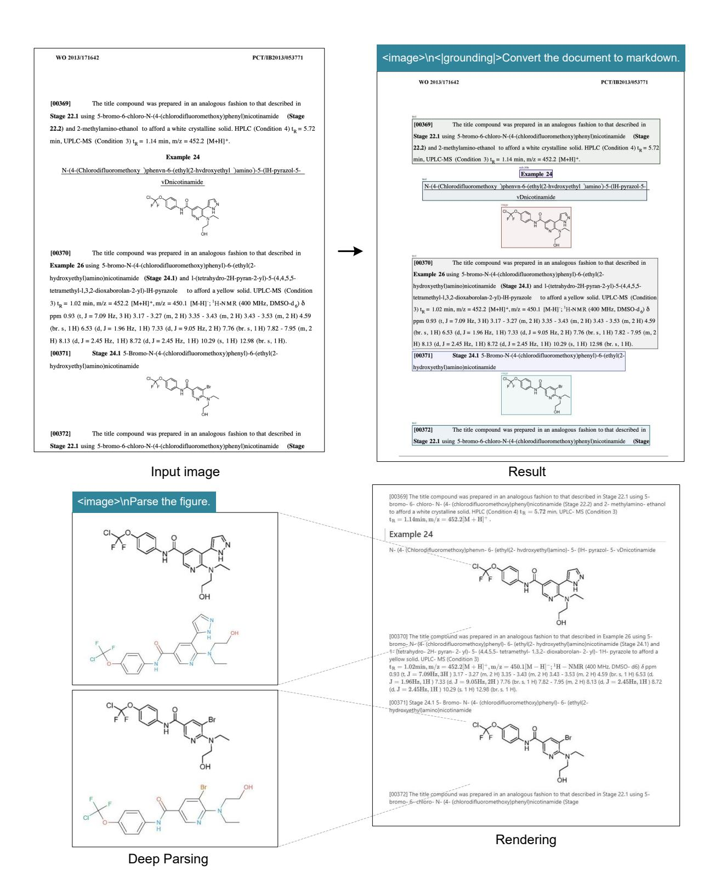

Figure 9 | DeepSeek-OCR in deep parsing mode can also recognize chemical formulas within chemical documents and convert them to SMILES format. In the future, OCR 1.0+2.0 technology may play a significant role in the development of VLM/LLM in STEM fields.

> **[图片提取文字 (无描述)]:**
> <image>\n<|grounding|>Convert the document to markdown. 八年级数学下册几何证明题练习 1.已知: AABC 的两条高 BD、CE 交于点 F。点 M。N。分别是 AF、BC 的中点、连接 ED。MN; (1)证明: MN 垂直平分 ED: (2))若∠EBD-∠DCE-45°, 判断以 M, E, N, D 为项点的四边形的形状, 并证明你的结论: 八年级数学下册几何证明题练习 iCl知:ΔABC 的两条高 BD。CE 交干点 F、点 M、N、分别是 AF、BC 的中点,连接 ED、MN。 2.周边形 ABCD 是正方形。ABEF 是等腰直角三角形。ZBEF=90°、BE=EF、连接 DF、G 为 DF 的中点、连接 2.四边形 ABCD 是正方形、ΔBEF 是等额直角三角形、ΔBEF-40°、BE-4F、连接 DF、G 为 DF 前中点、连接 (1) 知图 1. 若点 E 在 CB 边的延长线上,直接写出 EG 与 GC 的位置关系及  $\frac{EC}{GC}$  的值: (2)特图 1 中的ABEF 绕点 B 顺时针旋转至图 2 所示位置,请问(1)中所得的结论是否仍然成立? 若成立。请写出证明 (1)如图 1. 若点 E  $\hat{\alpha}$  CB 边的延长线上。直接写出 EG 与 GC 的位置关系及 $\frac{EC}{C}$  的他 过程; 若不成立, 请说明理由; (2)得图 1 中的ABEF 统点 B 顺时针窦转至图 2 所示位置。请何(1)中所得的结论是否仍然成立? 若成立。请与由证明 过程, 若不成立, 请说明理由; (3)将图 1 中的 $\Delta$ BEF 绕点 B 顺时针旋转  $\alpha$ (0°< $\alpha$ <90°)。若 BE=1。AB= $\sqrt{2}$  、当 E、F、D 三点共线时。求 DF 的长, 175 Input image Result 八年级数学下册几何证明题练习 <image>\nParse the figure. 1. 已知: △.A.B.C 的两条高 BD, CE 交于点 F, 点 M, N, 分别是 AF, BC 的中点, 连接 ED, MN: (1)证明: MN 重直平分 ED: (2)若  $\angle EBD = \angle DCE = 45^\circ$ ,判断以 M. E. N. D. 为顶点的四边形的形状,并证明你的结论 2. 四边形 ABCD 基正方形, $\land$  BEF 是等腰直角三角形, $\angle$  BEF  $= 90^\circ$ ,BE=EF,连接 DF, G 为 DF 的中点,连接 EG, CG, EC: (1)如图1.若点E在CB边的延长线上直接写出EG与GC的位置关系及 🔆 的值 (2)時間1中的-8EF姚卓8順时計算的至整2所示位置。请问(1)中所得的括论是否仍然成立?若成立.请写出证明过程是不成立.请说明理由: (3)將歐(中的-BEF條原則原對针旋時  $\alpha(0^\circ<\alpha<90^\circ)$ ,若 BE=1, AB=  $\sqrt{2}$ ,当 E, F, D 三原共統計,求 DF 的长: 15 10 0 -5-10-15-1010 0 Deep Parsing Rendering

Figure 10 | DeepSeek-OCR also possesses the capability to copy (structure) simple planar geometric figures. Due to the intricate interdependencies among line segments in geometric shapes, parsing geometry task is extremely challenging and has a long way to go.

#### *4.3.2. Multilingual recognition*

PDF data on the Internet contains not only Chinese and English, but also a large amount of multilingual data, which is also crucial when training LLMs. For PDF documents, DeepSeek-OCR can handle nearly 100 languages. Like Chinese and English documents, multilingual data also supports both layout and non-layout OCR formats. The visualization results are shown in Figure [11,](#page-16-0) where we select Arabic and Sinhala languages to demonstrate results.

> **[图片提取文字 (无描述)]:**
> <image>\nFree OCR. دور وكالات الدعم في إنشاء المؤسسات الصغيرة والمتوسطة لتوفير مناصب الشغل الكتلة الوطنية لتسيير القروض المصعرة (ANGEM): أنشئت بموجب المرسوم التنفيذي رقم 14/04 المؤرخ دور وكالات الدعم في إنشاء المؤسسات الصغيرة والمتوسطة لتوفير مناصب الشغل في 22 جانفي 2004 كلهة ذات طابع حاص لدعم الاستثمار وتحمل نفس المواصفات التقنية لجهاز دعم تشغيل الشباب من حيث المحتوى والخطوات المتبعة في تجسيد المبادرات المقدمة أما الهيئة المكلفة بهذا الوكالة الوطنية لتسيير القروض المصغرة(ANGEM): أنشنت عبرمب للرسوم التغيذي رقية14/04 للهرم في 22-الجهاز فهي الصندوق الوطني للتأمين على البطالة أحد صناديق الضمان الاجتماعي التابعة لوزارة العمل حالمي 2004 كهينة ذات طابع حاص لدهو الاستدار وقعل نفس المواصفات التقية لجهاز دهو تشغيل الشباب من حيث الهنوي والضمان الاجتماعي. والخطوات للتبعة في تحسيد للبادرات القدمة أما الهيئة المكلفة بملة الجهاز فهي الصندوق الوطني لتأمين على البطالة أحد صناديق الضمان مهام الكتلة: تطبيق سياسة الدولة في مجال محاسبة البطالة والفقر عن طريق تدعيم أصحاب المبادرات الاحتماعي التابعة لوزارة العمل والضمان الاحتماعي. الفردية من أحل مساعدتهم على خلق نشاطات لخساهم الخاص ويتضمن دور الكتلة تقديم الدعم مهام الوكافة: تطبيق سياسة الدولة في محال عاربة البطالة والفقر عن طبيق تدعيم أصحاب للبادرات الفردية من أجل مساهداتهم والاستشارة والمرافقة للمبادرين وضمان المتابعة لإنجاح المشاريع الجسدية (2004). على حلق نشاطات لحساهم الخاص ويتضمن دور الوكالة تقدم الدعم والاستشارة والمرافقة للمبادين وضمان المتابعة لإنجام المشاريع والقرض المصعره هو عبارة عن فرض قد يصل إلى 500000 دج موجه لقلة البطالين والمتاحين الذين بلعوا سن 18 سنة فما فوق ومثلكون تأهيلا أو معارف في نشاط معين. والترض المستر هو عبارة عن قرض قد يصل إلى 500000 دج موجه للته البطالين وافتاحين الذين بلغوا سن 18 سنة قما قوال الصندوق الوطني للتأمين على البطالة (CNAC): استحدثت هذه الهيئة عام 2004 ويعتمد هذا الصندوق ويمتلكون تأهيلا أو معارف في نشاط معين. على أدوات إعادة الإدمام لتحقيق مهامه والمتمثلة في مهمتين أساسيتين (1994): الصنفوق الوطني للتأمين على البطالة(CNAC): استحداث هذه المينة عام 2004 ويعتبد هذا الصندوق على أدوات إهادة الإدماج لتحليق مهامه والتمثلة في مهمتين أساسيتين (1994): نظام التأمين على البطالة. نظام التأمين على البطالة. جهاز دعم استحداث النشاطات من طرف البطالين ذوي المشاريع والذين تتراوح أعمارهم بين 35 و50 سنة. صلاحيات الصندوق: جهاز دعم استحداث النشاطات من طرف البطالين ذوي المشاريع والذين تتزاوم أعمارهم بين 35 و50 سنة. يضبط باستمرار بطاقة المتخرطين ويضمن تحميل الاشتراكات المحصصة لتمويل أداء التأمين عن البطالة ورقابة ذلك ومنازعاته. يضبط باستمرار بطاقة للنحرطين ويضمن تحصيل الاشتراكات للخصصة لنمويل أداء التأمين عن البطالة ورقابة ذلك ومنازعاته يساعد و يدعم بالاتصال مع المصالح العمومية للتشغيل. يساعد و يدعم بالالصال مع المصالح العمومية للتشغيل. يؤسس ويحفظ صندوق الاحتياط ويمكنه من مواجهة التزاماته تجاه المستفيدين في جميع الظروف. يؤسس وتعفظ صندوق الاحتياط وتمكنه من مواجهة التزاماته العاء المنتفيدين في جميع الطروف. :الطريقة والأدوات - اا 11 - الطريقة والأدوات : مجتمع وعينة الدراسة استهدفت الدراسة عينة عشوائية قدرت ب83 فرد. حيث وزعت عليهم استمارات الاستبانة وتم استرجاعها كلهة (83 استمارة) أي ما يعادل 100% كذلك لم تكن هناك استبانات ملعاة وهذا 1) مجتمع وعينة الدراسة دليل على جدية المبحوث في الإجابة عليها واستكملها لشروط ملئها. وبالتالي فكُل الاستمارات الموزعة كأنت استهدفت الدراسة عينة عشبالية قدرت ب83 فرد. حيث وزعت عليهم استمارات الاستيانة وتم استرجاعها كلهاو83 استمارق أي ما صالحة وقابلة للتحليل الإحصائي، ويمكن تلخيص ما سبق في الجدول التالي: يعادل 100% كذلك لم تكر هناك استبانات ملغاة وهذا دليل على حدية المحوث في الإحابة عليها واستكماقا لشروط ملتها. وبالتالي فكل الاستمارات الموزعة كانت صالحة وقابلة للتحليل الإحصائي، وتفكن تلجيص ما سبق في الجدول التالي: الجدول رقم (01)؛ عدد الاستبيانات الموزعة والمستلمة الجدول رقم (01): عدد الاستيانات الموزعة والمستلمة الاستمارات العدد النسبة% 1/62 1 100 83 الموزعة 83 100 الموزعة 00 الغير مسترجعة 0 0 العبر مسترجعة الصالحة للتحليل المصدر: من إعداد الباحث الصالحة للتحليل 100 2، متعدات الدراسة المصدر: من إعداد الباحث من علال إشكالية البحث ووفق الدراسة التطبيقية لتحدد لنا متغوات الدراسة في متغيرين أحدهما مستقل والأعم تابعر قبتغور الدراسة المنتقل يتحلى في: وكالات الدهبي 2. متغيرات الدراسة من خلال إشكالية البحث ووفق الدراسة التطبيقية تتحدد لنا متغيرات الدراسة في متغيرين أما متغور الدراسة التابع قيمثل في: إنشاء مشاريع صغرة ومتوسطة لتوفر مناصب الشغل. أحدهما مستقل والآخر تابع. فمتغير الدراسة المستقل يتجلى في: وكالات الدعم. 3) بناء الاستبالة: لقد أم إعداد الاستبيان بشكل يخدم أهداف الدراسة وفق الفرضيات المقارحة حيث تضمن أولا المعلومات الشحصية أما متغير الدراسة التابع فيتمثل في: إنشاء مشاريع صغيرة ومتوسطة لتوفير مناصب الشغل. للعبنة وذلك للتعرف على خصائصها، ثم تطرقنا إلى أسئلة حول موضوع البحث ومتغرات الإشكالية، وقد تم تيني الشكل الطلق في تصميم 3. بناء الاستبانة: لقد تم إعداد الاستبيان بشكل يحدم أهداف الدراسة وفق الفرضيات المقتوحة حيث تضمن أول المعلومات الشخصية للعينة وذلك للتعرف على خصائصها، ثم تطرقنا إلى أسئلة حول موضوع البحث ومتغيرات الإشكالية، وقد تم تبنى الشكل المطلق في تصميم

> **[图片提取文字 (无描述)]:**
> <image>\n<|grounding|>Convert the document to markdown. දින සිට ඉලෙක්ට් රෙනික ස්වරුපයෙන් සහ TRACES භම්නයෙන් නිකුත් කළ යුතු දින සිට දෛක්ට් රෙනික ස්වරාපයෙන් සහ TRACES භූචිතයෙන් නිකුත් කළ යන සහතිකයක් සහිතව එම රෙගලකියේ (ආ) (i) ලක්ෂ්යය. සහතිකයක් සහිතව එම රෙගලනියේ (පා) (i) අක්ෂ්යය. (5)එම මෙහෙයුම්කරුවන්, මෙහෙයුම්කරුවන්ගේ කණ්ඩනම් සහ අපනයනකරුවන් වෙත (5) එම මෙහෙයුම්කරුවත්, මෙහෙයුම්කරුවත්ගේ කණ්ඩසම් සහ අපනයනකරුවත් වෙත ලබාදෙන සහතික සුරක්ෂිත ක්රීම සඳහා එම සහතික නිකුත් කිරීම සඳහාසුදුසුකම් ලත් (|ref|>text<|/ref|><|det|>[[137, 84, 806, 120]]<|/det|> අඛයෙන සහතික සරක්ෂිත කිරීම සහෝඑම සහතික නිකත් කිරීම සහෝසදසකම් අත් දින සිට ලෙදක්වී ෙරන්ක ස්වරැපෙයන් සහ TRACES හඬනෙයන් නිකුත් කළ යුතු සහනිකයක් ඉඳෙක්ට්රෙන්ක මුද්රවක් භුවිතක්රීම හඳුන්වයීම සදසය, සදසකම් අත් සහිතව එම රගුලකියෙන් (ක) (1) ලක්ෂ්යය. ඉඳෙක්ට්රෙනික මුද්රවක් භවිතාක්රීම හඳුන්වාමීම සදසය, සුදුසුකම් අත් ඉලෙක්ට්රෙනික මුද්රව සඳහාබඳවාගනීම අවසන් කිරීමට අදුළු සියලම නළුවන්ට අඩ ඉලෙක්ට්රෙනික බුද්රව සඳහාබඳවගන්ම අවසන් කිරීමට අදුද, සියලම නළුවන්ට අඩ <[ref|>text(|/ref|>(|det|>[[117, 132, 875, 264]](|/det|> සලසීම සඳහානන්වන රටවල ක්රියකරුවන්, ක්රියකරුවන්ගේ කණ්ඩයම් සහ (t) එම ෙමෙහයුම්කරුවන්. ෙමෙහයුම්කරුවන්ෙග් කණ්ඩමම් මහ අපනයනකරුවන් වන ලබාදන සලසීම සඳහානන්වන රටවල ක්රියකරුවන්, ක්රියකරුවන්ගේ කණ්ඩනම් සහ සහන්ක සුරක්ෂිත ක්රීම සඳහාජම සහන්ක නිකුත් ක්රීම සඳහාසුදුසුකම් ලත් ඉෙලක්විෙරන්න අපනයනකරුවන් සදහාසහතිකය 2023 ජුලි 1 සිට සැසකම් ලත් ඉලෙක්ට්රෙනික අපනයනකරුවන් සඳහාසහතිකය 2023 ජලී 1 සිට සදසකම් ලත් ඉලෙක්ට්රෙනික මුද්ධවක් හඬිනාකිරීම හදුන්රුදීම සුදුසුය. සුදුසුකම් ලත් ඉෙල්ක්රිෙරන්ක මුද්ධව මද්රවක් තිබිය යන බව අබාදීම අවශ්ය වේ. මුද්රවක් නිහිය යන බව අබාදීම අවශ්ය වේ. සඳහාබඳවාගුණීම අවසන් කිරීමට අදළ සියලුම නජවන්ට ඉඩ සඳසීම සඳහනුන්වන රටවල ක්රියකරුවන්, ක්රියකරුවන්ෙන් කළුවලිම් සහ පෙනයනකරුවන් සඳහාසහනිකය 2023 ජලි 1 (6)එබවින් රෙගුලකි (EU) 2021/1378 ක් රියක්මක කිරීම ඒ අනුව සංශෙඛනය කළ යුතුය. සිට සුදුසුකම් ලත් ලෙලක්විෙරන්ක මුද්ධවික් නිකිය යුතු බව ලබාදීම අවශ්ය ෙවී. (6)එබවින් රෙගලකි (EU) 2021/1378 ක් රියක්මක කිරීම ඒ අනුව සංශෝධනය කළ යුතුය. <!ref!>text(|/pef|)<|det|>[[117, 278, 840, 293]]<|/det|> (7)පරික්ෂක්රීමේ කඩදුසි සහතිකය සහ පරීක්ෂණ සහතිකවල කඩදුසි උපටගනීම (7)පරික්ෂණිරීමේ කඩදසි සහතිකය සහ පරික්ෂණ සහතිකවල කඩදසි උපුටගනීම (6) එබඩින් ෙරගුලසි (EU) 2021/1378 ක් රියන්මක කිරීම ඒ අනුව සංගෙයේකය කළ යුතුය. සම්බන්ධයෙන්, නෙම්මන් සභාපවරන උද රෙගුලසි (EU) 2021/2306 (6), කෙම්මන් සභා සම්බන්ධයෙන්, කෙම්නේ සභාපවරක ලද පරගලකි (EU) 2021/2306 (6), කෙම්නේ සභා (|ref|>text<|/ref|><|det|>[[117, 384, 870, 567]]<|/det|> පවරණති රෙගුලකි (EU) 2022/2238 () අනුව අත් අත්සනක් සහිත කඩදකි මත අනුමත පවරඇති රෙගුලකි (EU) 2022/2238 () අනුව තේ හෝසනක් සහිත කඩදකි මත අනුමත (7) පරීක්ෂාකිරීමේ කඩදුන් සහනිකය සහ පරීක්ෂණ සහනිකවල කඩදුන් උපුවාහුම කරන ලද පරීක්ෂණ සහනිකවල කඩදසි සුණය සම්බන්ධයෙන්, සුදුසුකම් ලන් සම්බන්ධයයේ, කොම්ෂන් හොංචනය ලද යරගුලම (BU) 2021/2306 (6). කොම්ෂන් හො කරන අද පරීක්ෂණ සහතිකවල කඩදුම් සුවිය සම්බන්ධයෙන්, සුදුසුකම් ලන් පවරාංෂාන් යරගුලයි (EII) 2022/2238 (T) අනුව අන් අන්සනක් සහිත නඩදුස් මත අනුමත කරන ඉලෙක්ට්රෙන්ක සදහාබදවගන්ම අවසන් කිරීමට අදුළු සියලු නළුවන්ට ඉඩ සළසීම ඉලෙක්ට්රෙනික සදහාබදවාගුනීම අවසන් කිරීමට අදුළු සියලු නළුවන්ට අඩ සළසීම ලද පරීක්ෂණ නගනිකරල කඩදුන් නොය සම්බන්ධයයේ. නුදුනුකම් ලත් ඉලක්වියරෝක සඳහාසංක්රන්ති විධිවිධන 2022 නෙවම්බර් 30 දක්වදීර්ඝ කරන ලදී. සීල් එක. කෙමිෂන් සඳහාබඳවානුම අවසන් ක්රීමට අදළ සියලු නජවන්ට ඉඩ සලසිම සඳහාංක්රෝන් විසිවිධාන 2022 යනහම්බර් 30 දක්වැදිර්ණ කරන ලදි. මිල් එක. යනම්ෂන් සහති ක් රියෂ්මක කිරීයම් යරගුලම සඳහාසංක්රත්ති විධිවිධක 2022 නෙවම්බර් 30 දක්වදීර්ඝ කරන ලදී. සීල් එක. කෙමිෂන් සභාව ක් රියන්මක කිරීමේ රෙගලකි (EU) 2021/2307 (8) හි ලබාදී ඇති පරීක්ෂණ සභාව ක් රියක්මක කිරීමේ රෙගලකි (EU) 2021/2307 (8) හි ලබාදී ඇති පරීක්ෂණ (BI) 2021/2307 (B) හි ලබාදී ඇති පරීක්ෂණ සහනිකයේ සහයේ ආකෘතිය සම්පූර්ණ නිර්ම සහතිකයේ සළයේ ආකුතිය සම්පූර්ණ කිරීම සදහාවන සටහන් වල මෙම දිගුව පිළිබිණි. සඳහාවන සටහන් වල යමම දිගුව පිළිබිඹු විය යුතුය. පවරන ලද යරගුලම (EII) 2022/2238 ද 30 සහතිකයේ සක්යේ ආකතිය සම්පූර්ණ කිරීම සදහාවන සටහන් වල මෙම දිගුව පිළිබිඹු යනගම්බර් 2022 දක්වැදීර්ණ කරන ලදී. මුදුමුකම් ලත් ඉලක්වියරෝක මුද්ධවිකින් සමන්වින විය යුතුය. පවරන ලද රෙගුලකි (EU) 2022/2238 ද 30 නෙඩම්බර් 2022 දක්වදීර්ඝ කරන විය යුතුය. පවරන ලද රෙගුලකි (EU) 2022/2238 ද 30 නෙඩම්බර් 2022 දක්වාදීර්ඝ කරන යනතින පළාත අධිකාරියක් යහෝ පළාත ආයතනයක යුක්යර්නයේ පිනිවි බලයලත් ලදී. සුදුසකම් ලත් ඉලෙක්ට්රෙනික මුද්රවකින් සමන්විත නෙවන පලන අධිකරීයක් හෝ සුද්ගලයයකුට එහි යකමුව 18 හි සුදුසුකම් ලත් ඉලක්වියරෝක මුද්ධවික් යයදීමකින් යනහව ලදී, සුදුසුකම් ලත් ඉලෙක්ට්රෙනික මුද්රවකින් සමන්විත නෙවන පළක අධිකරියක් හෝ පළක ආයතනයක යුක්රේනයේ පිහිටි බලයලත් පුද්ගලයෙකුට එහි කෙඩුව 18 හි ඉලක්වියරෝක ආකෘතියයන් පරීක්ෂාක්රීයම් සහන්කය නිෂ්පදනය කිරීමට සහ ඉදිරිපත් කිරීමට පළක ආයතනයක යුක්රේනයේ පිහිටි බලයලත් පුද්ගලයෙකුට එහි කෙඩුව 18 හි සදසකම් අත් ඉලෙක්ට්රෙනික මුද්රවක් යෙදීමකින් තෙරව ඉලෙක්ට්රෙනික සුදුසුකම් ලත් ඉලෙක්ට්රෙනික මුද්රවක් යෙදීමකින් නෙවුව ඉලෙක්ට්රෙනික ([ref|)text([/ref|>(|det|>[[117, 578, 844, 595]]<[/det|> ආකතියෙන් පරීක්ෂාකිරීමේ සහතිකය නිෂ්පදනය කිරීමට සහ ඉදිරිපත් කිරීමට ඇති ආකුතියෙන් පරීක්ෂාකිරීමේ සහතිකය නිෂ්පදනය කිරීමට සහ ඉදිරිපත් කිරීමට ඇති (8) එබඩින් ෙරගුලම් (80) 2021/2307 ක් රියන්මක කිරීම ඒ අනුව සංදෙශාවීනය කළ යුතුය. (|xef|)text(|/pef|)<|det|)[[117, 608, 797, 663]]<|/det|)</pre> (9) කඩදුස් සහනික සඳහාසංක්රන්ති කළය අවසන් වීම සහ 2022 ජුන් 30 වන දින යුක්රීනය (8) එබවින් රෙගලකි (EU) 2021/2307 ක් රියක්මක කිරීම ඒ නොව සංශෝධනය කළ යනය. (8)එබවින් රේගලසි (EU) 2021/2307 ක් රියන්මක කිරීම ඒ අතව සංශෝනය කළ යනය. සඳහාවේ කිරීම සහේතුවෙන්, මෙම සංශ්විතය 2022 ස්ථි 1 වන විට ප්රතිශම්ව සදහ විය යනය. (9) කඩදුණි සහතික සදහාසංක්රත්ති කළය අවසන් වීම සහ 2022 ජනි 30 වන දින (9) කඩදුනි සහතික සදහයාකේරන්ති කළය අවසන් වීම සහ 2022 ජුනි 30 වන දින ([ref|)text(|/ref|)<|det|)[[117, 675, 794, 710]]<|/det|)</pre> යුක්රේනය සඳහාඅඩු කිරීම හේතුවෙන්, මෙම සංශෝණය 2022 ජූලි 1 වන විට (10) ෙමම රෙගලමයෙන් දක්වියෝන් ක් රියමේග කඩන්ක නිෂ්පදන කම්වුෙම් මතයට අනුකුලෙවි. යුක්රේනය සඳහාඅඩු කිරීම හේතුවෙන්, මෙම සංශේඛනය 2022 ජූලි 1 වන විට ප්රතිශම්ව අදද, විය යනය. <|ref|>text<|/ref|><|det|>[[117, 723, 393, 738]]<|/det|> ප්රතිගම්ව පළද විය යනය. ෙමම රගලසි සම්මත කර ඇත: (10)මෙම රෙගලසියේ දක්වලැති ක් රියමර්ග කඩනික නිෂ්පදන කමිටුවේ මනයට (10)මෙම රේගලුණියේ දක්වලැති ක් රියමුණ්ග කමනික නිෂ්පදන කම්ටුවේ මතයට (|ref|>text(|/ref|>(|det|)[[118, 751, 256, 765]](|/det|) අනුකුලුවේ, අනකලවේ මෙම රෙගුලුනි සම්මත කර ඇත: <[ref|>sub\_title<|/ref|><|det|>[[157, 779, 645, 796]]<|/det|> සමම පරගලසි සම්මත කර ඇත. av ෙරගලම (80) 2021/2119 ක් රියන්මක කිරීමෙ සංගෙන්නය 1 වන වගන්නිය t Dan Planedallica clref|>text(|/ref|>(|det|>[[117, 808, 752, 825]]<|/det|> ෙරගලකි (80) 2021/2119 ක් රියක්මක කිරීම පහත පරිදි සංගෙන්කය කෙර් රෙගලකි (EU) 2021/2119 ක් රියන්මක කිරීමේ සංශේඛනය රෙගලකි (EU) 2021/2119 ක් රියන්මක කිරීමේ සංශෝනය ([ref])text([/ref])<[det])[[117, 837, 839, 853]]<[/det])</pre> රෙගලකි (EU) 2021/2119 ක් රියන්මක කිරීම පහත පරිදි සංශෝධනය කෙරේ: (1) 1 වන වගන්නිගේ පහත ෙජ්යෙ එකත කර ඇත රෙගලකි (EU) 2021/2119 ක් රියන්මක කිරීම පහත පරිදි සංශෝඛනය කෙරේ (1)1 වන වගන්තියේ පහත ඡේදය එකතු කර ඇත: (1)1 වන වගන්නියේ පහත ඡේදය එකත කර ඇත; Translated by GCL International Ltd. Translated by GCL International Ltd.
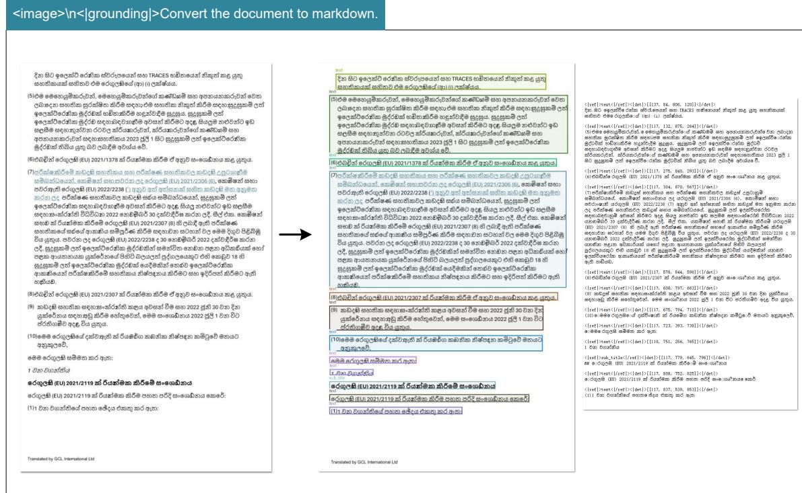

Figure 11 | To endow the capability of processing widely crawled PDFs (multilingual data), we train our model with OCR capabilities for nearly 100 languages. Minority language documents can also support both layout and non-layout outputs through different prompts.

#### *4.3.3. General vision understanding*

We also provide DeepSeek-OCR with a certain degree of general image understanding capabilities. The related visualization results are shown in Figure [12.](#page-17-1)

> **[图片提取文字 (无描述)]:**
> <image>\nLocate <|ref|>11-2=<|/ref|> in the image. <image>\nDescribe this image in detail. A green plastic container labeled for food storage purposes. The lid is yellow and appears slightly worn out. On the front label: - At the top left corner, some Chinese characters. In bold black letters near the center-top reads "6月香" (June Fragrance). - Below that, smaller white font states "鲜甜咸香" which translates roughly to "Fresh Sweet Salty Fragrant.\* - Dominating the middle part of the label is large lettering stating "豆瓣酱," meaning "Bean Paste Sauce " Additional Information includes: - A small circular logo indicating quality assurance ("优质品"). - An illustration showing what seems like a dish made using bean paste sauce. - Text below the main title says "专注25年,只做原酿酱" translating to "Focusing since 1998, only making authentic fermented bean paste." On the bottom right side, additional product specifications include "净含量: 500g". Overall Style/Type: It looks like commercial packaging designed specifically for preserving food items within the jar. It has clear labeling intended for easy identification and understanding among consumers who read Mandarin. Note: There might be slight variations due to handwriting styles but overall maintains readability regarding brand identity and contents description.

> **[图片提取文字 (无描述)]:**
> <image>\nLocate <|ref|>the teacher<|/ref|> in the image. @ MAZK ANDERSON WWW.ANDERTOONS.COM the teacher "I like how Bonnie's not stepping on my last nerve."
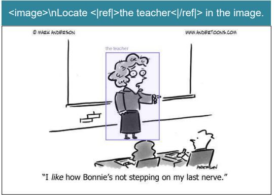

> **[图片提取文字 (无描述)]:**
> <image>\nldentify all objects in the image and output them in bounding boxes.
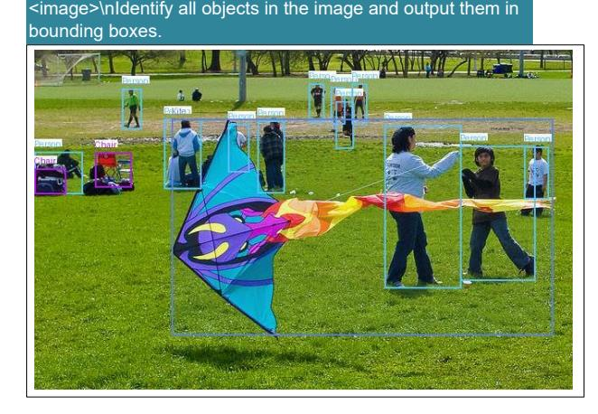

> **[图片提取文字 (无描述)]:**
> <image>\n这是一张 照片,展示了一辆红色的消 防栓。消防栓上有一个等 脸,显得非常友好和亲切。 消防栓的顶部有一个黑色的 盖子,周围有一些金属铆 钉。在消防栓的底部,有一 个粉红色的贴纸, 上面写着 "howtie"。背景中可以看 到一条街道,街道上有几辆 停放的汽车和一些树木。整 体画面给人一种温馨和友好 的感觉。

> **[图片提取文字 (无描述)]:**
> <image>\n<|grounding|>OCR the image. Bountiful Potential Potential
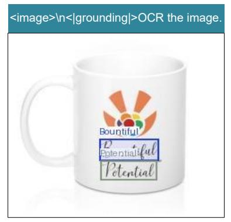

,奔流到海不复回。君不见,高堂明镜悲白发, 朝如青丝暮成雪。人生得意须尽欢,莫使金樽空 对月。天生我材必有用,千金散尽还复来。烹羊 宰牛且为乐,会须一饮三百杯。岑夫子,丹丘 生,将进酒,杯莫停。与君歌一曲,请君为我倾 耳听。钟鼓馔玉不足贵,但愿长醉不愿醒。古来 圣贤皆寂寞,惟有饮者留其名。陈王昔时宴平 乐,斗酒十千恣欢谑。主人何为言少钱,径须沽 取对君酌。五花马,千金裘,呼儿将出换美酒, 与尔同销万古愁。

君不见,黄河之水天上来

Figure 12 | We retain DeepSeek-OCR's capabilities in general visual understanding, mainly including image description, object detection, grounding, etc. Meanwhile, due to the inclusion of text-only data, DeepSeek-OCR's language capabilities are also retained. Note that since we do not include SFT (Supervised Fine-Tuning) stage, the model is not a chatbot, and some capabilities need completion prompts to be activated.

# **5. Discussion**

Our work represents an initial exploration into the boundaries of vision-text compression, investigating how many vision tokens are required to decode text tokens. The preliminary results are encouraging: DeepSeek-OCR achieves near-lossless OCR compression at approximately 10× ratios, while 20× compression still retains 60% accuracy. These findings suggest promising directions for future applications, such as implementing optical processing for dialogue histories beyond rounds in multi-turn conversations to achieve 10× compression efficiency.

> **[图片提取文字 (无描述)]:**
> Very Clear Crystal Clear Clear Blurry Very Blurry Almost Gone Time → Just happened 1 day 1 hour 1 week 1 month 1 year Memory Crystal Clear Very Clear Clear Blurry Very Blurry Almost Gone Distance 1 Vision 10cm 50cm 1m 3m 10m 20m Crystal Clear Very Clear Blurry Very Blurry Almost Gone Clear Resolution 1 Text Text token Gundam Large Base Small Tiny
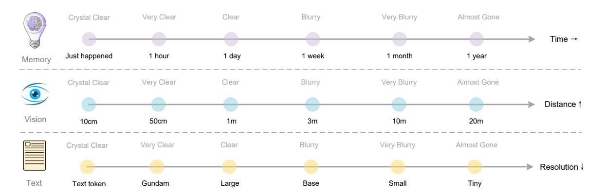

Figure 13 | Forgetting mechanisms constitute one of the most fundamental characteristics of human memory. The contexts optical compression approach can simulate this mechanism by rendering previous rounds of historical text onto images for initial compression, then progressively resizing older images to achieve multi-level compression, where token counts gradually decrease and text becomes increasingly blurred, thereby accomplishing textual forgetting.

For older contexts, we could progressively downsizing the rendered images to further reduce token consumption. This assumption draws inspiration from the natural parallel between human memory decay over time and visual perception degradation over spatial distance—both exhibit similar patterns of progressive information loss, as shown in Figure [13.](#page-18-1) By combining these mechanisms, contexts optical compression method enables a form of memory decay that mirrors biological forgetting curves, where recent information maintains high fidelity while distant memories naturally fade through increased compression ratios.

While our initial exploration shows potential for scalable ultra-long context processing, where recent contexts preserve high resolution and older contexts consume fewer resources, we acknowledge this is early-stage work that requires further investigation. The approach suggests a path toward theoretically unlimited context architectures that balance information retention with computational constraints, though the practical implications and limitations of such vision-text compression systems warrant deeper study in future research.

# **6. Conclusion**

In this technical report, we propose DeepSeek-OCR and preliminarily validate the feasibility of contexts optical compression through this model, demonstrating that the model can effectively decode text tokens exceeding 10 times the quantity from a small number of vision tokens. We believe this finding will facilitate the development of VLMs and LLMs in the future. Additionally, DeepSeek-OCR is a highly practical model capable of large-scale pretraining data production, serving as an indispensable assistant for LLMs. Of course, OCR alone is insufficient to fully validate true context optical compression and we will conduct digital-optical text interleaved pretraining, needle-in-a-haystack testing, and other evaluations in the future. From another perspective, optical contexts compression still offers substantial room for research and improvement, representing a promising new direction.

# **References**

- [1] Marker. URL <https://github.com/datalab-to/marker>.
- [2] Mathpix. URL <https://mathpix.com/>.
- [3] Ocrflux, 2025. URL <https://github.com/chatdoc-com/OCRFlux>.
- [4] G. AI. Gemini 2.5-pro, 2025. URL <https://gemini.google.com/>.
- [5] S. Bai, K. Chen, X. Liu, J. Wang, W. Ge, S. Song, K. Dang, P. Wang, S. Wang, J. Tang, H. Zhong, Y. Zhu, M. Yang, Z. Li, J. Wan, P. Wang, W. Ding, Z. Fu, Y. Xu, J. Ye, X. Zhang, T. Xie, Z. Cheng, H. Zhang, Z. Yang, H. Xu, and J. Lin. Qwen2.5-vl technical report. arXiv preprint arXiv:2502.13923, 2025.
- [6] L. Blecher, G. Cucurull, T. Scialom, and R. Stojnic. Nougat: Neural optical understanding for academic documents. arXiv preprint arXiv:2308.13418, 2023.
- [7] J. Chen, L. Kong, H. Wei, C. Liu, Z. Ge, L. Zhao, J. Sun, C. Han, and X. Zhang. Onechart: Purify the chart structural extraction via one auxiliary token. In Proceedings of the 32nd ACM International Conference on Multimedia, pages 147–155, 2024.
- [8] Z. Chen, W. Wang, H. Tian, S. Ye, Z. Gao, E. Cui, W. Tong, K. Hu, J. Luo, Z. Ma, et al. How far are we to gpt-4v? closing the gap to commercial multimodal models with open-source suites. arXiv preprint arXiv:2404.16821, 2024.
- [9] C. Cui, T. Sun, M. Lin, T. Gao, Y. Zhang, J. Liu, X. Wang, Z. Zhang, C. Zhou, H. Liu, et al. Paddleocr 3.0 technical report. arXiv preprint arXiv:2507.05595, 2025.
- [10] M. Dehghani, J. Djolonga, B. Mustafa, P. Padlewski, J. Heek, J. Gilmer, A. Steiner, M. Caron, R. Geirhos, I. Alabdulmohsin, et al. Patch n' pack: Navit, a vision transformer for any aspect ratio and resolution. Advances in Neural Information Processing Systems, 36:3632–3656, 2023.
- [11] H. Feng, S. Wei, X. Fei, W. Shi, Y. Han, L. Liao, J. Lu, B. Wu, Q. Liu, C. Lin, et al. Dolphin: Document image parsing via heterogeneous anchor prompting. arXiv preprint arXiv:2505.14059, 2025.
- [12] Y. Goyal, T. Khot, D. Summers-Stay, D. Batra, and D. Parikh. Making the v in vqa matter: Elevating the role of image understanding in visual question answering. In Proceedings of the IEEE conference on computer vision and pattern recognition, pages 6904–6913, 2017.
- [13] J. Gu, X. Meng, G. Lu, L. Hou, N. Minzhe, X. Liang, L. Yao, R. Huang, W. Zhang, X. Jiang, et al. Wukong: A 100 million large-scale chinese cross-modal pre-training benchmark. Advances in Neural Information Processing Systems, 35:26418–26431, 2022.
- [14] High-flyer. HAI-LLM: Efficient and lightweight training tool for large models, 2023. URL <https://www.high-flyer.cn/en/blog/hai-llm>.
- [15] S. Iyer, X. V. Lin, R. Pasunuru, T. Mihaylov, D. Simig, P. Yu, K. Shuster, T. Wang, Q. Liu, P. S. Koura, et al. Opt-iml: Scaling language model instruction meta learning through the lens of generalization. arXiv preprint arXiv:2212.12017, 2022.
- [16] S. Kazemzadeh, V. Ordonez, M. Matten, and T. Berg. Referitgame: Referring to objects in photographs of natural scenes. In Proceedings of the 2014 conference on empirical methods in natural language processing (EMNLP), pages 787–798, 2014.

- [17] A. Kirillov, E. Mintun, N. Ravi, H. Mao, C. Rolland, L. Gustafson, T. Xiao, S. Whitehead, A. C. Berg, W.-Y. Lo, et al. Segment anything. arXiv preprint arXiv:2304.02643, 2023.
- [18] Z. Li, Y. Liu, Q. Liu, Z. Ma, Z. Zhang, S. Zhang, Z. Guo, J. Zhang, X. Wang, and X. Bai. Monkeyocr: Document parsing with a structure-recognition-relation triplet paradigm. arXiv preprint arXiv:2506.05218, 2025.
- [19] A. Liu, B. Feng, B. Wang, B. Wang, B. Liu, C. Zhao, C. Dengr, C. Ruan, D. Dai, D. Guo, et al. Deepseek-v2: A strong, economical, and efficient mixture-of-experts language model. arXiv preprint arXiv:2405.04434, 2024.
- [20] A. Liu, B. Feng, B. Xue, B. Wang, B. Wu, C. Lu, C. Zhao, C. Deng, C. Zhang, C. Ruan, et al. Deepseek-v3 technical report. arXiv preprint arXiv:2412.19437, 2024.
- [21] C. Liu, H. Wei, J. Chen, L. Kong, Z. Ge, Z. Zhu, L. Zhao, J. Sun, C. Han, and X. Zhang. Focus anywhere for fine-grained multi-page document understanding. arXiv preprint arXiv:2405.14295, 2024.
- [22] I. Loshchilov and F. Hutter. Sgdr: Stochastic gradient descent with warm restarts. arXiv preprint arXiv:1608.03983, 2016.
- [23] I. Loshchilov and F. Hutter. Decoupled weight decay regularization. In ICLR, 2019.
- [24] A. Masry, D. X. Long, J. Q. Tan, S. Joty, and E. Hoque. Chartqa: A benchmark for question answering about charts with visual and logical reasoning. arXiv preprint arXiv:2203.10244, 2022.
- [25] A. Nassar, A. Marafioti, M. Omenetti, M. Lysak, N. Livathinos, C. Auer, L. Morin, R. T. de Lima, Y. Kim, A. S. Gurbuz, et al. Smoldocling: An ultra-compact vision-language model for end-to-end multi-modal document conversion. arXiv preprint arXiv:2503.11576, 2025.
- [26] OpenAI. Gpt-4 technical report, 2023.
- [27] L. Ouyang, Y. Qu, H. Zhou, J. Zhu, R. Zhang, Q. Lin, B. Wang, Z. Zhao, M. Jiang, X. Zhao, et al. Omnidocbench: Benchmarking diverse pdf document parsing with comprehensive annotations. In Proceedings of the Computer Vision and Pattern Recognition Conference, pages 24838–24848, 2025.
- [28] J. Poznanski, A. Rangapur, J. Borchardt, J. Dunkelberger, R. Huff, D. Lin, C. Wilhelm, K. Lo, and L. Soldaini. olmocr: Unlocking trillions of tokens in pdfs with vision language models. arXiv preprint arXiv:2502.18443, 2025.
- [29] A. Radford, J. W. Kim, C. Hallacy, A. Ramesh, G. Goh, S. Agarwal, G. Sastry, A. Askell, P. Mishkin, J. Clark, et al. Learning transferable visual models from natural language supervision. In International conference on machine learning, pages 8748–8763. PMLR, 2021.
- [30] Rednote. dots.ocr, 2025. URL <https://github.com/rednote-hilab/dots.ocr>.
- [31] C. Schuhmann, R. Vencu, R. Beaumont, R. Kaczmarczyk, C. Mullis, A. Katta, T. Coombes, J. Jitsev, and A. Komatsuzaki. Laion-400m: Open dataset of clip-filtered 400 million imagetext pairs. arXiv preprint arXiv:2111.02114, 2021.

- [32] A. Singh, V. Natarajan, M. Shah, Y. Jiang, X. Chen, D. Batra, D. Parikh, and M. Rohrbach. Towards vqa models that can read. In Proceedings of the IEEE/CVF conference on computer vision and pattern recognition, pages 8317–8326, 2019.
- [33] T. Sun, C. Cui, Y. Du, and Y. Liu. Pp-doclayout: A unified document layout detection model to accelerate large-scale data construction. arXiv preprint arXiv:2503.17213, 2025.
- [34] B. Wang, C. Xu, X. Zhao, L. Ouyang, F. Wu, Z. Zhao, R. Xu, K. Liu, Y. Qu, F. Shang, et al. Mineru: An open-source solution for precise document content extraction. arXiv preprint arXiv:2409.18839, 2024.
- [35] P. Wang, S. Bai, S. Tan, S. Wang, Z. Fan, J. Bai, K. Chen, X. Liu, J. Wang, W. Ge, et al. Qwen2-vl: Enhancing vision-language model's perception of the world at any resolution. arXiv preprint arXiv:2409.12191, 2024.
- [36] H. Wei, L. Kong, J. Chen, L. Zhao, Z. Ge, J. Yang, J. Sun, C. Han, and X. Zhang. Vary: Scaling up the vision vocabulary for large vision-language model. In European Conference on Computer Vision, pages 408–424. Springer, 2024.
- [37] H. Wei, L. Kong, J. Chen, L. Zhao, Z. Ge, E. Yu, J. Sun, C. Han, and X. Zhang. Small language model meets with reinforced vision vocabulary. arXiv preprint arXiv:2401.12503, 2024.
- [38] H. Wei, C. Liu, J. Chen, J. Wang, L. Kong, Y. Xu, Z. Ge, L. Zhao, J. Sun, Y. Peng, et al. General ocr theory: Towards ocr-2.0 via a unified end-to-end model. arXiv preprint arXiv:2409.01704, 2024.
- [39] H. Wei, Y. Yin, Y. Li, J. Wang, L. Zhao, J. Sun, Z. Ge, X. Zhang, and D. Jiang. Slow perception: Let's perceive geometric figures step-by-step. arXiv preprint arXiv:2412.20631, 2024.
- [40] Z. Wu, X. Chen, Z. Pan, X. Liu, W. Liu, D. Dai, H. Gao, Y. Ma, C. Wu, B. Wang, et al. Deepseek-vl2: Mixture-of-experts vision-language models for advanced multimodal understanding. arXiv preprint arXiv:2412.10302, 2024.
- [41] W. Yu, Z. Yang, L. Li, J. Wang, K. Lin, Z. Liu, X. Wang, and L. Wang. Mm-vet: Evaluating large multimodal models for integrated capabilities. arXiv preprint arXiv:2308.02490, 2023.
- [42] J. Zhu, W. Wang, Z. Chen, Z. Liu, S. Ye, L. Gu, H. Tian, Y. Duan, W. Su, J. Shao, et al. Internvl3: Exploring advanced training and test-time recipes for open-source multimodal models. arXiv preprint arXiv:2504.10479, 2025.