# Demystifying Reasoning Dynamics with Mutual Information: Thinking Tokens are Information Peaks in LLM Reasoning

Chen Qian1,2\*, Dongrui Liu2\*, Haochen Wen3, Zhen Bai4, Yong Liu1†, Jing Shao2†

1 Gaoling School of Artificial Intelligence, Renmin University of China

2 Shanghai Artificial Intelligence Laboratory

#### Abstract

Large reasoning models (LRMs) have demonstrated impressive capabilities in complex problem-solving, yet their internal reasoning mechanisms remain poorly understood. In this paper, we investigate the reasoning trajectories of LRMs from an information-theoretic perspective. By tracking how mutual information (MI) between intermediate representations and the correct answer evolves during LRM reasoning, we observe an interesting MI peaks phenomenon: the MI at specific generative steps exhibits a sudden and significant increase during LRM's **reasoning process.** We theoretically analyze such phenomenon and show that as MI increases, the probability of model's prediction error decreases. Furthermore, these MI peaks often correspond to tokens expressing reflection or transition, such as "Hmm", "Wait" and "Therefore," which we term as the thinking tokens. We then demonstrate that these thinking tokens are crucial for LRM's reasoning performance, while other tokens has minimal impacts. Building on these analyses, we propose two simple yet effective methods to improve LRM's reasoning performance, by delicately leveraging these thinking tokens. Overall, our work provides novel insights into the reasoning mechanisms of LRMs and offers practical ways to improve their reasoning capabilities. The code is available at https://github.com/ChnQ/MI-Peaks.

#### 1 Introduction

The reasoning ability of large language models (LLMs) has emerged as one of their most powerful and crucial capabilities [49, 20, 21]. By explicitly thinking through a question before providing an answer and breaking down complex problems into multiple steps, LLMs have made impressive progress in complex reasoning tasks, such as mathematics, programming, and logical inference [25, 55, 41, 6]. Understanding and improving LLMs' reasoning ability represents a crucial pathway toward achieving Artificial General Intelligence (AGI) [51, 48, 39].

By undergoing reasoning-intensive training on foundational LLMs, recent large reasoning models (LRMs) such as OpenAI's o1 [21], DeepSeek's R1 [18], and QwQ [42] have demonstrated exceptional reasoning capabilities, significantly pushing the boundaries of complex problem-solving. However, despite recent advances, the mechanisms underlying these capabilities remain largely under-explored. The internal dynamics of the reasoning process, as well as the influence of each intermediate step on the final answer, are still largely a "black box." While some research in the field of trustworthy AI

&lt;sup>3 University College London, University of London 4 Dalian University of Technology {qianchen2022,liuyonggsai}@ruc.edu.cn {liudongrui,shaojing}@pjlab.org.cn

\* Equal contribution † Corresponding author

> **[图片提取文字 (无描述)]:**
> Let a be a positive real number High Therefore Tsl MI Peaks such that all the roots of  $x^3$  +  $ax^2 + ax + 1 = 0$  are real. Find the smallest possible value of a. From If Div We '.\n\n Okay, so I have this problem here: Let Each a be a positive ... First, let me write down the equation again to make sure Regular MI I have it right: ... Wait, is that right? & Starting Hmm, maybe I should double-check ... Now, combine all these terms: ... So. when a = 3, f(a) = 0, which would Low mean the cubic has a multiple root ... \*\* Coopute Reasoning Steps (a) (b)
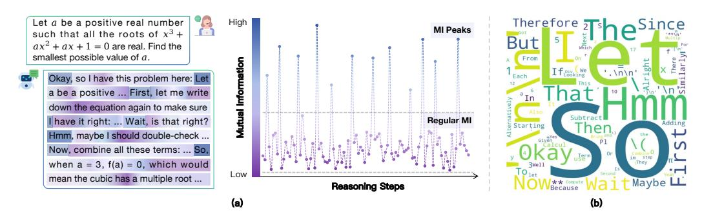

Figure 1: Illustration and analysis of the MI peaks phenomenon in LRM reasoning. (a) The **left** side shows an example of an LRM performing a multi-step reasoning task. To investigate the underlying reasoning mechanism, we compute the MI between the model's representation at each step and the golden answer. Interestingly, as shown on the **right** side, certain steps exhibit sudden and significant increases in MI, which we refer to the MI peaks phenomenon. (b) Token distribution at MI peaks. We further find that the tokens generated at these high-MI steps are often reflective or transitional expressions such as "So," "Hmm," and "Wait."

suggests the existence of "critical tokens" that directly impact the safety of the LLM's answers [60, 26, 33], a natural question arises: are there critical reasoning steps or intermediate states that significantly affect the final results in the reasoning process of LRMs?

In this paper, we explore this question from an information-theoretic [3, 24] perspective. Specifically, given a question, we dynamically calculate the mutual information (MI) between the LRM's representation at each step of reasoning process and the golden answer (*i.e.*, the ground-truth response), observing how the MI evolves. Interestingly, we find that **certain steps' representations exhibit a sudden and significant increase in MI with the golden answer**. As shown in Figure 1(a), these representations with MI peaks are sparse and occur non-uniformly throughout the reasoning process. This suggests that at certain crucial reasoning steps, LRMs' representation becomes highly informative about the correct answer. Naturally, this raises a question: *are these MI peaks potentially related to model's reasoning performance?* Theoretically, we provide preliminary insights into the MI peaks phenomenon, demonstrating that as the cumulative MI between the representations and the golden answer increases, the probability of LRM's wrong prediction lowers. Furthermore, our experiments show that the base models corresponding to these LRMs (*e.g.*, LLaMA-3.1-8B [16]), does not exhibit this MI Peaks phenomenon as clearly. These analyses suggest that the distinct MI peaks observed during LRM reasoning are potentially stemming from the reasoning-intensive training, and may hold a potential relationship with LRM's advanced reasoning abilities.

This naturally leads to the question: what semantic roles do the representations at MI peaks play during reasoning? Intriguingly, we find that these representations with MI peaks predominantly correspond to tokens such as "Wait," "Hmm," "Therefore," "So," which typically express reflectiveness, self-correcting, or transitions, as shown in Figure 1(b). Here, we refer to these tokens with MI peaks as "thinking tokens". Since these thinking tokens explicitly prompt the model to reflect and reason, and their representations carry enriched information with the golden answer, we hypothesize that these thinking tokens may play a critical role in the model's reasoning ability. To validate this hypothesis, we suppress the generation of these thinking tokens and observe how the model's reasoning performance changes. As shown in Figure 5, fully suppressing the generation of these thinking tokens significantly harms the model's reasoning performance, while randomly suppressing the same number of tokens has little impact. This indicates that these thinking tokens are indeed crucial to LRM's reasoning ability.

Finally, drawing insights from the above analyses, we propose to improve the reasoning performance of LRMs in two training-free ways. 1) By allowing the representations at MI Peaks to undergo multiple iterations within the model, we propose a method called Representation Recycling (RR). RR encourages the model to better exploit these informative representations. Experiments show that RR consistently improves the LRMs' reasoning performance across several benchmarks. For instance, it improves the accuracy of DeepSeek-R1-Distill-LLaMA-8B by 20% relatively on AIME24. 2) Motivated by our analysis of *thinking tokens*, we propose Thinking Token based Test-time Scaling (TTTS). That is, when additional token budget remains, we force the model to continue reasoning by begin with the *thinking tokens*. Experiments show that TTTS leads to steady performance

> **[图片提取文字 (无描述)]:**
> DeepSeek-R1-Distill-Qwen-7B DeepSeek-R1-Distill-Llama-8B DeepSeek-R1-Distill-Qwen-14B 0.6 MI Value 0.4 0.2 0.0 Reasoning Step Reasoning Step Reasoning Step DeepSeek-R1-Distill-Qwen-32B QwQ-32B DeepSeek-R1-Distill-Llama-70B 0.4 MI Value 0.3 0.2 0.1 0.0 Reasoning Step Reasoning Step Reasoning Step

Figure 2: The evolution trajectories of MI between each step's representations and the golden answer during the reasoning process in LRMs.

improvements as the token budget increases compared to the original LRMs. These applications further demonstrate that our observations can offer new insights into enhancing the reasoning abilities of LRMs.

## 2 Emergence of MI Peaks in LRMs' Reasoning Trajectories

Despite the impressive reasoning capabilities demonstrated by recent LRMs such as DeepSeek's R1 series models [18] and Qwen's QwQ [42], the underlying mechanisms driving these capabilities remain poorly understood. In this section, we investigate the reasoning trajectories of LRMs from an information-theoretic perspective. We begin by introducing the notations and preliminaries (Section 2.1). In Section 2.2, we demonstrate the MI peaks phenomenon. We then provide theoretical insights into this phenomenon in Section 2.3. Finally, we examine whether similar patterns emerge in the corresponding non-reasoning LLMs of LRMs in Section 2.4.

#### 2.1 Preliminaries

Extracting representations in LRM generation process. Given a data sample s=(x,y), where x is the input query and y is the corresponding golden answer. For a LLM  $\mathcal{M}$ , when prompted with x, it auto-regressively generates  $\hat{y}=\{\hat{y}_1,\hat{y}_2,\ldots,\hat{y}_T\}$ , where T is the total number of tokens and  $\hat{y}_t$  denotes the token produced at step t. To analyze the dynamic generation process, we collect the hidden representation corresponding to each generated token. Let  $\mathcal{A}_i^l(\cdot)$  denote the representation extraction function that extracts the representation of the i-th token at layer l of a LLM when given an input. For simplicity, we omit the superscripts and subscripts on  $\mathcal{A}$ . In this way, the representation corresponding to the t-th generated token is denoted by  $\mathbf{h}_t = \mathcal{A}\big(\mathcal{M}(x,\hat{y}_{< t})\big)$ , where  $\hat{y}_{< t}$  denotes the subsequence of  $\hat{y}$  before the t-th token. Similarly, we also extract the representation of the gold answer by feeding y into the LLM, e.g.,  $\mathbf{h}_y = \mathcal{A}\big(\mathcal{M}(y)\big)$ .

Estimating MI between each generated token and golden answer. After extracting the representation, we then measure the MI between each generated token's representation  $h_t$  and the golden answer's representation  $h_y$ , obtaining a MI sequence:  $I[h_1; h_y], I[h_2; h_y], \ldots, I[h_T; h_y]$ . In this way, we observe how MI evolves, thus analyze the reasoning dynamics during LLM's generation process. Specifically, we follow [29, 35, 12] to use the Hilbert-Schmidt Independence Criterion (HSIC) [17] to estimate MI [24, 32]. The formal definition of HSIC is stated in Definition 4, and we provide more implementation details in Appendix B.

**Definition 1** (Hilbert-Schmidt Independence Criterion (HSIC) [17]). HSIC is the Hilbert-Schmidt norm of the cross-covariance operator between the distributions in Reproducing Kernel Hilbert Space (RKHS). Formally:

$$\operatorname{HSIC}(X,Y) = \mathbb{E}_{XYX'Y'} \left[ k_X \left( X, X' \right) k_Y \left( Y, Y' \right) \right] + \mathbb{E}_{XX'} \left[ k_X \left( X, X' \right) \right] \mathbb{E}_{YY'} \left[ k_Y \left( Y, Y' \right) \right] - 2\mathbb{E}_{XY} \left[ \mathbb{E}_{X'} \left[ k_X \left( X, X' \right) \right] \mathbb{E}_{Y'} \left[ k_Y \left( Y, Y' \right) \right] \right], \tag{1}$$

where X', Y' are independent copies of X, Y, respectively, and  $k_X$ ,  $k_Y$  are kernel functions.

Table 1: Statistical properties of MI peaks across different LRMs. Here, #MI Peaks and #All Steps refer to the number of MI peaks and the total number of reasoning steps, respectively. Interval of MI Peaks denotes the number of steps between two consecutive MI peaks.

| Model                         | #MI Peaks | #All Steps |        | Max Interval of MI Peaks |       |       |
|-------------------------------|-----------|------------|--------|-----------------------------|-------|-------|
| DeepSeek-R1-Distill-Qwen-7B   | 2.57      | 507.97     | 0.0051 | 152.67                      | 52.74 | 87.38 |
| DeepSeek-R1-Distill-Llama-8B  | 24.54     | 511.03     | 0.0480 | 69.37                       | 6.65  | 27.84 |
| DeepSeek-R1-Distill-Qwen-14B  | 18.30     | 510.09     | 0.0359 | 85.50                       | 5.33  | 31.09 |
| DeepSeek-R1-Distill-Qwen-32B  | 10.82     | 511.22     | 0.0212 | 138.07                      | 19.35 | 59.30 |
| QwQ-32B                       | 5.41      | 489.80     | 0.0110 | 167.85                      | 19.35 | 66.53 |
| DeepSeek-R1-Distill-Llama-70B | 16.60     | 512.00     | 0.0324 | 93.03                       | 6.77  | 34.71 |

#### 2.2 Investigating LRM's Reasoning Trajectories with MI

In this subsection, we track how the MI between each step's representation and the gold answer evolves, following the procedure in Section 2.1. Specifically, we conduct experiments on several popular LRMs of varying scales, including the DeepSeek-R1-Distill series [18] and QwQ-32B [42]. We use the training split of the MATH dataset [19], which comprises 12k competition-level mathematics problems, each accompanied by a detailed step-by-step solution.

Certain steps exhibit sudden and significantly increases in MI during the reasoning process of LRMs. Figure 2 shows the MI evolution trajectories for one data sample during LRMs generation1. Surprisingly, across all tested LRMs, we observe a consistent pattern: while most steps exhibit relatively low and stable MI values as reasoning proceeds, certain steps' MI suddenly and significantly increases. We refer to these steps with abrupt increase in MI as the MI peaks. Formally, we define MI peaks as follows:

**Definition 2** (MI Peak). Given a MI sequence  $\{m_t\}_{t=1}^T$ , let  $Q_1$ ,  $Q_3$  denote the 25-th percentile (first quartile), and the 75-th percentile (third quartile) of the sequence, respectively. We then define  $IQR(m) = Q_3 - Q_1$  as the inter-quartile range. In this way, we identify the set of MI peaks as

$$\mathcal{O} = \{ t : m_t > Q_3 + \tau \operatorname{IQR}(m) \},\$$

where  $\tau$  is a scale factor. Empirically, we set  $\tau$  to 1.5 [44].

MI peaks are sparse and distribute non-uniformly throughout the total reasoning process. As shown in Table 1, MI peaks occur quite sparsely in the reasoning processes of LRMs, accounting for no more than 5% of all reasoning steps. Notably, for DeepSeek-R1-Distill-Qwen-7B, the MI peak ratio is only 0.51%. Despite this sparsity, these MI peaks are scattered across the entire reasoning trajectory, as illustrated in Figure 2. Moreover, the interval statistics reported in Table 1 indicate that MI peaks do not occur at uniform intervals. Such a sparse and non-uniform distribution pattern suggests that MI peaks may emerge opportunistically at key moments during reasoning.

#### 2.3 Theoretical Insights: Higher MI Leads to Tighter Bounds on Prediction Error

In Section 2.2, our empirical exploration reveals the emergence of MI peaks in LRMs' reasoning trajectories, indicates that certain representations encode substantially rich information about the gold answer. This raises a natural question: *would such pattern be potentially related to the LRM's reasoning performance?* In this subsection, we provide theoretical insights into this question, showing that higher MI between the representations and the gold answer yields tighter lower and upper bounds on the model's prediction error.

**Theorem 1.** Consider a sequence of representations  $h_1, h_2, \ldots, h_T$  during an LLM's reasoning process, where T denotes the number of total reasoning steps. Let y,  $\hat{y}$  denote the golden answer and the LLM's prediction answer, respectively. Define  $p_e = \Pr(\hat{y} \neq y)$  as the LLM's prediction error probability. Then the following inequality holds:

$$p_e \geqslant \frac{1}{\log(|\mathcal{Y}|-1)} \Big[ H(y) - \sum_{j=1}^T I(y; \mathbf{h}_j \mid \mathbf{h}_{< j}) - H_b(p_e) \Big],$$
 (2)

&lt;sup>1Results for more examples and more LRMs are reported in Appendix D.

> **[图片提取文字 (无描述)]:**
> (a) Deepseek-R1-Distill-Llama-8B and Llama-3.1-8B 0.6 0.5 0.5 0.5 0.4 0.4 0.4 0.3 0.2 0.3 0.3 0.2 0.2 0.1 0.1 0.1 0.0 0.0 0.0 100 200 300 400 500 100 200 300 400 500 100 200 300 400 500 0 0 Reasoning Step Reasoning Step Reasoning Step (b) DeepSeek-R1-Distill-Qwen-14B and Qwen2.5-14B 6 6 MI Value 3 2 0 0 400 500 400 300 400 500 0 100 200 300 100 200 300 500 100 200 Reasoning Step Reasoning Step Reasoning Step

Figure 3: Comparison of MI trajectories between LRMs and their corresponding non-reasoning LLMs.

where  $|\mathcal{Y}|$  is the size of the support of y, and  $H_b(p_e)$  denote the binary entropy of  $p_e$  that defined by

$$H_b(p_e) = -p_e \log p_e - (1 - p_e) \log(1 - p_e). \tag{3}$$

**Remark 1.** Theorem 1 establishes a lower bound on the LLM's prediction error  $p_e$ . Intuitively, it suggests that for an LLM to achieve a low error rate, its sequence of internal representations during generation should capture more information about the golden answer. In other words, higher MI throughout the generation trajectory may help lower model's minimal achievable error.

**Theorem 2.** Following the notations in Theorem 1, the following inequality holds: 
$$p_{e} \leqslant \frac{1}{2} \Big[ H(y) - \sum_{j=1}^{T} I(y; \, \boldsymbol{h}_{j} \mid \boldsymbol{h}_{< j}) \Big]. \tag{4}$$

**Remark 2.** Theorem 2 provides an upper bound on the prediction error  $p_e$ , which complements the lower bound in Theorem 1. It demonstrates that a higher cumulative MI between the sequence of representations and the golden answer leads to a tighter upper bound on LLM's error probability.

Remark 3. In summary, Theorems 1 and 2 jointly suggest that, higher cumulative MI between representations during reasoning and the golden answer leads to a tighter upper and lower bounds on the model's error probability. In other words, the model is more likely to arrive at the correct answer. Notably, the presence of MI peaks can effectively increase this cumulative MI, thereby potentially helping LLMs to perform more accurate reasoning.

#### 2.4 Will Non-reasoning LLMs also Exhibit the MI Peaks Phenomenon?

Since the MI Peaks phenomenon is commonly observed in LRMs, would non-reasoning LLMs (i.e., foundation LLMs not specifically strengthened for complex reasoning, such as Llama-3.1-8B [16]) also exhibit similar behavior? To explore this question, we select the corresponding non-reasoning counterparts of the DeepSeek-R1-Distill series models and follow the workflow described in Section 2.1 to conduct experiments.

Metrics. To facilitate a quantitative comparison between LRMs and their corresponding base models in terms of the properties of MI sequence  $\{m_t\}_{t=1}^T$  during reasoning, we adopt the following metrics: (1) Mean:  $\bar{m} = \frac{1}{T} \sum_{i=1}^{T} m_i$ ; (2) Standard deviation (Std):  $\sigma_m = \sqrt{\frac{1}{T} \sum_{i=1}^{T} (m_i - \bar{m})^2}$ ; (3) AOM: AOM =  $\frac{1}{|\mathcal{O}|} \sum_{i \in \mathcal{O}} \frac{|m_i - \text{median}(m)|}{\text{IQR}(m)}$ , where  $\mathcal{O}$  is the set of MI peaks defined in Definition 2, median (m) in the restrict of the set of MI.  $\operatorname{median}(m)$  is the median of the sequence  $\{m_t\}_{t=1}^T$ . Specifically, *Mean* reflects the overall MI magnitude, while the *Std* and *AOM* capture the degree of MI fluctuation.

Non-reasoning LLMs exhibit weaker and less pronounced MI peaks compared to LRMs. As shown in Figure 3, while certain steps in non-reasoning LLMs' reasoning process do exhibit increased MI relative to the average, the increase is generally mild and lacks the sharp spikes observed in their LRM counterparts. Quantitatively, this observation is further supported by the Std and AOM metrics reported in Table 2, which consistently indicate lower MI fluctuation and peak intensity in

Table 2: Statistical comparison of MI sequences between LRMs and their corresponding nonreasoning LLMs.

| Metric | Llama-3.1-8B |                         | Qwen2.5-Math-7B |           |        | Qwen2.5-14B                              |        | Qwen2.5-32B |        | Llama-3.3-70B-Inst |
|--------|--------------|-------------------------|-----------------|-----------|--------|------------------------------------------|--------|-------------|--------|--------------------|
|        |              | Origin Reasoning Origin |                 | Reasoning |        | Origin Reasoning Origin Reasoning Origin |        |             |        | Reasoning          |
| Mean   | 0.0863       | 0.1279                  | 2.1971          | 3.3016    | 1.3128 | 3.3508                                   | 1.7669 | 4.0352      | 0.0400 | 0.0599             |
| Std    | 0.0512       | 0.0707                  | 0.8639          | 0.8936    | 0.4326 | 0.6703                                   | 0.5113 | 0.6036      | 0.0277 | 0.0484             |
| AOM    | 3.3573       | 4.5176                  | 2.6320          | 2.7541    | 2.6541 | 3.0820                                   | 2.5466 | 2.5998      | 2.4326 | 3.2866             |

> **[图片提取文字 (无描述)]:**
> DeepSeek-R1-Distill-Llama-8B DeepSeek-R1-Distill-Qwen-14B QwQ-32B Tokens at MI Peaks Tokens at MI Peaks Tokens at MI Peaks
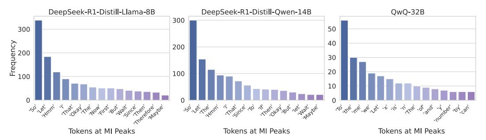

Figure 4: Frequency distribution of tokens at MI peaks.

non-reasoning LLMs. These findings suggest that the MI peak pattern may emerges from complex reasoning enhanced training.

The overall MI in non-reasoning LLMs during the reasoning process is lower than their corresponding LRMs. Figure [3](#page-4-2) and the *Mean* metric in Table [2](#page-5-0) intuitively and quantitatively validate this observation, respectively. This indicates that after reasoning-intensive training, LRMs seems to fundamentally encode more information relevant to correct reasoning within their representations at each generation step. Furthermore, the presence of MI peaks in LRMs could contribute to raising the overall MI throughout the reasoning trajectory. These observations provide partial empirical support for the theoretical insights presented in Section [2.3,](#page-3-1) which indicate that higher MI between representations and the golden answer correlates with a greater likelihood of generating a correct response.

# 3 Thinking Tokens are Information Peaks in LLM Reasoning

In Section [2,](#page-2-2) we identify a distinctive phenomenon in LRMs' reasoning trajectories: the emergence of MI peaks. Then a natural follow-up question is: *what semantic information is encoded in the representations at these MI peaks?* In this section, we investigate this question from a token-level perspective. Specifically, in Section [3.1,](#page-5-1) we project the representations at MI peaks into the token space and analyze the characteristics of the corresponding tokens. Then in Section [3.2,](#page-6-1) we design experiments to assess the functional role of these tokens, demonstrating that they are crucial for LRM's reasoning performance, while other tokens have minimal impact.

#### 3.1 Exploring MI Peak Representations in Token Space

Projecting representations to token space. To interpret the semantics of representations at MI peaks, we decode these specific representations into the token space using LLM's output head [\[46,](#page-11-8) [54,](#page-12-3) [14\]](#page-9-4). Specifically, for a representation ht, we first compute the corresponding token probability distribution, and then employ a greedy decoding strategy to extract the token with the highest probability:

$$p_t = \operatorname{Softmax}(W_{\text{out}}h_t + b), \quad \hat{z}_t = \arg\max_{i \in \{1, \dots, V\}} [p_t]_i,$$
 (5)

where Wout P R V ˆd is the output projection matrix, b P R V is the bias vector, and V is the vocabulary size. We apply the above decoding procedure to all representations at MI peaks across the evaluation dataset. In this way, we analyze the empirical distribution over these decoding tokens, uncovering patterns about what types of semantic tokens tend to correspond to these high-MI representations. Specifically, we use the same models and dataset as described in Section [2.1](#page-2-0) to conduct experiments.

> **[图片提取文字 (无描述)]:**
> GSM8K MATH500 AIME24 85 80 30 Accuracy 52 70 25 60 20 50 70 10 10 10 Number of Suppressed Tokens Number of Suppressed Tokens Number of Suppressed Tokens Token Type -- Thinking Tokens Other Tokens

Figure 5: Impact of suppressing the generation of thinking tokens versus other tokens on LRMs' reasoning performance.

For each model, we aggregate all decoded tokens at MI peaks across the dataset, and then compute their frequency distribution for further analysis.

The tokens that appear at MI peaks are mostly connective words that express self-reflection or transitions in LRM's reasoning process. In Figure [4,](#page-5-2) we illustrate the top-30 tokens decoded at MI peaks in DeepSeek-R1-Distill-LLaMA-8B, DeepSeek-R1-Distill-Qwen-14B and QwQ[2](#page-6-2) . Interestingly, we observe that the MI peak tokens in LRMs are predominantly logical markers and reflective expressions such as *"So"*, *"Hmm"*, and *"Wait"*, which are commonly associated with pause, thinking, or internal deliberation. Intuitively, tokens like *"Hmm"* and *"Wait"* often prompt the model to selfreflect, consider alternative reasoning paths, etc. For example, we randomly extract responses from LRMs where these tokens appear and observe the follow-up statements: "Wait, let me think differently. Let's denote...," "Hmm, so I must have made a mistake somewhere. Let me double-check my calculations. First, ..." This behavior aligns with prior work suggesting that such tokens can motivate to perform multi-step reasoning and improve answer accuracy [\[18\]](#page-10-3). We provide more discussions in Appendix [C.](#page-17-0)

### 3.2 Tokens at MI Peaks are Critical to LRM's Reasoning Performance

Here, we refer to those decoded high-MI tokens in Section [3.1](#page-5-1) as *thinking tokens*. These thinking tokens appear to play a dual role: (i) linguistically, they serve as discourse cues that encourage the model to think or reflect; and (ii) in hidden space, their corresponding representations contain high MI with the golden answer. Thus, we hypothesize that *these thinking tokens may be critical to model's final reasoning results*. In this subsection, we conduct experiments to validate this hypothesis.

Suppressing the generation of thinking tokens significantly impairs the reasoning performance of LRMs, while suppressing other tokens has minimal effect. To investigate the role of thinking tokens identified at MI peaks, we conduct a controlled intervention experiment. Specifically, during inference with LRMs, we suppress the generation of a certain number of thinking tokens by setting their generation probabilities to zero. As a comparison, we randomly suppress the same number of non-thinking token. In this way, we evaluate the model's performance on several math reasoning benchmarks under different numbers of suppression tokens. As shown in Figure [5,](#page-6-0) suppressing thinking tokens leads to a significant degradation in the model's reasoning performance, while suppressing non-thinking tokens has little to no effect (more discussions are provided in Appendix [C\)](#page-17-0). This indicates that the thinking tokens indeed play a critical role in LRMs' reasoning capabilities, providing empirical support for our previous hypothesis.

# 4 Applications: Leveraging MI Peaks to Improve LRM Reasoning

Drawing insights from our previous analyses, we propose two simple yet effective techniques to improve LRMs' reasoning performance. In Section [4.1,](#page-7-0) we introduce a method that reuses internal representations at MI peaks to allow the model to further exploit the information in latent space. In Section [4.2,](#page-7-1) we incorporate the thinking tokens into a test-time scaling scenario to improve model's reasoning accuracy.

2Results for the other models are provided in Appendix [D.](#page-18-0)

#### 4.1 Recycling High-MI Representations During Inference

The MI Peaks phenomenon analyzed in Section 2.2 suggests that some representations in LRMs' reasoning process may encode particularly useful semantic information for reasoning. Motivated by this, we propose a simple technique named Representation Recycling (RR). Intuitively, RR feeds the representations at MI peaks back into the model, thereby allowing the model to process and exploit these representations more thoroughly.

**Method.** Recall that each layer in an LLM typically consists of a Transformer block [45]. Given an input, the forward computation flow through the layers of an LLM follows:

$$h_{\ell} = \mathrm{TF}_{\ell}(h_{\ell-1}), \quad \ell = 1, \dots, L,$$

where  $h_{\ell}$  is the output representation of the l-th transformer block  $\mathrm{TF}_{\ell}(\cdot)$ , and L is the total number of layers. To encourage deeper processing of a potentially important representation  $h_{\ell}$ \* at layer  $\ell$ \*, we modify the forward computation by feeding it back into the same layer once more:  $h'_{\ell} = \mathrm{TF}_{\ell} * (h_{\ell})$ , instead of directly passing it to the next layer. Then, for layers  $\ell > \ell^*$ , we continue the forward pass as usual:  $h'_{\ell} = \mathrm{TF}_{\ell} (h'_{\ell-1})$ . In this way, the above "recycling" operation allows the model to reprocess the high-MI representations to further extract critical reasoning features.

> **[图片提取文字 (无描述)]:**
> GSM8K MATH500 AIME24 90 50 90 86 Accuracy (%) 40 82 30 82 78 Llama-8B Qwen-7B Llama-8B Llama-8B Qwen-7B Qwen-7B Origin

Figure 6: Reasoning performance of the original LRMs and our RR method across multiple math benchmarks.

**Experimental setup.** To evaluate RR's effectiveness, we conduct experiments on three mathematical reasoning benchmarks using DeepSeek-R1-Distill-Llama-8B and DeepSeek-R1-Distill-Qwen-7B. Since ground-truth answers are unavailable during inference, we first record the thinking tokens using the training set of MATH dataset (as introduced in Section 3.1), and then trigger RR whenever the model generates one of these thinking tokens. We empirically set  $\ell^*$  to middle or high layers of the LLMs, since previous studies suggest that these layers tend to encode more semantically rich content [5, 59, 35].

**Results.** As shown in Figure 6, **RR** consistently improves LRMs' reasoning performance across all benchmarks. In particular, RR yields a notable performance improvement on the AIME24 dataset, which consists of challenging competition-level problems. This suggests that recycling the MI-peak representations could help LRMs further unlock and leverage their inherent reasoning potential, leading to better reasoning performance.

#### **4.2** Test-Time Scaling with Thinking Tokens

With the diminishing returns of scaling laws in LLMs' training stage, test-time scaling is becoming an increasingly important paradigm for improving the reasoning performance of LRMs [12, 38, 50]. Prior studies have shown that LLMs' reasoning performance can continue to improve as more compute is allocated at inference time [21]. Inspired by prior work [30], we propose a simple yet effective strategy called Thinking Token based Test-time Scaling (TTTS).

**Method.** Given the set of thinking tokens identified in Section 3.1, we filter out tokens with little semantic content (*e.g.*, punctuations and single characters, see Appendix B for more details) and retain tokens like "So," "Hmm," which often indicate reflection, transition, or further thinking. Then during inference, we append one of these thinking tokens to the end of the model's initial output and allow it to continue generating additional reasoning steps.

**Experimental setup.** We evaluate TTTS using LLaMA-8B on GSM8K, MATH500, and AIME24. Specifically, we consider a controlled test-time scaling setting: given a LRM with an initial token budget, we gradually increase the token generation budget and compare the model's reasoning performance with and without TTTS.

Results. As shown in Figure 7, under the same token budget, TTTS consistently outperforms the original LRM on both GSM8K and MATH500. Notably, on GSM8K, the original LRM's performance plateaus once the token budget exceeds 1024, whereas TTTS continues to yield performance improvements as the token budget increases. On the harder AIME24 benchmark,

> **[图片提取文字 (无描述)]:**
> GSM8K MATH500 AIME24 86-35.0-75-Accuracy (%) 32.5-70-30.0-65-27.5-25.0-78-60-512 2048 3072 4096 5120 1024 12288 3072 4096 6144 8192 256512 1024 1536 2048 2560 Token Budget Token Budget Token Budget Method -X- Origin -O- TITS

Figure 7: Reasoning performance of TTTS and the original LRMs across multiple math benchmarks under varying token budgets.

we observe that the original model's performance saturates once the token budget reaches around 3000. In contrast, although TTTS underperforms slightly at some intermediate token budgets, its performance continues to improve steadily and eventually surpasses the original model once the budget exceeds 6144 tokens. These results suggest that as more inference-time resources become available, TTTS could effectively prompt LRMs to further think, and stably improve the model's reasoning performance.

# 5 Related work

Reasoning in LLMs. LLMs have achieved significant advancements in understanding, particularly for complex reasoning tasks [\[49,](#page-11-0) [25,](#page-10-2) [41,](#page-11-1) [56\]](#page-12-5). The development of multi-step reasoning frameworks began with the chain-of-thought (CoT) paradigm [\[49\]](#page-11-0), which introduces structured prompting to formalize explicit intermediate reasoning steps. Surprisingly, this principle is further simplified by [\[23\]](#page-10-11), where the authors demonstrate that minimalist prompts (e.g., "Let us think step by step") could achieve comparable performance. Authors in [\[57\]](#page-12-6) systematize problem decomposition via least-to-most prompting hierarchies. This trajectory culminated in [\[55\]](#page-12-0) formalizing reasoning as tree-structured search processes, enabling backtracking and strategic exploration through explicit state-space modeling. Refinement Strategies also address practical limitations. Wang et al. [\[47\]](#page-11-12) introduced self-consistency voting to mitigate output instability.

Information Theory in LLMs. Information theory [\[10\]](#page-9-6) provides valuable theoretical basis for analyzing the behavior of language models [\[22,](#page-10-12) [11,](#page-9-7) [31\]](#page-10-13), with applications spanning numerous fields: reasoning process diagnostics through quantification of unsupervised information gain [\[43\]](#page-11-13), model optimization via information bottleneck distillation [\[7\]](#page-9-8), systematic behavior analysis capturing dependency laws [\[8\]](#page-9-9) and error propagation dynamics [\[12\]](#page-9-3). Recent extensions formalize synthetic data generation through reverse-bottleneck metrics [\[13\]](#page-9-10), demonstrating information theory's versatility in bridging theoretical insights with engineering practices. Ren and Liu [\[36\]](#page-11-14) show that Transformers exhibit an inductive bias toward lower-entropy representations when approximating target distributions.

Critical Tokens in LLMs. Prior work has shown that a small set of "critical tokens" can disproportionately affect an LLM's behavior, prompting methods to identify them [\[28\]](#page-10-14), quantify their influence [\[15,](#page-9-11) [2\]](#page-9-12), and mitigate their impact via selective training or pruning [\[27,](#page-10-15) [40\]](#page-11-15). Recent advances in LLM safety alignment have increasingly focused on the pivotal role of potential critical tokens. Zou et al. [\[60\]](#page-12-2) propose a method to craft universal adversarial suffixes that induce aligned LLMs to generate inappropriate content. Lin et al. [\[26\]](#page-10-4) find that after alignment, tokens like "sorry," "however," and "apolog" are learned by the model to prevent generating harmful outputs. Qi et al. [\[33\]](#page-11-5) show that simply forcing an unaligned LLM to begin its responses with certain safe tokens can significantly improve the model's safety.

# 6 Conclusion

In this work, we systematically investigate the reasoning mechanisms of LRMs through an information-theoretic perspective. By tracking the MI evolution between intermediate representations and the golden answer, we unveil an interesting *MI peaks* phenomenon. Further, we find that these MI peaks predominantly correspond to *thinking tokens* (e.g., "Hmm," "Wait," "Therefore") that express self-reflection, logical transitions, or self-correction. Theoretically, we show that higher cumulative MI correlates with tighter bounds on model error, offering insights to the MI peaks phenomenon. Building on these analyzes, we introduce two simple, training-free methods—Representation Recycling (RR) and Thinking Token based Test-time Scaling (TTTS)—that effectively improve LRMs' reasoning performance. We hope our analyze could shed new light on the internal structure of LRM reasoning and open up new directions for inference-time reasoning enhancement.

# References

- [1] AIME Problems and Solutions. [https://artofproblemsolving.com/wiki/index.php/](https://artofproblemsolving.com/wiki/index.php/AIME_Problems_and_Solutions) [AIME\\_Problems\\_and\\_Solutions](https://artofproblemsolving.com/wiki/index.php/AIME_Problems_and_Solutions).
- [2] Sina Abbasi, Mohammad Reza Modarres, and Mohammad Taher Pilehvar. Normxlogit: The head-on-top never lies. *arXiv preprint arXiv:2411.16252*, 2024.
- [3] Robert B Ash. *Information theory*. Courier Corporation, 2012.
- [4] James O Berger. *Statistical decision theory and Bayesian analysis*. Springer Science & Business Media, 2013.
- [5] Collin Burns, Haotian Ye, Dan Klein, and Jacob Steinhardt. Discovering latent knowledge in language models without supervision. *arXiv preprint arXiv:2212.03827*, 2022.
- [6] Qiguang Chen, Libo Qin, Jinhao Liu, Dengyun Peng, Jiannan Guan, Peng Wang, Mengkang Hu, Yuhang Zhou, Te Gao, and Wanxiang Che. Towards reasoning era: A survey of long chain-of-thought for reasoning large language models. *arXiv preprint arXiv:2503.09567*, 2025.
- [7] Xin Chen, Hanxian Huang, Yanjun Gao, Yi Wang, Jishen Zhao, and Ke Ding. Learning to maximize mutual information for chain-of-thought distillation. *arXiv preprint arXiv:2403.03348*, 2024.
- [8] Zhuo Chen, Zhuotao Jin, Di Luo, Marin Soljaciˇ c, et al. L ´ 2 m: Mutual information scaling law for long-context language modeling. *arXiv preprint arXiv:2503.04725*, 2025.
- [9] Karl Cobbe, Vineet Kosaraju, Mohammad Bavarian, Mark Chen, Heewoo Jun, Lukasz Kaiser, Matthias Plappert, Jerry Tworek, Jacob Hilton, Reiichiro Nakano, et al. Training verifiers to solve math word problems. *arXiv preprint arXiv:2110.14168*, 2021.
- [10] Thomas M Cover. *Elements of information theory*. John Wiley & Sons, 1999.
- [11] Yunkai Dang, Kaichen Huang, Jiahao Huo, Yibo Yan, Sirui Huang, Dongrui Liu, Mengxi Gao, Jie Zhang, Chen Qian, Kun Wang, et al. Explainable and interpretable multimodal large language models: A comprehensive survey. *arXiv preprint arXiv:2412.02104*, 2024.
- [12] Zeyu Gan, Yun Liao, and Yong Liu. Rethinking external slow-thinking: From snowball errors to probability of correct reasoning. *arXiv preprint arXiv:2501.15602*, 2025.
- [13] Zeyu Gan and Yong Liu. Towards a theoretical understanding of synthetic data in llm posttraining: A reverse-bottleneck perspective. *arXiv preprint arXiv:2410.01720*, 2024.
- [14] Mor Geva, Avi Caciularu, Kevin Wang, and Yoav Goldberg. Transformer feed-forward layers build predictions by promoting concepts in the vocabulary space. In *Proceedings of the 2022 Conference on Empirical Methods in Natural Language Processing*, pages 30–45, 2022.
- [15] Roni Goldshmidt and Miriam Horovicz. Tokenshap: Interpreting large language models with monte carlo shapley value estimation. *arXiv preprint arXiv:2407.10114*, 2024.
- [16] Aaron Grattafiori, Abhimanyu Dubey, Abhinav Jauhri, Abhinav Pandey, Abhishek Kadian, Ahmad Al-Dahle, Aiesha Letman, Akhil Mathur, Alan Schelten, Alex Vaughan, et al. The llama 3 herd of models. *arXiv preprint arXiv:2407.21783*, 2024.

- [17] Arthur Gretton, Olivier Bousquet, Alex Smola, and Bernhard Schölkopf. Measuring statistical dependence with hilbert-schmidt norms. In *International conference on algorithmic learning theory*, pages 63–77, 2005.
- [18] Daya Guo, Dejian Yang, Haowei Zhang, Junxiao Song, Ruoyu Zhang, Runxin Xu, Qihao Zhu, Shirong Ma, Peiyi Wang, Xiao Bi, et al. Deepseek-r1: Incentivizing reasoning capability in llms via reinforcement learning. *arXiv preprint arXiv:2501.12948*, 2025.
- [19] Dan Hendrycks, Collin Burns, Saurav Kadavath, Akul Arora, Steven Basart, Eric Tang, Dawn Song, and Jacob Steinhardt. Measuring mathematical problem solving with the MATH dataset. In *Thirty-fifth Conference on Neural Information Processing Systems Datasets and Benchmarks Track (Round 2)*, 2021.
- [20] Jie Huang and Kevin Chen-Chuan Chang. Towards reasoning in large language models: A survey. In *Findings of the Association for Computational Linguistics: ACL 2023*, pages 1049–1065. Association for Computational Linguistics, 2023.
- [21] Aaron Jaech, Adam Kalai, Adam Lerer, Adam Richardson, Ahmed El-Kishky, Aiden Low, Alec Helyar, Aleksander Madry, Alex Beutel, Alex Carney, et al. Openai o1 system card. *arXiv preprint arXiv:2412.16720*, 2024.
- [22] Hong Jun Jeon and Benjamin Van Roy. Information-theoretic foundations for machine learning. *arXiv preprint arXiv:2407.12288*, 2024.
- [23] Takeshi Kojima, Shixiang Shane Gu, Machel Reid, Yutaka Matsuo, and Yusuke Iwasawa. Large language models are zero-shot reasoners. *Advances in neural information processing systems*, 35:22199–22213, 2022.
- [24] Alexander Kraskov, Harald Stögbauer, and Peter Grassberger. Estimating mutual information. *Physical review E*, 69(6):066138, 2004.
- [25] Hunter Lightman, Vineet Kosaraju, Yuri Burda, Harrison Edwards, Bowen Baker, Teddy Lee, Jan Leike, John Schulman, Ilya Sutskever, and Karl Cobbe. Let's verify step by step. In *The Twelfth International Conference on Learning Representations*, 2024.
- [26] Bill Yuchen Lin, Abhilasha Ravichander, Ximing Lu, Nouha Dziri, Melanie Sclar, Khyathi Chandu, Chandra Bhagavatula, and Yejin Choi. The unlocking spell on base LLMs: Rethinking alignment via in-context learning. In *The Twelfth International Conference on Learning Representations*, 2024.
- [27] Zhenghao Lin, Zhibin Gou, Yeyun Gong, Xiao Liu, Yelong Shen, Ruochen Xu, Chen Lin, Yujiu Yang, Jian Jiao, Nan Duan, et al. Rho-1: Not all tokens are what you need. *arXiv preprint arXiv:2404.07965*, 2024.
- [28] Zicheng Lin, Tian Liang, Jiahao Xu, Xing Wang, Ruilin Luo, Chufan Shi, Siheng Li, Yujiu Yang, and Zhaopeng Tu. Critical tokens matter: Token-level contrastive estimation enhence llm's reasoning capability. *arXiv preprint arXiv:2411.19943*, 2024.
- [29] Wan-Duo Kurt Ma, JP Lewis, and W Bastiaan Kleijn. The hsic bottleneck: Deep learning without back-propagation. In *Proceedings of the AAAI conference on artificial intelligence*, pages 5085–5092, 2020.
- [30] Niklas Muennighoff, Zitong Yang, Weijia Shi, Xiang Lisa Li, Li Fei-Fei, Hannaneh Hajishirzi, Luke Zettlemoyer, Percy Liang, Emmanuel Candès, and Tatsunori Hashimoto. s1: Simple test-time scaling. *arXiv preprint arXiv:2501.19393*, 2025.
- [31] Zhixuan Pan, Shaowen Wang, and Jian Li. Understanding llm behaviors via compression: Data generation, knowledge acquisition and scaling laws. *arXiv preprint arXiv:2504.09597*, 2025.
- [32] Ben Poole, Sherjil Ozair, Aaron Van Den Oord, Alex Alemi, and George Tucker. On variational bounds of mutual information. In *International Conference on Machine Learning*, pages 5171–5180, 2019.

- [33] Xiangyu Qi, Ashwinee Panda, Kaifeng Lyu, Xiao Ma, Subhrajit Roy, Ahmad Beirami, Prateek Mittal, and Peter Henderson. Safety alignment should be made more than just a few tokens deep. In *The Thirteenth International Conference on Learning Representations*, 2025.
- [34] Chen Qian, Dongrui Liu, Jie Zhang, Yong Liu, and Jing Shao. Dean: Deactivating the coupled neurons to mitigate fairness-privacy conflicts in large language models. *arXiv preprint arXiv:2410.16672*, 2024.
- [35] Chen Qian, Jie Zhang, Wei Yao, Dongrui Liu, Zhenfei Yin, Yu Qiao, Yong Liu, and Jing Shao. Towards tracing trustworthiness dynamics: Revisiting pre-training period of large language models. *arXiv preprint arXiv:2402.19465*, 2024.
- [36] Ruifeng Ren and Yong Liu. Revisiting transformers through the lens of low entropy and dynamic sparsity. *arXiv preprint arXiv:2504.18929*, 2025.
- [37] Nina Rimsky, Nick Gabrieli, Julian Schulz, Meg Tong, Evan Hubinger, and Alexander Turner. Steering llama 2 via contrastive activation addition. In *Proceedings of the 62nd Annual Meeting of the Association for Computational Linguistics (Volume 1: Long Papers)*, pages 15504–15522. Association for Computational Linguistics, 2024.
- [38] Charlie Snell, Jaehoon Lee, Kelvin Xu, and Aviral Kumar. Scaling llm test-time compute optimally can be more effective than scaling model parameters. *arXiv preprint arXiv:2408.03314*, 2024.
- [39] Jiankai Sun, Chuanyang Zheng, Enze Xie, Zhengying Liu, Ruihang Chu, Jianing Qiu, Jiaqi Xu, Mingyu Ding, Hongyang Li, Mengzhe Geng, et al. A survey of reasoning with foundation models. *arXiv preprint arXiv:2312.11562*, 2023.
- [40] Yao Tao, Yehui Tang, Yun Wang, Mingjian Zhu, Hailin Hu, and Yunhe Wang. Saliency-driven dynamic token pruning for large language models. *arXiv preprint arXiv:2504.04514*, 2025.
- [41] Kimi Team, Angang Du, Bofei Gao, Bowei Xing, Changjiu Jiang, Cheng Chen, Cheng Li, Chenjun Xiao, Chenzhuang Du, Chonghua Liao, et al. Kimi k1. 5: Scaling reinforcement learning with llms. *arXiv preprint arXiv:2501.12599*, 2025.
- [42] Qwen Team. Qwq-32b: Embracing the power of reinforcement learning, March 2025.
- [43] Jean-Francois Ton, Muhammad Faaiz Taufiq, and Yang Liu. Understanding chain-of-thought in llms through information theory. *arXiv preprint arXiv:2411.11984*, 2024.
- [44] John Wilder Tukey et al. *Exploratory data analysis*, volume 2. Springer, 1977.
- [45] Ashish Vaswani, Noam Shazeer, Niki Parmar, Jakob Uszkoreit, Llion Jones, Aidan N Gomez, Łukasz Kaiser, and Illia Polosukhin. Attention is all you need. *Advances in Neural Information Processing Systems*, 30, 2017.
- [46] Boshi Wang, Xiang Yue, Yu Su, and Huan Sun. Grokking of implicit reasoning in transformers: A mechanistic journey to the edge of generalization. *Advances in Neural Information Processing Systems*, 37:95238–95265, 2024.
- [47] Xuezhi Wang, Jason Wei, Dale Schuurmans, Quoc Le, Ed Chi, Sharan Narang, Aakanksha Chowdhery, and Denny Zhou. Self-consistency improves chain of thought reasoning in language models. *arXiv preprint arXiv:2203.11171*, 2022.
- [48] Yaoting Wang, Shengqiong Wu, Yuecheng Zhang, Shuicheng Yan, Ziwei Liu, Jiebo Luo, and Hao Fei. Multimodal chain-of-thought reasoning: A comprehensive survey. *arXiv preprint arXiv:2503.12605*, 2025.
- [49] Jason Wei, Xuezhi Wang, Dale Schuurmans, Maarten Bosma, Fei Xia, Ed Chi, Quoc V Le, Denny Zhou, et al. Chain-of-thought prompting elicits reasoning in large language models. *Advances in Neural Information Processing Systems*, 35:24824–24837, 2022.
- [50] Sean Welleck, Amanda Bertsch, Matthew Finlayson, Hailey Schoelkopf, Alex Xie, Graham Neubig, Ilia Kulikov, and Zaid Harchaoui. From decoding to meta-generation: Inference-time algorithms for large language models. *arXiv preprint arXiv:2406.16838*, 2024.

- [51] Fengli Xu, Qianyue Hao, Zefang Zong, Jingwei Wang, Yunke Zhang, Jingyi Wang, Xiaochong Lan, Jiahui Gong, Tianjian Ouyang, Fanjin Meng, et al. Towards large reasoning models: A survey of reinforced reasoning with large language models. *arXiv preprint arXiv:2501.09686*, 2025.
- [52] An Yang, Baosong Yang, Beichen Zhang, Binyuan Hui, Bo Zheng, Bowen Yu, Chengyuan Li, Dayiheng Liu, Fei Huang, Haoran Wei, Huan Lin, Jian Yang, Jianhong Tu, Jianwei Zhang, Jianxin Yang, Jiaxi Yang, Jingren Zhou, Junyang Lin, Kai Dang, Keming Lu, Keqin Bao, Kexin Yang, Le Yu, Mei Li, Mingfeng Xue, Pei Zhang, Qin Zhu, Rui Men, Runji Lin, Tianhao Li, Tingyu Xia, Xingzhang Ren, Xuancheng Ren, Yang Fan, Yang Su, Yichang Zhang, Yu Wan, Yuqiong Liu, Zeyu Cui, Zhenru Zhang, and Zihan Qiu. Qwen2.5 technical report. *arXiv preprint arXiv:2412.15115*, 2024.
- [53] An Yang, Beichen Zhang, Binyuan Hui, Bofei Gao, Bowen Yu, Chengpeng Li, Dayiheng Liu, Jianhong Tu, Jingren Zhou, Junyang Lin, et al. Qwen2. 5-math technical report: Toward mathematical expert model via self-improvement. *arXiv preprint arXiv:2409.12122*, 2024.
- [54] Sohee Yang, Elena Gribovskaya, Nora Kassner, Mor Geva, and Sebastian Riedel. Do large language models latently perform multi-hop reasoning? In *Proceedings of the 62nd Annual Meeting of the Association for Computational Linguistics (Volume 1: Long Papers)*, pages 10210–10229, 2024.
- [55] Shunyu Yao, Dian Yu, Jeffrey Zhao, Izhak Shafran, Tom Griffiths, Yuan Cao, and Karthik Narasimhan. Tree of thoughts: Deliberate problem solving with large language models. *Advances in Neural Information Processing Systems*, 36:11809–11822, 2023.
- [56] Xinhao Yao, Ruifeng Ren, Yun Liao, and Yong Liu. Unveiling the mechanisms of explicit cot training: How chain-of-thought enhances reasoning generalization. *arXiv preprint arXiv:2502.04667*, 2025.
- [57] Denny Zhou, Nathanael Schärli, Le Hou, Jason Wei, Nathan Scales, Xuezhi Wang, Dale Schuurmans, Claire Cui, Olivier Bousquet, Quoc Le, et al. Least-to-most prompting enables complex reasoning in large language models. *arXiv preprint arXiv:2205.10625*, 2022.
- [58] Zhi-Hua Zhou. *Machine learning*. Springer nature, 2021.
- [59] Andy Zou, Long Phan, Sarah Chen, James Campbell, Phillip Guo, Richard Ren, Alexander Pan, Xuwang Yin, Mantas Mazeika, Ann-Kathrin Dombrowski, et al. Representation engineering: A top-down approach to ai transparency. *arXiv preprint arXiv:2310.01405*, 2023.
- [60] Andy Zou, Zifan Wang, Nicholas Carlini, Milad Nasr, J Zico Kolter, and Matt Fredrikson. Universal and transferable adversarial attacks on aligned language models. *arXiv preprint arXiv:2307.15043*, 2023.

# Contents

| 1 | Introduction                                                                           | 1  |  |  |  |  |  |
|---|----------------------------------------------------------------------------------------|----|--|--|--|--|--|
| 2 | Emergence of MI Peaks in LRMs' Reasoning Trajectories                                  |    |  |  |  |  |  |
|   | 2.1 Preliminaries                                                                | 3  |  |  |  |  |  |
|   | 2.2 Investigating LRM's Reasoning Trajectories with MI                           | 4  |  |  |  |  |  |
|   | 2.3 Theoretical Insights: Higher MI Leads to Tighter Bounds on Prediction Error  | 4  |  |  |  |  |  |
|   | 2.4 Will Non-reasoning LLMs also Exhibit the MI Peaks Phenomenon?                | 5  |  |  |  |  |  |
| 3 | Thinking Tokens are Information Peaks in LLM Reasoning                                 | 6  |  |  |  |  |  |
|   | 3.1 Exploring MI Peak Representations in Token Space                                | 6  |  |  |  |  |  |
|   | 3.2 Tokens at MI Peaks are Critical to LRM's Reasoning Performance               | 7  |  |  |  |  |  |
| 4 | Applications: Leveraging MI Peaks to Improve LRM Reasoning                             |    |  |  |  |  |  |
|   | 4.1 Recycling High-MI Representations During Inference                              | 8  |  |  |  |  |  |
|   | 4.2 Test-Time Scaling with Thinking Tokens                                          | 8  |  |  |  |  |  |
| 5 | Related work                                                                           | 9  |  |  |  |  |  |
| 6 | Conclusion                                                                             | 9  |  |  |  |  |  |
| A | Proofs and Definitions                                                                 | 15 |  |  |  |  |  |
|   | A.1 Proof of Theorem 1                                                              | 15 |  |  |  |  |  |
|   | A.2 Proof of Theorem 2                                                              | 16 |  |  |  |  |  |
|   | A.3 Definitions                                                                     | 17 |  |  |  |  |  |
| B | Experimental Implementation Details                                                    | 17 |  |  |  |  |  |
| C | Discussions                                                                            | 18 |  |  |  |  |  |
| D | Additional Experimental Results                                                        | 19 |  |  |  |  |  |

# A Proofs and Definitions

#### A.1 Proof of Theorem [1](#page-3-4)

Theorem 1. *Consider a sequence of representations* h1, h2, . . . , hT *during an LLM's reasoning process, where* T *denotes the number of total reasoning steps. Let* y*,* yˆ *denote the golden answer and the LLM's prediction answer, respectively. Define* pe " Prpyˆ ‰ yq *as the LLM's prediction error probability. Then the following inequality holds:*

$$p_e \ge \frac{1}{\log(|\mathcal{Y}| - 1)} \Big[ H(y) - \sum_{j=1}^T I(y; \mathbf{h}_j \mid \mathbf{h}_{< j}) - H_b(p_e) \Big],$$
 (1)

*where* |Y| *is the size of the support of* y*, and* Hbppeq *denote the binary entropy of* pe *that defined by*

$$H_b(p_e) = -p_e \log p_e - (1 - p_e) \log(1 - p_e). \tag{2}$$

*Proof.* We first define an indicator random variable E " 1tyˆ ‰ yu, where E " 1 if yˆ ‰ y, and E " 0 otherwise.

By the chain rule of entropy, we have:

$$H(y \mid \hat{y}) = H(E \mid \hat{y}) + H(y \mid \hat{y}, E)$$
  
=  $H(E \mid \hat{y}) + H(y \mid \hat{y}, E = 0) \Pr(E = 0) + H(y \mid \hat{y}, E = 1) \Pr(E = 1).$  (3)

Since E " 0 indicates yˆ " y, we have Hpy | y, E ˆ " 0q " 0. And for HpE | yˆq, we have:

$$H(E \mid \hat{y}) \leqslant H(E) := H_b(p_e). \tag{4}$$

Thus, we can derive:

$$H(y \mid \hat{y}) \le H_b(p_e) + p_e H(y \mid \hat{y}, E = 1).$$
 (5)

Since E " 1 indicates yˆ ‰ y, the random variable y can take at most |Y| ´ 1 values given yˆ as condition. Hence, we have [\[12\]](#page-9-3):

$$H(y \mid \hat{y}) \leqslant H_b(p_e) + p_e \log(|\mathcal{Y}| - 1). \tag{6}$$

Based on the definition of mutual information, we have:

$$I(y; \hat{y}) = H(y) - H(y \mid \hat{y}).$$
 (7)

Combining Eq. [\(6\)](#page-14-2) and Eq. [\(7\)](#page-14-3) derives:

$$p_e \geqslant \frac{1}{\log(|\mathcal{Y}| - 1)} \Big[ H(y) - I(y; \hat{y}) - H_b(p_e) \Big]. \tag{8}$$

Consider an LLM's reasoning process, given the intermediate representations h1:T " ph1, h2, . . . , hT q, the output yˆ is computed as a function of these representations yˆ " fph1:T q. Thus, based on the Data Processing Inequality (DPI), we have:

$$I(y; \hat{y}) \leqslant I(y; \boldsymbol{h}_{1:T}). \tag{9}$$

Combining Eq. [\(8\)](#page-14-4) and Eq. [\(9\)](#page-14-5), and applying the chain rule of mutual information, we have:

$$p_e \geqslant \frac{1}{\log(|\mathcal{Y}| - 1)} \Big[ H(y) - \sum_{j=1}^{T} I(y; \, \boldsymbol{h}_j \mid \boldsymbol{h}_{< j}) - H_b(p_e) \Big],$$
 (10)

which completes the proof.

#### A.2 Proof of Theorem [2](#page-4-1)

Theorem 2. *Following the notations in Theorem [1,](#page-3-4) the following inequality holds:*

$$p_e \leqslant \frac{1}{2} \Big[ H(y) - \sum_{j=1}^{T} I(y; \mathbf{h}_j \mid \mathbf{h}_{< j}) \Big].$$
 (11)

*Proof.* The output of a reasoning model yˆ can be formulated as a multi-class classification task with predicted probabilities pi " Prpyˆ " i | h1:T q. According to Bayesian decision theory[\[4\]](#page-9-13) [\[58\]](#page-12-7), the conditional error probability is given by:

$$p_e = 1 - \max_{i} \{ \Pr(y = i \mid \mathbf{h}_{1:T}) \}.$$
 (12)

For binary classification (|Y| " 2), we have:

$$min\{p, 1-p\} \le \frac{1}{2} [-p\log p - (1-p)\log (1-p)].$$
 (13)

Then take an expectation over p:

$$p_e = \mathbb{E}_p[\min\{p, 1-p\}] \leqslant \frac{1}{2} \mathbb{E}_p[-p\log p - (1-p)\log(1-p)].$$
 (14)

So we derive:

$$p_e \leqslant \frac{1}{2} \mathbb{E}_{h_{1:T}} [H(y \mid \mathbf{h}_{1:T})] = \frac{1}{2} H(y \mid \mathbf{h}_{1:T}).$$
 (15)

This extends to multiclass problems through a recursive application (see Eq. [\(16\)](#page-15-1)).

We prove the following inequality by mathematical induction that for any m-class discrete probability distribution tp1, . . . , pmu:

$$p_e = 1 - \max_i \{p_i\} \leqslant \frac{1}{2} H(p_1, \dots, p_m).$$
 (16)

*Base case* (m " 2): Direct verification using binary entropy function Eq. [\(13\)](#page-15-2).

*Inductive step*: Assume validity for m classes. For m ` 1 classes, assume without loss of generality pm`1 " maxitpiu. Consider the merged distribution tp1, . . . , pm´1, pm ` pm`1u and apply:

1. The induction hypothesis:

$$1 - (p_m + p_{m+1}) \le \frac{1}{2} H(p_1, \dots, p_{m-1}, p_m + p_{m+1}).$$
(17)

2. The grouping axiom [\[3\]](#page-9-1):

$$H(p_1, \dots, p_{m+1}) = H(p_1, \dots, p_m + p_{m+1}) + (p_m + p_{m+1})H\left(\frac{p_m}{p_m + p_{m+1}}, \frac{p_{m+1}}{p_m + p_{m+1}}\right). (18)$$

3. Binary entropy bound for the final term:

$$1 - \frac{p_{m+1}}{p_m + p_{m+1}} \le \frac{1}{2} H\left(\frac{p_m}{p_m + p_{m+1}}, \frac{p_{m+1}}{p_m + p_{m+1}}\right). \tag{19}$$

Combining Eq. [\(17\)](#page-15-3), Eq. [\(18\)](#page-15-4) and Eq. [\(19\)](#page-15-5) completes the induction:

$$\frac{1}{2}H(p_1,\ldots,p_{m+1}) = \frac{1}{2}H(p_1,\ldots,p_m+p_{m+1}) + \frac{1}{2}(p_m+p_{m+1})H\left(\frac{p_m}{p_m+p_{m+1}},\frac{p_{m+1}}{p_m+p_{m+1}}\right)$$

$$\geqslant 1 - (p_m+p_{m+1}) + (p_m+p_{m+1})(1 - \frac{p_{m+1}}{p_m+p_{m+1}})$$

$$= 1 - p_{m+1}$$

$$= 1 - \max_{i} \{p_i\}.$$

Thus, we have proved the Eq. [\(16\)](#page-15-1).

Taking expectation over  $h_{1:T}$  in Eq. (12) and applying the Eq. (16), we have

$$p_{e} = \mathbb{E}_{h_{1:T}} [1 - \max_{i} \{ \Pr(y = i | h_{1:T}) \} ].$$

$$\leq \frac{1}{2} \mathbb{E}_{h_{1:T}} [H(y | h_{1:T})]$$

$$= \frac{1}{2} H(y | h_{1:T})$$

$$= \frac{1}{2} \left[ H(y) - \sum_{i=1}^{T} I(y; h_{j} | h_{< j}) \right],$$

which completes the proof.

#### A.3 Definitions

**Definition 3** (Mutual Information [3, 24]). Given two continuous random variables X and Y, the mutual information is defined as:

$$I(X;Y) = \int_{Y} \int_{X} p(x,y) \log \frac{p(x,y)}{p(x)p(y)} dx dy,$$
(20)

where p(x,y) denotes the joint probability density function of X and Y; p(x), p(y) denotes the marginal probability density functions of X and Y, respectively.

**Definition 4** (Hilbert-Schmidt Independence Criterion (HSIC) [17]). HSIC is the Hilbert-Schmidt norm of the cross-covariance operator between the distributions in Reproducing Kernel Hilbert Space (RKHS). Formally:

$$\operatorname{HSIC}(X,Y) = \mathbb{E}_{XYX'Y'} \left[ k_X \left( X, X' \right) k_Y \left( Y, Y' \right) \right] + \mathbb{E}_{XX'} \left[ k_X \left( X, X' \right) \right] \mathbb{E}_{YY'} \left[ k_Y \left( Y, Y' \right) \right]$$

$$-2 \mathbb{E}_{XY} \left[ \mathbb{E}_{X'} \left[ k_X \left( X, X' \right) \right] \mathbb{E}_{Y'} \left[ k_Y \left( Y, Y' \right) \right] \right],$$
(21)

where X', Y' are independent copies of X, Y, respectively, and  $k_X$ ,  $k_Y$  are kernel functions.

#### **B** Experimental Implementation Details

**Practical implementation of HSIC.** Due to the difficulty of accurately computing MI in high-dimensional spaces [24, 32, 12], we employ the HSIC to estimate MI. Following [29, 35, 12], the empirical HSIC from Definition 4 is computed as

$$HSIC(X,Y) = \frac{1}{(n-1)^2} \operatorname{tr}(K_X H K_Y H), \tag{22}$$

where  $K_X$  and  $K_Y$  are kernel matrices with entries

$$K_{X_{ij}} = k_X(x_i, x_j), \quad K_{Y_{ij}} = k_Y(y_i, y_j),$$

and  $H = I - \frac{1}{n} \mathbf{1} \mathbf{1}^{\top}$  is the centering matrix. Consistent with [29, 35, 12], we adopt the Gaussian kernel to implement the kernel:

$$k(\mathbf{x}, \mathbf{y}) = \exp\left(-\frac{\|\mathbf{x} - \mathbf{y}\|^2}{2\sigma^2}\right),\tag{23}$$

where the bandwidth  $\sigma$  is selected by grid search over the range [50, 400].

**Datasets.** 1) Evaluation of LRMs' reasoning performance. We select three widely-used math reasoning benchmarks to evaluate the reasoning capabilities of LRMs, ordering from easy to hard: GSM8K [9], MATH500 [25], and AIME24 [1]. We adopt the evaluation framework provided by Qwen2.5-Math [53]. To ensure the reproducibility of our results, we fix the temperature to 0 in all experiments. 2) Observing the MI trajectories during LRMs' reasoning process. We use the training set of the MATH dataset [19]. Specifically, we randomly sample 100 instances to compute MI along the reasoning trajectories.

Models. We conduct experiments on DeepSeek's R1 series models [\[18\]](#page-10-3) and QwQ-32B [\[42\]](#page-11-4). For DeepSeek's R1 series models, we pair each LRM with its corresponding non-reasoning LLM counterpart as follows: DeepSeek-R1-Distill-Qwen-7B and Qwen2.5-Math-7B [\[53\]](#page-12-8), DeepSeek-R1- Distill-Llama-8B and Llama-3.1-8B [\[16\]](#page-9-2), DeepSeek-R1-Distill-Qwen-14B and Qwen2.5-14B [\[52\]](#page-12-9), DeepSeek-R1-Distill-Qwen-32B and Qwen2.5-32B [\[52\]](#page-12-9), DeepSeek-R1-Distill-Llama-70B and Llama-3.3-70B-Instruct [\[16\]](#page-9-2). As observed, all LRMs in the R1 series are trained from foundation LLMs, except for DeepSeek-R1-Distill-Qwen-7B, which is trained from a math-specialized LLM. As for QwQ-32B, existing public report [\[42\]](#page-11-4) has not disclosed which specific LLM it was trained from. All experiments are conducted on four NVIDIA A100 GPUs.

More implementation details. For all experiments involving MI computation, we extract the representation from the *last layer* of the model. We concentrate on the *last layer* since higher layers have been shown to encode more semantic content [\[59,](#page-12-4) [37\]](#page-11-16) and the *last layer* directly influence the model's output text [\[34\]](#page-11-17). For TTTS in Section 4.2, to ensure that the model begins continuation with semantically meaningful tokens, we filter out tokens with little semantic information, such as punctuation, single characters, etc. In this way, the resulting token list is: [So, Let, Hmm, I, Okay, First, Wait, But, Now, Then, Since, Therefore, If, Maybe, To]. All experiments are conducted on four NVIDIA A100 GPUs.

# C Discussions

Limitations. This work has several limitations. First, we analyze the MI dynamics of LRMs at the token level. Alternative granularities such as dividing reasoning steps by semantic units or logical steps may reveal additional insights. Second, while we observe the interesting MI peaks phenomenon and provide insights into the reasoning mechanisms of LRMs, the underlying mechanisms that give rise to these peaks remain underexplored. We leave a deeper analysis of their origin to future work. We hope that our work will inspire further research along these directions and contribute to a deeper understanding of the reasoning process in LRMs.

Broader impacts. This work contributes to a deeper understanding of the reasoning mechanisms in LRMs. We first observe the MI peaks phenomenon during LRMs' reasoning process, and then propose two simple training-free methods to enhance LRMs' reasoning performance based on the findings. These analyzes may have positive impacts by making AI systems more transparent and effective. However, there are also potential risks. If used carelessly, the same methods could be applied to manipulate outputs or reinforce biased thinking patterns. It is important to consider these concerns when applying our techniques and to encourage responsible use through further study and monitoring.

Discussion on Tokens at MI Peaks. As shown in Figure 4 in the main text and Figure [8](#page-18-1) in the appendix, different LRMs exhibit slightly different token frequency patterns at MI peaks. For models trained from foundation LLMs, *i.e.,* DeepSeek-R1-Distill-Llama-8B, DeepSeek-R1-Distill-Qwen-14B, DeepSeek-R1-Distill-Qwen-32B, and DeepSeek-R1-Distill-LLaMA-70B, the frequently occurring tokens include So, Let, Hmm, The, and Okay. And for DeepSeek-R1-Distill-Qwen-7B, which is trained from a math-specialized LLM, tokens such as So, The, Let, To, and, and Since are more prominent. For QwQ-32B, tokens like To, the, we, and Let appear more frequently. Semantically, these tokens commonly express reasoning-related functions such as initiating thinking (So, Hmm), logical transition (Since, Therefore), or discourse structuring (Let, Then, To), which likely help facilitate the model's continued reasoning. We hypothesize that the distribution of tokens at MI peaks may be influenced by factors such as the nature of the foundation LLM, the reasoningintensive training paradigm, etc. We leave a deeper investigation of the relationship among MI-peak token distributions, foundation LLM characteristics, reasoning-intensive training paradigms, and model reasoning performance to future work.

Further discussion on thinking token suppression (Section [3.2,](#page-6-1) Figure [5\)](#page-6-0). As shown in Figure [3.2,](#page-6-1) while the overall trend indicates that LRMs' reasoning performance degrades as more thinking tokens are suppressed, the decline is not strictly monotonic. In some cases, performance improves temporarily. We conduct an empirical analysis to better understand this phenomenon. Specifically, we observe that when certain tokens are suppressed, the model tends to adopt alternative expressions to convey similar meanings. For instance, when the generation of the token "Wait" is suppressed, the model may instead produce phrases like "But wait", which could lead to slight improvements in

> **[图片提取文字 (无描述)]:**
> DeepSeek-R1-Distill-Owen-7B DeepSeek-R1-Distill-Qwen-32B DeepSeek-R1-Distill-Llama-70B 100 200 300 80 150 Frequency 200 100 100 50 Tokens at MI Peaks Tokens at MI Peaks Tokens at MI Peaks

Figure 8: Frequency distribution of tokens at MI peaks for DeepSeek-R1-Distill-Qwen-7B, DeepSeek-R1-Distill-Qwen-32B, and DeepSeek-R1-Distill-Llama-70B.

performance. The observed performance fluctuations across different numbers of suppression tokens further support that these thinking tokens play a critical role in LRMs' reasoning capabilities.

# D Additional Experimental Results

Figures [9](#page-19-0)[–20](#page-30-0) illustrate the MI trajectories of various LRMs across more data samples.

> **[图片提取文字 (无描述)]:**
> DeepSeek-R1-Distill-Llama-8B Sample 4 Sample 1 Sample 2 Sample 3 0.3 4 Value 0.4 Value Value ₹ 0.2 ₹ 0.1 0.0 0.0 0.0 0.0 0 0 0 300 100 200 Reasoning Step Reasoning Step Reasoning Step Reasoning Step Sample 8 Sample 5 Sample 6 Sample 7 0.6 0.6 0.4 0.4 0.4 Naine 0.2 9 0.4 N 0.2 ₹ 0.2 0.0 0.0 0.0 0.0 300 0 200 300 400 0 200 300 0 100 200 0 100 200 300 400 Reasoning Step Reasoning Step Reasoning Step Reasoning Step Sample 11 Sample 9 Sample 10 Sample 12 0.4 0.4 0.6 0.4 0.4 Na Value 0.2 an Value MI Value ₹ 0.2 0.2 0.0 0.0 0.0 0.0 200 300 Reasoning Step 200 300 300 300 100 0 100 400 500 0 100 200 500 200 0 400 Reasoning Step Reasoning Step Reasoning Step Sample 13 Sample 14 Sample 15 Sample 16 0.4 0.4 0.75 0.4 0.50 W 0.25 WI Value 0.2 0.0 0.00 0.0 0.0 0 100 200 300 400 500 0 200 300 400 500 200 400 0 300 400 100 0 100 300 500 100 200 500 Reasoning Step Reasoning Step Reasoning Step Reasoning Step Sample 17 Sample 18 Sample 19 Sample 20 4 Value 0.75 0.6 0.4 MI Value 9 0.50 Value Value 0.4 0.2 0.2 ₹ 0.2 ₹ 0.25 0.0 0.0 0.0 0.00 200 0 100 200 300 400 0 100 200 300 400 500 0 100 200 300 400 500 0 100 300 400 500 Reasoning Step Reasoning Step Reasoning Step Reasoning Step Sample 21 Sample 22 Sample 23 Sample 24 0.6 0.4 0.4 9.0 M 9.0 M 9.0 M M Value 9 0.4 R 0.2 Ē 0.2 0.0 0.0 0.0 0.0 0 200 300 0 200 300 400 200 300 0 100 200 300 400 Reasoning Step Reasoning Step Reasoning Step Reasoning Step Sample 25 Sample 26 Sample 27 Sample 28 0.4 0.6 1.0 0.4 0.4 WI Value o.2 0.2 0.5 0.0 0.0 0.0 0.0 200 300 400 400 0 100 200 300 400 500 0 100 0 100 200 300 500 200 300 400 Reasoning Step Reasoning Step Reasoning Step Reasoning Step Sample 29 Sample 30 Sample 31 Sample 32 0.3 0.6 0.4 0.6 MI Value value Value Value Value Value 0.4 ≅ 0.2 ₹ 0.2 ₹ 0.1 0.0 0.0 0.0 0.0 0 200 300 200 300 200 300 400 100 400 500 0 100 400 500 0 100 500 0 100 200 300 400 500 Reasoning Step Reasoning Step Reasoning Step Reasoning Step Sample 35 Sample 36 Sample 33 Sample 34 0.6 0.75 9 0.50 W 0.25 9 0.4 ₩ 0.2 9 0.4 W 0.2 9 0.4 W 0.2 0.00 0.0 0.0 0.0 0 200 300 400 0 200 300 400 500 100 200 300 500 100 100 0 200 300 400 0 400 100 Reasoning Step Reasoning Step Reasoning Step Reasoning Step Sample 37 Sample 38 Sample 39 Sample 40 0.6 0.4 0.4 Value WI Value MI Value 0.4 M Value 0.2 Ξ 0.2 0.0 0.0 0.0 0.0 0 100 200 300 400 0 100 200 300 400 0 100 200 300 0 100 200 300 400 Reasoning Step Reasoning Step Reasoning Step Reasoning Step Sample 41 Sample 42 Sample 44 Sample 43 0.6 0.4 0.4 W Agine 0.2 9 0.4 ▼ 0.2 M Value M 0.2 0.0 0.0 0.0 0.0 0 100 200 300 400 0 200 300 400 500 0 100 200 300 400 500 0 200 300 400 Reasoning Step Reasoning Step Reasoning Step Reasoning Step Sample 45 Sample 46 Sample 47 Sample 48 0.3 0.6 0.2 W Aalne 0.1 0.4 9 0.4 9 0.2 8 0.2 MI Value 0.2 ₹ 0.2 ₹ 0.1 0.0 0.0 0.0 0.0 200 300 400 200 300 400 200 300 300 0 100 500 0 100 500 0 100 400 500 0 100 200 400 Reasoning Step Reasoning Step Reasoning Step Reasoning Step

Figure 9: MI trajectories of DeepSeek-R1-Distill-Llama-8B.

> **[图片提取文字 (无描述)]:**
> DeepSeek-R1-Distill-Llama-8B Sample 50 Sample 49 Sample 51 Sample 52 0.3 0.4 0.4 0.2 0.2 0.0 0.0 0.0 0 300 400 500 0 100 200 500 0 200 300 400 500 100 300 100 200 300 0 200 400 500 Reasoning Step Reasoning Step Reasoning Step Reasoning Step Sample 53 Sample 54 Sample 55 Sample 56 0.4 0.4 Nalue Value MI Value Value 0.2 ₹ 0.1 Ξ 0.0 0.0 0.0 0.0 0 300 400 500 0 0 300 0 200 100 200 200 300 200 400 500 100 300 400 500 Reasoning Step Reasoning Step Reasoning Step Reasoning Step Sample 57 Sample 58 Sample 59 Sample 60 0.6 0.6 e 0.4 0.6 eng 0.4 e Nalue Nalue 0.2 ± 0.2 ≅ 0.2 Ξ ₹ 0.2 0.0 0.0 0.0 0.0 0 0 200 0 0 200 300 Reasoning Step Reasoning Step Reasoning Step Reasoning Step Sample 61 Sample 62 Sample 63 Sample 64 0.3 0.4 0.4 Value Value Nalue 0.2 0.2 ₹ 0.1 ₹ 0.1 0.0 0.0 0.0 0.0 0 200 300 400 500 0 100 200 300 400 0 100 200 300 400 500 0 200 300 400 Reasoning Step Reasoning Step Reasoning Step Reasoning Step Sample 66 Sample 67 Sample 68 Sample 65 0.6 0.4 WI Agine 0.6 0.4 o.4 Nalue MI Value ₹ 0.2 0.0 0.0 0.0 0.0 0 200 300 400 200 200 300 200 300 400 100 0 100 300 400 500 0 100 400 500 0 100 500 Reasoning Step Reasoning Step Reasoning Step Reasoning Step Sample 69 Sample 70 Sample 72 Sample 71 4. Value 0.6 0.4 M 0.2 onle o.2 0.4 Nalue ₹ 0.2 0.0 0.0 0.0 0.0 0 200 400 0 100 0 200 200 300 400 100 300 500 200 300 400 100 300 400 500 0 100 500 500 Reasoning Step Reasoning Step Reasoning Step Reasoning Step Sample 73 Sample 74 Sample 75 Sample 76 0.4 0.3 0.75 9 0.50 9 0.2 0.2 Value ₹ 0.2 ≅ 0.1 0.25 0.0 0.0 0.0 0.00 0 200 400 0 200 0 0 200 100 300 100 300 400 100 200 300 400 500 100 300 400 Reasoning Step Reasoning Step Reasoning Step Reasoning Step Sample 77 Sample 79 Sample 80 Sample 78 0.6 0.6 0.4 0.2 9 0.4 W 0.2 Mi Value ₹ 0.2 0.0 0.0 0.0 0.0 0 200 300 0 100 200 300 0 100 200 300 400 0 100 200 300 400 Reasoning Step Reasoning Step Reasoning Step Reasoning Step Sample 81 Sample 82 Sample 83 Sample 84 0.4 0.6 0.6 0.4 one 0.4 9.0.4 Value ₹ 0.2 W 0.2 0.0 0.0 0.0 0.0 Reasoning Step Reasoning Step Reasoning Step Reasoning Step Sample 85 Sample 86 Sample 87 Sample 88 0.75 0.6 0.4 WI value 0.2 0.4 M 0.2 0.4 M Value 0.2 9 0.50 ₹ 0.25 0.0 0.0 0.0 0.00 0 100 200 300 400 500 0 100 200 300 400 500 0 100 200 300 400 500 0 100 200 300 400 500 Reasoning Step Reasoning Step Reasoning Step Reasoning Step Sample 89 Sample 91 Sample 90 Sample 92 0.4 0.3 0.3 0.4 Najne o.2 9.0 Value o.2 ₹ 0.1 ₹ 0.2 0.1 0.0 0.0 0.0 0.0 0 300 0 200 300 0 200 100 200 400 400 500 100 200 300 0 100 300 400 Reasoning Step Reasoning Step Reasoning Step Reasoning Step Sample 96 Sample 93 Sample 94 Sample 95 0.4 0.6 0.4 0.2 Wind Value 0.1 9 0.4 ₩ 0.2 Mi Value 0.2 0.0 0.0 0.0 0.0 0 100 200 300 400 500 0 100 200 300 400 500 0 100 200 300 400 500 0 100 200 300 400 500 Reasoning Step Reasoning Step Reasoning Step Reasoning Step Sample 97 Sample 98 Sample 99 Sample 100 0.6 0.4 0.4 W 0.2 Mi Value MI Value 0.2 0.2 0.0 0.0 0.0 0.0 300 300 200 0 400 500 300 0 400 100 200 500 0 100 200 300 400 0 100 400 500 100 200 500 Reasoning Step Reasoning Step Reasoning Step Reasoning Step
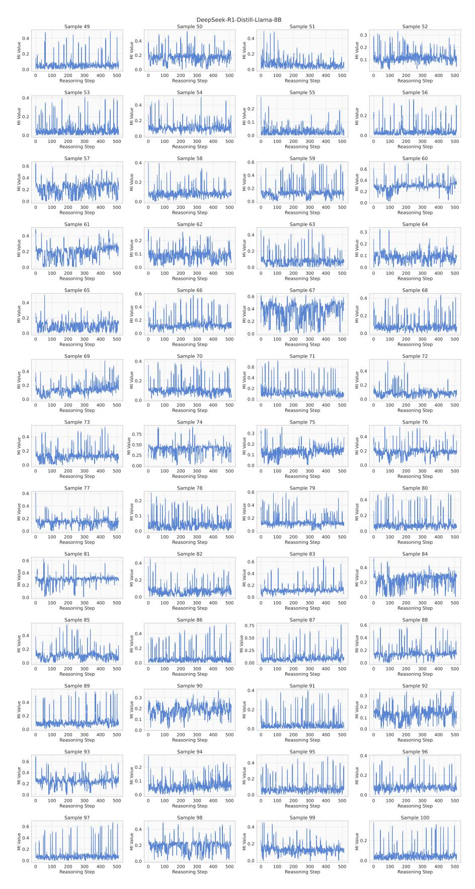

Figure 10: (Continued) MI trajectories of DeepSeek-R1-Distill-Llama-8B.

> **[图片提取文字 (无描述)]:**
> DeepSeek-R1-Distill-Qwen-7B Sample 2 Sample 1 Sample 3 Sample 4 MI Value alue 4 Value Reasoning Step Reasoning Step Reasoning Step Reasoning Step Sample 8 Sample 7 Sample 5 Sample 6 MI Value A Value value 4 Ξ Ξ Reasoning Step Reasoning Step Reasoning Step Reasoning Step Sample 9 Sample 10 Sample 11 Sample 12 MI Value . Value value 4 Reasoning Step Reasoning Step Reasoning Step Reasoning Step Sample 15 Sample 13 Sample 14 Sample 16 M Value Value Value Ξ Reasoning Step Reasoning Step Reasoning Step Reasoning Step Sample 17 Sample 20 Sample 18 Sample 19 MI Value Value 4 Reasoning Step Reasoning Step Reasoning Step Reasoning Step Sample 21 Sample 22 Sample 24 Sample 23 MI Value yalue 4 Ξ Reasoning Step Reasoning Step Reasoning Step Reasoning Step Sample 25 Sample 26 Sample 28 Sample 27 A Value Value MI Value Reasoning Step Reasoning Step Reasoning Step Reasoning Step Sample 29 Sample 30 Sample 32 Sample 31 MI Value Value Ξ Reasoning Step Reasoning Step Reasoning Step Reasoning Step Sample 33 Sample 34 Sample 35 Sample 36 MI Value MI Value MI Value value 4 Reasoning Step Reasoning Step Reasoning Step Reasoning Step Sample 38 Sample 39 Sample 37 Sample 40 MI Value MI Value o A Ξ Reasoning Step Reasoning Step Reasoning Step Reasoning Step Sample 41 Sample 42 Sample 43 Sample 44 Mi Value MI Value MI Value MI Value Reasoning Step Reasoning Step Reasoning Step Reasoning Step Sample 45 Sample 48 Sample 46 Sample 47 MI Value MI Value MI Value alue 4 Ξ Reasoning Step Reasoning Step Reasoning Step Reasoning Step
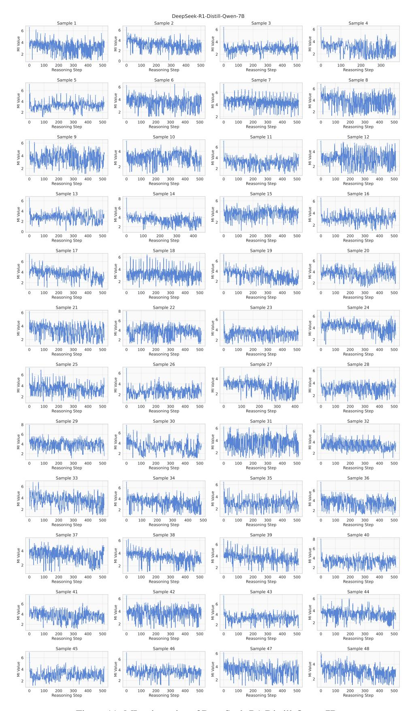

Figure 11: MI trajectories of DeepSeek-R1-Distill-Qwen-7B.

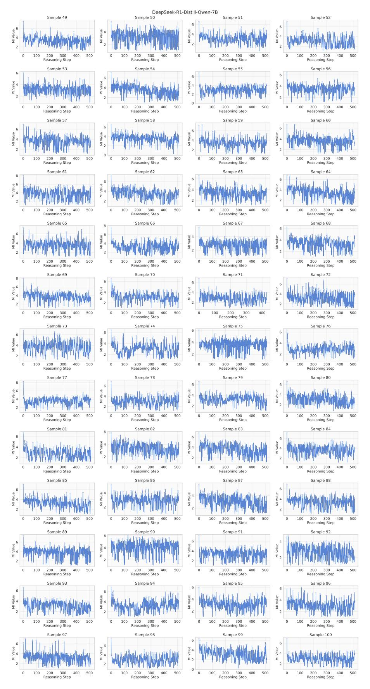

Figure 12: (Continued) MI trajectories of DeepSeek-R1-Distill-Qwen-7B.

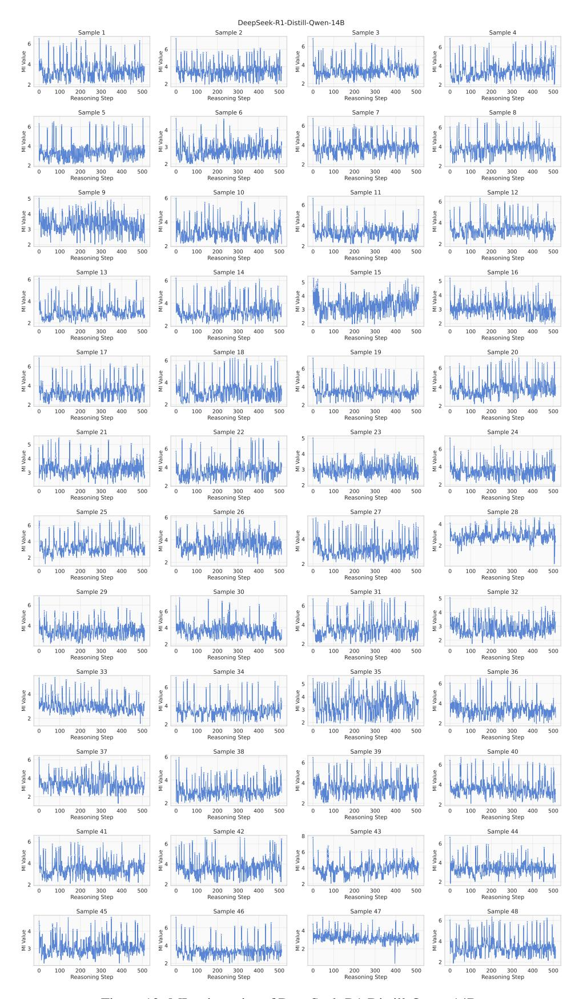

Figure 13: MI trajectories of DeepSeek-R1-Distill-Qwen-14B.

Figure 14: (Continued) MI trajectories of DeepSeek-R1-Distill-Qwen-14B.

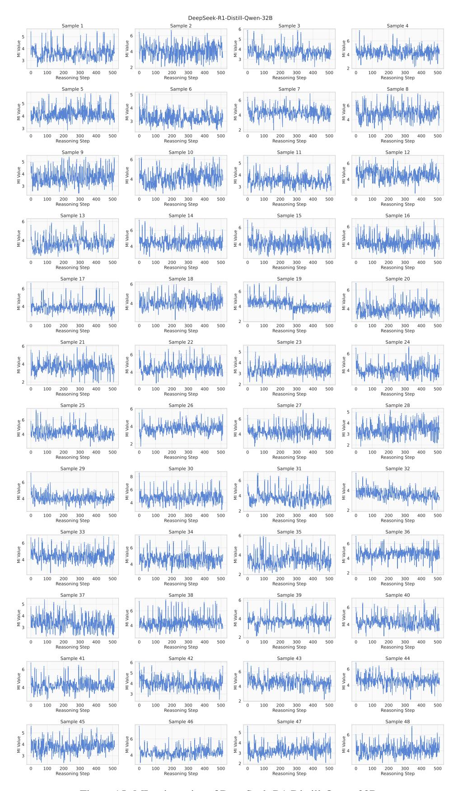

Figure 15: MI trajectories of DeepSeek-R1-Distill-Qwen-32B.

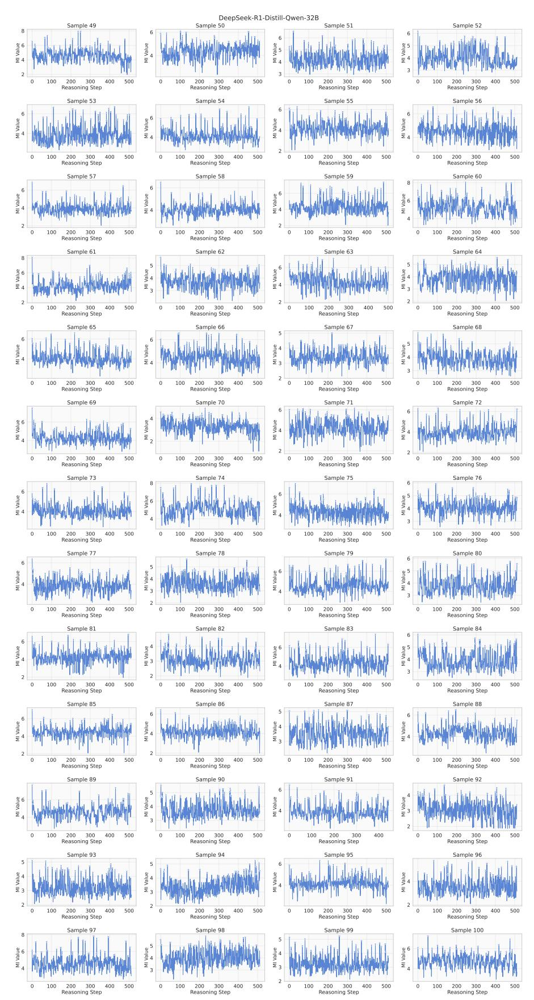

Figure 16: (Continued) MI trajectories of DeepSeek-R1-Distill-Qwen-32B.

> **[图片提取文字 (无描述)]:**
> QwQ-32B Sample 3 Sample 1 Sample 2 Sample 4 3 MI Value M Value Value 1 Ξ 0 0 0 0 100 200 300 0 0 100 200 300 400 400 200 100 200 300 500 300 400 Reasoning Step Reasoning Step Reasoning Step Reasoning Step Sample 8 Sample 5 Sample 6 Sample 7 6 .i Value Value 4 0 0 0 100 200 300 0 300 0 100 200 300 400 300 Reasoning Step Reasoning Step Reasoning Step Reasoning Step Sample 9 Sample 12 Sample 10 Sample 11 2.1 MI Value Value Ξ 0 0 -0.04 -0.02 0.00 0.02 0.04 0 200 300 0 200 300 400 500 100 200 300 500 100 500 100 400 Reasoning Step Reasoning Step Reasoning Step Reasoning Step Sample 13 Sample 14 Sample 15 Sample 16 3 0 0 0 300 0 200 300 200 0 100 200 300 400 200 Reasoning Step Reasoning Step Reasoning Step Reasoning Step Sample 17 Sample 18 Sample 19 Sample 20 Value M Value 0 0 0 0 0 100 200 300 400 100 200 0 100 200 100 200 300 400 Reasoning Step Reasoning Step Reasoning Step Reasoning Step Sample 24 Sample 21 Sample 22 Sample 23 1.5 1.0 W Aslue Value Ξ ₹1 0 0 0 0.0 200 0 300 100 200 400 0 100 300 400 0 200 300 100 200 300 400 Reasoning Step Reasoning Step Reasoning Step Reasoning Step Sample 25 Sample 26 Sample 27 Sample 28 3 MI Value Value Value ₹ 1  $\hat{\Xi}_1$ ₹ 2 0 0 0 300 0 200 200 Reasoning Step Reasoning Step Reasoning Step Reasoning Step Sample 31 Sample 32 Sample 29 5ample 30 3.7 4.8 Value Value 3.6 ₹ 4.6 ₹ 3.5 0 0 300 400 200 300 400 -0.04 -0.02 0.00 0.02 -0.04 -0.02 0.00 0.04 200 0.04 0.02 Reasoning Step Reasoning Step Reasoning Step Reasoning Step Sample 33 Sample 34 Sample 35 Sample 36 MI Value MI Value MI Value MI Value 0 0 0 0 0 100 300 0 100 200 300 400 500 0 100 200 300 400 0 100 200 300 400 Reasoning Step Reasoning Step Reasoning Step Reasoning Step Sample 39 Sample 37 Sample 38 Sample 40 4 3 MI Value Mi Value MI Value Value Ē 0 0 0 0 0 500 0 200 300 0 500 0 300 500 300 500 100 200 400 Reasoning Step Reasoning Step Reasoning Step Reasoning Step Sample 43 Sample 41 Sample 42 Sample 44 5.0 3 4 MI Value MI Value M Value WI Value 4.6 0 300 200 200 300 0 200 500 0 300 0 -0.040.02 0.00 0.02 0.04 Reasoning Step Reasoning Step Reasoning Step Reasoning Step Sample 45 Sample 46 Sample 47 Sample 48 3 3.3 M Value 3.2 W 3.1 Value Value Ξ 0 0 0 0 0 -0.02 0.00 100 200 300 400 100 200 300 400 500 -0.040.02 0.04 200 300 Reasoning Step Reasoning Step Reasoning Step Reasoning Step
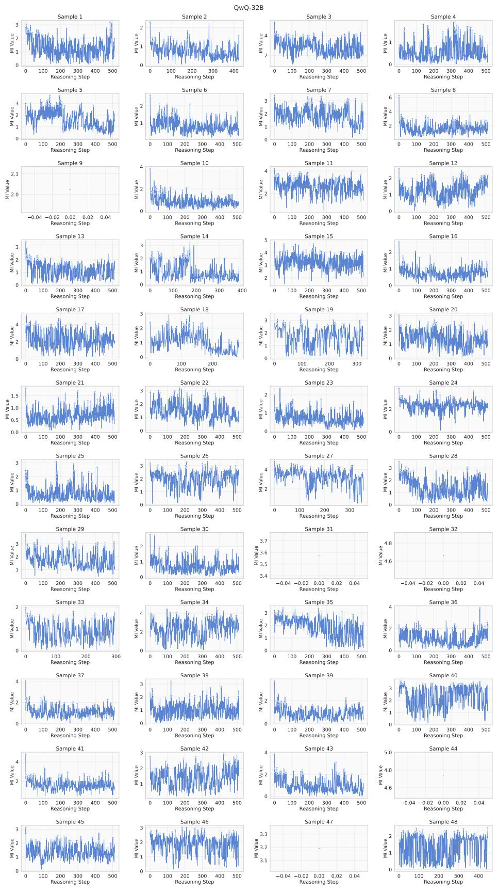

Figure 17: MI trajectories of QwQ-32B.

> **[图片提取文字 (无描述)]:**
> QwQ-32B Sample 49 Sample 52 Sample 50 Sample 51 Ξ1 0 0 0 0 100 200 300 0 100 200 300 400 0 100 200 300 400 500 0 100 200 300 400 500 Reasoning Step Reasoning Step Reasoning Step Reasoning Step Sample 56 Sample 53 Sample 54 Sample 55 1.5 9 1.0 \$ 2 ₹ 0.5 0.0 0 0 0 0 50 100 150 0 200 300 400 500 0 100 200 300 400 500 0 100 200 300 400 Reasoning Step Reasoning Step Reasoning Step Reasoning Step Sample 58 Sample 59 Sample 60 Sample 57 2 2 3 0 0 0 0 200 300 400 500 200 300 200 300 200 300 Reasoning Step Reasoning Step Reasoning Step Reasoning Step Sample 61 Sample 62 Sample 63 Sample 64 2 Value Value 3 0 0 0 0 300 400 200 300 200 300 400 100 200 500 200 Reasoning Step Reasoning Step Reasoning Step Reasoning Step Sample 66 Sample 67 Sample 68 Sample 65 2.9 4 2 Value Value ₹ 2.7 0 0 0 2.6 0 200 300 400 200 300 -0.02 0.00 0.02 200 300 500 400 0.04 Reasoning Step Reasoning Step Reasoning Step Reasoning Step Sample 69 Sample 70 Sample 71 Sample 72 3.8 5.4 9 3.7 N 3.6 W S.2 Value Ξ 5.0 3.5 0 0 0 200 300 300 -0.02 0.00 0.02 -0.02 0.00 0.02 Reasoning Step Reasoning Step Reasoning Step Reasoning Step Sample 73 Sample 74 Sample 75 Sample 76 3 2.1 Ξ 2.0 0 0 200 300 400 0 100 200 300 400 0 100 200 300 400 500 -0.04 -0.02 0.00 0.02 0.04 Reasoning Step Reasoning Step Reasoning Step Reasoning Step Sample 78 Sample 77 Sample 79 Sample 80 3 0 0 0 0 100 200 300 400 500 0 200 400 500 100 200 300 400 200 400 100 300 100 300 500 Reasoning Step Reasoning Step Reasoning Step Reasoning Step Sample 81 Sample 84 Sample 83 4 6.8 6.6 Value ž 6.4 200 400 300 0.04 -0.02 0.00 0.02 Reasoning Step Reasoning Step Reasoning Step Reasoning Step Sample 85 Sample 86 Sample 87 Sample 88 2 3 3.8 WI Value 3.6 MI Value M Value 0 0 0 100 200 300 400 500 -0.04 -0.02 0.00 0.02 0.04 0 200 300 400 0 100 200 300 400 Reasoning Step Reasoning Step Reasoning Step Reasoning Step Sample 89 Sample 90 Sample 91 Sample 92 2 M Value Value 0 0 0 0 0 0 200 200 0 200 200 300 100 300 400 500 300 400 500 100 300 500 100 400 500 400 Reasoning Step Reasoning Step Reasoning Step Reasoning Step Sample 93 Sample 94 Sample 95 Sample 96 2.9 3 2 Nalue M 1 alue 2.8 Value 2 Value ≥ ₹ 2.7 ₹1 0 0 -0.04 -0.02 0.00 200 300 500 0.02 0.04 200 300 500 200 300 400 500 Reasoning Step Reasoning Step Reasoning Step Reasoning Step Sample 97 Sample 98 Sample 99 Sample 100 6 3 M Value MI Value A Value 0 0 0 0 300 200 300 400 0 100 200 300 0 200 300 400 Reasoning Step Reasoning Step Reasoning Step Reasoning Step
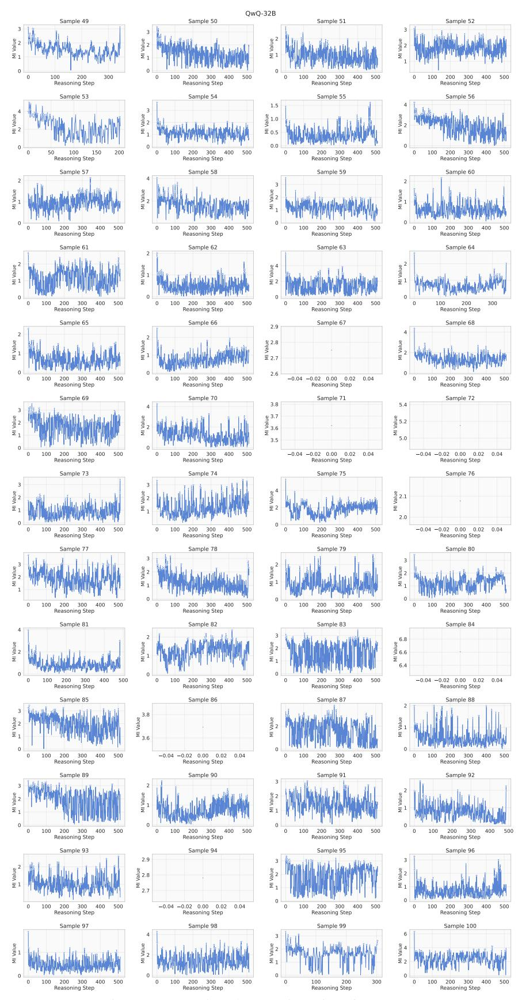

Figure 18: (Continued) MI trajectories of QwQ-32B.

> **[图片提取文字 (无描述)]:**
> DeepSeek-R1-Distill-Llama-70B Sample 2 Sample 3 Sample 1 Sample 4 0.4 0.3 0.4 M Value o.2 9 0.2 8 0.2 9 0.2 ₹ 0.1 Ξ ₹ 0.1 0.0 0.0 0.0 0.0 0 200 300 400 0 100 200 300 400 0 100 200 300 400 0 100 200 300 400 Reasoning Step Reasoning Step Reasoning Step Reasoning Step Sample 5 Sample 6 Sample 7 Sample 8 0.4 0.4 Value 0.15 0.3 MI Value 0.2 kglne 0.10  $\leq 0.2$ ₹ 0.05 0.0 0.0 0.0 0.00 0 200 300 0 100 200 300 0 200 300 200 300 400 Reasoning Step Reasoning Step Reasoning Step Reasoning Step Sample 9 Sample 10 Sample 11 Sample 12 0.10 Aalue 0.3 0.10 W 0.05 Value Value 0.2 W Agine 0.1 ₹ 0.05 ₹ 0.2 0.0 0.00 0.0 0.00 0 200 300 0 300 400 500 0 200 300 400 200 300 400 500 200 Reasoning Step Reasoning Step Reasoning Step Reasoning Step Sample 16 Sample 13 Sample 14 Sample 15 0.2 0.10 Agine 0.3 0.10 Nege MI Value 9 0.2 Nature ₹ 0.05 ₹ 0.1 ₹ 0.05 0.0 0.0 0.00 0.00 300 0 100 200 300 400 0 200 300 400 500 0 100 200 400 500 0 100 200 300 400 500 Reasoning Step Reasoning Step Reasoning Step Reasoning Step Sample 17 Sample 19 Sample 18 Sample 20 0.6 0.15 0.4 W Agine 0.2 MI Value e 0.4 0.10 ₹ 0.2  $\bar{\Xi}_{0.05}$ 0.0 0.0 0.0 0.00 300 0 100 200 300 0 200 300 400 0 100 200 400 200 300 400 500 100 Reasoning Step Reasoning Step Reasoning Step Reasoning Step Sample 23 Sample 24 Sample 21 Sample 22 0.15 0.3 0.3 0.10 0.2 9 0.10 ₹ 0.05 Value MI Value 0.2 0.05 ₹ 0.1 ₹ 0.1 0.00 0.00 0.0 0.0 0 100 200 300 400 500 0 100 200 300 400 0 200 300 400 0 200 300 400 500 500 Reasoning Step Reasoning Step Reasoning Step Reasoning Step Sample 28 Sample 25 Sample 26 Sample 27 0.2 0.4 0.6 M Value 0.10 Refe 90 kg 0.1 9 0.4 0.4 Ξ ₹ 0.2 ₹ 0.05 0.0 0.0 0.0 0.00 200 0 100 200 300 400 0 100 200 300 400 0 100 200 300 400 0 100 300 400 500 Reasoning Step Reasoning Step Reasoning Step Reasoning Step Sample 29 Sample 30 Sample 31 Sample 32 0.2 W Agree 0.1 0.2 0.3 0.4 W Asine 0.2 o.2 0.1 £ 0.1 0.0 0.0 0.0 0.0 200 300 0 200 300 400 0 200 300 400 0 200 300 400 100 100 100 500 Reasoning Step Reasoning Step Reasoning Step Reasoning Step Sample 33 Sample 34 Sample 35 Sample 36 0.3 0.3 1 1 0.2 M W 0.1 M Value M Value 0.2 W 0.1 0.0 0.0 0.0 0.0 300 200 300 300 0 100 200 400 500 0 100 200 300 400 0 100 400 0 100 200 400 Reasoning Step Reasoning Step Reasoning Step Reasoning Step Sample 38 Sample 37 Sample 39 Sample 40 0.6 0.2 0.3 0.4 W Value 0.2 Mgree 0.1 Wgree 0.4 ₩ 0.2 M Value 0.0 0.0 0.0 0.0 0 200 300 0 200 300 400 500 0 200 300 400 0 200 300 Reasoning Step Reasoning Step Reasoning Step Reasoning Step Sample 42 Sample 41 Sample 43 Sample 44 0.3 0.4 0.6 0.4 0.4 Nalue 0.2 M Value MI Value Nature Value ₹ 0.1 0.0 0.0 0.0 0.0 0 100 200 300 400 0 100 200 300 400 500 0 100 200 300 400 500 0 100 200 300 400 500 Reasoning Step Reasoning Step Reasoning Step Reasoning Step Sample 45 Sample 46 Sample 47 Sample 48 0.3 0.2 9 0.10 0.4 0.2 MI Value 0.1 M Value M Value ₹ 0.05 0.0 0.0 0.0 0.00 0 300 0 200 300 400 0 200 300 400 300 500 200 400 Reasoning Step Reasoning Step Reasoning Step Reasoning Step
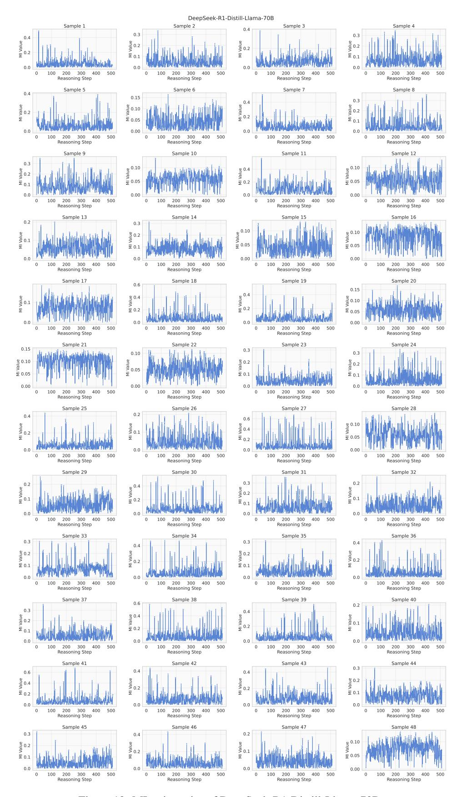

Figure 19: MI trajectories of DeepSeek-R1-Distill-Llama-70B.

> **[图片提取文字 (无描述)]:**
> DeepSeek-R1-Distill-Llama-70B Sample 49 Sample 50 Sample 51 Sample 52 0.4 9 0.10 N 0.3 0.3 9 0.2 ₩ 0.1 B 0.2 9 0.2 W ≅ 0.1 ₹ 0.05 0.0 0.0 0.0 0.00 200 300 400 0 200 300 400 0 200 300 0 200 300 Reasoning Step Reasoning Step Reasoning Step Reasoning Step Sample 53 Sample 54 Sample 55 Sample 56 0.4 Ni Value 0.4 9 0.10 M Value MI Value 0.2 ₹ 0.05 0.0 0.0 0.00 0 300 0 200 300 0 300 200 300 Reasoning Step Reasoning Step Reasoning Step Reasoning Step Sample 60 Sample 57 Sample 58 Sample 59 0.6 0.15 0.6 0.3 0.10 9 0.2 0.2 ango.4 9 0.4 ₹ 0.05 ≅ 0.1 ₹ 0.2 ≅ 0.2 0.0 0.0 0.0 0 200 300 400 200 300 0 200 300 400 100 200 300 400 Reasoning Step Reasoning Step Reasoning Step Reasoning Step Sample 61 Sample 62 Sample 63 Sample 64 0.2 0.15 0.3 MI Value 0.10 Value 0.2 ₹ 0.05 ₹ 0.1 0.0 0.00 0.0 0.0 0 300 400 0 200 300 400 0 200 200 300 400 200 300 0 Reasoning Step Reasoning Step Reasoning Step Reasoning Step Sample 68 Sample 65 Sample 66 Sample 67 0.4 d Value 0.10 90.2 80.2 90.4 M 0.2 M Value 0.05 0.2 ₹ 0.1 0.00 0.0 0.0 0.0 200 300 400 200 300 400 200 300 200 400 0 100 500 0 100 500 0 100 400 0 100 300 Reasoning Step Reasoning Step Reasoning Step Reasoning Step Sample 69 Sample 71 Sample 70 Sample 72 0.3 0.4 0.2 0.3 ang 0.2 Nafue Vafue ange 0.1 o.2 ₹ 0.1 ₹ 0.1 Ξ 0.0 0.0 0.0 0.0 200 200 300 400 200 300 400 0 200 300 0 100 500 0 100 500 0 100 300 400 500 100 400 Reasoning Step Reasoning Step Reasoning Step Reasoning Step Sample 73 Sample 74 Sample 75 Sample 76 0.6 0.2 0.3 0.2 M Value o.4 one 0.2 MI Value ₹ 0.2 ₹ 0.1 0.0 0.0 0.0 0.0 300 0 200 300 400 0 100 200 300 400 500 0 100 200 400 0 100 200 300 400 Reasoning Step Reasoning Step Reasoning Step Reasoning Step Sample 77 Sample 78 Sample 79 Sample 80 0.4 0.15 0.2 0.4 M Value 0.2 M Value 0.10 0.1 ≅ 0.05 0.0 0.0 0.0 0 200 300 400 0 200 300 0 200 300 400 200 300 Reasoning Step Reasoning Step Reasoning Step Reasoning Step Sample 84 Sample 81 Sample 82 Sample 83 0.4 WI Value 0.15 0.4 0.10 Value MI Value 0.10 ₹ 0.05 0.00 0.00 200 300 300 400 200 300 400 200 300 400 Reasoning Step Reasoning Step Reasoning Step Reasoning Step Sample 86 Sample 87 Sample 85 Sample 88 0.4 MI Value 0.6 0.4 9 0.4 MI Value MI Value 0.2 ≅ 0.2 0.0 0.0 0.0 0.0 200 300 0 300 0 200 200 0 100 400 100 200 400 100 300 0 100 300 400 Reasoning Step Reasoning Step Reasoning Step Reasoning Step Sample 89 Sample 90 Sample 91 Sample 92 0.2 0.3 0.4 0.2 MI Value o.1 M 0.2 ₹ 0.1 MI Value 0.2 0.1 0.0 0.0 0.0 0.0 0 100 200 300 400 0 200 300 400 0 200 300 200 300 Reasoning Step Reasoning Step Reasoning Step Reasoning Step Sample 93 Sample 94 Sample 95 Sample 96 0.4 0.3 0.2 0.15 0.10 M 0.05 MI Value 0.2 Naine 0.1 MI Value 0.00 0.0 0.0 0.0 200 300 0 200 300 200 300 400 200 300 0 400 100 400 0 100 0 400 Reasoning Step Reasoning Step Reasoning Step Reasoning Step Sample 97 Sample 98 Sample 99 Sample 100 0.2 0.4 0.4 0.15 o.2 M o.1 M 夏 0.10 o.2 N ₹ 0.05 0.0 0.0 0.0 0.00 300 300 0 100 200 400 0 200 400 500 .0 200 300 0 200 300 Reasoning Step Reasoning Step Reasoning Step Reasoning Step

Figure 20: (Continued) MI trajectories of DeepSeek-R1-Distill-Llama-70B.