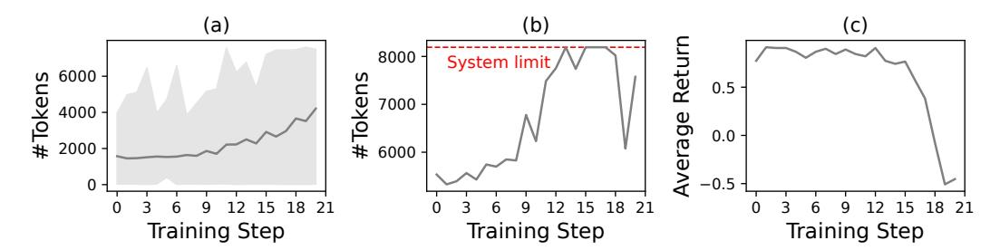
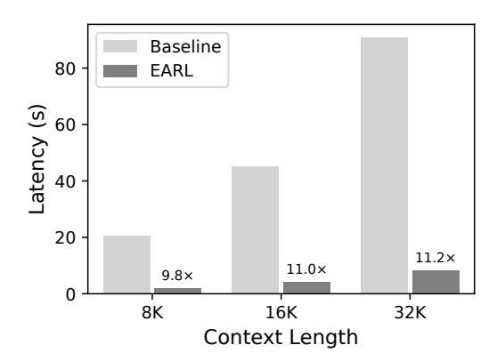

# EARL: Efficient Agentic Reinforcement Learning Systems for Large Language Models

Zheyue Tan Aalto University zheyue.tan@aalto.fi

Huining Yuan Tsinghua University yuanhuining0@gmail.com Mustapha Abdullahi Aalto University mustapha.abdullahi@aalto.fi

> Zelai Xu Tsinghua University zelai.eecs@gmail.com

Tuo Shi Aalto University tuo.shi@aalto.fi

Chao Yu Tsinghua University zoeyuchao@gmail.com

Boxun Li Infinigence-AI liboxun@infini-ai.com

#### **Abstract**

Reinforcement learning (RL) has become a pivotal component of large language model (LLM) post-training, and agentic RL extends this paradigm to operate as agents through multi-turn interaction and tool use. Scaling such systems exposes two practical bottlenecks: (1) context length grows rapidly during training, inflating memory usage and latency, and triggering out-of-memory (OOM) failures; and (2) intermediate tensors accumulate with context length, making cross-device data movement into a major system bottleneck.

We present *EARL*, a scalable system for efficient agentic RL. It introduces a *parallelism selector* that dynamically adapts model and training parallelism across RL stages based on sequence length and system load, and a *data dispatcher* that performs layout-aware, decentralized exchange of intermediate data batches. Together, these components increase throughput, reduce long-context failures, and enable stable large-scale training of agentic LLMs without relying on hard context length limits or length penalties.

# CCS Concepts: • Computing methodologies → Distributed computing methodologies: Machine learning.

*Keywords:* Agentic Reinforcement Learning, Large Language Models (LLMs), Reinforcement Learning (RL), Distributed Training, Dynamic Parallelism

#### **ACM Reference Format:**

Zheyue Tan, Mustapha Abdullahi, Tuo Shi, Huining Yuan, Zelai Xu, Chao Yu, Boxun Li, and Bo Zhao. 2025. *EARL*: Efficient Agentic Reinforcement Learning Systems for Large Language Models. In 1st Workshop on Systems for Agentic AI (SAA '25), October 13th, 2025, Seoul, Republic of Korea. ACM, New York, NY, USA, 5 pages.

#### 1 Introduction

Reinforcement Learning (RL) has become a key component in the post-training of large language models (LLMs), used Bo Zhao Aalto University bo.zhao@aalto.fi

to align model behavior with human preferences [2, 18] and to elicit advanced capabilities such as reasoning, tool-use, and decision-making [4, 7, 23]. Agentic LLMs [3, 16, 17, 23], which act as autonomous agents interacting with complex environments, are increasingly prominent and typically trained with agentic RL involving multi-turn interactions and adaptive behavior in response to the environment's feedback, achieving superior reasoning and tool-use performance for real-world applications [3, 11, 16, 28].

During RL training, the context length increases dramatically, initially boosting reasoning performance [7, 22, 25], but this introduces significant system-level challenges in memory and communication, limiting overall scalability. Excessive context growth inflates memory usage and can trigger out-of-memory (OOM) failures. In agentic RL, this issue is further exacerbated by multi-turn interactions. For example, with the Llama-3.1-70B model [14], context lengths of 4,096 and 8,196 require around 97 GB and 354 GB for the training batch, respectively, exceeding the memory capacity of existing GPUs [21]. Existing works typically apply a *hard limit* on maximum context length, and some even introduce a *length penalty* [22] to prevent OOM, but these approaches also restrict the model's performance potential.

We observe a similar phenomenon in *our industrial practice* (Fig. 1): a 4B-parameter LLM is trained in a Tic-Tac-Toe environment with a maximum context length of 8,192 (due to GPU memory constraints), and each episode consists of approximately three turns. Even early in training (Fig. 1a), the average single-turn response length increases steadily. 1 By step 13 (Fig. 1b), the episode-level context length reaches the system limit, causing truncated reasoning and introducing "low-quality" data into the rollouts. The degradation leads to a sharp drop in average return and ultimately collapses learning after step 15 (Fig. 1c).

&lt;sup>1Turn-level context length refers to the token length within a single agent–environment interaction round, while episode-level context length refers to the cumulative number of tokens across an entire episode.

> **[图片提取文字 (无描述)]:**
> (b) (a) 8000 -System limit 4000 -4000 -4000 -0.5 7000 -0.0 # 6000 --0.512 15 18 21 12 15 18 21 12 15 18 21 Training Step Training Step Training Step

Fig. 1: Training a 4B-parameter LLM on the Tic-Tac-Toe task: (a) turn-level context length steadily increases; (b) episode-level context length quickly reaches the system limit; and (c) training performance collapses due to context truncation.

Tab. 1: Intermediate Data Batch Size Under Different Context Lengths on a 1k-GPU Cluster.

| Context Length              | 1,024  | 2,048  | 4,096  | 8,192   | 16,384  | 32,768  |
|-----------------------------|--------|--------|--------|---------|---------|---------|
| <b>Estimated Size (MiB)</b> | 15,625 | 31,250 | 62,500 | 125,000 | 250,000 | 500,000 |

> **[图片提取文字 (无描述)]:**
> EARL Parallelism Selector Evaluate system load Rollout Select parallelism config **Experience Preparation** Data Dispatcher Val Ref Rew Select dispatch strategy 3 Dispatch training data Dispatch: All-Gather + Scatter All-to-All Model Update

Fig. 2: System design of EARL.

Long contexts also hinder scalability by generating massive volumes of intermediate data that must be exchanged across nodes, creating substantial communication overhead. These intermediate batches consist of tensors required to compute training signals, including tokens, log probabilities, rewards, returns, and other auxiliary tensors. The estimated sizes of such batches are reported in Table 1. At the 1K-GPU scale, the aggregated data volume grows linearly with context length, reaching up to 500 GB at 32K tokens.

In our industrial practice, we have observed this significant data dispatch bottleneck, exacerbated by increasing context length when scaling training to 1,024 GPUs. For instance, while training a model with over 200B parameters at context length 32K using the VeRL framework [19], the data volume approached 1 TB due to additional implementation overhead. This amount of data required more than 20 minutes for transmission (under a 25 Gbps peak bandwidth), occupying over 25% of the total iteration time and severely degrading training throughput. The bottleneck is further aggravated by VeRL's single-controller architecture, in which

a centralized process coordinates data exchange across different stages, forcing all intermediate data to be aggregated on a single node before redistribution.

These challenges reveal a fundamental challenge in scaling agentic RL: longer contexts boost capability but also strain memory and communication. Existing safeguards, such as hard length limits, mitigate resource pressure but also cap performance ceiling. This motivates the design of EARL, which tackles the context length explosion issue and data dispatching bottleneck, for stable and efficient large-scale training.

# 2 EARL Design

We aim to scale agentic RL training to support exploding context lengths arising from response length growth and intensified multi-turn interactions, while simultaneously scaling training to thousands of GPUs. To this end, we design a scalable agentic RL system, *EARL*, with two extensions: the *Parallelism Selector* for dynamic parallelism configuration and the *Data Dispatcher* for efficient inter-stage data dispatching.

As illustrated in Fig. 2, these components are integrated into a standard RL training loop, introducing optimizations at multiple stages. Before the rollout stage (step 1), the Parallelism Selector evaluates the current system load and the maximum context length to determine the parallelism configuration for the policy model. Similarly, parallelism configurations for the reference, value, and reward models are determined before the Experience Preparation stage (step 2). After all data batches are computed, the training parallelism is also selected based on the current system load and context length requirements. In steps 3, 4, and 5, using the chosen training parallelism and the data distribution layout generated during the Experience Preparation stage, the Data Dispatcher selects an appropriate dispatch strategy and distributes the batch data accordingly. After completing data dispatch, all models proceed with respective training updates. Each component is explained in detail as follows:

**Parallelism Selector.** *EARL* uses dynamic parallelism in the Rollout stage. The parallelism configuration is dynamically

2

adjusted based on the current system load and the context length. Specifically, at the start of the training process, *EARL* measures the throughput for each parallelism configuration under different context lengths, then maintains the optimal configuration for each context length for later use. During training, *EARL* monitors the averaged context length generated by the model. When the averaged context length falls into a new context range, *EARL* switches to the corresponding parallelism configuration before the Rollout stage.

Data Dispatcher. We design the data dispatch logic to be adaptive to the current data distribution layout and parallelism configuration. During the experience preparation stage, intermediate training batches, including tokens, log-probabilities, rewards, returns, and other tensors, must be transferred across all workers, which is a critical bottleneck with the centralized gather-and-dispatch mechanism in the single-controller architecture. We introduce a parallelism-and layout-aware dispatch mechanism that sends data directly to the target workers from their computation origins, to eliminate the centralized aggregation. Specifically, we replace the all-gather-and-scatter dispatch logic with an all-to-all operation, thereby reducing both data movement volume and synchronization overhead.

#### 3 Evaluation

We evaluate the components of *EARL*: (i) *Parallelism Selector* (§3.2) and (ii) *Data Dispatcher* (§3.3), in scenarios where the context length increases during agentic RL training.

# 3.1 Experiment Setup

Our experiments have the following setup:

**Testbed.** We deploy EARL on a cluster of 16 machines (128× NVIDIA H100-80 GB GPUs). All GPUs are connected with NVLink. The inter-machine bandwidth is 200 Gbps.

**Models and Training Environments.** We train Qwen2.5-72B-Instruct [24] in an agentic setting within the Connect-Four2 environment. The training begins with a tensor parallelism degree of 4, and the initial maximum context length is set to 8,192. We employ a customized agentic RL algorithm, which utilizes REINFORCE [9] as the advantage estimator.

**Implementation.** We have built *EARL* on top of ROLL [26], an open-source framework for agentic RL training. The agentic environment, Connect-Four, is implemented with openspiel [13] and integrated into ROLL. The *Parallelism Selector* is activated before the Rollout stage in each training step. We optimize the data dispatch logic between the Experience Preparation stage and the Model Update stage to avoid the aggregation behavior in the single-controller architecture.

**Metrics.** We evaluate the performance of *Parallelism Selector* by measuring the *relative throughput speedup* of *tokens-per-GPU-per-second*, which is denoted as TGS. Specifically, the

> **[图片提取文字 (无描述)]:**
> OOM for -1.5% 4.6% 5.0% 6.5% TP=4 --18.8% -5.0% 3.4% 5.5% 3.1% Length ☆ --24.7% -20.8% -4.4% 6.4% 5.2% Context <del>4</del> --18.0% -25.2% -21.9% -5.9% -15 5.1% -20**≍** --20.0% -28.6% -26.3% -16.6% -5.5% -25**≚** --21.1% -32.2% -30.7% -29.1% -6.9% -3016 32 64 128 8 #Responses

Fig. 3: Relative throughput speedup from TP=4 to TP=8 across different context lengths and response counts, computed using Equation 1. Positive values indicate TP8 outperforms TP4; negative values indicate TP4 outperforms TP8.

relative speedup of switching from TP = a to TP = b is:

$$Speedup_{\%}(a, b) = \frac{TGS(b) - TGS(a)}{TGS(a)} \times 100$$
 (1)

where a positive value indicates that TP = b achieves higher throughput than TP = a.

#### 3.2 Dynamic Parallelism in Rollout Stage

As shown in Fig. 3, we report Speedup $\infty$  (4, 8), the relative throughput improvement in the decoding phase of the Rollout stage, when switching the tensor parallelism degree from TP = 4 to TP = 8. The results demonstrate the effectiveness of adapting the parallelism configuration to changes in the increasing context length during training. In practice, the number of responses for the Rollout stage is typically fixed, while both response length and context length increase as the multi-turn training progresses. In the case of #responses = 32, our approach maintains the performance advantage of TP = 4 (31% higher throughput) when the context length is small. When the context length reaches 16K and 32K, EARL switches to TP = 8, which yields 5% improvement. In the most extreme case, with 128 responses and a 32K context length, TP=4 encounters out-of-memory (OOM) failures, whereas switching to TP = 8 maintains system stability and prevents crashes.

#### 3.3 Optimizing Data Dispatching Between Stages

We optimize the data dispatch logic for transferring *log-probability* tensors from the reference model to the training workers, since these tensors are not required for aggregation in advantage estimation. The intermediate data sizes are 46 MiB, 93 MiB, and 187 MiB per independent worker. As shown in Fig. 4, the data dispatcher consistently achieves better performance across different context lengths. At a context length of 8K, the optimization reduces transmission time

&lt;sup>2https://en.wikipedia.org/wiki/Connect Four

> **[图片提取文字 (无描述)]:**
> Baseline 80 EARL Latency (s) 20 11.2× 11.0× 9.8× 8K 16K 32K Context Length

Fig. 4: Data dispatch latency of baseline and EARL under different context lengths. Numbers above the bars indicate the relative latency reduction of EARL compared to the baseline.

by 9.7×, and when the context length reaches 32K, it yields up to 11.2× lower latency. The current prototype employs TCP over Ethernet, identical to the baseline transport, and we expect further gains with RDMA-based communication.

#### 4 Related Works

Efficient large-scale agentic systems are an area of active research. However, existing agentic RL systems do not optimize for the dynamic and increasing nature of context length during training and rollouts. Instead, they often rely on general inference techniques for handling long context. VeRL [19], SkyRL [6], and ROLL [26] incorporate tensor parallelism [20] and sequence parallelism [10, 12] to enable long context training. Slime [30] handles long-context during rollouts by using SGLang's chunked prefill technique [29]. EARL complements these systems by introducing dynamic parallelism that adapts to the context length in Rollout stage and optimizing the data dispatch logic to improve efficiency at scale.

Other approaches implicitly apply length penalties in training to constrain context growth [1, 5, 22, 27]. Other works, such as SkyWork-OR1 [8] and DeepCoder [15] progressively increase the context length across training stages to enable effective rollouts at shorter context lengths. Our work, *EARL*, is orthogonal to both strategies and focuses on system-level optimizations that can be utilized with any training-time technique to scale agentic RL effectively under long-context regimes.

#### 5 Limitations and Future Work

EARL presents an initial prototype for building efficient agentic RL systems for LLMs, with a focus on addressing the challenge of context length explosion in agentic RL. For dynamic parallelism, we have so far optimized only the *Rollout* stage, without extending the optimization to the training stage. The Rollout stage only performs inference, which differs significantly in workload from training. Achieving joint optimization with the training stage requires a more

comprehensive design, but we expect this direction to yield substantial performance gains.

On the other hand, in data movement, the data dispatch logic optimization focuses on tensors with minimal interstage dependencies (i.e., log-probabilities are not required for advantage estimation). However, our approach can be applied to other tensors, such as rewards and advantages. In the current system, rewards and returns are aggregated for advantage estimation. We plan to improve this process in a distributed manner to alleviate communication bottlenecks under exploding context lengths, and to better leverage all-to-all communication patterns for improved efficiency.

Other future directions include developing fully asynchronous RL for more flexible scheduling, integrating replay buffers into off-policy training to enhance data dispatch efficiency, and extending our methods to a broader class of algorithms. We believe these insights and advances will guide the development of more efficient and robust agentic RL systems for LLMs.

# 6 Conclusion

We address the context length explosion issue in scaling agentic RL systems and design a framework, *EARL*, with two core components: a *Parallelism Selector* for dynamic parallelism configuration and a *Data Dispatcher* for parallelism-and layout-aware data distribution, both yielding measurable performance and stability gains in large-scale training.

# 7 Acknowledgments

This work is funded by Research Council of Finland (grant number 362729), Business Finland (grant number 169/31/2024), and the Finnish Doctoral Program Network in Artificial Intelligence (AI-DOC).

#### References

-  [1] Pranjal Aggarwal and Sean Welleck. 2025. L1: Controlling How Long A Reasoning Model Thinks With Reinforcement Learning. doi:10. 48550/arXiv.2503.04697 arXiv:2503.04697 [cs] version: 1.
- [2] Paul F Christiano, Jan Leike, Tom Brown, Miljan Martic, Shane Legg, and Dario Amodei. 2017. Deep reinforcement learning from human preferences. Advances in neural information processing systems 30 (2017).
- [3] Google DeepMind. 2025. Gemini Deep Research — your personal research assistant — gemini.google. https://gemini.google/overview/ deep-research/.
- [4] Qingxiu Dong, Li Dong, Yao Tang, Tianzhu Ye, Yutao Sun, Zhifang Sui, and Furu Wei. 2025. Reinforcement Pre-Training. arXiv preprint arXiv:2506.08007 (2025).
- [5] Alexander Golubev, Maria Trofimova, Sergei Polezhaev, Ibragim Badertdinov, Maksim Nekrashevich, Anton Shevtsov, Simon Karasik, Sergey Abramov, Andrei Andriushchenko, Filipp Fisin, Sergei Skvortsov, and Boris Yangel. 2025. Training Long-Context, Multi-Turn Software Engineering Agents with Reinforcement Learning. doi:10.48550/arXiv.2508.03501 arXiv:2508.03501 [cs] version: 1.
- [6] Tyler Griggs, Sumanth Hegde, Eric Tang, Shu Liu, Shiyi Cao, Dacheng Li, Charlie Ruan, Philipp Moritz, Kourosh Hakhamaneshi, Richard

4

- Liaw, Akshay Malik, Matei Zaharia, Joseph E. Gonzalez, and Ion Stoica. 2025. Evolving SkyRL into a Highly-Modular RL Framework.
- [7] Daya Guo, Dejian Yang, Haowei Zhang, Junxiao Song, Ruoyu Zhang, Runxin Xu, Qihao Zhu, Shirong Ma, Peiyi Wang, Xiao Bi, et al. 2025. Deepseek-r1: Incentivizing reasoning capability in llms via reinforcement learning. arXiv preprint arXiv:2501.12948 (2025).
- [8] Jujie He, Jiacai Liu, Chris Yuhao Liu, Rui Yan, Chaojie Wang, Peng Cheng, Xiaoyu Zhang, Fuxiang Zhang, Jiacheng Xu, Wei Shen, Siyuan Li, Liang Zeng, Tianwen Wei, Cheng Cheng, Bo An, Yang Liu, and Yahui Zhou. 2025. Skywork Open Reasoner 1 Technical Report. [doi:](https://doi.org/10.48550/arXiv.2505.22312)10. [48550/arXiv.2505.22312](https://doi.org/10.48550/arXiv.2505.22312) arXiv:2505.22312 [cs].
- [9] Jian Hu, Jason Klein Liu, Haotian Xu, and Wei Shen. 2025. Reinforce++: An efficient rlhf algorithm with robustness to both prompt and reward models. arXiv preprint arXiv:2501.03262 (2025).
- [10] Sam Ade Jacobs, Masahiro Tanaka, Chengming Zhang, Minjia Zhang, Shuaiwen Leon Song, Samyam Rajbhandari, and Yuxiong He. 2023. DeepSpeed Ulysses: System Optimizations for Enabling Training of Extreme Long Sequence Transformer Models. doi:[10.48550/arXiv.2309.](https://doi.org/10.48550/arXiv.2309.14509) [14509](https://doi.org/10.48550/arXiv.2309.14509) arXiv:2309.14509 [cs].
- [11] Linus Jern, Valter Uotila, Cong Yu, and Bo Zhao. 2025. Agent-Q: Fine-Tuning Large Language Models for Quantum Circuit Generation and Optimization. doi:[10.48550/arXiv.2504.11109](https://doi.org/10.48550/arXiv.2504.11109) arXiv:2504.11109 [quant-ph] version: 2.
- [12] Vijay Korthikanti, Jared Casper, Sangkug Lym, Lawrence McAfee, Michael Andersch, Mohammad Shoeybi, and Bryan Catanzaro. 2022. Reducing Activation Recomputation in Large Transformer Models. doi:[10.48550/arXiv.2205.05198](https://doi.org/10.48550/arXiv.2205.05198) arXiv:2205.05198 [cs].
- [13] Marc Lanctot, Edward Lockhart, Jean-Baptiste Lespiau, Vinicius Zambaldi, Satyaki Upadhyay, Julien Pérolat, Sriram Srinivasan, Finbarr Timbers, Karl Tuyls, Shayegan Omidshafiei, Daniel Hennes, Dustin Morrill, Paul Muller, Timo Ewalds, Ryan Faulkner, János Kramár, Bart De Vylder, Brennan Saeta, James Bradbury, David Ding, Sebastian Borgeaud, Matthew Lai, Julian Schrittwieser, Thomas Anthony, Edward Hughes, Ivo Danihelka, and Jonah Ryan-Davis. 2019. Open-Spiel: A Framework for Reinforcement Learning in Games. CoRR abs/1908.09453 (2019). arXiv[:1908.09453](https://arxiv.org/abs/1908.09453) [cs.LG] [http://arxiv.org/abs/](http://arxiv.org/abs/1908.09453) [1908.09453](http://arxiv.org/abs/1908.09453)
- [14] AI @ Meta Llama Team. 2024. The llama 3 herd of models. arXiv e-prints (2024), arXiv–2407.
- [15] Michael Luo, Sijun Tan, Roy Huang, Ameen Patel, Alpay Ariyak, Qingyang Wu, Xiaoxiang Shi, Rachel Xin, Colin Cai, Maurice Weber, Ce Zhang, Li Erran Li, Raluca Ada Popa, and Ion Stoica. 2025. DeepCoder: A Fully Open-Source 14B Coder at O3-mini Level. [https:](https://www.together.ai/blog/deepcoder) [//www.together.ai/blog/deepcoder](https://www.together.ai/blog/deepcoder)
- [16] OpenAI. 2025. Introducing Deep Research. [https://openai.com/index/](https://openai.com/index/introducing-deep-research) [introducing-deep-research](https://openai.com/index/introducing-deep-research).
- [17] OpenAI. 2025. Introducing GPT-5. [https://openai.com/index/](https://openai.com/index/introducing-gpt-5) [introducing-gpt-5](https://openai.com/index/introducing-gpt-5)
- [18] Long Ouyang, Jeff Wu, Xu Jiang, Diogo Almeida, Carroll L. Wainwright, Pamela Mishkin, Chong Zhang, Sandhini Agarwal, Katarina Slama, Alex Ray, John Schulman, Jacob Hilton, Fraser Kelton, Luke Miller, Maddie Simens, Amanda Askell, Peter Welinder, Paul Christiano, Jan Leike, and Ryan Lowe. 2022. Training language models to follow instructions with human feedback. doi:[10.48550/arXiv.2203.02155](https://doi.org/10.48550/arXiv.2203.02155) arXiv:2203.02155 [cs].
- [19] Guangming Sheng, Chi Zhang, Zilingfeng Ye, Xibin Wu, Wang Zhang, Ru Zhang, Yanghua Peng, Haibin Lin, and Chuan Wu. 2025. Hybridflow: A flexible and efficient rlhf framework. In Proceedings of the Twentieth European Conference on Computer Systems. 1279–1297.
- [20] Mohammad Shoeybi, Mostofa Patwary, Raul Puri, Patrick LeGresley, Jared Casper, and Bryan Catanzaro. 2019. Megatron-LM: Training Multi-Billion Parameter Language Models Using Model Parallelism. arXiv preprint arXiv:1909.08053 (2019).

- [21] Nouamane Tazi, Ferdinand Mom, Haojun Zhao, Phuc Nguyen, Mohamed Mekkouri, Leandro Werra, and Thomas Wolf. 2025. The Ultra-Scale Playbook: Training LLMs on GPU Clusters.
- [22] Kimi Team. 2025. Kimi k1. 5: Scaling reinforcement learning with llms. arXiv preprint arXiv:2501.12599 (2025).
- [23] Kimi Team, Yifan Bai, Yiping Bao, Guanduo Chen, Jiahao Chen, Ningxin Chen, Ruijue Chen, Yanru Chen, Yuankun Chen, Yutian Chen, et al. 2025. Kimi K2: Open Agentic Intelligence. arXiv preprint arXiv:2507.20534 (2025).
- [24] Qwen Team. 2024. Qwen2.5: A Party of Foundation Models. [https:](https://qwenlm.github.io/blog/qwen2.5/) [//qwenlm.github.io/blog/qwen2.5/](https://qwenlm.github.io/blog/qwen2.5/)
- [25] Qwen Team. 2025. Qwen3 Technical Report. doi:[10.48550/arXiv.2505.](https://doi.org/10.48550/arXiv.2505.09388) [09388](https://doi.org/10.48550/arXiv.2505.09388) arXiv:2505.09388 [cs].
- [26] Weixun Wang, Shaopan Xiong, Gengru Chen, Wei Gao, Sheng Guo, Yancheng He, Ju Huang, Jiaheng Liu, Zhendong Li, Xiaoyang Li, Zichen Liu, Haizhou Zhao, Dakai An, Lunxi Cao, Qiyang Cao, Wanxi Deng, Feilei Du, Yiliang Gu, Jiahe Li, Xiang Li, Mingjie Liu, Yijia Luo, Zihe Liu, Yadao Wang, Pei Wang, Tianyuan Wu, Yanan Wu, Yuheng Zhao, Shuaibing Zhao, Jin Yang, Siran Yang, Yingshui Tan, Huimin Yi, Yuchi Xu, Yujin Yuan, Xingyao Zhang, Lin Qu, Wenbo Su, Wei Wang, Jiamang Wang, and Bo Zheng. 2025. Reinforcement Learning Optimization for Large-Scale Learning: An Efficient and User-Friendly Scaling Library. doi:[10.48550/arXiv.2506.06122](https://doi.org/10.48550/arXiv.2506.06122) arXiv:2506.06122 [cs].
- [27] Violet Xiang, Chase Blagden, Rafael Rafailov, Nathan Lile, Sang Truong, Chelsea Finn, and Nick Haber. 2025. Just Enough Thinking: Efficient Reasoning with Adaptive Length Penalties Reinforcement Learning. doi:[10.48550/arXiv.2506.05256](https://doi.org/10.48550/arXiv.2506.05256) arXiv:2506.05256 [cs] version: 1.
- [28] Cong Yu, Valter Uotila, Shilong Deng, Qingyuan Wu, Tuo Shi, Songlin Jiang, Lei You, and Bo Zhao. 2025. QUASAR: Quantum Assembly Code Generation Using Tool-Augmented LLMs via Agentic RL. [doi:](https://doi.org/10.48550/arXiv.2510.00967)10. [48550/arXiv.2510.00967](https://doi.org/10.48550/arXiv.2510.00967) arXiv:2510.00967 [cs].
- [29] Lianmin Zheng, Liangsheng Yin, Zhiqiang Xie, Chuyue Sun, Jeff Huang, Cody Hao Yu, Shiyi Cao, Christos Kozyrakis, Ion Stoica, Joseph E. Gonzalez, Clark Barrett, and Ying Sheng. 2024. SGLang: Efficient Execution of Structured Language Model Programs. [doi:](https://doi.org/10.48550/arXiv.2312.07104)10. [48550/arXiv.2312.07104](https://doi.org/10.48550/arXiv.2312.07104) arXiv:2312.07104 [cs].
- [30] Zilin Zhu, Chengxing Xie, Xin Lv, and slime Contributors. 2025. slime: An LLM post-training framework for RL Scaling. [https://github.com/](https://github.com/THUDM/slime) [THUDM/slime](https://github.com/THUDM/slime)