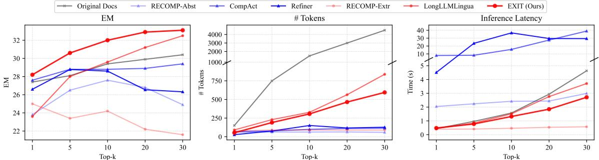
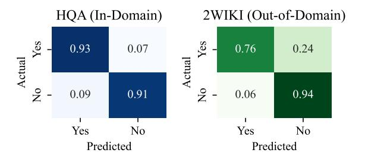
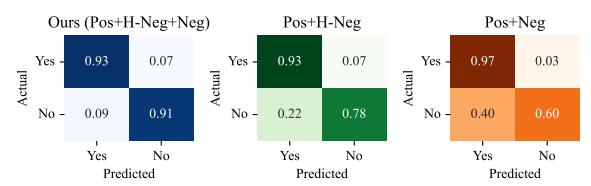
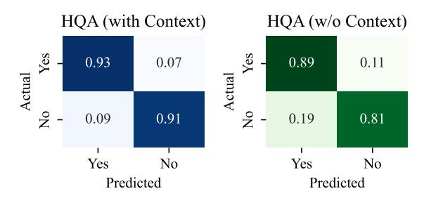

# EXIT: Context-Aware Extractive Compression for Enhancing Retrieval-Augmented Generation

Taeho Hwang1 Sukmin Cho1 Soyeong Jeong2 Hoyun Song1 SeungYoon Han1 Jong C. Park1\*

1School of Computing, 2Graduate School of AI Korea Advanced Institute of Science and Technology {doubleyyh,nelllpic,starsuzi,hysong,seungyoonee,jongpark}@kaist.ac.kr

# Abstract

We introduce EXIT, an extractive context compression framework that enhances both the effectiveness and efficiency of retrievalaugmented generation (RAG) in question answering (QA). Current RAG systems often struggle when retrieval models fail to rank the most relevant documents, leading to the inclusion of more context at the expense of latency and accuracy. While abstractive compression methods can drastically reduce token counts, their token-by-token generation process significantly increases end-to-end latency. Conversely, existing extractive methods reduce the latency but rely on independent, non-adaptive sentence selection, failing to fully utilize contextual information. EXIT addresses these limitations by classifying sentences from retrieved documents—while preserving their contextual dependencies—enabling parallelizable, contextaware extraction that adapts to query complexity and retrieval quality. Our evaluations on both single-hop and multi-hop QA tasks show that EXIT consistently surpasses existing compression methods and even uncompressed baselines in QA accuracy, while also delivering substantial reductions in inference time and token count. By improving both effectiveness and efficiency, EXIT provides a promising direction for developing scalable, high-quality QA solutions in RAG pipelines. Our code is available at <https://github.com/ThisIsHwang/EXIT>.

# 1 Introduction

Retrieval-Augmented Generation (RAG) [\(Lewis](#page-11-0) [et al.,](#page-11-0) [2020b;](#page-11-0) [Khandelwal et al.,](#page-11-1) [2020\)](#page-11-1) is the task of enhancing the responses of Large Language Models (LLMs) with relevant external contexts or documents. By grounding answers in evidence, RAG systems have gained much attention for mitigating hallucination issues [\(Ram et al.,](#page-12-0) [2023;](#page-12-0) [Li et al.,](#page-11-2) [2023c\)](#page-11-2) and improving factual reliability [\(Jeong](#page-10-0) [et al.,](#page-10-0) [2024;](#page-10-0) [Xia et al.,](#page-14-0) [2024b\)](#page-14-0).

> **[图片提取文字 (无描述)]:**
> EXIT (Ours) Abst 38 Extr Performance (EM) 36 LongLLMLingua Original Docs Refiner A CompAct 34 RECOMP-Abst 32 RECOMP-Extr 30 0 8 10 Total Latency (sec)

Figure 1: Average QA accuracy (EM) and efficiency (Total Latency) across various compression methods using Contriever-MSMARCO as the retriever and Llama-3.1- 8b-Instruct as the reader. Experiments were conducted on a single A100-80GB GPU, and latency (in seconds) was averaged over all samples from these datasets.

However, they face significant challenges in practical deployment, as retrieval models sometimes fail to rank the most relevant documents at the top [\(Robertson and Zaragoza,](#page-13-0) [2009;](#page-13-0) [Izacard et al.,](#page-10-1) [2022\)](#page-10-1). One potential solution is to retrieve a larger set of documents to ensure the coverage of the necessary information, but this approach compromises both effectiveness and efficiency. Specifically, for effectiveness, LLMs often struggle with processing long contexts, overlooking critical information located in the middle of contexts [\(Liu](#page-11-3) [et al.,](#page-11-3) [2024\)](#page-11-3). Additionally, irrelevant information in retrieved documents can act as distractors, significantly degrading the overall QA performance [\(Shi et al.,](#page-13-1) [2023;](#page-13-1) [Li et al.,](#page-11-4) [2023b;](#page-11-4) [Wu et al.,](#page-13-2) [2024\)](#page-13-2). From an efficiency perspective, increasing the context size raises inference latency—due to quadratic complexity in attention computation [\(Xia et al.,](#page-14-1) [2024a\)](#page-14-1)—and API costs tied to input length[1](#page-0-0) . Moreover, the context window limitations inherent in LLM architectures set strict upper bounds on the maximum input size [\(Peng et al.,](#page-12-1) [2024\)](#page-12-1).

To address these challenges, context compression has emerged as a promising solution, condensing essential information from multiple retrieved

\* Corresponding author

1 <https://openai.com/api/pricing/>

contexts through either abstractive or extractive approaches. While they can reduce inference time and filter out irrelevant information, both approaches still have notable drawbacks. Specifically, abstractive compression methods—often implemented via autoregressive generation—summarize or rewrite documents into a single condensed passage [\(Li](#page-11-5) [et al.,](#page-11-5) [2023d;](#page-11-5) [Xu et al.,](#page-14-2) [2024;](#page-14-2) [Yoon et al.,](#page-14-3) [2024;](#page-14-3) [Li et al.,](#page-11-6) [2024;](#page-11-6) [Wang et al.,](#page-13-3) [2023\)](#page-13-3), significantly increasing end-to-end latency due to their tokenby-token generation process. For instance, as illustrated in Figure [1,](#page-0-1) CompAct [\(Yoon et al.,](#page-14-3) [2024\)](#page-14-3), a representative abstractive approach, takes over 8 seconds to process just five documents for a single query, whereas using the original document without compression takes only 1 second.

On the other hand, extractive compression approaches can offer a more efficient alternative [\(Xu](#page-14-2) [et al.,](#page-14-2) [2024;](#page-14-2) [Jiang et al.,](#page-10-2) [2023,](#page-10-2) [2024\)](#page-10-3), by selecting relevant textual segments (e.g., sentences, or even token-level excerpts) directly from retrieved documents. This strategy reduces both compression time and overall latency. However, current extractive methods have yet to reach their full potential in terms of effectiveness [\(Choi et al.,](#page-9-0) [2021;](#page-9-0) [Pan et al.,](#page-12-2) [2024\)](#page-12-2). They often rely on rigid selection criteria that do not adapt well to variations in query complexity or the quality of retrieved documents, and they frequently neglect to fully leverage the broader context when choosing which tokens or sentences to retain. Specifically, as illustrated in Figure [1,](#page-0-1) while extractive approaches such as RECOMP-Extr [\(Xu et al.,](#page-14-2) [2024\)](#page-14-2) achieve minimal compression time, their inability to dynamically adjust selection processes results in suboptimal QA performance.

Therefore, in this work, we propose a novel compression framework for RAG, EXtractIve ContexT compression (EXIT), designed to enhance both effectiveness and efficiency by improving efficiency through an extractive compression and by enhancing effectiveness through dynamic, context-aware sentence selection. Specifically, as shown in Figure [2,](#page-2-0) EXIT operates in three stages: (1) splitting retrieved documents into sentences, (2) performing parallelizable binary classification ("Yes" or "No") on each sentence to assess its relevance while considering its full document context, rather than evaluating them independently, and (3) recombining selected sentences while preserving their original order. Therefore, as shown in Figure [1,](#page-0-1) EXIT frames context compression as a sentence classification problem, enabling it to outperform both compression methods and the uncompressed baseline in terms of speed. Specifically, it reduces processing time from several seconds to about 1 second. Moreover, by leveraging context-aware and adaptive sentence selection, EXIT also surpasses other extractive methods in accuracy. Also, we note that EXIT operates as a plug-and-play module that can be seamlessly integrated into any existing RAG pipeline without architectural modifications.

We evaluate EXIT on both single-hop QA tasks (NQ [\(Kwiatkowski et al.,](#page-11-7) [2019\)](#page-11-7), TQA [\(Joshi et al.,](#page-10-4) [2017\)](#page-10-4)) and multi-hop QA tasks (HQA [\(Yang et al.,](#page-14-4) [2018\)](#page-14-4), 2WikiMultiHopQA [\(Ho et al.,](#page-10-5) [2020\)](#page-10-5)). Experimental results demonstrate that EXIT not only improves effectiveness over both abstractive and extractive compression baselines but also significantly reduces latency compared to abstractive methods and the uncompressed baseline.

Our contributions are as follows:

- We identify and address the key weaknesses of existing context compression methods: abstractive methods incur prohibitive latency, while traditional extractive methods rely on rigid, non-adaptive content selection.
- We propose EXIT (EXtractIve ContexT Compression), an extractive compression framework that dynamically adjusts to query complexity and retrieval quality.
- We demonstrate, through extensive experiments, that EXIT surpasses previous compression methods and uncompressed retrievals, improving QA performance while significantly reducing both token counts and end-to-end latency.

# 2 Related Work

Retrieval-Augmented Generation. RAG enhances LLMs by grounding responses in retrieved external documents [\(Lewis et al.,](#page-11-0) [2020b;](#page-11-0) [Shi et al.,](#page-13-4) [2024;](#page-13-4) [Ram et al.,](#page-12-0) [2023\)](#page-12-0). However, increasing retrieved content often leads to longer contexts, higher inference costs [\(Xia et al.,](#page-14-1) [2024a\)](#page-14-1), and retrieval noise [\(Shi et al.,](#page-13-1) [2023;](#page-13-1) [Liu et al.,](#page-11-3) [2024\)](#page-11-3), impacting efficiency and accuracy.

To mitigate these challenges, ad-hoc methods have been proposed at different stages of the retrieval pipeline, including pre-retrieval and postretrieval methods. Pre-retrieval methods, such as

> **[图片提取文字 (无描述)]:**
> Retriever Q Reader LLM XX Query (q) Compressor 25 Answer (a) Query Ezzard Charles was a world champion in which sport? Step 3: Document Reassembly Step 1: Sentence-Level Decomposition Top-k Retrieved Documents Querv 1 the seventh greatest Heavyweight of all time. Ezzard Charles was a world [1] "Ezzard Charles" champion in which sport? the seventh greatest Heavyweight of all time. Ezzard (2) Ezzard Charles Ezzard Mack Charles, known as Charles Ezzard Mack Charles, known as the the Cincinnati Cobra (July 7, 1921 - May 28, (2) Ezzard Charles Ezzard Mack Cincinnati Cobra (July 7, 1921 - May 28, 1975) was Yes 1975) was an American professional boxer and Charles, known as the an American professional boxer and World World Heavyweight Champion Cincinnati Cobra (July 7, Heavyweight Champion... 1921 - May 28, 1975) was an ... He was born in Lawrenceville, Georgia, but is American professional boxer commonly thought of as a Cincinnatian. Charles and World Heavyweight graduated from Woodward High School in (n) Charles graduated from Woodward High School Champion The following year, he Step 2: Context-Aware Relevance Classification Yes 1 outpointed his idol and former World Heavyweight 1) the seventh greatest [1] "Ezzard Charles" No Champion Joe Louis to Heavyweight of all time. the seventh greatest become the recognized Lineal Heavyweight of all time. (2) Ezzard Charles Ezzard Mack Champion Query Fzzard Charles Fzzard Charles, known as the **Fzzard** Mack Charles... Cincinnati Cobra (July 7, 1921 -Compressor 55 Charles was May 28, 1975) was an American Yes Reader LLM XX a world ... He was born in professional boxer and World champion in Lawrenceville, Georgia, but Heavyweight Champion which sport? is commonly thought of as a Cincinnatian Charles graduated from Woodward **Answer** Boxing Charles graduated from High School in No Woodward High School in

Figure 2: Overview of our framework. First, the retrieved document is split into sentences. Next, each sentence is classified as either "Yes" or "No" using the Compressor. Finally, sentences with scores above the threshold are recombined in their original order to complete the compression.

Landmark Embedding (Luo et al., 2024) and Late Chunking (Günther et al., 2024), improve document representations to enhance retrieval effectiveness but lack adaptive filtering mechanisms after retrieval and may be difficult to integrate orthogonally with existing retrieval methods. Post-retrieval methods, including reranking (Nogueira and Cho, 2019; Qin et al., 2023; Li et al., 2023a) and context compression (Xu et al., 2024; Yoon et al., 2024; Li et al., 2024; Jiang et al., 2024), refine retrieved documents through reordering or pruning. However, most post-retrieval methods overlook query complexity and operate on a fixed number of retrieved items, limiting their adaptability in balancing effectiveness and efficiency.

We introduce EXIT, a novel post-retrieval compression framework that adaptively filters query-relevant sentences while discarding redundancy. Unlike existing methods, EXIT dynamically adjusts to query complexity and retrieval quality, balancing efficiency and effectiveness. Its lightweight, adaptive design seamlessly integrates into RAG pipelines while remaining orthogonal to pre-retrieval methods.

Context Compression. Context compression is a practical remedy for handling increasingly extensive prompt lengths in RAG pipelines. Existing methods commonly fall into soft or hard compression. Soft compression focuses on embedding prompts into compact continuous representations (Wingate et al., 2022; Mu et al., 2023; Ge et al., 2024; Chevalier et al., 2023; Cheng et al.,

2024), but requires extensive training and architectural changes, making it unsuitable for black-box LLMs. Hard compression, by contrast, removes non-essential textual content directly (Li et al., 2023e; Jiang et al., 2023), offering a plug-and-play solution even compatible with API-based models such as ChatGPT (OpenAI, 2023).

Hard compression are further divided into abstractive and extractive methods. Abstractive methods employ autoregressive models to generate query-focused summaries, thus reducing token counts at the cost of additional latency and potential hallucinations (Zhao et al., 2020). For example, RECOMP-Abst (Xu et al., 2024) uses a T5-based summarizer for token reduction but requires dataset-specific training and slows inference. CompAct (Yoon et al., 2024) and Refiner (Li et al., 2024) take this method further by leveraging even larger LLMs with 7B parameters, compounding latency issues and increasing resource demands. Extractive methods, such as RECOMP-Extr (Xu et al., 2024), directly select salient segments (e.g., sentences or tokens) from retrieved documents. This avoids the autoregressive bottleneck and mitigates hallucinations. However, their static and contextagnostic selection of only a few sentences per document limits its performance. Similarly, token-level methods such as LLMLingua family (Li et al., 2023e; Jiang et al., 2023; Pan et al., 2024; Jiang et al., 2024) can distort semantic coherence by removing key entities or splitting essential facts.

In short, abstractive methods offer strong com-

pression but suffer from latency and potential hallucinations, while extractive methods are often rigid and lack context awareness. Our work addresses these limitations by proposing a parallelizable, context-aware extractive compression framework. It adaptively selects sentences at scale, optimizing accuracy and speed in complex retrieval scenarios.

# 3 Method

In this section, we first present our problem formulation, the RAG pipeline with a compression stage, and our novel compression framework, EXIT, which is designed to extract key evidence for answering in a parallel manner.

#### 3.1 Problem Formulation

RAG Pipeline with Compression. Given a query q and a document corpus C, a RAG pipeline first retrieves Top-k relevant document set D:

$$D = \{d_1, \dots, d_k\} = \mathsf{Retriever}(q, \mathcal{C}), \tag{1}$$

The retrieved documents within the document set D are then processed by a compression module that preserves query-relevant information while significantly reducing input length:

$$D' = \mathsf{Compressor}(q, D) \text{ s.t. } l(D') \ll l(D),$$
 (2)

where l(·) represents the function calculating the number of tokens in the document set. After compression, the number of tokens included in D′ is substantially decreased compared to D. Finally, an LLM generates the answer a using the compressed set D′ and the given query q:

$$a = \mathsf{LLM}(q, D'). \tag{3}$$

Objectives of Compression. Effective compression in the RAG pipeline must satisfy three key criteria: (1) Token Reduction–D′ should have fewer tokens to speed up answer generation; (2) Retention of Key Evidence–essential information must be preserved to maintain answer accuracy; and (3) Efficient Processing–compression should be fast enough to avoid introducing significant latency.

While token count influences the reader's reading time, it alone does not capture the full latency of the pipeline. In practice, end-to-end latency also includes the time spent on the compression step itself. Therefore, an efficient RAG system must minimize both the size of the input and the total time taken from retrieval to answer generation.

#### 3.2 Extractive Context Compression (EXIT)

To achieve three objectives of the compression step, EXIT consists of three main components: sentencelevel decomposition, context-aware relevance classification, and document reassembly. Importantly, EXIT functions as a plug-and-play module that integrates seamlessly into existing RAG pipelines, independent of the specific retriever or reader model used.

Sentence-Level Decomposition. In Step 1 of Figure [2,](#page-2-0) EXIT divides each retrieved document into individual sentences using a rule-based sentence tokenizer. For each document di ∈ D, it produces a sentence set Si = {si1, si2, . . . , sin}, where sij is the j-th sentence in document i. Operating at the sentence level avoids the fragmentation of key phrases and preserves entity relationships that token-level compression techniques [\(Jiang et al.,](#page-10-2) [2023\)](#page-10-2) often disrupt. As a result, the compressed context preserves both syntactic coherence and semantic integrity, ensuring that key information is retained.

Context-Aware Relevance Classification. To efficiently filter sentences in D that contain key evidence for answering a query, we introduce a relevance evaluation method based on context awareness and single-token prediction. First, incorporating the entire document di as context is essential, as understanding a sentence often requires the broader document context rather than an isolated sentence. This ensures that no relevant information is overlooked and enables more effective compression. Second, to maintain efficiency, we adopt lightweight single-token prediction instead of multi-token generation [\(Yoon et al.,](#page-14-3) [2024;](#page-14-3) [Li et al.,](#page-11-6) [2024\)](#page-11-6), which can introduce computational overhead. Inspired by [Zhong et al.](#page-14-6) [\(2022\)](#page-14-6), we leverage probabilistic classification for sentence relevance assessment. Given query q, document di , and sentence sij , the evaluation model predicts relevance using a binary classification with "Yes" and "No" labels:

$$r_{ij} = \frac{P(\text{"Yes"}|q, d_i, s_{ij})}{P(\text{"Yes"}|q, d_i, s_{ij}) + P(\text{"No"}|q, d_i, s_{ij})}$$
(4)

where P(·|·) represents the likelihood from the evaluation model. This computation is parallelized across sentences for efficiency.

EXIT then selects sentences with a relevance score above a predefined threshold τ , ensuring that only key information is retained. Unlike fixed-size selection, our framework produces an adaptive number of sentences in the compressed set D′ , aligning with prior work [\(Jeong et al.,](#page-10-0) [2024\)](#page-10-0) that acknowledges query-dependent information needs. This approach optimizes compression while preserving essential evidence.

Document Reassembly. As shown in Step 3 of Figure [2,](#page-2-0) EXIT reconstructs the compressed document D′ by concatenating selected sentences in their original order, preserving coherence and logical flow [\(Hwang et al.,](#page-10-8) [2024\)](#page-10-8) for accurate downstream reasoning.

#### 3.3 Classifier Model Training

Training Strategy. Our goal is to train a relevance classifier capable of accurately identifying which sentences provide the evidence required to answer a query. To approximate real-world complexity, we utilize a question-answering dataset that requires multi-sentence reasoning and offers explicit sentence-level annotations of essential information. Leveraging these annotations, we model three typical retrieval outcomes: (1) sentences containing necessary evidence, (2) seemingly relevant sentences missing key details, and (3) entirely irrelevant sentences.

Data Sampling. To train a robust relevance classifier, we construct a diverse dataset reflecting various post-retrieval conditions. Positive samples include sentences essential for correct answers, while hard negatives consist of remaining sentences from the same documents. Additionally, random negatives pair queries with unrelated sentences, helping the model distinguish relevance from noise. This balanced sampling enables effective filtering of non-essential information without relying on explicit supervision.

Training Procedure. Each training instance is represented as (q, s, d, l), where q is the query, s is a candidate sentence, d is the document containing s, and l ∈ {"Yes", "No"} indicates whether s provides the required evidence. We employ a binary cross-entropy loss function to train the classifier:

$$\mathcal{L} = -\mathbb{1}_{l=\text{``Yes''}} \log P(\text{``Yes''}) - (1-\mathbb{1}_{l=\text{``Yes''}}) \log P(\text{``No''}), \tag{5}$$

By exposing the classifier to a balanced and diverse set of retrieval scenarios, we improve its ability to generalize and reliably identify sentences that contain the critical evidence for answering queries.

# 4 Experiment Setups

We conduct comprehensive experiments to evaluate EXIT's effectiveness and efficiency in context compression for RAG systems. More implementation details of our experiments are in Appendix [B.](#page-15-0)

Datasets. We evaluate on both single-hop and multi-hop question answering datasets: NaturalQuestions (NQ) [\(Kwiatkowski et al.,](#page-11-7) [2019\)](#page-11-7) and TriviaQA (TQA) [\(Joshi et al.,](#page-10-4) [2017\)](#page-10-4) for singlehop QA; HotpotQA (HQA) [\(Yang et al.,](#page-14-4) [2018\)](#page-14-4) and 2WikiMultihopQA (2WIKI) [\(Ho et al.,](#page-10-5) [2020\)](#page-10-5) for multi-hop QA. We use the test set for TQA evaluations and development sets for all other datasets. For the train dataset for the classifier, we exploit the train split of HQA, which has relevant annotations to each sentence in the multiple documents for a query.

Model Configuration. Our system consists of three primary components. The retriever employs Contriever-MSMARCO [\(Izacard et al.,](#page-10-1) [2022\)](#page-10-1), a dense retriever fine-tuned on MSMARCO [\(Nguyen](#page-12-8) [et al.,](#page-12-8) [2016\)](#page-12-8). The EXIT compressor utilizes Gemma-2B-it [\(Mesnard et al.,](#page-12-9) [2024\)](#page-12-9), optimized for efficient parallel processing. For the reader model, we exploit two scales of instruction-tuned models: Llama3.1-{8, 70}B-Instruct [\(Dubey et al.,](#page-10-9) [2024\)](#page-10-9).

Baselines. We compare EXIT against the following context compression methods: 1) Original Documents serves as uncompressed baseline. For abstractive methods, 2) RECOMP-Abs [\(Xu](#page-14-2) [et al.,](#page-14-2) [2024\)](#page-14-2) uses T5-based (775M) summarization tuned for NQ, TQA, HQA (HQA model for 2WIKI), 3) CompAct [\(Yoon et al.,](#page-14-3) [2024\)](#page-14-3) implements Mistral-7B-based iterative compression with 5-segment blocks, and 4) Refiner [\(Li et al.,](#page-11-6) [2024\)](#page-11-6) uses Llama2-7B-based compression. For extractive methods, 5) RECOMP-Extr [\(Xu et al.,](#page-14-2) [2024\)](#page-14-2) employs Contriever-based (110M) sentence-level extraction tuned for NQ, TQA, HQA (HQA model for 2WIKI), and 6) LongLLMLingua [\(Jiang et al.,](#page-10-3) [2024\)](#page-10-3) uses Llama2-7B-chat for token-level extraction with 0.4 dynamic compression rate.

Evaluation Metrics. We use three metrics: Exact Match (EM) and F1 score to measure effectiveness in question answering, and end-to-end inference latency (Lat.) in seconds to assess efficiency. Endto-end latency captures the total wall-clock time required to generate an answer for a single query, including both compression time and LLM inference time. We report the average latency per sample, computed over the entire evaluation set. This provides a more holistic efficiency metric than token count alone, as it directly reflects the practical runtime performance of the full RAG pipeline.

Table 1: Performance across models and datasets, measured by EM, F1, and inference latency (Lat.). 8B reader experiments were conducted on a single A100-80GB GPU, while 70B reader experiments utilized 4 A100-80GB GPUs in parallel. Best results for each dataset are highlighted in **bold**, and second best results are <u>underlined</u>. The "Type" column denotes whether a given compressor is abstractive (Abs.) or extractive (Ext.).

| Compressor    | Type |             | NQ          |            |             | TQA         |            |             | HQA         |            |      | 2WIK        | [          |             | AVG.        |            |
|---------------|------|-------------|-------------|------------|-------------|-------------|------------|-------------|-------------|------------|------|-------------|------------|-------------|-------------|------------|
| <b>k</b>      |      | ЕМ↑         | F1 ↑        | Lat.↓      | ЕМ↑         | F1 ↑        | Lat.↓      | EM ↑        | F1 ↑        | Lat.↓      | EM ↑ | F1 ↑        | Lat.↓      | EM ↑        | F1 ↑        | Lat.↓      |
|               |      |             |             |            |             | Llama       | 3.1-8B-    | Instruc     | :t          |            |      |             |            |             |             |            |
| Original Docs | -    | 34.6        | 47.1        | 1.0        | 58.8        | 68.6        | 0.9        | 28.1        | 38.6        | 1.0        | 16.1 | 24.9        | 1.1        | 34.4        | 44.8        | 1.0        |
| RECOMP-Abst   | Abs. | 31.3        | 43.2        | 1.6        | 55.9        | 65.7        | 1.4        | 26.5        | 37.0        | 2.2        | 22.7 | 29.1        | 2.1        | 34.1        | 43.7        | 1.8        |
| CompAct       | Abs. | 32.9        | 44.6        | 8.5        | 58.1        | 67.7        | 8.8        | 28.8        | 39.8        | 8.3        | 16.8 | 26.0        | 8.1        | 34.2        | 44.5        | 8.4        |
| Refiner       | Abs. | 32.9        | 45.0        | 28.1       | 59.2        | 68.9        | 10.9       | 28.8        | <u>40.0</u> | 6.9        | 16.8 | 25.4        | 6.4        | 34.4        | <u>44.8</u> | 13.1       |
| RECOMP-Extr   | Ext. | 34.6        | 44.6        | 0.5        | 56.5        | 65.1        | 0.4        | 23.4        | 32.8        | 0.4        | 11.2 | 19.6        | 0.6        | 31.4        | 40.5        | 0.5        |
| LongLLMLingua | Ext. | 30.2        | 41.5        | 0.9        | <u>59.4</u> | 68.0        | 0.8        | 28.0        | 38.0        | 0.8        | 21.5 | 27.4        | 0.9        | 34.8        | 43.7        | 0.9        |
| EXIT (Ours)   | Ext. | 35.9        | 47.8        | 0.8        | 60.8        | 69.9        | <u>0.7</u> | 30.6        | 41.5        | 0.8        | 24.2 | 30.8        | 0.9        | 37.9        | 47.5        | <u>0.8</u> |
|               |      |             |             |            | ]           | Llama-      | 3.1-70E    | -Instru     | ct          |            |      |             |            |             |             |            |
| Original Docs | -    | 35.6        | 48.0        | 8.6        | 65.1        | 73.9        | 7.7        | 33.7        | 44.5        | 8.3        | 20.8 | 28.3        | 9.1        | 38.8        | 48.7        | 8.4        |
| RECOMP-Abst   | Abs. | 34.1        | 47.0        | 4.5        | 61.3        | 70.6        | 3.3        | 30.3        | 40.8        | 4.4        | 24.2 | 30.3        | 4.2        | 37.5        | 47.2        | 4.1        |
| CompAct       | Abs. | 34.1        | 45.4        | 11.9       | 62.6        | 71.1        | 11.7       | 33.8        | 44.1        | 11.0       | 20.5 | 27.4        | 11.6       | 37.8        | 47.0        | 11.5       |
| Refiner       | Abs. | 35.3        | <u>47.1</u> | 42.5       | 64.3        | 73.0        | 18.3       | 33.8        | 44.7        | 14.6       | 21.2 | 28.0        | 11.2       | 38.7        | 48.2        | 21.6       |
| RECOMP-Extr   | Ext. | <u>35.8</u> | 45.3        | 2.5        | 63.5        | 71.0        | 2.2        | 27.6        | 36.7        | 2.9        | 13.8 | 19.3        | 3.3        | 35.2        | 43.1        | 2.7        |
| LongLLMLingua | Ext. | 32.2        | 44.0        | 4.4        | <u>66.7</u> | <u>75.2</u> | 3.9        | <u>34.1</u> | <u>45.3</u> | 4.0        | 28.3 | 34.8        | 4.3        | <u>40.3</u> | <u>49.8</u> | 4.1        |
| EXIT (Ours)   | Ext. | 36.9        | 49.4        | <u>3.9</u> | 67.3        | 75.9        | <u>3.1</u> | 37.0        | 48.3        | <u>3.3</u> | 28.6 | <u>34.5</u> | <u>3.5</u> | 42.5        | 52.0        | <u>3.5</u> |

**Implementation Details.** We perform document retrieval using the December 2018 Wikipedia dump and apply SpaCy for sentence segmentation. The LLM outputs are generated with a temperature of 0.0 and a top-P of 1.0. We set the relevance threshold  $\tau$  to 0.5 based on empirical tuning. All experiments are conducted on A100-SXM4-80GB GPUs.

#### 5 Main Results

Table 1 summarizes our evaluation results across multiple datasets and compression methods. With the 8B reader, EXIT demonstrates strong generalization: although trained solely on HQA, it effectively addresses both single-hop (NQ, TQA) and multi-hop (2WIKI) queries under out-of-domain conditions. Compared to all baseline methods, EXIT consistently improves EM scores—for instance, by 1.3 and 2.0 points on NQ and TQA, and by even larger margins of 2.5 and 8.1 points on HQA and 2WIKI, respectively. Notably, these accuracy gains come with an average latency of just 0.8s, substantially faster than abstractive compression methods.

The benefits of EXIT become more pronounced at larger scales. Using the 70B reader, EXIT surpasses the accuracy of all competing methods, averaging a 3.7-point improvement in EM and a 3.3-point improvement in F1 over the uncompressed baseline. On HQA, it achieves a 3.3-point EM gain while maintaining an efficient 3.5s latency—faster than using uncompressed documents

and still competitive with the previously fastest method, RECOMP-Extr, but with significantly higher accuracy. EXIT's effectiveness and efficiency, especially with larger models, makes it a practical solution for large-scale QA applications.

#### 6 Analyses

We conduct a series of analyses examining EXIT's robustness, classification performance, latency factors, and design choices under various configurations. Additional experimental results and analyses are provided in Appendix C.

#### 6.1 Robustness Analysis

To examine EXIT's robustness as the retrieval set size grows, we gradually increased the number of retrieved documents  $(k \in \{1, 5, 10, 20, 30\})$  with an 8B reader, as shown in Figure 3. We found that EXIT steadily improves EM scores—from 28.2 points at k = 1 to 33.1 points at k = 30—while avoiding the performance degradation seen in RE-COMP variants and Refiner at high k values. Also, we measured the impact on the efficiency of the RAG pipeline with token counts and end-to-end latency, confirming that EXIT significantly reduces context from 4,497.1 tokens to 594.4 tokens (86.8% fewer) at k = 30, even improving the quality. Also, EXIT's latency scales nearly linearly (0.48s to 2.71s) and is much faster than the abstraction methods and the uncompressed baseline. These results demonstrate that EXIT consistently delivers

> **[图片提取文字 (无描述)]:**
> -- Original Docs RECOMP-Abst -- CompAct -- Refiner RECOMP-Extr -- LongLLMLingua EXIT (Ours) EM # Tokens Inference Latency 4000 -30 -32 -3000 -20 -2000 -10 30 -1000 3 ≅ 28 J 750 -26 -500 -24 -250 22 -0 -20 30 10 20 30 20 30 Top-k Top-k Top-k

Figure 3: Performance analysis on HQA across different Top-k values (1, 5, 10, 20, 30), comparing accuracy, token retention, and inference latency between baselines and our method. All experiments were conducted on a single A100-80GB GPU.

> **[图片提取文字 (无描述)]:**
> 15 Compression Time 13.07 Reading Time 12 Time (sec) 8.43 9 6 3 1.82 1.03 0.86 0.790.48 0 734.4 (100.0%) #token 800 #token 600 400 228.4 (31.2%) 225.1 (30.7%) 98.5 78.0 (10.6%) 200 58.9 (8.0%) 46.0 (6.2%) (13.4%)RECOMP. Aber 0 RECOMPLEX Langlimlingua Original Docs CompAct Refiner

Figure 4: Comparison of compression and reading latency across baselines and our method in QA setting. Experiments were conducted on a single A100 GPU.

significant accuracy improvements with minimal inference costs, regardless of the number of documents, making it well-suited for tasks involving larger retrieval sets.

# **6.2** Understanding End-to-End Latency Factors

While previous work has primarily focused on minimizing token counts to reduce reading time, we argue that **end-to-end latency**—including both compression and generation time—offers a more practical measure of efficiency for RAG pipelines.

Figure 4 presents a breakdown of total latency into compression time and reading time, along with the average token count of the compressed context. Methods such as RECOMP-Abst (6.2% token ratio) and CompAct (10.6%) achieve strong compression but suffer from long compression times (1.46s and 7.99s, respectively), resulting in overall latency that exceeds the uncompressed baseline. By contrast, EXIT achieves a balanced 31.2% token ratio and fast compression (0.36s), reducing total

Table 2: TFLOPs, latency, and relative speedup of compression methods. Latency is measured on a single A100-80GB GPU. Speedup is relative to the uncompressed baseline (Original Docs).

| Method        | Comp. TFLOPs | Read. TFLOPs | Latency (s) | Speedup       |
|---------------|--------------|--------------|-------------|---------------|
| Original Docs | -            | 13.04        | 0.95        | 1.00×         |
| RECOMP-Abst   | 0.54         | 1.60         | 2.31        | $0.41 \times$ |
| CompAct       | 18.35        | 2.05         | 12.86       | $0.07 \times$ |
| Refiner       | 15.03        | 2.51         | 6.78        | 0.14×         |
| RECOMP-Extr   | 0.27         | 1.84         | 0.39        | 2.43×         |
| LongLLMLingua | 46.39        | 5.06         | 0.82        | 1.16×         |
| EXIT (ours)   | 35.44        | 2.96         | 0.88        | 1.08×         |

latency to 0.79s—a 23.3% improvement over the uncompressed baseline (1.03s).

We acknowledge that EXIT may retain more content when the question is simple or the retrieved documents are of high quality. However, our goal is not to maximize compression alone, but to minimize total latency while preserving answer accuracy. Aggressive compression in such cases could introduce unnecessary overhead or risk omitting useful context. EXIT's sentence-level classification balances this trade-off, allowing rapid, context-aware compression with consistent gains in both speed and accuracy, as shown in Table 1.

This analysis highlights that **efficient compression is not solely about reducing tokens**—it is about achieving the best trade-off between compression time and model input size. EXIT is designed with this principle in mind, making it a practical solution for real-world RAG applications.

# **6.3** Computational Complexity and Efficiency Trade-offs

To strengthen the justification of EXIT's efficiency, we analyze not only latency but also computational complexity, measured in TFLOPs, using Deep-Speed's FlopsProfiler (Rasley et al., 2020). Table 2 reports the total FLOPs required for compression and reading (inference), as well as the resulting latency, all measured on a single A100-80GB GPU.

Table 3: Ablation studies on HQA examining (1) training data composition (Pos, H-Neg, Neg), (2) adaptive vs. fixed-length sentence selection, and (3) the impact of incorporating passage context during classification.

| Configuration                                       | EM ↑ |           | F1 ↑ # token ↓  |
|-----------------------------------------------------|------|-----------|-----------------|
| Ours (Pos + H-Neg + Neg)                            |      |           | 31.6 42.6 195.1 |
| Pos + H-Neg                                         |      | 30.0 41.3 | 286.8           |
| Pos + Neg                                           |      | 29.8 40.9 | 404.6           |
| w/o Adaptive Sentence Selection (2 sents) 29.4 40.7 |      |           | 91.0            |
| w/o Adaptive Sentence Selection (4 sents) 30.2 41.4 |      |           | 166.5           |
| w/o Passage as context                              |      | 30.4 42.3 | 157.4           |

Although EXIT incurs higher total TFLOPs (38.40) than some competing methods, its design enables parallel sentence-level classification, which significantly reduces end-to-end latency. By contrast, abstractive methods like CompAct and Refiner involve autoregressive decoding, which must be executed sequentially and is subject to memory I/O bottlenecks, leading to much longer runtimes (up to 12.86 seconds).

This reveals a key trade-off: EXIT utilizes more GPU computation, but this computation is efficiently executed in parallel. Since many LLM inference pipelines are memory-bound rather than compute-bound, EXIT takes advantage of underutilized compute capacity to reduce latency. For example, compared to the uncompressed baseline (0.95s), EXIT achieves a lower latency of 0.88s, despite higher FLOPs.

These results demonstrate that EXIT provides practical efficiency by converting increased computation into latency reduction through parallel execution, offering a better balance between accuracy and response time than autoregressive alternatives.

#### 6.4 Ablation Studies

To better understand how the design choices in EXIT affect its overall performance and efficiency, we conduct ablation studies focusing on three key components: data sampling strategy, adaptive sentence selection, and context-aware extraction. Table [3](#page-7-0) summarizes these results.

Data Sampling Strategy. Our training data combines positive, hard negative, and random negative samples to mirror the diversity of real-world retrieval scenarios. Compared to using only subsets of these sample types, the comprehensive strategy improves EM by 1.6 points over using only hard negatives and by 1.8 points over only random negatives. Relying solely on positive and random negatives led to excessive token retention, while depending only on hard negatives diminished the model's

> **[图片提取文字 (无描述)]:**
> 33 Gemma-7b Performance (EM) 32 Gemma-2b Mistral-7b CompAct\_ lama3.2-1b Original Docs 29 Total Latency (sec)

Figure 5: Ablation on HQA comparing EM scores and latency for different model configurations within EXIT (red dot). CompAct and Original Docs are included as indicators. Experiments on a single A100-80GB GPU.

ability to filter out spurious retrieval noise.

Adaptive Sentence Selection. We compare our adaptive selection mechanism to a fixed-length strategy, which limits selection to four sentences. While the fixed-length method reduces token count to 166.5, it lowers EM by 1.4 and F1 by 1.2 points. This highlights the importance of adapting sentence selection based on query complexity and document relevance rather than imposing a static constraint. Context-Aware Extraction. We evaluate the effect of considering full document context when determining sentence relevance. Removing surrounding context reduces token usage by 38 tokens but decreases EM by 1.2 points, highlighting the importance of contextual awareness in preserving answer accuracy. While context-aware extraction slightly increases token count, it ensures more precise and reliable responses.

These findings confirm that a balanced training data strategy enhances robustness, that adaptive sentence selection ensures efficiency, and that full document consideration preserves accuracy.

# 6.5 Compressor Model Size and Strategy Impact

Model Size Considerations. Figure [5](#page-7-1) presents an ablation study examining how different base models influence EM scores and total latency. Note that all models trained within EXIT achieve superior accuracy compared to uncompressed baselines and fast compression under 2 seconds. Specifically, Gemma-2B, our base classifier model, achieves a favorable balance between effectiveness and efficiency, delivering 31.6 EM points in 0.78s. When moving to the largest model, Gemma-7B, the highest accuracy (32.4 EM) is achieved, yet it also inflates latency to 1.50s, slightly exceeding the time of uncompressed documents. These results suggest that scaling up model parameters can improve

Table 4: Performance comparison across different retrieval and reranking methods on 2WIKI.

| Method                                                                                                 | EM                                          | F1                                           | #tok.                                              |  |  |  |  |  |
|--------------------------------------------------------------------------------------------------------|---------------------------------------------|----------------------------------------------|----------------------------------------------------|--|--|--|--|--|
| Passage-Level (Top-1)                                                                                  |                                             |                                              |                                                    |  |  |  |  |  |
| bge-m3 bge-reranker-v2-gemma RepLLaMA UPR Yes/No Ranking Prompt Pairwise Ranking Prompt | 14.6 15.0 16.0 9.2 13.4 13.2 | 22.7 22.9 24.1 16.8 21.8 21.5 | 156.5 156.2 157.2 155.3 157.5 156.2 |  |  |  |  |  |
| Sentence-Level (Top-5)                                                                                 |                                             |                                              |                                                    |  |  |  |  |  |
| bge-m3 bge-reranker-v2-gemma RepLLaMA UPR Yes/No ranking prompt Pairwise ranking prompt | 16.6 18.4 14.8 7.4 14.6 11.6 | 24.2 26.2 23.2 14.6 21.8 19.4 | 216.9 203.2 239.0 148.9 135.6 209.9 |  |  |  |  |  |
| Ours                                                                                                   | 24.8                                        | 30.1                                         | 150.2                                              |  |  |  |  |  |

performance but may also compromise latency benefits, emphasizing the flexibility of our proposed method by selecting an appropriate model depending on the user requirement.

Abstractive vs. Extractive Compression. Figure [5](#page-7-1) also compares our extractive approach, EXIT, against CompAct, a 7B-scale abstractive compressor. Using Mistral-7B as the base model for both methods, EXIT (31.3 EM, 1.46s) significantly outperforms CompAct (30.6 EM, 8.26s) in terms of latency and maintains competitive accuracy. This stark difference underscores that the compression strategy, not the just model size, heavily influences efficiency. By relying on extraction rather than iterative summarization, EXIT capitalizes on a largescale model to preserve high accuracy without incurring prohibitively long inference time.

#### 6.6 Comparison with Reranking Methods

We compare EXIT with post-retrieval reranking methods in Table [4,](#page-8-0) including bge-m3 [\(Chen et al.,](#page-9-3) [2024a\)](#page-9-3), bge-reranker-v2-gemma [\(Li et al.,](#page-11-8) [2023a\)](#page-11-8), RepLLaMA [\(Ma et al.,](#page-12-11) [2024\)](#page-12-11), UPR [\(Sachan et al.,](#page-13-6) [2022\)](#page-13-6), Yes/No ranking prompting [\(Liang et al.,](#page-11-10) [2023\)](#page-11-10), and Pairwise ranking prompting [\(Qin et al.,](#page-12-12) [2024\)](#page-12-12). EXIT consistently achieves higher EM and F1 scores, demonstrating its ability to adaptively select query-relevant sentences while filtering out redundancy. By contrast, Top-k re-ranking methods rely on static ranking, often retaining irrelevant content, increasing token count, and diminishing output quality. Moreover, they lack sentence-level context awareness, treating sentences independently without considering their broader document context, which can lead to incoherent or incomplete retrieval. These results underscore EXIT's advan-

> **[图片提取文字 (无描述)]:**
> GPT-40 (Zero-shot Classifier) Yes 0.54 Actual 0.03 0.97 Yes No Predicted

Figure 6: Confusion matrix of GPT-4o zero-shot classifier on HotpotQA. The model demonstrates high precision for identifying irrelevant sentences ("No") but shows moderate recall for relevant ones ("Yes").

tage in providing a more efficient and contextually relevant input for RAG than other post-retrieval methods.

#### 6.7 Leveraging LLMs for Pseudo-Annotation

To explore scalable alternatives to manual sentencelevel annotations, we evaluated the use of a large language model (GPT-4o) as a zero-shot relevance classifier for generating pseudo-labels. Without any fine-tuning, GPT-4o achieved strong filtering precision, correctly identifying 97% of irrelevant sentences, though with lower recall (54%) for relevant ones (Figure [6\)](#page-8-1). Despite this, EXIT trained with GPT-4o annotations still delivered competitive QA performance (Table [14\)](#page-20-0), highlighting the feasibility of LLM-based pseudo-annotation as a scalable supervision strategy. These findings suggest a promising direction for improving generalization across domains by leveraging LLM-generated training data beyond curated datasets like HQA.

# 7 Conclusion

We present EXIT, an efficient context compression framework for RAG systems that leverages parallel processing and context-aware, adaptive sentence selection. Our experiments demonstrate that EXIT achieves superior performance across both singlehop and multi-hop QA tasks while maintaining practical inference speeds. Despite being trained only on HQA, EXIT shows a strong zero-shot generalization ability and proves effective across a wide range of open-source models of varying sizes. These results show that parallel extraction with smaller models outperforms larger abstractive methods, making it practical for real-world RAG.

# Limitation

This work focuses on RAG pipelines, and its effectiveness in general long-context scenarios like LongBench [\(Bai et al.,](#page-9-4) [2024\)](#page-9-4) remains future work. Our approach relies on explicit sentence-level annotations for training, which were manually obtained in our experiments. While these could be automated using GPT-4 supervision or reader-derived signals (as discussed in Section [C.8\)](#page-18-0), we have not yet explored fully automated annotation strategies—an important direction for future work.

EXIT performs sentence-level extraction, which may introduce limitations when sentences are overly long, noisy, or contain irrelevant details. While our context-aware classifier helps mitigate this, some ambiguity may persist, especially in cases involving complex or entity-heavy sentences. Additionally, although preserving the original sentence order empirically yields the best performance, we observed that removing intermediate sentences can occasionally lead to unnatural or incoherent reconstructions. Addressing this may require future improvements such as sentence decomposition, coherence-aware selection, or lightweight sentence refinement mechanisms.

We also focus on a single-step RAG setting, excluding iterative or recursive retrieval [\(Shao et al.,](#page-13-7) [2023;](#page-13-7) [Trivedi et al.,](#page-13-8) [2023;](#page-13-8) [Khattab et al.,](#page-11-11) [2022\)](#page-11-11). However, EXIT is orthogonal to these approaches and can be integrated by compressing retrieved content at each step.

Finally, while EXIT avoids the latency bottlenecks of autoregressive generation, further efficiency gains could be achieved through architectural optimizations such as prefix caching or Radix-Attention [\(Zheng et al.,](#page-14-7) [2024\)](#page-14-7), which remain open areas for future exploration.

# Ethics Statement

This work enhances RAG-based QA without generating new content beyond what is retrieved. However, biases and inaccuracies in the source documents can still propagate through our compression process. Ensuring the reliability, fairness, and proper curation of underlying corpora is essential for ethical deployment. Future efforts should integrate bias detection, provenance tracking, and user-centric evaluations to promote more transparent and equitable real-world applications.

# Acknowledgments

This work was supported by the Institute for Information and communications Technology Promotion (IITP) grant funded by the Korea government (MSIT) (No. 2022-0-00010, Development of Korean sign language translation service technology for the deaf in medical environment).

# References

Yushi Bai, Xin Lv, Jiajie Zhang, Hongchang Lyu, Jiankai Tang, Zhidian Huang, Zhengxiao Du, Xiao Liu, Aohan Zeng, Lei Hou, Yuxiao Dong, Jie Tang, and Juanzi Li. 2024. [Longbench: A bilingual, multi](https://doi.org/10.18653/V1/2024.ACL-LONG.172)[task benchmark for long context understanding.](https://doi.org/10.18653/V1/2024.ACL-LONG.172) In *Proceedings of the 62nd Annual Meeting of the Association for Computational Linguistics (Volume 1: Long Papers), ACL 2024, Bangkok, Thailand, August 11-16, 2024*, pages 3119–3137. Association for Computational Linguistics.

Jianlv Chen, Shitao Xiao, Peitian Zhang, Kun Luo, Defu Lian, and Zheng Liu. 2024a. [BGE m3-embedding:](https://doi.org/10.48550/ARXIV.2402.03216) [Multi-lingual, multi-functionality, multi-granularity](https://doi.org/10.48550/ARXIV.2402.03216) [text embeddings through self-knowledge distillation.](https://doi.org/10.48550/ARXIV.2402.03216) *CoRR*, abs/2402.03216.

Tong Chen, Hongwei Wang, Sihao Chen, Wenhao Yu, Kaixin Ma, Xinran Zhao, Hongming Zhang, and Dong Yu. 2024b. [Dense X retrieval: What retrieval](https://aclanthology.org/2024.emnlp-main.845) [granularity should we use?](https://aclanthology.org/2024.emnlp-main.845) In *Proceedings of the 2024 Conference on Empirical Methods in Natural Language Processing, EMNLP 2024, Miami, FL, USA, November 12-16, 2024*, pages 15159–15177. Association for Computational Linguistics.

Jianpeng Cheng and Mirella Lapata. 2016. [Neural sum](https://doi.org/10.18653/V1/P16-1046)[marization by extracting sentences and words.](https://doi.org/10.18653/V1/P16-1046) In *Proceedings of the 54th Annual Meeting of the Association for Computational Linguistics, ACL 2016, August 7-12, 2016, Berlin, Germany, Volume 1: Long Papers*. The Association for Computer Linguistics.

Xin Cheng, Xun Wang, Xingxing Zhang, Tao Ge, Si-Qing Chen, Furu Wei, Huishuai Zhang, and Dongyan Zhao. 2024. [xrag: Extreme context compression for](http://papers.nips.cc/paper_files/paper/2024/hash/c5cf13bfd3762821ef7607e63ee90075-Abstract-Conference.html) [retrieval-augmented generation with one token.](http://papers.nips.cc/paper_files/paper/2024/hash/c5cf13bfd3762821ef7607e63ee90075-Abstract-Conference.html) In *Advances in Neural Information Processing Systems 38: Annual Conference on Neural Information Processing Systems 2024, NeurIPS 2024, Vancouver, BC, Canada, December 10 - 15, 2024*.

Alexis Chevalier, Alexander Wettig, Anirudh Ajith, and Danqi Chen. 2023. [Adapting language models to](https://doi.org/10.18653/V1/2023.EMNLP-MAIN.232) [compress contexts.](https://doi.org/10.18653/V1/2023.EMNLP-MAIN.232) In *Proceedings of the 2023 Conference on Empirical Methods in Natural Language Processing, EMNLP 2023, Singapore, December 6- 10, 2023*, pages 3829–3846. Association for Computational Linguistics.

Eunsol Choi, Jennimaria Palomaki, Matthew Lamm, Tom Kwiatkowski, Dipanjan Das, and Michael

Collins. 2021. [Decontextualization: Making sen](https://doi.org/10.1162/TACL_A_00377)[tences stand-alone.](https://doi.org/10.1162/TACL_A_00377) *Trans. Assoc. Comput. Linguistics*, 9:447–461.

Abhimanyu Dubey, Abhinav Jauhri, Abhinav Pandey, Abhishek Kadian, Ahmad Al-Dahle, Aiesha Letman, Akhil Mathur, Alan Schelten, Amy Yang, Angela Fan, Anirudh Goyal, Anthony Hartshorn, Aobo Yang, Archi Mitra, Archie Sravankumar, Artem Korenev, Arthur Hinsvark, Arun Rao, Aston Zhang, Aurélien Rodriguez, Austen Gregerson, Ava Spataru, Baptiste Rozière, Bethany Biron, Binh Tang, Bobbie Chern, Charlotte Caucheteux, Chaya Nayak, Chloe Bi, Chris Marra, Chris McConnell, Christian Keller, Christophe Touret, Chunyang Wu, Corinne Wong, Cristian Canton Ferrer, Cyrus Nikolaidis, Damien Allonsius, Daniel Song, Danielle Pintz, Danny Livshits, David Esiobu, Dhruv Choudhary, Dhruv Mahajan, Diego Garcia-Olano, Diego Perino, Dieuwke Hupkes, Egor Lakomkin, Ehab AlBadawy, Elina Lobanova, Emily Dinan, Eric Michael Smith, Filip Radenovic, Frank Zhang, Gabriel Synnaeve, Gabrielle Lee, Georgia Lewis Anderson, Graeme Nail, Grégoire Mialon, Guan Pang, Guillem Cucurell, Hailey Nguyen, Hannah Korevaar, Hu Xu, Hugo Touvron, Iliyan Zarov, Imanol Arrieta Ibarra, Isabel M. Kloumann, Ishan Misra, Ivan Evtimov, Jade Copet, Jaewon Lee, Jan Geffert, Jana Vranes, Jason Park, Jay Mahadeokar, Jeet Shah, Jelmer van der Linde, Jennifer Billock, Jenny Hong, Jenya Lee, Jeremy Fu, Jianfeng Chi, Jianyu Huang, Jiawen Liu, Jie Wang, Jiecao Yu, Joanna Bitton, Joe Spisak, Jongsoo Park, Joseph Rocca, Joshua Johnstun, Joshua Saxe, Junteng Jia, Kalyan Vasuden Alwala, Kartikeya Upasani, Kate Plawiak, Ke Li, Kenneth Heafield, Kevin Stone, and et al. 2024. [The llama 3 herd of models.](https://doi.org/10.48550/ARXIV.2407.21783) *CoRR*, abs/2407.21783.

Tao Ge, Jing Hu, Lei Wang, Xun Wang, Si-Qing Chen, and Furu Wei. 2024. [In-context autoencoder for con](https://openreview.net/forum?id=uREj4ZuGJE)[text compression in a large language model.](https://openreview.net/forum?id=uREj4ZuGJE) In *The Twelfth International Conference on Learning Representations, ICLR 2024, Vienna, Austria, May 7-11, 2024*. OpenReview.net.

Michael Günther, Isabelle Mohr, Bo Wang, and Han Xiao. 2024. [Late chunking: Contextual chunk embed](https://doi.org/10.48550/ARXIV.2409.04701)[dings using long-context embedding models.](https://doi.org/10.48550/ARXIV.2409.04701) *CoRR*, abs/2409.04701.

Xanh Ho, Anh-Khoa Duong Nguyen, Saku Sugawara, and Akiko Aizawa. 2020. [Constructing A multi-hop](https://doi.org/10.18653/V1/2020.COLING-MAIN.580) [QA dataset for comprehensive evaluation of reason](https://doi.org/10.18653/V1/2020.COLING-MAIN.580)[ing steps.](https://doi.org/10.18653/V1/2020.COLING-MAIN.580) In *Proceedings of the 28th International Conference on Computational Linguistics, COLING 2020, Barcelona, Spain (Online), December 8-13, 2020*, pages 6609–6625. International Committee on Computational Linguistics.

Edward J. Hu, Yelong Shen, Phillip Wallis, Zeyuan Allen-Zhu, Yuanzhi Li, Shean Wang, Lu Wang, and Weizhu Chen. 2022. [Lora: Low-rank adaptation of](https://openreview.net/forum?id=nZeVKeeFYf9) [large language models.](https://openreview.net/forum?id=nZeVKeeFYf9) In *The Tenth International Conference on Learning Representations, ICLR 2022, Virtual Event, April 25-29, 2022*. OpenReview.net.

Taeho Hwang, Soyeong Jeong, Sukmin Cho, SeungYoon Han, and Jong Park. 2024. [DSLR: Document](https://doi.org/10.18653/v1/2024.knowledgenlp-1.6) [refinement with sentence-level re-ranking and recon](https://doi.org/10.18653/v1/2024.knowledgenlp-1.6)[struction to enhance retrieval-augmented generation.](https://doi.org/10.18653/v1/2024.knowledgenlp-1.6) In *Proceedings of the 3rd Workshop on Knowledge Augmented Methods for NLP*, pages 73–92, Bangkok, Thailand. Association for Computational Linguistics.

Gautier Izacard, Mathilde Caron, Lucas Hosseini, Sebastian Riedel, Piotr Bojanowski, Armand Joulin, and Edouard Grave. 2022. [Unsupervised dense informa](https://openreview.net/forum?id=jKN1pXi7b0)[tion retrieval with contrastive learning.](https://openreview.net/forum?id=jKN1pXi7b0) *Trans. Mach. Learn. Res.*, 2022.

Soyeong Jeong, Jinheon Baek, Sukmin Cho, Sung Ju Hwang, and Jong Park. 2024. [Adaptive-rag: Learn](https://doi.org/10.18653/V1/2024.NAACL-LONG.389)[ing to adapt retrieval-augmented large language mod](https://doi.org/10.18653/V1/2024.NAACL-LONG.389)[els through question complexity.](https://doi.org/10.18653/V1/2024.NAACL-LONG.389) In *Proceedings of the 2024 Conference of the North American Chapter of the Association for Computational Linguistics: Human Language Technologies (Volume 1: Long Papers), NAACL 2024, Mexico City, Mexico, June 16-21, 2024*, pages 7036–7050. Association for Computational Linguistics.

Soyeong Jeong, Jinheon Baek, Sung Ju Hwang, and Jong Park. 2023. [Phrase retrieval for open domain](https://doi.org/10.18653/V1/2023.FINDINGS-ACL.374) [conversational question answering with conversa](https://doi.org/10.18653/V1/2023.FINDINGS-ACL.374)[tional dependency modeling via contrastive learning.](https://doi.org/10.18653/V1/2023.FINDINGS-ACL.374) In *Findings of the Association for Computational Linguistics: ACL 2023, Toronto, Canada, July 9-14, 2023*, pages 6019–6031. Association for Computational Linguistics.

Huiqiang Jiang, Qianhui Wu, Chin-Yew Lin, Yuqing Yang, and Lili Qiu. 2023. [Llmlingua: Compressing](https://doi.org/10.18653/V1/2023.EMNLP-MAIN.825) [prompts for accelerated inference of large language](https://doi.org/10.18653/V1/2023.EMNLP-MAIN.825) [models.](https://doi.org/10.18653/V1/2023.EMNLP-MAIN.825) In *Proceedings of the 2023 Conference on Empirical Methods in Natural Language Processing, EMNLP 2023, Singapore, December 6-10, 2023*, pages 13358–13376. Association for Computational Linguistics.

Huiqiang Jiang, Qianhui Wu, Xufang Luo, Dongsheng Li, Chin-Yew Lin, Yuqing Yang, and Lili Qiu. 2024. [Longllmlingua: Accelerating and enhancing llms in](https://doi.org/10.18653/V1/2024.ACL-LONG.91) [long context scenarios via prompt compression.](https://doi.org/10.18653/V1/2024.ACL-LONG.91) In *Proceedings of the 62nd Annual Meeting of the Association for Computational Linguistics (Volume 1: Long Papers), ACL 2024, Bangkok, Thailand, August 11-16, 2024*, pages 1658–1677. Association for Computational Linguistics.

Mandar Joshi, Eunsol Choi, Daniel S. Weld, and Luke Zettlemoyer. 2017. [Triviaqa: A large scale distantly](https://doi.org/10.18653/V1/P17-1147) [supervised challenge dataset for reading comprehen](https://doi.org/10.18653/V1/P17-1147)[sion.](https://doi.org/10.18653/V1/P17-1147) In *Proceedings of the 55th Annual Meeting of the Association for Computational Linguistics, ACL 2017, Vancouver, Canada, July 30 - August 4, Volume 1: Long Papers*, pages 1601–1611. Association for Computational Linguistics.

Vladimir Karpukhin, Barlas Oguz, Sewon Min, Patrick S. H. Lewis, Ledell Wu, Sergey Edunov, Danqi Chen, and Wen-tau Yih. 2020. [Dense passage retrieval for](https://doi.org/10.18653/V1/2020.EMNLP-MAIN.550)

- [open-domain question answering.](https://doi.org/10.18653/V1/2020.EMNLP-MAIN.550) In *Proceedings of the 2020 Conference on Empirical Methods in Natural Language Processing, EMNLP 2020, Online, November 16-20, 2020*, pages 6769–6781. Association for Computational Linguistics.
- Urvashi Khandelwal, Omer Levy, Dan Jurafsky, Luke Zettlemoyer, and Mike Lewis. 2020. [Generalization](https://openreview.net/forum?id=HklBjCEKvH) [through memorization: Nearest neighbor language](https://openreview.net/forum?id=HklBjCEKvH) [models.](https://openreview.net/forum?id=HklBjCEKvH) In *8th International Conference on Learning Representations, ICLR 2020, Addis Ababa, Ethiopia, April 26-30, 2020*. OpenReview.net.
- Omar Khattab, Keshav Santhanam, Xiang Lisa Li, David Hall, Percy Liang, Christopher Potts, and Matei Zaharia. 2022. [Demonstrate-search-predict:](https://doi.org/10.48550/ARXIV.2212.14024) [Composing retrieval and language models for](https://doi.org/10.48550/ARXIV.2212.14024) [knowledge-intensive NLP.](https://doi.org/10.48550/ARXIV.2212.14024) *CoRR*, abs/2212.14024.
- Tom Kwiatkowski, Jennimaria Palomaki, Olivia Redfield, Michael Collins, Ankur P. Parikh, Chris Alberti, Danielle Epstein, Illia Polosukhin, Jacob Devlin, Kenton Lee, Kristina Toutanova, Llion Jones, Matthew Kelcey, Ming-Wei Chang, Andrew M. Dai, Jakob Uszkoreit, Quoc Le, and Slav Petrov. 2019. [Natu](https://doi.org/10.1162/TACL_A_00276)[ral questions: a benchmark for question answering](https://doi.org/10.1162/TACL_A_00276) [research.](https://doi.org/10.1162/TACL_A_00276) *Trans. Assoc. Comput. Linguistics*, 7:452– 466.
- Jinhyuk Lee, Mujeen Sung, Jaewoo Kang, and Danqi Chen. 2021. [Learning dense representations of](https://doi.org/10.18653/V1/2021.ACL-LONG.518) [phrases at scale.](https://doi.org/10.18653/V1/2021.ACL-LONG.518) In *Proceedings of the 59th Annual Meeting of the Association for Computational Linguistics and the 11th International Joint Conference on Natural Language Processing, ACL/IJCNLP 2021, (Volume 1: Long Papers), Virtual Event, August 1-6, 2021*, pages 6634–6647. Association for Computational Linguistics.
- Yuho Lee, Taewon Yun, Jason Cai, Hang Su, and Hwanjun Song. 2024. [Unisumeval: Towards unified, fine](https://aclanthology.org/2024.findings-emnlp.227)[grained, multi-dimensional summarization evaluation](https://aclanthology.org/2024.findings-emnlp.227) [for llms.](https://aclanthology.org/2024.findings-emnlp.227) In *Findings of the Association for Computational Linguistics: EMNLP 2024, Miami, Florida, USA, November 12-16, 2024*, pages 3941–3960. Association for Computational Linguistics.
- Mike Lewis, Yinhan Liu, Naman Goyal, Marjan Ghazvininejad, Abdelrahman Mohamed, Omer Levy, Veselin Stoyanov, and Luke Zettlemoyer. 2020a. [BART: denoising sequence-to-sequence pre-training](https://doi.org/10.18653/V1/2020.ACL-MAIN.703) [for natural language generation, translation, and com](https://doi.org/10.18653/V1/2020.ACL-MAIN.703)[prehension.](https://doi.org/10.18653/V1/2020.ACL-MAIN.703) In *Proceedings of the 58th Annual Meeting of the Association for Computational Linguistics, ACL 2020, Online, July 5-10, 2020*, pages 7871–7880. Association for Computational Linguistics.
- Patrick S. H. Lewis, Ethan Perez, Aleksandra Piktus, Fabio Petroni, Vladimir Karpukhin, Naman Goyal, Heinrich Küttler, Mike Lewis, Wen-tau Yih, Tim Rocktäschel, Sebastian Riedel, and Douwe Kiela. 2020b. [Retrieval-augmented generation for](https://proceedings.neurips.cc/paper/2020/hash/6b493230205f780e1bc26945df7481e5-Abstract.html) [knowledge-intensive NLP tasks.](https://proceedings.neurips.cc/paper/2020/hash/6b493230205f780e1bc26945df7481e5-Abstract.html) In *Advances in Neural Information Processing Systems 33: Annual Conference on Neural Information Processing Systems 2020, NeurIPS 2020, December 6-12, 2020, virtual*.

- Chaofan Li, Zheng Liu, Shitao Xiao, and Yingxia Shao. 2023a. [Making large language models A better foun](https://doi.org/10.48550/ARXIV.2312.15503)[dation for dense retrieval.](https://doi.org/10.48550/ARXIV.2312.15503) *CoRR*, abs/2312.15503.
- Daliang Li, Ankit Singh Rawat, Manzil Zaheer, Xin Wang, Michal Lukasik, Andreas Veit, Felix X. Yu, and Sanjiv Kumar. 2023b. [Large language models](https://doi.org/10.18653/V1/2023.FINDINGS-ACL.112) [with controllable working memory.](https://doi.org/10.18653/V1/2023.FINDINGS-ACL.112) In *Findings of the Association for Computational Linguistics: ACL 2023, Toronto, Canada, July 9-14, 2023*, pages 1774– 1793. Association for Computational Linguistics.
- Junyi Li, Xiaoxue Cheng, Xin Zhao, Jian-Yun Nie, and Ji-Rong Wen. 2023c. [Halueval: A large-scale hal](https://doi.org/10.18653/V1/2023.EMNLP-MAIN.397)[lucination evaluation benchmark for large language](https://doi.org/10.18653/V1/2023.EMNLP-MAIN.397) [models.](https://doi.org/10.18653/V1/2023.EMNLP-MAIN.397) In *Proceedings of the 2023 Conference on Empirical Methods in Natural Language Processing, EMNLP 2023, Singapore, December 6-10, 2023*, pages 6449–6464. Association for Computational Linguistics.
- Yucheng Li, Bo Dong, Frank Guerin, and Chenghua Lin. 2023d. [Compressing context to enhance inference](https://doi.org/10.18653/V1/2023.EMNLP-MAIN.391) [efficiency of large language models.](https://doi.org/10.18653/V1/2023.EMNLP-MAIN.391) In *Proceedings of the 2023 Conference on Empirical Methods in Natural Language Processing, EMNLP 2023, Singapore, December 6-10, 2023*, pages 6342–6353. Association for Computational Linguistics.
- Yucheng Li, Bo Dong, Frank Guerin, and Chenghua Lin. 2023e. [Compressing context to enhance inference](https://doi.org/10.18653/V1/2023.EMNLP-MAIN.391) [efficiency of large language models.](https://doi.org/10.18653/V1/2023.EMNLP-MAIN.391) In *Proceedings of the 2023 Conference on Empirical Methods in Natural Language Processing, EMNLP 2023, Singapore, December 6-10, 2023*, pages 6342–6353. Association for Computational Linguistics.
- Zhonghao Li, Xuming Hu, Aiwei Liu, Kening Zheng, Sirui Huang, and Hui Xiong. 2024. [Refiner: Restruc](https://doi.org/10.48550/ARXIV.2406.11357)[ture retrieval content efficiently to advance question](https://doi.org/10.48550/ARXIV.2406.11357)[answering capabilities.](https://doi.org/10.48550/ARXIV.2406.11357) *CoRR*, abs/2406.11357.
- Percy Liang, Rishi Bommasani, Tony Lee, Dimitris Tsipras, Dilara Soylu, Michihiro Yasunaga, Yian Zhang, Deepak Narayanan, Yuhuai Wu, Ananya Kumar, Benjamin Newman, Binhang Yuan, Bobby Yan, Ce Zhang, Christian Cosgrove, Christopher D. Manning, Christopher Ré, Diana Acosta-Navas, Drew A. Hudson, Eric Zelikman, Esin Durmus, Faisal Ladhak, Frieda Rong, Hongyu Ren, Huaxiu Yao, Jue Wang, Keshav Santhanam, Laurel J. Orr, Lucia Zheng, Mert Yüksekgönül, Mirac Suzgun, Nathan Kim, Neel Guha, Niladri S. Chatterji, Omar Khattab, Peter Henderson, Qian Huang, Ryan Chi, Sang Michael Xie, Shibani Santurkar, Surya Ganguli, Tatsunori Hashimoto, Thomas Icard, Tianyi Zhang, Vishrav Chaudhary, William Wang, Xuechen Li, Yifan Mai, Yuhui Zhang, and Yuta Koreeda. 2023. [Holistic eval](https://openreview.net/forum?id=iO4LZibEqW)[uation of language models.](https://openreview.net/forum?id=iO4LZibEqW) *Trans. Mach. Learn. Res.*, 2023.
- Nelson F. Liu, Kevin Lin, John Hewitt, Ashwin Paranjape, Michele Bevilacqua, Fabio Petroni, and Percy Liang. 2024. [Lost in the middle: How language mod](https://doi.org/10.1162/TACL_A_00638)[els use long contexts.](https://doi.org/10.1162/TACL_A_00638) *Trans. Assoc. Comput. Linguistics*, 12:157–173.

- Kun Luo, Zheng Liu, Shitao Xiao, Tong Zhou, Yubo Chen, Jun Zhao, and Kang Liu. 2024. [Landmark](https://doi.org/10.18653/V1/2024.ACL-LONG.180) [embedding: A chunking-free embedding method for](https://doi.org/10.18653/V1/2024.ACL-LONG.180) [retrieval augmented long-context large language mod](https://doi.org/10.18653/V1/2024.ACL-LONG.180)[els.](https://doi.org/10.18653/V1/2024.ACL-LONG.180) In *Proceedings of the 62nd Annual Meeting of the Association for Computational Linguistics (Volume 1: Long Papers), ACL 2024, Bangkok, Thailand, August 11-16, 2024*, pages 3268–3281. Association for Computational Linguistics.
- Xueguang Ma, Liang Wang, Nan Yang, Furu Wei, and Jimmy Lin. 2024. [Fine-tuning llama for multi-stage](https://doi.org/10.1145/3626772.3657951) [text retrieval.](https://doi.org/10.1145/3626772.3657951) In *Proceedings of the 47th International ACM SIGIR Conference on Research and Development in Information Retrieval, SIGIR 2024, Washington DC, USA, July 14-18, 2024*, pages 2421– 2425. ACM.
- Thomas Mesnard, Cassidy Hardin, Robert Dadashi, Surya Bhupatiraju, Shreya Pathak, Laurent Sifre, Morgane Rivière, Mihir Sanjay Kale, Juliette Love, Pouya Tafti, Léonard Hussenot, Aakanksha Chowdhery, Adam Roberts, Aditya Barua, Alex Botev, Alex Castro-Ros, Ambrose Slone, Amélie Héliou, Andrea Tacchetti, Anna Bulanova, Antonia Paterson, Beth Tsai, Bobak Shahriari, Charline Le Lan, Christopher A. Choquette-Choo, Clément Crepy, Daniel Cer, Daphne Ippolito, David Reid, Elena Buchatskaya, Eric Ni, Eric Noland, Geng Yan, George Tucker, George-Cristian Muraru, Grigory Rozhdestvenskiy, Henryk Michalewski, Ian Tenney, Ivan Grishchenko, Jacob Austin, James Keeling, Jane Labanowski, Jean-Baptiste Lespiau, Jeff Stanway, Jenny Brennan, Jeremy Chen, Johan Ferret, Justin Chiu, and et al. 2024. [Gemma: Open models based on gemini re](https://doi.org/10.48550/ARXIV.2403.08295)[search and technology.](https://doi.org/10.48550/ARXIV.2403.08295) *CoRR*, abs/2403.08295.
- Timo Möller, Anthony Reina, Raghavan Jayakumar, and Malte Pietsch. 2020. [COVID-QA: A question an](https://aclanthology.org/2020.nlpcovid19-acl.18/)[swering dataset for COVID-19.](https://aclanthology.org/2020.nlpcovid19-acl.18/) In *Proceedings of the 1st Workshop on NLP for COVID-19 at ACL 2020*, Online. Association for Computational Linguistics.
- Jesse Mu, Xiang Li, and Noah D. Goodman. 2023. [Learning to compress prompts with gist tokens.](http://papers.nips.cc/paper_files/paper/2023/hash/3d77c6dcc7f143aa2154e7f4d5e22d68-Abstract-Conference.html) In *Advances in Neural Information Processing Systems 36: Annual Conference on Neural Information Processing Systems 2023, NeurIPS 2023, New Orleans, LA, USA, December 10 - 16, 2023*.
- Shashi Narayan, Shay B. Cohen, and Mirella Lapata. 2018. [Ranking sentences for extractive summariza](https://doi.org/10.18653/V1/N18-1158)[tion with reinforcement learning.](https://doi.org/10.18653/V1/N18-1158) In *Proceedings of the 2018 Conference of the North American Chapter of the Association for Computational Linguistics: Human Language Technologies, NAACL-HLT 2018, New Orleans, Louisiana, USA, June 1-6, 2018, Volume 1 (Long Papers)*, pages 1747–1759. Association for Computational Linguistics.
- Tri Nguyen, Mir Rosenberg, Xia Song, Jianfeng Gao, Saurabh Tiwary, Rangan Majumder, and Li Deng. 2016. [MS MARCO: A human generated machine](https://ceur-ws.org/Vol-1773/CoCoNIPS_2016_paper9.pdf) [reading comprehension dataset.](https://ceur-ws.org/Vol-1773/CoCoNIPS_2016_paper9.pdf) In *Proceedings of*

- *the Workshop on Cognitive Computation: Integrating neural and symbolic approaches 2016 co-located with the 30th Annual Conference on Neural Information Processing Systems (NIPS 2016), Barcelona, Spain, December 9, 2016*, volume 1773 of *CEUR Workshop Proceedings*. CEUR-WS.org.
- Rodrigo Frassetto Nogueira and Kyunghyun Cho. 2019. [Passage re-ranking with BERT.](http://arxiv.org/abs/1901.04085) *arXiv, 1901.04085*, abs/1901.04085.
- OpenAI. 2023. [GPT-4 technical report.](https://doi.org/10.48550/arXiv.2303.08774) *arXiv:2303.08774*, abs/2303.08774.
- Zhuoshi Pan, Qianhui Wu, Huiqiang Jiang, Menglin Xia, Xufang Luo, Jue Zhang, Qingwei Lin, Victor Rühle, Yuqing Yang, Chin-Yew Lin, H. Vicky Zhao, Lili Qiu, and Dongmei Zhang. 2024. [Llmlingua-2: Data distil](https://doi.org/10.18653/V1/2024.FINDINGS-ACL.57)[lation for efficient and faithful task-agnostic prompt](https://doi.org/10.18653/V1/2024.FINDINGS-ACL.57) [compression.](https://doi.org/10.18653/V1/2024.FINDINGS-ACL.57) In *Findings of the Association for Computational Linguistics, ACL 2024, Bangkok, Thailand and virtual meeting, August 11-16, 2024*, pages 963– 981. Association for Computational Linguistics.
- Bowen Peng, Jeffrey Quesnelle, Honglu Fan, and Enrico Shippole. 2024. [Yarn: Efficient context window](https://openreview.net/forum?id=wHBfxhZu1u) [extension of large language models.](https://openreview.net/forum?id=wHBfxhZu1u) In *The Twelfth International Conference on Learning Representations, ICLR 2024, Vienna, Austria, May 7-11, 2024*. OpenReview.net.
- Zhen Qin, Rolf Jagerman, Kai Hui, Honglei Zhuang, Junru Wu, Jiaming Shen, Tianqi Liu, Jialu Liu, Donald Metzler, Xuanhui Wang, and Michael Bendersky. 2023. [Large language models are effec](https://doi.org/10.48550/ARXIV.2306.17563)[tive text rankers with pairwise ranking prompting.](https://doi.org/10.48550/ARXIV.2306.17563) *arXiv:2306.17563*, abs/2306.17563.
- Zhen Qin, Rolf Jagerman, Kai Hui, Honglei Zhuang, Junru Wu, Le Yan, Jiaming Shen, Tianqi Liu, Jialu Liu, Donald Metzler, Xuanhui Wang, and Michael Bendersky. 2024. [Large language models are effec](https://doi.org/10.18653/V1/2024.FINDINGS-NAACL.97)[tive text rankers with pairwise ranking prompting.](https://doi.org/10.18653/V1/2024.FINDINGS-NAACL.97) In *Findings of the Association for Computational Linguistics: NAACL 2024, Mexico City, Mexico, June 16-21, 2024*, pages 1504–1518. Association for Computational Linguistics.
- Ori Ram, Yoav Levine, Itay Dalmedigos, Dor Muhlgay, Amnon Shashua, Kevin Leyton-Brown, and Yoav Shoham. 2023. [In-context retrieval-augmented lan](https://doi.org/10.1162/TACL_A_00605)[guage models.](https://doi.org/10.1162/TACL_A_00605) *Trans. Assoc. Comput. Linguistics*, 11:1316–1331.
- Jeff Rasley, Samyam Rajbhandari, Olatunji Ruwase, and Yuxiong He. 2020. [Deepspeed: System opti](https://doi.org/10.1145/3394486.3406703)[mizations enable training deep learning models with](https://doi.org/10.1145/3394486.3406703) [over 100 billion parameters.](https://doi.org/10.1145/3394486.3406703) In *KDD '20: The 26th ACM SIGKDD Conference on Knowledge Discovery and Data Mining, Virtual Event, CA, USA, August 23-27, 2020*, pages 3505–3506. ACM.
- Kirk Roberts, Tasmeer Alam, Steven Bedrick, Dina Demner-Fushman, Kyle Lo, Ian Soboroff, Ellen M. Voorhees, Lucy Lu Wang, and William R. Hersh.

- 2021. [Searching for scientific evidence in a pan](https://doi.org/10.1016/J.JBI.2021.103865)[demic: An overview of TREC-COVID.](https://doi.org/10.1016/J.JBI.2021.103865) *J. Biomed. Informatics*, 121:103865.
- Stephen E. Robertson and Hugo Zaragoza. 2009. [The](https://doi.org/10.1561/1500000019) [probabilistic relevance framework: BM25 and be](https://doi.org/10.1561/1500000019)[yond.](https://doi.org/10.1561/1500000019) *Found. Trends Inf. Retr.*, 3(4):333–389.
- Devendra Singh Sachan, Mike Lewis, Mandar Joshi, Armen Aghajanyan, Wen-tau Yih, Joelle Pineau, and Luke Zettlemoyer. 2022. [Improving passage retrieval](https://doi.org/10.18653/V1/2022.EMNLP-MAIN.249) [with zero-shot question generation.](https://doi.org/10.18653/V1/2022.EMNLP-MAIN.249) In *Proceedings of the 2022 Conference on Empirical Methods in Natural Language Processing, EMNLP 2022, Abu Dhabi, United Arab Emirates, December 7-11, 2022*, pages 3781–3797. Association for Computational Linguistics.
- Abigail See, Peter J. Liu, and Christopher D. Manning. 2017. [Get to the point: Summarization with pointer](https://doi.org/10.18653/V1/P17-1099)[generator networks.](https://doi.org/10.18653/V1/P17-1099) In *Proceedings of the 55th Annual Meeting of the Association for Computational Linguistics, ACL 2017, Vancouver, Canada, July 30 - August 4, Volume 1: Long Papers*, pages 1073–1083. Association for Computational Linguistics.
- Min Joon Seo, Jinhyuk Lee, Tom Kwiatkowski, Ankur P. Parikh, Ali Farhadi, and Hannaneh Hajishirzi. 2019. [Real-time open-domain question answering with](https://doi.org/10.18653/V1/P19-1436) [dense-sparse phrase index.](https://doi.org/10.18653/V1/P19-1436) In *Proceedings of the 57th Conference of the Association for Computational Linguistics, ACL 2019, Florence, Italy, July 28- August 2, 2019, Volume 1: Long Papers*, pages 4430– 4441. Association for Computational Linguistics.
- Zhihong Shao, Yeyun Gong, Yelong Shen, Minlie Huang, Nan Duan, and Weizhu Chen. 2023. [En](https://doi.org/10.18653/V1/2023.FINDINGS-EMNLP.620)[hancing retrieval-augmented large language models](https://doi.org/10.18653/V1/2023.FINDINGS-EMNLP.620) [with iterative retrieval-generation synergy.](https://doi.org/10.18653/V1/2023.FINDINGS-EMNLP.620) In *Findings of the Association for Computational Linguistics: EMNLP 2023, Singapore, December 6-10, 2023*, pages 9248–9274. Association for Computational Linguistics.
- Freda Shi, Xinyun Chen, Kanishka Misra, Nathan Scales, David Dohan, Ed H. Chi, Nathanael Schärli, and Denny Zhou. 2023. [Large language models can](https://proceedings.mlr.press/v202/shi23a.html) [be easily distracted by irrelevant context.](https://proceedings.mlr.press/v202/shi23a.html) In *International Conference on Machine Learning, ICML 2023, 23-29 July 2023, Honolulu, Hawaii, USA*, volume 202 of *Proceedings of Machine Learning Research*, pages 31210–31227. PMLR.
- Weijia Shi, Sewon Min, Michihiro Yasunaga, Minjoon Seo, Richard James, Mike Lewis, Luke Zettlemoyer, and Wen-tau Yih. 2024. [REPLUG: retrieval](https://doi.org/10.18653/V1/2024.NAACL-LONG.463)[augmented black-box language models.](https://doi.org/10.18653/V1/2024.NAACL-LONG.463) In *Proceedings of the 2024 Conference of the North American Chapter of the Association for Computational Linguistics: Human Language Technologies (Volume 1: Long Papers), NAACL 2024, Mexico City, Mexico, June 16-21, 2024*, pages 8371–8384. Association for Computational Linguistics.
- Hwanjun Song, Hang Su, Igor Shalyminov, Jason Cai, and Saab Mansour. 2024a. [Finesure: Fine-grained](https://doi.org/10.18653/V1/2024.ACL-LONG.51)

- [summarization evaluation using llms.](https://doi.org/10.18653/V1/2024.ACL-LONG.51) In *Proceedings of the 62nd Annual Meeting of the Association for Computational Linguistics (Volume 1: Long Papers), ACL 2024, Bangkok, Thailand, August 11-16, 2024*, pages 906–922. Association for Computational Linguistics.
- Hwanjun Song, Taewon Yun, Yuho Lee, Gihun Lee, Jason Cai, and Hang Su. 2024b. [Learning to](https://doi.org/10.48550/ARXIV.2410.13116) [summarize from llm-generated feedback.](https://doi.org/10.48550/ARXIV.2410.13116) *CoRR*, abs/2410.13116.
- Harsh Trivedi, Niranjan Balasubramanian, Tushar Khot, and Ashish Sabharwal. 2022. [Musique: Multi](https://doi.org/10.1162/TACL_A_00475)[hop questions via single-hop question composition.](https://doi.org/10.1162/TACL_A_00475) *Trans. Assoc. Comput. Linguistics*, 10:539–554.
- Harsh Trivedi, Niranjan Balasubramanian, Tushar Khot, and Ashish Sabharwal. 2023. [Interleaving retrieval](https://doi.org/10.18653/V1/2023.ACL-LONG.557) [with chain-of-thought reasoning for knowledge](https://doi.org/10.18653/V1/2023.ACL-LONG.557)[intensive multi-step questions.](https://doi.org/10.18653/V1/2023.ACL-LONG.557) In *Proceedings of the 61st Annual Meeting of the Association for Computational Linguistics (Volume 1: Long Papers), ACL 2023, Toronto, Canada, July 9-14, 2023*, pages 10014–10037. Association for Computational Linguistics.
- George Tsatsaronis, Georgios Balikas, Prodromos Malakasiotis, Ioannis Partalas, Matthias Zschunke, Michael R. Alvers, Dirk Weissenborn, Anastasia Krithara, Sergios Petridis, Dimitris Polychronopoulos, Yannis Almirantis, John Pavlopoulos, Nicolas Baskiotis, Patrick Gallinari, Thierry Artières, Axel-Cyrille Ngonga Ngomo, Norman Heino, Éric Gaussier, Liliana Barrio-Alvers, Michael Schroeder, Ion Androutsopoulos, and Georgios Paliouras. 2015. [An overview of the BIOASQ large-scale biomedical](https://doi.org/10.1186/S12859-015-0564-6) [semantic indexing and question answering competi](https://doi.org/10.1186/S12859-015-0564-6)[tion.](https://doi.org/10.1186/S12859-015-0564-6) *BMC Bioinform.*, 16:138:1–138:28.
- Zhiruo Wang, Jun Araki, Zhengbao Jiang, Md. Rizwan Parvez, and Graham Neubig. 2023. [Learning to](https://doi.org/10.48550/ARXIV.2311.08377) [filter context for retrieval-augmented generation.](https://doi.org/10.48550/ARXIV.2311.08377) *arXiv.2311.08377*, abs/2311.08377.
- David Wingate, Mohammad Shoeybi, and Taylor Sorensen. 2022. [Prompt compression and contrastive](https://doi.org/10.18653/V1/2022.FINDINGS-EMNLP.412) [conditioning for controllability and toxicity reduction](https://doi.org/10.18653/V1/2022.FINDINGS-EMNLP.412) [in language models.](https://doi.org/10.18653/V1/2022.FINDINGS-EMNLP.412) In *Findings of the Association for Computational Linguistics: EMNLP 2022, Abu Dhabi, United Arab Emirates, December 7-11, 2022*, pages 5621–5634. Association for Computational Linguistics.
- Zhenyu Wu, Chao Shen, and Meng Jiang. 2024. [In](https://doi.org/10.18653/V1/2024.NAACL-LONG.379)[structing large language models to identify and ig](https://doi.org/10.18653/V1/2024.NAACL-LONG.379)[nore irrelevant conditions.](https://doi.org/10.18653/V1/2024.NAACL-LONG.379) In *Proceedings of the 2024 Conference of the North American Chapter of the Association for Computational Linguistics: Human Language Technologies (Volume 1: Long Papers), NAACL 2024, Mexico City, Mexico, June 16-21, 2024*, pages 6799–6819. Association for Computational Linguistics.

Heming Xia, Zhe Yang, Qingxiu Dong, Peiyi Wang, Yongqi Li, Tao Ge, Tianyu Liu, Wenjie Li, and Zhifang Sui. 2024a. [Unlocking efficiency in large lan](https://doi.org/10.18653/V1/2024.FINDINGS-ACL.456)[guage model inference: A comprehensive survey of](https://doi.org/10.18653/V1/2024.FINDINGS-ACL.456) [speculative decoding.](https://doi.org/10.18653/V1/2024.FINDINGS-ACL.456) In *Findings of the Association for Computational Linguistics, ACL 2024, Bangkok, Thailand and virtual meeting, August 11-16, 2024*, pages 7655–7671. Association for Computational Linguistics.

Peng Xia, Kangyu Zhu, Haoran Li, Hongtu Zhu, Yun Li, Gang Li, Linjun Zhang, and Huaxiu Yao. 2024b. [RULE: reliable multimodal RAG for factuality in](https://aclanthology.org/2024.emnlp-main.62) [medical vision language models.](https://aclanthology.org/2024.emnlp-main.62) In *Proceedings of the 2024 Conference on Empirical Methods in Natural Language Processing, EMNLP 2024, Miami, FL, USA, November 12-16, 2024*, pages 1081–1093. Association for Computational Linguistics.

Fangyuan Xu, Weijia Shi, and Eunsol Choi. 2024. [RE-](https://openreview.net/forum?id=mlJLVigNHp)[COMP: Improving retrieval-augmented LMs with](https://openreview.net/forum?id=mlJLVigNHp) [context compression and selective augmentation.](https://openreview.net/forum?id=mlJLVigNHp) In *The Twelfth International Conference on Learning Representations*.

Ruochen Xu, Song Wang, Yang Liu, Shuohang Wang, Yichong Xu, Dan Iter, Pengcheng He, Chenguang Zhu, and Michael Zeng. 2023. [LMGQS: A large](https://doi.org/10.18653/V1/2023.FINDINGS-EMNLP.984)[scale dataset for query-focused summarization.](https://doi.org/10.18653/V1/2023.FINDINGS-EMNLP.984) In *Findings of the Association for Computational Linguistics: EMNLP 2023, Singapore, December 6-10, 2023*, pages 14764–14776. Association for Computational Linguistics.

Zhilin Yang, Peng Qi, Saizheng Zhang, Yoshua Bengio, William W. Cohen, Ruslan Salakhutdinov, and Christopher D. Manning. 2018. [Hotpotqa: A dataset](https://doi.org/10.18653/V1/D18-1259) [for diverse, explainable multi-hop question answer](https://doi.org/10.18653/V1/D18-1259)[ing.](https://doi.org/10.18653/V1/D18-1259) In *Proceedings of the 2018 Conference on Empirical Methods in Natural Language Processing, Brussels, Belgium, October 31 - November 4, 2018*, pages 2369–2380. Association for Computational Linguistics.

Chanwoong Yoon, Taewhoo Lee, Hyeon Hwang, Minbyul Jeong, and Jaewoo Kang. 2024. [Compact: Com](https://aclanthology.org/2024.emnlp-main.1194)[pressing retrieved documents actively for question an](https://aclanthology.org/2024.emnlp-main.1194)[swering.](https://aclanthology.org/2024.emnlp-main.1194) In *Proceedings of the 2024 Conference on Empirical Methods in Natural Language Processing, EMNLP 2024, Miami, FL, USA, November 12-16, 2024*, pages 21424–21439. Association for Computational Linguistics.

Weijia Zhang, Jia-Hong Huang, Svitlana Vakulenko, Yumo Xu, Thilina Rajapakse, and Evangelos Kanoulas. 2024. [Beyond relevant documents: A](https://doi.org/10.1007/978-3-031-78495-8_6) [knowledge-intensive approach for query-focused](https://doi.org/10.1007/978-3-031-78495-8_6) [summarization using large language models.](https://doi.org/10.1007/978-3-031-78495-8_6) In *Pattern Recognition - 27th International Conference, ICPR 2024, Kolkata, India, December 1-5, 2024, Proceedings, Part XIX*, volume 15319 of *Lecture Notes in Computer Science*, pages 89–104. Springer.

Zheng Zhao, Shay B. Cohen, and Bonnie Webber. 2020. [Reducing quantity hallucinations in abstractive sum](http://arxiv.org/abs/2009.13312)[marization.](http://arxiv.org/abs/2009.13312) *CoRR*, abs/2009.13312.

Lianmin Zheng, Liangsheng Yin, Zhiqiang Xie, Chuyue Sun, Jeff Huang, Cody Hao Yu, Shiyi Cao, Christos Kozyrakis, Ion Stoica, Joseph E. Gonzalez, Clark W. Barrett, and Ying Sheng. 2024. [Sglang: Efficient ex](http://papers.nips.cc/paper_files/paper/2024/hash/724be4472168f31ba1c9ac630f15dec8-Abstract-Conference.html)[ecution of structured language model programs.](http://papers.nips.cc/paper_files/paper/2024/hash/724be4472168f31ba1c9ac630f15dec8-Abstract-Conference.html) In *Advances in Neural Information Processing Systems 38: Annual Conference on Neural Information Processing Systems 2024, NeurIPS 2024, Vancouver, BC, Canada, December 10 - 15, 2024*.

Ming Zhong, Yang Liu, Da Yin, Yuning Mao, Yizhu Jiao, Pengfei Liu, Chenguang Zhu, Heng Ji, and Jiawei Han. 2022. [Towards a unified multi](https://doi.org/10.18653/V1/2022.EMNLP-MAIN.131)[dimensional evaluator for text generation.](https://doi.org/10.18653/V1/2022.EMNLP-MAIN.131) In *Proceedings of the 2022 Conference on Empirical Methods in Natural Language Processing, EMNLP 2022, Abu Dhabi, United Arab Emirates, December 7-11, 2022*, pages 2023–2038. Association for Computational Linguistics.

# Appendix

In the Appendix, we provide additional implementation details and present supplementary results and analyses not covered in the main text.

# A More Related Work

#### A.1 Information Retrieval

Advancements in information retrieval (IR) have improved retrieval efficiency, granularity, and ranking quality. Encoder-based models, such as DPR [\(Karpukhin et al.,](#page-10-10) [2020\)](#page-10-10) and Contriever [\(Izac](#page-10-1)[ard et al.,](#page-10-1) [2022\)](#page-10-1), have been widely adopted for retrieval tasks. More recently, M3-Embedding [\(Chen](#page-9-3) [et al.,](#page-9-3) [2024a\)](#page-9-3) unifies dense, multi-vector, and sparse retrieval via self-knowledge distillation, enabling retrieval across different text granularities.

Decoder-only LLMs have emerged as strong rerankers, leveraging large-scale data for improved ranking at the cost of computational complexity. LLaRA [\(Li et al.,](#page-11-8) [2023a\)](#page-11-8) and RePLlama [\(Ma et al.,](#page-12-11) [2024\)](#page-12-11) employ dense retrieval and multi-stage ranking, while UPR [\(Sachan et al.,](#page-13-6) [2022\)](#page-13-6) and ranking prompting methods [\(Liang et al.,](#page-11-10) [2023;](#page-11-10) [Qin](#page-12-12) [et al.,](#page-12-12) [2024\)](#page-12-12) refine retrieval through generationbased approaches. However, these methods focus on reordering passages rather than compressing retrieved content.

Research on retrieval granularity [\(Seo et al.,](#page-13-9) [2019;](#page-13-9) [Lee et al.,](#page-11-12) [2021;](#page-11-12) [Jeong et al.,](#page-10-11) [2023;](#page-10-11) [Chen](#page-9-5) [et al.,](#page-9-5) [2024b;](#page-9-5) [Hwang et al.,](#page-10-8) [2024\)](#page-10-8) explores balancing precision and contextual coherence. While fine-grained retrieval enhances specificity, excessive fragmentation can distort meaning [\(Choi et al.,](#page-9-0) [2021\)](#page-9-0). Retrieval and ranking aim to maximize recall but do not address post-retrieval redundancy. EXIT operates beyond retrieval and ranking, focusing on adaptive post-retrieval context compression, which selectively filters content to optimize both efficiency and relevance in RAG.

#### A.2 Summarization

Summarization methods are broadly categorized as extractive and abstractive. Extractive summarization retains factual consistency by selecting key sentences but often suffers from redundancy and coherence issues [\(Cheng and Lapata,](#page-9-6) [2016;](#page-9-6) [Narayan](#page-12-13) [et al.,](#page-12-13) [2018\)](#page-12-13). Abstractive summarization improves fluency and readability but is computationally intensive and prone to hallucination [\(See et al.,](#page-13-10) [2017;](#page-13-10) [Lewis et al.,](#page-11-13) [2020a\)](#page-11-13). Despite these challenges, its

ability to generate concise outputs has driven interest in its application [\(Song et al.,](#page-13-11) [2024b;](#page-13-11) [Lee et al.,](#page-11-14) [2024;](#page-11-14) [Song et al.,](#page-13-12) [2024a\)](#page-13-12).

Query-focused summarization refines document content based on relevance to a given query, removing unrelated information while preserving key details [\(Zhang et al.,](#page-14-8) [2024;](#page-14-8) [Xu et al.,](#page-14-9) [2023\)](#page-14-9). However, traditional summarization methods process single documents and prioritize completeness and faithfulness [\(Song et al.,](#page-13-12) [2024a](#page-13-12)[,b\)](#page-13-11). By contrast, post-retrieval compression in RAG requires query-adaptive filtering across multiple retrieved documents. EXIT fills this gap by providing a dynamic and query-adaptive compression strategy, distinguishing between relevant, marginal, and irrelevant content while maintaining both efficiency over latency and answer accuracy.

# B More Implementation Details

This section describes our training environment, data composition, and prompt templates. All experiments were conducted on an NVIDIA A100- SXM4-80GB GPU cluster. Training was performed on a single GPU with gradient accumulation.

#### B.1 Training Configuration

We employed LoRA [\(Hu et al.,](#page-10-12) [2022\)](#page-10-12) to fine-tune the compressor model, enabling parameter-efficient training while preserving performance. The model was trained with the following hyperparameters:

- Batch size: 8 per device
- Gradient accumulation steps: 8
- Learning rate: 1e-5
- Weight decay: 0.1
- Warmup ratio: 0.03
- Training epochs: 1
- Optimizer: paged\_adamw\_8bit
- Quantization: 4-bit with float16 precision
- LoRA configuration: Rank = 64, Scaling = 32, Dropout = 0.05

#### B.2 Model Selection and Training Time

Model selection was guided by validation loss. Training was conducted on our cluster, requiring approximately 90 hours.

#### B.3 Data Processing

We used SpaCy to segment documents into sentences. Table [5](#page-16-1) shows the composition of the training and validation sets derived from HQA. The training set contains 427K sentences, including 213K positive (Pos), 107K hard-negative (H-Neg),

Table 5: Statistics of the training dataset constructed from HQA. Positive (Pos) sentences are required for the correct answer, Hard-Neg (H-Neg) sentences appear in the same passages but lack crucial evidence, and Neg sentences come from unrelated queries. Counts are in thousands (K).

| Split | Pos  | H-Neg | Neg  | Total |
|-------|------|-------|------|-------|
| Train | 213K | 107K  | 107K | 427K  |
| Valid | 2.4K | 1.2K  | 1.2K | 4.8K  |

and 107K negative (Neg) instances. The validation set includes 4.8K sentences with a similar distribution. This balanced composition ensures the classifier encounters diverse retrieval scenarios during training.

#### **B.4** Inference Settings

For inference, we set:
• Temperature: 0.0

• Top-p: 1.0

vLLM version: v0.5.5
Relevance threshold (τ): 0.5

#### **B.5** Prompt Templates

Table 6: A prompt template for document compression.

| Compression Prompt Template                                                                                                                                                                                                                                                                                                                                                                                                                                                                                                                                                                                                                                                                                                                                                                                                                                                                                                                                                                                                                                                                                                                                                                                                                                                                                                                                                                                                                                                                                                                                                                                                                                                                                                                                                                                                                                                                                                                                                                                                                                                                                                    |
|--------------------------------------------------------------------------------------------------------------------------------------------------------------------------------------------------------------------------------------------------------------------------------------------------------------------------------------------------------------------------------------------------------------------------------------------------------------------------------------------------------------------------------------------------------------------------------------------------------------------------------------------------------------------------------------------------------------------------------------------------------------------------------------------------------------------------------------------------------------------------------------------------------------------------------------------------------------------------------------------------------------------------------------------------------------------------------------------------------------------------------------------------------------------------------------------------------------------------------------------------------------------------------------------------------------------------------------------------------------------------------------------------------------------------------------------------------------------------------------------------------------------------------------------------------------------------------------------------------------------------------------------------------------------------------------------------------------------------------------------------------------------------------------------------------------------------------------------------------------------------------------------------------------------------------------------------------------------------------------------------------------------------------------------------------------------------------------------------------------------------------|
| Query:                                                                                                                                                                                                                                                                                                                                                                                                                                                                                                                                                                                                                                                                                                                                                                                                                                                                                                                                                                                                                                                                                                                                                                                                                                                                                                                                                                                                                                                                                                                                                                                                                                                                                                                                                                                                                                                                                                                                                                                                                                                                                                                         |
| {query}                                                                                                                                                                                                                                                                                                                                                                                                                                                                                                                                                                                                                                                                                                                                                                                                                                                                                                                                                                                                                                                                                                                                                                                                                                                                                                                                                                                                                                                                                                                                                                                                                                                                                                                                                                                                                                                                                                                                                                                                                                                                                                                        |
| Full context:                                                                                                                                                                                                                                                                                                                                                                                                                                                                                                                                                                                                                                                                                                                                                                                                                                                                                                                                                                                                                                                                                                                                                                                                                                                                                                                                                                                                                                                                                                                                                                                                                                                                                                                                                                                                                                                                                                                                                                                                                                                                                                                  |
| {original passage}                                                                                                                                                                                                                                                                                                                                                                                                                                                                                                                                                                                                                                                                                                                                                                                                                                                                                                                                                                                                                                                                                                                                                                                                                                                                                                                                                                                                                                                                                                                                                                                                                                                                                                                                                                                                                                                                                                                                                                                                                                                                                                             |
| Sentence:                                                                                                                                                                                                                                                                                                                                                                                                                                                                                                                                                                                                                                                                                                                                                                                                                                                                                                                                                                                                                                                                                                                                                                                                                                                                                                                                                                                                                                                                                                                                                                                                                                                                                                                                                                                                                                                                                                                                                                                                                                                                                                                      |
| {sentence}                                                                                                                                                                                                                                                                                                                                                                                                                                                                                                                                                                                                                                                                                                                                                                                                                                                                                                                                                                                                                                                                                                                                                                                                                                                                                                                                                                                                                                                                                                                                                                                                                                                                                                                                                                                                                                                                                                                                                                                                                                                                                                                     |
| Is this sentence useful in answering the                                                                                                                                                                                                                                                                                                                                                                                                                                                                                                                                                                                                                                                                                                                                                                                                                                                                                                                                                                                                                                                                                                                                                                                                                                                                                                                                                                                                                                                                                                                                                                                                                                                                                                                                                                                                                                                                                                                                                                                                                                                                                       |
| query? Answer only "Yes" or "No".                                                                                                                                                                                                                                                                                                                                                                                                                                                                                                                                                                                                                                                                                                                                                                                                                                                                                                                                                                                                                                                                                                                                                                                                                                                                                                                                                                                                                                                                                                                                                                                                                                                                                                                                                                                                                                                                                                                                                                                                                                                                                              |
| I and the second second second second second second second second second second second second second second second second second second second second second second second second second second second second second second second second second second second second second second second second second second second second second second second second second second second second second second second second second second second second second second second second second second second second second second second second second second second second second second second second second second second second second second second second second second second second second second second second second second second second second second second second second second second second second second second second second second second second second second second second second second second second second second second second second second second second second second second second second second second second second second second second second second second second second second second second second second second second second second second second second second second second second second second second second second second second second second second second second second second second second second second second second second second second second second second second second second second second second second second second second second second second second second second second second second second second second second second second second second second second second second second second second second second second second second second second second second second second second second second second second second second second second second second second second second second second second second second second second second second second second second second second second second second second second second second second second second second second second second second second second second second second second second second second second second second |

Full prompt templates for compression and QA tasks are provided in Tables 6 and 7, respectively.

# C Additional Experimental Results and Analyses

Table 21 shows detailed results for each dataset and model configuration under zero-shot QA prompts, using both Top-5 and Top-20 retrieval. For the few-shot QA prompts, Table 22 summarizes the results, where we randomly selected five training examples per dataset as demonstrations. Table 23 provides

Table 7: A prompt template used by the reader model for the QA task.

| QA Prompt Template                                                                                                                |
|-----------------------------------------------------------------------------------------------------------------------------------|
| Context information is below.                                                                                                     |
| {context}                                                                                                                         |
| Given the context information and not prior knowledge, answer the query. Do not provide any explanation.  Query: {query}  Answer: |

Table 8: Performance comparison between in-domain (HQA) and out-of-domain (2WIKI) datasets using BM25 as the retriever model. Best results are highlighted in **bold**, and second best results are underlined.

| Compressor   Type |                 |      | ]     | HQA            | 2WIKI       |             |                |  |  |
|-------------------|-----------------|------|-------|----------------|-------------|-------------|----------------|--|--|
|                   | '               | ЕМ↑  | F1↑   | #token (%) ↓   | ЕМ↑         | Fl↑         | #token (%) ↓   |  |  |
|                   | Top-5 Documents |      |       |                |             |             |                |  |  |
| Original Docs     | -               | 28.2 | 39.1  | 755.8 (100.0)  | 19.6        | 25.9        | 789.7 (100.0)  |  |  |
| RECOMP-Abst       | Abs.            | 27.8 | 39.2  | 63.0 (8.3)     | 25.0        | 30.6        | 55.7 (7.1)     |  |  |
| CompAct           | Abs.            | 30.6 | 41.2  | 76.9 (10.2)    | 19.6        | 29.1        | 71.0 (9.0)     |  |  |
| Refiner           | Abs.            | 30.8 | 42.3  | 84.0 (11.1)    | 19.6        | 27.8        | 62.9 (8.0)     |  |  |
| RECOMP-Extr       | Ext.            | 28.2 | 37.5  | 93.1 (12.3)    | 11.8        | 19.1        | 99.1 (12.5)    |  |  |
| LongLLMLingua     | Ext.            | 28.6 | 39.7  | 230.3 (30.5)   | 22.2        | 27.4        | 236.6 (30.0)   |  |  |
| EXIT (Ours)       | Ext.            | 33.4 | 44.5  | 177.8 (23.5)   | <u>24.4</u> | <u>29.1</u> | 138.2 (17.5)   |  |  |
|                   |                 |      | Top-2 | 0 Documents    |             |             |                |  |  |
| Original Docs     | -               | 31.2 | 42.5  | 3009.5 (100.0) | 23.0        | 30.6        | 3132.5 (100.0) |  |  |
| RECOMP-Abst       | Abs.            | 29.0 | 39.7  | 69.7 (2.3)     | 22.8        | 28.2        | 52.3 (1.7)     |  |  |
| CompAct           | Abs.            | 31.6 | 43.0  | 109.5 (3.6)    | 20.4        | 28.7        | 113.2 (3.6)    |  |  |
| Refiner           | Abs.            | 28.4 | 38.8  | 136.1 (4.5)    | 18.8        | 26.9        | 108.4 (3.5)    |  |  |
| RECOMP-Extr       | Ext.            | 28.4 | 37.0  | 93.5 (3.1)     | 11.2        | 19.3        | 96.7 (3.1)     |  |  |
| LongLLMLingua     | Ext.            | 31.0 | 40.7  | 558.0 (18.5)   | 23.6        | 28.3        | 593.7 (19.0)   |  |  |
| EXIT (Ours)       | Ext.            | 35.2 | 46.9  | 411.3 (13.7)   | 27.2        | 32.4        | 312.7 (10.0)   |  |  |

comprehensive token count statistics, and Table 24 breaks down end-to-end latency.

#### **C.1** Performance with Sparse Retrieval

To assess EXIT's robustness with different retrieval architectures, we evaluate it with BM25, a sparse retrieval method. Table 8 compares EXIT's performance on HQA (in-domain) and 2WIKI (out-of-domain) under Top-5 and Top-20 retrieval settings.

With Top-5 retrieval, EXIT shows notable gains on HQA, improving EM (33.4 vs. 28.2) and F1 (44.5 vs. 39.1) over the uncompressed baseline. Although RECOMP-Abst performs best on 2WIKI (25.0 EM, 30.6 F1), EXIT remains competitive (24.4 EM, 29.1 F1).

EXIT's advantages grow with Top-20 retrieval. On HQA, EXIT outperforms all baselines, improving EM by 4.0 points (35.2 vs. 31.2) and F1 by

Table 9: Performance comparison between in-domain (HQA) and out-of-domain (2WIKI) datasets using GPT-40 as the reader model. Best results are highlighted in **bold**, and second best results are <u>underlined</u>.

| Compressor      | Туре |             | ]           | HQA                     | 2WIKI       |             |                         |  |
|-----------------|------|-------------|-------------|-------------------------|-------------|-------------|-------------------------|--|
|                 |      | ЕМ↑         | F1↑         | #token (%) $\downarrow$ | ЕМ↑         | Fl ↑        | #token (%) $\downarrow$ |  |
| Top-5 Documents |      |             |             |                         |             |             |                         |  |
| Original Docs   | -    | 37.2        | 48.6        | 735.3 (100.0)           | 31.2        | 35.3        | 764.5 (100.0)           |  |
| RECOMP-Abst     | Abs. | 29.4        | 40.2        | 62.8 (8.5)              | 23.8        | 27.8        | 53.5 (7.0)              |  |
| CompAct         | Abs. | <u>37.4</u> | 48.0        | 74.3 (10.1)             | 30.0        | 33.6        | 67.6 (8.8)              |  |
| Refiner         | Abs. | 35.8        | 47.5        | 71.4 (9.7)              | 27.8        | 32.6        | 54.2 (7.1)              |  |
| RECOMP-Extr     | Ext. | 32.4        | 41.7        | 87.1 (11.8)             | 25.6        | 28.6        | 93.6 (12.2)             |  |
| LongLLMLingua   | Ext. | 34.2        | 45.2        | 223.1 (30.3)            | 30.6        | 34.5        | 230.5 (30.2)            |  |
| EXIT (Ours)     | Ext. | 38.2        | 50.4        | 191.2 (26.0)            | 31.8        | 35.8        | 145.6 (19.0)            |  |
|                 |      |             | Top-2       | 0 Documents             |             |             |                         |  |
| Original Docs   | -    | 39.6        | 51.8        | 2940.5 (100.0)          | 40.0        | 43.8        | 3066.2 (100.0)          |  |
| RECOMP-Abst     | Abs. | 33.6        | 44.2        | 62.7 (2.1)              | 26.6        | 32.1        | 48.9 (1.6)              |  |
| CompAct         | Abs. | 33.0        | 43.7        | 106.0 (3.6)             | 23.0        | 27.3        | 105.1 (3.4)             |  |
| Refiner         | Abs. | 31.8        | 41.5        | 130.6 (4.4)             | 31.0        | 35.5        | 100.3 (3.3)             |  |
| RECOMP-Extr     | Ext. | 31.2        | 39.6        | 86.2 (2.9)              | 23.2        | 27.2        | 91.0 (3.0)              |  |
| LongLLMLingua   | Ext. | 38.8        | 49.4        | 549.5 (18.7)            | 35.4        | 39.6        | 581.5 (19.0)            |  |
| EXIT (Ours)     | Ext. | <u>39.4</u> | <u>50.1</u> | 453.6 (15.4)            | <u>35.6</u> | <u>40.3</u> | 346.7 (11.3)            |  |

4.4 points (46.9 vs. 42.5) compared to using uncompressed documents. On 2WIKI, EXIT achieves the highest scores (27.2 EM, 32.4 F1), confirming its generalizability across domains and retrieval strategies.

#### **C.2** Performance with Proprietary Model

We further examine EXIT's effectiveness using GPT-40 as the reader. Table 9 compares performance on HQA (in-domain) and 2WIKI (out-of-domain), along with compression rates.

For Top-5 retrieval, EXIT attains the best accuracy on HQA (38.2 EM, 50.4 F1) while retaining only 26.0% of tokens. This surpasses the uncompressed baseline (37.2 EM, 48.6 F1) with a 74% token reduction. On 2WIKI, EXIT maintains leading accuracy (31.8 EM, 35.8 F1) while using just 19.0% of the original tokens.

Under Top-20 retrieval, where uncompressed documents benefit from greater coverage, EXIT still achieves competitive accuracy with substantially fewer tokens. On HQA, EXIT closely matches the uncompressed EM score (39.4 vs. 39.6) while using only 15.4% of tokens. Although RECOMP variants compress more aggressively, they suffer marked performance drops. LongLLM-Lingua performs similarly to EXIT but retains more tokens (18.7% vs. 15.4%).

These findings illustrate EXIT's ability to balance performance and efficiency, making it valuable for API-based proprietary models where token costs and accuracy both matter.

Table 10: Evaluation of EXIT and baselines in specialized domains. BioASQ evaluates biomedical QA using PubMed documents, and COVID-QA focuses on COVID-specific QA over the TREC-COVID corpus.

| BioASC        | BioASQ (Biomedical QA) |         |              |  |  |  |  |  |
|---------------|------------------------|---------|--------------|--|--|--|--|--|
| Method        | EM                     | F1      | Avg. #Tokens |  |  |  |  |  |
| Original Docs | 57.2                   | 68.6    | 1791.49      |  |  |  |  |  |
| RECOMP-Abst   | 54.6                   | 63.8    | 37.72        |  |  |  |  |  |
| CompAct       | 58.0                   | 68.2    | 94.81        |  |  |  |  |  |
| Refiner       | 58.8                   | 68.5    | 229.22       |  |  |  |  |  |
| RECOMP-Extr   | 55.8                   | 65.0    | 109.72       |  |  |  |  |  |
| LongLLMLingua | 58.2                   | 66.4    | 364.06       |  |  |  |  |  |
| EXIT (Ours)   | 58.6                   | 67.1    | 132.28       |  |  |  |  |  |
| COVID-        | QA (CC                 | OVID-19 | 9 QA)        |  |  |  |  |  |
| Method        | EM                     | F1      | Avg. #Tokens |  |  |  |  |  |
| Original Docs | 3.8                    | 16.0    | 1775.66      |  |  |  |  |  |
| RECOMP-Abst   | 2.2                    | 11.5    | 17.94        |  |  |  |  |  |
| CompAct       | 3.4                    | 14.6    | 95.65        |  |  |  |  |  |
| Refiner       | 3.8                    | 14.6    | 201.38       |  |  |  |  |  |
| RECOMP-Extr   | 1.4                    | 11.4    | 103.11       |  |  |  |  |  |
| T TTMT'       | 2.2                    | 13.5    | 353.03       |  |  |  |  |  |
| LongLLMLingua | 2.2                    | 15.5    | 333.03       |  |  |  |  |  |

#### **C.3** Evaluation in Specialized Domains

To assess the generalizability of EXIT beyond general-domain datasets, we conducted additional evaluations on two specialized QA benchmarks:

1) **BioASQ** (Tsatsaronis et al., 2015), a biomedical QA dataset using the PubMed corpus (14.9M documents), 2) **COVID-QA** (Möller et al., 2020), a COVID-specific QA benchmark based on the TREC-COVID collection (Roberts et al., 2021) (171K documents).

Although our classifier was trained solely on HQA, a general-domain dataset, EXIT performs competitively or better than existing baselines in both specialized domains. Table 10 shows that EXIT achieves high EM and F1 scores while substantially reducing token counts. On COVID-QA, EXIT notably outperforms all baselines in EM and F1 despite the domain shift.

These results suggest that EXIT's context-aware extraction strategy generalizes well, preserving key evidence without requiring domain-specific fine-tuning. This highlights EXIT's robustness across diverse retrieval scenarios.

# C.4 Evaluation on Complex Multi-hop Reasoning

To further assess EXIT's ability to handle complex reasoning tasks, we evaluated it on the MuSiQue dataset (Trivedi et al., 2022), which contains multihop questions requiring deeper reasoning (3–4)

Table 11: Evaluation of EXIT and baselines on the MuSiQue dataset on Llama3-8B reader.

| Method        | EM  | F1   | Latency (s) |
|---------------|-----|------|-------------|
| Original Docs | 3.8 | 10.3 | 1.1         |
| RECOMP-Abst   | 4.5 | 11.8 | 2.5         |
| CompAct       | 4.1 | 11.0 | 8.5         |
| Refiner       | 4.5 | 11.3 | 7.6         |
| RECOMP-Extr   | 4.3 | 10.1 | 0.6         |
| LongLLMLingua | 4.0 | 10.7 | 0.9         |
| EXIT (Ours)   | 4.6 | 11.3 | 0.9         |

hops). While our main experiments focused on standard benchmarks like HQA and 2WIKI, MuSiQue provides a valuable test of generalization under more challenging conditions.

As shown in Table [11,](#page-18-1) EXIT achieves competitive performance on MuSiQue. Notably, it maintains low latency while matching or outperforming other extractive and abstractive baselines in EM and F1 scores. These results demonstrate EXIT's robustness in handling longer reasoning chains without incurring the high latency costs typically associated with abstractive methods.

These findings reinforce EXIT's ability to scale to more complex, multi-hop QA settings while maintaining an efficient trade-off between latency and performance.

# C.5 Latency Measurement and Analysis

To ensure the reliability and reproducibility of our latency results, we conducted five independent runs for each compression method and report both the mean and standard deviation of end-to-end latency (measured in seconds per sample). End-to-end latency includes both compression time and reading/inference time, measured from the moment a request is issued to the moment the answer is returned by the model.

For consistency, all experiments using the 8B reader were run on a single A100-80GB SXM GPU, while those using the 70B reader were executed on four A100-80GB SXM GPUs. To minimize hardware-induced noise, we ensured that no unrelated processes were active during measurement and maintained fixed hyperparameters and model configurations across all runs.

As shown in Table [12,](#page-19-0) our method EXIT achieves a strong balance between latency and accuracy. While abstractive methods such as CompAct and Refiner incur significant latency (12.86s and 6.78s ,respectively, with the 8B reader), EXIT completes inference in under 1 second (0.88s) on

average. Even with the 70B reader, EXIT remains efficient with 3.86s total latency, significantly faster than the original uncompressed baseline (8.08s), while also improving QA performance.

These results reinforce EXIT's practicality for real-world deployment, particularly in latencysensitive applications.

#### C.6 Impact of Threshold τ

We analyze EXIT's sensitivity to the relevance threshold τ . Figure [7](#page-19-1) shows EXIT's performance across various τ values.

EXIT remains stable over a wide threshold range, with strong results between τ=0.3–0.5. At τ=0.3, EXIT reaches 25.2 EM using only 25% of the tokens (195.82 vs. 780.95 for the baseline), a substantial improvement over the original documents (18.0 EM). F1 scores also remain consistently higher than the baseline (30.21–30.73 vs. 25.74).

Even under extreme compression (τ=0.9, 7.9% of tokens), EXIT achieves better accuracy (24.0 EM, 29.44 F1) than the uncompressed documents. Conversely, a lenient threshold (τ=0.1) retains more tokens but still provides benefits, demonstrating that EXIT effectively identifies crucial content under varying conditions.

This robustness across thresholds gives practitioners flexibility to adjust the compressionaccuracy trade-off without severely impacting performance.

#### C.7 Effect of Classifier Training

To evaluate the impact of fine-tuning the classifier in EXIT, we compared our trained model with a frozen zero-shot version using Gemma-2B (without any task-specific fine-tuning). We tested both variants on an in-domain dataset (HQA) and an out-of-domain dataset (2WIKI).

As shown in Table [13,](#page-20-1) the zero-shot classifier already improves over the uncompressed baseline, indicating the strength of relevance-based filtering even without training. However, our fine-tuned classifier consistently outperforms the zero-shot variant in both EM and F1 scores while achieving significantly greater token reduction—demonstrating that supervised training yields both better accuracy and more efficient compression.

# C.8 Adaptability of EXIT to Different Supervision Signals

A key strength of EXIT is its ability to integrate different classifiers for sentence selection without

Table 12: Average end-to-end latency (seconds per sample) across different compression methods. Results are the mean and standard deviation (Std) over five runs. Experiments for the 8B reader were conducted on a single A100-80GB SXM GPU, and for the 70B reader on four A100-80GB SXM GPUs.

| 8B Reader                    | Compression      |                  |                  | Reading          | Total            |                  |
|------------------------------|------------------|------------------|------------------|------------------|------------------|------------------|
| Method                       | Avg              | Std              | Avg              | Std              | Avg              | Std              |
| Original Docs                | –                | –                | 0.9481           | 0.0056           | 0.9481           | 0.0056           |
| RECOMP-Abst                  | 1.9967           | 0.0159           | 0.3177           | 0.0008           | 2.3144           | 0.0167           |
| CompAct                      | 12.4682          | 0.0030           | 0.3930           | 0.0006           | 12.8612          | 0.0036           |
| Refiner                      | 6.3881           | 0.0332           | 0.3877           | 0.0012           | 6.7758           | 0.0344           |
| RECOMP-Extr                  | 0.0279           | 0.0022           | 0.3668           | 0.0040           | 0.3947           | 0.0062           |
| LongLLMLingua                | 0.3721           | 0.0050           | 0.4526           | 0.0004           | 0.8247           | 0.0054           |
| EXIT (Ours)                  | 0.4263           | 0.0031           | 0.4529           | 0.0028           | 0.8792           | 0.0059           |
| 70B Reader                   | Compression      |                  | Reading          |                  | Total            |                  |
| Method                       | Avg              | Std              | Avg              | Std              | Avg              | Std              |
| Original Docs                | –                | –                | 8.0835           | 0.0072           | 8.0835           | 0.0072           |
|                              |                  |                  |                  |                  |                  |                  |
|                              |                  |                  |                  |                  |                  |                  |
| RECOMP-Abst                  | 1.8621           | 0.0171           | 2.3210           | 0.0113           | 4.1831           | 0.0284           |
| CompAct                      | 15.1999          | 0.0132           | 2.6932           | 0.0007           | 17.8931          | 0.0139           |
| Refiner                      | 8.3520           | 0.0248           | 3.0993           | 0.0017           | 11.4513          | 0.0265           |
| RECOMP-Extr LongLLMLingua | 0.0329 0.4788 | 0.0069 0.0127 | 2.8288 3.7121 | 0.0031 0.0012 | 2.8617 4.1909 | 0.0100 0.0139 |

> **[图片提取文字 (无描述)]:**
> --- Original Docs EXIT (Ours) F1 # Tokens EM 26 -25 31 700 24 600 30 -23 500 Tokens 22 Ξ 28 300 20 200 19 26 -100 0.3 0.4 0.5 0.6 0.7 0.2 0.3 0.4 0.7 0.8 0.9 0.2 0.8 0.9 0.5 0.6 0.8 0.2 0.3 0.4 0.5 0.6 0.7

Figure 7: Changes in EM, F1 score, and token count as the threshold τ for retaining sentences is adjusted.

being constrained to manually annotated datasets. To explore this flexibility, we evaluate an alternative approach where relevance scores are derived from GPT-4o without explicit fine-tuning. As shown in Table [14,](#page-20-0) EXIT maintains strong performance, outperforming or closely matching baselines such as LongLLMLingua and CompAct. This demonstrates that EXIT can leverage diverse supervision signals while remaining adaptable to different scoring mechanisms. Moreover, these results suggest the potential of utilizing large-scale pseudo-labeled data to further refine EXIT's training, enhancing scalability without relying strictly on human-labeled datasets. This adaptability highlights EXIT's robustness and practical applicability across various retrieval settings.

# C.9 Analysis of Classification Performance Across Negative Sample Types

Table [15](#page-20-2) presents EXIT's sentence-level classification performance, broken down by negative sample type. EXIT achieves 0.92 F1 for both positive ("Yes") and negative ("No") classes overall, indicating a balanced ability to identify essential and non-essential sentences.

The model excels at filtering random negatives (0.95 F1), effectively discarding irrelevant content. With hard negatives (topically related but not essential), EXIT still performs well (0.89 F1 for positive, 0.88 for negative), handling nuanced relevance distinctions.

These results highlight EXIT's adaptability and confirm its suitability for real-world RAG scenarios

Table 13: Comparison of EXIT using a zero-shot (frozen Gemma-2B) vs. fine-tuned classifier on HotpotQA (HQA) and 2WikiMultiHopQA (2WIKI).

| Dataset | Method           | EM   | F1   |
|---------|------------------|------|------|
| 2WIKI   | Original Docs    | 18.0 | 25.7 |
|         | EXIT (Zero-shot) | 22.4 | 27.9 |
|         | EXIT (Ours)      | 24.8 | 30.1 |
| HQA     | Original Docs    | 29.2 | 40.2 |
|         | EXIT (Zero-shot) | 31.4 | 43.1 |
|         | EXIT (Ours)      | 31.6 | 42.6 |

| Dataset | Method                                           | Avg. #Tokens               |
|---------|--------------------------------------------------|----------------------------|
| 2WIKI   | Original Docs EXIT (Zero-shot) EXIT (Ours) | 764.47 731.35 145.62 |
| HQA     | Original Docs EXIT (Zero-shot) EXIT (Ours) | 735.24 727.87 191.11 |

Table 14: Comparison of EXIT with baselines on QA tasks on HQA. EXIT (GPT-4o) refers to a variant using GPT-4o as a zero-shot relevance classifier, while EXIT (Ours) represents our proposed method trained with supervised data.

| Method                       | EM           | F1           | #token        |
|------------------------------|--------------|--------------|---------------|
| Original Docs                | 29.2         | 40.2         | 735.2         |
| RECOMP-Extr                  | 25.2         | 34.8         | 89.7          |
| RECOMP-Abst                  | 19.8         | 24.7         | 55.5          |
| LongLLMLingua                | 27.4         | 40.2         | 227.1         |
| CompAct                      | 29.4         | 40.9         | 76.3          |
| Refiner                      | 28.8         | 40.7         | 73.4          |
| EXIT (GPT-4o) EXIT (Ours) | 30.4 31.6 | 41.9 42.6 | 84.2 191.0 |

where both overtly irrelevant and subtly extraneous content must be managed.

# C.10 Classification Performance

To better understand the effectiveness of our context-aware relevance classifier, we report rownormalized confusion matrices for both in-domain (HQA) and out-of-domain (2WIKI) datasets, as shown in Figure [8.](#page-20-3) On HQA, the classifier displays a perfectly balanced ability to recognize both relevant ("Yes") and irrelevant ("No") sentences, achieving over 90% precision and recall in each category. While, on the 2WIKI dataset, the classifier exhibits a slight drop in recall for "Yes" sentences, it still shows a strong classification ability with over 70% recall and 90% precision.

These results confirm that the classifier performs robustly in its training domain and generalizes reasonably well to unseen queries, though we leave

Table 15: Classification performance for Yes/No labels.

| Overall       |                                       |      |      |  |  |  |  |  |  |  |
|---------------|---------------------------------------|------|------|--|--|--|--|--|--|--|
|               | Class Precision ↑ Recall ↑ F1-Score ↑ |      |      |  |  |  |  |  |  |  |
| Yes           | 0.91                                  | 0.93 | 0.92 |  |  |  |  |  |  |  |
| No            | 0.93                                  | 0.91 | 0.92 |  |  |  |  |  |  |  |
| Hard Negative |                                       |      |      |  |  |  |  |  |  |  |
| Yes           | 0.86                                  | 0.93 | 0.89 |  |  |  |  |  |  |  |
| No            | 0.93                                  | 0.84 | 0.88 |  |  |  |  |  |  |  |
| Negative      |                                       |      |      |  |  |  |  |  |  |  |
| Yes           | 0.96                                  | 0.93 | 0.95 |  |  |  |  |  |  |  |
| No            | 0.93                                  | 0.96 | 0.95 |  |  |  |  |  |  |  |

> **[图片提取文字 (无描述)]:**
> HQA (In-Domain) 2WIKI (Out-of-Domain) Yes 0.93 0.07 0.76 0.24 Actual Actual 0.09 0.91 0.06 0.94 Yes Yes No No Predicted Predicted

Figure 8: Confusion matrices (row-normalized) for context-aware relevance classification on HQA (indomain) and 2WIKI (out-of-domain).

narrowing this discrepancy as a valuable future research direction.

# C.11 Classification Performance under Ablation Settings

#### C.11.1 Analysis of Training Data Composition

Figure [9](#page-21-0) presents row-normalized confusion matrices comparing classification performance across three training data configurations: Ours (Pos+H-Neg+Neg), Pos+H-Neg, and Pos+Neg. Under the Ours setup, the classifier displays a balanced ability to identify both "Yes" (relevant) and "No" (irrelevant) sentences, achieving an F1-score of 0.92 for both classes. By contrast, excluding one type of negative sample (Pos+H-Neg or Pos+Neg) reduces overall robustness, evidenced by declines in both accuracy and class-wise F1 scores. For instance, the Pos+Neg configuration struggles to maintain balance, accurately identifying "Yes" instances but misclassifying a substantial number of "No" cases. These results confirm that incorporating a comprehensive mix of positive, hard-negative, and randomnegative samples leads to more reliable and contextually aware sentence selection, thereby improving the classifier's performance in practical retrievalaugmented QA scenarios.

> **[图片提取文字 (无描述)]:**
> Ours (Pos+H-Neg+Neg) Pos+H-Neg Pos+Neg Yes -0.93 0.07 Yes -0.93 0.07 Yes -0.97 0.03 Actual 0.09 0.91 No -0.22 0.78 No -0.40 No -Yes No Yes No Yes No Predicted Predicted Predicted

Figure 9: Row-normalized confusion matrices for classification performance under different training data conditions: Ours (Pos+H-Neg+Neg), Pos+H-Neg, and Pos+Neg. Each matrix compares the predicted ("Yes"/ "No") labels against the actual labels.

> **[图片提取文字 (无描述)]:**
> **HQA** (with Context) HQA (w/o Context) 0.93 0.07 0.89 0.11 Actual Actual 0.09 0.91 0.19 0.81 Yes Yes No No Predicted Predicted

Figure 10: Row-normalized confusion matrices comparing classification performance with (left) and without (right) contextual information on HQA. The availability of context improves the model's ability to accurately distinguish relevant ("Yes") from non-relevant ("No") sentences.

# C.11.2 Impact of Context on Classification Performance

We evaluate the classifier's performance with and without broader passage-level context. Figure [10](#page-21-1) shows that including context maintains over 90% precision and recall for both "Yes" and "No" classes. Without context, precision and recall decline, weakening the distinction between relevant and irrelevant sentences. This emphasizes the importance of incorporating passage-level context for accurately identifying answer-critical information.

# C.12 Sentence Reordering Strategy Analysis

One potential concern with extractive compression is that removing many sentences may lead to unnatural or ambiguous contexts when the remaining content is reassembled. In EXIT, we preserve the original sentence order during reconstruction to maintain document coherence, following prior work [\(Hwang et al.,](#page-10-8) [2024\)](#page-10-8). However, we acknowledge that this decision could lead to suboptimal flow when large gaps exist between selected sentences.

To assess this design choice, we conducted an ablation study comparing four sentence reordering strategies: 1) Random: randomly shuffles selected

Table 16: Ablation results comparing sentence reordering strategies in EXIT on HotpotQA. "Random" shuffles selected sentences, while "Ascending" and "Descending" sort by relevance scores. "Original order" maintains the sentence sequence from the original document.

| Reordering Strategy      | EM    | F1    |
|--------------------------|-------|-------|
| Random                   | 30.20 | 41.30 |
| Ascending (score-based)  | 30.43 | 41.44 |
| Descending (score-based) | 30.33 | 41.16 |
| Original order (EXIT)    | 30.61 | 41.49 |

Table 17: Training data ablation comparison. Best results per metric are highlighted in bold.

| Training Data | EM ↑ | F1 ↑ | # token ↓ |
|---------------|------|------|-----------|
| HQA           | 31.6 | 42.6 | 195.1     |
| 2WIKI         | 29.2 | 40.3 | 135.3     |
| 2WIKI+HQA     | 30.6 | 42.0 | 232.2     |

sentences, 2) Ascending: sorts by relevance score (low to high), 3) Descending: sorts by relevance score (high to low), 4) Original order (EXIT): preserves sentence sequence from the source document

Table [16](#page-21-2) shows that maintaining the original order consistently yields the best EM and F1 scores on HQA. This confirms that preserving the source structure helps retain contextual flow, even when intermediate content is omitted. We include this result to support our design and to acknowledge the known limitations of extractive methods in handling discourse coherence.

#### C.13 Training Data Ablation Analysis

Table [17](#page-21-3) compares models trained on HQA, 2WIKI, or both. Training solely on HQA yields the highest EM and F1 (31.6 EM, 42.6 F1) with moderate token usage. By contrast, 2WIKI training improves compression but lowers accuracy (29.2 EM, 40.3 F1). Combining datasets does not surpass HQA alone.

This finding suggests that data quality and structure matter more than quantity. HQA's annotations appear particularly effective for learning robust compression strategies that generalize well, validating our choice to use it as the primary training dataset.

# C.14 Case Studies

To illustrate how EXIT's extractive compression strategy improves both accuracy and readability, we present qualitative examples and comparisons with other compression methods.

Original Documents vs. Ours. In Table [18,](#page-23-0) the original documents contain the correct answer ("Custard") but also include distracting information ("Eggnog"). Despite having the necessary evidence, the reader fails to produce the correct answer, likely due to this distractor. By contrast, EXIT (Ours) filters out irrelevant details, drastically reduces input length, and retains only the essential context needed to answer the query accurately. As a result, the reader confidently generates the correct answer ("Custard").

In a second scenario (Table [19\)](#page-24-0), the original documents retrieve multiple documents related to "Wagner" or "sci-fi" series but fail to provide any content explicitly linking James Belushi to the correct 90s sci-fi series, resulting in an incorrect prediction. Surprisingly, EXIT removes all retrieved context entirely, providing the reader with no additional information. Under this no-context condition, the reader relies solely on its internal knowledge and, in this case, correctly identifies "Wild Palms." While this outcome indicates a form of hallucination or model bias—since the answer emerges without external supporting evidence—it also demonstrates EXIT's capability to avoid misleading context. By eliminating irrelevant or confusing documents, EXIT can sometimes allow the model's internal knowledge to surface, leading to correct answers even in the absence of any retrieved information.

Comparisons with Other Methods. Table [20](#page-25-0) compares EXIT with several competing compression approaches. CompAct preserves some relevant information but introduces hallucinations, causing the reader to claim that it cannot find the correct answer. Refiner omits the crucial entity required to answer the query, demonstrating how abstractive compressors may inadvertently remove key content. By contrast, EXIT avoids hallucinations and retains the answer's entity in a concise, coherent form.

LongLLMLingua's token-level filtering approach yields unreadable text and removes the essential "Romania" entity, preventing the reader from generating the correct answer. EXIT, on the

other hand, maintains semantic coherence and includes the correct entity, allowing the reader to produce the correct answer without interference.

These case studies highlight the advantages of EXIT: it eliminates distractors, preserves critical entities, and maintains semantic integrity. Consequently, the reader consistently arrives at correct answers with fewer tokens and no hallucinations.

Table 18: Case study comparing compressed contexts and answers between Original Docs and Ours.

| Query Crème Anglaise is the French version of which English dessert item? Context [1] Creme anglaise Crème anglaise Crème anglaise (French for ""English cream"") is a light pouring Cus tard used as a dessert cream or sauce. It is a mix of sugar, egg yolks, oil, and hot milk  Other [2] Creme anglaise ""crème However, the ice cream base is much thicker and has various flavourings. The American South it is known as ""Custard."" It can be served like Eggnog during the Christ mas season. Other names include the French terms ""crème à l'anglaise"" (""English-style cream"") and ""crème française"" (""French cream""). Crème anglaise Crème anglaise (French for ""English cream"") is a light pour ing Custard used as a dessert cream or sauce. It is a mix of sugar, egg yolks, oil, and hot milk often flavoured with vanilla. Its name may derive from the prevalence of sweet Cus [4] Custard tards in English desserts. The cream is made by [3] Creme anglaise  [4] Custard lemon. ""Crème pâtissière"" is a key ingredi ent in many French desserts including mille feuille (or Napoleons) and filled tarts. It is also used in Italian pastry and sometimes in Boston cream pie. The thickening of the Cus tard is caused by the combination of egg and cornstarch. Corn flour or flour thicken at 100 °C and as such many recipes instruct the pas try cream to be boiled. In a traditional Cus tard such as a ""crème anglaise"", where egg is used alone as a thickener, boiling results in the over cooking and subsequent 'curdling' of the Custard; however, in a pastry cream, starch [5] Cremeschnitte | [1] Creme anglaise Crème anglaise Crème anglaise (French for ""English cream"") is a light pouring Cus tard used as a dessert cream or sauce. [2] Creme anglaise names include the French terms à l'anglaise"" (""English-style cream"") and ""crème française"" (""French cream""). Crème anglaise Crème anglaise (French for ""English cream"") is a light pour ing Custard used as a dessert cream or sauce. [3] Creme anglaise Alternatively, it can be drunk as a dessert on its own, for example in ""Île flottante"" (""floating island""): the cream is poured into a bowl with a piece of meringue (""blancs en neige"") floated on top along with praline. It can also be used as a base for desserts such as ice cream or crème brûlée. ""Crème pâtissière"" is a key ingredient in many French desserts including mille-feuille (or Napoleons) and filled tarts. |
|---------------------------------------------------------------------------------------------------------------------------------------------------------------------------------------------------------------------------------------------------------------------------------------------------------------------------------------------------------------------------------------------------------------------------------------------------------------------------------------------------------------------------------------------------------------------------------------------------------------------------------------------------------------------------------------------------------------------------------------------------------------------------------------------------------------------------------------------------------------------------------------------------------------------------------------------------------------------------------------------------------------------------------------------------------------------------------------------------------------------------------------------------------------------------------------------------------------------------------------------------------------------------------------------------------------------------------------------------------------------------------------------------------------------------------------------------------------------------------------------------------------------------------------------------------------------------------------------------------------------------------------------------------------------------------------------------------------------------------------------------------------------------------------------|------------------------------------------------------------------------------------------------------------------------------------------------------------------------------------------------------------------------------------------------------------------------------------------------------------------------------------------------------------------------------------------------------------------------------------------------------------------------------------------------------------------------------------------------------------------------------------------------------------------------------------------------------------------------------------------------------------------------------------------------------------------------------------------------------------------------------------------------------------------------------------------------------------------------------------------------------------------|
|                                                                                                                                                                                                                                                                                                                                                                                                                                                                                                                                                                                                                                                                                                                                                                                                                                                                                                                                                                                                                                                                                                                                                                                                                                                                                                                                                                                                                                                                                                                                                                                                                                                                                                                                                                                             |                                                                                                                                                                                                                                                                                                                                                                                                                                                                                                                                                                                                                                                                                                                                                                                                                                                                                                                                                                  |
| usually pure thick Custard, less commonly combined with meringue (whipped egg whites and sugar) creme. A similar recipe with only meringue filling is called Šampita. In Australia, the dish is more commonly known as a 'vanilla slice'. Cremeschnitte A cremeschnitte ("""" ) is a chantilly and Cus tard cream cake dessert popular in several Central European countries. There are many regional variations, but they all include a puff pastry base and Custard cream. In Slovenia, kremna rezina is commonly associated with the town of Bled, an Alpine tourist destina tion in northwestern Slovenia. The recipe                                                                                                                                                                                                                                                                                                                                                                                                                                                                                                                                                                                                                                                                                                                                                                                                                                                                                                                                                                                                                                                                                                                |                                                                                                                                                                                                                                                                                                                                                                                                                                                                                                                                                                                                                                                                                                                                                                                                                                                                                                                                                                  |

Predict Eggnog Custard

Table 19: Case study comparing compressed contexts and answers between Original Docs and Ours. Despite containing no relevant context, Ours method predicts the correct answer, indicating a hallucination scenario.

|         | Original Docs                                                                                                                                                                                                                                                                                                                                                                                                                                                                                                                                                                                  | Ours                           |
|---------|------------------------------------------------------------------------------------------------------------------------------------------------------------------------------------------------------------------------------------------------------------------------------------------------------------------------------------------------------------------------------------------------------------------------------------------------------------------------------------------------------------------------------------------------------------------------------------------------|--------------------------------|
| Query   | Which 90s sci fi series with James Belushi was based on Bruce Wagner's comic strip of the same name?                                                                                                                                                                                                                                                                                                                                                                                                                                                                                        |                                |
| Context | [1] Michael I. Wagner patterned his character after Wagner's man nerisms and physical behavior. The series ran on Thursday nights in the Spring of 1988 dur ing the same time slot as NBC's "The Cosby Show", and with that competition could not attract a sufficient audience to get renewed for the following season.                                                                                                                                                                                                                                                  | No context (completely pruned) |
|         |  Wagner helped develop and write the Bochco animated series "Capitol Critters", he also wrote and served as supervising producer [2] Michael I. Wagner Steven Bochco and several of his projects. Wagner was asked by ABC in 1987 to help de velop a new science fiction series, " Probe ", a light-hearted series about a scientific crime fighter named Austin James.                                                                                                                                                                                          |                                |
|         | Parker Stevenson, who played the lead char acter, stated in a later interview that he [3] John Wagner the mid-1990s Wagner worked on a number of licensed properties for Dark Horse Comics in the US, including "Aliens", "Star Wars" – notably solo stories starring Boba Fett and the comics strand of the multimedia project "" – and "".                                                                                                                                                                                                                           |                                |
|         |  It was nominated for the Angoulême Interna tional Comics Festival Prize for Scenario in 2006. In 2000 Wagner [4] Martin Wagner (artist) Martin Wagner (artist) Martin Wagner (born April 27, 1966) is an American artist, car toonist, and filmmaker.                                                                                                                                                                                                                                                                                                                    |                                |
|         |  . His production schedule became increas ingly protracted and he ceased publishing the series altogether following issue No. 12 in 1994. In 1996 he made a [5] Wired (film) "L.A. Law", "Murphy Brown", and "Sein feld"), Chiklis gained fame for portraying the lead roles of Commissioner Tony Scali on the ABC police drama "The Commish" (1991- 1996), and LAPD Detective Vic Mackey on the FX police drama "The Shield" (2002- 2008) and as well as Marvel superhero Ben "The Thing" Grimm in the films "Fantastic Four" (2005) and "" (2007). |                                |
|         |  Wired (film) Wired is a 1989 biographical film of comedian and actor John Belushi, di rected by Larry Peerce, and adapted from the 1984 book of the same name by "Washing ton"                                                                                                                                                                                                                                                                                                                                                                                                 |                                |
| Answer  | Wild Palms                                                                                                                                                                                                                                                                                                                                                                                                                                                                                                                                                                                     |                                |
|         |                                                                                                                                                                                                                                                                                                                                                                                                                                                                                                                                                                                                |                                |

Table 20: Combined case studies comparing compressed contexts and answers across different methods.

| Case Study 1 | CompAct                                                                                                                                                                                                                                                                                                                                                                                                                                                                                                                                                                                                                                                                                                                                                                                                                                               | Ours                                                                                                                                                                                                                                                                                                                                                                                                                                                                                                                                                                                                                                                                                                                         |  |  |  |  |
|--------------|-------------------------------------------------------------------------------------------------------------------------------------------------------------------------------------------------------------------------------------------------------------------------------------------------------------------------------------------------------------------------------------------------------------------------------------------------------------------------------------------------------------------------------------------------------------------------------------------------------------------------------------------------------------------------------------------------------------------------------------------------------------------------------------------------------------------------------------------------------|------------------------------------------------------------------------------------------------------------------------------------------------------------------------------------------------------------------------------------------------------------------------------------------------------------------------------------------------------------------------------------------------------------------------------------------------------------------------------------------------------------------------------------------------------------------------------------------------------------------------------------------------------------------------------------------------------------------------------|--|--|--|--|
| Query        | Where was there a series of explosions and fire on 23 October 1989 (killing 23 employees and injuring 314), an explosion on 23 June 1999 (killing two men and injuring three), and an explosion and fire on 27 March 2000 (causing 1 death and 71 injuries)?                                                                                                                                                                                                                                                                                                                                                                                                                                                                                                                                                                                    |                                                                                                                                                                                                                                                                                                                                                                                                                                                                                                                                                                                                                                                                                                                              |  |  |  |  |
| Context      | The Flixborough disaster was an explosion at a chemical plant near Flixborough, Eng land on 1 June 1974. The incident started on October 23, 1989, at 1400 Jefferson Road, Pasadena, Texas .                                                                                                                                                                                                                                                                                                                                                                                                                                                                                                                                                                                                                                              | [1] Phillips disaster of 1989 On October 23, 1989, at 1400 Jefferson Road, Pasadena, Texas , a powerful explosion killed 23 and injured 314. A powerful and devas tating explosion and fire ripped through the HCC, killing 23 persons—all working at the facility—and injuring 314 other (185 Phillips 66 employees and 129 contract employees).                                                                                                                                                                                                                                                                                                                                                       |  |  |  |  |
| Answer       | Pasadena, Texas                                                                                                                                                                                                                                                                                                                                                                                                                                                                                                                                                                                                                                                                                                                                                                                                                                       |                                                                                                                                                                                                                                                                                                                                                                                                                                                                                                                                                                                                                                                                                                                              |  |  |  |  |
| Predict      | I couldn't find any information about the spe cific incidents you mentioned. The Flixbor ough disaster occurred on 1 June 1974.                                                                                                                                                                                                                                                                                                                                                                                                                                                                                                                                                                                                                                                                                                                 | Pasadena, Texas                                                                                                                                                                                                                                                                                                                                                                                                                                                                                                                                                                                                                                                                                                              |  |  |  |  |
| Case Study 2 | Refiner                                                                                                                                                                                                                                                                                                                                                                                                                                                                                                                                                                                                                                                                                                                                                                                                                                               | Ours                                                                                                                                                                                                                                                                                                                                                                                                                                                                                                                                                                                                                                                                                                                         |  |  |  |  |
| Query        | Who said that there are only three true sports, bullfighting, mountaineering, and motor racing, the rest are merely games?                                                                                                                                                                                                                                                                                                                                                                                                                                                                                                                                                                                                                                                                                                                         |                                                                                                                                                                                                                                                                                                                                                                                                                                                                                                                                                                                                                                                                                                                              |  |  |  |  |
| Context      | 1.1. Extreme sport There are only three sports: bullfighting, mo tor racing, and mountaineering; all the rest are merely games.                                                                                                                                                                                                                                                                                                                                                                                                                                                                                                                                                                                                                                                                                                              | [1] Extreme sport usually, but wrongly, attributed to Ernest Hemingway . The phrase is: There are only three sports: bullfighting, motor racing, and mountaineering; all the rest are merely games.                                                                                                                                                                                                                                                                                                                                                                                                                                                                                                        |  |  |  |  |
| Answer       | Ernest Hemingway                                                                                                                                                                                                                                                                                                                                                                                                                                                                                                                                                                                                                                                                                                                                                                                                                                      |                                                                                                                                                                                                                                                                                                                                                                                                                                                                                                                                                                                                                                                                                                                              |  |  |  |  |
| Predict      | There is no information provided about who said that.                                                                                                                                                                                                                                                                                                                                                                                                                                                                                                                                                                                                                                                                                                                                                                                              | Ernest Hemingway                                                                                                                                                                                                                                                                                                                                                                                                                                                                                                                                                                                                                                                                                                             |  |  |  |  |
| Case Study 3 | LongLLMLingua                                                                                                                                                                                                                                                                                                                                                                                                                                                                                                                                                                                                                                                                                                                                                                                                                                         | Ours                                                                                                                                                                                                                                                                                                                                                                                                                                                                                                                                                                                                                                                                                                                         |  |  |  |  |
| Query        | Which was the only Eastern Bloc country to participate in the 1984 LA Olympics?                                                                                                                                                                                                                                                                                                                                                                                                                                                                                                                                                                                                                                                                                                                                                                       |                                                                                                                                                                                                                                                                                                                                                                                                                                                                                                                                                                                                                                                                                                                              |  |  |  |  |
| Context      | 984 Summer Olympicscottthe majority of So viet Bloc will not particip Games,aus, escu's Roman expected.984 Summer boyc The boyc of the 1984 Summer in Los Angeles years after U.Sled boycott of the 1980 Summer Olympics in The boycott involved 14 Bloc countries and allies, led by the Soviet Union, which initi boycott on May 8, 1984. Bootting countries organized major event, the Friend ship Games, in July and August 1984 Al though the boycott by the Soviet Union af fected number Olympic Sum were perhaps the first games of a new era to make a profit. Although a boycott led by the Soviet Union depleted the field in certain sports, 140 Na tional Olympic Committees took part, which was a record at the time. Again, without the participation of the Eastern European coun | [1] 1984 Summer Olympics boycott The boycott involved 14 Eastern Bloc coun tries and allies, led by the Soviet Union, which initiated the boycott on May 8, 1984.  [3] Summer Olympic Games Eastern Bloc that did attend the 1984 Olympics. Although a boycott led by the Soviet Union depleted the field, 140 NOCs took part. Without Eastern European coun tries, the 1984 Games were dominated by the host. The Games were also the first time mainland China participated.  [5] 1984 Summer Olympics boycott However, no threat to Eastern Bloc athletes was discovered, and the athletes from the Eastern Bloc country that did attend the 1984 |  |  |  |  |
|              | tries, the 1984 Games were dominated by their host country. The Games were also the first time mainland China (People's Repub lic) participated. According to British journal ist Andrew Jennings, a KGB colonel stated that the agency's officers had posed as anti                                                                                                                                                                                                                                                                                                                                                                                                                                                                                                                                                                | games— Romania —encountered no prob lems.                                                                                                                                                                                                                                                                                                                                                                                                                                                                                                                                                                                                                                                                                 |  |  |  |  |
| Answer       | doping authorities from Romania                                                                                                                                                                                                                                                                                                                                                                                                                                                                                                                                                                                                                                                                                                                                                                                                                    |                                                                                                                                                                                                                                                                                                                                                                                                                                                                                                                                                                                                                                                                                                                              |  |  |  |  |

Table 21: Zero-shot QA prompt evaluation of compressor performance across different Top-k scenarios, models, and datasets, measured by EM, F1, and inference latency (Lat.). 8B reader experiments were conducted on a single A100-80GB GPU, while 70B reader experiments utilized 4 A100-80GB GPUs in parallel. Best results for each dataset are highlighted in bold, Second best results are highlighted in underline.

| Compressor            | Type            |      | NQ   |        |      | TQA  |                        |      | HQA  |        |      | 2WIKI |        |      | AVG. |        |
|-----------------------|-----------------|------|------|--------|------|------|------------------------|------|------|--------|------|-------|--------|------|------|--------|
|                       |                 | EM ↑ | F1 ↑ | Lat. ↓ | EM ↑ | F1 ↑ | Lat. ↓                 | EM ↑ | F1 ↑ | Lat. ↓ | EM ↑ | F1 ↑  | Lat. ↓ | EM ↑ | F1 ↑ | Lat. ↓ |
| Llama-3.1-8B-Instruct |                 |      |      |        |      |      |                        |      |      |        |      |       |        |      |      |        |
|                       | Top-5 Documents |      |      |        |      |      |                        |      |      |        |      |       |        |      |      |        |
| Original Docs         | -               | 34.6 | 47.1 | 1.0    | 58.8 | 68.6 | 0.9                    | 28.1 | 38.6 | 1.0    | 16.1 | 24.9  | 1.1    | 34.4 | 44.8 | 1.0    |
| RECOMP-Abst           | Abs.            | 31.3 | 43.2 | 1.6    | 55.9 | 65.7 | 1.4                    | 26.5 | 37.0 | 2.2    | 22.7 | 29.1  | 2.1    | 34.1 | 43.7 | 1.8    |
| CompAct               | Abs.            | 32.9 | 44.6 | 8.5    | 58.1 | 67.7 | 8.8                    | 28.8 | 39.8 | 8.3    | 16.8 | 26.0  | 8.1    | 34.2 | 44.5 | 8.4    |
| Refiner               | Abs.            | 32.9 | 45.0 | 28.1   | 59.2 | 68.9 | 10.9                   | 28.8 | 40.0 | 6.9    | 16.8 | 25.4  | 6.4    | 34.4 | 44.8 | 13.1   |
| RECOMP-Extr           | Ext.            | 34.6 | 44.6 | 0.5    | 56.5 | 65.1 | 0.4                    | 23.4 | 32.8 | 0.4    | 11.2 | 19.6  | 0.6    | 31.4 | 40.5 | 0.5    |
| LongLLMLingua         | Ext.            | 30.2 | 41.5 | 0.9    | 59.4 | 68.0 | 0.8                    | 28.0 | 38   | 0.8    | 21.5 | 27.4  | 0.9    | 34.8 | 43.7 | 0.9    |
| Ours (EXIT)           | Ext.            | 35.9 | 47.8 | 0.8    | 60.8 | 69.9 | 0.7                    | 30.6 | 41.5 | 0.8    | 24.2 | 30.8  | 0.9    | 37.9 | 47.5 | 0.8    |
|                       |                 |      |      |        |      |      | Top-20 Documents       |      |      |        |      |       |        |      |      |        |
| Original Docs         | -               | 36.6 | 49.5 | 3.4    | 62.0 | 71.7 | 2.9                    | 29.9 | 40.5 | 2.9    | 18.8 | 27.9  | 3.2    | 36.8 | 47.4 | 3.1    |
| RECOMP-Abst           | Abs.            | 26.9 | 38.3 | 1.7    | 57.3 | 66.6 | 1.9                    | 26.8 | 37.1 | 2.4    | 22.7 | 28.8  | 2.6    | 33.4 | 42.7 | 2.2    |
| CompAct               | Abs.            | 33.8 | 45.4 | 26.1   | 57.8 | 67.5 | 24.5                   | 28.9 | 39.6 | 27.5   | 16.7 | 24.6  | 32.2   | 34.3 | 44.3 | 27.6   |
| Refiner               | Abs.            | 30.1 | 41.4 | 28.7   | 57.6 | 67.0 | 44.2                   | 26.6 | 37.3 | 29.6   | 16.3 | 24.9  | 10.8   | 32.7 | 42.6 | 28.3   |
| RECOMP-Extr           | Ext.            | 32.8 | 42.6 | 0.6    | 55.5 | 63.6 | 0.4                    | 22.2 | 31.2 | 0.5    | 10.0 | 18.3  | 0.7    | 30.1 | 38.9 | 0.6    |
| LongLLMLingua         | Ext.            | 33.4 | 45.1 | 2.8    | 62.4 | 71.2 | 2.7                    | 31.2 | 41.4 | 2.8    | 24.1 | 30.1  | 2.9    | 37.8 | 46.9 | 2.8    |
| Ours (EXIT)           | Ext.            | 38.1 | 50.8 | 1.8    | 62.8 | 72.0 | 1.7                    | 32.9 | 44.0 | 1.8    | 25.5 | 32.3  | 2.0    | 39.8 | 49.8 | 1.8    |
|                       |                 |      |      |        |      |      | Llama-3.1-70B-Instruct |      |      |        |      |       |        |      |      |        |
|                       |                 |      |      |        |      |      | Top-5 Documents        |      |      |        |      |       |        |      |      |        |
| Original Docs         | -               | 35.6 | 48.0 | 8.6    | 65.1 | 73.9 | 7.7                    | 33.7 | 44.5 | 8.3    | 20.8 | 28.3  | 9.1    | 38.8 | 48.7 | 8.4    |
| RECOMP-Abst           | Abs.            | 34.1 | 47.0 | 4.5    | 61.3 | 70.6 | 3.3                    | 30.3 | 40.8 | 4.4    | 24.2 | 30.3  | 4.2    | 37.5 | 47.2 | 4.1    |
| CompAct               | Abs.            | 34.1 | 45.4 | 11.9   | 62.6 | 71.1 | 11.7                   | 33.8 | 44.1 | 11.0   | 20.5 | 27.4  | 11.6   | 37.8 | 47.0 | 11.5   |
| Refiner               | Abs.            | 35.3 | 47.1 | 42.5   | 64.3 | 73.0 | 18.3                   | 33.8 | 44.7 | 14.6   | 21.2 | 28.0  | 11.2   | 38.7 | 48.2 | 21.6   |
| RECOMP-Extr           | Ext.            | 35.8 | 45.3 | 2.5    | 63.5 | 71.0 | 2.2                    | 27.6 | 36.7 | 2.9    | 13.8 | 19.3  | 3.3    | 35.2 | 43.1 | 2.7    |
| LongLLMLingua         | Ext.            | 32.2 | 44.0 | 4.4    | 66.7 | 75.2 | 3.9                    | 34.1 | 45.3 | 4.0    | 28.3 | 34.8  | 4.3    | 40.3 | 49.8 | 4.1    |
| Ours (EXIT)           | Ext.            | 36.9 | 49.4 | 3.9    | 67.3 | 75.9 | 3.1                    | 37.0 | 48.3 | 3.3    | 28.6 | 34.5  | 3.5    | 42.5 | 52.0 | 3.5    |
|                       |                 |      |      |        |      |      | Top-20 Documents       |      |      |        |      |       |        |      |      |        |
| Original Docs         | -               | 39.5 | 52.5 | 25.8   | 69.1 | 77.6 | 24.9                   | 38.5 | 50.0 | 25.3   | 28.8 | 36.8  | 28.1   | 44.0 | 54.2 | 26     |
| RECOMP-Abst           | Abs.            | 31.5 | 45.1 | 4.5    | 63.4 | 72.2 | 3.7                    | 31.3 | 41.8 | 4.8    | 25.4 | 30.7  | 4.8    | 37.9 | 47.4 | 4.5    |
| CompAct               | Abs.            | 33.9 | 45.1 | 30.8   | 61.7 | 70.0 | 28.1                   | 31.7 | 40.9 | 32.0   | 18.5 | 23.5  | 36.5   | 36.4 | 44.9 | 31.9   |
| Refiner               | Abs.            | 32.6 | 43.5 | 37.9   | 62.9 | 71.4 | 48.9                   | 31.9 | 42.2 | 33.0   | 22.7 | 28.7  | 12.8   | 37.5 | 46.5 | 33.2   |
| RECOMP-Extr           | Ext.            | 33.6 | 42.7 | 2.4    | 63.1 | 70.3 | 2.2                    | 25.6 | 34.5 | 2.9    | 12.2 | 17.4  | 3.3    | 33.6 | 41.2 | 2.7    |
| LongLLMLingua         | Ext.            | 34.5 | 46.4 | 10.9   | 68.2 | 76.9 | 10.4                   | 36.7 | 48.4 | 10.6   | 29.8 | 36.5  | 11.0   | 42.3 | 52.1 | 10.7   |
| Ours (EXIT)           | Ext.            | 39.4 | 52.6 | 5.1    | 68.7 | 77.3 | 4.3                    | 38.6 | 50.2 | 4.7    | 30.0 | 36.3  | 4.8    | 44.2 | 54.1 | 4.7    |

Table 22: Few-shot QA prompt evaluation measured by EM and F1. Best results for each dataset are highlighted in bold, Second best results are highlighted in underline.

| Compressor                                                                                        | Type                                              | NQ                                                   |                                                      | TQA                                                  |                                                      | HQA                                                  |                                                      | 2WIKI                                                |                                                      | AVG.                                                 |                                                      |
|---------------------------------------------------------------------------------------------------|---------------------------------------------------|------------------------------------------------------|------------------------------------------------------|------------------------------------------------------|------------------------------------------------------|------------------------------------------------------|------------------------------------------------------|------------------------------------------------------|------------------------------------------------------|------------------------------------------------------|------------------------------------------------------|
|                                                                                                   |                                                   | EM↑                                                  | F1↑                                                  | EM↑                                                  | F1↑                                                  | EM↑                                                  | F1↑                                                  | EM↑                                                  | F1↑                                                  | EM↑                                                  | F1↑                                                  |
| Llama-3.1-8B-Instruct                                                                             |                                                   |                                                      |                                                      |                                                      |                                                      |                                                      |                                                      |                                                      |                                                      |                                                      |                                                      |
| Top-5 Documents                                                                                   |                                                   |                                                      |                                                      |                                                      |                                                      |                                                      |                                                      |                                                      |                                                      |                                                      |                                                      |
| Original Docs RECOMP-Abst CompAct Refiner RECOMP-Extr LongLLMLingua EXIT (Ours) | - Abs. Abs. Abs. Ext. Ext. Ext. | 36.9 33.9 35.0 34.4 35.9 30.7 35.8 | 48.8 45.1 46.3 46.0 45.8 41.8 47.4 | 61.5 57.8 60.3 61.0 58.5 60.8 61.0 | 70.3 66.7 69.2 70.0 66.1 68.8 69.8 | 29.6 27.0 30.2 29.6 25.9 27.3 29.7 | 39.9 37.2 40.6 39.9 35.4 37.1 40.3 | 22.2 26.2 23.9 23.4 21.2 23.0 25.9 | 29.1 32.2 31.0 30.0 27.5 28.8 32.0 | 37.5 36.2 37.3 37.1 35.4 35.5 38.1 | 47.0 45.3 46.8 46.5 43.7 44.1 47.4 |
|                                                                                                   | Top-20 Documents                                  |                                                      |                                                      |                                                      |                                                      |                                                      |                                                      |                                                      |                                                      |                                                      |                                                      |
| Original Docs RECOMP-Abst CompAct Refiner RECOMP-Extr LongLLMLingua EXIT (Ours) | - Abs. Abs. Abs. Ext. Ext. Ext. | 39.2 30.2 35.6 32.2 34.2 33.8 38.8 | 51.4 40.7 47.0 43.1 43.7 45.2 50.8 | 64.2 59.3 60.1 59.6 57.5 63.8 63.4 | 73.2 67.6 69.2 68.6 64.9 72.1 72.3 | 30.6 27.4 30.7 27.8 24.6 31.0 32.2 | 40.8 37.7 40.6 37.9 33.8 41.1 43.1 | 24.8 26.8 21.0 22.8 19.8 25.3 26.6 | 32.4 32.4 28.3 29.4 26.0 31.6 32.9 | 39.7 35.9 36.9 35.6 34.0 38.5 40.3 | 49.4 44.6 46.3 44.7 42.1 47.5 49.8 |
|                                                                                                   |                                                   |                                                      |                                                      | Llama-3.1-70B-Instruct                               |                                                      |                                                      |                                                      |                                                      |                                                      |                                                      |                                                      |
|                                                                                                   |                                                   |                                                      |                                                      | Top-5 Documents                                      |                                                      |                                                      |                                                      |                                                      |                                                      |                                                      |                                                      |
| Original Docs RECOMP-Abst CompAct Refiner RECOMP-Extr LongLLMLingua EXIT (Ours) | - Abs. Abs. Abs. Ext. Ext. Ext. | 39.5 38.1 37.9 38.2 40.1 35.2 39.5 | 51.8 50.3 49.7 50.2 50.9 47.2 51.9 | 68.3 63.4 67.7 67.7 68.1 69.3 69.6 | 76.5 72.4 76.0 76.1 75.6 77.2 77.8 | 36.0 30.8 36.8 36.0 30.8 35.6 38.1 | 46.7 41.2 47.5 46.9 40.2 46.8 49.4 | 31.4 27.8 32.2 30.5 26.5 34.7 35.4 | 37.5 33.4 38.7 36.6 31.9 40.2 41.0 | 43.8 40.0 43.7 43.1 41.4 43.7 45.7 | 53.1 49.3 53.0 52.4 49.7 52.8 55.1 |
|                                                                                                   |                                                   |                                                      |                                                      | Top-20 Documents                                     |                                                      |                                                      |                                                      |                                                      |                                                      |                                                      |                                                      |
| Original Docs RECOMP-Abst CompAct Refiner RECOMP-Extr LongLLMLingua EXIT (Ours) | - Abs. Abs. Abs. Ext. Ext. Ext. | 42.1 37.2 37.6 36.5 38.6 37.0 42.5 | 55.0 50.0 49.1 47.6 49.1 49.1 55.3 | 71.1 65.6 66.4 66.6 68.4 70.5 71.0 | 79.1 74.0 74.4 74.7 75.6 78.5 79.0 | 39.4 32.4 33.6 33.3 28.9 37.9 39.8 | 51.1 43.2 42.7 43.3 38.0 49.4 51.1 | 35.4 30.3 25.6 30.2 24.7 35.4 36.5 | 42.4 35.7 30.5 35.6 29.9 41.1 42.2 | 47.0 41.4 40.8 41.6 40.1 45.2 47.5 | 56.9 50.8 49.2 50.3 48.2 54.6 56.9 |

Table 23: Token distribution analysis across different Top-k scenarios, models, and datasets. Best results for each dataset are highlighted in bold, Second best results are highlighted in underline.

| Compressor    | Type            | NQ             | TQA              | HQA            | 2WIKI          | AVG.           |  |  |  |  |  |  |  |
|---------------|-----------------|----------------|------------------|----------------|----------------|----------------|--|--|--|--|--|--|--|
|               |                 | #token (%) ↓   | #token (%) ↓     | #token (%) ↓   | #token (%) ↓   | #token (%) ↓   |  |  |  |  |  |  |  |
|               | Top-5 Documents |                |                  |                |                |                |  |  |  |  |  |  |  |
| Original Docs | -               | 723.9 (100.0)  | 730.3 (100.0)    | 749.2 (100.0)  | 784.8 (100.0)  | 734.4 (100.0)  |  |  |  |  |  |  |  |
| RECOMP-Abst   | Abs.            | 38.0 (5.2)     | 36.9 (5.0)       | 63.3 (8.4)     | 55.1 (7.0)     | 46.0 (6.2)     |  |  |  |  |  |  |  |
| CompAct       | Abs.            | 77.5 (10.7)    | 79.0 (10.8)      | 77.3 (10.3)    | 71.4 (9.1)     | 78 (10.6)      |  |  |  |  |  |  |  |
| Refiner       | Abs.            | 115.6 (16.0)   | 103.2 (14.1)     | 76.6 (10.2)    | 62.1 (7.9)     | 98.5 (13.4)    |  |  |  |  |  |  |  |
| RECOMP-Extr   | Ext.            | 43.9 (6.1)     | 42.7 (5.8)       | 90.2 (12.0)    | 97.9 (12.5)    | 58.9 (8.0)     |  |  |  |  |  |  |  |
| LongLLMLingua | Ext.            | 224.3 (31)     | 221.9 (30.4)     | 229.2 (30.6)   | 234.5 (29.9)   | 225.1 (30.7)   |  |  |  |  |  |  |  |
| Ours (EXIT)   | Ext.            | 283.8 (39.2)   | 211.3 (28.9)     | 190.3 (25.4)   | 154.9 (19.7)   | 228.4 (31.2)   |  |  |  |  |  |  |  |
|               |                 |                | Top-20 Documents |                |                |                |  |  |  |  |  |  |  |
| Original Docs | -               | 2897.4 (100.0) | 2925.2 (100.0)   | 2996.6 (100.0) | 3139.7 (100.0) | 2939.8 (100.0) |  |  |  |  |  |  |  |
| RECOMP-Abst   | Abs.            | 26.1 (0.9)     | 38.6 (1.3)       | 64.5 (2.2)     | 51.1 (1.6)     | 43.1 (1.5)     |  |  |  |  |  |  |  |
| CompAct       | Abs.            | 105.4 (3.6)    | 102.5 (3.5)      | 111.8 (3.7)    | 109.5 (3.5)    | 106.5 (3.6)    |  |  |  |  |  |  |  |
| Refiner       | Abs.            | 232.4 (8.0)    | 176.0 (6.0)      | 117.3 (3.9)    | 92.7 (3.0)     | 175.2 (6.0)    |  |  |  |  |  |  |  |
| RECOMP-Extr   | Ext.            | 43.4 (1.5)     | 40.6 (1.4)       | 89.3 (3.0)     | 95.7 (3.0)     | 57.8 (2.0)     |  |  |  |  |  |  |  |
| LongLLMLingua | Ext.            | 550.9 (19.0)   | 553.9 (18.9)     | 563.3 (18.8)   | 595.5 (19.0)   | 556 (18.9)     |  |  |  |  |  |  |  |
| Ours (EXIT)   | Ext.            | 1001.2 (34.6)  | 635.0 (21.7)     | 465.0 (15.5)   | 367.1 (11.7)   | 700.4 (23.9)   |  |  |  |  |  |  |  |

Table 24: Latency analysis across different Top-*k* scenarios, models and datasets. Each entry shows compression/reading/total time in seconds. 8B reader experiments were conducted on a single A100-80GB GPU, while 70B reader experiments utilized 4 A100-80GB GPUs in parallel. Best results for each dataset are highlighted in **bold**, Second best results are highlighted in <u>underline</u>.

| Compressor             | Type | NQ          |        |             | TQA         |        |             | HQA     |             |             | 2WIKI       |             |             | AVG.        |             |             |
|------------------------|------|-------------|--------|-------------|-------------|--------|-------------|---------|-------------|-------------|-------------|-------------|-------------|-------------|-------------|-------------|
|                        |      | Comp. ↓     | Read ↓ | Total ↓     | Comp. ↓     | Read ↓ | Total ↓     | Comp. ↓ | Read ↓      | Total ↓     | Comp. ↓     | Read ↓      | Total ↓     | Comp. ↓     | Read ↓      | Total ↓     |
| Llama-3.1-8B-Instruct  |      |             |        |             |             |        |             |         |             |             |             |             |             |             |             |             |
| Top-5 Documents        |      |             |        |             |             |        |             |         |             |             |             |             |             |             |             |             |
| Original Docs          | -    | -           | 1.03   | 1.03        | -           | 0.93   | 0.93        | -       | 0.96        | 0.96        | -           | 1.12        | 1.12        | -           | 1.03        | 1.03        |
| RECOMP-Abst            | Abs. | 1.13        | 0.43   | 1.55        | 1.06        | 0.29   | 1.35        | 1.92    | 0.32        | 2.24        | 1.73        | 0.38        | 2.11        | 1.46        | 0.36        | 1.81        |
| CompAct                | Abs. | 8.04        | 0.43   | 8.47        | 8.47        | 0.36   | 8.83        | 7.80    | 0.47        | 8.26        | 7.65        | 0.49        | 8.14        | 7.99        | 0.44        | 8.43        |
| Refiner                | Abs. | 27.40       | 0.70   | 28.10       | 10.50       | 0.40   | 10.90       | 6.50    | 0.40        | 6.90        | 5.80        | 0.50        | 6.40        | 12.52       | 0.55        | 13.07       |
| RECOMP-Extr            | Ext. | 0.04        | 0.50   | 0.54        | 0.04        | 0.31   | 0.35        | 0.04    | 0.37        | 0.41        | 0.04        | 0.59        | 0.63        | 0.04        | 0.44        | 0.48        |
| LongLLMLingua          | Ext. | 0.38        | 0.47   | 0.85        | 0.37        | 0.42   | 0.79        | 0.39    | 0.46        | 0.84        | 0.40        | 0.53        | 0.93        | 0.39        | 0.47        | 0.86        |
| Ours (EXIT)            | Ext. | 0.33        | 0.43   | <u>0.76</u> | <u>0.35</u> | 0.36   | <u>0.71</u> | 0.38    | 0.40        | 0.78        | 0.39        | 0.53        | 0.92        | 0.36        | <u>0.43</u> | 0.79        |
| Top-20 Documents       |      |             |        |             |             |        |             |         |             |             |             |             |             |             |             |             |
| Original Docs          | -    | -           | 3.41   | 3.41        | -           | 2.85   | 2.85        | -       | 2.94        | 2.94        | -           | 3.22        | 3.22        | -           | 3.11        | 3.11        |
| RECOMP-Abst            | Abs. | 1.07        | 0.63   | 1.70        | 1.55        | 0.31   | 1.86        | 2.09    | 0.35        | 2.44        | 2.16        | 0.44        | 2.60        | 1.72        | 0.43        | 2.15        |
| CompAct                | Abs. | 25.58       | 0.49   | 26.06       | 24.08       | 0.39   | 24.47       | 27.02   | 0.52        | 27.53       | 31.63       | 0.57        | 32.19       | 27.08       | 0.49        | 27.57       |
| Refiner                | Abs. | 28.00       | 0.70   | 28.70       | 43.70       | 0.50   | 44.20       | 29.00   | 0.60        | 29.60       | 9.80        | 1.00        | 10.80       | 27.63       | 0.69        | 28.32       |
| RECOMP-Extr            | Ext. | 0.11        | 0.51   | 0.62        | 0.11        | 0.28   | 0.39        | 0.12    | 0.42        | 0.54        | 0.11        | 0.56        | 0.68        | 0.11        | 0.44        | 0.55        |
| LongLLMLingua          | Ext. | 1.76        | 1.04   | 2.80        | 1.78        | 0.92   | 2.70        | 1.83    | 0.93        | 2.76        | 1.89        | 1.01        | 2.90        | 1.81        | 0.98        | 2.79        |
| Ours (EXIT)            | Ext. | 1.33        | 0.42   | 1.76        | <u>1.37</u> | 0.36   | <u>1.74</u> | 1.45    | <u>0.40</u> | <u>1.85</u> | <u>1.51</u> | <u>0.53</u> | <u>2.04</u> | 1.42        | 0.43        | <u>1.85</u> |
| Llama-3.1-70B-Instruct |      |             |        |             |             |        |             |         |             |             |             |             |             |             |             |             |
| Top-5 Documents        |      |             |        |             |             |        |             |         |             |             |             |             |             |             |             |             |
| Original Docs          | -    | -           | 8.63   | 8.63        | -           | 7.70   | 7.70        | -       | 8.30        | 8.30        | -           | 9.09        | 9.09        | -           | 8.43        | 8.43        |
| RECOMP-Abst            | Abs. | 1.28        | 3.20   | 4.48        | 1.20        | 2.14   | 3.34        | 2.06    | 2.37        | 4.43        | 1.71        | 2.54        | 4.24        | 1.56        | 2.56        | 4.12        |
| CompAct                | Abs. | 8.77        | 3.11   | 11.88       | 8.97        | 2.72   | 11.69       | 8.28    | 2.73        | 11.01       | 8.36        | 3.23        | 11.59       | 8.59        | 2.95        | 11.54       |
| Refiner                | Abs. | 35.90       | 6.60   | 42.50       | 14.70       | 3.60   | 18.30       | 11.30   | 3.30        | 14.60       | 8.00        | 3.20        | 11.20       | 17.48       | 4.16        | 21.64       |
| RECOMP-Extr            | Ext. | 0.04        | 2.44   | 2.48        | 0.04        | 2.21   | 2.25        | 0.04    | 2.87        | 2.91        | 0.05        | 3.29        | 3.33        | 0.04        | 2.70        | 2.74        |
| Long LLM Lingua        | Ext. | 0.50        | 3.87   | 4.37        | 0.50        | 3.40   | 3.90        | 0.51    | 3.52        | 4.03        | 0.54        | 3.72        | 4.26        | 0.51        | 3.63        | 4.14        |
| Ours (EXIT)            | Ext. | 0.44        | 3.50   | <u>3.94</u> | 0.44        | 2.66   | <u>3.10</u> | 0.42    | 2.88        | 3.30        | <u>0.50</u> | 3.03        | <u>3.54</u> | 0.45        | 3.02        | 3.47        |
|                        |      |             |        |             |             | Тор    | o-20 Do     | cuments |             |             |             |             |             |             |             |             |
| Original Docs          | -    | -           | 25.78  | 25.78       | -           | 24.85  | 24.85       | -       | 25.35       | 25.35       | -           | 28.09       | 28.09       | -           | 26.02       | 26.02       |
| RECOMP-Abst            | Abs. | <u>1.13</u> | 3.36   | 4.49        | 1.58        | 2.11   | 3.70        | 2.24    | 2.59        | 4.83        | 2.07        | 2.75        | 4.81        | 1.76        | 2.70        | 4.46        |
| CompAct                | Abs. | 27.60       | 3.24   | 30.84       | 25.41       | 2.74   | 28.15       | 28.90   | 3.08        | 31.99       | 33.54       | 2.92        | 36.45       | 28.86       | 2.99        | 31.86       |
| Refiner                | Abs. | 32.50       | 5.40   | 37.90       | 47.40       | 1.50   | 48.90       | 31.40   | 1.50        | 33.00       | 9.70        | 3.10        | 12.80       | 30.25       | 2.90        | 33.15       |
| RECOMP-Extr            | Ext. | 0.11        | 2.27   | 2.38        | 0.12        | 2.10   | 2.21        | 0.12    | 2.77        | 2.89        | 0.13        | 3.18        | 3.31        | 0.12        | 2.58        | 2.70        |
| LongLLMLingua          | Ext. | 2.35        | 8.51   | 10.86       | 2.35        | 8.04   | 10.38       | 2.40    | 8.24        | 10.65       | 2.50        | 8.47        | 10.97       | 2.40        | 8.32        | 10.71       |
| Ours (EXIT)            | Ext. | 1.62        | 3.50   | 5.12        | 1.64        | 2.67   | 4.31        | 1.78    | 2.88        | 4.65        | 1.80        | 2.96        | <u>4.75</u> | <u>1.71</u> | 3.00        | 4.71        |