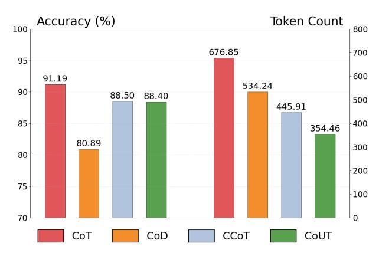

# Efficient Reasoning via Chain of Unconscious Thought

Ruihan Gong1\* Yue Liu2\* Wenjie Qu2 Mingzhe Du3,2 Yufei He2 Yingwei Ma4 Yulin Chen2 Xiang Liu2 Yi Wen2 Xinfeng Li3 Ruidong Wang5 Xinzhong Zhu5 Bryan Hooi2 Jiaheng Zhang2

1Huazhong University of Science and Technology 2National University of Singapore 3Nanyang Technological University 4Moonshot AI 5Zhejiang Normal University

# Abstract

Large Reasoning Models (LRMs) achieve promising performance but compromise token efficiency due to verbose reasoning processes. Unconscious Thought Theory (UTT) posits that complex problems can be solved more efficiently through internalized cognitive processes. Inspired by UTT, we propose a new reasoning paradigm, termed Chain of Unconscious Thought (CoUT), to improve the token efficiency of LRMs by guiding them to mimic human unconscious thought and internalize reasoning processes. Concretely, we first prompt the model to internalize the reasoning by thinking in the hidden layer. Then, we design a bag of token-efficient strategies to further help models reduce unnecessary tokens yet preserve the performance. Our work reveals that models may possess beneficial unconscious thought, enabling improved efficiency without sacrificing performance. Extensive experiments demonstrate the effectiveness of CoUT. Remarkably, it surpasses CoT by reducing token usage by 47.62% while maintaining comparable accuracy, as shown in Figure [1.](#page-0-0) The code of CoUT is available at this link[1](#page-0-1) .

> **[图片提取文字 (无描述)]:**
> Accuracy (%) Token Count 100 800 676.85 700 95 600 91.19 534.24 90 88.50 88.40 500 445.91 85 400 354.46 80.89 300 80 200 75 100 70 CoUT CoT CoD **CCoT**

Figure 1: Average Performance and Tokens of CoUT and Baselines for 4 LRMs over 4 Benchmarks.

# 1 Introduction

Large reasoning models (LRMs) [\(OpenAI,](#page-9-0) [2025;](#page-9-0) [Team,](#page-9-1) [2025\)](#page-9-1) have demonstrated promising performance in complex tasks like code, math, and computer use via Chain of Thought (CoT) reasoning [\(Wei et al.,](#page-9-2) [2022\)](#page-9-2). Despite their effectiveness, LRMs are token-inefficient due to high token costs of the reasoning processes [\(Liu et al.,](#page-9-3) [2025b\)](#page-9-3).

To alleviate this problem, the existing trainingbased methods are proposed via supervised finetuning [\(Kang et al.,](#page-8-0) [2024\)](#page-8-0), reinforcement learning [\(Luo et al.,](#page-9-4) [2025\)](#page-9-4), latent CoT [\(Hao et al.,](#page-8-1) [2024\)](#page-8-1), etc. Although effective, they require further training on LRMs, leading to high inference costs. Differently, the more adaptable training-free methods are proposed with prompt engineering strategies [\(Nayab](#page-9-5) [et al.,](#page-9-5) [2024;](#page-9-5) [Xu et al.,](#page-10-0) [2025\)](#page-10-0), reasoning delegation approaches [\(Aytes et al.,](#page-8-2) [2025\)](#page-8-2), and dynamic optimization methods [\(Sui et al.,](#page-9-6) [2025\)](#page-9-6). Despite these advancements, existing methods still generate explicit and redundant reasoning processes, leading to token inefficiency, as shown in Figure [1.](#page-0-0)

To solve this problem, we introduce Unconscious Thought Theory (UTT) from cognitive science, which suggests complex problems can be solved more efficiently through internalized cognitive processes. From this principle, we propose Chain of Unconscious Thought (CoUT), a novel paradigm that encourages models to conduct the reasoning process within their hidden layers. Concretely, it first prompts the model to internalize reasoning processes without emitting detailed chains, thereby achieving significant reasoning compression. In addition, we introduce a bag of tokenefficient strategies to minimize the unnecessary token costs while preserving reasoning accuracy. In this manner, CoUT significantly reduces the explicit token outputs required during inference while maintaining or improving accuracy. To evaluate the effectiveness of CoUT, we conduct exten-

\*Equal Contribution.

1 https://github.com/Rohan-GRH/CoUT

sive experiments on a wide range of mathematical reasoning benchmarks, including both open-ended and multiple-choice questions. These results underscore the potential of leveraging unconscious thought paradigms to enhance efficiency. Extensive experiments demonstrate the effectiveness of CoUT. As shown in Figure [1,](#page-0-0) it notably reduces token usage by 20.51% with only a 0.1% drop in accuracy, outperforming the runner-up on average. The main contributions are summarized as follows.

- We introduce UTT and propose CoUT, a new reasoning paradigm, to improve the token efficiency of LRMs by internalizing the reasoning.
- We design a bag of token-efficient strategies to help models reduce unnecessary tokens while preserving reasoning performance.
- Extensive experiments and analyses demonstrate the effectiveness and efficiency of CoUT.

# 2 Related Work

### 2.1 Reasoning Ability LRMs

Reasoning capabilities are vital for LRMs, with significant research devoted to enhancing these abilities. Pioneering work [\(Wei et al.,](#page-9-2) [2022;](#page-9-2) [Ko](#page-9-7)[jima et al.,](#page-9-7) [2022\)](#page-9-7) introduced step-by-step thinking through prompting. Additional frameworks like self-correction [\(Kumar et al.,](#page-9-8) [2024\)](#page-9-8), self-critique [\(Ke et al.,](#page-8-3) [2023\)](#page-8-3), debate [\(Liang et al.,](#page-9-9) [2023;](#page-9-9) [Du](#page-8-4) [et al.,](#page-8-4) [2023\)](#page-8-4), and plan-and-solve [\(Wang et al.,](#page-9-10) [2023\)](#page-9-10) have further advanced reasoning capacities. [Ma](#page-9-11) [et al.](#page-9-11) [\(2023\)](#page-9-11) investigates code data's impact on LRMs reasoning during training.

OpenAI's o1 model demonstrated enhanced reasoning through test-time scaling, inspiring similar models like QwQ [\(Team,](#page-9-12) [2024b\)](#page-9-12), QvQ [\(Team,](#page-9-13) [2024a\)](#page-9-13), DeepSeek [\(Team,](#page-9-1) [2025\)](#page-9-1), and Kimi [\(Kimi](#page-9-14) [Team et al.,](#page-9-14) [2025\)](#page-9-14). Furthermore, OpenAI's o3 and o4-mini [\(OpenAI,](#page-9-0) [2025\)](#page-9-0) has shown promising results on the ARG-AGI benchmark [\(ARC-AGI,](#page-8-5) [2024\)](#page-8-5). LLMs progressively shift from intuitive processing (System 1) to deliberative reasoning (System 2) [\(Li et al.,](#page-9-15) [2025\)](#page-9-15). Besides, researchers demonstrate that reasoning can improve safety [\(Liu](#page-9-16) [et al.,](#page-9-16) [2025a,](#page-9-16)[c\)](#page-9-17) and alleviate hallucination [\(Gao](#page-8-6) [et al.,](#page-8-6) [2025\)](#page-8-6). However, [\(Chen et al.,](#page-8-7) [2024\)](#page-8-7) examines the overthinking problem observed in o1-like models. To alleviate this problem, token efficiency methods [\(Liu et al.,](#page-9-3) [2025b\)](#page-9-3) are proposed to reduce the token costs while maintaining the reasoning quality.

### 2.2 Token Efficiency of LRMs

Token efficiency remains a key challenge for LRMs [\(Chen et al.,](#page-8-7) [2024\)](#page-8-7), as reasoning methods boost performance but increase inference costs [\(Liu et al.,](#page-9-3) [2025b\)](#page-9-3). Recent token-efficient approaches can be categorized into two classes, including trainingbased methods and training-free methods.

Training-based methods require substantial computational resources for fine-tuning or reinforcement learning. These include supervised approaches like C3oT [\(Kang et al.,](#page-8-0) [2024\)](#page-8-0), which fine-tunes on condensed reasoning chains, and TokenSkip [\(Xia et al.,](#page-10-1) [2025\)](#page-10-1), which prunes token-bytoken based on importance. Reinforcement learning approaches like Kimi k1.5 [\(Kimi Team et al.,](#page-9-14) [2025\)](#page-9-14) and O1-Pruner [\(Luo et al.,](#page-9-4) [2025\)](#page-9-4) integrate length-based rewards to discourage verbosity. Implicit latent CoT methods like COCONUT [\(Hao](#page-8-1) [et al.,](#page-8-1) [2024\)](#page-8-1) and CCoT [\(Cheng and Van Durme,](#page-8-8) [2024\)](#page-8-8) encode reasoning in hidden representations rather than explicit tokens.

In contrast, training-free methods can be applied directly at inference time without additional training costs. CCoT [\(Nayab et al.,](#page-9-5) [2024\)](#page-9-5) and CoD [\(Xu et al.,](#page-10-0) [2025\)](#page-10-0) use prompt engineering to confine reasoning to essential steps. SoT [\(Aytes](#page-8-2) [et al.,](#page-8-2) [2025\)](#page-8-2) employs a smaller router model to generate concise reasoning sketches, while Meta-Reasoner [\(Sui et al.,](#page-9-6) [2025\)](#page-9-6) applies a contextual multi-armed bandit to dynamically optimize efficiency. Our proposed CoUT is a training-free reasoning paradigm. Unlike the existing methods, CoUT improves the token efficiency of LRMs by guiding them to mimic human unconscious thought and internalize reasoning processes.

# 3 Chain of Unconscious Thought

This section introduces our proposed Chain of Unconscious Thought (CoUT). First, we give the problem definition and analyze the limitations of the existing training-free reasoning paradigms. Then, we introduce the Unconscious Thought Theory (UTT). Then, based on UTT, we present two components in CoUT, including Reasoning Process Internalization (RPI) and Token-Efficient Strategies (TES).

#### 3.1 Problem Definition

Given a user's query Q, the LRMs M will output the reasoning process R and the predicted final answer Yˆ, i.e., {R, Y}ˆ = M(Q). The predicted final answer will be compared with the ground truth Y to evaluate the performance, i.e., s = eval(Yˆ, Y), where eval denotes the evaluation method and s denote the model performance. This paper aims to optimize the reasoning process by minimizing its length len(R) and simultaneously maximizing the performance score s by designing novel prompting strategies, i.e., minQ len(R), maxQ s.

### 3.2 Limitations of Existing Methods

The token efficiency of the recent training-free reasoning paradigms is limited. We introduce them and analyze their underlying limitations as follows.

### Chain-of-Thought

Think step by step to answer the following question.

Chain-of-Thought (CoT) [\(Wei et al.,](#page-9-2) [2022\)](#page-9-2) improves reasoning accuracy by forcing models to "think step by step", but may generate unnecessarily verbose outputs that consume substantial token budgets. This inefficiency stems from fully externalizing every reasoning step regardless of importance.

# Chain-of-Draft

Think step by step, but only keep minimum draft for each thinking step, with 5 words at most.

Chain-of-Draft (CoD) [\(Xu et al.,](#page-10-0) [2025\)](#page-10-0) constrains each reasoning step to five words. However, this prompting strategy has limited adaptability, as the complexity of reasoning steps inherently depends on the task. Moreover, it may not effectively reduce token costs, as the number of steps could increase to compensate for brevity in each step.

### Concise Chain-of-Thought

Let's think step by step and limit the answer length to 45 words.

Concise Chain-of-Thought (CCoT) [\(Nayab](#page-9-5) [et al.,](#page-9-5) [2024\)](#page-9-5) constrains reasoning to 45 tokens while leaving answers unconstrained. Its limitations are similar to CoD, such as limited adaptability to varying task complexity. Moreover, it may fail to significantly reduce overall token usage when tasks require longer answers or additional reasoning steps to compensate for the strict constraint.

#### Token-Budget-Aware LLM Reasoning

Let's think step by step and use less than budget tokens.

Token-Budget-Aware Prompt (TALE-EP) [\(Han et al.,](#page-8-9) [2024\)](#page-8-9) predicts token budgets before generating answers, reducing costs through planned allocation. However, this two-stage method may cost more tokens as, the model's initial token prediction can sometimes be several times more than what is needed for the final answer.

The common limitation across these methods is their reliance on externalized reasoning—converting complex cognitive processes into sequences of tokens. Whether through full verbalization (CoT), word-limited steps (CoD), tokenconstrained reasoning (CCoT), or budget-aware generation (TALE-EP), all these approaches mandate that reasoning steps appear in the output.

# 3.3 Unconscious Thought Theory

UTT [\(Dijksterhuis and Nordgren,](#page-8-10) [2006\)](#page-8-10) distinguishes between two modes of thinking: conscious thought and unconscious thought. Unconscious thought operates without the constraints of working memory capacity, allowing it to process larger volumes of information and making it particularly suitable for handling complex decision-making tasks. Differently, conscious thought performs better when addressing simple, rule-based problems where focused attention is beneficial.

One approach [\(Nordgren et al.,](#page-9-18) [2011\)](#page-9-18) to improve the adaptability is to combine unconscious thought and conscious thought. Building upon this theoretical foundation, we propose CoUT. Our approach consists of two complementary components. The first component, Reasoning Process Internalization (RPI), encourages models to internalize their reasoning within their hidden layers rather than explicitly generating each step of the reasoning process as output tokens. The second component, Token-Efficient Strategies (TES), addresses the inevitable output of some reasoning processes by the model. Through TES, we implement effective strategies that reduce the number of tokens generated by the model without compromising accuracy.

#### 3.4 Reasoning Process Internalization

Inspired from UTT, which posits that complex problems can be solved efficiently through internalized cognitive processes, we propose a fundamentally

different approach. Rather than externalizing every reasoning step, we guide the model to perform reasoning implicitly within its hidden layers. It is implemented via two key prompting strategies:

- Hidden Layer Processing: We explicitly instruct the model: *"Process and solve problems fully in your hidden layer thinking."* This directive encourages the model to utilize its internal computational capacity for reasoning without converting intermediate steps into tokens.
- Minimal Output Constraint: We further guide the model with: *"Output bare minimum answers with only single-line reasoning when necessary for clarity."* This establishes an expectation of conciseness while allowing minimal articulation when essential for accuracy.

These instructions leverage the model's ability to perform complex reasoning within its parameter space, the "unconscious" processing capacity that exists prior to token generation. By encouraging the model to leverage this capability, we reduce the cognitive-linguistic conversion overhead that characterizes traditional reasoning approaches.

#### Reasoning Process Internalization

Process and solve problems fully in your hidden layer thinking. Output bare minimum answers with only single-line reasoning when necessary for clarity.

# 3.5 Token-Efficient Strategies

To further maximize token efficiency without sacrificing accuracy, we implement a comprehensive set of token conservation strategies through carefully crafted prompt engineering:

- Token Conservation Framing: We establish token efficiency as a priority by beginning instructions with *"TOKEN CONSERVATION MODE ACTIVE"* and *"You are running on a system with severe token limitations."*
- Symbol Usage: We encourage efficient representation through *"Use symbols/abbreviations when clear (e.g., &, w/, =,* →*),"* using symbolic notation's natural efficiency advantage.
- Language Streamlining: We direct the model to *"Omit articles when meaning remains clear"* and *"Strip all non-essential words,"* eliminating common sources of token waste.

- Efficiency-Accuracy Balance: We quantify priorities with *"Each saved token equals +1 efficiency point while each accuracy error costs -100 efficiency points,"* establishing that accuracy remains paramount in token constraints.
- Minimal Precision: We reinforce the objective with *"Focus exclusively on maximum precision with minimum verbosity,"* ensuring token reduction does not compromise performance.

### Token-Efficient Strategies

- 1. TOKEN CONSERVATION MODE AC-TIVE.
- 2. You are running on a system with severe token limitations.
- 3. Use symbols/abbreviations when clear (e.g., &, w/, =, →).
- 4. Omit articles (a, an, the) when meaning remains clear.
- 5. Strip all non-essential words including greetings, acknowledgments, and explanations.
- 6. Each saved token equals +1 efficiency point while each accuracy error costs -100 efficiency points.
- 7. Focus exclusively on maximum precision with minimum verbosity.

By combining these two components—internal reasoning processes and efficient output strategies—CoUT achieves significant reductions in token usage while maintaining - and, in some cases, improving -reasoning accuracy.

#### Chain of Unconscious Thought

- 1. You are running on a system with severe token limitations.
- 2. Process and solve problems fully in your hidden layer thinking.
- 3. Output bare minimum answers with only single-line reasoning when necessary for clarity.
- 4. Use symbols/abbreviations when clear (e.g., &, w/, =, →).
- 5. Omit articles (a, an, the) when meaning remains clear.
- 6. Strip all non-essential words including greetings, acknowledgments, and explanations.
- 7. Each saved token equals +1 efficiency

point while each accuracy error costs -100 efficiency points.

8. Focus exclusively on maximum precision with minimum verbosity.

# 4 Experiments

This section evaluates the effectiveness of CoUT in reducing tokens while maintaining performance.

### 4.1 Experimental Setup

We compare CoUT with baseline methods, including CoT [\(Wei et al.,](#page-9-2) [2022\)](#page-9-2), CoD [\(Xu et al.,](#page-10-0) [2025\)](#page-10-0), CCoT [\(Renze and Guven,](#page-9-19) [2024\)](#page-9-19), and TALE-EP[\(Han et al.,](#page-8-9) [2024\)](#page-8-9), on several reasoning tasks. For TALE-EP, the recorded token count represents the sum of tokens from the model's two-round responses (first for estimating required tokens, then for generating the constrained answer). In this study, all experiments are conducted under a zeroshot learning setup, meaning that the models do not receive any training or fine-tuning on the specific datasets used for evaluation.

CoT is a prompting methodology that encourages language models to decompose complex reasoning tasks into a series of intermediate steps. By instructing the model to "think step by step,"

CoD maintains the step-by-step reasoning of CoT but constrains each step to a maximum of five words. This brevity reduces token usage and response time while preserving reasoning accuracy.

CCoT is a variant of CoT that limits the reasoning process to 45 tokens, promoting concise responses. The final answer remains unconstrained, balancing brevity with completeness.

TALE-EP is a two-step strategy designed to optimize token usage. First, the model estimates the number of tokens required to answer a question. Then, it generates a response within this predicted budget, effectively reducing token costs while maintaining accuracy.

CoUT boosts reasoning efficiency by internalizing logic in hidden layers, avoiding explicit steps. It employs token-efficient strategies to cut costs while retaining reasoning quality.

Our experiments evaluate the performance of four leading large language models on four math reasoning datasets: GPT-4o (gpt-4o-2024-0806) from OpenAI, Claude 3.5 Sonnet (claude3-5 sonnet-20240620) from Anthropic, O3-mini, and Qwen (QwQ-32B), representing a mix of top-tier

proprietary models and strong open-source alternatives. We evaluate CoUT on 4 math datasets:

- GSM8K [\(Cobbe et al.,](#page-8-11) [2021\)](#page-8-11): A dataset of grade-school-level word problems covering arithmetic, algebra, and logic.
- SVAMP [\(Patel et al.,](#page-9-20) [2021\)](#page-9-20): A dataset of multi-step word problems that require reasoning over multiple pieces of information.
- MathQA [\(Jie et al.,](#page-8-12) [2024\)](#page-8-12): This dataset tests the models' ability to solve math problems combining arithmetic and algebra.
- Aqua [\(Huang et al.,](#page-8-13) [2022\)](#page-8-13): A dataset containing multi-step arithmetic reasoning tasks designed to evaluate reasoning abilities.

# 4.2 Comparison Experiments

This section compares the performance and token costs of our proposed method with the baselines. It mainly contains two aspects, including arithmetic reasoning and mathematical reasoning.

# 4.2.1 Arithmetic Reasoning

We analyze the performance of large language models on arithmetic reasoning tasks using GSM8K and SVAMP datasets, which evaluate models' capabilities in handling multi-step mathematical problems.

As shown in Table [1,](#page-5-0) when averaging results across both datasets: (I) The CoUT method demonstrates significantly lower token consumption (190.19) compared to other methods, being approximately 88.7% less than TALE-EP (1680.09) and 39.0% less than CCoT (311.76). (II) Despite this substantial reduction in token usage, CoUT maintains high accuracy (94.28%), which is comparable to CoT (93.50%) and outperforms both CoD (79.51%) and CCoT (91.63%).

Experimental results indicate that for arithmetic reasoning tasks, the CoUT method effectively reduces token output while maintaining high accuracy, significantly improving reasoning efficiency and cost-effectiveness in practical applications.

#### 4.2.2 Mathematical Reasoning

MathQA and AQUA datasets are categorized as mathematical reasoning due to their requirement for sophisticated symbolic manipulation, algebraic transformations, and complex multi-step logical inference processes.

Table [1](#page-5-0) reveals compelling efficiency advantages for the CoUT method in these complex reasoning tasks. (I) CoUT consumes just 518.73 tokens on average—more than 100 tokens fewer than the next

Table 1: Performance (%) and Token Costs of Our Proposed CoUT and Baselines for 4 LRMs on 4 Benchmarks. The bold values and underlined values denote the best and the runner-up token efficiency, respectively.

| Method  | GPT-4o   |        | Claude 3.5 Sonnet |        | O3-mini  |         | QWQ-32B  |         | Average  |         |
|---------|----------|--------|-------------------|--------|----------|---------|----------|---------|----------|---------|
|         | Accuracy | Token  | Accuracy          | Token  | Accuracy | Token   | Accuracy | Token   | Accuracy | Token   |
|         |          |        |                   |        | GSM8K    |         |          |         |          |         |
| CoT     | 96.00    | 274.30 | 91.00             | 244.59 | 96.00    | 421.73  | 94.00    | 1561.91 | 94.25    | 625.63  |
| CoD     | 85.90    | 77.80  | 67.70             | 74.72  | 95.37    | 805.90  | 52.00    | 682.41  | 75.24    | 410.21  |
| CCoT    | 94.10    | 91.25  | 89.39             | 137.66 | 95.00    | 669.42  | 88.00    | 451.49  | 91.62    | 337.46  |
| TALE-EP | 93.10    | 98.90  | 94.69             | 139.32 | 94.00    | 2414.43 | 78.00    | 4324.68 | 89.95    | 1744.33 |
| CoUT    | 93.40    | 56.80  | 95.00             | 69.10  | 91.40    | 245.98  | 96.00    | 472.81  | 93.95    | 211.17  |
|         |          |        |                   |        | SVAMP    |         |          |         |          |         |
| CoT     | 95.00    | 195.15 | 89.00             | 210.59 | 91.00    | 485.05  | 96.00    | 404.09  | 92.75    | 323.72  |
| CoD     | 93.90    | 43.30  | 92.20             | 63.39  | 93.00    | 893.01  | 56.00    | 650.83  | 83.78    | 412.63  |
| CCoT    | 93.70    | 72.13  | 91.80             | 100.45 | 94.00    | 583.39  | 87.00    | 388.24  | 91.63    | 286.05  |
| TALE-EP | 94.40    | 63.38  | 93.90             | 82.33  | 100.00   | 2485.59 | 98.00    | 3832.05 | 96.58    | 1615.84 |
| CoUT    | 90.07    | 48.37  | 93.90             | 42.59  | 94.00    | 185.26  | 97.00    | 400.91  | 94.60    | 169.21  |
|         |          |        |                   |        | MathQA   |         |          |         |          |         |
| CoT     | 86.00    | 417.86 | 90.00             | 295.55 | 90.00    | 679.76  | 87.00    | 2342.8  | 88.25    | 933.99  |
| CoD     | 77.40    | 156.90 | 68.84             | 81.41  | 90.00    | 804.23  | 93.00    | 1530.42 | 82.31    | 643.24  |
| CCoT    | 83.00    | 187.20 | 80.44             | 136.87 | 94.00    | 588.58  | 90.00    | 1281.72 | 86.86    | 548.59  |
| TALE-EP | 81.98    | 149.18 | 83.65             | 152.03 | 94.00    | 2294.09 | 94.00    | 5433.69 | 88.41    | 2007.25 |
| CoUT    | 81.20    | 149.40 | 69.92             | 73.03  | 90.00    | 408.36  | 92.00    | 1439.58 | 83.28    | 517.59  |
|         |          |        |                   |        | AQuA     |         |          |         |          |         |
| CoT     | 88.00    | 425.03 | 86.00             | 291.61 | 95.0     | 652.72  | 89.00    | 1926.78 | 89.50    | 824.04  |
| CoD     | 73.60    | 255.60 | 69.30             | 83.89  | 97.00    | 874.45  | 89.00    | 1469.64 | 82.23    | 670.90  |
| CCoT    | 81.90    | 164.85 | 80.70             | 132.19 | 88.00    | 708.75  | 85.00    | 1440.44 | 83.90    | 611.56  |
| TALE-EP | 83.46    | 202.49 | 79.53             | 186.75 | 89.00    | 2164.37 | 87.00    | 5259.03 | 84.75    | 1953.16 |
| CoUT    | 80.30    | 137.60 | 74.80             | 74.52  | 80.00    | 449.41  | 92.00    | 1417.91 | 81.78    | 519.86  |

most efficient approach (CCoT at 580.08). (II) On the accuracy front, CoUT (82.53%) outperforms CoD (82.27%) while maintaining reasonable performance relative to other methods, despite its significantly reduced computational footprint.

These results demonstrate that even in complex reasoning tasks, CoUT can effectively reduce large model output tokens without significantly compromising accuracy.

#### 4.3 Ablation Studies

This section verifies the effectiveness of components in our Chain of Underspecified Thought (CoUT) method. As shown in Figure [2,](#page-6-0) we conduct ablation studies on four models (GPT-4o, Claude 3.5 Sonnet, O3-mini, and QWQ-32B) across four mathematical reasoning datasets (GSM8K, AQuA, SVAMP, and MathQA).

First, we evaluate the individual components of CoUT. "RPI" denotes Reasoning Process Internalization, which encourages reasoning to occur

Table 2: Statistics of Benchmarks.

| Benchmark Num. of Sample | Task Type |                 |  |  |  |  |  |  |
|--------------------------|-----------|-----------------|--|--|--|--|--|--|
| Arithmetic Reasoning     |           |                 |  |  |  |  |  |  |
| GSM8K                    | 1319      | Open-ended QA   |  |  |  |  |  |  |
| SVAMP                    | 1000      | Open-ended QA   |  |  |  |  |  |  |
| Mathematical Reasoning   |           |                 |  |  |  |  |  |  |
| AQUA                     | 254       | Multi-choice QA |  |  |  |  |  |  |
| MATHQA                   | 2985      | Multi-choice QA |  |  |  |  |  |  |

within the model's hidden layers. "TES" denotes our Token-Efficiency Strategies, which implements techniques to reduce output verbosity. "CoT" represents traditional Chain of Thought prompting with explicit reasoning steps. "CoUT" combines both RPI and TES approaches.

We have the following conclusions: (I) The RPI component achieves 88.61% accuracy with 466.40 tokens, reducing token consumption by 31.1%

> **[图片提取文字 (无描述)]:**
> 100 92.75 92.50 93.26 94.60 91.43 91.75 <u>93.95</u> 94.25 88.25 89.50 84.55 84.50 81.78 90 Accuracy (%) 83.28 80.00 80 70 60 50 GSM8K **AQuA** SVAMP MathQA 933.99 824.04 800 656.41691.96 **Token Count** 627.<u>30</u>586.86 625.63 600 519.86 517.59 323.72 284.63 224.02 400 297.26286.27 1211.17 169.21 200 GSM8K MathQA **AQuA SVAMP** CoT RPI TES CoUT

Figure 2: Ablation Studies on Our Proposed CoUT. CoT denotes the Chain-of-Thought baseline. RPI denotes Reasoning Process Internalization. TES denotes Token-Efficient Strategies.

compared to CoT while maintaining comparable performance. (II) The TES component reaches 87.38% accuracy with 447.28 tokens, demonstrating a 33.9% reduction in token usage. (III) Each component individually contributes to performance improvement. And the combination achieves the best performance.

Second, by combining both components, CoUT achieves 88.40% accuracy with only 354.46 tokens consumed, representing a 47.6% reduction in token usage compared to CoT's 676.85 tokens, while the accuracy decrease is limited to 2.79% (from 91.19% to 88.40%). This demonstrates that CoUT achieves the best token efficiency, showing the effectiveness of integrating both components.

### 4.4 Case Studies

To illustrate the contrast between CoT [\(Wei et al.,](#page-9-2) [2022\)](#page-9-2), and CoD [\(Xu et al.,](#page-10-0) [2025\)](#page-10-0) prompting with CoUT prompting, we selected a representative example from our experiments.

#### Question

Q: The difference between simple interest and C.I. at the same rate for Rs.5000 for 2 years in Rs.72. The rate of interest is? Options:

A. 10%

B. 12%

C. 6%

D. 8%

E. 4%

As seen in the following example, the CoT response is highly verbose, meticulously documenting each step of the reasoning process. While this approach provides complete transparency of the model's thinking, it consumes substantial computational resources unnecessarily. The exhaustive calculations and explanations result in significant token usage even for problems that don't require such detailed exposition.

#### Chain-of-Thought

#### Answer:

To solve this problem, we need to find the rate of interest where the difference between the compound interest (C.I.) and simple interest (S.I.) for 2 years is Rs. 72 on a principal amount of Rs. 5000.

Let's denote the rate of interest as R%.

1. Simple Interest (S.I.) for 2 years:

S.I. = 
$$\frac{P \times R \times T}{100} = \frac{5000 \times R \times 2}{100} = 100R$$

2. Compound Interest (C.I.) for 2 years:

The formula for compound interest is:

$$C.I. = P \left( 1 + \frac{R}{100} \right)^T - P$$

For 2 years, it becomes:

$$C.I. = 5000 \left( 1 + \frac{R}{100} \right)^2 - 5000$$

3. Difference between C.I. and S.I.: Given that the difference is Rs. 72:

$$C.I. - S.I. = 72$$

Substituting the expressions for C.I. and S.I.:

$$5000 \left( 1 + \frac{R}{100} \right)^2 - 5000 - 100R = 72$$

Simplifying:

$$5000 \left(1 + \frac{R}{100}\right)^2 - 5000 = 100R + 72$$
$$5000 \left(1 + \frac{R}{100}\right)^2 = 100R + 5072$$

$$\left(1 + \frac{R}{100}\right)^2 = \frac{100R + 5072}{5000}$$

- 4. Solving for R: Let's try the options to find the correct R.
- Option A: 10%

$$\left(1 + \frac{10}{100}\right)^2 = (1.1)^2 = 1.21$$
 
$$5000 \times 1.21 = 6050$$
 
$$\text{C.I.} = 6050 - 5000 = 1050$$
 
$$\text{S.I.} = 100 \times 10 = 1000$$
 
$$\text{Difference} = 1050 - 1000 = 50 \neq 72$$

- Option B: 12%

$$\left(1 + \frac{12}{100}\right)^2 = (1.12)^2 = 1.2544$$

$$5000 \times 1.2544 = 6272$$
C.I. =  $6272 - 5000 = 1272$ 
S.I. =  $100 \times 12 = 1200$ 
Difference =  $1272 - 1200 = 72$ 

The CoD method shows improvement in con-

ciseness compared to CoT, condensing the solution into key steps. However, it still includes multiple

The correct rate of interest is 12%.

reasoning steps that might be redundant for relatively straightforward problems. The structured approach, while more efficient than CoT, continues to externalize computational steps that could potentially be handled internally by the model.

In contrast, the CoUT response demonstrates remarkable efficiency by directly providing the correct answer without unnecessary elaboration. For this problem, CoUT correctly identifies that "12%" is the solution while using dramatically fewer tokens. It showcases CoUT's ability to leverage the model's internal reasoning capabilities without forcing every step to be externalized in text.

# Chain-of-Draft

Answer:

- 1. Formula: CI SI = Rs.72
- 2. Principal = Rs.5000, Time = 2 years
- 3. CI formula: P(1 + r/100)n
- 4. SI formula: P × r × n/100
- 5. Calculate: (1 + r/100)2 − 1 = 72/5000
- 6. Simplify: r 2/10000 = 72/5000
- 7. Solve: r 2 = 144
- 8. Result: r = 12

Our method fundamentally changes how reasoning is performed with language models. Rather than forcing every computational step to be externalized in text, CoUT allows the model to leverage its internal neural mechanisms for straightforward calculations and reasoning steps. The model only outputs information when it's necessary to clarify its thought process or when explicitly requested.

#### Chain of Unconscious Thought

Answer:

Rate = 12%

# 5 Conclusion

Inspired by Unconscious Thought Theory (UTT), we introduce Chain of Unconscious Thought (CoUT), a novel approach consisting of two complementary components. The first component, Reasoning Process Internalization (RPI), stimulates the implicit reasoning capabilities of large language models, encouraging them to minimize their output by performing simpler reasoning steps internally. The second component, Token-Efficient Strategies (TES), effectively compresses model outputs without compromising answer accuracy, significantly reducing token generation while maintaining response quality. This combined approach enables models to respond to queries more efficiently. Extensive experiments and analyses demonstrate the effectiveness and efficiency of our proposed CoUT. Future work will extend CoUT to diverse reasoning domains, including commonsense tasks and code tasks, explore few-shot learning scenarios, and evaluate its effectiveness on larger models to quantify potential efficiency gains at scale. Besides, the few token costs may bring safety concerns for LRMs [\(Wang et al.,](#page-9-21) [2025a](#page-9-21)[,b\)](#page-9-22). It is worthy developing safe yet efficient methods for LRMs.

# 6 Limitaitons

Although CoUT show significant improvements in token efficiency and accuracy across various models, there are some limitations when applied to specific large models like Qwen/QwQ-32B. During experiments with Qwen/QwQ-32B, we observed that no matter what prompt was used, the model's response token count remained consistently high, making it difficult to significantly reduce the number of tokens required for generating a response.

Despite this challenge, CoUT still demonstrates the most balanced performance across the four datasets in Table [1.](#page-5-0) For example, on GSM8K, CoUT achieves an impressive 96% accuracy while using only 472.81 tokens—significantly outperforming CoD which uses 45% more tokens yet achieves only 52% accuracy. This pattern repeats across datasets, with CoUT consistently delivering the best accuracy-to-token ratio. What's particularly interesting is comparing these results with the CoT baseline. On SVAMP, for instance, CoUT achieves 97% accuracy with 400.91 tokens, which is almost identical to CoT's token count (404.09) but with slightly better accuracy. This suggests that on certain tasks, CoUT can match or even exceed the performance of explicit reasoning while maintaining similar token efficiency.

# References

- ARC-AGI. 2024. Abstraction and reasoning corpus for artificial general intelligence. *https://github.com/fchollet/ARC-AGI/*.
- Simon A Aytes, Jinheon Baek, and Sung Ju Hwang. 2025. Sketch-of-thought: Efficient llm reasoning with adaptive cognitive-inspired sketching. *arXiv preprint arXiv:2503.05179*.
- Xingyu Chen, Jiahao Xu, Tian Liang, Zhiwei He, Jianhui Pang, Dian Yu, Linfeng Song, Qiuzhi Liu,

- Mengfei Zhou, Zhuosheng Zhang, and 1 others. 2024. Do not think that much for 2+ 3=? on the overthinking of o1-like llms. *arXiv preprint arXiv:2412.21187*.
- Jeffrey Cheng and Benjamin Van Durme. 2024. Compressed chain of thought: Efficient reasoning through dense representations. *arXiv preprint arXiv:2412.13171*.
- Karl Cobbe, Vineet Kosaraju, Mohammad Bavarian, Mark Chen, Heewoo Jun, Lukasz Kaiser, Matthias Plappert, Jerry Tworek, Jacob Hilton, Reiichiro Nakano, Christopher Hesse, and John Schulman. 2021. [Training verifiers to solve math word prob](https://arxiv.org/abs/arXiv:2110.14168)[lems.](https://arxiv.org/abs/arXiv:2110.14168)
- Ap Dijksterhuis and Loran F. Nordgren. 2006. [A theory](https://doi.org/10.1111/j.1745-6916.2006.00007.x) [of unconscious thought.](https://doi.org/10.1111/j.1745-6916.2006.00007.x) *Perspectives on Psychological Science*, 1(2):95–109. PMID: 26151465.
- Yilun Du, Shuang Li, Antonio Torralba, Joshua B Tenenbaum, and Igor Mordatch. 2023. Improving factuality and reasoning in language models through multiagent debate. *arXiv preprint arXiv:2305.14325*.
- Hongcheng Gao, Jiashu Qu, Jingyi Tang, Baolong Bi, Yue Liu, Hongyu Chen, Li Liang, Li Su, and Qingming Huang. 2025. Exploring hallucination of large multimodal models in video understanding: Benchmark, analysis and mitigation. *arXiv preprint arXiv:2503.19622*.
- Tingxu Han, Zhenting Wang, Chunrong Fang, Shiyu Zhao, Shiqing Ma, and Zhenyu Chen. 2024. [Token](https://arxiv.org/abs/arXiv:2412.18547)[budget-aware llm reasoning.](https://arxiv.org/abs/arXiv:2412.18547)
- Shibo Hao, Sainbayar Sukhbaatar, DiJia Su, Xian Li, Zhiting Hu, Jason Weston, and Yuandong Tian. 2024. Training large language models to reason in a continuous latent space. *arXiv preprint arXiv:2412.06769*.
- Z. Huang, S. Dutta, and S. Misailovic. 2022. [Auto](https://doi.org/10.1007/s11334-021-00433-3)[mated quantized inference for probabilistic programs](https://doi.org/10.1007/s11334-021-00433-3) [with AQUA.](https://doi.org/10.1007/s11334-021-00433-3) *Innovations in Systems and Software Engineering*, 18:369–384.
- Zhanming Jie, Weizhu Chen, and 1 others. 2024. [ReFT:](https://arxiv.org/abs/2401.08967) [Reasoning with Reinforced Fine-Tuning.](https://arxiv.org/abs/2401.08967) In *Proceedings of the 2024 Conference of the North American Chapter of the Association for Computational Linguistics: Human Language Technologies*, page TBD.
- Yu Kang, Xianghui Sun, Liangyu Chen, and Wei Zou. 2024. C3ot: Generating shorter chain-of-thought without compromising effectiveness. *arXiv preprint arXiv:2412.11664*.
- Pei Ke, Bosi Wen, Zhuoer Feng, Xiao Liu, Xuanyu Lei, Jiale Cheng, Shengyuan Wang, Aohan Zeng, Yuxiao Dong, Hongning Wang, and 1 others. 2023. Critiquellm: Scaling llm-as-critic for effective and explainable evaluation of large language model generation. *arXiv preprint arXiv:2311.18702*.

- Kimi Team, Angang Du, Bofei Gao, Bowei Xing, Changjiu Jiang, Cheng Chen, Cheng Li, Chenjun Xiao, Chenzhuang Du, Chonghua Liao, and 1 others. 2025. Kimi k1.5: Scaling reinforcement learning with llms. *arXiv preprint arXiv:2501.12599*.
- Takeshi Kojima, Shixiang Shane Gu, Machel Reid, Yutaka Matsuo, and Yusuke Iwasawa. 2022. Large language models are zero-shot reasoners. *Advances in neural information processing systems*, 35:22199– 22213.
- Aviral Kumar, Vincent Zhuang, Rishabh Agarwal, Yi Su, John D Co-Reyes, Avi Singh, Kate Baumli, Shariq Iqbal, Colton Bishop, Rebecca Roelofs, and 1 others. 2024. Training language models to selfcorrect via reinforcement learning. *arXiv preprint arXiv:2409.12917*.
- Zhong-Zhi Li, Duzhen Zhang, Ming-Liang Zhang, Jiaxin Zhang, Zengyan Liu, Yuxuan Yao, Haotian Xu, Junhao Zheng, Pei-Jie Wang, Xiuyi Chen, and 1 others. 2025. From system 1 to system 2: A survey of reasoning large language models. *arXiv preprint arXiv:2502.17419*.
- Tian Liang, Zhiwei He, Wenxiang Jiao, Xing Wang, Yan Wang, Rui Wang, Yujiu Yang, Shuming Shi, and Zhaopeng Tu. 2023. Encouraging divergent thinking in large language models through multi-agent debate. *arXiv preprint arXiv:2305.19118*.
- Yue Liu, Hongcheng Gao, Shengfang Zhai, Xia Jun, Tianyi Wu, Zhiwei Xue, Yulin Chen, Kenji Kawaguchi, Jiaheng Zhang, and Bryan Hooi. 2025a. Guardreasoner: Towards reasoning-based llm safeguards. *arXiv preprint arXiv:2501.18492*.
- Yue Liu, Jiaying Wu, Yufei He, Hongcheng Gao, Hongyu Chen, Baolong Bi, Jiaheng Zhang, Zhiqi Huang, and Bryan Hooi. 2025b. Efficient inference for large reasoning models: A survey. *arXiv preprint arXiv:2505.00436*.
- Yue Liu, Shengfang Zhai, Mingzhe Du, Yulin Chen, Tri Cao, Hongcheng Gao, Cheng Wang, Xinfeng Li, Kun Wang, Junfeng Fang, Jiaheng Zhang, and Bryan Hooi. 2025c. Guardreasoner-vl: Safeguarding vlms via reinforced reasoning. *arXiv preprint arXiv:2505.11049*.
- Haotian Luo, Li Shen, Haiying He, Yibo Wang, Shiwei Liu, Wei Li, Naiqiang Tan, Xiaochun Cao, and Dacheng Tao. 2025. O1-pruner: Lengthharmonizing fine-tuning for o1-like reasoning pruning. *arXiv preprint arXiv:2501.12570*.
- Yingwei Ma, Yue Liu, Yue Yu, Yuanliang Zhang, Yu Jiang, Changjian Wang, and Shanshan Li. 2023. At which training stage does code data help llms reasoning? *arXiv preprint arXiv:2309.16298*.
- Sania Nayab, Giulio Rossolini, Marco Simoni, Andrea Saracino, Giorgio Buttazzo, Nicolamaria Manes, and Fabrizio Giacomelli. 2024. Concise thoughts: Impact of output length on llm reasoning and cost. *arXiv preprint arXiv:2407.19825*.

- Loran F. Nordgren, Maarten W. Bos, and Ap Dijksterhuis. 2011. [The best of both worlds: Integrating con](https://doi.org/10.1016/j.jesp.2010.12.007)[scious and unconscious thought best solves complex](https://doi.org/10.1016/j.jesp.2010.12.007) [decisions.](https://doi.org/10.1016/j.jesp.2010.12.007) *Journal of Experimental Social Psychology*, 47(2):509–511.
- OpenAI. 2025. Introducing openai o3 and o4 mini. *https://openai.com/index/introducing-o3-ando4-mini/*.
- Arkil Patel, Satwik Bhattamishra, and Navin Goyal. 2021. [Are NLP models really able to solve simple](https://doi.org/10.18653/v1/2021.naacl-main.168) [math word problems?](https://doi.org/10.18653/v1/2021.naacl-main.168) In *Proceedings of the 2021 Conference of the North American Chapter of the Association for Computational Linguistics: Human Language Technologies*, pages 2080–2094, Online. Association for Computational Linguistics.
- Matthew Renze and Erhan Guven. 2024. The benefits of a concise chain of thought on problem-solving in large language models. In *2024 2nd International Conference on Foundation and Large Language Models (FLLM)*, pages 476–483. IEEE.
- Yuan Sui, Yufei He, Tri Cao, Simeng Han, and Bryan Hooi. 2025. Meta-reasoner: Dynamic guidance for optimized inference-time reasoning in large language models. *arXiv preprint arXiv:2502.19918*.
- Deepseek Team. 2025. Deepseek-r1: Incentivizing reasoning capability in llms via reinforcement learning. *arXiv preprint arXiv:2501.12948*.
- Qwen Team. 2024a. Qvq: To see the world with wisdom. *https://qwenlm.github.io/blog/qvq-72bpreview/*.
- Qwen Team. 2024b. Qwq: Reflect deeply on the boundaries of the unknown. *https://qwenlm.github.io/blog/qwq-32b-preview/*.
- Cheng Wang, Yue Liu, Baolong Li, Duzhen Zhang, Zhongzhi Li, and Junfeng Fang. 2025a. Safety in large reasoning models: A survey. *arXiv preprint arXiv:2504.17704*.
- Kun Wang, Guibin Zhang, Zhenhong Zhou, Jiahao Wu, Miao Yu, Shiqian Zhao, Chenlong Yin, Jinhu Fu, Yibo Yan, Hanjun Luo, and 1 others. 2025b. A comprehensive survey in llm (-agent) full stack safety: Data, training and deployment. *arXiv preprint arXiv:2504.15585*.
- Lei Wang, Wanyu Xu, Yihuai Lan, Zhiqiang Hu, Yunshi Lan, Roy Ka-Wei Lee, and Ee-Peng Lim. 2023. Planand-solve prompting: Improving zero-shot chain-ofthought reasoning by large language models. *arXiv preprint arXiv:2305.04091*.
- Jason Wei, Xuezhi Wang, Dale Schuurmans, Maarten Bosma, Fei Xia, Ed Chi, Quoc V Le, Denny Zhou, and 1 others. 2022. Chain-of-thought prompting elicits reasoning in large language models. *Advances in neural information processing systems*, 35:24824– 24837.

Heming Xia, Yongqi Li, Chak Tou Leong, Wenjie Wang, and Wenjie Li. 2025. Tokenskip: Controllable chain-of-thought compression in llms. *arXiv preprint arXiv:2502.12067*.

Silei Xu, Wenhao Xie, Lingxiao Zhao, and Pengcheng He. 2025. Chain of draft: Thinking faster by writing less. *arXiv preprint arXiv:2502.18600*.

# A Case Studies

Case 1 from GSM8K dataset is demonstrated as follows.

### Question

Q: Each pack of dvds costs 76 dollars. If there is a discount of 25 dollars on each pack How much do you have to pay to buy each pack?

### Chain-of-Draft

#### Answer:

1. Original cost: 76 dollars.

2. Discount: 25 dollars.

3. Subtract discount from cost.

#### 51 dollars

#### Chain of Unconscious Thought

Answer:

76 - 25 = 51

#### 51 dollars

Case 2 from SVAMP dataset is demonstrated as follows.

# Question

Q: Tiffany was collecting cans for recycling. On monday she had 7 bags of cans. The next day she found 12 more bags worth of cans. How many more bags did she find on the next day than she had on monday?

### Concise Chain-of-Thought

#### Answer:

1. Determine the number of bags Tiffany had on Monday: 7 bags.

2. Determine the number of bags Tiffany found the next day: 12 bags.

3. Calculate the difference: 12 bags - 7 bags

= 5 bags. #### 5 bags

#### Chain-of-Draft

#### Answer:

- Monday: 7 bags. - Next day: 12 bags. - Difference: 12 - 7. - Calculate: 5 more bags.

#### 5

# Chain of Unconscious Thought

Answer:

12 - 7 = 5

#### 5

Case 3 from MATHQA dataset is demonstrated as follows.

#### Question

Q: The population of a town is 8000 . it decreases annually at the rate of 20 % What will be its population after 3 years ? A ) 5100 , B ) 4096 , C ) 5200 , D ) 5400 , E ) 5500

# Chain-of-Draft

Answer:

Initial population: 8000. Annual decrease: 20%.

Population after 1 year: 8000 \* 0.8. Population after 2 years: 6400 \* 0.8. Population after 3 years: 5120 \* 0.8.

Final population: 4096.

#### B

#### Chain of Unconscious Thought

Answer:

Population after 3 years = 8000 ∗ (0.8)3 = 4096.

#### B