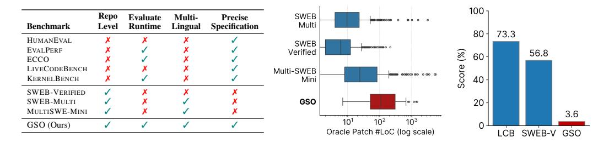
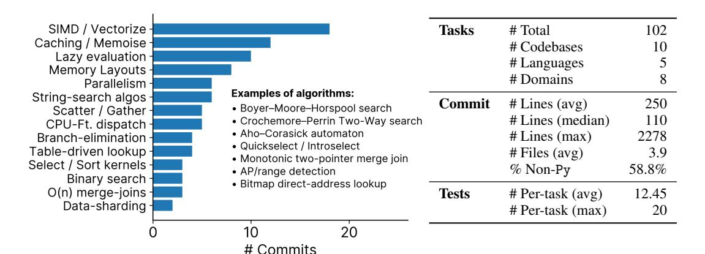
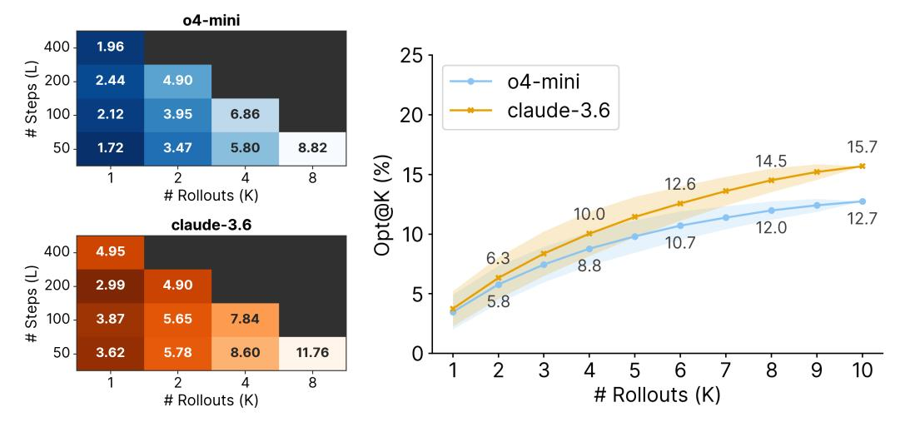
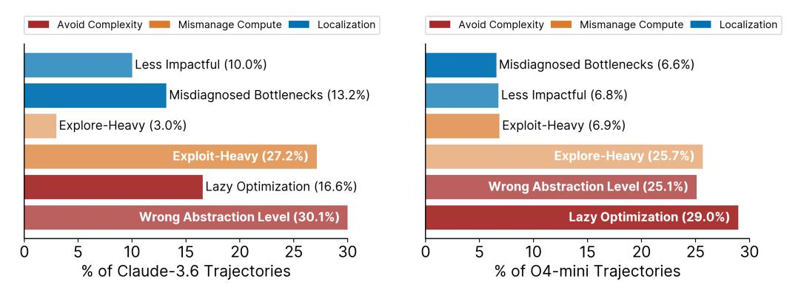
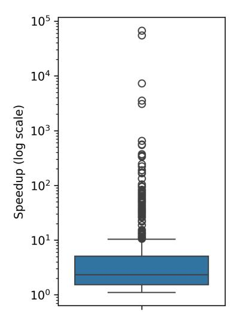
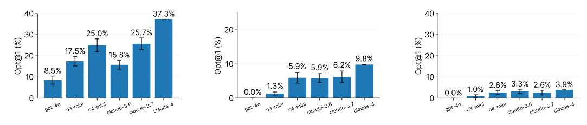
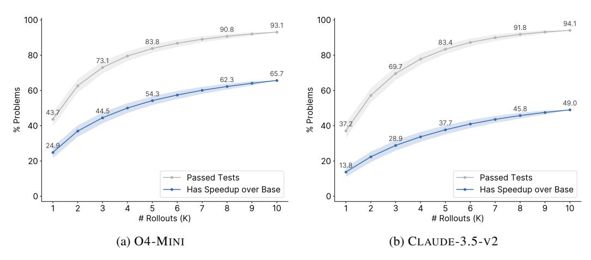

# GSO: Challenging Software Optimization Tasks for Evaluating SWE-Agents

Manish Shetty UC Berkeley Naman Jain UC Berkeley

Jinjian Liu UC Berkeley **Vijay Kethanaboyina** UC Berkeley **Koushik Sen** UC Berkeley

Ion Stoica
UC Berkeley

#### **Abstract**

Developing high-performance software is a complex task that requires specialized expertise. We introduce GSO, a benchmark for evaluating language models' capabilities in developing high-performance software. We develop an automated pipeline that generates and executes performance tests to analyze repository commit histories to identify 102 challenging optimization tasks across 10 codebases, spanning diverse domains and programming languages. An agent is provided with a codebase and performance test as a *precise specification*, and tasked to improve the runtime efficiency, which is measured against the expert developer optimization. Our quantitative evaluation reveals that leading SWE-Agents struggle significantly, achieving less than 5% success rate, with limited improvements even with inference-time scaling. Our qualitative analysis identifies key failure modes, including difficulties with low-level languages, practicing lazy optimization strategies, and challenges in accurately localizing bottlenecks. We release the code and artifacts of our benchmark along with agent trajectories to enable future research.

Website: https://gso-bench.github.io/

## 1 Introduction

> **[图片提取文字 (无描述)]:**
> "optimize C CodeBase **Generated Perf Test** SWE Agent Is the model patch llama\_cpp for this workload" correct and llm = Llama("qwen2-7b.gguf") llama\_cpp/ prompts = load("sharegpt.json") match or exceed examples/ def experiment(): human commit's setup.py Model Patch return llm(prompts) performance? def correct(ref, cur): src/ggml-cpu.c +80 -15 for r,c in zip(ref, cur): commit Reference Test ID Model assert r["toks"] = c["toks"] history Time Time src/ggml-impl.h +9-4 2.17s 2.94s Human Commit 218d361 2 🗸 1.9s 1.62s **⊕** LLM 3 🗸 Reference Patch 2.74s Faster IQ1 mul\_mat\_vec using BMI2 3.10s instructions (#12154) human commit src/ggml-cpu.c +216 -86 +216 -86 src/ggml-cpu.c serves as target src/cpu-quants.c +97 -12 optimization src/cpu-quants.c +97 -12


Figure 1: **An example GSO task.** We develop an automated pipeline that generates performance tests and analyzes repository commit history to identify real-world code optimization tasks. Each task consists of a codebase, performance tests, and the expert developer commit that serves as the performance target for the optimization problem. LLM-based SWE-Agents are then tasked with generating optimization patches using the performance test as a *precise specification* for the optimization problem. We evaluate the patches for both correctness and runtime efficiency, measuring whether they match or exceed the human expert optimization performance while ensuring equivalence.

<span id="page-1-1"></span><span id="page-1-0"></span>> **[图片提取文字 (无描述)]:**
> 100 -Repo SWEB Evaluate Multi-Precise Multi Benchmark Lingual Specification Runtime Level 80 -73.3 HUMANEVAL SWEB DOMINIO O EVAL PERF Verified (%) 56.8 60 **ECCO** Score LIVECODEBENCH Multi-SWEB m ececco eso o eso es KERNELBENCH Mini 40 -SWEB-VERIFIED 20 SWEB-MULTI GSO MULTISWE-MINI 3.6 102  $10^{3}$ GSO (Ours) Oracle Patch #LoC (log scale) SWEB-V GSO


Figure 2: **Benchmark Feature Comparison and Performance Gap.** Left: Depicting how GSO improves over existing benchmarks across key dimensions. Middle: Distribution of oracle LoC changes across benchmarks, showing GSO solutions require over 4-15x larger edits than existing benchmarks. Right: Performance comparison of O4-MINI across LCB (algorithmic puzzles), SWEBENCH-VERIFIED (repository-level bug-fixes), and GSO depicting the performance gap on optimization tasks.

High-performance software is critical for modern computing systems, from data analytics frameworks to machine learning infrastructure. Developing such systems demands specialized expertise in algorithmic optimization, hardware-aware programming, performance analysis, and reasoning across multiple layers of the software stack. The complexity of these tasks is evident in production-critical systems like VLLM [Kwon et al., 2023], HPC [Bradski, 2000], and VERL [Sheng et al., 2024], where teams dedicate substantial efforts to iterative and continuous maintenance over long development cycles. Simultaneously, SWE-Agents are gaining rapid traction in software development, demonstrating remarkable results on simple bug-fixing tasks [Jimenez et al., 2024]. This has also spurred excitement in adapting LLMs to aid in automating research tasks themselves, for example improving deep learning kernels [Ouyang et al., 2024]. In this work, we study the question – "Can LLM agents aid in the development of high-performance software?". To answer this, we introduce GSO, a benchmark for evaluating SWE-Agents on challenging software optimization tasks.

To create GSO, we develop an automated pipeline that generates performance tests and runs them across a repository's commit history to identify substantial optimizations discovered by expert developers. After careful manual curation, we extract 102 challenging tasks across 10 codebases, spanning diverse domains and languages including Python, C, and SIMD. Each task consists of a codebase,  $performance\ tests$  exercising real-world workloads, and a target optimization from expert developer commits. SWE-Agents receive a performance test as task specification and must produce an optimization patch that improves runtime efficiency while maintaining correctness. We evaluate these patches using our OPT@K metric, providing reliable assessment in a machine-agnostic manner. Rather than naively measuring machine-dependent speedups, we assess whether model-generated patches can consistently match or exceed the performance of human expert optimizations.

Our benchmark evaluates the capabilities needed for high-impact optimization work, tracking usefulness for real-world high-performance software development. Particularly, problems in GSO evaluate challenging systems engineering tasks, including optimizing Pandas operations, Pillow image or video processing operations (like GIF animation), and LLaMA-CPP model inference runtimes.

Code optimization uniquely bridges algorithmic reasoning and systems engineering, providing a challenging yet well-specified evaluation domain for LLM-based programming agents. Unlike bug-fixing SWE benchmarks that rely on potentially ambiguous natural language specifications [Aleithan et al., 2024], performance tests natively provide precise specifications for correctness and efficiency. Our tasks require substantial code changes, with gold-patches containing 4-15× more lines edited than previous benchmarks (Figure 2-middle). We evaluate leading LLMs on GSO using the state-of-the-art OPENHANDS agent framework [Wang et al., 2024b] (Section 3). Our evaluation reveals that most agents struggle with the benchmark, achieving less than 5% success rate measured by OPT@1, with test-time compute also providing only modest improvements (OPT@10 remaining around 15%).

To understand why SWE-Agents struggle with GSO, we perform a qualitative analysis of agent behavior and failure modes (Section 5). First, agents struggle with low-level languages, often avoiding them entirely or introducing fatal errors. Second, agents resort to superficial optimizations ("lazy optimizations") like compiler flag manipulation or input-specific fast-paths insertion, often making bizarre non-idiomatic code changes. Third, localization remains challenging - agents frequently misdiagnose the root cause of performance issues, leading to ineffective optimization attempts.

> **[图片提取文字 (无描述)]:**
> SIMD / Vectorize -Tasks 102 # Total Caching / Memoise -# Codebases 10 Lazy evaluation -# Languages Memory Layouts # Domains Parallelism -Examples of algorithms: String-search algos -Commit 250 # Lines (avg) Bover-Moore-Horspool search Scatter / Gather -· Crochemore-Perrin Two-Way search # Lines (median) 110 CPU-Ft. dispatch - Aho-Corasick automaton # Lines (max) 2278 Branch-elimination - Quickselect / Introselect Table-driven lookup # Files (avg) 3.9 Monotonic two-pointer merge join Select / Sort kernels -58.8% % Non-Py AP/range detection Binary search - Bitmap direct-address lookup O(n) merge-joins -Tests 12.45 # Per-task (avg) Data-sharding -# Per-task (max) 20 # Commits


Figure 3: Left. Popular optimization concepts and examples of algorithms used in ground-truth human commits for GSO tasks highlighting the algorithmic complexity of the tasks. Right. Summary statistics for GSO tasks, the groundtruth human commits, and the performance tests highlighting the repository-level nature of the tasks spanning diverse domains and languages.

The key contributions of this paper are: 1) An automated pipeline leveraging test-generation and execution information for generating software optimization tasks from real-world codebases, resulting in the GSO benchmark. 2) Evaluation of leading SWE-Agents on GSO, revealing a substantial performance gap in systems engineering tasks. 3) Qualitative analysis of agent behavior and failure modes with directions for future research. Given the substantial performance gap, we believe considerable progress in reasoning capabilities and SWE-Agents will be required to close the gap and hope GSO serves as a valuable resource for future LLM-based programming agent research.

# 2 GSO

Global Software Optimization (GSO) is a benchmark for evaluating SWE-Agent capabilities for aiding in high-performance software development. Each task consists of an initial codebase snapshot, performance tests measuring runtime and correctness, a build script for environment setup, and a reference human commit establishing the target performance threshold. The goal is to generate a patch that improves the performance of the codebase while maintaining functional correctness.

# 2.1 Task Formulation

Input. The agent receives the initial codebase, build script, and a performance test serving as input and is tasked with correctly improving the runtime on the given workload in a generalizable manner.

Output. The agent produces a unified patch that implements the required performance improvements.

Evaluation. We apply the generated patch and execute all associated performance tests. Success requires that the patch (1) applies cleanly, (2) passes all correctness checks, and (3) matches or exceeds the target human commit's performance.

#### <span id="page-2-0"></span>2.2 Benchmark Construction

Unlike prior benchmarks that rely on manually written issues and test cases, we develop an automated pipeline to construct GSO tasks from GITHUB repositories. Our key insight is that software optimization problems can be identified by executing tests across commit boundaries and measuring performance improvements with minimal human curation. Therefore, we use LLMS to identify performance-related commits, generate performance tests, and execute them to identify optimization tasks. Particularly, we use the following two-stage pipeline:

Stage I: Identifying Performance Improving Commits. We scan popular open-source GITHUB repositories using an LLM-based judge with code-change heuristics to identify performance-related commits. For each candidate, we extract context including relevant files, commit messages, linked <span id="page-3-0"></span>issues, pull requests, and endpoints exercising the affected code. This efficient filtering process handles large commit volumes while gathering the rich context needed for test generation.

**Stage II: Generating and Executing Performance Tests.** We generate performance tests via execution-based rejection sampling using an LLM prompted with the commit context. Tests exercise the codebase with real-world workloads, e.g., generating completions from qwen-7b for the sharegpt dataset using llama-cpp. They measure runtime, and verify equivalence between the pre- and post-commit codebase states via assertions on the outputs. We retain commits showing significant performance improvements across multiple test cases. See Appendix C.1 for further details.

**Final Curation.** We perform a careful manual review of the automatically collected candidates to ensure the benchmark's quality and diversity. We remove instances with weak tests or reproducibility issues, selecting problems spanning various optimization techniques, difficulty levels, and application domains. Additional curation details and examples of generated tests are in Sections C.2 and C.3.

## 2.3 Designing $OPT_p@K$ Metric

Evaluating code optimization presents unique aggregation challenges absent in traditional code generation benchmarks. Existing metrics fail to handle two critical issues: (1) different tasks have varying baseline performance levels, making cross-task comparison and aggregation difficult, and (2) within tasks, tests with disparate speedup magnitudes can considerably skew aggregate metrics.

**Robust Speedup Calculation.** Prior work aggregates per-test speedups using geometric mean, but this approach is vulnerable to outliers. A model achieving speedups of [0.1,1000] across two tests yields a geometric mean of 10, despite degrading performance on one test. In Section 5, we show that agents indeed perform such optimizations and thus can "game" the geometric mean. Drawing from systems optimization literature [Jacob and Mudge, 1995], we compute speedup using the harmonic mean of individual test speedups which is more robust to extreme positive outliers. Let  $s_i = \frac{T(C_1,i)}{T(C_2,i)}$  denote the speedup on test i, where  $C_1$  and  $C_2$  represent two codebase states and T(C,i) denotes runtime on test i. We then define the overall speedup as the harmonic mean:

$$S(C_1, C_2) = \frac{n}{\sum_{i=1}^{n} \frac{1}{s_i}} = \frac{n}{\sum_{i=1}^{n} \frac{T(C_2, i)}{T(C_1, i)}}$$

We discuss these characteristics of our metric and other potential metrics in Section E.

Relative Performance Evaluation. To enable cross-task comparison, we evaluate model patches against human-authored optimization targets rather than absolute speedups against the original codebase. For each task, we measure whether the model achieves performance comparable to expert developers. Thus, we measure the speedup against the human target as  $S(C_h, C_a)$ , where  $C_h$  is the codebase state from the human target optimization and  $C_a$  is the codebase after applying the model's patch. For each task, we define success using both performance and correctness criteria:

$$\mathrm{OPT}_p = \begin{cases} \mathrm{true}, & \text{if } S(C_h, C_a) \geq p \text{ and } \mathrm{correct}(C_a) \\ \mathrm{false}, & \text{otherwise} \end{cases}$$

The first criterion ensures that the model's patch achieves at least p fraction of the human speedup. The second criterion (correct $(C_m)$ ) ensures functional equivalence through test assertions.

**Final Metric Definition.** We compute  $Opt_p@K$  as the fraction of tasks where at least one successful solution exists among K attempts:

$$\mathrm{Opt}_p@K = \frac{1}{N}\sum_{i=1}^N\mathbb{1}(\exists k \in [K]:\mathrm{Opt}_p)$$

We estimate confidence intervals following established methods for pass@K metrics [Chen et al., 2021, Lightman et al., 2023]. Our  $OPT_p@K$  metric provides machine-independent assessment by comparing against human baselines rather than absolute speedups. While raw speedups vary

<span id="page-4-3"></span>significantly across machines (Section [D\)](#page-18-1), the relative evaluation ensures consistent assessment across different hardware configurations. Finally, we denote OPT@K as the OPT0.95@K metric that uses a 95% threshold for evaluating success against the human target.

## <span id="page-4-2"></span>2.4 Distinctive Features of GSO

Precise task specification. GITHUB issues provide ambiguous specifications, especially for complex software engineering tasks [\[Aleithan et al.,](#page-10-1) [2024\]](#page-10-1). GSO employs performance tests as specifications that unambiguously define optimization targets, enabling rigorous evaluation.

Unifying algorithmic coding with real-world SWE. Code LLM research is divided across isolated but algorithmically-focused benchmarks, and simple bug-fixing based SWE benchmarks. GSO bridges these two domains by integrating algorithmic challenges with real-world software tasks.

Diverse tasks spanning system boundaries. ≈60% of tasks demand non-Python modifications across five programming languages, reflecting production environments where performance-critical components leverage systems languages beneath high-level interfaces (Figure [2-](#page-1-0)right).

Challenging tasks via strong human targets. Each task centers on human-authored commits averaging 108 lines, establishing demanding optimization targets requiring sophisticated code comprehension and algorithmic reasoning. Figure [9a](#page-15-2) shows the LoC distribution for our target commits.

Unbounded performance measurement. Software optimization inherently enables unbounded performance improvements through identification of previously unexplored bottlenecks. Speedups thus serve as a critical secondary metric for quantifying exceptional performance beyond human optimization targets. Since task-specific factors can skew raw speedup metrics, we establish OPT@K as our primary metric while providing comprehensive speedup analysis in the appendix.

Evading contamination. Contamination represents a fundamental concern for agent benchmarks, particularly with real-world codebases potentially present in pretraining data. Our speedup metric provides a continuous signal that systematically detects potential contamination between human and model patches. We posit that models substantially outperforming human-written patches demonstrate generalization capabilities and thus can transcend contamination concerns.

# <span id="page-4-0"></span>3 Evaluation Setup

Machine Configuration. We use Docker to containerize the task environment for each task in GSO. The initial codebase is cloned and installed into a local environement in the container before providing it to the agent. All tasks are run on a single Google Cloud n2-standard-64 VM (64 vCPUs, 256 GB Memory). While raw speedups may vary across machines, we empirically find that measuring OPT@K is resilient to machine variations, provided each task gets sufficent resources (Section [D\)](#page-18-1)

Agent Scaffold. We use OPENHANDS [\[Wang et al.,](#page-12-2) [2024b\]](#page-12-2) (CodeActAgent-v0.35.0), as our common agent scaffold for all models and experiments. The scaffold provides access to a file-editor tool and a bash terminal tool to the agent to perform code changes and execute commands. To support lengthy and frequent codebase rebuilds (in the case of C or C++ code changes), we configure the agent with a 3-hour time limit per task and a 20-minute timeout per step. Our task-specific prompt instructs the agent to optimize the runtime of the specification performance test and also contains the build and test commands. See Appendix [G.1](#page-21-0) for the complete agent prompts and details.

Models. We evaluate GPT-4O, O3-MINI, O4-MINI, and the SONNET version of CLAUDE-3.5-V2 (referred as CLAUDE-3.6), CLAUDE-3.7, and CLAUDE-4.0. Our experiments focus on two settings: OPT@1 (Section [4.1\)](#page-4-1) and inference-time scaling (Section [4.2\)](#page-5-0). For OPT@1, we sample 3 rollouts (trajectories) at temperature T = 0.1. For inference-time scaling (Section [4.2\)](#page-5-0), we limit our evaluations to O4-MINI and CLAUDE-3.5-V2 due to API rate limits and high cost and sample rollouts at temperature T = 0.8.

# 4 Experiments & Results

# <span id="page-4-1"></span>4.1 OPT@1

Figure [4-](#page-5-1)left shows consistently poor OPT@1 performance across agents based on all models, confirming software optimization as a significant challenge for current SWE-Agents. Even the best

<span id="page-5-3"></span><span id="page-5-1"></span>> **[图片提取文字 (无描述)]:**
> 20 Opt@1 (%) 10 3.6% 4.6% 3.8% 4.9% 1.3% 0.0% claude-3.6 claude-4 gpt-40 o3-mini o4-mini


> **[图片提取文字 (无描述)]:**
> 80 Claude-4 Claude-3.6 60 o4-mini  $\mathsf{Opt}_{\rho}@1$ 40 20 0.0 0.1 0.2 0.3 0.6 0.8 0.9 1.0 0.4 0.5 0.7 Speedup Threshold (p)


Figure 4: OPT@1 performance. (a) Left: OPT@1 (speedup threshold p set to 0.95) across models, with all models achieving less than 5% success (b) Right: OPTp@1 indicating portion of problems where model patches match p fraction of human commit's performance. We find that strongest performing models remain strong throughout, with the success rates reducing as it becomes more challenging to match human-level performance.

<span id="page-5-2"></span>> **[图片提取文字 (无描述)]:**
> o4-mini 400 -1.96 25 # Steps (L) o4-mini 200 2.44 4.90 claude-3.6 20 100 -2.12 3.95 6.86 15.7 50 -1.72 3.47 5.80 8.82 14.5 Opt@K (%) 15 2 8 12.6 # Rollouts (K) 10.0 12.7 claude-3.6 12.0 10 10.7 400 -4.95 6.3 8.8 # Steps (L) 2.99 4.90 5 5.8 5.65 3.87 7.84 3.62 0 50 -5.78 8.60 11.76 10 8 9 6 8 2 # Rollouts (K) # Rollouts (K)


Figure 5: Scaling test-time compute for O4-MINI and CLAUDE-3.5-V2. (a) Left: OPT@K performance as a function of inference steps (L) and parallel rollouts (K), showing parallel compute scales more efficiently than serial compute. (b) Right: OPT@K performance with increasing rollouts, improving to 15% with diminishing returns beyond eight rollouts.

performing model, CLAUDE-4.0, achieves less than 5% success, while GPT-4O fails completely at 0.0%. These results demonstrate that success on SWE-Bench-like benchmarks does not transfer to more-challenging real-world tasks like software optimization requiring both algorithmic reasoning and engineering expertise.

We next vary p in OPTp@1 (Figure [4-](#page-5-1)right). Recall that OPTp@1 evaluates whether the agent's patch is able to match p fraction of the human commit's performance. Thus p = 0 evaluates whether the agent's patch is correct, regardless of its performance, while p = 1 evaluates whether the agent's patch is identical to the human commit, increasing in difficulty. We find that OPT0@1 performances shows considerably more variation with CLAUDE-4.0 achieving 70% OPT0@1 while O4-MINI achieves 45%. We also find that the trend stays the strongest performing model, but the gap compresses as p increases, indicating challenges in matching human-level performance.

## <span id="page-5-0"></span>4.2 Scaling Inference-time Compute

Drawing inspiration from [\[Olausson et al.,](#page-12-3) [2023\]](#page-12-3), we examine two dimensions of test-time compute scaling: (1) sampling multiple trajectories and picking the best (referred to as parallel compute) and (2) allowing more steps per trajectory (referred to as serial compute).

Scaling serial vs parallel compute. In Figure [5-](#page-5-2)left, we analyze steps scaling from 50 to 400 with different numbers of rollouts between 1 and 8. Results show parallel compute scales more efficiently than serial compute. With only 50 steps, 8 rollouts yields higher performance (8.82 for O4-MINI

<span id="page-6-2"></span><span id="page-6-1"></span>> **[图片提取文字 (无描述)]:**
> Avoid Complexity Mismanage Compute Localization Avoid Complexity Mismanage Compute Localization Less Impactful (10.0%) Misdiagnosed Bottlenecks (6.6%) Misdiagnosed Bottlenecks (13.2%) Less Impactful (6.8%) Explore-Heavy (3.0%) Exploit-Heavy (6.9%) Exploit-Heavy (27.2%) Explore-Heavy (25.7%) Lazy Optimization (16.6%) Wrong Abstraction Level (25.1%) Wrong Abstraction Level (30.1%) Lazy Optimization (29.0%) 10 15 20 25 30 20 25 30 % of Claude-3.6 Trajectories % of O4-mini Trajectories


Figure 7: Qualitative analysis of agents. Model failures are classified into three high-level categories: (1) Localization: misidentifying code regions or opportunities for optimization, (2) Mismanage Compute: battling explore-exploit tradeoffs, and (3) Avoid Complexity: challenges with low-level code changes. Left: CLAUDE-3.5-V2 shows an exploit-heavy behaviour, making massive code changes with lesser exploration of the codebase. It also attempts deeper changes but fails to localize bottlenecks and changes to the right abstraction level. Right: O4-MINI in contrast is explore-heavy, avoids low-level code, and makes "lazy" optimizations like spurious compiler flag modifications.

and 11.76 for CLAUDE-3.5-V2) than 400 steps with a single rollout (1.96 for O4-MINI and 4.95 for CLAUDE-3.5-V2). This indicates increased sample diversity across trajectories can effectively compensate for reduced step counts, providing insights for optimal inference-time compute allocation.

Low OPT@10 performance. Building on these findings, we further examine performance with extended parallel compute. Figure [5-](#page-5-2)right demonstrates both models gain performance with additional rollouts, with OPT@K increasing from under 4% to over 12% with 8 rollouts. Despite these improvements, OPT@10 performance remains modest (under 20%) for both models with diminishing returns, indicating fundamental limitations in current SWE-Agents.

## 4.3 Performance with Ground-Truth Plans

Beyond engineering, solving GSO requires identifying bottlenecks and planning optimization strategies over a long horizon. Inspired by prior work on "backtranslation" guided reasoning [\[Li et al.,](#page-11-3) [2023,](#page-11-3) [Wang et al.,](#page-12-4) [2024a,](#page-12-4) [Pham et al.,](#page-12-5) [2021,](#page-12-5) [Sen](#page-12-6)[nrich et al.,](#page-12-6) [2015\]](#page-12-6), we assess the impact of guided reasoning by prompting O4-MINI with descriptive backtranslated plans of ground-truth optimizations. We provide O4-MINI with the groundtruth diff and sample 5 plans describing the optimization strategy and specific file-localized changes. Section [H](#page-21-1) details the prompt and example plans.

We observe that prompting agents with backtranslated plans improves performance suggesting that high-level plans aid in matching human-level performance. However, OPT@1 only reaches 5.7%

> **[图片提取文字 (无描述)]:**
> 25 Opt@K w/ gt plan 20 Opt@K w/o gt plan 18.6% 16.4% Opt@K (%) 13.7% 15 10.1% 10 9.9% 8.8% 5.7% 7.5% 5 5.8% 3.5% # Rollouts (K)


Figure 6: O4-MINI performance with and without backtranslated ground-truth plans describing the human commit's optimization strategy.

and OPT@5 improves by just 9% with these plans. So while strategic planning and reasoning helps, implementing low-level system changes remains challenging for current models.

# <span id="page-6-0"></span>5 Qualitative Analysis of Agent Behavior

We use an LLM-aided pipeline (details in Section [I\)](#page-24-0) to qualitatively analyze agent behavior and failure modes. We categorize the failures as (1) challenges with low-level code, (2) compute management issues, and (3) localization errors.

## 5.1 Agents Struggle with Low-Level Code Changes

Poor performance on low-level problems. We identify sharp declines in agent performance as language complexity increases. Models perform best with high-level languages, with O4-MINI achieving 21% on Python tasks. Performance drops drastically to 4% when Cython, C and C++, etc. are involved.

| Subset           | OPT@10 |
|------------------|--------|
| Py only (42)     | 21.4%  |
| non-Py only (60) | 4.0%   |

## Modifications at the wrong abstraction level.

Production codebases have a hierarchy of abstraction levels, from high-level APIs to lowlevel implementations, with each layer encapsulating complexity beneath it. Our analysis reveals that operating at inappropriate abstraction levels contributes to 25-30% of agent failures. However, interestingly, models exhibit opposite but equally problematic approaches. Figure [8](#page-7-0) shows that O4-MINI avoids making changes to the C/C++ files 40% of the times even when it was necessary based on the human optimization commit. CLAUDE-3.5-V2 on the other hand surprisingly makes unnecessary lowlevel C changes (9.2%) when even the human optimization commit was Python-only!

<span id="page-7-0"></span>> **[图片提取文字 (无描述)]:**
> 9.2 10.3 ру 6.9 22.1 4.6 рух 19.1 cpp 16.1 ру 11.5 14.7 cpp h 10.3 pyi 4.4 pyi 5.7 рух Added 2.9 ру Omitted 10 15 20 15 20 % O4-mini Patches % Claude-3.6 Patches


Figure 8: File extensions modified in model patches, indicating additions or omissions relative to the reference human commit.

In Example [F.1,](#page-25-0) O4-MINI attempted to optimize NumPy's np.subtract.at function. NumPy conceptually implements this in a layer below the Python API called ufunc (universal function) written in C. While the model scrolled through these C files, it decided to not make changes there and instead tried to override it with a Python function, completely avoiding the required deeper change.

Fundamental errors in low-level programming. Beyond selecting incorrect abstraction levels, agents also struggle with fundamental low-level programming concepts. In Example [F.2,](#page-26-0) CLAUDE-3.5-V2 incorrectly modified Pillow's SIMD pointer arithmetic, causing segmentation faults.

## 5.2 Agents Favor Lazy Optimizations

Optimization Minimalism: The Path of Least Resistance. Agents consistently favor trivial code changes to meet performance targets rather than investigating and implementing more substantial improvements. O4-MINI exhibits this behavior in nearly 30% of trajectories (Figure [7\)](#page-6-1), with patch sizes significantly smaller than human-written optimizations. In fact, in over 60% of incorrect trajectories, the agent made ≤ 15% of the edits compared to the corresponding human developer commit, as shown in Section [F.2.](#page-19-0)

Spurious compiler-flag twiddling. In Example [F.3,](#page-27-0) CLAUDE-3.5-V2 attempted to optimize Pillow's SIMD implementation by simply adding −O3 compiler flags. This approach is ineffective since the Pillow project already uses optimized builds by default. This pattern appears across many agent trajectories, revealing a fundamental misunderstanding of real-world project configurations.

Input-specific fast paths. Agents frequently implement narrow optimizations targeting only the specific input patterns present in given performance test. In Example [F.4,](#page-28-0) O4-MINI created a specialized fast path for NumPy's ljust API that only handled "matching-shaped" input arrays. Our test suite identifies these narrow optimizations as failures due to their poor generalization properties.

Bizarre overrides in \_\_init\_\_.py. A recurring pattern in O4-MINI trajectories is modifying \_\_init\_\_.py files to override functions instead of making core improvements. These overrides typically implement input-specific optimizations in a non-idiomatic manner, as shown below:

```
# __init__.py
_orig_strftime = _PeriodCls.strftime
def _fast_strftime(self, fmt):
    if fmt is None and getattr(self, "freqstr", None) == "M":
        return f"{y:04d}-{m:02d}" # Fast path for default monthly formatting
    return _orig_strftime(self, fmt)
```

See examples and analysis for this behavioral pattern in Example [F.5](#page-29-0) and Example [F.6.](#page-30-0)

#### <span id="page-8-0"></span>5.3 Agents Mismanage Compute

Underutilize available compute. First, we find that agents often underutilize their available compute budget. We observe this quantitatively in our inference-time scaling experiments (Section [4.2\)](#page-5-0), where we increased the number of available agent steps. Even with larger budgets of 200+ steps, 75% of trajectories terminate before 100 steps! This again underscores the lazy behavior discussed earlier and highlights the need for better agent scaffolding and model improvements to optimally use compute.

Imbalance in exploration and exploitation. Figure [7](#page-6-1) reveals a dichotomy in exploration-exploitation behaviours. O4-MINI trajectories are rated as explore-heavy meaning they spend most of their steps examining the codebase without converging on actionable optimizations. On the other hand, CLAUDE-3.5-V2 trajectories are rated as exploit-heavy, meaning they commit to solutions with insufficient exploration of alternatives, and eagerly make tons of code changes. This also indicates a promising research direction to improve agent performance by leveraging the strengths of the two models.

## 5.4 Agents Misdiagnose Optimizations

Misidentify bottlenecks and solutions. Agents misdiagnose performance bottlenecks, implementing ineffective optimizations. In Example [F.7,](#page-31-0) CLAUDE-3.5-V2 attempted to parallelize NumPy's char.count API, ignoring Python's GIL and process startup overhead, resulting in worse performance. After multiple failures, the model concluded: "*For this specific use case, numpy's string operations are already highly optimized, stick with the original implementation.*"

#### 5.5 Analyzing Model Successes

Section [4.2](#page-5-0) shows the with increasing test-time compute, SWE-Agents can solve a small fraction of the tasks. Here, we analyze the characteristics of the tasks that SWE-Agents can solve. We find that agent solutions vary significantly in sophistication, ranging from simple but effective changes to genuinely impressive algorithmic improvements.

Some successful optimizations are less impressive when compared to what humans achieved on the same problems. In Example [F.8,](#page-32-0) O4-MINI added a fast path for writing data when network streams are idle, avoiding unnecessary buffering. But the human developer completely redesigned the entire buffering system with a much more sophisticated approach. In Example [F.9,](#page-33-0) CLAUDE-3.5-V2 optimized database-style lookups using bit-combining. The human solution was more comprehensive, upgrading the underlying search algorithms across the entire codebase. In Example [F.10,](#page-34-0) O4-MINI improved sorting by working directly with integer codes instead of string values. However, the human approach was cleaner, refactoring shared utilities that benefited multiple sorting operations.

However, agents can also implement sophisticated optimizations that outperform human solutions. O4- MINI completely rewrote image file parsing to read only essential metadata instead of decompressing entire frames, reducing algorithmic complexity from O(n²) to O(n) (Example [F.11\)](#page-35-0). The human developer only made a simple check, while the agent delivered a fundamentally superior approach. CLAUDE-3.5-V2 eliminated memory waste by calculating exact allocation sizes upfront instead of repeatedly resizing arrays (Example [F.12\)](#page-36-0). The human solution still used dynamic resizing, just with better growth patterns, while the agent eliminated resizing entirely.

# 6 Related Work

Code LLM Benchmarks. Initial code generation benchmarks like HumanEval [\[Chen et al.,](#page-10-3) [2021,](#page-10-3) [Liu et al.,](#page-11-4) [2023\]](#page-11-4) and MBPP [\[Austin et al.,](#page-10-4) [2021\]](#page-10-4) focused on isolated small programs with simple specifications. These benchmarks have since evolved to evaluate LLMs across multiple languages (MultiPL-E [\[Cassano et al.,](#page-10-5) [2022\]](#page-10-5)), Data Science (DS-1000 [Lai et al.](#page-11-5) [\[2023\]](#page-11-5)), Arcade [\[Yin et al.,](#page-12-7) [2022\]](#page-12-7)), API usage (Jigsaw [\[Jain et al.\]](#page-10-6), ODEX [\[Wang et al.,](#page-12-8) [2022\]](#page-12-8), BigCodeBench [\[Zhuo et al.,](#page-13-0) [2024\]](#page-13-0)), and more complex algorithmic tasks in competitive programming (LiveCodeBench [\[Jain](#page-10-7) [et al.,](#page-10-7) [2024b\]](#page-10-7), APPS [\[Hendrycks et al.,](#page-10-8) [2021\]](#page-10-8), CodeContests [\[Li et al.,](#page-11-6) [2022\]](#page-11-6), XCodeEval [\[Khan](#page-11-7) [et al.,](#page-11-7) [2023\]](#page-11-7), CodeScope [\[Yan et al.,](#page-12-9) [2023\]](#page-12-9)). However, these benchmarks remain focused on isolated puzzle-solving tasks rather focusing on only code correctness and not performance optimization.

<span id="page-9-0"></span>Performance Evaluation. Various works have introduced benchmarks to evaluate the performance capabilities of LLMS. EvalPerf [\[Liu et al.,](#page-11-8) [2024\]](#page-11-8) and EffiBench [\[Huang et al.,](#page-10-9) [2024\]](#page-10-9) assess runtime efficiency of code generated from natural language specifications on HumanEval and LeetCode tasks. In contrast, PIE [\[Madaan et al.,](#page-11-9) [2023\]](#page-11-9), ECCO [\[Waghjale et al.,](#page-12-10) [2024\]](#page-12-10), and NoFunEval [\[Singhal](#page-12-11) [et al.,](#page-12-11) [2024\]](#page-12-11) focus on code optimization capabilities, where models improve existing programs while maintaining functional equivalence. [Chambon et al.](#page-10-10) [\[2025\]](#page-10-10) studies code complexity guided code generation. These benchmarks employ different approaches to reliably measure program runtimes. PIE simulates hardware-level runtime for C++ programs while EvalPerf employs hardware counters for precise performance measurement. While providing reliability, these approaches unfortunatly do not scale to larger codebases considered in our work. Other works [\[Coignion et al.,](#page-10-11) [2024,](#page-10-11) [Niu](#page-12-12) [et al.,](#page-12-12) [2024\]](#page-12-12) utilize LeetCode's execution environment to evaluate LLM-generated code performance adding unwarranted dependence on external services. ECCO, similar to our approach, leverages cloud computing environments to ensure consistent benchmarking.

Repo-Level SWE-Agent Benchmarks. SWE-Bench [\[Jimenez et al.,](#page-11-1) [2024\]](#page-11-1) evaluates issue resolution in open-source repositories. Extensions include multi-modal capabilities [\[Yang et al.,](#page-12-13) [2024\]](#page-12-13) and multi-lingual capabilities [\[Zan et al.,](#page-12-14) [2025,](#page-12-14) [Kabir et al.,](#page-11-10) [2024\]](#page-11-10). SWE-Lancer [\[Miserendino et al.,](#page-11-11) [2025\]](#page-11-11) evaluates agent performance on varied JavaScript coding tasks collected from Upwork. Specialized benchmarks address test generation [\[Jain et al.,](#page-10-12) [2024a,](#page-10-12) [Ahmed et al.,](#page-10-13) [2024\]](#page-10-13) and bug-localization [\[Chen](#page-10-14) [et al.,](#page-10-14) [2025\]](#page-10-14). [Zhao et al.](#page-13-1) [\[2024\]](#page-13-1) proposed Commit-0 for library generation from scratch while [Jain](#page-11-12) [et al.](#page-11-12) [\[2024c,](#page-11-12) [2025\]](#page-11-13), [Xie et al.](#page-12-15) [\[2024,](#page-12-15) [2025\]](#page-12-16) propose frameoworks for function level code generation. These benchmarks do not study performance optimization, the focus of our work.

Recently, using LLMS to generate code has been receiving considerable attention, with hopes of automating AI research and development. Particularly, KernelBench [\[Ouyang et al.,](#page-12-1) [2024\]](#page-12-1) and METR-KernelEngineering [\[METR,](#page-11-14) [2025\]](#page-11-14) are two benchmarks that evaluate the performance of LLMS in generating performant code for kernel engineering. While they focus on a specific domain of kernel engineering, we explore sofware optimization capabilities of LLMS across domains.

# 7 Limitations and Conclusion

Benchmark Size. Our benchmark contains 102 software optimization tasks, which may introduce variance in results due to its limited size. Nevertheless, each task represents a challenging real-world optimization problem, making successful completion a strong indicator of model capabilities for high-performance software development. We will consider expanding the benchmark based on community feedback, identifying additional representative tasks.

Hacky Optimizations. Reward hacking plagues software agent benchmarks [\[Gu et al.,](#page-10-15) [2025\]](#page-10-15) with agents circumventing test cases in unintended ways [\[Lange et al.,](#page-11-15) [2025\]](#page-11-15). As noted in Section [5,](#page-6-0) models already attempt to overfit tests and produce non-idiomatic code. Our precise task specifications and test suite currently detect such issues, but monitoring these behaviors remains critical for future work, and we recommend community efforts to develop mitigation approaches.

Evaluation Beyond Speedup. Our work focuses on improving the runtime performance of the code, but practical software development also requires other metrics such as memory usage, maintainability, and idiomaticity. For example, optimization often requires trade-offs between different metrics, which are not captured by our speedup metric. Unfortunately, automated evaluation of these properties is challenging, and we hope to tackle these challenges in future work.

Contamination. The current low performance suggests contamination is not a risk for existing LLMS despite our tasks being collected from GitHub repositories. Additionally, as discussed in Section [2.4,](#page-4-2) our continuous speedup metric helps detect contamination, as agent solutions that exceed human performance demonstrate generalization beyond mere memorization.

Conclusion. We present GSO, a benchmark for evaluating LLMS in aiding the development of high-performance software. Our quantitative results demonstrate that current LLMS fall short in this domain and our qualitative analysis identifies various failure modes. We hope GSO can serve as a valuable resource for future works in this direction in building more capable SWE-Agents, including improvements to both the model and the agent scaffold.

# Acknowledgement

Manish Shetty and Naman Jain are supported by NSF grants CCF:1900968, CCF:1908870, and SKY Lab industry sponsors and affiliates. This work is also supported by the R2E OpenPhilanthropy grant.

We also thank Sida Wang, Alex Gu, Wen-Ding Li, and Theo Olausson for helpful discussions and feedback on this work.

# References

- <span id="page-10-13"></span>T. Ahmed, M. Hirzel, R. Pan, A. Shinnar, and S. Sinha. Tdd-bench verified: Can llms generate tests for issues before they get resolved? *arXiv preprint arXiv:2412.02883*, 2024. [10](#page-9-0)
- <span id="page-10-1"></span>R. Aleithan, H. Xue, M. M. Mohajer, E. Nnorom, G. Uddin, and S. Wang. Swe-bench+: Enhanced coding benchmark for llms. *arXiv preprint arXiv:2410.06992*, 2024. [2,](#page-1-1) [5](#page-4-3)
- <span id="page-10-4"></span>J. Austin, A. Odena, M. Nye, M. Bosma, H. Michalewski, D. Dohan, E. Jiang, C. Cai, M. Terry, Q. Le, et al. Program synthesis with large language models. *arXiv preprint arXiv:2108.07732*, 2021. [9](#page-8-0)
- <span id="page-10-0"></span>G. Bradski. The OpenCV Library. *Dr. Dobb's Journal of Software Tools*, 2000. [2](#page-1-1)
- <span id="page-10-5"></span>F. Cassano, J. Gouwar, D. Nguyen, S. Nguyen, L. Phipps-Costin, D. Pinckney, M.-H. Yee, Y. Zi, C. J. Anderson, M. Q. Feldman, et al. Multipl-e: A scalable and extensible approach to benchmarking neural code generation. *arXiv preprint arXiv:2208.08227*, 2022. [9](#page-8-0)
- <span id="page-10-10"></span>P. Chambon, B. Roziere, B. Sagot, and G. Synnaeve. Bigo (bench)–can llms generate code with controlled time and space complexity? *arXiv preprint arXiv:2503.15242*, 2025. [10](#page-9-0)
- <span id="page-10-3"></span>M. Chen, J. Tworek, H. Jun, Q. Yuan, H. P. D. O. Pinto, J. Kaplan, H. Edwards, Y. Burda, N. Joseph, G. Brockman, et al. Evaluating large language models trained on code. *arXiv preprint arXiv:2107.03374*, 2021. [4,](#page-3-0) [9](#page-8-0)
- <span id="page-10-14"></span>Z. Chen, X. Tang, G. Deng, F. Wu, J. Wu, Z. Jiang, V. Prasanna, A. Cohan, and X. Wang. Locagent: Graph-guided llm agents for code localization. *arXiv preprint arXiv:2503.09089*, 2025. [10](#page-9-0)
- <span id="page-10-11"></span>T. Coignion, C. Quinton, and R. Rouvoy. A performance study of llm-generated code on leetcode. In *Proceedings of the 28th International Conference on Evaluation and Assessment in Software Engineering*, pages 79–89, 2024. [10](#page-9-0)
- <span id="page-10-15"></span>A. Gu, N. Jain, W.-D. Li, M. Shetty, Y. Shao, Z. Li, D. Yang, K. Ellis, K. Sen, and A. Solar-Lezama. Challenges and paths towards ai for software engineering. *arXiv preprint arXiv:2503.22625*, 2025. [10](#page-9-0)
- <span id="page-10-8"></span>D. Hendrycks, S. Basart, S. Kadavath, M. Mazeika, A. Arora, E. Guo, C. Burns, S. Puranik, H. He, D. Song, and J. Steinhardt. Measuring coding challenge competence with apps. *NeurIPS*, 2021. [9](#page-8-0)
- <span id="page-10-9"></span>D. Huang, Y. Qing, W. Shang, H. Cui, and J. Zhang. Effibench: Benchmarking the efficiency of automatically generated code. *Advances in Neural Information Processing Systems*, 37:11506– 11544, 2024. [10](#page-9-0)
- <span id="page-10-2"></span>B. Jacob and T. N. Mudge. *Notes on calculating computer performance*. University of Michigan, Computer Science and Engineering Division . . . , 1995. [4](#page-3-0)
- <span id="page-10-12"></span>K. Jain, G. Synnaeve, and B. Rozière. Testgeneval: A real world unit test generation and test completion benchmark. *arXiv preprint arXiv:2410.00752*, 2024a. [10](#page-9-0)
- <span id="page-10-6"></span>N. Jain, S. Vaidyanath, A. Iyer, N. Natarajan, S. Parthasarathy, S. Rajamani, and R. Sharma. Jigsaw: Large language models meet program synthesis. In *ICSE 2022*. [9](#page-8-0)
- <span id="page-10-7"></span>N. Jain, K. Han, A. Gu, W.-D. Li, F. Yan, T. Zhang, S. Wang, A. Solar-Lezama, K. Sen, and I. Stoica. Livecodebench: Holistic and contamination free evaluation of large language models for code. *arXiv preprint arXiv:2403.07974*, 2024b. [9](#page-8-0)

- <span id="page-11-12"></span>N. Jain, M. Shetty, T. Zhang, K. Han, K. Sen, and I. Stoica. R2e: Turning any github repository into a programming agent environment. In *ICML 2024*, 2024c. [10](#page-9-0)
- <span id="page-11-13"></span>N. Jain, J. Singh, M. Shetty, L. Zheng, K. Sen, and I. Stoica. R2e-gym: Procedural environments and hybrid verifiers for scaling open-weights swe agents, 2025. URL [https://arxiv.org/abs/](https://arxiv.org/abs/2504.07164) [2504.07164](https://arxiv.org/abs/2504.07164). [10](#page-9-0)
- <span id="page-11-1"></span>C. E. Jimenez, J. Yang, A. Wettig, S. Yao, K. Pei, O. Press, and K. R. Narasimhan. SWE-bench: Can language models resolve real-world github issues? In *The Twelfth International Conference on Learning Representations*, 2024. URL <https://openreview.net/forum?id=VTF8yNQM66>. [2,](#page-1-1) [10](#page-9-0)
- <span id="page-11-10"></span>K. Kabir, J. Yang, C. E. Jimenez, et al. Swe-bench multilingual. [https://kabirk.com/](https://kabirk.com/multilingual) [multilingual](https://kabirk.com/multilingual), 2024. Accessed: May 2024. [10](#page-9-0)
- <span id="page-11-7"></span>M. A. M. Khan, M. S. Bari, X. L. Do, W. Wang, M. R. Parvez, and S. Joty. xcodeeval: A large scale multilingual multitask benchmark for code understanding, generation, translation and retrieval. *arXiv preprint arXiv:2303.03004*, 2023. [9](#page-8-0)
- <span id="page-11-0"></span>W. Kwon, Z. Li, S. Zhuang, Y. Sheng, L. Zheng, C. H. Yu, J. E. Gonzalez, H. Zhang, and I. Stoica. Efficient memory management for large language model serving with pagedattention. In *Proceedings of the ACM SIGOPS 29th Symposium on Operating Systems Principles*, 2023. [2](#page-1-1)
- <span id="page-11-5"></span>Y. Lai, C. Li, Y. Wang, T. Zhang, R. Zhong, L. Zettlemoyer, W.-t. Yih, D. Fried, S. Wang, and T. Yu. Ds-1000: A natural and reliable benchmark for data science code generation. In *International Conference on Machine Learning*, pages 18319–18345. PMLR, 2023. [9](#page-8-0)
- <span id="page-11-15"></span>R. T. Lange, A. Prasad, Q. Sun, M. Faldor, Y. Tang, and D. Ha. The ai cuda engineer: Agentic cuda kernel discovery, optimization and composition. 2025. [10](#page-9-0)
- <span id="page-11-3"></span>J. Li, S. Tworkowski, Y. Wu, and R. Mooney. Explaining competitive-level programming solutions using llms. *arXiv preprint arXiv:2307.05337*, 2023. [7](#page-6-2)
- <span id="page-11-6"></span>Y. Li, D. Choi, J. Chung, N. Kushman, J. Schrittwieser, R. Leblond, T. Eccles, J. Keeling, F. Gimeno, A. D. Lago, T. Hubert, P. Choy, C. de Masson d'Autume, I. Babuschkin, X. Chen, P.-S. Huang, J. Welbl, S. Gowal, A. Cherepanov, J. Molloy, D. J. Mankowitz, E. S. Robson, P. Kohli, N. de Freitas, K. Kavukcuoglu, and O. Vinyals. Competition-level code generation with alphacode. *Science*, 378(6624):1092–1097, 2022. doi: 10.1126/science.abq1158. URL [https://www.science.org/](https://www.science.org/doi/abs/10.1126/science.abq1158) [doi/abs/10.1126/science.abq1158](https://www.science.org/doi/abs/10.1126/science.abq1158). [9](#page-8-0)
- <span id="page-11-2"></span>H. Lightman, V. Kosaraju, Y. Burda, H. Edwards, B. Baker, T. Lee, J. Leike, J. Schulman, I. Sutskever, and K. Cobbe. Let's verify step by step. In *The Twelfth International Conference on Learning Representations*, 2023. [4](#page-3-0)
- <span id="page-11-4"></span>J. Liu, C. S. Xia, Y. Wang, and L. Zhang. Is your code generated by chatgpt really correct? rigorous evaluation of large language models for code generation. *Advances in Neural Information Processing Systems*, 36:21558–21572, 2023. [9](#page-8-0)
- <span id="page-11-8"></span>J. Liu, S. Xie, J. Wang, Y. Wei, Y. Ding, and L. ZHANG. Evaluating language models for efficient code generation. In *First Conference on Language Modeling*, 2024. URL [https://openreview.](https://openreview.net/forum?id=IBCBMeAhmC) [net/forum?id=IBCBMeAhmC](https://openreview.net/forum?id=IBCBMeAhmC). [10](#page-9-0)
- <span id="page-11-9"></span>A. Madaan, A. Shypula, U. Alon, M. Hashemi, P. Ranganathan, Y. Yang, G. Neubig, and A. Yazdanbakhsh. Learning performance-improving code edits. *arXiv preprint arXiv:2302.07867*, 8, 2023. [10](#page-9-0)
- <span id="page-11-14"></span>METR. Measuring automated kernel engineering. [https://metr.org/blog/](https://metr.org/blog/2025-02-14-measuring-automated-kernel-engineering/) [2025-02-14-measuring-automated-kernel-engineering/](https://metr.org/blog/2025-02-14-measuring-automated-kernel-engineering/), 02 2025. [10](#page-9-0)
- <span id="page-11-11"></span>S. Miserendino, M. Wang, T. Patwardhan, and J. Heidecke. Swe-lancer: Can frontier llms earn \$1 million from real-world freelance software engineering?, 2025. URL [https://arxiv.org/abs/](https://arxiv.org/abs/2502.12115) [2502.12115](https://arxiv.org/abs/2502.12115). [10](#page-9-0)

- <span id="page-12-12"></span>C. Niu, T. Zhang, C. Li, B. Luo, and V. Ng. On evaluating the efficiency of source code generated by llms. In *Proceedings of the 2024 IEEE/ACM First International Conference on AI Foundation Models and Software Engineering*, pages 103–107, 2024. [10](#page-9-0)
- <span id="page-12-3"></span>T. X. Olausson, J. P. Inala, C. Wang, J. Gao, and A. Solar-Lezama. Is self-repair a silver bullet for code generation? *arXiv preprint arXiv:2306.09896*, 2023. [6](#page-5-3)
- <span id="page-12-1"></span>A. Ouyang, S. Guo, and A. Mirhoseini. Kernelbench: Can llms write gpu kernels?, 2024. URL <https://scalingintelligence.stanford.edu/blogs/kernelbench/>. [2,](#page-1-1) [10](#page-9-0)
- <span id="page-12-5"></span>H. Pham, X. Wang, Y. Yang, and G. Neubig. Meta back-translation. *arXiv preprint arXiv:2102.07847*, 2021. [7](#page-6-2)
- <span id="page-12-6"></span>R. Sennrich, B. Haddow, and A. Birch. Improving neural machine translation models with monolingual data. *arXiv preprint arXiv:1511.06709*, 2015. [7](#page-6-2)
- <span id="page-12-0"></span>G. Sheng, C. Zhang, Z. Ye, X. Wu, W. Zhang, R. Zhang, Y. Peng, H. Lin, and C. Wu. Hybridflow: A flexible and efficient rlhf framework. *arXiv preprint arXiv: 2409.19256*, 2024. [2](#page-1-1)
- <span id="page-12-11"></span>M. Singhal, T. Aggarwal, A. Awasthi, N. Natarajan, and A. Kanade. Nofuneval: Funny how code lms falter on requirements beyond functional correctness. *arXiv preprint arXiv:2401.15963*, 2024. [10](#page-9-0)
- <span id="page-12-10"></span>S. Waghjale, V. Veerendranath, Z. Z. Wang, and D. Fried. Ecco: Can we improve model-generated code efficiency without sacrificing functional correctness? *arXiv preprint arXiv:2407.14044*, 2024. [10](#page-9-0)
- <span id="page-12-4"></span>E. Wang, F. Cassano, C. Wu, Y. Bai, W. Song, V. Nath, Z. Han, S. Hendryx, S. Yue, and H. Zhang. Planning in natural language improves llm search for code generation. *arXiv preprint arXiv:2409.03733*, 2024a. [7](#page-6-2)
- <span id="page-12-2"></span>X. Wang, B. Li, Y. Song, F. F. Xu, X. Tang, M. Zhuge, J. Pan, Y. Song, B. Li, J. Singh, H. H. Tran, F. Li, R. Ma, M. Zheng, B. Qian, Y. Shao, N. Muennighoff, Y. Zhang, B. Hui, J. Lin, R. Brennan, H. Peng, H. Ji, and G. Neubig. OpenHands: An Open Platform for AI Software Developers as Generalist Agents, 2024b. URL <https://arxiv.org/abs/2407.16741>. [2,](#page-1-1) [5](#page-4-3)
- <span id="page-12-8"></span>Z. Wang, S. Zhou, D. Fried, and G. Neubig. Execution-based evaluation for open-domain code generation. *arXiv preprint arXiv:2212.10481*, 2022. [9](#page-8-0)
- <span id="page-12-15"></span>Y. Xie, A. Xie, D. Sheth, P. Liu, D. Fried, and C. Rose. Codebenchgen: Creating scalable executionbased code generation benchmarks, 2024. [10](#page-9-0)
- <span id="page-12-16"></span>Y. Xie, A. Xie, D. Sheth, P. Liu, D. Fried, and C. Rose. Repost: Scalable repository-level coding environment construction with sandbox testing. *arXiv preprint arXiv:2503.07358*, 2025. [10](#page-9-0)
- <span id="page-12-9"></span>W. Yan, H. Liu, Y. Wang, Y. Li, Q. Chen, W. Wang, T. Lin, W. Zhao, L. Zhu, H. Sundaram, et al. Codescope: An execution-based multilingual multitask multidimensional benchmark for evaluating llms on code understanding and generation. *arXiv preprint arXiv:2311.08588*, 2023. [9](#page-8-0)
- <span id="page-12-13"></span>J. Yang, C. E. Jimenez, A. L. Zhang, K. Lieret, J. Yang, X. Wu, O. Press, N. Muennighoff, G. Synnaeve, K. R. Narasimhan, et al. Swe-bench multimodal: Do ai systems generalize to visual software domains? *arXiv preprint arXiv:2410.03859*, 2024. [10](#page-9-0)
- <span id="page-12-17"></span>J. Yang, K. Leret, C. E. Jimenez, A. Wettig, K. Khandpur, Y. Zhang, B. Hui, O. Press, L. Schmidt, and D. Yang. Swe-smith: Scaling data for software engineering agents, 2025. URL [https:](https://arxiv.org/abs/2504.21798) [//arxiv.org/abs/2504.21798](https://arxiv.org/abs/2504.21798). [16](#page-15-3)
- <span id="page-12-7"></span>P. Yin, W.-D. Li, K. Xiao, A. Rao, Y. Wen, K. Shi, J. Howland, P. Bailey, M. Catasta, H. Michalewski, et al. Natural language to code generation in interactive data science notebooks. *arXiv preprint arXiv:2212.09248*, 2022. [9](#page-8-0)
- <span id="page-12-14"></span>D. Zan, Z. Huang, W. Liu, H. Chen, L. Zhang, S. Xin, L. Chen, Q. Liu, X. Zhong, A. Li, S. Liu, Y. Xiao, L. Chen, Y. Zhang, J. Su, T. Liu, R. Long, K. Shen, and L. Xiang. Multi-swe-bench: A multilingual benchmark for issue resolving, 2025. URL <https://arxiv.org/abs/2504.02605>. [10](#page-9-0)

- <span id="page-13-1"></span>W. Zhao, N. Jiang, C. Lee, J. T. Chiu, C. Cardie, M. Gallé, and A. M. Rush. Commit0: Library generation from scratch. *arXiv preprint arXiv:2412.01769*, 2024. [10](#page-9-0)
- <span id="page-13-0"></span>T. Y. Zhuo, M. C. Vu, J. Chim, H. Hu, W. Yu, R. Widyasari, I. N. B. Yusuf, H. Zhan, J. He, I. Paul, et al. Bigcodebench: Benchmarking code generation with diverse function calls and complex instructions. *arXiv preprint arXiv:2406.15877*, 2024. [9](#page-8-0)

#### A Code and Dataset

We release our codebase at https://github.com/gso-bench/gso and our datasets at https://huggingface.co/datasets/gso-bench/gso. Note: GSO is collected entirely from public repositories with licenses that permit software usage that our contributions are in accordance with. Details of the licenses are included in Table 1. During the collection or evaluation processes, we do not collect information about GitHub users, and the GSO task instances do not use GitHub data beyond what is offered via the public API and website. Our contributions do not involve any human subject participation; we do not perform crowdsourcing or recruit human task workers for any part of GSO, including its collection and evaluation procedures, along with the experiments. GSO's filtering criteria for GitHub repositories based on popularity do not implicitly or explicitly rely on discriminative or biased heuristics for repository selection.

#### **B** Features of GSO

#### <span id="page-14-0"></span>**B.1** Distribution of Codebases and Tasks in GSO

| Codebase     | #Tasks                       | Languages              | Domain               | License            |
|--------------|------------------------------|------------------------|----------------------|--------------------|
| numpy        | 36                           | Py, C, C++             | Scientific Computing | BSD 3-Clause       |
| pandas       | 34                           | Ру, Су                 | Data Analysis        | BSD 3-Clause       |
| pillow-simd  | imd 7 Py, C Image Processing |                        | HPND                 |                    |
| pillow       | 4                            | Py, C Image Processing |                      | HPND               |
| pydantic     | 4                            | Ру                     | Data Validation      | MIT License        |
| tornado      | 4                            | Ру                     | Web & Network        | Apache License 2.0 |
| tokenizers   | 4                            | Py, Rust               | LLM Tokenizers       | Apache License 2.0 |
| transformers | 4                            | Ру                     | ML Inference         | Apache License 2.0 |
| datasets     | 3                            | Ру                     | ML Datasets          | Apache License 2.0 |
| llama-cpp    | 2                            | Py, C, C++             | ML Inference         | MIT License        |
| Total        | 102                          |                        |                      |                    |

Table 1: Distributions of codebases and tasks in GSO.

#### **B.2** Line Changes and Complexity of GSO Tasks

| Benchmark         | Min | Median | Mean  | Max     | Characteristics                              |
|-------------------|-----|--------|-------|---------|----------------------------------------------|
| SWEBENCH-VERIFIED | 0.0 | 6.0    | 12.6  | 215.0   | Bug fixes, small targeted changes            |
| SWEB-MULTI        | 0.0 | 9.5    | 46.6  | 3,178.0 | Multilingual bug fixes, small-moderate scope |
| MULTISWE-MINI     | 0.0 | 24.0   | 135.4 | 5,648.0 | Multilingual bug fixes, small-moderate scope |
| GSO               | 7.0 | 108.0  | 231.5 |         |                                              |

Table 2: Detailed comparison of lines changed across benchmarks. GSO contains significantly larger changes across all statistical measures, reflecting the complexity of performance optimization tasks compared to bug fixes or feature additions.

**Procedure.** For our benchmark comparison analysis, we compute the number of lines changed in each benchmark by parsing the patch files and counting non-test file line modifications. Our parser extracts line additions and deletions while filtering out test files using comprehensive pattern matching heuristics across various programming languages and frameworks. We identify test files through common path patterns (e.g., /tests/, \_\_tests\_\_/), filename conventions (e.g., test\_\*.py, \*\_test.go), and standard test extensions (e.g., .spec.js, Test.java).

**Insights.** The substantially higher line count statistics for GSO underscore a key aspect of performance optimization: these tasks frequently require algorithmic changes, data structure modifications, or architectural adjustments that span multiple files and functions. This contrasts with bug fixes (as in SWEBENCH-VERIFIED), which are often localized to specific functions or methods. The more extensive code changes in GSO create a more challenging environment for testing the capabilities of large language models in software engineering tasks.

<span id="page-15-3"></span>Note while our dataset extraction aims to identify optimization-focused commits, these may not always represent minimal changes. Some commits contain peripheral modifications like code formatting, documentation updates, or minor refactorings alongside the core performance improvements. This reflects real-world development practices where optimizations often co-occur with other changes. This might skew the line count statistics but we believe median line counts would remain a good proxy for the complexity avoiding such outliers.

<span id="page-15-2"></span>> **[图片提取文字 (无描述)]:**
> 0 0 10<sup>3</sup> LoC (log scale) 10<sup>2</sup>


> **[图片提取文字 (无描述)]:**
> 10<sup>5</sup> 8  $10^{4}$ 0 Speedup (log scale)  $10^3$   $10^2$ 10<sup>1</sup> 10º


- (a) Lines of Code edited in groundtruth commits (b) Groundtruth commit performance

Figure 9: Distributions of code changes and performance improvements from groundtruth commits.

# C Problem Collection Framework

#### <span id="page-15-0"></span>C.1 Generating Performance Tests

Our benchmark construction pipeline's (described in Section [2.2\)](#page-2-0) effectiveness stems from two aspects: First, execution precisely identifies commits with consistent performance improvements across test cases. Second, as shown in Table [3,](#page-15-4) rich context from affected files and PRs yields gains in commits retained (pass functional equivalence checks and show performance improvement) for the benchmark. While a more sophisticated approach could be used (e.g., using SWE-agents [Yang et al.](#page-12-17) [\[2025\]](#page-12-17)) we

<span id="page-15-4"></span>

| Setting             | % Retained |
|---------------------|------------|
| Testgen             | 32.5       |
| + w/ Commit context | 43.3       |

Table 3: Rich commit context increases performance test quality and yield of retained commits after execution.

use a pipeline that uses sampling to scale tests for a large number of commits cost-effectively.

# <span id="page-15-1"></span>C.2 Manual Curation of Benchmark Instances

Once we generate candidate tasks from our automated pipeline, we manaually curate the benchmark instances to ensure diversity and complexity of problems. For this, we mainly used metrics such as lines of code (LOC) edited, number of files changed, number of functions or hunks added or removed, and the languages used in the groundtruth human commit. Beyond patch size and complexity, we also considered the performace improvement of the commit.

Outside of metrics, we also validated some early candidate problems qualitatively by evaluation on a few language models to identify potential ways in which models can "hack" problems. Reward hacking is a common issue in SWE-benchmarks, where models can exploit potentially weak test cases to pass without truly solving the task. In our case, we identified ground truth commits that were easily matched in terms of performance with trivial optimizations such as caching output values, using @lrucache or @memoize decorators to memoize function calls. In another case, we found that our tests initially indicated repeated calls to functions with the same arguments for robust measurements. However, this led to models generating patches that simply cached the output of the function calls! We resolved this by removing any such hints that promoted hacking and perform runs outside the test scripts instead. We also identified cases where our generated tests did not cover all edge cases or only covered a small subset of the input space, making them susceptible to overoptimization by the model. We oversampled tests with diverse input distributions to mitigate this issue, or remove such problems from the benchmark to ensure high construct validity.

## <span id="page-16-0"></span>C.3 Example Performance Test

Below is an example of a performance test generated for evaluating NumPy's string replacement operations. This test demonstrates our approach to creating comprehensive benchmarks that exercise real-world usage patterns while ensuring functional correctness.

```
def setup() -> np.ndarray:
    """
    Prepare a diverse dataset of text strings from Project Gutenberg and random generation.
    """
    # Download real-world text dataset
    url = "https://www.gutenberg.org/files/1342/1342-0.txt"
    response = requests.get(url)
    response.raise_for_status()
    text_lines = response.text.splitlines()
    # Generate random strings for corner cases
    random.seed(42)
    np.random.seed(42)
    letters = "abcdefghijklmnopqrstuvwxyzABCDEFGHIJKLMNOPQRSTUVWXYZ"
    punctuation = ".,;:!?'\"-()[]{}"
    whitespace = " "
    def generate_random_string():
        length = random.randint(20, 200)
        parts = []
        for _ in range(length):
            choice = random.random()
            if choice < 0.75:
                parts.append(random.choice(letters))
            elif choice < 0.90:
                parts.append(random.choice(punctuation))
            else:
                parts.append(" ")
        return "".join(parts)
    random_strings = [generate_random_string() for _ in range(1000)]
    # Combine and shuffle the dataset
    combined = text_lines + random_strings
    random.shuffle(combined)
    data = np.array(combined, dtype=np.str_)
    return data
def experiment(data: np.ndarray):
    """
    Execute string replacement operations using numpy.char.replace API.
    """
    # First replacement: full replacement of " the " with " THE "
    replaced = np.char.replace(data, " the ", " THE ")
    # Second replacement: replace "and" with "AND", limited to 2 occurrences
    replaced = np.char.replace(replaced, "and", "AND", count=2)
    # Third replacement: full replacement of " of " with " OF "
    replaced = np.char.replace(replaced, " of ", " OF ")
    # Return result summary
    result_summary = {
```

```
"shape": list(replaced.shape),
        "first_entries": replaced[:5].tolist()
    }
    return result_summary
def store_result(result, filename: str):
    """Serialize experiment results to JSON"""
    with open(filename, 'w', encoding='utf-8') as f:
        json.dump(result, f, ensure_ascii=False, indent=2)
def load_result(filename: str):
    """Load experiment results from JSON"""
    with open(filename, 'r', encoding='utf-8') as f:
        return json.load(f)
def check_equivalence(reference_result, current_result):
    """Verify result equivalence against reference"""
    # Check shape equivalence
    ref_shape = list(reference_result["shape"])
    cur_shape = list(current_result["shape"])
    assert ref_shape == cur_shape, f"Shape mismatch: expected {ref_shape}, got {cur_shape}"
    # Check content equivalence
    ref_entries = list(reference_result["first_entries"])
    cur_entries = list(current_result["first_entries"])
    assert len(ref_entries) == len(cur_entries)
    for ref_str, cur_str in zip(ref_entries, cur_entries):
        assert ref_str == cur_str, f"Mismatch in entry: expected {ref_str!r}, got {cur_str!r}"
def run_test(eqcheck: bool = False, reference: bool = False, prefix: str = '') -> float:
    """Run performance and equivalence test"""
    # Setup the dataset (not timed)
    data = setup()
    # Time the experiment over multiple iterations
    execution_time, result = timeit.timeit(lambda: experiment(data), number=1)
    # Handle reference results
    ref_filename = f"{prefix}_result.json" if prefix else "reference_result.json"
    if reference:
        store_result(result, ref_filename)
    if eqcheck:
        ref_result = load_result(ref_filename)
        check_equivalence(ref_result, result)
    return execution_time
```

This performance test demonstrates a comprehensive approach to benchmarking NumPy's string replacement operations. The test creates a diverse dataset combining literary text with randomly generated strings to exercise various edge cases. It then performs a series of cascaded string replacements that mimic real-world text processing workflows, measuring execution time while ensuring output correctness. The test framework includes robust validation mechanisms to verify that optimizations maintain functional equivalence with reference implementations.

# <span id="page-18-2"></span><span id="page-18-1"></span>D Measuring Cross-platform Variability in Speedup

> **[图片提取文字 (无描述)]:**
> Geometric Mean Speedup (log scale)  $10^{2}$ 10<sup>1</sup> 10º Machine 1 Machine 2 Machine 3


Figure 10: Cross platform variation in measured speedups achieved by model patches over the initial codebase. Here we measure speedup on three different machine configurations: Machine 1 (16 cores, 128GB RAM), Machine 2 (32 cores, 256GB RAM), and Machine 3 (64 cores, 512GB RAM).

In Figure [10,](#page-18-2) we show the speedup achieved by model patches over the initial codebase on three different machine configurations. As shown the speedups achieved can be quite different across machines, due to differences in CPUs, cache sizes, memory bandwidth, etc. However, we find that given sufficient compute resources per task in the benchmark, our OPT@K metric is unaffected by the machine configuration. Our metric controls for machine-specific variation by comparing generated optimizations against expert developer implementations in the same environment, rather than measuring absolute speedups, providing a more consistent evaluation.

# <span id="page-18-0"></span>E Comparison of Speedup Aggregation Metrics

> **[图片提取文字 (无描述)]:**
> 40 37.3% 40 25.7% 25.0% 30 30 8 8 8 17.5% Opt@1 Opt@1 මු 20 <u>.</u> 15.8% 9.8% 5.9% 5.9% 6.2% 10 8.5% 10 + 10 2.6% 3.3% 2.6% 3.9% 1.3% 0.0% 0.0% o3-mini o4-mini o4-mini claude-3,6 claude-3,7 claude-4


Figure 11: Comparison of speedup aggregation metrics with its effect on OPT@1 scores. Left: arithmetic mean, middle: geometric mean, right: risk-adjusted geometric mean (RAGM). Each metric exhibits different sensitivities to outliers and distributional properties.

Arithmetic Mean: Treats every test equally but is highly susceptible to large outliers—a single extreme speedup can disproportionately inflate the average and mask regressions elsewhere.

Geometric Mean: large speedups still exert substantial influence: for example, speedups of [0.1, 1000] yield a GM of 10, despite a 90% slowdown on one test. This again allows dramatic wins to disguise serious regressions.

Risk-Adjusted Geometric Mean (RAGM) Computed as exp µ − 0.5γσ<sup>2</sup> with µ = 1 n Plog s<sup>i</sup> , σ <sup>2</sup> = n P(log s<sup>i</sup> − µ) 2 , and tunable γ. By penalizing distributions with high variance, RAGM ensures that extreme slowdowns and spikes are reflected, offering a symmetric treatment. However, we do not want symmetric treatment—large wins on minor tests shouldn't hurt, only significant regressions matter.

We study several such aggregation metrics and find that Harmonic Mean was the most suitable for our use case. Its asymmetric sensitivity punishes slowdowns heavily, while almost ignoring large speedups. This matches our goal of flagging regressions without overstating trivial wins.

# F Additional Results on Model-Generated Patches

#### F.1 Test Pass Rate

> **[图片提取文字 (无描述)]:**
> 100 + 100 -94.1 93.1 91.8 90.8 83.8 83.4 80 -80 73.1 69.7 65.7 62.3 60 60 % Problems % Problems 54.3 49.0 45.8 44.5 40 40 28.9 20 20 Passed Tests Passed Tests Has Speedup over Base Has Speedup over Base 0 10 10 2 8 8 9 9 # Rollouts (K) # Rollouts (K) (a) O4-MINI (b) CLAUDE-3.5-V2


Figure 12: Test pass rate (% problems where the model's patch passed equivalence checks) and % problems where the model's patch showed *some* performance improvement on the initial codebase during inference-time scaling for O4-MINI and CLAUDE-3.5-V2. These metrics are distinct from and easier to achieve than OPT@K, which requires patches to both pass equivalence checks and show performance improvements that *match or exceed* the target human commit's performance. The disparity between high test pass rates with some speedups versus low OPT@K scores indicates significant headroom for improvement.

## <span id="page-19-0"></span>F.2 Patch Size Analysis

> **[图片提取文字 (无描述)]:**
> 20 Wrong Soln Wrong Soln 15 Correct Soln Correct Soln Count Count 10 5  $10^{-2}$  $10^{0}$  $10^{2}$  $10^{-1}$  $10^{3}$ Model to Human LoC Ratio Model to Human LoC Ratio (a) Patch size ratio for O4-MINI (b) Patch size ratio for CLAUDE-3.5-V2


Figure 13: Ratio of lines of code edited in model-generated patches to groundtruth human commits.

#### F.3 Speedups Achieved over Initial Codebase

> **[图片提取文字 (无描述)]:**
> Model Patch Model Patch Speedup (Log Scale) Speedup (Log Scale)  $10^{3}$  $10^{1}$ carrias 609c3b7 Problem ID Problem ID (a) O4-MINI (b) CLAUDE-3.5-V2


Figure 14: Speedups achieved by model-generated patches on the initial codebase for all tasks passed in the OPT@10 evaluation in Section [4.2.](#page-5-0) Left: O4-MINI. Right: CLAUDE-3.5-V2.

# G Prompts

#### <span id="page-21-0"></span>G.1 Task Prompt for the Agent to Solve a GSO Task

#### Performance Optimization Task Prompt

I've uploaded a python code repository in the directory workspace\_dir\_name. Consider the following test script showing an example usage of the repository:

<test\_script>

[[ SPECIFICATION TEST]]

</test\_script>

Can you help me implement the necessary changes to the repository so that the runtime of the <test\_script> is optimized? Basic guidelines:

- 1. Your task is to make changes to non-test files in the /workspace directory to improve the performance of the <test\_script>.
- 2. Make changes while ensuring the repository is functionally equivalent to the original.
- 3. Do not overoptimize for just the specific inputs in <test\_script>. Make general performance improvements for the usage scenario shown.
- 4. You may need to rebuild the repo for your changes to take effect before testing. Some rebuilds may take time to run, so be patient with running them.

Follow these steps to improve performance:

- 1. As a first step, explore the repository structure.
- 2. Create a script in the /workspace directory (e.g., /workspace/test\_opt.py) to reproduce and time the example, then execute it with python /workspace/<filename.py>.
- 3. Edit the source code of the repository to improve performance.
- 4. Rebuild and rerun your script to confirm that performance has improved.

# <span id="page-21-1"></span>H Backtranslation

#### H.1 Backtranslation Prompt

#### Backtranslation Detailed Plan Prompt

You are a performance testing expert. You will generate a description of a performance improving commit for a Python repository. The description MUST be a 10 point description with sufficient detail, and sound like a plan.

```
## Repo: {repo}
```

## Commit Message: {commit\_message}

## Commit Diff: {commit\_diff}

## Guidelines:

- 1. Carefully read and try to understand the commit and interpret the changes made in the commit. Then, write a plan that describes the high-level idea of the optimization.
- 2. The description should detail the high-level ideas of the bottleneck, reasoning, and optimization.
- 3. The description should be concise and clear.
- 4. The description should be specific to the commit and can describe the identified bottleneck if any.
- 5. Distill the ideas into a maximum of 10 points when there are multiple ideas being used.

- 6. Only focus on core optimization ideas but be as clear as possible with the localization of the changes as possible.
- 7. Use file paths to clearly indicate which files are to be changed. Use relative paths.
- 8. Indicate what changes are to be made in these files.
- 9. The change should be described in a way that an engineer can understand the bottleneck and a potential solution.
- 10. Still keep the description concise and natural, not too verbose.
- 11. Do not refer to the "commit" anywhere in the description. The engineer should not know there is an existing solution.
- 12. Completely ignore changes to comments, documentation, testing, formatting, CI, etc.
- 13. Also ignore non-optimization changes like bug fixes, completely irrelevant feature additions, etc.
- 14. Again do not ask for changes to tests, CI, documentation, etc. Only focus on core optimization ideas

Respond in the following format enclosed in a code block:

```txt

To improve performance, we can <Your plan here>

#### H.2 Example Backtranslated Plan

## Example Backtranslated Plan for https://github.com/numpy/numpy/commit/1fcda82

To improve performance, we can replace the Python-level vecdot implementation with a C-level gufunc that uses BLAS-accelerated inner loops and avoids Python-layer dispatch and array manipulations:

- 1. numpy/\_core/numeric.py
  - Delete the pure-Python \_vecdot\_dispatcher and def vecdot(...) body.
  - Replace it with a simple wrapper that calls the compiled \_core\_vecdot gufunc.
- 2. numpy/\_core/code\_generators/generate\_umath.py
  - Add a new entry under def Ufuncs named 'vecdot' with nin=2, nout=1, signature '(n),(n)->()', and attach PyUFunc\_SimpleUniformOperationTypeResolver.
- 3. numpy/\_core/src/multiarray/arraytypes.h.src
  - Extend the dot repeat block to generate @name@\_dot for all numeric types (FLOAT, DOUBLE, LONGDOUBLE, HALF, CFLOAT, CDOUBLE, CLONGDOUBLE, and integer types), marked NPY\_NO\_EXPORT.
- 4. numpy/ core/src/multiarray/arraytypes.c.src
  - Prepend NPY\_NO\_EXPORT to all existing \*\_dot functions.
  - Add @name@\_dotc variants for CFLOAT, CDOUBLE, CLONGDOUBLE that (a) on BLAS-enabled builds call cblas\_\*dotc\_sub in chunks for contiguous data, (b) fallback to an explicit conjugate-multiply loop otherwise.
- 5. numpy/\_core/src/umath/matmul.c.src
  - After the existing matmul loops, insert a /\*\* begin vecdot loops \*\*/ block:
    - Generate @TYPE@\_vecdot(char \*\*args, npy\_intp const \*dims, npy\_intp const \*steps, void \*func) for each TYPE.
    - In the outer loop over n\_outer, call either @TYPE@\_dot or @TYPE@\_dotc on the inner length n\_inner, passing raw pointers and strides.

- 6. numpy/\_core/src/umath/matmul.h.src
  - Declare prototypes for @TYPE@\_vecdot(...) alongside the existing @TYPE@\_matmul(...) declarations.
- 7. numpy/\_core/umath.py
  - Import and expose vecdot in \_\_all\_\_.
  - Provide a concise Python docstring wrapper that invokes \_core\_vecdot(x1, x2, axis=axis) without extra moveaxes or broadcast code.
- 8. numpy/\_\_init\_\_.pyi
  - Add vecdot: \_GUFunc\_Nin2\_Nout1[L['vecdot'], L[19], None] to the stub so IDEs/type checkers recognize the new gufunc.
- 9. BLAS integration and fallback
  - In the \*\_dotc implementations, compute blockwise sums via cblas\_\*dotc\_sub for contiguous strides, accumulate into a temp double/double complex, then scatter to output.
  - When BLAS isn't available or strides are non-unit, use a hand-rolled loop that explicitly conjugates the first operand and multiplies.
- 10. Error and object handling
  - In the OBJECT variant, call obj1.conjugate() via PyObject\_CallMethod, multiply and sum with PyNumber\_\*, break the loop on first exception to preserve Python error semantics, and store result in the gufunc output.

This moves all heavy per-element work into C/BLAS, eliminates Python-side broadcasting, axis permutation and memory overhead, and delivers large speedups for high-throughput vector dot products.

# <span id="page-24-0"></span>I Qualitative Analysis Pipeline

We used a hierarchical coding system to analyze how agents approach code optimization tasks. First, we manually reviewed agent trajectories where they attempted to optimize code performance, comparing these against human-written solutions. From this analysis, we created a two-tier classification: high-level categories (Localization, Mismanaged Compute, and Avoiding Complexity) with specific subcategories for each. Given the agent's action sequence, we then used an LLM judge (O4-MINI) on this schema to classify all sampled trajectories.

We implemented our approach by prompting the LLM judge with three key inputs: the agent's trajectory, the human optimization diff, and whether the agent successfully matched human performance. The judge first classified trajectories into high-level categories following strict guidelines; we then repeated this procedure to assign appropriate subcategories.

#### Agent Trajectory Classification Prompt

You are a code optimization expert. You will be classifying the behaviour of an agent that was tasked with optimizing a codebase to improve runtime of performance test. Next you will see:

- compact history of the agent's trajectory
- a human optimization diff: diff provided by a developer that gets good speedup on the same task. use to compare the solution of the agent with the human optimization.
- success status (whether the agent's optimization beats the human diff or not, depending on how much speedup was achieved by both)

## Trajectory:

{trajectory}

## Human Optimization Diff:

{human\_diff}

#### Did the model's optimization match the human commits performance? {status}

Your task is to classify the behaviour for this agent into one of the below codes. List of codes (codename: description format) that broadly describe the behavior of an agent. {codes\_str}

#### Guidelines:

- 1. Return the code name only. Do not return anything else.
- 2. NOTE: It is not always necessary for the agent to profile before attempting optimization. Be holistic about all the insights gathered.
- 3. Do not just go by the headings and order of codes (they are not ordered by priority). Read the entire analysis and make a decision.
- 4. Be critical and thoughtful in your choice and pick the best code that best describes the agent's behaviour.
- 5. If none of the codes fit, do not hesitate to use the "Other" code.

Use the following format to write the code name in a markdown code block:

``` <CODE NAME>

```

# J Examples

#### <span id="page-25-0"></span>Example 1: NumPy ufunc.at override in Python

Model: O4-MINI Result: Fail

Groundtruth Commit: <https://github.com/numpy/numpy/commit/eb21b25>

Specification Test Summary: Performance test evaluating NumPy's ufunc.at operations in a sparse accumulation scenario. The test constructs a large-scale workload with a 1 million element float array and performs 500,000 targeted update operations at random indices. The test measures the execution time of chained accumulation operations (np.add.at followed by np.subtract.at), simulating non-contiguous array updating patterns commonly found in scientific computing and data analysis applications. Results are validated through shape, data type, aggregate sum, and element-wise comparisons.

## Model Generated Patch

```
diff --git a/numpy/core/numeric.py b/numpy/core/numeric.py
index 864f479474..f01cf49612 100644
--- a/numpy/core/numeric.py
+++ b/numpy/core/numeric.py
@@ -33,6 +33,52 @@
ufunc = type(sin)
newaxis = None
+# Monkey-patch ufunc.at for faster add/subtract operations on 1D arrays
+_orig_ufunc_at = ufunc.at
+
+def _at_fast(self, a, indices, values=None):
+ """
+ Fast specialized implementation of ufunc.at for 'add' and 'subtract'
+ on 1D numpy arrays using np.bincount.
+ """
+ # Only optimize for 1D numpy arrays and add/subtract ufuncs
+ name = getattr(self, '__name__', None)
+ if name in ('add', 'subtract') and isinstance(a, np.ndarray) and a.ndim == 1
\
+ and isinstance(indices, np.ndarray) and indices.ndim == 1:
+ # Prepare index and array size
+ idx = indices.astype(np.intp, copy=False)
+ size = a.shape[0]
+ # Determine weights for bincount
+ if values is None:
+ # No second operand; fallback to original
+ return _orig_ufunc_at(self, a, indices)
+ if np.isscalar(values) or not isinstance(values, np.ndarray) or getattr(
values, 'ndim', 0) == 0:
+ # Scalar weights: count occurrences and multiply
+ ...
+ else:
+ ...
+ return None
+ # Fallback to original implementation
+ if values is None:
+ return _orig_ufunc_at(self, a, indices)
+ return _orig_ufunc_at(self, a, indices, values)
+
+# Override the C-implemented at
+ufunc.at = _at_fast
+
array_function_dispatch = functools.partial(
    overrides.array_function_dispatch, module='numpy')
```

#### <span id="page-26-0"></span>Example 2: SIMD code changes leading to segmentation fault

Model: CLAUDE-3.5-V2

Result: Fail

Groundtruth Commit: [https://github.com/uploadcare/pillow-simd/commit/](https://github.com/uploadcare/pillow-simd/commit/d970a39)

[d970a39](https://github.com/uploadcare/pillow-simd/commit/d970a39)

Specification Test Summary: Performance test evaluating Image.reduce for efficient image downsampling. The test processes the standard Lenna test image with various reduction factors, including both uniform scaling (by factors of 2 and 3) and non-uniform scaling with different horizontal and vertical factors. The test measures the execution time of multiple downsampling operations while validating that each operation produces the expected output dimensions, simulating common image processing workflows where rapid downscaling is required.

## Model Generated Patch (Summarized)

- # Key file modifications:
- ~ Modified src/libImaging/Reduce.c
- + Added new files: Reduce\_SIMD.c and Reduce\_opt.c
- + Added ReduceParams struct
- + Added USE\_SIMD\_REDUCE flag
- # Major functional changes:
- + Added AVX2 implementation for RGB/RGBA image reduction
- + Added OpenMP parallel processing directives
- ~ Replaced specialized reduction functions with calls to NxN implementation
- + Added new memory access patterns
- + Added SIMD vector processing using AVX2 intrinsics
- # Implementation details:
- + Added vectorized pixel processing (8 pixels at once)
- + Added edge case handling code
- Removed redundant code in specialized reduction functions
- + Added function pointers for different reduction strategies

## Test Errors

```
Running test /pyperf_test_2.py 5 times...
  Iteration 1/5
timeout: the monitored command dumped core
/eval.sh: line 53: 973 Segmentation fault timeout 300s python "$test_file" "
$result_file" "$flag" --file_prefix "$prefix"
>>>>> Tests Errored
```

Discussion Agent attempted to optimize image reduction operations by implementing AVX2 SIMD vectorization and OpenMP parallelization to process multiple pixels simultaneously. The optimization rewrote core image processing functions with vector intrinsics to handle 8 pixels at once while adding multi-threading support. However, the implementation failed with segmentation faults due to unsafe memory access patterns at image boundaries and inconsistent function interfaces across the codebase, which was uncovered by our extensive test suite.

#### <span id="page-27-0"></span>Example 3: Lazy optimization with compiler flag modifications

Model: O4-MINI Result: Fail

Groundtruth Commit: [https://github.com/uploadcare/pillow-simd/commit/](https://github.com/uploadcare/pillow-simd/commit/0514e20)

[0514e20](https://github.com/uploadcare/pillow-simd/commit/0514e20)

Specification Test Summary: Performance test evaluating Pillow's Image.alpha\_composite function with a realistic image processing workload. The test uses a high-resolution photograph, converts it to RGBA format, resizes it to 800×600 pixels, and applies random transparency values to create source and destination images. It then measures the execution time of performing five consecutive alpha compositing operations while validating pixel-perfect output consistency, simulating a common graphics workflow where multiple semi-transparent layers are blended together.

#### Model Generated Patch

```
diff --git a/setup.py b/setup.py
index aa9095f72..553a82158 100755
--- a/setup.py
+++ b/setup.py
@@ -980,7 +980,7 @@ for src_file in _IMAGING:
 for src_file in _LIB_IMAGING:
     files.append(os.path.join("src/libImaging", src_file + ".c"))
 ext_modules = [
- Extension("PIL._imaging", files, extra_compile_args=["-msse4"]),
+ Extension("PIL._imaging", files, extra_compile_args=["-mavx2", "-O3"]),
     Extension("PIL._imagingft", ["src/_imagingft.c"]),
     Extension("PIL._imagingcms", ["src/_imagingcms.c"]),
     Extension("PIL._webp", ["src/_webp.c"]),
```

Discussion The agent attempted to optimize Pillow's alpha compositing by simply adding compiler flags (−mavx2 − O3) to setup.py, Meanwhile, the human patch implemented sophisticated hand-crafted vectorization using explicit AVX2 and SSE4 intrinsics with carefully designed data movement patterns, specialized shuffle masks, and a tiered approach (8-pixel AVX2, 4-pixel SSE4, scalar fallback) - demonstrating remarkable differences in approaching optimization.

#### <span id="page-28-0"></span>Example 4: NumPy ljust input-specific fast-path

Model: O4-MINI Result: Fail

Groundtruth Commit: <https://github.com/numpy/numpy/commit/cb0d7cd>

Specification Test Summary: Performance test evaluating NumPy's string justification operations using numpy.strings.ljust. The test operates on a linguistically diverse dataset of 8,000+ English words combined with carefully selected edge cases, including empty strings, whitespace-only strings, Unicode characters, and strings of varying lengths. Each string is processed with different target widths and fill characters to comprehensively evaluate padding performance across multiple iterations while ensuring consistent results.

#### Model Generated Patch

```
diff --git a/numpy/_core/strings.py b/numpy/_core/strings.py
index 78e39add63..6793140c21 100644
--- a/numpy/_core/strings.py
+++ b/numpy/_core/strings.py
@@ -654,6 +654,16 @@ def ljust(a, width, fillchar=' '):
    """
    a_arr = np.asarray(a)
    width_arr = np.asarray(width)
+ fill_arr = np.asarray(fillchar)
+ # fast path: vectorized element-wise operations when shapes match
+ if a_arr.dtype.kind == 'U' and fill_arr.dtype.kind == 'U' and a_arr.shape ==
width_arr.shape == fill_arr.shape:
+ s_list = a_arr.tolist()
+ w_list = width_arr.tolist()
+ f_list = fill_arr.tolist()
+ max_width = max(w_list) if w_list else 0
+ out_list = [s.ljust(w, f) for s, w, f in zip(s_list, w_list, f_list)]
+ return np.array(out_list, dtype=f'
```

#### Discussion

The model's optimization attempt created a narrow Python-level "fast path" for NumPy's ljust function that would only handle matching-shaped arrays using Python's built-in string methods. The human solution instead implemented comprehensive C++ ufuncs for all string padding o perations like ljust, with proper buffer management respecting NumPy's fixed-width string representation. This architectural understanding delivered much higher performance improvements across all test cases by eliminating Python callbacks and operating directly at the C++ level, showing the need for deep system knowledge rather than surface-level hacks.

#### <span id="page-29-0"></span>Example 5: Python override for NumPy's character replace

Model: O4-MINI Result: Fail

Groundtruth Commit: <https://github.com/numpy/numpy/commit/1b861a2>

Specification Test Summary: Performance test measuring NumPy string operations, specifically np.char.replace, on the complete text of *Pride and Prejudice*. The test constructs a NumPy array from the novel's 7,000+ lines, performs string replacements across the dataset, and records execution time over multiple iterations while verifying output correctness against reference results.

## Model Generated Patch

```
diff --git a/numpy/char/__init__.py b/numpy/char/__init__.py
index 9eb66c180f..aa44c26b15 100644
--- a/numpy/char/__init__.py
+++ b/numpy/char/__init__.py
@@ -1,2 +1,27 @@
from numpy._core.defchararray import __all__, __doc__
from numpy._core.defchararray import *
+import numpy as _np
+
+# Store original replace function
+_orig_replace = replace
+
+# Override replace to optimize for 1D Unicode arrays without count argument
+
+def replace(a, old, new, count=None):
+ # Convert input to numpy array
+ arr = _np.asarray(a)
+ # Optimize only for 1D unicode arrays without count
+ if arr.dtype.kind == 'U' and arr.ndim == 1 and count is None:
+ # Convert to list of Python strings
+ lst = arr.tolist()
+ # Use a null character as delimiter (unlikely to appear in data)
+ delim = '\0'
+ # Join into a single string, perform replace, then split back
+ s = delim.join(lst)
+ s = s.replace(old, new)
+ new_lst = s.split(delim)
+ # Return numpy array with same dtype as input (unicode)
+ return _np.array(new_lst, dtype=arr.dtype)
+ # Fallback to original implementation
+ return _orig_replace(a, old, new, count)
```

# Discussion

By overriding replace in \_\_init\_\_.py with a join/replace/split solution, the agent applied a lazy Python-only patch, completely ignoring the underlying ufunc and C-buffer mechanisms in NumPy. This failed because it treated fixed-width string arrays as Python strings, ignoring NumPy's internal buffers. By joining elements with null delimiters, performing a single replace, and then splitting, it couldn't grow strings beyond their original fixed width, causing truncation errors in our tests. The human-written solution succeeded by implementing proper C++ code that calculated required buffer sizes ahead of time, allocated new arrays with sufficient space for the replacements, and handled each string's memory correctly through NumPy's UFunc system. This case shows why optimizing performance-critical code in numerical libraries requires intimate knowledge of the underlying memory model rather than simplistic Python wrappers.

#### <span id="page-30-0"></span>Example 6: Pandas strftime \_\_init\_\_.py override

Model: O4-MINI Result: Fail

Groundtruth Commit: <https://github.com/pandas-dev/pandas/commit/2cdca01>

Specification Test Summary: Performance test measuring the efficiency of formatting operations on pandas Period objects. The test generates 10,000 monthly Period objects, converts them to formatted strings using the strftime method, and measures execution time while validating output consistency against reference results.

#### Model Generated Patch

```
diff --git a/pandas/__init__.py b/pandas/__init__.py
index cb00f9ed12..37b52f8cde 100644
--- a/pandas/__init__.py
+++ b/pandas/__init__.py
@@ -199,6 +199,23 @@ Main Features
-------------
Here are just a few of the things that pandas does well:
+# Optimize Period.strftime default formatting for monthly frequency
+try:
+ from pandas._libs.tslibs.period import Period as _PeriodCls
+ _orig_strftime = _PeriodCls.strftime
+ def _fast_strftime(self, fmt):
+ # Fast path for default monthly formatting
+ if fmt is None and getattr(self, "freqstr", None) == "M":
+ y = self.year
+ m = self.month
+ # Zero-pad month
+ return f"{y:04d}-{m:02d}"
+ return _orig_strftime(self, fmt)
+ _PeriodCls.strftime = _fast_strftime
+except ImportError:
+ pass
+
+
  - Easy handling of missing data in floating point as well as non-floating
    point data.
  - Size mutability: columns can be inserted and deleted from DataFrame and
```

## Discussion

The pandas Period formatting optimization failed because the model created a narrow Pythonlevel optimization in \_\_init\_\_.py that only targeted monthly periods with default formatting, while ignoring daily periods and other frequency types. By monkey-patching the Period class rather than addressing the actual C-level bottleneck in period\_format, the approach produced no measurable speedup in tests that cover many other cases outside the monthly periods. The human solution in contrast implemented direct f-string formatting for all frequency types in the Cython code, eliminating unnecessary function calls where the real performance drain occurred.

#### <span id="page-31-0"></span>Example 7: NumPy char count Misdiagnosis

Model: O4-MINI Result: Fail

Groundtruth Commit: <https://github.com/numpy/numpy/commit/e801e7a>

Specification Test Summary: Performance test evaluating NumPy's string counting operations using np.char.count. The test processes 10,000 lines from Alice in Wonderland, measuring execution time for both full-string and windowed substring counting operations. Specifically, it quantifies the performance of counting occurrences of the character 'a' across entire strings and the substring 'the' within a 10-character window at the beginning of each string, validating results through comprehensive equivalence checking.

#### Model Generated Patch

```
diff --git a/numpy/_core/defchararray.py b/numpy/_core/defchararray.py
index 5a2efe0180..ee7c2ca04a 100644
--- a/numpy/_core/defchararray.py
+++ b/numpy/_core/defchararray.py
@@ -558,7 +558,14 @@ def count(a, sub, start=0, end=None):
   """
- return _vec_string(a, int_, 'count', [sub, start] + _clean_args(end))
+ # Fast path for string counting using the C implementation
+ from numpy._core._multiarray_umath import _string_count
+ try:
+ # Try using optimized C implementation
+ return _string_count(a, sub, start, end if end is not None else -1)
+ except (TypeError, AttributeError):
+ # Fall back to Python implementation if the optimized version fails
+ return _vec_string(a, int_, 'count', [sub, start] + _clean_args(end))
+ ...
diff --git a/numpy/_core/src/multiarray/_string_helpers/stringcount.c b/numpy/
_core/src/multiarray/_string_helpers/stringcount.c
index 0000000000..f58a6d9a5a
--- /dev/null
+++ b/numpy/_core/src/multiarray/_string_helpers/stringcount.c
@@ -0,0 +1,198 @@
+ ...
+ /* Implementation details omitted */
+ ...
diff --git a/numpy/_core/src/multiarray/multiarraymodule.c b/numpy/_core/src/
multiarray/multiarraymodule.c
index acc9f2cc09..e56db9f289 100644
--- a/numpy/_core/src/multiarray/multiarraymodule.c
+++ b/numpy/_core/src/multiarray/multiarraymodule.c
+ ...
```

Discussion The agent attempted to optimize NumPy's string counting operations through complex approaches including threading, multiprocessing, and custom C extensions, but struggled to recognize the memory-bound nature of string operations. In contrast, the human's successful approach focused on a targeted optimization by implementing native C++ UFuncs for string operations, which were previous using slower Python-based vectorized methods, with specialized ASCII and UTF-32 encoding support, directly addressing the performance bottleneck without the overhead of parallelization.

#### <span id="page-32-0"></span>Example 8: Tornado IOStream write optimization

Model: O4-MINI Result: Success

Groundtruth Commit: <https://github.com/tornadoweb/tornado/commit/f23448f7>

Specification Test Summary: Performance test evaluating Tornado's BaseIOStream.write method for large payload handling. The test downloads a large text file (War and Peace from Project Gutenberg), performs 10 consecutive write operations, and measures execution time while validating total bytes written and iteration counts.

#### Model Generated Patch (Heavily Summarized)

```
diff --git a/tornado/iostream.py b/tornado/iostream.py
--- a/tornado/iostream.py
+++ b/tornado/iostream.py
@@ -384,xx @@ class BaseIOStream(object):
      """
      self._check_closed()
+ # Fast-path synchronous write if idle
+ if data and callback is None and not self._connecting and self.
_write_buffer_size == 0:
+ mv = memoryview(data)
+ total_len = len(mv)
+ try:
+ num_bytes = self.write_to_fd(mv)
+ except (socket.error, IOError, OSError) as e:
+ # ## Error handling for EWOULDBLOCK and other errors ##
+ else:
+ # ## Update write indices ##
+ if num_bytes == total_len:
+ # ## Complete write without buffering ##
+ return fut
+ # ## Partial write: buffer remaining data ##
+ data = mv[num_bytes:].tobytes()
      if data:
         # ## Original buffering logic continues ##
```

Discussion This optimization adds a fast path for synchronous writes when the stream is idle (no pending buffer, no callback). It attempts direct writes to the file descriptor using memoryview for zero-copy operations, falling back to the original buffering logic for partial writes or errors. This approach significantly reduces overhead for large payloads when the stream can accept data immediately, which is common in high-throughput scenarios.

Human vs. Agent Solution: The human solution completely overhauled the buffering system by replacing the plain bytearray write buffer with a custom deque-based \_StreamBuffer using memoryviews and bulk operations to eliminate slice-and-copy overhead. The agent took a more targeted approach by adding a lightweight fast path for idle streams while preserving the existing buffer logic unchanged. The agent's fast-path optimization is effective for the specific case of large writes to idle streams but provides no benefit for back-to-back writes or smaller payloads.

#### <span id="page-33-0"></span>Example 9: Pandas MultiIndex lookup optimization

Model: CLAUDE-3.5-V2 Result: Success

Groundtruth Commit: <https://github.com/pandas-dev/pandas/commit/695a031739> Specification Test Summary: Performance test evaluating Pandas' MultiIndex.get\_locs method for tuple lookups. The test measures performance across three MultiIndices of varying sizes (1000×20×52, 1000×10×1, 100×1×1), querying exact tuples with 10 iterations each.

## Model Generated Patch (Heavily Summarized)

```
diff --git a/pandas/core/indexes/multi.py b/pandas/core/indexes/multi.py
--- a/pandas/core/indexes/multi.py
+++ b/pandas/core/indexes/multi.py
@@ -131,xx @@ class MultiIndexUIntEngine:
- # Original bit-combining with NumPy reduce
- codes <<= self.offsets
+ # Specialized bit combining for 1D/2D cases
       if codes.ndim == 1:
- return np.bitwise_or.reduce(codes)
- return np.bitwise_or.reduce(codes, axis=1)
+ # ## Manual loop for 1D ##
+ return result[0]
+ # ## Vectorized 2D with pre-allocation ##
+ return result
@@ -3294,xx @@ class MultiIndex(Index):
+ # Fast path for exact tuple matches
+ if (isinstance(seq, (list, tuple)) and len(seq) == self.nlevels):
+ # ## Cache lookup ##
+ cache_key = tuple(seq)
+ if hasattr(self, '_loc_cache') and cache_key in self._loc_cache:
+ return self._loc_cache[cache_key]
+
+ # ## Boolean mask matching ##
+ # ## Cache management ##
+ return result
       # ## Original lookup code continues ##
```

Discussion This optimization introduces two improvements: specialized bit-combining in UIntEngine replacing NumPy's bitwise\_or.reduce with manual loops, and a fast path for exact tuple lookups using boolean masks with result caching. The changes accelerate common MultiIndex lookup patterns in time series and cross-sectional data analysis.

Human vs. Agent Solution: The human solution optimized the existing code path by replacing Python-level searchsorted calls with C-optimized algos.searchsorted and delaying intermediate array allocation. The agent implemented a specialized fast path for exact tuple matches with caching and hand-optimized bit manipulation. The agent's approach offers potentially larger gains for repeated exact-match queries but introduces caching complexity and only benefits a narrow subset of lookup patterns, while the human solution improved all lookup types uniformly.

#### <span id="page-34-0"></span>Example 10: Pandas MultiIndex argsort optimization

Model: O4-MINI Result: Success

Groundtruth Commit: <https://github.com/pandas-dev/pandas/commit/9ebb945f10> Specification Test Summary: Performance test evaluating Pandas' MultiIndex.argsort method for lexicographic sorting. The test creates a MultiIndex from 100,000 rows with two string keys (1000 users, 100 groups), performs argsort operations 5 times, and validates sorted order equivalence.

#### Model Generated Patch (Heavily Summarized)

```
diff --git a/pandas/core/indexes/multi.py b/pandas/core/indexes/multi.py
--- a/pandas/core/indexes/multi.py
+++ b/pandas/core/indexes/multi.py
@@ -2209,15 +2209,26 @@ class MultiIndex(Index):
      if len(args) == 0 and len(kwargs) == 0:
- # lexsort is significantly faster than self._values.argsort()
+ # Use numpy.lexsort on sorted codes for faster performance
          target = self._sort_levels_monotonic(raise_if_incomparable=True)
- return lexsort_indexer(
- target._get_codes_for_sorting(),
- na_position=na_position,
- )
+ # Extract and stack codes into 2D array
+ codes = target.codes
+ arr = np.vstack([code if isinstance(code, np.ndarray) else np.asarray(
code) for code in codes])
+
+ # Handle NaN positions (codes == -1)
+ if na_position == "last":
+ # ## Push -1 codes to end ##
+ elif na_position == "first":
+ # ## Push -1 codes to front ##
+
+ # Perform lexsort: reverse rows for correct priority
+ return np.lexsort(arr[::-1])
      return self._values.argsort(*args, **kwargs)
```

Discussion This optimization replaces value-based sorting with direct lexicographic sorting over integer codes. The approach extracts codes from each level, stacks them into a 2D array, handles NaN positioning, and uses NumPy's lexsort for efficient multi-key sorting. This eliminates expensive string comparisons and object array operations, significantly improving performance for large MultiIndex structures.

Human vs. Agent Solution: The human solution refactored the shared lexsort\_indexer and related sorting utilities, standardizing signatures and fixing typing issues. The agent took a more direct approach by inlining NumPy lexsort directly in MultiIndex.argsort, creating a 2D stacked array from codes and handling NaN positions locally. The agent's approach introduces additional memory overhead from the 2D array allocation and duplicates NaN handling logic that could be shared across sorting operations.

#### <span id="page-35-0"></span>Example 11: Pillow TIFF frame counting optimization

Model: O4-MINI Result: Success

Groundtruth Commit: [https://github.com/python-pillow/Pillow/commit/](https://github.com/python-pillow/Pillow/commit/96f95e8e9)

[96f95e8e9](https://github.com/python-pillow/Pillow/commit/96f95e8e9)

Specification Test Summary: Performance test evaluating Pillow's TIFF image handling, specifically n\_frames and is\_animated properties. The test processes multiple TIFF images with varying frame counts (1-5), measures execution time in different call orders, and validates consistency against reference results.

## Model Generated Patch (Key Changes)

```
diff --git a/PIL/TiffImagePlugin.py b/PIL/TiffImagePlugin.py
--- a/PIL/TiffImagePlugin.py
+++ b/PIL/TiffImagePlugin.py
@@ -951,28 +951,35 @@ class TiffImageFile(ImageFile.ImageFile):
   def n_frames(self):
      if self._n_frames is None:
- current = self.tell()
- try:
- while True:
- self._seek(self.tell() + 1)
- except EOFError:
- self._n_frames = self.tell() + 1
- self.seek(current)
+ # fast count IFD entries without decoding tags
+ fp = self.fp
+ orig_pos = fp.tell()
+ endian = self.tag_v2._endian
+ offset = self.__first
+ count = 0
+ while offset:
+ count += 1
+ fp.seek(offset)
+ entry_count_data = fp.read(2)
+ if len(entry_count_data) < 2:
+ break
+ num_entries = struct.unpack(endian + "H", entry_count_data)[0]
+ # skip entries and read next IFD offset
+ fp.seek(offset + 2 + num_entries * 12)
+ next_offset_data = fp.read(4)
+ if len(next_offset_data) < 4:
+ break
+ offset = struct.unpack(endian + "L", next_offset_data)[0]
+ self._n_frames = count
+ fp.seek(orig_pos)
      return self._n_frames
```

Discussion This successful optimization replaces inefficient frame-by-frame loading with direct binary traversal of TIFF's IFD pointers. The original implementation required full decompression of each frame with O(n²) complexity, while the optimized version reads only essential metadata (2-byte entry count, 4-byte offset) and skips tag parsing entirely. Similarly, is\_animated was optimized to check if a next-frame pointer exists rather than attempting to seek to frame 1. These changes reduced complexity to O(n) with minimal memory overhead while maintaining complete functional equivalence, making it particularly effective for scientific and medical imaging where multi-frame TIFFs are common.

#### <span id="page-36-0"></span>Example 12: Pandas IndexEngine allocation optimization

Model: CLAUDE-3.5-V2 Result: Success

Groundtruth Commit: <https://github.com/pandas-dev/pandas/commit/240854014e> Specification Test Summary: Performance test evaluating Pandas' Index-Engine.get\_indexer\_non\_unique method, which finds positions of values in an index. The test constructs a 300,000-element gamma-distributed index and queries 50,000 targets (70% from the index, 30% random), measuring execution time while validating correctness through detailed array equivalence checks.

## Model Generated Patch (Heavily Summarized)

```
--- a/pandas/_libs/index.pyx
+++ b/pandas/_libs/index.pyx
@@ -353,xx @@ cdef class IndexEngine:
- # Fixed-size initial allocation with constant-increment growth
- if n > 10_000:
- n_alloc = 10_000
- else:
- n_alloc = n
- result = np.empty(n_alloc, dtype=np.intp)
+ # First pass: Build value-to-indices mapping
+ # ## binary search optimization code simplified ##
- # Iterative lookup with frequent reallocation
- for i in range(n_t):
- # ## lookup and processing code ##
-
- # Resize with constant increment when needed
- if count >= n_alloc:
- n_alloc += 10_000
- result = np.resize(result, n_alloc)
+ # Second pass: Count exact matches needed
+ total_matches = 0
+ # ## counting code ##
- # Return slices of oversized arrays
- return result[0:count], missing[0:count_missing]
+ # Allocate arrays of exact size needed
+ result = np.empty(total_matches + missing_count, dtype=np.intp)
+ missing = np.empty(missing_count, dtype=np.intp)
+
+ # Final pass: Fill arrays without any reallocation
+ # ## filling code ##
+
+ # Return precisely sized arrays
+ return result, missing
```

Discussion This optimization transforms Pandas memory allocation for index lookups. The original implementation used fixed initial allocation (10,000 elements) with constant-increment reallocation (+10,000 elements), causing frequent resizing and memory waste. The optimized version uses a multi-pass approach: mapping values to positions, counting exact matches needed, then allocating precisely-sized arrays with no resizing. This is particularly effective for large indexes (300,000+ elements) with many lookup targets (50,000+), eliminating all dynamic resizing. The human solution kept the single-pass algorithm but replaced constant-increment resizing with exponential growth (n\_alloc \*= 2) capped at maximum size. The agent's solution restructured into multiple passes to determine exact allocation sizes upfront. Both improved performance significantly, but the agent's solution offers better memory efficiency through exact allocation, while the human's approach was simpler and less invasive.