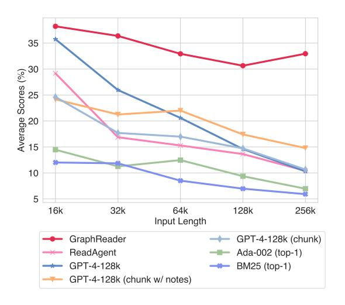
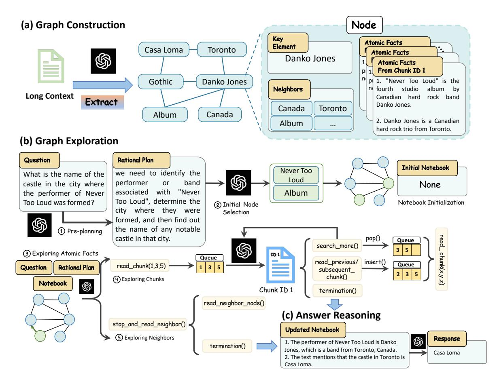
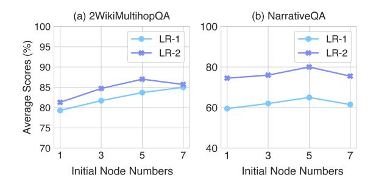
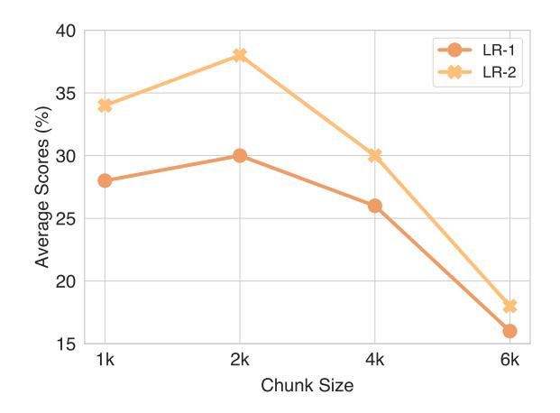
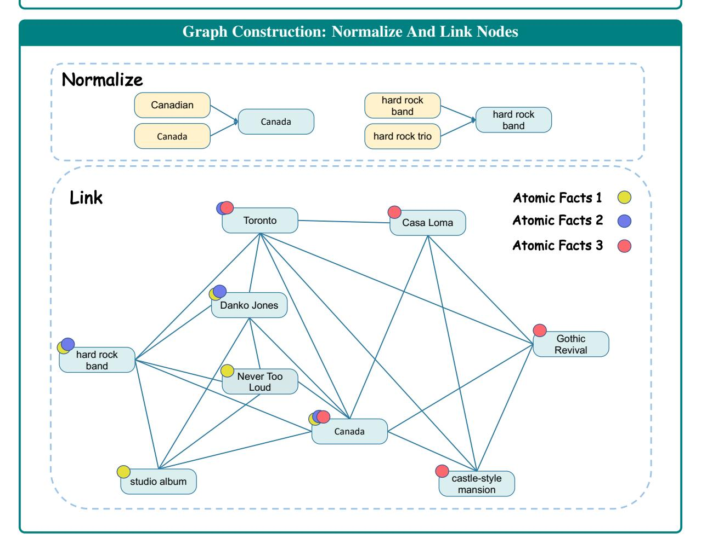
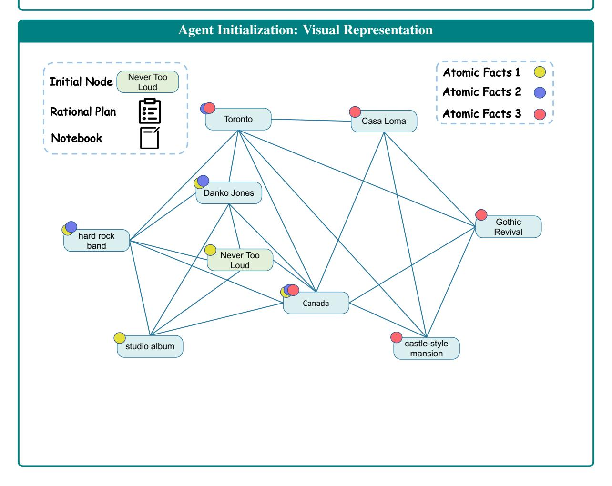
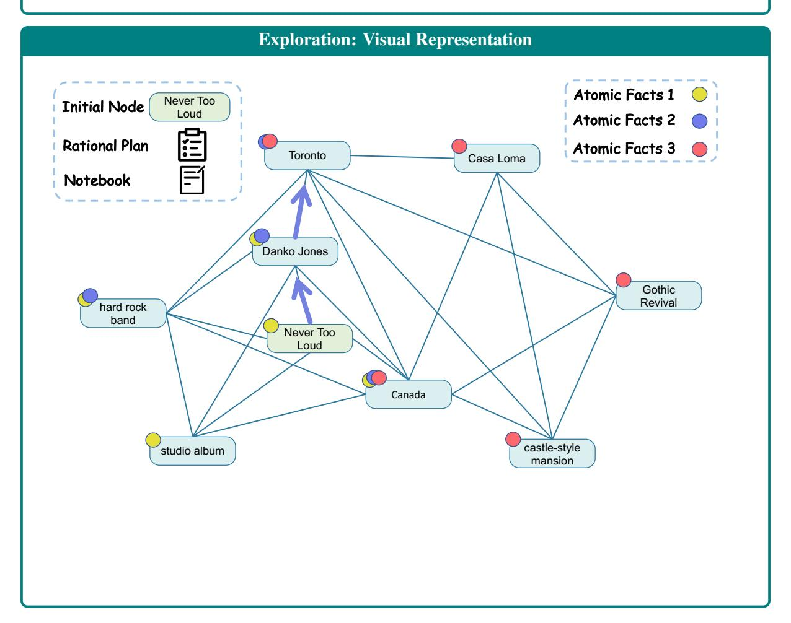

# GraphReader: Building Graph-based Agent to Enhance Long-Context Abilities of Large Language Models

Shilong Li\*1, Yancheng He\*1, Hangyu Guo\*1, Xingyuan Bu\*†‡1, Ge Bai¹, Jie Liu²,³, Jiaheng Liu¹, Xingwei Qu⁴, Yangguang Li³, Wanli Ouyang²,³, Wenbo Su¹, Bo Zheng¹

Alibaba Group 2The Chinese University of Hong Kong

Shanghai AI Laboratory 4University of Manchester

zhuli.lsl@taobao.com, xingyuanbu@gmail.com

#### **Abstract**

Long-context capabilities are essential for large language models (LLMs) to tackle complex and long-input tasks. Despite numerous efforts made to optimize LLMs for long contexts, challenges persist in robustly processing long inputs. In this paper, we introduce GraphReader, a graph-based agent system designed to handle long texts by structuring them into a graph and employing an agent to explore this graph autonomously. Upon receiving a question, the agent first undertakes a step-by-step analysis and devises a rational plan. It then invokes a set of predefined functions to read node content and neighbors, facilitating a coarse-to-fine exploration of the graph. Throughout the exploration, the agent continuously records new insights and reflects on current circumstances to optimize the process until it has gathered sufficient information to generate an answer. Experimental results on the LV-Eval dataset reveal that GraphReader, using a 4k context window, consistently outperforms GPT-4-128k across context lengths from 16k to 256k by a large margin. Additionally, our approach demonstrates superior performance on four challenging single-hop and multi-hop benchmarks.

## 1 Introduction

Large language models (LLMs) have made great progress on natural language understanding and generation (Zhao et al., 2023; Liu et al., 2024a; Feng et al., 2022; Peng et al., 2020; Xv et al., 2022; Peng et al., 2023b; Bu et al., 2021). However, transformer-based LLMs still struggle in handling long contexts due to the limitation of context window and memory usage.

Current techniques for solving the long-context tasks of LLMs can be divided into two perspectives: 1) Model-level, which includes finetuning with modified positional embeddings (Chen et al.,

> **[图片提取文字 (无描述)]:**
> 35 30 Average Scores (%) 20 25 20 21 21 10 5 16k 32k 64k 128k 256k Input Length GraphReader GPT-4-128k (chunk) ReadAgent Ada-002 (top-1) GPT-4-128k BM25 (top-1) GPT-4-128k (chunk w/ notes)

Figure 1: Performance on LV-Eval at 5 context length levels. GraphReader outperforms existing open-sourced and closed-source models while demonstrating a scalable performance in very long contexts. In contrast, other models exhibit a significant decrease in performance as context length increases.

2023b; Zhu et al., 2023; Peng et al., 2023a; Ding et al., 2024), and applying transformer variants with modified attention mechanisms (Dai et al., 2019; Munkhdalai et al., 2024; Gu and Dao, 2023); 2) Agent-level, *i.e.*, employing retrieval-augmented LLM or agent to process long contexts with a limited context window LLM (Nakano et al., 2021; Lee et al., 2024).

However, model-level methods typically train LLMs with target length texts, posing challenges in constructing training datasets and incurring high training costs (Zhu et al., 2023). Additionally, long-context LLMs optimized with these methods tend to overlook crucial details in long contexts, known as "lost in the middle" (Liu et al., 2024b), limiting their ability to address complex tasks, such as multi-hop questions. Agent-level approaches transform input text into a tree (Chen et al., 2023a) or paginated pages (Lee et al., 2024), failing to capture multi-hop and long-range dependencies, thus

\* First four authors contributed equally.

† Corresponding Author. ‡ Project Leader.

limiting their effectiveness on very long contexts, as shown in Figure [1.](#page-0-0)

To address these issues, we propose a graphbased agent named GraphReader. As illustrated in Figure [2,](#page-2-0) GraphReader first segments long texts into discrete chunks, extracts essential information, and compresses these into key elements and atomic facts. These key elements and facts are then used to construct a graph with nodes representing key elements and their associated atomic facts. This graph structure effectively captures long-range dependencies and multi-hop relationships within long text. Subsequently, GraphReader autonomously explores this graph using predefined functions, guided by a step-by-step rational plan. Based on a given question, the agent progressively accesses information from coarse key elements and atomic facts to detailed original text chunks, taking notes and reflecting until it gathers sufficient information to generate an answer. In summary, our main contributions are threefold:

- We introduce GraphReader, a novel agent system designed to organize long texts into a graph structure, leveraging predefined functions and notebook to facilitate planning and reflection during exploration.
- GraphReader establishes a scalable long-context capability based on a 4k context window, demonstrating performance that is comparable to or surpasses GPT-4 with a 128k context window across varying context lengths.
- Extensive experiments conducted on four challenging benchmarks demonstrate that GraphReader achieves superior performance in complex single-hop and multi-hop QA tasks.

# 2 Related Work

Long-Context LLMs Recent efforts [\(Chen et al.,](#page-8-2) [2023b;](#page-8-2) [Ding et al.,](#page-8-3) [2024;](#page-8-3) [Peng et al.,](#page-9-3) [2023a\)](#page-9-3) have focused on positional interpolation (PI) to enhance long-context capabilities. However, these methods require training on full-length texts, leading to significant increases in data and training costs [\(Chen](#page-8-7) [et al.,](#page-8-7) [2023c;](#page-8-7) [Fu et al.,](#page-8-8) [2024;](#page-8-8) [Bai et al.,](#page-8-9) [2024b\)](#page-8-9). Thus, PoSE [\(Zhu et al.,](#page-10-2) [2023\)](#page-10-2) and SkipAlign [\(Wu](#page-10-3) [et al.,](#page-10-3) [2024a\)](#page-10-3) investigate data skip strategy, but tend to neglect detailed information in long texts [\(Liu](#page-9-7) [et al.,](#page-9-7) [2024b;](#page-9-7) [Bai et al.,](#page-8-10) [2024a;](#page-8-10) [Wu et al.,](#page-10-4) [2024b\)](#page-10-4). Furthermore, despite how extensively the context window is expanded, it remains constrained by a

predefined fixed length. To address these limitations, transformer variants with modified attention mechanisms have been proposed [\(Dai et al.,](#page-8-4) [2019;](#page-8-4) [Gu and Dao,](#page-8-5) [2023;](#page-8-5) [Munkhdalai et al.,](#page-9-4) [2024\)](#page-9-4). However, these models are prone to losing earlier information.

Retrieval Retrieval Augmented Generation (RAG) leverages an extensive database of documents to extract task-related information that aids in response generation. Many efforts investigate various levels of retrieval granularity, including tokens [\(Khandelwal et al.,](#page-8-11) [2019\)](#page-8-11), entities [\(Févry](#page-8-12) [et al.,](#page-8-12) [2020;](#page-8-12) [De Jong et al.,](#page-8-13) [2021\)](#page-8-13), and chunks [\(Liu,](#page-9-8) [2024;](#page-9-8) [LangChain-team,](#page-9-9) [2024\)](#page-9-9). Other approaches have explored diverse retrieval methods, such as BM25 [\(Rasooli and Tetreault,](#page-9-10) [2015\)](#page-9-10) and learning-based strategies [\(Khattab and Zaharia,](#page-9-11) [2020;](#page-9-11) [Sachan et al.,](#page-9-12) [2023;](#page-9-12) [Sun et al.,](#page-10-5) [2021\)](#page-10-5). Despite its capabilities, RAG faces challenges in addressing complex questions due to difficulties in developing robust decision-making mechanisms. In contrast, we employ agents that use planning and reflection to gather essential information, effectively tackling complex problems.

Agent for Retrieval Recent work has increasingly leveraged LLMs as agents to tackle complex problems, utilizing their strong planning and reflection abilities [\(Yao et al.,](#page-10-6) [2022;](#page-10-6) [Park et al.,](#page-9-13) [2023\)](#page-9-13). These abilities have been applied to complex tasks such as function call [\(Li et al.,](#page-9-14) [2023\)](#page-9-14) and KGQA [\(Sun et al.,](#page-9-15) [2023;](#page-9-15) [Luo et al.,](#page-9-16) [2023\)](#page-9-16). Agents are also capable of retrieving unstructured information. For example, WebGPT [\(Nakano et al.,](#page-9-5) [2021\)](#page-9-5) simulates human actions to search on internet for specific answers. Additionally, MemWalker [\(Chen et al.,](#page-8-6) [2023a\)](#page-8-6) and PEARL [\(Sarthi et al.,](#page-9-17) [2024\)](#page-9-17) organize documents into a tree structure, while ReadAgent [\(Lee et al.,](#page-9-6) [2024\)](#page-9-6) condenses documents into a gist memory directory. However, these approaches often struggle with multi-hop questions. KGP [\(Wang](#page-10-7) [et al.,](#page-10-7) [2024\)](#page-10-7) organizes documents into graphs, but it primarily uses the agent to generate queries, thereby not fully exploiting the agent's capabilities for planning and reflection.

# 3 Approach

## 3.1 Preliminary

GraphReader is built on a graph G = {V, E}, where each node vi ∈ V contains a key element ki and a set of summarized content, namely atomic facts Ai . In other words, vi = {ki , Ai}. And

> **[图片提取文字 (无描述)]:**
> Node (a) Graph Construction Key **Atomic Facts** Element Casa Loma Toronto **Atomic Facts** Danko Jones Atomic Facts From Chunk ID 1 p pl 1. "Never Too Loud" is the Gothic Danko Jones Neighbors fourth studio album Long Context Canadian hard rock band Extract Danko Jones. Canada Toronto Album Canada 2. Danko Jones is a Canadian Album hard rock trio from Toronto. (b) Graph Exploration Question Rational Plan Initial Notebook Never Too we need to identify the What is the name of the Loud performer band or castle in the city where None with "Never associated Album the performer of Never Too Loud", determine the Notebook Initialization Too Loud was formed? (2) Initial Node city where they were Selection formed, and then find out the name of any notable (1) Pre-planning read\_chunk(x,y,z) castle in that city. pop() Queue search\_more() 3 5 (3) Exploring Atomic Facts Queue read\_previous/ insert() read\_chunk(1,3,5) Queue Rational Plan Question 3 subsequent\_ 3 chunk() (4) Exploring Chunks Notebook \$ Chunk ID 1 termination() read\_neighbor\_node() (c) Answer Reasoning stop\_and\_read\_neighbor() **Updated Notebook** (5) Exploring Neighbors Response 1. The performer of Never Too Loud is Danko termination() Jones, which is a band from Toronto, Canada. Casa Loma 2. The text mentions that the castle in Toronto is Casa Loma.

Figure 2: The illustration of our GraphReader approach, consisting of graph construction, graph exploration, and answer reasoning.

each edge  $e_{ij} \in \mathcal{E}$  represents the relationship between nodes  $v_i$  and  $v_j$ . This graph structure enables GraphReader to capture global information from the input document D within a limited context window, allowing it to decide whether to explore the current node in detail or jump to a neighboring node. During graph exploration, GraphReader collects supporting facts and terminates the exploration once sufficient information has been gathered to answer the question. As illustrated in Figure 2, the entire process of GraphReader consists of the following three phases: graph construction, graph exploration, and answer reasoning. The prompts utilized in these three stages are detailed in Appendix A, and a detailed example of our process can be found in Appendix I.

#### 3.2 Graph Construction

To extract nodes from a document D within the LLM's context limit, we first split D into chunks of maximum length L while preserving paragraph structure. For each chunk, we prompt the LLM to summarize it into atomic facts, the smallest indivisible facts that simplify the original text. We also

prompt the LLM to extract key elements from each atomic fact like essential nouns, verbs, and adjectives. After processing all chunks, we normalize the key elements as described by Lu et al. (2023) to handle lexical noise and granularity issues, creating a final set of key elements. We then construct each node  $v_i = (k_i, \mathcal{A}_i)$ , where  $k_i$  is a key element and  $\mathcal{A}_i$  is the set of atomic facts corresponding to  $k_i$ . Finally, we link two nodes  $v_i$  and  $v_j$  if key element  $k_i$  appears in  $\mathcal{A}_j$  and vice versa.

## 3.3 Graph Exploration

#### 3.3.1 Agent Initialization

Given a graph  $\mathcal{G}$  and a question Q, our goal is to design an agent that can autonomously explore the graph using predefined functions. The agent begins by maintaining a notebook to record supporting facts, which are eventually used to derive the final answer. Then the agent performs two key initializations: defining the rational plan and selecting the initial node.

**Rational Plan** To tackle complex real-world multi-hop questions, pre-planning the solution is

crucial. The agent breaks down the original question step-by-step, identifies the key information needed, and forms a rational plan.

Initial Node Choosing strategic starting points is essential for improving search efficiency. The agent evaluates the key elements of all nodes V and selects N initial nodes based on the question and the rational plan.

# 3.3.2 Exploration

After selecting N initial nodes as starting points, an agent explores each initial node by first exploring atomic facts, then chunks of the node. Next, it explores neighboring nodes, guided by the question and rational plan. The agent continuously updates the notebook with relevant information during the exploration process.

Exploring Atomic Facts It is impractical to include all original text chunks related to a node within the context window. Therefore, the agent employs a coarse-to-fine strategy, progressing from reading atomic facts to the original text, as all atomic facts can fit within the context window. Initially, all atomic facts associated with a node are grouped by their corresponding chunks, labeled with the respective chunk IDs, and fed to the agent. This allows the agent to capture an overview of each chunk by reading all groups of atomic facts. Meanwhile, the agent utilizes the question, rational plan, and notes in its notebook to reflect on the required clues and determine which chunk is likely to contain useful information. Subsequently, the agent is provided with two functions: 1) *read\_chunk*, if the agent identifies certain chunks as valuable for further reading, it will complete the function parameters with the chunk IDs, *i.e., read\_chunk(List[ID])*, and append these IDs to a chunk queue. 2) *stop\_and\_read\_neighbor*, conversely, if the agent deems that none of the chunks are worth further reading, it will finish reading this node and proceed to explore neighboring nodes.

Exploring Chunks When the chunk queue is non-empty, it indicates that the agent has identified multiple text chunks of interest. We then traverse the queue, reading each chunk. This step is essential because atomic facts merely summarize key information and provide brief clues, whereas specific details are best obtained directly from the original text chunks. While reading the chunks, the agent will once again consider

the question and the plan, thinking about what can be added to the current notebook. Any supporting facts discovered will be recorded in the notebook. Depending on the updated notebook, the agent will then select one of the following four functions: 1) *search\_more*, if supporting fact is insufficient, the agent will continue exploring chunks in the queue; 2) *read\_previous\_chunk* and 3)*read\_subsequent\_chunk*, due to truncation issues, adjacent chunks might contain relevant and useful information, the agent may insert these IDs to the queue; 4) *termination*, if sufficient information has been gathered for answering the question, the agent will finish exploration.

Exploring Neighbors Once the atomic facts and chunk queue of the current node have been fully processed, it indicates that this node has been thoroughly explored, and the agent needs to access the next node. Taking into account the question, rational plan, and the content of the notebook, the agent checks all neighboring nodes, *i.e.,* key elements, and performs one of two functions: 1) *read\_neighbor\_node*, the agent selects a neighboring node that might be helpful in answering the question and re-enters the process of exploring atomic facts and chunks; 2) *termination*, the agent determines that none of the neighboring nodes contain useful information, it finish the exploration.

## 3.4 Answer Reasoning

After N agents have independently gathered information and stopped their exploration, we will compile all notes from each agent for reasoning and generating the final answer. Employing Chainof-Thought [\(Wei et al.,](#page-10-8) [2022\)](#page-10-8), the LLM first analyzes each note by considering complementary information from other memories and using a majority voting strategy to resolve any inconsistencies. Ultimately, the LLM will consider all the available information to generate the final answer.

# 4 Experiments

## 4.1 Experimental Settings

Evaluation Benchmarks We conduct experiments on two types of long-context QA benchmarks, including multi-hop long-context QA, *i.e.,* HotpotQA [\(Yang et al.,](#page-10-9) [2018\)](#page-10-9), 2WikiMultihopQA [\(Ho et al.,](#page-8-14) [2020\)](#page-8-14), MuSiQue [\(Trivedi et al.,](#page-10-10) [2022\)](#page-10-10), and a single-hop long-context QA benchmark, *i.e.,* NarrativeQA [\(Kociský et al.,](#page-9-19) [2018\)](#page-9-19) from LongBench [\(Bai et al.,](#page-8-15) [2023\)](#page-8-15). Additionally, we

also incorporate HotpotWikiQA-mixup from LV-Eval (Yuan et al., 2024), a multi-hop benchmark that features five levels of text length: 16k, 32k, 64k, 128k, and 256k. Table 1 presents the statistics about these benchmarks, and detailed information is provided in Appendix C.

Evaluation Metrics We employ several automatic evaluation metrics, *i.e.*,  $F_1$  score, Exact Match (EM) score, and an optimized  $F_1$ \* score, as introduced by LV-Eval (Yuan et al., 2024). Specifically,  $F_1$ \* first computes the recall of golden answer keywords and only calculates the  $F_1$  score if it exceeds a certain threshold. Otherwise, the score defaults to zero. Despite the cost-effectiveness of automatic metrics, their accuracy may be affected by the response format. Hence, we implement LLM Raters for answer correctness evaluation using an LLM, denoted as LLM-Rating-1 (LR-1) and LLM-Rating-1 (LR-2), following ReadAgent (Lee et al., 2024). Details on the evaluation metrics can be found in Appendix B.

**Baseline Methods** We compare our approach with the following baselines: retrieval augmented generation (RAG), long-context LLM, and agentbased methods. (1) RAG: We choose Okapi BM25 (Robertson and Zaragoza, 2009) or OpenAI API embedding model Ada-002 to retrieve the chunks most relevant to the question and employ GPT-4-128k (gpt-4-1106-preview) to read retrieved chunks and answer the question. In addition to traditional RAG methods, we also compared GraphRAG (Edge et al., 2024) and LongRAG (Jiang et al., 2024), which utilize LLM to enhance RAG ability. (2) Long-context LLM: We select GPT-4-128k for directly reading full text when the text content fits within the input window, or for segmenting the text into chunks for sequential reading. (3) Agent-based Method: We select ReadAgent (Lee et al., 2024) and PEARL (Sun et al., 2024), which employ an agent-based system for the execution of retrieval and reading processes for long-context QA. The detailed description of these methods is provided in Appendix D.

**Implementation Details** In our experiments, we employ GPT-4-128k for both our method and baseline approaches, setting the temperature to 0.2. For GraphReader, the input window size is configured to 4k tokens unless stated otherwise. We limit the

| Task          | Dataset            | Avg #Tokens | Max #Tokens | #Samples |
|---------------|--------------------|-------------|-------------|----------|
|               | HotpotQA           | 9.4k        | 15.9k       | 300      |
| Multi-hop QA  | 2WikiMultihopQA    | 8.8k        | 15.9k       | 300      |
| Mulu-nop QA   | MuSiQue            | 15.5k       | 16.0k       | 200      |
|               | HotpotWikiQA-mixup | 142.4k      | 370.8k      | 250      |
| Single-hop QA | NarrativeQA        | 29.7k       | 63.7k       | 200      |

Table 1: The statistics of benchmarks employed in our evaluation. The token number is calculated using the GPT-4 tokenizer from the TikToken. #Samples denote the total number of benchmarks.

maximum chunk size to 2k tokens, initiate searches from 5 initial nodes, and impose a function call limit of 10 for each search path.

#### 4.2 Main Results

The results of three types of methods on four multihop long-context benchmarks and one single-hop long-context benchmark are shown in Table 2 and Table 3. Based on the results, we have the following findings:

Results of RAG methods As the results shown in Table 2, RAG methods based on BM25 and Ada-002 exhibit the worst performance in comparison to long-context LLM and agent-based methods. A possible reason is that text retrieval has difficulty recalling all chunks that contain the supporting facts for answering the input question. Although increasing the number of recalled chunks could improve the performance of text retrieval, the context window will limit the effectiveness of these RAG methods.

Results of Long-Context LLMs From the results shown in Table 2, we can see that employing GPT-4-128k to directly answer the question with long contexts significantly outperforms RAG methods and even outperforms ReadAgent on three long-context benchmarks. This is because of the superior performance of GPT-4-128k in processing long texts and executing multi-hop reasoning tasks. Additionally, the lengths of these four benchmarks are significantly shorter than the 128k context window, thereby mitigating the impact of "lost in the middle" on the model's performance.

Results of Agent-based Methods By comparing our approach with all baselines in Table 2, it is obvious that our approach consistently performs better than them on four long-context benchmarks and demonstrates superior performance in multihop long-context tasks. In our approach, benefiting

https://platform.openai.com/docs/guides/embeddings/embedding-models

| Method                      | Input  |      | Hotpo | tQA  |       | 2V   | VikiMul | tihopQ | )A    |      | MuSi | Que  |       |      | Narrati | veQA |       |
|-----------------------------|--------|------|-------|------|-------|------|---------|--------|-------|------|------|------|-------|------|---------|------|-------|
| Method                      | Window | LR-1 | LR-2  | EM   | $F_1$ | LR-1 | LR-2    | EM     | $F_1$ | LR-1 | LR-2 | EM   | $F_1$ | LR-1 | LR-2    | EM   | $F_1$ |
| BM25 (top-1)                | 4k     | 57.7 | 63.0  | 33.7 | 43.8  | 36.0 | 39.0    | 25.0   | 30.4  | 33.0 | 36.5 | 19.0 | 23.9  | 29.5 | 34.5    | 4.0  | 11.3  |
| BM25 (top-3)                | 4k     | 74.7 | 78.3  | 45.7 | 58.5  | 59.7 | 62.0    | 42.3   | 51.9  | 43.5 | 49.5 | 25.0 | 31.1  | 44.5 | 52.5    | 7.0  | 20.5  |
| Ada-002 (top-1)             | 4k     | 63.0 | 70.7  | 40.0 | 53.2  | 57.0 | 59.3    | 41.0   | 49.4  | 34.5 | 37.0 | 20.0 | 26.6  | 37.5 | 46.5    | 5.0  | 15.5  |
| Ada-002 (top-3)             | 4k     | 72.0 | 77.3  | 45.0 | 58.1  | 65.7 | 66.7    | 44.7   | 55.3  | 40.0 | 45.5 | 24.5 | 32.1  | 45.5 | 53.0    | 7.5  | 19.5  |
| GPT-4-128k                  | 128k   | 83.3 | 88.3  | 53.0 | 68.4  | 77.3 | 80.0    | 58.7   | 70.0  | 52.0 | 59.5 | 33.5 | 42.7  | 63.5 | 77.0    | 11.5 | 29.4  |
| GPT-4-128k (chunk)          | 4k     | 71.3 | 74.7  | 45.7 | 59.5  | 59.3 | 62.3    | 40.7   | 50.5  | 41.0 | 43.0 | 23.0 | 32.1  | 58.0 | 69.5    | 9.50 | 25.5  |
| GPT-4-128k (chunk w/ notes) | 4k     | 72.3 | 76.7  | 45.7 | 59.5  | 65.7 | 68.7    | 46.3   | 56.6  | 39.5 | 43.0 | 25.0 | 32.5  | 56.5 | 65.0    | 8.5  | 24.3  |
| ReadAgent                   | 128k   | 72.3 | 78.7  | 48.0 | 62.0  | 79.0 | 81.0    | 52.7   | 63.7  | 54.5 | 61.0 | 35.0 | 45.1  | 63.0 | 75.5    | 5.0  | 18.9  |
| Pearl                       | 128k   | 74.7 | 79.0  | 46.3 | 60.4  | 70.0 | 71.0    | 46.0   | 57.6  | 45.0 | 51.5 | 23.0 | 33.3  | 43.5 | 48.0    | 7.5  | 16.2  |
| LongRAG                     | 128k   | 75.7 | 78.3  | 48.7 | 63.9  | 73.0 | 75.0    | 51.3   | 63.5  | 49.0 | 54.5 | 31.0 | 40.3  | 60.5 | 69.0    | 15.0 | 27.0  |
| GraphRAG                    | 128k   | 73.7 | 80.3  | 49.7 | 59.7  | 67.7 | 71.3    | 42.3   | 53.9  | 46.5 | 56.0 | 21.5 | 31.2  | 52.0 | 66.5    | 15.0 | 23.1  |
| GraphReader                 | 4k     | 84.3 | 89.7  | 55.0 | 70.0  | 83.7 | 87.0    | 59.3   | 70.1  | 59.0 | 63.5 | 38.0 | 47.4  | 65.0 | 80.0    | 15.5 | 29.8  |
| Golden                      | 4k     | 92.3 | 93.7  | 57.0 | 73.8  | 88.3 | 89.7    | 63.0   | 73.4  | 66.0 | 69.0 | 45.0 | 56.0  | -    | -       | -    | -     |

Table 2: Performance (%) comparison of different baselines on datasets from LongBench. The best performance and the second-best performance are denoted in bold and underlined fonts, respectively. "Golden" denotes the settings in which we add question and its supporting facts to LLM directly.

|                             | Input   | HotpotWikiQA-mixup |      |         |      |      |        |      |             |             |      |             |             |      |      |         |
|-----------------------------|---------|--------------------|------|---------|------|------|--------|------|-------------|-------------|------|-------------|-------------|------|------|---------|
| Method                      | Window  |                    | 16k  |         |      | 32k  |        |      | 64k         |             |      | 128k        |             |      | 256k |         |
|                             | William | LR-1               | LR-2 | $F_1^*$ | LR-1 | LR-2 | $F_1*$ | LR-1 | LR-2        | $F_1*$      | LR-1 | LR-2        | $F_1^*$     | LR-1 | LR-2 | $F_1^*$ |
| BM25 (top-1)                | 4k      | 10.0               | 16.0 | 12.0    | 16.0 | 18.0 | 11.9   | 6.0  | 8.0         | 8.5         | 10.0 | 8.0         | 7.0         | 14.0 | 20.0 | 5.9     |
| BM25 (top-3)                | 4k      | 16.0               | 22.0 | 13.9    | 18.0 | 28.0 | 13.3   | 16.0 | 18.0        | 11.8        | 12.0 | 16.0        | 11.8        | 12.0 | 22.0 | 9.3     |
| Ada-002 (top-1)             | 4k      | 10.0               | 12.0 | 14.5    | 14.0 | 18.0 | 11.3   | 10.0 | 12.0        | 12.5        | 12.0 | 14.0        | 9.4         | 8.0  | 8.0  | 7.0     |
| Ada-002 (top-3)             | 4k      | 24.0               | 28.0 | 21.3    | 20.0 | 30.0 | 19.8   | 14.0 | 20.0        | 12.9        | 16.0 | 20.0        | 12.0        | 14.0 | 18.0 | 10.8    |
| GPT-4-128k                  | 128k    | 38.0               | 38.0 | 35.7    | 26.0 | 30.0 | 26.0   | 22.0 | 24.0        | 20.6        | 16.0 | 16.0        | 14.6        | 14.0 | 16.0 | 10.3    |
| GPT-4-128k (chunk)          | 4k      | 18.0               | 22.0 | 24.6    | 16.0 | 20.0 | 17.7   | 20.0 | 24.0        | 17.0        | 20.0 | 24.0        | 14.7        | 28.0 | 30.0 | 10.7    |
| GPT-4-128k (chunk w/ notes) | 4k      | 22.0               | 32.0 | 24.2    | 26.0 | 30.0 | 21.3   | 28.0 | <u>32.0</u> | <u>22.0</u> | 24.0 | <u>26.0</u> | <u>17.4</u> | 26.0 | 26.0 | 14.8    |
| ReadAgent                   | 128k    | 24.0               | 26.0 | 29.2    | 20.0 | 22.0 | 16.9   | 24.0 | 30.0        | 15.3        | 14.0 | 18.0        | 13.6        | 20.0 | 22.0 | 10.4    |
| GraphReader                 | 4k      | 42.0               | 42.0 | 38.2    | 32.0 | 38.0 | 36.4   | 30.0 | 36.0        | 32.9        | 28.0 | 34.0        | 30.6        | 30.0 | 38.0 | 33.0    |

Table 3: Performance (%) of different baselines on datasets from LV-Eval, where  $F_1^*$  donates LV-Eval's optimized  $F_1$ . The best performance and the second-best performance are denoted in bold and underlined fonts, respectively. We truncate to keep the longest possible initial fragment while preserving paragraph structure, in contexts that exceed the input window (128k and 256k) for GPT-4-128k.

from the graph's ability to capture the relationships between detailed information, our method can identify crucial information and search for the supporting facts for the input question efficiently. This strategy significantly boosts the agent's capability in multi-hop reasoning and capturing long-range dependencies of key information in a long context. Moreover, the results in Table 2 show that ReadAgent, with a 128k context window setup, underperforms GraphReader with a 4k context window and even performs worse than GPT-4-128k full-text reading. We attribute this to ReadAgent's strategy of excessively compressing the original texts into gist memories, and feeding all mixed memories to the model for page number selection. Compared to our GraphReader, the strategy of ReadAgent may restrict the agent's ability to identify specific details and capture intrinsic connections among key elements in a long context, consequently affecting its overall performance. This further indicates that our approach can more efficiently unlock the capabilities of constrained context window LLMs in processing long context. Additionally, we observe that the performance of our method closely matches that achieved by directly supplying supporting facts to the LLM (*i.e.*, Golden in Table 2). This is because our method incorporates not only pre-planning, reflection, and various actions but also the usage of a graph containing key information, facilitating the agent to search for the correct supporting facts.

For additional results on benchmarks relevant to real-world scenarios, please refer to the appendix E.

## **Evaluation on Extremely Long Context Tasks**

As shown in previous experiments, it demonstrates the effectiveness of employing a limited context window LLM for long-context tasks with our GraphReader. Here, we would like to study the im-

| Dataset         | Method             | Results(%) |      |       |  |  |
|-----------------|--------------------|------------|------|-------|--|--|
| Dataset         | Method             | LR-1       | LR-2 | $F_1$ |  |  |
|                 | GraphReader        | 84.3       | 89.7 | 70.0  |  |  |
| HotpotQA        | w/o Rational Plan  | 81.7       | 87.7 | 63.8  |  |  |
|                 | w/o Node Selection | 66.0       | 71.7 | 54.1  |  |  |
|                 | GraphReader        | 83.7       | 87.0 | 70.1  |  |  |
| 2WikiMultihopQA | w/o Rational Plan  | 81.3       | 86.0 | 65.4  |  |  |
|                 | w/o Node Selection | 65.3       | 68.7 | 49.7  |  |  |
|                 | GraphReader        | 59.0       | 63.5 | 47.4  |  |  |
| MuSiQue         | w/o Rational Plan  | 56.0       | 61.0 | 42.4  |  |  |
|                 | w/o Node Selection | 35.0       | 38.5 | 25.2  |  |  |
|                 | GraphReader        | 65.0       | 80.0 | 29.8  |  |  |
| NarrativeQA     | w/o Rational Plan  | 63.0       | 78.5 | 26.6  |  |  |
| _               | w/o Node Selection | 53.0       | 65.5 | 24.0  |  |  |

Table 4: The results of our ablation study. "w/o Rational Plan" refers to removing the rational plan in the agent initialization stage, and "w/o Node Selection" denotes applying the random selection of initial nodes and neighbor nodes in graph exploration.

pact of extremely long context on our GraphReader. As shown in Table 3, compared with all baselines, our GraphReader not only consistently outperforms these methods across text lengths ranging from 16k to 256k tokens but also exhibits robustness with the expansion of context length. It indicates that our method is still effective in handling extremely long texts by graph exploration with limited context window LLMs. With the increase in the length of the input context, the performance of GPT-4-128k full-text reading degrades gradually. As a comparison, our method achieves a performance gain of 10.53% relatively on LR-1 over GPT-4-128k full-text reading under 16k context length. With the context length increasing to 128k, our method achieves a performance gain of 75.00% relatively over GPT-4-128k. This can be attributed to the fact that as the context length increases, the impact of the "lost in the middle" effect on GPT-4-128k becomes progressively more severe. Secondly, we observe that ReadAgent significantly underperforms our method in handling extremely long contexts. This is because the lack of detailed information about the content of each page can make page selection very difficult for ReadAgent, especially when dealing with extremely long contexts. This further demonstrates that our method can effectively address the challenges of processing extremely long context with limited context window LLMs by exploring graphs containing fine-grained information.

#### 4.3 Ablation study

**The Effect of Rational Plan** In the graph exploration stage, we introduce a rational plan to help

the agent analyze complex input questions step by step, guiding the agent in exploring the graph. To verify the effectiveness of the rational plan, we removed it during agent initialization and conducted experiments on four long-context QA benchmarks. Table 4 shows that the rational plan is effective in guiding the agent in node selection and exploration on the graph.

The Effect of Node Selection We conduct randomly selecting initial nodes and neighbor nodes experiments to demonstrate the necessity of our system in selecting which nodes to visit based on reasoning about the required information. As shown in Table 4, random selection results in a significant performance drop, with an average decline of 18%. This demonstrates that GraphReader carefully considers node selection, leading to more reasonable and effective exploration.

Impact of the Number of Initial Nodes We conduct experiments with different initial node counts on multi-hop and single-hop QA datasets to assess the effect of the number of initial nodes on GraphReader's performance. The results are shown in Figure 3. Increasing the number of nodes improves performance up to a certain point, with optimal performance at 5 initial nodes, which we set as the default. However, beyond this threshold, performance declines, especially in single-hop scenarios, likely due to increased noise from too many initial nodes.

Impact of the Chunk Size We investigate the impact of chunk size L on GraphReader's performance. As shown in Figure 4, the best performance is achieved with L=2k. When L exceeds a certain threshold, performance declines because larger chunks cause the model to overlook essential details. Conversely, smaller chunks lead to more semantic truncation, hindering comprehension and accuracy in extracting atomic facts. Thus, we chose L=2k as the default chunk size.

#### 4.4 Further Analysis

Cost Analysis To assess the inference cost of our approach, we compare the average token consumption of ReadAgent and GraphReader for individual questions. As shown in Table 5, GraphReader uses only 1.08 times more tokens than ReadAgent (52.8k / 48.7k), yet achieves more than double the performance improvement, demonstrating its superiority. More importantly, our method has signifi-

> **[图片提取文字 (无描述)]:**
> (a) 2WikiMultihopQA (b) NarrativeQA LR-1 LR-1 Average Scores (%) LR-2 LR-2 Initial Node Numbers Initial Node Numbers

Figure 3: Performance of GraphReader with different initial node numbers on 2WikiMultihopQA and NarrativeQA. Results show the robustness of GraphReader towards different initial node numbers.

> **[图片提取文字 (无描述)]:**
> 40 LR-1 LR-2 35 Average Scores (%) 20 15 1k 2k 6k 4k Chunk Size

Figure 4: The impact of chunk size *L* of GraphReader on the 256k length level of HotpotWikiQA-mixup.

| Method      | Avg. Ctx. #Tokens | Avg. Cost #Tokens |
|-------------|-------------------|-------------------|
| ReadAgent   | 358.3k            | 48.7k             |
| GraphReader | 358.3k            | 52.8k             |

Table 5: Comparison of token consumption per question between ReadAgent and GraphReader on HotpotWikiQA-mixup-256k, where "Avg. Ctx. #Tokens" refers to the average token number of the original dataset. The "Avg. Cost #Tokens" comprise both input tokens and output tokens during exploration.

cant advantages in single-document multiple-query scenarios, where only one graph needs to be constructed. Subsequent QA can be performed on this graph, thereby reducing the overall token consumption.

**Recall Rate Analysis** To evaluate our method's advantages in key information recall, we utilize GPT-4 to assess the recall of supporting facts on the HotpotWikiQA-mixup dataset. As shown in Figure 5, our model consistently outperforms other baseline methods, regardless of the input length. As context length increases from 16k to 256k, re-

> **[图片提取文字 (无描述)]:**
> 70 60 Recall Scores (%) 05 05 05 05 05 05 05 05 05 05 05 05 05 20 10 0 16k 32k 64k 128k 256k Input Length GraphReader Ada-002 (top-1) ReadAgent BM25 (top-1) GPT-4-128k (chunk w/ notes)

Figure 5: Recall of supporting facts by different methods on HotpotWikiQA-mixup.

| Source         | Re      | call(%)     |
|----------------|---------|-------------|
| Source         | SF-wise | Sample-wise |
| Atomic Facts   | 76.4    | 64.7        |
| Final Notebook | 90.5    | 85.3        |

Table 6: GraphReader's recall performance at different granularities on HotpotQA. "SF-wise" refers to the granularity of supporting facts, and "Sample-wise" refers to the granularity of sample evaluation.

call of supporting facts declines across all methods. However, GraphReader maintains around 60% recall at 256k context length, in contrast to the significant degradation in ReadAgent. This demonstrates GraphReader's scalability and effectiveness in processing long contexts. Further details and evaluation prompts can be found in Appendix F.

To further demonstrate the recall rate of GraphReader at different granularities, we calculate the recall rate of *Supporting Facts* and *Sample* granularity respectively using the same method, detailed in the Appendix F. The granularity of supporting facts refers to the recall rate of all supporting facts across the entire dataset. As for sample granularity, a sample is considered to be recalled only if all of its supporting facts are recalled. As shown in the Tabel 6, the recall for the final notebook is slightly higher than the recall of atomic facts, which indicates that our method is capable of extracting more valid information from chunks during the exploration, indirectly reflecting its intelligence and effectiveness in exploration.

# 5 Conclusion

This paper introduces GraphReader, a graph-based agent designed to enhance the long-context capabilities of large language models. GraphReader organizes long texts into graph structures and employs an autonomous agent to explore the graph, successfully establishing long-range dependencies within a relatively small 4k context window. Experiments demonstrate that GraphReader outperforms GPT-4 with a 128k input length across various long-context single-hop and multi-hop questionanswering benchmarks.

# 6 Limitations

Firstly, GraphReader is constructed using an offthe-shelf GPT-4 API. Since it is close-sourced, there may be potential restrictions such as limits on Queries Per Second (QPS) and regional constraints. Therefore, future work will involve collecting data, training models, and making them open-source to contribute to the wider community. Secondly, the efficiency of the agent depends on its planning and reasoning capabilities. Future research will also explore enhancements of these features to improve the effectiveness of our method.

# References

- Ge Bai, Jie Liu, Xingyuan Bu, Yancheng He, Jiaheng Liu, Zhanhui Zhou, Zhuoran Lin, Wenbo Su, Tiezheng Ge, Bo Zheng, et al. 2024a. Mt-bench-101: A fine-grained benchmark for evaluating large language models in multi-turn dialogues. *arXiv preprint arXiv:2402.14762*.
- Yushi Bai, Xin Lv, Jiajie Zhang, Yuze He, Ji Qi, Lei Hou, Jie Tang, Yuxiao Dong, and Juanzi Li. 2024b. Longalign: A recipe for long context alignment of large language models. *arXiv preprint arXiv:2401.18058*.
- Yushi Bai, Xin Lv, Jiajie Zhang, Hong Lyu, Jiankai Tang, Zhidian Huang, Zhengxiao Du, Xiao Liu, Aohan Zeng, Lei Hou, Yuxiao Dong, Jie Tang, and Juanzi Li. 2023. [Longbench: A bilingual, multitask](https://api.semanticscholar.org/CorpusID:261245264) [benchmark for long context understanding.](https://api.semanticscholar.org/CorpusID:261245264) *ArXiv*, abs/2308.14508.
- Xingyuan Bu, Junran Peng, Junjie Yan, Tieniu Tan, and Zhaoxiang Zhang. 2021. Gaia: A transfer learning system of object detection that fits your needs. In *Proceedings of the IEEE/CVF Conference on Computer Vision and Pattern Recognition*, pages 274–283.
- Howard Chen, Ramakanth Pasunuru, Jason Weston, and Asli Celikyilmaz. 2023a. Walking down the memory maze: Beyond context limit through interactive reading. *arXiv preprint arXiv:2310.05029*.

- Shouyuan Chen, Sherman Wong, Liangjian Chen, and Yuandong Tian. 2023b. Extending context window of large language models via positional interpolation. *arXiv preprint arXiv:2306.15595*.
- Yukang Chen, Shengju Qian, Haotian Tang, Xin Lai, Zhijian Liu, Song Han, and Jiaya Jia. 2023c. Longlora: Efficient fine-tuning of long-context large language models. *arXiv preprint arXiv:2309.12307*.
- Zihang Dai, Zhilin Yang, Yiming Yang, Jaime Carbonell, Quoc V Le, and Ruslan Salakhutdinov. 2019. Transformer-xl: Attentive language models beyond a fixed-length context. *arXiv preprint arXiv:1901.02860*.
- Michiel De Jong, Yury Zemlyanskiy, Nicholas FitzGerald, Fei Sha, and William Cohen. 2021. Mention memory: incorporating textual knowledge into transformers through entity mention attention. *arXiv preprint arXiv:2110.06176*.
- Yiran Ding, Li Lyna Zhang, Chengruidong Zhang, Yuanyuan Xu, Ning Shang, Jiahang Xu, Fan Yang, and Mao Yang. 2024. Longrope: Extending llm context window beyond 2 million tokens. *arXiv preprint arXiv:2402.13753*.
- Darren Edge, Ha Trinh, Newman Cheng, Joshua Bradley, Alex Chao, Apurva Mody, Steven Truitt, and Jonathan Larson. 2024. [From local to global: A](https://api.semanticscholar.org/CorpusID:269363075) [graph rag approach to query-focused summarization.](https://api.semanticscholar.org/CorpusID:269363075) *ArXiv*, abs/2404.16130.
- Weixin Feng, Xingyuan Bu, Chenchen Zhang, and Xubin Li. 2022. Beyond bounding box: Multimodal knowledge learning for object detection. *arXiv preprint arXiv:2205.04072*.
- Thibault Févry, Livio Baldini Soares, Nicholas FitzGerald, Eunsol Choi, and Tom Kwiatkowski. 2020. Entities as experts: Sparse memory access with entity supervision. *arXiv preprint arXiv:2004.07202*.
- Yao Fu, Rameswar Panda, Xinyao Niu, Xiang Yue, Hannaneh Hajishirzi, Yoon Kim, and Hao Peng. 2024. Data engineering for scaling language models to 128k context. *arXiv preprint arXiv:2402.10171*.
- Albert Gu and Tri Dao. 2023. Mamba: Linear-time sequence modeling with selective state spaces. *arXiv preprint arXiv:2312.00752*.
- Xanh Ho, Anh-Khoa Duong Nguyen, Saku Sugawara, and Akiko Aizawa. 2020. Constructing A multi-hop QA dataset for comprehensive evaluation of reasoning steps. In *COLING*, pages 6609–6625. International Committee on Computational Linguistics.
- Ziyan Jiang, Xueguang Ma, and Wenhu Chen. 2024. [Longrag: Enhancing retrieval-augmented generation](https://api.semanticscholar.org/CorpusID:270688725) [with long-context llms.](https://api.semanticscholar.org/CorpusID:270688725) *ArXiv*, abs/2406.15319.
- Urvashi Khandelwal, Omer Levy, Dan Jurafsky, Luke Zettlemoyer, and Mike Lewis. 2019. Generalization through memorization: Nearest neighbor language models. *arXiv preprint arXiv:1911.00172*.

- Omar Khattab and Matei Zaharia. 2020. Colbert: Efficient and effective passage search via contextualized late interaction over bert. In *Proceedings of the 43rd International ACM SIGIR conference on research and development in Information Retrieval*, pages 39– 48.
- Tomás Kociský, Jonathan Schwarz, Phil Blunsom, Chris Dyer, Karl Moritz Hermann, Gábor Melis, and Edward Grefenstette. 2018. The narrativeqa reading comprehension challenge. *Trans. Assoc. Comput. Linguistics*, 6:317–328.
- Tom Kwiatkowski, Jennimaria Palomaki, Olivia Redfield, Michael Collins, Ankur Parikh, Chris Alberti, Danielle Epstein, Illia Polosukhin, Jacob Devlin, Kenton Lee, Kristina Toutanova, Llion Jones, Matthew Kelcey, Ming-Wei Chang, Andrew M. Dai, Jakob Uszkoreit, Quoc Le, and Slav Petrov. 2019. [Natu](https://doi.org/10.1162/tacl_a_00276)[ral questions: A benchmark for question answering](https://doi.org/10.1162/tacl_a_00276) [research.](https://doi.org/10.1162/tacl_a_00276) *Transactions of the Association for Computational Linguistics*, 7:452–466.
- LangChain-team. 2024. [LangChain.](https://github.com/langchain-ai/langchain)
- Kuang-Huei Lee, Xinyun Chen, Hiroki Furuta, John Canny, and Ian Fischer. 2024. A human-inspired reading agent with gist memory of very long contexts. *arXiv preprint arXiv:2402.09727*.
- Xingxuan Li, Ruochen Zhao, Yew Ken Chia, Bosheng Ding, Shafiq Joty, Soujanya Poria, and Lidong Bing. 2023. Chain-of-knowledge: Grounding large language models via dynamic knowledge adapting over heterogeneous sources. In *The Twelfth International Conference on Learning Representations*.
- Jerry Liu. 2024. [LlamaIndex.](https://doi.org/10.5281/zenodo.1234)
- Jie Liu, Zhanhui Zhou, Jiaheng Liu, Xingyuan Bu, Chao Yang, Zhong Han-Sen, and Wanli Ouyang. 2024a. Iterative length-regularized direct preference optimization: A case study on improving 7b language models to gpt-4 level. *arXiv preprint arXiv:2406.11817*.
- Nelson F Liu, Kevin Lin, John Hewitt, Ashwin Paranjape, Michele Bevilacqua, Fabio Petroni, and Percy Liang. 2024b. Lost in the middle: How language models use long contexts. *Transactions of the Association for Computational Linguistics*, 12:157–173.
- Keming Lu, Hongyi Yuan, Zheng Yuan, Runji Lin, Junyang Lin, Chuanqi Tan, Chang Zhou, and Jingren Zhou. 2023. # instag: Instruction tagging for analyzing supervised fine-tuning of large language models. In *The Twelfth International Conference on Learning Representations*.
- Linhao Luo, Yuan-Fang Li, Gholamreza Haffari, and Shirui Pan. 2023. Reasoning on graphs: Faithful and interpretable large language model reasoning. *arXiv preprint arXiv:2310.01061*.
- Tsendsuren Munkhdalai, Manaal Faruqui, and Siddharth Gopal. 2024. Leave no context behind: Efficient infinite context transformers with infiniattention. *arXiv preprint arXiv:2404.07143*.

- Reiichiro Nakano, Jacob Hilton, Suchir Balaji, Jeff Wu, Long Ouyang, Christina Kim, Christopher Hesse, Shantanu Jain, Vineet Kosaraju, William Saunders, et al. 2021. Webgpt: Browser-assisted questionanswering with human feedback. *arXiv preprint arXiv:2112.09332*.
- Richard Yuanzhe Pang, Alicia Parrish, Nitish Joshi, Nikita Nangia, Jason Phang, Angelica Chen, Vishakh Padmakumar, Johnny Ma, Jana Thompson, He He, and Samuel Bowman. 2022. [QuALITY: Question](https://doi.org/10.18653/v1/2022.naacl-main.391) [answering with long input texts, yes!](https://doi.org/10.18653/v1/2022.naacl-main.391) In *Proceedings of the 2022 Conference of the North American Chapter of the Association for Computational Linguistics: Human Language Technologies*, pages 5336–5358, Seattle, United States. Association for Computational Linguistics.
- Joon Sung Park, Joseph O'Brien, Carrie Jun Cai, Meredith Ringel Morris, Percy Liang, and Michael S Bernstein. 2023. Generative agents: Interactive simulacra of human behavior. In *Proceedings of the 36th Annual ACM Symposium on User Interface Software and Technology*, pages 1–22.
- Bowen Peng, Jeffrey Quesnelle, Honglu Fan, and Enrico Shippole. 2023a. Yarn: Efficient context window extension of large language models. *arXiv preprint arXiv:2309.00071*.
- Junran Peng, Xingyuan Bu, Ming Sun, Zhaoxiang Zhang, Tieniu Tan, and Junjie Yan. 2020. Largescale object detection in the wild from imbalanced multi-labels. In *Proceedings of the IEEE/CVF conference on computer vision and pattern recognition*, pages 9709–9718.
- Junran Peng, Qing Chang, Haoran Yin, Xingyuan Bu, Jiajun Sun, Lingxi Xie, Xiaopeng Zhang, Qi Tian, and Zhaoxiang Zhang. 2023b. Gaia-universe: Everything is super-netify. *IEEE Transactions on Pattern Analysis and Machine Intelligence*, 45(10):11856–11868.
- Mohammad Sadegh Rasooli and Joel R. Tetreault. 2015. [Yara parser: A fast and accurate dependency parser.](http://arxiv.org/abs/1503.06733) *Computing Research Repository*, arXiv:1503.06733. Version 2.
- Stephen E. Robertson and Hugo Zaragoza. 2009. [The](https://api.semanticscholar.org/CorpusID:207178704) [probabilistic relevance framework: Bm25 and be](https://api.semanticscholar.org/CorpusID:207178704)[yond.](https://api.semanticscholar.org/CorpusID:207178704) *Found. Trends Inf. Retr.*, 3:333–389.
- Devendra Singh Sachan, Mike Lewis, Dani Yogatama, Luke Zettlemoyer, Joelle Pineau, and Manzil Zaheer. 2023. Questions are all you need to train a dense passage retriever. *Transactions of the Association for Computational Linguistics*, 11:600–616.
- Parth Sarthi, Salman Abdullah, Aditi Tuli, Shubh Khanna, Anna Goldie, and Christopher D Manning. 2024. Raptor: Recursive abstractive processing for tree-organized retrieval. *arXiv preprint arXiv:2401.18059*.
- Jiashuo Sun, Chengjin Xu, Lumingyuan Tang, Saizhuo Wang, Chen Lin, Yeyun Gong, Heung-Yeung Shum,

- and Jian Guo. 2023. Think-on-graph: Deep and responsible reasoning of large language model with knowledge graph. *arXiv preprint arXiv:2307.07697*.
- Simeng Sun, Kalpesh Krishna, Andrew Mattarella-Micke, and Mohit Iyyer. 2021. Do long-range language models actually use long-range context? *arXiv preprint arXiv:2109.09115*.
- Simeng Sun, Yang Liu, Shuohang Wang, Dan Iter, Chenguang Zhu, and Mohit Iyyer. 2024. [PEARL: Prompt](https://aclanthology.org/2024.eacl-long.29)[ing large language models to plan and execute ac](https://aclanthology.org/2024.eacl-long.29)[tions over long documents.](https://aclanthology.org/2024.eacl-long.29) In *Proceedings of the 18th Conference of the European Chapter of the Association for Computational Linguistics (Volume 1: Long Papers)*, pages 469–486, St. Julian's, Malta. Association for Computational Linguistics.
- Harsh Trivedi, Niranjan Balasubramanian, Tushar Khot, and Ashish Sabharwal. 2022. Musique: Multihop questions via single-hop question composition. *Trans. Assoc. Comput. Linguistics*, 10:539–554.
- Yu Wang, Nedim Lipka, Ryan A Rossi, Alexa Siu, Ruiyi Zhang, and Tyler Derr. 2024. Knowledge graph prompting for multi-document question answering. In *Proceedings of the AAAI Conference on Artificial Intelligence*, volume 38, pages 19206–19214.
- Jason Wei, Xuezhi Wang, Dale Schuurmans, Maarten Bosma, Fei Xia, Ed Chi, Quoc V Le, Denny Zhou, et al. 2022. Chain-of-thought prompting elicits reasoning in large language models. *Advances in neural information processing systems*, 35:24824–24837.
- Wenhao Wu, Yizhong Wang, Yao Fu, Xiang Yue, Dawei Zhu, and Sujian Li. 2024a. Long context alignment with short instructions and synthesized positions. *arXiv preprint arXiv:2405.03939*.
- Yanan Wu, Jie Liu, Xingyuan Bu, Jiaheng Liu, Zhanhui Zhou, Yuanxing Zhang, Chenchen Zhang, Zhiqi Bai, Haibin Chen, Tiezheng Ge, et al. 2024b. Conceptmath: A bilingual concept-wise benchmark for measuring mathematical reasoning of large language models. *arXiv preprint arXiv:2402.14660*.
- Guipeng Xv, Si Chen, Chen Lin, Wanxian Guan, Xingyuan Bu, Xubin Li, Hongbo Deng, Jian Xu, and Bo Zheng. 2022. Visual encoding and debiasing for ctr prediction. In *Proceedings of the 31st ACM International Conference on Information & Knowledge Management*, pages 4615–4619.
- Zhilin Yang, Peng Qi, Saizheng Zhang, Yoshua Bengio, William W. Cohen, Ruslan Salakhutdinov, and Christopher D. Manning. 2018. Hotpotqa: A dataset for diverse, explainable multi-hop question answering. In *EMNLP*, pages 2369–2380. Association for Computational Linguistics.
- Shunyu Yao, Jeffrey Zhao, Dian Yu, Nan Du, Izhak Shafran, Karthik Narasimhan, and Yuan Cao. 2022. React: Synergizing reasoning and acting in language models. *arXiv preprint arXiv:2210.03629*.

- Tao Yuan, Xuefei Ning, Dong Zhou, Zhijie Yang, Shiyao Li, Minghui Zhuang, Zheyue Tan, Zhuyu Yao, Dahua Lin, Boxun Li, Guohao Dai, Shengen Yan, and Yu Wang. 2024. [Lv-eval: A balanced long](https://api.semanticscholar.org/CorpusID:267547607)[context benchmark with 5 length levels up to 256k.](https://api.semanticscholar.org/CorpusID:267547607) *ArXiv*, abs/2402.05136.
- Wayne Xin Zhao, Kun Zhou, Junyi Li, Tianyi Tang, Xiaolei Wang, Yupeng Hou, Yingqian Min, Beichen Zhang, Junjie Zhang, Zican Dong, Yifan Du, Chen Yang, Yushuo Chen, Zhipeng Chen, Jinhao Jiang, Ruiyang Ren, Yifan Li, Xinyu Tang, Zikang Liu, Peiyu Liu, Jian-Yun Nie, and Ji-Rong Wen. 2023. A survey of large language models. abs/2303.18223.
- Dawei Zhu, Nan Yang, Liang Wang, Yifan Song, Wenhao Wu, Furu Wei, and Sujian Li. 2023. Pose: Efficient context window extension of llms via positional skip-wise training. *arXiv preprint arXiv:2309.10400*.

# A GraphReader Prompt

Figure [6](#page-15-0) illustrates the prompt used for Graph Construction. Figures [7](#page-16-0) to [11](#page-20-0) present the prompts employed for Graph Exploration. Figure [12](#page-21-0) shows the prompt used for Answer Reasoning.

# B LLM Rater Evaluation Details

Given a question, a golden answer, and an answer to be evaluated, we utilize an LLM to assess the accuracy of the latter based on the question and correct answer. This involves two scores: LLM-Rating-1 (LR-1) and LLM-Rating-2 (LR-2), where LR-1 represents a strict scoring criterion, and LR-2 is a more lenient one. Following the approach of ReadAgent, if either LLM Rater deems an answer correct, it is considered as such. If the strict scorer finds an answer incorrect while the lenient scorer deems it partially correct, we classify the answer as partially correct; otherwise, it is adjudged incorrect. The prompts used for evaluation are presented in Figure [13](#page-22-0) and Figure [14](#page-22-1) respectively.

For the evaluation, we utilize GPT-4-128k as the LLM Rater, with the temperature set to 0.1.

# C Dataset

Multi-hop QA Datasets HotpotQA features a collection of 2-hop questions directly authored by native speakers, based on two interconnected paragraphs. 2WikiMultihopQA is comprised of complex questions up to 5-hops in length, constructed through carefully designed templates to prevent the possibility of shortcut solutions.

In the MuSiQue dataset, questions are intricately crafted starting from straightforward scenarios that require up to 4-hops reasoning. Annotators subsequently rephrase these with a dual purpose: to avoid shortcut answers and to maintain a natural linguistic quality. Each question within the original datasets is complemented by 2-4 supporting paragraphs, delivering evidence for simple one-step reasoning, alongside multiple paragraphs designed to serve as decoys.

HotpotWikiQA-mixup originates from LV-Eval and employs a construction method known as a mixup. This method randomly blends support documents with various distracting documents to generate five different context lengths for a given QA pair, including 16k, 32k, 64k, 128k, and 256k. Due to the excessive length of this dataset, we select the first 50 data entries from each different context length for experimentation to control costs.

Single-hop QA Datasets NarrativeQA is a dataset designed to test comprehension abilities for long documents, primarily sourced from movie scripts. As a single-hop QA dataset, the information required to answer its questions appears at a single location within the text.

Real-World Datasets QuALITY [\(Pang et al.,](#page-9-21) [2022\)](#page-9-21) is a long-text multiple-choice questionanswering dataset, with questions crafted by contributors who are familiar with the complete passages, making it more representative of real-world QA scenarios. We handle it as straightforward QA problems. Natural Questions [\(Kwiatkowski et al.,](#page-9-22) [2019\)](#page-9-22) includes real anonymous aggregated queries from Google along with corresponding Wikipedia pages, providing another excellent resource for authentic long-text QA situations.

# D Baseline Methods

Full or Chunked Text Content For texts with fewer tokens than the LLM's input window, we can input the text directly into the LLM to obtain an answer. We refer to this method as Full Text Read, with the specific prompt provided in Figure [15.](#page-22-2) However, this approach is not applicable to texts exceeding the token limit of the LLM's input window. In such cases, [Lee et al.](#page-9-6) truncated the text to fit it into the LLM, but this method obviously results in information loss. We propose a method that does not lose information, offering a better comparison. This method involves dividing the entire text into chunks (using the same chunking method as GraphReader) and then having the LLM read these chunks sequentially according to the text order, thus enabling the handling of overly long texts with a limited input window. During the reading process, there are two main strategies: Chunk Read and Chunk Read with Notes. In the Chunk Read approach, the LLM only sees the current chunk during each reading, which is suitable for single-hop QA tasks. In the Chunk Read with Notes approach, the LLM can summarize useful information from the current chunk and provide it to the subsequent reading process, which is suitable for multi-hop QA tasks.

In the experiment, we divide the chunks in the same way as GraphReader, and the maximum length of the chunk is set to 2k. The specific prompts are in Figure [16](#page-22-3) and [17](#page-23-0) respectively.

Retrieval-Augmented Generation (RAG) RAG is a commonly used approach for addressing longtext problems. In this work, we compare the traditional RAG method, including retrieval methods based on Okapi BM25 (Robertson and Zaragoza, 2009) and the OpenAI API embedding model (text-embedding-ada-002). Specifically, we first split the text into chunks in the same method as GraphReader, then use the aforementioned methods to calculate the relevance scores between the question and these chunks, and finally input the topn chunks with the highest relevance scores together with the question for the LLM to answer. To ensure a fair comparison, we control the input window to 4k in the experiments. Specifically, in order to fill the input window as much as possible, we set the maximum length of the chunk to 38k when selecting the top-1 chunk for answering; when opting for the top-3 chunks, we set the maximum length of each chunk to 1k. The specific prompt can be found in Figure 18.

In addition to traditional RAG methods, we also compared GraphRAG (Edge et al., 2024) and LongRAG (Jiang et al., 2024). GraphRAG utilizes LLMs to construct a graph-based text index in two distinct stages. The first stage involves extracting an entity knowledge graph from the source documents, while the second stage focuses on generating summaries for groups of entities. When a question is posed, each summary provides partial information, which is then combined into the final answer for the user. LongRAG introduces a "long retriever" and a "long reader", allowing the entire corpus to be processed into larger-sized units, which reduces the number of units needed during retrieval and alleviates the burden on the retriever.

**Agent Style Methods** We also compared our method with similar approaches for handling long texts with small input windows, such as ReadAgent (Lee et al., 2024). ReadAgent is a method that segments long texts and generates gist memories, which are then looked up to search for information in order to answer questions. In the experiments, for datasets from LongBench, we adopted the default hyperparameters declared in the ReadAgent paper, specifically a max words of 600 and min\_words of 280 when splitting pages. For HotpotWikiQA-mixup from LV-Eval, we scaled these two hyperparameters using the same approach as in the ReadAgent paper. Specifically, for datasets with lengths of 256k and 128k, we used max\_words=10000 and min\_words=2000; for those with lengths of 64k, 32k and 16k, we used

max\_words=5000 and min\_words=1000. At the same time, we employed the ReadAgent-S method, which ReadAgent claims to be the most effective, reading the pages in sequence. Additionally, we allowed reading up to 5 pages (Look up 1-5 pages).

We also compared PEARL (Sun et al., 2024), a prompting framework to enhance reasoning capabilities for long documents. PEARL is structured into three stages: action mining, plan formulation, and plan execution. It decomposes complex questions into actionable steps and utilizes LLMs for zero-shot or few-shot prompting execution.

## **E** Additional Experimental Results

| Method      | Input  |      | QuAL | ITY |       | Natural Question |      |      |       |  |
|-------------|--------|------|------|-----|-------|------------------|------|------|-------|--|
|             | Window | LR-1 | LR-2 | EM  | $F_1$ | LR-1             | LR-2 | EM   | $F_1$ |  |
| GPT-4-128k  | 128k   | 45.7 | 60.3 | 2.7 | 9.9   | 75.0             | 81.0 | 41.0 | 57.2  |  |
| Pearl       | 128k   | 52.3 | 72.7 | 3.0 | 9.6   | 74.0             | 79.0 | 38.0 | 56.8  |  |
| LongRAG     | 128k   | 52.3 | 67.0 | 3.7 | 11.6  | 77.7             | 83.0 | 47.3 | 60.0  |  |
| GraphRAG    | 128k   | 46.0 | 68.7 | 2.0 | 6.1   | 67.0             | 77.0 | 47.0 | 53.2  |  |
| GraphReader | 4k     | 57.3 | 82.3 | 4.3 | 14.3  | 79.0             | 84.7 | 48.3 | 62.1  |  |

Table 7: Performance (%) comparison of different baselines on two additional datasets. The best performance and the second-best performance are denoted in bold and underlined fonts, respectively.

Table 7 presents additional experimental results for two datasets, QuALITY and Natural Questions, both of which are highly relevant to real-world question-answering scenarios. The results indicate that our method significantly outperforms other baseline models in real-world scenarios.

## **F** Evaluation Recall for Supporting Facts

We evaluate the recall rate of supporting facts for different methods using GPT-4-128k, with the temperature set to 0.1. Figure 19 shows the specific evaluation prompt.

For GraphReader, we evaluate the memory recorded in the final notebook. For ReadAgent, the evaluation focused on the final text segments reviewed. In the case of Chunk Read with Notes, we evaluate both the memory and the chunk read at the time of the final answer; for the RAG methods, we assess the retrieved chunks.

# **G** The Analysis of Function Calls

To verify the rationality and utility of agent actions under various circumstances of GraphReader, we made statistics on its function calls at each stage across two datasets. From the statistical results in Table 8, it can be observed that each piece of data

will perform an average of 3 to 4 actions, corresponding to the average number of function calls in the table. This indicates the effectiveness of the graph we constructed, with GraphReader being able to swiftly locate key information while minimizing resource usage. Furthermore, each action has a certain probability of being chosen, justifying the rationality of the action set. Among them, the most commonly used action on multi-hop QA tasks is to read neighbor nodes, and the most common action on single-hop QA tasks is to read chunks. This difference is caused by the fact that multi-hop questions need to gather information contained by multiple nodes to answer questions, while singlehop data sets often require only one atomic fact.

# H Statistics of Graph

The statistics of graphs from various datasets are presented in Table [9.](#page-14-1) For longer texts, there tends to be a higher average number of nodes and atomic facts. After normalization, each node has an average of about 10 neighbor nodes. This is because the number of key elements occurring simultaneously in each atomic fact is generally of this magnitude. Furthermore, the aggregation of similar nodes caused by normalization results in a slight increase in the number of neighboring nodes.

On average, each node is associated with about 2 atomic facts, and the average number of atomic facts in the node with the most atomic facts in each graph ranges from 15 to 50, indicating a relatively even distribution of atomic facts. The maximum average number of atomic facts is found in NarrativeQA, a possible explanation being that NarrativeQA is mainly derived from movie scripts, where characters, such as the protagonist, appear frequently throughout the text, thus including a larger number of atomic facts.

# I GraphReader Example

This section presents a case study of the GraphReader workflow. Figure [20](#page-24-1) displays the posed question alongside the answer and pertinent supporting passages. Subsequently, Figure [21](#page-25-0) delineates the methodology for constructing the graph. Figure [22](#page-26-0) further elaborates on the initialization of a pre-planned rational path by GraphReader and the selection of initial nodes. Figure [23](#page-27-0) illustrates the sequence of function invocations during the exploration phase. Finally, Figure [24](#page-28-0) showcases how GraphReader formulates the answer by leveraging the insights obtained through exploration.

| Dataset                                                                                                                                                                                                                                                                                                                            | #Avg. Function Call | Stage               | Stage Ratio(%) | Function               | Call Ratio(%) |
|------------------------------------------------------------------------------------------------------------------------------------------------------------------------------------------------------------------------------------------------------------------------------------------------------------------------------------|---------------------|---------------------|----------------|------------------------|---------------|
|                                                                                                                                                                                                                                                                                                                                    |                     |                     | 42.0           | read_chunk             | 46.5          |
|                                                                                                                                                                                                                                                                                                                                    |                     |                     |                | stop_and_read_neighbor | 53.5          |
|                                                                                                                                                                                                                                                                                                                                    |                     |                     |                | search_more            | 12.1          |
| HotpotQA                                                                                                                                                                                                                                                                                                                           |                     |                     | 31.9           | read_previous_chunk    | 21.1          |
|                                                                                                                                                                                                                                                                                                                                    |                     |                     |                | read_subsequent_chunk  | 22.9          |
|                                                                                                                                                                                                                                                                                                                                    |                     |                     |                | termination            | 43.9          |
| Exploring Atomic Facts 3.0 Exploring Chunks Exploring Neighbors Exploring Atomic Facts 3.2 2WikiMultihopQA Exploring Chunks Exploring Neighbors Exploring Atomic Facts 3.5 MuSiQue Exploring Chunks Exploring Neighbors Exploring Atomic Facts 3.9 NarrativeQA Exploring Chunks | 26.1                | read_neighbor_node  | 35.5           |                        |               |
|                                                                                                                                                                                                                                                                                                                                    |                     |                     |                | termination            | 65.5          |
|                                                                                                                                                                                                                                                                                                                                    |                     |                     | 40.4           | read_chunk             | 48.6          |
|                                                                                                                                                                                                                                                                                                                                    |                     |                     |                | stop_and_read_neighbor | 51.4          |
|                                                                                                                                                                                                                                                                                                                                    |                     |                     |                | search_more            | 14.5          |
|                                                                                                                                                                                                                                                                                                                                    |                     |                     | 34.5           | read_previous_chunk    | 25.1          |
|                                                                                                                                                                                                                                                                                                                                    |                     |                     |                | read_subsequent_chunk  | 23.3          |
|                                                                                                                                                                                                                                                                                                                                    |                     |                     |                | termination            | 37.1          |
|                                                                                                                                                                                                                                                                                                                                    |                     |                     | 25.1           | read_neighbor_node     | 37.3          |
|                                                                                                                                                                                                                                                                                                                                    |                     |                     |                | termination            | 62.7          |
|                                                                                                                                                                                                                                                                                                                                    |                     |                     | 40.0           | read_chunk             | 41.3          |
|                                                                                                                                                                                                                                                                                                                                    |                     |                     |                | stop_and_read_neighbor | 58.7          |
|                                                                                                                                                                                                                                                                                                                                    |                     |                     |                | search_more            | 19.1          |
|                                                                                                                                                                                                                                                                                                                                    |                     |                     | 31.2           | read_previous_chunk    | 26.6          |
|                                                                                                                                                                                                                                                                                                                                    |                     |                     |                | read_subsequent_chunk  | 25.7          |
|                                                                                                                                                                                                                                                                                                                                    |                     |                     |                | termination            | 28.6          |
|                                                                                                                                                                                                                                                                                                                                    |                     |                     | 28.8           | read_neighbor_node     | 40.1          |
|                                                                                                                                                                                                                                                                                                                                    |                     |                     |                | termination            | 59.9          |
|                                                                                                                                                                                                                                                                                                                                    |                     |                     | 32.5           | read_chunk             | 64.5          |
|                                                                                                                                                                                                                                                                                                                                    |                     |                     |                | stop_and_read_neighbor | 35.5          |
|                                                                                                                                                                                                                                                                                                                                    |                     |                     |                | search_more            | 4.1           |
|                                                                                                                                                                                                                                                                                                                                    |                     |                     | 54.3           | read_previous_chunk    | 35.3          |
|                                                                                                                                                                                                                                                                                                                                    |                     |                     |                | read_subsequent_chunk  | 32.6          |
|                                                                                                                                                                                                                                                                                                                                    |                     |                     |                | termination            | 28.0          |
|                                                                                                                                                                                                                                                                                                                                    |                     | Exploring Neighbors | 13.2           | read_neighbor_node     | 51.4          |
|                                                                                                                                                                                                                                                                                                                                    |                     |                     |                | termination            | 48.6          |

Table 8: Statistics of function calls on MuSiQue and NarrativeQA.

|                    |      | Sample Dimension |          |        | Sample & Node Dimension |                   |           |                  |      |  |
|--------------------|------|------------------|----------|--------|-------------------------|-------------------|-----------|------------------|------|--|
| dataset            |      |                  | node num |        | atomic facts num        | neighbor node num |           | atomic facts num |      |  |
|                    | avg. | max              | avg.     | max    | avg. avg.               | avg. max          | avg. avg. | avg. max         |      |  |
| HotpotQA           |      | 583.8            | 1945.0   | 244.0  | 645.0                   | 10.1              | 263.1     | 2.1              | 17.8 |  |
| 2WikiMultihopQA    |      | 515.8            | 1691.0   | 217.7  | 545.0                   | 9.2               | 215.7     | 2.1              | 17.0 |  |
| MusiQue            |      | 1029.4           | 2142.0   | 419.9  | 586.0                   | 9.3               | 253.4     | 2.1              | 15.6 |  |
| NarrativeQA        |      | 966.0            | 3110.0   | 515.5  | 1296.0                  | 10.3              | 652.6     | 2.3              | 50.0 |  |
|                    | 16k  | 1741.6           | 3822.0   | 749.7  | 1043.0                  | 9.4               | 231.0     | 2.2              | 17.1 |  |
|                    | 32k  | 2827.3           | 5086.0   | 1257.4 | 1694.0                  | 9.8               | 263.3     | 2.2              | 29.3 |  |
| HotpotWikiQA-mixup | 64k  | 5054.1           | 8918.0   | 2360.0 | 3015.0                  | 10.4              | 227.2     | 2.3              | 17.1 |  |
|                    | 128k | 8828.5           | 14592.0  | 4437.9 | 5182.0                  | 11.1              | 302.0     | 2.4              | 19.2 |  |
|                    | 256k | 14853.3          | 24981.0  | 8632.8 | 9478.0                  | 12.2              | 427.6     | 2.5              | 27.8 |  |

Table 9: Graph statistical data. Under the Sample dimension, "avg." indicates the average number of nodes in each graph, and "max" refers to the largest node count across all graphs. The same logic applies to atomic facts num. In the Sample & Node dimensions, "avg. avg." denotes the average of the average neighbor node counts per graph, and "avg. max" means the average of the maximum neighbor node counts per graph. This approach is also used for counting atomic facts num.

You are now an intelligent assistant tasked with meticulously extracting both key elements and atomic facts from a long text.

- 1. Key Elements: The essential nouns (e.g., characters, times, events, places, numbers), verbs (e.g., actions), and adjectives (e.g., states, feelings) that are pivotal to the text's narrative.
- 2. Atomic Facts: The smallest, indivisible facts, presented as concise sentences. These include propositions, theories, existences, concepts, and implicit elements like logic, causality, event sequences, interpersonal relationships, timelines, etc.

## Requirements:

## #####

- 1. Ensure that all identified key elements are reflected within the corresponding atomic facts.
- 2. You should extract key elements and atomic facts comprehensively, especially those that are important and potentially query-worthy and do not leave out details.
- 3. Whenever applicable, replace pronouns with their specific noun counterparts (e.g., change I, He, She to actual names).
- 4. Ensure that the key elements and atomic facts you extract are presented in the same language as the original text (e.g., English or Chinese).
- 5. You should output a total of key elements and atomic facts that do not exceed 1024 tokens.
- 6. Your answer format for each line should be: [Serial Number], [Atomic Facts], [List of Key Elements, separated with '|']

#####

## Example:

#####

User:

One day, a father and his little son ......

## Assistant:

1. One day, a father and his little son were going home. | father | little son | going home

2. ......

#####

Figure 6: The prompt for key elements and atomic facts extraction.

As an intelligent assistant, your primary objective is to answer the question by gathering supporting facts from a given article. To facilitate this objective, the first step is to make a rational plan based on the question. This plan should outline the step-by-step process to resolve the question and specify the key information required to formulate a comprehensive answer.

Example:

#####

User: Who had a longer tennis career, Danny or Alice?

Assistant: In order to answer this question, we first need to find the length of Danny's and Alice's tennis careers, such as the start and retirement of their careers, and then compare the two.

#####

Figure 7: The prompt for rational plan.

As an intelligent assistant, your primary objective is to answer questions based on information contained within a text. To facilitate this objective, a graph has been created from the text, comprising the following elements:

- 1. Text Chunks: Chunks of the original text.
- 2. Atomic Facts: Smallest, indivisible truths extracted from text chunks.
- 3. Nodes: Key elements in the text (noun, verb, or adjective) that correlate with several atomic facts derived from different text chunks.

Your current task is to check a list of nodes, with the objective of selecting the most relevant initial nodes from the graph to efficiently answer the question. You are given the question, the rational plan, and a list of node key elements. These initial nodes are crucial because they are the starting point for searching for relevant information.

## Requirements:

## #####

- 1. Once you have selected a starting node, assess its relevance to the potential answer by assigning a score between 0 and 100. A score of 100 implies a high likelihood of relevance to the answer, whereas a score of 0 suggests minimal relevance.
- 2. Present each chosen starting node in a separate line, accompanied by its relevance score. Format each line as follows: Node: [Key Element of Node], Score: [Relevance Score].
- 3. Please select at least 10 starting nodes, ensuring they are non-repetitive and diverse.
- 4. In the user's input, each line constitutes a node. When selecting the starting node, please make your choice from those provided, and refrain from fabricating your own. The nodes you output must correspond exactly to the nodes given by the user, with identical wording.

#####

Example: ##### User:

Question: {QUESTION} Plan: {RATIONAL PLAN}

Nodes: {LIST OF KEY ELEMENTS}

Assistant:{LIST OF SELECTED NODES}

#####

Finally, I emphasize again that you need to select the starting node from the given Nodes, and it must be consistent with the words of the node you selected. Please strictly follow the above format. Let's begin.

Figure 8: The prompt for initial node selection.

As an intelligent assistant, your primary objective is to answer questions based on information contained within a text. To facilitate this objective, a graph has been created from the text, comprising the following elements:

- 1. Text Chunks: Chunks of the original text.
- 2. Atomic Facts: Smallest, indivisible truths extracted from text chunks.
- 3. Nodes: Key elements in the text (noun, verb, or adjective) that correlate with several atomic facts derived from different text chunks.

Your current task is to check a node and its associated atomic facts, with the objective of determining whether to proceed with reviewing the text chunk corresponding to these atomic facts. Given the question, the rational plan, previous actions, notebook content, and the current node's atomic facts and their corresponding chunk IDs, you have the following Action Options: #####

- 1. read\_chunk(List[ID]): Choose this action if you believe that a text chunk linked to an atomic fact may hold the necessary information to answer the question. This will allow you to access more complete and detailed information.
- 2. stop\_and\_read\_neighbor(): Choose this action if you ascertain that all text chunks lack valuable information.

#####

## Strategy:

#####

- 1. Reflect on previous actions and prevent redundant revisiting nodes or chunks.
- 2. You can choose to read multiple text chunks at the same time.
- 3. Atomic facts only cover part of the information in the text chunk, so even if you feel that the atomic facts are slightly relevant to the question, please try to read the text chunk to get more complete information.

#####

# Response format:

#####

- \*Updated Notebook\*: First, combine your current notebook with new insights and findings about the question from current atomic facts, creating a more complete version of the notebook that contains more valid information.
- \*Rationale for Next Action\*: Based on the given question, the rational plan, previous actions, and notebook content, analyze how to choose the next action.
- \*Chosen Action\*: read\_chunk(List[ID]) or stop\_and\_read\_neighbor(). (Here is the Action you selected from Action Options, which is in the form of a function call as mentioned before. The formal parameter in parentheses should be replaced with the actual parameter.) #####

Finally, it is emphasized again that even if the atomic fact is only slightly relevant to the question, you should still look at the text chunk to avoid missing information. You should only choose stop\_and\_read\_neighbor() when you are very sure that the given text chunk is irrelevant to the question. Please strictly follow the above format. Let's begin.

Figure 9: The prompt for exploring atomic facts.

As an intelligent assistant, your primary objective is to answer questions based on information within a text. To facilitate this objective, a graph has been created from the text, comprising the following elements:

- 1. Text Chunks: Segments of the original text.
- 2. Atomic Facts: Smallest, indivisible truths extracted from text chunks.
- 3. Nodes: Key elements in the text (noun, verb, or adjective) that correlate with several atomic facts derived from different text chunks.

Your current task is to assess a specific text chunk and determine whether the available information suffices to answer the question. Given the question, rational plan, previous actions, notebook content, and the current text chunk, you have the following Action Options: #####

- 1. search\_more(): Choose this action if you think that the essential information necessary to answer the question is still lacking.
- 2. read\_previous\_chunk(): Choose this action if you feel that the previous text chunk contains valuable information for answering the question.
- 3. read\_subsequent\_chunk(): Choose this action if you feel that the subsequent text chunk contains valuable information for answering the question.
- 4. termination(): Choose this action if you believe that the information you have currently obtained is enough to answer the question. This will allow you to summarize the gathered information and provide a final answer.

#####

## Strategy:

#####

- 1. Reflect on previous actions and prevent redundant revisiting of nodes or chunks.
- 2. You can only choose one action.

#####

## Response format:

#####

- \*Updated Notebook\*: First, combine your previous notes with new insights and findings about the question from current text chunks, creating a more complete version of the notebook that contains more valid information.
- \*Rationale for Next Action\*: Based on the given question, rational plan, previous actions, and notebook content, analyze how to choose the next action.
- \*Chosen Action\*: search\_more() or read\_previous\_chunk() or read\_subsequent\_chunk() or termination(). (Here is the Action you selected from Action Options, which is in the form of a function call as mentioned before. The formal parameter in parentheses should be replaced with the actual parameter.)

#####

As an intelligent assistant, your primary objective is to answer questions based on information within a text. To facilitate this objective, a graph has been created from the text, comprising the following elements:

- 1. Text Chunks: Segments of the original text.
- 2. Atomic Facts: Smallest, indivisible truths extracted from text chunks.
- 3. Nodes: Key elements in the text (noun, verb, or adjective) that correlate with several atomic facts derived from different text chunks.

Your current task is to assess all neighboring nodes of the current node, with the objective of determining whether to proceed to the next neighboring node. Given the question, rational plan, previous actions, notebook content, and the neighbors of the current node, you have the following Action Options:

## #####

- 1. read\_neighbor\_node(key element of node): Choose this action if you believe that any of the neighboring nodes may contain information relevant to the question. Note that you should focus on one neighbor node at a time.
- 2. termination(): Choose this action if you believe that none of the neighboring nodes possess information that could answer the question.

## #####

## Strategy:

## #####

- 1. Reflect on previous actions and prevent redundant revisiting of nodes or chunks.
- 2. You can only choose one action. This means that you can choose to read only one neighbor node or choose to terminate.

# #####

## Response format:

# #####

- \*Rationale for Next Action\*: Based on the given question, rational plan, previous actions, and notebook content, analyze how to choose the next action.
- \*Chosen Action\*: read\_neighbor\_node(neighbor\_node) or termination(). (Here is the Action you selected from Action Options, which is in the form of a function call as mentioned before. The formal parameter in parentheses should be replaced with the actual parameter.) #####

Figure 11: The prompt for exploring neighbors.

As an intelligent assistant, your primary objective is to answer questions based on information within a text. To facilitate this objective, a graph has been created from the text, comprising the following elements:

- 1. Text Chunks: Segments of the original text.
- 2. Atomic Facts: Smallest, indivisible truths extracted from text chunks.
- 3. Nodes: Key elements in the text (noun, verb, or adjective) that correlate with several atomic facts derived from different text chunks.

You have now explored multiple paths from various starting nodes on this graph, recording key information for each path in a notebook.

Your task now is to analyze these memories and reason to answer the question.

## Strategy:

#####

- 1. You should first analyze each notebook content before providing a final answer.
- 2. During the analysis, consider complementary information from other notes and employ a majority voting strategy to resolve any inconsistencies.
- 3. When generating the final answer, ensure that you take into account all available information. #####

## Example:

#####

User:

Question: Who had a longer tennis career, Danny or Alice?

Notebook of different exploration paths:

1. We only know that Danny's tennis career started in 1972 and ended in 1990, but we don't know the length of Alice's career.

2. ......

## Assistant:

Analyze:

The summary of search path 1 points out that Danny's tennis career is 1990-1972=18 years. Although it does not indicate the length of Alice's career, the summary of search path 2 finds this information, that is, the length of Alice's tennis career is 15 years. Then we can get the final answer, that is, Danny's tennis career is longer than Alice's.

Final answer:

Danny's tennis career is longer than Alice's.

#####

Figure 12: The prompt for answer reasoning.

After reading some text, John was given the following question about the text:

{QUESTION TEXT}

John's answer to the question was:

{MODEL RESPONSE TEXT}

The ground truth answer was:

{REFERENCE RESPONSE TEXT}

Does John's answer agree with the ground truth answer?

Please answer "Yes" or "No".

Figure 13: The prompt for LLM-Rating-1.

After reading some text, John was given the following question about the text:

{QUESTION TEXT}

John's answer to the question was:

{MODEL RESPONSE TEXT}

The ground truth answer was:

{REFERENCE RESPONSE TEXT}

Does John's answer agree with the ground truth answer?

Please answer "Yes", "Yes, partially", or "No". If John's response has any overlap with the ground truth answer, answer "Yes, partially". If John's response contains the ground truth answer, answer "Yes". If John's response is more specific than the ground truth answer, answer "Yes".

Figure 14: The prompt for LLM-Rating-2.

Please read the passage below and answer the question based on the passage.

Passage:

{PASSAGE TEXT}

Question:

{QUESTION TEXT}

Now please answer this question based on the passage content.

Figure 15: The prompt for Full Text Read.

Please read the text chunks below and answer the question.

Text chunks:

{CHUNKED PASSAGE TEXT}

Question:

{QUESTION TEXT}

If you think you can answer the question based on the above text chunks please output [answerable] and then output your answer.

Otherwise, if there is not enough information to answer the question, please output:

[unanswerable]

Figure 16: The prompt for Chunk Read.

Please read the text chunk below and answer the questions based on your previous summary.

Text chunk:

{CHUNKED PASSAGE TEXT}

Your previous summary:

{SUMMARY TEXT}

Question:

{QUESTION TEXT}

If the above text chunk has information that can help answer the question, please extract the effective information, output [summary], and then output the refined information. Please note that it must be brief.

If you can answer the question based on the above information, please output [answerable] and then output your answer.

Otherwise, if there is insufficient information to answer the question, please output [unanswerable].

Figure 17: The prompt for Chunk Read with Note.

Please read the text chunk below and answer the question.

Text chunks:

{RETRIEVED PASSAGE TEXT}

Question:

{QUESTION TEXT}

Now please answer this question based on the text chunks.

Figure 18: The prompt for RAG.

Now you are an intelligent assistant. Given a text, a question, and x supporting facts that can answer the question, please determine how many supporting facts the text covers.

## Requirements:

#####

- 1. It's possible that not all supporting facts are needed to answer the question, so you'll need to analyze the supporting facts to determine which supporting facts are actually needed, and then determine whether those supporting facts are covered. Supporting facts that are not really needed are discarded, and you do not need to judge whether they are covered. So the number of real supporting facts is t (0 < t <= x).
- 2. A supporting fact has some valid information that helps answer the question. When the text provides this part of the valid information, it is considered to have covered the supporting fact, even if the text does not provide all the information supporting the fact.
- 3. The number of covered items in your output should be between 0 and t (including 0 and t).
- 4. Please analyze and reason first, and then output the final result. #####

Example:

#####

{EXAMPLE}

#####

Please note that you should follow: 0 <= Number of recalls <= True number of supporting facts <= Number of supporting facts.

Please output according to the example format. Now let's start.

Figure 19: The prompt for evaluating recall.

## Question & Answer

Question What is the name of the castle in the city where the performer of Never Too Loud was

formed?

Answer Casa Loma

## Supporting Passages

- 1. Never Too Loud is the fourth studio album by Canadian hard rock band Danko Jones. It was recorded at Studio 606 in Los Angeles, with the producer Nick Raskulinecz.
- 2. Danko Jones is a Canadian hard rock trio from Toronto. The band consists of Danko Jones (vocals/guitar), John "JC" Calabrese (bass), and Rich Knox (drums). The band's music includes elements of hard rock and punk and they are known for their energetic live shows.
- 3. Casa Loma (improper Spanish for "Hill House") is a Gothic Revival castle-style mansion and garden in midtown Toronto, Ontario, Canada, that is now a historic house museum and landmark. It was constructed from 1911 to 1914 as a residence for financier Sir Henry Pellatt. The architect was E. J. Lennox, who designed several other city landmarks.

Figure 20: GraphReader Example(Question and Annotations). We provide an example question with its answer, along with the supporting passages for this question. This is a typical 3-hop question where we need to gather information and reason step-by-step to arrive at the answer. Details about this example are available at this [link.](https://huggingface.co/datasets/THUDM/LongBench/viewer/musique/test?p=1&row=140)

## Graph Construction: Extract Atomic Facts And Key Elements

## Atomic Facts

- 1. "Never Too Loud" is the fourth studio album by Canadian hard rock band Danko Jones.
- 2. Danko Jones is a Canadian hard rock trio from Toronto.
- 3. Casa Loma is a Gothic Revival castle-style mansion and garden in midtown Toronto, Ontario, Canada.

......

## Key Elements

- 1. [Never Too Loud, studio album, Canadian, hard rock band, Danko Jones]
- 2. [Danko Jones, Canadian, hard rock trio, Toronto]
- 3. [Casa Loma, Gothic Revival, castle-style mansion, Toronto, Canada]

......

> **[图片提取文字 (无描述)]:**
> **Graph Construction: Normalize And Link Nodes** Normalize hard rock Canadian band hard rock Canada band hard rock trio Canada Link Atomic Facts 1 Atomic Facts 2 Toronto Casa Loma Atomic Facts 3 Danko Jones Gothic Revival hard rock band Never Too Loud Canada castle-style studio album mansion

Figure 21: GraphReader Example(Graph Construction). The atomic facts and key elements extracted from the passage correspond to each other, after which the latter are normalized to serve as nodes. Finally, links are formed based on the co-occurrence relationships of the nodes within the atomic facts.

# Agent Initialization: Pre-plan And Select Initial Nodes

Rational Plan To answer the question, we need to identify the performer or band associated with "Never Too Loud", determine the city where they were formed, and then find out the name of any notable castle in that city.

Initial Node Never Too Loud

> **[图片提取文字 (无描述)]:**
> **Agent Initialization: Visual Representation** Atomic Facts 1 Never Too Initial Node Loud Atomic Facts 2 Rational Plan Atomic Facts 3 Toronto Casa Loma Notebook Danko Jones Gothic Revival hard rock band Never Too Loud Canada castle-style studio album mansion

Figure 22: GraphReader Example(Agent Initialization). Initially, a rational plan is formulated in response to the question, guiding further exploration; subsequently, the plan dictates the selection of the initial node from all nodes.

# Exploration: Function Call Process

Exploring Atomic Facts Node: Never Too Loud; [Atomic Fact 1 from Chunk ID-6]

Call Function *read\_chunk(ID-6)*.

Exploring Chunks Realized the performer of Never Too Loud is Danko Jones.

Call Function: *search\_more*

Exploring Neighbors Node: Never Too Loud; Neighbor Nodes: [hard rock band, Danko Jones,

studio album, Canada]

Call Function *read\_neighbor\_node(Danko Jones)*

Exploring Atomic Facts Node: Danko Jones; [Atomic Fact 1 from Chunk ID-6, Atomic Fact 2

from Chunk ID-9].

Call Function *read\_chunk(ID-9)*.

Exploring Chunks Realized Danko Jones band is a band from Toronto, Canada.

Call Function: *search\_more*

Exploring Neighbors Node: Danko Jones; Neighbor Nodes: [hard rock band, Never Too Lou, studio album, Canada, Toronto]

Call Function *read\_neighbor\_node(Toronto)*

Exploring Atomic Facts Node: Toronto; [Atomic Fact 2 from Chunk ID-9, Atomic Fact 3 from

Chunk ID-13].

Call Function *read\_chunk(ID-13)*.

Exploring Chunks Realized the castle mentioned in the text in Toronto is Casa Loma.

Call Function: *termination*

> **[图片提取文字 (无描述)]:**
> **Exploration: Visual Representation** Atomic Facts 1 Never Too Initial Node Loud Atomic Facts 2 Rational Plan Atomic Facts 3 Toronto Casa Loma Notebook Danko Jones Gothic Revival hard rock band Never Too Loud Canada castle-style studio album mansion

Figure 23: GraphReader Example(Exploration). GraphReader begins from the initial node, guided by the rational plan, carrying a notebook that records memory, gradually collecting information to answer the question.

## Answer Reasoning: Response Based on the Notebook

Question What is the name of the castle in the city where the performer of Never Too Loud was formed?

Memory from the notebook The performer of Never Too Loud is Danko Jones, which is a band from Toronto, Canada. The text mentions that the castle in Toronto is Casa Loma.

GraphReader answer Casa Loma

Figure 24: GraphReader Example(Answer Reasoning). Ultimately, GraphReader answers the question based on the notebook recorded during the exploration process.