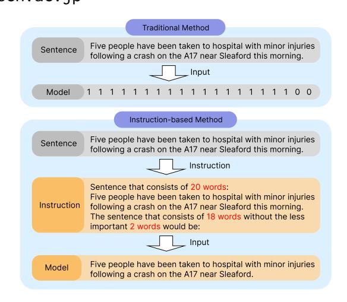
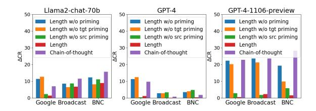
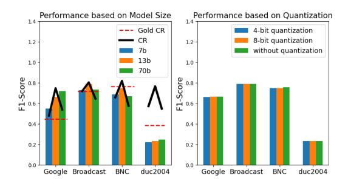

# InstructCMP: Length Control in Sentence Compression through Instruction-based Large Language Models

Juseon-Do1, \*Jingun Kwon1, Hidetaka Kamigaito2, and Manabu Okumura3

1Chungnam National University, 2Nara Institute of Science and Technology (NAIST)

3Tokyo Institute of Technology

doju00@o.cnu.ac.kr

jingun.kwon@cnu.ac.kr

kamigaito.h@is.naist.jp

oku@pi.titech.ac.jp

#### **Abstract**

Extractive summarization can produce faithful summaries but often requires additional constraints such as a desired summary length. Traditional sentence compression models do not typically consider the constraints because of their restricted model abilities, which require model modifications for coping with them. To bridge this gap, we propose Instruction-based Compression (InstructCMP), an approach to the sentence compression task that can consider the length constraint through instructions by leveraging the zero-shot task-solving abilities of Large Language Models (LLMs). For this purpose, we created new evaluation datasets by transforming traditional sentence compression datasets into an instruction format. By using the datasets, we first reveal that the current LLMs still face challenges in accurately controlling the length for a compressed text. To address this issue, we propose an approach named "length priming," that incorporates additional length information into the instructions without external resources. While the length priming effectively works in a zero-shot setting, a training dataset with the instructions would further improve the ability of length control. Thus, we additionally created a training dataset in an instruction format to fine-tune the model on it. Experimental results and analysis show that applying the length priming significantly improves performances of InstructCMP in both zero-shot and fine-tuning settings without the need of any model modifications.

#### 1 Introduction

Sentence compression is a task of creating a concise summary from an original sentence while conveying its key information, by deleting words in the sentence. Generally, sentence compression in extractive summarization provides more faithful summaries than abstractive summarization (Cao et al., 2018).

> **[图片提取文字 (无描述)]:**
> Traditional Method Five people have been taken to hospital with minor injuries Sentence following a crash on the A17 near Sleaford this morning. Input Model Instruction-based Method Five people have been taken to hospital with minor injuries Sentence following a crash on the A17 near Sleaford this morning. Instruction Sentence that consists of 20 words: Five people have been taken to hospital with minor injuries Instruction following a crash on the A17 near Sleaford this morning. The sentence that consists of 18 words without the less important 2 words would be: Input Five people have been taken to hospital with minor injuries Model following a crash on the A17 near Sleaford.

Figure 1: Process of transforming a traditional labeled dataset into an instruction-based format. The binary output of "1" or "0" from the traditional methods corresponds to keeping or dropping words, respectively. Length constraints in "length priming" are highlighted in red in the instruction.

While traditional sentence compression methods used tree trimming, the approaches can be affected by parsing errors (Jing, 2000; Knight and Marcu, 2000; Berg-Kirkpatrick et al., 2011; Filippova and Altun, 2013). The introduction of LSTM-based Seq2Seq approaches aims to address this issue although their performance tends to degrade in handling longer sentences (Filippova et al., 2015). To solve this problem, Kamigaito and Okumura (2020) incorporated syntactic dependency trees into the Seq2Seq attention mechanism (Kamigaito et al., 2018) by jointly learning the dependency trees and sentence compression models. However, the stateof-the-art model required a considerable amount of ground-truth data for training (Filippova and Altun, 2013; Hasegawa et al., 2017).

Recently, unsupervised sentence compression has gained attention by exploiting BERT-based encoder models (Devlin et al., 2019). These models incorporated various scoring functions that target improving fluency and faithfulness in compres-

\* corresponding author

sion without relying on ground-truth data (Niu et al., 2019; Zhou and Rush, 2019; Schumann et al., 2020; Ghalandari et al., 2022). However, these approaches are inefficient because they require extensive model modifications, such as including classifiers or modifying beam search for objective-specific fine-tuning.

In general, summarization requires additional constraints such as a summary length (Takase and Okazaki, 2019; Dou et al., 2021; Kwon et al., 2023a). The traditional task setting for sentence compression often did not consider this factor because of the restricted model abilities, which require model modifications to handle such constraints (Schumann et al., 2020; Ghalandari et al., 2022).

Recently, LLMs have gained considerable attention for their remarkable zero-shot task-solving abilities, especially under instruction-based settings (Ouyang et al., 2022; Wei et al., 2022a). Inspired by these latest advancements, we present Instruction-based Compression (InstructCMP), a novel approach to sentence compression that accommodates a length constraint through explicit instructions, without necessitating model modifications. To the best of our knowledge, this approach represents the first implementation of sentence compression in an instruction-based framework. For this purpose, we transformed traditional sentence compression datasets into an instruction-based format for evaluation.

However, recent LLMs do not consistently generate an output of the precise length, even when specific instructions to include such constraints are provided in a zero-shot manner (Zhou et al., 2023; Qin et al., 2023). Furthermore, as we validate it later, even when testing with the latest powerful models, such as ChatGPT (GPT-4) and ChatGPT (GPT-4-1106-preview), accurately adhering to length constraints remains a substantial challenge.

To address this problem, we propose an instruction approach for better length control, which is named "length priming." We incorporate additional length information (Misra et al., 2020) into the instruction. In addition to specifying the number of deleted words for the desired length, we include the length to be retained and the number of words in the source sentence in the instruction, without any external resources. To further improve length controllability, we additionally created a training

| Work                          | Length Const. | Mod. |
|-------------------------------|---------------|------|
| Filippova et al. (2015)*      | Х             | Х    |
| Zhao et al. (2018)*           | X             | X    |
| Kamigaito and Okumura (2020)* | X             | X    |
| Schumann et al. (2020)        | ✓             | X    |
| Ghalandari et al. (2022)      | <b>✓</b>      | X    |
| Ours (InstructCMP)            | <b>✓</b>      | ~    |

Table 1: Comparison of various sentence compression models with InstructCMP. \* indicates that the model was learned in a supervised manner, while others were learned in an unsupervised manner. Mod. indicates a requirement of model modifications for constraints.

dataset with the instructions to fine-tune the model using the dataset. Figure 1 shows the transformation process for an instruction format.

We conducted experiments on four benchmark datasets and performed an in-depth analysis to evaluate the effectiveness of LLMs in compressing sentences under the length constraint. The analysis considers the following factors: the model type and the number of parameters for the model size. Experimental results show that InstructCMP with length priming compresses sentences in a zero-shot setting while successfully keeping the desired length without model modifications. The performance can be further improved by fine-tuning it with the created instruction-based training dataset. The "length priming" method proves effective in both zero-shot and fine-tuning settings, as shown by significant improvements in the ROUGE metrics and adherence to the length constraint, even when using ChatGPT (GPT-4) and ChatGPT (GPT4-1106-preview). Our in-depth analysis also showed that InstructCMP can compress sentences while maintaining faithfulness. Our experiments show that instruction-based models like ChatGPT can effectively control the length when provided with more specific lengthrelated information.2

## 2 Problem Statement

The traditional approach to sentence compression is considered as a sequential labeling task (Filippova et al., 2015; Wang et al., 2017; Zhao et al., 2018; Kamigaito and Okumura, 2020; Schumann et al., 2020; Ghalandari et al., 2022). Each source token in a sequence, represented as  $\mathbf{x} = \{x_0, x_1, ..., x_n\}$ , is processed using a sentence compression model to predict a corresponding label sequence, which is

https://chat.openai.com/

&lt;sup>2Our code and datasets are available at: https://github.com/JuseonDo.

y = {y0, y1, ..., yn}, where yi ∈ {1, 0}.

While the method is straightforward, it has limitations in incorporating additional constraints such as a desired length. Addressing these requirements in the traditional approach typically involves modifications to the model, which is inefficient [\(Schu](#page-12-0)[mann et al.,](#page-12-0) [2020;](#page-12-0) [Ghalandari et al.,](#page-10-7) [2022\)](#page-10-7).

To overcome these limitations, we utilize the recent powerful instruction-based LLMs for the sentence compression task [\(Touvron et al.,](#page-12-4) [2023;](#page-12-4) [Chung et al.,](#page-9-4) [2022\)](#page-9-4). Table [1](#page-1-2) shows a comparison between previous work on traditional sentence compression and InstructCMP. Unlike the previous work, InstructCMP incorporates a length constraint directly into the instruction format, allowing models to process and learn the constraint as a part of their input. This allows an efficient and flexible solution for practical sentence compression, without extensive model modifications.

## 3 Instruction-based Compression

In this section, we describe InstructCMP. We consider "length priming" for a length constraint in it. We created new evaluation datasets by transforming traditional sentence compression datasets into an instruction format. To further improve performances of InstructCMP, we also created a new training dataset in an instruction-based template.

### 3.1 Instruction Template

Table [2](#page-3-0) shows instructions that include a length constraint. The first instruction permits InstructCMP to compress text by deleting words without any constraints. However, in general, summarization requires a desired length for compressed texts [\(Makino et al.,](#page-11-4) [2019;](#page-11-4) [Dou et al.,](#page-9-3) [2021;](#page-9-3) [He](#page-10-9) [et al.,](#page-10-9) [2022;](#page-10-9) [Kwon et al.,](#page-10-8) [2023a\)](#page-10-8).

Length Priming. To apply the length constraint, we first construct an instruction that deletes words to meet a desired length (Constraint 2). It is easy to calculate the number of words to be deleted for any desired length.

However, LLMs do not consistently follow instructions, particularly when processing length constraints [\(Zhou et al.,](#page-13-1) [2023;](#page-13-1) [Qin et al.,](#page-11-2) [2023\)](#page-11-2). To address this issue, we propose the "length priming" method for the length constraint instruction for enhanced length comprehension. Constraint 3 considers the total length of the source text and the number of words that should be kept and deleted together. Considering such additional length infor-

mation can enable InstructCMP to recognize the length constraint more effectively. The number of words that should be kept is automatically calculated from the target desired length.

Constraint 3-1 applies the "length priming" only to the source text based on its length, whereas Constraint 3-2 applies it solely to the target text based on the number of words that should be kept and deleted together.

### 3.2 Dataset Creation

We consider four benchmark datasets. The Google dataset (Google) was automatically created by considering the syntactic dependency tree structure from news headlines [\(Filippova and Altun,](#page-10-2) [2013\)](#page-10-2). The training, validation, and test datasets consist of 200,000, 1,000, and 1,000 pairs, respectively. For the test dataset used in the evaluation, the gold compression ratio is 0.45. The Broadcast (Broad) and BNC (BNC) datasets [\(Clarke and Lapata,](#page-9-5) [2008\)](#page-9-5) comprise manually compressed sentences. Each of these datasets contains 1,370 and 1,629 evaluation pairs, respectively. The gold compression ratios of these datasets, which are 0.76 and 0.72 respectively, are longer than those of other evaluation datasets. DUC2004 (TASK1) (DUC) comprises 500 pairs with a gold compression ratio of 0.39. Unlike other evaluation datasets, this dataset includes abstract summaries as its ground truth.

We created new datasets by transforming traditional sentence compression datasets into an instruction format. For length constraint instructions, we inject lengths of ground-truth summaries.

### 3.3 Instruction-based Fine-tuning

To improve performances by leveraging LLM's generalizability [\(Wang et al.,](#page-12-5) [2022;](#page-12-5) [Wei et al.,](#page-12-2) [2022a;](#page-12-2) [Chung et al.,](#page-9-4) [2022\)](#page-9-4), we also created a training dataset for instruction-based fine-tuning by sampling 5% of the training dataset from Google. Through this fine-tuning, we aim to enhance a model for better learning and improving abilities to handle length constraints in compressing sentences without any model modifications.

### 4 Experiments

### 4.1 Experimental Settings

Evaluation Metrics. F1 scores of ROUGE-1 (R-1), -2 (R-2), and -L (R-L), the F1-score for kept tokens (F1), and the BERT score (BS) [\(Zhang\\*](#page-13-3) [et al.,](#page-13-3) [2020\)](#page-13-3) were used to evaluate compression

| #   | Constraint                | Instruction                                                                                                                                         |
|-----|---------------------------|-----------------------------------------------------------------------------------------------------------------------------------------------------|
| 1   | ✗                         | Sentence:\n{src}\nThe sentence without the less important words would be:\n                                                                         |
| 2   | Length w/o priming        | Sentence:\n{src}\nThe sentence without the less important {del} words would be:\n                                                                   |
| 3   | Length                    | Sentence that consists of {src len} words:\n{src}\nThe sentence that consists of {keep} words without the less important {del} words would be:\n |
| 3-1 | Length w/o tgt priming | Sentence that consists of {src len} words:\n{src}\nThe sentence without the less important {del} words would be:\n                               |
| 3-2 | Length w/o src priming | Sentence:\n{src}\nThe sentence that consists of {keep} words without the less important {del} words would be:\n                                  |

Table 2: Instruction formats for length constraints, created by transforming a traditional dataset. "src" indicates the placeholder for a source sentence. "del" denotes the placeholder for the number of deleted words. "keep" and "src len" denote additional length information.

quality. The ROUGE scores were calculated using the implementation provided by Google Research.[3](#page-3-1)

To evaluate performances related to a length constraint, we calculated ∆CR, the difference between the model-generated compression ratio and the gold compression ratio. ∆CR evaluates how close the compression ratio of model-generated outputs is to the gold compressed summary [\(Kami](#page-10-5)[gaito et al.,](#page-10-5) [2018;](#page-10-5) [Kamigaito and Okumura,](#page-10-4) [2020\)](#page-10-4). Because InstructCMP can produce novel words, we counted the number of the novel words in the model-generated compressed summaries. Thus, *novel* represents the ratio of novel words that do not appear in the source text.

Implementation Details. We employed the instruction-based open-source Llama2-13B-chat model [\(Touvron et al.,](#page-12-4) [2023\)](#page-12-4) [4](#page-3-2) as our backbone model. We tested various instructions on the validation dataset from Google and made selections based on their performance. To explore various parameter numbers, we experimented with 4-bit and 8-bit quantizations, as well as without quantization [\(Jacob et al.,](#page-10-10) [2018\)](#page-10-10) using PyTorch.[5](#page-3-3) We also evaluated the performance across various model sizes, including 7B and 70B, and compared various model types, specifically the encoder-decoder based models of FLAN-T5-XXL (11B) [\(Chung](#page-9-4) [et al.,](#page-9-4) [2022\)](#page-9-4) [6](#page-3-4) and FLAN-UL2 (20B) [\(Tay et al.,](#page-12-6) [2023\)](#page-12-6).[7](#page-3-5)

For instruction-based fine-tuning, we considered QLoRA, which can preserve the full 16-bit fine-tuning performance [\(Dettmers et al.,](#page-9-6) [2023\)](#page-9-6).

QLoRA is an extended version of Low-Rank Adapters (LoRA) [\(Hu et al.,](#page-10-11) [2022\)](#page-10-11), an improved Parameter-Efficient Fine-Tuning (PEFT) [\(Man](#page-11-5)[grulkar et al.,](#page-11-5) [2022\)](#page-11-5) method for LLMs. This method combines low-rank and trainable matrices with the frozen weights in each layer of Transformer, building upon the foundational approach of LoRA. We incorporated low-rank matrices into the query and value weights using a LoRA attention dimension of 8. During training, we used 8-bit quantization for QLoRA, and during inference, we employed 4-bit quantization.

### 4.2 Main Results

Table [3](#page-4-0) shows the performances of InstructCMP based on the Llama2-13B-chat model in a zeroshot setting, used directly without additional training, and in the QLoRA instruction-tuning setting, which involves fine-tuning of InstructCMP. Because prompting techniques for LLMs, such as few-shot [\(Min et al.,](#page-11-6) [2022\)](#page-11-6), directional stimulus [\(Li](#page-11-7) [et al.,](#page-11-7) [2023\)](#page-11-7), and generated knowledge [\(Liu et al.,](#page-11-8) [2022\)](#page-11-8) methods, require external resources, we compared "length priming" to prompting techniques of chain-of-thought [\(Wei et al.,](#page-12-7) [2022b\)](#page-12-7) and treeof-thought in a single prompt [\(Yao et al.,](#page-13-4) [2023;](#page-13-4) [Hulbert,](#page-10-12) [2023\)](#page-10-12) by adding them at the beginning of length constraint instructions (#2 in Table [2\)](#page-3-0).

Performance in Instruction-based Zero-shot.[8](#page-3-6) Even in a zero-shot setting, InstructCMP without a length constraint (#1 in Table [2\)](#page-3-0) successfully compresses sentences, while it cannot necessarily meet the length. In applying length constraints with "length priming", consistently improved performances are observed in both ROUGE and ∆*CR*. In addition, our "length priming" significantly outper-

3 [https://github.com/google-research/](https://github.com/google-research/google-research/tree/master/rouge) [google-research/tree/master/rouge](https://github.com/google-research/google-research/tree/master/rouge)

4 [https://huggingface.co/meta-llama/](https://huggingface.co/meta-llama/Llama-2-13b-chat-hf) [Llama-2-13b-chat-hf](https://huggingface.co/meta-llama/Llama-2-13b-chat-hf)

5 <https://github.com/pytorch/pytorch>

6 <https://huggingface.co/google/flan-t5-xxl>

7 <https://huggingface.co/google/flan-ul2>

8Experiments considering various instructions on the validation dataset from Google are detailed in Appendix [A.](#page-13-5)

| Dataset | Setting           | Instruction | Prompting        | R-1    | R-2    | R-L    | F1    | BS   | ∆ CR    | novel |
|---------|-------------------|-------------|------------------|--------|--------|--------|-------|------|---------|-------|
|         |                   | #1          | ✗                | 65.88  | 55.48  | 65.42  | 0.66  | 0.66 | +30.22  | 0.28  |
|         |                   | #2          | Chain-of-Thought | 65.74  | 56.12  | 65.56  | 0.66  | 0.66 | +32.46  | 0.11  |
|         | Zero-shot         | #2          | Tree-of-Thought  | 65.56  | 55.34  | 65.19  | 0.66  | 0.66 | +30.99  | 0.17  |
|         |                   | #3          | Priming          | 74.59† | 62.45† | 73.69† | 0.74† | 0.73 | +10.13† | 0.57  |
| Google  |                   | #1          | ✗                | 82.85  | 75.15  | 82.58  | 0.84  | 0.82 | -1.28   | 0.17  |
|         | QLoRA fine-tuning | #2          | Chain-of-Thought | 84.88  | 77.20  | 84.56  | 0.86  | 0.83 | -0.90   | 0.18  |
|         |                   | #2          | Tree-of-Thought  | 84.69  | 76.89  | 84.26  | 0.85  | 0.83 | -1.90   | 0.17  |
|         |                   | #3          | Priming          | 86.88† | 79.55† | 86.26† | 0.87† | 0.84 | -0.16†  | 0.17  |
|         |                   | #1          | ✗                | 79.30  | 65.54  | 78.27  | 0.79  | 0.76 | +4.21   | 0.32  |
|         |                   | #2          | Chain-of-Thought | 78.94  | 65.76  | 78.21  | 0.79  | 0.75 | +3.99   | 0.19  |
|         | Zero-shot         | #2          | Tree-of-Thought  | 78.02  | 63.90  | 77.32  | 0.78  | 0.74 | +4.17   | 0.33  |
|         |                   | #3          | Priming          | 80.27† | 66.62† | 79.30† | 0.80† | 0.76 | -0.01†  | 0.33  |
| Broad   |                   | #1          | ✗                | 70.14  | 58.15  | 69.70  | 0.68  | 0.68 | -15.88  | 0.34  |
|         |                   | #2          | Chain-of-Thought | 78.24  | 65.61  | 77.78  | 0.77  | 0.72 | -3.96   | 0.36  |
|         | QLoRA fine-tuning | #2          | Tree-of-Thought  | 77.68  | 64.94  | 77.06  | 0.76  | 0.71 | -7.46   | 0.32  |
|         |                   | #3          | Priming          | 82.63† | 69.76† | 81.16† | 0.81† | 0.75 | -1.38†  | 0.35  |
|         |                   | #1          | ✗                | 74.81  | 61.21  | 73.64  | 0.75  | 0.70 | +10.38  | 0.37  |
|         |                   | #2          | Chain-of-Thought | 74.46  | 61.03  | 73.66  | 0.75  | 0.69 | +3.57   | 0.11  |
|         | Zero-shot         | #2          | Tree-of-Thought  | 73.81  | 60.11  | 72.82  | 0.74  | 0.68 | +7.01   | 0.26  |
|         |                   | #3          | Priming          | 75.78† | 61.76  | 74.52† | 0.76† | 0.70 | +0.16†  | 0.25  |
| BNC     |                   | #1          | ✗                | 61.28  | 49.61  | 60.51  | 0.60  | 0.59 | -24.21  | 0.27  |
|         | QLoRA fine-tuning | #2          | Chain-of-Thought | 75.58  | 62.55  | 74.76  | 0.74  | 0.68 | -4.35   | 0.27  |
|         |                   | #2          | Tree-of-Thought  | 73.37  | 60.22  | 72.30  | 0.72  | 0.66 | -10.81  | 0.25  |
|         |                   | #3          | Priming          | 77.54† | 64.38† | 76.00† | 0.76† | 0.70 | -4.13   | 0.26  |
|         |                   | #1          | ✗                | 27.09  | 8.72   | 22.65  | 0.23  | 0.33 | +37.97  | 0.25  |
|         |                   | #2          | Chain-of-Thought | 26.28  | 8.35   | 21.86  | 0.23  | 0.32 | +40.53  | 0.10  |
|         | Zero-shot         | #2          | Tree-of-Thought  | 26.13  | 8.20   | 21.75  | 0.23  | 0.32 | +40.31  | 0.19  |
|         |                   | #3          | Priming          | 28.19† | 9.66†  | 24.56† | 0.24† | 0.34 | +15.08† | 0.81  |
| DUC     |                   | #1          | ✗                | 27.31  | 9.21   | 24.34  | 0.24  | 0.35 | +0.28   | 0.18  |
|         |                   | #2          | Chain-of-Thought | 26.29  | 8.62   | 23.40  | 0.23  | 0.34 | -3.10   | 0.19  |
|         | QLoRA fine-tuning | #2          | Tree-of-Thought  | 26.28  | 8.38   | 23.58  | 0.23  | 0.34 | -2.29   | 0.20  |
|         |                   | #3          | Priming          | 26.83  | 8.57   | 23.96  | 0.23  | 0.33 | +0.78   | 0.21  |

Table 3: Experimental results of InstructCMP using Llama2-13B-chat on Google, Broad, BNC, and DUC. Checkmark indicates not applying a length constraint. † indicates the improvement is significant (*p*<0.05) compared with the underlined (generally, the best baseline score) on each dataset.

forms other prompting methods, chain-of-thought and tree-of-thought, in both length controllability and ROUGE metrics.

However, controlling the length of outputs for Google and DUC proved to be more challenging than Broad and BNC, specifically, in a zero-shot setting. We think this challenge arises from the nature of datasets, whose compression ratio is lower. Table [4](#page-5-0) shows the results based on a target compression ratio of 0.2 and a target word count of 5 words, respectively. We observed that when the compression ratio is lower, the LLMs have difficulties maintaining both informativeness and length controllability.

Performance in Instruction-based Fine-tuning.[9](#page-4-1) Following instruction-based QLoRA fine-tuning, the created training dataset further improves per-

formances of InstructCMP. As shown in ∆*CR* for Broad and BNC, the model without the length constraint was trained to compress sentences more closely aligned with the gold compression ratio of Google. However, the performance degradation was observed on DUC when fine-tuning was applied using Google, due to the different natures of their abstractive and extractive ground-truth summaries.

Length Priming. The ablation results for "length priming" in instructions are presented in Table [6.](#page-5-1) We first compare performances of "length priming" in an unsupervised zero-shot setting. It significantly improved performances on all datasets in terms of ∆CR compared to w/o priming. Even in a supervised instruction-based fine-tuning, "length priming" largely improved performances in both ROUGE metrics and length controllability. The exception is on DUC because of its nature of the abstractive gold summary.

9Experiments considering 0.5% and 1% randomly sampled training datasets from Google are detailed in Appendix [B.](#page-13-6)

| Data   | Boundary       | cnt | R-1   | R-2   | R-L   | $\mathbf{F}_1$ | $\Delta$ CR | src len | tgt len | gen len |
|--------|----------------|-----|-------|-------|-------|----------------|-------------|---------|---------|---------|
|        | 0.8~1.0        | 32  | 86.05 | 74.22 | 85.18 | 0.85           | -1.02       | -       | -       | -       |
|        | $0.6 \sim 0.8$ | 180 | 81.09 | 69.64 | 79.96 | 0.80           | 8.24        | -       | -       | -       |
|        | $0.4 \sim 0.6$ | 343 | 77.86 | 66.87 | 77.15 | 0.78           | 10.96       | -       | -       | -       |
|        | $0.2 \sim 0.4$ | 403 | 70.15 | 56.94 | 69.15 | 0.69           | 11.05       | -       | -       | -       |
| C1-    | $0.0 \sim 0.2$ | 42  | 53.78 | 39.52 | 53.36 | 0.51           | 11.18       | -       | -       | -       |
| Google | 20~            | 13  | 80.43 | 69.01 | 79.67 | 0.79           | -           | 38.08   | 20.85   | 25.31   |
|        | $15 \sim 20$   | 127 | 78.22 | 66.98 | 76.86 | 0.77           | -           | 29.46   | 16.31   | 18.58   |
|        | 10~15          | 518 | 75.97 | 64.40 | 75.03 | 0.76           | -           | 26.74   | 11.68   | 14.75   |
|        | 5~10           | 338 | 71.11 | 57.75 | 70.45 | 0.70           | -           | 25.90   | 7.69    | 10.16   |
|        | 0~5            | 4   | 55.42 | 43.45 | 55.52 | 0.58           | -           | 27.25   | 4.00    | 7.75    |
|        | $0.8 \sim 1.0$ | 8   | 11.23 | 3.43  | 10.26 | 0.15           | -9.44       | -       | -       | -       |
|        | $0.6 \sim 0.8$ | 20  | 18.18 | 5.27  | 15.36 | 0.16           | 15.43       | -       | -       | -       |
|        | $0.4 \sim 0.6$ | 118 | 30.51 | 10.48 | 26.12 | 0.27           | 14.60       | -       | -       | -       |
|        | $0.2 \sim 0.4$ | 326 | 29.56 | 10.24 | 25.93 | 0.24           | 17.64       | -       | -       | -       |
| DUC    | $0.0 \sim 0.2$ | 18  | 20.61 | 5.91  | 17.88 | 0.18           | 11.86       | -       | -       | -       |
|        | 15~20          | 26  | 22.97 | 5.96  | 18.45 | 0.24           | -           | 32.15   | 15.65   | 19.96   |
|        | 10~15          | 363 | 29.95 | 10.23 | 26.07 | 0.26           | -           | 33.55   | 11.62   | 17.06   |
|        | 5~10           | 101 | 25.66 | 9.37  | 22.81 | 0.19           | -           | 33.06   | 8.38    | 14.11   |

Table 4: Effect of compression ratio and word count. cnt indicates the number of instances in each boundary.

| Data   | Setting            | Output     | Gram.                         | Faith.           | Info.                            |
|--------|--------------------|------------|-------------------------------|------------------|----------------------------------|
| Google | QLoRA Zero-shot | 13B 13B | <b>4.14</b> † 4.06 | 4.09 4.09     | <b>4.06</b> † 4.00    |
|        | Gold               |            | 4.03                          | 4.11             | 4.05                             |
| Broad  | Zero-shot          | 13B 70B | <b>3.92</b> 3.90              | <b>3.88</b> 3.87 | 3.86 <b>3.90</b> † |
|        | Gold               |            | 3.92                          | 3.88             | 3.85                             |
| BNC    | Zero-shot          | 13B 70B | <b>3.98</b> 3.96              | 3.93 3.91     | 3.93 <b>3.96</b>              |
|        | Gold               |            | 3.96                          | 3.94             | 3.92                             |

Table 5: Human evaluation results. The notations are the same as those in Table 3.

We also compare the effectiveness of "length priming," using larger models, such as Llama-2-70B-chat-hf, ChatGPT (GPT-4), and ChatGPT (GPT-4-1106-preview). Figure 2 shows the results. We confirm that "length priming" is essential for length constraints, even in the most recent and powerful LLMs.10

#### 5 Analysis

#### 5.1 Parameter Sizes

The left graph of Figure 3 shows the  $F_1$  score for kept tokens and the model-generated compression ratio (CR), compared to the gold compression ratio, based on zero-shot InstructCMP without a length

| Data   | Method      | Instruction | R-1                | R-2                | R-L                | $\mathbf{F}_1$   | BS   | $\Delta$ CR        |
|--------|-------------|-------------|--------------------|--------------------|--------------------|------------------|------|--------------------|
|        |             | #2          | 63.73              | 54.04              | 63.54              | 0.64             | 0.64 | +38.44             |
|        | 7b          | #3          | 74.59 † | 62.45 † | 73.69 † | $0.74^{\dagger}$ | 0.73 | $+10.13^{\dagger}$ |
|        | Zero-shot   | #3-1        | 67.32              | 57.61              | 67.01              | 0.68             | 0.67 | +30.63             |
| Google |             | #3-2        | 73.72              | 60.66              | 72.94              | 0.72             | 0.72 | +9.58              |
| Googic |             | #2          | 84.99              | 77.43              | 84.69              | 0.86             | 0.83 | +1.45              |
|        | QLoRA       | #3          | 86.88 † | $79.55^{\dagger}$  | $86.26^{\dagger}$  | $0.87^{\dagger}$ | 0.84 | $-0.16^{\dagger}$  |
|        | fine-tuning | #3-1        | 85.20              | 77.46              | 84.72              | 0.86             | 0.83 | +0.76              |
|        |             | #3-2        | 86.80              | 79.58              | 86.29              | 0.87             | 0.84 | +0.12              |
|        |             | #2          | 81.08              | 67.79              | 80.55              | 0.81             | 0.77 | +8.78              |
|        | Zero-shot   | #3          | 80.27              | 66.62              | 79.30              | 0.80             | 0.76 | -0.01 † |
|        | Zero-snot   | #3-1        | 81.13              | 68.14              | 80.55              | 0.81             | 0.77 | +6.91              |
| Broad  |             | #3-2        | 78.64              | 64.58              | 77.63              | 0.78             | 0.74 | -1.42              |
| Dioau  |             | #2          | 80.34              | 67.77              | 79.81              | 0.78             | 0.75 | -1.02              |
|        | QLoRA       | #3          | 82.63 † | 69.76 † | 81.16 † | $0.81^{\dagger}$ | 0.75 | -1.38              |
|        | fine-tuning | #3-1        | 82.80              | 70.39              | 82.05              | 0.81             | 0.77 | +0.90              |
|        |             | #3-2        | 82.66              | 69.81              | 81.16              | 0.81             | 0.75 | -1.08              |
|        |             | #2          | 77.36              | 63.64              | 76.59              | 0.78             | 0.72 | +10.46             |
|        | Zero-shot   | #3          | 75.78              | 61.76              | 74.52              | 0.76             | 0.70 | $+0.16^{\dagger}$  |
|        | Zero-snot   | #3-1        | 77.24              | 63.52              | 76.50              | 0.77             | 0.72 | +8.53              |
| BNC    |             | #3-2        | 73.16              | 59.17              | 71.82              | 0.73             | 0.68 | -4.05              |
| BNC    |             | #2          | 73.74              | 61.52              | 72.92              | 0.72             | 0.68 | -5.50              |
|        | QLoRA       | #3          | $77.54^{\dagger}$  | $64.38^{\dagger}$  | $76.00^{\dagger}$  | $0.76^{\dagger}$ | 0.70 | $-4.13^{\dagger}$  |
|        | fine-tuning | #3-1        | 77.62              | 64.58              | 76.45              | 0.77             | 0.70 | -1.49              |
|        |             | #3-2        | 77.40              | 64.20              | 75.81              | 0.76             | 0.68 | -4.03              |
|        |             | #2          | 26.23              | 8.38               | 21.70              | 0.23             | 0.31 | +46.37             |
|        | Zero-shot   | #3          | 28.19 † | $9.66^{\dagger}$   | $24.56^{\dagger}$  | $0.24^{\dagger}$ | 0.34 | $+15.08^{\dagger}$ |
|        | Zero-snot   | #3-1        | 26.53              | 8.59               | 22.33              | 0.23             | 0.32 | +41.51             |
| DUC    |             | #3-2        | 28.41              | 9.85               | 24.66              | 0.24             | 0.34 | +16.45             |
| DUC    |             | #2          | 27.20              | 8.98               | 24.27              | 0.24             | 0.35 | +0.47              |
|        | QLoRA       | #3          | 26.83              | 8.57               | 23.96              | 0.23             | 0.33 | +0.78              |
|        | fine-tuning | #3-1        | 26.25              | 8.27               | 23.49              | 0.23             | 0.34 | -1.22              |
|        |             | #3-2        | 26.46              | 8.31               | 23.62              | 0.23             | 0.33 | +1.32              |

Table 6: Ablation study for "length priming." The notations are the same as those in Table 3.

constraint on the Llama2-chat model with 7B, 13B, and 70B parameters. On Google and DUC, the  $F_1$  scores increased with enlarging the model size, achieving compression closer to the gold compression ratio. However, on Broadcast and BNC, which have high gold compression ratios, InstructCMP with the 70B model compresses sentences more concisely, resulting in a compression ratio that significantly deviates from the gold compression ratio,

&lt;sup>10When we additionally tested the chain-of-thought and tree-of-thought prompting methods on these larger models, their length controllability was similar to each other, which is similar to the results in Table 3.

> **[图片提取文字 (无描述)]:**
> Llama2-chat-70b GPT-4 GPT-4-1106-preview 50 50 50 Length w/o priming Length w/o priming Length w/o priming Length w/o tgt priming Length w/o tgt priming Length w/o tgt priming 40 40 40 Length w/o src priming Length w/o src priming Length w/o src priming Lenath Lenath Lenath 30 30 30 **ACR** Chain-of-thought Chain-of-thought Chain-of-thought ACR 20 20 20 10 10 10 Google Broadcast Google Broadcast Google Broadcast

Figure 2: Absolute  $\Delta CR$  for "length priming" types.

> **[图片提取文字 (无描述)]:**
> Performance based on Model Size Performance based on Quantization 1.4 1.4 Gold CR 4-bit quantization 8-bit quantization CR 1.2 1.2 7b without quantization 1.0 13b 1.0 70b F1-Score F1-Score 0.8 0.6 0.4 0.4 0.2 0.2 0.0 0.0 Google Broadcast BNC duc2004 Google Broadcast BNC duc2004

Figure 3: Performances for different model sizes and quantizations.

consequently decreasing  $F_1$  scores compared to the 13B model.

To further investigate this, we conducted human evaluations. We sampled 100 instances each from Google, Broad, and BNC. By using Amazon Mechanical Turk, we assigned in total 120 evaluators who obtained both US high school and US bachelor's degrees for grading the results with scores from 1 to 5 (5 is the best) in terms of grammatical correctness (Gram), factual consistency (Faith), and a balance of redundancy and informativeness (Info). Table 5 shows the results. Because of the automatically constructed nature of Google, OLora and zero-shot settings can yield higher grammaticality scores than the gold summary. These results also indicate gold summaries of Broad and BNC are actually redundant (Ghalandari et al., 2022), and our instruction-based approach can generate faithful, informative, and grammatical summaries.

The right graph of Figure 3 shows the results of zero-shot InstrcutCMP without a length constraint on Llama2-13B-chat. Interestingly, there are no significant differences in performance among the 4-bit, 8-bit, and nonquantized versions.

### 5.2 Model Types

It is also of interest to draw comparisons with other instruction-based models, such as FLAN-T5-XXL and FLAN-UL2, both of which employ the encoder-decoder architecture. However, they did not effectively compress sentences using instruction templates in Table 2. We think this is due

| Data   | Model  | Instruction | R-1               | R-2               | R-L                | $\mathbf{F}_1$   | $\Delta$ CR        |
|--------|--------|-------------|-------------------|-------------------|--------------------|------------------|--------------------|
|        |        | #1          | 60.06             | 50.52             | 59.81              | 0.60             | +47.84             |
|        | T5-XXL | #2          | 62.41             | 51.18             | 61.90              | 0.61             | +35.72             |
| C1-    |        | #3          | $66.22^{\dagger}$ | 51.68             | 65.43 † | $0.62^{\dagger}$ | $+19.51^{\dagger}$ |
| Google |        | #1          | 63.53             | 45.79             | 62.35              | 0.57             | +11.92             |
|        | UL2    | #2          | 64.72             | 44.38             | 63.87              | 0.57             | +1.11              |
|        |        | #3          | $66.06^{\dagger}$ | $47.24^{\dagger}$ | 65.39 † | $0.59^{\dagger}$ | +6.34              |
|        |        | #1          | 82.45             | 69.33             | 81.93              | 0.81             | +12.72             |
|        | T5-XXL | #2          | 74.42             | 59.57             | 72.96              | 0.72             | +2.18              |
| Broad  |        | #3          | 77.68             | 63.47             | 76.58              | 0.76             | +4.78              |
| вгоаа  |        | #1          | 73.82             | 56.45             | 70.90              | 0.70             | <u>-7.77</u>       |
|        | UL2    | #2          | 68.79             | 52.27             | 66.70              | 0.66             | -9.84              |
|        |        | #3          | 74.31             | $59.12^{\dagger}$ | $72.79^{\dagger}$  | $0.71^\dagger$   | $-4.04^{\dagger}$  |
|        |        | #1          | 75.35             | 61.44             | 74.33              | 0.74             | +11.30             |
|        | T5-XXL | #2          | 63.99             | 48.06             | 61.90              | 0.61             | <u>-5.48</u>       |
| DNG    |        | #3          | 65.43             | 49.78             | 63.55              | 0.62             | $-3.43^{\dagger}$  |
| BNC    |        | #1          | 67.42             | 49.90             | 63.88              | 0.62             | -10.64             |
|        | UL2    | #2          | 60.40             | 43.54             | 57.45              | 0.56             | -13.62             |
|        |        | #3          | 64.88             | 49.03             | 62.81              | 0.61             | $-8.17^{\dagger}$  |

Table 7: Experimental results from zero-shot instruction-based FLAN models using encoder-decoder architectures. The notations are the same as those in Table 3.

to the nature of their pre-training, which causes potential gaps between the pre-training steps and the instruction templates for extractive summarization settings (Kwon et al., 2023a). Thus, we used slightly modified instruction templates. 11 Table 7 shows the results. Our "length priming" can improve length controllability by keeping ROUGE metrics compared to w/o priming.

#### 5.3 Case Study

Table 8 shows the outputs of zero-shot InstructCMP based on the Llama-13B-chat model. The first example shows the controllability of the length constraint instruction. Even when instructed to delete zero words, InstructCMP follows the instruction correctly. The second example shows the flaw-less grammatical capabilities of LLMs (Mitrović et al., 2023). When deleting a single word can cause a grammatical error, InstructCMP can correct the error by paraphrasing, represented as *novel* in Table 3. The third example shows the output of InstructCMP in response to the length constraint. "Length priming" assists InstructCMP to compress a source text to meet a desired length, performing better than the length constraint without priming.

### 5.4 Comparison with the Baselines

We compare InstructCMP with traditional state-of-the-art (SOTA) baselines, specifically **SCRL**, 12 which employs reinforcement learning optimized

&lt;sup>11Experimental results using instruction templates in Table 2 and modified instruction templates are in Appendix C.

12https://github.com/complementizer/
rl-sentence-compression

**Source.** Eni has won a license for exploration block SM-857 offshore Rrazil

Instruction. Sentence that consists of 11 words:\n{source}\nThe sentence that consists of 11 words without the less important 0 words would be\n:

**InstructCMP.** Eni has won a license for exploration block SM-857 offshore Brazil.

**Source.** Rick Riordan has revealed the cover for his latest crossover short story, "Staff of Serapis", which features Annabeth Chase and Sadie Kane.

**InstructCMP.** Rick Riordan has revealed the cover for his latest crossover short story, featuring Annabeth Chase and Sadie Kane.

**Source.** Chinese shares closed lower Wednesday dragged down by the bio-pharmaceutical sector and small enterprises with growth potential.

**Length const. w/o priming.** Chinese shares closed lower Wednesday dragged down by the bio-pharmaceutical sector.

Length const. Chinese shares closed lower Wednesday

Gold: Chinese shares closed lower Wednesday.

Table 8: Outputs of InstructCMP on Google.

| Data   | Model       | R-1                | R-2               | R-L                | $\mathbf{F}_1$   | BS   | len              |
|--------|-------------|--------------------|-------------------|--------------------|------------------|------|------------------|
|        |             | Ur                 | supervise         | ed                 |                  |      |                  |
|        | SCRL*       | 70.22              | 53.03             | 69.84              | 0.71             |      | 10.8             |
| Google | SCRL        | 70.53              | 53.30             | 70.07              | 0.71             | 0.65 | 10.3             |
|        | InstructCMP | 74.92 † | $62.53^{\dagger}$ | 73.83 † | $0.75^{\dagger}$ | 0.75 | $10.8^{\dagger}$ |
| Broad  | SCRL        | 83.04              | 66.64             | 82.64              | 0.82             | 0.74 | 81%              |
|        | InstructCMP | 77.93              | 63.33             | 76.85              | 0.78             | 0.74 | 77%†             |
| BNC    | SCRL        | 79.55              | 62.24             | 78.69              | 0.79             | 0.69 | <u>79%</u>       |
| DINC   | InstructCMP | 75.11              | 60.56             | 74.03              | 0.75             | 0.70 | 74% † |
| DUC    | SCRL        | 26.78              | 8.14              | 23.30              | 0.22             | 0.25 | 10.0             |
| DUC    | InstructCMP | $28.14^{\dagger}$  | 9.43 † | $24.82^{\dagger}$  | $0.23^{\dagger}$ | 0.32 | $10.6^{\dagger}$ |
|        |             | S                  | upervised         | i                  |                  |      |                  |
|        | SLAHAN*     |                    |                   |                    | 0.86             |      |                  |
| Google | SLAHAN      | 82.98              | 74.35             | 82.75              | 0.83             | 0.78 | 9.3              |
|        | InstructCMP | 82.85              | $75.15^{\dagger}$ | 82.58              | $0.84^{\dagger}$ | 0.82 | 9.5              |

Table 9: Comparison with traditional state-of-the-art baselines. \* indicates the reported score in the original paper. *len* indicates the generated summary length. The notations are the same as those in Table 3.

in unsupervised settings, and **SLAHAN**,13 which recursively tracks parent and child words and leverages BERT embeddings optimized in supervised settings, trained on Google (Kamigaito and Okumura, 2020).

Following SCRL, we set a desired length of 11 for Google and DUC. In line with the previous work, we truncated model-generated outputs to 75 characters and used ROUGE recall scores for DUC (Schumann et al., 2020; Ghalandari et al., 2022). For Broadcast and BNC, the desired length was set to 75% of the length of the source sentence. Table 9 shows the results. Because zero-shot InstructCMP faces challenges in compressing sentences with length constraints when the gold compression ratio is low, we increased the model capability by using Llama2-70B-chat for Google and DUC instead of

| Data   | Size | R-1   | R-2   | R-L   | $\mathbf{F}_1$ | $\Delta CR$ |
|--------|------|-------|-------|-------|----------------|-------------|
| Google | 10%  | 87.45 | 80.47 | 87.00 | 0.88           | 0.69        |
| Broad  |      | 79.21 | 66.31 | 77.51 | 0.78           | -1.44       |
| BNC    |      | 83.38 | 70.29 | 81.84 | 0.81           | 0.42        |
| DUC    |      | 27.02 | 8.34  | 23.85 | 0.23           | 2.09        |
| Google | 15%  | 89.01 | 82.24 | 88.56 | 0.89           | 0.39        |
| Broad  |      | 79.72 | 66.47 | 78.27 | 0.79           | 0.02        |
| BNC    |      | 82.92 | 69.65 | 81.90 | 0.82           | 0.57        |
| DUC    |      | 26.30 | 7.92  | 23.53 | 0.23           | 2.14        |

Table 10: LoRA fine tuned model: training dataset size 10% and 15% from randomly sampled from Google dataset with #3 instruction based on the 13B model

Llama2-13B-chat. We observed comparable performances of InstructCMP to SCRL.

We also compare InstructCMP, based on Llama-13B-chat, with SLAHAN. Following the previous work, we fine-tuned InstructCMP without a length constraint and achieved significant improvement, even after using 5% of the training dataset.

### 5.5 Increasing Training Dataset Size

We provide additional experimental results using larger datasets for QLoRA fine-tuning with 10% and 15% google training datasets. Table 10 shows the results. Three different benchmark results on Google, Broad, and BNC support that length priming is necessary, except for DUC due to its abstract summary nature, and indicate the generalization of the length priming instruction.

#### 6 Related Work

Sentence Compression. Early studies on sentence compression in both supervised and unsupervised learning frameworks have used linguistic constraints, such as tree trimming methods (Jing, 2000; Knight and Marcu, 2000; Hori and Furui, 2004; Clarke and Lapata, 2006; Berg-Kirkpatrick et al., 2011; Filippova and Altun, 2013). To avoid potential parsing errors in the tree trimming, LSTMbased models have been introduced for deletionbased compression (Filippova et al., 2015) by jointly considering eye-tracking data (Klerke et al., 2016) and incorporating a score function of an ILPbased tree trimming method (Wang et al., 2017). Zhao et al. (2018) explored reinforcement learning for a syntax-based language model, that does not use explicit parsed trees. Kamigaito et al. (2018); Kamigaito and Okumura (2020) proposed Seq2Seq approaches that jointly learn sentence compression and dependency trees within their attention networks inspired by supervised head attention

&lt;sup>13https://github.com/kamigaito/SLAHAN

[\(Kamigaito et al.,](#page-10-15) [2017\)](#page-10-15), an extensible approach to document-level summarization [\(Ishigaki et al.,](#page-10-16) [2019\)](#page-10-16) similar to the case of graph neural networks [\(Xu et al.,](#page-13-8) [2020;](#page-13-8) [Kwon et al.,](#page-11-10) [2021\)](#page-11-10). Alternatively, some recent work has utilized LLMs, such as BERT, for sentence compression to optimize fluency in unsupervised frameworks [\(Zhou and Rush,](#page-13-0) [2019;](#page-13-0) [Niu et al.,](#page-11-0) [2019;](#page-11-0) [Schumann et al.,](#page-12-0) [2020\)](#page-12-0). Because a high-quality compressed sentence can infer from the original sentence, encoder-decoderbased autoencoder approaches have been also explored [\(Miao and Blunsom,](#page-11-11) [2016;](#page-11-11) [Févry and Phang,](#page-9-8) [2018;](#page-9-8) [Malireddy et al.,](#page-11-12) [2020\)](#page-11-12). For better optimization, reinforcement learning has been used [\(Wang](#page-12-8) [et al.,](#page-12-8) [2018;](#page-12-8) [Ghalandari et al.,](#page-10-7) [2022\)](#page-10-7).

Length Control. Despite the success of previous studies, practical summarization requires additional constraints such as a summary length for compressing sentences [\(Liu et al.,](#page-11-13) [2018;](#page-11-13) [Takase](#page-12-1) [and Okazaki,](#page-12-1) [2019;](#page-12-1) [Li et al.,](#page-11-14) [2020;](#page-11-14) [He et al.,](#page-10-9) [2022\)](#page-10-9). The approach for controlling the output to a desired length required modifying model parameters [\(Kikuchi et al.,](#page-10-17) [2016\)](#page-10-17), applying direct constraints [\(Takase and Okazaki,](#page-12-1) [2019;](#page-12-1) [Makino et al.,](#page-11-4) [2019;](#page-11-4) [Kwon et al.,](#page-10-8) [2023a\)](#page-10-8), or splitting the training dataset into specific length ranges [\(He et al.,](#page-10-9) [2022\)](#page-10-9) due to the limited model abilities. Traditionally, sentence compression heavily relies on the model modifications for constraints such as lengths [\(Schu](#page-12-0)[mann et al.,](#page-12-0) [2020;](#page-12-0) [Ghalandari et al.,](#page-10-7) [2022\)](#page-10-7).

Instruction-based LLMs. LLMs can perform various tasks in a zero-shot setting, using instructionformatted inputs [\(Brown et al.,](#page-9-9) [2020;](#page-9-9) [Radford et al.,](#page-11-15) [2019\)](#page-11-15). The emergence of instruction-based LLMs, such as ChatGPT and GEMINI,[14](#page-8-0) has demonstrated a significant improvement in performance, particularly in their zero-shot problem-solving abilities [\(Feng et al.,](#page-9-10) [2023;](#page-9-10) [Fang et al.,](#page-9-11) [2023\)](#page-9-11). Because performance varies greatly with various instructions, previous studies focused on finding better instructions [\(Zhu et al.,](#page-13-9) [2023;](#page-13-9) [Wang et al.,](#page-12-9) [2023;](#page-12-9) [Yao](#page-13-4) [et al.,](#page-13-4) [2023\)](#page-13-4). Various prompting methods have been investigated, such as few-shot, directional stimulus, generated knowledge, chain-of-thought, and treeof thought [\(Min et al.,](#page-11-6) [2022;](#page-11-6) [Li et al.,](#page-11-7) [2023;](#page-11-7) [Liu](#page-11-8) [et al.,](#page-11-8) [2022;](#page-11-8) [Wei et al.,](#page-12-7) [2022b;](#page-12-7) [Yao et al.,](#page-13-4) [2023\)](#page-13-4). These new types of LLMs mark the beginning of a new era in the field of natural language processing.

While the capabilities of these LLMs continue to grow with an increasing number of parameters, challenges are introduced for these models in training and testing steps to provide robust and generalized outputs [\(Rae et al.,](#page-11-16) [2022;](#page-11-16) [Smith et al.,](#page-12-10) [2022;](#page-12-10) [Chowdhery et al.,](#page-9-12) [2022;](#page-9-12) [Chung et al.,](#page-9-4) [2022;](#page-9-4) [Brown](#page-9-9) [et al.,](#page-9-9) [2020;](#page-9-9) [Tay et al.,](#page-12-6) [2023\)](#page-12-6). To address this issue, PEFT methods such as LoRA have been introduced. These methods combine low-rank and trainable matrices with frozen weights in each layer of Transformer and even consider quantization [\(Hu](#page-10-11) [et al.,](#page-10-11) [2022;](#page-10-11) [Dettmers et al.,](#page-9-6) [2023\)](#page-9-6).

As a related approach to priming, label embedding [\(Xiong et al.,](#page-13-10) [2021;](#page-13-10) [Zhang et al.,](#page-13-11) [2021\)](#page-13-11) can also incorporate label-related information into the input to enhance generation, as mentioned by [Kwon et al.](#page-11-17) [\(2023b\)](#page-11-17). However, in contrast to priming, label embedding cannot precisely control the generation itself and requires additional training.

To conduct the sentence compression task with instructions, we focus on priming that incorporates additional constraint-specific information to enhance performance, particularly for the length constraint, rather than just paraphrasing instructions to direct the task.

### 7 Conclusion

We proposed InstructCMP to conduct sentence compression by incorporating length constraints without model modifications. For this new approach, we constructed new evaluation datasets by transforming traditional sentence compression datasets into an instruction format, while we also created new training datasets. Additionally, we introduced "length priming" into the instructions and demonstrated its effectiveness in zero-shot and instruction-based fine-tuning settings on four benchmark datasets. We also conducted an indepth analysis, including the model size and type.

### Limitations

Although our length priming successfully compresses sentences, it might be challenging to consider it in document summarization, which requires considering multiple sentences. Therefore, it remains a topic for future studies. In the future, we will consider sentence relationships for prompting to summarize documents. Furthermore, there can be cases where keyword constraints are required for controllable summarization to take into account the content of summaries, which also remains a potential area for future investigation.

14<https://gemini.google.com/>

### Acknowledgements

We would like to gratefully acknowledge the anonymous reviewers for their helpful comments and feedbacks.

## References

- Taylor Berg-Kirkpatrick, Dan Gillick, and Dan Klein. 2011. [Jointly learning to extract and compress.](https://aclanthology.org/P11-1049) In *Proceedings of the 49th Annual Meeting of the Association for Computational Linguistics: Human Language Technologies*, pages 481–490, Portland, Oregon, USA. Association for Computational Linguistics.
- Tom Brown, Benjamin Mann, Nick Ryder, Melanie Subbiah, Jared D Kaplan, Prafulla Dhariwal, Arvind Neelakantan, Pranav Shyam, Girish Sastry, Amanda Askell, Sandhini Agarwal, Ariel Herbert-Voss, Gretchen Krueger, Tom Henighan, Rewon Child, Aditya Ramesh, Daniel Ziegler, Jeffrey Wu, Clemens Winter, Chris Hesse, Mark Chen, Eric Sigler, Mateusz Litwin, Scott Gray, Benjamin Chess, Jack Clark, Christopher Berner, Sam McCandlish, Alec Radford, Ilya Sutskever, and Dario Amodei. 2020. [Language models are few-shot learners.](https://proceedings.neurips.cc/paper_files/paper/2020/file/1457c0d6bfcb4967418bfb8ac142f64a-Paper.pdf) In *Advances in Neural Information Processing Systems*, volume 33, pages 1877–1901. Curran Associates, Inc.
- Ziqiang Cao, Furu Wei, Wenjie Li, and Sujian Li. 2018. Faithful to the original: Fact-aware neural abstractive summarization. AAAI'18/IAAI'18/EAAI'18. AAAI Press.
- Aakanksha Chowdhery, Sharan Narang, Jacob Devlin, Maarten Bosma, Gaurav Mishra, Adam Roberts, Paul Barham, Hyung Won Chung, Charles Sutton, Sebastian Gehrmann, Parker Schuh, Kensen Shi, Sasha Tsvyashchenko, Joshua Maynez, Abhishek Rao, Parker Barnes, Yi Tay, Noam Shazeer, Vinodkumar Prabhakaran, Emily Reif, Nan Du, Ben Hutchinson, Reiner Pope, James Bradbury, Jacob Austin, Michael Isard, Guy Gur-Ari, Pengcheng Yin, Toju Duke, Anselm Levskaya, Sanjay Ghemawat, Sunipa Dev, Henryk Michalewski, Xavier Garcia, Vedant Misra, Kevin Robinson, Liam Fedus, Denny Zhou, Daphne Ippolito, David Luan, Hyeontaek Lim, Barret Zoph, Alexander Spiridonov, Ryan Sepassi, David Dohan, Shivani Agrawal, Mark Omernick, Andrew M. Dai, Thanumalayan Sankaranarayana Pillai, Marie Pellat, Aitor Lewkowycz, Erica Moreira, Rewon Child, Oleksandr Polozov, Katherine Lee, Zongwei Zhou, Xuezhi Wang, Brennan Saeta, Mark Diaz, Orhan Firat, Michele Catasta, Jason Wei, Kathy Meier-Hellstern, Douglas Eck, Jeff Dean, Slav Petrov, and Noah Fiedel. 2022. [Palm: Scaling language mod](http://arxiv.org/abs/2204.02311)[eling with pathways.](http://arxiv.org/abs/2204.02311)
- Hyung Won Chung, Le Hou, Shayne Longpre, Barret Zoph, Yi Tay, William Fedus, Yunxuan Li, Xuezhi

- Wang, Mostafa Dehghani, Siddhartha Brahma, Albert Webson, Shixiang Shane Gu, Zhuyun Dai, Mirac Suzgun, Xinyun Chen, Aakanksha Chowdhery, Alex Castro-Ros, Marie Pellat, Kevin Robinson, Dasha Valter, Sharan Narang, Gaurav Mishra, Adams Yu, Vincent Zhao, Yanping Huang, Andrew Dai, Hongkun Yu, Slav Petrov, Ed H. Chi, Jeff Dean, Jacob Devlin, Adam Roberts, Denny Zhou, Quoc V. Le, and Jason Wei. 2022. [Scaling instruction-finetuned](http://arxiv.org/abs/2210.11416) [language models.](http://arxiv.org/abs/2210.11416)
- James Clarke and Mirella Lapata. 2006. [Models for sen](https://doi.org/10.3115/1220175.1220223)[tence compression: A comparison across domains,](https://doi.org/10.3115/1220175.1220223) [training requirements and evaluation measures.](https://doi.org/10.3115/1220175.1220223) In *Proceedings of the 21st International Conference on Computational Linguistics and 44th Annual Meeting of the Association for Computational Linguistics*, pages 377–384, Sydney, Australia. Association for Computational Linguistics.
- James Clarke and Mirella Lapata. 2008. Global inference for sentence compression : an integer linear programming approach. *Journal of Artificial Intelligence Research*, 31:399–429.
- Tim Dettmers, Artidoro Pagnoni, Ari Holtzman, and Luke Zettlemoyer. 2023. Qlora: Efficient finetuning of quantized llms. *arXiv preprint arXiv:2305.14314*.
- Jacob Devlin, Ming-Wei Chang, Kenton Lee, and Kristina Toutanova. 2019. [BERT: Pre-training of](https://doi.org/10.18653/v1/N19-1423) [deep bidirectional transformers for language under](https://doi.org/10.18653/v1/N19-1423)[standing.](https://doi.org/10.18653/v1/N19-1423) In *Proceedings of the 2019 Conference of the North American Chapter of the Association for Computational Linguistics: Human Language Technologies, Volume 1 (Long and Short Papers)*, pages 4171–4186, Minneapolis, Minnesota. Association for Computational Linguistics.
- Zi-Yi Dou, Pengfei Liu, Hiroaki Hayashi, Zhengbao Jiang, and Graham Neubig. 2021. [GSum: A gen](https://doi.org/10.18653/v1/2021.naacl-main.384)[eral framework for guided neural abstractive summa](https://doi.org/10.18653/v1/2021.naacl-main.384)[rization.](https://doi.org/10.18653/v1/2021.naacl-main.384) In *Proceedings of the 2021 Conference of the North American Chapter of the Association for Computational Linguistics: Human Language Technologies*, pages 4830–4842, Online. Association for Computational Linguistics.
- Tao Fang, Shu Yang, Kaixin Lan, Derek F. Wong, Jinpeng Hu, Lidia S. Chao, and Yue Zhang. 2023. [Is](http://arxiv.org/abs/2304.01746) [chatgpt a highly fluent grammatical error correction](http://arxiv.org/abs/2304.01746) [system? a comprehensive evaluation.](http://arxiv.org/abs/2304.01746)
- Yutao Feng, Jipeng Qiang, Yun Li, Yunhao Yuan, and Yi Zhu. 2023. [Sentence simplification via large lan](http://arxiv.org/abs/2302.11957)[guage models.](http://arxiv.org/abs/2302.11957)
- Thibault Févry and Jason Phang. 2018. [Unsupervised](https://doi.org/10.18653/v1/K18-1040) [sentence compression using denoising auto-encoders.](https://doi.org/10.18653/v1/K18-1040) In *Proceedings of the 22nd Conference on Computational Natural Language Learning*, pages 413–422, Brussels, Belgium. Association for Computational Linguistics.

- Katja Filippova, Enrique Alfonseca, Carlos A. Colmenares, Lukasz Kaiser, and Oriol Vinyals. 2015. [Sentence compression by deletion with LSTMs.](https://doi.org/10.18653/v1/D15-1042) In *Proceedings of the 2015 Conference on Empirical Methods in Natural Language Processing*, pages 360–368, Lisbon, Portugal. Association for Computational Linguistics.
- Katja Filippova and Yasemin Altun. 2013. [Overcom](https://aclanthology.org/D13-1155)[ing the lack of parallel data in sentence compression.](https://aclanthology.org/D13-1155) In *Proceedings of the 2013 Conference on Empirical Methods in Natural Language Processing*, pages 1481–1491, Seattle, Washington, USA. Association for Computational Linguistics.
- Demian Ghalandari, Chris Hokamp, and Georgiana Ifrim. 2022. [Efficient unsupervised sentence com](https://doi.org/10.18653/v1/2022.acl-long.90)[pression by fine-tuning transformers with reinforce](https://doi.org/10.18653/v1/2022.acl-long.90)[ment learning.](https://doi.org/10.18653/v1/2022.acl-long.90) In *Proceedings of the 60th Annual Meeting of the Association for Computational Linguistics (Volume 1: Long Papers)*, pages 1267–1280, Dublin, Ireland. Association for Computational Linguistics.
- Shun Hasegawa, Yuta Kikuchi, Hiroya Takamura, and Manabu Okumura. 2017. [Japanese sentence com](https://doi.org/10.18653/v1/P17-2044)[pression with a large training dataset.](https://doi.org/10.18653/v1/P17-2044) In *Proceedings of the 55th Annual Meeting of the Association for Computational Linguistics (Volume 2: Short Papers)*, pages 281–286, Vancouver, Canada. Association for Computational Linguistics.
- Junxian He, Wojciech Kryscinski, Bryan McCann, Nazneen Rajani, and Caiming Xiong. 2022. [CTRL](https://doi.org/10.18653/v1/2022.emnlp-main.396)[sum: Towards generic controllable text summariza](https://doi.org/10.18653/v1/2022.emnlp-main.396)[tion.](https://doi.org/10.18653/v1/2022.emnlp-main.396) In *Proceedings of the 2022 Conference on Empirical Methods in Natural Language Processing*, pages 5879–5915, Abu Dhabi, United Arab Emirates. Association for Computational Linguistics.
- Chiori Hori and Sadaoki Furui. 2004. Speech summarization: An approach through word extraction and a method for evaluation. *IEICE Transactions*, 87-D:15–25.
- Edward J Hu, yelong shen, Phillip Wallis, Zeyuan Allen-Zhu, Yuanzhi Li, Shean Wang, Lu Wang, and Weizhu Chen. 2022. [LoRA: Low-rank adaptation of large](https://openreview.net/forum?id=nZeVKeeFYf9) [language models.](https://openreview.net/forum?id=nZeVKeeFYf9) In *International Conference on Learning Representations*.
- Dave Hulbert. 2023. [Using tree-of-thought prompt](https://doi.org/10.5281/ZENODO.10323452)[ing to boost chatgpt's reasoning.](https://doi.org/10.5281/ZENODO.10323452) [https://github.](https://github.com/dave1010/tree-of-thought-prompting) [com/dave1010/tree-of-thought-prompting](https://github.com/dave1010/tree-of-thought-prompting).
- Tatsuya Ishigaki, Hidetaka Kamigaito, Hiroya Takamura, and Manabu Okumura. 2019. [Discourse-aware](https://doi.org/10.26615/978-954-452-056-4_059) [hierarchical attention network for extractive single](https://doi.org/10.26615/978-954-452-056-4_059)[document summarization.](https://doi.org/10.26615/978-954-452-056-4_059) In *Proceedings of the International Conference on Recent Advances in Natural Language Processing (RANLP 2019)*, pages 497– 506, Varna, Bulgaria. INCOMA Ltd.
- Benoit Jacob, Skirmantas Kligys, Bo Chen, Menglong Zhu, Matthew Tang, Andrew Howard, Hartwig

- Adam, and Dmitry Kalenichenko. 2018. Quantization and training of neural networks for efficient integer-arithmetic-only inference. In *Proceedings of the IEEE Conference on Computer Vision and Pattern Recognition (CVPR)*.
- Hongyan Jing. 2000. [Sentence reduction for automatic](https://doi.org/10.3115/974147.974190) [text summarization.](https://doi.org/10.3115/974147.974190) In *Sixth Applied Natural Language Processing Conference*, pages 310–315, Seattle, Washington, USA. Association for Computational Linguistics.
- Hidetaka Kamigaito, Katsuhiko Hayashi, Tsutomu Hirao, and Masaaki Nagata. 2018. [Higher-order syntac](https://doi.org/10.18653/v1/N18-1155)[tic attention network for longer sentence compression.](https://doi.org/10.18653/v1/N18-1155) In *Proceedings of the 2018 Conference of the North American Chapter of the Association for Computational Linguistics: Human Language Technologies, Volume 1 (Long Papers)*, pages 1716–1726, New Orleans, Louisiana. Association for Computational Linguistics.
- Hidetaka Kamigaito, Katsuhiko Hayashi, Tsutomu Hirao, Hiroya Takamura, Manabu Okumura, and Masaaki Nagata. 2017. [Supervised attention for](https://aclanthology.org/I17-2002) [sequence-to-sequence constituency parsing.](https://aclanthology.org/I17-2002) In *Proceedings of the Eighth International Joint Conference on Natural Language Processing (Volume 2: Short Papers)*, pages 7–12, Taipei, Taiwan. Asian Federation of Natural Language Processing.
- Hidetaka Kamigaito and Manabu Okumura. 2020. [Syn](https://ojs.aaai.org/index.php/AAAI/article/view/6315)[tactically look-ahead attention network for sentence](https://ojs.aaai.org/index.php/AAAI/article/view/6315) [compression.](https://ojs.aaai.org/index.php/AAAI/article/view/6315) *Proceedings of the AAAI Conference on Artificial Intelligence*, 34(05):8050–8057.
- Yuta Kikuchi, Graham Neubig, Ryohei Sasano, Hiroya Takamura, and Manabu Okumura. 2016. [Controlling](https://doi.org/10.18653/v1/D16-1140) [output length in neural encoder-decoders.](https://doi.org/10.18653/v1/D16-1140) In *Proceedings of the 2016 Conference on Empirical Methods in Natural Language Processing*, pages 1328– 1338, Austin, Texas. Association for Computational Linguistics.
- Sigrid Klerke, Yoav Goldberg, and Anders Søgaard. 2016. [Improving sentence compression by learning](https://doi.org/10.18653/v1/N16-1179) [to predict gaze.](https://doi.org/10.18653/v1/N16-1179) In *Proceedings of the 2016 Conference of the North American Chapter of the Association for Computational Linguistics: Human Language Technologies*, pages 1528–1533, San Diego, California. Association for Computational Linguistics.
- Kevin Knight and Daniel Marcu. 2000. Statistics-based summarization - step one: Sentence compression. In *Proceedings of the Seventeenth National Conference on Artificial Intelligence and Twelfth Conference on Innovative Applications of Artificial Intelligence*, page 703–710. AAAI Press.
- Jingun Kwon, Hidetaka Kamigaito, and Manabu Okumura. 2023a. [Abstractive document summarization](https://doi.org/10.18653/v1/2023.findings-eacl.45) [with summary-length prediction.](https://doi.org/10.18653/v1/2023.findings-eacl.45) In *Findings of the Association for Computational Linguistics: EACL 2023*, pages 618–624, Dubrovnik, Croatia. Association for Computational Linguistics.

- Jingun Kwon, Hidetaka Kamigaito, Young-In Song, and Manabu Okumura. 2023b. [Hierarchical label genera](https://doi.org/10.18653/v1/2023.findings-eacl.46)[tion for text classification.](https://doi.org/10.18653/v1/2023.findings-eacl.46) In *Findings of the Association for Computational Linguistics: EACL 2023*, pages 625–632, Dubrovnik, Croatia. Association for Computational Linguistics.
- Jingun Kwon, Naoki Kobayashi, Hidetaka Kamigaito, and Manabu Okumura. 2021. [Considering nested](https://doi.org/10.18653/v1/2021.emnlp-main.330) [tree structure in sentence extractive summarization](https://doi.org/10.18653/v1/2021.emnlp-main.330) [with pre-trained transformer.](https://doi.org/10.18653/v1/2021.emnlp-main.330) In *Proceedings of the 2021 Conference on Empirical Methods in Natural Language Processing*, pages 4039–4044, Online and Punta Cana, Dominican Republic. Association for Computational Linguistics.
- Haoran Li, Junnan Zhu, Jiajun Zhang, Chengqing Zong, and Xiaodong He. 2020. [Keywords-guided](https://doi.org/10.1609/aaai.v34i05.6333) [abstractive sentence summarization.](https://doi.org/10.1609/aaai.v34i05.6333) *Proceedings of the AAAI Conference on Artificial Intelligence*, 34(05):8196–8203.
- Zekun Li, Baolin Peng, Pengcheng He, Michel Galley, Jianfeng Gao, and Xifeng Yan. 2023. Guiding large language models via directional stimulus prompting. *arXiv preprint arXiv:2302.11520*.
- Jiacheng Liu, Alisa Liu, Ximing Lu, Sean Welleck, Peter West, Ronan Le Bras, Yejin Choi, and Hannaneh Hajishirzi. 2022. [Generated knowledge prompting](https://doi.org/10.18653/v1/2022.acl-long.225) [for commonsense reasoning.](https://doi.org/10.18653/v1/2022.acl-long.225) In *Proceedings of the 60th Annual Meeting of the Association for Computational Linguistics (Volume 1: Long Papers)*, pages 3154–3169, Dublin, Ireland. Association for Computational Linguistics.
- Yizhu Liu, Zhiyi Luo, and Kenny Zhu. 2018. [Con](https://doi.org/10.18653/v1/D18-1444)[trolling length in abstractive summarization using a](https://doi.org/10.18653/v1/D18-1444) [convolutional neural network.](https://doi.org/10.18653/v1/D18-1444) In *Proceedings of the 2018 Conference on Empirical Methods in Natural Language Processing*, pages 4110–4119, Brussels, Belgium. Association for Computational Linguistics.
- Takuya Makino, Tomoya Iwakura, Hiroya Takamura, and Manabu Okumura. 2019. [Global optimization](https://doi.org/10.18653/v1/P19-1099) [under length constraint for neural text summariza](https://doi.org/10.18653/v1/P19-1099)[tion.](https://doi.org/10.18653/v1/P19-1099) In *Proceedings of the 57th Annual Meeting of the Association for Computational Linguistics*, pages 1039–1048, Florence, Italy. Association for Computational Linguistics.
- Chanakya Malireddy, Tirth Maniar, and Manish Shrivastava. 2020. [SCAR: Sentence compression using](https://doi.org/10.18653/v1/2020.acl-srw.13) [autoencoders for reconstruction.](https://doi.org/10.18653/v1/2020.acl-srw.13) In *Proceedings of the 58th Annual Meeting of the Association for Computational Linguistics: Student Research Workshop*, pages 88–94, Online. Association for Computational Linguistics.
- Sourab Mangrulkar, Sylvain Gugger, Lysandre Debut, Younes Belkada, Sayak Paul, and Benjamin Bossan. 2022. Peft: State-of-the-art parameterefficient fine-tuning methods. [https://github.](https://github.com/huggingface/peft) [com/huggingface/peft](https://github.com/huggingface/peft).

- Yishu Miao and Phil Blunsom. 2016. [Language as a la](https://doi.org/10.18653/v1/D16-1031)[tent variable: Discrete generative models for sentence](https://doi.org/10.18653/v1/D16-1031) [compression.](https://doi.org/10.18653/v1/D16-1031) In *Proceedings of the 2016 Conference on Empirical Methods in Natural Language Processing*, pages 319–328, Austin, Texas. Association for Computational Linguistics.
- Sewon Min, Xinxi Lyu, Ari Holtzman, Mikel Artetxe, Mike Lewis, Hannaneh Hajishirzi, and Luke Zettlemoyer. 2022. [Rethinking the role of demonstrations:](https://doi.org/10.18653/v1/2022.emnlp-main.759) [What makes in-context learning work?](https://doi.org/10.18653/v1/2022.emnlp-main.759) In *Proceedings of the 2022 Conference on Empirical Methods in Natural Language Processing*, pages 11048–11064, Abu Dhabi, United Arab Emirates. Association for Computational Linguistics.
- Kanishka Misra, Allyson Ettinger, and Julia Rayz. 2020. [Exploring BERT's sensitivity to lexical cues using](https://doi.org/10.18653/v1/2020.findings-emnlp.415) [tests from semantic priming.](https://doi.org/10.18653/v1/2020.findings-emnlp.415) In *Findings of the Association for Computational Linguistics: EMNLP 2020*, pages 4625–4635, Online. Association for Computational Linguistics.
- Sandra Mitrovic, Davide Andreoletti, and Omran Ay- ´ oub. 2023. [Chatgpt or human? detect and explain.](http://arxiv.org/abs/2301.13852) [explaining decisions of machine learning model for](http://arxiv.org/abs/2301.13852) [detecting short chatgpt-generated text.](http://arxiv.org/abs/2301.13852)
- Tong Niu, Caiming Xiong, and Richard Socher. 2019. [Deleter: Leveraging BERT to perform unsuper](http://arxiv.org/abs/1909.03223)[vised successive text compression.](http://arxiv.org/abs/1909.03223) *arXiv preprint*, arXiv:1909.03223.
- Long Ouyang, Jeff Wu, Xu Jiang, Diogo Almeida, Carroll L. Wainwright, Pamela Mishkin, Chong Zhang, Sandhini Agarwal, Katarina Slama, Alex Ray, John Schulman, Jacob Hilton, Fraser Kelton, Luke Miller, Maddie Simens, Amanda Askell, Peter Welinder, Paul Christiano, Jan Leike, and Ryan Lowe. 2022. [Training language models to follow instructions with](http://arxiv.org/abs/35) [human feedback.](http://arxiv.org/abs/35) *Advances in Neural Information Processing Systems*, 35:27730–27744.
- Chengwei Qin, Aston Zhang, Zhuosheng Zhang, Jiaao Chen, Michihiro Yasunaga, and Diyi Yang. 2023. [Is](https://doi.org/10.18653/v1/2023.emnlp-main.85) [ChatGPT a general-purpose natural language process](https://doi.org/10.18653/v1/2023.emnlp-main.85)[ing task solver?](https://doi.org/10.18653/v1/2023.emnlp-main.85) In *Proceedings of the 2023 Conference on Empirical Methods in Natural Language Processing*, pages 1339–1384, Singapore. Association for Computational Linguistics.
- Alec Radford, Jeff Wu, Rewon Child, David Luan, Dario Amodei, and Ilya Sutskever. 2019. Language models are unsupervised multitask learners. page 9. OpenAI.
- Jack W. Rae, Sebastian Borgeaud, Trevor Cai, Katie Millican, Jordan Hoffmann, Francis Song, John Aslanides, Sarah Henderson, Roman Ring, Susannah Young, Eliza Rutherford, Tom Hennigan, Jacob Menick, Albin Cassirer, Richard Powell, George van den Driessche, Lisa Anne Hendricks, Maribeth Rauh, Po-Sen Huang, Amelia Glaese, Johannes Welbl, Sumanth Dathathri, Saffron Huang, Jonathan Uesato, John Mellor, Irina Higgins, Antonia Creswell, Nat McAleese, Amy Wu, Erich Elsen,

Siddhant Jayakumar, Elena Buchatskaya, David Budden, Esme Sutherland, Karen Simonyan, Michela Paganini, Laurent Sifre, Lena Martens, Xiang Lorraine Li, Adhiguna Kuncoro, Aida Nematzadeh, Elena Gribovskaya, Domenic Donato, Angeliki Lazaridou, Arthur Mensch, Jean-Baptiste Lespiau, Maria Tsimpoukelli, Nikolai Grigorev, Doug Fritz, Thibault Sottiaux, Mantas Pajarskas, Toby Pohlen, Zhitao Gong, Daniel Toyama, Cyprien de Masson d'Autume, Yujia Li, Tayfun Terzi, Vladimir Mikulik, Igor Babuschkin, Aidan Clark, Diego de Las Casas, Aurelia Guy, Chris Jones, James Bradbury, Matthew Johnson, Blake Hechtman, Laura Weidinger, Iason Gabriel, William Isaac, Ed Lockhart, Simon Osindero, Laura Rimell, Chris Dyer, Oriol Vinyals, Kareem Ayoub, Jeff Stanway, Lorrayne Bennett, Demis Hassabis, Koray Kavukcuoglu, and Geoffrey Irving. 2022. [Scaling](http://arxiv.org/abs/2112.11446) [language models: Methods, analysis & insights from](http://arxiv.org/abs/2112.11446) [training gopher.](http://arxiv.org/abs/2112.11446)

Raphael Schumann, Lili Mou, Yao Lu, Olga Vechtomova, and Katja Markert. 2020. [Discrete optimiza](https://doi.org/10.18653/v1/2020.acl-main.452)[tion for unsupervised sentence summarization with](https://doi.org/10.18653/v1/2020.acl-main.452) [word-level extraction.](https://doi.org/10.18653/v1/2020.acl-main.452) In *Proceedings of the 58th Annual Meeting of the Association for Computational Linguistics*, pages 5032–5042, Online. Association for Computational Linguistics.

Shaden Smith, Mostofa Patwary, Brandon Norick, Patrick LeGresley, Samyam Rajbhandari, Jared Casper, Zhun Liu, Shrimai Prabhumoye, George Zerveas, Vijay Korthikanti, Elton Zhang, Rewon Child, Reza Yazdani Aminabadi, Julie Bernauer, Xia Song, Mohammad Shoeybi, Yuxiong He, Michael Houston, Saurabh Tiwary, and Bryan Catanzaro. 2022. [Using deepspeed and megatron to train](http://arxiv.org/abs/2201.11990) [megatron-turing nlg 530b, a large-scale generative](http://arxiv.org/abs/2201.11990) [language model.](http://arxiv.org/abs/2201.11990)

Sho Takase and Naoaki Okazaki. 2019. [Positional en](https://doi.org/10.18653/v1/N19-1401)[coding to control output sequence length.](https://doi.org/10.18653/v1/N19-1401) In *Proceedings of the 2019 Conference of the North American Chapter of the Association for Computational Linguistics: Human Language Technologies, Volume 1 (Long and Short Papers)*, pages 3999–4004, Minneapolis, Minnesota. Association for Computational Linguistics.

Yi Tay, Mostafa Dehghani, Vinh Q. Tran, Xavier Garcia, Jason Wei, Xuezhi Wang, Hyung Won Chung, Siamak Shakeri, Dara Bahri, Tal Schuster, Huaixiu Steven Zheng, Denny Zhou, Neil Houlsby, and Donald Metzler. 2023. [Ul2: Unifying language](http://arxiv.org/abs/2205.05131) [learning paradigms.](http://arxiv.org/abs/2205.05131)

Hugo Touvron, Louis Martin, Kevin Stone, Peter Albert, Amjad Almahairi, Yasmine Babaei, Nikolay Bashlykov, Soumya Batra, Prajjwal Bhargava, Shruti Bhosale, Dan Bikel, Lukas Blecher, Cristian Canton Ferrer, Moya Chen, Guillem Cucurull, David Esiobu, Jude Fernandes, Jeremy Fu, Wenyin Fu, Brian Fuller, Cynthia Gao, Vedanuj Goswami, Naman Goyal, Anthony Hartshorn, Saghar Hosseini, Rui Hou, Hakan Inan, Marcin Kardas, Viktor Kerkez, Madian Khabsa, Isabel Kloumann, Artem Korenev, Punit Singh Koura, Marie-Anne Lachaux, Thibaut Lavril, Jenya Lee, Diana Liskovich, Yinghai Lu, Yuning Mao, Xavier Martinet, Todor Mihaylov, Pushkar Mishra, Igor Molybog, Yixin Nie, Andrew Poulton, Jeremy Reizenstein, Rashi Rungta, Kalyan Saladi, Alan Schelten, Ruan Silva, Eric Michael Smith, Ranjan Subramanian, Xiaoqing Ellen Tan, Binh Tang, Ross Taylor, Adina Williams, Jian Xiang Kuan, Puxin Xu, Zheng Yan, Iliyan Zarov, Yuchen Zhang, Angela Fan, Melanie Kambadur, Sharan Narang, Aurelien Rodriguez, Robert Stojnic, Sergey Edunov, and Thomas Scialom. 2023. [Llama 2: Open foundation and fine](http://arxiv.org/abs/2307.09288)[tuned chat models.](http://arxiv.org/abs/2307.09288)

Liangguo Wang, Jing Jiang, Hai Leong Chieu, Chen Hui Ong, Dandan Song, and Lejian Liao. 2017. [Can](https://doi.org/10.18653/v1/P17-1127) [syntax help? improving an LSTM-based sentence](https://doi.org/10.18653/v1/P17-1127) [compression model for new domains.](https://doi.org/10.18653/v1/P17-1127) In *Proceedings of the 55th Annual Meeting of the Association for Computational Linguistics (Volume 1: Long Papers)*, pages 1385–1393, Vancouver, Canada. Association for Computational Linguistics.

Liangguo Wang, Jing Jiang, and Lejian Liao. 2018. Sentence compression with reinforcement learning. In *Knowledge Science, Engineering and Management*, pages 3–15, Cham. Springer International Publishing.

Peiyi Wang, Lei Li, Liang Chen, Zefan Cai, Dawei Zhu, Binghuai Lin, Yunbo Cao, Qi Liu, Tianyu Liu, and Zhifang Sui. 2023. [Large language models are not](http://arxiv.org/abs/2305.17926) [fair evaluators.](http://arxiv.org/abs/2305.17926)

Yizhong Wang, Swaroop Mishra, Pegah Alipoormolabashi, Yeganeh Kordi, Amirreza Mirzaei, Atharva Naik, Arjun Ashok, Arut Selvan Dhanasekaran, Anjana Arunkumar, David Stap, Eshaan Pathak, Giannis Karamanolakis, Haizhi Lai, Ishan Purohit, Ishani Mondal, Jacob Anderson, Kirby Kuznia, Krima Doshi, Kuntal Kumar Pal, Maitreya Patel, Mehrad Moradshahi, Mihir Parmar, Mirali Purohit, Neeraj Varshney, Phani Rohitha Kaza, Pulkit Verma, Ravsehaj Singh Puri, Rushang Karia, Savan Doshi, Shailaja Keyur Sampat, Siddhartha Mishra, Sujan Reddy A, Sumanta Patro, Tanay Dixit, and Xudong Shen. 2022. [Super-NaturalInstructions: Generaliza](https://doi.org/10.18653/v1/2022.emnlp-main.340)[tion via declarative instructions on 1600+ NLP tasks.](https://doi.org/10.18653/v1/2022.emnlp-main.340) In *Proceedings of the 2022 Conference on Empirical Methods in Natural Language Processing*, pages 5085–5109, Abu Dhabi, United Arab Emirates. Association for Computational Linguistics.

Jason Wei, Maarten Bosma, Vincent Zhao, Kelvin Guu, Adams Wei Yu, Brian Lester, Nan Du, Andrew M Dai, and Quoc V Le. 2022a. Finetuned language models are zero-shot learners. In *International Conference on Learning Representations*.

Jason Wei, Xuezhi Wang, Dale Schuurmans, Maarten Bosma, Ed H. Chi, Quoc Le, and Denny Zhou. 2022b. [Chain of thought prompting elicits reasoning in large](http://arxiv.org/abs/2201.11903) [language models.](http://arxiv.org/abs/2201.11903) *CoRR*, abs/2201.11903.

Yijin Xiong, Yukun Feng, Hao Wu, Hidetaka Kamigaito, and Manabu Okumura. 2021. [Fusing label](https://doi.org/10.18653/v1/2021.findings-acl.152) [embedding into BERT: An efficient improvement for](https://doi.org/10.18653/v1/2021.findings-acl.152) [text classification.](https://doi.org/10.18653/v1/2021.findings-acl.152) In *Findings of the Association for Computational Linguistics: ACL-IJCNLP 2021*, pages 1743–1750, Online. Association for Computational Linguistics.

Jiacheng Xu, Zhe Gan, Yu Cheng, and Jingjing Liu. 2020. [Discourse-aware neural extractive text sum](https://doi.org/10.18653/v1/2020.acl-main.451)[marization.](https://doi.org/10.18653/v1/2020.acl-main.451) In *Proceedings of the 58th Annual Meeting of the Association for Computational Linguistics*, pages 5021–5031, Online. Association for Computational Linguistics.

Shunyu Yao, Dian Yu, Jeffrey Zhao, Izhak Shafran, Thomas L. Griffiths, Yuan Cao, and Karthik Narasimhan. 2023. [Tree of thoughts: Deliberate](http://arxiv.org/abs/2305.10601) [problem solving with large language models.](http://arxiv.org/abs/2305.10601)

Tianyi Zhang\*, Varsha Kishore\*, Felix Wu\*, Kilian Q. Weinberger, and Yoav Artzi. 2020. [Bertscore: Eval](https://openreview.net/forum?id=SkeHuCVFDr)[uating text generation with bert.](https://openreview.net/forum?id=SkeHuCVFDr) In *International Conference on Learning Representations*.

Ying Zhang, Hidetaka Kamigaito, and Manabu Okumura. 2021. [A language model-based generative](https://doi.org/10.18653/v1/2021.emnlp-main.188) [classifier for sentence-level discourse parsing.](https://doi.org/10.18653/v1/2021.emnlp-main.188) In *Proceedings of the 2021 Conference on Empirical Methods in Natural Language Processing*, pages 2432– 2446, Online and Punta Cana, Dominican Republic. Association for Computational Linguistics.

Yang Zhao, Zhiyuan Luo, and Akiko Aizawa. 2018. [A](https://doi.org/10.18653/v1/P18-2028) [language model based evaluator for sentence com](https://doi.org/10.18653/v1/P18-2028)[pression.](https://doi.org/10.18653/v1/P18-2028) In *Proceedings of the 56th Annual Meeting of the Association for Computational Linguistics (Volume 2: Short Papers)*, pages 170–175, Melbourne, Australia. Association for Computational Linguistics.

Jiawei Zhou and Alexander Rush. 2019. [Simple unsu](https://doi.org/10.18653/v1/P19-1503)[pervised summarization by contextual matching.](https://doi.org/10.18653/v1/P19-1503) In *Proceedings of the 57th Annual Meeting of the Association for Computational Linguistics*, pages 5101– 5106, Florence, Italy. Association for Computational Linguistics.

Wangchunshu Zhou, Yuchen Eleanor Jiang, Ethan Wilcox, Ryan Cotterell, and Mrinmaya Sachan. 2023. [Controlled text generation with natural language in](https://proceedings.mlr.press/v202/zhou23g.html)[structions.](https://proceedings.mlr.press/v202/zhou23g.html) In *Proceedings of the 40th International Conference on Machine Learning*, volume 202 of *Proceedings of Machine Learning Research*, pages 42602–42613. PMLR.

Wenhao Zhu, Hongyi Liu, Qingxiu Dong, Jingjing Xu, Shujian Huang, Lingpeng Kong, Jiajun Chen, and Lei Li. 2023. [Multilingual machine translation with large](http://arxiv.org/abs/2304.04675) [language models: Empirical results and analysis.](http://arxiv.org/abs/2304.04675)

# A Performance in Instruction Selection

To determine task-specific instructions, we manually composed several candidates and evaluated their performances on the validation dataset from

Google. Table [11](#page-14-0) shows the results. Based on their performances, we selected the 5th instruction as our base instruction for the setting without a length constraint.

# B Performance in Varying Training Dataset Size

To investigate the impact of the training dataset size on performance, we also prepared 0.5% and 1% training datasets randomly sampled from the Google dataset. Table [12](#page-14-1) shows the results of QLoRa fine-tuning for constraints in supervised settings. As observed, increasing the dataset size correlates with improved performance. Table [13](#page-14-2) shows the results of an ablation study on "length priming". Similarly, our "length priming" proves to be essential for performance improvements even in small datasets.

# C Performance of the FLAN Models and Modified Instruction Templates

Table [14](#page-15-0) shows the results for the FLAN models using instruction templates in Table [2.](#page-3-0) They did not effectively compress sentences, as denoted by ∆*CR*.

Table [15](#page-16-0) shows the modified templates for the FLAN models.

| # | Instruction                                                                                         | R-1   | R-2   | R-L   | $\mathbf{F}_1$ | $\Delta$ CR | novel |
|---|-----------------------------------------------------------------------------------------------------|-------|-------|-------|----------------|-------------|-------|
| 1 | Sentence:\n{input}\nThe sentence without the non-essential words would be:\n                        | 64.73 | 54.59 | 64.23 | 0.65           | +35.76      | 0.36  |
| 2 | Sentence:\n{input}\nThe compressed version of the original sentence without generating new words:\n | 60.53 | 48.10 | 59.43 | 0.61           | +38.09      | 1.12  |
| 3 | Sentence:\n{input}\nCompress the sentence by removing the non-essential words:\n                    | 62.37 | 50.95 | 61.61 | 0.62           | +36.84      | 0.80  |
| 4 | Sentence:\n{input}\nDelte the non-essential words by keeping the original meaning:\n                | 61.50 | 51.87 | 61.18 | 0.62           | +43.23      | 0.35  |
| 5 | Sentence:\n{input}\nThe sentence without the less important words would be:\n                       | 66.99 | 56.79 | 66.54 | 0.68           | +30.21      | 0.25  |
| 6 | Original Sentence:\n{input}\nMake a new sentence without the non-essential words.                   |       |       |       |                |             |       |
|   | New sentence would be:\n                                                                            | 64.23 | 52.26 | 62.79 | 0.65           | +31.62      | 0.92  |
| 7 | Sentence:\n{input}\nThe sentence without the unnecessary words would be:\n                          | 63.85 | 53.33 | 63.29 | 0.64           | +36.48      | 0.51  |

Table 11: Performances of different instructions using zero-shot InstructCMP based on the Llama2-chat-13B model on the validation dataset of Google.

| Data   | Size | Instruction | R-1   | R-2   | R-L   | $\mathbf{F}_1$ | $\Delta$ CR |
|--------|------|-------------|-------|-------|-------|----------------|-------------|
| Casala |      | #1          | 80.50 | 72.22 | 80.22 | 0.81           | +1.49       |
| Google |      | #3          | 83.56 | 75.33 | 82.97 | 0.84           | -0.21       |
| Broad  |      | #1          | 71.46 | 59.30 | 70.88 | 0.70           | -14.37      |
| Бгоац  | 0.5% | #3          | 80.62 | 68.34 | 79.31 | 0.79           | -5.68       |
| BNC    |      | #1          | 64.28 | 52.43 | 63.42 | 0.63           | -19.59      |
| BNC    |      | #3          | 73.49 | 60.88 | 72.07 | 0.72           | -10.89      |
| DUC    |      | #1          | 26.91 | 8.61  | 23.59 | 0.23           | +3.06       |
| DUC    |      | #3          | 26.15 | 8.07  | 23.25 | 0.22           | +0.9        |
| Google |      | #1          | 81.68 | 73.55 | 81.40 | 0.83           | +2.05       |
| Google |      | #3          | 85.45 | 77.55 | 84.83 | 0.86           | +0.46       |
| Broad  |      | #1          | 72.54 | 60.57 | 72.04 | 0.71           | -13.04      |
| Dioau  | 1%   | #3          | 82.25 | 69.63 | 80.62 | 0.80           | -3.38       |
| BNC    |      | #1          | 64.63 | 52.80 | 63.74 | 0.64           | -18.93      |
| BNC    |      | #3          | 76.49 | 63.46 | 74.73 | 0.75           | -6.64       |
| DUC    |      | #1          | 27.69 | 8.95  | 24.24 | 0.24           | +3.77       |
| DUC    |      | #3          | 26.63 | 8.57  | 23.93 | 0.23           | +1.73       |
| Google |      | #1          | 82.85 | 75.15 | 82.58 | 0.84           | -1.28       |
| Google |      | #3          | 86.88 | 79.55 | 86.26 | 0.88           | -0.16       |
| Broad  |      | #1          | 70.14 | 58.15 | 69.70 | 0.68           | -15.88      |
| Dioau  | 5%   | #3          | 82.63 | 69.76 | 81.16 | 0.81           | -1.38       |
| BNC    |      | #1          | 61.28 | 49.61 | 60.51 | 0.60           | -24.21      |
| DIVC   |      | #3          | 77.54 | 64.38 | 76.00 | 0.76           | -4.13       |
| DUC    |      | #1          | 27.31 | 9.21  | 24.34 | 0.24           | +0.28       |
| DUC    |      | #3          | 26.83 | 8.57  | 23.96 | 0.23           | +0.78       |

Table 12: Experimental results of InstructCMP using Llama2-13B-chat for different training dataset sizes on Google, Broad, BNC, and DUC.

| Google         #2         80.35         72.20         80.08         0.81         +1.79           #3-1         81.38         72.68         81.00         0.82         0.00           #3-2         83.23         74.67         82.73         0.84         -0.01           #3-2         83.23         74.67         82.73         0.84         -0.61           #3         80.62         68.34         79.31         0.79         -5.68           #3-1         76.87         64.49         79.31         0.79         -5.68           #3-1         76.87         64.49         79.51         0.79         -5.68           #3-1         70.81         58.33         69.81         0.70         -12.57           #3-1         70.81         58.33         69.81         0.70         -12.57           #3-1         70.81         58.33         69.81         0.70         -12.57           #3-2         27.16         9.02         23.95         0.23         +3.04           #3-3         26.15         8.07         23.25         0.22         40.90           #3-3         25.51         8.16         22.68         0.22         40.90                                                                                                                                                                                                                                                                                                                                                                                                                                                                                                                                                                                                                                                                                                                                                                                                                                                                                                                                                                                                                                                                                                                                                                                                                                                                                                                                                | Data   | Size  | Instruction | R-1   | R-2   | R-L   | $\mathbf{F}_1$ | $\Delta$ CR |
|------------------------------------------------------------------------------------------------------------------------------------------------------------------------------------------------------------------------------------------------------------------------------------------------------------------------------------------------------------------------------------------------------------------------------------------------------------------------------------------------------------------------------------------------------------------------------------------------------------------------------------------------------------------------------------------------------------------------------------------------------------------------------------------------------------------------------------------------------------------------------------------------------------------------------------------------------------------------------------------------------------------------------------------------------------------------------------------------------------------------------------------------------------------------------------------------------------------------------------------------------------------------------------------------------------------------------------------------------------------------------------------------------------------------------------------------------------------------------------------------------------------------------------------------------------------------------------------------------------------------------------------------------------------------------------------------------------------------------------------------------------------------------------------------------------------------------------------------------------------------------------------------------------------------------------------------------------------------------------------------------------------------------------------------------------------------------------------------------------------------------------------------------------------------------------------------------------------------------------------------------------------------------------------------------------------------------------------------------------------------------------------------------------------------------------------------------------------------------------|--------|-------|-------------|-------|-------|-------|----------------|-------------|
| Google         #3   #3-1   81.38   72.68   81.00   0.82   0.00   0.00   4.32   0.00   4.32   0.00   4.32   0.00   4.32   0.00   4.32   0.00   4.32   0.00   4.32   0.00   4.32   0.00   4.32   0.00   4.32   0.00   4.32   0.00   4.32   0.00   4.32   0.00   4.32   0.00   4.32   0.00   4.32   0.00   4.32   0.00   4.32   0.00   4.32   0.00   4.32   0.00   4.32   0.00   4.32   0.00   4.32   0.00   4.32   0.00   4.32   0.00   4.32   0.00   4.32   0.00   4.32   0.00   4.32   0.00   4.32   0.00   4.32   0.00   4.32   0.00   4.32   0.00   4.32   0.00   4.32   0.00   4.32   0.00   4.32   0.00   4.32   0.00   4.32   0.00   4.32   0.00   4.32   0.00   4.32   0.00   4.32   0.00   4.32   0.00   4.32   0.00   4.32   0.00   4.32   0.00   4.32   0.00   4.32   0.00   4.32   0.00   4.32   0.00   4.32   0.00   4.32   0.00   4.32   0.00   4.32   0.00   4.32   0.00   4.32   0.00   4.32   0.00   4.32   0.00   4.32   0.00   4.32   0.00   4.32   0.00   4.32   0.00   4.32   0.00   4.32   0.00   4.32   0.00   4.32   0.00   4.32   0.00   4.32   0.00   4.32   0.00   4.32   0.00   4.32   0.00   4.32   0.00   4.32   0.00   4.32   0.00   4.32   0.00   4.32   0.00   4.32   0.00   4.32   0.00   4.32   0.00   4.32   0.00   4.32   0.00   4.32   0.00   4.32   0.00   4.32   0.00   4.32   0.00   4.32   0.00   4.32   0.00   4.32   0.00   4.32   0.00   4.32   0.00   4.32   0.00   4.32   0.00   4.32   0.00   4.32   0.00   4.32   0.00   4.32   0.00   4.32   0.00   4.32   0.00   4.32   0.00   4.32   0.00   4.32   0.00   4.32   0.00   4.32   0.00   4.32   0.00   4.32   0.00   4.32   0.00   4.32   0.00   4.32   0.00   4.32   0.00   4.32   0.00   4.32   0.00   4.32   0.00   4.32   0.00   4.32   0.00   4.32   0.00   4.32   0.00   4.32   0.00   4.32   0.00   4.32   0.00   4.32   0.00   4.32   0.00   4.32   0.00   4.32   0.00   4.32   0.00   4.32   0.00   4.32   0.00   4.32   0.00   4.32   0.00   4.32   0.00   4.32   0.00   4.32   0.00   4.32   0.00   4.32   0.00   4.32   0.00   4.32   0.00   4.32   0.00   4.32   0.00   4.32   0.0                                                                                                                                                                                                                                                                                                                                                                                     |        |       | #2          | 80.35 | 72.20 | 80.08 | 0.81           | +1.79       |
| Broad #3-1 81.38 72.58 81.00 0.64   #2 72.09 59.95 71.59 0.71 -12.55   #3 80.62 68.34 79.31 0.79 -5.68   #3-1 76.87 64.49 76.32 0.76 -7.51   #3-2 80.31 68.12 79.51 0.79 -4.98   #3-2 80.31 68.12 79.51 0.79 -4.98   #3-2 80.31 68.12 79.51 0.79 -4.98   #3-2 80.31 68.12 79.51 0.79 -4.98   #3-2 80.31 68.12 79.51 0.79 -4.98   #3-2 72.76 60.32 71.48 0.72 -10.89   #3-2 72.76 60.32 71.48 0.72 -0.85   #3-2 72.76 60.32 71.48 0.72 -0.85   #3-2 80.15 8.07 23.25 0.22 +0.90   #3-1 25.51 8.16 22.68 0.22 -0.43   #3-2 26.33 8.29 23.65 0.23 +0.15   #3-2 26.33 8.29 23.65 0.23 +0.15   #3-2 85.18 77.07 84.55 0.86 -0.65   #3-1 83.91 75.56 83.51 0.85 +0.82   #3-2 85.18 77.07 84.55 0.86 -0.65   #3-1 83.91 75.56 83.51 0.85 +0.82   #3-2 85.18 77.07 84.55 0.86 -0.65   #3-1 83.91 75.56 83.51 0.85 -0.82   #3-2 85.18 77.07 84.55 0.80 -0.65   #3-2 85.18 77.07 84.55 0.80 -0.65   #3-1 83.91 75.56 83.51 0.85 +0.82   #3-2 85.18 77.07 84.55 0.80 -0.65   #3-1 83.91 75.56 83.51 0.85 +0.82   #3-2 85.18 77.07 84.55 0.80 -0.65   #3-1 83.91 75.56 83.51 0.85 +0.82   #3-2 85.18 77.07 84.55 0.80 -0.65   #3-1 83.91 75.56 83.51 0.85 +0.82   #3-1 81.85 69.38 81.25 0.80 -0.65   #3-1 81.85 69.38 81.25 0.80 -0.65   #3-1 77.50 64.64 76.65 0.77 -1.77   #3-2 74.27 61.72 72.73 0.73 -8.34   #3-1 81.85 69.38 81.25 0.80 -0.67   #3-1 25.84 8.54 23.14 0.22 -1.32   #3-1 25.84 8.54 23.14 0.22 -1.32   #3-2 86.80 79.58 86.29 0.87 -0.16   #3-1 85.20 77.46 84.72 0.86 +0.76   #3-2 86.80 79.58 86.29 0.87 -0.16   #3-3 82.66 69.76 81.16 0.81 -1.38   #3-1 82.80 79.39 82.05 0.81 +0.90   #3-2 82.66 69.81 81.16 0.81 -1.38   #3-1 83.80 70.39 82.05 0.81 +0.90   #3-1 82.80 79.58 86.29 0.87 -0.16   #3-1 82.80 79.58 86.29 0.87 -0.16   #3-1 77.54 64.38 76.00 0.76 -4.13   #3-1 77.54 64.38 76.00 0.76 -4.13   #3-1 77.54 64.38 76.00 0.76 -4.13   #3-1 77.54 64.38 76.00 0.76 -4.13   #3-1 77.54 64.38 76.00 0.76 -4.13   #3-1 77.54 64.38 76.00 0.76 -4.13   #3-1 77.54 64.38 76.00 0.76 -4.13   #3-1 77.54 64.38 76.00 0.76 -4.13   #3-1 77.54 64.38 76.00 0.76 -4.13   #3-1 77.54 64.38 76.00 0.76 -4.13   #3                                                                                                                                                                                                                                                                                                                                                     | C1-    |       | #3          |       | 75.33 |       |                |             |
| Broad #2 72.09 59.95 71.59 0.71 -12.55 #3 80.62 68.34 79.31 0.79 -5.68 #3-1 76.87 64.49 76.32 0.76 -7.51 0.59 #3-2 80.31 68.12 79.51 0.79 -4.98 #3-1 80.31 68.12 79.51 0.79 -4.98 #3-1 70.81 58.33 69.81 0.70 -12.57 #3-2 72.76 60.38 72.07 0.72 -10.89 #3-1 70.81 58.33 69.81 0.70 -12.57 #3-2 72.76 60.32 71.48 0.72 -0.85 #3-2 80.51 8.07 23.25 0.23 +3.04 #3-1 25.51 8.16 22.68 0.22 -0.43 #3-1 25.51 8.16 22.68 0.22 -0.43 #3-2 26.33 8.29 23.65 0.23 +0.15 #3-2 26.33 8.29 23.65 0.23 +0.15 #3-2 85.18 77.07 84.55 0.86 +0.46 #3-1 83.91 75.56 83.51 0.85 +0.82 #3-2 85.18 77.07 84.55 0.86 -0.65 #3-2 85.18 77.07 84.55 0.86 -0.65 #3-2 85.18 77.07 84.55 0.86 -0.65 #3-2 85.18 77.07 84.55 0.86 -0.65 #3-2 85.18 77.07 84.55 0.86 -0.65 #3-2 85.18 77.07 84.55 0.86 -0.65 #3-2 85.18 77.07 84.55 0.86 -0.65 #3-2 85.18 77.07 84.55 0.86 -0.65 #3-2 85.18 77.07 84.55 0.86 -0.65 #3-2 85.18 77.07 84.55 0.86 -0.65 #3-2 85.18 77.07 84.55 0.86 -0.65 #3-2 85.18 77.07 84.55 0.86 -0.65 #3-2 85.18 77.07 84.55 0.86 -0.65 #3-2 85.18 77.07 84.55 0.86 -0.65 #3-2 85.18 77.07 84.55 0.86 -0.65 #3-2 85.18 77.07 84.55 0.86 -0.65 #3-2 85.18 77.07 84.55 0.86 -0.65 #3-2 85.18 77.07 84.55 0.86 -0.65 #3-2 85.18 77.07 84.55 0.86 -0.65 #3-2 85.18 77.07 84.55 0.86 -0.65 #3-2 85.18 77.07 84.55 0.86 -0.65 #3-2 85.18 77.07 84.55 0.86 -0.65 #3-2 85.18 77.07 84.55 0.86 -0.65 #3-2 85.18 77.07 84.55 0.86 -0.65 #3-2 85.18 77.07 84.55 0.86 -0.65 #3-2 85.18 77.07 84.55 0.86 -0.65 #3-2 85.18 77.07 84.55 0.86 -0.65 #3-2 85.18 77.07 84.55 0.86 -0.65 #3-2 85.18 77.07 84.55 0.86 -0.65 #3-2 85.66 85.87 72.33 0.23 -1.94 73 83.25 85.26 85.26 85.26 85.26 85.26 85.26 85.27 85.26 85.26 85.27 85.26 85.26 85.27 85.27 85.28 85.29 85.27 85.20 85.20 85.20 85.20 85.20 85.20 85.20 85.20 85.20 85.20 85.20 85.20 85.20 85.20 85.20 85.20 85.20 85.20 85.20 85.20 85.20 85.20 85.20 85.20 85.20 85.20 85.20 85.20 85.20 85.20 85.20 85.20 85.20 85.20 85.20 85.20 85.20 85.20 85.20 85.20 85.20 85.20 85.20 85.20 85.20 85.20 85.20 85.20 85.20 85.20 85.20 85.20 85.20 85.20 85.20 85.20 85.20 85.20 85.20 85.20 85.20                                                                                                                                                                                                                                                                                                                                                     | Google |       | #3-1        | 81.38 | 72.68 | 81.00 | 0.82           | 0.00        |
| Broad #3 #3-1 76.87 64.49 76.32 0.76 -7.51   #3-2 80.31 68.12 79.51 0.79 -5.68   #3-2 80.31 68.12 79.51 0.79 -4.98   #3-1 70.81 58.33 69.81 0.70 -10.53   #3-1 70.81 58.33 69.81 0.70 -12.57   #3-2 72.76 60.32 71.48 0.72 -0.85   #3-1 70.81 58.33 69.81 0.70 -12.57   #3-2 72.76 60.32 71.48 0.72 -0.85   #3-1 25.51 8.16 22.68 0.22 -0.43   #3-1 25.51 8.16 22.68 0.22 -0.43   #3-1 25.51 8.16 22.68 0.22 -0.43   #3-2 26.33 8.29 23.65 0.23 +0.15   #3-1 83.91 75.56 83.51 0.85 +0.82   #3-1 83.91 75.56 83.51 0.85 +0.82   #3-2 85.18 77.07 84.55 0.86 -0.65   #3-1 83.91 75.56 83.51 0.85 +0.82   #3-2 85.18 77.07 84.55 0.80 -0.65   #3-1 83.91 75.56 83.51 0.85 +0.82   #3-2 85.18 77.07 84.55 0.80 -0.65   #3-1 83.91 75.56 83.51 0.85 +0.82   #3-2 85.18 77.07 84.55 0.80 -0.65   #3-1 81.85 69.38 81.25 0.80 -0.65   #3-2 85.18 77.07 84.55 0.80 -0.65   #3-2 85.18 77.07 84.55 0.80 -0.65   #3-3 82.25 69.63 80.62 0.80 -3.38   #3-1 81.85 69.38 81.25 0.80 -0.67   #3-2 81.17 68.81 79.91 0.79 -5.12   #3-2 81.17 68.81 79.91 0.79 -5.12   #3-2 81.17 68.81 79.91 0.79 -5.12   #3-2 74.27 61.72 72.73 0.73 -8.34   #3-1 83.66.88 8.57 23.93 0.23 +1.73   #3-2 26.14 8.16 23.38 0.23 -0.48   #3-1 83.86 88 79.55 86.26 0.87 -0.16   #3-1 25.84 8.54 23.14 0.22 -1.32   #3-1 25.84 8.54 23.14 0.22 -1.32   #3-1 25.84 8.54 23.14 0.22 -1.32   #3-1 25.84 8.54 23.14 0.22 -1.32   #3-1 25.84 8.54 23.14 0.22 -1.32   #3-1 25.84 8.54 23.14 0.22 -1.32   #3-1 25.84 8.54 23.14 0.22 -1.32   #3-1 25.84 8.54 23.14 0.22 -1.32   #3-1 25.84 8.54 23.14 0.22 -1.32   #3-1 85.20 77.45 84.72 0.86 +0.76   #3-1 25.84 8.54 23.14 0.22 -1.32   #3-1 35.84 8.54 23.14 0.22 -1.32   #3-1 35.84 8.54 23.14 0.22 -1.32   #3-1 35.84 8.54 23.14 0.22 -1.32   #3-1 35.84 8.54 23.14 0.22 -1.32   #3-1 48.00 70.39 82.05 0.81 +0.10   #3-1 48.00 70.39 82.05 0.81 +0.10   #3-1 48.00 70.39 82.05 0.81 +0.10   #3-1 48.00 70.39 82.05 0.81 +0.10   #3-1 49.00 70.6 4.13   #3-1 49.00 70.90 70.6 4.13   #3-2 77.40 64.20 75.81 0.76 4.13   #3-3 77.54 64.38 76.00 0.76 4.13   #3-1 77.62 64.58 76.45 0.77 -1.49   #3-2 27.00 8.98 24                                                                                                                                                                                                                                                                                                                                                     |        |       | #3-2        | 83.23 | 74.67 | 82.73 | 0.84           | -0.64       |
| Broad    #3-1                                                                                                                                                                                                                                                                                                                                                                                                                                                                                                                                                                                                                                                                                                                                                                                                                                                                                                                                                                                                                                                                                                                                                                                                                                                                                                                                                                                                                                                                                                                                                                                                                                                                                                                                                                                                                                                                                                                                                                                                                                                                                                                                                                                                                                                                                                                                                                                                                                                                      |        |       | #2          | 72.09 | 59.95 | 71.59 | 0.71           | -12.55      |
| BNC    #3-1                                                                                                                                                                                                                                                                                                                                                                                                                                                                                                                                                                                                                                                                                                                                                                                                                                                                                                                                                                                                                                                                                                                                                                                                                                                                                                                                                                                                                                                                                                                                                                                                                                                                                                                                                                                                                                                                                                                                                                                                                                                                                                                                                                                                                                                                                                                                                                                                                                                                        | Danad  |       | #3          | 80.62 | 68.34 | 79.31 | 0.79           | -5.68       |
| BNC #2 64.89 52.96 63.95 0.64 -10.53 #3 73.49 60.88 72.07 0.72 -10.89 #3 73.49 60.88 72.07 0.72 -10.89 #3-1 70.81 58.33 69.81 0.70 -12.57 72.76 60.32 71.48 0.72 -0.85 #3-2 72.76 60.32 71.48 0.72 -0.85 #3-2 27.16 9.02 23.95 0.23 +3.04 #3-1 25.51 8.16 22.68 0.22 -0.43 #3-2 26.33 8.29 23.65 0.23 +0.15 #3-2 26.33 8.29 23.65 0.23 +0.15 #3-1 83.91 75.56 83.51 0.85 +0.82 #3-1 83.91 75.56 83.51 0.85 +0.82 #3-2 85.18 77.07 84.55 0.86 -0.65 #3-2 85.18 77.07 84.55 0.86 -0.65 #3-2 85.18 77.07 84.55 0.86 -0.65 #3-2 85.18 77.07 84.55 0.86 -0.65 #3-2 85.18 77.07 84.55 0.86 -0.65 #3-2 85.18 77.55 84.83 0.66 -0.65 #3-2 85.18 77.55 84.83 0.86 +0.46 #3-1 81.85 69.38 81.25 0.80 -0.67 #3-2 81.17 68.81 79.91 0.79 -5.12 #3-2 81.17 68.81 79.91 0.79 -5.12 #3-2 81.17 68.81 79.91 0.79 -5.12 #3-2 74.27 61.72 72.73 0.73 -8.34 #3-1 85.20 74.27 61.72 72.73 0.73 -8.34 #3-1 25.84 8.54 23.14 0.22 -1.32 #3-2 26.14 8.16 23.38 0.23 -0.48 #3-1 25.84 8.54 23.14 0.22 -1.32 #3-2 26.14 8.16 23.38 0.23 -0.48 #3-1 85.20 77.46 84.72 0.86 +0.76 #3-2 86.80 79.58 86.29 0.87 -0.16 #3-1 85.20 77.46 84.72 0.86 +0.76 #3-2 86.80 79.58 86.29 0.87 -0.16 #3-1 82.80 79.58 86.29 0.87 +0.12 #3-2 86.80 79.58 86.29 0.87 +0.12 #3-2 86.80 79.58 86.29 0.87 +0.12 #3-2 86.80 79.58 86.29 0.87 +0.12 #3-2 86.80 79.58 86.29 0.87 +0.12 #3-2 86.80 79.58 86.29 0.87 +0.12 #3-2 86.80 79.58 86.29 0.87 +0.12 #3-1 82.80 70.39 82.05 0.81 +0.90 #3-2 82.66 69.81 81.16 0.81 -1.08 #3-1 82.80 70.39 82.05 0.81 +0.90 #3-2 82.66 69.81 81.16 0.81 -1.08 #3-1 77.62 64.88 76.00 0.76 -4.13 #3-1 77.62 64.88 76.00 0.76 -4.13 #3-1 77.62 64.88 76.00 0.76 -4.13 #3-1 77.62 64.88 76.00 0.76 -4.13 #3-1 77.62 64.88 76.00 0.76 -4.13 #3-1 77.62 64.88 76.00 0.76 -4.13 #3-1 77.62 64.88 76.00 0.76 -4.13 #3-1 77.62 64.88 76.00 0.76 -4.13 #3-1 77.62 64.88 76.00 0.76 -4.13 #3-1 77.62 64.88 76.00 0.76 -4.13 #3-1 77.62 64.88 76.00 0.76 -4.13 #3-1 77.62 64.88 76.00 0.76 -4.13 #3-1 77.62 64.88 76.00 0.76 -4.13 #3-1 77.62 64.88 76.00 0.76 -4.13 #3-1 77.62 64.88 76.00 0.76 -4.13 #3-1 77.62 64.88 76.00 0.76 -4.13 #3-1 77.62                                                                                                                                                                                                                                                                                                                                                      | Broad  |       | #3-1        | 76.87 | 64.49 | 76.32 | 0.76           | -7.51       |
| BNC #3                                                                                                                                                                                                                                                                                                                                                                                                                                                                                                                                                                                                                                                                                                                                                                                                                                                                                                                                                                                                                                                                                                                                                                                                                                                                                                                                                                                                                                                                                                                                                                                                                                                                                                                                                                                                                                                                                                                                                                                                                                                                                                                                                                                                                                                                                                                                                                                                                                                                             |        | 0.5%  | #3-2        | 80.31 | 68.12 | 79.51 | 0.79           | -4.98       |
| BNC #3-1 70.81 58.33 69.81 0.70 -12.57 72.76 60.32 71.48 0.72 -0.85                                                                                                                                                                                                                                                                                                                                                                                                                                                                                                                                                                                                                                                                                                                                                                                                                                                                                                                                                                                                                                                                                                                                                                                                                                                                                                                                                                                                                                                                                                                                                                                                                                                                                                                                                                                                                                                                                                                                                                                                                                                                                                                                                                                                                                                                                                                                                                                                                |        | 0.070 | #2          | 64.89 | 52.96 | 63.95 | 0.64           | -10.53      |
| Broad  Broad  #3-1  #3-2  #3-2  #3-2  #3-2  #3-1  #3-2  #3-1  #3-2  #3-1  #3-2  #3-1  #3-2  #3-2  #3-1  #3-2  #3-2  #3-2  #3-3  #3-1  #3-1  #3-1  #3-1  #3-1  #3-1  #3-1  #3-2  #3-3  #3-3  #3-3  #3-3  #3-3  #3-3  #3-4  #3-1  #3-1  #3-1  #3-1  #3-1  #3-1  #3-1  #3-1  #3-1  #3-1  #3-1  #3-1  #3-1  #3-1  #3-1  #3-1  #3-1  #3-1  #3-1  #3-1  #3-1  #3-1  #3-1  #3-1  #3-1  #3-1  #3-1  #3-1  #3-1  #3-1  #3-1  #3-1  #3-1  #3-1  #3-1  #3-1  #3-1  #3-1  #3-1  #3-1  #3-1  #3-1  #3-1  #3-1  #3-1  #3-1  #3-1  #3-1  #3-1  #3-1  #3-1  #3-1  #3-1  #3-1  #3-1  #3-1  #3-1  #3-1  #3-1  #3-1  #3-1  #3-1  #3-1  #3-1  #3-1  #3-1  #3-1  #3-1  #3-1  #3-1  #3-1  #3-1  #3-1  #3-1  #3-1  #3-1  #3-1  #3-1  #3-1  #3-1  #3-1  #3-1  #3-1  #3-1  #3-1  #3-1  #3-1  #3-1  #3-1  #3-1  #3-1  #3-1  #3-1  #3-1  #3-1  #3-1  #3-1  #3-1  #3-1  #3-1  #3-1  #3-1  #3-1  #3-1  #3-1  #3-1  #3-1  #3-1  #3-1  #3-1  #3-1  #3-1  #3-1  #3-1  #3-1  #3-1  #3-1  #3-1  #3-1  #3-1  #3-1  #3-1  #3-1  #3-1  #3-1  #3-1  #3-1  #3-1  #3-1  #3-1  #3-1  #3-1  #3-1  #3-1  #3-1  #3-1  #3-1  #3-1  #3-1  #3-1  #3-1  #3-1  #3-1  #3-1  #3-1  #3-1  #3-1  #3-1  #3-1  #3-1  #3-1  #3-1  #3-1  #3-1  #3-1  #3-1  #3-1  #3-1  #3-1  #3-1  #3-1  #3-1  #3-1  #3-1  #3-1  #3-1  #3-1  #3-1  #3-1  #3-1  #3-1  #3-1  #3-1  #3-1  #3-1  #3-1  #3-1  #3-1  #3-1  #3-1  #3-1  #3-1  #3-1  #3-1  #3-1  #3-1  #3-1  #3-1  #3-1  #3-1  #3-1  #3-1  #3-1  #3-1  #3-1  #3-1  #3-1  #3-1  #3-1  #3-1  #3-1  #3-1  #3-1  #3-1  #3-1  #3-1  #3-1  #3-1  #3-1  #3-1  #3-1  #3-1  #3-1  #3-1  #3-1  #3-1  #3-1  #3-1  #3-1  #3-1  #3-1  #3-1  #3-1  #3-1  #3-1  #3-1  #3-1  #3-1  #3-1  #3-1  #3-1  #3-1  #3-1  #3-1  #3-1  #3-1  #3-1  #3-1  #3-1  #3-1  #3-1  #3-1  #3-1  #3-1  #3-1  #3-1  #3-1  #3-1  #3-1  #3-1  #3-1  #3-1  #3-1  #3-1  #3-1  #3-1  #3-1  #3-1  #3-1  #3-1  #3-1  #3-1  #3-1  #3-1  #3-1  #3-1  #3-1  #3-1  #3-1  #3-1  #3-1  #3-1  #3-1  #3-1  #3-1  #3-1  #3-1  #3-1  #3-1  #3-1  #3-1  #3-1  #3-1  #3-1  #3-1  #3-1  #3-1  #3-1  #3-1  #3-1  #3-1  #3-1  #3-1  #3-1  #3-1  #3-1  #3-1  #3-1  #3-1  #3-1  #3-1  #3-1  #3-1  #3-1  #3-1                                                                                                                                                                                                                                                                                                                                                     | RNC    |       | #3          | 73.49 | 60.88 | 72.07 | 0.72           | -10.89      |
| DUC         #2 #3 #3-1 #3-2 20.33         27.16 8.07 23.25 20.22         9.02 23.25 20.22         23.95 20.22         0.23 20.43         +3.04 40.90           Google         #3-1 #3-1 83.85.45         77.55 77.55         8.16 83.51         0.83 0.86         +0.07 40.46           Broad         #2 #3-1 #3-2 85.18         77.07 77.50         84.83 85.45         0.86 77.55         +0.82 83.51         0.85 9.38         +0.86 9.36         -0.65           Broad         #3-1 #3-1 #3-1 83-2         81.17 81.85         69.38 81.25         81.25 9.80         -0.67 9.08         -0.67 9.06           BNC         #3-2 #3-1 #3-1 83-2         81.17 83-2 84.17         68.81 81.25         79.91 9.91 9.79         -5.12           BUC         #3-1 #3-1 #3-1 83-2         76.49 83.46         74.73 83.26         0.63 8.57 83.21         -19.47 9.05 83.21         -19.47 9.07         -5.12           BOGole         #3-1 #3-1 #3-1 83-2         86.88 8.57 83.99         72.73 83.93 84.69         0.84 9.02         -1.17 9.77         -1.77 9.81 9.80         -0.22 9.03         -0.16 9.02         -0.22 9.03         -0.16 9.02         -0.16 9.02         -0.22 9.03         -0.16 9.03         -0.16 9.03         -0.16 9.03         -0.16 9.03         -0.16 9.03         -0.16 9.03         -0.16 9.03         -0.16 9.03         -0.16 9.03         -0.16 9.03<                                                                                                                                                                                                                                                                                                                                                                                                                                                                                                                                                                                                                                                                                                                                                                                                                                           | DINC   |       | #3-1        | 70.81 | 58.33 | 69.81 | 0.70           | -12.57      |
| DUC         #3 #3                                                                                                                                                                                                                                                                                                                                                                                                                                                                                                                                                                                                                                                                                                                                                                                                                                                                                                                                                                                                                                                                                                                                                                                                                                                                                                                                                                                                                                                                                                                                                                                                                                                                                                                                                                                                                                                                                                                                                                                                                                                                                                                                                                                                                                                                                                                                                                                                                                                                  |        |       | #3-2        | 72.76 | 60.32 | 71.48 | 0.72           | -0.85       |
| Broad         #3-1 #3-1 #3-2                                                                                                                                                                                                                                                                                                                                                                                                                                                                                                                                                                                                                                                                                                                                                                                                                                                                                                                                                                                                                                                                                                                                                                                                                                                                                                                                                                                                                                                                                                                                                                                                                                                                                                                                                                                                                                                                                                                                                                                                                                                                                                                                                                                                                                                                                                                                                                                                                                                       |        |       | #2          | 27.16 | 9.02  | 23.95 | 0.23           | +3.04       |
| Broad         #3-1 #3-2         25.51 26.33         8.16 8.29         22.68 23.65         0.23 0.23         +0.15 +0.15           Google         #2 #3-1 #3-1 #3-2         81.93 85.45         77.55 77.55         84.83 84.83         0.86 0.86         +0.46 +0.46           Broad         #3-1 #3-2         85.18 85.18         77.07 77.07         84.55 84.55         0.86 0.86         -0.65           #2 #3-2         72.37 85.18         60.34 77.07         71.94 81.25         0.80 80.20         -0.65           #3 #3-1 83-1 83-1 83-1 83-1 843-1 843-1 843-1 843-1 843-1 843-1 843-1 843-1 843-1 843-1 843-1 843-1 843-1 843-1 843-1 843-1 843-1 843-1 843-1 843-1 843-1 843-1 843-1 843-1 843-1 843-1 843-1 843-1 843-1 843-1 843-1 843-1 843-1 843-1 843-1 843-1 843-1 843-1 843-1 843-1 843-1 843-1 843-1 843-1 843-1 843-1 843-1 843-1 843-1 843-1 843-1 843-1 843-1 843-1 843-1 843-1 843-1 843-1 843-1 843-1 843-1 843-1 843-1 843-1 843-1 843-1 843-1 843-1 843-1 843-1 843-1 843-1 843-1 843-1 843-1 843-1 843-1 843-1 843-1 843-1 843-1 843-1 843-1 843-1 843-1 843-1 843-1 843-1 843-1 843-1 843-1 843-1 843-1 843-1 843-1 843-1 843-1 843-1 843-1 843-1 843-1 843-1 843-1 843-1 843-1 843-1 843-1 843-1 843-1 843-1 843-1 843-1 843-1 843-1 843-1 843-1 843-1 843-1 843-1 843-1 843-1 843-1 843-1 843-1 843-1 843-1 843-1 843-1 843-1 843-1 843-1 843-1 843-1 843-1 843-1 843-1 843-1 843-1 843-1 843-1 843-1 843-1 843-1 843-1 843-1 843-1 843-1 843-1 843-1 843-1 843-1 843-1 843-1 843-1 843-1 843-1 843-1 843-1 843-1 843-1 843-1 843-1 843-1 843-1 843-1 843-1 843-1 843-1 843-1 843-1 843-1 843-1 843-1 843-1 843-1 843-1 843-1 843-1 843-1 843-1 843-1 843-1 843-1 843-1 843-1 843-1 843-1 843-1 843-1 843-1 843-1 843-1 843-1 843-1 843-1 843-1 | DUC    |       | #3          |       | 8.07  | 23.25 | 0.22           | +0.90       |
| Google         #2 #3         81.93 85.45         77.55 77.55         84.83 83.51         0.86 0.86         +0.46 +0.46           #3-1 #3-2         83.91 83.91         75.56 75.66         83.51 83.51         0.85 0.85         +0.82 +0.82           Broad         #2 #3         72.37 82.25         69.63 69.63         80.62 81.25         0.80 0.80         -3.38 -3.38           #3-1 #3-1         81.85 81.25         69.63 81.25         80.60 0.80         -3.38 -3.38           BNC         #3-1 #3-1         81.85 76.49         69.38 81.25         81.25 0.80         -0.67 -0.79         -5.12           BNC         #3-1 #3-1 83-1         76.49 77.50         64.64 76.65         70.77         -1.77           BNC         #3-1 #3-1 83-2         74.27 74.27         61.72 61.72         72.73 72.73         0.73 0.73         -8.34           BUC         #3-1 #3-1 83-2         26.63 8.57 26.14         8.57 8.59         23.93 8.23         0.24 9.02         -1.32 9.03         -1.45 9.02         -1.32 9.03         -1.45 9.03         -1.45 9.03         -1.45 9.03         -1.45 9.03         -1.45 9.03         -1.45 9.03         -1.45 9.03         -1.45 9.03         -1.45 9.03         -1.45 9.03         -1.45 9.03         -1.45 9.03         -1.45 9.03         -1.45 9.03         -1.45 9.03                                                                                                                                                                                                                                                                                                                                                                                                                                                                                                                                                                                                                                                                                                                                                                                                                                                                                                                                                     | DUC    |       | #3-1        | 25.51 | 8.16  | 22.68 | 0.22           | -0.43       |
| Google         #3 #3-1 #3-2         85.45 83.91 85.18         77.55 77.07         84.83 85.55         0.86 0.85         +0.46 +0.82           Broad         #2 #3-2         72.37 85.18         77.07         84.55         0.86 0.065         -0.65           Broad         #2 #3-1 #3-1 81.85         69.38 81.25         80.62 0.80         -0.67 -0.67           #3-1 #3-2         81.17 81.17         68.81 68.81         79.91 79.91         0.79 -5.12         -5.12           BNC         #3 #3-1 #3-1 83-2         74.27 77.50         64.64 76.65 63.46         76.65 72.73         0.73 0.73 8.34         -8.34           DUC         #3 #3-1 #3-1 83-2         26.63 8.57 26.14         8.54 8.54         23.14 26.14         0.02 8.38         -0.22 1.32           Google         #3 #3-1 83-2         86.88 79.55 86.26         0.87 0.87 0.87 0.87 0.87 0.86         -0.16 4.15 4.3-1 8.280 77.46         84.72 86.80         0.86 9.87 9.55 86.29         0.87 9.07 0.86 9.87 9.07 0.86         +0.76 9.08 9.08 9.08 9.08 9.08 9.08 9.08 9.08                                                                                                                                                                                                                                                                                                                                                                                                                                                                                                                                                                                                                                                                                                                                                                                                                                                                                                                                                                                                                                                                                                                                                                                                   |        |       | #3-2        | 26.33 | 8.29  | 23.65 | 0.23           | +0.15       |
| Broad #3-1 #3-1 #3.91 75.56 #3.51 0.85 +0.82 #0.65  #2 72.37 60.34 71.94 0.71 -12.90 #3 82.25 69.63 80.62 0.80 -3.38 #3.1 81.85 69.38 81.25 0.80 -3.67 #3.1 81.85 69.38 81.25 0.80 -3.67 #3.1 81.85 69.38 81.25 0.80 -3.67 #3.1 68.81 79.91 0.79 -5.12  BNC #3-2 81.17 68.81 79.91 0.79 -5.12 #3.1 77.50 64.64 76.65 0.77 -1.77 #3.2 74.27 61.72 72.73 0.73 -8.34 #3.2 26.63 80.55 24.36 0.24 -0.22 #3.3 26.63 85.7 23.93 0.23 +1.73 #3.2 26.14 8.16 23.38 0.23 -0.48 #3.1 25.84 8.54 23.14 0.22 -1.32 #3.2 26.14 8.16 23.38 0.23 -0.48 #3.1 85.20 77.43 84.69 0.86 +1.45 #3.1 85.20 77.46 84.72 0.86 +0.76 #3.1 85.20 77.46 84.72 0.86 +0.76 #3.2 86.80 79.58 86.29 0.87 +0.12 #3.1 82.80 79.58 86.29 0.87 +0.12 #3.1 82.80 79.58 86.29 0.87 +0.12 #3.1 82.80 70.39 82.05 0.81 +0.90 #3.1 82.80 70.39 82.05 0.81 +0.90 #3.2 82.66 69.81 81.16 0.81 -1.08 #3.1 77.62 64.58 76.45 0.77 -1.49 #3.2 77.40 64.20 75.81 0.76 -4.03 #3.1 77.52 64.58 76.45 0.77 -1.49 #3.2 77.40 64.20 75.81 0.76 -4.03 #3.1 77.62 64.58 76.45 0.77 -1.49 #3.2 27.20 8.98 24.27 0.24 +0.47 DUC  #3 27.20 8.98 24.27 0.24 +0.47 DUC #3 27.20 8.98 24.27 0.24 +0.47 DUC #3 27.20 8.98 24.27 0.24 +0.47 DUC #3 26.25 8.27 23.99 0.23 -1.22                                                                                                                                                                                                                                                                                                                                                                                                                                                                                                                                                                                                                                                                                                                                                                                                                                                                                                                                                                                                                                                                                                                                                                                                                                                                  |        |       | #2          | 81.93 | 73.86 | 81.61 | 0.83           | +0.07       |
| Broad #3-1 83.91 73.56 83.51 0.85 +0.86                                                                                                                                                                                                                                                                                                                                                                                                                                                                                                                                                                                                                                                                                                                                                                                                                                                                                                                                                                                                                                                                                                                                                                                                                                                                                                                                                                                                                                                                                                                                                                                                                                                                                                                                                                                                                                                                                                                                                                                                                                                                                                                                                                                                                                                                                                                                                                                                                                            | Google |       | #3          | 85.45 | 77.55 | 84.83 | 0.86           | +0.46       |
| Broad #2 72.37 60.34 71.94 0.71 -12.90 #3 82.25 69.63 80.62 0.80 -3.38 #3-1 81.85 69.38 81.25 0.80 -0.67 #3-2 81.17 68.81 79.91 0.79 -5.12  #2 64.15 52.32 63.34 0.63 -19.47 #3-1 77.50 64.64 76.65 0.77 -1.77 #3-2 74.27 61.72 72.73 0.73 -8.34  #3 26.63 8.57 23.93 0.23 +1.73 #3-1 25.84 8.54 23.14 0.22 -1.32 #3-2 26.14 8.16 23.38 0.23 -0.48  #3-1 85.20 77.43 84.69 0.86 +1.45 #3-1 85.20 77.46 84.72 0.86 +0.76 #3-2 86.80 79.58 86.29 0.87 +0.12  Broad #3 82.63 69.76 81.16 0.81 -1.38 #3-1 82.80 79.58 86.29 0.87 +0.12  #3 82.63 69.76 81.16 0.81 -1.38 #3-1 82.80 79.58 86.29 0.87 +0.12  #3-1 82.80 79.58 86.29 0.87 +0.12  #3-1 82.80 79.58 86.29 0.87 +0.12  #3-1 82.80 79.58 86.29 0.87 +0.12  #3-1 82.80 79.58 86.29 0.87 +0.12  #3-1 77.62 64.58 76.45 0.77 -1.49 #3-2 77.40 64.20 75.81 0.76 -4.03 #3-1 77.62 64.58 76.45 0.77 -1.49 #3-2 77.40 64.20 75.81 0.76 -4.03 #3-1 77.62 64.58 76.45 0.77 -1.49 #3-2 77.40 64.20 75.81 0.76 -4.03 #3-1 77.62 64.58 76.45 0.77 -1.49 #3-2 77.40 64.20 75.81 0.76 -4.03 #3-1 77.62 64.58 76.45 0.77 -1.49 #3-2 27.20 8.98 24.27 0.24 +0.47 #3-2 27.20 8.98 24.27 0.24 +0.47 #3-1 26.25 8.27 23.49 0.23 -0.23                                                                                                                                                                                                                                                                                                                                                                                                                                                                                                                                                                                                                                                                                                                                                                                                                                                                                                                                                                                                                                                                                                                                                                                                                                                                                                            | Googic |       | #3-1        |       |       | 83.51 | 0.85           | +0.82       |
| Broad #3 82.25 69.63 80.62 0.80 -3.38 #3-1 81.85 69.38 81.25 0.80 -0.67 -0.67 -0.67 -0.67 -0.67 -0.67 -0.67 -0.67 -0.67 -0.67 -0.67 -0.67 -0.67 -0.67 -0.67 -0.67 -0.67 -0.67 -0.67 -0.67 -0.67 -0.67 -0.67 -0.67 -0.67 -0.67 -0.67 -0.67 -0.67 -0.67 -0.67 -0.67 -0.67 -0.67 -0.67 -0.67 -0.67 -0.67 -0.67 -0.67 -0.67 -0.67 -0.67 -0.67 -0.67 -0.67 -0.67 -0.67 -0.67 -0.67 -0.67 -0.67 -0.67 -0.67 -0.67 -0.67 -0.67 -0.67 -0.67 -0.67 -0.67 -0.67 -0.67 -0.67 -0.67 -0.67 -0.67 -0.67 -0.67 -0.67 -0.67 -0.67 -0.67 -0.67 -0.67 -0.67 -0.67 -0.67 -0.67 -0.67 -0.67 -0.67 -0.67 -0.67 -0.67 -0.67 -0.67 -0.67 -0.67 -0.67 -0.67 -0.67 -0.67 -0.67 -0.67 -0.67 -0.67 -0.67 -0.67 -0.67 -0.67 -0.67 -0.67 -0.67 -0.67 -0.67 -0.67 -0.67 -0.67 -0.67 -0.67 -0.67 -0.67 -0.67 -0.67 -0.67 -0.67 -0.67 -0.67 -0.67 -0.67 -0.67 -0.67 -0.67 -0.67 -0.67 -0.67 -0.67 -0.67 -0.67 -0.67 -0.67 -0.67 -0.67 -0.67 -0.67 -0.67 -0.67 -0.67 -0.67 -0.67 -0.67 -0.67 -0.67 -0.67 -0.67 -0.67 -0.67 -0.67 -0.67 -0.67 -0.67 -0.67 -0.67 -0.67 -0.67 -0.67 -0.67 -0.67 -0.67 -0.67 -0.67 -0.67 -0.67 -0.67 -0.67 -0.67 -0.67 -0.67 -0.67 -0.67 -0.67 -0.67 -0.67 -0.67 -0.67 -0.67 -0.67 -0.67 -0.67 -0.67 -0.67 -0.67 -0.67 -0.67 -0.67 -0.67 -0.67 -0.67 -0.67 -0.67 -0.67 -0.67 -0.67 -0.67 -0.67 -0.67 -0.67 -0.67 -0.67 -0.67 -0.67 -0.67 -0.67 -0.67 -0.67 -0.67 -0.67 -0.67 -0.67 -0.67 -0.67 -0.67 -0.67 -0.67 -0.67 -0.67 -0.67 -0.67 -0.67 -0.67 -0.67 -0.67 -0.67 -0.67 -0.67 -0.67 -0.67 -0.67 -0.67 -0.67 -0.67 -0.67 -0.67 -0.67 -0.67 -0.67 -0.67 -0.67 -0.67 -0.67 -0.67 -0.67 -0.67 -0.67 -0.67 -0.67 -0.67 -0.67 -0.67 -0.67 -0.67 -0.67 -0.67 -0.67 -0.67 -0.67 -0.67 -0.67 -0.67 -0.67 -0.67 -0.67 -0.67 -0.67 -0.67 -0.67 -0.67 -0.67 -0.67 -0.67 -0.67 -0.67 -0.67 -0.67 -0.67 -0.67 -0.67 -0.67 -0.67 -0.67 -0.67 -0.67 -0.67 -0.67 -0.67 -0.67 -0.67 -0.67 -0.67 -0.67 -0.67 -0.67 -0.67 -0.67 -0.67 -0.67 -0.67 -0.67 -0.67 -0.67 -0.67 -0.67 -0.67 -0.67 -0.67 -0.67 -0.67 -0.67 -0.67 -0.67 -0.67 -0.67 -0.67 -0.67 -0.67 -0.67 -0.67 -0.67 -0.67 -0.67 -0.67 -0.67 -0.67 -0.67 -0.67 -0.67 -0.67 -0.67 -0.67                                                                                                                                                                                                                                                                                                                                                      |        |       | #3-2        | 85.18 | 77.07 | 84.55 | 0.86           | -0.65       |
| Broad  #3-1 #3-2 81.85 69.38 81.25 0.80 -0.67  #3-2 81.17 68.81 79.91 0.79 -5.12  #2 64.15 52.32 63.34 0.63 -19.47  #3 76.49 63.46 74.73 0.75 -6.64  #3-1 77.50 64.64 76.65 0.77 -1.77  #3-2 74.27 61.72 72.73 0.73 -8.34  #2 27.34 9.05 24.36 0.24 -0.22  #3 26.63 8.57 23.93 0.23 +1.73  #3-1 25.84 8.54 23.14 0.22 -1.32  #3-2 26.14 8.16 23.38 0.23 -0.48  #3-2 84.99 77.43 84.69 0.86 +1.45  #3-8 86.88 79.55 86.26 0.87 -0.16  #3-1 85.20 77.46 84.72 0.86 +0.76  #3-2 86.80 79.58 86.29 0.87 +0.12  #3-1 85.20 77.46 84.72 0.86 +0.76  #3-2 86.80 79.58 86.29 0.87 +0.12  #2 80.34 67.77 79.81 0.78 -1.02  #3 82.63 69.76 81.16 0.81 -1.38  #3-1 82.80 70.39 82.05 0.81 +0.90  #3-2 82.66 69.81 81.16 0.81 -1.08  #3-3 77.54 64.38 76.00 0.76 -4.13  #3-1 77.62 64.58 76.45 0.77 -1.49  #3-2 77.40 64.20 75.81 0.76 -4.03  #3-1 77.62 64.58 76.45 0.77 -1.49  #3-2 77.40 64.20 75.81 0.76 -4.03  #3-3 77.54 64.38 76.00 0.76 -4.13  #3-1 77.62 64.58 76.45 0.77 -1.49  #3-2 77.40 64.20 75.81 0.76 -4.03  #3-3 26.83 8.57 23.96 0.23 +0.78  #3-4 27.20 8.98 24.27 0.24 +0.47  #3-5 27.20 8.98 24.27 0.24 +0.47  #3-6 27.20 8.98 24.27 0.24 +0.47  #3-7 26.25 8.27 23.49 0.23 -1.22                                                                                                                                                                                                                                                                                                                                                                                                                                                                                                                                                                                                                                                                                                                                                                                                                                                                                                                                                                                                                                                                                                                                                                                                                                                                                          |        |       | #2          | 72.37 | 60.34 | 71.94 | 0.71           | -12.90      |
| BNC #3-1 81.85 69.38 81.25 0.80 -0.67   #3-2 81.17 68.81 79.91 0.79 -5.12   #2 64.15 52.32 63.34 0.63 -19.47   #3 76.49 63.46 74.73 0.75 -6.64   #3-1 77.50 64.64 76.65 0.77 -1.77   #3-2 74.27 61.72 72.73 0.73 -8.34   #2 27.34 9.05 24.36 0.24 -0.22   #3 26.63 8.57 23.93 0.23 +1.73   #3-1 25.84 8.54 23.14 0.22 -1.28   #3-2 26.14 8.16 23.38 0.23 -0.48   #3-2 26.14 8.16 23.38 0.23 -0.48   #3-1 85.20 77.43 84.69 0.86 +1.45   #3-1 85.20 77.46 84.72 0.86 +0.76   #3-1 85.20 77.46 84.72 0.86 +0.76   #3-1 85.20 77.46 84.72 0.86 +0.76   #3-1 82.80 79.58 86.29 0.87 +0.12   #3-1 82.80 79.58 86.29 0.87 +0.12   #3-1 82.80 79.58 86.29 0.87 +0.12   #3-1 82.80 79.58 86.29 0.87 +0.12   #3-1 77.62 64.83 76.00 0.76 -4.13   #3-1 77.62 64.58 76.45 0.77 -1.49   #3-2 77.40 64.20 75.81 0.76 -4.03   #3-1 77.62 64.58 76.45 0.77 -1.49   #3-2 27.20 8.98 24.27 0.24 +0.47   #3-2 27.20 8.98 24.27 0.24 +0.47   #3-2 27.20 8.98 24.27 0.24 +0.47   #3-3 26.83 8.57 23.99 0.23 -0.23 +0.78   #3-4 20.83 8.57 23.99 0.23 -0.23 +0.78   #3-1 26.25 8.27 23.49 0.23 -1.22                                                                                                                                                                                                                                                                                                                                                                                                                                                                                                                                                                                                                                                                                                                                                                                                                                                                                                                                                                                                                                                                                                                                                                                                                                                                                                                                                                                                    | Broad  | 1%    | #3          | 82.25 | 69.63 | 80.62 | 0.80           | -3.38       |
| BNC #2 64.15 52.32 63.34 0.63 -19.47   #3 76.49 63.46 74.73 0.75 -6.64   #3-1 77.50 64.64 76.65 0.77 -1.77   #3-2 74.27 61.72 72.73 0.73 -8.34    #2 27.34 9.05 24.36 0.24 -0.22   #3 26.63 8.57 23.93 0.23 +1.73   #3-1 25.84 8.54 23.14 0.22 -1.32   #3-2 26.14 8.16 23.38 0.23 -0.48    Broad #3 86.88 79.55 86.26 0.87 -0.16   #3-1 85.20 77.43 84.69 0.86 +1.45   #3-1 85.20 77.46 84.72 0.86 +0.76   #3-2 86.80 79.58 86.29 0.87 +0.12    #3 82.63 69.76 81.16 0.81 -1.38   #3-1 82.80 70.39 82.05 0.81 +0.90   #3-1 82.80 70.39 82.05 0.81 +0.90   #3-1 82.80 70.39 82.05 0.81 +0.90   #3-1 77.62 64.58 76.45 0.77 -1.49   #3-2 77.40 64.20 75.81 0.76 -4.03   #3-1 77.62 64.58 76.45 0.77 -1.49   #3-2 77.40 64.20 75.81 0.76 -4.03   #3-1 77.62 64.58 76.45 0.77 -1.49   #3-2 27.20 8.98 24.27 0.24 +0.47   #3-1 82.83 77.54 64.38 76.00 0.76 -4.13   #3-1 77.62 64.58 76.45 0.77 -1.49   #3-2 27.20 8.98 24.27 0.24 +0.47   #3-1 26.25 8.27 23.96 0.23 +0.78   #3-1 26.83 8.57 23.96 0.23 +0.78   #3-1 26.25 8.27 23.99 0.23 -1.22                                                                                                                                                                                                                                                                                                                                                                                                                                                                                                                                                                                                                                                                                                                                                                                                                                                                                                                                                                                                                                                                                                                                                                                                                                                                                                                                                                                                                                       | Dioau  |       | #3-1        | 81.85 | 69.38 | 81.25 | 0.80           | -0.67       |
| BNC #3 76.49 63.46 74.73 0.75 -6.64 #3-1 77.50 64.64 76.65 0.77 -1.77 77.50 64.64 76.65 0.77 -1.77 77.50 64.64 76.65 0.77 -1.77 77.50 64.64 76.65 0.77 -1.77 77.50 64.64 76.65 0.77 -1.77 77.50 64.64 76.65 0.77 -1.77 77.50 64.64 76.65 0.77 -1.77 77.50 64.64 76.65 0.77 -1.77 77.42 77.73 0.73 -8.34 77.54 84.69 0.24 -0.22 77.42 84.69 0.24 -0.22 77.42 84.69 0.24 -1.32 77.42 84.69 0.24 -1.32 77.42 84.69 0.24 -1.32 77.42 84.69 0.24 -1.32 77.42 84.69 0.24 -1.32 77.42 84.69 0.24 -1.32 77.42 84.69 0.24 -1.32 77.42 77.43 84.69 0.24 -1.45 77.42 77.42 84.69 0.24 -1.45 77.42 77.42 84.69 0.27 -0.16 77.42 77.42 84.69 0.27 -0.16 77.42 77.42 84.69 0.27 -0.16 77.42 77.42 84.69 0.27 -0.16 77.42 77.42 84.69 0.27 -0.16 77.42 77.42 84.69 0.27 -0.16 77.42 77.42 84.69 0.27 -0.16 77.42 77.42 84.69 0.27 -0.16 77.42 77.42 84.69 0.27 -0.16 77.42 77.42 84.69 0.27 -0.16 77.42 77.42 77.42 77.42 77.42 77.42 77.42 77.42 77.42 77.42 77.42 77.42 77.42 77.42 77.42 77.42 77.42 77.42 77.42 77.42 77.42 77.42 77.42 77.42 77.42 77.42 77.42 77.42 77.42 77.42 77.42 77.42 77.42 77.42 77.42 77.42 77.42 77.42 77.42 77.42 77.42 77.42 77.42 77.42 77.42 77.42 77.42 77.42 77.42 77.42 77.42 77.42 77.42 77.42 77.42 77.42 77.42 77.42 77.42 77.42 77.42 77.42 77.42 77.42 77.42 77.42 77.42 77.42 77.42 77.42 77.42 77.42 77.42 77.42 77.42 77.42 77.42 77.42 77.42 77.42 77.42 77.42 77.42 77.42 77.42 77.42 77.42 77.42 77.42 77.42 77.42 77.42 77.42 77.42 77.42 77.42 77.42 77.42 77.42 77.42 77.42 77.42 77.42 77.42 77.42 77.42 77.42 77.42 77.42 77.42 77.42 77.42 77.42 77.42 77.42 77.42 77.42 77.42 77.42 77.42 77.42 77.42 77.42 77.42 77.42 77.42 77.42 77.42 77.42 77.42 77.42 77.42 77.42 77.42 77.42 77.42 77.42 77.42 77.42 77.42 77.42 77.42 77.42 77.42 77.42 77.42 77.42 77.42 77.42 77.42 77.42 77.42 77.42 77.42 77.42 77.42 77.42 77.42 77.42 77.42 77.42 77.42 77.42 77.42 77.42 77.42 77.42 77.42 77.42 77.42 77.42 77.42 77.42 77.42 77.42 77.42 77.42 77.42 77.42 77.42 77.42 77.42 77.42 77.42 77.42 77.42 77.42 77.42 77.42 77.42 77.42 77.42 77.42 77.42 77.42 77.42 77.42 77.42 77.42 7                                                                                                                                                                                                                                                                                                                                                     |        |       | #3-2        | 81.17 | 68.81 | 79.91 | 0.79           | -5.12       |
| BNC #3-1 77.50 64.64 76.65 0.77 -1.77 #3-2 61.72 72.73 0.73 -8.34    #2 27.34 9.05 24.36 0.24 -0.22    #3 26.63 8.57 23.93 0.23 +1.73    #3-1 25.84 8.54 23.14 0.22 -1.32    #3-2 26.14 8.16 23.38 0.23 -0.48    #3-2 84.99 77.43 84.69 0.86 +1.45    #3 86.88 79.55 86.26 0.87 -0.16    #3-1 85.20 77.46 84.72 0.86 +0.76    #3-2 86.80 79.58 86.29 0.87 +0.12    #3 82.63 69.76 81.16 0.81 -1.08    #3 82.63 69.76 81.16 0.81 -1.38    #3-1 82.80 70.39 82.05 0.81 +0.90    #3-1 82.80 70.39 82.05 0.81 +0.90    #3-1 77.62 64.58 76.45 0.77 -1.49    #3-2 77.40 64.20 75.81 0.76 -4.03    #3-1 77.62 64.58 76.45 0.77 -1.49    #3-2 77.40 64.20 75.81 0.76 -4.03    #3-1 77.62 64.58 76.45 0.77 -1.49    #3-2 27.20 8.98 24.27 0.24 +0.47    #3-1 82.83 8.57 23.96 0.23 +0.78    #3-2 27.20 8.98 24.27 0.24 +0.47    #3-1 26.25 8.27 23.49 0.23 -1.22                                                                                                                                                                                                                                                                                                                                                                                                                                                                                                                                                                                                                                                                                                                                                                                                                                                                                                                                                                                                                                                                                                                                                                                                                                                                                                                                                                                                                                                                                                                                                                                                                           |        |       | #2          | 64.15 |       | 63.34 | 0.63           | -19.47      |
| Broad Broad Broad Broad Broad Broad Broad Broad Broad Broad Broad Broad Broad Broad Broad Broad Broad Broad Broad Broad Broad Broad Broad Broad Broad Broad Broad Broad Broad Broad Broad Broad Broad Broad Broad Broad Broad Broad Broad Broad Broad Broad Broad Broad Broad Broad Broad Broad Broad Broad Broad Broad Broad Broad Broad Broad Broad Broad Broad Broad Broad Broad Broad Broad Broad Broad Broad Broad Broad Broad Broad Broad Broad Broad Broad Broad Broad Broad Broad Broad Broad Broad Broad Broad Broad Broad Broad Broad Broad Broad Broad Broad Broad Broad Broad Broad Broad Broad Broad Broad Broad Broad Broad Broad Broad Broad Broad Broad Broad Broad Broad Broad Broad Broad Broad Broad Broad Broad Broad Broad Broad Broad Broad Broad Broad Broad Broad Broad Broad Broad Broad Broad Broad Broad Broad Broad Broad Broad Broad Broad Broad Broad Broad Broad Broad Broad Broad Broad Broad Broad Broad Broad Broad Broad Broad Broad Broad Broad Broad Broad Broad Broad Broad Broad Broad Broad Broad Broad Broad Broad Broad Broad Broad Broad Broad Broad Broad Broad Broad Broad Broad Broad Broad Broad Broad Broad Broad Broad Broad Broad Broad Broad Broad Broad Broad Broad Broad Broad Broad Broad Broad Broad Broad Broad Broad Broad Broad Broad Broad Broad Broad Broad Broad Broad Broad Broad Broad Broad Broad Broad Broad Broad Broad Broad Broad Broad Broad Broad Broad Broad Broad Broad Broad Broad Broad Broad Broad Broad Broad Broad Broad Broad Broad Broad Broad Broad Broad Broad Broad Broad Broad Broad Broad Broad Broad Broad Broad Broad Broad Broad Broad Broad Broad Broad Broad Broad Broad Broad Broad Broad Broad Broad Broad Broad Broad Broad Broad Broad Broad Broad Broad Broad Broad Broad Broad Broad Broad Broad Broad Broad Broad Broad Broad Broad Broad Broad Broad Broad Broad Broad Broad Broad Broad Broad Broad Broad Broad Broad Broad Broad Broad Broad Broad Broad Broad Broad Broad Broad Broad Broad Broad Broad Broad Broad Broad Broad Broad Broad Broad Broad Broad Broad Broad Broad Broad Broad Broad Broad Broad Broad Broad                                                                                                                                                                                                                                                                                                                                                      | RNC    |       | #3          |       | 63.46 |       | 0.75           | -6.64       |
| DUC #2 27.34 9.05 24.36 0.24 -0.22 #3 26.63 8.57 23.93 0.23 +1.73 25.84 8.54 23.14 0.22 -1.32 #3-2 26.14 8.16 23.38 0.23 -0.48 24.25 26.14 8.16 23.38 0.23 -0.48 25.25 26.14 8.16 23.38 0.23 -0.48 25.25 26.14 8.16 23.38 0.23 -0.48 25.25 26.14 8.16 23.38 0.23 -0.48 25.25 26.14 8.16 23.38 0.23 -0.48 25.25 26.14 8.16 23.38 0.23 -0.48 25.25 26.14 8.16 23.38 0.23 -0.48 25.25 26.26 0.87 -0.16 25.25 26.26 0.87 -0.16 25.25 26.26 0.87 -0.16 25.25 26.26 0.87 -0.16 25.25 26.26 0.87 -0.16 25.25 26.26 0.87 -0.16 25.25 26.26 0.87 -0.16 25.25 26.26 26.26 26.27 25.26 26.26 26.26 26.26 26.26 26.26 26.26 26.26 26.26 26.26 26.26 26.26 26.26 26.26 26.26 26.26 26.26 26.26 26.26 26.26 26.26 26.26 26.26 26.26 26.26 26.26 26.26 26.26 26.26 26.26 26.26 26.26 26.26 26.26 26.26 26.26 26.26 26.26 26.26 26.26 26.26 26.26 26.26 26.26 26.26 26.26 26.26 26.26 26.26 26.26 26.26 26.26 26.26 26.26 26.26 26.26 26.26 26.26 26.26 26.26 26.26 26.26 26.26 26.26 26.26 26.26 26.26 26.26 26.26 26.26 26.26 26.26 26.26 26.26 26.26 26.26 26.26 26.26 26.26 26.26 26.26 26.26 26.26 26.26 26.26 26.26 26.26 26.26 26.26 26.26 26.26 26.26 26.26 26.26 26.26 26.26 26.26 26.26 26.26 26.26 26.26 26.26 26.26 26.26 26.26 26.26 26.26 26.26 26.26 26.26 26.26 26.26 26.26 26.26 26.26 26.26 26.26 26.26 26.26 26.26 26.26 26.26 26.26 26.26 26.26 26.26 26.26 26.26 26.26 26.26 26.26 26.26 26.26 26.26 26.26 26.26 26.26 26.26 26.26 26.26 26.26 26.26 26.26 26.26 26.26 26.26 26.26 26.26 26.26 26.26 26.26 26.26 26.26 26.26 26.26 26.26 26.26 26.26 26.26 26.26 26.26 26.26 26.26 26.26 26.26 26.26 26.26 26.26 26.26 26.26 26.26 26.26 26.26 26.26 26.26 26.26 26.26 26.26 26.26 26.26 26.26 26.26 26.26 26.26 26.26 26.26 26.26 26.26 26.26 26.26 26.26 26.26 26.26 26.26 26.26 26.26 26.26 26.26 26.26 26.26 26.26 26.26 26.26 26.26 26.26 26.26 26.26 26.26 26.26 26.26 26.26 26.26 26.26 26.26 26.26 26.26 26.26 26.26 26.26 26.26 26.26 26.26 26.26 26.26 26.26 26.26 26.26 26.26 26.26 26.26 26.26 26.26 26.26 26.26 26.26 26.26 26.26 26.26 26.26 26.26 26.26 26.26 26.26 26.26 26.26 26.26 26.26 26.26 26.26 26                                                                                                                                                                                                                                                                                                                                                     | DIVC   |       | #3-1        | 77.50 | 64.64 | 76.65 | 0.77           | -1.77       |
| DUC         #3 #3-1 #3-1 25.84 8.54         23.93 25.84 8.54         0.23 23.14 23.38         0.23 0.23         -1.73 -0.48           Google         #2 #3 86.88         84.99 77.43         77.46 84.72         0.86 0.87         -0.16 -0.16 -0.16 85.20         -0.74 77.46         84.72 86.20         0.86 0.87         -0.16 -0.16 -0.16 -0.16           Broad         #3 #3-2 80.80         80.34 80.80         67.77 79.81         0.78 0.78         -1.02 -1.02           Broad         #3 #3-1 82.80         80.34 70.39         69.76 81.16         81.16 0.81         -1.02 -1.08           BNC         #3 43-2 82.66         80.81 83-2 77.54         81.16 64.38 64.38 76.45         70.72 0.72         -5.50 -5.50 -5.50 77.40         64.20 75.81         0.76 0.77         -1.49 -1.49           DUC         #3 83-1 83-1 83-1 83-1 83-1 83-1 83-1 83-                                                                                                                                                                                                                                                                                                                                                                                                                                                                                                                                                                                                                                                                                                                                                                                                                                                                                                                                                                                                                                                                                                                                                                                                                                                                                                                                                                                                                              |        |       | #3-2        | 74.27 | 61.72 | 72.73 | 0.73           | -8.34       |
| Broad   #3-1   25.84   8.54   23.14   0.22   -1.32                                                                                                                                                                                                                                                                                                                                                                                                                                                                                                                                                                                                                                                                                                                                                                                                                                                                                                                                                                                                                                                                                                                                                                                                                                                                                                                                                                                                                                                                                                                                                                                                                                                                                                                                                                                                                                                                                                                                                                                                                                                                                                                                                                                                                                                                                                                                                                                                                                 |        |       |             |       |       |       |                |             |
| Broad #3-1 25.84 8.54 23.14 0.22 -1.32   #3-2 26.14 8.16 23.38 0.23 -0.48   #2 84.99 77.43 84.69 0.86 +1.45   86.88 79.55 86.26 0.87 -0.16   #3-1 85.20 77.46 84.72 0.86 +0.76   #3-2 86.80 79.58 86.29 0.87 +0.12   #2 80.34 67.77 79.81 0.78 -1.02   #3 82.63 69.76 81.16 0.81 -1.38   85.20 70.39 82.05 0.81 +0.90   #3-1 82.80 70.39 82.05 0.81 +0.90   85% #3-2 82.66 69.81 81.16 0.81 -1.08   #3 77.54 64.38 76.00 0.76 -4.13   #3-1 77.62 64.58 76.45 0.77 -1.49   #3-2 77.40 64.20 75.81 0.76 -4.03   #3-2 77.40 64.20 75.81 0.76 -4.03   #3-2 27.20 8.98 24.27 0.24 +0.47   DUC #3-1 26.25 8.27 23.49 0.23 -1.22                                                                                                                                                                                                                                                                                                                                                                                                                                                                                                                                                                                                                                                                                                                                                                                                                                                                                                                                                                                                                                                                                                                                                                                                                                                                                                                                                                                                                                                                                                                                                                                                                                                                                                                                                                                                                                                          | DUC    |       |             |       |       |       |                |             |
| Google         #2 #3         84.99 86.88         77.43 77.46         84.69 86.26         0.86 0.87         -0.16 -0.16           #3-1 #3-1 85.20         85.20 77.46         77.42 84.72         0.86 0.87         +0.76 +0.12           Broad         #2 #3         86.80 82.63         79.58 69.76         86.29 82.05         0.87 81.16         -1.02 81.16           #3-1 82.80         70.39 70.49         82.05 82.05         81.16 82.16         0.81 81.16         -1.08 81 81.16           BNC         #3-1 #3-1 83-2         73.74 77.54         64.38 64.38         76.00 75.81         0.76 64.50         -4.13 77.49           #3-1 77.62         64.58 64.20         75.81 75.40         0.76 64.00         -4.13 64.30         75.40 64.20         75.81 75.20         0.76 75.81         -4.13 75.60         -4.13 75.60         -4.13 75.60         -4.13 75.60         -4.13 75.60         -4.13 75.60         -4.13 75.60         -4.13 75.60         -4.13 75.60         -4.13 75.60         -4.13 75.60         -4.13 75.60         -4.13 75.60         -4.13 75.60         -4.13 75.60         -4.13 75.60         -4.13 75.60         -4.13 75.60         -4.13 75.60         -4.13 75.60         -4.13 75.60         -4.13 75.60         -4.13 75.60         -4.13 75.60         -4.13 75.60         -4.13 75.60         -4.13 75.60         -4.13 75.60                                                                                                                                                                                                                                                                                                                                                                                                                                                                                                                                                                                                                                                                                                                                                                                                                                                                                      | 200    |       |             |       |       |       |                |             |
| Google         #3 #3-1 #3-1 8-2         86.88 85.20 86.80         79.55 77.46 79.58         86.26 86.29         0.87 0.86 0.87         -0.16 +0.76 +0.12           Broad         #3-2 #3-2         86.80 80.34         67.77 67.77         79.81 79.81         0.78 0.78         -1.02 -1.02           Broad         #3-1 #3-1 82.80         82.63 69.81         81.16 81.16         0.81 0.81         -1.38 -1.08           BNC         #3-2 #3-2         82.66 69.81         81.16 81.16         0.81 0.81         -1.08           #3-1 #3-2         73.74 77.54         64.38 64.38         76.00 75.81         0.76 0.76 0.76         -4.03           BNC         #3-1 #3-2         77.40 77.40         64.20 75.81         75.40 0.76         -4.03           DUC         #3-1 #3-1 26.25         8.27 8.27         23.96 0.23         0.23 9.02         -1.22                                                                                                                                                                                                                                                                                                                                                                                                                                                                                                                                                                                                                                                                                                                                                                                                                                                                                                                                                                                                                                                                                                                                                                                                                                                                                                                                                                                                                                                                               |        |       | #3-2        | 26.14 | 8.16  | 23.38 | 0.23           | -0.48       |
| Broad #3-1 85.20 77.46 84.72 0.86 +0.76 #3-2 86.80 79.58 86.29 0.87 +0.12 #0.12 #0.25 #0.25 #0.25 #0.25 #0.25 #0.25 #0.25 #0.25 #0.25 #0.25 #0.25 #0.25 #0.25 #0.25 #0.25 #0.25 #0.25 #0.25 #0.25 #0.25 #0.25 #0.25 #0.25 #0.25 #0.25 #0.25 #0.25 #0.25 #0.25 #0.25 #0.25 #0.25 #0.25 #0.25 #0.25 #0.25 #0.25 #0.25 #0.25 #0.25 #0.25 #0.25 #0.25 #0.25 #0.25 #0.25 #0.25 #0.25 #0.25 #0.25 #0.25 #0.25 #0.25 #0.25 #0.25 #0.25 #0.25 #0.25 #0.25 #0.25 #0.25 #0.25 #0.25 #0.25 #0.25 #0.25 #0.25 #0.25 #0.25 #0.25 #0.25 #0.25 #0.25 #0.25 #0.25 #0.25 #0.25 #0.25 #0.25 #0.25 #0.25 #0.25 #0.25 #0.25 #0.25 #0.25 #0.25 #0.25 #0.25 #0.25 #0.25 #0.25 #0.25 #0.25 #0.25 #0.25 #0.25 #0.25 #0.25 #0.25 #0.25 #0.25 #0.25 #0.25 #0.25 #0.25 #0.25 #0.25 #0.25 #0.25 #0.25 #0.25 #0.25 #0.25 #0.25 #0.25 #0.25 #0.25 #0.25 #0.25 #0.25 #0.25 #0.25 #0.25 #0.25 #0.25 #0.25 #0.25 #0.25 #0.25 #0.25 #0.25 #0.25 #0.25 #0.25 #0.25 #0.25 #0.25 #0.25 #0.25 #0.25 #0.25 #0.25 #0.25 #0.25 #0.25 #0.25 #0.25 #0.25 #0.25 #0.25 #0.25 #0.25 #0.25 #0.25 #0.25 #0.25 #0.25 #0.25 #0.25 #0.25 #0.25 #0.25 #0.25 #0.25 #0.25 #0.25 #0.25 #0.25 #0.25 #0.25 #0.25 #0.25 #0.25 #0.25 #0.25 #0.25 #0.25 #0.25 #0.25 #0.25 #0.25 #0.25 #0.25 #0.25 #0.25 #0.25 #0.25 #0.25 #0.25 #0.25 #0.25 #0.25 #0.25 #0.25 #0.25 #0.25 #0.25 #0.25 #0.25 #0.25 #0.25 #0.25 #0.25 #0.25 #0.25 #0.25 #0.25 #0.25 #0.25 #0.25 #0.25 #0.25 #0.25 #0.25 #0.25 #0.25 #0.25 #0.25 #0.25 #0.25 #0.25 #0.25 #0.25 #0.25 #0.25 #0.25 #0.25 #0.25 #0.25 #0.25 #0.25 #0.25 #0.25 #0.25 #0.25 #0.25 #0.25 #0.25 #0.25 #0.25 #0.25 #0.25 #0.25 #0.25 #0.25 #0.25 #0.25 #0.25 #0.25 #0.25 #0.25 #0.25 #0.25 #0.25 #0.25 #0.25 #0.25 #0.25 #0.25 #0.25 #0.25 #0.25 #0.25 #0.25 #0.25 #0.25 #0.25 #0.25 #0.25 #0.25 #0.25 #0.25 #0.25 #0.25 #0.25 #0.25 #0.25 #0.25 #0.25 #0.25 #0.25 #0.25 #0.25 #0.25 #0.25 #0.25 #0.25 #0.25 #0.25 #0.25 #0.25 #0.25 #0.25 #0.25 #0.25 #0.25 #0.25 #0.25 #0.25 #0.25 #0.25 #0.25 #0.25 #0.25 #0.25 #0.25 #0.25 #0.25 #0.25 #0.25 #0.25 #0.25 #0.25 #0.25 #0.25 #0.25 #0.25 #0.25 #0.25 #0.25 #0.25 #0.25 #0.25 #0.25 #0.25 #0.25 #0.2                                                                                                                                                                                                                                                                                                                                                     |        |       |             |       |       |       |                |             |
| Broad #3-1 85.20 77.46 84.72 0.86 +0.76 #3-2 86.80 79.58 86.29 0.87 +0.12 #2 80.34 67.77 79.81 0.78 -1.02 #3 82.63 69.76 81.16 0.81 -1.38 82.80 70.39 82.05 0.81 +0.90 #3-2 82.66 69.81 81.16 0.81 -1.08 #3 77.54 64.38 76.00 0.76 -4.13 #3-1 77.62 64.58 76.45 0.77 -1.49 #3-2 77.40 64.20 75.81 0.76 -4.03 #2 27.20 8.98 24.27 0.24 +0.47 DUC #3-1 26.25 8.27 23.49 0.23 -1.22                                                                                                                                                                                                                                                                                                                                                                                                                                                                                                                                                                                                                                                                                                                                                                                                                                                                                                                                                                                                                                                                                                                                                                                                                                                                                                                                                                                                                                                                                                                                                                                                                                                                                                                                                                                                                                                                                                                                                                                                                                                                                                   | Google |       |             |       |       |       |                |             |
| Broad #2 80.34 67.77 79.81 0.78 -1.02 #3 82.63 69.76 81.16 0.81 -1.38 #3-1 82.80 70.39 82.05 0.81 +0.90 83.05 83.05 83.05 83.05 83.05 83.05 83.05 83.05 83.05 83.05 83.05 83.05 83.05 83.05 83.05 83.05 83.05 83.05 83.05 83.05 83.05 83.05 83.05 83.05 83.05 83.05 83.05 83.05 83.05 83.05 83.05 83.05 83.05 83.05 83.05 83.05 83.05 83.05 83.05 83.05 83.05 83.05 83.05 83.05 83.05 83.05 83.05 83.05 83.05 83.05 83.05 83.05 83.05 83.05 83.05 83.05 83.05 83.05 83.05 83.05 83.05 83.05 83.05 83.05 83.05 83.05 83.05 83.05 83.05 83.05 83.05 83.05 83.05 83.05 83.05 83.05 83.05 83.05 83.05 83.05 83.05 83.05 83.05 83.05 83.05 83.05 83.05 83.05 83.05 83.05 83.05 83.05 83.05 83.05 83.05 83.05 83.05 83.05 83.05 83.05 83.05 83.05 83.05 83.05 83.05 83.05 83.05 83.05 83.05 83.05 83.05 83.05 83.05 83.05 83.05 83.05 83.05 83.05 83.05 83.05 83.05 83.05 83.05 83.05 83.05 83.05 83.05 83.05 83.05 83.05 83.05 83.05 83.05 83.05 83.05 83.05 83.05 83.05 83.05 83.05 83.05 83.05 83.05 83.05 83.05 83.05 83.05 83.05 83.05 83.05 83.05 83.05 83.05 83.05 83.05 83.05 83.05 83.05 83.05 83.05 83.05 83.05 83.05 83.05 83.05 83.05 83.05 83.05 83.05 83.05 83.05 83.05 83.05 83.05 83.05 83.05 83.05 83.05 83.05 83.05 83.05 83.05 83.05 83.05 83.05 83.05 83.05 83.05 83.05 83.05 83.05 83.05 83.05 83.05 83.05 83.05 83.05 83.05 83.05 83.05 83.05 83.05 83.05 83.05 83.05 83.05 83.05 83.05 83.05 83.05 83.05 83.05 83.05 83.05 83.05 83.05 83.05 83.05 83.05 83.05 83.05 83.05 83.05 83.05 83.05 83.05 83.05 83.05 83.05 83.05 83.05 83.05 83.05 83.05 83.05 83.05 83.05 83.05 83.05 83.05 83.05 83.05 83.05 83.05 83.05 83.05 83.05 83.05 83.05 83.05 83.05 83.05 83.05 83.05 83.05 83.05 83.05 83.05 83.05 83.05 83.05 83.05 83.05 83.05 83.05 83.05 83.05 83.05 83.05 83.05 83.05 83.05 83.05 83.05 83.05 83.05 83.05 83.05 83.05 83.05 83.05 83.05 83.05 83.05 83.05 83.05 83.05 83.05 83.05 83.05 83.05 83.05 83.05 83.05 83.05 83.05 83.05 83.05 83.05 83.05 83.05 83.05 83.05 83.05 83.05 83.05 83.05 83.05 83.05 83.05 83.05 83.05 83.05 83.05 83.05 83.05 83.05 83.05 83.05 83.05 83.05 83.05 83.05 83.0                                                                                                                                                                                                                                                                                                                                                     |        |       |             |       |       |       |                |             |
| Broad #3 82.63 69.76 81.16 0.81 -1.38 #3-1 82.80 70.39 82.05 0.81 +0.90 82.06 69.81 81.16 0.81 -1.08 82.66 69.81 81.16 0.81 -1.08 82.66 69.81 81.16 0.81 -1.08 82.66 69.81 81.16 0.81 -1.08 82.66 69.81 81.16 0.81 -1.08 82.66 69.81 81.16 0.81 -1.08 82.66 69.81 81.16 0.81 -1.08 82.66 69.81 81.16 0.81 -1.08 82.66 69.81 81.16 0.81 -1.08 82.66 69.81 81.16 0.81 -1.08 82.66 69.81 81.16 0.81 -1.08 82.66 69.81 81.16 0.81 -1.08 82.66 69.81 81.16 0.81 -1.08 82.66 69.81 81.16 0.81 -1.08 82.66 69.81 81.16 0.81 -1.08 82.66 69.81 81.16 0.81 -1.08 82.66 69.81 81.16 0.81 -1.08 82.66 69.81 81.16 0.81 -1.08 82.66 69.81 81.16 0.81 -1.08 82.66 69.81 81.16 0.81 -1.08 82.66 69.81 81.16 0.81 -1.08 82.66 69.81 81.16 0.81 -1.08 82.66 69.81 81.16 0.81 -1.08 82.66 69.81 81.16 0.81 -1.08 82.66 69.81 81.16 0.81 -1.08 82.66 69.81 81.16 0.81 -1.08 82.66 69.81 81.16 0.81 -1.08 82.66 69.81 81.16 0.81 -1.08 82.66 69.81 81.16 0.81 -1.08 82.66 69.81 81.16 0.81 -1.08 82.66 69.81 81.16 0.81 -1.08 82.66 69.81 81.16 0.81 -1.08 82.66 69.81 81.16 0.81 -1.08 82.66 69.81 81.16 0.81 -1.08 82.66 69.81 81.16 0.81 -1.08 82.66 69.81 81.16 0.81 -1.08 82.66 69.81 81.16 0.81 -1.08 82.66 69.81 81.16 0.81 -1.08 82.66 69.81 81.16 0.81 -1.08 82.66 69.81 81.16 0.81 -1.08 82.66 69.81 81.16 0.81 -1.08 82.66 69.81 81.16 0.81 -1.08 82.66 69.81 81.16 0.81 -1.08 82.66 69.81 81.16 0.81 -1.08 82.66 69.81 81.16 0.81 -1.08 82.66 69.81 81.16 0.81 -1.08 82.66 69.81 81.16 0.81 -1.08 82.66 69.81 81.16 0.81 -1.08 82.66 69.81 81.16 0.81 -1.08 82.66 69.81 81.16 0.81 -1.08 82.66 69.81 81.16 0.81 -1.08 82.66 69.81 81.16 0.81 82.66 69.81 81.16 0.81 82.66 69.81 81.16 0.81 82.66 69.81 82.66 69.81 82.66 69.81 82.66 69.81 82.66 69.81 82.66 69.81 82.66 69.81 82.66 69.81 82.66 69.81 82.66 69.81 82.66 69.81 82.66 69.81 82.66 69.81 82.66 69.81 82.66 69.81 82.66 69.81 82.66 69.81 82.66 69.81 82.66 69.81 82.66 69.81 82.66 69.81 82.66 69.81 82.66 69.81 82.66 69.81 82.66 69.81 82.66 69.81 82.66 69.81 82.66 69.81 82.66 69.81 82.66 69.81 82.66 69.81 82.66 69.81 82.66 69.81 82.66 69.81 82.66 69.81 82.66                                                                                                                                                                                                                                                                                                                                                      |        |       | #3-2        | 86.80 | 79.58 | 86.29 | 0.87           | +0.12       |
| Broad  #3-1                                                                                                                                                                                                                                                                                                                                                                                                                                                                                                                                                                                                                                                                                                                                                                                                                                                                                                                                                                                                                                                                                                                                                                                                                                                                                                                                                                                                                                                                                                                                                                                                                                                                                                                                                                                                                                                                                                                                                                                                                                                                                                                                                                                                                                                                                                                                                                                                                                                                        |        |       |             |       |       |       |                |             |
| BNC #3-1 82.80 70.39 82.05 0.81 +0.90 #3-2 82.66 69.81 81.16 0.81 -1.08 #3.2 73.74 61.52 72.92 0.72 -5.50 #3.77.54 64.38 76.00 0.76 -4.13 #3-2 77.40 64.20 75.81 0.76 -4.03 #3.2 27.20 8.98 24.27 0.24 +0.47 #3.2 27.20 8.98 24.27 0.24 +0.47 #3.2 26.83 8.57 23.96 0.23 +0.78 DUC #3-1 26.25 8.27 23.49 0.23 -1.22                                                                                                                                                                                                                                                                                                                                                                                                                                                                                                                                                                                                                                                                                                                                                                                                                                                                                                                                                                                                                                                                                                                                                                                                                                                                                                                                                                                                                                                                                                                                                                                                                                                                                                                                                                                                                                                                                                                                                                                                                                                                                                                                                                | Broad  |       |             |       |       |       |                |             |
| BNC #2 73.74 61.52 72.92 0.72 -5.50 #3 77.54 64.38 76.00 0.76 -4.13 #3-1 77.62 64.58 76.45 0.77 -1.49 #3-2 77.40 64.20 75.81 0.76 -4.03 #2 27.20 8.98 24.27 0.24 +0.47 BUC #3 26.83 8.57 23.96 0.23 +0.78 #3-1 26.25 8.27 23.49 0.23 -1.22                                                                                                                                                                                                                                                                                                                                                                                                                                                                                                                                                                                                                                                                                                                                                                                                                                                                                                                                                                                                                                                                                                                                                                                                                                                                                                                                                                                                                                                                                                                                                                                                                                                                                                                                                                                                                                                                                                                                                                                                                                                                                                                                                                                                                       |        |       |             |       |       |       |                |             |
| BNC #3 77.54 64.38 76.00 0.76 -4.13 77.62 64.58 76.45 0.77 -1.49 77.40 64.20 75.81 0.76 -4.03 77.40 64.20 75.81 0.76 -4.03 77.40 8.78 24.27 0.24 +0.47 0.25 8.78 24.27 0.23 +0.78 0.20 #3.1 26.25 8.27 23.49 0.23 -1.22                                                                                                                                                                                                                                                                                                                                                                                                                                                                                                                                                                                                                                                                                                                                                                                                                                                                                                                                                                                                                                                                                                                                                                                                                                                                                                                                                                                                                                                                                                                                                                                                                                                                                                                                                                                                                                                                                                                                                                                                                                                                                                                                                                                                                                                            |        | 5%    | #3-2        | 82.66 | 69.81 | 81.16 | 0.81           | -1.08       |
| BNC #3-1 77.62 64.58 76.45 0.77 -1.49 #3-2 77.40 64.20 75.81 0.76 -4.03 #2 27.20 8.98 24.27 0.24 +0.47 DUC #3 26.25 8.27 23.49 0.23 -1.22                                                                                                                                                                                                                                                                                                                                                                                                                                                                                                                                                                                                                                                                                                                                                                                                                                                                                                                                                                                                                                                                                                                                                                                                                                                                                                                                                                                                                                                                                                                                                                                                                                                                                                                                                                                                                                                                                                                                                                                                                                                                                                                                                                                                                                                                                                                                          | RNC    |       |             |       |       |       |                |             |
| H3-1 77.40 64.58 76.45 0.77 -1.49 43.54 77.40 64.20 75.81 0.76 -4.03 75.81 0.76 4.03 75.81 0.76 4.03 75.81 0.76 4.03 4.04 75.81 0.76 4.03 4.04 75.81 0.76 4.03 4.04 75.81 0.76 4.04 75.81 0.76 4.04 75.81 0.76 4.04 75.81 0.83 8.57 23.96 0.23 +0.78 0.24 4.04 75.81 0.83 8.57 23.96 0.23 -1.22                                                                                                                                                                                                                                                                                                                                                                                                                                                                                                                                                                                                                                                                                                                                                                                                                                                                                                                                                                                                                                                                                                                                                                                                                                                                                                                                                                                                                                                                                                                                                                                                                                                                                                                                                                                                                                                                                                                                                                                                                                                                                                                                                                                    |        |       |             |       |       |       |                |             |
| #2 <b>27.20 8.98 24.27 0.24</b> +0.47  BUC #3 26.83 8.57 23.96 0.23 +0.78  #3-1 26.25 8.27 23.49 0.23 -1.22                                                                                                                                                                                                                                                                                                                                                                                                                                                                                                                                                                                                                                                                                                                                                                                                                                                                                                                                                                                                                                                                                                                                                                                                                                                                                                                                                                                                                                                                                                                                                                                                                                                                                                                                                                                                                                                                                                                                                                                                                                                                                                                                                                                                                                                                                                                                                                        | DITE   |       |             |       |       |       |                |             |
| DUC #3 26.83 8.57 23.96 0.23 +0.78 #3-1 26.25 8.27 23.49 0.23 -1.22                                                                                                                                                                                                                                                                                                                                                                                                                                                                                                                                                                                                                                                                                                                                                                                                                                                                                                                                                                                                                                                                                                                                                                                                                                                                                                                                                                                                                                                                                                                                                                                                                                                                                                                                                                                                                                                                                                                                                                                                                                                                                                                                                                                                                                                                                                                                                                                                             |        |       | #3-2        | 77.40 | 64.20 | 75.81 | 0.76           | -4.03       |
| #3-1 26.25 8.27 23.49 0.23 -1.22                                                                                                                                                                                                                                                                                                                                                                                                                                                                                                                                                                                                                                                                                                                                                                                                                                                                                                                                                                                                                                                                                                                                                                                                                                                                                                                                                                                                                                                                                                                                                                                                                                                                                                                                                                                                                                                                                                                                                                                                                                                                                                                                                                                                                                                                                                                                                                                                                                                   |        |       |             |       |       |       |                |             |
| #3-1 26.25 8.27 23.49 0.23 -1.22                                                                                                                                                                                                                                                                                                                                                                                                                                                                                                                                                                                                                                                                                                                                                                                                                                                                                                                                                                                                                                                                                                                                                                                                                                                                                                                                                                                                                                                                                                                                                                                                                                                                                                                                                                                                                                                                                                                                                                                                                                                                                                                                                                                                                                                                                                                                                                                                                                                   | DUC    |       |             |       |       |       |                |             |
| #3-2 26.46 8.31 23.62 0.23 +1.32                                                                                                                                                                                                                                                                                                                                                                                                                                                                                                                                                                                                                                                                                                                                                                                                                                                                                                                                                                                                                                                                                                                                                                                                                                                                                                                                                                                                                                                                                                                                                                                                                                                                                                                                                                                                                                                                                                                                                                                                                                                                                                                                                                                                                                                                                                                                                                                                                                                   | 200    |       |             |       |       |       |                |             |
|                                                                                                                                                                                                                                                                                                                                                                                                                                                                                                                                                                                                                                                                                                                                                                                                                                                                                                                                                                                                                                                                                                                                                                                                                                                                                                                                                                                                                                                                                                                                                                                                                                                                                                                                                                                                                                                                                                                                                                                                                                                                                                                                                                                                                                                                                                                                                                                                                                                                                    |        |       | #3-2        | 26.46 | 8.31  | 23.62 | 0.23           | +1.32       |

Table 13: Ablation study of "length priming" for different training dataset sizes on Google, Broad, BNC, and DUC.

| Data   | Model  | Instruction | R-1   | R-2   | R-L   | $\mathbf{F}_1$ | $\Delta$ CR |
|--------|--------|-------------|-------|-------|-------|----------------|-------------|
| Google | T5-XXL | #1          | 58.43 | 49.61 | 58.42 | 0.59           | +55.16      |
|        |        | #2          | 58.33 | 49.50 | 58.31 | 0.59           | +54.70      |
|        |        | #3          | 58.51 | 49.69 | 58.49 | 0.59           | +54.67      |
|        | UL2    | #1          | 59.17 | 50.33 | 59.03 | 0.60           | +51.05      |
|        |        | #2          | 58.59 | 49.68 | 58.52 | 0.59           | +53.35      |
|        |        | #3          | 60.59 | 51.66 | 60.53 | 0.61           | +49.27      |
| Broad  | T5-XXL | #1          | 85.11 | 72.65 | 85.11 | 0.85           | +23.35      |
|        |        | #2          | 85.08 | 72.56 | 85.08 | 0.85           | +22.85      |
|        |        | #3          | 85.22 | 72.77 | 85.21 | 0.85           | +22.94      |
|        | UL2    | #1          | 84.27 | 70.97 | 83.56 | 0.84           | +17.59      |
|        |        | #2          | 83.84 | 70.78 | 83.76 | 0.84           | +21.16      |
|        |        | #3          | 83.99 | 70.92 | 83.84 | 0.84           | +19.95      |
| BNC    | T5-XXL | #1          | 81.43 | 68.46 | 81.43 | 0.82           | +27.06      |
|        |        | #2          | 81.39 | 68.49 | 81.39 | 0.82           | +27.18      |
|        |        | #3          | 81.42 | 68.51 | 81.40 | 0.81           | +26.97      |
|        | UL2    | #1          | 80.20 | 67.07 | 79.00 | 0.80           | +19.77      |
|        |        | #2          | 80.29 | 67.01 | 80.03 | 0.80           | +24.12      |
|        |        | #3          | 79.81 | 66.61 | 79.32 | 0.80           | +21.92      |

Table 14: Experimental results for the zero-shot instruction-based FLAN models using instruction templates in Table 2.

| # | Constraint         | Instruction                                                                                                            |
|---|--------------------|------------------------------------------------------------------------------------------------------------------------|
| 1 | ✗                  | Sentence:\n{src}\nSummarize without the less important words would be:\n                                               |
| 2 | Length w/o priming | Sentence:\n{src}\nSummarize without the less important {del} words would be:\n                                         |
| 3 | Length             | Sentence with {src len} words:\n{src}\nSummarize in {keep} words without the less important {del} words would be:\n |

Table 15: Modified instruction templates for the FLAN models.