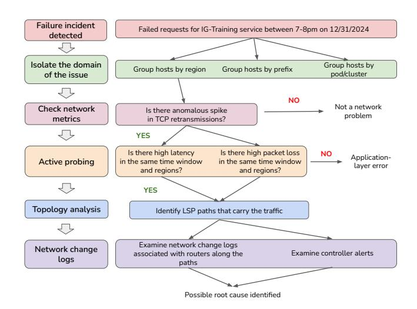
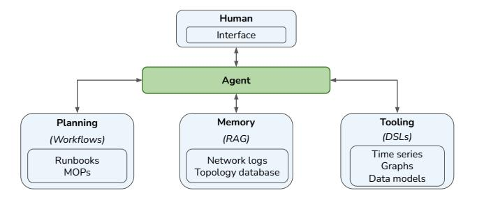
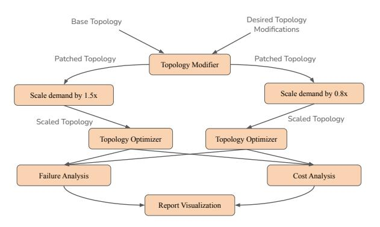
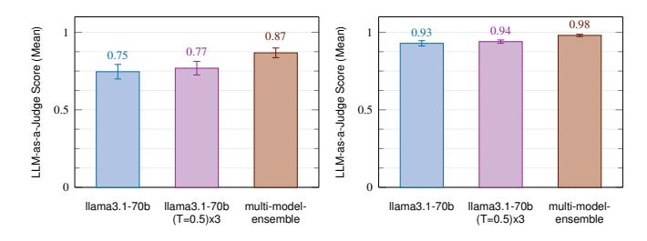
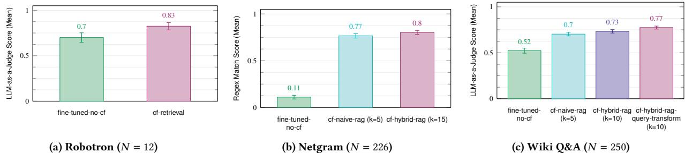
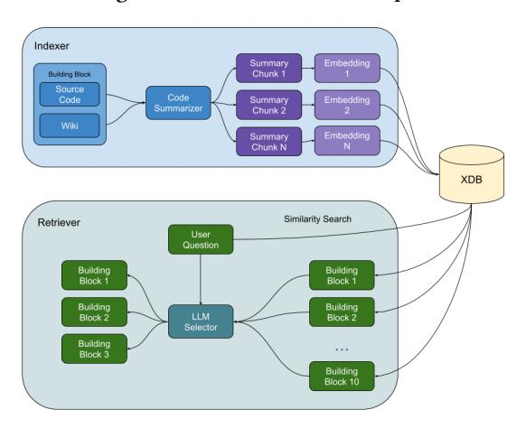
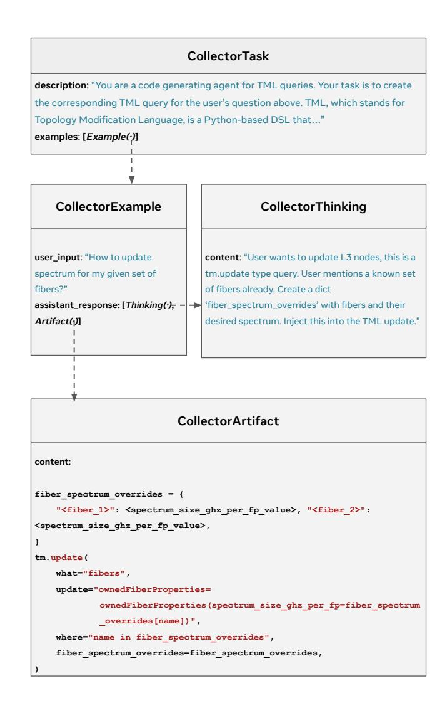

> **[图片提取文字 (无描述)]:**
> heck for pdates


# <span id="page-0-0"></span>Intent-Driven Network Management with Multi-Agent LLMs: The Confucius Framework

Zhaodong Wang\* Samuel Lin\* Guanqing Yan\* Soudeh Ghorbani\* Minlan Yu<sup>‡</sup> Jiawei Zhou<sup>§</sup>
Nathan Hu\* Lopa Baruah\* Sam Peters\* Srikanth Kamath\* Jerry Yang\* Ying Zhang\*

\*Meta †Johns Hopkins University ‡Harvard University §Stony Brook University

#### **Abstract**

Advancements in Large Language Models (LLMs) are significantly transforming network management practices. In this paper, we present our experience developing Confucius, a multi-agent framework for network management at Meta. We model network management workflows as directed acyclic graphs (DAGs) to aid planning. Our framework integrates LLMs with existing management tools to achieve seamless operational integration, employs retrievalaugmented generation (RAG) to improve long-term memory, and establishes a set of primitives to systematically support human/model interaction. To ensure the accuracy of critical network operations, Confucius closely integrates with existing network validation methods and incorporates its own validation framework to prevent regressions. Remarkably, Confucius is a production-ready LLM development framework that has been operational for two years, with over 60 applications onboarded. To our knowledge, this is the first report on employing multi-agent LLMs for hyper-scale networks.

# **CCS** Concepts

• Networks  $\rightarrow$  Data center networks; Network management; Network monitoring; • Computing methodologies  $\rightarrow$  Multiagent systems.

#### Keywords

Large Language Models (LLMs), RAG, Network Planning

#### **ACM Reference Format:**

Zhaodong Wang\* Samuel Lin\* Guanqing Yan\* Soudeh Ghorbani\*† Minlan Yu‡ Jiawei Zhou§ Nathan Hu\* Lopa Baruah\* Sam Peters\* Srikanth Kamath\* Jerry Yang\* Ying Zhang\*. 2025. Intent-Driven Network Management with Multi-Agent LLMs: The Confucius Framework. In ACM SIG-COMM 2025 Conference (SIGCOMM '25), September 8–11, 2025, Coimbra, Portugal. ACM, New York, NY, USA, 16 pages. https://doi.org/10.1145/3718958. 3750537

#### 1 Introduction

Network management is a vital component of large-scale services' networks, playing a pivotal role in ensuring reliability, performance, and scalability across vast numbers of interconnected servers. Despite significant research efforts in traffic engineering [19, 44], network provisioning [16, 38, 46], and automated diagnosis [30, 52], enterprises still require substantial engineering resources to manage their networks effectively. Large Language Models (LLMs)


This work is licensed under a Creative Commons Attribution 4.0 International License. SIGCOMM '25, Coimbra, Portugal

© 2025 Copyright held by the owner/author(s). ACM ISBN 979-8-4007-1524-2/25/09 https://doi.org/10.1145/3718958.3750537 [12, 18, 47, 53] have emerged as a promising solution to enhance network management.

Network management in production environments involves intricate, multi-step tasks that require diverse tools and expertise to navigate complex solution spaces. For instance, diagnosing a failed service request demands a meticulous process of troubleshooting networking issues, analyzing routing paths, and narrowing down potential causes. Similarly, evaluating the impact of a topology expansion plan requires multiple steps, involving traffic forecast generation, topology augmentation, failure simulation, and result analysis. Given their complexity and domain-specific nature, simply relying on LLMs to handle them in a single step is not effective. Instead, a more nuanced approach is needed, one that incorporates domain expertise and iterative refinement.

To address these challenges, we introduce Confucius, a novel multi-agent LLM framework. Confucius decomposes intricate management tasks into smaller, structured subtasks, each of which can be executed using specialized domain-specific tools and databases. Confucius introduces three key components that effectively incorporate domain-specific knowledge into the general multi-agent LLM framework:

Enhancing planning with structured network procedures: Confucius integrates existing structured network procedures, such as codified Methods of Processes (MOPs) or workflows [51], with LLM reasoning. These programs are often written in Domain-Specific Languages (DSLs), which use predefined functions to encode smaller operations. Confucius introduces programming primitives that bridge the gap between human-friendly structured data and foundational models. This integration aids the LLM in breaking down complex network management tasks into multiple smaller tasks. It also combines multiple agents' outputs to achieve better planning outcomes.

Connecting tools with Domain-Specific Languages: Our key idea is to leverage the numerous existing network management tools, rather than developing new ones. However, utilizing these tools effectively requires deep domain expertise in formatting the right input and commands. We propose a set of primitives that convert human-friendly instructions into DSL-compliant inputs for each tool. Based on our experience, we have identified three widely used DSLs in network management: topology graph, network time series data, and network data model [46]. Confucius has built-in modules that provide translation to these three DSLs, enabling seamless interaction between the Confucius agent and many existing network management tools.

Enhancing long-term and short-term memory with domainspecific retrievals: Confucius develops advanced memory management mechanisms to effectively handle conversation context, utilizing a hierarchical tree structure for short-term memory. For cases

<span id="page-1-0"></span>

| Category                  | Use Cases                           | Example Requests to LLM                                                                                                                                                         |  |  |
|---------------------------|-------------------------------------|---------------------------------------------------------------------------------------------------------------------------------------------------------------------------------|--|--|
| Network<br>Design         | Topology<br>Design                  | Update max capacity for all fibers in NA to X<br>Double the num of FSWs in each POD.                                                                                            |  |  |
|                           | Configuration Generation            | Generate configuration to remove a BGP peer for switch X.                                                                                                                       |  |  |
|                           | Understanding Capacity<br>Situation | What is the total deployed power per rack type in one DC?<br>What is the EBB planned capacity in six months in region A?                                                        |  |  |
|                           | Capacity What-if<br>Analysis        | Update layer 3 router's max capacity to a value from "node_cap_manager", use "hose" demand type with p90 percentile run "cap_planner", compare result with latest gold version. |  |  |
| Network<br>Operations     | Create Operations<br>Workflows      | Write a workflow that upgrades switch role X software version.  Which building block can I use to create a new device in FBNet?                                                 |  |  |
|                           | Generate Migration Command          | Generate soft drain command for switch X.                                                                                                                                       |  |  |
|                           | Monitor Operations Status           | Show operations that took the longest to complete in last 3 days.                                                                                                               |  |  |
| Monitoring<br>& Diagnosis | Monitoring Network Health           | Can you show me gold traffic from region A to B on May 20 for Ads storage service?                                                                                              |  |  |
|                           | Anomaly Detection                   | How many distinct source IPs were observed in 1.1.1.1 on Mar 8th?                                                                                                               |  |  |
| Knowledge Sharing         |                                     | Where can I find data about production network performance?                                                                                                                     |  |  |

Table 1: Use Case Examples.

requiring a large volume of context, Confucius employs Retrieval-Augmented Generation (RAG) [11, 27, 31, 32] as a form of long-term memory. For instance, Confucius leverages RAG in a separate database to index hundreds of thousands of network data models, enabling efficient searching and retrieval by LLMs. Furthermore, it allows developers to configure the level of detail to store in memory and extract related information based on specific queries.

Ensuring correctness systematically: To guarantee the safety and reliability of management tasks, Confucius is designed to tightly integrate with existing verification and validation systems. Additionally, Confucius provides a set of primitives that facilitate frequent human feedback. Moreover, Confucius includes a benchmarking system that enables developers to easily evaluate their application under different configurations, prompting algorithms, and foundation models.

Confucius has been successfully deployed in production for two years, serving thousands of users and supporting over 60 network management applications. Notably, Confucius has resulted in significant time savings for developers, reducing the average development time by 17 engineer-hours per week, while maintaining high accuracy. Our evaluation demonstrates that Confucius improves accuracy by up to 21% compared to solutions that rely solely on foundation models. We share our experience developing Confucius and onboarding applications, providing valuable insights into the challenges and opportunities of using LLMs for production networks. To the best of our knowledge, this paper presents a pioneering comprehensive framework for developing and deploying LLM-assisted network management applications. We hope that this paper inspires future research in this exciting new domain, driving innovation towards truly intent-based network management.

#### 2 Motivation

We have successfully developed and deployed multiple applications using Confucius over the past two years. This section provides an overview of our production use cases, highlighting key challenges encountered. We illustrate these challenges with two examples, discuss the benefits of LLMs, and outline adoption challenges.

#### 2.1 Network Management Use Cases

Network management involves complex tasks that require manual steps and deep domain knowledge. Table 1 shows the categories of network management apps supported by Confucius, along with example queries. We broadly categorize the use cases into four categories of the life cycle of network management.

Network Design involves generating designs of topology that meet capacity and performance requirements. This task requires balancing optimal decisions against evolving technology, complex requirements, and limited resources. While traditional approaches create abstract diagrams that are manually translated into concrete data models [46], LLMs can assist in automatically converting abstract designs to concrete data models, reducing both time and errors. Among different choices of models and network products, LLMs can assist the selection based on high-level intent and requirement. In §2.2, we provide more details into capacity planning as an example of network design.

Network Operations involve executing tasks like configuration updates, software installations, and hardware replacements, following established MOPs. These tasks are critical to network reliability and performance, but manual execution can be time-consuming and error-prone. LLMs can improve these processes by suggesting existing MOPs, generating new ones, executing complex instructions, monitoring operation status, and lowering the barrier for in-house tools. LLMs can transform new product introduction and deployment into a more efficient process.

Network Monitoring involves collecting data from various vendors' APIs, but managing these APIs can be challenging due to vendor heterogeneity. Even with standardized APIs like Thrift [16], navigating complex structures and parsing retrieved data can be difficult. LLMs offer a promising solution by suggesting and writing APIs, as well as automatically parsing retrieved data. LLMs can not only significantly improve efficiency but also develop new troubleshooting processes through self-learning. We provide a detailed example of fault diagnosis in §2.3.

Knowledge Base and Onboarding involve network domain-specific terminologies and tools, which can overwhelm new engineers with complex concepts like EBB [19] and FA [9]. Network data requires specific context for proper usage. LLMs can provide this context by serving as a knowledge management platform.

# <span id="page-1-1"></span>2.2 Capacity What-if Analysis

Next, we dive into two concrete apps in the category of network design and network monitoring. In each example, we point out how Confucius, built on top of LLMs, provides the specific help.

Capacity planning at Meta involves determining where and when to increase network capacity to ensure long-term network health. This process relies on what-if analysis and optimizations [6, 7]. For example, to meet AI training demands, Meta has deployed new data centers [4] and augmented existing ones with new technology. A key challenge is determining how the backbone topology should change to interconnect these new regions with the right amount of capacity. Confucius answers this question through various subtasks.

Planning the subtasks. Figure 1 illustrates an example of a what-if analysis aimed at increasing backbone network capacity in response to a new data center deployment. Before conducting the analysis, the user must first gather the current network topology and information about upcoming fiber availability. Next, the user poses what-if questions, such as, "What if I enable more channels on a specific path?" To address these questions, the user creates an execution plan with several steps: updating traffic forecasts, augmenting

<span id="page-2-1"></span>> **[图片提取文字 (无描述)]:**
> DC Capacity Change Gather Current Production steady-state Production real-time Including capacity added topology topology in the next 30 days? Topology 50th percentile forecast 90th percentile forecast Forecast Demand Daily basis Hourly basis Generate Future Existing fiber Include upcoming fiber Turn on more channels Topology only deployments Single-fiber cut Multi-fiber cut Run failure simulations Shortest-path Max-flow Analyze Results Node availability Link capacity Demand Latency


Figure 1: Capacity What-if Example.

the topology with upcoming fiber deployments, running failure simulations, and analyzing the results to support A/B testing.

Complexity of Subtasks. Each subtask can have multiple variants, such as different percentiles for demand forecasting or various network resilience policies for failure simulation, as illustrated in Figure 1. Traditionally, network planners manually configured and chained these tools, resulting in time-consuming processes and suboptimal parallelization. Confucius streamlines this workflow by automatically generating a directed acyclic graph (DAG) of operations and orchestrating remote execution according to the what-if scenario defined by the planner. Additionally, Confucius reduces the domain expertise and manual effort needed to query real-time topology data, which can be noisy and may not accurately reflect planned changes. Users interact with capacity-related information through a natural language interface, enabling them to ask questions like, "What's the total capacity added in the past 90 days?" without needing to understand table schemas or query syntax.

Given many subtask variants, manually analyzing dozens of outputs is impractical. Confucius summarizes results based on key metrics such as total dropped flows and SLO misses. It also provides a visual analysis of differences using its multimodal feature, helping users quickly interpret and compare outcomes.

#### <span id="page-2-0"></span>2.3 Network Performance Diagnosis

Fault diagnosis is critical for resolving network issues, but complexity and diverse potential causes present significant challenges. Network engineers must sift through extensive monitoring data and consider numerous potential causes. Confucius assists with fault diagnosis by analyzing thousands of counters and metrics. In the example shown in Figure 2, we need to diagnose a case where Instagram inference requests failed during a specific time period. This involves analyzing network issues, dominant regions, routing paths, affected prefixes, and determining if any network changes are associated with these factors.

Planning the Subtasks. The first step in diagnosing network issues is planning the execution of complex diagnosis tasks. In production, we use workflows or runbooks [51] that consist of sub-workflows or steps, each invoking different tools. With hundreds of workflows, it is challenging to determine which to use for a specific diagnosis

<span id="page-2-2"></span>> **[图片提取文字 (无描述)]:**
> Failure incident Failed requests for IG-Training service between 7-8pm on 12/31/2024 detected Isolate the domain Group hosts by Group hosts by region Group hosts by prefix pod/cluster of the issue NO Not a network Check network Is there anomalous spike problem metrics in TCP retransmissions? YES Is there high latency Is there high packet loss NO Application-Active probing in the same time window in the same time window layer error and regions? and regions? YES Topology analysis Identify LSP paths that carry the traffic Examine network change logs Network change Examine controller alerts associated with routers along the logs paths Possible root cause identified


Figure 2: Fault Diagnosis Example.

question. For example, Figure 2 involves four steps: (1) identifying hosts by region and prefix, (2) examining TCP retransmission for anomalies, (3) analyzing NetNORAD [30] data for packet loss, and (4) examining network change logs linked to affected LSP paths.

Complexity of Subtasks. Each subtask requires querying specific datasets, which can be challenging due to the numerous datasets and domain knowledge required. For example, filtering and aggregating raw data such as SNMP logs is necessary to identify patterns, and anomaly detection for performance degradation requires picking the algorithm and setting different parameters [17]. Currently, network engineers must manually create and manage workflows of tens of steps, which is tedious and time-consuming, taking hours to days. Confucius automates this process by auto-generating templates, suggesting reusable building blocks, performing queries, and identifying correlations. It improves diagnostic efficiency by reducing the man-hours required for triage and root-cause analysis.

# <span id="page-2-3"></span>2.4 Observations and Challenges

We summarize the key observations from the examples and use cases presented above.

*Multi-step Complex Tasks:* Network management tasks are complex, involving multiple steps that require domain-specific knowledge. For example, what-if analysis decomposes a task into subtasks like demand forecasting, topology modeling, and policy definition.

Specialized Tools: Despite the complexity, numerous specialized tools have been developed to address specific aspects of network management, including network modeling, intent-based routing, capacity planning, topology design, monitoring, and diagnosis. At Meta, we have hundreds of tools and APIs spanning backbone, data center, and edge networks, and this number is rapidly growing to support new use cases.

Large Search Space: The scale and heterogeneity of modern networks result in a large search space for network management tasks. For instance, designing a new data model requires navigating hundreds of thousands of existing models.

High Safety Requirements: Network management demands extremely high reliability, making it impractical to rely solely on AI.

<span id="page-3-0"></span>> **[图片提取文字 (无描述)]:**
> Human Interface Agent Planning Memory Tooling (DSLs) (RAG) (Workflows) Time series Runbooks Network logs Graphs MOPs Topology database Data models


Figure 3: Multi-agent architecture.

For example, device draining operations must be carefully examined to prevent introducing packet loss. Similarly, changing routing configurations requires close scrutiny to avoid creating blackholes that disrupt existing traffic.

Privacy Concerns: Network data is highly proprietary, and sensitive information must be protected to prevent malicious attacks. Users may inadvertently input sensitive details such as names, email addresses, and IP addresses. Therefore, careful redaction of input data is essential before sending it to LLMs.

# 3 Overview

In this section, we introduce the principles, key design ideas, and programming framework in Confucius.

# 3.1 Principles

Over the past two years, we have explored leveraging LLMs for networking, ranging from chatbot-style Q&A interfaces to deeper integration with systems and tools. Based on our experiences, we summarize the following guiding principles for Confucius:

- Separate Reasoning from Factual Knowledge: We leverage LLMs for reasoning tasks, which they are well-suited for, while we rely on existing runbooks, tools, and databases for retrieving factual information.
- Leverage Existing Expertise: We utilize established tools and expert knowledge in network management, similar to existing approaches for incorporating domain knowledge [\[3\]](#page-13-14).
- Orchestrate with Carefully Engineered Prompts: Inspired by "cognitive architectures" [\[1\]](#page-13-15), we decompose management tasks into individual components and use carefully engineered prompts to guide LLM reasoning. This allows us to maintain control over the reasoning process.
- Prioritize Iterative Improvement: We prioritize basic implementation to develop a functional system quickly and refine iteratively over time.
- Not Depend on Fine-tuning: We design our approach to work effectively with foundation models that do not require fine-tuning as a prerequisite. This allows us to leverage the latest advances in LLMs while minimizing the dependency on costly and timeconsuming fine-tuning.

# 3.2 Key Design Ideas

We align our design choices with the challenges outlined in [§2.4.](#page-2-3) The functional block overview is shown in Figure [3.](#page-3-0)

A Multi-Agent Framework: In network management, complex tasks must be decomposed into multiple interconnected subtasks, each requiring different specialized tools and domain knowledge. A naive solution uses a single LLM to handle an entire task from start to finish, but this falls short with sufficiently complex tasks, leading to excessive prompts and unreliable performance. By adopting a multi-agent framework, Confucius decomposes complex workflows into distinct subtasks that can be tackled by multiple specialized agents. Figure [3](#page-3-0) shows the LLM agent interacting with four parts: planning, memory, tools, and human. We build network-specific primitives to facilitate interaction among them.

Leverage Existing MOPs and Workflows for Planning: MOPs and runbooks are predefined workflows for network tasks, available in structured format [\[51\]](#page-14-6). To have LLMs learn from these workflows, we must overcome three challenges: 1) bridge the gap between structural language (e.g., Python or DSL) and natural language; 2) incorporate deep domain knowledge, such as BGP routing priorities; 3) manage numerous workflows. Confucius provides programming primitives to bridge the gap between structural data and LLMs. It also combines multiple agents' outputs to achieve better planning.

Structured Data to Connect with Tools: Network engineers rely on sophisticated tools that operate with structured data. Expertise lies in selecting the right tool and formatting commands to achieve desired actions. We design Confucius agent to interact with multiple domain-specific tools using a set of primitives that convert natural language inputs into DSL-compliant outputs.

Domain-Specific Retrievals for Long-Term and Short-Term Memory: In a multi-agent LLM framework, each agent focuses on a specific subtask. To coordinate agents, Confucius provides memory functionality that tracks interactions with humans and tools. It offers short-term memory management, where users can control the level of memory for each session. For long-term memory, Confucius leverages RAG to handle large volumes of context.

Ensure Correctness through Validations and Human Input: Confucius integrates with existing validation frameworks, including dry-run and configuration validation systems, to ensure correctness of mission-critical tasks. Outputs are validated before presentation to the user, and human approval is enforced for highly sensitive tasks. To support human oversight, Confucius employs a primitive called Collector to systematically gather user inputs through structured human interaction.

# 3.3 Confucius Programming Framework

Confucius is a programming framework that simplifies application development with primitives and abstractions, shown in Figure [4.](#page-4-0) It offers an interactive chat-like interface for user interaction.

Programming Abstraction: At its core, Confucius is built on Pydantic, a Python schema language for defining custom data structures. The core abstraction class is the Analect, which holds reusable logic and data for inputs, outputs, and runtime. It is similar to a function but provides logging for execution, streamlining reuse throughout the system. Several basic operators are shared among all Analects. These operators implement basic functionalities, including a JSON Parser, a Tracer that automatically collects and logs the execution trace in an internal database, and an I/O function that enables human-in-the-loop interaction.

<span id="page-4-0"></span>> **[图片提取文字 (无描述)]:**
> **User Questions** Confucius Dispatching Entry Analect **FBNet** CLI Drainer TMI Capacity Applications ODS CLI Helper Generator Delivery Generator Helper Validation Simulators Network Time Series Topology Network Data Tool DSLs Data Graph Model Verification Dry Runs Primitives Translator Selector Evaluator Ensemble State Validators Basic Parser Tracer 10 Retriever Operators Programming Analect Abstract Class FAISS External Embedding MetaGen LangChain **NLTK** (InstructOR) Systems Laser KNN


Figure 4: Programming Framework.

Confucius Primitives: These are specialized Analects that implement one particular action. They can be applied across various use cases. The Analect is the abstract class of all primitives. One example is the Translator primitive, which converts natural language inputs into structured outputs, such as translating a user's query from English to a command line. Users focus on writing examples without worrying about formatting inputs and parsing results. The Translator also facilitates the translation of commands, queries, and configurations from one language to another.

Tooling DSLs: Confucius supports three DSLs commonly used in network management applications, which will be discussed in more detail later in [§4.2.](#page-5-0) This layer can be extended to accommodate additional DSLs as new use cases are onboarded.

Applications: Analogous to SDN Apps, different teams have developed various LLM-based network management applications to address specific domains. For example, a data center design engineer creates an app to design new AI data center networks.

External Systems: Confucius leverages several external systems to enhance its capabilities, including LangChain [\[13\]](#page-13-16), MetaGen API [\[23\]](#page-13-17) for AI model access, FAISS [\[21\]](#page-13-18) for efficient similarity search, Instructor [\[45\]](#page-14-7) for embedding, and NLTK [\[10\]](#page-13-19) for natural language processing.

# 4 Confucius' Design

This section dives into design details from four perspectives: planning, tools, memory and validation.

# 4.1 Planning Phase

We now present the planning methodology and primitives.

4.1.1 Network Workflows: Historically, companies like Meta have relied on MOPs (step-by-step procedures in natural languages) [\[14,](#page-13-20) [15\]](#page-13-21) for network management tasks. However, their ambiguity and loose documentation made execution challenging. To address this, Meta developed a workflow system [\[51\]](#page-14-6) that codifies and breaks down MOPs into smaller, modular building blocks (BBs), facilitating better modularity and code reuse. BBs are flexible scripts or configlets (modular "configuration snippets" designed for reuse across

<span id="page-4-1"></span>**Human**: "I want to patch several supply scenarios onto a given topology using Topology Modification Language, then scale the demand by 1.5 and 0.8, run NAPT for both scenarios, and finally generate a comparison report."

> **[图片提取文字 (无描述)]:**
> Desired Topology Base Topology Modifications Patched Topology Patched Topology Topology Modifier Scale demand by 0.8x Scale demand by 1.5x Scaled Topology Scaled Topology Topology Optimizer Topology Optimizer Failure Analysis Cost Analysis Report Visualization


Figure 5: Planning DAG Illustration.

devices and workflows) written in various programming languages or as binaries. This approach is widely adopted [\[34\]](#page-13-22).

4.1.2 Leverage Workflows for LLM Planning: We design a prompt engineering method to teach LLMs workflows.

DAG Representation: We represent the planning logic of network tasks as a directed acyclic graph (DAG), implemented using a Python-based DSL. Each node in the DAG represents a subtask, which is the same as a building block. The output of each node is parsed by the LLM and used as input for subsequent nodes. Independent subtasks can be executed in parallel, and the runtime environment automatically determines the optimal execution plan based on input/output dependencies. Figure [5](#page-4-1) illustrates an example DAG for capacity what-if analysis. A user-defined scenario, which involves modifying network topology, scaling demand, and evaluating outcomes under multiple conditions, is broken down into discrete, composable subtasks. Each operation is encapsulated as a node in a DAG to enable modular execution and clear data flow.

Suggesting Existing Workflows: In our production environment, we face challenges with workflow and BB discovery. With hundreds of workflows and thousands of BBs, it is difficult for engineers to identify the right ones for specific tasks. To address this, we have developed a RAG-based approach to efficiently search and recommend workflows and BBs. Figure [16](#page-15-0) shows the design. The system architecture consists of two main components: the Indexer and the Retriever. The Indexer utilizes LLMs to analyze each workflow and BB, extracting key information to compute semantic embeddings, which are then stored in a database. The Retriever operates in two stages: a coarse-grained similarity search to select around 10 candidate workflows/BBs, followed by a fine-grained selection to refine the options to fewer than three.

### 4.1.3 Confucius Primitives for Planning:

Ensemble calls multiple LLMs in parallel on a single task and combines their results into a single output. This maintains the original string-to-string interface, allowing it to replace standard LLM calls seamlessly. Figure [15](#page-15-1) shows an example of its programming construct. To activate Ensemble, users provide a list of LLMParams to supported APIs. Our system supports four composition modes: 1) First-mode selects the fastest agent's result; 2) Merge-mode combines all agents' results for human review; 3) Filter-with-Validation

<span id="page-5-1"></span>> **[图片提取文字 (无描述)]:**
> class CollectorTask(BaseModel): class Collector(LLMAnalect[CollectorInput, Output]): instruction: str # system prompt prompt: ChatPromptTemplate description: str # description of task validator: Callable[[Output], Output] examples: List[CollectorExample] output\_parser: OutputParser class CollectorExample(BaseModel): < def get\_task(cls) -> CollectorTask: user\_input: str ... assistant\_response: List[Union[CollectorThinking, CollectorArtifact]] async def impl(self, inp: CollectorInput, class CollectorThinking(BaseModel): < context: AnalectRunContext) # thought process of the collector content: str CollectorOutput: class CollectorArtifact(BaseModel): await self.invoke\_llm(context, prompt, inputs) # expected response to user\_input content: str


Figure 6: Collector implementation.

filters out erroneous results using a validation framework; and 4) Return-all returns all answers as a set. Ensemble also accepts custom composition functions, enabling flexible strategies for ensuring reliable results from potentially unreliable building blocks.

Orchestrator is a novel AI framework that enables LLMs to autonomously create workflows by calling building blocks in a step-by-step manner, similar to [\[42\]](#page-14-8). This approach involves providing detailed examples and instructions within the prompt, which inform the LLM about which building blocks to utilize and when. The Orchestrator strikes a careful balance between autonomous operation and controlled execution; this allows us to fully harness the enhanced reasoning and planning abilities of modern LLMs, while maintaining the reliability demanded by our applications.

# <span id="page-5-0"></span>4.2 Tools: Network Management Abstraction

To integrate with existing network management tools, we have to translate natural language into structural data (DSLs) that these tools can process.

4.2.1 Confucius Primitives for Tools. To facilitate translation, Confucius introduces three primitives that systematically define the translation logic and collect additional information needed to complete the translation.

Translator converts natural language into structured output (e.g., command lines or configurations), allowing users to focus on writing examples without worrying about formatting and parsing. It can handle multiple languages and translate between different CLI commands, queries, and vendor-specific configurations.

Selector uses customizable logic (e.g., language models or similarity search methods) to select a subset of relevant options based on the user's query. It is widely used to select from a large dataset or database. The rationale behind using a Selector is that while LLMs can often narrow down to a subset of structured data, they require additional information to generate precise outputs.

Collector gathers and processes data from various sources, including the user, to clarify intent and identify relevant entities. This primitive is designed based on the observation that natural language often contains ambiguity. It can also ask follow-up questions to refine the user's instructions. By mitigating ambiguity in natural language, the Collector improves performance on downstream tasks. Due to limited space, we only discuss the details of Collector, which are shown in Figure [6.](#page-5-1) The user instantiates the Collector class by defining a CollectorTask that is specific to their use case. In addition to providing direct instruction, the CollectorTask allows

<span id="page-5-2"></span>> **[图片提取文字 (无描述)]:**
> tm.add( what="13 nodes". adds""" name="<name>". 11 node name="<11 node name>". "I want to add a is\_hose\_entity=True, lat=<lat>. new hose 13 lon=<lon>. node." node\_role=NodeRole.DC, "key": { "values": ["FBNet:device.cpu\_util"] "Calculate the average CPU "query": { "time\_range": "start = -600, end = 0", utilization for "reduction": ["percentile(95)"], asw01.mia1 over "transformation": ["avg(10m)", "formula(+ \$1 5)"], the last 10 minutes, then add "entity": { 5, and finally take "values": ["fbnet\_device(DEVICE\_NAME=asw01.mia1)"] the P95." NetworkSwitch NetworkDeviceV4Prefix ipv4 = id = • "Create a BGP prefix = 10.0.0.1/24 ipv6 = session with **BgpPeer** mgmt ipv4 = + Robotron AT&T using peer id = \*Network Device V6 Prefix mgmt ipv6 = + IP 10.0.0.1. name = . as no = . reachable via desired interfaces = interface eth0/1 Interface BapV4Session on Switch 1." name = eth0/1bgp peer = . interfaceaddressv4prefixes = . desired interface = interfaceaddressy6prefixes = .


Figure 7: Examples of Three DSLs.

the user to provide few-shot CollectorExample objects. A CollectorExample contains an example of a user input, paired with the correct response encapsulated in CollectorArtifact, as well a CollectorThinking object that contains the step-by-step logic to arrive at the answer. An example of the concrete objects created based on these classes is provided in Figure [18.](#page-15-2)

4.2.2 Foundational Network Management DSLs. While the Translator primitive is used to convert natural language into structured data, it remains necessary to determine which structured data format to translate into. Existing network tools rely on a variety of structured data formats. Based on our production experience, we have identified three widely used DSL classes in network management. Supporting these three DSLs enables easier onboarding of a large number of tools.

Network Graph. The network topology graph is a fundamental element in various applications, such as capacity planning, risk analysis, routing, and traffic engineering. We represent the topology using a Thrift-defined graph, which includes regions, layer-1 nodes, layer-3 nodes, layer-1 optical edges, layer-3 IP edges, and flows. One insight is that the naming conventions of nodes are crucial for understanding the topology. For example, regions are typically named after airport codes (e.g., ATN), while L1 nodes represent groups of layer-1 devices within regions, often named by combining the region's code with a digit (ATN1). These naming conventions provide valuable information about the topology's properties and roles. It exemplifies the type of specific domain knowledge that we explicitly embed into the LLM prompt, so that the LLMs can recognize and interpret these patterns in the DSL. We use a DSL called TML (Topology Modification Language), a Python-based language, to facilitate modifications to the graph. This DSL enables systematic updates, transformations, and selections of topology objects. Figure [7\(](#page-5-2)a) shows one such example.

Time Series Network Data. Time series network data is a fundamental construct in network management, with applications ranging from traffic analysis and network health monitoring to

anomaly detection. At Meta, time series data is stored in a key-value store known as ODS (Operations Data Store) [41]. The basic unit of data is an *entity*, which can represent any object under measurement, such as interface loss or CPU utilization. The data for each entity consists of a series of <time, value> snapshots, as shown in Figure 7(b). For LLMs to become familiar with time series data, we embed the prompts with specific domain knowledge. In other words, we explicitly instruct the LLMs how to handle this type of data; this includes methods for aggregating time series data, such as calculating the average or 90th percentile, as well as conventions for generating mathematical formulas to manipulate this data.

Network Data Model. It is common practice to store network management data in a structured model [38, 46]. Modern production networks typically maintain their source-of-truth data in a management database and provide an Object-Relational Mapping (ORM) layer on top for easier access. At Meta, the Robotron data model [46] is a fundamental component of nearly all management tools. Figure 7(c) illustrates an example of how to translate the intent of creating a BGP session to a set of network objects modeled. An interface is composed of multiple components, each linking to other objects in a relational database, such as IP addresses, BGP sessions, and neighboring ports.

We find that Robotron is a powerful DSL that connects LLMs with a variety of existing network management tools. It captures high-level network design intent as relational data objects, which are then translated into low-level, vendor-specific device configurations and network operations. LLMs further elevate this abstraction by mapping users' natural language intents into Robotron, which in turn maps to the low-level configurations. The main challenge in this translation lies in the vast volume of models involved. To address this, we have developed a Retrieval-Augmented Generation (RAG) approach, which is described in more detail later.

In summary, we identify three common DSLs frequently used across many management tasks, illustrate them with concrete translations from natural language in Figure 7, and highlight the associated challenges. We next dive into techniques to make these translations both accurate and efficient.

- 4.2.3 Prompt Engineering Techniques. One effective way to improve translation accuracy is to design appropriate prompt engineering techniques. We carefully select the optimal combination of prompts tailored to each DSL translation task. Below, we summarize these techniques and relate them to their respective DSL translation tasks.
- Zero-shot chain of thought asks the model to think before translating. For example, in ODS (time series DSL), we use a "Thought" field in the request to teach the LLM to leverage regex matching when it encounters a string like "rsw1aa.\*prn1". This forces the model to first consider the networking context of the input text, rather than directly generating a literal translation.
- *Few-shot chain of thought* provides the model with relevant examples for translations. For instance, we give an example to teach LLM to understand the "entity" field in the ODS example.
- Contrastive chain of thought involves giving the model wrong examples and telling them that they were incorrect. For example,

<span id="page-6-0"></span>> **[图片提取文字 (无描述)]:**
> Entity Translator Entity Intent Key Intent Translator Key User Collector Translator ODS Transform 1/0 Translator Transform Intent Query Reduction Reduction Translator Intent Human: What is the average Time CPU utilization of ToR switches Time Translator Range Range in data center X? Intent Al: Do you want any transformations?


Figure 8: The composition of Analects for an ODS use case.

in ODS translation, we can create a counterexample about not including any switches in a region named "prn2".

- Tool calling: We provide the model with access to APIs, CLIs, libraries, and databases to enable agentic planning. In ODS, we directly invoke the ODS Query API and, if necessary, include the returned messages along with the original query in subsequent iterations to allow LLMs to perform self-correction.
- Reason and act: It uses an orchestrator to let LLMs plan themselves for complex tasks in network investigations. By allowing the model to plan its own actions, we can help it generate more coherent and effective translations. This approach can be particularly effective in cases where the model needs to perform multiple tasks or respond to changing circumstances. As elaborated below, the ODS query is decomposed into 5 subtasks.
- Code as reasoning: We let LLMs write code to answer data retrieval questions. For example, we do not ask LLMs to modify the topology struct directly; instead, we have LLMs write TML code, which goes through the compiler and TML engine to modify the topology. Primarily, this approach allows the generated code to be easily validated by a compiler or a human. Additionally, a human can modify the code or merge multiple code snippets, facilitating more manageable and tractable task breakdowns.

*ODS Prompting Example:* Figure 8 illustrates the use of the Translator to convert user queries into sub-questions.

- Key: narrowing down relevant keys using the Selector
- Entity: identifying specific entities involved in the query
- Reduction: providing built-in prompts for common reduction operators (e.g. groupby, top, avg)
- Time Range: converting time range into start and end values
- Transformation: applying complex functions like smoothing and calculating differences between samples

As shown in Figure 8, the ODS prompting example uses the Translator to convert user queries into sub-questions, including narrowing down relevant keys with the Selector, identifying specific entities in the query, providing built-in prompts for common reduction operators (e.g. groupby, top, avg), converting time range descriptions into start and end values, and applying complex functions like smoothing or computing differences between samples.

4.2.4 Built-in Validation. Network use cases have stringent safety requirements, making it essential for Confucius to incorporate a variety of validations. We emphasize built-in validations, which

reduce the manual effort needed for human verification while enabling error messages to be automatically fed back to LLMs for autocorrection. Specifically, Confucius employs three built-in methods to validate the correctness of generated DSLs.

- Built-in Parser: For some specialized DSLs (e.g., TML), we use a custom parser to check the syntax. If the parser fails, it provides a clear error message that is fed back to the LLM, allowing it to learn from its mistakes and adjust its next attempt. This iterative process continues until the output parses successfully or the maximum number of allowed trials is reached.
- External API: We rely on the API that consumes the DSLs to check their correctness. For example, Robotron Model are validated through both read and write operations. The database's ORM layer detects errors during read operations, while a "dry run" mode simulates write operations without committing changes to the database.
- External Tools: We utilize separate validation systems to guarantee operation safety. For instance, for TML-generated graphs, we use a graph validator to check the topology against predefined invariants, such as full connectivity and minimum path requirements. Detected errors are fed back to the LLMs.

# 4.3 Memory Management

Confucius uses memory management to maintain conversational continuity and enable contextual search. Confucius maintains both short-term memory, which consists of conversational history within a single user session, and long-term memory, which includes external domain knowledge that is relevant across different sessions for the same use case.

4.3.1 Short-Term Memory. Short-term memory stores the context for one user across different Analects. For instance, if a user asked for the total egress of region A and then asked about region B, the context from the first question should be efficiently reused for the second query. To support context sharing across Analects, we develop a dedicated memory manager component that uses a tree of messages as the abstraction for memory. Each Analect has its own memory manager, which maintains a private list of messages and pointers to parent memories, session memories, and other relevant contexts. This hierarchical structure allows Analects to access and manage messages from their parents, grandparents, entries, and sessions, providing a comprehensive understanding of the conversation history. Analects can independently control access to their messages, ensuring the integrity and isolation of message histories. The system also efficiently manages concurrent child Analect calls by grouping and handling messages atomically at the parent level, enhancing the system's efficiency and accuracy.

<span id="page-7-0"></span>4.3.2 RAG. We find that many network management use cases require external indexing to improve the efficiency of LLM queries. For instance, with hundreds of thousands of network data models, many sharing similarities, it is challenging to differentiate between them without domain-specific knowledge. To address this complexity, we developed a novel RAG approach specifically designed for network data models. Our method involves pre-computing an embedding store by grouping similar models together and feeding

each model to the LLM one at a time. This enables efficient similarity searches during query processing, effectively managing the scale and complexity of our database. When a user submits a query, it is broken down into sub-queries for more efficient and accurate processing. Each sub-query is compared against the embeddings in our store using a similarity search algorithm, which identifies the most similar embeddings. The retrieved embeddings are then fed back into the LLMs along with the user's original query. Figure [16](#page-15-0) shows an example. We apply different RAGs based on different use cases below.

- Naive RAG: It builds a vector store for various data sources and performs similarity searches. Suitable for small datasets.
- Hybrid RAG: We use a two-stage filtering approach to retrieve relevant information: first fetch similarity search results and rank them by relevance, then we apply additional filters such as staleness, rating, and usage frequency. The pre-filtered results are sent to an LLM for secondary filtering based on semantics. It is applied to Wiki, Workflow and Robotron Model.
- Query Transformations: We use LLMs to refine user queries, generating more accurate and relevant search results. This involves two steps: refining questions based on user input and employing collector mode to gather additional context through conversations with users. This approach is useful in cases where network tasks can be described in multiple ambiguous ways.

4.3.3 Privacy. To prevent the sharing of sensitive information with third-party LLM models, we implement a preprocessing step that anonymizes sensitive data. Users may inadvertently input PII data when interacting with LLMs; examples include IP addresses from clients, device identifiers, names, emails, and user locations. We use the Identifier Redaction Service, developed by a different team, to identify and replace 40 types of sensitive information with fictitious placeholders. After processing the content and receiving a response from the LLM, we reverse the anonymization process, replacing the placeholders with the original sensitive data. This ensures the integrity and confidentiality of user information in all interactions.

# 4.4 Benchmarking Framework

We created Confucius to enable network engineers to rapidly onboard and prototype different applications across a variety of network use cases. However, optimizing a Confucius application can be a complex task, and users often want to consider performance between different models and prompting techniques on a specific dataset. To streamline this process, we developed a benchmarking framework with three capabilities: 1) testing with data provided by developers for their specific use case, 2) evaluating the impact of different prompting techniques and base models, and 3) optimizing end-to-end performance and tuning trade-offs between accuracy and computational cost. This standardizes the scoring process, eliminates the need for manual ad-hoc testing, and ensures consistency across evaluations.

Workflow. The evaluation pipeline consists of three key components: a user-provided dataset, a Confucius application, and a set of evaluation criteria. The evaluator first reads the dataset of inputoutput pairs and invokes the application on these inputs. Then it collects the actual outputs and scores them against the expected

<span id="page-8-0"></span>> **[图片提取文字 (无描述)]:**
> I want to do a set of capacity planning experiments I need additional information to run the first node Confucius with several supply and demand scenarios, then Human "tml topology patch supply": run optimizer NAPT Input topology name Input topology time frame For the inputTopology, you can specify a single Please select which tools you want to use. value, a range or list of values, a dependent Confucius Q Search... output, or leave empty and fill out later. tml topology patcher J Clm Topology name is "netgram cpor napt 2024 12 31" and time phase is 2024H2 Human napt optimizer dc risk analysis report generator I need additional information to run the second Confucius node "tml topology patch demand": Confirm Input topology name Input topology time frame Human For the inputTopology, you can specify a single Voc value, a range or list of values, a dependent output, or leave empty and fill out later. From your input, I've identified the following tasks The input to the second node depends on the and matched them to a suitable workload: Human output of the first node. Patch several tml topology Confucius ... supply scenarios patch supply What would you like to do next? 2. Using the output. Confucius patch several tml topology p Generate Code Snippet demand scenarios atch demand Launch Experiment Directly From Confucius 3. Run napt Please edit and napt planning Confirm confirm the Ok, here is a link to the code. following DAG. Looks good Human


Figure 9: Capacity What-Ifs Session Illustration.

ones using a predefined criteria. Users can visualize the scores to compare performance across different evaluations.

Evaluation Criteria. We provide three built-in evaluation criteria: 1) Exact Match: for deterministic and numerical outputs, such as verifying device counts in a cluster; 2) Regex Match: suitable for set or string outputs to verify specific keywords; 3) LLM-as-a-Judge: for complex outputs, it judges the closeness of the meanings. We implement LLM-as-a-Judge by invoking the LLM with the actual and expected outputs and prompting the LLM to assign a score based on accuracy. This method enables complex reasoning and provides holistic scoring. Our evaluation framework has been successfully implemented in production, significantly reducing time spent on prompt engineering and identifying regressions. It is used to generate the evaluations in §7.

Note that the benchmarking framework is an integral part of a production system, much like how a testing framework is indispensable to the software development process. Our benchmarking framework adopts concepts from software testing while leveraging LLMs extensively to handle fuzzy match cases.

# 5 Application Case Study

In this section, we share two applications for capacity planning and troubleshooting.

#### 5.1 Capacity What-Ifs

Meta has developed various tools to facilitate analysis for different topology planning scenarios. However, running experiments is still challenging. Before Confucius, generating an experiment plan was complex and involved several steps: identifying input workloads, understanding input/output structures, and scripting sequential tool calls. Users faced multiple challenges. First, experiments could quickly become complex, with multiple workloads and scenarios. Some workflows required running the planning software NAPT [8] multiple times, each taking hours. Second, many tasks were repetitive. Capacity planners often had to clone and initiate workflows repeatedly to modify a single input parameter,

<span id="page-8-1"></span>> **[图片提取文字 (无描述)]:**
> Scribe read operations are experiencing long tail P99 RTT Heatmap Between Datacenters (ms) latency. Investigate whether this issue is caused by a network problem. If a network issue is identified, determine which region pair is affected. Confucius Thinking... Tool: Python Compiler I will write a SQL query for the rtt p99 column Source DC and calculate average RTT between DC pairs. Invoke Tool Use: Scuba Engine SELECT (SUBSTR(Sdc, 1, 3)) AS 'src\_dc', (SUBSTR(Ddc, 1, 3)) AS 'dst\_dc', AVG('rtt\_p99', 'weight') / 1888 AS Confucius 'rtt\_p99\_avg\_ms' FROM 'network\_latency' WHERE 'time' BETWEEN (NOW() - 86400) AND NOW() AND (('Ssiterole') IN ('DC')) Destination DC AND (('Dsiterole') IN ('DC')) GROUP BY 'src\_dc', 'dst\_dc' Confucius Thinking... src\_dc dst\_dc rtt\_p99\_avg\_ms Scuba Engine Let's analyze the key patterns from the heatmap and find the DC2 DC2 9 542145 datacenter pairs with highest and lowest RTTs for Scribe reads. DC2 DC3 1 24.811065 1153 DC4 DC4 9 146312 Confucius Invoke Tool Use: Python Compiler [1154 rows x 3 columns] top\_5\_highest = df.nlargest(5, 'rtt\_p99\_avg\_ms')[[src\_dc, dst dc. 'rtt p99 avg ms'll Thinking... Confucius print(top\_5\_highest.to\_string(index=False)) Let's visualize RTT patterns between DCs using a heatmap. I'll write a Python script. Python Compiler src dc dst dc rtt p99 avg ms DC1 DC5 168 957924 Invoke Tool Use: Python Compiler DC1 DC6 167 457915 DC1 DC7 166.755838 matrix\_df = df.pivot(index='src\_dc'. DC7 DC1 166.654594 DC1 DCR 162.874577 columns='dst\_dc', values='rtt\_p99\_avg\_ms') Confucius fig = go.Figure(data=go.Heatmap( z=matrix df.values. Confucius We observe these highest latency pairs: (1) DC1 ↔ DC5: ~168ms, x=matrix df.columns. (2) DC1 ↔ DC6: ~167ms, (3) DC1 ↔ DC7: ~167ms v=matrix df.index. colorbar=dict(title='RTT (ms)'). DC1 appears in most of the highest latency connections. Most high-latency pairs show RTTs ~165ms. fig.show()


Figure 10: Fault Diagnosis Session Illustration

leading to inefficiency. Third, tracking and recording experiment results was cumbersome. Lastly, there was low interoperability across workloads. For example, a planner might know how to generate a demand forecast but struggle to integrate it with NAPT, adding friction to the workflow.

To mitigate these difficulties, we build a what-if analysis on Confucius, with a planning agent to create the DAG workflow, a tool agent to translate topology changes into TML, and short-term memory to record the results of each run. This is used by novice planners to describe and execute experiments. Figure 9 shows an example workflow. First, the user describes an intent: generate TML to patch a few supply scenarios, then generate TML to patch a few demand scenarios, and finally run NAPT. This process involves several key steps, beginning with DAG creation, where Confucius assists in workload selection based on user intent. Users select from a list of real-time registered workloads using Selector, after which the planning agent creates a corresponding DAG. For each node, the system provides input preselection, input/output passing using natural language, and visualization of the node information collection process, along with input-specific tips to ensure interoperability between nodes. Finally, Confucius uses Translator to generate a TML code snippet. At every step, Confucius ensures flexibility and accuracy by using Collector to support human intervention.

#### 5.2 Fault Diagnosis

Network troubleshooting has traditionally been challenging, even for experienced engineers. This section presents an example using Code Assist, an AI coding assistant that utilizes the Orchestrator for advanced planning. Figure 10 illustrates a troubleshooting workflow. The user requests a diagnosis of network latency issues related to read operations in the Scribe pub/sub system [26]. Confucius Code Assist then performs a series of interleaved thinking and tooluse steps, such as querying Scuba [5] logs with SQL and writing Python code for data analysis and visualization. It even generates

a heatmap of RTT data to provide insights, demonstrating its advanced multimodal capabilities. Ultimately, Confucius identifies that the highest-latency region pairs involve the "DC1" datacenter and presents these findings to the user.

Many troubleshooting scenarios can be resolved by querying and analyzing common monitoring data and runtime metrics. These data can be filtered and aggregated in various ways, leading to workflows tailored to specific scenarios. Instead of predefined workflows, users provide a list of tool-use functions to the Confucius Orchestrator, such as executing Python or SQL code on specific databases. These tools are represented as customizable agents. Leveraging advanced models like Claude 3.7 Sonnet, the Confucius Orchestrator acts as an intelligent supervisor, performing "thinking" steps to determine which agent tools to call and what arguments to pass. This architecture offers flexibility, allowing the Orchestrator to decide the next step based on conversation history and available tools, rather than following a fixed workflow.

# 6 Implementation

Confucius is developed in Python, allowing it to utilize a wide range of reusable external systems and internal Python-based services. Its engineering components are also shown in Figure [4.](#page-4-0) The core abstraction class, the Analect, serves as a lightweight wrapper for LangChain's Runnable. Each Analect is strongly typed and requires a Pydantic Input, Pydantic Output, and an impl method. Pydantic [\[2\]](#page-13-26) is a Python schema language that offers several essential features used throughout Confucius, such as type validation, serialization, generics, and inheritance. Using the base class Analect, we define all other primitives mentioned before, including Translator, Selector, Collector, Ensemble, and Orchestrator. For developer convenience, we also define a specialized Analect called an Entry. The Entry ensures that both input and output types are strings, encapsulated within EntryInput and EntryOutput objects, respectively. Shortterm memory is implemented using a built-in AnalectRunContext, a custom Pydantic object that stores relevant metadata and contextual data, such as session ID, conversation history, and previously generated artifacts. Optionally, the AnalectRunContext can specify a memory manager for long-term memory, which is implemented through access to a MySQL-based database system. Figure [17](#page-15-3) in the Appendix illustrates the use of Pydantic and AnalectRunContext to implement an Analect for ODS translation.

# <span id="page-9-0"></span>7 Evaluation

We systematically evaluate Confucius on a range of network management tasks. First, we show that ensemble-based self-consistency improves performance. Next, we demonstrate how Confucius can leverage different foundation models to perform DSL translation with higher accuracy than a fine-tuned baseline model. Finally, we evaluate benefit of RAG.

# 7.1 Methodology

Datasets. We curate synthetic datasets for the following use cases: TML, ODS transformations, ODS reductions, Robotron, Netgram, and Wiki Q&A. Each datapoint consists of a natural language query paired with its ground-truth answer. The size of each dataset is indicated in Figures [12](#page-10-0) and [13.](#page-11-0)

<span id="page-9-2"></span>> **[图片提取文字 (无描述)]:**
> 0.98 LLM-as-a-Judge Score (Mean) LLM-as-a-Judge Score (Mean) 0.94 0.93 0.87 0.77 0.75 0.5 0.5 Ilama3.1-70b multi-model-Ilama3.1-70b Ilama3.1-70b multi-model-Ilama3.1-70b ensemble (T=0.5)x3ensemble (T=0.5)x3


Figure 11: Single-model vs. ensemble performance for ODS reductions (left) and transformations (right).

Metrics. To evaluate Netgram, we use "regex match," which awards a score of 1 if the LLM output contains the name of the ground-truth Netgram block as well as the correct URL link to the block's source code, and a score of 0.5 if only one of these is correctly identified. For all other datasets, we use LLM-as-a-Judge to give a holistic score between 0 and 1.

Models. Across our experiments, we leverage several generalpurpose foundation models: Llama 3.1 and 3.3, Claude 3.5 Sonnet, Gemini 1.5 Pro and 2.0 Flash, and GPT-4o. We also use an internal model fine-tuned on domain-specific data, including code data, wiki documents, and internal Q&A.

Baselines. In [§7.2,](#page-9-1) we evaluate the use of Ensemble against singlemodel generation using Llama 3.1. In [§7.3,](#page-10-1) we compare Confucius with the fine-tuned model on several DSL translation tasks, illustrating the advantage of having domain knowledge carefully embedded into prompts, as opposed to having this domain knowledge in a model's training data. In [§7.4,](#page-10-2) we evaluate Confucius on several use cases that rely on large amounts of knowledge specific to these use cases. Similarly to the DSL evaluations, we compare Confucius with the fine-tuned model to illustrate the advantage of retrieving domain knowledge via RAG, as opposed to having domain knowledge embedded in a model's training data. We also show the effectiveness of Hybrid RAG and Query Transformations as described in [§4.3.2.](#page-7-0)

# <span id="page-9-1"></span>7.2 Ensemble for Multi-Agent Reasoning

Ensemble is a key primitive for improving planning accuracy. We evaluate its impact on accuracy for translating ODS reductions and transformations, with the following setups: (1) single-model generation using Llama 3.1, (2) homogeneous ensemble, which combines three Llama 3.1 models with temperature 0.5, and (3) heterogeneous ensemble, which combines a Llama 3.1, Claude 3.5 Sonnet, and Gemini 2.0 Flash model. For the ensemble experiments, we use Llama 3.1 to select the best answer based on Confucius' internal knowledge about the task.

Figure [11](#page-9-2) shows that all ensemble setups perform strictly better than the single-model setup for both datasets. We observe that the best performance is achieved by multi-model ensemble, scoring 0.87 on ODS reductions and 0.98 on transformations. Additionally, ensembling reduces variance in scores by aggregating inconsistencies in the outputs of different agents. Figure [11](#page-9-2) shows that multi-model ensemble reduces the standard error from the baseline by 34% and 57.6% for ODS reductions and transformations, respectively.

<span id="page-10-0"></span>> **[图片提取文字 (无描述)]:**
> Confucius w/o CoT Confucius w/ CoT LLM-as-a-Judge Score (Mean) LLM-as-a-Judge Score (Mean) Score (Mean) Judge 0.5 daude 3.5 somes genini-1.5 pro (c) ODS Reduction (N = 48)(a) TML (N = 20)(b) ODS Transformation (N = 91)


Figure 12: Evaluation results for DSL translation.

#### <span id="page-10-1"></span>7.3 DSL Translation

**Experimental Setup.** We evaluate DSL translation for the structured data types presented in §4.2: TML for topology graph, Robotron for data models, and ODS reductions/transformations for time series. We compare Confucius against the fine-tuned baseline to underscore the benefits of careful prompt engineering.

**Results and Analysis.** For the Robotron use case, we evaluate Confucius with Llama 3.1 on its end-to-end performance, which involves the use of Translator to extract and relate entities from the natural language query, as well as the use of retrieval to find the most relevant data models. Figure 13a shows that Confucius surpasses the performance of the fine-tuned baseline by 13%. This underscores the effectiveness of not only its ability to translate natural language into Robotron queries, but also its ability to identify the correct data models via in-context retrieval.

For TML and ODS experiments, we evaluate Confucius across 7 different foundation models, comparing performance with and without chain-of-thought (CoT) prompting. As demonstrated in Figure 12, Confucius outperforms the baseline by up to 35% for TML, 22.4% for ODS transformation, and 23% for ODS reduction. We attribute these outcomes to the effectiveness of Confucius's domain-aware prompting, particularly its use of structured prompts and built-in validation to generate accurate, well-formatted responses. Moreover, Confucius performs consistently across different foundation models. Unlike a fine-tuned model that is constrained by its training data, Confucius provides developers with greater flexibility to leverage new LLM models.

Figure 12 also shows that by incorporating CoT prompting, Confucius further improves its performance across most foundation models, with a notable 7% increase in accuracy using Gemini 2.0 Flash on TML. There are a few cases in which the performance suffers from the use of CoT; for example, when using GPT-40 for ODS transformations, Confucius achieves a mean score of 0.959 without CoT and 0.932 with CoT. In these cases, we find that CoT sometimes encourages the model to overthink and generate overly complex responses. To illustrate this, consider a request to "count data points in the last 10 minutes." Whereas the correct ODS transformation is "count(10m)", CoT prompting causes the model to include unnecessary terms seen in the prompt, resulting in "latest(10m), count(10m)." Nevertheless, CoT prompting still improves the accuracy across 92.4% of all translation datapoints, underscoring the value of intermediate reasoning steps in DSL translation.

<span id="page-10-3"></span>

| Metric                |         | Metric                | Performance | What-if  |  |
|-----------------------|---------|-----------------------|-------------|----------|--|
| Total users           | 4.16K   |                       | Diagnosis   | Planning |  |
| Monthly active users  | 2.63K   | Total users           | 121         | 605      |  |
| Total sessions        | 241.38K | Total sessions        | 1.86K       | 2.66K    |  |
| Total messages        | 31.62M  | Total time spent (hr) | 835.58K     | 207.33K  |  |
| Use cases onboarded   | 64      | Total messages        | 4.17M       | 2.36M    |  |
| AI to human msg ratio | 20.54   | AI to human msg ratio | 2.46        | 7.65     |  |

**Table 2: Confucius Usage Statistics.** 

#### <span id="page-10-2"></span>7.4 RAG for Knowledge Retrieval

**Experimental Setup.** We evaluate the use of RAG vs. the use of domain knowledge in fine-tuning data, as well as the advantages of Hybrid RAG and Query Transformations, on 3 network use cases at Meta: Robotron, Netgram, and Wiki Q&A.

- Robotron: Confucius retrieves from over 400 desired models via in-context learning. (See §7.3 for a discussion of this experiment.)
- Netgram: Confucius retrieves from an embedding store with 118.6K vectors and ~1.24 GB memory footprint.
- Wiki Q&A: Confucius retrieves from an embedding store of 3.3M vectors with ~33.5 GB memory footprint.

**Results and Analysis.** As shown in Figure 13, Confucius outperforms the fine-tuned baseline on all retrieval tasks. We evaluate RAG for different values of k, where k is the number of neighbors retrieved by similarity search. When k>5, we apply the Hybrid RAG technique to filter the top 5 most relevant responses from the retrieved candidates. Our results show that Hybrid RAG improves performance by 3% when we increase k to 15 and k to 10 for Netgram and Wiki Q&A, respectively. Nevertheless, while RAG benefits from a larger initial pool of candidates, increasing k beyond a certain point results in diminishing returns. For Wiki Q&A, to reduce noise when matching long documents, we apply the Query Transformation technique to extract key terms from the user query with an LLM before retrieval. Figure 13c shows that this technique improves Confucius' performance from 0.73 to 0.77 at k=10.

#### 7.5 Adoption and Usage Statistics

We provide insights into Confucius' usage in real-world production. Confucius has seen substantial growth and adoption over the past year, with 4.16K total distinct users, 241.38K sessions, and 31.62M messages (see Table 2). Since its initial launch, we have onboarded over 60 use cases; notable applications include performance diagnosis and what-ifs for capacity planning, which have generated

<span id="page-11-0"></span>> **[图片提取文字 (无描述)]:**
> 0.83 Judge Regex Match Sc 0.11 cf-naive-rag cf-hybrid-rag cf-hybrid-ragfine-tunedcf-retrieval fine-tuned-no-cf (k=5)query-transform cf-naive-rag (k=5) cf-hybrid-rag (k=15) fine-tunedno-cf (k=10)no-cf (c) Wiki Q&A (N = 250)(a) Robotron (N = 12) **(b) Netgram (**N = 226**)**


Figure 13: Evaluation results for RAG.

<span id="page-11-1"></span>

| Apps            | Primitives Used | Foundational<br>Analects Used | # Usage<br>per week | LoC   | Per Usage<br>Saved Hours |
|-----------------|-----------------|-------------------------------|---------------------|-------|--------------------------|
| ODS             | Time Series     | Collector,                    | 50                  | ~1600 | 0.25                     |
|                 |                 | Translator,                   |                     |       |                          |
|                 |                 | Selector                      |                     |       |                          |
| What-if         | Time Series     | Collector,                    | 20                  | ~3500 | 0.5                      |
|                 | Graph           | Translator,                   |                     |       |                          |
|                 |                 | Selector                      |                     |       |                          |
| Network Design  | Graph           | Collector                     | 50                  | ~1000 | 0.2                      |
| Workflow        | Graph           | Collector,                    | 30                  | ~800  | 0.3                      |
|                 | Data Model      | RAG                           |                     |       |                          |
| Monitoring      | Data Model      | Collector, RAG                | 80                  | ~600  | 0.5                      |
| Troubleshooting | Time Series,    | Collector,                    | 100                 | ~6400 | 0.2                      |
|                 | Graph           | Ensemble,                     |                     |       |                          |
|                 |                 | Orchestrator                  |                     |       |                          |

**Table 3: Applications summary.** 

4.17M and 2.36M messages, respectively. The ease of development design has enabled such rapid growth in both onboarded use cases as well as the developer community. We also observe a high ratio of AI-generated to human messages: 20.54 across all use cases, 2.46 for performance diagnosis, and 7.65 for what-if planning. This suggests that relatively little human intervention is needed in most interactions, while the lower ratio for performance diagnosis reflects the difficulty of troubleshooting tasks. Table 3 summarizes the applications across different categories of network management tasks, detailing the primitives, Analects, and lines of code (LoC) used. Finally, Figure 14 shows the total engineer-hours saved per week for each application, as reported in survey data.

#### 8 Experiences

This section shares our production experiences of developing Confucius and onboarding applications.

# 8.1 Evolution of LLM-based network assistants at Meta

Initially, we tried to use MetaMate for network management tasks. MetaMate is a general-purpose internal chatbot designed to increase productivity across product verticals and job functions. It aimed to help developers during code creation and knowledge acquisition, synthesis, and understanding from both code and non-code sources. To achieve these goals, we fine-tuned AI models with Meta's internal context, including our code base in addition to technical and non-technical knowledge. We also leveraged publicly available knowledge to enhance the model's capabilities. Although MetaMate showed promise, we encountered several challenges that led us to design Confucius, a more specialized network assistant. Compared

<span id="page-11-2"></span>> **[图片提取文字 (无描述)]:**
> Troubleshooting -Monitoring -Workflow -Network Design What-if -ODS 35 10 15 20 25 30 40 Hours


Figure 14: Engineer-hours saved per week.

to MetaMate, Confucius differs in its purposes, capabilities, and target audience:

- Purpose: MetaMate is a general-purpose AI assistant, while Confucius is designed for specific use cases where MetaMate's results might be sub-optimal.
- Capabilities: MetaMate offers features like chat UI, command execution, and code completion, whereas Confucius relies on custom scripts executed in a secure environment.
- Target Audience: MetaMate is suitable for general-purpose internal data retrieval and assisting users across different platforms within Meta, whereas Confucius is tailored for users who need to perform specific tasks that require custom scripts and a higher level of security in execution.

#### 8.2 What Worked Well

Retrieval and Summarization for Networking Problems. We have observed that many network applications share a common pattern: leveraging existing content to suggest similar items and generate new ones with user modifications. Some examples include writing a new model based on existing models in the database, generating device configurations by adapting existing vendor/device configurations, and creating customized workflows by combining steps from multiple existing workflows. Confucius's embedding and retrieval method enables straightforward integration with RAG prompt engineering, often yielding satisfactory results.

Integration with Existing Management Tools for Quick Adoption. An initial challenge was attracting consistent users to the app. Users would try it out as a novelty but struggle to incorporate it into their routine. We found that integration with existing automation systems and tools is key to broader adoption. These systems have inputs and outputs with well-defined structures to assist automation. By understanding and generating these structured data, LLMs can be added to existing automation pipelines, facilitating routine use.

For example, our maintenance event parser, which parses vendor emails and generates structured tickets, has been invoked hundreds of times per day as part of the ticket management system.

# 8.3 Lessons learned

Importance of Iterative Processes in Networking Problems. We have found that many network management tasks are complex, often modeled as a workflow that invokes multiple tools. However, writing a workflow accurately requires deep domain knowledge of all the tools involved. To address this challenge, Confucius' design includes an artifact that demonstrates intermediate steps in the UI, allowing developers to work on the workflow step-by-step. This approach enables developers to first sketch the overall steps and then zoom in on the details for each individual step.

Limitations of LLMs in Network Troubleshooting. Among all applications, we observed that network troubleshooting problems have the largest variants, and it is challenging to achieve performance equivalent to that of a domain expert. In fact, experts are also masters of basic models and commands, making it difficult for LLMs to bring significant value as a copilot. This is similar to how ChatGPT can help a student with writing improvement but may not be equally helpful to a professional writer. Network troubleshooting is also challenging due to its lack of structure. While LLMs can follow a MOP to diagnose easy problems, the hardest problems often cannot be resolved by a MOP and therefore cannot be modeled by clear steps, leaving LLMs falling short.

Failure Scenarios. We explicitly highlight the issues that we have observed with Confucius and LLMs in general. 1) Context propagation can be lost in later parts of a session. For instance, in a troubleshooting scenario, a user might start by asking about packet loss during a specific time period of the day. While Confucius follows a troubleshooting plan, the specific time constraint may not consistently apply to all subsequent actions, particularly when the steps are lengthy. In such cases, employing prompt engineering to reiterate important constraints can help mitigate this issue. 2) Hallucination and failure to fail early. Hallucination remains a significant issue in networking applications. When LLMs cannot find answers from the designated data sources, they tend to fabricate responses. This behavior contradicts the principle of failing early and deterministically, which is fundamental in most computer systems. These fabricated answers lead to inefficiencies in human investigation. 3) Privacy concerns. Some network investigations require access to application and service data, each with varying levels of privacy. Errors resulting from privacy violations are not clearly highlighted by LLMs, posing potential risks.

# 9 Related work

General-Purpose Agentic Frameworks Confucius is built on top of LangChain [\[13\]](#page-13-16) and offers several additional advantages, including tracing, reusability of common primitives and runnables, and interoperability across tools. Like Confucius, LangGraph [\[29\]](#page-13-27) decomposes complex tasks into directed graphs, with nodes representing subtasks. AutoGen [\[50\]](#page-14-10) is another multi-agent framework that decomposes tasks into smaller subtasks performed by customized agents. Our work differs by performing retrieval on hundreds of existing workflows to suggest DAGs for domain-specific

tasks, rather than relying on conversation-based control flow, which may introduce uncertainties for sensitive network tasks.

Networking Tasks with LLMs He et al. [\[25\]](#page-13-28) adopt LLMs to develop adaptive bitrate (ABR) algorithms, a pivotal component for dynamically adjusting video quality in streaming media delivery. Sharma et al. [\[43\]](#page-14-11) propose PROSPER, an LLM-based framework for extracting Finite State Machines (FSMs) from network protocols described in IETF Requests for Comments (RFCs). Mani et al. [\[35\]](#page-13-29) use LLMs to generate graph manipulation code for topology management, and Mondal et al. [\[39\]](#page-14-12) apply LLMs to synthesize router configurations. Customized LLMs are also developed [\[20,](#page-13-30) [37,](#page-14-13) [49,](#page-14-14) [53\]](#page-14-5), where networking data such as traffic flows are used to build foundation models beyond natural language, which can be adapted for downstream tasks such as traffic classification and attack detection. System-Level Applications Lian et al. [\[33\]](#page-13-31) develop an LLM-based framework named Ciri to enhance configuration validation prior to deployment, removing heavy dependence on manual checks and engineering. Kotaru [\[28\]](#page-13-32) introduces the Data Intelligence for Operators Copilot (DIO Copilot), a natural language interface utilizing LLMs for efficient data retrieval and analysis, built on semantic search and few-shot learning. Other applications besides data retrieval and analysis are also explored, such as incident management and investigation [\[24,](#page-13-33) [54\]](#page-14-15), machine-readable protocol grammar extraction engine ChatAFL [\[36\]](#page-14-16), and LLM-based DDoS defense framework ShieldGPT [\[48\]](#page-14-17), among others. Recent works have also developed agentic frameworks for complex system management, including LLo11yPop [\[22\]](#page-13-34), an observability agentic framework for GPU fleet management, and AssetOpsBench [\[40\]](#page-14-18), which orchestrates multi-agent workflows for industrial asset management.

# 10 Conclusion

In this paper, we introduce Confucius, a multi-agent large language model (LLM) framework designed to address the complex challenges of network management at Meta. By decoupling reasoning from domain-specific knowledge and tools, Confucius enables effective collaboration with existing foundation models without requiring fine-tuning. Our framework decomposes management tasks into smaller, structured subtasks, allowing for precise execution with domain-specific tools and databases. We have demonstrated the effectiveness of Confucius through its deployment in production, serving thousands of users and over 60 management tasks. Confucius has the potential to enable and revolutionize true intent-based network management.

This work does not raise any ethical issues.

# 11 Acknowledgment

This work is a close collaboration within Meta's Network Infrastructure team, especially our interns Rae Wong and Jenny Li. We would like to thank leadership support from Steve Politis and Vipul Deokar, our shepherd Li Chen, and the anonymous reviewers for their constructive and valuable feedback on earlier drafts of this publication. Minlan Yu is supported by National Science Foundation grant CCF-2326605 and ACE.

# References

- <span id="page-13-15"></span>[1] 2019. Cognitive Architectures: A Way Forward for Intelligent Systems. In Journal of Artificial Intelligence Research.
- <span id="page-13-26"></span>[2] 2024. Pydantic. [https://docs.pydantic.dev/latest/.](https://docs.pydantic.dev/latest/)
- <span id="page-13-14"></span>[3] 2025. Knowledge Graph. [https://en.wikipedia.org/wiki/Knowledge\\_graph.](https://en.wikipedia.org/wiki/Knowledge_graph)
- <span id="page-13-12"></span>[4] 2025. Meta Data Centers. [https://datacenters.atmeta.com/.](https://datacenters.atmeta.com/)
- <span id="page-13-25"></span>[5] Lior Abraham, John Allen, Oleksandr Barykin, Vinayak Borkar, Bhuwan Chopra, Ciprian Gerea, Daniel Merl, Josh Metzler, David Reiss, Subbu Subramanian, Janet L. Wiener, and Okay Zed. 2013. Scuba: diving into data at facebook. Proc. VLDB Endow. 6, 11 (Aug. 2013), 1057–1067.
- <span id="page-13-10"></span>[6] Satyajeet Singh Ahuja, Vinayak Dangui, Kirtesh Patil, Manikandan Somasundaram, Varun Gupta, Mario Sanchez, Guanqing Yan, Max Noormohammadpour, Alaleh Razmjoo, Grace Smith, Hao Zhong, Abhinav Triguna, Soshant Bali, Yuxiang Xiang, Yilun Chen, Prabhakaran Ganesan, Mikel Jimenez Fernandez, Petr Lapukhov, Guyue Liu, and Ying Zhang. 2022. Network entitlement: contractbased network sharing with agility and SLO guarantees. In Proceedings of the ACM SIGCOMM 2022 Conference (Amsterdam, Netherlands) (SIGCOMM '22). Association for Computing Machinery, New York, NY, USA, 250–263.
- <span id="page-13-11"></span>[7] Satyajeet Singh Ahuja, Varun Gupta, Vinayak Dangui, Soshant Bali, Abishek Gopalan, Hao Zhong, Petr Lapukhov, Yiting Xia, and Ying Zhang. 2021. Capacity-Efficient and Uncertainty-Resilient Backbone Network Planning with Hose. In Proceedings of the 2021 ACM SIGCOMM 2021 Conference (SIGCOMM '21). Association for Computing Machinery, New York, NY, USA, 547–559.
- <span id="page-13-23"></span>[8] Satyajeet Singh Ahuja, Varun Gupta, Vinayak Dangui, Soshant Bali, Abishek Gopalan, Hao Zhong, Petr Lapukhov, Yiting Xia, and Ying Zhang. 2021. Capacityefficient and uncertainty-resilient backbone network planning with hose. In Proceedings of the 2021 ACM SIGCOMM 2021 Conference (Virtual Event, USA) (SIGCOMM '21). Association for Computing Machinery, New York, NY, USA, 547–559.
- <span id="page-13-9"></span>[9] Alexey Andreyev, Xu Wang, and Alex Eckert. 2019. Reinventing Facebook's Data Center Network. [https://engineering.fb.com/2019/03/14/data-center](https://engineering.fb.com/2019/03/14/data-center-engineering/f16-minipack/)[engineering/f16-minipack/.](https://engineering.fb.com/2019/03/14/data-center-engineering/f16-minipack/)
- <span id="page-13-19"></span>[10] Steven Bird. 2006. NLTK: the natural language toolkit. In Proceedings of the COLING/ACL 2006 Interactive Presentation Sessions. 69–72.
- <span id="page-13-5"></span>[11] Sebastian Borgeaud, Arthur Mensch, Jordan Hoffmann, Trevor Cai, Eliza Rutherford, Katie Millican, George Bm Van Den Driessche, Jean-Baptiste Lespiau, Bogdan Damoc, Aidan Clark, Diego De Las Casas, Aurelia Guy, Jacob Menick, Roman Ring, Tom Hennigan, Saffron Huang, Loren Maggiore, Chris Jones, Albin Cassirer, Andy Brock, Michela Paganini, Geoffrey Irving, Oriol Vinyals, Simon Osindero, Karen Simonyan, Jack Rae, Erich Elsen, and Laurent Sifre. 2022. Improving Language Models by Retrieving from Trillions of Tokens. In Proceedings of the 39th International Conference on Machine Learning (Proceedings of Machine Learning Research, Vol. 162), Kamalika Chaudhuri, Stefanie Jegelka, Le Song, Csaba Szepesvari, Gang Niu, and Sivan Sabato (Eds.). PMLR, 2206–2240.
- <span id="page-13-3"></span>[12] Tom B. Brown, Benjamin Mann, Nick Ryder, Melanie Subbiah, Jared Kaplan, Prafulla Dhariwal, Arvind Neelakantan, Pranav Shyam, Girish Sastry, Amanda Askell, Sandhini Agarwal, Ariel Herbert-Voss, Gretchen Krueger, Tom Henighan, Rewon Child, Aditya Ramesh, Daniel M. Ziegler, Jeffrey Wu, Clemens Winter, Christopher Hesse, Mark Chen, Eric Sigler, Mateusz Litwin, Scott Gray, Benjamin Chess, Jack Clark, Christopher Berner, Sam McCandlish, Alec Radford, Ilya Sutskever, and Dario Amodei. 2020. Language models are few-shot learners. In Proceedings of the 34th International Conference on Neural Information Processing Systems (Vancouver, BC, Canada) (NIPS '20). Curran Associates Inc., Red Hook, NY, USA, Article 159, 25 pages.
- <span id="page-13-16"></span>[13] Harrison Chase. 2024. LangChain: A Framework for Developing Applications Powered by Large Language Models (LLMs). [https://github.com/langchain](https://github.com/langchain-ai/langchain)[ai/langchain.](https://github.com/langchain-ai/langchain)
- <span id="page-13-20"></span>[14] Xu Chen, Yun Mao, Z. Morley Mao, and Jacobus Van der Merwe. 2010. Declarative configuration management for complex and dynamic networks. In Proceedings of the 6th International Conference (Philadelphia, Pennsylvania) (Co-NEXT '10). Association for Computing Machinery, New York, NY, USA, Article 6, 12 pages.
- <span id="page-13-21"></span>[15] Xu Chen, Z. Morley Mao, and Jacobus Van der Merwe. 2009. PACMAN: a platform for automated and controlled network operations and configuration management. In Proceedings of the 5th International Conference on Emerging Networking Experiments and Technologies (Rome, Italy) (CoNEXT '09). Association for Computing Machinery, New York, NY, USA, 277–288.
- <span id="page-13-1"></span>[16] Sean Choi, Boris Burkov, Alex Eckert, Tian Fang, Saman Kazemkhani, Rob Sherwood, Ying Zhang, and Hongyi Zeng. 2018. FBOSS: building switch software at scale (SIGCOMM '18). Association for Computing Machinery, New York, NY, USA, 342–356.
- <span id="page-13-13"></span>[17] Mike Chow, Yang Wang, William Wang, Ayichew Hailu, Rohan Bopardikar, Bin Zhang, Jialiang Qu, David Meisner, Santosh Sonawane, Yunqi Zhang, Rodrigo Paim, Mack Ward, Ivor Huang, Matt McNally, Daniel Hodges, Zoltan Farkas, Caner Gocmen, Elvis Huang, and Chunqiang Tang. 2024. ServiceLab: Preventing Tiny Performance Regressions at Hyperscale through Pre-Production Testing. In 18th USENIX Symposium on Operating Systems Design and Implementation (OSDI 24). USENIX Association, Santa Clara, CA, 545–562. [https://www.usenix.org/](https://www.usenix.org/conference/osdi24/presentation/chow)

- [conference/osdi24/presentation/chow](https://www.usenix.org/conference/osdi24/presentation/chow)
- <span id="page-13-4"></span>[18] Aakanksha Chowdhery, Sharan Narang, Jacob Devlin, Maarten Bosma, Gaurav Mishra, Adam Roberts, Paul Barham, Hyung Won Chung, Charles Sutton, Sebastian Gehrmann, Parker Schuh, Kensen Shi, Sashank Tsvyashchenko, Joshua Maynez, Abhishek Rao, Parker Barnes, Yi Tay, Noam Shazeer, Vinodkumar Prabhakaran, Emily Reif, Nan Du, Ben Hutchinson, Reiner Pope, James Bradbury, Jacob Austin, Michael Isard, Guy Gur-Ari, Pengcheng Yin, Toju Duke, Anselm Levskaya, Sanjay Ghemawat, Sunipa Dev, Henryk Michalewski, Xavier Garcia, Vedant Misra, Kevin Robinson, Liam Fedus, Denny Zhou, Daphne Ippolito, David Luan, Hyeontaek Lim, Barret Zoph, Alexander Spiridonov, Ryan Sepassi, David Dohan, Shivani Agrawal, Mark Omernick, Andrew M. Dai, Thanumalayan Sankaranarayana Pillai, Marie Pellat, Aitor Lewkowycz, Erica Moreira, Rewon Child, Oleksandr Polozov, Katherine Lee, Zongwei Zhou, Xuezhi Wang, Brennan Saeta, Mark Diaz, Orhan Firat, Michele Catasta, Jason Wei, Kathy Meier-Hellstern, Douglas Eck, Jeff Dean, Slav Petrov, and Noah Fiedel. 2023. PaLM: scaling language modeling with pathways. J. Mach. Learn. Res. 24, 1, Article 240 (Jan. 2023), 113 pages.
- <span id="page-13-0"></span>[19] Marek Denis, Yuanjun Yao, Ashley Hatch, Qin Zhang, Chiun Lin Lim, Shuqiang Zhang, Kyle Sugrue, Henry Kwok, Mikel Jimenez Fernandez, Petr Lapukhov, Sandeep Hebbani, Gaya Nagarajan, Omar Baldonado, Lixin Gao, and Ying Zhang. 2023. EBB: Reliable and Evolvable Express Backbone Network in Meta. In Proceedings of the ACM SIGCOMM 2023 Conference (New York, NY, USA) (ACM SIGCOMM '23). Association for Computing Machinery, New York, NY, USA, 346–359.
- <span id="page-13-30"></span>[20] Alexander Dietmüller, Siddhant Ray, Romain Jacob, and Laurent Vanbever. 2022. A new hope for network model generalization. In Proceedings of the 21st ACM Workshop on Hot Topics in Networks. 152–159.
- <span id="page-13-18"></span>[21] Matthijs Douze, Alexandr Guzhva, Chengqi Deng, Jeff Johnson, Gergely Szilvasy, Pierre-Emmanuel Mazaré, Maria Lomeli, Lucas Hosseini, and Hervé Jégou. 2024. The faiss library. arXiv preprint arXiv:2401.08281 (2024).
- <span id="page-13-34"></span>[22] Aaron Erickson. 2024. Optimizing Data Center Performance with AI Agents and the OODA Loop Strategy. [https://developer.nvidia.com/blog/optimizing](https://developer.nvidia.com/blog/optimizing-data-center-performance-with-ai-agents-and-the-ooda-loop-strategy)[data-center-performance-with-ai-agents-and-the-ooda-loop-strategy.](https://developer.nvidia.com/blog/optimizing-data-center-performance-with-ai-agents-and-the-ooda-loop-strategy) NVIDIA Developer Blog.
- <span id="page-13-17"></span>[23] David Gutiérrez-Avilés, Manuel Jesús Jiménez-Navarro, José Francisco Torres-Maldonado, and Francisco Martínez-Álvarez. 2024. MetaGen: A Framework for Metaheuristic Development and Hyperparameter Optimization. [https://github.](https://github.com/Data-Science-Big-Data-Research-Lab/MetaGen) [com/Data-Science-Big-Data-Research-Lab/MetaGen.](https://github.com/Data-Science-Big-Data-Research-Lab/MetaGen)
- <span id="page-13-33"></span>[24] Pouya Hamadanian, Behnaz Arzani, Sadjad Fouladi, Siva Kesava Reddy Kakarla, Rodrigo Fonseca, Denizcan Billor, Ahmad Cheema, Edet Nkposong, and Ranveer Chandra. 2023. A Holistic View of AI-driven Network Incident Management. In Proceedings of the 22nd ACM Workshop on Hot Topics in Networks. 180–188.
- <span id="page-13-28"></span>[25] Zhiyuan He, Aashish Gottipati, Lili Qiu, Francis Y Yan, Xufang Luo, Kenuo Xu, and Yuqing Yang. 2024. LLM-ABR: Designing Adaptive Bitrate Algorithms via Large Language Models. arXiv preprint arXiv:2404.01617 (2024).
- <span id="page-13-24"></span>[26] Manolis Karpathiotakis, Dino Wernli, and Milos Stojanovics. 2017. Scribe: Transporting petabytes per hour via a distributed, buffered queueing system. [https://engineering.fb.com/2019/10/07/data-infrastructure/scribe/.](https://engineering.fb.com/2019/10/07/data-infrastructure/scribe/)
- <span id="page-13-6"></span>[27] Vladimir Karpukhin, Barlas Oguz, Sewon Min, Patrick Lewis, Ledell Wu, Sergey Edunov, Danqi Chen, and Wen-tau Yih. 2020. Dense Passage Retrieval for Open-Domain Question Answering. In Proceedings of the 2020 Conference on Empirical Methods in Natural Language Processing (EMNLP). 6769–6781.
- <span id="page-13-32"></span>[28] Manikanta Kotaru. 2023. Adapting Foundation Models for Operator Data Analytics. In Proceedings of the 22nd ACM Workshop on Hot Topics in Networks. 172–179.
- <span id="page-13-27"></span>[29] LangChain-AI. 2025. LangGraph. [https://github.com/langchain-ai/langgraph.](https://github.com/langchain-ai/langgraph)
- <span id="page-13-2"></span>[30] Petr Lapukhov and Aijay Adams. 2016. NetNORAD: Troubleshooting networks via end-to-end probing. [https://engineering.fb.com/2016/02/18/core](https://engineering.fb.com/2016/02/18/core-data/netnorad-troubleshooting-networks-via-end-to-end-probing/)[data/netnorad-troubleshooting-networks-via-end-to-end-probing/.](https://engineering.fb.com/2016/02/18/core-data/netnorad-troubleshooting-networks-via-end-to-end-probing/)
- <span id="page-13-7"></span>[31] Patrick Lewis, Ethan Perez, Aleksandra Piktus, Fabio Petroni, Vladimir Karpukhin, Naman Goyal, Heinrich Küttler, Mike Lewis, Wen-tau Yih, Tim Rocktäschel, Sebastian Riedel, and Douwe Kiela. 2020. Retrieval-augmented generation for knowledge-intensive NLP tasks. In Proceedings of the 34th International Conference on Neural Information Processing Systems (Vancouver, BC, Canada) (NIPS '20). Curran Associates Inc., Red Hook, NY, USA, Article 793, 16 pages.
- <span id="page-13-8"></span>[32] Yanhong Li, Karen Livescu, and Jiawei Zhou. 2024. Chunk-Distilled Language Modeling. arXiv preprint arXiv:2501.00343 (2024).
- <span id="page-13-31"></span>[33] Xinyu Lian, Yinfang Chen, Runxiang Cheng, Jie Huang, Parth Thakkar, and Tianyin Xu. 2023. Configuration Validation with Large Language Models. arXiv preprint arXiv:2310.09690 (2023).
- <span id="page-13-22"></span>[34] Ajay Mahimkar, Carlos Eduardo de Andrade, Rakesh Sinha, and Giritharan Rana. 2021. A composition framework for change management. In Proceedings of the 2021 ACM SIGCOMM 2021 Conference (Virtual Event, USA) (SIGCOMM '21). Association for Computing Machinery, New York, NY, USA, 788–806.
- <span id="page-13-29"></span>[35] Sathiya Kumaran Mani, Yajie Zhou, Kevin Hsieh, Santiago Segarra, Trevor Eberl, Eliran Azulai, Ido Frizler, Ranveer Chandra, and Srikanth Kandula. 2023. Enhancing network management using code generated by large language models. In

- Proceedings of the 22nd ACM Workshop on Hot Topics in Networks. 196–204.
- <span id="page-14-16"></span>[36] Ruijie Meng, Martin Mirchev, Marcel Böhme, and Abhik Roychoudhury. 2024. Large language model guided protocol fuzzing. In Proceedings of the 31st Annual Network and Distributed System Security Symposium (NDSS).
- <span id="page-14-13"></span>[37] Xuying Meng, Chungang Lin, Yequan Wang, and Yujun Zhang. 2023. Netgpt: Generative pretrained transformer for network traffic. arXiv preprint arXiv:2304.09513 (2023).
- <span id="page-14-1"></span>[38] Jeffrey C. Mogul, Drago Goricanec, Martin Pool, Anees Shaikh, Douglas Turk, Bikash Koley, and Xiaoxue Zhao. 2020. Experiences with modeling network topologies at multiple levels of abstraction. In Proceedings of the 17th Usenix Conference on Networked Systems Design and Implementation (Santa Clara, CA, USA) (NSDI'20). 403–418.
- <span id="page-14-12"></span>[39] Rajdeep Mondal, Alan Tang, Ryan Beckett, Todd Millstein, and George Varghese. 2023. What do LLMs need to Synthesize Correct Router Configurations?. In Proceedings of the 22nd ACM Workshop on Hot Topics in Networks. 189–195.
- <span id="page-14-18"></span>[40] Dhaval Patel, Shuxin Lin, James Rayfield, Nianjun Zhou, Roman Vaculin, Natalia Martinez, Fearghal O'Donncha, and Jayant Kalagnanam. 2025. AssetOpsBench: Benchmarking AI Agents for Task Automation in Industrial Asset Operations and Maintenance. arXiv[:2506.03828](https://arxiv.org/abs/2506.03828)
- <span id="page-14-9"></span>[41] Tuomas Pelkonen, Scott Franklin, Justin Teller, Paul Cavallaro, Qi Huang, Justin Meza, and Kaushik Veeraraghavan. 2015. Gorilla: a fast, scalable, in-memory time series database. Proc. VLDB Endow. 8, 12 (Aug. 2015), 1816–1827.
- <span id="page-14-8"></span>[42] Erik Schluntz, Simon Biggs, Dawn Drain, Eric Christiansen, Shauna Kravec, Felipe Rosso, Nova DasSarma, and Ven Chandrasekaran. 2025. Raising the Bar on SWEbench Verified with Claude 3.5 Sonnet. [https://www.anthropic.com/research/swe](https://www.anthropic.com/research/swe-bench-sonnet)[bench-sonnet.](https://www.anthropic.com/research/swe-bench-sonnet)
- <span id="page-14-11"></span>[43] Prakhar Sharma and Vinod Yegneswaran. 2023. PROSPER: Extracting Protocol Specifications Using Large Language Models. In Proceedings of the 22nd ACM Workshop on Hot Topics in Networks. 41–47.
- <span id="page-14-0"></span>[44] Arjun Singh, Joon Ong, Amit Agarwal, Glen Anderson, Ashby Armistead, Roy Bannon, Seb Boving, Gaurav Desai, Bob Felderman, Paulie Germano, et al. 2015. Jupiter rising: A decade of Clos topologies and centralized control in Google's datacenter network. In SIGCOMM.
- <span id="page-14-7"></span>[45] Hongjin Su, Weijia Shi, Jungo Kasai, Yizhong Wang, Yushi Hu, Mari Ostendorf, Wen-tau Yih, Noah A. Smith, Luke Zettlemoyer, and Tao Yu. 2023. One Embedder, Any Task: Instruction-Finetuned Text Embeddings. In Findings of the Association for Computational Linguistics: ACL 2023, Anna Rogers, Jordan Boyd-Graber, and Naoaki Okazaki (Eds.). Association for Computational Linguistics, Toronto, Canada, 1102–1121.
- <span id="page-14-2"></span>[46] Yu-Wei Eric Sung, Xiaozheng Tie, Starsky H.Y. Wong, and Hongyi Zeng. 2016. Robotron: Top-down Network Management at Facebook Scale. In Proceedings of the 2016 ACM SIGCOMM Conference (Florianopolis, Brazil) (SIGCOMM '16). Association for Computing Machinery, New York, NY, USA, 426–439.
- <span id="page-14-4"></span>[47] Hugo Touvron, Thibaut Lavril, Gautier Izacard, Xavier Martinet, Marie-Anne Lachaux, Timothée Lacroix, Baptiste Rozière, Naman Goyal, Eric Hambro, Faisal Azhar, Aurelien Rodriguez, Armand Joulin, Edouard Grave, and Guillaume Lample. 2023. Llama: Open and efficient foundation language models. arXiv preprint arXiv:2302.13971 (2023).
- <span id="page-14-17"></span>[48] Tongze Wang, Xiaohui Xie, Lei Zhang, Chuyi Wang, Liang Zhang, and Yong Cui. 2024. ShieldGPT: An LLM-based Framework for DDoS Mitigation. In Proceedings of the 8th Asia-Pacific Workshop on Networking (Sydney, Australia) (APNet '24). Association for Computing Machinery, New York, NY, USA, 108–114.
- <span id="page-14-14"></span>[49] Duo Wu, Xianda Wang, Yaqi Qiao, Zhi Wang, Junchen Jiang, Shuguang Cui, and Fangxin Wang. 2024. Netllm: Adapting large language models for networking. In Proceedings of the ACM SIGCOMM 2024 Conference. 661–678.
- <span id="page-14-10"></span>[50] Qingyun Wu, Gagan Bansal, Jieyu Zhang, Yiran Wu, Beibin Li, Erkang (Eric) Zhu, Li Jiang, Xiaoyun Zhang, Shaokun Zhang, Ahmed Awadallah, Ryen W. White, Doug Burger, and Chi Wang. 2024. AutoGen: Enabling Next-Gen LLM Applications via Multi-Agent Conversation. In COLM 2024.
- <span id="page-14-6"></span>[51] Jiarong Xing, Kuo-Feng Hsu, Yiting Xia, Yan Cai, Yanping Li, Ying Zhang, and Ang Chen. 2024. Occam: A Programming System for Reliable Network Management. In Proceedings of the Nineteenth European Conference on Computer Systems (Athens, Greece) (EuroSys '24). Association for Computing Machinery, New York, NY, USA, 148–162.
- <span id="page-14-3"></span>[52] Ying Zhang, Nathan Hu, Carl Verge, and Scott O'Brien. 2022. Cross-layer diagnosis of optical backbone failures. In Proceedings of the 22nd ACM Internet Measurement Conference (Nice, France) (IMC '22). Association for Computing Machinery, New York, NY, USA, 419–432.
- <span id="page-14-5"></span>[53] Jiawei Zhou, Woojeong Kim, Zhiying Xu, Alexander M Rush, and Minlan Yu. 2024. NetFlowGen: Leveraging Generative Pre-training for Network Traffic Dynamics. arXiv preprint arXiv:2412.20635 (2024).
- <span id="page-14-15"></span>[54] Yajie Zhou, Nengneng Yu, and Zaoxing Liu. 2023. Towards Interactive Research Agents for Internet Incident Investigation. In Proceedings of the 22nd ACM Workshop on Hot Topics in Networks. 33–40.

# Appendix

Appendices are supporting material that has not been peer-reviewed.

# <span id="page-15-1"></span>A Supplemental Figures

Figure 15: Ensemble Struct Example.

<span id="page-15-0"></span>> **[图片提取文字 (无描述)]:**
> Indexer Summary Chunk 1 **Building Block** Code Code Summary Chunk 2 Chunk N **XDB** Similarity Search Retriever User Question Building Building Block 1 Block 1 Building Building Block 2 Block 2 Selector Building .... Block 3 Building Block 10


Figure 16: RAG to Assist Planning

```
 Pydantic Example:
class QueryInput(BaseModel):
 text: str = Field(...,
 description="user input request")
class QueryOutput(BaseModel):
 entity: ODSEntity = Field(name="device")
 key: ODSKey = Field(name="interface")
 transformation: List[str] = ["diff"]
 reduction: List[str] = ["p90","avg"]
 start_timestamp: int = -3600
 end_timestamp: int = 0
 Run Context Example:
 class AnalectRunContext(BaseModel):
  session: str = "s1"
  io: IOInterface = "UI"
  llm_manager: LLManager =
  LLMParams(model="llama3-70b")
                                                        class ODSQuerier(LLMAnalect[QueryInput, QueryOutput]):
                                                         def display_name(cls) -> str:
                                                         return "ODS Querier"
                                                         def input_examples(cls) -> list[EntryInput]:
                                                         return [EntryInput(
                                                         question="Show me p90 CPU utilization 
                                                         for all routers in X"),
                                                         EntryInput(
                                                         question="What is average egress link
                                                         utilization in X?"
                                                         )]
                                                         async def impl(self, inp: QueryInput,
                                                         context: AnalectRunContext)
                                                         -> QueryOutput:
                                                         ...
                                                         Analect Example:
```

Figure 17: An example of Pydantic, Analect, and Run Context.

<span id="page-15-2"></span>> **[图片提取文字 (无描述)]:**
> CollectorTask description: "You are a code generating agent for TML queries. Your task is to create the corresponding TML query for the user's question above. TML, which stands for Topology Modification Language, is a Python-based DSL that..." examples: [Example(·)] CollectorThinking CollectorExample user\_input: "How to update content: "User wants to update L3 nodes, this is a spectrum for my given set of tm.update type query. User mentions a known set fibers?" of fibers already. Create a dict assistant\_response: [Thinking(·), - - ▶ 'fiber\_spectrum\_overrides' with fibers and their desired spectrum. Inject this into the TML update." Artifact(1)1 CollectorArtifact content: fiber spectrum overrides = { "<fiber 1>": <spectrum size ghz per fp value>, "<fiber 2>": <spectrum size ghz per fp value>, tm.update( what="fibers", update="ownedFiberProperties= ownedFiberProperties(spectrum size ghz per fp=fiber spectrum overrides[name])", where="name in fiber spectrum overrides", fiber spectrum overrides=fiber spectrum overrides,


Figure 18: Example of Collector for TML use case.