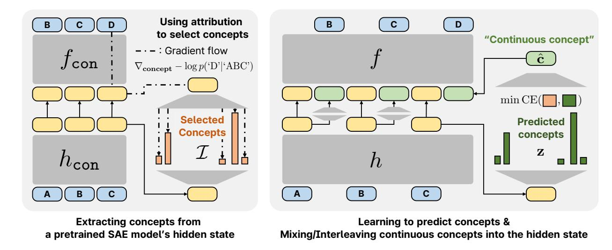
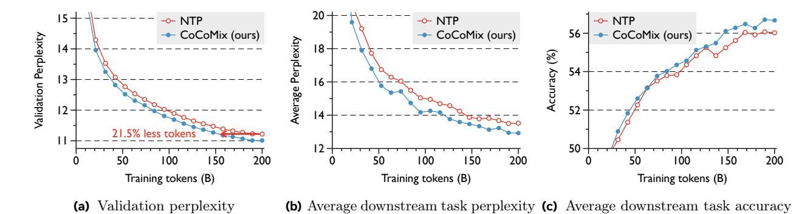
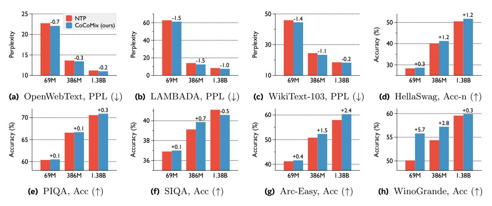
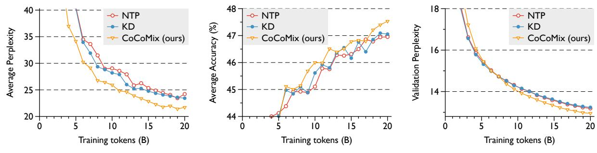
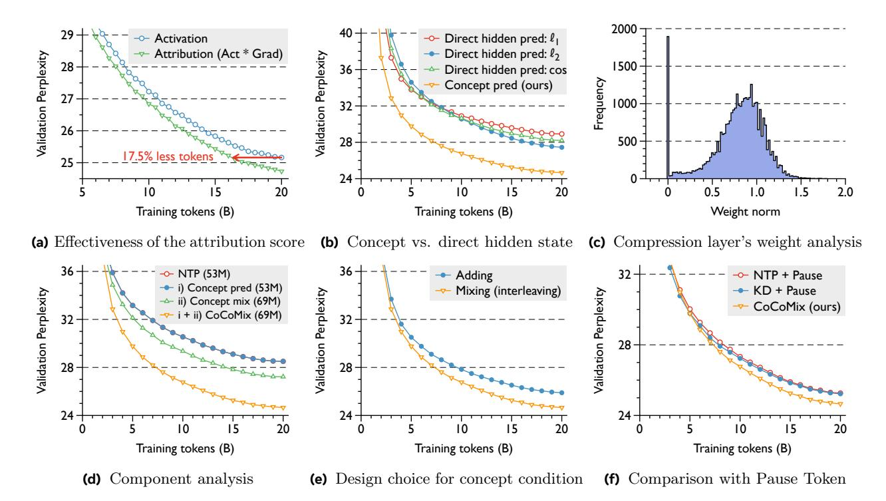
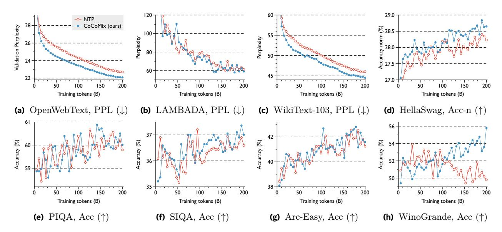
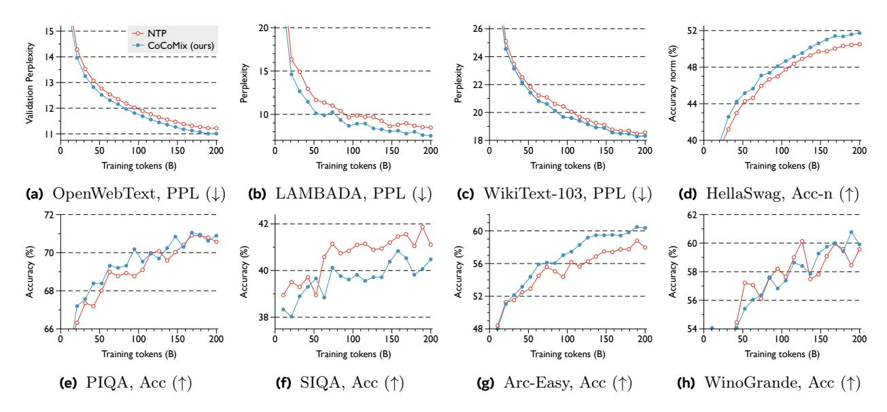

# LLM Pretraining with Continuous Concepts

Jihoon Tack1,2,† , Jack Lanchantin1 , Jane Yu1 , Andrew Cohen1 , Ilia Kulikov1 , Janice Lan1 , Shibo Hao1,3,† , Yuandong Tian1 , Jason Weston1 , Xian Li1

Next token prediction has been the standard training objective used in large language model pretraining. Representations are learned as a result of optimizing for token-level perplexity. We propose Continuous Concept Mixing (CoCoMix), a novel pretraining framework that combines discrete next token prediction with continuous concepts. Specifically, CoCoMix predicts "continuous concepts" learned from a pretrained sparse autoencoder and mixes them into the model's hidden state by interleaving with token hidden representations. Through experiments on multiple benchmarks, including language modeling and downstream reasoning tasks, we show that CoCoMix is more sample efficient and consistently outperforms standard next token prediction, knowledge distillation and inserting pause tokens. We find that combining both concept learning and interleaving in an end-to-end framework is critical to performance gains. Furthermore, CoCoMix enhances interpretability and steerability by allowing direct inspection and modification of the predicted concept, offering a transparent way to guide the model's internal reasoning process.

Date: February 13, 2025

Correspondence: Jihoon Tack at [jihoontack@kaist.ac.kr](mailto:jihoontack@kaist.ac.kr), Xian Li at [xianl@meta.com](mailto:xianl@meta.com) Code: <https://github.com/facebookresearch/RAM/tree/main/projects/cocomix>

## 1 Introduction

Recent progress in large language models (LLMs) has revolutionized natural language processing [\(Brown et al.,](#page-10-0) [2020;](#page-10-0) [Dubey et al.,](#page-10-1) [2024\)](#page-10-1) and thus became a core technology in various real-world applications, such as coding assistants [\(Roziere et al.,](#page-11-0) [2023\)](#page-11-0), search engines [\(Xuan-Quy et al.,](#page-12-0) [2023\)](#page-12-0), and personal AI assistants [\(Gao](#page-10-2) [et al.,](#page-10-2) [2023\)](#page-10-2). Central to these breakthroughs is the simple paradigm of next token prediction, which leverages massive amounts of unlabeled text to uncover rich linguistic patterns [\(Radford et al.,](#page-11-1) [2018,](#page-11-1) [2019\)](#page-11-2). However, natural language tokens are often superficial (e.g., function words like "the" or "a"), necessitating substantial training for models to acquire high-level reasoning and conceptual understanding while also hindering their ability to tackle long-horizon tasks such as planning [\(LeCun,](#page-11-3) [2022;](#page-11-3) [Bachmann and Nagarajan,](#page-10-3) [2024\)](#page-10-3).

To tackle this issue, recent studies have investigated methods that go beyond token-level signals by leveraging richer information to train models. For instance, some approaches target more expressive prediction objectives, such as predicting multiple tokens at once to better capture semantic relationships [\(Gloeckle et al.,](#page-10-4) [2024;](#page-10-4) [DeepSeek-AI,](#page-10-5) [2024\)](#page-10-5), while others augment the input with rich signals, e.g., self-generated thought tokens [\(Zelikman et al.,](#page-12-1) [2024\)](#page-12-1), or fixed pause tokens [\(Goyal et al.,](#page-10-6) [2024\)](#page-10-6) prior to next token prediction. Moreover, emerging evidence suggests that LLMs inherently encode high-level concepts and reasoning processes in their latent representations [\(Deng et al.,](#page-10-7) [2023;](#page-10-7) [Yang et al.,](#page-12-2) [2024\)](#page-12-2), indicating replacing discrete language tokens with continuous latent representations has promise in improving reasoning efficiency [\(Hao et al.,](#page-10-8) [2024\)](#page-10-8). While token-level modeling remains important for coherent text generation, the key challenge is to enrich or supplement these natural language tokens so that LLMs can learn more abstract reasoning abilities and long-range dependencies.

This raises a key question: can we augment the next token prediction objective to explicitly model concepts in a latent representation space, thereby bridging semantic abstraction and fine-grained token-level guidance?

To this end, we draw inspiration from recent findings that Sparse Autoencoders (SAEs) can effectively isolate meaningful latent features in LLMs by capturing the high-level semantic concepts [\(Cunningham et al.,](#page-10-9) [2023;](#page-10-9)

1FAIR at Meta, 2KAIST, 3UC San Diego

†Work done during an internship at Meta

> **[图片提取文字 (无描述)]:**
> Using attribution to select concepts "Continuous concept" - · - : Gradient flow  $\nabla_{\mathbf{concept}} - \log p(\mathrm{'D'}|\mathrm{'ABC'})$ min CE Selected Predicted Concepts concepts Α В Extracting concepts from Learning to predict concepts & Mixing/Interleaving continuous concepts into the hidden state a pretrained SAE model's hidden state

Figure 1 Overview of CoCoMix. We use an SAE to extract concepts from a pretrained model's hidden state hcon and then select important concepts based on the attribution score (i.e., measuring the influence on the output). These selected concepts are used as labels I for concept prediction by minimizing the cross-entropy loss CE(·, ·). The predicted concepts z are then compressed into a compact vector, forming a continuous concept c, which is mixed into the model's hidden state by interleaving with token hidden representations. We demonstrate that CoCoMix is more sample efficient and outperforms standard next-token prediction and knowledge distillation baselines.

[Bricken et al.,](#page-10-10) [2023\)](#page-10-10). As SAEs are trained to reconstruct the model's hidden state with sparsity constraints, it encourages focusing on a compact set of concept dimensions [\(Templeton et al.,](#page-12-3) [2024\)](#page-12-3). This makes it possible to highlight the pretrained model's concepts—the core semantic directions that underpin model prediction—while avoiding unnecessary features.

We propose Continuous Concept Mixing (CoCoMix), a novel and effective language modeling framework using continuous concepts. Specifically, we extract semantic concepts using a pretrained SAE and select the most influential ones based on attribution scores, which quantify each concept's influence on the model's output. The model is then trained to predict these selected concepts from its hidden state using a cross-entropy loss. Once multiple concepts are predicted, we compress them into a single continuous concept and mix (or insert) into the hidden states by interleaving with token embeddings, thereby directly contributing to the next token prediction. An additional benefit is that one can probe or analyze the predicted concepts, enabling controllable generation and improving model interpretability. An overview of CoCoMix is shown in [Figure 1.](#page-1-0)

We demonstrate the efficacy of CoCoMix through extensive evaluations across multiple language modeling benchmarks and pretraining model sizes, ranging from million-scale to billion-scale parameter sizes. For instance, when applied to a 1.38B-sized model, CoCoMix achieves comparable performance with the next token prediction with 21.5% fewer training tokens. Moreover, CoCoMix demonstrates substantial improvements in weak-to-strong supervision scenarios, where concepts extracted from a small model can even be used as ground truth labels to supervise the training of a larger model. Finally, we show that the insertion of compressed concept vectors enables us to steer and control the model by probing the predicted concept during generation.

## 2 CoCoMix: Continuous Concept Mixing

In this section, we present Continuous Concept Mixing (CoCoMix), a framework that extends next-token prediction with continuous concepts. We first review our problem setup of interest and the concept extraction process using a sparse autoencoder (SAE) in Section [2.1.](#page-1-1) Then, we describe the concept selection framework and explain how the model predicts and interleaves these concepts into its hidden state to improve language modeling in Section [2.2.](#page-2-0)

#### 2.1 Prelim: Problem Setup and Sparse Autoencoder

**Problem setup.** We consider a language-modeling task over a vocabulary  $\mathcal{V}$ , with a training corpus  $\mathcal{D} \subseteq \mathcal{V}^*$ , where each sequence  $\mathbf{x} = (x_1, x_2, \ldots) \in \mathcal{D}$  is drawn i.i.d. from the data distribution. We require a pretrained language model for concept extraction  $\mathcal{M}_{\mathsf{con}} = f_{\mathsf{con}} \circ h_{\mathsf{con}}$  which predicts next token probability  $\mathcal{M}_{\mathsf{con}}(x_t \mid x_{< t})$ . Here, we extract the continuous concepts  $\mathbf{c}$  from the hidden state  $h_{\mathsf{con}}$ , where  $h_{\mathsf{con}}$  outputs the hidden state at a chosen layer of depth  $L_{\mathsf{con}}$ , and  $f_{\mathsf{con}}$  maps that representation to the next token distribution. We aim to train  $\mathcal{M}$  to model the same autoregressive factorization  $\mathcal{M}(\mathbf{x}) = \prod_{t=1}^{|\mathbf{x}|} \mathcal{M}(x_t \mid x_{< t}, \mathbf{c}_{< t})$ , but by augmenting with continuous concepts  $\mathbf{c}$ .

**Sparse Autoencoder.** We first propose to extract high-level concepts from a pretrained model's hidden state. We use an SAE, which maps the input to a high-dimensional sparse activation, with the objective of reconstructing the original input (Lee et al., 2006). When applied to an LLM, the SAE decomposes the hidden state into multiple dimensions, each of which can be viewed as a distinct concept capturing semantically meaningful features (Yun et al., 2021; Bricken et al., 2023). We consider the TopK SAE (Makhzani and Frey, 2014), which uses a TopK activation to enforce sparsity.

Formally, for a given input sequence  $\mathbf{x}$  and corresponding pretrained model's hidden state at position t, denoted as  $\mathbf{h}_t^{\text{con}} = h_{\text{con}}(\mathbf{x})_t \in \mathbb{R}^{d_{\text{con}}}$ , SAE consists of a linear encoder  $E : \mathbb{R}^{d_{\text{con}}} \to \mathbb{R}^C$  and a linear decoder  $D : \mathbb{R}^C \to \mathbb{R}^{d_{\text{con}}}$ , where C is the dimension of the concept space. The reconstruction process of SAE is as:

$$\mathbf{c}_t^{\text{pre}} = E(\mathbf{h}_t^{\text{con}}), \ \mathbf{c}_t = \text{TopK}(\mathbf{c}_t^{\text{pre}}), \ \widehat{\mathbf{h}}_t^{\text{con}} = D(\mathbf{c}_t),$$

where  $\mathbf{c}_t^{\mathtt{pre}} \in \mathbb{R}^C$  is the pre-activation concept vector,  $\mathtt{TopK}(\cdot)$  zeros out all but the largest  $K_{\mathtt{SAE}}$  entries, and  $\widehat{\mathbf{h}}_t^{\mathtt{con}}$  is the reconstruction. The SAE is trained by minimizing the reconstruction loss:  $\|\mathbf{h}_t^{\mathtt{con}} - \widehat{\mathbf{h}}_t^{\mathtt{con}}\|_2^2$ . By enforcing TopK sparsity, the SAE isolates the most critical dimensions in  $\mathbf{c}$  that explain the pretrained model's features. Here, each activated element of  $\mathbf{c}_t$  is interpreted as a concept.

#### 2.2 Continuous Concept Mixing

Now, we describe the core training pipeline of CoCoMix, which consists of a concept selection framework (refer to the left figure in Figure 1) and two training steps to learn and utilize continuous concepts (refer to the right figure in Figure 1). First, we select important concepts using the attribution score, which measures the influence of each concept on the output. Then, we propose predicting the selected concepts from the model's hidden state using cross-entropy loss, allowing the model to implicitly learn which concepts should be encoded as a hidden representation. Finally, we utilize the predicted concepts to create a "continuous concept", which is interleaved in the hidden states, enabling the model to explicitly learn to use both the continuous concepts as well as the token hidden states. Intuitively, the model selectively learns which concepts are useful for the next token prediction and how it should mix them with the token representations.

Target concept selection using attribution. While the extracted concept  $\mathbf{c}_t$  represents the core features of the current input context, it may not directly indicate which concepts matter most for predicting the ground truth next token  $x_{t+1}$  (Templeton et al., 2024). To this end, we propose utilizing attribution, a method to measure the causal influence of each concept on the output (Baehrens et al., 2010; Sundararajan et al., 2017). Specifically, the attribution score measures the influence based on the local linear approximation of the effect of changing the concept value. In this paper, we use a simple attribution score that measures the influence by multiplying the loss gradient with a given input (Simonyan and Zisserman, 2014; Shrikumar et al., 2016).

Concretely, for a given input  $\mathbf{x}$  and corresponding concept  $\mathbf{c}_t$ , we define the attribution score  $\mathbf{a}_t \in \mathbb{R}^C$  as:

$$\mathbf{a}_t = \mathbf{c}_t^{\text{pre}} \odot \nabla_{\mathbf{c}_t} - \log f_{\text{con}}(x_{t+1}|D(\mathbf{c}_t), \mathbf{h}_{< t}), \tag{1}$$

where  $\odot$  denotes element-wise multiplication. Note that we multiplied the pre-activation  $\mathbf{c}_t^{\text{pre}}$  (instead of  $\mathbf{c}_t$ ) to capture non-activated concepts made by the TopK sparse activation. Based on the computed attribution score, we select salient concepts and incorporate them into language modeling.

**Predicting the selected concepts.** For a given attribution score  $\mathbf{a}_t$ , we first select the indices of the concept that have a high score and use these as discrete labels for concept prediction. Let  $\mathcal{I} = \{i_1, \dots, i_{K_{\text{attr}}}\}$  be the set of indices corresponding to the top  $K_{\text{attr}}$  values of  $\mathbf{a}_t$ , and  $\mathbf{h}_t = h(\mathbf{x})_t \in \mathbb{R}^d$  be the model's hidden state of the

given input  $\mathbf{x}$  at the same token position. Then, we learn to predict these labels using a linear prediction head M that outputs logit  $\mathbf{z}_t = M(\mathbf{h}_t) \in \mathbb{R}^C$  by minimizing the following cross-entropy loss  $CE(\cdot, \cdot)$  is as follows:

$$\mathcal{L}_{\text{concept}}(\mathbf{a}_t) = \frac{1}{K_{\text{attr}}} \sum_{i \in \mathcal{I}} \text{CE}(\mathbf{z}_t, i).$$
 (2)

Mixing continuous concepts with token embeddings. To encourage the model to internalize the concept more effectively, we propose "mixing" (i.e., interleaving) the predicted concept with the existing token hidden representations. As our model predicts multiple concepts at once, we propose to compress them into a compact vector through a learnable mapping, which we refer to as a continuous concept. This compressed vector is interleaved with token vectors.

Formally, for a given concept prediction logit  $\mathbf{z}_t$ , we sparsify the logit using TopK activation to predict the concepts, then compress them into a continuous concept vector  $\hat{\mathbf{c}}_t \in \mathbb{R}^d$ :

$$\hat{\mathbf{c}}_t = \mathbf{W} \operatorname{TopK}(\mathbf{z}_t) + \mathbf{b},$$
 (3)

where  $\mathbf{W} \in \mathbb{R}^{d \times C}$  and  $\mathbf{b} \in \mathbb{R}^d$  project the TopK-sparse vector to a d-dimensional embedding. We then append  $\hat{\mathbf{c}}_t$  to the model's hidden sequence  $\hat{\mathbf{c}}_t$  as  $(\mathbf{h}_1, \hat{\mathbf{c}}_1, \dots, \mathbf{h}_t, \hat{\mathbf{c}}_t)$ , which is fed into the remaining transformer blocks f. Note that this design not only improves the model's performance but also offers interpretability and controllability through analyzing and steering the predicted concept  $\mathbf{z}_t$ , which can be probed or tuned during the model's generation process. Furthermore, by analyzing the weights of the compression layer  $\mathbf{W}$ , one can identify which concept is useful for the next token prediction.

This approach shares similarities with intervention techniques in the mechanistic interpretability literature, which modify the hidden state by adding a concept vector to the original hidden state (Zou et al., 2023; Wu et al., 2024). However, unlike intervention methods that directly manipulate the hidden state, our approach treats the predicted concept as a separate unit of information by interleaving it in the hidden state. This design allows the model to process the concept independently, leveraging the pretrained model's internal reasoning reflected in the prediction.

**Training objective.** The final training objective for CoCoMix combines the standard next token prediction loss and the concept prediction term as follows:

$$\sum_{t=1}^{T-1} -\log f(x_{t+1} \mid \mathbf{h}_{\leq t}, \hat{\mathbf{c}}_{\leq t}) + \lambda \mathcal{L}_{\text{concept}}(\mathbf{a}_t), \tag{4}$$

where  $\lambda$  is a tunable coefficient.

## 3 Experiments

We provide an empirical evaluation of CoCoMix by investigating the following questions:

- Can CoCoMix improve the performance of next token prediction in LLM pretraining? (Figure 2 and Figure 3)
- Does CoCoMix show improvement in weak-to-strong supervision setup compared to other knowledge distillation methods? (Table 1 and Figure 4)
- Does CoCoMix introduce model interpretability and steerability? (Figure 5)
- How does each proposed component of CoCoMix contribute to the performance? (Figure 6)

Before answering each question, we outline the experimental protocol (more details in Appendix A).

**Training setup.** We use a pretrained open-source SAE that is trained on the 124M-sized GPT-2 (Gao et al., 2024). We consider training CoCoMix with three different numbers of active parameters, including, 68M, 386M, and 1.38B, with a context length of 1024. For the analysis and ablation study, we mainly conducted experiments on the 68M model. Note that this activated parameter count includes those in the new layer

> **[图片提取文字 (无描述)]:**
> - NTP -- NTP NTP CoCoMix (ours) CoCoMix (ours) CoCoMix (ours) Perplexity 18 54 16 Validation 52 21.5% less tokens 200 200 100 150 100 150 100 150 200 Training tokens (B) Training tokens (B) Training tokens (B) Validation perplexity (b) Average downstream task perplexity (c) Average downstream task accuracy

Figure 2 CoCoMix vs. NTP performance at different training checkpoints. Each model contains a total of 1.38B parameters. Each model is trained on the OpenWebText dataset. For CoCoMix, the concepts are extracted from a 124M-sized model (10× smaller than the base model). The plots show improvements in: (a) validation perplexity, (b) average perplexity on LAMBADA, WikiText-103, and (c) average accuracy on HellaSwag, PIQA, SIQA, Arc-Easy, and WinoGrande.

> **[图片提取文字 (无描述)]:**
> -1.5 NTP CoCoMix (ours) 20 Perplexity Perplexity Perplexity +1.2 20 10 386M 69M 386M 1.38B 69M 386M 1.38B 69M 1.38B 69M 386M 1.38B (a) OpenWebText, PPL (↓) (b) LAMBADA, PPL  $(\downarrow)$ (c) WikiText-103, PPL  $(\downarrow)$ (d) HellaSwag, Acc-n (↑) +0.3 +2.4 +0.3 +0.7 +2.8 Accuracy (%) ccuracy (%) +5.7 +1.5 55 38 +0.1 +0.4 36 60 40 69M 386M 1.38B 386M 1.38B 69M 386M 1.38B 69M 69M 386M 1.38B **(e)** PIQA, Acc (↑) **(f)** SIQA, Acc (↑) **(g)** Arc-Easy, Acc (↑) (h) WinoGrande, Acc (↑)

Figure 3 CoCoMix vs. NTP performance at different model sizes. We consider various model sizes, including 69M, 386M, and 1.38B parameters and train on 200B OpenWebText tokens. We evaluate the models on OpenWebText validation perplexity and downstream datasets LAMBADA, WikiText-103, HellaSwag, PIQA, SIQA, Arc-Easy, and WinoGrande.

(i.e., the concept predictor), whereas for other baselines, we match the same number of active parameters by increasing the hidden state dimension size d. CoCoMix utilizes fewer FLOPs than Pause token (as discussed in Section [3.3\)](#page-6-1) but more FLOPs than NTP, due to the interleaving of continuous concepts. We use the OpenWebText dataset [\(Radford et al.,](#page-11-2) [2019\)](#page-11-2) as the pretraining corpus to use the same distribution used to train Mcon. All experiments are conducted with 20B training tokens, except for the main experiment in Section [3.1,](#page-5-2) which uses 200B tokens.

Baselines. We consider the standard pretraining next token prediction (NTP) procedure, and the commonly used distillation method, knowledge distillation (KD; [Hinton et al.,](#page-10-13) [2015\)](#page-10-13), which is widely used in pretraining [\(Gu et al.,](#page-10-14) [2024;](#page-10-14) [Sanh et al.,](#page-11-7) [2019;](#page-11-7) [Team,](#page-12-9) [2024\)](#page-12-9). We excluded KD baselines that require multiple models (i.e., more than a single teacher model) to be trained [\(Gu et al.,](#page-10-14) [2024\)](#page-10-14). For KD, we minimize the KL divergence between teacher and student output while balancing the KL term with the NTP loss. Note that generating synthetic datasets for distillation [\(Kim and Rush,](#page-10-15) [2016;](#page-10-15) [Yu et al.,](#page-12-10) [2024\)](#page-12-10) is excluded due to inefficiency, as it requires generating more than 20B tokens.

Evaluation setup. For evaluation, we consider the validation perplexity of the pretraining dataset and 7 downstream tasks to benchmark commonsense reasoning and reading comprehension. This includes LAMBADA [\(Paperno et al.,](#page-11-8) [2016\)](#page-11-8), WikiText-103 [\(Merity et al.,](#page-11-9) [2017\)](#page-11-9), HellaSwag [\(Zellers et al.,](#page-12-11) [2019\)](#page-12-11), PIQA

> **[图片提取文字 (无描述)]:**
> -- NTP → NTP → NTP -- KD → KD 8 KD 35 CoCoMix (ours) CoCoMix (ours) CoCoMix (ours) 16 20 20 20 Training tokens (B) Training tokens (B) Training tokens (B)

(a) Weak-to-strong: Avg. Perplexity (b) Weak-to-strong: Avg. Accuracy (c) Distribution shift (OpenWebMath)

Figure 4 CoCoMix vs. Knowledge Distillation (KD). For our weak-to-strong supervision setup, we train a 386M model where the teacher of KD (or concept extraction for CoCoMix) is a 124M-sized model: we report (a) average perplexity over OpenWebText, LAMABADA, and WikiText and (b) average accuracy over HellaSwag, PIQA, SIQA, Arc-Easy, and WiniGrande dataset. For (c) a distribution shift setup, we train all methods on OpenWebMath, a math specific pretraining corpus.

| Method        | Total Params | OWT PPL (↓) | LAMB PPL (↓) | Wiki PPL (↓) | HellaS Acc-n (↑) | PIQA Acc (↑) | SIQA Acc (↑) | Arc-E Acc (↑) | WinoG Acc (↑) | Avg PPL (↓) | Avg Acc (↑) |
|---------------|-----------------|----------------|-----------------|-----------------|---------------------|-----------------|-----------------|------------------|------------------|----------------|----------------|
| NTP           | 69M             | 25.3           | 107.6           | 52.3            | 27.4                | 59.4            | 36.6            | 39.7             | 50.7             | 61.8           | 42.7           |
| KD CoCoMix | 69M 69M      | 25.2 24.7   | 099.3 099.1  | 51.0 50.9    | 27.4 27.6        | 59.8 59.5    | 36.2 37.2    | 39.8 39.3     | 50.7 51.0     | 58.5 58.2   | 42.8 42.9   |
| NTP           | 386M            | 16.3           | 26.3            | 29.9            | 33.6                | 64.1            | 38.4            | 47.3             | 50.9             | 24.2           | 46.8           |
| KD            | 386M            | 16.4           | 24.6            | 29.1            | 33.6                | 63.6            | 38.0            | 48.5             | 51.4             | 23.4           | 47.0           |
| CoCoMix       | 386M            | 15.9           | 19.3            | 29.1            | 34.7                | 63.6            | 39.2            | 47.9             | 52.3             | 21.4           | 47.5           |
| NTP           | 1.38B           | 14.3           | 16.6            | 25.0            | 38.1                | 66.1            | 38.9            | 50.5             | 50.0             | 18.6           | 48.7           |
| KD            | 1.38B           | 14.2           | 16.6            | 24.9            | 37.4                | 66.7            | 39.0            | 50.1             | 52.3             | 18.5           | 49.1           |
| CoCoMix       | 1.38B           | 13.9           | 15.4            | 24.9            | 38.4                | 66.9            | 39.5            | 50.8             | 53.0             | 18.1           | 49.7           |

Table 1 CoCoMix vs. Next Token Prediction (NTP) vs. KnowledgeDistillation (KD). We report performance on the OpenWebText (OWT) training set, as well as downstream tasks, including LAMBADA (LAMB), WikiText-103 (Wiki), HellaSwag (HellaS), PIQA, Social Interaction QA (SIQA), Arc-Easy (Arc-E), and WinoGrande (WinoG). We train three different sizes of models where 124M model is used as a teacher. All models are trained on 20B tokens sampled from the OpenWebText dataset. The bold indicates the best result.

[\(Bisk et al.,](#page-10-16) [2020\)](#page-10-16), Social IQA (SIQA; [Sap et al.,](#page-11-10) [2019\)](#page-11-10), ARC-easy [\(Clark et al.,](#page-10-17) [2018\)](#page-10-17), and WinoGrande [\(Sakaguchi et al.,](#page-11-11) [2020\)](#page-11-11) datasets. We also consider OpenWebMath [\(Paster et al.,](#page-11-12) [2023\)](#page-11-12) as a pretraining dataset to demonstrate that concepts learned from a pretrained LLM can still be applied to CoCoMix, even when the model was trained on a different corpus.

### 3.1 Main Results

In this section, we illustrate two core results: i) the comparison with NTP on a relatively large-scale pretraining setup and ii) the comparison with KD baseline, especially on weak-to-strong supervision scenarios where concepts extracted from a small model are used to guide a larger model.

Improving NTP with CoCoMix at scale. We first present the main result by applying CoCoMix to the NTP. Here, we consider training NTP and CoCoMix on 200B tokens. As shown in [Figure 3,](#page-4-1) CoCoMix consistently and significantly improves the performance of overall downstream tasks on various model sizes. Our results also indicate that larger models (e.g., 386M and 1.38B) can benefit from using concepts extracted from a smaller 124M model, showing effective weak-to-strong supervision. Moreover, as shown in [Figure 2,](#page-4-0) CoCoMix consistently improves the performance over the NTP on a billion-scale model. For instance, CoCoMix achieves similar performance to NTP while using 21.5% fewer tokens, demonstrating high sample efficiency. Finally, it is worth noting that the performance gain of using CoCoMix is increasing over the training steps, demonstrating strong generalization performance.

|                                   | Iʀʵ˲˝ Pʾʏɹʵ˝喐 The best platform for buying tickets is the                                                                                                |                                                                                                                                  |                                                                                                                                                                              |  |  |  |
|-----------------------------------|----------------------------------------------------------------------------------------------------------------------------------------------------------|----------------------------------------------------------------------------------------------------------------------------------|------------------------------------------------------------------------------------------------------------------------------------------------------------------------------|--|--|--|
| ʏ˲ʾˍ嘘 M ́ 嘗 Ʉ CʏCʏ | Nʏ S˝dzdzʾ                                                                                                                                               | S˝dzdzʾ ǗʏʀǗdzʵ˝ 味呴呹呵呴喐 ˍɄ˝dz ƪǡǡʾdzˍˍ ʾdzɧƪ˝dzǡ                                                                                 | S˝dzdzʾ ǗʏʀǗdzʵ˝ 呲呶呷呹呸喐 ̈́dzƪʾ喯ɹʏʀ˝ȵ ʾdzɧƪ˝dzǡ                                                                                                                               |  |  |  |
|                                   | Gdzʀdzʾƪ˝Ʉʏʀ喐 vernacular ticketing system," said the official. "The ticket prices are fixed and the tickets are available at the same time." | Gdzʀdzʾƪ˝Ʉʏʀ喐 vernacular website, Ticketmaster.com. The site is a great resource for finding the best deals on tickets. | Gdzʀdzʾƪ˝Ʉʏʀ喐 — by the end of the year — and the new platform by fans. The new ticket- by a group of fans has been known as the "ticket by 'ticket — the group   |  |  |  |
| SAE GPT味                       | Gdzʀdzʾƪ˝Ʉʏʀ喐 iphone app.                                                                                                                                | Gdzʀdzʾƪ˝Ʉʏʀ喐 urchin-cheers.com. The online store has a new, fast-growing selection of premium tickets                     | Gdzʀdzʾƪ˝Ʉʏʀ喐 Facebook page. It's a place where you can buy tickets for free and then go to the next one. The other option is to buy a ticket for a month or two |  |  |  |

Figure 5 Qualitative demonstration of the concept steering effect. CoCoMix and GPT2 models are 350M and 124M parameter transformers, respectively, trained on the OpenWebText dataset. For CoCoMix, we manipulate the predicted concept logit z, while for GPT2, we adjust the SAE concept space c by increasing the activation of a specific concept index. This illustrates the impact of targeted concept steering on the respective model outputs.

Comparison with KD baseline. We also compare CoCoMix with KD baseline across multiple scenarios, including (1) a stronger teacher model teaching a smaller student model; (2) weak-to-strong supervision, where a weaker teacher teaches a larger student model; and (3) distribution shift, where the student is trained on a corpus different from the teacher's pretraining distribution. As shown in [Table 1,](#page-5-0) CoCoMix demonstrates improvements over KD in all considered model configurations. In particular, CoCoMix shows significant performance gain in the weak-to-strong supervision setup, e.g., improving average perplexity of 2.8 in 386M, while KD does not show great improvement. This arises because a weaker teacher can introduce noisy or suboptimal knowledge, especially when the student surpasses the teacher in capability [\(Rawat et al.,](#page-11-13) [2024\)](#page-11-13). This trend is also observable in [Figure 4,](#page-5-1) where models trained with KD fall behind standard training midway through training as the student outpaces the teacher (especially in the distribution shift scenario). In contrast, CoCoMix selectively utilizes useful concepts, resulting in a consistent performance gain.

### 3.2 Interpretability and Steerability of CoCoMix

Another core advantage of CoCoMix is its interpretability and model steering. Specifically, as the model is trained to predict concepts in its hidden state, we can analyze which concepts it focuses on based on the concept predictions. Furthermore, by amplifying the magnitude of the predicted concept zt, one can control the output generation of the model. Following [Templeton et al.](#page-12-3) [\(2024\)](#page-12-3), we multiply zt of a desired concept element by constants ranging from -10 to 10. To verify whether this steerability works as intended, we steer the activation of the same concept in the pretrained model's SAE latent space c and confirm whether the output exhibits the corresponding concept. Here, we use a 386M parameter model trained with CoCoMix, where the pretrained model is GPT-2. As shown in [Figure 5,](#page-6-0) when the concept related to "website address" is amplified, both models start generating actual website addresses. This demonstrates that our model has successfully learned the GPT-2 aligned concepts. More examples of steering can be found in Appendix [B.2.](#page-13-1)

### 3.3 Analysis of CoCoMix's effectiveness

In this section, we provide a detailed analysis of CoCoMix to validate the effect of each proposed component. Unless otherwise specified, we use a 69M model and train on 20B tokens sampled from the OpenWebText dataset across all methods throughout this section.

Effectiveness of the attribution score. We first analyze whether the attribution score effectively extracts important concepts. To demonstrate this, we train CoCoMix using the activation value ct for concept extraction, i.e., Lconcept(ct) in [Equation 2,](#page-3-0) instead of the attribution score at. Remark that the activation value also well reflects the importance of the concept [\(Bricken et al.,](#page-10-10) [2023\)](#page-10-10). As shown in [Figure 6a,](#page-7-0) using attribution scores significantly improves performance, improving sample efficiency by 17.5% compared to activation value based selection. We believe it will be an interesting future direction to explore other selection criteria for improving CoCoMix's performance or removing undesirable concepts to reduce bias, e.g., selectively removing unsafe concepts for safe LLM pretraining.

> **[图片提取文字 (无描述)]:**
> 2000 Activation Direct hidden pred:  $\ell_1$ Attribution (Act \* Grad) Direct hidden pred:  $\ell_2$ Validation Perplexity Validation Perplexity 1500 28 36 Direct hidden pred: cos Frequency Concept pred (ours) 1000 32 28 500 17.5% less tokens 25 24 20 20 2.0 10 Training tokens (B) Training tokens (B) Weight norm (a) Effectiveness of the attribution score **(b)** Concept vs. direct hidden state (c) Compression layer's weight analysis NTP (53M) 32 NTP + Pause Adding i) Concept pred (53M) Mixing (interleaving) KD + Pause Validation Perplexity Validation Perplexity Validation Perplexity → ii) Concept mix (69M) CoCoMix (ours) i + ii) CoCoMix (69M) 32 32 28 28 24 20 20 20 Training tokens (B) Training tokens (B) Training tokens (B) Component analysis Design choice for concept condition Comparison with Pause Token

Figure 6 Analysis of CoCoMix: (a) Effectiveness of the attribution score for selecting concepts. (b) Comparison between concept prediction and direct hidden state prediction (i.e., predicting the hidden state with continuous loss rather than discretizing the hidden state with SAE). (c) The sparsity in the compression weight. (d) Component analysis by analyzing the contribution of concept prediction and mixing. (e) Design choices for concept conditioning by comparing adding the concept vector to the original hidden state and mixing (interleaving the concept vector with token hidden representation). (f) Comparison between CoCoMix and the Pause token (i.e., adding learnable tokens). We use a 69M transformer and train on 20B tokens from the OpenWebText dataset.

Comparison with direct hidden state predictions. To evaluate the importance of predicting the concept extracted from SAE, we compare CoCoMix with direct hidden state prediction strategies (i.e., predict the full hidden state without projecting into the concept space). To have a comparison under the same architecture as CoCoMix, we replace the concept prediction head M with a two-layer multilayer perceptron (MLP), denoted  $g(\cdot)$ , which predicts the pretrained LLM's hidden state  $\mathbf{h}^{\text{con}}$  directly from the hidden state of the model  $\mathbf{h}$ . The predicted representation,  $g(\mathbf{h})$ , is then compressed into a continuous embedding for insertion to have the same architecture as CoCoMix. Here, we use continuous loss including,  $\ell_1$ ,  $\ell_2$ , and the cosine distance (e.g.,  $|\mathbf{h}^{\text{con}} - g(\mathbf{h})|_2^2$  for  $\ell_2$ ) to predict the hidden state. As shown in Figure 6b, direct hidden state prediction leads to a performance drop. We conjecture this to be due to SAE's ability to decompose the latent into semantically meaningful concepts while predicting all hidden states may include noisy components, emphasizing the effectiveness of our method.

Compression layer weight analysis. Now, we analyze the weight of the compression layer  $\mathbf{W}$  in Equation 3 to show how CoCoMix utilize the predicted concept. To this end, we visualize the  $\ell_2$  norm of each concept's weights of 386M CoCoMix: for the weight matrix  $\mathbf{W} \in \mathbb{R}^{d \times C}$ , where d is the hidden dimension and C is the number of concepts, the norm is defined as:  $\|\mathbf{W}_{:,c}\|_2 = \sqrt{\sum_{d=1}^D W_{d,c}^2}$ . As shown in Figure 6c, we found that a portion of concept weights are near zero, e.g., 5.8% has a norm less than 1e-2. This indicates that CoCoMix learns to ignore these concepts when compressing them into a continuous concept if it is not useful. We conjecture such a process enabled CoCoMix for strong weak-to-strong supervision as it learned to ignore ineffective concepts extracted from a weak model.

Component Analysis. We analyze the contributions of each component of our method: (a) concept prediction Equation 2, and (b) concept insertion Equation 4. The results in Figure 6d demonstrate that both components are critical for performance improvement. Specifically, applying the concept prediction loss alone yields a

modest reduction in perplexity. However, incorporating concept insertion alongside prediction enhances the effectiveness of the loss, resulting in further performance gains. This highlights the role of insertion in enabling the model to leverage the pretrained LLM's latent reasoning effectively. Notably, while concept insertion increases parameter count, it has a limited impact on performance when used alone, emphasizing the critical role of concept prediction.

Continuous concept mixing method. We explored two methods for introducing the continuous concept cˆt into the model's hidden state ht, referred to as concept conditioning. The first method, insertion, insert the continuous concept in front of the token embedding, thus enabling the model to have a mixed input of the token and concept. The other option is intervention, which directly modifies the hidden state by adding the concept vector, i.e., ht ← ht + cˆt. As illustrated in [Figure 6e,](#page-7-0) both methods enhance pretraining performance (compared to NTP in [Figure 6d\)](#page-7-0), highlighting the importance of concept conditioning, where the insertion method performed better. By introducing a distinct concept vector, the insertion method enables the model to explicitly recognize and effectively utilize concepts during generation, enhancing its overall performance.

CoCoMix vs. pause tokens. Furthermore, we consider an additional baseline that jointly uses pause token [\(Goyal et al.,](#page-10-6) [2024\)](#page-10-6). Specifically, the pause token uses an additional learnable token that is inserted into the token embedding, enabling the LLM to think more before predicting the next token, which is similar to our continuous concept insertion. To this end, we insert the pause token for every input token on the same hidden state layer as CoCoMix to ensure comparable computation. Moreover, we also consider training the pause token with KD. As shown in [Figure 6f,](#page-7-0) CoCoMix consistently outperforms the pause token, indicating our inserted (or interleaved) continuous concept indeed consists of useful information to improve the performance.

## 4 Related Work

Beyond token-level guidance for language modeling. While next token prediction remains the standard paradigm for language modeling, recent approaches have begun to explore methods that provide guidance beyond language tokens. For instance, some methods explore a better target, such as leveraging multi-token predictions to capture long context dependencies [\(Gloeckle et al.,](#page-10-4) [2024;](#page-10-4) [DeepSeek-AI,](#page-10-5) [2024\)](#page-10-5) or predicting sequence embedding [\(Lee et al.,](#page-11-14) [2024\)](#page-11-14). Additionally, methods explore new types of inputs, e.g., using latents [\(Hao et al.,](#page-10-8) [2024\)](#page-10-8) or self-generated thought as inputs [\(Zelikman et al.,](#page-12-1) [2024\)](#page-12-1), which have shown improving reasoning capabilities. Only recently, concept-level modeling using local encoder-decoder architectures has also been explored to represent a language at a higher abstraction level [\(LCM et al.,](#page-11-15) [2024\)](#page-11-15). Other methods add extra tokens in the input space to increase computation at inference time [Nye et al.](#page-11-16) [\(2021\)](#page-11-16); [Wei et al.](#page-12-12) [\(2022\)](#page-12-12); [Goyal et al.](#page-10-6) [\(2024\)](#page-10-6); [Lanchantin et al.](#page-11-17) [\(2024\)](#page-11-17). In contrast to other works, we propose a pretraining approach that integrates next token prediction with continuous concepts, connecting high level concepts with fine-grained token guidance.

Sparse Autoencoders (SAEs). SAEs extend the autoencoder by enforcing sparsity constraints in the latent space [\(Lee et al.,](#page-11-4) [2006\)](#page-11-4). The features learned by SAEs are often interpretable and disentangled, making them useful across various domains, including language modeling [\(Bricken et al.,](#page-10-10) [2023\)](#page-10-10). Additionally, SAEs have gained attention in mechanistic interpretability due to their ability to capture coherent semantic concepts [\(Marks et al.,](#page-11-18) [2024\)](#page-11-18). This property has enabled practical advancements in identifying and manipulating semantic concepts and facilitating steering for controlled model outputs [\(Lieberum et al.,](#page-11-19) [2024\)](#page-11-19). Among SAE variants, TopK SAEs [\(Makhzani and Frey,](#page-11-5) [2014\)](#page-11-5) enforce explicit sparsity using a TopK activation function, demonstrating effectiveness even for large models [\(Gao et al.,](#page-10-12) [2024\)](#page-10-12). In this work, we leverage SAE and, to the best of our knowledge, are the first to apply it to LLM pretraining, achieving strong performance while enhancing the interpretability and controllability of the trained model.

Knowledge distillation (KD). Our method can also be related to KD, i.e., transfers the expertise of a teacher model to a student model to enhance performance [\(Hinton et al.,](#page-10-13) [2015;](#page-10-13) [Zagoruyko and Komodakis,](#page-12-13) [2017\)](#page-12-13), as CoCoMix extracts high-level semantic features from a pretrained model which is used to train a base model. Recently, KD for LLMs has garnered increasing attention, leveraging knowledge from a teacher to improve the generative and encoding capabilities of a student [\(Sanh et al.,](#page-11-7) [2019;](#page-11-7) [Ko et al.,](#page-11-20) [2024\)](#page-11-20). Especially, applying KD to LLM pretraining remains challenging due to the massive token scales (billions to trillions), forcing most current methods to resort to naive token-level probability matching [\(Team,](#page-12-9) [2024;](#page-12-9) [Gu et al.,](#page-10-14) [2024\)](#page-10-14). Additionally, while pretrained models contain a vast amount of learned information and are thus beneficial to use, reusing knowledge from smaller teacher models remains challenging [\(Burns et al.,](#page-10-18) [2023\)](#page-10-18). In this work, we show CoCoMix can even leverage the concept extracted from small models to train a large model showing weak-to-strong supervision.

## 5 Conclusion

We propose Continuous Concept Mixing (CoCoMix), a new LLM pretraining framework that augments next token prediction with continuous concepts. By leveraging concepts extracted from a pretrained SAE as targets, our model predicts both the next token and the associated concept. Predicted concepts are then compressed into a continuous concept vector, which is then mixed into the hidden state. This approach enhances interpretability and controllability by enabling direct probing of the distilled concepts. Experimental results show that CoCoMix consistently improves performance across benchmarks, particularly in challenging generalization scenarios such as weak-to-strong supervision. Future work could explore learning continuous concepts during pretraining without the need for distillation.

## References

- Gregor Bachmann and Vaishnavh Nagarajan. The pitfalls of next-token prediction. In International Conference on Machine Learning, 2024.
- David Baehrens, Timon Schroeter, Stefan Harmeling, Motoaki Kawanabe, Katja Hansen, and Klaus-Robert Müller. How to explain individual classification decisions. The Journal of Machine Learning Research, 2010.
- Yonatan Bisk, Rowan Zellers, Jianfeng Gao, Yejin Choi, et al. Piqa: Reasoning about physical commonsense in natural language. In AAAI Conference on Artificial Intelligence, 2020.
- Trenton Bricken, Adly Templeton, Joshua Batson, Brian Chen, Adam Jermyn, Tom Conerly, Nick Turner, Cem Anil, Carson Denison, Amanda Askell, Robert Lasenby, Yifan Wu, Shauna Kravec, Nicholas Schiefer, Tim Maxwell, Nicholas Joseph, Zac Hatfield-Dodds, Alex Tamkin, Karina Nguyen, Brayden McLean, Josiah E Burke, Tristan Hume, Shan Carter, Tom Henighan, and Christopher Olah. Towards monosemanticity: Decomposing language models with dictionary learning. Transformer Circuits Thread, 2023. https://transformer-circuits.pub/2023/monosemanticfeatures/index.html.
- Tom Brown, Benjamin Mann, Nick Ryder, Melanie Subbiah, Jared D Kaplan, Prafulla Dhariwal, Arvind Neelakantan, Pranav Shyam, Girish Sastry, Amanda Askell, et al. Language models are few-shot learners. In Advances in Neural Information Processing Systems, 2020.
- Collin Burns, Pavel Izmailov, Jan Hendrik Kirchner, Bowen Baker, Leo Gao, Leopold Aschenbrenner, Yining Chen, Adrien Ecoffet, Manas Joglekar, Jan Leike, et al. Weak-to-strong generalization: Eliciting strong capabilities with weak supervision. arXiv preprint arXiv:2312.09390, 2023.
- Peter Clark, Isaac Cowhey, Oren Etzioni, Tushar Khot, Ashish Sabharwal, Carissa Schoenick, and Oyvind Tafjord. Think you have solved question answering? try arc, the ai2 reasoning challenge. arXiv preprint arXiv:1803.05457, 2018.
- Hoagy Cunningham, Aidan Ewart, Logan Riggs, Robert Huben, and Lee Sharkey. Sparse autoencoders find highly interpretable features in language models. arXiv preprint arXiv:2309.08600, 2023.
- DeepSeek-AI. Deepseek-v3 technical report. arXiv preprint arXiv:2412.19437, 2024.
- Yuntian Deng, Kiran Prasad, Roland Fernandez, Paul Smolensky, Vishrav Chaudhary, and Stuart Shieber. Implicit chain of thought reasoning via knowledge distillation. arXiv preprint arXiv:2311.01460, 2023.
- Abhimanyu Dubey, Abhinav Jauhri, Abhinav Pandey, Abhishek Kadian, Ahmad Al-Dahle, Aiesha Letman, Akhil Mathur, Alan Schelten, Amy Yang, Angela Fan, et al. The llama 3 herd of models. arXiv preprint arXiv:2407.21783, 2024.
- Difei Gao, Lei Ji, Luowei Zhou, Kevin Qinghong Lin, Joya Chen, Zihan Fan, and Mike Zheng Shou. Assistgpt: A general multi-modal assistant that can plan, execute, inspect, and learn. arXiv preprint arXiv:2306.08640, 2023.
- Leo Gao, Tom Dupré la Tour, Henk Tillman, Gabriel Goh, Rajan Troll, Alec Radford, Ilya Sutskever, Jan Leike, and Jeffrey Wu. Scaling and evaluating sparse autoencoders. arXiv preprint arXiv:2406.04093, 2024.
- Fabian Gloeckle, Badr Youbi Idrissi, Baptiste Rozière, David Lopez-Paz, and Gabriel Synnaeve. Better & faster large language models via multi-token prediction. In International Conference on Machine Learning, 2024.
- Sachin Goyal, Ziwei Ji, Ankit Singh Rawat, Aditya Krishna Menon, Sanjiv Kumar, and Vaishnavh Nagarajan. Think before you speak: Training language models with pause tokens. In International Conference on Learning Representations, 2024.
- Yuxian Gu, Hao Zhou, Fandong Meng, Jie Zhou, and Minlie Huang. Miniplm: Knowledge distillation for pre-training language models. arXiv preprint arXiv:2410.17215, 2024.
- Shibo Hao, Sainbayar Sukhbaatar, DiJia Su, Xian Li, Zhiting Hu, Jason Weston, and Yuandong Tian. Training large language models to reason in a continuous latent space. arXiv preprint arXiv:2412.06769, 2024.
- Geoffrey Hinton, Oriol Vinyals, and Jeff Dean. Distilling the knowledge in a neural network. arXiv preprint arXiv:1503.02531, 2015.
- Yoon Kim and Alexander M Rush. Sequence-level knowledge distillation. In Annual Conference of the Association for Computational Linguistics, 2016.

- Jongwoo Ko, Sungnyun Kim, Tianyi Chen, and Se-Young Yun. Distillm: Towards streamlined distillation for large language models. In International Conference on Machine Learning, 2024.
- Jack Lanchantin, Shubham Toshniwal, Jason Weston, Sainbayar Sukhbaatar, et al. Learning to reason and memorize with self-notes. Advances in Neural Information Processing Systems, 36, 2024.
- LCM, Loïc Barrault, Paul-Ambroise Duquenne, Maha Elbayad, Artyom Kozhevnikov, Belen Alastruey, Pierre Andrews, Mariano Coria, Guillaume Couairon, Marta R Costa-jussà, et al. Large concept models: Language modeling in a sentence representation space. arXiv preprint arXiv:2412.08821, 2024.
- Yann LeCun. A path towards autonomous machine intelligence. Open Review, 2022.
- Honglak Lee, Alexis Battle, Rajat Raina, and Andrew Ng. Efficient sparse coding algorithms. In Advances in Neural Information Processing Systems, 2006.
- Hyunji Lee, Doyoung Kim, Jihoon Jun, Sejune Joo, Joel Jang, Kyoung-Woon On, and Minjoon Seo. Semiparametric token-sequence co-supervision. In Annual Conference of the Association for Computational Linguistics, 2024.
- Tom Lieberum, Senthooran Rajamanoharan, Arthur Conmy, Lewis Smith, Nicolas Sonnerat, Vikrant Varma, János Kramár, Anca Dragan, Rohin Shah, and Neel Nanda. Gemma scope: Open sparse autoencoders everywhere all at once on gemma 2. arXiv preprint arXiv:2408.05147, 2024.
- I Loshchilov. Decoupled weight decay regularization. arXiv preprint arXiv:1711.05101, 2017.
- Alireza Makhzani and Brendan Frey. K-sparse autoencoders. In International Conference on Learning Representations, 2014.
- Samuel Marks, Can Rager, Eric J Michaud, Yonatan Belinkov, David Bau, and Aaron Mueller. Sparse feature circuits: Discovering and editing interpretable causal graphs in language models. arXiv preprint arXiv:2403.19647, 2024.
- Stephen Merity, Caiming Xiong, James Bradbury, and Richard Socher. Pointer sentinel mixture models. In International Conference on Learning Representations, 2017.
- Maxwell Nye, Anders Johan Andreassen, Guy Gur-Ari, Henryk Michalewski, Jacob Austin, David Bieber, David Dohan, Aitor Lewkowycz, Maarten Bosma, David Luan, et al. Show your work: Scratchpads for intermediate computation with language models. arXiv preprint arXiv:2112.00114, 2021.
- Denis Paperno, Germán Kruszewski, Angeliki Lazaridou, Quan Ngoc Pham, Raffaella Bernardi, Sandro Pezzelle, Marco Baroni, Gemma Boleda, and Raquel Fernández. The lambada dataset: Word prediction requiring a broad discourse context. In Annual Conference of the Association for Computational Linguistics, 2016.
- Keiran Paster, Marco Dos Santos, Zhangir Azerbayev, and Jimmy Ba. Openwebmath: An open dataset of high-quality mathematical web text. arXiv preprint arXiv:2310.06786, 2023.
- Alec Radford, Karthik Narasimhan, Tim Salimans, and Ilya Sutskever. Improving language understanding by generative pre-training. 2018.
- Alec Radford, Jeff Wu, Rewon Child, David Luan, Dario Amodei, and Ilya Sutskever. Language models are unsupervised multitask learners. 2019.
- Ankit Singh Rawat, Veeranjaneyulu Sadhanala, Afshin Rostamizadeh, Ayan Chakrabarti, Wittawat Jitkrittum, Vladimir Feinberg, Seungyeon Kim, Hrayr Harutyunyan, Nikunj Saunshi, Zachary Nado, et al. A little help goes a long way: Efficient llm training by leveraging small lms. arXiv preprint arXiv:2410.18779, 2024.
- Baptiste Roziere, Jonas Gehring, Fabian Gloeckle, Sten Sootla, Itai Gat, Xiaoqing Ellen Tan, Yossi Adi, Jingyu Liu, Romain Sauvestre, Tal Remez, et al. Code llama: Open foundation models for code. arXiv preprint arXiv:2308.12950, 2023.
- Keisuke Sakaguchi, Ronan Le Bras, Chandra Bhagavatula, and Yejin Choi. Winogrande: An adversarial winograd schema challenge at scale. In AAAI Conference on Artificial Intelligence, 2020.
- Victor Sanh, Lysandre Debut, Julien Chaumond, and Thomas Wolf. Distilbert, a distilled version of bert: smaller, faster, cheaper and lighter. In Advances in Neural Information Processing Systems, 2019.
- Maarten Sap, Hannah Rashkin, Derek Chen, Ronan Le Bras, and Yejin Choi. Social IQa: Commonsense reasoning about social interactions. In Conference on Empirical Methods in Natural Language Processing, 2019.
- Avanti Shrikumar, Peyton Greenside, Anna Shcherbina, and Anshul Kundaje. Not just a black box: Learning important features through propagating activation differences. In International Conference on Machine Learning, 2016.

- Karen Simonyan and Andrew Zisserman. Very deep convolutional networks for large-scale image recognition. arXiv preprint arXiv:1409.1556, 2014.
- Mukund Sundararajan, Ankur Taly, and Qiqi Yan. Axiomatic attribution for deep networks. In International Conference on Machine Learning, 2017.
- Gemma Team. Gemma 2: Improving open language models at a practical size. arXiv preprint arXiv:2408.00118, 2024.
- Adly Templeton, Tom Conerly, Jonathan Marcus, Jack Lindsey, Trenton Bricken, Brian Chen, Adam Pearce, Craig Citro, Emmanuel Ameisen, Andy Jones, Hoagy Cunningham, Nicholas L Turner, Callum McDougall, Monte MacDiarmid, C. Daniel Freeman, Theodore R. Sumers, Edward Rees, Joshua Batson, Adam Jermyn, Shan Carter, Chris Olah, and Tom Henighan. Scaling monosemanticity: Extracting interpretable features from claude 3 sonnet. Transformer Circuits Thread, 2024. <https://transformer-circuits.pub/2024/scaling-monosemanticity/index.html>.
- Jason Wei, Xuezhi Wang, Dale Schuurmans, Maarten Bosma, Fei Xia, Ed Chi, Quoc V Le, Denny Zhou, et al. Chain-of-thought prompting elicits reasoning in large language models. Advances in neural information processing systems, 35:24824–24837, 2022.
- Zhengxuan Wu, Aryaman Arora, Zheng Wang, Atticus Geiger, Dan Jurafsky, Christopher D Manning, and Christopher Potts. Reft: Representation finetuning for language models. In Advances in Neural Information Processing Systems, 2024.
- Dao Xuan-Quy, Le Ngoc-Bich, Phan Xuan-Dung, Ngo Bac-Bien, and Vo The-Duy. Evaluation of chatgpt and microsoft bing ai chat performances on physics exams of vietnamese national high school graduation examination. arXiv preprint arXiv:2306.04538, 2023.
- Sohee Yang, Elena Gribovskaya, Nora Kassner, Mor Geva, and Sebastian Riedel. Do large language models latently perform multi-hop reasoning? In Annual Conference of the Association for Computational Linguistics, 2024.
- Ping Yu, Jing Xu, Jason Weston, and Ilia Kulikov. Distilling system 2 into system 1. arXiv preprint arXiv:2407.06023, 2024.
- Zeyu Yun, Yubei Chen, Bruno A Olshausen, and Yann LeCun. Transformer visualization via dictionary learning: contextualized embedding as a linear superposition of transformer factors. arXiv preprint arXiv:2103.15949, 2021.
- Sergey Zagoruyko and Nikos Komodakis. Paying more attention to attention: Improving the performance of convolutional neural networks via attention transfer. In International Conference on Learning Representations, 2017.
- Eric Zelikman, Georges Harik, Yijia Shao, Varuna Jayasiri, Nick Haber, and Noah D Goodman. Quiet-star: Language models can teach themselves to think before speaking. In Conference on Language Modeling, 2024.
- Rowan Zellers, Ari Holtzman, Yonatan Bisk, Ali Farhadi, and Yejin Choi. Hellaswag: Can a machine really finish your sentence? In Annual Conference of the Association for Computational Linguistics, 2019.
- Andy Zou, Long Phan, Sarah Chen, James Campbell, Phillip Guo, Richard Ren, Alexander Pan, Xuwang Yin, Mantas Mazeika, Ann-Kathrin Dombrowski, et al. Representation engineering: A top-down approach to ai transparency. arXiv preprint arXiv:2310.01405, 2023.

# **Appendix**

## A Experimental Details

Architecture details. Our method and baseline both utilize the GPT-2-based Transformer architecture and tokenizer (Radford et al., 2019), with a context length of 1024. We consider three model sizes, defined by the number of activated parameters: 69M, 386M, and 1.38B. For CoCoMix, the hidden state dimensions d are 512, 1024, and 2028, with 8, 24, and 24 layers, respectively. The number of attention heads is set to 8, 16, and 16 for the three configurations. Baseline models are configured to match the number of activated parameters by employing the same number of layers and attention heads, with hidden state dimensions of 624, 1072, and 2096, respectively. We leverage an open-source pretrained TopK Sparse Autoencoder (SAE) (Gao et al., 2024) for concept extraction, where  $K_{\text{concept}}$  is set to 32 and the concept activation size is 32,768. Consequently, our models introduce an additional  $(C + K_{\text{concept}}) \times d$  activated parameters on top of the base Transformer parameters. The GPT-2 model (a teacher model for KD and a concept extraction model for CoCoMix) has 12 layers, a hidden dimension size of 768, and 124M parameters. The concept extraction layer  $L_{\text{con}}$  is configured as the 6th middle layer of GPT-2 for all model sizes. For CoCoMix, the concept prediction is done at the 4th layer for the 69M model and the 6th layer for the larger 386M and 1.38B models.

Training details. We mainly followed the training details outlined in (Brown et al., 2020). For the main results presented in Section 2, models were trained on 200B tokens over approximately 382K training steps, while other experiments were conducted on 20B tokens. We used OpenWebText as the training dataset to match the same training corpus as GPT-2. The learning rate schedule included a warm-up phase over the first 1/300 of the total training steps, followed by a cosine decay to 10% of the maximum learning rate at the end of training. The maximum learning rates were set to 6e-4, 3e-4, and 2e-4 for the 69M, 386M, and 1.38B models, respectively. The batch sizes were configured to 0.5M, 0.5M, and 1M tokens for the three model sizes. A weight decay of 0.1 was applied across all configurations, and we utilized the AdamW optimizer (Loshchilov, 2017) with  $\beta_1 = 0.9$  and  $\beta_2 = 0.95$ . For training CoCoMix, the concept prediction loss Equation 4 was scaled by a hyperparameter  $\lambda = 0.1$ , and  $K_{\text{attri}}$  was set to 4. For the KD baseline, we employed the vanilla KD loss, where the output probabilities of the teacher model  $\mathcal{M}_{\text{con}}$  and the student model  $\mathcal{M}$  were matched using the Kullback-Leibler (KL) divergence. Specifically, given an input  $\mathbf{x}$ , the KD loss is defined as  $-\log \mathcal{M}(x_{t+1}|\mathbf{x}) + \lambda_{\text{KD}} \cdot \text{KL}(\mathcal{M}_{\text{con}}(\cdot|\mathbf{x})||\mathcal{M}(\cdot|\mathbf{x}))$ , where  $\lambda_{\text{KD}} = 0.1$  consistently demonstrated strong performance.

## **B** Additional Results

### **B.1** Detailed Performance During Training

In this section, we present the performance tracking during training on 200B tokens, including validation perplexity and the perplexity and accuracy of various downstream tasks, including LAMBADA, WikiText-103, HellaSwag, PIQA, SIQA, Arc-Easy, and WinoGrande datasets. As shown in Figure 7, Figure 8, and Figure 9, we compare CoCoMix with the next token prediction (NTP) across different active parameter sizes: 69M, 386M, and 1.38B. In most of the graphs, CoCoMix consistently demonstrates performance gains. Notably, our results show that CoCoMix achieves stable improvements in perplexity across all tasks. Furthermore, CoCoMix exhibits sample efficiency; for instance, in the 1.38B model, CoCoMix reaches the same OpenWebText validation perplexity as NTP while requiring approximately 43B fewer tokens (a 21.5% improvement in token efficiency).

#### B.2 Additional Steerability Results

To further analyze the steerability enabled by CoCoMix, we conducted experiments using both the same prompt as in the main figure and a new prompt (in Figure 10). For consistency, we first applied steering on additional concepts identified during our analysis—"\$ dollar" and "Phone"—using the same prompt as in Figure 5. These experiments confirmed that the model could effectively modulate its output based on these newly identified concepts, producing coherent and concept-aligned generations. Next, to verify whether the

> **[图片提取文字 (无描述)]:**
> -- NTP CoCoMix (ours) € 28.5 Validation Perplexity 100 Accuracy norm 28.0 27.5 Perplexity Perplexity 27.0 200 200 200 Training tokens (B) Training tokens (B) Training tokens (B) Training tokens (B) (b) LAMBADA, PPL  $(\downarrow)$ (a) OpenWebText, PPL (↓) (d) HellaSwag, Acc-n (↑) (c) WikiText-103, PPL (↓) Accuracy (%) Accuracy (%) Accuracy (%) Accuracy (%) 38 100 150 200 50 100 150 200 50 200 100 200 50 100 150 50 150 Training tokens (B) Training tokens (B) Training tokens (B) Training tokens (B) **(e)** PIQA, Acc (↑) **(f)** SIQA, Acc (↑) Arc-Easy, Acc  $(\uparrow)$ (h) WinoGrande, Acc (↑)

Figure 7 CoCoMix vs. NTP performance at different training checkpoints on 69M parameter model. Each model is trained on the 200B tokens sampled from the OpenWebText dataset. The plot shows the result of (a) OpenWebText, (b) LAMBADA, (c) WikiText-103, (d) HellaSwag, (e) PIQA, (f) SIQA, (g) Arc-Easy, and (h) WinoGrande datasets. We use the concepts extracted from a 124M-sized model for training CoCoMix.

identified concepts generalize to different contexts, we experimented with a new prompt: "Latent concept modeling is a" and steered the model using the previously identified concepts "month/year" and "Phone." The results showed that the model successfully reproduced outputs aligned with these concepts, further supporting the robustness of our method. Additionally, we explored whether new concepts could be identified and steered using the same prompt. In this case, we identified two new concepts: "politics/law" and "aggressive tone." Steering the model with these new concepts demonstrated that the outputs could be effectively controlled to exhibit characteristics aligned with the corresponding concepts. These findings further highlight the flexibility and interpretability of our approach.

> **[图片提取文字 (无描述)]:**
> -- NTP CoCoMix (ours) Validation Perplexity Accuracy norm (%) Perplexity Perplexity 20 25 200 200 200 Training tokens (B) Training tokens (B) Training tokens (B) Training tokens (B) (a) OpenWebText, PPL (↓) **(b)** LAMBADA, PPL  $(\downarrow)$ (c) WikiText-103, PPL  $(\downarrow)$ (d) HellaSwag, Acc-n (↑) 56 52 Accuracy (%) Accuracy (%) Accuracy (%) Accuracy (%) 100 150 200 100 150 200 200 50 50 50 100 150 200 Training tokens (B) Training tokens (B) Training tokens (B) Training tokens (B) **(e)** PIQA, Acc (↑) **(f)** SIQA, Acc (↑) Arc-Easy, Acc (↑) (h) WinoGrande, Acc (†)

Figure 8 CoCoMix vs. NTP performance at different training checkpoints on 368M parameter model. Each model is trained on the 200B tokens sampled from the OpenWebText dataset. The plot shows the result of (a) OpenWebText, (b) LAMBADA, (c) WikiText-103, (d) HellaSwag, (e) PIQA, (f) SIQA, (g) Arc-Easy, and (h) WinoGrande datasets. We use the concepts extracted from a 124M-sized model for training CoCoMix.

> **[图片提取文字 (无描述)]:**
> -- NTP CoCoMix (ours) Validation Perplexity norm (%) 24 Perplexity Perplexity 22 20 10 18 200 200 50 50 Training tokens (B) Training tokens (B) Training tokens (B) Training tokens (B) (a) OpenWebText, PPL (↓) **(b)** LAMBADA, PPL (↓) (c) WikiText-103, PPL  $(\downarrow)$ (d) HellaSwag, Acc-n (↑) Accuracy (%) Accuracy (%) Accuracy (%) Accuracy (%) 68 52 56 38 200 100 150 200 100 150 200 100 150 100 200 Training tokens (B) Training tokens (B) Training tokens (B) Training tokens (B) **(e)** PIQA, Acc (↑)  $SIQA, Acc (\uparrow)$ Arc-Easy, Acc (↑) (h) WinoGrande, Acc (↑)

Figure 9 CoCoMix vs. NTP performance at different training checkpoints on 1.38B parameter model. Each model is trained on the 200B tokens sampled from the OpenWebText dataset. The plot shows the result of (a) OpenWebText, (b) LAMBADA, (c) WikiText-103, (d) HellaSwag, (e) PIQA, (f) SIQA, (g) Arc-Easy, and (h) WinoGrande datasets. We use the concepts extracted from a 124M-sized model for training CoCoMix.

|                                   | Iʀʵ˲˝ Pʾʏɹʵ˝喐 The best platform for buying tickets is the                                                                                                     |                                                                                                                                                                                                                    |                                                                                                                                                                                            |  |  |  |  |  |
|-----------------------------------|---------------------------------------------------------------------------------------------------------------------------------------------------------------|--------------------------------------------------------------------------------------------------------------------------------------------------------------------------------------------------------------------|--------------------------------------------------------------------------------------------------------------------------------------------------------------------------------------------|--|--|--|--|--|
|                                   | Nʏ S˝dzdzʾ                                                                                                                                                    | S˝dzdzʾ ǗʏʀǗdzʵ˝ 呲味呸呹呴喐 妙 ǡʏɧɧƪʾ ʾdzɧƪ˝dzǡ                                                                                                                                                                         | S˝dzdzʾ ǗʏʀǗdzʵ˝ 呲呺呲呺呴喐 Pȵʏʀdz ʾdzɧƪ˝dzǡ                                                                                                                                                   |  |  |  |  |  |
| ʏ˲ʾˍ嘘 M ́ 嘗 Ʉ CʏCʏ | Gdzʀdzʾƪ˝Ʉʏʀ喐 vernacular ticketing system," said the official. "The ticket prices are fixed and the tickets are available at the same time."      | Gdzʀdzʾƪ˝Ʉʏʀ喐 vernacular website, which is a great resource for finding out about the event. The event is free to attend, but you will need to pay for your ticket. The cost is \$25 for               | Gdzʀdzʾƪ˝Ʉʏʀ喐 iphone.The iPhone is a great way to buy tickets to the game. It is easy to use, and it is very fast. You can buy a ticket to a game, pay for                     |  |  |  |  |  |
| SAE GPT味                       | Gdzʀdzʾƪ˝Ʉʏʀ喐 iphone app.                                                                                                                                     | Generation: \$10.00 price. The price is \$10 for a ticket. I bought a \$5.50 ticket for \$1. The price of a good ticket is a lot more than a                                                           | Gdzʀdzʾƪ˝Ʉʏʀ喐 iphone. The iPhone is a great way to get around the iPhone. It's a good way for people to buy a smartphone. The iPhone has a lot of features, but it's not       |  |  |  |  |  |
|                                   | (a) Main figure prompt, '\$ dollar' and 'Phone' concept                                                                                                       |                                                                                                                                                                                                                    |                                                                                                                                                                                            |  |  |  |  |  |
|                                   | Iʀʵ˲˝ Pʾʏɹʵ˝喐 Lƪ˝dzʀ˝ ǗʏʀǗdzʵ˝ ɹʏǡdzɧɄʀȣ Ʉˍ ƪ                                                                                                                 |                                                                                                                                                                                                                    |                                                                                                                                                                                            |  |  |  |  |  |
|                                   | Nʏ S˝dzdzʾ                                                                                                                                                    | S˝dzdzʾ ǗʏʀǗdzʵ˝ 呲呶呷呹呸喐 ̈́dzƪʾ喯ɹʏʀ˝ȵ ʾdzɧƪ˝dzǡ                                                                                                                                                                     | S˝dzdzʾ ǗʏʀǗdzʵ˝ 呲呺呲呺呴喐 Pȵʏʀdz ʾdzɧƪ˝dzǡ                                                                                                                                                   |  |  |  |  |  |
| ʏ˲ʾˍ嘘 M ́ 嘗 Ʉ CʏCʏ | Gdzʀdzʾƪ˝Ʉʏʀ喐 technique that allows you to model a complex system in a way that is easy to understand and easy for the user to manipulate.           | Gdzʀdzʾƪ˝Ʉʏʀ喐 way to help the community by the end of the year.                                                                                                                                                 | Gdzʀdzʾƪ˝Ʉʏʀ喐 powerful way to make the most of the data.The data is stored in a relational database, and the model is then used to create a model of a particular type of data |  |  |  |  |  |
| SAE GPT味                       | Gdzʀdzʾƪ˝Ʉʏʀ喐 very important part of the design process.The first step is to create a model that is easy to use and easy for the user to understand. | Generation: good idea. It's a way of doing a series of a month and then you can go to the next level and you don't have to worry about the other thing. You can do a two-year-old                      | Gdzʀdzʾƪ˝Ʉʏʀ喐 great way to get started with your Android device. The first thing you need to do is install the Android SDK. The SDK is located in your computer.               |  |  |  |  |  |
|                                   | (b) New prompt, 'year/month' and 'Phone' concept                                                                                                              |                                                                                                                                                                                                                    |                                                                                                                                                                                            |  |  |  |  |  |
|                                   | Iʀʵ˲˝ Pʾʏɹʵ˝喐 Lƪ˝dzʀ˝ ǗʏʀǗdzʵ˝ ɹʏǡdzɧɄʀȣ Ʉˍ ƪ                                                                                                                 |                                                                                                                                                                                                                    |                                                                                                                                                                                            |  |  |  |  |  |
|                                   | Nʏ S˝dzdzʾ                                                                                                                                                    | S˝dzdzʾ ǗʏʀǗdzʵ˝ 呷呸呹呲喐 ʵʏɧɄ˝ɄǗ喯ɧƪ̷ ʾdzɧƪ˝dzǡ                                                                                                                                                                       | S˝dzdzʾ ǗʏʀǗdzʵ˝ 呹呺呹呵喐 ƪȣȣʾdzˍˍɄ̲dz ˝ʏʀdz                                                                                                                                                  |  |  |  |  |  |
| ʏ˲ʾˍ嘘 M ́ 嘗 Ʉ CʏCʏ | Gdzʀdzʾƪ˝Ʉʏʀ喐 technique that allows you to model a complex system in a way that is easy to understand and easy for the user to manipulate.           | Gdzʀdzʾƪ˝Ʉʏʀ喐 high-level policy: The White House does not have a policy on <removed>'s plans. The White house said that <removed> and his team had not discussed the matter with</removed></removed> | Gdzʀdzʾƪ˝Ʉʏʀ喐 thing? I'm not sure what is going on here.                                                                                                                                |  |  |  |  |  |
| SAE GPT味                       | Gdzʀdzʾƪ˝Ʉʏʀ喐 very important part of the design process.The first step is to create a model that is easy to use and easy for the user to understand. | Generation: common practice in the world of computer science. The new law, which was introduced in 2010, requires that all data in public use be treated as such.                                      | Gdzʀdzʾƪ˝Ʉʏʀ喐 thing of the past. And that's what we're talking about here. A concept?                                                                                                |  |  |  |  |  |
|                                   |                                                                                                                                                               |                                                                                                                                                                                                                    |                                                                                                                                                                                            |  |  |  |  |  |

(c) New prompt, 'Politic/law' and 'aggressive tone' concept

Figure 10 More qualitative demonstration of the concept steering effect. CoCoMix and GPT2 models are 350M and 124M parameter transformers, respectively. For CoCoMix, we manipulate the predicted logit z, while for GPT2, we adjust the SAE concept space c by increasing the activation of a specific concept index