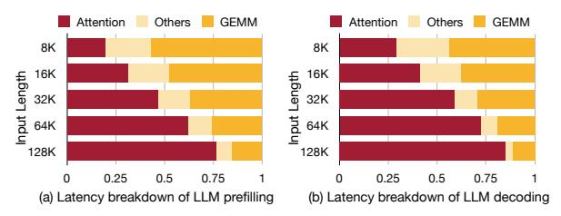
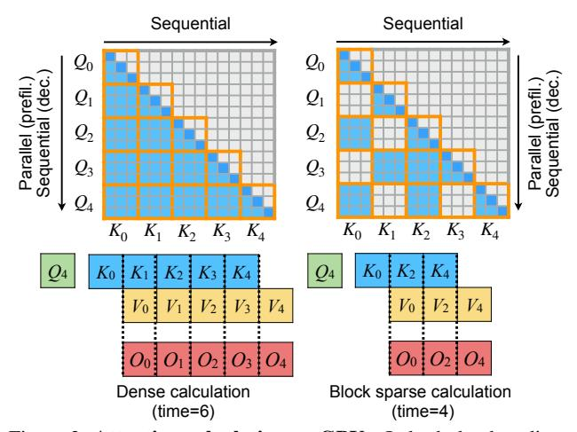
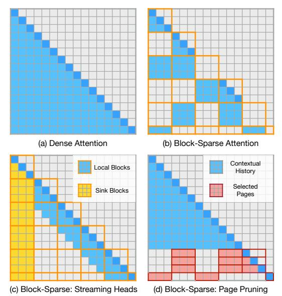
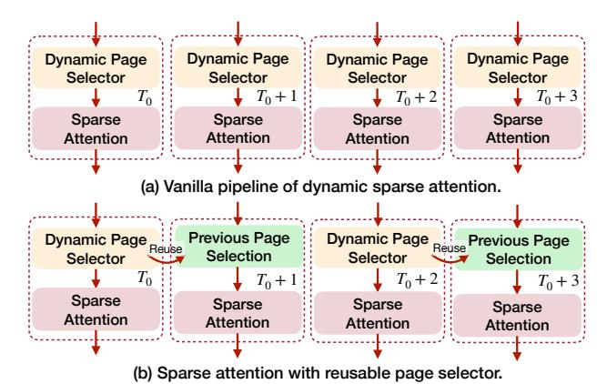
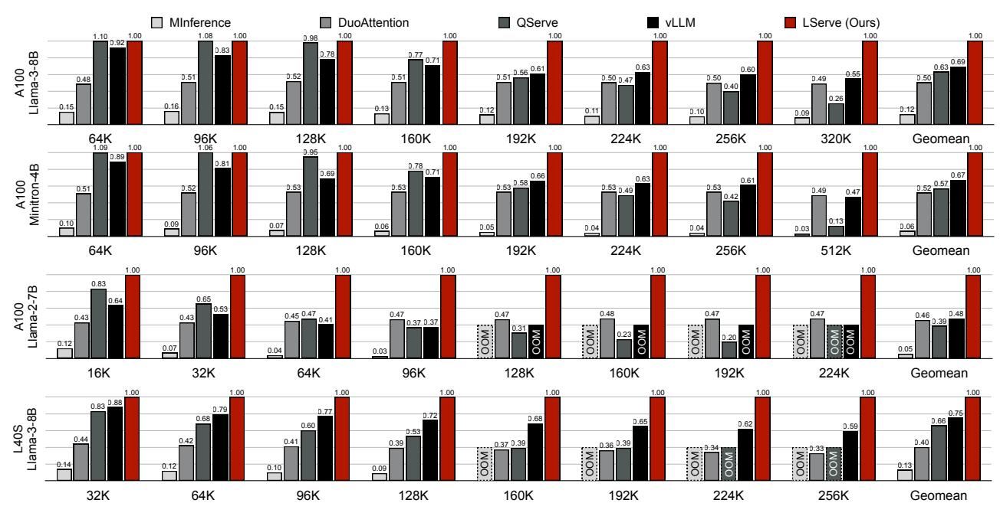
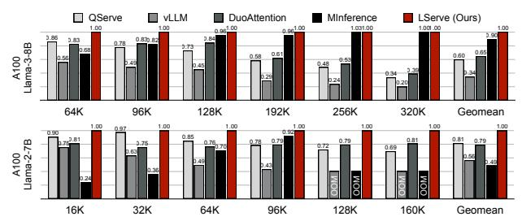
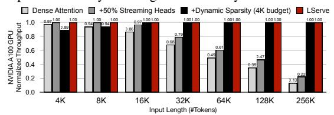

> **[图片提取文字 (无描述)]:**
> acts Avail


> **[图片提取文字 (无描述)]:**
> Val Enctiona


# LSERVE: EFFICIENT LONG-SEQUENCE LLM SERVING WITH UNIFIED SPARSE ATTENTION

Shang Yang  $^{*1}$  Junxian Guo  $^{*12}$  Haotian Tang  $^1$  Qinghao Hu  $^1$  Guangxuan Xiao  $^1$  Jiaming Tang  $^1$  Yujun Lin  $^1$  Zhijian Liu  $^3$  Yao Lu  $^3$  Song Han  $^{13}$ 

https://hanlab.mit.edu/projects/lserve

#### **ABSTRACT**

Large language models (LLMs) have shown remarkable potential in processing long sequences and complex reasoning tasks, yet efficiently serving these models remains challenging due to the quadratic computational complexity of attention in the prefilling stage and the large memory footprint of the KV cache in the decoding stage. To address these issues, we introduce LServe, an efficient system that accelerates long-sequence LLM serving via hybrid sparse attention. This method unifies different hardware-friendly, structured sparsity patterns for both prefilling and decoding attention into a single framework, where computations on less important tokens are skipped block-wise. LServe demonstrates the compatibility of static and dynamic sparsity in long-context LLM attention. This design enables multiplicative speedups by combining these optimizations. Specifically, we convert half of the attention heads to nearly free streaming heads in both the prefilling and decoding stages. Additionally, we find that only a constant number of KV pages is required to preserve long-context and reasoning capabilities, irrespective of context length. We then design a hierarchical KV page selection policy that dynamically prunes KV pages based on query-centric similarity. On average, LServe accelerates LLM prefilling by up to 2.9× and decoding by 1.3-2.1× over vLLM, maintaining long-context accuracy. Code is released at https://github.com/mit-han-lab/omniserve.

## 1 Introduction

Large Language Models (LLMs) have dramatically transformed the field of artificial intelligence. With expanding context window lengths and test-time computing (OpenAI, 2024; Snell et al., 2024), LLMs now demonstrate remarkable performance across diverse long-sequence applications (Gemini Team, Google, 2024), including multi-turn conversations, long document analysis (Zhang et al., 2024b; Goyal & Durrett, 2020; Huang et al., 2021), multi-modal understanding (Xue et al., 2024a; Liu et al., 2024b; Lin et al., 2024a), code completion (Li et al., 2023; Lozhkov et al., 2024), and complex reasoning tasks (DeepSeek-AI et al., 2025). Many of these applications require processing hundreds of thousands of context tokens in real-world settings, presenting unique challenges. In particular, the demand for fast prefilling, or minimizing the time to the first token, and the burden on the decoding phase due to the large KV (key-value) caches necessary for such contexts,

Proceedings of the 8<sup>th</sup> MLSys Conference, Santa Clara, CA, USA, 2025. Copyright 2025 by the author(s).

> **[图片提取文字 (无描述)]:**
> Memory Saving Sparse Attention Unification KV Cache Quantization Static Sparsity Unified Framework for Sparse Attention (DuoAttention) Hybrid Static & Dynamic Sparsity Prefilling Dynamic Sparsity (MInference) Decoding Dynamic Sparsity (Quest) System-Algorithm Co-optimization LServe (Ours) Hierarchical Paging System Reusable Page Selector **Prefilling Speed** Decoding Speed LServe: Efficient Long-Sequence LLM Serving


Figure 1: LServe is an efficient system for serving long-sequence LLMs that leverages hybrid sparse attention. With the unification of different sparse patterns as well as KV cache quantization, LServe achieves significant speedups in both prefilling stage and decoding stage while also reducing the memory consumption.

represent significant hurdles.

Long-sequence LLMs are about more than just an extended context. The recently announced OpenAI of (OpenAI, 2024) demonstrates exceptional capabilities in complex reasoning tasks, such as deciphering, mathematics, and coding. These advancements are achieved through inference-time scaling and the generation of extensive chains of thought (Wei et al., 2022). According to Qin et al. (2024), of 1's internal reasoning process can extend to 20k tokens for mathematical problems, making it the first known *long-generation* LLM. Contrary to the conventional belief that the prefilling stage dominates runtime in long-sequence

<sup>\*</sup>indicates equal contribution. Part of the work was done when Shang Yang and Haotian Tang were interning at NVIDIA. <sup>1</sup>MIT <sup>2</sup>SJTU <sup>3</sup>NVIDIA. Correspondence to: Song Han <songhan@mit.edu>.

LLMs, when Llama-3-8B [\(Dubey et al.,](#page-11-4) [2024\)](#page-11-4) is run using TensorRT-LLM [\(NVIDIA,](#page-12-7) [2023\)](#page-12-7) with 256k input tokens and 20k output tokens (comparable to o1's reasoning trace length), the prefilling time is 116 seconds, while decoding takes 540 seconds — almost 5× longer.

To enhance the efficiency of long-sequence LLMs, it is essential to optimize both the prefilling and decoding stages rather than focusing on just one. Beyond model architectural modifications in the pre-training stage [\(Ainslie et al.,](#page-11-5) [2023;](#page-11-5) [Brandon et al.,](#page-11-6) [2024\)](#page-11-6), existing acceleration solutions for long-sequence LLMs primarily address efficiency from two angles. The first approach centers on KV cache quantization, where methods such as QServe [\(Lin et al.,](#page-12-8) [2024b\)](#page-12-8), KIVI [\(Liu et al.,](#page-12-9) [2024c\)](#page-12-9), and KVQuant [\(Hooper et al.,](#page-11-7) [2024\)](#page-11-7) employ low-bit quantization to reduce memory usage and I/O traffic, potentially increasing generation throughput. However, these quantization techniques do not lower the number of computations performed in the attention loop, resulting in suboptimal generation speeds as sequence lengths grow. The second approach utilizes approximate sparse attention to improve long-sequence LLM performance. For example, StreamingLLM [\(Xiao et al.,](#page-13-3) [2023\)](#page-13-3), H2O [\(Zhang](#page-13-4) [et al.,](#page-13-4) [2024c\)](#page-13-4), and TOVA [\(Oren et al.,](#page-12-10) [2024\)](#page-12-10) apply static masking mechanisms to reduce attention complexity, though at the expense of accuracy in long-context tasks and irregular KV cache memory layouts. DuoAttention [\(Xiao et al.,](#page-13-5) [2024\)](#page-13-5) advances this strategy by pruning attention computations at a coarser granularity using an optimization-based approach. Other methods, such as MInference [\(Jiang et al.,](#page-12-11) [2024b\)](#page-12-11) and Quest [\(Tang et al.,](#page-13-6) [2024\)](#page-13-6), implement dynamic sparse attention to accelerate either the prefilling *or* decoding stage. However, these approaches do not reduce KV cache memory consumption and lack a unified framework to address efficiency challenges in *both* stages simultaneously.

To this end, we introduce LServe, an efficient system for serving long-sequence LLMs that leverages hybrid sparse attention. Recognizing that not all tokens hold equal importance, LServe integrates multiple hardware-friendly, structured sparsity patterns into a unified block sparse attention framework (see Figure [4\)](#page-3-0). Block-level sparsity accelerates attention computation by processing the KV history in discrete blocks. By skipping blocks, we directly reduce the number of sequential iterations, resulting in measured speedups during both the prefilling and decoding stages.

Building on the unified block sparse attention framework, LServe further illustrates acceleration opportunities from *static* and *dynamic* sparsity.

For *static* sparsity, inspired by DuoAttention [\(Xiao et al.,](#page-13-5) [2024\)](#page-13-5), we modify the attention masks in the original model by converting half of the attention heads into Λ-shaped masks, transforming these attention heads into *streaming heads*. Additionally, we fuse the computation of streaming

and standard attention heads into unified GPU kernels for both the prefilling and decoding stages, translating theoretical computation and memory savings that translate to up to 1.7× measured speedup.

For *dynamic* sparsity, we observe that query-centric sparsity [\(Tang et al.,](#page-13-6) [2024\)](#page-13-6) allows for nearly lossless KV compression: the required number of KV tokens to maintain long-context capabilities remains constant (e.g., 4096), regardless of context length. To optimize efficiency, we design a hierarchical page selector to identify important KV pages for each query token, reusing the selection results across tokens to reduce page selection overhead by 4×.

Our key observation is that static and dynamic sparsity patterns are orthogonal in long-sequence LLMs. By unifying static and dynamic sparsity with KV cache quantization into a single GPU kernel, LServe achieves compounded efficiency benefits from each individual optimization for decoding stage attention.

We benchmark LServe across three long-sequence LLMs—Llama-3-8B, Minitron-4B, and Llama-2-7B—at context lengths up to 512k tokens. Compared to stateof-the-art frameworks like vLLM [\(Kwon et al.,](#page-12-12) [2023b\)](#page-12-12), QServe [\(Lin et al.,](#page-12-8) [2024b\)](#page-12-8), MInference [\(Jiang et al.,](#page-12-11) [2024b\)](#page-12-11), and DuoAttention [\(Xiao et al.,](#page-13-5) [2024\)](#page-13-5), LServe accelerates prefilling stage by up to 2.9× and achieves an average of 1.3×-2.1× speedup in the decoding stage, without sacrificing the long-context capabilities of the original dense, floating-point models. Furthermore, LServe also demonstrates compatibility with the latest reasoning-centric models. Table [4](#page-7-0) indicates that LServe achieves comparable accuracy to dense baselines on DeepSeek-R1-Distill-Llama-8B [\(DeepSeek-AI et al.,](#page-11-3) [2025\)](#page-11-3).

# 2 BACKGROUND AND MOTIVATION

#### 2.1 Background

LLM Inference. LLMs are transformer-based architectures with stacked identical layers, each containing attention blocks, feed-forward networks (FFN), and normalization components. LLM inference involves two stages: an initial *prefilling* stage that handles multiple tokens concurrently, followed by auto-regressive *decoding* stage where only one token will be processed for each request in a decoding step.

Attention. The attention mechanism exchanges information across tokens. It first transforms input x through linear projections to generate query vectors q ∈ R <sup>N</sup>×HD, and key-value pairs k, v ∈ R N×HDˆ , where Hˆ represents the key/value head count. Traditional multi-head attention (MHA) maintains H = Hˆ , and contemporary architectures [\(Touvron et al.,](#page-13-7) [2023;](#page-13-7) [Jiang et al.,](#page-11-8) [2023;](#page-11-8) [2024a\)](#page-12-13) employ grouped-query attention (GQA) [\(Ainslie et al.,](#page-11-5) [2023\)](#page-11-5) where

<span id="page-2-0"></span>> **[图片提取文字 (无描述)]:**
> Attention Others **GFMM** Attention Others **GFMM** 8K 8K 16K 16K Length ength 32K 32K Input 64K 64K 128K 128K 0.25 0.5 0.75 0.25 0.5 0.75 (a) Latency breakdown of LLM prefilling (b) Latency breakdown of LLM decoding


Figure 2: Latency breakdown of LLM inference during prefilling and decoding stages. Attention dominates both stages as sequence length increases, due to its quadratic complexity in prefilling and linear complexity in decoding. GEMM exhibits linear complexity in prefilling and constant complexity in decoding. Measurements obtained with Llama-3-8B on NVIDIA A100 GPU.

 $H = n\hat{H}(n \in \mathbb{Z})$  to shrink the size of KV cache. The current  $\mathbf{k}$  and  $\mathbf{v}$  is then concatenated with KV cache from S preceding tokens, yielding  $\mathbf{K}, \mathbf{V} \in \mathbb{R}^{(S+N) \times \hat{H}D}$ . The attention computation can then be formulated as follows:

$$\mathbf{S}_{h} = \frac{\mathbf{q}_{h} \mathbf{K}_{\hat{h}}^{T}}{\sqrt{D}}, \quad \mathbf{o}_{h} = \operatorname{softmax}(\mathbf{S}_{h}) \mathbf{V}_{\hat{h}}, \quad \hat{h} = \left\lfloor \frac{h}{n} \right\rfloor$$
 (1)

Therefore, the complexity of attention can be expressed as O(N(S+N)HD), which increases quadratically in the prefilling stage and linearly in the decoding stage with respect to sequence length. When S is long, both decoding stage and prefilling stage are bounded by attention.

**Paged Attention.** In LLM serving, the generation length of each sequence is highly variable and unpredictable. Padding all sequences to the maximum length results in considerable memory waste and fragmentation. To address this, vLLM (Kwon et al., 2023b) introduces PagedAttention, a KV cache management algorithm inspired by operating systems' virtual memory. Instead of allocating a continuous memory buffer for each sequence's KV cache, PagedAttention partitions the cache into fixed-size blocks (or pages), each holding KV data for a set number of consecutive tokens (typically 16 to 64). A page block table records the physical address of each page, allowing the PagedAttention kernel to use indirect addressing to retrieve KV features. TensorRT-LLM (NVIDIA, 2023) and QServe (Lin et al., 2024b) implement quantized page attention to reduce memory bandwidth usage during the decoding stage, resulting in further generation speedups.

#### 2.2 Motivation

Serving long-sequence LLMs is challenging due to the high cost of attention. Figure 2 profiles the latency breakdown of Llama-3-8B with a batch size of 1 across various sequence lengths on the A100 GPU. In both the prefilling and decoding stages, attention kernels account for at least 50% of the runtime at sequence lengths over 64k, rising to 75% at 128k. According to QServe (Lin et al., 2024b), the ratio of attention kernels in end-to-end runtime will increase as the batch size scale up. Therefore, in real-world serving scenarios, optimizing the attention becomes increasingly

<span id="page-2-1"></span>> **[图片提取文字 (无描述)]:**
> Sequential Sequential  $Q_0$  $Q_0$ Parallel (prefil.) Sequential (dec.) Parallel (prefil.) Sequential (dec.  $Q_1$  $Q_1$  $Q_2$  $Q_2$  $Q_3$  $Q_3$  $Q_4$  $Q_4$  $K_0$  $K_1$   $K_2$   $K_3$   $K_4$  $K_3$   $K_4$  $K_2$  $K_0$  $K_2$  $K_4$  $K_4$  $K_0$  $K_2$  $K_3$  $Q_4$  $V_1$  $V_2$  $V_3$  $V_4$  $V_0$  $V_2$  $V_4$  $V_0$ Dense calculation Block sparse calculation (time=4) (time=6)


Figure 3: **Attention calculation on GPUs**: In both the decoding and prefilling stages, each query token iterates over all key and value tokens sequentially in a *block-by-block* manner. Skipping KV blocks reduces the number of sequential iterations, directly accelerating attention.

critical.

Accelerating attention in long-sequence LLMs requires a deep understanding of attention kernel implementation on GPUs, as illustrated in Figure 3. During the prefilling stage, the attention kernel is parallelized across batch size, attention heads, and query tokens, with query tokens set to 1 in the decoding stage. In both stages, the computation along the KV token dimension remains sequential. In each iteration, a block (depicted as a grid with an orange contour in Figure 3) is computed collaboratively by all threads in the current thread block. Although skipping certain computation within each block is possible, it yields minimal speedup. This is due to the lockstep execution of threads within a GPU warp, where faster threads are forced to wait for slower ones.

That said, rather than focusing on sparsity within each iteration, a more effective way to accelerate attention is to **reduce the number of sequential iterations** along the KV token dimension. This approach leads to our unified *block sparse attention* formulation, where attention computation is skipped in a blockwise manner. In this scheme, aside from the most recent KV block, each block is either fully computed or entirely skipped during the prefilling stage. During decoding, each sequence contains only one query token, reducing the dimensionality of each orange-contoured grid to  $1 \times P$ , where P represents the page size (i.e., the number of KV tokens per page). We will detail LServe's sparsity pattern selection in Section 3.

Additionally, because the decoding stage is memory-bound, KV cache quantization also contributes to speed improvements. Quantization is orthogonal to block sparsity, as it reduces the *runtime of each iteration*, while sparsity reduces the *number of iterations*.

<span id="page-3-0"></span>> **[图片提取文字 (无描述)]:**
> (a) Dense Attention (b) Block-Sparse Attention Contextual Local Blocks History Selected Sink Blocks Pages (c) Block-Sparse: Streaming Heads (d) Block-Sparse: Page Pruning


Figure 4: Unified block sparse attention pattern. LServe integrates various sparsity patterns into a unified framework.

# <span id="page-3-1"></span>3 LSERVE: LONG-SEQUENCE SERVING WITH UNIFIED SPARSE ATTENTION

We introduce LServe, an efficient long-sequence LLM serving system featuring sparse attention. In LServe, diverse sparse attention patterns are unified within a block-sparse formulation (Figure [4\)](#page-3-0), and are flexibly supported through fused CUDA kernels. LServe also supports weight, activation and KV quantization, which significantly improves generation throughput at shorter context lengths.

#### <span id="page-3-2"></span>3.1 Unified Block Sparse Attention

As shown in Figure [3,](#page-2-1) skipping computations in the attention kernel by blockwise processing accelerates execution by shortening the sequential loop. Building on this, we introduce a *unified block sparse attention* pattern for both the prefilling and decoding stages: each thread block computes a T<sup>Q</sup> × T<sup>K</sup> tile (and T<sup>K</sup> × T<sup>V</sup> ) in parallel. Here, T<sup>Q</sup> > 1 in the prefilling stage and T<sup>Q</sup> = 1 in the decoding stage, with T<sup>K</sup> (or T<sup>V</sup> ) corresponding to the page size in PagedAttention [\(Kwon et al.,](#page-12-14) [2023a\)](#page-12-14).

We define *block sparsity* in LServe as follows: for each T<sup>Q</sup> × T<sup>K</sup> tile in the attention calculation, it is either fully skipped (Figure [4\(](#page-3-0)b), light gray blocks) or retained as in standard causal attention (Figure [4\(](#page-3-0)b), blue blocks). Given that each GPU streaming multiprocessor can execute only a limited number of thread blocks simultaneously, the attention kernel execution time can be approximated by the total count of T<sup>Q</sup> × T<sup>K</sup> (and T<sup>K</sup> × T<sup>V</sup> ) blocks. With a block sparsity of r, where rN of the N total blocks are empty, the theoretical speedup from block sparse attention is 1/(1−r). For example in Figure [4\(](#page-3-0)b), 10 out of N=21 blocks are non-empty. Thus, the theoretical speedup ratio is 2.1×.

Figure [4\(](#page-3-0)c)(d) shows two sparsity patterns used in LServe. The first is streaming attention (Figure [4\(](#page-3-0)c)), a specialized form of block-sparse attention where each token only attends to its immediate neighbors and initial tokens, known as attention sinks [\(Xiao et al.,](#page-13-3) [2023\)](#page-13-3). Unlike dense attention, where computation for each row scales with the token index, streaming attention keeps the computation for each token *constant*—in this case, only two local blocks and one sink block, as shown in Figure [4\(](#page-3-0)c). This pattern is nearly costfree in applications with extremely long contexts. Because streaming attention follows a fixed pattern, we designate which heads use it in *offline*, and make it *static* for different input sequences in both prefilling and decoding.

The second type of sparsity, illustrated in Figure [4\(](#page-3-0)d), is page sparsity, which is specifically designed for the decoding stage where T<sup>Q</sup> = 1 applies to both skipped and selected pages. Unlike streaming attention, page sparsity in LServe is *dynamic*, allowing different query tokens to attend to different KV pages. As noted in Deja Vu [\(Liu et al.,](#page-12-15) [2023\)](#page-12-15), dynamic sparsity results in higher compression ratios than static sparsity. Our observations indicate that static sparsity offers up to a 2× efficiency gain, whereas dynamic sparsity bounds the decoding complexity to a *constant*, with each query attending only to a fixed number of KV tokens.

### 3.2 LServe System Overview

We present an overview of LServe in Figure [5.](#page-4-0) Built on QServe, which natively supports quantized LLMs, LServe enhances the baseline system by introducing sparsity into both prefilling and decoding dataflows. The *two-way paged KV cache* serves as the bridge between these two stages.

As discussed in Section [3.1,](#page-3-2) we statically partition the attention heads of a pretrained LLM into two groups: dense heads and streaming heads. Unlike conventional LLM serving systems, which maintain a single KV cache, we utilize *separate* KV caches for the dense and streaming heads. The KV cache for the streaming heads is organized similarly to the pages in QServe, with scaling factors and zero points stored immediately after the token features. Additionally, the KV cache for the dense heads includes *key statistics* that facilitate critical page selection during the decoding stage.

In the prefilling stage, the key differences between LServe and conventional dense-attention LLM serving systems are twofold: (1) we replace the dense attention kernel with our unified block sparse attention kernel, and (2) we write back quantized KV features using two distinct kernels.

In the decoding stage, our system incorporates dynamic attention sparsity. Rather than developing an entirely new dynamic sparse attention kernel, we decompose the problem into two components: (1) dynamic *page selection* and (2) a *dense* attention kernel with *shorter page tables*, where

<span id="page-4-0"></span>> **[图片提取文字 (无描述)]:**
> $H \times D$ B: Batch Size H: Number of Heads  $H \times D$ BS: Context Length D: Head Dimension B Dense Head Streaming Head Paged KV Cache **Prefilling Dataflow Decoding Dataflow** Q K Page Selector Hierarchical Streaming Fused Sparse Attention Kernel (Prefilling) Paging (§3.5.2) Fused Sparse Attention Kernel (Decoding) Selected Head Pages Pages Reusable Logical K&V K&V Logical Page Addr Selector (§3.5.3) Block ID Block ID Page Addr Sink & Pages #0 0x9C80 0x7A40 #0 K stats #1 0xAD00 0x7BC0 #1 Only ! 0xDFC0 0x7B00 #N-1 #2 Update 0xD040 ΚV Dense Skipped Dense Head Streaming Head **Head Pages** Pages Page Table Page Table Dense Heads Streaming Heads **Output Projection Output Projection** K stats FFN Layers FFN Layers Scales & Zeros **Key Statistics** To the next layer... To the next layer... LServe System


Figure 5: LServe system overview. In prefilling stage, LServe processes both dense heads and streaming heads within a fused sparse attention kernel. Past Keys and Values are stored in two separate paging systems: one for streaming heads and the other for dense heads. In decoding stage, LServe applies dynamic sparsity on dense heads with a page selection procedure. Only selected KV Pages will be loaded for the decoding stage attention. We omit normalization layers and residual connections in this figure for the sake of simplicity.

the shorter page tables are provided by the page selector. Notably, our page selector employs hierarchical paging and reusable page selection, enhancing both long-context accuracy and page selection efficiency.

#### 3.3 Prefilling Stage: Sparsity Determination

We adopt the approach from DuoAttention (Xiao et al., 2024) to classify each attention head as either a retrieval head or a streaming head. Using DuoAttention's optimization-based identification method, we obtain a gating value  $\alpha \in [0,1]$  for each head, where values closer to 1 signify a retrieval head, and values closer to 0 indicate a streaming head. To classify a head as a retrieval head, we compare  $\alpha$  to a threshold  $\tau$ , determined by a sparsity quantile. For instance, with a target sparsity of 50% across attention heads,  $\tau$  equals the median of all gate values, thereby designating half of the heads as retrieval heads.

#### 3.4 Prefilling Stage: Kernel Implementation

To effectively translate sparsity into performance gains, it is essential to avoid iterating over a complete sequential loop and relying on conditional statements to determine data loading and computation requirements. This method is inefficient for GPU computation patterns, which thrive on minimizing branching within loops. Instead, we should focus on iterating only over the necessary blocks by accurately calculating offsets to load data and assess whether a block should be processed.

To facilitate this, we introduce an iterator-based abstraction that standardizes indexing operations. This allows us to loop exclusively over the blocks requiring computation, with data offsets easily computed using offset = iter(i+1) - iter(i). This abstraction efficiently skips unnecessary blocks with minimal overhead and necessitates few changes to the kernel function, thus enhancing maintainability. Take the streaming heads as an example, the iterators are determined outside the attention kernel since streaming heads are configured offline and the attention pattern is fixed. Once the attention on sink tokens is complete, the iterator automatically updates the memory pointer to the first local token in the KV cache with minimal overhead. Additionally, our iterator-based formulation unifies the more general block sparse pattern (see Figure 4).

#### 3.5 Decoding Stage: Sparsity Determination

To further enhance the long-context LLM decoding throughput, we introduce dynamic sparsity upon the input-agnostic static sparsity in Sec. 3.1.

#### 3.5.1 Challenge: the Page Size Dilemma

In the decoding stage, the attention operation is memorybound, so state-of-the-art systems typically implement KV cache quantization to reduce device memory usage and enhance throughput. However, this quantization introduces challenges for further optimization. Specifically, reducing the bit-width of KV tokens necessitates larger page sizes

<span id="page-5-1"></span>> **[图片提取文字 (无描述)]:**
> (a) Dense Attention (b) Page Size: 16, Token Budget: 4096 1.0 0 0 Document Depth (%) 0.8 23 Accuracy 44 67 0.2 8 0.0 or 234 854 1284 1714 5114 5884 OK 134 854 1284 1714 2114 2584 (c) Page Size: 32, Token Budget: 4096 (d) Page Size: 64, Token Budget: 4096 1.0 0 0 Document Depth (%) 0.8 8 Accuracy 44 67 67 0.2 8 0.0 OK 134 854 1284 174 2174 2584 OK 434 854 1284 1714 2174 2564 (e) Page Size: 32, Token Budget: 8192 (f) Page Size: 64, Token Budget: 16384 1.0 0 0 Document Depth (%) 0.8 22 Accuracy 4 67 0.2 89 0.0 OK 434 854 1284 1714 2114 171 484 128 YEA Document Length Document Length


Figure 6: We evaluate the Llama-3-8B model with the Needle-in-a-Haystack (NIAH) (Kamradt, 2024) benchmarks. The effectiveness of query-aware page selection algorithms (e.g., Quest (Tang et al., 2024)) gets impaired when the KV page granularity grows (b,c,d). Naively scaling up the page sizes will lead to significant performance loss even if we linearly increase the number of selected pages (token budget) (e,f).

to maintain GPU memory bandwidth utilization. Failure to do so can lead to significant throughput loss (Table 1). Yet, larger KV page sizes complicate the sparsification process; for example, Quest (Tang et al., 2024), which estimates token criticality using page-wise statistics, fails when page sizes increase (Figure 6). This observation poses challenges to balance between accuracy and efficiency.

# 3.5.2 Hierarchical Paging: Mitigating the accuracy-efficiency tradeoff

We observe that the failure of query-aware KV cache selection paradigm (Figure 6) is not due to the coarser granularity of sparse attention (i.e., larger page size). Rather, the underlying cause lies in that page-wise statistical indicators become homogenized and less representative especially when there are excessive tokens within a single page. To address this issue, we design a simple-yet-effective hierarchical paging system that introduces an abstract layer of virtual *logical page* for estimating token criticality, while preserving the original memory layout of KV cache in (*physical pages*). As illustrated in Figure 7, our hierarchical paging groups  $N_L$  tokens into a logical page and  $N_P$  tokens into a physical page ( $N_P = g \cdot N_L, g \in \mathbb{Z}$ ), that is, a physical page contains g logical pages. Tokens within the same logical

<span id="page-5-0"></span>Table 1: Page size significantly impacts the LLM serving system's efficiency: Larger page size is more hardware-friendly as it improves contiguity of memory layout and the GPU bandwidth utilization during attention computation. For example, simply shrinking the page size in QServe (Lin et al., 2024b) leads to prominent slow-down of the end-to-end system. We evaluate the per-step decoding latency (ms / step) of QServe on a single A100 GPU for demonstration. We use Llama3-8B model architecture, with the batch size of 32.

| Seq_len      | Page Size |         |         |         |  |  |
|--------------|-----------|---------|---------|---------|--|--|
| Seq_ieii     | 16        | 32      | 64      | 128     |  |  |
| 512          | 11.0 ms   | 10.7 ms | 10.5 ms | 10.5 ms |  |  |
| 1024         | 13.8 ms   | 13.0 ms | 12.7 ms | 12.7 ms |  |  |
| 2048         | 22.1 ms   | 20.1 ms | 18.3 ms | 18.2 ms |  |  |
| 4096         | 35.7 ms   | 31.6 ms | 28.1 ms | 28.1 ms |  |  |
| 8192         | 77.1 ms   | 63.0 ms | 51.0 ms | 50.6 ms |  |  |
| Max Slowdown | 1.52×     | 1.25×   | 1.01×   | 1.00×   |  |  |

page will collectively contribute to the same criticality estimator. In LServe, we utilize the channel-wise minimum and maximum values of keys in the same logical page as its representative vectors, which has been proven to be an effective metric (Tang et al., 2024) for page importance estimation with a moderate page size ( $\leq 16$ ). The current query will attend to representative vectors of each logical page to calculate the corresponding importance score as follows:

$$S^{j} = \sum_{i}^{D} \max \left( q[i] * k_{max}^{j}[i], \ q[i] * k_{min}^{j}[i] \right)$$
 (2)

where S is the importance score of logical page,  $j \in \{a, b, \ldots\}$  is the index of logical page, i is the channel index, and D refers to the head dimension.

The importance of each physical page is determined by the max-reduction over the importance scores of its corresponding logical pages. Finally, LServe selects the top-K physical pages (based on the predefined token budget) with highest importance scores as the input of sparse attention kernel.

#### 3.5.3 Reducing sparse attention overheads with locality

One remaining question is: as physical page size increases, will the hierarchical paging require a higher token budget for sparse attention to retain accuracy?

Given a generation step, assume the most important history tokens are distributed in a logical page set  $\mathcal{P} = \{P(i,j)\}$ , where  $i \in \{1,2,...\}, j \in \{a,b,,...\}$  are the physical and logical index of a page accordingly. If these important tokens are randomly and sparsely distributed in the context, chances are that all logical pages in  $\mathcal{P}$  are scattered in different physical pages, that is, for any  $P_1, P_2 \in \mathcal{P}, i_1 \neq i_2$ . In this case, all  $|\mathcal{P}|$  physical pages ( $|\mathcal{P}| \cdot N_P$  tokens) are selected to avoid losing important information. However, the naïve paging only needs to keep  $|\mathcal{P}| \cdot N_L$  tokens since it directly shrinks page sizes to a smaller granularity (e.g.,  $N_L$ ). Consequently, our hierarchical paging may suffer from a

<span id="page-6-0"></span>> **[图片提取文字 (无描述)]:**
> Physical Page 4 Keys Keys Physical Page 3 K state Physical Page 2 Keys Head dim K stats -7 -5 -5 -5 -8 -5 Page Size (#Tokens) 22  $k_{max}$ -2 Logical Page (a)  $k_{min}$ -2 67 -7 -4 -7 -5 -5 -5 -8 -5 -2 6 8 -8 -1  $\sum \max(q[i] \cdot k_{max}[i], q[i] \cdot k_{min}[i])$ 78 -2 3 0 3 7 0 -7 2  $k_{max}$ Logical Page (b)  $k_{min}$ 0 -3 -5 6 Current query: Physical Page 1 Keys Head\_dim K stats 2 -6 8 0 -6 0 6 Size (#Tokens)  $k_{max}$ -2 2 2 Logical Page (a) 23 -6  $k_{min}$ -1 -6 -5 -6 -6 Selected -2 -6  $\sum \max(q[i] \cdot k_{max}[i], q[i] \cdot k_{min}[i])$ 0 -2 -3 -3 5 3 0 X Discarded 3 Page Logical Page (b)  $k_{max}$ -3  $k_{min}$ 5 2 -8 2 -3 -3 Current query: -2 2


Figure 7: Hierarchical Paging in LServe system. We assume the each physical page contains  $N_p=8$  tokens and each logical page has  $N_l=4$  tokens. The  $k_{max}$  and  $k_{min}$  vectors are concatenated to the end of each physical page, and are pre-computed during the context stage and previous decoding steps. The importance of each physical page is decided by the max of the importance scores of the logical pages it contains. We omitted KV quantization in this figure for the sake of simplicity.

decrease in attention sparsity by  $N_P/N_L$ .

Fortunately, the semantic continuity of natural language endows the attention operation with intrinsic locality, allowing LServe to maintain a consistent sparse attention token budget for larger physical page sizes. During the decoding stage, the coherence of contextual tokens makes the current query token incline to attend to consecutive pages in the KV cache. As a result, logical pages with highest importance scores tend to cluster within similar physical pages. This kind of *spatial locality* effectively alleviates the need for a increased token budget, thereby reducing the overhead caused by the contradiction between quantization and sparse attention. Experimental results in Figure 13 further affirm that our hierarchical paging well preserves the model accuracy even with the same token budget as the vanilla page selector with smaller page sizes.

Moreover, the attention mechanism in decoding stage also exhibits the *temporal locality*: adjacent query tokens also heavily attend to similar historical pages. And there is no need for queries at consecutive decoding steps to select salient pages independently. Instead, the page selection decision can be shared across queries, aligning with the block-sparse attention formulation illustrated in Figure 4(d).

To this end, we present *Reusable Page Selection* in LServe. As in Figure 8, we activate the page selector only at the very beginning of pre-defined chunks. For the consecutive tokens within the same chunk, we reuse the page selection results from the first token of the chunk. Utilizing the temporal sparsity of attention, reusable page selection substantially improves the long-context generation speed by a great

<span id="page-6-1"></span>> **[图片提取文字 (无描述)]:**
> Dynamic Page Dynamic Page Dynamic Page Dynamic Page Selector Selector Selector Selector  $T_0 + 1$  $T_0 + 2$  $T_0 + 3$  $T_0$ Sparse Sparse Sparse Sparse Attention Attention Attention Attention (a) Vanilla pipeline of dynamic sparse attention. Dynamic Page Reuse Dynamic Page Reuse **Previous Page Previous Page** Selection Selector Selection Selector  $T_0$  $T_0 + 2$  $T_0 + 1$  $T_0 + 3$ Sparse Sparse Sparse Sparse Attention Attention Attention Attention (b) Sparse attention with reusable page selector.


Figure 8: We introduce Reusable Page Selector in LServe, which utilize the similarity of queries of consecutive tokens to cut down the selector overhead. The chunk size of reusable selector is set to 2 in this figure for the demonstration purpose.

margin without sacrificing accuracy. As demonstrated in Figure 14, even though dynamic sparse attention effectively restrict the complexity of decoding attention, the latency of page selector increases linearly with regard to the sequence length. When the number of history tokens surpasses 64K, the naïve page selector becomes the bottleneck to system efficiency, whereas our reusable page selector significantly alleviates this problem.

#### 3.6 Decoding Stage: Kernel Implementation

During the decoding stage, attention heads are processed in parallel on GPU, enabling different sparsity patterns to be applied independently on each head. This flexibility enables some heads to operate with page-level sparsity while others follow the streaming computation pattern.

To leverage this, we employ a two-level indexing hierarchy to unify the operations for streaming heads and dense heads with dynamic sparsity. Specifically, the low-level (physical) index corresponds to the iteration step of current GPU thread, which executes in a consecutive manner as in dense attention, while logical index denotes the actual position of the target token within the entire KV cache. For each dense head, the page selector provides an index table to map physical index to logical index. Streaming heads are treated as dynamic sparse heads with index table only containing the sink and local pages.

#### <span id="page-6-2"></span>4 EVALUATION

#### 4.1 Evaluation Setup

**Implementation**. We implement LServe in CUDA and PTX assembly on the basis of QServe (Lin et al., 2024b) and TensorRT-LLM (NVIDIA, 2023) system. The specialized CUDA kernels are compiled into PyTorch extensions for better flexibility and compatibility with the purely PyTorch-based serving interface.

<span id="page-7-2"></span>Table 2: Accuracy evaluation on LongBench [\(Bai et al.,](#page-11-9) [2023\)](#page-11-9). We compare our method with vanilla dense attention on 2 models and 10 different benchmarks.

| Model     | Llama-3-8B |        |      | Llama-2-7B |
|-----------|------------|--------|------|------------|
| Benchmark | Dense      | LServe |      | LServe     |
| 2WikiMQA  | 30.3       | 31.6   | 35.4 | 35.1       |
| DuReader  | 30.3       | 30.8   | 25.4 | 24.7       |
| HotpotQA  | 41.7       | 42.7   | 47.4 | 49.6       |
| MultiNews | 27.7       | 27.7   | 26.6 | 26.6       |
| Qasper    | 31.7       | 29.3   | 32.6 | 29.5       |
| QMSum     | 23.8       | 24.0   | 21.0 | 21.3       |
| SamSum    | 41.2       | 39.3   | 41.8 | 41.5       |
| TriviaQA  | 84.9       | 83.7   | 86.2 | 86.5       |
| Average   | 38.9       | 38.6   | 39.5 | 39.4       |

<span id="page-7-3"></span>> **[图片提取文字 (无描述)]:**
> (a) Llama-3-8B - Dense (b) Llama-3-8B - LServe 1.0 0 Document Depth (%) 89 67 44 22 0.8 22 Accuracy 4 0.2 89 0.0 85x 128x 171x 211x 256x 1284 1714 2114 2564 Document Length Document Length


Figure 9: Accuracy evaluation on Needle-in-a-Haystack.

Testbed. Our primary experiments are conducted on a server equipped with 8 NVIDIA A100 80GB GPUs, 2 AMD EPYC 7763 CPUs (128 cores), and 2TB of memory. Unless explicitly stated, all experiments utilize the A100 GPUs. Additionally, we perform some evaluations on a cloud instance with a single NVIDIA L40S 48GB GPU to assess system performance across different GPU architectures. All evaluations use PyTorch 2.5.0 with CUDA 12.4 and cuDNN 9.2.0.

Models. To comprehensively assess system performance across various LLM architectures, we utilize the widely adopted GQA-based model Llama-3-8B [\(Dubey et al.,](#page-11-4) [2024\)](#page-11-4), the MHA-based model Llama-2-7B [\(Touvron et al.,](#page-13-7) [2023\)](#page-13-7), and the smaller-scale model Minitron-4B [\(Muralid](#page-12-17)[haran et al.,](#page-12-17) [2024\)](#page-12-17). Additionally, to support long-context inference, we employ the context-extended Llama-3-8B version Gradient [\(Pekelis et al.,](#page-12-18) [2024\)](#page-12-18).

Metrics. Our primary focus is on serving throughput. For the prefilling stage, we use *time-to-first-token* (TTFT) as a key metric, while for the decoding stage, we emphasize minimizing the *per-token generation latency*.

Baselines. We consider the following systems as baselines, using their latest versions[1](#page-7-1) to ensure a fair comparison. We activated W8A8 precision for baselines if available.

- *vLLM* [\(Kwon et al.,](#page-12-12) [2023b\)](#page-12-12), one of the most popular LLM serving systems featuring PagedAttention.
- *QServe* [\(Lin et al.,](#page-12-8) [2024b\)](#page-12-8), efficient LLM serving system

<span id="page-7-4"></span>Table 3: Accuracy evaluation on RULER [\(Hsieh et al.,](#page-11-10) [2024\)](#page-11-10). We evaluate the accuracy of Llama-3-8B on RULER benchmarks, including challenging tasks such as multi-hop tracing and aggregation to test behaviors beyond searching from context. LServe-N denotes that the token budget for dynamic sparsity is N. Note that for long-context inputs, latency is not dominated by attention alone in LServe, with page selector and GEMM also contributing to it. Experiments reveal that LServe-8192 is only up to 6% slower than LServe-4096 when the sequence length exceeds 128K.

| Llama-3-8B  | 32K  | 64K  | 128K | 160K | 192K | 256K |
|-------------|------|------|------|------|------|------|
| Dense       | 90.5 | 86.8 | 83.8 | 79.3 | 79.6 | 79.4 |
| LServe-4096 | 91.0 | 85.6 | 81.0 | 79.0 | 76.1 | 75.7 |
| LServe-8192 | 91.8 | 86.1 | 81.7 | 81.2 | 79.7 | 79.1 |

<span id="page-7-0"></span>Table 4: Accuracy evaluation on AIME [\(MAA,](#page-12-19) [2024\)](#page-12-19) and MATH500 [\(Hendrycks et al.,](#page-11-11) [2021\)](#page-11-11) DS-R1-Llama-8B refers to DeepSeek-R1-Distill-Llama-8B. [\(DeepSeek-AI et al.,](#page-11-3) [2025\)](#page-11-3)

| Model     | DS-R1-Llama-8B |        |  |
|-----------|----------------|--------|--|
| Benchmark | Dense          | LServe |  |
| AIME@2024 | 43.3           | 43.3   |  |
| MATH500   | 84.2           | 85.4   |  |
| Average   | 63.8           | 64.4   |  |

featuring W4A8KV4 quantization.

- *MInference* [\(Jiang et al.,](#page-12-11) [2024b\)](#page-12-11), the state-of-the-art longcontext prefilling stage acceleration system.
- *DuoAttention* [\(Xiao et al.,](#page-13-5) [2024\)](#page-13-5), a strong long-sequence LLM inference framework with static sparse attention.

Additionally, we compare our approach with the state-of-theart long-context decoding stage acceleration system, *Quest* [\(Tang et al.,](#page-13-6) [2024\)](#page-13-6). Since Quest only supports MHA models, we conduct and discuss this comparison in Table [5.](#page-8-0)

#### <span id="page-7-5"></span>4.2 End-to-end Accuracy

We evaluate the accuracy of our hybrid block-sparse mechanism with LongBench [\(Bai et al.,](#page-11-9) [2023\)](#page-11-9) tasks, the Needlein-a-Haystack (NIAH) [\(Kamradt,](#page-12-16) [2024\)](#page-12-16) pressure tests, as well as the challenging RULER [\(Hsieh et al.,](#page-11-10) [2024\)](#page-11-10) benchmarks. Table [2](#page-7-2) compares the LongBench accuracy between LServe and dense baseline. Results show that LServe well preserves the performance of two models across different test sets. Figure [9](#page-7-3) showcases the NIAH evaluation results of our system, where LServe also achieves the same level of accuracy compared to the dense baseline. In Table [3,](#page-7-4) we test LServe with RULER benchmarks. Unless otherwise specified, we convert half of the attention heads into streaming heads and keep token budget for dynamic sparsity to 4096 for the benchmarks.

Additionally, we also evaluate LServe on complex reasoning tasks such as AIME2024 [\(MAA,](#page-12-19) [2024\)](#page-12-19) and MATH500 [\(Hendrycks et al.,](#page-11-11) [2021\)](#page-11-11). As shown in Table [4,](#page-7-0) LServe maintains accuracy comparable to its dense counterparts on these complex reasoning tasks.

<span id="page-7-1"></span><sup>1</sup> vLLM 0.6.3

<span id="page-8-1"></span>> **[图片提取文字 (无描述)]:**
> ■ MInference DuoAttention QServe vLLM LServe (Ours) 1.00 1.08 1.00 1.00 1.00 1.10 1.00 1.00 1.00 1.00 0.98 0.83 A100 Llama-3-8B 0.78 0.63 D.56 0.61 0.63 0.60 0.55 0:52 0.50 D.47 0.51 0.51 0.50 0.49 0.48 0.26 0.16 0.15 0.15 0.13 0.12 0.11 0.09 64K 1.09 96K 160K 192K 320K 128K 224K 256K Geomean 1.00 1.00 1.00 1.00 1.00 1.00 0.95 0.89 A100 Minitron-4B 0.81 0.78 0.69 0.67 0.53 0.58 0.63 0.52 0.57 0.61 0.53 0.49 0.52 0.53 0.53 0.53 0.51 0.49 0.47 0.13 0.09 0.07 0.06 0.06 0.05 0.04 0.04 0.03 64K 96K 128K 160K 192K 224K 256K 512K Geomean 1.00 1.00 1.00 1.00 1.00 1.00 1.00 1.00 1.00 0.83 A100 Llama-2-7B 0.65 0.64 0.53 0.45 0.47 0.47 0.48 0.47 0.47 0.47 0.48 0.46 0.43 0.43 0.37 0.37 0.23 W O O MOO MOO MOO MOO MOO MOO MOO 0.12 0.07 0.05 0.04 0.03 16K 32K 64K 96K 128K 160K 192K 224K Geomean 1.00 1.00 1.00 1.00 1.00 0.83 0.88 L40S Llama-3-8B 0.79 0.77 0.75 0.72 0.68 0.68 0.65 0.66 0.60 0.62 0.59 0:53 0.44 0.42 0.41 0.39 0.37 0.39 WO 0.33 0.40 W 00 MOC 0.12 0.13 0.10 0.09 32K 64K 96K 128K 160K 192K 224K 256K Geomean


Figure 10: **Decoding Speed Evaluation**. The y-axis indicates the relative throughput of each system, normalized by the speed of LServe. Note that MInference exhibits limited decoding performance due to its unoptimized decoding stage with **dense attention**, but when integrated into vLLM, it can achieve throughput comparable to that of vLLM.

<span id="page-8-2"></span>> **[图片提取文字 (无描述)]:**
> **QServe VLLM** DuoAttention Minference LServe (Ours) 1.001.00 1.00 1.031.00 1.00 0.90 3.86 0.830.82 0.84 0.83 A100 Llama-3-8B 0.78 5:73 0.68 0.65 0.51 0.60 0.58 0.53 64K 96K 128K 192K 256K 320K Geomean 0.92 1.00 1.00 1.00 1.00 1.00 1.00 0.97 0.90 A100 Llama-2-7B 0.85 0.81 0.79 0.81 0.79 0.79 0.75 0.72 0.69 0.36 MOC MOO 16K 32K 64K 96K 128K 160K Geomean


Figure 11: **Prefilling Speed Evaluation**. Performance comparison of long-sequence prefilling across different serving frameworks, normalized to LServe's speed.

#### 4.3 End-to-end Efficiency

**Decoding Efficiency**. Figure 10 presents the efficiency benchmarking results for the decoding stage. We use the same sparsity configurations as in Section 4.2. Compared with the state-of-the-art serving systems, LServe demonstrates significant and consistent efficiency improvements across different GPU platforms and model architectures. On Llama-3-8B and Minitron-4B, LServe achieves  $1.5\times$  average speedup over vLLM. For MHA-based model Llama-2-7B, LServe runs more than  $2.0\times$  faster than baselines on average. Additionally, we demonstrate that LServe also functions well on other GPU devices such as L40S with Ada Lovelace Architecture. LServe achieves up to  $1.7\times$  speedup over vLLM.

**Prefilling Efficiency**. In Figure 11, we compare the prefilling speed of LServe against 4 baselines on Llama-3-8B and Llama-2-7B. LServe maintains superior prefilling through-

<span id="page-8-0"></span>Table 5: LServe achieves lower latency over Quest (Tang et al., 2024) system in both prefilling stage and decoding stage. We benchmark the two systems on Llama-2-7B model, since Quest does not support GQA (Ainslie et al., 2023) architecture.

| C4                        | C       | Sequence Length |       |       |       |       |
|---------------------------|---------|-----------------|-------|-------|-------|-------|
| Stage                     | System  | 4K              | 8K    | 16K   | 32K   | 64K   |
|                           | Quest   | 0.51            | 0.82  | 1.62  | 3.61  | OOM   |
| Prefilling<br>Latency (s) | LServe  | 0.24            | 0.49  | 1.08  | 2.32  | 5.27  |
|                           | Speedup | 2.1 ×           | 1.7×  | 1.5×  | 1.6×  | /     |
|                           | Quest   | 13.13           | 13.58 | 14.08 | 14.86 | OOM   |
| Decoding<br>Latency (ms)  | LServe  | 10.02           | 10.29 | 10.22 | 10.24 | 11.54 |
|                           | Speedup | 1.3×            | 1.3×  | 1.4×  | 1.5×  | /     |

put across different sequence lengths. For instance, on Llama-2-7B, LServe achieves an average of  $1.8\times$  higher prefilling throughput over vLLM. LServe is also compatible with the prefilling dynamic sparsity in MInference, which we activated after 128K sequence length.

#### 4.4 End-to-End Comparison with Quest

We also compares our system against Quest (Tang et al., 2024) in Table 5. Across different sequence lengths, LServe consistently outperforms Quest in both prefilling  $(1.6-2.1 \times \text{speedup})$  and decoding stages  $(1.3-1.5 \times \text{speedup})$ .

#### 5 ANALYSIS

In this section, we present in-depth analysis on our design choices in the LServe system from both the accuracy and

<span id="page-9-2"></span>> **[图片提取文字 (无描述)]:**
> MInference LServe Oracle 50 Dense Attention: 42.3 ms 40.4 -40 1.3 x Latency (ms) 34.1 80.0 27.3 25.4 25.3 21.2 20.9 20.3 16.9 15.9 14.3 2.7 40.8 8.5 10 0 40 50 60 70 80 90 Sparsity Level (%)


Figure 12: Prefilling Stage Attention Kernel Evaluation.

<span id="page-9-0"></span>> **[图片提取文字 (无描述)]:**
> $N_P$ : Physical Page Size,  $N_I$ : Logical Page Size (a)  $N_p = 16$ ,  $N_r = 16$ , Budget: 3072 (b)  $N_p = 32$ ,  $N_r = 16$ , Budget: 3072 (c)  $N_p = 64$ ,  $N_r = 16$ , Budget: 3072 %° 0 0.8 22 87 67 0.2 89 134 884 1284 1714 5714 5ESA of 134 854 1284 1744 2144 268 464 40 1284 1714 5114 5284 Document Length Document Length Document Length


Figure 13: **Hierarchical paging** enables LServe to preserve the long-context retrieval capabilities of the original model without increasing the key-value (KV) token budget. We use Llama-3-8B for the ablation.

the efficiency perspective. We also scrutinize the sources of performance gains in Section 4.

#### 5.1 Prefilling Stage Sparse Attention Kernel

We benchmark the performance of our block sparse attention kernel for the prefilling stage in Figure 12. Compared with the implementation by MInference (Jiang et al., 2024b), our kernel consistently achieves  $1.3\times$  speedup at the same sparsity level. Oracle stands for the theoretical upper-bound speedup ratio: Latency oracle = Latency dense \* (1-sparsity).

#### 5.2 Effectiveness of Hierarchical Paging

We use the Needle-in-a-Haystack (Kamradt, 2024) test to demonstrate that the hierarchical paging design effectively maintains the model's long-context capability on larger page blocks without increasing the token budget. In contrast to the performance drop observed with increased page granularity in Figure 6, LServe leverages a hierarchical page structure to decouple the pruning algorithm's page granularity from the physical memory layout of the KV cache. This approach enables our sparse attention mechanism to remain both accurate and hardware-efficient. Figure 13 highlights this improvement: with a page size of 64 and the same token budget, LServe achieves accuracy comparable to the baseline algorithm (Tang et al., 2024), which prunes history tokens at a granularity of 16.

#### 5.3 Mitigating Page Selection Overhead

**Reusable Page Selection.** During decoding, although the attention kernel maintains constant complexity due to a capped number of historical KV tokens, the complexity of the page selector still scales linearly with sequence length.

<span id="page-9-1"></span>> **[图片提取文字 (无描述)]:**
> Dynamic Page Selector Sparse Attention 0.60 0.60 Selector shared atency (ms) 0.45 0.45 across 4 queries 0.30 0.30 0.15 0.15 0.00 0.00 (a) Vanilla Page Selector (b) Reusable Page Selector


Figure 14: **Effect of Reusable Page Selection**. The overhead of the dynamic page selector is significant, as its complexity increases linearly with input sequence length. Our *Reusable Page Selection* effectively mitigates this issue. The latency breakdown is evaluated on Llama-3-8B.

<span id="page-9-3"></span>Table 6: The reusable page selector in LServe preserves the model's long-context accuracy while significantly reducing selection overhead by  $4\times$  with a reuse interval of 4. We evaluate Llama-3-8B on RULER (Hsieh et al., 2024) at a sequence length of 64K. LServe-N denotes that the token budget for dynamic sparsity is N.

| Reuse Interval | Dense | 1    | 2    | 4    | 8    | 16   |
|----------------|-------|------|------|------|------|------|
| LServe-4096    | 86.8  | 86.2 | 85.6 | 85.6 | 84.8 | 83.2 |
| LServe-8192    | 86.8  | 86.1 | 85.8 | 85.5 | 85.6 | 84.8 |

As illustrated in Figure 14, for a sequence length of 128K and a 4K token budget for sparse attention, the page selector (0.24 ms) is already twice as slow as the sparse attention kernel (0.12 ms). With our reusable page selector, however, LServe significantly reduces page selection overhead by a factor of C, where C is the reuse interval. We further show that LServe is resilient to different reuse interval choices. Table 6 demonstrates no significant performance degradation until the reuse interval exceeds 8, so we set it to 4 by default in LServe.

**Context Pooling Overhead.** To enable page selection during decoding, we must calculate representative features using min-max pooling in the prefilling stage. It is important to note that a single pooling kernel executes under **1 ms**, while the entire prefilling stage completes in approximately 17 seconds with 128K context length. Consequently, the context pooling overhead is negligible.

#### 5.4 Sparse Attention Kernel for Decoding Stage

We analyze the effectiveness of different sparsity patterns in decoding attention. In Figure 15, we apply *static* sparsity by converting 50% of attention heads to streaming heads, achieving a  $1.3-1.7\times$  speedup across various input sequence lengths. Additionally, we introduce dynamic sparsity with a fixed KV budget of 4096 tokens, which bounds the computational complexity of decoding attention to a **constant**, delivering a  $30\times$  speedup over the dense baseline for an in-

<span id="page-10-0"></span>> **[图片提取文字 (无描述)]:**
> Baseline Attention +Static Sparsity Only (50%) +Dynamic Sparsity Only (4K budget) LServe Attention 3,492 2,052 1,238 1000 atency (us) 748 750 545 500 306 250 183 4116 82 8K 16K 32K 64K 128K 256K Sequence Length (#Tokens)


Figure 15: Efficiency gains from static and dynamic sparsity in LServe. These sparsity patterns contribute to a compound speedup effect, with static sparsity being more effective at shorter contexts, and dynamic sparsity offering greater benefits at longer contexts. We report the latency of a single attention layer in Llama-2-7B.

<span id="page-10-2"></span>> **[图片提取文字 (无描述)]:**
> Dense Attention +50% Streaming Heads +Dynamic Sparsity (4K budget) 1.001.00 1.001.00 1.00 1.00 1.00 1.00 1.00 1.0 0.97 0.89 0.8 0.68 0.6 NVIDIA, 0.2 8K 16K 64K 128K 256K 32K Input Length (#Tokens)


Figure 16: **End-to-end speedup breakdown in LServe**: Consistent with findings from attention layer analysis, static sparsity (50% streaming heads) yields greater benefits at shorter context lengths. In contrast, dynamic sparsity achieves up to **4.5**× end-to-end speedup for longer sequences. Results are based on measurements using Llama-3-8B with unit batch size.

put length of 256K. Although sparsity selection introduces minor overhead for shorter sequences, this is mitigated by reusable page selection. Additionally, we also perform the end-to-end ablation study in Section 5.5.

#### <span id="page-10-1"></span>5.5 End-to-End Speedup Breakdown

In Figure 16, we highlight the sources of performance improvement in LServe. By leveraging static sparsity, LServe achieves end-to-end speedups of up to 1.7× over the dense baseline. Additionally, dynamic sparsity, aided by a reusable page selector, significantly reduces generation latency, yielding a 7.7× speedup for sequence lengths of 256K. Lastly, LServe configures sparse patterns through offline profiling, effectively avoiding slowdowns from dynamic sparsity at shorter context lengths.

#### 6 RELATED WORK

LLM Serving Systems. Various systems have been developed to enhance LLM deployment efficiency. Orca (Yu et al., 2022) uses iteration-level scheduling and selective batching for distributed systems. vLLM (Kwon et al., 2023b) introduces PagedAttention, inspired by virtual memory, to optimize KV cache management. TensorRT-LLM (NVIDIA, 2023) is the industry's leading solution also featuring inflight batching and PagedAttention inspired by vLLM. LightLLM (Contributors, 2023a) further reduces memory waste in PagedAttention by introducing TokenAttention. SGLang (Zheng et al., 2023) advances LLM programming with a domain-specific language and RadixAttention. LMDeploy (Contributors, 2023b) improves deployment with persistent batching and blocked KV cache.

Nanoflow (Zhu et al., 2024) features intra-device scheduling and asynchronous CPU scheduling, while QServe (Lin et al., 2024b) improves LLM serving throughput through W4A8KV4 quantization and system codesign. MLC-LLM (team, 2023) accelerates deployment on edge devices via compiler-based optimizations. Inspired by contextual sparsity (Liu et al., 2023), PowerInfer (Song et al., 2023; Xue et al., 2024b) deploys LLMs on memory-constrained devices via offloading.

Sparse Attention. BigBird (Zaheer et al., 2020) reduces attention complexity by blending local, global, and random attention masks. Subsequent methods like StreamingLLM (Xiao et al., 2023), H2O (Zhang et al., 2024c), and TOVA (Oren et al., 2024) simplify attention patterns by discarding KV caches mid-way through the context. However, these approaches struggle to retain the original models' long-context capabilities due to limited global context modeling. Recent works like DuoAttention (Xiao et al., 2024) and Retrieval Attention (Liu et al., 2024a) address this issue by introducing retrieval heads (Wu et al., 2024) or combining full attention with local attention heads. Seer-Attention (Gao et al., 2024) introduces a learnable gate to identify block-level attention sparsity. Quest (Tang et al., 2024) applies dynamic, query-aware sparsity for accelerated decoding, while MInference (Jiang et al., 2024b) extends similar ideas to the prefilling stage. FastGen (Ge et al., 2023) optimizes decoding by profiling attention heads to discard tokens. PQCache (Zhang et al., 2024a) and ShadowKV (Sun et al., 2024) further advance the selective attention methods with product quantization and low-rank decomposition. Additionally, LongLoRA (Chen et al., 2023) finetunes shortcontext LLMs to long-context ones after converting global attention to shifted sparse attention.

#### 7 CONCLUSION

We introduce LServe, an efficient serving system for long-sequence LLMs that leverages hybrid sparse attention. By incorporating *unified block sparse attention*, we achieve significant acceleration of the attention mechanism for both prefilling and decoding stages in long-sequence models. We further show that head-level static sparsity and query-aware dynamic sparsity are orthogonal and can be effectively combined with minimal impact on accuracy. LServe surpasses state-of-the-art systems, delivering an average of  $1.3 \times -2.1 \times$  speedup in the decoding stage and up to  $2.9 \times$  speedup in the prefilling stage, preserving the models' capabilities to effectively handle long-context documents and perform complex reasoning tasks.

#### ACKNOWLEDGEMENTS

We thank MIT-IBM Watson AI Lab, MIT AI Hardware Program, MIT Amazon Science Hub, and National Science Foundation for supporting this research. We also thank June Yang, Bo Li, and Kaiyu Xie for their helpful discussions.

# REFERENCES

- <span id="page-11-5"></span>Ainslie, J., Lee-Thorp, J., de Jong, M., Zemlyanskiy, Y., Lebron, F., and Sanghai, S. Gqa: Training generalized ´ multi-query transformer models from multi-head checkpoints. *arXiv preprint arXiv:2305.13245*, 2023.
- <span id="page-11-9"></span>Bai, Y., Lv, X., Zhang, J., Lyu, H., Tang, J., Huang, Z., Du, Z., Liu, X., Zeng, A., Hou, L., Dong, Y., Tang, J., and Li, J. Longbench: A bilingual, multitask benchmark for long context understanding. *arXiv preprint arXiv:2308.14508*, 2023.
- <span id="page-11-6"></span>Brandon, W., Mishra, M., Nrusimha, A., Panda, R., and Kelly, J. R. Reducing transformer key-value cache size with cross-layer attention. *arXiv preprint arXiv:2405.12981*, 2024.
- <span id="page-11-16"></span>Chen, Y., Qian, S., Tang, H., Lai, X., Liu, Z., Han, S., and Jia, J. Longlora: Efficient fine-tuning of long-context large language models. *arXiv preprint arXiv:2309.12307*, 2023.
- <span id="page-11-12"></span>Contributors, L. Lightllm: A light and fast inference service for llm. <https://github.com/ModelTC/lightllm>, 2023a.
- <span id="page-11-13"></span>Contributors, L. Lmdeploy: A toolkit for compressing, deploying, and serving llm. [https://github.com/Int](https://github.com/InternLM/lmdeploy) [ernLM/lmdeploy](https://github.com/InternLM/lmdeploy), 2023b.
- <span id="page-11-3"></span>DeepSeek-AI, Guo, D., Yang, D., Zhang, H., Song, J., Zhang, R., Xu, R., Zhu, Q., Ma, S., Wang, P., Bi, X., Zhang, X., Yu, X., Wu, Y., Wu, Z. F., Gou, Z., Shao, Z., Li, Z., Gao, Z., Liu, A., Xue, B., Wang, B., Wu, B., Feng, B., Lu, C., Zhao, C., Deng, C., Zhang, C., Ruan, C., Dai, D., Chen, D., Ji, D., Li, E., Lin, F., Dai, F., Luo, F., Hao, G., Chen, G., Li, G., Zhang, H., Bao, H., Xu, H., Wang, H., Ding, H., Xin, H., Gao, H., Qu, H., Li, H., Guo, J., Li, J., Wang, J., Chen, J., Yuan, J., Qiu, J., Li, J., Cai, J. L., Ni, J., Liang, J., Chen, J., Dong, K., Hu, K., Gao, K., Guan, K., Huang, K., Yu, K., Wang, L., Zhang, L., Zhao, L., Wang, L., Zhang, L., Xu, L., Xia, L., Zhang, M., Zhang, M., Tang, M., Li, M., Wang, M., Li, M., Tian, N., Huang, P., Zhang, P., Wang, Q., Chen, Q., Du, Q., Ge, R., Zhang, R., Pan, R., Wang, R., Chen, R. J., Jin, R. L., Chen, R., Lu, S., Zhou, S., Chen, S., Ye, S., Wang, S., Yu, S., Zhou, S., Pan, S., Li, S. S., Zhou, S., Wu, S., Ye, S., Yun, T., Pei, T., Sun, T., Wang, T., Zeng, W., Zhao, W., Liu, W., Liang, W., Gao, W., Yu, W., Zhang, W., Xiao, W. L., An, W., Liu, X., Wang, X., Chen, X., Nie, X., Cheng, X., Liu, X., Xie, X., Liu, X., Yang, X., Li, X., Su, X., Lin, X., Li, X. Q., Jin, X., Shen, X., Chen, X., Sun, X., Wang, X., Song, X., Zhou, X., Wang, X., Shan, X., Li, Y. K., Wang, Y. Q., Wei, Y. X., Zhang, Y., Xu, Y., Li, Y., Zhao, Y., Sun, Y., Wang, Y., Yu, Y., Zhang, Y., Shi, Y., Xiong, Y., He, Y., Piao, Y., Wang, Y.,

- Tan, Y., Ma, Y., Liu, Y., Guo, Y., Ou, Y., Wang, Y., Gong, Y., Zou, Y., He, Y., Xiong, Y., Luo, Y., You, Y., Liu, Y., Zhou, Y., Zhu, Y. X., Xu, Y., Huang, Y., Li, Y., Zheng, Y., Zhu, Y., Ma, Y., Tang, Y., Zha, Y., Yan, Y., Ren, Z. Z., Ren, Z., Sha, Z., Fu, Z., Xu, Z., Xie, Z., Zhang, Z., Hao, Z., Ma, Z., Yan, Z., Wu, Z., Gu, Z., Zhu, Z., Liu, Z., Li, Z., Xie, Z., Song, Z., Pan, Z., Huang, Z., Xu, Z., Zhang, Z., and Zhang, Z. Deepseek-r1: Incentivizing reasoning capability in llms via reinforcement learning, 2025. URL <https://arxiv.org/abs/2501.12948>.
- <span id="page-11-4"></span>Dubey, A., Jauhri, A., Pandey, A., Kadian, A., Al-Dahle, A., Letman, A., Mathur, A., Schelten, A., Yang, A., Fan, A., et al. The llama 3 herd of models. *arXiv preprint arXiv:2407.21783*, 2024.
- <span id="page-11-14"></span>Gao, Y., Zeng, Z., Du, D., Cao, S., So, H. K.-H., Cao, T., Yang, F., and Yang, M. Seerattention: Learning intrinsic sparse attention in your llms. *arXiv preprint arXiv:2410.13276*, 2024.
- <span id="page-11-15"></span>Ge, S., Zhang, Y., Liu, L., Zhang, M., Han, J., and Gao, J. Model tells you what to discard: Adaptive kv cache compression for llms. *arXiv preprint arXiv:2310.01801*, 2023.
- <span id="page-11-0"></span>Gemini Team, Google. Gemini 1.5: Unlocking multimodal understanding across millions of tokens of context. *arXiv preprint arXiv:2403.05530*, 2024.
- <span id="page-11-1"></span>Goyal, T. and Durrett, G. Evaluating factuality in generation with dependency-level entailment. *arXiv preprint arXiv:2010.05478*, 2020.
- <span id="page-11-11"></span>Hendrycks, D., Burns, C., Kadavath, S., Arora, A., Basart, S., Tang, E., Song, D., and Steinhardt, J. Measuring mathematical problem solving with the math dataset. *arXiv preprint arXiv:2103.03874*, 2021.
- <span id="page-11-7"></span>Hooper, C., Kim, S., Mohammadzadeh, H., Mahoney, M. W., Shao, Y. S., Keutzer, K., and Gholami, A. Kvquant: Towards 10 million context length llm inference with kv cache quantization. *arXiv preprint arXiv:2401.18079*, 2024.
- <span id="page-11-10"></span>Hsieh, C.-P., Sun, S., Kriman, S., Acharya, S., Rekesh, D., Jia, F., Zhang, Y., and Ginsburg, B. Ruler: What's the real context size of your long-context language models? *arXiv preprint arXiv:2404.06654*, 2024.
- <span id="page-11-2"></span>Huang, L., Cao, S., Parulian, N., Ji, H., and Wang, L. Efficient attentions for long document summarization. *arXiv preprint arXiv:2104.02112*, 2021.
- <span id="page-11-8"></span>Jiang, A. Q., Sablayrolles, A., Mensch, A., Bamford, C., Chaplot, D. S., Casas, D. d. l., Bressand, F., Lengyel, G., Lample, G., Saulnier, L., et al. Mistral 7b. *arXiv preprint arXiv:2310.06825*, 2023.

- <span id="page-12-13"></span>Jiang, A. Q., Sablayrolles, A., Roux, A., Mensch, A., Savary, B., Bamford, C., Chaplot, D. S., Casas, D. d. l., Hanna, E. B., Bressand, F., et al. Mixtral of experts. *arXiv preprint arXiv:2401.04088*, 2024a.
- <span id="page-12-11"></span>Jiang, H., Li, Y., Zhang, C., Wu, Q., Luo, X., Ahn, S., Han, Z., Abdi, A. H., Li, D., Lin, C.-Y., et al. Minference 1.0: Accelerating pre-filling for long-context llms via dynamic sparse attention. *arXiv preprint arXiv:2407.02490*, 2024b.
- <span id="page-12-16"></span>Kamradt, G. Llmtest needleinahaystack: Doing simple retrieval from llm models at various context lengths to measure accuracy. [https://github.com/gkamradt/LL](https://github.com/gkamradt/LLMTest_NeedleInAHaystack) MTest [NeedleInAHaystack](https://github.com/gkamradt/LLMTest_NeedleInAHaystack), 2024. Accessed: 2024-05- 23.
- <span id="page-12-14"></span>Kwon, W., Li, Z., Zhuang, S., Sheng, Y., Zheng, L., Yu, C. H., Gonzalez, J., Zhang, H., and Stoica, I. Efficient memory management for large language model serving with pagedattention. In *Proceedings of the 29th Symposium on Operating Systems Principles*, pp. 611–626, 2023a.
- <span id="page-12-12"></span>Kwon, W., Li, Z., Zhuang, S., Sheng, Y., Zheng, L., Yu, C. H., Gonzalez, J. E., Zhang, H., and Stoica, I. Efficient memory management for large language model serving with pagedattention. In *Proceedings of the ACM SIGOPS 29th Symposium on Operating Systems Principles*, 2023b.
- <span id="page-12-4"></span>Li, R., Allal, L. B., Zi, Y., Muennighoff, N., Kocetkov, D., Mou, C., Marone, M., Akiki, C., Li, J., Chim, J., et al. Starcoder: may the source be with you! *arXiv preprint arXiv:2305.06161*, 2023.
- <span id="page-12-3"></span>Lin, J., Yin, H., Ping, W., Molchanov, P., Shoeybi, M., and Han, S. Vila: On pre-training for visual language models. In *Proceedings of the IEEE/CVF Conference on Computer Vision and Pattern Recognition*, pp. 26689– 26699, 2024a.
- <span id="page-12-8"></span>Lin, Y., Tang, H., Yang, S., Zhang, Z., Xiao, G., Gan, C., and Han, S. Qserve: W4a8kv4 quantization and system co-design for efficient llm serving. *arXiv preprint arXiv:2405.04532*, 2024b.
- <span id="page-12-21"></span>Liu, D., Chen, M., Lu, B., Jiang, H., Han, Z., Zhang, Q., Chen, Q., Zhang, C., Ding, B., Zhang, K., et al. Retrievalattention: Accelerating long-context llm inference via vector retrieval. *arXiv preprint arXiv:2409.10516*, 2024a.
- <span id="page-12-2"></span>Liu, H., Li, C., Wu, Q., and Lee, Y. J. Visual instruction tuning. *Advances in neural information processing systems*, 36, 2024b.

- <span id="page-12-15"></span>Liu, Z., Wang, J., Dao, T., Zhou, T., Yuan, B., Song, Z., Shrivastava, A., Zhang, C., Tian, Y., Re, C., et al. Deja vu: Contextual sparsity for efficient llms at inference time. In *International Conference on Machine Learning*, pp. 22137–22176. PMLR, 2023.
- <span id="page-12-9"></span>Liu, Z., Yuan, J., Jin, H., Zhong, S., Xu, Z., Braverman, V., Chen, B., and Hu, X. Kivi: A tuning-free asymmetric 2bit quantization for kv cache. *arXiv preprint arXiv:2402.02750*, 2024c.
- <span id="page-12-5"></span>Lozhkov, A., Li, R., Allal, L. B., Cassano, F., Lamy-Poirier, J., Tazi, N., Tang, A., Pykhtar, D., Liu, J., Wei, Y., et al. Starcoder 2 and the stack v2: The next generation. *arXiv preprint arXiv:2402.19173*, 2024.
- <span id="page-12-19"></span>MAA. American invitational mathematics examination aime, 2024. URL [https://artofproblemsolving.co](https://artofproblemsolving.com/wiki/index.php/American_Invitational_Mathematics_Examination) [m/wiki/index.php/American](https://artofproblemsolving.com/wiki/index.php/American_Invitational_Mathematics_Examination) Invitational Mathe matics [Examination](https://artofproblemsolving.com/wiki/index.php/American_Invitational_Mathematics_Examination).
- <span id="page-12-17"></span>Muralidharan, S., Sreenivas, S. T., Joshi, R., Chochowski, M., Patwary, M., Shoeybi, M., Catanzaro, B., Kautz, J., and Molchanov, P. Compact language models via pruning and knowledge distillation. *CoRR*, format/2407.14679, 2024. URL <https://arxiv.org/abs/2407.14679>.
- <span id="page-12-7"></span>NVIDIA. TensorRT-LLM: A TensorRT Toolbox for Optimized Large Language Model Inference, 2023. URL <https://github.com/NVIDIA/TensorRT-LLM>.
- <span id="page-12-0"></span>OpenAI. Introducing openai o1, 2024. URL [https://op](https://openai.com/o1/) [enai.com/o1/](https://openai.com/o1/).
- <span id="page-12-10"></span>Oren, M., Hassid, M., Adi, Y., and Schwartz, R. Transformers are multi-state rnns. *arXiv preprint arXiv:2401.06104*, 2024.
- <span id="page-12-18"></span>Pekelis, L., Feil, M., Moret, F., Huang, M., and Peng, T. Llama 3 gradient: A series of long context models, 2024. URL [https://gradient.ai/blog/scaling-rotatio](https://gradient.ai/blog/scaling-rotational-embeddings-for-long-context-language-models) [nal-embeddings-for-long-context-language-mod](https://gradient.ai/blog/scaling-rotational-embeddings-for-long-context-language-models) [els](https://gradient.ai/blog/scaling-rotational-embeddings-for-long-context-language-models).
- <span id="page-12-6"></span>Qin, Y., Li, X., Zou, H., Liu, Y., Xia, S., Huang, Z., Ye, Y., Yuan, W., Liu, H., Li, Y., and Liu, P. O1 Replication Journey: A Strategic Progress Report – Part 1 . *arXiv preprint arXiv:2410.18982*, 2024.
- <span id="page-12-1"></span>Snell, C., Lee, J., Xu, K., and Kumar, A. Scaling llm testtime compute optimally can be more effective than scaling model parameters. *arXiv preprint arXiv:2408.03314*, 2024.
- <span id="page-12-20"></span>Song, Y., Mi, Z., Xie, H., and Chen, H. Powerinfer: Fast large language model serving with a consumer-grade gpu. *arXiv preprint arXiv:2312.12456*, 2023.

- <span id="page-13-16"></span>Sun, H., Chang, L.-W., Bao, W., Zheng, S., Zheng, N., Liu, X., Dong, H., Chi, Y., and Chen, B. Shadowkv: Kv cache in shadows for high-throughput long-context llm inference. *arXiv preprint arXiv:2410.21465*, 2024.
- <span id="page-13-6"></span>Tang, J., Zhao, Y., Zhu, K., Xiao, G., Kasikci, B., and Han, S. Quest: Query-aware sparsity for efficient long-context llm inference. *arXiv preprint arXiv:2406.10774*, 2024.
- <span id="page-13-11"></span>team, M. MLC-LLM, 2023. URL [https://github.com](https://github.com/mlc-ai/mlc-llm) [/mlc-ai/mlc-llm](https://github.com/mlc-ai/mlc-llm).
- <span id="page-13-7"></span>Touvron, H., Martin, L., Stone, K., Albert, P., Almahairi, A., Babaei, Y., Bashlykov, N., Batra, S., Bhargava, P., Bhosale, S., et al. Llama 2: Open foundation and finetuned chat models. *arXiv preprint arXiv:2307.09288*, 2023.
- <span id="page-13-2"></span>Wei, J., Wang, X., Schuurmans, D., Bosma, M., Xia, F., Chi, E., Le, Q. V., Zhou, D., et al. Chain-of-thought prompting elicits reasoning in large language models. *Advances in neural information processing systems*, 35:24824–24837, 2022.
- <span id="page-13-14"></span>Wu, W., Wang, Y., Xiao, G., Peng, H., and Fu, Y. Retrieval head mechanistically explains long-context factuality. *arXiv preprint arXiv:2404.15574*, 2024.
- <span id="page-13-3"></span>Xiao, G., Tian, Y., Chen, B., Han, S., and Lewis, M. Efficient streaming language models with attention sinks. *arXiv preprint arXiv:2309.17453*, 2023.
- <span id="page-13-5"></span>Xiao, G., Tang, J., Zuo, J., Guo, J., Yang, S., Tang, H., Fu, Y., and Han, S. Duoattention: Efficient long-context llm inference with retrieval and streaming heads. *arXiv preprint arXiv:2410.10819*, 2024.
- <span id="page-13-1"></span>Xue, F., Chen, Y., Li, D., Hu, Q., Zhu, L., Li, X., Fang, Y., Tang, H., Yang, S., Liu, Z., et al. Longvila: Scaling longcontext visual language models for long videos. *arXiv preprint arXiv:2408.10188*, 2024a.
- <span id="page-13-12"></span>Xue, Z., Song, Y., Mi, Z., Chen, L., Xia, Y., and Chen, H. Powerinfer-2: Fast large language model inference on a smartphone. *arXiv preprint arXiv:2406.06282*, 2024b.
- <span id="page-13-8"></span>Yu, G.-I., Jeong, J. S., Kim, G.-W., Kim, S., and Chun, B.- G. Orca: A distributed serving system for Transformer-Based generative models. In *16th USENIX Symposium on Operating Systems Design and Implementation (OSDI 22)*, pp. 521–538, Carlsbad, CA, July 2022. USENIX Association. ISBN 978-1-939133-28-1. URL [https:](https://www.usenix.org/conference/osdi22/presentation/yu) [//www.usenix.org/conference/osdi22/presentat](https://www.usenix.org/conference/osdi22/presentation/yu) [ion/yu](https://www.usenix.org/conference/osdi22/presentation/yu).
- <span id="page-13-13"></span>Zaheer, M., Guruganesh, G., Dubey, K. A., Ainslie, J., Alberti, C., Ontanon, S., Pham, P., Ravula, A., Wang, Q.,

- Yang, L., et al. Big bird: Transformers for longer sequences. *Advances in neural information processing systems*, 33:17283–17297, 2020.
- <span id="page-13-15"></span>Zhang, H., Ji, X., Chen, Y., Fu, F., Miao, X., Nie, X., Chen, W., and Cui, B. Pqcache: Product quantization-based kvcache for long context llm inference. *arXiv preprint arXiv:2407.12820*, 2024a.
- <span id="page-13-0"></span>Zhang, T., Ladhak, F., Durmus, E., Liang, P., McKeown, K., and Hashimoto, T. B. Benchmarking large language models for news summarization. *Transactions of the Association for Computational Linguistics*, 12:39–57, 2024b.
- <span id="page-13-4"></span>Zhang, Z., Sheng, Y., Zhou, T., Chen, T., Zheng, L., Cai, R., Song, Z., Tian, Y., Re, C., Barrett, C., et al. H2o: ´ Heavy-hitter oracle for efficient generative inference of large language models. *Advances in Neural Information Processing Systems*, 36, 2024c.
- <span id="page-13-9"></span>Zheng, L., Yin, L., Xie, Z., Huang, J., Sun, C., Yu, C. H., Cao, S., Kozyrakis, C., Stoica, I., Gonzalez, J. E., Barrett, C., and Sheng, Y. Efficiently programming large language models using sglang, 2023.
- <span id="page-13-10"></span>Zhu, K., Zhao, Y., Zhao, L., Zuo, G., Gu, Y., Xie, D., Gao, Y., Xu, Q., Tang, T., Ye, Z., et al. Nanoflow: Towards optimal large language model serving throughput. *arXiv preprint arXiv:2408.12757*, 2024.

# A ARTIFACT APPENDIX

#### A.1 Abstract

This artifact contains necessary scripts and dependencies to faithfully reproduce the crucial experiments presented in the paper. To successfully run the experiments, a host system with x86 64 CPUs is required, along with at least one A100 or L40S NVIDIA GPU. We also provide a pre-built docker image to simplify the environment setup process.

#### A.2 Artifact check-list (meta-information)

- Program: Accuracy evaluation and efficiency benchmarking code for LServe; efficiency benchmarking code for baseline systems such as vLLM.
- Compilation: Completed in the docker.
- Transformations: N/A.
- Binary: N/A.
- Model: We provide a quantized version of Llama-3-8B to simplify the evaluation process.
- Data set: Included in the docker image.
- Run-time environment: NVIDIA Container Toolkit (nvidia-docker).
- Hardware: A host with x86 64 CPUs and at least one NVIDIA A100 GPU (recommended) or L40S GPU.
- Run-time state: N/A.
- Execution: All benchmarks are executed on NVIDIA GPUs, while some data pre-processing code is executed on the host CPU;
- Metrics: Long-context benchmarks accuracy; LLM generation throughput.
- Output: Accuracy numbers and generation throughput (tokens/second).
- Experiments: Inference speed measurement for LServe and baseline systems such as vLLM; accuracy evaluation of LServe.
- How much disk space required (approximately)?: 128G.
- How much time is needed to prepare workflow (approximately)?: Around 1 hour to pull docker images depending on the Internet connection and CPU performance.
- How much time is needed to complete experiments (approximately)?: Around 2 hours to finish the efficiency benchmarks; and 1 hour to finish the accuracy benchmarks depending on the GPU performance and number of benchmark subsets to evaluate.
- Publicly available?: Yes.
- Code licenses (if publicly available)?: Apache License 2.0.
- Data licenses (if publicly available)?: MIT.
- Workflow framework used?: Docker.
- Archived (provide DOI)?: [https://doi.org/10.5281/](https://doi.org/10.5281/zenodo.14989916) [zenodo.14989916](https://doi.org/10.5281/zenodo.14989916)

#### A.3 Description

#### *A.3.1 How delivered*

We will provide AE reviewers with a pre-built docker image containing LServe, vLLM, and all necessary dependencies.

#### *A.3.2 Hardware dependencies*

A host machine with x86 64 CPUs and at least one NVIDIA A100 GPU.

#### *A.3.3 Software dependencies*

A GPU-compatible Docker runtime environment is required.

#### *A.3.4 Data sets*

We require datasets such as 2wikimqa, dureader, and hotpotqa for LongBench evaluation. All datasets are publicly available and included in the docker image.

#### A.4 Installation

We recommend that users utilize our pre-built Docker images to set up the environment and run all experiments within the GPUsupported Docker container.

```
1 docker run --gpus all -it -- workdir /
      workspace / projects shang12138 /lserve -
      mlsys25 -ae
```

#### A.5 Experiment workflow

#### *A.5.1 LServe Accuracy Evaluation*

We provide push-button solution for evaluating LServe on Long-Bench.

```
1 cd / workspace / projects / omniserve
2 bash eval / scripts / LongBench /
      submit_longbench_dense .sh
3 # Evaluate the baseline accuracy
4 bash eval / scripts / LongBench /
      submit_longbench_sparse .sh
5 # Evaluate LServe accuracy
6
7 # The evaluation results can be found at
      ./ eval / LongBench / pred / <model -name >/
      result . json
```

#### *A.5.2 Throughput Benchmark*

The generation throughputs of LServe and baseline system (i.e., vLLM) can be measured with the following commands.

```
1 # LServe benchmark
2 cd / workspace / projects / omniserve
3 bash scripts / lserve_benchmark / launch .sh
4 # Results in ./ results .csv
5
6 # vLLM benchmark
7 cd / workspace / projects / vllm
8 bash launch_server .sh # Start vLLM server
```

```
9 # When the vLLM server has been launched ,
10 # start a new terminal in the same docker
11 cd / workspace / projects / vllm
12 bash run_vllm .sh # Launch evaluation
13 # Results in ./ results . csv
```

#### A.6 Evaluation and expected result

We provide reference numbers for evaluation results in this section. Please note that absolute speed measurements may vary slightly, even on identical GPU platforms, due to differences in machine conditions. However, the relative acceleration ratios should remain consistent. Additionally, due to randomness inherent in LLM generation, accuracy results might show minor deviations from the reported reference numbers.

| Sequence Length | vLLM (ms) | LServe (ms) | Speedup |
|-----------------|-----------|-------------|---------|
| 64k             | 12.51     | 11.49       | 1.09x   |
| 96k             | 14.49     | 12.05       | 1.20x   |
| 128k            | 16.34     | 12.74       | 1.28x   |
| 160k            | 18.20     | 12.88       | 1.41x   |
| 192k            | 21.73     | 13.30       | 1.63x   |
| 224k            | 21.96     | 13.73       | 1.60x   |
| 256k            | 23.72     | 14.20       | 1.67x   |
| 320k            | 27.45     | 15.10       | 1.82x   |

Table 7: Generation latency of LServe and baseline (vLLM).

| Model     | Llama-3-8B |        |  |
|-----------|------------|--------|--|
| Benchmark | Dense      | LServe |  |
| 2WikiMQA  | 26.2       | 27.0   |  |
| DuReader  | 22.3       | 25.6   |  |
| HotpotQA  | 41.1       | 40.8   |  |
| MultiNews | 27.6       | 27.1   |  |
| Qasper    | 29.1       | 28.5   |  |

Table 8: LongBench evaluation results.

#### A.7 Methodology

Submission, reviewing and badging methodology:

- <http://cTuning.org/ae/submission-20190109.html>
- <http://cTuning.org/ae/reviewing-20190109.html>
- [https://www.acm.org/publications/policies/arti](https://www.acm.org/publications/policies/artifact-review-badging) [fact-review-badging](https://www.acm.org/publications/policies/artifact-review-badging)