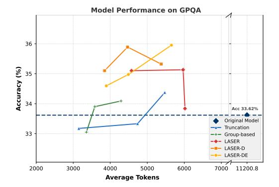
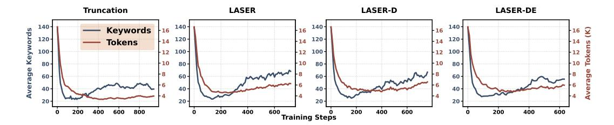
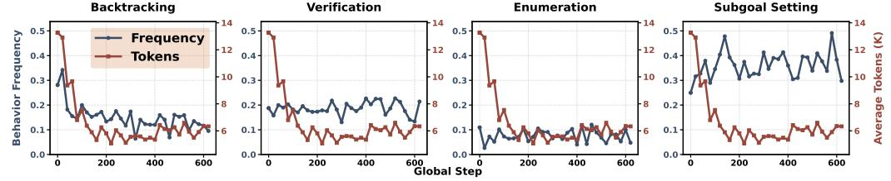
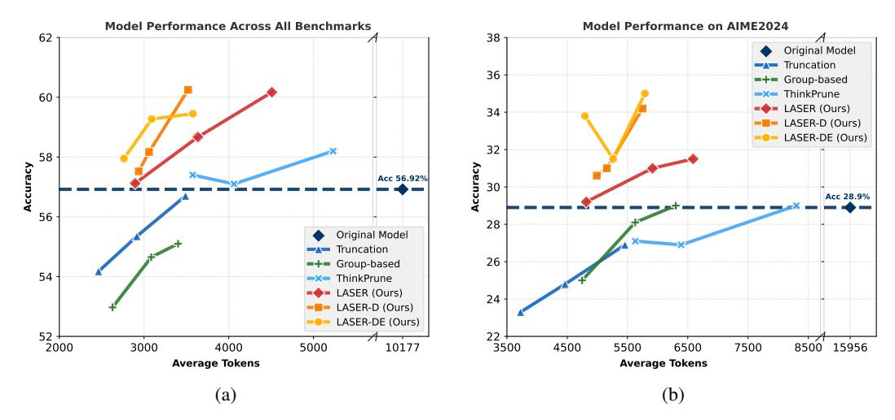
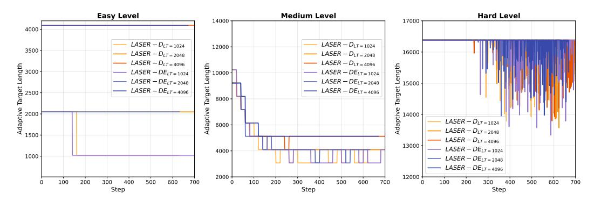
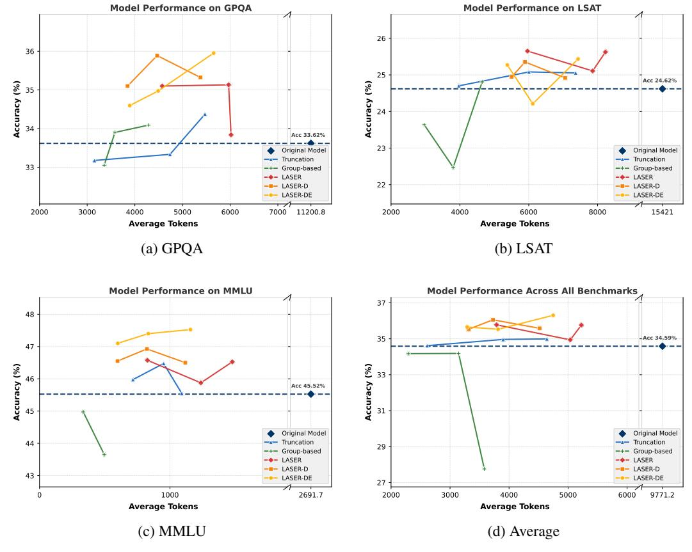

# Learn to Reason Efficiently with Adaptive Length-based Reward Shaping

Wei Liu1<sup>∗</sup> Ruochen Zhou<sup>2</sup> Yiyun Deng<sup>1</sup> Yuzhen Huang<sup>1</sup> Junteng Liu<sup>1</sup> Yuntian Deng<sup>3</sup> Yizhe Zhang<sup>4</sup> Junxian He1<sup>∗</sup>

<sup>1</sup>The Hong Kong University of Science and Technology <sup>2</sup>City University of Hong Kong <sup>3</sup>University of Waterloo <sup>4</sup>Apple

# Abstract

Large Reasoning Models (LRMs) have shown remarkable capabilities in solving complex problems through reinforcement learning (RL), particularly by generating long reasoning traces. However, these extended outputs often exhibit substantial redundancy, which limits the efficiency of LRMs. In this paper, we investigate RL-based approaches to promote reasoning efficiency. Specifically, we first present a unified framework that formulates various efficient reasoning methods through the lens of length-based reward shaping. Building on this perspective, we propose a novel Length-bAsed StEp Reward shaping method (LASER), which employs a step function as the reward based on target length. LASER surpasses previous methods, achieving a superior Pareto-optimal balance between performance and efficiency. Next, we further extend LASER based on two key intuitions: (1) The reasoning behavior of the model evolves dynamically during training, necessitating reward specifications that are also adaptive and dynamic; (2) Rather than uniformly encouraging shorter or longer chains of thought (CoT), we posit that length-based reward shaping should be difficulty-aware i.e., it should penalize lengthy CoTs more for easy queries. This approach is expected to facilitate a combination of fast and slow thinking, leading to a better overall tradeoff. The resulting method is termed LASER-D (Dynamic and Difficulty-aware). Experiments on DeepSeek-R1-Distill-Qwen-1.5B, DeepSeek-R1-Distill-Qwen-7B , and DeepSeek-R1-Distill-Qwen-32B demonstrate that our approach significantly enhances both reasoning performance and response length efficiency. For instance, LASER-D and its variant achieve a +6.1 improvement on AIME2024 while reducing token usage by 63%. Further analysis reveals that our RLbased compression produces more concise reasoning patterns with less redundant "self-reflections". All resources (Models, Code, Data) are available at <https://github.com/hkust-nlp/Laser>.

# 1 Introduction

Recent advancements leveraging reinforcement learning (RL) [\[4,](#page-10-0) [11,](#page-11-0) [15,](#page-11-1) [28\]](#page-12-0) demonstrate that LLMs can evolve into powerful Large Reasoning Models (LRMs), capable of producing extended chains of thought (CoT) to enhance their reasoning abilities. However, these longer reasoning trajectories come at the cost of increased token usage and potentially incorporate more compounding errors. Many of the generated tokens tend to be unnecessarily verbose. For example, LRMs may output thousands of tokens to solve elementary math problems that could otherwise be addressed within just a few hundred tokens, as shown in Figure [1](#page-1-0) (right). This phenomenon is commonly referred to as the *over-thinking* issue [\[3\]](#page-10-1).

<sup>∗</sup>Correspondence to Wei Liu (wliucn@cse.ust.hk) and Junxian He (junxianh@cse.ust.hk)

<span id="page-1-0"></span>> **[图片提取文字 (无描述)]:**
> Question: What is the answer of 1+1? Model Performance on AIME2024 38 After Training Original Model Original Model <think> <think> Truncation Alright, so I have this math problem here: 1 Okay, so I need to figure out what 1+1 is. 36 plus 1. Hmm, okay, let me think about how to Hmm, I think it's pretty straightforward. I =+= Group-based solve this. I remember from school that remember that in basic arithmetic, adding ThinkPrune adding is combining numbers together. So, if I one and one should give me two. Yeah, LASER (Ours) 34 have one object and I add another one, how that's right. So the answer should be 2. LASER-D (Ours) many do I have in total? </think> LASER-DE (Ours) 32 Let me visualize it. Imagine I have a single The sum of 1 and 1 is 2. Accuracy apple. I pick up another apple from my friend. Now, how many apples do I have? I count \boxed{2} 30 Acc 28.9% them: one, two. So, that must be two apples [76 tokens in total] in total. Therefore, 1 plus 1 equals 2. 28 Wait, is there another way to think about this? Maybe using objects or fingers. If I hold up 26 one finger and then add another finger, how many fingers are up? That's two. Yeah, that still makes sense. So, regardless of the 24 method, whether it's counting objects or using my fingers, the result is the same.... 22 \*\*Answer:\*\* 2 3500 4500 5500 7500 15956 6500 8500 Average Tokens [1490 tokens in total]


Figure 1: **Left**: Accuracy and response length on AIME2024. For the figure of more benchmarks, please refer to Appendix A. Each point represents a single training run with different hyper-parameters. Given the high computational cost of obtaining this figure, the base model used is DeepSeek-R1-Distill-Qwen-1.5B. Results on 7B and 32B models are in §6.3. Our methods, LASER, LASER-D, and LASER-DE achieve a Pareto-optimal trade-off compared to all other methods. Notably, they yield a +6.1 improvement in accuracy while reducing tokens usage by 63% compared to the original model. **Right**: Example of a reasoning process after LASER-D training. While the original model produces meaningless "self-reflection" repeatedly for trivial questions like "1+1=?", LRMs after LASER-D training efficiently recognize such questions during thinking and provide the answer directly.

Previous work [16, 22] has explored various approaches to improving reasoning efficiency in LRMs, including continuous chain-of-thought (CoT) reasoning [6, 18], supervised fine-tuning (SFT) [24, 14], and reinforcement learning [11, 2, 1, 10]. Typically, substantial reductions in token usage are accompanied by significant decreases in reasoning accuracy, suggesting a trade-off between efficiency and reasoning performance. Recently, RL-based approaches have demonstrated the most favorable balance between token efficiency and accuracy [11, 2, 1, 10].

In this paper, we study RL-based CoT compression, beginning with a simple baseline that yields surprisingly effective results (§3). Specifically, we further train long CoT reasoning models using RL with a rule-based correctness reward, while restricting the context window size to a smaller value than the model's typical generated length, so that long responses will be truncated. This approach can substantially improve token efficiency with only a modest reduction in accuracy. To better understand the effectiveness of this truncation method and to connect it with other RL approaches that incorporate length-based rewards [11, 2, 1], we introduce a unified length-based reward shaping perspective that encompasses various RL strategies for mitigating overthinking (§4). Building on this reward shaping formulation, we extend the truncation approach as a novel reward shaping method (§4.3) that employs a step function as the reward guided by a desired target length. We refer to this approach as LASER (Length-bAsed StEp Reward). LASER achieves the best trade-off between reasoning performance and efficiency among all evaluated baselines.

Next, we identify two key points that are lacking in LASER: (1) the desired reasoning length should evolve during training as the model's reasoning behaviors dynamically change, and (2) rather than uniformly encouraging short or long CoT, length-based reward shaping should be *difficulty-aware* – allowing harder questions a higher token limit while constraining easier questions to fewer tokens. To this end, we propose a **D**ynamic and **D**ifficulty-aware **L**ength-b**A**sed **StEp Reward** for RL (LASER-D), which adaptively applies different length reward shaping based on problem difficulty. Notably, our algorithm is fully automated with an integrated automatic adapting module, eliminating the need for manual procedural tuning. We also introduce a variant of LASER-D, called LASER-DE, which explicitly encourages additional exploration on incorrect responses, enabling models to discover potentially correct reasoning patterns through extended deliberation.

We conduct comprehensive experiments on three reasoning models ranging from 1.5B to 32B parameters, across four challenging benchmarks: MATH500, AIME2024, AMC2023, and OlympiadBench. Our extensive evaluations demonstrate that our proposed LASER series outperform existing works, while LASER-D and its variant LASER-DE achieve the best Pareto-optimal balance between accuracy and token efficiency. Unlike methods that improve token efficiency at the expense of accuracy, our proposed approaches deliver substantial gains in both dimensions—even on the challenging AIME2024

<span id="page-2-1"></span>Table 1: Results of baseline truncation method with different context window.  $T_k$  denotes the models after RL training with context window k. Accuracy (%) with average token usage for each dataset. "Original" denotes the original DeepSeek-R1-Distill-Qwen-1.5B.

|            |             | Ac   | ccuracy | (%)               |      | Generation Length (tokens) |       |      |                   |       |  |  |
|------------|-------------|------|---------|-------------------|------|----------------------------|-------|------|-------------------|-------|--|--|
|            | MATH<br>500 | AIME | AMC     | Olympiad<br>Bench | Avg. | MATH<br>500                | AIME  | AMC  | Olympiad<br>Bench | Avg.  |  |  |
| Original   | 83.9        | 28.9 | 71.6    | 43.3              | 56.9 | 5042                       | 15956 | 8202 | 11510             | 10177 |  |  |
| $T_{8192}$ | 81.8        | 24.8 | 70.9    | 43.9              | 55.3 | 1795                       | 4465  | 2560 | 2841              | 2915  |  |  |
| $T_{6144}$ | 80.9        | 20.2 | 66.2    | 42.1              | 52.3 | 1351                       | 2821  | 1917 | 1947              | 2009  |  |  |
| $T_{4096}$ | 77.7        | 19.2 | 62.2    | 38.5              | 49.4 | 1054                       | 2481  | 1484 | 1564              | 1646  |  |  |

benchmark. For example, applying LASER-D/LASER-DE to DeepSeek-R1-Distill-Qwen-1.5B improves accuracy by +6.1 percentage points while reducing token usage by 63% on AIME24. Our further analysis reveals that after these RL-based CoT compressions, the reasoning behaviors of LRMs become more concise and demonstrate improved quality with fewer redundant and unhelpful "self-reflection".

# 2 Preliminary

**Enhancing Reasoning via RL** RL has been demonstrated as an effective way to train strong large reasoning models [4, 15, 11] across different domains like math [28], coding [4] and agentic tasks [15]. For example, using a simple rule-based outcome reward [4, 28], the mathematical reasoning capabilities of models can be substantially improved after RL training, often accompanied by the emergence of "self-reflection" style thinking patterns. Following these previous works, we leverage rule-based reward designed as a simple scoring system [4]: +1 for correct responses, -0.5 for incorrect responses, and -1 for responses with invalid format.

Suppose x is the question and y is the response generated by the models, the optimization objective with KL-constrained [19] in RL can be formulated as:

$$\pi_{\theta}^* = \arg\max_{\alpha} \mathbb{E}_{x \sim \mathcal{D}} \left[ \mathbb{E}_{y \sim \pi(\cdot|x)} [R(x,y)] - \beta \mathbb{D}_{KL} [\pi_{\theta}(\cdot|x) \mid\mid \pi_{ref}(\cdot|x)] \right]$$
(1)

where R(x,y) represents the reward of the entire trajectory, and  $\pi_{ref}$  is the reference model, which is the model prior to the RL training phase.  $\beta$  is the parameter to control the two optimization targets. In this paper, we utilize GRPO [20] to optimize this objective.

**RL** for Efficient Reasoning In addition to enhancing reasoning capabilities, RL also holds promise for improving token efficiency in LRMs [11, 16]. Several approaches have been proposed to this end. Most methods involve reward shaping, where models are incentivized to produce shorter responses by associating higher rewards with more concise outputs [11, 1, 2].

# <span id="page-2-0"></span>3 Truncation: A Simple Yet Effective Baseline

In this section, we start from a simple yet effective baseline, where we simply set max generation length to a value significantly smaller than the model's original context window during RL training—for example, 8,192 tokens versus 32,768 in DeepSeek-R1-Distilled models. Intuitively, this approach truncates the responses beyond the context window and regards them as incorrect, thus it pushes the model to generate accurate yet more concise responses under strict token constraints. This baseline has been explored recently in concurrent works [10, 12]. In our experiments, we adopt DeepSeek-R1-Distill-Qwen-1.5B as the base model and investigate the effects of truncation by limiting maximum generation lengths to 4,096, 6,144, and 8,192 tokens.

**Effectiveness of Truncation** Table 1 presents the performance of models across various benchmarks under different truncation sizes. Compared to the original model, surprisingly, RL training with a context window of 8192 tokens achieves a substantial **71**% improvement in token efficiency, while

maintaining competitive accuracy with a 1.6 absolute point degradation on average. This demonstrates that truncation is a simple yet effective approach for enhancing reasoning efficiency in LRMs.

Efficacy-Efficiency Trade-off Although truncation proves effective on average across benchmarks, its impact varies significantly with task difficulty. A closer look at the results reveals that performance on the most challenging benchmark, AIME, suffers a notable 4.1 drop in accuracy under the 8192 token limit. When the context window is further reduced to 4096, the accuracy on AIME deteriorates even more sharply, with a 9.7 decline, by far the largest drop observed, compared to only a 7% decrease on MATH500. This highlights that the benefits of truncation involve a trade-off: while it improves efficiency overall, it may disproportionately affect harder tasks. To better understand this disproportionate performance drop on harder benchmarks, we note that the truncation ratio during training is initially very high (Figure [6\)](#page-13-1), exceeding 45%, and remains above 10% even after 200 rollout steps. Specifically, for the AIME dataset, over 75% of responses exceed 8192 tokens, compared to only 15% for MATH500. This indicates that truncation disproportionately impacts more complex tasks like AIME, where long reasoning trajectories are often necessary. Next, we formulate the truncation baseline from the reward shaping perspective, and connect it with related works.

# <span id="page-3-0"></span>4 A Unified View on Efficient Reasoning with RL

In this section, we aim to understand the truncation baseline and other RL-based efficient reasoning approaches through a unified perspective. We first connect them together via length-based reward shaping, and then derive new alternatives with this view.

#### 4.1 The Unified Formulation

Here we first present a unified formulation, and then we show how the truncation baseline and other works fit into this formulation. Specifically, we define the reward function with two parts: a correctness term C(y) and a length-based term S(y) controlled by a control variable λ(y):

<span id="page-3-1"></span>
$$\hat{R}(x,y) = C(y) + \lambda(y) \cdot S(y) \tag{2}$$

In most length reward methods, C(y) = R(x, y), representing the original rule-based reward for correctness. However, in truncation-based approaches, C(y) = 0 as we discuss below. The term S(y) denotes the length reward, which varies across different methods.

Formulating the Truncation Baseline As shown in Table [2,](#page-4-1) truncation is a special case of the length reward with C(y) = 0, where the target length L<sup>T</sup> is enforced by the context window. ThinkPrune [\[10\]](#page-11-4) is another truncation-based approach, which extends vanilla truncation by introducing an adaptive target length L<sup>A</sup> to replace fixed target length L<sup>T</sup> . They iteratively choose L<sup>A</sup> and separate their training into three stages. Table [2](#page-4-1) also outlines other formulations, we will introduce them individually in the following sections.

#### 4.2 Connecting Previous Efforts Together

In this part, we build on our unified formulation in Eq. [2](#page-3-1) and aim to connect previous approaches, below we describe several main categories of them. Table [2](#page-4-1) formulates different length-based reward shaping by different designs for C(y), λ(y) and S(y). Parameter α is a hyperparameter coefficient that controls the magnitude of the length reward S(y). We provide detailed explanations for each formulation in Appendix [D.](#page-14-0)

Group-based Reward In group-based reward, the length reward S(y) is designed to encourage brevity by assigning higher scores to shorter responses within a rollout group, such as Efficient Reasoning [\[2\]](#page-10-3) and Kimi-k1.5 [\[11\]](#page-11-0) as formulated in Table [2.](#page-4-1) However, this comparison-based approach can lead to reward hacking. Models tend to exploit S(y) by generating overly concise responses, particularly for simpler questions. We demonstrate this phenomenon for the Efficient Reasoning baseline in Figure [7a](#page-14-1) and Figure [7b](#page-14-1) in Appendix [C,](#page-13-2) where training accuracy initially decreases while total reward increases. Additionally, Table [3](#page-7-1) shows a more significant drop in MATH500 accuracy compared to other methods, further supporting this observation.

<span id="page-4-1"></span>Table 2: Formulation of different approaches based on Eq. 2. C(y) is mainly for correctness, S(y) is the length reward, and  $\lambda(y)$  is a control variable to control how length reward is applied.  $\mathbb{I}(R)$  stands for  $\mathbb{I}(R(x,y)=1)$  and  $\mathbb{I}(\cdot)$  is an indicator function.  $\rho$  is the negative reward given for incorrect responses. L(y) is the length of the generated response.  $\alpha$  is the coefficient that controls the magnitude of the length reward. The shapes of different rewards are shown in the visualization, where x axis is the length of the response. Blue represents the curve for correct responses, while Red represents the curve for incorrect responses. For approaches, ThinkPrune, LASER-DE, there are different lines with similar colors indicate that the reward is dynamic which is realized by different  $L_A$  values. The details of visualization are available in the Appendix J.

| Name                       | $C(y), \lambda(y)$     | S(y)                                                                                                                                                                                                                 | Visualization |
|----------------------------|------------------------|----------------------------------------------------------------------------------------------------------------------------------------------------------------------------------------------------------------------|---------------|
| <b>Truncation Method</b>   |                        |                                                                                                                                                                                                                      |               |
| Vanilla Truncation         | 0,1                    | $\begin{cases} R(x,y) & \text{if } L(y) \le L_T \\ \rho & \text{if } L(y) > L_T \end{cases}$                                                                                                                         |               |
| ThinkPrune [10]            | 0,1                    | $\begin{cases} R(x,y) & \text{if } L(y) \leq L_A \\ \rho & \text{if } L(y) > L_A \end{cases}$                                                                                                                        |               |
| <b>Group-based Reward</b>  |                        |                                                                                                                                                                                                                      |               |
| Efficient Reasoning [2]    | $R(x,y),\mathbb{I}(R)$ | $-\alpha \cdot \sigma \left(\frac{L(y) - \text{Mean}(y)}{\text{STD}(L)}\right)$                                                                                                                                      |               |
| Kimi-k1.5 [11]             | R(x,y), 1              | $\begin{cases} 0.5 - \frac{L(y) - L_{\min}}{L_{\max} - L_{\min}} & \text{if } \mathbb{I}(R) = 1\\ \min\left(0,\ 0.5 - \frac{L(y) - L_{\min}}{L_{\max} - L_{\min}}\right) & \text{if } \mathbb{I}(R) = 0 \end{cases}$ |               |
| <b>Budget-based Reward</b> |                        |                                                                                                                                                                                                                      |               |
| L1-Exact [1]               | R(x,y), 1              | $-\alpha \cdot  L(y) - L_T $                                                                                                                                                                                         |               |
| L1-Max [1]                 | $0,\mathbb{I}(R)$      | $\operatorname{clip}(\alpha \cdot (L(y) - L_T) + \delta, 0, 1)$                                                                                                                                                      |               |
| Length-Based Step Reward   | and Variants           |                                                                                                                                                                                                                      |               |
| LASER                      | $R(x,y),\mathbb{I}(R)$ | $\alpha \cdot \mathbb{I}(L(y) \le L_T)$                                                                                                                                                                              |               |
| Laser-D                    | $R(x,y),\mathbb{I}(R)$ | $\alpha \cdot \mathbb{I}(L(y) \leq L_A)$                                                                                                                                                                             |               |
| LASER-DE                   | R(x,y), 1              | $\alpha \cdot \mathbb{I}(R) \cdot \mathbb{I}(L(y) \le L_A) + \alpha \cdot (1 - \mathbb{I}(R)) \cdot \mathbb{I}(L(y) > L_A)$                                                                                          |               |

**Budget-based Reward** Budget-based rewards use query-specific target lengths (budgets) and penalize responses that deviate from these instructions. While this mitigates reward hacking seen in group-based schemes, it can destabilize training. Models require exposure to diverse budgets, but in large context windows (e.g., 16,384 tokens), these targets become sparsely distributed, causing reward fluctuations. Figure 7b illustrates this instability. Using L1-Max as a representative method, we observe that with smaller contexts (4,096 tokens), it achieves stable reward increases comparable to other methods. However, with 16,384-token contexts, rewards fluctuate significantly and underperform alternative approaches.

# <span id="page-4-0"></span>4.3 Bridging the Gap: Length-based Step Reward

As shown in Eq. 2 and visualized in Table 2, a key limitation of the truncation method is that it assigns the same penalties to overlong responses as it does to incorrect ones, which may over-penalize long but correct explorations. To address this issue, we extend it as a novel reward shaping approach called

Length-bAsed StEp Reward (LASER), which adopts a step reward function guided by a target length, rather than performing hard truncation.

Specifically, we design the length reward term S(y) as an indicator function based on a target length L<sup>T</sup> . This function assigns a length-based bonus to responses shorter than L<sup>T</sup> . We also set the context window significantly larger than the target length L<sup>T</sup> (e.g., 16,384 vs. 4,096) where truncation rarely happens. And the length reward term S(y) is only activated when responses are correct, thereby improving the efficacy-efficiency trade-off. As visualized in Table [2,](#page-4-1) LASER closely resembles the vanilla truncation approach; the only difference is that, instead of truncating long responses, it awards bonus rewards to correct responses that do not exceed the target length. To balance the correctness reward C(y) and length reward S(y), we follow a typical setting and set α as 0.5.

Empirical results are demonstrated in Figure [1](#page-1-0) and Table [3,](#page-7-1) training with the LASER reward achieves improved Pareto-optimality compared to all previous methods. Notably, it is the first approach to simultaneously deliver significant improvements in both accuracy and token efficiency on the challenging AIME24 benchmark. These results establish LASER as a promising reward design framework for enhancing the balance between efficacy and efficiency.

# 5 Adaptive Length-based Step Reward Shaping

### 5.1 Design Principles

We highlight two key limitations not addressed in the design of LASER: (1) LASER requires specifying a fixed target length prior to training; however, as the model evolves during training, the optimal response length may also change and should ideally adapt dynamically. (2) Additionally, different questions demand reasoning traces of varying lengths—simple questions may be effectively addressed with shorter reasoning, while more complex questions benefit from longer, more detailed deliberation.

Therefore, we extend LASER to be Dynamic and Difficulty-aware, which we term as LASER-D. Rather than using a single fixed target length, our approach dynamically adjusts the target length throughout training and tailors it to questions of varying difficulty. Concretely, LASER-D *decouples the target length hyperparameter across different queries, allowing distinct target lengths to be assigned to various queries. Moreover, these target length hyperparameters are dynamically adjusted throughout training.*

We separate queries into three buckets of easy, medium, and hard difficulty levels, based on the correctness rates within the rollout batch – for each question, we have k rollouts and use thresholds k/3 and 2k/3 to separate them. As such, we have three distinct target length hyperparameters for these three query groups. Notably, we perform difficulty assessment for the queries during realtime RL training and use the training rollout batch, thus it only incurs negligible overhead on the computation. Being dynamic and difficulty-aware, one challenge raised is how to set the dynamic processes of the decoupled target length hyperparameters. Next, we introduce an *automatic* adapting mechanism, to adapt them without any manual intervention.

#### <span id="page-5-1"></span>5.2 Automatic Adapting Mechanism

LASER-D is driven by an automatic adapting mechanism that periodically evaluates and adjusts the target length parameters (L<sup>A</sup> in Table [2\)](#page-4-1) for each difficulty level. Specifically, we first extract a small monitoring dataset D<sup>M</sup> (e.g., 500 samples) from training data that mirrors the distribution of the training data. Every N training steps (e.g., 20), our approach searches and sets the target length hyperparameters based on this monitoring dataset.

Denote the three-class difficulty level of a query as d, to determine the target length hyperparameters, we propose a metric called Expected Correct Responses (ECR), which estimates how many complete, correct responses we can expect for each difficulty level given response length limits. Formally, we sample K responses for each query in the monitoring set,[2](#page-5-0) and ECR is computed as

$$ECR_d = P_{l,d} \cdot |C_d| \tag{3}$$

<span id="page-5-0"></span>Practically, K is set to be the same as the rollout size used during training, in order to maintain consistency with the training scenario.

where Pl,d is the coverage ratio (proportion of responses that fit within a given token length l). The value |Cd| is fixed for each difficulty group. Since we use the ratio of correct responses within each rollout group to determine the difficulty level, there is a minimum number of correct responses for each group (e.g., 6, 3, and 1 correct responses for easy, medium, and hard levels, respectively, when K = 8). We set |Cd| as these minimum values for each group.

The monitoring module enumerates potential target lengths from the lower bound target length L<sup>T</sup> tokens up to the maximum context window (16,384 tokens) with an interval of I, computing coverage ratios Pl,d for each length. We select the smallest target length as the adaptive target length L<sup>A</sup> satisfying ECR<sup>d</sup> ≥ 1 for each difficulty level d, ensuring at least one complete and correct response.

Intuitively, this mechanism sets the target length as the minimal generation length such that at least one rollout response is expected to be correct. This approach is reasonable because generating sequences shorter than this length would likely be detrimental, as correct responses are less probable. Conversely, generating longer sequences may be redundant, since correct responses can already be obtained with a shorter generation length.

Dynamic and Difficulty-Aware Reward During training, we apply these monitoring-derived parameters to implement dynamic and difficulty-aware rewards. Each training question's difficulty level is determined using the same classification method described earlier. Easier questions receive smaller target lengths (i.e. smaller scaling factor β), while harder questions receive larger ones (i.e. larger scaling factor β). Since monitoring runs every N steps, the difficulty-dependent target lengths are automatically adapted to the evolving policy model.

Computational Efficiency This automatic adapting mechanism adds minimal computational overhead. By using a small monitoring dataset and evaluating only periodically, our method increases computation by just 3.5% in our experiments.

# 5.3 LASER-DE: A Variant of LASER-D to Encourage Exploration

Previous works [\[13,](#page-11-6) [10\]](#page-11-4) find that with more test-time compute, the reasoning ability of models will improve. Meanwhile, some other works [\[28\]](#page-12-0) show that incorrect responses tend to produce more tokens. Both findings are related to the exploration of policy models, where models try to explore by consuming more compute to get the correct answers. Therefore, we further propose a variant of LASER-D, named LASER-DE, to encourage the exploration of policy models for those incorrect responses. The only difference for LASER-DE is to encourage those incorrect responses to be further explored to find correct pattern by applying reduced penalties to those that are incorrect and exceed the target length. The form of LASER-DE can be seen in Table [2.](#page-4-1)

# 6 Experiments

#### 6.1 Experimental Setup

Setup We experiment with three capable and representative LRMs across three different sizes known for their overthinking tendencies: DeepSeek-R1-Distill-Qwen-1.5B, DeepSeek-R1-Distill-Qwen-7B and DeepSeek-R1-Distill-Qwen-32B . We adhere to the original prompt from DeepSeek-R1 [\[4\]](#page-10-0), with the full prompt available in Appendix [E.1.](#page-16-0) We train these models using the DeepScaleR-Preview-Dataset [\[12\]](#page-11-5), a high-quality mathematics dataset containing 40K competition-level question-answer pairs. We evaluate the models on four benchmarks of varying difficulty: MATH500 [\[9\]](#page-11-7), OlympiadBench [\[7\]](#page-10-5), AIME 2024, and AMC 2023. We set α = 0.5 for our methods in all experiments to balance the trade-off between correctness rewards and solution length penalties. L<sup>T</sup> is a hyper-parameter for our approaches because the automatic adapting mechanism will enumerate the target length from L<sup>T</sup> to the context window size to select the adaptive target lengths LA, as described in [§5.2.](#page-5-1) Parameter settings for baseline methods are provided in Appendix [E.3,](#page-16-1) and full details of our training procedure and evaluation methodology can be found in Appendix [E.2.](#page-16-2)

Baselines According to Table [2,](#page-4-1) we train models using different types of length rewards design and compare our LASER, LASER-D, LASER-DE to previous works. Considering the high computational cost of RL training, we select Efficient Reason [\[2\]](#page-10-3) and L1-Max [\[1\]](#page-10-4) as the representatives, since they perform better accuracy compared to other methods inside same group and are more close to our settings. For ThinkPrune [\[10\]](#page-11-4), we re-evaluate their open-sourced models.

<span id="page-7-1"></span>Table 3: Accuracy (%) with average token usage for each dataset and different methods. Most important results in this table are visualized in Figure 1 and Figure 5 in Appendix A. The base model is DeepSeek-R1-Distill-Qwen-1.5B. "Original" denotes the original model.  $T_k$  is the truncation method with context window k. "Group" denotes the Efficient Reasoning [2] with different  $\alpha$ . Due to the space limit, we only show three most representative results here. For the full results, please refer to Tabel 6 in Appendix H.

|                                           |             | (%)  |      | Generation Length (tokens) |      |             |       |      |                   |       |
|-------------------------------------------|-------------|------|------|----------------------------|------|-------------|-------|------|-------------------|-------|
|                                           | MATH<br>500 | AIME | AMC  | Olympiad<br>Bench          | Avg. | MATH<br>500 | AIME  | AMC  | Olympiad<br>Bench | Avg.  |
| Original                                  | 83.9        | 28.9 | 71.6 | 43.3                       | 56.9 | 5042        | 15956 | 8202 | 11510             | 10177 |
| $T_{8192}$                                | 81.8        | 24.8 | 70.9 | 43.9                       | 55.3 | 1795        | 4465  | 2560 | 2841              | 2915  |
| $T_{6144}$                                | 80.9        | 20.2 | 66.2 | 42.1                       | 52.3 | 1351        | 2821  | 1917 | 1947              | 2009  |
| $T_{4096}$                                | 77.7        | 19.2 | 62.2 | 38.5                       | 49.4 | 1054        | 2481  | 1484 | 1564              | 1646  |
| $Group_{\alpha=0.4}$                      | 74.6        | 25.0 | 69.2 | 43.1                       | 53.0 | 1069        | 4747  | 2162 | 2536              | 2629  |
| $Group_{\alpha=0.2}$                      | 78.1        | 28.1 | 68.0 | 44.4                       | 54.7 | 1135        | 5628  | 2635 | 2944              | 3085  |
| $Group_{\alpha=0,1}$                      | 77.0        | 29.0 | 69.5 | 44.9                       | 55.1 | 1228        | 6301  | 2808 | 3271              | 3402  |
| $Group_{\alpha=0.05}$                     | 74.4        | 30.2 | 65.5 | 43.1                       | 53.3 | 1193        | 4839  | 2457 | 2703              | 2798  |
| L1-Max-1024                               | 76.4        | 15.0 | 59.4 | 39.1                       | 47.5 | 661         | 1303  | 933  | 938               | 959   |
| L1-Max-4096                               | 79.7        | 20.0 | 65.0 | 41.0                       | 51.4 | 875         | 1718  | 1159 | 1229              | 1245  |
| $LASER_{L_T=2048}$                        | 83.6        | 29.2 | 71.6 | 44.1                       | 57.1 | 1913        | 4815  | 2493 | 2767              | 2895  |
| $LASER_{L_T=4096}$                        | 83.9        | 31.0 | 74.1 | 45.7                       | 58.7 | 1914        | 5915  | 3136 | 3579              | 3636  |
| $LASER_{L_T=8192}$                        | 85.6        | 31.5 | 75.9 | 47.7                       | 60.2 | 2736        | 6589  | 4162 | 4547              | 4509  |
| Laser-D <sub>L<math>x=1024</math></sub>   | 83.0        | 30.6 | 72.8 | 43.7                       | 57.5 | 1362        | 4991  | 256  | 2837              | 2862  |
| Laser-D $_{L_T=2048}$                     | 82.2        | 31.0 | 73.3 | 46.2                       | 58.2 | 1623        | 5158  | 2572 | 2960              | 3059  |
| Laser-D <sub><math>L_T</math>=4096</sub>  | 84.2        | 34.2 | 75.3 | 47.3                       | 60.3 | 1872        | 5750  | 2981 | 3474              | 3520  |
| LASER-DE <sub><math>L_T=1024</math></sub> | 82.1        | 33.8 | 72.2 | 43.7                       | 58.0 | 1350        | 4794  | 2254 | 2654              | 2763  |
| Laser-DE <sub><math>L_T=2048</math></sub> | 83.9        | 31.5 | 75.3 | 46.4                       | 59.3 | 1456        | 5263  | 2679 | 2971              | 3092  |
| LASER-DE $_{L_T=4096}$                    | 83.5        | 35.0 | 73.3 | 46.0                       | 59.5 | 1949        | 5789  | 3080 | 3488              | 3577  |

### 6.2 Efficacy-Efficiency Trade-off

Since there is a trade-off between accuracy and response length, one of the best ways to evaluate different methods is to compare their Pareto-optimal frontiers. We start with the DeepSeek-R1-Distill-Qwen-1.5B model as its small size allows us to run multiple experiments to investigate the trade-off of different approaches. To fully evaluate the potential of each method, we adjust key parameters ( $\alpha$  for group-based reward,  $L_T$  for other methods) to explore different tradeoffs along the accuracy-length trade-off curve. The full details of different hyper-parameters for different methods can be found in Table 5. As a result, each point in Figure 1 and Figure 5 represents a separate experiment with a fully trained model using a distinct hyperparameter configuration. We also list the results in different benchmarks in Table 3. Due to the space limit, we leave some results of truncation methods in Table 6.

As shown in Figure 1, both LASER-D and LASER-DE achieve better Pareto-optimal frontiers compared to all other methods. On the AIME2024 benchmark, LASER-DE attains the highest accuracy of 35% using just over 5,500 tokens—a substantial reduction by 63%. Meanwhile, LASER-D still achieves 34% accuracy with only 4,600+ tokens, underscoring its strong trade-off. Across all benchmarks (Figure 5), LASER-DE achieves the most optimal trade-off when the average token usage is below 3,500, while LASER-D performs the best in higher token regimes. Specifically, LASER-D achieves 60.3% accuracy with only 3,520 tokens on average, representing a substantial reduction from the 10,177 tokens used by the original model. Compared to the LASER method, both LASER-D and LASER-DE achieve significant improvements, demonstrating that incorporating a **dynamic** and **difficulty-aware** mechanism greatly enhances the efficacy-efficiency trade-off. Compared to other baseline methods, LASERstill exhibits a more favorable trade-off.

#### <span id="page-7-0"></span>**6.3** Experiments on Larger Models

To better evaluate the effectiveness of our proposed methods, Laser, Laser-D, and Laser-DE. We conduct experiments on DeepSeek-R1-Distill-Qwen-7B , as shown in Table 4. Given the computational cost of larger models, we set key hyperparameters for each method to achieve an appropriate trade-off. Specifically, we set  $\alpha=0.2$  for the group-based reward,  $L_T=8192$  for the truncation method in Laser,  $L_T=4096$  for Laser-D and Laser-DE. Notably, we do not tune  $\alpha$  with fixed value 0.5 in all experiments of our methods. As shown in Table 4, Laser-D achieves the best

<span id="page-8-0"></span>

| Table 4: Accuracy (%) with average token usage to      | for each dataset and different methods using 7B and 32B |
|--------------------------------------------------------|---------------------------------------------------------|
| models. "Original" denotes the original model. $T_k$ i | s the truncation method with context window $k$ .       |

|                              |             | A    | ccuracy | (%)               | Generation Length (tokens) |             |       |      |                   |      |
|------------------------------|-------------|------|---------|-------------------|----------------------------|-------------|-------|------|-------------------|------|
|                              | MATH<br>500 | AIME | AMC     | Olympiad<br>Bench | Avg.                       | MATH<br>500 | AIME  | AMC  | Olympiad<br>Bench | Avg. |
|                              |             |      | D       | eepSeek-R1-       | Distill-Q                  | wen-7B      |       |      |                   |      |
| Original                     | 92.6        | 53.1 | 88.4    | 58.9              | 73.3                       | 4017        | 13414 | 6433 | 8987              | 8213 |
| $T_{8192}$                   | 92.0        | 51.9 | 88.3    | 56.4              | 72.2                       | 1972        | 5655  | 3159 | 3606              | 3598 |
| Group                        | 89.4        | 48.1 | 82.8    | 53.7              | 68.5                       | 780         | 4271  | 1693 | 2348              | 2273 |
| LASER                        | 92.2        | 54.4 | 89.7    | 58.1              | 73.6                       | 2317        | 6320  | 3733 | 4262              | 4158 |
| LASER-D                      | 92.2        | 58.3 | 90.0    | 61.0              | 75.4                       | 1836        | 5379  | 2694 | 3350              | 3315 |
| LASER-DE                     | 92.0        | 55.8 | 89.1    | 58.9              | 74.0                       | 1658        | 4969  | 2612 | 3157              | 3099 |
| DeepSeek-R1-Distill-Qwen-32B |             |      |         |                   |                            |             |       |      |                   |      |
| Original                     | 94.4        | 71.7 | 93.1    | 64.6              | 80.95                      | 3553        | 10335 | 6177 | 7697              | 6941 |
| LASER-DE                     | 93.2        | 70.8 | 93.1    | 62.2              | 79.83                      | 2314        | 6785  | 3545 | 4608              | 4313 |

<span id="page-8-1"></span>> **[图片提取文字 (无描述)]:**
> Model Performance on GPQA 36 Accuracy (%) 35 34 Acc 33.62% Original Model Truncation 33 Group-based LASER LASER-D LASER-DE 2000 3000 4000 5000 6000 7000 11200.8 Average Tokens


> **[图片提取文字 (无描述)]:**
> Model Performance Across All Benchmarks 37 -Acc 34.59% 35 Accuracy (%) 33 31 Original Model Truncation 29 Group-based LASER LASER-D LASER-DE 27 2000 3000 4000 5000 9771.2 6000 Average Tokens


Figure 2: Performance on out-of-domain benchmarks: GPQA and average performance across all three benchmarks (GPQA, MMLU, LSAT).

trade-off with better accuracy and significantly fewer tokens. On the AIME dataset, it achieves an accuracy of 58.3%, representing a gain of +5.2 points, while using only 5,379 tokens—substantially fewer than the 13,414 tokens used by the original model. Compared to other methods, LASER, LASER-D, and LASER-DE also attain better trade-offs on most benchmarks, particularly on the more challenging ones.

For the 32B model, due to computational constraints, we compare the LASER-DE-trained model with the original baseline under this larger setting and set  $L_T=8192$ . LASER-DE achieves competitive accuracy with only a minor drop (1%), while still significantly reducing output length. Notably, the accuracy of DeepSeek-R1-Distill-Qwen-32B on our training dataset is already very high—over 76%, leaving little room for further improvement. We speculate that with more challenging and diverse training data, LASER-DE could yield further accuracy gains.

#### 6.4 Experiments on Out-of-Domain Benchmarks

We evaluate whether LASER, LASER-D and LASER-DE can generalize to domains outside the RL training distribution. We select three out-of-domain benchmarks: GPQA [17], LSAT [23], and MMLU [8], following the evaluation settings established by L1 [1]. Figure 2 illustrates the efficacy-efficiency trade-off on GPQA and the average performance across all benchmarks. Compared to the original model, LASER, LASER-D and LASER-DE consistently achieve significant improvements in both accuracy and token usage, demonstrating robust generalization capabilities. And LASER-D and LASER-DE maintain the best trade-off even when compared to LASER.

# 7 Analysis

We use DeepSeek-R1-Distill-Qwen-1.5B as the backbone, conduct a comprehensive analysis that includes budget-forcing inference, dynamics of adaptive target lengths, shifts in reasoning patterns, and qualitative evaluations. Due to the space limit, please refer to Appendix [F](#page-16-4) for budget-forcing inference, Appendix [G](#page-17-1) for dynamics of adaptive target lengths.

# 7.1 Changes of Thinking Patterns

To better understand the changes of response length, we analyze the changes of thinking patterns over RL iterations on AIME2024 with 16 samples per question. We analyze through two approaches, keywords counts [\[26\]](#page-12-8) and reasoning behavior ratios [\[28\]](#page-12-0).

Shifts in "Self-Reflection" Keywords "Self-reflection" or "Aha-moment" reasoning has emerged as an intriguing behavior in LRMs [\[4\]](#page-10-0). Following previous work [\[26\]](#page-12-8), we track this behavior by monitoring seven representative keywords: [*"recheck"*,*"rethink"*,*"try again"*,*"wait"*, *"alternatively"*,*"retry"*,*"however"*]. As shown in Figure [3,](#page-10-6) the average amount of these keywords (occurrences per token) declines notably as response length decreases across all methods. This suggests that RL may reduce instances of spurious "self-reflection," previously identified as a contributor to over-thinking [\[3\]](#page-10-1). Interestingly, as training progresses, we observe increased keyword amount while maintaining shorter outputs, indicating models develop more efficient self-reflection behaviors without producing verbose responses.

Changes in Thinking Behaviors To further investigate the changes of reasoning patterns beyond keyword statistics, we employ gpt-4.1-mini to perform a more fine-grained analysis of cognitive behaviors throughout the training process. Specifically, we adopt the cognitive behavior framework proposed by [\[5\]](#page-10-7), which identifies reasoning-related behaviors such as *Backtracking*, *Verification*, *Subgoal Setting*, and *Enumeration*. We report the proportion of each behavior relative to the total number of behaviors, focusing on these four representative categories. The complete list of behaviors and implementation details are provided in Appendix [K.](#page-21-0)

As shown in Figure [4,](#page-10-8) the proportion of *Backtracking* behavior decreases significantly, from over 30% to just above 10%, as the response length is reduced. This trend aligns with the keyword statistics, as many of the tracked keywords (e.g., "recheck", "retry", "rethink") are indicative of *Backtracking*. While *Backtracking* declines during training, the proportions of other reasoning behaviors, *Verification*, *Enumeration*, and *Subgoal Setting*, remain stable, with a slight increase observed in *Subgoal Setting*. These results suggest that reducing response length does not degrade the model into a non-reasoning baseline. On the contrary, core reasoning behaviors are preserved, while unnecessary backtracking is minimized, indicating more efficient reasoning in the refined models.

#### 7.2 Qualitative Analysis

We conduct a qualitative analysis on the trivial question "1+1=?" and the MATH500 dataset to understand how RL improves reasoning efficiency. Comparing the original DeepSeek-R1-Distill-Qwen-1.5B model with the LASER-D-trained version, Figure [1](#page-1-0) illustrates how the original model generates repetitive "self-reflection" even for trivial questions, while the trained model directly provides the answer. Our analysis of MATH500 (detailed in Appendix [L\)](#page-21-1) reveals that the original model tends towards verbose, redundant explanations of single ideas. In contrast, the LASER-D-trained model expresses the same concepts more succinctly using structured formulas, significantly improving token efficiency. This suggests our RL-based approach not only reduces unproductive backtracking but also encourages a shift towards more concise and direct expression.

# 8 Conclusion

In this paper, we propose a unified view for RL-based CoT compression, unifying various rewardshaping and truncation methods. Building on this view, we introduce new approaches with adaptive, length-based reward shaping. Extensive experiments demonstrate that our proposed methods achieve superior Pareto-optimality and significant improvements in both accuracy and token efficiency. Our

<span id="page-10-6"></span>> **[图片提取文字 (无描述)]:**
> Truncation LASER LASER-D LASER-DE 140 140-140-140-Keywords -16 120-120-Tokens -14 100-100-100-100--12 80 -10 -10 -10 80 80 -80 -60 60-60-60 40-40 40 -20-600 800 200 400 600 400 600 200 400 200 400 600 200 Training Steps


Figure 3: Average keyword amount and response length over RL training on AIME24. The truncation method uses a 8192 token context window. LASER, LASER-D, and LASER-DE employ a target length of  $L_T=2048$ .

<span id="page-10-8"></span>> **[图片提取文字 (无描述)]:**
> Backtracking Verification Subgoal Setting Enumeration 0.5 0.5 0.5 Frequency -12 Tokens 0.4-0.4-10 0.34 -10 -10 0.3 0.3--8 -8 0.2 0.2 0.1 0.1 0.0 0.0 0.0 0.0 600 0 Global Step 600 200 600 600 200 400 400 200 400 200 400 0


Figure 4: Changes in reasoning behaviors ratio and response length over RL training iterations on AIME2024. The figure shows how LASER-DE's thinking patterns change during training with a target length of  $L_T = 2048$ . analysis of reasoning behaviors reveals that our RL-based CoT compression effectively encourages

#### References

models to reason more concisely and productively.

- <span id="page-10-4"></span>[1] P. Aggarwal and S. Welleck. L1: Controlling how long a reasoning model thinks with reinforcement learning, 2025. URL https://arxiv.org/abs/2503.04697.
- <span id="page-10-3"></span>[2] D. Arora and A. Zanette. Training language models to reason efficiently, 2025. URL https://arxiv.org/abs/2502.04463.
- <span id="page-10-1"></span>[3] X. Chen, J. Xu, T. Liang, Z. He, J. Pang, D. Yu, L. Song, Q. Liu, M. Zhou, Z. Zhang, R. Wang, Z. Tu, H. Mi, and D. Yu. Do not think that much for 2+3=? on the overthinking of o1-like llms, 2025. URL https://arxiv.org/abs/2412.21187.
- <span id="page-10-0"></span>[4] DeepSeek-AI, D. Guo, D. Yang, H. Zhang, J. Song, R. Zhang, R. Xu, Q. Zhu, S. Ma, P. Wang, X. Bi, X. Zhang, X. Yu, Y. Wu, Z. F. Wu, Z. Gou, Z. Shao, Z. Li, Z. Gao, A. Liu, B. Xue, B. Wang, B. Wu, B. Feng, C. Lu, C. Zhao, C. Deng, C. Zhang, C. Ruan, D. Dai, D. Chen, D. Ji, E. Li, F. Lin, F. Dai, F. Luo, G. Hao, G. Chen, G. Li, H. Zhang, H. Bao, H. Xu, H. Wang, H. Ding, H. Xin, H. Gao, H. Qu, H. Li, J. Guo, J. Li, J. Wang, J. Chen, J. Yuan, J. Qiu, J. Li, J. L. Cai, J. Ni, J. Liang, J. Chen, K. Dong, K. Hu, K. Gao, K. Guan, K. Huang, K. Yu, L. Wang, L. Zhang, L. Zhao, L. Wang, L. Zhang, L. Xu, L. Xia, M. Zhang, M. Zhang, M. Tang, M. Li, M. Wang, M. Li, N. Tian, P. Huang, P. Zhang, Q. Wang, Q. Chen, Q. Du, R. Ge, R. Zhang, R. Pan, R. Wang, R. J. Chen, R. L. Jin, R. Chen, S. Lu, S. Zhou, S. Chen, S. Ye, S. Wang, S. Yu, S. Zhou, S. Pan, S. S. Li, S. Zhou, S. Wu, S. Ye, T. Yun, T. Pei, T. Sun, T. Wang, W. Zeng, W. Zhao, W. Liu, W. Liang, W. Gao, W. Yu, W. Zhang, W. L. Xiao, W. An, X. Liu, X. Wang, X. Chen, X. Nie, X. Cheng, X. Liu, X. Xie, X. Liu, X. Yang, X. Li, X. Su, X. Lin, X. Q. Li, X. Jin, X. Shen, X. Chen, X. Sun, X. Wang, X. Song, X. Zhou, X. Wang, X. Shan, Y. K. Li, Y. Q. Wang, Y. X. Wei, Y. Zhang, Y. Xu, Y. Li, Y. Zhao, Y. Sun, Y. Wang, Y. Yu, Y. Zhang, Y. Shi, Y. Xiong, Y. He, Y. Piao, Y. Wang, Y. Tan, Y. Ma, Y. Liu, Y. Guo, Y. Ou, Y. Wang, Y. Gong, Y. Zou, Y. He, Y. Xiong, Y. Luo, Y. You, Y. Liu, Y. Zhou, Y. X. Zhu, Y. Xu, Y. Huang, Y. Li, Y. Zheng, Y. Zhu, Y. Ma, Y. Tang, Y. Zha, Y. Yan, Z. Z. Ren, Z. Ren, Z. Sha, Z. Fu, Z. Xu, Z. Xie, Z. Zhang, Z. Hao, Z. Ma, Z. Yan, Z. Wu, Z. Gu, Z. Zhu, Z. Liu, Z. Li, Z. Xie, Z. Song, Z. Pan, Z. Huang, Z. Xu, Z. Zhang, and Z. Zhang, Deepseek-r1: Incentivizing reasoning capability in llms via reinforcement learning, 2025. URL https://arxiv.org/abs/2501.12948.
- <span id="page-10-7"></span>[5] K. Gandhi, A. Chakravarthy, A. Singh, N. Lile, and N. D. Goodman. Cognitive behaviors that enable self-improving reasoners, or, four habits of highly effective stars, 2025. URL https://arxiv.org/abs/2503.01307
- <span id="page-10-2"></span>[6] S. Hao, S. Sukhbaatar, D. Su, X. Li, Z. Hu, J. Weston, and Y. Tian. Training large language models to reason in a continuous latent space, 2024. URL https://arxiv.org/abs/2412.06769.
- <span id="page-10-5"></span>[7] C. He, R. Luo, Y. Bai, S. Hu, Z. Thai, J. Shen, J. Hu, X. Han, Y. Huang, Y. Zhang, J. Liu, L. Qi, Z. Liu, and M. Sun. OlympiadBench: A challenging benchmark for promoting AGI with olympiad-level bilingual

- multimodal scientific problems. In L.-W. Ku, A. Martins, and V. Srikumar, editors, *Proceedings of the 62nd Annual Meeting of the Association for Computational Linguistics (Volume 1: Long Papers)*, pages 3828–3850, Bangkok, Thailand, Aug. 2024. Association for Computational Linguistics. doi: 10.18653/v1/2024.acl-long.211. URL <https://aclanthology.org/2024.acl-long.211/>.
- <span id="page-11-8"></span>[8] D. Hendrycks, C. Burns, S. Basart, A. Zou, M. Mazeika, D. Song, and J. Steinhardt. Measuring massive multitask language understanding, 2021. URL <https://arxiv.org/abs/2009.03300>.
- <span id="page-11-7"></span>[9] D. Hendrycks, C. Burns, S. Kadavath, A. Arora, S. Basart, E. Tang, D. Song, and J. Steinhardt. Measuring mathematical problem solving with the math dataset. In *Thirty-fifth Conference on Neural Information Processing Systems Datasets and Benchmarks Track (Round 2)*, 2021.
- <span id="page-11-4"></span>[10] B. Hou, Y. Zhang, J. Ji, Y. Liu, K. Qian, J. Andreas, and S. Chang. Thinkprune: Pruning long chain-ofthought of llms via reinforcement learning, 2025. URL <https://arxiv.org/abs/2504.01296>.
- <span id="page-11-0"></span>[11] Kimi, A. Du, B. Gao, B. Xing, C. Jiang, C. Chen, C. Li, C. Xiao, C. Du, C. Liao, C. Tang, C. Wang, D. Zhang, E. Yuan, E. Lu, F. Tang, F. Sung, G. Wei, G. Lai, H. Guo, H. Zhu, H. Ding, H. Hu, H. Yang, H. Zhang, H. Yao, H. Zhao, H. Lu, H. Li, H. Yu, H. Gao, H. Zheng, H. Yuan, J. Chen, J. Guo, J. Su, J. Wang, J. Zhao, J. Zhang, J. Liu, J. Yan, J. Wu, L. Shi, L. Ye, L. Yu, M. Dong, N. Zhang, N. Ma, Q. Pan, Q. Gong, S. Liu, S. Ma, S. Wei, S. Cao, S. Huang, T. Jiang, W. Gao, W. Xiong, W. He, W. Huang, W. Wu, W. He, X. Wei, X. Jia, X. Wu, X. Xu, X. Zu, X. Zhou, X. Pan, Y. Charles, Y. Li, Y. Hu, Y. Liu, Y. Chen, Y. Wang, Y. Liu, Y. Qin, Y. Liu, Y. Yang, Y. Bao, Y. Du, Y. Wu, Y. Wang, Z. Zhou, Z. Wang, Z. Li, Z. Zhu, Z. Zhang, Z. Wang, Z. Yang, Z. Huang, Z. Huang, Z. Xu, and Z. Yang. Kimi k1.5: Scaling reinforcement learning with llms, 2025. URL <https://arxiv.org/abs/2501.12599>.
- <span id="page-11-5"></span>[12] M. Luo, S. Tan, J. Wong, X. Shi, W. Y. Tang, M. Roongta, C. Cai, J. Luo, L. E. Li, R. A. Popa, and I. Stoica. Deepscaler: Surpassing o1-preview with a 1.5b model by scaling rl. [https://pretty-radio-b75.notion.site/DeepScaleR-Surpassing-O1-Preview\](https://pretty-radio-b75.notion.site/DeepScaleR-Surpassing-O1-Preview\-with-a-1-5B-Model-by-Scaling-RL-19681902c1468005bed8ca303013a4e2) [-with-a-1-5B-Model-by-Scaling-RL-19681902c1468005bed8ca303013a4e2](https://pretty-radio-b75.notion.site/DeepScaleR-Surpassing-O1-Preview\-with-a-1-5B-Model-by-Scaling-RL-19681902c1468005bed8ca303013a4e2), 2025. Notion Blog.
- <span id="page-11-6"></span>[13] N. Muennighoff, Z. Yang, W. Shi, X. L. Li, L. Fei-Fei, H. Hajishirzi, L. Zettlemoyer, P. Liang, E. Candès, and T. Hashimoto. s1: Simple test-time scaling, 2025. URL <https://arxiv.org/abs/2501.19393>.
- <span id="page-11-3"></span>[14] T. Munkhbat, N. Ho, S. H. Kim, Y. Yang, Y. Kim, and S.-Y. Yun. Self-training elicits concise reasoning in large language models, 2025. URL <https://arxiv.org/abs/2502.20122>.
- <span id="page-11-1"></span>[15] OpenAI, :, A. Jaech, A. Kalai, A. Lerer, A. Richardson, A. El-Kishky, A. Low, A. Helyar, A. Madry, A. Beutel, A. Carney, A. Iftimie, A. Karpenko, A. T. Passos, A. Neitz, A. Prokofiev, A. Wei, A. Tam, A. Bennett, A. Kumar, A. Saraiva, A. Vallone, A. Duberstein, A. Kondrich, A. Mishchenko, A. Applebaum, A. Jiang, A. Nair, B. Zoph, B. Ghorbani, B. Rossen, B. Sokolowsky, B. Barak, B. McGrew, B. Minaiev, B. Hao, B. Baker, B. Houghton, B. McKinzie, B. Eastman, C. Lugaresi, C. Bassin, C. Hudson, C. M. Li, C. de Bourcy, C. Voss, C. Shen, C. Zhang, C. Koch, C. Orsinger, C. Hesse, C. Fischer, C. Chan, D. Roberts, D. Kappler, D. Levy, D. Selsam, D. Dohan, D. Farhi, D. Mely, D. Robinson, D. Tsipras, D. Li, D. Oprica, E. Freeman, E. Zhang, E. Wong, E. Proehl, E. Cheung, E. Mitchell, E. Wallace, E. Ritter, E. Mays, F. Wang, F. P. Such, F. Raso, F. Leoni, F. Tsimpourlas, F. Song, F. von Lohmann, F. Sulit, G. Salmon, G. Parascandolo, G. Chabot, G. Zhao, G. Brockman, G. Leclerc, H. Salman, H. Bao, H. Sheng, H. Andrin, H. Bagherinezhad, H. Ren, H. Lightman, H. W. Chung, I. Kivlichan, I. O'Connell, I. Osband, I. C. Gilaberte, I. Akkaya, I. Kostrikov, I. Sutskever, I. Kofman, J. Pachocki, J. Lennon, J. Wei, J. Harb, J. Twore, J. Feng, J. Yu, J. Weng, J. Tang, J. Yu, J. Q. Candela, J. Palermo, J. Parish, J. Heidecke, J. Hallman, J. Rizzo, J. Gordon, J. Uesato, J. Ward, J. Huizinga, J. Wang, K. Chen, K. Xiao, K. Singhal, K. Nguyen, K. Cobbe, K. Shi, K. Wood, K. Rimbach, K. Gu-Lemberg, K. Liu, K. Lu, K. Stone, K. Yu, L. Ahmad, L. Yang, L. Liu, L. Maksin, L. Ho, L. Fedus, L. Weng, L. Li, L. McCallum, L. Held, L. Kuhn, L. Kondraciuk, L. Kaiser, L. Metz, M. Boyd, M. Trebacz, M. Joglekar, M. Chen, M. Tintor, M. Meyer, M. Jones, M. Kaufer, M. Schwarzer, M. Shah, M. Yatbaz, M. Y. Guan, M. Xu, M. Yan, M. Glaese, M. Chen, M. Lampe, M. Malek, M. Wang, M. Fradin, M. McClay, M. Pavlov, M. Wang, M. Wang, M. Murati, M. Bavarian, M. Rohaninejad, N. McAleese, N. Chowdhury, N. Chowdhury, N. Ryder, N. Tezak, N. Brown, O. Nachum, O. Boiko, O. Murk, O. Watkins, P. Chao, P. Ashbourne, P. Izmailov, P. Zhokhov, R. Dias, R. Arora, R. Lin, R. G. Lopes, R. Gaon, R. Miyara, R. Leike, R. Hwang, R. Garg, R. Brown, R. James, R. Shu, R. Cheu, R. Greene, S. Jain, S. Altman, S. Toizer, S. Toyer, S. Miserendino, S. Agarwal, S. Hernandez, S. Baker, S. McKinney, S. Yan, S. Zhao, S. Hu, S. Santurkar, S. R. Chaudhuri, S. Zhang, S. Fu, S. Papay, S. Lin, S. Balaji, S. Sanjeev, S. Sidor, T. Broda, A. Clark, T. Wang, T. Gordon, T. Sanders, T. Patwardhan, T. Sottiaux, T. Degry, T. Dimson, T. Zheng, T. Garipov, T. Stasi, T. Bansal, T. Creech, T. Peterson, T. Eloundou, V. Qi, V. Kosaraju, V. Monaco, V. Pong, V. Fomenko, W. Zheng, W. Zhou, W. McCabe, W. Zaremba, Y. Dubois, Y. Lu, Y. Chen, Y. Cha, Y. Bai, Y. He, Y. Zhang, Y. Wang, Z. Shao, and Z. Li. Openai o1 system card, 2024. URL <https://arxiv.org/abs/2412.16720>.
- <span id="page-11-2"></span>[16] X. Qu, Y. Li, Z. Su, W. Sun, J. Yan, D. Liu, G. Cui, D. Liu, S. Liang, J. He, P. Li, W. Wei, J. Shao, C. Lu, Y. Zhang, X.-S. Hua, B. Zhou, and Y. Cheng. A survey of efficient reasoning for large reasoning models: Language, multimodality, and beyond, 2025. URL <https://arxiv.org/abs/2503.21614>.

- <span id="page-12-6"></span>[17] D. Rein, B. L. Hou, A. C. Stickland, J. Petty, R. Y. Pang, J. Dirani, J. Michael, and S. R. Bowman. Gpqa: A graduate-level google-proof q&a benchmark, 2023. URL <https://arxiv.org/abs/2311.12022>.
- <span id="page-12-2"></span>[18] Y. Ruan, N. Band, C. J. Maddison, and T. Hashimoto. Reasoning to learn from latent thoughts, 2025. URL <https://arxiv.org/abs/2503.18866>.
- <span id="page-12-4"></span>[19] J. Schulman, F. Wolski, P. Dhariwal, A. Radford, and O. Klimov. Proximal policy optimization algorithms. *arXiv preprint arXiv:1707.06347*, 2017.
- <span id="page-12-5"></span>[20] Z. Shao, P. Wang, Q. Zhu, R. Xu, J. Song, M. Zhang, Y. Li, Y. Wu, and D. Guo. Deepseekmath: Pushing the limits of mathematical reasoning in open language models. *arXiv preprint arXiv:2402.03300*, 2024.
- <span id="page-12-9"></span>[21] G. Sheng, C. Zhang, Z. Ye, X. Wu, W. Zhang, R. Zhang, Y. Peng, H. Lin, and C. Wu. Hybridflow: A flexible and efficient rlhf framework. *arXiv preprint arXiv: 2409.19256*, 2024.
- <span id="page-12-1"></span>[22] R. Wang, H. Wang, B. Xue, J. Pang, S. Liu, Y. Chen, J. Qiu, D. F. Wong, H. Ji, and K.-F. Wong. Harnessing the reasoning economy: A survey of efficient reasoning for large language models, 2025. URL <https://arxiv.org/abs/2503.24377>.
- <span id="page-12-7"></span>[23] S. Wang, Z. Liu, W. Zhong, M. Zhou, Z. Wei, Z. Chen, and N. Duan. From lsat: The progress and challenges of complex reasoning. *IEEE/ACM Transactions on Audio, Speech, and Language Processing*, 2022.
- <span id="page-12-3"></span>[24] H. Xia, Y. Li, C. T. Leong, W. Wang, and W. Li. Tokenskip: Controllable chain-of-thought compression in llms, 2025. URL <https://arxiv.org/abs/2502.12067>.
- <span id="page-12-10"></span>[25] A. Yang, B. Zhang, B. Hui, B. Gao, B. Yu, C. Li, D. Liu, J. Tu, J. Zhou, J. Lin, K. Lu, M. Xue, R. Lin, T. Liu, X. Ren, and Z. Zhang. Qwen2.5-math technical report: Toward mathematical expert model via self-improvement, 2024. URL <https://arxiv.org/abs/2409.12122>.
- <span id="page-12-8"></span>[26] E. Yeo, Y. Tong, M. Niu, G. Neubig, and X. Yue. Demystifying long chain-of-thought reasoning in llms, 2025. URL <https://arxiv.org/abs/2502.03373>.
- <span id="page-12-11"></span>[27] Q. Yu, Z. Zhang, R. Zhu, Y. Yuan, X. Zuo, Y. Yue, T. Fan, G. Liu, L. Liu, X. Liu, H. Lin, Z. Lin, B. Ma, G. Sheng, Y. Tong, C. Zhang, M. Zhang, W. Zhang, H. Zhu, J. Zhu, J. Chen, J. Chen, C. Wang, H. Yu, W. Dai, Y. Song, X. Wei, H. Zhou, J. Liu, W.-Y. Ma, Y.-Q. Zhang, L. Yan, M. Qiao, Y. Wu, and M. Wang. Dapo: An open-source llm reinforcement learning system at scale, 2025. URL <https://arxiv.org/abs/2503.14476>.
- <span id="page-12-0"></span>[28] W. Zeng, Y. Huang, Q. Liu, W. Liu, K. He, Z. Ma, and J. He. Simplerl-zoo: Investigating and taming zero reinforcement learning for open base models in the wild, 2025. URL <https://arxiv.org/abs/2503.18892>.
- <span id="page-12-12"></span>[29] W. Zhong, S. Wang, D. Tang, Z. Xu, D. Guo, J. Wang, J. Yin, M. Zhou, and N. Duan. Ar-lsat: Investigating analytical reasoning of text, 2021.

# <span id="page-13-0"></span>A Pareto-Optimality

We illustrate the efficacy-efficiency trade-off in Figure 5. Our proposed methods, LASER, LASER-D, and LASER-DE, demonstrate significant improvements in both accuracy and token usage across all benchmarks, particularly in the most challenging ones. Notably, LASER-D and LASER-DE achieve a Pareto-optimal trade-off compared to all other methods.

<span id="page-13-3"></span>> **[图片提取文字 (无描述)]:**
> Model Performance Across All Benchmarks Model Performance on AIME2024 62 38 Original Model -A- Truncation 36 =+= Group-based -x- ThinkPrune 60 LASER (Ours) 34 LASER-D (Ours) LASER-DE (Ours) 32 58 Accuracy Accuracy Acc 56.92% 30 Acc 28.9% 56 28 Original Model Truncation 26 =+= Group-based 54 ThinkPrune LASER (Ours) 24 LASER-D (Ours) LASER-DE (Ours) 22 <del>↓</del> 3500 52 8500 15956 3000 4500 2000 4000 5000 10177 5500 6500 7500 **Average Tokens Average Tokens** (b) (a)


Figure 5: Pareto-optimal trade-off between accuracy and response length across various methods. Each point represents a single training run with different hyper-parameters. Our methods, LASER-DE, LASER-D, and LASER, achieve a Pareto-optimal trade-off compared to all other methods. (a) Accuracy and response length on all benchmarks (MATH500, AIME2024, AMC2023, Olympiad Bench) (b) Accuracy and response length on AIME2024

### **B** Ratio of Truncated Responses During Training with Truncation

<span id="page-13-1"></span>We analyze the ratio of truncated responses when applying an 8192 token limit during training. Our findings show that the proportion of truncated responses is initially very high—exceeding 45%, and remains substantial (above 10%) even after 200 rollout steps. This high truncation rate highlights the context window constraints in training is sub-optimal.

> **[图片提取文字 (无描述)]:**
> 0.4 -Truncation Ratio 0.1 -0.0 -Step


Figure 6: The ratio of truncated responses in training data with 8192 tokens limit.

# <span id="page-13-2"></span>C Dynamics of Accuracy and Rewards Throughout Training

We present the accuracy and rewards for various methods across training iterations in Figure 7a and Figure 7b. As discussed in §4, group-based rewards tend to exploit the length rewards S(y)

<span id="page-14-1"></span>> **[图片提取文字 (无描述)]:**
> Reward Comparison Across Different Methods Performance of Different Methods on Training Dataset 0.600 -0.575 0.550 0.525 Accuracy 0.500 Reward 0.450 LASER-DE Efficient-Reason-α0.2 0.425 LASER-D Efficient-Reason-α0.4 Efficient-Reason-α0.05 LASER-DE L1-MAX-4096 Efficient-Reason-α0.05 - Truncation-8192 - LASER-D - LASER - Truncation 0.400 --1.0LASER L1-MAX-16384 100 200 300 400 500 100 200 300 400 500 600 700 Step Step (b) (a)


Figure 7: (a) Accuracy on training dataset across training iterations for different methods (b) Rewards across training iterations for different methods

while causing a significant drop in accuracy. Budget-based rewards such as L1-Max-16384 [1] suffer from unstable training when the context window is large. In contrast, other methods like truncation methods, LASER, LASER-D, and LASER-DE demonstrate a simultaneous increase in both rewards and accuracy throughout the training process.

# <span id="page-14-0"></span>D Supplementary Details: Length-based Reward Shaping Formulations

In this section, we provide additional details regarding the various formulations of length-based reward shaping as presented in Table 2. These formulations can viewed as different variants of our unified framework in Eq. 2 which can be implemented by making specific design choices for three key components: C(y),  $\lambda(y)$ , and S(y) inside the framework. Here we review the formulation of Eq. 2 to better illustrate following approaches.

$$\hat{R}(x,y) = C(y) + \lambda(y) \cdot S(y)$$

#### **D.1** Truncation

**Vanilla Truncation** As aforementioned discussions (§4), truncation is a special case of the length reward with C(y) = 0, where the target length  $L_T$  is enforced by the context window.  $\rho$  is set as 0. It follows the design:

$$\begin{split} &C(y) = 0 \\ &\lambda(y) = 1 \\ &S(y) = \begin{cases} R(x,y) & \text{if } L(y) \leq L_T \\ \rho & \text{if } L(y) > L_T \end{cases} \end{split}$$

**ThinkPrune** ThinkPrune [10] is another truncation-based approach, which extends vanilla truncation by introducing an adaptive target lengths  $L_A$  to replace fixed target lengths  $L_T$ .  $\rho$  is set as 0. The design follows:

$$\begin{split} &C(y) = 0 \\ &\lambda(y) = 1 \\ &S(y) = \begin{cases} R(x,y) & \text{if } L(y) \leq L_A \\ \rho & \text{if } L(y) > L_A \end{cases} \end{split}$$

Their training methodology employs a progressive three-stage process with iterative refinement of  $L_A$ . Each subsequent stage initializes from the checkpoint of the previous stage while mannually

reducing the value of  $L_A$ . Specifically, they progressively decrease  $L_A$  through values of 4096, 3072, and 2048 across the three stages.

#### D.2 Group-based Rewards

In the context of group-based rewards, the length reward S(y) is specifically designed to promote brevity by assigning higher scores to shorter responses within a rollout group. This mechanism functions as a comparison-based reward system that inherently favors more concise responses. Most of them follow the design C(y) = R(x,y) to keep the accuracy performance of models.

**Efficient Reasoning** Efficient Reasoning [2] follows the principle of group-based reward by specifically encouraging conciseness within correct responses. The mean and variance scalars are computed exclusively from the subset of correct responses, ensuring appropriate statistical distributions. By selectively rewarding conciseness only when answers are correct, this approach maintains higher accuracy compared to Kimi-k1.5 [11], which encourages wrong responses to be shorter. Considering the similarity between the two approaches and the better efficacy-efficiency trade-off, we select Efficient Reasoning as the representative group-based reward in this paper. The corresponding design can be formulated as follows:

$$\begin{split} &C(y) = R(x,y) \\ &\lambda(y) = \mathbb{I}(R) \\ &S(y) = -\alpha \cdot \sigma \left( \frac{L(y) - Mean(y)}{STD(L)} \right) \end{split}$$

**Kimi-k1.5** The design of Kimi-k1.5 is similar to Efficient Reasoning [2], with two main differences. First, the scalar factors are computed using the minimum response length and the difference between maximum response length and maximum length within a rollout group. Second, Kimi-k1.5 encourages all responses to be shorter, rather than focusing solely on shortening correct responses. Such a design has the potential to intensify reward hacking, as models may exploit the reward function by favoring shorter responses to maximize their scores. The designs follows:

$$\begin{split} C(y) &= R(x,y) \\ \lambda(y) &= 1 \\ S(y) &= \begin{cases} 0.5 - \frac{L(y) - L_{\min}}{L_{\max} - L_{\min}} & \text{if } \mathbb{I}(R) = 1 \\ \min\left(0, \ 0.5 - \frac{L(y) - L_{\min}}{L_{\max} - L_{\min}}\right) & \text{if } \mathbb{I}(R) = 0 \end{cases} \end{split}$$

#### D.3 Budget-based Reward

Budget-based rewards use query-specific target lengths (budgets) and penalize responses that deviate from these instructions. And the coefficient  $\alpha$  controls the trade-off between length reward and correctness reward. They come in two flavors: exact mode and max mode. We follow same settings as L1 [1] and set  $\alpha = 0.0003$  for exact mode,  $\alpha = 0.01$  for max mode.

**Exact Mode** In exact mode, the model must hit the specified target length  $L_T$  exactly, and any deviation (even shorter outputs) is penalized. The design can be formulated as:

$$C(y) = R(x, y)$$

$$\lambda(y) = 1$$

$$S(y) = -\alpha \cdot |L(y) - L_T|$$

**Max Mode** In max mode, only outputs that exceed  $L_T$  incur a penalty. The designs follow:

$$C(y) = 0$$

$$\lambda(y) = \mathbb{I}(R)$$

$$S(y) = \text{clip}(\alpha \cdot (L(y) - L_T) + \delta, 0, 1)$$

# E Training Configurations

We leverage the prompt from DeepSeek-AI et al. [\[4\]](#page-10-0), which is shown in Figure [8.](#page-16-5) And the mark for thinking is "<think>...</think>".

### <span id="page-16-0"></span>E.1 Training Prompt

<span id="page-16-5"></span>We list our training prompt in Figure [8,](#page-16-5) which follows the prompt from DeepSeek-R1 [\[4\]](#page-10-0).

```
<|User|>{input}Please reason step by step, and put your final answer within \boxed{}.<|Assistant|>
Prompt:
```

Figure 8: Training prompt for our training.

#### <span id="page-16-2"></span>E.2 Training and Evaluation Details

We employ the verl [\[21\]](#page-12-9) framework for model training and Qwen-Math-Eval [\[25\]](#page-12-10) for evaluation. During training, we set the rollout batch size to 128, conduct 8 rollouts per prompt, use a temperature of 0.6, and train with a mini-batch size of 64. In our preliminary experiments, we found long-to-short RL benefits from clip-higher strategy [\[27\]](#page-12-11). So we follow DAPO [\[27\]](#page-12-11) and set ϵhigh as 0.28. For evaluation, we maintain a sampling temperature of 0.6 and permit a maximum of 32,768 tokens to be generated. The number of samplings during evaluation is contingent on the dataset size: 4 samples per question for MATH500 and OlympiadBench, and 16 samples for AIME 2024 and AMC 2023.

### <span id="page-16-1"></span>E.3 Full Hyper-Parameter List for Different Length-based Rewards

<span id="page-16-3"></span>We list the all hyper-parameters for L<sup>T</sup> , α and L<sup>A</sup> in Table [5.](#page-16-3)

| Methods             | Hyper-Parameters                              |  |  |  |  |  |  |  |  |
|---------------------|-----------------------------------------------|--|--|--|--|--|--|--|--|
| Truncation          | LT<br>= [10240, 8192, 7168, 6144, 4098, 2048] |  |  |  |  |  |  |  |  |
| Think-Prune         | LA<br>= [4096, 3072, 2048]                    |  |  |  |  |  |  |  |  |
| Group-Based Rewards | α = [0.4, 0.2, 0.1, 0.05]                     |  |  |  |  |  |  |  |  |
| L1-Max              | α = 0.01                                      |  |  |  |  |  |  |  |  |
| LASER               | LT<br>= [8192, 4096, 2048]                    |  |  |  |  |  |  |  |  |
| LASER-D             | LT<br>= [4096, 2048, 1024]                    |  |  |  |  |  |  |  |  |
| LASER-DE            | LT<br>= [4096, 2048, 1024]                    |  |  |  |  |  |  |  |  |

Table 5: The details of key hyper-parameters for different methods

# <span id="page-16-4"></span>F Budget-Forcing Inference

To further analyze the impact of different length rewards, we conduct experiments using the budgetforcing setup introduced in S1 [\[13\]](#page-11-6), which restricts the model to stop reasoning after a fixed number of tokens B. We adopt their experimental setting and evaluate across B = [500, 1000, 2000, 4000, 8000] We follow the budget-forcing implementations of Muennighoff et al. [\[13\]](#page-11-6), Hou et al. [\[10\]](#page-11-4). Specifically, we follow their implementations and modify the codebase of Qwen-Math-Eval. We stop the thinking process of LRMs by appending "</think>\n\n\*\*Final Answer.\*\*". Since empirically, DeepSeek-R1-Distill-Qwen-1.5B typically summarize its final answer starting with "\n\n\*\*Final

Answer.\*\*". We use the same settings as our evaluations where we sample responses for multiple times with temperature = 0.6.. As shown in Figures 9a and 9b, despite not being explicitly trained with any budget-forcing mechanisms, LASER-D and LASER-DE consistently achieve strong trade-offs between accuracy and token efficiency, particularly on harder questions or when inference budgets are moderately constrained.

While LASER performs competitively on average benchmarks, it lags behind LASER-D/LASER-DE under strict token budgets or on more challenging examples. L1-Max, specifically trained to meet varying budget constraints during training, performs best under extremely tight budgets, demonstrating the strength of budget-specific optimization. However, its performance plateaus when more budget is available, limiting its ability to improve on harder tasks and resulting in a suboptimal trade-off, as shown in Figure 9b. Group-based methods are also effective in low-budget scenarios due to their reward structure favoring shorter outputs, though this often leads to overly brief responses. ThinkPrune shows comparable performance to LASER under looser budgets but inherits the limitations of truncation-based approaches, struggling on difficult problems even when more tokens are available.

<span id="page-17-2"></span>> **[图片提取文字 (无描述)]:**
> Average Across Benchmarks Benchmark: AIME2024 30 55 25 Average Accuracy (%) % 20 45 Accuracy 15 40 --- ThinkPrune --- ThinkPrune -- Group-Based -- Group-Based --- L1-Max 10 -- L1-Max --- Truncation --- Truncation -+- LASER -+- LASER 30 -LASER-D LASER-D LASER-DE LASER-DE 25 -3000 500 1000 1500 2000 2500 1000 2000 3000 4000 5000 **Tokens** Average Tokens (b) (a)


Figure 9: Budget-forcing inference with different methods. (a) Average accuracy with different output budget on all benchmarks (b) The accuracy of different methods on AIME2024 with different output budget.

#### <span id="page-17-1"></span>**G** Dynamics of Adaptive Target Lengths

In this section, we analyze the dynamics of adaptive target lengths during the training process of LASER-D and LASER-DE. Figure 10 shows how the adaptive target length  $L_A$  changes over training iterations for both methods.

As demonstrated in Figure 10, our method dynamically selects appropriate target lengths based on problem difficulty. For easy problems (left figure), the model quickly identifies that shorter target lengths are sufficient. For medium-difficulty problems (middle figure), the model begins with longer target lengths (10,000+) and gradually reduces them to 3000-4000 as training continues. For difficult problems (right figure), the model consistently maintains target lengths near the maximum context window size, with some fluctuations attributable to computational precision issues. This adaptive behavior highlights the effectiveness of our approach in efficiently allocating computational resources based on problem complexity.

### <span id="page-17-0"></span>H Full Main Results

We list the full results of different methods in Table 6.

# I Full Experimental Results on Out-of-Domain Benchmarks

Figure 11 illustrates the performance of various methods on out-of-domain benchmarks, including GPQA [17], LSAT [29, 23], and MMLU [8]. Across all benchmarks, LASER, LASER-D and LASER-DE consistently demonstrate significant improvements in both accuracy and efficiency. Notably,

<span id="page-18-2"></span>> **[图片提取文字 (无描述)]:**
> Easy Level Medium Level Hard Level 14000 17000 4000 -LASER - DLT = 1024 LASER - DLT = 1024 12000 3500 -16000 LASER - DLT = 2048 LASER - DLT = 2048 Target Length LASER - DLT = 4096 LASER - DLT = 4096 Length LASER - DELT = 1024 LASER - DE<sub>LT = 1024</sub> 10000 Target Le LASER - DELT = 2048 LASER - DELT = 2048 15000 Target --- LASER - DE<sub>LT</sub> = 4096 — LASER — DE<sub>LT</sub> = 4096 8000 Adaptive Adaptive Adaptive 1500 14000 LASER - DLT = 1024 6000 -LASER - DLT = 2048 1500 LASER - DLT = 4096 13000 LASER - DELT = 1024 4000 1000 -LASER - DELT = 2048 LASER - DELT = 4096 2000 + 12000 -100 200 300 400 500 600 700 100 200 300 400 500 600 700 100 200 300 400 500 600 700 Step Step Step


Figure 10: Dynamics of adaptive target lengths during the training process of LASER-D and LASER-DE. The figure shows how the adaptive target length  $L_A$  changes over training iterations for problems of different difficulty levels (easy, medium, hard). For easy problems, the model selects short target lengths; for medium problems, it gradually decreases from higher initial values; and for hard problems, it maintains consistently high target lengths near the context window limit. This demonstrates the methods' ability to adaptively allocate computational resources based on problem complexity, unlike fixed-length approaches.

<span id="page-18-1"></span>Table 6: Full results of accuracy (%) with average token usage for each dataset and different methods. The base model is DeepSeek-R1-Distill-Qwen-1.5B. "Original" denotes the original model.  $T_k$  is the truncation method with context window k. "Group" denotes the Efficient Reasoning [2] with different  $\alpha$ . Due to the space limit, we only show three most representative results of truncation method here.

|                                           |             | Accuracy (%) |      |                   |       |             | Generation Length (tokens) |      |                   |       |  |  |
|-------------------------------------------|-------------|--------------|------|-------------------|-------|-------------|----------------------------|------|-------------------|-------|--|--|
|                                           | MATH<br>500 | AIME         | AMC  | Olympiad<br>Bench | Avg.  | MATH<br>500 | AIME                       | AMC  | Olympiad<br>Bench | Avg.  |  |  |
| Original                                  | 83.9        | 28.9         | 71.6 | 43.3              | 56.9  | 5042        | 15956                      | 8202 | 11510             | 10177 |  |  |
| $T_{10240}$                               | 82.7        | 26.9         | 73.1 | 44.1              | 56.7  | 2056        | 5458                       | 3036 | 3405              | 3489  |  |  |
| $T_{8192}$                                | 81.8        | 24.8         | 70.9 | 43.9              | 55.35 | 1795        | 4465                       | 2560 | 2841              | 2915  |  |  |
| $T_{7168}$                                | 81.8        | 23.3         | 68.6 | 43.0              | 54.18 | 1553        | 3726                       | 2251 | 2323              | 2463  |  |  |
| $T_{6144}$                                | 80.9        | 20.2         | 66.2 | 42.1              | 52.35 | 1351        | 2821                       | 1917 | 1947              | 2009  |  |  |
| $T_{4096}$                                | 77.7        | 19.2         | 62.2 | 38.5              | 49.4  | 1054        | 2481                       | 1484 | 1564              | 1646  |  |  |
| $T_{2048}$                                | 73.2        | 15.8         | 56.9 | 35.9              | 45.45 | 721         | 1029                       | 936  | 1084              | 943   |  |  |
| $Group_{\alpha=0.4}$                      | 74.6        | 25.0         | 69.2 | 43.1              | 53.0  | 1069        | 4747                       | 2162 | 2536              | 2629  |  |  |
| $Group_{\alpha=0.2}$                      | 78.1        | 28.1         | 68.0 | 44.4              | 54.7  | 1135        | 5628                       | 2635 | 2944              | 3085  |  |  |
| $Group_{\alpha=0.1}$                      | 77.0        | 29.0         | 69.5 | 44.9              | 55.1  | 1228        | 6301                       | 2808 | 3271              | 3402  |  |  |
| $Group_{\alpha=0.05}$                     | 74.4        | 30.2         | 65.5 | 43.1              | 53.3  | 1193        | 4839                       | 2457 | 2703              | 2798  |  |  |
| L1-Max-1024                               | 76.4        | 15.0         | 59.4 | 39.1              | 47.5  | 661         | 1303                       | 933  | 938               | 959   |  |  |
| L1-Max-4096                               | 79.7        | 20.0         | 65.0 | 41.0              | 51.4  | 875         | 1718                       | 1159 | 1229              | 1245  |  |  |
| $LASER_{L_T=2048}$                        | 83.6        | 29.2         | 71.6 | 44.1              | 57.1  | 1913        | 4815                       | 2493 | 2767              | 2895  |  |  |
| $LASER_{L_T=4096}$                        | 83.9        | 31.0         | 74.1 | 45.7              | 58.7  | 1914        | 5915                       | 3136 | 3579              | 3636  |  |  |
| $LASER_{L_T=8192}$                        | 85.6        | 31.5         | 75.9 | 47.7              | 60.2  | 2736        | 6589                       | 4162 | 4547              | 4509  |  |  |
| LASER-D <sub><math>L_T</math>=1024</sub>  | 83.0        | 30.6         | 72.8 | 43.7              | 57.5  | 1362        | 4991                       | 2556 | 2837              | 2862  |  |  |
| Laser-D <sub><math>L_T</math>=2048</sub>  | 82.2        | 31.0         | 73.3 | 46.2              | 58.2  | 1623        | 5158                       | 2572 | 2960              | 3059  |  |  |
| Laser-D <sub><math>L_T</math>=4096</sub>  | 84.2        | 34.2         | 75.3 | 47.3              | 60.3  | 1872        | 5750                       | 2981 | 3474              | 3520  |  |  |
| LASER-DE <sub><math>L_T=1024</math></sub> | 82.1        | 33.8         | 72.2 | 43.7              | 58.0  | 1350        | 4794                       | 2254 | 2654              | 2763  |  |  |
| LASER-DE <sub><math>L_T</math>=2048</sub> | 83.9        | 31.5         | 75.3 | 46.4              | 59.3  | 1456        | 5263                       | 2679 | 2971              | 3092  |  |  |
| LASER-DE $_{L_T=4096}$                    | 83.5        | 35.0         | 73.3 | 46.0              | 59.5  | 1949        | 5789                       | 3080 | 3488              | 3577  |  |  |

<span id="page-18-0"></span>these improvements extend even to the knowledge-intensive MMLU benchmark, highlighting the robust generalization capabilities of our proposed methods.

### J Visualization Details

In this appendix, we provide details about the visualization of different reward functions depicted in Table 2. These visualizations illustrate how different methods calculate rewards based on response length.

<span id="page-19-0"></span>> **[图片提取文字 (无描述)]:**
> Model Performance on GPQA Model Performance on LSAT 26 36 25 Acc 24.62% Accuracy (%) Accuracy (%) Acc 33.62% 23 Original Model Original Model --- Truncation Truncation 33 -+- Group-based -+- Group-based --- LASER --- LASER --- LASER-D 22 --- LASER-D - LASER-DE --- LASER-DE 15421 3000 4000 5000 7000 11200.8 4000 6000 8000 2000 6000 2000 **Average Tokens** Average Tokens (a) GPQA (b) LSAT Model Performance on MMLU Model Performance Across All Benchmarks 37 48 Acc 34.59% 35 47 Accuracy (%) Accuracy (%) 33 Acc 45.52% 31 Original Model Original Model --- Truncation Truncation 44 29 -+- Group-based -+- Group-based --- LASER - LASER --- LASER-D --- LASER-D 43 - LASER-DE LASER-DE 27 4000 2691.7 2000 5000 0 1000 3000 9771.2 6000 **Average Tokens Average Tokens** (c) MMLU (d) Average


Figure 11: Performance on out-of-domain benchmarks including GPQA [17], LSAT [29, 23], and MMLU [8].

#### J.1 Visualization Parameters

Each visualization captures the relationship between response length and reward value with the following specifications:

- **X-axis**: L(y) represents the response length, ranging from 0 to 20 tokens.
- Y-axis: Reward value, with different ranges depending on the method.
- Line styles: Solid lines represent rewards for correct responses (blue), while dashed lines represent rewards for incorrect responses (red).
- Target length  $(L_T)$ : Set to 10 tokens for all methods.

The visualizations were generated using a high-resolution grid of 400 points between 0 and 20 tokens.

#### J.2 Unified Reward Formulation

Each method can be represented using the unified reward formula:

$$\hat{R}(x,y) = C(y) + \lambda(y) \cdot S(y)$$

We implement the specific components for each method in this simulation as follows. Note that the paramters are only used for better visualization which are different from the practical experiments.

#### **Vanilla Truncation**

$$\begin{split} &C(y) = 0 \\ &\lambda(y) = 1 \\ &S(y) = \begin{cases} R(x,y) & \text{if } L(y) \leq L_T \\ \rho & \text{if } L(y) > L_T \end{cases} \end{split}$$

where  $L_T = 10$  and  $\rho = 0$ .

#### **ThinkPrune**

$$C(y) = 0$$

$$\lambda(y) = 1$$

$$S(y) = \begin{cases} R(x, y) & \text{if } L(y) \le L_A \\ \rho & \text{if } L(y) > L_A \end{cases}$$

where  $L_A \in \{10, 7.5, 5\}$ .

### **Efficient Reasoning**

$$\begin{split} &C(y) = R(x,y) \\ &\lambda(y) = \mathbb{I}(R) \\ &S(y) = -\alpha \cdot \sigma \left( \frac{L(y) - Mean(y)}{STD(L)} \right) \end{split}$$

where  $\mu = 10$  and  $\sigma = 2$ .

#### Kimi-k1.5

$$\begin{split} &C(y) = R(x,y) \\ &\lambda(y) = 1 \\ &S(y) = \begin{cases} 0.5 - \frac{L(y) - L_{\min}}{L_{\max} - L_{\min}} & \text{if } \mathbb{I}(R) = 1 \\ &\min\left(0,\ 0.5 - \frac{L(y) - L_{\min}}{L_{\max} - L_{\min}}\right) & \text{if } \mathbb{I}(R) = 0 \end{cases} \end{split}$$

where  $L_{min} = 2.5$  and  $L_{max} = 20$ .

### L1-Exact

$$C(y) = R(x, y)$$

$$\lambda(y) = 1$$

$$S(y) = -\alpha \cdot |L(y) - L_T|$$

where  $\alpha = 0.03$  and  $L_T = 10$ .

#### L1-Max

$$C(y) = 0$$

$$\lambda(y) = \mathbb{I}(R)$$

$$S(y) = \text{clip}(\alpha \cdot (L(y) - L_T) + \delta, 0, 1)$$

where  $\alpha = 0.03$  and  $L_T = 10$ .

# LASER

$$C(y) = R(x, y)$$

$$\lambda(y) = \mathbb{I}(R)$$

$$S(y) = \alpha \cdot \mathbb{I}(L(y) < L_T)$$

where  $L_T = 10$ .

### LASER-D

$$C(y) = R(x, y)$$

$$\lambda(y) = \mathbb{I}(R)$$

$$S(y) = \alpha \cdot \mathbb{I}(L(y) < L_A)$$

where  $L_A \in \{10, 7.5, 5\}$ .

### LASER-DE

$$\begin{split} C(y) &= R(x,y) \\ \lambda(y) &= 1 \\ S(y) &= \alpha \cdot \mathbb{I}(R) \cdot \mathbb{I}(L(y) \leq L_A) + \alpha \cdot (1 - \mathbb{I}(R)) \cdot \mathbb{I}(L(y) > L_A) \end{split}$$
 where  $L_A \in \{12.5, 10, 7.5\}.$ 

For methods with multiple adaptive target lengths L<sup>A</sup> values (ThinkPrune, LASER-D, and LASER-DE), different shades of the base colors were used:

- Correct responses (blue): RGB(26,71,142), RGB(62,101,184), RGB(125,154,230)
- Incorrect responses (red): RGB(139,0,0), RGB(183,50,40), RGB(224,93,86)

# <span id="page-21-0"></span>K Analysis of Reasoning Behaviros

We apply the cognitive behavior framework proposed by Gandhi et al. [\[5\]](#page-10-7) to conduct a detailed analysis of how reasoning behaviors change during our long-to-short RL. We use gpt-4.1-mini to perform a more fine-grained analysis of cognitive behaviors throughout the training process. Following Zeng et al. [\[28\]](#page-12-0), we use the prompt shown in Figure [12](#page-22-0) to prompt gpt-4.1-mini to identify and analyze reasoning behaviors. We analyze these behaviors on AIME2024 by sampling one question 16 times, resulting in 480 responses for analysis. Since we start from a LRM, reasoning behaviors such as backtracking naturally appear in every response, especially for challenging benchmarks. We specifically track four key behaviors: *Backtracking*, *Verification*, *Enumeration*, and *Subgoal Setting*. For each behavior, we calculate its frequency ratio relative to all behaviors and report how these ratios change throughout the training process. The complete list of all reasoning behaviors analyzed is provided in Table [7.](#page-21-2)

Table 7: Complete list of reasoning behaviors

# Reasoning Behavior

<span id="page-21-2"></span>Subgoal Setting Enumeration Verification Backtracking Creative Analogy and Abstraction Abstraction and Parametrization Analytical Insight via Asymptotic Analysis Creative Abstraction / Coordinate Setup Use of Multiple Mathematical Tools and Identities Creative Analogies and Insightful Generalizations Algebraic Manipulation and Insightful Generalization Abstraction to Modular Arithmetic and Divisibility Creative Analogies and Abstractions Insightful Generalization / Alternative Modeling

# <span id="page-21-1"></span>L Qualitative Analysis on Efficient Reasoning

We conduct a qualitative analysis on the trivial question "1+1=?" and the MATH500 dataset to understand how RL improves reasoning efficiency. Comparing the original DeepSeek-R1-Distill-Qwen-1.5B model with the LASER-D-trained version, Figure [1](#page-1-0) illustrates how the original model generates repetitive "self-reflection" even for trivial questions, while the trained model directly provides the answer. Our analysis of MATH500 (detailed in Figure [13,](#page-23-0) Figure [14](#page-24-0) and Figure [15\)](#page-25-0) reveals that the original model tends towards verbose, redundant explanations of single ideas. In contrast, the LASER-D-trained model expresses the same concepts more succinctly using structured formulas, significantly improving token efficiency. This suggests our RL-based approach not only reduces unproductive backtracking but also encourages a shift towards more concise and direct expression.

```
Below is a chain-of-reasoning generated by a Language Model when attempting to solve a
math problem. Evaluate this chain-of-reasoning to determine whether it demonstrates
beneficial problem-solving behaviors that deviate from typical linear, monotonic reasoning
patterns commonly observed in language models.
<start_of_reasoning>
{input}
<end_of_reasoning>
Specifically, actively identify and emphasize beneficial behaviors such as:
(1) Backtracking: Explicitly revising approaches upon identifying errors or dead ends (e.g., "This
approach won't work because...").
(2) Verification: Systematically checking intermediate results or reasoning steps (e.g., "Let's
verify this result by...").
(3) Subgoal Setting: Breaking down complex problems into smaller, manageable steps (e.g.,
"To solve this, we first need to...").
(4) Enumeration: Solving problems by exhaustively considering multiple cases or possibilities.
Additionally, remain attentive to and encourage the identification of other beneficial behaviors
not explicitly listed here, such as creative analogies, abstraction to simpler cases, or insightful
generalizations.
Important:
Clearly specify each beneficial behavior you identify.
Provide explicit examples from the reasoning chain.
If no beneficial behaviors are observed, explicitly return an empty list.
Provide your evaluation clearly, formatted as follows:
```json
 "behaviour": "",
 "example": ""
Prompt:
```

Figure 12: Prompt used to identify and analyze reasoning behaviors with gpt-4.1-mini

# M Limitations

Despite our work's effective improvements in performance and efficiency, limitations remain. Our and most previous works focus primarily on the math as it provides an excellent verification environment and testbed for validating new methodologies. We believe further validation in code generation and agentic tasks would be valuable to determine if similar favorable trade-offs can be achieved in these contexts. Importantly, our methods were not specifically designed for mathematical tasks but were developed as domain-agnostic approaches that should naturally extend to other areas. In future work, we plan to explore more realistic scenario tasks, particularly those involving agentic reasoning, to further validate our approach and improve the efficacy-efficiency trade-off in more broader areas.

Question: If \$f(x) = \frac{3x-2}{x-2}\$, what is the value of \$f(-2) +f(-1)+f(0)\$? Express your answer as a

```
<think>
                                                                        Okay, so I need to find the distance between the two
                                                                        points (2, -6) and (-4, 3). Hmm, I remember there's a
                                                                        formula for the distance between two points in a
                                                                        coordinate plane. It's something like the square root of
                                                                        the sum of the squares of the differences in each
                                                                        coordinate. Let me write that down.
                                                                        The formula is d = sqrt[(x2 - x1)^2 + (y2 - y1)^2]. So I
                                                                        can plug in the coordinates into this formula.
                                                                        Let me assign (x1, y1) as (2, -6) and (x2, y2) as (-4, 3).
                                                                        Then the differences would be x2 - x1 = -4 - 2 = -6 and
                                                                        y2 - y1 = 3 - (-6) = 9. 
                                                                        So now I square those differences: (-6)^2 = 36 and 9^2
                                                                        = 81. Then I add those together: 36 + 81 = 117.
                                                                        Finally, the distance is the square root of 117. I should
                                                                        check if this can be simplified. The factors of 117 are
                                                                        9*13, so sqrt(9*13) = 3*sqrt(13). 
                                                                        So the distance is 3Ã13 units.
                                                                        **Final Answer**
                                                                        The distance between the points is \boxed{3\sqrt{13}}
                                                                        units.
                                                                        </think>
                                                                        To find the distance between the points \((2, -6)\) and
                                                                        \((-4, 3)\), we use the distance formula:
                                                                        d = \sqrt{(x_2 - x_1)^2 + (y_2 - y_1)^2}
                                                                        Substituting the given points \((2, -6)\) as \((x_1, y_1)\)
                                                                        and \((-4, 3)\) as \((x_2, y_2)\), we calculate the
                                                                        differences:
                                                                        x_2 - x_1 = -4 - 2 = -6
                                                                        y_2 - y_1 = 3 - (-6) = 9
                                                                        Squaring these differences and adding them:
                                                                        (-6)^2 + 9^2 = 36 + 81 = 117
                                                                        Taking the square root:
                                                                        \sqrt{117} = 3\sqrt{13}
<think>
Okay, so I need to find the distance between two points: (2,
-6) and (-4, 3). Hmm, I remember from school that there's a
formula for this kind of problem. Let me think. Is it
something with the distance formula? Yeah, I think it's
called the distance formula. It's used to find the distance
between two points in a coordinate plane. 
Let me try to recall how that formula works. I think it's
something like taking the difference in the x-coordinates,
squaring it, taking the difference in the y-coordinates,
squaring that, adding them together, and then taking the
square root. Yeah, that sounds right. So, if I have two
points, let's say (x1, y1) and (x2, y2), the distance d
between them is calculated by the formula:
d = sqrt[(x2 - x1)^2 + (y2 - y1)^2]
Alright, let me write that down step by step so I don't get
confused.
First, I need to identify the coordinates of both points. The
first point is (2, -6), so that means x1 is 2 and y1 is -6. The
second point is (-4, 3), so x2 is -4 and y2 is 3.
Now, I need to find the differences in the x and y
coordinates. So, subtract x1 from x2, which is (-4 - 2). Let
me calculate that. Hmm, -4 minus 2 is -6. So, that part is -
6. Next, subtract y1 from y2, which is (3 - (-6)). Wait,
subtracting a negative is like adding the positive, so that
would be 3 + 6, which is 9.
So now, I have the differences: -6 for the x-coordinate and
9 for the y-coordinate. But since we're going to square
them, the negative sign doesn't matter because squaring a
negative number makes it positive. So, (-6)^2 is 36, and
9^2 is 81.
Now, I need to add those squared differences together. 36
plus 81 is... let me add that. 36 plus 80 is 116, and then
plus 1 more is 117. So, the sum inside the square root is
Therefore, the distance d is the square root of 117. Now, I
need to simplify that radical. Let me see if 117 has any
square factors. Hmm, 117 divided by 9 is 13. So, 9 is a
perfect square, and 13 is a prime number. So, I can write
sqrt(117) as sqrt(9 * 13). Since sqrt(9) is 3, that becomes
3*sqrt(13).
Wait, let me make sure I did that correctly. So, 9 times 13 is
117, and sqrt(9) is 3, so yes, that would make sense. So,
putting it together, the distance is 3 times the square root
of 13. 
Let me just verify the steps again to make sure I didn't
make a mistake. Coordinates: (2, -6) and (-4, 3). Compute
x2 - x1: -4 - 2 = -6. y2 - y1: 3 - (-6) = 9. Square them: (-
6)^2 = 36; 9^2 = 81. Sum: 36 + 81 = 117. Square root:
sqrt(117). Factor: 117 = 9 * 13, so sqrt(9*13) = 3*sqrt(13).
Yeah, that all looks correct.
common fraction.
```

Thus, the distance between the points is \(\boxed{3\sqrt{13}}\) units.

[550 Tokens]

[2145 Tokens]

Another thought: Could I have mixed up the order of subtraction? Like, if I had done x1 - x2 instead of x2 - x1, would that change anything? Let me see. If I do x1 - x2, that would be 2 - (-4) = 2 + 4 = 6, same as before. And y1 y2 is -6 - 3 = -9, which when squared is also 81. So, same result: 6^2 + (-9)^2 = 36 +81 = 117. So, that's consistent.

Is there another way to approach this problem? Maybe by plotting the points on a graph and using the Pythagorean theorem? Let me think. If I plot (2, -6) and (-4, 3), the distance between them would be the hypotenuse of a right-angled triangle where the other two sides are the differences in x and y coordinates. So, the horizontal leg would be the distance between x = 2 and x = -4, which is indeed 6 units. The vertical leg would be the distance between y = -6 and y = 3, which is 9 units. Then, using Pythagoras, the hypotenuse would be sqrt(6^2 + 9^2) = sqrt(36 + 81) = sqrt(117). So, same result as before, which

is reassuring.

Figure 13: The full example of Figure [1](#page-1-0)

<span id="page-24-0"></span>Question: Define \[p = \sum\_{k = 1}^\infty \frac{1}{k^2} \quad \text{and} \quad q = \sum\_{k = 1}^\infty \frac{1}{k^3}.\]Find a way to write \[\sum\_{j = 1}^\infty \sum\_{k = 1}^\infty \frac{1}{(j + k)^3}\]in terms of \$p\$ and \$q.\$

```
<think>
                                                                       Okay, so I have this problem where I need to express a
                                                                       double sum in terms of p and q, which are known as the
                                                                       sums of reciprocals of squares and cubes respectively.
                                                                       Let me write down what I need to find:
                                                                       The sum is over all j and k from 1 to infinity of 1/(j +
                                                                       k)^3. So,
                                                                       S = ∑_{j=1}^∞ ∑_{k=1}^∞ 1/(j + k)^3.
                                                                       And p = ∑_{k=1}^∞ 1/k², q = ∑_{k=1}^∞ 1/k³.
                                                                       Therefore,
                                                                       S = ∑_{m=2}^∞ (m - 1)/m³.
                                                                       So S = ∑_{m=2}^∞ (m - 1)/m³ = ∑_{m=2}^∞ (1/m² -
                                                                       1/m³).
                                                                       Which can be written as:
                                                                       S = ∑_{m=2}^∞ 1/m² - ∑_{m=2}^∞ 1/m³.
                                                                       We know p = ∑_{m=1}^∞ 1/m², so ∑_{m=2}^∞ 1/m² = p
                                                                       - 1.
                                                                       Similarly, q = ∑_{m=1}^∞ 1/m³, so ∑_{m=2}^∞ 1/m³ = q
                                                                       - 1.
                                                                       Therefore, S = (p - 1) - (q - 1) = p - q.
                                                                       Thus, the expression becomes:
                                                                       (p - 1) - (q - 1) = p - q
                                                                       The final answer is:
                                                                       \boxed{p - q}
<think>
Okay, so I have this problem where I need to express a
double sum involving reciprocals of cubes as a combination
of two known sums, p and q. Let me write down what I
know.
First, p is defined as the sum from k = 1 to infinity of 1/k². I
remember that p is known as the Basel problem, and its
value is π²/6. But I don't know if I need the exact value of p,
or if I can just keep it as p for now.
Similarly, q is the sum from k = 1 to infinity of 1/k³, and I
think that's called the Apery's constant. I don't recall its
exact value, but again, maybe I don't need to compute it
exactly.
The main goal is to find an expression for the double sum:
S = ∑_{j=1}^∞ ∑_{k=1}^∞ 1/(j + k)³.
And express this S in terms of p and q.
Hmm, okay. So, I need to work with S, which is a double
sum over j and k starting at 1, and each term is 1 over (j +
k) cubed.
I remember that sometimes, double sums can be
transformed into single sums by changing variables or
using some symmetry. Maybe I can find a substitution that
simplifies this.
Let me think: in the double sum, the indices j and k are
symmetric. So perhaps I can make a substitution where I
set n = j + k, and then see how many times each n appears
in the double sum.
That is, for each n ≥ 2 (since j and k start at 1), the number
of pairs (j, k) such that j + k = n is (n - 1). For example,
when n=2, only (1,1); when n=3, (1,2) and (2,1); for n=4,
(1,3), (2,2), (3,1), etc.
Therefore, I can rewrite the double sum S as:
S = ∑_{n=2}^∞ (n - 1) * [1/n³].
Because for each n, there are (n - 1) pairs (j, k) where j + k =
n, and each of these contributes 1/n³ to the sum.
So now, S can be written as:
S = ∑_{n=2}^∞ (n - 1)/n³.
Let me simplify this expression. Let's split the fraction:
(n - 1)/n³ = n/n³ - 1/n³ = 1/n² - 1/n³.
Therefore, S = ∑_{n=2}^∞ (1/n² - 1/n³).
Now, let's write this as:
S = ∑_{n=2}^∞ 1/n² - ∑_{n=2}^∞ 1/n³.
But wait, the original p is ∑_{n=1}^∞ 1/n², which is 1 +
∑_{n=2}^∞ 1/n². Similarly, q is ∑_{n=1}^∞ 1/n³, which is 1
+ ∑_{n=2}^∞ 1/n³.
So, if I subtract 1 from p, I get ∑_{n=2}^∞ 1/n² = p - 1.
Similarly, subtracting 1 from q gives ∑_{n=2}^∞ 1/n³ = q -
Therefore, substituting back into S:
S = (p - 1) - (q - 1) = p - 1 - q + 1 = p - q.
Wait, but that can't be right. Because when I split the sum
S = ∑_{n=2}^∞ (1/n² - 1/n³) = ∑_{n=2}^∞ 1/n² - ∑_{n=2}^∞
1/n³ = (p - 1) - (q - 1) = p - q. So, is S = p - q?
But hold on, let me check that. Let me compute S
numerically for a few terms to see if this holds.
Thus, substituting these into the expression for \( S \), we
get:
\[ S = (p - 1) - (q - 1) = p - q. \]
Therefore, the final answer is:
\[ \boxed{p - q} \]
                                                                                      [Total Tokens: 1114]
```

Figure 14: Additional case study demonstrating the evolution of reasoning efficiency. In this example, the original model required over 17K tokens to solve a question from the MATH500 dataset, while our trained model accomplished the same task using only 1K+ tokens.

[Total Tokens: 17523]

<span id="page-25-0"></span>Question: If \$f(x) = \frac{3x-2}{x-2}\$, what is the value of \$f(-2) +f(-1)+f(0)\$? Express your answer as a common fraction.

```
Okay, so I have this function f(x) which is equal to (3x - 2)
divided by (x - 2). The question is asking me to find the
value of f(-2) plus f(-1) plus f(0) and express the answer as
a common fraction. Hmm, let me break this down step by
step because I want to make sure I don't make any
mistakes.
```

First, I know that to find f(-2), f(-1), and f(0), I need to substitute each of these x-values into the function f(x). So let me write down each one separately.

Starting with f(-2):

Let me compute the numerator and denominator separately to avoid mistakes. The numerator is 3\*(-2) which is -6, then subtract 2, so -6 - 2 is -8. The denominator is (-2) - 2, which is -4. So putting it together, f(-2) is (-8)/(-4). Hmm, dividing two negatives gives a positive, so that's 2. Got that, f(-2) is 2.

Next, let me compute f(-1):

f(-1) = (3\*(-1) - 2) / ((-1) - 2)

Now, f(0):f(0) = (3\*0 - 2) / (0 - 2)

Compute numerator and denominator. Numerator: 3\*0 is 0, minus 2 is -2. Denominator: 0 - 2 is -2. So f(0) is (-2)/(-2), which is 1. So f(0) is 1.Now, I need to add these three values together: f(-2) + f(-1) + f(0) which is 2 + (5/3) + 1. Hmm, let me convert all numbers to fractions to make it easier. 2 is equal to 6/3, 1 is equal to 3/3, and 5/3 is already a fraction. So adding them up:6/3 + 5/3 + 3/3.Adding the numerators: 6 + 5 + 3 is 14, so the total is 14/3.Wait, hold on, let me double-check my calculations because 2 + 5/3 + 1 is 3 + 5/3, which is 14/3. Yeah, that seems right.But let me make sure I didn't make any mistakes in computing each f(x). Maybe I should check each substitution again.Starting with f(-2):Numerator: 3\*(-2) is indeed -6, minus 2 is -8. Denominator: (-2) - 2 is -4. So -8/-4 is 2. That seems correct.f(-1):Numerator: 3\*(-1) is -3, minus 2 is -5. Denominator: (-1) - 2 is -3. So -5/-3 is 5/3. That's correct. f(0):Numerator: 3\*0 is 0, minus 2 is -2. Denominator: 0 - 2 is -2. So -2/-2 is 1. Correct.Adding 2 + 5/3 + 1: 2 is 6/3, 5/3 is 5/3, and 1 is 3/3. So 6/3 + 5/3 + 3/3 is 14/3. That is 4 and 2/3. Hmm, I wonder if I can express that as a mixed number, but the question says to express as a common fraction, so 14/3 is the answer.Wait, but just to make sure I didn't make a mistake in the initial function. The function is f(x) = (3x - 2)/(x - 2). Yeah, that looks right. So for x = -2, x = -1, x = 0, I substituted correctly.Wait a second, but let me make sure about f(0). If I plug in x = 0, it's (0 - 2)/(0 - 2) which is (-2)/(-2) = 1. Yeah, that's correct.Wait, but just to make sure I didn't make any computation errors: 3\*(-2) is - 6, minus 2 is -8, divided by (-4) is 2. Correct.3\*(-1) is -3, minus 2 is -5, divided by (-3) is 5/3. Correct.3\*0 is 0, minus 2 is -2, divided by (-2) is 1. Correct.So adding them together: 2 is 6/3, 5/3 is 5/3, and 1 is 3/3. So 6/3 + 5/3 + 3/3 is 14/3. Yes, that seems right.Wait, but I just thought, is there any chance that x = 2 is a problem? Because the function is undefined at x = 2, but in this case, we're plugging in -2, -1, and 0, so x = 2 isn't an issue here. So all three f(x) are defined, and we can safely compute them. Therefore, the sum is 14/3.But just to be absolutely thorough, let me compute each term again:For f(-2): Numerator: 3\*(-2) = -6, minus 2 is -8.Denominator: (-2) - 2 = -4.So -8 divided by -4 is 2. Correct.For f(-1): Numerator: 3\*(-1) = -3, minus 2 is -5.Denominator: (-1) - 2 = -3.So -5 divided by -3 is 5/3. Correct.For f(0): Numerator: 3\*0 is 0, minus 2 is -2.Denominator: 0 - 2 is - 2.So -2 divided by -2 is 1. Correct.Adding them together: 2 + 5/3 + 1.2 is 6/3, 1 is 3/3, so 6/3 + 5/3 + 3/3 = (6 + 5 + 3)/3 = 14/3. So yes, 14/3 is the correct answer.Wait, but just to make sure, maybe I can represent 14/3 as a mixed number? 14 divided by 3 is 4 with a remainder of 2, so that's 4 and 2/3. But the question says to express as a common fraction, so 14/3 is fine.Alternatively, if I were to write it as a decimal, it's approximately 4.666..., but the question wants an exact fraction, so 14/3 is the way to go. I think that's thorough. I don't see any mistakes in my calculations, so I'm confident that 14/3 is the correct answer.\*\*Final Answer\*\*The value of \( f(-2) + f(-1) + f(0) \) is \boxed{\dfrac{14}{3}}.

```
Okay, so I need to find f(-2) + f(-1) + f(0) where f(x) is
given by (3x - 2)/(x - 2). Hmm, let's start by plugging in
each value step by step.
```

```
First, f(-2):
f(-2) = (3*(-2) - 2)/(-2 - 2) = (-6 - 2)/(-4) = (-8)/(-4) = 2.
Next, f(-1):
f(-1) = (3*(-1) - 2)/(-1 - 2) = (-3 - 2)/(-3) = (-5)/(-3) =
5/3.
Then, f(0):
f(0) = (3*0 - 2)/(0 - 2) = (-2)/(-2) = 1.
Now, add them together: 2 + 5/3 + 1. That's 3 + 5/3.
```

Convert 3 to thirds: 9/3 + 5/3 = 14/3.

The value of f(-2) + f(-1) + f(0) is \boxed{\dfrac{14}{3}}. To find \( f(-2) + f(-1) + f(0) \) where \( f(x) = \frac{3x - 2} {x - 2} \): 1. Calculate \( f(-2) \):\[f(-2) = \frac{3(-2) - 2}{-2 - 2} = \frac{-6 - 2}{-4} = \frac{-8}{-4} = 2\]2. Calculate \( f(-1) \):\[f(-1) = \frac{3(-1) - 2}{-1 - 2} = \frac{-3 - 2}{-3} = \frac{-5}{-3} = \frac{5}{3}\]3. Calculate \( f(0) \):\[f(0) = \frac{3(0) - 2}{0 - 2} = \frac{-2}{-2} = 1\]Add the results together:\[2 + \frac{5}{3} + 1 = 3 + \frac{5}{3} = \frac{9}{3} + \frac{5}{3} = \frac{14}{3}\]The value is \(\boxed{\dfrac{14}{3}}\).

[567 Tokens]

[2095 Tokens]

Figure 15: Further example demonstrating improvements in reasoning approach