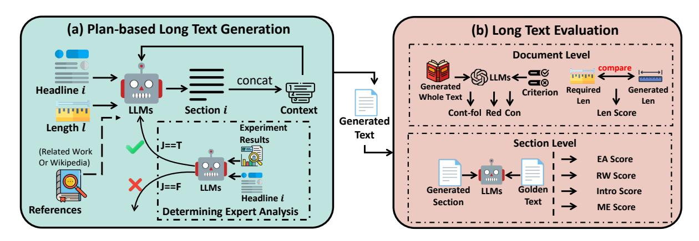

# LongEval: A Comprehensive Analysis of Long-Text Generation Through a Plan-based Paradigm

Siwei Wu1\* Yizhi Li1\* Xingwei Qu1 Rishi Ravikumar1 Yucheng Li2

Tyler Loakman3 Shanghaoran Quan4 Xiaoyong Wei5 Riza Batista-Navarro1 Chenghua Lin1†

1University of Manchester 2University of Surrey 3University of Sheffield

4Peking University 5Hong Kong Polytechnic University

{siwei.wu-2,chenghua.lin}@manchester.ac.uk

#### **Abstract**

Large Language Models (LLMs) have achieved remarkable success in various natural language processing tasks, yet their ability to generate long-form content remains poorly understood and evaluated. Our analysis reveals that current LLMs struggle with length requirements and information density in long-text generation, with performance deteriorating as text length increases. To quantitively locate such a performance degradation and provide further insights on model development, we present LongEval, a benchmark that evaluates longtext generation through both direct and planbased generation paradigms, inspired by cognitive and linguistic writing models. The comprehensive experiments in this work reveal interesting findings such as that while model size correlates with generation ability, the smallscale model (e.g., LongWriter), well-trained on long texts, has comparable performance. All code and datasets are released in https: //github.com/Wusiwei0410/LongEval.

#### 1 Introduction

Large Language Models (LLMs) have revolutionized Natural Language Processing (NLP), achieving remarkable performance across a wide range of generation tasks including dialogue generation (Abdullin et al., 2024), story creation (Zhao et al., 2023), open-ended text generation (Zhou et al., 2024), and complex reasoning task (Zhang et al., 2023; Wu et al., 2024). Although LLMs have been increasingly deployed in real-world applications, their ability to handle long-document generation remains underexplored despite their significance.

While there are recent studies seeking to improve the long-text generation ability (Bai et al., 2024; Que et al., 2024) and long context understanding capability (Xu et al., 2023; Li et al., 2023a, 2024a;

> **[图片提取文字 (无描述)]:**
> 45k LLaMa3.1-8B 40k LLaMa3.2-3B Information Content (IC) 35k-30k-30k-30k-30k-30k-30k-30k-30k-30k-30 LLaMa3.2-1B LLaMa3.3-70B Qwen2.5-3B Owen2.5-7B Qwen2.5-14B Qwen2.5-72B \* LongWriter-8B Golden Text 0k 1k 2k 3k 4k 0k 5k Length (Len)

Figure 1: The information content of LLMs-generated text and the golden human-authored text. We calculate information entropy using the frequency of each word in a document and determine the information content by multiplying the total word count by information entropy.

Ding et al., 2024; Zhang et al., 2024d), the evaluation of long-text generation has been largely overlooked. Most existing benchmarks focus solely on long-context retrieval and understanding tasks (Bai et al., 2024; Zhang et al., 2024b; Pham et al., 2024a; Quan et al., 2024; Tang et al., 2024; An et al., 2024). A recent parallel work HelloBench (Que et al., 2024) proposes to evaluate the long-text generation by selecting samples from existing tasks (e.g., open-ended QA), where the tasks do not inherently require long generation capability.

To comprehensively explore the long-generation capability of LLMs, we started with collecting a set of long and informative documents and using selected prevalent LLMs to directly reproduce the full documents from given summaries of those long documents. As shown in Figure 1, the information content in the documents is positively related to the length, which suggests the necessity of long text generation ability. Furthermore, it could be observed that the prevalent LLMs (with parameters from 1B to 70B) still remain a large gap to

\*Equal Contribution.

&lt;sup>†Corresponding Author.

> **[图片提取文字 (无描述)]:**
> --- Qwen2.5-72B Qwen2.5-14B → Qwen2.5-7B Following Score 9.0 → Qwen2.5-3B - InternLM2-7B ── InternLM2-20B - LongWriter-8B -- LLaMa3.2-1B LLaMa3.2-3B Length | LLaMa3.1-8B LLaMa3.3-70B 102  $10^{3}$ Length Requirement

Figure 2: Th relation of the length requirement with the model-generated text length. Given the content plans, we require the LLMs to generate the text under various length requirements ranging from 100 to 32k. Specifically, we use the ratio of the generated text length to the requested length in the input as a score to evaluate the model's ability to follow length instructions.

the golden references regarding both information content and length dimensions. We then tried to explore whether the LLMs could produce such long and informative documents by simply requiring to generate in specified lengths but failed. LLMs tend to exhibit declining length-following abilities as the required length increases, with significant deterioration observed for texts exceeding 1k words, as revealed in Figure 2.

Inspired by the cognitive writing theory, which posits that effective writing emerges from the process of "cooking knowledge stored in long-term memory" through planning, translating, and reviewing (Flower and Hayes, 1981), we suspect that current generation paradigm of LLMs may be misaligned with human writing practices for long documents: LLMs often struggle to maintain consistency and provide deep insights in one-shot long-form writing, compared to plan-based writing. Specifically, the planning phase serves as a crucial foundation for developing coherent arguments and structured thoughts (Scardamalia and Bereiter, 1987), yet existing studies largely overlook this aspect of text generation.

To address these limitations, we introduce **LongEval**, a comprehensive benchmark designed to evaluate LLMs' long-text generation capabilities by supporting both direct and plan-based approaches. Our framework incorporates two key innovations: *i*) a dual evaluation paradigm that assesses both zero-shot direct and plan-based structured generation that more closely align with human writing practices; *ii*) reliable automatic evaluation metrics that focus on content quality, structural coherence, and information density across various

long text generation domains.

Since scientific texts and popular science articles often follow a prescribed writing structure, we select **three** long-text generation domains (i.e., arXiv papers, blogs, and Wikipedia articles) that necessitate that LLMs generate long-form texts (exceeding 2K words) to build the benchmark for supporting a robust evaluation. Different from similar work, HelloBench (Que et al., 2024) (300 samples from general tasks) and LongWriter (Bai et al., 2024) (120 synthetic samples for evaluation), we collect 166 high-quality human-authored samples that come from the long text generation domain. We design a data production pipeline that leverages an advanced open-source LLM Qwen2.5-72B-Instruct1 to process documents from permissibly licensed sources across these different domains. In each document, sections are first summarized into comprehensive content as plans, with each major point elaborated in 4-5 sentences and verified by human annotators.

During the plan-based evaluation, the models are required to generate the full-text section-by-section using the summarized content plans as guidance, whilst required to maintain semantic consistency from previously generated sections. This approach systematically evaluates LLMs' long-text generation capabilities while aligning with the direct generation paradigm for sections. Additionally, we design eight metrics to evaluate the generated long texts on different dimensions of quality. *i*) To determine whether the LLM can follow instructions and whether the generated content is reasonable, we

1https://huggingface.co/Qwen/Qwen2.
5-72B-Instruct

design the following domain-agnostic metrics at the Document level: Content-following (Cont-fol), Redundancy (Red), Length (Len), and Consistency (Con). *ii)* We design domain-specific metrics for the prescriptive domain of arXiv research papers that evaluate the following sections: Introduction (Intro), Related Work (RW), Method (ME), and Experimental Analysis (EA).

## 2 Related Work

Long Text Generation Recent research on long text generation has primarily focused on enhancing model performance [\(Pham et al.,](#page-9-5) [2024a;](#page-9-5) [Zhang](#page-9-4) [et al.,](#page-9-4) [2024b;](#page-9-4) [Bai et al.,](#page-8-1) [2024;](#page-8-1) [Quan et al.,](#page-9-6) [2024;](#page-9-6) [Tang et al.,](#page-9-7) [2024;](#page-9-7) [Quan,](#page-9-9) [2024\)](#page-9-9). A common approach involves constructing large-scale instruction-following datasets tailored for longtext generation and employing various optimization strategies to improve the capabilities of LLMs. Beyond direct model training, plan-based methods have gained traction for long-text generation. LongWriter [\(Bai et al.,](#page-8-1) [2024\)](#page-8-1) demonstrates that synthetic datasets, generated using a structured planning approach with GPT-4o, can effectively enhance LLMs' ability to produce extended text. Similarly, [Wang et al.](#page-9-10) [\(2024\)](#page-9-10) propose a framework for generating survey papers section by section, while [Lu et al.](#page-9-11) [\(2024\)](#page-9-11) employ a similar strategy to generate entire scientific articles. These studies suggest that structured generation methods can improve coherence and control over long-text outputs.

Long Context Understanding A key challenge in long-text generation is ensuring that LLMs effectively comprehend and utilize long contexts. Research in this area has focused on enhancing models' long-context understanding while extending their input length, leveraging their strong in-context learning capabilities [\(Chen et al.,](#page-8-7) [2023;](#page-8-7) [Jiang et al.,](#page-8-8) [2023;](#page-8-8) [Li et al.,](#page-9-12) [2023b;](#page-9-12) [Jin et al.,](#page-8-9) [2024;](#page-8-9) [Zhang et al.,](#page-9-13) [2024a;](#page-9-13) [Ding et al.,](#page-8-4) [2024\)](#page-8-4). These efforts primarily target tasks such as reading comprehension, where models extract relevant information from lengthy inputs, as exemplified by benchmarks like Long-ICLBench [\(Li et al.,](#page-8-3) [2024a\)](#page-8-3), ∞BENCH [\(Zhang](#page-10-2) [et al.,](#page-10-2) [2024d\)](#page-10-2), and LonGLE [\(Li et al.,](#page-8-2) [2023a\)](#page-8-2). Despite these advancements, prior work has largely overlooked the challenge of generating coherent and contextually consistent long-form text beyond mere retrieval or summarization.

Long Text Evaluation Evaluating long-form text remains an open challenge. HelloBench [\(Que et al.,](#page-9-2) [2024\)](#page-9-2) attempts to address this by selecting longtext samples of general tasks and evaluating LLMs through using direct generation method. Most existing evaluation frameworks rely on LLM-based scoring, but their robustness and reliability remain debated. As an alternative, [Zhang et al.](#page-9-14) [\(2024c\)](#page-9-14) propose a reward model specifically designed for long-text evaluation.

Additionally, several datasets have been developed to support long-text evaluation. Suri [\(Pham](#page-9-15) [et al.,](#page-9-15) [2024b\)](#page-9-15) employs a plan-based approach and backtranslation [\(Li et al.,](#page-9-16) [2024b;](#page-9-16) [Köksal et al.,](#page-8-10) [2024\)](#page-8-10) to generate instructional texts, though its focus is primarily on creative writing and blogs rather than academic content. In contrast, [Köksal](#page-8-10) [et al.](#page-8-10) [\(2024\)](#page-8-10) construct a long-text dataset based on Wikipedia and CommonCrawl, prioritizing direct text generation over structured planning. These studies highlight the need for high-quality datasets and evaluation metrics that account for both planbased and direct-generation methods, particularly in domains requiring structured and coherent longform outputs.

## 3 The LongEval Benchmark

To fill the gap in the evaluation of long document generation, we propose LongEval, a benchmark built upon a unified framework for long-text generation, and introduce a comprehensive evaluation system. Compared with similar studies, LongEval provides a robust evaluation system distinct across the dimension of data collection, generation paradigms, domain-specific and hierarchical metrics, as shown in [Table 1.](#page-3-0) In this section, we first introduce a unified perspective of long text generation paradigms and then describe the accordingly designed evaluation systems.

#### 3.1 Long Text Generation Paradigms

The cognitive writing theory underscores the significance of planning in human writing [\(Flower](#page-8-6) [and Hayes,](#page-8-6) [1981\)](#page-8-6), and the plan-based paradigm has been effectively used to generate synthetic long-text data for training LLMs [\(Bai et al.,](#page-8-1) [2024\)](#page-8-1). Therefore, generating ultra-long texts segment by segment is the mainstream paradigm [\(Wang et al.,](#page-9-10) [2024;](#page-9-10) [Bai et al.,](#page-8-1) [2024\)](#page-8-1). In this regard, this paper uses two methods (i.e., direct generation and planbased generation) for long-text generation.

> **[图片提取文字 (无描述)]:**
> (a) Plan-based Long Text Generation (b) Long Text Evaluation **Document Level** concat Generated Headline i Required Generated Criterion Whole Text . Len Len **LLMs** Section i Context Cont-fol Red Con Len Score Generated Length l Experiment Text Results Section Level J==T (Related Work **EA Score** Or Wikipedia) **RW Score** LLMs Golden I Generated LLMs Intro Score Headline i Text Section **ME Score** References **Determining Expert Analysis**

Figure 3: The Framework of our Long Text Generation method. Part (a) is the Plan-based method and part (b) is the Long Text Evaluation method.

| Benchmarks      |           |            | Characteristics |                          |
|-----------------|-----------|------------|-----------------|--------------------------|
|                 | Real Data | Plan Based | Domain Specific | Section & Document Level |
| LongReward      | Х         | Х          | Х               | ×                        |
| LongWriter      | X         | ✓          | X               | ×                        |
| HelloBench      | ✓         | X          | ✓               | ×                        |
| LongEval (Ours) | ✓         | ✓          | ✓               | ✓                        |

Table 1: Comparison of different long-text generation benchmarks.

**Direct Generation** Although the direct generation method is applied to most NLP tasks, as shown in Figure 2, most LLMs cannot directly generate text that exceeds 1k words. In this work, we also evaluate the end-to-end long text generation capability of LLMs. Specifically, we additionally perform direct generation by inputting the section content plan p, the article's length l, and other possible writing materials (e.g., experimental results exp, references ref) into LLMs.

**Plan-Based Generation** The plan-based methods are applied to generate long-length text due to its better performance than the direct method (Bai et al., 2024; Lu et al., 2024). Our experiments also analyze the length-following abilities of LLMs. To better understand the models' limitations, we conduct an in-depth investigation of LLM-generated content across different domains. Figure 1 illustrates our quantitative analysis of the relationship between text length and information content, using human-written texts as a baseline. Therefore, as suggested by Figure 2, we assume that current LLMs cannot meet the requirements of users who want to generate text with a large amount of information. We design a unified plan-based generation method that uses the LLM to generate long text by section which ensures LLMs can generate text

aligned with the length requirement.

As for each sample, we input the content plan p of a section and the length requirement l to make LLMs generate the whole article by section. We additionally consider domain-specific writing requirements (e.g., for the arXiv paper domain, we use the experimental results as extra input to generate the results analysis section and for Wikipedia articles, we input the references to ensure the authenticity of the content). A detailed description of our plan-based generation method can be found in Appendix B.

#### 3.2 Evaluation System and Prompts

Previous works have primarily focused on studying the long-context understanding ability of LLMs (Xu et al., 2023; Li et al., 2024a; Jin et al., 2024; Zhang et al., 2024d). Most of these tasks resemble reading comprehension tasks and have standard answers (e.g., asking questions like 'How old is Jack?' based on a long context). Although HelloBench (Que et al., 2024) has also evaluated the long-text generation ability of LLMs, their evaluation metrics do not take into account the characteristics of ultra-long text generation (such as the instruction-following ability in ultra-long text generation). In this work, we evaluate the generation of long articles both at the **Document level** and the

Section level.

## 3.2.1 Domain-Agnostic Document-level Metrics

Content-following (Cont-fol) Score. The input for generating long texts includes the writing outline (i.e., the content plan generated in [§4.2\)](#page-5-0) of the entire article. Whether the model-generated text adheres to the requirements of the outline is a key factor in evaluating the quality of the generated text. Therefore, as shown in [Figure 4](#page-13-0) in Appendix [A,](#page-11-1) we designed specialized prompts and input each section of the model-generated text along with the corresponding prompts to evaluate the model's ability to follow instructions for long-text generation.

Length-following (Len) Score For each section, we use the following method to calculate the length score:

$$s = \begin{cases} \frac{l_{\text{gen}}}{l_{\text{req}}}, & \text{if } l_{\text{gen}} < l_{\text{req}}, \\ 1, & \text{otherwise.} \end{cases}$$

where lgen represents length of generated text, and lreq represents length requirement in the prompt. For section-level metrics, the final score is obtained by averaging the scores of all individual sections.

Redundancy (Red) Score. When generating long texts, LLMs tend to treat each section as being independent, leading to potential redundancy across sections by repeating content. To address this, as shown in [Figure 4,](#page-13-0) we specifically designed a prompt to evaluate whether the content generated by the model contains redundant elements.

Consistency (Con) Score. For long-text writing, ensuring the connection between sections and paragraphs is crucial. Therefore, for model-generated text, as shown in [Figure 4](#page-13-0) in Appendix [A,](#page-11-1) we designed a prompt to evaluate its consistency.

#### 3.2.2 Domain-Specific Section-Level Metrics

Due to some domains being more prescriptive in their format than others, we designed a range of evaluation criteria for the arXiv research paper and Wikipedia article domains that consider the expected structures of these more prescriptive formats.

Introduction (Intro) & Related Work (RW) Scores. Since we provide a detailed writing outline and relevant references, we design a prompt to evaluate the Introduction and Related Work sections of arXiv papers, as shown in [Figure 4](#page-13-0) in Ap-

pendix [A.](#page-11-1) Using the original paper as the gold reference, we employed an LLM to assess the similarity between the generated text and the gold answer. The blog writing format does not require the inclusion of references. While only papers contain specific related work sections, Wikipedia articles require extensive references throughout to ensure the authenticity of their content. Therefore, we treat the entire content of a Wikipedia article as a single related work section for evaluation.

Experiment Analysis (EA) Score. In the research paper domain, based on our observation, current LLMs struggle to determine which sections require the use of experimental results (e.g., they would use the results of the experiment in method). Furthermore, LLMs tend to merely reiterate the key points outlined without delving into the underlying reasons or connecting the causes behind different experimental results. Therefore, as shown in [Figure 4](#page-13-0) in Appendix [A,](#page-11-1) we design an evaluation prompt to compare the experimental analysis sections of the original article with those generated by the model.

Method (ME) Score. For method descriptions, the content generated by LLMs often consists of vague descriptions of methods without providing detailed design plans or formulaic explanations. To address this, as shown in [Figure 4](#page-13-0) in Appendix [A,](#page-11-1) we specifically designed a prompt to compare the method section of the original article with that generated by the model.

## 4 Dataset Curation

In previous studies [\(Que et al.,](#page-9-2) [2024\)](#page-9-2), one way to build the dataset for long-text generation evaluation is to filter long texts[2](#page-4-0) from existing tasks such as dialogue continuation. Some of these tasks typically do not require long-text writing, making it difficult to fully assess the model's long-text generation capabilities in realistic scenarios. Long-form content is prevalent across various domains, particularly in academic papers, blogs, and Wikipedia articles. Therefore, we construct a benchmark for long-text generation using data from these three domains to evaluate generation capabilities on naturally lengthy content.

2The HelloBench study uses texts that are at least 1000 words long.

|           | GT_len   | Input_len | ICR   | Num |
|-----------|----------|-----------|-------|-----|
| arXiv     | 4,754.28 | 1,038.46  | 21.84 | 50  |
| Wikipedia | 3,323.54 | 844.09    | 25.40 | 68  |
| Blog      | 2,623.10 | 766.19    | 29.21 | 48  |

Table 2: Data comparison across arXiv, Wikipedia, and blogs. IC presents Information Compression Ration.

#### 4.1 Data Collection Pipeline

We design an automatic pipeline that collects documents from web pages without copyright restrictions and splits them into different sections according to predefined rules. We collect data from arxiv.org for papers, wikipedia.org for articles, and HuggingFace for blogs. These sources have permissible copyright licenses. To ensure the quality of our benchmark, we hired one Postgrad student, who is familiar with the NLP, to manually check the processed data. Specifically, we delete the samples that do not follow a predefined format (e.g., a paper that does not have an abstract or a blog that misses an introduction).

## 4.2 Content Plan Generation

In order to support the plan-based long textgeneration method introduced in [§3.1,](#page-3-1) we use Qwen2.5-72B-Instruct to generate a content plan. Specifically, we pass each section of a document into the model and design a prompt to make the model summarize each section into 4-5 sentences. This forms the content plan for the section.

# 4.2.1 Human Evaluation of Generated Content Plans

|     | arXiv | Wikipedia | Blog | Average |
|-----|-------|-----------|------|---------|
| Acc | 86.2  | 88.6      | 91.4 | 88.7    |

Table 3: The human evaluation results of LLMsummarized content plans.

To assess whether the content plans preserve the key points of a document, we hire a postgraduate student to manually evaluate 10% of the documents from each domain. Specifically, if the content plan for each section cannot capture sufficient relevant information, we regard it as an unqualified sample. As shown in Table [3,](#page-5-1) on Wikipedia, Blog, and arXiv, our manual evaluation accuracy is 88.6%, 91.4%, and 86.2%, respectively. On average, 88.7% of the manually reviewed content plans

contain adequate information, indicating that the content plans retain enough information for LLMs to faithfully (re)generate the content in the original document.

#### 4.3 Dataset Characteristics

As shown in Table [2,](#page-5-2) we analyze the average length of original samples (Ground Truth Length) and generate content plans across three domains. Among these domains, academic papers have the longest content plans, followed by Wikipedia articles and blogs. This pattern aligns with the inherent writing complexity of each domain: academic papers demand rigorous presentation, Wikipedia articles focus on popular science exposition, and blogs adopt a more informal style. This observation suggests a strong correlation between writing complexity and text length within each domain.

Our dataset maintains approximately 50 samples per domain, with the original text (ground truth) exceeding 2,000 words in each case. To evaluate the efficiency of our content plans, we introduced the Information Compression Ratio (ICR), defined as ICR = LGT/LInput, where GT represents the ground truth text and Input denotes the summarized content plan used as input for LLMs. The ICR consistently ranges between 20% and 30% across all domains, indicating that, to some extent, our content plans will not only retain the main content but also avoid disclosing too many details to the model.

## 5 Experiments and Result Analysis

#### 5.1 Baseline

We use a range of open-source LLMs, including Llama3 (Llama3.2-1B, Llama3.2-3B, Llama3.3-70B)[\(AI@Meta,](#page-8-11) [2024\)](#page-8-11), Qwen2.5 (3B, 7B, 72B)[\(Yang et al.,](#page-9-17) [2024b,](#page-9-17)[a\)](#page-9-18), and InternLM2.5, which excels in math reasoning [\(Cai et al.,](#page-8-12) [2024\)](#page-8-12). We also include LongWriter, a fine-tuned GLM model for long-form writing [\(Bai et al.,](#page-8-1) [2024\)](#page-8-1), and GPT-4o, a proprietary model with balanced performance across tasks.

#### 5.2 Overall Analysis

[Table 4](#page-6-0) shows the experimental results of various models across the arXiv, Blog, and Wikipedia tasks. The Qwen2.5 series models exhibit superior long-text generation capability, with Qwen2.5-72B-Instruct achieving the highest overall score of 82 in the arXiv domain and 83 in the Blog domain. It is

| Domain    | Model                | Overall  | Intro | RW | EA | ME | Cont-fol | Len | Red | Con |
|-----------|----------------------|----------|-------|----|----|----|----------|-----|-----|-----|
|           | GPT4o                | 81       | 80    | 79 | 74 | 79 | 87       | 93  | 66  | 84  |
|           | Qwen2.5-3B-Instruct  | 79       | 80    | 78 | 75 | 78 | 84       | 94  | 67  | 81  |
|           | Qwen2.5-7B-Instruct  | 80       | 80    | 79 | 75 | 78 | 85       | 93  | 67  | 83  |
|           | Qwen2.5-72B-Instruct | 82       | 80    | 78 | 79 | 79 | 88       | 94  | 70  | 84  |
| arXiv     | Internlm2.5-7B-Chat  | 71       | 78    | 78 | 61 | 65 | 81       | 75  | 60  | 75  |
|           | Internlm2.5-20B-Chat | 73       | 78    | 78 | 60 | 57 | 81       | 75  | 62  | 76  |
|           | Llama3.2-1B          | 71       | 78    | 74 | 60 | 57 | 71       | 75  | 72  | 78  |
|           | Llama3.2-3B          | 76       | 80    | 78 | 66 | 79 | 73       | 75  | 72  | 80  |
|           | Llama3.3-70B         | 79       | 80    | 80 | 73 | 86 | 86       | 97  | 60  | 82  |
|           | LongWriter-8B        | 80       | 80    | 79 | 77 | 77 | 86       | 94  | 68  | 81  |
|           | GPT4o                | 81       | 78    | –  | –  | 81 | 83       | 97  | 68  | 81  |
|           | Qwen2.5-3B-Instruct  | 80       | 74    | –  | –  | 77 | 82       | 74  | 70  | 77  |
|           | Qwen2.5-7B-Instruct  | 81       | 76    | –  | –  | 82 | 84       | 76  | 68  | 80  |
|           | Qwen2.5-72B-Instruct | 83       | 75    | –  | –  | 83 | 84       | 79  | 71  | 84  |
|           | Internlm2.5-7B-Chat  | 71       | 76    | –  | –  | 52 | 68       | 76  | 66  | 76  |
| Blog      | Internlm2.5-20B-Chat | 73       | 77    | –  | –  | 71 | 62       | 76  | 67  | 76  |
|           | Llama3.2-1B          | 70       | 74    | –  | –  | 55 | 67       | 75  | 68  | 74  |
|           | Llama3.2-3B          | 79       | 76    | –  | –  | 79 | 75       | 78  | 76  | 80  |
|           | Llama3.3-70B         |          | 78    | –  | –  | 79 | 86       | 78  | 66  | 81  |
|           | LongWriter-8B        | 82 83 | 78    | –  | –  | 82 | 85       | 79  | 67  | 84  |
|           | GPT4o                | 81       | 74    | 80 | –  | 85 | 70       | 95  | –   | 82  |
|           | Qwen2.5-3B-Instruct  | 82       | 75    | 80 | –  | 82 | 71       | 94  | –   | 80  |
|           | Qwen2.5-7B-Instruct  | 80       | 75    | 80 | –  | 83 | 67       | 94  | –   | 80  |
|           | Qwen2.5-72B-Instruct | 81       | 74    | 80 | –  | 84 | 70       | 94  | –   | 82  |
|           | Internlm2.5-7B-Chat  | 71       | 78    | 77 | –  | 69 | 56       | 90  | –   | 77  |
| Wikipedia | Internlm2.5-20B-Chat | 73       | 78    | 77 | –  | 71 | 65       | 90  | –   | 76  |
|           | Llama3.2-1B          | 71       | 72    | 71 | –  | 68 | 76       | 67  | –   | 72  |
|           | Llama3.2-3B          | 79       | 80    | 79 | –  | 79 | 76       | 75  | –   | 80  |
|           | Llama3.3-70B         | 82       | 78    | 80 | –  | 84 | 66       | 99  | –   | 81  |
|           | LongWriter-8B        | 82       | 76    | 81 | –  | 85 | 68       | 98  | –   | 82  |

Table 4: The plan-based results on our LongEval benchmark. We conduct experiments to evaluate current LLMs on three domains (i.e., arXiv papers, blogs, and Wikipedia articles). The '–' presents that the metric does not exist in this domain. The Overall is the average score of all indicators. For easier comparison, we retained only the integer part of all model scores.

followed by GPT-4o and LongWriter-8B. A consistent trend is observed where larger models within the same series outperform smaller ones, highlighting the benefits of scale in long-text generation.

Among the evaluation metrics, Cont-fol (Instruction Following) and Red (Redundancy) show the most significant performance differences. For instance, Qwen2.5-72B-Instruct scores 88 on Content-fol in the arXiv domain, while smaller models like InternLM2.5-7B-Chat achieve only 68. Similarly, in the Wikipedia domain, LongWriter-8B reaches 85, whereas InternLM2.5-7B-Chat lags at 69. These results suggest that instruction following and minimizing redundancy remain major challenges for long-text generation. In contrast, RW, Intro, and Len have relatively smaller performance gaps. For example, across models in the arXiv domain, RW scores mostly cluster around 75-80, while, for most models, Len remains within 92-98. However, ME and EA exhibit greater variation. No-

tably, in the arXiv domain, Qwen2.5-72B-Instruct scores 79 in ME, whereas InternLM2-5.7B-Chat only achieves 65. This suggests that while general writing ability remains relatively stable across models, tasks involving data analysis and experimental methodology pose greater challenges. When given structured writing guidance (e.g., content plans), models still struggle with high-level reasoning, requiring more advanced analytical capabilities to perform well.

## 5.3 Long Text Generation Under Different Paradigm

As shown in [Table 6,](#page-7-0) we compare the results of LLMs' long text generation ability under direct and plan-based settings. Notably, the overall score of the text generated by the plan-based method is much higher than that of Direct generation. Additionally, we found that the text generated by the direct generation method is not only relatively short but also has a high level of redundancy. This fur-

| Random_P | Overall | Con | RW | Intro | Len | EA | ME | Cont-fol | Red |
|----------|---------|-----|----|-------|-----|----|----|----------|-----|
| 0.0      | 82      | 84  | 78 | 80    | 98  | 77 | 79 | 88       | 72  |
| 0.1      | 79      | 82  | 75 | 75    | 97  | 73 | 77 | 85       | 74  |
| 0.2      | 77      | 78  | 71 | 73    | 95  | 72 | 74 | 80       | 73  |
| 0.3      | 74      | 65  | 58 | 70    | 95  | 70 | 71 | 75       | 71  |
| 0.5      | 72      | 57  | 64 | 63    | 94  | 66 | 68 | 69       | 79  |
| 0.7      | 69      | 54  | 63 | 56    | 95  | 64 | 64 | 62       | 75  |
| 0.9      | 61      | 50  | 41 | 51    | 93  | 56 | 56 | 52       | 70  |

Table 5: The results of random replacement.

| Setting | Model        | Overall | Cont-fol | Red | Len |
|---------|--------------|---------|----------|-----|-----|
|         | GPT4o        | 61      | 82       | 82  | 21  |
|         | Qwen-3B      | 59      | 82       | 81  | 13  |
|         | Qwe-7B       | 60      | 81       | 85  | 15  |
|         | Qwen-72B     | 60      | 84       | 40  | 58  |
| Direct  | Llama-1B     | 52      | 71       | 67  | 17  |
|         | Llama-3B     | 58      | 78       | 69  | 28  |
|         | Llama-70B    | 63      | 86       | 50  | 55  |
|         | IntLM2.5-7B  | 55      | 75       | 73  | 17  |
|         | IntLM2.5-20B | 56      | 75       | 75  | 18  |
|         | GPT4o        | 82      | 87       | 66  | 93  |
|         | Qwen-3B      | 81      | 84       | 67  | 94  |
|         | Qwen-7B      | 82      | 85       | 67  | 93  |
|         | Qwen-72B     | 86      | 88       | 72  | 98  |
|         | Llama-1B     | 73      | 71       | 72  | 75  |
| Plan    | Llama-3B     | 79      | 79       | 70  | 89  |
|         | Llama-70B    | 81      | 86       | 60  | 97  |
|         | IntLM2.5-7B  | 71      | 78       | 60  | 75  |
|         | IntLM2.5-20B | 72      | 81       | 62  | 75  |

Table 6: A comparison of direct and plan-based methods on domain-agnostic criteria. We use the arXiv domain subset only, owing to computational constraints.

ther proves the effectiveness of the plan-based generation method we designed and the plan-based method is more suitable for long text generation

#### 5.4 Effectiveness of LLM-As-A-Judge

To validate the capability of LLM-as-a-judge of the LLMs on our metrics, we designed a random replacement test on the arXiv task where we randomly replaced p% sections in the model-generated content with sections sampled from other modelgenerated text and checked whether our model can identify the quality degradation and reflect it on the actual score. The test uses Qwen-2.5-72B's result with the p from 0.1 to 0.9. As shown in [Table 5,](#page-7-1) for Instruction-following (Cont-fol), as the proportion of random replacements increases, the model's score drops sharply (from 88% to 52%). For other metrics evaluating the quality of a specific section (RW, Intro, EA, ME), their scores also decrease overall as the proportion of random replacements increases. This demonstrates that the scoring model can effectively identify changes in the content and

quality, as well as reflect the content plan. As for the Length (Len) and Redundancy (Red) scores, they do not evaluate the content relevance between the generated text and the instruction but instead assess the quality of certain writing features within the text itself. As p increases, Len and Red do not change significantly, indicating the robustness of this metric.

In addition, we also use GPT-4o as a judge model within our framework, as shown in [Table 7.](#page-12-0) Although there are some differences in scores given by GPT-4o and Qwen2.5-72B on certain metrics, the distribution of scores between different models remains consistent. It demonstrates that Qwen2.5- 72B also can effectively assess the long-text generation capabilities of LLMs under our framework.

# 5.5 The Length Following Ability of LLMs

To assess the ability of LLMs to generate texts of specified lengths, we directly instruct the models to produce texts of a specific length and compare the difference between the target length and the actual length (i.e., the Len metric). As shown in [Figure 2,](#page-1-0) our LLMs generate text with various length requirements ranging from 100 to 32,000 words. Most models achieve a Len Score of 1 when the required length (len\_req) is below 400. However, as len\_req increases, the Len Scores of all models decline sharply. When len\_req exceeds 4,000, most models score below 0.4, indicating that current LLMs struggle to generate long texts with precise length control. Notably, Qwen2.5 and Llama3 outperform other models, and larger models demonstrate stronger length-following capability.

# 6 Conclusion

The current long-text evaluation method overlooks long-text generation paradigms and lacks highquality samples (e.g., the human-written text for the long-text generation task, such as paper writing). In this work, we design a LongEval benchmark,

collecting 156 long-text samples covering three domains that require the LLMs' long-text writing ability. We conduct experiments on mainstream LLMs and prove that the plan-based long-text generation method is more excellent than the direct generation method. Besides, although LLMs have a relatively better content-following ability, they still struggle with high-level reasoning writing (e.g., writing experiments analysis and designing methods).

# Limitations

Although the experiment result is significant, we only tested these models' performance in the arXiv domain under the direct setting to compare with the plan-based paradigm due to resource and time constraints. In the future study, the benchmark should be considered to extend with the same data curation pipeline to achieve a more robust evaluation.

## Ethics Statement

The dataset used in our research is constructed using publicly available data sources, ensuring that there are no privacy concerns or violations. We do not collect any personally identifiable information, and all data used in our research is obtained following legal and ethical standards. In the stage of data annotation, we employed three graduate students experienced in the Natural Language Processing field. We paid the graduate students approximately \$13 per hour, well above the local average wage, and engaged in constructive discussions if they had concerns about the process.

## References

- Yelaman Abdullin, Diego Molla-Aliod, Bahadorreza Ofoghi, John Yearwood, and Qingyang Li. 2024. Synthetic dialogue dataset generation using llm agents. *arXiv preprint arXiv:2401.17461*.
- AI@Meta. 2024. [Llama 3 model card.](https://github.com/meta-llama/llama3/blob/main/MODEL_CARD.md)
- Shengnan An, Zexiong Ma, Zeqi Lin, Nanning Zheng, and Jian-Guang Lou. 2024. Make your llm fully utilize the context. *arXiv preprint arXiv:2404.16811*.
- Yushi Bai, Jiajie Zhang, Xin Lv, Linzhi Zheng, Siqi Zhu, Lei Hou, Yuxiao Dong, Jie Tang, and Juanzi Li. 2024. Longwriter: Unleashing 10,000+ word generation from long context llms. *arXiv preprint arXiv:2408.07055*.
- Zheng Cai, Maosong Cao, Haojiong Chen, Kai Chen, Keyu Chen, Xin Chen, Xun Chen, Zehui Chen,

- Zhi Chen, Pei Chu, Xiaoyi Dong, Haodong Duan, Qi Fan, Zhaoye Fei, Yang Gao, Jiaye Ge, Chenya Gu, Yuzhe Gu, Tao Gui, Aijia Guo, Qipeng Guo, Conghui He, Yingfan Hu, Ting Huang, Tao Jiang, Penglong Jiao, Zhenjiang Jin, Zhikai Lei, Jiaxing Li, Jingwen Li, Linyang Li, Shuaibin Li, Wei Li, Yining Li, Hongwei Liu, Jiangning Liu, Jiawei Hong, Kaiwen Liu, Kuikun Liu, Xiaoran Liu, Chengqi Lv, Haijun Lv, Kai Lv, Li Ma, Runyuan Ma, Zerun Ma, Wenchang Ning, Linke Ouyang, Jiantao Qiu, Yuan Qu, Fukai Shang, Yunfan Shao, Demin Song, Zifan Song, Zhihao Sui, Peng Sun, Yu Sun, Huanze Tang, Bin Wang, Guoteng Wang, Jiaqi Wang, Jiayu Wang, Rui Wang, Yudong Wang, Ziyi Wang, Xingjian Wei, Qizhen Weng, Fan Wu, Yingtong Xiong, Chao Xu, Ruiliang Xu, Hang Yan, Yirong Yan, Xiaogui Yang, Haochen Ye, Huaiyuan Ying, Jia Yu, Jing Yu, Yuhang Zang, Chuyu Zhang, Li Zhang, Pan Zhang, Peng Zhang, Ruijie Zhang, Shuo Zhang, Songyang Zhang, Wenjian Zhang, Wenwei Zhang, Xingcheng Zhang, Xinyue Zhang, Hui Zhao, Qian Zhao, Xiaomeng Zhao, Fengzhe Zhou, Zaida Zhou, Jingming Zhuo, Yicheng Zou, Xipeng Qiu, Yu Qiao, and Dahua Lin. 2024. [Internlm2 technical report.](https://arxiv.org/abs/2403.17297) *Preprint*, arXiv:2403.17297.
- Yukang Chen, Shengju Qian, Haotian Tang, Xin Lai, Zhijian Liu, Song Han, and Jiaya Jia. 2023. Longlora: Efficient fine-tuning of long-context large language models. *arXiv preprint arXiv:2309.12307*.
- Yiran Ding, Li Lyna Zhang, Chengruidong Zhang, Yuanyuan Xu, Ning Shang, Jiahang Xu, Fan Yang, and Mao Yang. 2024. Longrope: Extending llm context window beyond 2 million tokens. *arXiv preprint arXiv:2402.13753*.
- Linda Flower and John R. Hayes. 1981. [A cognitive](http://www.jstor.org/stable/356600) [process theory of writing.](http://www.jstor.org/stable/356600) *College Composition and Communication*, 32(4):365–387.
- Huiqiang Jiang, Qianhui Wu, Xufang Luo, Dongsheng Li, Chin-Yew Lin, Yuqing Yang, and Lili Qiu. 2023. Longllmlingua: Accelerating and enhancing llms in long context scenarios via prompt compression. *arXiv preprint arXiv:2310.06839*.
- Hongye Jin, Xiaotian Han, Jingfeng Yang, Zhimeng Jiang, Zirui Liu, Chia-Yuan Chang, Huiyuan Chen, and Xia Hu. 2024. Llm maybe longlm: Self-extend llm context window without tuning. *arXiv preprint arXiv:2401.01325*.
- Abdullatif Köksal, Timo Schick, Anna Korhonen, and Hinrich Schütze. 2024. [Longform: Effective in](https://arxiv.org/abs/2304.08460)[struction tuning with reverse instructions.](https://arxiv.org/abs/2304.08460) *Preprint*, arXiv:2304.08460.
- Jiaqi Li, Mengmeng Wang, Zilong Zheng, and Muhan Zhang. 2023a. Loogle: Can long-context language models understand long contexts? *arXiv preprint arXiv:2311.04939*.
- Tianle Li, Ge Zhang, Quy Duc Do, Xiang Yue, and Wenhu Chen. 2024a. Long-context llms strug-

- gle with long in-context learning. *arXiv preprint arXiv:2404.02060*.
- Xian Li, Ping Yu, Chunting Zhou, Timo Schick, Omer Levy, Luke Zettlemoyer, Jason Weston, and Mike Lewis. 2024b. [Self-alignment with instruction back](https://arxiv.org/abs/2308.06259)[translation.](https://arxiv.org/abs/2308.06259) *Preprint*, arXiv:2308.06259.
- Yucheng Li, Bo Dong, Frank Guerin, and Chenghua Lin. 2023b. [Compressing context to enhance inference](https://doi.org/10.18653/v1/2023.emnlp-main.391) [efficiency of large language models.](https://doi.org/10.18653/v1/2023.emnlp-main.391) In *Proceedings of the 2023 Conference on Empirical Methods in Natural Language Processing*, pages 6342–6353, Singapore. Association for Computational Linguistics.
- Chris Lu, Cong Lu, Robert Tjarko Lange, Jakob Foerster, Jeff Clune, and David Ha. 2024. The ai scientist: Towards fully automated open-ended scientific discovery. *arXiv preprint arXiv:2408.06292*.
- Chau Minh Pham, Simeng Sun, and Mohit Iyyer. 2024a. Suri: Multi-constraint instruction following for long-form text generation. *arXiv preprint arXiv:2406.19371*.
- Chau Minh Pham, Simeng Sun, and Mohit Iyyer. 2024b. [Suri: Multi-constraint instruction following for long](https://arxiv.org/abs/2406.19371)[form text generation.](https://arxiv.org/abs/2406.19371) *Preprint*, arXiv:2406.19371.
- Shanghaoran Quan. 2024. Automatically generating numerous context-driven sft data for llms across diverse granularity. *arXiv preprint arXiv:2405.16579*.
- Shanghaoran Quan, Tianyi Tang, Bowen Yu, An Yang, Dayiheng Liu, Bofei Gao, Jianhong Tu, Yichang Zhang, Jingren Zhou, and Junyang Lin. 2024. Language models can self-lengthen to generate long texts. *arXiv preprint arXiv:2410.23933*.
- Haoran Que, Feiyu Duan, Liqun He, Yutao Mou, Wangchunshu Zhou, Jiaheng Liu, Wenge Rong, Zekun Moore Wang, Jian Yang, Ge Zhang, et al. 2024. Hellobench: Evaluating long text generation capabilities of large language models. *arXiv preprint arXiv:2409.16191*.
- Marlene Scardamalia and Carl Bereiter. 1987. Knowledge telling and knowledge transforming in written composition. *Advances in applied psycholinguistics*, 2:142–175.
- Jing Tang, Quanlu Jia, Yuqiang Xie, Zeyu Gong, Xiang Wen, Jiayi Zhang, Yalong Guo, Guibin Chen, and Jiangping Yang. 2024. Skyscript-100m: 1,000,000,000 pairs of scripts and shooting scripts for short drama. *arXiv preprint arXiv:2408.09333*.
- Yidong Wang, Qi Guo, Wenjin Yao, Hongbo Zhang, Xin Zhang, Zhen Wu, Meishan Zhang, Xinyu Dai, Min Zhang, Qingsong Wen, et al. 2024. Autosurvey: Large language models can automatically write surveys. *arXiv preprint arXiv:2406.10252*.

- Siwei Wu, Zhongyuan Peng, Xinrun Du, Tuney Zheng, Minghao Liu, Jialong Wu, Jiachen Ma, Yizhi Li, Jian Yang, Wangchunshu Zhou, et al. 2024. A comparative study on reasoning patterns of openai's o1 model. *arXiv preprint arXiv:2410.13639*.
- Peng Xu, Wei Ping, Xianchao Wu, Lawrence McAfee, Chen Zhu, Zihan Liu, Sandeep Subramanian, Evelina Bakhturina, Mohammad Shoeybi, and Bryan Catanzaro. 2023. Retrieval meets long context large language models. *arXiv preprint arXiv:2310.03025*.
- An Yang, Baosong Yang, Binyuan Hui, Bo Zheng, Bowen Yu, Chang Zhou, Chengpeng Li, Chengyuan Li, Dayiheng Liu, Fei Huang, Guanting Dong, Haoran Wei, Huan Lin, Jialong Tang, Jialin Wang, Jian Yang, Jianhong Tu, Jianwei Zhang, Jianxin Ma, Jin Xu, Jingren Zhou, Jinze Bai, Jinzheng He, Junyang Lin, Kai Dang, Keming Lu, Keqin Chen, Kexin Yang, Mei Li, Mingfeng Xue, Na Ni, Pei Zhang, Peng Wang, Ru Peng, Rui Men, Ruize Gao, Runji Lin, Shijie Wang, Shuai Bai, Sinan Tan, Tianhang Zhu, Tianhao Li, Tianyu Liu, Wenbin Ge, Xiaodong Deng, Xiaohuan Zhou, Xingzhang Ren, Xinyu Zhang, Xipin Wei, Xuancheng Ren, Yang Fan, Yang Yao, Yichang Zhang, Yu Wan, Yunfei Chu, Yuqiong Liu, Zeyu Cui, Zhenru Zhang, and Zhihao Fan. 2024a. Qwen2 technical report. *arXiv preprint arXiv:2407.10671*.
- An Yang, Baosong Yang, Beichen Zhang, Binyuan Hui, Bo Zheng, Bowen Yu, Chengyuan Li, Dayiheng Liu, Fei Huang, Haoran Wei, Huan Lin, Jian Yang, Jianhong Tu, Jianwei Zhang, Jianxin Yang, Jiaxi Yang, Jingren Zhou, Junyang Lin, Kai Dang, Keming Lu, Keqin Bao, Kexin Yang, Le Yu, Mei Li, Mingfeng Xue, Pei Zhang, Qin Zhu, Rui Men, Runji Lin, Tianhao Li, Tingyu Xia, Xingzhang Ren, Xuancheng Ren, Yang Fan, Yang Su, Yichang Zhang, Yu Wan, Yuqiong Liu, Zeyu Cui, Zhenru Zhang, and Zihan Qiu. 2024b. Qwen2.5 technical report. *arXiv preprint arXiv:2412.15115*.
- Ge Zhang, Yemin Shi, Ruibo Liu, Ruibin Yuan, Yizhi Li, Siwei Dong, Yu Shu, Zhaoqun Li, Zekun Wang, Chenghua Lin, et al. 2023. Chinese open instruction generalist: A preliminary release. *arXiv preprint arXiv:2304.07987*.
- Hailin Zhang, Xiaodong Ji, Yilin Chen, Fangcheng Fu, Xupeng Miao, Xiaonan Nie, Weipeng Chen, and Bin Cui. 2024a. Pqcache: Product quantization-based kvcache for long context llm inference. *arXiv preprint arXiv:2407.12820*.
- Jiajie Zhang, Yushi Bai, Xin Lv, Wanjun Gu, Danqing Liu, Minhao Zou, Shulin Cao, Lei Hou, Yuxiao Dong, Ling Feng, et al. 2024b. Longcite: Enabling llms to generate fine-grained citations in long-context qa. *arXiv preprint arXiv:2409.02897*.
- Jiajie Zhang, Zhongni Hou, Xin Lv, Shulin Cao, Zhenyu Hou, Yilin Niu, Lei Hou, Yuxiao Dong, Ling Feng, and Juanzi Li. 2024c. Longreward: Improving longcontext large language models with ai feedback. *arXiv preprint arXiv:2410.21252*.

- Xinrong Zhang, Yingfa Chen, Shengding Hu, Zihang Xu, Junhao Chen, Moo Hao, Xu Han, Zhen Thai, Shuo Wang, Zhiyuan Liu, et al. 2024d. Bench: Extending long context evaluation beyond 100k tokens. In *Proceedings of the 62nd Annual Meeting of the Association for Computational Linguistics (Volume 1: Long Papers)*, pages 15262–15277.
- Zoie Zhao, Sophie Song, Bridget Duah, Jamie Macbeth, Scott Carter, Monica P Van, Nayeli Suseth Bravo, Matthew Klenk, Kate Sick, and Alexandre LS Filipowicz. 2023. More human than human: Llmgenerated narratives outperform human-llm interleaved narratives. In *Proceedings of the 15th Conference on Creativity and Cognition*, pages 368–370.

Yuxuan Zhou, Margret Keuper, and Mario Fritz. 2024. Balancing diversity and risk in llm sampling: How to select your method and parameter for open-ended text generation. *arXiv preprint arXiv:2408.13586*.

## A Evaluation Prompts

We present the prompts that we designed for different long text generation dimensions in Tab [4.](#page-13-0)

## B Agent-based Generation Method

First section. We directly use the content plan h and length l to let the LLMs to generate the introduction of the article:

$$s = LLM(p, l, prompt),$$

where the s is generated section. Then we regard the s as the context c.

Rest section. In the process of writing an article, it is often necessary to adjust the subsequent content based on the previous content. Therefore, apart from the content plan p and length requirement l, we also need to generate subsequent sections based on the previously generated context c to ensure semantic consistency throughout the entire paper:

$$s = LLM(p, l, c, prompt),$$

then we concatenate s and c together as the context for generating subsequent sections.

Related work. As for the related work section of a paper, the LLM needs to use the references to write the background and development of the research direction. Besides, wikepedia docment also has to use numerous references to support the facility of the article. Therefore, we input the extra reference ref to generate the section:

$$s = LLM(h, l, c, ref, prompt)$$

Experiment analysis. As for the paper, there are many experiment analyses in different sections and there are no have obvious features in the subtitle of each section. According to human writing behaviors, we input the content plan p of the section and all the experiment results exp of a paper into an LLM and let it judge whether they need to use the experiment results to write the content of the section:

$$judge = LLM(p, exp, prompt)$$

If the judge is true, we will input the experiment results res to have LLMs generate the current section, conversely, our generation strategy remains unchanged:

$$s = \begin{cases} LLM(p, l, c, exp, prompt), \text{if } judge == \texttt{T}, \\ LLM(p, l, c, prompt), \text{else} \ . \end{cases}$$

Final Result. We contcat all the s generated by our plan-absed method as the final generated articl S.

## C The Evaluation Result by Using GPT4o

In order to demonstrate the reasonability of results evaluated by using Qwen2.5-72B, as shown in Tab [7,](#page-12-0) we also use the GPT4o as the judge model to score the result of different LLMs.

## C.1 Case Study

In order to better demonstrate the differences in long-text generation among different models under our designed PLAD-based framework, we compare the results generated by InternLM2.5-20B and Qwen2.5-72B, which perform the best and worst, respectively, in the arXiv domain.

As shown in Fig [5](#page-14-0) and Fig [6,](#page-15-0) for the content plan we summarized, the abstract generated by Qwen2.5 concisely includes all key information and smoothly integrates all content, demonstrating stronger content-following ability. In contrast, the content generated by InternLM2.5-20B is relatively scattered and even includes some unnecessary conclusions at the end, which does not conform to writing conventions for a highly summary-oriented abstract.

| Domain    | Model                | Overall | Con | RW | Intro | Len | EA | ME | Cont-fol | Red |
|-----------|----------------------|---------|-----|----|-------|-----|----|----|----------|-----|
|           | Qwen-3B-Instruct     | 75      | 89  | 82 | 63    | 58  | 93 | 93 | 51       | 85  |
|           | Qwen-7B-Instruct     | 77      | 88  | 81 | 73    | 64  | 98 | 95 | 40       | 85  |
|           | Qwen-72B-Instruct    | 77      | 87  | 78 | 73    | 68  | 97 | 98 | 37       | 88  |
| arXiv     | Internlm2.5-7B-Chat  | 63      | 86  | 81 | 43    | 46  | 76 | 81 | 27       | 76  |
|           | Internlm2.5-20B-Chat | 68      | 86  | 81 | 53    | 52  | 85 | 81 | 40       | 79  |
|           | LLaMa3.3-70B         | 70      | 90  | 85 | 60    | 61  | 95 | 62 | 39       | 85  |
|           | LongWriter-8B        | 79      | 80  | 69 | 77    | 77  | 86 | 94 | 68       | 80  |
|           | Qwen-3B-Instruct     | 75      | 84  | –  | 63    | 90  | 45 | –  | 95       | 80  |
|           | Qwen-7B-Instruct     | 77      | 88  | –  | 62    | 96  | 44 | –  | 98       | 80  |
|           | Qwen-72B-Instruct    | 80      | 84  | –  | 73    | 97  | 47 | –  | 99       | 82  |
| Blog      | Internlm2.5-7B-Chat  | 63      | 87  | –  | 42    | 70  | 31 | –  | 84       | 74  |
|           | Internlm2.5-20B-Chat | 69      | 89  | –  | 58    | 82  | 32 | –  | 84       | 80  |
|           | LLaMa3.3-70B         | 72      | 87  | –  | 60    | 87  | 26 | –  | 100      | 84  |
|           | LongWriter-8B        | 77      | 87  | –  | 69    | 96  | 37 | –  | 99       | 84  |
|           | Qwen3B-Instruct      | 79      | 84  | 74 | –     | –   | 94 | 95 | 49       | 84  |
|           | Qwen7B-Instruct      | 80      | 85  | 85 | –     | –   | 96 | 95 | 42       | 83  |
|           | Qwen72B-Instruct     | 85      | 87  | 83 | –     | –   | 96 | 97 | 65       | 83  |
| Wikipedia | Internlm2.5-7B-Chat  | 60      | 74  | 57 | –     | –   | 63 | 83 | 27       | 69  |
|           | Internlm2.5-20B-Chat | 70      | 81  | 73 | –     | –   | 74 | 83 | 39       | 73  |
|           | LLaMa3.3-70B         | 68      | 81  | 54 | –     | –   | 85 | 97 | 22       | 82  |
|           | LongWriter-8B        | 73      | 84  | 58 | –     | –   | 97 | 98 | 32       | 85  |

Table 7: The results that GPT4o evaluates on our LongEval benchmark.

| Consistency           | f'''Give you a doc:{context_str}\n\n Evaluate the overall coherence of the given text on a scale of 0 to 10. Consider whether ideas flow logically, transitions are smooth, and the argument remains consistent. Use the following scale as a guideline: 0-2: Very Poor Coherence – lacks structure, no logical connections. 3-4: Poor Coherence – weak transitions, some logical gaps. 5- 6: Moderate Coherence – generally logical but with occasional inconsistencies. 7-8: Good Coherence – clear structure, smooth transitions, minor flaws. 9-10: Excellent Coherence – seamless flow, strong transitions, no disruptions.Provide a score and a brief justification.'''                                                                                                                                                                                                                                                                                                                                                                                                                                                                                                                                                                                                                                                                                                                                                                                                                                                                                                                                                                                                                                                                                                                                                           |
|-----------------------|-----------------------------------------------------------------------------------------------------------------------------------------------------------------------------------------------------------------------------------------------------------------------------------------------------------------------------------------------------------------------------------------------------------------------------------------------------------------------------------------------------------------------------------------------------------------------------------------------------------------------------------------------------------------------------------------------------------------------------------------------------------------------------------------------------------------------------------------------------------------------------------------------------------------------------------------------------------------------------------------------------------------------------------------------------------------------------------------------------------------------------------------------------------------------------------------------------------------------------------------------------------------------------------------------------------------------------------------------------------------------------------------------------------------------------------------------------------------------------------------------------------------------------------------------------------------------------------------------------------------------------------------------------------------------------------------------------------------------------------------------------------------------------------------------------------------------------------------------------------|
| Redundant             | f"""Given the model-generated text: {Context_str} \n\n. Evaluate whether the model-generated text has repetitive content. The more repetitive the content, the lower the score. Grade the paper (1-10 points). If the paper contains many repetitive sections, it would score 2 points. if the paper contains a small amount of repetitive sections, it would score 5 points. if the paper does not contain repetitive sections, but some content is semantically redundant, and the writing does not effectively express the author's points, it would be score 7 points. If the content of the paper is concise, with efficient and precise language, and no informational redundancy, it would score 10 points. """                                                                                                                                                                                                                                                                                                                                                                                                                                                                                                                                                                                                                                                                                                                                                                                                                                                                                                                                                                                                                                                                                                      |
| Instruction-Following | evaluate_prompt = f"""Given a section of the headlines: {h} \n\n Given the model-generate section: {c} \n\n. Evaluate whether the content of this model-generated section meets the key points required in the headline. Grade it based on the following criteria (0-10 points). If the degree of relevance between the model-generated text and the headline is low, it would score 2 points. If the model-generated text includes all the points from the headline, but the content is somewhat redundant and does not effectively address each issue raised in the headline, it would score 5 points. If the model-generated text covers all the points in the headline, and it can, to some extent, address or clearly express the content of the headline at an academic level, it would score 7 points. If the model-generated text covers all the points in the headline, perfectly addressing and clearly expressing the content of the headline at an academic level, and also demonstrates a deep academic exploration with rigorous logic, it would score 10 points. """                                                                                                                                                                                                                                                                                                                                                                                                                                                                                                                                                                                                                                                                                                                                |
| Experiment Analysis   | f"""Given a section of the raw paper: {s} \n\n Given the model-generated section: {c} \n\n And the headlines that we used to generate: {h} \n\n Compared with the section of raw paper, please help evaluate whether the experimental analysis for the model-generated content is sufficient based on the following criteria (1-10 points): 1-2 points: The experimental analysis section generated by the model merely reiterates the content of the headline in a simple manner. 2-4 points: The experimental analysis section generated by the model not only includes the content of the headline but also provides a simple analysis of data variations, supporting the analysis with relevant content. 4-6 points: The experimental analysis section generated by the model not only includes data analysis and the content of the headline but also further explores the possible reasons behind various experimental phenomena. 6-8 points: The experimental analysis section generated by the model not only includes data analysis, the content of the headline, and an exploration of the possible causes for the experimental results, but also additionally analyzes the relationships between various experimental results, providing stronger experimental evidence to demonstrate the effectiveness of the methods proposed in the paper. 9-10 points: The experimental analysis section generated by the model not only includes data analysis, the content of the headline, and an exploration of the possible causes for the experimental results, but also provides additional analysis of the relationships between various experimental results. It demonstrates strong coherence, effectively integrating all experimental analyses under a unified theme.""" |
| Method Analysis       | f"""Given a section of the raw paper: {s} \n\n Given the model-generated section: {c} \n\n And the headlines that we used to generate: {h} \n\n Compared with the section of raw paper, evaluate whether the model-generated section describing the method is detailed and specific (1-10 points): 1-2 points: The description of the method simply repeats the content of the headline. 3-4 points: The description of the method provides a brief introduction to each concept corresponding to the points in the headline but lacks detailed analysis or explanation of the specific content of each model. Alternatively, it may be missing specific formulas for the methods. 5-6 points: The description of the method uses some basic formulas to introduce the specific approach or provides a brief explanation of how certain method modules operate. 7-8 points: The description of the methodology section provides a good introduction to the details of the algorithm or experiment, with necessary explanations using formulas. However, the writing lacks coherence between sentences. 9-10 points: The description of the methodology section provides a thorough introduction to the details of the algorithm or experiment, with formulas used appropriately. The writing style is rigorous, and the context flows smoothly, enabling readers to clearly understand the purpose of each module and its specific details. """                                                                                                                                                                                                                                                                                                                                                     |
| Introduction          | f"Give you Generated text: {Introduction}, Raw Text: {Introduction_ref} \n\n {Evaluate whether the content in the Introduction corresponds to the rest content in the paper. Grade the paper (1-10 points).}"                                                                                                                                                                                                                                                                                                                                                                                                                                                                                                                                                                                                                                                                                                                                                                                                                                                                                                                                                                                                                                                                                                                                                                                                                                                                                                                                                                                                                                                                                                                                                                                                                                       |
| Related Work          | f"Give you Generated text: {c}, Raw Text: {s} \n\n Evaluate whether the original paper and the paper written based on the model are similar. Grade the paper (1-10 points)."                                                                                                                                                                                                                                                                                                                                                                                                                                                                                                                                                                                                                                                                                                                                                                                                                                                                                                                                                                                                                                                                                                                                                                                                                                                                                                                                                                                                                                                                                                                                                                                                                                                                           |

Figure 4: The table presents the prompts for the metrics that use LLMs to evaluate long text under different dimensions.

#### **Content Plan:**

- iConFormer is a novel parameter-efficient fine-tuning (PEFT) approach that uses a dynamic adapter conditioned on input instances.
- This method introduces an Input-Conditioned Network (iCoN) to enable instance-level feature transformation and capture task-specific details.
- Experiments show iConFormer performs comparably to full fine-tuning (FFT) in monocular depth estimation and semantic segmentation but outperforms FFT in image classification and instance segmentation.
- The proposed method consistently outperforms other recent PEFT methods across all tasks tested.

#### **Generated Text:**

\*\*Abstract\*\*

In the realm of deep learning, fine-tuning large pre-trained models for specific tasks is a common practice, but it often requires substantial computational resources and can lead to overfitting on smaller datasets. To address these challenges, we introduce iConFormer, a novel parameter-efficient fine-tuning (PEFT) approach that leverages dynamic adapters conditioned on input instances. Unlike traditional static adapters, iConFormer employs an Input-Conditioned Network (iCoN) to perform instance-level feature transformations, thereby capturing task-specific details more effectively. This dynamic conditioning allows the model to adapt its parameters in real-time based on the input, leading to more flexible and context-aware representations.

We evaluate iConFormer across a range of computer vision tasks, including monocular depth estimation, semantic segmentation, image classification, and instance segmentation. Our experiments demonstrate that iConFormer not only performs comparably to full fine-tuning (FFT) in monocular depth estimation and semantic segmentation but also outperforms FFT in image classification and instance segmentation. Moreover, iConFormer consistently surpasses other recent PEFT methods across all tasks tested, highlighting its robustness and versatility. By reducing the number of trainable parameters while maintaining or improving performance, iConFormer offers a compelling solution for efficient and effective fine-tuning of large models, making it a valuable tool for both resource-constrained environments and high-performance applications.

Figure 5: A section generated by Qwen2.5-72B.

#### **Content Plan:**

- iConFormer is a novel parameter-efficient fine-tuning (PEFT) approach that uses a dynamic adapter conditioned on input instances.
- This method introduces an Input-Conditioned Network (iCoN) to enable instance-level feature transformation and capture task-specific details.
- Experiments show iConFormer performs comparably to full fine-tuning (FFT) in monocular depth estimation and semantic segmentation but outperforms FFT in image classification and instance segmentation.
- The proposed method consistently outperforms other recent PEFT methods across all tasks tested.

#### **Generated Text:**

In the realm of deep learning, the fine-tuning (FT) of pre-trained models has emerged as a powerful technique for adapting models to specific tasks. However, traditional FT methods often require substantial computational resources and can lead to overfitting, particularly when dealing with limited data. To address these challenges, parameter-efficient fine-tuning (PEFT) approaches have been developed, which aim to minimize the number of parameters that need to be updated during the adaptation process. One such innovative PEFT method is iConFormer, a novel approach that introduces a dynamic adapter conditioned on input instances, thereby enabling instance-level feature transformation and capturing task-specific details.

The core idea behind iConFormer is the introduction of an Input-Conditioned Network (iCoN), which acts as a bridge between the pre-trained model and the task-specific data. This network is designed to adaptively modify the features extracted by the pre-trained model based on the characteristics of the input instances. By doing so, iConFormer ensures that the model can effectively capture the nuances of the task at hand, even when the amount of task-specific data is limited.

The effectiveness of iConFormer has been demonstrated through a series of experiments across various computer vision tasks, including monocular depth estimation, semantic segmentation, image classification, and instance segmentation. The results show that iConFormer performs comparably to full fine-tuning (FFT) in tasks such as monocular depth estimation and semantic segmentation, where the model needs to understand complex spatial relationships and semantic information. However, iConFormer outperforms FFT in tasks like image classification and instance segmentation, where the model's ability to recognize and localize objects is crucial.

Moreover, the proposed method consistently outperforms other recent PEFT methods across all tasks tested, showcasing its superiority in terms of both accuracy and efficiency. This is particularly noteworthy given the growing demand for efficient and effective model adaptation techniques, especially in resource-constrained environments.

In summary, iConFormer represents a significant advancement in the field of parameter-efficient fine-tuning, offering a dynamic and input-conditioned approach that can effectively adapt pre-trained models to a wide range of computer vision tasks. Its ability to perform comparably to full fine-tuning while requiring fewer parameters makes it a promising tool for researchers and practitioners alike, particularly in scenarios where computational resources are limited or where the need for rapid model adaptation is critical.

Figure 6: A section generated by InternLM2.5-20B.