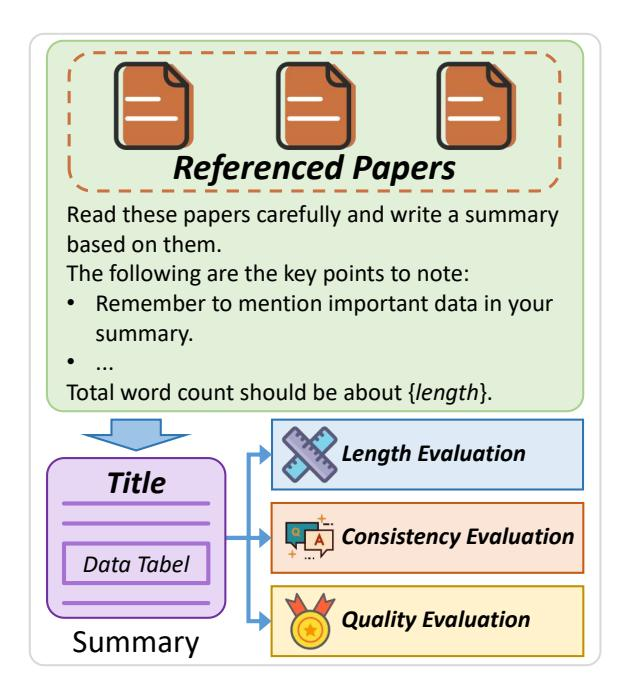
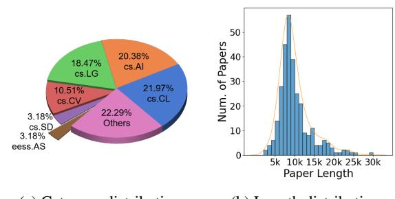
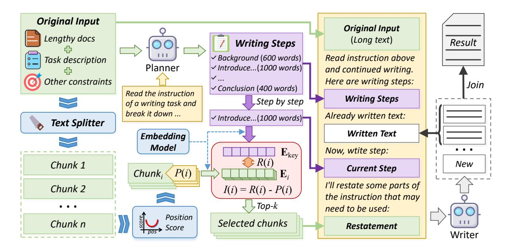
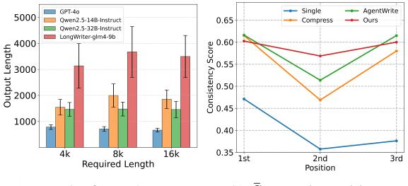

# Lost-in-the-Middle in Long-Text Generation: Synthetic Dataset, Evaluation Framework, and Mitigation

# Junhao Zhang, Richong Zhang\*, Fanshuang Kong, Ziyang Miao, Yanhan Ye, Yaowei Zheng

School of Computer Science and Engineering, Beihang University {zhangjunhao, kongfs, miaozy, yeyanhan, hiyouga}@buaa.edu.cn, zhangrc@act.buaa.edu.cn

### Abstract

Existing long-text generation methods primarily concentrate on producing lengthy texts from short inputs, neglecting the long-input and longoutput tasks. Such tasks have numerous practical applications while lacking available benchmarks. Moreover, as the input grows in length, existing methods inevitably encounter the "lostin-the-middle" phenomenon. In this paper, we first introduce a Long Input and Output Benchmark (LONGINOUTBENCH), including a synthetic dataset and a comprehensive evaluation framework, addressing the challenge of the missing benchmark. We then develop the Retrieval-Augmented Long-Text Writer (RAL-WRITER), which retrieves and restates important yet overlooked content, mitigating the "lost-in-the-middle" issue by constructing explicit prompts. We finally employ the proposed LONGINOUTBENCH to evaluate our RAL-WRITER against comparable baselines, and the results demonstrate the effectiveness of our approach. Our code has been released at <https://github.com/OnlyAR/RAL-Writer>

# 1 Introduction

While long-context large language models (LLMs) demonstrate proficient comprehension of extensive inputs, they often fail to generate sufficiently lengthy outputs as human instructions. For instance, when instructed to produce a 10,000 word paper, these models typically yield responses under 2,000 words. Numerous methods have been proposed to enhance the ability of LLMs to adhere to instructions and generate lengthy texts, including multi-step agent inferencing [\(Quan](#page-8-0) [et al.,](#page-8-0) [2024\)](#page-8-0), long response supervised fine-tuning (SFT) [\(Bai et al.,](#page-8-1) [2024\)](#page-8-1), and preference alignment techniques [\(Pham et al.,](#page-8-2) [2024\)](#page-8-2).

However, these works primarily focus on scenar-

ios where LLMs generate long content from short

ple, generating analytical reports from extensive system logs, creating summaries based on documents, and continuing to write articles using existing content. To the best of our knowledge, there remains a research gap in addressing long-input and long-output tasks, which require both extensive context comprehension and sustained content generation. In the context of long-input and long-output

inputs, but we believe that in reality, long-input and long-output tasks are also meaningful. For exam-

tasks, there are two main challenges: (1) As illustrated in Table [1,](#page-1-0) the existing benchmarks for longcontext LLMs do not feature both lengthy inputs and outputs simultaneously; (2) When the input is lengthy, it becomes particularly prone to the "lostin-the-middle" phenomenon [\(He et al.,](#page-8-3) [2024;](#page-8-3) [An](#page-8-4) [et al.,](#page-8-4) [2024;](#page-8-4) [Zhang et al.,](#page-9-0) [2024b\)](#page-9-0), wherein LLMs often overlook the content positioned in the middle of the input. We believe this issue will similarly arise (proved in Figure [7b\)](#page-7-0), requiring targeted solutions to ensure the coherence and completeness of generated long outputs.

To address the challenge of the lack of benchmarks, we propose the Long Input and Output Benchmark (LONGINOUTBENCH), which includes datasets featuring long-input and longoutput, as well as a convincing evaluation framework. Specifically, we first manually collect scientific papers from arXiv [1](#page-0-0) and design a long-text writing task, which involves generating a comprehensive summary based on multiple papers. We then develop an evaluation framework to assess the summary through three criteria, including length evaluation, consistency evaluation, and quality evaluation. As illustrated in Figure [1,](#page-1-1) the benchmark requires LLMs to read three full-length academic papers, each spanning hundreds of thousands of tokens, and subsequently generate a summary of pre-

<sup>\*</sup>Corresponding author

<span id="page-0-0"></span><sup>1</sup> <https://arxiv.org/>

<span id="page-1-0"></span>

| Method                                        | Long Input (> 8K) | Long Output (> 1K) | Real-world<br>Aligned | Consistency<br>Evaluation | Quality<br>Evaluation |
|-----------------------------------------------|-------------------|--------------------|-----------------------|---------------------------|-----------------------|
| NIAH(Kamradt, 2023)                           | ✓                 | X                  | Х                     | ✓                         | X                     |
| RULER(Hsieh et al., 2024)                     | $\checkmark$      | ×                  | ×                     | $\checkmark$              | ×                     |
| ∞Bench(Zhang et al., 2024a)                   | $\checkmark$      | ×                  | $\checkmark$          | $\checkmark$              | ×                     |
| SummHay(Laban et al., 2024)                   | $\checkmark$      | ×                  | $\checkmark$          | $\checkmark$              | X                     |
| LongGenBench <sub>1</sub> (Wu et al., 2024)   | Х                 | <b>√</b>           | Х                     | ×                         | Х                     |
| LongGenBench <sub>2</sub> (Liu et al., 2024b) | ×                 | ✓                  | ×                     | ×                         | ×                     |
| LongWriter(Bai et al., 2024)                  | ×                 | $\checkmark$       | $\checkmark$          | ×                         | $\checkmark$          |
| ProxyQA(Tan et al., 2024)                     | X                 | $\checkmark$       | $\checkmark$          | $\checkmark$              | ×                     |
| LONGINOUTBENCH (Ours)                         | ✓                 | ✓                  | ✓                     | ✓                         | ✓                     |

Table 1: Recent representative benchmarks for evaluating long-context LLMs. "Real-world Aligned" refers to tasks within the benchmark that align with real-world application requirements, "Consistency Evaluation" refers to checking the correctness of knowledge during evaluation, and "Quality Evaluation" refers to assessing the language proficiency and structural quality of output content.

<span id="page-1-1"></span>> **[图片提取文字 (无描述)]:**
> Referenced Papers Read these papers carefully and write a summary based on them. The following are the key points to note: Remember to mention important data in your summary. Total word count should be about {length}. Length Evaluation Title **Consistency Evaluation** Data Tabel **Quality Evaluation** Summary


Figure 1: Overview of LONGINOUTBENCH.

scribed length that faithfully captures the core contributions and critical conclusions from the source materials.

Additionally, to mitigate the "lost-in-the-middle" issue, we propose the Retrieval-Augmented Long-Text Writer (RAL-WRITER), which explicitly identifies and preserves information that is both essential and susceptible to being lost. In general, RAL-WRITER comprises a Writing Step Planner and a Retrieve-and-Restate Writer. The Planner is tasked with creating the overarching framework and defining the writing steps for producing long outputs after analyzing extensive inputs. Subsequently, the Writer sequentially generates content by follow-

ing the steps established during the planning phase. Specially, during the writing phase, we adapt the retrieval-augmented framework to retrieve important but potentially lost contents and restate them to explicitly prompt the LLM for the "lost-in-the-middle" mitigation.

In short, the main contributions of this paper are as follows:

- We propose the LONGINOUTBENCH, which is the first benchmark specially designed for long-input long-output tasks, including relevant datasets and evaluation framework.
- We introduce RAL-WRITER, which retrieves and restates crucial yet lost content, forming an explicit prompt for "lost-in-the-middle" mitigation.
- Comprehensive experiments on LongInOut-BENCH demonstrate the effectiveness of our RAL-WRITER.

### 2 Related Work

Relevant prior work includes methods for extending the context length of LLMs, investigations into LLMs' comprehension mechanisms for long-context information, and alignment techniques for generating high-quality long-form outputs.

Long-context LLMs The extended context window is essential for LLMs as it allows them to process more reference information, understand longer documents, and learn from additional examples in few-shot learning. However, processing excessively long contexts can result in significant

computational overhead and substantial memory pressure. [Dao et al.](#page-8-9) [\(2022\)](#page-8-9) significantly reduced the memory dependency of LLMs using IO-aware attention computation mechanism. Methods based on Rotary Position Embedding[\(Su et al.,](#page-9-4) [2024;](#page-9-4) [Peng et al.,](#page-8-10) [2023;](#page-8-10) [Zhu et al.,](#page-9-5) [2023\)](#page-9-5) allow LLMs to process extended contexts in inference, despite not having been trained on equivalently long text sequences. LM-Infinite[\(Han et al.,](#page-8-11) [2024\)](#page-8-11), LongLoRA[\(Chen et al.,](#page-8-12) [2023\)](#page-8-12), and LongQLoRA[\(Yang,](#page-9-6) [2023\)](#page-9-6) employ specialized attention mechanisms to extend the context size of models. Although LLMs can generate text with lower perplexity in long-context scenarios, there remains uncertainty regarding whether the models adequately attend to and effectively utilize this information.

Long output generation In the domain of longform text generation, recent advancements have aimed at enhancing the capabilities of LLMs to produce coherent and high-quality outputs over extended lengths.

Suri-I-ORPO [\(Pham et al.,](#page-8-2) [2024\)](#page-8-2) is a pioneer in this long-form text generation model, employing the I-ORPO method to train models up to approximately 5k output context length. LongWriter[\(Bai](#page-8-1) [et al.,](#page-8-1) [2024\)](#page-8-1) utilizes the AgentWrite approach to gather datasets for training long-text output models. LongDPO [\(Ping et al.,](#page-8-13) [2025\)](#page-8-13) improves upon the length and quality metrics by constructing preference data and utilizing DPO for training, building on LongWriter.

### 3 LONGINOUTBENCH Benchmark

To effectively assess the model's ability for longtext understanding and long-text generation, we construct a LONGINOUTBENCH, which involves generating a long scientific paper summary by reading long input, consisting of multiple papers on similar topics. Additionally, we design three metrics, including length score, consistency score, and quality score, to comprehensively evaluate the generated long text.

### 3.1 Data Construction

For each sample in the dataset, we manually collect three thematically similar papers from arXiv. Specifically, we download the TeX source files and preprocess the data by removing noisy elements such as comments, preambles, and appendices. The cleaned text retained TeX markup to preserve structural information, which is advantageous for LLM

comprehension. Noted, papers with inconsistent formatting or insufficient length were also excluded. Consequently, we construct a final dataset of 100 samples, totaling 300 papers. Figure [2](#page-2-0) presents key statistical characteristics of the curated dataset, including arXiv category distribution and paper length distribution.

<span id="page-2-0"></span>> **[图片提取文字 (无描述)]:**
> 50 of Papers 20.38% 18.47% cs.Al cs.LG 21.97% 10.51% cs.CL Num. cs.CV 20 22.29% 3.18% Others cs.SD 10 3.18% eess.AS 5k 10k 15k 20k 25k 30k Paper Length


(a) Category distribution (b) Length distribution

Figure 2: Statistical information of in LONGINOUT-BENCH. Noted, categories in (a) with proportions less than 3% are grouped into "Others".

### 3.2 Evaluation Metric

As shown in Figure [1,](#page-1-1) we evaluate the LLMgenerated summaries from three aspects: length, consistency, and quality.

Length Evaluation Whether the length of generated summaries meets the requirements is a key metric for long-text generation. Inspired by LongBench-Write [\(Bai et al.,](#page-8-1) [2024\)](#page-8-1), we utilize a linear piecewise function to evaluate the length score S<sup>l</sup> , defined as follows:

$$S_{l} = \begin{cases} \max\left(0, 1 - \frac{l/l' - 1}{2}\right) &, l' < l\\ 1 &, l' > l \end{cases}$$
 (1)

where l ′ is the length of generated summary, and l is the required length. When l ≥ l ′ , the score attains its max value of 1, indicating that the generated summary has sufficient length as required. When l ′ is lower than l, the score diminishes.

Consistency Evaluation Following ProxyQA [\(Tan et al.,](#page-9-3) [2024\)](#page-9-3), we construct specialized question-answer (QA) pairs for each sample to evaluate whether the generated summary has captured critical information from multiple referenced papers. Generally, these pairs can be divided into two types: *Single-Context* Question, which is answerable using a single paper, e.g., "What categories and total samples does Dataset A contain?",

<span id="page-3-1"></span>> **[图片提取文字 (无描述)]:**
> **Original Input Original Input** Lengthy docs (Long text) Writing Steps Result ✓ Background (600 words) Read instruction above Task description Planner ✓ Introduce...(1000 words) and continued writing. Other constraints Here are writing steps: Join ✓ Conclusion (400 words) Read the instruction Writing Steps Step by step of a writing task and break it down ... Already written text: ✓ Introduce...(1000 words) **Text Splitter** Written Text **Embedding** Model  $\mathbf{E}_{\text{key}}$ Now, wtite step: R(i)Chunk 1 New **Current Step** Chunk, I'll restate some parts of Chunk 2 I(i) = R(i) - P(i)the instruction that may ▶Top-k . . . need to be used: Position Selected chunks Chunk n Score Score Restatement Writer


Figure 3: Illustration of RAL-WRITER.

and *Cross-Context* Question, which requires synthesis of multiple papers, e.g., "Compared with Method B, in which tasks does Method A perform better?". We initialize a set of QA pairs using GPT-4o<sup>2</sup>, followed by an iterative refinement process that incorporates both human and LLM verification to ensure factual accuracy and logical coherence. Ultimately, for each sample, we generate 6 *Single-Context* and 6 *Cross-Context* Questions, yielding a total of 1,200 QA pairs.

In this context, as the answers to *Cross-Context* Question are complex, these QA pairs cannot be evaluated through simple matching. Therefore, we adopt the LLM-as-a-judge method (Zheng et al., 2023) to score the answers. Especially, a judger LLM first answers prepared questions solely based on the generated summary, then an evaluator LLM scores the judger's responses against gold answers from 0 to 1. Given the need for robust semantic understanding and contextual reasoning capabilities in both the judger and evaluator, GPT-40 is employed as the foundational model. Consequently, the Consistency Score  $S_c$  is defined as follows:

$$S_c = \frac{\bar{S}_{\text{single}} + \bar{S}_{\text{cross}}}{2},\tag{2}$$

where  $\bar{S}_{\text{single}}$  denotes the average score for all Single-Context questions and  $\bar{S}_{\text{cross}}$  for all Cross-Context questions. Higher values indicate closer alignment with gold answers.

**Quality Evaluation** We believe that the intrinsic quality of the generated summary, such as language fluency and structural logic, is also a crucial aspect of evaluating long-text generation. Given the timeconsuming nature and prohibitive costs of human evaluation, coupled with the inability of metrics like perplexity, ROUGE, and BLEU to capture semantic adequacy, we adopt the LLM-as-a-judge methodology to assess Quality Scores, following the protocol established in our Consistency Score calculation framework. In contrast to most previous work (Bai et al., 2024), which evaluates LLM's response solely based on simple dimensions such as relevance and accuracy, we develop a more comprehensive checklist for evaluation, inspired by HelloBench (Que et al., 2024).

In total, we establish C=8 quality aspects, with each aspect comprising N=5 metrics. Detailed information about the quality checklist is presented in Appendix A. The quality score  $S_q$  is then calculated as the average of all metrics across all aspects:

$$S_q = \frac{1}{C} \sum_{i=1}^{C} \left( \frac{1}{N} \sum_{j=1}^{N} S_{i,j} \right)$$
 (3)

where  $S_{i,j}$  is the quality score of the j-th item in the i-th evaluation aspects.

### 4 RAL-WRITER

The representative long-text generation method, AgentWrite (Bai et al., 2024), has demonstrated that generating long-form output can be achieved

<span id="page-3-0"></span><sup>2</sup>https://openai.com/index/hello-gpt-4o/

through the "Plan and Write" procedure. However, their methods are primarily based on short input. In reality, numerous scenarios necessitate the comprehension of lengthy inputs and the generation of extensive outputs, including multiturn dialog systems, long-form document-based writing, and extensive data analysis. In cases of processing extensive contextual long inputs, AgentWrite is prone to encountering the "lost-in-the-middle", which has been proven to frequently occur when LLMs handle long inputs (Liu et al., 2024a). To mitigate the tendency of losing critical information in the middle of long inputs, we introduce the RAL-WRITER, which explicitly identifies and preserves information that is both essential and susceptible to being lost. In particular, the RAL-WRITER contains a writing step Planner and a retrieve augmented Writer. The Planner initially generates a writing plan derived from the content of the long text. Following this plan, the Writer retrieves crucial yet overlooked chunks, strategically rephrases them, and appends the restated paragraphs to the end of the input context, forming an explicit prompt for writing. The complete workflow of RAL-WRITER is schematically illustrated in Figure 3.

### 4.1 Writing Steps Planner

The Planner is designed to generate the overall structure and writing steps for long outputs after comprehending lengthy inputs. Typically, the input consists of a long text and an instruction specifying the desired output length, as shown in Appendix G. After processing the entire input, the Planner produces a comprehensive writing plan comprising multiple steps, with each step including specific writing requirements and expected length. The total length of all steps is expected to precisely match the target length specified by the user.

### 4.2 Retrieve-and-Restate Writer

At this stage, the Writer sequentially generates content in alignment with the steps outlined during the planning phase. Each step corresponds to a single writing invocation, with the prompt encompassing the original input, the text already composed, and the requirements of the current step. To enhance the previous prompt with information that shouldn't be lost, we introduce a refined retrieve-and-restate mechanism, which incorporates long-text chunking, crucial chunk retrieval, and strategic restatement of the retrieved chunks.

Long-text Chunking To ensure contextual coherence within each chunk, we follow text chunking techniques from LangChain (Chase, 2022) and implement a recursive text splitter. Especially, it splits long texts into small chunks based on logical structures (such as paragraphs, tables, and lists) and combines adjacent chunks until reaching a preset size. Meanwhile, to avoid information loss after splitting, the merged chunks also have a certain amount of text overlap.

Important Chunks Retrieval As analyzed by Liu et al. (2024a), when the input text is lengthy, the "lost-in-the-middle" issue naturally arises. To explicitly prompt the model to focus on important yet overlooked information, we propose an important chunk retrieval mechanism based on the retrieval-augmented framework. Intuitively, a chunk with a higher relevance score for a given writing step, yet suffering more severely from the "lost-in-the-middle" issue (i.e., positioned closer to the middle), is considered more crucial.

Formally, denote the *i*-th chunk embedding as  $\mathbf{E}_i$ , and the embedding of the current step as  $\mathbf{E}_{key}$ , the relevance score R(i) of each chunk can be defined as:

$$R(i) = \frac{\langle \mathbf{E}_i, \mathbf{E}_{\text{key}} \rangle}{||\mathbf{E}_i|| ||\mathbf{E}_{\text{key}}||}$$
(4)

In addition to relevance, we introduce a position score for each chunk based on the observed "lost-in-the-middle" phenomenon. As illustrated in Figure 4, chunks closer to the middle position are more likely to be overlooked. We hypothesize a mathematical function f to quantitatively model this trend:

$$f(x) = b|(2x - 1)^{a}|, (5)$$

Where x ranges from [0,1], representing the relative position of the chunk in the original input. The positive parameters a and b control the variation amplitude at both ends and the maximum value of the function, respectively. As shown in Figure 4a and 4b, this function reaches its maximum value b at x=0 and x=1, and its minimum value 0 at x=1/2. The trend is similar to the experimental results of "lost-in-the-middle" in previous studies.

Considering there are N chunks indexed as [0, 1, ..., N-1], the i-th chunk can be linearly mapped to x = i/N. Therefore, the position score P(i) of the i-th chunk is:

<span id="page-4-0"></span>
$$P(i) = f\left(\frac{i}{N}\right) = b\left|\left(2\frac{i}{N} - 1\right)^a\right|. \quad (6)$$

Consequently, the importance score I for each chunk is defined as the difference between the relevance score R and the position score P, which can be formulated as:

$$I(i) = R(i) - P(I). \tag{7}$$

A chunk with a higher importance score indicates that it should be reinforced in the prompt to strengthen the Writer LLM's attention to it. Ultimately, the top-k chunks with higher importance score I will be retrieved to enter the subsequent restatement stage. Figure [4](#page-5-0) illustrates the actual curves of relevance scores and position scores for a given sample.

Restatement of Retrieved Chunks The retrieved chunks will be embedded in the prompt of the Writer LLM during the writing phase. These text chunks are systematically concatenated at the tail of the input prompt, a strategic placement designed to amplify the LLM's attention allocation toward the appended content. This architectural choice capitalizes on the positional sensitivity inherent in transformer-based attention mechanisms, where later input segments typically receive heightened computational prioritization during token prediction. Noted, to avoid the "lost-in-the-middle" issue during the writing process, we sort the retrieved chunks in ascending order of their importance scores. This ensures that the more important chunks are positioned closer to the end, minimizing the risk of them being lost.

### 5 Experiments

### 5.1 Experimental Setting

The results on our custom-built LONGINOUT-BENCH are presented in Table [2.](#page-6-0) We adopt three open-source models as backbone architectures for generation tasks: Qwen2.5-14B-Instruct, Qwen2.5- 32B-Instruct [\(Yang et al.,](#page-9-8) [2024\)](#page-9-8), and LongWriterglm4-9b [\(Bai et al.,](#page-8-1) [2024\)](#page-8-1). Models were deployed using the vLLM inference framework [\(Kwon et al.,](#page-8-17) [2023\)](#page-8-17) on NVIDIA 40GB A100 GPU. We have also incorporated the single invocation of GPT-4o. All the LLMs used are equipped with a 128k-token context window. To ensure a certain level of creativity, during the writing process, the temperature of LLM was set to 0.3. During the question-answering, answer verification, and quality assessment phases, we utilized the GPT-4o-mini model to ensure objective and accurate evaluation. To ensure stable

<span id="page-5-0"></span>> **[图片提取文字 (无描述)]:**
> b Position Score P Relevance Score R smaller a1 larger a2 I = R - P0 1/2Nchunk index (a) P varies with a. b2 larger b2  $b_1$ smaler b1 0 1/2NN 1/2N N chunk index chunk index (b) P varies with b. (c) The schematic of R, P, and I.


Figure 4: (a) A larger a means that the slope of P is greater near both ends, while the middle part is closer to 0. (b) A larger b indicates that P can achieve a greater maximum value at both ends. (c) Importance I is defined as the difference between P and R; the stronger the relevance of a chunk to the current step and the closer its position is to the middle, the greater the value of I becomes.

evaluation results, the temperature is set to 0 during this phase.

# 5.2 Baselines

Single In the RAL-WRITER system, we employed bge-base-en-v1.5 [\(Xiao et al.,](#page-9-9) [2023\)](#page-9-9) as the embedding model to calculate text embedding of writing steps and chunks.

AgentWrite Similar to RAL-WRITER, this approach employs structured writing planning with sequential paragraph composition but omits the retrieval and restatement mechanisms.

Compress We implemented and evaluated the Compress method, which retains AgentWrite's core workflow but introduces a preprocessing stage using LLMLingua model [\(Jiang et al.,](#page-8-18) [2023\)](#page-8-18) to achieve 50% text compression before paper ingestion. This compression strategy aims to alleviate LLMs' contextual processing burden by eliminating non-essential content and reducing input context length, while theoretically preserving critical information through semantic-aware compression.

### 5.3 Main Results

Table [2](#page-6-0) shows the main results of RAL-WRITER and baselines. From the Table, we observe:

(1) A model with a larger number of parameters does not necessarily equate to stronger long-context input-output capabilities. Qwen2.5- 32B-Instruct did not demonstrate the expected superiority over Qwen2.5-14B-Instruct in our evalu-

<span id="page-6-0"></span>

| Backbone           | Method     |       | Overall |       |        | 4k    |       |       | 8k    |       |       | 16k   |       |
|--------------------|------------|-------|---------|-------|--------|-------|-------|-------|-------|-------|-------|-------|-------|
| Баскропе           |            | $S_l$ | $S_c$   | $S_q$ | $S_l$  | $S_c$ | $S_q$ | $S_l$ | $S_c$ | $S_q$ | $S_l$ | $S_c$ | $S_q$ |
| GPT-40             | Single     | 0.00  | 23.14   | 56.06 | 0.00   | 24.77 | 57.52 | 0.00  | 22.91 | 55.87 | 0.00  | 21.73 | 54.79 |
| LongWriter-glm4-9b | Single     | 40.18 | 35.29   | 72.79 | 79.85  | 33.17 | 71.90 | 39.15 | 36.71 | 72.48 | 1.53  | 36.00 | 74.00 |
|                    | Single     | 6.92  | 40.12   | 66.73 | 19.41  | 38.02 | 65.03 | 1.34  | 40.83 | 67.32 | 0.00  | 41.52 | 67.84 |
| Qwen2.5-14B        | AgentWrite | 79.25 | 54.10   | 74.49 | 100.00 | 51.35 | 74.22 | 93.90 | 55.66 | 74.51 | 43.86 | 55.15 | 74.75 |
|                    | Compress   | 64.33 | 44.49   | 74.01 | 100.00 | 43.67 | 74.87 | 84.84 | 44.85 | 74.24 | 8.14  | 44.94 | 72.93 |
|                    | RAL-WRITER | 75.15 | 55.28   | 75.68 | 100.00 | 53.17 | 75.49 | 87.07 | 58.23 | 75.93 | 38.39 | 54.43 | 75.62 |
|                    | Single     | 4.90  | 40.46   | 66.63 | 14.63  | 39.06 | 66.28 | 0.06  | 40.69 | 66.00 | 0.00  | 41.63 | 67.62 |
| Qwen2.5-32B        | AgentWrite | 61.34 | 52.39   | 74.11 | 97.18  | 49.98 | 73.19 | 74.18 | 54.08 | 74.79 | 12.67 | 53.10 | 74.34 |
|                    | Compress   | 52.28 | 46.47   | 73.69 | 92.46  | 43.31 | 73.33 | 60.50 | 50.17 | 74.03 | 3.88  | 45.94 | 73.70 |
|                    | RAL-WRITER | 77.09 | 54.15   | 75.67 | 99.83  | 53.77 | 74.68 | 91.22 | 55.54 | 76.83 | 40.22 | 53.15 | 75.51 |

Table 2: The main results on the LONGINOUTBENCH.  $S_l$ ,  $S_c$ , and  $S_q$  stand for the length score, consistency score, and quality score, respectively. 4k, 8k, and 16k indicate the required lengths of the generated summary.

ation metrics. Instead, it actually exhibited slight performance degradation in both the "Single" and "AgentWrite" methodologies. We hypothesize that the increased computational overhead associated with larger model parameters may lead to performance attenuation under extreme long-context conditions. Consequently, compared to the 32B-parameter model, deploying the 14B variant for long-input long-output tasks may offer better cost-effectiveness. Future work could systematically investigate whether this scaling paradox persists across diverse parameter configurations and architectures.

(2) RAL-WRITER enhances the long input and output capabilities of LLMs. The experimental outcomes reveal that RAL-WRITER achieves statistically superior performance in both  $S_c$  and  $S_q$  metrics compared to baseline approaches. This empirically substantiates that the retrieve-and-restate mechanism effectively enhances knowledge fidelity and linguistic quality in long-form generation tasks. Notably in length adherence evaluation, RAL-WRITER maintained competitive performance relative to baseline methods, demonstrating the superiority in output regulation while achieving marked improvement when implemented with the Owen2.5-32B-Instruct architecture.

(3) LLM Agents continue to face challenges in generating long-form text at the 16k words scale. Even when utilizing the Plan-Write framework for 16k-token generation tasks, consistent length compliance remains unattainable. Through analysis of Planning steps, we identified failures in step-wise word count allocation: LLMs occasionally produce planning sequences with insufficient cumulative word count targets, resulting in shorter summaries. This limitation likely stems from inherent reason-

<span id="page-6-1"></span>> **[图片提取文字 (无描述)]:**
> Step: An overview of Reinforcement learning with human feedback (RLHF), including fitting a reward model and fine-tuning the LM using reinforcement learning. Recall Top 1: Alignment with Reinforcement Learning: Reinforcement learning with human feedback (RLHF) commonly applies the Bradley-Terry model to ..., which combines the reward modeling stage into the pre-ference learning stage... Top 2: Aligning generative models with human feed-back has been successfully used ... For LLM, align-ment methods such as RLHF have consistently pro-ven to be more beneficial than doing SFT alone ... Human feedback is often discussed... Top 3: At a high level, existing methods instill the desired behaviors into a language model using cu-rated sets of human preferences representing... While RLHF produces models with impressive conversational and coding abilities...


Figure 5: With actual data, employing the optimal parameters, a demonstration of chunks recall during the Write phase.

ing deficiencies in the Planner LLM's capability to decompose long-context writing tasks.

### 5.4 Discussion

**Impact of Parameter** a **and** b In Equation (6), parameters a and b control which chunks are affected and to what extent during the retrieval process, making their values crucial for retrieval. To investigate the optimal values for a and b, we conducted 9 experiments testing all combinations where a was set to values in  $\{5, 20, 60\}$  and b to values in  $\{0.1, 0.3, 0.5\}$ . Since the  $S_c$  metric reflects whether generated summaries contain key information, which is closely related to retrieval quality, we selected  $S_c$  as the criterion. The experimental results are shown in Figure 6a. Adopting the bestperforming configuration (a = 60, b = 0.3), we printed and analyzed the retrieved chunks, observing that top-ranked chunks indeed exhibited higher semantic relevance to the content requirements of

<span id="page-7-1"></span>> **[图片提取文字 (无描述)]:**
> 59 Single Cross Average 60 3 56.44 56.06 56.85 Score se 58 57 56 Consistency 54 56 56.98 56.35 54.83 @ 20· 55.60 58.23 57.06 60 52 55 0.5 0.1 0.3 8 12 16 k (a) Heatmap of  $S_c$ (b)  $S_c$  via k


Figure 6: (a) Heatmap of  $S_c$  for various a and b; (b)  $S_c$  of RAL-WRITER when k takes different values. "Single" indicates the score on Single-Context Questions, "Cross" indicates the score on Cross-Context Questions, and "Average" represents the average of the two. The dashed line shows the score of AgentWrite on the corresponding questions.

the current writing step, as shown in Figure 5.

Impact of Retrieved Chunks Number k The more text chunks retrieved (i.e., the larger k) means that comprehensive relevant information can be included, but it also mixes in a greater number of irrelevant chunks. This not only increases the input length but also distracts the model's attention and may even mislead the model. Therefore, it is necessary to determine an appropriate k value to optimize the model's performance. We fixed the parameters a = 10 and b = 0.2 in the position attention A, set the target generation length to 8000 words, and used the Owen2.5-14B-Instruct model. We adjusted k to take values in [4, 8, 12, 16] and tested the Consistency Score in LONGINOUT-BENCH. The results, as shown in Figure 6b, indicate that the best performance was achieved at k = 12, and beyond this value, the Consistency Score dropped sharply. Our analysis revealed that at k = 16, a considerable portion of the LLM prompt lengths approached or even exceeded the model's maximum context length of 128k, leading to a decline in the quality of the model's output.

# The maximum response length of an LLM In Table 2, through analyzing $S_l$ across different required length groups, we observe that LLMs generally struggle to achieve the desired text length via single-step invocations. To further investigate this phenomenon, we conducted a distribution analysis of summary lengths generated by single-step invocations, compiling 100 samples per method, as demonstrated in Figure 7a. GPT-40 rarely generates content exceeding 1,000 words, while the Qwen2.5 series typically produces outputs around

<span id="page-7-0"></span>> **[图片提取文字 (无描述)]:**
> - Single AgentWrite GPT-40 5000 Qwen2.5-14B-Instruct 0.65 Compress Ours Qwen2.5-32B-Instruct 4000 Fender LongWriter-glm4-9b 9 0.60 0.55 Consistency 0.50 0.45 2000 1000 0.40 0.35 4k 8k 16k 3rd 1st 2nd Required Length Position


(a) Length of LLM's output

(b)  $\bar{S}_{\rm single}$  via Position.

Figure 7: (a) Output lengths of Single LLMs with varying required lengths. The height of the bars represents the average length of 100 summaries, with error bars indicating the standard deviation across all 100 summaries. (b)  $\bar{S}_{\rm single}$  for Papers at different positions. "Position" refers to the order in which the paper appears in the Input.

2,000 words. Notably, LongWriter-glm4-9b – originally capable of generating texts exceeding 10,000+ tokens – now outputs mostly below 4,000 tokens under long-context input conditions. LLMs trained on short-input and long-output scenarios exhibit certain advantages when handling long-input-long-output tasks, yet still fall short of requirements.

Found in the Middle To further investigate whether our proposed RAL-WRITER allievating the "lost-in-the-middle" issue, we statistically analyzed the Consistency Score in answering *Single-Context* Questions posed in the 1st, 2nd, and 3rd papers, respectively. Corresponding results are shown in Figure 7b. Compared to AgentWrite, Compress and the single-model invocation, LONGINOUT-BENCH exhibited a significantly reduced decline in accuracy when responding to questions related to the 2nd (the middle position) paper, demonstrating that LONGINOUTBENCH is effective in markedly mitigating the "lost-in-the-middle" issue.

### 6 Conclusion

This paper presents LONGINOUTBENCH, a benchmark requiring multi-paper synthesis into summaries, evaluated through tripartite assessments (length, consistency, quality) to systematically test LLMs' long-input and long-output capacity. Additionally, we develop the RAL-WRITER, which implements a Plan-Write workflow with contextual retrieval/restatement mechanisms during writing, countering the "lost-in-the-middle" issue. Together, they establish methodological foundations for evaluating and optimizing knowledge-intensive long-form generation.

# 7 Limitation

We notice that a current long-text generation method involves using a long response corpus for the SFT of LLMs, equipping them with the capability to produce extensive texts. In this context, the combination of the LONGINOUTBENCH and RAL-WRITER proposed in this paper can generate high-quality long-input and long-output corpora for this SFT. Due to resource constraints, we do not explore further attempts, but we believe this is a highly meaningful direction.

# References

- <span id="page-8-4"></span>Shengnan An, Zexiong Ma, Zeqi Lin, Nanning Zheng, and Jian-Guang Lou. 2024. Make your llm fully utilize the context. *arXiv preprint arXiv:2404.16811*.
- <span id="page-8-1"></span>Yushi Bai, Jiajie Zhang, Xin Lv, Linzhi Zheng, Siqi Zhu, Lei Hou, Yuxiao Dong, Jie Tang, and Juanzi Li. 2024. Longwriter: Unleashing 10,000+ word generation from long context llms. *arXiv preprint arXiv:2408.07055*.
- <span id="page-8-16"></span>Harrison Chase. 2022. [LangChain.](https://github.com/hwchase17/langchain)
- <span id="page-8-12"></span>Yukang Chen, Shengju Qian, Haotian Tang, Xin Lai, Zhijian Liu, Song Han, and Jiaya Jia. 2023. Longlora: Efficient fine-tuning of long-context large language models. *arXiv preprint arXiv:2309.12307*.
- <span id="page-8-9"></span>Tri Dao, Dan Fu, Stefano Ermon, Atri Rudra, and Christopher Ré. 2022. Flashattention: Fast and memory-efficient exact attention with io-awareness. *Advances in Neural Information Processing Systems*, 35:16344–16359.
- <span id="page-8-11"></span>Chi Han, Qifan Wang, Hao Peng, Wenhan Xiong, Yu Chen, Heng Ji, and Sinong Wang. 2024. Lminfinite: Zero-shot extreme length generalization for large language models. In *Proceedings of the 2024 Conference of the North American Chapter of the Association for Computational Linguistics: Human Language Technologies (Volume 1: Long Papers)*, pages 3991–4008.
- <span id="page-8-3"></span>Junqing He, Kunhao Pan, Xiaoqun Dong, Zhuoyang Song, LiuYiBo LiuYiBo, Qianguosun Qianguosun, Yuxin Liang, Hao Wang, Enming Zhang, and Jiaxing Zhang. 2024. [Never lost in the middle: Master](https://doi.org/10.18653/v1/2024.acl-long.736)[ing long-context question answering with position](https://doi.org/10.18653/v1/2024.acl-long.736)[agnostic decompositional training.](https://doi.org/10.18653/v1/2024.acl-long.736) In *Proceedings of the 62nd Annual Meeting of the Association for Computational Linguistics (Volume 1: Long Papers)*, pages 13628–13642, Bangkok, Thailand. Association for Computational Linguistics.
- <span id="page-8-6"></span>Cheng-Ping Hsieh, Simeng Sun, Samuel Kriman, Shantanu Acharya, Dima Rekesh, Fei Jia, Yang Zhang, and Boris Ginsburg. 2024. Ruler: What's the real context size of your long-context language models? *arXiv preprint arXiv:2404.06654*.

- <span id="page-8-18"></span>Huiqiang Jiang, Qianhui Wu, Chin-Yew Lin, Yuqing Yang, and Lili Qiu. 2023. [LLMLingua: Compressing](https://doi.org/10.18653/v1/2023.emnlp-main.825) [prompts for accelerated inference of large language](https://doi.org/10.18653/v1/2023.emnlp-main.825) [models.](https://doi.org/10.18653/v1/2023.emnlp-main.825) In *Proceedings of the 2023 Conference on Empirical Methods in Natural Language Processing*, pages 13358–13376, Singapore. Association for Computational Linguistics.
- <span id="page-8-5"></span>Gregory Kamradt. 2023. [Needle in a haystack - pressure](https://github.com/gkamradt/LLMTest_NeedleInAHaystack/tree/main) [testing llms.](https://github.com/gkamradt/LLMTest_NeedleInAHaystack/tree/main)
- <span id="page-8-17"></span>Woosuk Kwon, Zhuohan Li, Siyuan Zhuang, Ying Sheng, Lianmin Zheng, Cody Hao Yu, Joseph Gonzalez, Hao Zhang, and Ion Stoica. 2023. Efficient memory management for large language model serving with pagedattention. In *Proceedings of the 29th Symposium on Operating Systems Principles*, pages 611–626.
- <span id="page-8-7"></span>Philippe Laban, Alexander Fabbri, Caiming Xiong, and Chien-Sheng Wu. 2024. [Summary of a haystack: A](https://doi.org/10.18653/v1/2024.emnlp-main.552) [challenge to long-context LLMs and RAG systems.](https://doi.org/10.18653/v1/2024.emnlp-main.552) In *Proceedings of the 2024 Conference on Empirical Methods in Natural Language Processing*, pages 9885–9903, Miami, Florida, USA. Association for Computational Linguistics.
- <span id="page-8-15"></span>Nelson F. Liu, Kevin Lin, John Hewitt, Ashwin Paranjape, Michele Bevilacqua, Fabio Petroni, and Percy Liang. 2024a. [Lost in the middle: How language](https://doi.org/10.1162/tacl_a_00638) [models use long contexts.](https://doi.org/10.1162/tacl_a_00638) *Transactions of the Association for Computational Linguistics*, 12:157–173.
- <span id="page-8-8"></span>Xiang Liu, Peijie Dong, Xuming Hu, and Xiaowen Chu. 2024b. [LongGenBench: Long-context generation](https://doi.org/10.18653/v1/2024.findings-emnlp.48) [benchmark.](https://doi.org/10.18653/v1/2024.findings-emnlp.48) In *Findings of the Association for Computational Linguistics: EMNLP 2024*, pages 865– 883, Miami, Florida, USA. Association for Computational Linguistics.
- <span id="page-8-10"></span>Bowen Peng, Jeffrey Quesnelle, Honglu Fan, and Enrico Shippole. 2023. Yarn: Efficient context window extension of large language models. *arXiv preprint arXiv:2309.00071*.
- <span id="page-8-2"></span>Chau Minh Pham, Simeng Sun, and Mohit Iyyer. 2024. [Suri: Multi-constraint instruction following in long](https://doi.org/10.18653/v1/2024.findings-emnlp.94)[form text generation.](https://doi.org/10.18653/v1/2024.findings-emnlp.94) In *Findings of the Association for Computational Linguistics: EMNLP 2024*, pages 1722–1753, Miami, Florida, USA. Association for Computational Linguistics.
- <span id="page-8-13"></span>Bowen Ping, Jiali Zeng, Fandong Meng, Shuo Wang, Jie Zhou, and Shanghang Zhang. 2025. Longdpo: Unlock better long-form generation abilities for llms via critique-augmented stepwise information. *arXiv preprint arXiv:2502.02095*.
- <span id="page-8-0"></span>Shanghaoran Quan, Tianyi Tang, Bowen Yu, An Yang, Dayiheng Liu, Bofei Gao, Jianhong Tu, Yichang Zhang, Jingren Zhou, and Junyang Lin. 2024. Language models can self-lengthen to generate long texts. *arXiv preprint arXiv:2410.23933*.
- <span id="page-8-14"></span>Haoran Que, Feiyu Duan, Liqun He, Yutao Mou, Wangchunshu Zhou, Jiaheng Liu, Wenge Rong,

- Zekun Moore Wang, Jian Yang, Ge Zhang, et al. 2024. Hellobench: Evaluating long text generation capabilities of large language models. *arXiv preprint arXiv:2409.16191*.
- <span id="page-9-4"></span>Jianlin Su, Murtadha Ahmed, Yu Lu, Shengfeng Pan, Wen Bo, and Yunfeng Liu. 2024. Roformer: Enhanced transformer with rotary position embedding. *Neurocomputing*, 568:127063.
- <span id="page-9-3"></span>Haochen Tan, Zhijiang Guo, Zhan Shi, Lu Xu, Zhili Liu, Yunlong Feng, Xiaoguang Li, Yasheng Wang, Lifeng Shang, Qun Liu, and Linqi Song. 2024. [Prox](https://doi.org/10.18653/v1/2024.acl-long.368)[yQA: An alternative framework for evaluating long](https://doi.org/10.18653/v1/2024.acl-long.368)[form text generation with large language models.](https://doi.org/10.18653/v1/2024.acl-long.368) In *Proceedings of the 62nd Annual Meeting of the Association for Computational Linguistics (Volume 1: Long Papers)*, pages 6806–6827, Bangkok, Thailand. Association for Computational Linguistics.
- <span id="page-9-2"></span>Yuhao Wu, Ming Shan Hee, Zhiqing Hu, and Roy Ka-Wei Lee. 2024. Longgenbench: Benchmarking longform generation in long context llms. *arXiv preprint arXiv:2409.02076*.
- <span id="page-9-9"></span>Shitao Xiao, Zheng Liu, Peitian Zhang, and Niklas Muennighoff. 2023. [C-pack: Packaged resources](https://arxiv.org/abs/2309.07597) [to advance general chinese embedding.](https://arxiv.org/abs/2309.07597) *Preprint*, arXiv:2309.07597.
- <span id="page-9-8"></span>An Yang, Baosong Yang, Beichen Zhang, Binyuan Hui, Bo Zheng, Bowen Yu, Chengyuan Li, Dayiheng Liu, Fei Huang, Haoran Wei, et al. 2024. Qwen2.5 technical report. *arXiv preprint arXiv:2412.15115*.
- <span id="page-9-6"></span>Jianxin Yang. 2023. Longqlora: Efficient and effective method to extend context length of large language models. *arXiv preprint arXiv:2311.04879*.
- <span id="page-9-1"></span>Xinrong Zhang, Yingfa Chen, Shengding Hu, Zihang Xu, Junhao Chen, Moo Hao, Xu Han, Zhen Thai, Shuo Wang, Zhiyuan Liu, and Maosong Sun. 2024a. ∞[Bench: Extending long context evaluation beyond](https://doi.org/10.18653/v1/2024.acl-long.814) [100K tokens.](https://doi.org/10.18653/v1/2024.acl-long.814) In *Proceedings of the 62nd Annual Meeting of the Association for Computational Linguistics (Volume 1: Long Papers)*, pages 15262– 15277, Bangkok, Thailand. Association for Computational Linguistics.
- <span id="page-9-0"></span>Zhenyu Zhang, Runjin Chen, Shiwei Liu, Zhewei Yao, Olatunji Ruwase, Beidi Chen, Xiaoxia Wu, and Zhangyang Wang. 2024b. Found in the middle: How language models use long contexts better via plug-and-play positional encoding. *arXiv preprint arXiv:2403.04797*.
- <span id="page-9-7"></span>Lianmin Zheng, Wei-Lin Chiang, Ying Sheng, Siyuan Zhuang, Zhanghao Wu, Yonghao Zhuang, Zi Lin, Zhuohan Li, Dacheng Li, Eric Xing, Hao Zhang, Joseph E Gonzalez, and Ion Stoica. 2023. [Judging](https://proceedings.neurips.cc/paper_files/paper/2023/file/91f18a1287b398d378ef22505bf41832-Paper-Datasets_and_Benchmarks.pdf) [llm-as-a-judge with mt-bench and chatbot arena.](https://proceedings.neurips.cc/paper_files/paper/2023/file/91f18a1287b398d378ef22505bf41832-Paper-Datasets_and_Benchmarks.pdf) In *Advances in Neural Information Processing Systems*, volume 36, pages 46595–46623. Curran Associates, Inc.

<span id="page-9-5"></span>Dawei Zhu, Nan Yang, Liang Wang, Yifan Song, Wenhao Wu, Furu Wei, and Sujian Li. 2023. Pose: Efficient context window extension of llms via positional skip-wise training. *arXiv preprint arXiv:2309.10400*.

# <span id="page-10-0"></span>A Checklist Used in Quality Evaluation

| Aspects              | Metrics                                                                                                                                       |  |
|----------------------|-----------------------------------------------------------------------------------------------------------------------------------------------|--|
| Instruction follow   | Originality, citation standards, domain-specific terms usage,<br>format check, comparison dimensions.                                         |  |
| Structure analysis   | Structural integrity, content logic, transition smoothness,<br>content redundancy avoidance, narrative consistency.                           |  |
| Data utilization     | Trend recognition, theory integration, analytical acumen,<br>field contextualization, experimental results accuracy.                          |  |
| Correlation analysis | Methodological differences, complementarity, contribution evaluation,<br>thematic connection, integrative framework.                          |  |
| Insightfulness       | Cross-domain impact, application viability, future directions,<br>innovation identification, structure proposal.                              |  |
| Critical thinking    | Methodological critique, bias detection, improvement suggestions,<br>findings critique depth, alternative hypothesis proposal.                |  |
| Reflection           | Contribution assessment, method reflection, result generalization,<br>cross-domain connection and testing discussion                          |  |
| Innovation           | Innovation analysis, application creativity, methodological transformation,<br>cross-domain application innovation, research question impact. |  |

Table 3: Brief introduction of quality score checklists

### B Summary Generation Prompt

You are an experienced researcher, I will give you some scientific research papers in the same field. Please read them carefully and write a summary about them.

Here are the papers:

```
<paper 1>
{{ paper1 }}
</paper 1>
<paper 2>
{{ paper2 }}
</paper 2>
<paper 3>
{{ paper3 }}
</paper 3>
```

Your summary should follow these steps:

- Title: Clearly state the main subject or topic of the summary.
- Introduction: Describe the field and briefly introduce its history. Then introduce current progress and challenges.
- Introduce the main content of each paper separately. Then summarize their commonalities and

innovations.

- Compare the results of the papers and discuss differences in the results.
- Conclusion: Summarize the main findings and suggest future research directions.

The following are the key points to note:

- If there are important data or main equations in the given papers, remember to mention them in your summary using Markdown.
- Use of tables to compare different approaches is encouraged.
- The first appearance of a professional term must be marked with the full English name and abbreviation.
- Don't directly copy the papers, write the summary in your own words.
- Do not include the titles of reference papers directly in your paper.

Total word count should be about {{ length }} words.

# C Question-Answer Pair Generation Prompt

You are a research assistant specializing in paper detail analysis. Please carefully read the provided papers and formulate questions with corresponding answers based on the numerical details, statistical findings, and empirical results presented.

# Requirements For Questions And Answers:

- Questions must explicitly specify the paper/method/dataset being discussed. Do not use vague references such as "the first paper" or "the second paper".
- Your Questions should focus on different numeric-related details in the paper content.
- For papers proposing new methods, you can focus on their specific performance in benchmark tests, detailed performance comparisons with existing methods, or any numerical details in the paper content.
- For papers introducing new benchmarks or datasets, you can focus on the dataset composition, component proportions, and experimental result comparisons in detail.
- If multiple papers are provided, you must compare and analyze the differences in numerical details, statistical findings, and empirical results across papers.
- Your Answers should be clear and precise.

```
<paper 1>
{{ paper1 }}
</paper 1>
<paper 2>
{{ paper2 }}
</paper 2>
<paper 3>
{{ paper3 }}
</paper 3>
```

# D Question Answering Prompt

You will be provided with a reference paper and a question to answer. Your task is to carefully analyze the given content and produce an accurate, well-supported response based strictly on the information in the provided paper.

### Reference Paper:

```
<paper>
{{ paper }}
</paper>
```

### Question:

```
<question>
{{ question }}
</question>
```

### Prohibitions

- External knowledge beyond the provided paper
- Unsupported assumptions or personal opinions
- Repetition of content without meaningful analysis

Your response should be a minimum of 50 characters and a maximum of 200 characters. If You can't find the answer, please respond with "I don't know".

# E Quality Evaluation Prompt

Your core task is to evaluate the checklists based on the user's instruction and LLM's response, with each checklist item being a yes or no question indicating a specific aspect that the LLM's response should meet. You need to judge the checklist item based on the instruction and response. The evaluation results are scored from 0 to 1, with 5 scores in total, which are:

- 0: The response fails to meet the checklist requirements, demonstrating the substantial need for improvement across multiple areas.
- 0.25: The response partially meets some checklist requirements, but significant elements remain unaddressed.
- 0.5: The response meets several checklist requirements, yet the overall evaluation appears ambiguous or unclear.
- 0.75: The response aligns with most checklist requirements, though there are still minor areas that could be refined or enhanced.
- 1: The response fully satisfies all checklist requirements, with no identifiable issues or areas for improvement. It means this response is already perfect; you can't find any significant flaws in it.

Here are the rules of the survey generated:

<rules>

Your summary should follow these steps:

- Title: Clearly state the main subject or topic of the summary.
- Introduction: Describe the field and briefly introduce its history. Then introduce current progress and challenges.
- Introduce the main content of each paper separately. Then summarize their commonalities and

innovations.

- Compare the results of the papers and discuss differences in the results.
- Conclusion: Summarize the main findings and suggest future research directions.

The following are the key points to note:

- If there are important data or major equations in the given papers, remember to mention them in your summary using Markdown.
- Use of tables to compare different approaches is encouraged.
- The first appearance of a professional term must be marked with the full English name and abbreviation.
- Don't directly copy the papers, write the summary in your own words.
- Do not include the titles of reference papers directly in your paper.
- Do not use citation command (like \cite{xxx} )

</rules>

Here is the survey given by LLM:

{{ response }}

Since the response may be rather long, I am specifically reminding you here that the response has ended.

Here are checklists of this instruction:

{{checklists}}

To further remind you, I will repeat my requirements:

Your core task is to evaluate the checklists based on the user's instruction and LLM's response, with each checklist item being a yes or no question indicating a specific aspect that the LLM's response should meet. You need to judge the checklist item based on the instruction and response. The evaluation results are scored from 0 to 1, with 5 scores in total, which are:

- 0: The response fails to meet the checklist requirements, demonstrating the substantial need for improvement across multiple areas.
- 0.25: The response partially meets some checklist requirements, but significant elements remain unaddressed.
- 0.5: The response meets several checklist requirements, yet the overall evaluation appears ambiguous or unclear.
- 0.75: The response aligns with most checklist requirements, though there are still minor areas that could be refined or enhanced.
- 1: The response fully satisfies all checklist requirements, with no identifiable issues or areas for improvement. It means this response is already perfect; you can't find any significant flaws in it.

Always provide the reason for your evaluation results. You should be strict but fair in your evaluation. A score of 1 means that the response perfectly meets all the checklist requirements and you think there is no room for improvement. When giving a score of 1, you need to carefully consider whether this checklist has been perfectly satisfied.

Evaluate all the checklists and return the evaluation results of the checklists. Output a Python List consisting of the Python Dictionary formatted as follows:

["checklist\_id": "the id of the checklist", "reason": "The reason for your evaluation results", "evaluation\_score": "Your evaluation score for this checklist","checklist\_id": "the id of the checklist", "reason": "The reason for your evaluation results", "evaluation\_score": "Your evaluation score for this checklist"]

There are total {{ num\_checklist }} checklists that you need to evaluate. The length of the output list is equal to the number of checklists and you should give an evaluation score for each checklist. You should be strict with the evaluation to further compare the responses from different models. Your response must be a valid Python List and should contain nothing else, as it will be directly executed in Python.

# F Question-Answer Pair Scoring Prompt

```
Analyze how well the predicted answer addresses the question based on the standard answer.
```

```
<question>
{{ question }}
</question>
<gold>
{{ answer }}
</gold>
<predict>
{{ predict }}
</predict>
```

### Scoring Criteria

- 1.0: Perfect match All key points from the standard answer covered with accurate evidence
- 0.75: Mostly correct Minor omissions/errors but maintains core understanding
- 0.5: Partially correct Addresses > 50 % key elements but misses critical aspects
- 0.25: Marginally relevant Only surface-level connection to the question
- 0: Irrelevant/Incorrect Contradicts or fails to address the question

### Evaluation Steps

- 1. Cross-check key elements between the standard answer and the predicted answer
- 2. Verify evidence alignment with reference paper sections
- 3. Identify:
- Matching components
- Missing critical points
- Additional irrelevant content
- Evidence misinterpretations

### Output Format

```
{
"reason": "Concise analysis comparing predicted vs standard answer",
"score": "Quantized score (0, 0.25, 0.5, 0.75, 1)"
}
```

# Constraints

- Score MUST reflect discrete tiers (no intermediate values)
- Never reference external knowledge beyond provided inputs
- Maintain strict objectivity in analysis
- Do not output information beyond the specified JSON format

```
Example Output
{
"reason": "Predicted answer correctly identified the methodology but missed two key limitations
mentioned in Conclusion. Added unsupported speculation about applications.",
"score": "0.5"
}
```

# <span id="page-15-0"></span>G Writing Steps Planner Prompt

I need you to help me break down the following long-form writing instructions into multiple subtasks. Each subtask will guide the writing of one paragraph in the essay and should include the main points and word count requirements for that paragraph.

```
The writing instruction is as follows:
<instruction>
{{ instruction }}
</instruction>
Please break it down in the following format, with each subtask taking up one line:
Paragraph 1 - Main Point: [Describe the main point of the paragraph, in detail] - Word Count:
[Word count requirement, e.g., 400 words]
```

Paragraph 2 - Main Point: [Describe the main point of the paragraph, in detail] - Word Count: [word count requirement, e.g. 1000 words].

...

Make sure that each subtask is clear and specific, and that all subtasks cover the entire content of the writing instruction. Do not split the subtasks too finely; each subtask's paragraph should be no less than 200 words and no more than 1000 words. Do not output any other content.

### H Retrieve-and-Restate Writer Prompt

You are an excellent writing assistant. I will give you an original writing instruction and my planned writing steps. I will also provide you with the text I have already written. Please help me continue writing the next paragraph based on the writing instructions, writing steps, and the already written

```
text.
Writing instruction:
<instruction>
{{ instruction }}
</instruction>
Writing steps:
<steps>
{{ steps }} </steps>
Already written text:
<written>
```

```
{{ written }}
</written>
I'll restate some parts of the instruction that may need to be used:
<restatement>
{{ restatement }}
</restatement>
Please integrate the original writing instruction, writing steps, and the already written text, and now
continue writing:
<step>
{{ step }}
</step>
```

Remember to only output the paragraph you write, without repeating the already written text. As this is an ongoing work, omit open-ended conclusions or other rhetorical hooks.