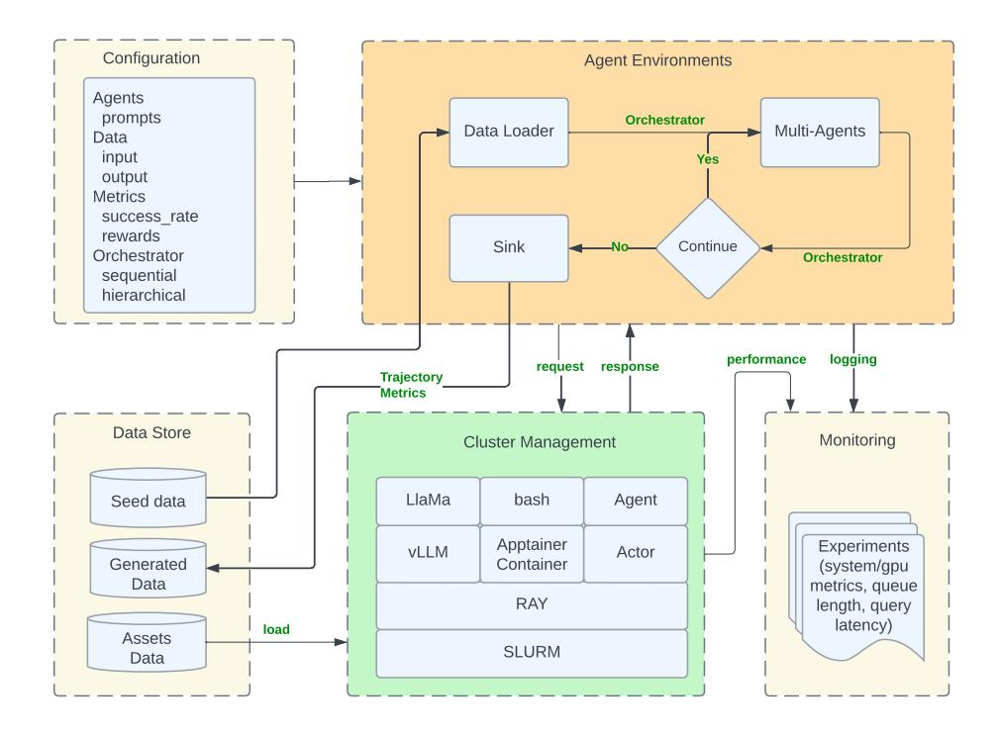
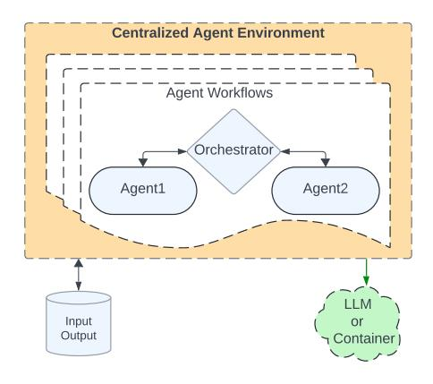
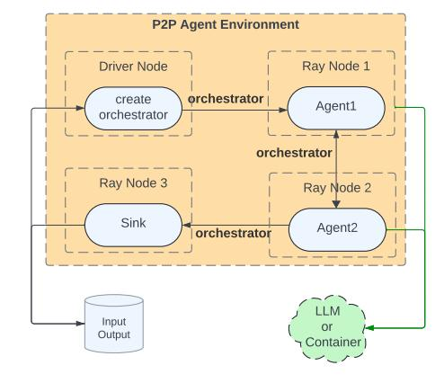
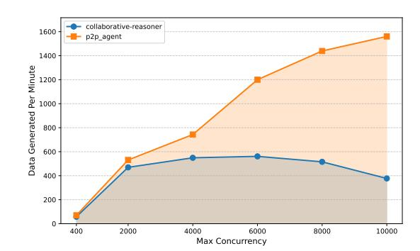
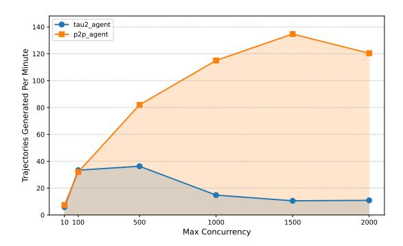
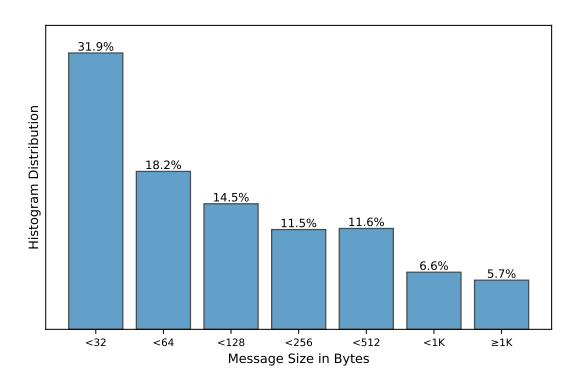
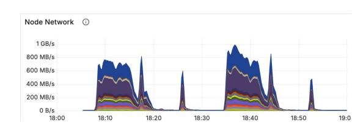

# Matrix: Peer-to-Peer Multi-Agent Synthetic Data Generation Framework

Dong Wang1,† , Yang Li1,† , Ansong Ni1,† , Ching-Feng Yeh<sup>1</sup> , Youssef Emad<sup>1</sup> , Xinjie Lei<sup>1</sup> , Liam Robbins<sup>1</sup> , Karthik Padthe<sup>1</sup> , Hu Xu<sup>1</sup> , Xian Li<sup>1</sup> , Asli Celikyilmaz<sup>1</sup> , Ramya Raghavendra<sup>1</sup> , Lifei Huang<sup>1</sup> , Carole-Jean Wu1,† , Shang-Wen Li1,†

Synthetic data has become increasingly important for training large language models, especially when real data is scarce, expensive, or privacy-sensitive. Many such generation tasks require coordinated multi-agent workflows, where specialized agents collaborate to produce data that is higher quality, more diverse, and structurally richer. However, existing frameworks for multi-agent synthesis often depend on a centralized orchestrator, creating scalability bottlenecks, or are hardcoded for specific domains, limiting flexibility. We present Matrix, a decentralized framework that represents both control and data flow as serialized messages passed through distributed queues. This peer-to-peer design eliminates the central orchestrator. Each task progresses independently through lightweight agents, while compute-intensive operations, such as LLM inference or containerized environments, are handled by distributed services. Built on Ray, Matrix scales to tens of thousands of concurrent agentic workflows and provides a modular, configurable design that enables easy adaptation to a wide range of data generation workflows. We evaluate Matrix across diverse synthesis scenarios, such as multi-agent collaborative dialogue, web-based reasoning data extraction, and tool-use trajectory generation in customer service environments. In all cases, Matrix achieves 2–15× higher data generation throughput under identical hardware resources, without compromising output quality.

Date: April 21, 2026

Correspondence: Dong Wang [dwoanngg@gmail.com](mailto:dwoanngg@gmail.com), Shang-Wen Li [shangwel@meta.com](mailto:shangwel@meta.com)

Code: <https://github.com/facebookresearch/matrix>

# 1 Introduction

Large scale machine learning models, such as large language models (LLMs) and multi-modal foundation models, are increasingly trained with synthetic data to reduce dependence on costly, noisy, or privacy-sensitive human-curated datasets [Grattafiori et al.](#page-16-0) [\(2024\)](#page-16-0); [Abdin et al.](#page-15-0) [\(2024\)](#page-15-0); [Betker et al.](#page-15-1) [\(2023\)](#page-15-1). Recent advances have shifted toward agentic synthetic data generation, where data is produced through interactions among multiple intelligent agents rather than a single model or fixed pipeline. This paradigm enables multi-agent collaboration for diverse generation tasks such as code synthesis, instruction and dialogue creation, knowledgegrounded question answering, and multi-modal content generation. In these settings, the workflows often involve complex control flows with loops, moving beyond traditional linear data generation pipelines. For example, Kimi K2 [Bai et al.](#page-15-2) [\(2025\)](#page-15-2) employs a large-scale multi-agent data synthesis pipeline to construct diverse tool-use and reasoning demonstrations. Similarly, CWM [Copet et al.](#page-15-3) [\(2025\)](#page-15-3) leverages autonomous software engineering agents to generate multi-step trajectories for code understanding and debugging. These systems exemplify the growing adoption of multi-agent pipelines for synthetic data generation in large scale LLM training, underscoring the need for flexible and scalable frameworks for data synthesis.

Generic agent frameworks such as AutoGen [Wu et al.](#page-18-0) [\(2023\)](#page-18-0); [Fourney et al.](#page-15-4) [\(2024\)](#page-15-4), LangGraph [LangChain](#page-17-0) [\(2025\)](#page-17-0), and CrewAI [CrewAI](#page-15-5) [\(2025\)](#page-15-5) provide convenient abstractions for authoring agent workflows and expressing control flow. However, operating these workflows at the throughput regime targeted in this work typically requires additional production scaffolding beyond the workflow definition itself, including scalable LLM/tool services, backpressure and concurrency control, retries/timeouts, and logging/metrics. Accordingly,

<sup>1</sup>FAIR at Meta †Core Contributors

rather than presenting an end-to-end throughput bake-off against these authoring-focused frameworks, we view them as complementary: Matrix can reuse their workflow specifications (e.g., LangGraph-style state graphs) by packaging common patterns as reusable orchestrator subclasses within our runtime, enabling users to design control flow in familiar form while benefiting from Matrix's decentralized scheduling and distributed service integration.

Recently a number of systems have been developed to generate synthetic data for particular agentic settings. Notable examples include AgentInstruct [Mitra et al.](#page-17-1) [\(2024\)](#page-17-1), SWE-Agent [Yang et al.](#page-18-1) [\(2024\)](#page-18-1), SWE-Synth [Pham](#page-18-2) [et al.](#page-18-2) [\(2025\)](#page-18-2), TaskCraft [Shi et al.](#page-18-3) [\(2025\)](#page-18-3), and AgentSynth [Xie et al.](#page-18-4) [\(2025\)](#page-18-4). These systems demonstrate that carefully designed agent roles and validation loops can produce high-quality data and strong task-level performance. However, their implementations are often optimized around a specific task structure (e.g., software engineering, tool execution, or instruction generation), so adapting them to new domains can require non-trivial engineering, such as refactoring the control-flow logic, state representation, and service integration, rather than simply swapping prompts or models. At scale, running many independent workflow instances also introduces systems challenges. Users typically rely on per-process concurrency (threads/async) and/or external job orchestration (e.g., Kubernetes Jobs, Airflow, or distributed task queues) to execute large numbers of tasks concurrently, and must additionally provision shared services for inference, tool execution and logging.

To address these limitations, we present Matrix, a distributed runtime for scalable, multi-agent synthetic data generation and agentic experimentation. Matrix frames data generation as a data-to-data transformation: each input row represents an independent task, and the runtime executes many such tasks concurrently, each running its own agentic workflow.

The core idea behind Matrix is a peer-to-peer (P2P) agent architecture that replaces centralized orchestration with decentralized, message-driven scheduling. The state of each task, which includes orchestration logic, intermediate results, and conversation history, is serialized into messages that are passed among agents. The active agent consumes and updates this state, then emits it to the next agent determined by the orchestrator. Because agents themselves are stateless, they can scale elastically and independently across the cluster.

Unlike traditional batch-level scheduling in distributed execution engines such as Spark [Zaharia et al.](#page-18-5) [\(2012\)](#page-18-5) and Ray Data [Moritz et al.](#page-17-2) [\(2018\)](#page-17-2), where the pipeline controls progress across synchronized batches, Matrix performs row-level scheduling through peer-to-peer message orchestration. Control and data flow are embedded in messages, allowing each task to progress asynchronously through agents. This eliminates idle periods caused by batch-level barriers.

Distributing a centralized workflow with an external job scheduler (e.g., SLURM or Kubernetes) can sidestep a single orchestrator bottleneck by running many workflow replicas in parallel. In practice, however, scaling this way typically pushes substantial distributed-systems work into each application: partitioning the input into jobs, provisioning and load-balancing shared services (LLM inference, tool execution, logging, and state), implementing retries and timeouts, and tuning coupled parameters such as number of jobs, per-job concurrency. Matrix instead provides a self-contained runtime for agentic data generation: workflow state and control are carried as messages, scheduling is decentralized at row granularity, and heavy computation is delegated to shared distributed services with built-in backpressure. This reduces application-specific orchestration glue while scaling to tens of thousands of concurrent workflows.

#### Key Contributions.

- 1. We introduce Matrix, a scalable runtime for large scale multi-agent synthetic data generation capable of efficiently executing tens of thousands of concurrent workflows. Matrix adopts a peer-to-peer agent architecture with message-embedded control and state representation, eliminating centralized orchestration bottlenecks and idle time caused by batch-level synchronization. This design enables fully asynchronous and fine-grained execution at scale.
- 2. Matrix is designed to be flexible and extensible, supporting diverse multi-agent use cases. Its modular architecture separates key components, including the generation loop and distributed services for LLM inference and containerized execution, and the entire system is fully configurable through Hydra.
- 3. We evaluate Matrix on three representative case studies: Collaborative Reasoner [Ni et al.](#page-17-3) [\(2025a\)](#page-17-3), NaturalReasoning [Yuan et al.](#page-18-6) [\(2025\)](#page-18-6), and Tau2-bench [Barres et al.](#page-15-6) [\(2025a\)](#page-15-6). Matrix achieves 2–15×

higher token throughput than specialized baseline systems while maintaining comparable output quality.

4. Matrix is built entirely on an open source stack, including SLURM, Ray, vLLM, SGLang, and Apptainer. It supports both open-weight models and LLM API proxies. We have open sourced the framework to the community to foster open development and collaborative research.

# 2 Related Work

LLM and agentic benchmarks. LLMs are commonly evaluated on reasoning benchmarks such as Math-500 [Hendrycks et al.](#page-17-4) [\(2021\)](#page-17-4) and MMLU-Pro [Wang et al.](#page-18-7) [\(2024\)](#page-18-7). Recent multi-agent systems run on standardized benchmarks that test complex, multi-step reasoning and tool use. Examples include SWEbench [Jimenez et al.](#page-17-5) [\(2024\)](#page-17-5), Tau2-Bench [Barres et al.](#page-15-6) [\(2025a\)](#page-15-6), MCP-Bench [Wang et al.](#page-18-8) [\(2025\)](#page-18-8), and MLE-Bench [Chan et al.](#page-15-7) [\(2025\)](#page-15-7). Each benchmark comes with a reference agentic system that solves the tasks, such as SWE-agent and Tau2-agent. In this work, we use Tau2-Bench and MMLU-Pro as sources of initial tasks to generate agent trajectories that can be used for fine-tuning LLMs.

Data Synthesis via Multi-agents Workflows. The scarcity of high-quality agentic training data has led to the development of synthetic data generation techniques employing multi-agent frameworks. AgentInstruct [Mitra](#page-17-1) [et al.](#page-17-1) [\(2024\)](#page-17-1) generates multi-turn instruction-response data by coordinating multiple agents to propose, verify, and refine synthetic tasks based on seed examples. TaskCraft [Shi et al.](#page-18-3) [\(2025\)](#page-18-3) automatically generates multi-step, multi-tool agentic tasks with verifiable execution trajectories.APIGen-MT [Prabhakar et al.](#page-18-9) [\(2025\)](#page-18-9) is a two-phase framework that generates verifiable, multi-turn agent interaction data. While these frameworks are tailored to specific data needs and emphasize data quality, our approach offers a generic framework capable of supporting multiple use cases with a focus on scalability.

Peer-to-Peer ML Systems Peer-to-peer (P2P) architectures have long been foundational in distributed computing and communications. In ML, P2P systems have been leveraged to enhance scalability, privacy, and personalization. For instance, The SPIRT [Barrak et al.](#page-15-8) [\(2023\)](#page-15-8) framework introduces a serverless P2P ML training architecture that leverages RedisAI for in-database operations, achieving significant reductions in model update times and demonstrating resilience against peer failures. Similarly, BlockDFL [Qin et al.](#page-18-10) [\(2024\)](#page-18-10) employs blockchain-based coordination to facilitate fully decentralized federated learning, incorporating mechanisms to defend against poisoning attacks and reduce communication costs. While prior P2P ML systems focus on efficient training and privacy-preserving computation, Matrix introduces a general framework using P2P communication to coordinate agent workflows for scalable multi-agent data synthesis.

# 3 Matrix Overview

This section provides an overview of the Matrix framework, describing its system architecture and the core algorithm that enables scalable, asynchronous multi-agent synthetic data generation.

## 3.1 System Architecture

Figure [1](#page-3-0) illustrates the architecture of Matrix, a distributed runtime for multi-agent synthetic data generation. The system is designed to be modular and configurable, separating lightweight peer-to-peer agents from scalable backend services (e.g., LLM inference and containerized tool execution) so that components can be adapted and scaled independently across different workflows.

Cluster Management. The framework is deployed atop SLURM [Yoo et al.](#page-18-11) [\(2003\)](#page-18-11), a widely adopted distributed computing environment, with a Ray [Moritz et al.](#page-17-2) [\(2018\)](#page-17-2) cluster serving as the execution substrate. Ray Serve provides high-throughput LLM inference services, backed by vLLM [Kwon et al.](#page-17-6) [\(2023\)](#page-17-6), SGLang [Zheng et al.](#page-18-12) [\(2024\)](#page-18-12), and FastGen [FAIR](#page-15-9) [\(2025\)](#page-15-9). Containerized execution is supported through Apptainer [Kurtzer et al.](#page-17-7) [\(2017\)](#page-17-7), enabling stateful environments to be launched on demand. Each agent is implemented as a Ray Actor, allowing scalable parallelization and fine-grained resource placement across worker nodes.

<span id="page-3-0"></span>> **[图片提取文字 (无描述)]:**
> Configuration Agent Environments Agents prompts Orchestrator Data Loader Multi-Agents Data input Yes output Metrics success rate rewards Sink Continue Orchestrator Orchestrator sequential hierarchical performance logging request response Trajectory Metrics Data Store Monitoring Cluster Management LlaMa bash Seed data Agent Apptainer Experiments vLLM Actor Generated Container (system/gpu Data metrics, queue RAY length, query latency) load Assets SLURM Data


Figure 1 Matrix Agentic Data Generation Architecture.

Configuration. System configurability is managed through Hydra [Yadan](#page-18-13) [\(2019\)](#page-18-13), which specifies agent roles, input–output schemas, generation metrics, and resource requirements (e.g., LLM engine selection). The configuration also defines the orchestrator responsible for control and data flow management. Users can define the use case specific orchestrator class in Hydra, then hand-write control flow as imperative if/else logic in the implemetation. Matrix also supports a graph-based specification. For users familiar with LangGraph [LangChain](#page-17-0) [\(2025\)](#page-17-0), we provide a LangGraphOrchestrator that performs state transitions based on a user-supplied LangGraph: users define nodes (agent roles) and edges (transition rules) in the standard LangGraph API, and the orchestrator updates its state by executing the graph's routing decision at each step. This makes non-sequential workflows easier to express and to visualize while preserving Matrix's decentralized, message-driven execution model.

Agents Environments. In the peer-to-peer generation process, each input datum is encapsulated into an orchestrator instance and passed to the initial agent. The agent processes the instance, updates the orchestrator state, and forwards control to the next designated agent. This process continues iteratively until completion. A detailed algorithmic description is provided in Section [3.2.](#page-3-1) We will use Matrix to build different agents environments in the experiments section.

Monitoring. Logging and observability are critical for debugging and performance analysis. Matrix integrates with Grafana [Labs](#page-17-8) [\(2025\)](#page-17-8) for real-time monitoring. In addition to standard performance metrics, it provides custom indicators such as distributed queue length and the number of pending asynchronous tasks. These metrics help identify throughput bottlenecks and evaluate overall system health.

## <span id="page-3-1"></span>3.2 Data Generation Algorithm

Algorithm [1](#page-4-0) illustrates the core workflow of Matrix's peer-to-peer agentic generation runtime. The system begins by reading the Hydra configuration cfg, which specifies all agent roles and their resource requirements (e.g., CPU, GPU, and memory). As shown in Lines 19–24, the function create\_team() instantiates a distributed team of Ray actors for each agent role, allowing heterogeneous resource allocation across agent types.

#### <span id="page-4-0"></span>Algorithm 1: Matrix P2P agentic generation pseudocode.

```
1 @ray.remote
2 class AgentActor: # agent base class with an event loop to process orchestration messages
3 async def _event_loop(self, team):
4 while True:
5 orchestrator = await self.queue.get()
6 result = self.process(orchestrator)
7 orchestrator.update(result) # update conversation history and determine next agent
8 next_agent = orchestrator.current_agent()
9 random.choice(team[next_agent]).send(orchestrator) # send updated orchestrator to next agent
11 class SequentialOrchestrator: # a typical orchestrator with a configurable order of execution
12 def update(self, result):
13 self.history.append(result)
14 self.index = (self.index + 1) % len(self.order) # take the next agent in the given order with loop around
16 def current_agent(self):
17 return "_sink" if self.is_done else self.order[self.index] # loop around until is_done flag is set
19 def create_team(cfg): # create a team of agents based on the configuration
20 return {
21 role: [ray_create_actor(role, role_cfg) # each agent instance become a Ray actor
22 for _ in range(role_cfg.num_instances)]
23 for role, role_cfg in cfg.items()
24 }
25 # main processing
26 team = create_team(cfg.agents)
27 for item in dataset: # process each dataum concurrently up to max_concurrency asyncio tasks
28 orchestrator = Orchestrator(item)
29 first = random.choice(team[orchestrator.current_agent])
30 first.send(orchestrator) # send the orchestrator to the start agent
```

Agent EventLoop. The main generation loop (Lines 26–30) iterates over input items in the dataset. For each item, an Orchestrator object is created to manage task-specific state and control flow. The orchestrator is initially dispatched to the first agent in the sequence, sampled randomly from the corresponding role group. Each agent runs as a persistent event-driven process (Lines 3–9) implemented by the AgentActor class. Within its asynchronous \_event\_loop, the agent dequeues orchestrators from its inbox, applies role-specific logic through process(), updates task state, and forwards it to the next designated agent.

Orchestration. An example orchestrator SequentialOrchestrator is in Lines 11–17. It maintains a structured history of intermediate results and a configurable order, which determines the sequence of participating agents. After each interaction, update() advances the internal index to the next agent. The process continues cyclically until the orchestrator's is\_done flag is set, at which point it is routed to a special terminal agent, \_sink, for result persistence and metric aggregation.

Concurrency Control. Advanced runtime features (not shown for brevity) include task-level concurrency control through a max\_concurrency parameter and semaphore-based scheduling. The semaphore is decremented when an orchestrator is dispatched to the first agent and incremented upon completion by the \_sink agent. This mechanism limits the number of active orchestrators, ensuring controlled resource utilization and stability during large-scale distributed execution. Note we rely on Ray to avoid race conditions in distributed RPC calls.

# 4 Agent Environment Design for Matrix

This section describes the system's internal design, including its orchestration model, distributed service layer, parallelism strategies, scheduling policies, fault tolerance mechanisms and network bandwidth optimization.

## 4.1 P2P Orchestration

As illustrated in Figure [2a,](#page-5-0) centralized orchestration must manage execution order (control flow), message passing (data flow), and the full lifecycle of requests and responses for LLMs and containerized environments. Handling all of this for tens of thousands of concurrent workflows quickly becomes a scalability bottleneck. Matrix addresses this by representing workflows as serializable orchestrators that can be updated and exchanged

<span id="page-5-0"></span>> **[图片提取文字 (无描述)]:**
> Centralized Agent Environment Agent Workflows Orchestrator Agent1 Agent2 LLM Input or Output Container


> **[图片提取文字 (无描述)]:**
> P2P Agent Environment Driver Node Ray Node 1 orchestrator create Agent1 orchestrator orchestrator Ray Node 3 Ray Node 2 Sink Agent2 orchestrator LLM Input or Output Container


(a) Traditional centralized orchestration.

(b) P2P Orchestration in Matrix.

Figure 2 Compare Centralized vs P2P Orchestration.

among distributed agents (Figure [2b\)](#page-5-0). The driver, which runs the generation framework, plays a lightweight role: it simply publishes an orchestrator to start a task, enabling an asynchronous initiation model. Agents equipped with LLMs and tools consume messages, perform local actions, update both control and data states, and forward the updated orchestrator to the next agent. Execution continues until the orchestrator signals completion, at which point a designated sink collects the final message and persists it to the output dataset. Using P2P orchestration, Matrix avoids bottlenecks, improves scalability, and enables fully asynchronous execution among agents.

## 4.2 Distributed Services

Matrix offloads computationally intensive tasks to distributed services, allowing them to scale independently of the agents. For LLM inference, Matrix employs gRPC-based communication to avoid HTTP overhead. Because the Ray head node can become network-bound, Matrix maintains a local cache of active model replica URLs, enabling direct load-balanced traffic through worker nodes. Sticky routing can reuse prefix cache for multi-turn long conversations. In addition to Huggingface models, proxies are built for commercial LLM API services. For stateful services such as Apptainer containers, agents acquire containers by ID to be able to route multiple commands to the same container instance, rather than a randomly selected one. This is managed via a resource pool and a registry that maps container IDs to Ray actors running the corresponding containers. This design allows agents to efficiently route messages and reuse shared resources.

## 4.3 Parallel Execution Strategies

Matrix supports multiple forms of parallelism to maximize scalability and cluster utilization.

- Data parallelism. Similar to distributed processing systems such as Spark [Zaharia et al.](#page-18-5) [\(2012\)](#page-18-5) and Ray Data [Moritz et al.](#page-17-2) [\(2018\)](#page-17-2), Matrix can partition large input datasets consisting of many small files for independent processing. For multi-file inputs, Matrix automatically distributes files across partitions. Datasets containing a few large files can be preprocessed into smaller shards to enable higher parallelism.
- Task parallelism. Multiple generation tasks can execute concurrently using asynchronous programming, threads, or processes. Matrix adopts an asyncio-based model: the driver initializes orchestrators, and agents process tasks asynchronously. Since computationally heavy operations are offloaded to distributed services, lightweight agents can handle tens of thousands of concurrent tasks efficiently without I/O blocking.
- Agent parallelism. Each agent role is implemented as Ray actors with configurable CPU, GPU, and memory allocations. Roles can scale horizontally by launching multiple distributed agent instances,

each processing assigned tasks independently. Ray system distributes these actors across cluster nodes, enabling each role to scale without the resource contention commonly seen in centralized orchestration.

For LLM-based agents, computational cost dominates over input pipeline overhead. Usually data loading is not a bottleneck (one exception is the NaturalReasoning task in Section [5.2\)](#page-9-0). Matrix's peer-to-peer architecture and distributed services ensure efficient utilization of cluster resources even with moderate data and agent-level parallelism. This efficiency arises from Matrix's ability to run tens of thousands of asynchronous tasks concurrently, each processing one data item independently.

## 4.4 Row-Level Scheduling

In batch processing systems, such as Ray Data, tasks are grouped into fixed-size batches and executed by actors. While this approach can reduce per-task scheduling overhead for homogeneous workloads, it introduces inefficiencies when tasks have variable computational demands or diverging control flows. A long-running or complex task within a batch can keep the current batch running and stall the execution of subsequent batches, creating idle resources and underutilized GPUs. We refer to this phenomenon as batch-level scheduling.

In contrast, Matrix schedules each task independently as soon as prior tasks complete, a mechanism called row-level scheduling. Each orchestrator message representing a single task flows through the P2P agent network. This design eliminates the bubble effects inherent in batch processing, achieves higher GPU utilization, and reduces end-to-end latency for heterogeneous, multi-agent workloads. Row-level pipelining, combined with distributed services and asynchronous agent execution, is a key factor in Matrix's scalability and efficiency for large-scale data synthesis tasks.

## <span id="page-6-0"></span>4.5 Agent Fault Tolerance

Matrix currently provides at-most-once execution semantics. Tasks may fail for various reasons, including network errors, timeouts, and actor crashes. Failed tasks can be collected from the output dataset and re-run offline if needed. Matrix workflows are implemented by extending a base agent class, and use-case-specific logic may introduce bugs that crash an agent. Ray can restart crashed agent actors, however, any in-flight orchestrator messages that were dequeued by the crashed agent are not recoverable under at-most-once semantics. To track in-flight orchestrators and surface failures reliably, Matrix uses per-role message brokers. All agents of the same role share a broker, and all incoming and outgoing orchestrator messages for that role are routed through it. Each broker maintains (i) an incoming queue of orchestrators waiting to be processed and (ii) an assignment map that records which orchestrators are currently assigned to which agent instance. The broker dispatches orchestrators to agents in a round-robin manner. After an agent finishes processing an orchestrator, it returns the updated orchestrator to the broker, the broker then removes the corresponding entry from the assignment map and forwards the orchestrator to the next role's broker. When an agent crashes and is restarted by Ray, it re-registers with its broker. The broker detects that the previous instance has died, marks all orchestrators assigned to that instance as failed based on the assignment map, and forwards them to the sink for persistence as failed trajectories. With this design, use-case-specific agents can crash and restart without halting the system, as long as the brokers and sink remain available. Brokers and the sink are framework components (not customized per use case), and we rely on them for reliability. If a broker or the sink fails, the generation job terminates. To mitigate transient network issues, Matrix uses retries for communication between agents, brokers and sink.

## <span id="page-6-1"></span>4.6 Message Offloading

The orchestrator is serialized and exchanged among agents. As shown in Algorithm [1,](#page-4-0) its history field stores inter-agent conversations, which can be large. A common optimization is to offload this history to an external cache such as Redis. While this reduces orchestrator size, it simply shifts network traffic from occurring between agents to occurring between agents and the cache. Since the history is frequently updated and used for constructing LLM prompts, the total network bandwidth can actually double because each agent must retrieve, update, and store the complete history every turn.

Matrix instead retains the history structure within the orchestrator, while storing large conversation content that exceed a configurable size threshold in Ray's distributed object store. The history holds only the object identifiers, and content is retrieved on demand. Objects are immutable once stored, and all history-related objects are deleted when the orchestrator signals completion. This design keeps the orchestrator compact, reduces redundant transfers, and minimizes network load. Section 5.3.1 quantifies these benefits experimentally.

## 4.7 System Debugging

Debugging distributed systems is challenging, especially under peer-to-peer message passing. Matrix relies on structured logging and trajectory recording for debuggability. Ray streams actor logs back to the driver process, enabling a "local-like" debugging experience even when agents are distributed across the cluster. Matrix also records a full trajectory for each input task. When a task encounters an issue, the trajectory includes the relevant error context for offline analysis (e.g., timeouts, connection failures, and service errors). For unexpected exceptions, including agent implementation bugs, each agent runs an asyncio event loop and tracks pending futures. Unhandled exceptions propagate to the corresponding future. Matrix then marks the orchestrator as failed and routes it to the sink, which persists the failed trajectory to the output dataset. Users can subsequently filter failed trajectories and re-run them if needed.

## 5 Experiments

We evaluate Matrix across three case studies on synthetic data generation. Together, these experiments demonstrate the framework's scalability, robustness, and adaptability to diverse workloads. In this section, the terms "Matrix" and "P2P-agent" are used interchangeably to refer to the same framework.

#### 5.1 Collaborative Reasoner (Coral)

Collaborative Reasoner (Coral) Ni et al. (2025a) evaluates and improves multi-agent collaborative reasoning in LLMs through dialogue-driven tasks. Unlike single-agent evaluations, Coral requires two agents to discuss, disagree, and reach consensus over multi-turn interactions. Scalable training data is generated via self-collaboration, where an LLM plays both roles. In this work, we adopt the same agent setup, implemented as distributed agents in Figure 3.

<span id="page-7-0"></span>> **[图片提取文字 (无描述)]:**
> teacher answer answer extractor matcher student teacher previous max\_round agreement student turn No No Yes Yes sink


> **[图片提取文字 (无描述)]:**
> collaborative-reasoner p2p\_agent Data Generated Per Minute Max Concurrency


Figure 3 P2P-agents for Collaborative Reasoner.

Figure 4 Scalability of P2P-agents vs Coral baseline.

We directly compare Matrix to the official Collaborative Reasoner implementation Ni et al. (2025b) as the baseline. Both systems use asyncio for concurrency. The baseline framework uses a single orchestrator to coordinate thousands of concurrent generation tasks, while Matrix distributes coordination responsibilities across agents in a peer-to-peer fashion. To compare the two, we run the same number of MMLU-Pro questions by changing the number of A100 nodes, and in both cases use Llama-3.1-8B-Instruct Grattafiori et al. (2024) as the underlying language model for all agents. Task concurrency is adjusted according to the number of A100 nodes as  $50 \times N_{GPU}$ , leveraging all 8 GPUs per node with 50 concurrent queries per GPU. As shown in Figure 4, the Matrix implementation scales almost linearly as more GPU nodes are added, while the

centralized orchestration approach of the baseline system becomes a bottleneck and plateaus due to the overhead of scheduling a large number of asynchronous tasks from a single control point.

Large-Scale Results. We further tested both systems on 31 A100 nodes (248 GPUs) using LLaMA-3.1-8B-Instruct. For P2P-agent, we set the concurrency to 248 × 50 ≡ 12, 400, while Coral was configured with its optimal concurrency of 5,000 based on Figure [4.](#page-7-0) As shown in Table [1,](#page-8-0) P2P-agent generates 2B tokens in 4 hours, achieving 6.8× higher throughput than the official Coral implementation on the same hardware. Importantly, both systems attain nearly identical agreement correctness, the metric used to measure data quality, consistent with Coral's reported result of 0.456 for LLaMA-3.1-8B-Instruct [Ni et al.](#page-17-3) [\(2025a\)](#page-17-3).

<span id="page-8-0"></span>Table 1 P2P-Agent achieves 6.8× higher token throughput than Coral baseline.

| Metric                | Coral Baseline | P2P-Agent     |
|-----------------------|----------------|---------------|
| Runtime               | 9:03:22        | 4:17:05       |
| Concurrent tasks      | 5,000          | 12,400        |
| Total trajectories    | 300k           | 1 Million     |
| Agreement correctness | 0.4732         | 0.4778        |
| Tokens generated      | 616,759,036    | 2,002,025,810 |
| Tokens per second     | 18,917         | 129,833       |

#### 5.1.1 Overhead Analysis

We analyze system performance to identify overhead and potential bottlenecks in Matrix. Unless otherwise noted, experiments use 8 H100 nodes (64 GPUs) to generate 200k Coral trajectories.

Latency breakdown. We find that Matrix incurs minimal queuing and orchestration overhead at scale. We instrument end-to-end task latency and attribute it to: (i) agent processing, (ii) queuing delay, and (iii) task initialization. Table [2](#page-8-1) reports the breakdown over all trajectories, and Table [3](#page-8-1) reports the breakdown for the slowest 10% of trajectories. For typical trajectories, agent processing accounts for ∼80% of end-to-end latency and queuing is negligible. For the slowest trajectories, processing dominates even more (∼99%).

<span id="page-8-1"></span>Table 2 Latency breakdown.

| Stage            | Median  | P90    | P99    |
|------------------|---------|--------|--------|
| Agent processing | 80.12%  | 99.30% | 99.92% |
| Queuing          | 0.0289% | 0.851% | 5.73%  |
| Initialization   | 0.0051% | 1.18%  | 7.34%  |

Table 3 Latency breakdown for slow tasks.

| Stage            | Median    | P90    | P99    |
|------------------|-----------|--------|--------|
| Agent processing | 99.72%    | 99.92% | 99.97% |
| Queuing          | 0.00172%  | 0.025% | 0.093% |
| Initialization   | 0.000005% | 0.034% | 0.128% |

Network bandwidth We estimate the network bandwidth required to transmit orchestration messages. Under the Coral workload, peer-to-peer orchestration generates 2.26M serialized messages and consumes ∼1.6 MB/s of network bandwidth (median ∼1.63 MB/s; P99 ∼3.47 MB/s), indicating that orchestration traffic is modest relative to cluster network capacity.

Bottleneck study To isolate Matrix runtime overhead from model inference cost, we construct dummy Coral agents that do not invoke an LLM and instead return pre-formatted text by concatenation. We ensure that the synthetic responses match the expected response lengths and turn structure, yielding a "best-case compute" setting that exposes runtime bottlenecks. In this configuration, the system sustains ∼1.1k trajectories/s and processes 12k orchestration messages per second. The corresponding estimated network bandwidth for orchestration is ∼77.9 MB/s (median ∼82.9 MB/s; P99 ∼97 MB/s). As shown in Table [4,](#page-9-1) agent processing drops to ∼37% of end-to-end latency, task initialization becomes visible, and queuing remains small. The remaining overhead likely comes from RPC, serialization, and network costs. While this experiment suggests a limit of roughly 12k orchestration messages/s per run, Matrix can exceed this throughput via data parallelism, as discussed in Section [5.2.](#page-9-0)

<span id="page-9-1"></span>Table 4 Latency breakdown of dummy agents without real compute.

| Stage            | Median | P90    | P99    |
|------------------|--------|--------|--------|
| Agent processing | 36.72% | 62.81% | 82.63% |
| Queuing          | 0.074% | 1.13%  | 6.95%  |
| Initialization   | 0.768% | 10.72% | 24.51% |

#### 5.1.2 Actor Crash Recovery

We evaluate robustness by generating 200k Coral trajectories under two settings: (i) no faults, and (ii) injected faults where we randomly kill an agent actor every 12 minutes. Under the at-most-once semantics described in Section [4.5,](#page-6-0) killing an actor may drop any in-flight orchestrators assigned to it, we therefore report the number of lost tasks. As shown in Table [5,](#page-9-2) actors are killed 7 times and each time Ray restarts them within seconds on average. Table [6](#page-9-2) shows that approximately 2% of tasks are lost in the fault-injection setting, while throughput decreases by only 5%.

<span id="page-9-2"></span>Table 5 Coral actors restarts.

| Agent                            | Restarts | Duration | Lost Tasks |
|----------------------------------|----------|----------|------------|
| answer                           | 2        | 0.322    | 424        |
| _extractor<br>answer<br>_matcher | 2        | 0.000    | 2          |
| student                          | 1        | 2.304    | 1474       |
| teacher                          | 2        | 2.069    | 2180       |

Table 6 Impact of agent restarts.

| Metric                | No Crash    | With Crash  |
|-----------------------|-------------|-------------|
| Runtime               | 1:26:16     | 1:18:43     |
| Total trajectories    | 200k        | 200k        |
| Lost trajectories     | 0           | 4080        |
| Agreement correctness | 0.4781      | 0.4856      |
| Tokens generated      | 391,200,916 | 340,338,986 |
| Tokens per second     | 75,579      | 72,059      |

## <span id="page-9-0"></span>5.2 NaturalReasoning

NaturalReasoning [Yuan et al.](#page-18-6) [\(2025\)](#page-18-6) is a large-scale dataset designed to advance the reasoning capabilities of LLMs across diverse domains, including STEM, Economics, and Social Sciences. It contains 2.8M challenging questions generated automatically by LLMs. These questions are extracted and synthesized from pretraining corpora, ensuring high diversity and difficulty. Models fine-tuned on NaturalReasoning demonstrate improved sample efficiency and reasoning accuracy compared to prior datasets. In this experiment, we use Matrix to curate a NaturalReasoning-style dataset from raw web documents. This workflow stresses Matrix in a different regime than multi-turn dialogue: most inputs are filtered out early, while the remaining fraction triggers expensive downstream processing. The curation pipeline consists of three agents, as illustrated in Figure [5:](#page-10-0)

- Filter: English-language web documents are identified, and a fine-tuned LLaMA-3.1-3B-Instruct model classifies whether a document contains reasoning content. The classifier is trained on a subset of NaturalReasoning examples as positives and randomly sampled web documents as negatives.
- Score: Each document is evaluated along multiple quality axes using LLaMA-3.3-70B-Instruct, following prompts derived from the original NaturalReasoning methodology.
- Question: Questions are extracted from the filtered web documents, reference answers are identified when available, and independent reasoning steps leading to a final answer are generated, all using LLaMA-3.3-70B-Instruct. Optionally, we grade the extracted answer and check its consistency against the independently generated answer to further filter low-quality examples.

> **[图片提取文字 (无描述)]:**
> filter question score extract pass pass Yes Yes reasoning question Classifier Yes criteria answer No No No sink


| Filter step               | Percentage |
|---------------------------|------------|
| filter_by_en              | 3.68       |
| filter_by_classifier      | 90.24      |
| filter_by_score           | 0.44       |
| filter_by_no_boxed_answer | 0.19       |
| success                   | 5.45       |

<span id="page-10-0"></span>Figure 5 P2P-agents for NaturalReasoning data curation.

<span id="page-10-1"></span>**Table 7** Filtering statistics on 25M DCLM web documents.

For large-scale curation, we process up to 25M web documents from DCLM Li et al. (2025). The 3B filter model is efficient because most documents are rejected with a single-token (Yes/No) output. Overall, 5.45% of documents pass all filters, yielding approximately 1M high-quality reasoning questions and answers (Table 7).

#### 5.2.1 Evaluating Parallelism and Throughput

Using a 500k DCLM subset, we evaluate the impact of the three types of parallelism supported by Matrix represented as a tuple (data parallelism, task parallelism, and agent parallelism) in Table 8. We deployed 32 A100 nodes with 8 GPUs each. The fine-tuned 3B model was replicated 32 times, while the 70B model used 56 replicas. We set the maximum concurrent tasks to be 14k. The estimated concurrent requests per 70B replica is  $14k \times (1-3.68\%-90.24\%) \div 56 \approx 15$ , which can maintain high GPU utilization without introducing long latencies or timeouts. The 3B model in Filter agents are not the bottleneck even though they handle 97% of the data after English filter.

<span id="page-10-2"></span>Table 8 P2P-agent throughput for 500k webdoc.

| Settings Name | Three Parallelisms | Normalized Throughput |
|---------------|--------------------|-----------------------|
| 1             | (1, 14000,1)       | 1                     |
| 2             | (20, 700, 1)       | 1.61                  |
| 3             | (240, 1, 1)        | 0.38                  |
| 4             | (240, 50, 1)       | 1.43                  |
| 5             | (1, 14000, 2)      | 1.03                  |
| 6             | (1, 14000, 10)     | 0.91                  |

**Data parallelism.** The first two settings present the results for data parallelism. In Setting 1, although the system was configured to allow up to 14k concurrent tasks, only about 700 were observed during the experiment, which is well below the target concurrency. This shortfall occurs because 93% of the input documents are filtered out early (Table 7), so that the input pipeline can not keep up with the Filter agent. To address the input bottleneck, we increased data parallelism by splitting the dataset into 20 partitions for Setting 2. This raises the effective concurrency to  $20 \times 700 \equiv 14k$ , matching our target. This adjustment yields a  $1.61 \times$  speedup, demonstrating how data parallelism helps alleviate the input pipeline bottleneck. Increasing the number of partitions beyond 20 provides little additional benefit, since task-level parallelism within each partition already saturates the GPUs.

**Task parallelism.** Comparing Settings 3 and 4, running 50 concurrent tasks per data partition yields a  $3.8 \times$  speedup compared to single-task execution, even with 240 data partitions. This result shows that increasing asynchronous task concurrency is more effective than simply creating a larger number of data partitions. Moreover, further increasing data parallelism would require additional agent instances, which in turn demands more CPU resources.

Agent parallelism. Comparing Settings 1 and 5, doubling the number of agent instances (excluding the sink) results in a modest throughput gain; while Setting 6 shows further increasing agent instances has no benefits. This is because LLM inference is handled by Ray Serve, agents remain I/O-bound. While increasing the number of instances offers limited benefit for the NaturalReasoning workflow, Matrix can efficiently scale agent instances when agents perform heavier CPU or GPU computations, highlighting the framework's flexibility and readiness for diverse workloads.

Although the design space of the three kinds of parallelism can be huge, our setup prefers 14k max concurrency given the number of GPUs. We further determined 700 as the maximum achievable asyncio task concurrency per data partition. Moreover, increasing data partitions beyond 20 or increasing agent parallelism beyond 2 has small effect on throughput. Because of the peer-to-peer architecture, task parallelism alone often achieves high resource utilization. Therefore, small degrees of data and agent parallelism are typically sufficient as the initial configuration for new use cases.

#### 5.2.2 Impact of Scheduling Granularity

We compare Matrix's row-level scheduling to a batch-level baseline implemented with Ray Data (Algorithm [2\)](#page-11-0). We emphasize that Ray Data is a general-purpose batch processing engine designed primarily for data-parallel ETL and batched model inference. Our goal in this comparison is not to claim that Ray Data is an optimized framework for agentic workflows, but to use it as a representative and widely used batch-oriented alternative for practitioners building scalable LLM-calling pipelines on Ray.

In the Ray Data baseline, each batch is processed by a Ray actor BatchProcessing (Lines 1–12), which launches multiple asynchronous tasks to process rows concurrently (Line 8). Each task executes an agentic workflow (Lines 10–12) that is functionally similar to the P2P-agent logic, except that (i) all agents are co-located within the same actor process and (ii) orchestration is implemented within the batch processor rather than being carried by peer-to-peer messages.

This baseline removes the single centralized orchestrator bottleneck and distributes orchestration across many CPU workers, each responsible for one batch. However, because multi-agent workflows have data-dependent control flow (e.g., branching, retries, early termination, and variable numbers of steps), conventional batchinference optimizations are difficult to apply: different rows within a batch may invoke different agents and different numbers of LLM/tool calls. As a result, even under Ray Data, each row must effectively be executed as an independent asynchronous workflow, and the batch mainly serves as a scheduling container rather than enabling true batched execution of LLM calls.

#### <span id="page-11-0"></span>Algorithm 2: Pseudo-code of Ray Data Baseline.

```
1 @ray.remote
2 class BatchProcessing: # base class to run as a Ray actor
3 def __call__(self, batch):
4 async def _process_batch(rows):
5 tasks = [self.process(row) for row in rows]
6 return await asyncio.gather(*tasks) # use asyncio to process all tasks in the batch
8 return asyncio.run(_process_batch(batch))
10 async def process(self, row: Dict[str, Any]): # base class method to be overwritten for each use case
11 """abstract␣method␣to␣process␣one␣input␣task"""
12 pass
14 ds = ray.data.read_json(data_dir) # read input jsonl files into Ray data
15 output = ds.map_batches( # split input to batches for concucurrent processing
16 BatchProcessing,
17 batch_size=cfg.batch_size,
18 num_cpus=1,
19 concurrency=cfg.data_parallelism # max number of batches to run concurrently
20 )
```

Large-Scale Results. We then compare Matrix P2P-agent with the Ray Data baseline to run large scale curation over DCLM up to 25M web documents. Both setups utilize the same GPU resources and 14k concurrent tasks. For the P2P-agent configuration, we adopt Setting 2, i.e., (20, 700, 1), from Table [8.](#page-10-2) For the Ray Data baseline, we use Setting 4, i.e., (240, 50, 1). Through experiment, Setting 2 with 700 as batch size would result in peaks and valleys in GPU requests, the smaller batch size of 50 in Setting 4 can smooth GPU requests. The two setups have similar throughputs in P2P-agent experiment and the latter fits Ray Data based implementation.

Each setup is executed for over 10 hours, measuring token throughput. Results in Table [9](#page-12-0) show that P2Pagent achieves 2.1× higher token throughput than the batch-level baseline. The efficiency gap stems from scheduling granularity: in batch-level scheduling, a new batch cannot begin until all tasks in the current batch complete. Due to control divergence and variable task length, a few slow tasks in a batch block downstream processing, creating idle GPU time. In contrast, row-level scheduling in P2P-agent allows each completed row to immediately trigger the next task without waiting for others, fully utilizing compute resources. Similar behaviour has been observed in LLM inference systems, where "continuous batching" or token-level scheduling can replace completed requests dynamically to avoid idle slots and maintain high throughput.

<span id="page-12-0"></span>Table 9 P2P-Agent achieves 2.1× higher token throughput than Ray Data baseline.

| Metric              | Ray Data Baseline | P2P-Agent   |
|---------------------|-------------------|-------------|
| Runtime             | 12:57:28          | 17:57:55    |
| Concurrent tasks    | 14,000            | 14,000      |
| Webdoc processed    | 9.3M              | 25M         |
| Questions generated | 410,755           | 1,192,799   |
| Tokens generated    | 129,622,944       | 378,591,258 |
| Tokens per second   | 2,778             | 5,853       |

In Ray Data, decreasing the batch size can partially mitigate idle time. However, each concurrent batch requires a dedicated actor and CPU allocation. Maintaining the same level of task concurrency at smaller batch sizes therefore demands higher data parallelism, which introduces substantial CPU overhead. Moreover, batch-level scheduling incurs additional costs for batch creation and actor management, further compounding inefficiency. Overall, these results demonstrate that fine-grained, row-level scheduling enables more efficient scaling for multi-agent, dynamically controlled workflows than batch-level scheduling in traditional distributed data processing engines.

## 5.3 Tau2-bench

Tau2-bench [Barres et al.](#page-15-6) [\(2025a\)](#page-15-6) is a recently introduced benchmark for evaluating conversational agents in dual-control environments, where both an AI agent and a user simulator interact with a shared environment through tools and APIs. In this experiment, we use Tau2-bench to generate task-solving trajectories for realworld customer support or troubleshooting in the telecom domain. Following prior work such as Kimi K2 [Bai](#page-15-2) [et al.](#page-15-2) [\(2025\)](#page-15-2) and AgentBank [Song et al.](#page-18-15) [\(2024\)](#page-18-15), these trajectories—after filtering and reward validation—can serve as post-training data to enhance LLM reasoning and tool-use performance.

P2P-Agent Implementation. Matrix implements Tau2-Bench as a distributed P2P-agent workflow comprising four functional agents and one orchestrator (Figure [6\)](#page-13-0).

- User-simulator: Represents the human user, initiating and responding to the tau2-agent's queries.
- Assistant: Acts as the assistant agent, performing reasoning and tool-use steps.
- Tool-executor: Executes HTTP-based tool calls issued by either the user or assistant. Tool APIs are adapted from the official Tau2-agent implementation [Barres et al.](#page-15-10) [\(2025b\)](#page-15-10) and deployed in distributed containers to enable concurrent execution and isolation.
- Reward-calculator: Validates each trajectory by replaying all tool calls from the initial state and computing task-specific rewards using assertions over the database state. The calculator container reuses the official Tau2-agent implementation, ensuring comparability with benchmark metrics.

Matrix exposes two categories of services: (1) LLM inference services using gpt-oss-120b [OpenAI](#page-18-16) [\(2025\)](#page-18-16), which provide scalable access to model reasoning and dialogue generation, and (2) containerized task services,

<span id="page-13-0"></span>> **[图片提取文字 (无描述)]:**
> tool\_call No Yes No user-simulator STOP tool\_call assistant No Yes Yes reward-calculator tool-executor sink http /tools LLM LLM /policy /run\_tool /calc\_reward


Figure 6 P2P-agent for Tau2-Bench.

derived from Tau2-Bench's reference implementation. Each container exposes standardized HTTP endpoints for retrieving tool signatures, executing actions, and evaluating rewards. Service calls are depicted in green in Figure 6.

Comparison with Tau2 Baseline. To evaluate scalability, we compare Matrix's P2P-agent execution with the official Tau2-agent implementation Barres et al. (2025b). The baseline runs all tools and environment logic directly in Python threads on a single node with distributed LLM service. In contrast, P2P-agent distributes agents, LLM and tool-call container services across the Ray cluster.

As shown in Figure 7, throughput for the Tau2-agent baseline saturates at around 500 threads due to the single-machine constraint. In contrast, P2P-agent continues to scale with concurrency, leveraging distributed placement of agents and containers across the cluster.

> **[图片提取文字 (无描述)]:**
> tau2\_agent p2p\_agent Trajectories Generated Per Minute 10 100 Max Concurrency


<span id="page-13-1"></span>

| Figure 7 Scalability of P2P-agent vs Tau2-ag | ent baseline. |
|----------------------------------------------|---------------|
|----------------------------------------------|---------------|

| Metric             | Baseline   | P2P-Agent   |
|--------------------|------------|-------------|
| Runtime            | 1:13:41    | 1:15:21     |
| Concurrent tasks   | 500        | 1,500       |
| Total trajectories | 1519       | 22,800      |
| Average reward     | 0.5918     | 0.5921      |
| Tokens generated   | 11,080,385 | 185,376,127 |
| Tokens per second  | 2,654      | 41,003      |

<span id="page-13-2"></span>**Table 10** P2P-Agent achieves  $15.4 \times$  higher token throughput than Tau2-Agent baseline.

Large-Scale Results. We further test on 13 H100 nodes, deploying 1.5k containers and 56 gpt-oss-120b replicas. As shown in Table 10, P2P-agent generates  $15.4 \times$  more tokens per second than the Tau2-agent

<span id="page-14-0"></span>baseline, while maintaining comparable task rewards.

#### 5.3.1 Effect of Message Offloading

Matrix orchestrator contains the conversation history. Conversations exchanged in P2P-agent Tau2-bench trajectories vary widely in size, as shown in Figure [8.](#page-14-1) When orchestrators are routed through distributed agents, large conversation content can cause network overhead and congestion within the cluster. To mitigate this overhead, Matrix offloads large conversation content to the Ray Object Store, as discussed in Section [4.6.](#page-6-1) In this case, contents exceeding 512 bytes are stored in Ray object store and retrieved on demand, which corresponds to about 12% of the conversations.

<span id="page-14-1"></span>> **[图片提取文字 (无描述)]:**
> 31.9% Histogram Distribution 18.2% 14.5% 11.6% 11.5% 6.6% 5.7% <32 <1K ≥1K <512 <64 <128 <256 Message Size in Bytes


> **[图片提取文字 (无描述)]:**
> Node Network ① 1 GB/s 800 MB/s 600 MB/s 400 MB/s 200 MB/s 0 B/s 18:40 18:00 18:10 18:20 18:30 18:50


Figure 8 Distribution of conversation sizes in Tau2-Bench.

Figure 9 Compare Total Node Network with and without Message Offloading.

Figure [9](#page-14-1) compares the total cluster network bandwidth during two identical runs: one with message offloading enabled (before 18:30) and one without it (after 18:30). Excluding transient spikes, peak utilization drops from roughly 1 GB/s to 760 MB/s, a reduction of about 20%. This demonstrates that offloading large conversation contents effectively reduces network traffic and improves scalability under communication-heavy workloads such as Tau2-bench. It also makes the system well suited for future multi-modal data generation tasks.

# 6 Conclusion

We introduced Matrix, a peer-to-peer multi-agent framework for large-scale synthetic data generation. By representing control and data flow as peer-to-peer messages and delegating computation to distributed services, Matrix eliminates centralized bottlenecks and enables efficient execution of tens of thousands of concurrent agent workflows. Matrix is modular and configurable, allowing users to easily adapt it to diverse data generation tasks and agent roles without modifying core logic. We open-source Matrix at <https://github.com/facebookresearch/matrix> to support reproducibility and further research.

Limitations and future work. Matrix is not a universal fit for all multi-agent workloads. It assumes per-task orchestrator state is serializable and can be passed between agents. It is also less suitable when each step must read/write very large mutable shared state, where data movement or synchronization can dominate costs. Finally, Matrix depends on the Ray actor runtime and therefore inherits its operational constraints and failure semantics. Looking forward, we plan to provide a library of reusable orchestrator patterns and end-to-end examples, so users can instantiate common control-flow templates with minimal custom code. Future extensions will also explore multi-modal data generation and on-policy continuous data synthesis.

# References

<span id="page-15-0"></span>Marah Abdin, Jyoti Aneja, Harkirat Behl, Sébastien Bubeck, Ronen Eldan, Suriya Gunasekar, Michael Harrison, Russell J. Hewett, Mojan Javaheripi, Piero Kauffmann, James R. Lee, Yin Tat Lee, Yuanzhi Li, Weishung Liu, Caio C. T. Mendes, Anh Nguyen, Eric Price, Gustavo de Rosa, Olli Saarikivi, Adil Salim, Shital Shah, Xin Wang, Rachel Ward, Yue Wu, Dingli Yu, Cyril Zhang, and Yi Zhang. Phi-4 technical report, 2024. [https:](https://arxiv.org/abs/2412.08905) [//arxiv.org/abs/2412.08905](https://arxiv.org/abs/2412.08905).

<span id="page-15-2"></span>Yifan Bai, Yiping Bao, Guanduo Chen, Jiahao Chen, Ningxin Chen, Ruijue Chen, Yanru Chen, Yuankun Chen, Yutian Chen, Zhuofu Chen, Jialei Cui, Hao Ding, Mengnan Dong, Angang Du, Chenzhuang Du, Dikang Du, Yulun Du, Yu Fan, Yichen Feng, Kelin Fu, Bofei Gao, Hongcheng Gao, Peizhong Gao, Tong Gao, Xinran Gu, Longyu Guan, Haiqing Guo, Jianhang Guo, Hao Hu, Xiaoru Hao, Tianhong He, Weiran He, Wenyang He, Chao Hong, Yangyang Hu, Zhenxing Hu, Weixiao Huang, Zhiqi Huang, Zihao Huang, Tao Jiang, Zhejun Jiang, Xinyi Jin, Yongsheng Kang, Guokun Lai, Cheng Li, Fang Li, Haoyang Li, Ming Li, Wentao Li, Yanhao Li, Yiwei Li, Zhaowei Li, Zheming Li, Hongzhan Lin, Xiaohan Lin, Zongyu Lin, Chengyin Liu, Chenyu Liu, Hongzhang Liu, Jingyuan Liu, Junqi Liu, Liang Liu, Shaowei Liu, T. Y. Liu, Tianwei Liu, Weizhou Liu, Yangyang Liu, Yibo Liu, Yiping Liu, Yue Liu, Zhengying Liu, Enzhe Lu, Lijun Lu, Shengling Ma, Xinyu Ma, Yingwei Ma, Shaoguang Mao, Jie Mei, Xin Men, Yibo Miao, Siyuan Pan, Yebo Peng, Ruoyu Qin, Bowen Qu, Zeyu Shang, Lidong Shi, Shengyuan Shi, Feifan Song, Jianlin Su, Zhengyuan Su, Xinjie Sun, Flood Sung, Heyi Tang, Jiawen Tao, Qifeng Teng, Chensi Wang, Dinglu Wang, Feng Wang, Haiming Wang, Jianzhou Wang, Jiaxing Wang, Jinhong Wang, Shengjie Wang, Shuyi Wang, Yao Wang, Yejie Wang, Yiqin Wang, Yuxin Wang, Yuzhi Wang, Zhaoji Wang, Zhengtao Wang, Zhexu Wang, Chu Wei, Qianqian Wei, Wenhao Wu, Xingzhe Wu, Yuxin Wu, Chenjun Xiao, Xiaotong Xie, Weimin Xiong, Boyu Xu, Jing Xu, Jinjing Xu, L. H. Xu, Lin Xu, Suting Xu, Weixin Xu, Xinran Xu, Yangchuan Xu, Ziyao Xu, Junjie Yan, Yuzi Yan, Xiaofei Yang, Ying Yang, Zhen Yang, Zhilin Yang, Zonghan Yang, Haotian Yao, Xingcheng Yao, Wenjie Ye, Zhuorui Ye, Bohong Yin, Longhui Yu, Enming Yuan, Hongbang Yuan, Mengjie Yuan, Haobing Zhan, Dehao Zhang, Hao Zhang, Wanlu Zhang, Xiaobin Zhang, Yangkun Zhang, Yizhi Zhang, Yongting Zhang, Yu Zhang, Yutao Zhang, Yutong Zhang, Zheng Zhang, Haotian Zhao, Yikai Zhao, Huabin Zheng, Shaojie Zheng, Jianren Zhou, Xinyu Zhou, Zaida Zhou, Zhen Zhu, Weiyu Zhuang, and Xinxing Zu. Kimi k2: Open agentic intelligence, 2025. <https://arxiv.org/abs/2507.20534>.

<span id="page-15-8"></span>Amine Barrak, Mayssa Jaziri, Ranim Trabelsi, Fehmi Jaafar, and Fabio Petrillo. Spirt: A fault-tolerant and reliable peer-to-peer serverless ml training architecture, 2023. <https://arxiv.org/abs/2309.14148>.

<span id="page-15-6"></span>Victor Barres, Honghua Dong, Soham Ray, Xujie Si, and Karthik Narasimhan. τ 2 -bench: Evaluating conversational agents in a dual-control environment, 2025a. <https://arxiv.org/abs/2506.07982>.

<span id="page-15-10"></span>Victor Barres, Honghua Dong, Soham Ray, Xujie Si, and Karthik Narasimhan. τ 2 -bench: Evaluating conversational agents in a dual-control environment, 2025b. <https://github.com/sierra-research/tau2-bench>.

<span id="page-15-1"></span>James Betker, Gabriel Goh, Li Jing, et al. Improving image generation with better captions. Technical report, OpenAI, 2023. <https://cdn.openai.com/papers/dall-e-3.pdf>. Technical report describing DALL·E 3; accessed DATE.

<span id="page-15-7"></span>Jun Shern Chan, Neil Chowdhury, Oliver Jaffe, James Aung, Dane Sherburn, Evan Mays, Giulio Starace, Kevin Liu, Leon Maksin, Tejal Patwardhan, Lilian Weng, and Aleksander Mądry. Mle-bench: Evaluating machine learning agents on machine learning engineering, 2025. <https://arxiv.org/abs/2410.07095>.

<span id="page-15-3"></span>Jade Copet, Quentin Carbonneaux, Gal Cohen, Jonas Gehring, Jacob Kahn, Jannik Kossen, Felix Kreuk, Emily McMilin, Michel Meyer, Yuxiang Wei, David Zhang, Kunhao Zheng, Jordi Armengol-Estapé, Pedram Bashiri, Maximilian Beck, Pierre Chambon, Abhishek Charnalia, Chris Cummins, Juliette Decugis, Zacharias V. Fisches, François Fleuret, Fabian Gloeckle, Alex Gu, Michael Hassid, Daniel Haziza, Badr Youbi Idrissi, Christian Keller, Rahul Kindi, Hugh Leather, Gallil Maimon, Aram Markosyan, Francisco Massa, Pierre-Emmanuel Mazaré, Vegard Mella, Naila Murray, Keyur Muzumdar, Peter O'Hearn, Matteo Pagliardini, Dmitrii Pedchenko, Tal Remez, Volker Seeker, Marco Selvi, Oren Sultan, Sida Wang, Luca Wehrstedt, Ori Yoran, Lingming Zhang, Taco Cohen, Yossi Adi, and Gabriel Synnaeve. Cwm: An open-weights llm for research on code generation with world models, 2025. <https://arxiv.org/abs/2510.02387>.

<span id="page-15-5"></span>CrewAI. Crewai: Open-source multi-agent framework for collaborative artificial intelligence. <https://www.crewai.com>, 2025. Accessed: 2025-10-22.

<span id="page-15-9"></span>Meta FAIR. Fastgen: Simple high-throughput inference library. <https://github.com/facebookresearch/fastgen>, 2025. Accessed: 2025-10-24.

<span id="page-15-4"></span>Adam Fourney, Gagan Bansal, Hussein Mozannar, Cheng Tan, Eduardo Salinas, Erkang, Zhu, Friederike Niedtner, Grace Proebsting, Griffin Bassman, Jack Gerrits, Jacob Alber, Peter Chang, Ricky Loynd, Robert West, Victor

Dibia, Ahmed Awadallah, Ece Kamar, Rafah Hosn, and Saleema Amershi. Magentic-one: A generalist multi-agent system for solving complex tasks, 2024. <https://arxiv.org/abs/2411.04468>.

<span id="page-16-0"></span>Aaron Grattafiori, Abhimanyu Dubey, Abhinav Jauhri, Abhinav Pandey, Abhishek Kadian, Ahmad Al-Dahle, Aiesha Letman, Akhil Mathur, Alan Schelten, Alex Vaughan, Amy Yang, Angela Fan, Anirudh Goyal, Anthony Hartshorn, Aobo Yang, Archi Mitra, Archie Sravankumar, Artem Korenev, Arthur Hinsvark, Arun Rao, Aston Zhang, Aurelien Rodriguez, Austen Gregerson, Ava Spataru, Baptiste Roziere, Bethany Biron, Binh Tang, Bobbie Chern, Charlotte Caucheteux, Chaya Nayak, Chloe Bi, Chris Marra, Chris McConnell, Christian Keller, Christophe Touret, Chunyang Wu, Corinne Wong, Cristian Canton Ferrer, Cyrus Nikolaidis, Damien Allonsius, Daniel Song, Danielle Pintz, Danny Livshits, Danny Wyatt, David Esiobu, Dhruv Choudhary, Dhruv Mahajan, Diego Garcia-Olano, Diego Perino, Dieuwke Hupkes, Egor Lakomkin, Ehab AlBadawy, Elina Lobanova, Emily Dinan, Eric Michael Smith, Filip Radenovic, Francisco Guzmán, Frank Zhang, Gabriel Synnaeve, Gabrielle Lee, Georgia Lewis Anderson, Govind Thattai, Graeme Nail, Gregoire Mialon, Guan Pang, Guillem Cucurell, Hailey Nguyen, Hannah Korevaar, Hu Xu, Hugo Touvron, Iliyan Zarov, Imanol Arrieta Ibarra, Isabel Kloumann, Ishan Misra, Ivan Evtimov, Jack Zhang, Jade Copet, Jaewon Lee, Jan Geffert, Jana Vranes, Jason Park, Jay Mahadeokar, Jeet Shah, Jelmer van der Linde, Jennifer Billock, Jenny Hong, Jenya Lee, Jeremy Fu, Jianfeng Chi, Jianyu Huang, Jiawen Liu, Jie Wang, Jiecao Yu, Joanna Bitton, Joe Spisak, Jongsoo Park, Joseph Rocca, Joshua Johnstun, Joshua Saxe, Junteng Jia, Kalyan Vasuden Alwala, Karthik Prasad, Kartikeya Upasani, Kate Plawiak, Ke Li, Kenneth Heafield, Kevin Stone, Khalid El-Arini, Krithika Iyer, Kshitiz Malik, Kuenley Chiu, Kunal Bhalla, Kushal Lakhotia, Lauren Rantala-Yeary, Laurens van der Maaten, Lawrence Chen, Liang Tan, Liz Jenkins, Louis Martin, Lovish Madaan, Lubo Malo, Lukas Blecher, Lukas Landzaat, Luke de Oliveira, Madeline Muzzi, Mahesh Pasupuleti, Mannat Singh, Manohar Paluri, Marcin Kardas, Maria Tsimpoukelli, Mathew Oldham, Mathieu Rita, Maya Pavlova, Melanie Kambadur, Mike Lewis, Min Si, Mitesh Kumar Singh, Mona Hassan, Naman Goyal, Narjes Torabi, Nikolay Bashlykov, Nikolay Bogoychev, Niladri Chatterji, Ning Zhang, Olivier Duchenne, Onur Çelebi, Patrick Alrassy, Pengchuan Zhang, Pengwei Li, Petar Vasic, Peter Weng, Prajjwal Bhargava, Pratik Dubal, Praveen Krishnan, Punit Singh Koura, Puxin Xu, Qing He, Qingxiao Dong, Ragavan Srinivasan, Raj Ganapathy, Ramon Calderer, Ricardo Silveira Cabral, Robert Stojnic, Roberta Raileanu, Rohan Maheswari, Rohit Girdhar, Rohit Patel, Romain Sauvestre, Ronnie Polidoro, Roshan Sumbaly, Ross Taylor, Ruan Silva, Rui Hou, Rui Wang, Saghar Hosseini, Sahana Chennabasappa, Sanjay Singh, Sean Bell, Seohyun Sonia Kim, Sergey Edunov, Shaoliang Nie, Sharan Narang, Sharath Raparthy, Sheng Shen, Shengye Wan, Shruti Bhosale, Shun Zhang, Simon Vandenhende, Soumya Batra, Spencer Whitman, Sten Sootla, Stephane Collot, Suchin Gururangan, Sydney Borodinsky, Tamar Herman, Tara Fowler, Tarek Sheasha, Thomas Georgiou, Thomas Scialom, Tobias Speckbacher, Todor Mihaylov, Tong Xiao, Ujjwal Karn, Vedanuj Goswami, Vibhor Gupta, Vignesh Ramanathan, Viktor Kerkez, Vincent Gonguet, Virginie Do, Vish Vogeti, Vítor Albiero, Vladan Petrovic, Weiwei Chu, Wenhan Xiong, Wenyin Fu, Whitney Meers, Xavier Martinet, Xiaodong Wang, Xiaofang Wang, Xiaoqing Ellen Tan, Xide Xia, Xinfeng Xie, Xuchao Jia, Xuewei Wang, Yaelle Goldschlag, Yashesh Gaur, Yasmine Babaei, Yi Wen, Yiwen Song, Yuchen Zhang, Yue Li, Yuning Mao, Zacharie Delpierre Coudert, Zheng Yan, Zhengxing Chen, Zoe Papakipos, Aaditya Singh, Aayushi Srivastava, Abha Jain, Adam Kelsey, Adam Shajnfeld, Adithya Gangidi, Adolfo Victoria, Ahuva Goldstand, Ajay Menon, Ajay Sharma, Alex Boesenberg, Alexei Baevski, Allie Feinstein, Amanda Kallet, Amit Sangani, Amos Teo, Anam Yunus, Andrei Lupu, Andres Alvarado, Andrew Caples, Andrew Gu, Andrew Ho, Andrew Poulton, Andrew Ryan, Ankit Ramchandani, Annie Dong, Annie Franco, Anuj Goyal, Aparajita Saraf, Arkabandhu Chowdhury, Ashley Gabriel, Ashwin Bharambe, Assaf Eisenman, Azadeh Yazdan, Beau James, Ben Maurer, Benjamin Leonhardi, Bernie Huang, Beth Loyd, Beto De Paola, Bhargavi Paranjape, Bing Liu, Bo Wu, Boyu Ni, Braden Hancock, Bram Wasti, Brandon Spence, Brani Stojkovic, Brian Gamido, Britt Montalvo, Carl Parker, Carly Burton, Catalina Mejia, Ce Liu, Changhan Wang, Changkyu Kim, Chao Zhou, Chester Hu, Ching-Hsiang Chu, Chris Cai, Chris Tindal, Christoph Feichtenhofer, Cynthia Gao, Damon Civin, Dana Beaty, Daniel Kreymer, Daniel Li, David Adkins, David Xu, Davide Testuggine, Delia David, Devi Parikh, Diana Liskovich, Didem Foss, Dingkang Wang, Duc Le, Dustin Holland, Edward Dowling, Eissa Jamil, Elaine Montgomery, Eleonora Presani, Emily Hahn, Emily Wood, Eric-Tuan Le, Erik Brinkman, Esteban Arcaute, Evan Dunbar, Evan Smothers, Fei Sun, Felix Kreuk, Feng Tian, Filippos Kokkinos, Firat Ozgenel, Francesco Caggioni, Frank Kanayet, Frank Seide, Gabriela Medina Florez, Gabriella Schwarz, Gada Badeer, Georgia Swee, Gil Halpern, Grant Herman, Grigory Sizov, Guangyi, Zhang, Guna Lakshminarayanan, Hakan Inan, Hamid Shojanazeri, Han Zou, Hannah Wang, Hanwen Zha, Haroun Habeeb, Harrison Rudolph, Helen Suk, Henry Aspegren, Hunter Goldman, Hongyuan Zhan, Ibrahim Damlaj, Igor Molybog, Igor Tufanov, Ilias Leontiadis, Irina-Elena Veliche, Itai Gat, Jake Weissman, James Geboski, James Kohli, Janice Lam, Japhet Asher, Jean-Baptiste Gaya, Jeff Marcus, Jeff Tang, Jennifer Chan, Jenny Zhen, Jeremy Reizenstein, Jeremy Teboul, Jessica Zhong, Jian Jin, Jingyi Yang, Joe Cummings, Jon Carvill, Jon Shepard, Jonathan McPhie, Jonathan Torres, Josh Ginsburg, Junjie Wang, Kai Wu, Kam Hou U, Karan Saxena, Kartikay Khandelwal, Katayoun Zand, Kathy Matosich, Kaushik Veeraraghavan, Kelly Michelena, Keqian Li, Kiran Jagadeesh, Kun Huang, Kunal Chawla, Kyle Huang, Lailin Chen, Lakshya Garg, Lavender A, Leandro Silva, Lee Bell, Lei Zhang, Liangpeng Guo, Licheng Yu, Liron Moshkovich, Luca Wehrstedt, Madian Khabsa, Manav Avalani, Manish Bhatt, Martynas Mankus, Matan Hasson, Matthew Lennie, Matthias

Reso, Maxim Groshev, Maxim Naumov, Maya Lathi, Meghan Keneally, Miao Liu, Michael L. Seltzer, Michal Valko, Michelle Restrepo, Mihir Patel, Mik Vyatskov, Mikayel Samvelyan, Mike Clark, Mike Macey, Mike Wang, Miquel Jubert Hermoso, Mo Metanat, Mohammad Rastegari, Munish Bansal, Nandhini Santhanam, Natascha Parks, Natasha White, Navyata Bawa, Nayan Singhal, Nick Egebo, Nicolas Usunier, Nikhil Mehta, Nikolay Pavlovich Laptev, Ning Dong, Norman Cheng, Oleg Chernoguz, Olivia Hart, Omkar Salpekar, Ozlem Kalinli, Parkin Kent, Parth Parekh, Paul Saab, Pavan Balaji, Pedro Rittner, Philip Bontrager, Pierre Roux, Piotr Dollar, Polina Zvyagina, Prashant Ratanchandani, Pritish Yuvraj, Qian Liang, Rachad Alao, Rachel Rodriguez, Rafi Ayub, Raghotham Murthy, Raghu Nayani, Rahul Mitra, Rangaprabhu Parthasarathy, Raymond Li, Rebekkah Hogan, Robin Battey, Rocky Wang, Russ Howes, Ruty Rinott, Sachin Mehta, Sachin Siby, Sai Jayesh Bondu, Samyak Datta, Sara Chugh, Sara Hunt, Sargun Dhillon, Sasha Sidorov, Satadru Pan, Saurabh Mahajan, Saurabh Verma, Seiji Yamamoto, Sharadh Ramaswamy, Shaun Lindsay, Shaun Lindsay, Sheng Feng, Shenghao Lin, Shengxin Cindy Zha, Shishir Patil, Shiva Shankar, Shuqiang Zhang, Shuqiang Zhang, Sinong Wang, Sneha Agarwal, Soji Sajuyigbe, Soumith Chintala, Stephanie Max, Stephen Chen, Steve Kehoe, Steve Satterfield, Sudarshan Govindaprasad, Sumit Gupta, Summer Deng, Sungmin Cho, Sunny Virk, Suraj Subramanian, Sy Choudhury, Sydney Goldman, Tal Remez, Tamar Glaser, Tamara Best, Thilo Koehler, Thomas Robinson, Tianhe Li, Tianjun Zhang, Tim Matthews, Timothy Chou, Tzook Shaked, Varun Vontimitta, Victoria Ajayi, Victoria Montanez, Vijai Mohan, Vinay Satish Kumar, Vishal Mangla, Vlad Ionescu, Vlad Poenaru, Vlad Tiberiu Mihailescu, Vladimir Ivanov, Wei Li, Wenchen Wang, Wenwen Jiang, Wes Bouaziz, Will Constable, Xiaocheng Tang, Xiaojian Wu, Xiaolan Wang, Xilun Wu, Xinbo Gao, Yaniv Kleinman, Yanjun Chen, Ye Hu, Ye Jia, Ye Qi, Yenda Li, Yilin Zhang, Ying Zhang, Yossi Adi, Youngjin Nam, Yu, Wang, Yu Zhao, Yuchen Hao, Yundi Qian, Yunlu Li, Yuzi He, Zach Rait, Zachary DeVito, Zef Rosnbrick, Zhaoduo Wen, Zhenyu Yang, Zhiwei Zhao, and Zhiyu Ma. The llama 3 herd of models, 2024. <https://arxiv.org/abs/2407.21783>.

- <span id="page-17-4"></span>Dan Hendrycks, Collin Burns, Saurav Kadavath, Akul Arora, Steven Basart, Eric Tang, Dawn Song, and Jacob Steinhardt. Measuring mathematical problem solving with the math dataset. NeurIPS, 2021.
- <span id="page-17-5"></span>Carlos E. Jimenez, John Yang, Alexander Wettig, Shunyu Yao, Kexin Pei, Ofir Press, and Karthik Narasimhan. Swe-bench: Can language models resolve real-world github issues?, 2024. <https://arxiv.org/abs/2310.06770>.
- <span id="page-17-7"></span>Gregory M. Kurtzer, Vanessa Sochat, and Michael W. Bauer. Singularity: Scientific containers for mobility of compute. PLoS ONE, 12(5):e0177459, 2017. doi: 10.1371/journal.pone.0177459. [https://doi.org/10.1371/journal.](https://doi.org/10.1371/journal.pone.0177459) [pone.0177459](https://doi.org/10.1371/journal.pone.0177459).
- <span id="page-17-6"></span>Woosuk Kwon, Zhuohan Li, Siyuan Zhuang, Ying Sheng, Lianmin Zheng, Cody Hao Yu, Joseph E. Gonzalez, Hao Zhang, and Ion Stoica. Efficient memory management for large language model serving with pagedattention. In Proceedings of the ACM SIGOPS 29th Symposium on Operating Systems Principles, 2023.
- <span id="page-17-8"></span>Grafana Labs. Grafana: The open and composable observability and data visualization platform. [https://github.com/](https://github.com/grafana/grafana) [grafana/grafana](https://github.com/grafana/grafana), 2025. Accessed: 2025-10-24.
- <span id="page-17-0"></span>LangChain. Langgraph: A low-level orchestration framework for stateful ai agents. [https://langchain-ai.github.io/](https://langchain-ai.github.io/langgraph/) [langgraph/](https://langchain-ai.github.io/langgraph/), 2025. Accessed: 2025-10-22.
- <span id="page-17-9"></span>Jeffrey Li, Alex Fang, Georgios Smyrnis, Maor Ivgi, Matt Jordan, Samir Gadre, Hritik Bansal, Etash Guha, Sedrick Keh, Kushal Arora, Saurabh Garg, Rui Xin, Niklas Muennighoff, Reinhard Heckel, Jean Mercat, Mayee Chen, Suchin Gururangan, Mitchell Wortsman, Alon Albalak, Yonatan Bitton, Marianna Nezhurina, Amro Abbas, Cheng-Yu Hsieh, Dhruba Ghosh, Josh Gardner, Maciej Kilian, Hanlin Zhang, Rulin Shao, Sarah Pratt, Sunny Sanyal, Gabriel Ilharco, Giannis Daras, Kalyani Marathe, Aaron Gokaslan, Jieyu Zhang, Khyathi Chandu, Thao Nguyen, Igor Vasiljevic, Sham Kakade, Shuran Song, Sujay Sanghavi, Fartash Faghri, Sewoong Oh, Luke Zettlemoyer, Kyle Lo, Alaaeldin El-Nouby, Hadi Pouransari, Alexander Toshev, Stephanie Wang, Dirk Groeneveld, Luca Soldaini, Pang Wei Koh, Jenia Jitsev, Thomas Kollar, Alexandros G. Dimakis, Yair Carmon, Achal Dave, Ludwig Schmidt, and Vaishaal Shankar. Datacomp-lm: In search of the next generation of training sets for language models, 2025. <https://arxiv.org/abs/2406.11794>.
- <span id="page-17-1"></span>Arindam Mitra, Luciano Del Corro, Guoqing Zheng, Shweti Mahajan, Dany Rouhana, Andres Codas, Yadong Lu, Wei ge Chen, Olga Vrousgos, Corby Rosset, Fillipe Silva, Hamed Khanpour, Yash Lara, and Ahmed Awadallah. Agentinstruct: Toward generative teaching with agentic flows, 2024. <https://arxiv.org/abs/2407.03502>.
- <span id="page-17-2"></span>Philipp Moritz, Robert Nishihara, Stephanie Wang, Alexey Tumanov, Richard Liaw, Eric Liang, Melih Elibol, Zongheng Yang, William Paul, Michael I. Jordan, and Ion Stoica. Ray: A distributed framework for emerging AI applications. In 13th USENIX Symposium on Operating Systems Design and Implementation (OSDI 18), pages 561–577, Carlsbad, CA, October 2018. USENIX Association. ISBN 978-1-939133-08-3. [https://www.usenix.org/conference/osdi18/](https://www.usenix.org/conference/osdi18/presentation/moritz) [presentation/moritz](https://www.usenix.org/conference/osdi18/presentation/moritz).
- <span id="page-17-3"></span>Ansong Ni, Ruta Desai, Yang Li, Xinjie Lei, Dong Wang, Jiemin Zhang, Jane Yu, Ramya Raghavendra, Gargi

- Ghosh, Shang-Wen Li, and Asli Celikyilmaz. Collaborative reasoner: Self-improving social agents with synthetic conversations. In NeurIPS 2025, 2025a.
- <span id="page-18-14"></span>Ansong Ni, Ruta Desai, Yang Li, Xinjie Lei, Dong Wang, Jiemin Zhang, Jane Yu, Ramya Raghavendra, Gargi Ghosh, Shang-Wen Li, and Asli Celikyilmaz. Collaborative reasoner: Self-improving social agents with synthetic conversations, 2025b. <https://github.com/facebookresearch/collaborative-reasoner>.
- <span id="page-18-16"></span>OpenAI. gpt-oss-120b & gpt-oss-20b model card, 2025. <https://arxiv.org/abs/2508.10925>.
- <span id="page-18-2"></span>Minh V. T. Pham, Huy N. Phan, Hoang N. Phan, Cuong Le Chi, Tien N. Nguyen, and Nghi D. Q. Bui. Swesynth: Synthesizing verifiable bug-fix data to enable large language models in resolving real-world bugs, 2025. <https://arxiv.org/abs/2504.14757>.
- <span id="page-18-9"></span>Akshara Prabhakar, Zuxin Liu, Ming Zhu, Jianguo Zhang, Tulika Awalgaonkar, Shiyu Wang, Zhiwei Liu, Haolin Chen, Thai Hoang, Juan Carlos Niebles, Shelby Heinecke, Weiran Yao, Huan Wang, Silvio Savarese, and Caiming Xiong. Apigen-mt: Agentic pipeline for multi-turn data generation via simulated agent-human interplay, 2025. <https://arxiv.org/abs/2504.03601>.
- <span id="page-18-10"></span>Zhen Qin, Xueqiang Yan, Mengchu Zhou, and Shuiguang Deng. Blockdfl: A blockchain-based fully decentralized peer-to-peer federated learning framework, 2024. <https://arxiv.org/abs/2205.10568>.
- <span id="page-18-3"></span>Dingfeng Shi, Jingyi Cao, Qianben Chen, Weichen Sun, Weizhen Li, Hongxuan Lu, Fangchen Dong, Tianrui Qin, King Zhu, Minghao Liu, Jian Yang, Ge Zhang, Jiaheng Liu, Changwang Zhang, Jun Wang, Yuchen Eleanor Jiang, and Wangchunshu Zhou. Taskcraft: Automated generation of agentic tasks, 2025. <https://arxiv.org/abs/2506.10055>.
- <span id="page-18-15"></span>Yifan Song, Weimin Xiong, Xiutian Zhao, Dawei Zhu, Wenhao Wu, Ke Wang, Cheng Li, Wei Peng, and Sujian Li. Agentbank: Towards generalized llm agents via fine-tuning on 50000+ interaction trajectories, 2024. [https:](https://arxiv.org/abs/2410.07706) [//arxiv.org/abs/2410.07706](https://arxiv.org/abs/2410.07706).
- <span id="page-18-7"></span>Yubo Wang, Xueguang Ma, Ge Zhang, Yuansheng Ni, Abhranil Chandra, Shiguang Guo, Weiming Ren, Aaran Arulraj, Xuan He, Ziyan Jiang, Tianle Li, Max Ku, Kai Wang, Alex Zhuang, Rongqi Fan, Xiang Yue, and Wenhu Chen. Mmlu-pro: A more robust and challenging multi-task language understanding benchmark, 2024. <https://arxiv.org/abs/2406.01574>.
- <span id="page-18-8"></span>Zhenting Wang, Qi Chang, Hemani Patel, Shashank Biju, Cheng-En Wu, Quan Liu, Aolin Ding, Alireza Rezazadeh, Ankit Shah, Yujia Bao, and Eugene Siow. Mcp-bench: Benchmarking tool-using llm agents with complex real-world tasks via mcp servers, 2025. <https://arxiv.org/abs/2508.20453>.
- <span id="page-18-0"></span>Qingyun Wu, Gagan Bansal, Jieyu Zhang, Yiran Wu, Beibin Li, Erkang Zhu, Li Jiang, Xiaoyun Zhang, Shaokun Zhang, Jiale Liu, Ahmed Hassan Awadallah, Ryen W White, Doug Burger, and Chi Wang. Autogen: Enabling next-gen llm applications via multi-agent conversation, 2023. <https://arxiv.org/abs/2308.08155>.
- <span id="page-18-4"></span>Jingxu Xie, Dylan Xu, Xuandong Zhao, and Dawn Song. Agentsynth: Scalable task generation for generalist computer-use agents, 2025. <https://arxiv.org/abs/2506.14205>.
- <span id="page-18-13"></span>Omry Yadan. Hydra - a framework for elegantly configuring complex applications. Github, 2019. [https://github.com/](https://github.com/facebookresearch/hydra) [facebookresearch/hydra](https://github.com/facebookresearch/hydra).
- <span id="page-18-1"></span>John Yang, Carlos E. Jimenez, Alexander Wettig, Kilian Lieret, Shunyu Yao, Karthik Narasimhan, and Ofir Press. Sweagent: Agent-computer interfaces enable automated software engineering, 2024. <https://arxiv.org/abs/2405.15793>.
- <span id="page-18-11"></span>Andy B. Yoo, Morris A. Jette, and Mark Grondona. Slurm: Simple linux utility for resource management. In Dror Feitelson, Larry Rudolph, and Uwe Schwiegelshohn, editors, Job Scheduling Strategies for Parallel Processing, pages 44–60, Berlin, Heidelberg, 2003. Springer Berlin Heidelberg. ISBN 978-3-540-39727-4.
- <span id="page-18-6"></span>Weizhe Yuan, Jane Yu, Song Jiang, Karthik Padthe, Yang Li, Ilia Kulikov, Kyunghyun Cho, Dong Wang, Yuandong Tian, Jason E Weston, and Xian Li. Naturalreasoning: Reasoning in the wild with 2.8m challenging questions, 2025. <https://arxiv.org/abs/2502.13124>.
- <span id="page-18-5"></span>Matei Zaharia, Mosharaf Chowdhury, Tathagata Das, Ankur Dave, Justin Ma, Murphy McCauly, Michael J Franklin, Scott Shenker, and Ion Stoica. Resilient distributed datasets: a fault-tolerant abstraction for in-memory cluster computing. In 9th USENIX Symposium on Networked Systems Design and Implementation (NSDI 12). USENIX Association, 2012.
- <span id="page-18-12"></span>Lianmin Zheng, Liangsheng Yin, Zhiqiang Xie, Chuyue Sun, Jeff Huang, Cody Hao Yu, Shiyi Cao, Christos Kozyrakis, Ion Stoica, Joseph E. Gonzalez, Clark Barrett, and Ying Sheng. Sglang: Efficient execution of structured language model programs, 2024. <https://arxiv.org/abs/2312.07104>.