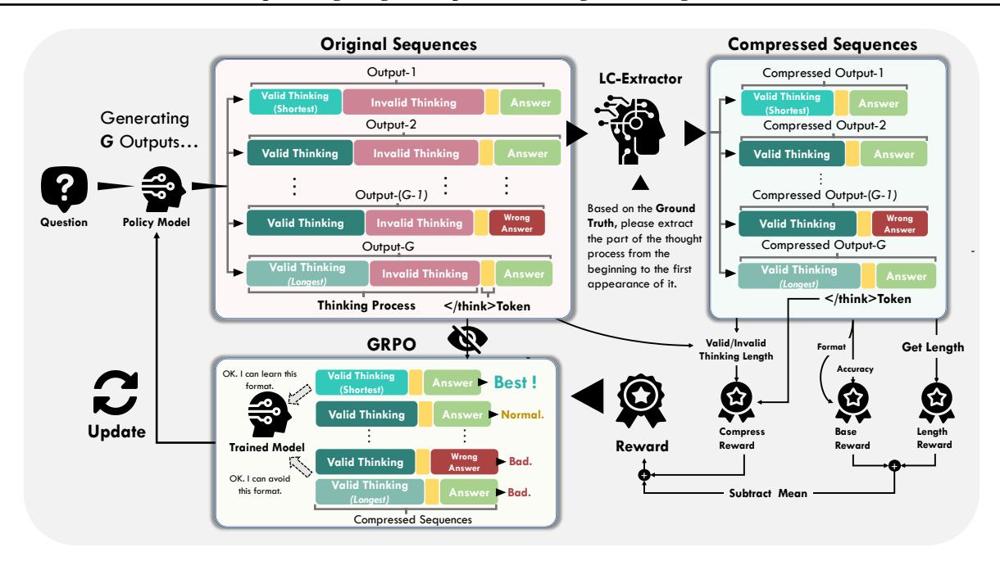
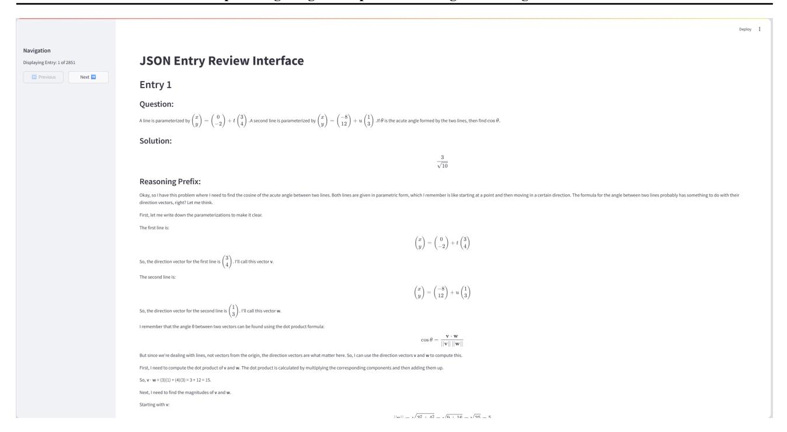

# Optimizing Length Compression in Large Reasoning Models

### Zhengxiang Cheng Dongping Chen 1 Mingyang Fu Tianyi Zhou

# Abstract

Large Reasoning Models (LRMs) have achieved remarkable success, yet they often suffer from producing unnecessary and verbose reasoning chains. We identify a core aspect of this issue as *"invalid thinking"*— models tend to repeatedly doublecheck their work after having derived the correct answer. To address this specific inefficiency, we move beyond the general principles of Efficacy and Efficiency to propose two new, fine-grained principles: Brevity, which advocates for eliminating redundancy, and Sufficiency, which ensures critical reasoning steps are preserved. Guided by these principles, we introduce LC-R1, a posttraining method based on Group Relative Policy Optimization (GRPO). LC-R1 employs a novel combination of a *Length Reward* for overall conciseness and a *Compress Reward* that is specifically designed to remove the invalid portion of the thinking process. Extensive experiments on multiple reasoning benchmarks demonstrate that LC-R1 achieves a significant reduction in sequence length (~50%) with only a marginal (~2%) drop in accuracy, achieving a favorable trade-off point on the *Pareto frontier* that prioritizes high compression. Our analysis further validates the robustness of LC-R1 and provides valuable insights for developing more powerful yet computationally efficient LRMs. Our code is released at https://github.com/zxiangx/LC-R1.

# 1. Introduction

Recent *"long-thought"* Large Reasoning Models (LRMs), such as OpenAI's O1 [\(Jaech et al.,](#page-8-0) [2024\)](#page-8-0) and Deepseek-R1 [\(DeepSeek-AI et al.,](#page-8-1) [2025\)](#page-8-1), represent a significant paradigm extension of foundational Chain-of-Thought (CoT) techniques [\(Wei et al.,](#page-8-2) [2023\)](#page-8-2). Fine-tuned with Reinforcement

*NewInML workshop@Proceedings of the* 42 nd *International Conference on Machine Learning*, Vancouver, Canada. PMLR 267, 2025. Copyright 2025 by the author(s).

> **[图片提取文字 (无描述)]:**
> Please help me solve this following question: Evaluate the simplest result of (1 + 2i) \* 6 - 3i. User (Ground Truth: 6 + 9i.) Too Long Reasoning Chains... Reasoning... Valid: 370 Tokens, Omissions here I can't Alright, so I have this expression to evaluate: (1 + 2i)6 - 3i. stand so Hmm, okay, let me try to figure this out step by step. I'm long texts! just starting to learn about complex numbers, so this might take a bit of thought, .... Alright, the next step is to combine like terms. The terms with 'i' are 12i and -3i, Subtracting 3i from 12i should give me 9i. So, I have 6 + 9i. Wait .... Distribute the 6: 16 + 2i6 = 6 + 12i, Then subtract 3i: 6 + 9i, Reasoning Yeah, that seems correct, Hmm, ..., so yeah, 6 + 9i. Model. I don't see any mistakes,... Converting back to a complex number, that's 6 + 9i. I feel confident the evaluation of (1 + 2i)\*6 - 3i is indeed 6 + 9i. Final Answer: The evaluated expression is 6 + 9i. Invalid: 792 Tokens, Omissions here Answer: To evaluate the expression (1+2i)\*6-3i: 1.Distribute the 6: (1+2i)\*6 = 6\*1+6\*2i = 6+12i. 2. Subtract 3i from the result: 6+12i-3i 3. Combine the imaginary parts:6+(12i-3i) = 6+9i. Thus, the evaluated expression is: 6 + 9i Suitable Reasoning Chains! Reasoning... Valid: 145 Tokens simple Okey, now I'm looking at the expression (1 + 2i)6 - 3i and trying to but work through it step by step. Since I'm still getting used to complex clear! numbers, I want to be careful with the operation. First, I know multiplication comes before subtraction, so I start by distributing the 6 across (1 + 2i). That gives me 6 \* 1 = 6 and 6 \* 2i = 12i, so the (Ours) result of that part is 6 + 12i.Next, I subtract 3i from 12i, which leaves 9i, Putting everything together, I end up with 6 + 9i. Answer: To evaluate the expression (1 + 2i) \* 6 - 3i, we begin by distributing the 6 across the terms inside the parentheses. Multiplying gives 6 \* 1 = 6 and 6 \* 2i = 12i, so the result is 6 + 12i, Next, subtracting 3i from this gives 6 + 12i - 3i, Combining the imaginary parts, we get 12i - 3i = 9i. So, the final result is 6 + 9i.

Figure 1: Comparison between inefficient reasoning model and efficient model. The former tends to make a verbose self-check process after having derived the correct answer corresponding to the given question. The model trained with LC-R1 get more efficient reasoning process to get correct answer, without any invalid thinking process.

Learning (RL), these models iteratively refine solutions to achieve unprecedented performance in complex reasoning tasks like mathematics and programming [\(Sun et al.,](#page-8-3) [2025;](#page-8-3) [Gu et al.,](#page-8-4) [2024\)](#page-8-4). However, with the improvement of *"deep thinking"* ability, a prominent problem is the excessive consumption of computing resources during the reasoning process [\(Chen et al.,](#page-8-5) [2025;](#page-8-5) [Aggarwal and Welleck,](#page-8-6) [2025\)](#page-8-6). Specifically, existing models tend to generate lengthy and even unnecessary chains of reasoning when solving problems with low complexity or clear solution paths. This phenomenon, termed "*overthinking*", manifests as models consuming far more computational resources than the problem itself requires to reach the correct conclusion [\(Chen](#page-8-7)

1University of Maryland. Correspondence to: Tianyi Zhou <tianyi.david.zhou@gmail.com>.

> **[图片提取文字 (无描述)]:**
> DeepSeek-R1-Distill-Qwen-7B 5 **ThinkPrune** w/o C-reward Accuracy (%) Origin-LC-R1 (Ours) O1-Pruner w/o L-reward SFT SFT+O1-Pruner DPO -10 -50 -40 -30 -20 -10 Compressed (%)

> **[图片提取文字 (无描述)]:**
> DeepSeek-R1-Distill-Qwen-7B DeepSeek-R1-Distill-Qwen-1.5B O1-Pruner **ThinkPrune** ThinkPrune w/o C-reward Origin-LC-R1 (Ours) % Originw/o C-reward Accuracy -Pruner w/o L-reward w/o L-reward SFT SFT SFT+O1-Pruner SFT+O1-Pruner DPO -10 DPO -15 -30 -20 -10 -60 -50 -40 -30 -20 -10 0 Compressed (%) Compressed (%)

Figure 2: Pareto analysis of the Efficacy-Efficiency trade-off of different methods on two reasoning models. The x-axis represents the reasoning length change, and the y-axis shows the accuracy change, relative to the original model (defined in Eq. [12\)](#page-5-0), with the top-left corner representing the ideal position. A smaller and darker marker indicates a higher Valid Thinking (VT) rate (defined in Eq. [1\)](#page-2-0), signifying a more efficient thinking process. Compared to other methods also on the pareto frontier, LC-R1 achieves a more favorable trade-off, attaining a substantially higher compression rate at the cost of a minimal drop in accuracy, and it also achieves a higher VT rate. The sub-optimal performance of our ablation variants (w/o C-reward, w/o L-reward) further proves the criticality of our dual-reward designs.

[et al.,](#page-8-7) [2024;](#page-8-7) [Sui et al.,](#page-8-8) [2025;](#page-8-8) [Cuadron et al.,](#page-8-9) [2025\)](#page-8-9). Therefore, one critical problem arises:

### *How can we maintain high reasoning efficacy while significantly improving efficiency?*

Prior works have approached this by fine-tuning on shorter demonstrations (SFT) [\(Chen et al.,](#page-8-7) [2024\)](#page-8-7), constructing preference datasets for conciseness [\(Luo et al.,](#page-8-10) [2025a;](#page-8-10) [Shen](#page-8-11) [et al.,](#page-8-11) [2025\)](#page-8-11), or integrating length-penalties into RL [\(Hou](#page-8-12) [et al.,](#page-8-12) [2025;](#page-8-12) [Luo et al.,](#page-8-13) [2025b;](#page-8-13) [Team et al.,](#page-8-14) [2025\)](#page-8-14). However, these methods often treat the reasoning process as a black box, penalizing length without analyzing the internal structure of the thoughts themselves.

To address this gap, we delve into the structure of "*overthinking*" and identify a specific pattern: models frequently engage in redundant *"double-checking"* after having already derived the correct answer. We term this phenomenon "*invalid thinking*", as shown in Figure [1.](#page-0-0) To quantify it, we introduce a new metric, Valid Thinking (VT) Rate, which measures the proportion of the reasoning process that is essential for reaching the initial correct conclusion.

Guided by this insight, we propose two fine-grained principles: Brevity (eliminating redundancy) and Sufficiency (preserving necessary steps). We then introduce LC-R1, a GRPO-based post-training method that operationalizes these principles. LC-R1 uniquely combines a Length Reward for overall conciseness with a novel Compress Reward designed to directly guide the model to terminate the thinking process upon deriving the correct answer.

We conduct comprehensive experiments on two reasoning models across seven benchmarks. Empirical results show that LC-R1 achieves a more favorable trade-off between efficacy and efficiency than prior methods as shown in Figure [2.](#page-1-0) Specifically, with only a 2% drop in accuracy, our method attains a 50% reduction in sequence length on average. Ablation study also demonstrates the indispensability of both Length Reward and Compress Reward for achieving efficient reasoning. Further study shows that our method achieves efficient compression without impairing the exploration ability of model, and the efficiency can generalize to various difficulty problems. In conclusion, our contribution can be summarized as follows:

- We analyze the thinking process of current competitive reasoning model and find the phenomenon of "*invalid thinking*" : It takes a large portion of thinking process to double check after having derived the correct answer, making the reasoning verbose and inefficient.
- We propose two novel principles: Brevity and Sufficiency, and design a GRPO-based method LC-R1 for LRM post-training to strike a balance between Brevity and Sufficiency, pruning invalid thinking while compressing overall sequences at the same time.
- Through comprehensive experiments, we validate the effectiveness of LC-R1 to get a better trade-off between Efficacy and Efficiency, and conduct further analyses on the deep impact of compression, proving the robustness of LC-R1 to various difficulties and providing insights for future works.

Table 1: Valid Thinking Rate of current *state-of-the-art* Large Reasoning Models. Nemotron indicates Llama-3.3-Nemotron-Super-49b-v1. Results manifest a low VT rate on all these models, highlighting the phenomenon of "*invalid thinking*".

| Model       | Avg. | AIME25 | AMC  | GSM8K | MATH500 | Olympiad |
|-------------|------|--------|------|-------|---------|----------|
| Qwen-3-32B  | 57.5 | 73.8   | 58.8 | 53.8  | 46.6    | 51.5     |
| QwQ-32B     | 59.2 | 70.8   | 58.2 | 54.1  | 53.1    | 59.6     |
| DeepSeek-R1 | 65.3 | 66.5   | 71.8 | 64.2  | 59.8    | 64.0     |
| Nemotron    | 60.8 | 62.1   | 64.1 | 63.1  | 56.6    | 58.1     |

# 2. Preliminary: Compression and Efficienct Reasoning Models

### 2.1. Motivation: Quantifying Redundant Reasoning

A common paradigm for Large Reasoning Models (LRMs) involves a thinking process (*i.e.*, step-by-step rationale) that precedes the final answer. While effective for accuracy, we observe a consistent inefficiency: models often derive the correct answer early in their thinking process but continue with lengthy and redundant verification steps. We term this subsequent, non-essential reasoning *"Redundant Sequence"*.

To formalize this, we define the *Valid Thinking (VT)* rate, a metric focusing on the model's thinking process:

$$VT = \frac{|\text{Tokens in Valid Thinking}|}{|\text{Total tokens in Thinking Process}|}$$
(1)

where *"Valid Thinking"* comprises the tokens from the start of the thinking process until the correct answer is first derived. To automate this measurement, we utilize a lightweight parser, LC-Extractor, whose implementation details are provided in Section [4.](#page-4-0)

we evaluated four *state-of-the-art* LRMs—Qwen3-32b [\(Team,](#page-8-15) [2025a\)](#page-8-15), QwQ-32b [\(Team,](#page-8-16) [2025b\)](#page-8-16), Deepseek-R1 [\(DeepSeek-AI et al.,](#page-8-1) [2025\)](#page-8-1), and Llama-3.3-nemotron-super-49b-v1 [\(Bercovich et al.,](#page-9-0) [2025\)](#page-9-0)—across five math benchmarks: AIME25, MATH500, GSM8K, AMC, Olympiad-Bench. Our analysis reveals a universal and severe *overthinking* problem. As shown in Table [1,](#page-2-1) all models tested exhibit low VT rates, indicating that a substantial portion of their computational effort (often 35-45%) is spent on redundant reasoning after the solution has been found. This widespread inefficiency confirms the significant potential for compression and motivates our work.

### 2.2. Principles for Efficient Reasoning

The evaluation of reasoning models traditionally rests on two pillars: *Efficiency* (the computational cost, often proxied by output length) and *Efficacy* (the ability to solve the problem correctly). However, simply shortening the output is a coarse approach that may inadvertently remove critical

thinking steps. To create a more targeted framework, we refine these concepts by introducing two new, complementary principles:

- *Brevity* refines Efficiency by shifting the focus from generic length reduction to the specific elimination of "*Redundant Sequence*". While conventional methods may still produce a compressed sequence that contains unnecessary double-checks, Brevity advocates for the model to terminate its reasoning process as soon as the correct answer is found.
- *Sufficiency* acts as a crucial safeguard for Efficacy. It mandates that, in the pursuit of Brevity, no critical logical steps essential for reaching a correct answer are omitted. It ensures that the compressed reasoning remains complete and logically sound.

Therefore, the ideal reasoning model must navigate the tension between these principles: it should be maximally *Brief* by removing all non-essential thinking, yet always remain *Sufficient* to guarantee correctness. Our work, LC-R1, is explicitly designed to optimize for this balance.

# 3. LC-R1: Length Compression with Efficient Reasoning Principles

In this section, we propose LC-R1, a GRPO-based posttraining algorithm designed to address the "*invalid thinking*" phenomenon and enhance reasoning efficiency. Guided by the principles of *Brevity* and *Sufficiency* introduced in Section [2.2,](#page-2-2) LC-R1 employs a novel dual-reward system. This system combines a global Length Reward for overall conciseness with a targeted Compress Reward that specifically removes redundant reasoning. The complete pipeline of LC-R1 is illustrated in Figure [3](#page-3-0) and Algorithm [1.](#page-4-1)

### 3.1. Problem Formulation

Let M be the model and q be the given query. The output is o ∼ M(q), where o = cat(R, A) consists of a reasoning part R and an answer part A, split by the token </think>, which is considered part of A. For the reasoning part R, we denote its effective prefix R′ as the content from the

> **[图片提取文字 (无描述)]:**
> Original Sequences Compressed Sequences Output-1 Compressed Output-1 LC-Extractor Valid Thinking Valid Thinking Invalid Thinking Answer Answei (Shortest) (Shortest) Generating Output-2 Compressed Output-2 **G** Outputs... **Valid Thinking** Invalid Thinking **Valid Thinking** Output-(G-1) Compressed Output-(G-1) Based on the Ground Wrong Wrong Question Policy Model **Valid Thinking Invalid Thinking** Valid Thinking Truth, please extract Answer Answer the part of the thought Compressed Output-G Output-G process from the Valid Thinking beginning to the first Valid Thinking Invalid Thinking Answer (Longest) appearance of it. Token Thinking Process Token GRPO Valid/Invalid **Get Length** Format Thinking Length Accuracy OK, I can learn this Valid Thinking Best! format. (Shortest) **Valid Thinking** Normal. **Update** Compress Base Length Reward Reward Reward Trained Model Reward Wrong **Valid Thinking** Bad. Answer OK. I can avoid Valid Thinking this format. ► Bad. Subtract Mean (Longest) Compressed Sequences

Figure 3: An overview of the LC-R1 training three-stage pipeline. (1) Valid Segment Extraction: First, an extractor model processes the original reasoning traces to identify the valid thinking portion and generate compressed sequences. (2) Reward Calculation: Next, these compressed sequences are used to compute our dual rewards—Length Reward and Compress Reward, with the latter applied exclusively as a bonus or penalty on the final 
/think> token. These are then combined to calculate the final advantages. (3) Policy Optimization: Finally, the GRPO loss is calculated using the compressed sequences and corresponding advantages, steering the model toward more concise and efficient reasoning.

beginning of R up to the first occurrence of the correct answer corresponding to the query q. If R does not contain the correct answer, then we define R' = R. We define two functions as follows:

$$t({R, A}) = R, \quad f({R, A}) = {R', A}$$
 (2)

The function t extracts the reasoning process R from the output o and function f extracts the concise reasoning part R' and concatenates it with the answer A. We denote  $o_i$  as the original model output and  $o_i' = f(o_i)$  as the refined compressed output.

LC-R1 is a GRPO-based method to efficiently compress the reasoning process. Within a group, let  $\mathcal C$  denote the set of indices i where sequences  $o_i$  leading to the correct answer corresponding to the query q, and  $\mathcal W$  be the set of indices j where  $o_j$  leading to a wrong answer, The total group size is  $G = |\mathcal C| + |\mathcal W|$ .

### 3.2. Reward and Objective Design

Our method's reward system consists of two core components: the Length Reward for reducing overall output length, and the Compress Reward for targeting redundant parts of the model's reasoning.

**Length Reward.** To compress the total length of the model output, we propose adding a length penalty during the GRPO training process. Leveraging the group-based sampling of GRPO, we can calculate the relative length reward to automatically adjust to the difficulty of the problem. And we define the Length Reward as follows:

$$r_{i,\text{length}} = \begin{cases} 1 - \frac{|o'_i|}{\max_{j \in \mathcal{C}} |o'_j|}, & \text{if } i \in \mathcal{C} \\ 0, & \text{if } i \in \mathcal{W} \end{cases}$$
(3)

This formulation uses the maximum length of a correct, compressed sequence within the group as a normalizer. The final reward combines this with a base reward for format and accuracy, and is normalized by subtracting the group mean, following Liu et al. (2025) to obtain an unbiased gradient:

$$\tilde{r}_i = r_{i,\text{base}} + \alpha \cdot r_{i,\text{length}}$$
 (4)

$$r_{i,\text{combine}} = \tilde{r}_i - \text{mean}(\{\tilde{r}_j\}_{j=1}^G)$$
 (5)

where

$$r_{i,\text{base}} = r_{i,\text{format}} + r_{i,\text{accuracy}}$$
 (6)

Following prior work,  $r_{i,\text{format}}$  and  $r_{i,\text{accuracy}}$  are binary rewards to judge whether the model places its thinking process between <think> and

### Algorithm 1 LC-R1: Length Compress for R1-style model

**Input:** Initial policy model  $\pi_{\theta}$ , compression function  $f(\cdot)$ , task prompts  $\mathcal{D}$ , hyperparameters  $\alpha, \beta, \mu$  **Output:** Trained policy model  $\pi_{\theta}$ 

1: **for** step = 1, ..., M **do** 

2: Sample a batch  $\mathcal{D}_b$  from  $\mathcal{D}$ 

3: Update the old policy model  $\pi_{\theta_{\text{old}}} \leftarrow \pi_{\theta}$ 

4: Sample G outputs  $\{o_i\}_{i=1}^G \sim \pi_{\theta_{\text{old}}}(\cdot|q)$  for each question  $q \in \mathcal{D}_b$ 

5: Apply compression to all outputs:  $o'_i \leftarrow f(o_i)$ 

6: Compute combined reward  $r_{i,\text{combine}}$  (Eq. 5) and compress reward  $r_{i,\text{compress}}$  (Eq. 11)

7: Compute token-level advantages  $\hat{A}_{i,t}$  for each compressed output  $o'_i$  (Eq. 10)

8: **for** iteration =  $1, \ldots, \mu$  **do** 

9: Update the policy model  $\pi_{\theta}$  by maximizing the objective  $\mathcal{J}_{GRPO}$  (Eq. 7)

10: end for

11: **end for** 

12: **return**  $\pi_{\theta}$ 

leads to the correct answer corresponding to the query verified by Math-Verify1 respectively.  $\alpha$  is a hyperparameter that controls the weight of the Length Reward.

**Compress Reward.** For the original GRPO method, the loss calculation is based on the model's own sampling results. In order to drive the model to terminate the thinking process when getting the correct answer for achieving Brevity, we modify the GRPO objective as follows:

$$\begin{split} &\mathcal{J}_{\text{GRPO}}(\theta) = \mathbb{E}_{q \sim P(Q), \{o_i\}_{i=1}^G \sim \pi_{\theta_{\text{old}}}(O|q)} \\ &\left[ \frac{1}{\sum_{i=1}^G |o_i'|} \sum_{i=1}^G \sum_{t=1}^{|o_i'|} \left\{ \min[R_t(\theta) \cdot \hat{A}_{i,t}, \text{ clip}(R_t(\theta), 1 - \epsilon, 1 + \epsilon) \cdot \hat{A}_{i,t}] - \beta D_{\text{KL}}(\pi_{\theta}(\cdot|q) \parallel \pi_{\text{ref}}(\cdot|q)) \right\} \right] \end{split}$$

where

$$\mathbb{D}_{KL}(\pi_{\theta} \| \pi_{ref}) = \frac{\pi_{ref}(o_i'|q)}{\pi_{\theta}(o_i'|q)} - \log \frac{\pi_{ref}(o_i'|q)}{\pi_{\theta}(o_i'|q)} - 1 \quad (8)$$

$$o_i' = f(o_i), \quad R_t(\theta) = \frac{\pi_{\theta}(o_{i,t}'|q, o_{i, < t}')}{\pi_{\theta_{\text{old}}}(o_{i,t}'|q, o_{i, < t}')}$$
(9)

Our key modification to the standard GRPO objective is that the loss is calculated over the compressed trajectories  $o'_i$ , rather than the original full trajectories  $o_i$ . We define the token-level advantages  $\hat{A}_{i,t}$  as follows:

$$\hat{A}_{i,t} = r_{i,\text{combine}} + \gamma \cdot \mathbb{I}(o'_{i,t} = < / \text{think} >) \cdot r_{i,\text{compress}}$$
(10)

where

$$r_{i,\text{compress}} = \begin{cases} 1 - \frac{|t(o_i')|}{|t(o_i)|}, & \text{if } i \in \mathcal{C} \text{ \& ans}(q) \in t(o_i') \\ -1, & \text{if } i \in \mathcal{C} \text{ \& ans}(q) \notin t(o_i') \\ 0, & \text{if } i \in \mathcal{W} \end{cases}$$

Let  $\operatorname{ans}(q)$  be the ground truth answer for a given query q. In this setting, we place focuses on steering model towards outputting </think> token when getting the correct answer (at the end of  $o_i'$ ) during the thinking process to achieve compressing the verbose token, conforming to the principle of **Brevity**. We only give an extra reward to this token, avoiding place unnecessary emphasis on other tokens to make the training process more efficient and stable. We define the reward to be the portion of Redundant Sequence, formulated by  $1 - \frac{|t(o_i')|}{|t(o_i)|}$ , representing the efficiency distinction between sequences before and after compression. The hyperparameter  $\gamma$  scales this bonus.

Based on the principle of **Sufficiency**, the model should engage in sufficient reasoning process, avoiding overhead compression at the cost of accuracy degradation. Therefore, we impose a large penalty (-1) to the token </think> if the model terminates its reasoning before finding the correct answer, which discourages harmful over-compression and provides robustness to the training process.

To further validate the effectiveness of our method, we follow DAPO (Yu et al., 2025) to calculate the objection across all tokens in a group, instead of averaging the token rewards within a single sequence, which eliminates the original GRPO method's preference for short-correct sequences and long-incorrect sequences, facilitating the validation of our method's effectiveness.

### 4. Experiments

### 4.1. Experiment Setups

**Backbone Models.** We choose two representative reasoning models: DeepSeek-R1-Distill-Qwen-7B/1.5B (DeepSeek-AI et al., 2025) as our backbone models, which have demonstrated strong performance on mathematical and coding reasoning tasks.

&lt;sup>1https://github.com/huggingface/Math-Verify

Table 2: Accuracy (above) and Sequence Length (below) for all methods across seven benchmarks. *AVG* shows the relative change in accuracy and length compared to the Base model (+ increase, - decrease). GPQA-D denotes GPQA-Diamond benchmark, and LCB denotes the pass@10 score on LiveCodeBench. *VT* represents the Valid Thinking ratio. For each column, the best performing score is marked in **bold**, and the <u>second-best</u> is underlined.

| Method                      | AIME25                  | MATH500                 | GSM8K                  | Olympiad                | AMC                     | GPQA-D                  | LCB                     | Avg                                 | VT     |
|-----------------------------|-------------------------|-------------------------|------------------------|-------------------------|-------------------------|-------------------------|-------------------------|-------------------------------------|--------|
| DeepSeek-R1-Distill-Qwen-7B |                         |                         |                        |                         |                         |                         |                         |                                     |        |
| Base                        | 37.7 (11007)         | 92.6 (3832)          | 91.6 (1842)         | 59.7 (7342)          | 81.2 (6715)          | 46.6 (6508)          | 68.8 (8878)          | -                                   | 58.72% |
| SFT                         | 36.6 (9457)          | 90.2 (2497)          | <b>91.9</b> (946)      | 56.0 (6329)          | 78.7 (5231)          | 39.8 (8217)          | 67.3 (8739)          | -4.46% (-15.54%)                 | 95.64% |
| DPO                         | 36.9 (9718)          | 91.4 (2277)          | 90.3 (980)          | 56.2 (6338)          | 78.6 (5122)          | 37.2 (8109)          | 66.9 (8755)          | -5.26% (-16.18%)                 | 96.34% |
| O1-Pruner                   | 35.0 (8263)          | 91.5 (2268)          | 91.1 (1012)         | 59.6 (4712)          | 77.1 (4510)          | 45.5 (5012)          | 66.7 ( <b>5901</b> ) | -2.79% ( <u>-33.71%</u> )        | 69.30% |
| ThinkPrune                  | <b>38.0</b> (9309)      | <b>93.1</b> (3253)      | 91.2 (1546)         | <b>60.8</b> (6225)      | <b>82.7</b> (5510)      | <b>50.3</b> (6508)      | 67.8 (7180)          | <b>+1.58%</b> (-14.13%)             | 77.16% |
| SFT+O1-Pruner               | 35.5 (9466)          | 91.0 (2245)          | 89.7 (920)          | 56.0 (5807)          | 76.6 (5133)          | 43.9 (6425)          | 66.8 (7267)          | -4.31% (-24.19%)                 | 85.22% |
| LC-R1 (Ours)                | 36.2 ( <b>7150</b> ) | 90.4 ( <b>1568</b> ) | 88.1 ( <b>450</b> ) | 58.7 ( <b>4041</b> ) | 79.1 ( <b>3453</b> ) | 47.2 ( <b>4604</b> ) | <b>69.0</b> (6059)      | <u>-1.84%</u> ( <b>-46.32%</b> ) | 97.14% |
|                             |                         |                         | DeepS                  | eek-R1-Disti            | ll-Qwen-                | 1.5B                    |                         |                                     |        |
| Base                        | 22.8 (12129)         | 83.7 (4869)          | 83.4 (2294)         | 44.2 (9258)          | 61.2 (8696)          | <b>34.5</b> (8516)      | <b>43.1</b> (10120)     | _                                   | 56.06% |
| SFT                         | 20.5 (10639)         | 81.4 (3045)          | 81.3 (1134)         | 42.7 (7637)          | 59.7 (6608)          | 22.4 (10217)         | 39.8 (10597)         | -9.13% (-16.74%)                 | 95.54% |
| DPO                         | 19.4 (10316)         | 79.0 (2749)          | 80.9 (855)          | 41.1 (6544)          | 56.7 (5912)          | 19.8 (9438)          | 39.2 (10287)         | -12.79% (-24.30%)                | 98.38% |
| O1-Pruner                   | 23.2 (8731)          | 84.3 (2913)          | 82.7 (1162)         | <b>47.1</b> (5960)      | <b>65.1</b> (5131)      | 32.1 (6173)          | 42.5 (7305)          | +0.89% (-35.64%)                 | 78.20% |
| ThinkPrune                  | <b>24.1</b> (7960)      | <b>84.5</b> (3518)      | <b>84.1</b> (1690)     | 44.9 (6250)          | 63.4 (5897)          | 33.6 (5576)          | 42.7 (7226)          | <b>+1.31%</b> (-30.89%)             | 65.62% |
| SFT+O1-Pruner               | 17.5 (9075)          | 80.2 (2769)          | 81.5 (919)          | 40.0 (6411)          | 58.7 (5553)          | 25.0 (7410)          | 39.4 (8488)          | -11.34% (-32.04%)                | 91.38% |
| LC-R1 (Ours)                | 21.2 ( <b>6434</b> ) | 82.5 ( <b>2233</b> ) | 82.7 ( <b>841</b> ) | 43.2 ( <b>4333</b> ) | 61.7 ( <b>3947</b> ) | 33.6 ( <b>4489</b> ) | 42.4 ( <b>5722</b> ) | -2.14% ( <b>-51.86</b> %)        | 98.64% |

**LC-Extractor.** To accurately identify and extract the valid reasoning part, we develop a specialized parser to implement the extraction function f mentioned in Eq. 2, termed LC-Extractor. We finetune Qwen2.5-3B-Instruct for its lightweight and easy enough to run. Detailed experiment settings are provided in Appendix B.

**Dataset.** We used a mixed-difficulty dataset, combining past AIME competition problems with the MATH dataset in an approximate 1:2 ratio to create 2500 training samples. This approach enables the model to learn length compression across problems of varying difficulty.

**Evaluation.** We test our model's performance on seven datasets, including AIME25, MATH500, GSM8K, AMC,

OlympiadBench, GPQA-Diamond and LiveCodeBench, across math, general and code tasks, to evaluate the efficiency of reasoning comprehensively. We use averaged Pass@1 as our primary metric. For each test, we sample N times, setting top-p = 0.95 and temperature = 0.7. For AIME25, we set N=64, while for the other test sets, we set N=8. We set the maximum length to 16384. Additionally, we calculate the average fluctuate ratio on accuracy and token lengths compared with base model on every benchmark, which can be formulated as follows:

$$Avg_{acc} = mean_{i=1}^{7} \left\{ \frac{Acc_{i}^{model} - Acc_{i}^{base}}{Acc_{i}^{base}} \right\}$$
 (12)

$$Avg_{len} = mean_{i=1}^{7} \left\{ \frac{Len_{i}^{model} - Len_{i}^{base}}{Len_{i}^{base}} \right\}$$
 (13)

Table 3: Ablation study on the contribution of Length Reward and Compress Reward to the compression process. The study manifest the sub-optimal performance of them, varifying each of them makes a big contribution to the efficient reasoning.

| Method       | AIME25                      | MATH500 GSM8K  |                | Olympiad                      | AMC            | GPQA-D         | LCB            | Avg                 | VT     |
|--------------|-----------------------------|----------------|----------------|-------------------------------|----------------|----------------|----------------|---------------------|--------|
|              | DeepSeek-R1-Distill-Qwen-7B |                |                |                               |                |                |                |                     |        |
| LC-R1 (Ours) | 36.2 (7150)              | 90.4 (1568) | 88.1 (450)  | 58.7 (4041)                | 79.1 (3453) | 47.2 (4604) | 69.0 (6059) | –1.84% (–46.32%) | 97.14% |
| w/o L-reward | 36.1 (9309)              | 91.3 (2316) | 90.6 (696)  | 59.4 (5779)                | 79.0 (5021) | 45.9 (6273) | 68.0 (8023) | –1.80% (–25.28%) | 93.16% |
| w/o C-reward | 37.6 (8738)              | 92.9 (2498) | 91.1 (1012) | 59.1 (5344)                | 80.5 (4741) | 48.9 (5727) | 68.5 (6893) | +0.31% (–27.35%) | 72.24% |
|              |                             |                |                | DeepSeek-R1-Distill-Qwen-1.5B |                |                |                |                     |        |
| LC-R1 (Ours) | 21.2 (6434)              | 82.5 (2233) | 82.7 (841)  | 43.2 (4333)                | 61.7 (3947) | 33.6 (4489) | 42.4 (5722) | –2.14% (–51.86%) | 98.64% |
| w/o L-reward | 21.3 (7061)              | 81.2 (2270) | 83.3 (754)  | 43.4 (5024)                | 62.2 (4478) | 30.6 (5021) | 41.9 (6378) | –3.42% (–47.79%) | 95.16% |
| w/o C-reward | 21.9 (7988)              | 83.2 (2965) | 84.1 (1160) | 44.0 (5363)                | 63.4 (5192) | 30.1 (5847) | 43.7 (6874) | –1.70% (–38.35%) | 71.10% |

We also test VT for each model to evaluate the Brevity of the thinking process to investigate the ability of these methods to mitigate the "invalid thinking" phenomenon. We test VT on five math benchmarks and calculate the mean value, for the convenience of extracting the standard and formatted correct answer from the thinking process on math problems.

### 4.2. Baselines

Supervised Fine-tuning (SFT). Inspired by OVERTHINK [\(Chen et al.,](#page-8-7) [2024\)](#page-8-7), which proposes using only the initial correct solution for fine-tuning, we construct an SFT dataset of 5000 samples by removing the Redundant Sequence from self-generated outputs.

Direct Preference Optimization (DPO) [\(Rafailov et al.,](#page-9-3) [2023\)](#page-9-3). We create a preference dataset of 5000 samples from the MATH dataset, where the shortest correct answer is treated as the *"chosen"* response and the longest as the *"rejected"* response. This DPO training is applied to the SFT-tuned model.

O1 Pruner [\(Luo et al.,](#page-8-13) [2025b\)](#page-8-13). A PPO-like offline finetuning method to significantly compress CoT length while maintaining performance. We follow its methodology using 10000 samples from the MATH dataset.

ThinkPrune-3K [\(Hou et al.,](#page-8-12) [2025\)](#page-8-12). A reinforcement learning approach that uses a length-truncation reward for multi-stage compression. We reproduce the ThinkPrune-3k variant, which is reported to be highly efficient, with slight accuracy degradation.

SFT + O1-Pruner. To better understand the effect of compressing the thinking process and pruning the overall sequences at the same time, we also compare with a two-stage training approach, combining SFT and O1 Pruner.

### 4.3. Experiment Results

LC-R1 outperforms other methods with competitive performance and fewer tokens. As presented in Table [2,](#page-5-1) On the 7B model, LC-R1 achieves an average length reduction of 46.32%, substantially higher than all other baselines, with a mere 1.84% drop in average accuracy. Similarly, on the 1.5B model, it attains a 51.86% length reduction for a 2.14% accuracy decrease. This efficiency does not appear to compromise its generalization, as it demonstrates more robust performance on out-of-distribution (OOD) benchmarks like GPQA-Diamond and LiveCodeBench compared to other high-compression methods. Figure [2](#page-1-0) shows our method achieves more favorable Efficacy-Efficiency trade-off by enabling maximal compression ratio with negligible accuracy degradation. LC-R1 also achieves a significantly higher VT rate (over 97%) compared to other methods like O1-Pruner (~70-78%) and ThinkPrune (~66-77%), demonstrating the superior efficiency of our approach.

Combining length and compress reward brings superior efficiency to reasoning. Our ablation study on the Length Reward (L-reward) and Compress Reward (C-reward), presented in Table [3,](#page-6-0) reveals their critical complementary relationship. The analysis reveals that while each component alone yields competitive results—positioning them near the Pareto frontier of performance versus compression efficiency—combining them can achieve a more optimal balance. Specifically, using L-reward alone achieves sig-

> **[图片提取文字 (无描述)]:**
> Distill-Qwen-7B (LC-R1) 0.8 Distill-Qwen-7B (Origin) Distill-Qwen-1.5B (LC-R1) 0.7 Distill-Qwen-1.5B (Origin) 0.6 Pass @ K 0.5 0.4 0.3 0.2 2 8 128 16 32 64 Number of K

> **[图片提取文字 (无描述)]:**
> 30 Origin pass@1 , 1.0 Trained pass@1 Origin Avg, Tokens Trained Avg. Tokens 25 0.8 20 (X) Count(k) 02 0.6 0.0 0.4 Token 10 0.2 0.0 9 6 9 6 19 20 21 22 22 23 23 24 25 26 28 29 29 30 Problem Index

Figure 4: The impact of LC-R1 compression method on the AIME25 benchmark. *Left:* The Pass@k scores show that LC-R1 models maintain competitive performance compared to the originals, preserving the model's potential. *Right:* Per-problem analysis on Deepseek-R1-Distill-Qwen-7B reveals that LC-R1 achieves similar Pass@1 accuracy while maintaining a consistent token compression ratio across problems of varying difficulty, demonstrating a universal compression effect.

nificant compression but with lower VT rate. Conversely, C-reward alone ensures a high VT by precisely removing redundancy, but with limited overall compression. Our full LC-R1 method successfully integrates these strengths, achieving both the highest compression efficiency and the highest VT rate while maintaining comparable accuracy, proving that the synergy between both rewards is indispensable for achieving maximum reasoning efficiency.

SFT shows limitation on generalization. While SFT achieves a remarkably high VT rate (over 95%), its effectiveness is superficial. The model's performance collapses on *OOD* benchmarks, indicating that it merely overfits to the structural brevity of the training data rather than learning a generalizable, efficient reasoning policy. The poor performance of the hybrid SFT+O1-Pruner method further suggests that a simple combination of off-the-shelf techniques is insufficient. These findings underscore the superiority of RL-based methods like LC-R1, which foster more robust and genuinely efficient reasoning skills.

### 5. Compression Impact Analysis

### Compression does not impact exploration capability.

To investigate the deeper impact of compression on the model's problem-solving potential, we sampled 256 times on AIME25 with maximal length = 32,768 and test pass@k score on both models before and after compression. The results in Figure 4 (left) reveal a key phenomenon: across the entire Pass@k evaluation range from k = 1 to 128 on the AIME25 dataset, the performance curve of the model compressed by our LC-R1 method almost perfectly overlaps with that of the original model. This result strongly demonstrates that the model's exploration ability to find a correct solution through multiple attempts will not be injured by

the compression. It suggests that the pruned "invalid thinking" segments are truly redundant and their removal does not diminish the model's underlying knowledge or creative problem-solving potential.

Compression remains consistent across varying problem difficulties. To analyze our method's behavior at a microscopic level, we plot the per-problem pass@1 accuracy against the original model's token consumption on the AIME25 benchmark (Figure 4 (right)). The plot reveals a clear difficulty spectrum, where problems requiring more tokens from the base model generally correspond to lower pass@1 scores. Crucially, LC-R1 applies a uniform and significant compression ratio across this entire spectrum, with per-problem outcomes (*i.e.*, success or failure) remaining remarkably consistent with those of the base model. This provides strong evidence that LC-R1 functions as a robust and difficulty-agnostic efficiency layer, successfully streamlining the reasoning process without altering the model's core problem-solving logic for any specific problem.

### 6. Conclusion

In this paper, we address the "invalid thinking" phenomenon existing in current LRMs, that they tend to double-check their work after correct answer has been derived. To tackle this, we introduced the principles of Brevity and Sufficiency and proposed LC-R1, a RL-based post-training method that employs a dual-reward system, compressing overall sequence length and pruning Redundant Sequence spontaneously. Extensive experiments demonstrate that LC-R1 achieves more favorable *Efficacy-Efficiency* trade-off. In further analysis, LC-R1 does not degrade the model's exploration ability and and the compression effect remains robust across problems of varying difficulty.

# Impact Statement

In this paper, we address the "invalid thinking" phenomenon, a key source of inefficiency in Large Reasoning Models where they engage in unnecessary verification after deriving a correct answer. We introduce LC-R1, a novel posttraining method featuring a dual-reward system that encourages both overall conciseness and the specific elimination of this redundancy. Our experiments demonstrate that LC-R1 achieves a more favorable trade-off between performance and efficiency than existing approaches. While our current validation focuses on models up to the 7B scale due to computational constraints, this work provides a proven path toward developing more computationally frugal LRMs. By making advanced AI reasoning more efficient, we hope to make these powerful tools more scalable and accessible for a wider range of applications.

# Acknowledgment

Many thanks to Yao Wan and for his invaluable support and comments.

# References

- Aaron Jaech, Adam Kalai, Adam Lerer, Adam Richardson, Ahmed El-Kishky, Aiden Low, Alec Helyar, Aleksander Madry, Alex Beutel, Alex Carney, et al. Openai o1 system card. *arXiv preprint arXiv:2412.16720*, 2024.
- DeepSeek-AI, Daya Guo, Dejian Yang, Haowei Zhang, Junxiao Song, Ruoyu Zhang, Runxin Xu, Qihao Zhu, Shirong Ma, Peiyi Wang, Xiao Bi, Xiaokang Zhang, Xingkai Yu, Yu Wu, Z. F. Wu, Zhibin Gou, Zhihong Shao, Zhuoshu Li, Ziyi Gao ..., and Zhen Zhang. Deepseek-r1: Incentivizing reasoning capability in llms via reinforcement learning, 2025. URL [https://arxiv.org/](https://arxiv.org/abs/2501.12948) [abs/2501.12948](https://arxiv.org/abs/2501.12948).
- Jason Wei, Xuezhi Wang, Dale Schuurmans, Maarten Bosma, Brian Ichter, Fei Xia, Ed Chi, Quoc Le, and Denny Zhou. Chainof-thought prompting elicits reasoning in large language models, 2023. URL <https://arxiv.org/abs/2201.11903>.
- Haoxiang Sun, Yingqian Min, Zhipeng Chen, Wayne Xin Zhao, Zheng Liu, Zhongyuan Wang, Lei Fang, and Ji-Rong Wen. Challenging the boundaries of reasoning: An olympiad-level math benchmark for large language models, 2025. URL [https:](https://arxiv.org/abs/2503.21380) [//arxiv.org/abs/2503.21380](https://arxiv.org/abs/2503.21380).
- Alex Gu, Baptiste Rozière, Hugh Leather, Armando Solar-Lezama, Gabriel Synnaeve, and Sida I. Wang. Cruxeval: A benchmark for code reasoning, understanding and execution. *arXiv preprint arXiv:2401.03065*, 2024.
- Qiguang Chen, Libo Qin, Jinhao Liu, Dengyun Peng, Jiannan Guan, Peng Wang, Mengkang Hu, Yuhang Zhou, Te Gao, and Wanxiang Che. Towards reasoning era: A survey of long chainof-thought for reasoning large language models, 2025. URL <https://arxiv.org/abs/2503.09567>.
- Pranjal Aggarwal and Sean Welleck. L1: Controlling how long a reasoning model thinks with reinforcement learning, 2025. URL <https://arxiv.org/abs/2503.04697>.

- Xingyu Chen, Jiahao Xu, Tian Liang, Zhiwei He, Jianhui Pang, Dian Yu, Linfeng Song, Qiuzhi Liu, Mengfei Zhou, Zhuosheng Zhang, et al. Do not think that much for 2+ 3=? on the overthinking of o1-like llms. *arXiv preprint arXiv:2412.21187*, 2024.
- Yang Sui, Yu-Neng Chuang, Guanchu Wang, Jiamu Zhang, Tianyi Zhang, Jiayi Yuan, Hongyi Liu, Andrew Wen, Hanjie Chen, Xia Hu, et al. Stop overthinking: A survey on efficient reasoning for large language models. *arXiv preprint arXiv:2503.16419*, 2025.
- Alejandro Cuadron, Dacheng Li, Wenjie Ma, Xingyao Wang, Yichuan Wang, Siyuan Zhuang, Shu Liu, Luis Gaspar Schroeder, Tian Xia, Huanzhi Mao, et al. The danger of overthinking: Examining the reasoning-action dilemma in agentic tasks. *arXiv preprint arXiv:2502.08235*, 2025.
- Haotian Luo, Haiying He, Yibo Wang, Jinluan Yang, Rui Liu, Naiqiang Tan, Xiaochun Cao, Dacheng Tao, and Li Shen. Adar1: From long-cot to hybrid-cot via bi-level adaptive reasoning optimization. *arXiv preprint arXiv:2504.21659*, 2025a.
- Yi Shen, Jian Zhang, Jieyun Huang, Shuming Shi, Wenjing Zhang, Jiangze Yan, Ning Wang, Kai Wang, and Shiguo Lian. Dast: Difficulty-adaptive slow-thinking for large reasoning models, 2025. URL <https://arxiv.org/abs/2503.04472>.
- Bairu Hou, Yang Zhang, Jiabao Ji, Yujian Liu, Kaizhi Qian, Jacob Andreas, and Shiyu Chang. Thinkprune: Pruning long chainof-thought of llms via reinforcement learning. *arXiv preprint arXiv:2504.01296*, 2025.
- Haotian Luo, Li Shen, Haiying He, Yibo Wang, Shiwei Liu, Wei Li, Naiqiang Tan, Xiaochun Cao, and Dacheng Tao. O1-pruner: Length-harmonizing fine-tuning for o1-like reasoning pruning, 2025b. URL <https://arxiv.org/abs/2501.12570>.
- Kimi Team, Angang Du, Bofei Gao, Bowei Xing, Changjiu Jiang, Cheng Chen, Cheng Li, Chenjun Xiao, Chenzhuang Du, Chonghua Liao, Chuning Tang, Congcong Wang, Dehao Zhang, Enming Yuan, Enzhe Lu, Fengxiang Tang, Flood Sung, Guangda Wei, Guokun Lai, Haiqing Guo, Han Zhu, Hao Ding, Hao Hu, Hao Yang, Hao Zhang, Haotian Yao, Haotian Zhao, Haoyu Lu, Haoze Li, Haozhen Yu, Hongcheng Gao, Huabin Zheng, Huan Yuan, Jia Chen, Jianhang Guo, Jianlin Su, Jianzhou Wang, Jie Zhao, Jin Zhang, Jingyuan Liu, Junjie Yan, Junyan Wu, Lidong Shi, Ling Ye, Longhui Yu, Mengnan Dong, Neo Zhang, Ningchen Ma, Qiwei Pan, Qucheng Gong, Shaowei Liu, Shengling Ma, Shupeng Wei, Sihan Cao, Siying Huang, Tao Jiang, Weihao Gao, Weimin Xiong, Weiran He, Weixiao Huang, Weixin Xu, Wenhao Wu, Wenyang He, Xianghui Wei, Xianqing Jia, Xingzhe Wu, Xinran Xu, Xinxing Zu, Xinyu Zhou, Xuehai Pan, Y. Charles, Yang Li, Yangyang Hu, Yangyang Liu, Yanru Chen, Yejie Wang, Yibo Liu, Yidao Qin, Yifeng Liu, Ying Yang, Yiping Bao, Yulun Du, Yuxin Wu, Yuzhi Wang, Zaida Zhou, Zhaoji Wang, Zhaowei Li, Zhen Zhu, Zheng Zhang, Zhexu Wang, Zhilin Yang, Zhiqi Huang, Zihao Huang, Ziyao Xu, Zonghan Yang, and Zongyu Lin. Kimi k1.5: Scaling reinforcement learning with llms, 2025. URL <https://arxiv.org/abs/2501.12599>.
- Qwen Team. Qwen3, April 2025a. URL [https://qwenlm.](https://qwenlm.github.io/blog/qwen3/) [github.io/blog/qwen3/](https://qwenlm.github.io/blog/qwen3/).
- Qwen Team. Qwq-32b: Embracing the power of reinforcement learning, March 2025b. URL [https://qwenlm.github.io/](https://qwenlm.github.io/blog/qwq-32b/) [blog/qwq-32b/](https://qwenlm.github.io/blog/qwq-32b/).

- Akhiad Bercovich, Itay Levy, Izik Golan, Mohammad Dabbah, Ran El-Yaniv, Omri Puny, Ido Galil, Zach Moshe, Tomer Ronen, Najeeb Nabwani, Ido Shahaf, Oren Tropp, Ehud Karpas, Ran Zilberstein, Jiaqi Zeng, Soumye Singhal, Alexander Bukharin, ... Yian Zhang, and Chris Alexiuk. Llama-nemotron: Efficient reasoning models, 2025. URL [https://arxiv.org/abs/2505.](https://arxiv.org/abs/2505.00949) [00949](https://arxiv.org/abs/2505.00949).
- Zichen Liu, Changyu Chen, Wenjun Li, Penghui Qi, Tianyu Pang, Chao Du, Wee Sun Lee, and Min Lin. Understanding r1-zerolike training: A critical perspective, 2025. URL [https://](https://arxiv.org/abs/2503.20783) [arxiv.org/abs/2503.20783](https://arxiv.org/abs/2503.20783).
- Qiying Yu, Zheng Zhang, Ruofei Zhu, Yufeng Yuan, Xiaochen Zuo, Yu Yue, Tiantian Fan, Gaohong Liu, Lingjun Liu, Xin Liu, et al. Dapo: An open-source llm reinforcement learning system at scale. *arXiv preprint arXiv:2503.14476*, 2025.
- Rafael Rafailov, Archit Sharma, Eric Mitchell, Christopher D Manning, Stefano Ermon, and Chelsea Finn. Direct preference optimization: Your language model is secretly a reward model. *Advances in Neural Information Processing Systems*, 36:53728– 53741, 2023.
- OpenAI. Chatgpt. <https://openai.com/o1/>, 2024.
- Google. Gemini 2.5 pro. [https://cloud.google.com/](https://cloud.google.com/vertex-ai/generative-ai/docs/models/gemini/2-5-pro) [vertex-ai/generative-ai/docs/models/gemini/](https://cloud.google.com/vertex-ai/generative-ai/docs/models/gemini/2-5-pro) [2-5-pro](https://cloud.google.com/vertex-ai/generative-ai/docs/models/gemini/2-5-pro), 2025a.
- Marah Abdin, Sahaj Agarwal, Ahmed Awadallah, Vidhisha Balachandran, Harkirat Behl, Lingjiao Chen, Gustavo de Rosa, Suriya Gunasekar, Mojan Javaheripi, Neel Joshi, Piero Kauffmann, Yash Lara, Caio César Teodoro Mendes, Arindam Mitra, Besmira Nushi, Dimitris Papailiopoulos, Olli Saarikivi, Shital Shah, Vaishnavi Shrivastava, Vibhav Vineet, Yue Wu, Safoora Yousefi, and Guoqing Zheng. Phi-4-reasoning technical report, 2025. URL <https://arxiv.org/abs/2504.21318>.
- Zhihong Shao, Peiyi Wang, Qihao Zhu, Runxin Xu, Junxiao Song, Xiao Bi, Haowei Zhang, Mingchuan Zhang, Y. K. Li, Y. Wu, and Daya Guo. Deepseekmath: Pushing the limits of mathematical reasoning in open language models, 2024. URL [https://](https://arxiv.org/abs/2402.03300) [arxiv.org/abs/2402.03300](https://arxiv.org/abs/2402.03300).
- Jiawei Liu and Lingming Zhang. Code-r1: Reproducing r1 for code with reliable rewards. 2025.
- Jian Hu, Jason Klein Liu, and Wei Shen. Reinforce++: An efficient rlhf algorithm with robustness to both prompt and reward models, 2025. URL <https://arxiv.org/abs/2501.03262>.
- Xinyin Ma, Guangnian Wan, Runpeng Yu, Gongfan Fang, and Xinchao Wang. Cot-valve: Length-compressible chain-of-thought tuning, 2025a. URL <https://arxiv.org/abs/2502.09601>.
- Daman Arora and Andrea Zanette. Training language models to reason efficiently, 2025. URL [https://arxiv.org/abs/2502.](https://arxiv.org/abs/2502.04463) [04463](https://arxiv.org/abs/2502.04463).
- Simon A. Aytes, Jinheon Baek, and Sung Ju Hwang. Sketchof-thought: Efficient llm reasoning with adaptive cognitiveinspired sketching, 2025. URL [https://arxiv.org/abs/](https://arxiv.org/abs/2503.05179) [2503.05179](https://arxiv.org/abs/2503.05179).
- Tingxu Han, Zhenting Wang, Chunrong Fang, Shiyu Zhao, Shiqing Ma, and Zhenyu Chen. Token-budget-aware llm reasoning. *arXiv preprint arXiv:2412.18547*, 2024.

- Wenjie Ma, Jingxuan He, Charlie Snell, Tyler Griggs, Sewon Min, and Matei Zaharia. Reasoning models can be effective without thinking, 2025b. URL [https://arxiv.org/abs/2504.](https://arxiv.org/abs/2504.09858) [09858](https://arxiv.org/abs/2504.09858).
- Qwen Team. Qwen2.5: A party of foundation models, September 2024. URL <https://qwenlm.github.io/blog/qwen2.5/>.
- Google. Gemini 2.5 flash. [https://developers.googleblog.](https://developers.googleblog.com/en/start-building-with-gemini-25-flash/) [com/en/start-building-with-gemini-25-flash/](https://developers.googleblog.com/en/start-building-with-gemini-25-flash/), 2025b.
- Ping Yu, Jing Xu, Jason Weston, and Ilia Kulikov. Distilling system 2 into system 1, 2024. URL [https://arxiv.org/abs/](https://arxiv.org/abs/2407.06023) [2407.06023](https://arxiv.org/abs/2407.06023).
- International Conference on Artificial Intelligence in Medicine. The 23rd international conference on artificial intelligence in medicine (aime 2025). <https://aime25.aimedicine.info/>. Accessed: 2025-06-10.
- Hunter Lightman, Vineet Kosaraju, Yuri Burda, Harrison Edwards, Bowen Baker, Teddy Lee, Jan Leike, John Schulman, Ilya Sutskever, and Karl Cobbe. Let's verify step by step. In *The Twelfth International Conference on Learning Representations*, 2023.
- Karl Cobbe, Vineet Kosaraju, Mohammad Bavarian, Mark Chen, Heewoo Jun, Lukasz Kaiser, Matthias Plappert, Jerry Tworek, Jacob Hilton, Reiichiro Nakano, Christopher Hesse, and John Schulman. Training verifiers to solve math word problems. *arXiv preprint arXiv:2110.14168*, 2021.
- Mathematical Association of America. American mathematics competitions (amc). [https://maa-amc.org/](https://maa-amc.org/student-programs/amc/) [student-programs/amc/](https://maa-amc.org/student-programs/amc/). Accessed: 2025-06-10.
- David Rein, Betty Li Hou, Asa Cooper Stickland, Jackson Petty, Richard Yuanzhe Pang, Julien Dirani, Julian Michael, and Samuel R Bowman. Gpqa: A graduate-level google-proof q&a benchmark. In *First Conference on Language Modeling*, 2024.
- Naman Jain, King Han, Alex Gu, Wen-Ding Li, Fanjia Yan, Tianjun Zhang, Sida Wang, Armando Solar-Lezama, Koushik Sen, and Ion Stoica. Livecodebench: Holistic and contamination free evaluation of large language models for code. *arXiv preprint arXiv:2403.07974*, 2024. doi: 10.48550/arXiv.2403.07974.
- Leandro von Werra, Younes Belkada, Lewis Tunstall, Edward Beeching, Tristan Thrush, Nathan Lambert, Shengyi Huang, Kashif Rasul, and Quentin Gallouédec. Trl: Transformer reinforcement learning. <https://github.com/huggingface/trl>, 2020.

# A. Related Work

Reinforcement Learning For Reasoning. Reinforcement learning (RL) has emerged as a pivotal technique in the post-training phase of Large Language Models (LLMs), demonstrating significant potential in enhancing their reasoning abilities. A landmark work in this domain is OpenAI's o1 model [\(OpenAI,](#page-9-4) [2024\)](#page-9-4). As the first large-scale application of RL for reasoning, o1 achieved state-of-the-art reasoning capabilities at the time of its release. Shortly after, Deepseek-R1 [\(DeepSeek-AI et al.,](#page-8-1) [2025\)](#page-8-1) was introduced as the first open-source model to match the performance of o1, significantly advancing the development and popularization of RL-based reasoning techniques. This technical approach has led to the emergence of numerous powerful Large Reasoning Models (LRMs), such as Gemini 2.5 [\(Google,](#page-9-5) [2025a\)](#page-9-5), QwQ [\(Team,](#page-8-16) [2025b\)](#page-8-16), and Phi-4 [\(Abdin et al.,](#page-9-6) [2025\)](#page-9-6). Recently, Reinforcement Learning with Verifiable Rewards (RLVR) has been shown to be an effective method for significantly improving model reasoning abilities in domains like mathematics and programming [\(Shao et al.,](#page-9-7) [2024;](#page-9-7) [Liu and Zhang,](#page-9-8) [2025\)](#page-9-8). Concurrently, the research community has proposed various advanced RL algorithms to optimize the post-training process, including GRPO [\(Shao et al.,](#page-9-7) [2024\)](#page-9-7), Reinforce++ [\(Hu et al.,](#page-9-9) [2025\)](#page-9-9), DAPO [\(Yu et al.,](#page-9-2) [2025\)](#page-9-2), and Dr.GRPO [\(Liu et al.,](#page-9-1) [2025\)](#page-9-1). These algorithmic innovations have continuously improved the efficiency and effectiveness of the RL training process. Our proposed method, LC-R1, builds upon these foundational works with specific adjustments aimed at pruning redundant sequence in the reasoning process, achieving a more favorable trade-off between efficacy and efficiency.

Efficient Reasoning. While elaborate reasoning is more likely to yield a correct answer, its verbose thought process significantly increases time and computational costs, a phenomenon termed *overthinking* [\(Chen et al.,](#page-8-7) [2024\)](#page-8-7). To mitigate this issue, researchers have proposed various solutions from different perspectives [\(Sui et al.,](#page-8-8) [2025\)](#page-8-8). These approaches can be broadly categorized. The first category involves directly constraining the redundancy of the reasoning process through length control, with typical examples like CoT-Valve [\(Ma et al.,](#page-9-10) [2025a\)](#page-9-10) and L1 [\(Aggarwal and Welleck,](#page-8-6) [2025\)](#page-8-6). A second category of methods focuses on enabling the model to adapt its reasoning depth according to the difficulty of the query. For instance, Adar1 [\(Luo et al.,](#page-8-10) [2025a\)](#page-8-10) and DAST [\(Shen et al.,](#page-8-11) [2025\)](#page-8-11) construct preference datasets to train the model to generate reasoning sequences that match the problem's complexity. A third category integrates efficiency considerations into the reinforcement learning framework. Works like O1-Pruner [\(Luo et al.,](#page-8-13) [2025b\)](#page-8-13), ThinkPrune [\(Hou et al.,](#page-8-12) [2025\)](#page-8-12), Training [\(Arora and Zanette,](#page-9-11) [2025\)](#page-9-11), and Kimi [\(Team et al.,](#page-8-14) [2025\)](#page-8-14) incorporate length-based penalties into the reward function, incentivizing the model to produce more concise reasoning while maintaining accuracy. Furthermore, there are also training-free methods that enhance reasoning efficiency on-the-fly through sophisticated prompting techniques, such as Sketch-of-Thought [\(Aytes et al.,](#page-9-12) [2025\)](#page-9-12), Token-Budget [\(Han et al.,](#page-9-13) [2024\)](#page-9-13), and No Think [\(Ma et al.,](#page-9-14) [2025b\)](#page-9-14).

# B. Details of LC-Extractor

We train Qwen-2.5-3B-Instruct [\(Team,](#page-9-15) [2024\)](#page-9-15) as the LC-Extractor model. We construct a dataset consisting of 5,000 <*Question, Thinking Process, Answer*> triplets from MATH dataset and identify the position of the first correct token using Gemini-2.5-Flash [\(Google,](#page-9-16) [2025b\)](#page-9-16), followed by rigorous rule-based filtering. We then distill this knowledge into a smaller model through training for 2 epochs with these curated samples. LC-Extractor's effectiveness is validated on a 100-sample test set, achieving 98% accuracy as confirmed by human evaluation as shown in in Figure [6.](#page-12-0) LC-Extractor model is activated by the prompt in Figure [5.](#page-11-0)

# C. Detailed Experiment Setups

## C.1. Model

We use DeepSeek-R1[\(DeepSeek-AI et al.,](#page-8-1) [2025\)](#page-8-1), Qwen3-32B[\(Team,](#page-8-15) [2025a\)](#page-8-15), QwQ-32B[\(Team,](#page-8-16) [2025b\)](#page-8-16), Llama-3.3- Nemotrom-Super-49B-V1[\(Bercovich et al.,](#page-9-0) [2025\)](#page-9-0), Distill-Qwen-7B, Distill-Qwen-1.5B[\(Yu et al.,](#page-9-17) [2024\)](#page-9-17), and Qwen-2.5- 3B-Instruct[\(Team,](#page-9-15) [2024\)](#page-9-15) models in our paper. We introduce their licenses and key characteristics as follows:

- DeepSeek-R1. An open-source 671 B→37 B MoE reasoning model trained largely through reinforcement learning, which elicits self-verification, reflection and lengthy chain-of-thought traces while supporting 128K-token context; it matches proprietary o1 on math / code benchmarks using only public data.
- Qwen3-32B. The 32.8 B-parameter third-generation Qwen model that toggles between "thinking" and "non-thinking" modes, delivering state-of-the-art reasoning, multilingual chat and up to 131 K context in a single dense checkpoint.

# **Prompt to Extract Answer Prefix**

You are Qwen, created by Alibaba Cloud. You are a helpful assistant.

# **Instruction:**

Extract Answer Prefix You'll get a Problem, a Thinking Process, and its Ground Truth Answer.

# **Your Task:**

- 1. Read the Thinking Process from the beginning carefully.
- 2. Find the first sentence that reveals the Ground Truth Answer.
- 3. Copy everything from the start of the Thinking Process up to and including that sentence.
- 4. Important: Do not include any text after that sentence.

# **Example:**

- Problem: What is 1 + 1?
- Thinking Process: Okay, I need to solve 1 + 1. That gives 2. Let me check again–yes, it's 2.
- Ground Truth Answer: 2.
- Expected Output: Okay, I need to solve 1 + 1. That gives 2.

# **Input Provided:**

- Problem: <Problem>
- Thinking Process: <Thinking Process>
- Ground Truth Answer: <Ground Truth Answer>

# **Your Output:**

A prefix of "Thinking Process", with Ground Truth at the end.

Figure 5: Our prompt for extraction of answer prefix.

- QwQ-32B. A medium-sized Qwen reasoning variant refined with SFT + RL; provides explicit <think> traces, 131 K context and DeepSeek-R1–level accuracy on hard evaluations.
- Llama-3.3-Nemotrom-Super-49B-V1. NVIDIA's NAS-pruned 49 B derivative of Llama-3.3-70B, post-trained for reasoning, RAG and tool calling; couples 128 K context with single-H100 deployment efficiency for cost-sensitive production.
- Deepseek-R1-Distill-Qwen-7B. A 7 B dense checkpoint distilled from DeepSeek-R1 onto the Qwen2.5 backbone, pushing small-model MATH-500 pass1 beyond 92 % and surpassing o1-mini on several reasoning suites while remaining laptop-friendly.
- Deepseek-R1-Distill-Qwen-1.5B. An ultra-compact 1.5 B model distilled from R1 that preserves chain-of-thought and achieves 83.9 % pass1 on MATH-500, bringing competitive analytical power to edge and mobile deployments.
- Qwen-2.5-3B-Instruct. A 3.09 B instruction-tuned model with 128 K context, strengthened coding/math skills and multilingual support, designed as a lightweight yet controllable chat foundation for downstream tasks.

### C.2. Dataset

We benchmark on the AIME25 [\(International Conference on Artificial Intelligence in Medicine\)](#page-9-18), MATH500 [\(Lightman](#page-9-19) [et al.,](#page-9-19) [2023\)](#page-9-19), GSM8K [\(Cobbe et al.,](#page-9-20) [2021\)](#page-9-20), OlympiadBench [\(Sun et al.,](#page-8-3) [2025\)](#page-8-3), AMC [\(Mathematical Association of](#page-9-21) [America\)](#page-9-21), GPQA Diamond [\(Rein et al.,](#page-9-22) [2024\)](#page-9-22) and LiveCodeBench [\(Jain et al.,](#page-9-23) [2024\)](#page-9-23) benchmarks in our paper. We

> **[图片提取文字 (无描述)]:**
> Deploy Navigation **JSON Entry Review Interface** Displaying Entry: 1 of 2851 Previous. Next. Entry 1 Question: A line is parameterized by  $\begin{pmatrix} x \\ y \end{pmatrix} = \begin{pmatrix} 0 \\ -2 \end{pmatrix} + t \begin{pmatrix} 3 \\ 4 \end{pmatrix}$ . A second line is parameterized by  $\begin{pmatrix} x \\ y \end{pmatrix} = \begin{pmatrix} -8 \\ 12 \end{pmatrix} + u \begin{pmatrix} 1 \\ 3 \end{pmatrix}$ . If  $\theta$  is the acute angle formed by the two lines, then find  $\cos \theta$ . Solution: Reasoning Prefix: Okay, so I have this problem where I need to find the cosine of the acute angle between two lines. Both lines are given in parametric form, which I remember is like starting at a point and then moving in a certain direction. The formula for the angle between two lines probably has something to do with their direction vectors, right? Let me think. First, let me write down the parameterizations to make it clear. The first line is:  $\begin{pmatrix} x \\ y \end{pmatrix} = \begin{pmatrix} 0 \\ -2 \end{pmatrix} + t \begin{pmatrix} 3 \\ 4 \end{pmatrix}$ So, the direction vector for the first line is  $\binom{3}{4}$ . I'll call this vector v. The second line is:  $\begin{pmatrix} x \\ y \end{pmatrix} = \begin{pmatrix} -8 \\ 12 \end{pmatrix} + u \begin{pmatrix} 1 \\ 3 \end{pmatrix}$ So, the direction vector for the second line is  $\binom{1}{2}$ . I'll call this vector w. I remember that the angle 0 between two vectors can be found using the dot product formula: But since we're dealing with lines, not vectors from the origin, the direction vectors are what matter here. So, I can use the direction vectors v and w to compute this. First, I need to compute the dot product of v and w. The dot product is calculated by multiplying the corresponding components and then adding them up. So,  $v \cdot w = (3)(1) + (4)(3) = 3 + 12 = 15$ . Next, I need to find the magnitudes of v and w. Starting with v:  $||\mathbf{v}|| = \sqrt{22 + 42} = \sqrt{9 + 16} = \sqrt{95} = 5$

Figure 6: The annotation tool to evaluate the LC-Extratcor.

### introduce them as follows:

- AIME25. A benchmark with 30 questions distilled from twenty-five years of *American Invitational Mathematics Examination* papers. Each item is a three-digit short-answer problem that probes upper-secondary algebra, geometry, combinatorics.
- MATH500. A 500-problem evaluation slice covering the full subject breadth of the original *MATH* competition corpus. Balanced across difficulty tiers and topics, it serves as a rigorous yardstick for advanced high-school and early undergraduate mathematical reasoning, without the runtime burden of the complete 12k-question set.
- GSM8K. The widely-adopted *Grade-School Math 8K* benchmark of 1,319 everyday word-problems. Requiring multistep arithmetic and commonsense, GSM8K remains the de-facto standard for assessing chain-of-thought quality on conversational math tasks.
- Olympiad. A curated collection of roughly 3 k national and international mathematics-olympiad problems. Predominantly proof-style or numeric-answer challenges, this benchmark gauges creative, non-routine reasoning at the highest preuniversity level.
- AMC. An aggregate of 83 from the *American Mathematics Competitions 10/12*. Spanning 2000–2024, it offers a longitudinal benchmark on foundational secondary-school math.
- GPQA Diamond. A benchmark with 198 graduate-level Google-proof multiple-choice questions requiring deep domain expertise and multi-step reasoning, curated by researchers from New York University, CohereAI, and Anthropic; evaluated in closed-book and open-book settings using accuracy as the metric.
- LiveCodeBench. A dynamic, contamination-free coding benchmark originally hosting 511 problems (release v2) collected from LeetCode, AtCoder, and CodeForces, designed by UC Berkeley, MIT, and Cornell researchers to holistically assess LLMs' code generation, execution, and test prediction capabilities using Pass@K.

### C.3. settings

We used a mixed-difficulty dataset, combining past AIME competition problems with the MATH dataset in an approximate 1:2 ratio to create 2500 training data. We use Trl[\(von Werra et al.,](#page-9-24) [2020\)](#page-9-24) framework to train models. Both models are trained with 4 \* A800-80G GPUs and the hyperparameters are presented in Table [4.](#page-13-0)

Table 4: Hyperparameters for LC-R1 training.

| Hyperparameter   | R1-Distill-Qwen-7B | R1-Distill-Qwen-1.5B |
|------------------|--------------------|----------------------|
| cutoff_len       | 8192               | 8192                 |
| batch_size       | 32                 | 32                   |
| learning_rate    | 3.0e-6             | 2.0e-6               |
| num_train_epochs | 1.0                | 1.0                  |
| α                | 1.0                | 1.0                  |
| β                | 0.04               | 0.04                 |
| γ                | 1.0                | 1.0                  |
| num_generations  | 6                  | 8                    |
| ϵ                | 0.2                | 0.2                  |

Baseline settings. We compare LC-R1 with 5 baseline—SFT, DPO, O1-Pruner, ThinkPrune, SFT+O1-Pruner. The last hybrid method shares same settings with each method, so we give out the settings of first four methods.

- SFT. We construct training dataset by extracting the valid thinking process to reconstruct a concise version of sequences sampled by themselves on MATH dataset. We set cutoff\_len=8192, epoch=1, learning\_rate = 3.0e-6, max\_samples = 5000.
- DPO. We construct preference training dataset by sampling 8 times on MATH dataset and choose the longest sample to be negative and shortest sample to be positive. We set cutoff\_len=8192, epoch=2, learning\_rate = 5e-6, max\_samples = 5000.
- O1-Pruner. We use the given python scripts to construct weight training dataset, with cutoff\_len=4096, epoch=2, learning\_rate = 2.0e-7, max\_samples = 10000.
- ThinkPrune-3K. We reproduce the training process on ThinkPrune-length3000 dataset, with size 2470. We set cutoff\_len=8192, epoch=2, learning\_rate = 2.0e-6, num\_generations=8, batch\_size=32.

# D. Case Study

We make some case studies to compare LC-R1 with O1-Pruner[\(Luo et al.,](#page-8-13) [2025b\)](#page-8-13) method and the base model. These case studies are shown in Figure [7](#page-14-0) and Figure [8.](#page-15-0)

### **Question**

**Define** *p = Σ\_{k=1}^∞ (1 / k²)*

**and** *q = Σ\_{k=1}^∞ (1 / k³).*

Find a way, to express the double series *S = Σ\_{j=1}^∞ Σ\_{k=1}^∞ [1 / (j + k)³]* in terms of *p and q***.**

# **Ground Truth Answer:** *p – q.* **LC-R1 (Ours): 519 Tokens**

### *Valid Thinking*:*319 Tokens*

Okay, so I have this problem where I need to find the value of the double sum S = sum from j = 1 to infinity sum from k = 1 to infinity 1/(j + k)^3 in terms of p and q, where p = sum from k = 1 to infinity 1/k^2 and q = sum from k = 1 to infinity 1/k^3. First, I recall that sometimes when dealing with double sums, especially infinite ones, it can be helpful to express them in terms of simpler sums or known constants, and here p and q are well known as the Riemann zeta function values at 2 and 3, so I need to relate the given double sum to those. I notice that both j and k run from 1 to infinity, so the sum runs over all positive integer pairs (j, k); a useful trick is to set n = j + k, in which case for each n ≥ 2 there are n – 1 pairs (j, k) with j + k = n, allowing us to rewrite the double sum as the single sum from n = 2 to infinity of (n – 1)/n^3. This single sum splits into sum from n = 2 to infinity of 1/n^2 minus sum from n = 2 to infinity of 1/n^3, which equal p – 1 and q – 1 respectively, so the result is (p – 1) – (q – 1) = **p – q.**

### *Final Response*:*200 Tokens*

To find the value of the double sum S = sum from j = 1 to infinity sum from k = 1 to infinity of 1/(j + k)^3 in terms of p = sum from k = 1 to infinity of 1/k^2 and q = sum from k = 1 to infinity of 1/k^3, we change variables by letting n = j + k; for each n ≥ 2 there are n − 1 pairs (j, k) with j + k = n, so the double sum becomes sum from n = 2 to infinity of (n − 1)/n^3, which splits into sum from n = 2 to infinity of 1/n^2 minus sum from n = 2 to infinity of 1/n^3; since these equal p − 1 and q − 1 respectively, subtracting gives (p − 1) − (q − 1) = **p − q**.

*Thinking Length: 319 Tokens, Valid Ratio: 100%*

#### **O1Pruner: 1546 Tokens**

#### *Valid Thinking: 537 Tokens*

Alright, so I have this problem where I need to express a double sum in terms of two known series, p and q. The given series are: p = Σ\_{k=1}^{∞} 1/k², q = Σ\_{k=1}^{∞} 1/k³. And I need to find a way to write: Σ\_{j=1}^{∞} Σ\_{k=1}^{∞} 1/(j + k)³ in terms of p and q. Hmm, okay. Let me think about how to approach this. First, I know that double sums can sometimes be tricky, but maybe I can find a way to relate this to the given p and q. Let me write down what I need to find: S = Σ\_{j=1}^{∞} Σ\_{k=1}^{∞} 1/(j + k)³. I remember that sometimes changing variables can help simplify such sums. Maybe I can let n = j + k. That might be a good start. So, if I set n = j + k, then for each fixed n, j can range from 1 to n - 1, because k must also be at least 1. So, for each n ≥ 2, j goes from 1 to n - 1, and k = n - j. So, rewriting the double sum as a single sum over n, we have: S = Σ\_{n=2}^{∞} Σ\_{j=1}^{n-1} 1/n³. Because for each n, the inner sum just adds up (n - 1) terms of 1/n³. So, the inner sum is simply (n - 1)/n³. Therefore, S = Σ\_{n=2}^{∞} (n - 1)/n³. That becomes S = Σ\_{n=2}^{∞} (1/n² - 1/n³). So we get S = Σ\_{n=2}^{∞} 1/n² - Σ\_{n=2}^{∞} 1/n³. We know Σ\_{n=2}^{∞} 1/n² = p - 1, and Σ\_{n=2}^{∞} 1/n³ = q - 1. Substituting back gives S = (p - 1) - (q - 1) = **p - q**.

### *Invalid Thinking*:*702 Tokens*

Wait, is that right? Let me double-check my steps. 1. I changed variables to n = j + k, which gave me a double sum over n starting from 2. 2. For each n, the inner sum over j (or k) gave me n - 1 terms of 1/n³, so the inner sum is (n - 1)/n³. 3. Then I split the fraction into 1/n² - 1/n³. 4. Summed each part separately from n=2 to ∞. 5. Expressed those sums in terms of p and q by subtracting the n=1 terms. 6. Subtracted the sums, leading to **p - q**. That seems correct. Let me verify with another approach to make sure. Alternatively, consider computing S directly. Let's write out the terms for small n and see if the pattern holds. For n=2: (2-1)/2³ = 1/8. For n=3: (3-1)/3³ = 2/27. For n=4: 3/64. And so on. So, S = 1/8 + 2/27 + 3/64 + 4/125 + .... If p = π²/6 ≈ 1.6449 and q = Apery's constant ≈ 1.2020569, then **p - q** ≈ 0.4428. Let me compute the partial sum of S up to n=4: 1/8 ≈ 0.125, 2/27 ≈ 0.07407, 3/64 ≈ 0.046875, 4/125 ≈ 0.032. Adding these: 0.125 + 0.074 ≈ 0.199, +0.046875 ≈ 0.246, +0.032 ≈ 0.278. If we sum up to n=10: n=2: 1/8 ≈ 0.125, n=3: 2/27 ≈ 0.07407, n=4: 3/64 ≈ 0.046875, n=5: 4/125 ≈ 0.032, n=6: 5/216 ≈ 0.023148, n=7: 6/343 ≈ 0.01749, n=8: 7/512 ≈ 0.01367, n=9: 8/729 ≈ 0.01097, n=10: 9/1000 ≈ 0.009. Adding these: 0.125 + 0.074 ≈ 0.199, +0.047 ≈ 0.246, +0.032 ≈ 0.278, +0.023 ≈ 0.301, +0.017 ≈ 0.318, +0.014 ≈ 0.332, +0.011 ≈ 0.343, +0.009 ≈ 0.352. So partial sum ≈ 0.35. Still smaller than **p - q** ≈ 0.4428, but approaching. Hence, the formula S = **p - q** seems valid. Final Answer: **p - q.**

### *Final Response*:*307 Tokens*

To express the double sum Σ\_{j=1}^{∞} Σ\_{k=1}^{∞} 1/(j + k)³ in terms of the given series p and q, we start by changing variables. Let n = j + k. For each fixed n, j ranges from 1 to n - 1, and k = n - j. Thus, the double sum can be rewritten as: Σ\_{n=2}^{∞} Σ\_{j=1}^{n-1} 1/n³. The inner sum for each n is simply (n - 1)/n³. Therefore, we have: Σ\_{n=2}^{∞} (n - 1)/n³. This can be split into two separate sums: Σ\_{n=2}^{∞} (1/n² - 1/n³). We express these sums in terms of p and q: 1. The sum of 1/n² from n = 2 to ∞ is p - 1. 2. The sum of 1/n³ from n = 2 to ∞ is q - 1. Thus, substituting these back, we get: S = (p - 1) - (q - 1). Simplifying this expression: S = p - 1 - q + 1 = p - q. Therefore, the final answer is: **p - q.**

*Thinking Length: 1239 Tokens, Valid Ratio: 43%*

Figure 7: Case study of the comparison of LC-R1 and O1-Pruner.

#### **Question**

**If f(x) = (3x - 2) / (x - 2), what is the value of f(-2) + f(-1) + f(0)? Express your answer as a common fraction.**

### **LC-R1 (Ours): 896 Tokens**

**Ground Truth Answer:** *14/3.*

### *Valid Thinking*:*586 Tokens*

Okay, so I need to find the value of f(-2) + f(-1) + f(0) where the function f(x) is given as (3x - 2)/(x - 2). Hmm, let me start by understanding what the function looks like. It's a rational function, meaning it's a ratio of two polynomials. The numerator is linear, 3x - 2, and the denominator is also linear, x - 2. I remember that for rational functions, the domain excludes any x that makes the denominator zero, so x cannot be 2 here. But since we're evaluating at x = -2, -1, and 0, which are all fine because 2 isn't among them, I don't have to worry about division by zero in this case.Alright, so I need to compute f(-2), f(-1), and f(0) separately and then add them up. Let me write down each step carefully.Starting with f(-2):f(-2) = (3\*(-2) - 2) / (-2 - 2). Let's compute the numerator first: 3\*(-2) is -6, then subtract 2, which gives -8. The denominator is (-2) - 2, which is -4. So f(-2) = (-8)/(- 4). Dividing two negatives gives a positive, so that's 2. Got that part.Next, f(-1):f(-1) = (3\*(-1) - 2) / (-1 - 2). Calculating numerator: 3\*(-1) is -3, subtract 2 gives -5. Denominator: (-1) - 2 is -3. So f(-1) = (-5)/(-3). Again, both negatives make it positive, so that's 5/3. Hmm, okay.Now, f(0):f(0) = (30 - 2)/(0 - 2). Numerator: 30 is 0, subtract 2 is -2. Denominator: 0 - 2 is -2. So f(0) = (-2)/(-2) = 1. That seems straightforward.So now I have f(-2) = 2, f(-1) = 5/3, and f(0) = 1. I need to add these together: 2 + 5/3 + 1.To add these, it might help to convert them all to fractions with a common denominator. 2 is 6/3, 5/3 stays the same, and 1 is 3/3. So adding them together:6/3 + 5/3 + 3/3 = (6 + 5 + 3)/3 = **14/3.**

#### *Final Response*:*310 Tokens*

To find the value of ( f(-2) + f(-1) + f(0) ) where ( f(x) = (3x - 2)/(x - 2) ): First, we evaluate ( f(-2) ): [ f(-2) = (3(-2) - 2)/(-2 - 2) = (-6 - 2)/(-4) = (-8)/(-4) = 2 ] Next, we evaluate ( f(-1) ): [ f(-1) = (3(-1) - 2)/(-1 - 2) = (-3 - 2)/(-3) = (-5)/(-3) = 5/3 ] Then, we evaluate ( f(0) ): [ f(0) = (3(0) - 2)/(0 - 2) = (-2)/(-2) = 1 ] Now, we add these values together: [ f(-2) + f(-1) + f(0) = 2 + 5/3 + 1 ] Converting all terms to fractions with a common denominator: [ 2 = 6/3, 1 = 3/3 ] [ 6/3 + 5/3 + 3/3 = (6 + 5 + 3)/3 = 14/3 ] Thus, the value of ( f(-2) + f(-1) + f(0) ) is **14/3.**

#### *Thinking Length: 586 Tokens, Valid Ratio: 100%*

#### **Origin: 1614 Tokens**

#### *Valid Thinking*:*650 Tokens*

Alright, so I have this function f(x) = (3x - 2)/(x - 2), and I need to find the value of f(-2) + f(-1) + f(0). Hmm, okay, let's break this down step by step. I think the best way is to calculate each function value separately and then add them up. That seems straightforward enough. First, let me figure out f(-2). Plugging x = -2 into the function, I get: f(-2) = (3\*(-2) - 2)/(-2 - 2) Calculating the numerator: 3\*(-2) is -6, minus 2 is -8. Calculating the denominator: (-2) - 2 is -4. So f(-2) = (-8)/(-4). Hmm, a negative divided by a negative is a positive, so that's 2. Okay, so f(-2) is 2. Not too bad. Next, let's compute f(-1). Plugging x = -1 into f(x): f(-1) = (3\*(-1) - 2)/(-1 - 2) Numerator: 3\*(-1) is -3, minus 2 is -5. Denominator: (-1) - 2 is -3. So f(-1) = (-5)/(-3). Again, negative divided by negative is positive, so that simplifies to 5/3. Alright, so f(-1) is 5/3. Moving on to f(0). Plugging x = 0 into the function: f(0) = (3\*0 - 2)/(0 - 2) Numerator: 3\*0 is 0, minus 2 is -2. Denominator: 0 - 2 is -2. So f(0) = (-2)/(-2). That's a positive 1. So f(0) is 1. Now, adding them all up: f(-2) + f(-1) + f(0) = 2 + 5/3 + 1. Wait, let me make sure I did that correctly. Let me check each computation again to be thorough. First, f(-2): (3\*(-2) - 2)/(-2 - 2) = (-6 - 2)/(-4) = (-8)/(-4) = 2. Yes, that's correct. Next, f(-1): (3\*(-1) - 2)/(-1 - 2) = (-3 - 2)/(-3) = (- 5)/(-3) = 5/3. That seems right. Lastly, f(0): (3\*0 - 2)/(0 - 2) = (-2)/(-2) = 1. Perfect. Now, adding them: 2 + 5/3 + 1. 2 + 1 is 3, so 3 + 5/3. Converting 3 to thirds, it's 9/3, so **14/3.**

#### *Invalid Thinking*:*671 Tokens*

So, **14/3** is the total. Wait, is that right? Let me check again. 2 is equal to 6/3, and 1 is equal to 3/3. So, 6/3 + 5/3 + 3/3. That would be (6 + 5 + 3)/3 = **14/3**. Yes, that's correct. Alternatively, I could have converted each term to fractions with a common denominator: f(-2) = 2 = 6/3, f(-1) = 5/3, f(0) = 1 = 3/3. Adding them: 6/3 + 5/3 + 3/3 = (6 + 5 + 3)/3 = 14/3. So, **14/3** is indeed the sum. Wait, but just to make sure, let me go back through each step one more time. Calculating f(-2): 3\*(-2) = -6, -6 - 2 = -8, Denominator: (-2) - 2 = -4, -8 / -4 = 2. Correct. f(-1): 3\*(-1) = -3, -3 - 2 = -5, Denominator: (-1) - 2 = -3, -5 / -3 = 5/3. Correct. f(0): 3\*0 = 0, 0 - 2 = -2, Denominator: 0 - 2 = -2, -2 / -2 = 1. Correct. So, adding them up: 2 (which is 6/3) + 5/3 + 1 (which is 3/3). 6/3 + 5/3 + 3/3 = (6 + 5 + 3)/3 = **14/3**. Yep, that's correct. So, I think that's the right answer. 14/3 as a common fraction. I don't think it can be simplified further because 14 and 3 share no common divisors other than 1. Alternatively, if I convert 14/3 to a mixed number, it's 4 and 2/3, but the question specifically asks for a common fraction, so 14/3 is the appropriate form. Just to make sure I didn't make any arithmetic errors, let me go through the addition once more: 2 + 5/3 + 1. 2 + 1 is 3, 3 is equal to 9/3, 9/3 + 5/3 is **14/3.** Alternatively, 2 is 6/3, 6/3 + 5/3 is 11/3, 11/3 + 3/3 is **14/3**. Both ways, I get **14/3**. So, I think I've got it right. I don't see any mistakes in my reasoning, so I'm confident that the answer is 14/3. Final Answer: The value of f(-2) + f(-1) + f(0) is **14/3.**

### *Final Response*:*293 Tokens*

To find the value of f(-2) + f(-1) + f(0) for the function f(x) = (3x - 2)/(x - 2) we calculate each function value separately: 1. Calculate f(-2): f(-2) = (3(-2) - 2)/(-2 - 2) = (-6 - 2)/(-4) = -8/-4 = 2 2. Calculate f(-1): f(-1) = (3(-1) - 2)/(-1 - 2) = (-3 - 2)/(-3) = -5/-3 = 5/3 3. Calculate f(0): f(0) = (3(0) - 2)/(0 - 2) = (0 - 2)/(-2) = -2/-2 = 1 Adding these values together: f(-2) + f(-1) + f(0) = 2 + 5/3 + 1 Convert each term to a common fraction: 2 = 6/3 1 = 3/3 Sum the fractions: 6/3 + 5/3 + 3/3 = (6 + 5 + 3)/3 = **14/3** Thus the value of f(-2) + f(-1) + f(0) is **14/3**

*Thinking Length: 1321 Tokens, Valid Ratio: 49%*

Figure 8: Case study of the comparison of LC-R1 and the original model.