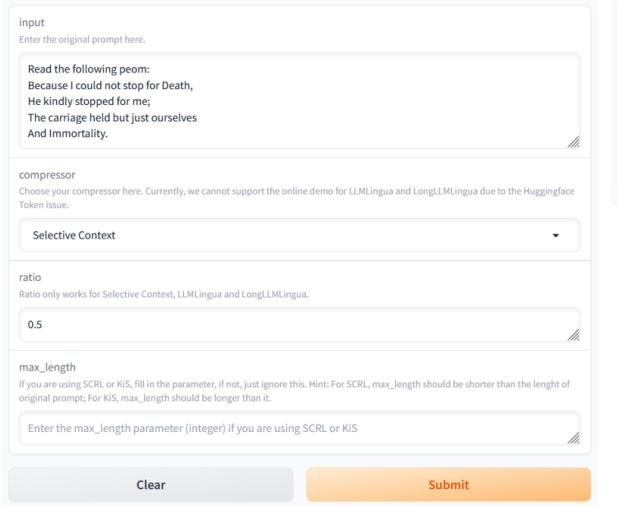

# PCToolkit: A Unified Plug-and-Play Prompt Compression Toolkit of Large Language Models

Jinyi Li<sup>1</sup>,<sup>3</sup> , Yihuai Lan<sup>1</sup> , Lei Wang<sup>2</sup> , Hao Wang<sup>1</sup><sup>∗</sup>

<sup>1</sup>The Hong Kong University of Science and Technology (Guangzhou) <sup>2</sup>Singapore Management University <sup>3</sup>South China University of Technology

{jinyili, haowang}@hkust-gz.edu.cn

Open-source repository: <https://github.com/3DAgentWorld/Toolkit-for-Prompt-Compression> Supplementary video: [https://youtu.be/\\_KarBVRmpT0](https://youtu.be/_KarBVRmpT0)

## Abstract

Prompt compression is an innovative method for efficiently condensing input prompts while preserving essential information. To facilitate quick-start services, user-friendly interfaces, and compatibility with common datasets and metrics, we present the Prompt Compression Toolkit (PCToolkit). This toolkit is a unified plug-and-play solution for compressing prompts in Large Language Models (LLMs), featuring cutting-edge prompt compressors, diverse datasets, and metrics for comprehensive performance evaluation. PCToolkit boasts a modular design, allowing for easy integration of new datasets and metrics through portable and user-friendly interfaces. In this paper, we outline the key components and functionalities of PCToolkit. We conducted evaluations of the compressors within PCToolkit across various natural language tasks, including reconstruction, summarization, mathematical problemsolving, question answering, few-shot learning, synthetic tasks, code completion, boolean expressions, multiple choice questions, and lies recognition.

## 1 Introduction

Given the performance limitations and computational overhead of Large Language Models (LLMs) [\(Wang et al.,](#page-8-0) [2024\)](#page-8-0), how to effectively apply LLMs to tasks involving lengthy textual inputs is a persistent challenge. Various viable solutions have emerged to address this issue, encompassing techniques such as length extrapolation [\(Chen et al.,](#page-6-0) [2021;](#page-6-0) [Shaw et al.,](#page-7-0) [2018\)](#page-7-0), attention approximation [\(Winata et al.,](#page-8-1) [2019;](#page-8-1) [Wang et al.,](#page-8-2) [2020\)](#page-8-2), attentionfree transformers [\(Gu et al.,](#page-7-1) [2021;](#page-7-1) [Orvieto et al.,](#page-7-2) [2023\)](#page-7-2), model compression [\(Lee et al.,](#page-7-3) [2023;](#page-7-3) [Ma](#page-7-4) [et al.,](#page-7-4) [2023\)](#page-7-4), and hardware-aware transformers [\(Dao et al.,](#page-6-1) [2022;](#page-6-1) [Liu and Abbeel,](#page-7-5) [2023\)](#page-7-5).

Prompt compression technology, a subset of length extrapolation methods, presents a strategic

solution to tackle this challenge by condensing intricate textual inputs into succinct prompts that encapsulate crucial information. This approach enables LLMs to function more efficiently within resource constraints, enhancing their performance [\(Wang](#page-8-0) [et al.,](#page-8-0) [2024\)](#page-8-0). Moreover, by reducing the reliance on extensive API calls, prompt compression not only improves the cost-effectiveness of leveraging LLMs but also streamlines the computational processes involved in language understanding tasks. When compared to alternative strategies, prompt compression offers intuitive and adaptable techniques for addressing diverse scenarios [\(Naveed](#page-7-6) [et al.,](#page-7-6) [2023;](#page-7-6) [Zhao et al.,](#page-8-3) [2023;](#page-8-3) [Wan et al.,](#page-8-4) [2023\)](#page-8-4).

However, the deployment of prompt compression methods varies between different approaches. There is not yet a general toolkit that can invoke compressors of multiple types. Moreover, datasets and metrics are also essential for evaluating the performance of each compression method. Thus, with the aim of providing plug-and-play services, easy-customized interfaces and supporting common datasets and metrics, we propose Prompt Compression Toolkit (PCToolkit), a unified plug-andplay toolkit for Prompt Compression of LLMs, making accessible and portable prompt compression methods to a wider audience. Our plug-andplay design enables users to deploy and use the toolkit without any further model trainings. Meanwhile, users are also able to plug in their customtrained models in PCToolkit.

Specifically, Figure [1](#page-1-0) illustrates the comprehensive architecture of PCToolkit. Key features of PCToolkit include:

(i) State-of-the-art and reproducible methods. Encompassing a wide array of mainstream compression techniques, PCToolkit offers a unified interface for various compression methods (compressors). Notably, PCToolkit incorporates a total of five distinct compressors, namely Selective Context [\(Li et al.,](#page-7-7) [2023\)](#page-7-7), LLMLingua [\(Jiang et al.,](#page-7-8) [2023a\)](#page-7-8),

<sup>∗</sup>Corresponding author.

<span id="page-1-0"></span>> **[图片提取文字 (无描述)]:**
> 麵 Compressors **Datasets** Metrics GSM8K SCRL KiS LLMLingua BLEU **BBC News** LongLLMLingua Selective Context ROUGE-1 Arxiv **ROUGE-2** ShareGPT ( Runner BBH ROUGE-L Compressor LongBench Bertscore-P Text input Dataset Gigaword Bertscore-R Metric DUC2004 BNC Bertscore-F1 Results Broadcast Edit distance Compressed prompt Score for evaluation Google


Figure 1: Architecture of PCToolkit. The *compressors* module encompasses prompt compression methods that can be accessed through a unified interface with customizable parameters. The *datasets* module includes 10 diverse datasets detailed in Table [2.](#page-3-0) The *metrics* module comprises four primary metrics utilized for evaluating the performance of various compressors. The *runner* module offers a generalized interface for executing evaluations or simply retrieving the compressed prompt generated by the compressors.

LongLLMLingua [\(Jiang et al.,](#page-7-9) [2023b\)](#page-7-9), SCRL [\(Gha](#page-7-10)[landari et al.,](#page-7-10) [2022\)](#page-7-10), and KiS [\(Laban et al.,](#page-7-11) [2021\)](#page-7-11).

- (ii) User-friendly interfaces for new compressors, datasets, and metrics. Facilitating portability and ease of adaptation to different environments, the interfaces within PCToolkit are designed to be easily customizable. This flexibility makes PC-Toolkit suitable for a wide range of environments and tasks.
- (iii) Modular design. Featuring a modular structure that simplifies the transition between different methods, datasets, and metrics, PCToolkit is organized into four distinct modules: Compressor, Dataset, Metric and Runner module.

## 2 Related Works

Recent prompt-related toolkits have focused on prompt design intricacies and their influence on language model performance [\(Amatriain,](#page-6-2) [2024;](#page-6-2) [Liu](#page-7-12) [et al.,](#page-7-12) [2021\)](#page-7-12). These studies emphasize the significance of tailored prompts in guiding language models for accurate information retrieval, offering valuable insights for prompt compression methodologies. Various toolkits exist for prompt engineering and optimization, such as Promptify, ChainForge, Promptotype, and OpenPrompt.

Promptify. It is a toolkit tailored for prompt engineering, addressing NLP challenges with LLMs and facilitating the generation of diverse NLP task

prompts [\(Pal,](#page-7-13) [2022\)](#page-7-13).

ChainForge. This visual toolkit aids prompt engineering and enables on-demand hypothesis testing for text generation LLMs [\(Arawjo et al.,](#page-6-3) [2023\)](#page-6-3).

Promptotype. A platform for structured prompt engineering, facilitating the development, testing, and monitoring of customized LLM tasks[1](#page-1-1) .

OpenPrompt. This toolkit supports promptlearning with pre-trained language models (PLMs), offering efficiency, modularity, and extendibility. It allows the integration of different PLMs, task formats, and prompting modules in a unified framework [\(Ding et al.,](#page-6-4) [2022\)](#page-6-4).

Despite the availability of aforementioned toolkits, a toolkit specifically focusing on prompt compression remains absent. By amalgamating insights from existing works and incorporating state-of-theart prompt compression techniques, our toolkit aims to equip researchers, developers, and practitioners with a versatile toolset for prompt compression. This enhancement seeks to improve the performance and affordability of large language models across diverse applications.

# 3 Supported Compressors, Datasets and Metrics

Table [1](#page-2-0) presents an overview of the supported tasks, compressors, and datasets within PCToolkit. Each

<span id="page-1-1"></span><sup>1</sup> <https://www.promptotype.io/>

<span id="page-2-0"></span>

| Tasks                  | Supported Compressors                   | Supported Datasets                                          |  |  |
|------------------------|-----------------------------------------|-------------------------------------------------------------|--|--|
| Reconstruction         | SC, LLMLingua, LongLLMLingua, SCRL, KiS | BBC, ShareGPT, Arxiv, GSM8K                                 |  |  |
| Mathematical promblems | SC, LLMLingua, LongLLMLingua, SCRL, KiS | GSM8K, BBH                                                  |  |  |
| Boolean expressions    | SC, LLMLingua, LongLLMLingua, SCRL, KiS | BBH                                                         |  |  |
| Multiple choice        | SC, LLMLingua, LongLLMLingua, SCRL, KiS | BBH                                                         |  |  |
| Lies recognition       | SC, LLMLingua, LongLLMLingua, SCRL, KiS | BBH                                                         |  |  |
|                        | SC, LLMLingua, LongLLMLingua, SCRL, KiS | BBC, Arxiv.<br>Gigaword, DUC2004,<br>BNC, Broadcast, Google |  |  |
| Summarization          | LLMLingua, LongLLMLingua                | LongBench                                                   |  |  |
|                        | SC, LLMLingua, LongLLMLingua, SCRL, KiS | BBH                                                         |  |  |
| Question and Answer    | LLMLingua, LongLLMLingua                | LongBench                                                   |  |  |
| Few-shot learning      | LLMLingua, LongLLMLingua                | LongBench                                                   |  |  |
| Synthetic tasks        | LLMLingua, LongLLMLingua                | LongBench                                                   |  |  |
| Code completion        | LLMLingua, LongLLMLingua                | LongBench                                                   |  |  |

Table 1: An overview of PCToolkit, including different evaluation tasks, compressors and datasets.

component are described in detail in Section 4 Toolkit Design. Evaluation of all compression methods across various datasets for different tasks is depicted in Table [6,](#page-9-0) with results to be discussed in Section 5 Evaluation.

### 3.1 Compressors

PCToolkit integrates 5 state-of-the-art prompt compression methods in total: Selective Context [\(Li](#page-7-7) [et al.,](#page-7-7) [2023\)](#page-7-7), LLMLingua [\(Jiang et al.,](#page-7-8) [2023a\)](#page-7-8), LongLLMLingua [\(Jiang et al.,](#page-7-9) [2023b\)](#page-7-9), SCRL [\(Gha](#page-7-10)[landari et al.,](#page-7-10) [2022\)](#page-7-10) and KiS [\(Laban et al.,](#page-7-11) [2021\)](#page-7-11). These compressors are plug-and-play implemented, therefore can be invoked directly.

Selective Context. Selective Context improves the context efficiency of LLMs in inference by removing redundant content measured by selfinformation [\(Shannon,](#page-7-14) [1948\)](#page-7-14).

LLMLingua. LLMLingua involves a budget controller to maintain semantic integrity under high compression ratios. LLMLingua compresses information within prompts by capitalizing on the compression-like characteristics of LLMs [\(Jiang](#page-7-8) [et al.,](#page-7-8) [2023a\)](#page-7-8).

LongLLMLingua. LongLLMLingua came into stage with an enhancement on dealing with the inherent challenge of the *lost in the middle* issue [\(Liu et al.,](#page-7-15) [2023\)](#page-7-15), which is a phenomenon that performance of LLM can degrade significantly when models must access relevant information in the middle of long contexts [\(Jiang et al.,](#page-7-9) [2023b\)](#page-7-9).

SCRL. SCRL is a reinforcement learning-based approach designed to remove or retain tokens according to the probabilities [\(Ghalandari et al.,](#page-7-10) [2022\)](#page-7-10).

KiS. KiS is an approach of unsupervised text simplification, which learns to balance a reward across three properties: fluency, salience and simplicity [\(Laban et al.,](#page-7-11) [2021\)](#page-7-11).

### 3.2 Datasets

Table [2](#page-3-0) shows all datasets supported in PCToolkit. GSM8K. GSM8K [\(Cobbe et al.,](#page-6-5) [2021\)](#page-6-5) contains 8.5K high-quality linguistically diverse word problems in elementary school mathematics. Each item contains a problem and its solution.

BBC News, Arxiv articles and ShareGPT. [Li](#page-7-7) [et al.](#page-7-7) [\(2023\)](#page-7-7) provided the three datasets. BBC News provides news articles from BBC, which is a typical context of human daily lives. Arxiv articles provides scientific articles that represents a formal context. ShareGPT contains contexts that is collected from human-AI conversations, which is a normal communication context.

Big Bench Hard (BBH). BBH [\(Suzgun et al.,](#page-7-16) [2022\)](#page-7-16) is a diverse evaluation suite that focuses on a suite of 23 challenging tasks from BIG-Bench that were found to be beyond the capabilities of current language models.

LongBench. LongBench [\(Bai et al.,](#page-6-6) [2023\)](#page-6-6) is the first benchmark for bilingual, multitask and comprehensive assessment of long context understanding capabilities of large language models. LongBench has six different task scenarios including single-document question & answer, multidocument question & answer, summarization, fewshot learning, synthetic tasks and code completion.

Gigaword, BNC, DUC2004, Broadcast and Google. [Ghalandari et al.](#page-7-10) [\(2022\)](#page-7-10) provided the five datasets. While Gigaword [\(Rush et al.,](#page-7-17) [2015\)](#page-7-17) and DUC2004 [\(Over and Yen.,](#page-7-18) [2004\)](#page-7-18) contain abstractive ground truth summaries, the remaining three datasets [\(Filippova and Altun,](#page-6-7) [2013;](#page-6-7) [Clarke and](#page-6-8) [Lapata,](#page-6-8) [2008\)](#page-6-8) have token-level extractive ground truth summaries.

<span id="page-3-0"></span>

| Datasets       | <b>Supporting Compressors</b> | <b>Supporting Metrics</b>                       |
|----------------|-------------------------------|-------------------------------------------------|
| BBH            | All                           | Accuracy                                        |
| Gigaword       | All                           | ROUGE, Token-F1                                 |
| BNC            | All                           | ROUGE, Token-F1                                 |
| DUC2004        | All                           | ROUGE, Token-F1                                 |
| Broadcast      | All                           | ROUGE, Token-F1                                 |
| Google         | All                           | ROUGE, Token-F1                                 |
| GSM8K          | All                           | Accuracy, BLEU, ROUGE, BERTScore                |
| BBC News       | All                           | BLEU, ROUGE, BERTScore                          |
| Arxiv articles | All                           | BLEU, ROUGE, BERTScore                          |
| ShareGPT       | All                           | BLEU, ROUGE, BERTScore                          |
| LongBench      | LLMLingua, LongLLMLingua      | Accuracy, BLEU, ROUGE, BERTScore, Edit-distance |

Table 2: Datasets and corresponding compressors and metrics supported in PCToolkit.

#### 3.3 Metrics

PCToolkit provides different metrics, including BLEU, ROUGE, BERTScore, Edit distance and Accuracy. The first four metrics are used to compare the difference between two strings, while Accuracy judges the results provided by LLM with the ground truth answer.

**BLEU.** Proposed by Papineni et al. (2002), Bilingual Evaluation Understudy (BLEU) is a metric used to evaluate machine-translated text by comparing it to reference translations (Papineni et al., 2002; Li et al., 2023).

**ROUGE.** Proposed by Lin (2004), Recall-Oriented Understudy for Gisting Evaluation (ROUGE) is a set of metrics used for evaluating the quality of summaries produced by automatic summarization systems (Lin, 2004; Li et al., 2023; Bai et al., 2023).

**BERTScore.** Proposed by Zhang\* et al. (2020), BERTScore evaluates text similarity using contextual embeddings from BERT (Devlin et al., 2019). It measures the similarity between reference and candidate sentences, providing a score between 0 and 1, where 1 indicates perfect semantic similarity (Zhang\* et al., 2020; Li et al., 2023).

Edit distance. Edit distance (Levenshtein distance) is popularly used in code generation evaluation (Svyatkovskiy et al., 2020; Yujian and Bo, 2007). Edit Distance is a metric used to quantify the difference between two sequences of strings (Bai et al., 2023).

#### 4 Toolkit Design

#### 4.1 Modular Design

As shown in Figure 1, PCToolkit is designed with a modular architecture, consisting of Compressor, Dataset, Metrics and Runner.

**Compressors.** pctoolkit.compressors module in PCToolkit encompasses five state-of-the-art compression methods tailored for prompt optimization. All compressors can be invoked through a unified interface shown in **Section 4.2**.

**Datasets.** pctoolkit.datasets module boasts a diverse collection of over ten datasets, each meticulously curated to cover a wide array of natural language tasks. As shown in Table 3, from tasks like reconstruction, summarization, question answering, to more specialized domains such as code completion and lies recognition, the datasets in PCToolkit offer a comprehensive testing ground for assessing the efficacy of prompt compression techniques.

**Metrics.** pctoolkit.metrics module plays a crucial role in quantifying the performance of the compression methods across different tasks. All metrics needed can be easily contained inside a list that tells the Runner which metrics are required measuring.

Runners. pctoolkit.runners module serves as the engine that drives the evaluation process, orchestrating the interaction between the compression methods, datasets, and evaluation metrics. Researchers and practitioners can seamlessly execute experiments, compare results, and analyze the performance of different compression techniques using the Runner component. This streamlined workflow ensures efficient experimentation and evaluation of prompt compression strategies within the toolkit.

By integrating these components, PCToolkit offers a comprehensive and user-friendly platform for prompt compression and evaluation, empowering researchers and practitioners to optimize prompts for enhanced model performance in natural language processing tasks.

<span id="page-4-0"></span>

| Algorithms Metrics |              | Datasets |          |                                |          |                  |                  |                  |                  |                  |
|--------------------|--------------|----------|----------|--------------------------------|----------|------------------|------------------|------------------|------------------|------------------|
| Algoriums Wettes   | GSM8K        | BBC News | ShareGPT | Arxiv                          | Gigaword | DUC2004          | BNC              | Broadcast        | Google           |                  |
| Selective Context  |              | 0.56     | 0.32     | <b>0.37</b> <sub>(+0.12)</sub> | 0.29     | 0.24             | 0.24             | 0.54             | 0.45             | 0.45             |
| (Long)LLMLingua    | BLEU         | 0.78     | 0.17     | $0.25_{(-0.02)}$               | 0.12     | 0.20             | 0.21             | 0.69             | 0.81             | 0.41             |
| SCRL               | BLEU         | 0.34     | 0.02     | 0.27                           | 0.05     | 0.26             | 0.25             | 0.55             | 0.45             | 0.45             |
| KiS                |              | 0.52     | 0.02     | 0.07                           | 0.00     | 0.17             | 0.20             | 0.50             | 0.45             | 0.33             |
| Selective Context  |              | 0.82     | 0.69     | <b>0.70</b> <sub>(+0.33)</sub> | 0.57     | 0.19             | 0.14             | 0.58             | 0.57             | 0.51             |
| (Long)LLMLingua    | ROUGE L      | 0.90     | 0.50     | $0.56_{(+0.17)}$               | 0.42     | 0.21             | 0.17             | 0.82             | 0.90             | 0.57             |
| SCRL               | KOUGE L      | 0.53     | 0.27     | 0.58                           | 0.24     | $0.21_{(-0.02)}$ | $0.13_{(-0.09)}$ | $0.41_{(-0.38)}$ | $0.41_{(-0.41)}$ | $0.36_{(-0.34)}$ |
| KiS                |              | 0.73     | 0.31     | 0.32                           | 0.08     | 0.17             | 0.16             | 0.60             | 0.58             | 0.45             |
| Selective Context  | Bertscore P  | 0.96     | 0.89     | 0.90                           | 0.93     | 0.86             | 0.86             | 0.89             | 0.88             | 0.92             |
| (Long)LLMLingua    |              | 0.98     | 0.86     | 0.89                           | 0.88     | 0.88             | 0.89             | 0.97             | 0.98             | 0.96             |
| SCRL               |              | 0.68     | 0.81     | 0.87                           | 0.85     | 0.86             | 0.86             | 0.86             | 0.82             | 0.91             |
| KiS                |              | 0.95     | 0.83     | 0.81                           | 0.80     | 0.87             | 0.89             | 0.93             | 0.93             | 0.95             |
| Selective Context  |              | 0.97     | 0.91     | 0.92                           | 0.92     | 0.83             | 0.84             | 0.90             | 0.90             | 0.87             |
| (Long)LLMLingua    | D D          | 0.98     | 0.89     | 0.91                           | 0.90     | 0.83             | 0.85             | 0.94             | 0.96             | 0.89             |
| SCRL               | Bertscore R  | 0.70     | 0.88     | 0.92                           | 0.86     | 0.82             | 0.82             | 0.85             | 0.83             | 0.85             |
| KiS                |              | 0.95     | 0.93     | 0.90                           | 0.84     | 0.84             | 0.86             | 0.91             | 0.90             | 0.89             |
| Selective Context  | Bertscore F1 | 0.97     | 0.90     | <b>0.91</b> <sub>(+0.02)</sub> | 0.92     | 0.85             | 0.85             | 0.89             | 0.89             | 0.89             |
| (Long)LLMLingua    |              | 0.98     | 0.88     | $0.90_{(+0.05)}$               | 0.89     | 0.85             | 0.87             | 0.96             | 0.97             | 0.93             |
| SCRL               |              | 0.69     | 0.84     | 0.89                           | 0.85     | 0.84             | 0.84             | $0.85_{(+0.09)}$ | $0.82_{(+0.03)}$ | $0.88_{(+0.11)}$ |
| KiS                |              | 0.95     | 0.88     | 0.85                           | 0.82     | 0.85             | 0.87             | 0.92             | 0.91             | 0.92             |

Table 3: Performance measured for reconstruction and summarization tasks in PCToolkit. (Long)LLMLingua means we considered LLMLingua and LongLLMLingua together, since for small scale datas, these two compressors showed very slight differences. Numbers in parenthesis are the difference between the original results provided by former experiments and our results.

#### 4.2 Unified Interface

In PCToolkit, a unified interface for invoking prompt compression methods is provided. In the following example, we show how to simply invoke the compressing methods within few lines.

```
from pctoolkit.compressors import
    PromptCompressor

compressor = PromptCompressor(
type='SCCompressor', device='cuda')

test_prompt = "test prompt"
ratio = 0.3
result = compressor.compressgo(
test_prompt, ratio)
print(result)
```

Different parameters for compressors can be included inside compressgo.

For simple compression task, one compressor is selected. Following the example given above, an original prompt is input to the compressor, and the compressor outputs the target compressed prompt. For datasets evaluation, one datasets and multiple metrics are selected, along with the compressor chosen, these three parts are deployed in Runner. The Runner will provide the evaluation results according to the metrics list, which includes all metrics expected. The following example shows how to modularistically use PCToolkit.

```
from pctoolkit.runners import run
from pctoolkit.datasets import
    load_dataset
from pctoolkit.metrics import
    load_metrics
```

```
compressor = PromptCompressor(
type='SCCompressor', device='cuda')
dataset_name = 'arxiv'
dataset = load_dataset(dataset_name)

run(compressor=compressor,
dataset=dataset,
metrics=load_metrics, ratio=0.1)
```

Currently, the supporting datasets calls are implemented inside run. Users can also following the format in run to adapt their own datasets or metrics.

#### 5 Evaluation

Compression ratio. Following Li et al. (2023), we define the compression ratio to be the ratio of reduced context length comparing with the original context length. That is, ratio  $\rho=1-\frac{L_c}{L_O}$  where  $L_c$  represents the length of compressed context and  $L_o$  represents the length of original context. Compression ratio is an essential parameter that measures how much deletion is needed for a prompt.

#### **5.1** Short Context Tasks

We conducted evaluations using different datasets as outlined in Table 1 and assessed them across various metrics. The results, presented in Table 3, utilized metrics like BLEU, ROUGE, and BERTScore for testing tasks that do not have a definitive answer, such as reconstruction and summarization. Following the methodologies of Li et al. (2023) and Jiang et al. (2023a), GPT-3.5-Turbo was employed

<span id="page-5-1"></span>

| Compressors   | LongBench <sup>3</sup> |                  |                  |                  |                  |                  |                  |       |
|---------------|------------------------|------------------|------------------|------------------|------------------|------------------|------------------|-------|
| Compressors   | SingleDoc              | MultiDoc         | Summ.            | FewShot          | Synth.           | Code             | AVG              | Ratio |
| LLMLingua     | $0.30_{(-0.01)}$       | $0.34_{(-0.04)}$ | $0.22_{(-0.04)}$ | $0.63_{(-0.04)}$ | $0.11_{(+0.03)}$ | $0.37_{(-0.16)}$ | $0.33_{(-0.04)}$ | 0.66  |
| LongLLMLingua | $0.41_{(+0.01)}$       | $0.39_{(-0.07)}$ | $0.22_{(-0.05)}$ | $0.63_{(-0.08)}$ | $0.75_{(+0.22)}$ | $0.42_{(-0.13)}$ | $0.47_{(-0.02)}$ | 0.66  |
| LLMLingua     | $0.26_{(+0.04)}$       | $0.36_{(+0.04)}$ | $0.22_{(-0.03)}$ | $0.60_{(-0.01)}$ | $0.10_{(0.00)}$  | $0.36_{(-0.21)}$ | $0.32_{(-0.03)}$ | 0.80  |
| LongLLMLingua | $0.38_{(-0.01)}$       | $0.39_{(-0.03)}$ | $0.22_{(-0.05)}$ | $0.62_{(-0.07)}$ | $0.60_{(+0.04)}$ | $0.37_{(-0.2)}$  | $0.43_{(-0.05)}$ | 0.80  |

Table 4: Performance measured in LongBench datasets. Numbers in parenthesis are the difference between the original results provided by former experiments and our results. We evaluated each task by the metric provided by LongBench.

as a frozen LLM for reconstruction tasks. It received compressed prompts from the compressors and generated reconstructed prompts, which were then compared with the compressed ones. For summarization tasks, the frozen LLM provided a pair of summaries, one from the original context and the other from the compressed context. These pairs of summaries were evaluated using the specified metrics. In our experiment, datasets like GSM8K, BBC News, and ShareGPT were designated for reconstruction tasks, while the rest were assigned to summarization tasks.

For tasks with precise answers, such as mathematical problems, metrics like accuracy and edit distance are commonly used. As shown in Table 5, we tested all compression methods across various task types. The GSM8K dataset includes mathematical problems, while BBH encompasses a diverse range of tasks. For instance, the Boolean Expression task requires the LLM to provide answers to specific logical expressions; the Movie Recommendation task tasks the LLM with selecting the most suitable movie from a list based on a given description; and the Web of Lies task involves the LLM determining if a particular character is lying.

#### **5.2** Long Context Tasks

For datasets that contains longer contexts, we evaluate LLMLingua and LongLLMLingua on them. With specified questions, LongLLMLingua performed much better than LLMLingua. Results are shown in Table 4. The evaluation settings are different from original ones, as the authors of LLM-Lingua mentioned on GitHub<sup>2</sup>, they used the completion mode of GPT-3.5-turbo, which is recently disabled by OpenAI. Thus, we used the chat mode instead, which caused a little deviation from the original results.

<span id="page-5-0"></span>

| Compressors       | Dataset         | Accuracy                       |  |
|-------------------|-----------------|--------------------------------|--|
| Baseline          |                 | 0.51                           |  |
| Selective Context | BBH Boolean     | <b>0.54</b> <sub>(+0.03)</sub> |  |
| (Long)LLMLingua   | Expression      | $0.54_{(+0.03)}$               |  |
| SCRL              | Expression      | $0.54_{(+0.03)}$               |  |
| KiS               |                 | <b>0.54</b> <sub>(+0.03)</sub> |  |
| Baseline          |                 | 0.33                           |  |
| Selective Context | BBH Movie       | $0.63_{(+0.30)}$               |  |
| (Long)LLMLingua   | Recommendation  | $0.67_{(+0.34)}$               |  |
| SCRL              | Recommendation  | $0.59_{(+0.26)}$               |  |
| KiS               |                 | 0.48(+0.15)                    |  |
| Baseline          |                 | 0.89                           |  |
| Selective Context |                 | $0.39_{(-0.50)}$               |  |
| (Long)LLMLingua   | BBH Web of Lies | $0.62_{(-0.27)}$               |  |
| SCRL              |                 | $0.31_{(-0.58)}$               |  |
| KiS               |                 | $0.41_{(-0.48)}$               |  |
| Baseline          |                 | 0.29                           |  |
| Selective Context |                 | $0.09_{(-0.20)}$               |  |
| (Long)LLMLingua   | GSM8K           | $0.25_{(-0.04)}$               |  |
| SCRL              |                 | $0.05_{(-0.24)}$               |  |
| KiS               |                 | $0.13_{(-0.16)}$               |  |
|                   |                 |                                |  |

Table 5: Performance measured in BBH & GSM8K datasets. Our baseline is the performance without using any compression methods. Numbers in parenthesis are the difference between the baseline results and each results with different compressors.

## 6 Conclusion and Future work

In conclusion, we introduced PCToolkit, an opensource project designed for prompt compression and evaluation. This toolkit offers researchers and practitioners a user-friendly and comprehensive resource, featuring five cutting-edge compression methods and over ten diverse datasets encompassing a wide range of natural language tasks. Through rigorous evaluations across various tasks such as reconstruction, summarization, mathematical problem-solving, question answering, few-shot learning, and more, we demonstrated the effectiveness and versatility of the compression techniques integrated into PCToolkit.

Our future endeavors focus on expanding PC-Toolkit with more compression methods, datasets, and evaluation metrics to further enhance its capabilities for prompt compression and model optimization in natural language processing.

<span id="page-5-2"></span><sup>2</sup>https://github.com/microsoft/LLMLingua/blob/ main/Transparency\_FAQ.md

<sup>&</sup>lt;sup>3</sup>https://github.com/THUDM/LongBench

## 7 Broader Impact

The findings and methodologies presented in this study have broader implications for the field of natural language processing (NLP) and the development of language models. By exploring and evaluating various compression techniques within the PCToolkit, we contribute to the ongoing efforts to enhance the efficiency and performance of large-scale language models. The insights gained from this research can potentially inform the design of more streamlined and effective compression methods, paving the way for advancements in NLP applications across diverse domains.

Furthermore, the development of optimized compression methods could lead to more sustainable and eco-friendly practices in AI research and deployment. By reducing the computational resources required for training and inference, we may contribute to a more energy-efficient and costeffective utilization of AI technologies.

## 8 Limitations

Despite the advancements made in this study, there are inherent limitations that should be acknowledged. One notable limitation is that the PCToolkit, while effective in compressing prompts and enhancing model performance, may still face challenges in handling toxic or harmful content present in NLP datasets. The toolkit's current capabilities may not extend to effectively filtering out such content, highlighting the ongoing need for robust ethical guidelines and content moderation strategies in NLP research.

Additionally, the generalizability of the compression techniques evaluated in this study may be limited to specific task domains or dataset characteristics. Further research is needed to explore the scalability and adaptability of these methods across a wider range of tasks and datasets to fully assess their utility and effectiveness in diverse applications.

Overall, while the PCToolkit offers valuable tools for prompt compression and model optimization, researchers and practitioners are encouraged to remain vigilant about the broader impacts and limitations associated with the use of such technologies in NLP research and development.

# References

- <span id="page-6-2"></span>Xavier Amatriain. 2024. [Prompt design and engineer](https://api.semanticscholar.org/CorpusID:267301483)[ing: Introduction and advanced methods.](https://api.semanticscholar.org/CorpusID:267301483) *ArXiv*, abs/2401.14423.
- <span id="page-6-3"></span>Ian Arawjo, Chelse Swoopes, Priyan Vaithilingam, Martin Wattenberg, and Elena L. Glassman. 2023. [Chain](https://api.semanticscholar.org/CorpusID:262044762)[forge: A visual toolkit for prompt engineering and](https://api.semanticscholar.org/CorpusID:262044762) [llm hypothesis testing.](https://api.semanticscholar.org/CorpusID:262044762) *ArXiv*, abs/2309.09128.
- <span id="page-6-6"></span>Yushi Bai, Xin Lv, Jiajie Zhang, Hong Lyu, Jiankai Tang, Zhidian Huang, Zhengxiao Du, Xiao Liu, Aohan Zeng, Lei Hou, Yuxiao Dong, Jie Tang, and Juanzi Li. 2023. [Longbench: A bilingual, multitask](https://api.semanticscholar.org/CorpusID:261245264) [benchmark for long context understanding.](https://api.semanticscholar.org/CorpusID:261245264) *ArXiv*, abs/2308.14508.
- <span id="page-6-0"></span>Pu-Chin Chen, Henry Tsai, Srinadh Bhojanapalli, Hyung Won Chung, Yin-Wen Chang, and Chun-Sung Ferng. 2021. [A simple and effective positional en](https://doi.org/10.18653/v1/2021.emnlp-main.236)[coding for transformers.](https://doi.org/10.18653/v1/2021.emnlp-main.236) In *Proceedings of the 2021 Conference on Empirical Methods in Natural Language Processing*, pages 2974–2988, Online and Punta Cana, Dominican Republic. Association for Computational Linguistics.
- <span id="page-6-8"></span>James Clarke and Mirella Lapata. 2008. [Global infer](https://api.semanticscholar.org/CorpusID:3004447)[ence for sentence compression : an integer linear](https://api.semanticscholar.org/CorpusID:3004447) [programming approach.](https://api.semanticscholar.org/CorpusID:3004447) *J. Artif. Intell. Res.*, 31:399– 429.
- <span id="page-6-5"></span>Karl Cobbe, Vineet Kosaraju, Mohammad Bavarian, Mark Chen, Heewoo Jun, Lukasz Kaiser, Matthias Plappert, Jerry Tworek, Jacob Hilton, Reiichiro Nakano, Christopher Hesse, and John Schulman. 2021. Training verifiers to solve math word problems. *arXiv preprint arXiv:2110.14168*.
- <span id="page-6-1"></span>Tri Dao, Dan Fu, Stefano Ermon, Atri Rudra, and Christopher Ré. 2022. [Flashattention: Fast and](https://proceedings.neurips.cc/paper_files/paper/2022/file/67d57c32e20fd0a7a302cb81d36e40d5-Paper-Conference.pdf) [memory-efficient exact attention with io-awareness.](https://proceedings.neurips.cc/paper_files/paper/2022/file/67d57c32e20fd0a7a302cb81d36e40d5-Paper-Conference.pdf) In *Advances in Neural Information Processing Systems*, volume 35, pages 16344–16359. Curran Associates, Inc.
- <span id="page-6-9"></span>Jacob Devlin, Ming-Wei Chang, Kenton Lee, and Kristina Toutanova. 2019. [Bert: Pre-training of deep](http://arxiv.org/abs/1810.04805) [bidirectional transformers for language understand](http://arxiv.org/abs/1810.04805)[ing.](http://arxiv.org/abs/1810.04805)
- <span id="page-6-4"></span>Ning Ding, Shengding Hu, Weilin Zhao, Yulin Chen, Zhiyuan Liu, Haitao Zheng, and Maosong Sun. 2022. [OpenPrompt: An open-source framework for prompt](https://doi.org/10.18653/v1/2022.acl-demo.10)[learning.](https://doi.org/10.18653/v1/2022.acl-demo.10) In *Proceedings of the 60th Annual Meeting of the Association for Computational Linguistics: System Demonstrations*, pages 105–113, Dublin, Ireland. Association for Computational Linguistics.
- <span id="page-6-7"></span>Katja Filippova and Yasemin Altun. 2013. [Overcom](https://aclanthology.org/D13-1155)[ing the lack of parallel data in sentence compression.](https://aclanthology.org/D13-1155) In *Proceedings of the 2013 Conference on Empirical Methods in Natural Language Processing*, pages 1481–1491, Seattle, Washington, USA. Association for Computational Linguistics.

- <span id="page-7-10"></span>Demian Ghalandari, Chris Hokamp, and Georgiana Ifrim. 2022. [Efficient unsupervised sentence com](https://doi.org/10.18653/v1/2022.acl-long.90)[pression by fine-tuning transformers with reinforce](https://doi.org/10.18653/v1/2022.acl-long.90)[ment learning.](https://doi.org/10.18653/v1/2022.acl-long.90) In *Proceedings of the 60th Annual Meeting of the Association for Computational Linguistics (Volume 1: Long Papers)*, pages 1267–1280, Dublin, Ireland. Association for Computational Linguistics.
- <span id="page-7-1"></span>Albert Gu, Karan Goel, and Christopher R'e. 2021. [Effi](https://api.semanticscholar.org/CorpusID:240354066)[ciently modeling long sequences with structured state](https://api.semanticscholar.org/CorpusID:240354066) [spaces.](https://api.semanticscholar.org/CorpusID:240354066) *ArXiv*, abs/2111.00396.
- <span id="page-7-8"></span>Huiqiang Jiang, Qianhui Wu, Chin-Yew Lin, Yuqing Yang, and Lili Qiu. 2023a. [Llmlingua: Compressing](https://api.semanticscholar.org/CorpusID:263830701) [prompts for accelerated inference of large language](https://api.semanticscholar.org/CorpusID:263830701) [models.](https://api.semanticscholar.org/CorpusID:263830701) In *Conference on Empirical Methods in Natural Language Processing*.
- <span id="page-7-9"></span>Huiqiang Jiang, Qianhui Wu, Xufang Luo, Dongsheng Li, Chin-Yew Lin, Yuqing Yang, and Lili Qiu. 2023b. [Longllmlingua: Accelerating and enhancing llms](https://api.semanticscholar.org/CorpusID:263830692) [in long context scenarios via prompt compression.](https://api.semanticscholar.org/CorpusID:263830692) *ArXiv*, abs/2310.06839.
- <span id="page-7-11"></span>Philippe Laban, Tobias Schnabel, Paul Bennett, and Marti A. Hearst. 2021. [Keep it simple: Unsupervised](https://doi.org/10.18653/v1/2021.acl-long.498) [simplification of multi-paragraph text.](https://doi.org/10.18653/v1/2021.acl-long.498) In *Proceedings of the 59th Annual Meeting of the Association for Computational Linguistics and the 11th International Joint Conference on Natural Language Processing (Volume 1: Long Papers)*, pages 6365–6378, Online. Association for Computational Linguistics.
- <span id="page-7-3"></span>Changhun Lee, Jungyu Jin, Taesu Kim, Hyungjun Kim, and Eunhyeok Park. 2023. Owq: Lessons learned from activation outliers for weight quantization in large language models. *arXiv preprint arXiv:2306.02272*.
- <span id="page-7-7"></span>Yucheng Li, Bo Dong, Chenghua Lin, and Frank Guerin. 2023. [Compressing context to enhance inference ef](https://api.semanticscholar.org/CorpusID:263830231)[ficiency of large language models.](https://api.semanticscholar.org/CorpusID:263830231) In *Conference on Empirical Methods in Natural Language Processing*.
- <span id="page-7-20"></span>Chin-Yew Lin. 2004. [Rouge: A package for automatic](https://api.semanticscholar.org/CorpusID:964287) [evaluation of summaries.](https://api.semanticscholar.org/CorpusID:964287) In *Annual Meeting of the Association for Computational Linguistics*.
- <span id="page-7-5"></span>Hao Liu and Pieter Abbeel. 2023. [Blockwise paral](https://proceedings.neurips.cc/paper_files/paper/2023/file/1bfd87d2d92f0556819467dc08034f76-Paper-Conference.pdf)[lel transformers for large context models.](https://proceedings.neurips.cc/paper_files/paper/2023/file/1bfd87d2d92f0556819467dc08034f76-Paper-Conference.pdf) In *Advances in Neural Information Processing Systems*, volume 36, pages 8828–8844. Curran Associates, Inc.
- <span id="page-7-15"></span>Nelson F. Liu, Kevin Lin, John Hewitt, Ashwin Paranjape, Michele Bevilacqua, Fabio Petroni, and Percy Liang. 2023. [Lost in the middle: How language mod](https://api.semanticscholar.org/CorpusID:259360665)[els use long contexts.](https://api.semanticscholar.org/CorpusID:259360665) *Transactions of the Association for Computational Linguistics*, 12:157–173.
- <span id="page-7-12"></span>Pengfei Liu, Weizhe Yuan, Jinlan Fu, Zhengbao Jiang, Hiroaki Hayashi, and Graham Neubig. 2021. [Pre](https://api.semanticscholar.org/CorpusID:236493269)[train, prompt, and predict: A systematic survey of](https://api.semanticscholar.org/CorpusID:236493269) [prompting methods in natural language processing.](https://api.semanticscholar.org/CorpusID:236493269) *ACM Computing Surveys*, 55:1 – 35.

- <span id="page-7-4"></span>Xinyin Ma, Gongfan Fang, and Xinchao Wang. 2023. [Llm-pruner: On the structural pruning of large lan](https://proceedings.neurips.cc/paper_files/paper/2023/file/44956951349095f74492a5471128a7e0-Paper-Conference.pdf)[guage models.](https://proceedings.neurips.cc/paper_files/paper/2023/file/44956951349095f74492a5471128a7e0-Paper-Conference.pdf) In *Advances in Neural Information Processing Systems*, volume 36, pages 21702–21720. Curran Associates, Inc.
- <span id="page-7-6"></span>Humza Naveed, Asad Ullah Khan, Shi Qiu, Muhammad Saqib, Saeed Anwar, Muhammad Usman, Nick Barnes, and Ajmal S. Mian. 2023. [A comprehen](https://api.semanticscholar.org/CorpusID:259847443)[sive overview of large language models.](https://api.semanticscholar.org/CorpusID:259847443) *ArXiv*, abs/2307.06435.
- <span id="page-7-2"></span>Antonio Orvieto, Samuel L. Smith, Albert Gu, Anushan Fernando, Caglar Gulcehre, Razvan Pascanu, and Soham De. 2023. [Resurrecting recurrent neural net](https://api.semanticscholar.org/CorpusID:257496654)[works for long sequences.](https://api.semanticscholar.org/CorpusID:257496654) *ArXiv*, abs/2303.06349.
- <span id="page-7-18"></span>P Over and J Yen. 2004. Introduction to duc 2004: an intrinsic evaluation of generic news text summarization systems. In *Document Understanding Conference*.
- <span id="page-7-13"></span>Ankit Pal. 2022. Promptify: Structured output from llms. [https://github.com/promptslab/](https://github.com/promptslab/Promptify) [Promptify](https://github.com/promptslab/Promptify). Prompt-Engineering components for NLP tasks in Python.
- <span id="page-7-19"></span>Kishore Papineni, Salim Roukos, Todd Ward, and Wei-Jing Zhu. 2002. [Bleu: a method for automatic evalu](https://doi.org/10.3115/1073083.1073135)[ation of machine translation.](https://doi.org/10.3115/1073083.1073135) In *Proceedings of the 40th Annual Meeting of the Association for Computational Linguistics*, pages 311–318, Philadelphia, Pennsylvania, USA. Association for Computational Linguistics.
- <span id="page-7-17"></span>Alexander M. Rush, Sumit Chopra, and Jason Weston. 2015. [A neural attention model for abstractive sen](https://doi.org/10.18653/v1/D15-1044)[tence summarization.](https://doi.org/10.18653/v1/D15-1044) In *Proceedings of the 2015 Conference on Empirical Methods in Natural Language Processing*, pages 379–389, Lisbon, Portugal. Association for Computational Linguistics.
- <span id="page-7-14"></span>C. E. Shannon. 1948. [A mathematical theory of com](https://doi.org/10.1002/j.1538-7305.1948.tb01338.x)[munication.](https://doi.org/10.1002/j.1538-7305.1948.tb01338.x) *The Bell System Technical Journal*, 27(3):379–423.
- <span id="page-7-0"></span>Peter Shaw, Jakob Uszkoreit, and Ashish Vaswani. 2018. [Self-attention with relative position representations.](https://api.semanticscholar.org/CorpusID:3725815) In *North American Chapter of the Association for Computational Linguistics*.
- <span id="page-7-16"></span>Mirac Suzgun, Nathan Scales, Nathanael Scharli, Sebastian Gehrmann, Yi Tay, Hyung Won Chung, Aakanksha Chowdhery, Quoc V. Le, Ed Huai hsin Chi, Denny Zhou, and Jason Wei. 2022. [Challenging](https://api.semanticscholar.org/CorpusID:252917648) [big-bench tasks and whether chain-of-thought can](https://api.semanticscholar.org/CorpusID:252917648) [solve them.](https://api.semanticscholar.org/CorpusID:252917648) In *Annual Meeting of the Association for Computational Linguistics*.
- <span id="page-7-21"></span>Alexey Svyatkovskiy, Shao Kun Deng, Shengyu Fu, and Neel Sundaresan. 2020. [Intellicode compose:](https://api.semanticscholar.org/CorpusID:218673683) [code generation using transformer.](https://api.semanticscholar.org/CorpusID:218673683) *Proceedings of the 28th ACM Joint Meeting on European Software Engineering Conference and Symposium on the Foundations of Software Engineering*.

- <span id="page-8-4"></span>Zhongwei Wan, Xin Wang, Che Liu, Samiul Alam, Yu Zheng, Jiachen Liu, Zhongnan Qu, Shen Yan, Yi Zhu, Quanlu Zhang, Mosharaf Chowdhury, and Mi Zhang. 2023. [Efficient large language models: A](https://api.semanticscholar.org/CorpusID:266044196) [survey.](https://api.semanticscholar.org/CorpusID:266044196) *ArXiv*, abs/2312.03863.
- <span id="page-8-2"></span>Sinong Wang, Belinda Z. Li, Madian Khabsa, Han Fang, and Hao Ma. 2020. [Linformer: Self-attention with](https://api.semanticscholar.org/CorpusID:219530577) [linear complexity.](https://api.semanticscholar.org/CorpusID:219530577) *ArXiv*, abs/2006.04768.
- <span id="page-8-0"></span>Xindi Wang, Mahsa Salmani, Parsa Omidi, Xiangyu Ren, Mehdi Rezagholizadeh, and Armaghan Eshaghi. 2024. [Beyond the limits: A survey of techniques to](https://api.semanticscholar.org/CorpusID:267412232) [extend the context length in large language models.](https://api.semanticscholar.org/CorpusID:267412232) *ArXiv*, abs/2402.02244.
- <span id="page-8-1"></span>Genta Indra Winata, Samuel Cahyawijaya, Zhaojiang Lin, Zihan Liu, and Pascale Fung. 2019. [Lightweight](https://api.semanticscholar.org/CorpusID:204960988) [and efficient end-to-end speech recognition using](https://api.semanticscholar.org/CorpusID:204960988) [low-rank transformer.](https://api.semanticscholar.org/CorpusID:204960988) *ICASSP 2020 - 2020 IEEE International Conference on Acoustics, Speech and Signal Processing (ICASSP)*, pages 6144–6148.
- <span id="page-8-6"></span>Li Yujian and Liu Bo. 2007. [A normalized levenshtein](https://doi.org/10.1109/TPAMI.2007.1078) [distance metric.](https://doi.org/10.1109/TPAMI.2007.1078) *IEEE Transactions on Pattern Analysis and Machine Intelligence*, 29(6):1091–1095.
- <span id="page-8-5"></span>Tianyi Zhang\*, Varsha Kishore\*, Felix Wu\*, Kilian Q. Weinberger, and Yoav Artzi. 2020. [Bertscore: Eval](https://openreview.net/forum?id=SkeHuCVFDr)[uating text generation with bert.](https://openreview.net/forum?id=SkeHuCVFDr) In *International Conference on Learning Representations*.
- <span id="page-8-3"></span>Wayne Xin Zhao, Kun Zhou, Junyi Li, Tianyi Tang, Xiaolei Wang, Yupeng Hou, Yingqian Min, Beichen Zhang, Junjie Zhang, Zican Dong, Yifan Du, Chen Yang, Yushuo Chen, Z. Chen, Jinhao Jiang, Ruiyang Ren, Yifan Li, Xinyu Tang, Zikang Liu, Peiyu Liu, Jianyun Nie, and Ji rong Wen. 2023. [A survey of](https://api.semanticscholar.org/CorpusID:257900969) [large language models.](https://api.semanticscholar.org/CorpusID:257900969) *ArXiv*, abs/2303.18223.

## A Appendix

## A.1 Online Demonstration

PCToolkit online demonstration is available on [https://huggingface.co/spaces/](https://huggingface.co/spaces/JerryLiJinyi/Prompt-Compression-Toolbox) [JerryLiJinyi/Prompt-Compression-Toolbox](https://huggingface.co/spaces/JerryLiJinyi/Prompt-Compression-Toolbox). The guidance for online demonstration can be found in Appendix A.2.

### A.2 Guidance for Online Demonstration

As shown in Figure [2,](#page-9-1) follow the steps below to try our online demonstration.

Step 1. Enter the original prompt.

Step 2. Choose a compressor. Due to the Huggingface Token issue, we cannot provide online demonstrations for LLMLingua and LongLLMLingua compressors since they are based on LLaMA 2, for which a Huggingface Token is needed.

Step 3. Enter the compression ratio. As mentioned in section 4, the compression ratio is the proportion of context to be deleted. Compression ratio only works for Selective Context, LLMLingua and LongLLMLingua.

Step 4. If SCRL or KiS is chosen, max\_length parameter is needed to be specified manually. Precisely, for SCRL, max\_length represents the length of context window, so it should be less than the length of original context. As for KiS, max\_length represents the maximum length of input context. So, for KiS, max\_length should be longer than the original context.

## A.3 Datasets Tested on Different Compressors

As shown in Table [6,](#page-9-0) we evaluated all compressors on different datasets supported by PCToolkit.

<span id="page-9-0"></span>

|               | Selective<br>Con<br>text | LLM<br>Lingua | Long<br>LLM<br>Lingua | SCRL | KiS |
|---------------|--------------------------|---------------|-----------------------|------|-----|
| GSM8K         | ✓                        | ✓             | ✓                     | ✓    | ✓   |
| BBH           | ✓                        | ✓             | ✓                     | ✓    | ✓   |
| BBC<br>News   | ✓                        | ✓             | ✓                     | ✓    | ✓   |
| Arxiv         | ✓                        | ✓             | ✓                     | ✓    | ✓   |
| ShareGPT ✓    |                          | ✓             | ✓                     | ✓    | ✓   |
| Gigaword      | ✓                        | ✓             | ✓                     | ✓    | ✓   |
| DUC2004 ✓     |                          | ✓             | ✓                     | ✓    | ✓   |
| BNC           | ✓                        | ✓             | ✓                     | ✓    | ✓   |
| Broadcast     | ✓                        | ✓             | ✓                     | ✓    | ✓   |
| Google        | ✓                        | ✓             | ✓                     | ✓    | ✓   |
| Long<br>Bench |                          | ✓             | ✓                     |      |     |

Table 6: Datasets tested on different compressors.

<span id="page-9-1"></span>> **[图片提取文字 (无描述)]:**
> input Enter the original prompt here. Read the following peom: Because I could not stop for Death, He kindly stopped for me; The carriage held but just ourselves And Immortality. compressor Choose your compressor here. Currently, we cannot support the online demo for LLMLingua and LongLLMLingua due to the Ruggingface Token issue. Selective Context ratio Ratio only works for Selective Context, LLMLingua and LongLLMLingua. 0.5 max\_length If you are using SCRL or KiS, fill in the parameter, if not, just ignore this. Hint: For SCRL, max\_length should be shorter than the length of original prompt; For KIS, max\_length should be longer than it. Enter the max\_length parameter (integer) if you are using SCRL or KiS Clear Submit


> **[图片提取文字 (无描述)]:**
> Please wait patiently when proceeding it may take more than 2 minutes to generate since we are using CPUs for free. Read the following peom Because for Death He kindly The carriage held but just ourselves And ratio With the compression ratio of: 0.53125


Figure 2: Demonstration website.