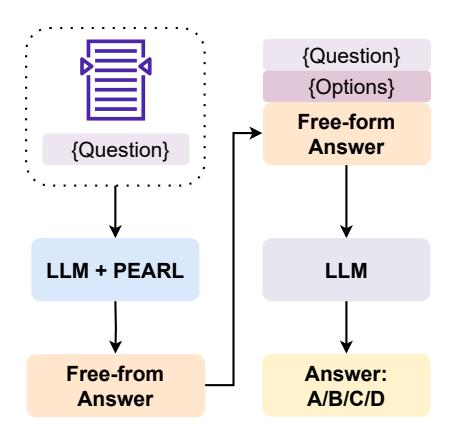
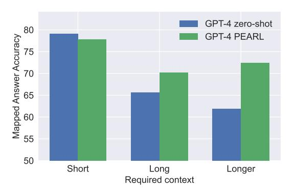
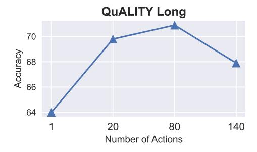
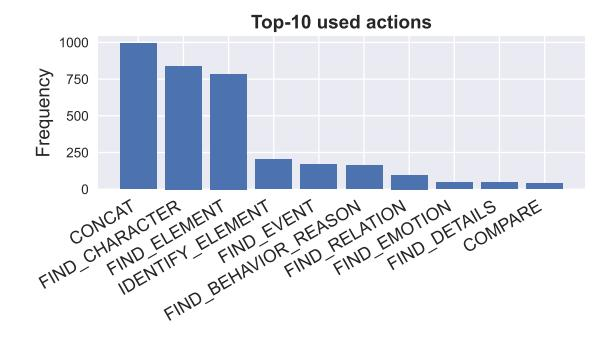

## <span id="page-0-0"></span>PEARL: Prompting Large Language Models to Plan and Execute Actions Over Long Documents

Simeng Sun<sup>1</sup>[∗](#page-0-0) Yang Liu<sup>2</sup> Shuohang Wang<sup>2</sup> Dan Iter<sup>2</sup> Chenguang Zhu<sup>2</sup> Mohit Iyyer<sup>1</sup>

University of Massachusetts Amherst<sup>1</sup> Microsoft Research<sup>2</sup>

{simengsun, miyyer}@umass.edu {yaliu10,shuohang.wang,iterdan,chezhu}@microsoft.com

## Abstract

Strategies such as chain-of-thought prompting improve the performance of large language models (LLMs) on complex reasoning tasks by decomposing input examples into intermediate steps. However, it remains unclear how to apply such methods to reason over *long input documents*, in which both the decomposition and the output of each intermediate step are non-trivial to obtain. In this work, we propose PEARL, a prompting framework to improve reasoning over long documents, which consists of three stages: action mining, plan formulation, and plan execution. More specifically, given a question about a long document, PEARL decomposes the question into a sequence of actions (e.g., SUMMARIZE, FIND\_EVENT, FIND\_RELATION) and then executes them over the document to obtain the answer. Each stage of PEARL is implemented via zero-shot or few-shot prompting of LLMs (in our work, GPT-4) with minimal human input. We evaluate PEARL on a challenging subset of the QuALITY dataset, which contains questions that require complex reasoning over long narrative texts. PEARL outperforms zero-shot and chain-of-thought prompting on this dataset, and ablation experiments show that each stage of PEARL is critical to its performance. Overall, PEARL is a first step towards leveraging LLMs to reason over long documents.[1](#page-0-1)

## 1 Introduction

Performing complex reasoning over long input documents often requires forming high-level abstractions of the text (e.g., plots and themes in a narrative) and then conducting a variety of inferences on top of those abstractions [\(Graesser et al.,](#page-9-0) [1994\)](#page-9-0). Consider the following question about the story "Breakaway" from the QuaLITY dataset [\(Pang](#page-10-0) [et al.,](#page-10-0) [2022\)](#page-10-0):

<span id="page-0-2"></span>> **[图片提取文字 (无描述)]:**
> Action Mining Mine helpful actions from training set questions DEFINE(X), COMPARE(X,Y), FIND EMOTION(X),... Plan Generation Given a question, generate plan of mined actions Question: What part of the final scene best connects to the story's opening conversation? 1.open conv = FIND ELEMENT(CTX, "opening conver..") 2.final scene = SUMMARIZE X(CTX, "final scene") 3.reflection = FIND RELATION(init conv, final scene) Plan Execution Execute the plan step-by-step open conv = "In the initial conversation, Phil Conover is excited about his upcoming mission to be the first man to see the other side of the moon ...."


Figure 1: High-level overview of our framework PEARL. Each stage in PEARL is achieved via zero-shot or fewshot prompting of an LLM (in our work, GPT-4). We also provide example outputs from each stage.

What part of the final scene best connects to the story's opening conversation?

To answer this question, we need to gather and synthesize information from across the story, which motivates decomposing the question into a *plan of actions*, as in:

- 1. Identify all participants in initial conversation.
- 2. Summarize the initial conversation.
- 3. Summarize events and themes of final scene.
- 4. Summarize roles of conversation participants in final scene.
- 5. Identify and rank connections between conversation and final scene.

Each action in the above plan varies in complexity, from simple lookup-style actions (Step 1) to more challenging query-focused summarization (Steps 2-4) and conceptual linking (Step 5) actions that require deep narrative understanding.

Given the rapidly advancing capabilities of large language models (LLMs), how can we use them to answer questions like these? While we could directly prompt LLMs to generate the answer, prior

<span id="page-0-1"></span><sup>∗</sup>Work partially done during an internship at Microsoft. <sup>1</sup>We release our code at [https://github.com/](https://github.com/SimengSun/pearl) [SimengSun/pearl](https://github.com/SimengSun/pearl)

work on simpler reasoning-based tasks shows that this method is inferior to chain-of-thought prompting [\(Wei et al.,](#page-11-0) [2022,](#page-11-0) CoT), which encourages the LLM to provide step-by-step explanations and intermediate outputs before producing the answer. Unfortunately, CoT is not well-suited for tasks involving complex reasoning over long input documents, as both the decomposition of the original question and the intermediate outputs of each step are non-trivial to obtain, as in the above example.

Given the difficulty of obtaining plans and intermediate explanations for long documents, one potential solution is to delegate this task to smaller *executable* modules instead of forcing the LLM to come up with all of them at once. In this work, we introduce PEARL, a framework that combines Planning with Executable Actions for Reasoning over Long documents. Each stage of PEARL action mining, plan decomposition, and plan execution — is implemented by applying zero-shot or few-shot prompting to an LLM. The stages (Figure [1\)](#page-0-2) can concisely be described as follows:

- 1. Action mining: An LLM is prompted to come up with simple actions that can help solve questions from an input training dataset. Unlike predefined "toolboxes" in methods such as Toolformer [\(Schick et al.,](#page-10-1) [2023\)](#page-10-1) or ReACT [\(Yao](#page-11-1) [et al.,](#page-11-1) [2023b\)](#page-11-1), the action set in PEARL is also generated by an LLM.
- 2. Plan generation: Given an input test question, an LLM generates an executable plan consisting of a series of actions selected from the action set produced in the previous stage. The plan is formatted as a simple program in which the execution result of one action can serve as an argument to future actions, which enables complex composition.
- 3. Plan execution: The LLM executes the plan action-by-action via a prompt template that includes an action and the long-form input document. Note that this is the only stage that includes the document, as the other stages operate over just questions.

We demonstrate PEARL's effectiveness on a challenging subset of QuALITY [\(Pang et al.,](#page-10-0) [2022\)](#page-10-0), a reading comprehension dataset that contains questions about long-form articles. While QuALITY is originally a multiple-choice dataset, we reformulate it into a generation task: given a question and

an article, an LLM is asked to generate a free-form answer. As a proxy for measuring answer correctness, we adopt a similar approach to [Wang et al.](#page-10-2) [\(2020\)](#page-10-2) by asking the LLM to map its generated answer to one of the multiple choice options, which allows us to compute its accuracy.

Prompting LLMs with PEARL yields more accurate and comprehensive answers than those generated by directly prompting the LLM to answer the question, particularly for questions that require reasoning over the full long document. This result is particularly impressive given the potential for error propagation in the PEARL framework: as each stage is implemented via an LLM, errors in plan formulation or execution can significantly affect the output answer. To further verify the integrity of the plans, we perform human evaluation by asking annotators to provide feedback and ratings; annotators generally find the plans to be reasonable, although a small percentage contain unnecessary actions or omit critical actions. Overall, we hope PEARL further opens the door towards using LLMs for complex reasoning over long documents.

## 2 Related work

Our work builds on recent LLM prompting research and also connects to work on reasoning over long documents. Before describing PEARL, we first survey related papers to contextualize our work within this fast-moving field.

Prompting methods: Recently, the capabilities of large language models [\(Brown et al.,](#page-9-1) [2020;](#page-9-1) [Zhang et al.,](#page-11-2) [2022;](#page-11-2) [Touvron et al.,](#page-10-3) [2023\)](#page-10-3) have significantly increased as a result of learning from instructions or feedback [\(Stiennon et al.,](#page-10-4) [2022;](#page-10-4) [Ouyang et al.,](#page-10-5) [2022;](#page-10-5) [Chung et al.,](#page-9-2) [2022\)](#page-9-2) to better align their outputs to human preferences. When provided with well-crafted prompts, such as chainof-thought [\(Wei et al.,](#page-11-0) [2022\)](#page-11-0) explanations, these state-of-the-art models exhibit impressive reasoning abilities. A plethora of new prompting techniques (Table [1\)](#page-2-0) has been recently introduced to unlock more capabilities of LLMs via leveraging exteral tools [\(Chen et al.,](#page-9-3) [2022;](#page-9-3) [Schick et al.,](#page-10-1) [2023;](#page-10-1) [Lu](#page-9-4) [et al.,](#page-9-4) [2023\)](#page-9-4), problem decomposition [\(Press et al.,](#page-10-6) [2022;](#page-10-6) [Dua et al.,](#page-9-5) [2022;](#page-9-5) [Khot et al.,](#page-9-6) [2023;](#page-9-6) [Yao et al.,](#page-11-1) [2023b\)](#page-11-1), self-reflection and self-refinement [\(Huang](#page-9-7) [et al.,](#page-9-7) [2022;](#page-9-7) [Shinn et al.,](#page-10-7) [2023;](#page-10-7) [Madaan et al.,](#page-9-8) [2023;](#page-9-8) [Kim et al.,](#page-9-9) [2023\)](#page-9-9), planning [\(Yao et al.,](#page-11-3) [2023a;](#page-11-3) [Wang et al.,](#page-10-8) [2023a;](#page-10-8) [Long,](#page-9-10) [2023\)](#page-9-10), and other techniques [\(Yoran et al.,](#page-11-4) [2023;](#page-11-4) [Wang et al.,](#page-10-9) [2023b;](#page-10-9)

<span id="page-2-0"></span>

| Prompting Methods                      | Explicit plan | Iterative prompting | Does not rely on external tools | Long documents |
|----------------------------------------|---------------|---------------------|---------------------------------|----------------|
| Chain-of-Thought (Wei et al., 2022)    | Х             | Х                   | /                               | Х              |
| Program-of-Thought (Chen et al., 2022) | X             | ×                   | ×                               | X              |
| Self-Ask (Press et al., 2022)          | X             | 1                   | ×                               | X              |
| Toolformer (Schick et al., 2023)       | X             | ×                   | ×                               | X              |
| ReAct (Yao et al., 2023b)              | X             | 1                   | ×                               | X              |
| Plan-and-Solve (Wang et al., 2023a)    | ✓             | ×                   | ✓                               | X              |
| PEARL (this work)                      | ✓             | ✓                   | ✓                               | ✓              |

Table 1: Comparison of PEARL to other recently-proposed prompting techniques. PEARL is the only one designed for and evaluated on tasks that require complex reasoning over long documents.

## Zhou et al., 2023).

Reasoning over long documents: Large language models have showcased remarkable reasoning capabilities (Huang and Chang, 2022), including mathematical reasoning (Cobbe et al., 2021), commonsense reasoning (Talmor et al., 2019), and symbolic reasoning (Nye et al., 2021). Most of these tasks do not involve long context inputs, and thus they are able to benefit from few-shot in-context CoT prompting. In this paper, we primarily focus on tasks that contain long input contexts (Kočiský et al., 2018; Dasigi et al., 2021; Shaham et al., 2022; Sun et al., 2022), specifically generative question answering based on long input articles. To address the absence of reliable evaluation for long-form QA (Krishna et al., 2021), Stelmakh et al. (2022) proposes automatic metrics for evaluating the correctness of the answer, whereas in this work, we use LLM-based evaluation by taking advantage of the multiple-choice setup of existing QA dataset. Prior to the shift to prompting-based methods, approaches including contrastive learning-based sequence-level objectives (Caciularu et al., 2022), iterative hierarchical attention (Sun et al., 2021), and joint modeling of machine reading and answer generation (Su et al., 2022) have been employed to enhance long-context question answering.

# 3 PEARL: Planning and Executing Actions for Reasoning over Long Documents

We are interested in using LLMs to solve tasks that require complex reasoning over long documents.<sup>2</sup> In this paper, we focus on the task of answering questions about long-form narratives. Most prompting strategies that aim to improve the reasoning

## **Prompt Sketch for Action Mining**

## <span id="page-2-2"></span>Seed actions: {Human-written seed set of actions} SUMMARIZE (CTX): Provides a general summary about given CTX FIND REASON(CTX, X): Find cause of X in given CTX Instructions and demonstrations: {Natural language instructions} Given a question about a long document and the se action set, come up with new actions that could help to answer the question. {Human-written few-shot demonstrations} Input question: {Question from training set} What is the alien's mission? Output: FIND MISSION(CTX, X) : Find the mission of character X from the input context CTX.

Figure 2: Prompt sketch for action mining. It comprises human-written seed actions set and instructions, as well as question for which LLM will extract action(s) from. Finally, we also present an example mined action. More details can be found in the Appendix E.

abilities of LLMs (e.g., CoT) are not applicable to this task due to the length and complexity of the input document. In this section, we specify our PEARL framework, which consists of three LLM-implemented stages that mine actions from a training corpus, formulate plans to answer held-out questions, and then execute the resulting plans to obtain answers.

## 3.1 Action mining

In many prior prompting techniques such as Re-ACT and Toolformer, the LLM is able to query external APIs (e.g., Wikipedia search or a calculator) to solve a given task. Unlike these works, which assume a predefined action space, PEARL mines actions directly from data of similar distribution (in our case, training set questions of QuALITY). As shown by prior research (Graesser et al., 1994), answering complex queries over long doc-

<span id="page-2-1"></span><sup>&</sup>lt;sup>2</sup>As there is no consensus on what is "long", we consider it to mean documents of several thousands of tokens in length.

## **Prompt Sketch for Plan Generation**

#### <span id="page-3-1"></span>**Mined actions:**

```
{Mined actions from previous stage}
FIND_EVENT(CTX, X): Find the event involving X from input
SUMMARIZE(CTX, X): Provide a summary about X given input
```

#### **Instructions and demonstrations:**

```
{Natural language instructions}
{Human-written and model-generated few-shot demonstrations}
Given a question about a long document and the list of
mined actions, come up with a plan for addressing the
question below ...
```

#### **Input question:**

```
{Question from evaluation set}
Why does Simon look for a bottle of aspirin?
```

#### **Output:**

```
1. aspirin_event = FIND_EVENT(CTX,"look for...") : Find
and summarize the event where...
2. aspirin_reason = FIND_BEHAVIOR_REASON(CTX,
aspirin_event): Find the reason why ...
```

Figure 3: Prompt sketch for plan generation. In the prompt, we include the list of actions mined from previous stage in-context, natural language detailing the task, and few-shot examples guiding the plan generation.

uments requires specific reasoning techniques; as further evidence, [Xu et al.](#page-11-6) [\(2022\)](#page-11-6) demonstrate the presence of various discourse structures in good answers to long-form questions on Reddit. Learning dataset-specific actions enables PEARL to scale to different domains and tasks, as user queries may differ considerably in terms of complexity. Moreover, mining actions from training set can reduce human efforts in designing new actions. In this work, we define an "action" as a basic unit for long document reasoning. To obtain these actions, we first manually create a small set of *seed* actions to use as demonstrations.[3](#page-3-0) Then, as shown in Figure [2,](#page-2-2) given an example question, we feed it along with the seed actions and instructions to the LLM to generate more task-specific actions. Each ACTION is formatted as a programmatic function with input arguments and is followed by a *model-generated function definition in natural language*. Below is an example action generated by the LLM:

> ANALYZE(CTX, X, Y) # *Analyze the relationship, attitude, or feelings between X and Y given the input context CTX*

After a full pass over example questions in the training data, we obtain a final set of actions and their corresponding definitions which are then incorporated into the prompt of the next stage after

## **Prompt Sketch for Plan Execution**

#### <span id="page-3-2"></span>**Long input document:**

```
Phil Conover pulled the zipper of his flight
suit up the front of his ...
```


#### **Instructions:**

```
aspirin_event = "In the beginning of the story, Simon, a
private investigator, was looking for ..."
{Argument value assignment}
{One-sentence explanation}
Find the reason behind Simon's behavior of looking ...
FIND_BEHAVIOR_REASON(CTX, aspirin_event)
{Action of current step}
FIND_BEHAVIOR_REASON(CTX, X): Find the reason behind
the behavior X given the input CTX
{Mined action and its definition}
```

#### **Output:**

```
...he is suffering from a severe hangover due to
excessive consumption of Marzenbräu beer during ...
```

Figure 4: Prompt sketch for plan execution. This prompt contains multiple *{placeholders}* that will be filled with output from previous stages.

model-based filtering and simplification (more details about filtering in Section [4.1\)](#page-5-0).

## <span id="page-3-3"></span>3.2 Plan generation

A plan serves as the guiding framework or outline for answering complex questions that may involve multi-step reasoning and/or global understanding of long documents. Given a question, as shown in Figure [3,](#page-3-1) we prompt an LLM to generate a plan based on the previously-mined action set. The plan is formatted as a program [\(Gao et al.,](#page-9-17) [2022\)](#page-9-17), and can be thought of as a more flexible generalization of the program for summarization [\(Saha et al.,](#page-10-17) [2023\)](#page-10-17). Each step of the plan is formatted as

```
output = ACTION(arg1, arg2,
. . . ),
```

where the output variable stores the result of the current ACTION , and the arguments can be (1) the input document, (2) a string, or (3) an output variable from previous steps of the plan. When generating the plan, we do not show the LLM the entire document as input, which provides ample space for incorporating few-shot in-context examples. Similar to the seed actions in the previous stage, we provide a seed set of plans and allow the model to generate more demonstrations automatically, which we provide more details in Section [3.4.](#page-4-0)

## 3.3 Plan execution

In the previous stage, the LLM generates a plan that serves as a blueprint for producing a response. To

<span id="page-3-0"></span><sup>3</sup> See prompt for QuALITY action mining in Appendix [E](#page-12-0)

execute each step in the plan, we prompt the LLM with a template filled with output from previous stages. Concretely, as shown in Figure [4,](#page-3-2) to execute the action FIND\_BEHAVIOR\_REASON, the model fills in the prompt template with (1) the planned action and definition, (2) current action with specific input argument (e.g., aspirin\_event) , (3) assignment of argument name with output from previous stage (e.g., aspirin\_event = "in the beginning of the story, ..."), and (4) a one-sentence instruction for the current step, all of which are generated by LLM. As the long article is involved in this stage, the prompt is executed in a zero-shot manner.

## <span id="page-4-0"></span>3.4 Self-correction and self-refinement

LLM-generated plans can have two major issues: (1) they can be syntactically-invalid, which prevents execution; and (2) they can semantically irrelevant to the question. To address these issues, we prompt the LLM to "debug" its own generated plans via self-correction and self-refinement, inspired by Reflexion [Shinn et al.](#page-10-7) [\(2023\)](#page-10-7).

Self-correction of syntax errors: Given a heldout question, we first generate a plan via an LLM and then pass it into a simple parser[4](#page-4-1) that returns relevant error messages when the plan does not conform to the defined format. Then, we feed the LLM the question, plan, and error messages, and we ask it to correct the errors in the plan, repeating the process until the parser returns no errors.[5](#page-4-2)

Self-refinement of demonstrations: Since we use LLM-generated plans from *training* questions as few-shot demonstrations (Section [3.2\)](#page-3-3), it is important for these plans to be semantically meaningful. To ensure the quality of these demonstrations, we validate them by executing the plan and verifying whether they output the correct answer (see Section [4.1\)](#page-5-0). If the answer is wrong, we pass the plan to the LLM for further self-refinement and repeat until the execution result is correct; only then do we include the plan as a demonstration.

## 4 Experiments

Dataset selection: We focus on the QuALITY QA dataset [\(Pang et al.,](#page-10-0) [2022\)](#page-10-0), which is a multiple-

<span id="page-4-3"></span>> **[图片提取文字 (无描述)]:**
> {Question} {Options} Free-form Answer {Question} LLM + PEARL LLM Free-from Answer: A/B/C/D Answer


Figure 5: Generic illustration of our evaluation setup. Given the article and question, we prompt an LLM with PEARL to generate a long-form answer, which is later mapped to one of QuALITY's multiple-choice options by the LLM itself.

choice QA task in the SCROLLS benchmark [\(Sha](#page-10-12)[ham et al.,](#page-10-12) [2022\)](#page-10-12). While we would love to experiment on more datasets, this area remains unexplored: QuALITY is the only known dataset that has verified human annotations on whether the *usage of long contexts* is critical to answering a question. Other QA datasets such as NaturalQuestions [\(Kwiatkowski et al.,](#page-9-18) [2019\)](#page-9-18) and NarrativeQA [\(Kociský et al.](#page-9-13) ˇ , [2018\)](#page-9-13), which take long documents as inputs, are not relevant for our work as the vast majority of answers can be located by retrieving short excerpts without processing longrange dependencies within the context.

In total, we extract a dataset of 1K examples from QuALITY divided into two splits, one of which requires long context understanding to answer and the other of which doesn't. Each QuAL-ITY question contains a human-annotated score of how much context is required to answer it, which ranges from 1 (*only a sentence or two of context is needed*) to 4 (*most or all of the passage for context is needed*). The two splits are (1) Long, which consists of 330 examples from the QuALITY dev set and 368 examples from training set marked with a context score ≥ 3, and (2) Short, which has 302 examples from the dev set that do not require long contexts to answer (context score < 3). The latter is a control dataset to make sure our methods do not overly worsen performance on simpler questions.

Evaluation: While QuALITY is a multiplechoice dataset, we reframe it into a generative task in which an LLM does not have access to the choices and must instead generate a long-form

<span id="page-4-1"></span><sup>4</sup>The simple parser checks the format of the plan, and returns errors such as *No '=' found in one of the actions*, etc.

<span id="page-4-2"></span><sup>5</sup> It is possible for the LLM to fail to generate a syntactically-valid plan even after multiple retries. In such cases, we revert to the zero-shot baseline (i.e., without PEARL). This happens for only 4 out of 1K examples in our experiments, so it is not a major issue.

<span id="page-5-4"></span>

|                                            | QUALITY<br>Long | QUALITY<br>SHORT | ALL  | p-val |
|--------------------------------------------|-----------------|------------------|------|-------|
| PROMPTING METHODS                          |                 |                  |      |       |
| GPT-4 zero-shot                            | 64.3            | <b>79.1</b>      | 68.8 | -     |
| GPT-3.5 zero-shot (text-davinci-003)       | 45.5            | 56.3             | 48.8 | 0.000 |
| GPT-4 zero-shot chain-of-thought           | 65.9            | 77.2             | 69.3 | 0.766 |
| GPT-4 PEARL                                | 70.9            | 77.8             | 73.0 | 0.005 |
| Ablations of GPT-4 PEARL                   |                 |                  |      |       |
| w/o plan execution                         | 67.3            | 77.2             | 70.3 | 0.295 |
| w/o self-refinement of plan demonstrations | 67.0            | 78.8             | 70.6 | 0.245 |

Table 2: We present baseline and PEARL as well as ablation results on our generative subset of QuALITY questions. **Long** denotes the split where the questions require reasoning over long contexts to answer accurately. As we only evaluate on a subset, we also provide p-values to verify statistical significance against the zero-shot GPT-4 baseline.

answer. We do this for two reasons: (1) transforming the task to a novel setting reduces the risk of data leakage, and (2) the generative task better resembles the usage of LLMs in real world. In our generative setup, we automatically map the long-form answer generated by the models back to one of the choices with an LLM to evaluate the accuracy. We provide a generic illustration of the evaluation process in Figure 5. In Appendix C, we confirm through human evaluation that GPT-4, the model we test, demonstrates considerable—but not perfect—agreement with human annotators for the answer mapping stage. The accuracy of mapped answers serves as a proxy for assessing the correctness of the provided answer.

## <span id="page-5-0"></span>4.1 Experimental setup

As each of the stages in PEARL has critical hyperparameters and implementation details, we describe our specific configurations here.

Action mining: We provide an LLM with seven seed actions and two in-context examples to demonstrate the required format for generating new actions.<sup>6</sup> We collect new actions by passing all training set questions into the model, excluding those questions in our evaluation set. Ultimately, we obtain 407 actions and corresponding definitions, of which several are duplicates or overly specific, and in total exceeds GPT-4's maximum context window of 8K tokens. We thus instruct GPT-4 to simplify and abstract over existing actions to reduce the total number of actions. After repeating this pro-

<span id="page-5-5"></span>> **[图片提取文字 (无描述)]:**
> GPT-4 zero-shot Mapped Answer Accuracy 25 09 69 55 **GPT-4 PEARL** 50 Short Longer Long Required context


Figure 6: Accuracy by the amount of required context to answer, 8 as annotated by humans in QuALITY.

cess twice,<sup>7</sup> the number of actions is reduced to 81, forming the final action set for PEARL.

#### 4.2 Baselines

As existing sophisticated prompting methods require few-shot examples in-context, which is not feasible when long document is involved, we compare PEARL with simple zero-shot baselines (GPT-4 (OpenAI, 2023) and GPT-3.5 (Ouyang et al., 2022)), where we directly prompt the model to provide a detailed free-form answer. Additionally, we also evaluate zero-shot CoT prompting for GPT-4 by adding "Let's think step-by-step," to the prompt.

<span id="page-5-1"></span><sup>&</sup>lt;sup>6</sup>We present the prompt template in Appendix E

<span id="page-5-3"></span> $<sup>^{7}</sup>$ After one round, the actions reduced to  $\sim$ 140, and after four rounds to  $\sim$ 20. We provide ablations on the number of actions in Section 5.

<span id="page-5-2"></span><sup>&</sup>lt;sup>8</sup>The short, long, and longer splits correspond to average annotation scores on the amount of required context [1, 3), [3, 3.5), and [3.5, 4), respectively.

<span id="page-6-2"></span>> **[图片提取文字 (无描述)]:**
> **QuALITY Long** Accuracy Number of Actions


Figure 7: PEARL accuracy given in-context action sets of various sizes. Having too few or too many actions impairs the performance.

## <span id="page-6-0"></span>5 Main results

We discover that PEARL significantly outperforms competing prompting methods on questions that require reasoning over long contexts, which demonstrates the utility of the planning module. We also observe a small drop in accuracy on questions that require only short contexts, possibly because the plans end up over-complicating what is a simple reasoning process. In this section, we dig deeper into the main results of our experiments, which are presented in Table 2.

## PEARL improves accuracy on long-document

**QA:** Overall, PEARL's accuracy is higher than that of all competing methods, particularly for the QuALITY split annotated by humans as requiring long contexts to answer (Long). Furthermore, we observe in Figure 6 that for questions marked by QuALITY workers as requiring the longest possible context, PEARL improves substantially compared to the zero-shot GPT-4 baseline (72.4% vs 61.9%). Our method's slightly diminished performance on the short split is likely due to both "overthinking" these simpler questions, as well as error propagation from plan execution steps as highlighted in Section 6. Finally, we point out that all methods achieve higher accuracies on the Short split compared to the Long split, indicating the challenging nature of this set of questions.

**Number of actions impacts performance:** In Figure 7, we show that the size of the action set is an important factor in PEARL's performance. With just a single action (i.e., EXECUTE a free-form natural language instruction), PEARL's accuracy on the **Long** subset drops to 64%. With too many ac-

|            | Count | GPT-4<br>PEARL | GPT-4<br>zero-shot |
|------------|-------|----------------|--------------------|
| Why/reason | 316   | 0.79*          | 0.71*              |
| Person     | 216   | $0.75^{*}$     | $0.66^{*}$         |
| Event      | 199   | 0.69           | 0.68               |
| Not/except | 118   | $0.70^{*}$     | 0.53*              |

Table 3: Accuracy by reasoning types. \* denotes statistically significant improvement with p-val < 0.005. We provide other reasoning types in Appendix A.

tions (140 in the plot), its accuracy also degrades, likely because the action space is too fine-grained for the model to properly execute all actions. We note that the optimal number of actions likely differs from task to task, so it is an important hyperparameter to consider when tuning PEARL.

Action execution is necessary: Do we actually need to *execute* the generated plans to answer these questions? Feeding just the generated plan to the model along with the question (minus any execution results) may still encourage the LLM to follow the plan's reasoning steps and generate a better answer. However, we observe that removing the execution results from the model's input reduces absolute accuracy by around 3 points, which suggests that it is important to perform multiple passes over the document to execute each action before answering the original question. With that said, we do observe a modest improvement over the GPT-4 zero-shot and CoT baselines (~ 2 absolute points), which suggests that the plan itself is also valuable.

**Self-refinement improves performance:** To reduce human input, the majority of the plan generation demonstrations are generated by the LLM with self-refinement. We observe that self-refinement is critical to performance: without it, the overall accuracy drops nearly 3 absolute points (ablations in Table 2), which highlights the importance of high-quality few-shot examples for plan generation.

#### <span id="page-6-1"></span>6 Analysis

In this section, we analyze the behavior of PEARL by diving into the composition of its generated plans, its most preferred actions, and what types of questions it improves most on. We also offer a qualitative error analysis as well as a human evaluation on the correctness of the generated plans.

**Plan statistics:** Plans are roughly 4 actions long on average, with around 3.4 unique actions per

<span id="page-6-3"></span><sup>&</sup>lt;sup>9</sup>We additionally preserve the CONCAT action in this setting due to its necessity when aggregating execution results.

<span id="page-7-0"></span>> **[图片提取文字 (无描述)]:**
> Top-10 used actions 1000 Frequency 750 500 250 CONCAT CTER MENT MENT EVENT SON TION TION AUS PARE FIND CHARACTER ELEMENT EVENT FIND FIND DE COMPARE FIND DE HIND DE COMPARE


Figure 8: Top-10 most frequently used actions by PEARL.

plan. The most commonly used actions are shown in Figure 8. Apart from the string concatenation action CONCAT, the most frequently used action is FIND\_CHARACTER, which can be convenient for understanding long literary text. Other less often used actions cover both those that can transfer across domains, e.g., COMPARE, and those specific to narrative understanding, e.g., FIND\_EMOTION.

Accuracy by reasoning types: Since QuALITY questions require different reasoning strategies to solve, what types of reasoning does PEARL help improve the most? To this end, we further evaluate questions based on the type of reasoning required to answer them. <sup>10</sup> Table 5 shows that PEARL significantly improves three reasoning types: *why* questions (reasoning about a cause), *person* questions (reasoning about the person(s) involved in an event), and *not/except* questions (e.g., "which of the following is not a reason for...").

**PEARL** is significantly slower than zeroshot prompting: The improved performance of PEARL comes at the cost of longer running time and cost: PEARL requires 4.4 times more tokens in the prompt, and it needs to generate 1.3 times more tokens owing to the intermediate steps.<sup>11</sup>

**Specific examples where PEARL helps:** To better understand PEARL, we qualitatively analyze 40 examples for which zero-shot GPT-4 generates incorrect answers while PEARL answers correctly. This analysis reveals two key advantages of PEARL. First, while zero-shot prompting is reasonably good at finding salient information from the

input document, its generative answers tend to be based only on local context around this information. For instance, when asked about the number of wives the character "Dan Merrol" has, the baseline successfully identifies six names that appear to be Dan's wives. However, PEARL takes into account the revelation that these names "were actually memories from the brain donors whose parts were used to reconstruct his brain" and thus correctly reasons that Dan only has one wife. Second, PEARL generates more detailed and thorough answers. For instance, given the question "Why is Kumaon a good region for potential forest preservation?", the zero-shot answer considers only one aspect of the reason, whereas PEARL elaborates on multiple aspects, allowing PEARL's answer to be mapped to the correct option ("All other choices"), while the zero-shot answer maps to the option that describes the single aspect.

Where does PEARL go wrong? We additionally examine 40 examples for which PEARL answers incorrectly, and group the errors into three categories (detailed examples in Appendix A Table 12):

- True negatives: Questions for which PEARL's generative answer is mapped to the wrong option. This category can be further divided into two subcategories: (1) cases where the plan has critical issues, and (2) cases where the plan is satisfactory but the intermediate execution produces incorrect output. Out of the 40 examples, 29 are true negatives, with 7 plan errors and 22 execution errors.
- False negatives: Questions for which PEARL's generative answers are correct but incorrectly mapped to the wrong option. This kind of error is unavoidable as we use LLM for automatic answer mapping. Out of the 40 examples, 5 are false negatives.
- Other: Some QuALITY questions are heavily dependent on the options; that is, the correct answer can only be determined after examining all the options. For instance, Table 12 presents a question asking who would enjoy the story the most of the given options. Although PEARL offers an answer based on the story's genre—which is not incorrect—it is not as accurate as the gold label. Furthermore, there are instances where the model's free-form answers lack sufficient details and can thus be mapped to more than one option or no options at all. We classify these responses as a separate category. Out of 40 examples, 6 fall

<span id="page-7-1"></span><sup>&</sup>lt;sup>10</sup>We prompt GPT-4 with the definition of each reasoning type presented in the Appendix (Pang et al., 2022) and ask it to label each question with up to two reasoning types.

<span id="page-7-2"></span><sup>&</sup>lt;sup>11</sup>These multiples were estimated from a small run of 30 examples.

<span id="page-8-2"></span>

| Human annot. category             | # of plans |
|-----------------------------------|------------|
| Unnecessary steps                 | 15         |
| Steps can be merged               | 2          |
| Plan misses information           | 3          |
| Plan may lead to incorrect answer | 4          |
| Plan needs slight edit            | 7          |

Table 4: Human annotation aggregated by error types.

into this Other category.

## Human evaluation of model-generated plans:

The quality of plans generated by PEARL is critical, as they serve as the basis for the plan execution stage. To gain further insight on the quality of these plans, we perform a human evaluation by hiring annotators on Upwork[12](#page-8-0) to provide feedback on the generated plans.[13](#page-8-1) Concretely, we ask annotators to assess (1) the correctness of the plans (binary choice), assuming error-free execution at each step, and (2) provide free-form feedback on any flaws or potential improvements. On average, annotators regard over 97% of all plans as correct, with over 94% confidence, although these numbers are inflated because the annotators do not have access to the long story when making these judgments. More interestingly, after aggregating their feedback over common themes (more details in Table [4](#page-8-2) Appendix [A\)](#page-11-8), we find that the primary issue with existing plans is the presence of unnecessary steps (10% of the total annotated plans). Annotators also notice that GPT-4 can be inattentive to subtle details while generating plans. For example, given the question "*Do you think it would be fun to live in the universe in which this story takes place?*", the model decides to "*evaluate the pros and cons of living in the universe based on the features found in the input article*". However, human annotator argues that "*just because something is positive doesn't necessarily mean it is "fun". Any pros on the list might outweigh the dangers noted, resulting in an incorrect answer of 'yes'...*".

## 7 Conclusion

In this work, we introduce PEARL, a framework for tackling complex reasoning over long documents. To answer a question, PEARL first proposes a plan based on a set of actions mined from a training set, and then it executes the plan step by step via prompting itself with a template filled with output

from previous stages. We demonstrate the effectiveness of PEARL on a challenging subset of QuAL-ITY. Experiments and analysis show that prompting GPT-4 with PEARL yields more accurate and comprehensive answers than zero-shot and chainof-thought prompting, and human annotators judge the generated plans to be reasonable.

## Limitations

While PEARL shows promising results for long document reasoning, there are several limitations to our approach. Like other prompting methods, PEARL is susceptible to generating misinformation or hallucinations. It is also more time-consuming and computationally costly than the baseline approach of directly prompting an LLM to answer the question. Moreover, PEARL may over-complicate simple questions that only need superficial reasoning over long-form narratives. Due to our limited budget and the cost of API access to proprietary LLMs, we did not stress test the framework with extensive variations in the prompt aside from the ablations in the paper. Finally, PEARL is still bounded by the maximum context window size of the LLMs, and we have not tested it on less powerful LLMs. Overall, prompting on document-level with continuous dependencies is still an under-explored area, and we hope our work spur future research in this space (e.g., new datasets, modules, stage refinements).

## Ethics Statement

PEARL relies heavily on closed-source large language models, which while tuned to align with human preferences, are still susceptible to generating hallucination and misinformation. The documentation of these models is opaque, and it is difficult to know to what extent the copyrighted data is used during pre-training. We use these models for purely research purposes. We hope our method can shed light on mitigating similar issues when an LLM needs to process long document. Finally, human annotators are paid hourly, and the evaluation process was deemed exempt from IRB review.

## Acknowledgements

We thank the anonymous reviewers and UMass NLP group for the thoughtful comments on the draft of this paper. This project was partially supported by awards IIS-1955567 and IIS-2046248 from the National Science Foundation (NSF).

<span id="page-8-0"></span><sup>12</sup>We pay the annotators at the rate of \$25/h.

<span id="page-8-1"></span><sup>13</sup>We provide a few examples in Appendix [F.](#page-12-1)

## References

- <span id="page-9-1"></span>Tom Brown, Benjamin Mann, Nick Ryder, Melanie Subbiah, Jared D Kaplan, Prafulla Dhariwal, Arvind Neelakantan, Pranav Shyam, Girish Sastry, Amanda Askell, Sandhini Agarwal, Ariel Herbert-Voss, Gretchen Krueger, Tom Henighan, Rewon Child, Aditya Ramesh, Daniel Ziegler, Jeffrey Wu, Clemens Winter, Chris Hesse, Mark Chen, Eric Sigler, Mateusz Litwin, Scott Gray, Benjamin Chess, Jack Clark, Christopher Berner, Sam McCandlish, Alec Radford, Ilya Sutskever, and Dario Amodei. 2020. [Language models are few-shot learners.](https://proceedings.neurips.cc/paper_files/paper/2020/file/1457c0d6bfcb4967418bfb8ac142f64a-Paper.pdf) In *Advances in Neural Information Processing Systems*, volume 33, pages 1877–1901. Curran Associates, Inc.
- <span id="page-9-16"></span>Avi Caciularu, Ido Dagan, Jacob Goldberger, and Arman Cohan. 2022. [Long context question answering](https://doi.org/10.18653/v1/2022.naacl-main.207) [via supervised contrastive learning.](https://doi.org/10.18653/v1/2022.naacl-main.207) In *Proceedings of the 2022 Conference of the North American Chapter of the Association for Computational Linguistics: Human Language Technologies*, pages 2872–2879, Seattle, United States. Association for Computational Linguistics.
- <span id="page-9-3"></span>Wenhu Chen, Xueguang Ma, Xinyi Wang, and William W. Cohen. 2022. Program of thoughts prompting: Disentangling computation from reasoning for numerical reasoning tasks. *arXiv preprint arXiv:2211.12588*.
- <span id="page-9-2"></span>Hyung Won Chung, Le Hou, Shayne Longpre, Barret Zoph, Yi Tay, William Fedus, Yunxuan Li, Xuezhi Wang, Mostafa Dehghani, Siddhartha Brahma, Albert Webson, Shixiang Shane Gu, Zhuyun Dai, Mirac Suzgun, Xinyun Chen, Aakanksha Chowdhery, Alex Castro-Ros, Marie Pellat, Kevin Robinson, Dasha Valter, Sharan Narang, Gaurav Mishra, Adams Yu, Vincent Zhao, Yanping Huang, Andrew Dai, Hongkun Yu, Slav Petrov, Ed H. Chi, Jeff Dean, Jacob Devlin, Adam Roberts, Denny Zhou, Quoc V. Le, and Jason Wei. 2022. [Scaling instruction-finetuned](http://arxiv.org/abs/2210.11416) [language models.](http://arxiv.org/abs/2210.11416)
- <span id="page-9-12"></span>Karl Cobbe, Vineet Kosaraju, Mohammad Bavarian, Mark Chen, Heewoo Jun, Lukasz Kaiser, Matthias Plappert, Jerry Tworek, Jacob Hilton, Reiichiro Nakano, Christopher Hesse, and John Schulman. 2021. [Training verifiers to solve math word prob](http://arxiv.org/abs/2110.14168)[lems.](http://arxiv.org/abs/2110.14168)
- <span id="page-9-14"></span>Pradeep Dasigi, Kyle Lo, Iz Beltagy, Arman Cohan, Noah A. Smith, and Matt Gardner. 2021. [A dataset](https://doi.org/10.18653/v1/2021.naacl-main.365) [of information-seeking questions and answers an](https://doi.org/10.18653/v1/2021.naacl-main.365)[chored in research papers.](https://doi.org/10.18653/v1/2021.naacl-main.365) In *Proceedings of the 2021 Conference of the North American Chapter of the Association for Computational Linguistics: Human Language Technologies*, pages 4599–4610, Online. Association for Computational Linguistics.
- <span id="page-9-5"></span>Dheeru Dua, Shivanshu Gupta, Sameer Singh, and Matt Gardner. 2022. [Successive prompting for decom](https://aclanthology.org/2022.emnlp-main.81)[posing complex questions.](https://aclanthology.org/2022.emnlp-main.81) In *Proceedings of the 2022 Conference on Empirical Methods in Natural Language Processing*, pages 1251–1265, Abu

- Dhabi, United Arab Emirates. Association for Computational Linguistics.
- <span id="page-9-17"></span>Luyu Gao, Aman Madaan, Shuyan Zhou, Uri Alon, Pengfei Liu, Yiming Yang, Jamie Callan, and Graham Neubig. 2022. Pal: Program-aided language models. *arXiv preprint arXiv:2211.10435*.
- <span id="page-9-0"></span>Arthur C Graesser, Murray Singer, and Tom Trabasso. 1994. Constructing inferences during narrative text comprehension. *Psychological review*, 101(3):371.
- <span id="page-9-7"></span>Jiaxin Huang, Shixiang Shane Gu, Le Hou, Yuexin Wu, Xuezhi Wang, Hongkun Yu, and Jiawei Han. 2022. Large language models can self-improve. *arXiv preprint arXiv:2210.11610*.
- <span id="page-9-11"></span>Jie Huang and Kevin Chen-Chuan Chang. 2022. [To](http://arxiv.org/abs/2212.10403)[wards reasoning in large language models: A survey.](http://arxiv.org/abs/2212.10403)
- <span id="page-9-6"></span>Tushar Khot, Harsh Trivedi, Matthew Finlayson, Yao Fu, Kyle Richardson, Peter Clark, and Ashish Sabharwal. 2023. [Decomposed prompting: A modular approach](http://arxiv.org/abs/2210.02406) [for solving complex tasks.](http://arxiv.org/abs/2210.02406)
- <span id="page-9-9"></span>Geunwoo Kim, Pierre Baldi, and Stephen McAleer. 2023. Language models can solve computer tasks. *arXiv preprint arXiv:2303.17491*.
- <span id="page-9-13"></span>Tomáš Kociský, Jonathan Schwarz, Phil Blunsom, Chris ˇ Dyer, Karl Moritz Hermann, Gábor Melis, and Edward Grefenstette. 2018. [The NarrativeQA reading](https://doi.org/10.1162/tacl_a_00023) [comprehension challenge.](https://doi.org/10.1162/tacl_a_00023) *Transactions of the Association for Computational Linguistics*, 6:317–328.
- <span id="page-9-15"></span>Kalpesh Krishna, Aurko Roy, and Mohit Iyyer. 2021. [Hurdles to progress in long-form question answering.](https://doi.org/10.18653/v1/2021.naacl-main.393) In *Proceedings of the 2021 Conference of the North American Chapter of the Association for Computational Linguistics: Human Language Technologies*, pages 4940–4957, Online. Association for Computational Linguistics.
- <span id="page-9-18"></span>Tom Kwiatkowski, Jennimaria Palomaki, Olivia Redfield, Michael Collins, Ankur Parikh, Chris Alberti, Danielle Epstein, Illia Polosukhin, Jacob Devlin, Kenton Lee, Kristina Toutanova, Llion Jones, Matthew Kelcey, Ming-Wei Chang, Andrew M. Dai, Jakob Uszkoreit, Quoc Le, and Slav Petrov. 2019. [Natu](https://doi.org/10.1162/tacl_a_00276)[ral questions: A benchmark for question answering](https://doi.org/10.1162/tacl_a_00276) [research.](https://doi.org/10.1162/tacl_a_00276) *Transactions of the Association for Computational Linguistics*, 7:452–466.
- <span id="page-9-10"></span>Jieyi Long. 2023. [Large language model guided tree-of](http://arxiv.org/abs/2305.08291)[thought.](http://arxiv.org/abs/2305.08291)
- <span id="page-9-4"></span>Pan Lu, Baolin Peng, Hao Cheng, Michel Galley, Kai-Wei Chang, Ying Nian Wu, Song-Chun Zhu, and Jianfeng Gao. 2023. Chameleon: Plug-and-play compositional reasoning with large language models. *arXiv preprint arXiv:2304.09842*.
- <span id="page-9-8"></span>Aman Madaan, Niket Tandon, Prakhar Gupta, Skyler Hallinan, Luyu Gao, Sarah Wiegreffe, Uri Alon, Nouha Dziri, Shrimai Prabhumoye, Yiming Yang, Sean Welleck, Bodhisattwa Prasad Majumder,

- Shashank Gupta, Amir Yazdanbakhsh, and Peter Clark. 2023. [Self-refine: Iterative refinement with](http://arxiv.org/abs/2303.17651) [self-feedback.](http://arxiv.org/abs/2303.17651)
- <span id="page-10-11"></span>Maxwell Nye, Michael Henry Tessler, Joshua B. Tenenbaum, and Brenden M. Lake. 2021. [Improving coher](https://openreview.net/forum?id=uyKk_avJ-p4)[ence and consistency in neural sequence models with](https://openreview.net/forum?id=uyKk_avJ-p4) [dual-system, neuro-symbolic reasoning.](https://openreview.net/forum?id=uyKk_avJ-p4) In *Advances in Neural Information Processing Systems*.
- <span id="page-10-18"></span>OpenAI. 2023. [Gpt-4 technical report.](http://arxiv.org/abs/2303.08774)
- <span id="page-10-5"></span>Long Ouyang, Jeff Wu, Xu Jiang, Diogo Almeida, Carroll L. Wainwright, Pamela Mishkin, Chong Zhang, Sandhini Agarwal, Katarina Slama, Alex Ray, John Schulman, Jacob Hilton, Fraser Kelton, Luke Miller, Maddie Simens, Amanda Askell, Peter Welinder, Paul Christiano, Jan Leike, and Ryan Lowe. 2022. [Training language models to follow instructions with](http://arxiv.org/abs/2203.02155) [human feedback.](http://arxiv.org/abs/2203.02155)
- <span id="page-10-0"></span>Richard Yuanzhe Pang, Alicia Parrish, Nitish Joshi, Nikita Nangia, Jason Phang, Angelica Chen, Vishakh Padmakumar, Johnny Ma, Jana Thompson, He He, and Samuel Bowman. 2022. [QuALITY: Question](https://aclanthology.org/2022.naacl-main.391) [answering with long input texts, yes!](https://aclanthology.org/2022.naacl-main.391) In *Proceedings of the 2022 Conference of the North American Chapter of the Association for Computational Linguistics: Human Language Technologies*, pages 5336–5358, Seattle, United States. Association for Computational Linguistics.
- <span id="page-10-6"></span>Ofir Press, Muru Zhang, Sewon Min, Ludwig Schmidt, Noah A. Smith, and Mike Lewis. 2022. [Measuring](http://arxiv.org/abs/2210.03350) [and narrowing the compositionality gap in language](http://arxiv.org/abs/2210.03350) [models.](http://arxiv.org/abs/2210.03350)
- <span id="page-10-17"></span>Swarnadeep Saha, Shiyue Zhang, Peter Hase, and Mohit Bansal. 2023. [Summarization programs: Inter](https://openreview.net/forum?id=ooxDOe7ZtBe)[pretable abstractive summarization with neural mod](https://openreview.net/forum?id=ooxDOe7ZtBe)[ular trees.](https://openreview.net/forum?id=ooxDOe7ZtBe) In *The Eleventh International Conference on Learning Representations*.
- <span id="page-10-1"></span>Timo Schick, Jane Dwivedi-Yu, Roberto Dessì, Roberta Raileanu, Maria Lomeli, Luke Zettlemoyer, Nicola Cancedda, and Thomas Scialom. 2023. Toolformer: Language models can teach themselves to use tools. *arXiv preprint arXiv:2302.04761*.
- <span id="page-10-12"></span>Uri Shaham, Elad Segal, Maor Ivgi, Avia Efrat, Ori Yoran, Adi Haviv, Ankit Gupta, Wenhan Xiong, Mor Geva, Jonathan Berant, and Omer Levy. 2022. [SCROLLS: Standardized CompaRison over long lan](https://aclanthology.org/2022.emnlp-main.823)[guage sequences.](https://aclanthology.org/2022.emnlp-main.823) In *Proceedings of the 2022 Conference on Empirical Methods in Natural Language Processing*, pages 12007–12021, Abu Dhabi, United Arab Emirates. Association for Computational Linguistics.
- <span id="page-10-7"></span>Noah Shinn, Beck Labash, and Ashwin Gopinath. 2023. Reflexion: an autonomous agent with dynamic memory and self-reflection. *arXiv preprint arXiv:2303.11366*.

- <span id="page-10-14"></span>Ivan Stelmakh, Yi Luan, Bhuwan Dhingra, and Ming-Wei Chang. 2022. [ASQA: Factoid questions meet](https://aclanthology.org/2022.emnlp-main.566) [long-form answers.](https://aclanthology.org/2022.emnlp-main.566) In *Proceedings of the 2022 Conference on Empirical Methods in Natural Language Processing*, pages 8273–8288, Abu Dhabi, United Arab Emirates. Association for Computational Linguistics.
- <span id="page-10-4"></span>Nisan Stiennon, Long Ouyang, Jeff Wu, Daniel M. Ziegler, Ryan Lowe, Chelsea Voss, Alec Radford, Dario Amodei, and Paul Christiano. 2022. [Learning](http://arxiv.org/abs/2009.01325) [to summarize from human feedback.](http://arxiv.org/abs/2009.01325)
- <span id="page-10-16"></span>Dan Su, Xiaoguang Li, Jindi Zhang, Lifeng Shang, Xin Jiang, Qun Liu, and Pascale Fung. 2022. [Read before](https://doi.org/10.18653/v1/2022.findings-acl.61) [generate! faithful long form question answering with](https://doi.org/10.18653/v1/2022.findings-acl.61) [machine reading.](https://doi.org/10.18653/v1/2022.findings-acl.61) In *Findings of the Association for Computational Linguistics: ACL 2022*, pages 744– 756, Dublin, Ireland. Association for Computational Linguistics.
- <span id="page-10-13"></span>Haitian Sun, William Cohen, and Ruslan Salakhutdinov. 2022. [ConditionalQA: A complex reading compre](https://doi.org/10.18653/v1/2022.acl-long.253)[hension dataset with conditional answers.](https://doi.org/10.18653/v1/2022.acl-long.253) In *Proceedings of the 60th Annual Meeting of the Association for Computational Linguistics (Volume 1: Long Papers)*, pages 3627–3637, Dublin, Ireland. Association for Computational Linguistics.
- <span id="page-10-15"></span>Haitian Sun, William W. Cohen, and Ruslan Salakhutdinov. 2021. [Iterative hierarchical attention for answer](http://arxiv.org/abs/2106.00200)[ing complex questions over long documents.](http://arxiv.org/abs/2106.00200)
- <span id="page-10-10"></span>Alon Talmor, Jonathan Herzig, Nicholas Lourie, and Jonathan Berant. 2019. [CommonsenseQA: A ques](https://doi.org/10.18653/v1/N19-1421)[tion answering challenge targeting commonsense](https://doi.org/10.18653/v1/N19-1421) [knowledge.](https://doi.org/10.18653/v1/N19-1421) In *Proceedings of the 2019 Conference of the North American Chapter of the Association for Computational Linguistics: Human Language Technologies, Volume 1 (Long and Short Papers)*, pages 4149–4158, Minneapolis, Minnesota. Association for Computational Linguistics.
- <span id="page-10-3"></span>Hugo Touvron, Thibaut Lavril, Gautier Izacard, Xavier Martinet, Marie-Anne Lachaux, Timothée Lacroix, Baptiste Rozière, Naman Goyal, Eric Hambro, Faisal Azhar, Aurelien Rodriguez, Armand Joulin, Edouard Grave, and Guillaume Lample. 2023. [Llama: Open](http://arxiv.org/abs/2302.13971) [and efficient foundation language models.](http://arxiv.org/abs/2302.13971)
- <span id="page-10-2"></span>Alex Wang, Kyunghyun Cho, and Mike Lewis. 2020. [Asking and answering questions to evaluate the fac](https://doi.org/10.18653/v1/2020.acl-main.450)[tual consistency of summaries.](https://doi.org/10.18653/v1/2020.acl-main.450) In *Proceedings of the 58th Annual Meeting of the Association for Computational Linguistics*, pages 5008–5020, Online. Association for Computational Linguistics.
- <span id="page-10-8"></span>Lei Wang, Wanyu Xu, Yihuai Lan, Zhiqiang Hu, Yunshi Lan, Roy Ka-Wei Lee, and Ee-Peng Lim. 2023a. [Plan-and-solve prompting: Improving zero](http://arxiv.org/abs/2305.04091)[shot chain-of-thought reasoning by large language](http://arxiv.org/abs/2305.04091) [models.](http://arxiv.org/abs/2305.04091)
- <span id="page-10-9"></span>Xuezhi Wang, Jason Wei, Dale Schuurmans, Quoc V Le, Ed H. Chi, Sharan Narang, Aakanksha Chowdhery,

and Denny Zhou. 2023b. [Self-consistency improves](https://openreview.net/forum?id=1PL1NIMMrw) [chain of thought reasoning in language models.](https://openreview.net/forum?id=1PL1NIMMrw) In *The Eleventh International Conference on Learning Representations*.

<span id="page-11-0"></span>Jason Wei, Xuezhi Wang, Dale Schuurmans, Maarten Bosma, brian ichter, Fei Xia, Ed H. Chi, Quoc V Le, and Denny Zhou. 2022. [Chain of thought prompt](https://openreview.net/forum?id=_VjQlMeSB_J)[ing elicits reasoning in large language models.](https://openreview.net/forum?id=_VjQlMeSB_J) In *Advances in Neural Information Processing Systems*.

<span id="page-11-6"></span>Fangyuan Xu, Junyi Jessy Li, and Eunsol Choi. 2022. [How do we answer complex questions: Discourse](https://doi.org/10.18653/v1/2022.acl-long.249) [structure of long-form answers.](https://doi.org/10.18653/v1/2022.acl-long.249) In *Proceedings of the 60th Annual Meeting of the Association for Computational Linguistics (Volume 1: Long Papers)*, pages 3556–3572, Dublin, Ireland. Association for Computational Linguistics.

<span id="page-11-3"></span>Shunyu Yao, Dian Yu, Jeffrey Zhao, Izhak Shafran, Thomas L. Griffiths, Yuan Cao, and Karthik Narasimhan. 2023a. [Tree of thoughts: Deliberate](http://arxiv.org/abs/2305.10601) [problem solving with large language models.](http://arxiv.org/abs/2305.10601)

<span id="page-11-1"></span>Shunyu Yao, Jeffrey Zhao, Dian Yu, Nan Du, Izhak Shafran, Karthik R Narasimhan, and Yuan Cao. 2023b. [React: Synergizing reasoning and acting](https://openreview.net/forum?id=WE_vluYUL-X) [in language models.](https://openreview.net/forum?id=WE_vluYUL-X) In *The Eleventh International Conference on Learning Representations*.

<span id="page-11-4"></span>Ori Yoran, Tomer Wolfson, Ben Bogin, Uri Katz, Daniel Deutch, and Jonathan Berant. 2023. Answering questions by meta-reasoning over multiple chains of thought. *arXiv preprint arXiv:2304.13007*.

<span id="page-11-2"></span>Susan Zhang, Stephen Roller, Naman Goyal, Mikel Artetxe, Moya Chen, Shuohui Chen, Christopher Dewan, Mona Diab, Xian Li, Xi Victoria Lin, Todor Mihaylov, Myle Ott, Sam Shleifer, Kurt Shuster, Daniel Simig, Punit Singh Koura, Anjali Sridhar, Tianlu Wang, and Luke Zettlemoyer. 2022. [Opt: Open pre](http://arxiv.org/abs/2205.01068)[trained transformer language models.](http://arxiv.org/abs/2205.01068)

<span id="page-11-5"></span>Denny Zhou, Nathanael Schärli, Le Hou, Jason Wei, Nathan Scales, Xuezhi Wang, Dale Schuurmans, Claire Cui, Olivier Bousquet, Quoc V Le, and Ed H. Chi. 2023. [Least-to-most prompting enables com](https://openreview.net/forum?id=WZH7099tgfM)[plex reasoning in large language models.](https://openreview.net/forum?id=WZH7099tgfM) In *The Eleventh International Conference on Learning Representations*.

## <span id="page-11-8"></span>A Supplementary details of analysis

## B GPT-4 Multiple-choice setup performance

While our primary focus is on the generative QA setup in the main text, we provide GPT-4's performance under the standard multiple-choice setup here in the Appendix. On the entire QuALITY dev set, GPT-4 achieves an accuracy of 84.4%. For the 1000 challenging question set, GPT-4 reaches an accuracy of 78.7%, nearly 10 points higher than the

<span id="page-11-9"></span>

|                          | Count | GPT-4<br>PEARL | GPT-4<br>zero-shot |
|--------------------------|-------|----------------|--------------------|
| Description              | 320   | 0.73           | 0.73               |
| Why/reason               | 316   | 0.79∗          | 0.71∗              |
| Symbolism/interpretation | 262   | 0.73           | 0.70               |
| Person                   | 216   | 0.75∗          | 0.66∗              |
| Event                    | 199   | 0.69           | 0.68               |
| Not/except               | 118   | 0.70∗          | 0.53∗              |
| How/method               | 100   | 0.74           | 0.73               |
| Relation                 | 89    | 0.71           | 0.65               |
| Entity                   | 74    | 0.64           | 0.68               |
| Numeric                  | 49    | 0.67           | 0.78               |
| Location                 | 32    | 0.59           | 0.59               |
| What if                  | 21    | 0.71           | 0.76               |
| Object                   | 14    | 0.64           | 0.64               |
| Duration                 | 18    | 0.78           | 0.89               |
| Finish the sentence      | 10    | 0.9            | 0.8                |

Table 5: Accuracy by reasoning types. <sup>∗</sup> denotes statistically significant improvement with p-val < 0.005.

GPT-4 zero-shot generative baseline. This result suggests that there is still room for improvement in GPT-4's generative answers. We also observe that GPT-4 is sensitive to the ordering of the provided options. We further evaluate GPT-4 with three shuffled versions of the options (swap A and D, B and C; swap A and C, B and D; swap A and B, C and D). While the overall accuracy of these versions remains similar, the questions that are consistently answered correctly across all four option orderings drop to 68.7%. This result raises the question of whether GPT-4 truly "understands" the question and further motivates the generative QA setup.

## <span id="page-11-7"></span>C Verify Accuracy of Answer Mapping

As demonstrated in Section [6,](#page-6-1) the mapping stage is not always reliable. To understand the frequency of mapping errors, we conduct a small-scale human answer mapping study. We recruit three professionals on Upwork. We randomly select 50 questions and ask annotators to read PEARL output and then map it to one of the provided options. On average, annotators agree with ∼83% of GPT-4 mappings, with inter-annotator agreement on four-class settings of κ = 0.677. For questions where annotators disagree with each other or do not concur with GPT-4, they tend to be those that can be mapped to than one option or none of the options. We believe this level of accuracy is decent enough to let GPT-4 perform the mapping step for evaluation.

| Err. Category                               | Question                                                                                                    | Model Generated Plan or Answer                                                                                                                                                                                          | Explanation                                                                                                                                                                                                          |
|---------------------------------------------|-------------------------------------------------------------------------------------------------------------|-------------------------------------------------------------------------------------------------------------------------------------------------------------------------------------------------------------------------|----------------------------------------------------------------------------------------------------------------------------------------------------------------------------------------------------------------------|
| True Negative<br>- Error in Plan<br>(17.5%) | Does the tone of the passage shift at all, and if it does, how does it shift?                               | (Plan) 3. tone_shift = COM-<br>PARE(CTX, tone_initial, tone_final,<br>"tone"): Compare the initial and fi-<br>nal tones of the passage to determine<br>if there is a shift                                              | Since the plan only compares the initial and final tone, the final answer fails to capture the changes in between, thus leads to an incorrect answer.                                                                |
| True Negative<br>- Error in Exec.<br>(55%)  | How many adult characters have speaking roles?                                                              | (Answer) In the input article, there are 3 adult characters with speaking roles                                                                                                                                         | The correct answer involves two characters, whereas PEARL's response mistakenly includes an additional name. The plan for this question is reasonable, but the problem stems from the execution of individual steps. |
| False Negative (12.5%)                      | Does the story have a good ending? (Answer: Unclear, the story ends as Evelyn enters a dangerous situation) | (Answer)However, the ending of<br>the story is somewhat ambiguous and<br>leaves several questions unanswered.<br>For instance, it is unclear whether Eve-<br>lyn will be able to successfully com-<br>plete her mission | In this example, the model output is correct, but is mapped to an incorrect distractor option, which contains direct contradictions with the model output.                                                           |
| <b>Other</b> (15%)                          | Who would most likely enjoy this story, of the following options?                                           | (Answer) The target audience of the input article is science fiction enthusiasts, particularly those who enjoy stories about space exploration, alien encounters                                                        | The model output is not necessarily wrong in the absence of options. However, when provided with options during mapping stage, one of the other options is clearly better.                                           |

Table 6: Examples of errors exhibited by PEARL answers.

## D Can PEARL benefit from more human-written examples?

While we have employed self-refinement and executed the model-generated plan to ensure the quality of ICL demonstrations, it is natural to ask if we can further improve PEARL by incorporating more quality-assured human-written examples. Therefore, we evaluate an alternative version of PEARL in which the in-context examples for plan generation are replaced with 11 human-written examples. This variant achieves 70.3, 76.8, and 72.3 on the long split, the short split, and the total evaluation data, respectively. These results suggest that additional human input may not be necessary to achieve strong results.

## <span id="page-12-0"></span>E Prompts and templates used in PEARL

## <span id="page-12-1"></span>F Human feedbacks on model-generated plan

#### Prompt for Action Mining

[Actions]

- CONCAT(S1, S2, ...) : Concatenate the input S1, S2, ...
- EXTRACT(CTX, X) : Extract the exact wording that X is referring to from input CTX.
- FIND\_X(CTX, X): Find and summarize all relevant information about X in the input CTX.
- FIND\_REASON(CTX, X) : Find and summarize the cause or reason of X given input CTX.
- FIND\_MORAL(CTX) : Find the intended lesson or moral of the input CTX.
- SUMMARIZE(CTX): Provides a general summary about the given CTX.
- SUMMARIZE\_X(CTX, X) : Provides a summary about X given the provided input CTX.

#### [Instructions]

Suppose you are given a question about an article as well as a list of actions that you can execute to solve the question (shown above). You can imagine the actions as functions in a program, where you have input arguments and output. The output of an action can be fed as input to another action. The output of the final action will be the answer to the given question. Suppose you haven't read the article yet, please present a sequence of actions that you would use to answer the question.

Here are a few examples:

Question:

What is the "space cafard" that Si describes?

My new actions:

- COMPREHEND(CTX, X) : Provide a detailed comprehension of X given the input CTX.

My sequence of actions:

- 1. snippet = EXTRACT(CTX, "space cafard") : Extract the exact wording regarding "space cafard" from the input CTX.
- 2. ans = COMPREHEND(CTX, X) : Provide a detailed comprehension of the input X given the input CTX.

Question:

Why did the author write the article?

My new actions:

- None

My sequence of actions:

1. moral = FIND\_MORAL(CTX) : Find the intended lesson or moral of the input CTX.

Your answer must follow the following rules: 1. The present sequence should be minimal, i.e., no unnecessary actions. 2. The sequence of actions should be specific and cover every detail about the question. 3. The sequence of actions should use as many as existing actions as possible. 4. It is fine to create new actions, however, the created new actions should be maximally reusable and generalizable to other reading comprehension questions. 5. The arguments should cover all the details of the given question.

## [Question]

## {Question}

[Answer]

Now please provide the plan for the above question.

Your answer should follow the format:

My new actions (if any):

- my\_new\_action\_1(here goes the arguments) : [one-sentence explanation]
- my\_new\_action\_2(here goes the arguments) : [one-sentence explanation] ...

My sequence of actions:

- 1. output\_1 = action\_1(here goes the arguments) : [one-sentence explanation]
- 2. output\_2 = action\_2(here goes the arguments) : [one-sentence explanation] ...

Table 7: Prompt for action mining. {Question} indicates the placeholder for filling in training set question. In this stage, we only care about the new actions proposed by the model.

```
Mined Actions after reducing number of actions with LLM
```

ANALYZE(CTX, X, Y) # Analyze the relationship, attitude, or feelings between X and Y, or the character, language, tone, or symbolism of X given the input CTX.

COMPARE(CTX, X, Y, Z) # Compare X and Y in the context of Z, considering aspects such as abilities, assets, attractiveness, behavior, concerns, contributions, cultures, events, experiences, feelings, ...

COMPREHEND(CTX, X) # Provide a detailed comprehension of X given the input CTX.

CONCAT(S1, S2, ...)

DEFINE(CTX, X) # Provide the definition of X given the input CTX.

DESCRIBE(CTX, X, Y) # Provide a description of X in terms of Y, such as character, genre, or introduction given the input CTX.

EVALUATE(CTX, X, Y) # Evaluate aspects such as feeling, outcome, performance, personalities, risk, or truth of X in relation to Y given the input CTX.

EXCEPT(CTX, LIST) # Find the item that is not mentioned in the input CTX but is present in the given..

EXPLAIN\_PROCESS(CTX, X) # Provide a detailed explanation of the process X given the input CTX.

FIND\_BARRIERS\_CAUSES(CTX, X) # Find and summarize the remaining barriers or causes related to X given the input CTX.

FIND\_BEHAVIOR\_REASON(CTX, X) # Find the reason behind the behavior X given the input CTX.

FIND\_BENEFIT(CTX, X) # Find the direct benefit of X given the input CTX. FIND\_BEST(CTX, X, Y) # Find the best X in the context of Y given the input CTX.

FIND\_CHARACTER(CTX, X) # Find and summarize the character traits, transformation, and changes of X given the input CTX.

FIND\_COMMON(CTX, X, Y, Z) # Find the common ground, characteristics, or commonalities between X, Y, and Z given the input CTX.

FIND\_CONDITION(CTX, X, Y) # Find the condition, outcome, or consequences related to X and Y given the input CTX.

FIND\_CONFLICT\_CONCERN(CTX, X, Y) # Find the conflict, concern, or disagreement between X and Y given the input CTX.

FIND\_CONSISTENCY(CTX, X) # Determine if X is consistent throughout the input CTX.

FIND\_DECISION(CTX, X) # Find the decision, factor, or event that influenced X's decision in the input CTX.

FIND\_DESCRIPTION(CTX, X) # Find all descriptions, characteristics, or words that describe X given the input CTX.

FIND\_DETAILS(CTX) # Find all the details about a topic (e.g., contract, city-state) discussed in the input CTX.

FIND\_DIALOGUE(CTX, X, Y) # Find the dialogue between X and Y in the input CTX.

FIND\_DIFFICULTY\_DANGER(CTX, X) # Find the most difficult aspect, challenge, or danger faced by X in the given input CTX.

FIND\_ELEMENT(CTX, X, Y) # Find the element X related to Y given the input CTX. This function can cover message, method, metrics, mismatch, mission, mistake, most likely, motif, motivation, nationalities, negative critique, negative effect, next event, normal, objective, obstacles, ...

FIND\_EMOTION(CTX, X, Y) # Find the emotion or feeling X feels towards Y given the input CTX.

FIND\_ENDING(CTX, X) # Find the ending or conclusion of X's story or the input CTX.

FIND\_EVENT(CTX, X) # Find the event involving X in the input CTX (e.g., betrayal, change, climax).

FIND\_EVIDENCE\_EXAMPLE(CTX, X) # Find evidence or an example supporting X given the input CTX.

FIND\_EXCEPTION(CTX, X, Y, Z) # Find the exception or characteristic that is not common among X, Y, and Z given the input CTX.

FIND\_EXPECTATION(CTX, X) # Find the expectation, assumption, or impact about X given the input CTX.

FIND\_EXPLANATION(CTX, X) # Find the most likely explanation, critique, or doubt for X given the input CTX.

FIND\_FACT\_FALSE(CTX, X) # Find a definite fact or false statement about X given the input CTX.

FIND\_FEARS\_DISTRACTIONS(CTX, X) # Find the fears, concerns, or distractions of X given the input CTX.

FIND\_FEATURES(CTX, X) # Find all the features that X cares about given the input CTX.

FIND\_FIRST\_INSTANCE(CTX, X) # Find the first instance of X happening in the input CTX.

FIND\_FLAW(CTX, X) # Find the greatest flaw of X given the input CTX.

FIND\_FOCUS(CTX, X) # Find the person or object that is focused on the most in the input CTX, given a list of X.

FIND\_FORESHADOW(CTX, X, Y) # Find the instance where X foreshadows Y in the input CTX.

FIND\_FUTURE(CTX, X) # Find the future, predicted outcome, or action of X given the input CTX.

FIND\_GRIEVANCE(CTX, X) # Find and summarize the grievance X has against something or someone in the input CTX.

FIND\_HALO\_EFFECT(CTX, X) # Find and summarize one halo effect of X given the input CTX.

FIND\_HUMBLENESS(CTX, X) # Find the instances of humbleness presented by X in the input CTX.

FIND\_HYPOTHETICAL(CTX, X) # Find the hypothetical outcome or consequence of X given input CTX.

FIND\_IMAGINATION(CTX, X) # Find and summarize how X imagines something in the input CTX.

FIND\_IMPACT(CTX, X, Y) # Find the event or experience that had the strongest impact on X's Y given the input CTX.

...

Table 8: A subset of mined actions from training set questions.

## Prompt for Generating Plan

#### [Actions]

ANALYZE(CTX, X, Y) # Analyze the relationship, attitude, or feelings between X and Y, or the character, language, tone, or symbolism of X given the input CTX.

COMPARE(CTX, X, Y, Z) # Compare X and Y in the context of Z, considering aspects such as abilities, assets, attractiveness, behavior, concerns, contributions, cultures, events, experiences, feelings, focus, intelligence, irony, nationalities, performance, praise, reactions, reviews, secretiveness, time periods, treatment, truth, or worlds given the input CTX.

COMPREHEND(CTX, X) # Provide a detailed comprehension of X given the input CTX.

CONCAT(S1, S2, ...)

DEFINE(CTX, X) # Provide the definition of X given the input CTX.

DESCRIBE(CTX, X, Y) # Provide a description of X in terms of Y, such as character, genre, or introduction given the input CTX.

EVALUATE(CTX, X, Y) # Evaluate aspects such as feeling, outcome, performance, personalities, risk, or truth of X in relation to Y given the input CTX.

...

{List of Actions as shown in Table [8}](#page-14-0)

#### [Instructions]

Suppose you are given a question about an article, as well as a list of potential actions (shown above) that you can execute to solve the question . You can imagine the actions as functions in a program, where you have input arguments and output. The output of an action can be fed as input to another action. Please present a sequence of actions that you would use to answer the question after you read the article. The sequence of actions should be specific and cover all the details about the question. Please prioritize using the actions presented in the list above. If you need to add new actions, please follow the format below. Please assign the output of each action with a distinct name, which can be passed into other actions as argument. Think twice before you provide your answer. Make sure your answer is valid, clear, and easy to understand. Keep the answer simple and remove any unnecessary steps. Do not use list comprehension or dictionary comprehension. Keep each action minimally simple. If a question is unanswerable (e.g., requires options), collect as much information as possible from the input such that it will be answerable when provided with options. Your answer should follow the format: "'

#### New actions:

- new\_action\_1(arguments) : [one-sentence general explanation] or "-None" if there no need to add new actions
- new\_action\_2(arguments) : [one-sentence general explanation] or "-None" if there no need to add new actions
- 1. output\_1 = action\_1(here goes arguments) : [one-sentence explanation]
- 2. output\_2 = action\_2(here goes arguments) : [one-sentence explanation]

... "'

The following are a few examples

Question: "How do Ross and Mehta view Brown's acquisition of the magazine?"

#### Answer:

New actions:

- FIND\_OPINION(CTX, X, Y) : Find the opinion of X about Y given the input CTX
- 1. ross = FIND\_CHARACTER(CTX, "Ross") : Identify who Ross is in the input article
- 2. mehta = FIND\_CHARACTER(CTX, "Mehta") : Identify who Mehta is in the input article
- 3. brown = FIND\_CHARACTER(CTX, "Brown") : Identify who Brown is in the input article
- 4. magazine\_acquisition = FIND\_EVENT(CTX, "Brown's acquisition of the magazine") : Find the event of Brown's acquisition of the magazine in the input article
- 5. ross\_opinion = FIND\_OPINION(CTX, ross, magazine\_acquisition) : Find the opinion of Ross about Brown's acquisition of the magazine
- 6. mehta\_opinion = FIND\_OPINION(CTX, mehta, magazine\_acquisition) : Find the opinion of Mehta about Brown's acquisition of the magazine
- 7. ans = CONCAT(ross\_opinion, mehta\_opinion) : Combine the opinions of Ross and Mehta on Brown's acquisition of the magazine to form the final answer
- ... {more few-shot examples} ...

#### [Question]

Now you are given a question about an article:

## {question}

Please provide a plan (sequence of actions) that can arrive to the answer after reading the article. As the corresponding options are not provided for the question, when the question is not answerable without the options, simply collect as much information as possible from the input such that it will be answerable with the options. Make sure the plan you generate is valid and faithful to the question.

[Answer]

Table 9: Prompt for generating plan given a question, which is filled in the placeholder {question}.

#### Prompt for Executing Single Step of the Plan

Article

{Long document}

End of Article

— Please read the above text first, and then follow the instructions below.

[Instructions]

#### {Mined action and corresponding definition of current step. Example shown below.}

FIND\_EMOTION(CTX, X, Y) # Find the emotion or feeling X feels towards Y given the input CTX.

#### {Current step in the plan generated in the previous stage. Example shown below.}

kolin\_opinion = FIND\_EMOTION(CTX, kolin, "becoming a tree")

#### {Value assignment of input argument(s)}

X = "In the story, Kolin is a steward from the Planetary State of Haurtoz who is part of a scouting party sent to explore a planet after their ship, the Peace State, is damaged. Kolin is unhappy with the oppressive regime on Haurtoz and dreams of escaping it. While exploring the planet, he encounters a tree named Ashlew, which is actually a man who has transformed into a tree. Ashlew tells Kolin about the Life, a powerful entity on the planet that can help individuals change their form...{Output from previous step.}"

Y = "becoming a tree"

[Answer]

## {A brief description of current step.}

(Find the emotion or feeling Kolin has towards becoming a tree himself in the input article)

Table 10: Prompt for executing a step in a plan. Prompt of this step is a template with placeholders which will be filled with the output from previous step(s).

## Prompt for Answer Mapping

Relevant information for answering the question:

{Generative answer output by PEARL.}

Question: {question}

{Options}

Read the relevant information about the article and answer the question by selecting the best option above. Only one of them is correct.

Answer (select from A, B, C, D):

Table 11: Prompt for mapping generative answer to provided options

<span id="page-17-0"></span>

| Question & Options                                                                                                                                                                                                                                                                                                                                                                                                    | Plan                                                                                                                                                                                                                                                                                                                                                                                                                                                                                                                                                                                                                                                                                                                                                                                             | Human feedback                                                                                                                                                                                                          |
|-----------------------------------------------------------------------------------------------------------------------------------------------------------------------------------------------------------------------------------------------------------------------------------------------------------------------------------------------------------------------------------------------------------------------|--------------------------------------------------------------------------------------------------------------------------------------------------------------------------------------------------------------------------------------------------------------------------------------------------------------------------------------------------------------------------------------------------------------------------------------------------------------------------------------------------------------------------------------------------------------------------------------------------------------------------------------------------------------------------------------------------------------------------------------------------------------------------------------------------|-------------------------------------------------------------------------------------------------------------------------------------------------------------------------------------------------------------------------|
| What was Mrs.<br>Jamieson's biggest<br>problem in the story?<br>A: She did not understand the Stinson<br>Effect<br>B: She had to raise her son alone<br>C: She was just able to make ends meet<br>D: She had to hide her scar                                                                                                                                                                                         | 1.<br>mrs_jamieson<br>=<br>IDEN<br>TIFY_ELEMENT(CTX, "Mrs. Jamieson") :<br>Identify who Mrs. Jamieson is in the input<br>article<br>2.<br>mrs_jamieson_problems<br>=<br>FIND_ELEMENT<br>(CTX,<br>"problems",<br>mrs_jamieson)<br>:<br>Find<br>and<br>list<br>all<br>the<br>problems faced by Mrs.<br>Jamieson in the<br>story<br>3.<br>biggest_problem = FIND_BEST(CTX,<br>"problem", mrs_jamieson_problems) : Find<br>the biggest problem faced by Mrs. Jamieson<br>in the story<br>4. ans = CONCAT(mrs_jamieson, biggest<br>_problem) : Combine Mrs. Jamieson and her<br>biggest problem to form the final answer                                                                                                                                                                              | Steps 2 & 3 can be combined<br>into one. mrs_jamieson_biggest<br>_problems = FIND_ELEMENT<br>(CTX,<br>"biggest<br>problem",<br>mrs_jamieson):<br>Finds<br>the<br>biggest problem faced by Mrs.<br>Jamieson in the story |
| Which class was the least intense?<br>A: Kung Fu<br>B: Tai Chi<br>C: Aikido<br>D: Brazilian Jujitsu                                                                                                                                                                                                                                                                                                                   | 1. classes = FIND_DETAILS(CTX) : Find<br>all the details about the classes and their in<br>tensity levels mentioned in the input article<br>2.<br>least_intense_class<br>=<br>FIND_LEAST_DESCRIBING_WORD<br>(classes, "intense") : Find the class that is<br>least intense in the given input CTX<br>3.<br>ans = CONCAT (least_intense_class,<br>classes) : Combine the least intense class<br>and the intensity levels of all classes to form<br>the final answer                                                                                                                                                                                                                                                                                                                               | Adding the details for the other<br>classes is unnecessary since the<br>question is looking for a single<br>answer, the least intensive class.                                                                          |
| Do the Terrans ever come close to win<br>ning the battle within the story?<br>A: No, they continually lose<br>B: They win the whole battle with less<br>casualties<br>C: Yes, by the surprise squadron Eve<br>lyn leads<br>D: Yes, by Evelyn cloning soldiers into<br>battle                                                                                                                                          | 1. terrans = IDENTIFY_ELEMENT(CTX,<br>"Terrans") : Identify who the Terrans are in<br>the input article<br>2. battle = FIND_EVENT(CTX, "battle") :<br>Find and summarize the battle event within<br>the story in the input article<br>3. terrans_battle = FIND_RELATION(CTX,<br>terrans, battle) : Find and summarize the Ter<br>rans' involvement in the battle from the input<br>article<br>4. terrans_close_win = FIND_CONDITION<br>(CTX, "Terrans", "close to winning") : Find<br>the condition or events where the Terrans<br>come close to winning the battle in the in<br>put article<br>5.<br>ans = CONCAT(terrans_battle,<br>ter<br>rans_close_win) : Combine the Terrans' in<br>volvement in the battle and the events where<br>they come close to winning to form the final<br>answer | Step 2 and 3 can be combined:<br>Find and summarize the Terrans'<br>battle event within the story in<br>the input article                                                                                               |
| What level of depth does the author<br>provide on the subjects they use to<br>make their case?<br>A: Language is really the only thing<br>covered in any depth<br>B: A broad, but not very deep assess<br>ment<br>C: They provide the reader with deeper<br>arguments about the monetary system<br>and striking tendencies than anything<br>else<br>D: They provide deep, explanatory<br>statistics to most arguments | 1. author = IDENTIFY_ELEMENT(CTX,<br>"author") : Identify the author of the article<br>2. subjects = FIND_ELEMENT(CTX, "sub<br>jects", author) : Find and list all the subjects<br>the author uses to make their case in the input<br>article<br>3. depth_analysis = ANALYZE(CTX, sub<br>jects, author) : Analyze the level of depth the<br>author provides on the subjects they use to<br>make their case in the input article<br>4. ans = CONCAT(subjects, depth_analysis) :<br>Combine the subjects and the depth analysis<br>to form the final answer for comparing with<br>the options                                                                                                                                                                                                      | Very good plan.                                                                                                                                                                                                         |

Table 12: Example human feedback from annotators on PEARL-generated plans.