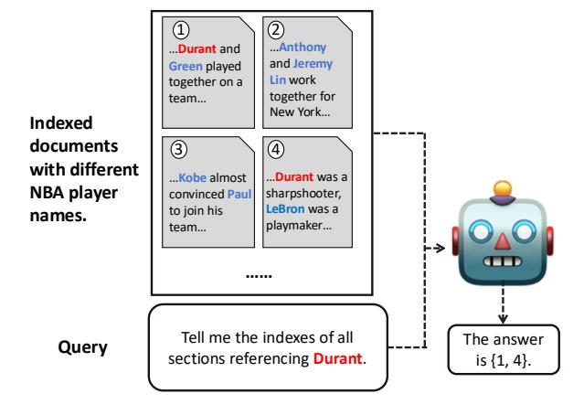
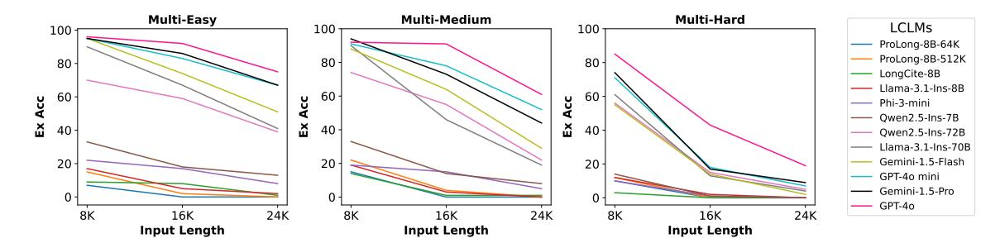

# Ref-Long: Benchmarking the Long-context Referencing Capability of Long-context Language Models

Junjie Wu1\* Gefei Gu2\* Yanan Zheng3 Dit-Yan Yeung1 Arman Cohan3 1Hong Kong University of Science and Technology 2Carnegie Mellon University 3Yale University junjie.wu@connect.ust.hk gefeig@andrew.cmu.edu {yanan.zheng, arman.cohan}@yale.edu dyyeung@ust.hk

# Abstract

Long-context language models (LCLMs) have exhibited impressive capabilities in longcontext understanding tasks. Among these, long-context referencing—a crucial task that requires LCLMs to attribute items of interest to specific parts of long-context data—remains underexplored. To bridge this gap, this paper proposes Referencing Evaluation for Longcontext Language Models (Ref-Long), a novel benchmark designed to assess the long-context referencing capability of LCLMs. Specifically, Ref-Long requires LCLMs to identify the indexes of documents that reference a specific key, emphasizing contextual relationships between the key and the documents over simple retrieval. Based on the task design, we construct three subsets ranging from synthetic to realistic scenarios to form the Ref-Long benchmark. Experimental results of 13 LCLMs reveal significant shortcomings in long-context referencing, even among advanced models like GPT-4o. To further investigate these challenges, we conduct comprehensive analyses, including human evaluations, task format adjustments, fine-tuning experiments, and error analyses, leading to several key insights. Our data and code can be found in [https://github.](https://github.com/wujunjie1998/Ref-Long) [com/wujunjie1998/Ref-Long](https://github.com/wujunjie1998/Ref-Long).

# 1 Introduction

Long-context language models (LCLMs) have demonstrated remarkable long-context capabilities in tasks such as multi-document question answering [\(Bai et al.,](#page-9-0) [2024c;](#page-9-0) [Wang et al.,](#page-10-0) [2024\)](#page-10-0) and summarization [\(Liu et al.,](#page-10-1) [2024;](#page-10-1) [Laban et al.,](#page-10-2) [2024\)](#page-10-2). Among long-context capabilities, long-context referencing, referring to LCLMs' ability to correctly attribute interested items to specific parts of extensive long documents, is crucial and has many real-world applications. [1](#page-0-0) For instance, legal practi-

> **[图片提取文字 (无描述)]:**
> ...Anthony ...Durant and and Jeremy Green played Lin work together on a together for team... New York... Indexed documents (3) with different ...Kobe almost ...Durant was a NBA player sharpshooter, convinced Paul LeBron was a to join his names. playmaker... team... Tell me the indexes of all The answer Query sections referencing Durant. is {1, 4}.

Figure 1: An example Ref-Long task. Given a longcontext input with indexed documents that include several NBA players names, an LCLM is asked to give the indexes of documents that reference "Durant" (marked as red). Names other than "Durant" are marked as blue.

tioners need to quickly identify the specific chapter within the relevant legal code when presented with a particular case or provision, and financial professionals need to swiftly determine which financial report contains the given data.

Although various benchmarks exist for evaluating the long-context capabilities of LCLMs, very few assess the dimension of long-context referencing. Existing long-context benchmarks can be broadly categorized into two types. On one hand, *general long-context benchmarks*, such as Long-Bench [\(Bai et al.,](#page-9-0) [2024c\)](#page-9-0), L-Eval [\(An et al.,](#page-9-1) [2024\)](#page-9-1), NOCHA [\(Karpinska et al.,](#page-9-2) [2024\)](#page-9-2), and a combination of them (HELMET) [\(Yen et al.,](#page-10-3) [2024\)](#page-10-3), are either synthesized by adding irrelevant texts into short-context NLP tasks, which results in unrealistic context distributions and biased evaluations, or constructed from scratch with human annotations, which requires substantial resources and complicated human efforts. On the other hand, as a spe-

\*Equal contribution.

1The term *referencing* differs from *retrieval* in that it requires LCLMs to not only retrieve keys from long context,

but also know the location (specific parts) where these keys appears in the long context.

cific and well-studied type of long-context benchmark, *retrieval-based benchmarks* such as Needlein-a-Haystack [\(Kamradt,](#page-9-3) [2023a\)](#page-9-3), Counting-stars [\(Song et al.,](#page-10-4) [2024\)](#page-10-4), and RULER [\(Hsieh et al.,](#page-9-4) [2024\)](#page-9-4), focus on matching and retrieving target texts but often overlook the nuanced relationships between the retrieved texts and their surrounding contexts. This makes these benchmarks overly simplistic and not comprehensive. Moreover, while existing benchmarks address some aspects of long-context understanding, they fail to effectively evaluate longcontext referencing, highlighting the urgent need for practical and robust benchmarks in this area.

To address the above issues, this work proposes a novel benchmark called Referencing Evaluation for Long-context Language Models (Ref-Long), which is specifically designed to assess the longcontext referencing capability of LCLMs. As illustrated in Figure [1,](#page-0-1) given several indexed long documents and a query that includes "Durant", LCLMs are required to not only identify "Durant" in the given documents, but also need to figure out the indexes of documents that reference "Durant" rather than other NBA players. This task setting has several advantages. First, it considers the relationship information between the specific key and its surrounding context, which forces LCLMs to genuinely understand long contexts instead of simply relying on shortcuts to retrieve the key. As a result, [§4](#page-2-0) and [§5](#page-6-0) show that Ref-Long presents certain level of difficulty that challenges even the most advanced LCLMs (e.g., GPT-4o [\(Hurst et al.,](#page-9-5) [2024\)](#page-9-5)). Second, Ref-Long tasks can be constructed costefficiently, as only the locations of specific keys are required. Furthermore, as shown in [§4.3,](#page-4-0) Ref-Long tasks remain manageable for human annotators, allowing their difficulty level to be estimated.

Following the task setting, we construct three subsets, ranging from synthetic to realistic scenarios, to form the Ref-Long benchmark and evaluate 13 LCLMs. Experimental results on these subsets reveal that all LCLMs struggle with Ref-Long tasks ([§4,](#page-2-0) [§5\)](#page-6-0), highlighting their lack of long-context referencing capability. Furthermore, we investigate the challenge faced by LCLMs from several perspectives. Motivated by findings in [\(Wu et al.,](#page-10-5) [2025;](#page-10-5) [Yu et al.,](#page-10-6) [2025\)](#page-10-6) that LLMs may struggle with tasks easily handled by humans, we first conduct a human evaluation in [§4.3](#page-4-0) to assess whether task difficulty contributes to the challenges in Ref-Long. Next, we examine if the issue comes from the format of task queries by applying alternative formats

to evaluate LCLMs ([§4.4\)](#page-4-1). Additionally, we explore whether fine-tuning can mitigate LCLMs' limitations in long-context referencing ([§4.5\)](#page-5-0). Finally, we perform error analysis on LCLMs' failed cases ([§6\)](#page-7-0). In summary, our contributions are threefold.

- 1. First, we introduce Ref-Long, a novel benchmark that solves long-context referencing and limitations in existing long-context benchmarks.
- 2. Second, we demonstrate Ref-Long is uniquely challenging for state-of-the-art LCLMs yet remains accessible for human annotators, underscoring its importance for advancing the field.
- 3. Finally, through comprehensive analyses, we identify several findings that could be used to facilitate LCLMs' long-context referencing and understanding capabilities.

# 2 Related Works

With the rapid evolution of LLMs, several benchmarks have been proposed to evaluate their longcontext understanding capabilities, which can be categorized into two types.

General Long-Context Benchmarks. The first type extends general short-context tasks to longcontext scenarios, which provides comprehensive evaluations of LCLMs. However, several issues exist in these works. On one hand, [\(Bai et al.,](#page-9-0) [2024c;](#page-9-0) [Levy et al.,](#page-10-7) [2024\)](#page-10-7) build their benchmarks by directly appending external context around a short NLP task, which is not realistic and may introduce additional bias to LCLMs as the token distribution between the task and the newly added context may differ significantly. On the other hand, [\(Bao](#page-9-6) [et al.,](#page-9-6) [2021;](#page-9-6) [Yu et al.,](#page-10-8) [2023;](#page-10-8) [Zhang et al.,](#page-10-9) [2024b;](#page-10-9) [An et al.,](#page-9-1) [2024;](#page-9-1) [Zhang et al.,](#page-11-0) [2024c;](#page-11-0) [Xu et al.,](#page-10-10) [2024;](#page-10-10) [Karpinska et al.,](#page-9-2) [2024;](#page-9-2) [Ma et al.;](#page-10-11) [Laban et al.,](#page-10-2) [2024;](#page-10-2) [Yen et al.,](#page-10-3) [2024\)](#page-10-3) build NLP tasks like question answering (QA) and summarization on longcontext data from scratch. However, this approach is costly and requires significant human effort. For instance, [Karpinska et al.](#page-9-2) [\(2024\)](#page-9-2) spent 3330 USD to annotate just 1001 QA pairs on novels.

# Retrieval-based Long-Context Benchmarks. Another category of benchmarks, derived from the needle-in-a-haystack task [\(Kamradt,](#page-9-7) [2023b\)](#page-9-7), evaluates LCLMs' ability to retrieve specific keys or supporting facts from long-context data [\(Li et al.,](#page-10-12) [2024;](#page-10-12) [Song et al.,](#page-10-4) [2024;](#page-10-4) [Zhang et al.,](#page-11-0) [2024c;](#page-11-0) [Kura](#page-9-8)[tov et al.,](#page-9-8) [2024;](#page-9-8) [Wang et al.,](#page-10-0) [2024;](#page-10-0) [Vodrahalli et al.,](#page-10-13)

[2024;](#page-10-13) [Roberts et al.;](#page-10-14) [Hsieh et al.,](#page-9-4) [2024\)](#page-9-4). However, these approaches have several limitations. First, they only require LCLMs to retrieve keys from documents without considering the relationships between keys and their surrounding context, making the tasks relatively simple. For instance, GPT-4o achieves over 70% accuracy on most benchmarks even with input lengths of 128K tokens. Additionally, if an LCLM retrieves keys successfully for subsequent tasks, these tasks effectively become short-context tasks.

To address these issues, we propose Ref-Long, an effective benchmark that evaluates the referencing ability of LCLMs. While [\(Laban et al.,](#page-10-2) [2024;](#page-10-2) [Wang et al.,](#page-10-0) [2024\)](#page-10-0) also include referencing tasks, their studies lack systematic analysis and are constrained by limited task settings. Moreover, [\(Gao](#page-9-9) [et al.,](#page-9-9) [2023;](#page-9-9) [Bai et al.,](#page-9-10) [2024a;](#page-9-10) [Tang et al.,](#page-10-15) [2024\)](#page-10-15) evaluate LCLMs by requiring them to generate sentence-level references alongside answers in QA tasks. This setup differs from Ref-Long, which requires broader contextual referencing around a key idea rather than isolated chunks linked to a specific question. Also, this setup is less generalizable, as it depends on either sentence-level ground-truths (requiring extra annotation) or LLMs as external evaluators for further evaluation.

# 3 The Ref-Long Benchmark

To overcome the issues of existing long-context benchmarks, we introduce Ref-Long, a new benchmark that aims to assess the long-context referencing capability of LCLMs. Specifically, Ref-Long challenges LCLMs to not only retrieve a specific key from a collection of documents but also identify the indexes of all documents that reference the key. Following this task setup, Ref-Long includes three distinct sub-datasets that encompass both synthetic and real-world data ([§4,](#page-2-0) [§5.1,](#page-6-1) [§5.2\)](#page-6-2), enabling a systematic evaluation of the referencing capabilities of LCLMs.

# 3.1 Task Setup

Generally, Ref-Long tasks are built upon a candidate set of documents, where each document contains N distinct keys and keys can be overlapped across documents. To create an Ref-Long task, we first randomly select M documents from the candidate set and index them with numbers, then sample a specific key k that appears in these M documents. The task of an evaluated LCLM is to

identify the indexes of all documents within the M documents that referencing k. The overall process is illustrated in Figure [1.](#page-0-1)

### 3.2 Evaluation Metrics

We evaluate LCLMs' performance on Ref-Long tasks using exact match accuracy (Ex Acc), which measures whether the output indexes match the ground truth exactly (ignoring order). A score of 1 is assigned only if the indexes are an exact match. Additionally, we compute the F1 score (F1) of the precision and recall, giving equal weight to both, as a supplement. For both metrics, higher scores refer to better performance.

# 3.3 Evaluated LCLMs

We evaluate both closed-source and open-source LCLMs. For closed-source LCLMs, we include the powerful GPT-4o [\(OpenAI,](#page-10-16) [2024a\)](#page-10-16) and Gemini-1.5-Pro [\(Gemini,](#page-9-11) [2024\)](#page-9-11) along with their smaller variants, GPT-4o Mini and Gemini-1.5- Flash. As for open-source LCLMs, we evaluate the following: Llama-3.1-Instruct (70B, 8B) [\(AI@Meta,](#page-9-12) [2024\)](#page-9-12), Llama-3.3-Instruct-70B, Qwen2.5-Instruct (72B, 7B) [\(Team,](#page-10-17) [2024\)](#page-10-17), Phi-3-mini (Phi-3-mini-128k-instruct) [\(Abdin](#page-8-0) [et al.,](#page-8-0) [2024\)](#page-8-0). We also include Prolong-8B-64K/512K (Llama-3-8B-ProLong-Instruct) that have been elaborately fine-tuned on longcontext data [\(Gao et al.,](#page-9-13) [2024\)](#page-9-13), and LongCite-8B (LongCite-llama3.1-8B) [\(Zhang et al.,](#page-10-18) [2024a\)](#page-10-18) that is fine-tuned on QA responses and sentencelevel references for comparison. Further details regarding the inference setting of these LCLMs are provided in Appendix [§D.](#page-12-0)

# 4 Abrupt Key in Fluent Context

# 4.1 Dataset

We start from crafting a synthetic dataset named Ref-Long-Abrupt (Ref-Long-A) from scratch following the task setup in [§3.1](#page-2-1) as the first subset of Ref-Long. Specifically, we extract all essay files from the Paul Graham Essays English context dataset used in [Kamradt](#page-9-3) [\(2023a\)](#page-9-3), and randomly concatenate and truncate these files to generate 100 documents with approximately 1,000 tokens each. Next, we randomly select 1 (Single) /5 (Multi) positions in each document to insert a template sentence: "*The little penguin counted {*num*}* ★" that

| LCLM              |       | Easy    |       | Medium  | Hard  |         |  |
|-------------------|-------|---------|-------|---------|-------|---------|--|
|                   | F1↑   | Ex Acc↑ | F1↑   | Ex Acc↑ | F1↑   | Ex Acc↑ |  |
| ProLong-8B-64K    | 16.44 | 0.00    | 19.59 | 0.00    | 38.11 | 0.00    |  |
| ProLong-8B-512K   | 20.02 | 0.00    | 24.82 | 0.00    | 40.06 | 0.00    |  |
| LongCite-8B       | 6.42  | 1.00    | 5.74  | 1.00    | 10.20 | 0.00    |  |
| Llama-3.1-Ins-8B  | 30.95 | 2.00    | 30.00 | 0.00    | 38.85 | 0.00    |  |
| Phi-3-mini        | 23.04 | 8.00    | 20.82 | 5.00    | 21.82 | 0.00    |  |
| Qwen2.5-Ins-7B    | 30.46 | 13.00   | 24.63 | 8.00    | 20.37 | 0.00    |  |
| Qwen2.5-Ins-72B   | 73.09 | 39.00   | 70.77 | 22.00   | 60.90 | 5.00    |  |
| Llama-3.1-Ins-70B | 74.47 | 41.00   | 64.43 | 19.00   | 52.21 | 4.00    |  |
| Llama-3.3-Ins-70B | 76.52 | 43.00   | 66.92 | 19.00   | 56.23 | 4.00    |  |
| Gemini-1.5-Flash  | 82.16 | 51.00   | 74.19 | 29.00   | 64.65 | 2.00    |  |
| GPT-4o mini       | 87.69 | 67.00   | 85.49 | 52.00   | 68.64 | 7.00    |  |
| Gemini-1.5-Pro    | 89.29 | 67.00   | 80.20 | 44.00   | 65.24 | 9.00    |  |
| GPT-4o            | 93.45 | 75.00   | 90.35 | 61.00   | 75.38 | 19.00   |  |

Table 1: Results on Ref-Long-A, where Ex Acc is in percentage and "Ins" means "Instruct". The best results under each column are boldfaced. For conciseness, we only list the 24K results under Multi here, and show Single results and 8K/16K results under Multi in Table [9.](#page-17-0)

is abrupt and irrelevant to the background context[2](#page-3-0) , where the integer num ∈ [a, b) refers to the number of stars the little penguin counted and forms the keys that we are interested in. When crafting an Ref-Long task, we first randomly sample M documents, then select a num that appears in these documents as the specific key for evaluation.

For a comprehensive evaluation, we set the range of integer num to [0, 100) (Easy), [0, 60) (Medium) and [0, 20) (Hard) under Single and Multi to form 6 settings, where a smaller range leads to higher frequency of different num across documents. M is set to {8, 16, 24} under each setting, correspond to input lengths of 8K, 16K, and 24K tokens. For each input length, we generate 100 Ref-Long tasks in an aggregative way (e.g., the first 8 documents and the specific key in a 16K task is the same as the corresponding 8K task) to reduce the effect of randomness, and finally forms the Ref-Long-A subset with 1800 distinct tasks. We evaluate all the LCLMs in [§3.3](#page-2-2) on Ref-Long-A and list the 24K results under Multi in Table [1](#page-3-1) (check Appendix [§B](#page-12-1) for the prompts we use).

# 4.2 Results

We observe that larger models consistently perform better on the Ref-Long-A tasks, aligning with expectations that models with more parameters could have stronger capabilities, which validates the reliability of Ref-Long's conclusions. When comparing the two 70B Llama models, Llama-3.3-Ins-70B surpasses Llama-3.1-Ins-70B, suggesting that

pre-training on more multilingual data enhances referencing capabilities. However, since the improvements under the Multi setting are limited, we only include the Llama-3.1-Ins-70B version in the rest of the experiments.

Surprisingly, even the strongest LCLMs faces significant challenges on the multi-hard setting, where the context length is just 24K—far below their maximum context size(e.g., the highest Acc score under the multi-hard setting is only 19.00). This surprising result demonstrates that current LCLMs lack the capability to grasp the positional relationships between keys and the contexts in which those keys are retrieved, a capability that is essential for effective long-context understanding. Also, we notice that models elaborately fine-tuned on long-context data do not obtain competitive results on Ref-Long tasks, and further investigate this observation in [§4.5.](#page-5-0)

Ablation Study on Input Length. As a benchmark for long-context evaluation, it is essential to ensure that the difficulty of Ref-Long tasks increases with input length; otherwise, extending the input length would be meaningless. To verify this, we plot the Exact Acc scores for Multi-Easy, Multi-Medium, and Multi-Hard tasks with input lengths of 8K, 16K, and 24K tokens across all LCLMs. The results are shown in Figure [2.](#page-4-2) As shown, the performance of all LCLMs consistently drops as the input length increases, further demonstrating the reliability of Ref-Long for long-context evaluation.

2This template follows [Song et al.](#page-10-4) [\(2024\)](#page-10-4), while they only evaluates key retrieval and thus not challenging for LCLMs.

> **[图片提取文字 (无描述)]:**
> Multi-Easy Multi-Medium Multi-Hard LCLMs 100 100 100 -ProLong-8B-64K 80 ProLong-8B-512K 80 80 LongCite-8B Llama-3.1-Ins-8B 60 60 60 Acc Phi-3-mini Owen2.5-Ins-7B Ĕ X 40 40 40 Owen2.5-Ins-72B Llama-3.1-Ins-70B Gemini-1.5-Flash 20 20 20 -GPT-40 mini Gemini-1.5-Pro 0 -GPT-40 8K 16K 24K 8K 16K 24K 8K 16K 24K Input Length Input Length Input Length

Figure 2: LCLMs' performances drop consistently as input length grows. See Table 9 for numerical results.

# 4.3 How Challenging are Ref-Long Tasks?

As discussed in §1, a critical issue with existing long-context benchmarks is that they are often difficult for humans as well, thereby complicating efforts to assess their difficulty levels. To this end, we conduct a human evaluation to see whether we can estimate the difficulty level of Ref-Long tasks through human performance.

Specifically, we invite two annotators (PhD students) to complete 50 Ref-Long tasks that are randomly selected from the Multi-Hard-24K setting. For each task, annotators are provided with the same query used to prompt LCLMs. In addition, they are asked to complete each task at a pace that balances accuracy and efficiency, as the their time taken to solve each task is also recorded. The annotators have the same and correct annotation on 42 tasks, indicating a high inter-agreement. Noting that we also evaluate the o1 (OpenAI, 2024b) model, known for its strong reasoning abilities, for a more comprehensive comparison.

Experimental results of humans, GPT-40 and ol on the 50 sampled tasks are listed in Table 2. As can be seen, while humans can correctly finish most of the Ref-Long tasks, the two LCLMs face significant challenges in addressing them. Due to the limited quota and poor performance of ol, we do not include it in the following experiments. Additionally, we calculate the average time required by annotators to complete a Ref-Long task as 123.95 seconds, which is reasonable considering the 24K input length. These results demonstrate that Ref-Long tasks are manageable for humans but pose significant challenge for LCLMs, emphasizing the need for serious attention to these tasks in the development of LCLMs.

# **4.4** Is Ref-Long Challenging Mainly Due to the Instructions?

Given that humans can effectively solve Ref-Long tasks while LCLMs struggle, this section investi-

|              | <b>F1</b> ↑    | Ex Acc↑       |
|--------------|----------------|---------------|
| GPT-40 o1 | 74.24 49.11 | 14.00 0.00 |
| Human        | 99.08          | 92.00         |

Table 2: Comparison of LCLMs and humans.

|                   |       | F1↑   |       | F     | Ex Acc | <b>↑</b> |
|-------------------|-------|-------|-------|-------|--------|----------|
| LCLM              | 8K    | 16K   | 24K   | 8K    | 16K    | 24K      |
| LLama-3.1-Ins-8B  | 60.14 | 45.97 | 38.85 | 12.00 | 2.00   | 0.00     |
| w/ Strategy       | 61.41 | 44.83 | 40.11 | 15.00 | 0.00   | 0.00     |
| LLama-3.1-Ins-70B | 87.38 | 63.87 | 52.21 | 61.00 | 13.00  | 4.00     |
| w/ Strategy       | 69.64 | 49.29 | 39.96 | 34.00 | 5.00   | 1.00     |
| GPT-4o-mini       | 92.10 | 79.54 | 68.64 | 71.00 | 18.00  | 7.00     |
| w/ Strategy       | 89.38 | 75.42 | 62.69 | 64.00 | 14.00  | 5.00     |
| GPT-4o            | 94.81 | 86.61 | 75.38 | 85.00 | 43.00  | 19.00    |
| w/ Strategy       | 98.30 | 91.03 | 83.56 | 93.00 | 64.00  | 34.00    |

Table 3: Results with the human strategy-based prompts on the Multi-Hard setting of Ref-Long-A.

gates whether the issue comes from LCLMs' unfamiliarity with the instructions used in §4.1. To this end, we incorporate a human-inspired strategy into the queries to provide hints for Ref-Long tasks, inspired by the chain-of-thought prompting approach (Wei et al., 2022). Additionally, we examine whether the problem arises from the format of the specific keys in the instructions by converting the keys into natural language.

Incoporating Human Strategy. Start by the large gap between LCLMs' and humans' performance on Ref-Long tasks, we investigate whether this difficulty comes from LCLMs' lack of an effective strategy to complete such tasks. When solving Ref-Long tasks, the two annotators in §4.3 adopt a straightforward and effective method: dynamically constructing a dictionary while reading the input context. Specifically, when humans encounter a special key in the input for the first time, they add a new entry to the dictionary by pairing the key with

the current document index. Otherwise, they simply update the existing entry by appending the corresponding document index to it. To teach LCLMs to use this human-like strategy, we explicitly include the above steps at the start of the prompts, and evaluate GPT and Llama-3-Ins models under the most challenging Multi-Hard-24K setting (See Appendix [§B](#page-12-1) for details of the prompt).

Results. The results are listed in Table [3.](#page-4-4) We observe that guiding GPT-4o with human strategy does enhance its performances, indicating that its referencing capability can be triggered with proper instructions. However, equipping weaker LCLMs with human strategies does not improve their performance, and even the enhanced results of GPT-4o are still far below human levels. These results suggest that improving the fundamental long-context referencing capabilities of LCLMs should take precedence over designing task-specific instructions or perform prompt engineering works.

Changing the Format of Keys. Next, we examine whether the format of specific keys in the instructions affects the ability of LCLMs to complete Ref-Long tasks. Specifically, we modify the Multi-Hard setting by replacing keys num ∈ [0, 20) with 20 different fruit names, representing natural language. The prompts are paraphrased accordingly to align with this modification (see Appendix [§B](#page-12-1) for the prompt template). We evaluate the GPT and Llama-3.1-Ins models in [§3.3](#page-2-2) using these modified prompts, and list the results in Table [4.](#page-5-1)

Results. As shown, switching the input keys to natural language does not lead to significant improvements and, in some cases, even lowers LCLMs' performance on Ref-Long tasks. These results show that LCLMs are robust to variations in the format of specific keys when doing referencing tasks, and changing the format does not substantially impact the overall conclusions, which further supports us to construct the following Ref-Long subsets that include natural language keys.

Overall, this section illustrates the challenges LCLMs are facing on Ref-Long tasks cannot be addressed by adjusting superficial factors during inference.

# 4.5 Could Fine-tuning Solve Ref-Long?

Existing research has demonstrated that finetuning LCLMs using (1) carefully designed strate-

|                                                      |    | F1↑ |     |                                     | Ex Acc↑ |      |
|------------------------------------------------------|----|-----|-----|-------------------------------------|---------|------|
| LCLM                                                 | 8K | 16K | 24K | 8K                                  | 16K     | 24K  |
| LLama-3.1-Ins-8B                                     |    |     |     | 60.14 45.97 38.85 12.00 2.00        |         | 0.00 |
| w/ Fruit                                             |    |     |     | 57.33 44.05 36.11 15.00 3.00        |         | 0.00 |
| LLama-3.1-Ins-70B 87.38 63.87 52.21 61.00 13.00 4.00 |    |     |     |                                     |         |      |
| w/ Fruit                                             |    |     |     | 88.13 68.33 50.66 63.00 13.00 1.00  |         |      |
| GPT-4o-mini                                          |    |     |     | 92.10 79.54 68.64 71.00 18.00 7.00  |         |      |
| w/ Fruit                                             |    |     |     | 90.63 79.34 68.24 67.00 20.00 3.00  |         |      |
| GPT-4o                                               |    |     |     | 94.81 86.61 75.38 85.00 43.00 19.00 |         |      |
| w/ Fruit                                             |    |     |     | 98.68 90.63 82.48 93.00 50.00 19.00 |         |      |

Table 4: Results with natural language keys on the Multi-Hard setting of Ref-Long-A.

|                                                     |    | Single |     | Multi                             |         |  |  |
|-----------------------------------------------------|----|--------|-----|-----------------------------------|---------|--|--|
| LCLM                                                | 8K | 16K    | 24K | 8K                                | 16K 24K |  |  |
| LLama-3.1-Ins-8B                                    |    |        |     | 59.00 20.00 13.00 17.00 5.00 2.00 |         |  |  |
| w/ FT-Multi-Easy 50.00 47.00 45.00 22.00 20.00 8.00 |    |        |     |                                   |         |  |  |

Table 5: Ex Acc scores of LCLMs on the Easy setting of Ref-Long-A.

gies [\(Gao et al.,](#page-9-13) [2024;](#page-9-13) [Bai et al.,](#page-9-14) [2024b\)](#page-9-14) and (2) QA pairs with sentence-level references [\(Zhang](#page-10-18) [et al.,](#page-10-18) [2024a\)](#page-10-18) enhances their long-context understanding capabilities. To explore this claim in the context of long-context referencing, we also evaluate fine-tuned models from these two categories—Prolong-8B-64K/512K for (1) and LongCite-8B for (2)—and present the results in Table [1.](#page-3-1) We observe that ProLong-8B-512K achieves results comparable to Llama-3.1-Ins-8B while requiring significantly less data and being fine-tuned on a weaker backbone (Llama-3-Ins-8B) [\(Gao](#page-9-13) [et al.,](#page-9-13) [2024\)](#page-9-13). This highlights the importance of a well-designed long-context fine-tuning strategy. In contrast, LongCite-8B underperforms its backbone, Llama-3.1-Ins-8B, showing that models fine-tuned on specific long-context tasks may not generalize well on long-context referencing tasks.

Additionally, we study whether fine-tuning on Ref-Long tasks can enhance LCLM performance. Due to computational constraints, we adopt the following steps: (1) Fine-tune Llama-3.1-Ins-8B, and (2) use the Multi-Easy-8K setting to construct the fine-tuning data, as the Medium/Hard settings are too challenging for Llama-3.1-Ins-8B, and finetuning on 16K/24K data exceeds our computational capacity. Specifically, we create 500 Multi-Easy 8K tasks that do not overlap with those in Table [1,](#page-3-1) and fine-tune Llama-3.1-Ins-8B on this data (check Appendix [§D](#page-12-0) for fine-tuning details). The fine-

|                                                                                     |    |                   |     | F1↑  |      |                                                 |      |                                                                                     |      |      | Ex Acc↑ |      |      |      |
|-------------------------------------------------------------------------------------|----|-------------------|-----|------|------|-------------------------------------------------|------|-------------------------------------------------------------------------------------|------|------|---------|------|------|------|
| LCLM                                                                                | 8K | 16K               | 24K | 32K  | 40K  | 48K                                             | 56K  | 8K                                                                                  | 16K  | 24K  | 32K     | 40K  | 48K  | 56K  |
| LongCite-8B                                                                         |    | 20.90 10.47 12.45 |     | 7.92 | 9.99 | 7.26                                            | 7.80 | 4.00                                                                                | 0.00 | 0.00 | 0.00    | 0.00 | 0.00 | 0.00 |
| Qwen2.5-Ins-7B                                                                      |    |                   |     |      |      | 49.98 38.81 39.21 33.59 29.77 27.04 24.87 16.00 |      |                                                                                     | 1.00 | 0.00 | 0.00    | 0.00 | 0.00 | 0.00 |
| Phi-3-mini                                                                          |    |                   |     |      |      | 53.72 37.84 33.54 28.42 26.11 23.92 22.92 26.00 |      |                                                                                     | 4.00 | 0.00 | 0.00    | 0.00 | 0.00 | 0.00 |
| ProLong-8B-64K                                                                      |    |                   |     |      |      | 70.02 52.36 45.66 36.83 30.11 26.80 24.06 33.00 |      |                                                                                     | 5.00 | 3.00 | 0.00    | 0.00 | 0.00 | 0.00 |
| ProLong-8B-512K                                                                     |    |                   |     |      |      | 73.84 52.39 42.75 37.40 31.10 29.42 25.95 39.00 |      |                                                                                     | 6.00 | 1.00 | 0.00    | 0.00 | 0.00 | 0.00 |
| Llama-3.1-Ins-8B                                                                    |    |                   |     |      |      |                                                 |      | 81.86 63.05 52.37 41.70 37.19 35.21 30.53 52.00 14.00                               |      | 7.00 | 2.00    | 2.00 | 0.00 | 0.00 |
| Qwen2.5-Ins-72B                                                                     |    |                   |     |      |      |                                                 |      | 83.43 76.35 74.92 71.30 68.00 64.87 62.00 55.00 34.00 19.00 10.00                   |      |      |         | 6.00 | 0.00 | 1.00 |
| GPT-4o mini                                                                         |    |                   |     |      |      |                                                 |      | 89.85 80.53 76.67 71.30 63.48 60.73 55.71 70.00 39.00 22.00 15.00                   |      |      |         | 4.00 | 3.00 | 1.00 |
| Llama-3.1-Ins-70B 91.87 86.21 80.08 72.01 61.43 54.35 48.25 77.00 54.00 34.00 18.00 |    |                   |     |      |      |                                                 |      |                                                                                     |      |      |         | 8.00 | 4.00 | 4.00 |
| Gemini-1.5-Flash                                                                    |    |                   |     |      |      |                                                 |      | 89.97 86.05 79.45 76.47 74.27 72.74 70.85 77.00 52.00 27.00 15.00 11.00 10.00       |      |      |         |      |      | 6.00 |
| Gemini-1.5-Pro                                                                      |    |                   |     |      |      |                                                 |      | 90.10 84.50 80.47 76.74 68.33 62.80 61.20 78.00 56.00 39.00 28.00 15.00 12.00 10.00 |      |      |         |      |      |      |
| GPT-4o                                                                              |    |                   |     |      |      |                                                 |      | 90.00 84.93 83.50 80.85 80.43 75.96 73.81 71.00 56.00 41.00 32.00 20.00 11.00       |      |      |         |      |      | 8.00 |

Table 6: Results on Ref-Long-F. The best results under each column are boldfaced. For conciseness, we only list the results of the Twitter topic here, and show the results of the rest two topics in Table [9.](#page-17-0)

tuned model is then evaluated on the Easy setting, with results shown in Table [5.](#page-5-2) We find that fine-tuning on Ref-Long tasks does boost model performance, particularly on easier tasks. However, as input length and task difficulty increase, all the above fine-tuned models still perform poorly, demonstrating that fine-tuning on long-context data alone cannot fully overcome LCLMs' limitations on Ref-Long tasks.

# 5 Extending to Realistic Scenarios

### 5.1 Fluent Key in Fluent Context

Dataset. In [§4.4,](#page-4-1) we observe that changing the format of specific keys to natural language does not significantly affect LCLMs' performance on Ref-Long tasks, which motivates us to extend Ref-Long to a more realistic scenario, where keys are spans of text embedded within a coherent context (e.g., legal terms within law books). To this end, we construct the second subset Ref-Long-Fluent (Ref-Long-F) for investigation.

Specifically, this subset is constructed upon the SummHay benchmark [\(Laban et al.,](#page-10-2) [2024\)](#page-10-2), which comprises 10 topics, each associated with 100 documents. For each topic, there is a candidate set of insights—short statements containing specific information about the topic. Each document is generated by sampling 3–8 distinct insights from the candidate set and using GPT-4o to create a coherent 1,000-token document incorporating all the sampled insights (slight paraphrasing insights is allowed), which makes such insights suitable for acting as specific keys. When constructing the subset, we select 3 news topics (Foot Locker, Twitter, Financial Market) from SummHay. Under each

topic, we set the number of sampled documents M ∈ {8, 16, 24, 32, 40, 48, 56} (corresponding to input lengths ranging from 8K to 56K tokens) and create 100 tasks for each length with the aggregative method mentioned in [§4.1,](#page-2-3) resulting in a subset of 2,100 tasks. We then evaluate all the LCLMs on these tasks, with the results presented in Table [6](#page-6-3) (see Appendix [§B](#page-12-1) for prompt details). Following the *fluent key in fluent context* setting, we additionally construct a real-world dataset for completeness and evaluate all models on it in Appendix [C.](#page-12-2)

Results. We find that LCLMs' performances on Ref-Long-F align with results on Ref-Long-A in that larger models consistently outperform smaller ones across different input lengths, although the rankings of individual LCLMs may vary. For instance, Gemini-1.5-Pro achieves results comparable to GPT-4o on Ref-Long-F but lags behind on Ref-Long-A, reflecting its stronger capability in referencing natural language keys. Furthermore, all LCLMs exhibit decreasing performance as input length increases, reaffirming the findings in Figure [2.](#page-4-2) Notably, none of the LCLMs achieve Ex Acc scores above 20.00% when input lengths reach 40K tokens, falling largely short of their claimed maximum input capabilities. Overall, we conclude that LCLMs' lack of referencing capability occurs on both incoherent and coherent documents, further emphasizing the severity of this issue.

### 5.2 Paper Citation

Dataset. As mentioned in [§1,](#page-0-2) long-context referencing tasks play a crucial role in many real-world applications. Therefore, having evaluated LCLMs on two synthetic subsets, we now turn our attention to their performances on Ref-Long tasks con-

|                   |         |          | F1↑      |          | Ex Acc↑ |          |          |          |  |  |  |
|-------------------|---------|----------|----------|----------|---------|----------|----------|----------|--|--|--|
| LCLM              | 8 (30K) | 12 (45K) | 16 (60K) | 20 (75K) | 8 (30K) | 12 (45K) | 16 (60K) | 20 (75K) |  |  |  |
| LongCite-8B       | 0.40    | 0.46     | 0.80     | 1.00     | 0.00    | 0.00     | 0.00     | 0.00     |  |  |  |
| Phi-3-mini        | 11.36   | 8.78     | 9.24     | 5.23     | 1.00    | 0.00     | 0.00     | 0.00     |  |  |  |
| ProLong-8B-64K    | 11.89   | 12.32    | 12.07    | -        | 0.00    | 0.00     | 0.00     | -        |  |  |  |
| Qwen2.5-Ins-7B    | 24.29   | 19.50    | 19.80    | 10.37    | 0.00    | 0.00     | 0.00     | 0.00     |  |  |  |
| Llama-3.1-Ins-8B  | 21.46   | 30.17    | 27.63    | 18.54    | 2.00    | 2.00     | 0.00     | 1.00     |  |  |  |
| ProLong-8B-512K   | 15.49   | 12.78    | 14.20    | 13.34    | 0.00    | 0.00     | 0.00     | 0.00     |  |  |  |
| Llama-3.1-Ins-70B | 64.39   | 53.88    | 46.65    | 30.28    | 26.00   | 6.00     | 5.00     | 2.00     |  |  |  |
| GPT-4o mini       | 81.30   | 78.10    | 64.02    | 60.12    | 45.00   | 34.00    | 22.00    | 14.00    |  |  |  |
| Gemini-1.5-Flash  | 80.42   | 77.44    | 78.39    | 75.41    | 34.00   | 29.00    | 32.00    | 25.00    |  |  |  |
| Gemini-1.5-Pro    | 84.83   | 78.63    | 70.89    | 70.89    | 52.00   | 41.00    | 29.00    | 20.00    |  |  |  |
| Qwen2.5-Ins-72B   | 86.59   | 79.65    | 80.48    | 76.69    | 55.00   | 42.00    | 40.00    | 31.00    |  |  |  |
| GPT-4o            | 91.81   | 87.30    | 78.22    | 71.13    | 66.00   | 48.00    | 30.00    | 17.00    |  |  |  |

Table 7: Results on Ref-Long-Paper. The best results under each column are boldfaced. Since papers are not 1000 tokens long, we only list the number of M and provide the average input length of tasks under each M in brackets. "-" means the input length exceeds the maximum input length of a model.

structed from real-world data. Due to the lack of appropriate datasets for this purpose, we manually construct the third subset targeting citations of computer science arXiv papers (Ref-Long-Paper).

Specifically, we first collected 47 arXiv papers that meet the following criteria: (1) published after March 2024; (2) cited by at least two papers that shorter than 5,000 tokens; as our seed papers. Additionally, we collected 34 extra arXiv papers published between January and February 2024 that are shorter than 5000 tokens to serve as distractors, since these papers cannot cite the seed papers due to the publishing time. Note that we control the lengths of papers since they are much longer than the documents used in the previous subsets, and 5000 tokens is actually short for papers. Also, we select papers published after 2024 to avoid overlap with the training data of most evaluated LCLMs.

To create an Ref-Long task with M papers, we first randomly select one seed paper, then use its m citations and M−m randomly sampled distractors to form the task input. Using this approach, we create 100 tasks for each M ∈ {8, 12, 16, 20}. The aggregative sampling method described in [§4.1](#page-2-3) is also applied as M increases. During evaluation, LCLMs are tasked with identifying the indexes of papers citing the seed paper, using its title as the key (see prompts in Appendix [§B\)](#page-12-1). The maximum value of m is 6 in our data, ensuring that distractors are included in every task.

Results. We present the results on Ref-Long-Paper in Table [7.](#page-7-1) As shown, smaller LCLMs struggle to complete the paper referencing tasks, likely due to the larger token counts in research papers compared to the documents in the previous two

| Subset         | Num | Type I | Type II | Type III |
|----------------|-----|--------|---------|----------|
| Ref-Long-A     | 81  | 85.19  | 1.23    | 13.58    |
| Ref-Long-F     | 59  | 37.29  | 50.85   | 11.86    |
| Ref-Long-Paper | 83  | 12.05  | 54.22   | 33.73    |

Table 8: Percentage (%) of GPT-4o's error types on the Multi-Hard-24K, 24K, and 20 settings of the three subsets. "Num" refers to the number of errors.

subsets. Even for the stronger LCLMs, their performances are unsatisfactory, with around 30% Ex Acc scores for tasks with only 16 papers. An exception is Qwen2.5-Ins-72B, which even outperforms Gemini-1.5-Pro. We hypothesize this may be because some of the arXiv papers used in Table [7](#page-7-1) are part of Qwen2.5-Ins-72B's pre-training data, given its release date of September 2024. This result again supports Ref-Long's design of including both synthetic and real-world subsets, where LCLMs' results on synthetic subsets are more aligning with their sizes since data contamination is avoided.

# 6 Error Analysis.

Given LCLMs' poor performances on the three Ref-Long subsets, we further investigate what types of errors they tend to produce on these three subsets. Specifically, we first manually go through ∼100 errors of LCLMs across these subsets and conclude three general error types: *reference less* (I), *reference more* (II), and *both* (III). We annotate GPT-4o's failure cases on the same input length–Multi-Hard-24K setting of Ref-Long-A, 24K setting of Ref-Long-F, and the 20 setting of Ref-Long-Paper, and list the percentage of each error type in Table [8.](#page-7-2)

We observe that when the specific key consists of

a number along with a specific symbol (Ref-Long-A), GPT-4o rarely confuses the key with other keys. However, it is not sensitive enough to the specific key, with most errors resulting from failing to identify all documents referencing the key (type I errors). Conversely, when the specific key is formatted in natural language in the other two subsets, GPT-4o often confuses this key with others and includes documents only referencing unrelated keys in its answers. These results indicate that as context length increases, LCLMs may become either overly sensitive or insufficiently sensitive to keys in the given documents, both of which contribute to their poor performances on Ref-Long tasks.

# 7 Conclusion

This paper addresses limitations in existing longcontext benchmarks by introducing Ref-Long, a novel benchmark designed to systematically evaluate the long-context referencing capability of LCLMs. Ref-Long requires LCLMs to generate indexes of documents referencing a specific key, a task that proves to be difficult even for the most advanced LCLMs at input lengths far shorter than their claimed maximum context sizes. Based on these observations, we conduct extensive investigations and show that neither adjusting query format nor fine-tuning sufficiently solves Ref-Long tasks. Finally, we extend Ref-Long to more realistic scenarios, revealing that limitations in LCLMs' referencing capabilities persist, and encourage future works to enhance real-world long-context systems by focusing on the referencing capability.

# Limitations

Due to budget constraints, we evaluate only Llama-3.3-Ins-70B in Table [1](#page-3-1) and Gemini-1.5-Pro in the experiments presented in the main paper. While this may introduce potential bias in the evaluation results, we argue that the existing findings are sufficiently convincing. We plan to provide more comprehensive results in future work when additional experimental resources become available.

Additionally, for Ref-Long-F, which is based on the SummHay benchmark, it is important to note that SummHay covers only a limited set of topics. This limitation implies that the evaluation may not fully capture the performance of LCLMs across a broader range of topics. As a result, the effectiveness of Ref-Long in scenarios involving topics beyond those covered by SummHay remains uncertain. Future work could address this by expanding the topic diversity within the benchmark, enabling a more comprehensive evaluation of LCLMs' referencing capabilities across various topics.

# Ethical Considerations

Since this paper includes responses generated by LCLMs, it is possible that these model-generated contents may contain toxic or harmful information, necessitating comprehensive data processing by users. Additionally, one of our subsets (Ref-Long-F) is based on an existing benchmark generated by LLMs, which may also include toxic or harmful information. Although we have manually reviewed the data, it is still possible that the original benchmark contains such content, requiring further processing.

# Acknowledgment

This work has been made possible by a Research Impact Fund project (RIF R6003-21) and a General Research Fund project (GRF 16203224) funded by the Research Grants Council (RGC) of the Hong Kong Government. We are also grateful for the TPU compute support provided by the Google TRC program.

# References

Marah Abdin, Sam Ade Jacobs, Ammar Ahmad Awan, Jyoti Aneja, Ahmed Awadallah, Hany Awadalla, Nguyen Bach, Amit Bahree, Arash Bakhtiari, Harkirat Behl, Alon Benhaim, Misha Bilenko, Johan Bjorck, Sébastien Bubeck, Martin Cai, Caio César Teodoro Mendes, Weizhu Chen, Vishrav Chaudhary, Parul Chopra, Allie Del Giorno, Gustavo de Rosa, Matthew Dixon, Ronen Eldan, Dan Iter, Amit Garg, Abhishek Goswami, Suriya Gunasekar, Emman Haider, Junheng Hao, Russell J. Hewett, Jamie Huynh, Mojan Javaheripi, Xin Jin, Piero Kauffmann, Nikos Karampatziakis, Dongwoo Kim, Mahoud Khademi, Lev Kurilenko, James R. Lee, Yin Tat Lee, Yuanzhi Li, Chen Liang, Weishung Liu, Eric Lin, Zeqi Lin, Piyush Madan, Arindam Mitra, Hardik Modi, Anh Nguyen, Brandon Norick, Barun Patra, Daniel Perez-Becker, Thomas Portet, Reid Pryzant, Heyang Qin, Marko Radmilac, Corby Rosset, Sambudha Roy, Olatunji Ruwase, Olli Saarikivi, Amin Saied, Adil Salim, Michael Santacroce, Shital Shah, Ning Shang, Hiteshi Sharma, Xia Song, Masahiro Tanaka, Xin Wang, Rachel Ward, Guanhua Wang, Philipp Witte, Michael Wyatt, Can Xu, Jiahang Xu, Sonali Yadav, Fan Yang, Ziyi Yang, Donghan Yu, Chengruidong Zhang, Cyril Zhang, Jianwen Zhang, Li Lyna Zhang, Yi Zhang, Yue Zhang, Yunan Zhang, and Xiren Zhou. 2024. [Phi-3 technical report: A](https://arxiv.org/abs/2404.14219)

- [highly capable language model locally on your phone.](https://arxiv.org/abs/2404.14219) *Preprint*, arXiv:2404.14219.
- AI@Meta. 2024. [Introducing llama 3.1: Our most capa](https://ai.meta.com/blog/meta-llama-3-1/)[ble models to date.](https://ai.meta.com/blog/meta-llama-3-1/)
- Chenxin An, Shansan Gong, Ming Zhong, Xingjian Zhao, Mukai Li, Jun Zhang, Lingpeng Kong, and Xipeng Qiu. 2024. [L-eval: Instituting standardized](https://aclanthology.org/2024.acl-long.776) [evaluation for long context language models.](https://aclanthology.org/2024.acl-long.776) In *Proceedings of the 62nd Annual Meeting of the Association for Computational Linguistics (Volume 1: Long Papers)*, pages 14388–14411, Bangkok, Thailand. Association for Computational Linguistics.
- Yushi Bai, Xin Lv, Wanjun Gu, Danqing Liu, Minhao Zou, Shulin Cao, Lei Hou, Yuxiao Dong, Ling Feng, Juanzi Li, et al. 2024a. Longcite: Enabling llms to generate fine-grained citations in long-context qa. *arXiv preprint arXiv:2409.02897*.
- Yushi Bai, Xin Lv, Jiajie Zhang, Yuze He, Ji Qi, Lei Hou, Jie Tang, Yuxiao Dong, and Juanzi Li. 2024b. Longalign: A recipe for long context alignment of large language models. In *Findings of the Association for Computational Linguistics: EMNLP 2024*, pages 1376–1395.
- Yushi Bai, Xin Lv, Jiajie Zhang, Hongchang Lyu, Jiankai Tang, Zhidian Huang, Zhengxiao Du, Xiao Liu, Aohan Zeng, Lei Hou, et al. 2024c. Longbench: A bilingual, multitask benchmark for long context understanding. In *Proceedings of the 62nd Annual Meeting of the Association for Computational Linguistics (Volume 1: Long Papers)*, pages 3119–3137.
- Jiajun Bao, Junjie Wu, Yiming Zhang, Eshwar Chandrasekharan, and David Jurgens. 2021. Conversations gone alright: Quantifying and predicting prosocial outcomes in online conversations. In *Proceedings of the Web Conference 2021*, pages 1134–1145.
- Tianyu Gao, Alexander Wettig, Howard Yen, and Danqi Chen. 2024. How to train long-context language models (effectively). *arXiv preprint arXiv:2410.02660*.
- Tianyu Gao, Howard Yen, Jiatong Yu, and Danqi Chen. 2023. Enabling large language models to generate text with citations. In *Proceedings of the 2023 Conference on Empirical Methods in Natural Language Processing*, pages 6465–6488.
- Gemini. 2024. [Gemini 1.5: Unlocking multimodal](https://arxiv.org/abs/2403.05530) [understanding across millions of tokens of context.](https://arxiv.org/abs/2403.05530) *Preprint*, arXiv:2403.05530.
- Cheng-Ping Hsieh, Simeng Sun, Samuel Kriman, Shantanu Acharya, Dima Rekesh, Fei Jia, and Boris Ginsburg. 2024. Ruler: What's the real context size of your long-context language models? *arXiv preprint arXiv:2404.06654*.
- Edward J Hu, Phillip Wallis, Zeyuan Allen-Zhu, Yuanzhi Li, Shean Wang, Lu Wang, Weizhu Chen, et al. Lora: Low-rank adaptation of large language

- models. In *International Conference on Learning Representations*.
- Aaron Hurst, Adam Lerer, Adam P. Goucher, Adam Perelman, Aditya Ramesh, Aidan Clark, AJ Ostrow, Akila Welihinda, Alan Hayes, Alec Radford, Aleksander Madry, Alex Baker-Whitcomb, Alex Beutel, Alex Borzunov, Alex Carney, Alex Chow, Alex Kirillov, Alex Nichol, Alex Paino, Alex Renzin, Alex Tachard Passos, Alexander Kirillov, Alexi Christakis, Alexis Conneau, Ali Kamali, Allan Jabri, Allison Moyer, Allison Tam, Amadou Crookes, Amin Tootoonchian, Ananya Kumar, Andrea Vallone, Andrej Karpathy, Andrew Braunstein, Andrew Cann, Andrew Codispoti, Andrew Galu, Andrew Kondrich, Andrew Tulloch, Andrey Mishchenko, Angela Baek, Angela Jiang, Antoine Pelisse, Antonia Woodford, Anuj Gosalia, Arka Dhar, Ashley Pantuliano, Avi Nayak, Avital Oliver, Barret Zoph, Behrooz Ghorbani, Ben Leimberger, Ben Rossen, Ben Sokolowsky, Ben Wang, Benjamin Zweig, Beth Hoover, Blake Samic, Bob McGrew, Bobby Spero, Bogo Giertler, Bowen Cheng, Brad Lightcap, Brandon Walkin, Brendan Quinn, Brian Guarraci, Brian Hsu, Bright Kellogg, Brydon Eastman, Camillo Lugaresi, Carroll L. Wainwright, Cary Bassin, Cary Hudson, Casey Chu, Chad Nelson, Chak Li, Chan Jun Shern, Channing Conger, Charlotte Barette, Chelsea Voss, Chen Ding, Cheng Lu, Chong Zhang, Chris Beaumont, Chris Hallacy, Chris Koch, Christian Gibson, Christina Kim, Christine Choi, Christine McLeavey, Christopher Hesse, Claudia Fischer, Clemens Winter, Coley Czarnecki, Colin Jarvis, Colin Wei, Constantin Koumouzelis, and Dane Sherburn. 2024. Gpt-4o system card. *CoRR*, abs/2410.21276.
- Greg Kamradt. 2023a. [Needle in a haystack - pressure](https://github.com/gkamradt/LLMTest_NeedleInAHaystack) [testing llms.](https://github.com/gkamradt/LLMTest_NeedleInAHaystack)
- Gregory Kamradt. 2023b. Needle in a haystack - pressure testing llms. [https://github.com/](https://github.com/gkamradt/LLMTest_NeedleInAHaystack/tree/main) [gkamradt/LLMTest\\_NeedleInAHaystack/tree/](https://github.com/gkamradt/LLMTest_NeedleInAHaystack/tree/main) [main](https://github.com/gkamradt/LLMTest_NeedleInAHaystack/tree/main).
- Marzena Karpinska, Katherine Thai, Kyle Lo, Tanya Goyal, and Mohit Iyyer. 2024. One thousand and one pairs: A "novel" challenge for long-context language models. In *Proceedings of the 2024 Conference on Empirical Methods in Natural Language Processing*, pages 17048–17085.
- Yury Kuratov, Aydar Bulatov, Petr Anokhin, Ivan Rodkin, Dmitry Sorokin, Artyom Sorokin, and Mikhail Burtsev. 2024. Babilong: Testing the limits of llms with long context reasoning-in-a-haystack. *Advances in Neural Information Processing Systems*, 37:106519–106554.
- Woosuk Kwon, Zhuohan Li, Siyuan Zhuang, Ying Sheng, Lianmin Zheng, Cody Hao Yu, Joseph E. Gonzalez, Hao Zhang, and Ion Stoica. 2023. Efficient memory management for large language model serving with pagedattention. In *Proceedings of the ACM SIGOPS 29th Symposium on Operating Systems Principles*.

- Philippe Laban, Alexander Richard Fabbri, Caiming Xiong, and Chien-Sheng Wu. 2024. Summary of a haystack: A challenge to long-context llms and rag systems. In *Proceedings of the 2024 Conference on Empirical Methods in Natural Language Processing*, pages 9885–9903.
- Mosh Levy, Alon Jacoby, and Yoav Goldberg. 2024. Same task, more tokens: the impact of input length on the reasoning performance of large language models. In *Proceedings of the 62nd Annual Meeting of the Association for Computational Linguistics (Volume 1: Long Papers)*, pages 15339–15353.
- Mo Li, Songyang Zhang, Yunxin Liu, and Kai Chen. 2024. Needlebench: Can llms do retrieval and reasoning in 1 million context window? *arXiv preprint arXiv:2407.11963*.
- Yushan Liu, Zili Wang, and Ruifeng Yuan. 2024. Querysum: A multi-document query-focused summarization dataset augmented with similar query clusters. In *AAAI*, pages 18725–18732. AAAI Press.
- Yubo Ma, Yuhang Zang, Liangyu Chen, Meiqi Chen, Yizhu Jiao, Xinze Li, Xinyuan Lu, Ziyu Liu, Yan Ma, Xiaoyi Dong, et al. Mmlongbench-doc: Benchmarking long-context document understanding with visualizations. In *The Thirty-eight Conference on Neural Information Processing Systems Datasets and Benchmarks Track*.
- OpenAI. 2024a. [Hello gpt-4o.](https://openai.com/index/hello-gpt-4o/)
- OpenAI. 2024b. [Openai o1 system card.](https://cdn.openai.com/o1-system-card-20241205.pdf)
- Jonathan Roberts, Kai Han, and Samuel Albanie. Needle threading: Can llms follow threads through nearmillion-scale haystacks? In *The Thirteenth International Conference on Learning Representations*.
- Mingyang Song, Mao Zheng, and Xuan Luo. 2024. Counting-stars: A simple, efficient, and reasonable strategy for evaluating long-context large language models. *arXiv preprint arXiv:2403.11802*.
- Zecheng Tang, Keyan Zhou, Juntao Li, Baibei Ji, Jianye Hou, and Min Zhang. 2024. L-citeeval: Do longcontext models truly leverage context for responding? *arXiv preprint arXiv:2410.02115*.
- Qwen Team. 2024. [Qwen2.5: A party of foundation](https://qwenlm.github.io/blog/qwen2.5/) [models.](https://qwenlm.github.io/blog/qwen2.5/)
- Kiran Vodrahalli, Santiago Ontanon, Nilesh Tripuraneni, Kelvin Xu, Sanil Jain, Rakesh Shivanna, Jeffrey Hui, Nishanth Dikkala, Mehran Kazemi, Bahare Fatemi, et al. 2024. Michelangelo: Long context evaluations beyond haystacks via latent structure queries. *arXiv preprint arXiv:2409.12640*.
- Minzheng Wang, Longze Chen, Fu Cheng, Shengyi Liao, Xinghua Zhang, Bingli Wu, Haiyang Yu, Nan Xu, Lei Zhang, Run Luo, Yunshui Li, Min Yang, Fei Huang, and Yongbin Li. 2024. [Leave no document](https://doi.org/10.18653/v1/2024.emnlp-main.322)

- [behind: Benchmarking long-context LLMs with ex](https://doi.org/10.18653/v1/2024.emnlp-main.322)[tended multi-doc QA.](https://doi.org/10.18653/v1/2024.emnlp-main.322) In *Proceedings of the 2024 Conference on Empirical Methods in Natural Language Processing*, pages 5627–5646, Miami, Florida, USA. Association for Computational Linguistics.
- Jason Wei, Xuezhi Wang, Dale Schuurmans, Maarten Bosma, Fei Xia, Ed Chi, Quoc V Le, Denny Zhou, et al. 2022. Chain-of-thought prompting elicits reasoning in large language models. *Advances in neural information processing systems*, 35:24824–24837.
- Junjie Wu, Mo Yu, Lemao Liu, Dit-Yan Yeung, and Jie Zhou. 2025. [Understanding LLMs' fluid intel](https://aclanthology.org/2025.naacl-long.423/)[ligence deficiency: An analysis of the ARC task.](https://aclanthology.org/2025.naacl-long.423/) In *Proceedings of the 2025 Conference of the Nations of the Americas Chapter of the Association for Computational Linguistics: Human Language Technologies (Volume 1: Long Papers)*, pages 8339–8360, Albuquerque, New Mexico. Association for Computational Linguistics.
- Liyan Xu, Jiangnan Li, Mo Yu, and Jie Zhou. 2024. Fine-grained modeling of narrative context: A coherence perspective via retrospective questions. In *Proceedings of the 62nd Annual Meeting of the Association for Computational Linguistics (Volume 1: Long Papers)*, pages 5822–5838.
- Howard Yen, Tianyu Gao, Minmin Hou, Ke Ding, Daniel Fleischer, Peter Izsak, Moshe Wasserblat, and Danqi Chen. 2024. Helmet: How to evaluate longcontext language models effectively and thoroughly. *arXiv preprint arXiv:2410.02694*.
- Mo Yu, Jiangnan Li, Shunyu Yao, Wenjie Pang, Xiaochen Zhou, Zhou Xiao, Fandong Meng, and Jie Zhou. 2023. Personality understanding of fictional characters during book reading. In *Proceedings of the 61st Annual Meeting of the Association for Computational Linguistics (Volume 1: Long Papers)*, pages 14784–14802.
- Mo Yu, Lemao Liu, Junjie Wu, Tsz Ting Chung, Shunchi Zhang, Jiangnan Li, Dit-Yan Yeung, and Jie Zhou. 2025. [The stochastic parrot on LLM's shoul](https://aclanthology.org/2025.naacl-long.569/)[der: A summative assessment of physical concept](https://aclanthology.org/2025.naacl-long.569/) [understanding.](https://aclanthology.org/2025.naacl-long.569/) In *Proceedings of the 2025 Conference of the Nations of the Americas Chapter of the Association for Computational Linguistics: Human Language Technologies (Volume 1: Long Papers)*, pages 11416–11431, Albuquerque, New Mexico. Association for Computational Linguistics.
- Jiajie Zhang, Yushi Bai, Xin Lv, Wanjun Gu, Danqing Liu, Minhao Zou, Shulin Cao, Lei Hou, Yuxiao Dong, Ling Feng, et al. 2024a. Longcite: Enabling llms to generate fine-grained citations in long-context qa. *arXiv preprint arXiv:2409.02897*.
- Lei Zhang, Yunshui Li, Ziqiang Liu, Jiaxi Yang, Junhao Liu, Longze Chen, Run Luo, and Min Yang. 2024b. Marathon: A race through the realm of long context with large language models. In *Proceedings of the*

*62nd Annual Meeting of the Association for Computational Linguistics (Volume 1: Long Papers)*, pages 5201–5217.

Xinrong Zhang, Yingfa Chen, Shengding Hu, Zihang Xu, Junhao Chen, Moo Hao, Xu Han, Zhen Thai, Shuo Wang, Zhiyuan Liu, et al. 2024c. ∞ bench: Extending long context evaluation beyond 100k tokens. In *Proceedings of the 62nd Annual Meeting of the Association for Computational Linguistics (Volume 1: Long Papers)*, pages 15262–15277.

Yaowei Zheng, Richong Zhang, Junhao Zhang, Yanhan Ye, Zheyan Luo, Zhangchi Feng, and Yongqiang Ma. 2024. [Llamafactory: Unified efficient fine-tuning](http://arxiv.org/abs/2403.13372) [of 100+ language models.](http://arxiv.org/abs/2403.13372) In *Proceedings of the 62nd Annual Meeting of the Association for Computational Linguistics (Volume 3: System Demonstrations)*, Bangkok, Thailand. Association for Computational Linguistics.

# A Complete Results

In this section, we provide the complete results for Table [1](#page-3-1) and Table [6](#page-6-3) for reference.

# B Prompts We Used in This Work

For each experimental setting, we evaluated two prompt design methods: (A) providing questions after the documents and (B) providing questions before the documents. We observed that different models demonstrated preferences for distinct prompt designs. For instance, LLama-3.1-Ins-8B performed better with prompt design (A), whereas LLama-3.1-Ins-70B favored design (B). To ensure each model operated at its full potential, we evaluated both prompt design methods for all the LCLMs on Ref-Long-A to identify the optimal design for each LCLM. In the rest two subsets, we applied the best-performing prompt design for each model. Additionally, for LongCite-8B, which follows a specific prompt template, we placed the documents in its context variable and put the description and instructions in the query variable to align with its template requirements.

Figure [3,](#page-12-3) Figure [4,](#page-13-0) Figure [5,](#page-13-1) Figure [6,](#page-13-2) Figure [7,](#page-14-0) and Figure [8](#page-14-1) show the two prompt design on three subsets of Ref-Long.

Prompts with human strategy. Figure [9](#page-14-2) and Figure [10](#page-15-0) list the prompts with human strategy used in [§4.4.](#page-4-1)

Prompts with natural language. Figure [11](#page-15-1) and Figure [12](#page-15-2) list the prompts with human strategy used in [§4.4.](#page-4-1) We also list the mapping between number∈ [0, 20) and 20 fruit names in Table [11.](#page-19-0)

# C Fluent Key in Fluent Context Setting on Real-world Data

Since the Ref-Long-F dataset in [§5.1](#page-6-1) is constructed from synthetic documents, we further develop a real-world counterpart named Ref-Long-F-NBA under the same setting to validate our findings. Specifically, we collect 47 documents from the internet, each containing approximately 1,200 tokens and focusing exclusively on a single NBA player. Note that multiple documents may exist for the same player. To construct a Ref-Long task with M documents, we first randomly select an NBA player, then use the m documents that discuss this player along with M − m randomly sampled distractor documents to form the input. Following

### Example Prompt (A)

[User Input]:

You will find several documents indexed with numbers below. Each document contains one or more sentences describing a little penguin collecting specific numbers of stars in the format of: The little penguin counted {num} ★ ". Please read through these documents carefully and answer some questions.

- 0: {Document 0}
- 1: {Document 1}
- 2: {Document 2}

Could you tell me the indexes of all documents where the little penguin counts 88 stars? Please provide your answer in the following format without explanations: "Documents: {}".

Figure 3: Example Prompt for Ref-Long-A: Instructions Followed by Documents, where "88" is the interested key.

this procedure and due to the limited API credits, we only set M = 20 to create 100 tasks, each containing around 24K input tokens. During evaluation, LCLMs are asked to identify the indexes of documents that reference the target player, using the player's name as the query key (see prompts in Appendix [§B\)](#page-12-1). This setup ensures that the key is fluently embedded within the original documents, aligning with our intended task setting.

We evaluate LCLMs on this dataset and report the results in Table [12](#page-19-1) (check the prompt we use in Appendix [§B.](#page-12-1) Consistent with Table [6,](#page-6-3) all models exhibit significant performance gaps even with a relatively moderate input length of 24K tokens. The performance trends closely mirror those observed in Table [6,](#page-6-3) further reinforcing that the conclusions from [§5.1](#page-6-1) generalize to real-world data.

# D Details of LCLM Inference

We call APIs for commercial LLMs and perform inference for open-source LLMs on two NVIDIA A800 GPUs. Inference is conducted using vLLM [\(Kwon et al.,](#page-9-15) [2023\)](#page-9-15) with greedy decoding. For LLaMA-3.1-70B-Instruct and Qwen-2.5-72B-Instruct, we employ the INT4 quantized version using AWQ for inference. During inference, we set temperature to 0 and top P value to 1 to eliminate randomness and keep other hyperparameters default.

#### Example Prompt (B)

[User Input]:

You will find several documents indexed with numbers below. Each document contains one or more sentences describing a little penguin collecting specific numbers of stars in the format of: "The little penguin counted {num} ★". Please read through these documents carefully and answer my question: could you tell me the indexes of all documents where the little penguin counts 88 stars? Please provide your answer in the following format without explanations: "Documents: {} ".

- 0: {Document 0}
- 1: {Document 1}
- 2: {Document 2}

Figure 4: Example Prompt for Ref-Long-A: Instructions Preceding Documents, where "88" is the interested key.

# E Details of Fine-Tuning

We fine-tune LLaMA-3.1-8B-Instruct using LLaMA-Factory [\(Zheng et al.,](#page-11-1) [2024\)](#page-11-1), setting the number of epochs to 1 and the learning rate to 1e-4. We adopt a LoRA strategy [\(Hu et al.\)](#page-9-16) instead of training with full parameters, as we observe the latter method often leads to the model outputting the same answer for all test samples. Fine-tuning is performed on two NVIDIA A800 GPUs, taking roughly 15 minutes.

#### Example Prompt (A)

[User Input]:

You will find several documents indexed with numbers below. Each document contains one or more insights (statements that contain specific information about the given topic 'Strategic Growth and Operational Changes at Foot Locker') in the format of sentences. Please read through these documents carefully and answer some questions.

- 0: {Document 0}
- 1: {Document 1}
- 2: {Document 2}

Could you tell me the indexes of all documents talking about the insight "Foot Locker enhances its loyalty program to include invitations to special events at flagship stores, such as guest appearances by NBA players, starting in the 2023 holiday season."? Please provide your answer in the following format without explanations: "Documents: {}".

Figure 5: Example Prompt for Ref-Long-F: Instructions Followed by Documents, where "Foot Locker enhances its loyalty program to include invitations to special events at flagship stores, such as guest appearances by NBA players, starting in the 2023 holiday season." is the interested key.

### Example Prompt (B)

[User Input]:

You will find several documents indexed with numbers below. Each document contains one or more insights (statements that contain specific information about the given topic 'Strategic Growth and Operational Changes at Foot Locker') in the format of sentences. Please read through these documents carefully and answer my question: could you tell me the indexes of all documents talking about the insight "Foot Locker enhances its loyalty program to include invitations to special events at flagship stores, such as guest appearances by NBA players, starting in the 2023 holiday season."? Please provide your answer in the following format without explanations: "Documents: {}".

- 0: {Document 0}
- 1: {Document 1}
- 2: {Document 2}

Figure 6: Example Prompt for Ref-Long-F: Instructions Preceding Documents, where "Foot Locker enhances its loyalty program to include invitations to special events at flagship stores, such as guest appearances by NBA players, starting in the 2023 holiday season." is the interested key.

#### Example Prompt (A)

[User Input]:

You will find several papers indexed with numbers below. Each paper is divided by "\n\n". Please read through these papers carefully and answer some questions.

- 0: {Paper 0}
- 1: {Paper 1}
- 2: {Paper 2}

Could you tell me the indexes of all papers citing "ClimODE: Climate and Weather Forecasting with Physics-informed Neural ODEs"? Please provide your answer in the following format without explanations: "Papers: {}".

Figure 7: Example Prompt for Ref-Long-Paper: Instructions Followed by Documents, where "ClimODE: Climate and Weather Forecasting with Physics-informed Neural ODEs" is the specific key.

### Example Prompt (B)

[User Input]:

You will find several papers indexed with numbers below. Each paper is divided by "\n\n". Please read through these papers carefully and answer my question: could you tell me the indexes of all papers citing "ClimODE: Climate and Weather Forecasting with Physics-informed Neural ODEs"? Please provide your answer in the following format without explanations: Papers: {}.

- 0: {Paper 0}
- 1: {Paper 1}
- 2: {Paper 2}

Figure 8: Example Prompt for Ref-Long-Paper: Instructions Preceding Documents, where "ClimODE: Climate and Weather Forecasting with Physics-informed Neural ODEs" is the specific key.

### Example Prompt (A)

[User Input]:

You will find several documents indexed with numbers below. Each document contains one or more sentences describing a little penguin collecting specific numbers of stars in the format of: "The little penguin counted {num} ★ ". Please read through these documents carefully while do the following:

- 1. Create an empty Python dictionary called star\_dict.
- 2. When you encounter a sentence in document K of the form "The little penguin counted {num} ★":
- If num is not already a key in star\_dict, add it with star\_dict[num] = [K].
- If num is already a key, append the document identifier K to the list with star\_dict[num].append(K). After processing the documents, use the populated star\_dict to answer some questions.
- 0: {Document 0}
- 1: {Document 1}
- 2: {Document 2}

Could you tell me the indexes of all documents where the little penguin counts 88 stars? Please provide your answer in the following format without explanations: "Documents: {}".

Figure 9: Example Prompt for Ref-Long-A: Instructions Followed by Documents, with human strategy, where "88" is the interested key.

#### Example Prompt (B)

#### [User Input]:

You will find several documents indexed with numbers below. Each document contains one or more sentences describing a little penguin collecting specific numbers of stars in the format of: "The little penguin counted {num} ★". Please read through these documents carefully while do the following:

- 1. Create an empty Python dictionary called star\_dict.
- 2. When you encounter a sentence in document K of the form "The little penguin counted {num} ★":
- If num is not already a key in star\_dict, add it with star\_dict[num] = [K].
- If num is already a key, append the document identifier K to the list with star\_dict[num].append(K). After processing the documents, use the populated star\_dict to answer my question: could you tell me the indexes of all documents where the little penguin counts 88 stars? Please provide your answer in the following format without explanations: "Documents: {} ".
- 0: {Document 0}
- 1: {Document 1}
- 2: {Document 2}

Figure 10: Example Prompt for Ref-Long-A: Instructions Preceding Documents, with human strategy, where "88" is the interested key.

### Example Prompt (B)

### [User Input]:

You will find several documents indexed with numbers below. Each document contains one or more sentences describing a little penguin eating a specific fruit in the format of: The little penguin eated {fruit}". Please read through these documents carefully and answer my question: could you tell me the indexes of all documents where the little penguin eats apple? Please provide your answer in the following format without explanations: "Documents: {} ".

- 0: {Document 0}
- 1: {Document 1}
- 2: {Document 2}

Figure 12: Example Prompt for Ref-Long-A: Instructions Followed by Documents, with fruit name instead, where "apple" is the interested key.

### Example Prompt (A)

#### [User Input]:

You will find several documents indexed with numbers below. Each document contains one or more sentences describing a little penguin eating a specific fruit in the format of: The little penguin eated {fruit}". Please read through these documents carefully and answer some questions.

- 0: {Document 0}
- 1: {Document 1}
- 2: {Document 2}

Could you tell me the indexes of all documents where the little penguin eats apple? Please provide your answer in the following format without explanations: "Documents: {}".

Figure 11: Example Prompt for Ref-Long-A: Instructions Followed by Documents, with fruit name instead, where "apple" is the interested key.

### Example Prompt (A)

# [User Input]:

You will find several documents indexed with numbers below. Each document is divided by '\n\n'. Please read through these documents carefully and answer some questions.

- 0: {Document 0}
- 1: {Document 1}
- 2: {Document 2}

Could you tell me the indexes of all documents discussing "Paul George"? Please provide your answer in the following format without explanations: "Documents: {}".

Figure 13: Example Prompt for Ref-Long-NBA: Instructions Followed by Documents, where "Paul George" is the interested key.

### Example Prompt (B)

### [User Input]:

You will find several documents indexed with numbers below. Each document is divided by '\n\n'. Please read through these documents carefully and answer my question: could you tell me the indexes of all documents discussing "Paul George"? Please provide your answer in the following format without explanations: "Documents: {}".

- 0: {Document 0}
- 1: {Document 1}
- 2: {Document 2}

Figure 14: Example Prompt for Ref-Long-NBA: Instructions Preceding Documents, where "Paul George" is the interested key.

|        |                   |        |       | Single |        |         |       | Multi |       |       |       |         |       |  |
|--------|-------------------|--------|-------|--------|--------|---------|-------|-------|-------|-------|-------|---------|-------|--|
|        |                   |        | F1↑   |        |        | Ex Acc↑ |       |       | F1↑   |       |       | Ex Acc↑ |       |  |
|        | LCLM              | 8K     | 16K   | 24K    | 8K     | 16K     | 24K   | 8K    | 16K   | 24K   | 8K    | 16K     | 24K   |  |
|        | ProLong-8B-64K    | 77.50  | 52.96 | 22.02  | 50.00  | 14.00   | 2.00  | 51.62 | 23.39 | 16.44 | 7.00  | 0.00    | 0.00  |  |
|        | ProLong-8B-512K   | 84.17  | 58.76 | 46.35  | 63.00  | 18.00   | 6.00  | 57.02 | 33.96 | 20.02 | 15.00 | 2.00    | 0.00  |  |
|        | LongCite-8B       | 22.00  | 17.95 | 11.02  | 20.00  | 16.00   | 11.00 | 11.90 | 12.50 | 6.42  | 9.00  | 8.00    | 1.00  |  |
|        | Llama-3.1-Ins-8B  | 83.50  | 70.80 | 65.45  | 59.00  | 20.00   | 13.00 | 64.14 | 44.64 | 30.95 | 17.00 | 5.00    | 2.00  |  |
|        | Phi-3-mini        | 45.12  | 45.27 | 43.27  | 42.00  | 43.00   | 38.00 | 30.74 | 29.65 | 23.04 | 22.00 | 17.00   | 8.00  |  |
|        | Qwen2.5-Ins-7B    | 59.50  | 62.67 | 58.30  | 59.00  | 61.00   | 54.00 | 42.53 | 34.42 | 30.46 | 33.00 | 18.00   | 13.00 |  |
| Easy   | Qwen2.5-Ins-72B   | 94.25  | 85.07 | 81.83  | 86.00  | 62.00   | 55.00 | 81.97 | 78.68 | 73.09 | 70.00 | 59.00   | 39.00 |  |
|        | Llama-3.1-Ins-70B | 97.67  | 92.67 | 89.63  | 97.00  | 86.00   | 85.00 | 92.80 | 85.17 | 74.47 | 90.00 | 67.00   | 41.00 |  |
|        | Llama-3.3-Ins-70B | -      | -     | 96.97  | -      | -       | 93.00 | -     | -     | 76.52 | -     | -       | 43.00 |  |
|        | Gemini-1.5-Flash  | 99.67  | 99.67 | 97.77  | 99.00  | 99.00   | 95.00 | 98.34 | 90.83 | 82.16 | 95.00 | 74.00   | 51.00 |  |
|        | GPT-4o mini       | 99.00  | 98.17 | 95.79  | 99.00  | 96.00   | 90.00 | 95.80 | 93.91 | 87.69 | 95.00 | 83.00   | 67.00 |  |
|        | Gemini-1.5-Pro    | -      | -     | 96.60  | -      | -       | 93.00 | 97.27 | 95.56 | 89.29 | 95.00 | 86.00   | 67.00 |  |
|        | GPT-4o            | 99.33  | 98.33 | 94.73  | 98.00  | 95.00   | 86.00 | 98.67 | 97.55 | 93.45 | 96.00 | 92.00   | 75.00 |  |
|        | ProLong-8B-64K    | 70.27  | 36.04 | 15.56  | 37.00  | 6.00    | 0.00  | 59.00 | 25.82 | 19.59 | 15.00 | 0.00    | 0.00  |  |
|        | ProLong-8B-512K   | 75.02  | 48.00 | 28.85  | 47.00  | 15.00   | 3.00  | 58.18 | 35.24 | 24.82 | 22.00 | 4.00    | 0.00  |  |
|        | LongCite-8B       | 15.17  | 3.79  | 6.67   | 13.00  | 3.00    | 4.00  | 20.19 | 7.63  | 5.74  | 14.00 | 1.00    | 1.00  |  |
|        | Llama-3.1-Ins-8B  | 74.37  | 59.32 | 53.99  | 46.00  | 19.00   | 6.00  | 61.13 | 44.42 | 30.00 | 19.00 | 3.00    | 0.00  |  |
|        | Phi-3-mini        | 41.08  | 37.71 | 37.56  | 37.00  | 30.00   | 28.00 | 30.50 | 27.30 | 20.82 | 19.00 | 15.00   | 5.00  |  |
|        | Qwen2.5-Ins-7B    | 58.50  | 44.67 | 44.29  | 57.00  | 37.00   | 34.00 | 42.34 | 35.29 | 24.63 | 33.00 | 14.00   | 8.00  |  |
| Medium | Qwen2.5-Ins-72B   | 87.47  | 83.78 | 78.48  | 78.00  | 66.00   | 51.00 | 87.93 | 82.71 | 70.77 | 74.00 | 55.00   | 22.00 |  |
|        | Llama-3.1-Ins-70B | 90.33  | 87.93 | 79.26  | 89.00  | 78.00   | 61.00 | 93.60 | 78.26 | 64.43 | 90.00 | 46.00   | 19.00 |  |
|        | Llama-3.3-Ins-70B | -      | -     | 92.29  | -      | -       | 79.00 | -     | -     | 66.92 | -     | -       | 19.00 |  |
|        | Gemini-1.5-Flash  | 99.50  | 98.16 | 95.17  | 99.00  | 94.00   | 86.00 | 95.90 | 88.36 | 74.19 | 88.00 | 64.00   | 29.00 |  |
|        | GPT-4o mini       | 98.67  | 97.67 | 94.28  | 98.00  | 94.00   | 87.00 | 95.00 | 93.83 | 85.49 | 91.00 | 78.00   | 52.00 |  |
|        | Gemini-1.5-Pro    | -      | -     | 95.88  | -      | -       | 88.00 | 96.50 | 91.40 | 80.20 | 94.00 | 73.00   | 44.00 |  |
|        | GPT-4o            | 99.67  | 95.83 | 95.26  | 99.00  | 88.00   | 87.00 | 96.67 | 97.41 | 90.35 | 92.00 | 91.00   | 61.00 |  |
|        | ProLong-8B-64K    | 65.72  | 36.75 | 21.71  | 35.00  | 4.00    | 0.00  | 56.70 | 40.55 | 38.11 | 10.00 | 0.00    | 0.00  |  |
|        | ProLong-8B-512K   | 69.80  | 44.22 | 29.62  | 37.00  | 5.00    | 4.00  | 55.17 | 42.04 | 40.06 | 12.00 | 0.00    | 0.00  |  |
|        | LongCite-8B       | 16.12  | 12.81 | 9.79   | 8.00   | 8.00    | 3.00  | 16.89 | 7.59  | 10.20 | 3.00  | 0.00    | 0.00  |  |
|        | Llama-3.1-Ins-8B  | 73.16  | 57.18 | 50.69  | 33.00  | 11.00   | 5.00  | 60.14 | 45.97 | 38.85 | 12.00 | 2.00    | 0.00  |  |
|        | Phi-3-mini        | 49.23  | 38.74 | 31.38  | 30.00  | 20.00   | 12.00 | 36.19 | 27.04 | 21.82 | 10.00 | 1.00    | 0.00  |  |
|        | Qwen2.5-Ins-7B    | 61.60  | 47.95 | 36.86  | 49.00  | 26.00   | 15.00 | 43.39 | 31.50 | 20.37 | 14.00 | 1.00    | 0.00  |  |
| Hard   | Qwen2.5-Ins-72B   | 88.00  | 82.85 | 79.88  | 79.00  | 64.00   | 50.00 | 84.61 | 72.23 | 60.90 | 56.00 | 15.00   | 5.00  |  |
|        | Llama-3.1-Ins-70B | 94.20  | 86.33 | 79.12  | 90.00  | 67.00   | 50.00 | 87.38 | 63.87 | 52.21 | 61.00 | 13.00   | 4.00  |  |
|        | Llama-3.3-Ins-70B | -      | -     | 88.80  | -      | -       | 63.00 | -     | -     | 56.23 | -     | -       | 4.00  |  |
|        | Gemini-1.5-Flash  | 97.80  | 91.86 | 87.60  | 94.00  | 76.00   | 59.00 | 88.46 | 71.22 | 64.65 | 55.00 | 14.00   | 2.00  |  |
|        | GPT-4o mini       | 96.93  | 95.19 | 86.44  | 93.00  | 87.00   | 66.00 | 92.10 | 79.54 | 68.64 | 71.00 | 18.00   | 7.00  |  |
|        | Gemini-1.5-Pro    | -      | -     | 93.42  | -      | -       | 77.00 | 93.19 | 74.59 | 65.24 | 74.00 | 17.00   | 9.00  |  |
|        | GPT-4o            | 100.00 | 99.33 | 98.49  | 100.00 | 98.00   | 94.00 | 94.81 | 86.61 | 75.38 | 85.00 | 43.00   | 19.00 |  |

Table 9: Complete results on Ref-long-A. As mentioned in [§4.2,](#page-3-2) we do not run Llama-3.3-Ins-70B on experiments other than Table [1.](#page-3-1) Also, due to the limited budget of Gemini-1.5-Pro's API, we also not run it on experiments other than Table [1](#page-3-1) and Figure [2.](#page-4-2)

|                  |                                                                                                |    |     |                                               | F1↑ |      |      |      |                                                                        |      |      | Ex Acc↑ |                                                                                     |      |      |
|------------------|------------------------------------------------------------------------------------------------|----|-----|-----------------------------------------------|-----|------|------|------|------------------------------------------------------------------------|------|------|---------|-------------------------------------------------------------------------------------|------|------|
| Topic            | LCLM                                                                                           | 8K | 16K | 24K                                           | 32K | 40K  | 48K  | 56K  | 8K                                                                     | 16K  | 24K  | 32K     | 40K                                                                                 | 48K  | 56K  |
|                  | LongCite-8B                                                                                    |    |     | 31.86 15.71 10.26 12.27 8.61                  |     |      | 9.44 | 8.01 | 6.00                                                                   | 0.00 | 0.00 | 0.00    | 0.00                                                                                | 0.00 | 0.00 |
|                  | Qwen2.5-Ins-7B                                                                                 |    |     |                                               |     |      |      |      | 61.51 48.46 41.36 35.60 34.22 29.27 25.85 26.00 7.00                   |      | 3.00 | 2.00    | 1.00                                                                                | 0.00 | 0.00 |
|                  | Phi-3-mini                                                                                     |    |     |                                               |     |      |      |      | 59.12 46.66 45.16 32.11 27.52 24.77 20.98 36.00 12.00 9.00             |      |      | 4.00    | 2.00                                                                                | 2.00 | 1.00 |
|                  | ProLong-8B-64K                                                                                 |    |     |                                               |     |      |      |      | 77.68 55.49 42.90 38.59 27.25 23.95 18.00 49.00 7.00                   |      | 3.00 | 2.00    | 0.00                                                                                | 0.00 | 0.00 |
|                  | ProLong-8B-512K 78.25 60.30 42.96 40.68 35.67 30.04 27.02 52.00 13.00 3.00                     |    |     |                                               |     |      |      |      |                                                                        |      |      | 0.00    | 0.00                                                                                | 0.00 | 0.00 |
| Foot Locker      | Llama-3.1-Ins-8B                                                                               |    |     |                                               |     |      |      |      | 86.81 67.39 55.76 49.90 41.28 31.63 25.99 65.00 25.00 9.00             |      |      | 6.00    | 4.00                                                                                | 2.00 | 0.00 |
|                  | Qwen2.5-Ins-72B                                                                                |    |     |                                               |     |      |      |      |                                                                        |      |      |         | 88.84 82.91 77.82 73.24 73.75 70.35 66.81 66.00 52.00 32.00 20.00 19.00 16.00 13.00 |      |      |
|                  | GPT-4o mini                                                                                    |    |     |                                               |     |      |      |      |                                                                        |      |      |         | 88.51 79.54 77.49 73.09 69.82 66.90 62.33 69.00 45.00 29.00 19.00 17.00 14.00 11.00 |      |      |
|                  | Llama-3.1-Ins-70B 91.22 85.35 76.75 69.56 60.31 55.10 52.02 72.00 52.00 35.00 17.00 10.00 5.00 |    |     |                                               |     |      |      |      |                                                                        |      |      |         |                                                                                     |      | 3.00 |
|                  | Gemini-1.5-Flash                                                                               |    |     |                                               |     |      |      |      |                                                                        |      |      |         | 93.29 86.73 80.55 76.21 75.89 73.98 72.01 82.00 61.00 44.00 27.00 19.00 16.00 9.00  |      |      |
|                  | Gemini-1.5-Pro                                                                                 | -  | -   | -                                             | -   | -    | -    | -    | -                                                                      | -    | -    | -       | -                                                                                   | -    | -    |
|                  | GPT-4o                                                                                         |    |     |                                               |     |      |      |      |                                                                        |      |      |         | 91.10 87.39 84.84 84.64 81.68 80.71 79.86 74.00 62.00 49.00 40.00 30.00 28.00 26.00 |      |      |
|                  | LongCite-8B                                                                                    |    |     | 20.90 10.47 12.45 7.92                        |     | 9.99 | 7.26 | 7.80 | 4.00                                                                   | 0.00 | 0.00 | 0.00    | 0.00                                                                                | 0.00 | 0.00 |
|                  | Qwen2.5-Ins-7B                                                                                 |    |     |                                               |     |      |      |      | 49.98 38.81 39.21 33.59 29.77 27.04 24.87 16.00 1.00                   |      | 0.00 | 0.00    | 0.00                                                                                | 0.00 | 0.00 |
|                  | Phi-3-mini                                                                                     |    |     |                                               |     |      |      |      | 53.72 37.84 33.54 28.42 26.11 23.92 22.92 26.00 4.00                   |      | 0.00 | 0.00    | 0.00                                                                                | 0.00 | 0.00 |
|                  | ProLong-8B-64K                                                                                 |    |     |                                               |     |      |      |      | 70.02 52.36 45.66 36.83 30.11 26.80 24.06 33.00 5.00                   |      | 3.00 | 0.00    | 0.00                                                                                | 0.00 | 0.00 |
|                  | ProLong-8B-512K 73.84 52.39 42.75 37.40 31.10 29.42 25.95 39.00 6.00                           |    |     |                                               |     |      |      |      |                                                                        |      | 1.00 | 0.00    | 0.00                                                                                | 0.00 | 0.00 |
| Twitter          | Llama-3.1-Ins-8B                                                                               |    |     |                                               |     |      |      |      | 81.86 63.05 52.37 41.70 37.19 35.21 30.53 52.00 14.00 7.00             |      |      | 2.00    | 2.00                                                                                | 0.00 | 0.00 |
|                  | Qwen2.5-Ins-72B                                                                                |    |     |                                               |     |      |      |      | 83.43 76.35 74.92 71.30 68.00 64.87 62.00 55.00 34.00 19.00 10.00 6.00 |      |      |         |                                                                                     | 0.00 | 1.00 |
|                  | GPT-4o mini                                                                                    |    |     |                                               |     |      |      |      | 89.85 80.53 76.67 71.30 63.48 60.73 55.71 70.00 39.00 22.00 15.00 4.00 |      |      |         |                                                                                     | 3.00 | 1.00 |
|                  | Llama-3.1-Ins-70B 91.87 86.21 80.08 72.01 61.43 54.35 48.25 77.00 54.00 34.00 18.00 8.00       |    |     |                                               |     |      |      |      |                                                                        |      |      |         |                                                                                     | 4.00 | 4.00 |
|                  | Gemini-1.5-Flash                                                                               |    |     |                                               |     |      |      |      |                                                                        |      |      |         | 89.97 86.05 79.45 76.47 74.27 72.74 70.85 77.00 52.00 27.00 15.00 11.00 10.00 6.00  |      |      |
|                  | Gemini-1.5-Pro                                                                                 |    |     |                                               |     |      |      |      |                                                                        |      |      |         | 90.10 84.50 80.47 76.74 68.33 62.80 61.20 78.00 56.00 39.00 28.00 15.00 12.00 10.00 |      |      |
|                  | GPT-4o                                                                                         |    |     |                                               |     |      |      |      |                                                                        |      |      |         | 90.00 84.93 83.50 80.85 80.43 75.96 73.81 71.00 56.00 41.00 32.00 20.00 11.00 8.00  |      |      |
|                  | LongCite-8B                                                                                    |    |     | 31.45 19.90 13.38 11.51 8.65 11.58 13.91 6.00 |     |      |      |      |                                                                        | 0.00 | 0.00 | 0.00    | 0.00                                                                                | 0.00 | 0.00 |
|                  | Phi-3-mini                                                                                     |    |     |                                               |     |      |      |      | 49.41 37.64 33.95 29.97 25.40 23.24 23.11 16.00 2.00                   |      | 1.00 | 0.00    | 0.00                                                                                | 0.00 | 0.00 |
|                  | Qwen2.5-Ins-7B                                                                                 |    |     |                                               |     |      |      |      | 56.18 39.44 34.25 31.67 28.24 24.38 25.00 25.00 6.00                   |      | 3.00 | 0.00    | 1.00                                                                                | 0.00 | 0.00 |
|                  | ProLong-8B-64K                                                                                 |    |     |                                               |     |      |      |      | 71.68 50.08 41.84 33.58 27.04 24.88 20.34 29.00 4.00                   |      | 2.00 | 0.00    | 0.00                                                                                | 0.00 | 0.00 |
|                  | ProLong-8B-512K 72.01 52.59 42.20 36.98 30.44 29.61 27.26 31.00 7.00                           |    |     |                                               |     |      |      |      |                                                                        |      | 1.00 | 1.00    | 0.00                                                                                | 0.00 | 0.00 |
| Financial Market | Llama-3.1-Ins-8B                                                                               |    |     |                                               |     |      |      |      | 77.90 64.77 47.44 40.27 34.88 30.69 28.65 43.00 16.00 2.00             |      |      | 1.00    | 1.00                                                                                | 0.00 | 0.00 |
|                  | Qwen2.5-Ins-72B                                                                                |    |     |                                               |     |      |      |      |                                                                        |      |      |         | 90.06 83.62 75.52 75.09 73.09 67.22 66.64 69.00 43.00 18.00 19.00 12.00 7.00        |      | 5.00 |
|                  | GPT-4o mini                                                                                    |    |     |                                               |     |      |      |      | 91.05 84.41 76.37 69.93 64.63 57.49 53.27 74.00 41.00 22.00 18.00 8.00 |      |      |         |                                                                                     | 3.00 | 1.00 |
|                  | Llama-3.1-Ins-70B 93.47 82.36 77.84 66.04 54.48 48.90 38.96 79.00 39.00 27.00 12.00 3.00       |    |     |                                               |     |      |      |      |                                                                        |      |      |         |                                                                                     | 2.00 | 0.00 |
|                  | Gemini-1.5-Flash                                                                               |    |     |                                               |     |      |      |      |                                                                        |      |      |         | 94.20 88.46 83.73 80.59 77.06 72.50 71.69 80.00 54.00 37.00 21.00 11.00 7.00        |      | 6.00 |
|                  | Gemini-1.5-Pro                                                                                 | -  | -   | -                                             | -   | -    | -    | -    | -                                                                      | -    | -    | -       | -                                                                                   | -    | -    |
|                  | GPT-4o                                                                                         |    |     |                                               |     |      |      |      |                                                                        |      |      |         | 94.41 90.78 87.04 83.75 81.80 78.83 73.24 81.00 65.00 46.00 36.00 30.00 18.00 13.00 |      |      |
|                  |                                                                                                |    |     |                                               |     |      |      |      |                                                                        |      |      |         |                                                                                     |      |      |

Table 10: Complete results on Ref-long-F. Due to the limited budget of Gemini-1.5-Pro's API, we also not run it on experiments other than Table [6.](#page-6-3)

| 0  | apple       |
|----|-------------|
| 1  | banana      |
| 2  | orange      |
| 3  | mango       |
| 4  | grapes      |
| 5  | pineapple   |
| 6  | strawberry  |
| 7  | blueberry   |
| 8  | raspberry   |
| 9  | watermelon  |
| 10 | papaya      |
| 11 | kiwi        |
| 12 | peach       |
| 13 | pear        |
| 14 | cherry      |
| 15 | plum        |
| 16 | dragonfruit |
| 17 | pomegranate |
| 18 | lychee      |
| 19 | fig         |

Table 11: Mapping between numbers and fruit names.

| LCLM              | F1↑   | Ex Acc↑ |
|-------------------|-------|---------|
| Qwen2.5-Ins-7B    | 32.85 | 2.00    |
| ProLong-8B-512K   | 39.49 | 2.00    |
| Llama-3.1-Ins-8B  | 53.58 | 4.00    |
| Gemini-1.5-Flash  | 77.65 | 16.00   |
| Qwen2.5-Ins-72B   | 80.60 | 26.00   |
| GPT-4o mini       | 81.43 | 28.00   |
| Llama-3.1-Ins-70B | 82.40 | 32.00   |
| GPT-4o            | 83.18 | 31.00   |

Table 12: Results on the Ref-Long-F-NBA dataset with 24K input tokens. We report results only for models with an Ex Acc score greater than 0. The best scores in each column are boldfaced. Due to limited API budget, Gemini-1.5-Pro was not evaluated on this dataset.