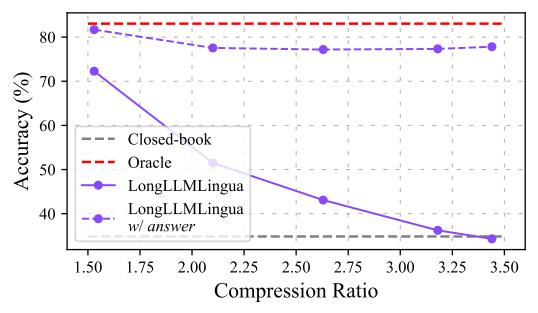
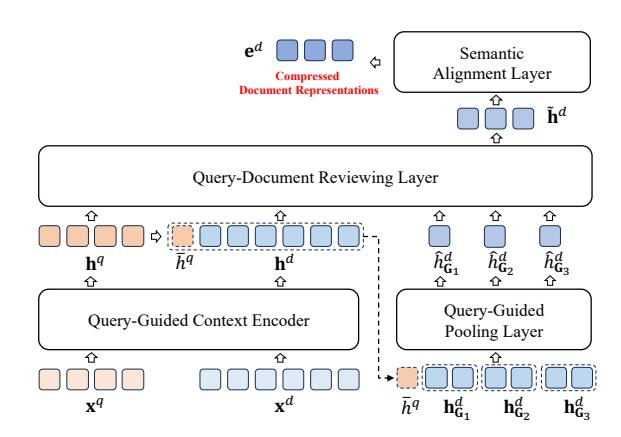
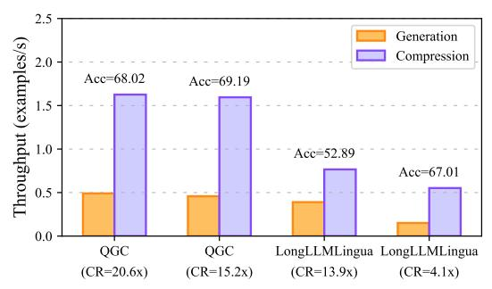
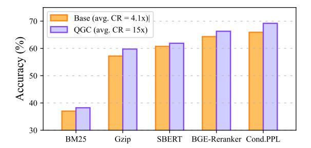

# Retaining Key Information under High Compression Ratios: Query-Guided Compressor for LLMs

Zhiwei Cao1,3\*, Qian Cao2\*, Yu Lu2, Ningxin Peng2, Luyang Huang2 Shanbo Cheng2† and Jinsong Su1,3†

1School of Informatics, Xiamen University 2ByteDance Research 3Shanghai Artificial Intelligence Laboratory

lines1@stu.xmu.edu.cn {caoqian.95, luyu.ly, chengshanbo}@bytedance.com jssu@xmu.edu.cn

### **Abstract**

The growing popularity of Large Language Models has sparked interest in context compression for Large Language Models (LLMs). However, the performance of previous methods degrades dramatically as compression ratios increase, sometimes even falling to the closedbook level. This decline can be attributed to the loss of key information during the compression process. Our preliminary study supports this hypothesis, emphasizing the significance of retaining key information to maintain model performance under high compression ratios. As a result, we introduce Query-Guided Compressor (QGC), which leverages queries to guide the context compression process, effectively preserving key information within the compressed context. Additionally, we employ a dynamic compression strategy. We validate the effectiveness of our proposed QGC on the Question Answering task, including NaturalQuestions, TriviaQA, and HotpotQA datasets. Experimental results show that QGC can consistently perform well even at high compression ratios, which also offers significant benefits in terms of inference cost and throughput1.

#### 1 Introduction

The emergence of chatGPT (Ouyang et al., 2022) and GPT4 (OpenAI, 2023), along with other Large Language Models (LLMs) (Touvron et al., 2023a,b) has sparked a global sensation. The success of LLMs is closely tied to the long context capabilities of LLMs (Dong et al., 2022; Lewis et al., 2020), especially in the field of multi-document question answering. However, the utilization of long context also introduces challenges such as higher inference cost, longer latency, and inferior perfor-

mance caused by redundant information (Jiang et al., 2023).

Many efforts have been made to compress the long context by directly removing a certain percentage of less important words, such as LongLLMLingua (Jiang et al., 2023) and Selective-Context (Li et al., 2023). Another common method is to generate a text summary of the given context (Xu et al., 2023; Wang et al., 2023b). Unlike deleting or reordering the word in the context, AutoCompressor (Chevalier et al., 2023) compresses long documents into multiple vectors as soft prompts, which are optimized with full parameters of LLMs. However, our preliminary study shows that these methods have a common flaw: as the compression ratio increases, the compressed context fails to retain key information, resulting in a significant decrease in the performance of LLMs.

The key to solve this problem is query, which defines what key information is. We aim to preserve this query-related key information even at a high compression ratio. Specifically, we propose the Query-Guided Compressor (QGC) to fully utilize query information throughout each compression step. We first feed the query and the documents together into a context encoder to learn the queryguide document representations. We then compress these document representations into n-gram representations guided by the importance of each word in relation to the query. Subsequently, we propose to augment the n-gram representations by reviewing the query and document, which are finally aligned to the embedding space of the LLMs. We further propose dynamically adjusting the compression ratio of each document based on its relevance to the query. Compared to previous methods, QGC has several advantages: 1) high compression ratios by retaining most query-related information during compression, 2) low training costs by optimizing the compressor only instead of finetuning the entire LLM, and 3) better semantic consistency by com-

\*These authors contributed equally. This work was done when Zhiwei Cao was interning at ByteDance.

&lt;sup>†Corresponding author.

&lt;sup>1Our code is available at https://github.com/ DeepLearnXMU/QGC.

pressing the n-gram structure rather than deleting words.

We validate the effectiveness of QGC on the multi-document Question Answering task, including three datasets: NaturalQuestions, TriviaQA, and HotpotQA. Experimental results on the QA task indicate that, compared to LongLLMLingua, OGC exhibits a 2.75 times higher compression ratio and a 2.42 times higher throughput. Additionally, its accuracy has improved by an average of 5 points. We further investigated the loss of key information throughout the compression process. The findings reveal that under high compression ratios and high noise conditions, QGC only incurs a performance loss of about 10%, while LongLLM-Lingua suffers a loss of approximately 47%. This validates the effectiveness of QGC in retaining key information.

### 2 Preliminary Study

In this section, we first briefly formulate the long context compression on the Question Answering task, and then present an analysis on the key information loss in previous compression methods.

### 2.1 Task Formulation

Given a LLM input with augmented context  $\mathbf{x} = (\mathbf{x}^{ins}, \mathbf{x}^{d_1}, ..., \mathbf{x}^{d_k}, ..., \mathbf{x}^{d_K}, \mathbf{x}^q)$ , which consists of the instruction  $\mathbf{x}^{ins}$ , K documents  $\{\mathbf{x}^{d_k}\}_{k=1}^K$ , and the query  $\mathbf{x}^q$ , the objective of context compression can be formulated as:

$$\min_{\widetilde{\mathbf{y}}} d(\text{LLM}(\mathbf{y}|\mathbf{x}), \text{LLM}(\widetilde{\mathbf{y}}|\widetilde{\mathbf{x}})), \tag{1}$$

where  $\mathbf{y}$  is the ground-truth answer and  $\widetilde{\mathbf{y}}$  represents the output of the LLM with the compressed context  $\widetilde{\mathbf{x}}$  as the input.  $d(\cdot,\cdot)$  is a function measuring the distance between two distributions, such as KL divergence. In this work, we focus on compressing K retrieved documents that greatly determine the length of the input.

#### 2.2 Key Information Loss in Compression

We study the effectiveness of two representative methods, LongLLMLingua (Jiang et al., 2023) and AutoCompressor (Chevalier et al., 2023). We conduct experiments on the NaturalQuestions dataset (Liu et al., 2023) and use accuracy as the evaluation metric, which judges whether any correct answers appear in the LLM prediction.

> **[图片提取文字 (无描述)]:**
> 80 70 Accuracy (%) 60 Closed-book Oracle 50 LongLLMLingua LongLLMLingua w/ answer 40 2.00 2.50 2.75 1.50 1.75 2.25 3.00 3.25 3.50 Compression Ratio

(a) Compression Ratio for LongLLMLingua

> **[图片提取文字 (无描述)]:**
> 70 60 Accuracy 50 40 Closed-book Oracle 30 AutoCompressor 3 docs 4 docs 5 docs 1 doc 2 docs

(b) Document Number for AutoCompressor

Figure 1: The accuracy of LongLLMLingua (Jiang et al., 2023) and AutoCompressor (Chevalier et al., 2023) with different compression ratios and number of documents on the NaturalQuestions test set, respectively. Closedbook denotes providing LLMs with the question only, and Oracle means using the question and corresponding ground-truth documents as the input of the LLM. "w/answer" means adding the golden answer to the compressed context.

For LongLLMLingua, we apply LLaMA-2-7B-Chat2 as the small language model for compression, and use LongChat-13B-16K3 as the target LLM. We use the open-source AutoCompressor4, which fine-tunes LLaMA-2-7B to compress context and generate answers. Here, we consider four settings:

- **Closed-book**. It takes the query as the LLM input with no additional documents.
- Oracle. The query and only the document containing the ground truth are used as inputs to the LLM.
- Base. Based on Oracle, we compress the document directly with various compression ratios for LongLLMLingua. However, since Auto-Compressor is set to compress documents to fixed length vectors, we change the compression ratio by adding external documents.

2https://ai.meta.com/llama/

&lt;sup>3https://huggingface.co/lmsys/longchat-13b-16k

&lt;sup>4https://github.com/princeton-nlp/AutoCompressors

• Base *w/ answer*. We manually add key information to the compressed results by concatenating the answer with the compressed word sequence in LongLLMLingua. Note that this setting is impractical for AutoCompressor where the compressed results are vectors that cannot be changed directly.

From Figure [1,](#page-1-3) we find that the performance of both methods degrades significantly with increasing compression ratios. As shown in Figure [1\(a\),](#page-1-4) the performance of LongLLMLingua decreases by 47% as the compression ratio increases from 1.53x to 3.44x. Even worse, the accuracy of LongLLM-Lingua at 3.44x compression ratio is equivalent to that of the closed-book setting. The same findings are illustrated in Figure [1\(b\)](#page-1-5) for AutoCompressor.

More importantly, we observe that adding key information to the compressed result can greatly alleviate the performance degradation that typically occurs at high compression ratios. Back to Figure [1\(a\),](#page-1-4) the accuracy line fluctuates little as the compression ratio increases from 1.5x to 3.5x with the help of additional key information, which is a decrease of 3.87% compared to the former 47% with the loss of key information. These observations validate the need to preserve key information during compression, which motivates us to explore a better method to fully exploit query information for context compression.

# 3 Query-Guided Compression

As shown in Figure [2,](#page-2-0) we equip the LLM with the Query-Guided Compressor to compress long documents into a much shorter sequence of continuous representations, which are then concatenated with the corresponding instruction and query as the input for the LLM. In the following, we first introduce the architecture of Query-Guided Compressor and then its training objective. Then, we propose a dynamic compression strategy that assigns higher compression ratios for irrelevant documents to further improve the compressed representations.

### 3.1 Compressor Architecture

Figure [3](#page-3-0) illustrates the basic architecture of our Query-Guided Compressor. Using the compressor, we adopt the following steps to produce compressed representations of each document: 1) learning the query-aware document representations; 2) compressing the document representations into ngram representations by weighted pooling; 3) aug-

> **[图片提取文字 (无描述)]:**
> Wilhelm Conrad Röntgen LLM Instruction: Write a high-quality answer for the given question using only the provided search results. {Compressed Document Representations} Query: Who got the first Nobel Prize in Physics? Answer: Compressed Document Representation (representation length  $\approx 200$  tokens) QGC Document 1: (Title: List of Nobel laureates in Physi -cs) The first Nobel Prize in Physics was awarded ... Document 2: ... Document N: (Title: E. C. George Sudarshan) In 2007, Sudarshan told the "Hindustan Times". ... Query: Who got the first Nobel Prize in Physics? ~3K tokens

Figure 2: The framework of our method.

menting the n-gram representations by reviewing the query and the entire document; 4) aligning the obtained representations into the embedding space of the LLM. Particularly, these four steps correspond exactly to the four key components of our compressor, which are all boxed in Figure [3.](#page-3-0) Note that we perform the above operations on each document, thus omitting the index k of the document for simplicity.

Query-Guided Context Encoder At the first step, we feed the concatenation of the query x q and the document x d into query-aware context encoder to learn the representations of the query and the document.

The encoder consists of two Transformer encoder layers. Formally, these representations can be obtained in the following way:

$$[\mathbf{h}^q; \mathbf{h}^d] = \text{ContextEncoder}([\mathbf{x}^q; \mathbf{x}^d]).$$
 (2)

Here, h q={h q i } Nq i=1 and h d={h d i } Nd i=1 are the corresponding representation sequences of the query and the document with the lengths of Nq and Nd, respectively. By allowing the query and the document to see each other during encoding, we can facilitate the extraction of the key information relevant to the query in the document.

**Query-Guided Pooling Layer** In the next step, we split the entire document into several n-grams and compress the information of each n-gram into a vector based on their correlation to the query.

To this end, document representations are organized as follows:

$$\mathbf{h}^{d} = [\mathbf{h}_{G_{1}}^{d}, ..., \mathbf{h}_{G_{j}}^{d}, ..., \mathbf{h}_{G_{N_{g}}}^{d}]$$

$$= [\mathbf{h}_{1:n}^{d}, ..., \mathbf{h}_{(j-1) \times n; j \times n}^{d}, ..., \mathbf{h}_{N_{d}-n+1:N_{d}}^{d}],$$
(3)

where  $\mathbf{G}_j$  represent the indices of the *j*-th *n*-gram.  $N_q = \frac{N_d}{n}$  is the number of *n*-grams.

Then, we measure the weight of each token in  $G_j$  by calculating its relevance with the mean representation  $\overline{h}^q$  of query tokens:

$$\overline{h}^q = \frac{1}{N_q} \sum h_i^q, \tag{4}$$

$$w_{i,\mathbf{G}_{j}} = \frac{\exp s(\overline{h}^{q}, h_{i}^{d})}{\sum_{i' \in \mathbf{G}_{j}} \exp s(\overline{h}^{q}, h_{i'}^{d})},$$
 (5)

where  $s(\cdot,\cdot)$  is the dot-product function, and  $w_{i,G_j}$  represents the weight of the i-th token representation  $h_i^d$  in the document, which belongs to the j-th n-gram.

Finally, we acquire the compressed n-gram representations  $\hat{h}^d_{\mathbf{G}_j}$  as the weighted sum of token representations in the n-gram:

$$\hat{h}_{\mathbf{G}_j}^d = \sum_{i \in \mathbf{G}_i} w_{i,\mathbf{G}_j} \cdot h_i^d. \tag{6}$$

Query-Document Reviewing Layer To further prevent the key information loss in compression, we introduce a novel reviewing module to perfect the compressed n-gram representations by revising both the query and the document representations.

Concretely, this encoder consists of two Transformer encoder layers, which takes the query representations  $\mathbf{h}^q$ , the document representations  $\hat{\mathbf{h}}^d$ , and the compressed n-gram representations  $\hat{\mathbf{h}}^d$  as inputs, and outputs the improved document n-gram representations  $\hat{\mathbf{h}}^d$ :

$$\widetilde{\mathbf{h}}^d = \text{ReviewingLayer}([\mathbf{h}^q; \mathbf{h}^d; \hat{\mathbf{h}}^d]).$$
 (7)

**Semantic Alignment Layer** Since  $\tilde{\mathbf{h}}^d$  lie in a different embedding space with the inputs of the LLM, we use a fully-connected semantic alignment layer to map the n-gram representations into the embedding space of the LLM. The aligned n-gram representations  $\mathbf{e}^d$  can be formulated as follows:

$$\mathbf{e}^d = \mathbf{W} \cdot \widetilde{\mathbf{h}}^d + \mathbf{b},\tag{8}$$

where **W** and **b** are learnable parameters.

> **[图片提取文字 (无描述)]:**
> $e^{d}$ Semantic Alignment Layer Compressed **Document Representations**  $\tilde{\mathbf{h}}^d$ Query-Document Reviewing Layer 企  $\hat{h}_{\mathbf{G}_{2}}^{d}$  $\bar{h}^q$  $\mathbf{h}^d$  $\mathbf{h}^q$ Query-Guided Query-Guided Context Encoder Pooling Layer  $\mathbf{x}^d$  $\mathbf{x}^q$

Figure 3: The structure of QGC. The first three layers use query q to guide document d encoding, pooling, and reviewing respectively. The last layer aligns document representations into the target LLM embedding space.

### 3.2 Compressor Training

Unlike AutoCompressor (Chevalier et al., 2023), we fix the parameter of the LLM and only fine-tune the compressor.

Through the above steps, each long document is compressed into a shorter sequence of continuous representations  $\mathbf{e}^d$ . Thus, the inputs of the LLM are finally formated as  $\widetilde{\mathbf{x}} = (\mathbf{x}^{ins}, \mathbf{e}^{d_1}, ..., \mathbf{e}^{d_k}, ..., \mathbf{e}^{d_K}, \mathbf{x}^q)$ . To avoid missing the key information during compression, we define the training objective of the compressor in the following way:

$$\mathcal{L} = \mathcal{L}_{CE} + \mathcal{L}_{KL}$$

$$= -\log p(\mathbf{y}|\widetilde{\mathbf{x}}) + \text{KL}[p(\mathbf{y}|\mathbf{x})||p(\mathbf{y}|\widetilde{\mathbf{x}})],$$
(9)

where  $KL[\cdot||\cdot]$  represents the Kullback–Leibler divergence. By introducing the KL loss, we encourage the LLM to generate the correct answer even with compressed representations as input.

### 3.3 Dynamically Compressing Strategy

Due to the different importance of retrieved documents, we propose to dynamically adjust the compression ratios for different retrieved documents. Specifically, we assign the n-gram size  $n_k$  for the k-th document based on the importance ranking:

$$n_k = \begin{cases} \min(2 \cdot O_k, 16) & S_k \ge \epsilon \\ \infty & S_k < \epsilon \end{cases}, \tag{10}$$

where  $S_k$  and  $O_k$  is the score and rank of the k-th document acquired by the existing reranker, such as Contriever (Izacard et al., 2022a).  $\epsilon$  is the score threshold for filtering low-score documents. Note that when the assigned n-gram size  $n_k$  is set to  $\infty$ , the corresponding document will be discarded.

| Methods                                    | NaturalQuestions |       |       | TriviaQA |       |       | HotpotQA |       |       |
|--------------------------------------------|------------------|-------|-------|----------|-------|-------|----------|-------|-------|
|                                            | Acc              | CR    | TP    | EM       | CR    | TP    | F1       | CR    | TP    |
| LongChat-13B                               |                  |       |       |          |       |       |          |       |       |
| Closed-book                                | 34.84            | -     | -     | 36.07    | -     | -     | 22.19    | -     | -     |
| Oracle                                     | 83.05            | 59.2x | -     | -        | -     | -     | 60.61    | 42.2x | -     |
| Original Prompt                            | 53.11            | 1.0x  | -     | 48.70    | 1.0x  | -     | 44.76    | 1.0x  | -     |
| Reranker-based Methods                     |                  |       |       |          |       |       |          |       |       |
| Sentence-BERT (Reimers and Gurevych, 2020) | 60.75            | 4.1x  | 0.137 | 48.89    | 4.5x  | 1.957 | 42.92    | 4.4x  | 1.930 |
| BGE-Reranker (Xiao et al., 2023)           | 64.33            | 4.1x  | 0.138 | 47.71    | 4.5x  | 1.724 | 47.96    | 4.4x  | 1.689 |
| Cond.PPL (Jiang et al., 2023)              | 65.91            | 4.1x  | 0.128 | 52.48    | 4.5x  | 1.287 | 49.82    | 4.3x  | 1.267 |
| Compression-based Methods                  |                  |       |       |          |       |       |          |       |       |
| Selective-Context (Li et al., 2023)        | 35.44            | 2.5x  | 0.077 | 42.73    | 2.5x  | 0.465 | 29.68    | 2.6x  | 0.456 |
| LongLLMLingua (Jiang et al., 2023)†        | 66.70            | 3.9x  | -     | -        | -     | -     | -        | -     | -     |
| LongLLMLingua (Jiang et al., 2023)         | 67.01            | 4.1x  | 0.118 | 51.51    | 3.7x  | 0.724 | 45.43    | 3.8x  | 0.683 |
| QGC                                        | 69.19            | 15.2x | 0.356 | 57.72    | 7.9x  | 1.832 | 52.12    | 8.8x  | 1.849 |
| LLaMA-2-7B                                 |                  |       |       |          |       |       |          |       |       |
| Closed-book                                | 32.35            | -     | -     | 30.70    | -     | -     | 10.54    | -     | -     |
| Oracle                                     | 73.45            | 59.2x | -     | -        | -     | -     | 57.68    | 42.2x | -     |
| Original Prompt                            | 27.53            | 1.0x  | -     | 49.47    | 1.0x  | -     | 44.24    | 1.0x  | -     |
| Reranker-based Methods                     |                  |       |       |          |       |       |          |       |       |
| Sentence-BERT (Reimers and Gurevych, 2020) | 24.26            | 4.1x  | 0.133 | 49.49    | 4.5x  | 0.731 | 40.65    | 4.4x  | 0.752 |
| BGE-Reranker (Xiao et al., 2023)           | 25.08            | 4.1x  | 0.130 | 48.69    | 4.5x  | 0.683 | 46.13    | 4.4x  | 0.724 |
| Cond.PPL (Jiang et al., 2023)              | 27.87            | 4.1x  | 0.123 | 52.76    | 4.5x  | 0.602 | 47.84    | 4.3x  | 0.623 |
| Compression-based Methods                  |                  |       |       |          |       |       |          |       |       |
| Selective-Context (Li et al., 2023)        | 31.79            | 2.6x  | 0.082 | 48.55    | 2.5x  | 0.303 | 28.21    | 2.6x  | 0.332 |
| LongLLMLingua (Jiang et al., 2023)         | 41.13            | 4.1x  | 0.108 | 50.44    | 3.7x  | 0.432 | 39.87    | 3.8x  | 0.438 |
| AutoCompressor (Chevalier et al., 2023)    | 49.23            | 13.9x | 0.302 | 29.17    | 8.7x  | 0.823 | 29.02    | 8.1x  | 0.833 |
| ICAE (Ge et al., 2023)                     | 53.34            | 21.5x | -     | 48.91    | 10.2x | -     | 34.50    | 9.5x  | -     |
| QGC                                        | 60.90            | 15.2x | 0.313 | 57.46    | 7.9x  | 0.902 | 51.64    | 8.8x  | 0.927 |
| QGC(ϵ = 0.42)                              | 57.62            | 20.6x | -     | 57.11    | 10.9x | -     | 51.23    | 12.1x | -     |

Table 1: Experimental results on three benchmark datasets. Acc = accuracy, EM = exact match, F1 = F1 score, CR = compression ratio, TP = throughput (examples/second). Closed-book, Oracle, and Original Prompt denote using the query only, the complete ground-truth documents, and all retrieved documents as inputs, respectively. † indicates that the results are directly cited from [Jiang et al.](#page-9-5) [\(2023\)](#page-9-5).

# 4 Experiments

In this section, we conduct extensive experiments to investigate the effectiveness of QGC.

Datasets & Evaluation Metric The experiments are carried out based on the three datasets:

- NaturalQuestions We select the processed version [\(Liu et al.,](#page-9-8) [2023\)](#page-9-8) where each question has 20 related documents and only one of them contains the correct answer. We follow [Liu et al.](#page-9-8) [\(2023\)](#page-9-8) to use accuracy (Acc) as the evaluation metric, which judges whether the correct answer appears in the prediction.
- TriviaQA We employ the adversarial Con-

triever [\(Izacard et al.,](#page-9-9) [2022a\)](#page-9-9) to retrieve the top 10 documents from all Wikipedia passages. Following [Lewis et al.](#page-9-4) [\(2020\)](#page-9-4), we use the Exact Match (EM) metric to evaluate the LLM prediction.

• HotpotQA Different from the above two datasets, HotpotQA [\(Yang et al.\)](#page-10-2) is a multihop dataset where the answer lies in more than one document. Specifically, each question has 10 related documents and two of them are ground-truth documents. Following [Yang](#page-10-2) [et al.,](#page-10-2) we use the F1 score to measure the correctness of the LLM.

Besides, we calculate the compression ratio (CR)

for different methods, which is defined as the length rate of the original context to the compressed context. We also provide the inference throughput (TP) on a single A100-80G GPU, including compression and generation.

Baselines Following [\(Jiang et al.,](#page-9-5) [2023\)](#page-9-5), we include two sets of methods as our baselines.

- 1) *Reranker-based Methods*. It simply uses a reranker method to sort documents based on importance and discards unimportant ones. We select the following reranker: Sentence-BERT [\(Reimers](#page-9-10) [and Gurevych,](#page-9-10) [2020\)](#page-9-10), BGE-Reranker [\(Xiao et al.,](#page-10-1) [2023\)](#page-10-1), and Cond.PPL proposed by [Jiang et al.](#page-9-5) [\(2023\)](#page-9-5) to measure the association between the query and documents. Then, we discard documents with low association until the compression ratio is met and sort the remaining documents according to the association from high to low.
- 2) *Compression-based Methods*. Compared with reranker-based methods, they further compress the sorted documents, retaining more information while satisfying a higher compression ratio. We select the following methods as our baselines:
  - Selective-Context [\(Li et al.,](#page-9-6) [2023\)](#page-9-6) It uses selfinformation estimated by an external language model to prune redundant words.
  - LongLLMLingua [\(Jiang et al.,](#page-9-5) [2023\)](#page-9-5) It is the state-of-the-art method for long context compression. It first uses a language model to quantify the importance of each document as its question-aware perplexity, and then designs a question-aware coarse-to-fine compression method to delete unimportant tokens.
  - AutoCompressor [\(Chevalier et al.,](#page-8-1) [2023\)](#page-8-1) It fine-tunes LLaMA-2-7B to recursively compress long context into summary vectors, which are used as soft prompts to generate the answer. We use the released AutoCompressor-Llama-2-7B-6K for experiments.
  - ICAE [\(Ge et al.,](#page-8-2) [2023\)](#page-8-2) Similar to AutoCompressor, it generates compact and informative memory slots to represent the original context. We use the released ICAE model pre-trained on Llama-2-7B-Chat for experiments [5](#page-5-0) .

Implementation Details We use LongChat-13B-16K and LLaMA-2-7B as the LLMs for evaluation,

| Methods                              | Accuracy |
|--------------------------------------|----------|
| QGC                                  | 69.19    |
| w/o query-guided context encoder     | 50.36    |
| w/o query-guided pooling layer       | 55.34    |
| w/o query-document reviewing layer   | 64.14    |
| w/o dynamically compressing strategy | 62.15    |

Table 2: The accuracy of ablation study on NaturalQuestions test set, where the target LLM is LongChat-13B.

which are frozen during the optimization of QGC. To ensure stable and reproducible results, we employ greedy decoding and set the temperature to 0 in all experiments. Following [Jiang et al.](#page-9-5) [\(2023\)](#page-9-5), we use LLaMA-2-7B-Chat as the external language model for Selective-Context and LongLLMLingua. For QGC, both the query-guided context encoder and query-document reviewing layer consist of two Transformer encoder layers. All these layers and word embeddings are initialized with LLaMA-2- 7B where MLP parameters are all fixed during training. Our rationale behind this approach stems from our belief that the MLP plays a crucial role in knowledge retention, while our focus lies in adjusting the acquired knowledge based on query. Thus, the trainable parameters in QGC are only 3.5% of LongChat-13B-16K. Besides the ground-truth document, we concatenate 1-4 random documents to build the long context. We also randomly set the n-gram size from the candidate list (4, 6, 8, 10) for each training batch to make the compressor more robust. We train QGC on downstream datasets for 15 epochs, using a learning rate of 5e-5 with the Adam optimizer and batch size of 64. During inference, we use the Cond.PPL proposed by [Jiang](#page-9-5) [et al.](#page-9-5) [\(2023\)](#page-9-5) to sort retrieved documents for all compression-based methods and QGC, and set the ϵ as 0.35. Following [\(Liu et al.,](#page-9-8) [2023;](#page-9-8) [Bai et al.,](#page-8-3) [2023\)](#page-8-3) the maximum generation tokens is 100 for NaturalQuestions, and 32 for both TriviaQA and HotpotQA. All experiments are conducted on 8 NVIDIA A100 GPUs.

Main Results Table [1](#page-4-0) reports the performance, compression ratios, and throughput of various methods or models on different datasets. Overall, QGC achieves higher compression ratios and greater throughput while achieving comparable or even better performance with LongLLMLingua. These results demonstrate that QGC can effectively compress context into shorter inputs.

Specifically, the performance and compression ratio of the reranker-based methods are limited

5 https://github.com/getao/icae

> **[图片提取文字 (无描述)]:**
> 80 70 Accuracy (%) 60 LongLLMLingua 50 LongLLMLingua w/ answer 40 QGC 2.0 2.5 3.0 1.0 1.5 3.5 4.0 Compression Ratio (a) Compression Ratio for QGC 80 Accuracy (%) 60 40 Closed-book 20 -Oracle QGC 0 1 doc 2 docs 3 does 4 docs 5 docs

(b) Document Number for QGC Figure 4: The accuracy of QGC with varying compression ratios and number of documents, respectively.

because no compression operation is used within the document. Compared to AutoCompressor and ICAE, our method achieves better accuracy with comparable compression ratios. Compared with LongLLMLingua, QGC achieves average +5.03 and +12.87 performance improvements when using LongChat-13B and LLaMA-2-7B as the target LLMs. On average, the compression ratio and throughput of QGC are 2.75 times and 2.47 times that of LongLLMLingua on all datasets and target LLMs, respectively.

Ablation Study To explore the effect of different components on QGC, we use LongChat-13B as the target LLM and introduce the following variants of QGC for ablation study: 1) w/o queryguided context encoder. In this variant, the query and document are independently encoded; 2) w/o query-guided pooling layer. When establishing this variant, we directly replace the weighted sum of token representations in each n-gram with their mean representation; 3) w/o query-document reviewing layer. This variant no longer refines the compressed representations of n-grams; 4) w/o dynamically compressing strategy. We fix the n-gram size as 4 for comparable comparison.

As shown in Table 2, the absence of the query-document reviewing layer and dynamically compressing strategy lead to a 5.05 and 7.04 accuracy loss respectively. The more substantial loss is observed after removing the query-guided context encoder and query-guided pooling layer, resulting

| Methods         | SS   | ST-2  | GSM8K |       |  |  |
|-----------------|------|-------|-------|-------|--|--|
|                 | Acc  | CR    | Acc   | CR    |  |  |
| Original Prompt | 92.4 | 1.0x  | 14.48 | 1.0x  |  |  |
| LongLLMLingua   | -    | -     | 5.91  | 3.9x  |  |  |
| AutoCompressor  | 94.2 | 15.0x | 6.68  | 13.6x |  |  |
| QGC             | 94.8 | 23.3x | 14.18 | 13.4x |  |  |

Table 3: Experimental results on SST-2 and GSM8K datasets, where the target LLM is LLaMA-2-7B.

in a significant performance accuracy drop of 18.83 and 13.85 respectively, highlighting the importance of employing the query to guide compression.

### 5 Analysis

In this section, we conduct in-depth analyses to explore the performance of QGC in terms of key information loss, demonstration compression, detailed throughput and reranker impact. All analyses are conducted on NaturalQuestions with target LLM as LongChat-13B.

**Key Information Loss in QGC** As described in Section 2.2, previous methods dramatically lose key information as the compression ratio increases. For comparison, we experiment with QGC using the same setting.

Compared to LongLLMLingua in Figure 4(a), the performance of QGC only decreases 10% as the compression ratio increases from 1x to 4x, and is even comparable to that of LongLLMLingua containing the correct answer in the compressed result. As seen in Figure 4(b), we observe that the performance of QGC slightly degrades with more documents, which is only a 12% decrease with 4 documents (27% for AutoCompressor). These results demonstrate that QGC can effectively retain key information even in much longer context and higher compression ratio scenarios.

**Demonstration Compression for In-Context Learning** To further validate the effectiveness of QGC in a broader context, we conduct experiments on both SST-2 and GSM8K datasets. We adopt the approach of previous studies (Chevalier et al., 2023; Wei et al., 2022) which utilizing demonstrations as the document, while maintaining consistency with their experimental setup. The results in Table 3 reveals notable insights. On the SST-2 dataset, our method surpasses autocompressor in both compression ratio and accuracy. Meanwhile, on the GSM8K dataset, our accuracy performance remains on par with the original prompt

> **[图片提取文字 (无描述)]:**
> 2.5 Generation Throughput (examples/s) Compression 2.0 Acc=68.02 Acc=69.19 1.5 1.0 Acc=52.89 Acc=67.010.5 0.0 QGC QGC LongLLMLingua LongLLMLingua (CR=20.6x) (CR=15.2x)(CR=13.9x) (CR=4.1x)

Figure 5: The accuracy, compression throughput, and generation throughput of QGC and LongLLMLingua.

at the same compression ratio as autocompressor. This suggests that QGC strikes an excellent balance between model performance and compression ratio. These results showcases QGC's proficiency in preserving information from demonstrations and fostering the in-context learning capacity of the target LLM.

**Detailed Throughput Evaluation** To evaluate the throughput of various methods or models, encompassing both compression and generation, we perform testing on a single A100-80G GPU.

The results presented in Figure 5 indicate that QGC is obviously higher than LongLLMLingua in both compression throughput and generation throughput. Moreover, by adjusting the hyperparameter  $\epsilon$  (See Equation 10) to increase the compression ratio, QGC can achieve a higher compression ratio while minimizing the impact on LLM performance and further improving throughput. Furthermore, our higher compression ratios lead to shorter LLM input, which also significantly improves the generation throughput of the target LLM. As for LongLLMLingua, since it additionally introduces LLaMA-2-7B for compression, the compression throughput is significantly lower than ours. Besides, although LongLLMLingua can also improve compression ratio by adjusting hyper-parameters, its performance will significantly drop, while OGC still maintains excellent performance.

Impact of Different Rerankers The compression ratio for each document is determined by the corresponding correlation with the query obtained by a reranker. Here, we analyze the impact of using different rerankers in this process. In addition to the three methods introduced in reranker-based methods, we also include BM25 and Gzip (Jiang et al., b) for comparison.

Experimental results are shown in Figure 6. It can be found that QGC performs better with more competitive rerankers. Besides, compared with di-

> **[图片提取文字 (无描述)]:**
> Base (avg. CR = 4.1x) 70 QGC (avg. CR = 15x) Accuracy (%) 50 30 BM25 Gzip BGE-Reranker Cond.PPL

Figure 6: The performance of QGC using different rerankers. "Base" represents the performance of each reranker to be used for compression. The performance (Recall) of rerankers: Cond.PPL > BGE-Rererank > SBERT (Sentence-BERT) > Gzip > BM25.

rectly using rerankers for compression, QGC not only achieves an average 2.65 times higher compression ratio but also maintains lossless or even improved performance.

#### 6 Related Work

Long Context for LLMs Recently, there have been a lot of studies focusing on expanding the context length of LLMs (Press et al., 2021; Peng et al., 2023; Bertsch et al., 2023). Existing efforts primarily involve gradually increasing the window size during pre-training (Nijkamp et al., 2023), interpolating position embeddings (Chen et al., 2023), and modifying the attention mechanism (Ding et al., 2023). Unlike these works, we do not directly aim to expand the context window of LLMs. Hence, the QGC that we proposed can complement these techniques by enabling LLMs to access a broader context with reduced cost and shorter latency.

**Retrieval-augmented LMs** Combined with a standalone retriever to augment LMs are gaining popularity for benefiting various knowledgeintensive tasks. Previous studies have achieved remarkable results in improving perplexity (Wang et al., 2023a), factual accuracy (Nakano et al., 2022), downstream task performance (Izacard et al., 2022b), and in-context learning (Huang et al., 2023). Besides, many works focus on cooperating LLMs and retrieved documents, such as reranking retrieved documents (Mao et al.) and discarding irrelevant documents (Mallen et al.). QGC is also a retrieval augmentation method for LLMs, which efficiently compresses the retrieved documents into shorter inputs while maintaining no significant performance degradation.

**Context Compression** With the growing context length in LLMs, the demand for higher ef-

ficiency, lower cost, and reduced latency has attracted much attention. As a promising solution, compression techniques can be broadly categorized into two types: black-box compression [\(Xu](#page-10-0) [et al.,](#page-10-0) [2023\)](#page-10-0) and white-box compression [\(Wang](#page-9-7) [et al.,](#page-9-7) [2023b\)](#page-9-7). Black-box compression primarily involves token pruning based on different importance measures, such as self-information [\(Li](#page-9-6) [et al.,](#page-9-6) [2023\)](#page-9-6) and the LLM perplexity [\(Jiang et al.,](#page-9-21) [a,](#page-9-21) [2023\)](#page-9-5). On the other hand, white-box compression focuses on generating summarization or compressing the context into soft prompt through fine-tuning or Low-Rank Adaptation (LoRA). For instance, [Wang et al.](#page-9-7) [\(2023b\)](#page-9-7) autoregressively generates filtered content and fine-tunes target LLM to use it for generation. [Mu et al.](#page-9-22) [\(2023\)](#page-9-22) trains LLMs to compress instructions into concise key-value attention prefixes. [Chevalier et al.](#page-8-1) [\(2023\)](#page-8-1) recursively compresses lengthy text into summary vectors, while [Ge et al.](#page-8-2) [\(2023\)](#page-8-2) generates memory slots to represent the original context. Compared with the above-mentioned compression studies, QGC's design fully takes into account the query, which leads to the enhanced retention of key information, higher compression ratios, higher throughput, and improved overall performance.

# 7 Conclusion and Future Work

In this paper, we have presented a query-guided compressor QGC for LLMs to solve the loss of key information under high compression ratios. It consists of four essential components: query-guided context encoder, query-guided pooling layer, querydocument reviewing layer, and semantic alignment layer. In addition, we also propose a dynamically compressing strategy during inference. Extensive experiments on multi-document QA tasks demonstrate that QGC outperforms previous state-of-theart compression methods in both accuracy and compression ratios. Analyses reveal that this is primarily due to our retention of key information throughout the compression process.

In the future, we aim to validate our approach on more advanced LLMs, while also expanding its application to additional tasks like document summarization. Besides, we will try to further improve our approach by combining previous studies [\(Zhang](#page-10-4) [et al.,](#page-10-4) [a;](#page-10-4) [Hu et al.,](#page-9-23) [2022;](#page-9-23) [Zhang et al.,](#page-10-5) [2022,](#page-10-5) [b\)](#page-10-6).

# Limitations

QGC is a white-box compressor that necessitates access to the internal parameters of LLMs, which restricts its applicability. Furthermore, we have solely validated the effectiveness of QGC on QA and ICL task, and its performance on other tasks that differ significantly from QA task, such as summarization, remains to be verified.

# Acknowledgements

The project was supported by National Key R&D Program of China (No. 2022ZD0160501), National Natural Science Foundation of China (No. 62276219), and the Public Technology Service Platform Project of Xiamen (No. 3502Z20231043). We also thank the reviewers for their insightful comments.

# References

Yushi Bai, Xin Lv, Jiajie Zhang, Hongchang Lyu, Jiankai Tang, Zhidian Huang, Zhengxiao Du, Xiao Liu, Aohan Zeng, Lei Hou, Yuxiao Dong, Jie Tang, and Juanzi Li. 2023. Longbench: A bilingual, multitask benchmark for long context understanding. *arXiv preprint arXiv:2308.14508*.

Amanda Bertsch, Uri Alon, Graham Neubig, and Matthew R Gormley. 2023. Unlimiformer: Longrange transformers with unlimited length input. *arXiv preprint arXiv:2305.01625*.

Shouyuan Chen, Sherman Wong, Liangjian Chen, and Yuandong Tian. 2023. Extending context window of large language models via positional interpolation. *arXiv preprint arXiv:2306.15595*.

Alexis Chevalier, Alexander Wettig, Anirudh Ajith, and Danqi Chen. 2023. Adapting language models to compress contexts. *arXiv preprint arXiv:2305.14788*.

Jiayu Ding, Shuming Ma, Li Dong, Xingxing Zhang, Shaohan Huang, Wenhui Wang, Nanning Zheng, and Furu Wei. 2023. Longnet: Scaling transformers to 1,000,000,000 tokens. *arXiv preprint arXiv:2307.02486*.

Qingxiu Dong, Lei Li, Damai Dai, Ce Zheng, Zhiyong Wu, Baobao Chang, Xu Sun, Jingjing Xu, and Zhifang Sui. 2022. A survey for in-context learning. *arXiv preprint arXiv:2301.00234*.

Tao Ge, Jing Hu, Xun Wang, Si-Qing Chen, and Furu Wei. 2023. In-context autoencoder for context compression in a large language model. *arXiv preprint arXiv:2307.06945*.

- Edward J Hu, Yelong Shen, Phillip Wallis, Zeyuan Allen-Zhu, Yuanzhi Li, Shean Wang, Lu Wang, and Weizhu Chen. 2022. [LoRA: Low-rank adaptation of](https://openreview.net/forum?id=nZeVKeeFYf9) [large language models.](https://openreview.net/forum?id=nZeVKeeFYf9) In *International Conference on Learning Representations*.
- Jie Huang, Wei Ping, Peng Xu, Mohammad Shoeybi, Kevin Chen-Chuan Chang, and Bryan Catanzaro. 2023. [Raven: In-context learning with retrieval aug](http://arxiv.org/abs/2308.07922)[mented encoder-decoder language models.](http://arxiv.org/abs/2308.07922)
- Gautier Izacard, Mathilde Caron, Lucas Hosseini, Sebastian Riedel, Piotr Bojanowski, Armand Joulin, and Edouard Grave. 2022a. [Unsupervised dense in](http://arxiv.org/abs/2112.09118)[formation retrieval with contrastive learning.](http://arxiv.org/abs/2112.09118)
- Gautier Izacard, Patrick Lewis, Maria Lomeli, Lucas Hosseini, Fabio Petroni, Timo Schick, Jane Dwivedi-Yu, Armand Joulin, Sebastian Riedel, and Edouard Grave. 2022b. [Atlas: Few-shot learning with re](http://arxiv.org/abs/2208.03299)[trieval augmented language models.](http://arxiv.org/abs/2208.03299)
- Huiqiang Jiang, Qianhui Wu, Chin-Yew Lin, Yuqing Yang, and Lili Qiu. a. LLMLingua: Compressing prompts for accelerated inference of large language models. In *EMNLP 2023*.
- Huiqiang Jiang, Qianhui Wu, Xufang Luo, Dongsheng Li, Chin-Yew Lin, Yuqing Yang, and Lili Qiu. 2023. Longllmlingua: Accelerating and enhancing llms in long context scenarios via prompt compression. *arXiv preprint arXiv:2310.06839*.
- Zhiying Jiang, Matthew Yang, Mikhail Tsirlin, Raphael Tang, Yiqin Dai, and Jimmy Lin. b. "low-resource" text classification: A parameter-free classification method with compressors. In *Findings of ACL 2023*.
- Patrick Lewis, Ethan Perez, Aleksandra Piktus, Fabio Petroni, Vladimir Karpukhin, Naman Goyal, Heinrich Küttler, Mike Lewis, Wen-tau Yih, Tim Rocktäschel, et al. 2020. Retrieval-augmented generation for knowledge-intensive nlp tasks. *NeurIPS 2020*.
- Yucheng Li, Bo Dong, Frank Guerin, and Chenghua Lin. 2023. Compressing context to enhance inference efficiency of large language models. In *EMNLP 2023*.
- Nelson F Liu, Kevin Lin, John Hewitt, Ashwin Paranjape, Michele Bevilacqua, Fabio Petroni, and Percy Liang. 2023. Lost in the middle: How language models use long contexts. *arXiv preprint arXiv:2307.03172*.
- Alex Mallen, Akari Asai, Victor Zhong, Rajarshi Das, Daniel Khashabi, and Hannaneh Hajishirzi. When not to trust language models: Investigating effectiveness of parametric and non-parametric memories. In *ACL 2023*.
- Yuning Mao, Pengcheng He, Xiaodong Liu, Yelong Shen, Jianfeng Gao, Jiawei Han, and Weizhu Chen. Reader-guided passage reranking for open-domain question answering. In *Findings of ACL 2021*.

- Jesse Mu, Xiang Lisa Li, and Noah Goodman. 2023. Learning to compress prompts with gist tokens. *arXiv preprint arXiv:2304.08467*.
- Reiichiro Nakano, Jacob Hilton, Suchir Balaji, Jeff Wu, Long Ouyang, Christina Kim, Christopher Hesse, Shantanu Jain, Vineet Kosaraju, William Saunders, Xu Jiang, Karl Cobbe, Tyna Eloundou, Gretchen Krueger, Kevin Button, Matthew Knight, Benjamin Chess, and John Schulman. 2022. [Webgpt: Browser](http://arxiv.org/abs/2112.09332)[assisted question-answering with human feedback.](http://arxiv.org/abs/2112.09332)
- Erik Nijkamp, Tian Xie, Hiroaki Hayashi, Bo Pang, Congying Xia, Chen Xing, Jesse Vig, Semih Yavuz, Philippe Laban, Ben Krause, et al. 2023. Xgen-7b technical report. *arXiv preprint arXiv:2309.03450*.
- OpenAI OpenAI. 2023. Gpt-4 technical report.
- Long Ouyang, Jeffrey Wu, Xu Jiang, Diogo Almeida, Carroll Wainwright, Pamela Mishkin, Chong Zhang, Sandhini Agarwal, Katarina Slama, Alex Ray, et al. 2022. Training language models to follow instructions with human feedback. *NeurIPS 2020*.
- Bowen Peng, Jeffrey Quesnelle, Honglu Fan, and Enrico Shippole. 2023. Yarn: Efficient context window extension of large language models. *arXiv preprint arXiv:2309.00071*.
- Ofir Press, Noah A Smith, and Mike Lewis. 2021. Train short, test long: Attention with linear biases enables input length extrapolation. *arXiv preprint arXiv:2108.12409*.
- Nils Reimers and Iryna Gurevych. 2020. Making monolingual sentence embeddings multilingual using knowledge distillation. In *EMNLP 2020*.
- Hugo Touvron, Thibaut Lavril, Gautier Izacard, Xavier Martinet, Marie-Anne Lachaux, Timothée Lacroix, Baptiste Rozière, Naman Goyal, Eric Hambro, Faisal Azhar, et al. 2023a. Llama: Open and efficient foundation language models. *arXiv preprint arXiv:2302.13971*.
- Hugo Touvron, Louis Martin, Kevin Stone, Peter Albert, Amjad Almahairi, Yasmine Babaei, Nikolay Bashlykov, Soumya Batra, Prajjwal Bhargava, Shruti Bhosale, et al. 2023b. Llama 2: Open foundation and fine-tuned chat models. *arXiv preprint arXiv:2307.09288*.
- Boxin Wang, Wei Ping, Peng Xu, Lawrence McAfee, Zihan Liu, Mohammad Shoeybi, Yi Dong, Oleksii Kuchaiev, Bo Li, Chaowei Xiao, Anima Anandkumar, and Bryan Catanzaro. 2023a. [Shall we pretrain](http://arxiv.org/abs/2304.06762) [autoregressive language models with retrieval? a](http://arxiv.org/abs/2304.06762) [comprehensive study.](http://arxiv.org/abs/2304.06762)
- Zhiruo Wang, Jun Araki, Zhengbao Jiang, Md Rizwan Parvez, and Graham Neubig. 2023b. Learning to filter context for retrieval-augmented generation. *arXiv preprint arXiv:2311.08377*.

- Jason Wei, Xuezhi Wang, Dale Schuurmans, Maarten Bosma, Fei Xia, Ed Chi, Quoc V Le, Denny Zhou, et al. 2022. Chain-of-thought prompting elicits reasoning in large language models. *NeurIPS 2022*.
- Shitao Xiao, Zheng Liu, Peitian Zhang, and Niklas Muennighoff. 2023. [C-pack: Packaged resources](http://arxiv.org/abs/2309.07597) [to advance general chinese embedding.](http://arxiv.org/abs/2309.07597)
- Fangyuan Xu, Weijia Shi, and Eunsol Choi. 2023. Recomp: Improving retrieval-augmented lms with compression and selective augmentation. *arXiv preprint arXiv:2310.04408*.
- Zhilin Yang, Peng Qi, Saizheng Zhang, Yoshua Bengio, William Cohen, Ruslan Salakhutdinov, and Christopher D. Manning. HotpotQA: A dataset for diverse, explainable multi-hop question answering. In *EMNLP 2018*.
- Biao Zhang, Deyi Xiong, Yubin Ge, Junfeng Yao, Hao Yue, and Jinsong Su. 2022. Aan+: Generalized average attention network for accelerating neural transformer. *Journal of Artificial Intelligence Research*.
- Biao Zhang, Deyi Xiong, Jinsong Su, Qian Lin, and Huiji Zhang. a. Simplifying neural machine translation with addition-subtraction twin-gated recurrent networks. In *EMNLP 2018*.
- Zhengyan Zhang, Yankai Lin, Zhiyuan Liu, Peng Li, Maosong Sun, and Jie Zhou. b. MoEfication: Transformer feed-forward layers are mixtures of experts. In *Findings of ACL 2022*.

# A Instructions Used in QGC

The following are the instructions we used after referring to the existing studies [\(Liu et al.,](#page-9-8) [2023\)](#page-9-8) and testing.

- NaturalQuestions: *Write a high-quality answer for the given question using only the provided search results(some of which might be irrelevant)*.
- TriviaQA & HotpotQA: *Using only the provided search results (some of which might be irrelevant), answer the following question with one or few words*.