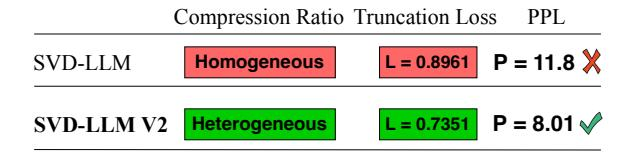
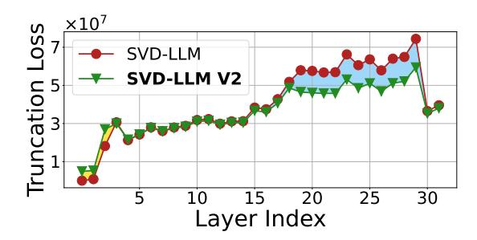
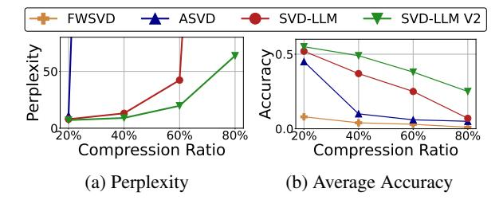
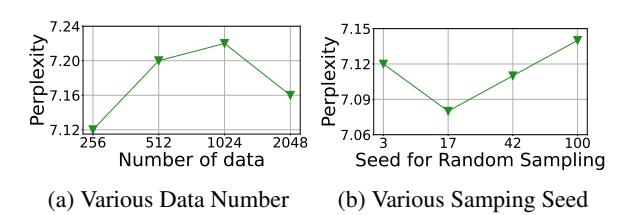

## SVD-LLM V2: Optimizing Singular Value Truncation for Large Language Model Compression

Xin Wang Samiul Alam Zhongwei Wan Hui Shen Mi Zhang
The Ohio State University

{wang.15980, alam.140, wan.512, shen.1780, mizhang.1}@osu.edu https://github.com/AIoT-MLSys-Lab/SVD-LLM

#### **Abstract**

Despite significant advancements, the practical deployment of Large Language Models (LLMs) is often hampered by their immense sizes, highlighting the need for effective compression techniques. Singular Value Decomposition (SVD) is a promising LLM compression technique. However, existing SVD-based compression methods fall short in reducing truncation losses, leading to less competitive performance in compressed models. In this work, we introduce SVD-LLM V2, a SVD-based LLM compression method that optimizes singular value truncation in SVD compression with two techniques. First, SVD-LLM V2 proposes to use theoretical truncation loss of weight matrices to assign a unique compression ratio to each weight matrix at different layers to accommodate weight redundancy heterogeneity. Second, SVD-LLM V2 proposes loss-optimized weight truncation to ensure that the truncated singular values result in a lower and more stable truncation loss in practice. We evaluate SVD-LLM V2 on ten datasets and five LLMs at various scales. Our results show SVD-LLM V2 outperforms state-ofthe-art SVD-based LLM compression methods. Our code is available at https://github. com/AIoT-MLSys-Lab/SVD-LLM.

#### 1 Introduction

Despite the outstanding performance Large Language Models (LLMs) exhibit in various tasks (Zhao et al., 2023; Gozalo-Brizuela and Garrido-Merchán, 2023; Wan et al., 2024b; Shen et al., 2024; Wan et al., 2025), the significant resources consumed limit their widespread accessibility (Wan et al., 2024a; Wang et al., 2024a; Zhou et al., 2024). Model compression (Zhu et al., 2023; Shen et al., 2025) is one effective approach to reduce resource consumption. To avoid resource-intensive retraining, LLM compression is often conducted in a post-training manner. Techniques such as LLM quantization (Yuan et al., 2024; Huang

<span id="page-0-0"></span>> **[图片提取文字 (无描述)]:**
> Compression Ratio Truncation Loss L = 0.8961 P = 11.8 X SVD-LLM Homogeneous L = 0.7351 P = 8.01  $\checkmark$ SVD-LLM V2 Heterogeneous


Figure 1: Comparison between SVD-LLM V2 and SVD-LLM. We randomly select a weight matrix from LLaMA-3 8B and compare the normalized truncation loss and perplexity (PPL) under 20% compression ratio.

et al., 2024), unstructured pruning (Frantar and Alistarh, 2023), and structured pruning (Ma et al., 2023; Ashkboos et al., 2024; Zhong et al., 2024) have been proposed.

Low-rank approximation, such as Singular Value Decomposition (SVD) is also an effective technique for compressing LLMs. Compared with quantization and unstructured pruning, SVD compression is more hardware-friendly. Recently, a few SVD-based LLM compression methods have been proposed. At a high level, these methods all focus on reducing the truncation loss during SVD compression to reserve accuracy. Specifically, FWSVD (Hsu et al., 2022) reduces truncation loss by estimating weight importance and preserving more important weights. ASVD (Yuan et al., 2023) injects a scaling matrix to reduce the truncation loss but was not able to achieve theoretical minimum truncation loss at each LLM layer. SVD-LLM (Wang et al., 2024b), on the other hand, fills this gap by proposing a whitening matrix that obtains theoretical minimum truncation loss at each LLM layer, demonstrating superior performance.

Despite such advantage, SVD-LLM has two limitations. First, SVD-LLM applies a homogeneous compression ratio to all the weight matrices. This coarse-grained setup unfortunately overlooks the heterogeneity of weight redundancy across different LLM layers. Second, SVD-LLM utilizes Cholesky decomposition for weight truncation. However, Cholesky decomposition requires the ma-

trix being decomposed to be positive-definite, a condition that is challenging to fulfill in practice. Moreover, Cholesky decomposition introduces numerical instability throughout its iterative process. As a consequence, SVD-LLM could still lead to high truncation loss in practice.

In this paper, we propose SVD-LLM V2, a SVDbased post-training LLM compression method that effectively addresses the two limitations of SVD-LLM. First, to address the heterogeneity of weight redundancy across layers, SVD-LLM V2 uses the theoretical truncation loss of weight matrices at each layer as the guidance to assign a unique compression ratio to each weight matrix based on its type at different layers. Second, SVD-LLM V2 substitutes the Cholesky decomposition with two rounds of SVD for weight truncation, which we prove to achieve the theoretical minimum truncation under the optimized compression ratio. In doing so, SVD-LLM V2 is able to achieve better perplexity with lower truncation loss than SVD-LLM (Figure [1\)](#page-0-0).

We evaluate SVD-LLM V2 on ten datasets covering various language modeling, classification, and generation tasks as well as five LLMs with various backbones and scales. Our results demonstrate the superiority of SVD-LLM V2 with three key findings:

- SVD-LLM V2 consistently outperforms state-ofthe-art SVD-based LLM compression methods across all ten datasets and five LLMs.
- SVD-LLM V2 outperforms state-of-the-art structured pruning-based LLM compression methods with up to 28% lower perplexity under 7 GB memory budget. When comparing to state-of-the-art 1-bit quantization-based LLM compression methods, SVD-LLM V2 outperforms PB-LLM and achieves 5% lower perplexity. Moreover, by combining with 2-bit quantization, SVD-LLM V2 is able to outperform 1-bit BiLLM, demonstrating the promise of combining SVD and quantization-based methods for advancing the frontier of posttraining LLM compression.
- LLMs compressed by SVD-LLM V2 achieve inference speedup on real hardware. In particular, LLMs compressed by SVD-LLM V2 are able to achieve a throughput speedup of up to 2.71× compared to the original LLMs on a single NVIDIA A100 GPU.

## 2 Related Work

### 2.1 Large Language Model Compression

Large Language Models (LLMs) typically contain billions of parameters, making traditional model compression techniques impractical due to the need for resource-intensive retraining. To address this, post-training methods that bypass retraining during compression have been developed. These methods generally fall into four categories: unstructured pruning, structured pruning, quantization, and lowrank approximation. Unstructured pruning [\(Fran](#page-8-3)[tar and Alistarh,](#page-8-3) [2023\)](#page-8-3) sets the individual weight values to zero without changing the overall architecture. However, its irregular sparsity is feasible only for speedups or memory savings on certain hardware. In contrast, structured pruning [\(Ma et al.,](#page-8-4) [2023;](#page-8-4) [Ashkboos et al.,](#page-8-5) [2024;](#page-8-5) [Zhong et al.,](#page-9-9) [2024\)](#page-9-9) removes entire channels from LLMs, simplifying hardware implementation but often suffering from accuracy degradation. Quantization [\(Frantar et al.,](#page-8-7) [2022;](#page-8-7) [Zhao et al.,](#page-9-12) [2024\)](#page-9-12) reduces the precision of the weight matrices for compression. However, it often fails to provide the desired inference speedups [\(Lin](#page-8-8) [et al.,](#page-8-8) [2024b\)](#page-8-8) and offers a limited range of compression options—typically between 2 to 8 bits—which hinders optimal memory utilization. Recent efforts [\(Yuan et al.,](#page-9-8) [2024;](#page-9-8) [Huang et al.,](#page-8-2) [2024\)](#page-8-2) have explored 1-bit post-training quantization. Nevertheless, these approaches still suffer from accuracy drop, indicating that 1-bit quantization is still challenging in LLM compression.

#### 2.2 SVD for LLM Compression

Singular Value Decomposition (SVD) reduces matrix sizes by truncating the smallest singular values. It then constructs two smaller, lower-rank matrices to approximate the original matrix [\(Golub et al.,](#page-8-9) [1987\)](#page-8-9). SVD is also feasible for LLM [\(Hsu et al.,](#page-8-6) [2022;](#page-8-6) [Yuan et al.,](#page-9-10) [2023;](#page-9-10) [Wang et al.,](#page-9-11) [2024b;](#page-9-11) [Lin](#page-8-10) [et al.,](#page-8-10) [2024a\)](#page-8-10). To ensure better compression performance, existing post-training SVD-based LLM compression methods attempt to lower the truncation loss L in the form of Frobenius norm as follows during LLM compression:

$$L = ||WX - W'X||_F \tag{1}$$

where W is the weight matrix of the original LLM, X is the activation of W, and W′ is the compressed low-ranking weight matrix. For example, [Yuan et al.](#page-9-10) [\(2023\)](#page-9-10) propose ASVD, which scales the weight matrix using a diagonal matrix to normalize

<span id="page-2-0"></span>> **[图片提取文字 (无描述)]:**
> 1 Heterogeneous Compression Ratio Allocation Loss-optimized Weight Truncation Original LLM Compressed  $u_s$  $u_{ws}$ (Q<sub>1</sub>,Q<sub>2</sub>,...,Q<sub>N</sub>)  $(R_1, R_2, ..., R_N)$ LLM Layer 1 Layer 1  $\rightarrow$   $(K_1, K_2, ..., K_N)$  $\rightarrow$  (R<sub>1</sub>,R<sub>2</sub>,...,R<sub>N</sub>) (L<sub>1</sub>,L<sub>2</sub>,...,L<sub>N</sub>) Trunc. $(s_{ws})$ Layer 2 SVD Allocate Group Layer 2 Theoretical ... Compression Truncation SVD Ratio ....  $\rightarrow$  (G<sub>1</sub>,G<sub>2</sub>,...,G<sub>N</sub>)  $(R_1, R_2, ..., R_N)$ Loss Layer N Layer N  $u_s^ \cup$   $(U_1,U_2,...,U_N)$ + (R<sub>1</sub>,R<sub>2</sub>,...,R<sub>N</sub>)


Figure 2: Overview of SVD-LLM V2.

the impact of input channels on the weights to reduce the truncation loss. Wang et al. (2024b) make further advancement by whitening the input matrix to mitigate its impact on SVD truncation with the guarantee of minimal theoretical truncation loss. Despite these progresses, existing methods still suffer from high truncation loss in practice, leading to accuracy degradation.

#### 3 SVD-LLM V2

Figure 2 provides an overview of SVD-LLM V2. Specifically, SVD-LLM V2 groups the weight matrices across all the layers in the original LLM by type, such as query (Q) and key (K) in attention blocks, and Gate (G) and Up (U) in MLP blocks. It then computes the theoretical truncation loss of the weight matrices and assigns a unique compression ratio to each weight matrix within each group based on the computed truncation loss. Lastly, SVD-LLM V2 performs loss-optimized weight truncation to obtain the compressed LLM. Below, we describe the details of the two main components of SVD-LLM V2: (1) heterogeneous compression ratio allocation and (2) loss-optimized weight truncation.

# 3.1 Heterogeneous Compression Ratio Allocation

Motivation: Since different weight matrices in LLMs often exhibit different levels of redundancy, applying a homogeneous compression ratio to all the weight matrices would incur high truncation loss for those with low redundancy (Zhong et al., 2024; He et al., 2024; Li et al., 2024). To demonstrate this, we use SVD-LLM to measure the truncation loss of the query matrix across different layers in LLaMA-3 8B on WikiText-2 dataset with 50% compression ratio. As shown in Figure 3, the truncation loss varies at different layers. For example, the query matrix in the 27th layer has a much higher truncation loss than that of the first layer, indicating the 27th layer should be compressed under a smaller compression ratio, while a larger com-

<span id="page-2-1"></span>> **[图片提取文字 (无描述)]:**
> $\times 10^7$ SVD-LLM uncation I **SVD-LLM V2** 25 30 Layer Index


Figure 3: Comparison between SVD-LLM and SVD-LLM V2 on the truncation loss of the query weight matrix across different layers in LlaMA-3 8B on WikiText-2 dataset with 50% compression ratio.

Algorithm 1 Pseudocode of Heterogeneous Compression Ratio Allocation in SVD-LLM V2

```
Input: M: Original LLM
               x: Input activation
                R: Target compression ratio
     Output: R_d: A list of allocated compression ratios
 1:
    procedure RATIO_ALLOCATION(M, S, R)
          G \leftarrow \mathbf{Group}(M)

 2:
 3:
          R_d \leftarrow \emptyset
                              ▶ Initialize the compression ratio list
 4:
          for g in G do
 5:
               L_G \leftarrow \emptyset
                                ▶ Initialize the loss list in the group
 6:
              for w in g do
                   L_{min} \leftarrow \mathbf{Theoretical\_Loss}(w, x, R)
 7:
 8:
                   L_G \leftarrow L_G \cup L_{min}
 9:
              end for
10:
               L_G \leftarrow 1/\mathbf{Log}(L_G)
                                                       \triangleright Normalize L_G
11:
               r \leftarrow \mathbf{Len}(L_G) \times R \times L_{min}/\mathbf{Sum}(L_G)
12:
               R_d \leftarrow R_d \cup r
                                            \triangleright Append r to the list R_d
13.
          end for
          return R_d
14:
15: end procedure
```

<span id="page-2-3"></span><span id="page-2-2"></span>pression ratio should be applied to the first layer. However, existing SVD-based LLM compression methods either overlook this variation or require resource-intensive operations to determine the specific compression ratios, making them impractical for compressing LLMs at larger scales. Therefore, it is essential to develop a more efficient approach to apply different compression ratios at different weight matrices to reduce the truncation loss.

**Key Design:** The pseudocode of the heterogeneous compression ratio allocation is listed in Algorithm 1. Specifically, given that different types of

weight matrices, such as query (Q) and key (K) in attention blocks, and Gate (G) and Up (U) in MLP blocks play different roles in an LLM, SVD-LLM V2 first groups the weight matrices across all the layers in the original LLM according to their types. Next, SVD-LLM V2 computes the theoretical minimum truncation loss of the weight matrices, i.e.,  $L_{min} = ||C - C'||_F$ , where C is the original matrix of WX and C' is its compressed version by SVD, respectively. It then inverses and normalizes  $L_{min}$  by  $1/\text{Log}(L_{min})$ . Finally, given the target model compression ratio R, the compression ratio of each weight matrix within a group is determined as Len $(L_G) \times R \times L_{min}/\text{Sum}(L_G)$ , where  $L_G$ denotes the list of theoretical truncation loss for all matrices within the same group, Len $(L_G)$  denotes the group size and  $Sum(L_{min})$  denotes the sum of the loss within this group. In this way, SVD-LLM V2 bypasses the need to measure end-toend perplexity to determine compression ratios, as done in ASVD and is time-consuming. Instead, it utilizes truncation loss, which is easy to obtain and thereby enhancing the efficiency of the algorithm. As shown in Figure 3, with the proposed heterogeneous compression ratio allocation scheme, SVD-LLM V2 effectively reduces the truncation loss (the blue area) with only a small increase of several small truncation losses (the yellow area).

In the next section, we describe the details of the proposed loss-optimized weight truncation.

#### 3.2 Loss-optimized Weight Truncation

Motivation: After determining the specific compression ratio for each weight matrix in the LLM, the next step is to truncate the weights according to their assigned compression ratios. To reduce truncation loss  $L = ||WX - W'X||_F$  during SVD compression, SVD-LLM first constructs the whitening matrix S by applying Cholesky decomposition on  $XX^T$ . It then performs SVD and truncation on WS. Although SVD-LLM has been theoretically proven to achieve the lowest truncation loss at a given compression ratio, our empirical study shows that its actual truncation loss is frequently above the theoretical minimum. This is mainly due to the numerical instability involved in performing the Cholesky decomposition on a large-scale matrix during truncation. Moreover, the Cholesky decomposition requires  $XX^T$  to be positive definite, which is often hard to satisfy.

To demonstrate this, we randomly select two weight matrices, A and B, in LLaMA-3 8B and

Algorithm 2 Pseudocode of Loss-optimized Weight Truncation in SVD-LLM V2

```
Input: W: Original weight matrix
              X: Input activation
              R: Target compression ratio
    Output: W': Compressed weight matrix
1:
   procedure WEIGHT_TRUNCATION(W, X, R)
2:
        S \leftarrow XX^T
                                     \triangleright Construct matrix S from X
        U_s, S_s, V_s \leftarrow \mathbf{SVD}(S) \triangleright \text{Perform SVD on matrix } S
3:
        D \leftarrow W \times U_s \times \sqrt{S_s}
                                               \triangleright Construct matrix D
5:
        U_{ws}, S_{ws}, V_{ws} \leftarrow \mathbf{SVD}(D)
                                                  ⊳ Perform SVD on
   \mathsf{matrix}\ D
        T_s \leftarrow \mathbf{Truncate}(S_{ws}, R)
                                                       ▶ Perform SVD
6:
   truncation on matrix S_{ws} based on compression ratio R
        W' \leftarrow U_{ws} \times T_s \times S_s^{-1} \times U_s^{-1}
7:
                                                       \triangleright Construc W'
        return W'
8:
9: end procedure
```

compute their truncation loss by SVD-LLM using 256 randomly selected data in the C4 dataset under compression ratios 20% and 60%. As shown in Table 1, because  $XX^T$  is not positive definite, SVD-LLM fails to compress matrix A. For matrix B, even when the compression ratio is as low as 20%, SVD-LLM still achieves a larger truncation loss in practice than in theory, and this difference even increases with increasing compression ratio.

SVD-based LLM compression methods such as Balco (Ji et al., 2024) have been proposed that utilize pooled covariance matrices to precisely estimate the feature distribution to reduce truncation loss. However, these methods cannot guarantee their theoretical optimality during SVD truncation. Therefore, it is necessary to design a new way to optimize the truncation loss for SVD compression.

<span id="page-3-0"></span>Table 1: Comparison of the normalized truncation loss (↓) between SVD-LLM and SVD-LLM V2 on two randomly selected weight matrices in LLaMA-3 8B using 256 calibration data on C4 under 20% and 60% compression ratios. Fail means the algorithm raises an error during the SVD compression.

|             | MATI   | RIX A  | MATRIX B                       |                      |  |
|-------------|--------|--------|--------------------------------|----------------------|--|
| RATIO       | 20%    | 60%    | 20%                            | 60%                  |  |
| Theoretical | 0.5982 | 2.3251 | 0.7351                         | 3.5245               |  |
| SVD-LLM     | Fail   | Fail   | 0.8961                         | 5.9834               |  |
| SVD-LLM V2  | 0.5982 | 2.3251 | <b>0.7351</b> (\$\dagger\$18%) | <b>3.5245</b> (\41%) |  |

**Key Design:** The pseudocode of the proposed loss-optimized weight truncation is provided in Algorithm 2. Different from SVD-LLM, SVD-LLM V2 bypasses the Cholesky decomposition, resulting in a more straightforward process with improved numerical stability. Specifically, given the input activation X, SVD-LLM V2 conducts SVD on  $XX^T$  to obtain the decomposed matrices  $U_s$ ,  $S_s$ ,  $V_s$ , where

 $S_s$  is the diagonal matrix with singular values. It then conducts another round of SVD on  $W \times U_s \times \sqrt{S_s}$  to obtain  $U_{ws}, S_{ws}, V_{ws}$ . The final compressed weight matrix W' can be obtained via  $U_{ws} \times \mathbf{Trunc.}(S_{ws}) \times S_s^{-1} \times U_s^{-1}$ , where  $\mathbf{Trunc.}(C)$  denotes the rank-k truncation of matrix C during SVD compression.

In the following, we provide a theoretical proof on why such truncation offers the same theoretical minimum truncation loss as SVD-LLM.

**Theorem 3.1.** If  $U_s, S_s, V_s$  are obtained by SVD decomposition of  $XX^T$  and  $U_{ws}, S_{ws}, V_{ws}$  are obtained by SVD decomposition of  $W \times U_s \times \sqrt{S_s}$ , the compressed weight matrix  $W' = U_{ws} \times \mathbf{Trunc.}(S_{ws}) \times V_{ws} \times \sqrt{S_s}^{-1} \times U_s^{-1}$  ensures the theoretical minimum truncation loss.

*Proof.* Since  $XX^T$  is the symmetric matrix, suppose that the singular vectors and values of input activation X is  $U_x, S_x, V_x$ , we have  $U_s = U_x$  and  $\sqrt{S_s} = S_x$ . Suppose  $S = U_s \times \sqrt{S_s}$ , thus  $S^{-1} = \sqrt{S_s}^{-1} \times U_s^{-1}$ , and we have:

$$S^{-1}X = \sqrt{S_s}^{-1}U_s^{-1}X = S_x^{-1}U_x^{-1}X$$
  
=  $S_x^{-1}U_x^{-1}U_xS_xV_x = Vx$  (2)

Therefore,  $S^{-1} \times X$  is orthogonal and  $||A \times S^{-1} \times X||_F = ||S^{-1} \times X||_F$ , and the final truncation loss could be derived as:

$$L^{2} = ||WX - W'X||_{F}^{2}$$

$$= ||WSS^{-1}X - U_{ws} \times \mathbf{Trunc.}(S_{ws}) \times V_{ws} \times S^{-1}X||_{F}^{2}$$

$$= ||(WS - U_{ws} \times \mathbf{Trunc.}(S_{ws}) \times V_{ws})S^{-1}X||_{F}^{2}$$

$$= ||WS - U_{ws} \times \mathbf{Trunc.}(S_{ws}) \times V_{ws}||_{F}^{2}$$

$$= ||\mathbf{SVD}(WS)||_{F}^{2} = ||\mathbf{SVD}(W \times U_{x} \times S_{x})||_{F}^{2}$$

$$= ||\mathbf{SVD}(W \times U_{x} \times S_{x} \times V_{x})||_{F}^{2}$$

$$= ||\mathbf{SVD}(WX)||_{F}^{2} = L_{min}^{2}$$
(3)

Therefore, the designed SVD truncation ensures the theoretical minimum truncation loss.  $\Box$ 

For a better demonstration, we also implement the new loss-optimized weight truncation by SVD-LLM V2 on LLaMA-3-8B. As shown in Table 1, SVD-LLM V2 achieves better numerical stability and lower truncation loss than SVD-LLM.

#### 4 Experiments and Analysis

**Baselines.** We compare SVD-LLM V2 against two groups of methods. (1) Three state-of-the-art SVD-based LLM compression methods: FWSVD (Hsu et al., 2022), ASVD (Yuan et al., 2023), and SVD-LLM (Wang et al., 2024b) (Section 4.1). (2) Other

types of LLM compression methods. These include three state-of-the-art pruning-based LLM compression methods: LLM-Pruner (Ma et al., 2023), SliceGPT (Ashkboos et al., 2024), and Block-Pruner (Zhong et al., 2024), and two state-of-the-art quantization-based LLM compression methods: PB-LLM (Yuan et al., 2024), and BiLLM (Huang et al., 2024) (Section 4.4).

Models and Datasets. To demonstrate the generability of our method, we evaluate the performance of SVD-LLM V2 on five models at various scales (LLaMA-7B, 13B, 30B, LLaMA3-8B (Touvron et al., 2023), OPT-6.7B (Zhang et al., 2022)) and ten datasets including two language modeling datasets (WikiText-2 (Merity et al., 2017) and C4 (Raffel et al., 2020)), six classification datasets (OpenbookQA (Mihaylov et al., 2018), WinoGrande (Sakaguchi et al., 2020), HellaSwag (Zellers et al., 2019), Arc\_e (Clark et al., 2018), PIQA (Bisk et al., 2020), MathQA (Amini et al., 2019)), and two generation datasets (TruthfulQA (Lin et al., 2022) and GSM8K (Cobbe et al., 2021)) with the LM-Evaluation-Harness framework (Gao et al., 2023).

Implementation Details. We randomly select 256 WikiText-2 samples as the calibration data. To mitigate the error raised by the Choleksy decomposition in SVD-LLM due to positive definite, we followed the implementation of SVD-LLM (Wang et al., 2024b) to add the small noise into the decomposed matrices. The compression ration in our experiments refers to the parameter reduction of LLM achieved through compression. All of the experiments are conducted on A100 GPUs.

#### <span id="page-4-0"></span>4.1 Performance Comparison

We first compare SVD-LLM V2 against state-of-theart SVD-based LLM compression methods from four aspects: (1) performance on different LLMs, (2) performance on LLMs with larger scales, (3) performance under different compression ratios, and (4) compression speed.

Performance on Different LLMs. We compare the performance between SVD-LLM V2 and the baselines on three different LLMs, including LLaMA-7B, OPT-6.7B, and LLaMA-3 8B under 20% compression ratio on ten datasets. As shown in Table 2, SVD-LLM V2 consistently achieves better and more stable performance than all the SVD-based LLM compression baselines across all three LLMs and all ten datasets. In particular, SVD-LLM V2 achieves

<span id="page-5-0"></span>Table 2: Performance of OPT-6.7B, LLaMA-7B, and LLaMA-3 8B compressed by SVD-LLM V2 and baselines under 20% compression ratio on two language modeling datasets (measured by perplexity  $(\downarrow)$ ), six classification datasets (measured by both individual and average accuracy  $(\uparrow)$ ), two generation datasets (TruthfulQA measured by BLEU score  $(\uparrow)$ , and GSM8K measured by Exact Match Accuracy  $(\uparrow)$ ). The best performance is marked in bold. The relative performance gain compared to the best-performing baseline is marked in green inside bracket.

|          | МЕТНОО     | WikiText-2↓              | C4↓                           | Openb. | ARC_e | WinoG. | HellaS. | PIQA | MathQA | Average↑          | TruthfulQA↑         | GSM8K↑              |
|----------|------------|--------------------------|-------------------------------|--------|-------|--------|---------|------|--------|-------------------|---------------------|---------------------|
| 7B       | Original   | 5.68                     | 7.34                          | 0.34   | 0.75  | 0.70   | 0.57    | 0.79 | 0.27   | 0.57              | 0.30                | 0.09                |
| A-7      | FWSVD      | 1727                     | 1511                          | 0.09   | 0.11  | 0.05   | 0.08    | 0.10 | 0.05   | 0.08              | 0.00                | 0.00                |
| Ž        | ASVD       | 11.14                    | 15.93                         | 0.29   | 0.53  | 0.64   | 0.41    | 0.68 | 0.17   | 0.45              | 0.21                | 0.04                |
| LLaMA-   | SVD-LLM    | 7.94                     | 15.84                         | 0.31   | 0.71  | 0.68   | 0.49    | 0.71 | 0.22   | 0.52              | 0.24                | 0.06                |
|          | SVD-LLM V2 | <b>7.12</b> (\\$10%)     | <b>10.47</b> (\$\dagger*34%)  | 0.32   | 0.72  | 0.70   | 0.52    | 0.75 | 0.24   | <b>0.54</b> (†4%) | <b>0.27</b> (+0.03) | <b>0.07</b> (+0.01) |
| ~        | Original   | 10.87                    | 12.50                         | 0.28   | 0.66  | 0.65   | 0.50    | 0.76 | 0.25   | 0.52              | 0.29                | 0.01                |
| OPT-6.7B | FWSVD      | 14559                    | 17898                         | 0.03   | 0.08  | 0.02   | 0.01    | 0.05 | 0.01   | 0.03              | 0.01                | 0.00                |
| Ĕ.       | ASVD       | 82                       | 102                           | 0.16   | 0.41  | 0.30   | 0.36    | 0.61 | 0.07   | 0.32              | 0.09                | 0.00                |
| 0        | SVD-LLM    | 16.04                    | 21.27                         | 0.21   | 0.56  | 0.59   | 0.47    | 0.73 | 0.21   | 0.46              | 0.22                | 0.00                |
|          | SVD-LLM V2 | <b>13.46</b> (\$16%)     | <b>17.72</b> (\$\dagger\$17%) | 0.25   | 0.61  | 0.62   | 0.49    | 0.74 | 0.22   | <b>0.49</b> (†7%) | <b>0.24</b> (+0.02) | <b>0.01</b> (+0.01) |
| 8B       | Original   | 6.14                     | 9.47                          | 0.35   | 0.80  | 0.73   | 0.60    | 0.80 | 0.40   | 0.61              | 0.49                | 0.45                |
| ٠        | FWSVD      | 4782                     | 8195                          | 0.01   | 0.04  | 0.01   | 0.02    | 0.02 | 0.01   | 0.02              | 0.00                | 0.00                |
| Ž        | ASVD       | 17.55                    | 28.41                         | 0.20   | 0.59  | 0.61   | 0.41    | 0.69 | 0.30   | 0.47              | 0.37                | 0.28                |
| LLaMA.   | SVD-LLM    | 11.82                    | 20.05                         | 0.29   | 0.77  | 0.64   | 0.51    | 0.72 | 0.30   | 0.54              | 0.45                | 0.31                |
| _        | SVD-LLM V2 | <b>8.01</b> (\dagger32%) | <b>11.72</b> (\dag{42%})      | 0.33   | 0.79  | 0.70   | 0.58    | 0.77 | 0.36   | 0.59 (†9%)        | <b>0.46</b> (+0.01) | 0.40 (+0.09)        |

up tp 42% perplexity reduction and 9% accuracy improvement with better generation ability compared to prior state-of-the-art method SVD-LLM on LLaMA-3 8B.

**Performance on LLMs with Larger Scales.** We compare the performance between SVD-LLM V2 and the baselines on LLaMA-13B and LLaMA-30B under 20% compression ratio on WikiText-2 and six classification datasets. As shown in Table 3, SVD-LLM V2 consistently outperforms all the baselines on both 13B and 30B model sizes.

<span id="page-5-1"></span>Table 3: Perplexity  $(\downarrow)$  on WikiText-2 and average accuracy  $(\uparrow)$  of six classification datasets of LLaMA-13B and LLaMA-30B under 20% compression ratio.

|            | LLAM                | A-13B      | LLAM               | A-30B      |
|------------|---------------------|------------|--------------------|------------|
| Метнор     | Perplexity↓         | Accuracy↑  | Perplexity↓        | Accuracy↑  |
| Original   | 5.09                | 0.59       | 4.10               | 0.61       |
| FWSVD      | 15.98               | 0.43       | 20.54              | 0.42       |
| ASVD       | 6.74                | 0.54       | 22.71              | 0.44       |
| SVD-LLM    | 6.61                | 0.55       | 5.63               | 0.57       |
| SVD-LLM V2 | <b>5.46</b> (\$17%) | 0.56 (†2%) | <b>4.71</b> (\16%) | 0.60 (†5%) |

### Performance under Different Compression Ra-

tios. We compare the performance between SVD-LLM V2 and the baselines on LLaMA-7B under compression ratio ranging from 20% to 80% on WikiText-2 and six classification datasets. As shown in Figure 4, SVD-LLM V2 consistently outperforms all baselines, and the performance gain compared to the best-performing baseline increases as the compression ratio increases.

Compression Speed. Besides measuring the per-

formance of the compressed LLMs, we also evaluate the compression speed. Specifically, we measure the A100 GPU hours used by SVD-LLM V2 and the baseline methods for compressing LLaMA-7B under 20% compression ratio. Our results show that FWSVD takes about 6 GPU hours, ASVD takes about 5.5 GPU hours, SVD-LLM takes about 15 minutes, and SVD-LLM V2 takes about 18 minutes to finish the compression. FWSVD requires gradient calculation, thus consumes a significant amount of time for compression. For the other methods, the main reason for such a variation is their respective techniques for allocating compression ratios among weight matrices. SVD-LLM assigns the same compression ratio to all weight matrices, enabling the fastest operation but sacrificing accuracy. ASVD, however, determines the compression ratio by regularly evaluating the end-to-end perplexity, which slows down its compression process. In contrast, SVD-LLM V2 allocates the compression ratio directly from its truncation loss, making it significantly faster than ASVD.

#### 4.2 Inference Speedup of SVD-LLM V2

To evaluate the inference speedup of models compressed by SVD-LLM V2, we measure the numbers of tokens generated per second from both the original LLaMA-7B and the model compressed by SVD-LLM V2 under different compression ratios on a single NVIDIA A100 GPU. For a fair comparison, we fix the batch size to 4, the prefill length to 1024, and the decoding length to 256. As shown in Figure 5,

<span id="page-6-0"></span>> **[图片提取文字 (无描述)]:**
> SVD-LLM V2 **FWSVD** → ASVD ── SVD-LLM Perplexity of 40% 80% 60% 40% 60% Compression Ratio Compression Ratio (a) Perplexity (b) Average Accuracy


Figure 4: Perplexity on WikiText-2 and average accuracy on six classification datasets of LLaMA-7B compressed by SVD-LLMV2 and other SVD-based LLM compression baselines under 20% to 80% compression ratios. The perplexity values of FWSVD and ASVD are larger than 100, thus are not shown in the figure.

<span id="page-6-1"></span>> **[图片提取文字 (无描述)]:**
> $\times 10^3$ 2.71x Tokens/s 2.08x 1.63x 1.29x Original 20% 40% 60% 80% Compression Ratio


Figure 5: Throughput (Tokens/s) achieved by original LLaMA-7B and its compressed version by SVD-LLM V2 under different compression ratios on a single NVIDIA A100 GPU. We fix the batch size to 4, prefill length to 1024, and decoding length to 256. The speedup over the original LLM is marked in red.

SVD-LLM V2 consistently achieves faster token generation speeds across all the compression ratios. More importantly, the speedup becomes more significant as the compression ratio increases, resulting in a speedup of 1.29x under 20% compression ratio, 1.63x under 40% compression ratio, 2.08x under 60% compression ratio, and 2.71x under 80% compression ratio.

<span id="page-6-2"></span>Table 4: Perplexity (↓) of compressed LLaMA-7B by SVD-LLM and SVD-LLM V2 with individual / both components under 20% compression ratio on WikiText-2.

| SVD-LLM | SVD-LLM V2 (A) | SVD-LLM V2 (T) | SVD-LLM V2    |
|---------|----------------|----------------|---------------|
| 7.94    | 7.91 (\1%)     | 7.43 (↓6%)     | 7.12 (\\$10%) |

#### 4.3 Ablation Study

SVD-LLM V2 has two key components, both of which optimize the truncation loss. In our ablation study, we first evaluate the individual contribution of each of the two components to the compression performance. Next, since both components fully utilize the whitening matrix S, which is calculated with a randomly selected calibration set, we evaluate the impacts of different calibration data on the

<span id="page-6-3"></span>> **[图片提取文字 (无描述)]:**
> 7.247.15Perplexity 7.09 7.06 2048 256 Number of data Seed for Random Sampling (b) Various Samping Seed (a) Various Data Number


Figure 6: Perplexity of LLaMA-7B under 20% compression ratio using calibration data sampled with different numbers or seeds from WikiText-2.

performance of SVD-LLM V2.

Component Sensitivity Study. We first evaluate the individual contribution of the two components (i.e., heterogeneous compression ratio allocation and loss-optimized weight truncation) of SVD-LLM V2. Let SVD-LLM V2 (A) denote the version of SVD-LLM V2 with heterogeneous compression ratio allocation only; and SVD-LLM V2 (T) denote the version of SVD-LLM V2 with loss-optimized weight truncation only. The results are shown in Table 4. We have two observations. (1) Both SVD-LLM V2 (A) and SVD-LLM V2 (T) outperform SVD-LLM. demonstrating the effectiveness of each of these two components alone in achieving superior compression performance. (2) SVD-LLM V2 outperforms SVD-LLM V2 (A) and SVD-LLM V2 (T), demonstrating the necessity of having both components.

Impact of Calibration Set. Next, we examine the impact of the calibration set on the compression performance of SVD-LLM V2. Specifically, we measure the changes in perplexity of LLaMA-7B compressed by SVD-LLM V2 under 20% compression ratio on WikiText-2 when using the default calibration set but with various numbers of data and sampling seeds. As shown in Figure 6, the changes in both data number and sampling seed in the calibration set incur no more than 1% fluctuation in the final performance, demonstrating that SVD-LLM V2 is not sensitive to the calibration set.

# 4.4 Comparison with Other Types of Post-training LLM Compression Methods

SVD-LLM V2 is orthogonal to other post-training LLM compression methods, including quantization and pruning. In this experiment, we compare the performance of SVD-LLM V2 with state-of-the-art structured pruning-based and quantization-based LLM compression methods.

<span id="page-6-4"></span>Table 5: Perplexity ( $\downarrow$ ) of LLaMA-7B compressed by structured pruning methods and SVD-LLM V2 under various weight memory budgets on WikiText-2.

|             |             |             | PERPLEXITY (↓) UNDER WEIGHT MEMORY BUDGET |              |
|-------------|-------------|-------------|-------------------------------------------|--------------|
| METHOD      | 10 GB       | 9 GB        | 8 GB                                      | 7 GB         |
| LLM-Pruner  | 9.88        | 12.21       | 18.94                                     | 21.68        |
| SliceGPT    | 8.78        | 12.73       | 16.39                                     | 27.41        |
| BlockPruner | 9.40        | 12.76       | 19.78                                     | 43.05        |
| SVD-LLM V2  | 7.84 (↓17%) | 8.48 (↓34%) | 10.17 (↓49%)                              | 15.62 (↓28%) |

<span id="page-7-1"></span>Table 6: Average accuracy (↑) of LLaMA-7B compressed by structured pruning methods and SVD-LLM V2 under various weight memory budgets.

| AVERAGE ACCURACY (↑) UNDER WEIGHT MEMORY BUDGET |       |                                   |      |             |  |
|-------------------------------------------------|-------|-----------------------------------|------|-------------|--|
| METHOD                                          | 10 GB | 9 GB                              | 8 GB | 7 GB        |  |
| LLM-Pruner                                      | 0.49  | 0.47                              | 0.35 | 0.31        |  |
| SliceGPT                                        | 0.51  | 0.46                              | 0.38 | 0.29        |  |
| BlockPruner                                     | 0.48  | 0.46                              | 0.33 | 0.20        |  |
| SVD-LLM V2                                      |       | 0.52 (↑2%) 0.50 (↑6%) 0.42 (↑11%) |      | 0.35 (↑13%) |  |

Comparison with Structured Pruning. First, we compare SVD-LLM V2 with three state-of-the-art post-training structured pruning-based LLM compression methods: LLM-Pruner [\(Ma et al.,](#page-8-4) [2023\)](#page-8-4), SliceGPT [\(Ashkboos et al.,](#page-8-5) [2024\)](#page-8-5), and Block-Pruner [\(Zhong et al.,](#page-9-9) [2024\)](#page-9-9) under various weight memory budgets, ranging from 10 GB to 7 GB. The perplexity results are shown in Table [5](#page-6-4) and the average accuracy results are shown in Table [6.](#page-7-1) As shown, SVD-LLM V2 outperforms all three state-ofthe-art structured pruning-based LLM compression methods. In particular, under 7 GB memory budget, SVD-LLM V2 achieves 28% reduction in perplexity and 13% higher average accuracy.

Comparison with Quantization. Next, we compare SVD-LLM V2 with post-training quantizationbased LLM compression methods. We first compare SVD-LLM V2 with GPTQ [\(Frantar et al.,](#page-8-7) [2022\)](#page-8-7) under 3-bit quantization. As shown in Table [7,](#page-7-2) while SVD-LLM V2 achieves worse perplexity compared to GPTQ under 3-bit memory budget, combining SVD-LLM V2 (30% compression ratio) with GPTQ-4-bit achieves superior perplexity compared to GPTQ-3-bit under the same memory budget. In other words, we find that under the same memory budget, by first compressing the original 16-bit LLM with SVD-LLM V2 at 30% compression ratio, then quantizing the compressed LLM to 4-bit using GPTQ, we are able to achieve better perplexity compared to directly quantizing the original LLM to 3-bit. Finally, we compare SVD-LLM V2 with two state-of-the-art post-training quantizationbased LLM compression methods: BiLLM [\(Huang](#page-8-2) [et al.,](#page-8-2) [2024\)](#page-8-2) and PB-LLM [\(Yuan et al.,](#page-9-8) [2024\)](#page-9-8), which push the frontier to 1-bit quantization. The results are shown in Table [8.](#page-7-0) We have two observations: (1) Without combining with quanti-

zation techniques, SVD-LLM V2 (16-bit) outperforms PB-LLM with 5% lower perplexity. (2) By combining with quantization techniques, SVD-LLM V2 (2-bit) outperforms state-of-the-art 1-bit posttraining quantization method BiLLM. In particular, SVD-LLM V2 (2-bit) achieves 69% lower perplexity than BiLLM, showing the promise of combining SVD-based and quantization-based compression methods for pushing the frontier of post-training LLM compression forward.

<span id="page-7-2"></span>Table 7: Perplexity (↓) of LLaMA-7B compressed by GPTQ and SVD-LLM V2 on WikiText-2.

| METHOD                    | WEIGHT MEMORY | PERPLEXITY  |
|---------------------------|---------------|-------------|
| GPTQ-3bit                 | 2.8 GB        | 16.28       |
| SVD-LLM V2                | 2.8 GB        | 119         |
| SVD-LLM V2<br>+ GPTQ-4bit | 2.8 GB        | 9.97 (↓39%) |

<span id="page-7-0"></span>Table 8: Perplexity (↓) of LLaMA-7B compressed by 1-bit post-training quantization methods and SVD-LLM V2 on WikiText-2.

| METHOD     | DATA TYPE | WEIGHT MEMORY | PERPLEXITY   |
|------------|-----------|---------------|--------------|
| PB-LLM     | 1-bit     | 1.9 GB        | 104.83       |
| BiLLM      | 1-bit     | 1.5 GB        | 47.67        |
| SVD-LLM V2 | 16-bit    | 1.5 GB        | 99.64        |
| SVD-LLM V2 | 2-bit     | 1.5 GB        | 14.73 (↓69%) |

## 5 Conclusion

In this paper, we present SVD-LLM V2, a SVD-based post-training LLM compression method. SVD-LLM V2 addresses the limitation of existing methods about high truncation loss during compression. Specifically, SVD-LLM V2 first employs a heterogeneous compression ratio allocation strategy to effectively balance truncation loss across different weight matrices of the LLM. It further introduces a loss-optimized weight truncation to ensure a lower and more stable truncation loss. Our evaluation results demonstrate the superiority of SVD-LLM V2 over state-of-the-art SVD-based post-training LLM compression methods.

## 6 Limitations

While SVD-LLM V2 outperforms existing SVDbased LLM compression methods, there is still space for further improvement. For example, under 90% compression ratio, there is a small performance gap compared with state-of-the-art quantization methods. We aim to fill this gap in future.

## 7 Acknowledgement

This study is supported in part by NSF Award NeTS-2312675.

## References

- <span id="page-8-20"></span>Aida Amini, Saadia Gabriel, Shanchuan Lin, Rik Koncel-Kedziorski, Yejin Choi, and Hannaneh Hajishirzi. 2019. Mathqa: Towards interpretable math word problem solving with operation-based formalisms. In *NAACL-HLT (1)*, pages 2357–2367. Association for Computational Linguistics.
- <span id="page-8-5"></span>Saleh Ashkboos, Maximilian L. Croci, Marcelo Gennari Do Nascimento, Torsten Hoefler, and James Hensman. 2024. Slicegpt: Compress large language models by deleting rows and columns. In *ICLR*. OpenReview.net.
- <span id="page-8-19"></span>Yonatan Bisk, Rowan Zellers, Ronan Le Bras, Jianfeng Gao, and Yejin Choi. 2020. PIQA: reasoning about physical commonsense in natural language. In *AAAI*, pages 7432–7439. AAAI Press.
- <span id="page-8-18"></span>Peter Clark, Isaac Cowhey, Oren Etzioni, Tushar Khot, Ashish Sabharwal, Carissa Schoenick, and Oyvind Tafjord. 2018. Think you have solved question answering? try arc, the AI2 reasoning challenge. *CoRR*, abs/1803.05457.
- <span id="page-8-22"></span>Karl Cobbe, Vineet Kosaraju, Mohammad Bavarian, Mark Chen, Heewoo Jun, Lukasz Kaiser, Matthias Plappert, Jerry Tworek, Jacob Hilton, Reiichiro Nakano, Christopher Hesse, and John Schulman. 2021. Training verifiers to solve math word problems. *CoRR*, abs/2110.14168.
- <span id="page-8-3"></span>Elias Frantar and Dan Alistarh. 2023. Sparsegpt: Massive language models can be accurately pruned in one-shot. In *ICML*, volume 202 of *Proceedings of Machine Learning Research*, pages 10323–10337. PMLR.
- <span id="page-8-7"></span>Elias Frantar, Saleh Ashkboos, Torsten Hoefler, and Dan Alistarh. 2022. GPTQ: accurate post-training quantization for generative pre-trained transformers. *CoRR*, abs/2210.17323.
- <span id="page-8-23"></span>Leo Gao, Jonathan Tow, Baber Abbasi, Stella Biderman, Sid Black, Anthony DiPofi, Charles Foster, Laurence Golding, Jeffrey Hsu, Alain Le Noac'h, Haonan Li, Kyle McDonell, Niklas Muennighoff, Chris Ociepa, Jason Phang, Laria Reynolds, Hailey Schoelkopf, Aviya Skowron, Lintang Sutawika, Eric Tang, Anish Thite, Ben Wang, Kevin Wang, and Andy Zou. 2023. [A framework for few-shot language model](https://doi.org/10.5281/zenodo.10256836) [evaluation.](https://doi.org/10.5281/zenodo.10256836)
- <span id="page-8-9"></span>G.H. Golub, Alan Hoffman, and G.W. Stewart. 1987. [A generalization of the eckart-young-mirsky matrix](https://doi.org/10.1016/0024-3795(87)90114-5) [approximation theorem.](https://doi.org/10.1016/0024-3795(87)90114-5) *Linear Algebra and its Applications*, 88-89:317–327.
- <span id="page-8-0"></span>Roberto Gozalo-Brizuela and Eduardo C. Garrido-Merchán. 2023. A survey of generative AI applications. *CoRR*, abs/2306.02781.
- <span id="page-8-11"></span>Shwai He, Guoheng Sun, Zheyu Shen, and Ang Li. 2024. What matters in transformers? not all attention is needed. *CoRR*, abs/2406.15786.

- <span id="page-8-6"></span>Yen-Chang Hsu, Ting Hua, Sungen Chang, Qian Lou, Yilin Shen, and Hongxia Jin. 2022. Language model compression with weighted low-rank factorization. In *ICLR*. OpenReview.net.
- <span id="page-8-2"></span>Wei Huang, Yangdong Liu, Haotong Qin, Ying Li, Shiming Zhang, Xianglong Liu, Michele Magno, and Xiaojuan Qi. 2024. Billm: Pushing the limit of posttraining quantization for llms. In *ICML*. OpenReview.net.
- <span id="page-8-13"></span>Yixin Ji, Yang Xiang, Juntao Li, Wei Chen, Zhongyi Liu, Kehai Chen, and Min Zhang. 2024. Feature-based low-rank compression of large language models via bayesian optimization. *CoRR*, abs/2405.10616.
- <span id="page-8-12"></span>Jianwei Li, Yijun Dong, and Qi Lei. 2024. Greedy output approximation: Towards efficient structured pruning for llms without retraining. *CoRR*, abs/2407.19126.
- <span id="page-8-10"></span>Chi-Heng Lin, Shangqian Gao, James Seale Smith, Abhishek Patel, Shikhar Tuli, Yilin Shen, Hongxia Jin, and Yen-Chang Hsu. 2024a. Modegpt: Modular decomposition for large language model compression. *CoRR*, abs/2408.09632.
- <span id="page-8-21"></span>Stephanie Lin, Jacob Hilton, and Owain Evans. 2022. Truthfulqa: Measuring how models mimic human falsehoods. In *ACL (1)*, pages 3214–3252. Association for Computational Linguistics.
- <span id="page-8-8"></span>Yujun Lin, Haotian Tang, Shang Yang, Zhekai Zhang, Guangxuan Xiao, Chuang Gan, and Song Han. 2024b. Qserve: W4A8KV4 quantization and system co-design for efficient LLM serving. *CoRR*, abs/2405.04532.
- <span id="page-8-4"></span>Xinyin Ma, Gongfan Fang, and Xinchao Wang. 2023. Llm-pruner: On the structural pruning of large language models. In *NeurIPS*.
- <span id="page-8-14"></span>Stephen Merity, Caiming Xiong, James Bradbury, and Richard Socher. 2017. Pointer sentinel mixture models. In *ICLR (Poster)*. OpenReview.net.
- <span id="page-8-16"></span>Todor Mihaylov, Peter Clark, Tushar Khot, and Ashish Sabharwal. 2018. Can a suit of armor conduct electricity? A new dataset for open book question answering. In *EMNLP*, pages 2381–2391. Association for Computational Linguistics.
- <span id="page-8-15"></span>Colin Raffel, Noam Shazeer, Adam Roberts, Katherine Lee, Sharan Narang, Michael Matena, Yanqi Zhou, Wei Li, and Peter J. Liu. 2020. Exploring the limits of transfer learning with a unified text-to-text transformer. *J. Mach. Learn. Res.*, 21:140:1–140:67.
- <span id="page-8-17"></span>Keisuke Sakaguchi, Ronan Le Bras, Chandra Bhagavatula, and Yejin Choi. 2020. Winogrande: An adversarial winograd schema challenge at scale. In *AAAI*, pages 8732–8740. AAAI Press.
- <span id="page-8-1"></span>Hui Shen, Zhongwei Wan, Xin Wang, and Mi Zhang. 2024. Famba-v: Fast vision mamba with cross-layer token fusion. *CoRR*, abs/2409.09808.

- <span id="page-9-7"></span>Hui Shen, Jingxuan Zhang, Boning Xiong, Rui Hu, Shoufa Chen, Zhongwei Wan, Xin Wang, Yu Zhang, Zixuan Gong, Guangyin Bao, et al. 2025. Efficient diffusion models: A survey. *arXiv preprint arXiv:2502.06805*.
- <span id="page-9-13"></span>Hugo Touvron, Louis Martin, Kevin Stone, Peter Albert, Amjad Almahairi, Yasmine Babaei, Nikolay Bashlykov, Soumya Batra, Prajjwal Bhargava, Shruti Bhosale, Dan Bikel, Lukas Blecher, Cristian Canton-Ferrer, Moya Chen, Guillem Cucurull, David Esiobu, Jude Fernandes, Jeremy Fu, Wenyin Fu, Brian Fuller, Cynthia Gao, Vedanuj Goswami, Naman Goyal, Anthony Hartshorn, Saghar Hosseini, Rui Hou, Hakan Inan, Marcin Kardas, Viktor Kerkez, Madian Khabsa, Isabel Kloumann, Artem Korenev, Punit Singh Koura, Marie-Anne Lachaux, Thibaut Lavril, Jenya Lee, Diana Liskovich, Yinghai Lu, Yuning Mao, Xavier Martinet, Todor Mihaylov, Pushkar Mishra, Igor Molybog, Yixin Nie, Andrew Poulton, Jeremy Reizenstein, Rashi Rungta, Kalyan Saladi, Alan Schelten, Ruan Silva, Eric Michael Smith, Ranjan Subramanian, Xiaoqing Ellen Tan, Binh Tang, Ross Taylor, Adina Williams, Jian Xiang Kuan, Puxin Xu, Zheng Yan, Iliyan Zarov, Yuchen Zhang, Angela Fan, Melanie Kambadur, Sharan Narang, Aurélien Rodriguez, Robert Stojnic, Sergey Edunov, and Thomas Scialom. 2023. Llama 2: Open foundation and finetuned chat models. *CoRR*, abs/2307.09288.
- <span id="page-9-2"></span>Zhongwei Wan, Hui Shen, Xin Wang, Che Liu, Zheda Mai, and Mi Zhang. 2025. Meda: Dynamic kv cache allocation for efficient multimodal long-context inference. *arXiv preprint arXiv:2502.17599*.
- <span id="page-9-3"></span>Zhongwei Wan, Xin Wang, Che Liu, Samiul Alam, Yu Zheng, Jiachen Liu, Zhongnan Qu, Shen Yan, Yi Zhu, Quanlu Zhang, Mosharaf Chowdhury, and Mi Zhang. 2024a. Efficient large language models: A survey. *Trans. Mach. Learn. Res.*, 2024.
- <span id="page-9-1"></span>Zhongwei Wan, Xinjian Wu, Yu Zhang, Yi Xin, Chaofan Tao, Zhihong Zhu, Xin Wang, Siqi Luo, Jing Xiong, and Mi Zhang. 2024b. D2O: dynamic discriminative operations for efficient generative inference of large language models. *CoRR*, abs/2406.13035.
- <span id="page-9-4"></span>Xin Wang, Zhongwei Wan, Arvin Hekmati, Mingyu Zong, Samiul Alam, Mi Zhang, and Bhaskar Krishnamachari. 2024a. The internet of things in the era of generative AI: vision and challenges. *IEEE Internet Comput.*, 28(5):57–64.
- <span id="page-9-11"></span>Xin Wang, Yu Zheng, Zhongwei Wan, and Mi Zhang. 2024b. SVD-LLM: truncation-aware singular value decomposition for large language model compression. *CoRR*, abs/2403.07378.
- <span id="page-9-8"></span>Zhihang Yuan, Yuzhang Shang, and Zhen Dong. 2024. PB-LLM: partially binarized large language models. In *ICLR*. OpenReview.net.
- <span id="page-9-10"></span>Zhihang Yuan, Yuzhang Shang, Yue Song, Qiang Wu, Yan Yan, and Guangyu Sun. 2023. ASVD: activationaware singular value decomposition for compressing large language models. *CoRR*, abs/2312.05821.

- <span id="page-9-15"></span>Rowan Zellers, Ari Holtzman, Yonatan Bisk, Ali Farhadi, and Yejin Choi. 2019. Hellaswag: Can a machine really finish your sentence? In *ACL (1)*, pages 4791–4800. Association for Computational Linguistics.
- <span id="page-9-14"></span>Susan Zhang, Stephen Roller, Naman Goyal, Mikel Artetxe, Moya Chen, Shuohui Chen, Christopher Dewan, Mona T. Diab, Xian Li, Xi Victoria Lin, Todor Mihaylov, Myle Ott, Sam Shleifer, Kurt Shuster, Daniel Simig, Punit Singh Koura, Anjali Sridhar, Tianlu Wang, and Luke Zettlemoyer. 2022. OPT: open pre-trained transformer language models. *CoRR*, abs/2205.01068.
- <span id="page-9-0"></span>Wayne Xin Zhao, Kun Zhou, Junyi Li, Tianyi Tang, Xiaolei Wang, Yupeng Hou, Yingqian Min, Beichen Zhang, Junjie Zhang, Zican Dong, Yifan Du, Chen Yang, Yushuo Chen, Zhipeng Chen, Jinhao Jiang, Ruiyang Ren, Yifan Li, Xinyu Tang, Zikang Liu, Peiyu Liu, Jian-Yun Nie, and Ji-Rong Wen. 2023. A survey of large language models. *CoRR*, abs/2303.18223.
- <span id="page-9-12"></span>Weibo Zhao, Yubin Shi, Xinyu Lyu, Wanchen Sui, Shen Li, and Yong Li. 2024. ASER: activation smoothing and error reconstruction for large language model quantization. *CoRR*, abs/2411.07762.
- <span id="page-9-9"></span>Longguang Zhong, Fanqi Wan, Ruijun Chen, Xiaojun Quan, and Liangzhi Li. 2024. Blockpruner: Finegrained pruning for large language models. *CoRR*, abs/2406.10594.
- <span id="page-9-5"></span>Zixuan Zhou, Xuefei Ning, Ke Hong, Tianyu Fu, Jiaming Xu, Shiyao Li, Yuming Lou, Luning Wang, Zhihang Yuan, Xiuhong Li, Shengen Yan, Guohao Dai, Xiao-Ping Zhang, Yuhan Dong, and Yu Wang. 2024. [A survey on efficient inference for large lan](https://arxiv.org/abs/2404.14294)[guage models.](https://arxiv.org/abs/2404.14294) *Preprint*, arXiv:2404.14294.
- <span id="page-9-6"></span>Xunyu Zhu, Jian Li, Yong Liu, Can Ma, and Weiping Wang. 2023. A survey on model compression for large language models. *CoRR*, abs/2308.07633.