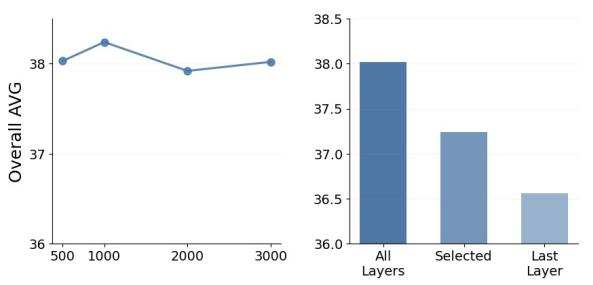
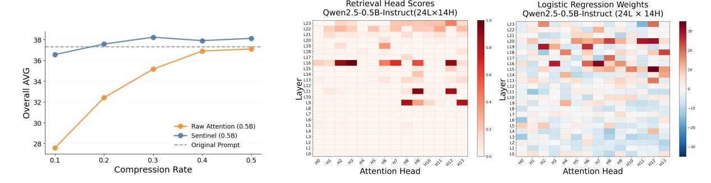

# Sentinel: Decoding Context Utilization via Attention Probing for Efficient LLM Context Compression

Yong Zhang1 , Heng Li1,2, Yanwen Huang1,3, Ning Cheng1,\*, Yang Guo1 , Yun Zhu1 , Yanmeng Wang1 , Shaojun Wang1 , Jing Xiao1 ,

 Ping An Technology (Shenzhen) Co., Ltd., China University of Science and Technology of China University of Electronic Science and Technology of China zhangyong.chuck@gmail.com

# Abstract

Retrieval-augmented generation (RAG) often suffers from long and noisy retrieved contexts. Existing context compression methods typically rely on heuristic relevance estimation or supervised compression models rather than on how LLMs utilize retrieved context during inference. We propose Sentinel, a lightweight sentence-level compression framework that decodes inference-time contextual utilization behaviors from head-wise attention patterns of frozen LLMs. To ground supervision in retrieval-dependent answering behavior, Sentinel trains a lightweight probe using QA examples where the model succeeds only when retrieved context is available. Sentinel performs compression using only a single nonautoregressive forward pass without dedicated compression training or autoregressive scoring. Empirically, we find that effective contextual utilization signals remain accessible even in compact proxy models. On LongBench, Sentinel with a 0.5B proxy model achieves up to 5× compression while attaining questionanswering performance competitive with compression methods built on 7B-scale models. Despite being trained only on English QA data, Sentinel also generalizes effectively to Chinese and out-of-domain settings.[1](#page-0-0)

## 1 Introduction

Large language models (LLMs) have achieved impressive performance across open-domain question answering, reasoning, and dialogue tasks [\(Brown et al.,](#page-8-0) [2020;](#page-8-0) [OpenAI,](#page-9-0) [2024\)](#page-9-0). To scale their capabilities to knowledge-intensive applications, Retrieval-Augmented Generation (RAG) has emerged as a powerful paradigm that augments model inputs with retrieved evidence from external corpora [\(Lewis et al.,](#page-9-1) [2020;](#page-9-1) [Guu et al.,](#page-8-1) [2020;](#page-8-1) [Shi et al.,](#page-9-2) [2024\)](#page-9-2). However, long retrieved contexts

are often noisy, redundant, or exceed model input limits, making context compression essential for both efficiency and effectiveness [\(Liu et al.,](#page-9-3) [2024;](#page-9-3) [Yoran et al.,](#page-9-4) [2024\)](#page-9-4).

Existing context compression methods can be broadly divided into two categories. Metric-based approaches estimate contextual utility using heuristic or model-derived importance signals, including query–context similarity and aggregated attention statistics[\(Jiang et al.,](#page-8-2) [2023,](#page-8-2) [2024a;](#page-8-3) [Li et al.,](#page-9-5) [2023;](#page-9-5) [Wang et al.,](#page-9-6) [2024;](#page-9-6) [Fang et al.,](#page-8-4) [2025\)](#page-8-4). While lightweight and training-free, these methods estimate relevance via heuristic or proxy importance scores, which are only indirectly related to the model's inference-time behavior. In contrast, datadriven approaches learn compression decisions using external supervision or generator feedback to optimize downstream task performance [\(Pan et al.,](#page-9-7) [2024;](#page-9-7) [Xu et al.,](#page-9-8) [2024;](#page-9-8) [Hwang et al.,](#page-8-5) [2024\)](#page-8-5). Although effective, these approaches treat context compression as an optimization problem external to the model's inference process, introducing additional training cost and often tying compression behavior to specific training objectives or generator feedback.

Recent mechanistic studies of Transformerbased LLMs have shown that decoder-only models exhibit structured context-utilization behaviors, with certain attention heads supporting query– context alignment and evidence retrieval [\(Wu et al.,](#page-9-9) [2024;](#page-9-9) [Jin et al.,](#page-9-10) [2024;](#page-9-10) [Huang et al.,](#page-8-6) [2025\)](#page-8-6). These findings suggest that LLMs actively form queryconditioned contextual utilization behaviors during inference rather than passively consuming retrieved context. However, prior mechanistic studies also suggest that attention heads can exhibit highly dynamic and context-dependent behaviors during inference [\(Wu et al.,](#page-9-9) [2024;](#page-9-9) [Zheng et al.,](#page-9-11) [2024\)](#page-9-11), making aggregated raw attention patterns an unreliable proxy for contextual utilization. Existing attentionbased compression methods nevertheless typically

1Our code is available at [https://github.com/](https://github.com/yzhangchuck/Sentinel) [yzhangchuck/Sentinel](https://github.com/yzhangchuck/Sentinel).

> **[图片提取文字 (无描述)]:**
> Sentence-Level Utilization-Guided Utilizatioin Feature Sentence Selection Query + Retrieved Context Final-Position Attention Utilization Detector Downstream LLM (Probing Classifier) S S 0.51  $S_2$ 0.83 Top-K / Budget Proxy SLM 0.16 (Decoder-only) How We Train the Utilization Decoder (Probe) Collect Training Examples Retrieve Context & Construct Sentence-Level Extract Features with Frozen Train Probe to Decode (QA Datasets) Weak Labels Utilization Apply Retrieval- Dependence Filtering **Proxy Model** Positive (utilized) v = 1Without Context With Context Single-hop & Multi-hop QA Sentences Containing with answer spans answer spans & supporting facts Supporting fact sentences (for multi-hop) Robustness Strategy Wrong Answer Correct Answer Sentence Shuffling (within each passage) Lightweight Probe Keep only Retrieval-dependent examples Negative (not utilized) y = 0Obtain sentence feature v. (answer becomes correct only with context) Other sentences (no gradient to the model)

Figure 1: Sentinel Framework Overview. Sentinel decodes query-aware context utilization from native attention behaviors of a frozen LLM. By probing sentence-level attention features aggregated at a single decoding step, Sentinel identifies relevant context without training compression models or performing full autoregressive generation.

aggregate attention magnitudes into heuristic relevance scores. In contrast, we view attention dynamics as behavioral traces that encode how the model utilizes retrieved context during inference.

We propose Sentinel, a lightweight framework that approaches context compression as a contextual utilization decoding problem. Instead of estimating heuristic relevance scores, Sentinel decodes how frozen LLMs utilize retrieved context during inference from head-wise attention patterns. To ground supervision in retrieval-dependent answering behavior, we train a lightweight probe using QA examples where the model succeeds only when retrieved context is available. Moreover, Sentinel extracts utilization signals from a single non-autoregressive forward pass, avoiding the iterative decoding or token-level scoring procedures required by many generation-based compression methods.

Empirically, Sentinel achieves up to 5× input compression on LongBench while attaining question-answering performance competitive with compression methods built on 7B-scale models using only a 0.5B proxy model. Although the probing classifier is trained solely on existing English QA data, the resulting compression strategy generalizes effectively to out-of-domain English LongBench tasks and exhibits robust cross-lingual transfer on Chinese benchmarks. Across multiple model families and scales, Sentinel exhibits broadly consistent compression behavior under a unified lightweight probing framework, suggesting that query-conditioned contextual utilization signals may emerge earlier than strong autoregressive generation capabilities.

#### Our contributions are as follows:

- We reinterpret context compression as a contextual utilization decoding problem grounded in inference-time context utilization behaviors of LLMs.
- We propose Sentinel, a lightweight probingbased framework that decodes contextual utilization from head-wise attention patterns of frozen LLMs using only a single nonautoregressive forward pass.
- We show that effective contextual utilization signals remain accessible across proxy model families and scales, enabling compact 0.5B proxy models to achieve compression performance competitive with 7B-scale methods.
- We demonstrate strong performance on longcontext benchmarks, where Sentinel consistently outperforms raw attention-based compression baselines while exhibiting robust cross-lingual generalization under aggressive compression.

## 2 Methodology

## 2.1 Context Compression as Contextual Utilization Decoding

Sentinel approaches query-aware context compression by decoding how LLMs utilize retrieved context during inference. Given a query q and a retrieved context C = {s1, s2, . . . , sn} composed of

sentences, Sentinel aims to select a subset  $C' \subseteq C$  that preserves the contextual information utilized by the model when answering the query.

Recent studies suggest that query-conditioned contextual utilization behaviors in decoder-only LLMs are reflected in their attention dynamics (Wu et al., 2024; Jin et al., 2024; Huang et al., 2025). Under appropriate prompting, the final prompt position can integrate information from the entire preceding context through causal self-attention (Jiang et al., 2024c), providing a compact representation of contextual utilization behavior.

We therefore feed the query and retrieved context into a compact decoder-only proxy model using a QA-style prompt and extract self-attention from the final prompt position. This design enables compression using a single non-autoregressive forward pass without iterative decoding or token-level generation scoring.

#### 2.2 Decoding Context Utilization via Probing

We decode context utilization by probing sentencelevel attention features extracted from the proxy model, without modifying or fine-tuning the model.

#### 2.2.1 Sentence-Level Attention Features

For each query–context input, we extract attention weights across transformer layers, heads, and input tokens from the final prompt position. Let L denote the number of transformer layers and H the number of attention heads per layer. The resulting attention tensor is denoted as  $\mathbf{A} \in \mathbb{R}^{L \times H \times T}$ , where T is the input length, and  $\mathbf{A}_{l,h,t}$  represents the attention weight assigned from the final prompt position to token t at layer t and head t.

For a sentence  $s_i$  containing token index set  $\mathcal{T}_i$ , we compute its normalized attention feature at layer l and head h as

$$a_i^{(l,h)} = \frac{\sum_{t \in \mathcal{T}_i} \mathbf{A}_{l,h,t}}{\sum_{t \in \mathcal{T}_c} \mathbf{A}_{l,h,t}} \tag{1}$$

where  $\mathcal{T}_C$  denotes the set of tokens originating from the retrieved context C, excluding prompt and query tokens. This normalization improves comparability across sentences by restricting attention mass to retrieved-context tokens.

The sentence-level feature vector for sentence  $s_i$  is then constructed as

$$\mathbf{v}_i = [a_i^{(1,1)}, \dots, a_i^{(L,H)}] \in \mathbb{R}^{LH}$$
 (2)

#### 2.2.2 Probing Context Utilization

To probe contextual utilization signals encoded in attention patterns, we train a lightweight probing classifier on top of the sentence-level representations.

We adopt logistic regression as a linear probe that maps each sentence feature vector  $\mathbf{v}_i \in \mathbb{R}^{LH}$  to a scalar utilization score:

$$\hat{y}_i = \sigma(\mathbf{w}^\top \mathbf{v}_i + b) \tag{3}$$

where  $\mathbf{w} \in \mathbb{R}^{LH}$  denotes the probe weight vector,  $b \in \mathbb{R}$  is a scalar bias term, and  $\hat{y}_i \in (0,1)$  represents the predicted utilization probability for sentence  $s_i$ .

A linear probe enables direct interpretation of head-wise contributions while reducing the risk of learning behaviors beyond those already encoded in the model.

# 2.3 Weak Supervision for Probing Context Utilization

We train the probing classifier using weak supervision derived from question answering data. Rather than treating semantic relevance or answer overlap as direct supervision targets, Sentinel focuses on contextual evidence that the model actually utilizes when retrieved context is necessary for answering.

#### 2.3.1 Retrieval-Dependent Example Selection

We first identify QA examples where successful answering genuinely depends on retrieved context. Specifically, we retain only instances where the model fails to answer correctly without access to the retrieved context but succeeds once the context is provided. This intervention-based filtering, inspired by prior work on probing model behavior through output changes (Meng et al., 2022), removes examples that can be solved through parametric memorization alone and focuses supervision on retrieval-dependent answering behaviors.

#### 2.3.2 Sentence-Level Evidence Labeling

Sentence-level supervision is then constructed within these retrieval-dependent examples. For single-hop QA datasets, sentences containing the gold answer span are treated as positive instances. For multi-hop datasets such as HotpotQA, we additionally use supporting fact annotations, which identify intermediate reasoning sentences required for multi-step inference. These supporting sentences are also labeled as positive instances to preserve reasoning chains during compression. This

weak supervision strategy enables scalable probe training without manual relevance annotation while exposing the probe to diverse utilization patterns ranging from localized factual evidence to distributed multi-hop reasoning.

#### 2.3.3 Robustness via Sentence Shuffling

To mitigate positional biases [\(Liu et al.,](#page-9-3) [2024\)](#page-9-3), especially common in multi-document retrieval settings, we apply sentence shuffling during training by randomly permuting sentence order within each passage. This perturbation discourages the probe from exploiting positional shortcuts and encourages more robust utilization decoding under noisy retrieval layouts.

#### 2.4 Inference-Time Context Compression

At inference time, given a query–context pair (q, C), Sentinel runs a single forward pass of a compact proxy model, extracts decoder attention from the final prompt position, and computes sentencelevel attention features. A trained probing classifier assigns utilization scores to sentences, based on which a top-ranked subset C ′ ⊆ C is selected under a length budget and passed to the downstream LLM for answer generation.

## 3 Experiments

Datasets We evaluate Sentinel on both the English and Chinese subsets of LongBench [\(Bai et al.,](#page-8-8) [2024\)](#page-8-8). We report results on question answering tasks and query-conditioned summarization (e.g., QMSum), which involve an explicit query. Detailed dataset descriptions are provided in the appendi[xA.](#page-10-0)

Probing Data We train the probing classifier on English QA examples spanning both single-hop and multi-hop reasoning. In the default setting, we sample 3K QA instances, each yielding one positive and one negative sentence from the same context, resulting in 6K sentence-level training examples. Additional implementation details are provided in Appendix [B.](#page-10-1)

Probing Classifier Training We train a logistic regression probe on attention-derived features using standard cross-validation and regularization. Additional training details are in Appendix [B.](#page-10-1)

Compression Strategy Sentinel compresses context by ranking sentences with the probing classifier

and selecting a top-ranked subset under a predefined budget. Selected sentences are concatenated in their original order and passed to the downstream LLM.

We consider two budget settings, both measured using the downstream model's tokenizer: (i) a fixed token budget B (e.g., 2000 tokens), where sentences are selected until the budget is reached; and (ii) a compression ratio τ ∈ [0.1, 0.5], where the retained sentences do not exceed a fraction of the original context length.

Proxy Model Setup Unless otherwise specified, Sentinel uses Qwen-2.5-0.5B-Instruct as the default proxy model for attention feature extraction and probing, with a chunk size of 1024 tokens. To analyze scaling behavior, we additionally evaluate proxy models from multiple families, including Qwen-2.5, Qwen-3, LLaMA-3, and Mistral variants ranging from 0.5B to 8B parameters.

Evaluation Models We use gpt-3.5-turbo as the primary model for evaluation. To assess the generality of our method, we additionally evaluate with Qwen-2.5-7B-Instruct in our main results. All evaluations follow the LongBench prompt and decoding setup [\(Bai et al.,](#page-8-8) [2024\)](#page-8-8), as detailed in Appendix [I.](#page-14-0)

Baselines We compare Sentinel against representative context compression baselines spanning both metric-based and data-driven approaches. Metricbased baselines include LLMLingua-1 [\(Jiang et al.,](#page-8-2) [2023\)](#page-8-2), LongLLMLingua [\(Jiang et al.,](#page-8-9) [2024b\)](#page-8-9), and Selective Context [\(Li et al.,](#page-9-5) [2023\)](#page-9-5). Data-driven baselines include LLMLingua-2 [\(Pan et al.,](#page-9-7) [2024\)](#page-9-7) and CPC [\(Liskavets et al.,](#page-9-13) [2024\)](#page-9-13).

We additionally include an attention-based heuristic baseline, denoted as Raw Attention, which directly aggregates decoder attention magnitudes as relevance scores for context selection. This baseline is representative of recent attentionbased compression methods such as QUITO [\(Wang](#page-9-6) [et al.,](#page-9-6) [2024\)](#page-9-6) and AttentionRAG [\(Fang et al.,](#page-8-4) [2025\)](#page-8-4).

We also include non-learning baselines including Random Selection and Empty Context. Full descriptions are provided in Appendix [C.](#page-10-2)

Metrics We follow the LongBench evaluation protocol and adopt task-specific metrics for each task category: QA-F1 for Single-Document QA and Multi-Document QA, and ROUGE-L for Summarization. All metrics are computed using the official evaluation scripts.

| Method                          | LongBench-En (Filtered Tasks) |          | Compression |      |        |       |
|---------------------------------|-------------------------------|----------|-------------|------|--------|-------|
|                                 | SingleDoc                     | MultiDoc | Summ.       | AVG  | Tokens | Ratio |
| Metric-Based Compression        |                               |          |             |      |        |       |
| Selective-Context (LLaMA2-7B)   | 16.2                          | 34.8     | 24.4        | 25.1 | 1,925  | 5×    |
| LLMLingua (LLaMA2-7B)           | 22.4                          | 32.1     | 24.5        | 26.3 | 1,950  | 5×    |
| LLMLingua-2 (XLM-R-Large-0.6B)  | 29.8                          | 33.1     | 25.3        | 29.4 | 1,954  | 5×    |
| LongLLMLingua (LLaMA2-7B)       | 39.0                          | 42.2     | 27.4        | 36.2 | 1,809  | 6×    |
| Data-Driven Compression         |                               |          |             |      |        |       |
| CPC (Mistral-7B)                | 42.6                          | 48.6     | 23.7        | 38.3 | 1,844  | 5×    |
| Contextual Utilization Decoding |                               |          |             |      |        |       |
| Sentinel (Mistral-7B)           | 38.3                          | 47.0     | 24.0        | 36.4 | 1,873  | 5×    |
| Sentinel (Qwen2.5-0.5B)         | 40.1                          | 47.4     | 25.8        | 37.8 | 1,885  | 5×    |
| Sentinel (Qwen2.5-1.5B)         | 40.6                          | 48.1     | 26.0        | 38.2 | 1,883  | 5×    |
| Original Prompt                 | 39.7                          | 38.7     | 26.5        | 35.0 | 10,295 | –     |

Table 1: Performance on filtered LongBench-En tasks. Best results are highlighted in bold, and second-best results are underlined. All LMs use instruction-tuned variants.

| Method                       | LongBench-En (2K Constraint) |          |       |        | LongBench-Zh (2K Constraint) | Overall  |        |       |
|------------------------------|------------------------------|----------|-------|--------|------------------------------|----------|--------|-------|
|                              | SingleDoc                    | MultiDoc | Summ. | En-AVG | SingleDoc                    | MultiDoc | Zh-AVG | AVG   |
| Empty                        | 10.72                        | 22.26    | 16.46 | 16.48  | 17.71                        | 13.54    | 15.62  | 16.05 |
| Random                       | 28.22                        | 30.68    | 20.33 | 26.41  | 43.18                        | 17.22    | 30.20  | 28.30 |
| Raw Attention (Qwen2.5-0.5B) | 34.92                        | 38.96    | 21.32 | 31.74  | 51.72                        | 17.29    | 34.50  | 33.12 |
| Sentinel (Qwen2.5-0.5B)      | 37.73                        | 46.16    | 23.03 | 35.64  | 62.24                        | 18.57    | 40.41  | 38.02 |
| Original Prompt              | 38.84                        | 44.74    | 22.76 | 35.45  | 60.06                        | 18.21    | 39.14  | 37.30 |

Table 2: LongBench results under a 2K-token context constraint, evaluated using Qwen2.5-Instruct-7B as the downstream LLM. The Summ. column corresponds to query-conditioned summarization tasks (QMSum).

#### 3.1 Main Results

## 3.1.1 Competitive Compression from Compact Frozen Proxies

Sentinel achieves competitive long-context compression performance using only compact frozen proxy models for contextual utilization decoding (Table [1\)](#page-4-0). Even the 0.5B Qwen-2.5 proxy performs competitively with substantially larger 7B-scale compression systems while using only a single nonautoregressive forward pass. Sentinel consistently outperforms metric-based compression methods such as LLMLingua, LLMLingua-2, and Selective Context under matched compression budgets, suggesting that decoding contextual utilization behaviors provides more effective compression signals than heuristic relevance estimation. Notably, increasing proxy model scale does not consistently improve compression quality, a phenomenon analyzed further in Section [3.2.](#page-5-0) Additional Chinese results under GPT-3.5-Turbo are reported in Appendix [D.](#page-11-0)

# 3.1.2 Decoding Contextual Utilization Beyond Raw Attention

Sentinel consistently outperforms Empty Context, Random Selection, and Raw Attention baselines

across English LongBench tasks using Qwen-2.5- 7B-Instruct as the downstream LLM (Table [2\)](#page-4-1). Here, Raw Attention directly aggregates decoder attention magnitudes as relevance scores [\(Wang](#page-9-6) [et al.,](#page-9-6) [2024;](#page-9-6) [Fang et al.,](#page-8-4) [2025\)](#page-8-4). The consistent performance gap between Raw Attention and Sentinel suggests that contextual utilization behavior is not fully captured by attention magnitude alone and instead requires decoding heterogeneous attention patterns associated with inference-time utilization behavior. Under a strict 2K-token budget, Sentinel even surpasses the Original Prompt baseline on average despite reducing the average context length from over 10K tokens to approximately 2K.

# 3.1.3 Cross-Lingual Generalization from English-Only Supervision

Despite using only English QA supervision during probe training, Sentinel generalizes effectively to Chinese LongBench tasks without additional supervision (Table [2\)](#page-4-1). Sentinel substantially outperforms Empty Context, Random Selection, and Raw Attention baselines across Chinese benchmarks, suggesting that the contextual utilization behaviors decoded by Sentinel are not tightly coupled to surface language statistics and can transfer robustly across

> **[图片提取文字 (无描述)]:**
> 40 Qwen2.5 39 LLaMA3 Qwen3 38 Overall AVG 36 35 34 0.5B 1.5B 3B 7B 18 3B 88 0.6B 1.7B 4B 8B

Figure 2: Impact of proxy model family and scale on Sentinel performance under a 2K-token context (Long-Bench Overall AVG)

languages under a unified probing framework.

## 3.2 Contextual Utilization Signals Across Proxy Scales

Sentinel achieves broadly comparable compression performance across proxy models of different scales and families (Figure [2\)](#page-5-1). While moderate scaling from compact to medium-sized proxies can provide small improvements, increasing proxy model size does not consistently yield further gains. We additionally observe that model family matters more than scale alone, with Qwen-based proxies consistently outperforming substantially larger Mistral-based proxies. These results suggest that Sentinel primarily relies on decoding queryconditioned contextual utilization behaviors rather than directly benefiting from stronger autoregressive generation capabilities.

Prior mechanistic studies have shown that certain contextual utilization behaviors are sparse, structured, and broadly shared across model scales [\(Wu](#page-9-9) [et al.,](#page-9-9) [2024;](#page-9-9) [Jin et al.,](#page-9-10) [2024\)](#page-9-10), suggesting that the utilization signals exploited by Sentinel may already emerge in compact instruction-tuned models.

At the same time, larger models can exhibit increasingly heterogeneous and multi-functional attention behaviors across heads and layers [\(Wu](#page-9-9) [et al.,](#page-9-9) [2024;](#page-9-9) [Zheng et al.,](#page-9-11) [2024\)](#page-9-11). Since Sentinel performs lightweight probing over head-wise attention patterns, larger proxy models do not necessarily provide more linearly decodable utilization signals. Overall, these observations suggest that effective context compression depends more on the accessibility of contextual utilization signals than on proxy model scale alone, enabling strong efficiency–performance tradeoffs using compact frozen proxies.

## 3.3 Ablation

We conduct ablation studies to analyze the source of Sentinel's compression behavior and to verify that its performance primarily arises from decoding model-internal contextual utilization signals, rather than from probe capacity, large-scale supervision, or specific attention heuristics.

By default, Sentinel is instantiated on Qwen-2.5- 0.5B-Instruct. Unless otherwise specified, all experiments use Qwen-2.5-7B-Instruct as the downstream LLM and are evaluated on LongBench.

## 3.3.1 Attention Feature Ablations

We analyze how contextual utilization signals are distributed across attention layers and heads by comparing different feature construction strategies. We compare three feature construction strategies: aggregating attention across all decoder layers, using only the final decoder layer, and selecting a compact subset of heads via mRMR [\(Ding and](#page-8-10) [Peng,](#page-8-10) [2005\)](#page-8-10). Experimental details are provided in Appendix [F.](#page-11-1)

As shown in the right panel of Figure [3,](#page-5-2) aggregating attention across all layers consistently achieves the strongest downstream compression performance. Using only the final decoder layer leads to a noticeable performance drop, while the selected-head variant preserves most of the performance with substantially fewer features. These results suggest that contextual utilization signals are broadly distributed across layers and cannot be reliably recovered from final-layer attention alone.

#### 3.3.2 Effect of Probing Data Size

We analyze whether Sentinel depends on largescale supervision by varying the amount of probing data used during probe training from 500 to 3000 QA examples.

As shown in the left panel of Figure [3,](#page-5-2) downstream performance remains nearly unchanged across probing set sizes. These results suggest that Sentinel does not learn compression behavior

> **[图片提取文字 (无描述)]:**
> 38.5 38 38.0 Overall AVG 37.5 37 37.0 36.5 36 36.0 500 1000 2000 3000 All Selected Last Layers Layer

Figure 3: Left: Robustness under different probing data sizes. Sentinel remains stable across probing sets ranging from 500 to 3000 samples. Right: Impact of different attention feature extraction strategies on downstream compression performance.

> **[图片提取文字 (无描述)]:**
> Retrieval Head Scores Logistic Regression Weights Owen2.5-0.5B-Instruct(24L×14H) Qwen2.5-0.5B-Instruct (24L × 14H) L23 L21 L20 38 L20 L19 L18 L19 L18 L17 L16 L15 L17 36 L16 9 AA Layer 113 Overall Raw Attention (0.5B) 0.2 Sentinel (0.5B) 28 --- Original Prompt 0.1 0.2 0.5 0.3 0.4 £ \$0 \$0 \$0 \$0 \$0 \$0 \$0 \$0 \$0 \$0 \$0 \$0 \$0 20 22 22 22 24 24 24 24 25 25 25 25 25 Compression Rate Attention Head Attention Head

Figure 4: Left: Robustness under different compression ratios on Qwen-2.5-7B-Instruct using a 0.5B proxy model. Right: Comparison between retrieval-oriented attention heads identified by prior retrieval-head analysis and headwise contextual utilization weights decoded by Sentinel probing.

| Method                | LongBench-En (2K Constraint) |          |       |        | LongBench-Zh (2K Constraint) | AVG      |        |         |
|-----------------------|------------------------------|----------|-------|--------|------------------------------|----------|--------|---------|
|                       | SingleDoc                    | MultiDoc | Summ. | En-AVG | SingleDoc                    | MultiDoc | Zh-AVG | Overall |
| Retrieval Head Top-7  | 33.71                        | 37.39    | 21.28 | 32.46  | 60.07                        | 18.51    | 39.29  | 35.88   |
| Retrieval Head Top-9  | 37.62                        | 43.82    | 22.17 | 34.54  | 58.84                        | 17.84    | 38.34  | 36.44   |
| Retrieval Head Top-14 | 36.53                        | 43.16    | 22.27 | 33.99  | 58.59                        | 18.53    | 38.56  | 36.28   |
| Sentinel              | 37.73                        | 46.16    | 23.03 | 35.64  | 62.24                        | 18.57    | 40.41  | 38.02   |

Table 3: Comparison between retrieval-head-based compression and Sentinel on LongBench under a 2K-token context constraint. Sentinel consistently outperforms sparse retrieval-head-based compression across English, Chinese, and overall averages.

from large-scale supervision. Instead, the probe primarily acts as a lightweight readout mechanism over contextual utilization signals already present in the frozen model. Even small probing sets are sufficient to support effective context compression. Detailed results are provided in Appendix [F.](#page-11-1)

## 3.3.3 Compression Ratio Variants

We evaluate whether Sentinel remains effective under increasingly aggressive compression ratios τ ∈ {0.1, 0.2, 0.3, 0.4, 0.5}, where smaller τ corresponds to more aggressive pruning.

As shown in the left panel of Figure [4,](#page-6-0) the Raw Attention baseline degrades substantially when τ < 0.4. In contrast, Sentinel remains stable across all compression levels and consistently outperforms the Raw Attention baseline. Notably, Sentinel surpasses the original prompt performance over a wide range of compression ratios, including the aggressive setting of τ = 0.2, suggesting that Sentinel effectively removes weakly utilized or distracting context under constrained context budgets. These results suggest that contextual utilization behavior cannot be reliably recovered from attention magnitude alone. Instead, lightweight probing over attention dynamics yields substantially more robust compression under aggressive pruning. Full task-level results are reported in Appendix [F.](#page-11-1)

# 4 Analysis: Decoding Contextual Utilization from Attention Dynamics

Alignment with Retrieval-Oriented Attention Heads Prior mechanistic analyses have shown that retrieval-oriented contextual utilization behaviors in decoder-only LLMs are often concentrated in a sparse subset of attention heads [\(Wu et al.,](#page-9-9) [2024;](#page-9-9) [Jin et al.,](#page-9-10) [2024\)](#page-9-10). Despite using a different decoding mechanism, Sentinel recovers a meaningful subset of these retrieval-oriented structures. Specifically, when comparing the top-14 positively weighted heads identified by Sentinel with the top-14 retrieval heads obtained by reproducing the retrieval-head identification procedure of prior work [\(Wu et al.,](#page-9-9) [2024\)](#page-9-9) on the same Qwen-2.5-0.5B-Instruct model, we observe five overlapping heads. As illustrated in the right panel of Figure [4,](#page-6-0) the overlapping heads are predominantly located in middle-to-late layers, with a noticeable concentration around layer 16.

#### Distributed Decoding Beyond Sparse Retrieval

Heads The observed overlap suggests that Sentinel captures core retrieval-oriented contextual utilization behaviors identified by prior mechanistic studies. However, unlike retrieval-head approaches that rely on a sparse subset of positively identified heads, Sentinel decodes contextual utilization through signed aggregation over all attention heads. This distinction is important because attention heads are known to exhibit dynamic and multifunctional behaviors depending on input tokens and contexts [\(Wu et al.,](#page-9-9) [2024;](#page-9-9) [Zheng et al.,](#page-9-11) [2024\)](#page-9-11). A single head may support evidence retrieval in some contexts while exhibiting non-retrieval behaviors in others. By jointly modeling both supportive and interfering attention behaviors, Sentinel mitigates instability caused by context-dependent role switching and spurious activations. We additionally observe that negatively weighted heads are frequently associated with structurally dominant but semantically uninformative patterns, such as attention sinks [\(Bondarenko et al.,](#page-8-11) [2021;](#page-8-11) [Son et al.,](#page-9-14) [2024\)](#page-9-14). Table [3](#page-6-1) further supports this analysis: Sentinel consistently outperforms retrieval-head-based compression across English, Chinese, and overall LongBench averages. Additional analysis of negatively weighted heads is provided in Appendix [G.](#page-12-0)

## 5 Related Work

Metric-Based Context Compression Metricbased approaches estimate contextual relevance using predefined importance scores, such as self-information, mutual information, or query context similarity, and select tokens or sentences accordingly without training a dedicated compression model. Representative token-level methods include LLMLingua [\(Jiang et al.,](#page-8-2) [2023\)](#page-8-2) and LongLLMLingua [\(Jiang et al.,](#page-8-3) [2024a\)](#page-8-3), which prune tokens based on perplexity or query-conditioned probability estimates. At a coarser granularity, Selective Context [\(Li et al.,](#page-9-5) [2023\)](#page-9-5) removes low-information content based on token-level self-information scores. While effective and training-free, these methods rely on predefined or heuristically applied importance scores that are not explicitly tied to inferencetime context utilization.

Data-Driven Context Compression Datadriven approaches learn compression decisions from external supervision, typically by training a ranking or classification model to predict which tokens or sentences should be retained. Token-level methods such as LLMLingua-2 [\(Pan](#page-9-7) [et al.,](#page-9-7) [2024\)](#page-9-7) leverage distilled labels from large language models to train lightweight compressors. At the sentence level, methods such as RECOMP [\(Xu et al.,](#page-9-8) [2024\)](#page-9-8) train compressors to produce extractive or abstractive summaries that improve downstream performance, while EXIT [\(Hwang](#page-8-5)

[et al.,](#page-8-5) [2024\)](#page-8-5) learns a sentence-level classifier to select query-relevant sentences. Other works, such as CPC [\(Liskavets et al.,](#page-9-13) [2024\)](#page-9-13), Refiner [\(Li et al.,](#page-9-15) [2024\)](#page-9-15), and FineFilter [\(Zhang et al.,](#page-9-16) [2025\)](#page-9-16), further incorporate query-aware ranking, structure-aware reranking, or multi-hop reasoning objectives. Although these methods often achieve strong performance, they introduce additional training cost and data dependency, which can limit their adaptability across tasks and models.

Attention-Based Context Compression Recent work has explored the use of decoder attention as a signal for context compression. QUITO [\(Wang](#page-9-6) [et al.,](#page-9-6) [2024\)](#page-9-6) and AttentionRAG [\(Fang et al.,](#page-8-4) [2025\)](#page-8-4) aggregate decoder attention derived from concatenated query–context inputs to rank and filter context spans, while AttnComp [\(Luo et al.,](#page-9-17) [2025\)](#page-9-17) further constructs document-level relevance distributions and performs adaptive Top-P-style compression. In parallel, mechanistic studies have shown that contextual retrieval and utilization behaviors can emerge in sparse subsets of attention heads in decoder-only LLMs [\(Wu et al.,](#page-9-9) [2024;](#page-9-9) [Jin et al.,](#page-9-10) [2024\)](#page-9-10). However, prior work also suggests that attention heads exhibit dynamic and multi-functional behaviors depending on input tokens and contexts [\(Zheng et al.,](#page-9-11) [2024\)](#page-9-11), making contextual utilization difficult to recover reliably from raw attention magnitude or sparse retrieval-oriented heads alone. Unlike existing attention-based compression methods that primarily rely on aggregated attention magnitude as a proxy for contextual utility, Sentinel instead decodes contextual utilization behaviors through lightweight probing over distributed attention dynamics derived from frozen LLM inference behavior

## 6 Conclusion

We present Sentinel, a context compression framework that reformulates query-aware compression as a contextual utilization decoding problem. By probing attention dynamics in frozen LLMs, Sentinel decodes how models internally utilize retrieved context instead of relying on heuristic importance metrics or raw attention magnitudes. Sentinel achieves up to 5× compression on LongBench while matching or improving QA performance using only compact proxy models, suggesting that model-internal contextual utilization signals provide an effective foundation for efficient context compression.

## Limitations

## Query-Conditioned Context Compression.

Sentinel is designed for query-conditioned context compression, where contextual utilization is defined relative to an explicit query or instruction. The framework therefore relies on query–context interaction signals to decode which contextual information is behaviorally utilized during inference. Tasks without explicit query grounding, such as free-form generation or code completion, do not naturally provide such query-conditioned utilization signals and fall outside the current scope of Sentinel. Extending utilization-driven compression to settings without explicit query conditioning remains an important direction for future work.

Decoding Contextual Utilization from Attention Dynamics. Sentinel assumes that contextual utilization behaviors are sufficiently reflected in the attention dynamics of frozen proxy LLMs and can be decoded through lightweight probing. While our experiments suggest that such signals remain broadly accessible across model families and scales, the accessibility of these signals may still depend on architectural differences and the choice of probing features. In addition, Sentinel currently employs simple linear probing over aggregated attention statistics; more complex contextual utilization behaviors may require richer decoding mechanisms beyond lightweight linear readouts.

## AI Assistance Statement

Generative AI tools, including ChatGPT and Gemini, were used to assist with language editing during the preparation of this work. All generated content was reviewed and verified by the authors. The authors take full responsibility for the accuracy, integrity, and originality of the final manuscript.

# References

- Yushi Bai, Xin Lv, Jiajie Zhang, Hongchang Lyu, Jiankai Tang, Zhidian Huang, Zhengxiao Du, Xiao Liu, Aohan Zeng, Lei Hou, and 1 others. 2024. Longbench: A bilingual, multitask benchmark for long context understanding. In *Proceedings of the 62nd Annual Meeting of the Association for Computational Linguistics (Volume 1: Long Papers)*, pages 3119– 3137.
- Yelysei Bondarenko, Markus Nagel, and Tijmen Blankevoort. 2021. Understanding and overcoming the challenges of efficient transformer quantization.

- In *Proceedings of the 2021 Conference on Empirical Methods in Natural Language Processing*, pages 7947–7969. Association for Computational Linguistics.
- Tom Brown, Benjamin Mann, Nick Ryder, Melanie Subbiah, Jared D Kaplan, Prafulla Dhariwal, Arvind Neelakantan, Pranav Shyam, Girish Sastry, Amanda Askell, and 1 others. 2020. Language models are few-shot learners. *Advances in neural information processing systems*, 33:1877–1901.
- Chris Ding and Hanchuan Peng. 2005. Minimum redundancy feature selection from microarray gene expression data. *Journal of bioinformatics and computational biology*, 3(02):185–205.
- Yixiong Fang, Tianran Sun, Yuling Shi, and Xiaodong Gu. 2025. Attentionrag: Attention-guided context pruning in retrieval-augmented generation. *arXiv preprint arXiv:2503.10720*.
- Kelvin Guu, Kenton Lee, Zora Tung, Panupong Pasupat, and Mingwei Chang. 2020. Retrieval augmented language model pre-training. In *International conference on machine learning*, pages 3929–3938. PMLR.
- Yanwen Huang, Yong Zhang, Ning Cheng, Zhitao Li, Shaojun Wang, and Jing Xiao. 2025. Dynamic attention-guided context decoding for mitigating context faithfulness hallucinations in large language models. *arXiv preprint arXiv:2501.01059*.
- Taeho Hwang, Sukmin Cho, Soyeong Jeong, Hoyun Song, SeungYoon Han, and Jong C Park. 2024. Exit: Context-aware extractive compression for enhancing retrieval-augmented generation. *arXiv preprint arXiv:2412.12559*.
- Huiqiang Jiang, Qianhui Wu, Chin-Yew Lin, Yuqing Yang, and Lili Qiu. 2023. LLMLingua: Compressing prompts for accelerated inference of large language models. In *Proceedings of the 2023 Conference on Empirical Methods in Natural Language Processing*, pages 13358–13376.
- Huiqiang Jiang, Qianhui Wu, Xufang Luo, Dongsheng Li, Chin-Yew Lin, Yuqing Yang, and Lili Qiu. 2024a. LongLLMLingua: Accelerating and enhancing LLMs in long context scenarios via prompt compression. In *Proceedings of the 62nd Annual Meeting of the Association for Computational Linguistics (Volume 1: Long Papers)*, pages 1658–1677.
- Huiqiang Jiang, Qianhui Wu, Xufang Luo, Dongsheng Li, Chin-Yew Lin, Yuqing Yang, and Lili Qiu. 2024b. LongLLMLingua: Accelerating and enhancing LLMs in long context scenarios via prompt compression. In *Proceedings of the 62nd Annual Meeting of the Association for Computational Linguistics (Volume 1: Long Papers)*, pages 1658–1677.
- Ting Jiang, Shaohan Huang, Zhongzhi Luan, Deqing Wang, and Fuzhen Zhuang. 2024c. Scaling sentence embeddings with large language models. In *Findings of the Association for Computational Linguistics: EMNLP 2024*, pages 3182–3196.

- Zhuoran Jin, Pengfei Cao, Hongbang Yuan, Yubo Chen, Jiexin Xu, Huaijun Li, Xiaojian Jiang, Kang Liu, and Jun Zhao. 2024. Cutting off the head ends the conflict: A mechanism for interpreting and mitigating knowledge conflicts in language models. In *Findings of the Association for Computational Linguistics ACL 2024*, pages 1193–1215.
- Patrick Lewis, Ethan Perez, Aleksandra Piktus, Fabio Petroni, Vladimir Karpukhin, Naman Goyal, Heinrich Küttler, Mike Lewis, Wen-tau Yih, Tim Rocktäschel, and 1 others. 2020. Retrieval-augmented generation for knowledge-intensive nlp tasks. *Advances in neural information processing systems*, 33:9459– 9474.
- Yucheng Li, Bo Dong, Frank Guerin, and Chenghua Lin. 2023. Compressing context to enhance inference efficiency of large language models. In *Proceedings of the 2023 Conference on Empirical Methods in Natural Language Processing*, pages 6342–6353.
- Zhonghao Li, Xuming Hu, Aiwei Liu, Kening Zheng, Sirui Huang, and Hui Xiong. 2024. *Refiner*: Restructure retrieved content efficiently to advance questionanswering capabilities. In *Findings of the Association for Computational Linguistics: EMNLP 2024*, pages 8548–8572.
- Barys Liskavets, Maxim Ushakov, Shuvendu Roy, Mark Klibanov, Ali Etemad, and Shane Luke. 2024. Prompt compression with context-aware sentence encoding for fast and improved llm inference. *arXiv preprint arXiv:2409.01227*.
- Nelson F. Liu, Kevin Lin, John Hewitt, Ashwin Paranjape, Michele Bevilacqua, Fabio Petroni, and Percy Liang. 2024. Lost in the middle: How language models use long contexts. *Transactions of the Association for Computational Linguistics*, 12:157–173.
- Lvzhou Luo, Yixuan Cao, and Ping Luo. 2025. AttnComp: Attention-guided adaptive context compression for retrieval-augmented generation. In *Findings of the Association for Computational Linguistics: EMNLP 2025*, pages 8456–8472, Suzhou, China. Association for Computational Linguistics.
- Kevin Meng, David Bau, Alex Andonian, and Yonatan Belinkov. 2022. Locating and editing factual associations in gpt. *Advances in Neural Information Processing Systems*, 35:17359–17372.
- OpenAI. 2024. [Gpt-4 technical report.](https://arxiv.org/abs/2303.08774) *Preprint*, arXiv:2303.08774.
- Zhuoshi Pan, Qianhui Wu, Huiqiang Jiang, Menglin Xia, Xufang Luo, Jue Zhang, Qingwei Lin, Victor Rühle, Yuqing Yang, Chin-Yew Lin, H. Vicky Zhao, Lili Qiu, and Dongmei Zhang. 2024. LLMLingua-2: Data distillation for efficient and faithful task-agnostic prompt compression. In *Findings of the Association for Computational Linguistics: ACL 2024*, pages 963–981.

- Weijia Shi, Sewon Min, Michihiro Yasunaga, Minjoon Seo, Richard James, Mike Lewis, Luke Zettlemoyer, and Wen-tau Yih. 2024. REPLUG: Retrievalaugmented black-box language models. In *Proceedings of the 2024 Conference of the North American Chapter of the Association for Computational Linguistics: Human Language Technologies (Volume 1: Long Papers)*, pages 8371–8384.
- Seungwoo Son, Wonpyo Park, Woohyun Han, Kyuyeun Kim, and Jaeho Lee. 2024. Prefixing attention sinks can mitigate activation outliers for large language model quantization. *arXiv preprint arXiv:2406.12016*.
- Wenshan Wang, Yihang Wang, Yixing Fan, Huaming Liao, and Jiafeng Guo. 2024. Quito: Accelerating long-context reasoning through query-guided context compression. *arXiv preprint arXiv:2408.00274*.
- Wenhao Wu, Yizhong Wang, Guangxuan Xiao, Hao Peng, and Yao Fu. 2024. Retrieval head mechanistically explains long-context factuality. *arXiv preprint arXiv:2404.15574*.
- Fangyuan Xu, Weijia Shi, and Eunsol Choi. 2024. RE-COMP: Improving retrieval-augmented LMs with context compression and selective augmentation. In *The Twelfth International Conference on Learning Representations*.
- Ori Yoran, Tomer Wolfson, Ori Ram, and Jonathan Berant. 2024. Making retrieval-augmented language models robust to irrelevant context. In *The Twelfth International Conference on Learning Representations*.
- Qianchi Zhang, Hainan Zhang, Liang Pang, Hongwei Zheng, Yongxin Tong, and Zhiming Zheng. 2025. Finefilter: A fine-grained noise filtering mechanism for retrieval-augmented large language models. *arXiv preprint arXiv:2502.11811*.
- Zifan Zheng, Yezhaohui Wang, Yuxin Huang, Shichao Song, Mingchuan Yang, Bo Tang, Feiyu Xiong, and Zhiyu Li. 2024. Attention heads of large language models: A survey. *arXiv preprint arXiv:2409.03752*.

## A Dataset Details

We provide details of the LongBench [\(Bai et al.,](#page-8-8) [2024\)](#page-8-8) datasets used in our experiments. Long-Bench is a long-context benchmark covering diverse tasks for evaluating language models under extended-context settings. We use the following English task categories:

- Single-Document QA: NARRATIVEQA (narrative understanding), QASPER (scientific document QA), and MULTIFIELDQA-EN (longform factual QA).
- Multi-Document QA: HOTPOTQA, 2WIKI-MULTIHOPQA, and MUSIQUE, which require multi-hop reasoning across multiple documents.
- Summarization: GOVREPORT (government report summarization), QMSUM (querybased meeting summarization), and MULTI-NEWS (multi-document news summarization).

Excluded Task Categories We exclude Long-Bench task categories that are not compatible with query-conditioned compression, including Code, Synthetic, Few-shot, and generic summarization tasks. These tasks either lack explicit query grounding or depend heavily on fixed prompt structures. We retain query-conditioned summarization tasks such as QMSum.

# B Additional Probing Data and Training Details

Probing Data Construction The probing classifier is trained on 3,000 QA examples sampled from NewsQA (50%), SQuAD (20%), and HotpotQA (30%). Each QA example yields one positive sentence containing the gold answer span and one negative sentence sampled from the same retrieved context, resulting in 6,000 training instances in total.

Retrieved contexts are segmented into sentences using spaCy's sentencizer, and sentence boundaries are used consistently for both supervision construction and attention aggregation.

For completeness, we report the context length distribution under the Qwen-2.5 tokenizer. In NewsQA, 30.1% of examples contain 0–500 tokens and 69.9% contain 500–1,000 tokens. In SQuAD, 99.3% of examples fall within the 0–500 token

range. For HotpotQA, all examples are restricted to 0–500 tokens by limiting unrelated retrieved content.

Prompt Template Sentence-level attention features are extracted using a fixed QA-style prompt applied to each query–context pair. The prompt format is shown below:

Given the following information: {context} Answer the following question based on the given information with one or a few words: {question} Answer:

For each prompted input, we collect decoder attention weights from the final decoding token across all layers and attention heads. Attention weights directed to tokens belonging to each sentence are aggregated and normalized to form fixedlength sentence-level feature vectors, which are then used as input to the probing classifier.

Context-Reliant Sample Selection To improve supervision quality, we retain only context-reliant QA examples where access to the retrieved context substantially improves answer correctness.

For NewsQA and SQuAD, we retain examples with memory-based EM = 0 and context-based EM = 1. For HotpotQA, we retain examples with memory-based F1 ≤ 0.2 and context-based F1 ≥ 0.5.

Probing Classifier Training We train a logistic regression (LR) classifier on attention-derived features using 5-fold cross-validation. We perform grid search over regularization strengths C ∈ {0.01, 0.1, 1.0, 10.0, 100.0} and select the best model based on validation AUC. Training uses the liblinear solver with ℓ2 regularization, classbalanced weighting, and a maximum of 2,000 iterations.

## C Baseline Descriptions

We compare Sentinel against the following baseline methods, grouped by their design paradigms:

- LLMLingua-1/2 [\(Jiang et al.,](#page-8-2) [2023;](#page-8-2) [Pan et al.,](#page-9-7) [2024\)](#page-9-7): Token-level compression methods based on saliency estimation via perplexity and LLM distillation. These methods are taskagnostic and do not condition on the query.
- Selective-Context [\(Li et al.,](#page-9-5) [2023\)](#page-9-5): A sentence-level, task-agnostic method that

| Method                                          | LongBench-Zh (GPT-3.5-Turbo) | Compression |       |      |        |       |  |  |
|-------------------------------------------------|------------------------------|-------------|-------|------|--------|-------|--|--|
|                                                 | SingleDoc                    | MultiDoc    | Summ. | AVG  | Tokens | Ratio |  |  |
| Metric-Based Compression (3K Constraint)        |                              |             |       |      |        |       |  |  |
| LLMLingua                                       | 35.2                         | 20.4        | 11.8  | 22.5 | 3,060  | 5×    |  |  |
| LLMLingua-2                                     | 46.7                         | 23.0        | 15.3  | 28.3 | 3,023  | 5×    |  |  |
| Contextual Utilization Decoding (2K Constraint) |                              |             |       |      |        |       |  |  |
| Sentinel (Qwen2.5-0.5B-Instruct)                | 64.8                         | 25.1        | 14.3  | 34.7 | 1,932  | 5×    |  |  |
| Sentinel (Qwen2.5-1.5B-Instruct)                | 63.3                         | 24.9        | 14.8  | 34.3 | 1,929  | 5×    |  |  |
| Original Prompt                                 | 61.2                         | 28.7        | 16.0  | 35.3 | 14,940 | –     |  |  |

Table 4: Performance comparison on filtered LongBench-Zh tasks using GPT-3.5-Turbo. LLMLingua baselines are evaluated under a 3K-token budget, while Sentinel is evaluated under a stricter 2K-token constraint.

scores context segments based on general informativeness, independent of the question.

- LongLLMLingua [\(Jiang et al.,](#page-8-9) [2024b\)](#page-8-9): A query-aware, multi-stage compression system using query-conditioned perplexity scoring, document reordering, and adaptive compression ratios.
- CPC [\(Liskavets et al.,](#page-9-13) [2024\)](#page-9-13): A contrastively trained sentence-ranking model that selects sentences based on semantic similarity to the query in embedding space. It is query-aware and trained on synthetic QA data.
- Raw Attention [\(Wang et al.,](#page-9-6) [2024;](#page-9-6) [Fang](#page-8-4) [et al.,](#page-8-4) [2025\)](#page-8-4): An attention-based heuristic baseline that ranks sentences using normalized decoder attention weights derived from concatenated query–context inputs, following prior attention-based compression methods such as QUITO and AttentionRAG.
- Random Selection: Sentences are sampled uniformly at random until the token budget is met, serving as a lower-bound reference.
- Empty Context: The model receives only the question without any retrieved context, serving as a zero-context baseline.

All baselines are evaluated under the same token budget and LLM generation setting for fair comparison.

# D Additional Chinese Results with GPT-3.5-Turbo

To assess cross-lingual robustness, we evaluate Sentinel on LongBench-Zh using GPT-3.5-Turbo as the inference model. We compare against LLMLingua and LLMLingua-2 under compressedcontext settings. Despite operating under a substantially smaller context budget, Sentinel achieves the strongest overall performance among compressed baselines, as shown in Table [4.](#page-11-2) The strong zeroshot transfer from English probing supervision to Chinese compression further suggests that Sentinel captures query-conditioned contextual utilization behaviors beyond language-specific lexical matching.

# E Additional Results on Proxy Model Size and Family

This section provides detailed experimental results of Sentinel using proxy models from different families and parameter sizes, complementing the aggregated analysis presented in the main paper. Table [5](#page-12-1) reports the full breakdown across all LongBench tasks.

# F Ablation Details

Effect of Probing Data Size. We evaluate how training size affects probing quality. As shown in Table [6,](#page-12-2) performance remains stable across 500–3000 training examples, with only marginal gains. This suggests that even a small probing set can support effective compression.

Feature Selection Details To construct a compact attention-based feature set, we use the Minimum Redundancy Maximum Relevance (mRMR) algorithm. We first compute mutual information between each feature (i.e., attention head statistics) and the binary relevance label, selecting the most informative one. We then iteratively add features that maximize relevance while minimizing redundancy, measured via Pearson correlation with already selected features. The number of features is

| Method                           |           | LongBench-En (2K Constraint) |       |        | LongBench-Zh (2K Constraint) | Overall  |        |       |
|----------------------------------|-----------|------------------------------|-------|--------|------------------------------|----------|--------|-------|
|                                  | SingleDoc | MultiDoc                     | Summ. | En-AVG | SingleDoc                    | MultiDoc | Zh-AVG | AVG   |
| Sentinel (Qwen2.5-0.5B-Instruct) | 37.73     | 46.16                        | 23.03 | 35.64  | 62.24                        | 18.57    | 40.41  | 38.02 |
| Sentinel (Qwen2.5-1.5B-Instruct) | 39.48     | 46.07                        | 23.10 | 36.22  | 62.02                        | 18.91    | 40.47  | 38.34 |
| Sentinel (Qwen2.5-3B-Instruct)   | 39.53     | 47.97                        | 23.06 | 36.85  | 62.04                        | 19.23    | 40.63  | 38.74 |
| Sentinel (Qwen2.5-7B-Instruct)   | 38.79     | 45.56                        | 22.52 | 35.62  | 60.88                        | 18.43    | 39.66  | 37.64 |
| Sentinel (Llama-3.2-1B-Instruct) | 39.43     | 44.96                        | 21.90 | 35.43  | 60.64                        | 19.18    | 39.91  | 37.67 |
| Sentinel (Llama-3.2-3B-Instruct) | 36.03     | 44.46                        | 22.00 | 34.17  | 59.24                        | 18.89    | 39.06  | 36.62 |
| Sentinel (Llama-3.1-8B-Instruct) | 36.58     | 45.15                        | 22.90 | 34.87  | 60.84                        | 19.07    | 39.95  | 37.41 |
| Sentinel (Qwen3-0.6B)            | 38.12     | 42.55                        | 22.77 | 34.48  | 60.04                        | 18.51    | 39.27  | 36.88 |
| Sentinel (Qwen3-1.7B)            | 36.52     | 42.06                        | 22.29 | 33.62  | 60.79                        | 17.96    | 39.38  | 36.50 |
| Sentinel (Qwen3-4B)              | 37.15     | 43.17                        | 22.67 | 34.33  | 59.68                        | 17.74    | 38.71  | 36.52 |
| Sentinel (Qwen3-8B)              | 36.31     | 42.19                        | 22.15 | 33.55  | 60.74                        | 17.77    | 39.26  | 36.40 |
| Original Prompt                  | 38.84     | 44.74                        | 22.76 | 35.45  | 60.06                        | 18.21    | 39.14  | 37.30 |

Table 5: Detailed Sentinel performance across different proxy model families and scales under a 2K-token context constraint. The Summ. column corresponds to query-conditioned summarization tasks (QMSum).

| Method                                                       |                | LongBench-En (2K Constraint) |                |                | LongBench-Zh (2K Constraint) | Overall        |                |                |
|--------------------------------------------------------------|----------------|------------------------------|----------------|----------------|------------------------------|----------------|----------------|----------------|
|                                                              | SingleDoc      | MultiDoc                     | Summ.          | En-AVG         | SingleDoc                    | MultiDoc       | Zh-AVG         | AVG            |
| Qwen2.5-0.5B-Instruct (500)                                  | 37.29          | 46.94                        | 23.25          | 35.83          | 62.04                        | 18.42          | 40.23          | 38.03          |
| Qwen2.5-0.5B-Instruct (1000)                                 | 38.35          | 47.43                        | 23.66          | 36.48          | 61.43                        | 18.57          | 40.00          | 38.24          |
| Qwen2.5-0.5B-Instruct (2000) Qwen2.5-0.5B-Instruct (3000) | 36.70 37.73 | 47.48 46.16               | 22.89 23.03 | 35.69 35.64 | 61.57 62.24               | 18.76 18.57 | 40.16 40.41 | 37.92 38.02 |

Table 6: Performance of Qwen2.5-0.5B-Instruct with different probing sizes on LongBench under a 2K-token context constraint. The Summ. column corresponds to query-conditioned summarization tasks (QMSum).

capped at the number of heads in a single decoder layer to ensure compactness and interpretability.

Compression Ratio. Table [7](#page-13-0) reports results with varying compression ratios (τ ∈ {0.1, 0.2, 0.3, 0.4, 0.5}), under a fixed chunk size of 1024. Sentinel remains robust even at high compression, while Raw attention deteriorates significantly.

# G Analysis of Negatively Weighted Attention Heads

To better understand the role of attention heads assigned negative weights by Sentinel (Qwen-2.5- 0.5B-Instruct), we analyze their attention distributions on 100 examples from the HotpotQA dataset. This analysis examines which input components these heads predominantly attend to, and whether their negative contributions correspond to known non-informative attention behaviors.

Analysis Setup. We analyze attention patterns on 100 HotpotQA examples by grouping input tokens into four categories: *(i)* sink tokens (e.g., special tokens and structurally dominant positions), *(ii)* supporting evidence sentences, *(iii)* question tokens, and *(iv)* remaining context. For each attention head, we compute the average proportion of attention mass assigned to each category.

Results. As shown in Table [8,](#page-13-1) attention heads assigned strong negative weights by Sentinel predominantly attend to sink tokens or question tokens, while allocating little to no attention to supporting evidence. In contrast, positively weighted heads focus primarily on evidence-bearing context.

Implications. This analysis shows that negatively weighted heads capture structurally dominant but semantically uninformative behaviors, such as attention sinks or self-focused query attention. Explicitly down-weighting these heads allows Sentinel to suppress spurious attention patterns and decode context utilization more robustly than methods that rely on raw attention or positively identified retrieval heads alone.

## H Efficiency Analysis

Implementation. Sentinel is implemented as a lightweight readout module attached to the standard SDPA prefill of Qwen2.5-0.5B-Instruct. During each transformer layer, the model performs a normal self-attention forward while Sentinel computes only the final-query attention row against all

| Method                    | LongI     | LongBench-En (2K Constraint) |       |        |           | LongBench-Zh (2K Constraint) |        |       |  |
|---------------------------|-----------|------------------------------|-------|--------|-----------|------------------------------|--------|-------|--|
|                           | SingleDoc | MultiDoc                     | Summ. | En-AVG | SingleDoc | MultiDoc                     | Zh-AVG | AVG   |  |
| Raw Attention (ratio 0.1) | 25.79     | 36.54                        | 20.39 | 27.57  | 35.03     | 16.33                        | 25.68  | 26.62 |  |
| Raw Attention (ratio 0.2) | 33.19     | 41.09                        | 21.63 | 31.97  | 48.45     | 17.23                        | 32.84  | 32.41 |  |
| Raw Attention (ratio 0.3) | 34.91     | 43.74                        | 22.39 | 33.68  | 55.09     | 18.14                        | 36.62  | 35.15 |  |
| Raw Attention (ratio 0.4) | 37.63     | 45.95                        | 22.88 | 35.49  | 58.78     | 17.82                        | 38.30  | 36.89 |  |
| Raw Attention (ratio 0.5) | 37.47     | 44.70                        | 23.25 | 35.14  | 60.63     | 17.42                        | 39.03  | 37.09 |  |
| Sentinel (ratio 0.1)      | 37.72     | 41.47                        | 22.58 | 33.93  | 58.96     | 19.36                        | 39.16  | 36.55 |  |
| Sentinel (ratio 0.2)      | 39.90     | 45.97                        | 23.37 | 36.42  | 59.50     | 17.92                        | 38.71  | 37.56 |  |
| Sentinel (ratio 0.3)      | 39.45     | 46.51                        | 23.86 | 36.61  | 60.98     | 18.68                        | 39.83  | 38.22 |  |
| Sentinel (ratio 0.4)      | 39.93     | 46.62                        | 23.38 | 36.65  | 59.51     | 18.77                        | 39.14  | 37.89 |  |
| Sentinel (ratio 0.5)      | 38.60     | 46.77                        | 23.54 | 36.30  | 61.41     | 18.44                        | 39.92  | 38.11 |  |

Table 7: Performance across different compression ratios with chunk size fixed at 1024 under a 2K-token context constraint. The **Summ.** column corresponds to query-conditioned summarization tasks (QMSum).

| Layer | Head | Probe Weight | Sink | Supporting | Question | Others |
|-------|------|--------------|------|------------|----------|--------|
| 11    | 1    | -13.16       | 0.89 | 0.01       | 0.05     | 0.04   |
| 3     | 0    | -12.83       | 0.74 | 0.01       | 0.18     | 0.03   |
| 3     | 10   | -10.22       | 0.08 | 0.00       | 0.84     | 0.02   |
| 21    | 9    | -9.95        | 0.01 | 0.00       | 0.98     | 0.01   |
| 14    | 5    | -9.47        | 0.00 | 0.03       | 0.85     | 0.06   |
| 3     | 5    | -9.11        | 0.74 | 0.04       | 0.03     | 0.18   |
| 9     | 11   | -8.15        | 0.96 | 0.00       | 0.03     | 0.01   |

Table 8: Examples of attention heads assigned strong negative weights by Sentinel, showing attention mass concentrated on sink or question tokens rather than supporting evidence.

keys, extracts context-only attention distributions, and incrementally accumulates sentence-level features. Probe features are streamed across layers without materializing full attention matrices. After the forward pass, sentence representations are scored by a lightweight logistic-regression probe implemented as a single GPU nn.Linear layer. Consequently, contextual utilization decoding and sentence selection remain entirely on-device and introduce negligible computation beyond the underlying model forward pass. All measurements are conducted on a single A800 80GB GPU with sequential processing (batch size 1). HuggingFace experiments use Transformers v4.50.2 and vLLM experiments use vLLM v0.18.0.

Efficiency. Table 9 shows that Sentinel introduces only modest overhead beyond a standard proxy-model prefill. Using a maximum input length of 10240 tokens, Sentinel requires 74.6 ms and 2323 MB of peak VRAM, compared to 46 ms and 2321 MB for a standard Qwen2.5-0.5B prefill. Profiling indicates that most of the additional latency originates from CPU-side preprocessing (e.g., sentence segmentation and context reconstruction), while the probe computation itself contributes only a small fraction of the end-to-end runtime.

Compared with generative compression, Sentinel is substantially more efficient. Under the same 10240-token input, generative compression is evaluated by generating a 2000-token compressed context, matching Sentinel's compression budget. HuggingFace Transformers requires 32.2–40.6 s and vLLM requires 23.4–27.4 s, whereas Sentinel completes contextual utilization decoding and sentence selection in only 74.6 ms, yielding an approximately 300–500× speedup. Unlike generative compressors, Sentinel directly ranks and selects sentences through a single forward pass without autoregressive decoding.

Sentinel also incurs negligible memory overhead, increasing peak VRAM by only 2 MB relative to standard prefilling. When the maximum input length is reduced to 1024 tokens, memory usage further decreases to 1268 MB.

Preserving Compression Effectiveness. Despite its lightweight implementation, Sentinel maintains strong compression effectiveness. Under the optimized deployment stack, Sentinel achieves a MultiFieldQA-Zh score of 60.88 using the default 1024-token input length and 62.48 when the maximum input length is extended to 10240 tokens without retraining the probe. Both results remain competitive with, and even slightly exceed, the 60.06 score obtained using the original uncompressed context reported in our main experiments. The higher score under the 10240-token setting is likely due to the elimination of chunking, allowing contextual utilization signals to be extracted from the entire retrieved context in a single forward pass.

Minor differences arise from implementationlevel variations between the optimized deployment stack and the experimental setup used in the

| Method                        | Model        | Input Length | Runtime  | VRAM (MB) | MultiFieldQA-Zh |
|-------------------------------|--------------|--------------|----------|-----------|-----------------|
| Prefill                       | Qwen2.5-0.5B | 10240        | 46 ms    | 2321      | –               |
| Prefill                       | Qwen2.5-7B   | 10240        | 334 ms   | 16157     | –               |
| Generative Compression (HF)   | Qwen2.5-0.5B | 10240        | 32.2 s   | 2329      | –               |
| Generative Compression (HF)   | Qwen2.5-7B   | 10240        | 40.6 s   | 16188     | –               |
| Generative Compression (vLLM) | Qwen2.5-0.5B | 10240        | 23.4 s   | –         | –               |
| Generative Compression (vLLM) | Qwen2.5-7B   | 10240        | 27.4 s   | –         | –               |
| Sentinel                      | Qwen2.5-0.5B | 10240        | 74.6 ms  | 2323      | 62.48           |
| Sentinel                      | Qwen2.5-0.5B | 1024         | 183.8 ms | 1268      | 60.88           |

Table 9: Efficiency comparison between Sentinel and generative compression on MultiFieldQA-Zh. Sentinel uses a frozen Qwen2.5-0.5B-Instruct proxy model and compresses retrieved contexts to a 2000-token budget. Generative compression constructs compressed contexts through autoregressive generation. Input Length denotes the maximum number of input tokens processed in a single forward pass. When the retrieved context exceeds this limit, Sentinel processes the document in multiple chunks and aggregates sentence-level features across chunks. When the retrieved context exceeds this limit, Sentinel processes the document in multiple chunks and aggregates sentence-level features across chunks. All measurements are obtained on a single A800 80GB GPU with sequential processing (batch size 1).

main evaluation, including the use of a lightweight rule-based Chinese sentence splitter instead of the spaCy-based pipeline. Since sentence boundaries define the compression units used by Sentinel, small segmentation differences can affect sentencelevel feature aggregation and selection. Overall, Sentinel preserves strong compression effectiveness while maintaining low latency and memory overhead.

## I LLM Evaluation Settings

For LLM-based evaluation, we adopt the official prompt templates and decoding settings from Long-Bench [\(Bai et al.,](#page-8-8) [2024\)](#page-8-8) to ensure consistency and comparability across methods. Unless otherwise specified, all decoding parameters are fixed for all datasets: the temperature is set to 0.0, the nucleus sampling parameter top\_p is 1.0, the random seed is fixed to 42, only a single generation is sampled (n = 1), and streaming is disabled.