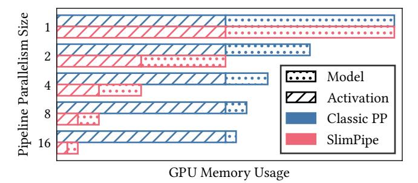
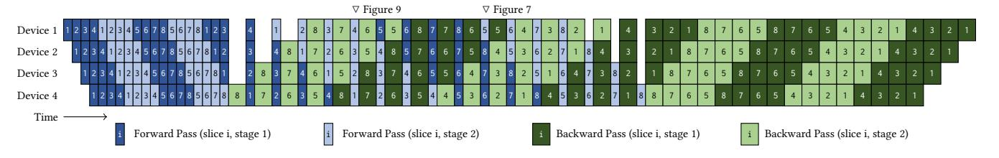
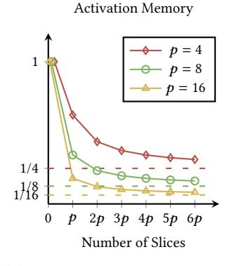
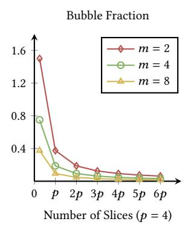
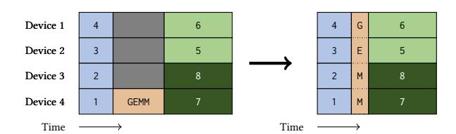
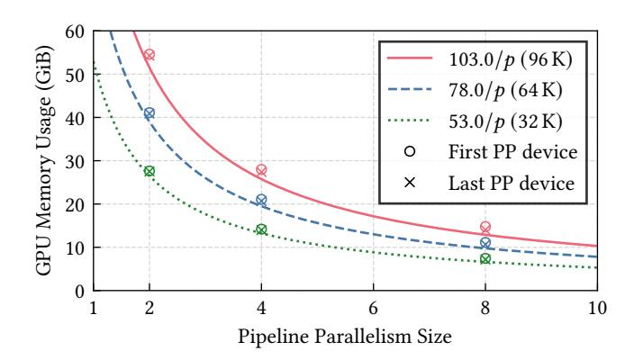
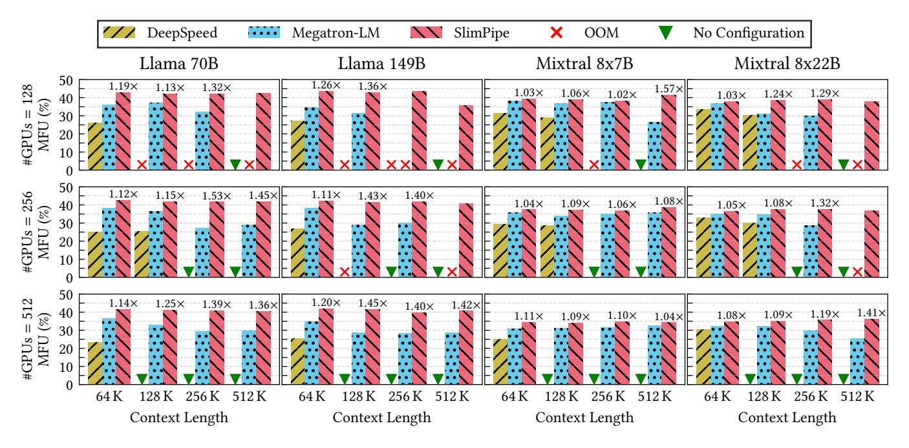
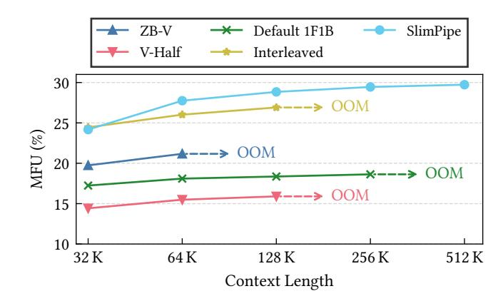

# SlimPipe: Memory-Thrifty and Efficient Pipeline Parallelism for Long-Context LLM Training

Zhouyang Li\*, Yuliang Liu\*†, Wei Zhang, Tailing Yuan, Bin Chen, Chengru Song, and Di Zhang

Kuaishou Technology Beijing, China

#### **Abstract**

Pipeline Parallelism (PP) serves as a crucial technique for training Large Language Models (LLMs), owing to its capability to alleviate memory pressure from model states with relatively low communication overhead. However, in long-context scenarios, existing pipeline parallelism methods fail to address the substantial activation memory pressure, primarily due to the peak memory consumption resulting from the accumulation of activations across multiple microbatches. Moreover, these approaches inevitably introduce considerable pipeline bubbles, further hindering efficiency.

To tackle these challenges, we propose SlimPipe, a novel approach to fine-grained pipeline parallelism that employs uniform sequence slicing coupled with one-forward-one-backward (1F1B) schedule. It reduces the accumulated activations from several microbatches to just one, which is split into several slices. Although the slices are evenly partitioned, the computation cost is not equal across slices due to causal attention. We develop a sophisticated workload redistribution technique to address this load imbalance. SlimPipe achieves (1) near-zero memory overhead and (2) minimal pipeline bubbles simultaneously. The effectiveness of SlimPipe has been proven by thorough testing with diverse model architectures, context window sizes, and SlimPipe-specific configurations. For example, compared to state-of-the-art methods, SlimPipe significantly boosts the Model FLOPs Utilization (MFU) to up to 1.57×. More notably, on Llama 70B with a context length of 2048K, it maintains over 45% MFU on 256 NVIDIA Hopper 80GB GPUs.

#### 1 Introduction

Autoregressive large language models, such as Llama [44, 45], Gemini [42], GPT [4], and Mixtral [16], have achieved dominant performance in many NLP tasks. At the same time, an increasing number of studies have found that context length plays a significant role in model applications, such as multi-turn dialogue and long-context understanding. However, as the model size and context length continue to grow, the storage requirements far exceed the capacity of modern accelerators. This memory demand comprises two primary components: (1) *model states*, including parameters, gradients, and optimizer states, which scale proportionally with model size, and (2) *activations*, whose memory footprint grows linearly with context length.

Pipeline Parallelism has become an indispensable component in hybrid parallelization strategies for training LLMs due to its ability to mitigate memory pressure from model states while maintaining

> **[图片提取文字 (无描述)]:**
> Model Activation 8 Classic PP SlimPipe 16 GPU Memory Usage

Figure 1: Comparison of GPU memory footprint between Classic PP [12, 22, 27, 28, 34] and SlimPipe across various pipeline parallelism sizes. While both approaches consume identical GPU memory for model parameters, SlimPipe's activation memory decreases proportionally as pipeline parallelism size increases, in contrast to Classic PP's constant

> **[图片提取文字 (无描述)]:**
> Maximum Context Length (K) 8.3× 5.4× 4.8× 6.5× V-Half 1F1B Default Interleased Slimpipe

activation memory requirements.

> **[图片提取文字 (无描述)]:**
> 0.8 0.7 0.6 **Bubble Fraction** 0.5 0.4 0.3 0.2 0.1 V-Half 1F1B V-Half 1F1B Default Interleased SlimPipe

Figure 2: Maximum context lengths supported by different PP schemes in training Llama 7B with 8-way TP and 8-way PP.

Figure 3: Theoretical bubble fractions of different PP schemes (PP size 8) in training Llama 13B with 4 microbatches and a 256K context length.

relatively low communication overhead. However, existing PP approaches exhibit significant limitations in handling the memory pressure caused by activations, which scales with context lengths. As illustrated in Figure 1, while the memory footprint of the model states decreases as the size of the PP increases, the activation memory remains constant. This limitation poses substantial challenges

\*Equal contribution.

&lt;sup>†Corresponding author: Yuliang Liu liuyuliang@kuaishou.com>.

for exploring long-context models. For instance, as shown in Figure [2,](#page-0-1) even with maximal TP utilization within NVLink domains, the maximum viable context length for Llama 13B models is limited to 124K. Further context length expansion requires either memorycomputation trade-offs through activation recomputing or sequence partitioning across nodes with low communication bandwidth, both of which significantly compromise training efficiency.

Beyond memory constraints, pipeline bubbles present another critical challenge in long-context scenarios. Both the 1F1B schedule [\[9,](#page-10-1) [27\]](#page-11-4) and its interleaved variant introduce warm-up bubbles due to the necessity of forward warm-up phases to fill the pipeline and corresponding backward cool-down phases before synchronization. In long-context settings, limited global batch sizes exacerbate the relative impact of these warm-up bubbles. ZB-V [\[33,](#page-11-7) [34\]](#page-11-6) addresses this issue by decoupling the computations of the activation gradient ( ) and the weight gradient () in the backward pass. When = = , where represents the forward computation time, ZB-V can achieve zero bubble. However, the time differences among , , and can be substantial. For instance, the core attention operation, which lacks weights, implies = 0, while is also significantly larger than . This difference introduces imbalance bubbles. The issues related to the imbalance bubbles of ZB-V will be thoroughly analyzed in the background and related work section. The current pipeline bubble characteristics are illustrated in Figure [3.](#page-0-1)

The fundamental limitation stems from the inherent nature of the classic PP design. Our key observation is that to achieve optimal throughput, the pipeline must accumulate computational units during the warm-up phase, where is the PP size. However, since existing PP methods operate at microbatch-level granularity, these methods require storing microbatches of activations simultaneously. Although the number of layers per pipeline stage is reduced by a factor of , the activation memory consumption remains constant due to the accumulation of microbatches. Inspired by TeraPipe [\[22\]](#page-11-3), we have developed a fine-grained 1F1B schedule that decomposes the conventional microbatch-level computing units into finer slice-level, where each slice represents a sliced segment of a microbatch. To maintain a stable memory footprint during the steady phase, we evenly divide the sequence into equal-length slices. This innovation enables us to minimize memory overhead, including those arising from accumulated activations, as depicted in Figure [1.](#page-0-0)

However, because mainstream LLMs employ causal attention, even though the slices are of equal length, the later slices impose higher computational cost than the earlier ones. This leads to pipeline imbalance bubbles. To counteract this, we design a novel method that equalizes memory usage and computational workload across different slices by redistributing the attention workload among different pipeline parallelism devices. The load imbalance with uniform slicing is primarily due to the attention calculation, so we redistribute an appropriate portion of the attention operation from heavily loaded devices to those with lighter load. This redistribution enables the less burdened devices to handle the additional attention computations and then send the outcomes back to the original devices. By employing this method, we maintain an equilibrium of computational and memory load across all uniform

slices. This means that imbalance bubbles are completely eliminated. Moreover, in LLM training, to maintain model performance, the global token size is constrained by the critical batch size [\[24\]](#page-11-8). Longer sequences reduce the batch size and inflate the pipeline bubble overhead. By operating at slice-level granularity instead of microbatch-level, we can significantly reduce the pipeline warm-up bubbles. To summarize, we address pipeline bubble issues through two key mechanisms: (1) context redistribution that eliminates imbalance bubbles, and (2) fine-grained scheduling that reduces warm-up bubbles, collectively achieving near-zero pipeline bubbles, as depicted in Figure [3.](#page-0-1)

To this end, we introduce SlimPipe, a fine-grained pipeline parallelism scheme that employs uniform sequence slicing combined with 1F1B scheduling. SlimPipe delivers three key advantages: (1) near-zero memory overhead, (2) minimal pipeline bubbles, and (3) enhanced computational efficiency by leveraging its memorythrifty design to minimize both activation recomputing and parallelism size requirements. Our evaluations on various models and context lengths demonstrate that SlimPipe can boost the LLM training throughput to up to 1.57× compared to state-of-the-art systems. In summary, our paper presents the following contributions:

- (1) Our analysis reveals two fundamental limitations in current pipeline parallelism approaches: memory inefficiency and significant pipeline bubble overhead. Moreover, we demonstrate that these issues exacerbate their difficulties in long-context training.
- (2) We propose SlimPipe, a novel approach to fine-grained pipeline parallelism that employs uniform sequence slicing coupled with 1F1B scheduling.
- (3) We propose a novel workload redistribution technique. By dynamically reallocating the attention workload between PP devices handling different slices, we achieve a balanced distribution of both computational and memory load among them.
- (4) Our extensive evaluation demonstrates that SlimPipe consistently outperforms state-of-the-art systems, such as Deep-Speed [\[14\]](#page-11-9) and Megatron-LM [\[28,](#page-11-5) [40\]](#page-11-10), achieving significant improvements in both memory utilization and throughput.

# 2 Background and Related Work

The notations used in this paper are listed in Table [1.](#page-2-0)

# 2.1 Intra-operator Parallelism

Data Parallelism (DP) [\[47\]](#page-13-2) involves replicating the model across multiple devices, with each device processing a different subset of the data. The gradients are then aggregated across all devices to update the model parameters. Data parallelism is effective for scaling out the training process by distributing the dataset.

Tensor Parallelism (TP) [\[40\]](#page-11-10) is achieved by partitioning the parameters and inputs within an operator, effectively splitting the computational burden across multiple devices. This is particularly useful when the model is too large to fit into the memory of a single device. However, due to the significant communication overhead of tensor parallelism, it is generally confined within a node. Sequence Parallelism (SP) [\[19\]](#page-11-11), as explained in the Megatron-LM framework, ensures that data remains in a partitioned state

Table 1: Notations with description.

| Notation | Description                              |
|----------|------------------------------------------|
| 𝐿        | number of transformer layers             |
| 𝑀ℎ       | size of one embedding tensor             |
| 𝑀𝑎       | total size of activations per microbatch |
| 𝑡        | tensor parallelism size                  |
| 𝑐        | context parallelism size                 |
| 𝑑        | data parallelism size                    |
| 𝑒        | expert parallelism size                  |
| 𝑝        | pipeline parallelism size                |
| 𝑚        | number of microbatches                   |
| 𝑛        | number of slices per input sequence      |
| 𝑣        | number of stages per pipeline device     |

throughout the model training process, rather than maintaining redundant activations outside the attention and MLP modules.

Context Parallelism (CP) is an advanced technique used to train LLMs by distributing the sequence across multiple devices. Deep-Speed Ulysses [\[14\]](#page-11-9) is a system optimization designed to enable the training of extremely long-context transformer models. Ring Attention [\[3,](#page-10-2) [23\]](#page-11-12) is an approach that leverages blockwise computation of attention to distribute long sequences across multiple devices.

Expert Parallelism (EP) [\[11,](#page-10-3) [13,](#page-11-13) [21,](#page-11-14) [35\]](#page-11-15) is a technique utilized in Mixture-of-Experts (MoE) [\[10,](#page-10-4) [16,](#page-11-1) [49\]](#page-13-3) architectures. In an MoE layer, different experts are dynamically activated according to the input tokens. EP distributes these specialized experts across multiple devices, enabling efficient computation by activating only the relevant experts for each input.

# 2.2 Pipeline Parallelism

Pipeline Parallelism [\[9,](#page-10-1) [12,](#page-11-2) [17,](#page-11-16) [22,](#page-11-3) [26](#page-11-17)[–28,](#page-11-5) [33,](#page-11-7) [34\]](#page-11-6) splits a model across its layers, assigning distinct layers to different devices for simultaneous processing. However, this method can result in bubbles, which are caused by uneven workload distribution or periods of inactivity while waiting for gradient synchronization. To mitigate the problem of bubbles in pipeline parallelism, several studies have investigated solutions focusing on asynchronous updates. However, it carries the potential risk of affecting model performance. In this paper, we only consider synchronous pipeline parallelism .

Memory Consumption. GPipe [\[12\]](#page-11-2) requires accumulating the activations for all microbatches until the backward pass is completed for the first microbatch, leading to high peak memory consumption. Terapipe [\[22\]](#page-11-3) exploits the autoregressive nature of LLMs through its token-level scheduling, but it inherits GPipe's critical memory limitation: accumulating all activations throughout the pipeline.

PipeDream-Flush [\[27\]](#page-11-4) and DAPPLE [\[9\]](#page-10-1) introduces the 1F1B pipeline schedule, which divides each iteration into three phases: warm-up phase, steady phase, and cool-down phase. The warm-up phase aims to bring all pipeline devices into a working state. To ensure the availability of backward operations, activations generated during the warm-up phase are accumulated. Subsequently, all pipeline devices enter the 1F1B state during the steady phase, where the number of activations consumed by backward is equal to the number of activations produced by forward, thus maintaining

Table 2: Comparison between pipeline schemes.

| Pipeline Scheme                   | Activation Memory              |     | Bubble Fraction                                     |     |  |
|-----------------------------------|--------------------------------|-----|-----------------------------------------------------|-----|--|
| GPipe                             | 𝑚 𝑝                         | ↑↑  | 𝑝 − 1 𝑚                                          | –   |  |
| TeraPipe                          | 𝑚 𝑝                         | ↑↑  | 𝑝 − 1 𝑛𝑚                                         | ↓↓  |  |
| PipeDream-Flush (default 1F1B) | 1                              | –   | 𝑝 − 1 𝑚                                          | –   |  |
| Interleaved 1F1B                  | 𝑝 − 1 1 + 𝑣𝑝             | ↑   | 𝑝 − 1 𝑣𝑚                                         | ↓↓  |  |
| ZB-V                              | 1                              | –   | 2(𝑝 − 1)   † 0, 3𝑚                   | ↓   |  |
| V-Half                            | 1 1 + 2 𝑝          | ↓   | 1 𝑝 𝑝   † , + 2𝑚 3 2𝑚 | ↑   |  |
| SlimPipe                          | 1 2(𝑝 − 1) + 𝑝 𝑛𝑣𝑝 | ↓↓↓ | 𝑝 − 1 < ‡ 𝑛𝑣𝑚                              | ↓↓↓ |  |

† It increases with longer context length and the upper bound is approximate.

stable device memory usage. This results in an accumulation of microbatch activations. Although the 1F1B schedule eliminates the dependence of activation accumulation on , it fails to achieve inverse scaling with increasing . In contrast, SlimPipe attains nearzero memory overhead, with activation memory consumption scaling inversely with .

Zero Bubble Pipeline Parallelism [\[33,](#page-11-7) [34\]](#page-11-6) introduces a novel V-shape pipeline schedule that effectively balances memory utilization across pipeline devices. Through the V-shape schedule, ZB-V maintains the same peak memory overhead as 1F1B, while V-Half and V-Min reduce the peak memory to 1/2 and 1/3 of that of 1F1B, respectively. However, the activation memory consumption remains a constant that does not decrease with increasing .

Bubble Fraction. Gpipe treats the entire computation of a microbatch across all layers in a pipeline stage as an atomic computation unit. This coarse granularity results in the pipeline stages experiencing significant warm-up bubbles.

To address the issue of bubble overhead, several works have approached the problem from both the model and input data perspectives. Instead of treating the entire batch as the computation unit, TeraPipe breaks down the computation into smaller units at the token level. This approach allows for more fine-grained scheduling and reduces the idle periods between pipeline stages. On the other hand, interleaved 1F1B [\[28\]](#page-11-5) builds upon the 1F1B schedule and approaches the problem from the model perspective. In interleaved 1F1B, each device can undertake computations for several discrete subsets of layers rather than a single continuous sequence of layers. SlimPipe synergistically combines fine-grained model and input data sharding to minimize warm-up bubble overhead. To address workload imbalance caused by causal attention among slices, we propose a novel context redistribution mechanism that dynamically balances computational load across pipeline stages, effectively eliminating imbalance bubbles.

It will be ( − 1) ( + 1) , with extremely long context length.

ZB-V [34] innovatively splits backward into two parts: one for input gradient and the other for parameter gradient, theoretically eliminating bubbles. However, assuming the forward, input gradient, and parameter gradient computation costs for a microbatch are  $T_f$ ,  $T_b$ , and  $T_w$ , respectively, bubbles can only be avoided if  $T_f = T_b = T_w$ , which is impossible for Transformer models with attention blocks. For attention block, theoretically,  $T_b = 2 \times T_f \gg T_w = 0$ . When accounting for modern optimizations like Flash Attention and the inherent MFU disparity between forward/backward passes, the situation further deteriorates. Given that the computational complexity of attention is quadratic with respect to context length, the attention component tends to dominate the entire training process in long-context scenarios. This leads to significant challenges for ZB-V in long context training.

In summary, SlimPipe outperforms other pipeline parallelism methods in terms of memory efficiency, achieving near-zero memory overhead. It also demonstrates excellent performance in reducing pipeline bubbles. The results are presented in Table 2. It is worth emphasizing that in long-context training, SlimPipe's advantages become even more pronounced.

#### 2.3 Activation Rematerialization

Activation Checkpointing [5, 18] is a memory optimization technique that reduces memory usage by strategically releasing activation. When applied across a sequence of layers, this method retains only the initial layer's input for the backpropagation. During the backward pass, intermediate outputs are recalculated as needed for gradient computation. This strategy significantly reduces the memory footprint of activations, thereby freeing up memory resources to accommodate larger models. Various instruments [2, 15, 30] automate the decision-making process, fine-tuning strategies to optimize runtime efficiency while staying within a predefined memory limit. Meanwhile, a recent work [48] introduces the concept of the Pareto frontier for activation checkpointing strategies in the context of LLM training. According to this approach, the strategy is developed by training models along the Pareto frontier, optimizing the trade-off between memory consumption and runtime efficiency.

**Activation Offloading** [38, 41], similar to activation checkpointing, is another memory optimization technique. It achieves memory savings by swapping activations that are temporarily not needed from device memory to host or NVMe memory, and then swapping them back to device memory when they are required.

## 3 Challenges in Long Context LLM Training

**Immense Memory Overhead.** Current training of long-context LLMs faces substantial memory pressure, which drives the need for hybrid parallelism. The memory pressure consists of model states due to the large model size and activations due to the long context. Taking a 70B parameter Llama model and 1M context length as an example, even when using full recomputing with t=8, the total activation memory consumption is 160 GiB, which far exceeds the 80 GiB memory limit of mainstream GPUs. The calculation is as follows: 1048576 (context length)  $\times$  8192 (hidden dimension)  $\times$  80 (number of layers)  $\times$  2 (bytes per *bfloat16*)  $\div$  8 (tensor parallelism size).

Limited Global Batch Size. Long context LLMs training maintains a relatively fixed global tokens size per iteration. This practice is to ensure the model performance. The concept of critical batch size has been introduced by [24]. Exceeding this size by inflating the global tokens size can result in excessive noise reduction, thereby adversely affecting the model's performance. This means that as the context length continues to increase, the global batch size will scale inversely. The reduction in global batch size directly decreases the number of microbatches (*m*), as evidenced by Table 2, which proportionally increases the warm-up bubble overhead.

**Imbalanced Model Partition.** The vocabulary size is essentially large in recent LLMs. For example, the Llama 3 [8] models have a vocabulary size of 128,000, and the Gemma [43] models even have one of 256,128. Most PP schemes simply assign the vocabulary to the last pipeline device. This sort of uneven model partitioning not only brings considerable memory overhead, but also creates substantial workload imbalance among PP devices.

#### 4 Methods

In this section, we delve into the particular methods used by SlimPipe. First, we introduce how fine-grained pipeline parallelism with *uniform slicing* saves both memory and warm-up bubble time. We also provide a theoretical analysis to reveal the characteristics of our newly designed pipeline scheme. Next, we discuss the issue of workload imbalance among pipeline devices due to uniform slicing and causal attention. After that, we demonstrate how *attention context exchange* addresses the issue of workload imbalance. Finally, we employ *vocabulary parallelism* to equally distribute the computation and memory of the output layer among pipeline devices.

#### 4.1 Pipeline Schedule with Uniform Slicing

4.1.1 Unifrom Slicing. Pipeline Parallelism [12, 26] accumulates several forward passes on each device to warm up the pipeline. These prefilled passes bring significant activation memory, especially on lower-rank devices of the pipeline. The long input sequence could be split into short slices to reduce the activation memory of each forward pass. And the straightforward approach to split a sequence is uniform slicing. However, the equal slice length will lead to unequal computation time between slices. The reason is the causal attention mechanism [22], by which a latter query attends to former keys and values, but not vice versa. We will discuss and solve this issue later in Section 4.2. Despite that issue, uniform slicing has the following substantial advantages over non-uniform slicing:

- The maximum amount of accumulated memory is better constrained.
- (2) The fixed slice length makes it more feasible for other techniques (e.g., context parallelism) to divide at the sequence dimension.
- (3) Slices are prevented from being too short to maintain sufficient arithmetic intensity.

4.1.2 Slice-wise Scheduling. Firstly, we split the input sequence into n equal-length slices, where n is a multiple of p. To effectively calculate the causal attention slice by slice, we deploy the KV cache technique [31]. Remarkably, the KV cache imposes no memory

> **[图片提取文字 (无描述)]:**
> Device 1 2 Device 2 2 Device 3 2 Device 4 2 Time split each input sequence into n slices  $\frac{M_a}{p}$  $\delta \frac{M_a}{p}$ Device 1 Device 2 Device 3 Device 4 Time Backward pass (microbatch k, slice i) Forward Pass (microbatch k, slice i)

Figure 4: The top figure shows the default 1F1B schedule. The bottom figure shows the SlimPipe schedule, where each microbatch is broken into multiple (in this case, 8) slices.  $M_a$  represents the total activation size of one microbatch. n and p indicate the number of slices per sequence and the PP size, respectively. The activation memory accumulated during the warm-up phase on device 1 reduces from  $M_a$  to  $(1+\delta)\frac{M_a}{p}$ , where  $\delta=2(p-1)/n$ . In the mean time, the warm-up bubble shrinks by about n times.

> **[图片提取文字 (无描述)]:**
> ∇ Figure 9 ∇ Figure 7 Device 2 Device 3 Device 4 Time Forward Pass (slice i, stage 2) Backward Pass (slice i, stage 1) Forward Pass (slice i, stage 1) Backward Pass (slice i, stage 2)

Figure 5: SlimPipe in its interleaving form. Each device is assigned 2 stages. Dark colors show the first stage and light colors show the second stage. For simplicity, the microbatch number is not labeled and the number in the box is the slice number. Note that there are only two microbatches in this pipeline, each split into 8 slices. Whereas in the classic interleaved 1F1B pipeline, at least 4 (the PP size) microbatches are required. More details are depicted in Figure 7 and Figure 9.

overhead on the accumulated activation. Because the keys and values are deliberately retained for gradient calculation in backward passes.

Next, we apply uniform slicing to the 1F1B pipeline scheme [26]. The 1F1B schedule is adopted with some vital adjustments. To perform backpropagation [39] for slices in one sequence, respectively, their backward passes are scheduled in reverse order of forward passes. Paired with this last-in first-out schedule, we release the corresponding portion of KV cache immediately once a backward pass is finished. This ensures that the crucial invariant of maximum accumulated memory is maintained through the 1F1B steady phase. In addition, we put more forward passes ahead to align forward and backward passes separately. The crafted pipeline scheme is depicted in Figure 4.

Furthermore, we smoothly extend our pipeline scheme to an interleaving form [28], by assigning multiple small stages to each

device. As illustrated in Figure 5, uniform slicing and stage interleaving synergize well with each other. The accumulated activations and warm-up bubbles are further reduced.

4.1.3 Theoretical Analysis. As annotated in Figure 4, although the number of forward passes in the warm-up phase is increased, the total accumulated activation is actually decreased. Given that n is equal to or greater than p, the total accumulated activation size

$$M_{acc} = (1+\delta)\frac{M_a}{p}, \quad \delta = \frac{2(p-1)}{n}$$
 (1)

is much smaller than  $M_a$ . It is even approaching  $M_a/p$  as n continues increasing, as if virtually divided by the PP size. Moreover, the bubble time during warm-up and cool-down phases is reduced by about n times. In fact, the bubbles shrink super-linearly due to the causal attention mechanism. As a result, the bubble fraction is less than  $\frac{p-1}{nm}$ . When attention dominates the computation time (with an extremely long context length), the bubble fraction

> **[图片提取文字 (无描述)]:**
> Activation Memory 1/4 p 2p 3p 4p 5p 6p Number of Slices

> **[图片提取文字 (无描述)]:**
> **Bubble Fraction** 1.6 m = 21.2 0.8 0.4 2p 3p 4p 5p 6p Number of Slices (p = 4)

(a) Activation memory reduced by SlimPipe across different PP sizes.

(b) Bubble fraction reduced by SlimPipe across different microbatch numbers. The PP size is fixed to 4

Figure 6: SlimPipe reduces both activation memory and bubble fraction. (a) The activation memories are equally large without uniform slicing (default 1F1B), and are decreasing from 1 towards 1/p separately as the number of slices increases. (b) The bubble fraction are quite large without uniform slicing (default 1F1B), and are decreasing to near-zero as the number of slices increases.

will become  $\frac{(p-1)p}{(n+1)nm}$ . Besides these benefits, the overall communication volume of default 1F1B has not been changed. The two significant characteristics of SlimPipe are depicted in Figure 6. With a fairly large value of n, the activation memory and bubble time are substantially reduced. In terms of the interleaving form, these two attributes will be further reduced by the number of stages v (formulas are listed in Table 2).

#### 4.2 Attention Context Exchange

> **[图片提取文字 (无描述)]:**
> (p-1) slices of key-value Device 1 Device 2 8 Device 3 Device 4 Time - 1) slices of key-value

Figure 7: A closer look at the SlimPipe timeline with imbalance bubble exhibited. The beginnings of passes are aligned across devices to clearly reveal the bubbles' shape. The actual timeline will be more elaborated with propagated bubbles.

4.2.1 Imbalance Bubbles. If we just split each sequence into equallength slices, the execution timeline will not be as ideal as depicted in Figure 5. Although we try to align each kind of passes across devices, bubbles arise and pervade between them, which is roughly sketched in Figure 7. These bubbles are caused by the uneven computation time of causal attention. As the query length is fixed by

| Device 1 | $Q_7, K_1, V_1   Q_7, K_2, V_2   Q_7,$       | , K 3 , V 3 Q 7 , K 4 , V 4 | $Q_7, K_5, V_5$ | Q 7 , K 6 , V 6 | Q 7 , K 7 , V 7 |
|----------|----------------------------------------------|------------------------------------------------------------------------------------|-----------------|--------------------------------------------------|--------------------------------------------------|
| Device 2 | $Q_6, K_1, V_1$ $Q_6, K_2, V_2$ $Q_6,$       | $, K_3, V_3   Q_6, K_4, V_4  $                                                     | $Q_6, K_5, V_5$ | Q 6 , K 6 , V 6 |                                                  |
| Device 3 | $Q_5, K_1, V_1 \mid Q_5, K_2, V_2 \mid Q_5,$ | $, K_3, V_3   Q_5, K_4, V_4  $                                                     | $Q_5, K_5, V_5$ |                                                  |                                                  |
| Device 4 | $Q_4, K_1, V_1 \mid Q_4, K_2, V_2 \mid Q_4,$ | , K 3 , V 3 Q 4 , K 4 , V 4 |                 |                                                  |                                                  |
| Device 5 | $Q_3, K_1, V_1   Q_3, K_2, V_2   Q_3,$       | , K 3 , V 3                                                  |                 |                                                  |                                                  |
| Device 6 | $Q_2, K_1, V_1   Q_2, K_2, V_2   Q_7,$       | $, K_6, V_6   Q_7, K_7, V_7$                                                       |                 |                                                  |                                                  |

Figure 8: The attention workloads are rebalanced by exchanging the context among pipeline devices. The local query and portions of the local key-value are sent to another device and the partial attention output will be sent back after the calculation being completed there.

uniform slicing, the computation time is in proportion to the length of attended key-value. Latter slices, attending to more KV cache, cost more time to compute in both forward and backward passes.

At a specific moment, the workloads across pipeline devices conform to an arithmetic progression. And the difference between the heaviest and the lightest is p-1 slices of key-value. The situation becomes worse at the juncture of two microbatches, where the workload difference could be as great as n-1. Devices processing with less KV cache finish their computation sooner, and have to wait for other devices to communicate with them. This waiting-time is a type of imbalance bubbles. Imbalance bubbles will propagate along pipeline devices in both directions and cross with each other, making the pipeline timeline quite irregular.

4.2.2 Exchange the Context. To eliminate these messy imbalance bubbles, we need to make the attention workload as equal as possible across devices. The essential condition is that all devices at one moment have equal computation time. Note that it does not require a uniform computation time across passes, which is otherwise required by TeraPipe. This essential condition allows us to redistribute the attention workload on the spot. As depicted in Figure 8, a device with more KV cache sends its query and portions of key-value to a device with less KV cache, and then the attention will be calculated there. The remotely calculated attention output will be sent back and merged with the locally calculated one via the online softmax method [25]. The attention workloads after redistribution become almost equal. The difference between them is at most one slice of key-value.

4.2.3 Communication Volume. We use the non-interleaving form of SlimPipe to demonstrate the communication volume of context exchange. The exchanged context is 1 slice of query (Q) and output (O) plus  $\lfloor (p-1)/2 \rfloor$  slices of key (K) and value (V), and the latter becomes  $\lfloor (n-1)/2 \rfloor$  slices at the microbatch juncture. The juncture period occupies p-1 out of n passes per microbatch. Generally, the unsliced query, key, value, and output all have the size  $M_h$ . So one slice of each from one device has the size  $\frac{L}{p} \cdot \frac{M_h}{n}$ . Finally, the total

volume of exchanged context per microbatch per device is

$$\Theta = \underbrace{\left(\underbrace{2n}_{Q+O} + \underbrace{2(n-p+1)\left\lfloor\frac{p-1}{2}\right\rfloor}_{K+V, \text{ not at junctures}} + \underbrace{2(p-1)\left\lfloor\frac{n-1}{2}\right\rfloor}_{K+V, \text{ at junctures}}\right) \underbrace{LM_h}_{pn}$$

$$\leq \left(2 - \frac{p-1}{n}\right) LM_h$$
(2)

The inequality originates from the round-down operation. This volume is at most 2ℎ, virtually independent from the PP size and number of slices. When applied to the interleaving form, context exchange gets a communication volume at the same degree.

# 4.3 Vocabulary Parallelism

4.3.1 The Output Layer. Although we have balanced the memory consumption and computation workload in the previous sections, the pipeline parallelism still suffers from another sort of imbalance. The output layer of a language model is a GEMM operation that projects hidden states into the vocabulary space. As described in Section [3,](#page-3-0) the vocabulary size is really large. The output layer is calculated by the last pipeline device, thus significantly aggravating the workload imbalance here. As depicted in Figure [9,](#page-6-0) this workload imbalance also causes bubbles in the middle of the pipeline. Moreover, when training LLMs, the output layer is followed by a cross-entropy loss, which will store the vocabulary logits in float32 for gradient calculation. That brings a large activation footprint to the last PP device. For instance, with a context length of 256K and a vocabulary size of 128,000, it consumes about 16GiB of GPU memory even in 8-way TP.

4.3.2 Distribute the Vocabulary. The point is to equally distribute the computation and memory of the output layer among pipeline devices. Specifically, we parallelize the GEMM along its vocabulary dimension (column-wise). The input hidden states are broadcasted to all PP devices. Thus, each device can calculate a part of the GEMM and get a portion of the vocabulary logits. Rather than gathering these portions together, we calculate the cross-entropy loss from the sharded logits, and the necessary statistics are synchronized. The scalar statistics are much smaller than the logits, so the communication volume is drastically reduced. Since the word embedding and the output layer usually share weights [\[32,](#page-11-26) [46\]](#page-13-6), we also parallelize the former. This method was first adopted by the TP [\[40\]](#page-11-10) implemented in Megatron-LM. However, it could not be trivially applied to common PP schemes due to their misaligned schedules. Since all passes are tidily aligned by attention context exchange, SlimPipe is particularly suitable for this method.

> **[图片提取文字 (无描述)]:**
> Device 1 Device 2 Device 3 Device 4 **GEMM** Time Time

Figure 9: A SlimPipe timeline segment containing the output layer (GEMM). The left part shows the GEMM just assigned to the last device. The right part shows the GEMM distributed to all devices, where the bubble vanishes.

# 5 Implementation

We build SlimPipe within Megatron-LM [\[28,](#page-11-5) [40\]](#page-11-10), and implement our functions using PyTorch [\[29\]](#page-11-27). We make some practical efforts to reduce the per-layer activations. We use the cuDNN [\[6\]](#page-10-8) Scaled Dot Product Attention (SDPA) as the primitive of our attention layer. cuDNN SDPA is similar to FlashAttention [\[7\]](#page-10-9), which avoids storing large intermediate matrices for backward. Our SwiGLU implementation recomputes the swish function instead of storing the intermediate activations. We also adopt a memory-efficient RMSNorm, which otherwise uses its output to calculate gradients. Moreover, we customize the techniques as below, to better utilize them in SlimPipe.

Chunked KV Cache. The size of the KV cache grows up along the forward passes and shrinks down along the backward passes. We store the KV cache in a list of individual tensors (chunks), instead of joining them together into an entire tensor. The joined tensor would occupy a large contiguous buffer, which will be frequently re-allocated, leading to severe memory fragmentation in the allocator. While PagedAttention [\[20\]](#page-11-28) stores the KV cache in relatively small blocks, we store them in slice-sized chunks to avoid block addressing in the GPU kernel of attention. This is enough to eliminate memory fragmentation since all chunks have identical size by uniform slicing. These chunks will be precisely reused between two adjacent microbatches in the pipeline, where the backward pass releases one and the forward pass acquires one.

Early Key-Value Exchange. Attention context exchange involves additional communication among pipeline devices. The communication costs may offset the benefit from the balanced workload. However, we do not need to send the key-value of the last few slices, as illustrated in [8.](#page-5-3) Instead we could just send those of the first few slices that are produced earlier. Thereby we can communicate them much earlier than the attention calculation and even overlap it with the computation of previous slices. By this optimization, we substantially alleviate the delay in attention calculation.

Commutated Context Parallelism. Context parallelism is widely utilized to train LLMs with extremely long context. Existing CP implementations communicate key-value among devices and use them to calculate the attention output against the local query. When CP is used along with KV cache, the cached key-value will be communicated every time a later slice comes, which is rather inefficient. To eliminate the redundant communication, we implement a commutated variant of context parallelism. This CP variant communicates the query, output and the normalizer in softmax instead of the key and value. In general, the query and output have the same size as the key and value, and the scalar normalizer is too small to count. Therefore, the communication volume of CP is recovered to that without KV cache.

# 6 Evaluation

# 6.1 Experimental Settings

All experiments are conducted on a GPU cluster where each node is configured with two Intel Xeon Platinum CPUs and 1TB of memory. In each node, 8 NVIDIA Hopper 80GB GPUs are installed and interconnected via NVLink, whose bandwidth is 400GB/s per GPU. Besides that, every GPU is coupled with a 400Gbps NIC for

Table 3: Models used in evaluation.

| $\begin{array}{ c c c c c c c c c c c c c c c c c c c$ |    |    |   | h hidden dimension size $H$ FFN dimension size |       |                      |  |
|--------------------------------------------------------|----|----|---|------------------------------------------------|-------|----------------------|--|
| Model $ L a g h H$ #Parama                             |    |    |   |                                                |       |                      |  |
| Llama 13B                                              | 40 | 40 | - | 5120                                           | 13824 | $13.3 \times 10^{9}$ |  |
| Llama 70B                                              | 80 | 64 | 8 | 8192                                           | 28672 | $69.5 \times 10^9$   |  |
| Llama 149B                                             | 96 | 96 | 8 | 12288                                          | 32768 | $148.9 \times 10^9$  |  |
| Mixtral 8x7B                                           | 32 | 32 | 8 | 4096                                           | 14336 | $47.0 \times 10^{9}$ |  |
| Mixtral 8x22B                                          | 56 | 48 | 8 | 6144                                           | 16384 | $141.0 \times 10^9$  |  |

 $^\dagger$  Including parameters in the 128,000 sized vocabulary.

inter-node communication. Unless otherwise stated, TP, CP and EP should be deployed within a node, while PP and DP could be deployed across nodes. TP is always paired with SP.

Models of various architectures are used in evaluation. We select the Llama-like dense models and the Mixtral series MoE models. The specifications of the models are listed in Table 3. GQA [1] is applied to models except Llama 13B. In MoE layers, 2 out of 8 experts are routed for each token. The expert router is set to complete balance for performance measurement. Every model is coupled with a vocabulary of 128,000 entries. The training precision is *bfloat16* except that *float32* is used in loss calculation and gradient accumulation. The optimizer is Adam with *float32* internal states.

#### 6.2 Memory Saving

> **[图片提取文字 (无描述)]:**
> 60 GPU Memory Usage (GiB) 103.0/p (96 K) 50 78.0/p (64 K) 40 53.0/p(32 K)First PP device 30 Last PP device × 20 10 10 Pipeline Parallelism Size

Figure 10: The memory reduced by the PP size p. The measured values align well with our theoretical model.

We use a simple experiment to show how SlimPipe reduces the memory usage in training. We train the Llama 13B model with input sequence lengths of 32K, 64K and 96K. The TP size is 8 and the PP size increases from 2 to 8. The number of stages per device is set to L/p (i.e., maximum interleaving stages). We measure the memory usage of the first and the last pipeline devices, using the torch.cuda.max\_memory\_allocated method.

We draw the measured data as markers in Figure 10. We also draw a curve for each sequence length, whose formula is  $M_t/p$ , where  $M_t$  is the theoretical memory required to train the model without PP (only with 8-way TP). We use the memory modeling

method from previous works [19, 48]. As we can see, the memory usage for both devices decreases in close alignment with the theoretical curves. The total memory is nearly in an inverse proportional relationship to the PP size, as if distributed by PP. While classic PP distributes model states, SlimPipe additionally distributes activations. In particular, the activations of the output layer are also distributed, as evidenced by our measurements on the last device. The memory usage of the first device is slightly higher than that of the last device. The gap between them is formulated as  $2(p-1)M_a/nvp$ . We can claim that nearly all the memory used in LLM training is distributed in PP. The only existing technique that can achieve this is TP (with SP), but at significantly higher communication costs.

## 6.3 Insights into Slice Length

> **[图片提取文字 (无描述)]:**
> 35 30 MFU (%) 25 512K 20 256K 128K 15 2p3p5*p* 7*p* 8p 6*p* Number of Slices (p = 4)

Figure 11: MFU of training the Llama 13B model with different context lengths. The PP size is 4 and the numbers of slices increases from p to 8p.

As discussed in Section 4.1.1, fine-grained slicing can reduce the accumulated activations but also decrease the arithmetic intensity. So in this experiment, we will study how the value of n affects the training efficiency, and find an appropriate n for a given context length. We train the Llama 13B model with 2 microbatches per iteration. The three sets of input sequence lengths are 128K, 256K and 512K respectively. The parallelism configuration is 8-way TP combined with 4-way PP, and full checkpointing is enabled. The number of stages per pipeline device is 5, and the number of slices per sequence gradually increases from p to 8p. We use MFU to quantify the training efficiency.

As we can see in Figure 11, fine-grained slicing improves MFU initially (due to reduced bubbles) but harms it eventually (due to lower arithmetic intensity) as slices become shorter. The MFU of 128K context length drops sharply after n=2p, indicating that the arithmetic intensity is too weak. We also see that the transition point of n comes later for a longer context length. MFU of the 512K context length remains high even with 32 slices per sequence. In conclusion, we should choose a moderate value of n to maintain the training efficiency while saving memory.

> **[图片提取文字 (无描述)]:**
> DeepSpeed Megatron-LM No Configuration X SlimPipe OOM Mixtral 8x22B Llama 70B Llama 149B Mixtral 8x7B 1.19× 1.26× 1.36× 1.13× 128  $-1.32 \times$ 1.57× 1.03× 1.06× 1.02× 1.24× 1.03× MFU (%) #GPUs 3PUs = 256 MFU (%) 1.12× 1.15× 1.53×  $-1.45 \times$ 1.11× 1.43× 1.40×  $1.05 \times 1.08 \times 1.32 \times$  $1.08 \times$ 1.04× 1.09× 1.06× #GPUs 512  $1.20 \times$ 1.14× 1.25× -1.39× 1.45× 1.36× 1.40× 1.42× 1.41× 40 1.19× 1.09× 1.08× 1.11× 1.10× 1.04× MFU (%) #GPUs 64 K 128 K 256 K 512 K 64 K 128 K 256 K 512 K 64 K 128 K 256 K 512 K 64 K 128 K 256 K 512 K Context Length Context Length Context Length Context Length

Figure 12: System performance comparison between DeepSpeed, Megatron-LM, and SlimPipe across different models and GPU counts. The annotations above the bars for SlimPipe represent its relative speedup over Megatron-LM. A green triangle marker indicates that no viable configuration could be found under this condition, and a red cross indicates that all candidate configurations results in an Out-Of-Memory (OOM) error.

## 6.4 End-to-End Performance

When SlimPipe is integrated into a hybrid parallelism training system, it could introduce new optimization opportunities to other techniques. For example, the GPU memory saving could avoid the use of full checkpointing, thus increasing the system efficiency. In the main course, we compare the system performance between Megatron-LM and SlimPipe. For clarity, we refer to the baseline system with interleaved 1F1B PP as Megatron-LM, and the system with our innovative PP as SlimPipe. Prevalent parallelism techniques (TP, CP, EP, DP, and PP) are organically composed in both systems. The activation saving techniques mentioned in Section 5 are applied uniformly, while full or selective checkpointing [19, 48] is enabled on their demand. The selective checkpointing implemented by us just recomputes the up projection plus SwiGLU in an MLP layer. DeepSpeed [37] is also involved and is equipped with its Zero Redundancy Optimizer [36] and Ulysses Parallelism (UP). To exhibit the best performance of each system, their hybrid parallelism configurations are baked through grid search.

We select 4 models covering dense and MoE architectures, in various sizes. The input sequence length extends from 64K to 512K. The per-iteration token size is fixed to 4M, which means that there are fewer microbatches when the sequence length is longer. The total number of GPUs scales from 128 to 512. The comprehensive benchmark results are shown in Figure 12. SlimPipe outperforms the other two systems in training efficiency through all models, context lengths, and number of GPUs.

**Difference in Context Lengths.** SlimPipe demonstrates increasingly significant advantages when training with longer context

lengths. Extended contexts inherently demand greater activation memory consumption and incur more significant warm-up bubbles. As previously discussed, SlimPipe's fine-grained schedule minimizes bubbles overhead, thereby delivering substantial efficiency benefits. Moreover, leveraging its memory-thrifty design, which substantially reduces activation storage requirements, we maintain training efficiency without resorting to full checkpointing or expensive cross-node TP/CP communication. In contrast, the other two approaches progressively adopt inefficient full checkpointing and expensive cross-node communication as context lengths grow, ultimately encountering out-of-memory failures in many cases. For example, in the 512K context length scenario with 128 GPUs, SlimPipe achieves a 1.57× speedup over Megatron-LM when training Mixtral 8x7B. Meanwhile, it maintains high efficiency on other larger models, while Megatron-LM encounters OOM issues.

Difference in Scalability. DeepSpeed fails to run with a 512K context length on a total of 128 GPUs (no viable configuration), because the batch size 8 is not enough for a larger DP size. It cannot enlarge the UP size because there are only 8 query groups. This limitation of DeepSpeed becomes severer if running on more GPUs. When scaling to 512 GPUs, systems have to expand their DP size to saturate this amount of GPUs. A larger DP size leads to fewer microbatches, and thus to a shorter steady phase in the pipeline. Consequently, a larger bubble fraction hinders the scalability of Megatron-LM. Furthermore, if the DP size continues expanding, the number of microbatches left in PP will become even less than the PP size, breaking the minimum requirements by the interleaved 1F1B scheme. This fatal limitation prevents Megatron-LM from

scaling to more GPUs. In contrast, SlimPipe maintains quite high training efficiency with as few as 2 micorbatches in PP, because it effectively reduces the warm-up bubbles by fine-grained slicing.

**Difference in Models.** SlimPipe's advantages become increasingly pronounced with larger-scale models. For both dense and MoE architectures, SlimPipe demonstrates superior performance as model size grows. Crucially, SlimPipe eliminates the need for either full checkpointing or costly cross-node communication during large-model training. For example, in the 512 GPUs, 512K context length scenario, SlimPipe achieves a 1.41× speedup on the 8x22B model, while it only achieves a 1.04× speedup on the 8x7B model. This scalability advantage suggests that SlimPipe's performance lead over alternative systems would further widen with even larger models.

In a nutshell, SlimPipe demonstrates its outstanding aptitude to train long-context LLMs at any scale.

#### 6.5 Ultra Long Context

Table 4: System performance of training 4 LLMs with the maximum supported context length, by using at most 256 GPUs. The selective checkpointing is enabled uniformly while the offloading ratio is adaptive.

| Model                      | Context | t | с  | e | d | р  | n          | offload | MFU   |
|----------------------------|---------|---|----|---|---|----|------------|---------|-------|
| Llama 70B Llama 149B    | 2048K   | 4 | 4  | _ | 1 | 16 | 4 <i>p</i> | 75%     | 45.0% |
| Llama 149B                 | 1024K   | 4 | 2  | - | 1 | 32 | 2 <i>p</i> | 80%     | 43.7% |
| Mixtral 8x7B               | 4096K   | 1 | 16 | 8 | 1 | 16 | 4p         | 95%     | 40.0% |
| Mixtral 8x22B † | 2048K   | 1 | 8  | 8 | 1 | 28 | 4p         | 100%    | 42.0% |

† 224 GPUs are actually used because of the PP size 28.

512K context is not the very limit of SlimpPipe. To explore the extensibility of SlimPipe, we integrate the pipeline-parallelism-aware offloading [48] into our system. This technique saves GPU memory by transferring portions of the activations to the host memory. We train 4 large models with 16M tokens per iteration and extend the context length to the maximum supported by our system on 256 GPUs. The system configurations just follow those of Section 6.4, with an additional offload ratio.

The results in Table 4 show that SlimPipe maintains its high efficiency when training with spectacular context lengths. With the help of offloading, SlimPipe pushes the boundary of context length to an astonishing 4096K in training Mixtral 8x7B. It also delivers a remarkable MFU as high as 45.0% in training Llama 70B. Now we can say with confidence that we realize the ambitious goal of training LLMs with ultra long context.

## 6.6 Comparison of Pipeline Schemes

The dessert is a comparison between pipeline schemes on training LLMs with long context length. The model is Llama 13B and the per-iteration batch size is 4. The input sequence length increases from 32K to 512K. 8-way TP and full checkpointing are used to reduce the memory pressure. The number of stages per device is set to 5 for both interleaved 1F1B and SlimPipe. The number of slices is fixed to 4 for SlimPipe. The ZB-V and V-Half schemes use *float16* in place of *bfloat16*, for the latter is not yet supported.

> **[图片提取文字 (无描述)]:**
> ZB-V → Default 1F1B SlimPipe V-Half Interleaved 30 25 MFU (%) 20 15 10 32 K 64 K 128 K 256 K 512 K Context Length

Figure 13: Comparison of MFU across different PP schemes.

> **[图片提取文字 (无描述)]:**
> Default 1F1B SlimPipe ZB-V V-Half Interleaved OOM 70 GPU Memory Usage (GiB) 58.8 60 50 38.8 32.8 40 30 20 10 32 K 64 K 128 K 256 K 512 K Context Length

Figure 14: Comparison of GPU memory usage across different PP schemes.

The MFUs are drawn as dots in Figure 13, and the memory consumptions are drawn as bars in Figure 14. The ZB-V scheme goes out of memory quite early. It decouples the backward passes of inputs and weights and rearranges them in the pipeline schedule. Its built-in full checkpointing implementation does not work properly in this scheme. This flaw also restricts the maximum context length supported by the V-Half, which is designed to accumulate half the activations of the ZB-V. These V-shaped schemes both suffer from imbalance bubbles, caused by the diverged computation time of two decoupled backward passes. Although the default 1F1B sustains a fairly long context length of up to 256K, its efficiency is quite low due to relatively large warm-up bubbles. The interleaved 1F1B shows a competitive efficiency with short context lengths, but is still confined by its considerable memory overhead. SlimPipe delivers higher efficiency than others through all context lengths, demonstrating its outstanding ability to reduce both memory usage and pipeline bubbles.

#### 7 Conclusions

This paper introduces SlimPipe, a fine-grained pipeline parallelism with uniform slicing. Firstly, SlimPipe leverages uniform slicing to reduce GPU memory usage for activations proportionally as

the PP size increases. Additionally, this fine-grained pipeline parallelism schedule reduces bubbles during the warm-up and cooldown phases. Furthermore, we found that uniform slicing, due to the presence of causal attention, leads to workload imbalance between different slices. To avoid pipeline bubbles introduced by imbalanced workload, SlimPipe incorporates an attention context exchange mechanism. Our experiments demonstrate that SlimPipe can outperform state-of-the-art training systems.

# References

- [1] Joshua Ainslie, James Lee-Thorp, Michiel De Jong, Yury Zemlyanskiy, Federico Lebrón, and Sumit Sanghai. 2023. Gqa: Training generalized multi-query transformer models from multi-head checkpoints. arXiv preprint arXiv:2305.13245 (2023).
- [2] Olivier Beaumont, Lionel Eyraud-Dubois, Julien Hermann, Alexis Joly, and Alena Shilova. 2019. Optimal checkpointing for heterogeneous chains: how to train deep neural networks with limited memory. arXiv preprint arXiv:1911.13214 (2019).
- [3] William Brandon, Aniruddha Nrusimha, Kevin Qian, Zachary Ankner, Tian Jin, Zhiye Song, and Jonathan Ragan-Kelley. 2023. Striped attention: Faster ring attention for causal transformers. arXiv preprint arXiv:2311.09431 (2023).
- [4] Tom B. Brown, Benjamin Mann, Nick Ryder, Melanie Subbiah, J. Kaplan, Prafulla Dhariwal, Arvind Neelakantan, Pranav Shyam, Girish Sastry, Amanda Askell, Sandhini Agarwal, Ariel Herbert-Voss, Gretchen Krueger, T. Henighan, R. Child, A. Ramesh, Daniel M. Ziegler, Jeff Wu, Clemens Winter, Christopher Hesse, Mark Chen, Eric Sigler, Ma teusz Litwin, S. Gray, B. Chess, Jack Clark, Christopher Berner, Sam McCandlish, Alec Radford, I. Sutskever, and Dario Amodei. 2020. Language Models are Few-Shot Learners. Neural Information Processing Systems (2020).
- [5] Tianqi Chen, Bing Xu, Chiyuan Zhang, and Carlos Guestrin. 2016. Training deep nets with sublinear memory cost. arXiv preprint arXiv:1604.06174 (2016).
- [6] Sharan Chetlur, Cliff Woolley, Philippe Vandermersch, Jonathan Cohen, John Tran, Bryan Catanzaro, and Evan Shelhamer. 2014. cuDNN: Efficient primitives for deep learning. arXiv preprint arXiv:1410.0759 (2014).
- [7] Tri Dao, Dan Fu, Stefano Ermon, Atri Rudra, and Christopher Ré. 2022. Flashattention: Fast and memory-efficient exact attention with io-awareness. Advances in Neural Information Processing Systems 35 (2022), 16344–16359.
- [8] Abhimanyu Dubey, Abhinav Jauhri, Abhinav Pandey, Abhishek Kadian, Ahmad Al-Dahle, Aiesha Letman, Akhil Mathur, Alan Schelten, Amy Yang, Angela Fan, Anirudh Goyal, Anthony Hartshorn, Aobo Yang, Archi Mitra, Archie Sravankumar, Artem Korenev, Arthur Hinsvark, Arun Rao, Aston Zhang, Aurelien Rodriguez, Austen Gregerson, Ava Spataru, Baptiste Roziere, Bethany Biron, Binh Tang, Bobbie Chern, Charlotte Caucheteux, Chaya Nayak, Chloe Bi, Chris Marra, Chris McConnell, Christian Keller, Christophe Touret, Chunyang Wu, Corinne Wong, Cristian Canton Ferrer, Cyrus Nikolaidis, Damien Allonsius, Daniel Song, Danielle Pintz, Danny Livshits, David Esiobu, Dhruv Choudhary, Dhruv Mahajan, Diego Garcia-Olano, Diego Perino, Dieuwke Hupkes, Egor Lakomkin, Ehab AlBadawy, Elina Lobanova, Emily Dinan, Eric Michael Smith, Filip Radenovic, Frank Zhang, Gabriel Synnaeve, Gabrielle Lee, Georgia Lewis Anderson, Graeme Nail, Gregoire Mialon, Guan Pang, Guillem Cucurell, Hailey Nguyen, Hannah Korevaar, Hu Xu, Hugo Touvron, Iliyan Zarov, Imanol Arrieta Ibarra, Isabel Kloumann, Ishan Misra, Ivan Evtimov, Jade Copet, Jaewon Lee, Jan Geffert, Jana Vranes, Jason Park, Jay Mahadeokar, Jeet Shah, Jelmer van der Linde, Jennifer Billock, Jenny Hong, Jenya Lee, Jeremy Fu, Jianfeng Chi, Jianyu Huang, Jiawen Liu, Jie Wang, Jiecao Yu, Joanna Bitton, Joe Spisak, Jongsoo Park, Joseph Rocca, Joshua Johnstun, Joshua Saxe, Junteng Jia, Kalyan Vasuden Alwala, Kartikeya Upasani, Kate Plawiak, Ke Li, Kenneth Heafield, Kevin Stone, Khalid El-Arini, Krithika Iyer, Kshitiz Malik, Kuenley Chiu, Kunal Bhalla, Lauren Rantala-Yeary, Laurens van der Maaten, Lawrence Chen, Liang Tan, Liz Jenkins, Louis Martin, Lovish Madaan, Lubo Malo, Lukas Blecher, Lukas Landzaat, Luke de Oliveira, Madeline Muzzi, Mahesh Pasupuleti, Mannat Singh, Manohar Paluri, Marcin Kardas, Mathew Oldham, Mathieu Rita, Maya Pavlova, Melanie Kambadur, Mike Lewis, Min Si, Mitesh Kumar Singh, Mona Hassan, Naman Goyal, Narjes Torabi, Nikolay Bashlykov, Nikolay Bogoychev, Niladri Chatterji, Olivier Duchenne, Onur Çelebi, Patrick Alrassy, Pengchuan Zhang, Pengwei Li, Petar Vasic, Peter Weng, Prajjwal Bhargava, Pratik Dubal, Praveen Krishnan, Punit Singh Koura, Puxin Xu, Qing He, Qingxiao Dong, Ragavan Srinivasan, Raj Ganapathy, Ramon Calderer, Ricardo Silveira Cabral, Robert Stojnic, Roberta Raileanu, Rohit Girdhar, Rohit Patel, Romain Sauvestre, Ronnie Polidoro, Roshan Sumbaly, Ross Taylor, Ruan Silva, Rui Hou, Rui Wang, Saghar Hosseini, Sahana Chennabasappa, Sanjay Singh, Sean Bell, Seohyun Sonia Kim, Sergey Edunov, Shaoliang Nie, Sharan Narang, Sharath Raparthy, Sheng Shen, Shengye Wan, Shruti Bhosale, Shun Zhang, Simon Vandenhende, Soumya Batra, Spencer Whitman, Sten Sootla, Stephane Collot, Suchin Gururangan, Sydney Borodinsky, Tamar Herman, Tara

Fowler, Tarek Sheasha, Thomas Georgiou, Thomas Scialom, Tobias Speckbacher, Todor Mihaylov, Tong Xiao, Ujjwal Karn, Vedanuj Goswami, Vibhor Gupta, Vignesh Ramanathan, Viktor Kerkez, Vincent Gonguet, Virginie Do, Vish Vogeti, Vladan Petrovic, Weiwei Chu, Wenhan Xiong, Wenyin Fu, Whitney Meers, Xavier Martinet, Xiaodong Wang, Xiaoqing Ellen Tan, Xinfeng Xie, Xuchao Jia, Xuewei Wang, Yaelle Goldschlag, Yashesh Gaur, Yasmine Babaei, Yi Wen, Yiwen Song, Yuchen Zhang, Yue Li, Yuning Mao, Zacharie Delpierre Coudert, Zheng Yan, Zhengxing Chen, Zoe Papakipos, Aaditya Singh, Aaron Grattafiori, Abha Jain, Adam Kelsey, Adam Shajnfeld, Adithya Gangidi, Adolfo Victoria, Ahuva Goldstand, Ajay Menon, Ajay Sharma, Alex Boesenberg, Alex Vaughan, Alexei Baevski, Allie Feinstein, Amanda Kallet, Amit Sangani, Anam Yunus, Andrei Lupu, Andres Alvarado, Andrew Caples, Andrew Gu, Andrew Ho, Andrew Poulton, Andrew Ryan, Ankit Ramchandani, Annie Franco, Aparajita Saraf, Arkabandhu Chowdhury, Ashley Gabriel, Ashwin Bharambe, Assaf Eisenman, Azadeh Yazdan, Beau James, Ben Maurer, Benjamin Leonhardi, Bernie Huang, Beth Loyd, Beto De Paola, Bhargavi Paranjape, Bing Liu, Bo Wu, Boyu Ni, Braden Hancock, Bram Wasti, Brandon Spence, Brani Stojkovic, Brian Gamido, Britt Montalvo, Carl Parker, Carly Burton, Catalina Mejia, Changhan Wang, Changkyu Kim, Chao Zhou, Chester Hu, Ching-Hsiang Chu, Chris Cai, Chris Tindal, Christoph Feichtenhofer, Damon Civin, Dana Beaty, Daniel Kreymer, Daniel Li, Danny Wyatt, David Adkins, David Xu, Davide Testuggine, Delia David, Devi Parikh, Diana Liskovich, Didem Foss, Dingkang Wang, Duc Le, Dustin Holland, Edward Dowling, Eissa Jamil, Elaine Montgomery, Eleonora Presani, Emily Hahn, Emily Wood, Erik Brinkman, Esteban Arcaute, Evan Dunbar, Evan Smothers, Fei Sun, Felix Kreuk, Feng Tian, Firat Ozgenel, Francesco Caggioni, Francisco Guzmán, Frank Kanayet, Frank Seide, Gabriela Medina Florez, Gabriella Schwarz, Gada Badeer, Georgia Swee, Gil Halpern, Govind Thattai, Grant Herman, Grigory Sizov, Guangyi, Zhang, Guna Lakshminarayanan, Hamid Shojanazeri, Han Zou, Hannah Wang, Hanwen Zha, Haroun Habeeb, Harrison Rudolph, Helen Suk, Henry Aspegren, Hunter Goldman, Ibrahim Damlaj, Igor Molybog, Igor Tufanov, Irina-Elena Veliche, Itai Gat, Jake Weissman, James Geboski, James Kohli, Japhet Asher, Jean-Baptiste Gaya, Jeff Marcus, Jeff Tang, Jennifer Chan, Jenny Zhen, Jeremy Reizenstein, Jeremy Teboul, Jessica Zhong, Jian Jin, Jingyi Yang, Joe Cummings, Jon Carvill, Jon Shepard, Jonathan McPhie, Jonathan Torres, Josh Ginsburg, Junjie Wang, Kai Wu, Kam Hou U, Karan Saxena, Karthik Prasad, Kartikay Khandelwal, Katayoun Zand, Kathy Matosich, Kaushik Veeraraghavan, Kelly Michelena, Keqian Li, Kun Huang, Kunal Chawla, Kushal Lakhotia, Kyle Huang, Lailin Chen, Lakshya Garg, Lavender A, Leandro Silva, Lee Bell, Lei Zhang, Liangpeng Guo, Licheng Yu, Liron Moshkovich, Luca Wehrstedt, Madian Khabsa, Manav Avalani, Manish Bhatt, Maria Tsimpoukelli, Martynas Mankus, Matan Hasson, Matthew Lennie, Matthias Reso, Maxim Groshev, Maxim Naumov, Maya Lathi, Meghan Keneally, Michael L. Seltzer, Michal Valko, Michelle Restrepo, Mihir Patel, Mik Vyatskov, Mikayel Samvelyan, Mike Clark, Mike Macey, Mike Wang, Miquel Jubert Hermoso, Mo Metanat, Mohammad Rastegari, Munish Bansal, Nandhini Santhanam, Natascha Parks, Natasha White, Navyata Bawa, Nayan Singhal, Nick Egebo, Nicolas Usunier, Nikolay Pavlovich Laptev, Ning Dong, Ning Zhang, Norman Cheng, Oleg Chernoguz, Olivia Hart, Omkar Salpekar, Ozlem Kalinli, Parkin Kent, Parth Parekh, Paul Saab, Pavan Balaji, Pedro Rittner, Philip Bontrager, Pierre Roux, Piotr Dollar, Polina Zvyagina, Prashant Ratanchandani, Pritish Yuvraj, Qian Liang, Rachad Alao, Rachel Rodriguez, Rafi Ayub, Raghotham Murthy, Raghu Nayani, Rahul Mitra, Raymond Li, Rebekkah Hogan, Robin Battey, Rocky Wang, Rohan Maheswari, Russ Howes, Ruty Rinott, Sai Jayesh Bondu, Samyak Datta, Sara Chugh, Sara Hunt, Sargun Dhillon, Sasha Sidorov, Satadru Pan, Saurabh Verma, Seiji Yamamoto, Sharadh Ramaswamy, Shaun Lindsay, Shaun Lindsay, Sheng Feng, Shenghao Lin, Shengxin Cindy Zha, Shiva Shankar, Shuqiang Zhang, Shuqiang Zhang, Sinong Wang, Sneha Agarwal, Soji Sajuyigbe, Soumith Chintala, Stephanie Max, Stephen Chen, Steve Kehoe, Steve Satterfield, Sudarshan Govindaprasad, Sumit Gupta, Sungmin Cho, Sunny Virk, Suraj Subramanian, Sy Choudhury, Sydney Goldman, Tal Remez, Tamar Glaser, Tamara Best, Thilo Kohler, Thomas Robinson, Tianhe Li, Tianjun Zhang, Tim Matthews, Timothy Chou, Tzook Shaked, Varun Vontimitta, Victoria Ajayi, Victoria Montanez, Vijai Mohan, Vinay Satish Kumar, Vishal Mangla, Vítor Albiero, Vlad Ionescu, Vlad Poenaru, Vlad Tiberiu Mihailescu, Vladimir Ivanov, Wei Li, Wenchen Wang, Wenwen Jiang, Wes Bouaziz, Will Constable, Xiaocheng Tang, Xiaofang Wang, Xiaojian Wu, Xiaolan Wang, Xide Xia, Xilun Wu, Xinbo Gao, Yanjun Chen, Ye Hu, Ye Jia, Ye Qi, Yenda Li, Yilin Zhang, Ying Zhang, Yossi Adi, Youngjin Nam, Yu, Wang, Yuchen Hao, Yundi Qian, Yuzi He, Zach Rait, Zachary DeVito, Zef Rosnbrick, Zhaoduo Wen, Zhenyu Yang, and Zhiwei Zhao. 2024. The Llama 3 Herd of Models. arXiv preprint arXiv:2407.21783 (2024).

- [9] Shiqing Fan, Yi Rong, Chen Meng, Zongyan Cao, Siyu Wang, Zhen Zheng, Chuan Wu, Guoping Long, Jun Yang, Lixue Xia, et al. 2021. DAPPLE: A pipelined data parallel approach for training large models. In Proceedings of the 26th ACM SIGPLAN Symposium on Principles and Practice of Parallel Programming. 431–445.
- [10] William Fedus, Barret Zoph, and Noam Shazeer. 2022. Switch transformers: Scaling to trillion parameter models with simple and efficient sparsity. Journal of Machine Learning Research 23, 120 (2022), 1–39.
- [11] Trevor Gale, Deepak Narayanan, Cliff Young, and Matei Zaharia. 2023. Megablocks: Efficient sparse training with mixture-of-experts. Proceedings of

- Machine Learning and Systems 5 (2023), 288–304.
- [12] Yanping Huang, Youlong Cheng, Ankur Bapna, Orhan Firat, Dehao Chen, Mia Chen, HyoukJoong Lee, Jiquan Ngiam, Quoc V Le, Yonghui Wu, et al. 2019. Gpipe: Efficient training of giant neural networks using pipeline parallelism. Advances in neural information processing systems 32 (2019).
- [13] Changho Hwang, Wei Cui, Yifan Xiong, Ziyue Yang, Ze Liu, Han Hu, Zilong Wang, Rafael Salas, Jithin Jose, Prabhat Ram, et al. 2023. Tutel: Adaptive mixtureof-experts at scale. Proceedings of Machine Learning and Systems 5 (2023), 269– 287.
- [14] Sam Ade Jacobs, Masahiro Tanaka, Chengming Zhang, Minjia Zhang, Shuaiwen Leon Song, Samyam Rajbhandari, and Yuxiong He. 2023. Deepspeed ulysses: System optimizations for enabling training of extreme long sequence transformer models. arXiv preprint arXiv:2309.14509 (2023).
- [15] Paras Jain, Ajay Jain, Aniruddha Nrusimha, Amir Gholami, Pieter Abbeel, Kurt Keutzer, Ion Stoica, and Joseph E. Gonzalez. 2020. Checkmate: Breaking the memory wall with optimal tensor rematerialization. In Proceedings of Machine Learning and Systems, Vol. 2. 497–511.
- [16] Albert Q Jiang, Alexandre Sablayrolles, Antoine Roux, Arthur Mensch, Blanche Savary, Chris Bamford, Devendra Singh Chaplot, Diego de las Casas, Emma Bou Hanna, Florian Bressand, et al. 2024. Mixtral of experts. arXiv preprint arXiv:2401.04088 (2024).
- [17] Taebum Kim, Hyoungjoo Kim, Gyeong-In Yu, and Byung-Gon Chun. 2023. BPIPE: memory-balanced pipeline parallelism for training large language models. In International Conference on Machine Learning. 16639–16653.
- [18] Marisa Kirisame, Steven Lyubomirsky, Altan Haan, Jennifer Brennan, Mike He, Jared Roesch, Tianqi Chen, and Zachary Tatlock. 2020. Dynamic Tensor Rematerialization. arXiv preprint arXiv:2006.09616 (2020).
- [19] Vijay Anand Korthikanti, Jared Casper, Sangkug Lym, Lawrence McAfee, Michael Andersch, Mohammad Shoeybi, and Bryan Catanzaro. 2023. Reducing activation recomputation in large transformer models. Proceedings of Machine Learning and Systems 5 (2023), 341–353.
- [20] Woosuk Kwon, Zhuohan Li, Siyuan Zhuang, Ying Sheng, Lianmin Zheng, Cody Hao Yu, Joseph Gonzalez, Hao Zhang, and Ion Stoica. 2023. Efficient memory management for large language model serving with pagedattention. In Proceedings of the 29th Symposium on Operating Systems Principles. 611–626.
- [21] Dmitry Lepikhin, HyoukJoong Lee, Yuanzhong Xu, Dehao Chen, Orhan Firat, Yanping Huang, Maxim Krikun, Noam Shazeer, and Zhifeng Chen. 2020. Gshard: Scaling giant models with conditional computation and automatic sharding. arXiv preprint arXiv:2006.16668 (2020).
- [22] Zhuohan Li, Siyuan Zhuang, Shiyuan Guo, Danyang Zhuo, Hao Zhang, Dawn Song, and Ion Stoica. 2021. Terapipe: Token-level pipeline parallelism for training large-scale language models. In International Conference on Machine Learning. 6543–6552.
- [23] Hao Liu, Matei Zaharia, and Pieter Abbeel. 2023. Ring attention with blockwise transformers for near-infinite context. arXiv preprint arXiv:2310.01889 (2023).
- [24] Sam McCandlish, Jared Kaplan, Dario Amodei, and OpenAI Dota Team. 2018. An empirical model of large-batch training. arXiv preprint arXiv:1812.06162 (2018).
- [25] Maxim Milakov and Natalia Gimelshein. 2018. Online normalizer calculation for softmax. arXiv preprint arXiv:1805.02867 (2018).
- [26] Deepak Narayanan, Aaron Harlap, Amar Phanishayee, Vivek Seshadri, Nikhil R Devanur, Gregory R Ganger, Phillip B Gibbons, and Matei Zaharia. 2019. PipeDream: Generalized pipeline parallelism for DNN training. In Proceedings of the 27th ACM symposium on operating systems principles. 1–15.
- [27] Deepak Narayanan, Amar Phanishayee, Kaiyu Shi, Xie Chen, and Matei Zaharia. 2021. Memory-efficient pipeline-parallel dnn training. In International Conference on Machine Learning. PMLR, 7937–7947.
- [28] Deepak Narayanan, Mohammad Shoeybi, Jared Casper, Patrick LeGresley, Mostofa Patwary, Vijay Korthikanti, Dmitri Vainbrand, Prethvi Kashinkunti, Julie Bernauer, Bryan Catanzaro, et al. 2021. Efficient large-scale language model training on gpu clusters using megatron-lm. In Proceedings of the International Conference for High Performance Computing, Networking, Storage and Analysis. 1–15.
- [29] Adam Paszke, Sam Gross, Francisco Massa, Adam Lerer, James Bradbury, Gregory Chanan, Trevor Killeen, Zeming Lin, Natalia Gimelshein, Luca Antiga, et al. 2019. Pytorch: An imperative style, high-performance deep learning library. Advances in neural information processing systems 32 (2019).
- [30] Shishir G. Patil, Paras Jain, Prabal Dutta, Ion Stoica, and Joseph E. Gonzalez. 2022. POET: Training Neural Networks on Tiny Devices with Integrated Rematerialization and Paging. In Proceedings of the 39th International Conference on Machine Learning, Vol. 162. 17573–17583.
- [31] Reiner Pope, Sholto Douglas, Aakanksha Chowdhery, Jacob Devlin, James Bradbury, Jonathan Heek, Kefan Xiao, Shivani Agrawal, and Jeff Dean. 2023. Efficiently scaling transformer inference. Proceedings of Machine Learning and Systems 5 (2023), 606–624.
- [32] Ofir Press and Lior Wolf. 2016. Using the output embedding to improve language models. arXiv preprint arXiv:1608.05859 (2016).
- [33] Penghui Qi, Xinyi Wan, Nyamdavaa Amar, and Min Lin. 2024. Pipeline Parallelism with Controllable Memory. arXiv[:2405.15362](https://arxiv.org/abs/2405.15362) [cs.LG] [https://arxiv.org/](https://arxiv.org/abs/2405.15362)

- [abs/2405.15362](https://arxiv.org/abs/2405.15362)
- [34] Penghui Qi, Xinyi Wan, Guangxing Huang, and Min Lin. 2024. Zero Bubble (Almost) Pipeline Parallelism. In The Twelfth International Conference on Learning Representations.
- [35] Samyam Rajbhandari, Conglong Li, Zhewei Yao, Minjia Zhang, Reza Yazdani Aminabadi, Ammar Ahmad Awan, Jeff Rasley, and Yuxiong He. 2022. Deepspeedmoe: Advancing mixture-of-experts inference and training to power nextgeneration ai scale. In International conference on machine learning. PMLR, 18332– 18346.
- [36] Samyam Rajbhandari, Jeff Rasley, Olatunji Ruwase, and Yuxiong He. 2020. Zero: Memory optimizations toward training trillion parameter models. In SC20: International Conference for High Performance Computing, Networking, Storage and Analysis. IEEE, 1–16.
- [37] Jeff Rasley, Samyam Rajbhandari, Olatunji Ruwase, and Yuxiong He. 2020. Deepspeed: System optimizations enable training deep learning models with over 100 billion parameters. In Proceedings of the 26th ACM SIGKDD International Conference on Knowledge Discovery & Data Mining. 3505–3506.
- [38] Minsoo Rhu, Natalia Gimelshein, Jason Clemons, Arslan Zulfiqar, and Stephen W Keckler. 2016. vDNN: Virtualized deep neural networks for scalable, memoryefficient neural network design. In 2016 49th Annual IEEE/ACM International Symposium on Microarchitecture (MICRO). IEEE, 1–13.
- [39] David E Rumelhart, Geoffrey E Hinton, and Ronald J Williams. 1986. Learning representations by back-propagating errors. nature 323, 6088 (1986), 533–536.
- [40] Mohammad Shoeybi, Mostofa Patwary, Raul Puri, Patrick LeGresley, Jared Casper, and Bryan Catanzaro. 2019. Megatron-LM: Training multi-billion parameter language models using model parallelism. arXiv preprint arXiv:1909.08053 (2019).
- [41] SB Shriram, Anshuj Garg, and Purushottam Kulkarni. 2019. Dynamic memory management for GPU-based training of deep neural networks. In 2019 IEEE International Parallel and Distributed Processing Symposium (IPDPS). 200–209.
- [42] Gemini Team, Rohan Anil, Sebastian Borgeaud, Jean-Baptiste Alayrac, Jiahui Yu, Radu Soricut, Johan Schalkwyk, Andrew M. Dai, Anja Hauth, Katie Millican, David Silver, Melvin Johnson, Ioannis Antonoglou, Julian Schrittwieser, Amelia Glaese, Jilin Chen, Emily Pitler, Timothy Lillicrap, Angeliki Lazaridou, Orhan Firat, James Molloy, Michael Isard, Paul R. Barham, Tom Hennigan, Benjamin Lee, Fabio Viola, Malcolm Reynolds, Yuanzhong Xu, Ryan Doherty, Eli Collins, Clemens Meyer, Eliza Rutherford, Erica Moreira, Kareem Ayoub, Megha Goel, Jack Krawczyk, Cosmo Du, Ed Chi, Heng-Tze Cheng, Eric Ni, Purvi Shah, Patrick Kane, Betty Chan, Manaal Faruqui, Aliaksei Severyn, Hanzhao Lin, YaGuang Li, Yong Cheng, Abe Ittycheriah, Mahdis Mahdieh, Mia Chen, Pei Sun, Dustin Tran, Sumit Bagri, Balaji Lakshminarayanan, Jeremiah Liu, Andras Orban, Fabian Güra, Hao Zhou, Xinying Song, Aurelien Boffy, Harish Ganapathy, Steven Zheng, HyunJeong Choe, Ágoston Weisz, Tao Zhu, Yifeng Lu, Siddharth Gopal, Jarrod Kahn, Maciej Kula, Jeff Pitman, Rushin Shah, Emanuel Taropa, Majd Al Merey, Martin Baeuml, Zhifeng Chen, Laurent El Shafey, Yujing Zhang, Olcan Sercinoglu, George Tucker, Enrique Piqueras, Maxim Krikun, Iain Barr, Nikolay Savinov, Ivo Danihelka, Becca Roelofs, Anaïs White, Anders Andreassen, Tamara von Glehn, Lakshman Yagati, Mehran Kazemi, Lucas Gonzalez, Misha Khalman, Jakub Sygnowski, Alexandre Frechette, Charlotte Smith, Laura Culp, Lev Proleev, Yi Luan, Xi Chen, James Lottes, Nathan Schucher, Federico Lebron, Alban Rrustemi, Natalie Clay, Phil Crone, Tomas Kocisky, Jeffrey Zhao, Bartek Perz, Dian Yu, Heidi Howard, Adam Bloniarz, Jack W. Rae, Han Lu, Laurent Sifre, Marcello Maggioni, Fred Alcober, Dan Garrette, Megan Barnes, Shantanu Thakoor, Jacob Austin, Gabriel Barth-Maron, William Wong, Rishabh Joshi, Rahma Chaabouni, Deeni Fatiha, Arun Ahuja, Gaurav Singh Tomar, Evan Senter, Martin Chadwick, Ilya Kornakov, Nithya Attaluri, Iñaki Iturrate, Ruibo Liu, Yunxuan Li, Sarah Cogan, Jeremy Chen, Chao Jia, Chenjie Gu, Qiao Zhang, Jordan Grimstad, Ale Jakse Hartman, Xavier Garcia, Thanumalayan Sankaranarayana Pillai, Jacob Devlin, Michael Laskin, Diego de Las Casas, Dasha Valter, Connie Tao, Lorenzo Blanco, Adrià Puigdomènech Badia, David Reitter, Mianna Chen, Jenny Brennan, Clara Rivera, Sergey Brin, Shariq Iqbal, Gabriela Surita, Jane Labanowski, Abhi Rao, Stephanie Winkler, Emilio Parisotto, Yiming Gu, Kate Olszewska, Ravi Addanki, Antoine Miech, Annie Louis, Denis Teplyashin, Geoff Brown, Elliot Catt, Jan Balaguer, Jackie Xiang, Pidong Wang, Zoe Ashwood, Anton Briukhov, Albert Webson, Sanjay Ganapathy, Smit Sanghavi, Ajay Kannan, Ming-Wei Chang, Axel Stjerngren, Josip Djolonga, Yuting Sun, Ankur Bapna, Matthew Aitchison, Pedram Pejman, Henryk Michalewski, Tianhe Yu, Cindy Wang, Juliette Love, Junwhan Ahn, Dawn Bloxwich, Kehang Han, Peter Humphreys, Thibault Sellam, James Bradbury, Varun Godbole, Sina Samangooei, Bogdan Damoc, Alex Kaskasoli, Sébastien M. R. Arnold, Vijay Vasudevan, Shubham Agrawal, Jason Riesa, Dmitry Lepikhin, Richard Tanburn, Srivatsan Srinivasan, Hyeontaek Lim, Sarah Hodkinson, Pranav Shyam, Johan Ferret, Steven Hand, Ankush Garg, Tom Le Paine, Jian Li, Yujia Li, Minh Giang, Alexander Neitz, Zaheer Abbas, Sarah York, Machel Reid, Elizabeth Cole, Aakanksha Chowdhery, Dipanjan Das, Dominika Rogozińska, Vitaliy Nikolaev, Pablo Sprechmann, Zachary Nado, Lukas Zilka, Flavien Prost, Luheng He, Marianne Monteiro, Gaurav Mishra, Chris Welty, Josh Newlan, Dawei Jia, Miltiadis Allamanis, Clara Huiyi Hu, Raoul de Liedekerke, Justin Gilmer, Carl Saroufim, Shruti Rijhwani, Shaobo Hou, Disha

Shrivastava, Anirudh Baddepudi, Alex Goldin, Adnan Ozturel, Albin Cassirer, Yunhan Xu, Daniel Sohn, Devendra Sachan, Reinald Kim Amplayo, Craig Swanson, Dessie Petrova, Shashi Narayan, Arthur Guez, Siddhartha Brahma, Jessica Landon, Miteyan Patel, Ruizhe Zhao, Kevin Villela, Luyu Wang, Wenhao Jia, Matthew Rahtz, Mai Giménez, Legg Yeung, James Keeling, Petko Georgiev, Diana Mincu, Boxi Wu, Salem Haykal, Rachel Saputro, Kiran Vodrahalli, James Qin, Zeynep Cankara, Abhanshu Sharma, Nick Fernando, Will Hawkins, Behnam Neyshabur, Solomon Kim, Adrian Hutter, Priyanka Agrawal, Alex Castro-Ros, George van den Driessche, Tao Wang, Fan Yang, Shuo yiin Chang, Paul Komarek, Ross McIlroy, Mario Lučić, Guodong Zhang, Wael Farhan, Michael Sharman, Paul Natsev, Paul Michel, Yamini Bansal, Siyuan Qiao, Kris Cao, Siamak Shakeri, Christina Butterfield, Justin Chung, Paul Kishan Rubenstein, Shivani Agrawal, Arthur Mensch, Kedar Soparkar, Karel Lenc, Timothy Chung, Aedan Pope, Loren Maggiore, Jackie Kay, Priya Jhakra, Shibo Wang, Joshua Maynez, Mary Phuong, Taylor Tobin, Andrea Tacchetti, Maja Trebacz, Kevin Robinson, Yash Katariya, Sebastian Riedel, Paige Bailey, Kefan Xiao, Nimesh Ghelani, Lora Aroyo, Ambrose Slone, Neil Houlsby, Xuehan Xiong, Zhen Yang, Elena Gribovskaya, Jonas Adler, Mateo Wirth, Lisa Lee, Music Li, Thais Kagohara, Jay Pavagadhi, Sophie Bridgers, Anna Bortsova, Sanjay Ghemawat, Zafarali Ahmed, Tianqi Liu, Richard Powell, Vijay Bolina, Mariko Iinuma, Polina Zablotskaia, James Besley, Da-Woon Chung, Timothy Dozat, Ramona Comanescu, Xiance Si, Jeremy Greer, Guolong Su, Martin Polacek, Raphaël Lopez Kaufman, Simon Tokumine, Hexiang Hu, Elena Buchatskaya, Yingjie Miao, Mohamed Elhawaty, Aditya Siddhant, Nenad Tomasev, Jinwei Xing, Christina Greer, Helen Miller, Shereen Ashraf, Aurko Roy, Zizhao Zhang, Ada Ma, Angelos Filos, Milos Besta, Rory Blevins, Ted Klimenko, Chih-Kuan Yeh, Soravit Changpinyo, Jiaqi Mu, Oscar Chang, Mantas Pajarskas, Carrie Muir, Vered Cohen, Charline Le Lan, Krishna Haridasan, Amit Marathe, Steven Hansen, Sholto Douglas, Rajkumar Samuel, Mingqiu Wang, Sophia Austin, Chang Lan, Jiepu Jiang, Justin Chiu, Jaime Alonso Lorenzo, Lars Lowe Sjösund, Sébastien Cevey, Zach Gleicher, Thi Avrahami, Anudhyan Boral, Hansa Srinivasan, Vittorio Selo, Rhys May, Konstantinos Aisopos, Léonard Hussenot, Livio Baldini Soares, Kate Baumli, Michael B. Chang, Adrià Recasens, Ben Caine, Alexander Pritzel, Filip Pavetic, Fabio Pardo, Anita Gergely, Justin Frye, Vinay Ramasesh, Dan Horgan, Kartikeya Badola, Nora Kassner, Subhrajit Roy, Ethan Dyer, Víctor Campos Campos, Alex Tomala, Yunhao Tang, Dalia El Badawy, Elspeth White, Basil Mustafa, Oran Lang, Abhishek Jindal, Sharad Vikram, Zhitao Gong, Sergi Caelles, Ross Hemsley, Gregory Thornton, Fangxiaoyu Feng, Wojciech Stokowiec, Ce Zheng, Phoebe Thacker, Çağlar Ünlü, Zhishuai Zhang, Mohammad Saleh, James Svensson, Max Bileschi, Piyush Patil, Ankesh Anand, Roman Ring, Katerina Tsihlas, Arpi Vezer, Marco Selvi, Toby Shevlane, Mikel Rodriguez, Tom Kwiatkowski, Samira Daruki, Keran Rong, Allan Dafoe, Nicholas FitzGerald, Keren Gu-Lemberg, Mina Khan, Lisa Anne Hendricks, Marie Pellat, Vladimir Feinberg, James Cobon-Kerr, Tara Sainath, Maribeth Rauh, Sayed Hadi Hashemi, Richard Ives, Yana Hasson, Eric Noland, Yuan Cao, Nathan Byrd, Le Hou, Qingze Wang, Thibault Sottiaux, Michela Paganini, Jean-Baptiste Lespiau, Alexandre Moufarek, Samer Hassan, Kaushik Shivakumar, Joost van Amersfoort, Amol Mandhane, Pratik Joshi, Anirudh Goyal, Matthew Tung, Andrew Brock, Hannah Sheahan, Vedant Misra, Cheng Li, Nemanja Rakićević, Mostafa Dehghani, Fangyu Liu, Sid Mittal, Junhyuk Oh, Seb Noury, Eren Sezener, Fantine Huot, Matthew Lamm, Nicola De Cao, Charlie Chen, Sidharth Mudgal, Romina Stella, Kevin Brooks, Gautam Vasudevan, Chenxi Liu, Mainak Chain, Nivedita Melinkeri, Aaron Cohen, Venus Wang, Kristie Seymore, Sergey Zubkov, Rahul Goel, Summer Yue, Sai Krishnakumaran, Brian Albert, Nate Hurley, Motoki Sano, Anhad Mohananey, Jonah Joughin, Egor Filonov, Tomasz Kępa, Yomna Eldawy, Jiawern Lim, Rahul Rishi, Shirin Badiezadegan, Taylor Bos, Jerry Chang, Sanil Jain, Sri Gayatri Sundara Padmanabhan, Subha Puttagunta, Kalpesh Krishna, Leslie Baker, Norbert Kalb, Vamsi Bedapudi, Adam Kurzrok, Shuntong Lei, Anthony Yu, Oren Litvin, Xiang Zhou, Zhichun Wu, Sam Sobell, Andrea Siciliano, Alan Papir, Robby Neale, Jonas Bragagnolo, Tej Toor, Tina Chen, Valentin Anklin, Feiran Wang, Richie Feng, Milad Gholami, Kevin Ling, Lijuan Liu, Jules Walter, Hamid Moghaddam, Arun Kishore, Jakub Adamek, Tyler Mercado, Jonathan Mallinson, Siddhinita Wandekar, Stephen Cagle, Eran Ofek, Guillermo Garrido, Clemens Lombriser, Maksim Mukha, Botu Sun, Hafeezul Rahman Mohammad, Josip Matak, Yadi Qian, Vikas Peswani, Pawel Janus, Quan Yuan, Leif Schelin, Oana David, Ankur Garg, Yifan He, Oleksii Duzhyi, Anton Älgmyr, Timothée Lottaz, Qi Li, Vikas Yadav, Luyao Xu, Alex Chinien, Rakesh Shivanna, Aleksandr Chuklin, Josie Li, Carrie Spadine, Travis Wolfe, Kareem Mohamed, Subhabrata Das, Zihang Dai, Kyle He, Daniel von Dincklage, Shyam Upadhyay, Akanksha Maurya, Luyan Chi, Sebastian Krause, Khalid Salama, Pam G Rabinovitch, Pavan Kumar Reddy M, Aarush Selvan, Mikhail Dektiarev, Golnaz Ghiasi, Erdem Guven, Himanshu Gupta, Boyi Liu, Deepak Sharma, Idan Heimlich Shtacher, Shachi Paul, Oscar Akerlund, François-Xavier Aubet, Terry Huang, Chen Zhu, Eric Zhu, Elico Teixeira, Matthew Fritze, Francesco Bertolini, Liana-Eleonora Marinescu, Martin Bölle, Dominik Paulus, Khyatti Gupta, Tejasi Latkar, Max Chang, Jason Sanders, Roopa Wilson, Xuewei Wu, Yi-Xuan Tan, Lam Nguyen Thiet, Tulsee Doshi, Sid Lall, Swaroop Mishra, Wanming Chen, Thang Luong, Seth Benjamin, Jasmine Lee, Ewa Andrejczuk, Dominik Rabiej, Vipul Ranjan, Krzysztof Styrc, Pengcheng Yin, Jon Simon, Malcolm Rose Harriott, Mudit Bansal, Alexei Robsky, Geoff

Bacon, David Greene, Daniil Mirylenka, Chen Zhou, Obaid Sarvana, Abhimanyu Goyal, Samuel Andermatt, Patrick Siegler, Ben Horn, Assaf Israel, Francesco Pongetti, Chih-Wei "Louis" Chen, Marco Selvatici, Pedro Silva, Kathie Wang, Jackson Tolins, Kelvin Guu, Roey Yogev, Xiaochen Cai, Alessandro Agostini, Maulik Shah, Hung Nguyen, Noah Ó Donnaile, Sébastien Pereira, Linda Friso, Adam Stambler, Adam Kurzrok, Chenkai Kuang, Yan Romanikhin, Mark Geller, ZJ Yan, Kane Jang, Cheng-Chun Lee, Wojciech Fica, Eric Malmi, Qijun Tan, Dan Banica, Daniel Balle, Ryan Pham, Yanping Huang, Diana Avram, Hongzhi Shi, Jasjot Singh, Chris Hidey, Niharika Ahuja, Pranab Saxena, Dan Dooley, Srividya Pranavi Potharaju, Eileen O'Neill, Anand Gokulchandran, Ryan Foley, Kai Zhao, Mike Dusenberry, Yuan Liu, Pulkit Mehta, Ragha Kotikalapudi, Chalence Safranek-Shrader, Andrew Goodman, Joshua Kessinger, Eran Globen, Prateek Kolhar, Chris Gorgolewski, Ali Ibrahim, Yang Song, Ali Eichenbaum, Thomas Brovelli, Sahitya Potluri, Preethi Lahoti, Cip Baetu, Ali Ghorbani, Charles Chen, Andy Crawford, Shalini Pal, Mukund Sridhar, Petru Gurita, Asier Mujika, Igor Petrovski, Pierre-Louis Cedoz, Chenmei Li, Shiyuan Chen, Niccolò Dal Santo, Siddharth Goyal, Jitesh Punjabi, Karthik Kappaganthu, Chester Kwak, Pallavi LV, Sarmishta Velury, Himadri Choudhury, Jamie Hall, Premal Shah, Ricardo Figueira, Matt Thomas, Minjie Lu, Ting Zhou, Chintu Kumar, Thomas Jurdi, Sharat Chikkerur, Yenai Ma, Adams Yu, Soo Kwak, Victor Ähdel, Sujeevan Rajayogam, Travis Choma, Fei Liu, Aditya Barua, Colin Ji, Ji Ho Park, Vincent Hellendoorn, Alex Bailey, Taylan Bilal, Huanjie Zhou, Mehrdad Khatir, Charles Sutton, Wojciech Rzadkowski, Fiona Macintosh, Konstantin Shagin, Paul Medina, Chen Liang, Jinjing Zhou, Pararth Shah, Yingying Bi, Attila Dankovics, Shipra Banga, Sabine Lehmann, Marissa Bredesen, Zifan Lin, John Eric Hoffmann, Jonathan Lai, Raynald Chung, Kai Yang, Nihal Balani, Arthur Bražinskas, Andrei Sozanschi, Matthew Hayes, Héctor Fernández Alcalde, Peter Makarov, Will Chen, Antonio Stella, Liselotte Snijders, Michael Mandl, Ante Kärrman, Paweł Nowak, Xinyi Wu, Alex Dyck, Krishnan Vaidyanathan, Raghavender R, Jessica Mallet, Mitch Rudominer, Eric Johnston, Sushil Mittal, Akhil Udathu, Janara Christensen, Vishal Verma, Zach Irving, Andreas Santucci, Gamaleldin Elsayed, Elnaz Davoodi, Marin Georgiev, Ian Tenney, Nan Hua, Geoffrey Cideron, Edouard Leurent, Mahmoud Alnahlawi, Ionut Georgescu, Nan Wei, Ivy Zheng, Dylan Scandinaro, Heinrich Jiang, Jasper Snoek, Mukund Sundararajan, Xuezhi Wang, Zack Ontiveros, Itay Karo, Jeremy Cole, Vinu Rajashekhar, Lara Tumeh, Eyal Ben-David, Rishub Jain, Jonathan Uesato, Romina Datta, Oskar Bunyan, Shimu Wu, John Zhang, Piotr Stanczyk, Ye Zhang, David Steiner, Subhajit Naskar, Michael Azzam, Matthew Johnson, Adam Paszke, Chung-Cheng Chiu, Jaume Sanchez Elias, Afroz Mohiuddin, Faizan Muhammad, Jin Miao, Andrew Lee, Nino Vieillard, Jane Park, Jiageng Zhang, Jeff Stanway, Drew Garmon, Abhijit Karmarkar, Zhe Dong, Jong Lee, Aviral Kumar, Luowei Zhou, Jonathan Evens, William Isaac, Geoffrey Irving, Edward Loper, Michael Fink, Isha Arkatkar, Nanxin Chen, Izhak Shafran, Ivan Petrychenko, Zhe Chen, Johnson Jia, Anselm Levskaya, Zhenkai Zhu, Peter Grabowski, Yu Mao, Alberto Magni, Kaisheng Yao, Javier Snaider, Norman Casagrande, Evan Palmer, Paul Suganthan, Alfonso Castaño, Irene Giannoumis, Wooyeol Kim, Mikołaj Rybiński, Ashwin Sreevatsa, Jennifer Prendki, David Soergel, Adrian Goedeckemeyer, Willi Gierke, Mohsen Jafari, Meenu Gaba, Jeremy Wiesner, Diana Gage Wright, Yawen Wei, Harsha Vashisht, Yana Kulizhskaya, Jay Hoover, Maigo Le, Lu Li, Chimezie Iwuanyanwu, Lu Liu, Kevin Ramirez, Andrey Khorlin, Albert Cui, Tian LIN, Marcus Wu, Ricardo Aguilar, Keith Pallo, Abhishek Chakladar, Ginger Perng, Elena Allica Abellan, Mingyang Zhang, Ishita Dasgupta, Nate Kushman, Ivo Penchev, Alena Repina, Xihui Wu, Tom van der Weide, Priya Ponnapalli, Caroline Kaplan, Jiri Simsa, Shuangfeng Li, Olivier Dousse, Fan Yang, Jeff Piper, Nathan Ie, Rama Pasumarthi, Nathan Lintz, Anitha Vijayakumar, Daniel Andor, Pedro Valenzuela, Minnie Lui, Cosmin Paduraru, Daiyi Peng, Katherine Lee, Shuyuan Zhang, Somer Greene, Duc Dung Nguyen, Paula Kurylowicz, Cassidy Hardin, Lucas Dixon, Lili Janzer, Kiam Choo, Ziqiang Feng, Biao Zhang, Achintya Singhal, Dayou Du, Dan McKinnon, Natasha Antropova, Tolga Bolukbasi, Orgad Keller, David Reid, Daniel Finchelstein, Maria Abi Raad, Remi Crocker, Peter Hawkins, Robert Dadashi, Colin Gaffney, Ken Franko, Anna Bulanova, Rémi Leblond, Shirley Chung, Harry Askham, Luis C. Cobo, Kelvin Xu, Felix Fischer, Jun Xu, Christina Sorokin, Chris Alberti, Chu-Cheng Lin, Colin Evans, Alek Dimitriev, Hannah Forbes, Dylan Banarse, Zora Tung, Mark Omernick, Colton Bishop, Rachel Sterneck, Rohan Jain, Jiawei Xia, Ehsan Amid, Francesco Piccinno, Xingyu Wang, Praseem Banzal, Daniel J. Mankowitz, Alex Polozov, Victoria Krakovna, Sasha Brown, MohammadHossein Bateni, Dennis Duan, Vlad Firoiu, Meghana Thotakuri, Tom Natan, Matthieu Geist, Ser tan Girgin, Hui Li, Jiayu Ye, Ofir Roval, Reiko Tojo, Michael Kwong, James Lee-Thorp, Christopher Yew, Danila Sinopalnikov, Sabela Ramos, John Mellor, Abhishek Sharma, Kathy Wu, David Miller, Nicolas Sonnerat, Denis Vnukov, Rory Greig, Jennifer Beattie, Emily Caveness, Libin Bai, Julian Eisenschlos, Alex Korchemniy, Tomy Tsai, Mimi Jasarevic, Weize Kong, Phuong Dao, Zeyu Zheng, Frederick Liu, Fan Yang, Rui Zhu, Tian Huey Teh, Jason Sanmiya, Evgeny Gladchenko, Nejc Trdin, Daniel Toyama, Evan Rosen, Sasan Tavakkol, Linting Xue, Chen Elkind, Oliver Woodman, John Carpenter, George Papamakarios, Rupert Kemp, Sushant Kafle, Tanya Grunina, Rishika Sinha, Alice Talbert, Diane Wu, Denese Owusu-Afriyie, Cosmo Du, Chloe Thornton, Jordi Pont-Tuset, Pradyumna Narayana,

Jing Li, Saaber Fatehi, John Wieting, Omar Ajmeri, Benigno Uria, Yeongil Ko, Laura Knight, Amélie Héliou, Ning Niu, Shane Gu, Chenxi Pang, Yeqing Li, Nir Levine, Ariel Stolovich, Rebeca Santamaria-Fernandez, Sonam Goenka, Wenny Yustalim, Robin Strudel, Ali Elqursh, Charlie Deck, Hyo Lee, Zonglin Li, Kyle Levin, Raphael Hoffmann, Dan Holtmann-Rice, Olivier Bachem, Sho Arora, Christy Koh, Soheil Hassas Yeganeh, Siim Põder, Mukarram Tariq, Yanhua Sun, Lucian Ionita, Mojtaba Seyedhosseini, Pouya Tafti, Zhiyu Liu, Anmol Gulati, Jasmine Liu, Xinyu Ye, Bart Chrzaszcz, Lily Wang, Nikhil Sethi, Tianrun Li, Ben Brown, Shreya Singh, Wei Fan, Aaron Parisi, Joe Stanton, Vinod Koverkathu, Christopher A. Choquette-Choo, Yunjie Li, TJ Lu, Abe Ittycheriah, Prakash Shroff, Mani Varadarajan, Sanaz Bahargam, Rob Willoughby, David Gaddy, Guillaume Desjardins, Marco Cornero, Brona Robenek, Bhavishya Mittal, Ben Albrecht, Ashish Shenoy, Fedor Moiseev, Henrik Jacobsson, Alireza Ghaffarkhah, Morgane Rivière, Alanna Walton, Clément Crepy, Alicia Parrish, Zongwei Zhou, Clement Farabet, Carey Radebaugh, Praveen Srinivasan, Claudia van der Salm, Andreas Fidjeland, Salvatore Scellato, Eri Latorre-Chimoto, Hanna Klimczak-Plucińska, David Bridson, Dario de Cesare, Tom Hudson, Piermaria Mendolicchio, Lexi Walker, Alex Morris, Matthew Mauger, Alexey Guseynov, Alison Reid, Seth Odoom, Lucia Loher, Victor Cotruta, Madhavi Yenugula, Dominik Grewe, Anastasia Petrushkina, Tom Duerig, Antonio Sanchez, Steve Yadlowsky, Amy Shen, Amir Globerson, Lynette Webb, Sahil Dua, Dong Li, Surya Bhupatiraju, Dan Hurt, Haroon Qureshi, Ananth Agarwal, Tomer Shani, Matan Eyal, Anuj Khare, Shreyas Rammohan Belle, Lei Wang, Chetan Tekur, Mihir Sanjay Kale, Jinliang Wei, Ruoxin Sang, Brennan Saeta, Tyler Liechty, Yi Sun, Yao Zhao, Stephan Lee, Pandu Nayak, Doug Fritz, Manish Reddy Vuyyuru, John Aslanides, Nidhi Vyas, Martin Wicke, Xiao Ma, Evgenii Eltyshev, Nina Martin, Hardie Cate, James Manyika, Keyvan Amiri, Yelin Kim, Xi Xiong, Kai Kang, Florian Luisier, Nilesh Tripuraneni, David Madras, Mandy Guo, Austin Waters, Oliver Wang, Joshua Ainslie, Jason Baldridge, Han Zhang, Garima Pruthi, Jakob Bauer, Feng Yang, Riham Mansour, Jason Gelman, Yang Xu, George Polovets, Ji Liu, Honglong Cai, Warren Chen, XiangHai Sheng, Emily Xue, Sherjil Ozair, Christof Angermueller, Xiaowei Li, Anoop Sinha, Weiren Wang, Julia Wiesinger, Emmanouil Koukoumidis, Yuan Tian, Anand Iyer, Madhu Gurumurthy, Mark Goldenson, Parashar Shah, MK Blake, Hongkun Yu, Anthony Urbanowicz, Jennimaria Palomaki, Chrisantha Fernando, Ken Durden, Harsh Mehta, Nikola Momchev, Elahe Rahimtoroghi, Maria Georgaki, Amit Raul, Sebastian Ruder, Morgan Redshaw, Jinhyuk Lee, Denny Zhou, Komal Jalan, Dinghua Li, Blake Hechtman, Parker Schuh, Milad Nasr, Kieran Milan, Vladimir Mikulik, Juliana Franco, Tim Green, Nam Nguyen, Joe Kelley, Aroma Mahendru, Andrea Hu, Joshua Howland, Ben Vargas, Jeffrey Hui, Kshitij Bansal, Vikram Rao, Rakesh Ghiya, Emma Wang, Ke Ye, Jean Michel Sarr, Melanie Moranski Preston, Madeleine Elish, Steve Li, Aakash Kaku, Jigar Gupta, Ice Pasupat, Da-Cheng Juan, Milan Someswar, Tejvi M., Xinyun Chen, Aida Amini, Alex Fabrikant, Eric Chu, Xuanyi Dong, Amruta Muthal, Senaka Buthpitiya, Sarthak Jauhari, Nan Hua, Urvashi Khandelwal, Ayal Hitron, Jie Ren, Larissa Rinaldi, Shahar Drath, Avigail Dabush, Nan-Jiang Jiang, Harshal Godhia, Uli Sachs, Anthony Chen, Yicheng Fan, Hagai Taitelbaum, Hila Noga, Zhuyun Dai, James Wang, Chen Liang, Jenny Hamer, Chun-Sung Ferng, Chenel Elkind, Aviel Atias, Paulina Lee, Vít Listík, Mathias Carlen, Jan van de Kerkhof, Marcin Pikus, Krunoslav Zaher, Paul Müller, Sasha Zykova, Richard Stefanec, Vitaly Gatsko, Christoph Hirnschall, Ashwin Sethi, Xingyu Federico Xu, Chetan Ahuja, Beth Tsai, Anca Stefanoiu, Bo Feng, Keshav Dhandhania, Manish Katyal, Akshay Gupta, Atharva Parulekar, Divya Pitta, Jing Zhao, Vivaan Bhatia, Yashodha Bhavnani, Omar Alhadlaq, Xiaolin Li, Peter Danenberg, Dennis Tu, Alex Pine, Vera Filippova, Abhipso Ghosh, Ben Limonchik, Bhargava Urala, Chaitanya Krishna Lanka, Derik Clive, Yi Sun, Edward Li, Hao Wu, Kevin Hongtongsak, Ianna Li, Kalind Thakkar, Kuanysh Omarov, Kushal Majmundar, Michael Alverson, Michael Kucharski, Mohak Patel, Mudit Jain, Maksim Zabelin, Paolo Pelagatti, Rohan Kohli, Saurabh Kumar, Joseph Kim, Swetha Sankar, Vineet Shah, Lakshmi Ramachandruni, Xiangkai Zeng, Ben Bariach, Laura Weidinger, Tu Vu, Alek Andreev, Antoine He, Kevin Hui, Sheleem Kashem, Amar Subramanya, Sissie Hsiao, Demis Hassabis, Koray Kavukcuoglu, Adam Sadovsky, Quoc Le, Trevor Strohman, Yonghui Wu, Slav Petrov, Jeffrey Dean, and Oriol Vinyals. 2024. Gemini: A Family of Highly Capable Multimodal Models. arXiv[:2312.11805](https://arxiv.org/abs/2312.11805) [cs.CL]<https://arxiv.org/abs/2312.11805>

- [43] Gemma Team, Thomas Mesnard, Cassidy Hardin, Robert Dadashi, Surya Bhupatiraju, Shreya Pathak, Laurent Sifre, Morgane Rivière, Mihir Sanjay Kale, Juliette Love, et al. 2024. Gemma: Open models based on gemini research and technology. arXiv preprint arXiv:2403.08295 (2024).
- [44] Hugo Touvron, Thibaut Lavril, Gautier Izacard, Xavier Martinet, Marie-Anne Lachaux, Timothée Lacroix, Baptiste Rozière, Naman Goyal, Eric Hambro, Faisal Azhar, Aurélien Rodriguez, Armand Joulin, Edouard Grave, and Guillaume Lample. 2023. LLaMA: Open and efficient foundation language models. arXiv preprint arXiv:2302.13971 (2023).
- [45] Hugo Touvron, Louis Martin, Kevin Stone, Peter Albert, Amjad Almahairi, Yasmine Babaei, Nikolay Bashlykov, Soumya Batra, Prajjwal Bhargava, Shruti Bhosale, Dan Bikel, Lukas Blecher, Cristian Canton-Ferrer, Moya Chen, Guillem Cucurull, David Esiobu, Jude Fernandes, Jeremy Fu, Wenyin Fu, Brian Fuller, Cynthia Gao, Vedanuj Goswami, Naman Goyal, Anthony Hartshorn, Saghar

- Hosseini, Rui Hou, Hakan Inan, Marcin Kardas, Viktor Kerkez, Madian Khabsa, Isabel Kloumann, Artem Korenev, Punit Singh Koura, Marie-Anne Lachaux, Thibaut Lavril, Jenya Lee, Diana Liskovich, Yinghai Lu, Yuning Mao, Xavier Martinet, Todor Mihaylov, Pushkar Mishra, Igor Molybog, Yixin Nie, Andrew Poulton, Jeremy Reizenstein, Rashi Rungta, Kalyan Saladi, Alan Schelten, Ruan Silva, Eric Michael Smith, Ranjan Subramanian, Xiaoqing Ellen Tan, Binh Tang, Ross Taylor, Adina Williams, Jian Xiang Kuan, Puxin Xu, Zheng Yan, Iliyan Zarov, Yuchen Zhang, Angela Fan, Melanie Kambadur, Sharan Narang, Aurélien Rodriguez, Robert Stojnic, Sergey Edunov, and Thomas Scialom. 2023. Llama 2: Open foundation and fine-tuned chat models. arXiv preprint arXiv:2307.09288 (2023).
- [46] Ashish Vaswani, Noam Shazeer, Niki Parmar, Jakob Uszkoreit, Llion Jones, Aidan N Gomez, Łukasz Kaiser, and Illia Polosukhin. 2017. Attention is all you need. Advances in neural information processing systems 30 (2017).
- [47] Eric P. Xing, Qirong Ho, Wei Dai, Jin Kyu Kim, Jinliang Wei, Seunghak Lee, Xun Zheng, Pengtao Xie, Abhimanu Kumar, and Yaoliang Yu. 2015. Petuum: A New Platform for Distributed Machine Learning on Big Data. IEEE Transactions on Big Data 1, 2 (2015), 49–67. [doi:10.1109/TBDATA.2015.2472014](https://doi.org/10.1109/TBDATA.2015.2472014)
- [48] Tailing Yuan, Yuliang Liu, Xucheng Ye, Shenglong Zhang, Jianchao Tan, Bin Chen, Chengru Song, and Di Zhang. 2024. Accelerating the Training of Large Language Models using Efficient Activation Rematerialization and Optimal Hybrid Parallelism. In 2024 USENIX Annual Technical Conference (USENIX ATC 24). 545–561.
- [49] Barret Zoph, Irwan Bello, Sameer Kumar, Nan Du, Yanping Huang, Jeff Dean, Noam Shazeer, and William Fedus. 2022. St-moe: Designing stable and transferable sparse expert models. arXiv preprint arXiv:2202.08906 (2022).